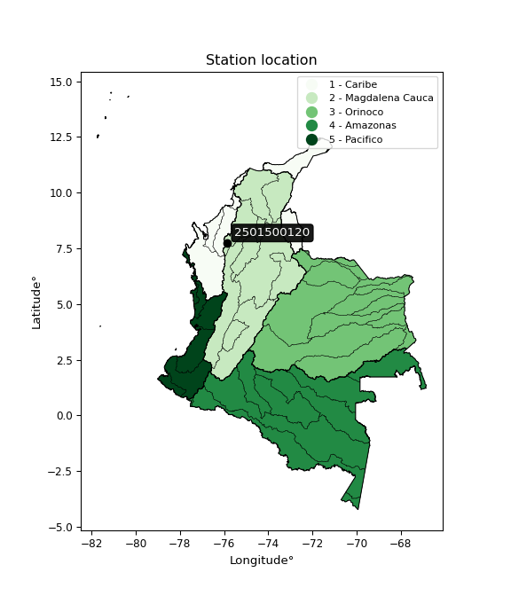

<div align="center">


</div>

# PMax24h Station (Rain, Pmax24h): 2501500120

Maximum Precipitation in 24 hours (PMax24h) is the greatest amount of rainfall for a specific duration that is meteorologically possible for a given location, acting as a "worst-case" scenario for extreme storms, crucial for designing safety-critical infrastructure like bridges, river deviations, dams, spillways, and nuclear plants to prevent catastrophic failure. The PMax24h is related with the Probable Maximum Precipitation (PMP) and it is calculated by hydrologists using meteorological data to determine the upper limit of extreme rainfall, often leading to the Probable Maximum Flood (PMF) for flood control design, and is increasingly being studied for climate change impacts. Probable Maximum Precipitation (PMP) is the theoretical upper limit of rainfall, a deterministic estimate for extreme events, while probability distributions (like GEV, Gumbel) describe the likelihood and frequency of various precipitation amounts, including rare ones, showing how often events occur, with PMP representing the extreme end of these distributions, used for critical infrastructure design to ensure safety against the worst conceivable weather, unlike standard statistical forecasts which cover typical probabilities.

The most common probability distributions in hydrology, used for analyzing floods, rainfall, and streamflow, include the Normal, Log-Normal, Gumbel, Gamma (including Log-Pearson Type III), and Generalized Extreme Value (GEV) distributions, often chosen based on the data´s skewness and whether modeling extremes or general conditions, with Gumbel and GEV popular for extreme events like floods, while the Normal distribution serves as a baseline, though often requiring transformations for skewed hydrological data. These distributions help in designing water infrastructure, managing water resources, and forecasting hydrologic events.

> Hydrological data often isn´t perfectly normal (it´s skewed), so different distributions are needed for different applications, such as: **Flood Frequency Analysis**: Using Gumbel, GEV, or Log-Pearson Type III for predicting extreme flood magnitudes and their return periods, **Rainfall Analysis**: Normal for annual totals, but Log-Normal, Weibull, or GEV for intensity or extreme daily rainfall, **Streamflow Modeling**: Gamma and Log-Normal for maximum flows, GEV for minimum flows, and Kappa for daily flows.

<div align="center">

</img>

</div>


## A. General information


### 1. General running parameters

• app_version: _v20260225_. • runtime: _2026-02-27 14:50:08.749431_. • Python version: _3.14.0_. • SciPy version: _1.16.3_. • Pandas version: _2.3.3_. • NumPy version: _2.3.5_. • Stations dataset (station_dataset_file): _dataset/pmax24h_in/automatic_colombia_2003_2025.csv_. • Stations catalog (station_catalog_file): _dataset/CNE.xls_. • Minimum year to eval til year_max (date_min): _1900_. • Maximum year to eval since year_min (date_max): _2025_. • Creates, save and include plots into reports (create_plot): _False_. • Plot only fit distributions with Δo > Δ (plot_only_fit): _True_. • Plot only simple graphs avoiding multiple CDFs and multiple Extreme values plots (plot_only_simple): _False_. • Eval low extreme values, if False, evaluates high extreme values (low_extreme): _False_. • Eval every SciPy distribution as logarithmic (pdist_logarithmic_on): _True_. • Standard deviation normalized (ddof): _1.0_. • Return periods to eval in years (Tr): _[2, 2.33, 5, 10, 15, 20, 25, 50, 75, 100, 200, 250, 500, 750, 1000]_. • Minimum data sample per station, 0 means any (minimum_sample): _5_. • Z-Score maximum threshold to adjust a value, 0 means disable (zscore_max): _3.5_. • Z-Score minimum threshold to adjust a value, 0 means disable (zscore_min): _-2.5_. • Avoid zeros, e.g. rain = 0 (avoid_zeros): _True_. • Avoid null values (avoid_nans): _True_. 

:file_folder:Table: [dataset.csv](../../dataset/pmax24h_in/automatic_colombia_2003_2025.csv)

> Delta Degrees of Freedom (DDOF): is a parameter used in the formulas for calculating variance and standard deviation. When ddof=0, the divisor is $N$ (the total number of observations) and this is used when your data set is the entire population. When ddof=1, the divisor is $N-1$ and this is used when your data set is a sample drawn from a larger population. Using $N-1$ provides an unbiased estimate of the population variance (known as Bessel´s correction).


### 2. Station info and location

|   id |     CODIGO | NOMBRE                         | CATEGORIA               | TECNOLOGIA                | ESTADO           | FECHA_INSTALACION   |   FECHA_SUSPENSION |   ALTITUD |   LATITUD |   LONGITUD | DEPARTAMENTO   | MUNICIPIO         | AREA_OPERATIVA                              | ENTIDAD                                                     | AREA_HIDROGRAFICA   | ZONA_HIDROGRAFICA                | SUBZONA_HIDROGRAFICA   |   CORRIENTE | Catalogo   |   Version |
|-----:|-----------:|:-------------------------------|:------------------------|:--------------------------|:-----------------|:--------------------|-------------------:|----------:|----------:|-----------:|:---------------|:------------------|:--------------------------------------------|:------------------------------------------------------------|:--------------------|:---------------------------------|:-----------------------|------------:|:-----------|----------:|
|    0 | 2501500120 | JUAN JOSE - AUT   [2501500120] | Climatológica Principal | Automática con Telemetría | En Mantenimiento | 05/05/2017          |                nan |       127 |   7.73019 |   -75.8516 | Cordoba        | Puerto Libertador | Area Operativa 02 - Atlántico-Bolivar-Sucre | INSTITUTO DE HIDROLOGIA METEOROLOGIA Y ESTUDIOS AMBIENTALES | Magdalena Cauca     | Bajo Magdalena- Cauca -San Jorge | Alto San Jorge         |         nan | CNE_IDEAM  |  20251226 |

<div align="center">

Dynamic map: [:earth_americas:Google](http://maps.google.com/maps?q=7.730194444,-75.851580556) [:earth_americas:OSM](https://www.openstreetmap.org/#map=18/7.730194444/-75.851580556&layers=P) [:earth_americas:Bing](https://www.bing.com/maps?cp=7.730194444~-75.851580556&lvl=18) [:earth_americas:Apple](https://maps.apple.com/frame?center=7.730194444%2C-75.851580556&span=0.003%2C0.006)

</div>


<div align="center">

```geojson
{
  "type": "Feature",
  "geometry": {
    "type": "Point", 
    "coordinates": [-75.851580556, 7.730194444]
  }, 
  "properties": {
    "Name": "2501500120"
  }
}
```

</div>


### 3. Discrete values table and plot

<div align="center">

|               |          0 |           1 |           2 |           3 |           4 |
|:--------------|-----------:|------------:|------------:|------------:|------------:|
| Date          | 2019       | 2020        | 2021        | 2022        | 2025        |
| Value         |  177.6     |   84.2      |    0.4      |    3.8      |  111.8      |
| Value_initial |  177.6     |   84.2      |    0.4      |    3.8      |  111.8      |
| count         |    5       |    5        |    5        |    5        |    5        |
| mean          |   75.56    |   75.56     |   75.56     |   75.56     |   75.56     |
| std           |   75.1643  |   75.1643   |   75.1643   |   75.1643   |   75.1643   |
| zscore        |    1.35756 |    0.114948 |   -0.999943 |   -0.954709 |    0.482144 |


</div>


> The initial value (value_initial) correspond to the initial obtained or null completed value, and value (value) is adjusted only when the initial value is outside the valid range (outlier) definite through the Z-Score value. If Z-Score is active, values out of range or outliers are replaced with the station mean value. A Z-Score (or standard score) measures how many standard deviations a data point is from the mean of a dataset, indicating its relative position; positive scores mean above the mean, negative mean below, and a score of zero is exactly at the mean, allowing for comparison of values from different distributions. It´s calculated using the formula $z=(x–μ)/σ$, where $x$ is the data point, $μ$ is the mean, and $σ$ is the standard deviation, helping identify outliers and understand probability.
>
> <sub>**Note**: In this study, "completing" (filling gaps in) and "extending" (forecasting or lengthening the historical record) rainfall data series are avoided for certain critical analyses because they introduce artificial bias and uncertainty, which can distort the statistics of rare events (extremes), alter day-to-day variability, and compromise the integrity and homogeneity of the original data. Some reasons against Completing/Extending rainfall data are: **Distortion of Extremes and Variability**: The primary issue is that most gap-filling or extension methods rely on averaging or regression with nearby stations, which inherently smooths the data. Rainfall is highly variable in space and time, with a large percentage of zero values and occasional large storms. Infilling methods often underestimate the highest values and overestimate the lowest (zero) values, which severely distorts analyses focused on flood frequency, drought severity, and intensity-duration-frequency (IDF) curves, **Loss of Data Homogeneity**: Infilled or extended data are synthetic estimates, not actual measurements. Combining these estimates with observed data can violate the assumption of data homogeneity, which requires that the data properties do not change over time. Inhomogeneity can lead to incorrect conclusions about long-term trends or changes in climate patterns, **Propagation of Errors**: Errors and biases from the original data (e.g., wind-induced undercatch, instrument errors, site changes) or the data used for imputation can propagate through the analysis, leading to unreliable hydrological models and inaccurate predictions, **Compromised Statistical Integrity**: For statistical analyses, especially those involving the frequency of events, using artificial data can introduce time bias or autocorrelation that doesn´t exist in reality, making it difficult to assess the true probability of events, **Difficulty in Validation**: It is difficult to accurately validate the quality of filled or extended data, especially for past periods where ground-truth measurements are unavailable. The reliability of imputation techniques heavily depends on the density of the surrounding station network and the complexity of the local topography.</sub>


### 4. Active continuous probability distributions from SciPy (80 of 104 available)

A Probability Density Function (PDF) describes the relative likelihood of a continuous random variable falling within a specific range, where the total area under its curve equals 1, and the area over any interval gives the actual probability for that range. Unlike discrete probabilities (like rolling a die), a PDF shows density, not direct probability for a single point (which is zero), with higher points indicating higher likelihood, often visualized as a bell curve for normal distributions.

A log of a probability density function (log-PDF) is simply the logarithm of the PDF´s value, denoted as $log(f(x))$, useful for converting multiplication of probabilities into addition, improving numerical stability with tiny numbers, and connecting to information theory concepts like entropy. Instead of dealing with very small probabilities (e.g., 0.000001), log-PDFs use negative numbers (e.g., $log(0.00001) ≈ -11.51$ that are easier for computers to handle, preventing underflow errors and simplifying complex calculations. In this study, each active probability distribution from SciPy is also evaluated in the $log$ form.

[scipy.stats](https://docs.scipy.org/doc/scipy/reference/stats.html) is a Python´s powerful submodule within the SciPy library for comprehensive statistical analysis, offering over 130 probability distributions (like Normal, Poisson, etc.), functions for descriptive stats (mean, variance), hypothesis testing (t-tests, chi-square), random variable generation, and statistical tests, making it essential for data science, modeling, and research. It provides tools to explore, model, and draw conclusions from data efficiently, working seamlessly with [NumPy](https://numpy.org/).

<div align="center">

|   id | p_dist           |   n_parameter | fit_method   | label                                                                       | active   | ref                                                                                                      |
|-----:|:-----------------|--------------:|:-------------|:----------------------------------------------------------------------------|:---------|:---------------------------------------------------------------------------------------------------------|
|    0 | alpha            |             3 | MLE          | Alpha                                                                       | True     | [:mortar_board:](https://docs.scipy.org/doc/scipy/reference/generated/scipy.stats.alpha.html)            |
|    1 | anglit           |             2 | MM           | Anglit                                                                      | True     | [:mortar_board:](https://docs.scipy.org/doc/scipy/reference/generated/scipy.stats.anglit.html)           |
|    2 | arcsine          |             2 | MM           | Arcsine                                                                     | True     | [:mortar_board:](https://docs.scipy.org/doc/scipy/reference/generated/scipy.stats.arcsine.html)          |
|    3 | argus            |             3 | MLE          | Argus                                                                       | True     | [:mortar_board:](https://docs.scipy.org/doc/scipy/reference/generated/scipy.stats.argus.html)            |
|    4 | beta             |             4 | MLE          | Beta                                                                        | True     | [:mortar_board:](https://docs.scipy.org/doc/scipy/reference/generated/scipy.stats.beta.html)             |
|    5 | betaprime        |             4 | MLE          | Beta prime                                                                  | True     | [:mortar_board:](https://docs.scipy.org/doc/scipy/reference/generated/scipy.stats.betaprime.html)        |
|    6 | bradford         |             3 | MLE          | Bradford                                                                    | True     | [:mortar_board:](https://docs.scipy.org/doc/scipy/reference/generated/scipy.stats.bradford.html)         |
|    7 | burr             |             4 | MLE          | Burr (Type III)                                                             | True     | [:mortar_board:](https://docs.scipy.org/doc/scipy/reference/generated/scipy.stats.burr.html)             |
|    8 | burr12           |             4 | MLE          | Burr (Type III) 12                                                          | True     | [:mortar_board:](https://docs.scipy.org/doc/scipy/reference/generated/scipy.stats.burr12.html)           |
|    9 | cosine           |             2 | MLE          | Cosine                                                                      | True     | [:mortar_board:](https://docs.scipy.org/doc/scipy/reference/generated/scipy.stats.cosine.html)           |
|   10 | crystalball      |             4 | MLE          | Crystalball                                                                 | True     | [:mortar_board:](https://docs.scipy.org/doc/scipy/reference/generated/scipy.stats.crystalball.html)      |
|   11 | dgamma           |             3 | MLE          | Double gamma                                                                | True     | [:mortar_board:](https://docs.scipy.org/doc/scipy/reference/generated/scipy.stats.dgamma.html)           |
|   12 | dweibull         |             3 | MLE          | Double Weibull                                                              | True     | [:mortar_board:](https://docs.scipy.org/doc/scipy/reference/generated/scipy.stats.dweibull.html)         |
|   13 | erlang           |             3 | MLE          | Erlang                                                                      | True     | [:mortar_board:](https://docs.scipy.org/doc/scipy/reference/generated/scipy.stats.erlang.html)           |
|   14 | exponnorm        |             3 | MLE          | Exponentially modified Normal                                               | True     | [:mortar_board:](https://docs.scipy.org/doc/scipy/reference/generated/scipy.stats.exponnorm.html)        |
|   15 | exponpow         |             3 | MLE          | Exponential power                                                           | True     | [:mortar_board:](https://docs.scipy.org/doc/scipy/reference/generated/scipy.stats.exponpow.html)         |
|   16 | exponweib        |             4 | MLE          | Exponentiated Weibull                                                       | True     | [:mortar_board:](https://docs.scipy.org/doc/scipy/reference/generated/scipy.stats.exponweib.html)        |
|   17 | f                |             4 | MLE          | F                                                                           | True     | [:mortar_board:](https://docs.scipy.org/doc/scipy/reference/generated/scipy.stats.f.html)                |
|   18 | fatiguelife      |             3 | MLE          | Fatigue-life (Birnbaum-Saunders)                                            | True     | [:mortar_board:](https://docs.scipy.org/doc/scipy/reference/generated/scipy.stats.fatiguelife.html)      |
|   19 | foldnorm         |             3 | MM           | Fold Normal                                                                 | True     | [:mortar_board:](https://docs.scipy.org/doc/scipy/reference/generated/scipy.stats.foldnorm.html)         |
|   20 | gamma            |             3 | MLE          | Gamma                                                                       | True     | [:mortar_board:](https://docs.scipy.org/doc/scipy/reference/generated/scipy.stats.gamma.html)            |
|   21 | gausshyper       |             6 | MLE          | Gauss hypergeometric                                                        | True     | [:mortar_board:](https://docs.scipy.org/doc/scipy/reference/generated/scipy.stats.gausshyper.html)       |
|   22 | genexpon         |             5 | MLE          | Generalized exponential                                                     | True     | [:mortar_board:](https://docs.scipy.org/doc/scipy/reference/generated/scipy.stats.genexpon.html)         |
|   23 | genextreme       |             3 | MLE          | Generalized exponential                                                     | True     | [:mortar_board:](https://docs.scipy.org/doc/scipy/reference/generated/scipy.stats.genextreme.html)       |
|   24 | gengamma         |             4 | MLE          | Generalized gamma                                                           | True     | [:mortar_board:](https://docs.scipy.org/doc/scipy/reference/generated/scipy.stats.gengamma.html)         |
|   25 | genhalflogistic  |             3 | MLE          | Generalized half-logistic                                                   | True     | [:mortar_board:](https://docs.scipy.org/doc/scipy/reference/generated/scipy.stats.genhalflogistic.html)  |
|   26 | genlogistic      |             3 | MLE          | Generalized logistic                                                        | True     | [:mortar_board:](https://docs.scipy.org/doc/scipy/reference/generated/scipy.stats.genlogistic.html)      |
|   27 | gennorm          |             3 | MLE          | Generalized Normal                                                          | True     | [:mortar_board:](https://docs.scipy.org/doc/scipy/reference/generated/scipy.stats.gennorm.html)          |
|   28 | genpareto        |             3 | MLE          | Generalized Pareto                                                          | True     | [:mortar_board:](https://docs.scipy.org/doc/scipy/reference/generated/scipy.stats.genpareto.html)        |
|   29 | gompertz         |             3 | MLE          | Gompertz (or truncated Gumbel)                                              | True     | [:mortar_board:](https://docs.scipy.org/doc/scipy/reference/generated/scipy.stats.gompertz.html)         |
|   30 | gumbel_l         |             2 | MM           | Gumbel Left Skew                                                            | True     | [:mortar_board:](https://docs.scipy.org/doc/scipy/reference/generated/scipy.stats.gumbel_l.html)         |
|   31 | gumbel_r         |             2 | MM           | Gumbel Right Skew                                                           | True     | [:mortar_board:](https://docs.scipy.org/doc/scipy/reference/generated/scipy.stats.gumbel_r.html)         |
|   32 | halfgennorm      |             3 | MLE          | Upper half of a generalized normal                                          | True     | [:mortar_board:](https://docs.scipy.org/doc/scipy/reference/generated/scipy.stats.halfgennorm.html)      |
|   33 | halflogistic     |             2 | MM           | Half-logistic                                                               | True     | [:mortar_board:](https://docs.scipy.org/doc/scipy/reference/generated/scipy.stats.halflogistic.html)     |
|   34 | halfnorm         |             2 | MM           | Half Normal                                                                 | True     | [:mortar_board:](https://docs.scipy.org/doc/scipy/reference/generated/scipy.stats.halfnorm.html)         |
|   35 | hypsecant        |             2 | MM           | hyperbolic secant                                                           | True     | [:mortar_board:](https://docs.scipy.org/doc/scipy/reference/generated/scipy.stats.hypsecant.html)        |
|   36 | invgamma         |             3 | MLE          | Inverted gamma                                                              | True     | [:mortar_board:](https://docs.scipy.org/doc/scipy/reference/generated/scipy.stats.invgamma.html)         |
|   37 | invgauss         |             3 | MLE          | Inverse Gaussian                                                            | True     | [:mortar_board:](https://docs.scipy.org/doc/scipy/reference/generated/scipy.stats.invgauss.html)         |
|   38 | invweibull       |             3 | MLE          | Inverted Weibull                                                            | True     | [:mortar_board:](https://docs.scipy.org/doc/scipy/reference/generated/scipy.stats.invweibull.html)       |
|   39 | johnsonsb        |             4 | MLE          | Johnson SB                                                                  | True     | [:mortar_board:](https://docs.scipy.org/doc/scipy/reference/generated/scipy.stats.johnsonsb.html)        |
|   40 | johnsonsu        |             4 | MLE          | Johnson Su                                                                  | True     | [:mortar_board:](https://docs.scipy.org/doc/scipy/reference/generated/scipy.stats.johnsonsu.html)        |
|   41 | kappa3           |             3 | MLE          | Kappa 3                                                                     | True     | [:mortar_board:](https://docs.scipy.org/doc/scipy/reference/generated/scipy.stats.kappa3.html)           |
|   42 | kappa4           |             4 | MLE          | Kappa 4                                                                     | True     | [:mortar_board:](https://docs.scipy.org/doc/scipy/reference/generated/scipy.stats.kappa4.html)           |
|   43 | ksone            |             3 | MLE          | Kolmogorov-Smirnov one-sided test statistic distribution                    | True     | [:mortar_board:](https://docs.scipy.org/doc/scipy/reference/generated/scipy.stats.ksone.html)            |
|   44 | kstwobign        |             2 | MLE          | Limiting distribution of scaled Kolmogorov-Smirnov two-sided test statistic | True     | [:mortar_board:](https://docs.scipy.org/doc/scipy/reference/generated/scipy.stats.kstwobign.html)        |
|   45 | laplace          |             2 | MM           | Laplace                                                                     | True     | [:mortar_board:](https://docs.scipy.org/doc/scipy/reference/generated/scipy.stats.laplace.html)          |
|   46 | levy_l           |             2 | MLE          | Left-skewed Levy                                                            | True     | [:mortar_board:](https://docs.scipy.org/doc/scipy/reference/generated/scipy.stats.levy_l.html)           |
|   47 | loggamma         |             3 | MLE          | Log gamma                                                                   | True     | [:mortar_board:](https://docs.scipy.org/doc/scipy/reference/generated/scipy.stats.loggamma.html)         |
|   48 | logistic         |             2 | MM           | Logistic (or Sech-squared)                                                  | True     | [:mortar_board:](https://docs.scipy.org/doc/scipy/reference/generated/scipy.stats.logistic.html)         |
|   49 | loglaplace       |             3 | MLE          | Log-Laplace                                                                 | True     | [:mortar_board:](https://docs.scipy.org/doc/scipy/reference/generated/scipy.stats.loglaplace.html)       |
|   50 | lomax            |             3 | MLE          | Lomax (Pareto of the second kind)                                           | True     | [:mortar_board:](https://docs.scipy.org/doc/scipy/reference/generated/scipy.stats.lomax.html)            |
|   51 | maxwell          |             2 | MM           | Maxwell                                                                     | True     | [:mortar_board:](https://docs.scipy.org/doc/scipy/reference/generated/scipy.stats.maxwell.html)          |
|   52 | mielke           |             4 | MLE          | Mielke Beta-Kappa / Dagum                                                   | True     | [:mortar_board:](https://docs.scipy.org/doc/scipy/reference/generated/scipy.stats.mielke.html)           |
|   53 | moyal            |             2 | MM           | Moyal                                                                       | True     | [:mortar_board:](https://docs.scipy.org/doc/scipy/reference/generated/scipy.stats.moyal.html)            |
|   54 | nakagami         |             3 | MLE          | Nakagami                                                                    | True     | [:mortar_board:](https://docs.scipy.org/doc/scipy/reference/generated/scipy.stats.nakagami.html)         |
|   55 | ncf              |             5 | MLE          | Non-central F distribution                                                  | True     | [:mortar_board:](https://docs.scipy.org/doc/scipy/reference/generated/scipy.stats.ncf.html)              |
|   56 | nct              |             4 | MLE          | Non-central Student’s t                                                     | True     | [:mortar_board:](https://docs.scipy.org/doc/scipy/reference/generated/scipy.stats.nct.html)              |
|   57 | norm             |             2 | MM           | Normal                                                                      | True     | [:mortar_board:](https://docs.scipy.org/doc/scipy/reference/generated/scipy.stats.norm.html)             |
|   58 | pearson3         |             3 | MM           | Pearson type III                                                            | True     | [:mortar_board:](https://docs.scipy.org/doc/scipy/reference/generated/scipy.stats.pearson3.html)         |
|   59 | powerlaw         |             3 | MLE          | Power-function                                                              | True     | [:mortar_board:](https://docs.scipy.org/doc/scipy/reference/generated/scipy.stats.powerlaw.html)         |
|   60 | rayleigh         |             2 | MM           | Rayleigh                                                                    | True     | [:mortar_board:](https://docs.scipy.org/doc/scipy/reference/generated/scipy.stats.rayleigh.html)         |
|   61 | rdist            |             3 | MLE          | R-distributed (symmetric beta)                                              | True     | [:mortar_board:](https://docs.scipy.org/doc/scipy/reference/generated/scipy.stats.rdist.html)            |
|   62 | rice             |             3 | MLE          | Rice                                                                        | True     | [:mortar_board:](https://docs.scipy.org/doc/scipy/reference/generated/scipy.stats.rice.html)             |
|   63 | semicircular     |             2 | MM           | Semicircular                                                                | True     | [:mortar_board:](https://docs.scipy.org/doc/scipy/reference/generated/scipy.stats.semicircular.html)     |
|   64 | skewnorm         |             3 | MLE          | Skew normal                                                                 | True     | [:mortar_board:](https://docs.scipy.org/doc/scipy/reference/generated/scipy.stats.skewnorm.html)         |
|   65 | t                |             3 | MLE          | Student’s t                                                                 | True     | [:mortar_board:](https://docs.scipy.org/doc/scipy/reference/generated/scipy.stats.t.html)                |
|   66 | trapezoid        |             4 | MLE          | Trapezoid                                                                   | True     | [:mortar_board:](https://docs.scipy.org/doc/scipy/reference/generated/scipy.stats.trapezoid.html)        |
|   67 | triang           |             3 | MLE          | Triangular                                                                  | True     | [:mortar_board:](https://docs.scipy.org/doc/scipy/reference/generated/scipy.stats.triang.html)           |
|   68 | truncexpon       |             3 | MLE          | Truncated exponential                                                       | True     | [:mortar_board:](https://docs.scipy.org/doc/scipy/reference/generated/scipy.stats.truncexpon.html)       |
|   69 | truncnorm        |             4 | MLE          | Truncated normal                                                            | True     | [:mortar_board:](https://docs.scipy.org/doc/scipy/reference/generated/scipy.stats.truncnorm.html)        |
|   70 | truncpareto      |             4 | MLE          | Upper truncated Pareto                                                      | True     | [:mortar_board:](https://docs.scipy.org/doc/scipy/reference/generated/scipy.stats.truncpareto.html)      |
|   71 | truncweibull_min |             5 | MLE          | Doubly truncated Weibull minimum                                            | True     | [:mortar_board:](https://docs.scipy.org/doc/scipy/reference/generated/scipy.stats.truncweibull_min.html) |
|   72 | tukeylambda      |             3 | MLE          | Tukey-Lamdba                                                                | True     | [:mortar_board:](https://docs.scipy.org/doc/scipy/reference/generated/scipy.stats.tukeylambda.html)      |
|   73 | uniform          |             2 | MLE          | Uniform                                                                     | True     | [:mortar_board:](https://docs.scipy.org/doc/scipy/reference/generated/scipy.stats.uniform.html)          |
|   74 | vonmises         |             3 | MLE          | Von Mises                                                                   | True     | [:mortar_board:](https://docs.scipy.org/doc/scipy/reference/generated/scipy.stats.vonmises.html)         |
|   75 | vonmises_line    |             3 | MLE          | Von Mises line                                                              | True     | [:mortar_board:](https://docs.scipy.org/doc/scipy/reference/generated/scipy.stats.vonmises_line.html)    |
|   76 | wald             |             2 | MM           | Wald                                                                        | True     | [:mortar_board:](https://docs.scipy.org/doc/scipy/reference/generated/scipy.stats.wald.html)             |
|   77 | weibull_max      |             3 | MLE          | Weibull maximum                                                             | True     | [:mortar_board:](https://docs.scipy.org/doc/scipy/reference/generated/scipy.stats.weibull_max.html)      |
|   78 | weibull_min      |             3 | MLE          | Weibull minimum                                                             | True     | [:mortar_board:](https://docs.scipy.org/doc/scipy/reference/generated/scipy.stats.weibull_min.html)      |
|   79 | wrapcauchy       |             3 | MLE          | Wrapped  Cauchy                                                             | True     | [:mortar_board:](https://docs.scipy.org/doc/scipy/reference/generated/scipy.stats.wrapcauchy.html)       |

</div>

> **n_parameter:** # arguments & localization & scale.
>
> **Fit methods:** (MLE) maximum likelihood, (MM) L-moments.
>
>**Inactive** (With the only purpose of prevent loops, zero divisions, infinite values, over high estimated values or horizontal trending for recurrence intervals estimations, the follow distributions were disabled.)**:** lognorm, norminvgauss, powernorm, powerlognorm, cauchy, halfcauchy, foldcauchy, skewcauchy, chi2, expon, fisk, genhyperbolic, geninvgauss, gibrat, kstwo, laplace_asymmetric, levy, levy_stable, ncx2, pareto, rel_breitwigner, recipinvgauss, studentized_range, loguniform, 


## B. Probability (PDF) vs. Empirical (EDF) distributions functions

A continuous probability distribution (CPD) describes probabilities for variables that can take any value within a range (like rain any time), unlike discrete variables with specific outcomes (like temperature). It uses a Probability Density Function (PDF), a curve where the total area under it equals 1, and the probability of the variable falling within an interval (a to b) is found by calculating the area under the curve between those points. A key feature is that the probability of hitting any single exact value is zero, so probabilities are always expressed for ranges, e.g., $P(a ≤ X ≤ b)$.

<div align="center">

Distributions parameters from station values
|     |    station | p_dist              |   n |              loc |           scale | shape                  | shape1                | shape2               | shape3             |
|----:|-----------:|:--------------------|----:|-----------------:|----------------:|:-----------------------|:----------------------|:---------------------|:-------------------|
|   0 | 2501500120 | alpha               |   5 |      0.00168044  |     0.884319    | 2.1721140138416107e-08 |                       |                      |                    |
|   1 | 2501500120 | anglit              |   5 |     75.56        |   196.672       |                        |                       |                      |                    |
|   2 | 2501500120 | arcsine             |   5 |    -19.5161      |   190.152       |                        |                       |                      |                    |
|   3 | 2501500120 | argus               |   5 |    -67.2743      |   259.024       | 4.8699963555353405e-06 |                       |                      |                    |
|   4 | 2501500120 | beta                |   5 |    -14.9938      |   192.594       | 0.6215660235586372     | 0.7322493218186337    |                      |                    |
|   5 | 2501500120 | betaprime           |   5 |      0.4         |    92.1788      | 0.5886449738246962     | 1.6630411418970368    |                      |                    |
|   6 | 2501500120 | bradford            |   5 |      0.399996    |   244.285       | 145.30504303838757     |                       |                      |                    |
|   7 | 2501500120 | burr                |   5 |     -0.311905    |   183.148       | 127.88629572564886     | 0.0036745900466883556 |                      |                    |
|   8 | 2501500120 | burr12              |   5 |      0.4         |   361.806       | 0.48361387765676034    | 2.399685767757556     |                      |                    |
|   9 | 2501500120 | cosine              |   5 |     78.0601      |    54.1055      |                        |                       |                      |                    |
|  10 | 2501500120 | crystalball         |   5 |     75.56        |    67.229       | 6226.711071532154      | 1165.8041448868546    |                      |                    |
|  11 | 2501500120 | dgamma              |   5 |     54.0632      |    13.2333      | 4.765821767445191      |                       |                      |                    |
|  12 | 2501500120 | dweibull            |   5 |     59.4988      |    70.3093      | 2.1697254066991913     |                       |                      |                    |
|  13 | 2501500120 | erlang              |   5 |     -0.192126    |    63.8324      | 1.0075664280840408     |                       |                      |                    |
|  14 | 2501500120 | exponnorm           |   5 |     64.5331      |    66.32        | 0.16626846645632506    |                       |                      |                    |
|  15 | 2501500120 | exponpow            |   5 |      0.4         |   127.911       | 0.5572918442225612     |                       |                      |                    |
|  16 | 2501500120 | exponweib           |   5 |      0.4         |     3.06465     | 1.999411545503829      | 0.20123786992666406   |                      |                    |
|  17 | 2501500120 | f                   |   5 |      0.4         |    40.7421      | 0.48599239165579083    | 2.489080105137492     |                      |                    |
|  18 | 2501500120 | fatiguelife         |   5 |      0.399978    |     0.0685277   | 31.159926438553537     |                       |                      |                    |
|  19 | 2501500120 | foldnorm            |   5 |    -61.3492      |    70.036       | 1.9346453883201626     |                       |                      |                    |
|  20 | 2501500120 | gamma               |   5 |      0.399055    |    58.2986      | 0.5592937718285079     |                       |                      |                    |
|  21 | 2501500120 | gausshyper          |   5 |    -25.1069      |   202.707       | 1.1535691199382554     | 0.864238503873892     | 1.022241911115025    | 1.075943786672892  |
|  22 | 2501500120 | genexpon            |   5 |      0.399979    | 72646.4         | 885.6597252222161      | 1273.673149244117     | 69.76460430326152    |                    |
|  23 | 2501500120 | genextreme          |   5 |      4.89725     |    36.1445      | -8.037023987212784     |                       |                      |                    |
|  24 | 2501500120 | gengamma            |   5 |      0.4         |     0.0107143   | 3.983247945518337      | 0.18551147522438083   |                      |                    |
|  25 | 2501500120 | genhalflogistic     |   5 |    -17.0721      |   208.523       | 1.0711510283448564     |                       |                      |                    |
|  26 | 2501500120 | genlogistic         |   5 |   -345.904       |    56.093       | 1022.0178128219278     |                       |                      |                    |
|  27 | 2501500120 | gennorm             |   5 |     89           |    88.6001      | 16395967.71401899      |                       |                      |                    |
|  28 | 2501500120 | genpareto           |   5 |      0.4         |     8.63667e-11 | 9.625041358360143      |                       |                      |                    |
|  29 | 2501500120 | gompertz            |   5 |      0.4         |   162.183       | 1.3306230051505787     |                       |                      |                    |
|  30 | 2501500120 | gumbel_l            |   5 |    105.817       |    52.4182      |                        |                       |                      |                    |
|  31 | 2501500120 | gumbel_r            |   5 |     45.3034      |    52.4182      |                        |                       |                      |                    |
|  32 | 2501500120 | halfgennorm         |   5 |      0.4         |     3.84137     | 0.3777408197347719     |                       |                      |                    |
|  33 | 2501500120 | halflogistic        |   5 |     -4.12195     |    57.4784      |                        |                       |                      |                    |
|  34 | 2501500120 | halfnorm            |   5 |    -13.4248      |   111.526       |                        |                       |                      |                    |
|  35 | 2501500120 | hypsecant           |   5 |     75.56        |    42.7993      |                        |                       |                      |                    |
|  36 | 2501500120 | invgamma            |   5 |      0.4         |     6.01013e-17 | 0.18728164250022944    |                       |                      |                    |
|  37 | 2501500120 | invgauss            |   5 |     -1.96816     |     8.97499     | 8.638262412768942      |                       |                      |                    |
|  38 | 2501500120 | invweibull          |   5 |      0.4         |     2.77252     | 0.038932150245734126   |                       |                      |                    |
|  39 | 2501500120 | johnsonsb           |   5 |      0.4         |   385.22        | 1.5024632882454145     | 0.1402268965002218    |                      |                    |
|  40 | 2501500120 | johnsonsu           |   5 |      0.4         |     2.1355e-10  | -1.3863416547088425    | 0.12561127391954038   |                      |                    |
|  41 | 2501500120 | kappa3              |   5 |      0.4         |     2.15561     | 0.4311771076019051     |                       |                      |                    |
|  42 | 2501500120 | kappa4              |   5 |    -30.551       |   228.294       | 1.1577451853738707     | 1.0697821062354635    |                      |                    |
|  43 | 2501500120 | ksone               |   5 |    -40.884       |   232.888       | 1.0                    |                       |                      |                    |
|  44 | 2501500120 | kstwobign           |   5 |   -147.605       |   254.525       |                        |                       |                      |                    |
|  45 | 2501500120 | laplace             |   5 |     75.56        |    47.5381      |                        |                       |                      |                    |
|  46 | 2501500120 | levy_l              |   5 |    186.691       |    34.7356      |                        |                       |                      |                    |
|  47 | 2501500120 | loggamma            |   5 | -12006.2         |  1831.78        | 732.4977068341777      |                       |                      |                    |
|  48 | 2501500120 | logistic            |   5 |     75.56        |    37.0653      |                        |                       |                      |                    |
|  49 | 2501500120 | loglaplace          |   5 |     -0.198405    |    84.3984      | 0.5536436322279801     |                       |                      |                    |
|  50 | 2501500120 | lomax               |   5 |      0.4         |     1.38087     | 0.3823357329115211     |                       |                      |                    |
|  51 | 2501500120 | maxwell             |   5 |    -83.7444      |    99.8292      |                        |                       |                      |                    |
|  52 | 2501500120 | mielke              |   5 |      0.4         |   184.618       | 0.3449818195774561     | 847.6495816148966     |                      |                    |
|  53 | 2501500120 | moyal               |   5 |     37.1142      |    30.2637      |                        |                       |                      |                    |
|  54 | 2501500120 | nakagami            |   5 |      0.4         |   141.159       | 0.18681444870135527    |                       |                      |                    |
|  55 | 2501500120 | ncf                 |   5 |      0.4         |    17.2145      | 0.8931326679639642     | 21.34719543222428     | 2.0422054784299366   |                    |
|  56 | 2501500120 | nct                 |   5 |      0.4         |     4.64586e-11 | 0.1204301124625642     | 15.544539457237292    |                      |                    |
|  57 | 2501500120 | norm                |   5 |     75.56        |    67.229       |                        |                       |                      |                    |
|  58 | 2501500120 | pearson3            |   5 |     75.56        |    67.229       | 0.20837941332041499    |                       |                      |                    |
|  59 | 2501500120 | powerlaw            |   5 |      0.4         |   177.2         | 0.10466003376862262    |                       |                      |                    |
|  60 | 2501500120 | rayleigh            |   5 |    -53.0529      |   102.618       |                        |                       |                      |                    |
|  61 | 2501500120 | rdist               |   5 |    -17.6644      |   101.864       | 0.9861354311393891     |                       |                      |                    |
|  62 | 2501500120 | rice                |   5 |    -42.9127      |    87.4774      | 0.651789706515856      |                       |                      |                    |
|  63 | 2501500120 | semicircular        |   5 |     75.56        |   134.458       |                        |                       |                      |                    |
|  64 | 2501500120 | skewnorm            |   5 |      0.399961    |   100.862       | 14053626.97664793      |                       |                      |                    |
|  65 | 2501500120 | t                   |   5 |      0.4         |     6.22387e-14 | 0.2140894915292521     |                       |                      |                    |
|  66 | 2501500120 | trapezoid           |   5 |    -18.186       |   212.64        | 1.0                    | 1.0                   |                      |                    |
|  67 | 2501500120 | triang              |   5 |    -70.4101      |   253.189       | 0.9999999999999103     |                       |                      |                    |
|  68 | 2501500120 | truncexpon          |   5 |      0.399999    |   157.864       | 1.1224843725927574     |                       |                      |                    |
|  69 | 2501500120 | truncnorm           |   5 |    -77.1646      |   124.106       | 0.6249159371712061     | 4.078035129788862     |                      |                    |
|  70 | 2501500120 | truncpareto         |   5 |    -29.7959      |    30.1777      | 9.422389914935748e-05  | 6.872493149068581     |                      |                    |
|  71 | 2501500120 | truncweibull_min    |   5 |    -20.6885      |   235.885       | 1.2006973125961857     | 0.0002685051431871386 | 0.8406156715510974   |                    |
|  72 | 2501500120 | tukeylambda         |   5 |     89.0001      |   118.788       | 1.340719713707397      |                       |                      |                    |
|  73 | 2501500120 | uniform             |   5 |      0.4         |   177.2         |                        |                       |                      |                    |
|  74 | 2501500120 | vonmises            |   5 |      2.48653     |     1           | 0.2603482576031937     |                       |                      |                    |
|  75 | 2501500120 | vonmises_line       |   5 |     89.0146      |    28.2071      | 1.1135735359796636e-05 |                       |                      |                    |
|  76 | 2501500120 | wald                |   5 |      8.33102     |    67.229       |                        |                       |                      |                    |
|  77 | 2501500120 | weibull_max         |   5 |    177.6         |     1.63238     | 0.2376281919818709     |                       |                      |                    |
|  78 | 2501500120 | weibull_min         |   5 |      0.4         |    70.7574      | 0.41948073212377945    |                       |                      |                    |
|  79 | 2501500120 | wrapcauchy          |   5 |      0.399928    |    28.2023      | 0.8853718183537476     |                       |                      |                    |
|  80 | 2501500120 | logalpha            |   5 |    -19.3107      |   188.016       | 8.52159890994248       |                       |                      |                    |
|  81 | 2501500120 | loganglit           |   5 |      2.94963     |     6.90399     |                        |                       |                      |                    |
|  82 | 2501500120 | logarcsine          |   5 |     -0.387973    |     6.67521     |                        |                       |                      |                    |
|  83 | 2501500120 | logargus            |   5 |     -3.64871     |     9.09043     | 2.3507119968055834     |                       |                      |                    |
|  84 | 2501500120 | logbeta             |   5 |     -1.65463     |     6.83416     | 0.34870963741466       | 0.1851836987630801    |                      |                    |
|  85 | 2501500120 | logbetaprime        |   5 |     -0.916291    |     0.989565    | 0.18264147473010825    | 1.5587053495251961    |                      |                    |
|  86 | 2501500120 | logbradford         |   5 |     -0.92948     |     6.10902     | 1.6440555476916578e-05 |                       |                      |                    |
|  87 | 2501500120 | logburr             |   5 |     -0.916291    |     1.01117     | 0.5954429266285662     | 0.21436128801965934   |                      |                    |
|  88 | 2501500120 | logburr12           |   5 |     -0.916291    |     4.7361      | 0.13278592527381494    | 1.8171245835754044    |                      |                    |
|  89 | 2501500120 | logcosine           |   5 |      2.72965     |     1.90334     |                        |                       |                      |                    |
|  90 | 2501500120 | logcrystalball      |   5 |      2.94963     |     2.36002     | 9.864571625521778      | 419.68746937908605    |                      |                    |
|  91 | 2501500120 | logdgamma           |   5 |      2.72641     |     0.247812    | 9.02644977097101       |                       |                      |                    |
|  92 | 2501500120 | logdweibull         |   5 |      2.47127     |     2.55135     | 3.4555934165531994     |                       |                      |                    |
|  93 | 2501500120 | logerlang           |   5 |    -34.577       |     0.157104    | 238.87195904787052     |                       |                      |                    |
|  94 | 2501500120 | logexponnorm        |   5 |      2.94803     |     2.36001     | 0.000683733984072746   |                       |                      |                    |
|  95 | 2501500120 | logexponpow         |   5 |     -0.916291    |     2.45058     | 0.47120481888485893    |                       |                      |                    |
|  96 | 2501500120 | logexponweib        |   5 |     -0.916291    |     3.17858     | 0.6312578849271322     | 0.18436048747946565   |                      |                    |
|  97 | 2501500120 | logf                |   5 |     -0.916291    |     1.11278     | 1.1431061326327936     | 1.1162479298840178    |                      |                    |
|  98 | 2501500120 | logfatiguelife      |   5 |     -0.916291    |     3.28986e-07 | 3367.3775930666443     |                       |                      |                    |
|  99 | 2501500120 | logfoldnorm         |   5 |    -13.5078      |     2.1474      | 7.6841461452694535     |                       |                      |                    |
| 100 | 2501500120 | loggamma            |   5 |    -30.9711      |     0.168741    | 201.01353155517904     |                       |                      |                    |
| 101 | 2501500120 | loggausshyper       |   5 |     -1.60823     |     6.78777     | 1.1882613683294942     | 0.5492731793891514    | 1.1156120831698924   | 0.9849961220784582 |
| 102 | 2501500120 | loggenexpon         |   5 |     -0.916296    |     1.05647     | 0.13850048742710513    | 4.110169098855052     | 0.013042945469766833 |                    |
| 103 | 2501500120 | loggenextreme       |   5 |      3.81687     |     1.72876     | 1.2686553399336864     |                       |                      |                    |
| 104 | 2501500120 | loggengamma         |   5 |     -0.916291    |     2.32051     | 2.1237818901349783     | -0.04329215088975233  |                      |                    |
| 105 | 2501500120 | loggenhalflogistic  |   5 |     -2.166       |     8.21134     | 1.117869753985318      |                       |                      |                    |
| 106 | 2501500120 | loggenlogistic      |   5 |      5.17974     |     1.85359e-05 | 8.389077999069555e-06  |                       |                      |                    |
| 107 | 2501500120 | loggennorm          |   5 |      4.71671     |     0.0524117   | 0.36714502740271593    |                       |                      |                    |
| 108 | 2501500120 | loggenpareto        |   5 |     -0.994636    |    13.4342      | -2.175872364098503     |                       |                      |                    |
| 109 | 2501500120 | loggompertz         |   5 |     -0.916298    |     2.26746     | 0.13899673622311975    |                       |                      |                    |
| 110 | 2501500120 | loggumbel_l         |   5 |      4.01176     |     1.8401      |                        |                       |                      |                    |
| 111 | 2501500120 | loggumbel_r         |   5 |      1.8875      |     1.8401      |                        |                       |                      |                    |
| 112 | 2501500120 | loghalfgennorm      |   5 |     -0.916291    |     1.52922     | 0.6278751729661431     |                       |                      |                    |
| 113 | 2501500120 | loghalflogistic     |   5 |      0.152483    |     2.01771     |                        |                       |                      |                    |
| 114 | 2501500120 | loghalfnorm         |   5 |     -0.174144    |     3.91507     |                        |                       |                      |                    |
| 115 | 2501500120 | loghypsecant        |   5 |      2.94963     |     1.50243     |                        |                       |                      |                    |
| 116 | 2501500120 | loginvgamma         |   5 |    -40.5523      | 13888.4         | 320.1040613201901      |                       |                      |                    |
| 117 | 2501500120 | loginvgauss         |   5 |    -15.7425      |  1054.74        | 0.01766578110983823    |                       |                      |                    |
| 118 | 2501500120 | loginvweibull       |   5 |     -2.51375e+08 |     2.51375e+08 | 107976517.2159918      |                       |                      |                    |
| 119 | 2501500120 | logjohnsonsb        |   5 |     -3.35153     |     8.53106     | -1.0869159014237104    | 0.1453569587346668    |                      |                    |
| 120 | 2501500120 | logjohnsonsu        |   5 |      5.17953     |     3.0547e-15  | 2.77996058559701       | 0.1224094408266469    |                      |                    |
| 121 | 2501500120 | logkappa3           |   5 |     -0.916291    |     1.84244     | 0.11316635308429164    |                       |                      |                    |
| 122 | 2501500120 | logkappa4           |   5 |     -1.14413     |     7.22114     | 0.997579727476896      | 1.141922797484444     |                      |                    |
| 123 | 2501500120 | logksone            |   5 |     -1.13804     |     8.17534     | 1.0                    |                       |                      |                    |
| 124 | 2501500120 | logkstwobign        |   5 |     -6.52521     |    10.7825      |                        |                       |                      |                    |
| 125 | 2501500120 | loglaplace          |   5 |      2.94963     |     1.66878     |                        |                       |                      |                    |
| 126 | 2501500120 | loglevy_l           |   5 |      5.27274     |     0.353736    |                        |                       |                      |                    |
| 127 | 2501500120 | logloggamma         |   5 |      5.17978     |     6.85758e-06 | 3.0902424999685066e-06 |                       |                      |                    |
| 128 | 2501500120 | loglogistic         |   5 |      2.94963     |     1.30115     |                        |                       |                      |                    |
| 129 | 2501500120 | logloglaplace       |   5 |     -0.916291    |     1.79739     | 0.12172301580505249    |                       |                      |                    |
| 130 | 2501500120 | loglomax            |   5 |     -0.916291    |     4.55994e+12 | 1046693793914.572      |                       |                      |                    |
| 131 | 2501500120 | logmaxwell          |   5 |     -2.64262     |     3.50442     |                        |                       |                      |                    |
| 132 | 2501500120 | logmielke           |   5 |     -0.916291    |     1.84964     | 0.12754250293998762    | 1.0694748520640527    |                      |                    |
| 133 | 2501500120 | logmoyal            |   5 |      1.60002     |     1.06238     |                        |                       |                      |                    |
| 134 | 2501500120 | lognakagami         |   5 |     -0.916291    |     5.14759     | 0.3677012571568026     |                       |                      |                    |
| 135 | 2501500120 | logncf              |   5 |     -0.916291    |     1.14606     | 1.0561690862491309     | 1.1574276366497083    | 1.0713623099606246   |                    |
| 136 | 2501500120 | lognct              |   5 |   -139.911       |     2.318       | 49506.559044372625     | 61.62997241372818     |                      |                    |
| 137 | 2501500120 | lognorm             |   5 |      2.94963     |     2.36002     |                        |                       |                      |                    |
| 138 | 2501500120 | logpearson3         |   5 |      2.94963     |     2.36004     | -0.6408139847824522    |                       |                      |                    |
| 139 | 2501500120 | logpowerlaw         |   5 |     -0.916291    |     6.09582     | 0.12578594341314436    |                       |                      |                    |
| 140 | 2501500120 | lograyleigh         |   5 |     -1.56522     |     3.60233     |                        |                       |                      |                    |
| 141 | 2501500120 | logrdist            |   5 |     -0.59101     |     1.92601     | 1.31532027153815       |                       |                      |                    |
| 142 | 2501500120 | logrice             |   5 |     -2.39807     |     2.64375     | 1.6995614120674438     |                       |                      |                    |
| 143 | 2501500120 | logsemicircular     |   5 |      2.94963     |     4.72003     |                        |                       |                      |                    |
| 144 | 2501500120 | logskewnorm         |   5 |      5.17953     |     3.24693     | -14370415.303590853    |                       |                      |                    |
| 145 | 2501500120 | logt                |   5 |      2.94963     |     2.36002     | 9876661167.534735      |                       |                      |                    |
| 146 | 2501500120 | logtrapezoid        |   5 |     -3.91178     |    10.0127      | 1.0                    | 1.0                   |                      |                    |
| 147 | 2501500120 | logtriang           |   5 |     -4.08237     |     9.26194     | 0.9999999455981593     |                       |                      |                    |
| 148 | 2501500120 | logtruncexpon       |   5 |     -0.928159    |     7.86635     | 0.7764326053919446     |                       |                      |                    |
| 149 | 2501500120 | logtruncnorm        |   5 |      1.45747     |     5.69866     | -0.41951780341714606   | 0.6531481207516805    |                      |                    |
| 150 | 2501500120 | logtruncpareto      |   5 |     -0.965207    |     0.037824    | 9.223894607926722e-08  | 162.4562942247323     |                      |                    |
| 151 | 2501500120 | logtruncweibull_min |   5 |     -1.05065     |    11.1374      | 1.1227445724882426     | 0.0004354542275577914 | 0.5593948794297243   |                    |
| 152 | 2501500120 | logtukeylambda      |   5 |      2.13162     |     3.84074     | 1.2601217436386944     |                       |                      |                    |
| 153 | 2501500120 | loguniform          |   5 |     -0.916291    |     6.09582     |                        |                       |                      |                    |
| 154 | 2501500120 | logvonmises         |   5 |     -1.20605     |     1           | 1.4085728835867344     |                       |                      |                    |
| 155 | 2501500120 | logvonmises_line    |   5 |      2.08244     |     0.985847    | 1.1715682998836746e-05 |                       |                      |                    |
| 156 | 2501500120 | logwald             |   5 |      0.58965     |     2.35999     |                        |                       |                      |                    |
| 157 | 2501500120 | logweibull_max      |   5 |      5.17953     |     2.66101     | 0.19863288639481397    |                       |                      |                    |
| 158 | 2501500120 | logweibull_min      |   5 |     -2.17757e+08 |     2.17757e+08 | 128967825.78231525     |                       |                      |                    |
| 159 | 2501500120 | logwrapcauchy       |   5 |     -0.916291    |     0.970181    | 0.7038417317983385     |                       |                      |                    |

</div>

> **loc** (Location parameter): This shifts the distribution along the x-axis. For many common distributions, like the normal (Gaussian) distribution, loc represents the mean $μ$. For others, like the uniform distribution, it might represent the minimum value, or for the beta distribution, the left end of the support interval.
>
> **scale** (Scale parameter): This determines the width or spread of the distribution. For the normal distribution, scale represents the standard deviation $σ$. For a uniform distribution, it defines the length of the interval (from $loc$ to $loc + scale$).
>
> **shape** (Shape parameters): Refers to parameters that define the specific form of a probability distribution, distinct from its location (loc) and scale (scale). These parameters are required arguments for most distribution functions. For example, a normal (Gaussian) distribution is fully defined by its location (mean) and scale (standard deviation), so it has no specific shape parameters beyond loc and scale. However, other distributions have intrinsic properties that need specification, as Gamma distribution that takes a shape parameter, often named $a$ or $alpha$.


### 0. Cumulative distribution values - CDF (160 evaluated)

Cumulative Distribution Function (CDF), denoted as $F$<sub>$X$</sub>$(x)$, is a function that gives the probability that a random variable $X$ will take a value less than or equal to a specific value, $x$ (i.e., $(P(X≥x)$. It essentially "accumulates" probabilities from a given point up to the far right (positive infinity), providing a complete picture of the distribution´s probabilities for both discrete (like rain) and continuous (like temperature) variables, helping to find probabilities over ranges or above certain values. Each station is evaluated separately ordering the $x$ values ascending, calculating the CDF and PDF values for the activated distributions and their logarithmic forms.

<div align="center">

CDF ordered by x ascending and calculating $log(f(x))$ separately
|   id |    Station |   date |     x |   count |   mean |     std |    zscore |   Value_initial |    station |   m |     alpha |   alpha_pdf |   anglit |   anglit_pdf |   arcsine |   arcsine_pdf |    argus |   argus_pdf |     beta |    beta_pdf |   betaprime |   betaprime_pdf |    bradford |   bradford_pdf |     burr |     burr_pdf |     burr12 |   burr12_pdf |   cosine |   cosine_pdf |   crystalball |   crystalball_pdf |   dgamma |   dgamma_pdf |   dweibull |   dweibull_pdf |     erlang |   erlang_pdf |   exponnorm |   exponnorm_pdf |    exponpow |    exponpow_pdf |   exponweib |   exponweib_pdf |           f |       f_pdf |   fatiguelife |   fatiguelife_pdf |   foldnorm |   foldnorm_pdf |      gamma |   gamma_pdf |   gausshyper |   gausshyper_pdf |    genexpon |   genexpon_pdf |   genextreme |   genextreme_pdf |   gengamma |    gengamma_pdf |   genhalflogistic |   genhalflogistic_pdf |   genlogistic |   genlogistic_pdf |     gennorm |   gennorm_pdf |   genpareto |   genpareto_pdf |    gompertz |   gompertz_pdf |   gumbel_l |   gumbel_l_pdf |   gumbel_r |   gumbel_r_pdf |   halfgennorm |   halfgennorm_pdf |   halflogistic |   halflogistic_pdf |   halfnorm |   halfnorm_pdf |   hypsecant |   hypsecant_pdf |   invgamma |   invgamma_pdf |   invgauss |   invgauss_pdf |   invweibull |   invweibull_pdf |   johnsonsb |   johnsonsb_pdf |   johnsonsu |   johnsonsu_pdf |      kappa3 |   kappa3_pdf |      kappa4 |   kappa4_pdf |    ksone |   ksone_pdf |   kstwobign |   kstwobign_pdf |   laplace |   laplace_pdf |   levy_l |   levy_l_pdf |   loggamma |   loggamma_pdf |   logistic |   logistic_pdf |   loglaplace |   loglaplace_pdf |       lomax |   lomax_pdf |   maxwell |   maxwell_pdf |      mielke |   mielke_pdf |     moyal |   moyal_pdf |    nakagami |   nakagami_pdf |        ncf |     ncf_pdf |      nct |     nct_pdf |     norm |   norm_pdf |   pearson3 |   pearson3_pdf |   powerlaw |   powerlaw_pdf |   rayleigh |   rayleigh_pdf |    rdist |       rdist_pdf |      rice |   rice_pdf |   semicircular |   semicircular_pdf |   skewnorm |   skewnorm_pdf |        t |       t_pdf |   trapezoid |   trapezoid_pdf |    triang |   triang_pdf |   truncexpon |   truncexpon_pdf |   truncnorm |   truncnorm_pdf |   truncpareto |   truncpareto_pdf |   truncweibull_min |   truncweibull_min_pdf |   tukeylambda |   tukeylambda_pdf |   uniform |   uniform_pdf |   vonmises |   vonmises_pdf |   vonmises_line |   vonmises_line_pdf |     wald |    wald_pdf |   weibull_max |   weibull_max_pdf |   weibull_min |   weibull_min_pdf |   wrapcauchy |   wrapcauchy_pdf |   logalpha |   logalpha_pdf |   loganglit |   loganglit_pdf |   logarcsine |   logarcsine_pdf |   logargus |   logargus_pdf |   logbeta |   logbeta_pdf |   logbetaprime |   logbetaprime_pdf |   logbradford |   logbradford_pdf |   logburr |   logburr_pdf |   logburr12 |   logburr12_pdf |   logcosine |   logcosine_pdf |   logcrystalball |   logcrystalball_pdf |   logdgamma |   logdgamma_pdf |   logdweibull |   logdweibull_pdf |   logerlang |   logerlang_pdf |   logexponnorm |   logexponnorm_pdf |   logexponpow |   logexponpow_pdf |   logexponweib |   logexponweib_pdf |        logf |   logf_pdf |   logfatiguelife |   logfatiguelife_pdf |   logfoldnorm |   logfoldnorm_pdf |   loggausshyper |   loggausshyper_pdf |   loggenexpon |   loggenexpon_pdf |   loggenextreme |   loggenextreme_pdf |   loggengamma |   loggengamma_pdf |   loggenhalflogistic |   loggenhalflogistic_pdf |   loggenlogistic |   loggenlogistic_pdf |   loggennorm |   loggennorm_pdf |   loggenpareto |   loggenpareto_pdf |   loggompertz |   loggompertz_pdf |   loggumbel_l |   loggumbel_l_pdf |   loggumbel_r |   loggumbel_r_pdf |   loghalfgennorm |   loghalfgennorm_pdf |   loghalflogistic |   loghalflogistic_pdf |   loghalfnorm |   loghalfnorm_pdf |   loghypsecant |   loghypsecant_pdf |   loginvgamma |   loginvgamma_pdf |   loginvgauss |   loginvgauss_pdf |   loginvweibull |   loginvweibull_pdf |   logjohnsonsb |   logjohnsonsb_pdf |   logjohnsonsu |   logjohnsonsu_pdf |   logkappa3 |   logkappa3_pdf |   logkappa4 |   logkappa4_pdf |   logksone |   logksone_pdf |   logkstwobign |   logkstwobign_pdf |   loglevy_l |   loglevy_l_pdf |   logloggamma |   logloggamma_pdf |   loglogistic |   loglogistic_pdf |   logloglaplace |   logloglaplace_pdf |   loglomax |   loglomax_pdf |   logmaxwell |   logmaxwell_pdf |   logmielke |   logmielke_pdf |   logmoyal |   logmoyal_pdf |   lognakagami |   lognakagami_pdf |      logncf |   logncf_pdf |    lognct |   lognct_pdf |   lognorm |   lognorm_pdf |   logpearson3 |   logpearson3_pdf |   logpowerlaw |   logpowerlaw_pdf |   lograyleigh |   lograyleigh_pdf |   logrdist |   logrdist_pdf |   logrice |   logrice_pdf |   logsemicircular |   logsemicircular_pdf |   logskewnorm |   logskewnorm_pdf |      logt |   logt_pdf |   logtrapezoid |   logtrapezoid_pdf |   logtriang |   logtriang_pdf |   logtruncexpon |   logtruncexpon_pdf |   logtruncnorm |   logtruncnorm_pdf |   logtruncpareto |   logtruncpareto_pdf |   logtruncweibull_min |   logtruncweibull_min_pdf |   logtukeylambda |   logtukeylambda_pdf |   loguniform |   loguniform_pdf |   logvonmises |   logvonmises_pdf |   logvonmises_line |   logvonmises_line_pdf |   logwald |   logwald_pdf |   logweibull_max |   logweibull_max_pdf |   logweibull_min |   logweibull_min_pdf |   logwrapcauchy |   logwrapcauchy_pdf |
|-----:|-----------:|-------:|------:|--------:|-------:|--------:|----------:|----------------:|-----------:|----:|----------:|------------:|---------:|-------------:|----------:|--------------:|---------:|------------:|---------:|------------:|------------:|----------------:|------------:|---------------:|---------:|-------------:|-----------:|-------------:|---------:|-------------:|--------------:|------------------:|---------:|-------------:|-----------:|---------------:|-----------:|-------------:|------------:|----------------:|------------:|----------------:|------------:|----------------:|------------:|------------:|--------------:|------------------:|-----------:|---------------:|-----------:|------------:|-------------:|-----------------:|------------:|---------------:|-------------:|-----------------:|-----------:|----------------:|------------------:|----------------------:|--------------:|------------------:|------------:|--------------:|------------:|----------------:|------------:|---------------:|-----------:|---------------:|-----------:|---------------:|--------------:|------------------:|---------------:|-------------------:|-----------:|---------------:|------------:|----------------:|-----------:|---------------:|-----------:|---------------:|-------------:|-----------------:|------------:|----------------:|------------:|----------------:|------------:|-------------:|------------:|-------------:|---------:|------------:|------------:|----------------:|----------:|--------------:|---------:|-------------:|-----------:|---------------:|-----------:|---------------:|-------------:|-----------------:|------------:|------------:|----------:|--------------:|------------:|-------------:|----------:|------------:|------------:|---------------:|-----------:|------------:|---------:|------------:|---------:|-----------:|-----------:|---------------:|-----------:|---------------:|-----------:|---------------:|---------:|----------------:|----------:|-----------:|---------------:|-------------------:|-----------:|---------------:|---------:|------------:|------------:|----------------:|----------:|-------------:|-------------:|-----------------:|------------:|----------------:|--------------:|------------------:|-------------------:|-----------------------:|--------------:|------------------:|----------:|--------------:|-----------:|---------------:|----------------:|--------------------:|---------:|------------:|--------------:|------------------:|--------------:|------------------:|-------------:|-----------------:|-----------:|---------------:|------------:|----------------:|-------------:|-----------------:|-----------:|---------------:|----------:|--------------:|---------------:|-------------------:|--------------:|------------------:|----------:|--------------:|------------:|----------------:|------------:|----------------:|-----------------:|---------------------:|------------:|----------------:|--------------:|------------------:|------------:|----------------:|---------------:|-------------------:|--------------:|------------------:|---------------:|-------------------:|------------:|-----------:|-----------------:|---------------------:|--------------:|------------------:|----------------:|--------------------:|--------------:|------------------:|----------------:|--------------------:|--------------:|------------------:|---------------------:|-------------------------:|-----------------:|---------------------:|-------------:|-----------------:|---------------:|-------------------:|--------------:|------------------:|--------------:|------------------:|--------------:|------------------:|-----------------:|---------------------:|------------------:|----------------------:|--------------:|------------------:|---------------:|-------------------:|--------------:|------------------:|--------------:|------------------:|----------------:|--------------------:|---------------:|-------------------:|---------------:|-------------------:|------------:|----------------:|------------:|----------------:|-----------:|---------------:|---------------:|-------------------:|------------:|----------------:|--------------:|------------------:|--------------:|------------------:|----------------:|--------------------:|-----------:|---------------:|-------------:|-----------------:|------------:|----------------:|-----------:|---------------:|--------------:|------------------:|------------:|-------------:|----------:|-------------:|----------:|--------------:|--------------:|------------------:|--------------:|------------------:|--------------:|------------------:|-----------:|---------------:|----------:|--------------:|------------------:|----------------------:|--------------:|------------------:|----------:|-----------:|---------------:|-------------------:|------------:|----------------:|----------------:|--------------------:|---------------:|-------------------:|-----------------:|---------------------:|----------------------:|--------------------------:|-----------------:|---------------------:|-------------:|-----------------:|--------------:|------------------:|-------------------:|-----------------------:|----------:|--------------:|-----------------:|---------------------:|-----------------:|---------------------:|----------------:|--------------------:|
|    0 | 2501500120 |   2021 |   0.4 |       5 |  75.56 | 75.1643 | -0.999943 |             0.4 | 2501500120 |   1 | 0.0264103 | 0.378248    | 0.153977 |   0.00367035 |  0.209808 |    0.00546666 | 0.100623 |  0.00292087 | 0.166797 |  0.00682893 | 2.29643e-09 | 12449.7         | 5.17851e-07 |     0.119304   | 0.07367  | nan          | 1.9116e-09 |  1.66539e+07 | 0.11386  |   0.00333878 |      0.13179  |        0.00317651 | 0.287273 |  0.00751797  |   0.251791 |     0.00634156 | 0.00888333 |  0.0150462   |    0.131657 |      0.00318388 | 5.84405e-11 | 586700          | 1.83463e-07 |     1.3295e+09  | 0.000188494 | 6.29863e+08 |     0.0362488 |    3267.74        |   0.143749 |     0.00338008 | 0.00235258 | 1.39306     |     0.115038 |       0.00494558 | 2.50367e-07 |     0.0121914  |  0.000101809 |   1433.11        | 1.1852e-12 | 15769.8         |         0.0438673 |            0.00262917 |      0.119184 |        0.00451484 | 4.52714e-07 |    0.00564333 |   0.0680639 |     5.47495e+09 | 1.91759e-13 |     0.00820446 |   0.125275 |     0.00223354 |   0.094872 |     0.00426274 |   4.53887e-12 |       0.0663419   |      0.0393158 |         0.00868548 |  0.0986535 |     0.0070995  |    0.108881 |      0.00249466 |   0.104607 |    9.49517e+14 |  0.0578172 |    0.0552537   |    0.0114708 |      3.59443e+13 |  2.3126e-06 |     2.79377e+10 |   0.0864306 |     9.11121e+07 | 3.38819e-14 |  3.26396     | 1.65675e-14 |   0.660375   | 0.17727  |  0.00429391 |    0.112205 |      0.00477387 |  0.10288  |    0.00216415 | 0.334119 |  0.000842404 |  0.0487245 |      0.0457883 |   0.116318 |     0.00277316 |    0.0493036 |        0.0295447 | 3.01471e-10 | 0.276879    |  0.129257 |    0.00398056 | 6.00996e-06 |  1.53073e+07 | 0.0666344 |  0.00449704 | 1.05318e-07 |    7.08861e+08 | 1.1558e-08 | 1.0331e+07  | 0.064984 | 2.47975e+08 | 0.13179  | 0.00317651 |   0.129343 |     0.00340592 |  0.0115708 |    2.18154e+13 |   0.126864 |     0.00443204 | 0.556206 |      0.00314524 | 0.0944798 | 0.00415502 |       0.163655 |         0.00392592 |  0         |     0.00791066 | 0.498734 | 3.25687e+12 |   0.0076398 |     0.000822103 | 0.0782167 |   0.0022092  |  1.40626e-08 |       0.00939108 | 8.43336e-05 |      0.00994102 |    0.00031287 |        0.0171827  |          0.0962863 |             0.00533774 |   7.74492e-13 |        0.00841774 | 0         |    0.00564334 |   0.133319 |       0.137635 |     3.58464e-06 |          0.00564231 | 0        | 0           |     0.04755   |       0.000194227 |   2.54178e-08 |       1.92074e+08 |  6.64531e-06 |      0.09282     |  0.0445862 |      0.0522807 |   0.0499695 |       0.0631177 |     0        |         0        |  0.0379645 |      0.030682  |  0.176587 |   0.0893853   |      0.0013644 |        2.24456e+12 |    0.00215897 |          0.163694 | 0.0091821 |   1.05565e+13 |   0.0111527 |     1.32234e+13 |   0.0453411 |       0.0553588 |        0.0507014 |            0.0441891 |   0.0222419 |       0.0457214 |      0.034855 |         0.0946977 |   0.0516506 |       0.0468758 |      0.0507003 |          0.0441884 |   1.98928e-08 |       8.44296e+07 |      0.0121519 |        1.27323e+13 | 4.80313e-10 | 2.4727e+06 |        0.0555978 |          7.81396e+12 |     0.0343404 |         0.0354252 |       0.0567363 |         0.0949834   |   6.80081e-07 |         0.131098  |       0.0384916 |           0.0162125 |      0.04445  |       7.19573e+13 |            0.0832192 |                0.0728665 |         0        |            0.0286742 |    0.0315118 |       0.00848482 |     0.00585193 |        0.0749523   |   4.16701e-07 |         0.0613008 |     0.0663841 |         0.0348516 |     0.0101604 |         0.0253404 |       9.5469e-11 |            0.45993   |          0        |             0         |      0        |         0         |       0.048479 |          0.0321424 |     0.0483426 |         0.0467115 |     0.0483771 |         0.0514283 |        0.047643 |           0.0622952 |       0.111178 |        0.0158278   |      0.052903  |        0.00216613  |    0        |     1.24876e+08 |   0.0336899 |        0.137978 |  0.0271239 |       0.122319 |      0.0504532 |          0.0730267 |    0.18895  |       0.0149763 |     0.0641146 |         0.0288921 |     0.0487455 |         0.0356374 |      0.00532027 |         5.83305e+12 | 3.7742e-14 |      0.229541  |    0.0295762 |        0.0489376 |  0.00853192 |     9.80147e+12 | 0.00108183 |     0.00588017 |   4.31244e-13 |      2856.52      | 1.35244e-09 |  6.43297e+06 | 0.0507702 |    0.0442849 | 0.0507014 |     0.0441891 |     0.0643466 |         0.0403194 |    0.00784135 |       8.88409e+12 |     0.0160945 |         0.0492021 |   0.435088 |       0.200882 | 0.0382246 |      0.053007 |         0.0449267 |             0.0773823 |     0.0604619 |         0.0421788 | 0.0507015 |  0.0441892 |       0.089502 |          0.0597579 |    0.116853 |       0.0738156 |      0.00279216 |            0.235079 |     0.00267657 |           0.158198 |        0.0505184 |            4.01604   |             0.0168083 |                  0.143419 |      3.31237e-09 |             0.258755 |     0        |         0.164047 |      0.618501 |         0.393228  |          0.0158855 |               0.161438 |  0        |     0         |         0.307594 |           0.0118168  |        0.0519915 |            0.0299776 |      5.8709e-11 |            0.943785 |
|    1 | 2501500120 |   2022 |   3.8 |       5 |  75.56 | 75.1643 | -0.954709 |             3.8 | 2501500120 |   2 | 0.815902  | 0.0475988   | 0.16666  |   0.00378979 |  0.227751 |    0.00510361 | 0.110784 |  0.00305602 | 0.189189 |  0.00636513 | 0.195957    |     0.0322256   | 0.221844    |     0.0394738  | 0.167957 |   0.019195   | 0.212447   |  0.0254652   | 0.125523 |   0.00352104 |      0.142896 |        0.00335699 | 0.313003 |  0.00759686  |   0.273516 |     0.00642743 | 0.0591692  |  0.0144732   |    0.14279  |      0.0033651  | 0.132043    |      0.0215104  | 0.409461    |     0.0278552   | 0.393527    | 0.0275863   |     0.587647  |       0.0132015   |   0.155502 |     0.00353373 | 0.224694   | 0.0355892   |     0.131904 |       0.00497398 | 0.0406968   |     0.0117501  |  0.35508     |      0.0134544   | 0.336192   |     0.0356488   |         0.0528895 |            0.00267826 |      0.13505  |        0.00481558 | 0.5         |    0.00564334 |   0.937333  |     0.00191496  | 0.027796    |     0.00814539 |   0.133086 |     0.00236193 |   0.109996 |     0.0046319  |   0.11513     |       0.0255329   |      0.0688036 |         0.00865774 |  0.122742  |     0.00706943 |    0.117687 |      0.00268752 |   0.999209 |    4.35511e-05 |  0.237697  |    0.0443001   |    0.370801  |      0.00421232  |  0.799666   |     0.011661    |   0.950677  |     0.00376909  | 0.49494     |  0.0380797   | 0.0302641   |   0.00769314 | 0.191869 |  0.00429391 |    0.128978 |      0.00508821 |  0.110507 |    0.00232461 | 0.337021 |  0.000864504 |  0.254086  |      0.138382  |   0.126083 |     0.00297276 |    0.190007  |        0.113859  | 0.378006    | 0.049742    |  0.14314  |    0.00418439 | 0.252073    |  0.0255767   | 0.082928  |  0.00508343 | 0.197078    |    0.0216551   | 0.140668   | 0.0198075   | 0.940384 | 0.00211162  | 0.142896 | 0.00335699 |   0.14126  |     0.0036036  |  0.66115   |    0.0203518   |   0.142274 |     0.00463076 | 0.566935 |      0.00316678 | 0.109046  | 0.0044109  |       0.177137 |         0.00400403 |  0.0268915 |     0.00790617 | 0.999574 | 2.67938e-05 |   0.0106906 |     0.000972493 | 0.0859083 |   0.00231527 |  0.0315883   |       0.00919098 | 0.0335919   |      0.00976859 |    0.0556724  |        0.0154436  |          0.114617  |             0.00544107 |   0.0237625   |        0.0066208  | 0.0191874 |    0.00564334 |   0.74941  |       0.167212 |     0.0191874   |          0.00564231 | 0        | 0           |     0.0482199 |       0.000199895 |   0.24414     |       0.0261021   |  0.24883     |      0.0469216   |  0.279208  |      0.14828   |   0.274566  |       0.129286  |     0.339267 |         0.108971 |  0.161452  |      0.0877135 |  0.31511  |   0.0523376   |      0.97546   |        0.0133438   |    0.37068    |          0.163693 | 0.901647  |   0.0195819   |   0.690261  |     0.0157797   |   0.276922  |       0.145776  |        0.246937  |            0.133769  |   0.443117  |       0.178126  |      0.470362 |         0.087409  |   0.256703  |       0.136649  |      0.246934  |          0.133768  |   0.800878    |       0.104669    |      0.731007  |        0.0227917   | 0.616168    | 0.0717598  |        0.781376  |          0.0509023   |     0.220018  |         0.137891  |       0.296383  |         0.114893    |   0.340148    |         0.156874  |       0.103833  |           0.0482181 |      0.767928 |       0.00669117  |            0.281754  |                0.107106  |         0        |            0.0794322 |    0.0626227 |       0.0219704  |     0.195646   |        0.0961546   |   0.21034     |         0.130649  |     0.208222  |         0.100462  |     0.259188  |         0.190183  |       0.500108   |            0.128538  |          0.284925 |             0.227688  |      0.300111 |         0.189206  |       0.209448 |          0.129562  |     0.257273  |         0.139411  |     0.277185  |         0.148049  |        0.314312 |           0.156257  |       0.144998 |        0.0156866   |      0.0592725 |        0.00375677  |    0.395666 |     0.0175063   |   0.353926  |        0.146948 |  0.3025    |       0.122319 |      0.337392  |          0.156377  |    0.23561  |       0.0290318 |     0.176828  |         0.0796843 |     0.224274  |         0.133709  |      0.513518   |         0.0263031   | 0.403552   |      0.136924  |    0.268084  |        0.154024  |  0.931659   |     0.0236276   | 0.257281   |     0.223938   |   0.415742    |         0.128972  | 0.482914    |  0.0798244   | 0.247303  |    0.133869  | 0.246937  |     0.133769  |     0.228148  |         0.11203   |    0.882236   |       0.049293    |     0.276815  |         0.161627  |   1        |   35844.4      | 0.260521  |      0.141768 |         0.28655   |             0.126739  |     0.236393  |         0.121908  | 0.246937  |  0.133769  |       0.274589 |          0.10467   |    0.342116 |       0.126303  |      0.463028   |            0.176572 |     0.379564   |           0.172496 |        0.806971  |            0.0854044 |             0.399896  |                  0.172189 |      0.375552    |             0.156864 |     0.369317 |         0.164047 |      0.983687 |         0.0318942 |          0.379333  |               0.161441 |  0.182702 |     0.45393   |         0.341017 |           0.018955   |        0.183356  |            0.0979668 |      0.475962   |            0.033724 |
|    2 | 2501500120 |   2020 |  84.2 |       5 |  75.56 | 75.1643 |  0.114948 |            84.2 | 2501500120 |   3 | 0.99162   | 9.95218e-05 | 0.543875 |   0.00506501 |  0.528966 |    0.00336186 | 0.466222 |  0.00549415 | 0.562445 |  0.0040051  | 0.797534    |     0.00218159  | 0.788014    |     0.00234641 | 0.695277 |   0.0038661  | 0.617745   |  0.00174789  | 0.536083 |   0.00586421 |      0.55113  |        0.00588528 | 0.550604 |  0.00506479  |   0.549094 |     0.00409335 | 0.730702   |  0.00420317  |    0.551702 |      0.00588484 | 0.69985     |      0.00347481 | 0.734792    |     0.00114411  | 0.781947    | 0.00151167  |     0.868928  |       0.00142574  |   0.557047 |     0.00563967 | 0.895036   | 0.00218309  |     0.528907 |       0.00481139 | 0.660133    |     0.00460419 |  0.499107    |      0.00051499  | 0.774014   |     0.00145195  |         0.329993  |            0.0044535  |      0.620094 |        0.00528165 | 0.5         |    0.00564334 |   0.95508   |     5.56923e-05 | 0.593491    |     0.0055914  |   0.484216 |     0.0065146  |   0.621177 |     0.00564245 |   0.699836    |       0.00269347  |      0.645943  |         0.00506936 |  0.618619  |     0.00487726 |    0.563826 |      0.00728826 |   0.999566 |    9.69576e-07 |  0.826702  |    0.00149323  |    0.416561  |      0.000169476 |  0.907076   |     0.000355612 |   0.980012  |     7.25398e-05 | 0.820644    |  0.000800058 | 0.489344    |   0.00515615 | 0.537099 |  0.00429391 |    0.621921 |      0.00529865 |  0.583095 |    0.00876993 | 0.439543 |  0.00191282  |  0.737387  |      0.13243   |   0.558013 |     0.00665406 |    0.794469  |        0.123162  | 0.793202    | 0.000928218 |  0.581446 |    0.00549452 | 0.761484    |  0.00313482  | 0.645978  |  0.00544903 | 0.645959    |    0.00272429  | 0.736732   | 0.00369095  | 0.959473 | 5.82426e-05 | 0.55113  | 0.00588528 |   0.564602 |     0.00580269 |  0.924618  |    0.00115478  |   0.591174 |     0.00532857 | 1        | 132041          | 0.577872  | 0.00578184 |       0.54088  |         0.00472493 |  0.593936  |     0.00560167 | 0.999786 | 5.47404e-07 |   0.231842  |     0.00452877  | 0.372894  |   0.00482367 |  0.610628    |       0.00552301 | 0.636297    |      0.00518981 |    0.689535   |        0.00455088 |          0.566027  |             0.00533298 |   0.474411    |        0.00533203 | 0.472912  |    0.00564334 |  13.5065   |       0.203003 |     0.472834    |          0.00564243 | 0.714794 | 0.00491376  |     0.0730946 |       0.00048649  |   0.658205    |       0.00183676  |  0.498349    |      0.000345595 |  0.726777  |      0.110923  |   0.708331  |       0.131672  |     0.646619 |         0.106467 |  0.725425  |      0.301382  |  0.526398 |   0.125239    |      0.992133  |        0.00204495  |    0.877829   |          0.163691 | 0.934618  |   0.00603284  |   0.72037   |     0.00635735  |   0.766626  |       0.135922  |        0.735203  |            0.138735  |   0.626677  |       0.25714   |      0.665985 |         0.237337  |   0.733755  |       0.131759  |      0.735201  |          0.138735  |   0.960848    |       0.0211254   |      0.774695  |        0.00924625  | 0.741655    | 0.0235891  |        0.884444  |          0.0217998   |     0.748773  |         0.148366  |       0.731446  |         0.202899    |   0.746827    |         0.09614   |       0.536776  |           0.352716  |      0.780692 |       0.00269808  |            0.770996  |                0.243054  |         0        |            0.322823  |    0.324748  |       0.346834   |     0.621327   |        0.233182    |   0.736052    |         0.171235  |     0.715601  |         0.194336  |     0.778248  |         0.106035  |       0.754181   |            0.0512093 |          0.785964 |             0.0947264 |      0.760733 |         0.10197   |       0.77298  |          0.138614  |     0.733895  |         0.128974  |     0.747368  |         0.119509  |        0.736497 |           0.096758  |       0.227806 |        0.0644606   |      0.0868749 |        0.025942    |    0.429696 |     0.00732261  |   0.846106  |        0.180534 |  0.681468  |       0.122319 |      0.74708   |          0.0947739 |    0.483733 |       0.249858  |     0.714313  |         0.321892  |     0.757716  |         0.141093  |      0.562162   |         0.00996264  | 0.707101   |      0.0672384 |    0.746711  |        0.120886  |  0.967331   |     0.0056065   | 0.792106   |     0.0955988  |   0.724008    |         0.0739811 | 0.634496    |  0.0306962   | 0.735225  |    0.138503  | 0.735203  |     0.138735  |     0.714868  |         0.166935  |    0.983706   |       0.0231305   |     0.750017  |         0.115553  |   1        |       0        | 0.738147  |      0.130073 |         0.696752  |             0.128041  |     0.818201  |         0.239328  | 0.735203  |  0.138735  |       0.69462  |          0.166476  |    0.845325 |       0.198536  |      0.915205   |            0.119089 |     0.891702   |           0.150546 |        0.974561  |            0.03639   |             0.894623  |                  0.144991 |      0.866195    |             0.167337 |     0.877566 |         0.164047 |      1.25503  |         0.314511  |          0.879507  |               0.161438 |  0.834489 |     0.0720407 |         0.459856 |           0.0950757  |        0.718865  |            0.21128   |      0.629101   |            0.170998 |
|    3 | 2501500120 |   2025 | 111.8 |       5 |  75.56 | 75.1643 |  0.482144 |           111.8 | 2501500120 |   4 | 0.993689  | 5.64501e-05 | 0.680124 |   0.00474322 |  0.624478 |    0.00362134 | 0.622808 |  0.00578534 | 0.672524 |  0.00400864 | 0.845803    |     0.00139779  | 0.844136    |     0.00177372 | 0.794024 |   0.00332824 | 0.658996   |  0.00128353  | 0.692188 |   0.00532949 |      0.705075 |        0.00513163 | 0.742914 |  0.00727906  |   0.704591 |     0.0064492  | 0.824983   |  0.00273354  |    0.705503 |      0.00512238 | 0.782175    |      0.00254657 | 0.761572    |     0.000827265 | 0.816941    | 0.00106562  |     0.902019  |       0.00100475  |   0.704584 |     0.00493004 | 0.940234   | 0.00119943  |     0.660952 |       0.00477065 | 0.767523    |     0.00324774 |  0.511325    |      0.000383069 | 0.807416   |     0.00101256  |         0.467075  |            0.00554641 |      0.746623 |        0.00388868 | 0.5         |    0.00564334 |   0.956389  |     4.06732e-05 | 0.731256    |     0.00438225 |   0.674019 |     0.00697081 |   0.754854 |     0.0040499  |   0.761821    |       0.00187208  |      0.765098  |         0.00360679 |  0.738491  |     0.00380887 |    0.74211  |      0.00538767 |   0.999589 |    6.91488e-07 |  0.859978  |    0.000976457 |    0.420602  |      0.000127305 |  0.915644   |     0.000273999 |   0.98168   |     5.06708e-05 | 0.838892    |  0.000549336 | 0.630138    |   0.00506173 | 0.655611 |  0.00429391 |    0.749989 |      0.00398075 |  0.766713 |    0.00490738 | 0.504154 |  0.00287698  |  0.773423  |      0.121656  |   0.726658 |     0.00535881 |    0.826582  |        0.103919  | 0.814244    | 0.000629727 |  0.720372 |    0.00450293 | 0.840069    |  0.00260151  | 0.770937  |  0.00367872 | 0.712963    |    0.00216706  | 0.820838   | 0.00248274  | 0.960839 | 4.23359e-05 | 0.705075 | 0.00513163 |   0.713575 |     0.00487976 |  0.952583  |    0.000894949 |   0.724831 |     0.00430772 | 1        |      0          | 0.722849  | 0.00465656 |       0.669485 |         0.0045595  |  0.730615  |     0.00429853 | 0.999798 | 3.87433e-07 |   0.373683  |     0.00574959  | 0.51791   |   0.00568476 |  0.750482    |       0.0046371  | 0.759741    |      0.0037917  |    0.802013   |        0.00366374 |          0.707997  |             0.00494531 |   0.621808    |        0.00536704 | 0.628668  |    0.00564334 |  17.9211   |       0.127044 |     0.628565    |          0.00564241 | 0.81838  | 0.00282797  |     0.0900784 |       0.000783037 |   0.70172     |       0.00135874  |  0.508277    |      0.000405621 |  0.756951  |      0.101939  |   0.744918  |       0.126277  |     0.6776   |         0.11242  |  0.812686  |      0.311664  |  0.568471 |   0.179456    |      0.99268   |        0.00181661  |    0.924238   |          0.163691 | 0.936268  |   0.00561148  |   0.722123  |     0.00601992  |   0.803732  |       0.12566   |        0.772999  |            0.127719  |   0.704152  |       0.281182  |      0.737187 |         0.26013   |   0.769656  |       0.121374  |      0.772997  |          0.127719  |   0.966423    |       0.0182679   |      0.777245  |        0.00875519  | 0.74811     | 0.0219762  |        0.890431  |          0.020452    |     0.788915  |         0.134616  |       0.794578  |         0.247775    |   0.773078    |         0.0890589 |       0.652522  |           0.474432  |      0.781437 |       0.00255564  |            0.844456  |                0.277259  |         0        |            0.367021  |    0.5       |       2.22374    |     0.695988   |        0.301886    |   0.783015    |         0.159517  |     0.769345  |         0.183867  |     0.806614  |         0.0942067 |       0.768185   |            0.0476355 |          0.811375 |             0.0846678 |      0.788422 |         0.0933945 |       0.80952  |          0.119349  |     0.769004  |         0.118605  |     0.779808  |         0.109291  |        0.762783 |           0.0887212 |       0.250972 |        0.105745    |      0.096499  |        0.0452206   |    0.431718 |     0.00694976  |   0.898721  |        0.191608 |  0.716148  |       0.122319 |      0.772906  |          0.0874471 |    0.574905 |       0.416354  |     0.811661  |         0.365761  |     0.79545   |         0.125051  |      0.564906   |         0.00940192  | 0.725555   |      0.0630022 |    0.779545  |        0.110697  |  0.968849   |     0.00511292  | 0.817585   |     0.0843405  |   0.7444      |         0.069891  | 0.642925    |  0.028797    | 0.772957  |    0.127504  | 0.772999  |     0.127719  |     0.760958  |         0.157708  |    0.990117   |       0.0221095   |     0.7814    |         0.105822  |   1        |       0        | 0.773592  |      0.119852 |         0.732646  |             0.125067  |     0.886652  |         0.243251  | 0.772999  |  0.127718  |       0.742621 |          0.172132  |    0.90255  |       0.205146  |      0.948368   |            0.114874 |     0.933817   |           0.146504 |        0.984617  |            0.0345742 |             0.935322  |                  0.142107 |      0.914376    |             0.173043 |     0.924076 |         0.164047 |      1.35413  |         0.380925  |          0.925277  |               0.161438 |  0.853488 |     0.0622711 |         0.493368 |           0.149596   |        0.777076  |            0.198164  |      0.697551   |            0.338051 |
|    4 | 2501500120 |   2019 | 177.6 |       5 |  75.56 | 75.1643 |  1.35756  |           177.6 | 2501500120 |   5 | 0.996027  | 2.237e-05   | 0.930611 |   0.00258415 |  1        |    0          | 0.965357 |  0.00356934 | 1        | 48.0025     | 0.907162    |     0.000614679 | 0.936122    |     0.00112127 | 0.986373 |   0.0025431  | 0.723267   |  0.000751312 | 0.946237 |   0.00215996 |      0.935467 |        0.00187547 | 0.981891 |  0.000884385 |   0.977047 |     0.00129929 | 0.937408   |  0.000978505 |    0.935262 |      0.00187077 | 0.901474    |      0.00123271 | 0.802716    |     0.000479103 | 0.868053    | 0.000567835 |     0.948587  |       0.000485765 |   0.930184 |     0.00191326 | 0.983485   | 0.000316201 |     1        |       0.528021   | 0.910209    |     0.00134101 |  0.530938    |      0.000236028 | 0.856041   |     0.000544016 |         1         |            0.110067   |      0.913547 |        0.00147254 | 0.999999    |    0.00564334 |   0.958442  |     2.43661e-05 | 0.928445    |     0.00175063 |   0.980418 |     0.00146933 |   0.922979 |     0.00141126 |   0.849601    |       0.000944888 |      0.918724  |         0.00135656 |  0.913256  |     0.00165007 |    0.94149  |      0.0013594  |   0.999623 |    3.98524e-07 |  0.904669  |    0.000475644 |    0.427176  |      7.98281e-05 |  0.93056    |     0.000195549 |   0.984145  |     2.81532e-05 | 0.865211    |  0.000295491 | 0.968587    |   0.00560586 | 0.938151 |  0.00429391 |    0.923611 |      0.00153361 |  0.941553 |    0.00122947 | 0.949383 |  0.0126966   |  0.825457  |      0.103093  |   0.940081 |     0.0015197  |    0.868585  |        0.0787492 | 0.844178    | 0.00033361  |  0.923282 |    0.00177983 | 0.985952    |  0.0019195   | 0.921795  |  0.00128791 | 0.826286    |    0.00135608  | 0.926652   | 0.000971922 | 0.962967 | 2.51683e-05 | 0.935467 | 0.00187547 |   0.930396 |     0.00180359 |  1         |    0.000590632 |   0.920024 |     0.00175174 | 1        |      0          | 0.928499  | 0.00174685 |       0.931572 |         0.00308328 |  0.921058  |     0.00169035 | 0.999817 | 2.20527e-07 |   0.847761  |     0.00866008  | 0.959507  |   0.00773765 |  1           |       0.00305652 | 0.92472     |      0.00146961 |    1          |        0.00250127 |          1         |             0.00392671 |   0.999998    |        0.00832648 | 1         |    0.00564334 |  28.3389   |       0.187061 |     0.999832    |          0.00564231 | 0.928967 | 0.000940024 |     0.999463  |       4.49208e+09 |   0.770017    |       0.000800179 |  0.999997    |      0.09282     |  0.80078   |      0.0875564 |   0.800989  |       0.11566   |     0.732899 |         0.128177 |  0.950566  |      0.261482  |  0.999217 |   1.91179e+11 |      0.993447  |        0.00151407  |    0.999998   |          0.163691 | 0.938724  |   0.00502125  |   0.724795  |     0.00553792  |   0.857652  |       0.10702   |        0.827637  |            0.108176  |   0.826231  |       0.232643  |      0.853715 |         0.229404  |   0.821694  |       0.10337   |      0.827636  |          0.108177  |   0.973944    |       0.0143809   |      0.781131  |        0.00805292  | 0.75774     | 0.0197053  |        0.89943   |          0.0184777   |     0.845706  |         0.110632  |       1         |         1.11848e+06 |   0.811674    |         0.0778055 |       1         |        1383.16      |      0.782571 |       0.00235224  |            1         |               10.893     |         0.999908 |            0.452537  |    0.726833  |       0.24044    |     1          |        3.11799e+07 |   0.851234    |         0.13413   |     0.84837   |         0.155438  |     0.8461    |         0.0768429 |       0.789003   |            0.04245   |          0.847082 |             0.0699931 |      0.828517 |         0.0800111 |       0.858086 |          0.0913577 |     0.819825  |         0.100933  |     0.826503  |         0.0925404 |        0.800945 |           0.0763643 |       0.999984 |        5.52044e+09 |      0.996659  |        3.49195e+11 |    0.434808 |     0.0064157   |   1         |       13.3136   |  0.77276   |       0.122319 |      0.810708  |          0.0760338 |    0.948605 |       1.25014   |     0.99989   |         0.450583  |     0.847329  |         0.0994223 |      0.569067   |         0.00860498  | 0.753216   |      0.0566405 |    0.826894  |        0.0939455 |  0.971053   |     0.00443572  | 0.852832   |     0.0684725  |   0.775251    |         0.0634795 | 0.655608    |  0.0260839   | 0.827507  |    0.10801   | 0.827637  |     0.108176  |     0.829369  |         0.136812  |    1          |       0.0206348   |     0.826714  |         0.0900664 |   1        |       0        | 0.824999  |      0.102165 |         0.789165  |             0.118875  |     1         |         0.245735  | 0.827637  |  0.108176  |       0.824424 |          0.181365  |    0.999993 |       0.215937  |      1          |            0.10831  |     1          |           0.139394 |        1         |            0.0319701 |             1         |                  0.137388 |      1           |             0.260312 |     1        |         0.164047 |      1.5426   |         0.413944  |          0.999995  |               0.161438 |  0.879228 |     0.0495429 |         0.999157 |           1.8838e+11 |        0.861135  |            0.16237   |      1          |            0.943785 |


</div>

An Empirical Distribution Function (EDF) is a step-function estimate of a true cumulative distribution function (CDF) based on observed sample data, representing the proportion of data points less than or equal to a given value. It is calculated by ordering your data and jumping up by $1/n$ (where $n$ is sample size) at each unique data point, allowing analysis without assuming an underlying population distribution, and it gets closer to the true CDF as the sample size grows. For the empirical probability calculations, the parameter $m$ correspond to the order number which means the position of the $x$ values in an ascending order list.

The Kolmogorov-Smirnov (K-S) test is a non-parametric statistical test used to determine if a sample data set comes from a specific theoretical distribution (one-sample) or if two different samples come from the same underlying distribution (two-sample), by comparing their cumulative distribution functions (CDFs). It calculates the maximum vertical difference (D statistic) between these functions, with a small p-value indicating a significant difference and rejection of the null hypothesis (that the data/samples match).


### 1. EDF California (1923)

California´s estimates the true probability distribution of water-related data (like rainfall, streamflow) using observed samples, crucial for risk assessment.

<div align="center">


$P=m/n$


</div>


**1.1. Empirical values**

<div align="center">

|                | 0              | 1                  | 2              | 3                 | 4              |
|:---------------|:---------------|:-------------------|:---------------|:------------------|:---------------|
| date           | 2021           | 2022               | 2020           | 2025              | 2019           |
| x              | 0.4            | 3.8                | 84.2           | 111.8             | 177.6          |
| m              | 1              | 2                  | 3              | 4                 | 5              |
| empirical_dist | edf_california | edf_california     | edf_california | edf_california    | edf_california |
| empirical      | 0.2            | 0.4                | 0.6            | 0.8               | 1.0            |
| empirical_tr   | 1.25           | 1.6666666666666667 | 2.5            | 5.000000000000001 | inf            |

</div>


**1.2. Kolmogorov-Smirnov fit test (sorted by Δ)**


<div align="center">

|                | 0                   | 1                  | 2                  | 3                   | 4                   | 5                   | 6                   | 7                  | 8                   | 9                   | 10                  | 11                  | 12                 | 13                  | 14                 | 15                 | 16                  | 17                  | 18                  | 19                  | 20                  | 21                  | 22                  | 23                 | 24                  | 25                 | 26                  | 27                  | 28                 | 29                  | 30                  | 31                  | 32                 | 33                  | 34                 | 35                 | 36                  | 37                  | 38                 | 39                 | 40                  | 41                  | 42                 | 43                 | 44                  | 45                  | 46                  | 47                  | 48                 | 49                 | 50                 | 51                  | 52                  | 53                  | 54                  | 55                  | 56                  | 57                 | 58                  | 59                  | 60                  | 61                  | 62                  | 63                 | 64                 | 65                 | 66                  | 67                  | 68                  | 69                  | 70                  | 71                  | 72                  | 73                 | 74                  | 75                 | 76                  | 77                 | 78                 | 79                 | 80                 | 81                 | 82                  | 83                 | 84                 | 85                  | 86                 | 87                  | 88                 | 89                 | 90                 | 91                 | 92                  | 93                  | 94                 | 95                  | 96                  | 97                 | 98                  | 99                  | 100                | 101                 | 102                 | 103                | 104                 | 105                 | 106                | 107                | 108                 | 109                 | 110                | 111                | 112                | 113                | 114                | 115                 | 116                 | 117                | 118                | 119                | 120                 | 121                 | 122                 | 123                | 124                | 125                 | 126                | 127                | 128                | 129                 | 130                 | 131                | 132                | 133                 | 134                 | 135                | 136                 | 137                 | 138                 | 139                | 140                | 141                 | 142                | 143                | 144                | 145                | 146                | 147                | 148                | 149                | 150                | 151                | 152                | 153                | 154                | 155                | 156                | 157                | 158                | 159                |
|:---------------|:--------------------|:-------------------|:-------------------|:--------------------|:--------------------|:--------------------|:--------------------|:-------------------|:--------------------|:--------------------|:--------------------|:--------------------|:-------------------|:--------------------|:-------------------|:-------------------|:--------------------|:--------------------|:--------------------|:--------------------|:--------------------|:--------------------|:--------------------|:-------------------|:--------------------|:-------------------|:--------------------|:--------------------|:-------------------|:--------------------|:--------------------|:--------------------|:-------------------|:--------------------|:-------------------|:-------------------|:--------------------|:--------------------|:-------------------|:-------------------|:--------------------|:--------------------|:-------------------|:-------------------|:--------------------|:--------------------|:--------------------|:--------------------|:-------------------|:-------------------|:-------------------|:--------------------|:--------------------|:--------------------|:--------------------|:--------------------|:--------------------|:-------------------|:--------------------|:--------------------|:--------------------|:--------------------|:--------------------|:-------------------|:-------------------|:-------------------|:--------------------|:--------------------|:--------------------|:--------------------|:--------------------|:--------------------|:--------------------|:-------------------|:--------------------|:-------------------|:--------------------|:-------------------|:-------------------|:-------------------|:-------------------|:-------------------|:--------------------|:-------------------|:-------------------|:--------------------|:-------------------|:--------------------|:-------------------|:-------------------|:-------------------|:-------------------|:--------------------|:--------------------|:-------------------|:--------------------|:--------------------|:-------------------|:--------------------|:--------------------|:-------------------|:--------------------|:--------------------|:-------------------|:--------------------|:--------------------|:-------------------|:-------------------|:--------------------|:--------------------|:-------------------|:-------------------|:-------------------|:-------------------|:-------------------|:--------------------|:--------------------|:-------------------|:-------------------|:-------------------|:--------------------|:--------------------|:--------------------|:-------------------|:-------------------|:--------------------|:-------------------|:-------------------|:-------------------|:--------------------|:--------------------|:-------------------|:-------------------|:--------------------|:--------------------|:-------------------|:--------------------|:--------------------|:--------------------|:-------------------|:-------------------|:--------------------|:-------------------|:-------------------|:-------------------|:-------------------|:-------------------|:-------------------|:-------------------|:-------------------|:-------------------|:-------------------|:-------------------|:-------------------|:-------------------|:-------------------|:-------------------|:-------------------|:-------------------|:-------------------|
| station        | 2501500120          | 2501500120         | 2501500120         | 2501500120          | 2501500120          | 2501500120          | 2501500120          | 2501500120         | 2501500120          | 2501500120          | 2501500120          | 2501500120          | 2501500120         | 2501500120          | 2501500120         | 2501500120         | 2501500120          | 2501500120          | 2501500120          | 2501500120          | 2501500120          | 2501500120          | 2501500120          | 2501500120         | 2501500120          | 2501500120         | 2501500120          | 2501500120          | 2501500120         | 2501500120          | 2501500120          | 2501500120          | 2501500120         | 2501500120          | 2501500120         | 2501500120         | 2501500120          | 2501500120          | 2501500120         | 2501500120         | 2501500120          | 2501500120          | 2501500120         | 2501500120         | 2501500120          | 2501500120          | 2501500120          | 2501500120          | 2501500120         | 2501500120         | 2501500120         | 2501500120          | 2501500120          | 2501500120          | 2501500120          | 2501500120          | 2501500120          | 2501500120         | 2501500120          | 2501500120          | 2501500120          | 2501500120          | 2501500120          | 2501500120         | 2501500120         | 2501500120         | 2501500120          | 2501500120          | 2501500120          | 2501500120          | 2501500120          | 2501500120          | 2501500120          | 2501500120         | 2501500120          | 2501500120         | 2501500120          | 2501500120         | 2501500120         | 2501500120         | 2501500120         | 2501500120         | 2501500120          | 2501500120         | 2501500120         | 2501500120          | 2501500120         | 2501500120          | 2501500120         | 2501500120         | 2501500120         | 2501500120         | 2501500120          | 2501500120          | 2501500120         | 2501500120          | 2501500120          | 2501500120         | 2501500120          | 2501500120          | 2501500120         | 2501500120          | 2501500120          | 2501500120         | 2501500120          | 2501500120          | 2501500120         | 2501500120         | 2501500120          | 2501500120          | 2501500120         | 2501500120         | 2501500120         | 2501500120         | 2501500120         | 2501500120          | 2501500120          | 2501500120         | 2501500120         | 2501500120         | 2501500120          | 2501500120          | 2501500120          | 2501500120         | 2501500120         | 2501500120          | 2501500120         | 2501500120         | 2501500120         | 2501500120          | 2501500120          | 2501500120         | 2501500120         | 2501500120          | 2501500120          | 2501500120         | 2501500120          | 2501500120          | 2501500120          | 2501500120         | 2501500120         | 2501500120          | 2501500120         | 2501500120         | 2501500120         | 2501500120         | 2501500120         | 2501500120         | 2501500120         | 2501500120         | 2501500120         | 2501500120         | 2501500120         | 2501500120         | 2501500120         | 2501500120         | 2501500120         | 2501500120         | 2501500120         | 2501500120         |
| empirical_dist | edf_california      | edf_california     | edf_california     | edf_california      | edf_california      | edf_california      | edf_california      | edf_california     | edf_california      | edf_california      | edf_california      | edf_california      | edf_california     | edf_california      | edf_california     | edf_california     | edf_california      | edf_california      | edf_california      | edf_california      | edf_california      | edf_california      | edf_california      | edf_california     | edf_california      | edf_california     | edf_california      | edf_california      | edf_california     | edf_california      | edf_california      | edf_california      | edf_california     | edf_california      | edf_california     | edf_california     | edf_california      | edf_california      | edf_california     | edf_california     | edf_california      | edf_california      | edf_california     | edf_california     | edf_california      | edf_california      | edf_california      | edf_california      | edf_california     | edf_california     | edf_california     | edf_california      | edf_california      | edf_california      | edf_california      | edf_california      | edf_california      | edf_california     | edf_california      | edf_california      | edf_california      | edf_california      | edf_california      | edf_california     | edf_california     | edf_california     | edf_california      | edf_california      | edf_california      | edf_california      | edf_california      | edf_california      | edf_california      | edf_california     | edf_california      | edf_california     | edf_california      | edf_california     | edf_california     | edf_california     | edf_california     | edf_california     | edf_california      | edf_california     | edf_california     | edf_california      | edf_california     | edf_california      | edf_california     | edf_california     | edf_california     | edf_california     | edf_california      | edf_california      | edf_california     | edf_california      | edf_california      | edf_california     | edf_california      | edf_california      | edf_california     | edf_california      | edf_california      | edf_california     | edf_california      | edf_california      | edf_california     | edf_california     | edf_california      | edf_california      | edf_california     | edf_california     | edf_california     | edf_california     | edf_california     | edf_california      | edf_california      | edf_california     | edf_california     | edf_california     | edf_california      | edf_california      | edf_california      | edf_california     | edf_california     | edf_california      | edf_california     | edf_california     | edf_california     | edf_california      | edf_california      | edf_california     | edf_california     | edf_california      | edf_california      | edf_california     | edf_california      | edf_california      | edf_california      | edf_california     | edf_california     | edf_california      | edf_california     | edf_california     | edf_california     | edf_california     | edf_california     | edf_california     | edf_california     | edf_california     | edf_california     | edf_california     | edf_california     | edf_california     | edf_california     | edf_california     | edf_california     | edf_california     | edf_california     | edf_california     |
| p_dist         | dgamma              | dweibull           | loggausshyper      | logdweibull         | logcosine           | loggenhalflogistic  | logpearson3         | logt               | logcrystalball      | lognorm             | logexponnorm        | lognct              | logmaxwell         | loginvgauss         | loggamma           | loggamma           | logrice             | arcsine             | logtrapezoid        | loglogistic         | logdgamma           | logerlang           | logfoldnorm         | loginvgamma        | lograyleigh         | logkstwobign       | loggumbel_r         | loghypsecant        | loggumbel_l        | logmoyal            | loganglit           | loginvweibull       | logalpha           | f                   | mielke             | loggenexpon        | bradford            | loggompertz         | exponweib          | lomax              | logwrapcauchy       | gengamma            | loghalfnorm        | loghalflogistic    | nakagami            | betaprime           | loggenpareto        | ksone               | loglaplace         | loglaplace         | beta               | logsemicircular     | loghalfgennorm      | logweibull_min      | logskewnorm         | kappa3              | semicircular        | logloggamma        | lognakagami         | loglevy_l           | invgauss            | logksone            | weibull_min         | logbeta            | burr               | anglit             | logwald             | logargus            | logf                | foldnorm            | logtriang           | logkappa4           | loglomax            | maxwell            | crystalball         | norm               | exponnorm           | rayleigh           | pearson3           | ncf                | genlogistic        | logtukeylambda     | gumbel_l            | logarcsine         | exponpow           | gausshyper          | fatiguelife        | kstwobign           | logistic           | cosine             | burr12             | halfnorm           | loguniform          | logbradford         | logvonmises_line   | hypsecant           | halfgennorm         | truncweibull_min   | argus               | laplace             | gumbel_r           | logburr12           | rice                | logtruncnorm       | wrapcauchy          | logtruncweibull_min | gamma              | levy_l             | loggenextreme       | gennorm             | logweibull_max     | triang             | logtruncexpon      | moyal              | powerlaw           | logexponweib        | halflogistic        | loggennorm         | erlang             | truncpareto        | logncf              | genhalflogistic     | genexpon            | truncnorm          | loggengamma        | truncexpon          | kappa4             | gompertz           | skewnorm           | tukeylambda         | vonmises_line       | uniform            | logfatiguelife     | johnsonsb           | rdist               | wald               | logexponpow         | logtruncpareto      | alpha               | trapezoid          | logloglaplace      | genextreme          | logpowerlaw        | logburr            | logmielke          | genpareto          | nct                | logjohnsonsb       | johnsonsu          | logkappa3          | invweibull         | logbetaprime       | invgamma           | t                  | logrdist           | logvonmises        | logjohnsonsu       | weibull_max        | loggenlogistic     | vonmises           |
| delta          | 0.08727309032419622 | 0.1264837338294751 | 0.14326368299704   | 0.16514498052320872 | 0.16662560376734425 | 0.17099599777378494 | 0.17185241292858436 | 0.1723627847607927 | 0.17236312555433064 | 0.17236314698566035 | 0.17236413546901264 | 0.17249348487500393 | 0.1731063821889799 | 0.17349739245689877 | 0.1745425880944378 | 0.1745425880944378 | 0.17500106857605735 | 0.17552186688828586 | 0.17557582536375593 | 0.17572572252308405 | 0.17775807649229453 | 0.17830561155992208 | 0.17998217917863646 | 0.1801753057052572 | 0.18390548555383576 | 0.189292174129299  | 0.18983956133475388 | 0.19055190114888368 | 0.1917782919744995 | 0.19891816903945977 | 0.19901119969879233 | 0.19905460100234196 | 0.1992203134880609 | 0.19981150569246087 | 0.1999939900449137 | 0.1999993199185817 | 0.19999948214925253 | 0.19999958329896197 | 0.199999816537182  | 0.1999999996985295 | 0.19999999994129103 | 0.19999999999881482 | 0.2                | 0.2                | 0.20292184350887146 | 0.20404296671427855 | 0.20435377200845756 | 0.20813096906234385 | 0.2099932628020256 | 0.2099932628020256 | 0.2108106344244403 | 0.21083532752453793 | 0.21099680836107426 | 0.21664376516654024 | 0.21820057906341706 | 0.22064440866600243 | 0.22286278910251617 | 0.2231721450987775 | 0.22474890283678894 | 0.22509455733334383 | 0.22670199415855297 | 0.22724011629444085 | 0.22998283883447168 | 0.2315293519744056 | 0.2320427664913644 | 0.2333396153241538 | 0.23448920887149283 | 0.23854762955917308 | 0.24226019785881792 | 0.24449796145832148 | 0.24532463786090652 | 0.24610610946887368 | 0.24678410559198993 | 0.2568601606047691 | 0.25710369472460787 | 0.2571036959084329 | 0.25720989059249727 | 0.257725601657276  | 0.2587403090561766 | 0.2593323221520092 | 0.2649498908356377 | 0.2661950157752969 | 0.26691447006328584 | 0.2671012538483464 | 0.2679569194273992 | 0.26809623802931304 | 0.2689284560437619 | 0.27102216750565034 | 0.2739168889622863 | 0.2744774241249823 | 0.2767334608320593 | 0.2772575426159908 | 0.27756555300010144 | 0.27782917176362876 | 0.2795070140396516 | 0.28231326746562696 | 0.28486958423421627 | 0.2853829133468311 | 0.28921618499068924 | 0.28949278619632884 | 0.2900037576741033 | 0.29026078870567396 | 0.29095407962351855 | 0.2917022202700751 | 0.29172310798543366 | 0.2946228293398979  | 0.2950361590262277 | 0.2958463186799227 | 0.29616743889528624 | 0.30000000000000004 | 0.3066318855266878 | 0.3140917194992176 | 0.315205145717385  | 0.3170719681168188 | 0.3246183225814605 | 0.33100748728763774 | 0.33119642881636513 | 0.3373772545690169 | 0.3408307933866367 | 0.3443276004472768 | 0.34439175754109974 | 0.34711046490559616 | 0.35930315142327274 | 0.3664080781106528 | 0.3679278128149127 | 0.36841171705961306 | 0.3697358667356525 | 0.3722039952613332 | 0.3731085280469312 | 0.37623750808880774 | 0.38081256659321877 | 0.3808126410835215 | 0.3813755304840355 | 0.39966567910575057 | 0.39999998788574764 | 0.4                | 0.40087845475308603 | 0.40697088041615037 | 0.41590232120131043 | 0.4263170936716734 | 0.4309326365595789 | 0.46906200117986874 | 0.4822362868310669 | 0.5016470314327901 | 0.5316592619255224 | 0.5373327752506074 | 0.5403844209774835 | 0.5490283283141639 | 0.5506766682575315 | 0.5651921012443495 | 0.5728240197745891 | 0.5754600131092213 | 0.5992093528485504 | 0.5995744814075524 | 0.5999999999766913 | 0.6550330372494485 | 0.7035010111336141 | 0.7099216127738294 | 0.8                | 27.338898321203544 |
| deltao         | 0.5865427407550001  | 0.5865427407550001 | 0.5865427407550001 | 0.5865427407550001  | 0.5865427407550001  | 0.5865427407550001  | 0.5865427407550001  | 0.5865427407550001 | 0.5865427407550001  | 0.5865427407550001  | 0.5865427407550001  | 0.5865427407550001  | 0.5865427407550001 | 0.5865427407550001  | 0.5865427407550001 | 0.5865427407550001 | 0.5865427407550001  | 0.5865427407550001  | 0.5865427407550001  | 0.5865427407550001  | 0.5865427407550001  | 0.5865427407550001  | 0.5865427407550001  | 0.5865427407550001 | 0.5865427407550001  | 0.5865427407550001 | 0.5865427407550001  | 0.5865427407550001  | 0.5865427407550001 | 0.5865427407550001  | 0.5865427407550001  | 0.5865427407550001  | 0.5865427407550001 | 0.5865427407550001  | 0.5865427407550001 | 0.5865427407550001 | 0.5865427407550001  | 0.5865427407550001  | 0.5865427407550001 | 0.5865427407550001 | 0.5865427407550001  | 0.5865427407550001  | 0.5865427407550001 | 0.5865427407550001 | 0.5865427407550001  | 0.5865427407550001  | 0.5865427407550001  | 0.5865427407550001  | 0.5865427407550001 | 0.5865427407550001 | 0.5865427407550001 | 0.5865427407550001  | 0.5865427407550001  | 0.5865427407550001  | 0.5865427407550001  | 0.5865427407550001  | 0.5865427407550001  | 0.5865427407550001 | 0.5865427407550001  | 0.5865427407550001  | 0.5865427407550001  | 0.5865427407550001  | 0.5865427407550001  | 0.5865427407550001 | 0.5865427407550001 | 0.5865427407550001 | 0.5865427407550001  | 0.5865427407550001  | 0.5865427407550001  | 0.5865427407550001  | 0.5865427407550001  | 0.5865427407550001  | 0.5865427407550001  | 0.5865427407550001 | 0.5865427407550001  | 0.5865427407550001 | 0.5865427407550001  | 0.5865427407550001 | 0.5865427407550001 | 0.5865427407550001 | 0.5865427407550001 | 0.5865427407550001 | 0.5865427407550001  | 0.5865427407550001 | 0.5865427407550001 | 0.5865427407550001  | 0.5865427407550001 | 0.5865427407550001  | 0.5865427407550001 | 0.5865427407550001 | 0.5865427407550001 | 0.5865427407550001 | 0.5865427407550001  | 0.5865427407550001  | 0.5865427407550001 | 0.5865427407550001  | 0.5865427407550001  | 0.5865427407550001 | 0.5865427407550001  | 0.5865427407550001  | 0.5865427407550001 | 0.5865427407550001  | 0.5865427407550001  | 0.5865427407550001 | 0.5865427407550001  | 0.5865427407550001  | 0.5865427407550001 | 0.5865427407550001 | 0.5865427407550001  | 0.5865427407550001  | 0.5865427407550001 | 0.5865427407550001 | 0.5865427407550001 | 0.5865427407550001 | 0.5865427407550001 | 0.5865427407550001  | 0.5865427407550001  | 0.5865427407550001 | 0.5865427407550001 | 0.5865427407550001 | 0.5865427407550001  | 0.5865427407550001  | 0.5865427407550001  | 0.5865427407550001 | 0.5865427407550001 | 0.5865427407550001  | 0.5865427407550001 | 0.5865427407550001 | 0.5865427407550001 | 0.5865427407550001  | 0.5865427407550001  | 0.5865427407550001 | 0.5865427407550001 | 0.5865427407550001  | 0.5865427407550001  | 0.5865427407550001 | 0.5865427407550001  | 0.5865427407550001  | 0.5865427407550001  | 0.5865427407550001 | 0.5865427407550001 | 0.5865427407550001  | 0.5865427407550001 | 0.5865427407550001 | 0.5865427407550001 | 0.5865427407550001 | 0.5865427407550001 | 0.5865427407550001 | 0.5865427407550001 | 0.5865427407550001 | 0.5865427407550001 | 0.5865427407550001 | 0.5865427407550001 | 0.5865427407550001 | 0.5865427407550001 | 0.5865427407550001 | 0.5865427407550001 | 0.5865427407550001 | 0.5865427407550001 | 0.5865427407550001 |
| eval           | Δo > Δ              | Δo > Δ             | Δo > Δ             | Δo > Δ              | Δo > Δ              | Δo > Δ              | Δo > Δ              | Δo > Δ             | Δo > Δ              | Δo > Δ              | Δo > Δ              | Δo > Δ              | Δo > Δ             | Δo > Δ              | Δo > Δ             | Δo > Δ             | Δo > Δ              | Δo > Δ              | Δo > Δ              | Δo > Δ              | Δo > Δ              | Δo > Δ              | Δo > Δ              | Δo > Δ             | Δo > Δ              | Δo > Δ             | Δo > Δ              | Δo > Δ              | Δo > Δ             | Δo > Δ              | Δo > Δ              | Δo > Δ              | Δo > Δ             | Δo > Δ              | Δo > Δ             | Δo > Δ             | Δo > Δ              | Δo > Δ              | Δo > Δ             | Δo > Δ             | Δo > Δ              | Δo > Δ              | Δo > Δ             | Δo > Δ             | Δo > Δ              | Δo > Δ              | Δo > Δ              | Δo > Δ              | Δo > Δ             | Δo > Δ             | Δo > Δ             | Δo > Δ              | Δo > Δ              | Δo > Δ              | Δo > Δ              | Δo > Δ              | Δo > Δ              | Δo > Δ             | Δo > Δ              | Δo > Δ              | Δo > Δ              | Δo > Δ              | Δo > Δ              | Δo > Δ             | Δo > Δ             | Δo > Δ             | Δo > Δ              | Δo > Δ              | Δo > Δ              | Δo > Δ              | Δo > Δ              | Δo > Δ              | Δo > Δ              | Δo > Δ             | Δo > Δ              | Δo > Δ             | Δo > Δ              | Δo > Δ             | Δo > Δ             | Δo > Δ             | Δo > Δ             | Δo > Δ             | Δo > Δ              | Δo > Δ             | Δo > Δ             | Δo > Δ              | Δo > Δ             | Δo > Δ              | Δo > Δ             | Δo > Δ             | Δo > Δ             | Δo > Δ             | Δo > Δ              | Δo > Δ              | Δo > Δ             | Δo > Δ              | Δo > Δ              | Δo > Δ             | Δo > Δ              | Δo > Δ              | Δo > Δ             | Δo > Δ              | Δo > Δ              | Δo > Δ             | Δo > Δ              | Δo > Δ              | Δo > Δ             | Δo > Δ             | Δo > Δ              | Δo > Δ              | Δo > Δ             | Δo > Δ             | Δo > Δ             | Δo > Δ             | Δo > Δ             | Δo > Δ              | Δo > Δ              | Δo > Δ             | Δo > Δ             | Δo > Δ             | Δo > Δ              | Δo > Δ              | Δo > Δ              | Δo > Δ             | Δo > Δ             | Δo > Δ              | Δo > Δ             | Δo > Δ             | Δo > Δ             | Δo > Δ              | Δo > Δ              | Δo > Δ             | Δo > Δ             | Δo > Δ              | Δo > Δ              | Δo > Δ             | Δo > Δ              | Δo > Δ              | Δo > Δ              | Δo > Δ             | Δo > Δ             | Δo > Δ              | Δo > Δ             | Δo > Δ             | Δo > Δ             | Δo > Δ             | Δo > Δ             | Δo > Δ             | Δo > Δ             | Δo > Δ             | Δo > Δ             | Δo > Δ             | Δo <= Δ            | Δo <= Δ            | Δo <= Δ            | Δo <= Δ            | Δo <= Δ            | Δo <= Δ            | Δo <= Δ            | Δo <= Δ            |
| fit            | 1                   | 1                  | 1                  | 1                   | 1                   | 1                   | 1                   | 1                  | 1                   | 1                   | 1                   | 1                   | 1                  | 1                   | 1                  | 1                  | 1                   | 1                   | 1                   | 1                   | 1                   | 1                   | 1                   | 1                  | 1                   | 1                  | 1                   | 1                   | 1                  | 1                   | 1                   | 1                   | 1                  | 1                   | 1                  | 1                  | 1                   | 1                   | 1                  | 1                  | 1                   | 1                   | 1                  | 1                  | 1                   | 1                   | 1                   | 1                   | 1                  | 1                  | 1                  | 1                   | 1                   | 1                   | 1                   | 1                   | 1                   | 1                  | 1                   | 1                   | 1                   | 1                   | 1                   | 1                  | 1                  | 1                  | 1                   | 1                   | 1                   | 1                   | 1                   | 1                   | 1                   | 1                  | 1                   | 1                  | 1                   | 1                  | 1                  | 1                  | 1                  | 1                  | 1                   | 1                  | 1                  | 1                   | 1                  | 1                   | 1                  | 1                  | 1                  | 1                  | 1                   | 1                   | 1                  | 1                   | 1                   | 1                  | 1                   | 1                   | 1                  | 1                   | 1                   | 1                  | 1                   | 1                   | 1                  | 1                  | 1                   | 1                   | 1                  | 1                  | 1                  | 1                  | 1                  | 1                   | 1                   | 1                  | 1                  | 1                  | 1                   | 1                   | 1                   | 1                  | 1                  | 1                   | 1                  | 1                  | 1                  | 1                   | 1                   | 1                  | 1                  | 1                   | 1                   | 1                  | 1                   | 1                   | 1                   | 1                  | 1                  | 1                   | 1                  | 1                  | 1                  | 1                  | 1                  | 1                  | 1                  | 1                  | 1                  | 1                  | 0                  | 0                  | 0                  | 0                  | 0                  | 0                  | 0                  | 0                  |
| n              | 5                   | 5                  | 5                  | 5                   | 5                   | 5                   | 5                   | 5                  | 5                   | 5                   | 5                   | 5                   | 5                  | 5                   | 5                  | 5                  | 5                   | 5                   | 5                   | 5                   | 5                   | 5                   | 5                   | 5                  | 5                   | 5                  | 5                   | 5                   | 5                  | 5                   | 5                   | 5                   | 5                  | 5                   | 5                  | 5                  | 5                   | 5                   | 5                  | 5                  | 5                   | 5                   | 5                  | 5                  | 5                   | 5                   | 5                   | 5                   | 5                  | 5                  | 5                  | 5                   | 5                   | 5                   | 5                   | 5                   | 5                   | 5                  | 5                   | 5                   | 5                   | 5                   | 5                   | 5                  | 5                  | 5                  | 5                   | 5                   | 5                   | 5                   | 5                   | 5                   | 5                   | 5                  | 5                   | 5                  | 5                   | 5                  | 5                  | 5                  | 5                  | 5                  | 5                   | 5                  | 5                  | 5                   | 5                  | 5                   | 5                  | 5                  | 5                  | 5                  | 5                   | 5                   | 5                  | 5                   | 5                   | 5                  | 5                   | 5                   | 5                  | 5                   | 5                   | 5                  | 5                   | 5                   | 5                  | 5                  | 5                   | 5                   | 5                  | 5                  | 5                  | 5                  | 5                  | 5                   | 5                   | 5                  | 5                  | 5                  | 5                   | 5                   | 5                   | 5                  | 5                  | 5                   | 5                  | 5                  | 5                  | 5                   | 5                   | 5                  | 5                  | 5                   | 5                   | 5                  | 5                   | 5                   | 5                   | 5                  | 5                  | 5                   | 5                  | 5                  | 5                  | 5                  | 5                  | 5                  | 5                  | 5                  | 5                  | 5                  | 5                  | 5                  | 5                  | 5                  | 5                  | 5                  | 5                  | 5                  |
| best_fit       | 1                   | 0                  | 0                  | 0                   | 0                   | 0                   | 0                   | 0                  | 0                   | 0                   | 0                   | 0                   | 0                  | 0                   | 0                  | 0                  | 0                   | 0                   | 0                   | 0                   | 0                   | 0                   | 0                   | 0                  | 0                   | 0                  | 0                   | 0                   | 0                  | 0                   | 0                   | 0                   | 0                  | 0                   | 0                  | 0                  | 0                   | 0                   | 0                  | 0                  | 0                   | 0                   | 0                  | 0                  | 0                   | 0                   | 0                   | 0                   | 0                  | 0                  | 0                  | 0                   | 0                   | 0                   | 0                   | 0                   | 0                   | 0                  | 0                   | 0                   | 0                   | 0                   | 0                   | 0                  | 0                  | 0                  | 0                   | 0                   | 0                   | 0                   | 0                   | 0                   | 0                   | 0                  | 0                   | 0                  | 0                   | 0                  | 0                  | 0                  | 0                  | 0                  | 0                   | 0                  | 0                  | 0                   | 0                  | 0                   | 0                  | 0                  | 0                  | 0                  | 0                   | 0                   | 0                  | 0                   | 0                   | 0                  | 0                   | 0                   | 0                  | 0                   | 0                   | 0                  | 0                   | 0                   | 0                  | 0                  | 0                   | 0                   | 0                  | 0                  | 0                  | 0                  | 0                  | 0                   | 0                   | 0                  | 0                  | 0                  | 0                   | 0                   | 0                   | 0                  | 0                  | 0                   | 0                  | 0                  | 0                  | 0                   | 0                   | 0                  | 0                  | 0                   | 0                   | 0                  | 0                   | 0                   | 0                   | 0                  | 0                  | 0                   | 0                  | 0                  | 0                  | 0                  | 0                  | 0                  | 0                  | 0                  | 0                  | 0                  | 0                  | 0                  | 0                  | 0                  | 0                  | 0                  | 0                  | 0                  |
| best_fit_sort  | 1                   | 2                  | 3                  | 4                   | 5                   | 6                   | 7                   | 8                  | 9                   | 10                  | 11                  | 12                  | 13                 | 14                  | 15                 | 16                 | 17                  | 18                  | 19                  | 20                  | 21                  | 22                  | 23                  | 24                 | 25                  | 26                 | 27                  | 28                  | 29                 | 30                  | 31                  | 32                  | 33                 | 34                  | 35                 | 36                 | 37                  | 38                  | 39                 | 40                 | 41                  | 42                  | 43                 | 44                 | 45                  | 46                  | 47                  | 48                  | 49                 | 50                 | 51                 | 52                  | 53                  | 54                  | 55                  | 56                  | 57                  | 58                 | 59                  | 60                  | 61                  | 62                  | 63                  | 64                 | 65                 | 66                 | 67                  | 68                  | 69                  | 70                  | 71                  | 72                  | 73                  | 74                 | 75                  | 76                 | 77                  | 78                 | 79                 | 80                 | 81                 | 82                 | 83                  | 84                 | 85                 | 86                  | 87                 | 88                  | 89                 | 90                 | 91                 | 92                 | 93                  | 94                  | 95                 | 96                  | 97                  | 98                 | 99                  | 100                 | 101                | 102                 | 103                 | 104                | 105                 | 106                 | 107                | 108                | 109                 | 110                 | 111                | 112                | 113                | 114                | 115                | 116                 | 117                 | 118                | 119                | 120                | 121                 | 122                 | 123                 | 124                | 125                | 126                 | 127                | 128                | 129                | 130                 | 131                 | 132                | 133                | 134                 | 135                 | 136                | 137                 | 138                 | 139                 | 140                | 141                | 142                 | 143                | 144                | 145                | 146                | 147                | 148                | 149                | 150                | 151                | 152                | 153                | 154                | 155                | 156                | 157                | 158                | 159                | 160                |

</div>


**1.3. Best fit**

<div align="center">

|   id |    station | empirical_dist   | p_dist   |     delta |   deltao | eval   |   fit |   n |   best_fit |   best_fit_sort |
|-----:|-----------:|:-----------------|:---------|----------:|---------:|:-------|------:|----:|-----------:|----------------:|
|    0 | 2501500120 | edf_california   | dgamma   | 0.0872731 | 0.586543 | Δo > Δ |     1 |   5 |          1 |               1 |

</div>


### 2. EDF Hazen (1930)

Hazen method for plotting positions is a formula used to estimate the empirical cumulative probability distribution of flood events or other hydrological data. This formula often results in biased estimations, particularly when extrapolating to extreme events (high return periods).

<div align="center">


$P=(m-0.5)/n$


</div>


**2.1. Empirical values**

<div align="center">

|                | 0                  | 1                  | 2         | 3                 | 4                  |
|:---------------|:-------------------|:-------------------|:----------|:------------------|:-------------------|
| date           | 2021               | 2022               | 2020      | 2025              | 2019               |
| x              | 0.4                | 3.8                | 84.2      | 111.8             | 177.6              |
| m              | 1                  | 2                  | 3         | 4                 | 5                  |
| empirical_dist | edf_hazen          | edf_hazen          | edf_hazen | edf_hazen         | edf_hazen          |
| empirical      | 0.1                | 0.3                | 0.5       | 0.7               | 0.9                |
| empirical_tr   | 1.1111111111111112 | 1.4285714285714286 | 2.0       | 3.333333333333333 | 10.000000000000002 |

</div>


**2.2. Kolmogorov-Smirnov fit test (sorted by Δ)**


<div align="center">

|                | 0                   | 1                   | 2                   | 3                   | 4                   | 5                   | 6                   | 7                   | 8                   | 9                   | 10                  | 11                 | 12                  | 13                  | 14                  | 15                  | 16                  | 17                  | 18                  | 19                  | 20                 | 21                 | 22                 | 23                  | 24                 | 25                  | 26                 | 27                 | 28                  | 29                  | 30                  | 31                  | 32                  | 33                  | 34                 | 35                 | 36                  | 37                 | 38                  | 39                 | 40                  | 41                 | 42                 | 43                  | 44                 | 45                 | 46                 | 47                  | 48                  | 49                  | 50                  | 51                  | 52                  | 53                  | 54                  | 55                 | 56                  | 57                  | 58                 | 59                  | 60                 | 61                  | 62                  | 63                  | 64                  | 65                  | 66                 | 67                  | 68                  | 69                  | 70                 | 71                  | 72                  | 73                 | 74                 | 75                  | 76                  | 77                  | 78                  | 79                  | 80                  | 81                  | 82                 | 83                  | 84                  | 85                 | 86                 | 87                 | 88                 | 89                 | 90                 | 91                  | 92                  | 93                  | 94                 | 95                 | 96                  | 97                 | 98                  | 99                 | 100                | 101                | 102                 | 103                 | 104                | 105                 | 106                | 107                | 108                 | 109                 | 110                 | 111                | 112                | 113                | 114                 | 115                | 116                 | 117                 | 118                 | 119                | 120                | 121                 | 122                | 123                | 124                 | 125                | 126                 | 127                | 128                | 129                 | 130                 | 131                | 132                | 133                | 134                 | 135                 | 136                 | 137                 | 138                 | 139                 | 140                | 141                | 142                | 143                | 144                | 145                | 146                | 147                | 148                | 149                | 150                | 151                | 152                | 153                | 154                | 155                | 156                | 157                | 158                | 159                |
|:---------------|:--------------------|:--------------------|:--------------------|:--------------------|:--------------------|:--------------------|:--------------------|:--------------------|:--------------------|:--------------------|:--------------------|:-------------------|:--------------------|:--------------------|:--------------------|:--------------------|:--------------------|:--------------------|:--------------------|:--------------------|:-------------------|:-------------------|:-------------------|:--------------------|:-------------------|:--------------------|:-------------------|:-------------------|:--------------------|:--------------------|:--------------------|:--------------------|:--------------------|:--------------------|:-------------------|:-------------------|:--------------------|:-------------------|:--------------------|:-------------------|:--------------------|:-------------------|:-------------------|:--------------------|:-------------------|:-------------------|:-------------------|:--------------------|:--------------------|:--------------------|:--------------------|:--------------------|:--------------------|:--------------------|:--------------------|:-------------------|:--------------------|:--------------------|:-------------------|:--------------------|:-------------------|:--------------------|:--------------------|:--------------------|:--------------------|:--------------------|:-------------------|:--------------------|:--------------------|:--------------------|:-------------------|:--------------------|:--------------------|:-------------------|:-------------------|:--------------------|:--------------------|:--------------------|:--------------------|:--------------------|:--------------------|:--------------------|:-------------------|:--------------------|:--------------------|:-------------------|:-------------------|:-------------------|:-------------------|:-------------------|:-------------------|:--------------------|:--------------------|:--------------------|:-------------------|:-------------------|:--------------------|:-------------------|:--------------------|:-------------------|:-------------------|:-------------------|:--------------------|:--------------------|:-------------------|:--------------------|:-------------------|:-------------------|:--------------------|:--------------------|:--------------------|:-------------------|:-------------------|:-------------------|:--------------------|:-------------------|:--------------------|:--------------------|:--------------------|:-------------------|:-------------------|:--------------------|:-------------------|:-------------------|:--------------------|:-------------------|:--------------------|:-------------------|:-------------------|:--------------------|:--------------------|:-------------------|:-------------------|:-------------------|:--------------------|:--------------------|:--------------------|:--------------------|:--------------------|:--------------------|:-------------------|:-------------------|:-------------------|:-------------------|:-------------------|:-------------------|:-------------------|:-------------------|:-------------------|:-------------------|:-------------------|:-------------------|:-------------------|:-------------------|:-------------------|:-------------------|:-------------------|:-------------------|:-------------------|:-------------------|
| station        | 2501500120          | 2501500120          | 2501500120          | 2501500120          | 2501500120          | 2501500120          | 2501500120          | 2501500120          | 2501500120          | 2501500120          | 2501500120          | 2501500120         | 2501500120          | 2501500120          | 2501500120          | 2501500120          | 2501500120          | 2501500120          | 2501500120          | 2501500120          | 2501500120         | 2501500120         | 2501500120         | 2501500120          | 2501500120         | 2501500120          | 2501500120         | 2501500120         | 2501500120          | 2501500120          | 2501500120          | 2501500120          | 2501500120          | 2501500120          | 2501500120         | 2501500120         | 2501500120          | 2501500120         | 2501500120          | 2501500120         | 2501500120          | 2501500120         | 2501500120         | 2501500120          | 2501500120         | 2501500120         | 2501500120         | 2501500120          | 2501500120          | 2501500120          | 2501500120          | 2501500120          | 2501500120          | 2501500120          | 2501500120          | 2501500120         | 2501500120          | 2501500120          | 2501500120         | 2501500120          | 2501500120         | 2501500120          | 2501500120          | 2501500120          | 2501500120          | 2501500120          | 2501500120         | 2501500120          | 2501500120          | 2501500120          | 2501500120         | 2501500120          | 2501500120          | 2501500120         | 2501500120         | 2501500120          | 2501500120          | 2501500120          | 2501500120          | 2501500120          | 2501500120          | 2501500120          | 2501500120         | 2501500120          | 2501500120          | 2501500120         | 2501500120         | 2501500120         | 2501500120         | 2501500120         | 2501500120         | 2501500120          | 2501500120          | 2501500120          | 2501500120         | 2501500120         | 2501500120          | 2501500120         | 2501500120          | 2501500120         | 2501500120         | 2501500120         | 2501500120          | 2501500120          | 2501500120         | 2501500120          | 2501500120         | 2501500120         | 2501500120          | 2501500120          | 2501500120          | 2501500120         | 2501500120         | 2501500120         | 2501500120          | 2501500120         | 2501500120          | 2501500120          | 2501500120          | 2501500120         | 2501500120         | 2501500120          | 2501500120         | 2501500120         | 2501500120          | 2501500120         | 2501500120          | 2501500120         | 2501500120         | 2501500120          | 2501500120          | 2501500120         | 2501500120         | 2501500120         | 2501500120          | 2501500120          | 2501500120          | 2501500120          | 2501500120          | 2501500120          | 2501500120         | 2501500120         | 2501500120         | 2501500120         | 2501500120         | 2501500120         | 2501500120         | 2501500120         | 2501500120         | 2501500120         | 2501500120         | 2501500120         | 2501500120         | 2501500120         | 2501500120         | 2501500120         | 2501500120         | 2501500120         | 2501500120         | 2501500120         |
| empirical_dist | edf_hazen           | edf_hazen           | edf_hazen           | edf_hazen           | edf_hazen           | edf_hazen           | edf_hazen           | edf_hazen           | edf_hazen           | edf_hazen           | edf_hazen           | edf_hazen          | edf_hazen           | edf_hazen           | edf_hazen           | edf_hazen           | edf_hazen           | edf_hazen           | edf_hazen           | edf_hazen           | edf_hazen          | edf_hazen          | edf_hazen          | edf_hazen           | edf_hazen          | edf_hazen           | edf_hazen          | edf_hazen          | edf_hazen           | edf_hazen           | edf_hazen           | edf_hazen           | edf_hazen           | edf_hazen           | edf_hazen          | edf_hazen          | edf_hazen           | edf_hazen          | edf_hazen           | edf_hazen          | edf_hazen           | edf_hazen          | edf_hazen          | edf_hazen           | edf_hazen          | edf_hazen          | edf_hazen          | edf_hazen           | edf_hazen           | edf_hazen           | edf_hazen           | edf_hazen           | edf_hazen           | edf_hazen           | edf_hazen           | edf_hazen          | edf_hazen           | edf_hazen           | edf_hazen          | edf_hazen           | edf_hazen          | edf_hazen           | edf_hazen           | edf_hazen           | edf_hazen           | edf_hazen           | edf_hazen          | edf_hazen           | edf_hazen           | edf_hazen           | edf_hazen          | edf_hazen           | edf_hazen           | edf_hazen          | edf_hazen          | edf_hazen           | edf_hazen           | edf_hazen           | edf_hazen           | edf_hazen           | edf_hazen           | edf_hazen           | edf_hazen          | edf_hazen           | edf_hazen           | edf_hazen          | edf_hazen          | edf_hazen          | edf_hazen          | edf_hazen          | edf_hazen          | edf_hazen           | edf_hazen           | edf_hazen           | edf_hazen          | edf_hazen          | edf_hazen           | edf_hazen          | edf_hazen           | edf_hazen          | edf_hazen          | edf_hazen          | edf_hazen           | edf_hazen           | edf_hazen          | edf_hazen           | edf_hazen          | edf_hazen          | edf_hazen           | edf_hazen           | edf_hazen           | edf_hazen          | edf_hazen          | edf_hazen          | edf_hazen           | edf_hazen          | edf_hazen           | edf_hazen           | edf_hazen           | edf_hazen          | edf_hazen          | edf_hazen           | edf_hazen          | edf_hazen          | edf_hazen           | edf_hazen          | edf_hazen           | edf_hazen          | edf_hazen          | edf_hazen           | edf_hazen           | edf_hazen          | edf_hazen          | edf_hazen          | edf_hazen           | edf_hazen           | edf_hazen           | edf_hazen           | edf_hazen           | edf_hazen           | edf_hazen          | edf_hazen          | edf_hazen          | edf_hazen          | edf_hazen          | edf_hazen          | edf_hazen          | edf_hazen          | edf_hazen          | edf_hazen          | edf_hazen          | edf_hazen          | edf_hazen          | edf_hazen          | edf_hazen          | edf_hazen          | edf_hazen          | edf_hazen          | edf_hazen          | edf_hazen          |
| p_dist         | ksone               | arcsine             | beta                | loggenpareto        | semicircular        | loglevy_l           | logbeta             | anglit              | logdgamma           | foldnorm            | nakagami            | dweibull           | maxwell             | crystalball         | norm                | exponnorm           | rayleigh            | weibull_min         | pearson3            | genlogistic         | gumbel_l           | logarcsine         | gausshyper         | logdweibull         | kstwobign          | logistic            | cosine             | logwrapcauchy      | burr12              | halfnorm            | logksone            | hypsecant           | truncweibull_min    | dgamma              | argus              | laplace            | gumbel_r            | rice               | wrapcauchy          | logtrapezoid       | burr                | loggenextreme      | logsemicircular    | halfgennorm         | exponpow           | gennorm            | loglomax           | logweibull_max      | loganglit           | triang              | logloggamma         | logpearson3         | loggumbel_l         | moyal               | logweibull_min      | lognakagami        | logargus            | logalpha            | halflogistic       | loggausshyper       | logerlang          | loginvgamma         | levy_l              | exponweib           | logexponnorm        | lognorm             | logcrystalball     | logt                | lognct              | loggompertz         | loginvweibull      | ncf                 | loggennorm          | loggamma           | loggamma           | logrice             | erlang              | truncpareto         | logncf              | logmaxwell          | loggenexpon         | logkstwobign        | genhalflogistic    | loginvgauss         | logfoldnorm         | lograyleigh        | loghalfgennorm     | loglogistic        | genexpon           | loghalfnorm        | mielke             | truncnorm           | logcosine           | truncexpon          | kappa4             | loggenhalflogistic | gompertz            | loghypsecant       | skewnorm            | gengamma           | tukeylambda        | loggumbel_r        | vonmises_line       | uniform             | f                  | loghalflogistic     | bradford           | logmoyal           | lomax               | loglaplace          | loglaplace          | betaprime          | wald               | logf               | logskewnorm         | kappa3             | trapezoid           | invgauss            | logloglaplace       | logwald            | logtriang          | logkappa4           | logtukeylambda     | fatiguelife        | genextreme          | loguniform         | logbradford         | logvonmises_line   | logburr12          | logtruncnorm        | logtruncweibull_min | gamma              | logtruncexpon      | powerlaw           | logexponweib        | logjohnsonsb        | logkappa3           | loggengamma         | invweibull          | logfatiguelife      | johnsonsb          | rdist              | logexponpow        | logtruncpareto     | alpha              | logpowerlaw        | logburr            | logjohnsonsu       | weibull_max        | logmielke          | genpareto          | nct                | johnsonsu          | logbetaprime       | invgamma           | t                  | logrdist           | loggenlogistic     | logvonmises        | vonmises           |
| delta          | 0.10813096906234382 | 0.10980790334649423 | 0.11081063442444028 | 0.12132682048702792 | 0.12286278910251613 | 0.12509455733334374 | 0.13152935197440552 | 0.13333961532415375 | 0.14311747254872603 | 0.14449796145832144 | 0.14595947319001812 | 0.1517914995282129 | 0.15686016060476907 | 0.15710369472460783 | 0.15710369590843287 | 0.15720989059249724 | 0.15772560165727598 | 0.15820528761198194 | 0.15874030905617656 | 0.16494989083563769 | 0.1669144700632858 | 0.1671012538483464 | 0.168096238029313  | 0.17036192591851157 | 0.1710221675056503 | 0.17391688896228624 | 0.1744774241249823 | 0.1759621732640273 | 0.17673346083205932 | 0.17725754261599078 | 0.18146835662769079 | 0.18231326746562693 | 0.18538291334683102 | 0.18727309032419623 | 0.1892161849906892 | 0.1894927861963288 | 0.19000375767410327 | 0.1909540796235185 | 0.19172310798543357 | 0.1946203162593093 | 0.19527656285340744 | 0.1961674388952862 | 0.1967521817203821 | 0.19983562634640872 | 0.1998500395838001 | 0.2                | 0.2071005916360471 | 0.20759354061847565 | 0.20833099873656102 | 0.21409171949921757 | 0.21431327368218867 | 0.21486767140446483 | 0.21560068465619342 | 0.21707196811681878 | 0.21886482962243525 | 0.2240082682044292 | 0.22542456866548588 | 0.22677663479266652 | 0.2311964288163651 | 0.23144619756620366 | 0.2337554496107216 | 0.23389474408434274 | 0.23411948533593194 | 0.23479186917893424 | 0.23520111965719925 | 0.23520264875553742 | 0.2352026760704612 | 0.23520311607458444 | 0.23522460579688786 | 0.23605168110339148 | 0.2364972727975505 | 0.23673239917348732 | 0.23737725456901687 | 0.2373873937146681 | 0.2373873937146681 | 0.23814734165316054 | 0.24083079338663663 | 0.24432760044727675 | 0.24439175754109976 | 0.24671089110254107 | 0.24682712870814805 | 0.24707951762853297 | 0.2471104649055961 | 0.24736837605457096 | 0.24877282457403804 | 0.250016612107432  | 0.2541809794262262 | 0.2577162310622607 | 0.2593031514232727 | 0.2607333948052212 | 0.261484077514459  | 0.26640807811065276 | 0.26662560376734423 | 0.26841171705961303 | 0.2697358667356525 | 0.2709959977737849 | 0.27220399526133315 | 0.2729800071565017 | 0.27310852804693114 | 0.2740136713257766 | 0.2762375080888077 | 0.2782480198544487 | 0.28081256659321874 | 0.28081264108352144 | 0.2819472453528976 | 0.28596379974594033 | 0.2880135354556633 | 0.2921055418640317 | 0.29320160152301455 | 0.29446869830434785 | 0.29446869830434785 | 0.2975344075517069 | 0.3                | 0.3161675031143038 | 0.31820057906341703 | 0.3206444086660024 | 0.32631709367167333 | 0.32670199415855294 | 0.33093263655957894 | 0.3344892088714928 | 0.3453246378609065 | 0.34610610946887366 | 0.3661950157752969 | 0.3689284560437619 | 0.36906200117986876 | 0.3775655530001014 | 0.37782917176362874 | 0.3795070140396516 | 0.390260788705674  | 0.39170222027007506 | 0.3946228293398979  | 0.3950361590262277 | 0.415205145717385  | 0.4246183225814605 | 0.43100748728763777 | 0.44902832831416384 | 0.46519210124434945 | 0.46792781281491275 | 0.47282401977458904 | 0.48137553048403553 | 0.4996656791057506 | 0.4999999878857476 | 0.500878454753086  | 0.5069708804161503 | 0.5159023212013105 | 0.5822362868310669 | 0.6016470314327902 | 0.603501011133614  | 0.6099216127738293 | 0.6316592619255224 | 0.6373327752506075 | 0.6403844209774836 | 0.6506766682575316 | 0.6754600131092214 | 0.6992093528485503 | 0.6995744814075524 | 0.6999999999766913 | 0.7                | 0.7550330372494485 | 27.438898321203546 |
| deltao         | 0.5865427407550001  | 0.5865427407550001  | 0.5865427407550001  | 0.5865427407550001  | 0.5865427407550001  | 0.5865427407550001  | 0.5865427407550001  | 0.5865427407550001  | 0.5865427407550001  | 0.5865427407550001  | 0.5865427407550001  | 0.5865427407550001 | 0.5865427407550001  | 0.5865427407550001  | 0.5865427407550001  | 0.5865427407550001  | 0.5865427407550001  | 0.5865427407550001  | 0.5865427407550001  | 0.5865427407550001  | 0.5865427407550001 | 0.5865427407550001 | 0.5865427407550001 | 0.5865427407550001  | 0.5865427407550001 | 0.5865427407550001  | 0.5865427407550001 | 0.5865427407550001 | 0.5865427407550001  | 0.5865427407550001  | 0.5865427407550001  | 0.5865427407550001  | 0.5865427407550001  | 0.5865427407550001  | 0.5865427407550001 | 0.5865427407550001 | 0.5865427407550001  | 0.5865427407550001 | 0.5865427407550001  | 0.5865427407550001 | 0.5865427407550001  | 0.5865427407550001 | 0.5865427407550001 | 0.5865427407550001  | 0.5865427407550001 | 0.5865427407550001 | 0.5865427407550001 | 0.5865427407550001  | 0.5865427407550001  | 0.5865427407550001  | 0.5865427407550001  | 0.5865427407550001  | 0.5865427407550001  | 0.5865427407550001  | 0.5865427407550001  | 0.5865427407550001 | 0.5865427407550001  | 0.5865427407550001  | 0.5865427407550001 | 0.5865427407550001  | 0.5865427407550001 | 0.5865427407550001  | 0.5865427407550001  | 0.5865427407550001  | 0.5865427407550001  | 0.5865427407550001  | 0.5865427407550001 | 0.5865427407550001  | 0.5865427407550001  | 0.5865427407550001  | 0.5865427407550001 | 0.5865427407550001  | 0.5865427407550001  | 0.5865427407550001 | 0.5865427407550001 | 0.5865427407550001  | 0.5865427407550001  | 0.5865427407550001  | 0.5865427407550001  | 0.5865427407550001  | 0.5865427407550001  | 0.5865427407550001  | 0.5865427407550001 | 0.5865427407550001  | 0.5865427407550001  | 0.5865427407550001 | 0.5865427407550001 | 0.5865427407550001 | 0.5865427407550001 | 0.5865427407550001 | 0.5865427407550001 | 0.5865427407550001  | 0.5865427407550001  | 0.5865427407550001  | 0.5865427407550001 | 0.5865427407550001 | 0.5865427407550001  | 0.5865427407550001 | 0.5865427407550001  | 0.5865427407550001 | 0.5865427407550001 | 0.5865427407550001 | 0.5865427407550001  | 0.5865427407550001  | 0.5865427407550001 | 0.5865427407550001  | 0.5865427407550001 | 0.5865427407550001 | 0.5865427407550001  | 0.5865427407550001  | 0.5865427407550001  | 0.5865427407550001 | 0.5865427407550001 | 0.5865427407550001 | 0.5865427407550001  | 0.5865427407550001 | 0.5865427407550001  | 0.5865427407550001  | 0.5865427407550001  | 0.5865427407550001 | 0.5865427407550001 | 0.5865427407550001  | 0.5865427407550001 | 0.5865427407550001 | 0.5865427407550001  | 0.5865427407550001 | 0.5865427407550001  | 0.5865427407550001 | 0.5865427407550001 | 0.5865427407550001  | 0.5865427407550001  | 0.5865427407550001 | 0.5865427407550001 | 0.5865427407550001 | 0.5865427407550001  | 0.5865427407550001  | 0.5865427407550001  | 0.5865427407550001  | 0.5865427407550001  | 0.5865427407550001  | 0.5865427407550001 | 0.5865427407550001 | 0.5865427407550001 | 0.5865427407550001 | 0.5865427407550001 | 0.5865427407550001 | 0.5865427407550001 | 0.5865427407550001 | 0.5865427407550001 | 0.5865427407550001 | 0.5865427407550001 | 0.5865427407550001 | 0.5865427407550001 | 0.5865427407550001 | 0.5865427407550001 | 0.5865427407550001 | 0.5865427407550001 | 0.5865427407550001 | 0.5865427407550001 | 0.5865427407550001 |
| eval           | Δo > Δ              | Δo > Δ              | Δo > Δ              | Δo > Δ              | Δo > Δ              | Δo > Δ              | Δo > Δ              | Δo > Δ              | Δo > Δ              | Δo > Δ              | Δo > Δ              | Δo > Δ             | Δo > Δ              | Δo > Δ              | Δo > Δ              | Δo > Δ              | Δo > Δ              | Δo > Δ              | Δo > Δ              | Δo > Δ              | Δo > Δ             | Δo > Δ             | Δo > Δ             | Δo > Δ              | Δo > Δ             | Δo > Δ              | Δo > Δ             | Δo > Δ             | Δo > Δ              | Δo > Δ              | Δo > Δ              | Δo > Δ              | Δo > Δ              | Δo > Δ              | Δo > Δ             | Δo > Δ             | Δo > Δ              | Δo > Δ             | Δo > Δ              | Δo > Δ             | Δo > Δ              | Δo > Δ             | Δo > Δ             | Δo > Δ              | Δo > Δ             | Δo > Δ             | Δo > Δ             | Δo > Δ              | Δo > Δ              | Δo > Δ              | Δo > Δ              | Δo > Δ              | Δo > Δ              | Δo > Δ              | Δo > Δ              | Δo > Δ             | Δo > Δ              | Δo > Δ              | Δo > Δ             | Δo > Δ              | Δo > Δ             | Δo > Δ              | Δo > Δ              | Δo > Δ              | Δo > Δ              | Δo > Δ              | Δo > Δ             | Δo > Δ              | Δo > Δ              | Δo > Δ              | Δo > Δ             | Δo > Δ              | Δo > Δ              | Δo > Δ             | Δo > Δ             | Δo > Δ              | Δo > Δ              | Δo > Δ              | Δo > Δ              | Δo > Δ              | Δo > Δ              | Δo > Δ              | Δo > Δ             | Δo > Δ              | Δo > Δ              | Δo > Δ             | Δo > Δ             | Δo > Δ             | Δo > Δ             | Δo > Δ             | Δo > Δ             | Δo > Δ              | Δo > Δ              | Δo > Δ              | Δo > Δ             | Δo > Δ             | Δo > Δ              | Δo > Δ             | Δo > Δ              | Δo > Δ             | Δo > Δ             | Δo > Δ             | Δo > Δ              | Δo > Δ              | Δo > Δ             | Δo > Δ              | Δo > Δ             | Δo > Δ             | Δo > Δ              | Δo > Δ              | Δo > Δ              | Δo > Δ             | Δo > Δ             | Δo > Δ             | Δo > Δ              | Δo > Δ             | Δo > Δ              | Δo > Δ              | Δo > Δ              | Δo > Δ             | Δo > Δ             | Δo > Δ              | Δo > Δ             | Δo > Δ             | Δo > Δ              | Δo > Δ             | Δo > Δ              | Δo > Δ             | Δo > Δ             | Δo > Δ              | Δo > Δ              | Δo > Δ             | Δo > Δ             | Δo > Δ             | Δo > Δ              | Δo > Δ              | Δo > Δ              | Δo > Δ              | Δo > Δ              | Δo > Δ              | Δo > Δ             | Δo > Δ             | Δo > Δ             | Δo > Δ             | Δo > Δ             | Δo > Δ             | Δo <= Δ            | Δo <= Δ            | Δo <= Δ            | Δo <= Δ            | Δo <= Δ            | Δo <= Δ            | Δo <= Δ            | Δo <= Δ            | Δo <= Δ            | Δo <= Δ            | Δo <= Δ            | Δo <= Δ            | Δo <= Δ            | Δo <= Δ            |
| fit            | 1                   | 1                   | 1                   | 1                   | 1                   | 1                   | 1                   | 1                   | 1                   | 1                   | 1                   | 1                  | 1                   | 1                   | 1                   | 1                   | 1                   | 1                   | 1                   | 1                   | 1                  | 1                  | 1                  | 1                   | 1                  | 1                   | 1                  | 1                  | 1                   | 1                   | 1                   | 1                   | 1                   | 1                   | 1                  | 1                  | 1                   | 1                  | 1                   | 1                  | 1                   | 1                  | 1                  | 1                   | 1                  | 1                  | 1                  | 1                   | 1                   | 1                   | 1                   | 1                   | 1                   | 1                   | 1                   | 1                  | 1                   | 1                   | 1                  | 1                   | 1                  | 1                   | 1                   | 1                   | 1                   | 1                   | 1                  | 1                   | 1                   | 1                   | 1                  | 1                   | 1                   | 1                  | 1                  | 1                   | 1                   | 1                   | 1                   | 1                   | 1                   | 1                   | 1                  | 1                   | 1                   | 1                  | 1                  | 1                  | 1                  | 1                  | 1                  | 1                   | 1                   | 1                   | 1                  | 1                  | 1                   | 1                  | 1                   | 1                  | 1                  | 1                  | 1                   | 1                   | 1                  | 1                   | 1                  | 1                  | 1                   | 1                   | 1                   | 1                  | 1                  | 1                  | 1                   | 1                  | 1                   | 1                   | 1                   | 1                  | 1                  | 1                   | 1                  | 1                  | 1                   | 1                  | 1                   | 1                  | 1                  | 1                   | 1                   | 1                  | 1                  | 1                  | 1                   | 1                   | 1                   | 1                   | 1                   | 1                   | 1                  | 1                  | 1                  | 1                  | 1                  | 1                  | 0                  | 0                  | 0                  | 0                  | 0                  | 0                  | 0                  | 0                  | 0                  | 0                  | 0                  | 0                  | 0                  | 0                  |
| n              | 5                   | 5                   | 5                   | 5                   | 5                   | 5                   | 5                   | 5                   | 5                   | 5                   | 5                   | 5                  | 5                   | 5                   | 5                   | 5                   | 5                   | 5                   | 5                   | 5                   | 5                  | 5                  | 5                  | 5                   | 5                  | 5                   | 5                  | 5                  | 5                   | 5                   | 5                   | 5                   | 5                   | 5                   | 5                  | 5                  | 5                   | 5                  | 5                   | 5                  | 5                   | 5                  | 5                  | 5                   | 5                  | 5                  | 5                  | 5                   | 5                   | 5                   | 5                   | 5                   | 5                   | 5                   | 5                   | 5                  | 5                   | 5                   | 5                  | 5                   | 5                  | 5                   | 5                   | 5                   | 5                   | 5                   | 5                  | 5                   | 5                   | 5                   | 5                  | 5                   | 5                   | 5                  | 5                  | 5                   | 5                   | 5                   | 5                   | 5                   | 5                   | 5                   | 5                  | 5                   | 5                   | 5                  | 5                  | 5                  | 5                  | 5                  | 5                  | 5                   | 5                   | 5                   | 5                  | 5                  | 5                   | 5                  | 5                   | 5                  | 5                  | 5                  | 5                   | 5                   | 5                  | 5                   | 5                  | 5                  | 5                   | 5                   | 5                   | 5                  | 5                  | 5                  | 5                   | 5                  | 5                   | 5                   | 5                   | 5                  | 5                  | 5                   | 5                  | 5                  | 5                   | 5                  | 5                   | 5                  | 5                  | 5                   | 5                   | 5                  | 5                  | 5                  | 5                   | 5                   | 5                   | 5                   | 5                   | 5                   | 5                  | 5                  | 5                  | 5                  | 5                  | 5                  | 5                  | 5                  | 5                  | 5                  | 5                  | 5                  | 5                  | 5                  | 5                  | 5                  | 5                  | 5                  | 5                  | 5                  |
| best_fit       | 1                   | 0                   | 0                   | 0                   | 0                   | 0                   | 0                   | 0                   | 0                   | 0                   | 0                   | 0                  | 0                   | 0                   | 0                   | 0                   | 0                   | 0                   | 0                   | 0                   | 0                  | 0                  | 0                  | 0                   | 0                  | 0                   | 0                  | 0                  | 0                   | 0                   | 0                   | 0                   | 0                   | 0                   | 0                  | 0                  | 0                   | 0                  | 0                   | 0                  | 0                   | 0                  | 0                  | 0                   | 0                  | 0                  | 0                  | 0                   | 0                   | 0                   | 0                   | 0                   | 0                   | 0                   | 0                   | 0                  | 0                   | 0                   | 0                  | 0                   | 0                  | 0                   | 0                   | 0                   | 0                   | 0                   | 0                  | 0                   | 0                   | 0                   | 0                  | 0                   | 0                   | 0                  | 0                  | 0                   | 0                   | 0                   | 0                   | 0                   | 0                   | 0                   | 0                  | 0                   | 0                   | 0                  | 0                  | 0                  | 0                  | 0                  | 0                  | 0                   | 0                   | 0                   | 0                  | 0                  | 0                   | 0                  | 0                   | 0                  | 0                  | 0                  | 0                   | 0                   | 0                  | 0                   | 0                  | 0                  | 0                   | 0                   | 0                   | 0                  | 0                  | 0                  | 0                   | 0                  | 0                   | 0                   | 0                   | 0                  | 0                  | 0                   | 0                  | 0                  | 0                   | 0                  | 0                   | 0                  | 0                  | 0                   | 0                   | 0                  | 0                  | 0                  | 0                   | 0                   | 0                   | 0                   | 0                   | 0                   | 0                  | 0                  | 0                  | 0                  | 0                  | 0                  | 0                  | 0                  | 0                  | 0                  | 0                  | 0                  | 0                  | 0                  | 0                  | 0                  | 0                  | 0                  | 0                  | 0                  |
| best_fit_sort  | 1                   | 2                   | 3                   | 4                   | 5                   | 6                   | 7                   | 8                   | 9                   | 10                  | 11                  | 12                 | 13                  | 14                  | 15                  | 16                  | 17                  | 18                  | 19                  | 20                  | 21                 | 22                 | 23                 | 24                  | 25                 | 26                  | 27                 | 28                 | 29                  | 30                  | 31                  | 32                  | 33                  | 34                  | 35                 | 36                 | 37                  | 38                 | 39                  | 40                 | 41                  | 42                 | 43                 | 44                  | 45                 | 46                 | 47                 | 48                  | 49                  | 50                  | 51                  | 52                  | 53                  | 54                  | 55                  | 56                 | 57                  | 58                  | 59                 | 60                  | 61                 | 62                  | 63                  | 64                  | 65                  | 66                  | 67                 | 68                  | 69                  | 70                  | 71                 | 72                  | 73                  | 74                 | 75                 | 76                  | 77                  | 78                  | 79                  | 80                  | 81                  | 82                  | 83                 | 84                  | 85                  | 86                 | 87                 | 88                 | 89                 | 90                 | 91                 | 92                  | 93                  | 94                  | 95                 | 96                 | 97                  | 98                 | 99                  | 100                | 101                | 102                | 103                 | 104                 | 105                | 106                 | 107                | 108                | 109                 | 110                 | 111                 | 112                | 113                | 114                | 115                 | 116                | 117                 | 118                 | 119                 | 120                | 121                | 122                 | 123                | 124                | 125                 | 126                | 127                 | 128                | 129                | 130                 | 131                 | 132                | 133                | 134                | 135                 | 136                 | 137                 | 138                 | 139                 | 140                 | 141                | 142                | 143                | 144                | 145                | 146                | 147                | 148                | 149                | 150                | 151                | 152                | 153                | 154                | 155                | 156                | 157                | 158                | 159                | 160                |

</div>


**2.3. Best fit**

<div align="center">

|   id |    station | empirical_dist   | p_dist   |    delta |   deltao | eval   |   fit |   n |   best_fit |   best_fit_sort |
|-----:|-----------:|:-----------------|:---------|---------:|---------:|:-------|------:|----:|-----------:|----------------:|
|    0 | 2501500120 | edf_hazen        | ksone    | 0.108131 | 0.586543 | Δo > Δ |     1 |   5 |          1 |               1 |

</div>


### 3. EDF Weibull (1939)

Weibull plotting position formula is an empirical method used to estimate the non-exceedance probability or plotting position for a set of observed data, is often recommended or widely used in practice, particularly in flood frequency analysis.

<div align="center">


$P=m/(n+1)$


</div>


**3.1. Empirical values**

<div align="center">

|                | 0                   | 1                  | 2           | 3                  | 4                  |
|:---------------|:--------------------|:-------------------|:------------|:-------------------|:-------------------|
| date           | 2021                | 2022               | 2020        | 2025               | 2019               |
| x              | 0.4                 | 3.8                | 84.2        | 111.8              | 177.6              |
| m              | 1                   | 2                  | 3           | 4                  | 5                  |
| empirical_dist | edf_weibull         | edf_weibull        | edf_weibull | edf_weibull        | edf_weibull        |
| empirical      | 0.16666666666666666 | 0.3333333333333333 | 0.5         | 0.6666666666666666 | 0.8333333333333334 |
| empirical_tr   | 1.2                 | 1.4999999999999998 | 2.0         | 2.9999999999999996 | 6.000000000000002  |

</div>


**3.2. Kolmogorov-Smirnov fit test (sorted by Δ)**


<div align="center">

|                | 0                   | 1                   | 2                   | 3                  | 4                  | 5                   | 6                  | 7                   | 8                  | 9                   | 10                  | 11                  | 12                  | 13                  | 14                  | 15                  | 16                  | 17                  | 18                  | 19                  | 20                  | 21                 | 22                  | 23                  | 24                 | 25                  | 26                 | 27                  | 28                 | 29                  | 30                 | 31                  | 32                 | 33                 | 34                  | 35                  | 36                  | 37                  | 38                 | 39                  | 40                  | 41                  | 42                 | 43                  | 44                  | 45                  | 46                  | 47                  | 48                  | 49                  | 50                  | 51                  | 52                 | 53                 | 54                  | 55                  | 56                  | 57                  | 58                  | 59                 | 60                  | 61                  | 62                  | 63                  | 64                 | 65                  | 66                  | 67                  | 68                 | 69                  | 70                 | 71                 | 72                  | 73                  | 74                  | 75                  | 76                  | 77                 | 78                  | 79                 | 80                 | 81                 | 82                 | 83                 | 84                 | 85                 | 86                 | 87                  | 88                 | 89                 | 90                 | 91                 | 92                 | 93                 | 94                 | 95                  | 96                 | 97                 | 98                  | 99                 | 100                | 101                 | 102                 | 103                 | 104                 | 105                | 106                | 107                 | 108                | 109                | 110                | 111                 | 112                 | 113                 | 114                 | 115                 | 116                | 117                | 118                 | 119                | 120                | 121                | 122                 | 123                 | 124                | 125                | 126                | 127                 | 128                | 129                 | 130                 | 131                | 132                 | 133                | 134                | 135                | 136                | 137                | 138                | 139                | 140                | 141                 | 142                 | 143                 | 144                | 145                | 146                | 147                | 148                | 149                | 150                | 151                | 152                | 153                | 154                | 155                | 156                | 157                | 158                | 159                |
|:---------------|:--------------------|:--------------------|:--------------------|:-------------------|:-------------------|:--------------------|:-------------------|:--------------------|:-------------------|:--------------------|:--------------------|:--------------------|:--------------------|:--------------------|:--------------------|:--------------------|:--------------------|:--------------------|:--------------------|:--------------------|:--------------------|:-------------------|:--------------------|:--------------------|:-------------------|:--------------------|:-------------------|:--------------------|:-------------------|:--------------------|:-------------------|:--------------------|:-------------------|:-------------------|:--------------------|:--------------------|:--------------------|:--------------------|:-------------------|:--------------------|:--------------------|:--------------------|:-------------------|:--------------------|:--------------------|:--------------------|:--------------------|:--------------------|:--------------------|:--------------------|:--------------------|:--------------------|:-------------------|:-------------------|:--------------------|:--------------------|:--------------------|:--------------------|:--------------------|:-------------------|:--------------------|:--------------------|:--------------------|:--------------------|:-------------------|:--------------------|:--------------------|:--------------------|:-------------------|:--------------------|:-------------------|:-------------------|:--------------------|:--------------------|:--------------------|:--------------------|:--------------------|:-------------------|:--------------------|:-------------------|:-------------------|:-------------------|:-------------------|:-------------------|:-------------------|:-------------------|:-------------------|:--------------------|:-------------------|:-------------------|:-------------------|:-------------------|:-------------------|:-------------------|:-------------------|:--------------------|:-------------------|:-------------------|:--------------------|:-------------------|:-------------------|:--------------------|:--------------------|:--------------------|:--------------------|:-------------------|:-------------------|:--------------------|:-------------------|:-------------------|:-------------------|:--------------------|:--------------------|:--------------------|:--------------------|:--------------------|:-------------------|:-------------------|:--------------------|:-------------------|:-------------------|:-------------------|:--------------------|:--------------------|:-------------------|:-------------------|:-------------------|:--------------------|:-------------------|:--------------------|:--------------------|:-------------------|:--------------------|:-------------------|:-------------------|:-------------------|:-------------------|:-------------------|:-------------------|:-------------------|:-------------------|:--------------------|:--------------------|:--------------------|:-------------------|:-------------------|:-------------------|:-------------------|:-------------------|:-------------------|:-------------------|:-------------------|:-------------------|:-------------------|:-------------------|:-------------------|:-------------------|:-------------------|:-------------------|:-------------------|
| station        | 2501500120          | 2501500120          | 2501500120          | 2501500120         | 2501500120         | 2501500120          | 2501500120         | 2501500120          | 2501500120         | 2501500120          | 2501500120          | 2501500120          | 2501500120          | 2501500120          | 2501500120          | 2501500120          | 2501500120          | 2501500120          | 2501500120          | 2501500120          | 2501500120          | 2501500120         | 2501500120          | 2501500120          | 2501500120         | 2501500120          | 2501500120         | 2501500120          | 2501500120         | 2501500120          | 2501500120         | 2501500120          | 2501500120         | 2501500120         | 2501500120          | 2501500120          | 2501500120          | 2501500120          | 2501500120         | 2501500120          | 2501500120          | 2501500120          | 2501500120         | 2501500120          | 2501500120          | 2501500120          | 2501500120          | 2501500120          | 2501500120          | 2501500120          | 2501500120          | 2501500120          | 2501500120         | 2501500120         | 2501500120          | 2501500120          | 2501500120          | 2501500120          | 2501500120          | 2501500120         | 2501500120          | 2501500120          | 2501500120          | 2501500120          | 2501500120         | 2501500120          | 2501500120          | 2501500120          | 2501500120         | 2501500120          | 2501500120         | 2501500120         | 2501500120          | 2501500120          | 2501500120          | 2501500120          | 2501500120          | 2501500120         | 2501500120          | 2501500120         | 2501500120         | 2501500120         | 2501500120         | 2501500120         | 2501500120         | 2501500120         | 2501500120         | 2501500120          | 2501500120         | 2501500120         | 2501500120         | 2501500120         | 2501500120         | 2501500120         | 2501500120         | 2501500120          | 2501500120         | 2501500120         | 2501500120          | 2501500120         | 2501500120         | 2501500120          | 2501500120          | 2501500120          | 2501500120          | 2501500120         | 2501500120         | 2501500120          | 2501500120         | 2501500120         | 2501500120         | 2501500120          | 2501500120          | 2501500120          | 2501500120          | 2501500120          | 2501500120         | 2501500120         | 2501500120          | 2501500120         | 2501500120         | 2501500120         | 2501500120          | 2501500120          | 2501500120         | 2501500120         | 2501500120         | 2501500120          | 2501500120         | 2501500120          | 2501500120          | 2501500120         | 2501500120          | 2501500120         | 2501500120         | 2501500120         | 2501500120         | 2501500120         | 2501500120         | 2501500120         | 2501500120         | 2501500120          | 2501500120          | 2501500120          | 2501500120         | 2501500120         | 2501500120         | 2501500120         | 2501500120         | 2501500120         | 2501500120         | 2501500120         | 2501500120         | 2501500120         | 2501500120         | 2501500120         | 2501500120         | 2501500120         | 2501500120         | 2501500120         |
| empirical_dist | edf_weibull         | edf_weibull         | edf_weibull         | edf_weibull        | edf_weibull        | edf_weibull         | edf_weibull        | edf_weibull         | edf_weibull        | edf_weibull         | edf_weibull         | edf_weibull         | edf_weibull         | edf_weibull         | edf_weibull         | edf_weibull         | edf_weibull         | edf_weibull         | edf_weibull         | edf_weibull         | edf_weibull         | edf_weibull        | edf_weibull         | edf_weibull         | edf_weibull        | edf_weibull         | edf_weibull        | edf_weibull         | edf_weibull        | edf_weibull         | edf_weibull        | edf_weibull         | edf_weibull        | edf_weibull        | edf_weibull         | edf_weibull         | edf_weibull         | edf_weibull         | edf_weibull        | edf_weibull         | edf_weibull         | edf_weibull         | edf_weibull        | edf_weibull         | edf_weibull         | edf_weibull         | edf_weibull         | edf_weibull         | edf_weibull         | edf_weibull         | edf_weibull         | edf_weibull         | edf_weibull        | edf_weibull        | edf_weibull         | edf_weibull         | edf_weibull         | edf_weibull         | edf_weibull         | edf_weibull        | edf_weibull         | edf_weibull         | edf_weibull         | edf_weibull         | edf_weibull        | edf_weibull         | edf_weibull         | edf_weibull         | edf_weibull        | edf_weibull         | edf_weibull        | edf_weibull        | edf_weibull         | edf_weibull         | edf_weibull         | edf_weibull         | edf_weibull         | edf_weibull        | edf_weibull         | edf_weibull        | edf_weibull        | edf_weibull        | edf_weibull        | edf_weibull        | edf_weibull        | edf_weibull        | edf_weibull        | edf_weibull         | edf_weibull        | edf_weibull        | edf_weibull        | edf_weibull        | edf_weibull        | edf_weibull        | edf_weibull        | edf_weibull         | edf_weibull        | edf_weibull        | edf_weibull         | edf_weibull        | edf_weibull        | edf_weibull         | edf_weibull         | edf_weibull         | edf_weibull         | edf_weibull        | edf_weibull        | edf_weibull         | edf_weibull        | edf_weibull        | edf_weibull        | edf_weibull         | edf_weibull         | edf_weibull         | edf_weibull         | edf_weibull         | edf_weibull        | edf_weibull        | edf_weibull         | edf_weibull        | edf_weibull        | edf_weibull        | edf_weibull         | edf_weibull         | edf_weibull        | edf_weibull        | edf_weibull        | edf_weibull         | edf_weibull        | edf_weibull         | edf_weibull         | edf_weibull        | edf_weibull         | edf_weibull        | edf_weibull        | edf_weibull        | edf_weibull        | edf_weibull        | edf_weibull        | edf_weibull        | edf_weibull        | edf_weibull         | edf_weibull         | edf_weibull         | edf_weibull        | edf_weibull        | edf_weibull        | edf_weibull        | edf_weibull        | edf_weibull        | edf_weibull        | edf_weibull        | edf_weibull        | edf_weibull        | edf_weibull        | edf_weibull        | edf_weibull        | edf_weibull        | edf_weibull        | edf_weibull        |
| p_dist         | loglevy_l           | ksone               | dweibull            | logdgamma          | dgamma             | semicircular        | logbeta            | logdweibull         | wrapcauchy         | nakagami            | weibull_min         | burr12              | logwrapcauchy       | beta                | arcsine             | loggenpareto        | logarcsine          | gennorm             | anglit              | levy_l              | logweibull_max      | logncf             | foldnorm            | logksone            | maxwell            | crystalball         | norm               | exponnorm           | rayleigh           | pearson3            | logtrapezoid       | burr                | logsemicircular    | genlogistic        | gumbel_l            | exponpow            | gausshyper          | kstwobign           | loglomax           | logistic            | cosine              | loganglit           | halfnorm           | logloggamma         | logpearson3         | loggumbel_l         | hypsecant           | halfgennorm         | truncweibull_min    | logweibull_min      | argus               | laplace             | gumbel_r           | lognakagami        | rice                | logargus            | logalpha            | loggenextreme       | loggausshyper       | logerlang          | loginvgamma         | exponweib           | logexponnorm        | lognorm             | logcrystalball     | logt                | lognct              | loggompertz         | loginvweibull      | ncf                 | loggamma           | loggamma           | logrice             | logmaxwell          | loggenexpon         | logkstwobign        | loginvgauss         | triang             | logfoldnorm         | lograyleigh        | moyal              | loghalfgennorm     | loglogistic        | loghalfnorm        | mielke             | logloglaplace      | halflogistic       | logcosine           | loggennorm         | loggenhalflogistic | loghypsecant       | gengamma           | erlang             | truncpareto        | loggumbel_r        | genhalflogistic     | f                  | logf               | loghalflogistic     | bradford           | logmoyal           | genexpon            | lomax               | loglaplace          | loglaplace          | betaprime          | truncnorm          | truncexpon          | genextreme         | kappa4             | gompertz           | skewnorm            | tukeylambda         | vonmises_line       | uniform             | logskewnorm         | kappa3             | trapezoid          | invgauss            | wald               | logwald            | logtriang          | logkappa4           | logburr12           | logtukeylambda     | fatiguelife        | loguniform         | logbradford         | logvonmises_line   | logtruncnorm        | logtruncweibull_min | gamma              | logexponweib        | logkappa3          | invweibull         | logtruncexpon      | logjohnsonsb       | powerlaw           | loggengamma        | logfatiguelife     | johnsonsb          | logexponpow         | logtruncpareto      | alpha               | rdist              | logpowerlaw        | logburr            | logjohnsonsu       | weibull_max        | logmielke          | genpareto          | nct                | johnsonsu          | logbetaprime       | invgamma           | t                  | logrdist           | loggenlogistic     | logvonmises        | vonmises           |
| delta          | 0.11527170926567532 | 0.14146430239567714 | 0.14371348599165001 | 0.1444247431589612 | 0.1485577752310311 | 0.15619612243584946 | 0.1658833568584257 | 0.16598473530141467 | 0.1666639875916135 | 0.16666656134912125 | 0.16666664124891398 | 0.16666666475506772 | 0.16666666660795768 | 0.16666666666526497 | 0.16666666666666663 | 0.16666666666666663 | 0.16666666666666666 | 0.16666666666666669 | 0.16667294865748708 | 0.16745281866926529 | 0.17329855219335438 | 0.1777250908744331 | 0.17783129479165477 | 0.18146835662769079 | 0.1901934939381024 | 0.19043702805794116 | 0.1904370292417662 | 0.19054322392583056 | 0.1910589349906093 | 0.19207364238950989 | 0.1946203162593093 | 0.19527656285340744 | 0.1967521817203821 | 0.198283224168971  | 0.20024780339661913 | 0.20129025276073245 | 0.20142957136264633 | 0.20435550083898363 | 0.2071005916360471 | 0.20725022229561957 | 0.20781075745831562 | 0.20833099873656102 | 0.2105908759493241 | 0.21431327368218867 | 0.21486767140446483 | 0.21560068465619342 | 0.21564660079896025 | 0.21820291756754953 | 0.21871624668016434 | 0.21886482962243525 | 0.22254951832402253 | 0.22282611952966214 | 0.2233370910074366 | 0.2240082682044292 | 0.22428741295685184 | 0.22542456866548588 | 0.22677663479266652 | 0.22950077222861953 | 0.23144619756620366 | 0.2337554496107216 | 0.23389474408434274 | 0.23479186917893424 | 0.23520111965719925 | 0.23520264875553742 | 0.2352026760704612 | 0.23520311607458444 | 0.23522460579688786 | 0.23605168110339148 | 0.2364972727975505 | 0.23673239917348732 | 0.2373873937146681 | 0.2373873937146681 | 0.23814734165316054 | 0.24671089110254107 | 0.24682712870814805 | 0.24707951762853297 | 0.24736837605457096 | 0.2474250528325509 | 0.24877282457403804 | 0.250016612107432  | 0.2504053014501521 | 0.2541809794262262 | 0.2577162310622607 | 0.2607333948052212 | 0.261484077514459  | 0.2642659698929123 | 0.2645297621496984 | 0.26662560376734423 | 0.2707105879023502 | 0.2709959977737849 | 0.2729800071565017 | 0.2740136713257766 | 0.2741641267199699 | 0.2776609337806101 | 0.2782480198544487 | 0.28044379823892945 | 0.2819472453528976 | 0.2828341697809705 | 0.28596379974594033 | 0.2880135354556633 | 0.2921055418640317 | 0.29263648475660603 | 0.29320160152301455 | 0.29446869830434785 | 0.29446869830434785 | 0.2975344075517069 | 0.2997414114439861 | 0.30174505039294636 | 0.3023953345132021 | 0.3030692000689858 | 0.3055373285946665 | 0.30644186138026447 | 0.30957084142214103 | 0.31414589992655206 | 0.31414597441685477 | 0.31820057906341703 | 0.3206444086660024 | 0.3226427225071493 | 0.32670199415855294 | 0.3333333333333333 | 0.3344892088714928 | 0.3453246378609065 | 0.34610610946887366 | 0.35692745537234066 | 0.3661950157752969 | 0.3689284560437619 | 0.3775655530001014 | 0.37782917176362874 | 0.3795070140396516 | 0.39170222027007506 | 0.3946228293398979  | 0.3950361590262277 | 0.39767415395430444 | 0.3985254345776828 | 0.4061573531079224 | 0.415205145717385  | 0.4156949949808305 | 0.4246183225814605 | 0.4345944794815794 | 0.4480421971507022 | 0.4663323457724173 | 0.46754512141975274 | 0.47456121047709443 | 0.49162012190757387 | 0.4999999878857476 | 0.5489029534977337 | 0.5683136980994568 | 0.5701676778002807 | 0.576588279440496  | 0.5983259285921891 | 0.6039994419172741 | 0.6070510876441502 | 0.6173433349241981 | 0.642126679775888  | 0.6658760195152171 | 0.6662411480742192 | 0.666666666643358  | 0.6666666666666666 | 0.7550330372494485 | 27.505564987870212 |
| deltao         | 0.5865427407550001  | 0.5865427407550001  | 0.5865427407550001  | 0.5865427407550001 | 0.5865427407550001 | 0.5865427407550001  | 0.5865427407550001 | 0.5865427407550001  | 0.5865427407550001 | 0.5865427407550001  | 0.5865427407550001  | 0.5865427407550001  | 0.5865427407550001  | 0.5865427407550001  | 0.5865427407550001  | 0.5865427407550001  | 0.5865427407550001  | 0.5865427407550001  | 0.5865427407550001  | 0.5865427407550001  | 0.5865427407550001  | 0.5865427407550001 | 0.5865427407550001  | 0.5865427407550001  | 0.5865427407550001 | 0.5865427407550001  | 0.5865427407550001 | 0.5865427407550001  | 0.5865427407550001 | 0.5865427407550001  | 0.5865427407550001 | 0.5865427407550001  | 0.5865427407550001 | 0.5865427407550001 | 0.5865427407550001  | 0.5865427407550001  | 0.5865427407550001  | 0.5865427407550001  | 0.5865427407550001 | 0.5865427407550001  | 0.5865427407550001  | 0.5865427407550001  | 0.5865427407550001 | 0.5865427407550001  | 0.5865427407550001  | 0.5865427407550001  | 0.5865427407550001  | 0.5865427407550001  | 0.5865427407550001  | 0.5865427407550001  | 0.5865427407550001  | 0.5865427407550001  | 0.5865427407550001 | 0.5865427407550001 | 0.5865427407550001  | 0.5865427407550001  | 0.5865427407550001  | 0.5865427407550001  | 0.5865427407550001  | 0.5865427407550001 | 0.5865427407550001  | 0.5865427407550001  | 0.5865427407550001  | 0.5865427407550001  | 0.5865427407550001 | 0.5865427407550001  | 0.5865427407550001  | 0.5865427407550001  | 0.5865427407550001 | 0.5865427407550001  | 0.5865427407550001 | 0.5865427407550001 | 0.5865427407550001  | 0.5865427407550001  | 0.5865427407550001  | 0.5865427407550001  | 0.5865427407550001  | 0.5865427407550001 | 0.5865427407550001  | 0.5865427407550001 | 0.5865427407550001 | 0.5865427407550001 | 0.5865427407550001 | 0.5865427407550001 | 0.5865427407550001 | 0.5865427407550001 | 0.5865427407550001 | 0.5865427407550001  | 0.5865427407550001 | 0.5865427407550001 | 0.5865427407550001 | 0.5865427407550001 | 0.5865427407550001 | 0.5865427407550001 | 0.5865427407550001 | 0.5865427407550001  | 0.5865427407550001 | 0.5865427407550001 | 0.5865427407550001  | 0.5865427407550001 | 0.5865427407550001 | 0.5865427407550001  | 0.5865427407550001  | 0.5865427407550001  | 0.5865427407550001  | 0.5865427407550001 | 0.5865427407550001 | 0.5865427407550001  | 0.5865427407550001 | 0.5865427407550001 | 0.5865427407550001 | 0.5865427407550001  | 0.5865427407550001  | 0.5865427407550001  | 0.5865427407550001  | 0.5865427407550001  | 0.5865427407550001 | 0.5865427407550001 | 0.5865427407550001  | 0.5865427407550001 | 0.5865427407550001 | 0.5865427407550001 | 0.5865427407550001  | 0.5865427407550001  | 0.5865427407550001 | 0.5865427407550001 | 0.5865427407550001 | 0.5865427407550001  | 0.5865427407550001 | 0.5865427407550001  | 0.5865427407550001  | 0.5865427407550001 | 0.5865427407550001  | 0.5865427407550001 | 0.5865427407550001 | 0.5865427407550001 | 0.5865427407550001 | 0.5865427407550001 | 0.5865427407550001 | 0.5865427407550001 | 0.5865427407550001 | 0.5865427407550001  | 0.5865427407550001  | 0.5865427407550001  | 0.5865427407550001 | 0.5865427407550001 | 0.5865427407550001 | 0.5865427407550001 | 0.5865427407550001 | 0.5865427407550001 | 0.5865427407550001 | 0.5865427407550001 | 0.5865427407550001 | 0.5865427407550001 | 0.5865427407550001 | 0.5865427407550001 | 0.5865427407550001 | 0.5865427407550001 | 0.5865427407550001 | 0.5865427407550001 |
| eval           | Δo > Δ              | Δo > Δ              | Δo > Δ              | Δo > Δ             | Δo > Δ             | Δo > Δ              | Δo > Δ             | Δo > Δ              | Δo > Δ             | Δo > Δ              | Δo > Δ              | Δo > Δ              | Δo > Δ              | Δo > Δ              | Δo > Δ              | Δo > Δ              | Δo > Δ              | Δo > Δ              | Δo > Δ              | Δo > Δ              | Δo > Δ              | Δo > Δ             | Δo > Δ              | Δo > Δ              | Δo > Δ             | Δo > Δ              | Δo > Δ             | Δo > Δ              | Δo > Δ             | Δo > Δ              | Δo > Δ             | Δo > Δ              | Δo > Δ             | Δo > Δ             | Δo > Δ              | Δo > Δ              | Δo > Δ              | Δo > Δ              | Δo > Δ             | Δo > Δ              | Δo > Δ              | Δo > Δ              | Δo > Δ             | Δo > Δ              | Δo > Δ              | Δo > Δ              | Δo > Δ              | Δo > Δ              | Δo > Δ              | Δo > Δ              | Δo > Δ              | Δo > Δ              | Δo > Δ             | Δo > Δ             | Δo > Δ              | Δo > Δ              | Δo > Δ              | Δo > Δ              | Δo > Δ              | Δo > Δ             | Δo > Δ              | Δo > Δ              | Δo > Δ              | Δo > Δ              | Δo > Δ             | Δo > Δ              | Δo > Δ              | Δo > Δ              | Δo > Δ             | Δo > Δ              | Δo > Δ             | Δo > Δ             | Δo > Δ              | Δo > Δ              | Δo > Δ              | Δo > Δ              | Δo > Δ              | Δo > Δ             | Δo > Δ              | Δo > Δ             | Δo > Δ             | Δo > Δ             | Δo > Δ             | Δo > Δ             | Δo > Δ             | Δo > Δ             | Δo > Δ             | Δo > Δ              | Δo > Δ             | Δo > Δ             | Δo > Δ             | Δo > Δ             | Δo > Δ             | Δo > Δ             | Δo > Δ             | Δo > Δ              | Δo > Δ             | Δo > Δ             | Δo > Δ              | Δo > Δ             | Δo > Δ             | Δo > Δ              | Δo > Δ              | Δo > Δ              | Δo > Δ              | Δo > Δ             | Δo > Δ             | Δo > Δ              | Δo > Δ             | Δo > Δ             | Δo > Δ             | Δo > Δ              | Δo > Δ              | Δo > Δ              | Δo > Δ              | Δo > Δ              | Δo > Δ             | Δo > Δ             | Δo > Δ              | Δo > Δ             | Δo > Δ             | Δo > Δ             | Δo > Δ              | Δo > Δ              | Δo > Δ             | Δo > Δ             | Δo > Δ             | Δo > Δ              | Δo > Δ             | Δo > Δ              | Δo > Δ              | Δo > Δ             | Δo > Δ              | Δo > Δ             | Δo > Δ             | Δo > Δ             | Δo > Δ             | Δo > Δ             | Δo > Δ             | Δo > Δ             | Δo > Δ             | Δo > Δ              | Δo > Δ              | Δo > Δ              | Δo > Δ             | Δo > Δ             | Δo > Δ             | Δo > Δ             | Δo > Δ             | Δo <= Δ            | Δo <= Δ            | Δo <= Δ            | Δo <= Δ            | Δo <= Δ            | Δo <= Δ            | Δo <= Δ            | Δo <= Δ            | Δo <= Δ            | Δo <= Δ            | Δo <= Δ            |
| fit            | 1                   | 1                   | 1                   | 1                  | 1                  | 1                   | 1                  | 1                   | 1                  | 1                   | 1                   | 1                   | 1                   | 1                   | 1                   | 1                   | 1                   | 1                   | 1                   | 1                   | 1                   | 1                  | 1                   | 1                   | 1                  | 1                   | 1                  | 1                   | 1                  | 1                   | 1                  | 1                   | 1                  | 1                  | 1                   | 1                   | 1                   | 1                   | 1                  | 1                   | 1                   | 1                   | 1                  | 1                   | 1                   | 1                   | 1                   | 1                   | 1                   | 1                   | 1                   | 1                   | 1                  | 1                  | 1                   | 1                   | 1                   | 1                   | 1                   | 1                  | 1                   | 1                   | 1                   | 1                   | 1                  | 1                   | 1                   | 1                   | 1                  | 1                   | 1                  | 1                  | 1                   | 1                   | 1                   | 1                   | 1                   | 1                  | 1                   | 1                  | 1                  | 1                  | 1                  | 1                  | 1                  | 1                  | 1                  | 1                   | 1                  | 1                  | 1                  | 1                  | 1                  | 1                  | 1                  | 1                   | 1                  | 1                  | 1                   | 1                  | 1                  | 1                   | 1                   | 1                   | 1                   | 1                  | 1                  | 1                   | 1                  | 1                  | 1                  | 1                   | 1                   | 1                   | 1                   | 1                   | 1                  | 1                  | 1                   | 1                  | 1                  | 1                  | 1                   | 1                   | 1                  | 1                  | 1                  | 1                   | 1                  | 1                   | 1                   | 1                  | 1                   | 1                  | 1                  | 1                  | 1                  | 1                  | 1                  | 1                  | 1                  | 1                   | 1                   | 1                   | 1                  | 1                  | 1                  | 1                  | 1                  | 0                  | 0                  | 0                  | 0                  | 0                  | 0                  | 0                  | 0                  | 0                  | 0                  | 0                  |
| n              | 5                   | 5                   | 5                   | 5                  | 5                  | 5                   | 5                  | 5                   | 5                  | 5                   | 5                   | 5                   | 5                   | 5                   | 5                   | 5                   | 5                   | 5                   | 5                   | 5                   | 5                   | 5                  | 5                   | 5                   | 5                  | 5                   | 5                  | 5                   | 5                  | 5                   | 5                  | 5                   | 5                  | 5                  | 5                   | 5                   | 5                   | 5                   | 5                  | 5                   | 5                   | 5                   | 5                  | 5                   | 5                   | 5                   | 5                   | 5                   | 5                   | 5                   | 5                   | 5                   | 5                  | 5                  | 5                   | 5                   | 5                   | 5                   | 5                   | 5                  | 5                   | 5                   | 5                   | 5                   | 5                  | 5                   | 5                   | 5                   | 5                  | 5                   | 5                  | 5                  | 5                   | 5                   | 5                   | 5                   | 5                   | 5                  | 5                   | 5                  | 5                  | 5                  | 5                  | 5                  | 5                  | 5                  | 5                  | 5                   | 5                  | 5                  | 5                  | 5                  | 5                  | 5                  | 5                  | 5                   | 5                  | 5                  | 5                   | 5                  | 5                  | 5                   | 5                   | 5                   | 5                   | 5                  | 5                  | 5                   | 5                  | 5                  | 5                  | 5                   | 5                   | 5                   | 5                   | 5                   | 5                  | 5                  | 5                   | 5                  | 5                  | 5                  | 5                   | 5                   | 5                  | 5                  | 5                  | 5                   | 5                  | 5                   | 5                   | 5                  | 5                   | 5                  | 5                  | 5                  | 5                  | 5                  | 5                  | 5                  | 5                  | 5                   | 5                   | 5                   | 5                  | 5                  | 5                  | 5                  | 5                  | 5                  | 5                  | 5                  | 5                  | 5                  | 5                  | 5                  | 5                  | 5                  | 5                  | 5                  |
| best_fit       | 1                   | 0                   | 0                   | 0                  | 0                  | 0                   | 0                  | 0                   | 0                  | 0                   | 0                   | 0                   | 0                   | 0                   | 0                   | 0                   | 0                   | 0                   | 0                   | 0                   | 0                   | 0                  | 0                   | 0                   | 0                  | 0                   | 0                  | 0                   | 0                  | 0                   | 0                  | 0                   | 0                  | 0                  | 0                   | 0                   | 0                   | 0                   | 0                  | 0                   | 0                   | 0                   | 0                  | 0                   | 0                   | 0                   | 0                   | 0                   | 0                   | 0                   | 0                   | 0                   | 0                  | 0                  | 0                   | 0                   | 0                   | 0                   | 0                   | 0                  | 0                   | 0                   | 0                   | 0                   | 0                  | 0                   | 0                   | 0                   | 0                  | 0                   | 0                  | 0                  | 0                   | 0                   | 0                   | 0                   | 0                   | 0                  | 0                   | 0                  | 0                  | 0                  | 0                  | 0                  | 0                  | 0                  | 0                  | 0                   | 0                  | 0                  | 0                  | 0                  | 0                  | 0                  | 0                  | 0                   | 0                  | 0                  | 0                   | 0                  | 0                  | 0                   | 0                   | 0                   | 0                   | 0                  | 0                  | 0                   | 0                  | 0                  | 0                  | 0                   | 0                   | 0                   | 0                   | 0                   | 0                  | 0                  | 0                   | 0                  | 0                  | 0                  | 0                   | 0                   | 0                  | 0                  | 0                  | 0                   | 0                  | 0                   | 0                   | 0                  | 0                   | 0                  | 0                  | 0                  | 0                  | 0                  | 0                  | 0                  | 0                  | 0                   | 0                   | 0                   | 0                  | 0                  | 0                  | 0                  | 0                  | 0                  | 0                  | 0                  | 0                  | 0                  | 0                  | 0                  | 0                  | 0                  | 0                  | 0                  |
| best_fit_sort  | 1                   | 2                   | 3                   | 4                  | 5                  | 6                   | 7                  | 8                   | 9                  | 10                  | 11                  | 12                  | 13                  | 14                  | 15                  | 16                  | 17                  | 18                  | 19                  | 20                  | 21                  | 22                 | 23                  | 24                  | 25                 | 26                  | 27                 | 28                  | 29                 | 30                  | 31                 | 32                  | 33                 | 34                 | 35                  | 36                  | 37                  | 38                  | 39                 | 40                  | 41                  | 42                  | 43                 | 44                  | 45                  | 46                  | 47                  | 48                  | 49                  | 50                  | 51                  | 52                  | 53                 | 54                 | 55                  | 56                  | 57                  | 58                  | 59                  | 60                 | 61                  | 62                  | 63                  | 64                  | 65                 | 66                  | 67                  | 68                  | 69                 | 70                  | 71                 | 72                 | 73                  | 74                  | 75                  | 76                  | 77                  | 78                 | 79                  | 80                 | 81                 | 82                 | 83                 | 84                 | 85                 | 86                 | 87                 | 88                  | 89                 | 90                 | 91                 | 92                 | 93                 | 94                 | 95                 | 96                  | 97                 | 98                 | 99                  | 100                | 101                | 102                 | 103                 | 104                 | 105                 | 106                | 107                | 108                 | 109                | 110                | 111                | 112                 | 113                 | 114                 | 115                 | 116                 | 117                | 118                | 119                 | 120                | 121                | 122                | 123                 | 124                 | 125                | 126                | 127                | 128                 | 129                | 130                 | 131                 | 132                | 133                 | 134                | 135                | 136                | 137                | 138                | 139                | 140                | 141                | 142                 | 143                 | 144                 | 145                | 146                | 147                | 148                | 149                | 150                | 151                | 152                | 153                | 154                | 155                | 156                | 157                | 158                | 159                | 160                |

</div>


**3.3. Best fit**

<div align="center">

|   id |    station | empirical_dist   | p_dist    |    delta |   deltao | eval   |   fit |   n |   best_fit |   best_fit_sort |
|-----:|-----------:|:-----------------|:----------|---------:|---------:|:-------|------:|----:|-----------:|----------------:|
|    0 | 2501500120 | edf_weibull      | loglevy_l | 0.115272 | 0.586543 | Δo > Δ |     1 |   5 |          1 |               1 |

</div>


### 4. EDF Beard (1943)

The Beard formula (or Beard´s plotting position formula) in hydrology is used to estimate the empirical non-exceedance probability _(P)_ of a flood event (or other extreme hydrological data point) within a given dataset.

<div align="center">


$P=(m-0.31)/(n+0.38)$


</div>


**4.1. Empirical values**

<div align="center">

|                | 0                   | 1                  | 2         | 3                  | 4                  |
|:---------------|:--------------------|:-------------------|:----------|:-------------------|:-------------------|
| date           | 2021                | 2022               | 2020      | 2025               | 2019               |
| x              | 0.4                 | 3.8                | 84.2      | 111.8              | 177.6              |
| m              | 1                   | 2                  | 3         | 4                  | 5                  |
| empirical_dist | edf_beard           | edf_beard          | edf_beard | edf_beard          | edf_beard          |
| empirical      | 0.12825278810408922 | 0.3141263940520446 | 0.5       | 0.6858736059479554 | 0.8717472118959109 |
| empirical_tr   | 1.1471215351812367  | 1.4579945799457996 | 2.0       | 3.183431952662722  | 7.797101449275368  |

</div>


**4.2. Kolmogorov-Smirnov fit test (sorted by Δ)**


<div align="center">

|                | 0                   | 1                   | 2                   | 3                  | 4                   | 5                   | 6                   | 7                  | 8                   | 9                   | 10                 | 11                 | 12                  | 13                  | 14                  | 15                  | 16                  | 17                  | 18                 | 19                  | 20                 | 21                  | 22                 | 23                 | 24                  | 25                  | 26                  | 27                  | 28                  | 29                  | 30                  | 31                  | 32                  | 33                 | 34                 | 35                 | 36                  | 37                  | 38                 | 39                  | 40                  | 41                 | 42                  | 43                  | 44                 | 45                  | 46                  | 47                 | 48                  | 49                  | 50                  | 51                  | 52                  | 53                 | 54                  | 55                 | 56                  | 57                  | 58                 | 59                 | 60                  | 61                 | 62                  | 63                  | 64                  | 65                  | 66                 | 67                  | 68                  | 69                  | 70                 | 71                  | 72                 | 73                 | 74                  | 75                  | 76                  | 77                  | 78                  | 79                  | 80                  | 81                 | 82                 | 83                 | 84                  | 85                 | 86                 | 87                 | 88                  | 89                 | 90                  | 91                 | 92                 | 93                  | 94                 | 95                 | 96                 | 97                 | 98                  | 99                 | 100                 | 101                | 102                | 103                | 104                 | 105                | 106                 | 107                 | 108                 | 109                 | 110                | 111                | 112                 | 113                | 114                | 115                | 116                 | 117                | 118                 | 119                | 120                | 121                | 122                 | 123                | 124                | 125                 | 126                | 127                 | 128                | 129                 | 130                 | 131                | 132                | 133                 | 134                | 135                | 136                | 137                | 138                | 139                | 140                 | 141                 | 142                 | 143                | 144                | 145                | 146                | 147                | 148                | 149                | 150                | 151                | 152                | 153                | 154                | 155                | 156                | 157                | 158                | 159                |
|:---------------|:--------------------|:--------------------|:--------------------|:-------------------|:--------------------|:--------------------|:--------------------|:-------------------|:--------------------|:--------------------|:-------------------|:-------------------|:--------------------|:--------------------|:--------------------|:--------------------|:--------------------|:--------------------|:-------------------|:--------------------|:-------------------|:--------------------|:-------------------|:-------------------|:--------------------|:--------------------|:--------------------|:--------------------|:--------------------|:--------------------|:--------------------|:--------------------|:--------------------|:-------------------|:-------------------|:-------------------|:--------------------|:--------------------|:-------------------|:--------------------|:--------------------|:-------------------|:--------------------|:--------------------|:-------------------|:--------------------|:--------------------|:-------------------|:--------------------|:--------------------|:--------------------|:--------------------|:--------------------|:-------------------|:--------------------|:-------------------|:--------------------|:--------------------|:-------------------|:-------------------|:--------------------|:-------------------|:--------------------|:--------------------|:--------------------|:--------------------|:-------------------|:--------------------|:--------------------|:--------------------|:-------------------|:--------------------|:-------------------|:-------------------|:--------------------|:--------------------|:--------------------|:--------------------|:--------------------|:--------------------|:--------------------|:-------------------|:-------------------|:-------------------|:--------------------|:-------------------|:-------------------|:-------------------|:--------------------|:-------------------|:--------------------|:-------------------|:-------------------|:--------------------|:-------------------|:-------------------|:-------------------|:-------------------|:--------------------|:-------------------|:--------------------|:-------------------|:-------------------|:-------------------|:--------------------|:-------------------|:--------------------|:--------------------|:--------------------|:--------------------|:-------------------|:-------------------|:--------------------|:-------------------|:-------------------|:-------------------|:--------------------|:-------------------|:--------------------|:-------------------|:-------------------|:-------------------|:--------------------|:-------------------|:-------------------|:--------------------|:-------------------|:--------------------|:-------------------|:--------------------|:--------------------|:-------------------|:-------------------|:--------------------|:-------------------|:-------------------|:-------------------|:-------------------|:-------------------|:-------------------|:--------------------|:--------------------|:--------------------|:-------------------|:-------------------|:-------------------|:-------------------|:-------------------|:-------------------|:-------------------|:-------------------|:-------------------|:-------------------|:-------------------|:-------------------|:-------------------|:-------------------|:-------------------|:-------------------|:-------------------|
| station        | 2501500120          | 2501500120          | 2501500120          | 2501500120         | 2501500120          | 2501500120          | 2501500120          | 2501500120         | 2501500120          | 2501500120          | 2501500120         | 2501500120         | 2501500120          | 2501500120          | 2501500120          | 2501500120          | 2501500120          | 2501500120          | 2501500120         | 2501500120          | 2501500120         | 2501500120          | 2501500120         | 2501500120         | 2501500120          | 2501500120          | 2501500120          | 2501500120          | 2501500120          | 2501500120          | 2501500120          | 2501500120          | 2501500120          | 2501500120         | 2501500120         | 2501500120         | 2501500120          | 2501500120          | 2501500120         | 2501500120          | 2501500120          | 2501500120         | 2501500120          | 2501500120          | 2501500120         | 2501500120          | 2501500120          | 2501500120         | 2501500120          | 2501500120          | 2501500120          | 2501500120          | 2501500120          | 2501500120         | 2501500120          | 2501500120         | 2501500120          | 2501500120          | 2501500120         | 2501500120         | 2501500120          | 2501500120         | 2501500120          | 2501500120          | 2501500120          | 2501500120          | 2501500120         | 2501500120          | 2501500120          | 2501500120          | 2501500120         | 2501500120          | 2501500120         | 2501500120         | 2501500120          | 2501500120          | 2501500120          | 2501500120          | 2501500120          | 2501500120          | 2501500120          | 2501500120         | 2501500120         | 2501500120         | 2501500120          | 2501500120         | 2501500120         | 2501500120         | 2501500120          | 2501500120         | 2501500120          | 2501500120         | 2501500120         | 2501500120          | 2501500120         | 2501500120         | 2501500120         | 2501500120         | 2501500120          | 2501500120         | 2501500120          | 2501500120         | 2501500120         | 2501500120         | 2501500120          | 2501500120         | 2501500120          | 2501500120          | 2501500120          | 2501500120          | 2501500120         | 2501500120         | 2501500120          | 2501500120         | 2501500120         | 2501500120         | 2501500120          | 2501500120         | 2501500120          | 2501500120         | 2501500120         | 2501500120         | 2501500120          | 2501500120         | 2501500120         | 2501500120          | 2501500120         | 2501500120          | 2501500120         | 2501500120          | 2501500120          | 2501500120         | 2501500120         | 2501500120          | 2501500120         | 2501500120         | 2501500120         | 2501500120         | 2501500120         | 2501500120         | 2501500120          | 2501500120          | 2501500120          | 2501500120         | 2501500120         | 2501500120         | 2501500120         | 2501500120         | 2501500120         | 2501500120         | 2501500120         | 2501500120         | 2501500120         | 2501500120         | 2501500120         | 2501500120         | 2501500120         | 2501500120         | 2501500120         | 2501500120         |
| empirical_dist | edf_beard           | edf_beard           | edf_beard           | edf_beard          | edf_beard           | edf_beard           | edf_beard           | edf_beard          | edf_beard           | edf_beard           | edf_beard          | edf_beard          | edf_beard           | edf_beard           | edf_beard           | edf_beard           | edf_beard           | edf_beard           | edf_beard          | edf_beard           | edf_beard          | edf_beard           | edf_beard          | edf_beard          | edf_beard           | edf_beard           | edf_beard           | edf_beard           | edf_beard           | edf_beard           | edf_beard           | edf_beard           | edf_beard           | edf_beard          | edf_beard          | edf_beard          | edf_beard           | edf_beard           | edf_beard          | edf_beard           | edf_beard           | edf_beard          | edf_beard           | edf_beard           | edf_beard          | edf_beard           | edf_beard           | edf_beard          | edf_beard           | edf_beard           | edf_beard           | edf_beard           | edf_beard           | edf_beard          | edf_beard           | edf_beard          | edf_beard           | edf_beard           | edf_beard          | edf_beard          | edf_beard           | edf_beard          | edf_beard           | edf_beard           | edf_beard           | edf_beard           | edf_beard          | edf_beard           | edf_beard           | edf_beard           | edf_beard          | edf_beard           | edf_beard          | edf_beard          | edf_beard           | edf_beard           | edf_beard           | edf_beard           | edf_beard           | edf_beard           | edf_beard           | edf_beard          | edf_beard          | edf_beard          | edf_beard           | edf_beard          | edf_beard          | edf_beard          | edf_beard           | edf_beard          | edf_beard           | edf_beard          | edf_beard          | edf_beard           | edf_beard          | edf_beard          | edf_beard          | edf_beard          | edf_beard           | edf_beard          | edf_beard           | edf_beard          | edf_beard          | edf_beard          | edf_beard           | edf_beard          | edf_beard           | edf_beard           | edf_beard           | edf_beard           | edf_beard          | edf_beard          | edf_beard           | edf_beard          | edf_beard          | edf_beard          | edf_beard           | edf_beard          | edf_beard           | edf_beard          | edf_beard          | edf_beard          | edf_beard           | edf_beard          | edf_beard          | edf_beard           | edf_beard          | edf_beard           | edf_beard          | edf_beard           | edf_beard           | edf_beard          | edf_beard          | edf_beard           | edf_beard          | edf_beard          | edf_beard          | edf_beard          | edf_beard          | edf_beard          | edf_beard           | edf_beard           | edf_beard           | edf_beard          | edf_beard          | edf_beard          | edf_beard          | edf_beard          | edf_beard          | edf_beard          | edf_beard          | edf_beard          | edf_beard          | edf_beard          | edf_beard          | edf_beard          | edf_beard          | edf_beard          | edf_beard          | edf_beard          |
| p_dist         | loglevy_l           | ksone               | dweibull            | logbeta            | beta                | loggenpareto        | arcsine             | logdgamma          | semicircular        | nakagami            | logarcsine         | anglit             | burr12              | weibull_min         | foldnorm            | dgamma              | logwrapcauchy       | logdweibull         | maxwell            | crystalball         | norm               | exponnorm           | rayleigh           | pearson3           | wrapcauchy          | genlogistic         | gumbel_l            | logksone            | gausshyper          | kstwobign           | gennorm             | logistic            | cosine              | halfnorm           | logweibull_max     | logtrapezoid       | burr                | hypsecant           | logsemicircular    | truncweibull_min    | halfgennorm         | exponpow           | argus               | laplace             | gumbel_r           | rice                | levy_l              | loglomax           | loganglit           | loggenextreme       | logloggamma         | logpearson3         | loggumbel_l         | logncf             | logweibull_min      | lognakagami        | logargus            | logalpha            | triang             | moyal              | loggausshyper       | logerlang          | loginvgamma         | exponweib           | logexponnorm        | lognorm             | logcrystalball     | logt                | lognct              | loggompertz         | loginvweibull      | ncf                 | loggamma           | loggamma           | logrice             | halflogistic        | logmaxwell          | loggenexpon         | logkstwobign        | loginvgauss         | logfoldnorm         | lograyleigh        | loggennorm         | loghalfgennorm     | erlang              | loglogistic        | truncpareto        | loghalfnorm        | genhalflogistic     | mielke             | logcosine           | loggenhalflogistic | loghypsecant       | genexpon            | gengamma           | loggumbel_r        | truncnorm          | f                  | truncexpon          | kappa4             | loghalflogistic     | gompertz           | skewnorm           | bradford           | tukeylambda         | logmoyal           | lomax               | loglaplace          | loglaplace          | vonmises_line       | uniform            | betaprime          | logf                | logloglaplace      | trapezoid          | wald               | logskewnorm         | kappa3             | invgauss            | logwald            | genextreme         | logtriang          | logkappa4           | logtukeylambda     | fatiguelife        | logburr12           | loguniform         | logbradford         | logvonmises_line   | logtruncnorm        | logtruncweibull_min | gamma              | logtruncexpon      | logexponweib        | powerlaw           | logjohnsonsb       | logkappa3          | invweibull         | loggengamma        | logfatiguelife     | johnsonsb           | logexponpow         | logtruncpareto      | rdist              | alpha              | logpowerlaw        | logburr            | logjohnsonsu       | weibull_max        | logmielke          | genpareto          | nct                | johnsonsu          | logbetaprime       | invgamma           | t                  | logrdist           | loggenlogistic     | logvonmises        | vonmises           |
| delta          | 0.11096816328129921 | 0.12225736311438845 | 0.12353871142412368 | 0.1274694782958482 | 0.12825278810268748 | 0.12825278810408913 | 0.12825278810408913 | 0.1289910784966814 | 0.13698918315456077 | 0.14595947319001812 | 0.1466186753109081 | 0.1474660093761984 | 0.14848067272797016 | 0.15820528761198194 | 0.15862435551036608 | 0.15902030222010702 | 0.16183577921198267 | 0.16598473530141467 | 0.1709865546568137 | 0.17123008877665247 | 0.1712300899604775 | 0.17133628464454187 | 0.1718519957093206 | 0.1728667031082212 | 0.17759671393338905 | 0.17907628488768232 | 0.18104086411533044 | 0.18146835662769079 | 0.18222263208135764 | 0.18514856155769494 | 0.18587360594795543 | 0.18804328301433088 | 0.18860381817702693 | 0.1913839366680354 | 0.1925054914746432 | 0.1946203162593093 | 0.19527656285340744 | 0.19643966151767156 | 0.1967521817203821 | 0.19950930739887565 | 0.19983562634640872 | 0.1998500395838001 | 0.20334257904273384 | 0.20361918024837344 | 0.2041301517261479 | 0.20508047367556315 | 0.20586669723184273 | 0.2071005916360471 | 0.20833099873656102 | 0.21029383294733084 | 0.21431327368218867 | 0.21486767140446483 | 0.21560068465619342 | 0.2161389694370106 | 0.21886482962243525 | 0.2240082682044292 | 0.22542456866548588 | 0.22677663479266652 | 0.2282181135512622 | 0.2311983621688634 | 0.23144619756620366 | 0.2337554496107216 | 0.23389474408434274 | 0.23479186917893424 | 0.23520111965719925 | 0.23520264875553742 | 0.2352026760704612 | 0.23520311607458444 | 0.23522460579688786 | 0.23605168110339148 | 0.2364972727975505 | 0.23673239917348732 | 0.2373873937146681 | 0.2373873937146681 | 0.23814734165316054 | 0.24532282286840973 | 0.24671089110254107 | 0.24682712870814805 | 0.24707951762853297 | 0.24736837605457096 | 0.24877282457403804 | 0.250016612107432  | 0.2515036486210615 | 0.2541809794262262 | 0.25495718743868123 | 0.2577162310622607 | 0.2584539944993214 | 0.2607333948052212 | 0.26123685895764076 | 0.261484077514459  | 0.26662560376734423 | 0.2709959977737849 | 0.2729800071565017 | 0.27342954547531734 | 0.2740136713257766 | 0.2782480198544487 | 0.2805344721626974 | 0.2819472453528976 | 0.28253811111165766 | 0.2838622607876971 | 0.28596379974594033 | 0.2863303893133778 | 0.2872349220989758 | 0.2880135354556633 | 0.29036390214085234 | 0.2921055418640317 | 0.29320160152301455 | 0.29446869830434785 | 0.29446869830434785 | 0.29493896064526337 | 0.2949390351355661 | 0.2975344075517069 | 0.30204110906225917 | 0.3026798484554898 | 0.3121906996196288 | 0.3141263940520446 | 0.31820057906341703 | 0.3206444086660024 | 0.32670199415855294 | 0.3344892088714928 | 0.3408092130757796 | 0.3453246378609065 | 0.34610610946887366 | 0.3661950157752969 | 0.3689284560437619 | 0.37613439465362936 | 0.3775655530001014 | 0.37782917176362874 | 0.3795070140396516 | 0.39170222027007506 | 0.3946228293398979  | 0.3950361590262277 | 0.415205145717385  | 0.41688109323559314 | 0.4246183225814605 | 0.4349019342621193 | 0.4369393131402603 | 0.4445712316704999 | 0.4538014187628681 | 0.4672491364319909 | 0.48553928505370597 | 0.48675206070104143 | 0.49284448636410577 | 0.4999999878857476 | 0.5017759271492659 | 0.5681098927790222 | 0.5875206373807456 | 0.5893746170815695 | 0.5957952187217848 | 0.6175328678734777 | 0.6232063811985629 | 0.626258026925439  | 0.6365502742054869 | 0.6613336190571768 | 0.6850829587965057 | 0.6854480873555078 | 0.6858736059246466 | 0.6858736059479554 | 0.7550330372494485 | 27.467151109307633 |
| deltao         | 0.5865427407550001  | 0.5865427407550001  | 0.5865427407550001  | 0.5865427407550001 | 0.5865427407550001  | 0.5865427407550001  | 0.5865427407550001  | 0.5865427407550001 | 0.5865427407550001  | 0.5865427407550001  | 0.5865427407550001 | 0.5865427407550001 | 0.5865427407550001  | 0.5865427407550001  | 0.5865427407550001  | 0.5865427407550001  | 0.5865427407550001  | 0.5865427407550001  | 0.5865427407550001 | 0.5865427407550001  | 0.5865427407550001 | 0.5865427407550001  | 0.5865427407550001 | 0.5865427407550001 | 0.5865427407550001  | 0.5865427407550001  | 0.5865427407550001  | 0.5865427407550001  | 0.5865427407550001  | 0.5865427407550001  | 0.5865427407550001  | 0.5865427407550001  | 0.5865427407550001  | 0.5865427407550001 | 0.5865427407550001 | 0.5865427407550001 | 0.5865427407550001  | 0.5865427407550001  | 0.5865427407550001 | 0.5865427407550001  | 0.5865427407550001  | 0.5865427407550001 | 0.5865427407550001  | 0.5865427407550001  | 0.5865427407550001 | 0.5865427407550001  | 0.5865427407550001  | 0.5865427407550001 | 0.5865427407550001  | 0.5865427407550001  | 0.5865427407550001  | 0.5865427407550001  | 0.5865427407550001  | 0.5865427407550001 | 0.5865427407550001  | 0.5865427407550001 | 0.5865427407550001  | 0.5865427407550001  | 0.5865427407550001 | 0.5865427407550001 | 0.5865427407550001  | 0.5865427407550001 | 0.5865427407550001  | 0.5865427407550001  | 0.5865427407550001  | 0.5865427407550001  | 0.5865427407550001 | 0.5865427407550001  | 0.5865427407550001  | 0.5865427407550001  | 0.5865427407550001 | 0.5865427407550001  | 0.5865427407550001 | 0.5865427407550001 | 0.5865427407550001  | 0.5865427407550001  | 0.5865427407550001  | 0.5865427407550001  | 0.5865427407550001  | 0.5865427407550001  | 0.5865427407550001  | 0.5865427407550001 | 0.5865427407550001 | 0.5865427407550001 | 0.5865427407550001  | 0.5865427407550001 | 0.5865427407550001 | 0.5865427407550001 | 0.5865427407550001  | 0.5865427407550001 | 0.5865427407550001  | 0.5865427407550001 | 0.5865427407550001 | 0.5865427407550001  | 0.5865427407550001 | 0.5865427407550001 | 0.5865427407550001 | 0.5865427407550001 | 0.5865427407550001  | 0.5865427407550001 | 0.5865427407550001  | 0.5865427407550001 | 0.5865427407550001 | 0.5865427407550001 | 0.5865427407550001  | 0.5865427407550001 | 0.5865427407550001  | 0.5865427407550001  | 0.5865427407550001  | 0.5865427407550001  | 0.5865427407550001 | 0.5865427407550001 | 0.5865427407550001  | 0.5865427407550001 | 0.5865427407550001 | 0.5865427407550001 | 0.5865427407550001  | 0.5865427407550001 | 0.5865427407550001  | 0.5865427407550001 | 0.5865427407550001 | 0.5865427407550001 | 0.5865427407550001  | 0.5865427407550001 | 0.5865427407550001 | 0.5865427407550001  | 0.5865427407550001 | 0.5865427407550001  | 0.5865427407550001 | 0.5865427407550001  | 0.5865427407550001  | 0.5865427407550001 | 0.5865427407550001 | 0.5865427407550001  | 0.5865427407550001 | 0.5865427407550001 | 0.5865427407550001 | 0.5865427407550001 | 0.5865427407550001 | 0.5865427407550001 | 0.5865427407550001  | 0.5865427407550001  | 0.5865427407550001  | 0.5865427407550001 | 0.5865427407550001 | 0.5865427407550001 | 0.5865427407550001 | 0.5865427407550001 | 0.5865427407550001 | 0.5865427407550001 | 0.5865427407550001 | 0.5865427407550001 | 0.5865427407550001 | 0.5865427407550001 | 0.5865427407550001 | 0.5865427407550001 | 0.5865427407550001 | 0.5865427407550001 | 0.5865427407550001 | 0.5865427407550001 |
| eval           | Δo > Δ              | Δo > Δ              | Δo > Δ              | Δo > Δ             | Δo > Δ              | Δo > Δ              | Δo > Δ              | Δo > Δ             | Δo > Δ              | Δo > Δ              | Δo > Δ             | Δo > Δ             | Δo > Δ              | Δo > Δ              | Δo > Δ              | Δo > Δ              | Δo > Δ              | Δo > Δ              | Δo > Δ             | Δo > Δ              | Δo > Δ             | Δo > Δ              | Δo > Δ             | Δo > Δ             | Δo > Δ              | Δo > Δ              | Δo > Δ              | Δo > Δ              | Δo > Δ              | Δo > Δ              | Δo > Δ              | Δo > Δ              | Δo > Δ              | Δo > Δ             | Δo > Δ             | Δo > Δ             | Δo > Δ              | Δo > Δ              | Δo > Δ             | Δo > Δ              | Δo > Δ              | Δo > Δ             | Δo > Δ              | Δo > Δ              | Δo > Δ             | Δo > Δ              | Δo > Δ              | Δo > Δ             | Δo > Δ              | Δo > Δ              | Δo > Δ              | Δo > Δ              | Δo > Δ              | Δo > Δ             | Δo > Δ              | Δo > Δ             | Δo > Δ              | Δo > Δ              | Δo > Δ             | Δo > Δ             | Δo > Δ              | Δo > Δ             | Δo > Δ              | Δo > Δ              | Δo > Δ              | Δo > Δ              | Δo > Δ             | Δo > Δ              | Δo > Δ              | Δo > Δ              | Δo > Δ             | Δo > Δ              | Δo > Δ             | Δo > Δ             | Δo > Δ              | Δo > Δ              | Δo > Δ              | Δo > Δ              | Δo > Δ              | Δo > Δ              | Δo > Δ              | Δo > Δ             | Δo > Δ             | Δo > Δ             | Δo > Δ              | Δo > Δ             | Δo > Δ             | Δo > Δ             | Δo > Δ              | Δo > Δ             | Δo > Δ              | Δo > Δ             | Δo > Δ             | Δo > Δ              | Δo > Δ             | Δo > Δ             | Δo > Δ             | Δo > Δ             | Δo > Δ              | Δo > Δ             | Δo > Δ              | Δo > Δ             | Δo > Δ             | Δo > Δ             | Δo > Δ              | Δo > Δ             | Δo > Δ              | Δo > Δ              | Δo > Δ              | Δo > Δ              | Δo > Δ             | Δo > Δ             | Δo > Δ              | Δo > Δ             | Δo > Δ             | Δo > Δ             | Δo > Δ              | Δo > Δ             | Δo > Δ              | Δo > Δ             | Δo > Δ             | Δo > Δ             | Δo > Δ              | Δo > Δ             | Δo > Δ             | Δo > Δ              | Δo > Δ             | Δo > Δ              | Δo > Δ             | Δo > Δ              | Δo > Δ              | Δo > Δ             | Δo > Δ             | Δo > Δ              | Δo > Δ             | Δo > Δ             | Δo > Δ             | Δo > Δ             | Δo > Δ             | Δo > Δ             | Δo > Δ              | Δo > Δ              | Δo > Δ              | Δo > Δ             | Δo > Δ             | Δo > Δ             | Δo <= Δ            | Δo <= Δ            | Δo <= Δ            | Δo <= Δ            | Δo <= Δ            | Δo <= Δ            | Δo <= Δ            | Δo <= Δ            | Δo <= Δ            | Δo <= Δ            | Δo <= Δ            | Δo <= Δ            | Δo <= Δ            | Δo <= Δ            |
| fit            | 1                   | 1                   | 1                   | 1                  | 1                   | 1                   | 1                   | 1                  | 1                   | 1                   | 1                  | 1                  | 1                   | 1                   | 1                   | 1                   | 1                   | 1                   | 1                  | 1                   | 1                  | 1                   | 1                  | 1                  | 1                   | 1                   | 1                   | 1                   | 1                   | 1                   | 1                   | 1                   | 1                   | 1                  | 1                  | 1                  | 1                   | 1                   | 1                  | 1                   | 1                   | 1                  | 1                   | 1                   | 1                  | 1                   | 1                   | 1                  | 1                   | 1                   | 1                   | 1                   | 1                   | 1                  | 1                   | 1                  | 1                   | 1                   | 1                  | 1                  | 1                   | 1                  | 1                   | 1                   | 1                   | 1                   | 1                  | 1                   | 1                   | 1                   | 1                  | 1                   | 1                  | 1                  | 1                   | 1                   | 1                   | 1                   | 1                   | 1                   | 1                   | 1                  | 1                  | 1                  | 1                   | 1                  | 1                  | 1                  | 1                   | 1                  | 1                   | 1                  | 1                  | 1                   | 1                  | 1                  | 1                  | 1                  | 1                   | 1                  | 1                   | 1                  | 1                  | 1                  | 1                   | 1                  | 1                   | 1                   | 1                   | 1                   | 1                  | 1                  | 1                   | 1                  | 1                  | 1                  | 1                   | 1                  | 1                   | 1                  | 1                  | 1                  | 1                   | 1                  | 1                  | 1                   | 1                  | 1                   | 1                  | 1                   | 1                   | 1                  | 1                  | 1                   | 1                  | 1                  | 1                  | 1                  | 1                  | 1                  | 1                   | 1                   | 1                   | 1                  | 1                  | 1                  | 0                  | 0                  | 0                  | 0                  | 0                  | 0                  | 0                  | 0                  | 0                  | 0                  | 0                  | 0                  | 0                  | 0                  |
| n              | 5                   | 5                   | 5                   | 5                  | 5                   | 5                   | 5                   | 5                  | 5                   | 5                   | 5                  | 5                  | 5                   | 5                   | 5                   | 5                   | 5                   | 5                   | 5                  | 5                   | 5                  | 5                   | 5                  | 5                  | 5                   | 5                   | 5                   | 5                   | 5                   | 5                   | 5                   | 5                   | 5                   | 5                  | 5                  | 5                  | 5                   | 5                   | 5                  | 5                   | 5                   | 5                  | 5                   | 5                   | 5                  | 5                   | 5                   | 5                  | 5                   | 5                   | 5                   | 5                   | 5                   | 5                  | 5                   | 5                  | 5                   | 5                   | 5                  | 5                  | 5                   | 5                  | 5                   | 5                   | 5                   | 5                   | 5                  | 5                   | 5                   | 5                   | 5                  | 5                   | 5                  | 5                  | 5                   | 5                   | 5                   | 5                   | 5                   | 5                   | 5                   | 5                  | 5                  | 5                  | 5                   | 5                  | 5                  | 5                  | 5                   | 5                  | 5                   | 5                  | 5                  | 5                   | 5                  | 5                  | 5                  | 5                  | 5                   | 5                  | 5                   | 5                  | 5                  | 5                  | 5                   | 5                  | 5                   | 5                   | 5                   | 5                   | 5                  | 5                  | 5                   | 5                  | 5                  | 5                  | 5                   | 5                  | 5                   | 5                  | 5                  | 5                  | 5                   | 5                  | 5                  | 5                   | 5                  | 5                   | 5                  | 5                   | 5                   | 5                  | 5                  | 5                   | 5                  | 5                  | 5                  | 5                  | 5                  | 5                  | 5                   | 5                   | 5                   | 5                  | 5                  | 5                  | 5                  | 5                  | 5                  | 5                  | 5                  | 5                  | 5                  | 5                  | 5                  | 5                  | 5                  | 5                  | 5                  | 5                  |
| best_fit       | 1                   | 0                   | 0                   | 0                  | 0                   | 0                   | 0                   | 0                  | 0                   | 0                   | 0                  | 0                  | 0                   | 0                   | 0                   | 0                   | 0                   | 0                   | 0                  | 0                   | 0                  | 0                   | 0                  | 0                  | 0                   | 0                   | 0                   | 0                   | 0                   | 0                   | 0                   | 0                   | 0                   | 0                  | 0                  | 0                  | 0                   | 0                   | 0                  | 0                   | 0                   | 0                  | 0                   | 0                   | 0                  | 0                   | 0                   | 0                  | 0                   | 0                   | 0                   | 0                   | 0                   | 0                  | 0                   | 0                  | 0                   | 0                   | 0                  | 0                  | 0                   | 0                  | 0                   | 0                   | 0                   | 0                   | 0                  | 0                   | 0                   | 0                   | 0                  | 0                   | 0                  | 0                  | 0                   | 0                   | 0                   | 0                   | 0                   | 0                   | 0                   | 0                  | 0                  | 0                  | 0                   | 0                  | 0                  | 0                  | 0                   | 0                  | 0                   | 0                  | 0                  | 0                   | 0                  | 0                  | 0                  | 0                  | 0                   | 0                  | 0                   | 0                  | 0                  | 0                  | 0                   | 0                  | 0                   | 0                   | 0                   | 0                   | 0                  | 0                  | 0                   | 0                  | 0                  | 0                  | 0                   | 0                  | 0                   | 0                  | 0                  | 0                  | 0                   | 0                  | 0                  | 0                   | 0                  | 0                   | 0                  | 0                   | 0                   | 0                  | 0                  | 0                   | 0                  | 0                  | 0                  | 0                  | 0                  | 0                  | 0                   | 0                   | 0                   | 0                  | 0                  | 0                  | 0                  | 0                  | 0                  | 0                  | 0                  | 0                  | 0                  | 0                  | 0                  | 0                  | 0                  | 0                  | 0                  | 0                  |
| best_fit_sort  | 1                   | 2                   | 3                   | 4                  | 5                   | 6                   | 7                   | 8                  | 9                   | 10                  | 11                 | 12                 | 13                  | 14                  | 15                  | 16                  | 17                  | 18                  | 19                 | 20                  | 21                 | 22                  | 23                 | 24                 | 25                  | 26                  | 27                  | 28                  | 29                  | 30                  | 31                  | 32                  | 33                  | 34                 | 35                 | 36                 | 37                  | 38                  | 39                 | 40                  | 41                  | 42                 | 43                  | 44                  | 45                 | 46                  | 47                  | 48                 | 49                  | 50                  | 51                  | 52                  | 53                  | 54                 | 55                  | 56                 | 57                  | 58                  | 59                 | 60                 | 61                  | 62                 | 63                  | 64                  | 65                  | 66                  | 67                 | 68                  | 69                  | 70                  | 71                 | 72                  | 73                 | 74                 | 75                  | 76                  | 77                  | 78                  | 79                  | 80                  | 81                  | 82                 | 83                 | 84                 | 85                  | 86                 | 87                 | 88                 | 89                  | 90                 | 91                  | 92                 | 93                 | 94                  | 95                 | 96                 | 97                 | 98                 | 99                  | 100                | 101                 | 102                | 103                | 104                | 105                 | 106                | 107                 | 108                 | 109                 | 110                 | 111                | 112                | 113                 | 114                | 115                | 116                | 117                 | 118                | 119                 | 120                | 121                | 122                | 123                 | 124                | 125                | 126                 | 127                | 128                 | 129                | 130                 | 131                 | 132                | 133                | 134                 | 135                | 136                | 137                | 138                | 139                | 140                | 141                 | 142                 | 143                 | 144                | 145                | 146                | 147                | 148                | 149                | 150                | 151                | 152                | 153                | 154                | 155                | 156                | 157                | 158                | 159                | 160                |

</div>


**4.3. Best fit**

<div align="center">

|   id |    station | empirical_dist   | p_dist    |    delta |   deltao | eval   |   fit |   n |   best_fit |   best_fit_sort |
|-----:|-----------:|:-----------------|:----------|---------:|---------:|:-------|------:|----:|-----------:|----------------:|
|    0 | 2501500120 | edf_beard        | loglevy_l | 0.110968 | 0.586543 | Δo > Δ |     1 |   5 |          1 |               1 |

</div>


### 5. EDF Chegodayev (1955)

The Chegodayev formula is an empirical plotting position formula used in hydrological frequency analysis to estimate the exceedance probability or return period of a specific event from a set of observed data. It is primarily used for plotting observed data points on probability paper to fit a theoretical distribution, particularly for analyzing extreme events like maximum flood flows or rainfall intensities. The constant _b_ value in the generalized plotting position formula is 0.3.

<div align="center">


$P=(m-b)/(n+1-2b)$


</div>


**5.1. Empirical values**

<div align="center">

|                | 0                   | 1                   | 2              | 3                  | 4                  |
|:---------------|:--------------------|:--------------------|:---------------|:-------------------|:-------------------|
| date           | 2021                | 2022                | 2020           | 2025               | 2019               |
| x              | 0.4                 | 3.8                 | 84.2           | 111.8              | 177.6              |
| m              | 1                   | 2                   | 3              | 4                  | 5                  |
| empirical_dist | edf_chegodayev      | edf_chegodayev      | edf_chegodayev | edf_chegodayev     | edf_chegodayev     |
| empirical      | 0.12962962962962962 | 0.31481481481481477 | 0.5            | 0.6851851851851851 | 0.8703703703703703 |
| empirical_tr   | 1.148936170212766   | 1.4594594594594594  | 2.0            | 3.1764705882352935 | 7.714285714285713  |

</div>


**5.2. Kolmogorov-Smirnov fit test (sorted by Δ)**


<div align="center">

|                | 0                  | 1                   | 2                  | 3                   | 4                   | 5                  | 6                   | 7                   | 8                   | 9                   | 10                 | 11                  | 12                  | 13                 | 14                  | 15                  | 16                  | 17                  | 18                  | 19                  | 20                  | 21                  | 22                  | 23                  | 24                  | 25                  | 26                  | 27                  | 28                  | 29                  | 30                  | 31                  | 32                  | 33                  | 34                  | 35                 | 36                  | 37                 | 38                 | 39                  | 40                 | 41                 | 42                 | 43                 | 44                  | 45                  | 46                 | 47                 | 48                  | 49                 | 50                  | 51                 | 52                  | 53                  | 54                  | 55                 | 56                  | 57                  | 58                  | 59                  | 60                  | 61                 | 62                  | 63                  | 64                  | 65                  | 66                 | 67                  | 68                  | 69                  | 70                 | 71                  | 72                 | 73                 | 74                  | 75                  | 76                  | 77                  | 78                  | 79                  | 80                  | 81                 | 82                  | 83                 | 84                  | 85                 | 86                  | 87                 | 88                 | 89                 | 90                  | 91                 | 92                 | 93                 | 94                 | 95                 | 96                  | 97                 | 98                 | 99                  | 100                 | 101                 | 102                | 103                | 104                | 105                | 106                 | 107                 | 108                 | 109                | 110                | 111                | 112                 | 113                | 114                | 115                 | 116                 | 117                | 118                 | 119                | 120                | 121                | 122                 | 123                | 124                | 125                | 126                | 127                 | 128                | 129                 | 130                 | 131                | 132                | 133                | 134                | 135                | 136                | 137                 | 138                 | 139                 | 140                | 141                | 142                | 143                | 144                | 145                | 146                | 147                | 148                | 149                | 150                | 151                | 152                | 153                | 154                | 155                | 156                | 157                | 158                | 159                |
|:---------------|:-------------------|:--------------------|:-------------------|:--------------------|:--------------------|:-------------------|:--------------------|:--------------------|:--------------------|:--------------------|:-------------------|:--------------------|:--------------------|:-------------------|:--------------------|:--------------------|:--------------------|:--------------------|:--------------------|:--------------------|:--------------------|:--------------------|:--------------------|:--------------------|:--------------------|:--------------------|:--------------------|:--------------------|:--------------------|:--------------------|:--------------------|:--------------------|:--------------------|:--------------------|:--------------------|:-------------------|:--------------------|:-------------------|:-------------------|:--------------------|:-------------------|:-------------------|:-------------------|:-------------------|:--------------------|:--------------------|:-------------------|:-------------------|:--------------------|:-------------------|:--------------------|:-------------------|:--------------------|:--------------------|:--------------------|:-------------------|:--------------------|:--------------------|:--------------------|:--------------------|:--------------------|:-------------------|:--------------------|:--------------------|:--------------------|:--------------------|:-------------------|:--------------------|:--------------------|:--------------------|:-------------------|:--------------------|:-------------------|:-------------------|:--------------------|:--------------------|:--------------------|:--------------------|:--------------------|:--------------------|:--------------------|:-------------------|:--------------------|:-------------------|:--------------------|:-------------------|:--------------------|:-------------------|:-------------------|:-------------------|:--------------------|:-------------------|:-------------------|:-------------------|:-------------------|:-------------------|:--------------------|:-------------------|:-------------------|:--------------------|:--------------------|:--------------------|:-------------------|:-------------------|:-------------------|:-------------------|:--------------------|:--------------------|:--------------------|:-------------------|:-------------------|:-------------------|:--------------------|:-------------------|:-------------------|:--------------------|:--------------------|:-------------------|:--------------------|:-------------------|:-------------------|:-------------------|:--------------------|:-------------------|:-------------------|:-------------------|:-------------------|:--------------------|:-------------------|:--------------------|:--------------------|:-------------------|:-------------------|:-------------------|:-------------------|:-------------------|:-------------------|:--------------------|:--------------------|:--------------------|:-------------------|:-------------------|:-------------------|:-------------------|:-------------------|:-------------------|:-------------------|:-------------------|:-------------------|:-------------------|:-------------------|:-------------------|:-------------------|:-------------------|:-------------------|:-------------------|:-------------------|:-------------------|:-------------------|:-------------------|
| station        | 2501500120         | 2501500120          | 2501500120         | 2501500120          | 2501500120          | 2501500120         | 2501500120          | 2501500120          | 2501500120          | 2501500120          | 2501500120         | 2501500120          | 2501500120          | 2501500120         | 2501500120          | 2501500120          | 2501500120          | 2501500120          | 2501500120          | 2501500120          | 2501500120          | 2501500120          | 2501500120          | 2501500120          | 2501500120          | 2501500120          | 2501500120          | 2501500120          | 2501500120          | 2501500120          | 2501500120          | 2501500120          | 2501500120          | 2501500120          | 2501500120          | 2501500120         | 2501500120          | 2501500120         | 2501500120         | 2501500120          | 2501500120         | 2501500120         | 2501500120         | 2501500120         | 2501500120          | 2501500120          | 2501500120         | 2501500120         | 2501500120          | 2501500120         | 2501500120          | 2501500120         | 2501500120          | 2501500120          | 2501500120          | 2501500120         | 2501500120          | 2501500120          | 2501500120          | 2501500120          | 2501500120          | 2501500120         | 2501500120          | 2501500120          | 2501500120          | 2501500120          | 2501500120         | 2501500120          | 2501500120          | 2501500120          | 2501500120         | 2501500120          | 2501500120         | 2501500120         | 2501500120          | 2501500120          | 2501500120          | 2501500120          | 2501500120          | 2501500120          | 2501500120          | 2501500120         | 2501500120          | 2501500120         | 2501500120          | 2501500120         | 2501500120          | 2501500120         | 2501500120         | 2501500120         | 2501500120          | 2501500120         | 2501500120         | 2501500120         | 2501500120         | 2501500120         | 2501500120          | 2501500120         | 2501500120         | 2501500120          | 2501500120          | 2501500120          | 2501500120         | 2501500120         | 2501500120         | 2501500120         | 2501500120          | 2501500120          | 2501500120          | 2501500120         | 2501500120         | 2501500120         | 2501500120          | 2501500120         | 2501500120         | 2501500120          | 2501500120          | 2501500120         | 2501500120          | 2501500120         | 2501500120         | 2501500120         | 2501500120          | 2501500120         | 2501500120         | 2501500120         | 2501500120         | 2501500120          | 2501500120         | 2501500120          | 2501500120          | 2501500120         | 2501500120         | 2501500120         | 2501500120         | 2501500120         | 2501500120         | 2501500120          | 2501500120          | 2501500120          | 2501500120         | 2501500120         | 2501500120         | 2501500120         | 2501500120         | 2501500120         | 2501500120         | 2501500120         | 2501500120         | 2501500120         | 2501500120         | 2501500120         | 2501500120         | 2501500120         | 2501500120         | 2501500120         | 2501500120         | 2501500120         | 2501500120         | 2501500120         |
| empirical_dist | edf_chegodayev     | edf_chegodayev      | edf_chegodayev     | edf_chegodayev      | edf_chegodayev      | edf_chegodayev     | edf_chegodayev      | edf_chegodayev      | edf_chegodayev      | edf_chegodayev      | edf_chegodayev     | edf_chegodayev      | edf_chegodayev      | edf_chegodayev     | edf_chegodayev      | edf_chegodayev      | edf_chegodayev      | edf_chegodayev      | edf_chegodayev      | edf_chegodayev      | edf_chegodayev      | edf_chegodayev      | edf_chegodayev      | edf_chegodayev      | edf_chegodayev      | edf_chegodayev      | edf_chegodayev      | edf_chegodayev      | edf_chegodayev      | edf_chegodayev      | edf_chegodayev      | edf_chegodayev      | edf_chegodayev      | edf_chegodayev      | edf_chegodayev      | edf_chegodayev     | edf_chegodayev      | edf_chegodayev     | edf_chegodayev     | edf_chegodayev      | edf_chegodayev     | edf_chegodayev     | edf_chegodayev     | edf_chegodayev     | edf_chegodayev      | edf_chegodayev      | edf_chegodayev     | edf_chegodayev     | edf_chegodayev      | edf_chegodayev     | edf_chegodayev      | edf_chegodayev     | edf_chegodayev      | edf_chegodayev      | edf_chegodayev      | edf_chegodayev     | edf_chegodayev      | edf_chegodayev      | edf_chegodayev      | edf_chegodayev      | edf_chegodayev      | edf_chegodayev     | edf_chegodayev      | edf_chegodayev      | edf_chegodayev      | edf_chegodayev      | edf_chegodayev     | edf_chegodayev      | edf_chegodayev      | edf_chegodayev      | edf_chegodayev     | edf_chegodayev      | edf_chegodayev     | edf_chegodayev     | edf_chegodayev      | edf_chegodayev      | edf_chegodayev      | edf_chegodayev      | edf_chegodayev      | edf_chegodayev      | edf_chegodayev      | edf_chegodayev     | edf_chegodayev      | edf_chegodayev     | edf_chegodayev      | edf_chegodayev     | edf_chegodayev      | edf_chegodayev     | edf_chegodayev     | edf_chegodayev     | edf_chegodayev      | edf_chegodayev     | edf_chegodayev     | edf_chegodayev     | edf_chegodayev     | edf_chegodayev     | edf_chegodayev      | edf_chegodayev     | edf_chegodayev     | edf_chegodayev      | edf_chegodayev      | edf_chegodayev      | edf_chegodayev     | edf_chegodayev     | edf_chegodayev     | edf_chegodayev     | edf_chegodayev      | edf_chegodayev      | edf_chegodayev      | edf_chegodayev     | edf_chegodayev     | edf_chegodayev     | edf_chegodayev      | edf_chegodayev     | edf_chegodayev     | edf_chegodayev      | edf_chegodayev      | edf_chegodayev     | edf_chegodayev      | edf_chegodayev     | edf_chegodayev     | edf_chegodayev     | edf_chegodayev      | edf_chegodayev     | edf_chegodayev     | edf_chegodayev     | edf_chegodayev     | edf_chegodayev      | edf_chegodayev     | edf_chegodayev      | edf_chegodayev      | edf_chegodayev     | edf_chegodayev     | edf_chegodayev     | edf_chegodayev     | edf_chegodayev     | edf_chegodayev     | edf_chegodayev      | edf_chegodayev      | edf_chegodayev      | edf_chegodayev     | edf_chegodayev     | edf_chegodayev     | edf_chegodayev     | edf_chegodayev     | edf_chegodayev     | edf_chegodayev     | edf_chegodayev     | edf_chegodayev     | edf_chegodayev     | edf_chegodayev     | edf_chegodayev     | edf_chegodayev     | edf_chegodayev     | edf_chegodayev     | edf_chegodayev     | edf_chegodayev     | edf_chegodayev     | edf_chegodayev     | edf_chegodayev     |
| p_dist         | loglevy_l          | dweibull            | ksone              | logdgamma           | logbeta             | beta               | loggenpareto        | arcsine             | semicircular        | nakagami            | logarcsine         | burr12              | anglit              | dgamma             | weibull_min         | foldnorm            | logwrapcauchy       | logdweibull         | maxwell             | crystalball         | norm                | exponnorm           | rayleigh            | pearson3            | wrapcauchy          | genlogistic         | logksone            | gumbel_l            | gausshyper          | gennorm             | kstwobign           | logistic            | cosine              | logweibull_max      | halfnorm            | logtrapezoid       | burr                | logsemicircular    | hypsecant          | halfgennorm         | exponpow           | truncweibull_min   | argus              | laplace            | levy_l              | gumbel_r            | rice               | loglomax           | loganglit           | loggenextreme      | logloggamma         | logncf             | logpearson3         | loggumbel_l         | logweibull_min      | lognakagami        | logargus            | logalpha            | triang              | loggausshyper       | moyal               | logerlang          | loginvgamma         | exponweib           | logexponnorm        | lognorm             | logcrystalball     | logt                | lognct              | loggompertz         | loginvweibull      | ncf                 | loggamma           | loggamma           | logrice             | halflogistic        | logmaxwell          | loggenexpon         | logkstwobign        | loginvgauss         | logfoldnorm         | lograyleigh        | loggennorm          | loghalfgennorm     | erlang              | loglogistic        | truncpareto         | loghalfnorm        | mielke             | genhalflogistic    | logcosine           | loggenhalflogistic | loghypsecant       | gengamma           | genexpon           | loggumbel_r        | truncnorm           | f                  | truncexpon         | kappa4              | loghalflogistic     | gompertz            | skewnorm           | bradford           | tukeylambda        | logmoyal           | lomax               | loglaplace          | loglaplace          | vonmises_line      | uniform            | betaprime          | logloglaplace       | logf               | trapezoid          | wald                | logskewnorm         | kappa3             | invgauss            | logwald            | genextreme         | logtriang          | logkappa4           | logtukeylambda     | fatiguelife        | logburr12          | loguniform         | logbradford         | logvonmises_line   | logtruncnorm        | logtruncweibull_min | gamma              | logtruncexpon      | logexponweib       | powerlaw           | logjohnsonsb       | logkappa3          | invweibull          | loggengamma         | logfatiguelife      | johnsonsb          | logexponpow        | logtruncpareto     | rdist              | alpha              | logpowerlaw        | logburr            | logjohnsonsu       | weibull_max        | logmielke          | genpareto          | nct                | johnsonsu          | logbetaprime       | invgamma           | t                  | logrdist           | loggenlogistic     | logvonmises        | vonmises           |
| delta          | 0.1102797425185289 | 0.12216186989858327 | 0.1229457838771586 | 0.12830265773391125 | 0.12884631982138872 | 0.129629629628228  | 0.12962962962962965 | 0.12962962962962965 | 0.13767760391733092 | 0.14595947319001812 | 0.1466186753109081 | 0.14710383120242965 | 0.14815443013896853 | 0.1576434606945666 | 0.15820528761198194 | 0.15931277627313623 | 0.16114735844921252 | 0.16598473530141467 | 0.17167497541958385 | 0.17191850953942261 | 0.17191851072324765 | 0.17202470540731202 | 0.17254041647209076 | 0.17355512387099134 | 0.17690829317061874 | 0.17976470565045247 | 0.18146835662769079 | 0.18172928487810058 | 0.18291105284412779 | 0.18518518518518523 | 0.18583698232046508 | 0.18873170377710102 | 0.18929223893979708 | 0.19181707071187287 | 0.19207235743080556 | 0.1946203162593093 | 0.19527656285340744 | 0.1967521817203821 | 0.1971280822804417 | 0.19983562634640872 | 0.1998500395838001 | 0.2001977281616458 | 0.204030999805504  | 0.2043076010111436 | 0.20448985570630232 | 0.20481857248891805 | 0.2057688944383333 | 0.2071005916360471 | 0.20833099873656102 | 0.210982253710101  | 0.21431327368218867 | 0.2147621279114701 | 0.21486767140446483 | 0.21560068465619342 | 0.21886482962243525 | 0.2240082682044292 | 0.22542456866548588 | 0.22677663479266652 | 0.22890653431403235 | 0.23144619756620366 | 0.23188678293163356 | 0.2337554496107216 | 0.23389474408434274 | 0.23479186917893424 | 0.23520111965719925 | 0.23520264875553742 | 0.2352026760704612 | 0.23520311607458444 | 0.23522460579688786 | 0.23605168110339148 | 0.2364972727975505 | 0.23673239917348732 | 0.2373873937146681 | 0.2373873937146681 | 0.23814734165316054 | 0.24601124363117988 | 0.24671089110254107 | 0.24682712870814805 | 0.24707951762853297 | 0.24736837605457096 | 0.24877282457403804 | 0.250016612107432  | 0.25219206938383165 | 0.2541809794262262 | 0.25564560820145144 | 0.2577162310622607 | 0.25914241526209153 | 0.2607333948052212 | 0.261484077514459  | 0.2619252797204109 | 0.26662560376734423 | 0.2709959977737849 | 0.2729800071565017 | 0.2740136713257766 | 0.2741179662380875 | 0.2782480198544487 | 0.28122289292546754 | 0.2819472453528976 | 0.2832265318744278 | 0.28455068155046725 | 0.28596379974594033 | 0.28701881007614793 | 0.2879233428617459 | 0.2880135354556633 | 0.2910523229036225 | 0.2921055418640317 | 0.29320160152301455 | 0.29446869830434785 | 0.29446869830434785 | 0.2956273814080335 | 0.2956274558983362 | 0.2975344075517069 | 0.30130300692994927 | 0.301352688299489  | 0.3115022788568585 | 0.31481481481481477 | 0.31820057906341703 | 0.3206444086660024 | 0.32670199415855294 | 0.3344892088714928 | 0.3394323715502391 | 0.3453246378609065 | 0.34610610946887366 | 0.3661950157752969 | 0.3689284560437619 | 0.3754459738908592 | 0.3775655530001014 | 0.37782917176362874 | 0.3795070140396516 | 0.39170222027007506 | 0.3946228293398979  | 0.3950361590262277 | 0.415205145717385  | 0.416192672472823  | 0.4246183225814605 | 0.434213513499349  | 0.4355624716147198 | 0.44319439014495937 | 0.45311299800009797 | 0.46656071566922075 | 0.4848508642909358 | 0.4860636399382713 | 0.4921560656013356 | 0.4999999878857476 | 0.5010875063864957 | 0.5674214720162521 | 0.5868322166179754 | 0.5886861963187991 | 0.5951067979590144 | 0.6168444471107076 | 0.6225179604357927 | 0.6255696061626688 | 0.6358618534427167 | 0.6606451982944066 | 0.6843945380337356 | 0.6847596665927377 | 0.6851851851618765 | 0.6851851851851851 | 0.7550330372494485 | 27.468527950833174 |
| deltao         | 0.5865427407550001 | 0.5865427407550001  | 0.5865427407550001 | 0.5865427407550001  | 0.5865427407550001  | 0.5865427407550001 | 0.5865427407550001  | 0.5865427407550001  | 0.5865427407550001  | 0.5865427407550001  | 0.5865427407550001 | 0.5865427407550001  | 0.5865427407550001  | 0.5865427407550001 | 0.5865427407550001  | 0.5865427407550001  | 0.5865427407550001  | 0.5865427407550001  | 0.5865427407550001  | 0.5865427407550001  | 0.5865427407550001  | 0.5865427407550001  | 0.5865427407550001  | 0.5865427407550001  | 0.5865427407550001  | 0.5865427407550001  | 0.5865427407550001  | 0.5865427407550001  | 0.5865427407550001  | 0.5865427407550001  | 0.5865427407550001  | 0.5865427407550001  | 0.5865427407550001  | 0.5865427407550001  | 0.5865427407550001  | 0.5865427407550001 | 0.5865427407550001  | 0.5865427407550001 | 0.5865427407550001 | 0.5865427407550001  | 0.5865427407550001 | 0.5865427407550001 | 0.5865427407550001 | 0.5865427407550001 | 0.5865427407550001  | 0.5865427407550001  | 0.5865427407550001 | 0.5865427407550001 | 0.5865427407550001  | 0.5865427407550001 | 0.5865427407550001  | 0.5865427407550001 | 0.5865427407550001  | 0.5865427407550001  | 0.5865427407550001  | 0.5865427407550001 | 0.5865427407550001  | 0.5865427407550001  | 0.5865427407550001  | 0.5865427407550001  | 0.5865427407550001  | 0.5865427407550001 | 0.5865427407550001  | 0.5865427407550001  | 0.5865427407550001  | 0.5865427407550001  | 0.5865427407550001 | 0.5865427407550001  | 0.5865427407550001  | 0.5865427407550001  | 0.5865427407550001 | 0.5865427407550001  | 0.5865427407550001 | 0.5865427407550001 | 0.5865427407550001  | 0.5865427407550001  | 0.5865427407550001  | 0.5865427407550001  | 0.5865427407550001  | 0.5865427407550001  | 0.5865427407550001  | 0.5865427407550001 | 0.5865427407550001  | 0.5865427407550001 | 0.5865427407550001  | 0.5865427407550001 | 0.5865427407550001  | 0.5865427407550001 | 0.5865427407550001 | 0.5865427407550001 | 0.5865427407550001  | 0.5865427407550001 | 0.5865427407550001 | 0.5865427407550001 | 0.5865427407550001 | 0.5865427407550001 | 0.5865427407550001  | 0.5865427407550001 | 0.5865427407550001 | 0.5865427407550001  | 0.5865427407550001  | 0.5865427407550001  | 0.5865427407550001 | 0.5865427407550001 | 0.5865427407550001 | 0.5865427407550001 | 0.5865427407550001  | 0.5865427407550001  | 0.5865427407550001  | 0.5865427407550001 | 0.5865427407550001 | 0.5865427407550001 | 0.5865427407550001  | 0.5865427407550001 | 0.5865427407550001 | 0.5865427407550001  | 0.5865427407550001  | 0.5865427407550001 | 0.5865427407550001  | 0.5865427407550001 | 0.5865427407550001 | 0.5865427407550001 | 0.5865427407550001  | 0.5865427407550001 | 0.5865427407550001 | 0.5865427407550001 | 0.5865427407550001 | 0.5865427407550001  | 0.5865427407550001 | 0.5865427407550001  | 0.5865427407550001  | 0.5865427407550001 | 0.5865427407550001 | 0.5865427407550001 | 0.5865427407550001 | 0.5865427407550001 | 0.5865427407550001 | 0.5865427407550001  | 0.5865427407550001  | 0.5865427407550001  | 0.5865427407550001 | 0.5865427407550001 | 0.5865427407550001 | 0.5865427407550001 | 0.5865427407550001 | 0.5865427407550001 | 0.5865427407550001 | 0.5865427407550001 | 0.5865427407550001 | 0.5865427407550001 | 0.5865427407550001 | 0.5865427407550001 | 0.5865427407550001 | 0.5865427407550001 | 0.5865427407550001 | 0.5865427407550001 | 0.5865427407550001 | 0.5865427407550001 | 0.5865427407550001 | 0.5865427407550001 |
| eval           | Δo > Δ             | Δo > Δ              | Δo > Δ             | Δo > Δ              | Δo > Δ              | Δo > Δ             | Δo > Δ              | Δo > Δ              | Δo > Δ              | Δo > Δ              | Δo > Δ             | Δo > Δ              | Δo > Δ              | Δo > Δ             | Δo > Δ              | Δo > Δ              | Δo > Δ              | Δo > Δ              | Δo > Δ              | Δo > Δ              | Δo > Δ              | Δo > Δ              | Δo > Δ              | Δo > Δ              | Δo > Δ              | Δo > Δ              | Δo > Δ              | Δo > Δ              | Δo > Δ              | Δo > Δ              | Δo > Δ              | Δo > Δ              | Δo > Δ              | Δo > Δ              | Δo > Δ              | Δo > Δ             | Δo > Δ              | Δo > Δ             | Δo > Δ             | Δo > Δ              | Δo > Δ             | Δo > Δ             | Δo > Δ             | Δo > Δ             | Δo > Δ              | Δo > Δ              | Δo > Δ             | Δo > Δ             | Δo > Δ              | Δo > Δ             | Δo > Δ              | Δo > Δ             | Δo > Δ              | Δo > Δ              | Δo > Δ              | Δo > Δ             | Δo > Δ              | Δo > Δ              | Δo > Δ              | Δo > Δ              | Δo > Δ              | Δo > Δ             | Δo > Δ              | Δo > Δ              | Δo > Δ              | Δo > Δ              | Δo > Δ             | Δo > Δ              | Δo > Δ              | Δo > Δ              | Δo > Δ             | Δo > Δ              | Δo > Δ             | Δo > Δ             | Δo > Δ              | Δo > Δ              | Δo > Δ              | Δo > Δ              | Δo > Δ              | Δo > Δ              | Δo > Δ              | Δo > Δ             | Δo > Δ              | Δo > Δ             | Δo > Δ              | Δo > Δ             | Δo > Δ              | Δo > Δ             | Δo > Δ             | Δo > Δ             | Δo > Δ              | Δo > Δ             | Δo > Δ             | Δo > Δ             | Δo > Δ             | Δo > Δ             | Δo > Δ              | Δo > Δ             | Δo > Δ             | Δo > Δ              | Δo > Δ              | Δo > Δ              | Δo > Δ             | Δo > Δ             | Δo > Δ             | Δo > Δ             | Δo > Δ              | Δo > Δ              | Δo > Δ              | Δo > Δ             | Δo > Δ             | Δo > Δ             | Δo > Δ              | Δo > Δ             | Δo > Δ             | Δo > Δ              | Δo > Δ              | Δo > Δ             | Δo > Δ              | Δo > Δ             | Δo > Δ             | Δo > Δ             | Δo > Δ              | Δo > Δ             | Δo > Δ             | Δo > Δ             | Δo > Δ             | Δo > Δ              | Δo > Δ             | Δo > Δ              | Δo > Δ              | Δo > Δ             | Δo > Δ             | Δo > Δ             | Δo > Δ             | Δo > Δ             | Δo > Δ             | Δo > Δ              | Δo > Δ              | Δo > Δ              | Δo > Δ             | Δo > Δ             | Δo > Δ             | Δo > Δ             | Δo > Δ             | Δo > Δ             | Δo <= Δ            | Δo <= Δ            | Δo <= Δ            | Δo <= Δ            | Δo <= Δ            | Δo <= Δ            | Δo <= Δ            | Δo <= Δ            | Δo <= Δ            | Δo <= Δ            | Δo <= Δ            | Δo <= Δ            | Δo <= Δ            | Δo <= Δ            |
| fit            | 1                  | 1                   | 1                  | 1                   | 1                   | 1                  | 1                   | 1                   | 1                   | 1                   | 1                  | 1                   | 1                   | 1                  | 1                   | 1                   | 1                   | 1                   | 1                   | 1                   | 1                   | 1                   | 1                   | 1                   | 1                   | 1                   | 1                   | 1                   | 1                   | 1                   | 1                   | 1                   | 1                   | 1                   | 1                   | 1                  | 1                   | 1                  | 1                  | 1                   | 1                  | 1                  | 1                  | 1                  | 1                   | 1                   | 1                  | 1                  | 1                   | 1                  | 1                   | 1                  | 1                   | 1                   | 1                   | 1                  | 1                   | 1                   | 1                   | 1                   | 1                   | 1                  | 1                   | 1                   | 1                   | 1                   | 1                  | 1                   | 1                   | 1                   | 1                  | 1                   | 1                  | 1                  | 1                   | 1                   | 1                   | 1                   | 1                   | 1                   | 1                   | 1                  | 1                   | 1                  | 1                   | 1                  | 1                   | 1                  | 1                  | 1                  | 1                   | 1                  | 1                  | 1                  | 1                  | 1                  | 1                   | 1                  | 1                  | 1                   | 1                   | 1                   | 1                  | 1                  | 1                  | 1                  | 1                   | 1                   | 1                   | 1                  | 1                  | 1                  | 1                   | 1                  | 1                  | 1                   | 1                   | 1                  | 1                   | 1                  | 1                  | 1                  | 1                   | 1                  | 1                  | 1                  | 1                  | 1                   | 1                  | 1                   | 1                   | 1                  | 1                  | 1                  | 1                  | 1                  | 1                  | 1                   | 1                   | 1                   | 1                  | 1                  | 1                  | 1                  | 1                  | 1                  | 0                  | 0                  | 0                  | 0                  | 0                  | 0                  | 0                  | 0                  | 0                  | 0                  | 0                  | 0                  | 0                  | 0                  |
| n              | 5                  | 5                   | 5                  | 5                   | 5                   | 5                  | 5                   | 5                   | 5                   | 5                   | 5                  | 5                   | 5                   | 5                  | 5                   | 5                   | 5                   | 5                   | 5                   | 5                   | 5                   | 5                   | 5                   | 5                   | 5                   | 5                   | 5                   | 5                   | 5                   | 5                   | 5                   | 5                   | 5                   | 5                   | 5                   | 5                  | 5                   | 5                  | 5                  | 5                   | 5                  | 5                  | 5                  | 5                  | 5                   | 5                   | 5                  | 5                  | 5                   | 5                  | 5                   | 5                  | 5                   | 5                   | 5                   | 5                  | 5                   | 5                   | 5                   | 5                   | 5                   | 5                  | 5                   | 5                   | 5                   | 5                   | 5                  | 5                   | 5                   | 5                   | 5                  | 5                   | 5                  | 5                  | 5                   | 5                   | 5                   | 5                   | 5                   | 5                   | 5                   | 5                  | 5                   | 5                  | 5                   | 5                  | 5                   | 5                  | 5                  | 5                  | 5                   | 5                  | 5                  | 5                  | 5                  | 5                  | 5                   | 5                  | 5                  | 5                   | 5                   | 5                   | 5                  | 5                  | 5                  | 5                  | 5                   | 5                   | 5                   | 5                  | 5                  | 5                  | 5                   | 5                  | 5                  | 5                   | 5                   | 5                  | 5                   | 5                  | 5                  | 5                  | 5                   | 5                  | 5                  | 5                  | 5                  | 5                   | 5                  | 5                   | 5                   | 5                  | 5                  | 5                  | 5                  | 5                  | 5                  | 5                   | 5                   | 5                   | 5                  | 5                  | 5                  | 5                  | 5                  | 5                  | 5                  | 5                  | 5                  | 5                  | 5                  | 5                  | 5                  | 5                  | 5                  | 5                  | 5                  | 5                  | 5                  | 5                  |
| best_fit       | 1                  | 0                   | 0                  | 0                   | 0                   | 0                  | 0                   | 0                   | 0                   | 0                   | 0                  | 0                   | 0                   | 0                  | 0                   | 0                   | 0                   | 0                   | 0                   | 0                   | 0                   | 0                   | 0                   | 0                   | 0                   | 0                   | 0                   | 0                   | 0                   | 0                   | 0                   | 0                   | 0                   | 0                   | 0                   | 0                  | 0                   | 0                  | 0                  | 0                   | 0                  | 0                  | 0                  | 0                  | 0                   | 0                   | 0                  | 0                  | 0                   | 0                  | 0                   | 0                  | 0                   | 0                   | 0                   | 0                  | 0                   | 0                   | 0                   | 0                   | 0                   | 0                  | 0                   | 0                   | 0                   | 0                   | 0                  | 0                   | 0                   | 0                   | 0                  | 0                   | 0                  | 0                  | 0                   | 0                   | 0                   | 0                   | 0                   | 0                   | 0                   | 0                  | 0                   | 0                  | 0                   | 0                  | 0                   | 0                  | 0                  | 0                  | 0                   | 0                  | 0                  | 0                  | 0                  | 0                  | 0                   | 0                  | 0                  | 0                   | 0                   | 0                   | 0                  | 0                  | 0                  | 0                  | 0                   | 0                   | 0                   | 0                  | 0                  | 0                  | 0                   | 0                  | 0                  | 0                   | 0                   | 0                  | 0                   | 0                  | 0                  | 0                  | 0                   | 0                  | 0                  | 0                  | 0                  | 0                   | 0                  | 0                   | 0                   | 0                  | 0                  | 0                  | 0                  | 0                  | 0                  | 0                   | 0                   | 0                   | 0                  | 0                  | 0                  | 0                  | 0                  | 0                  | 0                  | 0                  | 0                  | 0                  | 0                  | 0                  | 0                  | 0                  | 0                  | 0                  | 0                  | 0                  | 0                  | 0                  |
| best_fit_sort  | 1                  | 2                   | 3                  | 4                   | 5                   | 6                  | 7                   | 8                   | 9                   | 10                  | 11                 | 12                  | 13                  | 14                 | 15                  | 16                  | 17                  | 18                  | 19                  | 20                  | 21                  | 22                  | 23                  | 24                  | 25                  | 26                  | 27                  | 28                  | 29                  | 30                  | 31                  | 32                  | 33                  | 34                  | 35                  | 36                 | 37                  | 38                 | 39                 | 40                  | 41                 | 42                 | 43                 | 44                 | 45                  | 46                  | 47                 | 48                 | 49                  | 50                 | 51                  | 52                 | 53                  | 54                  | 55                  | 56                 | 57                  | 58                  | 59                  | 60                  | 61                  | 62                 | 63                  | 64                  | 65                  | 66                  | 67                 | 68                  | 69                  | 70                  | 71                 | 72                  | 73                 | 74                 | 75                  | 76                  | 77                  | 78                  | 79                  | 80                  | 81                  | 82                 | 83                  | 84                 | 85                  | 86                 | 87                  | 88                 | 89                 | 90                 | 91                  | 92                 | 93                 | 94                 | 95                 | 96                 | 97                  | 98                 | 99                 | 100                 | 101                 | 102                 | 103                | 104                | 105                | 106                | 107                 | 108                 | 109                 | 110                | 111                | 112                | 113                 | 114                | 115                | 116                 | 117                 | 118                | 119                 | 120                | 121                | 122                | 123                 | 124                | 125                | 126                | 127                | 128                 | 129                | 130                 | 131                 | 132                | 133                | 134                | 135                | 136                | 137                | 138                 | 139                 | 140                 | 141                | 142                | 143                | 144                | 145                | 146                | 147                | 148                | 149                | 150                | 151                | 152                | 153                | 154                | 155                | 156                | 157                | 158                | 159                | 160                |

</div>


**5.3. Best fit**

<div align="center">

|   id |    station | empirical_dist   | p_dist    |   delta |   deltao | eval   |   fit |   n |   best_fit |   best_fit_sort |
|-----:|-----------:|:-----------------|:----------|--------:|---------:|:-------|------:|----:|-----------:|----------------:|
|    0 | 2501500120 | edf_chegodayev   | loglevy_l | 0.11028 | 0.586543 | Δo > Δ |     1 |   5 |          1 |               1 |

</div>


### 6. EDF Blom (1958)

The Blom formula is a specific "plotting position" formula used in hydrology and statistical analysis to estimate the empirical cumulative probability (or non-exceedance probability) of a data series. It is particularly recommended for data that are approximately normally distributed. The constant _a_ is set to 0.375 (or 3/8).

<div align="center">


$P=(m-a)/(n+1-2a)$


</div>


**6.1. Empirical values**

<div align="center">

|                | 0                   | 1                   | 2        | 3                  | 4                  |
|:---------------|:--------------------|:--------------------|:---------|:-------------------|:-------------------|
| date           | 2021                | 2022                | 2020     | 2025               | 2019               |
| x              | 0.4                 | 3.8                 | 84.2     | 111.8              | 177.6              |
| m              | 1                   | 2                   | 3        | 4                  | 5                  |
| empirical_dist | edf_blom            | edf_blom            | edf_blom | edf_blom           | edf_blom           |
| empirical      | 0.11904761904761904 | 0.30952380952380953 | 0.5      | 0.6904761904761905 | 0.8809523809523809 |
| empirical_tr   | 1.135135135135135   | 1.4482758620689655  | 2.0      | 3.230769230769231  | 8.399999999999999  |

</div>


**6.2. Kolmogorov-Smirnov fit test (sorted by Δ)**


<div align="center">

|                | 0                   | 1                   | 2                   | 3                   | 4                   | 5                   | 6                   | 7                   | 8                  | 9                  | 10                  | 11                 | 12                 | 13                  | 14                  | 15                  | 16                 | 17                  | 18                  | 19                  | 20                  | 21                  | 22                 | 23                 | 24                  | 25                  | 26                  | 27                  | 28                  | 29                  | 30                 | 31                  | 32                  | 33                  | 34                  | 35                 | 36                  | 37                  | 38                 | 39                  | 40                  | 41                  | 42                  | 43                  | 44                 | 45                  | 46                  | 47                 | 48                  | 49                  | 50                  | 51                 | 52                  | 53                  | 54                  | 55                 | 56                  | 57                  | 58                  | 59                  | 60                  | 61                 | 62                  | 63                  | 64                  | 65                  | 66                 | 67                  | 68                  | 69                  | 70                 | 71                  | 72                 | 73                 | 74                  | 75                  | 76                  | 77                  | 78                  | 79                  | 80                  | 81                  | 82                 | 83                 | 84                 | 85                 | 86                 | 87                 | 88                 | 89                 | 90                  | 91                  | 92                 | 93                 | 94                 | 95                 | 96                 | 97                 | 98                 | 99                 | 100                | 101                | 102                 | 103                 | 104                | 105                | 106                | 107                | 108                 | 109                 | 110                 | 111                | 112                 | 113                 | 114                 | 115                 | 116                 | 117                | 118                 | 119                | 120                | 121                 | 122                 | 123                | 124                | 125                | 126                 | 127                | 128                 | 129                 | 130                 | 131                | 132                | 133                | 134                | 135                 | 136                 | 137                 | 138                | 139                | 140                 | 141                | 142                 | 143                | 144                | 145                | 146                | 147                | 148                | 149                | 150                | 151                | 152                | 153                | 154                | 155                | 156                | 157                | 158                | 159                |
|:---------------|:--------------------|:--------------------|:--------------------|:--------------------|:--------------------|:--------------------|:--------------------|:--------------------|:-------------------|:-------------------|:--------------------|:-------------------|:-------------------|:--------------------|:--------------------|:--------------------|:-------------------|:--------------------|:--------------------|:--------------------|:--------------------|:--------------------|:-------------------|:-------------------|:--------------------|:--------------------|:--------------------|:--------------------|:--------------------|:--------------------|:-------------------|:--------------------|:--------------------|:--------------------|:--------------------|:-------------------|:--------------------|:--------------------|:-------------------|:--------------------|:--------------------|:--------------------|:--------------------|:--------------------|:-------------------|:--------------------|:--------------------|:-------------------|:--------------------|:--------------------|:--------------------|:-------------------|:--------------------|:--------------------|:--------------------|:-------------------|:--------------------|:--------------------|:--------------------|:--------------------|:--------------------|:-------------------|:--------------------|:--------------------|:--------------------|:--------------------|:-------------------|:--------------------|:--------------------|:--------------------|:-------------------|:--------------------|:-------------------|:-------------------|:--------------------|:--------------------|:--------------------|:--------------------|:--------------------|:--------------------|:--------------------|:--------------------|:-------------------|:-------------------|:-------------------|:-------------------|:-------------------|:-------------------|:-------------------|:-------------------|:--------------------|:--------------------|:-------------------|:-------------------|:-------------------|:-------------------|:-------------------|:-------------------|:-------------------|:-------------------|:-------------------|:-------------------|:--------------------|:--------------------|:-------------------|:-------------------|:-------------------|:-------------------|:--------------------|:--------------------|:--------------------|:-------------------|:--------------------|:--------------------|:--------------------|:--------------------|:--------------------|:-------------------|:--------------------|:-------------------|:-------------------|:--------------------|:--------------------|:-------------------|:-------------------|:-------------------|:--------------------|:-------------------|:--------------------|:--------------------|:--------------------|:-------------------|:-------------------|:-------------------|:-------------------|:--------------------|:--------------------|:--------------------|:-------------------|:-------------------|:--------------------|:-------------------|:--------------------|:-------------------|:-------------------|:-------------------|:-------------------|:-------------------|:-------------------|:-------------------|:-------------------|:-------------------|:-------------------|:-------------------|:-------------------|:-------------------|:-------------------|:-------------------|:-------------------|:-------------------|
| station        | 2501500120          | 2501500120          | 2501500120          | 2501500120          | 2501500120          | 2501500120          | 2501500120          | 2501500120          | 2501500120         | 2501500120         | 2501500120          | 2501500120         | 2501500120         | 2501500120          | 2501500120          | 2501500120          | 2501500120         | 2501500120          | 2501500120          | 2501500120          | 2501500120          | 2501500120          | 2501500120         | 2501500120         | 2501500120          | 2501500120          | 2501500120          | 2501500120          | 2501500120          | 2501500120          | 2501500120         | 2501500120          | 2501500120          | 2501500120          | 2501500120          | 2501500120         | 2501500120          | 2501500120          | 2501500120         | 2501500120          | 2501500120          | 2501500120          | 2501500120          | 2501500120          | 2501500120         | 2501500120          | 2501500120          | 2501500120         | 2501500120          | 2501500120          | 2501500120          | 2501500120         | 2501500120          | 2501500120          | 2501500120          | 2501500120         | 2501500120          | 2501500120          | 2501500120          | 2501500120          | 2501500120          | 2501500120         | 2501500120          | 2501500120          | 2501500120          | 2501500120          | 2501500120         | 2501500120          | 2501500120          | 2501500120          | 2501500120         | 2501500120          | 2501500120         | 2501500120         | 2501500120          | 2501500120          | 2501500120          | 2501500120          | 2501500120          | 2501500120          | 2501500120          | 2501500120          | 2501500120         | 2501500120         | 2501500120         | 2501500120         | 2501500120         | 2501500120         | 2501500120         | 2501500120         | 2501500120          | 2501500120          | 2501500120         | 2501500120         | 2501500120         | 2501500120         | 2501500120         | 2501500120         | 2501500120         | 2501500120         | 2501500120         | 2501500120         | 2501500120          | 2501500120          | 2501500120         | 2501500120         | 2501500120         | 2501500120         | 2501500120          | 2501500120          | 2501500120          | 2501500120         | 2501500120          | 2501500120          | 2501500120          | 2501500120          | 2501500120          | 2501500120         | 2501500120          | 2501500120         | 2501500120         | 2501500120          | 2501500120          | 2501500120         | 2501500120         | 2501500120         | 2501500120          | 2501500120         | 2501500120          | 2501500120          | 2501500120          | 2501500120         | 2501500120         | 2501500120         | 2501500120         | 2501500120          | 2501500120          | 2501500120          | 2501500120         | 2501500120         | 2501500120          | 2501500120         | 2501500120          | 2501500120         | 2501500120         | 2501500120         | 2501500120         | 2501500120         | 2501500120         | 2501500120         | 2501500120         | 2501500120         | 2501500120         | 2501500120         | 2501500120         | 2501500120         | 2501500120         | 2501500120         | 2501500120         | 2501500120         |
| empirical_dist | edf_blom            | edf_blom            | edf_blom            | edf_blom            | edf_blom            | edf_blom            | edf_blom            | edf_blom            | edf_blom           | edf_blom           | edf_blom            | edf_blom           | edf_blom           | edf_blom            | edf_blom            | edf_blom            | edf_blom           | edf_blom            | edf_blom            | edf_blom            | edf_blom            | edf_blom            | edf_blom           | edf_blom           | edf_blom            | edf_blom            | edf_blom            | edf_blom            | edf_blom            | edf_blom            | edf_blom           | edf_blom            | edf_blom            | edf_blom            | edf_blom            | edf_blom           | edf_blom            | edf_blom            | edf_blom           | edf_blom            | edf_blom            | edf_blom            | edf_blom            | edf_blom            | edf_blom           | edf_blom            | edf_blom            | edf_blom           | edf_blom            | edf_blom            | edf_blom            | edf_blom           | edf_blom            | edf_blom            | edf_blom            | edf_blom           | edf_blom            | edf_blom            | edf_blom            | edf_blom            | edf_blom            | edf_blom           | edf_blom            | edf_blom            | edf_blom            | edf_blom            | edf_blom           | edf_blom            | edf_blom            | edf_blom            | edf_blom           | edf_blom            | edf_blom           | edf_blom           | edf_blom            | edf_blom            | edf_blom            | edf_blom            | edf_blom            | edf_blom            | edf_blom            | edf_blom            | edf_blom           | edf_blom           | edf_blom           | edf_blom           | edf_blom           | edf_blom           | edf_blom           | edf_blom           | edf_blom            | edf_blom            | edf_blom           | edf_blom           | edf_blom           | edf_blom           | edf_blom           | edf_blom           | edf_blom           | edf_blom           | edf_blom           | edf_blom           | edf_blom            | edf_blom            | edf_blom           | edf_blom           | edf_blom           | edf_blom           | edf_blom            | edf_blom            | edf_blom            | edf_blom           | edf_blom            | edf_blom            | edf_blom            | edf_blom            | edf_blom            | edf_blom           | edf_blom            | edf_blom           | edf_blom           | edf_blom            | edf_blom            | edf_blom           | edf_blom           | edf_blom           | edf_blom            | edf_blom           | edf_blom            | edf_blom            | edf_blom            | edf_blom           | edf_blom           | edf_blom           | edf_blom           | edf_blom            | edf_blom            | edf_blom            | edf_blom           | edf_blom           | edf_blom            | edf_blom           | edf_blom            | edf_blom           | edf_blom           | edf_blom           | edf_blom           | edf_blom           | edf_blom           | edf_blom           | edf_blom           | edf_blom           | edf_blom           | edf_blom           | edf_blom           | edf_blom           | edf_blom           | edf_blom           | edf_blom           | edf_blom           |
| p_dist         | loglevy_l           | ksone               | arcsine             | beta                | loggenpareto        | logbeta             | semicircular        | dweibull            | logdgamma          | anglit             | nakagami            | logarcsine         | foldnorm           | burr12              | weibull_min         | logdweibull         | maxwell            | logwrapcauchy       | crystalball         | norm                | exponnorm           | rayleigh            | dgamma             | pearson3           | genlogistic         | gumbel_l            | gausshyper          | kstwobign           | logksone            | wrapcauchy          | logistic           | cosine              | halfnorm            | gennorm             | hypsecant           | logtrapezoid       | truncweibull_min    | burr                | logsemicircular    | logweibull_max      | argus               | laplace             | gumbel_r            | halfgennorm         | exponpow           | rice                | loggenextreme       | loglomax           | loganglit           | logloggamma         | logpearson3         | levy_l             | loggumbel_l         | logweibull_min      | triang              | lognakagami        | logncf              | logargus            | moyal               | logalpha            | loggausshyper       | logerlang          | loginvgamma         | exponweib           | logexponnorm        | lognorm             | logcrystalball     | logt                | lognct              | loggompertz         | loginvweibull      | ncf                 | loggamma           | loggamma           | logrice             | halflogistic        | logmaxwell          | loggenexpon         | loggennorm          | logkstwobign        | loginvgauss         | logfoldnorm         | lograyleigh        | erlang             | truncpareto        | loghalfgennorm     | genhalflogistic    | loglogistic        | loghalfnorm        | mielke             | logcosine           | genexpon            | loggenhalflogistic | loghypsecant       | gengamma           | truncnorm          | truncexpon         | loggumbel_r        | kappa4             | gompertz           | f                  | skewnorm           | tukeylambda         | loghalflogistic     | bradford           | vonmises_line      | uniform            | logmoyal           | lomax               | loglaplace          | loglaplace          | betaprime          | logf                | wald                | logloglaplace       | trapezoid           | logskewnorm         | kappa3             | invgauss            | logwald            | logtriang          | logkappa4           | genextreme          | logtukeylambda     | fatiguelife        | loguniform         | logbradford         | logvonmises_line   | logburr12           | logtruncnorm        | logtruncweibull_min | gamma              | logtruncexpon      | logexponweib       | powerlaw           | logjohnsonsb        | logkappa3           | invweibull          | loggengamma        | logfatiguelife     | johnsonsb           | logexponpow        | logtruncpareto      | rdist              | alpha              | logpowerlaw        | logburr            | logjohnsonsu       | weibull_max        | logmielke          | genpareto          | nct                | johnsonsu          | logbetaprime       | invgamma           | t                  | logrdist           | loggenlogistic     | logvonmises        | vonmises           |
| delta          | 0.11557074780953425 | 0.11765477858615336 | 0.11904761904761907 | 0.12033444394824983 | 0.12132682048702792 | 0.12200554245059603 | 0.13238659862632568 | 0.13274388048059385 | 0.1335936630249165 | 0.1428634248479633 | 0.14595947319001812 | 0.1480536348007273 | 0.154021770982131  | 0.15768584178444023 | 0.15820528761198194 | 0.16598473530141467 | 0.1663839701285786 | 0.16643836374021775 | 0.16662750424841738 | 0.16662750543224242 | 0.16673370011630678 | 0.16724941118108552 | 0.1682254712765772 | 0.1682641185799861 | 0.17447370035944723 | 0.17643827958709535 | 0.17762004755312255 | 0.18054597702945985 | 0.18146835662769079 | 0.18219929846162408 | 0.1834406984860958 | 0.18400123364879184 | 0.18678135213980032 | 0.19047619047619047 | 0.19183707698943647 | 0.1946203162593093 | 0.19490672287064056 | 0.19527656285340744 | 0.1967521817203821 | 0.19710807600287822 | 0.19873999451449875 | 0.19901659572013836 | 0.19952756719791281 | 0.19983562634640872 | 0.1998500395838001 | 0.20047788914732806 | 0.20569124841909575 | 0.2071005916360471 | 0.20833099873656102 | 0.21431327368218867 | 0.21486767140446483 | 0.2150718662883129 | 0.21560068465619342 | 0.21886482962243525 | 0.22361552902302712 | 0.2240082682044292 | 0.22534413849348067 | 0.22542456866548588 | 0.22659577764062833 | 0.22677663479266652 | 0.23144619756620366 | 0.2337554496107216 | 0.23389474408434274 | 0.23479186917893424 | 0.23520111965719925 | 0.23520264875553742 | 0.2352026760704612 | 0.23520311607458444 | 0.23522460579688786 | 0.23605168110339148 | 0.2364972727975505 | 0.23673239917348732 | 0.2373873937146681 | 0.2373873937146681 | 0.23814734165316054 | 0.24072023834017464 | 0.24671089110254107 | 0.24682712870814805 | 0.24690106409282642 | 0.24707951762853297 | 0.24736837605457096 | 0.24877282457403804 | 0.250016612107432  | 0.2503546029104462 | 0.2538514099710863 | 0.2541809794262262 | 0.2566342744294057 | 0.2577162310622607 | 0.2607333948052212 | 0.261484077514459  | 0.26662560376734423 | 0.26882696094708225 | 0.2709959977737849 | 0.2729800071565017 | 0.2740136713257766 | 0.2759318876344623 | 0.2779355265834226 | 0.2782480198544487 | 0.279259676259462  | 0.2817278047851427 | 0.2819472453528976 | 0.2826323375707407 | 0.28576131761261725 | 0.28596379974594033 | 0.2880135354556633 | 0.2903363761170283 | 0.290336450607331  | 0.2921055418640317 | 0.29320160152301455 | 0.29446869830434785 | 0.29446869830434785 | 0.2975344075517069 | 0.30664369359049426 | 0.30952380952380953 | 0.31188501751195985 | 0.31679328414786384 | 0.31820057906341703 | 0.3206444086660024 | 0.32670199415855294 | 0.3344892088714928 | 0.3453246378609065 | 0.34610610946887366 | 0.35001438213224967 | 0.3661950157752969 | 0.3689284560437619 | 0.3775655530001014 | 0.37782917176362874 | 0.3795070140396516 | 0.38073697918186444 | 0.39170222027007506 | 0.3946228293398979  | 0.3950361590262277 | 0.415205145717385  | 0.4214836777638282 | 0.4246183225814605 | 0.43950451879035435 | 0.44614448219673036 | 0.45377640072696995 | 0.4584040032911032 | 0.471851720960226  | 0.49014186958194106 | 0.4913546452292765 | 0.49744707089234086 | 0.4999999878857476 | 0.5063785116775009 | 0.5727124773072574 | 0.5921232219089806 | 0.5939772016098045 | 0.6003978032500198 | 0.6221354524017129 | 0.6278089657267979 | 0.630860611453674  | 0.641152858733722  | 0.6659362035854118 | 0.6896855433247409 | 0.6900506718837429 | 0.6904761904528818 | 0.6904761904761905 | 0.7550330372494485 | 27.457945940251165 |
| deltao         | 0.5865427407550001  | 0.5865427407550001  | 0.5865427407550001  | 0.5865427407550001  | 0.5865427407550001  | 0.5865427407550001  | 0.5865427407550001  | 0.5865427407550001  | 0.5865427407550001 | 0.5865427407550001 | 0.5865427407550001  | 0.5865427407550001 | 0.5865427407550001 | 0.5865427407550001  | 0.5865427407550001  | 0.5865427407550001  | 0.5865427407550001 | 0.5865427407550001  | 0.5865427407550001  | 0.5865427407550001  | 0.5865427407550001  | 0.5865427407550001  | 0.5865427407550001 | 0.5865427407550001 | 0.5865427407550001  | 0.5865427407550001  | 0.5865427407550001  | 0.5865427407550001  | 0.5865427407550001  | 0.5865427407550001  | 0.5865427407550001 | 0.5865427407550001  | 0.5865427407550001  | 0.5865427407550001  | 0.5865427407550001  | 0.5865427407550001 | 0.5865427407550001  | 0.5865427407550001  | 0.5865427407550001 | 0.5865427407550001  | 0.5865427407550001  | 0.5865427407550001  | 0.5865427407550001  | 0.5865427407550001  | 0.5865427407550001 | 0.5865427407550001  | 0.5865427407550001  | 0.5865427407550001 | 0.5865427407550001  | 0.5865427407550001  | 0.5865427407550001  | 0.5865427407550001 | 0.5865427407550001  | 0.5865427407550001  | 0.5865427407550001  | 0.5865427407550001 | 0.5865427407550001  | 0.5865427407550001  | 0.5865427407550001  | 0.5865427407550001  | 0.5865427407550001  | 0.5865427407550001 | 0.5865427407550001  | 0.5865427407550001  | 0.5865427407550001  | 0.5865427407550001  | 0.5865427407550001 | 0.5865427407550001  | 0.5865427407550001  | 0.5865427407550001  | 0.5865427407550001 | 0.5865427407550001  | 0.5865427407550001 | 0.5865427407550001 | 0.5865427407550001  | 0.5865427407550001  | 0.5865427407550001  | 0.5865427407550001  | 0.5865427407550001  | 0.5865427407550001  | 0.5865427407550001  | 0.5865427407550001  | 0.5865427407550001 | 0.5865427407550001 | 0.5865427407550001 | 0.5865427407550001 | 0.5865427407550001 | 0.5865427407550001 | 0.5865427407550001 | 0.5865427407550001 | 0.5865427407550001  | 0.5865427407550001  | 0.5865427407550001 | 0.5865427407550001 | 0.5865427407550001 | 0.5865427407550001 | 0.5865427407550001 | 0.5865427407550001 | 0.5865427407550001 | 0.5865427407550001 | 0.5865427407550001 | 0.5865427407550001 | 0.5865427407550001  | 0.5865427407550001  | 0.5865427407550001 | 0.5865427407550001 | 0.5865427407550001 | 0.5865427407550001 | 0.5865427407550001  | 0.5865427407550001  | 0.5865427407550001  | 0.5865427407550001 | 0.5865427407550001  | 0.5865427407550001  | 0.5865427407550001  | 0.5865427407550001  | 0.5865427407550001  | 0.5865427407550001 | 0.5865427407550001  | 0.5865427407550001 | 0.5865427407550001 | 0.5865427407550001  | 0.5865427407550001  | 0.5865427407550001 | 0.5865427407550001 | 0.5865427407550001 | 0.5865427407550001  | 0.5865427407550001 | 0.5865427407550001  | 0.5865427407550001  | 0.5865427407550001  | 0.5865427407550001 | 0.5865427407550001 | 0.5865427407550001 | 0.5865427407550001 | 0.5865427407550001  | 0.5865427407550001  | 0.5865427407550001  | 0.5865427407550001 | 0.5865427407550001 | 0.5865427407550001  | 0.5865427407550001 | 0.5865427407550001  | 0.5865427407550001 | 0.5865427407550001 | 0.5865427407550001 | 0.5865427407550001 | 0.5865427407550001 | 0.5865427407550001 | 0.5865427407550001 | 0.5865427407550001 | 0.5865427407550001 | 0.5865427407550001 | 0.5865427407550001 | 0.5865427407550001 | 0.5865427407550001 | 0.5865427407550001 | 0.5865427407550001 | 0.5865427407550001 | 0.5865427407550001 |
| eval           | Δo > Δ              | Δo > Δ              | Δo > Δ              | Δo > Δ              | Δo > Δ              | Δo > Δ              | Δo > Δ              | Δo > Δ              | Δo > Δ             | Δo > Δ             | Δo > Δ              | Δo > Δ             | Δo > Δ             | Δo > Δ              | Δo > Δ              | Δo > Δ              | Δo > Δ             | Δo > Δ              | Δo > Δ              | Δo > Δ              | Δo > Δ              | Δo > Δ              | Δo > Δ             | Δo > Δ             | Δo > Δ              | Δo > Δ              | Δo > Δ              | Δo > Δ              | Δo > Δ              | Δo > Δ              | Δo > Δ             | Δo > Δ              | Δo > Δ              | Δo > Δ              | Δo > Δ              | Δo > Δ             | Δo > Δ              | Δo > Δ              | Δo > Δ             | Δo > Δ              | Δo > Δ              | Δo > Δ              | Δo > Δ              | Δo > Δ              | Δo > Δ             | Δo > Δ              | Δo > Δ              | Δo > Δ             | Δo > Δ              | Δo > Δ              | Δo > Δ              | Δo > Δ             | Δo > Δ              | Δo > Δ              | Δo > Δ              | Δo > Δ             | Δo > Δ              | Δo > Δ              | Δo > Δ              | Δo > Δ              | Δo > Δ              | Δo > Δ             | Δo > Δ              | Δo > Δ              | Δo > Δ              | Δo > Δ              | Δo > Δ             | Δo > Δ              | Δo > Δ              | Δo > Δ              | Δo > Δ             | Δo > Δ              | Δo > Δ             | Δo > Δ             | Δo > Δ              | Δo > Δ              | Δo > Δ              | Δo > Δ              | Δo > Δ              | Δo > Δ              | Δo > Δ              | Δo > Δ              | Δo > Δ             | Δo > Δ             | Δo > Δ             | Δo > Δ             | Δo > Δ             | Δo > Δ             | Δo > Δ             | Δo > Δ             | Δo > Δ              | Δo > Δ              | Δo > Δ             | Δo > Δ             | Δo > Δ             | Δo > Δ             | Δo > Δ             | Δo > Δ             | Δo > Δ             | Δo > Δ             | Δo > Δ             | Δo > Δ             | Δo > Δ              | Δo > Δ              | Δo > Δ             | Δo > Δ             | Δo > Δ             | Δo > Δ             | Δo > Δ              | Δo > Δ              | Δo > Δ              | Δo > Δ             | Δo > Δ              | Δo > Δ              | Δo > Δ              | Δo > Δ              | Δo > Δ              | Δo > Δ             | Δo > Δ              | Δo > Δ             | Δo > Δ             | Δo > Δ              | Δo > Δ              | Δo > Δ             | Δo > Δ             | Δo > Δ             | Δo > Δ              | Δo > Δ             | Δo > Δ              | Δo > Δ              | Δo > Δ              | Δo > Δ             | Δo > Δ             | Δo > Δ             | Δo > Δ             | Δo > Δ              | Δo > Δ              | Δo > Δ              | Δo > Δ             | Δo > Δ             | Δo > Δ              | Δo > Δ             | Δo > Δ              | Δo > Δ             | Δo > Δ             | Δo > Δ             | Δo <= Δ            | Δo <= Δ            | Δo <= Δ            | Δo <= Δ            | Δo <= Δ            | Δo <= Δ            | Δo <= Δ            | Δo <= Δ            | Δo <= Δ            | Δo <= Δ            | Δo <= Δ            | Δo <= Δ            | Δo <= Δ            | Δo <= Δ            |
| fit            | 1                   | 1                   | 1                   | 1                   | 1                   | 1                   | 1                   | 1                   | 1                  | 1                  | 1                   | 1                  | 1                  | 1                   | 1                   | 1                   | 1                  | 1                   | 1                   | 1                   | 1                   | 1                   | 1                  | 1                  | 1                   | 1                   | 1                   | 1                   | 1                   | 1                   | 1                  | 1                   | 1                   | 1                   | 1                   | 1                  | 1                   | 1                   | 1                  | 1                   | 1                   | 1                   | 1                   | 1                   | 1                  | 1                   | 1                   | 1                  | 1                   | 1                   | 1                   | 1                  | 1                   | 1                   | 1                   | 1                  | 1                   | 1                   | 1                   | 1                   | 1                   | 1                  | 1                   | 1                   | 1                   | 1                   | 1                  | 1                   | 1                   | 1                   | 1                  | 1                   | 1                  | 1                  | 1                   | 1                   | 1                   | 1                   | 1                   | 1                   | 1                   | 1                   | 1                  | 1                  | 1                  | 1                  | 1                  | 1                  | 1                  | 1                  | 1                   | 1                   | 1                  | 1                  | 1                  | 1                  | 1                  | 1                  | 1                  | 1                  | 1                  | 1                  | 1                   | 1                   | 1                  | 1                  | 1                  | 1                  | 1                   | 1                   | 1                   | 1                  | 1                   | 1                   | 1                   | 1                   | 1                   | 1                  | 1                   | 1                  | 1                  | 1                   | 1                   | 1                  | 1                  | 1                  | 1                   | 1                  | 1                   | 1                   | 1                   | 1                  | 1                  | 1                  | 1                  | 1                   | 1                   | 1                   | 1                  | 1                  | 1                   | 1                  | 1                   | 1                  | 1                  | 1                  | 0                  | 0                  | 0                  | 0                  | 0                  | 0                  | 0                  | 0                  | 0                  | 0                  | 0                  | 0                  | 0                  | 0                  |
| n              | 5                   | 5                   | 5                   | 5                   | 5                   | 5                   | 5                   | 5                   | 5                  | 5                  | 5                   | 5                  | 5                  | 5                   | 5                   | 5                   | 5                  | 5                   | 5                   | 5                   | 5                   | 5                   | 5                  | 5                  | 5                   | 5                   | 5                   | 5                   | 5                   | 5                   | 5                  | 5                   | 5                   | 5                   | 5                   | 5                  | 5                   | 5                   | 5                  | 5                   | 5                   | 5                   | 5                   | 5                   | 5                  | 5                   | 5                   | 5                  | 5                   | 5                   | 5                   | 5                  | 5                   | 5                   | 5                   | 5                  | 5                   | 5                   | 5                   | 5                   | 5                   | 5                  | 5                   | 5                   | 5                   | 5                   | 5                  | 5                   | 5                   | 5                   | 5                  | 5                   | 5                  | 5                  | 5                   | 5                   | 5                   | 5                   | 5                   | 5                   | 5                   | 5                   | 5                  | 5                  | 5                  | 5                  | 5                  | 5                  | 5                  | 5                  | 5                   | 5                   | 5                  | 5                  | 5                  | 5                  | 5                  | 5                  | 5                  | 5                  | 5                  | 5                  | 5                   | 5                   | 5                  | 5                  | 5                  | 5                  | 5                   | 5                   | 5                   | 5                  | 5                   | 5                   | 5                   | 5                   | 5                   | 5                  | 5                   | 5                  | 5                  | 5                   | 5                   | 5                  | 5                  | 5                  | 5                   | 5                  | 5                   | 5                   | 5                   | 5                  | 5                  | 5                  | 5                  | 5                   | 5                   | 5                   | 5                  | 5                  | 5                   | 5                  | 5                   | 5                  | 5                  | 5                  | 5                  | 5                  | 5                  | 5                  | 5                  | 5                  | 5                  | 5                  | 5                  | 5                  | 5                  | 5                  | 5                  | 5                  |
| best_fit       | 1                   | 0                   | 0                   | 0                   | 0                   | 0                   | 0                   | 0                   | 0                  | 0                  | 0                   | 0                  | 0                  | 0                   | 0                   | 0                   | 0                  | 0                   | 0                   | 0                   | 0                   | 0                   | 0                  | 0                  | 0                   | 0                   | 0                   | 0                   | 0                   | 0                   | 0                  | 0                   | 0                   | 0                   | 0                   | 0                  | 0                   | 0                   | 0                  | 0                   | 0                   | 0                   | 0                   | 0                   | 0                  | 0                   | 0                   | 0                  | 0                   | 0                   | 0                   | 0                  | 0                   | 0                   | 0                   | 0                  | 0                   | 0                   | 0                   | 0                   | 0                   | 0                  | 0                   | 0                   | 0                   | 0                   | 0                  | 0                   | 0                   | 0                   | 0                  | 0                   | 0                  | 0                  | 0                   | 0                   | 0                   | 0                   | 0                   | 0                   | 0                   | 0                   | 0                  | 0                  | 0                  | 0                  | 0                  | 0                  | 0                  | 0                  | 0                   | 0                   | 0                  | 0                  | 0                  | 0                  | 0                  | 0                  | 0                  | 0                  | 0                  | 0                  | 0                   | 0                   | 0                  | 0                  | 0                  | 0                  | 0                   | 0                   | 0                   | 0                  | 0                   | 0                   | 0                   | 0                   | 0                   | 0                  | 0                   | 0                  | 0                  | 0                   | 0                   | 0                  | 0                  | 0                  | 0                   | 0                  | 0                   | 0                   | 0                   | 0                  | 0                  | 0                  | 0                  | 0                   | 0                   | 0                   | 0                  | 0                  | 0                   | 0                  | 0                   | 0                  | 0                  | 0                  | 0                  | 0                  | 0                  | 0                  | 0                  | 0                  | 0                  | 0                  | 0                  | 0                  | 0                  | 0                  | 0                  | 0                  |
| best_fit_sort  | 1                   | 2                   | 3                   | 4                   | 5                   | 6                   | 7                   | 8                   | 9                  | 10                 | 11                  | 12                 | 13                 | 14                  | 15                  | 16                  | 17                 | 18                  | 19                  | 20                  | 21                  | 22                  | 23                 | 24                 | 25                  | 26                  | 27                  | 28                  | 29                  | 30                  | 31                 | 32                  | 33                  | 34                  | 35                  | 36                 | 37                  | 38                  | 39                 | 40                  | 41                  | 42                  | 43                  | 44                  | 45                 | 46                  | 47                  | 48                 | 49                  | 50                  | 51                  | 52                 | 53                  | 54                  | 55                  | 56                 | 57                  | 58                  | 59                  | 60                  | 61                  | 62                 | 63                  | 64                  | 65                  | 66                  | 67                 | 68                  | 69                  | 70                  | 71                 | 72                  | 73                 | 74                 | 75                  | 76                  | 77                  | 78                  | 79                  | 80                  | 81                  | 82                  | 83                 | 84                 | 85                 | 86                 | 87                 | 88                 | 89                 | 90                 | 91                  | 92                  | 93                 | 94                 | 95                 | 96                 | 97                 | 98                 | 99                 | 100                | 101                | 102                | 103                 | 104                 | 105                | 106                | 107                | 108                | 109                 | 110                 | 111                 | 112                | 113                 | 114                 | 115                 | 116                 | 117                 | 118                | 119                 | 120                | 121                | 122                 | 123                 | 124                | 125                | 126                | 127                 | 128                | 129                 | 130                 | 131                 | 132                | 133                | 134                | 135                | 136                 | 137                 | 138                 | 139                | 140                | 141                 | 142                | 143                 | 144                | 145                | 146                | 147                | 148                | 149                | 150                | 151                | 152                | 153                | 154                | 155                | 156                | 157                | 158                | 159                | 160                |

</div>


**6.3. Best fit**

<div align="center">

|   id |    station | empirical_dist   | p_dist    |    delta |   deltao | eval   |   fit |   n |   best_fit |   best_fit_sort |
|-----:|-----------:|:-----------------|:----------|---------:|---------:|:-------|------:|----:|-----------:|----------------:|
|    0 | 2501500120 | edf_blom         | loglevy_l | 0.115571 | 0.586543 | Δo > Δ |     1 |   5 |          1 |               1 |

</div>


### 7. EDF Tukey (1962)

In hydrology, the Tukey formula is used as a plotting position formula to estimate the empirical probability or frequency of a flood event (or other hydrological data). The formula parameter is given as _c=0.333_ (or 1/3).

<div align="center">


$P=(m-c)/(n+1-2c)$


</div>


**7.1. Empirical values**

<div align="center">

|                | 0                  | 1                  | 2         | 3         | 4         |
|:---------------|:-------------------|:-------------------|:----------|:----------|:----------|
| date           | 2021               | 2022               | 2020      | 2025      | 2019      |
| x              | 0.4                | 3.8                | 84.2      | 111.8     | 177.6     |
| m              | 1                  | 2                  | 3         | 4         | 5         |
| empirical_dist | edf_tukey          | edf_tukey          | edf_tukey | edf_tukey | edf_tukey |
| empirical      | 0.125              | 0.3125             | 0.5       | 0.6875    | 0.875     |
| empirical_tr   | 1.1428571428571428 | 1.4545454545454546 | 2.0       | 3.2       | 8.0       |

</div>


**7.2. Kolmogorov-Smirnov fit test (sorted by Δ)**


<div align="center">

|                | 0                   | 1                   | 2                   | 3                   | 4                  | 5                  | 6                  | 7                   | 8                   | 9                   | 10                  | 11                 | 12                 | 13                  | 14                  | 15                  | 16                 | 17                  | 18                  | 19                  | 20                  | 21                  | 22                 | 23                  | 24                 | 25                  | 26                 | 27                  | 28                  | 29                 | 30                  | 31                 | 32                 | 33                 | 34                  | 35                 | 36                  | 37                  | 38                 | 39                  | 40                  | 41                 | 42                  | 43                  | 44                  | 45                  | 46                 | 47                  | 48                  | 49                  | 50                  | 51                  | 52                  | 53                  | 54                  | 55                 | 56                  | 57                  | 58                  | 59                 | 60                  | 61                 | 62                  | 63                  | 64                  | 65                  | 66                 | 67                  | 68                  | 69                  | 70                 | 71                  | 72                 | 73                 | 74                  | 75                 | 76                  | 77                  | 78                  | 79                  | 80                  | 81                  | 82                 | 83                  | 84                 | 85                  | 86                 | 87                  | 88                 | 89                 | 90                  | 91                 | 92                 | 93                 | 94                 | 95                 | 96                  | 97                  | 98                 | 99                 | 100                 | 101                 | 102                 | 103                | 104                | 105                | 106                 | 107                 | 108                 | 109                 | 110                 | 111                | 112                | 113                | 114                | 115                | 116                 | 117                | 118                 | 119                | 120                 | 121                | 122                 | 123                | 124                | 125                | 126                | 127                 | 128                | 129                 | 130                 | 131                | 132                | 133                 | 134                | 135                | 136                 | 137                | 138                 | 139                | 140                | 141                 | 142                | 143                | 144                | 145                | 146                | 147                | 148                | 149                | 150                | 151                | 152                | 153                | 154                | 155                | 156                | 157                | 158                | 159                |
|:---------------|:--------------------|:--------------------|:--------------------|:--------------------|:-------------------|:-------------------|:-------------------|:--------------------|:--------------------|:--------------------|:--------------------|:-------------------|:-------------------|:--------------------|:--------------------|:--------------------|:-------------------|:--------------------|:--------------------|:--------------------|:--------------------|:--------------------|:-------------------|:--------------------|:-------------------|:--------------------|:-------------------|:--------------------|:--------------------|:-------------------|:--------------------|:-------------------|:-------------------|:-------------------|:--------------------|:-------------------|:--------------------|:--------------------|:-------------------|:--------------------|:--------------------|:-------------------|:--------------------|:--------------------|:--------------------|:--------------------|:-------------------|:--------------------|:--------------------|:--------------------|:--------------------|:--------------------|:--------------------|:--------------------|:--------------------|:-------------------|:--------------------|:--------------------|:--------------------|:-------------------|:--------------------|:-------------------|:--------------------|:--------------------|:--------------------|:--------------------|:-------------------|:--------------------|:--------------------|:--------------------|:-------------------|:--------------------|:-------------------|:-------------------|:--------------------|:-------------------|:--------------------|:--------------------|:--------------------|:--------------------|:--------------------|:--------------------|:-------------------|:--------------------|:-------------------|:--------------------|:-------------------|:--------------------|:-------------------|:-------------------|:--------------------|:-------------------|:-------------------|:-------------------|:-------------------|:-------------------|:--------------------|:--------------------|:-------------------|:-------------------|:--------------------|:--------------------|:--------------------|:-------------------|:-------------------|:-------------------|:--------------------|:--------------------|:--------------------|:--------------------|:--------------------|:-------------------|:-------------------|:-------------------|:-------------------|:-------------------|:--------------------|:-------------------|:--------------------|:-------------------|:--------------------|:-------------------|:--------------------|:-------------------|:-------------------|:-------------------|:-------------------|:--------------------|:-------------------|:--------------------|:--------------------|:-------------------|:-------------------|:--------------------|:-------------------|:-------------------|:--------------------|:-------------------|:--------------------|:-------------------|:-------------------|:--------------------|:-------------------|:-------------------|:-------------------|:-------------------|:-------------------|:-------------------|:-------------------|:-------------------|:-------------------|:-------------------|:-------------------|:-------------------|:-------------------|:-------------------|:-------------------|:-------------------|:-------------------|:-------------------|
| station        | 2501500120          | 2501500120          | 2501500120          | 2501500120          | 2501500120         | 2501500120         | 2501500120         | 2501500120          | 2501500120          | 2501500120          | 2501500120          | 2501500120         | 2501500120         | 2501500120          | 2501500120          | 2501500120          | 2501500120         | 2501500120          | 2501500120          | 2501500120          | 2501500120          | 2501500120          | 2501500120         | 2501500120          | 2501500120         | 2501500120          | 2501500120         | 2501500120          | 2501500120          | 2501500120         | 2501500120          | 2501500120         | 2501500120         | 2501500120         | 2501500120          | 2501500120         | 2501500120          | 2501500120          | 2501500120         | 2501500120          | 2501500120          | 2501500120         | 2501500120          | 2501500120          | 2501500120          | 2501500120          | 2501500120         | 2501500120          | 2501500120          | 2501500120          | 2501500120          | 2501500120          | 2501500120          | 2501500120          | 2501500120          | 2501500120         | 2501500120          | 2501500120          | 2501500120          | 2501500120         | 2501500120          | 2501500120         | 2501500120          | 2501500120          | 2501500120          | 2501500120          | 2501500120         | 2501500120          | 2501500120          | 2501500120          | 2501500120         | 2501500120          | 2501500120         | 2501500120         | 2501500120          | 2501500120         | 2501500120          | 2501500120          | 2501500120          | 2501500120          | 2501500120          | 2501500120          | 2501500120         | 2501500120          | 2501500120         | 2501500120          | 2501500120         | 2501500120          | 2501500120         | 2501500120         | 2501500120          | 2501500120         | 2501500120         | 2501500120         | 2501500120         | 2501500120         | 2501500120          | 2501500120          | 2501500120         | 2501500120         | 2501500120          | 2501500120          | 2501500120          | 2501500120         | 2501500120         | 2501500120         | 2501500120          | 2501500120          | 2501500120          | 2501500120          | 2501500120          | 2501500120         | 2501500120         | 2501500120         | 2501500120         | 2501500120         | 2501500120          | 2501500120         | 2501500120          | 2501500120         | 2501500120          | 2501500120         | 2501500120          | 2501500120         | 2501500120         | 2501500120         | 2501500120         | 2501500120          | 2501500120         | 2501500120          | 2501500120          | 2501500120         | 2501500120         | 2501500120          | 2501500120         | 2501500120         | 2501500120          | 2501500120         | 2501500120          | 2501500120         | 2501500120         | 2501500120          | 2501500120         | 2501500120         | 2501500120         | 2501500120         | 2501500120         | 2501500120         | 2501500120         | 2501500120         | 2501500120         | 2501500120         | 2501500120         | 2501500120         | 2501500120         | 2501500120         | 2501500120         | 2501500120         | 2501500120         | 2501500120         |
| empirical_dist | edf_tukey           | edf_tukey           | edf_tukey           | edf_tukey           | edf_tukey          | edf_tukey          | edf_tukey          | edf_tukey           | edf_tukey           | edf_tukey           | edf_tukey           | edf_tukey          | edf_tukey          | edf_tukey           | edf_tukey           | edf_tukey           | edf_tukey          | edf_tukey           | edf_tukey           | edf_tukey           | edf_tukey           | edf_tukey           | edf_tukey          | edf_tukey           | edf_tukey          | edf_tukey           | edf_tukey          | edf_tukey           | edf_tukey           | edf_tukey          | edf_tukey           | edf_tukey          | edf_tukey          | edf_tukey          | edf_tukey           | edf_tukey          | edf_tukey           | edf_tukey           | edf_tukey          | edf_tukey           | edf_tukey           | edf_tukey          | edf_tukey           | edf_tukey           | edf_tukey           | edf_tukey           | edf_tukey          | edf_tukey           | edf_tukey           | edf_tukey           | edf_tukey           | edf_tukey           | edf_tukey           | edf_tukey           | edf_tukey           | edf_tukey          | edf_tukey           | edf_tukey           | edf_tukey           | edf_tukey          | edf_tukey           | edf_tukey          | edf_tukey           | edf_tukey           | edf_tukey           | edf_tukey           | edf_tukey          | edf_tukey           | edf_tukey           | edf_tukey           | edf_tukey          | edf_tukey           | edf_tukey          | edf_tukey          | edf_tukey           | edf_tukey          | edf_tukey           | edf_tukey           | edf_tukey           | edf_tukey           | edf_tukey           | edf_tukey           | edf_tukey          | edf_tukey           | edf_tukey          | edf_tukey           | edf_tukey          | edf_tukey           | edf_tukey          | edf_tukey          | edf_tukey           | edf_tukey          | edf_tukey          | edf_tukey          | edf_tukey          | edf_tukey          | edf_tukey           | edf_tukey           | edf_tukey          | edf_tukey          | edf_tukey           | edf_tukey           | edf_tukey           | edf_tukey          | edf_tukey          | edf_tukey          | edf_tukey           | edf_tukey           | edf_tukey           | edf_tukey           | edf_tukey           | edf_tukey          | edf_tukey          | edf_tukey          | edf_tukey          | edf_tukey          | edf_tukey           | edf_tukey          | edf_tukey           | edf_tukey          | edf_tukey           | edf_tukey          | edf_tukey           | edf_tukey          | edf_tukey          | edf_tukey          | edf_tukey          | edf_tukey           | edf_tukey          | edf_tukey           | edf_tukey           | edf_tukey          | edf_tukey          | edf_tukey           | edf_tukey          | edf_tukey          | edf_tukey           | edf_tukey          | edf_tukey           | edf_tukey          | edf_tukey          | edf_tukey           | edf_tukey          | edf_tukey          | edf_tukey          | edf_tukey          | edf_tukey          | edf_tukey          | edf_tukey          | edf_tukey          | edf_tukey          | edf_tukey          | edf_tukey          | edf_tukey          | edf_tukey          | edf_tukey          | edf_tukey          | edf_tukey          | edf_tukey          | edf_tukey          |
| p_dist         | loglevy_l           | ksone               | logbeta             | beta                | arcsine            | loggenpareto       | dweibull           | logdgamma           | semicircular        | anglit              | nakagami            | logarcsine         | burr12             | foldnorm            | weibull_min         | dgamma              | logwrapcauchy      | logdweibull         | maxwell             | crystalball         | norm                | exponnorm           | rayleigh           | pearson3            | genlogistic        | wrapcauchy          | gumbel_l           | gausshyper          | logksone            | kstwobign          | logistic            | cosine             | gennorm            | halfnorm           | logweibull_max      | logtrapezoid       | hypsecant           | burr                | logsemicircular    | truncweibull_min    | halfgennorm         | exponpow           | argus               | laplace             | gumbel_r            | rice                | loglomax           | loganglit           | loggenextreme       | levy_l              | logloggamma         | logpearson3         | loggumbel_l         | logweibull_min      | logncf              | lognakagami        | logargus            | triang              | logalpha            | moyal              | loggausshyper       | logerlang          | loginvgamma         | exponweib           | logexponnorm        | lognorm             | logcrystalball     | logt                | lognct              | loggompertz         | loginvweibull      | ncf                 | loggamma           | loggamma           | logrice             | halflogistic       | logmaxwell          | loggenexpon         | logkstwobign        | loginvgauss         | logfoldnorm         | loggennorm          | lograyleigh        | erlang              | loghalfgennorm     | truncpareto         | loglogistic        | genhalflogistic     | loghalfnorm        | mielke             | logcosine           | loggenhalflogistic | genexpon           | loghypsecant       | gengamma           | loggumbel_r        | truncnorm           | truncexpon          | f                  | kappa4             | gompertz            | skewnorm            | loghalflogistic     | bradford           | tukeylambda        | logmoyal           | lomax               | vonmises_line       | uniform             | loglaplace          | loglaplace          | betaprime          | logf               | logloglaplace      | wald               | trapezoid          | logskewnorm         | kappa3             | invgauss            | logwald            | genextreme          | logtriang          | logkappa4           | logtukeylambda     | fatiguelife        | loguniform         | logburr12          | logbradford         | logvonmises_line   | logtruncnorm        | logtruncweibull_min | gamma              | logtruncexpon      | logexponweib        | powerlaw           | logjohnsonsb       | logkappa3           | invweibull         | loggengamma         | logfatiguelife     | johnsonsb          | logexponpow         | logtruncpareto     | rdist              | alpha              | logpowerlaw        | logburr            | logjohnsonsu       | weibull_max        | logmielke          | genpareto          | nct                | johnsonsu          | logbetaprime       | invgamma           | t                  | logrdist           | loggenlogistic     | logvonmises        | vonmises           |
| delta          | 0.11259455733334378 | 0.12063096906234383 | 0.12421669019175907 | 0.12499999999859834 | 0.125              | 0.125              | 0.1267914995282129 | 0.13061747254872602 | 0.13536278910251615 | 0.14583961532415377 | 0.14595947319001812 | 0.1466186753109081 | 0.1517334608320593 | 0.15699796145832146 | 0.15820528761198194 | 0.16227309032419623 | 0.1634621732640273 | 0.16598473530141467 | 0.16936016060476908 | 0.16960369472460785 | 0.16960369590843288 | 0.16970989059249725 | 0.170225601657276  | 0.17124030905617657 | 0.1774498908356377 | 0.17922310798543362 | 0.1794144700632858 | 0.18059623802931302 | 0.18146835662769079 | 0.1835221675056503 | 0.18641688896228625 | 0.1869774241249823 | 0.1875             | 0.1897575426159908 | 0.19413188552668775 | 0.1946203162593093 | 0.19481326746562694 | 0.19527656285340744 | 0.1967521817203821 | 0.19788291334683103 | 0.19983562634640872 | 0.1998500395838001 | 0.20171618499068922 | 0.20199278619632882 | 0.20250375767410328 | 0.20345407962351852 | 0.2071005916360471 | 0.20833099873656102 | 0.20866743889528622 | 0.20911948533593194 | 0.21431327368218867 | 0.21486767140446483 | 0.21560068465619342 | 0.21886482962243525 | 0.21939175754109974 | 0.2240082682044292 | 0.22542456866548588 | 0.22659171949921758 | 0.22677663479266652 | 0.2295719681168188 | 0.23144619756620366 | 0.2337554496107216 | 0.23389474408434274 | 0.23479186917893424 | 0.23520111965719925 | 0.23520264875553742 | 0.2352026760704612 | 0.23520311607458444 | 0.23522460579688786 | 0.23605168110339148 | 0.2364972727975505 | 0.23673239917348732 | 0.2373873937146681 | 0.2373873937146681 | 0.23814734165316054 | 0.2436964288163651 | 0.24671089110254107 | 0.24682712870814805 | 0.24707951762853297 | 0.24736837605457096 | 0.24877282457403804 | 0.24987725456901688 | 0.250016612107432  | 0.25333079338663667 | 0.2541809794262262 | 0.25682760044727676 | 0.2577162310622607 | 0.25961046490559614 | 0.2607333948052212 | 0.261484077514459  | 0.26662560376734423 | 0.2709959977737849 | 0.2718031514232727 | 0.2729800071565017 | 0.2740136713257766 | 0.2782480198544487 | 0.27890807811065277 | 0.28091171705961304 | 0.2819472453528976 | 0.2822358667356525 | 0.28470399526133316 | 0.28560852804693115 | 0.28596379974594033 | 0.2880135354556633 | 0.2887375080888077 | 0.2921055418640317 | 0.29320160152301455 | 0.29331256659321875 | 0.29331264108352145 | 0.29446869830434785 | 0.29446869830434785 | 0.2975344075517069 | 0.3036675031143038 | 0.3059326365595789 | 0.3125             | 0.3138170936716734 | 0.31820057906341703 | 0.3206444086660024 | 0.32670199415855294 | 0.3344892088714928 | 0.34406200117986874 | 0.3453246378609065 | 0.34610610946887366 | 0.3661950157752969 | 0.3689284560437619 | 0.3775655530001014 | 0.377760788705674  | 0.37782917176362874 | 0.3795070140396516 | 0.39170222027007506 | 0.3946228293398979  | 0.3950361590262277 | 0.415205145717385  | 0.41850748728763776 | 0.4246183225814605 | 0.4365283283141639 | 0.44019210124434943 | 0.447824019774589  | 0.45542781281491274 | 0.4688755304840355 | 0.4871656791057506 | 0.48837845475308606 | 0.4944708804161504 | 0.4999999878857476 | 0.5034023212013105 | 0.5697362868310669 | 0.5891470314327901 | 0.591001011133614  | 0.5974216127738293 | 0.6191592619255224 | 0.6248327752506074 | 0.6278844209774835 | 0.6381766682575315 | 0.6629600131092214 | 0.6867093528485504 | 0.6870744814075525 | 0.6874999999766913 | 0.6875             | 0.7550330372494485 | 27.463898321203544 |
| deltao         | 0.5865427407550001  | 0.5865427407550001  | 0.5865427407550001  | 0.5865427407550001  | 0.5865427407550001 | 0.5865427407550001 | 0.5865427407550001 | 0.5865427407550001  | 0.5865427407550001  | 0.5865427407550001  | 0.5865427407550001  | 0.5865427407550001 | 0.5865427407550001 | 0.5865427407550001  | 0.5865427407550001  | 0.5865427407550001  | 0.5865427407550001 | 0.5865427407550001  | 0.5865427407550001  | 0.5865427407550001  | 0.5865427407550001  | 0.5865427407550001  | 0.5865427407550001 | 0.5865427407550001  | 0.5865427407550001 | 0.5865427407550001  | 0.5865427407550001 | 0.5865427407550001  | 0.5865427407550001  | 0.5865427407550001 | 0.5865427407550001  | 0.5865427407550001 | 0.5865427407550001 | 0.5865427407550001 | 0.5865427407550001  | 0.5865427407550001 | 0.5865427407550001  | 0.5865427407550001  | 0.5865427407550001 | 0.5865427407550001  | 0.5865427407550001  | 0.5865427407550001 | 0.5865427407550001  | 0.5865427407550001  | 0.5865427407550001  | 0.5865427407550001  | 0.5865427407550001 | 0.5865427407550001  | 0.5865427407550001  | 0.5865427407550001  | 0.5865427407550001  | 0.5865427407550001  | 0.5865427407550001  | 0.5865427407550001  | 0.5865427407550001  | 0.5865427407550001 | 0.5865427407550001  | 0.5865427407550001  | 0.5865427407550001  | 0.5865427407550001 | 0.5865427407550001  | 0.5865427407550001 | 0.5865427407550001  | 0.5865427407550001  | 0.5865427407550001  | 0.5865427407550001  | 0.5865427407550001 | 0.5865427407550001  | 0.5865427407550001  | 0.5865427407550001  | 0.5865427407550001 | 0.5865427407550001  | 0.5865427407550001 | 0.5865427407550001 | 0.5865427407550001  | 0.5865427407550001 | 0.5865427407550001  | 0.5865427407550001  | 0.5865427407550001  | 0.5865427407550001  | 0.5865427407550001  | 0.5865427407550001  | 0.5865427407550001 | 0.5865427407550001  | 0.5865427407550001 | 0.5865427407550001  | 0.5865427407550001 | 0.5865427407550001  | 0.5865427407550001 | 0.5865427407550001 | 0.5865427407550001  | 0.5865427407550001 | 0.5865427407550001 | 0.5865427407550001 | 0.5865427407550001 | 0.5865427407550001 | 0.5865427407550001  | 0.5865427407550001  | 0.5865427407550001 | 0.5865427407550001 | 0.5865427407550001  | 0.5865427407550001  | 0.5865427407550001  | 0.5865427407550001 | 0.5865427407550001 | 0.5865427407550001 | 0.5865427407550001  | 0.5865427407550001  | 0.5865427407550001  | 0.5865427407550001  | 0.5865427407550001  | 0.5865427407550001 | 0.5865427407550001 | 0.5865427407550001 | 0.5865427407550001 | 0.5865427407550001 | 0.5865427407550001  | 0.5865427407550001 | 0.5865427407550001  | 0.5865427407550001 | 0.5865427407550001  | 0.5865427407550001 | 0.5865427407550001  | 0.5865427407550001 | 0.5865427407550001 | 0.5865427407550001 | 0.5865427407550001 | 0.5865427407550001  | 0.5865427407550001 | 0.5865427407550001  | 0.5865427407550001  | 0.5865427407550001 | 0.5865427407550001 | 0.5865427407550001  | 0.5865427407550001 | 0.5865427407550001 | 0.5865427407550001  | 0.5865427407550001 | 0.5865427407550001  | 0.5865427407550001 | 0.5865427407550001 | 0.5865427407550001  | 0.5865427407550001 | 0.5865427407550001 | 0.5865427407550001 | 0.5865427407550001 | 0.5865427407550001 | 0.5865427407550001 | 0.5865427407550001 | 0.5865427407550001 | 0.5865427407550001 | 0.5865427407550001 | 0.5865427407550001 | 0.5865427407550001 | 0.5865427407550001 | 0.5865427407550001 | 0.5865427407550001 | 0.5865427407550001 | 0.5865427407550001 | 0.5865427407550001 |
| eval           | Δo > Δ              | Δo > Δ              | Δo > Δ              | Δo > Δ              | Δo > Δ             | Δo > Δ             | Δo > Δ             | Δo > Δ              | Δo > Δ              | Δo > Δ              | Δo > Δ              | Δo > Δ             | Δo > Δ             | Δo > Δ              | Δo > Δ              | Δo > Δ              | Δo > Δ             | Δo > Δ              | Δo > Δ              | Δo > Δ              | Δo > Δ              | Δo > Δ              | Δo > Δ             | Δo > Δ              | Δo > Δ             | Δo > Δ              | Δo > Δ             | Δo > Δ              | Δo > Δ              | Δo > Δ             | Δo > Δ              | Δo > Δ             | Δo > Δ             | Δo > Δ             | Δo > Δ              | Δo > Δ             | Δo > Δ              | Δo > Δ              | Δo > Δ             | Δo > Δ              | Δo > Δ              | Δo > Δ             | Δo > Δ              | Δo > Δ              | Δo > Δ              | Δo > Δ              | Δo > Δ             | Δo > Δ              | Δo > Δ              | Δo > Δ              | Δo > Δ              | Δo > Δ              | Δo > Δ              | Δo > Δ              | Δo > Δ              | Δo > Δ             | Δo > Δ              | Δo > Δ              | Δo > Δ              | Δo > Δ             | Δo > Δ              | Δo > Δ             | Δo > Δ              | Δo > Δ              | Δo > Δ              | Δo > Δ              | Δo > Δ             | Δo > Δ              | Δo > Δ              | Δo > Δ              | Δo > Δ             | Δo > Δ              | Δo > Δ             | Δo > Δ             | Δo > Δ              | Δo > Δ             | Δo > Δ              | Δo > Δ              | Δo > Δ              | Δo > Δ              | Δo > Δ              | Δo > Δ              | Δo > Δ             | Δo > Δ              | Δo > Δ             | Δo > Δ              | Δo > Δ             | Δo > Δ              | Δo > Δ             | Δo > Δ             | Δo > Δ              | Δo > Δ             | Δo > Δ             | Δo > Δ             | Δo > Δ             | Δo > Δ             | Δo > Δ              | Δo > Δ              | Δo > Δ             | Δo > Δ             | Δo > Δ              | Δo > Δ              | Δo > Δ              | Δo > Δ             | Δo > Δ             | Δo > Δ             | Δo > Δ              | Δo > Δ              | Δo > Δ              | Δo > Δ              | Δo > Δ              | Δo > Δ             | Δo > Δ             | Δo > Δ             | Δo > Δ             | Δo > Δ             | Δo > Δ              | Δo > Δ             | Δo > Δ              | Δo > Δ             | Δo > Δ              | Δo > Δ             | Δo > Δ              | Δo > Δ             | Δo > Δ             | Δo > Δ             | Δo > Δ             | Δo > Δ              | Δo > Δ             | Δo > Δ              | Δo > Δ              | Δo > Δ             | Δo > Δ             | Δo > Δ              | Δo > Δ             | Δo > Δ             | Δo > Δ              | Δo > Δ             | Δo > Δ              | Δo > Δ             | Δo > Δ             | Δo > Δ              | Δo > Δ             | Δo > Δ             | Δo > Δ             | Δo > Δ             | Δo <= Δ            | Δo <= Δ            | Δo <= Δ            | Δo <= Δ            | Δo <= Δ            | Δo <= Δ            | Δo <= Δ            | Δo <= Δ            | Δo <= Δ            | Δo <= Δ            | Δo <= Δ            | Δo <= Δ            | Δo <= Δ            | Δo <= Δ            |
| fit            | 1                   | 1                   | 1                   | 1                   | 1                  | 1                  | 1                  | 1                   | 1                   | 1                   | 1                   | 1                  | 1                  | 1                   | 1                   | 1                   | 1                  | 1                   | 1                   | 1                   | 1                   | 1                   | 1                  | 1                   | 1                  | 1                   | 1                  | 1                   | 1                   | 1                  | 1                   | 1                  | 1                  | 1                  | 1                   | 1                  | 1                   | 1                   | 1                  | 1                   | 1                   | 1                  | 1                   | 1                   | 1                   | 1                   | 1                  | 1                   | 1                   | 1                   | 1                   | 1                   | 1                   | 1                   | 1                   | 1                  | 1                   | 1                   | 1                   | 1                  | 1                   | 1                  | 1                   | 1                   | 1                   | 1                   | 1                  | 1                   | 1                   | 1                   | 1                  | 1                   | 1                  | 1                  | 1                   | 1                  | 1                   | 1                   | 1                   | 1                   | 1                   | 1                   | 1                  | 1                   | 1                  | 1                   | 1                  | 1                   | 1                  | 1                  | 1                   | 1                  | 1                  | 1                  | 1                  | 1                  | 1                   | 1                   | 1                  | 1                  | 1                   | 1                   | 1                   | 1                  | 1                  | 1                  | 1                   | 1                   | 1                   | 1                   | 1                   | 1                  | 1                  | 1                  | 1                  | 1                  | 1                   | 1                  | 1                   | 1                  | 1                   | 1                  | 1                   | 1                  | 1                  | 1                  | 1                  | 1                   | 1                  | 1                   | 1                   | 1                  | 1                  | 1                   | 1                  | 1                  | 1                   | 1                  | 1                   | 1                  | 1                  | 1                   | 1                  | 1                  | 1                  | 1                  | 0                  | 0                  | 0                  | 0                  | 0                  | 0                  | 0                  | 0                  | 0                  | 0                  | 0                  | 0                  | 0                  | 0                  |
| n              | 5                   | 5                   | 5                   | 5                   | 5                  | 5                  | 5                  | 5                   | 5                   | 5                   | 5                   | 5                  | 5                  | 5                   | 5                   | 5                   | 5                  | 5                   | 5                   | 5                   | 5                   | 5                   | 5                  | 5                   | 5                  | 5                   | 5                  | 5                   | 5                   | 5                  | 5                   | 5                  | 5                  | 5                  | 5                   | 5                  | 5                   | 5                   | 5                  | 5                   | 5                   | 5                  | 5                   | 5                   | 5                   | 5                   | 5                  | 5                   | 5                   | 5                   | 5                   | 5                   | 5                   | 5                   | 5                   | 5                  | 5                   | 5                   | 5                   | 5                  | 5                   | 5                  | 5                   | 5                   | 5                   | 5                   | 5                  | 5                   | 5                   | 5                   | 5                  | 5                   | 5                  | 5                  | 5                   | 5                  | 5                   | 5                   | 5                   | 5                   | 5                   | 5                   | 5                  | 5                   | 5                  | 5                   | 5                  | 5                   | 5                  | 5                  | 5                   | 5                  | 5                  | 5                  | 5                  | 5                  | 5                   | 5                   | 5                  | 5                  | 5                   | 5                   | 5                   | 5                  | 5                  | 5                  | 5                   | 5                   | 5                   | 5                   | 5                   | 5                  | 5                  | 5                  | 5                  | 5                  | 5                   | 5                  | 5                   | 5                  | 5                   | 5                  | 5                   | 5                  | 5                  | 5                  | 5                  | 5                   | 5                  | 5                   | 5                   | 5                  | 5                  | 5                   | 5                  | 5                  | 5                   | 5                  | 5                   | 5                  | 5                  | 5                   | 5                  | 5                  | 5                  | 5                  | 5                  | 5                  | 5                  | 5                  | 5                  | 5                  | 5                  | 5                  | 5                  | 5                  | 5                  | 5                  | 5                  | 5                  |
| best_fit       | 1                   | 0                   | 0                   | 0                   | 0                  | 0                  | 0                  | 0                   | 0                   | 0                   | 0                   | 0                  | 0                  | 0                   | 0                   | 0                   | 0                  | 0                   | 0                   | 0                   | 0                   | 0                   | 0                  | 0                   | 0                  | 0                   | 0                  | 0                   | 0                   | 0                  | 0                   | 0                  | 0                  | 0                  | 0                   | 0                  | 0                   | 0                   | 0                  | 0                   | 0                   | 0                  | 0                   | 0                   | 0                   | 0                   | 0                  | 0                   | 0                   | 0                   | 0                   | 0                   | 0                   | 0                   | 0                   | 0                  | 0                   | 0                   | 0                   | 0                  | 0                   | 0                  | 0                   | 0                   | 0                   | 0                   | 0                  | 0                   | 0                   | 0                   | 0                  | 0                   | 0                  | 0                  | 0                   | 0                  | 0                   | 0                   | 0                   | 0                   | 0                   | 0                   | 0                  | 0                   | 0                  | 0                   | 0                  | 0                   | 0                  | 0                  | 0                   | 0                  | 0                  | 0                  | 0                  | 0                  | 0                   | 0                   | 0                  | 0                  | 0                   | 0                   | 0                   | 0                  | 0                  | 0                  | 0                   | 0                   | 0                   | 0                   | 0                   | 0                  | 0                  | 0                  | 0                  | 0                  | 0                   | 0                  | 0                   | 0                  | 0                   | 0                  | 0                   | 0                  | 0                  | 0                  | 0                  | 0                   | 0                  | 0                   | 0                   | 0                  | 0                  | 0                   | 0                  | 0                  | 0                   | 0                  | 0                   | 0                  | 0                  | 0                   | 0                  | 0                  | 0                  | 0                  | 0                  | 0                  | 0                  | 0                  | 0                  | 0                  | 0                  | 0                  | 0                  | 0                  | 0                  | 0                  | 0                  | 0                  |
| best_fit_sort  | 1                   | 2                   | 3                   | 4                   | 5                  | 6                  | 7                  | 8                   | 9                   | 10                  | 11                  | 12                 | 13                 | 14                  | 15                  | 16                  | 17                 | 18                  | 19                  | 20                  | 21                  | 22                  | 23                 | 24                  | 25                 | 26                  | 27                 | 28                  | 29                  | 30                 | 31                  | 32                 | 33                 | 34                 | 35                  | 36                 | 37                  | 38                  | 39                 | 40                  | 41                  | 42                 | 43                  | 44                  | 45                  | 46                  | 47                 | 48                  | 49                  | 50                  | 51                  | 52                  | 53                  | 54                  | 55                  | 56                 | 57                  | 58                  | 59                  | 60                 | 61                  | 62                 | 63                  | 64                  | 65                  | 66                  | 67                 | 68                  | 69                  | 70                  | 71                 | 72                  | 73                 | 74                 | 75                  | 76                 | 77                  | 78                  | 79                  | 80                  | 81                  | 82                  | 83                 | 84                  | 85                 | 86                  | 87                 | 88                  | 89                 | 90                 | 91                  | 92                 | 93                 | 94                 | 95                 | 96                 | 97                  | 98                  | 99                 | 100                | 101                 | 102                 | 103                 | 104                | 105                | 106                | 107                 | 108                 | 109                 | 110                 | 111                 | 112                | 113                | 114                | 115                | 116                | 117                 | 118                | 119                 | 120                | 121                 | 122                | 123                 | 124                | 125                | 126                | 127                | 128                 | 129                | 130                 | 131                 | 132                | 133                | 134                 | 135                | 136                | 137                 | 138                | 139                 | 140                | 141                | 142                 | 143                | 144                | 145                | 146                | 147                | 148                | 149                | 150                | 151                | 152                | 153                | 154                | 155                | 156                | 157                | 158                | 159                | 160                |

</div>


**7.3. Best fit**

<div align="center">

|   id |    station | empirical_dist   | p_dist    |    delta |   deltao | eval   |   fit |   n |   best_fit |   best_fit_sort |
|-----:|-----------:|:-----------------|:----------|---------:|---------:|:-------|------:|----:|-----------:|----------------:|
|    0 | 2501500120 | edf_tukey        | loglevy_l | 0.112595 | 0.586543 | Δo > Δ |     1 |   5 |          1 |               1 |

</div>


### 8. EDF Gringorten (1963)

Gringorten plotting position formula is essential for estimating the probability and return periods of extreme events like floods and heavy rainfall. The constant _a=0.44_.

<div align="center">


$P=(m-a)/(n+1-2a)$


</div>


**8.1. Empirical values**

<div align="center">

|                | 0                   | 1                  | 2              | 3                 | 4                  |
|:---------------|:--------------------|:-------------------|:---------------|:------------------|:-------------------|
| date           | 2021                | 2022               | 2020           | 2025              | 2019               |
| x              | 0.4                 | 3.8                | 84.2           | 111.8             | 177.6              |
| m              | 1                   | 2                  | 3              | 4                 | 5                  |
| empirical_dist | edf_gringorten      | edf_gringorten     | edf_gringorten | edf_gringorten    | edf_gringorten     |
| empirical      | 0.10937500000000001 | 0.3046875          | 0.5            | 0.6953125         | 0.8906249999999999 |
| empirical_tr   | 1.1228070175438596  | 1.4382022471910112 | 2.0            | 3.282051282051282 | 9.142857142857133  |

</div>


**8.2. Kolmogorov-Smirnov fit test (sorted by Δ)**


<div align="center">

|                | 0                   | 1                   | 2                   | 3                   | 4                   | 5                   | 6                   | 7                   | 8                   | 9                  | 10                  | 11                  | 12                  | 13                  | 14                  | 15                  | 16                  | 17                  | 18                 | 19                  | 20                  | 21                  | 22                 | 23                 | 24                 | 25                  | 26                 | 27                  | 28                  | 29                 | 30                  | 31                 | 32                  | 33                  | 34                  | 35                  | 36                  | 37                 | 38                  | 39                  | 40                 | 41                  | 42                 | 43                  | 44                 | 45                  | 46                  | 47                 | 48                  | 49                  | 50                  | 51                  | 52                  | 53                  | 54                 | 55                 | 56                  | 57                  | 58                  | 59                  | 60                 | 61                  | 62                  | 63                  | 64                  | 65                  | 66                 | 67                  | 68                  | 69                 | 70                  | 71                 | 72                  | 73                 | 74                 | 75                  | 76                  | 77                  | 78                  | 79                  | 80                  | 81                  | 82                  | 83                  | 84                 | 85                  | 86                 | 87                 | 88                 | 89                 | 90                 | 91                  | 92                 | 93                  | 94                 | 95                  | 96                 | 97                 | 98                  | 99                  | 100                | 101                | 102                | 103                 | 104                 | 105                 | 106                | 107                | 108                 | 109                 | 110                 | 111                | 112                | 113                | 114                 | 115                | 116                | 117                | 118                 | 119                | 120                | 121                 | 122                | 123                | 124                | 125                | 126                 | 127                | 128                | 129                 | 130                 | 131                | 132                | 133                | 134                 | 135                | 136                | 137                 | 138                | 139                | 140                | 141                 | 142                | 143                | 144                | 145                | 146                | 147                | 148                | 149                | 150                | 151                | 152                | 153                | 154                | 155                | 156                | 157                | 158                | 159                |
|:---------------|:--------------------|:--------------------|:--------------------|:--------------------|:--------------------|:--------------------|:--------------------|:--------------------|:--------------------|:-------------------|:--------------------|:--------------------|:--------------------|:--------------------|:--------------------|:--------------------|:--------------------|:--------------------|:-------------------|:--------------------|:--------------------|:--------------------|:-------------------|:-------------------|:-------------------|:--------------------|:-------------------|:--------------------|:--------------------|:-------------------|:--------------------|:-------------------|:--------------------|:--------------------|:--------------------|:--------------------|:--------------------|:-------------------|:--------------------|:--------------------|:-------------------|:--------------------|:-------------------|:--------------------|:-------------------|:--------------------|:--------------------|:-------------------|:--------------------|:--------------------|:--------------------|:--------------------|:--------------------|:--------------------|:-------------------|:-------------------|:--------------------|:--------------------|:--------------------|:--------------------|:-------------------|:--------------------|:--------------------|:--------------------|:--------------------|:--------------------|:-------------------|:--------------------|:--------------------|:-------------------|:--------------------|:-------------------|:--------------------|:-------------------|:-------------------|:--------------------|:--------------------|:--------------------|:--------------------|:--------------------|:--------------------|:--------------------|:--------------------|:--------------------|:-------------------|:--------------------|:-------------------|:-------------------|:-------------------|:-------------------|:-------------------|:--------------------|:-------------------|:--------------------|:-------------------|:--------------------|:-------------------|:-------------------|:--------------------|:--------------------|:-------------------|:-------------------|:-------------------|:--------------------|:--------------------|:--------------------|:-------------------|:-------------------|:--------------------|:--------------------|:--------------------|:-------------------|:-------------------|:-------------------|:--------------------|:-------------------|:-------------------|:-------------------|:--------------------|:-------------------|:-------------------|:--------------------|:-------------------|:-------------------|:-------------------|:-------------------|:--------------------|:-------------------|:-------------------|:--------------------|:--------------------|:-------------------|:-------------------|:-------------------|:--------------------|:-------------------|:-------------------|:--------------------|:-------------------|:-------------------|:-------------------|:--------------------|:-------------------|:-------------------|:-------------------|:-------------------|:-------------------|:-------------------|:-------------------|:-------------------|:-------------------|:-------------------|:-------------------|:-------------------|:-------------------|:-------------------|:-------------------|:-------------------|:-------------------|:-------------------|
| station        | 2501500120          | 2501500120          | 2501500120          | 2501500120          | 2501500120          | 2501500120          | 2501500120          | 2501500120          | 2501500120          | 2501500120         | 2501500120          | 2501500120          | 2501500120          | 2501500120          | 2501500120          | 2501500120          | 2501500120          | 2501500120          | 2501500120         | 2501500120          | 2501500120          | 2501500120          | 2501500120         | 2501500120         | 2501500120         | 2501500120          | 2501500120         | 2501500120          | 2501500120          | 2501500120         | 2501500120          | 2501500120         | 2501500120          | 2501500120          | 2501500120          | 2501500120          | 2501500120          | 2501500120         | 2501500120          | 2501500120          | 2501500120         | 2501500120          | 2501500120         | 2501500120          | 2501500120         | 2501500120          | 2501500120          | 2501500120         | 2501500120          | 2501500120          | 2501500120          | 2501500120          | 2501500120          | 2501500120          | 2501500120         | 2501500120         | 2501500120          | 2501500120          | 2501500120          | 2501500120          | 2501500120         | 2501500120          | 2501500120          | 2501500120          | 2501500120          | 2501500120          | 2501500120         | 2501500120          | 2501500120          | 2501500120         | 2501500120          | 2501500120         | 2501500120          | 2501500120         | 2501500120         | 2501500120          | 2501500120          | 2501500120          | 2501500120          | 2501500120          | 2501500120          | 2501500120          | 2501500120          | 2501500120          | 2501500120         | 2501500120          | 2501500120         | 2501500120         | 2501500120         | 2501500120         | 2501500120         | 2501500120          | 2501500120         | 2501500120          | 2501500120         | 2501500120          | 2501500120         | 2501500120         | 2501500120          | 2501500120          | 2501500120         | 2501500120         | 2501500120         | 2501500120          | 2501500120          | 2501500120          | 2501500120         | 2501500120         | 2501500120          | 2501500120          | 2501500120          | 2501500120         | 2501500120         | 2501500120         | 2501500120          | 2501500120         | 2501500120         | 2501500120         | 2501500120          | 2501500120         | 2501500120         | 2501500120          | 2501500120         | 2501500120         | 2501500120         | 2501500120         | 2501500120          | 2501500120         | 2501500120         | 2501500120          | 2501500120          | 2501500120         | 2501500120         | 2501500120         | 2501500120          | 2501500120         | 2501500120         | 2501500120          | 2501500120         | 2501500120         | 2501500120         | 2501500120          | 2501500120         | 2501500120         | 2501500120         | 2501500120         | 2501500120         | 2501500120         | 2501500120         | 2501500120         | 2501500120         | 2501500120         | 2501500120         | 2501500120         | 2501500120         | 2501500120         | 2501500120         | 2501500120         | 2501500120         | 2501500120         |
| empirical_dist | edf_gringorten      | edf_gringorten      | edf_gringorten      | edf_gringorten      | edf_gringorten      | edf_gringorten      | edf_gringorten      | edf_gringorten      | edf_gringorten      | edf_gringorten     | edf_gringorten      | edf_gringorten      | edf_gringorten      | edf_gringorten      | edf_gringorten      | edf_gringorten      | edf_gringorten      | edf_gringorten      | edf_gringorten     | edf_gringorten      | edf_gringorten      | edf_gringorten      | edf_gringorten     | edf_gringorten     | edf_gringorten     | edf_gringorten      | edf_gringorten     | edf_gringorten      | edf_gringorten      | edf_gringorten     | edf_gringorten      | edf_gringorten     | edf_gringorten      | edf_gringorten      | edf_gringorten      | edf_gringorten      | edf_gringorten      | edf_gringorten     | edf_gringorten      | edf_gringorten      | edf_gringorten     | edf_gringorten      | edf_gringorten     | edf_gringorten      | edf_gringorten     | edf_gringorten      | edf_gringorten      | edf_gringorten     | edf_gringorten      | edf_gringorten      | edf_gringorten      | edf_gringorten      | edf_gringorten      | edf_gringorten      | edf_gringorten     | edf_gringorten     | edf_gringorten      | edf_gringorten      | edf_gringorten      | edf_gringorten      | edf_gringorten     | edf_gringorten      | edf_gringorten      | edf_gringorten      | edf_gringorten      | edf_gringorten      | edf_gringorten     | edf_gringorten      | edf_gringorten      | edf_gringorten     | edf_gringorten      | edf_gringorten     | edf_gringorten      | edf_gringorten     | edf_gringorten     | edf_gringorten      | edf_gringorten      | edf_gringorten      | edf_gringorten      | edf_gringorten      | edf_gringorten      | edf_gringorten      | edf_gringorten      | edf_gringorten      | edf_gringorten     | edf_gringorten      | edf_gringorten     | edf_gringorten     | edf_gringorten     | edf_gringorten     | edf_gringorten     | edf_gringorten      | edf_gringorten     | edf_gringorten      | edf_gringorten     | edf_gringorten      | edf_gringorten     | edf_gringorten     | edf_gringorten      | edf_gringorten      | edf_gringorten     | edf_gringorten     | edf_gringorten     | edf_gringorten      | edf_gringorten      | edf_gringorten      | edf_gringorten     | edf_gringorten     | edf_gringorten      | edf_gringorten      | edf_gringorten      | edf_gringorten     | edf_gringorten     | edf_gringorten     | edf_gringorten      | edf_gringorten     | edf_gringorten     | edf_gringorten     | edf_gringorten      | edf_gringorten     | edf_gringorten     | edf_gringorten      | edf_gringorten     | edf_gringorten     | edf_gringorten     | edf_gringorten     | edf_gringorten      | edf_gringorten     | edf_gringorten     | edf_gringorten      | edf_gringorten      | edf_gringorten     | edf_gringorten     | edf_gringorten     | edf_gringorten      | edf_gringorten     | edf_gringorten     | edf_gringorten      | edf_gringorten     | edf_gringorten     | edf_gringorten     | edf_gringorten      | edf_gringorten     | edf_gringorten     | edf_gringorten     | edf_gringorten     | edf_gringorten     | edf_gringorten     | edf_gringorten     | edf_gringorten     | edf_gringorten     | edf_gringorten     | edf_gringorten     | edf_gringorten     | edf_gringorten     | edf_gringorten     | edf_gringorten     | edf_gringorten     | edf_gringorten     | edf_gringorten     |
| p_dist         | arcsine             | ksone               | beta                | loglevy_l           | loggenpareto        | logbeta             | semicircular        | anglit              | logdgamma           | dweibull           | nakagami            | foldnorm            | logarcsine          | weibull_min         | maxwell             | crystalball         | norm                | exponnorm           | rayleigh           | pearson3            | logdweibull         | burr12              | genlogistic        | logwrapcauchy      | gumbel_l           | gausshyper          | kstwobign          | dgamma              | logistic            | cosine             | logksone            | halfnorm           | hypsecant           | wrapcauchy          | truncweibull_min    | argus               | laplace             | logtrapezoid       | gumbel_r            | burr                | gennorm            | rice                | logsemicircular    | halfgennorm         | exponpow           | loggenextreme       | logweibull_max      | loglomax           | loganglit           | logloggamma         | logpearson3         | loggumbel_l         | triang              | logweibull_min      | moyal              | lognakagami        | levy_l              | logargus            | logalpha            | loggausshyper       | logerlang          | loginvgamma         | exponweib           | logncf              | logexponnorm        | lognorm             | logcrystalball     | logt                | lognct              | halflogistic       | loggompertz         | loginvweibull      | ncf                 | loggamma           | loggamma           | logrice             | loggennorm          | erlang              | logmaxwell          | loggenexpon         | logkstwobign        | loginvgauss         | logfoldnorm         | truncpareto         | lograyleigh        | genhalflogistic     | loghalfgennorm     | loglogistic        | loghalfnorm        | mielke             | genexpon           | logcosine           | loggenhalflogistic | truncnorm           | loghypsecant       | truncexpon          | gengamma           | kappa4             | gompertz            | skewnorm            | loggumbel_r        | tukeylambda        | f                  | vonmises_line       | uniform             | loghalflogistic     | bradford           | logmoyal           | lomax               | loglaplace          | loglaplace          | betaprime          | wald               | logf               | logskewnorm         | kappa3             | logloglaplace      | trapezoid          | invgauss            | logwald            | logtriang          | logkappa4           | genextreme         | logtukeylambda     | fatiguelife        | loguniform         | logbradford         | logvonmises_line   | logburr12          | logtruncnorm        | logtruncweibull_min | gamma              | logtruncexpon      | powerlaw           | logexponweib        | logjohnsonsb       | logkappa3          | loggengamma         | invweibull         | logfatiguelife     | johnsonsb          | logexponpow         | rdist              | logtruncpareto     | alpha              | logpowerlaw        | logburr            | logjohnsonsu       | weibull_max        | logmielke          | genpareto          | nct                | johnsonsu          | logbetaprime       | invgamma           | t                  | logrdist           | loggenlogistic     | logvonmises        | vonmises           |
| delta          | 0.10937500000000011 | 0.11281846906234383 | 0.11549813442444029 | 0.12040705733334378 | 0.12132682048702792 | 0.12684185197440556 | 0.12755028910251615 | 0.13802711532415377 | 0.13842997254872602 | 0.1424164995282129 | 0.14595947319001812 | 0.14918546145832146 | 0.15772625384834627 | 0.15820528761198194 | 0.16154766060476908 | 0.16179119472460785 | 0.16179119590843288 | 0.16189739059249725 | 0.162413101657276  | 0.16342780905617657 | 0.16598473530141467 | 0.16735846083205919 | 0.1696373908356377 | 0.1712746732640273 | 0.1716019700632858 | 0.17278373802931302 | 0.1757096675056503 | 0.17789809032419623 | 0.17860438896228625 | 0.1791649241249823 | 0.18146835662769079 | 0.1819450426159908 | 0.18700076746562694 | 0.18703560798543362 | 0.19007041334683103 | 0.19390368499068922 | 0.19418028619632882 | 0.1946203162593093 | 0.19469125767410328 | 0.19527656285340744 | 0.1953125          | 0.19564157962351852 | 0.1967521817203821 | 0.19983562634640872 | 0.1998500395838001 | 0.20085493889528622 | 0.20194438552668775 | 0.2071005916360471 | 0.20833099873656102 | 0.21431327368218867 | 0.21486767140446483 | 0.21560068465619342 | 0.21877921949921758 | 0.21886482962243525 | 0.2217594681168188 | 0.2240082682044292 | 0.22474448533593194 | 0.22542456866548588 | 0.22677663479266652 | 0.23144619756620366 | 0.2337554496107216 | 0.23389474408434274 | 0.23479186917893424 | 0.23501675754109963 | 0.23520111965719925 | 0.23520264875553742 | 0.2352026760704612 | 0.23520311607458444 | 0.23522460579688786 | 0.2358839288163651 | 0.23605168110339148 | 0.2364972727975505 | 0.23673239917348732 | 0.2373873937146681 | 0.2373873937146681 | 0.23814734165316054 | 0.24206475456901688 | 0.24551829338663664 | 0.24671089110254107 | 0.24682712870814805 | 0.24707951762853297 | 0.24736837605457096 | 0.24877282457403804 | 0.24901510044727676 | 0.250016612107432  | 0.25179796490559614 | 0.2541809794262262 | 0.2577162310622607 | 0.2607333948052212 | 0.261484077514459  | 0.2639906514232727 | 0.26662560376734423 | 0.2709959977737849 | 0.27109557811065277 | 0.2729800071565017 | 0.27309921705961304 | 0.2740136713257766 | 0.2744233667356525 | 0.27689149526133316 | 0.27779602804693115 | 0.2782480198544487 | 0.2809250080888077 | 0.2819472453528976 | 0.28550006659321875 | 0.28550014108352145 | 0.28596379974594033 | 0.2880135354556633 | 0.2921055418640317 | 0.29320160152301455 | 0.29446869830434785 | 0.29446869830434785 | 0.2975344075517069 | 0.3046875          | 0.3114800031143038 | 0.31820057906341703 | 0.3206444086660024 | 0.3215576365595788 | 0.3216295936716734 | 0.32670199415855294 | 0.3344892088714928 | 0.3453246378609065 | 0.34610610946887366 | 0.3596870011798686 | 0.3661950157752969 | 0.3689284560437619 | 0.3775655530001014 | 0.37782917176362874 | 0.3795070140396516 | 0.385573288705674  | 0.39170222027007506 | 0.3946228293398979  | 0.3950361590262277 | 0.415205145717385  | 0.4246183225814605 | 0.42631998728763776 | 0.4443408283141639 | 0.4558171012443493 | 0.46324031281491274 | 0.4634490197745889 | 0.4766880304840355 | 0.4949781791057506 | 0.49619095475308606 | 0.4999999878857476 | 0.5022833804161504 | 0.5112148212013105 | 0.5775487868310669 | 0.5969595314327901 | 0.598813511133614  | 0.6052341127738293 | 0.6269717619255224 | 0.6326452752506074 | 0.6356969209774835 | 0.6459891682575315 | 0.6707725131092214 | 0.6945218528485504 | 0.6948869814075525 | 0.6953124999766913 | 0.6953125          | 0.7550330372494485 | 27.448273321203544 |
| deltao         | 0.5865427407550001  | 0.5865427407550001  | 0.5865427407550001  | 0.5865427407550001  | 0.5865427407550001  | 0.5865427407550001  | 0.5865427407550001  | 0.5865427407550001  | 0.5865427407550001  | 0.5865427407550001 | 0.5865427407550001  | 0.5865427407550001  | 0.5865427407550001  | 0.5865427407550001  | 0.5865427407550001  | 0.5865427407550001  | 0.5865427407550001  | 0.5865427407550001  | 0.5865427407550001 | 0.5865427407550001  | 0.5865427407550001  | 0.5865427407550001  | 0.5865427407550001 | 0.5865427407550001 | 0.5865427407550001 | 0.5865427407550001  | 0.5865427407550001 | 0.5865427407550001  | 0.5865427407550001  | 0.5865427407550001 | 0.5865427407550001  | 0.5865427407550001 | 0.5865427407550001  | 0.5865427407550001  | 0.5865427407550001  | 0.5865427407550001  | 0.5865427407550001  | 0.5865427407550001 | 0.5865427407550001  | 0.5865427407550001  | 0.5865427407550001 | 0.5865427407550001  | 0.5865427407550001 | 0.5865427407550001  | 0.5865427407550001 | 0.5865427407550001  | 0.5865427407550001  | 0.5865427407550001 | 0.5865427407550001  | 0.5865427407550001  | 0.5865427407550001  | 0.5865427407550001  | 0.5865427407550001  | 0.5865427407550001  | 0.5865427407550001 | 0.5865427407550001 | 0.5865427407550001  | 0.5865427407550001  | 0.5865427407550001  | 0.5865427407550001  | 0.5865427407550001 | 0.5865427407550001  | 0.5865427407550001  | 0.5865427407550001  | 0.5865427407550001  | 0.5865427407550001  | 0.5865427407550001 | 0.5865427407550001  | 0.5865427407550001  | 0.5865427407550001 | 0.5865427407550001  | 0.5865427407550001 | 0.5865427407550001  | 0.5865427407550001 | 0.5865427407550001 | 0.5865427407550001  | 0.5865427407550001  | 0.5865427407550001  | 0.5865427407550001  | 0.5865427407550001  | 0.5865427407550001  | 0.5865427407550001  | 0.5865427407550001  | 0.5865427407550001  | 0.5865427407550001 | 0.5865427407550001  | 0.5865427407550001 | 0.5865427407550001 | 0.5865427407550001 | 0.5865427407550001 | 0.5865427407550001 | 0.5865427407550001  | 0.5865427407550001 | 0.5865427407550001  | 0.5865427407550001 | 0.5865427407550001  | 0.5865427407550001 | 0.5865427407550001 | 0.5865427407550001  | 0.5865427407550001  | 0.5865427407550001 | 0.5865427407550001 | 0.5865427407550001 | 0.5865427407550001  | 0.5865427407550001  | 0.5865427407550001  | 0.5865427407550001 | 0.5865427407550001 | 0.5865427407550001  | 0.5865427407550001  | 0.5865427407550001  | 0.5865427407550001 | 0.5865427407550001 | 0.5865427407550001 | 0.5865427407550001  | 0.5865427407550001 | 0.5865427407550001 | 0.5865427407550001 | 0.5865427407550001  | 0.5865427407550001 | 0.5865427407550001 | 0.5865427407550001  | 0.5865427407550001 | 0.5865427407550001 | 0.5865427407550001 | 0.5865427407550001 | 0.5865427407550001  | 0.5865427407550001 | 0.5865427407550001 | 0.5865427407550001  | 0.5865427407550001  | 0.5865427407550001 | 0.5865427407550001 | 0.5865427407550001 | 0.5865427407550001  | 0.5865427407550001 | 0.5865427407550001 | 0.5865427407550001  | 0.5865427407550001 | 0.5865427407550001 | 0.5865427407550001 | 0.5865427407550001  | 0.5865427407550001 | 0.5865427407550001 | 0.5865427407550001 | 0.5865427407550001 | 0.5865427407550001 | 0.5865427407550001 | 0.5865427407550001 | 0.5865427407550001 | 0.5865427407550001 | 0.5865427407550001 | 0.5865427407550001 | 0.5865427407550001 | 0.5865427407550001 | 0.5865427407550001 | 0.5865427407550001 | 0.5865427407550001 | 0.5865427407550001 | 0.5865427407550001 |
| eval           | Δo > Δ              | Δo > Δ              | Δo > Δ              | Δo > Δ              | Δo > Δ              | Δo > Δ              | Δo > Δ              | Δo > Δ              | Δo > Δ              | Δo > Δ             | Δo > Δ              | Δo > Δ              | Δo > Δ              | Δo > Δ              | Δo > Δ              | Δo > Δ              | Δo > Δ              | Δo > Δ              | Δo > Δ             | Δo > Δ              | Δo > Δ              | Δo > Δ              | Δo > Δ             | Δo > Δ             | Δo > Δ             | Δo > Δ              | Δo > Δ             | Δo > Δ              | Δo > Δ              | Δo > Δ             | Δo > Δ              | Δo > Δ             | Δo > Δ              | Δo > Δ              | Δo > Δ              | Δo > Δ              | Δo > Δ              | Δo > Δ             | Δo > Δ              | Δo > Δ              | Δo > Δ             | Δo > Δ              | Δo > Δ             | Δo > Δ              | Δo > Δ             | Δo > Δ              | Δo > Δ              | Δo > Δ             | Δo > Δ              | Δo > Δ              | Δo > Δ              | Δo > Δ              | Δo > Δ              | Δo > Δ              | Δo > Δ             | Δo > Δ             | Δo > Δ              | Δo > Δ              | Δo > Δ              | Δo > Δ              | Δo > Δ             | Δo > Δ              | Δo > Δ              | Δo > Δ              | Δo > Δ              | Δo > Δ              | Δo > Δ             | Δo > Δ              | Δo > Δ              | Δo > Δ             | Δo > Δ              | Δo > Δ             | Δo > Δ              | Δo > Δ             | Δo > Δ             | Δo > Δ              | Δo > Δ              | Δo > Δ              | Δo > Δ              | Δo > Δ              | Δo > Δ              | Δo > Δ              | Δo > Δ              | Δo > Δ              | Δo > Δ             | Δo > Δ              | Δo > Δ             | Δo > Δ             | Δo > Δ             | Δo > Δ             | Δo > Δ             | Δo > Δ              | Δo > Δ             | Δo > Δ              | Δo > Δ             | Δo > Δ              | Δo > Δ             | Δo > Δ             | Δo > Δ              | Δo > Δ              | Δo > Δ             | Δo > Δ             | Δo > Δ             | Δo > Δ              | Δo > Δ              | Δo > Δ              | Δo > Δ             | Δo > Δ             | Δo > Δ              | Δo > Δ              | Δo > Δ              | Δo > Δ             | Δo > Δ             | Δo > Δ             | Δo > Δ              | Δo > Δ             | Δo > Δ             | Δo > Δ             | Δo > Δ              | Δo > Δ             | Δo > Δ             | Δo > Δ              | Δo > Δ             | Δo > Δ             | Δo > Δ             | Δo > Δ             | Δo > Δ              | Δo > Δ             | Δo > Δ             | Δo > Δ              | Δo > Δ              | Δo > Δ             | Δo > Δ             | Δo > Δ             | Δo > Δ              | Δo > Δ             | Δo > Δ             | Δo > Δ              | Δo > Δ             | Δo > Δ             | Δo > Δ             | Δo > Δ              | Δo > Δ             | Δo > Δ             | Δo > Δ             | Δo > Δ             | Δo <= Δ            | Δo <= Δ            | Δo <= Δ            | Δo <= Δ            | Δo <= Δ            | Δo <= Δ            | Δo <= Δ            | Δo <= Δ            | Δo <= Δ            | Δo <= Δ            | Δo <= Δ            | Δo <= Δ            | Δo <= Δ            | Δo <= Δ            |
| fit            | 1                   | 1                   | 1                   | 1                   | 1                   | 1                   | 1                   | 1                   | 1                   | 1                  | 1                   | 1                   | 1                   | 1                   | 1                   | 1                   | 1                   | 1                   | 1                  | 1                   | 1                   | 1                   | 1                  | 1                  | 1                  | 1                   | 1                  | 1                   | 1                   | 1                  | 1                   | 1                  | 1                   | 1                   | 1                   | 1                   | 1                   | 1                  | 1                   | 1                   | 1                  | 1                   | 1                  | 1                   | 1                  | 1                   | 1                   | 1                  | 1                   | 1                   | 1                   | 1                   | 1                   | 1                   | 1                  | 1                  | 1                   | 1                   | 1                   | 1                   | 1                  | 1                   | 1                   | 1                   | 1                   | 1                   | 1                  | 1                   | 1                   | 1                  | 1                   | 1                  | 1                   | 1                  | 1                  | 1                   | 1                   | 1                   | 1                   | 1                   | 1                   | 1                   | 1                   | 1                   | 1                  | 1                   | 1                  | 1                  | 1                  | 1                  | 1                  | 1                   | 1                  | 1                   | 1                  | 1                   | 1                  | 1                  | 1                   | 1                   | 1                  | 1                  | 1                  | 1                   | 1                   | 1                   | 1                  | 1                  | 1                   | 1                   | 1                   | 1                  | 1                  | 1                  | 1                   | 1                  | 1                  | 1                  | 1                   | 1                  | 1                  | 1                   | 1                  | 1                  | 1                  | 1                  | 1                   | 1                  | 1                  | 1                   | 1                   | 1                  | 1                  | 1                  | 1                   | 1                  | 1                  | 1                   | 1                  | 1                  | 1                  | 1                   | 1                  | 1                  | 1                  | 1                  | 0                  | 0                  | 0                  | 0                  | 0                  | 0                  | 0                  | 0                  | 0                  | 0                  | 0                  | 0                  | 0                  | 0                  |
| n              | 5                   | 5                   | 5                   | 5                   | 5                   | 5                   | 5                   | 5                   | 5                   | 5                  | 5                   | 5                   | 5                   | 5                   | 5                   | 5                   | 5                   | 5                   | 5                  | 5                   | 5                   | 5                   | 5                  | 5                  | 5                  | 5                   | 5                  | 5                   | 5                   | 5                  | 5                   | 5                  | 5                   | 5                   | 5                   | 5                   | 5                   | 5                  | 5                   | 5                   | 5                  | 5                   | 5                  | 5                   | 5                  | 5                   | 5                   | 5                  | 5                   | 5                   | 5                   | 5                   | 5                   | 5                   | 5                  | 5                  | 5                   | 5                   | 5                   | 5                   | 5                  | 5                   | 5                   | 5                   | 5                   | 5                   | 5                  | 5                   | 5                   | 5                  | 5                   | 5                  | 5                   | 5                  | 5                  | 5                   | 5                   | 5                   | 5                   | 5                   | 5                   | 5                   | 5                   | 5                   | 5                  | 5                   | 5                  | 5                  | 5                  | 5                  | 5                  | 5                   | 5                  | 5                   | 5                  | 5                   | 5                  | 5                  | 5                   | 5                   | 5                  | 5                  | 5                  | 5                   | 5                   | 5                   | 5                  | 5                  | 5                   | 5                   | 5                   | 5                  | 5                  | 5                  | 5                   | 5                  | 5                  | 5                  | 5                   | 5                  | 5                  | 5                   | 5                  | 5                  | 5                  | 5                  | 5                   | 5                  | 5                  | 5                   | 5                   | 5                  | 5                  | 5                  | 5                   | 5                  | 5                  | 5                   | 5                  | 5                  | 5                  | 5                   | 5                  | 5                  | 5                  | 5                  | 5                  | 5                  | 5                  | 5                  | 5                  | 5                  | 5                  | 5                  | 5                  | 5                  | 5                  | 5                  | 5                  | 5                  |
| best_fit       | 1                   | 0                   | 0                   | 0                   | 0                   | 0                   | 0                   | 0                   | 0                   | 0                  | 0                   | 0                   | 0                   | 0                   | 0                   | 0                   | 0                   | 0                   | 0                  | 0                   | 0                   | 0                   | 0                  | 0                  | 0                  | 0                   | 0                  | 0                   | 0                   | 0                  | 0                   | 0                  | 0                   | 0                   | 0                   | 0                   | 0                   | 0                  | 0                   | 0                   | 0                  | 0                   | 0                  | 0                   | 0                  | 0                   | 0                   | 0                  | 0                   | 0                   | 0                   | 0                   | 0                   | 0                   | 0                  | 0                  | 0                   | 0                   | 0                   | 0                   | 0                  | 0                   | 0                   | 0                   | 0                   | 0                   | 0                  | 0                   | 0                   | 0                  | 0                   | 0                  | 0                   | 0                  | 0                  | 0                   | 0                   | 0                   | 0                   | 0                   | 0                   | 0                   | 0                   | 0                   | 0                  | 0                   | 0                  | 0                  | 0                  | 0                  | 0                  | 0                   | 0                  | 0                   | 0                  | 0                   | 0                  | 0                  | 0                   | 0                   | 0                  | 0                  | 0                  | 0                   | 0                   | 0                   | 0                  | 0                  | 0                   | 0                   | 0                   | 0                  | 0                  | 0                  | 0                   | 0                  | 0                  | 0                  | 0                   | 0                  | 0                  | 0                   | 0                  | 0                  | 0                  | 0                  | 0                   | 0                  | 0                  | 0                   | 0                   | 0                  | 0                  | 0                  | 0                   | 0                  | 0                  | 0                   | 0                  | 0                  | 0                  | 0                   | 0                  | 0                  | 0                  | 0                  | 0                  | 0                  | 0                  | 0                  | 0                  | 0                  | 0                  | 0                  | 0                  | 0                  | 0                  | 0                  | 0                  | 0                  |
| best_fit_sort  | 1                   | 2                   | 3                   | 4                   | 5                   | 6                   | 7                   | 8                   | 9                   | 10                 | 11                  | 12                  | 13                  | 14                  | 15                  | 16                  | 17                  | 18                  | 19                 | 20                  | 21                  | 22                  | 23                 | 24                 | 25                 | 26                  | 27                 | 28                  | 29                  | 30                 | 31                  | 32                 | 33                  | 34                  | 35                  | 36                  | 37                  | 38                 | 39                  | 40                  | 41                 | 42                  | 43                 | 44                  | 45                 | 46                  | 47                  | 48                 | 49                  | 50                  | 51                  | 52                  | 53                  | 54                  | 55                 | 56                 | 57                  | 58                  | 59                  | 60                  | 61                 | 62                  | 63                  | 64                  | 65                  | 66                  | 67                 | 68                  | 69                  | 70                 | 71                  | 72                 | 73                  | 74                 | 75                 | 76                  | 77                  | 78                  | 79                  | 80                  | 81                  | 82                  | 83                  | 84                  | 85                 | 86                  | 87                 | 88                 | 89                 | 90                 | 91                 | 92                  | 93                 | 94                  | 95                 | 96                  | 97                 | 98                 | 99                  | 100                 | 101                | 102                | 103                | 104                 | 105                 | 106                 | 107                | 108                | 109                 | 110                 | 111                 | 112                | 113                | 114                | 115                 | 116                | 117                | 118                | 119                 | 120                | 121                | 122                 | 123                | 124                | 125                | 126                | 127                 | 128                | 129                | 130                 | 131                 | 132                | 133                | 134                | 135                 | 136                | 137                | 138                 | 139                | 140                | 141                | 142                 | 143                | 144                | 145                | 146                | 147                | 148                | 149                | 150                | 151                | 152                | 153                | 154                | 155                | 156                | 157                | 158                | 159                | 160                |

</div>


**8.3. Best fit**

<div align="center">

|   id |    station | empirical_dist   | p_dist   |    delta |   deltao | eval   |   fit |   n |   best_fit |   best_fit_sort |
|-----:|-----------:|:-----------------|:---------|---------:|---------:|:-------|------:|----:|-----------:|----------------:|
|    0 | 2501500120 | edf_gringorten   | arcsine  | 0.109375 | 0.586543 | Δo > Δ |     1 |   5 |          1 |               1 |

</div>


### 9. EDF Filliben (1975)

The specific values of the constants (0.3175) (often denoted as $alpha$) and (0.365) are derived from a method proposed by James J. Filliben in a 1975 paper. This particular formula is the mean value of the $i$-th order statistic of the normal distribution and is considered a robust and effective plotting position formula for the normal probability plot correlation coefficient test for normality.

<div align="center">


$P=(m-0.3175)/(n+0.365)$


</div>


**9.1. Empirical values**

<div align="center">

|                | 0                   | 1                  | 2            | 3                  | 4                  |
|:---------------|:--------------------|:-------------------|:-------------|:-------------------|:-------------------|
| date           | 2021                | 2022               | 2020         | 2025               | 2019               |
| x              | 0.4                 | 3.8                | 84.2         | 111.8              | 177.6              |
| m              | 1                   | 2                  | 3            | 4                  | 5                  |
| empirical_dist | edf_filliben        | edf_filliben       | edf_filliben | edf_filliben       | edf_filliben       |
| empirical      | 0.12721342031686858 | 0.3136067101584343 | 0.5          | 0.6863932898415657 | 0.8727865796831314 |
| empirical_tr   | 1.1457554725040042  | 1.456890699253225  | 2.0          | 3.188707280832095  | 7.860805860805863  |

</div>


**9.2. Kolmogorov-Smirnov fit test (sorted by Δ)**


<div align="center">

|                | 0                   | 1                  | 2                   | 3                   | 4                  | 5                   | 6                   | 7                   | 8                   | 9                   | 10                 | 11                  | 12                  | 13                  | 14                  | 15                  | 16                 | 17                  | 18                  | 19                  | 20                  | 21                  | 22                  | 23                  | 24                  | 25                  | 26                 | 27                  | 28                 | 29                 | 30                  | 31                  | 32                  | 33                  | 34                  | 35                 | 36                  | 37                  | 38                 | 39                 | 40                  | 41                 | 42                 | 43                 | 44                  | 45                 | 46                  | 47                 | 48                  | 49                 | 50                  | 51                  | 52                  | 53                 | 54                  | 55                 | 56                  | 57                  | 58                  | 59                  | 60                  | 61                 | 62                  | 63                  | 64                  | 65                  | 66                 | 67                  | 68                  | 69                  | 70                 | 71                  | 72                 | 73                 | 74                  | 75                  | 76                  | 77                  | 78                  | 79                  | 80                  | 81                 | 82                  | 83                 | 84                 | 85                 | 86                  | 87                 | 88                 | 89                 | 90                  | 91                 | 92                 | 93                 | 94                 | 95                 | 96                  | 97                 | 98                 | 99                  | 100                 | 101                 | 102                 | 103                | 104                | 105                | 106                 | 107                | 108                 | 109                 | 110                 | 111                | 112                | 113                 | 114                 | 115                | 116                 | 117                | 118                 | 119                | 120                | 121                | 122                 | 123                | 124                | 125                | 126                | 127                 | 128                | 129                 | 130                 | 131                | 132                | 133                | 134                | 135                 | 136                | 137                 | 138                 | 139                 | 140                | 141                | 142                | 143                | 144                | 145                | 146                | 147                | 148                | 149                | 150                | 151                | 152                | 153                | 154                | 155                | 156                | 157                | 158                | 159                |
|:---------------|:--------------------|:-------------------|:--------------------|:--------------------|:-------------------|:--------------------|:--------------------|:--------------------|:--------------------|:--------------------|:-------------------|:--------------------|:--------------------|:--------------------|:--------------------|:--------------------|:-------------------|:--------------------|:--------------------|:--------------------|:--------------------|:--------------------|:--------------------|:--------------------|:--------------------|:--------------------|:-------------------|:--------------------|:-------------------|:-------------------|:--------------------|:--------------------|:--------------------|:--------------------|:--------------------|:-------------------|:--------------------|:--------------------|:-------------------|:-------------------|:--------------------|:-------------------|:-------------------|:-------------------|:--------------------|:-------------------|:--------------------|:-------------------|:--------------------|:-------------------|:--------------------|:--------------------|:--------------------|:-------------------|:--------------------|:-------------------|:--------------------|:--------------------|:--------------------|:--------------------|:--------------------|:-------------------|:--------------------|:--------------------|:--------------------|:--------------------|:-------------------|:--------------------|:--------------------|:--------------------|:-------------------|:--------------------|:-------------------|:-------------------|:--------------------|:--------------------|:--------------------|:--------------------|:--------------------|:--------------------|:--------------------|:-------------------|:--------------------|:-------------------|:-------------------|:-------------------|:--------------------|:-------------------|:-------------------|:-------------------|:--------------------|:-------------------|:-------------------|:-------------------|:-------------------|:-------------------|:--------------------|:-------------------|:-------------------|:--------------------|:--------------------|:--------------------|:--------------------|:-------------------|:-------------------|:-------------------|:--------------------|:-------------------|:--------------------|:--------------------|:--------------------|:-------------------|:-------------------|:--------------------|:--------------------|:-------------------|:--------------------|:-------------------|:--------------------|:-------------------|:-------------------|:-------------------|:--------------------|:-------------------|:-------------------|:-------------------|:-------------------|:--------------------|:-------------------|:--------------------|:--------------------|:-------------------|:-------------------|:-------------------|:-------------------|:--------------------|:-------------------|:--------------------|:--------------------|:--------------------|:-------------------|:-------------------|:-------------------|:-------------------|:-------------------|:-------------------|:-------------------|:-------------------|:-------------------|:-------------------|:-------------------|:-------------------|:-------------------|:-------------------|:-------------------|:-------------------|:-------------------|:-------------------|:-------------------|:-------------------|
| station        | 2501500120          | 2501500120         | 2501500120          | 2501500120          | 2501500120         | 2501500120          | 2501500120          | 2501500120          | 2501500120          | 2501500120          | 2501500120         | 2501500120          | 2501500120          | 2501500120          | 2501500120          | 2501500120          | 2501500120         | 2501500120          | 2501500120          | 2501500120          | 2501500120          | 2501500120          | 2501500120          | 2501500120          | 2501500120          | 2501500120          | 2501500120         | 2501500120          | 2501500120         | 2501500120         | 2501500120          | 2501500120          | 2501500120          | 2501500120          | 2501500120          | 2501500120         | 2501500120          | 2501500120          | 2501500120         | 2501500120         | 2501500120          | 2501500120         | 2501500120         | 2501500120         | 2501500120          | 2501500120         | 2501500120          | 2501500120         | 2501500120          | 2501500120         | 2501500120          | 2501500120          | 2501500120          | 2501500120         | 2501500120          | 2501500120         | 2501500120          | 2501500120          | 2501500120          | 2501500120          | 2501500120          | 2501500120         | 2501500120          | 2501500120          | 2501500120          | 2501500120          | 2501500120         | 2501500120          | 2501500120          | 2501500120          | 2501500120         | 2501500120          | 2501500120         | 2501500120         | 2501500120          | 2501500120          | 2501500120          | 2501500120          | 2501500120          | 2501500120          | 2501500120          | 2501500120         | 2501500120          | 2501500120         | 2501500120         | 2501500120         | 2501500120          | 2501500120         | 2501500120         | 2501500120         | 2501500120          | 2501500120         | 2501500120         | 2501500120         | 2501500120         | 2501500120         | 2501500120          | 2501500120         | 2501500120         | 2501500120          | 2501500120          | 2501500120          | 2501500120          | 2501500120         | 2501500120         | 2501500120         | 2501500120          | 2501500120         | 2501500120          | 2501500120          | 2501500120          | 2501500120         | 2501500120         | 2501500120          | 2501500120          | 2501500120         | 2501500120          | 2501500120         | 2501500120          | 2501500120         | 2501500120         | 2501500120         | 2501500120          | 2501500120         | 2501500120         | 2501500120         | 2501500120         | 2501500120          | 2501500120         | 2501500120          | 2501500120          | 2501500120         | 2501500120         | 2501500120         | 2501500120         | 2501500120          | 2501500120         | 2501500120          | 2501500120          | 2501500120          | 2501500120         | 2501500120         | 2501500120         | 2501500120         | 2501500120         | 2501500120         | 2501500120         | 2501500120         | 2501500120         | 2501500120         | 2501500120         | 2501500120         | 2501500120         | 2501500120         | 2501500120         | 2501500120         | 2501500120         | 2501500120         | 2501500120         | 2501500120         |
| empirical_dist | edf_filliben        | edf_filliben       | edf_filliben        | edf_filliben        | edf_filliben       | edf_filliben        | edf_filliben        | edf_filliben        | edf_filliben        | edf_filliben        | edf_filliben       | edf_filliben        | edf_filliben        | edf_filliben        | edf_filliben        | edf_filliben        | edf_filliben       | edf_filliben        | edf_filliben        | edf_filliben        | edf_filliben        | edf_filliben        | edf_filliben        | edf_filliben        | edf_filliben        | edf_filliben        | edf_filliben       | edf_filliben        | edf_filliben       | edf_filliben       | edf_filliben        | edf_filliben        | edf_filliben        | edf_filliben        | edf_filliben        | edf_filliben       | edf_filliben        | edf_filliben        | edf_filliben       | edf_filliben       | edf_filliben        | edf_filliben       | edf_filliben       | edf_filliben       | edf_filliben        | edf_filliben       | edf_filliben        | edf_filliben       | edf_filliben        | edf_filliben       | edf_filliben        | edf_filliben        | edf_filliben        | edf_filliben       | edf_filliben        | edf_filliben       | edf_filliben        | edf_filliben        | edf_filliben        | edf_filliben        | edf_filliben        | edf_filliben       | edf_filliben        | edf_filliben        | edf_filliben        | edf_filliben        | edf_filliben       | edf_filliben        | edf_filliben        | edf_filliben        | edf_filliben       | edf_filliben        | edf_filliben       | edf_filliben       | edf_filliben        | edf_filliben        | edf_filliben        | edf_filliben        | edf_filliben        | edf_filliben        | edf_filliben        | edf_filliben       | edf_filliben        | edf_filliben       | edf_filliben       | edf_filliben       | edf_filliben        | edf_filliben       | edf_filliben       | edf_filliben       | edf_filliben        | edf_filliben       | edf_filliben       | edf_filliben       | edf_filliben       | edf_filliben       | edf_filliben        | edf_filliben       | edf_filliben       | edf_filliben        | edf_filliben        | edf_filliben        | edf_filliben        | edf_filliben       | edf_filliben       | edf_filliben       | edf_filliben        | edf_filliben       | edf_filliben        | edf_filliben        | edf_filliben        | edf_filliben       | edf_filliben       | edf_filliben        | edf_filliben        | edf_filliben       | edf_filliben        | edf_filliben       | edf_filliben        | edf_filliben       | edf_filliben       | edf_filliben       | edf_filliben        | edf_filliben       | edf_filliben       | edf_filliben       | edf_filliben       | edf_filliben        | edf_filliben       | edf_filliben        | edf_filliben        | edf_filliben       | edf_filliben       | edf_filliben       | edf_filliben       | edf_filliben        | edf_filliben       | edf_filliben        | edf_filliben        | edf_filliben        | edf_filliben       | edf_filliben       | edf_filliben       | edf_filliben       | edf_filliben       | edf_filliben       | edf_filliben       | edf_filliben       | edf_filliben       | edf_filliben       | edf_filliben       | edf_filliben       | edf_filliben       | edf_filliben       | edf_filliben       | edf_filliben       | edf_filliben       | edf_filliben       | edf_filliben       | edf_filliben       |
| p_dist         | loglevy_l           | ksone              | dweibull            | logbeta             | beta               | loggenpareto        | arcsine             | logdgamma           | semicircular        | nakagami            | logarcsine         | anglit              | burr12              | foldnorm            | weibull_min         | dgamma              | logwrapcauchy      | logdweibull         | maxwell             | crystalball         | norm                | exponnorm           | rayleigh            | pearson3            | wrapcauchy          | genlogistic         | gumbel_l           | logksone            | gausshyper         | kstwobign          | gennorm             | logistic            | cosine              | halfnorm            | logweibull_max      | logtrapezoid       | burr                | hypsecant           | logsemicircular    | truncweibull_min   | halfgennorm         | exponpow           | argus              | laplace            | gumbel_r            | rice               | levy_l              | loglomax           | loganglit           | loggenextreme      | logloggamma         | logpearson3         | loggumbel_l         | logncf             | logweibull_min      | lognakagami        | logargus            | logalpha            | triang              | moyal               | loggausshyper       | logerlang          | loginvgamma         | exponweib           | logexponnorm        | lognorm             | logcrystalball     | logt                | lognct              | loggompertz         | loginvweibull      | ncf                 | loggamma           | loggamma           | logrice             | halflogistic        | logmaxwell          | loggenexpon         | logkstwobign        | loginvgauss         | logfoldnorm         | lograyleigh        | loggennorm          | loghalfgennorm     | erlang             | loglogistic        | truncpareto         | genhalflogistic    | loghalfnorm        | mielke             | logcosine           | loggenhalflogistic | genexpon           | loghypsecant       | gengamma           | loggumbel_r        | truncnorm           | f                  | truncexpon         | kappa4              | gompertz            | loghalflogistic     | skewnorm            | bradford           | tukeylambda        | logmoyal           | lomax               | vonmises_line      | uniform             | loglaplace          | loglaplace          | betaprime          | logf               | logloglaplace       | trapezoid           | wald               | logskewnorm         | kappa3             | invgauss            | logwald            | genextreme         | logtriang          | logkappa4           | logtukeylambda     | fatiguelife        | logburr12          | loguniform         | logbradford         | logvonmises_line   | logtruncnorm        | logtruncweibull_min | gamma              | logtruncexpon      | logexponweib       | powerlaw           | logjohnsonsb        | logkappa3          | invweibull          | loggengamma         | logfatiguelife      | johnsonsb          | logexponpow        | logtruncpareto     | rdist              | alpha              | logpowerlaw        | logburr            | logjohnsonsu       | weibull_max        | logmielke          | genpareto          | nct                | johnsonsu          | logbetaprime       | invgamma           | t                  | logrdist           | loggenlogistic     | logvonmises        | vonmises           |
| delta          | 0.11148784717490945 | 0.1217376792207781 | 0.12457807921134431 | 0.12643011050862762 | 0.1272134203154669 | 0.12721342031686855 | 0.12721342031686855 | 0.12951076239029174 | 0.13646949926095042 | 0.14595947319001812 | 0.1466186753109081 | 0.14694632548258804 | 0.14952004051519074 | 0.15810467161675573 | 0.15820528761198194 | 0.16005967000732765 | 0.162355463105593  | 0.16598473530141467 | 0.17046687076320335 | 0.17071040488304212 | 0.17071040606686716 | 0.17081660075093152 | 0.17133231181571026 | 0.17234701921461085 | 0.17811639782699928 | 0.17855660099407197 | 0.1805211802217201 | 0.18146835662769079 | 0.1817029481877473 | 0.1846288776640846 | 0.18639328984156572 | 0.18752359912072053 | 0.18808413428341658 | 0.19086425277442506 | 0.19302517536825342 | 0.1946203162593093 | 0.19527656285340744 | 0.19591997762406121 | 0.1967521817203821 | 0.1989896235052653 | 0.19983562634640872 | 0.1998500395838001 | 0.2028228951491235 | 0.2030994963547631 | 0.20361046783253756 | 0.2045607897819528 | 0.20690606501906336 | 0.2071005916360471 | 0.20833099873656102 | 0.2097741490537205 | 0.21431327368218867 | 0.21486767140446483 | 0.21560068465619342 | 0.2171783372242312 | 0.21886482962243525 | 0.2240082682044292 | 0.22542456866548588 | 0.22677663479266652 | 0.22769842965765186 | 0.23067867827525307 | 0.23144619756620366 | 0.2337554496107216 | 0.23389474408434274 | 0.23479186917893424 | 0.23520111965719925 | 0.23520264875553742 | 0.2352026760704612 | 0.23520311607458444 | 0.23522460579688786 | 0.23605168110339148 | 0.2364972727975505 | 0.23673239917348732 | 0.2373873937146681 | 0.2373873937146681 | 0.23814734165316054 | 0.24480313897479938 | 0.24671089110254107 | 0.24682712870814805 | 0.24707951762853297 | 0.24736837605457096 | 0.24877282457403804 | 0.250016612107432  | 0.25098396472745116 | 0.2541809794262262 | 0.2544375035450709 | 0.2577162310622607 | 0.25793431060571104 | 0.2607171750640304 | 0.2607333948052212 | 0.261484077514459  | 0.26662560376734423 | 0.2709959977737849 | 0.272909861581707  | 0.2729800071565017 | 0.2740136713257766 | 0.2782480198544487 | 0.28001478826908704 | 0.2819472453528976 | 0.2820184272180473 | 0.28334257689408676 | 0.28581070541976744 | 0.28596379974594033 | 0.28671523820536543 | 0.2880135354556633 | 0.289844218247242  | 0.2921055418640317 | 0.29320160152301455 | 0.294419276751653  | 0.29441935124195573 | 0.29446869830434785 | 0.29446869830434785 | 0.2975344075517069 | 0.3025607929558695 | 0.30371921624271037 | 0.31271038351323904 | 0.3136067101584343 | 0.31820057906341703 | 0.3206444086660024 | 0.32670199415855294 | 0.3344892088714928 | 0.3418485808630002 | 0.3453246378609065 | 0.34610610946887366 | 0.3661950157752969 | 0.3689284560437619 | 0.3766540785472397 | 0.3775655530001014 | 0.37782917176362874 | 0.3795070140396516 | 0.39170222027007506 | 0.3946228293398979  | 0.3950361590262277 | 0.415205145717385  | 0.4174007771292035 | 0.4246183225814605 | 0.43542161815572955 | 0.4379786809274809 | 0.44561059945772047 | 0.45432110265647846 | 0.46776882032560124 | 0.4860589689473163 | 0.4872717445946518 | 0.4933641702577161 | 0.4999999878857476 | 0.5022956110428762 | 0.5686295766726326 | 0.5880403212743559 | 0.5898943009751797 | 0.596314902615395  | 0.6180525517670881 | 0.6237260650921732 | 0.6267777108190493 | 0.6370699580990973 | 0.6618533029507871 | 0.6856026426901161 | 0.6859677712491181 | 0.686393289818257  | 0.6863932898415657 | 0.7550330372494485 | 27.46611174152041  |
| deltao         | 0.5865427407550001  | 0.5865427407550001 | 0.5865427407550001  | 0.5865427407550001  | 0.5865427407550001 | 0.5865427407550001  | 0.5865427407550001  | 0.5865427407550001  | 0.5865427407550001  | 0.5865427407550001  | 0.5865427407550001 | 0.5865427407550001  | 0.5865427407550001  | 0.5865427407550001  | 0.5865427407550001  | 0.5865427407550001  | 0.5865427407550001 | 0.5865427407550001  | 0.5865427407550001  | 0.5865427407550001  | 0.5865427407550001  | 0.5865427407550001  | 0.5865427407550001  | 0.5865427407550001  | 0.5865427407550001  | 0.5865427407550001  | 0.5865427407550001 | 0.5865427407550001  | 0.5865427407550001 | 0.5865427407550001 | 0.5865427407550001  | 0.5865427407550001  | 0.5865427407550001  | 0.5865427407550001  | 0.5865427407550001  | 0.5865427407550001 | 0.5865427407550001  | 0.5865427407550001  | 0.5865427407550001 | 0.5865427407550001 | 0.5865427407550001  | 0.5865427407550001 | 0.5865427407550001 | 0.5865427407550001 | 0.5865427407550001  | 0.5865427407550001 | 0.5865427407550001  | 0.5865427407550001 | 0.5865427407550001  | 0.5865427407550001 | 0.5865427407550001  | 0.5865427407550001  | 0.5865427407550001  | 0.5865427407550001 | 0.5865427407550001  | 0.5865427407550001 | 0.5865427407550001  | 0.5865427407550001  | 0.5865427407550001  | 0.5865427407550001  | 0.5865427407550001  | 0.5865427407550001 | 0.5865427407550001  | 0.5865427407550001  | 0.5865427407550001  | 0.5865427407550001  | 0.5865427407550001 | 0.5865427407550001  | 0.5865427407550001  | 0.5865427407550001  | 0.5865427407550001 | 0.5865427407550001  | 0.5865427407550001 | 0.5865427407550001 | 0.5865427407550001  | 0.5865427407550001  | 0.5865427407550001  | 0.5865427407550001  | 0.5865427407550001  | 0.5865427407550001  | 0.5865427407550001  | 0.5865427407550001 | 0.5865427407550001  | 0.5865427407550001 | 0.5865427407550001 | 0.5865427407550001 | 0.5865427407550001  | 0.5865427407550001 | 0.5865427407550001 | 0.5865427407550001 | 0.5865427407550001  | 0.5865427407550001 | 0.5865427407550001 | 0.5865427407550001 | 0.5865427407550001 | 0.5865427407550001 | 0.5865427407550001  | 0.5865427407550001 | 0.5865427407550001 | 0.5865427407550001  | 0.5865427407550001  | 0.5865427407550001  | 0.5865427407550001  | 0.5865427407550001 | 0.5865427407550001 | 0.5865427407550001 | 0.5865427407550001  | 0.5865427407550001 | 0.5865427407550001  | 0.5865427407550001  | 0.5865427407550001  | 0.5865427407550001 | 0.5865427407550001 | 0.5865427407550001  | 0.5865427407550001  | 0.5865427407550001 | 0.5865427407550001  | 0.5865427407550001 | 0.5865427407550001  | 0.5865427407550001 | 0.5865427407550001 | 0.5865427407550001 | 0.5865427407550001  | 0.5865427407550001 | 0.5865427407550001 | 0.5865427407550001 | 0.5865427407550001 | 0.5865427407550001  | 0.5865427407550001 | 0.5865427407550001  | 0.5865427407550001  | 0.5865427407550001 | 0.5865427407550001 | 0.5865427407550001 | 0.5865427407550001 | 0.5865427407550001  | 0.5865427407550001 | 0.5865427407550001  | 0.5865427407550001  | 0.5865427407550001  | 0.5865427407550001 | 0.5865427407550001 | 0.5865427407550001 | 0.5865427407550001 | 0.5865427407550001 | 0.5865427407550001 | 0.5865427407550001 | 0.5865427407550001 | 0.5865427407550001 | 0.5865427407550001 | 0.5865427407550001 | 0.5865427407550001 | 0.5865427407550001 | 0.5865427407550001 | 0.5865427407550001 | 0.5865427407550001 | 0.5865427407550001 | 0.5865427407550001 | 0.5865427407550001 | 0.5865427407550001 |
| eval           | Δo > Δ              | Δo > Δ             | Δo > Δ              | Δo > Δ              | Δo > Δ             | Δo > Δ              | Δo > Δ              | Δo > Δ              | Δo > Δ              | Δo > Δ              | Δo > Δ             | Δo > Δ              | Δo > Δ              | Δo > Δ              | Δo > Δ              | Δo > Δ              | Δo > Δ             | Δo > Δ              | Δo > Δ              | Δo > Δ              | Δo > Δ              | Δo > Δ              | Δo > Δ              | Δo > Δ              | Δo > Δ              | Δo > Δ              | Δo > Δ             | Δo > Δ              | Δo > Δ             | Δo > Δ             | Δo > Δ              | Δo > Δ              | Δo > Δ              | Δo > Δ              | Δo > Δ              | Δo > Δ             | Δo > Δ              | Δo > Δ              | Δo > Δ             | Δo > Δ             | Δo > Δ              | Δo > Δ             | Δo > Δ             | Δo > Δ             | Δo > Δ              | Δo > Δ             | Δo > Δ              | Δo > Δ             | Δo > Δ              | Δo > Δ             | Δo > Δ              | Δo > Δ              | Δo > Δ              | Δo > Δ             | Δo > Δ              | Δo > Δ             | Δo > Δ              | Δo > Δ              | Δo > Δ              | Δo > Δ              | Δo > Δ              | Δo > Δ             | Δo > Δ              | Δo > Δ              | Δo > Δ              | Δo > Δ              | Δo > Δ             | Δo > Δ              | Δo > Δ              | Δo > Δ              | Δo > Δ             | Δo > Δ              | Δo > Δ             | Δo > Δ             | Δo > Δ              | Δo > Δ              | Δo > Δ              | Δo > Δ              | Δo > Δ              | Δo > Δ              | Δo > Δ              | Δo > Δ             | Δo > Δ              | Δo > Δ             | Δo > Δ             | Δo > Δ             | Δo > Δ              | Δo > Δ             | Δo > Δ             | Δo > Δ             | Δo > Δ              | Δo > Δ             | Δo > Δ             | Δo > Δ             | Δo > Δ             | Δo > Δ             | Δo > Δ              | Δo > Δ             | Δo > Δ             | Δo > Δ              | Δo > Δ              | Δo > Δ              | Δo > Δ              | Δo > Δ             | Δo > Δ             | Δo > Δ             | Δo > Δ              | Δo > Δ             | Δo > Δ              | Δo > Δ              | Δo > Δ              | Δo > Δ             | Δo > Δ             | Δo > Δ              | Δo > Δ              | Δo > Δ             | Δo > Δ              | Δo > Δ             | Δo > Δ              | Δo > Δ             | Δo > Δ             | Δo > Δ             | Δo > Δ              | Δo > Δ             | Δo > Δ             | Δo > Δ             | Δo > Δ             | Δo > Δ              | Δo > Δ             | Δo > Δ              | Δo > Δ              | Δo > Δ             | Δo > Δ             | Δo > Δ             | Δo > Δ             | Δo > Δ              | Δo > Δ             | Δo > Δ              | Δo > Δ              | Δo > Δ              | Δo > Δ             | Δo > Δ             | Δo > Δ             | Δo > Δ             | Δo > Δ             | Δo > Δ             | Δo <= Δ            | Δo <= Δ            | Δo <= Δ            | Δo <= Δ            | Δo <= Δ            | Δo <= Δ            | Δo <= Δ            | Δo <= Δ            | Δo <= Δ            | Δo <= Δ            | Δo <= Δ            | Δo <= Δ            | Δo <= Δ            | Δo <= Δ            |
| fit            | 1                   | 1                  | 1                   | 1                   | 1                  | 1                   | 1                   | 1                   | 1                   | 1                   | 1                  | 1                   | 1                   | 1                   | 1                   | 1                   | 1                  | 1                   | 1                   | 1                   | 1                   | 1                   | 1                   | 1                   | 1                   | 1                   | 1                  | 1                   | 1                  | 1                  | 1                   | 1                   | 1                   | 1                   | 1                   | 1                  | 1                   | 1                   | 1                  | 1                  | 1                   | 1                  | 1                  | 1                  | 1                   | 1                  | 1                   | 1                  | 1                   | 1                  | 1                   | 1                   | 1                   | 1                  | 1                   | 1                  | 1                   | 1                   | 1                   | 1                   | 1                   | 1                  | 1                   | 1                   | 1                   | 1                   | 1                  | 1                   | 1                   | 1                   | 1                  | 1                   | 1                  | 1                  | 1                   | 1                   | 1                   | 1                   | 1                   | 1                   | 1                   | 1                  | 1                   | 1                  | 1                  | 1                  | 1                   | 1                  | 1                  | 1                  | 1                   | 1                  | 1                  | 1                  | 1                  | 1                  | 1                   | 1                  | 1                  | 1                   | 1                   | 1                   | 1                   | 1                  | 1                  | 1                  | 1                   | 1                  | 1                   | 1                   | 1                   | 1                  | 1                  | 1                   | 1                   | 1                  | 1                   | 1                  | 1                   | 1                  | 1                  | 1                  | 1                   | 1                  | 1                  | 1                  | 1                  | 1                   | 1                  | 1                   | 1                   | 1                  | 1                  | 1                  | 1                  | 1                   | 1                  | 1                   | 1                   | 1                   | 1                  | 1                  | 1                  | 1                  | 1                  | 1                  | 0                  | 0                  | 0                  | 0                  | 0                  | 0                  | 0                  | 0                  | 0                  | 0                  | 0                  | 0                  | 0                  | 0                  |
| n              | 5                   | 5                  | 5                   | 5                   | 5                  | 5                   | 5                   | 5                   | 5                   | 5                   | 5                  | 5                   | 5                   | 5                   | 5                   | 5                   | 5                  | 5                   | 5                   | 5                   | 5                   | 5                   | 5                   | 5                   | 5                   | 5                   | 5                  | 5                   | 5                  | 5                  | 5                   | 5                   | 5                   | 5                   | 5                   | 5                  | 5                   | 5                   | 5                  | 5                  | 5                   | 5                  | 5                  | 5                  | 5                   | 5                  | 5                   | 5                  | 5                   | 5                  | 5                   | 5                   | 5                   | 5                  | 5                   | 5                  | 5                   | 5                   | 5                   | 5                   | 5                   | 5                  | 5                   | 5                   | 5                   | 5                   | 5                  | 5                   | 5                   | 5                   | 5                  | 5                   | 5                  | 5                  | 5                   | 5                   | 5                   | 5                   | 5                   | 5                   | 5                   | 5                  | 5                   | 5                  | 5                  | 5                  | 5                   | 5                  | 5                  | 5                  | 5                   | 5                  | 5                  | 5                  | 5                  | 5                  | 5                   | 5                  | 5                  | 5                   | 5                   | 5                   | 5                   | 5                  | 5                  | 5                  | 5                   | 5                  | 5                   | 5                   | 5                   | 5                  | 5                  | 5                   | 5                   | 5                  | 5                   | 5                  | 5                   | 5                  | 5                  | 5                  | 5                   | 5                  | 5                  | 5                  | 5                  | 5                   | 5                  | 5                   | 5                   | 5                  | 5                  | 5                  | 5                  | 5                   | 5                  | 5                   | 5                   | 5                   | 5                  | 5                  | 5                  | 5                  | 5                  | 5                  | 5                  | 5                  | 5                  | 5                  | 5                  | 5                  | 5                  | 5                  | 5                  | 5                  | 5                  | 5                  | 5                  | 5                  |
| best_fit       | 1                   | 0                  | 0                   | 0                   | 0                  | 0                   | 0                   | 0                   | 0                   | 0                   | 0                  | 0                   | 0                   | 0                   | 0                   | 0                   | 0                  | 0                   | 0                   | 0                   | 0                   | 0                   | 0                   | 0                   | 0                   | 0                   | 0                  | 0                   | 0                  | 0                  | 0                   | 0                   | 0                   | 0                   | 0                   | 0                  | 0                   | 0                   | 0                  | 0                  | 0                   | 0                  | 0                  | 0                  | 0                   | 0                  | 0                   | 0                  | 0                   | 0                  | 0                   | 0                   | 0                   | 0                  | 0                   | 0                  | 0                   | 0                   | 0                   | 0                   | 0                   | 0                  | 0                   | 0                   | 0                   | 0                   | 0                  | 0                   | 0                   | 0                   | 0                  | 0                   | 0                  | 0                  | 0                   | 0                   | 0                   | 0                   | 0                   | 0                   | 0                   | 0                  | 0                   | 0                  | 0                  | 0                  | 0                   | 0                  | 0                  | 0                  | 0                   | 0                  | 0                  | 0                  | 0                  | 0                  | 0                   | 0                  | 0                  | 0                   | 0                   | 0                   | 0                   | 0                  | 0                  | 0                  | 0                   | 0                  | 0                   | 0                   | 0                   | 0                  | 0                  | 0                   | 0                   | 0                  | 0                   | 0                  | 0                   | 0                  | 0                  | 0                  | 0                   | 0                  | 0                  | 0                  | 0                  | 0                   | 0                  | 0                   | 0                   | 0                  | 0                  | 0                  | 0                  | 0                   | 0                  | 0                   | 0                   | 0                   | 0                  | 0                  | 0                  | 0                  | 0                  | 0                  | 0                  | 0                  | 0                  | 0                  | 0                  | 0                  | 0                  | 0                  | 0                  | 0                  | 0                  | 0                  | 0                  | 0                  |
| best_fit_sort  | 1                   | 2                  | 3                   | 4                   | 5                  | 6                   | 7                   | 8                   | 9                   | 10                  | 11                 | 12                  | 13                  | 14                  | 15                  | 16                  | 17                 | 18                  | 19                  | 20                  | 21                  | 22                  | 23                  | 24                  | 25                  | 26                  | 27                 | 28                  | 29                 | 30                 | 31                  | 32                  | 33                  | 34                  | 35                  | 36                 | 37                  | 38                  | 39                 | 40                 | 41                  | 42                 | 43                 | 44                 | 45                  | 46                 | 47                  | 48                 | 49                  | 50                 | 51                  | 52                  | 53                  | 54                 | 55                  | 56                 | 57                  | 58                  | 59                  | 60                  | 61                  | 62                 | 63                  | 64                  | 65                  | 66                  | 67                 | 68                  | 69                  | 70                  | 71                 | 72                  | 73                 | 74                 | 75                  | 76                  | 77                  | 78                  | 79                  | 80                  | 81                  | 82                 | 83                  | 84                 | 85                 | 86                 | 87                  | 88                 | 89                 | 90                 | 91                  | 92                 | 93                 | 94                 | 95                 | 96                 | 97                  | 98                 | 99                 | 100                 | 101                 | 102                 | 103                 | 104                | 105                | 106                | 107                 | 108                | 109                 | 110                 | 111                 | 112                | 113                | 114                 | 115                 | 116                | 117                 | 118                | 119                 | 120                | 121                | 122                | 123                 | 124                | 125                | 126                | 127                | 128                 | 129                | 130                 | 131                 | 132                | 133                | 134                | 135                | 136                 | 137                | 138                 | 139                 | 140                 | 141                | 142                | 143                | 144                | 145                | 146                | 147                | 148                | 149                | 150                | 151                | 152                | 153                | 154                | 155                | 156                | 157                | 158                | 159                | 160                |

</div>


**9.3. Best fit**

<div align="center">

|   id |    station | empirical_dist   | p_dist    |    delta |   deltao | eval   |   fit |   n |   best_fit |   best_fit_sort |
|-----:|-----------:|:-----------------|:----------|---------:|---------:|:-------|------:|----:|-----------:|----------------:|
|    0 | 2501500120 | edf_filliben     | loglevy_l | 0.111488 | 0.586543 | Δo > Δ |     1 |   5 |          1 |               1 |

</div>


### 10. EDF Jenkinson (1977)

The Jenkinson formula in hydrology is an empirical plotting position formula used to estimate the non-exceedance probability _(P)_ or return period _(T)_ of a given ordered observation within a sample. It is a widely used method in the frequency analysis of extreme events such as floods and rainfall, as it provides a distribution-free way to plot data. _a≈0.31_ and _b≈0.38_ are constants derived to approximate the median of the probability distribution for the given rank.

<div align="center">


$P=(m-a)/(n+b)$


</div>


**10.1. Empirical values**

<div align="center">

|                | 0                   | 1                  | 2             | 3                  | 4                  |
|:---------------|:--------------------|:-------------------|:--------------|:-------------------|:-------------------|
| date           | 2021                | 2022               | 2020          | 2025               | 2019               |
| x              | 0.4                 | 3.8                | 84.2          | 111.8              | 177.6              |
| m              | 1                   | 2                  | 3             | 4                  | 5                  |
| empirical_dist | edf_jenkinson       | edf_jenkinson      | edf_jenkinson | edf_jenkinson      | edf_jenkinson      |
| empirical      | 0.12825278810408922 | 0.3141263940520446 | 0.5           | 0.6858736059479554 | 0.8717472118959109 |
| empirical_tr   | 1.1471215351812367  | 1.4579945799457996 | 2.0           | 3.183431952662722  | 7.797101449275368  |

</div>


**10.2. Kolmogorov-Smirnov fit test (sorted by Δ)**


<div align="center">

|                | 0                   | 1                   | 2                   | 3                  | 4                   | 5                   | 6                   | 7                  | 8                   | 9                   | 10                 | 11                 | 12                  | 13                  | 14                  | 15                  | 16                  | 17                  | 18                 | 19                  | 20                 | 21                  | 22                 | 23                 | 24                  | 25                  | 26                  | 27                  | 28                  | 29                  | 30                  | 31                  | 32                  | 33                 | 34                 | 35                 | 36                  | 37                  | 38                 | 39                  | 40                  | 41                 | 42                  | 43                  | 44                 | 45                  | 46                  | 47                 | 48                  | 49                  | 50                  | 51                  | 52                  | 53                 | 54                  | 55                 | 56                  | 57                  | 58                 | 59                 | 60                  | 61                 | 62                  | 63                  | 64                  | 65                  | 66                 | 67                  | 68                  | 69                  | 70                 | 71                  | 72                 | 73                 | 74                  | 75                  | 76                  | 77                  | 78                  | 79                  | 80                  | 81                 | 82                 | 83                 | 84                  | 85                 | 86                 | 87                 | 88                  | 89                 | 90                  | 91                 | 92                 | 93                  | 94                 | 95                 | 96                 | 97                 | 98                  | 99                 | 100                 | 101                | 102                | 103                | 104                 | 105                | 106                 | 107                 | 108                 | 109                 | 110                | 111                | 112                 | 113                | 114                | 115                | 116                 | 117                | 118                 | 119                | 120                | 121                | 122                 | 123                | 124                | 125                 | 126                | 127                 | 128                | 129                 | 130                 | 131                | 132                | 133                 | 134                | 135                | 136                | 137                | 138                | 139                | 140                 | 141                 | 142                 | 143                | 144                | 145                | 146                | 147                | 148                | 149                | 150                | 151                | 152                | 153                | 154                | 155                | 156                | 157                | 158                | 159                |
|:---------------|:--------------------|:--------------------|:--------------------|:-------------------|:--------------------|:--------------------|:--------------------|:-------------------|:--------------------|:--------------------|:-------------------|:-------------------|:--------------------|:--------------------|:--------------------|:--------------------|:--------------------|:--------------------|:-------------------|:--------------------|:-------------------|:--------------------|:-------------------|:-------------------|:--------------------|:--------------------|:--------------------|:--------------------|:--------------------|:--------------------|:--------------------|:--------------------|:--------------------|:-------------------|:-------------------|:-------------------|:--------------------|:--------------------|:-------------------|:--------------------|:--------------------|:-------------------|:--------------------|:--------------------|:-------------------|:--------------------|:--------------------|:-------------------|:--------------------|:--------------------|:--------------------|:--------------------|:--------------------|:-------------------|:--------------------|:-------------------|:--------------------|:--------------------|:-------------------|:-------------------|:--------------------|:-------------------|:--------------------|:--------------------|:--------------------|:--------------------|:-------------------|:--------------------|:--------------------|:--------------------|:-------------------|:--------------------|:-------------------|:-------------------|:--------------------|:--------------------|:--------------------|:--------------------|:--------------------|:--------------------|:--------------------|:-------------------|:-------------------|:-------------------|:--------------------|:-------------------|:-------------------|:-------------------|:--------------------|:-------------------|:--------------------|:-------------------|:-------------------|:--------------------|:-------------------|:-------------------|:-------------------|:-------------------|:--------------------|:-------------------|:--------------------|:-------------------|:-------------------|:-------------------|:--------------------|:-------------------|:--------------------|:--------------------|:--------------------|:--------------------|:-------------------|:-------------------|:--------------------|:-------------------|:-------------------|:-------------------|:--------------------|:-------------------|:--------------------|:-------------------|:-------------------|:-------------------|:--------------------|:-------------------|:-------------------|:--------------------|:-------------------|:--------------------|:-------------------|:--------------------|:--------------------|:-------------------|:-------------------|:--------------------|:-------------------|:-------------------|:-------------------|:-------------------|:-------------------|:-------------------|:--------------------|:--------------------|:--------------------|:-------------------|:-------------------|:-------------------|:-------------------|:-------------------|:-------------------|:-------------------|:-------------------|:-------------------|:-------------------|:-------------------|:-------------------|:-------------------|:-------------------|:-------------------|:-------------------|:-------------------|
| station        | 2501500120          | 2501500120          | 2501500120          | 2501500120         | 2501500120          | 2501500120          | 2501500120          | 2501500120         | 2501500120          | 2501500120          | 2501500120         | 2501500120         | 2501500120          | 2501500120          | 2501500120          | 2501500120          | 2501500120          | 2501500120          | 2501500120         | 2501500120          | 2501500120         | 2501500120          | 2501500120         | 2501500120         | 2501500120          | 2501500120          | 2501500120          | 2501500120          | 2501500120          | 2501500120          | 2501500120          | 2501500120          | 2501500120          | 2501500120         | 2501500120         | 2501500120         | 2501500120          | 2501500120          | 2501500120         | 2501500120          | 2501500120          | 2501500120         | 2501500120          | 2501500120          | 2501500120         | 2501500120          | 2501500120          | 2501500120         | 2501500120          | 2501500120          | 2501500120          | 2501500120          | 2501500120          | 2501500120         | 2501500120          | 2501500120         | 2501500120          | 2501500120          | 2501500120         | 2501500120         | 2501500120          | 2501500120         | 2501500120          | 2501500120          | 2501500120          | 2501500120          | 2501500120         | 2501500120          | 2501500120          | 2501500120          | 2501500120         | 2501500120          | 2501500120         | 2501500120         | 2501500120          | 2501500120          | 2501500120          | 2501500120          | 2501500120          | 2501500120          | 2501500120          | 2501500120         | 2501500120         | 2501500120         | 2501500120          | 2501500120         | 2501500120         | 2501500120         | 2501500120          | 2501500120         | 2501500120          | 2501500120         | 2501500120         | 2501500120          | 2501500120         | 2501500120         | 2501500120         | 2501500120         | 2501500120          | 2501500120         | 2501500120          | 2501500120         | 2501500120         | 2501500120         | 2501500120          | 2501500120         | 2501500120          | 2501500120          | 2501500120          | 2501500120          | 2501500120         | 2501500120         | 2501500120          | 2501500120         | 2501500120         | 2501500120         | 2501500120          | 2501500120         | 2501500120          | 2501500120         | 2501500120         | 2501500120         | 2501500120          | 2501500120         | 2501500120         | 2501500120          | 2501500120         | 2501500120          | 2501500120         | 2501500120          | 2501500120          | 2501500120         | 2501500120         | 2501500120          | 2501500120         | 2501500120         | 2501500120         | 2501500120         | 2501500120         | 2501500120         | 2501500120          | 2501500120          | 2501500120          | 2501500120         | 2501500120         | 2501500120         | 2501500120         | 2501500120         | 2501500120         | 2501500120         | 2501500120         | 2501500120         | 2501500120         | 2501500120         | 2501500120         | 2501500120         | 2501500120         | 2501500120         | 2501500120         | 2501500120         |
| empirical_dist | edf_jenkinson       | edf_jenkinson       | edf_jenkinson       | edf_jenkinson      | edf_jenkinson       | edf_jenkinson       | edf_jenkinson       | edf_jenkinson      | edf_jenkinson       | edf_jenkinson       | edf_jenkinson      | edf_jenkinson      | edf_jenkinson       | edf_jenkinson       | edf_jenkinson       | edf_jenkinson       | edf_jenkinson       | edf_jenkinson       | edf_jenkinson      | edf_jenkinson       | edf_jenkinson      | edf_jenkinson       | edf_jenkinson      | edf_jenkinson      | edf_jenkinson       | edf_jenkinson       | edf_jenkinson       | edf_jenkinson       | edf_jenkinson       | edf_jenkinson       | edf_jenkinson       | edf_jenkinson       | edf_jenkinson       | edf_jenkinson      | edf_jenkinson      | edf_jenkinson      | edf_jenkinson       | edf_jenkinson       | edf_jenkinson      | edf_jenkinson       | edf_jenkinson       | edf_jenkinson      | edf_jenkinson       | edf_jenkinson       | edf_jenkinson      | edf_jenkinson       | edf_jenkinson       | edf_jenkinson      | edf_jenkinson       | edf_jenkinson       | edf_jenkinson       | edf_jenkinson       | edf_jenkinson       | edf_jenkinson      | edf_jenkinson       | edf_jenkinson      | edf_jenkinson       | edf_jenkinson       | edf_jenkinson      | edf_jenkinson      | edf_jenkinson       | edf_jenkinson      | edf_jenkinson       | edf_jenkinson       | edf_jenkinson       | edf_jenkinson       | edf_jenkinson      | edf_jenkinson       | edf_jenkinson       | edf_jenkinson       | edf_jenkinson      | edf_jenkinson       | edf_jenkinson      | edf_jenkinson      | edf_jenkinson       | edf_jenkinson       | edf_jenkinson       | edf_jenkinson       | edf_jenkinson       | edf_jenkinson       | edf_jenkinson       | edf_jenkinson      | edf_jenkinson      | edf_jenkinson      | edf_jenkinson       | edf_jenkinson      | edf_jenkinson      | edf_jenkinson      | edf_jenkinson       | edf_jenkinson      | edf_jenkinson       | edf_jenkinson      | edf_jenkinson      | edf_jenkinson       | edf_jenkinson      | edf_jenkinson      | edf_jenkinson      | edf_jenkinson      | edf_jenkinson       | edf_jenkinson      | edf_jenkinson       | edf_jenkinson      | edf_jenkinson      | edf_jenkinson      | edf_jenkinson       | edf_jenkinson      | edf_jenkinson       | edf_jenkinson       | edf_jenkinson       | edf_jenkinson       | edf_jenkinson      | edf_jenkinson      | edf_jenkinson       | edf_jenkinson      | edf_jenkinson      | edf_jenkinson      | edf_jenkinson       | edf_jenkinson      | edf_jenkinson       | edf_jenkinson      | edf_jenkinson      | edf_jenkinson      | edf_jenkinson       | edf_jenkinson      | edf_jenkinson      | edf_jenkinson       | edf_jenkinson      | edf_jenkinson       | edf_jenkinson      | edf_jenkinson       | edf_jenkinson       | edf_jenkinson      | edf_jenkinson      | edf_jenkinson       | edf_jenkinson      | edf_jenkinson      | edf_jenkinson      | edf_jenkinson      | edf_jenkinson      | edf_jenkinson      | edf_jenkinson       | edf_jenkinson       | edf_jenkinson       | edf_jenkinson      | edf_jenkinson      | edf_jenkinson      | edf_jenkinson      | edf_jenkinson      | edf_jenkinson      | edf_jenkinson      | edf_jenkinson      | edf_jenkinson      | edf_jenkinson      | edf_jenkinson      | edf_jenkinson      | edf_jenkinson      | edf_jenkinson      | edf_jenkinson      | edf_jenkinson      | edf_jenkinson      |
| p_dist         | loglevy_l           | ksone               | dweibull            | logbeta            | beta                | loggenpareto        | arcsine             | logdgamma          | semicircular        | nakagami            | logarcsine         | anglit             | burr12              | weibull_min         | foldnorm            | dgamma              | logwrapcauchy       | logdweibull         | maxwell            | crystalball         | norm               | exponnorm           | rayleigh           | pearson3           | wrapcauchy          | genlogistic         | gumbel_l            | logksone            | gausshyper          | kstwobign           | gennorm             | logistic            | cosine              | halfnorm           | logweibull_max     | logtrapezoid       | burr                | hypsecant           | logsemicircular    | truncweibull_min    | halfgennorm         | exponpow           | argus               | laplace             | gumbel_r           | rice                | levy_l              | loglomax           | loganglit           | loggenextreme       | logloggamma         | logpearson3         | loggumbel_l         | logncf             | logweibull_min      | lognakagami        | logargus            | logalpha            | triang             | moyal              | loggausshyper       | logerlang          | loginvgamma         | exponweib           | logexponnorm        | lognorm             | logcrystalball     | logt                | lognct              | loggompertz         | loginvweibull      | ncf                 | loggamma           | loggamma           | logrice             | halflogistic        | logmaxwell          | loggenexpon         | logkstwobign        | loginvgauss         | logfoldnorm         | lograyleigh        | loggennorm         | loghalfgennorm     | erlang              | loglogistic        | truncpareto        | loghalfnorm        | genhalflogistic     | mielke             | logcosine           | loggenhalflogistic | loghypsecant       | genexpon            | gengamma           | loggumbel_r        | truncnorm          | f                  | truncexpon          | kappa4             | loghalflogistic     | gompertz           | skewnorm           | bradford           | tukeylambda         | logmoyal           | lomax               | loglaplace          | loglaplace          | vonmises_line       | uniform            | betaprime          | logf                | logloglaplace      | trapezoid          | wald               | logskewnorm         | kappa3             | invgauss            | logwald            | genextreme         | logtriang          | logkappa4           | logtukeylambda     | fatiguelife        | logburr12           | loguniform         | logbradford         | logvonmises_line   | logtruncnorm        | logtruncweibull_min | gamma              | logtruncexpon      | logexponweib        | powerlaw           | logjohnsonsb       | logkappa3          | invweibull         | loggengamma        | logfatiguelife     | johnsonsb           | logexponpow         | logtruncpareto      | rdist              | alpha              | logpowerlaw        | logburr            | logjohnsonsu       | weibull_max        | logmielke          | genpareto          | nct                | johnsonsu          | logbetaprime       | invgamma           | t                  | logrdist           | loggenlogistic     | logvonmises        | vonmises           |
| delta          | 0.11096816328129921 | 0.12225736311438845 | 0.12353871142412368 | 0.1274694782958482 | 0.12825278810268748 | 0.12825278810408913 | 0.12825278810408913 | 0.1289910784966814 | 0.13698918315456077 | 0.14595947319001812 | 0.1466186753109081 | 0.1474660093761984 | 0.14848067272797016 | 0.15820528761198194 | 0.15862435551036608 | 0.15902030222010702 | 0.16183577921198267 | 0.16598473530141467 | 0.1709865546568137 | 0.17123008877665247 | 0.1712300899604775 | 0.17133628464454187 | 0.1718519957093206 | 0.1728667031082212 | 0.17759671393338905 | 0.17907628488768232 | 0.18104086411533044 | 0.18146835662769079 | 0.18222263208135764 | 0.18514856155769494 | 0.18587360594795543 | 0.18804328301433088 | 0.18860381817702693 | 0.1913839366680354 | 0.1925054914746432 | 0.1946203162593093 | 0.19527656285340744 | 0.19643966151767156 | 0.1967521817203821 | 0.19950930739887565 | 0.19983562634640872 | 0.1998500395838001 | 0.20334257904273384 | 0.20361918024837344 | 0.2041301517261479 | 0.20508047367556315 | 0.20586669723184273 | 0.2071005916360471 | 0.20833099873656102 | 0.21029383294733084 | 0.21431327368218867 | 0.21486767140446483 | 0.21560068465619342 | 0.2161389694370106 | 0.21886482962243525 | 0.2240082682044292 | 0.22542456866548588 | 0.22677663479266652 | 0.2282181135512622 | 0.2311983621688634 | 0.23144619756620366 | 0.2337554496107216 | 0.23389474408434274 | 0.23479186917893424 | 0.23520111965719925 | 0.23520264875553742 | 0.2352026760704612 | 0.23520311607458444 | 0.23522460579688786 | 0.23605168110339148 | 0.2364972727975505 | 0.23673239917348732 | 0.2373873937146681 | 0.2373873937146681 | 0.23814734165316054 | 0.24532282286840973 | 0.24671089110254107 | 0.24682712870814805 | 0.24707951762853297 | 0.24736837605457096 | 0.24877282457403804 | 0.250016612107432  | 0.2515036486210615 | 0.2541809794262262 | 0.25495718743868123 | 0.2577162310622607 | 0.2584539944993214 | 0.2607333948052212 | 0.26123685895764076 | 0.261484077514459  | 0.26662560376734423 | 0.2709959977737849 | 0.2729800071565017 | 0.27342954547531734 | 0.2740136713257766 | 0.2782480198544487 | 0.2805344721626974 | 0.2819472453528976 | 0.28253811111165766 | 0.2838622607876971 | 0.28596379974594033 | 0.2863303893133778 | 0.2872349220989758 | 0.2880135354556633 | 0.29036390214085234 | 0.2921055418640317 | 0.29320160152301455 | 0.29446869830434785 | 0.29446869830434785 | 0.29493896064526337 | 0.2949390351355661 | 0.2975344075517069 | 0.30204110906225917 | 0.3026798484554898 | 0.3121906996196288 | 0.3141263940520446 | 0.31820057906341703 | 0.3206444086660024 | 0.32670199415855294 | 0.3344892088714928 | 0.3408092130757796 | 0.3453246378609065 | 0.34610610946887366 | 0.3661950157752969 | 0.3689284560437619 | 0.37613439465362936 | 0.3775655530001014 | 0.37782917176362874 | 0.3795070140396516 | 0.39170222027007506 | 0.3946228293398979  | 0.3950361590262277 | 0.415205145717385  | 0.41688109323559314 | 0.4246183225814605 | 0.4349019342621193 | 0.4369393131402603 | 0.4445712316704999 | 0.4538014187628681 | 0.4672491364319909 | 0.48553928505370597 | 0.48675206070104143 | 0.49284448636410577 | 0.4999999878857476 | 0.5017759271492659 | 0.5681098927790222 | 0.5875206373807456 | 0.5893746170815695 | 0.5957952187217848 | 0.6175328678734777 | 0.6232063811985629 | 0.626258026925439  | 0.6365502742054869 | 0.6613336190571768 | 0.6850829587965057 | 0.6854480873555078 | 0.6858736059246466 | 0.6858736059479554 | 0.7550330372494485 | 27.467151109307633 |
| deltao         | 0.5865427407550001  | 0.5865427407550001  | 0.5865427407550001  | 0.5865427407550001 | 0.5865427407550001  | 0.5865427407550001  | 0.5865427407550001  | 0.5865427407550001 | 0.5865427407550001  | 0.5865427407550001  | 0.5865427407550001 | 0.5865427407550001 | 0.5865427407550001  | 0.5865427407550001  | 0.5865427407550001  | 0.5865427407550001  | 0.5865427407550001  | 0.5865427407550001  | 0.5865427407550001 | 0.5865427407550001  | 0.5865427407550001 | 0.5865427407550001  | 0.5865427407550001 | 0.5865427407550001 | 0.5865427407550001  | 0.5865427407550001  | 0.5865427407550001  | 0.5865427407550001  | 0.5865427407550001  | 0.5865427407550001  | 0.5865427407550001  | 0.5865427407550001  | 0.5865427407550001  | 0.5865427407550001 | 0.5865427407550001 | 0.5865427407550001 | 0.5865427407550001  | 0.5865427407550001  | 0.5865427407550001 | 0.5865427407550001  | 0.5865427407550001  | 0.5865427407550001 | 0.5865427407550001  | 0.5865427407550001  | 0.5865427407550001 | 0.5865427407550001  | 0.5865427407550001  | 0.5865427407550001 | 0.5865427407550001  | 0.5865427407550001  | 0.5865427407550001  | 0.5865427407550001  | 0.5865427407550001  | 0.5865427407550001 | 0.5865427407550001  | 0.5865427407550001 | 0.5865427407550001  | 0.5865427407550001  | 0.5865427407550001 | 0.5865427407550001 | 0.5865427407550001  | 0.5865427407550001 | 0.5865427407550001  | 0.5865427407550001  | 0.5865427407550001  | 0.5865427407550001  | 0.5865427407550001 | 0.5865427407550001  | 0.5865427407550001  | 0.5865427407550001  | 0.5865427407550001 | 0.5865427407550001  | 0.5865427407550001 | 0.5865427407550001 | 0.5865427407550001  | 0.5865427407550001  | 0.5865427407550001  | 0.5865427407550001  | 0.5865427407550001  | 0.5865427407550001  | 0.5865427407550001  | 0.5865427407550001 | 0.5865427407550001 | 0.5865427407550001 | 0.5865427407550001  | 0.5865427407550001 | 0.5865427407550001 | 0.5865427407550001 | 0.5865427407550001  | 0.5865427407550001 | 0.5865427407550001  | 0.5865427407550001 | 0.5865427407550001 | 0.5865427407550001  | 0.5865427407550001 | 0.5865427407550001 | 0.5865427407550001 | 0.5865427407550001 | 0.5865427407550001  | 0.5865427407550001 | 0.5865427407550001  | 0.5865427407550001 | 0.5865427407550001 | 0.5865427407550001 | 0.5865427407550001  | 0.5865427407550001 | 0.5865427407550001  | 0.5865427407550001  | 0.5865427407550001  | 0.5865427407550001  | 0.5865427407550001 | 0.5865427407550001 | 0.5865427407550001  | 0.5865427407550001 | 0.5865427407550001 | 0.5865427407550001 | 0.5865427407550001  | 0.5865427407550001 | 0.5865427407550001  | 0.5865427407550001 | 0.5865427407550001 | 0.5865427407550001 | 0.5865427407550001  | 0.5865427407550001 | 0.5865427407550001 | 0.5865427407550001  | 0.5865427407550001 | 0.5865427407550001  | 0.5865427407550001 | 0.5865427407550001  | 0.5865427407550001  | 0.5865427407550001 | 0.5865427407550001 | 0.5865427407550001  | 0.5865427407550001 | 0.5865427407550001 | 0.5865427407550001 | 0.5865427407550001 | 0.5865427407550001 | 0.5865427407550001 | 0.5865427407550001  | 0.5865427407550001  | 0.5865427407550001  | 0.5865427407550001 | 0.5865427407550001 | 0.5865427407550001 | 0.5865427407550001 | 0.5865427407550001 | 0.5865427407550001 | 0.5865427407550001 | 0.5865427407550001 | 0.5865427407550001 | 0.5865427407550001 | 0.5865427407550001 | 0.5865427407550001 | 0.5865427407550001 | 0.5865427407550001 | 0.5865427407550001 | 0.5865427407550001 | 0.5865427407550001 |
| eval           | Δo > Δ              | Δo > Δ              | Δo > Δ              | Δo > Δ             | Δo > Δ              | Δo > Δ              | Δo > Δ              | Δo > Δ             | Δo > Δ              | Δo > Δ              | Δo > Δ             | Δo > Δ             | Δo > Δ              | Δo > Δ              | Δo > Δ              | Δo > Δ              | Δo > Δ              | Δo > Δ              | Δo > Δ             | Δo > Δ              | Δo > Δ             | Δo > Δ              | Δo > Δ             | Δo > Δ             | Δo > Δ              | Δo > Δ              | Δo > Δ              | Δo > Δ              | Δo > Δ              | Δo > Δ              | Δo > Δ              | Δo > Δ              | Δo > Δ              | Δo > Δ             | Δo > Δ             | Δo > Δ             | Δo > Δ              | Δo > Δ              | Δo > Δ             | Δo > Δ              | Δo > Δ              | Δo > Δ             | Δo > Δ              | Δo > Δ              | Δo > Δ             | Δo > Δ              | Δo > Δ              | Δo > Δ             | Δo > Δ              | Δo > Δ              | Δo > Δ              | Δo > Δ              | Δo > Δ              | Δo > Δ             | Δo > Δ              | Δo > Δ             | Δo > Δ              | Δo > Δ              | Δo > Δ             | Δo > Δ             | Δo > Δ              | Δo > Δ             | Δo > Δ              | Δo > Δ              | Δo > Δ              | Δo > Δ              | Δo > Δ             | Δo > Δ              | Δo > Δ              | Δo > Δ              | Δo > Δ             | Δo > Δ              | Δo > Δ             | Δo > Δ             | Δo > Δ              | Δo > Δ              | Δo > Δ              | Δo > Δ              | Δo > Δ              | Δo > Δ              | Δo > Δ              | Δo > Δ             | Δo > Δ             | Δo > Δ             | Δo > Δ              | Δo > Δ             | Δo > Δ             | Δo > Δ             | Δo > Δ              | Δo > Δ             | Δo > Δ              | Δo > Δ             | Δo > Δ             | Δo > Δ              | Δo > Δ             | Δo > Δ             | Δo > Δ             | Δo > Δ             | Δo > Δ              | Δo > Δ             | Δo > Δ              | Δo > Δ             | Δo > Δ             | Δo > Δ             | Δo > Δ              | Δo > Δ             | Δo > Δ              | Δo > Δ              | Δo > Δ              | Δo > Δ              | Δo > Δ             | Δo > Δ             | Δo > Δ              | Δo > Δ             | Δo > Δ             | Δo > Δ             | Δo > Δ              | Δo > Δ             | Δo > Δ              | Δo > Δ             | Δo > Δ             | Δo > Δ             | Δo > Δ              | Δo > Δ             | Δo > Δ             | Δo > Δ              | Δo > Δ             | Δo > Δ              | Δo > Δ             | Δo > Δ              | Δo > Δ              | Δo > Δ             | Δo > Δ             | Δo > Δ              | Δo > Δ             | Δo > Δ             | Δo > Δ             | Δo > Δ             | Δo > Δ             | Δo > Δ             | Δo > Δ              | Δo > Δ              | Δo > Δ              | Δo > Δ             | Δo > Δ             | Δo > Δ             | Δo <= Δ            | Δo <= Δ            | Δo <= Δ            | Δo <= Δ            | Δo <= Δ            | Δo <= Δ            | Δo <= Δ            | Δo <= Δ            | Δo <= Δ            | Δo <= Δ            | Δo <= Δ            | Δo <= Δ            | Δo <= Δ            | Δo <= Δ            |
| fit            | 1                   | 1                   | 1                   | 1                  | 1                   | 1                   | 1                   | 1                  | 1                   | 1                   | 1                  | 1                  | 1                   | 1                   | 1                   | 1                   | 1                   | 1                   | 1                  | 1                   | 1                  | 1                   | 1                  | 1                  | 1                   | 1                   | 1                   | 1                   | 1                   | 1                   | 1                   | 1                   | 1                   | 1                  | 1                  | 1                  | 1                   | 1                   | 1                  | 1                   | 1                   | 1                  | 1                   | 1                   | 1                  | 1                   | 1                   | 1                  | 1                   | 1                   | 1                   | 1                   | 1                   | 1                  | 1                   | 1                  | 1                   | 1                   | 1                  | 1                  | 1                   | 1                  | 1                   | 1                   | 1                   | 1                   | 1                  | 1                   | 1                   | 1                   | 1                  | 1                   | 1                  | 1                  | 1                   | 1                   | 1                   | 1                   | 1                   | 1                   | 1                   | 1                  | 1                  | 1                  | 1                   | 1                  | 1                  | 1                  | 1                   | 1                  | 1                   | 1                  | 1                  | 1                   | 1                  | 1                  | 1                  | 1                  | 1                   | 1                  | 1                   | 1                  | 1                  | 1                  | 1                   | 1                  | 1                   | 1                   | 1                   | 1                   | 1                  | 1                  | 1                   | 1                  | 1                  | 1                  | 1                   | 1                  | 1                   | 1                  | 1                  | 1                  | 1                   | 1                  | 1                  | 1                   | 1                  | 1                   | 1                  | 1                   | 1                   | 1                  | 1                  | 1                   | 1                  | 1                  | 1                  | 1                  | 1                  | 1                  | 1                   | 1                   | 1                   | 1                  | 1                  | 1                  | 0                  | 0                  | 0                  | 0                  | 0                  | 0                  | 0                  | 0                  | 0                  | 0                  | 0                  | 0                  | 0                  | 0                  |
| n              | 5                   | 5                   | 5                   | 5                  | 5                   | 5                   | 5                   | 5                  | 5                   | 5                   | 5                  | 5                  | 5                   | 5                   | 5                   | 5                   | 5                   | 5                   | 5                  | 5                   | 5                  | 5                   | 5                  | 5                  | 5                   | 5                   | 5                   | 5                   | 5                   | 5                   | 5                   | 5                   | 5                   | 5                  | 5                  | 5                  | 5                   | 5                   | 5                  | 5                   | 5                   | 5                  | 5                   | 5                   | 5                  | 5                   | 5                   | 5                  | 5                   | 5                   | 5                   | 5                   | 5                   | 5                  | 5                   | 5                  | 5                   | 5                   | 5                  | 5                  | 5                   | 5                  | 5                   | 5                   | 5                   | 5                   | 5                  | 5                   | 5                   | 5                   | 5                  | 5                   | 5                  | 5                  | 5                   | 5                   | 5                   | 5                   | 5                   | 5                   | 5                   | 5                  | 5                  | 5                  | 5                   | 5                  | 5                  | 5                  | 5                   | 5                  | 5                   | 5                  | 5                  | 5                   | 5                  | 5                  | 5                  | 5                  | 5                   | 5                  | 5                   | 5                  | 5                  | 5                  | 5                   | 5                  | 5                   | 5                   | 5                   | 5                   | 5                  | 5                  | 5                   | 5                  | 5                  | 5                  | 5                   | 5                  | 5                   | 5                  | 5                  | 5                  | 5                   | 5                  | 5                  | 5                   | 5                  | 5                   | 5                  | 5                   | 5                   | 5                  | 5                  | 5                   | 5                  | 5                  | 5                  | 5                  | 5                  | 5                  | 5                   | 5                   | 5                   | 5                  | 5                  | 5                  | 5                  | 5                  | 5                  | 5                  | 5                  | 5                  | 5                  | 5                  | 5                  | 5                  | 5                  | 5                  | 5                  | 5                  |
| best_fit       | 1                   | 0                   | 0                   | 0                  | 0                   | 0                   | 0                   | 0                  | 0                   | 0                   | 0                  | 0                  | 0                   | 0                   | 0                   | 0                   | 0                   | 0                   | 0                  | 0                   | 0                  | 0                   | 0                  | 0                  | 0                   | 0                   | 0                   | 0                   | 0                   | 0                   | 0                   | 0                   | 0                   | 0                  | 0                  | 0                  | 0                   | 0                   | 0                  | 0                   | 0                   | 0                  | 0                   | 0                   | 0                  | 0                   | 0                   | 0                  | 0                   | 0                   | 0                   | 0                   | 0                   | 0                  | 0                   | 0                  | 0                   | 0                   | 0                  | 0                  | 0                   | 0                  | 0                   | 0                   | 0                   | 0                   | 0                  | 0                   | 0                   | 0                   | 0                  | 0                   | 0                  | 0                  | 0                   | 0                   | 0                   | 0                   | 0                   | 0                   | 0                   | 0                  | 0                  | 0                  | 0                   | 0                  | 0                  | 0                  | 0                   | 0                  | 0                   | 0                  | 0                  | 0                   | 0                  | 0                  | 0                  | 0                  | 0                   | 0                  | 0                   | 0                  | 0                  | 0                  | 0                   | 0                  | 0                   | 0                   | 0                   | 0                   | 0                  | 0                  | 0                   | 0                  | 0                  | 0                  | 0                   | 0                  | 0                   | 0                  | 0                  | 0                  | 0                   | 0                  | 0                  | 0                   | 0                  | 0                   | 0                  | 0                   | 0                   | 0                  | 0                  | 0                   | 0                  | 0                  | 0                  | 0                  | 0                  | 0                  | 0                   | 0                   | 0                   | 0                  | 0                  | 0                  | 0                  | 0                  | 0                  | 0                  | 0                  | 0                  | 0                  | 0                  | 0                  | 0                  | 0                  | 0                  | 0                  | 0                  |
| best_fit_sort  | 1                   | 2                   | 3                   | 4                  | 5                   | 6                   | 7                   | 8                  | 9                   | 10                  | 11                 | 12                 | 13                  | 14                  | 15                  | 16                  | 17                  | 18                  | 19                 | 20                  | 21                 | 22                  | 23                 | 24                 | 25                  | 26                  | 27                  | 28                  | 29                  | 30                  | 31                  | 32                  | 33                  | 34                 | 35                 | 36                 | 37                  | 38                  | 39                 | 40                  | 41                  | 42                 | 43                  | 44                  | 45                 | 46                  | 47                  | 48                 | 49                  | 50                  | 51                  | 52                  | 53                  | 54                 | 55                  | 56                 | 57                  | 58                  | 59                 | 60                 | 61                  | 62                 | 63                  | 64                  | 65                  | 66                  | 67                 | 68                  | 69                  | 70                  | 71                 | 72                  | 73                 | 74                 | 75                  | 76                  | 77                  | 78                  | 79                  | 80                  | 81                  | 82                 | 83                 | 84                 | 85                  | 86                 | 87                 | 88                 | 89                  | 90                 | 91                  | 92                 | 93                 | 94                  | 95                 | 96                 | 97                 | 98                 | 99                  | 100                | 101                 | 102                | 103                | 104                | 105                 | 106                | 107                 | 108                 | 109                 | 110                 | 111                | 112                | 113                 | 114                | 115                | 116                | 117                 | 118                | 119                 | 120                | 121                | 122                | 123                 | 124                | 125                | 126                 | 127                | 128                 | 129                | 130                 | 131                 | 132                | 133                | 134                 | 135                | 136                | 137                | 138                | 139                | 140                | 141                 | 142                 | 143                 | 144                | 145                | 146                | 147                | 148                | 149                | 150                | 151                | 152                | 153                | 154                | 155                | 156                | 157                | 158                | 159                | 160                |

</div>


**10.3. Best fit**

<div align="center">

|   id |    station | empirical_dist   | p_dist    |    delta |   deltao | eval   |   fit |   n |   best_fit |   best_fit_sort |
|-----:|-----------:|:-----------------|:----------|---------:|---------:|:-------|------:|----:|-----------:|----------------:|
|    0 | 2501500120 | edf_jenkinson    | loglevy_l | 0.110968 | 0.586543 | Δo > Δ |     1 |   5 |          1 |               1 |

</div>


### 11. EDF Cunnane (1978)

Cunnane´s work in statistical hydrology has focused on the performance and evaluation of different probability distributions (such as GEV, Gumbel, Lognormal) for flood frequency estimation. _b_ is a constant, typically set to 0.4.

<div align="center">


$P=(m-b)/(n+1-2b)$


</div>


**11.1. Empirical values**

<div align="center">

|                | 0                   | 1                  | 2           | 3                  | 4                  |
|:---------------|:--------------------|:-------------------|:------------|:-------------------|:-------------------|
| date           | 2021                | 2022               | 2020        | 2025               | 2019               |
| x              | 0.4                 | 3.8                | 84.2        | 111.8              | 177.6              |
| m              | 1                   | 2                  | 3           | 4                  | 5                  |
| empirical_dist | edf_cunnane         | edf_cunnane        | edf_cunnane | edf_cunnane        | edf_cunnane        |
| empirical      | 0.11538461538461538 | 0.3076923076923077 | 0.5         | 0.6923076923076923 | 0.8846153846153845 |
| empirical_tr   | 1.1304347826086958  | 1.4444444444444444 | 2.0         | 3.25               | 8.666666666666655  |

</div>


**11.2. Kolmogorov-Smirnov fit test (sorted by Δ)**


<div align="center">

|                | 0                   | 1                   | 2                   | 3                  | 4                   | 5                   | 6                   | 7                  | 8                   | 9                   | 10                  | 11                  | 12                  | 13                  | 14                  | 15                 | 16                  | 17                 | 18                  | 19                 | 20                  | 21                  | 22                  | 23                  | 24                 | 25                  | 26                  | 27                  | 28                  | 29                  | 30                  | 31                 | 32                 | 33                  | 34                 | 35                  | 36                 | 37                  | 38                 | 39                  | 40                  | 41                 | 42                  | 43                  | 44                  | 45                 | 46                  | 47                 | 48                  | 49                  | 50                  | 51                  | 52                  | 53                  | 54                 | 55                 | 56                 | 57                  | 58                  | 59                 | 60                  | 61                 | 62                  | 63                  | 64                  | 65                  | 66                 | 67                  | 68                  | 69                  | 70                 | 71                  | 72                 | 73                 | 74                  | 75                  | 76                 | 77                  | 78                  | 79                  | 80                  | 81                  | 82                  | 83                 | 84                  | 85                 | 86                  | 87                 | 88                 | 89                 | 90                  | 91                 | 92                 | 93                 | 94                 | 95                 | 96                  | 97                 | 98                 | 99                 | 100                 | 101                | 102                | 103                 | 104                | 105                 | 106                 | 107                | 108                 | 109                 | 110                 | 111                | 112                | 113                | 114                | 115                 | 116                 | 117                | 118                 | 119                | 120                | 121                 | 122                | 123                | 124                | 125                | 126                 | 127                | 128                 | 129                 | 130                 | 131                | 132                | 133                 | 134                | 135                | 136                | 137                | 138                | 139                | 140                | 141                 | 142                | 143                | 144                | 145                | 146                | 147                | 148                | 149                | 150                | 151                | 152                | 153                | 154                | 155                | 156                | 157                | 158                | 159                |
|:---------------|:--------------------|:--------------------|:--------------------|:-------------------|:--------------------|:--------------------|:--------------------|:-------------------|:--------------------|:--------------------|:--------------------|:--------------------|:--------------------|:--------------------|:--------------------|:-------------------|:--------------------|:-------------------|:--------------------|:-------------------|:--------------------|:--------------------|:--------------------|:--------------------|:-------------------|:--------------------|:--------------------|:--------------------|:--------------------|:--------------------|:--------------------|:-------------------|:-------------------|:--------------------|:-------------------|:--------------------|:-------------------|:--------------------|:-------------------|:--------------------|:--------------------|:-------------------|:--------------------|:--------------------|:--------------------|:-------------------|:--------------------|:-------------------|:--------------------|:--------------------|:--------------------|:--------------------|:--------------------|:--------------------|:-------------------|:-------------------|:-------------------|:--------------------|:--------------------|:-------------------|:--------------------|:-------------------|:--------------------|:--------------------|:--------------------|:--------------------|:-------------------|:--------------------|:--------------------|:--------------------|:-------------------|:--------------------|:-------------------|:-------------------|:--------------------|:--------------------|:-------------------|:--------------------|:--------------------|:--------------------|:--------------------|:--------------------|:--------------------|:-------------------|:--------------------|:-------------------|:--------------------|:-------------------|:-------------------|:-------------------|:--------------------|:-------------------|:-------------------|:-------------------|:-------------------|:-------------------|:--------------------|:-------------------|:-------------------|:-------------------|:--------------------|:-------------------|:-------------------|:--------------------|:-------------------|:--------------------|:--------------------|:-------------------|:--------------------|:--------------------|:--------------------|:-------------------|:-------------------|:-------------------|:-------------------|:--------------------|:--------------------|:-------------------|:--------------------|:-------------------|:-------------------|:--------------------|:-------------------|:-------------------|:-------------------|:-------------------|:--------------------|:-------------------|:--------------------|:--------------------|:--------------------|:-------------------|:-------------------|:--------------------|:-------------------|:-------------------|:-------------------|:-------------------|:-------------------|:-------------------|:-------------------|:--------------------|:-------------------|:-------------------|:-------------------|:-------------------|:-------------------|:-------------------|:-------------------|:-------------------|:-------------------|:-------------------|:-------------------|:-------------------|:-------------------|:-------------------|:-------------------|:-------------------|:-------------------|:-------------------|
| station        | 2501500120          | 2501500120          | 2501500120          | 2501500120         | 2501500120          | 2501500120          | 2501500120          | 2501500120         | 2501500120          | 2501500120          | 2501500120          | 2501500120          | 2501500120          | 2501500120          | 2501500120          | 2501500120         | 2501500120          | 2501500120         | 2501500120          | 2501500120         | 2501500120          | 2501500120          | 2501500120          | 2501500120          | 2501500120         | 2501500120          | 2501500120          | 2501500120          | 2501500120          | 2501500120          | 2501500120          | 2501500120         | 2501500120         | 2501500120          | 2501500120         | 2501500120          | 2501500120         | 2501500120          | 2501500120         | 2501500120          | 2501500120          | 2501500120         | 2501500120          | 2501500120          | 2501500120          | 2501500120         | 2501500120          | 2501500120         | 2501500120          | 2501500120          | 2501500120          | 2501500120          | 2501500120          | 2501500120          | 2501500120         | 2501500120         | 2501500120         | 2501500120          | 2501500120          | 2501500120         | 2501500120          | 2501500120         | 2501500120          | 2501500120          | 2501500120          | 2501500120          | 2501500120         | 2501500120          | 2501500120          | 2501500120          | 2501500120         | 2501500120          | 2501500120         | 2501500120         | 2501500120          | 2501500120          | 2501500120         | 2501500120          | 2501500120          | 2501500120          | 2501500120          | 2501500120          | 2501500120          | 2501500120         | 2501500120          | 2501500120         | 2501500120          | 2501500120         | 2501500120         | 2501500120         | 2501500120          | 2501500120         | 2501500120         | 2501500120         | 2501500120         | 2501500120         | 2501500120          | 2501500120         | 2501500120         | 2501500120         | 2501500120          | 2501500120         | 2501500120         | 2501500120          | 2501500120         | 2501500120          | 2501500120          | 2501500120         | 2501500120          | 2501500120          | 2501500120          | 2501500120         | 2501500120         | 2501500120         | 2501500120         | 2501500120          | 2501500120          | 2501500120         | 2501500120          | 2501500120         | 2501500120         | 2501500120          | 2501500120         | 2501500120         | 2501500120         | 2501500120         | 2501500120          | 2501500120         | 2501500120          | 2501500120          | 2501500120          | 2501500120         | 2501500120         | 2501500120          | 2501500120         | 2501500120         | 2501500120         | 2501500120         | 2501500120         | 2501500120         | 2501500120         | 2501500120          | 2501500120         | 2501500120         | 2501500120         | 2501500120         | 2501500120         | 2501500120         | 2501500120         | 2501500120         | 2501500120         | 2501500120         | 2501500120         | 2501500120         | 2501500120         | 2501500120         | 2501500120         | 2501500120         | 2501500120         | 2501500120         |
| empirical_dist | edf_cunnane         | edf_cunnane         | edf_cunnane         | edf_cunnane        | edf_cunnane         | edf_cunnane         | edf_cunnane         | edf_cunnane        | edf_cunnane         | edf_cunnane         | edf_cunnane         | edf_cunnane         | edf_cunnane         | edf_cunnane         | edf_cunnane         | edf_cunnane        | edf_cunnane         | edf_cunnane        | edf_cunnane         | edf_cunnane        | edf_cunnane         | edf_cunnane         | edf_cunnane         | edf_cunnane         | edf_cunnane        | edf_cunnane         | edf_cunnane         | edf_cunnane         | edf_cunnane         | edf_cunnane         | edf_cunnane         | edf_cunnane        | edf_cunnane        | edf_cunnane         | edf_cunnane        | edf_cunnane         | edf_cunnane        | edf_cunnane         | edf_cunnane        | edf_cunnane         | edf_cunnane         | edf_cunnane        | edf_cunnane         | edf_cunnane         | edf_cunnane         | edf_cunnane        | edf_cunnane         | edf_cunnane        | edf_cunnane         | edf_cunnane         | edf_cunnane         | edf_cunnane         | edf_cunnane         | edf_cunnane         | edf_cunnane        | edf_cunnane        | edf_cunnane        | edf_cunnane         | edf_cunnane         | edf_cunnane        | edf_cunnane         | edf_cunnane        | edf_cunnane         | edf_cunnane         | edf_cunnane         | edf_cunnane         | edf_cunnane        | edf_cunnane         | edf_cunnane         | edf_cunnane         | edf_cunnane        | edf_cunnane         | edf_cunnane        | edf_cunnane        | edf_cunnane         | edf_cunnane         | edf_cunnane        | edf_cunnane         | edf_cunnane         | edf_cunnane         | edf_cunnane         | edf_cunnane         | edf_cunnane         | edf_cunnane        | edf_cunnane         | edf_cunnane        | edf_cunnane         | edf_cunnane        | edf_cunnane        | edf_cunnane        | edf_cunnane         | edf_cunnane        | edf_cunnane        | edf_cunnane        | edf_cunnane        | edf_cunnane        | edf_cunnane         | edf_cunnane        | edf_cunnane        | edf_cunnane        | edf_cunnane         | edf_cunnane        | edf_cunnane        | edf_cunnane         | edf_cunnane        | edf_cunnane         | edf_cunnane         | edf_cunnane        | edf_cunnane         | edf_cunnane         | edf_cunnane         | edf_cunnane        | edf_cunnane        | edf_cunnane        | edf_cunnane        | edf_cunnane         | edf_cunnane         | edf_cunnane        | edf_cunnane         | edf_cunnane        | edf_cunnane        | edf_cunnane         | edf_cunnane        | edf_cunnane        | edf_cunnane        | edf_cunnane        | edf_cunnane         | edf_cunnane        | edf_cunnane         | edf_cunnane         | edf_cunnane         | edf_cunnane        | edf_cunnane        | edf_cunnane         | edf_cunnane        | edf_cunnane        | edf_cunnane        | edf_cunnane        | edf_cunnane        | edf_cunnane        | edf_cunnane        | edf_cunnane         | edf_cunnane        | edf_cunnane        | edf_cunnane        | edf_cunnane        | edf_cunnane        | edf_cunnane        | edf_cunnane        | edf_cunnane        | edf_cunnane        | edf_cunnane        | edf_cunnane        | edf_cunnane        | edf_cunnane        | edf_cunnane        | edf_cunnane        | edf_cunnane        | edf_cunnane        | edf_cunnane        |
| p_dist         | arcsine             | ksone               | loglevy_l           | beta               | loggenpareto        | logbeta             | semicircular        | logdgamma          | dweibull            | anglit              | nakagami            | logarcsine          | foldnorm            | weibull_min         | burr12              | maxwell            | crystalball         | norm               | exponnorm           | rayleigh           | logdweibull         | pearson3            | logwrapcauchy       | dgamma              | genlogistic        | gumbel_l            | gausshyper          | kstwobign           | logksone            | logistic            | cosine              | wrapcauchy         | halfnorm           | hypsecant           | gennorm            | truncweibull_min    | logtrapezoid       | burr                | logsemicircular    | argus               | laplace             | gumbel_r           | rice                | logweibull_max      | halfgennorm         | exponpow           | loggenextreme       | loglomax           | loganglit           | logloggamma         | logpearson3         | loggumbel_l         | levy_l              | logweibull_min      | triang             | lognakagami        | moyal              | logargus            | logalpha            | logncf             | loggausshyper       | logerlang          | loginvgamma         | exponweib           | logexponnorm        | lognorm             | logcrystalball     | logt                | lognct              | loggompertz         | loginvweibull      | ncf                 | loggamma           | loggamma           | logrice             | halflogistic        | loggennorm         | logmaxwell          | loggenexpon         | logkstwobign        | loginvgauss         | erlang              | logfoldnorm         | lograyleigh        | truncpareto         | loghalfgennorm     | genhalflogistic     | loglogistic        | loghalfnorm        | mielke             | logcosine           | genexpon           | loggenhalflogistic | loghypsecant       | gengamma           | truncnorm          | truncexpon          | kappa4             | loggumbel_r        | gompertz           | skewnorm            | f                  | tukeylambda        | loghalflogistic     | bradford           | vonmises_line       | uniform             | logmoyal           | lomax               | loglaplace          | loglaplace          | betaprime          | wald               | logf               | logloglaplace      | logskewnorm         | trapezoid           | kappa3             | invgauss            | logwald            | logtriang          | logkappa4           | genextreme         | logtukeylambda     | fatiguelife        | loguniform         | logbradford         | logvonmises_line   | logburr12           | logtruncnorm        | logtruncweibull_min | gamma              | logtruncexpon      | logexponweib        | powerlaw           | logjohnsonsb       | logkappa3          | invweibull         | loggengamma        | logfatiguelife     | johnsonsb          | logexponpow         | logtruncpareto     | rdist              | alpha              | logpowerlaw        | logburr            | logjohnsonsu       | weibull_max        | logmielke          | genpareto          | nct                | johnsonsu          | logbetaprime       | invgamma           | t                  | logrdist           | loggenlogistic     | logvonmises        | vonmises           |
| delta          | 0.11538461538461553 | 0.11582327675465154 | 0.11740224964103607 | 0.118502942116748  | 0.12132682048702792 | 0.12383704428209785 | 0.13055509679482385 | 0.1354251648564183 | 0.13640688414359753 | 0.14103192301646147 | 0.14595947319001812 | 0.15171663846373085 | 0.15219026915062916 | 0.15820528761198194 | 0.16134884544744377 | 0.1645524682970768 | 0.16479600241691555 | 0.1647960036007406 | 0.16490219828480496 | 0.1654179093495837 | 0.16598473530141467 | 0.16643261674848428 | 0.16826986557171958 | 0.17188847493958087 | 0.1726421985279454 | 0.17460677775559352 | 0.17578854572162073 | 0.17871447519795802 | 0.18146835662769079 | 0.18160919665459396 | 0.18216973181729001 | 0.1840308002931259 | 0.1849498503082985 | 0.19000557515793465 | 0.1923076923076923 | 0.19307522103913874 | 0.1946203162593093 | 0.19527656285340744 | 0.1967521817203821 | 0.19690849268299693 | 0.19718509388863653 | 0.197696065366411  | 0.19864638731582623 | 0.19893957783438004 | 0.19983562634640872 | 0.1998500395838001 | 0.20385974658759393 | 0.2071005916360471 | 0.20833099873656102 | 0.21431327368218867 | 0.21486767140446483 | 0.21560068465619342 | 0.21873486995131658 | 0.21886482962243525 | 0.2217840271915253 | 0.2240082682044292 | 0.2247642758091265 | 0.22542456866548588 | 0.22677663479266652 | 0.2290071421564842 | 0.23144619756620366 | 0.2337554496107216 | 0.23389474408434274 | 0.23479186917893424 | 0.23520111965719925 | 0.23520264875553742 | 0.2352026760704612 | 0.23520311607458444 | 0.23522460579688786 | 0.23605168110339148 | 0.2364972727975505 | 0.23673239917348732 | 0.2373873937146681 | 0.2373873937146681 | 0.23814734165316054 | 0.23888873650867282 | 0.2450695622613246 | 0.24671089110254107 | 0.24682712870814805 | 0.24707951762853297 | 0.24736837605457096 | 0.24852310107894435 | 0.24877282457403804 | 0.250016612107432  | 0.25201990813958447 | 0.2541809794262262 | 0.25480277259790385 | 0.2577162310622607 | 0.2607333948052212 | 0.261484077514459  | 0.26662560376734423 | 0.2669954591155804 | 0.2709959977737849 | 0.2729800071565017 | 0.2740136713257766 | 0.2741003858029605 | 0.27610402475192075 | 0.2774281744279602 | 0.2782480198544487 | 0.2798963029536409 | 0.28080083573923886 | 0.2819472453528976 | 0.2839298157811154 | 0.28596379974594033 | 0.2880135354556633 | 0.28850487428552646 | 0.28850494877582916 | 0.2921055418640317 | 0.29320160152301455 | 0.29446869830434785 | 0.29446869830434785 | 0.2975344075517069 | 0.3076923076923077 | 0.3084751954219961 | 0.3155480211749634 | 0.31820057906341703 | 0.31862478597936567 | 0.3206444086660024 | 0.32670199415855294 | 0.3344892088714928 | 0.3453246378609065 | 0.34610610946887366 | 0.3536773857952532 | 0.3661950157752969 | 0.3689284560437619 | 0.3775655530001014 | 0.37782917176362874 | 0.3795070140396516 | 0.38256848101336627 | 0.39170222027007506 | 0.3946228293398979  | 0.3950361590262277 | 0.415205145717385  | 0.42331517959533005 | 0.4246183225814605 | 0.4413360206218562 | 0.4498074858597339 | 0.4574394043899735 | 0.460235505122605  | 0.4736832227917278 | 0.4919733714134429 | 0.49318614706077835 | 0.4992785727238427 | 0.4999999878857476 | 0.5082100135090027 | 0.5745439791387592 | 0.5939547237404824 | 0.5958087034413063 | 0.6022293050815216 | 0.6239669542332147 | 0.6296404675582997 | 0.6326921132851758 | 0.6429843605652238 | 0.6677677054169137 | 0.6915170451562427 | 0.6918821737152447 | 0.6923076922843836 | 0.6923076923076923 | 0.7550330372494485 | 27.45428293658816  |
| deltao         | 0.5865427407550001  | 0.5865427407550001  | 0.5865427407550001  | 0.5865427407550001 | 0.5865427407550001  | 0.5865427407550001  | 0.5865427407550001  | 0.5865427407550001 | 0.5865427407550001  | 0.5865427407550001  | 0.5865427407550001  | 0.5865427407550001  | 0.5865427407550001  | 0.5865427407550001  | 0.5865427407550001  | 0.5865427407550001 | 0.5865427407550001  | 0.5865427407550001 | 0.5865427407550001  | 0.5865427407550001 | 0.5865427407550001  | 0.5865427407550001  | 0.5865427407550001  | 0.5865427407550001  | 0.5865427407550001 | 0.5865427407550001  | 0.5865427407550001  | 0.5865427407550001  | 0.5865427407550001  | 0.5865427407550001  | 0.5865427407550001  | 0.5865427407550001 | 0.5865427407550001 | 0.5865427407550001  | 0.5865427407550001 | 0.5865427407550001  | 0.5865427407550001 | 0.5865427407550001  | 0.5865427407550001 | 0.5865427407550001  | 0.5865427407550001  | 0.5865427407550001 | 0.5865427407550001  | 0.5865427407550001  | 0.5865427407550001  | 0.5865427407550001 | 0.5865427407550001  | 0.5865427407550001 | 0.5865427407550001  | 0.5865427407550001  | 0.5865427407550001  | 0.5865427407550001  | 0.5865427407550001  | 0.5865427407550001  | 0.5865427407550001 | 0.5865427407550001 | 0.5865427407550001 | 0.5865427407550001  | 0.5865427407550001  | 0.5865427407550001 | 0.5865427407550001  | 0.5865427407550001 | 0.5865427407550001  | 0.5865427407550001  | 0.5865427407550001  | 0.5865427407550001  | 0.5865427407550001 | 0.5865427407550001  | 0.5865427407550001  | 0.5865427407550001  | 0.5865427407550001 | 0.5865427407550001  | 0.5865427407550001 | 0.5865427407550001 | 0.5865427407550001  | 0.5865427407550001  | 0.5865427407550001 | 0.5865427407550001  | 0.5865427407550001  | 0.5865427407550001  | 0.5865427407550001  | 0.5865427407550001  | 0.5865427407550001  | 0.5865427407550001 | 0.5865427407550001  | 0.5865427407550001 | 0.5865427407550001  | 0.5865427407550001 | 0.5865427407550001 | 0.5865427407550001 | 0.5865427407550001  | 0.5865427407550001 | 0.5865427407550001 | 0.5865427407550001 | 0.5865427407550001 | 0.5865427407550001 | 0.5865427407550001  | 0.5865427407550001 | 0.5865427407550001 | 0.5865427407550001 | 0.5865427407550001  | 0.5865427407550001 | 0.5865427407550001 | 0.5865427407550001  | 0.5865427407550001 | 0.5865427407550001  | 0.5865427407550001  | 0.5865427407550001 | 0.5865427407550001  | 0.5865427407550001  | 0.5865427407550001  | 0.5865427407550001 | 0.5865427407550001 | 0.5865427407550001 | 0.5865427407550001 | 0.5865427407550001  | 0.5865427407550001  | 0.5865427407550001 | 0.5865427407550001  | 0.5865427407550001 | 0.5865427407550001 | 0.5865427407550001  | 0.5865427407550001 | 0.5865427407550001 | 0.5865427407550001 | 0.5865427407550001 | 0.5865427407550001  | 0.5865427407550001 | 0.5865427407550001  | 0.5865427407550001  | 0.5865427407550001  | 0.5865427407550001 | 0.5865427407550001 | 0.5865427407550001  | 0.5865427407550001 | 0.5865427407550001 | 0.5865427407550001 | 0.5865427407550001 | 0.5865427407550001 | 0.5865427407550001 | 0.5865427407550001 | 0.5865427407550001  | 0.5865427407550001 | 0.5865427407550001 | 0.5865427407550001 | 0.5865427407550001 | 0.5865427407550001 | 0.5865427407550001 | 0.5865427407550001 | 0.5865427407550001 | 0.5865427407550001 | 0.5865427407550001 | 0.5865427407550001 | 0.5865427407550001 | 0.5865427407550001 | 0.5865427407550001 | 0.5865427407550001 | 0.5865427407550001 | 0.5865427407550001 | 0.5865427407550001 |
| eval           | Δo > Δ              | Δo > Δ              | Δo > Δ              | Δo > Δ             | Δo > Δ              | Δo > Δ              | Δo > Δ              | Δo > Δ             | Δo > Δ              | Δo > Δ              | Δo > Δ              | Δo > Δ              | Δo > Δ              | Δo > Δ              | Δo > Δ              | Δo > Δ             | Δo > Δ              | Δo > Δ             | Δo > Δ              | Δo > Δ             | Δo > Δ              | Δo > Δ              | Δo > Δ              | Δo > Δ              | Δo > Δ             | Δo > Δ              | Δo > Δ              | Δo > Δ              | Δo > Δ              | Δo > Δ              | Δo > Δ              | Δo > Δ             | Δo > Δ             | Δo > Δ              | Δo > Δ             | Δo > Δ              | Δo > Δ             | Δo > Δ              | Δo > Δ             | Δo > Δ              | Δo > Δ              | Δo > Δ             | Δo > Δ              | Δo > Δ              | Δo > Δ              | Δo > Δ             | Δo > Δ              | Δo > Δ             | Δo > Δ              | Δo > Δ              | Δo > Δ              | Δo > Δ              | Δo > Δ              | Δo > Δ              | Δo > Δ             | Δo > Δ             | Δo > Δ             | Δo > Δ              | Δo > Δ              | Δo > Δ             | Δo > Δ              | Δo > Δ             | Δo > Δ              | Δo > Δ              | Δo > Δ              | Δo > Δ              | Δo > Δ             | Δo > Δ              | Δo > Δ              | Δo > Δ              | Δo > Δ             | Δo > Δ              | Δo > Δ             | Δo > Δ             | Δo > Δ              | Δo > Δ              | Δo > Δ             | Δo > Δ              | Δo > Δ              | Δo > Δ              | Δo > Δ              | Δo > Δ              | Δo > Δ              | Δo > Δ             | Δo > Δ              | Δo > Δ             | Δo > Δ              | Δo > Δ             | Δo > Δ             | Δo > Δ             | Δo > Δ              | Δo > Δ             | Δo > Δ             | Δo > Δ             | Δo > Δ             | Δo > Δ             | Δo > Δ              | Δo > Δ             | Δo > Δ             | Δo > Δ             | Δo > Δ              | Δo > Δ             | Δo > Δ             | Δo > Δ              | Δo > Δ             | Δo > Δ              | Δo > Δ              | Δo > Δ             | Δo > Δ              | Δo > Δ              | Δo > Δ              | Δo > Δ             | Δo > Δ             | Δo > Δ             | Δo > Δ             | Δo > Δ              | Δo > Δ              | Δo > Δ             | Δo > Δ              | Δo > Δ             | Δo > Δ             | Δo > Δ              | Δo > Δ             | Δo > Δ             | Δo > Δ             | Δo > Δ             | Δo > Δ              | Δo > Δ             | Δo > Δ              | Δo > Δ              | Δo > Δ              | Δo > Δ             | Δo > Δ             | Δo > Δ              | Δo > Δ             | Δo > Δ             | Δo > Δ             | Δo > Δ             | Δo > Δ             | Δo > Δ             | Δo > Δ             | Δo > Δ              | Δo > Δ             | Δo > Δ             | Δo > Δ             | Δo > Δ             | Δo <= Δ            | Δo <= Δ            | Δo <= Δ            | Δo <= Δ            | Δo <= Δ            | Δo <= Δ            | Δo <= Δ            | Δo <= Δ            | Δo <= Δ            | Δo <= Δ            | Δo <= Δ            | Δo <= Δ            | Δo <= Δ            | Δo <= Δ            |
| fit            | 1                   | 1                   | 1                   | 1                  | 1                   | 1                   | 1                   | 1                  | 1                   | 1                   | 1                   | 1                   | 1                   | 1                   | 1                   | 1                  | 1                   | 1                  | 1                   | 1                  | 1                   | 1                   | 1                   | 1                   | 1                  | 1                   | 1                   | 1                   | 1                   | 1                   | 1                   | 1                  | 1                  | 1                   | 1                  | 1                   | 1                  | 1                   | 1                  | 1                   | 1                   | 1                  | 1                   | 1                   | 1                   | 1                  | 1                   | 1                  | 1                   | 1                   | 1                   | 1                   | 1                   | 1                   | 1                  | 1                  | 1                  | 1                   | 1                   | 1                  | 1                   | 1                  | 1                   | 1                   | 1                   | 1                   | 1                  | 1                   | 1                   | 1                   | 1                  | 1                   | 1                  | 1                  | 1                   | 1                   | 1                  | 1                   | 1                   | 1                   | 1                   | 1                   | 1                   | 1                  | 1                   | 1                  | 1                   | 1                  | 1                  | 1                  | 1                   | 1                  | 1                  | 1                  | 1                  | 1                  | 1                   | 1                  | 1                  | 1                  | 1                   | 1                  | 1                  | 1                   | 1                  | 1                   | 1                   | 1                  | 1                   | 1                   | 1                   | 1                  | 1                  | 1                  | 1                  | 1                   | 1                   | 1                  | 1                   | 1                  | 1                  | 1                   | 1                  | 1                  | 1                  | 1                  | 1                   | 1                  | 1                   | 1                   | 1                   | 1                  | 1                  | 1                   | 1                  | 1                  | 1                  | 1                  | 1                  | 1                  | 1                  | 1                   | 1                  | 1                  | 1                  | 1                  | 0                  | 0                  | 0                  | 0                  | 0                  | 0                  | 0                  | 0                  | 0                  | 0                  | 0                  | 0                  | 0                  | 0                  |
| n              | 5                   | 5                   | 5                   | 5                  | 5                   | 5                   | 5                   | 5                  | 5                   | 5                   | 5                   | 5                   | 5                   | 5                   | 5                   | 5                  | 5                   | 5                  | 5                   | 5                  | 5                   | 5                   | 5                   | 5                   | 5                  | 5                   | 5                   | 5                   | 5                   | 5                   | 5                   | 5                  | 5                  | 5                   | 5                  | 5                   | 5                  | 5                   | 5                  | 5                   | 5                   | 5                  | 5                   | 5                   | 5                   | 5                  | 5                   | 5                  | 5                   | 5                   | 5                   | 5                   | 5                   | 5                   | 5                  | 5                  | 5                  | 5                   | 5                   | 5                  | 5                   | 5                  | 5                   | 5                   | 5                   | 5                   | 5                  | 5                   | 5                   | 5                   | 5                  | 5                   | 5                  | 5                  | 5                   | 5                   | 5                  | 5                   | 5                   | 5                   | 5                   | 5                   | 5                   | 5                  | 5                   | 5                  | 5                   | 5                  | 5                  | 5                  | 5                   | 5                  | 5                  | 5                  | 5                  | 5                  | 5                   | 5                  | 5                  | 5                  | 5                   | 5                  | 5                  | 5                   | 5                  | 5                   | 5                   | 5                  | 5                   | 5                   | 5                   | 5                  | 5                  | 5                  | 5                  | 5                   | 5                   | 5                  | 5                   | 5                  | 5                  | 5                   | 5                  | 5                  | 5                  | 5                  | 5                   | 5                  | 5                   | 5                   | 5                   | 5                  | 5                  | 5                   | 5                  | 5                  | 5                  | 5                  | 5                  | 5                  | 5                  | 5                   | 5                  | 5                  | 5                  | 5                  | 5                  | 5                  | 5                  | 5                  | 5                  | 5                  | 5                  | 5                  | 5                  | 5                  | 5                  | 5                  | 5                  | 5                  |
| best_fit       | 1                   | 0                   | 0                   | 0                  | 0                   | 0                   | 0                   | 0                  | 0                   | 0                   | 0                   | 0                   | 0                   | 0                   | 0                   | 0                  | 0                   | 0                  | 0                   | 0                  | 0                   | 0                   | 0                   | 0                   | 0                  | 0                   | 0                   | 0                   | 0                   | 0                   | 0                   | 0                  | 0                  | 0                   | 0                  | 0                   | 0                  | 0                   | 0                  | 0                   | 0                   | 0                  | 0                   | 0                   | 0                   | 0                  | 0                   | 0                  | 0                   | 0                   | 0                   | 0                   | 0                   | 0                   | 0                  | 0                  | 0                  | 0                   | 0                   | 0                  | 0                   | 0                  | 0                   | 0                   | 0                   | 0                   | 0                  | 0                   | 0                   | 0                   | 0                  | 0                   | 0                  | 0                  | 0                   | 0                   | 0                  | 0                   | 0                   | 0                   | 0                   | 0                   | 0                   | 0                  | 0                   | 0                  | 0                   | 0                  | 0                  | 0                  | 0                   | 0                  | 0                  | 0                  | 0                  | 0                  | 0                   | 0                  | 0                  | 0                  | 0                   | 0                  | 0                  | 0                   | 0                  | 0                   | 0                   | 0                  | 0                   | 0                   | 0                   | 0                  | 0                  | 0                  | 0                  | 0                   | 0                   | 0                  | 0                   | 0                  | 0                  | 0                   | 0                  | 0                  | 0                  | 0                  | 0                   | 0                  | 0                   | 0                   | 0                   | 0                  | 0                  | 0                   | 0                  | 0                  | 0                  | 0                  | 0                  | 0                  | 0                  | 0                   | 0                  | 0                  | 0                  | 0                  | 0                  | 0                  | 0                  | 0                  | 0                  | 0                  | 0                  | 0                  | 0                  | 0                  | 0                  | 0                  | 0                  | 0                  |
| best_fit_sort  | 1                   | 2                   | 3                   | 4                  | 5                   | 6                   | 7                   | 8                  | 9                   | 10                  | 11                  | 12                  | 13                  | 14                  | 15                  | 16                 | 17                  | 18                 | 19                  | 20                 | 21                  | 22                  | 23                  | 24                  | 25                 | 26                  | 27                  | 28                  | 29                  | 30                  | 31                  | 32                 | 33                 | 34                  | 35                 | 36                  | 37                 | 38                  | 39                 | 40                  | 41                  | 42                 | 43                  | 44                  | 45                  | 46                 | 47                  | 48                 | 49                  | 50                  | 51                  | 52                  | 53                  | 54                  | 55                 | 56                 | 57                 | 58                  | 59                  | 60                 | 61                  | 62                 | 63                  | 64                  | 65                  | 66                  | 67                 | 68                  | 69                  | 70                  | 71                 | 72                  | 73                 | 74                 | 75                  | 76                  | 77                 | 78                  | 79                  | 80                  | 81                  | 82                  | 83                  | 84                 | 85                  | 86                 | 87                  | 88                 | 89                 | 90                 | 91                  | 92                 | 93                 | 94                 | 95                 | 96                 | 97                  | 98                 | 99                 | 100                | 101                 | 102                | 103                | 104                 | 105                | 106                 | 107                 | 108                | 109                 | 110                 | 111                 | 112                | 113                | 114                | 115                | 116                 | 117                 | 118                | 119                 | 120                | 121                | 122                 | 123                | 124                | 125                | 126                | 127                 | 128                | 129                 | 130                 | 131                 | 132                | 133                | 134                 | 135                | 136                | 137                | 138                | 139                | 140                | 141                | 142                 | 143                | 144                | 145                | 146                | 147                | 148                | 149                | 150                | 151                | 152                | 153                | 154                | 155                | 156                | 157                | 158                | 159                | 160                |

</div>


**11.3. Best fit**

<div align="center">

|   id |    station | empirical_dist   | p_dist   |    delta |   deltao | eval   |   fit |   n |   best_fit |   best_fit_sort |
|-----:|-----------:|:-----------------|:---------|---------:|---------:|:-------|------:|----:|-----------:|----------------:|
|    0 | 2501500120 | edf_cunnane      | arcsine  | 0.115385 | 0.586543 | Δo > Δ |     1 |   5 |          1 |               1 |

</div>


### 12. EDF Adamowski (1981)

The Adamowski formula in hydrology refers to a specific plotting position formula used for estimating the non-parametric empirical distribution of hydrological events (like flood peaks) to calculate their return periods. This formula provides an alternative to traditional parametric methods (like the Gumbel or Log Pearson Type III distributions). 

<div align="center">


$P=(m-0.25)/(n+0.5)$


</div>


**12.1. Empirical values**

<div align="center">

|                | 0                   | 1                  | 2             | 3                  | 4                  |
|:---------------|:--------------------|:-------------------|:--------------|:-------------------|:-------------------|
| date           | 2021                | 2022               | 2020          | 2025               | 2019               |
| x              | 0.4                 | 3.8                | 84.2          | 111.8              | 177.6              |
| m              | 1                   | 2                  | 3             | 4                  | 5                  |
| empirical_dist | edf_adamowski       | edf_adamowski      | edf_adamowski | edf_adamowski      | edf_adamowski      |
| empirical      | 0.13636363636363635 | 0.3181818181818182 | 0.5           | 0.6818181818181818 | 0.8636363636363636 |
| empirical_tr   | 1.1578947368421053  | 1.4666666666666666 | 2.0           | 3.1428571428571423 | 7.333333333333334  |

</div>


**12.2. Kolmogorov-Smirnov fit test (sorted by Δ)**


<div align="center">

|                | 0                   | 1                   | 2                  | 3                   | 4                   | 5                  | 6                   | 7                   | 8                   | 9                   | 10                  | 11                 | 12                  | 13                  | 14                 | 15                  | 16                  | 17                  | 18                  | 19                  | 20                  | 21                  | 22                  | 23                  | 24                  | 25                  | 26                  | 27                  | 28                 | 29                 | 30                  | 31                 | 32                  | 33                  | 34                 | 35                  | 36                  | 37                 | 38                 | 39                 | 40                  | 41                 | 42                 | 43                 | 44                 | 45                 | 46                 | 47                  | 48                  | 49                 | 50                  | 51                 | 52                  | 53                  | 54                  | 55                 | 56                  | 57                  | 58                  | 59                  | 60                 | 61                  | 62                  | 63                  | 64                  | 65                 | 66                  | 67                  | 68                  | 69                  | 70                 | 71                  | 72                 | 73                 | 74                  | 75                  | 76                  | 77                  | 78                  | 79                  | 80                  | 81                 | 82                 | 83                  | 84                 | 85                 | 86                 | 87                 | 88                  | 89                 | 90                  | 91                 | 92                 | 93                 | 94                 | 95                 | 96                 | 97                  | 98                  | 99                 | 100                 | 101                | 102                 | 103                 | 104                | 105                 | 106                | 107                 | 108                 | 109                 | 110                | 111                | 112                | 113                 | 114                 | 115                | 116                 | 117                | 118                 | 119                | 120                | 121                | 122                 | 123                | 124                | 125                | 126                | 127                 | 128                | 129                 | 130                 | 131                | 132                | 133                | 134                | 135                | 136                 | 137                 | 138                 | 139                 | 140                | 141                | 142                | 143                | 144                | 145                | 146                | 147                | 148                | 149                | 150                | 151                | 152                | 153                | 154                | 155                | 156                | 157                | 158                | 159                |
|:---------------|:--------------------|:--------------------|:-------------------|:--------------------|:--------------------|:-------------------|:--------------------|:--------------------|:--------------------|:--------------------|:--------------------|:-------------------|:--------------------|:--------------------|:-------------------|:--------------------|:--------------------|:--------------------|:--------------------|:--------------------|:--------------------|:--------------------|:--------------------|:--------------------|:--------------------|:--------------------|:--------------------|:--------------------|:-------------------|:-------------------|:--------------------|:-------------------|:--------------------|:--------------------|:-------------------|:--------------------|:--------------------|:-------------------|:-------------------|:-------------------|:--------------------|:-------------------|:-------------------|:-------------------|:-------------------|:-------------------|:-------------------|:--------------------|:--------------------|:-------------------|:--------------------|:-------------------|:--------------------|:--------------------|:--------------------|:-------------------|:--------------------|:--------------------|:--------------------|:--------------------|:-------------------|:--------------------|:--------------------|:--------------------|:--------------------|:-------------------|:--------------------|:--------------------|:--------------------|:--------------------|:-------------------|:--------------------|:-------------------|:-------------------|:--------------------|:--------------------|:--------------------|:--------------------|:--------------------|:--------------------|:--------------------|:-------------------|:-------------------|:--------------------|:-------------------|:-------------------|:-------------------|:-------------------|:--------------------|:-------------------|:--------------------|:-------------------|:-------------------|:-------------------|:-------------------|:-------------------|:-------------------|:--------------------|:--------------------|:-------------------|:--------------------|:-------------------|:--------------------|:--------------------|:-------------------|:--------------------|:-------------------|:--------------------|:--------------------|:--------------------|:-------------------|:-------------------|:-------------------|:--------------------|:--------------------|:-------------------|:--------------------|:-------------------|:--------------------|:-------------------|:-------------------|:-------------------|:--------------------|:-------------------|:-------------------|:-------------------|:-------------------|:--------------------|:-------------------|:--------------------|:--------------------|:-------------------|:-------------------|:-------------------|:-------------------|:-------------------|:--------------------|:--------------------|:--------------------|:--------------------|:-------------------|:-------------------|:-------------------|:-------------------|:-------------------|:-------------------|:-------------------|:-------------------|:-------------------|:-------------------|:-------------------|:-------------------|:-------------------|:-------------------|:-------------------|:-------------------|:-------------------|:-------------------|:-------------------|:-------------------|
| station        | 2501500120          | 2501500120          | 2501500120         | 2501500120          | 2501500120          | 2501500120         | 2501500120          | 2501500120          | 2501500120          | 2501500120          | 2501500120          | 2501500120         | 2501500120          | 2501500120          | 2501500120         | 2501500120          | 2501500120          | 2501500120          | 2501500120          | 2501500120          | 2501500120          | 2501500120          | 2501500120          | 2501500120          | 2501500120          | 2501500120          | 2501500120          | 2501500120          | 2501500120         | 2501500120         | 2501500120          | 2501500120         | 2501500120          | 2501500120          | 2501500120         | 2501500120          | 2501500120          | 2501500120         | 2501500120         | 2501500120         | 2501500120          | 2501500120         | 2501500120         | 2501500120         | 2501500120         | 2501500120         | 2501500120         | 2501500120          | 2501500120          | 2501500120         | 2501500120          | 2501500120         | 2501500120          | 2501500120          | 2501500120          | 2501500120         | 2501500120          | 2501500120          | 2501500120          | 2501500120          | 2501500120         | 2501500120          | 2501500120          | 2501500120          | 2501500120          | 2501500120         | 2501500120          | 2501500120          | 2501500120          | 2501500120          | 2501500120         | 2501500120          | 2501500120         | 2501500120         | 2501500120          | 2501500120          | 2501500120          | 2501500120          | 2501500120          | 2501500120          | 2501500120          | 2501500120         | 2501500120         | 2501500120          | 2501500120         | 2501500120         | 2501500120         | 2501500120         | 2501500120          | 2501500120         | 2501500120          | 2501500120         | 2501500120         | 2501500120         | 2501500120         | 2501500120         | 2501500120         | 2501500120          | 2501500120          | 2501500120         | 2501500120          | 2501500120         | 2501500120          | 2501500120          | 2501500120         | 2501500120          | 2501500120         | 2501500120          | 2501500120          | 2501500120          | 2501500120         | 2501500120         | 2501500120         | 2501500120          | 2501500120          | 2501500120         | 2501500120          | 2501500120         | 2501500120          | 2501500120         | 2501500120         | 2501500120         | 2501500120          | 2501500120         | 2501500120         | 2501500120         | 2501500120         | 2501500120          | 2501500120         | 2501500120          | 2501500120          | 2501500120         | 2501500120         | 2501500120         | 2501500120         | 2501500120         | 2501500120          | 2501500120          | 2501500120          | 2501500120          | 2501500120         | 2501500120         | 2501500120         | 2501500120         | 2501500120         | 2501500120         | 2501500120         | 2501500120         | 2501500120         | 2501500120         | 2501500120         | 2501500120         | 2501500120         | 2501500120         | 2501500120         | 2501500120         | 2501500120         | 2501500120         | 2501500120         | 2501500120         |
| empirical_dist | edf_adamowski       | edf_adamowski       | edf_adamowski      | edf_adamowski       | edf_adamowski       | edf_adamowski      | edf_adamowski       | edf_adamowski       | edf_adamowski       | edf_adamowski       | edf_adamowski       | edf_adamowski      | edf_adamowski       | edf_adamowski       | edf_adamowski      | edf_adamowski       | edf_adamowski       | edf_adamowski       | edf_adamowski       | edf_adamowski       | edf_adamowski       | edf_adamowski       | edf_adamowski       | edf_adamowski       | edf_adamowski       | edf_adamowski       | edf_adamowski       | edf_adamowski       | edf_adamowski      | edf_adamowski      | edf_adamowski       | edf_adamowski      | edf_adamowski       | edf_adamowski       | edf_adamowski      | edf_adamowski       | edf_adamowski       | edf_adamowski      | edf_adamowski      | edf_adamowski      | edf_adamowski       | edf_adamowski      | edf_adamowski      | edf_adamowski      | edf_adamowski      | edf_adamowski      | edf_adamowski      | edf_adamowski       | edf_adamowski       | edf_adamowski      | edf_adamowski       | edf_adamowski      | edf_adamowski       | edf_adamowski       | edf_adamowski       | edf_adamowski      | edf_adamowski       | edf_adamowski       | edf_adamowski       | edf_adamowski       | edf_adamowski      | edf_adamowski       | edf_adamowski       | edf_adamowski       | edf_adamowski       | edf_adamowski      | edf_adamowski       | edf_adamowski       | edf_adamowski       | edf_adamowski       | edf_adamowski      | edf_adamowski       | edf_adamowski      | edf_adamowski      | edf_adamowski       | edf_adamowski       | edf_adamowski       | edf_adamowski       | edf_adamowski       | edf_adamowski       | edf_adamowski       | edf_adamowski      | edf_adamowski      | edf_adamowski       | edf_adamowski      | edf_adamowski      | edf_adamowski      | edf_adamowski      | edf_adamowski       | edf_adamowski      | edf_adamowski       | edf_adamowski      | edf_adamowski      | edf_adamowski      | edf_adamowski      | edf_adamowski      | edf_adamowski      | edf_adamowski       | edf_adamowski       | edf_adamowski      | edf_adamowski       | edf_adamowski      | edf_adamowski       | edf_adamowski       | edf_adamowski      | edf_adamowski       | edf_adamowski      | edf_adamowski       | edf_adamowski       | edf_adamowski       | edf_adamowski      | edf_adamowski      | edf_adamowski      | edf_adamowski       | edf_adamowski       | edf_adamowski      | edf_adamowski       | edf_adamowski      | edf_adamowski       | edf_adamowski      | edf_adamowski      | edf_adamowski      | edf_adamowski       | edf_adamowski      | edf_adamowski      | edf_adamowski      | edf_adamowski      | edf_adamowski       | edf_adamowski      | edf_adamowski       | edf_adamowski       | edf_adamowski      | edf_adamowski      | edf_adamowski      | edf_adamowski      | edf_adamowski      | edf_adamowski       | edf_adamowski       | edf_adamowski       | edf_adamowski       | edf_adamowski      | edf_adamowski      | edf_adamowski      | edf_adamowski      | edf_adamowski      | edf_adamowski      | edf_adamowski      | edf_adamowski      | edf_adamowski      | edf_adamowski      | edf_adamowski      | edf_adamowski      | edf_adamowski      | edf_adamowski      | edf_adamowski      | edf_adamowski      | edf_adamowski      | edf_adamowski      | edf_adamowski      | edf_adamowski      |
| p_dist         | loglevy_l           | dweibull            | ksone              | logdgamma           | logbeta             | beta               | loggenpareto        | arcsine             | burr12              | semicircular        | nakagami            | logarcsine         | dgamma              | anglit              | logwrapcauchy      | weibull_min         | foldnorm            | logdweibull         | wrapcauchy          | maxwell             | crystalball         | norm                | exponnorm           | rayleigh            | pearson3            | logksone            | gennorm             | genlogistic         | gumbel_l           | gausshyper         | logweibull_max      | kstwobign          | logistic            | cosine              | logtrapezoid       | burr                | halfnorm            | logsemicircular    | levy_l             | exponpow           | hypsecant           | halfgennorm        | truncweibull_min   | loglomax           | argus              | laplace            | logncf             | gumbel_r            | loganglit           | rice               | logloggamma         | loggenextreme      | logpearson3         | loggumbel_l         | logweibull_min      | lognakagami        | logargus            | logalpha            | loggausshyper       | triang              | logerlang          | loginvgamma         | exponweib           | logexponnorm        | lognorm             | logcrystalball     | logt                | lognct              | moyal               | loggompertz         | loginvweibull      | ncf                 | loggamma           | loggamma           | logrice             | logmaxwell          | loggenexpon         | logkstwobign        | loginvgauss         | logfoldnorm         | halflogistic        | lograyleigh        | loghalfgennorm     | loggennorm          | loglogistic        | erlang             | loghalfnorm        | mielke             | truncpareto         | genhalflogistic    | logcosine           | loggenhalflogistic | loghypsecant       | gengamma           | genexpon           | loggumbel_r        | f                  | truncnorm           | loghalflogistic     | truncexpon         | kappa4              | bradford           | gompertz            | skewnorm            | logmoyal           | lomax               | tukeylambda        | loglaplace          | loglaplace          | logloglaplace       | betaprime          | logf               | vonmises_line      | uniform             | trapezoid           | wald               | logskewnorm         | kappa3             | invgauss            | genextreme         | logwald            | logtriang          | logkappa4           | logtukeylambda     | fatiguelife        | logburr12          | loguniform         | logbradford         | logvonmises_line   | logtruncnorm        | logtruncweibull_min | gamma              | logexponweib       | logtruncexpon      | powerlaw           | logkappa3          | logjohnsonsb        | invweibull          | loggengamma         | logfatiguelife      | johnsonsb          | logexponpow        | logtruncpareto     | alpha              | rdist              | logpowerlaw        | logburr            | logjohnsonsu       | weibull_max        | logmielke          | genpareto          | nct                | johnsonsu          | logbetaprime       | invgamma           | t                  | logrdist           | loggenlogistic     | logvonmises        | vonmises           |
| delta          | 0.10691273915152555 | 0.11542786316457654 | 0.126312787244162  | 0.12667653896031295 | 0.13558032655539543 | 0.1363636363622347 | 0.13636363636363635 | 0.13636363636363635 | 0.14036982446842294 | 0.14104460728433432 | 0.14595947319001812 | 0.1466186753109081 | 0.15090945396055988 | 0.15152143350597194 | 0.1577803550822091 | 0.15820528761198194 | 0.16267977964013963 | 0.16598473530141467 | 0.17354128980361538 | 0.17504197878658725 | 0.17528551290642602 | 0.17528551409025106 | 0.17539170877431542 | 0.17590741983909416 | 0.17692212723799475 | 0.18146835662769079 | 0.18181818181818182 | 0.18313170901745587 | 0.185096288245104  | 0.1862780562111312 | 0.18845006734486952 | 0.1892039856874685 | 0.19209870714410443 | 0.19265924230680048 | 0.1946203162593093 | 0.19527656285340744 | 0.19543936079780896 | 0.1967521817203821 | 0.1977558489722956 | 0.1998500395838001 | 0.20049508564744511 | 0.2030514024160344 | 0.2035647315286492 | 0.2071005916360471 | 0.2073980031725074 | 0.207674604378147  | 0.2080281211774634 | 0.20818557585592146 | 0.20833099873656102 | 0.2091358978053367 | 0.21431327368218867 | 0.2143492570771044 | 0.21486767140446483 | 0.21560068465619342 | 0.21886482962243525 | 0.2240082682044292 | 0.22542456866548588 | 0.22677663479266652 | 0.23144619756620366 | 0.23227353768103576 | 0.2337554496107216 | 0.23389474408434274 | 0.23479186917893424 | 0.23520111965719925 | 0.23520264875553742 | 0.2352026760704612 | 0.23520311607458444 | 0.23522460579688786 | 0.23525378629863697 | 0.23605168110339148 | 0.2364972727975505 | 0.23673239917348732 | 0.2373873937146681 | 0.2373873937146681 | 0.23814734165316054 | 0.24671089110254107 | 0.24682712870814805 | 0.24707951762853297 | 0.24736837605457096 | 0.24877282457403804 | 0.24937824699818328 | 0.250016612107432  | 0.2541809794262262 | 0.25555907275083506 | 0.2577162310622607 | 0.2590126115684548 | 0.2607333948052212 | 0.261484077514459  | 0.26250941862909494 | 0.2652922830874143 | 0.26662560376734423 | 0.2709959977737849 | 0.2729800071565017 | 0.2740136713257766 | 0.2774849696050909 | 0.2782480198544487 | 0.2819472453528976 | 0.28458989629247095 | 0.28596379974594033 | 0.2865935352414312 | 0.28791768491747066 | 0.2880135354556633 | 0.29038581344315134 | 0.29129034622874933 | 0.2921055418640317 | 0.29320160152301455 | 0.2944193262706259 | 0.29446869830434785 | 0.29446869830434785 | 0.29456900019594257 | 0.2975344075517069 | 0.2979856849324856 | 0.2989943847750369 | 0.29899445926533963 | 0.30813527548985514 | 0.3181818181818182 | 0.31820057906341703 | 0.3206444086660024 | 0.32670199415855294 | 0.3326983648162324 | 0.3344892088714928 | 0.3453246378609065 | 0.34610610946887366 | 0.3661950157752969 | 0.3689284560437619 | 0.3720789705238558 | 0.3775655530001014 | 0.37782917176362874 | 0.3795070140396516 | 0.39170222027007506 | 0.3946228293398979  | 0.3950361590262277 | 0.4128256691058196 | 0.415205145717385  | 0.4246183225814605 | 0.4288284648807131 | 0.43084651013234565 | 0.43646038341095267 | 0.44974599463309456 | 0.46319371230221734 | 0.4814838609239324 | 0.4826966365712679 | 0.4887890622343322 | 0.4977205030194923 | 0.4999999878857476 | 0.5640544686492488 | 0.5834652132509719 | 0.5853191929517958 | 0.5917397945920111 | 0.6134774437437043 | 0.6191509570687892 | 0.6222026027956653 | 0.6324948500757133 | 0.6572781949274031 | 0.6810275346667323 | 0.6813926632257343 | 0.6818181817948732 | 0.6818181818181818 | 0.7550330372494485 | 27.47526195756718  |
| deltao         | 0.5865427407550001  | 0.5865427407550001  | 0.5865427407550001 | 0.5865427407550001  | 0.5865427407550001  | 0.5865427407550001 | 0.5865427407550001  | 0.5865427407550001  | 0.5865427407550001  | 0.5865427407550001  | 0.5865427407550001  | 0.5865427407550001 | 0.5865427407550001  | 0.5865427407550001  | 0.5865427407550001 | 0.5865427407550001  | 0.5865427407550001  | 0.5865427407550001  | 0.5865427407550001  | 0.5865427407550001  | 0.5865427407550001  | 0.5865427407550001  | 0.5865427407550001  | 0.5865427407550001  | 0.5865427407550001  | 0.5865427407550001  | 0.5865427407550001  | 0.5865427407550001  | 0.5865427407550001 | 0.5865427407550001 | 0.5865427407550001  | 0.5865427407550001 | 0.5865427407550001  | 0.5865427407550001  | 0.5865427407550001 | 0.5865427407550001  | 0.5865427407550001  | 0.5865427407550001 | 0.5865427407550001 | 0.5865427407550001 | 0.5865427407550001  | 0.5865427407550001 | 0.5865427407550001 | 0.5865427407550001 | 0.5865427407550001 | 0.5865427407550001 | 0.5865427407550001 | 0.5865427407550001  | 0.5865427407550001  | 0.5865427407550001 | 0.5865427407550001  | 0.5865427407550001 | 0.5865427407550001  | 0.5865427407550001  | 0.5865427407550001  | 0.5865427407550001 | 0.5865427407550001  | 0.5865427407550001  | 0.5865427407550001  | 0.5865427407550001  | 0.5865427407550001 | 0.5865427407550001  | 0.5865427407550001  | 0.5865427407550001  | 0.5865427407550001  | 0.5865427407550001 | 0.5865427407550001  | 0.5865427407550001  | 0.5865427407550001  | 0.5865427407550001  | 0.5865427407550001 | 0.5865427407550001  | 0.5865427407550001 | 0.5865427407550001 | 0.5865427407550001  | 0.5865427407550001  | 0.5865427407550001  | 0.5865427407550001  | 0.5865427407550001  | 0.5865427407550001  | 0.5865427407550001  | 0.5865427407550001 | 0.5865427407550001 | 0.5865427407550001  | 0.5865427407550001 | 0.5865427407550001 | 0.5865427407550001 | 0.5865427407550001 | 0.5865427407550001  | 0.5865427407550001 | 0.5865427407550001  | 0.5865427407550001 | 0.5865427407550001 | 0.5865427407550001 | 0.5865427407550001 | 0.5865427407550001 | 0.5865427407550001 | 0.5865427407550001  | 0.5865427407550001  | 0.5865427407550001 | 0.5865427407550001  | 0.5865427407550001 | 0.5865427407550001  | 0.5865427407550001  | 0.5865427407550001 | 0.5865427407550001  | 0.5865427407550001 | 0.5865427407550001  | 0.5865427407550001  | 0.5865427407550001  | 0.5865427407550001 | 0.5865427407550001 | 0.5865427407550001 | 0.5865427407550001  | 0.5865427407550001  | 0.5865427407550001 | 0.5865427407550001  | 0.5865427407550001 | 0.5865427407550001  | 0.5865427407550001 | 0.5865427407550001 | 0.5865427407550001 | 0.5865427407550001  | 0.5865427407550001 | 0.5865427407550001 | 0.5865427407550001 | 0.5865427407550001 | 0.5865427407550001  | 0.5865427407550001 | 0.5865427407550001  | 0.5865427407550001  | 0.5865427407550001 | 0.5865427407550001 | 0.5865427407550001 | 0.5865427407550001 | 0.5865427407550001 | 0.5865427407550001  | 0.5865427407550001  | 0.5865427407550001  | 0.5865427407550001  | 0.5865427407550001 | 0.5865427407550001 | 0.5865427407550001 | 0.5865427407550001 | 0.5865427407550001 | 0.5865427407550001 | 0.5865427407550001 | 0.5865427407550001 | 0.5865427407550001 | 0.5865427407550001 | 0.5865427407550001 | 0.5865427407550001 | 0.5865427407550001 | 0.5865427407550001 | 0.5865427407550001 | 0.5865427407550001 | 0.5865427407550001 | 0.5865427407550001 | 0.5865427407550001 | 0.5865427407550001 |
| eval           | Δo > Δ              | Δo > Δ              | Δo > Δ             | Δo > Δ              | Δo > Δ              | Δo > Δ             | Δo > Δ              | Δo > Δ              | Δo > Δ              | Δo > Δ              | Δo > Δ              | Δo > Δ             | Δo > Δ              | Δo > Δ              | Δo > Δ             | Δo > Δ              | Δo > Δ              | Δo > Δ              | Δo > Δ              | Δo > Δ              | Δo > Δ              | Δo > Δ              | Δo > Δ              | Δo > Δ              | Δo > Δ              | Δo > Δ              | Δo > Δ              | Δo > Δ              | Δo > Δ             | Δo > Δ             | Δo > Δ              | Δo > Δ             | Δo > Δ              | Δo > Δ              | Δo > Δ             | Δo > Δ              | Δo > Δ              | Δo > Δ             | Δo > Δ             | Δo > Δ             | Δo > Δ              | Δo > Δ             | Δo > Δ             | Δo > Δ             | Δo > Δ             | Δo > Δ             | Δo > Δ             | Δo > Δ              | Δo > Δ              | Δo > Δ             | Δo > Δ              | Δo > Δ             | Δo > Δ              | Δo > Δ              | Δo > Δ              | Δo > Δ             | Δo > Δ              | Δo > Δ              | Δo > Δ              | Δo > Δ              | Δo > Δ             | Δo > Δ              | Δo > Δ              | Δo > Δ              | Δo > Δ              | Δo > Δ             | Δo > Δ              | Δo > Δ              | Δo > Δ              | Δo > Δ              | Δo > Δ             | Δo > Δ              | Δo > Δ             | Δo > Δ             | Δo > Δ              | Δo > Δ              | Δo > Δ              | Δo > Δ              | Δo > Δ              | Δo > Δ              | Δo > Δ              | Δo > Δ             | Δo > Δ             | Δo > Δ              | Δo > Δ             | Δo > Δ             | Δo > Δ             | Δo > Δ             | Δo > Δ              | Δo > Δ             | Δo > Δ              | Δo > Δ             | Δo > Δ             | Δo > Δ             | Δo > Δ             | Δo > Δ             | Δo > Δ             | Δo > Δ              | Δo > Δ              | Δo > Δ             | Δo > Δ              | Δo > Δ             | Δo > Δ              | Δo > Δ              | Δo > Δ             | Δo > Δ              | Δo > Δ             | Δo > Δ              | Δo > Δ              | Δo > Δ              | Δo > Δ             | Δo > Δ             | Δo > Δ             | Δo > Δ              | Δo > Δ              | Δo > Δ             | Δo > Δ              | Δo > Δ             | Δo > Δ              | Δo > Δ             | Δo > Δ             | Δo > Δ             | Δo > Δ              | Δo > Δ             | Δo > Δ             | Δo > Δ             | Δo > Δ             | Δo > Δ              | Δo > Δ             | Δo > Δ              | Δo > Δ              | Δo > Δ             | Δo > Δ             | Δo > Δ             | Δo > Δ             | Δo > Δ             | Δo > Δ              | Δo > Δ              | Δo > Δ              | Δo > Δ              | Δo > Δ             | Δo > Δ             | Δo > Δ             | Δo > Δ             | Δo > Δ             | Δo > Δ             | Δo > Δ             | Δo > Δ             | Δo <= Δ            | Δo <= Δ            | Δo <= Δ            | Δo <= Δ            | Δo <= Δ            | Δo <= Δ            | Δo <= Δ            | Δo <= Δ            | Δo <= Δ            | Δo <= Δ            | Δo <= Δ            | Δo <= Δ            |
| fit            | 1                   | 1                   | 1                  | 1                   | 1                   | 1                  | 1                   | 1                   | 1                   | 1                   | 1                   | 1                  | 1                   | 1                   | 1                  | 1                   | 1                   | 1                   | 1                   | 1                   | 1                   | 1                   | 1                   | 1                   | 1                   | 1                   | 1                   | 1                   | 1                  | 1                  | 1                   | 1                  | 1                   | 1                   | 1                  | 1                   | 1                   | 1                  | 1                  | 1                  | 1                   | 1                  | 1                  | 1                  | 1                  | 1                  | 1                  | 1                   | 1                   | 1                  | 1                   | 1                  | 1                   | 1                   | 1                   | 1                  | 1                   | 1                   | 1                   | 1                   | 1                  | 1                   | 1                   | 1                   | 1                   | 1                  | 1                   | 1                   | 1                   | 1                   | 1                  | 1                   | 1                  | 1                  | 1                   | 1                   | 1                   | 1                   | 1                   | 1                   | 1                   | 1                  | 1                  | 1                   | 1                  | 1                  | 1                  | 1                  | 1                   | 1                  | 1                   | 1                  | 1                  | 1                  | 1                  | 1                  | 1                  | 1                   | 1                   | 1                  | 1                   | 1                  | 1                   | 1                   | 1                  | 1                   | 1                  | 1                   | 1                   | 1                   | 1                  | 1                  | 1                  | 1                   | 1                   | 1                  | 1                   | 1                  | 1                   | 1                  | 1                  | 1                  | 1                   | 1                  | 1                  | 1                  | 1                  | 1                   | 1                  | 1                   | 1                   | 1                  | 1                  | 1                  | 1                  | 1                  | 1                   | 1                   | 1                   | 1                   | 1                  | 1                  | 1                  | 1                  | 1                  | 1                  | 1                  | 1                  | 0                  | 0                  | 0                  | 0                  | 0                  | 0                  | 0                  | 0                  | 0                  | 0                  | 0                  | 0                  |
| n              | 5                   | 5                   | 5                  | 5                   | 5                   | 5                  | 5                   | 5                   | 5                   | 5                   | 5                   | 5                  | 5                   | 5                   | 5                  | 5                   | 5                   | 5                   | 5                   | 5                   | 5                   | 5                   | 5                   | 5                   | 5                   | 5                   | 5                   | 5                   | 5                  | 5                  | 5                   | 5                  | 5                   | 5                   | 5                  | 5                   | 5                   | 5                  | 5                  | 5                  | 5                   | 5                  | 5                  | 5                  | 5                  | 5                  | 5                  | 5                   | 5                   | 5                  | 5                   | 5                  | 5                   | 5                   | 5                   | 5                  | 5                   | 5                   | 5                   | 5                   | 5                  | 5                   | 5                   | 5                   | 5                   | 5                  | 5                   | 5                   | 5                   | 5                   | 5                  | 5                   | 5                  | 5                  | 5                   | 5                   | 5                   | 5                   | 5                   | 5                   | 5                   | 5                  | 5                  | 5                   | 5                  | 5                  | 5                  | 5                  | 5                   | 5                  | 5                   | 5                  | 5                  | 5                  | 5                  | 5                  | 5                  | 5                   | 5                   | 5                  | 5                   | 5                  | 5                   | 5                   | 5                  | 5                   | 5                  | 5                   | 5                   | 5                   | 5                  | 5                  | 5                  | 5                   | 5                   | 5                  | 5                   | 5                  | 5                   | 5                  | 5                  | 5                  | 5                   | 5                  | 5                  | 5                  | 5                  | 5                   | 5                  | 5                   | 5                   | 5                  | 5                  | 5                  | 5                  | 5                  | 5                   | 5                   | 5                   | 5                   | 5                  | 5                  | 5                  | 5                  | 5                  | 5                  | 5                  | 5                  | 5                  | 5                  | 5                  | 5                  | 5                  | 5                  | 5                  | 5                  | 5                  | 5                  | 5                  | 5                  |
| best_fit       | 1                   | 0                   | 0                  | 0                   | 0                   | 0                  | 0                   | 0                   | 0                   | 0                   | 0                   | 0                  | 0                   | 0                   | 0                  | 0                   | 0                   | 0                   | 0                   | 0                   | 0                   | 0                   | 0                   | 0                   | 0                   | 0                   | 0                   | 0                   | 0                  | 0                  | 0                   | 0                  | 0                   | 0                   | 0                  | 0                   | 0                   | 0                  | 0                  | 0                  | 0                   | 0                  | 0                  | 0                  | 0                  | 0                  | 0                  | 0                   | 0                   | 0                  | 0                   | 0                  | 0                   | 0                   | 0                   | 0                  | 0                   | 0                   | 0                   | 0                   | 0                  | 0                   | 0                   | 0                   | 0                   | 0                  | 0                   | 0                   | 0                   | 0                   | 0                  | 0                   | 0                  | 0                  | 0                   | 0                   | 0                   | 0                   | 0                   | 0                   | 0                   | 0                  | 0                  | 0                   | 0                  | 0                  | 0                  | 0                  | 0                   | 0                  | 0                   | 0                  | 0                  | 0                  | 0                  | 0                  | 0                  | 0                   | 0                   | 0                  | 0                   | 0                  | 0                   | 0                   | 0                  | 0                   | 0                  | 0                   | 0                   | 0                   | 0                  | 0                  | 0                  | 0                   | 0                   | 0                  | 0                   | 0                  | 0                   | 0                  | 0                  | 0                  | 0                   | 0                  | 0                  | 0                  | 0                  | 0                   | 0                  | 0                   | 0                   | 0                  | 0                  | 0                  | 0                  | 0                  | 0                   | 0                   | 0                   | 0                   | 0                  | 0                  | 0                  | 0                  | 0                  | 0                  | 0                  | 0                  | 0                  | 0                  | 0                  | 0                  | 0                  | 0                  | 0                  | 0                  | 0                  | 0                  | 0                  | 0                  |
| best_fit_sort  | 1                   | 2                   | 3                  | 4                   | 5                   | 6                  | 7                   | 8                   | 9                   | 10                  | 11                  | 12                 | 13                  | 14                  | 15                 | 16                  | 17                  | 18                  | 19                  | 20                  | 21                  | 22                  | 23                  | 24                  | 25                  | 26                  | 27                  | 28                  | 29                 | 30                 | 31                  | 32                 | 33                  | 34                  | 35                 | 36                  | 37                  | 38                 | 39                 | 40                 | 41                  | 42                 | 43                 | 44                 | 45                 | 46                 | 47                 | 48                  | 49                  | 50                 | 51                  | 52                 | 53                  | 54                  | 55                  | 56                 | 57                  | 58                  | 59                  | 60                  | 61                 | 62                  | 63                  | 64                  | 65                  | 66                 | 67                  | 68                  | 69                  | 70                  | 71                 | 72                  | 73                 | 74                 | 75                  | 76                  | 77                  | 78                  | 79                  | 80                  | 81                  | 82                 | 83                 | 84                  | 85                 | 86                 | 87                 | 88                 | 89                  | 90                 | 91                  | 92                 | 93                 | 94                 | 95                 | 96                 | 97                 | 98                  | 99                  | 100                | 101                 | 102                | 103                 | 104                 | 105                | 106                 | 107                | 108                 | 109                 | 110                 | 111                | 112                | 113                | 114                 | 115                 | 116                | 117                 | 118                | 119                 | 120                | 121                | 122                | 123                 | 124                | 125                | 126                | 127                | 128                 | 129                | 130                 | 131                 | 132                | 133                | 134                | 135                | 136                | 137                 | 138                 | 139                 | 140                 | 141                | 142                | 143                | 144                | 145                | 146                | 147                | 148                | 149                | 150                | 151                | 152                | 153                | 154                | 155                | 156                | 157                | 158                | 159                | 160                |

</div>


**12.3. Best fit**

<div align="center">

|   id |    station | empirical_dist   | p_dist    |    delta |   deltao | eval   |   fit |   n |   best_fit |   best_fit_sort |
|-----:|-----------:|:-----------------|:----------|---------:|---------:|:-------|------:|----:|-----------:|----------------:|
|    0 | 2501500120 | edf_adamowski    | loglevy_l | 0.106913 | 0.586543 | Δo > Δ |     1 |   5 |          1 |               1 |

</div>


## C. Best fit & Estimate extreme values for specific return periods - Tr

Best fit in probability distribution analysis means finding the theoretical distribution (like Normal, Poisson, Exponential, etc.) that most accurately mirrors your real-world data´s patterns (shape, center, spread) for better predictions, using methods like visual checks (Q-Q plots), goodness-of-fit tests (Kolmogorov-Smirnov, Chi-Squared), and information criteria (AIC) to score and select the simplest, most representative model.


### 1. Best fit (ordered by delta Δ)

:file_folder:Table: [bestfit_2501500120.csv](table/bestfit_2501500120.csv)

<div align="center">

|   id |    station | empirical_dist   | p_dist    |     delta |   deltao | eval   |   fit |   n |   best_fit |   best_fit_sort |
|-----:|-----------:|:-----------------|:----------|----------:|---------:|:-------|------:|----:|-----------:|----------------:|
|    0 | 2501500120 | edf_california   | dgamma    | 0.0872731 | 0.586543 | Δo > Δ |     1 |   5 |          1 |               1 |
|    1 | 2501500120 | edf_adamowski    | loglevy_l | 0.106913  | 0.586543 | Δo > Δ |     1 |   5 |          1 |               2 |
|    2 | 2501500120 | edf_hazen        | ksone     | 0.108131  | 0.586543 | Δo > Δ |     1 |   5 |          1 |               3 |
|    3 | 2501500120 | edf_gringorten   | arcsine   | 0.109375  | 0.586543 | Δo > Δ |     1 |   5 |          1 |               4 |
|    4 | 2501500120 | edf_chegodayev   | loglevy_l | 0.11028   | 0.586543 | Δo > Δ |     1 |   5 |          1 |               5 |
|    5 | 2501500120 | edf_beard        | loglevy_l | 0.110968  | 0.586543 | Δo > Δ |     1 |   5 |          1 |               6 |
|    6 | 2501500120 | edf_jenkinson    | loglevy_l | 0.110968  | 0.586543 | Δo > Δ |     1 |   5 |          1 |               7 |
|    7 | 2501500120 | edf_filliben     | loglevy_l | 0.111488  | 0.586543 | Δo > Δ |     1 |   5 |          1 |               8 |
|    8 | 2501500120 | edf_tukey        | loglevy_l | 0.112595  | 0.586543 | Δo > Δ |     1 |   5 |          1 |               9 |
|    9 | 2501500120 | edf_weibull      | loglevy_l | 0.115272  | 0.586543 | Δo > Δ |     1 |   5 |          1 |              10 |
|   10 | 2501500120 | edf_cunnane      | arcsine   | 0.115385  | 0.586543 | Δo > Δ |     1 |   5 |          1 |              11 |
|   11 | 2501500120 | edf_blom         | loglevy_l | 0.115571  | 0.586543 | Δo > Δ |     1 |   5 |          1 |              12 |

</div>


### 2. Extreme values and % difference analysis

In hydrology, a return period (or recurrence interval $Tr$) is the statistical average time between extreme events like floods or droughts of a specific magnitude, indicating how rare an event is, with a 100-year flood, for example, having a 1% chance of occurring in any given year, not that it happens exactly every century. It is a key tool for infrastructure design (like bridges or dams) and risk assessment, calculated from historical data to determine the probability of future events, although it is important to remember it is statistical average, and events can cluster or be missed.

The extreme value porcentage difference is evaluated as $pdiff = 1 - (ETrBf / ETr) * 100$, where _ETrBf_ correspond to the bestfit extreme value for a specific recurrence interval and _ETr_ correspond to the extreme value for one of the most used PDFsused in hydrology.

> risk_rate: assuming the return period as the project useful life.

:file_folder:Table: [extreme_2501500120.csv](table/extreme_2501500120.csv), all PDFs.  
:file_folder:Table: [extremepdiff_2501500120.csv](table/extremepdiff_2501500120.csv), % difference between bestfit and most used PDFs in Hydrology.

<div align="center">

Extreme values table for only best fit PDFs
|   id |      tr |   prob_l |     prob_g |     alpha |   anglit |   arcsine |    argus |     beta |   betaprime |   bradford |     burr |      burr12 |   cosine |   crystalball |   dgamma |   dweibull |   erlang |   exponnorm |   exponpow |   exponweib |           f |   fatiguelife |   foldnorm |    gamma |   gausshyper |   genexpon |       genextreme |   gengamma |   genhalflogistic |   genlogistic |   gennorm |        genpareto |   gompertz |   gumbel_l |   gumbel_r |   halfgennorm |   halflogistic |   halfnorm |   hypsecant |   invgamma |   invgauss |      invweibull |   johnsonsb |     johnsonsu |           kappa3 |   kappa4 |    ksone |   kstwobign |   laplace |   levy_l |   loggamma |   logistic |   loglaplace |            lomax |   maxwell |   mielke |    moyal |   nakagami |      ncf |              nct |     norm |   pearson3 |   powerlaw |   rayleigh |     rdist |     rice |   semicircular |   skewnorm |        t |   trapezoid |   triang |   truncexpon |   truncnorm |   truncpareto |   truncweibull_min |   tukeylambda |   uniform |   vonmises |   vonmises_line |     wald |   weibull_max |   weibull_min |   wrapcauchy |         logalpha |   loganglit |   logarcsine |   logargus |   logbeta |     logbetaprime |   logbradford |          logburr |     logburr12 |   logcosine |   logcrystalball |   logdgamma |   logdweibull |   logerlang |   logexponnorm |   logexponpow |    logexponweib |            logf |   logfatiguelife |   logfoldnorm |   loggausshyper |      loggenexpon |   loggenextreme |   loggengamma |   loggenhalflogistic |   loggenlogistic |       loggennorm |   loggenpareto |   loggompertz |   loggumbel_l |      loggumbel_r |   loghalfgennorm |   loghalflogistic |   loghalfnorm |   loghypsecant |   loginvgamma |   loginvgauss |    loginvweibull |   logjohnsonsb |   logjohnsonsu |     logkappa3 |   logkappa4 |   logksone |     logkstwobign |   loglevy_l |   logloggamma |   loglogistic |   logloglaplace |         loglomax |   logmaxwell |        logmielke |         logmoyal |      lognakagami |        logncf |     lognct |    lognorm |   logpearson3 |   logpowerlaw |   lograyleigh |   logrdist |    logrice |   logsemicircular |   logskewnorm |       logt |   logtrapezoid |   logtriang |   logtruncexpon |   logtruncnorm |   logtruncpareto |   logtruncweibull_min |   logtukeylambda |   loguniform |   logvonmises |   logvonmises_line |          logwald |   logweibull_max |   logweibull_min |   logwrapcauchy |    station |   n |   risk_rate |
|-----:|--------:|---------:|-----------:|----------:|---------:|----------:|---------:|---------:|------------:|-----------:|---------:|------------:|---------:|--------------:|---------:|-----------:|---------:|------------:|-----------:|------------:|------------:|--------------:|-----------:|---------:|-------------:|-----------:|-----------------:|-----------:|------------------:|--------------:|----------:|-----------------:|-----------:|-----------:|-----------:|--------------:|---------------:|-----------:|------------:|-----------:|-----------:|----------------:|------------:|--------------:|-----------------:|---------:|---------:|------------:|----------:|---------:|-----------:|-----------:|-------------:|-----------------:|----------:|---------:|---------:|-----------:|---------:|-----------------:|---------:|-----------:|-----------:|-----------:|----------:|---------:|---------------:|-----------:|---------:|------------:|---------:|-------------:|------------:|--------------:|-------------------:|--------------:|----------:|-----------:|----------------:|---------:|--------------:|--------------:|-------------:|-----------------:|------------:|-------------:|-----------:|----------:|-----------------:|--------------:|-----------------:|--------------:|------------:|-----------------:|------------:|--------------:|------------:|---------------:|--------------:|----------------:|----------------:|-----------------:|--------------:|----------------:|-----------------:|----------------:|--------------:|---------------------:|-----------------:|-----------------:|---------------:|--------------:|--------------:|-----------------:|-----------------:|------------------:|--------------:|---------------:|--------------:|--------------:|-----------------:|---------------:|---------------:|--------------:|------------:|-----------:|-----------------:|------------:|--------------:|--------------:|----------------:|-----------------:|-------------:|-----------------:|-----------------:|-----------------:|--------------:|-----------:|-----------:|--------------:|--------------:|--------------:|-----------:|-----------:|------------------:|--------------:|-----------:|---------------:|------------:|----------------:|---------------:|-----------------:|----------------------:|-----------------:|-------------:|--------------:|-------------------:|-----------------:|-----------------:|-----------------:|----------------:|-----------:|----:|------------:|
|    0 |    2    | 0.5      | 0.5        |   1.31277 |  75.56   |   75.56   |  90.2922 |  68.7658 |     21.5564 |    19.0539 |  41.5885 |     38.0778 |  78.0601 |       75.56   |  54.0632 |    59.4988 |  44.5208 |     75.4653 |    40.8686 |     8.89383 |     9.81794 |      0.468506 |    74.1551 |  16.6797 |      78.2028 |    55.2165 |     85.9533      |    11.999  |           117.588 |       63.3346 |        89 |      0.4         |    68.4057 |    86.6047 |    64.5153 |       36.1503 |        59.0245 |    61.7983 |     75.56   |   0.4      |    13.5948 | 33993.2         |    0.408559 |      0.400007 |      3.93568     |  86.2687 |  75.56   |     63.033  |   75.56   |  110.338 |    18.0287 |    75.56   |      19.0989 |      7.48163     |   69.8101 |   0.4    |  60.9498 |    41.7579 |  38.709  |      0.4         |  75.56   |    73.2266 |   0.635613 |    67.7709 | -17.6644  |  71.1485 |        75.56   |    68.4303 | 0.4      |     132.173 |  108.622 |      65.3421 |     60.8713 |       49.3128 |            71.9921 |       89.0001 |    89     |    2.48653 |         89.0146 |  53.7671 |       177.251 |       29.9335 |       89     |     15.6863      |     19.0989 |      19.0989 |    36.3586 |   66.6776 |      0.404974    |       8.37306 |      0.4019      |   0.405918    |     15.3275 |          19.0989 |     15.2779 |       11.8374 |     18.1433 |        19.0992 |      0.749773 |    0.409652     |    1.24097      |      0.4         |       19.947  |         19.7722 |     10.9403      |         75.4579 |   0.400001    |              20.6645 |          inf     |    111.8         |        45.2925 |       23.1372 |       28.1443 |     12.9606      |      3.79681     |      10.6885      |       11.7815 |        19.0989 |       17.8178 |       15.2926 |     12.5348      |        176.746 |        177.598 |   9.94806e+13 |     10.0895 |    19.0989 |     11.0022      |     89.5848 |       38.1532 |       19.0989 |         2.41356 |      8.19414     |      15.608  |      0.40325     |     11.4358      |      7.60652     |   4.7556      |    19.0605 |    19.0989 |       24.5348 |      0.409983 |       14.5298 |   0.553767 |    17.4069 |           19.0989 |       19.876  |    19.0988 |        23.7663 |     11.7848 |         4.69843 |        7.64483 |         0.616863 |                6.8389 |          8.42852 |      8.42852 |      0.299378 |            8.02401 |      8.88733     |          116.641 |          30.3325 |         8.42852 | 2501500120 |   5 |    0.75     |
|    1 |    2.33 | 0.570815 | 0.429185   |   1.56174 |  89.5344 |   96.5379 | 102.781  |  86.292  |     29.4407 |    27.6643 |  55.2314 |     61.3538 |  90.1473 |       87.5571 |  87.8731 |    89.0708 |  54.3216 |     87.4597 |    53.5452 |    17.2037  |    17.3104  |      2.65377  |    86.6481 |  22.2209 |      92.9305 |    66.8015 |    470.805       |    19.3667 |           129.101 |       75.2342 |        89 |      0.4         |    80.2048 |    97.0422 |    75.632  |       48.6831 |        70.4541 |    74.7462 |     85.1612 |   0.4      |    18.8597 |     7.89082e+06 |    0.430556 |      0.400027 |      6.59638     | 100.11   |  92.0521 |     74.9244 |   82.8201 |  131.117 |    27.6678 |    86.1302 |      24.6429 |     11.6367      |   82.2743 |   0.4    |  71.473  |    59.7755 |  49.4921 |      0.4         |  87.5571 |    85.2728 |   1.2353   |    80.4193 |   5.02375 |  82.9835 |        90.5477 |    80.1401 | 0.4      |     142.468 |  120.88  |      77.1512 |     72.3322 |       60.8828 |            85.0989 |      102.275  |   101.548 |    2.83717 |        101.565  |  61.6337 |       177.457 |       47.8754 |      162.791 |     25.146       |     31.1928 |      39.8869 |    48.5557 |  113.254  |      0.41055     |      12.9052  |      0.405723    |   0.438682    |     23.4496 |          29.1011 |     66.1167 |       52.0617 |     28.02   |        29.1015 |      0.95213  |    0.44275      |    2.21412      |      0.450456    |       29.2618 |         32.6587 |     18.2458      |         92.3414 |   0.400025    |              31.7271 |          inf     |    119.885       |        66.6503 |       33.9032 |       40.5991 |     19.1472      |      6.99332     |      15.9648      |       18.561  |        26.7537 |       27.5633 |       23.8002 |     20.537       |        177.349 |        177.6   |   7.60128e+99 |     15.972  |    34.0752 |     18.2079      |    110.696  |       51.1902 |       27.6794 |       218.445   |     15.9387      |      24.1752 |      0.409304    |     16.5463      |     14.648       |  15.8771      |    29.0546 |    29.1011 |       36.7751 |      0.429286 |       22.6512 |   0.789489 |    26.9349 |           32.3225 |       28.1911 |    29.101  |        38.5922 |     18.4532 |         7.1738  |       11.5705  |         0.760431 |               10.4597 |         13.2706  |     12.9786  |      0.355203 |           12.4421  |     11.7139      |          153.697 |          42.4543 |        49.8143  | 2501500120 |   5 |    0.729209 |
|    2 |    5    | 0.8      | 0.2        |   3.49222 | 138.839  |  152.478  | 142.839  | 142.559  |     85.3416 |    89.4642 | 113.603  |    329.761  | 133.705  |      132.141  | 120.08   |   127.031  | 103.256  |    132.091  |   119.084  |   172.039   |    97.2334  |     47.6664   |   133.09   |  54.1218 |     140.755  |   122.509  | 773376           |   104.776  |           159.1   |      126.925  |        89 |      0.400048    |   128.976  |   130.762  |   123.928  |      135.077  |       122.171  |   129.501  |    123.674  |   0.4      |    68.7666 |     1.49606e+17 |    3.8288   |      0.405389 |     62.847       | 145.388  | 145.426  |    125.436  |  119.119  |  165.541 |   140.266  |   126.943  |      88.1219 |     91.9825      |  131.332  |  97.0854 | 120.218  |   159.403  | 103.876  |      0.400147    | 132.141  |   131.354  |  21.4142   |   131.057  |  65.1614  | 130.083  |       141.695  |   129.66   | 0.4      |     172.005 |  156.049 |     122.857  |    123.192  |      111.252  |           130.968  |      144.451  |   142.16  |    4.11494 |        142.183  | 105.671  |       177.597 |      220.42   |      175.11  |    176.028       |    176.09   |     284.237  |   107.338  |  176.263  |      0.493458    |      52.3385  |      0.576683    |   1.49131e+29 |    108.543  |         139.194  |    159.348  |      142.435  |    145.104  |       139.196  |      3.76832  | 3230.47         | 2960.05         |      5.61859     |      121.556  |        114.248  |    153.361       |        144.939  |   7.72976e+08 |              94.5933 |          inf     |    267.453       |       147.444  |      124.582  |      132.613  |    104.327       |    232.094       |      98.0863      |      126.877  |       103.403  |      146.931  |      135.304  |    175.419       |        177.597 |        177.6   | inf           |     64.8949 |   221.901  |    154.733       |    157.174  |      108.267  |      115.978  |       inf       |    443.749       |     135.296  |      0.58256     |     91.5886      |    266.868       |   2.65705e+07 |   139.296  |   139.194  |      144.416  |      1.12512  |      133.995  |   2.24156  |   140.504  |          194.656  |       78.0175 |   139.194  |       155.066  |     66.8035 |        33.8124  |       46.4974  |         3.50717  |               44.4685 |         56.3388  |     52.4767  |      0.689738 |           51.4549  |     54.9622      |          177.352 |         125.785  |       139.182   | 2501500120 |   5 |    0.67232  |
|    3 |   10    | 0.9      | 0.1        |   7.039   | 166.746  |  165.983  | 162.157  | 163.639  |    166.628  |   148.119  | 146.051  |    969.6    | 160.021  |      161.717  | 139.295  |   147.051  | 147.625  |    161.757  |   176.412  |   684.665   |   250.506   |    109.815    |   163.9    |  86.5336 |     160.734  |   170.364  |      3.21891e+08 |   294.408  |           169.291 |      169.022  |        89 |      0.437843    |   163.308  |   149.535  |   163.264  |      248.481  |       165.12   |   170.019  |    154.428  |   0.4      |   168.198  |     3.51633e+25 |   66.4459   |      0.578885 |    378.183       | 164.837  | 168.715  |    163.895  |  152.07   |  173.852 |   423.28   |   157.001  |     280.18   |    568.733       |  165.856  | 136.431  | 162.658  |   245.728  | 154.419  |      0.446362    | 161.717  |   163.078  |  65.1534   |   167.162  |  79.4148  | 163.381  |       167.939  |   166.303  | 0.4      |     183.542 |  169.786 |     147.867  |    162.726  |      141.238  |           153.297  |      161.885  |   159.88  |    4.82165 |        159.907  | 152.405  |       177.6   |      517.123  |      176.486 |    779.157       |    469.021  |     456.633  |   148.481  |  177.568  |      0.713663    |      96.4127  |      3.50055     | inf           |    273.938  |         393.119  |    258.254  |      221.257  |    443.239  |       393.122  |     14.2728   |    1.20444e+41  |    6.76712e+13  |    183.185       |      312.649  |        156.531  |    737.362       |        164.202  | inf           |             135.138  |          inf     |    988.919       |       170.435  |      265.636  |      256.329  |    415.047       |   9696.96        |     442.974       |      526.142  |       304.359  |      467.426  |      466.611  |   1006.48        |        177.6   |        177.6   | inf           |    112.548  |   502.585  |    789.122       |    171.056  |      140.607  |      333.132  |       inf       |   9090.36        |     454.596  |      1.51727     |    406.314       |   2433.59        |   1.21937e+27 |   394.294  |   393.119  |      319.388  |      5.59357  |      475.923  |   3.14997  |   427.64   |          489.078  |      118.099  |   393.118  |       266.961  |    110.418  |        74.1835  |       88.9837  |        15.3057   |               87.3855 |        102.836   |     96.5394  |      1.1425   |           95.5964  |    283.491       |          177.594 |         230.279  |       159.185   | 2501500120 |   5 |    0.651322 |
|    4 |   15    | 0.933333 | 0.0666667  |  10.5731  | 178.663  |  168.558  | 169.5    | 169.519  |    233.038  |   175.13   | 157.828  |   1663.44   | 172.009  |      176.476  | 149.18   |   156.603  | 173.566  |    176.581  |   208.197  |  1309.96    |   393.453   |    150.461    |   179.276  | 106.371  |     166.982  |   197.354  |      9.67176e+09 |   480.89   |           172.317 |      192.772  |        89 |      2.27444     |   180.467  |   158.037  |   185.457  |      330.836  |       189.425  |   191.104  |    171.978  |   0.4      |   259.837  |     1.85787e+30 |  192.064    |      1.42707  |   1027.55        | 171.142  | 176.478  |    184.312  |  171.345  |  176.363 |   740.638  |   173.377  |     551.183  |   1644.24        |  183.57   | 151.554  | 187.288  |   292.278  | 184.829  |      1.74384     | 176.476  |   179.257  |  92.0585   |   185.766  |  82.0879  | 180.446  |       178.174  |   185.372  | 0.4      |     187.244 |  174.194 |     157.17   |    183.767  |      152.589  |           161.154  |      167.425  |   165.787 |    5.08245 |        165.814  | 182.415  |       177.6   |      761.045  |      176.871 |   1755.08        |    712.645  |     499.845  |   166.632  |  177.596  |      0.992546    |     118.188   |     68.4417      | inf           |    417.63   |         659.985  |    328.647  |      269.356  |    779.828  |       659.989  |     30.9948   |    6.37308e+116 |    2.43836e+29  |   1788.92        |      500.951  |        167.174  |   1675.73        |        169.643  | inf           |             149.788  |          inf     |   2758.52        |       174.599  |      376.339  |      345.475  |    904.571       | 106595           |    1039.73        |     1102.97   |       563.583  |      845.044  |      888.654  |   2696.94        |        177.6   |        177.6   | inf           |    133.28   |   660.024  |   1874.02        |    175.486  |      152.425  |      591.953  |       inf       |  53177.3         |     846.613  |      4.08616     |    964.637       |   7748.56        |   4.72549e+55 |   662.844  |   659.985  |      459.486  |     13.5447   |      914.434  |   3.43236  |   747.882  |          700.499  |      135.358  |   659.983  |       317.796  |    129.737  |        98.1906  |      111.431   |        30.3027   |              110.247  |        124.622   |    118.291   |      1.52238  |          117.52    |    812.942       |          177.599 |         302.825  |       165.319   | 2501500120 |   5 |    0.644736 |
|    5 |   20    | 0.95     | 0.05       |  14.1041  | 185.673  |  169.466  | 173.531  | 172.128  |    291.158  |   190.415  | 163.898  |   2376.22   | 179.381  |      186.142  | 155.819  |   162.764  | 191.967  |    186.297  |   229.936  |  1976.37    |   528.36    |    180.554    |   189.344  | 120.73   |     169.966  |   216.104  |      1.04766e+11 |   657.496  |           173.754 |      209.401  |        89 |     30.2821      |   191.626  |   163.329  |   200.996  |      396.664  |       206.454  |   205.162  |    184.36   |   0.4      |   342.03   |     3.76606e+33 |  283.183    |      3.62605  |   2061.42        | 174.231  | 180.36   |    198.065  |  185.02   |  177.649 |  1071.6    |   184.696  |     890.823  |   3490.43        |  195.327  | 159.511  | 204.732  |   323.606  | 206.867  |     15.0483      | 186.142  |   189.979  | 108.947    |   198.131  |  83.0197  | 191.755  |       183.85   |   198.086  | 0.4      |     189.07  |  176.368 |     162.035  |    197.941  |      158.544  |           165.17   |      170.116  |   168.74  |    5.21662 |        168.768  | 204.779  |       177.6   |      968.025  |      177.057 |   3072.24        |    911.479  |     516.018  |   177.216  |  177.599  |      1.33805     |     130.855   |   3570.59        | inf           |    541.276  |         926.59   |    385.535  |      304.624  |   1132.13   |       926.595  |     53.3605   |    1.69562e+221 |    5.05684e+49  |   9668.1         |      682.14   |        171.343  |   2902.7         |        172.098  | inf           |             157.155  |          inf     |   6446           |       175.989  |      468.135  |      416.005  |   1560.79        | 638315           |    1890.3         |     1806.69   |       870.398  |     1252.11   |     1368.33   |   5377.65        |        177.6   |        177.6   | inf           |    144.437  |   756.371  |   3355.91        |    177.799  |      158.531  |      880.749  |       inf       | 186219           |    1279.13   |     10.9062      |   1779.51        |  16795.4         |   1.66503e+92 |   931.493  |   926.59   |      576.494  |     23.062    |     1411.44   |   3.5579   |  1079.59   |          854.971  |      144.884  |   926.587  |       346.331  |    140.477  |       113.401   |      124.935   |        44.6449   |              124.013  |        136.845   |    130.94    |      1.86502  |          130.302   |   1782.39        |          177.6   |         359.107  |       168.364   | 2501500120 |   5 |    0.641514 |
|    6 |   25    | 0.96     | 0.04       |  17.6339  | 190.424  |  169.886  | 176.131  | 173.559  |    343.763  |   200.215  | 167.598  |   3096.76   | 184.55   |      193.257  | 160.801  |   167.261  | 206.238  |    193.454  |   246.345  |  2657.44    |   657.223   |    204.464    |   196.757  | 132.003  |     171.693  |   230.437  |      6.56483e+11 |   824.295  |           174.588 |      222.209  |        89 |    256.361       |   199.783  |   167.095  |   212.965  |      452.039  |       219.574  |   215.621  |    193.942  |   0.4      |   416.017  |     1.32754e+36 |  329.562    |      7.89172  |   3518.86        | 176.056  | 182.688  |    208.367  |  195.628  |  178.456 |  1408.62   |   193.355  |    1292.75   |   6257.51        |  204.054  | 164.415  | 218.252  |   347.005  | 224.253  |     93.8299      | 193.257  |   197.935  | 120.369    |   207.318  |  83.4488  | 200.14   |       187.533  |   207.545  | 0.4      |     190.158 |  177.664 |     165.027  |    208.552  |      162.209  |           167.609  |      171.698  |   170.512 |    5.29806 |        170.541  | 222.692  |       177.6   |     1148.79   |      177.167 |   4710.33        |   1076.9    |     523.698  |   184.282  |  177.6    |      1.7628      |     139.098   | 447520           | inf           |    649.233  |        1189.49   |    434.148  |      332.683  |   1491.72   |      1189.49   |     80.9185   |  inf            |    3.15467e+74  |  36943.8         |      856.196  |        173.406  |   4373.7         |        173.465  | inf           |             161.544  |          inf     |  13365.4         |       176.607  |      547.125  |      474.801  |   2375.85        |      2.6862e+06  |    2996.05        |     2608.22   |      1218.44   |     1677.09   |     1889.56   |   9150.75        |        177.6   |        177.6   | inf           |    151.311  |   820.804  |   5192.12        |    179.266  |      162.258  |     1193.61   |       inf       | 492283           |    1737.69   |     28.756       |   2860.41        |  29878.5         |   1.3096e+136 |  1196.67   |  1189.49   |      677.456  |     32.7911   |     1948.61   |   3.62576  |  1415.23   |          972.96   |      150.911  |  1189.48   |       364.536  |    147.295  |       123.795   |      133.898   |        57.2554   |              133.149  |        144.595   |    139.171   |      2.17944  |          138.628   |   3342.64        |          177.6   |         405.421  |       170.193   | 2501500120 |   5 |    0.639603 |
|    7 |   50    | 0.98     | 0.02       |  35.2772  | 202.118  |  170.449  | 182.025  | 176.027  |    560.7    |   221.342  | 175.135  |   6709.53   | 198.087  |      213.631  | 175.558  |   180.004  | 250.56   |    213.971  |   294.922  |  6021.98    |  1244.59    |    281.18     |   217.982  | 167.624  |     174.942  |   273.879  |      1.87245e+14 |  1545.59   |           176.182 |      261.666  |        89 | 202116           |   222.782  |   177.318  |   249.836  |      648.742  |       259.998  |   246.023  |    223.65   |   0.4      |   703.074  |     9.32474e+43 |  378.209    |     84.0384   |  18169.4         | 179.609  | 187.346  |    238.618  |  228.579  |  180.273 |  3104.54   |   219.811  |    4110.24   |  38353.3         |  229.366  | 174.517  | 260.226  |   415.211  | 280.045  |  29520           | 213.631  |   221.023  | 146.494    |   233.986  |  84.0156  | 224.402  |       195.946  |   235.04   | 0.4      |     192.317 |  180.234 |     171.189  |    239.659  |      169.756  |           172.556  |      174.765  |   174.056 |    5.46251 |        174.085  | 281.178  |       177.6   |     1828.49   |      177.384 |  17303.1         |   1623.53   |     534.134  |   201.012  |  177.6    |      5.68352     |     157.176   |      1.02783e+21 | inf           |   1045.24   |        2432.1    |    614.307  |      423.987  |   3308.48   |      2432.11   |    285.733    |  inf            |    5.71408e+259 |      2.72585e+06 |     1641.39   |        176.402  |  14491.5         |        175.894  | inf           |             170.096  |          inf     | 193569           |       177.38   |      837.308  |      679.771  |   8668.43        |      3.02261e+08 |   12383.3         |     7583.03   |      3457.2    |     3924.11   |     4876.43   |  47058.7         |        177.6   |        177.6   | inf           |    165.164  |   966.606  |  18702.9         |    182.614  |      169.855  |     3021.33   |       inf       |      1.00846e+07 |    4225.43   |   3171.42        |  12483.5         | 159566           | inf           |  2452.44   |  2432.1    |     1048.11   |     71.8838   |     4969.29   |   3.73824  |  3078.57   |         1307.23   |      163.717  |  2432.09   |       403.545  |    161.819  |       147.97    |      154.039   |        97.9779   |              153.659  |        160.917   |    157.215   |      3.40302  |          156.911   |  26044.9         |          177.6   |         563.526  |       173.871   | 2501500120 |   5 |    0.63583  |
|    8 |   75    | 0.986667 | 0.0133333  |  52.9181  | 207.265  |  170.553  | 184.362  | 176.695  |    736.583  |   228.866  | 177.716  |  10275.4    | 204.552  |      224.564  | 183.798  |   186.777  | 276.481  |    224.995  |   321.777  |  9178.41    |  1775.36    |    327.381    |   229.371  | 188.805  |     175.936  |   298.603  |      5.00564e+15 |  2141.92   |           176.685 |      284.599  |        89 |      1.00112e+07 |   234.863  |   182.487  |   271.267  |      781.621  |       283.497  |   262.573  |    241.012  |   0.400001 |   909.658  |     3.39137e+48 |  383.265    |    305.635    |  47055.3         | 180.749  | 188.899  |    255.262  |  247.854  |  181.019 |  4764.99   |   235.091  |    8085.85   | 110759           |  243.128  | 177.973  | 284.771  |   452.358  | 314.054  | 855650           | 224.564  |   233.597  | 156.27     |   248.494  |  84.119   | 237.554  |       199.306  |   250.007  | 0.4      |     193.032 |  181.086 |     173.297  |    256.721  |      172.337  |           174.227  |      175.749  |   175.237 |    5.51764 |        175.267  | 317.167  |       177.6   |     2312.99   |      177.456 |  36619.9         |   1945.01   |     536.092  |   207.925  |  177.6    |     15.0739      |     163.709   |      2.01134e+43 | inf           |   1312.15   |        3569.86   |    743.723  |      480.436  |   5093.6    |      3569.87   |    583.743    |  inf            |  inf            |      3.63474e+07 |     2327.37   |        177.026  |  27934.3         |        176.583  | inf           |             172.811  |          inf     |      1.24319e+06 |       177.509  |     1039.49   |      815.03   |  18393.6         |      5.69756e+09 |   28254.3         |    13556.6    |      6359.3    |     6243.34   |     8231.06   | 121901           |        177.6   |        177.6   | inf           |    169.668  |  1020.75   |  37855.4         |    184.008  |      172.43   |     5165.95   |       inf       |      5.89935e+07 |    6849.77   | 298147           |  29548.9         | 397232           | inf           |  3604.6    |  3569.86   |     1304.5    |     95.8261   |     8269.6    |   3.76652  |  4676.46   |         1470.92   |      168.22   |  3569.85   |       417.359  |    166.936  |       157.179   |      161.483   |       118.667    |              161.23   |        166.533   |    163.736   |      4.18664  |          163.527   |  92128.3         |          177.6   |         665.626  |       175.107   | 2501500120 |   5 |    0.634587 |
|    9 |  100    | 0.99     | 0.01       |  70.5583  | 210.325  |  170.589  | 185.667  | 176.989  |    890.147  |   232.723  | 179.055  |  13782.9    | 208.604  |      231.958  | 189.506  |   191.338  | 294.87   |    232.458  |   340.187  | 12124.7     |  2272.07    |    360.625    |   237.074  | 203.959  |     176.407  |   315.864  |      5.12236e+16 |  2659.71   |           176.929 |      300.831  |        89 |      1.59598e+08 |   242.921  |   185.869  |   286.435  |      884.109  |       300.129  |   273.847  |    253.327  |   0.400004 |  1072.34   |     5.73178e+51 |  384.542    |    733.06     |  92214.1         | 181.305  | 189.675  |    266.666  |  261.53   |  181.456 |  6377.75   |   245.879  |   13068.4    | 235048           |  252.502  | 179.717  | 302.185  |   477.643  | 338.848  |      9.32683e+06 | 231.958  |   242.175  | 161.375    |   258.379  |  84.1548  | 246.495  |       201.188  |   260.203  | 0.400001 |     193.388 |  181.51  |     174.362  |    268.378  |      173.641  |           175.066  |      176.23   |   175.828 |    5.54524 |        175.857  | 343.407  |       177.6   |     2697.41   |      177.492 |  62176.3         |   2165.61   |     536.779  |   211.854  |  177.6    |     35.804       |     167.077   |      4.00866e+71 | inf           |   1513.17   |        4627.85   |    848.2    |      521.895  |   6830.88   |      4627.86   |    958.749    |  inf            |  inf            |      2.34385e+08 |     2947.39   |        177.26   |  43758.4         |        176.895  | inf           |             174.122  |          inf     |      5.3368e+06  |       177.551  |     1197.91   |      917.747  |  31326.5         |      4.92995e+10 |   50657.5         |    20138.8    |      9798.59   |     8575.64   |    11798.1    | 239096           |        177.6   |        177.6   | inf           |    171.853  |  1048.95   |  61367.1         |    184.827  |      173.725  |     7544.3    |       inf       |      2.06587e+08 |    9518.81   |      2.53022e+07 |  54453.3         | 739318           | inf           |  4677.38   |  4627.86   |     1503.7    |    111.211    |    11699.7    |   3.77834  |  6207.08   |         1571.38   |      170.518  |  4627.84   |       424.424  |    169.548  |       162.024   |      165.354   |       130.918    |              165.165  |        169.352   |    167.097   |      4.70366  |          166.938   | 231433           |          177.6   |         742.218  |       175.728   | 2501500120 |   5 |    0.633968 |
|   10 |  200    | 0.995    | 0.005      | 141.118   | 216.107  |  170.624  | 187.935  | 177.363  |   1390.16   |   238.63   | 181.312  |  27331.2    | 216.843  |      248.73   | 202.872  |   201.632  | 339.173  |    249.406  |   382.532  | 22365.7     |  4066.64    |    441.999    |   254.546  | 240.823  |     177.064  |   356.581  |      1.37289e+19 |  4294.51   |           177.281 |      339.853  |        89 |      1.26024e+11 |   260.833  |   193.218  |   322.9    |     1159.82   |       340.114  |   299.632  |    282.996  |   0.40018  |  1514.09   |     3.30007e+59 |  385.438    |   5339.54     | 464069           | 182.115  | 190.84   |    292.932  |  294.481  |  182.283 | 12420.2    |   271.758  |   41550.4    |      1.44047e+06 |  273.947  | 182.355  | 344.14   |   535.362  | 401.019  |      2.94685e+09 | 248.73   |   261.854  | 169.313    |   280.995  |  84.1889  | 266.901  |       204.47   |   283.523  | 0.400034 |     193.922 |  182.145 |     175.973  |    295.077  |      175.611  |           176.33   |      176.934  |   176.714 |    5.58667 |        176.744  | 408.767  |       177.6   |     3767.82   |      177.546 | 222155           |   2652.92   |     537.442  |   218.802  |  177.6    |    637.667       |     172.259   |      6.9231e+235 | inf           |   2021.89   |        8338.42   |   1150.69   |      626.71   |  13356.5    |      8338.42   |   3057.16     |  inf            |  inf            |      2.24559e+10 |     5036.22   |        177.504  | 122807           |        177.308  | inf           |             175.993  |          175.68  |      2.89925e+08 |       177.589  |     1631.97   |     1187.87   | 112680           |      1.13981e+13 |  206174           |    49790.8    |     27763.9    |    17796.9    |    27183.7    |      1.20761e+06 |        177.6   |        177.6   | inf           |    174.972  |  1092.72   | 186713           |    186.39   |      175.678  |    18713.3    |       inf       |      4.232e+09   |   20208.4    |      7.1416e+14  | 237498           |      3.05908e+06 | inf           |  8447.2    |  8338.42   |     2040.24   |    139.965    |    25880.6    |   3.79244  | 11810.5    |         1763.21   |      174.023  |  8338.39   |       435.223  |    173.535  |       169.611   |      171.355   |       152.187    |              171.261  |        173.556   |    172.269   |      5.67923  |          172.19    |      2.29543e+06 |          177.6   |         940.471  |       176.662   | 2501500120 |   5 |    0.633042 |
|   11 |  250    | 0.996    | 0.004      | 176.397   | 217.579  |  170.629  | 188.465  | 177.425  |   1600.84   |   239.829  | 181.863  |  33881.2    | 219.101  |      253.856  | 207.076  |   204.765  | 353.434  |    254.592  |   395.602  | 26828.9     |  4892.02    |    468.519    |   259.886  | 252.783  |     177.186  |   369.445  |      8.2843e+19  |  4955.69   |           177.349 |      352.398  |        89 |      1.07948e+12 |   266.202  |   195.381  |   334.623  |     1257.43   |       352.969  |   307.565  |    292.547  |   0.400592 |  1669.88   |     1.03116e+62 |  385.514    |   9796.86     | 779944           | 182.271  | 191.072  |    301.06   |  305.089  |  182.498 | 15248.2    |   280.066  |   60297.2    |      2.58209e+06 |  280.549  | 182.886  | 357.647  |   553.081  | 421.805  |      1.87956e+10 | 253.856  |   267.929  | 170.942    |   287.957  |  84.1929  | 273.169  |       205.239  |   290.697  | 0.400097 |     194.028 |  182.272 |     176.297  |    303.279  |      176.007  |           176.583  |      177.071  |   176.891 |    5.59496 |        176.921  | 430.39   |       177.6   |     4157.15   |      177.557 | 334996           |   2793.56   |     537.522  |   220.451  |  177.6    |   2194.31        |     173.315   |    inf           | inf           |   2189.09   |        9982.19   |   1265.59   |      661.962  |  16416.3    |      9982.18   |   4394.26     |  inf            |  inf            |      9.93276e+10 |     5932.08   |        177.536  | 168949           |        177.38   | inf           |             176.347  |          176.07  |      1.21885e+09 |       177.593  |     1787.79   |     1281.56   | 170048           |      7.05949e+13 |  323750           |    65779.1    |     38822.8    |    22308.7    |    35259.7    |      2.03258e+06 |        177.6   |        177.6   | inf           |    175.56   |  1101.69   | 263466           |    186.799  |      176.07   |    25050.2    |       inf       |      1.11876e+10 |   25478.7    |      2.9911e+18  | 381568           |      4.73406e+06 | inf           | 10120      |  9982.19   |     2229.24   |    146.696    |    33045.4    |   3.79461  | 14380      |         1811.5    |      174.733  |  9982.16   |       437.412  |    174.343  |       171.176   |      172.584   |       156.912    |              172.509  |        174.387   |    173.322   |      5.90639  |          173.259   |      4.90357e+06 |          177.6   |        1008.31   |       176.849   | 2501500120 |   5 |    0.632858 |
|   12 |  500    | 0.998    | 0.002      | 352.794   | 221.227  |  170.634  | 189.685  | 177.532  |   2468.5    |   242.245  | 183.299  |  65175.3    | 225.112  |      269.056  | 219.879  |   214.03   | 397.729  |    269.988  |   434.617  | 45394.8     |  8640.23    |    551.712    |   275.72   | 290.171  |     177.414  |   408.711  |      2.19351e+22 |  7513.45   |           177.481 |      391.335  |        89 |      8.52396e+14 |   281.831  |   201.58   |   371.01   |     1588.98   |       392.867  |   331.216  |    322.213  |   0.423955 |  2190.5    |     5.71054e+69 |  385.599    |  59261.6      |      3.90541e+06 | 182.575  | 191.538  |    325.42   |  338.04   |  183.054 | 28129.5    |   305.832  |  191713      |      1.5824e+07  |  300.248  | 183.951  | 399.601  |   605.791  | 488.941  |      5.93856e+12 | 269.056  |   286.116  | 174.243    |   308.729  |  84.1983  | 291.829  |       207.012  |   312.087  | 0.402467 |     194.241 |  182.526 |     176.947  |    327.572  |      176.802  |           177.091  |      177.341  |   177.246 |    5.61154 |        177.275  | 499.144  |       177.6   |     5510.89   |      177.578 |      1.20886e+06 |   3175.28   |     537.628  |   224.273  |  177.6    | 394216           |     175.445   |    inf           | inf           |   2704.5    |       17019.9    |   1687.84   |      776.261  |  30377.3    |     17019.9    |  13147.2      |  inf            |  inf            |      1.05381e+13 |     9639.64   |        177.582  | 439190           |        177.509  | inf           |             177.022  |          176.852 |      1.70989e+11 |       177.599  |     2323.13   |     1593.11   | 609953           |      2.51901e+16 |       1.31365e+06 |   150893      |    109994      |    43947.3    |    77342      |      1.02299e+07 |        177.6   |        177.6   | inf           |    176.673  |  1119.85   | 739429           |    187.859  |      176.856  |    61891.1    |       inf       |      2.29182e+11 |   50874.6    |      1.01816e+36 |      1.66415e+06 |      1.7392e+07  | inf           | 17294.8    | 17019.9    |     2863.21   |    161.302    |    68516      |   3.79812  | 25797.1    |         1927.78   |      176.161  | 17019.8    |       441.821  |    175.967  |       174.354   |      175.072   |       166.883    |              175.035  |        176.028   |    175.448   |      6.39447  |          175.419   |      5.47888e+07 |          177.6   |        1231.16   |       177.224   | 2501500120 |   5 |    0.632489 |
|   13 |  750    | 0.998667 | 0.00133333 | 529.19    | 222.842  |  170.635  | 190.176  | 177.561  |   3171.38   |   243.056  | 184.023  |  94857.6    | 228.024  |      277.5    | 227.213  |   219.16   | 423.637  |    278.554  |   456.413  | 60278.8     | 12020.7     |    600.865    |   284.517  | 312.186  |     177.484  |   431.23   |      5.7221e+23  |  9417.34   |           177.523 |      414.097  |        89 |      4.22209e+16 |   290.32   |   204.893  |   392.281  |     1803.26   |       416.192  |   344.429  |    339.567  |   0.608754 |  2517.9    |     1.92057e+74 |  385.612    | 161071        |      1.00126e+07 | 182.672  | 191.693  |    339.105  |  357.315  |  183.317 | 39630.2    |   320.885  |  377146      |      4.56966e+07 |  311.266  | 184.314  | 424.143  |   635.156  | 530.111  |      1.72134e+14 | 277.5    |   296.329  | 175.355    |   320.344  |  84.1992  | 302.241  |       207.725  |   324.036  | 0.416391 |     194.312 |  182.61  |     177.164  |    340.936  |      177.068  |           177.261  |      177.429  |   177.364 |    5.61706 |        177.394  | 540.367  |       177.6   |     6406.98   |      177.586 |      2.58058e+06 |   3360.54   |     537.648  |   225.821  |  177.6    |      2.89806e+07 |     176.161   |    inf           | inf           |   2996.29   |       22892.2    |   1988.05   |      846.541  |  42862      |     22892.1    |  24444.7      |  inf            |  inf            |      1.65814e+14 |    12623.9    |        177.591  | 751008           |        177.545  | inf           |             177.233  |          177.113 |      4.36758e+12 |       177.599  |     2672.96   |     1789.59   |      1.28703e+06 |      9.06487e+17 |       2.97901e+06 |   239945      |    202273      |    64382.7    |   120759      |      2.63124e+07 |        177.6   |        177.6   | inf           |    177.016  |  1125.97   |      1.32028e+06 |    188.364  |      177.118  |   104985      |       inf       |      1.34068e+12 |   74898.7    |      8.86123e+52 |      3.93862e+06 |      3.59614e+07 | inf           | 23293.4    | 22892.2    |     3264.59   |    166.537    |   103010      |   3.79899  | 35705.6    |         1976.66   |      176.639  | 22892.1    |       443.299  |    176.512  |       175.429   |      175.91    |       170.37     |              175.885  |        176.565   |    176.162   |      6.56723  |          176.145   |      2.32892e+08 |          177.6   |        1369.81   |       177.349   | 2501500120 |   5 |    0.632366 |
|   14 | 1000    | 0.999    | 0.001      | 705.586   | 223.805  |  170.636  | 190.451  | 177.574  |   3784.89   |   243.462  | 184.508  | 123472      | 229.861  |      283.313  | 232.356  |   222.686  | 442.019  |    284.458  |   471.453  | 73023.4     | 15182.5     |    635.928    |   290.573  | 327.863  |     177.517  |   447.02   |      5.7846e+24  | 10978.3    |           177.543 |      430.243  |        89 |      6.73082e+17 |   296.085  |   207.122  |   407.369  |     1964.63   |       432.737  |   353.554  |    351.88   |   1.36996  |  2759.21   |     3.12199e+77 |  385.616    | 320622        |      1.9523e+07  | 182.72   | 191.771  |    348.585  |  370.99   |  183.483 | 50233.1    |   331.561  |  609543      |      9.69753e+07 |  318.881  | 184.503  | 441.556  |   655.4    | 560.216  |      1.87631e+15 | 283.313  |   303.406  | 175.914    |   328.371  |  84.1996  | 309.426  |       208.126  |   332.289  | 0.462832 |     194.348 |  182.653 |     177.273  |    350.012  |      177.201  |           177.345  |      177.473  |   177.423 |    5.61983 |        177.453  | 570.02   |       177.6   |     7090.73   |      177.589 |      4.43938e+06 |   3476.05   |     537.655  |   226.694  |  177.6    |      1.29992e+09 |     176.52    |    inf           | inf           |   3196.34   |       28074.8    |   2228.8    |      897.962  |  54382      |     28074.7    |  37621.3      |  inf            |  inf            |      1.18405e+15 |    15199.8    |        177.595  |      1.08907e+06 |        177.562  | inf           |             177.334  |          177.244 |      5.11021e+13 |       177.6    |     2937.91   |     1935.3    |      2.18585e+06 |      1.22715e+19 |       5.32487e+06 |   330544      |    311637      |    83926.6    |   164749      |      5.14271e+07 |        177.6   |        177.6   | inf           |    177.179  |  1129.04   |      1.97284e+06 |    188.683  |      177.249  |   152714      |       inf       |      4.69487e+12 |   97852.1    |      3.27225e+69 |      7.25788e+06 |      5.93773e+07 | inf           | 28594.4    | 28074.8    |     3561.87   |    169.227    |   136538      |   3.79934  | 44667.8    |         2004.67   |      176.879  | 28074.7    |       444.04   |    176.785  |       175.969   |      176.331   |       172.145    |              176.312  |        176.83    |    176.521   |      6.6555   |          176.509   |      6.59518e+08 |          177.6   |        1471.82   |       177.412   | 2501500120 |   5 |    0.632305 |


</div>


<sub>**APP DISCLAIMER**: NO WARRANTY - This software is provided by [github.com/rcfdtools](https://github.com/rcfdtools) "as is", without any express or implied warranty, including warranties of merchantability, fitness for a particular purpose, or non-infringement. There is no guarantee that the software will be error-free or operate without interruption. LIMITATION OF LIABILITY - Neither the authors nor copyright holders will be liable for claims or damages arising from the software or its use. You are responsible for determining if the software is appropriate for your use and assume all associated risks, including errors, legal compliance, and data loss. NO PROFESSIONAL ADVICE - The software provides general information and does not offer professional advice. It should not replace consultation with professional advisors.</sub>