<div align="center">


</div>

# Station (rain, Pmax24h): 25017010

Probable Maximum Precipitation (PMP) is the greatest amount of rainfall for a specific duration that is meteorologically possible for a given location, acting as a "worst-case" scenario for extreme storms, crucial for designing safety-critical infrastructure like bridges, river deviations, dams, spillways, and nuclear plants to prevent catastrophic failure. PMP is calculated by hydrologists using meteorological data to determine the upper limit of extreme rainfall, often leading to the Probable Maximum Flood (PMF) for flood control design, and is increasingly being studied for climate change impacts.

<div align="center">

</img>

</div>


## A. General information


### 1. General running parameters

• app_version: _v20251225_. • runtime: _2025-12-26 14:29:50.888910_. • Python version: _3.14.0_. • SciPy version: _1.16.3_. • Pandas version: _2.3.3_. • NumPy version: _2.3.5_. • Stations dataset (station_dataset_file): _dataset/pmax24h_in/automatic_colombia.csv_. • Stations catalog (station_catalog_file): _dataset/CNE_IDEAM.xls_. • Plot only fit distributions with Δo > Δ (plot_only_fit): _True_. • Eval low extreme values, if False, evaluates high extreme values (low_extreme): _False_. • Eval every SciPy distribution as logarithmic (pdist_logarithmic_on): _True_. • Standard deviation normalized (ddof): _1.0_. • Return periods to eval in years (Tr): _[2, 2.33, 5, 10, 15, 20, 25, 50, 75, 100, 200, 250, 500, 750, 1000]_. • Minimum data sample per station, 0 means any (minimum_sample): _5_. • Z-Score threshold to adjust a value, 0 means disable (zscore): _3.5_. • Avoid zeros, e.g. rain = 0 (avoid_zeros): _True_. • Avoid null values (avoid_nans): _True_. [:file_folder:Dataset file.](../../dataset/pmax24h_in/automatic_colombia.csv)


### 2. Station info and location

|   id |   CODIGO | NOMBRE                       | CATEGORIA    | TECNOLOGIA                              | ESTADO   | FECHA_INSTALACION   |   FECHA_SUSPENSION |   ALTITUD |   LATITUD |   LONGITUD | DEPARTAMENTO   | MUNICIPIO   | AREA_OPERATIVA                              | ENTIDAD                                                     | AREA_HIDROGRAFICA   | ZONA_HIDROGRAFICA                | SUBZONA_HIDROGRAFICA   | CORRIENTE   | OBSERVACION                                                                                                                                                                                                                                                                                                                                                                                                                                                                                                                                                                                                                                                                                            | SUBRED                                                        | Catalogo   |
|-----:|---------:|:-----------------------------|:-------------|:----------------------------------------|:---------|:--------------------|-------------------:|----------:|----------:|-----------:|:---------------|:------------|:--------------------------------------------|:------------------------------------------------------------|:--------------------|:---------------------------------|:-----------------------|:------------|:-------------------------------------------------------------------------------------------------------------------------------------------------------------------------------------------------------------------------------------------------------------------------------------------------------------------------------------------------------------------------------------------------------------------------------------------------------------------------------------------------------------------------------------------------------------------------------------------------------------------------------------------------------------------------------------------------------|:--------------------------------------------------------------|:-----------|
|    0 | 25017010 | MONTELIBANO - AUT [25017010] | Limnigráfica | Automática con Telemetría, Convencional | Activa   | 15/04/1973          |                nan |        40 |   7.98817 |   -75.4175 | Cordoba        | Montelíbano | Area Operativa 02 - Atlántico-Bolivar-Sucre | INSTITUTO DE HIDROLOGIA METEOROLOGIA Y ESTUDIOS AMBIENTALES | Magdalena Cauca     | Bajo Magdalena- Cauca -San Jorge | Alto San Jorge         | San Jorge   | SE CAMBIA CATEGORIA DE ESTACION A LM POR SOLICITUD DEL COORDINADOR DEL AO 02. REQ 2023-000225. (20012023)|17/01/2025$mvelez$Se activa la estación a solicitud de la coordinadora Mayra Soto mediante correo electrónico del 17/01/2025, actualmente está reportando datos en Polaris se revisar y se confirma que si está reportando datos |25/03/2025$mvelez$Se realiza el cambio de coordenadas y elevación a solicitud de la coordinadora mediante memorando 20253090042123 del 03/03/2025|02/05/2025$mvelez$Cambio de categoría de la estación a limnigráfica. La estación cuenta con instrumentos automáticos y se encuentra trasmitiendo en Polaris. solicitud mediante memorando 20253090068963 | Córdoba, Sucre, Sur de Bolívar, Urabá y Bajo Cauca Antioqueño | CNE_IDEAM  |

<div align="center">

Map location in: [:earth_americas:Google](http://maps.google.com/maps?q=7.98817,-75.417483) [:earth_americas:OSM](https://www.openstreetmap.org/#map=18/7.98817/-75.417483&layers=P) [:earth_americas:Bing](https://www.bing.com/maps?cp=7.98817~-75.417483&lvl=18) [:earth_americas:Apple](https://maps.apple.com/frame?center=7.98817%2C-75.417483&span=0.003%2C0.006)

</div>


<div align="center">

```geojson
{
  "type": "Feature",
  "geometry": {
    "type": "Point", 
    "coordinates": [-75.417483, 7.98817]
  }, 
  "properties": {
    "Name": "25017010"
  }
}
```

</div>


### 3. Discrete values table and plot

|               |           0 |           1 |           2 |           3 |           4 |           5 |          6 |           7 |
|:--------------|------------:|------------:|------------:|------------:|------------:|------------:|-----------:|------------:|
| Date          | 2017        | 2018        | 2019        | 2020        | 2021        | 2022        | 2024       | 2025        |
| Value         |    2.1      |    0.8      |   34.5      |    8.3      |   14.1      |    0.1      |   48       |   27.6      |
| Value_initial |    2.1      |    0.8      |   34.5      |    8.3      |   14.1      |    0.1      |   48       |   27.6      |
| count         |    8        |    8        |    8        |    8        |    8        |    8        |    8       |    8        |
| mean          |   16.9375   |   16.9375   |   16.9375   |   16.9375   |   16.9375   |   16.9375   |   16.9375  |   16.9375   |
| std           |   17.8635   |   17.8635   |   17.8635   |   17.8635   |   17.8635   |   17.8635   |   17.8635  |   17.8635   |
| zscore        |   -0.830603 |   -0.903377 |    0.983149 |   -0.483527 |   -0.158843 |   -0.942563 |    1.73888 |    0.596887 |

<div align="center">

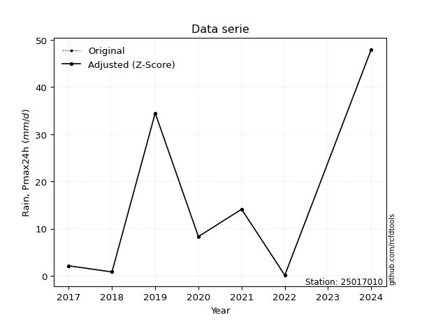</img>

</div>

> If Z-Score is active, values out of range or outliers are replaced with the station mean value.


### 4. Active continuous probability distributions from SciPy (45 of 104 available)

[scipy.stats](https://docs.scipy.org/doc/scipy/reference/stats.html) is a Python´s powerful submodule within the SciPy library for comprehensive statistical analysis, offering over 130 probability distributions (like Normal, Poisson), functions for descriptive stats (mean, variance), hypothesis testing (t-tests, chi-square), random variable generation, and statistical tests, making it essential for data science, modeling, and research. It provides tools to explore, model, and draw conclusions from data efficiently, working seamlessly with NumPy.

<div align="center">

|   id | p_dist             |   n_parameter | fit_method   | label                                                                       | active   | ref                                                                                                        |
|-----:|:-------------------|--------------:|:-------------|:----------------------------------------------------------------------------|:---------|:-----------------------------------------------------------------------------------------------------------|
|    0 | alpha              |             3 | MLE          | Alpha                                                                       | True     | [:mortar_board:](https://docs.scipy.org/doc/scipy/reference/generated/scipy.stats.alpha.html)              |
|    1 | betaprime          |             4 | MLE          | Beta prime                                                                  | True     | [:mortar_board:](https://docs.scipy.org/doc/scipy/reference/generated/scipy.stats.betaprime.html)          |
|    2 | chi2               |             3 | MLE          | Chi²                                                                        | True     | [:mortar_board:](https://docs.scipy.org/doc/scipy/reference/generated/scipy.stats.chi2.html)               |
|    3 | crystalball        |             4 | MLE          | Crystalball                                                                 | True     | [:mortar_board:](https://docs.scipy.org/doc/scipy/reference/generated/scipy.stats.crystalball.html)        |
|    4 | erlang             |             3 | MLE          | Erlang                                                                      | True     | [:mortar_board:](https://docs.scipy.org/doc/scipy/reference/generated/scipy.stats.erlang.html)             |
|    5 | expon              |             2 | MLE          | Exponential                                                                 | True     | [:mortar_board:](https://docs.scipy.org/doc/scipy/reference/generated/scipy.stats.expon.html)              |
|    6 | exponnorm          |             3 | MLE          | Exponentially modified Normal                                               | True     | [:mortar_board:](https://docs.scipy.org/doc/scipy/reference/generated/scipy.stats.exponnorm.html)          |
|    7 | f                  |             4 | MLE          | F                                                                           | True     | [:mortar_board:](https://docs.scipy.org/doc/scipy/reference/generated/scipy.stats.f.html)                  |
|    8 | fatiguelife        |             3 | MLE          | Fatigue-life (Birnbaum-Saunders)                                            | True     | [:mortar_board:](https://docs.scipy.org/doc/scipy/reference/generated/scipy.stats.fatiguelife.html)        |
|    9 | fisk               |             3 | MLE          | Fisk                                                                        | True     | [:mortar_board:](https://docs.scipy.org/doc/scipy/reference/generated/scipy.stats.fisk.html)               |
|   10 | gamma              |             3 | MLE          | Gamma                                                                       | True     | [:mortar_board:](https://docs.scipy.org/doc/scipy/reference/generated/scipy.stats.gamma.html)              |
|   11 | genexpon           |             5 | MLE          | Generalized exponential                                                     | True     | [:mortar_board:](https://docs.scipy.org/doc/scipy/reference/generated/scipy.stats.genexpon.html)           |
|   12 | genlogistic        |             3 | MLE          | Generalized logistic                                                        | True     | [:mortar_board:](https://docs.scipy.org/doc/scipy/reference/generated/scipy.stats.genlogistic.html)        |
|   13 | gibrat             |             2 | MM           | Gibrat                                                                      | True     | [:mortar_board:](https://docs.scipy.org/doc/scipy/reference/generated/scipy.stats.gibrat.html)             |
|   14 | gompertz           |             3 | MLE          | Gompertz (or truncated Gumbel)                                              | True     | [:mortar_board:](https://docs.scipy.org/doc/scipy/reference/generated/scipy.stats.gompertz.html)           |
|   15 | gumbel_l           |             2 | MM           | Gumbel Left Skew                                                            | True     | [:mortar_board:](https://docs.scipy.org/doc/scipy/reference/generated/scipy.stats.gumbel_l.html)           |
|   16 | gumbel_r           |             2 | MM           | Gumbel Right Skew                                                           | True     | [:mortar_board:](https://docs.scipy.org/doc/scipy/reference/generated/scipy.stats.gumbel_r.html)           |
|   17 | halflogistic       |             2 | MM           | Half-logistic                                                               | True     | [:mortar_board:](https://docs.scipy.org/doc/scipy/reference/generated/scipy.stats.halflogistic.html)       |
|   18 | halfnorm           |             2 | MM           | Half Normal                                                                 | True     | [:mortar_board:](https://docs.scipy.org/doc/scipy/reference/generated/scipy.stats.halfnorm.html)           |
|   19 | hypsecant          |             2 | MM           | hyperbolic secant                                                           | True     | [:mortar_board:](https://docs.scipy.org/doc/scipy/reference/generated/scipy.stats.hypsecant.html)          |
|   20 | invgamma           |             3 | MLE          | Inverted gamma                                                              | True     | [:mortar_board:](https://docs.scipy.org/doc/scipy/reference/generated/scipy.stats.invgamma.html)           |
|   21 | invgauss           |             3 | MLE          | Inverse Gaussian                                                            | True     | [:mortar_board:](https://docs.scipy.org/doc/scipy/reference/generated/scipy.stats.invgauss.html)           |
|   22 | invweibull         |             3 | MLE          | Inverted Weibull                                                            | True     | [:mortar_board:](https://docs.scipy.org/doc/scipy/reference/generated/scipy.stats.invweibull.html)         |
|   23 | johnsonsu          |             4 | MLE          | Johnson Su                                                                  | True     | [:mortar_board:](https://docs.scipy.org/doc/scipy/reference/generated/scipy.stats.johnsonsu.html)          |
|   24 | kstwobign          |             2 | MLE          | Limiting distribution of scaled Kolmogorov-Smirnov two-sided test statistic | True     | [:mortar_board:](https://docs.scipy.org/doc/scipy/reference/generated/scipy.stats.kstwobign.html)          |
|   25 | laplace            |             2 | MM           | Laplace                                                                     | True     | [:mortar_board:](https://docs.scipy.org/doc/scipy/reference/generated/scipy.stats.laplace.html)            |
|   26 | laplace_asymmetric |             3 | MLE          | Asymmetric Laplace                                                          | True     | [:mortar_board:](https://docs.scipy.org/doc/scipy/reference/generated/scipy.stats.laplace_asymmetric.html) |
|   27 | loggamma           |             3 | MLE          | Log gamma                                                                   | True     | [:mortar_board:](https://docs.scipy.org/doc/scipy/reference/generated/scipy.stats.loggamma.html)           |
|   28 | logistic           |             2 | MM           | Logistic (or Sech-squared)                                                  | True     | [:mortar_board:](https://docs.scipy.org/doc/scipy/reference/generated/scipy.stats.logistic.html)           |
|   29 | lognorm            |             3 | MLE          | Log Normal                                                                  | True     | [:mortar_board:](https://docs.scipy.org/doc/scipy/reference/generated/scipy.stats.lognorm.html)            |
|   30 | maxwell            |             2 | MM           | Maxwell                                                                     | True     | [:mortar_board:](https://docs.scipy.org/doc/scipy/reference/generated/scipy.stats.maxwell.html)            |
|   31 | mielke             |             4 | MLE          | Mielke Beta-Kappa / Dagum                                                   | True     | [:mortar_board:](https://docs.scipy.org/doc/scipy/reference/generated/scipy.stats.mielke.html)             |
|   32 | moyal              |             2 | MM           | Moyal                                                                       | True     | [:mortar_board:](https://docs.scipy.org/doc/scipy/reference/generated/scipy.stats.moyal.html)              |
|   33 | nakagami           |             3 | MLE          | Nakagami                                                                    | True     | [:mortar_board:](https://docs.scipy.org/doc/scipy/reference/generated/scipy.stats.nakagami.html)           |
|   34 | ncf                |             5 | MLE          | Non-central F distribution                                                  | True     | [:mortar_board:](https://docs.scipy.org/doc/scipy/reference/generated/scipy.stats.ncf.html)                |
|   35 | nct                |             4 | MLE          | Non-central Student’s t                                                     | True     | [:mortar_board:](https://docs.scipy.org/doc/scipy/reference/generated/scipy.stats.nct.html)                |
|   36 | norm               |             2 | MM           | Normal                                                                      | True     | [:mortar_board:](https://docs.scipy.org/doc/scipy/reference/generated/scipy.stats.norm.html)               |
|   37 | pareto             |             3 | MLE          | Pareto                                                                      | True     | [:mortar_board:](https://docs.scipy.org/doc/scipy/reference/generated/scipy.stats.pareto.html)             |
|   38 | pearson3           |             3 | MM           | Pearson type III                                                            | True     | [:mortar_board:](https://docs.scipy.org/doc/scipy/reference/generated/scipy.stats.pearson3.html)           |
|   39 | rayleigh           |             2 | MM           | Rayleigh                                                                    | True     | [:mortar_board:](https://docs.scipy.org/doc/scipy/reference/generated/scipy.stats.rayleigh.html)           |
|   40 | rice               |             3 | MLE          | Rice                                                                        | True     | [:mortar_board:](https://docs.scipy.org/doc/scipy/reference/generated/scipy.stats.rice.html)               |
|   41 | t                  |             3 | MLE          | Student’s t                                                                 | True     | [:mortar_board:](https://docs.scipy.org/doc/scipy/reference/generated/scipy.stats.t.html)                  |
|   42 | truncnorm          |             4 | MLE          | Truncated normal                                                            | True     | [:mortar_board:](https://docs.scipy.org/doc/scipy/reference/generated/scipy.stats.truncnorm.html)          |
|   43 | wald               |             2 | MM           | Wald                                                                        | True     | [:mortar_board:](https://docs.scipy.org/doc/scipy/reference/generated/scipy.stats.wald.html)               |
|   44 | weibull_min        |             3 | MLE          | Weibull minimum                                                             | True     | [:mortar_board:](https://docs.scipy.org/doc/scipy/reference/generated/scipy.stats.weibull_min.html)        |

</div>

> **n_parameter:** # arguments & localization & scale.
>
> **Fit methods:** (MLE) maximum likelihood, (MM) L-moments.
>
>**Inactive:** foldnorm, gennorm, norminvgauss, powernorm, powerlognorm, skewnorm, genextreme, anglit, arcsine, argus, beta, bradford, burr, burr12, cauchy, cosine, halfcauchy, foldcauchy, skewcauchy, wrapcauchy, dgamma, gengamma, exponweib, exponpow, truncexpon, gausshyper, genhalflogistic, genhyperbolic, geninvgauss, halfgennorm, johnsonsb, kappa4, kappa3, ksone, kstwo, loglaplace, levy, levy_l, levy_stable, ncx2, genpareto, truncpareto, lomax, powerlaw, rdist, rel_breitwigner, recipinvgauss, semicircular, studentized_range, trapezoid, triang, truncweibull_min, tukeylambda, uniform, loguniform, vonmises, vonmises_line, weibull_max, dweibull, 


## B. Probability distributions vs. Empirical distributions

A continuous probability distribution (CPD) describes probabilities for variables that can take any value within a range (like rain any time), unlike discrete variables with specific outcomes (like temperature). It uses a Probability Density Function (PDF), a curve where the total area under it equals 1, and the probability of the variable falling within an interval (a to b) is found by calculating the area under the curve between those points. A key feature is that the probability of hitting any single exact value is zero, so probabilities are always expressed for ranges, e.g., $P(a ≤ X ≤ b)$.

<div align="center">

Distributions parameters
|    |   station | p_dist                |   n |             loc |           scale | shape                  | shape1                 | shape2             | shape3   |
|---:|----------:|:----------------------|----:|----------------:|----------------:|:-----------------------|:-----------------------|:-------------------|:---------|
|  0 |  25017010 | alpha                 |   8 |    -3.70977     |     7.07479     | 9.243992057210184e-05  |                        |                    |          |
|  1 |  25017010 | betaprime             |   8 |     0.1         |    18.113       | 0.5488713048352132     | 1.5931782513765822     |                    |          |
|  2 |  25017010 | chi2                  |   8 |     0.1         |     1.76575     | 1.418459868563954      |                        |                    |          |
|  3 |  25017010 | crystalball           |   8 |    16.9375      |    16.7098      | 705.0053966095927      | 4581.943605946187      |                    |          |
|  4 |  25017010 | erlang                |   8 |     0.1         |    19.6532      | 0.36863337250106976    |                        |                    |          |
|  5 |  25017010 | expon                 |   8 |     0.1         |    16.8375      |                        |                        |                    |          |
|  6 |  25017010 | exponnorm             |   8 |     0.0781075   |     0.00688175  | 2458.734574915954      |                        |                    |          |
|  7 |  25017010 | f                     |   8 |     0.1         |    15.7072      | 0.8015834435463222     | 15.485454118414474     |                    |          |
|  8 |  25017010 | fatiguelife           |   8 |     0.1         |     0.000304353 | 226.77126995969496     |                        |                    |          |
|  9 |  25017010 | fisk                  |   8 |     0.1         |     7.11623     | 0.6732937736937541     |                        |                    |          |
| 10 |  25017010 | gamma                 |   8 |     0.1         |    11.9639      | 0.7222207663369775     |                        |                    |          |
| 11 |  25017010 | genexpon              |   8 |     0.1         |    45.6892      | 2.7136624442624404     | 5.8831843256631653e-08 | 2.1399991813565533 |          |
| 12 |  25017010 | genlogistic           |   8 |   -78.9838      |    12.3247      | 1279.8966589203214     |                        |                    |          |
| 13 |  25017010 | gibrat                |   8 |     4.19003     |     7.73173     |                        |                        |                    |          |
| 14 |  25017010 | gompertz              |   8 |     0.0999978   |  1238.83        | 72.57334154840413      |                        |                    |          |
| 15 |  25017010 | gumbel_l              |   8 |    24.4578      |    13.0286      |                        |                        |                    |          |
| 16 |  25017010 | gumbel_r              |   8 |     9.4172      |    13.0286      |                        |                        |                    |          |
| 17 |  25017010 | halflogistic          |   8 |    -2.86749     |    14.2863      |                        |                        |                    |          |
| 18 |  25017010 | halfnorm              |   8 |    -5.17972     |    27.7198      |                        |                        |                    |          |
| 19 |  25017010 | hypsecant             |   8 |    16.9375      |    10.6378      |                        |                        |                    |          |
| 20 |  25017010 | invgamma              |   8 |    -1.15253     |     3.26303     | 0.7637614307906566     |                        |                    |          |
| 21 |  25017010 | invgauss              |   8 |    -1.03573     |     5.14246     | 3.495093706786033      |                        |                    |          |
| 22 |  25017010 | invweibull            |   8 |    -0.33445     |     3.10118     | 0.623026600054635      |                        |                    |          |
| 23 |  25017010 | johnsonsu             |   8 |     0.0990946   |     0.0002426   | -3.0287143339316485    | 0.3020182491327559     |                    |          |
| 24 |  25017010 | kstwobign             |   8 |   -33.5732      |    57.904       |                        |                        |                    |          |
| 25 |  25017010 | laplace               |   8 |    16.9375      |    11.8156      |                        |                        |                    |          |
| 26 |  25017010 | laplace_asymmetric    |   8 |     0.1         |     8.59472e-05 | 5.10441409674791e-06   |                        |                    |          |
| 27 |  25017010 | loggamma              |   8 | -5233.33        |   705.407       | 1707.969660078526      |                        |                    |          |
| 28 |  25017010 | logistic              |   8 |    16.9375      |     9.21259     |                        |                        |                    |          |
| 29 |  25017010 | lognorm               |   8 |     0.1         |     0.0563089   | 13.651737563108158     |                        |                    |          |
| 30 |  25017010 | maxwell               |   8 |   -22.6577      |    24.8126      |                        |                        |                    |          |
| 31 |  25017010 | mielke                |   8 |     0.1         |    64.6085      | 0.44148376616808777    | 6.674220664382785      |                    |          |
| 32 |  25017010 | moyal                 |   8 |     7.38176     |     7.52205     |                        |                        |                    |          |
| 33 |  25017010 | nakagami              |   8 |     0.1         |    35.0902      | 0.17822075969453743    |                        |                    |          |
| 34 |  25017010 | ncf                   |   8 |     0.1         |     3.05853     | 1.0259389227978386     | 3.435050148243385      | 1.786296928533552  |          |
| 35 |  25017010 | nct                   |   8 |    -1.94968     |     0.104898    | 0.7076686925149125     | 40.294172959359614     |                    |          |
| 36 |  25017010 | norm                  |   8 |    16.9375      |    16.7098      |                        |                        |                    |          |
| 37 |  25017010 | pareto                |   8 |     0.0965624   |     0.00343756  | 0.14409338818758471    |                        |                    |          |
| 38 |  25017010 | pearson3              |   8 |    16.9375      |    16.7098      | 0.6347307443885478     |                        |                    |          |
| 39 |  25017010 | rayleigh              |   8 |   -15.0293      |    25.5058      |                        |                        |                    |          |
| 40 |  25017010 | rice                  |   8 |   -10.3308      |    22.6139      | 0.0007430074631286775  |                        |                    |          |
| 41 |  25017010 | t                     |   8 |    16.9372      |    16.71        | 114434930.17087524     |                        |                    |          |
| 42 |  25017010 | truncnorm             |   8 |    -4.76106     |    24.9289      | 0.19499694918236748    | 2.116461717479318      |                    |          |
| 43 |  25017010 | wald                  |   8 |     0.227688    |    16.7098      |                        |                        |                    |          |
| 44 |  25017010 | weibull_min           |   8 |     0.1         |    14.8478      | 0.7728006070621756     |                        |                    |          |
| 45 |  25017010 | logalpha              |   8 |    -3.04219     |     1.59825     | 9.516806438140302e-09  |                        |                    |          |
| 46 |  25017010 | logbetaprime          |   8 |    -8.78724     |     1.07223e+12 | 21.00301333795423      | 2138940539328.4453     |                    |          |
| 47 |  25017010 | logchi2               |   8 |    -2.30259     |     1.23117     | 1.020895208660666      |                        |                    |          |
| 48 |  25017010 | logcrystalball        |   8 |     3.87138     |     4.14429e-07 | 1.9234469776301583e-07 | 2096.6884298903387     |                    |          |
| 49 |  25017010 | logerlang             |   8 |   -28.9502      |     0.142765    | 214.88705784643605     |                        |                    |          |
| 50 |  25017010 | logexpon              |   8 |    -2.30259     |     4.01616     |                        |                        |                    |          |
| 51 |  25017010 | logexponnorm          |   8 |     1.71223     |     2.01323     | 0.0006729581818631784  |                        |                    |          |
| 52 |  25017010 | logf                  |   8 |    -2.30259     |     1.0354      | 1.1219901783137192     | 1.0877781710932386     |                    |          |
| 53 |  25017010 | logfatiguelife        |   8 |  -408.434       |   410.132       | 0.004876757813569641   |                        |                    |          |
| 54 |  25017010 | logfisk               |   8 |    -2.30259     |     1.8078      | 0.6593964228849778     |                        |                    |          |
| 55 |  25017010 | loggamma              |   8 |   -29.8671      |     0.135495    | 232.84849252375443     |                        |                    |          |
| 56 |  25017010 | loggenexpon           |   8 |    -2.51219     |     0.184083    | 0.010105992615928115   | 12.741643917103254     | 0.000185901444656  |          |
| 57 |  25017010 | loggenlogistic        |   8 |     3.87122     |     1.09334e-06 | 5.063605683848406e-07  |                        |                    |          |
| 58 |  25017010 | loggibrat             |   8 |     0.177672    |     0.931546    |                        |                        |                    |          |
| 59 |  25017010 | loggompertz           |   8 |    -2.30259     |     1.68669     | 0.059754774763241994   |                        |                    |          |
| 60 |  25017010 | loggumbel_l           |   8 |     2.61964     |     1.56971     |                        |                        |                    |          |
| 61 |  25017010 | loggumbel_r           |   8 |     0.807518    |     1.56971     |                        |                        |                    |          |
| 62 |  25017010 | loghalflogistic       |   8 |    -0.672537    |     1.72122     |                        |                        |                    |          |
| 63 |  25017010 | loghalfnorm           |   8 |    -0.951173    |     3.33977     |                        |                        |                    |          |
| 64 |  25017010 | loghypsecant          |   8 |     1.71358     |     1.28166     |                        |                        |                    |          |
| 65 |  25017010 | loginvgamma           |   8 |   -38.1747      | 14514.4         | 365.42325874839025     |                        |                    |          |
| 66 |  25017010 | loginvgauss           |   8 |   -15.9513      |  1167.64        | 0.015101749131479651   |                        |                    |          |
| 67 |  25017010 | loginvweibull         |   8 |    -1.54035e+08 |     1.54035e+08 | 70957456.41292709      |                        |                    |          |
| 68 |  25017010 | logjohnsonsu          |   8 |     4.04431     |     0.00441262  | 5.715179511277343      | 0.8851688732410958     |                    |          |
| 69 |  25017010 | logkstwobign          |   8 |    -7.06559     |    10.0289      |                        |                        |                    |          |
| 70 |  25017010 | loglaplace            |   8 |     1.71358     |     1.42357     |                        |                        |                    |          |
| 71 |  25017010 | loglaplace_asymmetric |   8 |     3.87121     |     0.0396643   | 54.3929836794656       |                        |                    |          |
| 72 |  25017010 | logloggamma           |   8 |     3.87125     |     2.44027e-06 | 1.1262608915195618e-06 |                        |                    |          |
| 73 |  25017010 | loglogistic           |   8 |     1.71358     |     1.10995     |                        |                        |                    |          |
| 74 |  25017010 | loglognorm            |   8 |  -717.103       |   718.826       | 0.0027918625290944354  |                        |                    |          |
| 75 |  25017010 | logmaxwell            |   8 |    -3.05693     |     2.98947     |                        |                        |                    |          |
| 76 |  25017010 | logmielke             |   8 |    -3.66773e+08 |     3.66773e+08 | 1681276380.8219895     | 192722330.27176386     |                    |          |
| 77 |  25017010 | logmoyal              |   8 |     0.562284    |     0.906271    |                        |                        |                    |          |
| 78 |  25017010 | lognakagami           |   8 | -1114.54        |  1116.25        | 76479.79175426402      |                        |                    |          |
| 79 |  25017010 | logncf                |   8 |    -2.30259     |     1.06982     | 1.0334933678503608     | 1.1494206465799557     | 1.0048189410176904 |          |
| 80 |  25017010 | lognct                |   8 |   124.059       |     1.98295     | 64096.65487262346      | -61.697716876829574    |                    |          |
| 81 |  25017010 | lognorm               |   8 |     1.71358     |     2.01323     |                        |                        |                    |          |
| 82 |  25017010 | logpareto             |   8 |    -2.30407     |     0.00148439  | 0.14328092401795442    |                        |                    |          |
| 83 |  25017010 | logpearson3           |   8 |     1.71356     |     2.01325     | -0.7936763970359528    |                        |                    |          |
| 84 |  25017010 | lograyleigh           |   8 |    -2.13784     |     3.07299     |                        |                        |                    |          |
| 85 |  25017010 | logrice               |   8 |    -3.65409     |     2.16208     | 2.2428793085158154     |                        |                    |          |
| 86 |  25017010 | logt                  |   8 |     1.71358     |     2.01323     | 20935675977.506813     |                        |                    |          |
| 87 |  25017010 | logtruncnorm          |   8 |     1.42076     |     2.35854     | -1.5786705818351483    | 1.038978008348818      |                    |          |
| 88 |  25017010 | logwald               |   8 |    -0.299644    |     2.01321     |                        |                        |                    |          |
| 89 |  25017010 | logweibull_min        |   8 |    -6.55984e+07 |     6.55984e+07 | 45115723.05017401      |                        |                    |          |

</div>

> **loc** (Location parameter): This shifts the distribution along the x-axis. For many common distributions, like the normal (Gaussian) distribution, loc represents the mean $μ$. For others, like the uniform distribution, it might represent the minimum value, or for the beta distribution, the left end of the support interval.
>
> **scale** (Scale parameter): This determines the width or spread of the distribution. For the normal distribution, scale represents the standard deviation $σ$. For a uniform distribution, it defines the length of the interval (from $loc$ to $loc + scale$).
>
> **shape** (Shape parameters): Refers to parameters that define the specific form of a probability distribution, distinct from its location (loc) and scale (scale). These parameters are required arguments for most distribution functions. For example, a normal (Gaussian) distribution is fully defined by its location (mean) and scale (standard deviation), so it has no specific shape parameters beyond loc and scale. However, other distributions have intrinsic properties that need specification, as Gamma distribution that takes a shape parameter, often named $a$ or $alpha$.


### 0. Cumulative distribution values - CDF (90 evaluated)

> Ordered by x ascending and calculating $log(f(x))$ separately. 

|   id |   Station |   date |    x |   count |    mean |     std |    zscore |   Value_initial |   station |   m |     alpha |   alpha_pdf |   betaprime |   betaprime_pdf |        chi2 |        chi2_pdf |   crystalball |   crystalball_pdf |      erlang |   erlang_pdf |     expon |   expon_pdf |   exponnorm |   exponnorm_pdf |           f |       f_pdf |   fatiguelife |   fatiguelife_pdf |        fisk |       fisk_pdf |       gamma |     gamma_pdf |    genexpon |   genexpon_pdf |   genlogistic |   genlogistic_pdf |   gibrat |   gibrat_pdf |    gompertz |   gompertz_pdf |   gumbel_l |   gumbel_l_pdf |   gumbel_r |   gumbel_r_pdf |   halflogistic |   halflogistic_pdf |   halfnorm |   halfnorm_pdf |   hypsecant |   hypsecant_pdf |   invgamma |   invgamma_pdf |   invgauss |   invgauss_pdf |   invweibull |   invweibull_pdf |   johnsonsu |   johnsonsu_pdf |   kstwobign |   kstwobign_pdf |   laplace |   laplace_pdf |   laplace_asymmetric |   laplace_asymmetric_pdf |   loggamma |   loggamma_pdf |   logistic |   logistic_pdf |   lognorm |   lognorm_pdf |   maxwell |   maxwell_pdf |    mielke |   mielke_pdf |    moyal |   moyal_pdf |    nakagami |   nakagami_pdf |         ncf |     ncf_pdf |       nct |    nct_pdf |     norm |   norm_pdf |   pareto |   pareto_pdf |   pearson3 |   pearson3_pdf |   rayleigh |   rayleigh_pdf |     rice |   rice_pdf |        t |      t_pdf |   truncnorm |   truncnorm_pdf |        wald |    wald_pdf |   weibull_min |   weibull_min_pdf |   logalpha |   logalpha_pdf |   logbetaprime |   logbetaprime_pdf |     logchi2 |   logchi2_pdf |   logcrystalball |   logcrystalball_pdf |   logerlang |   logerlang_pdf |   logexpon |   logexpon_pdf |   logexponnorm |   logexponnorm_pdf |        logf |    logf_pdf |   logfatiguelife |   logfatiguelife_pdf |    logfisk |   logfisk_pdf |   loggenexpon |   loggenexpon_pdf |   loggenlogistic |   loggenlogistic_pdf |   loggibrat |   loggibrat_pdf |   loggompertz |   loggompertz_pdf |   loggumbel_l |   loggumbel_l_pdf |   loggumbel_r |   loggumbel_r_pdf |   loghalflogistic |   loghalflogistic_pdf |   loghalfnorm |   loghalfnorm_pdf |   loghypsecant |   loghypsecant_pdf |   loginvgamma |   loginvgamma_pdf |   loginvgauss |   loginvgauss_pdf |   loginvweibull |   loginvweibull_pdf |   logjohnsonsu |   logjohnsonsu_pdf |   logkstwobign |   logkstwobign_pdf |   loglaplace |   loglaplace_pdf |   loglaplace_asymmetric |   loglaplace_asymmetric_pdf |   logloggamma |   logloggamma_pdf |   loglogistic |   loglogistic_pdf |   loglognorm |   loglognorm_pdf |   logmaxwell |   logmaxwell_pdf |   logmielke |   logmielke_pdf |    logmoyal |   logmoyal_pdf |   lognakagami |   lognakagami_pdf |     logncf |   logncf_pdf |    lognct |   lognct_pdf |   logpareto |   logpareto_pdf |   logpearson3 |   logpearson3_pdf |   lograyleigh |   lograyleigh_pdf |   logrice |   logrice_pdf |      logt |   logt_pdf |   logtruncnorm |   logtruncnorm_pdf |     logwald |   logwald_pdf |   logweibull_min |   logweibull_min_pdf |
|-----:|----------:|-------:|-----:|--------:|--------:|--------:|----------:|----------------:|----------:|----:|----------:|------------:|------------:|----------------:|------------:|----------------:|--------------:|------------------:|------------:|-------------:|----------:|------------:|------------:|----------------:|------------:|------------:|--------------:|------------------:|------------:|---------------:|------------:|--------------:|------------:|---------------:|--------------:|------------------:|---------:|-------------:|------------:|---------------:|-----------:|---------------:|-----------:|---------------:|---------------:|-------------------:|-----------:|---------------:|------------:|----------------:|-----------:|---------------:|-----------:|---------------:|-------------:|-----------------:|------------:|----------------:|------------:|----------------:|----------:|--------------:|---------------------:|-------------------------:|-----------:|---------------:|-----------:|---------------:|----------:|--------------:|----------:|--------------:|----------:|-------------:|---------:|------------:|------------:|---------------:|------------:|------------:|----------:|-----------:|---------:|-----------:|---------:|-------------:|-----------:|---------------:|-----------:|---------------:|---------:|-----------:|---------:|-----------:|------------:|----------------:|------------:|------------:|--------------:|------------------:|-----------:|---------------:|---------------:|-------------------:|------------:|--------------:|-----------------:|---------------------:|------------:|----------------:|-----------:|---------------:|---------------:|-------------------:|------------:|------------:|-----------------:|---------------------:|-----------:|--------------:|--------------:|------------------:|-----------------:|---------------------:|------------:|----------------:|--------------:|------------------:|--------------:|------------------:|--------------:|------------------:|------------------:|----------------------:|--------------:|------------------:|---------------:|-------------------:|--------------:|------------------:|--------------:|------------------:|----------------:|--------------------:|---------------:|-------------------:|---------------:|-------------------:|-------------:|-----------------:|------------------------:|----------------------------:|--------------:|------------------:|--------------:|------------------:|-------------:|-----------------:|-------------:|-----------------:|------------:|----------------:|------------:|---------------:|--------------:|------------------:|-----------:|-------------:|----------:|-------------:|------------:|----------------:|--------------:|------------------:|--------------:|------------------:|----------:|--------------:|----------:|-----------:|---------------:|-------------------:|------------:|--------------:|-----------------:|---------------------:|
|    0 |  25017010 |   2022 |  0.1 |       8 | 16.9375 | 17.8635 | -0.942563 |             0.1 |  25017010 |   1 | 0.0633176 |  0.0693532  | 2.24568e-10 |     4.44088e+06 | 4.96773e-13 | 25387.8         |      0.156813 |        0.0143701  | 2.28973e-07 |  6.08216e+09 | 0         |  0.0593912  |  0.00129301 |      0.0589805  | 4.46947e-08 | 1.29079e+09 |     0.0158579 |       3.32584e+07 | 1.19128e-12 | 57796.1        | 1.21923e-13 | 6345.03       | 6.30432e-10 |     0.0593939  |      0.123722 |        0.0209606  | 0        |   0          | 1.30313e-07 |     0.0585823  |   0.142891 |     0.0101437  |   0.12945  |     0.0203134  |       0.103486 |         0.0346238  |   0.151057 |     0.0282665  |    0.128967 |      0.0117945  |  0.0456042 |     0.10151    |  0.0440869 |     0.102493   |    0.0332876 |       0.162426   |  0.00783828 |      6.93729    |    0.112252 |      0.0209884  |  0.120252 |    0.0101774  |          7.20892e-11 |               0.0593901  |  0.0231205 |      0.0289758 |   0.138517 |     0.0129529  | 0.0230276 |     0.0270934 |  0.160417 |    0.0177627  | 9.715e-08 |  5.08316e+06 | 0.104676 |  0.0230714  | 2.19367e-07 |     5.6343e+09 | 3.87241e-10 | 1.43137e+07 | 0.0520867 | 0.0995161  | 0.156813 | 0.0143701  | 0        | 41.9173      |   0.151066 |     0.018153   |   0.16132  |     0.0195046  | 0.100916 | 0.0183386  | 0.15682  | 0.0143703  | 1.70073e-09 |      0.0387178  | 0           | 0           |   1.16658e-14 |      649.622      |  0.0306989 |      0.225719  |      0.0238589 |          0.033972  | 1.03715e-08 |   1.19213e+07 |              nan |                  nan |   0.0230487 |       0.0286636 |   0        |      0.248994  |      0.0230275 |          0.0270933 | 1.59021e-09 | 2.00883e+06 |        0.0222337 |            0.0267374 | 5.0937e-11 | 75632.7       |     0.0129576 |         0.0686477 |         0        |            0.0265421 |    0        |       0         |   7.93835e-10 |         0.0354272 |     0.0425356 |         0.0265132 |   0.000708499 |        0.00327341 |          0        |             0         |      0        |         0         |      0.0277151 |          0.0215971 |     0.0228298 |         0.0298595 |     0.0210288 |         0.0304283 |       0.0207198 |           0.0370017 |      0.0909937 |          0.0228332 |      0.0222352 |          0.0463994 |    0.0297673 |        0.0209104 |               0.0571578 |                   0.0264931 |     0.0578777 |         0.0267124 |     0.0261266 |         0.0229236 |    0.0221329 |        0.0264343 |   0.00419236 |        0.0164614 |   0.0171159 |       0.0292391 | 1.18709e-06 |    1.60636e-05 |     0.0233201 |         0.0273487 | 4.4783e-09 |  5.21099e+06 | 0.0230452 |    0.0270726 |    0        |     96.5252     |     0.0398019 |         0.0290442 |      0        |         0         | 0.0180437 |     0.0298981 | 0.0230276 |  0.0270934 |    6.61875e-07 |          0.0613213 | 0           |   0           |        0.0331299 |            0.0224036 |
|    1 |  25017010 |   2018 |  0.8 |       8 | 16.9375 | 17.8635 | -0.903377 |             0.8 |  25017010 |   2 | 0.116714  |  0.0810901  | 0.219448    |     0.163266    | 0.321594    |     0.289649    |      0.167084 |        0.0149765  | 0.325718    |  0.167114    | 0.0407215 |  0.0569727  |  0.0417667  |      0.0566318  | 0.21992     | 0.12424     |     0.583708  |       0.0589576   | 0.173445    |     0.137892   | 0.13759     |    0.137195   | 0.0407233   |     0.0569752  |      0.138841 |        0.0222253  | 0        |   0          | 0.0401894   |     0.0562597  |   0.150155 |     0.0106129  |   0.144061 |     0.0214237  |       0.127657 |         0.0344283  |   0.170794 |     0.0281219  |    0.137477 |      0.0125254  |  0.125415  |     0.118047   |  0.124123  |     0.117597   |    0.153951  |       0.1582     |  0.339922   |      0.157871   |    0.127389 |      0.0222434  |  0.127591 |    0.0107985  |          0.0407208   |               0.0569717  |  0.179023  |      0.131842  |   0.147836 |     0.0136748  | 0.168025  |     0.124756  |  0.173069 |    0.0183829  | 0.135644  |  0.0855493   | 0.121423 |  0.0247554  | 0.19712     |     0.100368   | 0.148037    | 0.114481    | 0.130664  | 0.117481   | 0.167084 | 0.0149765  | 0.535481 |  0.095153    |   0.164039 |     0.0189095  |   0.175173 |     0.0200699  | 0.114086 | 0.0192826  | 0.167092 | 0.0149768  | 0.0270249   |      0.0384912  | 1.74881e-07 | 4.59996e-06 |   0.0900532   |        0.0948016  |  0.570749  |      0.136642  |      0.200183  |          0.139912  | 0.801471    |   0.109155    |              nan |                  nan |   0.176164  |       0.129229  |   0.404151 |      0.148363  |      0.168025  |          0.124755  | 0.612327    | 0.0767467   |        0.167917  |            0.126113  | 0.523061   |     0.079107  |     0.265566  |         0.157698  |         0        |            0.0695317 |    0        |       0         |   0.135206    |         0.105116  |     0.150822  |         0.0884426 |   0.145408    |        0.178617   |          0.129809 |             0.285597  |      0.172561 |         0.233295  |      0.138265  |          0.104519  |     0.185545  |         0.136755  |     0.191733  |         0.141688  |       0.225948  |           0.154821  |      0.162731  |          0.0510286 |      0.25949   |          0.163094  |    0.12827   |        0.0901047 |               0.149853  |                   0.0694579 |     0.151118  |         0.0697457 |     0.148695  |         0.114046  |    0.165755  |        0.124395  |   0.174224   |        0.153028  |   0.205001  |       0.156099  | 0.12298     |    0.206663    |     0.168962  |         0.124968  | 0.488069   |  0.0853124   | 0.167872  |    0.124632  |    0.645891 |      0.0243819  |     0.161033  |         0.0976873 |      0.176432 |         0.166985  | 0.17476   |     0.130646  | 0.168025  |  0.124756  |    0.234054    |          0.167221  | 7.73914e-07 |   0.000137678 |        0.131342  |            0.0841209 |
|    2 |  25017010 |   2017 |  2.1 |       8 | 16.9375 | 17.8635 | -0.830603 |             2.1 |  25017010 |   3 | 0.223341  |  0.0796796  | 0.371353    |     0.0881153   | 0.588421    |     0.147717    |      0.187283 |        0.0160963  | 0.471344    |  0.0806168   | 0.111999  |  0.0527395  |  0.112631   |      0.0524438  | 0.331681    | 0.0639705   |     0.639609  |       0.0334515   | 0.298476    |     0.0704898  | 0.280902    |    0.0919389  | 0.112004    |     0.0527416  |      0.16916  |        0.0243717  | 0        |   0          | 0.110646    |     0.0521846  |   0.16454  |     0.011528   |   0.173163 |     0.0233061  |       0.172125 |         0.0339617  |   0.207155 |     0.0278082  |    0.15469  |      0.0139759  |  0.264913  |     0.0935951  |  0.262688  |     0.093174   |    0.312617  |       0.0930282  |  0.461815   |      0.0599406  |    0.157691 |      0.0243163  |  0.142431 |    0.0120544  |          0.111997    |               0.0527386  |  0.330787  |      0.178881  |   0.16651  |     0.0150646  | 0.31468   |     0.176375  |  0.197678 |    0.0194606  | 0.215619  |  0.0475961   | 0.155431 |  0.0274674  | 0.286557    |     0.0510452  | 0.264011    | 0.0736482   | 0.271445  | 0.0951807  | 0.187283 | 0.0160963  | 0.60051  |  0.0287326   |   0.18949  |     0.0202241  |   0.201893 |     0.0210146  | 0.140224 | 0.0208994  | 0.187291 | 0.0160965  | 0.0767511   |      0.0379944  | 0.00729283  | 0.0188721   |   0.191367    |        0.0663687  |  0.672764  |      0.0814551 |      0.353375  |          0.172732  | 0.880984    |   0.0612026   |              nan |                  nan |   0.325054  |       0.175759  |   0.531429 |      0.116671  |      0.314679  |          0.176375  | 0.670757    | 0.0480509   |        0.316248  |            0.178324  | 0.585089   |     0.052578  |     0.422094  |         0.162964  |         0        |            0.108716  |    0.308073 |       0.623523  |   0.261815    |         0.159006  |     0.260912  |         0.142354  |   0.352514    |        0.234155   |          0.389231 |             0.246482  |      0.387813 |         0.210095  |      0.27895   |          0.190839  |     0.341227  |         0.181449  |     0.349916  |         0.180955  |       0.38535   |           0.169278  |      0.224717  |          0.0803311 |      0.420516  |          0.165416  |    0.252666  |        0.177488  |               0.234388  |                   0.10864   |     0.235916  |         0.108883  |     0.294134  |         0.187053  |    0.312348  |        0.176611  |   0.343962   |        0.192227  |   0.372171  |       0.182743  | 0.365128    |    0.264549    |     0.315659  |         0.176227  | 0.555537   |  0.0575423   | 0.314434  |    0.176326  |    0.664705 |      0.0157719  |     0.279064  |         0.14801   |      0.355385 |         0.196579  | 0.325014  |     0.17738   | 0.31468   |  0.176375  |    0.415357    |          0.204548  | 0.380044    |   0.42516     |        0.23925   |            0.143072  |
|    3 |  25017010 |   2020 |  8.3 |       8 | 16.9375 | 17.8635 | -0.483527 |             8.3 |  25017010 |   4 | 0.555824  |  0.0329019  | 0.661645    |     0.0262206   | 0.945386    |     0.0169353   |      0.302609 |        0.020889   | 0.7331      |  0.0241283   | 0.385538  |  0.0364937  |  0.384867   |      0.0363546  | 0.558021    | 0.0233198   |     0.765404  |       0.0135505   | 0.523843    |     0.0204806  | 0.638422    |    0.0370014  | 0.385552    |     0.0364945  |      0.341381 |        0.0297571  | 0.26372  |   0.0794988  | 0.382433    |     0.0364187  |   0.251236 |     0.0166281  |   0.336373 |     0.0281297  |       0.37209  |         0.030153   |   0.373235 |     0.0255741  |    0.266006 |      0.0221952  |  0.583418  |     0.0275317  |  0.590568  |     0.029761   |    0.589567  |       0.0224771  |  0.629367   |      0.0139126  |    0.327566 |      0.0290875  |  0.240708 |    0.020372   |          0.385532    |               0.0364933  |  0.591161  |      0.18617   |   0.28139  |     0.0219493  | 0.579266  |     0.194236  |  0.330743 |    0.0229846  | 0.401995  |  0.0216432   | 0.346813 |  0.0320533  | 0.473186    |     0.0203994  | 0.556573    | 0.0311121   | 0.591171  | 0.026994   | 0.302609 | 0.020889   | 0.673946 |  0.00572713  |   0.329715 |     0.0243696  |   0.34184  |     0.0236023  | 0.287786 | 0.0259472  | 0.302617 | 0.020889   | 0.302149    |      0.0344001  | 0.349926    | 0.0539255   |   0.468486    |        0.0316594  |  0.756688  |      0.0456776 |      0.592458  |          0.16486   | 0.94007     |   0.0291857   |              nan |                  nan |   0.582136  |       0.184991  |   0.667217 |      0.082861  |      0.579265  |          0.194236  | 0.722377    | 0.0295411   |        0.582914  |            0.194937  | 0.643216   |     0.0342453 |     0.632729  |         0.138709  |         0        |            0.205456  |    0.76818  |       0.157325  |   0.532743    |         0.227336  |     0.515991  |         0.22375   |   0.647641    |        0.179236   |          0.669657 |             0.160223  |      0.641619 |         0.156692  |      0.598402  |          0.236584  |     0.600616  |         0.182343  |     0.60238   |         0.174066  |       0.602713  |           0.140575  |      0.389729  |          0.176111  |      0.62836   |          0.133027  |    0.62319   |        0.264695  |               0.443183  |                   0.205419  |     0.444864  |         0.205319  |     0.589716  |         0.217984  |    0.57765   |        0.194905  |   0.607529   |        0.178822  |   0.610137  |       0.153997  | 0.671356    |    0.170695    |     0.579712  |         0.193692  | 0.619255   |  0.0375301   | 0.579097  |    0.19439   |    0.682126 |      0.0103036  |     0.528681  |         0.207997  |      0.616422 |         0.172798  | 0.585403  |     0.188108  | 0.579266  |  0.194236  |    0.704264    |          0.204127  | 0.737253    |   0.148251    |        0.505237  |            0.239444  |
|    4 |  25017010 |   2021 | 14.1 |       8 | 16.9375 | 17.8635 | -0.158843 |            14.1 |  25017010 |   5 | 0.691206  |  0.0164458  | 0.770623    |     0.013444    | 0.990662    |     0.00280527  |      0.43258  |        0.023533   | 0.835248    |  0.012814    | 0.564594  |  0.0258593  |  0.563382   |      0.0258042  | 0.66435     | 0.0145648   |     0.827863  |       0.00861632  | 0.611971    |     0.0114201  | 0.796354    |    0.01964    | 0.564611    |     0.0258595  |      0.510978 |        0.0278299  | 0.598013 |   0.0390355  | 0.561679    |     0.0259697  |   0.363378 |     0.0220657  |   0.497541 |     0.0266585  |       0.532651 |         0.0250689  |   0.513271 |     0.0225998  |    0.416084 |      0.0288888  |  0.695012  |     0.0135003  |  0.714051  |     0.0152986  |    0.681393  |       0.0112824  |  0.688541   |      0.00762576 |    0.493283 |      0.0273173  |  0.393256 |    0.0332827  |          0.564588    |               0.0258592  |  0.685486  |      0.168276  |   0.423602 |     0.0265032  | 0.678402  |     0.178     |  0.466984 |    0.0235544  | 0.509076  |  0.0160529   | 0.52229  |  0.0276527  | 0.570983    |     0.0141911  | 0.692598    | 0.0175472   | 0.699589  | 0.0130072  | 0.43258  | 0.023533   | 0.698126 |  0.00310624  |   0.473509 |     0.0246524  |   0.479079 |     0.0233251  | 0.442098 | 0.0266529  | 0.432587 | 0.0235328  | 0.488358    |      0.0296391  | 0.590753    | 0.0310192   |   0.615411    |        0.0202863  |  0.778734  |      0.0378851 |      0.675587  |          0.148008  | 0.953613    |   0.0222651   |              nan |                  nan |   0.67617   |       0.168363  |   0.708353 |      0.0726183 |      0.678401  |          0.178     | 0.736876    | 0.0253567   |        0.682199  |            0.177866  | 0.660165   |     0.0298931 |     0.702267  |         0.12342   |         0        |            0.262605  |    0.835101 |       0.10052   |   0.654857    |         0.229909  |     0.63834   |         0.234328  |   0.733482    |        0.144832   |          0.746082 |             0.128793  |      0.718575 |         0.133749  |      0.713527  |          0.194542  |     0.692511  |         0.16312   |     0.689782  |         0.154753  |       0.672572  |           0.122891  |      0.501772  |          0.252569  |      0.694548  |          0.116697  |    0.740308  |        0.182423  |               0.566572  |                   0.26261   |     0.568126  |         0.262208  |     0.698511  |         0.189732  |    0.677133  |        0.178627  |   0.696877   |        0.15743   |   0.686231  |       0.132886  | 0.751449    |    0.132604    |     0.67856   |         0.177478  | 0.637817   |  0.0327055   | 0.678326  |    0.178187  |    0.687241 |      0.00905257 |     0.640678  |         0.211984  |      0.70234  |         0.150796  | 0.681111  |     0.17146   | 0.678402  |  0.178     |    0.808069    |          0.186279  | 0.803249    |   0.10404     |        0.636909  |            0.25299   |
|    5 |  25017010 |   2025 | 27.6 |       8 | 16.9375 | 17.8635 |  0.596887 |            27.6 |  25017010 |   6 | 0.821243  |  0.00561286 | 0.878436    |     0.00467511  | 0.999828    |     5.04111e-05 |      0.738295 |        0.019477   | 0.937139    |  0.00420963  | 0.804708  |  0.0115986  |  0.803394   |      0.0116195  | 0.799787    | 0.00692335  |     0.9075    |       0.00399407  | 0.713034    |     0.00500971 | 0.94226     |    0.00526792 | 0.804722    |     0.0115983  |      0.798854 |        0.0145552  | 0.866032 |   0.00922588 | 0.80388     |     0.0117471  |   0.719939 |     0.0273589  |   0.780608 |     0.0148399  |       0.788071 |         0.0132625  |   0.763007 |     0.0143051  |    0.776062 |      0.0193571  |  0.804001  |     0.00487914 |  0.840086  |     0.00572018 |    0.775503  |       0.00439744 |  0.756664   |      0.00343973 |    0.785683 |      0.0155828  |  0.797204 |    0.0171634  |          0.804702    |               0.0115988  |  0.787942  |      0.13554   |   0.760857 |     0.0197505  | 0.787231  |     0.144257  |  0.749405 |    0.0169612  | 0.685697  |  0.0109715   | 0.794233 |  0.0133703  | 0.717707    |     0.00847432 | 0.837801    | 0.0064365   | 0.80408   | 0.00466692 | 0.738295 | 0.019477   | 0.726105 |  0.00143496  |   0.75924  |     0.01645    |   0.752592 |     0.0162123  | 0.755051 | 0.0181684  | 0.738298 | 0.0194767  | 0.802814    |      0.0169919  | 0.83609     | 0.0100567   |   0.800134    |        0.00904333 |  0.801584  |      0.0305463 |      0.766264  |          0.121423  | 0.966311    |   0.015926    |              nan |                  nan |   0.779192  |       0.137076  |   0.753266 |      0.0614352 |      0.78723   |          0.144257  | 0.752482    | 0.0213074   |        0.790631  |            0.143272  | 0.678732   |     0.0255826 |     0.778129  |         0.102332  |         0        |            0.358422  |    0.887851 |       0.0607167 |   0.800785    |         0.197612  |     0.789896  |         0.208825  |   0.81705     |        0.105172   |          0.820768 |             0.0947993 |      0.798831 |         0.105544  |      0.822648  |          0.131327  |     0.791392  |         0.130344  |     0.783669  |         0.124183  |       0.747445  |           0.100229  |      0.720364  |          0.409877  |      0.765979  |          0.09617   |    0.837984  |        0.11381   |               0.773492  |                   0.358519  |     0.774584  |         0.357495  |     0.809278  |         0.139058  |    0.786339  |        0.144746  |   0.791875   |        0.124936  |   0.766241  |       0.105583  | 0.826919    |    0.0939789   |     0.787085  |         0.143892  | 0.658103   |  0.0279108   | 0.787276  |    0.144421  |    0.692891 |      0.00782707 |     0.777655  |         0.190626  |      0.793188 |         0.119481  | 0.785949  |     0.139222  | 0.78723   |  0.144257  |    0.92287     |          0.154276  | 0.860358    |   0.0689465   |        0.799697  |            0.221507  |
|    6 |  25017010 |   2019 | 34.5 |       8 | 16.9375 | 17.8635 |  0.983149 |            34.5 |  25017010 |   7 | 0.853116  |  0.00380046 | 0.904846    |     0.00312524  | 0.999977    |     6.69441e-06 |      0.853378 |        0.0137424  | 0.960016    |  0.00257267  | 0.870368  |  0.00769898 |  0.869234   |      0.00772833 | 0.840901    | 0.00511773  |     0.930898  |       0.00286465  | 0.742861    |     0.00373871 | 0.969089    |    0.00278073 | 0.87038     |     0.00769862 |      0.879585 |        0.00915634 | 0.914053 |   0.00517669 | 0.870422    |     0.00780472 |   0.884843 |     0.0191047  |   0.864292 |     0.00967506 |       0.86372  |         0.0088892  |   0.847701 |     0.0103324  |    0.87932  |      0.0110746  |  0.832138  |     0.00341288 |  0.873039  |     0.00398561 |    0.801255  |       0.00317534 |  0.777335   |      0.00261748 |    0.873975 |      0.010227   |  0.886905 |    0.00957165 |          0.870363    |               0.00769913 |  0.816847  |      0.123493  |   0.870609 |     0.0122277  | 0.817979  |     0.131253  |  0.849316 |    0.0120168  | 0.756358  |  0.0095645   | 0.869044 |  0.0086262  | 0.770471    |     0.00689742 | 0.874222    | 0.00431266  | 0.831009  | 0.00326942 | 0.853378 | 0.0137424  | 0.734799 |  0.00111075  |   0.854533 |     0.011277   |   0.84824  |     0.0115542  | 0.85985  | 0.0122862  | 0.853378 | 0.0137422  | 0.900172    |      0.0114172  | 0.890924    | 0.00620908  |   0.852543    |        0.00634112 |  0.808176  |      0.0285706 |      0.792321  |          0.112114  | 0.969677    |   0.0142716   |              nan |                  nan |   0.808483  |       0.125403  |   0.766601 |      0.0581149 |      0.817978  |          0.131254  | 0.75711     | 0.0201934   |        0.821137  |            0.130086  | 0.684304   |     0.0243775 |     0.800174  |         0.0952626 |         0        |            0.397444  |    0.900399 |       0.0520284 |   0.842767    |         0.178029  |     0.834449  |         0.189678  |   0.839222    |        0.093711   |          0.840826 |             0.0851174 |      0.821388 |         0.0966884 |      0.849856  |          0.112852  |     0.819173  |         0.118634  |     0.810194  |         0.113563  |       0.769004  |           0.0930464 |      0.81825   |          0.464229  |      0.786707  |          0.0896419 |    0.86149   |        0.0972979 |               0.857777  |                   0.397586  |     0.858609  |         0.396276  |     0.838399  |         0.122065  |    0.817191  |        0.131692  |   0.818512   |        0.113824  |   0.788836  |       0.0969928 | 0.846702    |    0.0835276   |     0.817759  |         0.130959  | 0.66418    |  0.0265685   | 0.818058  |    0.131397  |    0.694599 |      0.00748639 |     0.818688  |         0.176603  |      0.818681 |         0.109038  | 0.815663  |     0.127045  | 0.817978  |  0.131253  |    0.95597     |          0.142332  | 0.874788    |   0.0605998   |        0.846588  |            0.197792  |
|    7 |  25017010 |   2024 | 48   |       8 | 16.9375 | 17.8635 |  1.73888  |            48   |  25017010 |   8 | 0.891183  |  0.0020913  | 0.935601    |     0.00164885  | 1           |     1.32958e-07 |      0.968482 |        0.00424183 | 0.982825    |  0.00105024  | 0.941856  |  0.00345322 |  0.941117   |      0.00348002 | 0.894488    | 0.00305036  |     0.959889  |       0.00157719  | 0.783095    |     0.00238755 | 0.990717    |    0.00082066 | 0.941864    |     0.00345293 |      0.957999 |        0.00333525 | 0.958588 |   0.00202316 | 0.942791    |     0.00348354 |   0.997739 |     0.00105721 |   0.94957  |     0.00377147 |       0.944726 |         0.00376207 |   0.944949 |     0.00457016 |    0.965698 |      0.00321826 |  0.867233  |     0.00198643 |  0.913558  |     0.00225273 |    0.834707  |       0.00194393 |  0.805988   |      0.001733   |    0.962225 |      0.00367611 |  0.963922 |    0.00305338 |          0.941853    |               0.00345334 |  0.854665  |      0.105581  |   0.96681  |     0.00348314 | 0.858078  |     0.111584  |  0.956191 |    0.00452238 | 0.868903  |  0.00705144  | 0.946415 |  0.00355649 | 0.848045    |     0.00474589 | 0.91655     | 0.00225794  | 0.864706  | 0.00191321 | 0.968482 | 0.00424183 | 0.747152 |  0.000760567 |   0.954004 |     0.00425132 |   0.952799 |     0.00457311 | 0.964089 | 0.00409615 | 0.968482 | 0.00424182 | 1           |      0.00420221 | 0.947238    | 0.00269874  |   0.91561     |        0.00336608 |  0.817173  |      0.0259775 |      0.82708   |          0.0984468 | 0.974029    |   0.0121489   |              nan |                  nan |   0.847006  |       0.107914  |   0.785025 |      0.0535274 |      0.858078  |          0.111585  | 0.763529    | 0.0187123   |        0.860821  |            0.110254  | 0.692082   |     0.0227608 |     0.829928  |         0.0849796 |         0.999991 |            0.463126  |    0.91582  |       0.0418249 |   0.895969    |         0.143266  |     0.891347  |         0.153638  |   0.8676      |        0.0784991  |          0.866764 |             0.0722513 |      0.851239 |         0.0842345 |      0.883093  |          0.0891787 |     0.855499  |         0.101442  |     0.845131  |         0.0981093 |       0.798044  |           0.0829333 |      0.968086  |          0.36607   |      0.814766  |          0.0803751 |    0.890167  |        0.0771534 |               0.999658  |                   0.463349  |     0.999976  |         0.461521  |     0.874779  |         0.0986896 |    0.857423  |        0.111953  |   0.85343    |        0.0977514 |   0.818862  |       0.0850084 | 0.871994    |    0.0700133   |     0.857779  |         0.111398  | 0.67265    |  0.0247672   | 0.858199  |    0.111689  |    0.696994 |      0.00703045 |     0.872842  |         0.150386  |      0.852196 |         0.0940523 | 0.854592  |     0.108715  | 0.858078  |  0.111584  |    0.999997    |          0.124274  | 0.893048    |   0.0503647   |        0.904882  |            0.153905  |

An Empirical Distribution Function (EDF) is a step-function estimate of a true cumulative distribution function (CDF) based on observed sample data, representing the proportion of data points less than or equal to a given value. It is calculated by ordering your data and jumping up by $1/n$ (where $n$ is sample size) at each unique data point, allowing analysis without assuming an underlying population distribution, and it gets closer to the true CDF as the sample size grows.


### 1. Empirical - EDF California (1923)

California´s estimates the true probability distribution of water-related data (like rainfall, streamflow) using observed samples, crucial for risk assessment.

<div align="center">


$P=m/n$


</div>


**1.1. Empirical values**

<div align="center">

|                | 0                  | 1                  | 2              | 3              | 4                  | 5              | 6              | 7              |
|:---------------|:-------------------|:-------------------|:---------------|:---------------|:-------------------|:---------------|:---------------|:---------------|
| date           | 2022               | 2018               | 2017           | 2020           | 2021               | 2025           | 2019           | 2024           |
| x              | 0.1                | 0.8                | 2.1            | 8.3            | 14.1               | 27.6           | 34.5           | 48.0           |
| m              | 1                  | 2                  | 3              | 4              | 5                  | 6              | 7              | 8              |
| empirical_dist | edf_california     | edf_california     | edf_california | edf_california | edf_california     | edf_california | edf_california | edf_california |
| empirical      | 0.125              | 0.25               | 0.375          | 0.5            | 0.625              | 0.75           | 0.875          | 1.0            |
| empirical_tr   | 1.1428571428571428 | 1.3333333333333333 | 1.6            | 2.0            | 2.6666666666666665 | 4.0            | 8.0            | inf            |

</div>


**1.2. Kolmogorov-Smirnov fit test (sorted by Δ)**


<div align="center">

|                | 0                  | 1                   | 2                   | 3                   | 4                   | 5                   | 6                   | 7                  | 8                   | 9                   | 10                  | 11                  | 12                 | 13                 | 14                    | 15                  | 16                  | 17                  | 18                  | 19                  | 20                  | 21                  | 22                 | 23                  | 24                  | 25                  | 26                  | 27                  | 28                  | 29                 | 30                  | 31                  | 32                 | 33                  | 34                  | 35                 | 36                  | 37                  | 38                 | 39                 | 40                 | 41                  | 42                  | 43                 | 44                 | 45                  | 46                 | 47                  | 48                  | 49                  | 50                  | 51                  | 52                  | 53                  | 54                  | 55                 | 56                  | 57                  | 58                  | 59                  | 60                 | 61                 | 62                 | 63                 | 64                  | 65                  | 66                  | 67                 | 68                 | 69                  | 70                  | 71                 | 72                 | 73                 | 74                  | 75                  | 76                 | 77                  | 78                  | 79                 | 80                 | 81                  | 82                  | 83                 | 84                 | 85                 | 86                 | 87                 | 88                 | 89                 |
|:---------------|:-------------------|:--------------------|:--------------------|:--------------------|:--------------------|:--------------------|:--------------------|:-------------------|:--------------------|:--------------------|:--------------------|:--------------------|:-------------------|:-------------------|:----------------------|:--------------------|:--------------------|:--------------------|:--------------------|:--------------------|:--------------------|:--------------------|:-------------------|:--------------------|:--------------------|:--------------------|:--------------------|:--------------------|:--------------------|:-------------------|:--------------------|:--------------------|:-------------------|:--------------------|:--------------------|:-------------------|:--------------------|:--------------------|:-------------------|:-------------------|:-------------------|:--------------------|:--------------------|:-------------------|:-------------------|:--------------------|:-------------------|:--------------------|:--------------------|:--------------------|:--------------------|:--------------------|:--------------------|:--------------------|:--------------------|:-------------------|:--------------------|:--------------------|:--------------------|:--------------------|:-------------------|:-------------------|:-------------------|:-------------------|:--------------------|:--------------------|:--------------------|:-------------------|:-------------------|:--------------------|:--------------------|:-------------------|:-------------------|:-------------------|:--------------------|:--------------------|:-------------------|:--------------------|:--------------------|:-------------------|:-------------------|:--------------------|:--------------------|:-------------------|:-------------------|:-------------------|:-------------------|:-------------------|:-------------------|:-------------------|
| station        | 25017010           | 25017010            | 25017010            | 25017010            | 25017010            | 25017010            | 25017010            | 25017010           | 25017010            | 25017010            | 25017010            | 25017010            | 25017010           | 25017010           | 25017010              | 25017010            | 25017010            | 25017010            | 25017010            | 25017010            | 25017010            | 25017010            | 25017010           | 25017010            | 25017010            | 25017010            | 25017010            | 25017010            | 25017010            | 25017010           | 25017010            | 25017010            | 25017010           | 25017010            | 25017010            | 25017010           | 25017010            | 25017010            | 25017010           | 25017010           | 25017010           | 25017010            | 25017010            | 25017010           | 25017010           | 25017010            | 25017010           | 25017010            | 25017010            | 25017010            | 25017010            | 25017010            | 25017010            | 25017010            | 25017010            | 25017010           | 25017010            | 25017010            | 25017010            | 25017010            | 25017010           | 25017010           | 25017010           | 25017010           | 25017010            | 25017010            | 25017010            | 25017010           | 25017010           | 25017010            | 25017010            | 25017010           | 25017010           | 25017010           | 25017010            | 25017010            | 25017010           | 25017010            | 25017010            | 25017010           | 25017010           | 25017010            | 25017010            | 25017010           | 25017010           | 25017010           | 25017010           | 25017010           | 25017010           | 25017010           |
| empirical_dist | edf_california     | edf_california      | edf_california      | edf_california      | edf_california      | edf_california      | edf_california      | edf_california     | edf_california      | edf_california      | edf_california      | edf_california      | edf_california     | edf_california     | edf_california        | edf_california      | edf_california      | edf_california      | edf_california      | edf_california      | edf_california      | edf_california      | edf_california     | edf_california      | edf_california      | edf_california      | edf_california      | edf_california      | edf_california      | edf_california     | edf_california      | edf_california      | edf_california     | edf_california      | edf_california      | edf_california     | edf_california      | edf_california      | edf_california     | edf_california     | edf_california     | edf_california      | edf_california      | edf_california     | edf_california     | edf_california      | edf_california     | edf_california      | edf_california      | edf_california      | edf_california      | edf_california      | edf_california      | edf_california      | edf_california      | edf_california     | edf_california      | edf_california      | edf_california      | edf_california      | edf_california     | edf_california     | edf_california     | edf_california     | edf_california      | edf_california      | edf_california      | edf_california     | edf_california     | edf_california      | edf_california      | edf_california     | edf_california     | edf_california     | edf_california      | edf_california      | edf_california     | edf_california      | edf_california      | edf_california     | edf_california     | edf_california      | edf_california      | edf_california     | edf_california     | edf_california     | edf_california     | edf_california     | edf_california     | edf_california     |
| p_dist         | loggumbel_l        | loghypsecant        | loglaplace          | f                   | loggompertz         | ncf                 | loglogistic         | invgauss           | logpearson3         | invgamma            | nct                 | logweibull_min      | logloggamma        | logfatiguelife     | loglaplace_asymmetric | lognct              | lognorm             | lognorm             | logt                | logexponnorm        | lognakagami         | loglognorm          | loginvgamma        | loggamma            | loggamma            | logrice             | logmaxwell          | loggumbel_r         | lograyleigh         | loghalfnorm        | logjohnsonsu        | alpha               | nakagami           | logerlang           | loginvgauss         | mielke             | betaprime           | invweibull          | halfnorm           | loghalflogistic    | loggenexpon        | logmoyal            | logbetaprime        | rayleigh           | maxwell            | logmielke           | weibull_min        | logkstwobign        | pearson3            | gamma               | johnsonsu           | t                   | crystalball         | norm                | gumbel_r            | loginvweibull      | halflogistic        | logtruncnorm        | genlogistic         | logexpon            | fisk               | kstwobign          | logistic           | moyal              | erlang              | hypsecant           | rice                | logwald            | laplace            | gumbel_l            | exponnorm           | genexpon           | expon              | laplace_asymmetric | gompertz            | loggibrat           | pareto             | truncnorm           | logfisk             | logalpha           | logncf             | fatiguelife         | logf                | wald               | gibrat             | logpareto          | chi2               | logchi2            | loggenlogistic     | logcrystalball     |
| delta          | 0.114088279056278  | 0.11690737516098004 | 0.12318963194029053 | 0.12499995530526058 | 0.12499999920616545 | 0.12499999961275854 | 0.12522083473111234 | 0.1258766044056614 | 0.12715767832156333 | 0.13276748315539044 | 0.13529426326896665 | 0.13574965306506495 | 0.13908396699959   | 0.1391790634990021 | 0.14061246241468203   | 0.14180113804204453 | 0.14192197100758996 | 0.14192197100758996 | 0.14192221826885532 | 0.14192249774619714 | 0.14222092728879243 | 0.14257680954544139 | 0.1445006155016486 | 0.14533478029821967 | 0.14533478029821967 | 0.14540792104560418 | 0.14657019861311849 | 0.14764112235913485 | 0.14780441869957217 | 0.1487606004403763 | 0.15028294718918267 | 0.15165899465618157 | 0.1519550580872272 | 0.15299360669424955 | 0.15486914389601325 | 0.1593813704634093 | 0.16164522906583512 | 0.16529321764342098 | 0.1678450911317138 | 0.1696574410424896 | 0.1700723805146087 | 0.17135612441884063 | 0.17291968739543084 | 0.1731068323345259 | 0.1773217289679582 | 0.18113801729499612 | 0.1836332453507796 | 0.18523378367801635 | 0.18551027793074806 | 0.19225952829937898 | 0.19401197080856103 | 0.19738330044462704 | 0.19739130620243078 | 0.19739130884647843 | 0.20183725694504942 | 0.2019564537691857 | 0.20287536076442678 | 0.20426386029620802 | 0.20583952895543098 | 0.21497461380871175 | 0.2169050516374783 | 0.217309264915323  | 0.2186095985131682 | 0.2195694269266146 | 0.23310039412808825 | 0.23399427690440977 | 0.23477615376746958 | 0.2499992260864314 | 0.2592922081360738 | 0.26162247932952554 | 0.26236906004350935 | 0.26299613054631   | 0.2630009380887621 | 0.2630028891291146 | 0.26435449229922336 | 0.26818031366573303 | 0.2854806897832588 | 0.29824893084297444 | 0.30791754200621035 | 0.3207491945985035 | 0.3273495083381439 | 0.33370837352026683 | 0.36232706300876527 | 0.3677071694201538 | 0.375              | 0.3958912559251635 | 0.4453860398237547 | 0.5514710064644534 | 0.875              | nan                |
| deltao         | 0.4472608134160001 | 0.4472608134160001  | 0.4472608134160001  | 0.4472608134160001  | 0.4472608134160001  | 0.4472608134160001  | 0.4472608134160001  | 0.4472608134160001 | 0.4472608134160001  | 0.4472608134160001  | 0.4472608134160001  | 0.4472608134160001  | 0.4472608134160001 | 0.4472608134160001 | 0.4472608134160001    | 0.4472608134160001  | 0.4472608134160001  | 0.4472608134160001  | 0.4472608134160001  | 0.4472608134160001  | 0.4472608134160001  | 0.4472608134160001  | 0.4472608134160001 | 0.4472608134160001  | 0.4472608134160001  | 0.4472608134160001  | 0.4472608134160001  | 0.4472608134160001  | 0.4472608134160001  | 0.4472608134160001 | 0.4472608134160001  | 0.4472608134160001  | 0.4472608134160001 | 0.4472608134160001  | 0.4472608134160001  | 0.4472608134160001 | 0.4472608134160001  | 0.4472608134160001  | 0.4472608134160001 | 0.4472608134160001 | 0.4472608134160001 | 0.4472608134160001  | 0.4472608134160001  | 0.4472608134160001 | 0.4472608134160001 | 0.4472608134160001  | 0.4472608134160001 | 0.4472608134160001  | 0.4472608134160001  | 0.4472608134160001  | 0.4472608134160001  | 0.4472608134160001  | 0.4472608134160001  | 0.4472608134160001  | 0.4472608134160001  | 0.4472608134160001 | 0.4472608134160001  | 0.4472608134160001  | 0.4472608134160001  | 0.4472608134160001  | 0.4472608134160001 | 0.4472608134160001 | 0.4472608134160001 | 0.4472608134160001 | 0.4472608134160001  | 0.4472608134160001  | 0.4472608134160001  | 0.4472608134160001 | 0.4472608134160001 | 0.4472608134160001  | 0.4472608134160001  | 0.4472608134160001 | 0.4472608134160001 | 0.4472608134160001 | 0.4472608134160001  | 0.4472608134160001  | 0.4472608134160001 | 0.4472608134160001  | 0.4472608134160001  | 0.4472608134160001 | 0.4472608134160001 | 0.4472608134160001  | 0.4472608134160001  | 0.4472608134160001 | 0.4472608134160001 | 0.4472608134160001 | 0.4472608134160001 | 0.4472608134160001 | 0.4472608134160001 | 0.4472608134160001 |
| eval           | Δo > Δ             | Δo > Δ              | Δo > Δ              | Δo > Δ              | Δo > Δ              | Δo > Δ              | Δo > Δ              | Δo > Δ             | Δo > Δ              | Δo > Δ              | Δo > Δ              | Δo > Δ              | Δo > Δ             | Δo > Δ             | Δo > Δ                | Δo > Δ              | Δo > Δ              | Δo > Δ              | Δo > Δ              | Δo > Δ              | Δo > Δ              | Δo > Δ              | Δo > Δ             | Δo > Δ              | Δo > Δ              | Δo > Δ              | Δo > Δ              | Δo > Δ              | Δo > Δ              | Δo > Δ             | Δo > Δ              | Δo > Δ              | Δo > Δ             | Δo > Δ              | Δo > Δ              | Δo > Δ             | Δo > Δ              | Δo > Δ              | Δo > Δ             | Δo > Δ             | Δo > Δ             | Δo > Δ              | Δo > Δ              | Δo > Δ             | Δo > Δ             | Δo > Δ              | Δo > Δ             | Δo > Δ              | Δo > Δ              | Δo > Δ              | Δo > Δ              | Δo > Δ              | Δo > Δ              | Δo > Δ              | Δo > Δ              | Δo > Δ             | Δo > Δ              | Δo > Δ              | Δo > Δ              | Δo > Δ              | Δo > Δ             | Δo > Δ             | Δo > Δ             | Δo > Δ             | Δo > Δ              | Δo > Δ              | Δo > Δ              | Δo > Δ             | Δo > Δ             | Δo > Δ              | Δo > Δ              | Δo > Δ             | Δo > Δ             | Δo > Δ             | Δo > Δ              | Δo > Δ              | Δo > Δ             | Δo > Δ              | Δo > Δ              | Δo > Δ             | Δo > Δ             | Δo > Δ              | Δo > Δ              | Δo > Δ             | Δo > Δ             | Δo > Δ             | Δo > Δ             | Δo <= Δ            | Δo <= Δ            | Δo <= Δ            |
| fit            | 1                  | 1                   | 1                   | 1                   | 1                   | 1                   | 1                   | 1                  | 1                   | 1                   | 1                   | 1                   | 1                  | 1                  | 1                     | 1                   | 1                   | 1                   | 1                   | 1                   | 1                   | 1                   | 1                  | 1                   | 1                   | 1                   | 1                   | 1                   | 1                   | 1                  | 1                   | 1                   | 1                  | 1                   | 1                   | 1                  | 1                   | 1                   | 1                  | 1                  | 1                  | 1                   | 1                   | 1                  | 1                  | 1                   | 1                  | 1                   | 1                   | 1                   | 1                   | 1                   | 1                   | 1                   | 1                   | 1                  | 1                   | 1                   | 1                   | 1                   | 1                  | 1                  | 1                  | 1                  | 1                   | 1                   | 1                   | 1                  | 1                  | 1                   | 1                   | 1                  | 1                  | 1                  | 1                   | 1                   | 1                  | 1                   | 1                   | 1                  | 1                  | 1                   | 1                   | 1                  | 1                  | 1                  | 1                  | 0                  | 0                  | 0                  |
| n              | 8                  | 8                   | 8                   | 8                   | 8                   | 8                   | 8                   | 8                  | 8                   | 8                   | 8                   | 8                   | 8                  | 8                  | 8                     | 8                   | 8                   | 8                   | 8                   | 8                   | 8                   | 8                   | 8                  | 8                   | 8                   | 8                   | 8                   | 8                   | 8                   | 8                  | 8                   | 8                   | 8                  | 8                   | 8                   | 8                  | 8                   | 8                   | 8                  | 8                  | 8                  | 8                   | 8                   | 8                  | 8                  | 8                   | 8                  | 8                   | 8                   | 8                   | 8                   | 8                   | 8                   | 8                   | 8                   | 8                  | 8                   | 8                   | 8                   | 8                   | 8                  | 8                  | 8                  | 8                  | 8                   | 8                   | 8                   | 8                  | 8                  | 8                   | 8                   | 8                  | 8                  | 8                  | 8                   | 8                   | 8                  | 8                   | 8                   | 8                  | 8                  | 8                   | 8                   | 8                  | 8                  | 8                  | 8                  | 8                  | 8                  | 8                  |
| best_fit       | 1                  | 0                   | 0                   | 0                   | 0                   | 0                   | 0                   | 0                  | 0                   | 0                   | 0                   | 0                   | 0                  | 0                  | 0                     | 0                   | 0                   | 0                   | 0                   | 0                   | 0                   | 0                   | 0                  | 0                   | 0                   | 0                   | 0                   | 0                   | 0                   | 0                  | 0                   | 0                   | 0                  | 0                   | 0                   | 0                  | 0                   | 0                   | 0                  | 0                  | 0                  | 0                   | 0                   | 0                  | 0                  | 0                   | 0                  | 0                   | 0                   | 0                   | 0                   | 0                   | 0                   | 0                   | 0                   | 0                  | 0                   | 0                   | 0                   | 0                   | 0                  | 0                  | 0                  | 0                  | 0                   | 0                   | 0                   | 0                  | 0                  | 0                   | 0                   | 0                  | 0                  | 0                  | 0                   | 0                   | 0                  | 0                   | 0                   | 0                  | 0                  | 0                   | 0                   | 0                  | 0                  | 0                  | 0                  | 0                  | 0                  | 0                  |
| best_fit_sort  | 1                  | 2                   | 3                   | 4                   | 5                   | 6                   | 7                   | 8                  | 9                   | 10                  | 11                  | 12                  | 13                 | 14                 | 15                    | 16                  | 17                  | 18                  | 19                  | 20                  | 21                  | 22                  | 23                 | 24                  | 25                  | 26                  | 27                  | 28                  | 29                  | 30                 | 31                  | 32                  | 33                 | 34                  | 35                  | 36                 | 37                  | 38                  | 39                 | 40                 | 41                 | 42                  | 43                  | 44                 | 45                 | 46                  | 47                 | 48                  | 49                  | 50                  | 51                  | 52                  | 53                  | 54                  | 55                  | 56                 | 57                  | 58                  | 59                  | 60                  | 61                 | 62                 | 63                 | 64                 | 65                  | 66                  | 67                  | 68                 | 69                 | 70                  | 71                  | 72                 | 73                 | 74                 | 75                  | 76                  | 77                 | 78                  | 79                  | 80                 | 81                 | 82                  | 83                  | 84                 | 85                 | 86                 | 87                 | 88                 | 89                 | 90                 |

</div>


<div align="center">

</img>

</div>


**1.3. Best fit**

<div align="center">

|   id |   station | empirical_dist   | p_dist      |    delta |   deltao | eval   |   fit |   n |   best_fit |   best_fit_sort |
|-----:|----------:|:-----------------|:------------|---------:|---------:|:-------|------:|----:|-----------:|----------------:|
|    0 |  25017010 | edf_california   | loggumbel_l | 0.114088 | 0.447261 | Δo > Δ |     1 |   8 |          1 |               1 |

</div>


<div align="center">

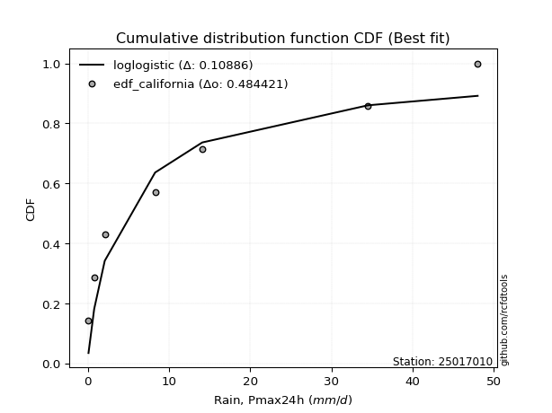</img>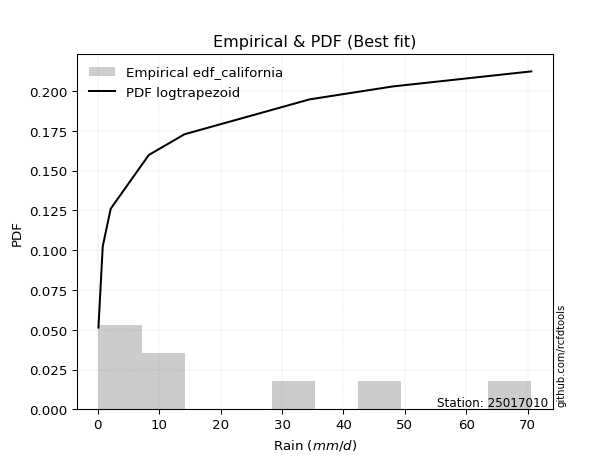</img>

</div>


### 2. Empirical - EDF Hazen (1930)

Hazen method for plotting positions is a formula used to estimate the empirical cumulative probability distribution of flood events or other hydrological data. This formula often results in biased estimations, particularly when extrapolating to extreme events (high return periods).

<div align="center">


$P=(m-0.5)/n$


</div>


**2.1. Empirical values**

<div align="center">

|                | 0                  | 1                  | 2                  | 3                  | 4                  | 5         | 6                 | 7         |
|:---------------|:-------------------|:-------------------|:-------------------|:-------------------|:-------------------|:----------|:------------------|:----------|
| date           | 2022               | 2018               | 2017               | 2020               | 2021               | 2025      | 2019              | 2024      |
| x              | 0.1                | 0.8                | 2.1                | 8.3                | 14.1               | 27.6      | 34.5              | 48.0      |
| m              | 1                  | 2                  | 3                  | 4                  | 5                  | 6         | 7                 | 8         |
| empirical_dist | edf_hazen          | edf_hazen          | edf_hazen          | edf_hazen          | edf_hazen          | edf_hazen | edf_hazen         | edf_hazen |
| empirical      | 0.0625             | 0.1875             | 0.3125             | 0.4375             | 0.5625             | 0.6875    | 0.8125            | 0.9375    |
| empirical_tr   | 1.0666666666666667 | 1.2307692307692308 | 1.4545454545454546 | 1.7777777777777777 | 2.2857142857142856 | 3.2       | 5.333333333333333 | 16.0      |

</div>


**2.2. Kolmogorov-Smirnov fit test (sorted by Δ)**


<div align="center">

|                | 0                     | 1                   | 2                   | 3                  | 4                   | 5                  | 6                  | 7                   | 8                  | 9                   | 10                  | 11                 | 12                  | 13                 | 14                  | 15                  | 16                  | 17                  | 18                  | 19                  | 20                  | 21                  | 22                  | 23                  | 24                  | 25                  | 26                  | 27                  | 28                  | 29                  | 30                 | 31                  | 32                  | 33                 | 34                 | 35                  | 36                 | 37                  | 38                  | 39                  | 40                 | 41                 | 42                  | 43                 | 44                 | 45                  | 46                 | 47                  | 48                  | 49                 | 50                  | 51                  | 52                 | 53                  | 54                  | 55                  | 56                  | 57                  | 58                 | 59                  | 60                  | 61                 | 62                  | 63                  | 64                  | 65                  | 66                  | 67                  | 68                  | 69                 | 70                  | 71                  | 72                 | 73                 | 74                  | 75                  | 76                  | 77                 | 78                 | 79                  | 80                  | 81                 | 82                 | 83                  | 84                  | 85                 | 86                 | 87                 | 88                 | 89                 |
|:---------------|:----------------------|:--------------------|:--------------------|:-------------------|:--------------------|:-------------------|:-------------------|:--------------------|:-------------------|:--------------------|:--------------------|:-------------------|:--------------------|:-------------------|:--------------------|:--------------------|:--------------------|:--------------------|:--------------------|:--------------------|:--------------------|:--------------------|:--------------------|:--------------------|:--------------------|:--------------------|:--------------------|:--------------------|:--------------------|:--------------------|:-------------------|:--------------------|:--------------------|:-------------------|:-------------------|:--------------------|:-------------------|:--------------------|:--------------------|:--------------------|:-------------------|:-------------------|:--------------------|:-------------------|:-------------------|:--------------------|:-------------------|:--------------------|:--------------------|:-------------------|:--------------------|:--------------------|:-------------------|:--------------------|:--------------------|:--------------------|:--------------------|:--------------------|:-------------------|:--------------------|:--------------------|:-------------------|:--------------------|:--------------------|:--------------------|:--------------------|:--------------------|:--------------------|:--------------------|:-------------------|:--------------------|:--------------------|:-------------------|:-------------------|:--------------------|:--------------------|:--------------------|:-------------------|:-------------------|:--------------------|:--------------------|:-------------------|:-------------------|:--------------------|:--------------------|:-------------------|:-------------------|:-------------------|:-------------------|:-------------------|
| station        | 25017010              | 25017010            | 25017010            | 25017010           | 25017010            | 25017010           | 25017010           | 25017010            | 25017010           | 25017010            | 25017010            | 25017010           | 25017010            | 25017010           | 25017010            | 25017010            | 25017010            | 25017010            | 25017010            | 25017010            | 25017010            | 25017010            | 25017010            | 25017010            | 25017010            | 25017010            | 25017010            | 25017010            | 25017010            | 25017010            | 25017010           | 25017010            | 25017010            | 25017010           | 25017010           | 25017010            | 25017010           | 25017010            | 25017010            | 25017010            | 25017010           | 25017010           | 25017010            | 25017010           | 25017010           | 25017010            | 25017010           | 25017010            | 25017010            | 25017010           | 25017010            | 25017010            | 25017010           | 25017010            | 25017010            | 25017010            | 25017010            | 25017010            | 25017010           | 25017010            | 25017010            | 25017010           | 25017010            | 25017010            | 25017010            | 25017010            | 25017010            | 25017010            | 25017010            | 25017010           | 25017010            | 25017010            | 25017010           | 25017010           | 25017010            | 25017010            | 25017010            | 25017010           | 25017010           | 25017010            | 25017010            | 25017010           | 25017010           | 25017010            | 25017010            | 25017010           | 25017010           | 25017010           | 25017010           | 25017010           |
| empirical_dist | edf_hazen             | edf_hazen           | edf_hazen           | edf_hazen          | edf_hazen           | edf_hazen          | edf_hazen          | edf_hazen           | edf_hazen          | edf_hazen           | edf_hazen           | edf_hazen          | edf_hazen           | edf_hazen          | edf_hazen           | edf_hazen           | edf_hazen           | edf_hazen           | edf_hazen           | edf_hazen           | edf_hazen           | edf_hazen           | edf_hazen           | edf_hazen           | edf_hazen           | edf_hazen           | edf_hazen           | edf_hazen           | edf_hazen           | edf_hazen           | edf_hazen          | edf_hazen           | edf_hazen           | edf_hazen          | edf_hazen          | edf_hazen           | edf_hazen          | edf_hazen           | edf_hazen           | edf_hazen           | edf_hazen          | edf_hazen          | edf_hazen           | edf_hazen          | edf_hazen          | edf_hazen           | edf_hazen          | edf_hazen           | edf_hazen           | edf_hazen          | edf_hazen           | edf_hazen           | edf_hazen          | edf_hazen           | edf_hazen           | edf_hazen           | edf_hazen           | edf_hazen           | edf_hazen          | edf_hazen           | edf_hazen           | edf_hazen          | edf_hazen           | edf_hazen           | edf_hazen           | edf_hazen           | edf_hazen           | edf_hazen           | edf_hazen           | edf_hazen          | edf_hazen           | edf_hazen           | edf_hazen          | edf_hazen          | edf_hazen           | edf_hazen           | edf_hazen           | edf_hazen          | edf_hazen          | edf_hazen           | edf_hazen           | edf_hazen          | edf_hazen          | edf_hazen           | edf_hazen           | edf_hazen          | edf_hazen          | edf_hazen          | edf_hazen          | edf_hazen          |
| p_dist         | loglaplace_asymmetric | logloggamma         | logjohnsonsu        | nakagami           | logpearson3         | mielke             | loggumbel_l        | halfnorm            | rayleigh           | logweibull_min      | loggompertz         | maxwell            | f                   | weibull_min        | pearson3            | alpha               | t                   | crystalball         | norm                | gumbel_r            | loglognorm          | halflogistic        | lognct              | logexponnorm        | logt                | lognorm             | lognorm             | lognakagami         | genlogistic         | logerlang           | logfatiguelife     | invgamma            | logrice             | ncf                | invweibull         | loglogistic         | invgauss           | loggamma            | loggamma            | nct                 | fisk               | kstwobign          | logbetaprime        | logistic           | moyal              | loghypsecant        | loginvgamma        | loginvgauss         | loginvweibull       | logmaxwell         | hypsecant           | rice                | logmielke          | lograyleigh         | loglaplace          | logkstwobign        | johnsonsu           | loggenexpon         | laplace            | gumbel_l            | exponnorm           | genexpon           | expon               | laplace_asymmetric  | gompertz            | loghalfnorm         | loggumbel_r         | betaprime           | logexpon            | loghalflogistic    | logmoyal            | truncnorm           | gamma              | logtruncnorm       | erlang              | logwald             | logncf              | wald               | gibrat             | loggibrat           | logfisk             | pareto             | logalpha           | fatiguelife         | logf                | logpareto          | chi2               | logchi2            | loggenlogistic     | logcrystalball     |
| delta          | 0.0859917488182893    | 0.08708409257653904 | 0.08778294718918267 | 0.0894550580872272 | 0.09118065583618051 | 0.0968813704634093 | 0.1023959335036273 | 0.10534509113171381 | 0.1106068323345259 | 0.11219660561905576 | 0.11328518898565187 | 0.1148217289679582 | 0.12052144335475956 | 0.1211332453507796 | 0.12301027793074806 | 0.13374290286915147 | 0.13488330044462704 | 0.13489130620243078 | 0.13489130884647843 | 0.13933725694504942 | 0.14014960270990173 | 0.14037536076442678 | 0.14159723208789954 | 0.14176537140382062 | 0.14176591668553007 | 0.14176615970235984 | 0.14176615970235984 | 0.14221152380744273 | 0.14333952895543098 | 0.14463614035910732 | 0.1454141139530063 | 0.14591760178140056 | 0.14790292640157598 | 0.1503010540577555 | 0.1520673076143868 | 0.15221559578061883 | 0.1530680845186777 | 0.15366103164388467 | 0.15366103164388467 | 0.15367065647411782 | 0.1544050516374783 | 0.154809264915323  | 0.15495801248248942 | 0.1561095985131682 | 0.1570694269266146 | 0.16090238112902178 | 0.1631160956747113 | 0.16488020983150875 | 0.16521287646924476 | 0.1700291476731678 | 0.17149427690440977 | 0.17227615376746958 | 0.1726365994806639 | 0.17892174606589917 | 0.18568963194029053 | 0.19085994142291018 | 0.19186709785229716 | 0.19522898040723802 | 0.1967922081360738 | 0.19912247932952554 | 0.19986906004350935 | 0.20049613054631   | 0.20050093808876213 | 0.20050288912911463 | 0.20185449229922334 | 0.20411900728944143 | 0.21014112235913485 | 0.22414522906583512 | 0.22971696162414768 | 0.2321574410424896 | 0.23385612441884063 | 0.23574893084297444 | 0.254759528299379  | 0.266763860296208  | 0.29560039412808825 | 0.29975283483380544 | 0.30056909281316396 | 0.3052071694201538 | 0.3125             | 0.33068031366573303 | 0.33556097184740263 | 0.3479806897832588 | 0.3832491945985035 | 0.39620837352026683 | 0.42482706300876527 | 0.4583912559251635 | 0.5078860398237547 | 0.6139710064644534 | 0.8125             | nan                |
| deltao         | 0.4472608134160001    | 0.4472608134160001  | 0.4472608134160001  | 0.4472608134160001 | 0.4472608134160001  | 0.4472608134160001 | 0.4472608134160001 | 0.4472608134160001  | 0.4472608134160001 | 0.4472608134160001  | 0.4472608134160001  | 0.4472608134160001 | 0.4472608134160001  | 0.4472608134160001 | 0.4472608134160001  | 0.4472608134160001  | 0.4472608134160001  | 0.4472608134160001  | 0.4472608134160001  | 0.4472608134160001  | 0.4472608134160001  | 0.4472608134160001  | 0.4472608134160001  | 0.4472608134160001  | 0.4472608134160001  | 0.4472608134160001  | 0.4472608134160001  | 0.4472608134160001  | 0.4472608134160001  | 0.4472608134160001  | 0.4472608134160001 | 0.4472608134160001  | 0.4472608134160001  | 0.4472608134160001 | 0.4472608134160001 | 0.4472608134160001  | 0.4472608134160001 | 0.4472608134160001  | 0.4472608134160001  | 0.4472608134160001  | 0.4472608134160001 | 0.4472608134160001 | 0.4472608134160001  | 0.4472608134160001 | 0.4472608134160001 | 0.4472608134160001  | 0.4472608134160001 | 0.4472608134160001  | 0.4472608134160001  | 0.4472608134160001 | 0.4472608134160001  | 0.4472608134160001  | 0.4472608134160001 | 0.4472608134160001  | 0.4472608134160001  | 0.4472608134160001  | 0.4472608134160001  | 0.4472608134160001  | 0.4472608134160001 | 0.4472608134160001  | 0.4472608134160001  | 0.4472608134160001 | 0.4472608134160001  | 0.4472608134160001  | 0.4472608134160001  | 0.4472608134160001  | 0.4472608134160001  | 0.4472608134160001  | 0.4472608134160001  | 0.4472608134160001 | 0.4472608134160001  | 0.4472608134160001  | 0.4472608134160001 | 0.4472608134160001 | 0.4472608134160001  | 0.4472608134160001  | 0.4472608134160001  | 0.4472608134160001 | 0.4472608134160001 | 0.4472608134160001  | 0.4472608134160001  | 0.4472608134160001 | 0.4472608134160001 | 0.4472608134160001  | 0.4472608134160001  | 0.4472608134160001 | 0.4472608134160001 | 0.4472608134160001 | 0.4472608134160001 | 0.4472608134160001 |
| eval           | Δo > Δ                | Δo > Δ              | Δo > Δ              | Δo > Δ             | Δo > Δ              | Δo > Δ             | Δo > Δ             | Δo > Δ              | Δo > Δ             | Δo > Δ              | Δo > Δ              | Δo > Δ             | Δo > Δ              | Δo > Δ             | Δo > Δ              | Δo > Δ              | Δo > Δ              | Δo > Δ              | Δo > Δ              | Δo > Δ              | Δo > Δ              | Δo > Δ              | Δo > Δ              | Δo > Δ              | Δo > Δ              | Δo > Δ              | Δo > Δ              | Δo > Δ              | Δo > Δ              | Δo > Δ              | Δo > Δ             | Δo > Δ              | Δo > Δ              | Δo > Δ             | Δo > Δ             | Δo > Δ              | Δo > Δ             | Δo > Δ              | Δo > Δ              | Δo > Δ              | Δo > Δ             | Δo > Δ             | Δo > Δ              | Δo > Δ             | Δo > Δ             | Δo > Δ              | Δo > Δ             | Δo > Δ              | Δo > Δ              | Δo > Δ             | Δo > Δ              | Δo > Δ              | Δo > Δ             | Δo > Δ              | Δo > Δ              | Δo > Δ              | Δo > Δ              | Δo > Δ              | Δo > Δ             | Δo > Δ              | Δo > Δ              | Δo > Δ             | Δo > Δ              | Δo > Δ              | Δo > Δ              | Δo > Δ              | Δo > Δ              | Δo > Δ              | Δo > Δ              | Δo > Δ             | Δo > Δ              | Δo > Δ              | Δo > Δ             | Δo > Δ             | Δo > Δ              | Δo > Δ              | Δo > Δ              | Δo > Δ             | Δo > Δ             | Δo > Δ              | Δo > Δ              | Δo > Δ             | Δo > Δ             | Δo > Δ              | Δo > Δ              | Δo <= Δ            | Δo <= Δ            | Δo <= Δ            | Δo <= Δ            | Δo <= Δ            |
| fit            | 1                     | 1                   | 1                   | 1                  | 1                   | 1                  | 1                  | 1                   | 1                  | 1                   | 1                   | 1                  | 1                   | 1                  | 1                   | 1                   | 1                   | 1                   | 1                   | 1                   | 1                   | 1                   | 1                   | 1                   | 1                   | 1                   | 1                   | 1                   | 1                   | 1                   | 1                  | 1                   | 1                   | 1                  | 1                  | 1                   | 1                  | 1                   | 1                   | 1                   | 1                  | 1                  | 1                   | 1                  | 1                  | 1                   | 1                  | 1                   | 1                   | 1                  | 1                   | 1                   | 1                  | 1                   | 1                   | 1                   | 1                   | 1                   | 1                  | 1                   | 1                   | 1                  | 1                   | 1                   | 1                   | 1                   | 1                   | 1                   | 1                   | 1                  | 1                   | 1                   | 1                  | 1                  | 1                   | 1                   | 1                   | 1                  | 1                  | 1                   | 1                   | 1                  | 1                  | 1                   | 1                   | 0                  | 0                  | 0                  | 0                  | 0                  |
| n              | 8                     | 8                   | 8                   | 8                  | 8                   | 8                  | 8                  | 8                   | 8                  | 8                   | 8                   | 8                  | 8                   | 8                  | 8                   | 8                   | 8                   | 8                   | 8                   | 8                   | 8                   | 8                   | 8                   | 8                   | 8                   | 8                   | 8                   | 8                   | 8                   | 8                   | 8                  | 8                   | 8                   | 8                  | 8                  | 8                   | 8                  | 8                   | 8                   | 8                   | 8                  | 8                  | 8                   | 8                  | 8                  | 8                   | 8                  | 8                   | 8                   | 8                  | 8                   | 8                   | 8                  | 8                   | 8                   | 8                   | 8                   | 8                   | 8                  | 8                   | 8                   | 8                  | 8                   | 8                   | 8                   | 8                   | 8                   | 8                   | 8                   | 8                  | 8                   | 8                   | 8                  | 8                  | 8                   | 8                   | 8                   | 8                  | 8                  | 8                   | 8                   | 8                  | 8                  | 8                   | 8                   | 8                  | 8                  | 8                  | 8                  | 8                  |
| best_fit       | 1                     | 0                   | 0                   | 0                  | 0                   | 0                  | 0                  | 0                   | 0                  | 0                   | 0                   | 0                  | 0                   | 0                  | 0                   | 0                   | 0                   | 0                   | 0                   | 0                   | 0                   | 0                   | 0                   | 0                   | 0                   | 0                   | 0                   | 0                   | 0                   | 0                   | 0                  | 0                   | 0                   | 0                  | 0                  | 0                   | 0                  | 0                   | 0                   | 0                   | 0                  | 0                  | 0                   | 0                  | 0                  | 0                   | 0                  | 0                   | 0                   | 0                  | 0                   | 0                   | 0                  | 0                   | 0                   | 0                   | 0                   | 0                   | 0                  | 0                   | 0                   | 0                  | 0                   | 0                   | 0                   | 0                   | 0                   | 0                   | 0                   | 0                  | 0                   | 0                   | 0                  | 0                  | 0                   | 0                   | 0                   | 0                  | 0                  | 0                   | 0                   | 0                  | 0                  | 0                   | 0                   | 0                  | 0                  | 0                  | 0                  | 0                  |
| best_fit_sort  | 1                     | 2                   | 3                   | 4                  | 5                   | 6                  | 7                  | 8                   | 9                  | 10                  | 11                  | 12                 | 13                  | 14                 | 15                  | 16                  | 17                  | 18                  | 19                  | 20                  | 21                  | 22                  | 23                  | 24                  | 25                  | 26                  | 27                  | 28                  | 29                  | 30                  | 31                 | 32                  | 33                  | 34                 | 35                 | 36                  | 37                 | 38                  | 39                  | 40                  | 41                 | 42                 | 43                  | 44                 | 45                 | 46                  | 47                 | 48                  | 49                  | 50                 | 51                  | 52                  | 53                 | 54                  | 55                  | 56                  | 57                  | 58                  | 59                 | 60                  | 61                  | 62                 | 63                  | 64                  | 65                  | 66                  | 67                  | 68                  | 69                  | 70                 | 71                  | 72                  | 73                 | 74                 | 75                  | 76                  | 77                  | 78                 | 79                 | 80                  | 81                  | 82                 | 83                 | 84                  | 85                  | 86                 | 87                 | 88                 | 89                 | 90                 |

</div>


<div align="center">

</img>

</div>


**2.3. Best fit**

<div align="center">

|   id |   station | empirical_dist   | p_dist                |     delta |   deltao | eval   |   fit |   n |   best_fit |   best_fit_sort |
|-----:|----------:|:-----------------|:----------------------|----------:|---------:|:-------|------:|----:|-----------:|----------------:|
|    0 |  25017010 | edf_hazen        | loglaplace_asymmetric | 0.0859917 | 0.447261 | Δo > Δ |     1 |   8 |          1 |               1 |

</div>


<div align="center">

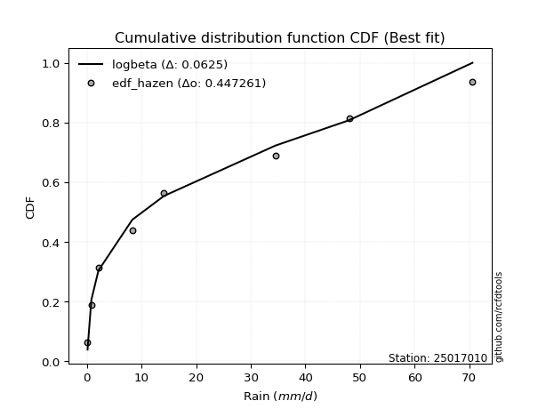</img>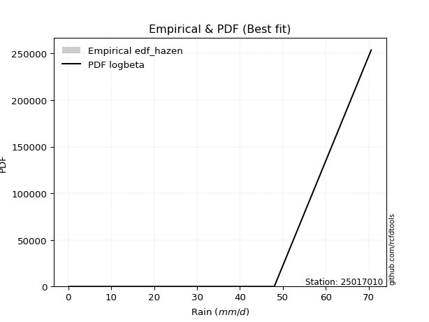</img>

</div>


### 3. Empirical - EDF Weibull (1939)

Weibull plotting position formula is an empirical method used to estimate the non-exceedance probability or plotting position for a set of observed data, is often recommended or widely used in practice, particularly in flood frequency analysis.

<div align="center">


$P=m/(n+1)$


</div>


**3.1. Empirical values**

<div align="center">

|                | 0                  | 1                  | 2                  | 3                  | 4                  | 5                  | 6                  | 7                  |
|:---------------|:-------------------|:-------------------|:-------------------|:-------------------|:-------------------|:-------------------|:-------------------|:-------------------|
| date           | 2022               | 2018               | 2017               | 2020               | 2021               | 2025               | 2019               | 2024               |
| x              | 0.1                | 0.8                | 2.1                | 8.3                | 14.1               | 27.6               | 34.5               | 48.0               |
| m              | 1                  | 2                  | 3                  | 4                  | 5                  | 6                  | 7                  | 8                  |
| empirical_dist | edf_weibull        | edf_weibull        | edf_weibull        | edf_weibull        | edf_weibull        | edf_weibull        | edf_weibull        | edf_weibull        |
| empirical      | 0.1111111111111111 | 0.2222222222222222 | 0.3333333333333333 | 0.4444444444444444 | 0.5555555555555556 | 0.6666666666666666 | 0.7777777777777778 | 0.8888888888888888 |
| empirical_tr   | 1.125              | 1.2857142857142856 | 1.4999999999999998 | 1.7999999999999998 | 2.25               | 2.9999999999999996 | 4.5                | 8.999999999999996  |

</div>


**3.2. Kolmogorov-Smirnov fit test (sorted by Δ)**


<div align="center">

|                | 0                   | 1                     | 2                   | 3                   | 4                   | 5                   | 6                   | 7                   | 8                   | 9                  | 10                  | 11                  | 12                 | 13                  | 14                  | 15                 | 16                  | 17                  | 18                  | 19                 | 20                 | 21                 | 22                  | 23                  | 24                  | 25                  | 26                  | 27                  | 28                 | 29                  | 30                  | 31                 | 32                  | 33                  | 34                 | 35                 | 36                  | 37                  | 38                  | 39                 | 40                  | 41                  | 42                 | 43                  | 44                 | 45                  | 46                  | 47                  | 48                  | 49                  | 50                  | 51                  | 52                  | 53                  | 54                  | 55                  | 56                 | 57                 | 58                  | 59                  | 60                  | 61                 | 62                 | 63                  | 64                 | 65                  | 66                  | 67                  | 68                  | 69                  | 70                 | 71                  | 72                 | 73                  | 74                  | 75                  | 76                 | 77                 | 78                 | 79                 | 80                 | 81                 | 82                 | 83                 | 84                  | 85                 | 86                 | 87                 | 88                 | 89                 |
|:---------------|:--------------------|:----------------------|:--------------------|:--------------------|:--------------------|:--------------------|:--------------------|:--------------------|:--------------------|:-------------------|:--------------------|:--------------------|:-------------------|:--------------------|:--------------------|:-------------------|:--------------------|:--------------------|:--------------------|:-------------------|:-------------------|:-------------------|:--------------------|:--------------------|:--------------------|:--------------------|:--------------------|:--------------------|:-------------------|:--------------------|:--------------------|:-------------------|:--------------------|:--------------------|:-------------------|:-------------------|:--------------------|:--------------------|:--------------------|:-------------------|:--------------------|:--------------------|:-------------------|:--------------------|:-------------------|:--------------------|:--------------------|:--------------------|:--------------------|:--------------------|:--------------------|:--------------------|:--------------------|:--------------------|:--------------------|:--------------------|:-------------------|:-------------------|:--------------------|:--------------------|:--------------------|:-------------------|:-------------------|:--------------------|:-------------------|:--------------------|:--------------------|:--------------------|:--------------------|:--------------------|:-------------------|:--------------------|:-------------------|:--------------------|:--------------------|:--------------------|:-------------------|:-------------------|:-------------------|:-------------------|:-------------------|:-------------------|:-------------------|:-------------------|:--------------------|:-------------------|:-------------------|:-------------------|:-------------------|:-------------------|
| station        | 25017010            | 25017010              | 25017010            | 25017010            | 25017010            | 25017010            | 25017010            | 25017010            | 25017010            | 25017010           | 25017010            | 25017010            | 25017010           | 25017010            | 25017010            | 25017010           | 25017010            | 25017010            | 25017010            | 25017010           | 25017010           | 25017010           | 25017010            | 25017010            | 25017010            | 25017010            | 25017010            | 25017010            | 25017010           | 25017010            | 25017010            | 25017010           | 25017010            | 25017010            | 25017010           | 25017010           | 25017010            | 25017010            | 25017010            | 25017010           | 25017010            | 25017010            | 25017010           | 25017010            | 25017010           | 25017010            | 25017010            | 25017010            | 25017010            | 25017010            | 25017010            | 25017010            | 25017010            | 25017010            | 25017010            | 25017010            | 25017010           | 25017010           | 25017010            | 25017010            | 25017010            | 25017010           | 25017010           | 25017010            | 25017010           | 25017010            | 25017010            | 25017010            | 25017010            | 25017010            | 25017010           | 25017010            | 25017010           | 25017010            | 25017010            | 25017010            | 25017010           | 25017010           | 25017010           | 25017010           | 25017010           | 25017010           | 25017010           | 25017010           | 25017010            | 25017010           | 25017010           | 25017010           | 25017010           | 25017010           |
| empirical_dist | edf_weibull         | edf_weibull           | edf_weibull         | edf_weibull         | edf_weibull         | edf_weibull         | edf_weibull         | edf_weibull         | edf_weibull         | edf_weibull        | edf_weibull         | edf_weibull         | edf_weibull        | edf_weibull         | edf_weibull         | edf_weibull        | edf_weibull         | edf_weibull         | edf_weibull         | edf_weibull        | edf_weibull        | edf_weibull        | edf_weibull         | edf_weibull         | edf_weibull         | edf_weibull         | edf_weibull         | edf_weibull         | edf_weibull        | edf_weibull         | edf_weibull         | edf_weibull        | edf_weibull         | edf_weibull         | edf_weibull        | edf_weibull        | edf_weibull         | edf_weibull         | edf_weibull         | edf_weibull        | edf_weibull         | edf_weibull         | edf_weibull        | edf_weibull         | edf_weibull        | edf_weibull         | edf_weibull         | edf_weibull         | edf_weibull         | edf_weibull         | edf_weibull         | edf_weibull         | edf_weibull         | edf_weibull         | edf_weibull         | edf_weibull         | edf_weibull        | edf_weibull        | edf_weibull         | edf_weibull         | edf_weibull         | edf_weibull        | edf_weibull        | edf_weibull         | edf_weibull        | edf_weibull         | edf_weibull         | edf_weibull         | edf_weibull         | edf_weibull         | edf_weibull        | edf_weibull         | edf_weibull        | edf_weibull         | edf_weibull         | edf_weibull         | edf_weibull        | edf_weibull        | edf_weibull        | edf_weibull        | edf_weibull        | edf_weibull        | edf_weibull        | edf_weibull        | edf_weibull         | edf_weibull        | edf_weibull        | edf_weibull        | edf_weibull        | edf_weibull        |
| p_dist         | logjohnsonsu        | loglaplace_asymmetric | logpearson3         | logloggamma         | nakagami            | fisk                | mielke              | loggumbel_l         | halfnorm            | rayleigh           | logweibull_min      | f                   | loglognorm         | loggompertz         | lognct              | logexponnorm       | logt                | lognorm             | lognorm             | lognakagami        | maxwell            | logerlang          | logfatiguelife      | invgamma            | logrice             | weibull_min         | pearson3            | invweibull          | loglogistic        | t                   | crystalball         | norm               | loggamma            | loggamma            | nct                | logbetaprime       | alpha               | loginvgamma         | loginvgauss         | loghypsecant       | loginvweibull       | gumbel_r            | halflogistic       | logmaxwell          | genlogistic        | logmielke           | logistic            | ncf                 | lograyleigh         | invgauss            | kstwobign           | moyal               | hypsecant           | logkstwobign        | loglaplace          | johnsonsu           | loggenexpon        | rice               | gumbel_l            | loghalfnorm         | loggumbel_r         | laplace            | betaprime          | exponnorm           | genexpon           | expon               | laplace_asymmetric  | gompertz            | logexpon            | loghalflogistic     | logmoyal           | truncnorm           | logtruncnorm       | logncf              | gamma               | erlang              | logwald            | logfisk            | pareto             | loggibrat          | wald               | gibrat             | logalpha           | fatiguelife        | logf                | logpareto          | chi2               | logchi2            | loggenlogistic     | logcrystalball     |
| delta          | 0.10861628052251598 | 0.1107691322862312    | 0.11098851725828585 | 0.11108704983448658 | 0.11111089174386615 | 0.11111111110991982 | 0.11771470379674262 | 0.12322926683696067 | 0.12617842446504712 | 0.1314401656678592 | 0.13302993895238913 | 0.13312078909240066 | 0.1332051582654573 | 0.13411852231898524 | 0.13465278764345512 | 0.1348209269593762 | 0.13482147224108565 | 0.13482171525791542 | 0.13482171525791542 | 0.1352670793629983 | 0.1356550623012915 | 0.1376916959146629 | 0.13846966950856188 | 0.13945613701700688 | 0.14095848195713157 | 0.14196657868411292 | 0.14384361126408138 | 0.14512286316994238 | 0.1452711513361744 | 0.14604267041244062 | 0.14605007298000688 | 0.1460500731652144 | 0.14671658719944025 | 0.14671658719944025 | 0.1467262120296734 | 0.148013568038045  | 0.15457623620248484 | 0.15617165123026688 | 0.15793576538706433 | 0.1579714629336425 | 0.15826843202480034 | 0.16017059027838274 | 0.1612086940977601 | 0.16308470322872337 | 0.1641728622887643 | 0.16569215503621948 | 0.16682341784493565 | 0.17113438739108888 | 0.17197730162145475 | 0.17341901896329714 | 0.17564259824865633 | 0.17790276025994792 | 0.17864317856995648 | 0.18391549697846576 | 0.18475293736610232 | 0.18492265340785274 | 0.1882845359627936 | 0.1931094871008029 | 0.19320823217819483 | 0.19717456284499701 | 0.20319667791469043 | 0.2037366525805182 | 0.2172007846213907 | 0.22070239337684266 | 0.2213294638796433 | 0.22133427142209544 | 0.22133622246244794 | 0.22268782563255665 | 0.22277251717970326 | 0.22521299659804517 | 0.2269116799743962 | 0.25658226417630775 | 0.2598194158517636 | 0.26584687059094175 | 0.27559286163271235 | 0.28865594968364383 | 0.292808390389361  | 0.3008387496251804 | 0.3132584675610366 | 0.3237358692212886 | 0.3260405027534871 | 0.3333333333333333 | 0.3485269723762813 | 0.3614861512980446 | 0.39010484078654306 | 0.4236690337029413 | 0.5009415953793103 | 0.5792487842422311 | 0.7777777777777778 | nan                |
| deltao         | 0.4472608134160001  | 0.4472608134160001    | 0.4472608134160001  | 0.4472608134160001  | 0.4472608134160001  | 0.4472608134160001  | 0.4472608134160001  | 0.4472608134160001  | 0.4472608134160001  | 0.4472608134160001 | 0.4472608134160001  | 0.4472608134160001  | 0.4472608134160001 | 0.4472608134160001  | 0.4472608134160001  | 0.4472608134160001 | 0.4472608134160001  | 0.4472608134160001  | 0.4472608134160001  | 0.4472608134160001 | 0.4472608134160001 | 0.4472608134160001 | 0.4472608134160001  | 0.4472608134160001  | 0.4472608134160001  | 0.4472608134160001  | 0.4472608134160001  | 0.4472608134160001  | 0.4472608134160001 | 0.4472608134160001  | 0.4472608134160001  | 0.4472608134160001 | 0.4472608134160001  | 0.4472608134160001  | 0.4472608134160001 | 0.4472608134160001 | 0.4472608134160001  | 0.4472608134160001  | 0.4472608134160001  | 0.4472608134160001 | 0.4472608134160001  | 0.4472608134160001  | 0.4472608134160001 | 0.4472608134160001  | 0.4472608134160001 | 0.4472608134160001  | 0.4472608134160001  | 0.4472608134160001  | 0.4472608134160001  | 0.4472608134160001  | 0.4472608134160001  | 0.4472608134160001  | 0.4472608134160001  | 0.4472608134160001  | 0.4472608134160001  | 0.4472608134160001  | 0.4472608134160001 | 0.4472608134160001 | 0.4472608134160001  | 0.4472608134160001  | 0.4472608134160001  | 0.4472608134160001 | 0.4472608134160001 | 0.4472608134160001  | 0.4472608134160001 | 0.4472608134160001  | 0.4472608134160001  | 0.4472608134160001  | 0.4472608134160001  | 0.4472608134160001  | 0.4472608134160001 | 0.4472608134160001  | 0.4472608134160001 | 0.4472608134160001  | 0.4472608134160001  | 0.4472608134160001  | 0.4472608134160001 | 0.4472608134160001 | 0.4472608134160001 | 0.4472608134160001 | 0.4472608134160001 | 0.4472608134160001 | 0.4472608134160001 | 0.4472608134160001 | 0.4472608134160001  | 0.4472608134160001 | 0.4472608134160001 | 0.4472608134160001 | 0.4472608134160001 | 0.4472608134160001 |
| eval           | Δo > Δ              | Δo > Δ                | Δo > Δ              | Δo > Δ              | Δo > Δ              | Δo > Δ              | Δo > Δ              | Δo > Δ              | Δo > Δ              | Δo > Δ             | Δo > Δ              | Δo > Δ              | Δo > Δ             | Δo > Δ              | Δo > Δ              | Δo > Δ             | Δo > Δ              | Δo > Δ              | Δo > Δ              | Δo > Δ             | Δo > Δ             | Δo > Δ             | Δo > Δ              | Δo > Δ              | Δo > Δ              | Δo > Δ              | Δo > Δ              | Δo > Δ              | Δo > Δ             | Δo > Δ              | Δo > Δ              | Δo > Δ             | Δo > Δ              | Δo > Δ              | Δo > Δ             | Δo > Δ             | Δo > Δ              | Δo > Δ              | Δo > Δ              | Δo > Δ             | Δo > Δ              | Δo > Δ              | Δo > Δ             | Δo > Δ              | Δo > Δ             | Δo > Δ              | Δo > Δ              | Δo > Δ              | Δo > Δ              | Δo > Δ              | Δo > Δ              | Δo > Δ              | Δo > Δ              | Δo > Δ              | Δo > Δ              | Δo > Δ              | Δo > Δ             | Δo > Δ             | Δo > Δ              | Δo > Δ              | Δo > Δ              | Δo > Δ             | Δo > Δ             | Δo > Δ              | Δo > Δ             | Δo > Δ              | Δo > Δ              | Δo > Δ              | Δo > Δ              | Δo > Δ              | Δo > Δ             | Δo > Δ              | Δo > Δ             | Δo > Δ              | Δo > Δ              | Δo > Δ              | Δo > Δ             | Δo > Δ             | Δo > Δ             | Δo > Δ             | Δo > Δ             | Δo > Δ             | Δo > Δ             | Δo > Δ             | Δo > Δ              | Δo > Δ             | Δo <= Δ            | Δo <= Δ            | Δo <= Δ            | Δo <= Δ            |
| fit            | 1                   | 1                     | 1                   | 1                   | 1                   | 1                   | 1                   | 1                   | 1                   | 1                  | 1                   | 1                   | 1                  | 1                   | 1                   | 1                  | 1                   | 1                   | 1                   | 1                  | 1                  | 1                  | 1                   | 1                   | 1                   | 1                   | 1                   | 1                   | 1                  | 1                   | 1                   | 1                  | 1                   | 1                   | 1                  | 1                  | 1                   | 1                   | 1                   | 1                  | 1                   | 1                   | 1                  | 1                   | 1                  | 1                   | 1                   | 1                   | 1                   | 1                   | 1                   | 1                   | 1                   | 1                   | 1                   | 1                   | 1                  | 1                  | 1                   | 1                   | 1                   | 1                  | 1                  | 1                   | 1                  | 1                   | 1                   | 1                   | 1                   | 1                   | 1                  | 1                   | 1                  | 1                   | 1                   | 1                   | 1                  | 1                  | 1                  | 1                  | 1                  | 1                  | 1                  | 1                  | 1                   | 1                  | 0                  | 0                  | 0                  | 0                  |
| n              | 8                   | 8                     | 8                   | 8                   | 8                   | 8                   | 8                   | 8                   | 8                   | 8                  | 8                   | 8                   | 8                  | 8                   | 8                   | 8                  | 8                   | 8                   | 8                   | 8                  | 8                  | 8                  | 8                   | 8                   | 8                   | 8                   | 8                   | 8                   | 8                  | 8                   | 8                   | 8                  | 8                   | 8                   | 8                  | 8                  | 8                   | 8                   | 8                   | 8                  | 8                   | 8                   | 8                  | 8                   | 8                  | 8                   | 8                   | 8                   | 8                   | 8                   | 8                   | 8                   | 8                   | 8                   | 8                   | 8                   | 8                  | 8                  | 8                   | 8                   | 8                   | 8                  | 8                  | 8                   | 8                  | 8                   | 8                   | 8                   | 8                   | 8                   | 8                  | 8                   | 8                  | 8                   | 8                   | 8                   | 8                  | 8                  | 8                  | 8                  | 8                  | 8                  | 8                  | 8                  | 8                   | 8                  | 8                  | 8                  | 8                  | 8                  |
| best_fit       | 1                   | 0                     | 0                   | 0                   | 0                   | 0                   | 0                   | 0                   | 0                   | 0                  | 0                   | 0                   | 0                  | 0                   | 0                   | 0                  | 0                   | 0                   | 0                   | 0                  | 0                  | 0                  | 0                   | 0                   | 0                   | 0                   | 0                   | 0                   | 0                  | 0                   | 0                   | 0                  | 0                   | 0                   | 0                  | 0                  | 0                   | 0                   | 0                   | 0                  | 0                   | 0                   | 0                  | 0                   | 0                  | 0                   | 0                   | 0                   | 0                   | 0                   | 0                   | 0                   | 0                   | 0                   | 0                   | 0                   | 0                  | 0                  | 0                   | 0                   | 0                   | 0                  | 0                  | 0                   | 0                  | 0                   | 0                   | 0                   | 0                   | 0                   | 0                  | 0                   | 0                  | 0                   | 0                   | 0                   | 0                  | 0                  | 0                  | 0                  | 0                  | 0                  | 0                  | 0                  | 0                   | 0                  | 0                  | 0                  | 0                  | 0                  |
| best_fit_sort  | 1                   | 2                     | 3                   | 4                   | 5                   | 6                   | 7                   | 8                   | 9                   | 10                 | 11                  | 12                  | 13                 | 14                  | 15                  | 16                 | 17                  | 18                  | 19                  | 20                 | 21                 | 22                 | 23                  | 24                  | 25                  | 26                  | 27                  | 28                  | 29                 | 30                  | 31                  | 32                 | 33                  | 34                  | 35                 | 36                 | 37                  | 38                  | 39                  | 40                 | 41                  | 42                  | 43                 | 44                  | 45                 | 46                  | 47                  | 48                  | 49                  | 50                  | 51                  | 52                  | 53                  | 54                  | 55                  | 56                  | 57                 | 58                 | 59                  | 60                  | 61                  | 62                 | 63                 | 64                  | 65                 | 66                  | 67                  | 68                  | 69                  | 70                  | 71                 | 72                  | 73                 | 74                  | 75                  | 76                  | 77                 | 78                 | 79                 | 80                 | 81                 | 82                 | 83                 | 84                 | 85                  | 86                 | 87                 | 88                 | 89                 | 90                 |

</div>


<div align="center">

</img>

</div>


**3.3. Best fit**

<div align="center">

|   id |   station | empirical_dist   | p_dist       |    delta |   deltao | eval   |   fit |   n |   best_fit |   best_fit_sort |
|-----:|----------:|:-----------------|:-------------|---------:|---------:|:-------|------:|----:|-----------:|----------------:|
|    0 |  25017010 | edf_weibull      | logjohnsonsu | 0.108616 | 0.447261 | Δo > Δ |     1 |   8 |          1 |               1 |

</div>


<div align="center">

</img></img>

</div>


### 4. Empirical - EDF Beard (1943)

The Beard formula (or Beard´s plotting position formula) in hydrology is used to estimate the empirical non-exceedance probability _(P)_ of a flood event (or other extreme hydrological data point) within a given dataset.

<div align="center">


$P=(m-0.31)/(n+0.38)$


</div>


**4.1. Empirical values**

<div align="center">

|                | 0                   | 1                   | 2                  | 3                   | 4                  | 5                  | 6                  | 7                  |
|:---------------|:--------------------|:--------------------|:-------------------|:--------------------|:-------------------|:-------------------|:-------------------|:-------------------|
| date           | 2022                | 2018                | 2017               | 2020                | 2021               | 2025               | 2019               | 2024               |
| x              | 0.1                 | 0.8                 | 2.1                | 8.3                 | 14.1               | 27.6               | 34.5               | 48.0               |
| m              | 1                   | 2                   | 3                  | 4                   | 5                  | 6                  | 7                  | 8                  |
| empirical_dist | edf_beard           | edf_beard           | edf_beard          | edf_beard           | edf_beard          | edf_beard          | edf_beard          | edf_beard          |
| empirical      | 0.08233890214797135 | 0.20167064439140808 | 0.3210023866348448 | 0.44033412887828155 | 0.5596658711217184 | 0.6789976133651551 | 0.7983293556085919 | 0.9176610978520287 |
| empirical_tr   | 1.0897269180754225  | 1.2526158445440956  | 1.4727592267135323 | 1.7867803837953091  | 2.2710027100271004 | 3.115241635687732  | 4.958579881656804  | 12.144927536231886 |

</div>


**4.2. Kolmogorov-Smirnov fit test (sorted by Δ)**


<div align="center">

|                | 0                  | 1                     | 2                   | 3                   | 4                  | 5                   | 6                   | 7                   | 8                   | 9                   | 10                  | 11                 | 12                  | 13                  | 14                  | 15                  | 16                  | 17                 | 18                  | 19                  | 20                 | 21                  | 22                  | 23                 | 24                 | 25                  | 26                  | 27                 | 28                  | 29                 | 30                  | 31                  | 32                 | 33                  | 34                  | 35                  | 36                  | 37                  | 38                 | 39                  | 40                  | 41                  | 42                  | 43                  | 44                 | 45                 | 46                 | 47                  | 48                  | 49                  | 50                  | 51                  | 52                  | 53                 | 54                  | 55                  | 56                 | 57                  | 58                  | 59                  | 60                  | 61                 | 62                  | 63                 | 64                  | 65                  | 66                  | 67                  | 68                  | 69                  | 70                  | 71                  | 72                 | 73                  | 74                 | 75                 | 76                 | 77                 | 78                 | 79                  | 80                 | 81                 | 82                 | 83                  | 84                 | 85                 | 86                 | 87                 | 88                 | 89                 |
|:---------------|:-------------------|:----------------------|:--------------------|:--------------------|:-------------------|:--------------------|:--------------------|:--------------------|:--------------------|:--------------------|:--------------------|:-------------------|:--------------------|:--------------------|:--------------------|:--------------------|:--------------------|:-------------------|:--------------------|:--------------------|:-------------------|:--------------------|:--------------------|:-------------------|:-------------------|:--------------------|:--------------------|:-------------------|:--------------------|:-------------------|:--------------------|:--------------------|:-------------------|:--------------------|:--------------------|:--------------------|:--------------------|:--------------------|:-------------------|:--------------------|:--------------------|:--------------------|:--------------------|:--------------------|:-------------------|:-------------------|:-------------------|:--------------------|:--------------------|:--------------------|:--------------------|:--------------------|:--------------------|:-------------------|:--------------------|:--------------------|:-------------------|:--------------------|:--------------------|:--------------------|:--------------------|:-------------------|:--------------------|:-------------------|:--------------------|:--------------------|:--------------------|:--------------------|:--------------------|:--------------------|:--------------------|:--------------------|:-------------------|:--------------------|:-------------------|:-------------------|:-------------------|:-------------------|:-------------------|:--------------------|:-------------------|:-------------------|:-------------------|:--------------------|:-------------------|:-------------------|:-------------------|:-------------------|:-------------------|:-------------------|
| station        | 25017010           | 25017010              | 25017010            | 25017010            | 25017010           | 25017010            | 25017010            | 25017010            | 25017010            | 25017010            | 25017010            | 25017010           | 25017010            | 25017010            | 25017010            | 25017010            | 25017010            | 25017010           | 25017010            | 25017010            | 25017010           | 25017010            | 25017010            | 25017010           | 25017010           | 25017010            | 25017010            | 25017010           | 25017010            | 25017010           | 25017010            | 25017010            | 25017010           | 25017010            | 25017010            | 25017010            | 25017010            | 25017010            | 25017010           | 25017010            | 25017010            | 25017010            | 25017010            | 25017010            | 25017010           | 25017010           | 25017010           | 25017010            | 25017010            | 25017010            | 25017010            | 25017010            | 25017010            | 25017010           | 25017010            | 25017010            | 25017010           | 25017010            | 25017010            | 25017010            | 25017010            | 25017010           | 25017010            | 25017010           | 25017010            | 25017010            | 25017010            | 25017010            | 25017010            | 25017010            | 25017010            | 25017010            | 25017010           | 25017010            | 25017010           | 25017010           | 25017010           | 25017010           | 25017010           | 25017010            | 25017010           | 25017010           | 25017010           | 25017010            | 25017010           | 25017010           | 25017010           | 25017010           | 25017010           | 25017010           |
| empirical_dist | edf_beard          | edf_beard             | edf_beard           | edf_beard           | edf_beard          | edf_beard           | edf_beard           | edf_beard           | edf_beard           | edf_beard           | edf_beard           | edf_beard          | edf_beard           | edf_beard           | edf_beard           | edf_beard           | edf_beard           | edf_beard          | edf_beard           | edf_beard           | edf_beard          | edf_beard           | edf_beard           | edf_beard          | edf_beard          | edf_beard           | edf_beard           | edf_beard          | edf_beard           | edf_beard          | edf_beard           | edf_beard           | edf_beard          | edf_beard           | edf_beard           | edf_beard           | edf_beard           | edf_beard           | edf_beard          | edf_beard           | edf_beard           | edf_beard           | edf_beard           | edf_beard           | edf_beard          | edf_beard          | edf_beard          | edf_beard           | edf_beard           | edf_beard           | edf_beard           | edf_beard           | edf_beard           | edf_beard          | edf_beard           | edf_beard           | edf_beard          | edf_beard           | edf_beard           | edf_beard           | edf_beard           | edf_beard          | edf_beard           | edf_beard          | edf_beard           | edf_beard           | edf_beard           | edf_beard           | edf_beard           | edf_beard           | edf_beard           | edf_beard           | edf_beard          | edf_beard           | edf_beard          | edf_beard          | edf_beard          | edf_beard          | edf_beard          | edf_beard           | edf_beard          | edf_beard          | edf_beard          | edf_beard           | edf_beard          | edf_beard          | edf_beard          | edf_beard          | edf_beard          | edf_beard          |
| p_dist         | nakagami           | loglaplace_asymmetric | logloggamma         | logjohnsonsu        | logpearson3        | mielke              | loggumbel_l         | halfnorm            | rayleigh            | logweibull_min      | f                   | loggompertz        | maxwell             | weibull_min         | pearson3            | fisk                | loglognorm          | t                  | crystalball         | norm                | lognct             | logexponnorm        | logt                | lognorm            | lognorm            | lognakagami         | logerlang           | alpha              | logfatiguelife      | invgamma           | logrice             | gumbel_r            | halflogistic       | invweibull          | loglogistic         | loggamma            | loggamma            | nct                 | genlogistic        | logbetaprime        | loghypsecant        | ncf                 | logistic            | loginvgamma         | invgauss           | loginvgauss        | loginvweibull      | kstwobign           | moyal               | logmaxwell          | logmielke           | hypsecant           | lograyleigh         | rice               | loglaplace          | logkstwobign        | johnsonsu          | loggenexpon         | gumbel_l            | laplace             | loghalfnorm         | loggumbel_r        | exponnorm           | genexpon           | expon               | laplace_asymmetric  | gompertz            | betaprime           | logexpon            | loghalflogistic     | logmoyal            | truncnorm           | gamma              | logtruncnorm        | logncf             | erlang             | logwald            | wald               | gibrat             | logfisk             | loggibrat          | pareto             | logalpha           | fatiguelife         | logf               | logpareto          | chi2               | logchi2            | loggenlogistic     | logcrystalball     |
| delta          | 0.0823386827807264 | 0.09449413545313423   | 0.09558647921138397 | 0.09628533382402749 | 0.0986575705597974 | 0.10538375709825412 | 0.11089832013847223 | 0.11384747776655862 | 0.11910921896937071 | 0.12069899225390068 | 0.12078984239391222 | 0.1217875756204968 | 0.12332411560280301 | 0.12963563198562442 | 0.13151266456559288 | 0.13456614948950696 | 0.13731547383162018 | 0.1377174293229086 | 0.13772543508071233 | 0.13772543772475998 | 0.138763103209618  | 0.13893124252553907 | 0.13893178780724852 | 0.1389320308240783 | 0.1389320308240783 | 0.13937739492916118 | 0.14180201148082577 | 0.1422452895039964 | 0.14257998507472475 | 0.143083472903119  | 0.14506879752329443 | 0.14783964357989424 | 0.1488777473992716 | 0.14923317873610525 | 0.14938146690233728 | 0.15082690276560312 | 0.15082690276560312 | 0.15083652759583627 | 0.1518419155902758 | 0.15212388360420787 | 0.15806825225074023 | 0.15880344069260044 | 0.15894372739144974 | 0.16028196679642975 | 0.1610880722648087 | 0.1620460809532272 | 0.1623787475909632 | 0.16331165155016783 | 0.16557181356145942 | 0.16719501879488624 | 0.16980247060238235 | 0.17432840578269132 | 0.17608761718761762 | 0.1807785404023144 | 0.18285550306200898 | 0.18802581254462863 | 0.1890329689740156 | 0.19239485152895647 | 0.19628835045124393 | 0.19962633701435534 | 0.20128487841115988 | 0.2073069934808533 | 0.20837144667835417 | 0.2089985171811548 | 0.20900332472360694 | 0.20900527576395944 | 0.21035687893406815 | 0.22131110018755357 | 0.22688283274586613 | 0.22932331216420804 | 0.23102199554055908 | 0.24425131747781925 | 0.2632619149342239 | 0.26392973141792647 | 0.2863984484217559 | 0.2927662652498067 | 0.2969187059555239 | 0.3137095560549986 | 0.3210023866348448 | 0.32139032745599455 | 0.3278461847874515 | 0.3338100453918507 | 0.3690785502070954 | 0.38203772912885875 | 0.4106564186173572 | 0.4442206115337554 | 0.5050519109454732 | 0.5998003620730452 | 0.7983293556085919 | nan                |
| deltao         | 0.4472608134160001 | 0.4472608134160001    | 0.4472608134160001  | 0.4472608134160001  | 0.4472608134160001 | 0.4472608134160001  | 0.4472608134160001  | 0.4472608134160001  | 0.4472608134160001  | 0.4472608134160001  | 0.4472608134160001  | 0.4472608134160001 | 0.4472608134160001  | 0.4472608134160001  | 0.4472608134160001  | 0.4472608134160001  | 0.4472608134160001  | 0.4472608134160001 | 0.4472608134160001  | 0.4472608134160001  | 0.4472608134160001 | 0.4472608134160001  | 0.4472608134160001  | 0.4472608134160001 | 0.4472608134160001 | 0.4472608134160001  | 0.4472608134160001  | 0.4472608134160001 | 0.4472608134160001  | 0.4472608134160001 | 0.4472608134160001  | 0.4472608134160001  | 0.4472608134160001 | 0.4472608134160001  | 0.4472608134160001  | 0.4472608134160001  | 0.4472608134160001  | 0.4472608134160001  | 0.4472608134160001 | 0.4472608134160001  | 0.4472608134160001  | 0.4472608134160001  | 0.4472608134160001  | 0.4472608134160001  | 0.4472608134160001 | 0.4472608134160001 | 0.4472608134160001 | 0.4472608134160001  | 0.4472608134160001  | 0.4472608134160001  | 0.4472608134160001  | 0.4472608134160001  | 0.4472608134160001  | 0.4472608134160001 | 0.4472608134160001  | 0.4472608134160001  | 0.4472608134160001 | 0.4472608134160001  | 0.4472608134160001  | 0.4472608134160001  | 0.4472608134160001  | 0.4472608134160001 | 0.4472608134160001  | 0.4472608134160001 | 0.4472608134160001  | 0.4472608134160001  | 0.4472608134160001  | 0.4472608134160001  | 0.4472608134160001  | 0.4472608134160001  | 0.4472608134160001  | 0.4472608134160001  | 0.4472608134160001 | 0.4472608134160001  | 0.4472608134160001 | 0.4472608134160001 | 0.4472608134160001 | 0.4472608134160001 | 0.4472608134160001 | 0.4472608134160001  | 0.4472608134160001 | 0.4472608134160001 | 0.4472608134160001 | 0.4472608134160001  | 0.4472608134160001 | 0.4472608134160001 | 0.4472608134160001 | 0.4472608134160001 | 0.4472608134160001 | 0.4472608134160001 |
| eval           | Δo > Δ             | Δo > Δ                | Δo > Δ              | Δo > Δ              | Δo > Δ             | Δo > Δ              | Δo > Δ              | Δo > Δ              | Δo > Δ              | Δo > Δ              | Δo > Δ              | Δo > Δ             | Δo > Δ              | Δo > Δ              | Δo > Δ              | Δo > Δ              | Δo > Δ              | Δo > Δ             | Δo > Δ              | Δo > Δ              | Δo > Δ             | Δo > Δ              | Δo > Δ              | Δo > Δ             | Δo > Δ             | Δo > Δ              | Δo > Δ              | Δo > Δ             | Δo > Δ              | Δo > Δ             | Δo > Δ              | Δo > Δ              | Δo > Δ             | Δo > Δ              | Δo > Δ              | Δo > Δ              | Δo > Δ              | Δo > Δ              | Δo > Δ             | Δo > Δ              | Δo > Δ              | Δo > Δ              | Δo > Δ              | Δo > Δ              | Δo > Δ             | Δo > Δ             | Δo > Δ             | Δo > Δ              | Δo > Δ              | Δo > Δ              | Δo > Δ              | Δo > Δ              | Δo > Δ              | Δo > Δ             | Δo > Δ              | Δo > Δ              | Δo > Δ             | Δo > Δ              | Δo > Δ              | Δo > Δ              | Δo > Δ              | Δo > Δ             | Δo > Δ              | Δo > Δ             | Δo > Δ              | Δo > Δ              | Δo > Δ              | Δo > Δ              | Δo > Δ              | Δo > Δ              | Δo > Δ              | Δo > Δ              | Δo > Δ             | Δo > Δ              | Δo > Δ             | Δo > Δ             | Δo > Δ             | Δo > Δ             | Δo > Δ             | Δo > Δ              | Δo > Δ             | Δo > Δ             | Δo > Δ             | Δo > Δ              | Δo > Δ             | Δo > Δ             | Δo <= Δ            | Δo <= Δ            | Δo <= Δ            | Δo <= Δ            |
| fit            | 1                  | 1                     | 1                   | 1                   | 1                  | 1                   | 1                   | 1                   | 1                   | 1                   | 1                   | 1                  | 1                   | 1                   | 1                   | 1                   | 1                   | 1                  | 1                   | 1                   | 1                  | 1                   | 1                   | 1                  | 1                  | 1                   | 1                   | 1                  | 1                   | 1                  | 1                   | 1                   | 1                  | 1                   | 1                   | 1                   | 1                   | 1                   | 1                  | 1                   | 1                   | 1                   | 1                   | 1                   | 1                  | 1                  | 1                  | 1                   | 1                   | 1                   | 1                   | 1                   | 1                   | 1                  | 1                   | 1                   | 1                  | 1                   | 1                   | 1                   | 1                   | 1                  | 1                   | 1                  | 1                   | 1                   | 1                   | 1                   | 1                   | 1                   | 1                   | 1                   | 1                  | 1                   | 1                  | 1                  | 1                  | 1                  | 1                  | 1                   | 1                  | 1                  | 1                  | 1                   | 1                  | 1                  | 0                  | 0                  | 0                  | 0                  |
| n              | 8                  | 8                     | 8                   | 8                   | 8                  | 8                   | 8                   | 8                   | 8                   | 8                   | 8                   | 8                  | 8                   | 8                   | 8                   | 8                   | 8                   | 8                  | 8                   | 8                   | 8                  | 8                   | 8                   | 8                  | 8                  | 8                   | 8                   | 8                  | 8                   | 8                  | 8                   | 8                   | 8                  | 8                   | 8                   | 8                   | 8                   | 8                   | 8                  | 8                   | 8                   | 8                   | 8                   | 8                   | 8                  | 8                  | 8                  | 8                   | 8                   | 8                   | 8                   | 8                   | 8                   | 8                  | 8                   | 8                   | 8                  | 8                   | 8                   | 8                   | 8                   | 8                  | 8                   | 8                  | 8                   | 8                   | 8                   | 8                   | 8                   | 8                   | 8                   | 8                   | 8                  | 8                   | 8                  | 8                  | 8                  | 8                  | 8                  | 8                   | 8                  | 8                  | 8                  | 8                   | 8                  | 8                  | 8                  | 8                  | 8                  | 8                  |
| best_fit       | 1                  | 0                     | 0                   | 0                   | 0                  | 0                   | 0                   | 0                   | 0                   | 0                   | 0                   | 0                  | 0                   | 0                   | 0                   | 0                   | 0                   | 0                  | 0                   | 0                   | 0                  | 0                   | 0                   | 0                  | 0                  | 0                   | 0                   | 0                  | 0                   | 0                  | 0                   | 0                   | 0                  | 0                   | 0                   | 0                   | 0                   | 0                   | 0                  | 0                   | 0                   | 0                   | 0                   | 0                   | 0                  | 0                  | 0                  | 0                   | 0                   | 0                   | 0                   | 0                   | 0                   | 0                  | 0                   | 0                   | 0                  | 0                   | 0                   | 0                   | 0                   | 0                  | 0                   | 0                  | 0                   | 0                   | 0                   | 0                   | 0                   | 0                   | 0                   | 0                   | 0                  | 0                   | 0                  | 0                  | 0                  | 0                  | 0                  | 0                   | 0                  | 0                  | 0                  | 0                   | 0                  | 0                  | 0                  | 0                  | 0                  | 0                  |
| best_fit_sort  | 1                  | 2                     | 3                   | 4                   | 5                  | 6                   | 7                   | 8                   | 9                   | 10                  | 11                  | 12                 | 13                  | 14                  | 15                  | 16                  | 17                  | 18                 | 19                  | 20                  | 21                 | 22                  | 23                  | 24                 | 25                 | 26                  | 27                  | 28                 | 29                  | 30                 | 31                  | 32                  | 33                 | 34                  | 35                  | 36                  | 37                  | 38                  | 39                 | 40                  | 41                  | 42                  | 43                  | 44                  | 45                 | 46                 | 47                 | 48                  | 49                  | 50                  | 51                  | 52                  | 53                  | 54                 | 55                  | 56                  | 57                 | 58                  | 59                  | 60                  | 61                  | 62                 | 63                  | 64                 | 65                  | 66                  | 67                  | 68                  | 69                  | 70                  | 71                  | 72                  | 73                 | 74                  | 75                 | 76                 | 77                 | 78                 | 79                 | 80                  | 81                 | 82                 | 83                 | 84                  | 85                 | 86                 | 87                 | 88                 | 89                 | 90                 |

</div>


<div align="center">

</img>

</div>


**4.3. Best fit**

<div align="center">

|   id |   station | empirical_dist   | p_dist   |     delta |   deltao | eval   |   fit |   n |   best_fit |   best_fit_sort |
|-----:|----------:|:-----------------|:---------|----------:|---------:|:-------|------:|----:|-----------:|----------------:|
|    0 |  25017010 | edf_beard        | nakagami | 0.0823387 | 0.447261 | Δo > Δ |     1 |   8 |          1 |               1 |

</div>


<div align="center">

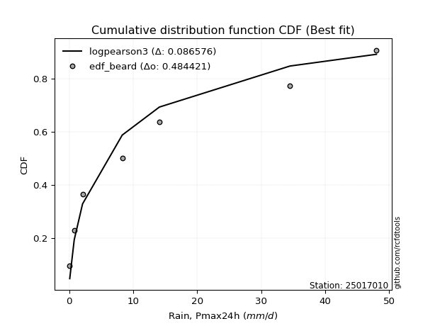</img></img>

</div>


### 5. Empirical - EDF Chegodayev (1955)

The Chegodayev formula is an empirical plotting position formula used in hydrological frequency analysis to estimate the exceedance probability or return period of a specific event from a set of observed data. It is primarily used for plotting observed data points on probability paper to fit a theoretical distribution, particularly for analyzing extreme events like maximum flood flows or rainfall intensities. The constant _b_ value in the generalized plotting position formula is 0.3.

<div align="center">


$P=(m-b)/(n+1-2b)$


</div>


**5.1. Empirical values**

<div align="center">

|                | 0                   | 1                   | 2                   | 3                   | 4                  | 5                  | 6                  | 7                  |
|:---------------|:--------------------|:--------------------|:--------------------|:--------------------|:-------------------|:-------------------|:-------------------|:-------------------|
| date           | 2022                | 2018                | 2017                | 2020                | 2021               | 2025               | 2019               | 2024               |
| x              | 0.1                 | 0.8                 | 2.1                 | 8.3                 | 14.1               | 27.6               | 34.5               | 48.0               |
| m              | 1                   | 2                   | 3                   | 4                   | 5                  | 6                  | 7                  | 8                  |
| empirical_dist | edf_chegodayev      | edf_chegodayev      | edf_chegodayev      | edf_chegodayev      | edf_chegodayev     | edf_chegodayev     | edf_chegodayev     | edf_chegodayev     |
| empirical      | 0.08333333333333333 | 0.20238095238095236 | 0.32142857142857145 | 0.44047619047619047 | 0.5595238095238095 | 0.6785714285714286 | 0.7976190476190476 | 0.9166666666666666 |
| empirical_tr   | 1.090909090909091   | 1.253731343283582   | 1.4736842105263157  | 1.7872340425531914  | 2.27027027027027   | 3.1111111111111116 | 4.941176470588234  | 11.999999999999995 |

</div>


**5.2. Kolmogorov-Smirnov fit test (sorted by Δ)**


<div align="center">

|                | 0                   | 1                     | 2                   | 3                   | 4                   | 5                   | 6                  | 7                   | 8                   | 9                   | 10                  | 11                  | 12                  | 13                  | 14                  | 15                  | 16                  | 17                 | 18                  | 19                 | 20                  | 21                  | 22                 | 23                  | 24                  | 25                  | 26                  | 27                  | 28                  | 29                 | 30                  | 31                  | 32                  | 33                  | 34                  | 35                 | 36                 | 37                  | 38                  | 39                  | 40                 | 41                  | 42                 | 43                  | 44                  | 45                  | 46                 | 47                  | 48                  | 49                  | 50                  | 51                  | 52                 | 53                  | 54                  | 55                  | 56                 | 57                  | 58                  | 59                  | 60                  | 61                  | 62                 | 63                  | 64                  | 65                  | 66                 | 67                  | 68                 | 69                  | 70                  | 71                 | 72                 | 73                  | 74                 | 75                 | 76                  | 77                  | 78                 | 79                  | 80                  | 81                 | 82                  | 83                 | 84                  | 85                  | 86                 | 87                 | 88                 | 89                 |
|:---------------|:--------------------|:----------------------|:--------------------|:--------------------|:--------------------|:--------------------|:-------------------|:--------------------|:--------------------|:--------------------|:--------------------|:--------------------|:--------------------|:--------------------|:--------------------|:--------------------|:--------------------|:-------------------|:--------------------|:-------------------|:--------------------|:--------------------|:-------------------|:--------------------|:--------------------|:--------------------|:--------------------|:--------------------|:--------------------|:-------------------|:--------------------|:--------------------|:--------------------|:--------------------|:--------------------|:-------------------|:-------------------|:--------------------|:--------------------|:--------------------|:-------------------|:--------------------|:-------------------|:--------------------|:--------------------|:--------------------|:-------------------|:--------------------|:--------------------|:--------------------|:--------------------|:--------------------|:-------------------|:--------------------|:--------------------|:--------------------|:-------------------|:--------------------|:--------------------|:--------------------|:--------------------|:--------------------|:-------------------|:--------------------|:--------------------|:--------------------|:-------------------|:--------------------|:-------------------|:--------------------|:--------------------|:-------------------|:-------------------|:--------------------|:-------------------|:-------------------|:--------------------|:--------------------|:-------------------|:--------------------|:--------------------|:-------------------|:--------------------|:-------------------|:--------------------|:--------------------|:-------------------|:-------------------|:-------------------|:-------------------|
| station        | 25017010            | 25017010              | 25017010            | 25017010            | 25017010            | 25017010            | 25017010           | 25017010            | 25017010            | 25017010            | 25017010            | 25017010            | 25017010            | 25017010            | 25017010            | 25017010            | 25017010            | 25017010           | 25017010            | 25017010           | 25017010            | 25017010            | 25017010           | 25017010            | 25017010            | 25017010            | 25017010            | 25017010            | 25017010            | 25017010           | 25017010            | 25017010            | 25017010            | 25017010            | 25017010            | 25017010           | 25017010           | 25017010            | 25017010            | 25017010            | 25017010           | 25017010            | 25017010           | 25017010            | 25017010            | 25017010            | 25017010           | 25017010            | 25017010            | 25017010            | 25017010            | 25017010            | 25017010           | 25017010            | 25017010            | 25017010            | 25017010           | 25017010            | 25017010            | 25017010            | 25017010            | 25017010            | 25017010           | 25017010            | 25017010            | 25017010            | 25017010           | 25017010            | 25017010           | 25017010            | 25017010            | 25017010           | 25017010           | 25017010            | 25017010           | 25017010           | 25017010            | 25017010            | 25017010           | 25017010            | 25017010            | 25017010           | 25017010            | 25017010           | 25017010            | 25017010            | 25017010           | 25017010           | 25017010           | 25017010           |
| empirical_dist | edf_chegodayev      | edf_chegodayev        | edf_chegodayev      | edf_chegodayev      | edf_chegodayev      | edf_chegodayev      | edf_chegodayev     | edf_chegodayev      | edf_chegodayev      | edf_chegodayev      | edf_chegodayev      | edf_chegodayev      | edf_chegodayev      | edf_chegodayev      | edf_chegodayev      | edf_chegodayev      | edf_chegodayev      | edf_chegodayev     | edf_chegodayev      | edf_chegodayev     | edf_chegodayev      | edf_chegodayev      | edf_chegodayev     | edf_chegodayev      | edf_chegodayev      | edf_chegodayev      | edf_chegodayev      | edf_chegodayev      | edf_chegodayev      | edf_chegodayev     | edf_chegodayev      | edf_chegodayev      | edf_chegodayev      | edf_chegodayev      | edf_chegodayev      | edf_chegodayev     | edf_chegodayev     | edf_chegodayev      | edf_chegodayev      | edf_chegodayev      | edf_chegodayev     | edf_chegodayev      | edf_chegodayev     | edf_chegodayev      | edf_chegodayev      | edf_chegodayev      | edf_chegodayev     | edf_chegodayev      | edf_chegodayev      | edf_chegodayev      | edf_chegodayev      | edf_chegodayev      | edf_chegodayev     | edf_chegodayev      | edf_chegodayev      | edf_chegodayev      | edf_chegodayev     | edf_chegodayev      | edf_chegodayev      | edf_chegodayev      | edf_chegodayev      | edf_chegodayev      | edf_chegodayev     | edf_chegodayev      | edf_chegodayev      | edf_chegodayev      | edf_chegodayev     | edf_chegodayev      | edf_chegodayev     | edf_chegodayev      | edf_chegodayev      | edf_chegodayev     | edf_chegodayev     | edf_chegodayev      | edf_chegodayev     | edf_chegodayev     | edf_chegodayev      | edf_chegodayev      | edf_chegodayev     | edf_chegodayev      | edf_chegodayev      | edf_chegodayev     | edf_chegodayev      | edf_chegodayev     | edf_chegodayev      | edf_chegodayev      | edf_chegodayev     | edf_chegodayev     | edf_chegodayev     | edf_chegodayev     |
| p_dist         | nakagami            | loglaplace_asymmetric | logloggamma         | logjohnsonsu        | logpearson3         | mielke              | loggumbel_l        | halfnorm            | rayleigh            | logweibull_min      | f                   | loggompertz         | maxwell             | weibull_min         | pearson3            | fisk                | loglognorm          | t                  | crystalball         | norm               | lognct              | logexponnorm        | logt               | lognorm             | lognorm             | lognakagami         | logerlang           | logfatiguelife      | alpha               | invgamma           | logrice             | gumbel_r            | invweibull          | loglogistic         | halflogistic        | loggamma           | loggamma           | nct                 | logbetaprime        | genlogistic         | loghypsecant       | logistic            | ncf                | loginvgamma         | invgauss            | loginvgauss         | loginvweibull      | kstwobign           | moyal               | logmaxwell          | logmielke           | hypsecant           | lograyleigh        | rice                | loglaplace          | logkstwobign        | johnsonsu          | loggenexpon         | gumbel_l            | laplace             | loghalfnorm         | loggumbel_r         | exponnorm          | genexpon            | expon               | laplace_asymmetric  | gompertz           | betaprime           | logexpon           | loghalflogistic     | logmoyal            | truncnorm          | gamma              | logtruncnorm        | logncf             | erlang             | logwald             | wald                | logfisk            | gibrat              | loggibrat           | pareto             | logalpha            | fatiguelife        | logf                | logpareto           | chi2               | logchi2            | loggenlogistic     | logcrystalball     |
| delta          | 0.08333311396608838 | 0.0949203202468607    | 0.09601266400511044 | 0.09671151861775412 | 0.09908375535352387 | 0.10580994189198076 | 0.1113245049321987 | 0.11427366256028526 | 0.11953540376309735 | 0.12112517704762715 | 0.12121602718763869 | 0.12221376041422327 | 0.12375030039652965 | 0.13006181677935105 | 0.13193884935931952 | 0.13357171830414494 | 0.13717341223371127 | 0.1378594909208175 | 0.13786749667862125 | 0.1378674993226689 | 0.13862104161170907 | 0.13878918092763015 | 0.1387897262093396 | 0.13878996922616937 | 0.13878996922616937 | 0.13923533333125226 | 0.14165994988291686 | 0.14243792347681583 | 0.14267147429772287 | 0.1429414113052101 | 0.14492673592538552 | 0.14826582837362087 | 0.14909111713819634 | 0.14923940530442836 | 0.14930393219299823 | 0.1506848411676942 | 0.1506848411676942 | 0.15069446599792735 | 0.15198182200629895 | 0.15226810038400243 | 0.1579261906528313 | 0.15908578898935866 | 0.1592296254863269 | 0.16013990519852084 | 0.16151425705853517 | 0.16190401935531828 | 0.1622366859930543 | 0.16373783634389447 | 0.16599799835518605 | 0.16705295719697733 | 0.16966040900447343 | 0.17447046738060024 | 0.1759455555897087 | 0.18120472519604103 | 0.18271344146410007 | 0.18788375094671972 | 0.1888909073761067 | 0.19225278993104755 | 0.19614628885333507 | 0.19976839861226425 | 0.20114281681325097 | 0.20716493188294438 | 0.2087976314720808 | 0.20942470197488144 | 0.20942950951733358 | 0.20943146055768608 | 0.2107830637277948 | 0.22116903858964465 | 0.2267407711479572 | 0.22918125056629912 | 0.23087993394265016 | 0.2446775022715459 | 0.2636880997279504 | 0.26378766982001756 | 0.2856881404322116 | 0.2926242036518978 | 0.29677664435761497 | 0.31413574084872525 | 0.3206800194664503 | 0.32142857142857145 | 0.32770412318954256 | 0.3330997374023065 | 0.36836824221755116 | 0.3813274211393145 | 0.40994611062781294 | 0.44351030354421117 | 0.5049098493475642 | 0.599090054083501  | 0.7976190476190476 | nan                |
| deltao         | 0.4472608134160001  | 0.4472608134160001    | 0.4472608134160001  | 0.4472608134160001  | 0.4472608134160001  | 0.4472608134160001  | 0.4472608134160001 | 0.4472608134160001  | 0.4472608134160001  | 0.4472608134160001  | 0.4472608134160001  | 0.4472608134160001  | 0.4472608134160001  | 0.4472608134160001  | 0.4472608134160001  | 0.4472608134160001  | 0.4472608134160001  | 0.4472608134160001 | 0.4472608134160001  | 0.4472608134160001 | 0.4472608134160001  | 0.4472608134160001  | 0.4472608134160001 | 0.4472608134160001  | 0.4472608134160001  | 0.4472608134160001  | 0.4472608134160001  | 0.4472608134160001  | 0.4472608134160001  | 0.4472608134160001 | 0.4472608134160001  | 0.4472608134160001  | 0.4472608134160001  | 0.4472608134160001  | 0.4472608134160001  | 0.4472608134160001 | 0.4472608134160001 | 0.4472608134160001  | 0.4472608134160001  | 0.4472608134160001  | 0.4472608134160001 | 0.4472608134160001  | 0.4472608134160001 | 0.4472608134160001  | 0.4472608134160001  | 0.4472608134160001  | 0.4472608134160001 | 0.4472608134160001  | 0.4472608134160001  | 0.4472608134160001  | 0.4472608134160001  | 0.4472608134160001  | 0.4472608134160001 | 0.4472608134160001  | 0.4472608134160001  | 0.4472608134160001  | 0.4472608134160001 | 0.4472608134160001  | 0.4472608134160001  | 0.4472608134160001  | 0.4472608134160001  | 0.4472608134160001  | 0.4472608134160001 | 0.4472608134160001  | 0.4472608134160001  | 0.4472608134160001  | 0.4472608134160001 | 0.4472608134160001  | 0.4472608134160001 | 0.4472608134160001  | 0.4472608134160001  | 0.4472608134160001 | 0.4472608134160001 | 0.4472608134160001  | 0.4472608134160001 | 0.4472608134160001 | 0.4472608134160001  | 0.4472608134160001  | 0.4472608134160001 | 0.4472608134160001  | 0.4472608134160001  | 0.4472608134160001 | 0.4472608134160001  | 0.4472608134160001 | 0.4472608134160001  | 0.4472608134160001  | 0.4472608134160001 | 0.4472608134160001 | 0.4472608134160001 | 0.4472608134160001 |
| eval           | Δo > Δ              | Δo > Δ                | Δo > Δ              | Δo > Δ              | Δo > Δ              | Δo > Δ              | Δo > Δ             | Δo > Δ              | Δo > Δ              | Δo > Δ              | Δo > Δ              | Δo > Δ              | Δo > Δ              | Δo > Δ              | Δo > Δ              | Δo > Δ              | Δo > Δ              | Δo > Δ             | Δo > Δ              | Δo > Δ             | Δo > Δ              | Δo > Δ              | Δo > Δ             | Δo > Δ              | Δo > Δ              | Δo > Δ              | Δo > Δ              | Δo > Δ              | Δo > Δ              | Δo > Δ             | Δo > Δ              | Δo > Δ              | Δo > Δ              | Δo > Δ              | Δo > Δ              | Δo > Δ             | Δo > Δ             | Δo > Δ              | Δo > Δ              | Δo > Δ              | Δo > Δ             | Δo > Δ              | Δo > Δ             | Δo > Δ              | Δo > Δ              | Δo > Δ              | Δo > Δ             | Δo > Δ              | Δo > Δ              | Δo > Δ              | Δo > Δ              | Δo > Δ              | Δo > Δ             | Δo > Δ              | Δo > Δ              | Δo > Δ              | Δo > Δ             | Δo > Δ              | Δo > Δ              | Δo > Δ              | Δo > Δ              | Δo > Δ              | Δo > Δ             | Δo > Δ              | Δo > Δ              | Δo > Δ              | Δo > Δ             | Δo > Δ              | Δo > Δ             | Δo > Δ              | Δo > Δ              | Δo > Δ             | Δo > Δ             | Δo > Δ              | Δo > Δ             | Δo > Δ             | Δo > Δ              | Δo > Δ              | Δo > Δ             | Δo > Δ              | Δo > Δ              | Δo > Δ             | Δo > Δ              | Δo > Δ             | Δo > Δ              | Δo > Δ              | Δo <= Δ            | Δo <= Δ            | Δo <= Δ            | Δo <= Δ            |
| fit            | 1                   | 1                     | 1                   | 1                   | 1                   | 1                   | 1                  | 1                   | 1                   | 1                   | 1                   | 1                   | 1                   | 1                   | 1                   | 1                   | 1                   | 1                  | 1                   | 1                  | 1                   | 1                   | 1                  | 1                   | 1                   | 1                   | 1                   | 1                   | 1                   | 1                  | 1                   | 1                   | 1                   | 1                   | 1                   | 1                  | 1                  | 1                   | 1                   | 1                   | 1                  | 1                   | 1                  | 1                   | 1                   | 1                   | 1                  | 1                   | 1                   | 1                   | 1                   | 1                   | 1                  | 1                   | 1                   | 1                   | 1                  | 1                   | 1                   | 1                   | 1                   | 1                   | 1                  | 1                   | 1                   | 1                   | 1                  | 1                   | 1                  | 1                   | 1                   | 1                  | 1                  | 1                   | 1                  | 1                  | 1                   | 1                   | 1                  | 1                   | 1                   | 1                  | 1                   | 1                  | 1                   | 1                   | 0                  | 0                  | 0                  | 0                  |
| n              | 8                   | 8                     | 8                   | 8                   | 8                   | 8                   | 8                  | 8                   | 8                   | 8                   | 8                   | 8                   | 8                   | 8                   | 8                   | 8                   | 8                   | 8                  | 8                   | 8                  | 8                   | 8                   | 8                  | 8                   | 8                   | 8                   | 8                   | 8                   | 8                   | 8                  | 8                   | 8                   | 8                   | 8                   | 8                   | 8                  | 8                  | 8                   | 8                   | 8                   | 8                  | 8                   | 8                  | 8                   | 8                   | 8                   | 8                  | 8                   | 8                   | 8                   | 8                   | 8                   | 8                  | 8                   | 8                   | 8                   | 8                  | 8                   | 8                   | 8                   | 8                   | 8                   | 8                  | 8                   | 8                   | 8                   | 8                  | 8                   | 8                  | 8                   | 8                   | 8                  | 8                  | 8                   | 8                  | 8                  | 8                   | 8                   | 8                  | 8                   | 8                   | 8                  | 8                   | 8                  | 8                   | 8                   | 8                  | 8                  | 8                  | 8                  |
| best_fit       | 1                   | 0                     | 0                   | 0                   | 0                   | 0                   | 0                  | 0                   | 0                   | 0                   | 0                   | 0                   | 0                   | 0                   | 0                   | 0                   | 0                   | 0                  | 0                   | 0                  | 0                   | 0                   | 0                  | 0                   | 0                   | 0                   | 0                   | 0                   | 0                   | 0                  | 0                   | 0                   | 0                   | 0                   | 0                   | 0                  | 0                  | 0                   | 0                   | 0                   | 0                  | 0                   | 0                  | 0                   | 0                   | 0                   | 0                  | 0                   | 0                   | 0                   | 0                   | 0                   | 0                  | 0                   | 0                   | 0                   | 0                  | 0                   | 0                   | 0                   | 0                   | 0                   | 0                  | 0                   | 0                   | 0                   | 0                  | 0                   | 0                  | 0                   | 0                   | 0                  | 0                  | 0                   | 0                  | 0                  | 0                   | 0                   | 0                  | 0                   | 0                   | 0                  | 0                   | 0                  | 0                   | 0                   | 0                  | 0                  | 0                  | 0                  |
| best_fit_sort  | 1                   | 2                     | 3                   | 4                   | 5                   | 6                   | 7                  | 8                   | 9                   | 10                  | 11                  | 12                  | 13                  | 14                  | 15                  | 16                  | 17                  | 18                 | 19                  | 20                 | 21                  | 22                  | 23                 | 24                  | 25                  | 26                  | 27                  | 28                  | 29                  | 30                 | 31                  | 32                  | 33                  | 34                  | 35                  | 36                 | 37                 | 38                  | 39                  | 40                  | 41                 | 42                  | 43                 | 44                  | 45                  | 46                  | 47                 | 48                  | 49                  | 50                  | 51                  | 52                  | 53                 | 54                  | 55                  | 56                  | 57                 | 58                  | 59                  | 60                  | 61                  | 62                  | 63                 | 64                  | 65                  | 66                  | 67                 | 68                  | 69                 | 70                  | 71                  | 72                 | 73                 | 74                  | 75                 | 76                 | 77                  | 78                  | 79                 | 80                  | 81                  | 82                 | 83                  | 84                 | 85                  | 86                  | 87                 | 88                 | 89                 | 90                 |

</div>


<div align="center">

</img>

</div>


**5.3. Best fit**

<div align="center">

|   id |   station | empirical_dist   | p_dist   |     delta |   deltao | eval   |   fit |   n |   best_fit |   best_fit_sort |
|-----:|----------:|:-----------------|:---------|----------:|---------:|:-------|------:|----:|-----------:|----------------:|
|    0 |  25017010 | edf_chegodayev   | nakagami | 0.0833331 | 0.447261 | Δo > Δ |     1 |   8 |          1 |               1 |

</div>


<div align="center">

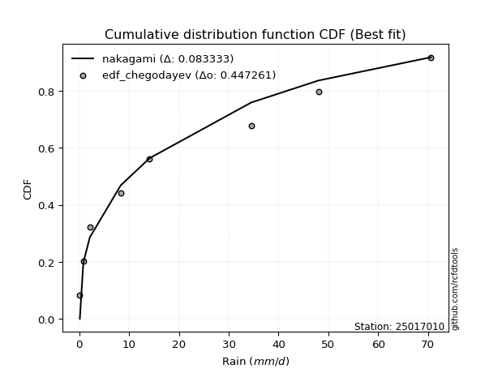</img>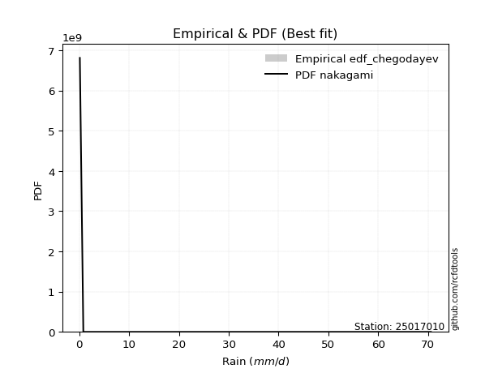</img>

</div>


### 6. Empirical - EDF Blom (1958)

The Blom formula is a specific "plotting position" formula used in hydrology and statistical analysis to estimate the empirical cumulative probability (or non-exceedance probability) of a data series. It is particularly recommended for data that are approximately normally distributed. The constant _a_ is set to 0.375 (or 3/8).

<div align="center">


$P=(m-a)/(n+1-2a)$


</div>


**6.1. Empirical values**

<div align="center">

|                | 0                   | 1                   | 2                  | 3                  | 4                  | 5                  | 6                 | 7                  |
|:---------------|:--------------------|:--------------------|:-------------------|:-------------------|:-------------------|:-------------------|:------------------|:-------------------|
| date           | 2022                | 2018                | 2017               | 2020               | 2021               | 2025               | 2019              | 2024               |
| x              | 0.1                 | 0.8                 | 2.1                | 8.3                | 14.1               | 27.6               | 34.5              | 48.0               |
| m              | 1                   | 2                   | 3                  | 4                  | 5                  | 6                  | 7                 | 8                  |
| empirical_dist | edf_blom            | edf_blom            | edf_blom           | edf_blom           | edf_blom           | edf_blom           | edf_blom          | edf_blom           |
| empirical      | 0.07575757575757576 | 0.19696969696969696 | 0.3181818181818182 | 0.4393939393939394 | 0.5606060606060606 | 0.6818181818181818 | 0.803030303030303 | 0.9242424242424242 |
| empirical_tr   | 1.0819672131147542  | 1.2452830188679247  | 1.4666666666666666 | 1.783783783783784  | 2.275862068965517  | 3.1428571428571423 | 5.076923076923076 | 13.199999999999992 |

</div>


**6.2. Kolmogorov-Smirnov fit test (sorted by Δ)**


<div align="center">

|                | 0                  | 1                     | 2                   | 3                   | 4                   | 5                   | 6                   | 7                   | 8                   | 9                   | 10                  | 11                 | 12                  | 13                  | 14                  | 15                  | 16                  | 17                  | 18                  | 19                 | 20                  | 21                  | 22                  | 23                  | 24                  | 25                  | 26                 | 27                  | 28                 | 29                  | 30                 | 31                 | 32                  | 33                  | 34                 | 35                  | 36                  | 37                  | 38                  | 39                  | 40                  | 41                  | 42                 | 43                  | 44                 | 45                 | 46                  | 47                  | 48                  | 49                 | 50                 | 51                  | 52                  | 53                  | 54                  | 55                 | 56                  | 57                  | 58                 | 59                  | 60                  | 61                  | 62                  | 63                 | 64                 | 65                 | 66                  | 67                  | 68                  | 69                 | 70                  | 71                 | 72                 | 73                  | 74                 | 75                  | 76                  | 77                 | 78                 | 79                 | 80                  | 81                  | 82                 | 83                  | 84                 | 85                  | 86                 | 87                 | 88                 | 89                 |
|:---------------|:-------------------|:----------------------|:--------------------|:--------------------|:--------------------|:--------------------|:--------------------|:--------------------|:--------------------|:--------------------|:--------------------|:-------------------|:--------------------|:--------------------|:--------------------|:--------------------|:--------------------|:--------------------|:--------------------|:-------------------|:--------------------|:--------------------|:--------------------|:--------------------|:--------------------|:--------------------|:-------------------|:--------------------|:-------------------|:--------------------|:-------------------|:-------------------|:--------------------|:--------------------|:-------------------|:--------------------|:--------------------|:--------------------|:--------------------|:--------------------|:--------------------|:--------------------|:-------------------|:--------------------|:-------------------|:-------------------|:--------------------|:--------------------|:--------------------|:-------------------|:-------------------|:--------------------|:--------------------|:--------------------|:--------------------|:-------------------|:--------------------|:--------------------|:-------------------|:--------------------|:--------------------|:--------------------|:--------------------|:-------------------|:-------------------|:-------------------|:--------------------|:--------------------|:--------------------|:-------------------|:--------------------|:-------------------|:-------------------|:--------------------|:-------------------|:--------------------|:--------------------|:-------------------|:-------------------|:-------------------|:--------------------|:--------------------|:-------------------|:--------------------|:-------------------|:--------------------|:-------------------|:-------------------|:-------------------|:-------------------|
| station        | 25017010           | 25017010              | 25017010            | 25017010            | 25017010            | 25017010            | 25017010            | 25017010            | 25017010            | 25017010            | 25017010            | 25017010           | 25017010            | 25017010            | 25017010            | 25017010            | 25017010            | 25017010            | 25017010            | 25017010           | 25017010            | 25017010            | 25017010            | 25017010            | 25017010            | 25017010            | 25017010           | 25017010            | 25017010           | 25017010            | 25017010           | 25017010           | 25017010            | 25017010            | 25017010           | 25017010            | 25017010            | 25017010            | 25017010            | 25017010            | 25017010            | 25017010            | 25017010           | 25017010            | 25017010           | 25017010           | 25017010            | 25017010            | 25017010            | 25017010           | 25017010           | 25017010            | 25017010            | 25017010            | 25017010            | 25017010           | 25017010            | 25017010            | 25017010           | 25017010            | 25017010            | 25017010            | 25017010            | 25017010           | 25017010           | 25017010           | 25017010            | 25017010            | 25017010            | 25017010           | 25017010            | 25017010           | 25017010           | 25017010            | 25017010           | 25017010            | 25017010            | 25017010           | 25017010           | 25017010           | 25017010            | 25017010            | 25017010           | 25017010            | 25017010           | 25017010            | 25017010           | 25017010           | 25017010           | 25017010           |
| empirical_dist | edf_blom           | edf_blom              | edf_blom            | edf_blom            | edf_blom            | edf_blom            | edf_blom            | edf_blom            | edf_blom            | edf_blom            | edf_blom            | edf_blom           | edf_blom            | edf_blom            | edf_blom            | edf_blom            | edf_blom            | edf_blom            | edf_blom            | edf_blom           | edf_blom            | edf_blom            | edf_blom            | edf_blom            | edf_blom            | edf_blom            | edf_blom           | edf_blom            | edf_blom           | edf_blom            | edf_blom           | edf_blom           | edf_blom            | edf_blom            | edf_blom           | edf_blom            | edf_blom            | edf_blom            | edf_blom            | edf_blom            | edf_blom            | edf_blom            | edf_blom           | edf_blom            | edf_blom           | edf_blom           | edf_blom            | edf_blom            | edf_blom            | edf_blom           | edf_blom           | edf_blom            | edf_blom            | edf_blom            | edf_blom            | edf_blom           | edf_blom            | edf_blom            | edf_blom           | edf_blom            | edf_blom            | edf_blom            | edf_blom            | edf_blom           | edf_blom           | edf_blom           | edf_blom            | edf_blom            | edf_blom            | edf_blom           | edf_blom            | edf_blom           | edf_blom           | edf_blom            | edf_blom           | edf_blom            | edf_blom            | edf_blom           | edf_blom           | edf_blom           | edf_blom            | edf_blom            | edf_blom           | edf_blom            | edf_blom           | edf_blom            | edf_blom           | edf_blom           | edf_blom           | edf_blom           |
| p_dist         | nakagami           | loglaplace_asymmetric | logloggamma         | logjohnsonsu        | logpearson3         | mielke              | loggumbel_l         | halfnorm            | rayleigh            | logweibull_min      | f                   | loggompertz        | maxwell             | weibull_min         | pearson3            | t                   | crystalball         | norm                | loglognorm          | alpha              | lognct              | logexponnorm        | logt                | lognorm             | lognorm             | lognakagami         | fisk               | logerlang           | logfatiguelife     | invgamma            | gumbel_r           | logrice            | halflogistic        | genlogistic         | invweibull         | loglogistic         | loggamma            | loggamma            | nct                 | logbetaprime        | ncf                 | logistic            | invgauss           | loghypsecant        | kstwobign          | loginvgamma        | moyal               | loginvgauss         | loginvweibull       | logmaxwell         | logmielke          | hypsecant           | lograyleigh         | rice                | loglaplace          | logkstwobign       | johnsonsu           | loggenexpon         | gumbel_l           | laplace             | loghalfnorm         | exponnorm           | genexpon            | expon              | laplace_asymmetric | gompertz           | loggumbel_r         | betaprime           | logexpon            | loghalflogistic    | logmoyal            | truncnorm          | gamma              | logtruncnorm        | logncf             | erlang              | logwald             | wald               | gibrat             | logfisk            | loggibrat           | pareto              | logalpha           | fatiguelife         | logf               | logpareto           | chi2               | logchi2            | loggenlogistic     | logcrystalball     |
| delta          | 0.0761974823296514 | 0.09167356700010754   | 0.09276591075835727 | 0.09346476537100085 | 0.09583700210677071 | 0.10256318864522748 | 0.10807775168544553 | 0.11102690931353199 | 0.11628865051634407 | 0.11787842380087399 | 0.11862750396082017 | 0.1189670071674701 | 0.12050354714977637 | 0.12681506353259778 | 0.12869209611256624 | 0.13677723983856643 | 0.13678524559637018 | 0.13678524824041782 | 0.13825566331596234 | 0.1394247210509697 | 0.13970329269396015 | 0.13987143200988122 | 0.13987197729159068 | 0.13987222030842045 | 0.13987222030842045 | 0.14031758441350334 | 0.1411474758799025 | 0.14274220096516793 | 0.1435201745590669 | 0.14402366238746117 | 0.1450190751268676 | 0.1460089870076366 | 0.14605717894624495 | 0.14902134713724915 | 0.1501733682204474 | 0.15032165638667944 | 0.15176709224994528 | 0.15176709224994528 | 0.15177671708017842 | 0.15306407308855002 | 0.15598287223957374 | 0.15800353790710758 | 0.158267503811782  | 0.15900844173508238 | 0.1604910830971412 | 0.1612221562807719 | 0.16275124510843278 | 0.16298627043756936 | 0.16331893707530537 | 0.1681352082792284 | 0.1707426600867245 | 0.17338821629834916 | 0.17702780667195978 | 0.17795797194928775 | 0.18379569254635114 | 0.1889660020289708 | 0.18997315845835777 | 0.19333504101329863 | 0.1972285399355861 | 0.19868614753001318 | 0.20222506789550204 | 0.20555087822532753 | 0.20617794872812817 | 0.2061827562705803 | 0.2061847073109328 | 0.2075363104810415 | 0.20824718296519545 | 0.22225128967189572 | 0.22782302223020828 | 0.2302635016485502 | 0.23196218502490124 | 0.2414307490247926 | 0.2604413464811972 | 0.26486992090226863 | 0.291099395843467  | 0.29370645473414886 | 0.29785889543986604 | 0.310888987601972  | 0.3181818181818182 | 0.3260912748777057 | 0.32878637427179364 | 0.33851099281356184 | 0.3737794976288065 | 0.38673867655056987 | 0.4153573660390683 | 0.44892155895546654 | 0.5059921004298154 | 0.6045013094947564 | 0.803030303030303  | nan                |
| deltao         | 0.4472608134160001 | 0.4472608134160001    | 0.4472608134160001  | 0.4472608134160001  | 0.4472608134160001  | 0.4472608134160001  | 0.4472608134160001  | 0.4472608134160001  | 0.4472608134160001  | 0.4472608134160001  | 0.4472608134160001  | 0.4472608134160001 | 0.4472608134160001  | 0.4472608134160001  | 0.4472608134160001  | 0.4472608134160001  | 0.4472608134160001  | 0.4472608134160001  | 0.4472608134160001  | 0.4472608134160001 | 0.4472608134160001  | 0.4472608134160001  | 0.4472608134160001  | 0.4472608134160001  | 0.4472608134160001  | 0.4472608134160001  | 0.4472608134160001 | 0.4472608134160001  | 0.4472608134160001 | 0.4472608134160001  | 0.4472608134160001 | 0.4472608134160001 | 0.4472608134160001  | 0.4472608134160001  | 0.4472608134160001 | 0.4472608134160001  | 0.4472608134160001  | 0.4472608134160001  | 0.4472608134160001  | 0.4472608134160001  | 0.4472608134160001  | 0.4472608134160001  | 0.4472608134160001 | 0.4472608134160001  | 0.4472608134160001 | 0.4472608134160001 | 0.4472608134160001  | 0.4472608134160001  | 0.4472608134160001  | 0.4472608134160001 | 0.4472608134160001 | 0.4472608134160001  | 0.4472608134160001  | 0.4472608134160001  | 0.4472608134160001  | 0.4472608134160001 | 0.4472608134160001  | 0.4472608134160001  | 0.4472608134160001 | 0.4472608134160001  | 0.4472608134160001  | 0.4472608134160001  | 0.4472608134160001  | 0.4472608134160001 | 0.4472608134160001 | 0.4472608134160001 | 0.4472608134160001  | 0.4472608134160001  | 0.4472608134160001  | 0.4472608134160001 | 0.4472608134160001  | 0.4472608134160001 | 0.4472608134160001 | 0.4472608134160001  | 0.4472608134160001 | 0.4472608134160001  | 0.4472608134160001  | 0.4472608134160001 | 0.4472608134160001 | 0.4472608134160001 | 0.4472608134160001  | 0.4472608134160001  | 0.4472608134160001 | 0.4472608134160001  | 0.4472608134160001 | 0.4472608134160001  | 0.4472608134160001 | 0.4472608134160001 | 0.4472608134160001 | 0.4472608134160001 |
| eval           | Δo > Δ             | Δo > Δ                | Δo > Δ              | Δo > Δ              | Δo > Δ              | Δo > Δ              | Δo > Δ              | Δo > Δ              | Δo > Δ              | Δo > Δ              | Δo > Δ              | Δo > Δ             | Δo > Δ              | Δo > Δ              | Δo > Δ              | Δo > Δ              | Δo > Δ              | Δo > Δ              | Δo > Δ              | Δo > Δ             | Δo > Δ              | Δo > Δ              | Δo > Δ              | Δo > Δ              | Δo > Δ              | Δo > Δ              | Δo > Δ             | Δo > Δ              | Δo > Δ             | Δo > Δ              | Δo > Δ             | Δo > Δ             | Δo > Δ              | Δo > Δ              | Δo > Δ             | Δo > Δ              | Δo > Δ              | Δo > Δ              | Δo > Δ              | Δo > Δ              | Δo > Δ              | Δo > Δ              | Δo > Δ             | Δo > Δ              | Δo > Δ             | Δo > Δ             | Δo > Δ              | Δo > Δ              | Δo > Δ              | Δo > Δ             | Δo > Δ             | Δo > Δ              | Δo > Δ              | Δo > Δ              | Δo > Δ              | Δo > Δ             | Δo > Δ              | Δo > Δ              | Δo > Δ             | Δo > Δ              | Δo > Δ              | Δo > Δ              | Δo > Δ              | Δo > Δ             | Δo > Δ             | Δo > Δ             | Δo > Δ              | Δo > Δ              | Δo > Δ              | Δo > Δ             | Δo > Δ              | Δo > Δ             | Δo > Δ             | Δo > Δ              | Δo > Δ             | Δo > Δ              | Δo > Δ              | Δo > Δ             | Δo > Δ             | Δo > Δ             | Δo > Δ              | Δo > Δ              | Δo > Δ             | Δo > Δ              | Δo > Δ             | Δo <= Δ             | Δo <= Δ            | Δo <= Δ            | Δo <= Δ            | Δo <= Δ            |
| fit            | 1                  | 1                     | 1                   | 1                   | 1                   | 1                   | 1                   | 1                   | 1                   | 1                   | 1                   | 1                  | 1                   | 1                   | 1                   | 1                   | 1                   | 1                   | 1                   | 1                  | 1                   | 1                   | 1                   | 1                   | 1                   | 1                   | 1                  | 1                   | 1                  | 1                   | 1                  | 1                  | 1                   | 1                   | 1                  | 1                   | 1                   | 1                   | 1                   | 1                   | 1                   | 1                   | 1                  | 1                   | 1                  | 1                  | 1                   | 1                   | 1                   | 1                  | 1                  | 1                   | 1                   | 1                   | 1                   | 1                  | 1                   | 1                   | 1                  | 1                   | 1                   | 1                   | 1                   | 1                  | 1                  | 1                  | 1                   | 1                   | 1                   | 1                  | 1                   | 1                  | 1                  | 1                   | 1                  | 1                   | 1                   | 1                  | 1                  | 1                  | 1                   | 1                   | 1                  | 1                   | 1                  | 0                   | 0                  | 0                  | 0                  | 0                  |
| n              | 8                  | 8                     | 8                   | 8                   | 8                   | 8                   | 8                   | 8                   | 8                   | 8                   | 8                   | 8                  | 8                   | 8                   | 8                   | 8                   | 8                   | 8                   | 8                   | 8                  | 8                   | 8                   | 8                   | 8                   | 8                   | 8                   | 8                  | 8                   | 8                  | 8                   | 8                  | 8                  | 8                   | 8                   | 8                  | 8                   | 8                   | 8                   | 8                   | 8                   | 8                   | 8                   | 8                  | 8                   | 8                  | 8                  | 8                   | 8                   | 8                   | 8                  | 8                  | 8                   | 8                   | 8                   | 8                   | 8                  | 8                   | 8                   | 8                  | 8                   | 8                   | 8                   | 8                   | 8                  | 8                  | 8                  | 8                   | 8                   | 8                   | 8                  | 8                   | 8                  | 8                  | 8                   | 8                  | 8                   | 8                   | 8                  | 8                  | 8                  | 8                   | 8                   | 8                  | 8                   | 8                  | 8                   | 8                  | 8                  | 8                  | 8                  |
| best_fit       | 1                  | 0                     | 0                   | 0                   | 0                   | 0                   | 0                   | 0                   | 0                   | 0                   | 0                   | 0                  | 0                   | 0                   | 0                   | 0                   | 0                   | 0                   | 0                   | 0                  | 0                   | 0                   | 0                   | 0                   | 0                   | 0                   | 0                  | 0                   | 0                  | 0                   | 0                  | 0                  | 0                   | 0                   | 0                  | 0                   | 0                   | 0                   | 0                   | 0                   | 0                   | 0                   | 0                  | 0                   | 0                  | 0                  | 0                   | 0                   | 0                   | 0                  | 0                  | 0                   | 0                   | 0                   | 0                   | 0                  | 0                   | 0                   | 0                  | 0                   | 0                   | 0                   | 0                   | 0                  | 0                  | 0                  | 0                   | 0                   | 0                   | 0                  | 0                   | 0                  | 0                  | 0                   | 0                  | 0                   | 0                   | 0                  | 0                  | 0                  | 0                   | 0                   | 0                  | 0                   | 0                  | 0                   | 0                  | 0                  | 0                  | 0                  |
| best_fit_sort  | 1                  | 2                     | 3                   | 4                   | 5                   | 6                   | 7                   | 8                   | 9                   | 10                  | 11                  | 12                 | 13                  | 14                  | 15                  | 16                  | 17                  | 18                  | 19                  | 20                 | 21                  | 22                  | 23                  | 24                  | 25                  | 26                  | 27                 | 28                  | 29                 | 30                  | 31                 | 32                 | 33                  | 34                  | 35                 | 36                  | 37                  | 38                  | 39                  | 40                  | 41                  | 42                  | 43                 | 44                  | 45                 | 46                 | 47                  | 48                  | 49                  | 50                 | 51                 | 52                  | 53                  | 54                  | 55                  | 56                 | 57                  | 58                  | 59                 | 60                  | 61                  | 62                  | 63                  | 64                 | 65                 | 66                 | 67                  | 68                  | 69                  | 70                 | 71                  | 72                 | 73                 | 74                  | 75                 | 76                  | 77                  | 78                 | 79                 | 80                 | 81                  | 82                  | 83                 | 84                  | 85                 | 86                  | 87                 | 88                 | 89                 | 90                 |

</div>


<div align="center">

</img>

</div>


**6.3. Best fit**

<div align="center">

|   id |   station | empirical_dist   | p_dist   |     delta |   deltao | eval   |   fit |   n |   best_fit |   best_fit_sort |
|-----:|----------:|:-----------------|:---------|----------:|---------:|:-------|------:|----:|-----------:|----------------:|
|    0 |  25017010 | edf_blom         | nakagami | 0.0761975 | 0.447261 | Δo > Δ |     1 |   8 |          1 |               1 |

</div>


<div align="center">

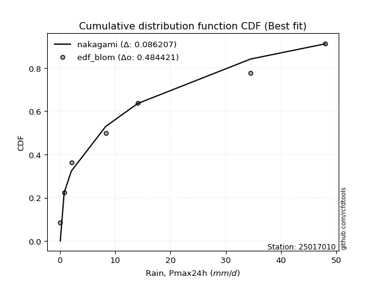</img>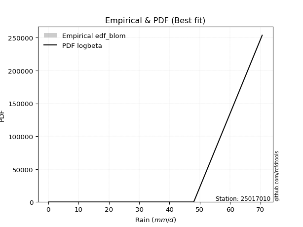</img>

</div>


### 7. Empirical - EDF Tukey (1962)

In hydrology, the Tukey formula is used as a plotting position formula to estimate the empirical probability or frequency of a flood event (or other hydrological data). The formula parameter is given as _c=0.333_ (or 1/3).

<div align="center">


$P=(m-c)/(n+1-2c)$


</div>


**7.1. Empirical values**

<div align="center">

|                | 0                  | 1         | 2                  | 3                  | 4                 | 5                  | 6                 | 7                  |
|:---------------|:-------------------|:----------|:-------------------|:-------------------|:------------------|:-------------------|:------------------|:-------------------|
| date           | 2022               | 2018      | 2017               | 2020               | 2021              | 2025               | 2019              | 2024               |
| x              | 0.1                | 0.8       | 2.1                | 8.3                | 14.1              | 27.6               | 34.5              | 48.0               |
| m              | 1                  | 2         | 3                  | 4                  | 5                 | 6                  | 7                 | 8                  |
| empirical_dist | edf_tukey          | edf_tukey | edf_tukey          | edf_tukey          | edf_tukey         | edf_tukey          | edf_tukey         | edf_tukey          |
| empirical      | 0.08               | 0.2       | 0.32               | 0.44               | 0.56              | 0.68               | 0.8               | 0.92               |
| empirical_tr   | 1.0869565217391304 | 1.25      | 1.4705882352941178 | 1.7857142857142856 | 2.272727272727273 | 3.1250000000000004 | 5.000000000000001 | 12.500000000000007 |

</div>


**7.2. Kolmogorov-Smirnov fit test (sorted by Δ)**


<div align="center">

|                | 0                   | 1                     | 2                   | 3                   | 4                   | 5                   | 6                   | 7                   | 8                  | 9                   | 10                  | 11                  | 12                 | 13                 | 14                  | 15                  | 16                  | 17                  | 18                  | 19                  | 20                  | 21                  | 22                  | 23                  | 24                  | 25                  | 26                  | 27                  | 28                 | 29                  | 30                  | 31                  | 32                  | 33                 | 34                  | 35                  | 36                  | 37                  | 38                  | 39                 | 40                  | 41                  | 42                 | 43                  | 44                 | 45                  | 46                  | 47                  | 48                 | 49                 | 50                 | 51                  | 52                  | 53                  | 54                  | 55                  | 56                  | 57                  | 58                 | 59                 | 60                  | 61                  | 62                  | 63                 | 64                  | 65                  | 66                  | 67                  | 68                  | 69                  | 70                  | 71                  | 72                  | 73                 | 74                  | 75                  | 76                  | 77                 | 78                 | 79                 | 80                 | 81                 | 82                 | 83                 | 84                  | 85                 | 86                 | 87                 | 88                 | 89                 |
|:---------------|:--------------------|:----------------------|:--------------------|:--------------------|:--------------------|:--------------------|:--------------------|:--------------------|:-------------------|:--------------------|:--------------------|:--------------------|:-------------------|:-------------------|:--------------------|:--------------------|:--------------------|:--------------------|:--------------------|:--------------------|:--------------------|:--------------------|:--------------------|:--------------------|:--------------------|:--------------------|:--------------------|:--------------------|:-------------------|:--------------------|:--------------------|:--------------------|:--------------------|:-------------------|:--------------------|:--------------------|:--------------------|:--------------------|:--------------------|:-------------------|:--------------------|:--------------------|:-------------------|:--------------------|:-------------------|:--------------------|:--------------------|:--------------------|:-------------------|:-------------------|:-------------------|:--------------------|:--------------------|:--------------------|:--------------------|:--------------------|:--------------------|:--------------------|:-------------------|:-------------------|:--------------------|:--------------------|:--------------------|:-------------------|:--------------------|:--------------------|:--------------------|:--------------------|:--------------------|:--------------------|:--------------------|:--------------------|:--------------------|:-------------------|:--------------------|:--------------------|:--------------------|:-------------------|:-------------------|:-------------------|:-------------------|:-------------------|:-------------------|:-------------------|:--------------------|:-------------------|:-------------------|:-------------------|:-------------------|:-------------------|
| station        | 25017010            | 25017010              | 25017010            | 25017010            | 25017010            | 25017010            | 25017010            | 25017010            | 25017010           | 25017010            | 25017010            | 25017010            | 25017010           | 25017010           | 25017010            | 25017010            | 25017010            | 25017010            | 25017010            | 25017010            | 25017010            | 25017010            | 25017010            | 25017010            | 25017010            | 25017010            | 25017010            | 25017010            | 25017010           | 25017010            | 25017010            | 25017010            | 25017010            | 25017010           | 25017010            | 25017010            | 25017010            | 25017010            | 25017010            | 25017010           | 25017010            | 25017010            | 25017010           | 25017010            | 25017010           | 25017010            | 25017010            | 25017010            | 25017010           | 25017010           | 25017010           | 25017010            | 25017010            | 25017010            | 25017010            | 25017010            | 25017010            | 25017010            | 25017010           | 25017010           | 25017010            | 25017010            | 25017010            | 25017010           | 25017010            | 25017010            | 25017010            | 25017010            | 25017010            | 25017010            | 25017010            | 25017010            | 25017010            | 25017010           | 25017010            | 25017010            | 25017010            | 25017010           | 25017010           | 25017010           | 25017010           | 25017010           | 25017010           | 25017010           | 25017010            | 25017010           | 25017010           | 25017010           | 25017010           | 25017010           |
| empirical_dist | edf_tukey           | edf_tukey             | edf_tukey           | edf_tukey           | edf_tukey           | edf_tukey           | edf_tukey           | edf_tukey           | edf_tukey          | edf_tukey           | edf_tukey           | edf_tukey           | edf_tukey          | edf_tukey          | edf_tukey           | edf_tukey           | edf_tukey           | edf_tukey           | edf_tukey           | edf_tukey           | edf_tukey           | edf_tukey           | edf_tukey           | edf_tukey           | edf_tukey           | edf_tukey           | edf_tukey           | edf_tukey           | edf_tukey          | edf_tukey           | edf_tukey           | edf_tukey           | edf_tukey           | edf_tukey          | edf_tukey           | edf_tukey           | edf_tukey           | edf_tukey           | edf_tukey           | edf_tukey          | edf_tukey           | edf_tukey           | edf_tukey          | edf_tukey           | edf_tukey          | edf_tukey           | edf_tukey           | edf_tukey           | edf_tukey          | edf_tukey          | edf_tukey          | edf_tukey           | edf_tukey           | edf_tukey           | edf_tukey           | edf_tukey           | edf_tukey           | edf_tukey           | edf_tukey          | edf_tukey          | edf_tukey           | edf_tukey           | edf_tukey           | edf_tukey          | edf_tukey           | edf_tukey           | edf_tukey           | edf_tukey           | edf_tukey           | edf_tukey           | edf_tukey           | edf_tukey           | edf_tukey           | edf_tukey          | edf_tukey           | edf_tukey           | edf_tukey           | edf_tukey          | edf_tukey          | edf_tukey          | edf_tukey          | edf_tukey          | edf_tukey          | edf_tukey          | edf_tukey           | edf_tukey          | edf_tukey          | edf_tukey          | edf_tukey          | edf_tukey          |
| p_dist         | nakagami            | loglaplace_asymmetric | logloggamma         | logjohnsonsu        | logpearson3         | mielke              | loggumbel_l         | halfnorm            | rayleigh           | logweibull_min      | f                   | loggompertz         | maxwell            | weibull_min        | pearson3            | fisk                | t                   | crystalball         | norm                | loglognorm          | lognct              | logexponnorm        | logt                | lognorm             | lognorm             | lognakagami         | alpha               | logerlang           | logfatiguelife     | invgamma            | logrice             | gumbel_r            | halflogistic        | invweibull         | loglogistic         | genlogistic         | loggamma            | loggamma            | nct                 | logbetaprime       | ncf                 | loghypsecant        | logistic           | invgauss            | loginvgamma        | kstwobign           | loginvgauss         | loginvweibull       | moyal              | logmaxwell         | logmielke          | hypsecant           | lograyleigh         | rice                | loglaplace          | logkstwobign        | johnsonsu           | loggenexpon         | gumbel_l           | laplace            | loghalfnorm         | exponnorm           | loggumbel_r         | genexpon           | expon               | laplace_asymmetric  | gompertz            | betaprime           | logexpon            | loghalflogistic     | logmoyal            | truncnorm           | gamma               | logtruncnorm       | logncf              | erlang              | logwald             | wald               | gibrat             | logfisk            | loggibrat          | pareto             | logalpha           | fatiguelife        | logf                | logpareto          | chi2               | logchi2            | loggenlogistic     | logcrystalball     |
| delta          | 0.07999978063275505 | 0.09349174881828926   | 0.09458409257653899 | 0.09528294718918268 | 0.09765518392495243 | 0.10438137046340931 | 0.10989593350362725 | 0.11284509113171382 | 0.1181068323345259 | 0.11969660561905571 | 0.11978745575906724 | 0.12078518898565183 | 0.1223217289679582 | 0.1286332453507796 | 0.13051027793074807 | 0.13690505163747835 | 0.13738330044462704 | 0.13739130620243079 | 0.13739130884647843 | 0.13764960270990173 | 0.13909723208789954 | 0.13926537140382061 | 0.13926591668553007 | 0.13926615970235984 | 0.13926615970235984 | 0.13971152380744273 | 0.14124290286915142 | 0.14213614035910732 | 0.1429141139530063 | 0.14341760178140056 | 0.14540292640157598 | 0.14683725694504943 | 0.14787536076442678 | 0.1495673076143868 | 0.14971559578061883 | 0.15083952895543098 | 0.15116103164388467 | 0.15116103164388467 | 0.15117065647411781 | 0.1524580124824894 | 0.15780105405775546 | 0.15840238112902177 | 0.1586095985131682 | 0.16008568562996373 | 0.1606160956747113 | 0.16230926491532302 | 0.16238020983150875 | 0.16271287646924476 | 0.1645694269266146 | 0.1675291476731678 | 0.1701365994806639 | 0.17399427690440977 | 0.17642174606589917 | 0.17977615376746958 | 0.18318963194029053 | 0.18835994142291018 | 0.18936709785229716 | 0.19272898040723802 | 0.1966224793295256 | 0.1992922081360738 | 0.20161900728944143 | 0.20736906004350936 | 0.20764112235913484 | 0.20799613054631   | 0.20800093808876213 | 0.20800288912911463 | 0.20935449229922334 | 0.22164522906583511 | 0.22721696162414767 | 0.22965744104248959 | 0.23135612441884063 | 0.24324893084297444 | 0.26225952829937893 | 0.264263860296208  | 0.28806909281316395 | 0.29310039412808825 | 0.29725283483380543 | 0.3127071694201538 | 0.32               | 0.3230609718474026 | 0.328180313665733  | 0.3354806897832588 | 0.3707491945985035 | 0.3837083735202668 | 0.41232706300876526 | 0.4458912559251635 | 0.5053860398237546 | 0.6014710064644533 | 0.8                | nan                |
| deltao         | 0.4472608134160001  | 0.4472608134160001    | 0.4472608134160001  | 0.4472608134160001  | 0.4472608134160001  | 0.4472608134160001  | 0.4472608134160001  | 0.4472608134160001  | 0.4472608134160001 | 0.4472608134160001  | 0.4472608134160001  | 0.4472608134160001  | 0.4472608134160001 | 0.4472608134160001 | 0.4472608134160001  | 0.4472608134160001  | 0.4472608134160001  | 0.4472608134160001  | 0.4472608134160001  | 0.4472608134160001  | 0.4472608134160001  | 0.4472608134160001  | 0.4472608134160001  | 0.4472608134160001  | 0.4472608134160001  | 0.4472608134160001  | 0.4472608134160001  | 0.4472608134160001  | 0.4472608134160001 | 0.4472608134160001  | 0.4472608134160001  | 0.4472608134160001  | 0.4472608134160001  | 0.4472608134160001 | 0.4472608134160001  | 0.4472608134160001  | 0.4472608134160001  | 0.4472608134160001  | 0.4472608134160001  | 0.4472608134160001 | 0.4472608134160001  | 0.4472608134160001  | 0.4472608134160001 | 0.4472608134160001  | 0.4472608134160001 | 0.4472608134160001  | 0.4472608134160001  | 0.4472608134160001  | 0.4472608134160001 | 0.4472608134160001 | 0.4472608134160001 | 0.4472608134160001  | 0.4472608134160001  | 0.4472608134160001  | 0.4472608134160001  | 0.4472608134160001  | 0.4472608134160001  | 0.4472608134160001  | 0.4472608134160001 | 0.4472608134160001 | 0.4472608134160001  | 0.4472608134160001  | 0.4472608134160001  | 0.4472608134160001 | 0.4472608134160001  | 0.4472608134160001  | 0.4472608134160001  | 0.4472608134160001  | 0.4472608134160001  | 0.4472608134160001  | 0.4472608134160001  | 0.4472608134160001  | 0.4472608134160001  | 0.4472608134160001 | 0.4472608134160001  | 0.4472608134160001  | 0.4472608134160001  | 0.4472608134160001 | 0.4472608134160001 | 0.4472608134160001 | 0.4472608134160001 | 0.4472608134160001 | 0.4472608134160001 | 0.4472608134160001 | 0.4472608134160001  | 0.4472608134160001 | 0.4472608134160001 | 0.4472608134160001 | 0.4472608134160001 | 0.4472608134160001 |
| eval           | Δo > Δ              | Δo > Δ                | Δo > Δ              | Δo > Δ              | Δo > Δ              | Δo > Δ              | Δo > Δ              | Δo > Δ              | Δo > Δ             | Δo > Δ              | Δo > Δ              | Δo > Δ              | Δo > Δ             | Δo > Δ             | Δo > Δ              | Δo > Δ              | Δo > Δ              | Δo > Δ              | Δo > Δ              | Δo > Δ              | Δo > Δ              | Δo > Δ              | Δo > Δ              | Δo > Δ              | Δo > Δ              | Δo > Δ              | Δo > Δ              | Δo > Δ              | Δo > Δ             | Δo > Δ              | Δo > Δ              | Δo > Δ              | Δo > Δ              | Δo > Δ             | Δo > Δ              | Δo > Δ              | Δo > Δ              | Δo > Δ              | Δo > Δ              | Δo > Δ             | Δo > Δ              | Δo > Δ              | Δo > Δ             | Δo > Δ              | Δo > Δ             | Δo > Δ              | Δo > Δ              | Δo > Δ              | Δo > Δ             | Δo > Δ             | Δo > Δ             | Δo > Δ              | Δo > Δ              | Δo > Δ              | Δo > Δ              | Δo > Δ              | Δo > Δ              | Δo > Δ              | Δo > Δ             | Δo > Δ             | Δo > Δ              | Δo > Δ              | Δo > Δ              | Δo > Δ             | Δo > Δ              | Δo > Δ              | Δo > Δ              | Δo > Δ              | Δo > Δ              | Δo > Δ              | Δo > Δ              | Δo > Δ              | Δo > Δ              | Δo > Δ             | Δo > Δ              | Δo > Δ              | Δo > Δ              | Δo > Δ             | Δo > Δ             | Δo > Δ             | Δo > Δ             | Δo > Δ             | Δo > Δ             | Δo > Δ             | Δo > Δ              | Δo > Δ             | Δo <= Δ            | Δo <= Δ            | Δo <= Δ            | Δo <= Δ            |
| fit            | 1                   | 1                     | 1                   | 1                   | 1                   | 1                   | 1                   | 1                   | 1                  | 1                   | 1                   | 1                   | 1                  | 1                  | 1                   | 1                   | 1                   | 1                   | 1                   | 1                   | 1                   | 1                   | 1                   | 1                   | 1                   | 1                   | 1                   | 1                   | 1                  | 1                   | 1                   | 1                   | 1                   | 1                  | 1                   | 1                   | 1                   | 1                   | 1                   | 1                  | 1                   | 1                   | 1                  | 1                   | 1                  | 1                   | 1                   | 1                   | 1                  | 1                  | 1                  | 1                   | 1                   | 1                   | 1                   | 1                   | 1                   | 1                   | 1                  | 1                  | 1                   | 1                   | 1                   | 1                  | 1                   | 1                   | 1                   | 1                   | 1                   | 1                   | 1                   | 1                   | 1                   | 1                  | 1                   | 1                   | 1                   | 1                  | 1                  | 1                  | 1                  | 1                  | 1                  | 1                  | 1                   | 1                  | 0                  | 0                  | 0                  | 0                  |
| n              | 8                   | 8                     | 8                   | 8                   | 8                   | 8                   | 8                   | 8                   | 8                  | 8                   | 8                   | 8                   | 8                  | 8                  | 8                   | 8                   | 8                   | 8                   | 8                   | 8                   | 8                   | 8                   | 8                   | 8                   | 8                   | 8                   | 8                   | 8                   | 8                  | 8                   | 8                   | 8                   | 8                   | 8                  | 8                   | 8                   | 8                   | 8                   | 8                   | 8                  | 8                   | 8                   | 8                  | 8                   | 8                  | 8                   | 8                   | 8                   | 8                  | 8                  | 8                  | 8                   | 8                   | 8                   | 8                   | 8                   | 8                   | 8                   | 8                  | 8                  | 8                   | 8                   | 8                   | 8                  | 8                   | 8                   | 8                   | 8                   | 8                   | 8                   | 8                   | 8                   | 8                   | 8                  | 8                   | 8                   | 8                   | 8                  | 8                  | 8                  | 8                  | 8                  | 8                  | 8                  | 8                   | 8                  | 8                  | 8                  | 8                  | 8                  |
| best_fit       | 1                   | 0                     | 0                   | 0                   | 0                   | 0                   | 0                   | 0                   | 0                  | 0                   | 0                   | 0                   | 0                  | 0                  | 0                   | 0                   | 0                   | 0                   | 0                   | 0                   | 0                   | 0                   | 0                   | 0                   | 0                   | 0                   | 0                   | 0                   | 0                  | 0                   | 0                   | 0                   | 0                   | 0                  | 0                   | 0                   | 0                   | 0                   | 0                   | 0                  | 0                   | 0                   | 0                  | 0                   | 0                  | 0                   | 0                   | 0                   | 0                  | 0                  | 0                  | 0                   | 0                   | 0                   | 0                   | 0                   | 0                   | 0                   | 0                  | 0                  | 0                   | 0                   | 0                   | 0                  | 0                   | 0                   | 0                   | 0                   | 0                   | 0                   | 0                   | 0                   | 0                   | 0                  | 0                   | 0                   | 0                   | 0                  | 0                  | 0                  | 0                  | 0                  | 0                  | 0                  | 0                   | 0                  | 0                  | 0                  | 0                  | 0                  |
| best_fit_sort  | 1                   | 2                     | 3                   | 4                   | 5                   | 6                   | 7                   | 8                   | 9                  | 10                  | 11                  | 12                  | 13                 | 14                 | 15                  | 16                  | 17                  | 18                  | 19                  | 20                  | 21                  | 22                  | 23                  | 24                  | 25                  | 26                  | 27                  | 28                  | 29                 | 30                  | 31                  | 32                  | 33                  | 34                 | 35                  | 36                  | 37                  | 38                  | 39                  | 40                 | 41                  | 42                  | 43                 | 44                  | 45                 | 46                  | 47                  | 48                  | 49                 | 50                 | 51                 | 52                  | 53                  | 54                  | 55                  | 56                  | 57                  | 58                  | 59                 | 60                 | 61                  | 62                  | 63                  | 64                 | 65                  | 66                  | 67                  | 68                  | 69                  | 70                  | 71                  | 72                  | 73                  | 74                 | 75                  | 76                  | 77                  | 78                 | 79                 | 80                 | 81                 | 82                 | 83                 | 84                 | 85                  | 86                 | 87                 | 88                 | 89                 | 90                 |

</div>


<div align="center">

</img>

</div>


**7.3. Best fit**

<div align="center">

|   id |   station | empirical_dist   | p_dist   |     delta |   deltao | eval   |   fit |   n |   best_fit |   best_fit_sort |
|-----:|----------:|:-----------------|:---------|----------:|---------:|:-------|------:|----:|-----------:|----------------:|
|    0 |  25017010 | edf_tukey        | nakagami | 0.0799998 | 0.447261 | Δo > Δ |     1 |   8 |          1 |               1 |

</div>


<div align="center">

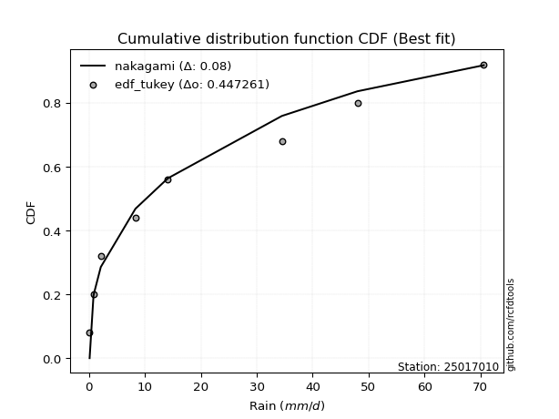</img>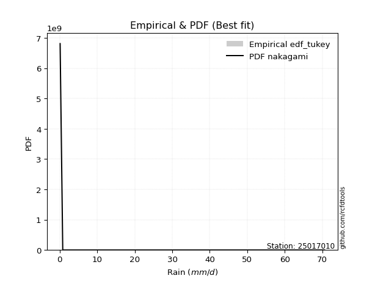</img>

</div>


### 8. Empirical - EDF Gringorten (1963)

Gringorten plotting position formula is essential for estimating the probability and return periods of extreme events like floods and heavy rainfall. The constant _a=0.44_.

<div align="center">


$P=(m-a)/(n+1-2a)$


</div>


**8.1. Empirical values**

<div align="center">

|                | 0                   | 1                   | 2                  | 3                  | 4                  | 5                  | 6                  | 7                  |
|:---------------|:--------------------|:--------------------|:-------------------|:-------------------|:-------------------|:-------------------|:-------------------|:-------------------|
| date           | 2022                | 2018                | 2017               | 2020               | 2021               | 2025               | 2019               | 2024               |
| x              | 0.1                 | 0.8                 | 2.1                | 8.3                | 14.1               | 27.6               | 34.5               | 48.0               |
| m              | 1                   | 2                   | 3                  | 4                  | 5                  | 6                  | 7                  | 8                  |
| empirical_dist | edf_gringorten      | edf_gringorten      | edf_gringorten     | edf_gringorten     | edf_gringorten     | edf_gringorten     | edf_gringorten     | edf_gringorten     |
| empirical      | 0.06896551724137932 | 0.19211822660098524 | 0.3152709359605912 | 0.4384236453201971 | 0.5615763546798029 | 0.6847290640394089 | 0.8078817733990148 | 0.9310344827586208 |
| empirical_tr   | 1.0740740740740742  | 1.2378048780487805  | 1.460431654676259  | 1.780701754385965  | 2.2808988764044944 | 3.1718750000000004 | 5.205128205128205  | 14.500000000000018 |

</div>


**8.2. Kolmogorov-Smirnov fit test (sorted by Δ)**


<div align="center">

|                | 0                   | 1                     | 2                   | 3                   | 4                   | 5                  | 6                   | 7                  | 8                   | 9                   | 10                  | 11                  | 12                  | 13                  | 14                  | 15                  | 16                 | 17                  | 18                  | 19                 | 20                  | 21                 | 22                  | 23                  | 24                  | 25                 | 26                 | 27                  | 28                 | 29                  | 30                  | 31                  | 32                  | 33                  | 34                  | 35                 | 36                  | 37                  | 38                 | 39                 | 40                 | 41                  | 42                 | 43                 | 44                 | 45                  | 46                  | 47                  | 48                  | 49                  | 50                  | 51                 | 52                  | 53                  | 54                  | 55                  | 56                  | 57                 | 58                 | 59                  | 60                  | 61                  | 62                  | 63                  | 64                  | 65                  | 66                  | 67                 | 68                  | 69                  | 70                 | 71                  | 72                  | 73                 | 74                  | 75                 | 76                 | 77                 | 78                 | 79                 | 80                 | 81                 | 82                 | 83                 | 84                  | 85                 | 86                 | 87                 | 88                 | 89                 |
|:---------------|:--------------------|:----------------------|:--------------------|:--------------------|:--------------------|:-------------------|:--------------------|:-------------------|:--------------------|:--------------------|:--------------------|:--------------------|:--------------------|:--------------------|:--------------------|:--------------------|:-------------------|:--------------------|:--------------------|:-------------------|:--------------------|:-------------------|:--------------------|:--------------------|:--------------------|:-------------------|:-------------------|:--------------------|:-------------------|:--------------------|:--------------------|:--------------------|:--------------------|:--------------------|:--------------------|:-------------------|:--------------------|:--------------------|:-------------------|:-------------------|:-------------------|:--------------------|:-------------------|:-------------------|:-------------------|:--------------------|:--------------------|:--------------------|:--------------------|:--------------------|:--------------------|:-------------------|:--------------------|:--------------------|:--------------------|:--------------------|:--------------------|:-------------------|:-------------------|:--------------------|:--------------------|:--------------------|:--------------------|:--------------------|:--------------------|:--------------------|:--------------------|:-------------------|:--------------------|:--------------------|:-------------------|:--------------------|:--------------------|:-------------------|:--------------------|:-------------------|:-------------------|:-------------------|:-------------------|:-------------------|:-------------------|:-------------------|:-------------------|:-------------------|:--------------------|:-------------------|:-------------------|:-------------------|:-------------------|:-------------------|
| station        | 25017010            | 25017010              | 25017010            | 25017010            | 25017010            | 25017010           | 25017010            | 25017010           | 25017010            | 25017010            | 25017010            | 25017010            | 25017010            | 25017010            | 25017010            | 25017010            | 25017010           | 25017010            | 25017010            | 25017010           | 25017010            | 25017010           | 25017010            | 25017010            | 25017010            | 25017010           | 25017010           | 25017010            | 25017010           | 25017010            | 25017010            | 25017010            | 25017010            | 25017010            | 25017010            | 25017010           | 25017010            | 25017010            | 25017010           | 25017010           | 25017010           | 25017010            | 25017010           | 25017010           | 25017010           | 25017010            | 25017010            | 25017010            | 25017010            | 25017010            | 25017010            | 25017010           | 25017010            | 25017010            | 25017010            | 25017010            | 25017010            | 25017010           | 25017010           | 25017010            | 25017010            | 25017010            | 25017010            | 25017010            | 25017010            | 25017010            | 25017010            | 25017010           | 25017010            | 25017010            | 25017010           | 25017010            | 25017010            | 25017010           | 25017010            | 25017010           | 25017010           | 25017010           | 25017010           | 25017010           | 25017010           | 25017010           | 25017010           | 25017010           | 25017010            | 25017010           | 25017010           | 25017010           | 25017010           | 25017010           |
| empirical_dist | edf_gringorten      | edf_gringorten        | edf_gringorten      | edf_gringorten      | edf_gringorten      | edf_gringorten     | edf_gringorten      | edf_gringorten     | edf_gringorten      | edf_gringorten      | edf_gringorten      | edf_gringorten      | edf_gringorten      | edf_gringorten      | edf_gringorten      | edf_gringorten      | edf_gringorten     | edf_gringorten      | edf_gringorten      | edf_gringorten     | edf_gringorten      | edf_gringorten     | edf_gringorten      | edf_gringorten      | edf_gringorten      | edf_gringorten     | edf_gringorten     | edf_gringorten      | edf_gringorten     | edf_gringorten      | edf_gringorten      | edf_gringorten      | edf_gringorten      | edf_gringorten      | edf_gringorten      | edf_gringorten     | edf_gringorten      | edf_gringorten      | edf_gringorten     | edf_gringorten     | edf_gringorten     | edf_gringorten      | edf_gringorten     | edf_gringorten     | edf_gringorten     | edf_gringorten      | edf_gringorten      | edf_gringorten      | edf_gringorten      | edf_gringorten      | edf_gringorten      | edf_gringorten     | edf_gringorten      | edf_gringorten      | edf_gringorten      | edf_gringorten      | edf_gringorten      | edf_gringorten     | edf_gringorten     | edf_gringorten      | edf_gringorten      | edf_gringorten      | edf_gringorten      | edf_gringorten      | edf_gringorten      | edf_gringorten      | edf_gringorten      | edf_gringorten     | edf_gringorten      | edf_gringorten      | edf_gringorten     | edf_gringorten      | edf_gringorten      | edf_gringorten     | edf_gringorten      | edf_gringorten     | edf_gringorten     | edf_gringorten     | edf_gringorten     | edf_gringorten     | edf_gringorten     | edf_gringorten     | edf_gringorten     | edf_gringorten     | edf_gringorten      | edf_gringorten     | edf_gringorten     | edf_gringorten     | edf_gringorten     | edf_gringorten     |
| p_dist         | nakagami            | loglaplace_asymmetric | logloggamma         | logjohnsonsu        | logpearson3         | mielke             | loggumbel_l         | halfnorm           | rayleigh            | logweibull_min      | loggompertz         | maxwell             | f                   | weibull_min         | pearson3            | t                   | crystalball        | norm                | alpha               | loglognorm         | lognct              | logexponnorm       | logt                | lognorm             | lognorm             | lognakagami        | gumbel_r           | halflogistic        | logerlang          | logfatiguelife      | invgamma            | genlogistic         | logrice             | fisk                | invweibull          | loglogistic        | loggamma            | loggamma            | nct                | ncf                | logbetaprime       | invgauss            | logistic           | kstwobign          | moyal              | loghypsecant        | loginvgamma         | loginvgauss         | loginvweibull       | logmaxwell          | logmielke           | hypsecant          | rice                | lograyleigh         | loglaplace          | logkstwobign        | johnsonsu           | loggenexpon        | laplace            | gumbel_l            | exponnorm           | loghalfnorm         | genexpon            | expon               | laplace_asymmetric  | gompertz            | loggumbel_r         | betaprime          | logexpon            | loghalflogistic     | logmoyal           | truncnorm           | gamma               | logtruncnorm       | erlang              | logncf             | logwald            | wald               | gibrat             | loggibrat          | logfisk            | pareto             | logalpha           | fatiguelife        | logf                | logpareto          | chi2               | logchi2            | loggenlogistic     | logcrystalball     |
| delta          | 0.08298954084584798 | 0.08876268477888039   | 0.08985502853713012 | 0.09055388314977386 | 0.09292611988554356 | 0.0996523064240005 | 0.10516686946421838 | 0.108116027092305  | 0.11337776829511709 | 0.11496754157964684 | 0.11605612494624296 | 0.11759266492854939 | 0.11959779803456244 | 0.12390418131137079 | 0.12578121389133926 | 0.13580694576482416 | 0.1358149515226279 | 0.13581495416667555 | 0.13651383882974255 | 0.1392259573897046 | 0.14067358676770242 | 0.1408417260836235 | 0.14084227136533295 | 0.14084251438216272 | 0.14084251438216272 | 0.1412878784872456 | 0.1421081929056406 | 0.14314629672501797 | 0.1437124950389102 | 0.14449046863280918 | 0.14499395646120344 | 0.14611046491602217 | 0.14697928108137887 | 0.14793953439609908 | 0.15114366229418968 | 0.1512919504604217 | 0.15273738632368755 | 0.15273738632368755 | 0.1527470111539207 | 0.1530719900183466 | 0.1540343671622923 | 0.15535662159055486 | 0.1570332438333653 | 0.1575802008759142 | 0.1598403628872058 | 0.15997873580882466 | 0.16219245035451418 | 0.16395656451131163 | 0.16428923114904764 | 0.16910550235297067 | 0.17171295416046678 | 0.1724179222246069 | 0.17504708972806077 | 0.17799810074570205 | 0.18476598662009341 | 0.18993629610271306 | 0.19094345253210004 | 0.1943053350870409 | 0.1977158534562709 | 0.19819883400932847 | 0.20263999600410054 | 0.20319536196924431 | 0.20326706650690118 | 0.20327187404935332 | 0.20327382508970582 | 0.20462542825981453 | 0.20921747703893773 | 0.223221583745638  | 0.22879331630395056 | 0.23123379572229247 | 0.2329324790986435 | 0.23851986680356563 | 0.25753046425997006 | 0.2658402149760109 | 0.29467674880789113 | 0.2959508662121787 | 0.2988291895136083 | 0.307978105380745  | 0.3152709359605912 | 0.3297566683455359 | 0.3309427452464174 | 0.3433624631822736 | 0.3786309679975183 | 0.3915901469192816 | 0.42020883640778006 | 0.4537730293241783 | 0.5069623945035575 | 0.6093527798634681 | 0.8078817733990148 | nan                |
| deltao         | 0.4472608134160001  | 0.4472608134160001    | 0.4472608134160001  | 0.4472608134160001  | 0.4472608134160001  | 0.4472608134160001 | 0.4472608134160001  | 0.4472608134160001 | 0.4472608134160001  | 0.4472608134160001  | 0.4472608134160001  | 0.4472608134160001  | 0.4472608134160001  | 0.4472608134160001  | 0.4472608134160001  | 0.4472608134160001  | 0.4472608134160001 | 0.4472608134160001  | 0.4472608134160001  | 0.4472608134160001 | 0.4472608134160001  | 0.4472608134160001 | 0.4472608134160001  | 0.4472608134160001  | 0.4472608134160001  | 0.4472608134160001 | 0.4472608134160001 | 0.4472608134160001  | 0.4472608134160001 | 0.4472608134160001  | 0.4472608134160001  | 0.4472608134160001  | 0.4472608134160001  | 0.4472608134160001  | 0.4472608134160001  | 0.4472608134160001 | 0.4472608134160001  | 0.4472608134160001  | 0.4472608134160001 | 0.4472608134160001 | 0.4472608134160001 | 0.4472608134160001  | 0.4472608134160001 | 0.4472608134160001 | 0.4472608134160001 | 0.4472608134160001  | 0.4472608134160001  | 0.4472608134160001  | 0.4472608134160001  | 0.4472608134160001  | 0.4472608134160001  | 0.4472608134160001 | 0.4472608134160001  | 0.4472608134160001  | 0.4472608134160001  | 0.4472608134160001  | 0.4472608134160001  | 0.4472608134160001 | 0.4472608134160001 | 0.4472608134160001  | 0.4472608134160001  | 0.4472608134160001  | 0.4472608134160001  | 0.4472608134160001  | 0.4472608134160001  | 0.4472608134160001  | 0.4472608134160001  | 0.4472608134160001 | 0.4472608134160001  | 0.4472608134160001  | 0.4472608134160001 | 0.4472608134160001  | 0.4472608134160001  | 0.4472608134160001 | 0.4472608134160001  | 0.4472608134160001 | 0.4472608134160001 | 0.4472608134160001 | 0.4472608134160001 | 0.4472608134160001 | 0.4472608134160001 | 0.4472608134160001 | 0.4472608134160001 | 0.4472608134160001 | 0.4472608134160001  | 0.4472608134160001 | 0.4472608134160001 | 0.4472608134160001 | 0.4472608134160001 | 0.4472608134160001 |
| eval           | Δo > Δ              | Δo > Δ                | Δo > Δ              | Δo > Δ              | Δo > Δ              | Δo > Δ             | Δo > Δ              | Δo > Δ             | Δo > Δ              | Δo > Δ              | Δo > Δ              | Δo > Δ              | Δo > Δ              | Δo > Δ              | Δo > Δ              | Δo > Δ              | Δo > Δ             | Δo > Δ              | Δo > Δ              | Δo > Δ             | Δo > Δ              | Δo > Δ             | Δo > Δ              | Δo > Δ              | Δo > Δ              | Δo > Δ             | Δo > Δ             | Δo > Δ              | Δo > Δ             | Δo > Δ              | Δo > Δ              | Δo > Δ              | Δo > Δ              | Δo > Δ              | Δo > Δ              | Δo > Δ             | Δo > Δ              | Δo > Δ              | Δo > Δ             | Δo > Δ             | Δo > Δ             | Δo > Δ              | Δo > Δ             | Δo > Δ             | Δo > Δ             | Δo > Δ              | Δo > Δ              | Δo > Δ              | Δo > Δ              | Δo > Δ              | Δo > Δ              | Δo > Δ             | Δo > Δ              | Δo > Δ              | Δo > Δ              | Δo > Δ              | Δo > Δ              | Δo > Δ             | Δo > Δ             | Δo > Δ              | Δo > Δ              | Δo > Δ              | Δo > Δ              | Δo > Δ              | Δo > Δ              | Δo > Δ              | Δo > Δ              | Δo > Δ             | Δo > Δ              | Δo > Δ              | Δo > Δ             | Δo > Δ              | Δo > Δ              | Δo > Δ             | Δo > Δ              | Δo > Δ             | Δo > Δ             | Δo > Δ             | Δo > Δ             | Δo > Δ             | Δo > Δ             | Δo > Δ             | Δo > Δ             | Δo > Δ             | Δo > Δ              | Δo <= Δ            | Δo <= Δ            | Δo <= Δ            | Δo <= Δ            | Δo <= Δ            |
| fit            | 1                   | 1                     | 1                   | 1                   | 1                   | 1                  | 1                   | 1                  | 1                   | 1                   | 1                   | 1                   | 1                   | 1                   | 1                   | 1                   | 1                  | 1                   | 1                   | 1                  | 1                   | 1                  | 1                   | 1                   | 1                   | 1                  | 1                  | 1                   | 1                  | 1                   | 1                   | 1                   | 1                   | 1                   | 1                   | 1                  | 1                   | 1                   | 1                  | 1                  | 1                  | 1                   | 1                  | 1                  | 1                  | 1                   | 1                   | 1                   | 1                   | 1                   | 1                   | 1                  | 1                   | 1                   | 1                   | 1                   | 1                   | 1                  | 1                  | 1                   | 1                   | 1                   | 1                   | 1                   | 1                   | 1                   | 1                   | 1                  | 1                   | 1                   | 1                  | 1                   | 1                   | 1                  | 1                   | 1                  | 1                  | 1                  | 1                  | 1                  | 1                  | 1                  | 1                  | 1                  | 1                   | 0                  | 0                  | 0                  | 0                  | 0                  |
| n              | 8                   | 8                     | 8                   | 8                   | 8                   | 8                  | 8                   | 8                  | 8                   | 8                   | 8                   | 8                   | 8                   | 8                   | 8                   | 8                   | 8                  | 8                   | 8                   | 8                  | 8                   | 8                  | 8                   | 8                   | 8                   | 8                  | 8                  | 8                   | 8                  | 8                   | 8                   | 8                   | 8                   | 8                   | 8                   | 8                  | 8                   | 8                   | 8                  | 8                  | 8                  | 8                   | 8                  | 8                  | 8                  | 8                   | 8                   | 8                   | 8                   | 8                   | 8                   | 8                  | 8                   | 8                   | 8                   | 8                   | 8                   | 8                  | 8                  | 8                   | 8                   | 8                   | 8                   | 8                   | 8                   | 8                   | 8                   | 8                  | 8                   | 8                   | 8                  | 8                   | 8                   | 8                  | 8                   | 8                  | 8                  | 8                  | 8                  | 8                  | 8                  | 8                  | 8                  | 8                  | 8                   | 8                  | 8                  | 8                  | 8                  | 8                  |
| best_fit       | 1                   | 0                     | 0                   | 0                   | 0                   | 0                  | 0                   | 0                  | 0                   | 0                   | 0                   | 0                   | 0                   | 0                   | 0                   | 0                   | 0                  | 0                   | 0                   | 0                  | 0                   | 0                  | 0                   | 0                   | 0                   | 0                  | 0                  | 0                   | 0                  | 0                   | 0                   | 0                   | 0                   | 0                   | 0                   | 0                  | 0                   | 0                   | 0                  | 0                  | 0                  | 0                   | 0                  | 0                  | 0                  | 0                   | 0                   | 0                   | 0                   | 0                   | 0                   | 0                  | 0                   | 0                   | 0                   | 0                   | 0                   | 0                  | 0                  | 0                   | 0                   | 0                   | 0                   | 0                   | 0                   | 0                   | 0                   | 0                  | 0                   | 0                   | 0                  | 0                   | 0                   | 0                  | 0                   | 0                  | 0                  | 0                  | 0                  | 0                  | 0                  | 0                  | 0                  | 0                  | 0                   | 0                  | 0                  | 0                  | 0                  | 0                  |
| best_fit_sort  | 1                   | 2                     | 3                   | 4                   | 5                   | 6                  | 7                   | 8                  | 9                   | 10                  | 11                  | 12                  | 13                  | 14                  | 15                  | 16                  | 17                 | 18                  | 19                  | 20                 | 21                  | 22                 | 23                  | 24                  | 25                  | 26                 | 27                 | 28                  | 29                 | 30                  | 31                  | 32                  | 33                  | 34                  | 35                  | 36                 | 37                  | 38                  | 39                 | 40                 | 41                 | 42                  | 43                 | 44                 | 45                 | 46                  | 47                  | 48                  | 49                  | 50                  | 51                  | 52                 | 53                  | 54                  | 55                  | 56                  | 57                  | 58                 | 59                 | 60                  | 61                  | 62                  | 63                  | 64                  | 65                  | 66                  | 67                  | 68                 | 69                  | 70                  | 71                 | 72                  | 73                  | 74                 | 75                  | 76                 | 77                 | 78                 | 79                 | 80                 | 81                 | 82                 | 83                 | 84                 | 85                  | 86                 | 87                 | 88                 | 89                 | 90                 |

</div>


<div align="center">

</img>

</div>


**8.3. Best fit**

<div align="center">

|   id |   station | empirical_dist   | p_dist   |     delta |   deltao | eval   |   fit |   n |   best_fit |   best_fit_sort |
|-----:|----------:|:-----------------|:---------|----------:|---------:|:-------|------:|----:|-----------:|----------------:|
|    0 |  25017010 | edf_gringorten   | nakagami | 0.0829895 | 0.447261 | Δo > Δ |     1 |   8 |          1 |               1 |

</div>


<div align="center">

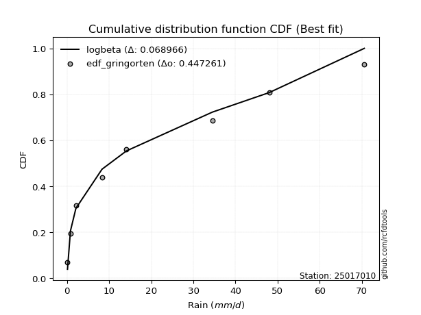</img>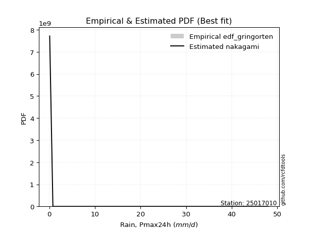</img>

</div>


### 9. Empirical - EDF Filliben (1975)

The specific values of the constants (0.3175) (often denoted as $alpha$) and (0.365) are derived from a method proposed by James J. Filliben in a 1975 paper. This particular formula is the mean value of the $i$-th order statistic of the normal distribution and is considered a robust and effective plotting position formula for the normal probability plot correlation coefficient test for normality.

<div align="center">


$P=(m-0.3175)/(n+0.365)$


</div>


**9.1. Empirical values**

<div align="center">

|                | 0                  | 1                   | 2                  | 3                   | 4                  | 5                  | 6                  | 7                  |
|:---------------|:-------------------|:--------------------|:-------------------|:--------------------|:-------------------|:-------------------|:-------------------|:-------------------|
| date           | 2022               | 2018                | 2017               | 2020                | 2021               | 2025               | 2019               | 2024               |
| x              | 0.1                | 0.8                 | 2.1                | 8.3                 | 14.1               | 27.6               | 34.5               | 48.0               |
| m              | 1                  | 2                   | 3                  | 4                   | 5                  | 6                  | 7                  | 8                  |
| empirical_dist | edf_filliben       | edf_filliben        | edf_filliben       | edf_filliben        | edf_filliben       | edf_filliben       | edf_filliben       | edf_filliben       |
| empirical      | 0.0815899581589958 | 0.20113568439928273 | 0.3206814106395696 | 0.44022713687985654 | 0.5597728631201434 | 0.6793185893604303 | 0.7988643156007172 | 0.9184100418410042 |
| empirical_tr   | 1.0888382687927107 | 1.2517770295548074  | 1.4720633523977125 | 1.7864388681260008  | 2.271554650373387  | 3.118359739049394  | 4.971768202080237  | 12.256410256410254 |

</div>


**9.2. Kolmogorov-Smirnov fit test (sorted by Δ)**


<div align="center">

|                | 0                   | 1                     | 2                   | 3                   | 4                   | 5                   | 6                   | 7                   | 8                   | 9                   | 10                  | 11                  | 12                  | 13                  | 14                  | 15                  | 16                 | 17                  | 18                  | 19                  | 20                 | 21                  | 22                  | 23                 | 24                 | 25                 | 26                  | 27                  | 28                  | 29                  | 30                  | 31                  | 32                 | 33                  | 34                 | 35                  | 36                  | 37                  | 38                 | 39                  | 40                  | 41                 | 42                  | 43                  | 44                  | 45                 | 46                  | 47                  | 48                  | 49                  | 50                  | 51                 | 52                  | 53                 | 54                 | 55                  | 56                  | 57                  | 58                  | 59                  | 60                 | 61                 | 62                  | 63                 | 64                  | 65                  | 66                  | 67                  | 68                  | 69                  | 70                 | 71                  | 72                  | 73                 | 74                  | 75                 | 76                 | 77                 | 78                 | 79                 | 80                 | 81                  | 82                  | 83                 | 84                 | 85                  | 86                 | 87                 | 88                 | 89                 |
|:---------------|:--------------------|:----------------------|:--------------------|:--------------------|:--------------------|:--------------------|:--------------------|:--------------------|:--------------------|:--------------------|:--------------------|:--------------------|:--------------------|:--------------------|:--------------------|:--------------------|:-------------------|:--------------------|:--------------------|:--------------------|:-------------------|:--------------------|:--------------------|:-------------------|:-------------------|:-------------------|:--------------------|:--------------------|:--------------------|:--------------------|:--------------------|:--------------------|:-------------------|:--------------------|:-------------------|:--------------------|:--------------------|:--------------------|:-------------------|:--------------------|:--------------------|:-------------------|:--------------------|:--------------------|:--------------------|:-------------------|:--------------------|:--------------------|:--------------------|:--------------------|:--------------------|:-------------------|:--------------------|:-------------------|:-------------------|:--------------------|:--------------------|:--------------------|:--------------------|:--------------------|:-------------------|:-------------------|:--------------------|:-------------------|:--------------------|:--------------------|:--------------------|:--------------------|:--------------------|:--------------------|:-------------------|:--------------------|:--------------------|:-------------------|:--------------------|:-------------------|:-------------------|:-------------------|:-------------------|:-------------------|:-------------------|:--------------------|:--------------------|:-------------------|:-------------------|:--------------------|:-------------------|:-------------------|:-------------------|:-------------------|
| station        | 25017010            | 25017010              | 25017010            | 25017010            | 25017010            | 25017010            | 25017010            | 25017010            | 25017010            | 25017010            | 25017010            | 25017010            | 25017010            | 25017010            | 25017010            | 25017010            | 25017010           | 25017010            | 25017010            | 25017010            | 25017010           | 25017010            | 25017010            | 25017010           | 25017010           | 25017010           | 25017010            | 25017010            | 25017010            | 25017010            | 25017010            | 25017010            | 25017010           | 25017010            | 25017010           | 25017010            | 25017010            | 25017010            | 25017010           | 25017010            | 25017010            | 25017010           | 25017010            | 25017010            | 25017010            | 25017010           | 25017010            | 25017010            | 25017010            | 25017010            | 25017010            | 25017010           | 25017010            | 25017010           | 25017010           | 25017010            | 25017010            | 25017010            | 25017010            | 25017010            | 25017010           | 25017010           | 25017010            | 25017010           | 25017010            | 25017010            | 25017010            | 25017010            | 25017010            | 25017010            | 25017010           | 25017010            | 25017010            | 25017010           | 25017010            | 25017010           | 25017010           | 25017010           | 25017010           | 25017010           | 25017010           | 25017010            | 25017010            | 25017010           | 25017010           | 25017010            | 25017010           | 25017010           | 25017010           | 25017010           |
| empirical_dist | edf_filliben        | edf_filliben          | edf_filliben        | edf_filliben        | edf_filliben        | edf_filliben        | edf_filliben        | edf_filliben        | edf_filliben        | edf_filliben        | edf_filliben        | edf_filliben        | edf_filliben        | edf_filliben        | edf_filliben        | edf_filliben        | edf_filliben       | edf_filliben        | edf_filliben        | edf_filliben        | edf_filliben       | edf_filliben        | edf_filliben        | edf_filliben       | edf_filliben       | edf_filliben       | edf_filliben        | edf_filliben        | edf_filliben        | edf_filliben        | edf_filliben        | edf_filliben        | edf_filliben       | edf_filliben        | edf_filliben       | edf_filliben        | edf_filliben        | edf_filliben        | edf_filliben       | edf_filliben        | edf_filliben        | edf_filliben       | edf_filliben        | edf_filliben        | edf_filliben        | edf_filliben       | edf_filliben        | edf_filliben        | edf_filliben        | edf_filliben        | edf_filliben        | edf_filliben       | edf_filliben        | edf_filliben       | edf_filliben       | edf_filliben        | edf_filliben        | edf_filliben        | edf_filliben        | edf_filliben        | edf_filliben       | edf_filliben       | edf_filliben        | edf_filliben       | edf_filliben        | edf_filliben        | edf_filliben        | edf_filliben        | edf_filliben        | edf_filliben        | edf_filliben       | edf_filliben        | edf_filliben        | edf_filliben       | edf_filliben        | edf_filliben       | edf_filliben       | edf_filliben       | edf_filliben       | edf_filliben       | edf_filliben       | edf_filliben        | edf_filliben        | edf_filliben       | edf_filliben       | edf_filliben        | edf_filliben       | edf_filliben       | edf_filliben       | edf_filliben       |
| p_dist         | nakagami            | loglaplace_asymmetric | logloggamma         | logjohnsonsu        | logpearson3         | mielke              | loggumbel_l         | halfnorm            | rayleigh            | logweibull_min      | f                   | loggompertz         | maxwell             | weibull_min         | pearson3            | fisk                | loglognorm         | t                   | crystalball         | norm                | lognct             | logexponnorm        | logt                | lognorm            | lognorm            | lognakagami        | logerlang           | alpha               | logfatiguelife      | invgamma            | logrice             | gumbel_r            | halflogistic       | invweibull          | loglogistic        | loggamma            | loggamma            | nct                 | genlogistic        | logbetaprime        | loghypsecant        | ncf                | logistic            | loginvgamma         | invgauss            | loginvgauss        | loginvweibull       | kstwobign           | moyal               | logmaxwell          | logmielke           | hypsecant          | lograyleigh         | rice               | loglaplace         | logkstwobign        | johnsonsu           | loggenexpon         | gumbel_l            | laplace             | loghalfnorm        | loggumbel_r        | exponnorm           | genexpon           | expon               | laplace_asymmetric  | gompertz            | betaprime           | logexpon            | loghalflogistic     | logmoyal           | truncnorm           | gamma               | logtruncnorm       | logncf              | erlang             | logwald            | wald               | gibrat             | logfisk            | loggibrat          | pareto              | logalpha            | fatiguelife        | logf               | logpareto           | chi2               | logchi2            | loggenlogistic     | logcrystalball     |
| delta          | 0.08158973879175085 | 0.09417315945785898   | 0.09526550321610872 | 0.09596435782875229 | 0.09833659456452215 | 0.10506278110297892 | 0.11057734414319698 | 0.11352650177128343 | 0.11878824297409551 | 0.12037801625862543 | 0.12046886639863696 | 0.12146659962522155 | 0.12300313960752782 | 0.12931465599034922 | 0.13119168857031768 | 0.13531509347848247 | 0.1374224658300452 | 0.13761043732448358 | 0.13761844308228732 | 0.13761844572633497 | 0.138870095208043  | 0.13903823452396408 | 0.13903877980567353 | 0.1390390228225033 | 0.1390390228225033 | 0.1394843869275862 | 0.14190900347925078 | 0.14192431350872114 | 0.14268697707314976 | 0.14319046490154402 | 0.14517578952171944 | 0.14751866758461904 | 0.1485567714039964 | 0.14934017073453026 | 0.1494884589007623 | 0.15093389476402813 | 0.15093389476402813 | 0.15094351959426128 | 0.1515209395950006 | 0.15223087560263288 | 0.15817524424916524 | 0.1584824646973252 | 0.15883673539302473 | 0.16038895879485476 | 0.16076709626953345 | 0.1621530729516522 | 0.16248573958938822 | 0.16299067555489263 | 0.16525083756618422 | 0.16730201079331125 | 0.16990946260080736 | 0.1742214137842663 | 0.17619460918604263 | 0.1804575644070392 | 0.182962495060434  | 0.18813280454305364 | 0.18913996097244062 | 0.19250184352738148 | 0.19639534244966894 | 0.19951934501593033 | 0.2013918704095849 | 0.2074139854792783 | 0.20805047068307897 | 0.2086775411858796 | 0.20868234872833175 | 0.20868429976868424 | 0.21003590293879296 | 0.22141809218597858 | 0.22698982474429114 | 0.22943030416263305 | 0.2311289875389841 | 0.24393034148254406 | 0.26294093893894865 | 0.2640367234163515 | 0.28693340841388126 | 0.2928732572482317 | 0.2970256979539489 | 0.3133885800597234 | 0.3206814106395696 | 0.3219252874481199 | 0.3279531767858765 | 0.33434500538397605 | 0.36961351019922073 | 0.3825726891209841 | 0.4111913786094825 | 0.44475557152588074 | 0.5051589029438981 | 0.6003353220651706 | 0.7988643156007172 | nan                |
| deltao         | 0.4472608134160001  | 0.4472608134160001    | 0.4472608134160001  | 0.4472608134160001  | 0.4472608134160001  | 0.4472608134160001  | 0.4472608134160001  | 0.4472608134160001  | 0.4472608134160001  | 0.4472608134160001  | 0.4472608134160001  | 0.4472608134160001  | 0.4472608134160001  | 0.4472608134160001  | 0.4472608134160001  | 0.4472608134160001  | 0.4472608134160001 | 0.4472608134160001  | 0.4472608134160001  | 0.4472608134160001  | 0.4472608134160001 | 0.4472608134160001  | 0.4472608134160001  | 0.4472608134160001 | 0.4472608134160001 | 0.4472608134160001 | 0.4472608134160001  | 0.4472608134160001  | 0.4472608134160001  | 0.4472608134160001  | 0.4472608134160001  | 0.4472608134160001  | 0.4472608134160001 | 0.4472608134160001  | 0.4472608134160001 | 0.4472608134160001  | 0.4472608134160001  | 0.4472608134160001  | 0.4472608134160001 | 0.4472608134160001  | 0.4472608134160001  | 0.4472608134160001 | 0.4472608134160001  | 0.4472608134160001  | 0.4472608134160001  | 0.4472608134160001 | 0.4472608134160001  | 0.4472608134160001  | 0.4472608134160001  | 0.4472608134160001  | 0.4472608134160001  | 0.4472608134160001 | 0.4472608134160001  | 0.4472608134160001 | 0.4472608134160001 | 0.4472608134160001  | 0.4472608134160001  | 0.4472608134160001  | 0.4472608134160001  | 0.4472608134160001  | 0.4472608134160001 | 0.4472608134160001 | 0.4472608134160001  | 0.4472608134160001 | 0.4472608134160001  | 0.4472608134160001  | 0.4472608134160001  | 0.4472608134160001  | 0.4472608134160001  | 0.4472608134160001  | 0.4472608134160001 | 0.4472608134160001  | 0.4472608134160001  | 0.4472608134160001 | 0.4472608134160001  | 0.4472608134160001 | 0.4472608134160001 | 0.4472608134160001 | 0.4472608134160001 | 0.4472608134160001 | 0.4472608134160001 | 0.4472608134160001  | 0.4472608134160001  | 0.4472608134160001 | 0.4472608134160001 | 0.4472608134160001  | 0.4472608134160001 | 0.4472608134160001 | 0.4472608134160001 | 0.4472608134160001 |
| eval           | Δo > Δ              | Δo > Δ                | Δo > Δ              | Δo > Δ              | Δo > Δ              | Δo > Δ              | Δo > Δ              | Δo > Δ              | Δo > Δ              | Δo > Δ              | Δo > Δ              | Δo > Δ              | Δo > Δ              | Δo > Δ              | Δo > Δ              | Δo > Δ              | Δo > Δ             | Δo > Δ              | Δo > Δ              | Δo > Δ              | Δo > Δ             | Δo > Δ              | Δo > Δ              | Δo > Δ             | Δo > Δ             | Δo > Δ             | Δo > Δ              | Δo > Δ              | Δo > Δ              | Δo > Δ              | Δo > Δ              | Δo > Δ              | Δo > Δ             | Δo > Δ              | Δo > Δ             | Δo > Δ              | Δo > Δ              | Δo > Δ              | Δo > Δ             | Δo > Δ              | Δo > Δ              | Δo > Δ             | Δo > Δ              | Δo > Δ              | Δo > Δ              | Δo > Δ             | Δo > Δ              | Δo > Δ              | Δo > Δ              | Δo > Δ              | Δo > Δ              | Δo > Δ             | Δo > Δ              | Δo > Δ             | Δo > Δ             | Δo > Δ              | Δo > Δ              | Δo > Δ              | Δo > Δ              | Δo > Δ              | Δo > Δ             | Δo > Δ             | Δo > Δ              | Δo > Δ             | Δo > Δ              | Δo > Δ              | Δo > Δ              | Δo > Δ              | Δo > Δ              | Δo > Δ              | Δo > Δ             | Δo > Δ              | Δo > Δ              | Δo > Δ             | Δo > Δ              | Δo > Δ             | Δo > Δ             | Δo > Δ             | Δo > Δ             | Δo > Δ             | Δo > Δ             | Δo > Δ              | Δo > Δ              | Δo > Δ             | Δo > Δ             | Δo > Δ              | Δo <= Δ            | Δo <= Δ            | Δo <= Δ            | Δo <= Δ            |
| fit            | 1                   | 1                     | 1                   | 1                   | 1                   | 1                   | 1                   | 1                   | 1                   | 1                   | 1                   | 1                   | 1                   | 1                   | 1                   | 1                   | 1                  | 1                   | 1                   | 1                   | 1                  | 1                   | 1                   | 1                  | 1                  | 1                  | 1                   | 1                   | 1                   | 1                   | 1                   | 1                   | 1                  | 1                   | 1                  | 1                   | 1                   | 1                   | 1                  | 1                   | 1                   | 1                  | 1                   | 1                   | 1                   | 1                  | 1                   | 1                   | 1                   | 1                   | 1                   | 1                  | 1                   | 1                  | 1                  | 1                   | 1                   | 1                   | 1                   | 1                   | 1                  | 1                  | 1                   | 1                  | 1                   | 1                   | 1                   | 1                   | 1                   | 1                   | 1                  | 1                   | 1                   | 1                  | 1                   | 1                  | 1                  | 1                  | 1                  | 1                  | 1                  | 1                   | 1                   | 1                  | 1                  | 1                   | 0                  | 0                  | 0                  | 0                  |
| n              | 8                   | 8                     | 8                   | 8                   | 8                   | 8                   | 8                   | 8                   | 8                   | 8                   | 8                   | 8                   | 8                   | 8                   | 8                   | 8                   | 8                  | 8                   | 8                   | 8                   | 8                  | 8                   | 8                   | 8                  | 8                  | 8                  | 8                   | 8                   | 8                   | 8                   | 8                   | 8                   | 8                  | 8                   | 8                  | 8                   | 8                   | 8                   | 8                  | 8                   | 8                   | 8                  | 8                   | 8                   | 8                   | 8                  | 8                   | 8                   | 8                   | 8                   | 8                   | 8                  | 8                   | 8                  | 8                  | 8                   | 8                   | 8                   | 8                   | 8                   | 8                  | 8                  | 8                   | 8                  | 8                   | 8                   | 8                   | 8                   | 8                   | 8                   | 8                  | 8                   | 8                   | 8                  | 8                   | 8                  | 8                  | 8                  | 8                  | 8                  | 8                  | 8                   | 8                   | 8                  | 8                  | 8                   | 8                  | 8                  | 8                  | 8                  |
| best_fit       | 1                   | 0                     | 0                   | 0                   | 0                   | 0                   | 0                   | 0                   | 0                   | 0                   | 0                   | 0                   | 0                   | 0                   | 0                   | 0                   | 0                  | 0                   | 0                   | 0                   | 0                  | 0                   | 0                   | 0                  | 0                  | 0                  | 0                   | 0                   | 0                   | 0                   | 0                   | 0                   | 0                  | 0                   | 0                  | 0                   | 0                   | 0                   | 0                  | 0                   | 0                   | 0                  | 0                   | 0                   | 0                   | 0                  | 0                   | 0                   | 0                   | 0                   | 0                   | 0                  | 0                   | 0                  | 0                  | 0                   | 0                   | 0                   | 0                   | 0                   | 0                  | 0                  | 0                   | 0                  | 0                   | 0                   | 0                   | 0                   | 0                   | 0                   | 0                  | 0                   | 0                   | 0                  | 0                   | 0                  | 0                  | 0                  | 0                  | 0                  | 0                  | 0                   | 0                   | 0                  | 0                  | 0                   | 0                  | 0                  | 0                  | 0                  |
| best_fit_sort  | 1                   | 2                     | 3                   | 4                   | 5                   | 6                   | 7                   | 8                   | 9                   | 10                  | 11                  | 12                  | 13                  | 14                  | 15                  | 16                  | 17                 | 18                  | 19                  | 20                  | 21                 | 22                  | 23                  | 24                 | 25                 | 26                 | 27                  | 28                  | 29                  | 30                  | 31                  | 32                  | 33                 | 34                  | 35                 | 36                  | 37                  | 38                  | 39                 | 40                  | 41                  | 42                 | 43                  | 44                  | 45                  | 46                 | 47                  | 48                  | 49                  | 50                  | 51                  | 52                 | 53                  | 54                 | 55                 | 56                  | 57                  | 58                  | 59                  | 60                  | 61                 | 62                 | 63                  | 64                 | 65                  | 66                  | 67                  | 68                  | 69                  | 70                  | 71                 | 72                  | 73                  | 74                 | 75                  | 76                 | 77                 | 78                 | 79                 | 80                 | 81                 | 82                  | 83                  | 84                 | 85                 | 86                  | 87                 | 88                 | 89                 | 90                 |

</div>


<div align="center">

</img>

</div>


**9.3. Best fit**

<div align="center">

|   id |   station | empirical_dist   | p_dist   |     delta |   deltao | eval   |   fit |   n |   best_fit |   best_fit_sort |
|-----:|----------:|:-----------------|:---------|----------:|---------:|:-------|------:|----:|-----------:|----------------:|
|    0 |  25017010 | edf_filliben     | nakagami | 0.0815897 | 0.447261 | Δo > Δ |     1 |   8 |          1 |               1 |

</div>


<div align="center">

</img></img>

</div>


### 10. Empirical - EDF Jenkinson (1977)

The Jenkinson formula in hydrology is an empirical plotting position formula used to estimate the non-exceedance probability _(P)_ or return period _(T)_ of a given ordered observation within a sample. It is a widely used method in the frequency analysis of extreme events such as floods and rainfall, as it provides a distribution-free way to plot data. _a≈0.31_ and _b≈0.38_ are constants derived to approximate the median of the probability distribution for the given rank.

<div align="center">


$P=(m-a)/(n+b)$


</div>


**10.1. Empirical values**

<div align="center">

|                | 0                   | 1                   | 2                  | 3                   | 4                  | 5                  | 6                  | 7                  |
|:---------------|:--------------------|:--------------------|:-------------------|:--------------------|:-------------------|:-------------------|:-------------------|:-------------------|
| date           | 2022                | 2018                | 2017               | 2020                | 2021               | 2025               | 2019               | 2024               |
| x              | 0.1                 | 0.8                 | 2.1                | 8.3                 | 14.1               | 27.6               | 34.5               | 48.0               |
| m              | 1                   | 2                   | 3                  | 4                   | 5                  | 6                  | 7                  | 8                  |
| empirical_dist | edf_jenkinson       | edf_jenkinson       | edf_jenkinson      | edf_jenkinson       | edf_jenkinson      | edf_jenkinson      | edf_jenkinson      | edf_jenkinson      |
| empirical      | 0.08233890214797135 | 0.20167064439140808 | 0.3210023866348448 | 0.44033412887828155 | 0.5596658711217184 | 0.6789976133651551 | 0.7983293556085919 | 0.9176610978520287 |
| empirical_tr   | 1.0897269180754225  | 1.2526158445440956  | 1.4727592267135323 | 1.7867803837953091  | 2.2710027100271004 | 3.115241635687732  | 4.958579881656804  | 12.144927536231886 |

</div>


**10.2. Kolmogorov-Smirnov fit test (sorted by Δ)**


<div align="center">

|                | 0                  | 1                     | 2                   | 3                   | 4                  | 5                   | 6                   | 7                   | 8                   | 9                   | 10                  | 11                 | 12                  | 13                  | 14                  | 15                  | 16                  | 17                 | 18                  | 19                  | 20                 | 21                  | 22                  | 23                 | 24                 | 25                  | 26                  | 27                 | 28                  | 29                 | 30                  | 31                  | 32                 | 33                  | 34                  | 35                  | 36                  | 37                  | 38                 | 39                  | 40                  | 41                  | 42                  | 43                  | 44                 | 45                 | 46                 | 47                  | 48                  | 49                  | 50                  | 51                  | 52                  | 53                 | 54                  | 55                  | 56                 | 57                  | 58                  | 59                  | 60                  | 61                 | 62                  | 63                 | 64                  | 65                  | 66                  | 67                  | 68                  | 69                  | 70                  | 71                  | 72                 | 73                  | 74                 | 75                 | 76                 | 77                 | 78                 | 79                  | 80                 | 81                 | 82                 | 83                  | 84                 | 85                 | 86                 | 87                 | 88                 | 89                 |
|:---------------|:-------------------|:----------------------|:--------------------|:--------------------|:-------------------|:--------------------|:--------------------|:--------------------|:--------------------|:--------------------|:--------------------|:-------------------|:--------------------|:--------------------|:--------------------|:--------------------|:--------------------|:-------------------|:--------------------|:--------------------|:-------------------|:--------------------|:--------------------|:-------------------|:-------------------|:--------------------|:--------------------|:-------------------|:--------------------|:-------------------|:--------------------|:--------------------|:-------------------|:--------------------|:--------------------|:--------------------|:--------------------|:--------------------|:-------------------|:--------------------|:--------------------|:--------------------|:--------------------|:--------------------|:-------------------|:-------------------|:-------------------|:--------------------|:--------------------|:--------------------|:--------------------|:--------------------|:--------------------|:-------------------|:--------------------|:--------------------|:-------------------|:--------------------|:--------------------|:--------------------|:--------------------|:-------------------|:--------------------|:-------------------|:--------------------|:--------------------|:--------------------|:--------------------|:--------------------|:--------------------|:--------------------|:--------------------|:-------------------|:--------------------|:-------------------|:-------------------|:-------------------|:-------------------|:-------------------|:--------------------|:-------------------|:-------------------|:-------------------|:--------------------|:-------------------|:-------------------|:-------------------|:-------------------|:-------------------|:-------------------|
| station        | 25017010           | 25017010              | 25017010            | 25017010            | 25017010           | 25017010            | 25017010            | 25017010            | 25017010            | 25017010            | 25017010            | 25017010           | 25017010            | 25017010            | 25017010            | 25017010            | 25017010            | 25017010           | 25017010            | 25017010            | 25017010           | 25017010            | 25017010            | 25017010           | 25017010           | 25017010            | 25017010            | 25017010           | 25017010            | 25017010           | 25017010            | 25017010            | 25017010           | 25017010            | 25017010            | 25017010            | 25017010            | 25017010            | 25017010           | 25017010            | 25017010            | 25017010            | 25017010            | 25017010            | 25017010           | 25017010           | 25017010           | 25017010            | 25017010            | 25017010            | 25017010            | 25017010            | 25017010            | 25017010           | 25017010            | 25017010            | 25017010           | 25017010            | 25017010            | 25017010            | 25017010            | 25017010           | 25017010            | 25017010           | 25017010            | 25017010            | 25017010            | 25017010            | 25017010            | 25017010            | 25017010            | 25017010            | 25017010           | 25017010            | 25017010           | 25017010           | 25017010           | 25017010           | 25017010           | 25017010            | 25017010           | 25017010           | 25017010           | 25017010            | 25017010           | 25017010           | 25017010           | 25017010           | 25017010           | 25017010           |
| empirical_dist | edf_jenkinson      | edf_jenkinson         | edf_jenkinson       | edf_jenkinson       | edf_jenkinson      | edf_jenkinson       | edf_jenkinson       | edf_jenkinson       | edf_jenkinson       | edf_jenkinson       | edf_jenkinson       | edf_jenkinson      | edf_jenkinson       | edf_jenkinson       | edf_jenkinson       | edf_jenkinson       | edf_jenkinson       | edf_jenkinson      | edf_jenkinson       | edf_jenkinson       | edf_jenkinson      | edf_jenkinson       | edf_jenkinson       | edf_jenkinson      | edf_jenkinson      | edf_jenkinson       | edf_jenkinson       | edf_jenkinson      | edf_jenkinson       | edf_jenkinson      | edf_jenkinson       | edf_jenkinson       | edf_jenkinson      | edf_jenkinson       | edf_jenkinson       | edf_jenkinson       | edf_jenkinson       | edf_jenkinson       | edf_jenkinson      | edf_jenkinson       | edf_jenkinson       | edf_jenkinson       | edf_jenkinson       | edf_jenkinson       | edf_jenkinson      | edf_jenkinson      | edf_jenkinson      | edf_jenkinson       | edf_jenkinson       | edf_jenkinson       | edf_jenkinson       | edf_jenkinson       | edf_jenkinson       | edf_jenkinson      | edf_jenkinson       | edf_jenkinson       | edf_jenkinson      | edf_jenkinson       | edf_jenkinson       | edf_jenkinson       | edf_jenkinson       | edf_jenkinson      | edf_jenkinson       | edf_jenkinson      | edf_jenkinson       | edf_jenkinson       | edf_jenkinson       | edf_jenkinson       | edf_jenkinson       | edf_jenkinson       | edf_jenkinson       | edf_jenkinson       | edf_jenkinson      | edf_jenkinson       | edf_jenkinson      | edf_jenkinson      | edf_jenkinson      | edf_jenkinson      | edf_jenkinson      | edf_jenkinson       | edf_jenkinson      | edf_jenkinson      | edf_jenkinson      | edf_jenkinson       | edf_jenkinson      | edf_jenkinson      | edf_jenkinson      | edf_jenkinson      | edf_jenkinson      | edf_jenkinson      |
| p_dist         | nakagami           | loglaplace_asymmetric | logloggamma         | logjohnsonsu        | logpearson3        | mielke              | loggumbel_l         | halfnorm            | rayleigh            | logweibull_min      | f                   | loggompertz        | maxwell             | weibull_min         | pearson3            | fisk                | loglognorm          | t                  | crystalball         | norm                | lognct             | logexponnorm        | logt                | lognorm            | lognorm            | lognakagami         | logerlang           | alpha              | logfatiguelife      | invgamma           | logrice             | gumbel_r            | halflogistic       | invweibull          | loglogistic         | loggamma            | loggamma            | nct                 | genlogistic        | logbetaprime        | loghypsecant        | ncf                 | logistic            | loginvgamma         | invgauss           | loginvgauss        | loginvweibull      | kstwobign           | moyal               | logmaxwell          | logmielke           | hypsecant           | lograyleigh         | rice               | loglaplace          | logkstwobign        | johnsonsu          | loggenexpon         | gumbel_l            | laplace             | loghalfnorm         | loggumbel_r        | exponnorm           | genexpon           | expon               | laplace_asymmetric  | gompertz            | betaprime           | logexpon            | loghalflogistic     | logmoyal            | truncnorm           | gamma              | logtruncnorm        | logncf             | erlang             | logwald            | wald               | gibrat             | logfisk             | loggibrat          | pareto             | logalpha           | fatiguelife         | logf               | logpareto          | chi2               | logchi2            | loggenlogistic     | logcrystalball     |
| delta          | 0.0823386827807264 | 0.09449413545313423   | 0.09558647921138397 | 0.09628533382402749 | 0.0986575705597974 | 0.10538375709825412 | 0.11089832013847223 | 0.11384747776655862 | 0.11910921896937071 | 0.12069899225390068 | 0.12078984239391222 | 0.1217875756204968 | 0.12332411560280301 | 0.12963563198562442 | 0.13151266456559288 | 0.13456614948950696 | 0.13731547383162018 | 0.1377174293229086 | 0.13772543508071233 | 0.13772543772475998 | 0.138763103209618  | 0.13893124252553907 | 0.13893178780724852 | 0.1389320308240783 | 0.1389320308240783 | 0.13937739492916118 | 0.14180201148082577 | 0.1422452895039964 | 0.14257998507472475 | 0.143083472903119  | 0.14506879752329443 | 0.14783964357989424 | 0.1488777473992716 | 0.14923317873610525 | 0.14938146690233728 | 0.15082690276560312 | 0.15082690276560312 | 0.15083652759583627 | 0.1518419155902758 | 0.15212388360420787 | 0.15806825225074023 | 0.15880344069260044 | 0.15894372739144974 | 0.16028196679642975 | 0.1610880722648087 | 0.1620460809532272 | 0.1623787475909632 | 0.16331165155016783 | 0.16557181356145942 | 0.16719501879488624 | 0.16980247060238235 | 0.17432840578269132 | 0.17608761718761762 | 0.1807785404023144 | 0.18285550306200898 | 0.18802581254462863 | 0.1890329689740156 | 0.19239485152895647 | 0.19628835045124393 | 0.19962633701435534 | 0.20128487841115988 | 0.2073069934808533 | 0.20837144667835417 | 0.2089985171811548 | 0.20900332472360694 | 0.20900527576395944 | 0.21035687893406815 | 0.22131110018755357 | 0.22688283274586613 | 0.22932331216420804 | 0.23102199554055908 | 0.24425131747781925 | 0.2632619149342239 | 0.26392973141792647 | 0.2863984484217559 | 0.2927662652498067 | 0.2969187059555239 | 0.3137095560549986 | 0.3210023866348448 | 0.32139032745599455 | 0.3278461847874515 | 0.3338100453918507 | 0.3690785502070954 | 0.38203772912885875 | 0.4106564186173572 | 0.4442206115337554 | 0.5050519109454732 | 0.5998003620730452 | 0.7983293556085919 | nan                |
| deltao         | 0.4472608134160001 | 0.4472608134160001    | 0.4472608134160001  | 0.4472608134160001  | 0.4472608134160001 | 0.4472608134160001  | 0.4472608134160001  | 0.4472608134160001  | 0.4472608134160001  | 0.4472608134160001  | 0.4472608134160001  | 0.4472608134160001 | 0.4472608134160001  | 0.4472608134160001  | 0.4472608134160001  | 0.4472608134160001  | 0.4472608134160001  | 0.4472608134160001 | 0.4472608134160001  | 0.4472608134160001  | 0.4472608134160001 | 0.4472608134160001  | 0.4472608134160001  | 0.4472608134160001 | 0.4472608134160001 | 0.4472608134160001  | 0.4472608134160001  | 0.4472608134160001 | 0.4472608134160001  | 0.4472608134160001 | 0.4472608134160001  | 0.4472608134160001  | 0.4472608134160001 | 0.4472608134160001  | 0.4472608134160001  | 0.4472608134160001  | 0.4472608134160001  | 0.4472608134160001  | 0.4472608134160001 | 0.4472608134160001  | 0.4472608134160001  | 0.4472608134160001  | 0.4472608134160001  | 0.4472608134160001  | 0.4472608134160001 | 0.4472608134160001 | 0.4472608134160001 | 0.4472608134160001  | 0.4472608134160001  | 0.4472608134160001  | 0.4472608134160001  | 0.4472608134160001  | 0.4472608134160001  | 0.4472608134160001 | 0.4472608134160001  | 0.4472608134160001  | 0.4472608134160001 | 0.4472608134160001  | 0.4472608134160001  | 0.4472608134160001  | 0.4472608134160001  | 0.4472608134160001 | 0.4472608134160001  | 0.4472608134160001 | 0.4472608134160001  | 0.4472608134160001  | 0.4472608134160001  | 0.4472608134160001  | 0.4472608134160001  | 0.4472608134160001  | 0.4472608134160001  | 0.4472608134160001  | 0.4472608134160001 | 0.4472608134160001  | 0.4472608134160001 | 0.4472608134160001 | 0.4472608134160001 | 0.4472608134160001 | 0.4472608134160001 | 0.4472608134160001  | 0.4472608134160001 | 0.4472608134160001 | 0.4472608134160001 | 0.4472608134160001  | 0.4472608134160001 | 0.4472608134160001 | 0.4472608134160001 | 0.4472608134160001 | 0.4472608134160001 | 0.4472608134160001 |
| eval           | Δo > Δ             | Δo > Δ                | Δo > Δ              | Δo > Δ              | Δo > Δ             | Δo > Δ              | Δo > Δ              | Δo > Δ              | Δo > Δ              | Δo > Δ              | Δo > Δ              | Δo > Δ             | Δo > Δ              | Δo > Δ              | Δo > Δ              | Δo > Δ              | Δo > Δ              | Δo > Δ             | Δo > Δ              | Δo > Δ              | Δo > Δ             | Δo > Δ              | Δo > Δ              | Δo > Δ             | Δo > Δ             | Δo > Δ              | Δo > Δ              | Δo > Δ             | Δo > Δ              | Δo > Δ             | Δo > Δ              | Δo > Δ              | Δo > Δ             | Δo > Δ              | Δo > Δ              | Δo > Δ              | Δo > Δ              | Δo > Δ              | Δo > Δ             | Δo > Δ              | Δo > Δ              | Δo > Δ              | Δo > Δ              | Δo > Δ              | Δo > Δ             | Δo > Δ             | Δo > Δ             | Δo > Δ              | Δo > Δ              | Δo > Δ              | Δo > Δ              | Δo > Δ              | Δo > Δ              | Δo > Δ             | Δo > Δ              | Δo > Δ              | Δo > Δ             | Δo > Δ              | Δo > Δ              | Δo > Δ              | Δo > Δ              | Δo > Δ             | Δo > Δ              | Δo > Δ             | Δo > Δ              | Δo > Δ              | Δo > Δ              | Δo > Δ              | Δo > Δ              | Δo > Δ              | Δo > Δ              | Δo > Δ              | Δo > Δ             | Δo > Δ              | Δo > Δ             | Δo > Δ             | Δo > Δ             | Δo > Δ             | Δo > Δ             | Δo > Δ              | Δo > Δ             | Δo > Δ             | Δo > Δ             | Δo > Δ              | Δo > Δ             | Δo > Δ             | Δo <= Δ            | Δo <= Δ            | Δo <= Δ            | Δo <= Δ            |
| fit            | 1                  | 1                     | 1                   | 1                   | 1                  | 1                   | 1                   | 1                   | 1                   | 1                   | 1                   | 1                  | 1                   | 1                   | 1                   | 1                   | 1                   | 1                  | 1                   | 1                   | 1                  | 1                   | 1                   | 1                  | 1                  | 1                   | 1                   | 1                  | 1                   | 1                  | 1                   | 1                   | 1                  | 1                   | 1                   | 1                   | 1                   | 1                   | 1                  | 1                   | 1                   | 1                   | 1                   | 1                   | 1                  | 1                  | 1                  | 1                   | 1                   | 1                   | 1                   | 1                   | 1                   | 1                  | 1                   | 1                   | 1                  | 1                   | 1                   | 1                   | 1                   | 1                  | 1                   | 1                  | 1                   | 1                   | 1                   | 1                   | 1                   | 1                   | 1                   | 1                   | 1                  | 1                   | 1                  | 1                  | 1                  | 1                  | 1                  | 1                   | 1                  | 1                  | 1                  | 1                   | 1                  | 1                  | 0                  | 0                  | 0                  | 0                  |
| n              | 8                  | 8                     | 8                   | 8                   | 8                  | 8                   | 8                   | 8                   | 8                   | 8                   | 8                   | 8                  | 8                   | 8                   | 8                   | 8                   | 8                   | 8                  | 8                   | 8                   | 8                  | 8                   | 8                   | 8                  | 8                  | 8                   | 8                   | 8                  | 8                   | 8                  | 8                   | 8                   | 8                  | 8                   | 8                   | 8                   | 8                   | 8                   | 8                  | 8                   | 8                   | 8                   | 8                   | 8                   | 8                  | 8                  | 8                  | 8                   | 8                   | 8                   | 8                   | 8                   | 8                   | 8                  | 8                   | 8                   | 8                  | 8                   | 8                   | 8                   | 8                   | 8                  | 8                   | 8                  | 8                   | 8                   | 8                   | 8                   | 8                   | 8                   | 8                   | 8                   | 8                  | 8                   | 8                  | 8                  | 8                  | 8                  | 8                  | 8                   | 8                  | 8                  | 8                  | 8                   | 8                  | 8                  | 8                  | 8                  | 8                  | 8                  |
| best_fit       | 1                  | 0                     | 0                   | 0                   | 0                  | 0                   | 0                   | 0                   | 0                   | 0                   | 0                   | 0                  | 0                   | 0                   | 0                   | 0                   | 0                   | 0                  | 0                   | 0                   | 0                  | 0                   | 0                   | 0                  | 0                  | 0                   | 0                   | 0                  | 0                   | 0                  | 0                   | 0                   | 0                  | 0                   | 0                   | 0                   | 0                   | 0                   | 0                  | 0                   | 0                   | 0                   | 0                   | 0                   | 0                  | 0                  | 0                  | 0                   | 0                   | 0                   | 0                   | 0                   | 0                   | 0                  | 0                   | 0                   | 0                  | 0                   | 0                   | 0                   | 0                   | 0                  | 0                   | 0                  | 0                   | 0                   | 0                   | 0                   | 0                   | 0                   | 0                   | 0                   | 0                  | 0                   | 0                  | 0                  | 0                  | 0                  | 0                  | 0                   | 0                  | 0                  | 0                  | 0                   | 0                  | 0                  | 0                  | 0                  | 0                  | 0                  |
| best_fit_sort  | 1                  | 2                     | 3                   | 4                   | 5                  | 6                   | 7                   | 8                   | 9                   | 10                  | 11                  | 12                 | 13                  | 14                  | 15                  | 16                  | 17                  | 18                 | 19                  | 20                  | 21                 | 22                  | 23                  | 24                 | 25                 | 26                  | 27                  | 28                 | 29                  | 30                 | 31                  | 32                  | 33                 | 34                  | 35                  | 36                  | 37                  | 38                  | 39                 | 40                  | 41                  | 42                  | 43                  | 44                  | 45                 | 46                 | 47                 | 48                  | 49                  | 50                  | 51                  | 52                  | 53                  | 54                 | 55                  | 56                  | 57                 | 58                  | 59                  | 60                  | 61                  | 62                 | 63                  | 64                 | 65                  | 66                  | 67                  | 68                  | 69                  | 70                  | 71                  | 72                  | 73                 | 74                  | 75                 | 76                 | 77                 | 78                 | 79                 | 80                  | 81                 | 82                 | 83                 | 84                  | 85                 | 86                 | 87                 | 88                 | 89                 | 90                 |

</div>


<div align="center">

</img>

</div>


**10.3. Best fit**

<div align="center">

|   id |   station | empirical_dist   | p_dist   |     delta |   deltao | eval   |   fit |   n |   best_fit |   best_fit_sort |
|-----:|----------:|:-----------------|:---------|----------:|---------:|:-------|------:|----:|-----------:|----------------:|
|    0 |  25017010 | edf_jenkinson    | nakagami | 0.0823387 | 0.447261 | Δo > Δ |     1 |   8 |          1 |               1 |

</div>


<div align="center">

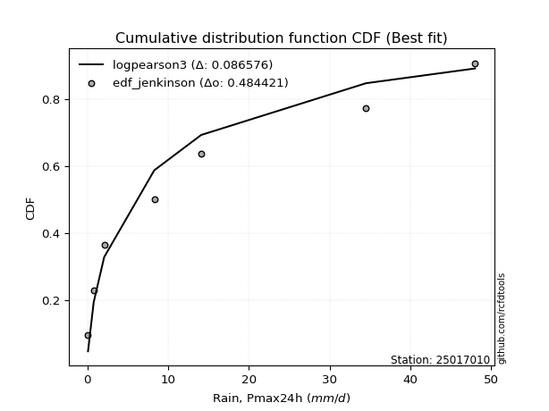</img>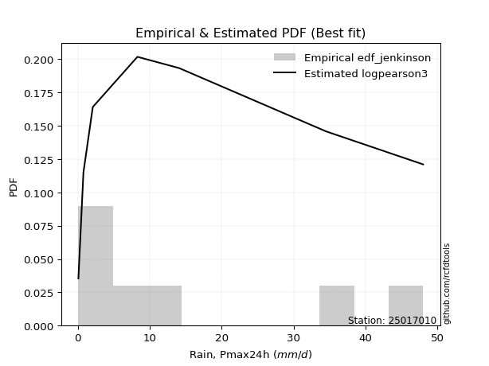</img>

</div>


### 11. Empirical - EDF Cunnane (1978)

Cunnane´s work in statistical hydrology has focused on the performance and evaluation of different probability distributions (such as GEV, Gumbel, Lognormal) for flood frequency estimation. _b_ is a constant, typically set to 0.4.

<div align="center">


$P=(m-b)/(n+1-2b)$


</div>


**11.1. Empirical values**

<div align="center">

|                | 0                   | 1                   | 2                  | 3                  | 4                  | 5                  | 6                  | 7                  |
|:---------------|:--------------------|:--------------------|:-------------------|:-------------------|:-------------------|:-------------------|:-------------------|:-------------------|
| date           | 2022                | 2018                | 2017               | 2020               | 2021               | 2025               | 2019               | 2024               |
| x              | 0.1                 | 0.8                 | 2.1                | 8.3                | 14.1               | 27.6               | 34.5               | 48.0               |
| m              | 1                   | 2                   | 3                  | 4                  | 5                  | 6                  | 7                  | 8                  |
| empirical_dist | edf_cunnane         | edf_cunnane         | edf_cunnane        | edf_cunnane        | edf_cunnane        | edf_cunnane        | edf_cunnane        | edf_cunnane        |
| empirical      | 0.07317073170731708 | 0.19512195121951223 | 0.3170731707317074 | 0.4390243902439025 | 0.5609756097560976 | 0.6829268292682927 | 0.8048780487804879 | 0.926829268292683  |
| empirical_tr   | 1.0789473684210527  | 1.2424242424242424  | 1.4642857142857144 | 1.782608695652174  | 2.277777777777778  | 3.153846153846154  | 5.125000000000001  | 13.666666666666675 |

</div>


**11.2. Kolmogorov-Smirnov fit test (sorted by Δ)**


<div align="center">

|                | 0                   | 1                     | 2                  | 3                   | 4                   | 5                   | 6                   | 7                   | 8                   | 9                   | 10                  | 11                  | 12                  | 13                  | 14                  | 15                  | 16                  | 17                  | 18                  | 19                  | 20                  | 21                  | 22                  | 23                  | 24                  | 25                  | 26                  | 27                  | 28                 | 29                 | 30                  | 31                  | 32                 | 33                  | 34                 | 35                  | 36                  | 37                  | 38                  | 39                  | 40                  | 41                  | 42                 | 43                  | 44                 | 45                 | 46                  | 47                  | 48                  | 49                 | 50                 | 51                  | 52                  | 53                  | 54                  | 55                 | 56                  | 57                  | 58                  | 59                  | 60                  | 61                  | 62                  | 63                 | 64                 | 65                 | 66                  | 67                  | 68                  | 69                 | 70                  | 71                 | 72                  | 73                 | 74                  | 75                  | 76                  | 77                 | 78                 | 79                 | 80                  | 81                  | 82                 | 83                 | 84                 | 85                  | 86                 | 87                 | 88                 | 89                 |
|:---------------|:--------------------|:----------------------|:-------------------|:--------------------|:--------------------|:--------------------|:--------------------|:--------------------|:--------------------|:--------------------|:--------------------|:--------------------|:--------------------|:--------------------|:--------------------|:--------------------|:--------------------|:--------------------|:--------------------|:--------------------|:--------------------|:--------------------|:--------------------|:--------------------|:--------------------|:--------------------|:--------------------|:--------------------|:-------------------|:-------------------|:--------------------|:--------------------|:-------------------|:--------------------|:-------------------|:--------------------|:--------------------|:--------------------|:--------------------|:--------------------|:--------------------|:--------------------|:-------------------|:--------------------|:-------------------|:-------------------|:--------------------|:--------------------|:--------------------|:-------------------|:-------------------|:--------------------|:--------------------|:--------------------|:--------------------|:-------------------|:--------------------|:--------------------|:--------------------|:--------------------|:--------------------|:--------------------|:--------------------|:-------------------|:-------------------|:-------------------|:--------------------|:--------------------|:--------------------|:-------------------|:--------------------|:-------------------|:--------------------|:-------------------|:--------------------|:--------------------|:--------------------|:-------------------|:-------------------|:-------------------|:--------------------|:--------------------|:-------------------|:-------------------|:-------------------|:--------------------|:-------------------|:-------------------|:-------------------|:-------------------|
| station        | 25017010            | 25017010              | 25017010           | 25017010            | 25017010            | 25017010            | 25017010            | 25017010            | 25017010            | 25017010            | 25017010            | 25017010            | 25017010            | 25017010            | 25017010            | 25017010            | 25017010            | 25017010            | 25017010            | 25017010            | 25017010            | 25017010            | 25017010            | 25017010            | 25017010            | 25017010            | 25017010            | 25017010            | 25017010           | 25017010           | 25017010            | 25017010            | 25017010           | 25017010            | 25017010           | 25017010            | 25017010            | 25017010            | 25017010            | 25017010            | 25017010            | 25017010            | 25017010           | 25017010            | 25017010           | 25017010           | 25017010            | 25017010            | 25017010            | 25017010           | 25017010           | 25017010            | 25017010            | 25017010            | 25017010            | 25017010           | 25017010            | 25017010            | 25017010            | 25017010            | 25017010            | 25017010            | 25017010            | 25017010           | 25017010           | 25017010           | 25017010            | 25017010            | 25017010            | 25017010           | 25017010            | 25017010           | 25017010            | 25017010           | 25017010            | 25017010            | 25017010            | 25017010           | 25017010           | 25017010           | 25017010            | 25017010            | 25017010           | 25017010           | 25017010           | 25017010            | 25017010           | 25017010           | 25017010           | 25017010           |
| empirical_dist | edf_cunnane         | edf_cunnane           | edf_cunnane        | edf_cunnane         | edf_cunnane         | edf_cunnane         | edf_cunnane         | edf_cunnane         | edf_cunnane         | edf_cunnane         | edf_cunnane         | edf_cunnane         | edf_cunnane         | edf_cunnane         | edf_cunnane         | edf_cunnane         | edf_cunnane         | edf_cunnane         | edf_cunnane         | edf_cunnane         | edf_cunnane         | edf_cunnane         | edf_cunnane         | edf_cunnane         | edf_cunnane         | edf_cunnane         | edf_cunnane         | edf_cunnane         | edf_cunnane        | edf_cunnane        | edf_cunnane         | edf_cunnane         | edf_cunnane        | edf_cunnane         | edf_cunnane        | edf_cunnane         | edf_cunnane         | edf_cunnane         | edf_cunnane         | edf_cunnane         | edf_cunnane         | edf_cunnane         | edf_cunnane        | edf_cunnane         | edf_cunnane        | edf_cunnane        | edf_cunnane         | edf_cunnane         | edf_cunnane         | edf_cunnane        | edf_cunnane        | edf_cunnane         | edf_cunnane         | edf_cunnane         | edf_cunnane         | edf_cunnane        | edf_cunnane         | edf_cunnane         | edf_cunnane         | edf_cunnane         | edf_cunnane         | edf_cunnane         | edf_cunnane         | edf_cunnane        | edf_cunnane        | edf_cunnane        | edf_cunnane         | edf_cunnane         | edf_cunnane         | edf_cunnane        | edf_cunnane         | edf_cunnane        | edf_cunnane         | edf_cunnane        | edf_cunnane         | edf_cunnane         | edf_cunnane         | edf_cunnane        | edf_cunnane        | edf_cunnane        | edf_cunnane         | edf_cunnane         | edf_cunnane        | edf_cunnane        | edf_cunnane        | edf_cunnane         | edf_cunnane        | edf_cunnane        | edf_cunnane        | edf_cunnane        |
| p_dist         | nakagami            | loglaplace_asymmetric | logloggamma        | logjohnsonsu        | logpearson3         | mielke              | loggumbel_l         | halfnorm            | rayleigh            | logweibull_min      | loggompertz         | f                   | maxwell             | weibull_min         | pearson3            | t                   | crystalball         | norm                | alpha               | loglognorm          | lognct              | logexponnorm        | logt                | lognorm             | lognorm             | lognakagami         | logerlang           | fisk                | logfatiguelife     | gumbel_r           | invgamma            | halflogistic        | logrice            | genlogistic         | invweibull         | loglogistic         | loggamma            | loggamma            | nct                 | logbetaprime        | ncf                 | invgauss            | logistic           | loghypsecant        | kstwobign          | loginvgamma        | moyal               | loginvgauss         | loginvweibull       | logmaxwell         | logmielke          | hypsecant           | rice                | lograyleigh         | loglaplace          | logkstwobign       | johnsonsu           | loggenexpon         | gumbel_l            | laplace             | loghalfnorm         | exponnorm           | genexpon            | expon              | laplace_asymmetric | gompertz           | loggumbel_r         | betaprime           | logexpon            | loghalflogistic    | logmoyal            | truncnorm          | gamma               | logtruncnorm       | logncf              | erlang              | logwald             | wald               | gibrat             | logfisk            | loggibrat           | pareto              | logalpha           | fatiguelife        | logf               | logpareto           | chi2               | logchi2            | loggenlogistic     | logcrystalball     |
| delta          | 0.07878432637991017 | 0.09056491954999657   | 0.0916572633082463 | 0.09235611792089005 | 0.09472835465665974 | 0.10145454119511668 | 0.10696910423533457 | 0.10991826186342118 | 0.11518000306623327 | 0.11676977635076302 | 0.11785835971735914 | 0.11899705311085707 | 0.11939489969966557 | 0.12570641608248698 | 0.12758344866245544 | 0.13640769068852954 | 0.13641569644633328 | 0.13641569909038093 | 0.13831607360085874 | 0.13862521246599924 | 0.14007284184399704 | 0.14024098115991812 | 0.14024152644162757 | 0.14024176945845734 | 0.14024176945845734 | 0.14068713356354023 | 0.14311175011520483 | 0.14373431993016128 | 0.1438897237091038 | 0.1439104276767568 | 0.14439321153749807 | 0.14494853149613415 | 0.1463785361576735 | 0.14791269968713835 | 0.1505429173704843 | 0.15069120553671633 | 0.15213664139998218 | 0.15213664139998218 | 0.15214626623021532 | 0.15343362223858692 | 0.15487422478946278 | 0.15715885636167104 | 0.1576339887570707 | 0.15937799088511928 | 0.1593824356470304 | 0.1615917054308088 | 0.16164259765832198 | 0.16335581958760625 | 0.16368848622534227 | 0.1685047574292653 | 0.1711122092367614 | 0.17301866714831227 | 0.17684932449917695 | 0.17739735582199667 | 0.18416524169638804 | 0.1893355511790077 | 0.19034270760839467 | 0.19370459016333552 | 0.19759808908562315 | 0.19831659837997628 | 0.20259461704553894 | 0.20444223077521673 | 0.20506930127801737 | 0.2050741088204695 | 0.205076059860822  | 0.2064276630309307 | 0.20861673211523235 | 0.22262083882193262 | 0.22819257138024518 | 0.2306330507985871 | 0.23233173417493813 | 0.2403221015746818 | 0.25933269903108624 | 0.2652394700523055 | 0.29294714159365176 | 0.29407600388418575 | 0.29822844458990294 | 0.3097803401518612 | 0.3170731707317074 | 0.3279390206278904 | 0.32915592342183053 | 0.34035873856374654 | 0.3756272433789912 | 0.3885864223007546 | 0.417205111789253  | 0.45076930470565124 | 0.5063616495798522 | 0.6063490552449411 | 0.8048780487804879 | nan                |
| deltao         | 0.4472608134160001  | 0.4472608134160001    | 0.4472608134160001 | 0.4472608134160001  | 0.4472608134160001  | 0.4472608134160001  | 0.4472608134160001  | 0.4472608134160001  | 0.4472608134160001  | 0.4472608134160001  | 0.4472608134160001  | 0.4472608134160001  | 0.4472608134160001  | 0.4472608134160001  | 0.4472608134160001  | 0.4472608134160001  | 0.4472608134160001  | 0.4472608134160001  | 0.4472608134160001  | 0.4472608134160001  | 0.4472608134160001  | 0.4472608134160001  | 0.4472608134160001  | 0.4472608134160001  | 0.4472608134160001  | 0.4472608134160001  | 0.4472608134160001  | 0.4472608134160001  | 0.4472608134160001 | 0.4472608134160001 | 0.4472608134160001  | 0.4472608134160001  | 0.4472608134160001 | 0.4472608134160001  | 0.4472608134160001 | 0.4472608134160001  | 0.4472608134160001  | 0.4472608134160001  | 0.4472608134160001  | 0.4472608134160001  | 0.4472608134160001  | 0.4472608134160001  | 0.4472608134160001 | 0.4472608134160001  | 0.4472608134160001 | 0.4472608134160001 | 0.4472608134160001  | 0.4472608134160001  | 0.4472608134160001  | 0.4472608134160001 | 0.4472608134160001 | 0.4472608134160001  | 0.4472608134160001  | 0.4472608134160001  | 0.4472608134160001  | 0.4472608134160001 | 0.4472608134160001  | 0.4472608134160001  | 0.4472608134160001  | 0.4472608134160001  | 0.4472608134160001  | 0.4472608134160001  | 0.4472608134160001  | 0.4472608134160001 | 0.4472608134160001 | 0.4472608134160001 | 0.4472608134160001  | 0.4472608134160001  | 0.4472608134160001  | 0.4472608134160001 | 0.4472608134160001  | 0.4472608134160001 | 0.4472608134160001  | 0.4472608134160001 | 0.4472608134160001  | 0.4472608134160001  | 0.4472608134160001  | 0.4472608134160001 | 0.4472608134160001 | 0.4472608134160001 | 0.4472608134160001  | 0.4472608134160001  | 0.4472608134160001 | 0.4472608134160001 | 0.4472608134160001 | 0.4472608134160001  | 0.4472608134160001 | 0.4472608134160001 | 0.4472608134160001 | 0.4472608134160001 |
| eval           | Δo > Δ              | Δo > Δ                | Δo > Δ             | Δo > Δ              | Δo > Δ              | Δo > Δ              | Δo > Δ              | Δo > Δ              | Δo > Δ              | Δo > Δ              | Δo > Δ              | Δo > Δ              | Δo > Δ              | Δo > Δ              | Δo > Δ              | Δo > Δ              | Δo > Δ              | Δo > Δ              | Δo > Δ              | Δo > Δ              | Δo > Δ              | Δo > Δ              | Δo > Δ              | Δo > Δ              | Δo > Δ              | Δo > Δ              | Δo > Δ              | Δo > Δ              | Δo > Δ             | Δo > Δ             | Δo > Δ              | Δo > Δ              | Δo > Δ             | Δo > Δ              | Δo > Δ             | Δo > Δ              | Δo > Δ              | Δo > Δ              | Δo > Δ              | Δo > Δ              | Δo > Δ              | Δo > Δ              | Δo > Δ             | Δo > Δ              | Δo > Δ             | Δo > Δ             | Δo > Δ              | Δo > Δ              | Δo > Δ              | Δo > Δ             | Δo > Δ             | Δo > Δ              | Δo > Δ              | Δo > Δ              | Δo > Δ              | Δo > Δ             | Δo > Δ              | Δo > Δ              | Δo > Δ              | Δo > Δ              | Δo > Δ              | Δo > Δ              | Δo > Δ              | Δo > Δ             | Δo > Δ             | Δo > Δ             | Δo > Δ              | Δo > Δ              | Δo > Δ              | Δo > Δ             | Δo > Δ              | Δo > Δ             | Δo > Δ              | Δo > Δ             | Δo > Δ              | Δo > Δ              | Δo > Δ              | Δo > Δ             | Δo > Δ             | Δo > Δ             | Δo > Δ              | Δo > Δ              | Δo > Δ             | Δo > Δ             | Δo > Δ             | Δo <= Δ             | Δo <= Δ            | Δo <= Δ            | Δo <= Δ            | Δo <= Δ            |
| fit            | 1                   | 1                     | 1                  | 1                   | 1                   | 1                   | 1                   | 1                   | 1                   | 1                   | 1                   | 1                   | 1                   | 1                   | 1                   | 1                   | 1                   | 1                   | 1                   | 1                   | 1                   | 1                   | 1                   | 1                   | 1                   | 1                   | 1                   | 1                   | 1                  | 1                  | 1                   | 1                   | 1                  | 1                   | 1                  | 1                   | 1                   | 1                   | 1                   | 1                   | 1                   | 1                   | 1                  | 1                   | 1                  | 1                  | 1                   | 1                   | 1                   | 1                  | 1                  | 1                   | 1                   | 1                   | 1                   | 1                  | 1                   | 1                   | 1                   | 1                   | 1                   | 1                   | 1                   | 1                  | 1                  | 1                  | 1                   | 1                   | 1                   | 1                  | 1                   | 1                  | 1                   | 1                  | 1                   | 1                   | 1                   | 1                  | 1                  | 1                  | 1                   | 1                   | 1                  | 1                  | 1                  | 0                   | 0                  | 0                  | 0                  | 0                  |
| n              | 8                   | 8                     | 8                  | 8                   | 8                   | 8                   | 8                   | 8                   | 8                   | 8                   | 8                   | 8                   | 8                   | 8                   | 8                   | 8                   | 8                   | 8                   | 8                   | 8                   | 8                   | 8                   | 8                   | 8                   | 8                   | 8                   | 8                   | 8                   | 8                  | 8                  | 8                   | 8                   | 8                  | 8                   | 8                  | 8                   | 8                   | 8                   | 8                   | 8                   | 8                   | 8                   | 8                  | 8                   | 8                  | 8                  | 8                   | 8                   | 8                   | 8                  | 8                  | 8                   | 8                   | 8                   | 8                   | 8                  | 8                   | 8                   | 8                   | 8                   | 8                   | 8                   | 8                   | 8                  | 8                  | 8                  | 8                   | 8                   | 8                   | 8                  | 8                   | 8                  | 8                   | 8                  | 8                   | 8                   | 8                   | 8                  | 8                  | 8                  | 8                   | 8                   | 8                  | 8                  | 8                  | 8                   | 8                  | 8                  | 8                  | 8                  |
| best_fit       | 1                   | 0                     | 0                  | 0                   | 0                   | 0                   | 0                   | 0                   | 0                   | 0                   | 0                   | 0                   | 0                   | 0                   | 0                   | 0                   | 0                   | 0                   | 0                   | 0                   | 0                   | 0                   | 0                   | 0                   | 0                   | 0                   | 0                   | 0                   | 0                  | 0                  | 0                   | 0                   | 0                  | 0                   | 0                  | 0                   | 0                   | 0                   | 0                   | 0                   | 0                   | 0                   | 0                  | 0                   | 0                  | 0                  | 0                   | 0                   | 0                   | 0                  | 0                  | 0                   | 0                   | 0                   | 0                   | 0                  | 0                   | 0                   | 0                   | 0                   | 0                   | 0                   | 0                   | 0                  | 0                  | 0                  | 0                   | 0                   | 0                   | 0                  | 0                   | 0                  | 0                   | 0                  | 0                   | 0                   | 0                   | 0                  | 0                  | 0                  | 0                   | 0                   | 0                  | 0                  | 0                  | 0                   | 0                  | 0                  | 0                  | 0                  |
| best_fit_sort  | 1                   | 2                     | 3                  | 4                   | 5                   | 6                   | 7                   | 8                   | 9                   | 10                  | 11                  | 12                  | 13                  | 14                  | 15                  | 16                  | 17                  | 18                  | 19                  | 20                  | 21                  | 22                  | 23                  | 24                  | 25                  | 26                  | 27                  | 28                  | 29                 | 30                 | 31                  | 32                  | 33                 | 34                  | 35                 | 36                  | 37                  | 38                  | 39                  | 40                  | 41                  | 42                  | 43                 | 44                  | 45                 | 46                 | 47                  | 48                  | 49                  | 50                 | 51                 | 52                  | 53                  | 54                  | 55                  | 56                 | 57                  | 58                  | 59                  | 60                  | 61                  | 62                  | 63                  | 64                 | 65                 | 66                 | 67                  | 68                  | 69                  | 70                 | 71                  | 72                 | 73                  | 74                 | 75                  | 76                  | 77                  | 78                 | 79                 | 80                 | 81                  | 82                  | 83                 | 84                 | 85                 | 86                  | 87                 | 88                 | 89                 | 90                 |

</div>


<div align="center">

</img>

</div>


**11.3. Best fit**

<div align="center">

|   id |   station | empirical_dist   | p_dist   |     delta |   deltao | eval   |   fit |   n |   best_fit |   best_fit_sort |
|-----:|----------:|:-----------------|:---------|----------:|---------:|:-------|------:|----:|-----------:|----------------:|
|    0 |  25017010 | edf_cunnane      | nakagami | 0.0787843 | 0.447261 | Δo > Δ |     1 |   8 |          1 |               1 |

</div>


<div align="center">

</img>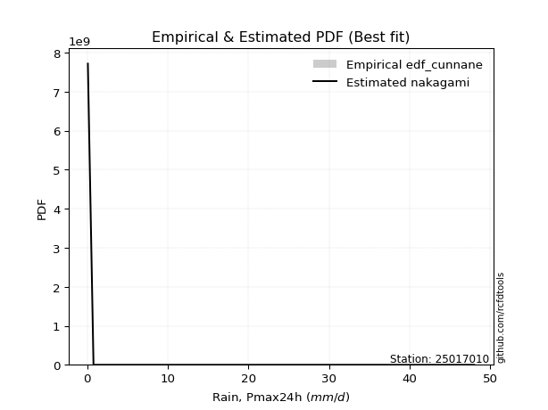</img>

</div>


### 12. Empirical - EDF Adamowski (1981)

The Adamowski formula in hydrology refers to a specific plotting position formula used for estimating the non-parametric empirical distribution of hydrological events (like flood peaks) to calculate their return periods. This formula provides an alternative to traditional parametric methods (like the Gumbel or Log Pearson Type III distributions). 

<div align="center">


$P=(m-0.25)/(n+0.5)$


</div>


**12.1. Empirical values**

<div align="center">

|                | 0                   | 1                   | 2                  | 3                  | 4                  | 5                  | 6                  | 7                  |
|:---------------|:--------------------|:--------------------|:-------------------|:-------------------|:-------------------|:-------------------|:-------------------|:-------------------|
| date           | 2022                | 2018                | 2017               | 2020               | 2021               | 2025               | 2019               | 2024               |
| x              | 0.1                 | 0.8                 | 2.1                | 8.3                | 14.1               | 27.6               | 34.5               | 48.0               |
| m              | 1                   | 2                   | 3                  | 4                  | 5                  | 6                  | 7                  | 8                  |
| empirical_dist | edf_adamowski       | edf_adamowski       | edf_adamowski      | edf_adamowski      | edf_adamowski      | edf_adamowski      | edf_adamowski      | edf_adamowski      |
| empirical      | 0.08823529411764706 | 0.20588235294117646 | 0.3235294117647059 | 0.4411764705882353 | 0.5588235294117647 | 0.6764705882352942 | 0.7941176470588235 | 0.9117647058823529 |
| empirical_tr   | 1.096774193548387   | 1.259259259259259   | 1.4782608695652173 | 1.7894736842105263 | 2.2666666666666666 | 3.0909090909090913 | 4.857142857142856  | 11.33333333333333  |

</div>


**12.2. Kolmogorov-Smirnov fit test (sorted by Δ)**


<div align="center">

|                | 0                   | 1                     | 2                   | 3                   | 4                   | 5                  | 6                   | 7                   | 8                  | 9                  | 10                  | 11                  | 12                 | 13                  | 14                 | 15                  | 16                  | 17                  | 18                  | 19                 | 20                  | 21                  | 22                  | 23                  | 24                  | 25                 | 26                  | 27                  | 28                  | 29                 | 30                 | 31                  | 32                  | 33                 | 34                 | 35                  | 36                  | 37                  | 38                  | 39                  | 40                 | 41                  | 42                  | 43                  | 44                  | 45                  | 46                  | 47                 | 48                 | 49                 | 50                  | 51                  | 52                 | 53                  | 54                  | 55                 | 56                  | 57                  | 58                  | 59                  | 60                  | 61                  | 62                  | 63                 | 64                  | 65                  | 66                  | 67                  | 68                 | 69                 | 70                  | 71                  | 72                  | 73                 | 74                 | 75                  | 76                  | 77                 | 78                 | 79                 | 80                  | 81                  | 82                 | 83                  | 84                 | 85                  | 86                 | 87                 | 88                 | 89                 |
|:---------------|:--------------------|:----------------------|:--------------------|:--------------------|:--------------------|:-------------------|:--------------------|:--------------------|:-------------------|:-------------------|:--------------------|:--------------------|:-------------------|:--------------------|:-------------------|:--------------------|:--------------------|:--------------------|:--------------------|:-------------------|:--------------------|:--------------------|:--------------------|:--------------------|:--------------------|:-------------------|:--------------------|:--------------------|:--------------------|:-------------------|:-------------------|:--------------------|:--------------------|:-------------------|:-------------------|:--------------------|:--------------------|:--------------------|:--------------------|:--------------------|:-------------------|:--------------------|:--------------------|:--------------------|:--------------------|:--------------------|:--------------------|:-------------------|:-------------------|:-------------------|:--------------------|:--------------------|:-------------------|:--------------------|:--------------------|:-------------------|:--------------------|:--------------------|:--------------------|:--------------------|:--------------------|:--------------------|:--------------------|:-------------------|:--------------------|:--------------------|:--------------------|:--------------------|:-------------------|:-------------------|:--------------------|:--------------------|:--------------------|:-------------------|:-------------------|:--------------------|:--------------------|:-------------------|:-------------------|:-------------------|:--------------------|:--------------------|:-------------------|:--------------------|:-------------------|:--------------------|:-------------------|:-------------------|:-------------------|:-------------------|
| station        | 25017010            | 25017010              | 25017010            | 25017010            | 25017010            | 25017010           | 25017010            | 25017010            | 25017010           | 25017010           | 25017010            | 25017010            | 25017010           | 25017010            | 25017010           | 25017010            | 25017010            | 25017010            | 25017010            | 25017010           | 25017010            | 25017010            | 25017010            | 25017010            | 25017010            | 25017010           | 25017010            | 25017010            | 25017010            | 25017010           | 25017010           | 25017010            | 25017010            | 25017010           | 25017010           | 25017010            | 25017010            | 25017010            | 25017010            | 25017010            | 25017010           | 25017010            | 25017010            | 25017010            | 25017010            | 25017010            | 25017010            | 25017010           | 25017010           | 25017010           | 25017010            | 25017010            | 25017010           | 25017010            | 25017010            | 25017010           | 25017010            | 25017010            | 25017010            | 25017010            | 25017010            | 25017010            | 25017010            | 25017010           | 25017010            | 25017010            | 25017010            | 25017010            | 25017010           | 25017010           | 25017010            | 25017010            | 25017010            | 25017010           | 25017010           | 25017010            | 25017010            | 25017010           | 25017010           | 25017010           | 25017010            | 25017010            | 25017010           | 25017010            | 25017010           | 25017010            | 25017010           | 25017010           | 25017010           | 25017010           |
| empirical_dist | edf_adamowski       | edf_adamowski         | edf_adamowski       | edf_adamowski       | edf_adamowski       | edf_adamowski      | edf_adamowski       | edf_adamowski       | edf_adamowski      | edf_adamowski      | edf_adamowski       | edf_adamowski       | edf_adamowski      | edf_adamowski       | edf_adamowski      | edf_adamowski       | edf_adamowski       | edf_adamowski       | edf_adamowski       | edf_adamowski      | edf_adamowski       | edf_adamowski       | edf_adamowski       | edf_adamowski       | edf_adamowski       | edf_adamowski      | edf_adamowski       | edf_adamowski       | edf_adamowski       | edf_adamowski      | edf_adamowski      | edf_adamowski       | edf_adamowski       | edf_adamowski      | edf_adamowski      | edf_adamowski       | edf_adamowski       | edf_adamowski       | edf_adamowski       | edf_adamowski       | edf_adamowski      | edf_adamowski       | edf_adamowski       | edf_adamowski       | edf_adamowski       | edf_adamowski       | edf_adamowski       | edf_adamowski      | edf_adamowski      | edf_adamowski      | edf_adamowski       | edf_adamowski       | edf_adamowski      | edf_adamowski       | edf_adamowski       | edf_adamowski      | edf_adamowski       | edf_adamowski       | edf_adamowski       | edf_adamowski       | edf_adamowski       | edf_adamowski       | edf_adamowski       | edf_adamowski      | edf_adamowski       | edf_adamowski       | edf_adamowski       | edf_adamowski       | edf_adamowski      | edf_adamowski      | edf_adamowski       | edf_adamowski       | edf_adamowski       | edf_adamowski      | edf_adamowski      | edf_adamowski       | edf_adamowski       | edf_adamowski      | edf_adamowski      | edf_adamowski      | edf_adamowski       | edf_adamowski       | edf_adamowski      | edf_adamowski       | edf_adamowski      | edf_adamowski       | edf_adamowski      | edf_adamowski      | edf_adamowski      | edf_adamowski      |
| p_dist         | nakagami            | loglaplace_asymmetric | logloggamma         | logjohnsonsu        | logpearson3         | mielke             | loggumbel_l         | halfnorm            | rayleigh           | logweibull_min     | f                   | loggompertz         | maxwell            | fisk                | weibull_min        | pearson3            | loglognorm          | lognct              | logexponnorm        | logt               | lognorm             | lognorm             | lognakagami         | t                   | crystalball         | norm               | logerlang           | logfatiguelife      | invgamma            | logrice            | alpha              | invweibull          | loglogistic         | loggamma           | loggamma           | nct                 | gumbel_r            | logbetaprime        | halflogistic        | genlogistic         | loghypsecant       | loginvgamma         | logistic            | loginvgauss         | ncf                 | loginvweibull       | invgauss            | kstwobign          | logmaxwell         | moyal              | logmielke           | hypsecant           | lograyleigh        | loglaplace          | rice                | logkstwobign       | johnsonsu           | loggenexpon         | gumbel_l            | loghalfnorm         | laplace             | loggumbel_r         | exponnorm           | genexpon           | expon               | laplace_asymmetric  | gompertz            | betaprime           | logexpon           | loghalflogistic    | logmoyal            | truncnorm           | logtruncnorm        | gamma              | logncf             | erlang              | logwald             | wald               | logfisk            | gibrat             | loggibrat           | pareto              | logalpha           | fatiguelife         | logf               | logpareto           | chi2               | logchi2            | loggenlogistic     | logcrystalball     |
| delta          | 0.08823507475040211 | 0.09702116058299515   | 0.09811350434124488 | 0.09881235895388857 | 0.10118459568965832 | 0.1079107822281152 | 0.11342534526833314 | 0.11637450289641971 | 0.1216362440992318 | 0.1232260173837616 | 0.12331686752377313 | 0.12431460075035772 | 0.1258511407326641 | 0.12866975751983123 | 0.1321626571154855 | 0.13403968969545396 | 0.13647313212166645 | 0.13792076149966426 | 0.13808890081558534 | 0.1380894460972948 | 0.13808968911412456 | 0.13808968911412456 | 0.13853505321920745 | 0.13855977103286232 | 0.13856777679066606 | 0.1385677794347137 | 0.14095966977087204 | 0.14173764336477102 | 0.14224113119316528 | 0.1442264558133407 | 0.1447723146338573 | 0.14839083702615152 | 0.14853912519238355 | 0.1499845610556494 | 0.1499845610556494 | 0.14999418588588254 | 0.15036666870975532 | 0.15128154189425413 | 0.15140477252913268 | 0.15436894072013688 | 0.1572259105407865 | 0.15943962508647602 | 0.15978606910140347 | 0.16120373924327347 | 0.16133046582246136 | 0.16153640588100948 | 0.16361509739466962 | 0.1658386766800289 | 0.1663526770849325 | 0.1680988386913205 | 0.16896012889242862 | 0.17517074749264505 | 0.1752452754776639 | 0.18201316135205525 | 0.18330556553217547 | 0.1871834708346749 | 0.18819062726406188 | 0.19155250981900274 | 0.19544600874129026 | 0.20044253670120615 | 0.20046867872430907 | 0.20646465177089957 | 0.21089847180821525 | 0.2115255423110159 | 0.21153034985346802 | 0.21153230089382052 | 0.21288390406392924 | 0.22046875847759984 | 0.2260404910359124 | 0.2284809704542543 | 0.23017965383060535 | 0.24677834260768033 | 0.26308738970797274 | 0.2657889400640848 | 0.2821867398719875 | 0.29192392353985297 | 0.29607636424557016 | 0.3162365811848597 | 0.3171786189062262 | 0.3235294117647059 | 0.32700384307749775 | 0.32959833684208234 | 0.364866841657327  | 0.37782602057909037 | 0.4064447100675888 | 0.44000890298398704 | 0.5042095692355194 | 0.5955886535232768 | 0.7941176470588235 | nan                |
| deltao         | 0.4472608134160001  | 0.4472608134160001    | 0.4472608134160001  | 0.4472608134160001  | 0.4472608134160001  | 0.4472608134160001 | 0.4472608134160001  | 0.4472608134160001  | 0.4472608134160001 | 0.4472608134160001 | 0.4472608134160001  | 0.4472608134160001  | 0.4472608134160001 | 0.4472608134160001  | 0.4472608134160001 | 0.4472608134160001  | 0.4472608134160001  | 0.4472608134160001  | 0.4472608134160001  | 0.4472608134160001 | 0.4472608134160001  | 0.4472608134160001  | 0.4472608134160001  | 0.4472608134160001  | 0.4472608134160001  | 0.4472608134160001 | 0.4472608134160001  | 0.4472608134160001  | 0.4472608134160001  | 0.4472608134160001 | 0.4472608134160001 | 0.4472608134160001  | 0.4472608134160001  | 0.4472608134160001 | 0.4472608134160001 | 0.4472608134160001  | 0.4472608134160001  | 0.4472608134160001  | 0.4472608134160001  | 0.4472608134160001  | 0.4472608134160001 | 0.4472608134160001  | 0.4472608134160001  | 0.4472608134160001  | 0.4472608134160001  | 0.4472608134160001  | 0.4472608134160001  | 0.4472608134160001 | 0.4472608134160001 | 0.4472608134160001 | 0.4472608134160001  | 0.4472608134160001  | 0.4472608134160001 | 0.4472608134160001  | 0.4472608134160001  | 0.4472608134160001 | 0.4472608134160001  | 0.4472608134160001  | 0.4472608134160001  | 0.4472608134160001  | 0.4472608134160001  | 0.4472608134160001  | 0.4472608134160001  | 0.4472608134160001 | 0.4472608134160001  | 0.4472608134160001  | 0.4472608134160001  | 0.4472608134160001  | 0.4472608134160001 | 0.4472608134160001 | 0.4472608134160001  | 0.4472608134160001  | 0.4472608134160001  | 0.4472608134160001 | 0.4472608134160001 | 0.4472608134160001  | 0.4472608134160001  | 0.4472608134160001 | 0.4472608134160001 | 0.4472608134160001 | 0.4472608134160001  | 0.4472608134160001  | 0.4472608134160001 | 0.4472608134160001  | 0.4472608134160001 | 0.4472608134160001  | 0.4472608134160001 | 0.4472608134160001 | 0.4472608134160001 | 0.4472608134160001 |
| eval           | Δo > Δ              | Δo > Δ                | Δo > Δ              | Δo > Δ              | Δo > Δ              | Δo > Δ             | Δo > Δ              | Δo > Δ              | Δo > Δ             | Δo > Δ             | Δo > Δ              | Δo > Δ              | Δo > Δ             | Δo > Δ              | Δo > Δ             | Δo > Δ              | Δo > Δ              | Δo > Δ              | Δo > Δ              | Δo > Δ             | Δo > Δ              | Δo > Δ              | Δo > Δ              | Δo > Δ              | Δo > Δ              | Δo > Δ             | Δo > Δ              | Δo > Δ              | Δo > Δ              | Δo > Δ             | Δo > Δ             | Δo > Δ              | Δo > Δ              | Δo > Δ             | Δo > Δ             | Δo > Δ              | Δo > Δ              | Δo > Δ              | Δo > Δ              | Δo > Δ              | Δo > Δ             | Δo > Δ              | Δo > Δ              | Δo > Δ              | Δo > Δ              | Δo > Δ              | Δo > Δ              | Δo > Δ             | Δo > Δ             | Δo > Δ             | Δo > Δ              | Δo > Δ              | Δo > Δ             | Δo > Δ              | Δo > Δ              | Δo > Δ             | Δo > Δ              | Δo > Δ              | Δo > Δ              | Δo > Δ              | Δo > Δ              | Δo > Δ              | Δo > Δ              | Δo > Δ             | Δo > Δ              | Δo > Δ              | Δo > Δ              | Δo > Δ              | Δo > Δ             | Δo > Δ             | Δo > Δ              | Δo > Δ              | Δo > Δ              | Δo > Δ             | Δo > Δ             | Δo > Δ              | Δo > Δ              | Δo > Δ             | Δo > Δ             | Δo > Δ             | Δo > Δ              | Δo > Δ              | Δo > Δ             | Δo > Δ              | Δo > Δ             | Δo > Δ              | Δo <= Δ            | Δo <= Δ            | Δo <= Δ            | Δo <= Δ            |
| fit            | 1                   | 1                     | 1                   | 1                   | 1                   | 1                  | 1                   | 1                   | 1                  | 1                  | 1                   | 1                   | 1                  | 1                   | 1                  | 1                   | 1                   | 1                   | 1                   | 1                  | 1                   | 1                   | 1                   | 1                   | 1                   | 1                  | 1                   | 1                   | 1                   | 1                  | 1                  | 1                   | 1                   | 1                  | 1                  | 1                   | 1                   | 1                   | 1                   | 1                   | 1                  | 1                   | 1                   | 1                   | 1                   | 1                   | 1                   | 1                  | 1                  | 1                  | 1                   | 1                   | 1                  | 1                   | 1                   | 1                  | 1                   | 1                   | 1                   | 1                   | 1                   | 1                   | 1                   | 1                  | 1                   | 1                   | 1                   | 1                   | 1                  | 1                  | 1                   | 1                   | 1                   | 1                  | 1                  | 1                   | 1                   | 1                  | 1                  | 1                  | 1                   | 1                   | 1                  | 1                   | 1                  | 1                   | 0                  | 0                  | 0                  | 0                  |
| n              | 8                   | 8                     | 8                   | 8                   | 8                   | 8                  | 8                   | 8                   | 8                  | 8                  | 8                   | 8                   | 8                  | 8                   | 8                  | 8                   | 8                   | 8                   | 8                   | 8                  | 8                   | 8                   | 8                   | 8                   | 8                   | 8                  | 8                   | 8                   | 8                   | 8                  | 8                  | 8                   | 8                   | 8                  | 8                  | 8                   | 8                   | 8                   | 8                   | 8                   | 8                  | 8                   | 8                   | 8                   | 8                   | 8                   | 8                   | 8                  | 8                  | 8                  | 8                   | 8                   | 8                  | 8                   | 8                   | 8                  | 8                   | 8                   | 8                   | 8                   | 8                   | 8                   | 8                   | 8                  | 8                   | 8                   | 8                   | 8                   | 8                  | 8                  | 8                   | 8                   | 8                   | 8                  | 8                  | 8                   | 8                   | 8                  | 8                  | 8                  | 8                   | 8                   | 8                  | 8                   | 8                  | 8                   | 8                  | 8                  | 8                  | 8                  |
| best_fit       | 1                   | 0                     | 0                   | 0                   | 0                   | 0                  | 0                   | 0                   | 0                  | 0                  | 0                   | 0                   | 0                  | 0                   | 0                  | 0                   | 0                   | 0                   | 0                   | 0                  | 0                   | 0                   | 0                   | 0                   | 0                   | 0                  | 0                   | 0                   | 0                   | 0                  | 0                  | 0                   | 0                   | 0                  | 0                  | 0                   | 0                   | 0                   | 0                   | 0                   | 0                  | 0                   | 0                   | 0                   | 0                   | 0                   | 0                   | 0                  | 0                  | 0                  | 0                   | 0                   | 0                  | 0                   | 0                   | 0                  | 0                   | 0                   | 0                   | 0                   | 0                   | 0                   | 0                   | 0                  | 0                   | 0                   | 0                   | 0                   | 0                  | 0                  | 0                   | 0                   | 0                   | 0                  | 0                  | 0                   | 0                   | 0                  | 0                  | 0                  | 0                   | 0                   | 0                  | 0                   | 0                  | 0                   | 0                  | 0                  | 0                  | 0                  |
| best_fit_sort  | 1                   | 2                     | 3                   | 4                   | 5                   | 6                  | 7                   | 8                   | 9                  | 10                 | 11                  | 12                  | 13                 | 14                  | 15                 | 16                  | 17                  | 18                  | 19                  | 20                 | 21                  | 22                  | 23                  | 24                  | 25                  | 26                 | 27                  | 28                  | 29                  | 30                 | 31                 | 32                  | 33                  | 34                 | 35                 | 36                  | 37                  | 38                  | 39                  | 40                  | 41                 | 42                  | 43                  | 44                  | 45                  | 46                  | 47                  | 48                 | 49                 | 50                 | 51                  | 52                  | 53                 | 54                  | 55                  | 56                 | 57                  | 58                  | 59                  | 60                  | 61                  | 62                  | 63                  | 64                 | 65                  | 66                  | 67                  | 68                  | 69                 | 70                 | 71                  | 72                  | 73                  | 74                 | 75                 | 76                  | 77                  | 78                 | 79                 | 80                 | 81                  | 82                  | 83                 | 84                  | 85                 | 86                  | 87                 | 88                 | 89                 | 90                 |

</div>


<div align="center">

</img>

</div>


**12.3. Best fit**

<div align="center">

|   id |   station | empirical_dist   | p_dist   |     delta |   deltao | eval   |   fit |   n |   best_fit |   best_fit_sort |
|-----:|----------:|:-----------------|:---------|----------:|---------:|:-------|------:|----:|-----------:|----------------:|
|    0 |  25017010 | edf_adamowski    | nakagami | 0.0882351 | 0.447261 | Δo > Δ |     1 |   8 |          1 |               1 |

</div>


<div align="center">

</img>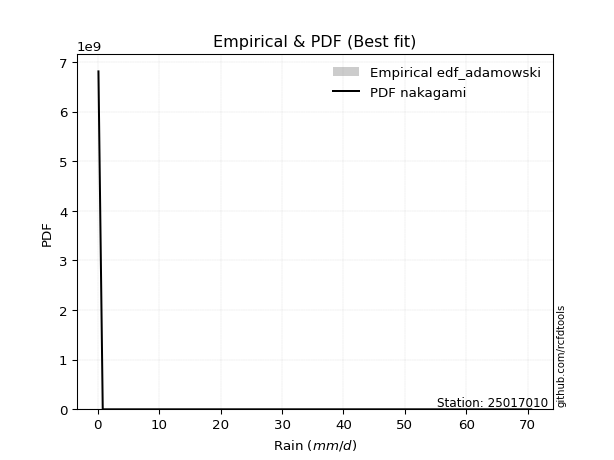</img>

</div>


## C. Best fit & Estimate extreme values for specific return periods - Tr


### 1. Best fit (ordered by delta Δ)

<div align="center">

|   id |   station | empirical_dist   | p_dist                |     delta |   deltao | eval   |   fit |   n |   best_fit |   best_fit_sort |
|-----:|----------:|:-----------------|:----------------------|----------:|---------:|:-------|------:|----:|-----------:|----------------:|
|    0 |  25017010 | edf_blom         | nakagami              | 0.0761975 | 0.447261 | Δo > Δ |     1 |   8 |          1 |               1 |
|    1 |  25017010 | edf_cunnane      | nakagami              | 0.0787843 | 0.447261 | Δo > Δ |     1 |   8 |          1 |               2 |
|    2 |  25017010 | edf_tukey        | nakagami              | 0.0799998 | 0.447261 | Δo > Δ |     1 |   8 |          1 |               3 |
|    3 |  25017010 | edf_filliben     | nakagami              | 0.0815897 | 0.447261 | Δo > Δ |     1 |   8 |          1 |               4 |
|    4 |  25017010 | edf_jenkinson    | nakagami              | 0.0823387 | 0.447261 | Δo > Δ |     1 |   8 |          1 |               5 |
|    5 |  25017010 | edf_beard        | nakagami              | 0.0823387 | 0.447261 | Δo > Δ |     1 |   8 |          1 |               6 |
|    6 |  25017010 | edf_gringorten   | nakagami              | 0.0829895 | 0.447261 | Δo > Δ |     1 |   8 |          1 |               7 |
|    7 |  25017010 | edf_chegodayev   | nakagami              | 0.0833331 | 0.447261 | Δo > Δ |     1 |   8 |          1 |               8 |
|    8 |  25017010 | edf_hazen        | loglaplace_asymmetric | 0.0859917 | 0.447261 | Δo > Δ |     1 |   8 |          1 |               9 |
|    9 |  25017010 | edf_adamowski    | nakagami              | 0.0882351 | 0.447261 | Δo > Δ |     1 |   8 |          1 |              10 |
|   10 |  25017010 | edf_weibull      | logjohnsonsu          | 0.108616  | 0.447261 | Δo > Δ |     1 |   8 |          1 |              11 |
|   11 |  25017010 | edf_california   | loggumbel_l           | 0.114088  | 0.447261 | Δo > Δ |     1 |   8 |          1 |              12 |

</div>

:file_folder:Tables: [bestfit_25017010.csv](table/bestfit_25017010.csv) | [extreme_25017010.csv](table/extreme_25017010.csv)


### 2. Extreme values

In hydrology, a return period (or recurrence interval $Tr$) is the statistical average time between extreme events like floods or droughts of a specific magnitude, indicating how rare an event is, with a 100-year flood, for example, having a 1% chance of occurring in any given year, not that it happens exactly every century. It is a key tool for infrastructure design (like bridges or dams) and risk assessment, calculated from historical data to determine the probability of future events, although it is important to remember it is statistical average, and events can cluster or be missed.

> risk_rate: assuming the return period as the project useful life.

|   id |      tr |   prob_l |     prob_g |      alpha |   betaprime |     chi2 |   crystalball |   erlang |    expon |   exponnorm |         f |   fatiguelife |         fisk |    gamma |   genexpon |   genlogistic |   gibrat |   gompertz |   gumbel_l |   gumbel_r |   halflogistic |   halfnorm |   hypsecant |    invgamma |   invgauss |   invweibull |   johnsonsu |   kstwobign |   laplace |   laplace_asymmetric |   loggamma |   logistic |    lognorm |   maxwell |   mielke |    moyal |   nakagami |       ncf |         nct |    norm |           pareto |   pearson3 |   rayleigh |    rice |       t |   truncnorm |     wald |   weibull_min |         logalpha |   logbetaprime |      logchi2 |   logcrystalball |   logerlang |         logexpon |   logexponnorm |           logf |   logfatiguelife |           logfisk |   loggenexpon |   loggenlogistic |        loggibrat |   loggompertz |   loggumbel_l |   loggumbel_r |   loghalflogistic |   loghalfnorm |   loghypsecant |   loginvgamma |   loginvgauss |    loginvweibull |   logjohnsonsu |   logkstwobign |   loglaplace |   loglaplace_asymmetric |   logloggamma |   loglogistic |   loglognorm |   logmaxwell |        logmielke |     logmoyal |   lognakagami |         logncf |     lognct |     logpareto |   logpearson3 |   lograyleigh |    logrice |       logt |   logtruncnorm |          logwald |   logweibull_min |   station |   n |   risk_rate |
|-----:|--------:|---------:|-----------:|-----------:|------------:|---------:|--------------:|---------:|---------:|------------:|----------:|--------------:|-------------:|---------:|-----------:|--------------:|---------:|-----------:|-----------:|-----------:|---------------:|-----------:|------------:|------------:|-----------:|-------------:|------------:|------------:|----------:|---------------------:|-----------:|-----------:|-----------:|----------:|---------:|---------:|-----------:|----------:|------------:|--------:|-----------------:|-----------:|-----------:|--------:|--------:|------------:|---------:|--------------:|-----------------:|---------------:|-------------:|-----------------:|------------:|-----------------:|---------------:|---------------:|-----------------:|------------------:|--------------:|-----------------:|-----------------:|--------------:|--------------:|--------------:|------------------:|--------------:|---------------:|--------------:|--------------:|-----------------:|---------------:|---------------:|-------------:|------------------------:|--------------:|--------------:|-------------:|-------------:|-----------------:|-------------:|--------------:|---------------:|-----------:|--------------:|--------------:|--------------:|-----------:|-----------:|---------------:|-----------------:|-----------------:|----------:|----:|------------:|
|    0 |    2    | 0.5      | 0.5        |    6.7788  |     3.98055 |  1.56916 |       16.9375 |  2.47949 |  11.7709 |     11.8064 |   6.09412 |      0.100304 |      7.21623 |  5.22217 |    11.7703 |       13.7075 |  11.9218 |    11.8759 |    19.6827 |    14.1923 |        12.8276 |    13.517  |     16.9375 |     5.833   |    5.79187 |      5.25042 |     2.84746 |     14.3466 |   16.9375 |              11.7711 |    5.14285 |    16.9375 |    5.54877 |   15.5084 |  13.541  |  13.3061 |    9.68577 |   6.64599 |     5.62468 | 16.9375 |      0.51863     |    15.1808 |    15.0015 | 16.295  | 16.9372 |     14.4952 |  11.5209 |       9.34042 |     0.510372     |        4.8297  |     0.179008 |                0 |     5.36896 |      1.61802     |        5.5488  |   0.288512     |          5.45924 |      0.6097       |       3.40909 |              inf |      3.03199     |       7.17761 |       7.72389 |       3.98619 |           3.38182 |       3.67469 |        5.54877 |       4.86028 |       4.71243 |      4.19728     |        14.0012 |        3.43523 |      5.54877 |                 10.7672 |       10.6911 |       5.54877 |      5.6015  |      4.67109 |      4.26301     |      3.5825  |       5.53042 |   0.924423     |    5.55496 |   0.120419    |       7.22277 |       4.39441 |    5.31425 |    5.54878 |        3.15062 |      2.88916     |          8.12005 |  25017010 |   8 |    0.75     |
|    1 |    2.33 | 0.570815 | 0.429185   |    8.77043 |     5.50174 |  1.98378 |       19.9194 |  3.65322 |  14.3423 |     14.3905 |   8.86386 |      0.599021 |     10.9692  |  6.64804 |    14.3417 |       16.3219 |  13.4323 |    14.4555 |    22.2769 |    16.9554 |        15.6684 |    16.7352 |     19.3239 |     7.85748 |    7.66564 |      7.5151  |     5.06139 |     17.0519 |   18.742  |              14.3426 |    7.44616 |    19.5647 |    7.94735 |   18.6063 |  18.2445 |  15.9217 |   14.0882  |   8.76961 |     7.58758 | 19.9194 |      1.31465     |    18.1603 |    18.1453 | 19.0824 | 19.9191 |     17.0133 |  13.4761 |      12.0562  |     0.800388     |        7.28835 |     0.221699 |                0 |     7.80898 |      2.98786     |        7.94738 |   0.501182     |          7.80205 |      1.62154      |       5.40203 |              inf |      3.63718     |       9.80095 |      10.558   |       5.56074 |           4.76206 |       5.4152  |        7.39714 |       7.0617  |       6.94142 |      6.6513      |        18.0961 |        5.48839 |      6.8963  |                 14.3288 |       14.245  |       7.61493 |      8.01448 |      6.7845  |      6.47663     |      4.90959 |       7.92821 |   2.77506      |    7.9545  |   0.171997    |      10.1454  |       6.41797 |    7.68318 |    7.94736 |        4.39459 |      3.65661     |         10.8467  |  25017010 |   8 |    0.729209 |
|    2 |    5    | 0.8      | 0.2        |   24.2138  |    16.5512  |  4.21526 |       31.0008 | 11.6669  |  27.1989 |     27.3104 |  27.6307  |     11.1869   |     55.8765  | 14.2875  |    27.1977 |       27.6789 |  22.1286 |    27.2729 |    30.6579 |    28.9593 |        28.5227 |    30.3447 |     28.8963 |    26.7988  |   21.7622  |     34.1079  |    44.696   |     28.5433 |   27.764  |              27.1994 |   30.2169  |    29.7089 |   30.2033  |   30.7997 |  39.2786 |  28.0372 |   39.0639  |  22.625   |    26.7472  | 31.0008 |    243.913       |    30.2433 |    30.7313 | 30.2413 | 31.0007 |     27.4351 |  24.4216 |      27.5851  |    26.2159       |       36.979   |     0.789337 |                0 |    32.2736  |     64.1471      |       30.2034  | 573.145        |         29.4916  | 267051            |      34.4371  |              inf |     10.3706      |      27.4906  |      28.9809  |      23.6174  |          22.4068  |      27.9081  |       23.4387  |      29.5107  |      31.5893  |     49.1507      |        33.1592 |       40.1625  |     20.4499  |                 29.6812 |       29.5998 |      25.8496  |     30.3877  |     29.4802  |     38.8122      |     21.1342  |      30.242   |   1.45305e+06  |   30.1904  |   5.16434e+47 |      31.0999  |      29.2385  |   30.5939  |   30.2034  |       13.505   |     13.6707      |         27.6378  |  25017010 |   8 |    0.67232  |
|    3 |   10    | 0.9      | 0.1        |   52.5869  |    33.0115  |  6.36777 |       38.352  | 20.85    |  38.8698 |     39.0388 |  49.8676  |     25.8061   |    186.105   | 21.6301  |    38.868  |       36.9283 |  32.0415 |    38.7945 |    35.3241 |    38.7363 |        39.1976 |    40.4153 |     36.5401 |    70.9337  |   42.5882  |    114.533   |   191.486   |     37.2925 |   35.954  |              38.8705 |   78.2397  |    37.1796 |   73.2319  |   39.3807 |  52.7549 |  38.5857 |   61.0224  |  41.6511  |    74.6587  | 38.352  |  29936.1         |    39.1641 |    39.7053 | 38.1979 | 38.352  |     34.4849 |  36.0373 |      43.7886  | 15939.5          |      118.152   |     2.9546   |                0 |    84.6861  |   1037.92        |       73.2323  |   1.72251e+13  |         71.4202  |      9.60748e+20  |     129.717   |              inf |     34.2371      |      49.3854  |      50.8471  |      76.7025  |          81.0839  |      93.9031  |       58.8699  |      79.126   |      92.4478  |    250.617       |        41.0172 |      182.782   |     54.8564  |                 38.2685 |       38.2051 |      63.5856  |     73.6659  |     82.8952  |    163.985       |     75.3236  |      73.5271  |   2.45475e+24  |   73.103   | inf           |      58.1372  |      86.2024  |   77.0813  |   73.2321  |       23.8816  |     55.4085      |         46.5224  |  25017010 |   8 |    0.651322 |
|    4 |   15    | 0.933333 | 0.0666667  |   80.8587  |    46.6632  |  7.65875 |       42.0203 | 26.7249  |  45.6968 |     45.8994 |  64.7137  |     35.3672   |    358.626   | 26.0276  |    45.6947 |       42.1466 |  38.8789 |    45.4848 |    37.4372 |    44.2524 |        45.2386 |    45.6561 |     40.9023 |   122.738   |   58.5307  |    226.299   |   396.01    |     41.9373 |   40.7448 |              45.6976 |  126.621   |    41.2501 |  113.932   |   43.7835 |  59.0782 |  44.7076 |   72.9018  |  56.862   |   133.953   | 42.0203 | 499181           |    43.8936 |    44.3292 | 42.2974 | 42.0204 |     37.7182 |  43.4965 |      53.9912  |     9.47215e+06  |      216.44    |     6.67416  |                0 |   138.018   |   5288.99        |      113.933   |   2.22129e+29  |        111.126   |      9.15495e+41  |     257.181   |              inf |     78.0311      |      64.5107  |      65.59    |     149.086   |         167.891   |     176.564   |       99.5743  |     130.958   |     161.378   |    628.298       |        44.1042 |      408.611   |     97.7023  |                 41.3921 |       41.3374 |     103.835   |    114.644   |    140.898   |    368.522       |    157.491   |     114.558   |   1.13561e+51  |  113.641   | inf           |      76.8657  |     150.474   |  122.439   |  113.933   |       29.5606  |    136.103       |         58.8957  |  25017010 |   8 |    0.644736 |
|    5 |   20    | 0.95     | 0.05       |  109.106   |    58.722   |  8.58499 |       44.4227 | 31.0564  |  50.5406 |     50.7671 |  76.0084  |     42.4461   |    564.388   | 29.1806  |    50.5383 |       45.8002 |  44.2424 |    50.2099 |    38.7526 |    48.1146 |        49.4712 |    49.1501 |     43.9797 |   180.26    |   71.4806  |    364.392   |   637.382   |     45.0662 |   44.144  |              50.5416 |  173.97    |    44.0634 |  152.176   |   46.7056 |  63.194  |  49.0432 |   80.9032  |  70.0384  |   202.134   | 44.4227 |      3.67558e+06 |    47.0927 |    47.4025 | 45.0223 | 44.4227 |     39.6453 |  49.055  |      61.5123  |     5.59737e+09  |      324.764   |    12.0641   |                0 |   190.527   |  16793.7         |      152.177   |   5.23636e+50  |        148.476   |      1.85058e+67  |     405.461   |              inf |    148.906       |      76.2196  |      76.8535  |     237.425   |         279.57    |     268.986   |      144.268   |     182.934   |     234.257   |   1195.76        |        45.8421 |      702.527   |    147.151   |                 43.0032 |       42.9534 |     145.73    |    153.181   |    200.354   |    649.108       |    265.53    |     153.164   |   1.91209e+85  |  151.701   | inf           |      91.2453  |     217.907   |  165.862   |  152.177   |       33.0937  |    265.897       |         68.2081  |  25017010 |   8 |    0.641514 |
|    6 |   25    | 0.96     | 0.04       |  137.343   |    69.7112  |  9.30832 |       46.1911 | 34.4937  |  54.2978 |     54.5428 |  85.1937  |     48.0706   |    798.442   | 31.642   |    54.2954 |       48.6145 |  48.7136 |    53.8626 |    39.6886 |    51.0895 |        52.7322 |    51.7498 |     46.3614 |   242.448   |   82.4231  |    525.848   |   904.824   |     47.4098 |   46.7805 |              54.2988 |  220.075   |    46.2156 |  188.313   |   48.8748 |  66.2591 |  52.4037 |   86.8815  |  81.8859  |   277.795   | 46.1911 |      1.72932e+07 |    49.4996 |    49.6859 | 47.0468 | 46.1912 |     40.9426 |  53.5072 |      67.4952  |     3.30026e+12  |      439.916   |    19.2207   |                0 |   241.875   |  41148.5         |      188.314   |   1.28994e+77  |        183.802   |      1.9589e+96   |     568.734   |              inf |    255.195       |      85.842   |      86.0281  |     339.773   |         414.111   |     367.925   |      192.216   |     234.484   |     309.439   |   1962.97        |        46.9884 |     1054.27    |    202.172   |                 43.9858 |       43.9391 |     188.87    |    189.62    |    260.199   |   1003.55        |    398.064   |     189.675   |   3.26691e+126 |  187.641   | inf           |     102.944   |     286.913   |  207.438   |  188.314   |       35.4962  |    454.645       |         75.7187  |  25017010 |   8 |    0.639603 |
|    7 |   50    | 0.98     | 0.02       |  278.484   |   115.61    | 11.5772  |       51.2552 | 45.5187  |  65.9687 |     66.2711 | 116.069   |     66.1164   |   2304.67    | 39.3585  |    65.9657 |       57.2838 |  64.475  |    65.1406 |    42.2295 |    60.2539 |        62.7797 |    59.3062 |     53.7454 |   605.291   |  121.049   |   1626.94    |  2467.92    |     54.2919 |   54.9705 |              65.9699 |  433.943   |    52.7913 |  346.624   |   55.1662 |  75.4839 |  62.8362 |  104.312   | 130.202   |   743.049   | 51.2552 |      2.12328e+09 |    56.6381 |    56.3143 | 52.9237 | 51.2554 |     43.9867 |  68.0438 |      86.8415  |     2.32813e+26  |     1072.98    |    84.1241   |                0 |   481.947   | 665792           |      346.626   |   1.50595e+279 |        338.885   |      1.57686e+286 |    1519.81    |              inf |   1704.47        |     118.628   |     116.84    |    1024.97    |        1389.45    |     914.428   |      467.904   |     482.426   |     699.891   |   9037.81        |        49.7138 |     3472.32    |    542.322   |                 45.9867 |       45.9466 |     417.091   |    349.487   |    555.261   |   3836.1         |   1399.04    |     349.899   | inf            |  344.909   | inf           |     141.77    |     637.644   |  393.988   |  346.625   |       41.0843  |   2619.93        |        100.543   |  25017010 |   8 |    0.63583  |
|    8 |   75    | 0.986667 | 0.0133333  |  419.605   |   153.352   | 12.9169  |       53.9725 | 52.1641  |  72.7957 |     73.1317 | 135.786   |     76.9844   |   4251.19    | 43.9125  |    72.7924 |       62.3228 |  75.1202 |    71.6905 |    43.5144 |    65.5806 |        68.6203 |    63.4196 |     58.0606 |  1031.36    |  146.587   |   3136.23    |  4228.22    |     58.0784 |   59.7613 |              72.7971 |  626.872   |    56.5891 |  480.88    |   58.5867 |  80.8901 |  68.937  |  113.806   | 168.93    |  1319.31    | 53.9725 |      3.54054e+10 |    60.6203 |    59.9204 | 56.1209 | 53.9727 |     45.1848 |  76.989  |      98.6481  |     1.63505e+40  |     1755.45    |   202.878    |                0 |   700.274   |      3.39273e+06 |      480.883   | inf            |        470.741   |    inf            |    2595.27    |              inf |   6146.16        |     139.763   |     136.402   |    1947.27    |        2808.33    |    1501.01    |      786.951   |     715.13    |    1097.39    |  21953.9         |        50.8795 |     6690.17    |    965.907   |                 46.6643 |       46.6265 |     659.1     |    485.297   |    838.442   |   8358.49        |   2917.75    |     486.02    | inf            |  478.113   | inf           |     165.826   |     984.614   |  556.161   |  480.882   |       43.2224  |   7697.28        |        116.045   |  25017010 |   8 |    0.634587 |
|    9 |  100    | 0.99     | 0.01       |  560.721   |   186.603   | 13.872   |       55.8103 | 56.95    |  77.6396 |     77.9994 | 150.533   |     84.8043   |   6550.06    | 47.1583  |    77.636  |       65.8891 |  83.3667 |    76.3169 |    44.3548 |    69.3506 |        72.7542 |    66.2218 |     61.1216 |  1504.49    |  165.88    |   4990.38    |  6085.7     |     60.6727 |   63.1604 |              77.641  |  805.069   |    59.2705 |  600.068   |   60.9165 |  84.8023 |  73.2652 |  120.268   | 202.507   |  1982.04    | 55.8103 |      2.60698e+11 |    63.3744 |    62.3772 | 58.2991 | 55.8105 |     45.83   |  83.5109 |     107.227   |     1.14702e+54  |     2462.62    |   381.177    |                0 |   902.946   |      1.07727e+07 |      600.072   | inf            |        588.006   |    inf            |    3737.34    |              inf |  16599.8         |     155.604   |     150.937   |    3066.84    |        4621.13    |    2103.82    |     1137.92    |     935.737   |    1494.65    |  41144.9         |        51.5674 |    10485.3     |   1454.77    |                 47.0051 |       46.9685 |     910.443   |    606.006   |   1110.15    |  14502.8         |   4914.97    |     606.996   | inf            |  596.271   | inf           |     183.323   |    1323.78    |  702.338   |  600.07    |       44.351   |  16888.4         |        127.456   |  25017010 |   8 |    0.633968 |
|   10 |  200    | 0.995    | 0.005      | 1125.17    |   296.338   | 16.1862  |       59.9791 | 68.6814  |  89.3104 |     89.7277 | 188.732   |    103.946    |  18475.3     | 55.0205  |    89.3064 |       74.463  | 105.802  |    87.3932 |    46.1815 |    78.4141 |        82.6925 |    72.6308 |     68.4958 |  3732.91    |  215.904   |  15243.3     | 13901.3     |     66.6481 |   71.3504 |              89.3121 | 1426       |    65.7026 |  991.587   |   66.2468 |  94.6555 |  83.6933 |  135.018   | 310.739   |  5281.56    | 59.9791 |      3.20088e+13 |    69.8045 |    67.9985 | 63.283  | 59.9793 |     46.8661 |  99.7562 |     128.538   |     2.77028e+109 |     5396.39    |  1772.23     |                0 |  1614.34    |      1.74305e+08 |      991.592   | inf            |        974.301   |    inf            |    8612.17    |              inf | 247767           |     196.562   |     188.095   |    9139.76    |       15302.5     |    4553.63    |     2766.72    |    1735.77    |    3056.01    | 186280           |        52.8696 |    29515.3     |   3902.38    |                 47.5188 |       47.484  |    1976.1     |   1003.25    |   2110.02    |  54533.8         |  17265       |    1005.02    | inf            |  983.948   | inf           |     226.412   |    2605.84    | 1193.05    |  991.59    |       46.1244  | 119567           |        156.278   |  25017010 |   8 |    0.633042 |
|   11 |  250    | 0.996    | 0.004      | 1407.4     |   343.109   | 16.9346  |       61.253  | 72.5097  |  93.0676 |     93.5034 | 201.859   |    110.184    |  25773.5     | 57.5623  |    93.0634 |       77.2194 | 113.852  |    90.938  |    46.719  |    81.3279 |        85.8876 |    74.6024 |     70.8696 |  5000.59    |  232.962   |  21826.3     | 17893.1     |     68.4974 |   73.987  |              93.0693 | 1700.2     |    67.7676 | 1156.09    |   67.8876 |  97.9902 |  87.0503 |  139.545   | 355.955   |  7240.16    | 61.2531 |      1.50598e+14 |    71.8206 |    69.7288 | 64.8172 | 61.2533 |     47.0845 | 105.131  |     135.58    |     1.36076e+137 |     6890.28    |  2919.5      |                0 |  1930.37    |      4.27086e+08 |     1156.09    | inf            |       1137.02    |    inf            |   11136.7     |              inf | 653520           |     210.566   |     200.678   |   12983.7     |       22487.5     |    5774.64    |     3682.77    |    2101.21    |    3817.94    | 302700           |        53.205  |    40658       |   5361.52    |                 47.6219 |       47.5874 |    2534.31    |   1170.43    |   2571.24    |  83475.6         |  25871.5     |    1172.47    | inf            | 1146.67    | inf           |     240.441   |    3209.88    | 1402.94    | 1156.09    |       46.4912  | 228465           |        165.939   |  25017010 |   8 |    0.632858 |
|   12 |  500    | 0.998    | 0.002      | 2818.51    |   538.186   | 19.268   |       65.031  | 84.5341  | 104.738  |    105.232  | 245.353   |    129.754    |  72371.3     | 65.4861  |   104.734  |       85.7746 | 141.672  |   101.885  |    48.2597 |    90.3717 |        95.8044 |    80.481  |     78.2433 | 12397.1     |  288.514   |  66505.4     | 37826.7     |     74.0392 |   82.1769 |             104.74   | 2873.48    |    74.1717 | 1822.51    |   72.7839 | 108.968  |  97.4781 |  153.011   | 540.458   | 19284.3     | 65.031  |      1.84906e+16 |    77.9408 |    74.8917 | 69.3947 | 65.0313 |     47.5334 | 122.219  |     157.983   |     3.88724e+275 |    14406.7     | 13922.2      |                0 |  3291.37    |      6.91036e+09 |     1822.52    | inf            |       1798.13    |    inf            |   23986.7     |              inf |      1.86621e+07 |     256.531   |     241.613   |   38602       |       74272.4     |   11725.2     |     8953.62    |    3726.16    |    7471.33    |      1.36595e+06 |        54.055  |   106169       |  14382.2     |                 47.8284 |       47.7947 |    5482.19    |   1848.96    |   4638.05    | 312881           |  90876.8     |    1851.81    | inf            | 1805.17    | inf           |     284.058   |    5979.09    | 2269.35    | 1822.52    |       47.2375  |      1.79052e+06 |        197.072   |  25017010 |   8 |    0.632489 |
|   13 |  750    | 0.998667 | 0.00133333 | 4229.63    |   698.453   | 20.6383  |       67.1297 | 91.6485  | 111.565  |    112.092  | 272.791   |    141.316    | 132292       | 70.1385  |   111.56   |       90.7759 | 160.071  |   108.244  |    49.0832 |    95.6586 |       101.602  |    83.7651 |     82.5566 | 21082.4     |  322.609   | 127564       | 57332.9     |     77.1524 |   86.9678 |             111.568  | 3854.06    |    77.9133 | 2346.84    |   75.5224 | 115.881  | 103.578  |  160.512   | 688.397   | 34202.4     | 67.1297 |      3.08329e+17 |    81.4326 |    77.7788 | 71.9544 | 67.13   |     47.6869 | 132.465  |     171.438   |   inf            |    21884.5     | 34961.9      |                0 |  4436.74    |      3.52137e+10 |     2346.86    | inf            |       2320.02    |    inf            |   36844.3     |              inf |      1.71267e+08 |     285.109   |     266.813   |   72987.5     |      149337       |   17416.6     |    15055.3     |    5143.4     |   10928.3     |      3.29619e+06 |        54.4462 |   182042       |  25615.4     |                 47.8974 |       47.8639 |    8604.56    |   2383.95    |   6450.99    | 677343           | 189507       |    2387.12    | inf            | 2322.63    | inf           |     309.382   |    8466.41    | 2964.95    | 2346.85    |       47.4901  |      6.15314e+06 |        216.041   |  25017010 |   8 |    0.632366 |
|   14 | 1000    | 0.999    | 0.001      | 5640.74    |   839.61    | 21.6126  |       68.5747 | 96.7276  | 116.409  |    116.96   | 293.199   |    149.564    | 202914       | 73.4461  |   116.404  |       94.3236 | 174.15   |   112.736  |    49.6374 |    99.4089 |       105.714  |    86.0331 |     85.6169 | 30727.2     |  347.432   | 202480       | 76339.7     |     79.3092 |   90.3669 |             116.411  | 4721.57    |    80.5666 | 2793.12    |   77.4151 | 121.03   | 107.906  |  165.682   | 816.682   | 51358.7     | 68.5747 |      2.27029e+18 |    83.8752 |    79.7739 | 73.7233 | 68.575  |     47.7644 | 139.836  |     181.134   |   inf            |    29286.1     | 67376.4      |                0 |  5454.45    |      1.11811e+11 |     2793.14    | inf            |       2765.21    |    inf            |   49568.7     |              inf |      9.34092e+08 |     306.125   |     285.237   |  114678       |      245098       |   22889.6     |    21768       |    6432.54    |   14243       |      6.15725e+06 |        54.6865 |   264489       |  38579.8     |                 47.9319 |       47.8986 |   11845.8     |   2839.94    |   8103.32    |      1.17148e+06 | 319215       |    2843.19    | inf            | 2762.73    | inf           |     327.174   |   10766.9     | 3564.5     | 2793.14    |       47.6171  |      1.49534e+07 |        229.826   |  25017010 |   8 |    0.632305 |

<div align="center">

</img>

</div>


<div align="center">

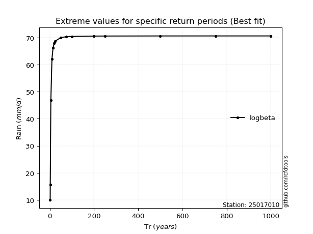</img>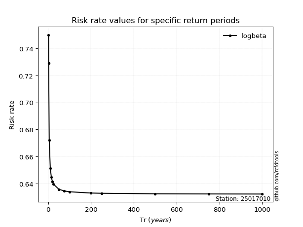</img>

</div>


<sub>**APP DISCLAIMER**: NO WARRANTY - This software is provided by [github.com/rcfdtools](https://github.com/rcfdtools) "as is", without any express or implied warranty, including warranties of merchantability, fitness for a particular purpose, or non-infringement. There is no guarantee that the software will be error-free or operate without interruption. LIMITATION OF LIABILITY - Neither the authors nor copyright holders will be liable for claims or damages arising from the software or its use. You are responsible for determining if the software is appropriate for your use and assume all associated risks, including errors, legal compliance, and data loss. NO PROFESSIONAL ADVICE - The software provides general information and does not offer professional advice. It should not replace consultation with professional advisors.</sub>