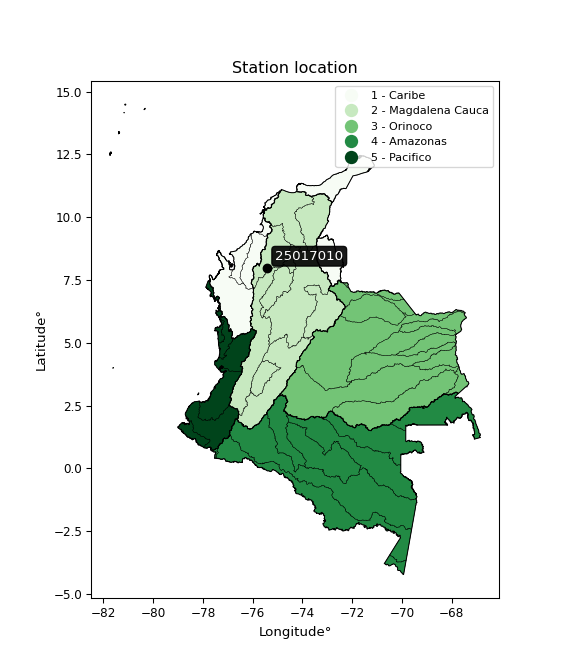

<div align="center">


</div>

# PMP Station (Rain, Pmax24h): 25017010

Probable Maximum Precipitation (PMP) is the greatest amount of rainfall for a specific duration that is meteorologically possible for a given location, acting as a "worst-case" scenario for extreme storms, crucial for designing safety-critical infrastructure like bridges, river deviations, dams, spillways, and nuclear plants to prevent catastrophic failure. PMP is calculated by hydrologists using meteorological data to determine the upper limit of extreme rainfall, often leading to the Probable Maximum Flood (PMF) for flood control design, and is increasingly being studied for climate change impacts. Probable Maximum Precipitation (PMP) is the theoretical upper limit of rainfall, a deterministic estimate for extreme events, while probability distributions (like GEV, Gumbel) describe the likelihood and frequency of various precipitation amounts, including rare ones, showing how often events occur, with PMP representing the extreme end of these distributions, used for critical infrastructure design to ensure safety against the worst conceivable weather, unlike standard statistical forecasts which cover typical probabilities.

The most common probability distributions in hydrology, used for analyzing floods, rainfall, and streamflow, include the Normal, Log-Normal, Gumbel, Gamma (including Log-Pearson Type III), and Generalized Extreme Value (GEV) distributions, often chosen based on the data´s skewness and whether modeling extremes or general conditions, with Gumbel and GEV popular for extreme events like floods, while the Normal distribution serves as a baseline, though often requiring transformations for skewed hydrological data. These distributions help in designing water infrastructure, managing water resources, and forecasting hydrologic events.

> Hydrological data often isn´t perfectly normal (it´s skewed), so different distributions are needed for different applications, such as: **Flood Frequency Analysis**: Using Gumbel, GEV, or Log-Pearson Type III for predicting extreme flood magnitudes and their return periods, **Rainfall Analysis**: Normal for annual totals, but Log-Normal, Weibull, or GEV for intensity or extreme daily rainfall, **Streamflow Modeling**: Gamma and Log-Normal for maximum flows, GEV for minimum flows, and Kappa for daily flows.

<div align="center">

</img>

</div>


## A. General information


### 1. General running parameters

• app_version: _v20260108_. • runtime: _2026-01-09 11:32:22.148588_. • Python version: _3.14.0_. • SciPy version: _1.16.3_. • Pandas version: _2.3.3_. • NumPy version: _2.3.5_. • Stations dataset (station_dataset_file): _dataset/pmax24h_in/automatic_colombia_2003_2024.csv_. • Stations catalog (station_catalog_file): _dataset/CNE.xls_. • Minimum year to eval til year_max (date_min): _1900_. • Maximum year to eval since year_min (date_max): _2024_. • Creates, save and include plots into reports (create_plot): _False_. • Plot only fit distributions with Δo > Δ (plot_only_fit): _True_. • Plot only simple graphs avoiding multiple CDFs and multiple Extreme values plots (plot_only_simple): _True_. • Eval low extreme values, if False, evaluates high extreme values (low_extreme): _False_. • Eval every SciPy distribution as logarithmic (pdist_logarithmic_on): _True_. • Standard deviation normalized (ddof): _1.0_. • Return periods to eval in years (Tr): _[2, 2.33, 5, 10, 15, 20, 25, 50, 75, 100, 200, 250, 500, 750, 1000]_. • Minimum data sample per station, 0 means any (minimum_sample): _5_. • Z-Score maximum threshold to adjust a value, 0 means disable (zscore_max): _3.5_. • Z-Score minimum threshold to adjust a value, 0 means disable (zscore_min): _-2.5_. • Avoid zeros, e.g. rain = 0 (avoid_zeros): _True_. • Avoid null values (avoid_nans): _True_. 

:file_folder:Table: [dataset.csv](../../dataset/pmax24h_in/automatic_colombia_2003_2024.csv)

> Delta Degrees of Freedom (DDOF): is a parameter used in the formulas for calculating variance and standard deviation. When ddof=0, the divisor is $N$ (the total number of observations) and this is used when your data set is the entire population. When ddof=1, the divisor is $N-1$ and this is used when your data set is a sample drawn from a larger population. Using $N-1$ provides an unbiased estimate of the population variance (known as Bessel´s correction).


### 2. Station info and location

|   id |   CODIGO | NOMBRE                       | CATEGORIA    | TECNOLOGIA                              | ESTADO   | FECHA_INSTALACION   |   FECHA_SUSPENSION |   ALTITUD |   LATITUD |   LONGITUD | DEPARTAMENTO   | MUNICIPIO   | AREA_OPERATIVA                              | ENTIDAD                                                     | AREA_HIDROGRAFICA   | ZONA_HIDROGRAFICA                | SUBZONA_HIDROGRAFICA   | CORRIENTE   | Catalogo   |   Version |
|-----:|---------:|:-----------------------------|:-------------|:----------------------------------------|:---------|:--------------------|-------------------:|----------:|----------:|-----------:|:---------------|:------------|:--------------------------------------------|:------------------------------------------------------------|:--------------------|:---------------------------------|:-----------------------|:------------|:-----------|----------:|
|    0 | 25017010 | MONTELIBANO - AUT [25017010] | Limnigráfica | Automática con Telemetría, Convencional | Activa   | 15/04/1973          |                nan |        40 |   7.98817 |   -75.4175 | Cordoba        | Montelíbano | Area Operativa 02 - Atlántico-Bolivar-Sucre | INSTITUTO DE HIDROLOGIA METEOROLOGIA Y ESTUDIOS AMBIENTALES | Magdalena Cauca     | Bajo Magdalena- Cauca -San Jorge | Alto San Jorge         | San Jorge   | CNE_IDEAM  |  20251226 |

<div align="center">

Dynamic map: [:earth_americas:Google](http://maps.google.com/maps?q=7.98817,-75.417483) [:earth_americas:OSM](https://www.openstreetmap.org/#map=18/7.98817/-75.417483&layers=P) [:earth_americas:Bing](https://www.bing.com/maps?cp=7.98817~-75.417483&lvl=18) [:earth_americas:Apple](https://maps.apple.com/frame?center=7.98817%2C-75.417483&span=0.003%2C0.006)

</div>


<div align="center">

```geojson
{
  "type": "Feature",
  "geometry": {
    "type": "Point", 
    "coordinates": [-75.417483, 7.98817]
  }, 
  "properties": {
    "Name": "25017010"
  }
}
```

</div>


### 3. Discrete values table and plot

<div align="center">

|               |           0 |           1 |          2 |          3 |            4 |           5 |         6 |
|:--------------|------------:|------------:|-----------:|-----------:|-------------:|------------:|----------:|
| Date          | 2017        | 2018        | 2019       | 2020       | 2021         | 2022        | 2024      |
| Value         |    2.1      |    0.8      |   34.5     |    8.3     |   14.1       |    0.1      |   48      |
| Value_initial |    2.1      |    0.8      |   34.5     |    8.3     |   14.1       |    0.1      |   48      |
| count         |    7        |    7        |    7       |    7       |    7         |    7        |    7      |
| mean          |   15.4143   |   15.4143   |   15.4143  |   15.4143  |   15.4143    |   15.4143   |   15.4143 |
| std           |   18.7252   |   18.7252   |   18.7252  |   18.7252  |   18.7252    |   18.7252   |   18.7252 |
| zscore        |   -0.711034 |   -0.780459 |    1.01925 |   -0.37993 |   -0.0701879 |   -0.817842 |    1.7402 |


</div>


> The initial value (value_initial) correspond to the initial obtained or null completed value, and value (value) is adjusted only when the initial value is outside the valid range (outlier) definite through the Z-Score value. If Z-Score is active, values out of range or outliers are replaced with the station mean value. A Z-Score (or standard score) measures how many standard deviations a data point is from the mean of a dataset, indicating its relative position; positive scores mean above the mean, negative mean below, and a score of zero is exactly at the mean, allowing for comparison of values from different distributions. It´s calculated using the formula $z=(x–μ)/σ$, where $x$ is the data point, $μ$ is the mean, and $σ$ is the standard deviation, helping identify outliers and understand probability.
>
> <sub>**Note**: In this study, "completing" (filling gaps in) and "extending" (forecasting or lengthening the historical record) rainfall data series are avoided for certain critical analyses because they introduce artificial bias and uncertainty, which can distort the statistics of rare events (extremes), alter day-to-day variability, and compromise the integrity and homogeneity of the original data. Some reasons against Completing/Extending rainfall data are: **Distortion of Extremes and Variability**: The primary issue is that most gap-filling or extension methods rely on averaging or regression with nearby stations, which inherently smooths the data. Rainfall is highly variable in space and time, with a large percentage of zero values and occasional large storms. Infilling methods often underestimate the highest values and overestimate the lowest (zero) values, which severely distorts analyses focused on flood frequency, drought severity, and intensity-duration-frequency (IDF) curves, **Loss of Data Homogeneity**: Infilled or extended data are synthetic estimates, not actual measurements. Combining these estimates with observed data can violate the assumption of data homogeneity, which requires that the data properties do not change over time. Inhomogeneity can lead to incorrect conclusions about long-term trends or changes in climate patterns, **Propagation of Errors**: Errors and biases from the original data (e.g., wind-induced undercatch, instrument errors, site changes) or the data used for imputation can propagate through the analysis, leading to unreliable hydrological models and inaccurate predictions, **Compromised Statistical Integrity**: For statistical analyses, especially those involving the frequency of events, using artificial data can introduce time bias or autocorrelation that doesn´t exist in reality, making it difficult to assess the true probability of events, **Difficulty in Validation**: It is difficult to accurately validate the quality of filled or extended data, especially for past periods where ground-truth measurements are unavailable. The reliability of imputation techniques heavily depends on the density of the surrounding station network and the complexity of the local topography.</sub>


### 4. Active continuous probability distributions from SciPy (45 of 104 available)

A Probability Density Function (PDF) describes the relative likelihood of a continuous random variable falling within a specific range, where the total area under its curve equals 1, and the area over any interval gives the actual probability for that range. Unlike discrete probabilities (like rolling a die), a PDF shows density, not direct probability for a single point (which is zero), with higher points indicating higher likelihood, often visualized as a bell curve for normal distributions.

A log of a probability density function (log-PDF) is simply the logarithm of the PDF´s value, denoted as $log(f(x))$, useful for converting multiplication of probabilities into addition, improving numerical stability with tiny numbers, and connecting to information theory concepts like entropy. Instead of dealing with very small probabilities (e.g., 0.000001), log-PDFs use negative numbers (e.g., $log(0.00001) ≈ -11.51$ that are easier for computers to handle, preventing underflow errors and simplifying complex calculations. In this study, each active probability distribution from SciPy is also evaluated in the $log$ form.

[scipy.stats](https://docs.scipy.org/doc/scipy/reference/stats.html) is a Python´s powerful submodule within the SciPy library for comprehensive statistical analysis, offering over 130 probability distributions (like Normal, Poisson), functions for descriptive stats (mean, variance), hypothesis testing (t-tests, chi-square), random variable generation, and statistical tests, making it essential for data science, modeling, and research. It provides tools to explore, model, and draw conclusions from data efficiently, working seamlessly with NumPy.

<div align="center">

|   id | p_dist             |   n_parameter | fit_method   | label                                                                       | active   | ref                                                                                                        |
|-----:|:-------------------|--------------:|:-------------|:----------------------------------------------------------------------------|:---------|:-----------------------------------------------------------------------------------------------------------|
|    0 | alpha              |             3 | MLE          | Alpha                                                                       | True     | [:mortar_board:](https://docs.scipy.org/doc/scipy/reference/generated/scipy.stats.alpha.html)              |
|    1 | betaprime          |             4 | MLE          | Beta prime                                                                  | True     | [:mortar_board:](https://docs.scipy.org/doc/scipy/reference/generated/scipy.stats.betaprime.html)          |
|    2 | chi2               |             3 | MLE          | Chi²                                                                        | True     | [:mortar_board:](https://docs.scipy.org/doc/scipy/reference/generated/scipy.stats.chi2.html)               |
|    3 | crystalball        |             4 | MLE          | Crystalball                                                                 | True     | [:mortar_board:](https://docs.scipy.org/doc/scipy/reference/generated/scipy.stats.crystalball.html)        |
|    4 | dweibull           |             3 | MLE          | Double Weibull                                                              | True     | [:mortar_board:](https://docs.scipy.org/doc/scipy/reference/generated/scipy.stats.dweibull.html)           |
|    5 | erlang             |             3 | MLE          | Erlang                                                                      | True     | [:mortar_board:](https://docs.scipy.org/doc/scipy/reference/generated/scipy.stats.erlang.html)             |
|    6 | expon              |             2 | MLE          | Exponential                                                                 | True     | [:mortar_board:](https://docs.scipy.org/doc/scipy/reference/generated/scipy.stats.expon.html)              |
|    7 | exponnorm          |             3 | MLE          | Exponentially modified Normal                                               | True     | [:mortar_board:](https://docs.scipy.org/doc/scipy/reference/generated/scipy.stats.exponnorm.html)          |
|    8 | f                  |             4 | MLE          | F                                                                           | True     | [:mortar_board:](https://docs.scipy.org/doc/scipy/reference/generated/scipy.stats.f.html)                  |
|    9 | fatiguelife        |             3 | MLE          | Fatigue-life (Birnbaum-Saunders)                                            | True     | [:mortar_board:](https://docs.scipy.org/doc/scipy/reference/generated/scipy.stats.fatiguelife.html)        |
|   10 | fisk               |             3 | MLE          | Fisk                                                                        | True     | [:mortar_board:](https://docs.scipy.org/doc/scipy/reference/generated/scipy.stats.fisk.html)               |
|   11 | gamma              |             3 | MLE          | Gamma                                                                       | True     | [:mortar_board:](https://docs.scipy.org/doc/scipy/reference/generated/scipy.stats.gamma.html)              |
|   12 | genexpon           |             5 | MLE          | Generalized exponential                                                     | True     | [:mortar_board:](https://docs.scipy.org/doc/scipy/reference/generated/scipy.stats.genexpon.html)           |
|   13 | genlogistic        |             3 | MLE          | Generalized logistic                                                        | True     | [:mortar_board:](https://docs.scipy.org/doc/scipy/reference/generated/scipy.stats.genlogistic.html)        |
|   14 | gibrat             |             2 | MM           | Gibrat                                                                      | True     | [:mortar_board:](https://docs.scipy.org/doc/scipy/reference/generated/scipy.stats.gibrat.html)             |
|   15 | gompertz           |             3 | MLE          | Gompertz (or truncated Gumbel)                                              | True     | [:mortar_board:](https://docs.scipy.org/doc/scipy/reference/generated/scipy.stats.gompertz.html)           |
|   16 | gumbel_l           |             2 | MM           | Gumbel Left Skew                                                            | True     | [:mortar_board:](https://docs.scipy.org/doc/scipy/reference/generated/scipy.stats.gumbel_l.html)           |
|   17 | gumbel_r           |             2 | MM           | Gumbel Right Skew                                                           | True     | [:mortar_board:](https://docs.scipy.org/doc/scipy/reference/generated/scipy.stats.gumbel_r.html)           |
|   18 | halflogistic       |             2 | MM           | Half-logistic                                                               | True     | [:mortar_board:](https://docs.scipy.org/doc/scipy/reference/generated/scipy.stats.halflogistic.html)       |
|   19 | halfnorm           |             2 | MM           | Half Normal                                                                 | True     | [:mortar_board:](https://docs.scipy.org/doc/scipy/reference/generated/scipy.stats.halfnorm.html)           |
|   20 | hypsecant          |             2 | MM           | hyperbolic secant                                                           | True     | [:mortar_board:](https://docs.scipy.org/doc/scipy/reference/generated/scipy.stats.hypsecant.html)          |
|   21 | invgamma           |             3 | MLE          | Inverted gamma                                                              | True     | [:mortar_board:](https://docs.scipy.org/doc/scipy/reference/generated/scipy.stats.invgamma.html)           |
|   22 | invgauss           |             3 | MLE          | Inverse Gaussian                                                            | True     | [:mortar_board:](https://docs.scipy.org/doc/scipy/reference/generated/scipy.stats.invgauss.html)           |
|   23 | invweibull         |             3 | MLE          | Inverted Weibull                                                            | True     | [:mortar_board:](https://docs.scipy.org/doc/scipy/reference/generated/scipy.stats.invweibull.html)         |
|   24 | kappa4             |             4 | MLE          | Kappa 4                                                                     | True     | [:mortar_board:](https://docs.scipy.org/doc/scipy/reference/generated/scipy.stats.kappa4.html)             |
|   25 | kstwobign          |             2 | MLE          | Limiting distribution of scaled Kolmogorov-Smirnov two-sided test statistic | True     | [:mortar_board:](https://docs.scipy.org/doc/scipy/reference/generated/scipy.stats.kstwobign.html)          |
|   26 | laplace            |             2 | MM           | Laplace                                                                     | True     | [:mortar_board:](https://docs.scipy.org/doc/scipy/reference/generated/scipy.stats.laplace.html)            |
|   27 | laplace_asymmetric |             3 | MLE          | Asymmetric Laplace                                                          | True     | [:mortar_board:](https://docs.scipy.org/doc/scipy/reference/generated/scipy.stats.laplace_asymmetric.html) |
|   28 | loggamma           |             3 | MLE          | Log gamma                                                                   | True     | [:mortar_board:](https://docs.scipy.org/doc/scipy/reference/generated/scipy.stats.loggamma.html)           |
|   29 | logistic           |             2 | MM           | Logistic (or Sech-squared)                                                  | True     | [:mortar_board:](https://docs.scipy.org/doc/scipy/reference/generated/scipy.stats.logistic.html)           |
|   30 | lognorm            |             3 | MLE          | Log Normal                                                                  | True     | [:mortar_board:](https://docs.scipy.org/doc/scipy/reference/generated/scipy.stats.lognorm.html)            |
|   31 | maxwell            |             2 | MM           | Maxwell                                                                     | True     | [:mortar_board:](https://docs.scipy.org/doc/scipy/reference/generated/scipy.stats.maxwell.html)            |
|   32 | mielke             |             4 | MLE          | Mielke Beta-Kappa / Dagum                                                   | True     | [:mortar_board:](https://docs.scipy.org/doc/scipy/reference/generated/scipy.stats.mielke.html)             |
|   33 | moyal              |             2 | MM           | Moyal                                                                       | True     | [:mortar_board:](https://docs.scipy.org/doc/scipy/reference/generated/scipy.stats.moyal.html)              |
|   34 | nakagami           |             3 | MLE          | Nakagami                                                                    | True     | [:mortar_board:](https://docs.scipy.org/doc/scipy/reference/generated/scipy.stats.nakagami.html)           |
|   35 | ncf                |             5 | MLE          | Non-central F distribution                                                  | True     | [:mortar_board:](https://docs.scipy.org/doc/scipy/reference/generated/scipy.stats.ncf.html)                |
|   36 | nct                |             4 | MLE          | Non-central Student’s t                                                     | True     | [:mortar_board:](https://docs.scipy.org/doc/scipy/reference/generated/scipy.stats.nct.html)                |
|   37 | norm               |             2 | MM           | Normal                                                                      | True     | [:mortar_board:](https://docs.scipy.org/doc/scipy/reference/generated/scipy.stats.norm.html)               |
|   38 | pearson3           |             3 | MM           | Pearson type III                                                            | True     | [:mortar_board:](https://docs.scipy.org/doc/scipy/reference/generated/scipy.stats.pearson3.html)           |
|   39 | rayleigh           |             2 | MM           | Rayleigh                                                                    | True     | [:mortar_board:](https://docs.scipy.org/doc/scipy/reference/generated/scipy.stats.rayleigh.html)           |
|   40 | rice               |             3 | MLE          | Rice                                                                        | True     | [:mortar_board:](https://docs.scipy.org/doc/scipy/reference/generated/scipy.stats.rice.html)               |
|   41 | t                  |             3 | MLE          | Student’s t                                                                 | True     | [:mortar_board:](https://docs.scipy.org/doc/scipy/reference/generated/scipy.stats.t.html)                  |
|   42 | truncnorm          |             4 | MLE          | Truncated normal                                                            | True     | [:mortar_board:](https://docs.scipy.org/doc/scipy/reference/generated/scipy.stats.truncnorm.html)          |
|   43 | wald               |             2 | MM           | Wald                                                                        | True     | [:mortar_board:](https://docs.scipy.org/doc/scipy/reference/generated/scipy.stats.wald.html)               |
|   44 | weibull_min        |             3 | MLE          | Weibull minimum                                                             | True     | [:mortar_board:](https://docs.scipy.org/doc/scipy/reference/generated/scipy.stats.weibull_min.html)        |

</div>

> **n_parameter:** # arguments & localization & scale.
>
> **Fit methods:** (MLE) maximum likelihood, (MM) L-moments.
>
>**Inactive** (With the only purpose of prevent loops, zero divisions, infinite values, over high estimated values or horizontal trending for recurrence intervals estimations, the follow distributions were disabled.)**:** foldnorm, gennorm, norminvgauss, powernorm, powerlognorm, skewnorm, genextreme, anglit, arcsine, argus, beta, bradford, burr, burr12, cauchy, cosine, halfcauchy, foldcauchy, skewcauchy, wrapcauchy, dgamma, gengamma, exponweib, exponpow, truncexpon, gausshyper, genhalflogistic, genhyperbolic, geninvgauss, halfgennorm, johnsonsb, johnsonsu, kappa3, ksone, kstwo, loglaplace, levy, levy_l, levy_stable, ncx2, pareto, genpareto, truncpareto, lomax, powerlaw, rdist, rel_breitwigner, recipinvgauss, semicircular, studentized_range, trapezoid, triang, truncweibull_min, tukeylambda, uniform, loguniform, vonmises, vonmises_line, weibull_max, 


## B. Probability (PDF) vs. Empirical (EDF) distributions functions

A continuous probability distribution (CPD) describes probabilities for variables that can take any value within a range (like rain any time), unlike discrete variables with specific outcomes (like temperature). It uses a Probability Density Function (PDF), a curve where the total area under it equals 1, and the probability of the variable falling within an interval (a to b) is found by calculating the area under the curve between those points. A key feature is that the probability of hitting any single exact value is zero, so probabilities are always expressed for ranges, e.g., $P(a ≤ X ≤ b)$.

<div align="center">

Distributions parameters from station values
|    |   station | p_dist                |   n |               loc |            scale | shape                  | shape1             | shape2                 | shape3   |
|---:|----------:|:----------------------|----:|------------------:|-----------------:|:-----------------------|:-------------------|:-----------------------|:---------|
|  0 |  25017010 | alpha                 |   7 |       0.0035974   |      0.253884    | 7.336676773514651e-08  |                    |                        |          |
|  1 |  25017010 | betaprime             |   7 |       0.1         |     16.6455      | 0.6482005252626957     | 1.5378020261628893 |                        |          |
|  2 |  25017010 | chi2                  |   7 |       0.1         |      1.76575     | 1.418459868563954      |                    |                        |          |
|  3 |  25017010 | crystalball           |   7 |      15.4143      |     17.3362      | 732.8283055212307      | 681.5949923396768  |                        |          |
|  4 |  25017010 | dweibull              |   7 |      11.6189      |     15.0009      | 1.2801278755636016     |                    |                        |          |
|  5 |  25017010 | erlang                |   7 |       0.1         |     15.7046      | 0.5196707343102072     |                    |                        |          |
|  6 |  25017010 | expon                 |   7 |       0.1         |     15.3143      |                        |                    |                        |          |
|  7 |  25017010 | exponnorm             |   7 |       0.0871738   |      0.00387065  | 3951.005853897861      |                    |                        |          |
|  8 |  25017010 | f                     |   7 |       0.1         |      8.12383     | 0.899528789913792      | 6.256695830298501  |                        |          |
|  9 |  25017010 | fatiguelife           |   7 |       0.1         |      6.52325e-06 | 1785.2196128125906     |                    |                        |          |
| 10 |  25017010 | fisk                  |   7 |       0.1         |      3.31435     | 0.7010711802018068     |                    |                        |          |
| 11 |  25017010 | gamma                 |   7 |       0.1         |     12.8948      | 0.4540152749057119     |                    |                        |          |
| 12 |  25017010 | genexpon              |   7 |       0.1         |     26.138       | 1.706785091477946      | 1.8463388133044643 | 1.5790671057330436e-10 |          |
| 13 |  25017010 | genlogistic           |   7 |     -82.1911      |     11.6996      | 2170.9477072189684     |                    |                        |          |
| 14 |  25017010 | gibrat                |   7 |       2.18895     |      8.02158     |                        |                    |                        |          |
| 15 |  25017010 | gompertz              |   7 |       0.1         |      1.75278e+08 | 11371094.726606667     |                    |                        |          |
| 16 |  25017010 | gumbel_l              |   7 |      23.2165      |     13.517       |                        |                    |                        |          |
| 17 |  25017010 | gumbel_r              |   7 |       7.61207     |     13.517       |                        |                    |                        |          |
| 18 |  25017010 | halflogistic          |   7 |      -5.13315     |     14.8218      |                        |                    |                        |          |
| 19 |  25017010 | halfnorm              |   7 |      -7.53206     |     28.759       |                        |                    |                        |          |
| 20 |  25017010 | hypsecant             |   7 |      15.4143      |     11.0366      |                        |                    |                        |          |
| 21 |  25017010 | invgamma              |   7 |      -0.491392    |      1.35852     | 0.5982684227258552     |                    |                        |          |
| 22 |  25017010 | invgauss              |   7 |      -0.567513    |      2.92116     | 5.471092173905216      |                    |                        |          |
| 23 |  25017010 | invweibull            |   7 |      -0.0654248   |      1.78743     | 0.5208708266954154     |                    |                        |          |
| 24 |  25017010 | kappa4                |   7 |      -4.38432     |     53.9573      | 1.0907632087130508     | 1.0286678504166284 |                        |          |
| 25 |  25017010 | kstwobign             |   7 |     -33.7199      |     56.5808      |                        |                    |                        |          |
| 26 |  25017010 | laplace               |   7 |      15.4143      |     12.2585      |                        |                    |                        |          |
| 27 |  25017010 | laplace_asymmetric    |   7 |       0.1         |      0.00315452  | 0.00020597456361217976 |                    |                        |          |
| 28 |  25017010 | loggamma              |   7 |   -7016.24        |    894.676       | 2590.6342667240506     |                    |                        |          |
| 29 |  25017010 | logistic              |   7 |      15.4143      |      9.55795     |                        |                    |                        |          |
| 30 |  25017010 | lognorm               |   7 |       0.1         |      0.0232525   | 14.378328318602927     |                    |                        |          |
| 31 |  25017010 | maxwell               |   7 |     -25.6652      |     25.7428      |                        |                    |                        |          |
| 32 |  25017010 | mielke                |   7 |       0.1         |     37.4161      | 0.41573787372491033    | 2.4454252600917856 |                        |          |
| 33 |  25017010 | moyal                 |   7 |       5.50033     |      7.80404     |                        |                    |                        |          |
| 34 |  25017010 | nakagami              |   7 |       0.1         |     26.0481      | 0.17558310325527648    |                    |                        |          |
| 35 |  25017010 | ncf                   |   7 |       0.1         |     16.7299      | 0.793634145386511      | 90.26766216266537  | 0.12659447534689738    |          |
| 36 |  25017010 | nct                   |   7 |      -0.868146    |      0.0800673   | 0.5609404162954559     | 26.411315779329527 |                        |          |
| 37 |  25017010 | norm                  |   7 |      15.4143      |     17.3362      |                        |                    |                        |          |
| 38 |  25017010 | pearson3              |   7 |      15.4143      |     17.3362      | 0.8806025672334167     |                    |                        |          |
| 39 |  25017010 | rayleigh              |   7 |     -17.7509      |     26.462       |                        |                    |                        |          |
| 40 |  25017010 | rice                  |   7 |     -11.5819      |     22.6863      | 0.0002537949542044201  |                    |                        |          |
| 41 |  25017010 | t                     |   7 |       1.39965     |      2.29247     | 0.5348958005231426     |                    |                        |          |
| 42 |  25017010 | truncnorm             |   7 |      -3.7542      |     24.3194      | 0.1584825329320381     | 2.1281074687790413 |                        |          |
| 43 |  25017010 | wald                  |   7 |      -1.92192     |     17.3362      |                        |                    |                        |          |
| 44 |  25017010 | weibull_min           |   7 |       0.1         |     10.9645      | 0.43262095261110756    |                    |                        |          |
| 45 |  25017010 | logalpha              |   7 |      -3.05154     |      1.54602     | 1.6866668435749484e-08 |                    |                        |          |
| 46 |  25017010 | logbetaprime          |   7 |      -7.58145     |      1.92237e+11 | 15.242453743347276     | 322134547614.4503  |                        |          |
| 47 |  25017010 | logchi2               |   7 |      -2.30259     |      1.23117     | 1.020895208660666      |                    |                        |          |
| 48 |  25017010 | logcrystalball        |   7 |       1.4844      |      2.0523      | 7.9109438129130165     | 5.009273543833017  |                        |          |
| 49 |  25017010 | logdweibull           |   7 |       1.36679     |      2.03814     | 1.9268360100519577     |                    |                        |          |
| 50 |  25017010 | logerlang             |   7 |     -35.8191      |      0.116476    | 320.2043733087628      |                    |                        |          |
| 51 |  25017010 | logexpon              |   7 |      -2.30259     |      3.78698     |                        |                    |                        |          |
| 52 |  25017010 | logexponnorm          |   7 |       1.48279     |      2.0523      | 0.0007837889041408641  |                    |                        |          |
| 53 |  25017010 | logf                  |   7 |      -2.30259     |      1.0357      | 1.118040638030087      | 1.0913054092023764 |                        |          |
| 54 |  25017010 | logfatiguelife        |   7 |    -486.373       |    487.858       | 0.004190329384486064   |                    |                        |          |
| 55 |  25017010 | logfisk               |   7 |      -2.30259     |      3.16609     | 0.1920593059474925     |                    |                        |          |
| 56 |  25017010 | loggamma              |   7 |     -30.9569      |      0.135365    | 239.72927478170635     |                    |                        |          |
| 57 |  25017010 | loggenexpon           |   7 |      -2.30878     |      0.0066372   | 0.0006405787748553729  | 1.3973648887187085 | 2.149585609872281e-06  |          |
| 58 |  25017010 | loggenlogistic        |   7 |       3.87137     |      1.70097e-05 | 7.149637682834216e-06  |                    |                        |          |
| 59 |  25017010 | loggibrat             |   7 |      -0.0812641   |      0.949623    |                        |                    |                        |          |
| 60 |  25017010 | loggompertz           |   7 |      -2.30259     |      1.96728     | 0.10610296450971005    |                    |                        |          |
| 61 |  25017010 | loggumbel_l           |   7 |       2.40804     |      1.60017     |                        |                    |                        |          |
| 62 |  25017010 | loggumbel_r           |   7 |       0.560758    |      1.60017     |                        |                    |                        |          |
| 63 |  25017010 | loghalflogistic       |   7 |      -0.94805     |      1.75465     |                        |                    |                        |          |
| 64 |  25017010 | loghalfnorm           |   7 |      -1.23201     |      3.40451     |                        |                    |                        |          |
| 65 |  25017010 | loghypsecant          |   7 |       1.4844      |      1.30653     |                        |                    |                        |          |
| 66 |  25017010 | loginvgamma           |   7 |     -33.7089      |   9708.71        | 277.18374440112404     |                    |                        |          |
| 67 |  25017010 | loginvgauss           |   7 |     -15.8605      |   1105.43        | 0.015671053195070853   |                    |                        |          |
| 68 |  25017010 | loginvweibull         |   7 |      -2.03368e+08 |      2.03368e+08 | 95473679.92124349      |                    |                        |          |
| 69 |  25017010 | logkappa4             |   7 |      -2.86989     |      6.96451     | 1.0887989683936437     | 1.0293303917201777 |                        |          |
| 70 |  25017010 | logkstwobign          |   7 |      -7.07317     |      9.77053     |                        |                    |                        |          |
| 71 |  25017010 | loglaplace            |   7 |       1.4844      |      1.45119     |                        |                    |                        |          |
| 72 |  25017010 | loglaplace_asymmetric |   7 |       3.87122     |      0.0180789   | 132.2307964517479      |                    |                        |          |
| 73 |  25017010 | logloggamma           |   7 |       3.87136     |      1.48482e-05 | 6.2314072563363985e-06 |                    |                        |          |
| 74 |  25017010 | loglogistic           |   7 |       1.4844      |      1.13149     |                        |                    |                        |          |
| 75 |  25017010 | loglognorm            |   7 |    -491.285       |    492.764       | 0.0041592386264881     |                    |                        |          |
| 76 |  25017010 | logmaxwell            |   7 |      -3.37868     |      3.04748     |                        |                    |                        |          |
| 77 |  25017010 | logmielke             |   7 |      -2.30259     |      7.04279     | 0.7740131343431699     | 9.653754647862378  |                        |          |
| 78 |  25017010 | logmoyal              |   7 |       0.310765    |      0.923858    |                        |                    |                        |          |
| 79 |  25017010 | lognakagami           |   7 |    -770.143       |    771.635       | 35171.82704354195      |                    |                        |          |
| 80 |  25017010 | logncf                |   7 |      -2.30259     |      1.00463     | 1.0335504020255968     | 1.149575119311855  | 1.0696171097724885     |          |
| 81 |  25017010 | lognct                |   7 |    -143.322       |      2.03858     | 176648.51566550974     | 71.03299365596766  |                        |          |
| 82 |  25017010 | lognorm               |   7 |       1.4844      |      2.0523      |                        |                    |                        |          |
| 83 |  25017010 | logpearson3           |   7 |       1.48438     |      2.05231     | -0.5880304707272888    |                    |                        |          |
| 84 |  25017010 | lograyleigh           |   7 |      -2.44176     |      3.13262     |                        |                    |                        |          |
| 85 |  25017010 | logrice               |   7 |      -3.57147     |      2.24228     | 1.9803397365462696     |                    |                        |          |
| 86 |  25017010 | logt                  |   7 |       1.4844      |      2.05229     | 11353247249.542557     |                    |                        |          |
| 87 |  25017010 | logtruncnorm          |   7 |       1.1384      |      2.35115     | -1.4635344332898184    | 3.86588453044026   |                        |          |
| 88 |  25017010 | logwald               |   7 |      -0.567862    |      2.05227     |                        |                    |                        |          |
| 89 |  25017010 | logweibull_min        |   7 | -260275           | 260278           | 164380.95241901348     |                    |                        |          |

</div>

> **loc** (Location parameter): This shifts the distribution along the x-axis. For many common distributions, like the normal (Gaussian) distribution, loc represents the mean $μ$. For others, like the uniform distribution, it might represent the minimum value, or for the beta distribution, the left end of the support interval.
>
> **scale** (Scale parameter): This determines the width or spread of the distribution. For the normal distribution, scale represents the standard deviation $σ$. For a uniform distribution, it defines the length of the interval (from $loc$ to $loc + scale$).
>
> **shape** (Shape parameters): Refers to parameters that define the specific form of a probability distribution, distinct from its location (loc) and scale (scale). These parameters are required arguments for most distribution functions. For example, a normal (Gaussian) distribution is fully defined by its location (mean) and scale (standard deviation), so it has no specific shape parameters beyond loc and scale. However, other distributions have intrinsic properties that need specification, as Gamma distribution that takes a shape parameter, often named $a$ or $alpha$.


### 0. Cumulative distribution values - CDF (90 evaluated)

Cumulative Distribution Function (CDF), denoted as $F$<sub>$X$</sub>$(x)$, is a function that gives the probability that a random variable $X$ will take a value less than or equal to a specific value, $x$ (i.e., $(P(X≥x)$. It essentially "accumulates" probabilities from a given point up to the far right (positive infinity), providing a complete picture of the distribution´s probabilities for both discrete (like rain) and continuous (like temperature) variables, helping to find probabilities over ranges or above certain values. Each station is evaluated separately ordering the $x$ values ascending, calculating the CDF and PDF values for the activated distributions and their logarithmic forms.

<div align="center">

CDF ordered by x ascending and calculating $log(f(x))$ separately
|   id |   Station |   date |    x |   count |    mean |     std |     zscore |   Value_initial |   station |   m |      alpha |   alpha_pdf |   betaprime |   betaprime_pdf |        chi2 |        chi2_pdf |   crystalball |   crystalball_pdf |   dweibull |   dweibull_pdf |      erlang |   erlang_pdf |    expon |   expon_pdf |   exponnorm |   exponnorm_pdf |           f |       f_pdf |   fatiguelife |   fatiguelife_pdf |        fisk |       fisk_pdf |       gamma |   gamma_pdf |    genexpon |   genexpon_pdf |   genlogistic |   genlogistic_pdf |   gibrat |   gibrat_pdf |    gompertz |   gompertz_pdf |   gumbel_l |   gumbel_l_pdf |   gumbel_r |   gumbel_r_pdf |   halflogistic |   halflogistic_pdf |   halfnorm |   halfnorm_pdf |   hypsecant |   hypsecant_pdf |   invgamma |   invgamma_pdf |   invgauss |   invgauss_pdf |   invweibull |   invweibull_pdf |     kappa4 |   kappa4_pdf |   kstwobign |   kstwobign_pdf |   laplace |   laplace_pdf |   laplace_asymmetric |   laplace_asymmetric_pdf |   loggamma |   loggamma_pdf |   logistic |   logistic_pdf |   lognorm |   lognorm_pdf |   maxwell |   maxwell_pdf |      mielke |   mielke_pdf |    moyal |   moyal_pdf |    nakagami |   nakagami_pdf |         ncf |     ncf_pdf |       nct |    nct_pdf |     norm |   norm_pdf |   pearson3 |   pearson3_pdf |   rayleigh |   rayleigh_pdf |     rice |   rice_pdf |        t |       t_pdf |   truncnorm |   truncnorm_pdf |       wald |   wald_pdf |   weibull_min |   weibull_min_pdf |   logalpha |   logalpha_pdf |   logbetaprime |   logbetaprime_pdf |     logchi2 |   logchi2_pdf |   logcrystalball |   logcrystalball_pdf |   logdweibull |   logdweibull_pdf |   logerlang |   logerlang_pdf |   logexpon |   logexpon_pdf |   logexponnorm |   logexponnorm_pdf |        logf |    logf_pdf |   logfatiguelife |   logfatiguelife_pdf |     logfisk |   logfisk_pdf |   loggenexpon |   loggenexpon_pdf |   loggenlogistic |   loggenlogistic_pdf |   loggibrat |   loggibrat_pdf |   loggompertz |   loggompertz_pdf |   loggumbel_l |   loggumbel_l_pdf |   loggumbel_r |   loggumbel_r_pdf |   loghalflogistic |   loghalflogistic_pdf |   loghalfnorm |   loghalfnorm_pdf |   loghypsecant |   loghypsecant_pdf |   loginvgamma |   loginvgamma_pdf |   loginvgauss |   loginvgauss_pdf |   loginvweibull |   loginvweibull_pdf |   logkappa4 |   logkappa4_pdf |   logkstwobign |   logkstwobign_pdf |   loglaplace |   loglaplace_pdf |   loglaplace_asymmetric |   loglaplace_asymmetric_pdf |   logloggamma |   logloggamma_pdf |   loglogistic |   loglogistic_pdf |   loglognorm |   loglognorm_pdf |   logmaxwell |   logmaxwell_pdf |   logmielke |   logmielke_pdf |    logmoyal |   logmoyal_pdf |   lognakagami |   lognakagami_pdf |      logncf |   logncf_pdf |    lognct |   lognct_pdf |   logpearson3 |   logpearson3_pdf |   lograyleigh |   lograyleigh_pdf |   logrice |   logrice_pdf |      logt |   logt_pdf |   logtruncnorm |   logtruncnorm_pdf |   logwald |   logwald_pdf |   logweibull_min |   logweibull_min_pdf |
|-----:|----------:|-------:|-----:|--------:|--------:|--------:|-----------:|----------------:|----------:|----:|-----------:|------------:|------------:|----------------:|------------:|----------------:|--------------:|------------------:|-----------:|---------------:|------------:|-------------:|---------:|------------:|------------:|----------------:|------------:|------------:|--------------:|------------------:|------------:|---------------:|------------:|------------:|------------:|---------------:|--------------:|------------------:|---------:|-------------:|------------:|---------------:|-----------:|---------------:|-----------:|---------------:|---------------:|-------------------:|-----------:|---------------:|------------:|----------------:|-----------:|---------------:|-----------:|---------------:|-------------:|-----------------:|-----------:|-------------:|------------:|----------------:|----------:|--------------:|---------------------:|-------------------------:|-----------:|---------------:|-----------:|---------------:|----------:|--------------:|----------:|--------------:|------------:|-------------:|---------:|------------:|------------:|---------------:|------------:|------------:|----------:|-----------:|---------:|-----------:|-----------:|---------------:|-----------:|---------------:|---------:|-----------:|---------:|------------:|------------:|----------------:|-----------:|-----------:|--------------:|------------------:|-----------:|---------------:|---------------:|-------------------:|------------:|--------------:|-----------------:|---------------------:|--------------:|------------------:|------------:|----------------:|-----------:|---------------:|---------------:|-------------------:|------------:|------------:|-----------------:|---------------------:|------------:|--------------:|--------------:|------------------:|-----------------:|---------------------:|------------:|----------------:|--------------:|------------------:|--------------:|------------------:|--------------:|------------------:|------------------:|----------------------:|--------------:|------------------:|---------------:|-------------------:|--------------:|------------------:|--------------:|------------------:|----------------:|--------------------:|------------:|----------------:|---------------:|-------------------:|-------------:|-----------------:|------------------------:|----------------------------:|--------------:|------------------:|--------------:|------------------:|-------------:|-----------------:|-------------:|-----------------:|------------:|----------------:|------------:|---------------:|--------------:|------------------:|------------:|-------------:|----------:|-------------:|--------------:|------------------:|--------------:|------------------:|----------:|--------------:|----------:|-----------:|---------------:|-------------------:|----------:|--------------:|-----------------:|---------------------:|
|    0 |  25017010 |   2022 |  0.1 |       7 | 15.4143 | 18.7252 | -0.817842  |             0.1 |  25017010 |   1 | 0.00844887 | 0.679697    | 2.61467e-12 | 122126          | 4.96773e-13 | 25387.8         |      0.188518 |        0.0155778  |   0.245057 |     0.019421   | 4.67824e-10 |  1.75182e+07 | 0        |  0.0652985  | 0.000838343 |      0.0653046  | 7.73207e-09 | 2.50588e+08 |     0.0621424 |       1.08604e+11 | 6.55737e-13 | 33126.2        | 7.85161e-09 | 2.56867e+08 | 3.28828e-10 |     0.0652991  |      0.147606 |        0.0241271  | 0        |   0          | 7.79237e-10 |     0.0648747  |   0.165425 |    0.0111651   |   0.174951 |     0.022563   |       0.174724 |         0.0327042  |   0.209283 |     0.0267839  |    0.155764 |      0.0135568  |  0.0425403 |     0.187267   |  0.0436268 |     0.167666   |    0.0316026 |       0.343747   | 2.3605e-15 |    0.395025  |    0.132723 |      0.0231779  |  0.143356 |    0.0116944  |          4.29332e-08 |               0.0652951  |  0.0310497 |      0.0363032 |   0.167667 |     0.0146009  | 0.0325011 |     0.0354242 |  0.199171 |    0.0188155  | 1.83143e-07 |  3.26572e+07 | 0.157539 |  0.026611   | 3.04909e-07 |    7.71549e+09 | 4.88668e-08 | 1.39728e+09 | 0.0485406 | 0.183293   | 0.188518 | 0.0155778  |   0.18909  |     0.0217135  |   0.203504 |     0.0203048  | 0.124164 | 0.0198796  | 0.36262  | 0.0835489   | 3.14592e-08 |      0.0385361  | 0.00882369 | 0.0203639  |   1.80757e-08 |       5.63484e+08 |  0.0389942 |      0.26119   |      0.0315102 |          0.0440065 | 1.03715e-08 |   1.19213e+07 |        0.0325011 |            0.0354242 |     0.0224171 |          0.036548 |   0.0314576 |       0.0364689 |   0        |      0.264062  |      0.0325012 |          0.0354243 | 1.70422e-09 | 2.14528e+06 |        0.0314419 |            0.0348742 | 0.000901326 |   3.89453e+11 |   0.000599348 |         0.0968779 |          0       |            0.0313733 |    0        |       0         |   7.40956e-09 |         0.0539338 |     0.0513008 |         0.0312229 |    0.00251404 |        0.00940445 |          0        |             0         |      0        |         0         |       0.035046 |          0.0267695 |     0.0307627 |         0.0382006 |     0.0284409 |         0.0387195 |       0.0280714 |           0.0470867 | 2.22134e-15 |        2.88004  |      0.0290405 |          0.0569161 |    0.0367832 |        0.0253469 |               0.0755765 |                   0.0316143 |     0.0749425 |         0.0314513 |     0.0339968 |         0.0290246 |    0.0320041 |        0.0352948 |    0.0112813 |        0.030672  | 2.88918e-13 |     503.562     | 3.89051e-05 |    0.000375442 |     0.0325793 |         0.0354676 | 4.47433e-09 |  5.20666e+06 | 0.0325193 |    0.0354525 |     0.0461696 |         0.0354144 |   0.000986446 |         0.0141684 | 0.0241727 |     0.0405366 | 0.0325008 |  0.035424  |    1.39007e-10 |          0.0626375 | 0         |     0         |        0.0487457 |            0.0300235 |
|    1 |  25017010 |   2018 |  0.8 |       7 | 15.4143 | 18.7252 | -0.780459  |             0.8 |  25017010 |   2 | 0.749886   | 0.303559    | 0.169366    |      0.148481   | 0.321594    |     0.289649    |      0.199616 |        0.0161303  |   0.258912 |     0.0201618  | 0.220519    |  0.158964    | 0.04468  |  0.062381   | 0.0455417   |      0.0624116  | 0.24814     | 0.154655    |     0.572795  |       0.0514162   | 0.251595    |     0.188583   | 0.29578     | 0.184787    | 0.0446804   |     0.0623815  |      0.164945 |        0.0253968  | 0        |   0          | 0.0443966   |     0.0619945  |   0.173408 |    0.0116461   |   0.191041 |     0.0233945  |       0.197518 |         0.0324179  |   0.22797  |     0.0266036  |    0.165523 |      0.0143308  |  0.184199  |     0.186693   |  0.171844  |     0.174552   |    0.232454  |       0.204132   | 0.0202174  |    0.0264842 |    0.149366 |      0.0243558  |  0.151781 |    0.0123816  |          0.0446778   |               0.0623779  |  0.208233  |      0.141872  |   0.178137 |     0.0153176  | 0.2027    |     0.137515  |  0.212517 |    0.0193116  | 0.191257    |  0.113583    | 0.176565 |  0.0277205  | 0.223673    |    0.112197    | 0.206647    | 0.115968    | 0.190003  | 0.190064   | 0.199616 | 0.0161303  |   0.204505 |     0.02232    |   0.217865 |     0.0207206  | 0.13838  | 0.0207288  | 0.430315 | 0.109308    | 0.0269102   |      0.0383448  | 0.0296247  | 0.0384805  |   0.262238    |       0.138673    |  0.584648  |      0.1328    |      0.238063  |          0.152928  | 0.801471    |   0.109155    |        0.2027    |            0.137515  |     0.269054  |          0.202062 |   0.209036  |       0.142255  |   0.422532 |      0.152488  |      0.2027    |          0.137515  | 0.61313     | 0.0767427   |        0.201283  |            0.137959  | 0.479826    |   0.0230527   |   0.295001    |         0.168267  |          0       |            0.0751887 |    0        |       0         |   0.180644    |         0.127171  |     0.175637  |         0.0995026 |    0.195512   |        0.199418   |          0.203679 |             0.273136  |      0.233024 |         0.224293  |       0.16827  |          0.122876  |     0.21933   |         0.149171  |     0.224381  |         0.153477  |       0.260262  |           0.164467  | 0.358893    |        0.159503 |      0.290581  |          0.170524  |    0.154155  |        0.106227  |               0.180367  |                   0.0754489 |     0.179362  |         0.0752734 |     0.181071  |         0.131052  |    0.202748  |        0.138198  |    0.216204  |        0.164227  | 0.388982    |       0.144786  | 0.181865    |    0.236468    |     0.202657  |         0.137269  | 0.491738    |  0.0857913   | 0.202811  |    0.137552  |     0.192477  |         0.115063  |   0.221818    |         0.175933  | 0.212194  |     0.144911  | 0.202699  |  0.137515  |    0.225794    |          0.154571  | 0.0373331 |     0.359642  |        0.169582  |            0.097459  |
|    2 |  25017010 |   2017 |  2.1 |       7 | 15.4143 | 18.7252 | -0.711034  |             2.1 |  25017010 |   3 | 0.903608   | 0.0457554   | 0.314509    |      0.0876318  | 0.588421    |     0.147717    |      0.221242 |        0.0171347  |   0.285993 |     0.021486   | 0.370135    |  0.0883796   | 0.122429 |  0.0573041  | 0.123324    |      0.0573254  | 0.38822     | 0.0800897   |     0.621781  |       0.0294817   | 0.412383    |     0.0849429  | 0.462055    | 0.0941794   | 0.12243     |     0.0573045  |      0.19935  |        0.0274686  | 0        |   0          | 0.121685    |     0.0569805  |   0.189148 |    0.0125776   |   0.222353 |     0.0247322  |       0.239273 |         0.0318027  |   0.262317 |     0.0262306  |    0.185126 |      0.0158441  |  0.367282  |     0.103964   |  0.351672  |     0.107026   |    0.404579  |       0.0880633  | 0.0529509  |    0.0242869 |    0.182299 |      0.0262427  |  0.168761 |    0.0137668  |          0.122423    |               0.0573015  |  0.366909  |      0.182465  |   0.198928 |     0.0166726  | 0.358761  |     0.182075  |  0.238181 |    0.0201544  | 0.295878    |  0.0614562   | 0.213717 |  0.0293414  | 0.323342    |    0.0567235   | 0.311136    | 0.0599755   | 0.376732  | 0.105286   | 0.221242 | 0.0171347  |   0.234173 |     0.0232886  |   0.245255 |     0.0213962  | 0.166281 | 0.0221635  | 0.580527 | 0.105966    | 0.0764862   |      0.0379087  | 0.0943273  | 0.0577639  |   0.380581    |       0.0641761   |  0.683605  |      0.0788887 |      0.399203  |          0.175563  | 0.880984    |   0.0612026   |        0.358761  |            0.182075  |     0.451297  |          0.14262  |   0.36829   |       0.183281  |   0.55244  |      0.118184  |      0.358761  |          0.182075  | 0.671556    | 0.0480441   |        0.358015  |            0.182935  | 0.49812     |   0.0157707   |   0.457534    |         0.165141  |          0       |            0.112804  |    0.443199 |       0.479702  |   0.324694    |         0.171185  |     0.297443  |         0.154998  |    0.409446   |        0.228485   |          0.447504 |             0.227892  |      0.437953 |         0.198101  |       0.328131 |          0.20897   |     0.383399  |         0.185504  |     0.390581  |         0.185091  |       0.425002  |           0.170724  | 0.510839    |        0.155761 |      0.455639  |          0.166547  |    0.299761  |        0.206562  |               0.270073  |                   0.112974  |     0.268923  |         0.11286   |     0.341598  |         0.198772  |    0.3595    |        0.182725  |    0.391199  |        0.191883  | 0.522485    |       0.132792  | 0.428435    |    0.249917    |     0.358376  |         0.181629  | 0.559463    |  0.0576555   | 0.358882  |    0.182052  |     0.327423  |         0.164093  |   0.403358    |         0.193566  | 0.372056  |     0.182105  | 0.358761  |  0.182075  |    0.389305    |          0.180208  | 0.474227  |     0.344103  |        0.289533  |            0.153382  |
|    3 |  25017010 |   2020 |  8.3 |       7 | 15.4143 | 18.7252 | -0.37993   |             8.3 |  25017010 |   4 | 0.975587   | 0.00294166  | 0.617961    |      0.0284805  | 0.945386    |     0.0169353   |      0.340767 |        0.0211537  |   0.432513 |     0.0241889  | 0.680732    |  0.0302384   | 0.414593 |  0.0382262  | 0.41552     |      0.0382189  | 0.65846     | 0.0256968   |     0.735009  |       0.012543    | 0.653641    |     0.0193559  | 0.766603    | 0.0269508   | 0.414596    |     0.0382264  |      0.386955 |        0.0313954  | 0.392797 |   0.0629107  | 0.412555    |     0.0381103  |   0.282294 |    0.0176119   |   0.386594 |     0.0271815  |       0.424488 |         0.0276555  |   0.418029 |     0.0238428  |    0.307706 |      0.0237367  |  0.653946  |     0.0213564  |  0.66738   |     0.0249925  |    0.639166  |       0.017813   | 0.193393   |    0.0216803 |    0.360455 |      0.0297981  |  0.27985  |    0.022829   |          0.414577    |               0.0382253  |  0.6242    |      0.178749  |   0.322058 |     0.0228434  | 0.620912  |     0.18539   |  0.372107 |    0.0225957  | 0.529841    |  0.0262223   | 0.403271 |  0.0301302  | 0.529412    |    0.0223388   | 0.526248    | 0.0226038   | 0.659778  | 0.020574   | 0.340767 | 0.0211537  |   0.386521 |     0.0251088  |   0.384048 |     0.0229153  | 0.318884 | 0.0263118  | 0.825326 | 0.0130786   | 0.302045    |      0.0345122  | 0.438527   | 0.0440624  |   0.586       |       0.0192623   |  0.764814  |      0.0441684 |      0.632241  |          0.154712  | 0.94007     |   0.0291857   |        0.620912  |            0.18539   |     0.567699  |          0.161697 |   0.626859  |       0.179586  |   0.688654 |      0.0822148 |      0.620911  |          0.18539   | 0.723164    | 0.0295315   |        0.62118   |            0.185836  | 0.516002    |   0.0108548   |   0.665236    |         0.133244  |          0       |            0.201001  |    0.799271 |       0.127678  |   0.592095    |         0.20793   |     0.565392  |         0.226328  |    0.685029   |        0.161947   |          0.702994 |             0.144131  |      0.674628 |         0.144495  |       0.648267 |          0.217675  |     0.638323  |         0.172821  |     0.640121  |         0.166574  |       0.638363  |           0.134514  | 0.722993    |        0.153512 |      0.660741  |          0.12868   |    0.676499  |        0.222921  |               0.479902  |                   0.200747  |     0.478755  |         0.20092   |     0.636089  |         0.20458   |    0.622034  |        0.185232  |    0.645506  |        0.167515  | 0.696509    |       0.120661  | 0.706632    |    0.151417    |     0.619914  |         0.185044  | 0.623193    |  0.0374692   | 0.62094   |    0.185292  |     0.586576  |         0.201758  |   0.653036    |         0.161155  | 0.627636  |     0.177431  | 0.620912  |  0.185391  |    0.63515     |          0.167644  | 0.767151  |     0.125339  |        0.557036  |            0.227798  |
|    4 |  25017010 |   2021 | 14.1 |       7 | 15.4143 | 18.7252 | -0.0701879 |            14.1 |  25017010 |   5 | 0.98563    | 0.00101927  | 0.737625    |      0.0149154  | 0.990662    |     0.00280527  |      0.469784 |        0.0229461  |   0.547542 |     0.023324   | 0.809588    |  0.0161651   | 0.599154 |  0.0261746  | 0.600001    |      0.0261558  | 0.768762    | 0.0140816   |     0.794067  |       0.00834955  | 0.73304     |     0.0097996  | 0.87554     | 0.0128348   | 0.599158    |     0.0261746  |      0.56081  |        0.0277202  | 0.653701 |   0.0309758  | 0.596769    |     0.0261595  |   0.399167 |    0.0226446   |   0.538594 |     0.0246563  |       0.570869 |         0.0227404  |   0.54806  |     0.0209078  |    0.462183 |      0.0286381  |  0.738668  |     0.0101047  |  0.767921  |     0.01213    |    0.711626  |       0.00890204 | 0.316389   |    0.0208243 |    0.527301 |      0.0270634  |  0.449167 |    0.0366411  |          0.599136    |               0.0261745  |  0.713909  |      0.158536  |   0.465677 |     0.026033   | 0.714332  |     0.165609  |  0.503781 |    0.0224304  | 0.65482     |  0.0178338   | 0.564354 |  0.0249554  | 0.635685    |    0.0152706   | 0.630829    | 0.0145667   | 0.74104   | 0.0096622  | 0.469784 | 0.0229461  |   0.528348 |     0.0233569  |   0.515377 |     0.0220435  | 0.473109 | 0.0262918  | 0.873133 | 0.00528761  | 0.489115    |      0.0298046  | 0.636055   | 0.0258205  |   0.670943    |       0.0113024   |  0.786129  |      0.0366241 |      0.709369  |          0.135817  | 0.953613    |   0.0222651   |        0.714332  |            0.165609  |     0.667407  |          0.204214 |   0.716932  |       0.159043  |   0.72931  |      0.071479  |      0.714331  |          0.165609  | 0.737657    | 0.0253466   |        0.714753  |            0.165747  | 0.521432    |   0.00968457  |   0.731474    |         0.116567  |          0       |            0.25115   |    0.8543   |       0.0838379 |   0.700826    |         0.199649  |     0.686658  |         0.227239  |    0.762123   |        0.129379   |          0.771572 |             0.115316  |      0.745351 |         0.122493  |       0.751758 |          0.171318  |     0.724413  |         0.15107   |     0.722867  |         0.144928  |       0.704695  |           0.115787  | 0.804336    |        0.153605 |      0.724342  |          0.11137   |    0.775463  |        0.154726  |               0.598994  |                   0.250564  |     0.597994  |         0.250962  |     0.736288  |         0.171604  |    0.715292  |        0.165176  |    0.728485  |        0.144973  | 0.759011    |       0.114904  | 0.777531    |    0.117232    |     0.713196  |         0.165441  | 0.641714    |  0.0326185   | 0.714308  |    0.165515  |     0.691931  |         0.193277  |   0.732591    |         0.138644  | 0.716781  |     0.157746  | 0.714332  |  0.16561   |    0.719255    |          0.148815  | 0.823433  |     0.0895403 |        0.679518  |            0.230321  |
|    5 |  25017010 |   2019 | 34.5 |       7 | 15.4143 | 18.7252 |  1.01925   |            34.5 |  25017010 |   6 | 0.994128   | 0.000170222 | 0.888465    |      0.00356356 | 0.999977    |     6.69441e-06 |      0.864533 |        0.0125536  |   0.910181 |     0.00862712 | 0.961443    |  0.00286353  | 0.894207 |  0.00690814 | 0.894626    |      0.00689036 | 0.914789    | 0.00345874  |     0.900838  |       0.00326115  | 0.837584    |     0.00277243 | 0.982068    | 0.00161493  | 0.894209    |     0.00690807 |      0.903791 |        0.0078142  | 0.918232 |   0.00467767 | 0.892653    |     0.00696409 |   0.900168 |    0.0170185   |   0.87214  |     0.00882693 |       0.870946 |         0.00814517 |   0.856129 |     0.00953512 |    0.888223 |      0.00992101 |  0.842015  |     0.00263616 |  0.891799  |     0.0030941  |    0.807535  |       0.00260133 | 0.727689   |    0.0198082 |    0.89079  |      0.00930431 |  0.894609 |    0.00859735 |          0.894195    |               0.00690858 |  0.836033  |      0.113243  |   0.880465 |     0.0110114  | 0.841847  |     0.117658  |  0.859093 |    0.0110288  | 0.872663    |  0.00581323  | 0.876044 |  0.00787756 | 0.84116     |    0.00660033  | 0.814825    | 0.00561732  | 0.839974  | 0.00253603 | 0.864533 | 0.0125536  |   0.865026 |     0.00961182 |   0.857648 |     0.0106222  | 0.87293  | 0.0113775  | 0.923817 | 0.0012292   | 0.902001    |      0.0113249  | 0.895959   | 0.00566332 |   0.806007    |       0.00400093  |  0.814587  |      0.027613  |      0.814996  |          0.100125  | 0.969677    |   0.0142716   |        0.841847  |            0.117658  |     0.838898  |          0.161703 |   0.839177  |       0.112998  |   0.786274 |      0.056437  |      0.841846  |          0.117658  | 0.757882    | 0.0201827   |        0.842211  |            0.117445  | 0.529392    |   0.00818834  |   0.822801    |         0.0877142 |          0       |            0.365824  |    0.909679 |       0.0449506 |   0.859536    |         0.14772   |     0.868655  |         0.166621  |    0.856163   |        0.0830898  |          0.856265 |             0.0760294 |      0.839071 |         0.0877178 |       0.869931 |          0.0968051 |     0.839934  |         0.106569  |     0.833891  |         0.103006  |       0.794578  |           0.0857749 | 0.942754    |        0.156983 |      0.81137   |          0.0836797 |    0.878798  |        0.0835187 |               0.870918  |                   0.364312  |     0.870526  |         0.365336  |     0.860274  |         0.106234  |    0.842327  |        0.117092  |    0.839253  |        0.102505  | 0.854939    |       0.0972065 | 0.861798    |    0.0740434   |     0.840712  |         0.117822  | 0.667988    |  0.0264592   | 0.841756  |    0.117609  |     0.846387  |         0.145817  |   0.838571    |         0.0984156 | 0.83856   |     0.113153  | 0.841847  |  0.117658  |    0.834785    |          0.108443  | 0.885704  |     0.0533997 |        0.864981  |            0.170744  |
|    6 |  25017010 |   2024 | 48   |       7 | 15.4143 | 18.7252 |  1.7402    |            48   |  25017010 |   7 | 0.995779   | 8.79332e-05 | 0.923699    |      0.00189903 | 1           |     1.32958e-07 |      0.969921 |        0.00393342 |   0.977664 |     0.00244296 | 0.985585    |  0.00103398  | 0.956186 |  0.002861   | 0.956413    |      0.00285013 | 0.948344    | 0.00175648  |     0.935481  |       0.00199745  | 0.866742    |     0.00169047 | 0.994562    | 0.000473128 | 0.956187    |     0.00286095 |      0.968597 |        0.00264147 | 0.95928  |   0.00190852 | 0.955287    |     0.00290072 |   0.998081 |    0.000888273 |   0.950857 |     0.00354479 |       0.946013 |         0.0035441  |   0.94651  |     0.00430052 |    0.966794 |      0.00300331 |  0.869509  |     0.00158192 |  0.923466  |     0.00177776 |    0.835239  |       0.00162956 | 0.998412   |    0.0222975 |    0.969158 |      0.00314907 |  0.964963 |    0.00285817 |          0.956179    |               0.00286131 |  0.870567  |      0.0959984 |   0.967993 |     0.00324152 | 0.877583  |     0.0988481 |  0.957731 |    0.00423007 | 0.928549    |  0.00284824  | 0.947631 |  0.00335043 | 0.911339    |    0.00399402  | 0.874962    | 0.00350636  | 0.866503  | 0.00153174 | 0.969921 | 0.00393342 |   0.951695 |     0.00388977 |   0.954359 |     0.00428563 | 0.968217 | 0.00367944 | 0.936542 | 0.000727823 | 1           |      0.00405413 | 0.948161   | 0.00254995 |   0.8493      |       0.0025758   |  0.823282  |      0.0251056 |      0.845933  |          0.0873347 | 0.974029    |   0.0121489   |        0.877583  |            0.0988481 |     0.887008  |          0.129295 |   0.873587  |       0.095501  |   0.804122 |      0.0517239 |      0.877583  |          0.0988483 | 0.764298    | 0.0187015   |        0.877869  |            0.0985909 | 0.532021    |   0.00774531  |   0.850082    |         0.0775795 |          0.99993 |            0.420274  |    0.92307  |       0.036514  |   0.903764    |         0.119705  |     0.917522  |         0.128612  |    0.881319   |        0.0695817  |          0.879438 |             0.0645683 |      0.866115 |         0.0762052 |       0.898423 |          0.0764325 |     0.872428  |         0.0903602 |     0.865417  |         0.0880611 |       0.821256  |           0.0759226 | 0.99567     |        0.168501 |      0.837459  |          0.0744178 |    0.903466  |        0.0665202 |               0.999935  |                   0.418281  |     0.999936  |         0.419638  |     0.891817  |         0.0852679 |    0.877884  |        0.0983336 |    0.870597  |        0.0874642 | 0.885367    |       0.0866871 | 0.884243    |    0.0622075   |     0.87652   |         0.099109  | 0.676422    |  0.0246541   | 0.877481  |    0.098822  |     0.890507  |         0.121018  |   0.868741    |         0.0844398 | 0.873077  |     0.0959675 | 0.877584  |  0.0988481 |    0.86804     |          0.0930214 | 0.901852  |     0.0446997 |        0.915136  |            0.132206  |


</div>

An Empirical Distribution Function (EDF) is a step-function estimate of a true cumulative distribution function (CDF) based on observed sample data, representing the proportion of data points less than or equal to a given value. It is calculated by ordering your data and jumping up by $1/n$ (where $n$ is sample size) at each unique data point, allowing analysis without assuming an underlying population distribution, and it gets closer to the true CDF as the sample size grows. For the empirical probability calculations, the parameter $m$ correspond to the order number which means the position of the $x$ values in an ascending order list.

The Kolmogorov-Smirnov (K-S) test is a non-parametric statistical test used to determine if a sample data set comes from a specific theoretical distribution (one-sample) or if two different samples come from the same underlying distribution (two-sample), by comparing their cumulative distribution functions (CDFs). It calculates the maximum vertical difference (D statistic) between these functions, with a small p-value indicating a significant difference and rejection of the null hypothesis (that the data/samples match).


### 1. EDF California (1923)

California´s estimates the true probability distribution of water-related data (like rainfall, streamflow) using observed samples, crucial for risk assessment.

<div align="center">


$P=m/n$


</div>


**1.1. Empirical values**

<div align="center">

|                | 0                   | 1                  | 2                   | 3                  | 4                  | 5                  | 6              |
|:---------------|:--------------------|:-------------------|:--------------------|:-------------------|:-------------------|:-------------------|:---------------|
| date           | 2022                | 2018               | 2017                | 2020               | 2021               | 2019               | 2024           |
| x              | 0.1                 | 0.8                | 2.1                 | 8.3                | 14.1               | 34.5               | 48.0           |
| m              | 1                   | 2                  | 3                   | 4                  | 5                  | 6                  | 7              |
| empirical_dist | edf_california      | edf_california     | edf_california      | edf_california     | edf_california     | edf_california     | edf_california |
| empirical      | 0.14285714285714285 | 0.2857142857142857 | 0.42857142857142855 | 0.5714285714285714 | 0.7142857142857143 | 0.8571428571428571 | 1.0            |
| empirical_tr   | 1.1666666666666665  | 1.4                | 1.75                | 2.333333333333333  | 3.5                | 6.999999999999997  | inf            |

</div>


**1.2. Kolmogorov-Smirnov fit test (sorted by Δ)**


<div align="center">

|                | 0                   | 1                   | 2                   | 3                   | 4                   | 5                   | 6                   | 7                   | 8                   | 9                   | 10                  | 11                  | 12                  | 13                  | 14                  | 15                  | 16                  | 17                  | 18                  | 19                  | 20                  | 21                  | 22                  | 23                  | 24                  | 25                  | 26                  | 27                  | 28                  | 29                  | 30                  | 31                  | 32                  | 33                  | 34                  | 35                  | 36                  | 37                  | 38                  | 39                  | 40                  | 41                  | 42                  | 43                  | 44                  | 45                    | 46                  | 47                  | 48                  | 49                  | 50                  | 51                  | 52                  | 53                  | 54                  | 55                  | 56                  | 57                  | 58                  | 59                  | 60                  | 61                  | 62                  | 63                  | 64                  | 65                  | 66                  | 67                  | 68                  | 69                  | 70                  | 71                  | 72                  | 73                  | 74                  | 75                  | 76                  | 77                  | 78                  | 79                  | 80                  | 81                  | 82                  | 83                  | 84                  | 85                  | 86                  | 87                  | 88                  | 89                  |
|:---------------|:--------------------|:--------------------|:--------------------|:--------------------|:--------------------|:--------------------|:--------------------|:--------------------|:--------------------|:--------------------|:--------------------|:--------------------|:--------------------|:--------------------|:--------------------|:--------------------|:--------------------|:--------------------|:--------------------|:--------------------|:--------------------|:--------------------|:--------------------|:--------------------|:--------------------|:--------------------|:--------------------|:--------------------|:--------------------|:--------------------|:--------------------|:--------------------|:--------------------|:--------------------|:--------------------|:--------------------|:--------------------|:--------------------|:--------------------|:--------------------|:--------------------|:--------------------|:--------------------|:--------------------|:--------------------|:----------------------|:--------------------|:--------------------|:--------------------|:--------------------|:--------------------|:--------------------|:--------------------|:--------------------|:--------------------|:--------------------|:--------------------|:--------------------|:--------------------|:--------------------|:--------------------|:--------------------|:--------------------|:--------------------|:--------------------|:--------------------|:--------------------|:--------------------|:--------------------|:--------------------|:--------------------|:--------------------|:--------------------|:--------------------|:--------------------|:--------------------|:--------------------|:--------------------|:--------------------|:--------------------|:--------------------|:--------------------|:--------------------|:--------------------|:--------------------|:--------------------|:--------------------|:--------------------|:--------------------|:--------------------|
| station        | 25017010            | 25017010            | 25017010            | 25017010            | 25017010            | 25017010            | 25017010            | 25017010            | 25017010            | 25017010            | 25017010            | 25017010            | 25017010            | 25017010            | 25017010            | 25017010            | 25017010            | 25017010            | 25017010            | 25017010            | 25017010            | 25017010            | 25017010            | 25017010            | 25017010            | 25017010            | 25017010            | 25017010            | 25017010            | 25017010            | 25017010            | 25017010            | 25017010            | 25017010            | 25017010            | 25017010            | 25017010            | 25017010            | 25017010            | 25017010            | 25017010            | 25017010            | 25017010            | 25017010            | 25017010            | 25017010              | 25017010            | 25017010            | 25017010            | 25017010            | 25017010            | 25017010            | 25017010            | 25017010            | 25017010            | 25017010            | 25017010            | 25017010            | 25017010            | 25017010            | 25017010            | 25017010            | 25017010            | 25017010            | 25017010            | 25017010            | 25017010            | 25017010            | 25017010            | 25017010            | 25017010            | 25017010            | 25017010            | 25017010            | 25017010            | 25017010            | 25017010            | 25017010            | 25017010            | 25017010            | 25017010            | 25017010            | 25017010            | 25017010            | 25017010            | 25017010            | 25017010            | 25017010            | 25017010            | 25017010            |
| empirical_dist | edf_california      | edf_california      | edf_california      | edf_california      | edf_california      | edf_california      | edf_california      | edf_california      | edf_california      | edf_california      | edf_california      | edf_california      | edf_california      | edf_california      | edf_california      | edf_california      | edf_california      | edf_california      | edf_california      | edf_california      | edf_california      | edf_california      | edf_california      | edf_california      | edf_california      | edf_california      | edf_california      | edf_california      | edf_california      | edf_california      | edf_california      | edf_california      | edf_california      | edf_california      | edf_california      | edf_california      | edf_california      | edf_california      | edf_california      | edf_california      | edf_california      | edf_california      | edf_california      | edf_california      | edf_california      | edf_california        | edf_california      | edf_california      | edf_california      | edf_california      | edf_california      | edf_california      | edf_california      | edf_california      | edf_california      | edf_california      | edf_california      | edf_california      | edf_california      | edf_california      | edf_california      | edf_california      | edf_california      | edf_california      | edf_california      | edf_california      | edf_california      | edf_california      | edf_california      | edf_california      | edf_california      | edf_california      | edf_california      | edf_california      | edf_california      | edf_california      | edf_california      | edf_california      | edf_california      | edf_california      | edf_california      | edf_california      | edf_california      | edf_california      | edf_california      | edf_california      | edf_california      | edf_california      | edf_california      | edf_california      |
| p_dist         | loglogistic         | logpearson3         | invgauss            | loghypsecant        | logdweibull         | loglognorm          | logfatiguelife      | logt                | logcrystalball      | lognorm             | lognorm             | logexponnorm        | lognct              | lognakagami         | logerlang           | logrice             | loginvgamma         | loggamma            | loggamma            | invgamma            | loggumbel_l         | loglaplace          | logmaxwell          | nct                 | loginvgauss         | logweibull_min      | loggumbel_r         | lograyleigh         | logmoyal            | nakagami            | mielke              | ncf                 | f                   | loggompertz         | erlang              | logtruncnorm        | betaprime           | fisk                | logmielke           | loghalflogistic     | loghalfnorm         | loggenexpon         | weibull_min         | logkappa4           | logbetaprime        | loglaplace_asymmetric | logloggamma         | logkstwobign        | invweibull          | halfnorm            | dweibull            | loginvweibull       | halflogistic        | pearson3            | gamma               | logexpon            | rayleigh            | gumbel_r            | maxwell             | moyal               | genlogistic         | crystalball         | norm                | kstwobign           | logwald             | logistic            | t                   | rice                | hypsecant           | loggibrat           | fatiguelife         | laplace             | logalpha            | exponnorm           | genexpon            | expon               | laplace_asymmetric  | gompertz            | gumbel_l            | logncf              | logf                | wald                | truncnorm           | chi2                | kappa4              | gibrat              | logfisk             | alpha               | logchi2             | loggenlogistic      |
| delta          | 0.10886034775613194 | 0.10949322859822941 | 0.11387077522700403 | 0.11744436626930332 | 0.12044004589096388 | 0.12211569221156982 | 0.12213100014131295 | 0.12241647834904423 | 0.12241662809896037 | 0.12241663216476462 | 0.12241663216476462 | 0.12241732532712946 | 0.12251948706817228 | 0.1234804321054348  | 0.1264128276421853  | 0.1269226811153239  | 0.12757170280720165 | 0.12943323735915035 | 0.12943323735915035 | 0.1304914606657166  | 0.13112844976536708 | 0.13155914698983084 | 0.1315758464285449  | 0.13349720831609757 | 0.13458262621282868 | 0.1390384594514898  | 0.1403431016566841  | 0.14187069681807918 | 0.14281823773682825 | 0.14285683794772933 | 0.142856959714539   | 0.1428570939903265  | 0.1428571351250708  | 0.14285713544758252 | 0.14285714238931893 | 0.14285714271813552 | 0.14285714285452816 | 0.14285714285648712 | 0.14285714285685394 | 0.14285714285714285 | 0.14285714285714285 | 0.14991798219524788 | 0.15069994041685952 | 0.1515648707927505  | 0.15406744184921384 | 0.15849796134252936   | 0.15964863265842388 | 0.16254145178243407 | 0.16476064113736144 | 0.16625419413707676 | 0.16674402941230448 | 0.1787444816484801  | 0.18929822005163832 | 0.1943982245286469  | 0.19517401671477896 | 0.19587781467377796 | 0.19890906479984438 | 0.2062184159551544  | 0.21050499890877683 | 0.21485442561535079 | 0.22922144043236456 | 0.24450121939634056 | 0.24450122308760486 | 0.2462727960811879  | 0.24838122820640363 | 0.24937090257314493 | 0.2538974784342781  | 0.2622907257466037  | 0.2637229504723284  | 0.2857142857142857  | 0.2870803828428724  | 0.29157818406076114 | 0.29893361584956146 | 0.3052474764374858  | 0.30614177547022636 | 0.3061427798710726  | 0.30614863760296    | 0.3068868574197338  | 0.3151190824774722  | 0.32357816638890136 | 0.32741611165680795 | 0.33424408756222984 | 0.352085224118853   | 0.3739574683951833  | 0.3978965417511968  | 0.42857142857142855 | 0.4679788330116953  | 0.47503659528161385 | 0.5157567207501677  | 0.8571428571428571  |
| deltao         | 0.48442053926100004 | 0.48442053926100004 | 0.48442053926100004 | 0.48442053926100004 | 0.48442053926100004 | 0.48442053926100004 | 0.48442053926100004 | 0.48442053926100004 | 0.48442053926100004 | 0.48442053926100004 | 0.48442053926100004 | 0.48442053926100004 | 0.48442053926100004 | 0.48442053926100004 | 0.48442053926100004 | 0.48442053926100004 | 0.48442053926100004 | 0.48442053926100004 | 0.48442053926100004 | 0.48442053926100004 | 0.48442053926100004 | 0.48442053926100004 | 0.48442053926100004 | 0.48442053926100004 | 0.48442053926100004 | 0.48442053926100004 | 0.48442053926100004 | 0.48442053926100004 | 0.48442053926100004 | 0.48442053926100004 | 0.48442053926100004 | 0.48442053926100004 | 0.48442053926100004 | 0.48442053926100004 | 0.48442053926100004 | 0.48442053926100004 | 0.48442053926100004 | 0.48442053926100004 | 0.48442053926100004 | 0.48442053926100004 | 0.48442053926100004 | 0.48442053926100004 | 0.48442053926100004 | 0.48442053926100004 | 0.48442053926100004 | 0.48442053926100004   | 0.48442053926100004 | 0.48442053926100004 | 0.48442053926100004 | 0.48442053926100004 | 0.48442053926100004 | 0.48442053926100004 | 0.48442053926100004 | 0.48442053926100004 | 0.48442053926100004 | 0.48442053926100004 | 0.48442053926100004 | 0.48442053926100004 | 0.48442053926100004 | 0.48442053926100004 | 0.48442053926100004 | 0.48442053926100004 | 0.48442053926100004 | 0.48442053926100004 | 0.48442053926100004 | 0.48442053926100004 | 0.48442053926100004 | 0.48442053926100004 | 0.48442053926100004 | 0.48442053926100004 | 0.48442053926100004 | 0.48442053926100004 | 0.48442053926100004 | 0.48442053926100004 | 0.48442053926100004 | 0.48442053926100004 | 0.48442053926100004 | 0.48442053926100004 | 0.48442053926100004 | 0.48442053926100004 | 0.48442053926100004 | 0.48442053926100004 | 0.48442053926100004 | 0.48442053926100004 | 0.48442053926100004 | 0.48442053926100004 | 0.48442053926100004 | 0.48442053926100004 | 0.48442053926100004 | 0.48442053926100004 |
| eval           | Δo > Δ              | Δo > Δ              | Δo > Δ              | Δo > Δ              | Δo > Δ              | Δo > Δ              | Δo > Δ              | Δo > Δ              | Δo > Δ              | Δo > Δ              | Δo > Δ              | Δo > Δ              | Δo > Δ              | Δo > Δ              | Δo > Δ              | Δo > Δ              | Δo > Δ              | Δo > Δ              | Δo > Δ              | Δo > Δ              | Δo > Δ              | Δo > Δ              | Δo > Δ              | Δo > Δ              | Δo > Δ              | Δo > Δ              | Δo > Δ              | Δo > Δ              | Δo > Δ              | Δo > Δ              | Δo > Δ              | Δo > Δ              | Δo > Δ              | Δo > Δ              | Δo > Δ              | Δo > Δ              | Δo > Δ              | Δo > Δ              | Δo > Δ              | Δo > Δ              | Δo > Δ              | Δo > Δ              | Δo > Δ              | Δo > Δ              | Δo > Δ              | Δo > Δ                | Δo > Δ              | Δo > Δ              | Δo > Δ              | Δo > Δ              | Δo > Δ              | Δo > Δ              | Δo > Δ              | Δo > Δ              | Δo > Δ              | Δo > Δ              | Δo > Δ              | Δo > Δ              | Δo > Δ              | Δo > Δ              | Δo > Δ              | Δo > Δ              | Δo > Δ              | Δo > Δ              | Δo > Δ              | Δo > Δ              | Δo > Δ              | Δo > Δ              | Δo > Δ              | Δo > Δ              | Δo > Δ              | Δo > Δ              | Δo > Δ              | Δo > Δ              | Δo > Δ              | Δo > Δ              | Δo > Δ              | Δo > Δ              | Δo > Δ              | Δo > Δ              | Δo > Δ              | Δo > Δ              | Δo > Δ              | Δo > Δ              | Δo > Δ              | Δo > Δ              | Δo > Δ              | Δo > Δ              | Δo <= Δ             | Δo <= Δ             |
| fit            | 1                   | 1                   | 1                   | 1                   | 1                   | 1                   | 1                   | 1                   | 1                   | 1                   | 1                   | 1                   | 1                   | 1                   | 1                   | 1                   | 1                   | 1                   | 1                   | 1                   | 1                   | 1                   | 1                   | 1                   | 1                   | 1                   | 1                   | 1                   | 1                   | 1                   | 1                   | 1                   | 1                   | 1                   | 1                   | 1                   | 1                   | 1                   | 1                   | 1                   | 1                   | 1                   | 1                   | 1                   | 1                   | 1                     | 1                   | 1                   | 1                   | 1                   | 1                   | 1                   | 1                   | 1                   | 1                   | 1                   | 1                   | 1                   | 1                   | 1                   | 1                   | 1                   | 1                   | 1                   | 1                   | 1                   | 1                   | 1                   | 1                   | 1                   | 1                   | 1                   | 1                   | 1                   | 1                   | 1                   | 1                   | 1                   | 1                   | 1                   | 1                   | 1                   | 1                   | 1                   | 1                   | 1                   | 1                   | 1                   | 0                   | 0                   |
| n              | 7                   | 7                   | 7                   | 7                   | 7                   | 7                   | 7                   | 7                   | 7                   | 7                   | 7                   | 7                   | 7                   | 7                   | 7                   | 7                   | 7                   | 7                   | 7                   | 7                   | 7                   | 7                   | 7                   | 7                   | 7                   | 7                   | 7                   | 7                   | 7                   | 7                   | 7                   | 7                   | 7                   | 7                   | 7                   | 7                   | 7                   | 7                   | 7                   | 7                   | 7                   | 7                   | 7                   | 7                   | 7                   | 7                     | 7                   | 7                   | 7                   | 7                   | 7                   | 7                   | 7                   | 7                   | 7                   | 7                   | 7                   | 7                   | 7                   | 7                   | 7                   | 7                   | 7                   | 7                   | 7                   | 7                   | 7                   | 7                   | 7                   | 7                   | 7                   | 7                   | 7                   | 7                   | 7                   | 7                   | 7                   | 7                   | 7                   | 7                   | 7                   | 7                   | 7                   | 7                   | 7                   | 7                   | 7                   | 7                   | 7                   | 7                   |
| best_fit       | 1                   | 0                   | 0                   | 0                   | 0                   | 0                   | 0                   | 0                   | 0                   | 0                   | 0                   | 0                   | 0                   | 0                   | 0                   | 0                   | 0                   | 0                   | 0                   | 0                   | 0                   | 0                   | 0                   | 0                   | 0                   | 0                   | 0                   | 0                   | 0                   | 0                   | 0                   | 0                   | 0                   | 0                   | 0                   | 0                   | 0                   | 0                   | 0                   | 0                   | 0                   | 0                   | 0                   | 0                   | 0                   | 0                     | 0                   | 0                   | 0                   | 0                   | 0                   | 0                   | 0                   | 0                   | 0                   | 0                   | 0                   | 0                   | 0                   | 0                   | 0                   | 0                   | 0                   | 0                   | 0                   | 0                   | 0                   | 0                   | 0                   | 0                   | 0                   | 0                   | 0                   | 0                   | 0                   | 0                   | 0                   | 0                   | 0                   | 0                   | 0                   | 0                   | 0                   | 0                   | 0                   | 0                   | 0                   | 0                   | 0                   | 0                   |
| best_fit_sort  | 1                   | 2                   | 3                   | 4                   | 5                   | 6                   | 7                   | 8                   | 9                   | 10                  | 11                  | 12                  | 13                  | 14                  | 15                  | 16                  | 17                  | 18                  | 19                  | 20                  | 21                  | 22                  | 23                  | 24                  | 25                  | 26                  | 27                  | 28                  | 29                  | 30                  | 31                  | 32                  | 33                  | 34                  | 35                  | 36                  | 37                  | 38                  | 39                  | 40                  | 41                  | 42                  | 43                  | 44                  | 45                  | 46                    | 47                  | 48                  | 49                  | 50                  | 51                  | 52                  | 53                  | 54                  | 55                  | 56                  | 57                  | 58                  | 59                  | 60                  | 61                  | 62                  | 63                  | 64                  | 65                  | 66                  | 67                  | 68                  | 69                  | 70                  | 71                  | 72                  | 73                  | 74                  | 75                  | 76                  | 77                  | 78                  | 79                  | 80                  | 81                  | 82                  | 83                  | 84                  | 85                  | 86                  | 87                  | 88                  | 89                  | 90                  |

</div>


**1.3. Best fit**

<div align="center">

|   id |   station | empirical_dist   | p_dist      |   delta |   deltao | eval   |   fit |   n |   best_fit |   best_fit_sort |
|-----:|----------:|:-----------------|:------------|--------:|---------:|:-------|------:|----:|-----------:|----------------:|
|    0 |  25017010 | edf_california   | loglogistic | 0.10886 | 0.484421 | Δo > Δ |     1 |   7 |          1 |               1 |

</div>


### 2. EDF Hazen (1930)

Hazen method for plotting positions is a formula used to estimate the empirical cumulative probability distribution of flood events or other hydrological data. This formula often results in biased estimations, particularly when extrapolating to extreme events (high return periods).

<div align="center">


$P=(m-0.5)/n$


</div>


**2.1. Empirical values**

<div align="center">

|                | 0                   | 1                   | 2                   | 3         | 4                  | 5                  | 6                  |
|:---------------|:--------------------|:--------------------|:--------------------|:----------|:-------------------|:-------------------|:-------------------|
| date           | 2022                | 2018                | 2017                | 2020      | 2021               | 2019               | 2024               |
| x              | 0.1                 | 0.8                 | 2.1                 | 8.3       | 14.1               | 34.5               | 48.0               |
| m              | 1                   | 2                   | 3                   | 4         | 5                  | 6                  | 7                  |
| empirical_dist | edf_hazen           | edf_hazen           | edf_hazen           | edf_hazen | edf_hazen          | edf_hazen          | edf_hazen          |
| empirical      | 0.07142857142857142 | 0.21428571428571427 | 0.35714285714285715 | 0.5       | 0.6428571428571429 | 0.7857142857142857 | 0.9285714285714286 |
| empirical_tr   | 1.0769230769230769  | 1.2727272727272727  | 1.5555555555555558  | 2.0       | 2.8000000000000003 | 4.666666666666666  | 14.000000000000007 |

</div>


**2.2. Kolmogorov-Smirnov fit test (sorted by Δ)**


<div align="center">

|                | 0                   | 1                   | 2                   | 3                   | 4                   | 5                   | 6                   | 7                     | 8                   | 9                   | 10                  | 11                  | 12                  | 13                  | 14                  | 15                  | 16                  | 17                  | 18                  | 19                  | 20                  | 21                  | 22                  | 23                  | 24                  | 25                  | 26                  | 27                  | 28                  | 29                  | 30                  | 31                  | 32                  | 33                  | 34                  | 35                  | 36                  | 37                  | 38                  | 39                  | 40                  | 41                  | 42                  | 43                  | 44                  | 45                  | 46                  | 47                  | 48                  | 49                  | 50                  | 51                  | 52                  | 53                  | 54                  | 55                  | 56                  | 57                  | 58                  | 59                  | 60                  | 61                  | 62                  | 63                  | 64                  | 65                  | 66                  | 67                  | 68                  | 69                  | 70                  | 71                  | 72                  | 73                  | 74                  | 75                  | 76                  | 77                  | 78                  | 79                  | 80                  | 81                  | 82                  | 83                  | 84                  | 85                  | 86                  | 87                  | 88                  | 89                  |
|:---------------|:--------------------|:--------------------|:--------------------|:--------------------|:--------------------|:--------------------|:--------------------|:----------------------|:--------------------|:--------------------|:--------------------|:--------------------|:--------------------|:--------------------|:--------------------|:--------------------|:--------------------|:--------------------|:--------------------|:--------------------|:--------------------|:--------------------|:--------------------|:--------------------|:--------------------|:--------------------|:--------------------|:--------------------|:--------------------|:--------------------|:--------------------|:--------------------|:--------------------|:--------------------|:--------------------|:--------------------|:--------------------|:--------------------|:--------------------|:--------------------|:--------------------|:--------------------|:--------------------|:--------------------|:--------------------|:--------------------|:--------------------|:--------------------|:--------------------|:--------------------|:--------------------|:--------------------|:--------------------|:--------------------|:--------------------|:--------------------|:--------------------|:--------------------|:--------------------|:--------------------|:--------------------|:--------------------|:--------------------|:--------------------|:--------------------|:--------------------|:--------------------|:--------------------|:--------------------|:--------------------|:--------------------|:--------------------|:--------------------|:--------------------|:--------------------|:--------------------|:--------------------|:--------------------|:--------------------|:--------------------|:--------------------|:--------------------|:--------------------|:--------------------|:--------------------|:--------------------|:--------------------|:--------------------|:--------------------|:--------------------|
| station        | 25017010            | 25017010            | 25017010            | 25017010            | 25017010            | 25017010            | 25017010            | 25017010              | 25017010            | 25017010            | 25017010            | 25017010            | 25017010            | 25017010            | 25017010            | 25017010            | 25017010            | 25017010            | 25017010            | 25017010            | 25017010            | 25017010            | 25017010            | 25017010            | 25017010            | 25017010            | 25017010            | 25017010            | 25017010            | 25017010            | 25017010            | 25017010            | 25017010            | 25017010            | 25017010            | 25017010            | 25017010            | 25017010            | 25017010            | 25017010            | 25017010            | 25017010            | 25017010            | 25017010            | 25017010            | 25017010            | 25017010            | 25017010            | 25017010            | 25017010            | 25017010            | 25017010            | 25017010            | 25017010            | 25017010            | 25017010            | 25017010            | 25017010            | 25017010            | 25017010            | 25017010            | 25017010            | 25017010            | 25017010            | 25017010            | 25017010            | 25017010            | 25017010            | 25017010            | 25017010            | 25017010            | 25017010            | 25017010            | 25017010            | 25017010            | 25017010            | 25017010            | 25017010            | 25017010            | 25017010            | 25017010            | 25017010            | 25017010            | 25017010            | 25017010            | 25017010            | 25017010            | 25017010            | 25017010            | 25017010            |
| empirical_dist | edf_hazen           | edf_hazen           | edf_hazen           | edf_hazen           | edf_hazen           | edf_hazen           | edf_hazen           | edf_hazen             | edf_hazen           | edf_hazen           | edf_hazen           | edf_hazen           | edf_hazen           | edf_hazen           | edf_hazen           | edf_hazen           | edf_hazen           | edf_hazen           | edf_hazen           | edf_hazen           | edf_hazen           | edf_hazen           | edf_hazen           | edf_hazen           | edf_hazen           | edf_hazen           | edf_hazen           | edf_hazen           | edf_hazen           | edf_hazen           | edf_hazen           | edf_hazen           | edf_hazen           | edf_hazen           | edf_hazen           | edf_hazen           | edf_hazen           | edf_hazen           | edf_hazen           | edf_hazen           | edf_hazen           | edf_hazen           | edf_hazen           | edf_hazen           | edf_hazen           | edf_hazen           | edf_hazen           | edf_hazen           | edf_hazen           | edf_hazen           | edf_hazen           | edf_hazen           | edf_hazen           | edf_hazen           | edf_hazen           | edf_hazen           | edf_hazen           | edf_hazen           | edf_hazen           | edf_hazen           | edf_hazen           | edf_hazen           | edf_hazen           | edf_hazen           | edf_hazen           | edf_hazen           | edf_hazen           | edf_hazen           | edf_hazen           | edf_hazen           | edf_hazen           | edf_hazen           | edf_hazen           | edf_hazen           | edf_hazen           | edf_hazen           | edf_hazen           | edf_hazen           | edf_hazen           | edf_hazen           | edf_hazen           | edf_hazen           | edf_hazen           | edf_hazen           | edf_hazen           | edf_hazen           | edf_hazen           | edf_hazen           | edf_hazen           | edf_hazen           |
| p_dist         | nakagami            | ncf                 | logweibull_min      | loggumbel_l         | weibull_min         | logpearson3         | mielke              | loglaplace_asymmetric | logloggamma         | loggompertz         | logdweibull         | halflogistic        | betaprime           | lognakagami         | logexponnorm        | logt                | lognorm             | lognorm             | logcrystalball      | lognct              | logfatiguelife      | loglognorm          | pearson3            | loggamma            | loggamma            | logerlang           | logrice             | rayleigh            | logbetaprime        | gumbel_r            | logtruncnorm        | loglogistic         | halfnorm            | loginvgamma         | loginvweibull       | maxwell             | invweibull          | loginvgauss         | moyal               | logmaxwell          | loghypsecant        | lograyleigh         | fisk                | invgamma            | genlogistic         | f                   | nct                 | logkstwobign        | loggenexpon         | invgauss            | crystalball         | norm                | dweibull            | loghalfnorm         | kstwobign           | loglaplace          | logistic            | erlang              | loggumbel_r         | rice                | hypsecant           | logmielke           | loghalflogistic     | logmoyal            | logexpon            | laplace             | logkappa4           | exponnorm           | genexpon            | expon               | laplace_asymmetric  | gompertz            | gumbel_l            | wald                | gamma               | logwald             | logncf              | truncnorm           | loggibrat           | t                   | kappa4              | gibrat              | fatiguelife         | logalpha            | logfisk             | logf                | chi2                | alpha               | logchi2             | loggenlogistic      |
| delta          | 0.0714282665191579  | 0.07142852256175508 | 0.07926715097262116 | 0.0829402721165069  | 0.08600029441124646 | 0.08657644361649375 | 0.08694875278000025 | 0.08706938991395796   | 0.08822006122985249 | 0.09209519360440932 | 0.09415389814961778 | 0.11786964862306692 | 0.11796119537223337 | 0.11991439864983633 | 0.12091149576720917 | 0.12091195410701816 | 0.12091220357522325 | 0.12091220357522325 | 0.12091220900533417 | 0.12094029920170102 | 0.12117957282184255 | 0.12203428858963561 | 0.12296965310007552 | 0.12419977077844402 | 0.12419977077844402 | 0.12685923710872715 | 0.12763576752249062 | 0.13207556295828765 | 0.13224053605389785 | 0.134789844526583   | 0.13515032508719205 | 0.13608870981741628 | 0.13785471543679004 | 0.13832297005845895 | 0.1383634515385126  | 0.13907642748020543 | 0.13916551068865168 | 0.14012076002357854 | 0.1434258541867794  | 0.14550610177468837 | 0.14826680615601817 | 0.1530364539043304  | 0.15364050154652364 | 0.153945844865768   | 0.15779286900379316 | 0.15845973060011176 | 0.15977792506844146 | 0.16074139067216286 | 0.16523588538560874 | 0.16737965682071587 | 0.17307264796776917 | 0.17307265165903346 | 0.17362888296726403 | 0.17462803121717552 | 0.1748442246526165  | 0.17649853344862731 | 0.17794233114457353 | 0.18073230771507165 | 0.18502912830381202 | 0.19086215431803233 | 0.192294379043757   | 0.19650898190568278 | 0.2029944543711003  | 0.2066319703803079  | 0.2082462186106461  | 0.22014961263218974 | 0.2229934422213219  | 0.2338189050089144  | 0.23471320404165497 | 0.23471420844250118 | 0.23472006617438862 | 0.23545828599116242 | 0.24369051104890083 | 0.26281551613365844 | 0.26660258814335036 | 0.2671509903049438  | 0.2774521065287242  | 0.2806566526902816  | 0.29927092567544145 | 0.3253260498628495  | 0.3264679703226254  | 0.35714285714285715 | 0.3585089542714438  | 0.37036218727813286 | 0.3965502615831239  | 0.39884468308537935 | 0.4453860398237547  | 0.5464651667101852  | 0.587185292178739   | 0.7857142857142857  |
| deltao         | 0.48442053926100004 | 0.48442053926100004 | 0.48442053926100004 | 0.48442053926100004 | 0.48442053926100004 | 0.48442053926100004 | 0.48442053926100004 | 0.48442053926100004   | 0.48442053926100004 | 0.48442053926100004 | 0.48442053926100004 | 0.48442053926100004 | 0.48442053926100004 | 0.48442053926100004 | 0.48442053926100004 | 0.48442053926100004 | 0.48442053926100004 | 0.48442053926100004 | 0.48442053926100004 | 0.48442053926100004 | 0.48442053926100004 | 0.48442053926100004 | 0.48442053926100004 | 0.48442053926100004 | 0.48442053926100004 | 0.48442053926100004 | 0.48442053926100004 | 0.48442053926100004 | 0.48442053926100004 | 0.48442053926100004 | 0.48442053926100004 | 0.48442053926100004 | 0.48442053926100004 | 0.48442053926100004 | 0.48442053926100004 | 0.48442053926100004 | 0.48442053926100004 | 0.48442053926100004 | 0.48442053926100004 | 0.48442053926100004 | 0.48442053926100004 | 0.48442053926100004 | 0.48442053926100004 | 0.48442053926100004 | 0.48442053926100004 | 0.48442053926100004 | 0.48442053926100004 | 0.48442053926100004 | 0.48442053926100004 | 0.48442053926100004 | 0.48442053926100004 | 0.48442053926100004 | 0.48442053926100004 | 0.48442053926100004 | 0.48442053926100004 | 0.48442053926100004 | 0.48442053926100004 | 0.48442053926100004 | 0.48442053926100004 | 0.48442053926100004 | 0.48442053926100004 | 0.48442053926100004 | 0.48442053926100004 | 0.48442053926100004 | 0.48442053926100004 | 0.48442053926100004 | 0.48442053926100004 | 0.48442053926100004 | 0.48442053926100004 | 0.48442053926100004 | 0.48442053926100004 | 0.48442053926100004 | 0.48442053926100004 | 0.48442053926100004 | 0.48442053926100004 | 0.48442053926100004 | 0.48442053926100004 | 0.48442053926100004 | 0.48442053926100004 | 0.48442053926100004 | 0.48442053926100004 | 0.48442053926100004 | 0.48442053926100004 | 0.48442053926100004 | 0.48442053926100004 | 0.48442053926100004 | 0.48442053926100004 | 0.48442053926100004 | 0.48442053926100004 | 0.48442053926100004 |
| eval           | Δo > Δ              | Δo > Δ              | Δo > Δ              | Δo > Δ              | Δo > Δ              | Δo > Δ              | Δo > Δ              | Δo > Δ                | Δo > Δ              | Δo > Δ              | Δo > Δ              | Δo > Δ              | Δo > Δ              | Δo > Δ              | Δo > Δ              | Δo > Δ              | Δo > Δ              | Δo > Δ              | Δo > Δ              | Δo > Δ              | Δo > Δ              | Δo > Δ              | Δo > Δ              | Δo > Δ              | Δo > Δ              | Δo > Δ              | Δo > Δ              | Δo > Δ              | Δo > Δ              | Δo > Δ              | Δo > Δ              | Δo > Δ              | Δo > Δ              | Δo > Δ              | Δo > Δ              | Δo > Δ              | Δo > Δ              | Δo > Δ              | Δo > Δ              | Δo > Δ              | Δo > Δ              | Δo > Δ              | Δo > Δ              | Δo > Δ              | Δo > Δ              | Δo > Δ              | Δo > Δ              | Δo > Δ              | Δo > Δ              | Δo > Δ              | Δo > Δ              | Δo > Δ              | Δo > Δ              | Δo > Δ              | Δo > Δ              | Δo > Δ              | Δo > Δ              | Δo > Δ              | Δo > Δ              | Δo > Δ              | Δo > Δ              | Δo > Δ              | Δo > Δ              | Δo > Δ              | Δo > Δ              | Δo > Δ              | Δo > Δ              | Δo > Δ              | Δo > Δ              | Δo > Δ              | Δo > Δ              | Δo > Δ              | Δo > Δ              | Δo > Δ              | Δo > Δ              | Δo > Δ              | Δo > Δ              | Δo > Δ              | Δo > Δ              | Δo > Δ              | Δo > Δ              | Δo > Δ              | Δo > Δ              | Δo > Δ              | Δo > Δ              | Δo > Δ              | Δo > Δ              | Δo <= Δ             | Δo <= Δ             | Δo <= Δ             |
| fit            | 1                   | 1                   | 1                   | 1                   | 1                   | 1                   | 1                   | 1                     | 1                   | 1                   | 1                   | 1                   | 1                   | 1                   | 1                   | 1                   | 1                   | 1                   | 1                   | 1                   | 1                   | 1                   | 1                   | 1                   | 1                   | 1                   | 1                   | 1                   | 1                   | 1                   | 1                   | 1                   | 1                   | 1                   | 1                   | 1                   | 1                   | 1                   | 1                   | 1                   | 1                   | 1                   | 1                   | 1                   | 1                   | 1                   | 1                   | 1                   | 1                   | 1                   | 1                   | 1                   | 1                   | 1                   | 1                   | 1                   | 1                   | 1                   | 1                   | 1                   | 1                   | 1                   | 1                   | 1                   | 1                   | 1                   | 1                   | 1                   | 1                   | 1                   | 1                   | 1                   | 1                   | 1                   | 1                   | 1                   | 1                   | 1                   | 1                   | 1                   | 1                   | 1                   | 1                   | 1                   | 1                   | 1                   | 1                   | 0                   | 0                   | 0                   |
| n              | 7                   | 7                   | 7                   | 7                   | 7                   | 7                   | 7                   | 7                     | 7                   | 7                   | 7                   | 7                   | 7                   | 7                   | 7                   | 7                   | 7                   | 7                   | 7                   | 7                   | 7                   | 7                   | 7                   | 7                   | 7                   | 7                   | 7                   | 7                   | 7                   | 7                   | 7                   | 7                   | 7                   | 7                   | 7                   | 7                   | 7                   | 7                   | 7                   | 7                   | 7                   | 7                   | 7                   | 7                   | 7                   | 7                   | 7                   | 7                   | 7                   | 7                   | 7                   | 7                   | 7                   | 7                   | 7                   | 7                   | 7                   | 7                   | 7                   | 7                   | 7                   | 7                   | 7                   | 7                   | 7                   | 7                   | 7                   | 7                   | 7                   | 7                   | 7                   | 7                   | 7                   | 7                   | 7                   | 7                   | 7                   | 7                   | 7                   | 7                   | 7                   | 7                   | 7                   | 7                   | 7                   | 7                   | 7                   | 7                   | 7                   | 7                   |
| best_fit       | 1                   | 0                   | 0                   | 0                   | 0                   | 0                   | 0                   | 0                     | 0                   | 0                   | 0                   | 0                   | 0                   | 0                   | 0                   | 0                   | 0                   | 0                   | 0                   | 0                   | 0                   | 0                   | 0                   | 0                   | 0                   | 0                   | 0                   | 0                   | 0                   | 0                   | 0                   | 0                   | 0                   | 0                   | 0                   | 0                   | 0                   | 0                   | 0                   | 0                   | 0                   | 0                   | 0                   | 0                   | 0                   | 0                   | 0                   | 0                   | 0                   | 0                   | 0                   | 0                   | 0                   | 0                   | 0                   | 0                   | 0                   | 0                   | 0                   | 0                   | 0                   | 0                   | 0                   | 0                   | 0                   | 0                   | 0                   | 0                   | 0                   | 0                   | 0                   | 0                   | 0                   | 0                   | 0                   | 0                   | 0                   | 0                   | 0                   | 0                   | 0                   | 0                   | 0                   | 0                   | 0                   | 0                   | 0                   | 0                   | 0                   | 0                   |
| best_fit_sort  | 1                   | 2                   | 3                   | 4                   | 5                   | 6                   | 7                   | 8                     | 9                   | 10                  | 11                  | 12                  | 13                  | 14                  | 15                  | 16                  | 17                  | 18                  | 19                  | 20                  | 21                  | 22                  | 23                  | 24                  | 25                  | 26                  | 27                  | 28                  | 29                  | 30                  | 31                  | 32                  | 33                  | 34                  | 35                  | 36                  | 37                  | 38                  | 39                  | 40                  | 41                  | 42                  | 43                  | 44                  | 45                  | 46                  | 47                  | 48                  | 49                  | 50                  | 51                  | 52                  | 53                  | 54                  | 55                  | 56                  | 57                  | 58                  | 59                  | 60                  | 61                  | 62                  | 63                  | 64                  | 65                  | 66                  | 67                  | 68                  | 69                  | 70                  | 71                  | 72                  | 73                  | 74                  | 75                  | 76                  | 77                  | 78                  | 79                  | 80                  | 81                  | 82                  | 83                  | 84                  | 85                  | 86                  | 87                  | 88                  | 89                  | 90                  |

</div>


**2.3. Best fit**

<div align="center">

|   id |   station | empirical_dist   | p_dist   |     delta |   deltao | eval   |   fit |   n |   best_fit |   best_fit_sort |
|-----:|----------:|:-----------------|:---------|----------:|---------:|:-------|------:|----:|-----------:|----------------:|
|    0 |  25017010 | edf_hazen        | nakagami | 0.0714283 | 0.484421 | Δo > Δ |     1 |   7 |          1 |               1 |

</div>


### 3. EDF Weibull (1939)

Weibull plotting position formula is an empirical method used to estimate the non-exceedance probability or plotting position for a set of observed data, is often recommended or widely used in practice, particularly in flood frequency analysis.

<div align="center">


$P=m/(n+1)$


</div>


**3.1. Empirical values**

<div align="center">

|                | 0                  | 1                  | 2           | 3           | 4                  | 5           | 6           |
|:---------------|:-------------------|:-------------------|:------------|:------------|:-------------------|:------------|:------------|
| date           | 2022               | 2018               | 2017        | 2020        | 2021               | 2019        | 2024        |
| x              | 0.1                | 0.8                | 2.1         | 8.3         | 14.1               | 34.5        | 48.0        |
| m              | 1                  | 2                  | 3           | 4           | 5                  | 6           | 7           |
| empirical_dist | edf_weibull        | edf_weibull        | edf_weibull | edf_weibull | edf_weibull        | edf_weibull | edf_weibull |
| empirical      | 0.125              | 0.25               | 0.375       | 0.5         | 0.625              | 0.75        | 0.875       |
| empirical_tr   | 1.1428571428571428 | 1.3333333333333333 | 1.6         | 2.0         | 2.6666666666666665 | 4.0         | 8.0         |

</div>


**3.2. Kolmogorov-Smirnov fit test (sorted by Δ)**


<div align="center">

|                | 0                   | 1                   | 2                   | 3                   | 4                   | 5                   | 6                   | 7                   | 8                   | 9                   | 10                  | 11                  | 12                  | 13                  | 14                  | 15                  | 16                    | 17                  | 18                  | 19                  | 20                  | 21                  | 22                  | 23                  | 24                  | 25                  | 26                  | 27                  | 28                  | 29                  | 30                  | 31                  | 32                  | 33                  | 34                  | 35                  | 36                  | 37                  | 38                  | 39                  | 40                  | 41                  | 42                  | 43                  | 44                  | 45                  | 46                  | 47                  | 48                  | 49                  | 50                  | 51                  | 52                  | 53                  | 54                  | 55                  | 56                  | 57                  | 58                  | 59                  | 60                  | 61                  | 62                  | 63                  | 64                  | 65                  | 66                  | 67                  | 68                  | 69                  | 70                  | 71                  | 72                  | 73                  | 74                  | 75                  | 76                  | 77                  | 78                  | 79                  | 80                  | 81                  | 82                  | 83                  | 84                  | 85                  | 86                  | 87                  | 88                  | 89                  |
|:---------------|:--------------------|:--------------------|:--------------------|:--------------------|:--------------------|:--------------------|:--------------------|:--------------------|:--------------------|:--------------------|:--------------------|:--------------------|:--------------------|:--------------------|:--------------------|:--------------------|:----------------------|:--------------------|:--------------------|:--------------------|:--------------------|:--------------------|:--------------------|:--------------------|:--------------------|:--------------------|:--------------------|:--------------------|:--------------------|:--------------------|:--------------------|:--------------------|:--------------------|:--------------------|:--------------------|:--------------------|:--------------------|:--------------------|:--------------------|:--------------------|:--------------------|:--------------------|:--------------------|:--------------------|:--------------------|:--------------------|:--------------------|:--------------------|:--------------------|:--------------------|:--------------------|:--------------------|:--------------------|:--------------------|:--------------------|:--------------------|:--------------------|:--------------------|:--------------------|:--------------------|:--------------------|:--------------------|:--------------------|:--------------------|:--------------------|:--------------------|:--------------------|:--------------------|:--------------------|:--------------------|:--------------------|:--------------------|:--------------------|:--------------------|:--------------------|:--------------------|:--------------------|:--------------------|:--------------------|:--------------------|:--------------------|:--------------------|:--------------------|:--------------------|:--------------------|:--------------------|:--------------------|:--------------------|:--------------------|:--------------------|
| station        | 25017010            | 25017010            | 25017010            | 25017010            | 25017010            | 25017010            | 25017010            | 25017010            | 25017010            | 25017010            | 25017010            | 25017010            | 25017010            | 25017010            | 25017010            | 25017010            | 25017010              | 25017010            | 25017010            | 25017010            | 25017010            | 25017010            | 25017010            | 25017010            | 25017010            | 25017010            | 25017010            | 25017010            | 25017010            | 25017010            | 25017010            | 25017010            | 25017010            | 25017010            | 25017010            | 25017010            | 25017010            | 25017010            | 25017010            | 25017010            | 25017010            | 25017010            | 25017010            | 25017010            | 25017010            | 25017010            | 25017010            | 25017010            | 25017010            | 25017010            | 25017010            | 25017010            | 25017010            | 25017010            | 25017010            | 25017010            | 25017010            | 25017010            | 25017010            | 25017010            | 25017010            | 25017010            | 25017010            | 25017010            | 25017010            | 25017010            | 25017010            | 25017010            | 25017010            | 25017010            | 25017010            | 25017010            | 25017010            | 25017010            | 25017010            | 25017010            | 25017010            | 25017010            | 25017010            | 25017010            | 25017010            | 25017010            | 25017010            | 25017010            | 25017010            | 25017010            | 25017010            | 25017010            | 25017010            | 25017010            |
| empirical_dist | edf_weibull         | edf_weibull         | edf_weibull         | edf_weibull         | edf_weibull         | edf_weibull         | edf_weibull         | edf_weibull         | edf_weibull         | edf_weibull         | edf_weibull         | edf_weibull         | edf_weibull         | edf_weibull         | edf_weibull         | edf_weibull         | edf_weibull           | edf_weibull         | edf_weibull         | edf_weibull         | edf_weibull         | edf_weibull         | edf_weibull         | edf_weibull         | edf_weibull         | edf_weibull         | edf_weibull         | edf_weibull         | edf_weibull         | edf_weibull         | edf_weibull         | edf_weibull         | edf_weibull         | edf_weibull         | edf_weibull         | edf_weibull         | edf_weibull         | edf_weibull         | edf_weibull         | edf_weibull         | edf_weibull         | edf_weibull         | edf_weibull         | edf_weibull         | edf_weibull         | edf_weibull         | edf_weibull         | edf_weibull         | edf_weibull         | edf_weibull         | edf_weibull         | edf_weibull         | edf_weibull         | edf_weibull         | edf_weibull         | edf_weibull         | edf_weibull         | edf_weibull         | edf_weibull         | edf_weibull         | edf_weibull         | edf_weibull         | edf_weibull         | edf_weibull         | edf_weibull         | edf_weibull         | edf_weibull         | edf_weibull         | edf_weibull         | edf_weibull         | edf_weibull         | edf_weibull         | edf_weibull         | edf_weibull         | edf_weibull         | edf_weibull         | edf_weibull         | edf_weibull         | edf_weibull         | edf_weibull         | edf_weibull         | edf_weibull         | edf_weibull         | edf_weibull         | edf_weibull         | edf_weibull         | edf_weibull         | edf_weibull         | edf_weibull         | edf_weibull         |
| p_dist         | logpearson3         | logdweibull         | halfnorm            | logweibull_min      | loggumbel_l         | lognakagami         | logexponnorm        | logt                | lognorm             | lognorm             | logcrystalball      | lognct              | logfatiguelife      | loglognorm          | loggamma            | loggamma            | loglaplace_asymmetric | logloggamma         | nakagami            | mielke              | ncf                 | weibull_min         | loggompertz         | logerlang           | logrice             | rayleigh            | logbetaprime        | logtruncnorm        | halflogistic        | loglogistic         | maxwell             | loginvgamma         | loginvweibull       | betaprime           | invweibull          | loginvgauss         | pearson3            | logmaxwell          | loghypsecant        | gumbel_r            | lograyleigh         | fisk                | invgamma            | norm                | crystalball         | nct                 | dweibull            | logkstwobign        | moyal               | f                   | loggenexpon         | invgauss            | loghalfnorm         | genlogistic         | loglaplace          | logistic            | loggumbel_r         | logexpon            | hypsecant           | kstwobign           | logmielke           | loghalflogistic     | logmoyal            | rice                | erlang              | laplace             | logkappa4           | gumbel_l            | logncf              | exponnorm           | genexpon            | expon               | laplace_asymmetric  | gompertz            | gamma               | logwald             | wald                | truncnorm           | loggibrat           | kappa4              | fatiguelife         | t                   | logalpha            | logfisk             | logf                | gibrat              | chi2                | alpha               | logchi2             | loggenlogistic      |
| delta          | 0.09638705747672849 | 0.10258290303382103 | 0.11268276556564821 | 0.11498143668690686 | 0.1186545578307926  | 0.11991439864983633 | 0.12091149576720917 | 0.12091195410701816 | 0.12091220357522325 | 0.12091220357522325 | 0.12091220900533417 | 0.12094029920170102 | 0.12117957282184255 | 0.12203428858963561 | 0.12419977077844402 | 0.12419977077844402 | 0.12493506040407187   | 0.12493619301041392 | 0.12499969509058648 | 0.12499981685739614 | 0.12499995113318366 | 0.12499998192434983 | 0.12499999259043967 | 0.12685923710872715 | 0.12763576752249062 | 0.12974537592581362 | 0.13224053605389785 | 0.13515032508719205 | 0.13572679148020977 | 0.13608870981741628 | 0.13681895801984645 | 0.13832297005845895 | 0.1383634515385126  | 0.1384654106344737  | 0.13916551068865168 | 0.14012076002357854 | 0.14082679595721836 | 0.14550610177468837 | 0.14826680615601817 | 0.15264698738372584 | 0.1530364539043304  | 0.15364050154652364 | 0.153945844865768   | 0.15923328249016916 | 0.15923328370058487 | 0.15977792506844146 | 0.16018149159259076 | 0.16074139067216286 | 0.16128299704392224 | 0.16478941052192575 | 0.16523588538560874 | 0.16737965682071587 | 0.17462803121717552 | 0.175650011860936   | 0.17649853344862731 | 0.17794233114457353 | 0.18502912830381202 | 0.18865362801874652 | 0.192294379043757   | 0.19270136750975936 | 0.19650898190568278 | 0.2029944543711003  | 0.2066319703803079  | 0.20871929717517518 | 0.21144341475362471 | 0.22014961263218974 | 0.2229934422213219  | 0.22583336819175792 | 0.2417378208144385  | 0.25167604786605724 | 0.2525703468987978  | 0.25257135129964403 | 0.25257720903153147 | 0.25331542884830527 | 0.26660258814335036 | 0.2671509903049438  | 0.2806726589908013  | 0.29851379554742447 | 0.29927092567544145 | 0.32204912522421214 | 0.3227946685571581  | 0.3253260498628495  | 0.33464790156384716 | 0.3429788330116953  | 0.36313039737109365 | 0.375               | 0.4453860398237547  | 0.5286080238530424  | 0.5514710064644534  | 0.75                |
| deltao         | 0.48442053926100004 | 0.48442053926100004 | 0.48442053926100004 | 0.48442053926100004 | 0.48442053926100004 | 0.48442053926100004 | 0.48442053926100004 | 0.48442053926100004 | 0.48442053926100004 | 0.48442053926100004 | 0.48442053926100004 | 0.48442053926100004 | 0.48442053926100004 | 0.48442053926100004 | 0.48442053926100004 | 0.48442053926100004 | 0.48442053926100004   | 0.48442053926100004 | 0.48442053926100004 | 0.48442053926100004 | 0.48442053926100004 | 0.48442053926100004 | 0.48442053926100004 | 0.48442053926100004 | 0.48442053926100004 | 0.48442053926100004 | 0.48442053926100004 | 0.48442053926100004 | 0.48442053926100004 | 0.48442053926100004 | 0.48442053926100004 | 0.48442053926100004 | 0.48442053926100004 | 0.48442053926100004 | 0.48442053926100004 | 0.48442053926100004 | 0.48442053926100004 | 0.48442053926100004 | 0.48442053926100004 | 0.48442053926100004 | 0.48442053926100004 | 0.48442053926100004 | 0.48442053926100004 | 0.48442053926100004 | 0.48442053926100004 | 0.48442053926100004 | 0.48442053926100004 | 0.48442053926100004 | 0.48442053926100004 | 0.48442053926100004 | 0.48442053926100004 | 0.48442053926100004 | 0.48442053926100004 | 0.48442053926100004 | 0.48442053926100004 | 0.48442053926100004 | 0.48442053926100004 | 0.48442053926100004 | 0.48442053926100004 | 0.48442053926100004 | 0.48442053926100004 | 0.48442053926100004 | 0.48442053926100004 | 0.48442053926100004 | 0.48442053926100004 | 0.48442053926100004 | 0.48442053926100004 | 0.48442053926100004 | 0.48442053926100004 | 0.48442053926100004 | 0.48442053926100004 | 0.48442053926100004 | 0.48442053926100004 | 0.48442053926100004 | 0.48442053926100004 | 0.48442053926100004 | 0.48442053926100004 | 0.48442053926100004 | 0.48442053926100004 | 0.48442053926100004 | 0.48442053926100004 | 0.48442053926100004 | 0.48442053926100004 | 0.48442053926100004 | 0.48442053926100004 | 0.48442053926100004 | 0.48442053926100004 | 0.48442053926100004 | 0.48442053926100004 | 0.48442053926100004 |
| eval           | Δo > Δ              | Δo > Δ              | Δo > Δ              | Δo > Δ              | Δo > Δ              | Δo > Δ              | Δo > Δ              | Δo > Δ              | Δo > Δ              | Δo > Δ              | Δo > Δ              | Δo > Δ              | Δo > Δ              | Δo > Δ              | Δo > Δ              | Δo > Δ              | Δo > Δ                | Δo > Δ              | Δo > Δ              | Δo > Δ              | Δo > Δ              | Δo > Δ              | Δo > Δ              | Δo > Δ              | Δo > Δ              | Δo > Δ              | Δo > Δ              | Δo > Δ              | Δo > Δ              | Δo > Δ              | Δo > Δ              | Δo > Δ              | Δo > Δ              | Δo > Δ              | Δo > Δ              | Δo > Δ              | Δo > Δ              | Δo > Δ              | Δo > Δ              | Δo > Δ              | Δo > Δ              | Δo > Δ              | Δo > Δ              | Δo > Δ              | Δo > Δ              | Δo > Δ              | Δo > Δ              | Δo > Δ              | Δo > Δ              | Δo > Δ              | Δo > Δ              | Δo > Δ              | Δo > Δ              | Δo > Δ              | Δo > Δ              | Δo > Δ              | Δo > Δ              | Δo > Δ              | Δo > Δ              | Δo > Δ              | Δo > Δ              | Δo > Δ              | Δo > Δ              | Δo > Δ              | Δo > Δ              | Δo > Δ              | Δo > Δ              | Δo > Δ              | Δo > Δ              | Δo > Δ              | Δo > Δ              | Δo > Δ              | Δo > Δ              | Δo > Δ              | Δo > Δ              | Δo > Δ              | Δo > Δ              | Δo > Δ              | Δo > Δ              | Δo > Δ              | Δo > Δ              | Δo > Δ              | Δo > Δ              | Δo > Δ              | Δo > Δ              | Δo > Δ              | Δo > Δ              | Δo <= Δ             | Δo <= Δ             | Δo <= Δ             |
| fit            | 1                   | 1                   | 1                   | 1                   | 1                   | 1                   | 1                   | 1                   | 1                   | 1                   | 1                   | 1                   | 1                   | 1                   | 1                   | 1                   | 1                     | 1                   | 1                   | 1                   | 1                   | 1                   | 1                   | 1                   | 1                   | 1                   | 1                   | 1                   | 1                   | 1                   | 1                   | 1                   | 1                   | 1                   | 1                   | 1                   | 1                   | 1                   | 1                   | 1                   | 1                   | 1                   | 1                   | 1                   | 1                   | 1                   | 1                   | 1                   | 1                   | 1                   | 1                   | 1                   | 1                   | 1                   | 1                   | 1                   | 1                   | 1                   | 1                   | 1                   | 1                   | 1                   | 1                   | 1                   | 1                   | 1                   | 1                   | 1                   | 1                   | 1                   | 1                   | 1                   | 1                   | 1                   | 1                   | 1                   | 1                   | 1                   | 1                   | 1                   | 1                   | 1                   | 1                   | 1                   | 1                   | 1                   | 1                   | 0                   | 0                   | 0                   |
| n              | 7                   | 7                   | 7                   | 7                   | 7                   | 7                   | 7                   | 7                   | 7                   | 7                   | 7                   | 7                   | 7                   | 7                   | 7                   | 7                   | 7                     | 7                   | 7                   | 7                   | 7                   | 7                   | 7                   | 7                   | 7                   | 7                   | 7                   | 7                   | 7                   | 7                   | 7                   | 7                   | 7                   | 7                   | 7                   | 7                   | 7                   | 7                   | 7                   | 7                   | 7                   | 7                   | 7                   | 7                   | 7                   | 7                   | 7                   | 7                   | 7                   | 7                   | 7                   | 7                   | 7                   | 7                   | 7                   | 7                   | 7                   | 7                   | 7                   | 7                   | 7                   | 7                   | 7                   | 7                   | 7                   | 7                   | 7                   | 7                   | 7                   | 7                   | 7                   | 7                   | 7                   | 7                   | 7                   | 7                   | 7                   | 7                   | 7                   | 7                   | 7                   | 7                   | 7                   | 7                   | 7                   | 7                   | 7                   | 7                   | 7                   | 7                   |
| best_fit       | 1                   | 0                   | 0                   | 0                   | 0                   | 0                   | 0                   | 0                   | 0                   | 0                   | 0                   | 0                   | 0                   | 0                   | 0                   | 0                   | 0                     | 0                   | 0                   | 0                   | 0                   | 0                   | 0                   | 0                   | 0                   | 0                   | 0                   | 0                   | 0                   | 0                   | 0                   | 0                   | 0                   | 0                   | 0                   | 0                   | 0                   | 0                   | 0                   | 0                   | 0                   | 0                   | 0                   | 0                   | 0                   | 0                   | 0                   | 0                   | 0                   | 0                   | 0                   | 0                   | 0                   | 0                   | 0                   | 0                   | 0                   | 0                   | 0                   | 0                   | 0                   | 0                   | 0                   | 0                   | 0                   | 0                   | 0                   | 0                   | 0                   | 0                   | 0                   | 0                   | 0                   | 0                   | 0                   | 0                   | 0                   | 0                   | 0                   | 0                   | 0                   | 0                   | 0                   | 0                   | 0                   | 0                   | 0                   | 0                   | 0                   | 0                   |
| best_fit_sort  | 1                   | 2                   | 3                   | 4                   | 5                   | 6                   | 7                   | 8                   | 9                   | 10                  | 11                  | 12                  | 13                  | 14                  | 15                  | 16                  | 17                    | 18                  | 19                  | 20                  | 21                  | 22                  | 23                  | 24                  | 25                  | 26                  | 27                  | 28                  | 29                  | 30                  | 31                  | 32                  | 33                  | 34                  | 35                  | 36                  | 37                  | 38                  | 39                  | 40                  | 41                  | 42                  | 43                  | 44                  | 45                  | 46                  | 47                  | 48                  | 49                  | 50                  | 51                  | 52                  | 53                  | 54                  | 55                  | 56                  | 57                  | 58                  | 59                  | 60                  | 61                  | 62                  | 63                  | 64                  | 65                  | 66                  | 67                  | 68                  | 69                  | 70                  | 71                  | 72                  | 73                  | 74                  | 75                  | 76                  | 77                  | 78                  | 79                  | 80                  | 81                  | 82                  | 83                  | 84                  | 85                  | 86                  | 87                  | 88                  | 89                  | 90                  |

</div>


**3.3. Best fit**

<div align="center">

|   id |   station | empirical_dist   | p_dist      |     delta |   deltao | eval   |   fit |   n |   best_fit |   best_fit_sort |
|-----:|----------:|:-----------------|:------------|----------:|---------:|:-------|------:|----:|-----------:|----------------:|
|    0 |  25017010 | edf_weibull      | logpearson3 | 0.0963871 | 0.484421 | Δo > Δ |     1 |   7 |          1 |               1 |

</div>


### 4. EDF Beard (1943)

The Beard formula (or Beard´s plotting position formula) in hydrology is used to estimate the empirical non-exceedance probability _(P)_ of a flood event (or other extreme hydrological data point) within a given dataset.

<div align="center">


$P=(m-0.31)/(n+0.38)$


</div>


**4.1. Empirical values**

<div align="center">

|                | 0                   | 1                   | 2                   | 3         | 4                  | 5                  | 6                  |
|:---------------|:--------------------|:--------------------|:--------------------|:----------|:-------------------|:-------------------|:-------------------|
| date           | 2022                | 2018                | 2017                | 2020      | 2021               | 2019               | 2024               |
| x              | 0.1                 | 0.8                 | 2.1                 | 8.3       | 14.1               | 34.5               | 48.0               |
| m              | 1                   | 2                   | 3                   | 4         | 5                  | 6                  | 7                  |
| empirical_dist | edf_beard           | edf_beard           | edf_beard           | edf_beard | edf_beard          | edf_beard          | edf_beard          |
| empirical      | 0.09349593495934959 | 0.22899728997289973 | 0.36449864498644985 | 0.5       | 0.6355013550135502 | 0.7710027100271003 | 0.9065040650406505 |
| empirical_tr   | 1.1031390134529149  | 1.29701230228471    | 1.5735607675906182  | 2.0       | 2.743494423791822  | 4.366863905325444  | 10.695652173913055 |

</div>


**4.2. Kolmogorov-Smirnov fit test (sorted by Δ)**


<div align="center">

|                | 0                   | 1                   | 2                   | 3                   | 4                   | 5                   | 6                   | 7                   | 8                   | 9                     | 10                  | 11                  | 12                  | 13                  | 14                  | 15                  | 16                  | 17                  | 18                  | 19                  | 20                  | 21                  | 22                  | 23                  | 24                  | 25                  | 26                  | 27                  | 28                  | 29                  | 30                  | 31                  | 32                  | 33                  | 34                  | 35                  | 36                  | 37                  | 38                  | 39                  | 40                  | 41                  | 42                  | 43                  | 44                  | 45                  | 46                  | 47                  | 48                  | 49                  | 50                  | 51                  | 52                  | 53                  | 54                  | 55                  | 56                  | 57                  | 58                  | 59                  | 60                  | 61                  | 62                  | 63                  | 64                  | 65                  | 66                  | 67                  | 68                  | 69                  | 70                  | 71                  | 72                  | 73                  | 74                  | 75                  | 76                  | 77                  | 78                  | 79                  | 80                  | 81                  | 82                  | 83                  | 84                  | 85                  | 86                  | 87                  | 88                  | 89                  |
|:---------------|:--------------------|:--------------------|:--------------------|:--------------------|:--------------------|:--------------------|:--------------------|:--------------------|:--------------------|:----------------------|:--------------------|:--------------------|:--------------------|:--------------------|:--------------------|:--------------------|:--------------------|:--------------------|:--------------------|:--------------------|:--------------------|:--------------------|:--------------------|:--------------------|:--------------------|:--------------------|:--------------------|:--------------------|:--------------------|:--------------------|:--------------------|:--------------------|:--------------------|:--------------------|:--------------------|:--------------------|:--------------------|:--------------------|:--------------------|:--------------------|:--------------------|:--------------------|:--------------------|:--------------------|:--------------------|:--------------------|:--------------------|:--------------------|:--------------------|:--------------------|:--------------------|:--------------------|:--------------------|:--------------------|:--------------------|:--------------------|:--------------------|:--------------------|:--------------------|:--------------------|:--------------------|:--------------------|:--------------------|:--------------------|:--------------------|:--------------------|:--------------------|:--------------------|:--------------------|:--------------------|:--------------------|:--------------------|:--------------------|:--------------------|:--------------------|:--------------------|:--------------------|:--------------------|:--------------------|:--------------------|:--------------------|:--------------------|:--------------------|:--------------------|:--------------------|:--------------------|:--------------------|:--------------------|:--------------------|:--------------------|
| station        | 25017010            | 25017010            | 25017010            | 25017010            | 25017010            | 25017010            | 25017010            | 25017010            | 25017010            | 25017010              | 25017010            | 25017010            | 25017010            | 25017010            | 25017010            | 25017010            | 25017010            | 25017010            | 25017010            | 25017010            | 25017010            | 25017010            | 25017010            | 25017010            | 25017010            | 25017010            | 25017010            | 25017010            | 25017010            | 25017010            | 25017010            | 25017010            | 25017010            | 25017010            | 25017010            | 25017010            | 25017010            | 25017010            | 25017010            | 25017010            | 25017010            | 25017010            | 25017010            | 25017010            | 25017010            | 25017010            | 25017010            | 25017010            | 25017010            | 25017010            | 25017010            | 25017010            | 25017010            | 25017010            | 25017010            | 25017010            | 25017010            | 25017010            | 25017010            | 25017010            | 25017010            | 25017010            | 25017010            | 25017010            | 25017010            | 25017010            | 25017010            | 25017010            | 25017010            | 25017010            | 25017010            | 25017010            | 25017010            | 25017010            | 25017010            | 25017010            | 25017010            | 25017010            | 25017010            | 25017010            | 25017010            | 25017010            | 25017010            | 25017010            | 25017010            | 25017010            | 25017010            | 25017010            | 25017010            | 25017010            |
| empirical_dist | edf_beard           | edf_beard           | edf_beard           | edf_beard           | edf_beard           | edf_beard           | edf_beard           | edf_beard           | edf_beard           | edf_beard             | edf_beard           | edf_beard           | edf_beard           | edf_beard           | edf_beard           | edf_beard           | edf_beard           | edf_beard           | edf_beard           | edf_beard           | edf_beard           | edf_beard           | edf_beard           | edf_beard           | edf_beard           | edf_beard           | edf_beard           | edf_beard           | edf_beard           | edf_beard           | edf_beard           | edf_beard           | edf_beard           | edf_beard           | edf_beard           | edf_beard           | edf_beard           | edf_beard           | edf_beard           | edf_beard           | edf_beard           | edf_beard           | edf_beard           | edf_beard           | edf_beard           | edf_beard           | edf_beard           | edf_beard           | edf_beard           | edf_beard           | edf_beard           | edf_beard           | edf_beard           | edf_beard           | edf_beard           | edf_beard           | edf_beard           | edf_beard           | edf_beard           | edf_beard           | edf_beard           | edf_beard           | edf_beard           | edf_beard           | edf_beard           | edf_beard           | edf_beard           | edf_beard           | edf_beard           | edf_beard           | edf_beard           | edf_beard           | edf_beard           | edf_beard           | edf_beard           | edf_beard           | edf_beard           | edf_beard           | edf_beard           | edf_beard           | edf_beard           | edf_beard           | edf_beard           | edf_beard           | edf_beard           | edf_beard           | edf_beard           | edf_beard           | edf_beard           | edf_beard           |
| p_dist         | logpearson3         | logdweibull         | nakagami            | ncf                 | weibull_min         | loggompertz         | logweibull_min      | loggumbel_l         | logloggamma         | loglaplace_asymmetric | mielke              | halfnorm            | betaprime           | lognakagami         | rayleigh            | logexponnorm        | logt                | lognorm             | lognorm             | logcrystalball      | lognct              | logfatiguelife      | loglognorm          | loggamma            | loggamma            | halflogistic        | logerlang           | logrice             | pearson3            | maxwell             | logbetaprime        | logtruncnorm        | loglogistic         | loginvgamma         | loginvweibull       | invweibull          | loginvgauss         | gumbel_r            | logmaxwell          | loghypsecant        | moyal               | dweibull            | lograyleigh         | fisk                | invgamma            | f                   | nct                 | logkstwobign        | genlogistic         | loggenexpon         | crystalball         | norm                | invgauss            | loghalfnorm         | loglaplace          | logistic            | kstwobign           | loggumbel_r         | erlang              | hypsecant           | logexpon            | logmielke           | rice                | loghalflogistic     | logmoyal            | laplace             | logkappa4           | gumbel_l            | exponnorm           | genexpon            | expon               | laplace_asymmetric  | gompertz            | logncf              | gamma               | logwald             | wald                | truncnorm           | loggibrat           | kappa4              | t                   | fatiguelife         | logalpha            | gibrat              | logfisk             | logf                | chi2                | alpha               | logchi2             | loggenlogistic      |
| delta          | 0.08657644361649375 | 0.08679811030602508 | 0.09349563004993607 | 0.09349588609253325 | 0.09349591688369942 | 0.09349592754978926 | 0.09397872665980656 | 0.0976518478036923  | 0.09952360276390859 | 0.0999150630915332    | 0.10166032846718565 | 0.11578735190601187 | 0.11796119537223337 | 0.11991439864983633 | 0.12012470552768029 | 0.12091149576720917 | 0.12091195410701816 | 0.12091220357522325 | 0.12091220357522325 | 0.12091220900533417 | 0.12094029920170102 | 0.12117957282184255 | 0.12203428858963561 | 0.12419977077844402 | 0.12419977077844402 | 0.12522543646665962 | 0.12685923710872715 | 0.12763576752249062 | 0.1303254409436682  | 0.13172063963661274 | 0.13224053605389785 | 0.13515032508719205 | 0.13608870981741628 | 0.13832297005845895 | 0.1383634515385126  | 0.13916551068865168 | 0.14012076002357854 | 0.1421456323701757  | 0.14550610177468837 | 0.14826680615601817 | 0.1507816420303721  | 0.15156151943648588 | 0.1530364539043304  | 0.15364050154652364 | 0.153945844865768   | 0.15845973060011176 | 0.15977792506844146 | 0.16074139067216286 | 0.16514865684738586 | 0.16523588538560874 | 0.16571686012417647 | 0.16571686381544076 | 0.16737965682071587 | 0.17462803121717552 | 0.17649853344862731 | 0.17794233114457353 | 0.1822000124962092  | 0.18502912830381202 | 0.1904407047265244  | 0.192294379043757   | 0.19353464292346065 | 0.19650898190568278 | 0.19821794216162503 | 0.2029944543711003  | 0.2066319703803079  | 0.22014961263218974 | 0.2229934422213219  | 0.23633472320530813 | 0.2411746928525071  | 0.24206899188524766 | 0.24206999628609388 | 0.24207585401798132 | 0.24281407383475512 | 0.2627405308415388  | 0.26660258814335036 | 0.2671509903049438  | 0.27017130397725114 | 0.2880124405338743  | 0.29927092567544145 | 0.3191121824790327  | 0.3253260498628495  | 0.3437973785842584  | 0.35565061159094746 | 0.36449864498644985 | 0.3744828980523458  | 0.38413310739819395 | 0.4453860398237547  | 0.5391093788665926  | 0.5724737164915537  | 0.7710027100271003  |
| deltao         | 0.48442053926100004 | 0.48442053926100004 | 0.48442053926100004 | 0.48442053926100004 | 0.48442053926100004 | 0.48442053926100004 | 0.48442053926100004 | 0.48442053926100004 | 0.48442053926100004 | 0.48442053926100004   | 0.48442053926100004 | 0.48442053926100004 | 0.48442053926100004 | 0.48442053926100004 | 0.48442053926100004 | 0.48442053926100004 | 0.48442053926100004 | 0.48442053926100004 | 0.48442053926100004 | 0.48442053926100004 | 0.48442053926100004 | 0.48442053926100004 | 0.48442053926100004 | 0.48442053926100004 | 0.48442053926100004 | 0.48442053926100004 | 0.48442053926100004 | 0.48442053926100004 | 0.48442053926100004 | 0.48442053926100004 | 0.48442053926100004 | 0.48442053926100004 | 0.48442053926100004 | 0.48442053926100004 | 0.48442053926100004 | 0.48442053926100004 | 0.48442053926100004 | 0.48442053926100004 | 0.48442053926100004 | 0.48442053926100004 | 0.48442053926100004 | 0.48442053926100004 | 0.48442053926100004 | 0.48442053926100004 | 0.48442053926100004 | 0.48442053926100004 | 0.48442053926100004 | 0.48442053926100004 | 0.48442053926100004 | 0.48442053926100004 | 0.48442053926100004 | 0.48442053926100004 | 0.48442053926100004 | 0.48442053926100004 | 0.48442053926100004 | 0.48442053926100004 | 0.48442053926100004 | 0.48442053926100004 | 0.48442053926100004 | 0.48442053926100004 | 0.48442053926100004 | 0.48442053926100004 | 0.48442053926100004 | 0.48442053926100004 | 0.48442053926100004 | 0.48442053926100004 | 0.48442053926100004 | 0.48442053926100004 | 0.48442053926100004 | 0.48442053926100004 | 0.48442053926100004 | 0.48442053926100004 | 0.48442053926100004 | 0.48442053926100004 | 0.48442053926100004 | 0.48442053926100004 | 0.48442053926100004 | 0.48442053926100004 | 0.48442053926100004 | 0.48442053926100004 | 0.48442053926100004 | 0.48442053926100004 | 0.48442053926100004 | 0.48442053926100004 | 0.48442053926100004 | 0.48442053926100004 | 0.48442053926100004 | 0.48442053926100004 | 0.48442053926100004 | 0.48442053926100004 |
| eval           | Δo > Δ              | Δo > Δ              | Δo > Δ              | Δo > Δ              | Δo > Δ              | Δo > Δ              | Δo > Δ              | Δo > Δ              | Δo > Δ              | Δo > Δ                | Δo > Δ              | Δo > Δ              | Δo > Δ              | Δo > Δ              | Δo > Δ              | Δo > Δ              | Δo > Δ              | Δo > Δ              | Δo > Δ              | Δo > Δ              | Δo > Δ              | Δo > Δ              | Δo > Δ              | Δo > Δ              | Δo > Δ              | Δo > Δ              | Δo > Δ              | Δo > Δ              | Δo > Δ              | Δo > Δ              | Δo > Δ              | Δo > Δ              | Δo > Δ              | Δo > Δ              | Δo > Δ              | Δo > Δ              | Δo > Δ              | Δo > Δ              | Δo > Δ              | Δo > Δ              | Δo > Δ              | Δo > Δ              | Δo > Δ              | Δo > Δ              | Δo > Δ              | Δo > Δ              | Δo > Δ              | Δo > Δ              | Δo > Δ              | Δo > Δ              | Δo > Δ              | Δo > Δ              | Δo > Δ              | Δo > Δ              | Δo > Δ              | Δo > Δ              | Δo > Δ              | Δo > Δ              | Δo > Δ              | Δo > Δ              | Δo > Δ              | Δo > Δ              | Δo > Δ              | Δo > Δ              | Δo > Δ              | Δo > Δ              | Δo > Δ              | Δo > Δ              | Δo > Δ              | Δo > Δ              | Δo > Δ              | Δo > Δ              | Δo > Δ              | Δo > Δ              | Δo > Δ              | Δo > Δ              | Δo > Δ              | Δo > Δ              | Δo > Δ              | Δo > Δ              | Δo > Δ              | Δo > Δ              | Δo > Δ              | Δo > Δ              | Δo > Δ              | Δo > Δ              | Δo > Δ              | Δo <= Δ             | Δo <= Δ             | Δo <= Δ             |
| fit            | 1                   | 1                   | 1                   | 1                   | 1                   | 1                   | 1                   | 1                   | 1                   | 1                     | 1                   | 1                   | 1                   | 1                   | 1                   | 1                   | 1                   | 1                   | 1                   | 1                   | 1                   | 1                   | 1                   | 1                   | 1                   | 1                   | 1                   | 1                   | 1                   | 1                   | 1                   | 1                   | 1                   | 1                   | 1                   | 1                   | 1                   | 1                   | 1                   | 1                   | 1                   | 1                   | 1                   | 1                   | 1                   | 1                   | 1                   | 1                   | 1                   | 1                   | 1                   | 1                   | 1                   | 1                   | 1                   | 1                   | 1                   | 1                   | 1                   | 1                   | 1                   | 1                   | 1                   | 1                   | 1                   | 1                   | 1                   | 1                   | 1                   | 1                   | 1                   | 1                   | 1                   | 1                   | 1                   | 1                   | 1                   | 1                   | 1                   | 1                   | 1                   | 1                   | 1                   | 1                   | 1                   | 1                   | 1                   | 0                   | 0                   | 0                   |
| n              | 7                   | 7                   | 7                   | 7                   | 7                   | 7                   | 7                   | 7                   | 7                   | 7                     | 7                   | 7                   | 7                   | 7                   | 7                   | 7                   | 7                   | 7                   | 7                   | 7                   | 7                   | 7                   | 7                   | 7                   | 7                   | 7                   | 7                   | 7                   | 7                   | 7                   | 7                   | 7                   | 7                   | 7                   | 7                   | 7                   | 7                   | 7                   | 7                   | 7                   | 7                   | 7                   | 7                   | 7                   | 7                   | 7                   | 7                   | 7                   | 7                   | 7                   | 7                   | 7                   | 7                   | 7                   | 7                   | 7                   | 7                   | 7                   | 7                   | 7                   | 7                   | 7                   | 7                   | 7                   | 7                   | 7                   | 7                   | 7                   | 7                   | 7                   | 7                   | 7                   | 7                   | 7                   | 7                   | 7                   | 7                   | 7                   | 7                   | 7                   | 7                   | 7                   | 7                   | 7                   | 7                   | 7                   | 7                   | 7                   | 7                   | 7                   |
| best_fit       | 1                   | 0                   | 0                   | 0                   | 0                   | 0                   | 0                   | 0                   | 0                   | 0                     | 0                   | 0                   | 0                   | 0                   | 0                   | 0                   | 0                   | 0                   | 0                   | 0                   | 0                   | 0                   | 0                   | 0                   | 0                   | 0                   | 0                   | 0                   | 0                   | 0                   | 0                   | 0                   | 0                   | 0                   | 0                   | 0                   | 0                   | 0                   | 0                   | 0                   | 0                   | 0                   | 0                   | 0                   | 0                   | 0                   | 0                   | 0                   | 0                   | 0                   | 0                   | 0                   | 0                   | 0                   | 0                   | 0                   | 0                   | 0                   | 0                   | 0                   | 0                   | 0                   | 0                   | 0                   | 0                   | 0                   | 0                   | 0                   | 0                   | 0                   | 0                   | 0                   | 0                   | 0                   | 0                   | 0                   | 0                   | 0                   | 0                   | 0                   | 0                   | 0                   | 0                   | 0                   | 0                   | 0                   | 0                   | 0                   | 0                   | 0                   |
| best_fit_sort  | 1                   | 2                   | 3                   | 4                   | 5                   | 6                   | 7                   | 8                   | 9                   | 10                    | 11                  | 12                  | 13                  | 14                  | 15                  | 16                  | 17                  | 18                  | 19                  | 20                  | 21                  | 22                  | 23                  | 24                  | 25                  | 26                  | 27                  | 28                  | 29                  | 30                  | 31                  | 32                  | 33                  | 34                  | 35                  | 36                  | 37                  | 38                  | 39                  | 40                  | 41                  | 42                  | 43                  | 44                  | 45                  | 46                  | 47                  | 48                  | 49                  | 50                  | 51                  | 52                  | 53                  | 54                  | 55                  | 56                  | 57                  | 58                  | 59                  | 60                  | 61                  | 62                  | 63                  | 64                  | 65                  | 66                  | 67                  | 68                  | 69                  | 70                  | 71                  | 72                  | 73                  | 74                  | 75                  | 76                  | 77                  | 78                  | 79                  | 80                  | 81                  | 82                  | 83                  | 84                  | 85                  | 86                  | 87                  | 88                  | 89                  | 90                  |

</div>


**4.3. Best fit**

<div align="center">

|   id |   station | empirical_dist   | p_dist      |     delta |   deltao | eval   |   fit |   n |   best_fit |   best_fit_sort |
|-----:|----------:|:-----------------|:------------|----------:|---------:|:-------|------:|----:|-----------:|----------------:|
|    0 |  25017010 | edf_beard        | logpearson3 | 0.0865764 | 0.484421 | Δo > Δ |     1 |   7 |          1 |               1 |

</div>


### 5. EDF Chegodayev (1955)

The Chegodayev formula is an empirical plotting position formula used in hydrological frequency analysis to estimate the exceedance probability or return period of a specific event from a set of observed data. It is primarily used for plotting observed data points on probability paper to fit a theoretical distribution, particularly for analyzing extreme events like maximum flood flows or rainfall intensities. The constant _b_ value in the generalized plotting position formula is 0.3.

<div align="center">


$P=(m-b)/(n+1-2b)$


</div>


**5.1. Empirical values**

<div align="center">

|                | 0                   | 1                   | 2                   | 3              | 4                  | 5                  | 6                  |
|:---------------|:--------------------|:--------------------|:--------------------|:---------------|:-------------------|:-------------------|:-------------------|
| date           | 2022                | 2018                | 2017                | 2020           | 2021               | 2019               | 2024               |
| x              | 0.1                 | 0.8                 | 2.1                 | 8.3            | 14.1               | 34.5               | 48.0               |
| m              | 1                   | 2                   | 3                   | 4              | 5                  | 6                  | 7                  |
| empirical_dist | edf_chegodayev      | edf_chegodayev      | edf_chegodayev      | edf_chegodayev | edf_chegodayev     | edf_chegodayev     | edf_chegodayev     |
| empirical      | 0.09459459459459459 | 0.22972972972972971 | 0.36486486486486486 | 0.5            | 0.6351351351351351 | 0.7702702702702703 | 0.9054054054054054 |
| empirical_tr   | 1.1044776119402986  | 1.2982456140350878  | 1.574468085106383   | 2.0            | 2.7407407407407405 | 4.352941176470589  | 10.571428571428568 |

</div>


**5.2. Kolmogorov-Smirnov fit test (sorted by Δ)**


<div align="center">

|                | 0                   | 1                   | 2                   | 3                   | 4                   | 5                   | 6                   | 7                   | 8                   | 9                     | 10                  | 11                  | 12                  | 13                  | 14                  | 15                  | 16                  | 17                  | 18                  | 19                  | 20                  | 21                  | 22                  | 23                  | 24                  | 25                  | 26                  | 27                  | 28                  | 29                  | 30                  | 31                  | 32                  | 33                  | 34                  | 35                  | 36                  | 37                  | 38                  | 39                  | 40                  | 41                  | 42                  | 43                  | 44                  | 45                  | 46                  | 47                  | 48                  | 49                  | 50                  | 51                  | 52                  | 53                  | 54                  | 55                  | 56                  | 57                  | 58                  | 59                  | 60                  | 61                  | 62                  | 63                  | 64                  | 65                  | 66                  | 67                  | 68                  | 69                  | 70                  | 71                  | 72                  | 73                  | 74                  | 75                  | 76                  | 77                  | 78                  | 79                  | 80                  | 81                  | 82                  | 83                  | 84                  | 85                  | 86                  | 87                  | 88                  | 89                  |
|:---------------|:--------------------|:--------------------|:--------------------|:--------------------|:--------------------|:--------------------|:--------------------|:--------------------|:--------------------|:----------------------|:--------------------|:--------------------|:--------------------|:--------------------|:--------------------|:--------------------|:--------------------|:--------------------|:--------------------|:--------------------|:--------------------|:--------------------|:--------------------|:--------------------|:--------------------|:--------------------|:--------------------|:--------------------|:--------------------|:--------------------|:--------------------|:--------------------|:--------------------|:--------------------|:--------------------|:--------------------|:--------------------|:--------------------|:--------------------|:--------------------|:--------------------|:--------------------|:--------------------|:--------------------|:--------------------|:--------------------|:--------------------|:--------------------|:--------------------|:--------------------|:--------------------|:--------------------|:--------------------|:--------------------|:--------------------|:--------------------|:--------------------|:--------------------|:--------------------|:--------------------|:--------------------|:--------------------|:--------------------|:--------------------|:--------------------|:--------------------|:--------------------|:--------------------|:--------------------|:--------------------|:--------------------|:--------------------|:--------------------|:--------------------|:--------------------|:--------------------|:--------------------|:--------------------|:--------------------|:--------------------|:--------------------|:--------------------|:--------------------|:--------------------|:--------------------|:--------------------|:--------------------|:--------------------|:--------------------|:--------------------|
| station        | 25017010            | 25017010            | 25017010            | 25017010            | 25017010            | 25017010            | 25017010            | 25017010            | 25017010            | 25017010              | 25017010            | 25017010            | 25017010            | 25017010            | 25017010            | 25017010            | 25017010            | 25017010            | 25017010            | 25017010            | 25017010            | 25017010            | 25017010            | 25017010            | 25017010            | 25017010            | 25017010            | 25017010            | 25017010            | 25017010            | 25017010            | 25017010            | 25017010            | 25017010            | 25017010            | 25017010            | 25017010            | 25017010            | 25017010            | 25017010            | 25017010            | 25017010            | 25017010            | 25017010            | 25017010            | 25017010            | 25017010            | 25017010            | 25017010            | 25017010            | 25017010            | 25017010            | 25017010            | 25017010            | 25017010            | 25017010            | 25017010            | 25017010            | 25017010            | 25017010            | 25017010            | 25017010            | 25017010            | 25017010            | 25017010            | 25017010            | 25017010            | 25017010            | 25017010            | 25017010            | 25017010            | 25017010            | 25017010            | 25017010            | 25017010            | 25017010            | 25017010            | 25017010            | 25017010            | 25017010            | 25017010            | 25017010            | 25017010            | 25017010            | 25017010            | 25017010            | 25017010            | 25017010            | 25017010            | 25017010            |
| empirical_dist | edf_chegodayev      | edf_chegodayev      | edf_chegodayev      | edf_chegodayev      | edf_chegodayev      | edf_chegodayev      | edf_chegodayev      | edf_chegodayev      | edf_chegodayev      | edf_chegodayev        | edf_chegodayev      | edf_chegodayev      | edf_chegodayev      | edf_chegodayev      | edf_chegodayev      | edf_chegodayev      | edf_chegodayev      | edf_chegodayev      | edf_chegodayev      | edf_chegodayev      | edf_chegodayev      | edf_chegodayev      | edf_chegodayev      | edf_chegodayev      | edf_chegodayev      | edf_chegodayev      | edf_chegodayev      | edf_chegodayev      | edf_chegodayev      | edf_chegodayev      | edf_chegodayev      | edf_chegodayev      | edf_chegodayev      | edf_chegodayev      | edf_chegodayev      | edf_chegodayev      | edf_chegodayev      | edf_chegodayev      | edf_chegodayev      | edf_chegodayev      | edf_chegodayev      | edf_chegodayev      | edf_chegodayev      | edf_chegodayev      | edf_chegodayev      | edf_chegodayev      | edf_chegodayev      | edf_chegodayev      | edf_chegodayev      | edf_chegodayev      | edf_chegodayev      | edf_chegodayev      | edf_chegodayev      | edf_chegodayev      | edf_chegodayev      | edf_chegodayev      | edf_chegodayev      | edf_chegodayev      | edf_chegodayev      | edf_chegodayev      | edf_chegodayev      | edf_chegodayev      | edf_chegodayev      | edf_chegodayev      | edf_chegodayev      | edf_chegodayev      | edf_chegodayev      | edf_chegodayev      | edf_chegodayev      | edf_chegodayev      | edf_chegodayev      | edf_chegodayev      | edf_chegodayev      | edf_chegodayev      | edf_chegodayev      | edf_chegodayev      | edf_chegodayev      | edf_chegodayev      | edf_chegodayev      | edf_chegodayev      | edf_chegodayev      | edf_chegodayev      | edf_chegodayev      | edf_chegodayev      | edf_chegodayev      | edf_chegodayev      | edf_chegodayev      | edf_chegodayev      | edf_chegodayev      | edf_chegodayev      |
| p_dist         | logdweibull         | logpearson3         | nakagami            | ncf                 | weibull_min         | loggompertz         | logweibull_min      | loggumbel_l         | logloggamma         | loglaplace_asymmetric | mielke              | halfnorm            | betaprime           | rayleigh            | lognakagami         | logexponnorm        | logt                | lognorm             | lognorm             | logcrystalball      | lognct              | logfatiguelife      | loglognorm          | loggamma            | loggamma            | halflogistic        | logerlang           | logrice             | pearson3            | maxwell             | logbetaprime        | logtruncnorm        | loglogistic         | loginvgamma         | loginvweibull       | invweibull          | loginvgauss         | gumbel_r            | logmaxwell          | loghypsecant        | dweibull            | moyal               | lograyleigh         | fisk                | invgamma            | f                   | nct                 | logkstwobign        | loggenexpon         | crystalball         | norm                | genlogistic         | invgauss            | loghalfnorm         | loglaplace          | logistic            | kstwobign           | loggumbel_r         | erlang              | hypsecant           | logexpon            | logmielke           | rice                | loghalflogistic     | logmoyal            | laplace             | logkappa4           | gumbel_l            | exponnorm           | genexpon            | expon               | laplace_asymmetric  | gompertz            | logncf              | gamma               | logwald             | wald                | truncnorm           | loggibrat           | kappa4              | t                   | fatiguelife         | logalpha            | gibrat              | logfisk             | logf                | chi2                | alpha               | logchi2             | loggenlogistic      |
| delta          | 0.08643189042761007 | 0.08657644361649375 | 0.09459428968518106 | 0.09459454572777824 | 0.09459457651894441 | 0.09459458718503426 | 0.09471116641663657 | 0.09838428756052231 | 0.10025604252073861 | 0.10064750284836321   | 0.10239276822401566 | 0.11468869227076688 | 0.11819514036420342 | 0.11975848564926517 | 0.11991439864983633 | 0.12091149576720917 | 0.12091195410701816 | 0.12091220357522325 | 0.12091220357522325 | 0.12091220900533417 | 0.12094029920170102 | 0.12117957282184255 | 0.12203428858963561 | 0.12419977077844402 | 0.12419977077844402 | 0.12559165634507463 | 0.12685923710872715 | 0.12763576752249062 | 0.13069166082208322 | 0.13135441975819762 | 0.13224053605389785 | 0.13515032508719205 | 0.13608870981741628 | 0.13832297005845895 | 0.1383634515385126  | 0.13916551068865168 | 0.14012076002357854 | 0.1425118522485907  | 0.14550610177468837 | 0.14826680615601817 | 0.15046285980124086 | 0.1511478619087871  | 0.1530364539043304  | 0.15364050154652364 | 0.153945844865768   | 0.15845973060011176 | 0.15977792506844146 | 0.16074139067216286 | 0.16523588538560874 | 0.16535064024576135 | 0.16535064393702564 | 0.16551487672580087 | 0.16737965682071587 | 0.17462803121717552 | 0.17649853344862731 | 0.17794233114457353 | 0.18256623237462422 | 0.18502912830381202 | 0.19117314448335443 | 0.192294379043757   | 0.19280220316663066 | 0.19650898190568278 | 0.19858416204004004 | 0.2029944543711003  | 0.2066319703803079  | 0.22014961263218974 | 0.2229934422213219  | 0.235968503326893   | 0.2415409127309221  | 0.24243521176366267 | 0.2424362161645089  | 0.24244207389639633 | 0.24318029371317013 | 0.2620080910847088  | 0.26660258814335036 | 0.2671509903049438  | 0.27053752385566615 | 0.2883786604122893  | 0.29927092567544145 | 0.3187459626006176  | 0.3253260498628495  | 0.3430649388274284  | 0.35491817183411745 | 0.36486486486486486 | 0.37338423841710067 | 0.38340066764136393 | 0.4453860398237547  | 0.5387431589881775  | 0.5717412767347236  | 0.7702702702702703  |
| deltao         | 0.48442053926100004 | 0.48442053926100004 | 0.48442053926100004 | 0.48442053926100004 | 0.48442053926100004 | 0.48442053926100004 | 0.48442053926100004 | 0.48442053926100004 | 0.48442053926100004 | 0.48442053926100004   | 0.48442053926100004 | 0.48442053926100004 | 0.48442053926100004 | 0.48442053926100004 | 0.48442053926100004 | 0.48442053926100004 | 0.48442053926100004 | 0.48442053926100004 | 0.48442053926100004 | 0.48442053926100004 | 0.48442053926100004 | 0.48442053926100004 | 0.48442053926100004 | 0.48442053926100004 | 0.48442053926100004 | 0.48442053926100004 | 0.48442053926100004 | 0.48442053926100004 | 0.48442053926100004 | 0.48442053926100004 | 0.48442053926100004 | 0.48442053926100004 | 0.48442053926100004 | 0.48442053926100004 | 0.48442053926100004 | 0.48442053926100004 | 0.48442053926100004 | 0.48442053926100004 | 0.48442053926100004 | 0.48442053926100004 | 0.48442053926100004 | 0.48442053926100004 | 0.48442053926100004 | 0.48442053926100004 | 0.48442053926100004 | 0.48442053926100004 | 0.48442053926100004 | 0.48442053926100004 | 0.48442053926100004 | 0.48442053926100004 | 0.48442053926100004 | 0.48442053926100004 | 0.48442053926100004 | 0.48442053926100004 | 0.48442053926100004 | 0.48442053926100004 | 0.48442053926100004 | 0.48442053926100004 | 0.48442053926100004 | 0.48442053926100004 | 0.48442053926100004 | 0.48442053926100004 | 0.48442053926100004 | 0.48442053926100004 | 0.48442053926100004 | 0.48442053926100004 | 0.48442053926100004 | 0.48442053926100004 | 0.48442053926100004 | 0.48442053926100004 | 0.48442053926100004 | 0.48442053926100004 | 0.48442053926100004 | 0.48442053926100004 | 0.48442053926100004 | 0.48442053926100004 | 0.48442053926100004 | 0.48442053926100004 | 0.48442053926100004 | 0.48442053926100004 | 0.48442053926100004 | 0.48442053926100004 | 0.48442053926100004 | 0.48442053926100004 | 0.48442053926100004 | 0.48442053926100004 | 0.48442053926100004 | 0.48442053926100004 | 0.48442053926100004 | 0.48442053926100004 |
| eval           | Δo > Δ              | Δo > Δ              | Δo > Δ              | Δo > Δ              | Δo > Δ              | Δo > Δ              | Δo > Δ              | Δo > Δ              | Δo > Δ              | Δo > Δ                | Δo > Δ              | Δo > Δ              | Δo > Δ              | Δo > Δ              | Δo > Δ              | Δo > Δ              | Δo > Δ              | Δo > Δ              | Δo > Δ              | Δo > Δ              | Δo > Δ              | Δo > Δ              | Δo > Δ              | Δo > Δ              | Δo > Δ              | Δo > Δ              | Δo > Δ              | Δo > Δ              | Δo > Δ              | Δo > Δ              | Δo > Δ              | Δo > Δ              | Δo > Δ              | Δo > Δ              | Δo > Δ              | Δo > Δ              | Δo > Δ              | Δo > Δ              | Δo > Δ              | Δo > Δ              | Δo > Δ              | Δo > Δ              | Δo > Δ              | Δo > Δ              | Δo > Δ              | Δo > Δ              | Δo > Δ              | Δo > Δ              | Δo > Δ              | Δo > Δ              | Δo > Δ              | Δo > Δ              | Δo > Δ              | Δo > Δ              | Δo > Δ              | Δo > Δ              | Δo > Δ              | Δo > Δ              | Δo > Δ              | Δo > Δ              | Δo > Δ              | Δo > Δ              | Δo > Δ              | Δo > Δ              | Δo > Δ              | Δo > Δ              | Δo > Δ              | Δo > Δ              | Δo > Δ              | Δo > Δ              | Δo > Δ              | Δo > Δ              | Δo > Δ              | Δo > Δ              | Δo > Δ              | Δo > Δ              | Δo > Δ              | Δo > Δ              | Δo > Δ              | Δo > Δ              | Δo > Δ              | Δo > Δ              | Δo > Δ              | Δo > Δ              | Δo > Δ              | Δo > Δ              | Δo > Δ              | Δo <= Δ             | Δo <= Δ             | Δo <= Δ             |
| fit            | 1                   | 1                   | 1                   | 1                   | 1                   | 1                   | 1                   | 1                   | 1                   | 1                     | 1                   | 1                   | 1                   | 1                   | 1                   | 1                   | 1                   | 1                   | 1                   | 1                   | 1                   | 1                   | 1                   | 1                   | 1                   | 1                   | 1                   | 1                   | 1                   | 1                   | 1                   | 1                   | 1                   | 1                   | 1                   | 1                   | 1                   | 1                   | 1                   | 1                   | 1                   | 1                   | 1                   | 1                   | 1                   | 1                   | 1                   | 1                   | 1                   | 1                   | 1                   | 1                   | 1                   | 1                   | 1                   | 1                   | 1                   | 1                   | 1                   | 1                   | 1                   | 1                   | 1                   | 1                   | 1                   | 1                   | 1                   | 1                   | 1                   | 1                   | 1                   | 1                   | 1                   | 1                   | 1                   | 1                   | 1                   | 1                   | 1                   | 1                   | 1                   | 1                   | 1                   | 1                   | 1                   | 1                   | 1                   | 0                   | 0                   | 0                   |
| n              | 7                   | 7                   | 7                   | 7                   | 7                   | 7                   | 7                   | 7                   | 7                   | 7                     | 7                   | 7                   | 7                   | 7                   | 7                   | 7                   | 7                   | 7                   | 7                   | 7                   | 7                   | 7                   | 7                   | 7                   | 7                   | 7                   | 7                   | 7                   | 7                   | 7                   | 7                   | 7                   | 7                   | 7                   | 7                   | 7                   | 7                   | 7                   | 7                   | 7                   | 7                   | 7                   | 7                   | 7                   | 7                   | 7                   | 7                   | 7                   | 7                   | 7                   | 7                   | 7                   | 7                   | 7                   | 7                   | 7                   | 7                   | 7                   | 7                   | 7                   | 7                   | 7                   | 7                   | 7                   | 7                   | 7                   | 7                   | 7                   | 7                   | 7                   | 7                   | 7                   | 7                   | 7                   | 7                   | 7                   | 7                   | 7                   | 7                   | 7                   | 7                   | 7                   | 7                   | 7                   | 7                   | 7                   | 7                   | 7                   | 7                   | 7                   |
| best_fit       | 1                   | 0                   | 0                   | 0                   | 0                   | 0                   | 0                   | 0                   | 0                   | 0                     | 0                   | 0                   | 0                   | 0                   | 0                   | 0                   | 0                   | 0                   | 0                   | 0                   | 0                   | 0                   | 0                   | 0                   | 0                   | 0                   | 0                   | 0                   | 0                   | 0                   | 0                   | 0                   | 0                   | 0                   | 0                   | 0                   | 0                   | 0                   | 0                   | 0                   | 0                   | 0                   | 0                   | 0                   | 0                   | 0                   | 0                   | 0                   | 0                   | 0                   | 0                   | 0                   | 0                   | 0                   | 0                   | 0                   | 0                   | 0                   | 0                   | 0                   | 0                   | 0                   | 0                   | 0                   | 0                   | 0                   | 0                   | 0                   | 0                   | 0                   | 0                   | 0                   | 0                   | 0                   | 0                   | 0                   | 0                   | 0                   | 0                   | 0                   | 0                   | 0                   | 0                   | 0                   | 0                   | 0                   | 0                   | 0                   | 0                   | 0                   |
| best_fit_sort  | 1                   | 2                   | 3                   | 4                   | 5                   | 6                   | 7                   | 8                   | 9                   | 10                    | 11                  | 12                  | 13                  | 14                  | 15                  | 16                  | 17                  | 18                  | 19                  | 20                  | 21                  | 22                  | 23                  | 24                  | 25                  | 26                  | 27                  | 28                  | 29                  | 30                  | 31                  | 32                  | 33                  | 34                  | 35                  | 36                  | 37                  | 38                  | 39                  | 40                  | 41                  | 42                  | 43                  | 44                  | 45                  | 46                  | 47                  | 48                  | 49                  | 50                  | 51                  | 52                  | 53                  | 54                  | 55                  | 56                  | 57                  | 58                  | 59                  | 60                  | 61                  | 62                  | 63                  | 64                  | 65                  | 66                  | 67                  | 68                  | 69                  | 70                  | 71                  | 72                  | 73                  | 74                  | 75                  | 76                  | 77                  | 78                  | 79                  | 80                  | 81                  | 82                  | 83                  | 84                  | 85                  | 86                  | 87                  | 88                  | 89                  | 90                  |

</div>


**5.3. Best fit**

<div align="center">

|   id |   station | empirical_dist   | p_dist      |     delta |   deltao | eval   |   fit |   n |   best_fit |   best_fit_sort |
|-----:|----------:|:-----------------|:------------|----------:|---------:|:-------|------:|----:|-----------:|----------------:|
|    0 |  25017010 | edf_chegodayev   | logdweibull | 0.0864319 | 0.484421 | Δo > Δ |     1 |   7 |          1 |               1 |

</div>


### 6. EDF Blom (1958)

The Blom formula is a specific "plotting position" formula used in hydrology and statistical analysis to estimate the empirical cumulative probability (or non-exceedance probability) of a data series. It is particularly recommended for data that are approximately normally distributed. The constant _a_ is set to 0.375 (or 3/8).

<div align="center">


$P=(m-a)/(n+1-2a)$


</div>


**6.1. Empirical values**

<div align="center">

|                | 0                   | 1                   | 2                  | 3        | 4                  | 5                  | 6                  |
|:---------------|:--------------------|:--------------------|:-------------------|:---------|:-------------------|:-------------------|:-------------------|
| date           | 2022                | 2018                | 2017               | 2020     | 2021               | 2019               | 2024               |
| x              | 0.1                 | 0.8                 | 2.1                | 8.3      | 14.1               | 34.5               | 48.0               |
| m              | 1                   | 2                   | 3                  | 4        | 5                  | 6                  | 7                  |
| empirical_dist | edf_blom            | edf_blom            | edf_blom           | edf_blom | edf_blom           | edf_blom           | edf_blom           |
| empirical      | 0.08620689655172414 | 0.22413793103448276 | 0.3620689655172414 | 0.5      | 0.6379310344827587 | 0.7758620689655172 | 0.9137931034482759 |
| empirical_tr   | 1.0943396226415094  | 1.288888888888889   | 1.5675675675675675 | 2.0      | 2.7619047619047623 | 4.461538461538462  | 11.600000000000007 |

</div>


**6.2. Kolmogorov-Smirnov fit test (sorted by Δ)**


<div align="center">

|                | 0                   | 1                   | 2                   | 3                   | 4                   | 5                   | 6                   | 7                   | 8                   | 9                     | 10                  | 11                  | 12                  | 13                  | 14                  | 15                  | 16                  | 17                  | 18                  | 19                  | 20                  | 21                  | 22                  | 23                  | 24                  | 25                  | 26                  | 27                  | 28                  | 29                  | 30                  | 31                  | 32                  | 33                  | 34                  | 35                  | 36                  | 37                  | 38                  | 39                  | 40                  | 41                  | 42                  | 43                  | 44                  | 45                  | 46                  | 47                  | 48                  | 49                  | 50                  | 51                  | 52                  | 53                  | 54                  | 55                  | 56                  | 57                  | 58                  | 59                  | 60                  | 61                  | 62                  | 63                  | 64                  | 65                  | 66                  | 67                  | 68                  | 69                  | 70                  | 71                  | 72                  | 73                  | 74                  | 75                  | 76                  | 77                  | 78                  | 79                  | 80                  | 81                  | 82                  | 83                  | 84                  | 85                  | 86                  | 87                  | 88                  | 89                  |
|:---------------|:--------------------|:--------------------|:--------------------|:--------------------|:--------------------|:--------------------|:--------------------|:--------------------|:--------------------|:----------------------|:--------------------|:--------------------|:--------------------|:--------------------|:--------------------|:--------------------|:--------------------|:--------------------|:--------------------|:--------------------|:--------------------|:--------------------|:--------------------|:--------------------|:--------------------|:--------------------|:--------------------|:--------------------|:--------------------|:--------------------|:--------------------|:--------------------|:--------------------|:--------------------|:--------------------|:--------------------|:--------------------|:--------------------|:--------------------|:--------------------|:--------------------|:--------------------|:--------------------|:--------------------|:--------------------|:--------------------|:--------------------|:--------------------|:--------------------|:--------------------|:--------------------|:--------------------|:--------------------|:--------------------|:--------------------|:--------------------|:--------------------|:--------------------|:--------------------|:--------------------|:--------------------|:--------------------|:--------------------|:--------------------|:--------------------|:--------------------|:--------------------|:--------------------|:--------------------|:--------------------|:--------------------|:--------------------|:--------------------|:--------------------|:--------------------|:--------------------|:--------------------|:--------------------|:--------------------|:--------------------|:--------------------|:--------------------|:--------------------|:--------------------|:--------------------|:--------------------|:--------------------|:--------------------|:--------------------|:--------------------|
| station        | 25017010            | 25017010            | 25017010            | 25017010            | 25017010            | 25017010            | 25017010            | 25017010            | 25017010            | 25017010              | 25017010            | 25017010            | 25017010            | 25017010            | 25017010            | 25017010            | 25017010            | 25017010            | 25017010            | 25017010            | 25017010            | 25017010            | 25017010            | 25017010            | 25017010            | 25017010            | 25017010            | 25017010            | 25017010            | 25017010            | 25017010            | 25017010            | 25017010            | 25017010            | 25017010            | 25017010            | 25017010            | 25017010            | 25017010            | 25017010            | 25017010            | 25017010            | 25017010            | 25017010            | 25017010            | 25017010            | 25017010            | 25017010            | 25017010            | 25017010            | 25017010            | 25017010            | 25017010            | 25017010            | 25017010            | 25017010            | 25017010            | 25017010            | 25017010            | 25017010            | 25017010            | 25017010            | 25017010            | 25017010            | 25017010            | 25017010            | 25017010            | 25017010            | 25017010            | 25017010            | 25017010            | 25017010            | 25017010            | 25017010            | 25017010            | 25017010            | 25017010            | 25017010            | 25017010            | 25017010            | 25017010            | 25017010            | 25017010            | 25017010            | 25017010            | 25017010            | 25017010            | 25017010            | 25017010            | 25017010            |
| empirical_dist | edf_blom            | edf_blom            | edf_blom            | edf_blom            | edf_blom            | edf_blom            | edf_blom            | edf_blom            | edf_blom            | edf_blom              | edf_blom            | edf_blom            | edf_blom            | edf_blom            | edf_blom            | edf_blom            | edf_blom            | edf_blom            | edf_blom            | edf_blom            | edf_blom            | edf_blom            | edf_blom            | edf_blom            | edf_blom            | edf_blom            | edf_blom            | edf_blom            | edf_blom            | edf_blom            | edf_blom            | edf_blom            | edf_blom            | edf_blom            | edf_blom            | edf_blom            | edf_blom            | edf_blom            | edf_blom            | edf_blom            | edf_blom            | edf_blom            | edf_blom            | edf_blom            | edf_blom            | edf_blom            | edf_blom            | edf_blom            | edf_blom            | edf_blom            | edf_blom            | edf_blom            | edf_blom            | edf_blom            | edf_blom            | edf_blom            | edf_blom            | edf_blom            | edf_blom            | edf_blom            | edf_blom            | edf_blom            | edf_blom            | edf_blom            | edf_blom            | edf_blom            | edf_blom            | edf_blom            | edf_blom            | edf_blom            | edf_blom            | edf_blom            | edf_blom            | edf_blom            | edf_blom            | edf_blom            | edf_blom            | edf_blom            | edf_blom            | edf_blom            | edf_blom            | edf_blom            | edf_blom            | edf_blom            | edf_blom            | edf_blom            | edf_blom            | edf_blom            | edf_blom            | edf_blom            |
| p_dist         | nakagami            | ncf                 | weibull_min         | logpearson3         | logweibull_min      | logdweibull         | loggompertz         | loggumbel_l         | logloggamma         | loglaplace_asymmetric | mielke              | betaprime           | lognakagami         | logexponnorm        | logt                | lognorm             | lognorm             | logcrystalball      | lognct              | logfatiguelife      | loglognorm          | rayleigh            | halflogistic        | halfnorm            | loggamma            | loggamma            | logerlang           | logrice             | pearson3            | logbetaprime        | maxwell             | logtruncnorm        | loglogistic         | loginvgamma         | loginvweibull       | invweibull          | gumbel_r            | loginvgauss         | logmaxwell          | loghypsecant        | moyal               | lograyleigh         | fisk                | invgamma            | f                   | dweibull            | nct                 | logkstwobign        | genlogistic         | loggenexpon         | invgauss            | crystalball         | norm                | loghalfnorm         | loglaplace          | logistic            | kstwobign           | loggumbel_r         | erlang              | hypsecant           | rice                | logmielke           | logexpon            | loghalflogistic     | logmoyal            | laplace             | logkappa4           | exponnorm           | gumbel_l            | genexpon            | expon               | laplace_asymmetric  | gompertz            | gamma               | logwald             | logncf              | wald                | truncnorm           | loggibrat           | kappa4              | t                   | fatiguelife         | logalpha            | gibrat              | logfisk             | logf                | chi2                | alpha               | logchi2             | loggenlogistic      |
| delta          | 0.08620659164231062 | 0.0862068476849078  | 0.08620687847607397 | 0.08657644361649375 | 0.08911936772138962 | 0.08922778977523355 | 0.09209519360440932 | 0.09279248886527536 | 0.09466424382549166 | 0.09505570415311626   | 0.09680096952876871 | 0.11796119537223337 | 0.11991439864983633 | 0.12091149576720917 | 0.12091195410701816 | 0.12091220357522325 | 0.12091220357522325 | 0.12091220900533417 | 0.12094029920170102 | 0.12117957282184255 | 0.12203428858963561 | 0.12255438499688875 | 0.12279575699745116 | 0.12307639031363732 | 0.12419977077844402 | 0.12419977077844402 | 0.12685923710872715 | 0.12763576752249062 | 0.12789576147445975 | 0.13224053605389785 | 0.1341503191058212  | 0.13515032508719205 | 0.13608870981741628 | 0.13832297005845895 | 0.1383634515385126  | 0.13916551068865168 | 0.13971595290096722 | 0.14012076002357854 | 0.14550610177468837 | 0.14826680615601817 | 0.14835196256116362 | 0.1530364539043304  | 0.15364050154652364 | 0.153945844865768   | 0.15845973060011176 | 0.1588505578441113  | 0.15977792506844146 | 0.16074139067216286 | 0.1627189773781774  | 0.16523588538560874 | 0.16737965682071587 | 0.16814653959338494 | 0.16814654328464923 | 0.17462803121717552 | 0.17649853344862731 | 0.17794233114457353 | 0.17977033302700074 | 0.18502912830381202 | 0.18558134578810748 | 0.192294379043757   | 0.19578826269241656 | 0.19650898190568278 | 0.1983940018618776  | 0.2029944543711003  | 0.2066319703803079  | 0.22014961263218974 | 0.2229934422213219  | 0.23874501338329862 | 0.2387644026745166  | 0.2396393124160392  | 0.2396403168168854  | 0.23964617454877285 | 0.24038439436554665 | 0.26660258814335036 | 0.2671509903049438  | 0.26759988977995575 | 0.2677416245080427  | 0.28558276106466585 | 0.29927092567544145 | 0.3215418619482412  | 0.3253260498628495  | 0.34865673752267534 | 0.3605099705293644  | 0.3620689655172414  | 0.3817719364599712  | 0.3889924663366109  | 0.4453860398237547  | 0.5415390583358011  | 0.5773330754299706  | 0.7758620689655172  |
| deltao         | 0.48442053926100004 | 0.48442053926100004 | 0.48442053926100004 | 0.48442053926100004 | 0.48442053926100004 | 0.48442053926100004 | 0.48442053926100004 | 0.48442053926100004 | 0.48442053926100004 | 0.48442053926100004   | 0.48442053926100004 | 0.48442053926100004 | 0.48442053926100004 | 0.48442053926100004 | 0.48442053926100004 | 0.48442053926100004 | 0.48442053926100004 | 0.48442053926100004 | 0.48442053926100004 | 0.48442053926100004 | 0.48442053926100004 | 0.48442053926100004 | 0.48442053926100004 | 0.48442053926100004 | 0.48442053926100004 | 0.48442053926100004 | 0.48442053926100004 | 0.48442053926100004 | 0.48442053926100004 | 0.48442053926100004 | 0.48442053926100004 | 0.48442053926100004 | 0.48442053926100004 | 0.48442053926100004 | 0.48442053926100004 | 0.48442053926100004 | 0.48442053926100004 | 0.48442053926100004 | 0.48442053926100004 | 0.48442053926100004 | 0.48442053926100004 | 0.48442053926100004 | 0.48442053926100004 | 0.48442053926100004 | 0.48442053926100004 | 0.48442053926100004 | 0.48442053926100004 | 0.48442053926100004 | 0.48442053926100004 | 0.48442053926100004 | 0.48442053926100004 | 0.48442053926100004 | 0.48442053926100004 | 0.48442053926100004 | 0.48442053926100004 | 0.48442053926100004 | 0.48442053926100004 | 0.48442053926100004 | 0.48442053926100004 | 0.48442053926100004 | 0.48442053926100004 | 0.48442053926100004 | 0.48442053926100004 | 0.48442053926100004 | 0.48442053926100004 | 0.48442053926100004 | 0.48442053926100004 | 0.48442053926100004 | 0.48442053926100004 | 0.48442053926100004 | 0.48442053926100004 | 0.48442053926100004 | 0.48442053926100004 | 0.48442053926100004 | 0.48442053926100004 | 0.48442053926100004 | 0.48442053926100004 | 0.48442053926100004 | 0.48442053926100004 | 0.48442053926100004 | 0.48442053926100004 | 0.48442053926100004 | 0.48442053926100004 | 0.48442053926100004 | 0.48442053926100004 | 0.48442053926100004 | 0.48442053926100004 | 0.48442053926100004 | 0.48442053926100004 | 0.48442053926100004 |
| eval           | Δo > Δ              | Δo > Δ              | Δo > Δ              | Δo > Δ              | Δo > Δ              | Δo > Δ              | Δo > Δ              | Δo > Δ              | Δo > Δ              | Δo > Δ                | Δo > Δ              | Δo > Δ              | Δo > Δ              | Δo > Δ              | Δo > Δ              | Δo > Δ              | Δo > Δ              | Δo > Δ              | Δo > Δ              | Δo > Δ              | Δo > Δ              | Δo > Δ              | Δo > Δ              | Δo > Δ              | Δo > Δ              | Δo > Δ              | Δo > Δ              | Δo > Δ              | Δo > Δ              | Δo > Δ              | Δo > Δ              | Δo > Δ              | Δo > Δ              | Δo > Δ              | Δo > Δ              | Δo > Δ              | Δo > Δ              | Δo > Δ              | Δo > Δ              | Δo > Δ              | Δo > Δ              | Δo > Δ              | Δo > Δ              | Δo > Δ              | Δo > Δ              | Δo > Δ              | Δo > Δ              | Δo > Δ              | Δo > Δ              | Δo > Δ              | Δo > Δ              | Δo > Δ              | Δo > Δ              | Δo > Δ              | Δo > Δ              | Δo > Δ              | Δo > Δ              | Δo > Δ              | Δo > Δ              | Δo > Δ              | Δo > Δ              | Δo > Δ              | Δo > Δ              | Δo > Δ              | Δo > Δ              | Δo > Δ              | Δo > Δ              | Δo > Δ              | Δo > Δ              | Δo > Δ              | Δo > Δ              | Δo > Δ              | Δo > Δ              | Δo > Δ              | Δo > Δ              | Δo > Δ              | Δo > Δ              | Δo > Δ              | Δo > Δ              | Δo > Δ              | Δo > Δ              | Δo > Δ              | Δo > Δ              | Δo > Δ              | Δo > Δ              | Δo > Δ              | Δo > Δ              | Δo <= Δ             | Δo <= Δ             | Δo <= Δ             |
| fit            | 1                   | 1                   | 1                   | 1                   | 1                   | 1                   | 1                   | 1                   | 1                   | 1                     | 1                   | 1                   | 1                   | 1                   | 1                   | 1                   | 1                   | 1                   | 1                   | 1                   | 1                   | 1                   | 1                   | 1                   | 1                   | 1                   | 1                   | 1                   | 1                   | 1                   | 1                   | 1                   | 1                   | 1                   | 1                   | 1                   | 1                   | 1                   | 1                   | 1                   | 1                   | 1                   | 1                   | 1                   | 1                   | 1                   | 1                   | 1                   | 1                   | 1                   | 1                   | 1                   | 1                   | 1                   | 1                   | 1                   | 1                   | 1                   | 1                   | 1                   | 1                   | 1                   | 1                   | 1                   | 1                   | 1                   | 1                   | 1                   | 1                   | 1                   | 1                   | 1                   | 1                   | 1                   | 1                   | 1                   | 1                   | 1                   | 1                   | 1                   | 1                   | 1                   | 1                   | 1                   | 1                   | 1                   | 1                   | 0                   | 0                   | 0                   |
| n              | 7                   | 7                   | 7                   | 7                   | 7                   | 7                   | 7                   | 7                   | 7                   | 7                     | 7                   | 7                   | 7                   | 7                   | 7                   | 7                   | 7                   | 7                   | 7                   | 7                   | 7                   | 7                   | 7                   | 7                   | 7                   | 7                   | 7                   | 7                   | 7                   | 7                   | 7                   | 7                   | 7                   | 7                   | 7                   | 7                   | 7                   | 7                   | 7                   | 7                   | 7                   | 7                   | 7                   | 7                   | 7                   | 7                   | 7                   | 7                   | 7                   | 7                   | 7                   | 7                   | 7                   | 7                   | 7                   | 7                   | 7                   | 7                   | 7                   | 7                   | 7                   | 7                   | 7                   | 7                   | 7                   | 7                   | 7                   | 7                   | 7                   | 7                   | 7                   | 7                   | 7                   | 7                   | 7                   | 7                   | 7                   | 7                   | 7                   | 7                   | 7                   | 7                   | 7                   | 7                   | 7                   | 7                   | 7                   | 7                   | 7                   | 7                   |
| best_fit       | 1                   | 0                   | 0                   | 0                   | 0                   | 0                   | 0                   | 0                   | 0                   | 0                     | 0                   | 0                   | 0                   | 0                   | 0                   | 0                   | 0                   | 0                   | 0                   | 0                   | 0                   | 0                   | 0                   | 0                   | 0                   | 0                   | 0                   | 0                   | 0                   | 0                   | 0                   | 0                   | 0                   | 0                   | 0                   | 0                   | 0                   | 0                   | 0                   | 0                   | 0                   | 0                   | 0                   | 0                   | 0                   | 0                   | 0                   | 0                   | 0                   | 0                   | 0                   | 0                   | 0                   | 0                   | 0                   | 0                   | 0                   | 0                   | 0                   | 0                   | 0                   | 0                   | 0                   | 0                   | 0                   | 0                   | 0                   | 0                   | 0                   | 0                   | 0                   | 0                   | 0                   | 0                   | 0                   | 0                   | 0                   | 0                   | 0                   | 0                   | 0                   | 0                   | 0                   | 0                   | 0                   | 0                   | 0                   | 0                   | 0                   | 0                   |
| best_fit_sort  | 1                   | 2                   | 3                   | 4                   | 5                   | 6                   | 7                   | 8                   | 9                   | 10                    | 11                  | 12                  | 13                  | 14                  | 15                  | 16                  | 17                  | 18                  | 19                  | 20                  | 21                  | 22                  | 23                  | 24                  | 25                  | 26                  | 27                  | 28                  | 29                  | 30                  | 31                  | 32                  | 33                  | 34                  | 35                  | 36                  | 37                  | 38                  | 39                  | 40                  | 41                  | 42                  | 43                  | 44                  | 45                  | 46                  | 47                  | 48                  | 49                  | 50                  | 51                  | 52                  | 53                  | 54                  | 55                  | 56                  | 57                  | 58                  | 59                  | 60                  | 61                  | 62                  | 63                  | 64                  | 65                  | 66                  | 67                  | 68                  | 69                  | 70                  | 71                  | 72                  | 73                  | 74                  | 75                  | 76                  | 77                  | 78                  | 79                  | 80                  | 81                  | 82                  | 83                  | 84                  | 85                  | 86                  | 87                  | 88                  | 89                  | 90                  |

</div>


**6.3. Best fit**

<div align="center">

|   id |   station | empirical_dist   | p_dist   |     delta |   deltao | eval   |   fit |   n |   best_fit |   best_fit_sort |
|-----:|----------:|:-----------------|:---------|----------:|---------:|:-------|------:|----:|-----------:|----------------:|
|    0 |  25017010 | edf_blom         | nakagami | 0.0862066 | 0.484421 | Δo > Δ |     1 |   7 |          1 |               1 |

</div>


### 7. EDF Tukey (1962)

In hydrology, the Tukey formula is used as a plotting position formula to estimate the empirical probability or frequency of a flood event (or other hydrological data). The formula parameter is given as _c=0.333_ (or 1/3).

<div align="center">


$P=(m-c)/(n+1-2c)$


</div>


**7.1. Empirical values**

<div align="center">

|                | 0                   | 1                   | 2                   | 3         | 4                  | 5                  | 6                  |
|:---------------|:--------------------|:--------------------|:--------------------|:----------|:-------------------|:-------------------|:-------------------|
| date           | 2022                | 2018                | 2017                | 2020      | 2021               | 2019               | 2024               |
| x              | 0.1                 | 0.8                 | 2.1                 | 8.3       | 14.1               | 34.5               | 48.0               |
| m              | 1                   | 2                   | 3                   | 4         | 5                  | 6                  | 7                  |
| empirical_dist | edf_tukey           | edf_tukey           | edf_tukey           | edf_tukey | edf_tukey          | edf_tukey          | edf_tukey          |
| empirical      | 0.09090909090909091 | 0.22727272727272727 | 0.36363636363636365 | 0.5       | 0.6363636363636364 | 0.7727272727272727 | 0.9090909090909091 |
| empirical_tr   | 1.1                 | 1.2941176470588236  | 1.5714285714285714  | 2.0       | 2.75               | 4.3999999999999995 | 10.999999999999996 |

</div>


**7.2. Kolmogorov-Smirnov fit test (sorted by Δ)**


<div align="center">

|                | 0                   | 1                   | 2                   | 3                   | 4                   | 5                   | 6                   | 7                   | 8                   | 9                     | 10                  | 11                  | 12                  | 13                  | 14                  | 15                  | 16                  | 17                  | 18                  | 19                  | 20                  | 21                  | 22                  | 23                  | 24                  | 25                  | 26                  | 27                  | 28                  | 29                  | 30                  | 31                  | 32                  | 33                  | 34                  | 35                  | 36                  | 37                  | 38                  | 39                  | 40                  | 41                  | 42                  | 43                  | 44                  | 45                  | 46                  | 47                  | 48                  | 49                  | 50                  | 51                  | 52                  | 53                  | 54                  | 55                  | 56                  | 57                  | 58                  | 59                  | 60                  | 61                  | 62                  | 63                  | 64                  | 65                  | 66                  | 67                  | 68                  | 69                  | 70                  | 71                  | 72                  | 73                  | 74                  | 75                  | 76                  | 77                  | 78                  | 79                  | 80                  | 81                  | 82                  | 83                  | 84                  | 85                  | 86                  | 87                  | 88                  | 89                  |
|:---------------|:--------------------|:--------------------|:--------------------|:--------------------|:--------------------|:--------------------|:--------------------|:--------------------|:--------------------|:----------------------|:--------------------|:--------------------|:--------------------|:--------------------|:--------------------|:--------------------|:--------------------|:--------------------|:--------------------|:--------------------|:--------------------|:--------------------|:--------------------|:--------------------|:--------------------|:--------------------|:--------------------|:--------------------|:--------------------|:--------------------|:--------------------|:--------------------|:--------------------|:--------------------|:--------------------|:--------------------|:--------------------|:--------------------|:--------------------|:--------------------|:--------------------|:--------------------|:--------------------|:--------------------|:--------------------|:--------------------|:--------------------|:--------------------|:--------------------|:--------------------|:--------------------|:--------------------|:--------------------|:--------------------|:--------------------|:--------------------|:--------------------|:--------------------|:--------------------|:--------------------|:--------------------|:--------------------|:--------------------|:--------------------|:--------------------|:--------------------|:--------------------|:--------------------|:--------------------|:--------------------|:--------------------|:--------------------|:--------------------|:--------------------|:--------------------|:--------------------|:--------------------|:--------------------|:--------------------|:--------------------|:--------------------|:--------------------|:--------------------|:--------------------|:--------------------|:--------------------|:--------------------|:--------------------|:--------------------|:--------------------|
| station        | 25017010            | 25017010            | 25017010            | 25017010            | 25017010            | 25017010            | 25017010            | 25017010            | 25017010            | 25017010              | 25017010            | 25017010            | 25017010            | 25017010            | 25017010            | 25017010            | 25017010            | 25017010            | 25017010            | 25017010            | 25017010            | 25017010            | 25017010            | 25017010            | 25017010            | 25017010            | 25017010            | 25017010            | 25017010            | 25017010            | 25017010            | 25017010            | 25017010            | 25017010            | 25017010            | 25017010            | 25017010            | 25017010            | 25017010            | 25017010            | 25017010            | 25017010            | 25017010            | 25017010            | 25017010            | 25017010            | 25017010            | 25017010            | 25017010            | 25017010            | 25017010            | 25017010            | 25017010            | 25017010            | 25017010            | 25017010            | 25017010            | 25017010            | 25017010            | 25017010            | 25017010            | 25017010            | 25017010            | 25017010            | 25017010            | 25017010            | 25017010            | 25017010            | 25017010            | 25017010            | 25017010            | 25017010            | 25017010            | 25017010            | 25017010            | 25017010            | 25017010            | 25017010            | 25017010            | 25017010            | 25017010            | 25017010            | 25017010            | 25017010            | 25017010            | 25017010            | 25017010            | 25017010            | 25017010            | 25017010            |
| empirical_dist | edf_tukey           | edf_tukey           | edf_tukey           | edf_tukey           | edf_tukey           | edf_tukey           | edf_tukey           | edf_tukey           | edf_tukey           | edf_tukey             | edf_tukey           | edf_tukey           | edf_tukey           | edf_tukey           | edf_tukey           | edf_tukey           | edf_tukey           | edf_tukey           | edf_tukey           | edf_tukey           | edf_tukey           | edf_tukey           | edf_tukey           | edf_tukey           | edf_tukey           | edf_tukey           | edf_tukey           | edf_tukey           | edf_tukey           | edf_tukey           | edf_tukey           | edf_tukey           | edf_tukey           | edf_tukey           | edf_tukey           | edf_tukey           | edf_tukey           | edf_tukey           | edf_tukey           | edf_tukey           | edf_tukey           | edf_tukey           | edf_tukey           | edf_tukey           | edf_tukey           | edf_tukey           | edf_tukey           | edf_tukey           | edf_tukey           | edf_tukey           | edf_tukey           | edf_tukey           | edf_tukey           | edf_tukey           | edf_tukey           | edf_tukey           | edf_tukey           | edf_tukey           | edf_tukey           | edf_tukey           | edf_tukey           | edf_tukey           | edf_tukey           | edf_tukey           | edf_tukey           | edf_tukey           | edf_tukey           | edf_tukey           | edf_tukey           | edf_tukey           | edf_tukey           | edf_tukey           | edf_tukey           | edf_tukey           | edf_tukey           | edf_tukey           | edf_tukey           | edf_tukey           | edf_tukey           | edf_tukey           | edf_tukey           | edf_tukey           | edf_tukey           | edf_tukey           | edf_tukey           | edf_tukey           | edf_tukey           | edf_tukey           | edf_tukey           | edf_tukey           |
| p_dist         | logpearson3         | logdweibull         | nakagami            | ncf                 | weibull_min         | loggompertz         | logweibull_min      | loggumbel_l         | logloggamma         | loglaplace_asymmetric | mielke              | betaprime           | halfnorm            | lognakagami         | logexponnorm        | logt                | lognorm             | lognorm             | logcrystalball      | lognct              | rayleigh            | logfatiguelife      | loglognorm          | loggamma            | loggamma            | halflogistic        | logerlang           | logrice             | pearson3            | logbetaprime        | maxwell             | logtruncnorm        | loglogistic         | loginvgamma         | loginvweibull       | invweibull          | loginvgauss         | gumbel_r            | logmaxwell          | loghypsecant        | moyal               | lograyleigh         | fisk                | invgamma            | dweibull            | f                   | nct                 | logkstwobign        | genlogistic         | loggenexpon         | crystalball         | norm                | invgauss            | loghalfnorm         | loglaplace          | logistic            | kstwobign           | loggumbel_r         | erlang              | hypsecant           | logexpon            | logmielke           | rice                | loghalflogistic     | logmoyal            | laplace             | logkappa4           | gumbel_l            | exponnorm           | genexpon            | expon               | laplace_asymmetric  | gompertz            | logncf              | gamma               | logwald             | wald                | truncnorm           | loggibrat           | kappa4              | t                   | fatiguelife         | logalpha            | gibrat              | logfisk             | logf                | chi2                | alpha               | logchi2             | loggenlogistic      |
| delta          | 0.08657644361649375 | 0.08766039165611128 | 0.09090878599967739 | 0.09090904204227457 | 0.09090907283344074 | 0.09209519360440932 | 0.09225416395963415 | 0.09592728510351989 | 0.09779904006373619 | 0.09819050039136079   | 0.09993576576701324 | 0.11796119537223337 | 0.11837419595627055 | 0.11991439864983633 | 0.12091149576720917 | 0.12091195410701816 | 0.12091220357522325 | 0.12091220357522325 | 0.12091220900533417 | 0.12094029920170102 | 0.12098698687776643 | 0.12117957282184255 | 0.12203428858963561 | 0.12419977077844402 | 0.12419977077844402 | 0.12436315511657342 | 0.12685923710872715 | 0.12763576752249062 | 0.129463159593582   | 0.13224053605389785 | 0.13258292098669888 | 0.13515032508719205 | 0.13608870981741628 | 0.13832297005845895 | 0.1383634515385126  | 0.13916551068865168 | 0.14012076002357854 | 0.1412833510200895  | 0.14550610177468837 | 0.14826680615601817 | 0.14991936068028588 | 0.1530364539043304  | 0.15364050154652364 | 0.153945844865768   | 0.15414836348674454 | 0.15845973060011176 | 0.15977792506844146 | 0.16074139067216286 | 0.16428637549729966 | 0.16523588538560874 | 0.16657914147426262 | 0.1665791451655269  | 0.16737965682071587 | 0.17462803121717552 | 0.17649853344862731 | 0.17794233114457353 | 0.181337731146123   | 0.18502912830381202 | 0.188716142026352   | 0.192294379043757   | 0.1952592056236331  | 0.19650898190568278 | 0.19735566081153882 | 0.2029944543711003  | 0.2066319703803079  | 0.22014961263218974 | 0.2229934422213219  | 0.23719700455539428 | 0.2403124115024209  | 0.24120671053516146 | 0.24120771493600768 | 0.24121357266789512 | 0.24195179248466891 | 0.2644650935417112  | 0.26660258814335036 | 0.2671509903049438  | 0.26930902262716494 | 0.2871501591837881  | 0.29927092567544145 | 0.31997446382911887 | 0.3253260498628495  | 0.3455219412844308  | 0.35737517429111987 | 0.36363636363636365 | 0.37706974210260435 | 0.38585767009836636 | 0.4453860398237547  | 0.5399716602166788  | 0.5741982791917261  | 0.7727272727272727  |
| deltao         | 0.48442053926100004 | 0.48442053926100004 | 0.48442053926100004 | 0.48442053926100004 | 0.48442053926100004 | 0.48442053926100004 | 0.48442053926100004 | 0.48442053926100004 | 0.48442053926100004 | 0.48442053926100004   | 0.48442053926100004 | 0.48442053926100004 | 0.48442053926100004 | 0.48442053926100004 | 0.48442053926100004 | 0.48442053926100004 | 0.48442053926100004 | 0.48442053926100004 | 0.48442053926100004 | 0.48442053926100004 | 0.48442053926100004 | 0.48442053926100004 | 0.48442053926100004 | 0.48442053926100004 | 0.48442053926100004 | 0.48442053926100004 | 0.48442053926100004 | 0.48442053926100004 | 0.48442053926100004 | 0.48442053926100004 | 0.48442053926100004 | 0.48442053926100004 | 0.48442053926100004 | 0.48442053926100004 | 0.48442053926100004 | 0.48442053926100004 | 0.48442053926100004 | 0.48442053926100004 | 0.48442053926100004 | 0.48442053926100004 | 0.48442053926100004 | 0.48442053926100004 | 0.48442053926100004 | 0.48442053926100004 | 0.48442053926100004 | 0.48442053926100004 | 0.48442053926100004 | 0.48442053926100004 | 0.48442053926100004 | 0.48442053926100004 | 0.48442053926100004 | 0.48442053926100004 | 0.48442053926100004 | 0.48442053926100004 | 0.48442053926100004 | 0.48442053926100004 | 0.48442053926100004 | 0.48442053926100004 | 0.48442053926100004 | 0.48442053926100004 | 0.48442053926100004 | 0.48442053926100004 | 0.48442053926100004 | 0.48442053926100004 | 0.48442053926100004 | 0.48442053926100004 | 0.48442053926100004 | 0.48442053926100004 | 0.48442053926100004 | 0.48442053926100004 | 0.48442053926100004 | 0.48442053926100004 | 0.48442053926100004 | 0.48442053926100004 | 0.48442053926100004 | 0.48442053926100004 | 0.48442053926100004 | 0.48442053926100004 | 0.48442053926100004 | 0.48442053926100004 | 0.48442053926100004 | 0.48442053926100004 | 0.48442053926100004 | 0.48442053926100004 | 0.48442053926100004 | 0.48442053926100004 | 0.48442053926100004 | 0.48442053926100004 | 0.48442053926100004 | 0.48442053926100004 |
| eval           | Δo > Δ              | Δo > Δ              | Δo > Δ              | Δo > Δ              | Δo > Δ              | Δo > Δ              | Δo > Δ              | Δo > Δ              | Δo > Δ              | Δo > Δ                | Δo > Δ              | Δo > Δ              | Δo > Δ              | Δo > Δ              | Δo > Δ              | Δo > Δ              | Δo > Δ              | Δo > Δ              | Δo > Δ              | Δo > Δ              | Δo > Δ              | Δo > Δ              | Δo > Δ              | Δo > Δ              | Δo > Δ              | Δo > Δ              | Δo > Δ              | Δo > Δ              | Δo > Δ              | Δo > Δ              | Δo > Δ              | Δo > Δ              | Δo > Δ              | Δo > Δ              | Δo > Δ              | Δo > Δ              | Δo > Δ              | Δo > Δ              | Δo > Δ              | Δo > Δ              | Δo > Δ              | Δo > Δ              | Δo > Δ              | Δo > Δ              | Δo > Δ              | Δo > Δ              | Δo > Δ              | Δo > Δ              | Δo > Δ              | Δo > Δ              | Δo > Δ              | Δo > Δ              | Δo > Δ              | Δo > Δ              | Δo > Δ              | Δo > Δ              | Δo > Δ              | Δo > Δ              | Δo > Δ              | Δo > Δ              | Δo > Δ              | Δo > Δ              | Δo > Δ              | Δo > Δ              | Δo > Δ              | Δo > Δ              | Δo > Δ              | Δo > Δ              | Δo > Δ              | Δo > Δ              | Δo > Δ              | Δo > Δ              | Δo > Δ              | Δo > Δ              | Δo > Δ              | Δo > Δ              | Δo > Δ              | Δo > Δ              | Δo > Δ              | Δo > Δ              | Δo > Δ              | Δo > Δ              | Δo > Δ              | Δo > Δ              | Δo > Δ              | Δo > Δ              | Δo > Δ              | Δo <= Δ             | Δo <= Δ             | Δo <= Δ             |
| fit            | 1                   | 1                   | 1                   | 1                   | 1                   | 1                   | 1                   | 1                   | 1                   | 1                     | 1                   | 1                   | 1                   | 1                   | 1                   | 1                   | 1                   | 1                   | 1                   | 1                   | 1                   | 1                   | 1                   | 1                   | 1                   | 1                   | 1                   | 1                   | 1                   | 1                   | 1                   | 1                   | 1                   | 1                   | 1                   | 1                   | 1                   | 1                   | 1                   | 1                   | 1                   | 1                   | 1                   | 1                   | 1                   | 1                   | 1                   | 1                   | 1                   | 1                   | 1                   | 1                   | 1                   | 1                   | 1                   | 1                   | 1                   | 1                   | 1                   | 1                   | 1                   | 1                   | 1                   | 1                   | 1                   | 1                   | 1                   | 1                   | 1                   | 1                   | 1                   | 1                   | 1                   | 1                   | 1                   | 1                   | 1                   | 1                   | 1                   | 1                   | 1                   | 1                   | 1                   | 1                   | 1                   | 1                   | 1                   | 0                   | 0                   | 0                   |
| n              | 7                   | 7                   | 7                   | 7                   | 7                   | 7                   | 7                   | 7                   | 7                   | 7                     | 7                   | 7                   | 7                   | 7                   | 7                   | 7                   | 7                   | 7                   | 7                   | 7                   | 7                   | 7                   | 7                   | 7                   | 7                   | 7                   | 7                   | 7                   | 7                   | 7                   | 7                   | 7                   | 7                   | 7                   | 7                   | 7                   | 7                   | 7                   | 7                   | 7                   | 7                   | 7                   | 7                   | 7                   | 7                   | 7                   | 7                   | 7                   | 7                   | 7                   | 7                   | 7                   | 7                   | 7                   | 7                   | 7                   | 7                   | 7                   | 7                   | 7                   | 7                   | 7                   | 7                   | 7                   | 7                   | 7                   | 7                   | 7                   | 7                   | 7                   | 7                   | 7                   | 7                   | 7                   | 7                   | 7                   | 7                   | 7                   | 7                   | 7                   | 7                   | 7                   | 7                   | 7                   | 7                   | 7                   | 7                   | 7                   | 7                   | 7                   |
| best_fit       | 1                   | 0                   | 0                   | 0                   | 0                   | 0                   | 0                   | 0                   | 0                   | 0                     | 0                   | 0                   | 0                   | 0                   | 0                   | 0                   | 0                   | 0                   | 0                   | 0                   | 0                   | 0                   | 0                   | 0                   | 0                   | 0                   | 0                   | 0                   | 0                   | 0                   | 0                   | 0                   | 0                   | 0                   | 0                   | 0                   | 0                   | 0                   | 0                   | 0                   | 0                   | 0                   | 0                   | 0                   | 0                   | 0                   | 0                   | 0                   | 0                   | 0                   | 0                   | 0                   | 0                   | 0                   | 0                   | 0                   | 0                   | 0                   | 0                   | 0                   | 0                   | 0                   | 0                   | 0                   | 0                   | 0                   | 0                   | 0                   | 0                   | 0                   | 0                   | 0                   | 0                   | 0                   | 0                   | 0                   | 0                   | 0                   | 0                   | 0                   | 0                   | 0                   | 0                   | 0                   | 0                   | 0                   | 0                   | 0                   | 0                   | 0                   |
| best_fit_sort  | 1                   | 2                   | 3                   | 4                   | 5                   | 6                   | 7                   | 8                   | 9                   | 10                    | 11                  | 12                  | 13                  | 14                  | 15                  | 16                  | 17                  | 18                  | 19                  | 20                  | 21                  | 22                  | 23                  | 24                  | 25                  | 26                  | 27                  | 28                  | 29                  | 30                  | 31                  | 32                  | 33                  | 34                  | 35                  | 36                  | 37                  | 38                  | 39                  | 40                  | 41                  | 42                  | 43                  | 44                  | 45                  | 46                  | 47                  | 48                  | 49                  | 50                  | 51                  | 52                  | 53                  | 54                  | 55                  | 56                  | 57                  | 58                  | 59                  | 60                  | 61                  | 62                  | 63                  | 64                  | 65                  | 66                  | 67                  | 68                  | 69                  | 70                  | 71                  | 72                  | 73                  | 74                  | 75                  | 76                  | 77                  | 78                  | 79                  | 80                  | 81                  | 82                  | 83                  | 84                  | 85                  | 86                  | 87                  | 88                  | 89                  | 90                  |

</div>


**7.3. Best fit**

<div align="center">

|   id |   station | empirical_dist   | p_dist      |     delta |   deltao | eval   |   fit |   n |   best_fit |   best_fit_sort |
|-----:|----------:|:-----------------|:------------|----------:|---------:|:-------|------:|----:|-----------:|----------------:|
|    0 |  25017010 | edf_tukey        | logpearson3 | 0.0865764 | 0.484421 | Δo > Δ |     1 |   7 |          1 |               1 |

</div>


### 8. EDF Gringorten (1963)

Gringorten plotting position formula is essential for estimating the probability and return periods of extreme events like floods and heavy rainfall. The constant _a=0.44_.

<div align="center">


$P=(m-a)/(n+1-2a)$


</div>


**8.1. Empirical values**

<div align="center">

|                | 0                   | 1                   | 2                  | 3              | 4                  | 5                  | 6                  |
|:---------------|:--------------------|:--------------------|:-------------------|:---------------|:-------------------|:-------------------|:-------------------|
| date           | 2022                | 2018                | 2017               | 2020           | 2021               | 2019               | 2024               |
| x              | 0.1                 | 0.8                 | 2.1                | 8.3            | 14.1               | 34.5               | 48.0               |
| m              | 1                   | 2                   | 3                  | 4              | 5                  | 6                  | 7                  |
| empirical_dist | edf_gringorten      | edf_gringorten      | edf_gringorten     | edf_gringorten | edf_gringorten     | edf_gringorten     | edf_gringorten     |
| empirical      | 0.07865168539325844 | 0.21910112359550563 | 0.3595505617977528 | 0.5            | 0.6404494382022471 | 0.7808988764044943 | 0.9213483146067415 |
| empirical_tr   | 1.0853658536585364  | 1.2805755395683454  | 1.5614035087719298 | 2.0            | 2.781249999999999  | 4.564102564102562  | 12.714285714285701 |

</div>


**8.2. Kolmogorov-Smirnov fit test (sorted by Δ)**


<div align="center">

|                | 0                   | 1                   | 2                   | 3                   | 4                   | 5                   | 6                     | 7                   | 8                   | 9                   | 10                  | 11                  | 12                  | 13                  | 14                  | 15                  | 16                  | 17                  | 18                  | 19                  | 20                  | 21                  | 22                  | 23                  | 24                  | 25                  | 26                  | 27                  | 28                  | 29                  | 30                  | 31                  | 32                  | 33                  | 34                  | 35                  | 36                  | 37                  | 38                  | 39                  | 40                  | 41                  | 42                  | 43                  | 44                  | 45                  | 46                  | 47                  | 48                  | 49                  | 50                  | 51                  | 52                  | 53                  | 54                  | 55                  | 56                  | 57                  | 58                  | 59                  | 60                  | 61                  | 62                  | 63                  | 64                  | 65                  | 66                  | 67                  | 68                  | 69                  | 70                  | 71                  | 72                  | 73                  | 74                  | 75                  | 76                  | 77                  | 78                  | 79                  | 80                  | 81                  | 82                  | 83                  | 84                  | 85                  | 86                  | 87                  | 88                  | 89                  |
|:---------------|:--------------------|:--------------------|:--------------------|:--------------------|:--------------------|:--------------------|:----------------------|:--------------------|:--------------------|:--------------------|:--------------------|:--------------------|:--------------------|:--------------------|:--------------------|:--------------------|:--------------------|:--------------------|:--------------------|:--------------------|:--------------------|:--------------------|:--------------------|:--------------------|:--------------------|:--------------------|:--------------------|:--------------------|:--------------------|:--------------------|:--------------------|:--------------------|:--------------------|:--------------------|:--------------------|:--------------------|:--------------------|:--------------------|:--------------------|:--------------------|:--------------------|:--------------------|:--------------------|:--------------------|:--------------------|:--------------------|:--------------------|:--------------------|:--------------------|:--------------------|:--------------------|:--------------------|:--------------------|:--------------------|:--------------------|:--------------------|:--------------------|:--------------------|:--------------------|:--------------------|:--------------------|:--------------------|:--------------------|:--------------------|:--------------------|:--------------------|:--------------------|:--------------------|:--------------------|:--------------------|:--------------------|:--------------------|:--------------------|:--------------------|:--------------------|:--------------------|:--------------------|:--------------------|:--------------------|:--------------------|:--------------------|:--------------------|:--------------------|:--------------------|:--------------------|:--------------------|:--------------------|:--------------------|:--------------------|:--------------------|
| station        | 25017010            | 25017010            | 25017010            | 25017010            | 25017010            | 25017010            | 25017010              | 25017010            | 25017010            | 25017010            | 25017010            | 25017010            | 25017010            | 25017010            | 25017010            | 25017010            | 25017010            | 25017010            | 25017010            | 25017010            | 25017010            | 25017010            | 25017010            | 25017010            | 25017010            | 25017010            | 25017010            | 25017010            | 25017010            | 25017010            | 25017010            | 25017010            | 25017010            | 25017010            | 25017010            | 25017010            | 25017010            | 25017010            | 25017010            | 25017010            | 25017010            | 25017010            | 25017010            | 25017010            | 25017010            | 25017010            | 25017010            | 25017010            | 25017010            | 25017010            | 25017010            | 25017010            | 25017010            | 25017010            | 25017010            | 25017010            | 25017010            | 25017010            | 25017010            | 25017010            | 25017010            | 25017010            | 25017010            | 25017010            | 25017010            | 25017010            | 25017010            | 25017010            | 25017010            | 25017010            | 25017010            | 25017010            | 25017010            | 25017010            | 25017010            | 25017010            | 25017010            | 25017010            | 25017010            | 25017010            | 25017010            | 25017010            | 25017010            | 25017010            | 25017010            | 25017010            | 25017010            | 25017010            | 25017010            | 25017010            |
| empirical_dist | edf_gringorten      | edf_gringorten      | edf_gringorten      | edf_gringorten      | edf_gringorten      | edf_gringorten      | edf_gringorten        | edf_gringorten      | edf_gringorten      | edf_gringorten      | edf_gringorten      | edf_gringorten      | edf_gringorten      | edf_gringorten      | edf_gringorten      | edf_gringorten      | edf_gringorten      | edf_gringorten      | edf_gringorten      | edf_gringorten      | edf_gringorten      | edf_gringorten      | edf_gringorten      | edf_gringorten      | edf_gringorten      | edf_gringorten      | edf_gringorten      | edf_gringorten      | edf_gringorten      | edf_gringorten      | edf_gringorten      | edf_gringorten      | edf_gringorten      | edf_gringorten      | edf_gringorten      | edf_gringorten      | edf_gringorten      | edf_gringorten      | edf_gringorten      | edf_gringorten      | edf_gringorten      | edf_gringorten      | edf_gringorten      | edf_gringorten      | edf_gringorten      | edf_gringorten      | edf_gringorten      | edf_gringorten      | edf_gringorten      | edf_gringorten      | edf_gringorten      | edf_gringorten      | edf_gringorten      | edf_gringorten      | edf_gringorten      | edf_gringorten      | edf_gringorten      | edf_gringorten      | edf_gringorten      | edf_gringorten      | edf_gringorten      | edf_gringorten      | edf_gringorten      | edf_gringorten      | edf_gringorten      | edf_gringorten      | edf_gringorten      | edf_gringorten      | edf_gringorten      | edf_gringorten      | edf_gringorten      | edf_gringorten      | edf_gringorten      | edf_gringorten      | edf_gringorten      | edf_gringorten      | edf_gringorten      | edf_gringorten      | edf_gringorten      | edf_gringorten      | edf_gringorten      | edf_gringorten      | edf_gringorten      | edf_gringorten      | edf_gringorten      | edf_gringorten      | edf_gringorten      | edf_gringorten      | edf_gringorten      | edf_gringorten      |
| p_dist         | nakagami            | ncf                 | logweibull_min      | weibull_min         | logpearson3         | loggumbel_l         | loglaplace_asymmetric | logloggamma         | logdweibull         | mielke              | loggompertz         | betaprime           | lognakagami         | halflogistic        | logexponnorm        | logt                | lognorm             | lognorm             | logcrystalball      | lognct              | logfatiguelife      | loglognorm          | loggamma            | loggamma            | rayleigh            | pearson3            | logerlang           | logrice             | halfnorm            | logbetaprime        | logtruncnorm        | loglogistic         | maxwell             | gumbel_r            | loginvgamma         | loginvweibull       | invweibull          | loginvgauss         | logmaxwell          | moyal               | loghypsecant        | lograyleigh         | fisk                | invgamma            | f                   | nct                 | genlogistic         | logkstwobign        | loggenexpon         | dweibull            | invgauss            | crystalball         | norm                | loghalfnorm         | loglaplace          | kstwobign           | logistic            | erlang              | loggumbel_r         | hypsecant           | rice                | logmielke           | loghalflogistic     | logexpon            | logmoyal            | laplace             | logkappa4           | exponnorm           | genexpon            | expon               | laplace_asymmetric  | gompertz            | gumbel_l            | wald                | gamma               | logwald             | logncf              | truncnorm           | loggibrat           | kappa4              | t                   | fatiguelife         | gibrat              | logalpha            | logfisk             | logf                | chi2                | alpha               | logchi2             | loggenlogistic      |
| delta          | 0.07865138048384492 | 0.0786516365264421  | 0.08408256028241257 | 0.08600029441124646 | 0.08657644361649375 | 0.0877556814262983  | 0.09001889671413921   | 0.09062776588474813 | 0.09174619349472213 | 0.09176416208979166 | 0.09209519360440932 | 0.11796119537223337 | 0.11991439864983633 | 0.12027735327796257 | 0.12091149576720917 | 0.12091195410701816 | 0.12091220357522325 | 0.12091220357522325 | 0.12091220900533417 | 0.12094029920170102 | 0.12117957282184255 | 0.12203428858963561 | 0.12419977077844402 | 0.12419977077844402 | 0.12507278871637717 | 0.12537735775497116 | 0.12685923710872715 | 0.12763576752249062 | 0.130631601472103   | 0.13224053605389785 | 0.13515032508719205 | 0.13608870981741628 | 0.13666872282530962 | 0.13719754918147864 | 0.13832297005845895 | 0.1383634515385126  | 0.13916551068865168 | 0.14012076002357854 | 0.14550610177468837 | 0.14583355884167504 | 0.14826680615601817 | 0.1530364539043304  | 0.15364050154652364 | 0.153945844865768   | 0.15845973060011176 | 0.15977792506844146 | 0.1602005736586888  | 0.16074139067216286 | 0.16523588538560874 | 0.16640576900257703 | 0.16737965682071587 | 0.17066494331287335 | 0.17066494700413765 | 0.17462803121717552 | 0.17649853344862731 | 0.17725192930751216 | 0.17794233114457353 | 0.18073230771507165 | 0.18502912830381202 | 0.192294379043757   | 0.19326985897292798 | 0.19650898190568278 | 0.2029944543711003  | 0.20343080930085475 | 0.2066319703803079  | 0.22014961263218974 | 0.2229934422213219  | 0.23622660966381004 | 0.23712090869655061 | 0.23712191309739683 | 0.23712777082928427 | 0.23786599064605807 | 0.241282806394005   | 0.2652232207885541  | 0.26660258814335036 | 0.2671509903049438  | 0.2726366972189329  | 0.28306435734517726 | 0.29927092567544145 | 0.3240602656677296  | 0.3253260498628495  | 0.3536935449616525  | 0.3595505617977528  | 0.36554677796834156 | 0.3893271476184368  | 0.39402927377558805 | 0.4453860398237547  | 0.5440574620552896  | 0.5823698828689478  | 0.7808988764044943  |
| deltao         | 0.48442053926100004 | 0.48442053926100004 | 0.48442053926100004 | 0.48442053926100004 | 0.48442053926100004 | 0.48442053926100004 | 0.48442053926100004   | 0.48442053926100004 | 0.48442053926100004 | 0.48442053926100004 | 0.48442053926100004 | 0.48442053926100004 | 0.48442053926100004 | 0.48442053926100004 | 0.48442053926100004 | 0.48442053926100004 | 0.48442053926100004 | 0.48442053926100004 | 0.48442053926100004 | 0.48442053926100004 | 0.48442053926100004 | 0.48442053926100004 | 0.48442053926100004 | 0.48442053926100004 | 0.48442053926100004 | 0.48442053926100004 | 0.48442053926100004 | 0.48442053926100004 | 0.48442053926100004 | 0.48442053926100004 | 0.48442053926100004 | 0.48442053926100004 | 0.48442053926100004 | 0.48442053926100004 | 0.48442053926100004 | 0.48442053926100004 | 0.48442053926100004 | 0.48442053926100004 | 0.48442053926100004 | 0.48442053926100004 | 0.48442053926100004 | 0.48442053926100004 | 0.48442053926100004 | 0.48442053926100004 | 0.48442053926100004 | 0.48442053926100004 | 0.48442053926100004 | 0.48442053926100004 | 0.48442053926100004 | 0.48442053926100004 | 0.48442053926100004 | 0.48442053926100004 | 0.48442053926100004 | 0.48442053926100004 | 0.48442053926100004 | 0.48442053926100004 | 0.48442053926100004 | 0.48442053926100004 | 0.48442053926100004 | 0.48442053926100004 | 0.48442053926100004 | 0.48442053926100004 | 0.48442053926100004 | 0.48442053926100004 | 0.48442053926100004 | 0.48442053926100004 | 0.48442053926100004 | 0.48442053926100004 | 0.48442053926100004 | 0.48442053926100004 | 0.48442053926100004 | 0.48442053926100004 | 0.48442053926100004 | 0.48442053926100004 | 0.48442053926100004 | 0.48442053926100004 | 0.48442053926100004 | 0.48442053926100004 | 0.48442053926100004 | 0.48442053926100004 | 0.48442053926100004 | 0.48442053926100004 | 0.48442053926100004 | 0.48442053926100004 | 0.48442053926100004 | 0.48442053926100004 | 0.48442053926100004 | 0.48442053926100004 | 0.48442053926100004 | 0.48442053926100004 |
| eval           | Δo > Δ              | Δo > Δ              | Δo > Δ              | Δo > Δ              | Δo > Δ              | Δo > Δ              | Δo > Δ                | Δo > Δ              | Δo > Δ              | Δo > Δ              | Δo > Δ              | Δo > Δ              | Δo > Δ              | Δo > Δ              | Δo > Δ              | Δo > Δ              | Δo > Δ              | Δo > Δ              | Δo > Δ              | Δo > Δ              | Δo > Δ              | Δo > Δ              | Δo > Δ              | Δo > Δ              | Δo > Δ              | Δo > Δ              | Δo > Δ              | Δo > Δ              | Δo > Δ              | Δo > Δ              | Δo > Δ              | Δo > Δ              | Δo > Δ              | Δo > Δ              | Δo > Δ              | Δo > Δ              | Δo > Δ              | Δo > Δ              | Δo > Δ              | Δo > Δ              | Δo > Δ              | Δo > Δ              | Δo > Δ              | Δo > Δ              | Δo > Δ              | Δo > Δ              | Δo > Δ              | Δo > Δ              | Δo > Δ              | Δo > Δ              | Δo > Δ              | Δo > Δ              | Δo > Δ              | Δo > Δ              | Δo > Δ              | Δo > Δ              | Δo > Δ              | Δo > Δ              | Δo > Δ              | Δo > Δ              | Δo > Δ              | Δo > Δ              | Δo > Δ              | Δo > Δ              | Δo > Δ              | Δo > Δ              | Δo > Δ              | Δo > Δ              | Δo > Δ              | Δo > Δ              | Δo > Δ              | Δo > Δ              | Δo > Δ              | Δo > Δ              | Δo > Δ              | Δo > Δ              | Δo > Δ              | Δo > Δ              | Δo > Δ              | Δo > Δ              | Δo > Δ              | Δo > Δ              | Δo > Δ              | Δo > Δ              | Δo > Δ              | Δo > Δ              | Δo > Δ              | Δo <= Δ             | Δo <= Δ             | Δo <= Δ             |
| fit            | 1                   | 1                   | 1                   | 1                   | 1                   | 1                   | 1                     | 1                   | 1                   | 1                   | 1                   | 1                   | 1                   | 1                   | 1                   | 1                   | 1                   | 1                   | 1                   | 1                   | 1                   | 1                   | 1                   | 1                   | 1                   | 1                   | 1                   | 1                   | 1                   | 1                   | 1                   | 1                   | 1                   | 1                   | 1                   | 1                   | 1                   | 1                   | 1                   | 1                   | 1                   | 1                   | 1                   | 1                   | 1                   | 1                   | 1                   | 1                   | 1                   | 1                   | 1                   | 1                   | 1                   | 1                   | 1                   | 1                   | 1                   | 1                   | 1                   | 1                   | 1                   | 1                   | 1                   | 1                   | 1                   | 1                   | 1                   | 1                   | 1                   | 1                   | 1                   | 1                   | 1                   | 1                   | 1                   | 1                   | 1                   | 1                   | 1                   | 1                   | 1                   | 1                   | 1                   | 1                   | 1                   | 1                   | 1                   | 0                   | 0                   | 0                   |
| n              | 7                   | 7                   | 7                   | 7                   | 7                   | 7                   | 7                     | 7                   | 7                   | 7                   | 7                   | 7                   | 7                   | 7                   | 7                   | 7                   | 7                   | 7                   | 7                   | 7                   | 7                   | 7                   | 7                   | 7                   | 7                   | 7                   | 7                   | 7                   | 7                   | 7                   | 7                   | 7                   | 7                   | 7                   | 7                   | 7                   | 7                   | 7                   | 7                   | 7                   | 7                   | 7                   | 7                   | 7                   | 7                   | 7                   | 7                   | 7                   | 7                   | 7                   | 7                   | 7                   | 7                   | 7                   | 7                   | 7                   | 7                   | 7                   | 7                   | 7                   | 7                   | 7                   | 7                   | 7                   | 7                   | 7                   | 7                   | 7                   | 7                   | 7                   | 7                   | 7                   | 7                   | 7                   | 7                   | 7                   | 7                   | 7                   | 7                   | 7                   | 7                   | 7                   | 7                   | 7                   | 7                   | 7                   | 7                   | 7                   | 7                   | 7                   |
| best_fit       | 1                   | 0                   | 0                   | 0                   | 0                   | 0                   | 0                     | 0                   | 0                   | 0                   | 0                   | 0                   | 0                   | 0                   | 0                   | 0                   | 0                   | 0                   | 0                   | 0                   | 0                   | 0                   | 0                   | 0                   | 0                   | 0                   | 0                   | 0                   | 0                   | 0                   | 0                   | 0                   | 0                   | 0                   | 0                   | 0                   | 0                   | 0                   | 0                   | 0                   | 0                   | 0                   | 0                   | 0                   | 0                   | 0                   | 0                   | 0                   | 0                   | 0                   | 0                   | 0                   | 0                   | 0                   | 0                   | 0                   | 0                   | 0                   | 0                   | 0                   | 0                   | 0                   | 0                   | 0                   | 0                   | 0                   | 0                   | 0                   | 0                   | 0                   | 0                   | 0                   | 0                   | 0                   | 0                   | 0                   | 0                   | 0                   | 0                   | 0                   | 0                   | 0                   | 0                   | 0                   | 0                   | 0                   | 0                   | 0                   | 0                   | 0                   |
| best_fit_sort  | 1                   | 2                   | 3                   | 4                   | 5                   | 6                   | 7                     | 8                   | 9                   | 10                  | 11                  | 12                  | 13                  | 14                  | 15                  | 16                  | 17                  | 18                  | 19                  | 20                  | 21                  | 22                  | 23                  | 24                  | 25                  | 26                  | 27                  | 28                  | 29                  | 30                  | 31                  | 32                  | 33                  | 34                  | 35                  | 36                  | 37                  | 38                  | 39                  | 40                  | 41                  | 42                  | 43                  | 44                  | 45                  | 46                  | 47                  | 48                  | 49                  | 50                  | 51                  | 52                  | 53                  | 54                  | 55                  | 56                  | 57                  | 58                  | 59                  | 60                  | 61                  | 62                  | 63                  | 64                  | 65                  | 66                  | 67                  | 68                  | 69                  | 70                  | 71                  | 72                  | 73                  | 74                  | 75                  | 76                  | 77                  | 78                  | 79                  | 80                  | 81                  | 82                  | 83                  | 84                  | 85                  | 86                  | 87                  | 88                  | 89                  | 90                  |

</div>


**8.3. Best fit**

<div align="center">

|   id |   station | empirical_dist   | p_dist   |     delta |   deltao | eval   |   fit |   n |   best_fit |   best_fit_sort |
|-----:|----------:|:-----------------|:---------|----------:|---------:|:-------|------:|----:|-----------:|----------------:|
|    0 |  25017010 | edf_gringorten   | nakagami | 0.0786514 | 0.484421 | Δo > Δ |     1 |   7 |          1 |               1 |

</div>


### 9. EDF Filliben (1975)

The specific values of the constants (0.3175) (often denoted as $alpha$) and (0.365) are derived from a method proposed by James J. Filliben in a 1975 paper. This particular formula is the mean value of the $i$-th order statistic of the normal distribution and is considered a robust and effective plotting position formula for the normal probability plot correlation coefficient test for normality.

<div align="center">


$P=(m-0.3175)/(n+0.365)$


</div>


**9.1. Empirical values**

<div align="center">

|                | 0                   | 1                   | 2                   | 3            | 4                  | 5                  | 6                  |
|:---------------|:--------------------|:--------------------|:--------------------|:-------------|:-------------------|:-------------------|:-------------------|
| date           | 2022                | 2018                | 2017                | 2020         | 2021               | 2019               | 2024               |
| x              | 0.1                 | 0.8                 | 2.1                 | 8.3          | 14.1               | 34.5               | 48.0               |
| m              | 1                   | 2                   | 3                   | 4            | 5                  | 6                  | 7                  |
| empirical_dist | edf_filliben        | edf_filliben        | edf_filliben        | edf_filliben | edf_filliben       | edf_filliben       | edf_filliben       |
| empirical      | 0.09266802443991853 | 0.22844534962661237 | 0.36422267481330617 | 0.5          | 0.6357773251866938 | 0.7715546503733877 | 0.9073319755600815 |
| empirical_tr   | 1.1021324354657687  | 1.2960844698636163  | 1.5728777362520021  | 2.0          | 2.7455731593662627 | 4.377414561664191  | 10.791208791208794 |

</div>


**9.2. Kolmogorov-Smirnov fit test (sorted by Δ)**


<div align="center">

|                | 0                   | 1                   | 2                   | 3                   | 4                   | 5                   | 6                   | 7                   | 8                   | 9                     | 10                  | 11                  | 12                  | 13                  | 14                  | 15                  | 16                  | 17                  | 18                  | 19                  | 20                  | 21                  | 22                  | 23                  | 24                  | 25                  | 26                  | 27                  | 28                  | 29                  | 30                  | 31                  | 32                  | 33                  | 34                  | 35                  | 36                  | 37                  | 38                  | 39                  | 40                  | 41                  | 42                  | 43                  | 44                  | 45                  | 46                  | 47                  | 48                  | 49                  | 50                  | 51                  | 52                  | 53                  | 54                  | 55                  | 56                  | 57                  | 58                  | 59                  | 60                  | 61                  | 62                  | 63                  | 64                  | 65                  | 66                  | 67                  | 68                  | 69                  | 70                  | 71                  | 72                  | 73                  | 74                  | 75                  | 76                  | 77                  | 78                  | 79                  | 80                  | 81                  | 82                  | 83                  | 84                  | 85                  | 86                  | 87                  | 88                  | 89                  |
|:---------------|:--------------------|:--------------------|:--------------------|:--------------------|:--------------------|:--------------------|:--------------------|:--------------------|:--------------------|:----------------------|:--------------------|:--------------------|:--------------------|:--------------------|:--------------------|:--------------------|:--------------------|:--------------------|:--------------------|:--------------------|:--------------------|:--------------------|:--------------------|:--------------------|:--------------------|:--------------------|:--------------------|:--------------------|:--------------------|:--------------------|:--------------------|:--------------------|:--------------------|:--------------------|:--------------------|:--------------------|:--------------------|:--------------------|:--------------------|:--------------------|:--------------------|:--------------------|:--------------------|:--------------------|:--------------------|:--------------------|:--------------------|:--------------------|:--------------------|:--------------------|:--------------------|:--------------------|:--------------------|:--------------------|:--------------------|:--------------------|:--------------------|:--------------------|:--------------------|:--------------------|:--------------------|:--------------------|:--------------------|:--------------------|:--------------------|:--------------------|:--------------------|:--------------------|:--------------------|:--------------------|:--------------------|:--------------------|:--------------------|:--------------------|:--------------------|:--------------------|:--------------------|:--------------------|:--------------------|:--------------------|:--------------------|:--------------------|:--------------------|:--------------------|:--------------------|:--------------------|:--------------------|:--------------------|:--------------------|:--------------------|
| station        | 25017010            | 25017010            | 25017010            | 25017010            | 25017010            | 25017010            | 25017010            | 25017010            | 25017010            | 25017010              | 25017010            | 25017010            | 25017010            | 25017010            | 25017010            | 25017010            | 25017010            | 25017010            | 25017010            | 25017010            | 25017010            | 25017010            | 25017010            | 25017010            | 25017010            | 25017010            | 25017010            | 25017010            | 25017010            | 25017010            | 25017010            | 25017010            | 25017010            | 25017010            | 25017010            | 25017010            | 25017010            | 25017010            | 25017010            | 25017010            | 25017010            | 25017010            | 25017010            | 25017010            | 25017010            | 25017010            | 25017010            | 25017010            | 25017010            | 25017010            | 25017010            | 25017010            | 25017010            | 25017010            | 25017010            | 25017010            | 25017010            | 25017010            | 25017010            | 25017010            | 25017010            | 25017010            | 25017010            | 25017010            | 25017010            | 25017010            | 25017010            | 25017010            | 25017010            | 25017010            | 25017010            | 25017010            | 25017010            | 25017010            | 25017010            | 25017010            | 25017010            | 25017010            | 25017010            | 25017010            | 25017010            | 25017010            | 25017010            | 25017010            | 25017010            | 25017010            | 25017010            | 25017010            | 25017010            | 25017010            |
| empirical_dist | edf_filliben        | edf_filliben        | edf_filliben        | edf_filliben        | edf_filliben        | edf_filliben        | edf_filliben        | edf_filliben        | edf_filliben        | edf_filliben          | edf_filliben        | edf_filliben        | edf_filliben        | edf_filliben        | edf_filliben        | edf_filliben        | edf_filliben        | edf_filliben        | edf_filliben        | edf_filliben        | edf_filliben        | edf_filliben        | edf_filliben        | edf_filliben        | edf_filliben        | edf_filliben        | edf_filliben        | edf_filliben        | edf_filliben        | edf_filliben        | edf_filliben        | edf_filliben        | edf_filliben        | edf_filliben        | edf_filliben        | edf_filliben        | edf_filliben        | edf_filliben        | edf_filliben        | edf_filliben        | edf_filliben        | edf_filliben        | edf_filliben        | edf_filliben        | edf_filliben        | edf_filliben        | edf_filliben        | edf_filliben        | edf_filliben        | edf_filliben        | edf_filliben        | edf_filliben        | edf_filliben        | edf_filliben        | edf_filliben        | edf_filliben        | edf_filliben        | edf_filliben        | edf_filliben        | edf_filliben        | edf_filliben        | edf_filliben        | edf_filliben        | edf_filliben        | edf_filliben        | edf_filliben        | edf_filliben        | edf_filliben        | edf_filliben        | edf_filliben        | edf_filliben        | edf_filliben        | edf_filliben        | edf_filliben        | edf_filliben        | edf_filliben        | edf_filliben        | edf_filliben        | edf_filliben        | edf_filliben        | edf_filliben        | edf_filliben        | edf_filliben        | edf_filliben        | edf_filliben        | edf_filliben        | edf_filliben        | edf_filliben        | edf_filliben        | edf_filliben        |
| p_dist         | logpearson3         | logdweibull         | nakagami            | ncf                 | weibull_min         | loggompertz         | logweibull_min      | loggumbel_l         | logloggamma         | loglaplace_asymmetric | mielke              | halfnorm            | betaprime           | lognakagami         | rayleigh            | logexponnorm        | logt                | lognorm             | lognorm             | logcrystalball      | lognct              | logfatiguelife      | loglognorm          | loggamma            | loggamma            | halflogistic        | logerlang           | logrice             | pearson3            | maxwell             | logbetaprime        | logtruncnorm        | loglogistic         | loginvgamma         | loginvweibull       | invweibull          | loginvgauss         | gumbel_r            | logmaxwell          | loghypsecant        | moyal               | dweibull            | lograyleigh         | fisk                | invgamma            | f                   | nct                 | logkstwobign        | genlogistic         | loggenexpon         | crystalball         | norm                | invgauss            | loghalfnorm         | loglaplace          | logistic            | kstwobign           | loggumbel_r         | erlang              | hypsecant           | logexpon            | logmielke           | rice                | loghalflogistic     | logmoyal            | laplace             | logkappa4           | gumbel_l            | exponnorm           | genexpon            | expon               | laplace_asymmetric  | gompertz            | logncf              | gamma               | logwald             | wald                | truncnorm           | loggibrat           | kappa4              | t                   | fatiguelife         | logalpha            | gibrat              | logfisk             | logf                | chi2                | alpha               | logchi2             | loggenlogistic      |
| delta          | 0.08657644361649375 | 0.08707408047916876 | 0.09266771953050501 | 0.09266797557310219 | 0.09266800636426836 | 0.09266801703035821 | 0.0934267863135192  | 0.09709990745740493 | 0.09897166241762123 | 0.09936312274524584   | 0.10110838812089828 | 0.11661526242544293 | 0.11796119537223337 | 0.11991439864983633 | 0.12040067570082391 | 0.12091149576720917 | 0.12091195410701816 | 0.12091220357522325 | 0.12091220357522325 | 0.12091220900533417 | 0.12094029920170102 | 0.12117957282184255 | 0.12203428858963561 | 0.12419977077844402 | 0.12419977077844402 | 0.12494946629351594 | 0.12685923710872715 | 0.12763576752249062 | 0.13004947077052453 | 0.13199660980975636 | 0.13224053605389785 | 0.13515032508719205 | 0.13608870981741628 | 0.13832297005845895 | 0.1383634515385126  | 0.13916551068865168 | 0.14012076002357854 | 0.141869662197032   | 0.14550610177468837 | 0.14826680615601817 | 0.1505056718572284  | 0.15238942995591692 | 0.1530364539043304  | 0.15364050154652364 | 0.153945844865768   | 0.15845973060011176 | 0.15977792506844146 | 0.16074139067216286 | 0.16487268667424218 | 0.16523588538560874 | 0.1659928302973201  | 0.1659928339885844  | 0.16737965682071587 | 0.17462803121717552 | 0.17649853344862731 | 0.17794233114457353 | 0.18192404232306553 | 0.18502912830381202 | 0.18988876438023705 | 0.192294379043757   | 0.194086583269748   | 0.19650898190568278 | 0.19794197198848135 | 0.2029944543711003  | 0.2066319703803079  | 0.22014961263218974 | 0.2229934422213219  | 0.23661069337845175 | 0.2408987226793634  | 0.24179302171210398 | 0.2417940261129502  | 0.24179988384483764 | 0.24253810366161144 | 0.26329247118782617 | 0.26660258814335036 | 0.2671509903049438  | 0.26989533380410746 | 0.28773647036073063 | 0.29927092567544145 | 0.31938815265217635 | 0.3253260498628495  | 0.34434931893054577 | 0.3562025519372348  | 0.36422267481330617 | 0.3753108085717768  | 0.3846850477444813  | 0.4453860398237547  | 0.5393853490397362  | 0.573025656837841   | 0.7715546503733877  |
| deltao         | 0.48442053926100004 | 0.48442053926100004 | 0.48442053926100004 | 0.48442053926100004 | 0.48442053926100004 | 0.48442053926100004 | 0.48442053926100004 | 0.48442053926100004 | 0.48442053926100004 | 0.48442053926100004   | 0.48442053926100004 | 0.48442053926100004 | 0.48442053926100004 | 0.48442053926100004 | 0.48442053926100004 | 0.48442053926100004 | 0.48442053926100004 | 0.48442053926100004 | 0.48442053926100004 | 0.48442053926100004 | 0.48442053926100004 | 0.48442053926100004 | 0.48442053926100004 | 0.48442053926100004 | 0.48442053926100004 | 0.48442053926100004 | 0.48442053926100004 | 0.48442053926100004 | 0.48442053926100004 | 0.48442053926100004 | 0.48442053926100004 | 0.48442053926100004 | 0.48442053926100004 | 0.48442053926100004 | 0.48442053926100004 | 0.48442053926100004 | 0.48442053926100004 | 0.48442053926100004 | 0.48442053926100004 | 0.48442053926100004 | 0.48442053926100004 | 0.48442053926100004 | 0.48442053926100004 | 0.48442053926100004 | 0.48442053926100004 | 0.48442053926100004 | 0.48442053926100004 | 0.48442053926100004 | 0.48442053926100004 | 0.48442053926100004 | 0.48442053926100004 | 0.48442053926100004 | 0.48442053926100004 | 0.48442053926100004 | 0.48442053926100004 | 0.48442053926100004 | 0.48442053926100004 | 0.48442053926100004 | 0.48442053926100004 | 0.48442053926100004 | 0.48442053926100004 | 0.48442053926100004 | 0.48442053926100004 | 0.48442053926100004 | 0.48442053926100004 | 0.48442053926100004 | 0.48442053926100004 | 0.48442053926100004 | 0.48442053926100004 | 0.48442053926100004 | 0.48442053926100004 | 0.48442053926100004 | 0.48442053926100004 | 0.48442053926100004 | 0.48442053926100004 | 0.48442053926100004 | 0.48442053926100004 | 0.48442053926100004 | 0.48442053926100004 | 0.48442053926100004 | 0.48442053926100004 | 0.48442053926100004 | 0.48442053926100004 | 0.48442053926100004 | 0.48442053926100004 | 0.48442053926100004 | 0.48442053926100004 | 0.48442053926100004 | 0.48442053926100004 | 0.48442053926100004 |
| eval           | Δo > Δ              | Δo > Δ              | Δo > Δ              | Δo > Δ              | Δo > Δ              | Δo > Δ              | Δo > Δ              | Δo > Δ              | Δo > Δ              | Δo > Δ                | Δo > Δ              | Δo > Δ              | Δo > Δ              | Δo > Δ              | Δo > Δ              | Δo > Δ              | Δo > Δ              | Δo > Δ              | Δo > Δ              | Δo > Δ              | Δo > Δ              | Δo > Δ              | Δo > Δ              | Δo > Δ              | Δo > Δ              | Δo > Δ              | Δo > Δ              | Δo > Δ              | Δo > Δ              | Δo > Δ              | Δo > Δ              | Δo > Δ              | Δo > Δ              | Δo > Δ              | Δo > Δ              | Δo > Δ              | Δo > Δ              | Δo > Δ              | Δo > Δ              | Δo > Δ              | Δo > Δ              | Δo > Δ              | Δo > Δ              | Δo > Δ              | Δo > Δ              | Δo > Δ              | Δo > Δ              | Δo > Δ              | Δo > Δ              | Δo > Δ              | Δo > Δ              | Δo > Δ              | Δo > Δ              | Δo > Δ              | Δo > Δ              | Δo > Δ              | Δo > Δ              | Δo > Δ              | Δo > Δ              | Δo > Δ              | Δo > Δ              | Δo > Δ              | Δo > Δ              | Δo > Δ              | Δo > Δ              | Δo > Δ              | Δo > Δ              | Δo > Δ              | Δo > Δ              | Δo > Δ              | Δo > Δ              | Δo > Δ              | Δo > Δ              | Δo > Δ              | Δo > Δ              | Δo > Δ              | Δo > Δ              | Δo > Δ              | Δo > Δ              | Δo > Δ              | Δo > Δ              | Δo > Δ              | Δo > Δ              | Δo > Δ              | Δo > Δ              | Δo > Δ              | Δo > Δ              | Δo <= Δ             | Δo <= Δ             | Δo <= Δ             |
| fit            | 1                   | 1                   | 1                   | 1                   | 1                   | 1                   | 1                   | 1                   | 1                   | 1                     | 1                   | 1                   | 1                   | 1                   | 1                   | 1                   | 1                   | 1                   | 1                   | 1                   | 1                   | 1                   | 1                   | 1                   | 1                   | 1                   | 1                   | 1                   | 1                   | 1                   | 1                   | 1                   | 1                   | 1                   | 1                   | 1                   | 1                   | 1                   | 1                   | 1                   | 1                   | 1                   | 1                   | 1                   | 1                   | 1                   | 1                   | 1                   | 1                   | 1                   | 1                   | 1                   | 1                   | 1                   | 1                   | 1                   | 1                   | 1                   | 1                   | 1                   | 1                   | 1                   | 1                   | 1                   | 1                   | 1                   | 1                   | 1                   | 1                   | 1                   | 1                   | 1                   | 1                   | 1                   | 1                   | 1                   | 1                   | 1                   | 1                   | 1                   | 1                   | 1                   | 1                   | 1                   | 1                   | 1                   | 1                   | 0                   | 0                   | 0                   |
| n              | 7                   | 7                   | 7                   | 7                   | 7                   | 7                   | 7                   | 7                   | 7                   | 7                     | 7                   | 7                   | 7                   | 7                   | 7                   | 7                   | 7                   | 7                   | 7                   | 7                   | 7                   | 7                   | 7                   | 7                   | 7                   | 7                   | 7                   | 7                   | 7                   | 7                   | 7                   | 7                   | 7                   | 7                   | 7                   | 7                   | 7                   | 7                   | 7                   | 7                   | 7                   | 7                   | 7                   | 7                   | 7                   | 7                   | 7                   | 7                   | 7                   | 7                   | 7                   | 7                   | 7                   | 7                   | 7                   | 7                   | 7                   | 7                   | 7                   | 7                   | 7                   | 7                   | 7                   | 7                   | 7                   | 7                   | 7                   | 7                   | 7                   | 7                   | 7                   | 7                   | 7                   | 7                   | 7                   | 7                   | 7                   | 7                   | 7                   | 7                   | 7                   | 7                   | 7                   | 7                   | 7                   | 7                   | 7                   | 7                   | 7                   | 7                   |
| best_fit       | 1                   | 0                   | 0                   | 0                   | 0                   | 0                   | 0                   | 0                   | 0                   | 0                     | 0                   | 0                   | 0                   | 0                   | 0                   | 0                   | 0                   | 0                   | 0                   | 0                   | 0                   | 0                   | 0                   | 0                   | 0                   | 0                   | 0                   | 0                   | 0                   | 0                   | 0                   | 0                   | 0                   | 0                   | 0                   | 0                   | 0                   | 0                   | 0                   | 0                   | 0                   | 0                   | 0                   | 0                   | 0                   | 0                   | 0                   | 0                   | 0                   | 0                   | 0                   | 0                   | 0                   | 0                   | 0                   | 0                   | 0                   | 0                   | 0                   | 0                   | 0                   | 0                   | 0                   | 0                   | 0                   | 0                   | 0                   | 0                   | 0                   | 0                   | 0                   | 0                   | 0                   | 0                   | 0                   | 0                   | 0                   | 0                   | 0                   | 0                   | 0                   | 0                   | 0                   | 0                   | 0                   | 0                   | 0                   | 0                   | 0                   | 0                   |
| best_fit_sort  | 1                   | 2                   | 3                   | 4                   | 5                   | 6                   | 7                   | 8                   | 9                   | 10                    | 11                  | 12                  | 13                  | 14                  | 15                  | 16                  | 17                  | 18                  | 19                  | 20                  | 21                  | 22                  | 23                  | 24                  | 25                  | 26                  | 27                  | 28                  | 29                  | 30                  | 31                  | 32                  | 33                  | 34                  | 35                  | 36                  | 37                  | 38                  | 39                  | 40                  | 41                  | 42                  | 43                  | 44                  | 45                  | 46                  | 47                  | 48                  | 49                  | 50                  | 51                  | 52                  | 53                  | 54                  | 55                  | 56                  | 57                  | 58                  | 59                  | 60                  | 61                  | 62                  | 63                  | 64                  | 65                  | 66                  | 67                  | 68                  | 69                  | 70                  | 71                  | 72                  | 73                  | 74                  | 75                  | 76                  | 77                  | 78                  | 79                  | 80                  | 81                  | 82                  | 83                  | 84                  | 85                  | 86                  | 87                  | 88                  | 89                  | 90                  |

</div>


**9.3. Best fit**

<div align="center">

|   id |   station | empirical_dist   | p_dist      |     delta |   deltao | eval   |   fit |   n |   best_fit |   best_fit_sort |
|-----:|----------:|:-----------------|:------------|----------:|---------:|:-------|------:|----:|-----------:|----------------:|
|    0 |  25017010 | edf_filliben     | logpearson3 | 0.0865764 | 0.484421 | Δo > Δ |     1 |   7 |          1 |               1 |

</div>


### 10. EDF Jenkinson (1977)

The Jenkinson formula in hydrology is an empirical plotting position formula used to estimate the non-exceedance probability _(P)_ or return period _(T)_ of a given ordered observation within a sample. It is a widely used method in the frequency analysis of extreme events such as floods and rainfall, as it provides a distribution-free way to plot data. _a≈0.31_ and _b≈0.38_ are constants derived to approximate the median of the probability distribution for the given rank.

<div align="center">


$P=(m-a)/(n+b)$


</div>


**10.1. Empirical values**

<div align="center">

|                | 0                   | 1                   | 2                   | 3             | 4                  | 5                  | 6                  |
|:---------------|:--------------------|:--------------------|:--------------------|:--------------|:-------------------|:-------------------|:-------------------|
| date           | 2022                | 2018                | 2017                | 2020          | 2021               | 2019               | 2024               |
| x              | 0.1                 | 0.8                 | 2.1                 | 8.3           | 14.1               | 34.5               | 48.0               |
| m              | 1                   | 2                   | 3                   | 4             | 5                  | 6                  | 7                  |
| empirical_dist | edf_jenkinson       | edf_jenkinson       | edf_jenkinson       | edf_jenkinson | edf_jenkinson      | edf_jenkinson      | edf_jenkinson      |
| empirical      | 0.09349593495934959 | 0.22899728997289973 | 0.36449864498644985 | 0.5           | 0.6355013550135502 | 0.7710027100271003 | 0.9065040650406505 |
| empirical_tr   | 1.1031390134529149  | 1.29701230228471    | 1.5735607675906182  | 2.0           | 2.743494423791822  | 4.366863905325444  | 10.695652173913055 |

</div>


**10.2. Kolmogorov-Smirnov fit test (sorted by Δ)**


<div align="center">

|                | 0                   | 1                   | 2                   | 3                   | 4                   | 5                   | 6                   | 7                   | 8                   | 9                     | 10                  | 11                  | 12                  | 13                  | 14                  | 15                  | 16                  | 17                  | 18                  | 19                  | 20                  | 21                  | 22                  | 23                  | 24                  | 25                  | 26                  | 27                  | 28                  | 29                  | 30                  | 31                  | 32                  | 33                  | 34                  | 35                  | 36                  | 37                  | 38                  | 39                  | 40                  | 41                  | 42                  | 43                  | 44                  | 45                  | 46                  | 47                  | 48                  | 49                  | 50                  | 51                  | 52                  | 53                  | 54                  | 55                  | 56                  | 57                  | 58                  | 59                  | 60                  | 61                  | 62                  | 63                  | 64                  | 65                  | 66                  | 67                  | 68                  | 69                  | 70                  | 71                  | 72                  | 73                  | 74                  | 75                  | 76                  | 77                  | 78                  | 79                  | 80                  | 81                  | 82                  | 83                  | 84                  | 85                  | 86                  | 87                  | 88                  | 89                  |
|:---------------|:--------------------|:--------------------|:--------------------|:--------------------|:--------------------|:--------------------|:--------------------|:--------------------|:--------------------|:----------------------|:--------------------|:--------------------|:--------------------|:--------------------|:--------------------|:--------------------|:--------------------|:--------------------|:--------------------|:--------------------|:--------------------|:--------------------|:--------------------|:--------------------|:--------------------|:--------------------|:--------------------|:--------------------|:--------------------|:--------------------|:--------------------|:--------------------|:--------------------|:--------------------|:--------------------|:--------------------|:--------------------|:--------------------|:--------------------|:--------------------|:--------------------|:--------------------|:--------------------|:--------------------|:--------------------|:--------------------|:--------------------|:--------------------|:--------------------|:--------------------|:--------------------|:--------------------|:--------------------|:--------------------|:--------------------|:--------------------|:--------------------|:--------------------|:--------------------|:--------------------|:--------------------|:--------------------|:--------------------|:--------------------|:--------------------|:--------------------|:--------------------|:--------------------|:--------------------|:--------------------|:--------------------|:--------------------|:--------------------|:--------------------|:--------------------|:--------------------|:--------------------|:--------------------|:--------------------|:--------------------|:--------------------|:--------------------|:--------------------|:--------------------|:--------------------|:--------------------|:--------------------|:--------------------|:--------------------|:--------------------|
| station        | 25017010            | 25017010            | 25017010            | 25017010            | 25017010            | 25017010            | 25017010            | 25017010            | 25017010            | 25017010              | 25017010            | 25017010            | 25017010            | 25017010            | 25017010            | 25017010            | 25017010            | 25017010            | 25017010            | 25017010            | 25017010            | 25017010            | 25017010            | 25017010            | 25017010            | 25017010            | 25017010            | 25017010            | 25017010            | 25017010            | 25017010            | 25017010            | 25017010            | 25017010            | 25017010            | 25017010            | 25017010            | 25017010            | 25017010            | 25017010            | 25017010            | 25017010            | 25017010            | 25017010            | 25017010            | 25017010            | 25017010            | 25017010            | 25017010            | 25017010            | 25017010            | 25017010            | 25017010            | 25017010            | 25017010            | 25017010            | 25017010            | 25017010            | 25017010            | 25017010            | 25017010            | 25017010            | 25017010            | 25017010            | 25017010            | 25017010            | 25017010            | 25017010            | 25017010            | 25017010            | 25017010            | 25017010            | 25017010            | 25017010            | 25017010            | 25017010            | 25017010            | 25017010            | 25017010            | 25017010            | 25017010            | 25017010            | 25017010            | 25017010            | 25017010            | 25017010            | 25017010            | 25017010            | 25017010            | 25017010            |
| empirical_dist | edf_jenkinson       | edf_jenkinson       | edf_jenkinson       | edf_jenkinson       | edf_jenkinson       | edf_jenkinson       | edf_jenkinson       | edf_jenkinson       | edf_jenkinson       | edf_jenkinson         | edf_jenkinson       | edf_jenkinson       | edf_jenkinson       | edf_jenkinson       | edf_jenkinson       | edf_jenkinson       | edf_jenkinson       | edf_jenkinson       | edf_jenkinson       | edf_jenkinson       | edf_jenkinson       | edf_jenkinson       | edf_jenkinson       | edf_jenkinson       | edf_jenkinson       | edf_jenkinson       | edf_jenkinson       | edf_jenkinson       | edf_jenkinson       | edf_jenkinson       | edf_jenkinson       | edf_jenkinson       | edf_jenkinson       | edf_jenkinson       | edf_jenkinson       | edf_jenkinson       | edf_jenkinson       | edf_jenkinson       | edf_jenkinson       | edf_jenkinson       | edf_jenkinson       | edf_jenkinson       | edf_jenkinson       | edf_jenkinson       | edf_jenkinson       | edf_jenkinson       | edf_jenkinson       | edf_jenkinson       | edf_jenkinson       | edf_jenkinson       | edf_jenkinson       | edf_jenkinson       | edf_jenkinson       | edf_jenkinson       | edf_jenkinson       | edf_jenkinson       | edf_jenkinson       | edf_jenkinson       | edf_jenkinson       | edf_jenkinson       | edf_jenkinson       | edf_jenkinson       | edf_jenkinson       | edf_jenkinson       | edf_jenkinson       | edf_jenkinson       | edf_jenkinson       | edf_jenkinson       | edf_jenkinson       | edf_jenkinson       | edf_jenkinson       | edf_jenkinson       | edf_jenkinson       | edf_jenkinson       | edf_jenkinson       | edf_jenkinson       | edf_jenkinson       | edf_jenkinson       | edf_jenkinson       | edf_jenkinson       | edf_jenkinson       | edf_jenkinson       | edf_jenkinson       | edf_jenkinson       | edf_jenkinson       | edf_jenkinson       | edf_jenkinson       | edf_jenkinson       | edf_jenkinson       | edf_jenkinson       |
| p_dist         | logpearson3         | logdweibull         | nakagami            | ncf                 | weibull_min         | loggompertz         | logweibull_min      | loggumbel_l         | logloggamma         | loglaplace_asymmetric | mielke              | halfnorm            | betaprime           | lognakagami         | rayleigh            | logexponnorm        | logt                | lognorm             | lognorm             | logcrystalball      | lognct              | logfatiguelife      | loglognorm          | loggamma            | loggamma            | halflogistic        | logerlang           | logrice             | pearson3            | maxwell             | logbetaprime        | logtruncnorm        | loglogistic         | loginvgamma         | loginvweibull       | invweibull          | loginvgauss         | gumbel_r            | logmaxwell          | loghypsecant        | moyal               | dweibull            | lograyleigh         | fisk                | invgamma            | f                   | nct                 | logkstwobign        | genlogistic         | loggenexpon         | crystalball         | norm                | invgauss            | loghalfnorm         | loglaplace          | logistic            | kstwobign           | loggumbel_r         | erlang              | hypsecant           | logexpon            | logmielke           | rice                | loghalflogistic     | logmoyal            | laplace             | logkappa4           | gumbel_l            | exponnorm           | genexpon            | expon               | laplace_asymmetric  | gompertz            | logncf              | gamma               | logwald             | wald                | truncnorm           | loggibrat           | kappa4              | t                   | fatiguelife         | logalpha            | gibrat              | logfisk             | logf                | chi2                | alpha               | logchi2             | loggenlogistic      |
| delta          | 0.08657644361649375 | 0.08679811030602508 | 0.09349563004993607 | 0.09349588609253325 | 0.09349591688369942 | 0.09349592754978926 | 0.09397872665980656 | 0.0976518478036923  | 0.09952360276390859 | 0.0999150630915332    | 0.10166032846718565 | 0.11578735190601187 | 0.11796119537223337 | 0.11991439864983633 | 0.12012470552768029 | 0.12091149576720917 | 0.12091195410701816 | 0.12091220357522325 | 0.12091220357522325 | 0.12091220900533417 | 0.12094029920170102 | 0.12117957282184255 | 0.12203428858963561 | 0.12419977077844402 | 0.12419977077844402 | 0.12522543646665962 | 0.12685923710872715 | 0.12763576752249062 | 0.1303254409436682  | 0.13172063963661274 | 0.13224053605389785 | 0.13515032508719205 | 0.13608870981741628 | 0.13832297005845895 | 0.1383634515385126  | 0.13916551068865168 | 0.14012076002357854 | 0.1421456323701757  | 0.14550610177468837 | 0.14826680615601817 | 0.1507816420303721  | 0.15156151943648588 | 0.1530364539043304  | 0.15364050154652364 | 0.153945844865768   | 0.15845973060011176 | 0.15977792506844146 | 0.16074139067216286 | 0.16514865684738586 | 0.16523588538560874 | 0.16571686012417647 | 0.16571686381544076 | 0.16737965682071587 | 0.17462803121717552 | 0.17649853344862731 | 0.17794233114457353 | 0.1822000124962092  | 0.18502912830381202 | 0.1904407047265244  | 0.192294379043757   | 0.19353464292346065 | 0.19650898190568278 | 0.19821794216162503 | 0.2029944543711003  | 0.2066319703803079  | 0.22014961263218974 | 0.2229934422213219  | 0.23633472320530813 | 0.2411746928525071  | 0.24206899188524766 | 0.24206999628609388 | 0.24207585401798132 | 0.24281407383475512 | 0.2627405308415388  | 0.26660258814335036 | 0.2671509903049438  | 0.27017130397725114 | 0.2880124405338743  | 0.29927092567544145 | 0.3191121824790327  | 0.3253260498628495  | 0.3437973785842584  | 0.35565061159094746 | 0.36449864498644985 | 0.3744828980523458  | 0.38413310739819395 | 0.4453860398237547  | 0.5391093788665926  | 0.5724737164915537  | 0.7710027100271003  |
| deltao         | 0.48442053926100004 | 0.48442053926100004 | 0.48442053926100004 | 0.48442053926100004 | 0.48442053926100004 | 0.48442053926100004 | 0.48442053926100004 | 0.48442053926100004 | 0.48442053926100004 | 0.48442053926100004   | 0.48442053926100004 | 0.48442053926100004 | 0.48442053926100004 | 0.48442053926100004 | 0.48442053926100004 | 0.48442053926100004 | 0.48442053926100004 | 0.48442053926100004 | 0.48442053926100004 | 0.48442053926100004 | 0.48442053926100004 | 0.48442053926100004 | 0.48442053926100004 | 0.48442053926100004 | 0.48442053926100004 | 0.48442053926100004 | 0.48442053926100004 | 0.48442053926100004 | 0.48442053926100004 | 0.48442053926100004 | 0.48442053926100004 | 0.48442053926100004 | 0.48442053926100004 | 0.48442053926100004 | 0.48442053926100004 | 0.48442053926100004 | 0.48442053926100004 | 0.48442053926100004 | 0.48442053926100004 | 0.48442053926100004 | 0.48442053926100004 | 0.48442053926100004 | 0.48442053926100004 | 0.48442053926100004 | 0.48442053926100004 | 0.48442053926100004 | 0.48442053926100004 | 0.48442053926100004 | 0.48442053926100004 | 0.48442053926100004 | 0.48442053926100004 | 0.48442053926100004 | 0.48442053926100004 | 0.48442053926100004 | 0.48442053926100004 | 0.48442053926100004 | 0.48442053926100004 | 0.48442053926100004 | 0.48442053926100004 | 0.48442053926100004 | 0.48442053926100004 | 0.48442053926100004 | 0.48442053926100004 | 0.48442053926100004 | 0.48442053926100004 | 0.48442053926100004 | 0.48442053926100004 | 0.48442053926100004 | 0.48442053926100004 | 0.48442053926100004 | 0.48442053926100004 | 0.48442053926100004 | 0.48442053926100004 | 0.48442053926100004 | 0.48442053926100004 | 0.48442053926100004 | 0.48442053926100004 | 0.48442053926100004 | 0.48442053926100004 | 0.48442053926100004 | 0.48442053926100004 | 0.48442053926100004 | 0.48442053926100004 | 0.48442053926100004 | 0.48442053926100004 | 0.48442053926100004 | 0.48442053926100004 | 0.48442053926100004 | 0.48442053926100004 | 0.48442053926100004 |
| eval           | Δo > Δ              | Δo > Δ              | Δo > Δ              | Δo > Δ              | Δo > Δ              | Δo > Δ              | Δo > Δ              | Δo > Δ              | Δo > Δ              | Δo > Δ                | Δo > Δ              | Δo > Δ              | Δo > Δ              | Δo > Δ              | Δo > Δ              | Δo > Δ              | Δo > Δ              | Δo > Δ              | Δo > Δ              | Δo > Δ              | Δo > Δ              | Δo > Δ              | Δo > Δ              | Δo > Δ              | Δo > Δ              | Δo > Δ              | Δo > Δ              | Δo > Δ              | Δo > Δ              | Δo > Δ              | Δo > Δ              | Δo > Δ              | Δo > Δ              | Δo > Δ              | Δo > Δ              | Δo > Δ              | Δo > Δ              | Δo > Δ              | Δo > Δ              | Δo > Δ              | Δo > Δ              | Δo > Δ              | Δo > Δ              | Δo > Δ              | Δo > Δ              | Δo > Δ              | Δo > Δ              | Δo > Δ              | Δo > Δ              | Δo > Δ              | Δo > Δ              | Δo > Δ              | Δo > Δ              | Δo > Δ              | Δo > Δ              | Δo > Δ              | Δo > Δ              | Δo > Δ              | Δo > Δ              | Δo > Δ              | Δo > Δ              | Δo > Δ              | Δo > Δ              | Δo > Δ              | Δo > Δ              | Δo > Δ              | Δo > Δ              | Δo > Δ              | Δo > Δ              | Δo > Δ              | Δo > Δ              | Δo > Δ              | Δo > Δ              | Δo > Δ              | Δo > Δ              | Δo > Δ              | Δo > Δ              | Δo > Δ              | Δo > Δ              | Δo > Δ              | Δo > Δ              | Δo > Δ              | Δo > Δ              | Δo > Δ              | Δo > Δ              | Δo > Δ              | Δo > Δ              | Δo <= Δ             | Δo <= Δ             | Δo <= Δ             |
| fit            | 1                   | 1                   | 1                   | 1                   | 1                   | 1                   | 1                   | 1                   | 1                   | 1                     | 1                   | 1                   | 1                   | 1                   | 1                   | 1                   | 1                   | 1                   | 1                   | 1                   | 1                   | 1                   | 1                   | 1                   | 1                   | 1                   | 1                   | 1                   | 1                   | 1                   | 1                   | 1                   | 1                   | 1                   | 1                   | 1                   | 1                   | 1                   | 1                   | 1                   | 1                   | 1                   | 1                   | 1                   | 1                   | 1                   | 1                   | 1                   | 1                   | 1                   | 1                   | 1                   | 1                   | 1                   | 1                   | 1                   | 1                   | 1                   | 1                   | 1                   | 1                   | 1                   | 1                   | 1                   | 1                   | 1                   | 1                   | 1                   | 1                   | 1                   | 1                   | 1                   | 1                   | 1                   | 1                   | 1                   | 1                   | 1                   | 1                   | 1                   | 1                   | 1                   | 1                   | 1                   | 1                   | 1                   | 1                   | 0                   | 0                   | 0                   |
| n              | 7                   | 7                   | 7                   | 7                   | 7                   | 7                   | 7                   | 7                   | 7                   | 7                     | 7                   | 7                   | 7                   | 7                   | 7                   | 7                   | 7                   | 7                   | 7                   | 7                   | 7                   | 7                   | 7                   | 7                   | 7                   | 7                   | 7                   | 7                   | 7                   | 7                   | 7                   | 7                   | 7                   | 7                   | 7                   | 7                   | 7                   | 7                   | 7                   | 7                   | 7                   | 7                   | 7                   | 7                   | 7                   | 7                   | 7                   | 7                   | 7                   | 7                   | 7                   | 7                   | 7                   | 7                   | 7                   | 7                   | 7                   | 7                   | 7                   | 7                   | 7                   | 7                   | 7                   | 7                   | 7                   | 7                   | 7                   | 7                   | 7                   | 7                   | 7                   | 7                   | 7                   | 7                   | 7                   | 7                   | 7                   | 7                   | 7                   | 7                   | 7                   | 7                   | 7                   | 7                   | 7                   | 7                   | 7                   | 7                   | 7                   | 7                   |
| best_fit       | 1                   | 0                   | 0                   | 0                   | 0                   | 0                   | 0                   | 0                   | 0                   | 0                     | 0                   | 0                   | 0                   | 0                   | 0                   | 0                   | 0                   | 0                   | 0                   | 0                   | 0                   | 0                   | 0                   | 0                   | 0                   | 0                   | 0                   | 0                   | 0                   | 0                   | 0                   | 0                   | 0                   | 0                   | 0                   | 0                   | 0                   | 0                   | 0                   | 0                   | 0                   | 0                   | 0                   | 0                   | 0                   | 0                   | 0                   | 0                   | 0                   | 0                   | 0                   | 0                   | 0                   | 0                   | 0                   | 0                   | 0                   | 0                   | 0                   | 0                   | 0                   | 0                   | 0                   | 0                   | 0                   | 0                   | 0                   | 0                   | 0                   | 0                   | 0                   | 0                   | 0                   | 0                   | 0                   | 0                   | 0                   | 0                   | 0                   | 0                   | 0                   | 0                   | 0                   | 0                   | 0                   | 0                   | 0                   | 0                   | 0                   | 0                   |
| best_fit_sort  | 1                   | 2                   | 3                   | 4                   | 5                   | 6                   | 7                   | 8                   | 9                   | 10                    | 11                  | 12                  | 13                  | 14                  | 15                  | 16                  | 17                  | 18                  | 19                  | 20                  | 21                  | 22                  | 23                  | 24                  | 25                  | 26                  | 27                  | 28                  | 29                  | 30                  | 31                  | 32                  | 33                  | 34                  | 35                  | 36                  | 37                  | 38                  | 39                  | 40                  | 41                  | 42                  | 43                  | 44                  | 45                  | 46                  | 47                  | 48                  | 49                  | 50                  | 51                  | 52                  | 53                  | 54                  | 55                  | 56                  | 57                  | 58                  | 59                  | 60                  | 61                  | 62                  | 63                  | 64                  | 65                  | 66                  | 67                  | 68                  | 69                  | 70                  | 71                  | 72                  | 73                  | 74                  | 75                  | 76                  | 77                  | 78                  | 79                  | 80                  | 81                  | 82                  | 83                  | 84                  | 85                  | 86                  | 87                  | 88                  | 89                  | 90                  |

</div>


**10.3. Best fit**

<div align="center">

|   id |   station | empirical_dist   | p_dist      |     delta |   deltao | eval   |   fit |   n |   best_fit |   best_fit_sort |
|-----:|----------:|:-----------------|:------------|----------:|---------:|:-------|------:|----:|-----------:|----------------:|
|    0 |  25017010 | edf_jenkinson    | logpearson3 | 0.0865764 | 0.484421 | Δo > Δ |     1 |   7 |          1 |               1 |

</div>


### 11. EDF Cunnane (1978)

Cunnane´s work in statistical hydrology has focused on the performance and evaluation of different probability distributions (such as GEV, Gumbel, Lognormal) for flood frequency estimation. _b_ is a constant, typically set to 0.4.

<div align="center">


$P=(m-b)/(n+1-2b)$


</div>


**11.1. Empirical values**

<div align="center">

|                | 0                   | 1                   | 2                  | 3           | 4                  | 5                  | 6                  |
|:---------------|:--------------------|:--------------------|:-------------------|:------------|:-------------------|:-------------------|:-------------------|
| date           | 2022                | 2018                | 2017               | 2020        | 2021               | 2019               | 2024               |
| x              | 0.1                 | 0.8                 | 2.1                | 8.3         | 14.1               | 34.5               | 48.0               |
| m              | 1                   | 2                   | 3                  | 4           | 5                  | 6                  | 7                  |
| empirical_dist | edf_cunnane         | edf_cunnane         | edf_cunnane        | edf_cunnane | edf_cunnane        | edf_cunnane        | edf_cunnane        |
| empirical      | 0.08333333333333333 | 0.22222222222222224 | 0.3611111111111111 | 0.5         | 0.6388888888888888 | 0.7777777777777777 | 0.9166666666666666 |
| empirical_tr   | 1.090909090909091   | 1.2857142857142856  | 1.565217391304348  | 2.0         | 2.7692307692307687 | 4.499999999999998  | 11.999999999999995 |

</div>


**11.2. Kolmogorov-Smirnov fit test (sorted by Δ)**


<div align="center">

|                | 0                   | 1                   | 2                   | 3                   | 4                   | 5                   | 6                   | 7                   | 8                   | 9                     | 10                  | 11                  | 12                  | 13                  | 14                  | 15                  | 16                  | 17                  | 18                  | 19                  | 20                  | 21                  | 22                  | 23                  | 24                  | 25                  | 26                  | 27                  | 28                  | 29                  | 30                  | 31                  | 32                  | 33                  | 34                  | 35                  | 36                  | 37                  | 38                  | 39                  | 40                  | 41                  | 42                  | 43                  | 44                  | 45                  | 46                  | 47                  | 48                  | 49                  | 50                  | 51                  | 52                  | 53                  | 54                  | 55                  | 56                  | 57                  | 58                  | 59                  | 60                  | 61                  | 62                  | 63                  | 64                  | 65                  | 66                  | 67                  | 68                  | 69                  | 70                  | 71                  | 72                  | 73                  | 74                  | 75                  | 76                  | 77                  | 78                  | 79                  | 80                  | 81                  | 82                  | 83                  | 84                  | 85                  | 86                  | 87                  | 88                  | 89                  |
|:---------------|:--------------------|:--------------------|:--------------------|:--------------------|:--------------------|:--------------------|:--------------------|:--------------------|:--------------------|:----------------------|:--------------------|:--------------------|:--------------------|:--------------------|:--------------------|:--------------------|:--------------------|:--------------------|:--------------------|:--------------------|:--------------------|:--------------------|:--------------------|:--------------------|:--------------------|:--------------------|:--------------------|:--------------------|:--------------------|:--------------------|:--------------------|:--------------------|:--------------------|:--------------------|:--------------------|:--------------------|:--------------------|:--------------------|:--------------------|:--------------------|:--------------------|:--------------------|:--------------------|:--------------------|:--------------------|:--------------------|:--------------------|:--------------------|:--------------------|:--------------------|:--------------------|:--------------------|:--------------------|:--------------------|:--------------------|:--------------------|:--------------------|:--------------------|:--------------------|:--------------------|:--------------------|:--------------------|:--------------------|:--------------------|:--------------------|:--------------------|:--------------------|:--------------------|:--------------------|:--------------------|:--------------------|:--------------------|:--------------------|:--------------------|:--------------------|:--------------------|:--------------------|:--------------------|:--------------------|:--------------------|:--------------------|:--------------------|:--------------------|:--------------------|:--------------------|:--------------------|:--------------------|:--------------------|:--------------------|:--------------------|
| station        | 25017010            | 25017010            | 25017010            | 25017010            | 25017010            | 25017010            | 25017010            | 25017010            | 25017010            | 25017010              | 25017010            | 25017010            | 25017010            | 25017010            | 25017010            | 25017010            | 25017010            | 25017010            | 25017010            | 25017010            | 25017010            | 25017010            | 25017010            | 25017010            | 25017010            | 25017010            | 25017010            | 25017010            | 25017010            | 25017010            | 25017010            | 25017010            | 25017010            | 25017010            | 25017010            | 25017010            | 25017010            | 25017010            | 25017010            | 25017010            | 25017010            | 25017010            | 25017010            | 25017010            | 25017010            | 25017010            | 25017010            | 25017010            | 25017010            | 25017010            | 25017010            | 25017010            | 25017010            | 25017010            | 25017010            | 25017010            | 25017010            | 25017010            | 25017010            | 25017010            | 25017010            | 25017010            | 25017010            | 25017010            | 25017010            | 25017010            | 25017010            | 25017010            | 25017010            | 25017010            | 25017010            | 25017010            | 25017010            | 25017010            | 25017010            | 25017010            | 25017010            | 25017010            | 25017010            | 25017010            | 25017010            | 25017010            | 25017010            | 25017010            | 25017010            | 25017010            | 25017010            | 25017010            | 25017010            | 25017010            |
| empirical_dist | edf_cunnane         | edf_cunnane         | edf_cunnane         | edf_cunnane         | edf_cunnane         | edf_cunnane         | edf_cunnane         | edf_cunnane         | edf_cunnane         | edf_cunnane           | edf_cunnane         | edf_cunnane         | edf_cunnane         | edf_cunnane         | edf_cunnane         | edf_cunnane         | edf_cunnane         | edf_cunnane         | edf_cunnane         | edf_cunnane         | edf_cunnane         | edf_cunnane         | edf_cunnane         | edf_cunnane         | edf_cunnane         | edf_cunnane         | edf_cunnane         | edf_cunnane         | edf_cunnane         | edf_cunnane         | edf_cunnane         | edf_cunnane         | edf_cunnane         | edf_cunnane         | edf_cunnane         | edf_cunnane         | edf_cunnane         | edf_cunnane         | edf_cunnane         | edf_cunnane         | edf_cunnane         | edf_cunnane         | edf_cunnane         | edf_cunnane         | edf_cunnane         | edf_cunnane         | edf_cunnane         | edf_cunnane         | edf_cunnane         | edf_cunnane         | edf_cunnane         | edf_cunnane         | edf_cunnane         | edf_cunnane         | edf_cunnane         | edf_cunnane         | edf_cunnane         | edf_cunnane         | edf_cunnane         | edf_cunnane         | edf_cunnane         | edf_cunnane         | edf_cunnane         | edf_cunnane         | edf_cunnane         | edf_cunnane         | edf_cunnane         | edf_cunnane         | edf_cunnane         | edf_cunnane         | edf_cunnane         | edf_cunnane         | edf_cunnane         | edf_cunnane         | edf_cunnane         | edf_cunnane         | edf_cunnane         | edf_cunnane         | edf_cunnane         | edf_cunnane         | edf_cunnane         | edf_cunnane         | edf_cunnane         | edf_cunnane         | edf_cunnane         | edf_cunnane         | edf_cunnane         | edf_cunnane         | edf_cunnane         | edf_cunnane         |
| p_dist         | nakagami            | ncf                 | weibull_min         | logpearson3         | logweibull_min      | logdweibull         | loggumbel_l         | loggompertz         | logloggamma         | loglaplace_asymmetric | mielke              | betaprime           | lognakagami         | logexponnorm        | logt                | lognorm             | lognorm             | logcrystalball      | lognct              | logfatiguelife      | halflogistic        | loglognorm          | rayleigh            | loggamma            | loggamma            | halfnorm            | logerlang           | pearson3            | logrice             | logbetaprime        | maxwell             | logtruncnorm        | loglogistic         | loginvgamma         | loginvweibull       | gumbel_r            | invweibull          | loginvgauss         | logmaxwell          | moyal               | loghypsecant        | lograyleigh         | fisk                | invgamma            | f                   | nct                 | logkstwobign        | dweibull            | genlogistic         | loggenexpon         | invgauss            | crystalball         | norm                | loghalfnorm         | loglaplace          | logistic            | kstwobign           | erlang              | loggumbel_r         | hypsecant           | rice                | logmielke           | logexpon            | loghalflogistic     | logmoyal            | laplace             | logkappa4           | exponnorm           | genexpon            | expon               | laplace_asymmetric  | gompertz            | gumbel_l            | gamma               | wald                | logwald             | logncf              | truncnorm           | loggibrat           | kappa4              | t                   | fatiguelife         | gibrat              | logalpha            | logfisk             | logf                | chi2                | alpha               | logchi2             | loggenlogistic      |
| delta          | 0.0833330284239198  | 0.08333328446651699 | 0.08600029441124646 | 0.08657644361649375 | 0.08720365890912918 | 0.09018564418136382 | 0.09087678005301492 | 0.09209519360440932 | 0.09274853501323121 | 0.09313999534085582   | 0.09488526071650827 | 0.11796119537223337 | 0.11991439864983633 | 0.12091149576720917 | 0.12091195410701816 | 0.12091220357522325 | 0.12091220357522325 | 0.12091220900533417 | 0.12094029920170102 | 0.12117957282184255 | 0.12183790259132088 | 0.12203428858963561 | 0.12351223940301892 | 0.12419977077844402 | 0.12419977077844402 | 0.12594995353202815 | 0.12685923710872715 | 0.12693790706832947 | 0.12763576752249062 | 0.13224053605389785 | 0.13510817351195137 | 0.13515032508719205 | 0.13608870981741628 | 0.13832297005845895 | 0.1383634515385126  | 0.13875809849483695 | 0.13916551068865168 | 0.14012076002357854 | 0.14550610177468837 | 0.14739410815503334 | 0.14826680615601817 | 0.1530364539043304  | 0.15364050154652364 | 0.153945844865768   | 0.15845973060011176 | 0.15977792506844146 | 0.16074139067216286 | 0.1617241210625021  | 0.16176112297204712 | 0.16523588538560874 | 0.16737965682071587 | 0.1691043939995151  | 0.1691043976907794  | 0.17462803121717552 | 0.17649853344862731 | 0.17794233114457353 | 0.17881247862087046 | 0.18366563697584704 | 0.18502912830381202 | 0.192294379043757   | 0.19483040828628628 | 0.19650898190568278 | 0.20030971067413814 | 0.2029944543711003  | 0.2066319703803079  | 0.22014961263218974 | 0.2229934422213219  | 0.23778715897716834 | 0.23868145800990892 | 0.23868246241075514 | 0.23868832014264257 | 0.23942653995941637 | 0.23972225708064676 | 0.26660258814335036 | 0.2667837701019124  | 0.2671509903049438  | 0.2695155985922163  | 0.28462490665853557 | 0.29927092567544145 | 0.32249971635437136 | 0.3253260498628495  | 0.3505724463349359  | 0.3611111111111111  | 0.36242567934162495 | 0.3846454996783619  | 0.39090817514887144 | 0.4453860398237547  | 0.5424969127419312  | 0.5792487842422311  | 0.7777777777777777  |
| deltao         | 0.48442053926100004 | 0.48442053926100004 | 0.48442053926100004 | 0.48442053926100004 | 0.48442053926100004 | 0.48442053926100004 | 0.48442053926100004 | 0.48442053926100004 | 0.48442053926100004 | 0.48442053926100004   | 0.48442053926100004 | 0.48442053926100004 | 0.48442053926100004 | 0.48442053926100004 | 0.48442053926100004 | 0.48442053926100004 | 0.48442053926100004 | 0.48442053926100004 | 0.48442053926100004 | 0.48442053926100004 | 0.48442053926100004 | 0.48442053926100004 | 0.48442053926100004 | 0.48442053926100004 | 0.48442053926100004 | 0.48442053926100004 | 0.48442053926100004 | 0.48442053926100004 | 0.48442053926100004 | 0.48442053926100004 | 0.48442053926100004 | 0.48442053926100004 | 0.48442053926100004 | 0.48442053926100004 | 0.48442053926100004 | 0.48442053926100004 | 0.48442053926100004 | 0.48442053926100004 | 0.48442053926100004 | 0.48442053926100004 | 0.48442053926100004 | 0.48442053926100004 | 0.48442053926100004 | 0.48442053926100004 | 0.48442053926100004 | 0.48442053926100004 | 0.48442053926100004 | 0.48442053926100004 | 0.48442053926100004 | 0.48442053926100004 | 0.48442053926100004 | 0.48442053926100004 | 0.48442053926100004 | 0.48442053926100004 | 0.48442053926100004 | 0.48442053926100004 | 0.48442053926100004 | 0.48442053926100004 | 0.48442053926100004 | 0.48442053926100004 | 0.48442053926100004 | 0.48442053926100004 | 0.48442053926100004 | 0.48442053926100004 | 0.48442053926100004 | 0.48442053926100004 | 0.48442053926100004 | 0.48442053926100004 | 0.48442053926100004 | 0.48442053926100004 | 0.48442053926100004 | 0.48442053926100004 | 0.48442053926100004 | 0.48442053926100004 | 0.48442053926100004 | 0.48442053926100004 | 0.48442053926100004 | 0.48442053926100004 | 0.48442053926100004 | 0.48442053926100004 | 0.48442053926100004 | 0.48442053926100004 | 0.48442053926100004 | 0.48442053926100004 | 0.48442053926100004 | 0.48442053926100004 | 0.48442053926100004 | 0.48442053926100004 | 0.48442053926100004 | 0.48442053926100004 |
| eval           | Δo > Δ              | Δo > Δ              | Δo > Δ              | Δo > Δ              | Δo > Δ              | Δo > Δ              | Δo > Δ              | Δo > Δ              | Δo > Δ              | Δo > Δ                | Δo > Δ              | Δo > Δ              | Δo > Δ              | Δo > Δ              | Δo > Δ              | Δo > Δ              | Δo > Δ              | Δo > Δ              | Δo > Δ              | Δo > Δ              | Δo > Δ              | Δo > Δ              | Δo > Δ              | Δo > Δ              | Δo > Δ              | Δo > Δ              | Δo > Δ              | Δo > Δ              | Δo > Δ              | Δo > Δ              | Δo > Δ              | Δo > Δ              | Δo > Δ              | Δo > Δ              | Δo > Δ              | Δo > Δ              | Δo > Δ              | Δo > Δ              | Δo > Δ              | Δo > Δ              | Δo > Δ              | Δo > Δ              | Δo > Δ              | Δo > Δ              | Δo > Δ              | Δo > Δ              | Δo > Δ              | Δo > Δ              | Δo > Δ              | Δo > Δ              | Δo > Δ              | Δo > Δ              | Δo > Δ              | Δo > Δ              | Δo > Δ              | Δo > Δ              | Δo > Δ              | Δo > Δ              | Δo > Δ              | Δo > Δ              | Δo > Δ              | Δo > Δ              | Δo > Δ              | Δo > Δ              | Δo > Δ              | Δo > Δ              | Δo > Δ              | Δo > Δ              | Δo > Δ              | Δo > Δ              | Δo > Δ              | Δo > Δ              | Δo > Δ              | Δo > Δ              | Δo > Δ              | Δo > Δ              | Δo > Δ              | Δo > Δ              | Δo > Δ              | Δo > Δ              | Δo > Δ              | Δo > Δ              | Δo > Δ              | Δo > Δ              | Δo > Δ              | Δo > Δ              | Δo > Δ              | Δo <= Δ             | Δo <= Δ             | Δo <= Δ             |
| fit            | 1                   | 1                   | 1                   | 1                   | 1                   | 1                   | 1                   | 1                   | 1                   | 1                     | 1                   | 1                   | 1                   | 1                   | 1                   | 1                   | 1                   | 1                   | 1                   | 1                   | 1                   | 1                   | 1                   | 1                   | 1                   | 1                   | 1                   | 1                   | 1                   | 1                   | 1                   | 1                   | 1                   | 1                   | 1                   | 1                   | 1                   | 1                   | 1                   | 1                   | 1                   | 1                   | 1                   | 1                   | 1                   | 1                   | 1                   | 1                   | 1                   | 1                   | 1                   | 1                   | 1                   | 1                   | 1                   | 1                   | 1                   | 1                   | 1                   | 1                   | 1                   | 1                   | 1                   | 1                   | 1                   | 1                   | 1                   | 1                   | 1                   | 1                   | 1                   | 1                   | 1                   | 1                   | 1                   | 1                   | 1                   | 1                   | 1                   | 1                   | 1                   | 1                   | 1                   | 1                   | 1                   | 1                   | 1                   | 0                   | 0                   | 0                   |
| n              | 7                   | 7                   | 7                   | 7                   | 7                   | 7                   | 7                   | 7                   | 7                   | 7                     | 7                   | 7                   | 7                   | 7                   | 7                   | 7                   | 7                   | 7                   | 7                   | 7                   | 7                   | 7                   | 7                   | 7                   | 7                   | 7                   | 7                   | 7                   | 7                   | 7                   | 7                   | 7                   | 7                   | 7                   | 7                   | 7                   | 7                   | 7                   | 7                   | 7                   | 7                   | 7                   | 7                   | 7                   | 7                   | 7                   | 7                   | 7                   | 7                   | 7                   | 7                   | 7                   | 7                   | 7                   | 7                   | 7                   | 7                   | 7                   | 7                   | 7                   | 7                   | 7                   | 7                   | 7                   | 7                   | 7                   | 7                   | 7                   | 7                   | 7                   | 7                   | 7                   | 7                   | 7                   | 7                   | 7                   | 7                   | 7                   | 7                   | 7                   | 7                   | 7                   | 7                   | 7                   | 7                   | 7                   | 7                   | 7                   | 7                   | 7                   |
| best_fit       | 1                   | 0                   | 0                   | 0                   | 0                   | 0                   | 0                   | 0                   | 0                   | 0                     | 0                   | 0                   | 0                   | 0                   | 0                   | 0                   | 0                   | 0                   | 0                   | 0                   | 0                   | 0                   | 0                   | 0                   | 0                   | 0                   | 0                   | 0                   | 0                   | 0                   | 0                   | 0                   | 0                   | 0                   | 0                   | 0                   | 0                   | 0                   | 0                   | 0                   | 0                   | 0                   | 0                   | 0                   | 0                   | 0                   | 0                   | 0                   | 0                   | 0                   | 0                   | 0                   | 0                   | 0                   | 0                   | 0                   | 0                   | 0                   | 0                   | 0                   | 0                   | 0                   | 0                   | 0                   | 0                   | 0                   | 0                   | 0                   | 0                   | 0                   | 0                   | 0                   | 0                   | 0                   | 0                   | 0                   | 0                   | 0                   | 0                   | 0                   | 0                   | 0                   | 0                   | 0                   | 0                   | 0                   | 0                   | 0                   | 0                   | 0                   |
| best_fit_sort  | 1                   | 2                   | 3                   | 4                   | 5                   | 6                   | 7                   | 8                   | 9                   | 10                    | 11                  | 12                  | 13                  | 14                  | 15                  | 16                  | 17                  | 18                  | 19                  | 20                  | 21                  | 22                  | 23                  | 24                  | 25                  | 26                  | 27                  | 28                  | 29                  | 30                  | 31                  | 32                  | 33                  | 34                  | 35                  | 36                  | 37                  | 38                  | 39                  | 40                  | 41                  | 42                  | 43                  | 44                  | 45                  | 46                  | 47                  | 48                  | 49                  | 50                  | 51                  | 52                  | 53                  | 54                  | 55                  | 56                  | 57                  | 58                  | 59                  | 60                  | 61                  | 62                  | 63                  | 64                  | 65                  | 66                  | 67                  | 68                  | 69                  | 70                  | 71                  | 72                  | 73                  | 74                  | 75                  | 76                  | 77                  | 78                  | 79                  | 80                  | 81                  | 82                  | 83                  | 84                  | 85                  | 86                  | 87                  | 88                  | 89                  | 90                  |

</div>


**11.3. Best fit**

<div align="center">

|   id |   station | empirical_dist   | p_dist   |    delta |   deltao | eval   |   fit |   n |   best_fit |   best_fit_sort |
|-----:|----------:|:-----------------|:---------|---------:|---------:|:-------|------:|----:|-----------:|----------------:|
|    0 |  25017010 | edf_cunnane      | nakagami | 0.083333 | 0.484421 | Δo > Δ |     1 |   7 |          1 |               1 |

</div>


### 12. EDF Adamowski (1981)

The Adamowski formula in hydrology refers to a specific plotting position formula used for estimating the non-parametric empirical distribution of hydrological events (like flood peaks) to calculate their return periods. This formula provides an alternative to traditional parametric methods (like the Gumbel or Log Pearson Type III distributions). 

<div align="center">


$P=(m-0.25)/(n+0.5)$


</div>


**12.1. Empirical values**

<div align="center">

|                | 0                  | 1                   | 2                   | 3             | 4                  | 5                  | 6                  |
|:---------------|:-------------------|:--------------------|:--------------------|:--------------|:-------------------|:-------------------|:-------------------|
| date           | 2022               | 2018                | 2017                | 2020          | 2021               | 2019               | 2024               |
| x              | 0.1                | 0.8                 | 2.1                 | 8.3           | 14.1               | 34.5               | 48.0               |
| m              | 1                  | 2                   | 3                   | 4             | 5                  | 6                  | 7                  |
| empirical_dist | edf_adamowski      | edf_adamowski       | edf_adamowski       | edf_adamowski | edf_adamowski      | edf_adamowski      | edf_adamowski      |
| empirical      | 0.1                | 0.23333333333333334 | 0.36666666666666664 | 0.5           | 0.6333333333333333 | 0.7666666666666667 | 0.9                |
| empirical_tr   | 1.1111111111111112 | 1.3043478260869565  | 1.5789473684210527  | 2.0           | 2.727272727272727  | 4.2857142857142865 | 10.000000000000002 |

</div>


**12.2. Kolmogorov-Smirnov fit test (sorted by Δ)**


<div align="center">

|                | 0                   | 1                   | 2                   | 3                   | 4                   | 5                   | 6                   | 7                   | 8                   | 9                     | 10                  | 11                  | 12                  | 13                  | 14                  | 15                  | 16                  | 17                  | 18                  | 19                  | 20                  | 21                  | 22                  | 23                  | 24                  | 25                  | 26                  | 27                  | 28                  | 29                  | 30                  | 31                  | 32                  | 33                  | 34                  | 35                  | 36                  | 37                  | 38                  | 39                  | 40                  | 41                  | 42                  | 43                  | 44                  | 45                  | 46                  | 47                  | 48                  | 49                  | 50                  | 51                  | 52                  | 53                  | 54                  | 55                  | 56                  | 57                  | 58                  | 59                  | 60                  | 61                  | 62                  | 63                  | 64                  | 65                  | 66                  | 67                  | 68                  | 69                  | 70                  | 71                  | 72                  | 73                  | 74                  | 75                  | 76                  | 77                  | 78                  | 79                  | 80                  | 81                  | 82                  | 83                  | 84                  | 85                  | 86                  | 87                  | 88                  | 89                  |
|:---------------|:--------------------|:--------------------|:--------------------|:--------------------|:--------------------|:--------------------|:--------------------|:--------------------|:--------------------|:----------------------|:--------------------|:--------------------|:--------------------|:--------------------|:--------------------|:--------------------|:--------------------|:--------------------|:--------------------|:--------------------|:--------------------|:--------------------|:--------------------|:--------------------|:--------------------|:--------------------|:--------------------|:--------------------|:--------------------|:--------------------|:--------------------|:--------------------|:--------------------|:--------------------|:--------------------|:--------------------|:--------------------|:--------------------|:--------------------|:--------------------|:--------------------|:--------------------|:--------------------|:--------------------|:--------------------|:--------------------|:--------------------|:--------------------|:--------------------|:--------------------|:--------------------|:--------------------|:--------------------|:--------------------|:--------------------|:--------------------|:--------------------|:--------------------|:--------------------|:--------------------|:--------------------|:--------------------|:--------------------|:--------------------|:--------------------|:--------------------|:--------------------|:--------------------|:--------------------|:--------------------|:--------------------|:--------------------|:--------------------|:--------------------|:--------------------|:--------------------|:--------------------|:--------------------|:--------------------|:--------------------|:--------------------|:--------------------|:--------------------|:--------------------|:--------------------|:--------------------|:--------------------|:--------------------|:--------------------|:--------------------|
| station        | 25017010            | 25017010            | 25017010            | 25017010            | 25017010            | 25017010            | 25017010            | 25017010            | 25017010            | 25017010              | 25017010            | 25017010            | 25017010            | 25017010            | 25017010            | 25017010            | 25017010            | 25017010            | 25017010            | 25017010            | 25017010            | 25017010            | 25017010            | 25017010            | 25017010            | 25017010            | 25017010            | 25017010            | 25017010            | 25017010            | 25017010            | 25017010            | 25017010            | 25017010            | 25017010            | 25017010            | 25017010            | 25017010            | 25017010            | 25017010            | 25017010            | 25017010            | 25017010            | 25017010            | 25017010            | 25017010            | 25017010            | 25017010            | 25017010            | 25017010            | 25017010            | 25017010            | 25017010            | 25017010            | 25017010            | 25017010            | 25017010            | 25017010            | 25017010            | 25017010            | 25017010            | 25017010            | 25017010            | 25017010            | 25017010            | 25017010            | 25017010            | 25017010            | 25017010            | 25017010            | 25017010            | 25017010            | 25017010            | 25017010            | 25017010            | 25017010            | 25017010            | 25017010            | 25017010            | 25017010            | 25017010            | 25017010            | 25017010            | 25017010            | 25017010            | 25017010            | 25017010            | 25017010            | 25017010            | 25017010            |
| empirical_dist | edf_adamowski       | edf_adamowski       | edf_adamowski       | edf_adamowski       | edf_adamowski       | edf_adamowski       | edf_adamowski       | edf_adamowski       | edf_adamowski       | edf_adamowski         | edf_adamowski       | edf_adamowski       | edf_adamowski       | edf_adamowski       | edf_adamowski       | edf_adamowski       | edf_adamowski       | edf_adamowski       | edf_adamowski       | edf_adamowski       | edf_adamowski       | edf_adamowski       | edf_adamowski       | edf_adamowski       | edf_adamowski       | edf_adamowski       | edf_adamowski       | edf_adamowski       | edf_adamowski       | edf_adamowski       | edf_adamowski       | edf_adamowski       | edf_adamowski       | edf_adamowski       | edf_adamowski       | edf_adamowski       | edf_adamowski       | edf_adamowski       | edf_adamowski       | edf_adamowski       | edf_adamowski       | edf_adamowski       | edf_adamowski       | edf_adamowski       | edf_adamowski       | edf_adamowski       | edf_adamowski       | edf_adamowski       | edf_adamowski       | edf_adamowski       | edf_adamowski       | edf_adamowski       | edf_adamowski       | edf_adamowski       | edf_adamowski       | edf_adamowski       | edf_adamowski       | edf_adamowski       | edf_adamowski       | edf_adamowski       | edf_adamowski       | edf_adamowski       | edf_adamowski       | edf_adamowski       | edf_adamowski       | edf_adamowski       | edf_adamowski       | edf_adamowski       | edf_adamowski       | edf_adamowski       | edf_adamowski       | edf_adamowski       | edf_adamowski       | edf_adamowski       | edf_adamowski       | edf_adamowski       | edf_adamowski       | edf_adamowski       | edf_adamowski       | edf_adamowski       | edf_adamowski       | edf_adamowski       | edf_adamowski       | edf_adamowski       | edf_adamowski       | edf_adamowski       | edf_adamowski       | edf_adamowski       | edf_adamowski       | edf_adamowski       |
| p_dist         | logdweibull         | logpearson3         | logweibull_min      | nakagami            | ncf                 | weibull_min         | loggompertz         | loggumbel_l         | logloggamma         | loglaplace_asymmetric | mielke              | halfnorm            | lognakagami         | logexponnorm        | logt                | lognorm             | lognorm             | logcrystalball      | lognct              | logfatiguelife      | rayleigh            | betaprime           | loglognorm          | loggamma            | loggamma            | logerlang           | halflogistic        | logrice             | maxwell             | logbetaprime        | pearson3            | logtruncnorm        | loglogistic         | loginvgamma         | loginvweibull       | invweibull          | loginvgauss         | gumbel_r            | dweibull            | logmaxwell          | loghypsecant        | moyal               | lograyleigh         | fisk                | invgamma            | f                   | nct                 | logkstwobign        | crystalball         | norm                | loggenexpon         | genlogistic         | invgauss            | loghalfnorm         | loglaplace          | logistic            | kstwobign           | loggumbel_r         | logexpon            | hypsecant           | erlang              | logmielke           | rice                | loghalflogistic     | logmoyal            | laplace             | logkappa4           | gumbel_l            | exponnorm           | genexpon            | expon               | laplace_asymmetric  | gompertz            | logncf              | gamma               | logwald             | wald                | truncnorm           | loggibrat           | kappa4              | t                   | fatiguelife         | logalpha            | gibrat              | logfisk             | logf                | chi2                | alpha               | logchi2             | loggenlogistic      |
| delta          | 0.08463008862580829 | 0.08657644361649375 | 0.09831477002024014 | 0.09999969509058648 | 0.09999995113318366 | 0.09999998192434983 | 0.09999999259043968 | 0.10198789116412588 | 0.10385964612434218 | 0.10425110645196678   | 0.10599637182761923 | 0.10928328686536146 | 0.11991439864983633 | 0.12091149576720917 | 0.12091195410701816 | 0.12091220357522325 | 0.12091220357522325 | 0.12091220900533417 | 0.12094029920170102 | 0.12117957282184255 | 0.12141204259248026 | 0.12179874396780699 | 0.12203428858963561 | 0.12419977077844402 | 0.12419977077844402 | 0.12685923710872715 | 0.12739345814687641 | 0.12763576752249062 | 0.12955261795639583 | 0.13224053605389785 | 0.132493462623885   | 0.13515032508719205 | 0.13608870981741628 | 0.13832297005845895 | 0.1383634515385126  | 0.13916551068865168 | 0.14012076002357854 | 0.14431365405039248 | 0.14505745439583545 | 0.14550610177468837 | 0.14826680615601817 | 0.15294966371058888 | 0.1530364539043304  | 0.15364050154652364 | 0.153945844865768   | 0.15845973060011176 | 0.15977792506844146 | 0.16074139067216286 | 0.16354883844395957 | 0.16354884213522386 | 0.16523588538560874 | 0.16731667852760265 | 0.16737965682071587 | 0.17462803121717552 | 0.17649853344862731 | 0.17794233114457353 | 0.184368034176426   | 0.18502912830381202 | 0.18919859956302704 | 0.192294379043757   | 0.194776748086958   | 0.19650898190568278 | 0.20038596384184182 | 0.2029944543711003  | 0.2066319703803079  | 0.22014961263218974 | 0.2229934422213219  | 0.23416670152509123 | 0.24334271453272388 | 0.24423701356546446 | 0.24423801796631067 | 0.2442438756981981  | 0.2449820955149719  | 0.25840448748110517 | 0.26660258814335036 | 0.2671509903049438  | 0.27233932565746793 | 0.2901804622140911  | 0.29927092567544145 | 0.3169441607988158  | 0.3253260498628495  | 0.33946133522382477 | 0.3513145682305138  | 0.36666666666666664 | 0.3679788330116953  | 0.3797970640377603  | 0.4453860398237547  | 0.5369413571863757  | 0.5681376731311201  | 0.7666666666666667  |
| deltao         | 0.48442053926100004 | 0.48442053926100004 | 0.48442053926100004 | 0.48442053926100004 | 0.48442053926100004 | 0.48442053926100004 | 0.48442053926100004 | 0.48442053926100004 | 0.48442053926100004 | 0.48442053926100004   | 0.48442053926100004 | 0.48442053926100004 | 0.48442053926100004 | 0.48442053926100004 | 0.48442053926100004 | 0.48442053926100004 | 0.48442053926100004 | 0.48442053926100004 | 0.48442053926100004 | 0.48442053926100004 | 0.48442053926100004 | 0.48442053926100004 | 0.48442053926100004 | 0.48442053926100004 | 0.48442053926100004 | 0.48442053926100004 | 0.48442053926100004 | 0.48442053926100004 | 0.48442053926100004 | 0.48442053926100004 | 0.48442053926100004 | 0.48442053926100004 | 0.48442053926100004 | 0.48442053926100004 | 0.48442053926100004 | 0.48442053926100004 | 0.48442053926100004 | 0.48442053926100004 | 0.48442053926100004 | 0.48442053926100004 | 0.48442053926100004 | 0.48442053926100004 | 0.48442053926100004 | 0.48442053926100004 | 0.48442053926100004 | 0.48442053926100004 | 0.48442053926100004 | 0.48442053926100004 | 0.48442053926100004 | 0.48442053926100004 | 0.48442053926100004 | 0.48442053926100004 | 0.48442053926100004 | 0.48442053926100004 | 0.48442053926100004 | 0.48442053926100004 | 0.48442053926100004 | 0.48442053926100004 | 0.48442053926100004 | 0.48442053926100004 | 0.48442053926100004 | 0.48442053926100004 | 0.48442053926100004 | 0.48442053926100004 | 0.48442053926100004 | 0.48442053926100004 | 0.48442053926100004 | 0.48442053926100004 | 0.48442053926100004 | 0.48442053926100004 | 0.48442053926100004 | 0.48442053926100004 | 0.48442053926100004 | 0.48442053926100004 | 0.48442053926100004 | 0.48442053926100004 | 0.48442053926100004 | 0.48442053926100004 | 0.48442053926100004 | 0.48442053926100004 | 0.48442053926100004 | 0.48442053926100004 | 0.48442053926100004 | 0.48442053926100004 | 0.48442053926100004 | 0.48442053926100004 | 0.48442053926100004 | 0.48442053926100004 | 0.48442053926100004 | 0.48442053926100004 |
| eval           | Δo > Δ              | Δo > Δ              | Δo > Δ              | Δo > Δ              | Δo > Δ              | Δo > Δ              | Δo > Δ              | Δo > Δ              | Δo > Δ              | Δo > Δ                | Δo > Δ              | Δo > Δ              | Δo > Δ              | Δo > Δ              | Δo > Δ              | Δo > Δ              | Δo > Δ              | Δo > Δ              | Δo > Δ              | Δo > Δ              | Δo > Δ              | Δo > Δ              | Δo > Δ              | Δo > Δ              | Δo > Δ              | Δo > Δ              | Δo > Δ              | Δo > Δ              | Δo > Δ              | Δo > Δ              | Δo > Δ              | Δo > Δ              | Δo > Δ              | Δo > Δ              | Δo > Δ              | Δo > Δ              | Δo > Δ              | Δo > Δ              | Δo > Δ              | Δo > Δ              | Δo > Δ              | Δo > Δ              | Δo > Δ              | Δo > Δ              | Δo > Δ              | Δo > Δ              | Δo > Δ              | Δo > Δ              | Δo > Δ              | Δo > Δ              | Δo > Δ              | Δo > Δ              | Δo > Δ              | Δo > Δ              | Δo > Δ              | Δo > Δ              | Δo > Δ              | Δo > Δ              | Δo > Δ              | Δo > Δ              | Δo > Δ              | Δo > Δ              | Δo > Δ              | Δo > Δ              | Δo > Δ              | Δo > Δ              | Δo > Δ              | Δo > Δ              | Δo > Δ              | Δo > Δ              | Δo > Δ              | Δo > Δ              | Δo > Δ              | Δo > Δ              | Δo > Δ              | Δo > Δ              | Δo > Δ              | Δo > Δ              | Δo > Δ              | Δo > Δ              | Δo > Δ              | Δo > Δ              | Δo > Δ              | Δo > Δ              | Δo > Δ              | Δo > Δ              | Δo > Δ              | Δo <= Δ             | Δo <= Δ             | Δo <= Δ             |
| fit            | 1                   | 1                   | 1                   | 1                   | 1                   | 1                   | 1                   | 1                   | 1                   | 1                     | 1                   | 1                   | 1                   | 1                   | 1                   | 1                   | 1                   | 1                   | 1                   | 1                   | 1                   | 1                   | 1                   | 1                   | 1                   | 1                   | 1                   | 1                   | 1                   | 1                   | 1                   | 1                   | 1                   | 1                   | 1                   | 1                   | 1                   | 1                   | 1                   | 1                   | 1                   | 1                   | 1                   | 1                   | 1                   | 1                   | 1                   | 1                   | 1                   | 1                   | 1                   | 1                   | 1                   | 1                   | 1                   | 1                   | 1                   | 1                   | 1                   | 1                   | 1                   | 1                   | 1                   | 1                   | 1                   | 1                   | 1                   | 1                   | 1                   | 1                   | 1                   | 1                   | 1                   | 1                   | 1                   | 1                   | 1                   | 1                   | 1                   | 1                   | 1                   | 1                   | 1                   | 1                   | 1                   | 1                   | 1                   | 0                   | 0                   | 0                   |
| n              | 7                   | 7                   | 7                   | 7                   | 7                   | 7                   | 7                   | 7                   | 7                   | 7                     | 7                   | 7                   | 7                   | 7                   | 7                   | 7                   | 7                   | 7                   | 7                   | 7                   | 7                   | 7                   | 7                   | 7                   | 7                   | 7                   | 7                   | 7                   | 7                   | 7                   | 7                   | 7                   | 7                   | 7                   | 7                   | 7                   | 7                   | 7                   | 7                   | 7                   | 7                   | 7                   | 7                   | 7                   | 7                   | 7                   | 7                   | 7                   | 7                   | 7                   | 7                   | 7                   | 7                   | 7                   | 7                   | 7                   | 7                   | 7                   | 7                   | 7                   | 7                   | 7                   | 7                   | 7                   | 7                   | 7                   | 7                   | 7                   | 7                   | 7                   | 7                   | 7                   | 7                   | 7                   | 7                   | 7                   | 7                   | 7                   | 7                   | 7                   | 7                   | 7                   | 7                   | 7                   | 7                   | 7                   | 7                   | 7                   | 7                   | 7                   |
| best_fit       | 1                   | 0                   | 0                   | 0                   | 0                   | 0                   | 0                   | 0                   | 0                   | 0                     | 0                   | 0                   | 0                   | 0                   | 0                   | 0                   | 0                   | 0                   | 0                   | 0                   | 0                   | 0                   | 0                   | 0                   | 0                   | 0                   | 0                   | 0                   | 0                   | 0                   | 0                   | 0                   | 0                   | 0                   | 0                   | 0                   | 0                   | 0                   | 0                   | 0                   | 0                   | 0                   | 0                   | 0                   | 0                   | 0                   | 0                   | 0                   | 0                   | 0                   | 0                   | 0                   | 0                   | 0                   | 0                   | 0                   | 0                   | 0                   | 0                   | 0                   | 0                   | 0                   | 0                   | 0                   | 0                   | 0                   | 0                   | 0                   | 0                   | 0                   | 0                   | 0                   | 0                   | 0                   | 0                   | 0                   | 0                   | 0                   | 0                   | 0                   | 0                   | 0                   | 0                   | 0                   | 0                   | 0                   | 0                   | 0                   | 0                   | 0                   |
| best_fit_sort  | 1                   | 2                   | 3                   | 4                   | 5                   | 6                   | 7                   | 8                   | 9                   | 10                    | 11                  | 12                  | 13                  | 14                  | 15                  | 16                  | 17                  | 18                  | 19                  | 20                  | 21                  | 22                  | 23                  | 24                  | 25                  | 26                  | 27                  | 28                  | 29                  | 30                  | 31                  | 32                  | 33                  | 34                  | 35                  | 36                  | 37                  | 38                  | 39                  | 40                  | 41                  | 42                  | 43                  | 44                  | 45                  | 46                  | 47                  | 48                  | 49                  | 50                  | 51                  | 52                  | 53                  | 54                  | 55                  | 56                  | 57                  | 58                  | 59                  | 60                  | 61                  | 62                  | 63                  | 64                  | 65                  | 66                  | 67                  | 68                  | 69                  | 70                  | 71                  | 72                  | 73                  | 74                  | 75                  | 76                  | 77                  | 78                  | 79                  | 80                  | 81                  | 82                  | 83                  | 84                  | 85                  | 86                  | 87                  | 88                  | 89                  | 90                  |

</div>


**12.3. Best fit**

<div align="center">

|   id |   station | empirical_dist   | p_dist      |     delta |   deltao | eval   |   fit |   n |   best_fit |   best_fit_sort |
|-----:|----------:|:-----------------|:------------|----------:|---------:|:-------|------:|----:|-----------:|----------------:|
|    0 |  25017010 | edf_adamowski    | logdweibull | 0.0846301 | 0.484421 | Δo > Δ |     1 |   7 |          1 |               1 |

</div>


## C. Best fit & Estimate extreme values for specific return periods - Tr

Best fit in probability distribution analysis means finding the theoretical distribution (like Normal, Poisson, Exponential) that most accurately mirrors your real-world data´s patterns (shape, center, spread) for better predictions, using methods like visual checks (Q-Q plots), goodness-of-fit tests (Kolmogorov-Smirnov, Chi-Squared), and information criteria (AIC) to score and select the simplest, most representative model.


### 1. Best fit (ordered by delta Δ)

:file_folder:Table: [bestfit_25017010.csv](table/bestfit_25017010.csv)

<div align="center">

|   id |   station | empirical_dist   | p_dist      |     delta |   deltao | eval   |   fit |   n |   best_fit |   best_fit_sort |
|-----:|----------:|:-----------------|:------------|----------:|---------:|:-------|------:|----:|-----------:|----------------:|
|    0 |  25017010 | edf_hazen        | nakagami    | 0.0714283 | 0.484421 | Δo > Δ |     1 |   7 |          1 |               1 |
|    1 |  25017010 | edf_gringorten   | nakagami    | 0.0786514 | 0.484421 | Δo > Δ |     1 |   7 |          1 |               2 |
|    2 |  25017010 | edf_cunnane      | nakagami    | 0.083333  | 0.484421 | Δo > Δ |     1 |   7 |          1 |               3 |
|    3 |  25017010 | edf_adamowski    | logdweibull | 0.0846301 | 0.484421 | Δo > Δ |     1 |   7 |          1 |               4 |
|    4 |  25017010 | edf_blom         | nakagami    | 0.0862066 | 0.484421 | Δo > Δ |     1 |   7 |          1 |               5 |
|    5 |  25017010 | edf_chegodayev   | logdweibull | 0.0864319 | 0.484421 | Δo > Δ |     1 |   7 |          1 |               6 |
|    6 |  25017010 | edf_filliben     | logpearson3 | 0.0865764 | 0.484421 | Δo > Δ |     1 |   7 |          1 |               7 |
|    7 |  25017010 | edf_jenkinson    | logpearson3 | 0.0865764 | 0.484421 | Δo > Δ |     1 |   7 |          1 |               8 |
|    8 |  25017010 | edf_tukey        | logpearson3 | 0.0865764 | 0.484421 | Δo > Δ |     1 |   7 |          1 |               9 |
|    9 |  25017010 | edf_beard        | logpearson3 | 0.0865764 | 0.484421 | Δo > Δ |     1 |   7 |          1 |              10 |
|   10 |  25017010 | edf_weibull      | logpearson3 | 0.0963871 | 0.484421 | Δo > Δ |     1 |   7 |          1 |              11 |
|   11 |  25017010 | edf_california   | loglogistic | 0.10886   | 0.484421 | Δo > Δ |     1 |   7 |          1 |              12 |

</div>


### 2. Extreme values and % difference analysis

In hydrology, a return period (or recurrence interval $Tr$) is the statistical average time between extreme events like floods or droughts of a specific magnitude, indicating how rare an event is, with a 100-year flood, for example, having a 1% chance of occurring in any given year, not that it happens exactly every century. It is a key tool for infrastructure design (like bridges or dams) and risk assessment, calculated from historical data to determine the probability of future events, although it is important to remember it is statistical average, and events can cluster or be missed.

The extreme value porcentage difference is evaluated as $pdiff = 1 - (ETrBf / ETr) * 100$, where _ETrBf_ correspond to the bestfit extreme value for a specific recurrence interval and _ETr_ correspond to the extreme value for one of the most used PDFsused in hydrology.

> risk_rate: assuming the return period as the project useful life.

:file_folder:Table: [extreme_25017010.csv](table/extreme_25017010.csv), all PDFs.  
:file_folder:Table: [extremepdiff_25017010.csv](table/extremepdiff_25017010.csv), % difference between bestfit and most used PDFs in Hydrology.

<div align="center">

Extreme values table for only best fit PDFs
|   id |      tr |   prob_l |     prob_g |      alpha |   betaprime |     chi2 |   crystalball |   dweibull |   erlang |    expon |   exponnorm |         f |   fatiguelife |        fisk |    gamma |   genexpon |   genlogistic |   gibrat |   gompertz |   gumbel_l |   gumbel_r |   halflogistic |   halfnorm |   hypsecant |     invgamma |   invgauss |       invweibull |   kappa4 |   kstwobign |   laplace |   laplace_asymmetric |   loggamma |   logistic |    lognorm |   maxwell |    mielke |    moyal |   nakagami |       ncf |          nct |    norm |   pearson3 |   rayleigh |    rice |            t |   truncnorm |     wald |   weibull_min |         logalpha |   logbetaprime |      logchi2 |   logcrystalball |   logdweibull |   logerlang |         logexpon |   logexponnorm |           logf |   logfatiguelife |      logfisk |   loggenexpon |   loggenlogistic |        loggibrat |   loggompertz |   loggumbel_l |   loggumbel_r |   loghalflogistic |   loghalfnorm |   loghypsecant |   loginvgamma |   loginvgauss |    loginvweibull |   logkappa4 |   logkstwobign |   loglaplace |   loglaplace_asymmetric |   logloggamma |   loglogistic |   loglognorm |   logmaxwell |   logmielke |     logmoyal |   lognakagami |            logncf |     lognct |   logpearson3 |   lograyleigh |    logrice |       logt |   logtruncnorm |          logwald |   logweibull_min |   station |   n |   risk_rate |
|-----:|--------:|---------:|-----------:|-----------:|------------:|---------:|--------------:|-----------:|---------:|---------:|------------:|----------:|--------------:|------------:|---------:|-----------:|--------------:|---------:|-----------:|-----------:|-----------:|---------------:|-----------:|------------:|-------------:|-----------:|-----------------:|---------:|------------:|----------:|---------------------:|-----------:|-----------:|-----------:|----------:|----------:|---------:|-----------:|----------:|-------------:|--------:|-----------:|-----------:|--------:|-------------:|------------:|---------:|--------------:|-----------------:|---------------:|-------------:|-----------------:|--------------:|------------:|-----------------:|---------------:|---------------:|-----------------:|-------------:|--------------:|-----------------:|-----------------:|--------------:|--------------:|--------------:|------------------:|--------------:|---------------:|--------------:|--------------:|-----------------:|------------:|---------------:|-------------:|------------------------:|--------------:|--------------:|-------------:|-------------:|------------:|-------------:|--------------:|------------------:|-----------:|--------------:|--------------:|-----------:|-----------:|---------------:|-----------------:|-----------------:|----------:|----:|------------:|
|    0 |    2    | 0.5      | 0.5        |   0.380007 |     5.04553 |  1.56916 |       15.4143 |    11.6189 |  3.93913 |  10.7151 |     10.6875 |   3.87033 |      0.100007 |     3.41435 |  2.53261 |    10.715  |       11.9818 |  10.2105 |    10.7844 |    18.2624 |    12.5662 |        11.1503 |    11.8656 |     15.4143 |      3.83318 |    3.95152 |      3.5472      |  23.0805 |     13.1048 |   15.4143 |              10.7156 |    4.25825 |    15.4143 |    4.41232 |   13.9316 |   7.21229 |  11.6468 |    7.05387 |   7.19979 |      3.66562 | 15.4143 |    12.9012 |    13.4057 | 15.1292 |      1.39965 |     14.4673 |   9.7946 |       4.79956 |     0.467947     |        3.73036 |     0.179008 |          4.41232 |       3.92274 |     4.21328 |      1.38037     |        4.41233 |   0.287068     |          4.41506 |      2.37145 |       2.72409 |         inf      |      2.383       |       5.31151 |       6.18149 |       3.14949 |           2.66347 |       2.89881 |        4.41232 |       3.89452 |       3.77442 |      3.28906     |     1.95893 |        2.75292 |      4.41232 |                 9.15528 |       9.20472 |       4.41232 |      4.38766 |      3.702   |     1.77482 |      2.82468 |       4.42906 |      0.882846     |    4.41041 |       5.38948 |       3.47857 |    4.15997 |    4.41233 |        3.85621 |      2.26857     |          6.43182 |  25017010 |   7 |    0.75     |
|    1 |    2.33 | 0.570815 | 0.429185   |   0.451483 |     6.80665 |  1.98378 |       18.5079 |    15.0751 |  5.3282  |  13.0539 |     13.023  |   5.48723 |      0.762052 |     5.07805 |  3.52194 |    13.0538 |       14.4633 |  11.7777 |    13.1385 |    20.9539 |    15.4328 |        14.0976 |    15.2044 |     17.8901 |      5.36601 |    5.34599 |      5.36268     |  26.6095 |     15.7483 |   17.2864 |              13.0545 |    6.19662 |    18.14   |    6.36385 |   17.1457 |   9.96348 |  14.3604 |   10.3019  |  10.4656  |      5.14504 | 18.5079 |    15.9581 |    16.6674 | 17.9255 |      2.00965 |     16.9681 |  11.8231 |       7.54644 |     0.723143     |        5.65925 |     0.221699 |          6.36385 |       8.46019 |     6.11772 |      2.46134     |        6.36387 |   0.497288     |          6.35958 | 117414       |       4.28262 |         inf      |      2.86876     |       7.4923  |       8.50103 |       4.42202 |           3.77553 |       4.30405 |        5.91503 |       5.68792 |       5.56104 |      5.16726     |     3.09018 |        4.34549 |      5.50704 |                12.5658  |      12.6207  |       6.09261 |      6.32601 |      5.41605 |     3.03682 |      3.89478 |       6.39381 |      2.57562      |    6.36207 |       7.67631 |       5.11788 |    6.06884 |    6.36386 |        5.71692 |      2.88432     |          8.81577 |  25017010 |   7 |    0.729209 |
|    2 |    5    | 0.8      | 0.2        |   1.00572  |    19.3513  |  4.21526 |       30.0048 |    25.6295 | 13.5236  |  24.7474 |     24.7003 |  16.566   |     14.8259   |    24.0426  |  9.66178 |    24.7472 |       25.2437 |  20.8    |    24.9084 |    29.649  |    27.8867 |        27.4338 |    29.3241 |     27.8213 |     22.8191  |   17.1492  |     31.7661      |  38.1514 |     26.9771 |   26.6467 |              24.7487 |   25.6223  |    28.6644 |   24.8201  |   29.7961 |  24.9676  |  26.9301 |   28.8862  |  31.9852  |     22.8875  | 30.0048 |    28.7836 |    29.7251 | 29.1201 |      6.69447 |     27.3102 |  23.179  |      33.0393  |    21.1334       |       29.8264  |     0.789337 |         24.8201  |      27.5094  |    25.0015  |     44.3597      |       24.8203  | 537.849        |         24.7437  |    inf       |      26.9011  |         inf      |      8.34764     |      23.8672  |      23.7965  |      19.3156  |          18.3074  |      22.898   |       19.1667  |      24.4027  |      25.3674  |     36.7784      |    13.7075  |       30.2095  |     16.6784  |                28.1603  |      28.2091  |      21.1783  |     24.6984  |     24.2145  |    20.3138  |     17.2475  |      25.0343  | 945088            |   24.8331  |      25.6235  |      24.0119  |   25.1169  |   24.8201  |       25.5305  |     11.0629      |         24.4125  |  25017010 |   7 |    0.67232  |
|    3 |   10    | 0.9      | 0.1        |   2.02398  |    38.0428  |  6.36777 |       37.6315 |    33.3742 | 22.0028  |  35.3624 |     35.3005 |  30.6705  |     34.2444   |    76.2237  | 16.2505  |    35.3622 |       34.0237 |  31.0845 |    35.5928 |    34.4901 |    38.0303 |        38.5089 |    39.7723 |     35.7517 |     75.6478  |   37.3278  |    134.382       |  43.1826 |     35.5263 |   35.1437 |              35.3643 |   67.1721  |    36.4153 |   61.223   |   38.6989 |  39.9257  |  37.874  |   45.3044  |  56.1089  |     80.9341  | 37.6315 |    38.6185 |    39.0356 | 37.1022 |     21.2775  |     34.3243 |  35.2302 |      75.4784  | 10420.8          |       99.3752  |     2.9546   |         61.223   |      53.2992  |    64.8346  |    612.329       |       61.2235  |   1.20893e+13  |         61.064   |    inf       |     101.2     |         inf      |     28.2047      |      46.5306  |      42.2091  |      64.1821  |          67.9251  |      78.8791  |       49.0081  |      67.02    |      74.4597  |    181.889       |    26.2255  |      132.221   |     45.6044  |                37.3183  |      37.3487  |      53.013   |     61.0916  |     69.4686  |    57.1932  |     63.0061  |      61.9383  |      5.06947e+23  |   61.2999  |      52.0258  |      72.2941  |   65.1107  |   61.2229  |       70.0667  |     46.073       |         43.0422  |  25017010 |   7 |    0.651322 |
|    4 |   15    | 0.933333 | 0.0666667  |   3.03861  |    53.6706  |  7.65875 |       41.4374 |    37.5483 | 27.2286  |  41.5719 |     41.5013 |  40.8214  |     46.9445   |   143.063   | 20.3667  |    41.5715 |       38.9772 |  38.1782 |    41.8427 |    36.6825 |    43.7531 |        44.7764 |    45.2095 |     40.2775 |    150.286   |   54.1679  |    303.02        |  44.8438 |     40.065  |   40.1141 |              41.574  |  109.384   |    40.6383 |   96.0696  |   43.2667 |  49.7553  |  44.2254 |   54.1961  |  71.4542  |    167.675   | 41.4374 |    43.937  |    43.8328 | 41.2149 |     43.8913  |     37.5568 |  42.9689 |     109.766   |     5.02597e+06  |      186.85    |     6.67416  |         96.0695  |      73.598   |   104.907   |   2843.41        |       96.0703  |   8.94318e+28  |         95.9028  |    inf       |     200.846   |         inf      |     65.3184      |      63.192   |      54.7171  |     126.37    |         142.647   |     150.141   |       83.7435  |     112.496   |     130.229   |    448.203       |    32.4869  |      289.518   |     82.1389  |                40.7079  |      40.7296  |      87.3975  |     96.0555  |    119.299   |    91.5756  |    133.636   |      97.3517  |      4.34485e+49  |   96.2312  |      72.1691  |     127.567   |  104.964   |   96.0693  |      116.288   |    115.163       |         55.6455  |  25017010 |   7 |    0.644736 |
|    5 |   20    | 0.95     | 0.05       |   4.05235  |    67.565   |  8.58499 |       43.9298 |    40.3975 | 31.0222  |  45.9775 |     45.9008 |  48.9639  |     56.3474   |   221.103   | 23.3721  |    45.9771 |       42.4455 |  43.7427 |    46.2772 |    38.0472 |    47.7602 |        49.1676 |    48.8345 |     43.4703 |    243.911   |   68.4721  |    535.405       |  45.6681 |     43.1224 |   43.6406 |              45.9799 |  150.898   |    43.5571 |  129.04    |   46.2983 |  57.4326  |  48.7235 |   60.1868  |  82.7554  |    280.611   | 43.9298 |    47.571  |    47.0213 | 43.9485 |     74.1801  |     39.4913 |  48.7358 |     138.591   |     2.41091e+09  |      285.736   |    12.0641   |        129.04    |      90.8207  |   144.068   |   8452.42        |      129.042   |   9.16168e+49  |        128.918   |    inf       |     317       |         inf      |    126.219       |      76.5281  |      64.3109  |     203.074   |         239.898   |     230.607   |      122.208   |     158.729   |     189.311   |    842.773       |    36.127   |      490.868   |    124.698   |                42.4673  |      42.4841  |     123.471   |    129.22    |    170.803   |   124.061   |    227.606   |     130.91    |      8.35166e+82  |  129.297   |      88.6023  |     186.067   |  143.596   |  129.04    |      162.154   |    227.929       |         65.2914  |  25017010 |   7 |    0.641514 |
|    6 |   25    | 0.96     | 0.04       |   5.06574  |    80.2921  |  9.30832 |       45.7645 |    42.5539 | 34.0056  |  49.3948 |     49.3133 |  55.8612  |     63.8183   |   308.502   | 25.7435  |    49.3944 |       45.117  |  48.3816 |    49.7168 |    39.0183 |    50.8466 |        52.5508 |    51.5317 |     45.9412 |    354.78    |   80.9037  |    830.017       |  46.1597 |     45.4125 |   46.3761 |              49.3973 |  191.458   |    45.79   |  160.345   |   48.5489 |  63.8778  |  52.2101 |   64.6632  |  91.7231  |    418.13    | 45.7645 |    50.3234 |    49.3904 | 45.9795 |    111.866   |     40.7978 |  53.3549 |     163.609   |     1.15399e+12  |      392.876   |    19.2207   |        160.345   |     105.996   |   182.153   |  19677.9         |      160.346   |   7.37909e+75  |        160.304   |    inf       |     445.107   |         inf      |    218.588       |      87.7352  |      72.1459  |     292.642   |         358.07    |     317.35    |      163.733   |     205.051   |     250.354   |   1370.71        |    38.4887  |      728.971   |    172.383   |                43.5438  |      43.5575  |     160.828   |    160.767   |    222.948   |   155.323   |    343.903   |     162.806   |      1.03902e+123 |  160.7     |     102.577   |     246.302   |  180.909   |  160.344   |      207.177   |    393.804       |         73.1577  |  25017010 |   7 |    0.639603 |
|    7 |   50    | 0.98     | 0.02       |  10.1311   |   133.997   | 11.5772  |       51.0185 |    49.006  | 43.4562  |  60.0098 |     59.9136 |  80.9188  |     87.7885   |   853.741   | 33.2908  |    60.0093 |       53.3465 |  64.7338 |    60.4012 |    41.6544 |    60.3545 |        62.975  |    59.3713 |     53.6021 |   1133.06    |  126.644   |   3203.32        |  47.1324 |     52.1373 |   54.873  |              60.0129 |  380.748   |    52.6121 |  298.658   |   55.0761 |  87.3332  |  63.0337 |   77.7164  | 120.526   |   1440.8     | 51.0185 |    58.5719 |    56.2672 | 51.8751 |    405.082   |     43.8811 |  68.4365 |     256.737   |     2.87136e+25  |     1004.78    |    84.1241   |        298.658   |     164.933   |   358.336   | 271628           |      298.661   |   4.01258e+273 |        299.338   |    inf       |    1193.89    |         inf      |   1514.77        |     127.336   |      98.5693  |     901.912   |        1230       |     802.774   |      405.51    |     432.262   |     568.339   |   6132.77        |    43.6249  |     2328.31    |    471.353   |                45.744   |      45.751   |     360.667   |    300.674   |    482.82    |   302.97    |   1238.53    |     304.016   |    inf            |  299.536   |     152.785   |     555.938   |  350.985   |  298.657   |      418.249   |   2347.76        |         99.6251  |  25017010 |   7 |    0.63583  |
|    8 |   75    | 0.986667 | 0.0133333  |  15.1957   |   178.673   | 12.9169  |       53.8376 |    52.6366 | 49.0884  |  66.2192 |     66.1144 |  98.4791  |    102.224    |  1537.02    | 37.8081  |    66.2187 |       58.1299 |  75.7781 |    66.6511 |    42.9874 |    65.8809 |        69.0345 |    63.6389 |     58.079  |   2232.76    |  158.035   |   7022.55        |  47.4517 |     55.8372 |   59.8434 |              66.2226 |  552.545   |    56.5523 |  416.977   |   58.6248 | 104.066   |  69.3631 |   84.8262  | 137.94    |   2969.34    | 53.8376 |    63.2244 |    60.0085 | 55.0826 |    862.887   |     45.1032 |  77.717  |     322.444   |     7.11383e+38  |     1691.07    |   202.878    |        416.977   |     209.134   |   516.743   |      1.26133e+06 |      416.982   | inf            |        418.63    |    inf       |    2043.64    |         inf      |   5599.77        |     153.847   |     115.419   |    1734.96    |        2520.26    |    1330.45    |      688.929   |     650.013   |     893.119   |  14651.3         |    45.4555  |     4410.83    |    848.963   |                46.4914  |      46.4961  |     575.021   |    420.851   |    734.91    |   445.149   |   2620.11    |     425.067   |    inf            |  418.378   |     186.846   |     865.716   |  501.221   |  416.975   |      609.834   |   7043.44        |        116.462   |  25017010 |   7 |    0.634587 |
|    9 |  100    | 0.99     | 0.01       |  20.2601   |   218.333   | 13.872   |       55.7443 |    55.1585 | 53.1223  |  70.6249 |     70.5139 | 112.431   |    112.612    |  2327.93    | 41.0502  |    70.6243 |       61.5153 |  84.3337 |    71.0855 |    43.8594 |    69.7922 |        73.3234 |    66.5462 |     61.2547 |   3612.23    |  182.185   |  12239.5         |  47.6098 |     58.3723 |   63.37   |              70.6285 |  711.808   |    59.3342 |  522.567   |   61.0419 | 117.606   |  73.8536 |   89.6653  | 150.514   |   4959.54    | 55.7443 |    66.462  |    62.5574 | 57.2677 |   1476.51    |     45.7636 |  84.4834 |     374.275   |     1.76056e+52  |     2420.95    |   381.177    |        522.567   |     245.614   |   662.713   |      3.74947e+06 |      522.573   | inf            |        525.303   |    inf       |    2948.16    |         inf      |  15418.5         |     174.149   |     127.969   |    2756.65    |        4187.42    |    1877.01    |     1003.34    |     859.258   |    1218.4     |  27137.1         |    46.39    |     6833.4     |   1288.84    |                46.8678  |      46.8713  |     799.297   |    528.39    |    978.378   |   586.034   |   4458.48    |     533.238   |    inf            |  524.478   |     213.058   |    1170.63    |  637.966   |  522.565   |      786.923   |  15691.3         |        128.986   |  25017010 |   7 |    0.633968 |
|   10 |  200    | 0.995    | 0.005      |  40.5174   |   350.727   | 16.1862  |       60.0694 |    61.0757 | 62.9485  |  81.2399 |     81.1142 | 151.927   |    138.037    |  6301.79    | 48.9669  |    81.2393 |       69.6543 | 107.61   |    81.7699 |    45.7546 |    79.1955 |        83.6343 |    73.1954 |     68.9054 |  11509.5     |  246.083   |  46537.2         |  47.844  |     64.2111 |   71.867  |              81.2441 | 1269.66    |    66.0074 |  871.978   |   66.5721 | 157.23    |  84.6726 |  100.71    | 181.478   |  17066.6     | 60.0694 |    74.0797 |    68.3894 | 62.2677 |   5391.63    |     46.8284 | 101.338  |     517.501   |     6.58674e+105 |     5574.32    |  1772.23     |        871.978   |     353.983   |  1169.44    |      5.17566e+07 |      871.988   | inf            |        879.405   |    inf       |    6823.21    |          47.4389 | 242529           |     228.135   |     160.156   |    8391.29    |       14192.6     |    4123.98    |     2481.92    |    1633.85    |    2501.16    | 119430           |    47.809   |    18729.3     |   3524.13    |                47.4356  |      47.4373  |    1761.15    |    885.712   |   1882.9     |  1155.78    |  16048       |     891.873   |    inf            |  875.788   |     282.927   |    2334.85    | 1103.41    |  871.972   |     1401.43    | 115391           |        161.05    |  25017010 |   7 |    0.633042 |
|   11 |  250    | 0.996    | 0.004      |  50.646    |   407.71    | 16.9346  |       61.3911 |    62.938  | 66.1395  |  84.6572 |     84.5267 | 166.646   |    146.324    |  8675.92    | 51.5427  |    84.6565 |       72.2708 | 115.962  |    85.2095 |    46.3122 |    82.2185 |        86.9491 |    75.2409 |     71.3682 |  16713       |  268.199   |  71494.5         |  47.8902 |     66.0181 |   74.6024 |              84.6616 | 1517.04    |    68.1498 | 1019.67    |   68.2744 | 172.487   |  88.1554 |  104.1     | 191.631   |  25405       | 61.3911 |    76.484  |    70.1846 | 63.8067 |   8181.96    |     47.0534 | 106.914  |     569.268   |     4.0269e+132  |     7232.99    |  2919.5      |       1019.67    |     395.91    |  1392.48    |      1.20493e+08 |     1019.68    | inf            |       1029.49    |    inf       |    8835.75    |          47.5524 | 651857           |     247.036   |     171.085   |   12001.9     |       21012.9     |    5253.93    |     3322.06    |    1993.75    |    3128.85    | 192312           |    48.0939  |    25588       |   4871.77    |                47.5497  |      47.551   |    2269.56    |   1037.28    |   2303.28    |  1448.17    |  24237.3     |    1043.7     |    inf            | 1024.36    |     307.36    |    2887.73    | 1304.75    | 1019.66    |     1670.69    | 223274           |        171.921   |  25017010 |   7 |    0.632858 |
|   12 |  500    | 0.998    | 0.002      | 101.289    |   647.971   | 19.268   |       65.3107 |    68.6077 | 76.1232  |  95.2723 |     95.127  | 219.742   |    172.318    | 23385.2     | 59.6137  |    95.2715 |       80.3921 | 144.825  |    95.8939 |    47.9107 |    91.6013 |        97.2377 |    81.3399 |     79.0183 |  53241.1     |  341.052   | 271047           |  47.9815 |     71.4332 |   83.0994 |              95.2772 | 2580.22    |    74.7941 | 1621.71    |   73.3542 | 229.626   |  98.9742 |  114.183   | 223.694   |  87414.1     | 65.3107 |    83.8265 |    75.5411 | 68.3989 |  29894.1     |     47.517  | 124.643  |     748.197   |     3.43596e+266 |    15905.6     | 13922.2      |       1621.71    |     552.186   |  2343.13    |      1.66326e+09 |     1621.74    | inf            |       1643.19    |    inf       |   19114.3     |          47.7799 |      1.98657e+07 |     310.456   |     206.726   |   36445.6     |       71031.5     |   10815.4     |     8217.11    |    3625.3     |    6148.28    | 843639           |    48.6617  |    65184.9     |  13321.1     |                47.7782  |      47.7788  |    4983.57    |   1657.55    |   4202.55    |  2998.16    |  87237.8     |    1663.69    |    inf            | 1630.32    |     388.907   |    5444.35    | 2145.72    | 1621.7     |     2803.77    |      1.82116e+06 |        207.325   |  25017010 |   7 |    0.632489 |
|   13 |  750    | 0.998667 | 0.00133333 | 151.931    |   847.745   | 20.6383  |       67.4881 |    71.8513 | 82.007   | 101.482  |    101.328  | 256.75    |    187.676    | 41737.7     | 64.3776  |   101.481  |       85.1398 | 163.913  |   102.144  |    48.765  |    97.0865 |       103.252  |    84.7471 |     83.4933 | 104855       |  386.255   | 590737           |  48.0114 |     74.4753 |   88.0698 |             101.487  | 3472.91    |    78.6759 | 2098.55    |   76.1954 | 271.275   | 105.303  |  119.799   | 242.798   | 180096       | 67.4881 |    88.0434 |    78.5364 | 70.9668 |  63794.3     |     47.6758 | 135.273  |     865.877   |   inf            |    24891.6     | 34961.9      |       2098.55    |     664.617   |  3134.15    |      7.7235e+09  |     2098.58    | inf            |       2130.96    |    inf       |   29434.5     |          47.8559 |      1.90325e+08 |     350.85    |     228.727   |   69767.5     |      144772       |   16188.8     |    13956.9     |    5078.65    |    9015.37    |      2.00243e+06 |    48.8493  |   110227       |  23992.8     |                47.8546  |      47.8549  |    7890.68    |   2150.98    |   5882.8     |  4688.93    | 184532       |    2155.66    |    inf            | 2110.55    |     440.337   |    7761.42    | 2829.46    | 2098.53    |     3724.15    |      6.41014e+06 |        229.147   |  25017010 |   7 |    0.632366 |
|   14 | 1000    | 0.999    | 0.001      | 202.574    |  1025.06    | 21.6126  |       68.9872 |    74.1232 | 86.1987  | 105.887  |    105.727  | 286.088   |    198.632    | 62942.8     | 67.7743  |   105.886  |       88.5075 | 178.521  |   106.578  |    49.34   |   100.977  |       107.519  |    87.1001 |     86.6683 | 169599       |  419.347   |      1.02659e+06 |  48.0262 |     76.5829 |   91.5964 |             105.893  | 4264.92    |    81.4287 | 2506.07    |   78.159  | 305.271   | 109.793  |  123.67    | 256.501   | 300772       | 68.9872 |    91.0045 |    80.6062 | 72.7413 | 109233       |     47.756  | 142.92   |     955.332   |   inf            |    34025.2     | 67376.4      |       2506.07    |     755.232   |  3831.91    |      2.29591e+10 |     2506.11    | inf            |       2548.78    |    inf       |   39670.6     |          47.8939 |      1.07278e+09 |     380.982   |     244.839   |  110584       |      239902       |   21389       |    20324.8     |    6418.81    |   11770.6     |      3.69695e+06 |    48.9424  |   158615       |  36424.3     |                47.8928  |      47.893   |   10930.6     |   2573.88    |   7422.37    |  6508.63    | 313995       |    2576.6     |    inf            | 2521.13    |     478.378   |    9916.52    | 3423.41    | 2506.05    |     4516.58    |      1.58487e+07 |        245.113   |  25017010 |   7 |    0.632305 |


</div>


<sub>**APP DISCLAIMER**: NO WARRANTY - This software is provided by [github.com/rcfdtools](https://github.com/rcfdtools) "as is", without any express or implied warranty, including warranties of merchantability, fitness for a particular purpose, or non-infringement. There is no guarantee that the software will be error-free or operate without interruption. LIMITATION OF LIABILITY - Neither the authors nor copyright holders will be liable for claims or damages arising from the software or its use. You are responsible for determining if the software is appropriate for your use and assume all associated risks, including errors, legal compliance, and data loss. NO PROFESSIONAL ADVICE - The software provides general information and does not offer professional advice. It should not replace consultation with professional advisors.</sub>