<div align="center">


</div>

# PMax24h Station (Rain): 25017020

Maximum Precipitation in 24 hours (PMax24h) is the greatest amount of rainfall for a specific duration that is meteorologically possible for a given location, acting as a "worst-case" scenario for extreme storms, crucial for designing safety-critical infrastructure like bridges, river deviations, dams, spillways, and nuclear plants to prevent catastrophic failure. The PMax24h is related with the Probable Maximum Precipitation (PMP) and it is calculated by hydrologists using meteorological data to determine the upper limit of extreme rainfall, often leading to the Probable Maximum Flood (PMF) for flood control design, and is increasingly being studied for climate change impacts. Probable Maximum Precipitation (PMP) is the theoretical upper limit of rainfall, a deterministic estimate for extreme events, while probability distributions (like GEV, Gumbel) describe the likelihood and frequency of various precipitation amounts, including rare ones, showing how often events occur, with PMP representing the extreme end of these distributions, used for critical infrastructure design to ensure safety against the worst conceivable weather, unlike standard statistical forecasts which cover typical probabilities.

The most common probability distributions in hydrology, used for analyzing floods, rainfall, and streamflow, include the Normal, Log-Normal, Gumbel, Gamma (including Log-Pearson Type III), and Generalized Extreme Value (GEV) distributions, often chosen based on the data´s skewness and whether modeling extremes or general conditions, with Gumbel and GEV popular for extreme events like floods, while the Normal distribution serves as a baseline, though often requiring transformations for skewed hydrological data. These distributions help in designing water infrastructure, managing water resources, and forecasting hydrologic events.

> Hydrological data often isn´t perfectly normal (it´s skewed), so different distributions are needed for different applications, such as: **Flood Frequency Analysis**: Using Gumbel, GEV, or Log-Pearson Type III for predicting extreme flood magnitudes and their return periods, **Rainfall Analysis**: Normal for annual totals, but Log-Normal, Weibull, or GEV for intensity or extreme daily rainfall, **Streamflow Modeling**: Gamma and Log-Normal for maximum flows, GEV for minimum flows, and Kappa for daily flows.

<div align="center">

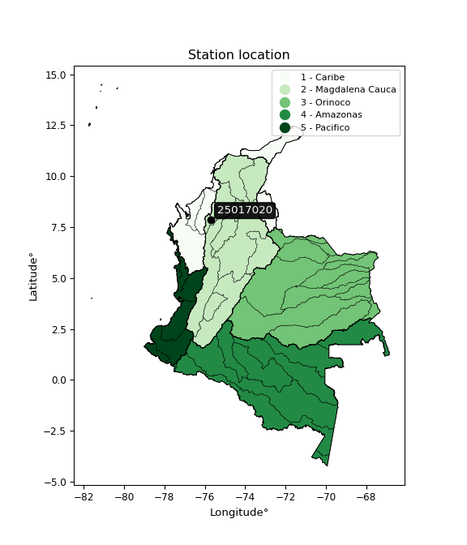</img>

</div>


## A. General information


### 1. General running parameters

• app_version: _v20260312_. • runtime: _2026-03-12 07:15:23.203550_. • Python version: _3.14.0_. • SciPy version: _1.16.3_. • Pandas version: _2.3.3_. • NumPy version: _2.3.5_. • Stations dataset (station_dataset_file): _dataset/pmax24h_in/automatic_colombia_2003_2025.csv_. • Stations catalog (station_catalog_file): _dataset/CNE.xls_. • Minimum year to eval til year_max (date_min): _1900_. • Maximum year to eval since year_min (date_max): _2025_. • Creates, save and include plots into reports (create_plot): _True_. • Plot only fit distributions with Δo > Δ (plot_only_fit): _True_. • Plot only simple graphs avoiding multiple CDFs and multiple Extreme values plots (plot_only_simple): _True_. • Eval low extreme values, if False, evaluates high extreme values (low_extreme): _False_. • Eval every SciPy distribution as logarithmic (pdist_logarithmic_on): _True_. • Standard deviation normalized (ddof): _1.0_. • Return periods to eval in years (Tr): _[2, 2.33, 5, 10, 15, 20, 25, 50, 75, 100, 200, 250, 500, 750, 1000]_. • Minimum data sample per station, 0 means any (minimum_sample): _5_. • Z-Score maximum threshold to adjust a value, 0 means disable (zscore_max): _3.5_. • Z-Score minimum threshold to adjust a value, 0 means disable (zscore_min): _-2.5_. • Avoid zeros, e.g. rain = 0 (avoid_zeros): _True_. • Avoid null values (avoid_nans): _True_. 

:file_folder:Table: [dataset.csv](../../dataset/pmax24h_in/automatic_colombia_2003_2025.csv)

> Delta Degrees of Freedom (DDOF): is a parameter used in the formulas for calculating variance and standard deviation. When ddof=0, the divisor is $N$ (the total number of observations) and this is used when your data set is the entire population. When ddof=1, the divisor is $N-1$ and this is used when your data set is a sample drawn from a larger population. Using $N-1$ provides an unbiased estimate of the population variance (known as Bessel´s correction).


### 2. Station info and location

|   id |   CODIGO | NOMBRE                     | CATEGORIA    | TECNOLOGIA                              | ESTADO   | FECHA_INSTALACION   |   FECHA_SUSPENSION |   ALTITUD |   LATITUD |   LONGITUD | DEPARTAMENTO   | MUNICIPIO         | AREA_OPERATIVA                              | ENTIDAD                                                     | AREA_HIDROGRAFICA   | ZONA_HIDROGRAFICA                | SUBZONA_HIDROGRAFICA   | CORRIENTE   | Catalogo   |   Version |
|-----:|---------:|:---------------------------|:-------------|:----------------------------------------|:---------|:--------------------|-------------------:|----------:|----------:|-----------:|:---------------|:------------------|:--------------------------------------------|:------------------------------------------------------------|:--------------------|:---------------------------------|:-----------------------|:------------|:-----------|----------:|
|    0 | 25017020 | SAN PEDRO - AUT [25017020] | Limnigráfica | Automática con Telemetría, Convencional | Activa   | 15/05/1989          |                nan |        64 |   7.85113 |   -75.7064 | Cordoba        | Puerto Libertador | Area Operativa 02 - Atlántico-Bolivar-Sucre | INSTITUTO DE HIDROLOGIA METEOROLOGIA Y ESTUDIOS AMBIENTALES | Magdalena Cauca     | Bajo Magdalena- Cauca -San Jorge | Alto San Jorge         | San Pedro   | CNE_IDEAM  |  20251226 |

<div align="center">

Dynamic map: [:earth_americas:Google](http://maps.google.com/maps?q=7.851131,-75.706359) [:earth_americas:OSM](https://www.openstreetmap.org/#map=18/7.851131/-75.706359&layers=P) [:earth_americas:Bing](https://www.bing.com/maps?cp=7.851131~-75.706359&lvl=18) [:earth_americas:Apple](https://maps.apple.com/frame?center=7.851131%2C-75.706359&span=0.003%2C0.006)

</div>


<div align="center">

```geojson
{
  "type": "Feature",
  "geometry": {
    "type": "Point", 
    "coordinates": [-75.706359, 7.851131]
  }, 
  "properties": {
    "Name": "25017020"
  }
}
```

</div>


### 3. Discrete values table and plot

<div align="center">

|               |           0 |         1 |           2 |           3 |           4 |
|:--------------|------------:|----------:|------------:|------------:|------------:|
| Date          | 2017        | 2018      | 2019        | 2024        | 2025        |
| Value         |   24.2      | 1393      |    3.5      |   85.2      |  100        |
| Value_initial |   24.2      | 1393      |    3.5      |   85.2      |  100        |
| count         |    5        |    5      |    5        |    5        |    5        |
| mean          |  321.18     |  321.18   |  321.18     |  321.18     |  321.18     |
| std           |  600.525    |  600.525  |  600.525    |  600.525    |  600.525    |
| zscore        |   -0.494534 |    1.7848 |   -0.529003 |   -0.392956 |   -0.368311 |


</div>


<div align="center">

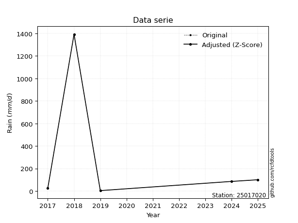</img>

</div>


> The initial value (value_initial) correspond to the initial obtained or null completed value, and value (value) is adjusted only when the initial value is outside the valid range (outlier) definite through the Z-Score value. If Z-Score is active, values out of range or outliers are replaced with the station mean value. A Z-Score (or standard score) measures how many standard deviations a data point is from the mean of a dataset, indicating its relative position; positive scores mean above the mean, negative mean below, and a score of zero is exactly at the mean, allowing for comparison of values from different distributions. It´s calculated using the formula $z=(x–μ)/σ$, where $x$ is the data point, $μ$ is the mean, and $σ$ is the standard deviation, helping identify outliers and understand probability.
>
> <sub>**Note**: In this study, "completing" (filling gaps in) and "extending" (forecasting or lengthening the historical record) rainfall data series are avoided for certain critical analyses because they introduce artificial bias and uncertainty, which can distort the statistics of rare events (extremes), alter day-to-day variability, and compromise the integrity and homogeneity of the original data. Some reasons against Completing/Extending rainfall data are: **Distortion of Extremes and Variability**: The primary issue is that most gap-filling or extension methods rely on averaging or regression with nearby stations, which inherently smooths the data. Rainfall is highly variable in space and time, with a large percentage of zero values and occasional large storms. Infilling methods often underestimate the highest values and overestimate the lowest (zero) values, which severely distorts analyses focused on flood frequency, drought severity, and intensity-duration-frequency (IDF) curves, **Loss of Data Homogeneity**: Infilled or extended data are synthetic estimates, not actual measurements. Combining these estimates with observed data can violate the assumption of data homogeneity, which requires that the data properties do not change over time. Inhomogeneity can lead to incorrect conclusions about long-term trends or changes in climate patterns, **Propagation of Errors**: Errors and biases from the original data (e.g., wind-induced undercatch, instrument errors, site changes) or the data used for imputation can propagate through the analysis, leading to unreliable hydrological models and inaccurate predictions, **Compromised Statistical Integrity**: For statistical analyses, especially those involving the frequency of events, using artificial data can introduce time bias or autocorrelation that doesn´t exist in reality, making it difficult to assess the true probability of events, **Difficulty in Validation**: It is difficult to accurately validate the quality of filled or extended data, especially for past periods where ground-truth measurements are unavailable. The reliability of imputation techniques heavily depends on the density of the surrounding station network and the complexity of the local topography.</sub>


### 4. Active continuous probability distributions from SciPy (80 of 104 available)

A Probability Density Function (PDF) describes the relative likelihood of a continuous random variable falling within a specific range, where the total area under its curve equals 1, and the area over any interval gives the actual probability for that range. Unlike discrete probabilities (like rolling a die), a PDF shows density, not direct probability for a single point (which is zero), with higher points indicating higher likelihood, often visualized as a bell curve for normal distributions.

A log of a probability density function (log-PDF) is simply the logarithm of the PDF´s value, denoted as $log(f(x))$, useful for converting multiplication of probabilities into addition, improving numerical stability with tiny numbers, and connecting to information theory concepts like entropy. Instead of dealing with very small probabilities (e.g., 0.000001), log-PDFs use negative numbers (e.g., $log(0.00001) ≈ -11.51$ that are easier for computers to handle, preventing underflow errors and simplifying complex calculations. In this study, each active probability distribution from SciPy is also evaluated in the $log$ form.

[scipy.stats](https://docs.scipy.org/doc/scipy/reference/stats.html) is a Python´s powerful submodule within the SciPy library for comprehensive statistical analysis, offering over 130 probability distributions (like Normal, Poisson, etc.), functions for descriptive stats (mean, variance), hypothesis testing (t-tests, chi-square), random variable generation, and statistical tests, making it essential for data science, modeling, and research. It provides tools to explore, model, and draw conclusions from data efficiently, working seamlessly with [NumPy](https://numpy.org/).

<div align="center">

|   id | p_dist           |   n_parameter | fit_method   | label                                                                       | active   | ref                                                                                                      |
|-----:|:-----------------|--------------:|:-------------|:----------------------------------------------------------------------------|:---------|:---------------------------------------------------------------------------------------------------------|
|    0 | alpha            |             3 | MLE          | Alpha                                                                       | True     | [:mortar_board:](https://docs.scipy.org/doc/scipy/reference/generated/scipy.stats.alpha.html)            |
|    1 | anglit           |             2 | MM           | Anglit                                                                      | True     | [:mortar_board:](https://docs.scipy.org/doc/scipy/reference/generated/scipy.stats.anglit.html)           |
|    2 | arcsine          |             2 | MM           | Arcsine                                                                     | True     | [:mortar_board:](https://docs.scipy.org/doc/scipy/reference/generated/scipy.stats.arcsine.html)          |
|    3 | argus            |             3 | MLE          | Argus                                                                       | True     | [:mortar_board:](https://docs.scipy.org/doc/scipy/reference/generated/scipy.stats.argus.html)            |
|    4 | beta             |             4 | MLE          | Beta                                                                        | True     | [:mortar_board:](https://docs.scipy.org/doc/scipy/reference/generated/scipy.stats.beta.html)             |
|    5 | betaprime        |             4 | MLE          | Beta prime                                                                  | True     | [:mortar_board:](https://docs.scipy.org/doc/scipy/reference/generated/scipy.stats.betaprime.html)        |
|    6 | bradford         |             3 | MLE          | Bradford                                                                    | True     | [:mortar_board:](https://docs.scipy.org/doc/scipy/reference/generated/scipy.stats.bradford.html)         |
|    7 | burr             |             4 | MLE          | Burr (Type III)                                                             | True     | [:mortar_board:](https://docs.scipy.org/doc/scipy/reference/generated/scipy.stats.burr.html)             |
|    8 | burr12           |             4 | MLE          | Burr (Type III) 12                                                          | True     | [:mortar_board:](https://docs.scipy.org/doc/scipy/reference/generated/scipy.stats.burr12.html)           |
|    9 | cosine           |             2 | MLE          | Cosine                                                                      | True     | [:mortar_board:](https://docs.scipy.org/doc/scipy/reference/generated/scipy.stats.cosine.html)           |
|   10 | crystalball      |             4 | MLE          | Crystalball                                                                 | True     | [:mortar_board:](https://docs.scipy.org/doc/scipy/reference/generated/scipy.stats.crystalball.html)      |
|   11 | dgamma           |             3 | MLE          | Double gamma                                                                | True     | [:mortar_board:](https://docs.scipy.org/doc/scipy/reference/generated/scipy.stats.dgamma.html)           |
|   12 | dweibull         |             3 | MLE          | Double Weibull                                                              | True     | [:mortar_board:](https://docs.scipy.org/doc/scipy/reference/generated/scipy.stats.dweibull.html)         |
|   13 | erlang           |             3 | MLE          | Erlang                                                                      | True     | [:mortar_board:](https://docs.scipy.org/doc/scipy/reference/generated/scipy.stats.erlang.html)           |
|   14 | exponnorm        |             3 | MLE          | Exponentially modified Normal                                               | True     | [:mortar_board:](https://docs.scipy.org/doc/scipy/reference/generated/scipy.stats.exponnorm.html)        |
|   15 | exponpow         |             3 | MLE          | Exponential power                                                           | True     | [:mortar_board:](https://docs.scipy.org/doc/scipy/reference/generated/scipy.stats.exponpow.html)         |
|   16 | exponweib        |             4 | MLE          | Exponentiated Weibull                                                       | True     | [:mortar_board:](https://docs.scipy.org/doc/scipy/reference/generated/scipy.stats.exponweib.html)        |
|   17 | f                |             4 | MLE          | F                                                                           | True     | [:mortar_board:](https://docs.scipy.org/doc/scipy/reference/generated/scipy.stats.f.html)                |
|   18 | fatiguelife      |             3 | MLE          | Fatigue-life (Birnbaum-Saunders)                                            | True     | [:mortar_board:](https://docs.scipy.org/doc/scipy/reference/generated/scipy.stats.fatiguelife.html)      |
|   19 | foldnorm         |             3 | MM           | Fold Normal                                                                 | True     | [:mortar_board:](https://docs.scipy.org/doc/scipy/reference/generated/scipy.stats.foldnorm.html)         |
|   20 | gamma            |             3 | MLE          | Gamma                                                                       | True     | [:mortar_board:](https://docs.scipy.org/doc/scipy/reference/generated/scipy.stats.gamma.html)            |
|   21 | gausshyper       |             6 | MLE          | Gauss hypergeometric                                                        | True     | [:mortar_board:](https://docs.scipy.org/doc/scipy/reference/generated/scipy.stats.gausshyper.html)       |
|   22 | genexpon         |             5 | MLE          | Generalized exponential                                                     | True     | [:mortar_board:](https://docs.scipy.org/doc/scipy/reference/generated/scipy.stats.genexpon.html)         |
|   23 | genextreme       |             3 | MLE          | Generalized exponential                                                     | True     | [:mortar_board:](https://docs.scipy.org/doc/scipy/reference/generated/scipy.stats.genextreme.html)       |
|   24 | gengamma         |             4 | MLE          | Generalized gamma                                                           | True     | [:mortar_board:](https://docs.scipy.org/doc/scipy/reference/generated/scipy.stats.gengamma.html)         |
|   25 | genhalflogistic  |             3 | MLE          | Generalized half-logistic                                                   | True     | [:mortar_board:](https://docs.scipy.org/doc/scipy/reference/generated/scipy.stats.genhalflogistic.html)  |
|   26 | genlogistic      |             3 | MLE          | Generalized logistic                                                        | True     | [:mortar_board:](https://docs.scipy.org/doc/scipy/reference/generated/scipy.stats.genlogistic.html)      |
|   27 | gennorm          |             3 | MLE          | Generalized Normal                                                          | True     | [:mortar_board:](https://docs.scipy.org/doc/scipy/reference/generated/scipy.stats.gennorm.html)          |
|   28 | genpareto        |             3 | MLE          | Generalized Pareto                                                          | True     | [:mortar_board:](https://docs.scipy.org/doc/scipy/reference/generated/scipy.stats.genpareto.html)        |
|   29 | gompertz         |             3 | MLE          | Gompertz (or truncated Gumbel)                                              | True     | [:mortar_board:](https://docs.scipy.org/doc/scipy/reference/generated/scipy.stats.gompertz.html)         |
|   30 | gumbel_l         |             2 | MM           | Gumbel Left Skew                                                            | True     | [:mortar_board:](https://docs.scipy.org/doc/scipy/reference/generated/scipy.stats.gumbel_l.html)         |
|   31 | gumbel_r         |             2 | MM           | Gumbel Right Skew                                                           | True     | [:mortar_board:](https://docs.scipy.org/doc/scipy/reference/generated/scipy.stats.gumbel_r.html)         |
|   32 | halfgennorm      |             3 | MLE          | Upper half of a generalized normal                                          | True     | [:mortar_board:](https://docs.scipy.org/doc/scipy/reference/generated/scipy.stats.halfgennorm.html)      |
|   33 | halflogistic     |             2 | MM           | Half-logistic                                                               | True     | [:mortar_board:](https://docs.scipy.org/doc/scipy/reference/generated/scipy.stats.halflogistic.html)     |
|   34 | halfnorm         |             2 | MM           | Half Normal                                                                 | True     | [:mortar_board:](https://docs.scipy.org/doc/scipy/reference/generated/scipy.stats.halfnorm.html)         |
|   35 | hypsecant        |             2 | MM           | hyperbolic secant                                                           | True     | [:mortar_board:](https://docs.scipy.org/doc/scipy/reference/generated/scipy.stats.hypsecant.html)        |
|   36 | invgamma         |             3 | MLE          | Inverted gamma                                                              | True     | [:mortar_board:](https://docs.scipy.org/doc/scipy/reference/generated/scipy.stats.invgamma.html)         |
|   37 | invgauss         |             3 | MLE          | Inverse Gaussian                                                            | True     | [:mortar_board:](https://docs.scipy.org/doc/scipy/reference/generated/scipy.stats.invgauss.html)         |
|   38 | invweibull       |             3 | MLE          | Inverted Weibull                                                            | True     | [:mortar_board:](https://docs.scipy.org/doc/scipy/reference/generated/scipy.stats.invweibull.html)       |
|   39 | johnsonsb        |             4 | MLE          | Johnson SB                                                                  | True     | [:mortar_board:](https://docs.scipy.org/doc/scipy/reference/generated/scipy.stats.johnsonsb.html)        |
|   40 | johnsonsu        |             4 | MLE          | Johnson Su                                                                  | True     | [:mortar_board:](https://docs.scipy.org/doc/scipy/reference/generated/scipy.stats.johnsonsu.html)        |
|   41 | kappa3           |             3 | MLE          | Kappa 3                                                                     | True     | [:mortar_board:](https://docs.scipy.org/doc/scipy/reference/generated/scipy.stats.kappa3.html)           |
|   42 | kappa4           |             4 | MLE          | Kappa 4                                                                     | True     | [:mortar_board:](https://docs.scipy.org/doc/scipy/reference/generated/scipy.stats.kappa4.html)           |
|   43 | ksone            |             3 | MLE          | Kolmogorov-Smirnov one-sided test statistic distribution                    | True     | [:mortar_board:](https://docs.scipy.org/doc/scipy/reference/generated/scipy.stats.ksone.html)            |
|   44 | kstwobign        |             2 | MLE          | Limiting distribution of scaled Kolmogorov-Smirnov two-sided test statistic | True     | [:mortar_board:](https://docs.scipy.org/doc/scipy/reference/generated/scipy.stats.kstwobign.html)        |
|   45 | laplace          |             2 | MM           | Laplace                                                                     | True     | [:mortar_board:](https://docs.scipy.org/doc/scipy/reference/generated/scipy.stats.laplace.html)          |
|   46 | levy_l           |             2 | MLE          | Left-skewed Levy                                                            | True     | [:mortar_board:](https://docs.scipy.org/doc/scipy/reference/generated/scipy.stats.levy_l.html)           |
|   47 | loggamma         |             3 | MLE          | Log gamma                                                                   | True     | [:mortar_board:](https://docs.scipy.org/doc/scipy/reference/generated/scipy.stats.loggamma.html)         |
|   48 | logistic         |             2 | MM           | Logistic (or Sech-squared)                                                  | True     | [:mortar_board:](https://docs.scipy.org/doc/scipy/reference/generated/scipy.stats.logistic.html)         |
|   49 | loglaplace       |             3 | MLE          | Log-Laplace                                                                 | True     | [:mortar_board:](https://docs.scipy.org/doc/scipy/reference/generated/scipy.stats.loglaplace.html)       |
|   50 | lomax            |             3 | MLE          | Lomax (Pareto of the second kind)                                           | True     | [:mortar_board:](https://docs.scipy.org/doc/scipy/reference/generated/scipy.stats.lomax.html)            |
|   51 | maxwell          |             2 | MM           | Maxwell                                                                     | True     | [:mortar_board:](https://docs.scipy.org/doc/scipy/reference/generated/scipy.stats.maxwell.html)          |
|   52 | mielke           |             4 | MLE          | Mielke Beta-Kappa / Dagum                                                   | True     | [:mortar_board:](https://docs.scipy.org/doc/scipy/reference/generated/scipy.stats.mielke.html)           |
|   53 | moyal            |             2 | MM           | Moyal                                                                       | True     | [:mortar_board:](https://docs.scipy.org/doc/scipy/reference/generated/scipy.stats.moyal.html)            |
|   54 | nakagami         |             3 | MLE          | Nakagami                                                                    | True     | [:mortar_board:](https://docs.scipy.org/doc/scipy/reference/generated/scipy.stats.nakagami.html)         |
|   55 | ncf              |             5 | MLE          | Non-central F distribution                                                  | True     | [:mortar_board:](https://docs.scipy.org/doc/scipy/reference/generated/scipy.stats.ncf.html)              |
|   56 | nct              |             4 | MLE          | Non-central Student’s t                                                     | True     | [:mortar_board:](https://docs.scipy.org/doc/scipy/reference/generated/scipy.stats.nct.html)              |
|   57 | norm             |             2 | MM           | Normal                                                                      | True     | [:mortar_board:](https://docs.scipy.org/doc/scipy/reference/generated/scipy.stats.norm.html)             |
|   58 | pearson3         |             3 | MM           | Pearson type III                                                            | True     | [:mortar_board:](https://docs.scipy.org/doc/scipy/reference/generated/scipy.stats.pearson3.html)         |
|   59 | powerlaw         |             3 | MLE          | Power-function                                                              | True     | [:mortar_board:](https://docs.scipy.org/doc/scipy/reference/generated/scipy.stats.powerlaw.html)         |
|   60 | rayleigh         |             2 | MM           | Rayleigh                                                                    | True     | [:mortar_board:](https://docs.scipy.org/doc/scipy/reference/generated/scipy.stats.rayleigh.html)         |
|   61 | rdist            |             3 | MLE          | R-distributed (symmetric beta)                                              | True     | [:mortar_board:](https://docs.scipy.org/doc/scipy/reference/generated/scipy.stats.rdist.html)            |
|   62 | rice             |             3 | MLE          | Rice                                                                        | True     | [:mortar_board:](https://docs.scipy.org/doc/scipy/reference/generated/scipy.stats.rice.html)             |
|   63 | semicircular     |             2 | MM           | Semicircular                                                                | True     | [:mortar_board:](https://docs.scipy.org/doc/scipy/reference/generated/scipy.stats.semicircular.html)     |
|   64 | skewnorm         |             3 | MLE          | Skew normal                                                                 | True     | [:mortar_board:](https://docs.scipy.org/doc/scipy/reference/generated/scipy.stats.skewnorm.html)         |
|   65 | t                |             3 | MLE          | Student’s t                                                                 | True     | [:mortar_board:](https://docs.scipy.org/doc/scipy/reference/generated/scipy.stats.t.html)                |
|   66 | trapezoid        |             4 | MLE          | Trapezoid                                                                   | True     | [:mortar_board:](https://docs.scipy.org/doc/scipy/reference/generated/scipy.stats.trapezoid.html)        |
|   67 | triang           |             3 | MLE          | Triangular                                                                  | True     | [:mortar_board:](https://docs.scipy.org/doc/scipy/reference/generated/scipy.stats.triang.html)           |
|   68 | truncexpon       |             3 | MLE          | Truncated exponential                                                       | True     | [:mortar_board:](https://docs.scipy.org/doc/scipy/reference/generated/scipy.stats.truncexpon.html)       |
|   69 | truncnorm        |             4 | MLE          | Truncated normal                                                            | True     | [:mortar_board:](https://docs.scipy.org/doc/scipy/reference/generated/scipy.stats.truncnorm.html)        |
|   70 | truncpareto      |             4 | MLE          | Upper truncated Pareto                                                      | True     | [:mortar_board:](https://docs.scipy.org/doc/scipy/reference/generated/scipy.stats.truncpareto.html)      |
|   71 | truncweibull_min |             5 | MLE          | Doubly truncated Weibull minimum                                            | True     | [:mortar_board:](https://docs.scipy.org/doc/scipy/reference/generated/scipy.stats.truncweibull_min.html) |
|   72 | tukeylambda      |             3 | MLE          | Tukey-Lamdba                                                                | True     | [:mortar_board:](https://docs.scipy.org/doc/scipy/reference/generated/scipy.stats.tukeylambda.html)      |
|   73 | uniform          |             2 | MLE          | Uniform                                                                     | True     | [:mortar_board:](https://docs.scipy.org/doc/scipy/reference/generated/scipy.stats.uniform.html)          |
|   74 | vonmises         |             3 | MLE          | Von Mises                                                                   | True     | [:mortar_board:](https://docs.scipy.org/doc/scipy/reference/generated/scipy.stats.vonmises.html)         |
|   75 | vonmises_line    |             3 | MLE          | Von Mises line                                                              | True     | [:mortar_board:](https://docs.scipy.org/doc/scipy/reference/generated/scipy.stats.vonmises_line.html)    |
|   76 | wald             |             2 | MM           | Wald                                                                        | True     | [:mortar_board:](https://docs.scipy.org/doc/scipy/reference/generated/scipy.stats.wald.html)             |
|   77 | weibull_max      |             3 | MLE          | Weibull maximum                                                             | True     | [:mortar_board:](https://docs.scipy.org/doc/scipy/reference/generated/scipy.stats.weibull_max.html)      |
|   78 | weibull_min      |             3 | MLE          | Weibull minimum                                                             | True     | [:mortar_board:](https://docs.scipy.org/doc/scipy/reference/generated/scipy.stats.weibull_min.html)      |
|   79 | wrapcauchy       |             3 | MLE          | Wrapped  Cauchy                                                             | True     | [:mortar_board:](https://docs.scipy.org/doc/scipy/reference/generated/scipy.stats.wrapcauchy.html)       |

</div>

> **n_parameter:** # arguments & localization & scale.
>
> **Fit methods:** (MLE) maximum likelihood, (MM) L-moments.
>
>**Inactive** (With the only purpose of prevent loops, zero divisions, infinite values, over high estimated values or horizontal trending for recurrence intervals estimations, the follow distributions were disabled.)**:** lognorm, norminvgauss, powernorm, powerlognorm, cauchy, halfcauchy, foldcauchy, skewcauchy, chi2, expon, fisk, genhyperbolic, geninvgauss, gibrat, kstwo, laplace_asymmetric, levy, levy_stable, ncx2, pareto, rel_breitwigner, recipinvgauss, studentized_range, loguniform, 


## B. Probability (PDF) vs. Empirical (EDF) distributions functions

A continuous probability distribution (CPD) describes probabilities for variables that can take any value within a range (like rain any time), unlike discrete variables with specific outcomes (like temperature). It uses a Probability Density Function (PDF), a curve where the total area under it equals 1, and the probability of the variable falling within an interval (a to b) is found by calculating the area under the curve between those points. A key feature is that the probability of hitting any single exact value is zero, so probabilities are always expressed for ranges, e.g., $P(a ≤ X ≤ b)$.

<div align="center">

Distributions parameters from station values
|     |   station | p_dist              |   n |               loc |           scale | shape                 | shape1                | shape2             | shape3            |
|----:|----------:|:--------------------|----:|------------------:|----------------:|:----------------------|:----------------------|:-------------------|:------------------|
|   0 |  25017020 | alpha               |   5 |      -0.0185035   |     7.78851     | 6.427903920600411e-10 |                       |                    |                   |
|   1 |  25017020 | anglit              |   5 |     321.18        |  1571.31        |                       |                       |                    |                   |
|   2 |  25017020 | arcsine             |   5 |    -438.431       |  1519.22        |                       |                       |                    |                   |
|   3 |  25017020 | argus               |   5 |    -841.026       |  2350.82        | 6.209528087820395e-06 |                       |                    |                   |
|   4 |  25017020 | beta                |   5 |    -132.51        |  1525.51        | 0.006227395250437941  | 0.021909255924919213  |                    |                   |
|   5 |  25017020 | betaprime           |   5 |       3.5         |    38.8873      | 0.4043840609636119    | 0.4279142763208764    |                    |                   |
|   6 |  25017020 | bradford            |   5 |       3.5         |  1389.5         | 2.5613179275855504    |                       |                    |                   |
|   7 |  25017020 | burr                |   5 |       3.49831     |   118.23        | 0.9816536202787861    | 0.46196694224317486   |                    |                   |
|   8 |  25017020 | burr12              |   5 |       3.5         |   102.342       | 0.460851121863214     | 1.0573114094111695    |                    |                   |
|   9 |  25017020 | cosine              |   5 |     427.766       |   462.306       |                       |                       |                    |                   |
|  10 |  25017020 | crystalball         |   5 |      -0.376214    |   625.93        | 4.7238908241427096    | 2.2732268936952047    |                    |                   |
|  11 |  25017020 | dgamma              |   5 |       3.5         |   320.302       | 0.6675926683307771    |                       |                    |                   |
|  12 |  25017020 | dweibull            |   5 |      24.2         |   584.788       | 0.4174220551091687    |                       |                    |                   |
|  13 |  25017020 | erlang              |   5 |       3.5         |   476.618       | 0.4330391506647939    |                       |                    |                   |
|  14 |  25017020 | exponnorm           |   5 |       3.27999     |     0.0666037   | 4761.012337509099     |                       |                    |                   |
|  15 |  25017020 | exponpow            |   5 |       3.5         |   988.257       | 0.313083328633018     |                       |                    |                   |
|  16 |  25017020 | exponweib           |   5 |       3.5         |   220.266       | 0.6251481136239311    | 0.8642659513944664    |                    |                   |
|  17 |  25017020 | f                   |   5 |       3.5         |   165.585       | 0.6229339436483523    | 3.7275450424757643    |                    |                   |
|  18 |  25017020 | fatiguelife         |   5 |       3.5         |     0.000300381 | 1122.3669047146695    |                       |                    |                   |
|  19 |  25017020 | foldnorm            |   5 |    -420.166       |   930.292       | 0.0010556225390933893 |                       |                    |                   |
|  20 |  25017020 | gamma               |   5 |       3.5         |   477.809       | 0.3989757361352432    |                       |                    |                   |
|  21 |  25017020 | gausshyper          |   5 |       3.5         |  1867.94        | 0.3703966418550785    | 0.8295525845633362    | 1.49989013030802   | 1.948474804265096 |
|  22 |  25017020 | genexpon            |   5 |       3.5         |   612.945       | 1.929441696857393     | 9.023197599098947e-14 | 1.3661296684845703 |                   |
|  23 |  25017020 | genextreme          |   5 |      20.0358      |   126.815       | -7.669133108365411    |                       |                    |                   |
|  24 |  25017020 | gengamma            |   5 |       3.5         |   549.196       | 0.6086618220842015    | 0.8305974783573823    |                    |                   |
|  25 |  25017020 | genhalflogistic     |   5 |    -141.049       |  1617.12        | 1.0541518305964341    |                       |                    |                   |
|  26 |  25017020 | genlogistic         |   5 |   -2058.6         |   271.691       | 2932.493763393517     |                       |                    |                   |
|  27 |  25017020 | gennorm             |   5 |      24.1688      |     4.34841e-07 | 0.11699655080742383   |                       |                    |                   |
|  28 |  25017020 | genpareto           |   5 |       3.47507     |    32.6038      | 1.671991823914345     |                       |                    |                   |
|  29 |  25017020 | gompertz            |   5 |       3.5         |     1.911e+12   | 6014120149.510014     |                       |                    |                   |
|  30 |  25017020 | gumbel_l            |   5 |     562.915       |   418.796       |                       |                       |                    |                   |
|  31 |  25017020 | gumbel_r            |   5 |      79.4446      |   418.796       |                       |                       |                    |                   |
|  32 |  25017020 | halfgennorm         |   5 |       3.5         |    20.0914      | 0.44819153369959164   |                       |                    |                   |
|  33 |  25017020 | halflogistic        |   5 |    -315.439       |   459.224       |                       |                       |                    |                   |
|  34 |  25017020 | halfnorm            |   5 |    -389.765       |   891.037       |                       |                       |                    |                   |
|  35 |  25017020 | hypsecant           |   5 |     321.18        |   341.945       |                       |                       |                    |                   |
|  36 |  25017020 | invgamma            |   5 |      -2.34976     |    11.3894      | 0.5250997059091607    |                       |                    |                   |
|  37 |  25017020 | invgauss            |   5 |      -3.08605     |    25.6662      | 12.633981698526203    |                       |                    |                   |
|  38 |  25017020 | invweibull          |   5 |       3.5         |     2.81064     | 0.059263776434808735  |                       |                    |                   |
|  39 |  25017020 | johnsonsb           |   5 |       3.5         |  4752.91        | 1.754339993255885     | 0.11725902505248167   |                    |                   |
|  40 |  25017020 | johnsonsu           |   5 |       3.5         |     1.71788e-15 | -1.220510654419976    | 0.09304217988926204   |                    |                   |
|  41 |  25017020 | kappa3              |   5 |       3.5         |    76.5989      | 0.08395553858027549   |                       |                    |                   |
|  42 |  25017020 | kappa4              |   5 |    -131.784       |  1564.3         | 1.094783040380121     | 1.0246327982382855    |                    |                   |
|  43 |  25017020 | ksone               |   5 |    -135.45        |  1667.4         | 1.0                   |                       |                    |                   |
|  44 |  25017020 | kstwobign           |   5 |    -979.302       |  1522.33        |                       |                       |                    |                   |
|  45 |  25017020 | laplace             |   5 |     321.18        |   379.806       |                       |                       |                    |                   |
|  46 |  25017020 | levy_l              |   5 |    1503.9         |   424.578       |                       |                       |                    |                   |
|  47 |  25017020 | loggamma            |   5 | -209007           | 27029.7         | 2308.934048289375     |                       |                    |                   |
|  48 |  25017020 | logistic            |   5 |     321.18        |   296.133       |                       |                       |                    |                   |
|  49 |  25017020 | loglaplace          |   5 |      -0.215111    |    85.4151      | 0.6811909192794066    |                       |                    |                   |
|  50 |  25017020 | lomax               |   5 |       3.5         |    19.7065      | 0.5952036693593494    |                       |                    |                   |
|  51 |  25017020 | maxwell             |   5 |    -951.584       |   797.586       |                       |                       |                    |                   |
|  52 |  25017020 | mielke              |   5 |       2.52607     |     0.158828    | 4.6399264157674445    | 0.47860312131198857   |                    |                   |
|  53 |  25017020 | moyal               |   5 |      14.0167      |   241.792       |                       |                       |                    |                   |
|  54 |  25017020 | nakagami            |   5 |       3.5         |   738.269       | 0.12095354727679065   |                       |                    |                   |
|  55 |  25017020 | ncf                 |   5 |      -0.430459    |    31.712       | 2.1199109095279622    | 1.4549756693226268    | 0.9875177086799041 |                   |
|  56 |  25017020 | nct                 |   5 |      -0.00112453  |     0.141393    | 0.3567320432129915    | 54.73619108115607     |                    |                   |
|  57 |  25017020 | norm                |   5 |     321.18        |   537.126       |                       |                       |                    |                   |
|  58 |  25017020 | pearson3            |   5 |     321.18        |   537.126       | 1.4830472181582341    |                       |                    |                   |
|  59 |  25017020 | powerlaw            |   5 |       3.5         |  1389.5         | 0.09561221674575662   |                       |                    |                   |
|  60 |  25017020 | rayleigh            |   5 |    -706.374       |   819.869       |                       |                       |                    |                   |
|  61 |  25017020 | rdist               |   5 |    -149.04        |   249.04        | 1.4035553853702043    |                       |                    |                   |
|  62 |  25017020 | rice                |   5 |    -435.526       |   656.167       | 0.0004041756732935627 |                       |                    |                   |
|  63 |  25017020 | semicircular        |   5 |     321.18        |  1074.25        |                       |                       |                    |                   |
|  64 |  25017020 | skewnorm            |   5 |       3.49963     |   624.145       | 8583781.641180314     |                       |                    |                   |
|  65 |  25017020 | t                   |   5 |      60.6114      |    47.1455      | 0.7624826082953734    |                       |                    |                   |
|  66 |  25017020 | trapezoid           |   5 |    -142.223       |  1667.4         | 1.0                   | 1.0                   |                    |                   |
|  67 |  25017020 | triang              |   5 |       3.49992     |  2822.56        | 2.388621085987529e-08 |                       |                    |                   |
|  68 |  25017020 | truncexpon          |   5 |       3.49997     |  1524.94        | 0.9111832201136396    |                       |                    |                   |
|  69 |  25017020 | truncnorm           |   5 |   -8121.38        |  1711.18        | 4.748111629532268     | 1933.209539347361     |                    |                   |
|  70 |  25017020 | truncpareto         |   5 |       1.55239     |     1.76681     | 0.029807950777538103  | 787.5483433678137     |                    |                   |
|  71 |  25017020 | truncweibull_min    |   5 |      -7.7555      |  1581.95        | 0.018091033374863175  | 0.007114935297249277  | 0.8854636601490982 |                   |
|  72 |  25017020 | tukeylambda         |   5 |    -156.461       |   346.415       | 1.350747725613036     |                       |                    |                   |
|  73 |  25017020 | uniform             |   5 |       3.5         |  1389.5         |                       |                       |                    |                   |
|  74 |  25017020 | vonmises            |   5 |      -1.80124     |     1           | 1.5709937161384122    |                       |                    |                   |
|  75 |  25017020 | vonmises_line       |   5 |     157.427       |   393.295       | 1.4654031629134767    |                       |                    |                   |
|  76 |  25017020 | wald                |   5 |    -215.946       |   537.126       |                       |                       |                    |                   |
|  77 |  25017020 | weibull_max         |   5 |    1393           |     1.7191      | 0.13030461373345928   |                       |                    |                   |
|  78 |  25017020 | weibull_min         |   5 |       3.5         |   550.916       | 0.3732093458349677    |                       |                    |                   |
|  79 |  25017020 | wrapcauchy          |   5 |       3.5         |   221.157       | 0.9225788255199454    |                       |                    |                   |
|  80 |  25017020 | logalpha            |   5 |     -29.8074      |   586.479       | 17.336165892634433    |                       |                    |                   |
|  81 |  25017020 | loganglit           |   5 |       4.1457      |     5.72661     |                       |                       |                    |                   |
|  82 |  25017020 | logarcsine          |   5 |       1.37729     |     5.53682     |                       |                       |                    |                   |
|  83 |  25017020 | logargus            |   5 |      -0.320742    |     7.98958     | 6.290900509162362e-05 |                       |                    |                   |
|  84 |  25017020 | logbeta             |   5 |      -0.061187    |     7.3004      | 1.2085879657998935    | 0.7095590249880148    |                    |                   |
|  85 |  25017020 | logbetaprime        |   5 |      -2.09985     |     5.71819e+09 | 9.251542006739545     | 8459721609.395935     |                    |                   |
|  86 |  25017020 | logbradford         |   5 |       1.25276     |     5.98646     | 1.0632528801282546    |                       |                    |                   |
|  87 |  25017020 | logburr             |   5 |       1.25276     |     5.34311     | 4.912230065564779     | 0.1632711822944929    |                    |                   |
|  88 |  25017020 | logburr12           |   5 |       0.212089    |   108.342       | 2.1124870374537066    | 855.0193996063044     |                    |                   |
|  89 |  25017020 | logcosine           |   5 |       4.18266     |     1.63606     |                       |                       |                    |                   |
|  90 |  25017020 | logcrystalball      |   5 |       4.1457      |     1.95755     | 89.31586644629357     | 207.5024418372435     |                    |                   |
|  91 |  25017020 | logdgamma           |   5 |       4.445       |     2.36676     | 0.370146887334615     |                       |                    |                   |
|  92 |  25017020 | logdweibull         |   5 |       4.445       |     1.57112     | 0.8603697125022844    |                       |                    |                   |
|  93 |  25017020 | logerlang           |   5 |     -16.2701      |     0.187243    | 109.04202326967277    |                       |                    |                   |
|  94 |  25017020 | logexponnorm        |   5 |       3.84791     |     1.93479     | 0.15390762421493875   |                       |                    |                   |
|  95 |  25017020 | logexponpow         |   5 |       1.25276     |     5.56621     | 0.6220102041649679    |                       |                    |                   |
|  96 |  25017020 | logexponweib        |   5 |       1.25276     |     4.72085     | 0.30213321650280794   | 2.2271277532809055    |                    |                   |
|  97 |  25017020 | logf                |   5 |      -8.40358     |    12.5498      | 81.40035643567619     | 979172.2809879459     |                    |                   |
|  98 |  25017020 | logfatiguelife      |   5 |     -17.9985      |    22.0576      | 0.0885914098994788    |                       |                    |                   |
|  99 |  25017020 | logfoldnorm         |   5 |      -0.304907    |     1.99938     | 2.2166754338248467    |                       |                    |                   |
| 100 |  25017020 | loggamma            |   5 |     -15.8767      |     0.191203    | 104.67758697214285    |                       |                    |                   |
| 101 |  25017020 | loggausshyper       |   5 |       1.25155     |     5.98767     | 0.9110418255233868    | 0.9329229493662927    | 1.0473859931642122 | 1.080079731797031 |
| 102 |  25017020 | loggenexpon         |   5 |       1.2524      |   229.073       | 55.81660537171196     | 70.25399962363025     | 47.12132139532109  |                   |
| 103 |  25017020 | loggenextreme       |   5 |       3.47405     |     1.93151     | 0.3007053242300579    |                       |                    |                   |
| 104 |  25017020 | loggengamma         |   5 |       1.25276     |     5.45947     | 0.21682258313147978   | 2.55415633265083      |                    |                   |
| 105 |  25017020 | loggenhalflogistic  |   5 |       0.629414    |     7.088       | 1.0723470935313677    |                       |                    |                   |
| 106 |  25017020 | loggenlogistic      |   5 |       3.00397     |     1.34979     | 1.804212026576201     |                       |                    |                   |
| 107 |  25017020 | loggennorm          |   5 |       4.445       |     0.0676224   | 0.38666583999460824   |                       |                    |                   |
| 108 |  25017020 | loggenpareto        |   5 |      -0.0113657   |    12.1489      | -1.6755697756509378   |                       |                    |                   |
| 109 |  25017020 | loggompertz         |   5 |       1.25276     |     2.41551     | 0.27598322336178166   |                       |                    |                   |
| 110 |  25017020 | loggumbel_l         |   5 |       5.0267      |     1.52629     |                       |                       |                    |                   |
| 111 |  25017020 | loggumbel_r         |   5 |       3.2647      |     1.52629     |                       |                       |                    |                   |
| 112 |  25017020 | loghalfgennorm      |   5 |       1.25276     |     0.993887    | 0.5951663249141562    |                       |                    |                   |
| 113 |  25017020 | loghalflogistic     |   5 |       1.82551     |     1.67365     |                       |                       |                    |                   |
| 114 |  25017020 | loghalfnorm         |   5 |       1.55472     |     3.24733     |                       |                       |                    |                   |
| 115 |  25017020 | loghypsecant        |   5 |       4.1457      |     1.24621     |                       |                       |                    |                   |
| 116 |  25017020 | loginvgamma         |   5 |     -16.7799      |  2350.98        | 113.41822632497122    |                       |                    |                   |
| 117 |  25017020 | loginvgauss         |   5 |      -8.26296     |   472.326       | 0.02627122537461811   |                       |                    |                   |
| 118 |  25017020 | loginvweibull       |   5 |      -1.31782e+08 |     1.31782e+08 | 74879050.36720826     |                       |                    |                   |
| 119 |  25017020 | logjohnsonsb        |   5 |       1.2526      |     5.98661     | -0.25246635876950607  | 0.10857935917919828   |                    |                   |
| 120 |  25017020 | logjohnsonsu        |   5 |     -16.7988      |    10.4274      | -17.238049327528884   | 11.93587587588101     |                    |                   |
| 121 |  25017020 | logkappa3           |   5 |       1.1535      |     6.06028     | 369.9618400851007     |                       |                    |                   |
| 122 |  25017020 | logkappa4           |   5 |       0.757498    |     6.59906     | 1.0811968364614186    | 1.0166775192477662    |                    |                   |
| 123 |  25017020 | logksone            |   5 |       0.755129    |     6.78114     | 1.0                   |                       |                    |                   |
| 124 |  25017020 | logkstwobign        |   5 |      -3.03215     |     8.21151     |                       |                       |                    |                   |
| 125 |  25017020 | loglaplace          |   5 |       4.1457      |     1.3842      |                       |                       |                    |                   |
| 126 |  25017020 | loglevy_l           |   5 |       7.53039     |     1.11364     |                       |                       |                    |                   |
| 127 |  25017020 | logloggamma         |   5 |    -603.333       |    81.6194      | 1708.0426425732949    |                       |                    |                   |
| 128 |  25017020 | loglogistic         |   5 |       4.1457      |     1.07925     |                       |                       |                    |                   |
| 129 |  25017020 | logloglaplace       |   5 |      -0.0149839   |     4.45999     | 2.3678622736676123    |                       |                    |                   |
| 130 |  25017020 | loglomax            |   5 |       1.25276     |     3.41988e+07 | 11643579.598547447    |                       |                    |                   |
| 131 |  25017020 | logmaxwell          |   5 |      -0.492865    |     2.90679     |                       |                       |                    |                   |
| 132 |  25017020 | logmielke           |   5 |       1.25276     |     4.61886     | 0.7380848948740681    | 5.086635837200365     |                    |                   |
| 133 |  25017020 | logmoyal            |   5 |       3.02625     |     0.881206    |                       |                       |                    |                   |
| 134 |  25017020 | lognakagami         |   5 |       3.18635     |     2.30271     | 0.21222756423938077   |                       |                    |                   |
| 135 |  25017020 | logncf              |   5 |      -0.32068     |     2.77624e-06 | 1.340770724836968e-05 | 71.1393497007536      | 21.068641336209872 |                   |
| 136 |  25017020 | lognct              |   5 |     -63.8887      |     1.91122     | 13127.831943306497    | 35.59542443294836     |                    |                   |
| 137 |  25017020 | lognorm             |   5 |       4.1457      |     1.95755     |                       |                       |                    |                   |
| 138 |  25017020 | logpearson3         |   5 |       4.1457      |     1.95753     | 0.12362613652012405   |                       |                    |                   |
| 139 |  25017020 | logpowerlaw         |   5 |       1.25276     |     5.98645     | 0.12446520473015783   |                       |                    |                   |
| 140 |  25017020 | lograyleigh         |   5 |       0.400798    |     2.988       |                       |                       |                    |                   |
| 141 |  25017020 | logrdist            |   5 |       1.75753     |     2.84764     | 1.1206388593791505    |                       |                    |                   |
| 142 |  25017020 | logrice             |   5 |       0.20712     |     2.34064     | 1.2372855268047167    |                       |                    |                   |
| 143 |  25017020 | logsemicircular     |   5 |       4.1457      |     3.9151      |                       |                       |                    |                   |
| 144 |  25017020 | logskewnorm         |   5 |       2.63163     |     2.47476     | 1.1858732628278146    |                       |                    |                   |
| 145 |  25017020 | logt                |   5 |       4.1457      |     1.95755     | 2282218311.826975     |                       |                    |                   |
| 146 |  25017020 | logtrapezoid        |   5 |       0.654118    |     7.18374     | 1.0                   | 1.0                   |                    |                   |
| 147 |  25017020 | logtriang           |   5 |       0.641981    |     6.59726     | 0.9999989624599455    |                       |                    |                   |
| 148 |  25017020 | logtruncexpon       |   5 |       1.25275     |     6.35678     | 0.9417463466782341    |                       |                    |                   |
| 149 |  25017020 | logtruncnorm        |   5 |       1.12389     |     3.68336     | 0.034987277228469726  | 18.624925254521358    |                    |                   |
| 150 |  25017020 | logtruncpareto      |   5 |     -17.2039      |    18.4567      | 1.522167276673575e-07 | 1.32435125593923      |                    |                   |
| 151 |  25017020 | logtruncweibull_min |   5 |       1.24024     |     8.00557     | 0.6805099964605934    | 0.0015639961742308648 | 0.7493495187945014 |                   |
| 152 |  25017020 | logtukeylambda      |   5 |       4.24511     |     3.20664     | 1.0709870491685856    |                       |                    |                   |
| 153 |  25017020 | loguniform          |   5 |       1.25276     |     5.98645     |                       |                       |                    |                   |
| 154 |  25017020 | logvonmises         |   5 |      -2.68407     |     1           | 0.2155914292974383    |                       |                    |                   |
| 155 |  25017020 | logvonmises_line    |   5 |       4.24597     |     0.952781    | 1.012476680741496     |                       |                    |                   |
| 156 |  25017020 | logwald             |   5 |       2.18818     |     1.95753     |                       |                       |                    |                   |
| 157 |  25017020 | logweibull_max      |   5 |       7.23921     |     1.58604     | 0.557931376760552     |                       |                    |                   |
| 158 |  25017020 | logweibull_min      |   5 |       0.214286    |     4.43477     | 2.1093486499959093    |                       |                    |                   |
| 159 |  25017020 | logwrapcauchy       |   5 |       1.25275     |     0.957618    | 6.318288770123907e-05 |                       |                    |                   |

</div>

> **loc** (Location parameter): This shifts the distribution along the x-axis. For many common distributions, like the normal (Gaussian) distribution, loc represents the mean $μ$. For others, like the uniform distribution, it might represent the minimum value, or for the beta distribution, the left end of the support interval.
>
> **scale** (Scale parameter): This determines the width or spread of the distribution. For the normal distribution, scale represents the standard deviation $σ$. For a uniform distribution, it defines the length of the interval (from $loc$ to $loc + scale$).
>
> **shape** (Shape parameters): Refers to parameters that define the specific form of a probability distribution, distinct from its location (loc) and scale (scale). These parameters are required arguments for most distribution functions. For example, a normal (Gaussian) distribution is fully defined by its location (mean) and scale (standard deviation), so it has no specific shape parameters beyond loc and scale. However, other distributions have intrinsic properties that need specification, as Gamma distribution that takes a shape parameter, often named $a$ or $alpha$.


### 0. Cumulative distribution values - CDF (160 evaluated)

Cumulative Distribution Function (CDF), denoted as $F$<sub>$X$</sub>$(x)$, is a function that gives the probability that a random variable $X$ will take a value less than or equal to a specific value, $x$ (i.e., $(P(X≥x)$. It essentially "accumulates" probabilities from a given point up to the far right (positive infinity), providing a complete picture of the distribution´s probabilities for both discrete (like rain) and continuous (like temperature) variables, helping to find probabilities over ranges or above certain values. Each station is evaluated separately ordering the $x$ values ascending, calculating the CDF and PDF values for the activated distributions and their logarithmic forms.

<div align="center">

CDF ordered by x ascending and calculating $log(f(x))$ separately
|   id |   Station |   date |      x |   count |   mean |     std |    zscore |   Value_initial |   station |   m |     alpha |   alpha_pdf |   anglit |   anglit_pdf |   arcsine |   arcsine_pdf |    argus |   argus_pdf |     beta |    beta_pdf |   betaprime |   betaprime_pdf |    bradford |   bradford_pdf |       burr |    burr_pdf |     burr12 |   burr12_pdf |   cosine |   cosine_pdf |   crystalball |   crystalball_pdf |   dgamma |    dgamma_pdf |   dweibull |   dweibull_pdf |      erlang |   erlang_pdf |   exponnorm |   exponnorm_pdf |    exponpow |   exponpow_pdf |   exponweib |    exponweib_pdf |           f |       f_pdf |   fatiguelife |   fatiguelife_pdf |   foldnorm |   foldnorm_pdf |       gamma |   gamma_pdf |   gausshyper |   gausshyper_pdf |    genexpon |   genexpon_pdf |   genextreme |   genextreme_pdf |    gengamma |     gengamma_pdf |   genhalflogistic |   genhalflogistic_pdf |   genlogistic |   genlogistic_pdf |   gennorm |   gennorm_pdf |   genpareto |   genpareto_pdf |    gompertz |   gompertz_pdf |   gumbel_l |   gumbel_l_pdf |   gumbel_r |   gumbel_r_pdf |   halfgennorm |   halfgennorm_pdf |   halflogistic |   halflogistic_pdf |   halfnorm |   halfnorm_pdf |   hypsecant |   hypsecant_pdf |   invgamma |   invgamma_pdf |   invgauss |   invgauss_pdf |   invweibull |   invweibull_pdf |   johnsonsb |   johnsonsb_pdf |   johnsonsu |   johnsonsu_pdf |     kappa3 |   kappa3_pdf |      kappa4 |   kappa4_pdf |     ksone |   ksone_pdf |   kstwobign |   kstwobign_pdf |   laplace |   laplace_pdf |   levy_l |   levy_l_pdf |   loggamma |   loggamma_pdf |   logistic |   logistic_pdf |   loglaplace |   loglaplace_pdf |       lomax |   lomax_pdf |   maxwell |   maxwell_pdf |    mielke |   mielke_pdf |    moyal |   moyal_pdf |    nakagami |   nakagami_pdf |       ncf |     ncf_pdf |       nct |     nct_pdf |     norm |    norm_pdf |   pearson3 |   pearson3_pdf |   powerlaw |   powerlaw_pdf |   rayleigh |   rayleigh_pdf |    rdist |   rdist_pdf |     rice |    rice_pdf |   semicircular |   semicircular_pdf |   skewnorm |   skewnorm_pdf |        t |       t_pdf |   trapezoid |   trapezoid_pdf |      triang |   triang_pdf |   truncexpon |   truncexpon_pdf |   truncnorm |   truncnorm_pdf |   truncpareto |   truncpareto_pdf |   truncweibull_min |   truncweibull_min_pdf |   tukeylambda |   tukeylambda_pdf |   uniform |   uniform_pdf |   vonmises |   vonmises_pdf |   vonmises_line |   vonmises_line_pdf |     wald |    wald_pdf |   weibull_max |   weibull_max_pdf |   weibull_min |   weibull_min_pdf |   wrapcauchy |   wrapcauchy_pdf |   logalpha |   logalpha_pdf |   loganglit |   loganglit_pdf |   logarcsine |   logarcsine_pdf |   logargus |   logargus_pdf |   logbeta |   logbeta_pdf |   logbetaprime |   logbetaprime_pdf |   logbradford |   logbradford_pdf |     logburr |   logburr_pdf |   logburr12 |   logburr12_pdf |   logcosine |   logcosine_pdf |   logcrystalball |   logcrystalball_pdf |   logdgamma |   logdgamma_pdf |   logdweibull |   logdweibull_pdf |   logerlang |   logerlang_pdf |   logexponnorm |   logexponnorm_pdf |   logexponpow |   logexponpow_pdf |   logexponweib |   logexponweib_pdf |      logf |   logf_pdf |   logfatiguelife |   logfatiguelife_pdf |   logfoldnorm |   logfoldnorm_pdf |   loggausshyper |   loggausshyper_pdf |   loggenexpon |   loggenexpon_pdf |   loggenextreme |   loggenextreme_pdf |   loggengamma |   loggengamma_pdf |   loggenhalflogistic |   loggenhalflogistic_pdf |   loggenlogistic |   loggenlogistic_pdf |   loggennorm |   loggennorm_pdf |   loggenpareto |   loggenpareto_pdf |   loggompertz |   loggompertz_pdf |   loggumbel_l |   loggumbel_l_pdf |   loggumbel_r |   loggumbel_r_pdf |   loghalfgennorm |   loghalfgennorm_pdf |   loghalflogistic |   loghalflogistic_pdf |   loghalfnorm |   loghalfnorm_pdf |   loghypsecant |   loghypsecant_pdf |   loginvgamma |   loginvgamma_pdf |   loginvgauss |   loginvgauss_pdf |   loginvweibull |   loginvweibull_pdf |   logjohnsonsb |   logjohnsonsb_pdf |   logjohnsonsu |   logjohnsonsu_pdf |   logkappa3 |   logkappa3_pdf |   logkappa4 |   logkappa4_pdf |   logksone |   logksone_pdf |   logkstwobign |   logkstwobign_pdf |   loglevy_l |   loglevy_l_pdf |   logloggamma |   logloggamma_pdf |   loglogistic |   loglogistic_pdf |   logloglaplace |   logloglaplace_pdf |    loglomax |   loglomax_pdf |   logmaxwell |   logmaxwell_pdf |   logmielke |   logmielke_pdf |   logmoyal |   logmoyal_pdf |   lognakagami |   lognakagami_pdf |    logncf |   logncf_pdf |    lognct |   lognct_pdf |   lognorm |   lognorm_pdf |   logpearson3 |   logpearson3_pdf |   logpowerlaw |   logpowerlaw_pdf |   lograyleigh |   lograyleigh_pdf |   logrdist |   logrdist_pdf |   logrice |   logrice_pdf |   logsemicircular |   logsemicircular_pdf |   logskewnorm |   logskewnorm_pdf |      logt |   logt_pdf |   logtrapezoid |   logtrapezoid_pdf |   logtriang |   logtriang_pdf |   logtruncexpon |   logtruncexpon_pdf |   logtruncnorm |   logtruncnorm_pdf |   logtruncpareto |   logtruncpareto_pdf |   logtruncweibull_min |   logtruncweibull_min_pdf |   logtukeylambda |   logtukeylambda_pdf |   loguniform |   loguniform_pdf |   logvonmises |   logvonmises_pdf |   logvonmises_line |   logvonmises_line_pdf |   logwald |   logwald_pdf |   logweibull_max |   logweibull_max_pdf |   logweibull_min |   logweibull_min_pdf |   logwrapcauchy |   logwrapcauchy_pdf |
|-----:|----------:|-------:|-------:|--------:|-------:|--------:|----------:|----------------:|----------:|----:|----------:|------------:|---------:|-------------:|----------:|--------------:|---------:|------------:|---------:|------------:|------------:|----------------:|------------:|---------------:|-----------:|------------:|-----------:|-------------:|---------:|-------------:|--------------:|------------------:|---------:|--------------:|-----------:|---------------:|------------:|-------------:|------------:|----------------:|------------:|---------------:|------------:|-----------------:|------------:|------------:|--------------:|------------------:|-----------:|---------------:|------------:|------------:|-------------:|-----------------:|------------:|---------------:|-------------:|-----------------:|------------:|-----------------:|------------------:|----------------------:|--------------:|------------------:|----------:|--------------:|------------:|----------------:|------------:|---------------:|-----------:|---------------:|-----------:|---------------:|--------------:|------------------:|---------------:|-------------------:|-----------:|---------------:|------------:|----------------:|-----------:|---------------:|-----------:|---------------:|-------------:|-----------------:|------------:|----------------:|------------:|----------------:|-----------:|-------------:|------------:|-------------:|----------:|------------:|------------:|----------------:|----------:|--------------:|---------:|-------------:|-----------:|---------------:|-----------:|---------------:|-------------:|-----------------:|------------:|------------:|----------:|--------------:|----------:|-------------:|---------:|------------:|------------:|---------------:|----------:|------------:|----------:|------------:|---------:|------------:|-----------:|---------------:|-----------:|---------------:|-----------:|---------------:|---------:|------------:|---------:|------------:|---------------:|-------------------:|-----------:|---------------:|---------:|------------:|------------:|----------------:|------------:|-------------:|-------------:|-----------------:|------------:|----------------:|--------------:|------------------:|-------------------:|-----------------------:|--------------:|------------------:|----------:|--------------:|-----------:|---------------:|----------------:|--------------------:|---------:|------------:|--------------:|------------------:|--------------:|------------------:|-------------:|-----------------:|-----------:|---------------:|------------:|----------------:|-------------:|-----------------:|-----------:|---------------:|----------:|--------------:|---------------:|-------------------:|--------------:|------------------:|------------:|--------------:|------------:|----------------:|------------:|----------------:|-----------------:|---------------------:|------------:|----------------:|--------------:|------------------:|------------:|----------------:|---------------:|-------------------:|--------------:|------------------:|---------------:|-------------------:|----------:|-----------:|-----------------:|---------------------:|--------------:|------------------:|----------------:|--------------------:|--------------:|------------------:|----------------:|--------------------:|--------------:|------------------:|---------------------:|-------------------------:|-----------------:|---------------------:|-------------:|-----------------:|---------------:|-------------------:|--------------:|------------------:|--------------:|------------------:|--------------:|------------------:|-----------------:|---------------------:|------------------:|----------------------:|--------------:|------------------:|---------------:|-------------------:|--------------:|------------------:|--------------:|------------------:|----------------:|--------------------:|---------------:|-------------------:|---------------:|-------------------:|------------:|----------------:|------------:|----------------:|-----------:|---------------:|---------------:|-------------------:|------------:|----------------:|--------------:|------------------:|--------------:|------------------:|----------------:|--------------------:|------------:|---------------:|-------------:|-----------------:|------------:|----------------:|-----------:|---------------:|--------------:|------------------:|----------:|-------------:|----------:|-------------:|----------:|--------------:|--------------:|------------------:|--------------:|------------------:|--------------:|------------------:|-----------:|---------------:|----------:|--------------:|------------------:|----------------------:|--------------:|------------------:|----------:|-----------:|---------------:|-------------------:|------------:|----------------:|----------------:|--------------------:|---------------:|-------------------:|-----------------:|---------------------:|----------------------:|--------------------------:|-----------------:|---------------------:|-------------:|-----------------:|--------------:|------------------:|-------------------:|-----------------------:|----------:|--------------:|-----------------:|---------------------:|-----------------:|---------------------:|----------------:|--------------------:|
|    0 |  25017020 |   2019 |    3.5 |       5 | 321.18 | 600.525 | -0.529003 |             3.5 |  25017020 |   1 | 0.0268573 | 0.0433177   | 0.303289 |  0.000585091 |  0.362656 |   0.000461324 | 0.187201 | 0.000427849 | 0.767641 | 3.84872e-05 | 4.07503e-07 |     8.06671e+06 | 2.50784e-09 |    0.0014513   | 0.00634484 | 1.7067      | 1.0535e-08 |  1.09327e+07 | 0.227537 |  0.000553449 |      0.502471 |       0.000637346 | 0.5      | 791.368       |   0.390212 |    0.00195081  | 1.75626e-08 |  1.71256e+07 | 0.000693589 |     0.00314988  | 1.80192e-06 |    1.27035e+09 | 2.74938e-10 | 334499           | 2.35079e-05 | 1.17937e+07 |      0.143254 |       5.73919e+08 |   0.351187 |    0.000773187 | 9.50121e-08 | 4.26801e+07 |  1.85741e-07 |      1.54919e+08 | 1.24705e-13 |    0.00314782  |  0.000276489 |    180.893       | 7.97656e-10 | 908054           |         0.0469071 |           0.000340606 |      0.227146 |        0.00123884 |  0.271615 |   0.00318831  | 0.000763859 |     0.0306087   | 1.38404e-10 |    0.00314711  |   0.231224 |    0.000482703 |   0.301549 |    0.000863199 |   1.66745e-13 |       0.0199001   |       0.333943 |        0.000967374 |   0.341045 |    0.000812354 |    0.239453 |     0.000636063 |  0.0521195 |    0.0204839   |   0.052324 |    0.0184266   |  0.000250765 |      1.38727e+11 |  0.00035771 |     3.4397e+11  |    0.111136 |     1.02594e+13 | 5.2077e-06 |  2.67994e+08 | 2.67123e-15 |  0.0154152   | 0.0833333 | 0.000599736 |    0.201189 |     0.00100719  |  0.216628 |   0.000570365 | 0.405243 |  0.000122781 |  0.0643315 |      0.0713574 |   0.254878 |    0.000641318 |    0.0618449 |        0.0446793 | 1.11704e-13 | 0.0302034   |  0.302399 |   0.000700352 | 0.0334328 |  0.0470953   | 0.306788 | 0.00100026  | 3.79764e-05 |    1.03434e+10 | 0.0655766 | 0.0162632   | 0.0563012 | 0.0449972   | 0.277112 | 0.000623554 |   0.325959 |    0.000982372 |  0.0170457 |    3.66993e+12 |   0.312599 |    0.000725942 | 0.755672 |  0.00184677 | 0.200551 | 0.000815179 |       0.314519 |        0.000566111 |  0         |     0.00127836 | 0.241486 | 0.00247657  |  0.00763789 |     0.000104828 | 3.39999e-08 |  0.000708577 |  3.68692e-08 |      0.00109668  | 4.32555e-05 |     0.00288866  |     0.0160857 |       0.0846511   |        1.13536e-06 |             0.0183708  |      0.79885  |        0.00193216 | 0         |   0.000719683 |    1.14872 |       0.221561 |        0.338854 |         0.000972001 | 0.279175 | 0.00185368  |     0.0913927 |       2.0506e-05  |   1.76723e-07 |       1.48517e+08 |  4.42495e-09 |      0.0178708   |  0.0610718 |      0.073427  |   0.0764912 |       0.0928237 |     0        |         0        |  0.0576129 |      0.0725022 | 0.0884522 |     0.0835814 |      0.0544466 |           0.082001 |    1.4034e-06 |          0.245221 | 7.27335e-14 |   262.714     |   0.0457029 |       0.0906179 |   0.0596635 |       0.0760475 |        0.0697257 |            0.0683829 |   0.0337762 |     0.0189029   |     0.0793829 |         0.0393742 |    0.063702 |       0.0707173 |      0.0695305 |          0.0684382 |   6.30348e-11 |    176578         |    1.03121e-11 |      31250         | 0.0607274 |  0.0728896 |        0.0621156 |            0.0719304 |     0.0739052 |         0.0732419 |     0.000604401 |            0.452172 |   8.92782e-05 |         0.243665  |       0.0682203 |           0.0704654 |   9.16129e-10 |       2.28491e+06 |            0.0461531 |                0.0777211 |        0.0622497 |            0.06535   |    0.0621728 |        0.0238593 |       0.108044 |          0.0889224 |   4.37534e-08 |         0.114255  |     0.0809032 |         0.0508019 |     0.0238342 |         0.0583503 |      4.72539e-09 |            0.661651  |          0        |             0         |      0        |         0         |      0.0622771 |          0.0496548 |     0.0605758 |         0.0742711 |     0.0585084 |         0.0766567 |       0.0508535 |           0.0860729 |      0.0813127 |      102.616       |      0.0637209 |          0.0714836 |   0.0161194 |        0.162392 |  1.7522e-15 |        2.39474  |   0.073385 |       0.147468 |      0.0517467 |           0.097355 |    0.326382 |       0.0244945 |     0.0721739 |         0.0687803 |     0.0641338 |         0.0556132 |       0.0254334 |           0.0475038 | 1.00916e-08 |      0.340468  |    0.0517526 |        0.082659  | 9.03361e-13 |    3002.81      | 0.00623015 |      0.02938   |   0           |       0           | 0.0484649 |    0.0862282 | 0.0694499 |    0.0684573 | 0.0697256 |     0.0683829 |     0.0662077 |         0.070047  |    0.00901459 |       5.05305e+12 |     0.0398341 |         0.0916235 |   0.438708 |       0.122571 | 0.0458526 |     0.0865985 |         0.0768567 |             0.109563  |     0.0641302 |         0.0702259 | 0.0697251 |  0.0683826 |     0.00694444 |          0.0232005 |  0.00857128 |       0.0280666 |     4.35336e-06 |            0.257866 |    2.06337e-09 |          0.222702  |         0        |             0.192868 |           2.77033e-09 |                 1.20688   |      0.000356842 |             0.198736 |     0        |         0.167044 |       1.10311 |          0.135281 |        1.92753e-06 |               0.047668 |  0        |     0         |         0.122678 |          0.0239896   |        0.0457078 |            0.0906865 |     2.67581e-06 |            0.16622  |
|    1 |  25017020 |   2017 |   24.2 |       5 | 321.18 | 600.525 | -0.494534 |            24.2 |  25017020 |   2 | 0.747761  | 0.010061    | 0.315467 |  0.000591484 |  0.372142 |   0.000455281 | 0.19615  | 0.000436722 | 0.768388 | 3.39273e-05 | 0.428744    |     0.00652791  | 0.0294829   |    0.00139796  | 0.420235   | 0.00779624  | 0.338757   |  0.00503944  | 0.239119 |  0.000565478 |      0.51566  |       0.000636867 | 0.586699 |   0.00268933  |   0.5      |    3.82353e+06 | 0.286442    |  0.00581295  | 0.0638436   |     0.00295223  | 0.293406    |    0.00429228  | 0.267753    |      0.00654576  | 0.378926    | 0.00550921  |      0.592464 |       0.00219306  |   0.367109 |    0.000765202 | 0.318179    | 0.00594516  |  0.274995    |      0.0048136   | 0.0630824   |    0.00294925  |  0.378652    |      0.00231635  | 0.20793     |      0.00487413  |         0.0540081 |           0.000345508 |      0.25323  |        0.00127983 |  0.510617 |   0.215031    | 0.351479    |     0.00964262  | 0.0630685   |    0.00294862  |   0.241399 |    0.000500448 |   0.319496 |    0.000870468 |   0.21023     |       0.00722295  |       0.353814 |        0.000952493 |   0.357773 |    0.00080385  |    0.25291  |     0.000664222 |  0.371569  |    0.00930681  |   0.358855 |    0.00955768  |  0.411313    |      0.00104617  |  0.868086   |     0.0012158   |    0.988964 |     0.00013054  | 0.344083   |  0.00142413  | 0.0209484   |  0.000924553 | 0.0957479 | 0.000599736 |    0.222351 |     0.00103661  |  0.228762 |   0.000602313 | 0.407809 |  0.000125118 |  0.322155  |      0.189331  |   0.26838  |    0.000663053 |    0.250019  |        0.180624  | 0.347785    | 0.00960738  |  0.316981 |   0.00070843  | 0.414485  |  0.0077056   | 0.3275   | 0.0010003   | 0.345873    |    0.00404164  | 0.312269  | 0.00851604  | 0.471737  | 0.007667    | 0.290164 | 0.000637457 |   0.346183 |    0.000971306 |  0.668848  |    0.00308937  |   0.327677 |    0.000730723 | 0.794951 |  0.00195512 | 0.217638 | 0.00083537  |       0.326273 |        0.000569521 |  0.0264577 |     0.00127766 | 0.305648 | 0.00383171  |  0.00996195 |     0.000119719 | 0.0146138   |  0.000703381 |  0.022548    |      0.0010819   | 0.0581522   |     0.00272721  |     0.406143  |       0.00676629  |        0.215929    |             0.00648005 |      0.839194 |        0.0019676  | 0.0148974 |   0.000719683 |    4.82424 |       0.255438 |        0.359261 |         0.000999133 | 0.316643 | 0.00176506  |     0.0918209 |       2.08728e-05 |   0.254616    |       0.00394908  |  0.273943    |      0.00761292  |  0.330235  |      0.195164  |   0.335592  |       0.164913  |     0.387359 |         0.122574 |  0.274621  |      0.148096  | 0.279064  |     0.113053  |      0.349812  |           0.201045 |    0.407606   |          0.182534 | 0.442061    |     0.182125  |   0.349445  |       0.198603  |   0.31204   |       0.177072  |        0.31204   |            0.180736  |   0.110171  |     0.0768987   |     0.218831  |         0.123604  |    0.320138 |       0.188869  |      0.312292  |          0.181043  |   0.492754    |         0.141911  |    0.537361    |          0.174487  | 0.326947  |  0.193296  |        0.324285  |            0.191637  |     0.318961  |         0.178704  |     0.432589    |            0.176127 |   0.4373      |         0.193751  |       0.314472  |           0.180275  |   0.608242    |       0.164364    |            0.224192  |                0.109264  |        0.322128  |            0.200765  |    0.153425  |        0.0912638 |       0.293294 |          0.104067  |   0.287182    |         0.181343  |     0.258784  |         0.145429  |     0.349004  |         0.240705  |      0.542243    |            0.149718  |          0.385538 |             0.254342  |      0.384652 |         0.216567  |      0.276099  |          0.194796  |     0.332619  |         0.196171  |     0.338135  |         0.197845  |       0.370509  |           0.209025  |      0.369638  |        0.0313058   |      0.322854  |          0.190055  |   0.33012   |        0.162392 |  0.346737   |        0.166421 |   0.358527 |       0.147468 |      0.385093  |           0.20451  |    0.387369 |       0.0409049 |     0.31261   |         0.178569  |     0.291337  |         0.191299  |       0.22803   |           0.168662  | 0.482282    |      0.176266  |    0.341081  |        0.197389  | 0.524966    |       0.198028  | 0.361158   |      0.272464  |   1.68068e-07 |       1.60638e+08 | 0.361971  |    0.206433  | 0.312325  |    0.181104  | 0.31204   |     0.180736  |     0.317586  |         0.185862  |    0.868784   |       0.0559236   |     0.352439  |         0.202037  |   0.679878 |       0.137301 | 0.334584  |     0.193868  |         0.345579  |             0.157649  |     0.320989  |         0.190158  | 0.312039  |  0.180736  |     0.124253   |          0.0981369 |  0.148742   |       0.116919  |     0.429916    |            0.190235 |    0.407956    |          0.190505  |         0.354658 |             0.174578 |           0.556909    |                 0.166325  |      0.326347    |             0.164485 |     0.322994 |         0.167044 |       1.41993 |          0.19167  |        0.181051    |               0.20541  |  0.373625 |     0.442255  |         0.184921 |          0.0429668   |        0.349427  |            0.198497  |     0.321381    |            0.16619  |
|    2 |  25017020 |   2024 |   85.2 |       5 | 321.18 | 600.525 | -0.392956 |            85.2 |  25017020 |   3 | 0.927179  | 0.000852144 | 0.352067 |  0.00060792  |  0.39945  |   0.000440856 | 0.22357  | 0.000462134 | 0.770175 | 2.55871e-05 | 0.617312    |     0.00160262  | 0.110449    |    0.00126134  | 0.662612   | 0.00216889  | 0.493086   |  0.00143324  | 0.274634 |  0.000598259 |      0.554374 |       0.000631429 | 0.701435 |   0.00140844  |   0.661218 |    0.000902393 | 0.499979    |  0.00234835  | 0.227668    |     0.0024356   | 0.440774    |    0.00155258  | 0.514883    |      0.00273346  | 0.564046    | 0.00188466  |      0.678914 |       0.00101839  |   0.413031 |    0.000740014 | 0.531185    | 0.00229275  |  0.446881    |      0.00186292  | 0.226769    |    0.002434    |  0.443988    |      0.000575356 | 0.395478    |      0.00214975  |         0.0755397 |           0.000360612 |      0.333769 |        0.00134777 |  0.801072 |   0.0010955   | 0.626565    |     0.00220645  | 0.226723    |    0.00243358  |   0.27356  |    0.000554374 |   0.372935 |    0.00087834  |   0.490273    |       0.00305123  |       0.410501 |        0.00090532  |   0.405999 |    0.000776863 |    0.295941 |     0.00074606  |  0.630432  |    0.00203381  |   0.636007 |    0.0022559   |  0.440882    |      0.000261916 |  0.899709   |     0.000256832 |    0.992173 |     2.44881e-05 | 0.384715   |  0.000362899 | 0.0734507   |  0.000821798 | 0.132332  | 0.000599736 |    0.287527 |     0.00109291  |  0.268618 |   0.000707251 | 0.415661 |  0.000132454 |  0.57483   |      0.198261  |   0.310695 |    0.000723201 |    0.597224  |        0.290982  | 0.622829    | 0.0022138   |  0.360784 |   0.000726206 | 0.622508  |  0.00166708  | 0.388071 | 0.000981229 | 0.482046    |    0.00142542  | 0.592438  | 0.00250686  | 0.66197   | 0.00141354  | 0.330208 | 0.000674404 |   0.404221 |    0.000929563 |  0.762669  |    0.00089254  |   0.372545 |    0.000738898 | 0.935876 |  0.00305674 | 0.270132 | 0.000882726 |       0.361287 |        0.000578142 |  0.104145  |     0.00126746 | 0.643021 | 0.00487305  |  0.0186032  |     0.0001636   | 0.057053    |  0.000688067 |  0.0872411   |      0.00103947  | 0.211132    |     0.0023001   |     0.602512  |       0.001762    |        0.437169    |             0.0022302  |      0.965043 |        0.00222737 | 0.0587981 |   0.000719683 |   14.1529  |       0.226973 |        0.422209 |         0.00105947  | 0.41588  | 0.00148945  |     0.0931288 |       2.20263e-05 |   0.387695    |       0.00137202  |  0.432429    |      0.000820988 |  0.584694  |      0.194914  |   0.55217   |       0.17367   |     0.534481 |         0.115657 |  0.482959  |      0.179768  | 0.434444  |     0.134853  |      0.598342  |           0.181959 |    0.620124   |          0.156493 | 0.653363    |     0.152043  |   0.595784  |       0.182631  |   0.550932  |       0.193311  |        0.56076   |            0.201429  |   0.499999  |     4.57127e+08 |     0.5       |        36.8542    |    0.572775 |       0.198655  |      0.561219  |          0.201396  |   0.642699    |         0.0999684 |    0.723048    |          0.122746  | 0.580371  |  0.195441  |        0.577599  |            0.196844  |     0.56317   |         0.197032  |     0.634255    |            0.146738 |   0.646278    |         0.138419  |       0.559989  |           0.198045  |   0.778553    |       0.1094      |            0.381195  |                0.142621  |        0.586728  |            0.20066   |    0.5       |        2.02006   |       0.433953 |          0.120901  |   0.531749    |         0.200585  |     0.494949  |         0.226037  |     0.630349  |         0.190589  |      0.688135    |            0.0893089 |          0.654178 |             0.170899  |      0.626561 |         0.165346  |      0.575723  |          0.248228  |     0.586949  |         0.19382   |     0.590246  |         0.18933   |       0.615312  |           0.169786  |      0.40594   |        0.0282593   |      0.575612  |          0.197589  |   0.534515  |        0.162392 |  0.552551   |        0.16122  |   0.544137 |       0.147468 |      0.621696  |           0.164299 |    0.452016 |       0.0648547 |     0.558801  |         0.200031  |     0.56889   |         0.227245  |       0.5       |           0.265456  | 0.662724    |      0.114832  |    0.590414  |        0.187135  | 0.745806    |       0.149593  | 0.654814   |      0.183155  |   0.601986    |       0.192638    | 0.608985  |    0.1754    | 0.561281  |    0.20138   | 0.56076   |     0.201429  |     0.568677  |         0.199495  |    0.924723   |       0.0360549   |     0.599866  |         0.18125   |   0.909305 |       0.319846 | 0.58243   |     0.189139  |         0.548621  |             0.162131  |     0.575042  |         0.199064  | 0.560759  |  0.201429  |     0.278471   |          0.146916  |  0.3323     |       0.174756  |     0.647141    |            0.156063 |    0.622214    |          0.148407  |         0.567875 |             0.164428 |           0.735047    |                 0.121536  |      0.532741    |             0.163814 |     0.533244 |         0.167044 |       1.66109 |          0.181498 |        0.571348    |               0.35326  |  0.722709 |     0.162973  |         0.253706 |          0.0694821   |        0.595626  |            0.182543  |     0.530545    |            0.166178 |
|    3 |  25017020 |   2025 |  100   |       5 | 321.18 | 600.525 | -0.368311 |           100   |  25017020 |   4 | 0.937931  | 0.000619323 | 0.36109  |  0.000611359 |  0.405954 |   0.000438023 | 0.230454 | 0.000468126 | 0.770544 | 2.42366e-05 | 0.638807    |     0.00131801  | 0.128899    |    0.00123212  | 0.691738   | 0.00178682  | 0.512589   |  0.00121389  | 0.283543 |  0.000605567 |      0.563703 |       0.000629215 | 0.721241 |   0.00127243  |   0.673506 |    0.000766286 | 0.5326      |  0.00207149  | 0.262886    |     0.00232454  | 0.462295    |    0.00136455  | 0.552759    |      0.00239824  | 0.589976    | 0.00163118  |      0.69322  |       0.000918901 |   0.423935 |    0.000733554 | 0.562944    | 0.00201117  |  0.472765    |      0.0016447   | 0.261966    |    0.0023232   |  0.451797    |      0.000485038 | 0.42553     |      0.00192046  |         0.0809049 |           0.000364432 |      0.353758 |        0.00135278 |  0.815496 |   0.000869547 | 0.655833    |     0.00177413  | 0.261915    |    0.00232283  |   0.281863 |    0.000567751 |   0.385929 |    0.000877382 |   0.532258    |       0.00263865  |       0.423811 |        0.00089323  |   0.417445 |    0.000769909 |    0.307125 |     0.000765155 |  0.657389  |    0.00163316  |   0.665999 |    0.00182237  |  0.444441    |      0.000221342 |  0.903164   |     0.000212607 |    0.9925   |     1.99682e-05 | 0.389651   |  0.000307193 | 0.0855252   |  0.000810249 | 0.141208  | 0.000599736 |    0.303758 |     0.00110009  |  0.279292 |   0.000735355 | 0.417635 |  0.000134342 |  0.606227  |      0.19361   |   0.321499 |    0.000736619 |    0.641235  |        0.259187  | 0.652205    | 0.00178139  |  0.371554 |   0.000729157 | 0.644761  |  0.00135842  | 0.402533 | 0.000972935 | 0.501825    |    0.00125566  | 0.625953  | 0.00204661  | 0.680723  | 0.00113792  | 0.340249 | 0.000682359 |   0.417892 |    0.000917815 |  0.774907  |    0.000767778 |   0.383486 |    0.000739588 | 1        | 60.8093     | 0.283262 | 0.000891483 |       0.369857 |        0.00057992  |  0.122873  |     0.00126317 | 0.705406 | 0.00359597  |  0.0211033  |     0.000174247 | 0.0672089   |  0.000684352 |  0.102551    |      0.00102943  | 0.244477    |     0.00220656  |     0.626464  |       0.00148986  |        0.4678      |             0.00192414 |      1        |        0.00288668 | 0.0694494 |   0.000719683 |   16.904   |       0.147408 |        0.437963 |         0.0010691   | 0.437447 | 0.00142538  |     0.093457  |       2.23238e-05 |   0.406649    |       0.00119779  |  0.442806    |      0.000598833 |  0.615472  |      0.189238  |   0.57989   |       0.17238   |     0.553075 |         0.116596 |  0.511958  |      0.182269  | 0.456308  |     0.138188  |      0.626959  |           0.17527  |    0.644965   |          0.153703 | 0.677327    |     0.147139  |   0.624574  |       0.176763  |   0.581748  |       0.191333  |        0.592786  |            0.19826   |   0.703774  |     0.448138    |     0.565419  |         0.327346  |    0.604243 |       0.194092  |      0.593235  |          0.198171  |   0.658383    |         0.0959034 |    0.742239    |          0.116919  | 0.611262  |  0.190121  |        0.608737  |            0.19179   |     0.594495  |         0.193913  |     0.65753     |            0.143916 |   0.667905    |         0.131667  |       0.591495  |           0.195174  |   0.795599    |       0.103476    |            0.404469  |                0.148057  |        0.618297  |            0.193331  |    0.623818  |        0.500395  |       0.453548 |          0.123813  |   0.563815    |         0.199659  |     0.531714  |         0.232771  |     0.660005  |         0.179676  |      0.702023    |            0.0841744 |          0.6807   |             0.160322  |      0.652461 |         0.158051  |      0.614787  |          0.238993  |     0.617538  |         0.187982  |     0.620087  |         0.183158  |       0.641862  |           0.161705  |      0.410493  |        0.0286233   |      0.606889  |          0.192776  |   0.560525  |        0.162392 |  0.578338   |        0.160779 |   0.567757 |       0.147468 |      0.647433  |           0.15705  |    0.462774 |       0.0695628 |     0.590624  |         0.19712   |     0.604853  |         0.221455  |       0.540075  |           0.235715  | 0.680624    |      0.108737  |    0.619936  |        0.181373  | 0.769132    |       0.141596  | 0.683093   |      0.170045  |   0.631534    |       0.176744    | 0.636485  |    0.167924  | 0.593294  |    0.198148  | 0.592786  |     0.19826   |     0.600319  |         0.195415  |    0.930375   |       0.0345421   |     0.628403  |         0.17499   |   1        |  501352        | 0.612338  |     0.184181  |         0.574541  |             0.161483  |     0.606553  |         0.194206  | 0.592785  |  0.19826   |     0.302499   |          0.153123  |  0.36088    |       0.182116  |     0.671825    |            0.15218  |    0.645517    |          0.142566  |         0.594114 |             0.163221 |           0.754188    |                 0.11751   |      0.558983    |             0.163866 |     0.559999 |         0.167044 |       1.68977 |          0.176563 |        0.626689    |               0.336336 |  0.74736  |     0.145265  |         0.265235 |          0.0745598   |        0.624404  |            0.176688  |     0.557161    |            0.166179 |
|    4 |  25017020 |   2018 | 1393   |       5 | 321.18 | 600.525 |  1.7848   |          1393   |  25017020 |   5 | 0.995539  | 3.20239e-06 | 0.989371 |  0.000130523 |  1        |   0           | 0.969839 | 0.000377503 | 0.901013 | 1.2805e+10  | 0.875027    |     3.78734e-05 | 1           |    0.000407517 | 0.961369   | 2.56487e-05 | 0.787503   |  5.72958e-05 | 0.970643 |  0.000174082 |      0.986996 |       5.34955e-05 | 0.997215 |   9.25616e-06 |   0.879886 |    5.22395e-05 | 0.987505    |  3.0295e-05  | 0.987507    |     3.93979e-05 | 0.870258    |    9.89471e-05 | 0.995398    |      1.40824e-05 | 0.947616    | 4.72905e-05 |      0.972335 |       4.38622e-05 |   0.948708 |    0.000128363 | 0.988914    | 2.70407e-05 |  0.948269    |      0.000115511 | 0.987398    |    3.96688e-05 |  0.570561    |      3.00445e-05 | 0.949026    |      7.48535e-05 |         1         |           0.00816348  |      0.991129 |        3.2506e-05 |  0.960149 |   2.12877e-05 | 0.922693    |     3.28147e-05 | 0.987385    |    3.96994e-05 |   0.999295 |    1.22119e-05 |   0.957496 |    9.9304e-05  |   0.986154    |       2.50564e-05 |       0.952692 |        0.000100581 |   0.954583 |    0.000120999 |    0.97231  |     8.08751e-05 |  0.910007  |    3.36853e-05 |   0.949421 |    3.50434e-05 |  0.500387    |      1.47767e-05 |  0.950598   |     1.21816e-05 |    0.996325 |     7.35343e-07 | 0.467993   |  2.08006e-05 | 0.998531    |  0.000750806 | 0.916667  | 0.000599736 |    0.984449 |     6.36738e-05 |  0.970257 |   7.83105e-05 | 0.949609 |  0.00103789  |  0.938498  |      0.0564153 |   0.9739   |    8.58347e-05 |    0.946498  |        0.0386523 | 0.921246    | 3.32633e-05 |  0.965539 |   0.000114899 | 0.882483  |  3.77301e-05 | 0.953946 | 9.51291e-05 | 0.917202    |    0.000108536 | 0.933544  | 3.39209e-05 | 0.875217  | 3.19554e-05 | 0.977004 | 0.000101432 |   0.952604 |    0.000101225 |  1         |    6.88105e-05 |   0.962311 |    0.00011771  | 1        |  0          | 0.979407 | 8.74576e-05 |       0.999935 |        3.98578e-05 |  0.974002  |     0.00010726 | 0.975713 | 1.38904e-05 |  0.847741   |     0.00110439  | 0.742225    |  0.000359756 |  1           |      0.000440919 | 0.986871    |     4.39619e-05 |     1         |       9.74084e-05 |        1           |             0.00014819 |      1        |        0          | 1         |   0.000719683 |  222.471   |       0.443963 |        1        |         5.79371e-05 | 0.953009 | 7.37022e-05 |     0.979236  |       1.17753e+10 |   0.756432    |       9.23973e-05 |  0.998767    |      0.0178705   |  0.933883  |      0.0549026 |   0.941073  |       0.0822433 |     1        |         0        |  0.966144  |      0.11494   | 1         |  4856.2       |      0.921202  |           0.054793 |    1          |          0.118852 | 0.928798    |     0.0452817 |   0.928652  |       0.056541  |   0.949506  |       0.0687688 |        0.942981  |            0.0584662 |   0.957675  |     0.0243217   |     0.903116  |         0.0489565 |    0.938155 |       0.0568035 |      0.942802  |          0.0583657 |   0.842312    |         0.0488087 |    0.940691    |          0.0402494 | 0.934507  |  0.0560124 |        0.935919  |            0.0562129 |     0.940212  |         0.0594148 |     1           |            1.15883  |   0.893442    |         0.0491068 |       0.948213  |           0.0630825 |   0.961077    |       0.0300551   |            1         |                3.36434   |        0.926241  |            0.0514772 |    0.927206  |        0.0298136 |       1        |     222928         |   0.950912    |         0.0668619 |     0.985898  |         0.039374  |     0.928695  |         0.045011  |      0.848959    |            0.0359872 |          0.924236 |             0.0435537 |      0.919971 |         0.0530894 |      0.946935  |          0.0423842 |     0.933179  |         0.0547032 |     0.927999  |         0.0551072 |       0.905506  |           0.0510712 |      0.999907  |        6.06115e+10 |      0.936953  |          0.0564042 |   0.98824   |        0.160346 |  0.998439   |        0.168804 |   0.956194 |       0.147468 |      0.912506  |           0.053298 |    0.949497 |       0.395856  |     0.942083  |         0.0594111 |     0.946158  |         0.0472024 |       0.841968  |           0.0515836 | 0.869736    |      0.0443506 |    0.930474  |        0.0564725 | 0.966206    |       0.0251292 | 0.927025   |      0.0412905 |   0.90268     |       0.0542584   | 0.914023  |    0.0527406 | 0.942812  |    0.0583733 | 0.942981  |     0.0584662 |     0.939674  |         0.0574382 |    1          |       0.0207911   |     0.927117  |         0.0558236 |   1        |       0        | 0.933742  |     0.0580515 |         0.944153  |             0.0996636 |     0.937736  |         0.0561987 | 0.942981  |  0.0584662 |     0.840278   |          0.255206  |  0.999992   |       0.303155  |     0.999999    |            0.100554 |    0.900356    |          0.0561608 |         1        |             0.145632 |           1           |                 0.0747774 |      1           |             0.28376  |     1        |         0.167044 |       2.06378 |          0.130183 |        1           |               0.047668 |  0.932795 |     0.0303057 |         1        |          1.94363e+06 |        0.928544  |            0.0566148 |     0.994943    |            0.16622  |


</div>

An Empirical Distribution Function (EDF) is a step-function estimate of a true cumulative distribution function (CDF) based on observed sample data, representing the proportion of data points less than or equal to a given value. It is calculated by ordering your data and jumping up by $1/n$ (where $n$ is sample size) at each unique data point, allowing analysis without assuming an underlying population distribution, and it gets closer to the true CDF as the sample size grows. For the empirical probability calculations, the parameter $m$ correspond to the order number which means the position of the $x$ values in an ascending order list.

The Kolmogorov-Smirnov (K-S) test is a non-parametric statistical test used to determine if a sample data set comes from a specific theoretical distribution (one-sample) or if two different samples come from the same underlying distribution (two-sample), by comparing their cumulative distribution functions (CDFs). It calculates the maximum vertical difference (D statistic) between these functions, with a small p-value indicating a significant difference and rejection of the null hypothesis (that the data/samples match).


### 1. EDF California (1923)

California´s estimates the true probability distribution of water-related data (like rainfall, streamflow) using observed samples, crucial for risk assessment.

<div align="center">


$P=m/n$


</div>


**1.1. Empirical values**

<div align="center">

|                | 0              | 1                  | 2              | 3                 | 4              |
|:---------------|:---------------|:-------------------|:---------------|:------------------|:---------------|
| date           | 2019           | 2017               | 2024           | 2025              | 2018           |
| x              | 3.5            | 24.2               | 85.2           | 100.0             | 1393.0         |
| m              | 1              | 2                  | 3              | 4                 | 5              |
| empirical_dist | edf_california | edf_california     | edf_california | edf_california    | edf_california |
| empirical      | 0.2            | 0.4                | 0.6            | 0.8               | 1.0            |
| empirical_tr   | 1.25           | 1.6666666666666667 | 2.5            | 5.000000000000001 | inf            |

</div>


**1.2. Kolmogorov-Smirnov fit test (sorted by Δ)**


<div align="center">

|                | 0                   | 1                   | 2                   | 3                   | 4                   | 5                   | 6                   | 7                   | 8                   | 9                   | 10                  | 11                  | 12                  | 13                 | 14                  | 15                  | 16                  | 17                  | 18                  | 19                  | 20                  | 21                  | 22                  | 23                  | 24                 | 25                  | 26                  | 27                  | 28                  | 29                  | 30                 | 31                 | 32                 | 33                 | 34                 | 35                  | 36                  | 37                  | 38                 | 39                 | 40                  | 41                 | 42                  | 43                 | 44                  | 45                  | 46                  | 47                 | 48                  | 49                  | 50                 | 51                  | 52                 | 53                 | 54                 | 55                 | 56                  | 57                  | 58                  | 59                  | 60                  | 61                  | 62                  | 63                  | 64                  | 65                  | 66                  | 67                 | 68                  | 69                  | 70                  | 71                  | 72                 | 73                  | 74                 | 75                  | 76                  | 77                  | 78                 | 79                  | 80                 | 81                  | 82                 | 83                 | 84                  | 85                 | 86                  | 87                 | 88                 | 89                  | 90                 | 91                 | 92                 | 93                 | 94                  | 95                 | 96                  | 97                  | 98                  | 99                  | 100                 | 101                 | 102                | 103                 | 104                | 105                | 106                | 107                 | 108                 | 109                | 110                | 111                | 112                 | 113                 | 114                | 115                | 116                 | 117                 | 118                 | 119                | 120                 | 121                 | 122                | 123                | 124                | 125                 | 126                 | 127                | 128                | 129                 | 130                | 131                 | 132                | 133                | 134                | 135                | 136                | 137                | 138                | 139                | 140                | 141                | 142                | 143                | 144                | 145                | 146                | 147                | 148                | 149                | 150                | 151                | 152                | 153                | 154                | 155                | 156                | 157                | 158                | 159                |
|:---------------|:--------------------|:--------------------|:--------------------|:--------------------|:--------------------|:--------------------|:--------------------|:--------------------|:--------------------|:--------------------|:--------------------|:--------------------|:--------------------|:-------------------|:--------------------|:--------------------|:--------------------|:--------------------|:--------------------|:--------------------|:--------------------|:--------------------|:--------------------|:--------------------|:-------------------|:--------------------|:--------------------|:--------------------|:--------------------|:--------------------|:-------------------|:-------------------|:-------------------|:-------------------|:-------------------|:--------------------|:--------------------|:--------------------|:-------------------|:-------------------|:--------------------|:-------------------|:--------------------|:-------------------|:--------------------|:--------------------|:--------------------|:-------------------|:--------------------|:--------------------|:-------------------|:--------------------|:-------------------|:-------------------|:-------------------|:-------------------|:--------------------|:--------------------|:--------------------|:--------------------|:--------------------|:--------------------|:--------------------|:--------------------|:--------------------|:--------------------|:--------------------|:-------------------|:--------------------|:--------------------|:--------------------|:--------------------|:-------------------|:--------------------|:-------------------|:--------------------|:--------------------|:--------------------|:-------------------|:--------------------|:-------------------|:--------------------|:-------------------|:-------------------|:--------------------|:-------------------|:--------------------|:-------------------|:-------------------|:--------------------|:-------------------|:-------------------|:-------------------|:-------------------|:--------------------|:-------------------|:--------------------|:--------------------|:--------------------|:--------------------|:--------------------|:--------------------|:-------------------|:--------------------|:-------------------|:-------------------|:-------------------|:--------------------|:--------------------|:-------------------|:-------------------|:-------------------|:--------------------|:--------------------|:-------------------|:-------------------|:--------------------|:--------------------|:--------------------|:-------------------|:--------------------|:--------------------|:-------------------|:-------------------|:-------------------|:--------------------|:--------------------|:-------------------|:-------------------|:--------------------|:-------------------|:--------------------|:-------------------|:-------------------|:-------------------|:-------------------|:-------------------|:-------------------|:-------------------|:-------------------|:-------------------|:-------------------|:-------------------|:-------------------|:-------------------|:-------------------|:-------------------|:-------------------|:-------------------|:-------------------|:-------------------|:-------------------|:-------------------|:-------------------|:-------------------|:-------------------|:-------------------|:-------------------|:-------------------|:-------------------|
| station        | 25017020            | 25017020            | 25017020            | 25017020            | 25017020            | 25017020            | 25017020            | 25017020            | 25017020            | 25017020            | 25017020            | 25017020            | 25017020            | 25017020           | 25017020            | 25017020            | 25017020            | 25017020            | 25017020            | 25017020            | 25017020            | 25017020            | 25017020            | 25017020            | 25017020           | 25017020            | 25017020            | 25017020            | 25017020            | 25017020            | 25017020           | 25017020           | 25017020           | 25017020           | 25017020           | 25017020            | 25017020            | 25017020            | 25017020           | 25017020           | 25017020            | 25017020           | 25017020            | 25017020           | 25017020            | 25017020            | 25017020            | 25017020           | 25017020            | 25017020            | 25017020           | 25017020            | 25017020           | 25017020           | 25017020           | 25017020           | 25017020            | 25017020            | 25017020            | 25017020            | 25017020            | 25017020            | 25017020            | 25017020            | 25017020            | 25017020            | 25017020            | 25017020           | 25017020            | 25017020            | 25017020            | 25017020            | 25017020           | 25017020            | 25017020           | 25017020            | 25017020            | 25017020            | 25017020           | 25017020            | 25017020           | 25017020            | 25017020           | 25017020           | 25017020            | 25017020           | 25017020            | 25017020           | 25017020           | 25017020            | 25017020           | 25017020           | 25017020           | 25017020           | 25017020            | 25017020           | 25017020            | 25017020            | 25017020            | 25017020            | 25017020            | 25017020            | 25017020           | 25017020            | 25017020           | 25017020           | 25017020           | 25017020            | 25017020            | 25017020           | 25017020           | 25017020           | 25017020            | 25017020            | 25017020           | 25017020           | 25017020            | 25017020            | 25017020            | 25017020           | 25017020            | 25017020            | 25017020           | 25017020           | 25017020           | 25017020            | 25017020            | 25017020           | 25017020           | 25017020            | 25017020           | 25017020            | 25017020           | 25017020           | 25017020           | 25017020           | 25017020           | 25017020           | 25017020           | 25017020           | 25017020           | 25017020           | 25017020           | 25017020           | 25017020           | 25017020           | 25017020           | 25017020           | 25017020           | 25017020           | 25017020           | 25017020           | 25017020           | 25017020           | 25017020           | 25017020           | 25017020           | 25017020           | 25017020           | 25017020           |
| empirical_dist | edf_california      | edf_california      | edf_california      | edf_california      | edf_california      | edf_california      | edf_california      | edf_california      | edf_california      | edf_california      | edf_california      | edf_california      | edf_california      | edf_california     | edf_california      | edf_california      | edf_california      | edf_california      | edf_california      | edf_california      | edf_california      | edf_california      | edf_california      | edf_california      | edf_california     | edf_california      | edf_california      | edf_california      | edf_california      | edf_california      | edf_california     | edf_california     | edf_california     | edf_california     | edf_california     | edf_california      | edf_california      | edf_california      | edf_california     | edf_california     | edf_california      | edf_california     | edf_california      | edf_california     | edf_california      | edf_california      | edf_california      | edf_california     | edf_california      | edf_california      | edf_california     | edf_california      | edf_california     | edf_california     | edf_california     | edf_california     | edf_california      | edf_california      | edf_california      | edf_california      | edf_california      | edf_california      | edf_california      | edf_california      | edf_california      | edf_california      | edf_california      | edf_california     | edf_california      | edf_california      | edf_california      | edf_california      | edf_california     | edf_california      | edf_california     | edf_california      | edf_california      | edf_california      | edf_california     | edf_california      | edf_california     | edf_california      | edf_california     | edf_california     | edf_california      | edf_california     | edf_california      | edf_california     | edf_california     | edf_california      | edf_california     | edf_california     | edf_california     | edf_california     | edf_california      | edf_california     | edf_california      | edf_california      | edf_california      | edf_california      | edf_california      | edf_california      | edf_california     | edf_california      | edf_california     | edf_california     | edf_california     | edf_california      | edf_california      | edf_california     | edf_california     | edf_california     | edf_california      | edf_california      | edf_california     | edf_california     | edf_california      | edf_california      | edf_california      | edf_california     | edf_california      | edf_california      | edf_california     | edf_california     | edf_california     | edf_california      | edf_california      | edf_california     | edf_california     | edf_california      | edf_california     | edf_california      | edf_california     | edf_california     | edf_california     | edf_california     | edf_california     | edf_california     | edf_california     | edf_california     | edf_california     | edf_california     | edf_california     | edf_california     | edf_california     | edf_california     | edf_california     | edf_california     | edf_california     | edf_california     | edf_california     | edf_california     | edf_california     | edf_california     | edf_california     | edf_california     | edf_california     | edf_california     | edf_california     | edf_california     |
| p_dist         | t                   | nct                 | invgauss            | invgamma            | logkstwobign        | loginvweibull       | loglaplace          | loglaplace          | logncf              | mielke              | lograyleigh         | logbetaprime        | ncf                 | logburr12          | logweibull_min      | loggumbel_r         | loginvgauss         | logmaxwell          | loggenlogistic      | loginvgamma         | truncpareto         | logalpha            | loghypsecant        | logrice             | logf               | dweibull            | logfatiguelife      | fatiguelife         | logjohnsonsu        | logskewnorm         | burr               | logmoyal           | loggamma           | loggamma           | loglogistic        | logerlang           | genpareto           | loggausshyper       | logpearson3        | loggenexpon        | logtruncexpon       | logbradford        | betaprime           | loglomax           | loghalfgennorm      | logtruncweibull_min | logtruncnorm        | logexponpow        | logexponweib        | logmielke           | lomax              | logburr             | loghalflogistic    | logwald            | loghalfnorm        | gennorm            | logfoldnorm         | logtruncpareto      | lognct              | logexponnorm        | lognorm             | logcrystalball      | logt                | loggengamma         | loggenextreme       | logloggamma         | f                   | logcosine          | logvonmises_line    | loganglit           | logkappa4           | logsemicircular     | logksone           | logdweibull         | loggompertz        | gamma               | logkappa3           | loguniform          | logtukeylambda     | logwrapcauchy       | loggennorm         | logarcsine          | exponweib          | logloglaplace      | erlang              | halfgennorm        | loggumbel_l         | powerlaw           | burr12             | logargus            | logdgamma          | nakagami           | dgamma             | crystalball        | logrdist            | gausshyper         | truncweibull_min    | loglevy_l           | exponpow            | logbeta             | loggenpareto        | alpha               | wrapcauchy         | vonmises_line       | wald               | gengamma           | foldnorm           | halflogistic        | pearson3            | levy_l             | halfnorm           | logjohnsonsb       | weibull_min         | arcsine             | loggenhalflogistic | moyal              | lognakagami         | gumbel_r            | rayleigh            | maxwell            | genextreme          | semicircular        | anglit             | logtriang          | genlogistic        | norm                | johnsonsb           | logpowerlaw        | logistic           | hypsecant           | kstwobign          | logtrapezoid        | invweibull         | cosine             | rice               | gumbel_l           | laplace            | kappa3             | logweibull_max     | exponnorm          | genexpon           | gompertz           | truncnorm          | rdist              | beta               | argus              | johnsonsu          | tukeylambda        | ksone              | bradford           | skewnorm           | truncexpon         | weibull_max        | kappa4             | genhalflogistic    | uniform            | triang             | trapezoid          | logvonmises        | vonmises           |
| delta          | 0.09459438662111319 | 0.14369884351325268 | 0.14767599714831323 | 0.14788045491197374 | 0.15256652024007433 | 0.15813793902587225 | 0.15876518128865302 | 0.15876518128865302 | 0.16351466990410723 | 0.16656718720605876 | 0.17159704194337677 | 0.17304119153257302 | 0.17404705835784606 | 0.1754259166646004 | 0.17559632607505993 | 0.17616577031895075 | 0.17991252582585537 | 0.18006370868398913 | 0.18170349353966653 | 0.18246166290720123 | 0.18391426171374983 | 0.18452825834595254 | 0.18521338760140627 | 0.18766178127591082 | 0.188738057028637  | 0.19021181241724977 | 0.19126282641283432 | 0.19246398702759537 | 0.19311121391726171 | 0.19344745167318733 | 0.1936551551262755 | 0.1937698519971092 | 0.1937725014813032 | 0.1937725014813032 | 0.1951465209821286 | 0.19575692048912174 | 0.19923614050356098 | 0.19939559915259364 | 0.1996809133517078 | 0.1999107217989878 | 0.19999564664390576 | 0.1999985966014393 | 0.19999959249715438 | 0.1999999899083952 | 0.19999999527460935 | 0.19999999722966855 | 0.19999999793662565 | 0.1999999999369652 | 0.19999999998968793 | 0.19999999999909665 | 0.1999999999998883 | 0.19999999999992726 | 0.2                | 0.2                | 0.2                | 0.2010718469528595 | 0.20550533501040436 | 0.20588556164664196 | 0.20670579341143713 | 0.20676470954291548 | 0.20721418228811417 | 0.20721429807805192 | 0.20721476465307231 | 0.20824214509436112 | 0.20850542880510603 | 0.20937637168879486 | 0.21002437190598489 | 0.2182520032647387 | 0.21894853748223464 | 0.22010970513330352 | 0.22166200543954873 | 0.22545910658047064 | 0.2322430281570329 | 0.23458082036381522 | 0.2361850837332089 | 0.23705552697656151 | 0.23947485766724053 | 0.24000098647187962 | 0.2410170008574497 | 0.24283864753654905 | 0.2465746466992192 | 0.24692452621519245 | 0.2472405198847093 | 0.2599252244680279 | 0.26740008511827673 | 0.2677424503743786 | 0.26828563683951645 | 0.2688475936310539 | 0.2874106423545093 | 0.28804189184722495 | 0.2898291327464151 | 0.298174821849276  | 0.3000000000010528 | 0.3024710176456549 | 0.30930487656993333 | 0.3272347735458502 | 0.33220006394156887 | 0.33722635087036146 | 0.33770454978304265 | 0.34369234596873016 | 0.34645220240098934 | 0.34776080584678937 | 0.3571940972789509 | 0.36203743807814726 | 0.3625531504485797 | 0.3744703896634042 | 0.3760647434498569 | 0.37618942420716805 | 0.38210814479255356 | 0.3823647930568874 | 0.3825547078314821 | 0.3895067791978718 | 0.39335064828907584 | 0.39404628490044774 | 0.3955306896377463 | 0.3974671053157568 | 0.39999983193164057 | 0.41407140704750584 | 0.41651358436027175 | 0.4284460375925227 | 0.42943908817835186 | 0.43014286682914293 | 0.4389096540715227 | 0.4391203385823113 | 0.4462417806803776 | 0.45975113191525074 | 0.46808561190263154 | 0.4687840351203628 | 0.4785014517991875 | 0.49287526121995573 | 0.4962421285557274 | 0.49750090426521376 | 0.4996128769095891 | 0.516457284966344  | 0.516737565606036  | 0.518136764989948  | 0.5207080767689314 | 0.532006914169562  | 0.5347654079615931 | 0.5371135858309549 | 0.5380342755851578 | 0.5380854260714456 | 0.5555233520341127 | 0.5556719622766204 | 0.5676412019659594 | 0.5695456120094188 | 0.5889641032148404 | 0.5988496881340908 | 0.6587921314621568 | 0.6711014558243952 | 0.6771271857957073 | 0.6974490752843683 | 0.7065430242847724 | 0.7144747596968206 | 0.7190950553041173 | 0.730550557754588  | 0.7327911270478286 | 0.778896748724462  | 1.0637788180907148 | 221.4706767835245  |
| deltao         | 0.5865427407550001  | 0.5865427407550001  | 0.5865427407550001  | 0.5865427407550001  | 0.5865427407550001  | 0.5865427407550001  | 0.5865427407550001  | 0.5865427407550001  | 0.5865427407550001  | 0.5865427407550001  | 0.5865427407550001  | 0.5865427407550001  | 0.5865427407550001  | 0.5865427407550001 | 0.5865427407550001  | 0.5865427407550001  | 0.5865427407550001  | 0.5865427407550001  | 0.5865427407550001  | 0.5865427407550001  | 0.5865427407550001  | 0.5865427407550001  | 0.5865427407550001  | 0.5865427407550001  | 0.5865427407550001 | 0.5865427407550001  | 0.5865427407550001  | 0.5865427407550001  | 0.5865427407550001  | 0.5865427407550001  | 0.5865427407550001 | 0.5865427407550001 | 0.5865427407550001 | 0.5865427407550001 | 0.5865427407550001 | 0.5865427407550001  | 0.5865427407550001  | 0.5865427407550001  | 0.5865427407550001 | 0.5865427407550001 | 0.5865427407550001  | 0.5865427407550001 | 0.5865427407550001  | 0.5865427407550001 | 0.5865427407550001  | 0.5865427407550001  | 0.5865427407550001  | 0.5865427407550001 | 0.5865427407550001  | 0.5865427407550001  | 0.5865427407550001 | 0.5865427407550001  | 0.5865427407550001 | 0.5865427407550001 | 0.5865427407550001 | 0.5865427407550001 | 0.5865427407550001  | 0.5865427407550001  | 0.5865427407550001  | 0.5865427407550001  | 0.5865427407550001  | 0.5865427407550001  | 0.5865427407550001  | 0.5865427407550001  | 0.5865427407550001  | 0.5865427407550001  | 0.5865427407550001  | 0.5865427407550001 | 0.5865427407550001  | 0.5865427407550001  | 0.5865427407550001  | 0.5865427407550001  | 0.5865427407550001 | 0.5865427407550001  | 0.5865427407550001 | 0.5865427407550001  | 0.5865427407550001  | 0.5865427407550001  | 0.5865427407550001 | 0.5865427407550001  | 0.5865427407550001 | 0.5865427407550001  | 0.5865427407550001 | 0.5865427407550001 | 0.5865427407550001  | 0.5865427407550001 | 0.5865427407550001  | 0.5865427407550001 | 0.5865427407550001 | 0.5865427407550001  | 0.5865427407550001 | 0.5865427407550001 | 0.5865427407550001 | 0.5865427407550001 | 0.5865427407550001  | 0.5865427407550001 | 0.5865427407550001  | 0.5865427407550001  | 0.5865427407550001  | 0.5865427407550001  | 0.5865427407550001  | 0.5865427407550001  | 0.5865427407550001 | 0.5865427407550001  | 0.5865427407550001 | 0.5865427407550001 | 0.5865427407550001 | 0.5865427407550001  | 0.5865427407550001  | 0.5865427407550001 | 0.5865427407550001 | 0.5865427407550001 | 0.5865427407550001  | 0.5865427407550001  | 0.5865427407550001 | 0.5865427407550001 | 0.5865427407550001  | 0.5865427407550001  | 0.5865427407550001  | 0.5865427407550001 | 0.5865427407550001  | 0.5865427407550001  | 0.5865427407550001 | 0.5865427407550001 | 0.5865427407550001 | 0.5865427407550001  | 0.5865427407550001  | 0.5865427407550001 | 0.5865427407550001 | 0.5865427407550001  | 0.5865427407550001 | 0.5865427407550001  | 0.5865427407550001 | 0.5865427407550001 | 0.5865427407550001 | 0.5865427407550001 | 0.5865427407550001 | 0.5865427407550001 | 0.5865427407550001 | 0.5865427407550001 | 0.5865427407550001 | 0.5865427407550001 | 0.5865427407550001 | 0.5865427407550001 | 0.5865427407550001 | 0.5865427407550001 | 0.5865427407550001 | 0.5865427407550001 | 0.5865427407550001 | 0.5865427407550001 | 0.5865427407550001 | 0.5865427407550001 | 0.5865427407550001 | 0.5865427407550001 | 0.5865427407550001 | 0.5865427407550001 | 0.5865427407550001 | 0.5865427407550001 | 0.5865427407550001 | 0.5865427407550001 |
| eval           | Δo > Δ              | Δo > Δ              | Δo > Δ              | Δo > Δ              | Δo > Δ              | Δo > Δ              | Δo > Δ              | Δo > Δ              | Δo > Δ              | Δo > Δ              | Δo > Δ              | Δo > Δ              | Δo > Δ              | Δo > Δ             | Δo > Δ              | Δo > Δ              | Δo > Δ              | Δo > Δ              | Δo > Δ              | Δo > Δ              | Δo > Δ              | Δo > Δ              | Δo > Δ              | Δo > Δ              | Δo > Δ             | Δo > Δ              | Δo > Δ              | Δo > Δ              | Δo > Δ              | Δo > Δ              | Δo > Δ             | Δo > Δ             | Δo > Δ             | Δo > Δ             | Δo > Δ             | Δo > Δ              | Δo > Δ              | Δo > Δ              | Δo > Δ             | Δo > Δ             | Δo > Δ              | Δo > Δ             | Δo > Δ              | Δo > Δ             | Δo > Δ              | Δo > Δ              | Δo > Δ              | Δo > Δ             | Δo > Δ              | Δo > Δ              | Δo > Δ             | Δo > Δ              | Δo > Δ             | Δo > Δ             | Δo > Δ             | Δo > Δ             | Δo > Δ              | Δo > Δ              | Δo > Δ              | Δo > Δ              | Δo > Δ              | Δo > Δ              | Δo > Δ              | Δo > Δ              | Δo > Δ              | Δo > Δ              | Δo > Δ              | Δo > Δ             | Δo > Δ              | Δo > Δ              | Δo > Δ              | Δo > Δ              | Δo > Δ             | Δo > Δ              | Δo > Δ             | Δo > Δ              | Δo > Δ              | Δo > Δ              | Δo > Δ             | Δo > Δ              | Δo > Δ             | Δo > Δ              | Δo > Δ             | Δo > Δ             | Δo > Δ              | Δo > Δ             | Δo > Δ              | Δo > Δ             | Δo > Δ             | Δo > Δ              | Δo > Δ             | Δo > Δ             | Δo > Δ             | Δo > Δ             | Δo > Δ              | Δo > Δ             | Δo > Δ              | Δo > Δ              | Δo > Δ              | Δo > Δ              | Δo > Δ              | Δo > Δ              | Δo > Δ             | Δo > Δ              | Δo > Δ             | Δo > Δ             | Δo > Δ             | Δo > Δ              | Δo > Δ              | Δo > Δ             | Δo > Δ             | Δo > Δ             | Δo > Δ              | Δo > Δ              | Δo > Δ             | Δo > Δ             | Δo > Δ              | Δo > Δ              | Δo > Δ              | Δo > Δ             | Δo > Δ              | Δo > Δ              | Δo > Δ             | Δo > Δ             | Δo > Δ             | Δo > Δ              | Δo > Δ              | Δo > Δ             | Δo > Δ             | Δo > Δ              | Δo > Δ             | Δo > Δ              | Δo > Δ             | Δo > Δ             | Δo > Δ             | Δo > Δ             | Δo > Δ             | Δo > Δ             | Δo > Δ             | Δo > Δ             | Δo > Δ             | Δo > Δ             | Δo > Δ             | Δo > Δ             | Δo > Δ             | Δo > Δ             | Δo <= Δ            | Δo <= Δ            | Δo <= Δ            | Δo <= Δ            | Δo <= Δ            | Δo <= Δ            | Δo <= Δ            | Δo <= Δ            | Δo <= Δ            | Δo <= Δ            | Δo <= Δ            | Δo <= Δ            | Δo <= Δ            | Δo <= Δ            |
| fit            | 1                   | 1                   | 1                   | 1                   | 1                   | 1                   | 1                   | 1                   | 1                   | 1                   | 1                   | 1                   | 1                   | 1                  | 1                   | 1                   | 1                   | 1                   | 1                   | 1                   | 1                   | 1                   | 1                   | 1                   | 1                  | 1                   | 1                   | 1                   | 1                   | 1                   | 1                  | 1                  | 1                  | 1                  | 1                  | 1                   | 1                   | 1                   | 1                  | 1                  | 1                   | 1                  | 1                   | 1                  | 1                   | 1                   | 1                   | 1                  | 1                   | 1                   | 1                  | 1                   | 1                  | 1                  | 1                  | 1                  | 1                   | 1                   | 1                   | 1                   | 1                   | 1                   | 1                   | 1                   | 1                   | 1                   | 1                   | 1                  | 1                   | 1                   | 1                   | 1                   | 1                  | 1                   | 1                  | 1                   | 1                   | 1                   | 1                  | 1                   | 1                  | 1                   | 1                  | 1                  | 1                   | 1                  | 1                   | 1                  | 1                  | 1                   | 1                  | 1                  | 1                  | 1                  | 1                   | 1                  | 1                   | 1                   | 1                   | 1                   | 1                   | 1                   | 1                  | 1                   | 1                  | 1                  | 1                  | 1                   | 1                   | 1                  | 1                  | 1                  | 1                   | 1                   | 1                  | 1                  | 1                   | 1                   | 1                   | 1                  | 1                   | 1                   | 1                  | 1                  | 1                  | 1                   | 1                   | 1                  | 1                  | 1                   | 1                  | 1                   | 1                  | 1                  | 1                  | 1                  | 1                  | 1                  | 1                  | 1                  | 1                  | 1                  | 1                  | 1                  | 1                  | 1                  | 0                  | 0                  | 0                  | 0                  | 0                  | 0                  | 0                  | 0                  | 0                  | 0                  | 0                  | 0                  | 0                  | 0                  |
| n              | 5                   | 5                   | 5                   | 5                   | 5                   | 5                   | 5                   | 5                   | 5                   | 5                   | 5                   | 5                   | 5                   | 5                  | 5                   | 5                   | 5                   | 5                   | 5                   | 5                   | 5                   | 5                   | 5                   | 5                   | 5                  | 5                   | 5                   | 5                   | 5                   | 5                   | 5                  | 5                  | 5                  | 5                  | 5                  | 5                   | 5                   | 5                   | 5                  | 5                  | 5                   | 5                  | 5                   | 5                  | 5                   | 5                   | 5                   | 5                  | 5                   | 5                   | 5                  | 5                   | 5                  | 5                  | 5                  | 5                  | 5                   | 5                   | 5                   | 5                   | 5                   | 5                   | 5                   | 5                   | 5                   | 5                   | 5                   | 5                  | 5                   | 5                   | 5                   | 5                   | 5                  | 5                   | 5                  | 5                   | 5                   | 5                   | 5                  | 5                   | 5                  | 5                   | 5                  | 5                  | 5                   | 5                  | 5                   | 5                  | 5                  | 5                   | 5                  | 5                  | 5                  | 5                  | 5                   | 5                  | 5                   | 5                   | 5                   | 5                   | 5                   | 5                   | 5                  | 5                   | 5                  | 5                  | 5                  | 5                   | 5                   | 5                  | 5                  | 5                  | 5                   | 5                   | 5                  | 5                  | 5                   | 5                   | 5                   | 5                  | 5                   | 5                   | 5                  | 5                  | 5                  | 5                   | 5                   | 5                  | 5                  | 5                   | 5                  | 5                   | 5                  | 5                  | 5                  | 5                  | 5                  | 5                  | 5                  | 5                  | 5                  | 5                  | 5                  | 5                  | 5                  | 5                  | 5                  | 5                  | 5                  | 5                  | 5                  | 5                  | 5                  | 5                  | 5                  | 5                  | 5                  | 5                  | 5                  | 5                  |
| best_fit       | 1                   | 0                   | 0                   | 0                   | 0                   | 0                   | 0                   | 0                   | 0                   | 0                   | 0                   | 0                   | 0                   | 0                  | 0                   | 0                   | 0                   | 0                   | 0                   | 0                   | 0                   | 0                   | 0                   | 0                   | 0                  | 0                   | 0                   | 0                   | 0                   | 0                   | 0                  | 0                  | 0                  | 0                  | 0                  | 0                   | 0                   | 0                   | 0                  | 0                  | 0                   | 0                  | 0                   | 0                  | 0                   | 0                   | 0                   | 0                  | 0                   | 0                   | 0                  | 0                   | 0                  | 0                  | 0                  | 0                  | 0                   | 0                   | 0                   | 0                   | 0                   | 0                   | 0                   | 0                   | 0                   | 0                   | 0                   | 0                  | 0                   | 0                   | 0                   | 0                   | 0                  | 0                   | 0                  | 0                   | 0                   | 0                   | 0                  | 0                   | 0                  | 0                   | 0                  | 0                  | 0                   | 0                  | 0                   | 0                  | 0                  | 0                   | 0                  | 0                  | 0                  | 0                  | 0                   | 0                  | 0                   | 0                   | 0                   | 0                   | 0                   | 0                   | 0                  | 0                   | 0                  | 0                  | 0                  | 0                   | 0                   | 0                  | 0                  | 0                  | 0                   | 0                   | 0                  | 0                  | 0                   | 0                   | 0                   | 0                  | 0                   | 0                   | 0                  | 0                  | 0                  | 0                   | 0                   | 0                  | 0                  | 0                   | 0                  | 0                   | 0                  | 0                  | 0                  | 0                  | 0                  | 0                  | 0                  | 0                  | 0                  | 0                  | 0                  | 0                  | 0                  | 0                  | 0                  | 0                  | 0                  | 0                  | 0                  | 0                  | 0                  | 0                  | 0                  | 0                  | 0                  | 0                  | 0                  | 0                  |
| best_fit_sort  | 1                   | 2                   | 3                   | 4                   | 5                   | 6                   | 7                   | 8                   | 9                   | 10                  | 11                  | 12                  | 13                  | 14                 | 15                  | 16                  | 17                  | 18                  | 19                  | 20                  | 21                  | 22                  | 23                  | 24                  | 25                 | 26                  | 27                  | 28                  | 29                  | 30                  | 31                 | 32                 | 33                 | 34                 | 35                 | 36                  | 37                  | 38                  | 39                 | 40                 | 41                  | 42                 | 43                  | 44                 | 45                  | 46                  | 47                  | 48                 | 49                  | 50                  | 51                 | 52                  | 53                 | 54                 | 55                 | 56                 | 57                  | 58                  | 59                  | 60                  | 61                  | 62                  | 63                  | 64                  | 65                  | 66                  | 67                  | 68                 | 69                  | 70                  | 71                  | 72                  | 73                 | 74                  | 75                 | 76                  | 77                  | 78                  | 79                 | 80                  | 81                 | 82                  | 83                 | 84                 | 85                  | 86                 | 87                  | 88                 | 89                 | 90                  | 91                 | 92                 | 93                 | 94                 | 95                  | 96                 | 97                  | 98                  | 99                  | 100                 | 101                 | 102                 | 103                | 104                 | 105                | 106                | 107                | 108                 | 109                 | 110                | 111                | 112                | 113                 | 114                 | 115                | 116                | 117                 | 118                 | 119                 | 120                | 121                 | 122                 | 123                | 124                | 125                | 126                 | 127                 | 128                | 129                | 130                 | 131                | 132                 | 133                | 134                | 135                | 136                | 137                | 138                | 139                | 140                | 141                | 142                | 143                | 144                | 145                | 146                | 147                | 148                | 149                | 150                | 151                | 152                | 153                | 154                | 155                | 156                | 157                | 158                | 159                | 160                |

</div>


**1.3. Best fit**

<div align="center">

|   id |   station | empirical_dist   | p_dist   |     delta |   deltao | eval   |   fit |   n |   best_fit |   best_fit_sort |
|-----:|----------:|:-----------------|:---------|----------:|---------:|:-------|------:|----:|-----------:|----------------:|
|    0 |  25017020 | edf_california   | t        | 0.0945944 | 0.586543 | Δo > Δ |     1 |   5 |          1 |               1 |

</div>


<div align="center">

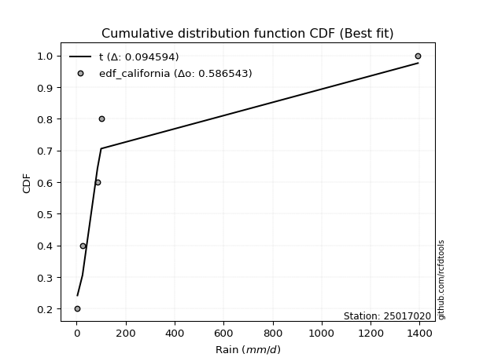</img>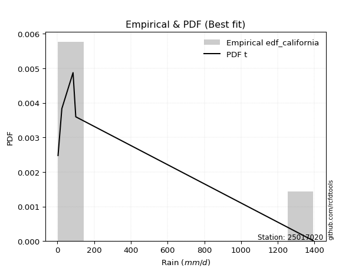</img>

</div>


### 2. EDF Hazen (1930)

Hazen method for plotting positions is a formula used to estimate the empirical cumulative probability distribution of flood events or other hydrological data. This formula often results in biased estimations, particularly when extrapolating to extreme events (high return periods).

<div align="center">


$P=(m-0.5)/n$


</div>


**2.1. Empirical values**

<div align="center">

|                | 0                  | 1                  | 2         | 3                 | 4                  |
|:---------------|:-------------------|:-------------------|:----------|:------------------|:-------------------|
| date           | 2019               | 2017               | 2024      | 2025              | 2018               |
| x              | 3.5                | 24.2               | 85.2      | 100.0             | 1393.0             |
| m              | 1                  | 2                  | 3         | 4                 | 5                  |
| empirical_dist | edf_hazen          | edf_hazen          | edf_hazen | edf_hazen         | edf_hazen          |
| empirical      | 0.1                | 0.3                | 0.5       | 0.7               | 0.9                |
| empirical_tr   | 1.1111111111111112 | 1.4285714285714286 | 2.0       | 3.333333333333333 | 10.000000000000002 |

</div>


**2.2. Kolmogorov-Smirnov fit test (sorted by Δ)**


<div align="center">

|                | 0                   | 1                   | 2                   | 3                   | 4                   | 5                   | 6                   | 7                   | 8                   | 9                  | 10                  | 11                  | 12                  | 13                  | 14                 | 15                 | 16                  | 17                  | 18                  | 19                  | 20                  | 21                 | 22                  | 23                  | 24                  | 25                  | 26                  | 27                  | 28                  | 29                  | 30                  | 31                  | 32                  | 33                  | 34                 | 35                  | 36                  | 37                 | 38                  | 39                  | 40                  | 41                  | 42                  | 43                  | 44                  | 45                  | 46                  | 47                  | 48                 | 49                  | 50                  | 51                  | 52                  | 53                  | 54                 | 55                 | 56                  | 57                  | 58                  | 59                  | 60                  | 61                 | 62                 | 63                  | 64                  | 65                  | 66                 | 67                  | 68                 | 69                 | 70                  | 71                  | 72                  | 73                  | 74                  | 75                  | 76                 | 77                  | 78                  | 79                  | 80                  | 81                  | 82                  | 83                 | 84                  | 85                  | 86                  | 87                  | 88                 | 89                  | 90                 | 91                  | 92                  | 93                 | 94                  | 95                  | 96                 | 97                 | 98                  | 99                 | 100                | 101                | 102                | 103                | 104                 | 105                 | 106                | 107                | 108                 | 109                | 110                 | 111                 | 112                 | 113                 | 114                | 115                | 116                 | 117                | 118                | 119                 | 120                 | 121                 | 122                | 123                 | 124                | 125                | 126                 | 127                 | 128                 | 129                | 130                | 131                 | 132                 | 133                | 134                 | 135                | 136                 | 137                 | 138                | 139                | 140                | 141                | 142                | 143                | 144                | 145                | 146                | 147                | 148                | 149                | 150                | 151                | 152                | 153                | 154                | 155                | 156                | 157                | 158                | 159                |
|:---------------|:--------------------|:--------------------|:--------------------|:--------------------|:--------------------|:--------------------|:--------------------|:--------------------|:--------------------|:-------------------|:--------------------|:--------------------|:--------------------|:--------------------|:-------------------|:-------------------|:--------------------|:--------------------|:--------------------|:--------------------|:--------------------|:-------------------|:--------------------|:--------------------|:--------------------|:--------------------|:--------------------|:--------------------|:--------------------|:--------------------|:--------------------|:--------------------|:--------------------|:--------------------|:-------------------|:--------------------|:--------------------|:-------------------|:--------------------|:--------------------|:--------------------|:--------------------|:--------------------|:--------------------|:--------------------|:--------------------|:--------------------|:--------------------|:-------------------|:--------------------|:--------------------|:--------------------|:--------------------|:--------------------|:-------------------|:-------------------|:--------------------|:--------------------|:--------------------|:--------------------|:--------------------|:-------------------|:-------------------|:--------------------|:--------------------|:--------------------|:-------------------|:--------------------|:-------------------|:-------------------|:--------------------|:--------------------|:--------------------|:--------------------|:--------------------|:--------------------|:-------------------|:--------------------|:--------------------|:--------------------|:--------------------|:--------------------|:--------------------|:-------------------|:--------------------|:--------------------|:--------------------|:--------------------|:-------------------|:--------------------|:-------------------|:--------------------|:--------------------|:-------------------|:--------------------|:--------------------|:-------------------|:-------------------|:--------------------|:-------------------|:-------------------|:-------------------|:-------------------|:-------------------|:--------------------|:--------------------|:-------------------|:-------------------|:--------------------|:-------------------|:--------------------|:--------------------|:--------------------|:--------------------|:-------------------|:-------------------|:--------------------|:-------------------|:-------------------|:--------------------|:--------------------|:--------------------|:-------------------|:--------------------|:-------------------|:-------------------|:--------------------|:--------------------|:--------------------|:-------------------|:-------------------|:--------------------|:--------------------|:-------------------|:--------------------|:-------------------|:--------------------|:--------------------|:-------------------|:-------------------|:-------------------|:-------------------|:-------------------|:-------------------|:-------------------|:-------------------|:-------------------|:-------------------|:-------------------|:-------------------|:-------------------|:-------------------|:-------------------|:-------------------|:-------------------|:-------------------|:-------------------|:-------------------|:-------------------|:-------------------|
| station        | 25017020            | 25017020            | 25017020            | 25017020            | 25017020            | 25017020            | 25017020            | 25017020            | 25017020            | 25017020           | 25017020            | 25017020            | 25017020            | 25017020            | 25017020           | 25017020           | 25017020            | 25017020            | 25017020            | 25017020            | 25017020            | 25017020           | 25017020            | 25017020            | 25017020            | 25017020            | 25017020            | 25017020            | 25017020            | 25017020            | 25017020            | 25017020            | 25017020            | 25017020            | 25017020           | 25017020            | 25017020            | 25017020           | 25017020            | 25017020            | 25017020            | 25017020            | 25017020            | 25017020            | 25017020            | 25017020            | 25017020            | 25017020            | 25017020           | 25017020            | 25017020            | 25017020            | 25017020            | 25017020            | 25017020           | 25017020           | 25017020            | 25017020            | 25017020            | 25017020            | 25017020            | 25017020           | 25017020           | 25017020            | 25017020            | 25017020            | 25017020           | 25017020            | 25017020           | 25017020           | 25017020            | 25017020            | 25017020            | 25017020            | 25017020            | 25017020            | 25017020           | 25017020            | 25017020            | 25017020            | 25017020            | 25017020            | 25017020            | 25017020           | 25017020            | 25017020            | 25017020            | 25017020            | 25017020           | 25017020            | 25017020           | 25017020            | 25017020            | 25017020           | 25017020            | 25017020            | 25017020           | 25017020           | 25017020            | 25017020           | 25017020           | 25017020           | 25017020           | 25017020           | 25017020            | 25017020            | 25017020           | 25017020           | 25017020            | 25017020           | 25017020            | 25017020            | 25017020            | 25017020            | 25017020           | 25017020           | 25017020            | 25017020           | 25017020           | 25017020            | 25017020            | 25017020            | 25017020           | 25017020            | 25017020           | 25017020           | 25017020            | 25017020            | 25017020            | 25017020           | 25017020           | 25017020            | 25017020            | 25017020           | 25017020            | 25017020           | 25017020            | 25017020            | 25017020           | 25017020           | 25017020           | 25017020           | 25017020           | 25017020           | 25017020           | 25017020           | 25017020           | 25017020           | 25017020           | 25017020           | 25017020           | 25017020           | 25017020           | 25017020           | 25017020           | 25017020           | 25017020           | 25017020           | 25017020           | 25017020           |
| empirical_dist | edf_hazen           | edf_hazen           | edf_hazen           | edf_hazen           | edf_hazen           | edf_hazen           | edf_hazen           | edf_hazen           | edf_hazen           | edf_hazen          | edf_hazen           | edf_hazen           | edf_hazen           | edf_hazen           | edf_hazen          | edf_hazen          | edf_hazen           | edf_hazen           | edf_hazen           | edf_hazen           | edf_hazen           | edf_hazen          | edf_hazen           | edf_hazen           | edf_hazen           | edf_hazen           | edf_hazen           | edf_hazen           | edf_hazen           | edf_hazen           | edf_hazen           | edf_hazen           | edf_hazen           | edf_hazen           | edf_hazen          | edf_hazen           | edf_hazen           | edf_hazen          | edf_hazen           | edf_hazen           | edf_hazen           | edf_hazen           | edf_hazen           | edf_hazen           | edf_hazen           | edf_hazen           | edf_hazen           | edf_hazen           | edf_hazen          | edf_hazen           | edf_hazen           | edf_hazen           | edf_hazen           | edf_hazen           | edf_hazen          | edf_hazen          | edf_hazen           | edf_hazen           | edf_hazen           | edf_hazen           | edf_hazen           | edf_hazen          | edf_hazen          | edf_hazen           | edf_hazen           | edf_hazen           | edf_hazen          | edf_hazen           | edf_hazen          | edf_hazen          | edf_hazen           | edf_hazen           | edf_hazen           | edf_hazen           | edf_hazen           | edf_hazen           | edf_hazen          | edf_hazen           | edf_hazen           | edf_hazen           | edf_hazen           | edf_hazen           | edf_hazen           | edf_hazen          | edf_hazen           | edf_hazen           | edf_hazen           | edf_hazen           | edf_hazen          | edf_hazen           | edf_hazen          | edf_hazen           | edf_hazen           | edf_hazen          | edf_hazen           | edf_hazen           | edf_hazen          | edf_hazen          | edf_hazen           | edf_hazen          | edf_hazen          | edf_hazen          | edf_hazen          | edf_hazen          | edf_hazen           | edf_hazen           | edf_hazen          | edf_hazen          | edf_hazen           | edf_hazen          | edf_hazen           | edf_hazen           | edf_hazen           | edf_hazen           | edf_hazen          | edf_hazen          | edf_hazen           | edf_hazen          | edf_hazen          | edf_hazen           | edf_hazen           | edf_hazen           | edf_hazen          | edf_hazen           | edf_hazen          | edf_hazen          | edf_hazen           | edf_hazen           | edf_hazen           | edf_hazen          | edf_hazen          | edf_hazen           | edf_hazen           | edf_hazen          | edf_hazen           | edf_hazen          | edf_hazen           | edf_hazen           | edf_hazen          | edf_hazen          | edf_hazen          | edf_hazen          | edf_hazen          | edf_hazen          | edf_hazen          | edf_hazen          | edf_hazen          | edf_hazen          | edf_hazen          | edf_hazen          | edf_hazen          | edf_hazen          | edf_hazen          | edf_hazen          | edf_hazen          | edf_hazen          | edf_hazen          | edf_hazen          | edf_hazen          | edf_hazen          |
| p_dist         | logalpha            | loghypsecant        | loggenlogistic      | loginvgamma         | logrice             | logf                | loginvgauss         | logmaxwell          | logfatiguelife      | ncf                | logjohnsonsu        | logskewnorm         | loggamma            | loggamma            | loglogistic        | logweibull_min     | logerlang           | logburr12           | loglaplace          | loglaplace          | logbetaprime        | logpearson3        | lograyleigh         | logfoldnorm         | logtruncpareto      | truncpareto         | lognct              | logexponnorm        | lognorm             | logcrystalball      | logt                | loggenextreme       | logncf              | logloggamma         | f                  | loginvweibull       | logcosine           | logvonmises_line   | loganglit           | logbradford         | logkappa4           | logkstwobign        | logtruncnorm        | mielke              | lomax               | logsemicircular     | loghalfnorm         | genpareto           | betaprime          | loggumbel_r         | invgamma            | logksone            | loggausshyper       | logdweibull         | invgauss           | loggompertz        | gamma               | logkappa3           | loguniform          | logtukeylambda      | logwrapcauchy       | t                  | loggenexpon        | loggennorm          | logarcsine          | logtruncexpon       | exponweib          | logburr             | loghalflogistic    | logmoyal           | logloglaplace       | burr                | erlang              | halfgennorm         | loggumbel_l         | nct                 | loglomax           | burr12              | logargus            | logdgamma           | logexponpow         | nakagami            | logwald             | gausshyper         | truncweibull_min    | loglevy_l           | logexponweib        | exponpow            | loghalfgennorm     | logbeta             | logmielke          | loggenpareto        | logtruncweibull_min | wrapcauchy         | vonmises_line       | wald                | gengamma           | foldnorm           | halflogistic        | pearson3           | halfnorm           | logjohnsonsb       | dweibull           | fatiguelife        | weibull_min         | arcsine             | loggenhalflogistic | moyal              | lognakagami         | gennorm            | levy_l              | loggengamma         | gumbel_r            | rayleigh            | maxwell            | genextreme         | semicircular        | anglit             | logtriang          | genlogistic         | norm                | powerlaw            | logistic           | hypsecant           | kstwobign          | logtrapezoid       | invweibull          | dgamma              | crystalball         | logrdist           | cosine             | rice                | gumbel_l            | laplace            | kappa3              | logweibull_max     | exponnorm           | genexpon            | gompertz           | alpha              | truncnorm          | argus              | ksone              | johnsonsb          | logpowerlaw        | bradford           | skewnorm           | truncexpon         | weibull_max        | kappa4             | genhalflogistic    | uniform            | triang             | rdist              | beta               | trapezoid          | johnsonsu          | tukeylambda        | logvonmises        | vonmises           |
| delta          | 0.08469374373290883 | 0.08521338760140618 | 0.08672845740948931 | 0.08694900813845541 | 0.08766178127591073 | 0.08873805702863691 | 0.09024595117427903 | 0.09041447747000408 | 0.09126282641283423 | 0.0924379850014645 | 0.09311121391726163 | 0.09344745167318724 | 0.09377250148130312 | 0.09377250148130312 | 0.0951465209821285 | 0.0956264516055152 | 0.09575692048912166 | 0.09578385431868541 | 0.09722397525984716 | 0.09722397525984716 | 0.09834215300030658 | 0.0996809133517077 | 0.09986628468840753 | 0.10550533501040427 | 0.10588556164664187 | 0.10614280014989574 | 0.10670579341143704 | 0.10676470954291539 | 0.10721418228811408 | 0.10721429807805183 | 0.10721476465307223 | 0.10850542880510594 | 0.10898507845658345 | 0.10937637168879477 | 0.1100243719059848 | 0.11531162386857319 | 0.11825200326473861 | 0.1189485374822346 | 0.12010970513330343 | 0.12012427209057575 | 0.12166200543954864 | 0.12169620830595917 | 0.12221441797675614 | 0.12250750153860257 | 0.12282880808928742 | 0.12545910658047055 | 0.12656122616733012 | 0.12656519948426526 | 0.1287444221276638 | 0.13034879099393726 | 0.13043185782792333 | 0.13224302815703282 | 0.13425502248103482 | 0.13458082036381513 | 0.1360073862834803 | 0.1361850837332088 | 0.13705552697656143 | 0.13947485766724044 | 0.14000098647187953 | 0.14101700085744961 | 0.14283864753654896 | 0.1430211788771385 | 0.1462775148140143 | 0.14657464669921916 | 0.14692452621519236 | 0.14714097465990783 | 0.1472405198847092 | 0.15336251278259683 | 0.1541776779483588 | 0.1548135364389508 | 0.15992522446802782 | 0.16261245133229396 | 0.16740008511827664 | 0.16774245037437852 | 0.16828563683951636 | 0.17173729064091486 | 0.1822823243498291 | 0.18741064235450922 | 0.18804189184722486 | 0.18982913274641508 | 0.19275395239690168 | 0.19817482184927593 | 0.22270869160537066 | 0.2272347735458501 | 0.23220006394156878 | 0.23722635087036137 | 0.23736119365905933 | 0.23770454978304256 | 0.2422433150311854 | 0.24369234596873007 | 0.2458060718972831 | 0.24645220240098925 | 0.25690939701646415 | 0.2571940972789508 | 0.26203743807814717 | 0.26255315044857963 | 0.2744703896634041 | 0.2760647434498568 | 0.27618942420716797 | 0.2821081447925535 | 0.282554707831482  | 0.2895067791978717 | 0.2902118124172498 | 0.2924639870275954 | 0.29335064828907575 | 0.29404628490044765 | 0.2955306896377462 | 0.2974671053157567 | 0.29999983193164054 | 0.3010718469528595 | 0.30524291164314843 | 0.30824214509436115 | 0.31407140704750575 | 0.31651358436027166 | 0.3284460375925226 | 0.3294390881783519 | 0.33014286682914284 | 0.3389096540715226 | 0.3391203385823112 | 0.34624178068037753 | 0.35975113191525065 | 0.36884759363105396 | 0.3785014517991874 | 0.39287526121995564 | 0.3962421285557273 | 0.3975009042652137 | 0.39961287690958913 | 0.40000000000105285 | 0.40247101764565496 | 0.4093048765699333 | 0.416457284966344  | 0.41673756560603586 | 0.41813676498994784 | 0.4207080767689313 | 0.43200691416956205 | 0.434765407961593  | 0.43711358583095483 | 0.43803427558515773 | 0.4380854260714455 | 0.4477608058467894 | 0.4555233520341127 | 0.4695456120094187 | 0.5587921314621567 | 0.5680856119026316 | 0.5687840351203628 | 0.5711014558243951 | 0.5771271857957072 | 0.5974490752843682 | 0.6065430242847724 | 0.6144747596968205 | 0.6190950553041172 | 0.6305505577545879 | 0.6327911270478285 | 0.6556719622766204 | 0.6676412019659594 | 0.6788967487244619 | 0.6889641032148404 | 0.6988496881340908 | 1.163778818090715  | 221.5706767835245  |
| deltao         | 0.5865427407550001  | 0.5865427407550001  | 0.5865427407550001  | 0.5865427407550001  | 0.5865427407550001  | 0.5865427407550001  | 0.5865427407550001  | 0.5865427407550001  | 0.5865427407550001  | 0.5865427407550001 | 0.5865427407550001  | 0.5865427407550001  | 0.5865427407550001  | 0.5865427407550001  | 0.5865427407550001 | 0.5865427407550001 | 0.5865427407550001  | 0.5865427407550001  | 0.5865427407550001  | 0.5865427407550001  | 0.5865427407550001  | 0.5865427407550001 | 0.5865427407550001  | 0.5865427407550001  | 0.5865427407550001  | 0.5865427407550001  | 0.5865427407550001  | 0.5865427407550001  | 0.5865427407550001  | 0.5865427407550001  | 0.5865427407550001  | 0.5865427407550001  | 0.5865427407550001  | 0.5865427407550001  | 0.5865427407550001 | 0.5865427407550001  | 0.5865427407550001  | 0.5865427407550001 | 0.5865427407550001  | 0.5865427407550001  | 0.5865427407550001  | 0.5865427407550001  | 0.5865427407550001  | 0.5865427407550001  | 0.5865427407550001  | 0.5865427407550001  | 0.5865427407550001  | 0.5865427407550001  | 0.5865427407550001 | 0.5865427407550001  | 0.5865427407550001  | 0.5865427407550001  | 0.5865427407550001  | 0.5865427407550001  | 0.5865427407550001 | 0.5865427407550001 | 0.5865427407550001  | 0.5865427407550001  | 0.5865427407550001  | 0.5865427407550001  | 0.5865427407550001  | 0.5865427407550001 | 0.5865427407550001 | 0.5865427407550001  | 0.5865427407550001  | 0.5865427407550001  | 0.5865427407550001 | 0.5865427407550001  | 0.5865427407550001 | 0.5865427407550001 | 0.5865427407550001  | 0.5865427407550001  | 0.5865427407550001  | 0.5865427407550001  | 0.5865427407550001  | 0.5865427407550001  | 0.5865427407550001 | 0.5865427407550001  | 0.5865427407550001  | 0.5865427407550001  | 0.5865427407550001  | 0.5865427407550001  | 0.5865427407550001  | 0.5865427407550001 | 0.5865427407550001  | 0.5865427407550001  | 0.5865427407550001  | 0.5865427407550001  | 0.5865427407550001 | 0.5865427407550001  | 0.5865427407550001 | 0.5865427407550001  | 0.5865427407550001  | 0.5865427407550001 | 0.5865427407550001  | 0.5865427407550001  | 0.5865427407550001 | 0.5865427407550001 | 0.5865427407550001  | 0.5865427407550001 | 0.5865427407550001 | 0.5865427407550001 | 0.5865427407550001 | 0.5865427407550001 | 0.5865427407550001  | 0.5865427407550001  | 0.5865427407550001 | 0.5865427407550001 | 0.5865427407550001  | 0.5865427407550001 | 0.5865427407550001  | 0.5865427407550001  | 0.5865427407550001  | 0.5865427407550001  | 0.5865427407550001 | 0.5865427407550001 | 0.5865427407550001  | 0.5865427407550001 | 0.5865427407550001 | 0.5865427407550001  | 0.5865427407550001  | 0.5865427407550001  | 0.5865427407550001 | 0.5865427407550001  | 0.5865427407550001 | 0.5865427407550001 | 0.5865427407550001  | 0.5865427407550001  | 0.5865427407550001  | 0.5865427407550001 | 0.5865427407550001 | 0.5865427407550001  | 0.5865427407550001  | 0.5865427407550001 | 0.5865427407550001  | 0.5865427407550001 | 0.5865427407550001  | 0.5865427407550001  | 0.5865427407550001 | 0.5865427407550001 | 0.5865427407550001 | 0.5865427407550001 | 0.5865427407550001 | 0.5865427407550001 | 0.5865427407550001 | 0.5865427407550001 | 0.5865427407550001 | 0.5865427407550001 | 0.5865427407550001 | 0.5865427407550001 | 0.5865427407550001 | 0.5865427407550001 | 0.5865427407550001 | 0.5865427407550001 | 0.5865427407550001 | 0.5865427407550001 | 0.5865427407550001 | 0.5865427407550001 | 0.5865427407550001 | 0.5865427407550001 |
| eval           | Δo > Δ              | Δo > Δ              | Δo > Δ              | Δo > Δ              | Δo > Δ              | Δo > Δ              | Δo > Δ              | Δo > Δ              | Δo > Δ              | Δo > Δ             | Δo > Δ              | Δo > Δ              | Δo > Δ              | Δo > Δ              | Δo > Δ             | Δo > Δ             | Δo > Δ              | Δo > Δ              | Δo > Δ              | Δo > Δ              | Δo > Δ              | Δo > Δ             | Δo > Δ              | Δo > Δ              | Δo > Δ              | Δo > Δ              | Δo > Δ              | Δo > Δ              | Δo > Δ              | Δo > Δ              | Δo > Δ              | Δo > Δ              | Δo > Δ              | Δo > Δ              | Δo > Δ             | Δo > Δ              | Δo > Δ              | Δo > Δ             | Δo > Δ              | Δo > Δ              | Δo > Δ              | Δo > Δ              | Δo > Δ              | Δo > Δ              | Δo > Δ              | Δo > Δ              | Δo > Δ              | Δo > Δ              | Δo > Δ             | Δo > Δ              | Δo > Δ              | Δo > Δ              | Δo > Δ              | Δo > Δ              | Δo > Δ             | Δo > Δ             | Δo > Δ              | Δo > Δ              | Δo > Δ              | Δo > Δ              | Δo > Δ              | Δo > Δ             | Δo > Δ             | Δo > Δ              | Δo > Δ              | Δo > Δ              | Δo > Δ             | Δo > Δ              | Δo > Δ             | Δo > Δ             | Δo > Δ              | Δo > Δ              | Δo > Δ              | Δo > Δ              | Δo > Δ              | Δo > Δ              | Δo > Δ             | Δo > Δ              | Δo > Δ              | Δo > Δ              | Δo > Δ              | Δo > Δ              | Δo > Δ              | Δo > Δ             | Δo > Δ              | Δo > Δ              | Δo > Δ              | Δo > Δ              | Δo > Δ             | Δo > Δ              | Δo > Δ             | Δo > Δ              | Δo > Δ              | Δo > Δ             | Δo > Δ              | Δo > Δ              | Δo > Δ             | Δo > Δ             | Δo > Δ              | Δo > Δ             | Δo > Δ             | Δo > Δ             | Δo > Δ             | Δo > Δ             | Δo > Δ              | Δo > Δ              | Δo > Δ             | Δo > Δ             | Δo > Δ              | Δo > Δ             | Δo > Δ              | Δo > Δ              | Δo > Δ              | Δo > Δ              | Δo > Δ             | Δo > Δ             | Δo > Δ              | Δo > Δ             | Δo > Δ             | Δo > Δ              | Δo > Δ              | Δo > Δ              | Δo > Δ             | Δo > Δ              | Δo > Δ             | Δo > Δ             | Δo > Δ              | Δo > Δ              | Δo > Δ              | Δo > Δ             | Δo > Δ             | Δo > Δ              | Δo > Δ              | Δo > Δ             | Δo > Δ              | Δo > Δ             | Δo > Δ              | Δo > Δ              | Δo > Δ             | Δo > Δ             | Δo > Δ             | Δo > Δ             | Δo > Δ             | Δo > Δ             | Δo > Δ             | Δo > Δ             | Δo > Δ             | Δo <= Δ            | Δo <= Δ            | Δo <= Δ            | Δo <= Δ            | Δo <= Δ            | Δo <= Δ            | Δo <= Δ            | Δo <= Δ            | Δo <= Δ            | Δo <= Δ            | Δo <= Δ            | Δo <= Δ            | Δo <= Δ            |
| fit            | 1                   | 1                   | 1                   | 1                   | 1                   | 1                   | 1                   | 1                   | 1                   | 1                  | 1                   | 1                   | 1                   | 1                   | 1                  | 1                  | 1                   | 1                   | 1                   | 1                   | 1                   | 1                  | 1                   | 1                   | 1                   | 1                   | 1                   | 1                   | 1                   | 1                   | 1                   | 1                   | 1                   | 1                   | 1                  | 1                   | 1                   | 1                  | 1                   | 1                   | 1                   | 1                   | 1                   | 1                   | 1                   | 1                   | 1                   | 1                   | 1                  | 1                   | 1                   | 1                   | 1                   | 1                   | 1                  | 1                  | 1                   | 1                   | 1                   | 1                   | 1                   | 1                  | 1                  | 1                   | 1                   | 1                   | 1                  | 1                   | 1                  | 1                  | 1                   | 1                   | 1                   | 1                   | 1                   | 1                   | 1                  | 1                   | 1                   | 1                   | 1                   | 1                   | 1                   | 1                  | 1                   | 1                   | 1                   | 1                   | 1                  | 1                   | 1                  | 1                   | 1                   | 1                  | 1                   | 1                   | 1                  | 1                  | 1                   | 1                  | 1                  | 1                  | 1                  | 1                  | 1                   | 1                   | 1                  | 1                  | 1                   | 1                  | 1                   | 1                   | 1                   | 1                   | 1                  | 1                  | 1                   | 1                  | 1                  | 1                   | 1                   | 1                   | 1                  | 1                   | 1                  | 1                  | 1                   | 1                   | 1                   | 1                  | 1                  | 1                   | 1                   | 1                  | 1                   | 1                  | 1                   | 1                   | 1                  | 1                  | 1                  | 1                  | 1                  | 1                  | 1                  | 1                  | 1                  | 0                  | 0                  | 0                  | 0                  | 0                  | 0                  | 0                  | 0                  | 0                  | 0                  | 0                  | 0                  | 0                  |
| n              | 5                   | 5                   | 5                   | 5                   | 5                   | 5                   | 5                   | 5                   | 5                   | 5                  | 5                   | 5                   | 5                   | 5                   | 5                  | 5                  | 5                   | 5                   | 5                   | 5                   | 5                   | 5                  | 5                   | 5                   | 5                   | 5                   | 5                   | 5                   | 5                   | 5                   | 5                   | 5                   | 5                   | 5                   | 5                  | 5                   | 5                   | 5                  | 5                   | 5                   | 5                   | 5                   | 5                   | 5                   | 5                   | 5                   | 5                   | 5                   | 5                  | 5                   | 5                   | 5                   | 5                   | 5                   | 5                  | 5                  | 5                   | 5                   | 5                   | 5                   | 5                   | 5                  | 5                  | 5                   | 5                   | 5                   | 5                  | 5                   | 5                  | 5                  | 5                   | 5                   | 5                   | 5                   | 5                   | 5                   | 5                  | 5                   | 5                   | 5                   | 5                   | 5                   | 5                   | 5                  | 5                   | 5                   | 5                   | 5                   | 5                  | 5                   | 5                  | 5                   | 5                   | 5                  | 5                   | 5                   | 5                  | 5                  | 5                   | 5                  | 5                  | 5                  | 5                  | 5                  | 5                   | 5                   | 5                  | 5                  | 5                   | 5                  | 5                   | 5                   | 5                   | 5                   | 5                  | 5                  | 5                   | 5                  | 5                  | 5                   | 5                   | 5                   | 5                  | 5                   | 5                  | 5                  | 5                   | 5                   | 5                   | 5                  | 5                  | 5                   | 5                   | 5                  | 5                   | 5                  | 5                   | 5                   | 5                  | 5                  | 5                  | 5                  | 5                  | 5                  | 5                  | 5                  | 5                  | 5                  | 5                  | 5                  | 5                  | 5                  | 5                  | 5                  | 5                  | 5                  | 5                  | 5                  | 5                  | 5                  |
| best_fit       | 1                   | 0                   | 0                   | 0                   | 0                   | 0                   | 0                   | 0                   | 0                   | 0                  | 0                   | 0                   | 0                   | 0                   | 0                  | 0                  | 0                   | 0                   | 0                   | 0                   | 0                   | 0                  | 0                   | 0                   | 0                   | 0                   | 0                   | 0                   | 0                   | 0                   | 0                   | 0                   | 0                   | 0                   | 0                  | 0                   | 0                   | 0                  | 0                   | 0                   | 0                   | 0                   | 0                   | 0                   | 0                   | 0                   | 0                   | 0                   | 0                  | 0                   | 0                   | 0                   | 0                   | 0                   | 0                  | 0                  | 0                   | 0                   | 0                   | 0                   | 0                   | 0                  | 0                  | 0                   | 0                   | 0                   | 0                  | 0                   | 0                  | 0                  | 0                   | 0                   | 0                   | 0                   | 0                   | 0                   | 0                  | 0                   | 0                   | 0                   | 0                   | 0                   | 0                   | 0                  | 0                   | 0                   | 0                   | 0                   | 0                  | 0                   | 0                  | 0                   | 0                   | 0                  | 0                   | 0                   | 0                  | 0                  | 0                   | 0                  | 0                  | 0                  | 0                  | 0                  | 0                   | 0                   | 0                  | 0                  | 0                   | 0                  | 0                   | 0                   | 0                   | 0                   | 0                  | 0                  | 0                   | 0                  | 0                  | 0                   | 0                   | 0                   | 0                  | 0                   | 0                  | 0                  | 0                   | 0                   | 0                   | 0                  | 0                  | 0                   | 0                   | 0                  | 0                   | 0                  | 0                   | 0                   | 0                  | 0                  | 0                  | 0                  | 0                  | 0                  | 0                  | 0                  | 0                  | 0                  | 0                  | 0                  | 0                  | 0                  | 0                  | 0                  | 0                  | 0                  | 0                  | 0                  | 0                  | 0                  |
| best_fit_sort  | 1                   | 2                   | 3                   | 4                   | 5                   | 6                   | 7                   | 8                   | 9                   | 10                 | 11                  | 12                  | 13                  | 14                  | 15                 | 16                 | 17                  | 18                  | 19                  | 20                  | 21                  | 22                 | 23                  | 24                  | 25                  | 26                  | 27                  | 28                  | 29                  | 30                  | 31                  | 32                  | 33                  | 34                  | 35                 | 36                  | 37                  | 38                 | 39                  | 40                  | 41                  | 42                  | 43                  | 44                  | 45                  | 46                  | 47                  | 48                  | 49                 | 50                  | 51                  | 52                  | 53                  | 54                  | 55                 | 56                 | 57                  | 58                  | 59                  | 60                  | 61                  | 62                 | 63                 | 64                  | 65                  | 66                  | 67                 | 68                  | 69                 | 70                 | 71                  | 72                  | 73                  | 74                  | 75                  | 76                  | 77                 | 78                  | 79                  | 80                  | 81                  | 82                  | 83                  | 84                 | 85                  | 86                  | 87                  | 88                  | 89                 | 90                  | 91                 | 92                  | 93                  | 94                 | 95                  | 96                  | 97                 | 98                 | 99                  | 100                | 101                | 102                | 103                | 104                | 105                 | 106                 | 107                | 108                | 109                 | 110                | 111                 | 112                 | 113                 | 114                 | 115                | 116                | 117                 | 118                | 119                | 120                 | 121                 | 122                 | 123                | 124                 | 125                | 126                | 127                 | 128                 | 129                 | 130                | 131                | 132                 | 133                 | 134                | 135                 | 136                | 137                 | 138                 | 139                | 140                | 141                | 142                | 143                | 144                | 145                | 146                | 147                | 148                | 149                | 150                | 151                | 152                | 153                | 154                | 155                | 156                | 157                | 158                | 159                | 160                |

</div>


**2.3. Best fit**

<div align="center">

|   id |   station | empirical_dist   | p_dist   |     delta |   deltao | eval   |   fit |   n |   best_fit |   best_fit_sort |
|-----:|----------:|:-----------------|:---------|----------:|---------:|:-------|------:|----:|-----------:|----------------:|
|    0 |  25017020 | edf_hazen        | logalpha | 0.0846937 | 0.586543 | Δo > Δ |     1 |   5 |          1 |               1 |

</div>


<div align="center">

</img>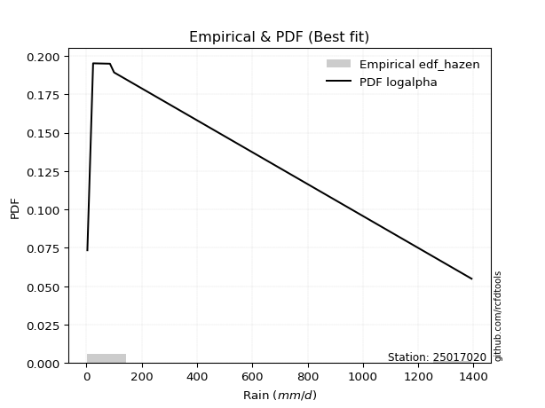</img>

</div>


### 3. EDF Weibull (1939)

Weibull plotting position formula is an empirical method used to estimate the non-exceedance probability or plotting position for a set of observed data, is often recommended or widely used in practice, particularly in flood frequency analysis.

<div align="center">


$P=m/(n+1)$


</div>


**3.1. Empirical values**

<div align="center">

|                | 0                   | 1                  | 2           | 3                  | 4                  |
|:---------------|:--------------------|:-------------------|:------------|:-------------------|:-------------------|
| date           | 2019                | 2017               | 2024        | 2025               | 2018               |
| x              | 3.5                 | 24.2               | 85.2        | 100.0              | 1393.0             |
| m              | 1                   | 2                  | 3           | 4                  | 5                  |
| empirical_dist | edf_weibull         | edf_weibull        | edf_weibull | edf_weibull        | edf_weibull        |
| empirical      | 0.16666666666666666 | 0.3333333333333333 | 0.5         | 0.6666666666666666 | 0.8333333333333334 |
| empirical_tr   | 1.2                 | 1.4999999999999998 | 2.0         | 2.9999999999999996 | 6.000000000000002  |

</div>


**3.2. Kolmogorov-Smirnov fit test (sorted by Δ)**


<div align="center">

|                | 0                   | 1                  | 2                   | 3                   | 4                   | 5                  | 6                   | 7                   | 8                   | 9                   | 10                  | 11                  | 12                  | 13                  | 14                  | 15                  | 16                 | 17                  | 18                  | 19                  | 20                  | 21                  | 22                  | 23                  | 24                  | 25                  | 26                  | 27                  | 28                  | 29                  | 30                  | 31                  | 32                  | 33                  | 34                  | 35                  | 36                  | 37                  | 38                  | 39                  | 40                 | 41                 | 42                  | 43                 | 44                 | 45                  | 46                  | 47                 | 48                  | 49                 | 50                  | 51                  | 52                  | 53                  | 54                  | 55                  | 56                  | 57                  | 58                  | 59                  | 60                 | 61                  | 62                  | 63                  | 64                  | 65                 | 66                 | 67                  | 68                  | 69                 | 70                 | 71                  | 72                 | 73                  | 74                 | 75                  | 76                  | 77                  | 78                  | 79                  | 80                  | 81                  | 82                  | 83                  | 84                  | 85                  | 86                  | 87                  | 88                  | 89                  | 90                 | 91                  | 92                 | 93                  | 94                 | 95                  | 96                  | 97                 | 98                  | 99                 | 100                 | 101                | 102                 | 103                | 104                | 105                 | 106                | 107                | 108                 | 109                | 110                 | 111                | 112                 | 113                | 114                | 115                | 116                | 117                | 118                | 119                 | 120                | 121                 | 122                | 123                 | 124                | 125                | 126                | 127                | 128                 | 129                | 130                 | 131                 | 132                | 133                 | 134                | 135                | 136                | 137                | 138                | 139                | 140                | 141                 | 142                | 143                | 144                | 145                | 146                | 147                | 148                | 149                | 150                | 151                | 152                | 153                | 154                | 155                | 156                | 157                | 158                | 159                |
|:---------------|:--------------------|:-------------------|:--------------------|:--------------------|:--------------------|:-------------------|:--------------------|:--------------------|:--------------------|:--------------------|:--------------------|:--------------------|:--------------------|:--------------------|:--------------------|:--------------------|:-------------------|:--------------------|:--------------------|:--------------------|:--------------------|:--------------------|:--------------------|:--------------------|:--------------------|:--------------------|:--------------------|:--------------------|:--------------------|:--------------------|:--------------------|:--------------------|:--------------------|:--------------------|:--------------------|:--------------------|:--------------------|:--------------------|:--------------------|:--------------------|:-------------------|:-------------------|:--------------------|:-------------------|:-------------------|:--------------------|:--------------------|:-------------------|:--------------------|:-------------------|:--------------------|:--------------------|:--------------------|:--------------------|:--------------------|:--------------------|:--------------------|:--------------------|:--------------------|:--------------------|:-------------------|:--------------------|:--------------------|:--------------------|:--------------------|:-------------------|:-------------------|:--------------------|:--------------------|:-------------------|:-------------------|:--------------------|:-------------------|:--------------------|:-------------------|:--------------------|:--------------------|:--------------------|:--------------------|:--------------------|:--------------------|:--------------------|:--------------------|:--------------------|:--------------------|:--------------------|:--------------------|:--------------------|:--------------------|:--------------------|:-------------------|:--------------------|:-------------------|:--------------------|:-------------------|:--------------------|:--------------------|:-------------------|:--------------------|:-------------------|:--------------------|:-------------------|:--------------------|:-------------------|:-------------------|:--------------------|:-------------------|:-------------------|:--------------------|:-------------------|:--------------------|:-------------------|:--------------------|:-------------------|:-------------------|:-------------------|:-------------------|:-------------------|:-------------------|:--------------------|:-------------------|:--------------------|:-------------------|:--------------------|:-------------------|:-------------------|:-------------------|:-------------------|:--------------------|:-------------------|:--------------------|:--------------------|:-------------------|:--------------------|:-------------------|:-------------------|:-------------------|:-------------------|:-------------------|:-------------------|:-------------------|:--------------------|:-------------------|:-------------------|:-------------------|:-------------------|:-------------------|:-------------------|:-------------------|:-------------------|:-------------------|:-------------------|:-------------------|:-------------------|:-------------------|:-------------------|:-------------------|:-------------------|:-------------------|:-------------------|
| station        | 25017020            | 25017020           | 25017020            | 25017020            | 25017020            | 25017020           | 25017020            | 25017020            | 25017020            | 25017020            | 25017020            | 25017020            | 25017020            | 25017020            | 25017020            | 25017020            | 25017020           | 25017020            | 25017020            | 25017020            | 25017020            | 25017020            | 25017020            | 25017020            | 25017020            | 25017020            | 25017020            | 25017020            | 25017020            | 25017020            | 25017020            | 25017020            | 25017020            | 25017020            | 25017020            | 25017020            | 25017020            | 25017020            | 25017020            | 25017020            | 25017020           | 25017020           | 25017020            | 25017020           | 25017020           | 25017020            | 25017020            | 25017020           | 25017020            | 25017020           | 25017020            | 25017020            | 25017020            | 25017020            | 25017020            | 25017020            | 25017020            | 25017020            | 25017020            | 25017020            | 25017020           | 25017020            | 25017020            | 25017020            | 25017020            | 25017020           | 25017020           | 25017020            | 25017020            | 25017020           | 25017020           | 25017020            | 25017020           | 25017020            | 25017020           | 25017020            | 25017020            | 25017020            | 25017020            | 25017020            | 25017020            | 25017020            | 25017020            | 25017020            | 25017020            | 25017020            | 25017020            | 25017020            | 25017020            | 25017020            | 25017020           | 25017020            | 25017020           | 25017020            | 25017020           | 25017020            | 25017020            | 25017020           | 25017020            | 25017020           | 25017020            | 25017020           | 25017020            | 25017020           | 25017020           | 25017020            | 25017020           | 25017020           | 25017020            | 25017020           | 25017020            | 25017020           | 25017020            | 25017020           | 25017020           | 25017020           | 25017020           | 25017020           | 25017020           | 25017020            | 25017020           | 25017020            | 25017020           | 25017020            | 25017020           | 25017020           | 25017020           | 25017020           | 25017020            | 25017020           | 25017020            | 25017020            | 25017020           | 25017020            | 25017020           | 25017020           | 25017020           | 25017020           | 25017020           | 25017020           | 25017020           | 25017020            | 25017020           | 25017020           | 25017020           | 25017020           | 25017020           | 25017020           | 25017020           | 25017020           | 25017020           | 25017020           | 25017020           | 25017020           | 25017020           | 25017020           | 25017020           | 25017020           | 25017020           | 25017020           |
| empirical_dist | edf_weibull         | edf_weibull        | edf_weibull         | edf_weibull         | edf_weibull         | edf_weibull        | edf_weibull         | edf_weibull         | edf_weibull         | edf_weibull         | edf_weibull         | edf_weibull         | edf_weibull         | edf_weibull         | edf_weibull         | edf_weibull         | edf_weibull        | edf_weibull         | edf_weibull         | edf_weibull         | edf_weibull         | edf_weibull         | edf_weibull         | edf_weibull         | edf_weibull         | edf_weibull         | edf_weibull         | edf_weibull         | edf_weibull         | edf_weibull         | edf_weibull         | edf_weibull         | edf_weibull         | edf_weibull         | edf_weibull         | edf_weibull         | edf_weibull         | edf_weibull         | edf_weibull         | edf_weibull         | edf_weibull        | edf_weibull        | edf_weibull         | edf_weibull        | edf_weibull        | edf_weibull         | edf_weibull         | edf_weibull        | edf_weibull         | edf_weibull        | edf_weibull         | edf_weibull         | edf_weibull         | edf_weibull         | edf_weibull         | edf_weibull         | edf_weibull         | edf_weibull         | edf_weibull         | edf_weibull         | edf_weibull        | edf_weibull         | edf_weibull         | edf_weibull         | edf_weibull         | edf_weibull        | edf_weibull        | edf_weibull         | edf_weibull         | edf_weibull        | edf_weibull        | edf_weibull         | edf_weibull        | edf_weibull         | edf_weibull        | edf_weibull         | edf_weibull         | edf_weibull         | edf_weibull         | edf_weibull         | edf_weibull         | edf_weibull         | edf_weibull         | edf_weibull         | edf_weibull         | edf_weibull         | edf_weibull         | edf_weibull         | edf_weibull         | edf_weibull         | edf_weibull        | edf_weibull         | edf_weibull        | edf_weibull         | edf_weibull        | edf_weibull         | edf_weibull         | edf_weibull        | edf_weibull         | edf_weibull        | edf_weibull         | edf_weibull        | edf_weibull         | edf_weibull        | edf_weibull        | edf_weibull         | edf_weibull        | edf_weibull        | edf_weibull         | edf_weibull        | edf_weibull         | edf_weibull        | edf_weibull         | edf_weibull        | edf_weibull        | edf_weibull        | edf_weibull        | edf_weibull        | edf_weibull        | edf_weibull         | edf_weibull        | edf_weibull         | edf_weibull        | edf_weibull         | edf_weibull        | edf_weibull        | edf_weibull        | edf_weibull        | edf_weibull         | edf_weibull        | edf_weibull         | edf_weibull         | edf_weibull        | edf_weibull         | edf_weibull        | edf_weibull        | edf_weibull        | edf_weibull        | edf_weibull        | edf_weibull        | edf_weibull        | edf_weibull         | edf_weibull        | edf_weibull        | edf_weibull        | edf_weibull        | edf_weibull        | edf_weibull        | edf_weibull        | edf_weibull        | edf_weibull        | edf_weibull        | edf_weibull        | edf_weibull        | edf_weibull        | edf_weibull        | edf_weibull        | edf_weibull        | edf_weibull        | edf_weibull        |
| p_dist         | ncf                 | logjohnsonsu       | logskewnorm         | loggenlogistic      | logfatiguelife      | logerlang          | loggamma            | loggamma            | logalpha            | logf                | loginvgamma         | logpearson3         | logfoldnorm         | loganglit           | loginvgauss         | logloggamma         | logexponnorm       | lognct              | logcrystalball      | lognorm             | logt                | logsemicircular     | logbetaprime        | loglogistic         | loglaplace          | loglaplace          | loghypsecant        | logdweibull         | loggenextreme       | logmaxwell          | loginvweibull       | logcosine           | logncf              | logrice             | logweibull_min      | logburr12           | logkstwobign        | logksone            | lograyleigh         | invgamma            | mielke             | invgauss           | logloglaplace       | loggumbel_r        | t                  | loggumbel_l         | logargus            | logkappa3          | logmoyal            | nct                | burr                | genpareto           | loggenexpon         | nakagami            | f                   | logwrapcauchy       | logtruncexpon       | logvonmises_line    | betaprime           | logbradford         | gamma              | loggompertz         | erlang              | burr12              | loglomax            | logtruncnorm       | exponweib          | logexponpow         | loggausshyper       | halfgennorm        | truncpareto        | lomax               | logburr            | logtukeylambda      | logkappa4          | loguniform          | loghalflogistic     | loghalfnorm         | logtruncpareto      | logarcsine          | loggennorm          | gausshyper          | truncweibull_min    | loglevy_l           | exponpow            | loghalfgennorm      | logbeta             | loggenpareto        | logwald             | logexponweib        | logdgamma          | dweibull            | wrapcauchy         | vonmises_line       | wald               | logtruncweibull_min | gengamma            | foldnorm           | halflogistic        | logmielke          | pearson3            | levy_l             | halfnorm            | logjohnsonsb       | fatiguelife        | weibull_min         | arcsine            | loggenhalflogistic | genextreme          | moyal              | loggengamma         | gumbel_r           | rayleigh            | maxwell            | semicircular       | gennorm            | anglit             | logtriang          | genlogistic        | norm                | invweibull         | lognakagami         | dgamma             | powerlaw            | crystalball        | logistic           | hypsecant          | kstwobign          | logtrapezoid        | kappa3             | cosine              | rice                | gumbel_l           | laplace             | logweibull_max     | exponnorm          | genexpon           | gompertz           | logrdist           | truncnorm          | alpha              | argus               | ksone              | johnsonsb          | logpowerlaw        | bradford           | skewnorm           | truncexpon         | weibull_max        | kappa4             | genhalflogistic    | rdist              | uniform            | triang             | beta               | tukeylambda        | trapezoid          | johnsonsu          | logvonmises        | vonmises           |
| delta          | 0.10109006708284651 | 0.1036199312175431 | 0.10440230534653949 | 0.10441694142514911 | 0.10455104664529802 | 0.1048221313553902 | 0.10516461012776857 | 0.10516461012776857 | 0.10559482312198121 | 0.10593925961196418 | 0.10609090428147402 | 0.10634090807573149 | 0.10687893558769102 | 0.10773988302154547 | 0.10815826041686338 | 0.10874968842830557 | 0.1094690442630708 | 0.10947907582555183 | 0.10964761623772401 | 0.10964770627846054 | 0.10964771246018579 | 0.11081972960852016 | 0.11222004920676365 | 0.11282433278556736 | 0.11316435803247982 | 0.11316435803247982 | 0.11360145321947168 | 0.11450189459875829 | 0.11487964516998195 | 0.11491404940387767 | 0.11581312665499152 | 0.11617284951106177 | 0.11820176197004242 | 0.12081405207919729 | 0.12095888446577216 | 0.12096373970012728 | 0.12169620830595917 | 0.12286030862718444 | 0.12683251809652496 | 0.13043185782792333 | 0.1332338538727254 | 0.1360073862834803 | 0.14123324969689852 | 0.1428324369856174 | 0.1430211788771385 | 0.15256421411518095 | 0.15470855851389154 | 0.1549070621943639 | 0.16043651866377584 | 0.1619697977515584 | 0.16261245133229396 | 0.16590280717022765 | 0.16657738846565445 | 0.16662869029853966 | 0.16664315873679011 | 0.16666399086004377 | 0.16666595014750807 | 0.16666617730784505 | 0.16666625916382102 | 0.16666651416706735 | 0.1666665716545612 | 0.16666662291322087 | 0.16666664910408294 | 0.16666665613163578 | 0.16666665657506186 | 0.1666666646032923 | 0.1666666663917283 | 0.16666666660363186 | 0.16666666666635643 | 0.1666666666664999 | 0.1666666666665102 | 0.16666666666655494 | 0.1666666666665939 | 0.16666666666665952 | 0.1666666666666649 | 0.16666666666666666 | 0.16666666666666666 | 0.16666666666666666 | 0.16666666666666666 | 0.16666666666666666 | 0.17990798003255248 | 0.19390144021251676 | 0.19886673060823545 | 0.20389301753702804 | 0.20437121644970924 | 0.20890998169785208 | 0.21035901263539675 | 0.21311886906765592 | 0.22270869160537066 | 0.22304758760151555 | 0.2231624660797484 | 0.22354514575058312 | 0.2238607639456175 | 0.22870410474481384 | 0.2292198171152463 | 0.2350471481866181  | 0.24113705633007076 | 0.2427314101165235 | 0.24285609087383464 | 0.2458060718972831 | 0.24877481145922015 | 0.249031459723554  | 0.24922137449814868 | 0.2561734458645384 | 0.2591306536942621 | 0.26001731495574243 | 0.2607129515671143 | 0.2621973563044129 | 0.26277242151168523 | 0.2641337719824234 | 0.27855343475388583 | 0.2807380737141724 | 0.28318025102693833 | 0.2951127042591893 | 0.2968095334958095 | 0.3010718469528595 | 0.3055763207381893 | 0.3057870052489779 | 0.3129084473470442 | 0.32641779858191733 | 0.3329462102429225 | 0.33333316526497386 | 0.3333333333343862 | 0.33551426029772063 | 0.3358043509789883 | 0.3451681184658541 | 0.3595419278866223 | 0.362908795222394  | 0.36416757093188035 | 0.3653402475028954 | 0.38312395163301066 | 0.38340423227270254 | 0.3848034316566145 | 0.38737474343559797 | 0.4014320746282597 | 0.4037802524976215 | 0.4047009422518244 | 0.4047520927381122 | 0.4093048765699333 | 0.4221900187007794 | 0.4271790720373597 | 0.43621227867608536 | 0.5254587981288232 | 0.5347522785692982 | 0.5354507017870296 | 0.5377681224910618 | 0.5437938524623739 | 0.5641157419510349 | 0.573209690951439  | 0.5811414263634872 | 0.5857617219707839 | 0.5890052956099537 | 0.5972172244212546 | 0.5994577937144951 | 0.6009745352992928 | 0.6321830214674241 | 0.6455634153911285 | 0.6556307698815071 | 1.2304454847573814 | 221.63734345019117 |
| deltao         | 0.5865427407550001  | 0.5865427407550001 | 0.5865427407550001  | 0.5865427407550001  | 0.5865427407550001  | 0.5865427407550001 | 0.5865427407550001  | 0.5865427407550001  | 0.5865427407550001  | 0.5865427407550001  | 0.5865427407550001  | 0.5865427407550001  | 0.5865427407550001  | 0.5865427407550001  | 0.5865427407550001  | 0.5865427407550001  | 0.5865427407550001 | 0.5865427407550001  | 0.5865427407550001  | 0.5865427407550001  | 0.5865427407550001  | 0.5865427407550001  | 0.5865427407550001  | 0.5865427407550001  | 0.5865427407550001  | 0.5865427407550001  | 0.5865427407550001  | 0.5865427407550001  | 0.5865427407550001  | 0.5865427407550001  | 0.5865427407550001  | 0.5865427407550001  | 0.5865427407550001  | 0.5865427407550001  | 0.5865427407550001  | 0.5865427407550001  | 0.5865427407550001  | 0.5865427407550001  | 0.5865427407550001  | 0.5865427407550001  | 0.5865427407550001 | 0.5865427407550001 | 0.5865427407550001  | 0.5865427407550001 | 0.5865427407550001 | 0.5865427407550001  | 0.5865427407550001  | 0.5865427407550001 | 0.5865427407550001  | 0.5865427407550001 | 0.5865427407550001  | 0.5865427407550001  | 0.5865427407550001  | 0.5865427407550001  | 0.5865427407550001  | 0.5865427407550001  | 0.5865427407550001  | 0.5865427407550001  | 0.5865427407550001  | 0.5865427407550001  | 0.5865427407550001 | 0.5865427407550001  | 0.5865427407550001  | 0.5865427407550001  | 0.5865427407550001  | 0.5865427407550001 | 0.5865427407550001 | 0.5865427407550001  | 0.5865427407550001  | 0.5865427407550001 | 0.5865427407550001 | 0.5865427407550001  | 0.5865427407550001 | 0.5865427407550001  | 0.5865427407550001 | 0.5865427407550001  | 0.5865427407550001  | 0.5865427407550001  | 0.5865427407550001  | 0.5865427407550001  | 0.5865427407550001  | 0.5865427407550001  | 0.5865427407550001  | 0.5865427407550001  | 0.5865427407550001  | 0.5865427407550001  | 0.5865427407550001  | 0.5865427407550001  | 0.5865427407550001  | 0.5865427407550001  | 0.5865427407550001 | 0.5865427407550001  | 0.5865427407550001 | 0.5865427407550001  | 0.5865427407550001 | 0.5865427407550001  | 0.5865427407550001  | 0.5865427407550001 | 0.5865427407550001  | 0.5865427407550001 | 0.5865427407550001  | 0.5865427407550001 | 0.5865427407550001  | 0.5865427407550001 | 0.5865427407550001 | 0.5865427407550001  | 0.5865427407550001 | 0.5865427407550001 | 0.5865427407550001  | 0.5865427407550001 | 0.5865427407550001  | 0.5865427407550001 | 0.5865427407550001  | 0.5865427407550001 | 0.5865427407550001 | 0.5865427407550001 | 0.5865427407550001 | 0.5865427407550001 | 0.5865427407550001 | 0.5865427407550001  | 0.5865427407550001 | 0.5865427407550001  | 0.5865427407550001 | 0.5865427407550001  | 0.5865427407550001 | 0.5865427407550001 | 0.5865427407550001 | 0.5865427407550001 | 0.5865427407550001  | 0.5865427407550001 | 0.5865427407550001  | 0.5865427407550001  | 0.5865427407550001 | 0.5865427407550001  | 0.5865427407550001 | 0.5865427407550001 | 0.5865427407550001 | 0.5865427407550001 | 0.5865427407550001 | 0.5865427407550001 | 0.5865427407550001 | 0.5865427407550001  | 0.5865427407550001 | 0.5865427407550001 | 0.5865427407550001 | 0.5865427407550001 | 0.5865427407550001 | 0.5865427407550001 | 0.5865427407550001 | 0.5865427407550001 | 0.5865427407550001 | 0.5865427407550001 | 0.5865427407550001 | 0.5865427407550001 | 0.5865427407550001 | 0.5865427407550001 | 0.5865427407550001 | 0.5865427407550001 | 0.5865427407550001 | 0.5865427407550001 |
| eval           | Δo > Δ              | Δo > Δ             | Δo > Δ              | Δo > Δ              | Δo > Δ              | Δo > Δ             | Δo > Δ              | Δo > Δ              | Δo > Δ              | Δo > Δ              | Δo > Δ              | Δo > Δ              | Δo > Δ              | Δo > Δ              | Δo > Δ              | Δo > Δ              | Δo > Δ             | Δo > Δ              | Δo > Δ              | Δo > Δ              | Δo > Δ              | Δo > Δ              | Δo > Δ              | Δo > Δ              | Δo > Δ              | Δo > Δ              | Δo > Δ              | Δo > Δ              | Δo > Δ              | Δo > Δ              | Δo > Δ              | Δo > Δ              | Δo > Δ              | Δo > Δ              | Δo > Δ              | Δo > Δ              | Δo > Δ              | Δo > Δ              | Δo > Δ              | Δo > Δ              | Δo > Δ             | Δo > Δ             | Δo > Δ              | Δo > Δ             | Δo > Δ             | Δo > Δ              | Δo > Δ              | Δo > Δ             | Δo > Δ              | Δo > Δ             | Δo > Δ              | Δo > Δ              | Δo > Δ              | Δo > Δ              | Δo > Δ              | Δo > Δ              | Δo > Δ              | Δo > Δ              | Δo > Δ              | Δo > Δ              | Δo > Δ             | Δo > Δ              | Δo > Δ              | Δo > Δ              | Δo > Δ              | Δo > Δ             | Δo > Δ             | Δo > Δ              | Δo > Δ              | Δo > Δ             | Δo > Δ             | Δo > Δ              | Δo > Δ             | Δo > Δ              | Δo > Δ             | Δo > Δ              | Δo > Δ              | Δo > Δ              | Δo > Δ              | Δo > Δ              | Δo > Δ              | Δo > Δ              | Δo > Δ              | Δo > Δ              | Δo > Δ              | Δo > Δ              | Δo > Δ              | Δo > Δ              | Δo > Δ              | Δo > Δ              | Δo > Δ             | Δo > Δ              | Δo > Δ             | Δo > Δ              | Δo > Δ             | Δo > Δ              | Δo > Δ              | Δo > Δ             | Δo > Δ              | Δo > Δ             | Δo > Δ              | Δo > Δ             | Δo > Δ              | Δo > Δ             | Δo > Δ             | Δo > Δ              | Δo > Δ             | Δo > Δ             | Δo > Δ              | Δo > Δ             | Δo > Δ              | Δo > Δ             | Δo > Δ              | Δo > Δ             | Δo > Δ             | Δo > Δ             | Δo > Δ             | Δo > Δ             | Δo > Δ             | Δo > Δ              | Δo > Δ             | Δo > Δ              | Δo > Δ             | Δo > Δ              | Δo > Δ             | Δo > Δ             | Δo > Δ             | Δo > Δ             | Δo > Δ              | Δo > Δ             | Δo > Δ              | Δo > Δ              | Δo > Δ             | Δo > Δ              | Δo > Δ             | Δo > Δ             | Δo > Δ             | Δo > Δ             | Δo > Δ             | Δo > Δ             | Δo > Δ             | Δo > Δ              | Δo > Δ             | Δo > Δ             | Δo > Δ             | Δo > Δ             | Δo > Δ             | Δo > Δ             | Δo > Δ             | Δo > Δ             | Δo > Δ             | Δo <= Δ            | Δo <= Δ            | Δo <= Δ            | Δo <= Δ            | Δo <= Δ            | Δo <= Δ            | Δo <= Δ            | Δo <= Δ            | Δo <= Δ            |
| fit            | 1                   | 1                  | 1                   | 1                   | 1                   | 1                  | 1                   | 1                   | 1                   | 1                   | 1                   | 1                   | 1                   | 1                   | 1                   | 1                   | 1                  | 1                   | 1                   | 1                   | 1                   | 1                   | 1                   | 1                   | 1                   | 1                   | 1                   | 1                   | 1                   | 1                   | 1                   | 1                   | 1                   | 1                   | 1                   | 1                   | 1                   | 1                   | 1                   | 1                   | 1                  | 1                  | 1                   | 1                  | 1                  | 1                   | 1                   | 1                  | 1                   | 1                  | 1                   | 1                   | 1                   | 1                   | 1                   | 1                   | 1                   | 1                   | 1                   | 1                   | 1                  | 1                   | 1                   | 1                   | 1                   | 1                  | 1                  | 1                   | 1                   | 1                  | 1                  | 1                   | 1                  | 1                   | 1                  | 1                   | 1                   | 1                   | 1                   | 1                   | 1                   | 1                   | 1                   | 1                   | 1                   | 1                   | 1                   | 1                   | 1                   | 1                   | 1                  | 1                   | 1                  | 1                   | 1                  | 1                   | 1                   | 1                  | 1                   | 1                  | 1                   | 1                  | 1                   | 1                  | 1                  | 1                   | 1                  | 1                  | 1                   | 1                  | 1                   | 1                  | 1                   | 1                  | 1                  | 1                  | 1                  | 1                  | 1                  | 1                   | 1                  | 1                   | 1                  | 1                   | 1                  | 1                  | 1                  | 1                  | 1                   | 1                  | 1                   | 1                   | 1                  | 1                   | 1                  | 1                  | 1                  | 1                  | 1                  | 1                  | 1                  | 1                   | 1                  | 1                  | 1                  | 1                  | 1                  | 1                  | 1                  | 1                  | 1                  | 0                  | 0                  | 0                  | 0                  | 0                  | 0                  | 0                  | 0                  | 0                  |
| n              | 5                   | 5                  | 5                   | 5                   | 5                   | 5                  | 5                   | 5                   | 5                   | 5                   | 5                   | 5                   | 5                   | 5                   | 5                   | 5                   | 5                  | 5                   | 5                   | 5                   | 5                   | 5                   | 5                   | 5                   | 5                   | 5                   | 5                   | 5                   | 5                   | 5                   | 5                   | 5                   | 5                   | 5                   | 5                   | 5                   | 5                   | 5                   | 5                   | 5                   | 5                  | 5                  | 5                   | 5                  | 5                  | 5                   | 5                   | 5                  | 5                   | 5                  | 5                   | 5                   | 5                   | 5                   | 5                   | 5                   | 5                   | 5                   | 5                   | 5                   | 5                  | 5                   | 5                   | 5                   | 5                   | 5                  | 5                  | 5                   | 5                   | 5                  | 5                  | 5                   | 5                  | 5                   | 5                  | 5                   | 5                   | 5                   | 5                   | 5                   | 5                   | 5                   | 5                   | 5                   | 5                   | 5                   | 5                   | 5                   | 5                   | 5                   | 5                  | 5                   | 5                  | 5                   | 5                  | 5                   | 5                   | 5                  | 5                   | 5                  | 5                   | 5                  | 5                   | 5                  | 5                  | 5                   | 5                  | 5                  | 5                   | 5                  | 5                   | 5                  | 5                   | 5                  | 5                  | 5                  | 5                  | 5                  | 5                  | 5                   | 5                  | 5                   | 5                  | 5                   | 5                  | 5                  | 5                  | 5                  | 5                   | 5                  | 5                   | 5                   | 5                  | 5                   | 5                  | 5                  | 5                  | 5                  | 5                  | 5                  | 5                  | 5                   | 5                  | 5                  | 5                  | 5                  | 5                  | 5                  | 5                  | 5                  | 5                  | 5                  | 5                  | 5                  | 5                  | 5                  | 5                  | 5                  | 5                  | 5                  |
| best_fit       | 1                   | 0                  | 0                   | 0                   | 0                   | 0                  | 0                   | 0                   | 0                   | 0                   | 0                   | 0                   | 0                   | 0                   | 0                   | 0                   | 0                  | 0                   | 0                   | 0                   | 0                   | 0                   | 0                   | 0                   | 0                   | 0                   | 0                   | 0                   | 0                   | 0                   | 0                   | 0                   | 0                   | 0                   | 0                   | 0                   | 0                   | 0                   | 0                   | 0                   | 0                  | 0                  | 0                   | 0                  | 0                  | 0                   | 0                   | 0                  | 0                   | 0                  | 0                   | 0                   | 0                   | 0                   | 0                   | 0                   | 0                   | 0                   | 0                   | 0                   | 0                  | 0                   | 0                   | 0                   | 0                   | 0                  | 0                  | 0                   | 0                   | 0                  | 0                  | 0                   | 0                  | 0                   | 0                  | 0                   | 0                   | 0                   | 0                   | 0                   | 0                   | 0                   | 0                   | 0                   | 0                   | 0                   | 0                   | 0                   | 0                   | 0                   | 0                  | 0                   | 0                  | 0                   | 0                  | 0                   | 0                   | 0                  | 0                   | 0                  | 0                   | 0                  | 0                   | 0                  | 0                  | 0                   | 0                  | 0                  | 0                   | 0                  | 0                   | 0                  | 0                   | 0                  | 0                  | 0                  | 0                  | 0                  | 0                  | 0                   | 0                  | 0                   | 0                  | 0                   | 0                  | 0                  | 0                  | 0                  | 0                   | 0                  | 0                   | 0                   | 0                  | 0                   | 0                  | 0                  | 0                  | 0                  | 0                  | 0                  | 0                  | 0                   | 0                  | 0                  | 0                  | 0                  | 0                  | 0                  | 0                  | 0                  | 0                  | 0                  | 0                  | 0                  | 0                  | 0                  | 0                  | 0                  | 0                  | 0                  |
| best_fit_sort  | 1                   | 2                  | 3                   | 4                   | 5                   | 6                  | 7                   | 8                   | 9                   | 10                  | 11                  | 12                  | 13                  | 14                  | 15                  | 16                  | 17                 | 18                  | 19                  | 20                  | 21                  | 22                  | 23                  | 24                  | 25                  | 26                  | 27                  | 28                  | 29                  | 30                  | 31                  | 32                  | 33                  | 34                  | 35                  | 36                  | 37                  | 38                  | 39                  | 40                  | 41                 | 42                 | 43                  | 44                 | 45                 | 46                  | 47                  | 48                 | 49                  | 50                 | 51                  | 52                  | 53                  | 54                  | 55                  | 56                  | 57                  | 58                  | 59                  | 60                  | 61                 | 62                  | 63                  | 64                  | 65                  | 66                 | 67                 | 68                  | 69                  | 70                 | 71                 | 72                  | 73                 | 74                  | 75                 | 76                  | 77                  | 78                  | 79                  | 80                  | 81                  | 82                  | 83                  | 84                  | 85                  | 86                  | 87                  | 88                  | 89                  | 90                  | 91                 | 92                  | 93                 | 94                  | 95                 | 96                  | 97                  | 98                 | 99                  | 100                | 101                 | 102                | 103                 | 104                | 105                | 106                 | 107                | 108                | 109                 | 110                | 111                 | 112                | 113                 | 114                | 115                | 116                | 117                | 118                | 119                | 120                 | 121                | 122                 | 123                | 124                 | 125                | 126                | 127                | 128                | 129                 | 130                | 131                 | 132                 | 133                | 134                 | 135                | 136                | 137                | 138                | 139                | 140                | 141                | 142                 | 143                | 144                | 145                | 146                | 147                | 148                | 149                | 150                | 151                | 152                | 153                | 154                | 155                | 156                | 157                | 158                | 159                | 160                |

</div>


**3.3. Best fit**

<div align="center">

|   id |   station | empirical_dist   | p_dist   |   delta |   deltao | eval   |   fit |   n |   best_fit |   best_fit_sort |
|-----:|----------:|:-----------------|:---------|--------:|---------:|:-------|------:|----:|-----------:|----------------:|
|    0 |  25017020 | edf_weibull      | ncf      | 0.10109 | 0.586543 | Δo > Δ |     1 |   5 |          1 |               1 |

</div>


<div align="center">

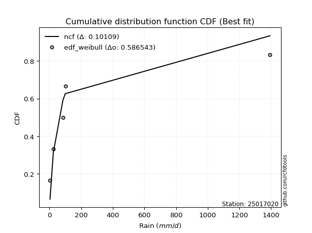</img>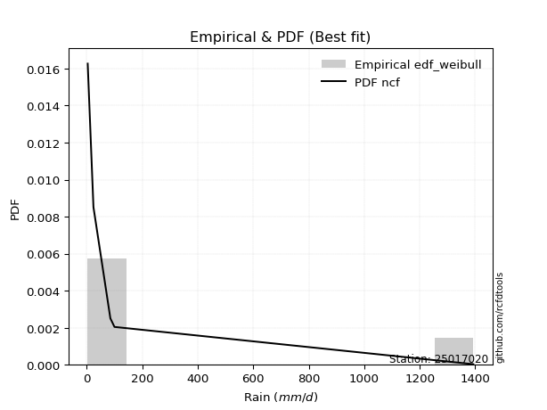</img>

</div>


### 4. EDF Beard (1943)

The Beard formula (or Beard´s plotting position formula) in hydrology is used to estimate the empirical non-exceedance probability _(P)_ of a flood event (or other extreme hydrological data point) within a given dataset.

<div align="center">


$P=(m-0.31)/(n+0.38)$


</div>


**4.1. Empirical values**

<div align="center">

|                | 0                   | 1                  | 2         | 3                  | 4                  |
|:---------------|:--------------------|:-------------------|:----------|:-------------------|:-------------------|
| date           | 2019                | 2017               | 2024      | 2025               | 2018               |
| x              | 3.5                 | 24.2               | 85.2      | 100.0              | 1393.0             |
| m              | 1                   | 2                  | 3         | 4                  | 5                  |
| empirical_dist | edf_beard           | edf_beard          | edf_beard | edf_beard          | edf_beard          |
| empirical      | 0.12825278810408922 | 0.3141263940520446 | 0.5       | 0.6858736059479554 | 0.8717472118959109 |
| empirical_tr   | 1.1471215351812367  | 1.4579945799457996 | 2.0       | 3.183431952662722  | 7.797101449275368  |

</div>


**4.2. Kolmogorov-Smirnov fit test (sorted by Δ)**


<div align="center">

|                | 0                   | 1                   | 2                  | 3                   | 4                  | 5                  | 6                  | 7                   | 8                   | 9                   | 10                  | 11                  | 12                  | 13                  | 14                  | 15                  | 16                  | 17                 | 18                  | 19                  | 20                  | 21                 | 22                 | 23                  | 24                  | 25                 | 26                  | 27                  | 28                  | 29                  | 30                  | 31                  | 32                  | 33                  | 34                  | 35                  | 36                 | 37                  | 38                  | 39                  | 40                  | 41                 | 42                  | 43                  | 44                  | 45                  | 46                  | 47                  | 48                 | 49                 | 50                  | 51                  | 52                  | 53                  | 54                  | 55                  | 56                  | 57                  | 58                  | 59                  | 60                 | 61                  | 62                 | 63                 | 64                 | 65                 | 66                  | 67                  | 68                  | 69                 | 70                  | 71                 | 72                 | 73                 | 74                 | 75                  | 76                  | 77                 | 78                  | 79                  | 80                 | 81                 | 82                  | 83                  | 84                  | 85                  | 86                 | 87                  | 88                  | 89                  | 90                  | 91                  | 92                 | 93                 | 94                  | 95                 | 96                  | 97                 | 98                  | 99                  | 100                 | 101                | 102                | 103                 | 104                | 105                 | 106                 | 107                | 108                | 109                | 110                | 111                | 112                | 113                 | 114                 | 115                | 116                | 117                | 118                | 119                | 120                 | 121                | 122                | 123                | 124                | 125                | 126                | 127                | 128                 | 129                 | 130                 | 131                | 132                | 133                 | 134                | 135                | 136                | 137                | 138                | 139                 | 140                | 141                 | 142                | 143                | 144                | 145                | 146                | 147                | 148                | 149                | 150                | 151                | 152                | 153                | 154                | 155                | 156                | 157                | 158                | 159                |
|:---------------|:--------------------|:--------------------|:-------------------|:--------------------|:-------------------|:-------------------|:-------------------|:--------------------|:--------------------|:--------------------|:--------------------|:--------------------|:--------------------|:--------------------|:--------------------|:--------------------|:--------------------|:-------------------|:--------------------|:--------------------|:--------------------|:-------------------|:-------------------|:--------------------|:--------------------|:-------------------|:--------------------|:--------------------|:--------------------|:--------------------|:--------------------|:--------------------|:--------------------|:--------------------|:--------------------|:--------------------|:-------------------|:--------------------|:--------------------|:--------------------|:--------------------|:-------------------|:--------------------|:--------------------|:--------------------|:--------------------|:--------------------|:--------------------|:-------------------|:-------------------|:--------------------|:--------------------|:--------------------|:--------------------|:--------------------|:--------------------|:--------------------|:--------------------|:--------------------|:--------------------|:-------------------|:--------------------|:-------------------|:-------------------|:-------------------|:-------------------|:--------------------|:--------------------|:--------------------|:-------------------|:--------------------|:-------------------|:-------------------|:-------------------|:-------------------|:--------------------|:--------------------|:-------------------|:--------------------|:--------------------|:-------------------|:-------------------|:--------------------|:--------------------|:--------------------|:--------------------|:-------------------|:--------------------|:--------------------|:--------------------|:--------------------|:--------------------|:-------------------|:-------------------|:--------------------|:-------------------|:--------------------|:-------------------|:--------------------|:--------------------|:--------------------|:-------------------|:-------------------|:--------------------|:-------------------|:--------------------|:--------------------|:-------------------|:-------------------|:-------------------|:-------------------|:-------------------|:-------------------|:--------------------|:--------------------|:-------------------|:-------------------|:-------------------|:-------------------|:-------------------|:--------------------|:-------------------|:-------------------|:-------------------|:-------------------|:-------------------|:-------------------|:-------------------|:--------------------|:--------------------|:--------------------|:-------------------|:-------------------|:--------------------|:-------------------|:-------------------|:-------------------|:-------------------|:-------------------|:--------------------|:-------------------|:--------------------|:-------------------|:-------------------|:-------------------|:-------------------|:-------------------|:-------------------|:-------------------|:-------------------|:-------------------|:-------------------|:-------------------|:-------------------|:-------------------|:-------------------|:-------------------|:-------------------|:-------------------|:-------------------|
| station        | 25017020            | 25017020            | 25017020           | 25017020            | 25017020           | 25017020           | 25017020           | 25017020            | 25017020            | 25017020            | 25017020            | 25017020            | 25017020            | 25017020            | 25017020            | 25017020            | 25017020            | 25017020           | 25017020            | 25017020            | 25017020            | 25017020           | 25017020           | 25017020            | 25017020            | 25017020           | 25017020            | 25017020            | 25017020            | 25017020            | 25017020            | 25017020            | 25017020            | 25017020            | 25017020            | 25017020            | 25017020           | 25017020            | 25017020            | 25017020            | 25017020            | 25017020           | 25017020            | 25017020            | 25017020            | 25017020            | 25017020            | 25017020            | 25017020           | 25017020           | 25017020            | 25017020            | 25017020            | 25017020            | 25017020            | 25017020            | 25017020            | 25017020            | 25017020            | 25017020            | 25017020           | 25017020            | 25017020           | 25017020           | 25017020           | 25017020           | 25017020            | 25017020            | 25017020            | 25017020           | 25017020            | 25017020           | 25017020           | 25017020           | 25017020           | 25017020            | 25017020            | 25017020           | 25017020            | 25017020            | 25017020           | 25017020           | 25017020            | 25017020            | 25017020            | 25017020            | 25017020           | 25017020            | 25017020            | 25017020            | 25017020            | 25017020            | 25017020           | 25017020           | 25017020            | 25017020           | 25017020            | 25017020           | 25017020            | 25017020            | 25017020            | 25017020           | 25017020           | 25017020            | 25017020           | 25017020            | 25017020            | 25017020           | 25017020           | 25017020           | 25017020           | 25017020           | 25017020           | 25017020            | 25017020            | 25017020           | 25017020           | 25017020           | 25017020           | 25017020           | 25017020            | 25017020           | 25017020           | 25017020           | 25017020           | 25017020           | 25017020           | 25017020           | 25017020            | 25017020            | 25017020            | 25017020           | 25017020           | 25017020            | 25017020           | 25017020           | 25017020           | 25017020           | 25017020           | 25017020            | 25017020           | 25017020            | 25017020           | 25017020           | 25017020           | 25017020           | 25017020           | 25017020           | 25017020           | 25017020           | 25017020           | 25017020           | 25017020           | 25017020           | 25017020           | 25017020           | 25017020           | 25017020           | 25017020           | 25017020           |
| empirical_dist | edf_beard           | edf_beard           | edf_beard          | edf_beard           | edf_beard          | edf_beard          | edf_beard          | edf_beard           | edf_beard           | edf_beard           | edf_beard           | edf_beard           | edf_beard           | edf_beard           | edf_beard           | edf_beard           | edf_beard           | edf_beard          | edf_beard           | edf_beard           | edf_beard           | edf_beard          | edf_beard          | edf_beard           | edf_beard           | edf_beard          | edf_beard           | edf_beard           | edf_beard           | edf_beard           | edf_beard           | edf_beard           | edf_beard           | edf_beard           | edf_beard           | edf_beard           | edf_beard          | edf_beard           | edf_beard           | edf_beard           | edf_beard           | edf_beard          | edf_beard           | edf_beard           | edf_beard           | edf_beard           | edf_beard           | edf_beard           | edf_beard          | edf_beard          | edf_beard           | edf_beard           | edf_beard           | edf_beard           | edf_beard           | edf_beard           | edf_beard           | edf_beard           | edf_beard           | edf_beard           | edf_beard          | edf_beard           | edf_beard          | edf_beard          | edf_beard          | edf_beard          | edf_beard           | edf_beard           | edf_beard           | edf_beard          | edf_beard           | edf_beard          | edf_beard          | edf_beard          | edf_beard          | edf_beard           | edf_beard           | edf_beard          | edf_beard           | edf_beard           | edf_beard          | edf_beard          | edf_beard           | edf_beard           | edf_beard           | edf_beard           | edf_beard          | edf_beard           | edf_beard           | edf_beard           | edf_beard           | edf_beard           | edf_beard          | edf_beard          | edf_beard           | edf_beard          | edf_beard           | edf_beard          | edf_beard           | edf_beard           | edf_beard           | edf_beard          | edf_beard          | edf_beard           | edf_beard          | edf_beard           | edf_beard           | edf_beard          | edf_beard          | edf_beard          | edf_beard          | edf_beard          | edf_beard          | edf_beard           | edf_beard           | edf_beard          | edf_beard          | edf_beard          | edf_beard          | edf_beard          | edf_beard           | edf_beard          | edf_beard          | edf_beard          | edf_beard          | edf_beard          | edf_beard          | edf_beard          | edf_beard           | edf_beard           | edf_beard           | edf_beard          | edf_beard          | edf_beard           | edf_beard          | edf_beard          | edf_beard          | edf_beard          | edf_beard          | edf_beard           | edf_beard          | edf_beard           | edf_beard          | edf_beard          | edf_beard          | edf_beard          | edf_beard          | edf_beard          | edf_beard          | edf_beard          | edf_beard          | edf_beard          | edf_beard          | edf_beard          | edf_beard          | edf_beard          | edf_beard          | edf_beard          | edf_beard          | edf_beard          |
| p_dist         | loghypsecant        | logfatiguelife      | logjohnsonsu       | logskewnorm         | loggamma           | loggamma           | logf               | loglogistic         | logerlang           | logrice             | logalpha            | logpearson3         | loggenlogistic      | loginvgamma         | loginvgauss         | logmaxwell          | logfoldnorm         | ncf                | lognct              | logexponnorm        | lognorm             | logcrystalball     | logt               | loggenextreme       | logloggamma         | logweibull_min     | logburr12           | loglaplace          | loglaplace          | logbetaprime        | lograyleigh         | logcosine           | loganglit           | logncf              | logsemicircular     | loginvweibull       | logksone           | logdweibull         | logkstwobign        | mielke              | logkappa3           | genpareto          | f                   | betaprime           | logbradford         | gamma               | loggompertz         | logtruncnorm        | truncpareto        | lomax              | logtukeylambda      | logkappa4           | logtruncpareto      | loguniform          | loghalfnorm         | logwrapcauchy       | loggumbel_r         | invgamma            | logarcsine          | logvonmises_line    | exponweib          | loggausshyper       | invgauss           | t                  | logloglaplace      | loggenexpon        | logtruncexpon       | erlang              | logburr             | halfgennorm        | loggumbel_l         | loghalflogistic    | logmoyal           | loggennorm         | nct                | burr                | loglomax            | burr12             | logargus            | logexponpow         | nakagami           | logdgamma          | gausshyper          | truncweibull_min    | logwald             | loglevy_l           | logexponweib       | exponpow            | loghalfgennorm      | logbeta             | loggenpareto        | logtruncweibull_min | wrapcauchy         | logmielke          | vonmises_line       | wald               | gengamma            | foldnorm           | dweibull            | halflogistic        | pearson3            | halfnorm           | logjohnsonsb       | levy_l              | fatiguelife        | weibull_min         | arcsine             | loggenhalflogistic | moyal              | loggengamma        | gumbel_r           | gennorm            | genextreme         | rayleigh            | lognakagami         | maxwell            | semicircular       | anglit             | logtriang          | genlogistic        | norm                | powerlaw           | logistic           | invweibull         | dgamma             | crystalball        | hypsecant          | kstwobign          | logtrapezoid        | cosine              | rice                | kappa3             | gumbel_l           | laplace             | logrdist           | logweibull_max     | exponnorm          | genexpon           | gompertz           | alpha               | truncnorm          | argus               | ksone              | johnsonsb          | logpowerlaw        | bradford           | skewnorm           | truncexpon         | weibull_max        | kappa4             | genhalflogistic    | uniform            | triang             | rdist              | beta               | trapezoid          | tukeylambda        | johnsonsu          | logvonmises        | vonmises           |
| delta          | 0.07572344522739038 | 0.07759913779329097 | 0.0789848198652171 | 0.07932105762114272 | 0.0796461074292586 | 0.0796461074292586 | 0.0803707469237589 | 0.08102012693008398 | 0.08163052643707713 | 0.08243003210478739 | 0.08469374373290883 | 0.08555451929966318 | 0.08672845740948931 | 0.08694900813845541 | 0.09024595117427903 | 0.09041447747000408 | 0.09137894095835974 | 0.0924379850014645 | 0.09257939935939252 | 0.09263831549087087 | 0.09308778823606956 | 0.0930879040260073 | 0.0930883706010277 | 0.09437903475306142 | 0.09524997763675025 | 0.0956264516055152 | 0.09578385431868541 | 0.09722397525984716 | 0.09722397525984716 | 0.09834215300030658 | 0.09986628468840753 | 0.10412560921269409 | 0.10598331108125891 | 0.10898507845658345 | 0.11133271252842603 | 0.11531162386857319 | 0.1181166341049883 | 0.12045442631177061 | 0.12169620830595917 | 0.12250750153860257 | 0.12534846361519592 | 0.1274889286076502 | 0.12822928017421267 | 0.12825238060124358 | 0.12825263560448985 | 0.12825269309198375 | 0.12825274435064343 | 0.12825278604071486 | 0.1282527881039327 | 0.1282527881039775 | 0.12825278810408203 | 0.12825278810408747 | 0.12825278810408922 | 0.12825278810408922 | 0.12825278810408922 | 0.12871225348450444 | 0.13034879099393726 | 0.13043185782792333 | 0.13279813216314784 | 0.13307493153427924 | 0.1331141258326647 | 0.13425502248103482 | 0.1360073862834803 | 0.1430211788771385 | 0.1457988304159833 | 0.1462775148140143 | 0.14714097465990783 | 0.15327369106623212 | 0.15336251278259683 | 0.153616056322334  | 0.15415924278747184 | 0.1541776779483588 | 0.1548135364389508 | 0.1607010407512638 | 0.1619697977515584 | 0.16261245133229396 | 0.16815593029778447 | 0.1732842483024647 | 0.17391549779518034 | 0.17862755834485705 | 0.1840484277972314 | 0.2039555267984597 | 0.21310837949380557 | 0.21807366988952426 | 0.22270869160537066 | 0.22309995681831685 | 0.2232347996070147 | 0.22357815573099804 | 0.22811692097914077 | 0.22956595191668555 | 0.23232580834894473 | 0.24278300296441951 | 0.2430677032269063 | 0.2458060718972831 | 0.24791104402610264 | 0.2484267563965351 | 0.26034399561135957 | 0.2619383493978123 | 0.26195902431316054 | 0.26206303015512344 | 0.26798175074050895 | 0.2684283137794375 | 0.2753803851458272 | 0.27699012353905916 | 0.2783375929755508 | 0.27922425423703123 | 0.27991989084840313 | 0.2814042955857017 | 0.2833407112637122 | 0.2941157510423165 | 0.2999450129954612 | 0.3010718469528595 | 0.3011863000742627 | 0.30238719030822714 | 0.31412622598368517 | 0.3143196435404781 | 0.3160164727770983 | 0.3247832600194781 | 0.3249939445302667 | 0.332115386628333  | 0.34562473786320613 | 0.3547211995790093 | 0.3643750577471429 | 0.3713600888055    | 0.3717472118969636 | 0.3742182295415657 | 0.3787488671679111 | 0.3821157345036828 | 0.38337451021316915 | 0.40233089091429947 | 0.40261117155399134 | 0.4037541260654729 | 0.4040103709379033 | 0.40658168271688677 | 0.4093048765699333 | 0.4206390139095485 | 0.4229871917789103 | 0.4239078815331132 | 0.423959032019401  | 0.43363441179474477 | 0.4413969579820682 | 0.45541921795737417 | 0.544665737410112  | 0.553959217850587  | 0.5546576410683182 | 0.5569750617723506 | 0.5630007917436627 | 0.5833226812323237 | 0.5924166302327278 | 0.600348365644776  | 0.6049686612520727 | 0.6164241637025434 | 0.618664732995784  | 0.6274191741725311 | 0.6393884138618702 | 0.6647703546724173 | 0.6705969000300015 | 0.6748377091627957 | 1.192031606194804  | 221.5989295716286  |
| deltao         | 0.5865427407550001  | 0.5865427407550001  | 0.5865427407550001 | 0.5865427407550001  | 0.5865427407550001 | 0.5865427407550001 | 0.5865427407550001 | 0.5865427407550001  | 0.5865427407550001  | 0.5865427407550001  | 0.5865427407550001  | 0.5865427407550001  | 0.5865427407550001  | 0.5865427407550001  | 0.5865427407550001  | 0.5865427407550001  | 0.5865427407550001  | 0.5865427407550001 | 0.5865427407550001  | 0.5865427407550001  | 0.5865427407550001  | 0.5865427407550001 | 0.5865427407550001 | 0.5865427407550001  | 0.5865427407550001  | 0.5865427407550001 | 0.5865427407550001  | 0.5865427407550001  | 0.5865427407550001  | 0.5865427407550001  | 0.5865427407550001  | 0.5865427407550001  | 0.5865427407550001  | 0.5865427407550001  | 0.5865427407550001  | 0.5865427407550001  | 0.5865427407550001 | 0.5865427407550001  | 0.5865427407550001  | 0.5865427407550001  | 0.5865427407550001  | 0.5865427407550001 | 0.5865427407550001  | 0.5865427407550001  | 0.5865427407550001  | 0.5865427407550001  | 0.5865427407550001  | 0.5865427407550001  | 0.5865427407550001 | 0.5865427407550001 | 0.5865427407550001  | 0.5865427407550001  | 0.5865427407550001  | 0.5865427407550001  | 0.5865427407550001  | 0.5865427407550001  | 0.5865427407550001  | 0.5865427407550001  | 0.5865427407550001  | 0.5865427407550001  | 0.5865427407550001 | 0.5865427407550001  | 0.5865427407550001 | 0.5865427407550001 | 0.5865427407550001 | 0.5865427407550001 | 0.5865427407550001  | 0.5865427407550001  | 0.5865427407550001  | 0.5865427407550001 | 0.5865427407550001  | 0.5865427407550001 | 0.5865427407550001 | 0.5865427407550001 | 0.5865427407550001 | 0.5865427407550001  | 0.5865427407550001  | 0.5865427407550001 | 0.5865427407550001  | 0.5865427407550001  | 0.5865427407550001 | 0.5865427407550001 | 0.5865427407550001  | 0.5865427407550001  | 0.5865427407550001  | 0.5865427407550001  | 0.5865427407550001 | 0.5865427407550001  | 0.5865427407550001  | 0.5865427407550001  | 0.5865427407550001  | 0.5865427407550001  | 0.5865427407550001 | 0.5865427407550001 | 0.5865427407550001  | 0.5865427407550001 | 0.5865427407550001  | 0.5865427407550001 | 0.5865427407550001  | 0.5865427407550001  | 0.5865427407550001  | 0.5865427407550001 | 0.5865427407550001 | 0.5865427407550001  | 0.5865427407550001 | 0.5865427407550001  | 0.5865427407550001  | 0.5865427407550001 | 0.5865427407550001 | 0.5865427407550001 | 0.5865427407550001 | 0.5865427407550001 | 0.5865427407550001 | 0.5865427407550001  | 0.5865427407550001  | 0.5865427407550001 | 0.5865427407550001 | 0.5865427407550001 | 0.5865427407550001 | 0.5865427407550001 | 0.5865427407550001  | 0.5865427407550001 | 0.5865427407550001 | 0.5865427407550001 | 0.5865427407550001 | 0.5865427407550001 | 0.5865427407550001 | 0.5865427407550001 | 0.5865427407550001  | 0.5865427407550001  | 0.5865427407550001  | 0.5865427407550001 | 0.5865427407550001 | 0.5865427407550001  | 0.5865427407550001 | 0.5865427407550001 | 0.5865427407550001 | 0.5865427407550001 | 0.5865427407550001 | 0.5865427407550001  | 0.5865427407550001 | 0.5865427407550001  | 0.5865427407550001 | 0.5865427407550001 | 0.5865427407550001 | 0.5865427407550001 | 0.5865427407550001 | 0.5865427407550001 | 0.5865427407550001 | 0.5865427407550001 | 0.5865427407550001 | 0.5865427407550001 | 0.5865427407550001 | 0.5865427407550001 | 0.5865427407550001 | 0.5865427407550001 | 0.5865427407550001 | 0.5865427407550001 | 0.5865427407550001 | 0.5865427407550001 |
| eval           | Δo > Δ              | Δo > Δ              | Δo > Δ             | Δo > Δ              | Δo > Δ             | Δo > Δ             | Δo > Δ             | Δo > Δ              | Δo > Δ              | Δo > Δ              | Δo > Δ              | Δo > Δ              | Δo > Δ              | Δo > Δ              | Δo > Δ              | Δo > Δ              | Δo > Δ              | Δo > Δ             | Δo > Δ              | Δo > Δ              | Δo > Δ              | Δo > Δ             | Δo > Δ             | Δo > Δ              | Δo > Δ              | Δo > Δ             | Δo > Δ              | Δo > Δ              | Δo > Δ              | Δo > Δ              | Δo > Δ              | Δo > Δ              | Δo > Δ              | Δo > Δ              | Δo > Δ              | Δo > Δ              | Δo > Δ             | Δo > Δ              | Δo > Δ              | Δo > Δ              | Δo > Δ              | Δo > Δ             | Δo > Δ              | Δo > Δ              | Δo > Δ              | Δo > Δ              | Δo > Δ              | Δo > Δ              | Δo > Δ             | Δo > Δ             | Δo > Δ              | Δo > Δ              | Δo > Δ              | Δo > Δ              | Δo > Δ              | Δo > Δ              | Δo > Δ              | Δo > Δ              | Δo > Δ              | Δo > Δ              | Δo > Δ             | Δo > Δ              | Δo > Δ             | Δo > Δ             | Δo > Δ             | Δo > Δ             | Δo > Δ              | Δo > Δ              | Δo > Δ              | Δo > Δ             | Δo > Δ              | Δo > Δ             | Δo > Δ             | Δo > Δ             | Δo > Δ             | Δo > Δ              | Δo > Δ              | Δo > Δ             | Δo > Δ              | Δo > Δ              | Δo > Δ             | Δo > Δ             | Δo > Δ              | Δo > Δ              | Δo > Δ              | Δo > Δ              | Δo > Δ             | Δo > Δ              | Δo > Δ              | Δo > Δ              | Δo > Δ              | Δo > Δ              | Δo > Δ             | Δo > Δ             | Δo > Δ              | Δo > Δ             | Δo > Δ              | Δo > Δ             | Δo > Δ              | Δo > Δ              | Δo > Δ              | Δo > Δ             | Δo > Δ             | Δo > Δ              | Δo > Δ             | Δo > Δ              | Δo > Δ              | Δo > Δ             | Δo > Δ             | Δo > Δ             | Δo > Δ             | Δo > Δ             | Δo > Δ             | Δo > Δ              | Δo > Δ              | Δo > Δ             | Δo > Δ             | Δo > Δ             | Δo > Δ             | Δo > Δ             | Δo > Δ              | Δo > Δ             | Δo > Δ             | Δo > Δ             | Δo > Δ             | Δo > Δ             | Δo > Δ             | Δo > Δ             | Δo > Δ              | Δo > Δ              | Δo > Δ              | Δo > Δ             | Δo > Δ             | Δo > Δ              | Δo > Δ             | Δo > Δ             | Δo > Δ             | Δo > Δ             | Δo > Δ             | Δo > Δ              | Δo > Δ             | Δo > Δ              | Δo > Δ             | Δo > Δ             | Δo > Δ             | Δo > Δ             | Δo > Δ             | Δo > Δ             | Δo <= Δ            | Δo <= Δ            | Δo <= Δ            | Δo <= Δ            | Δo <= Δ            | Δo <= Δ            | Δo <= Δ            | Δo <= Δ            | Δo <= Δ            | Δo <= Δ            | Δo <= Δ            | Δo <= Δ            |
| fit            | 1                   | 1                   | 1                  | 1                   | 1                  | 1                  | 1                  | 1                   | 1                   | 1                   | 1                   | 1                   | 1                   | 1                   | 1                   | 1                   | 1                   | 1                  | 1                   | 1                   | 1                   | 1                  | 1                  | 1                   | 1                   | 1                  | 1                   | 1                   | 1                   | 1                   | 1                   | 1                   | 1                   | 1                   | 1                   | 1                   | 1                  | 1                   | 1                   | 1                   | 1                   | 1                  | 1                   | 1                   | 1                   | 1                   | 1                   | 1                   | 1                  | 1                  | 1                   | 1                   | 1                   | 1                   | 1                   | 1                   | 1                   | 1                   | 1                   | 1                   | 1                  | 1                   | 1                  | 1                  | 1                  | 1                  | 1                   | 1                   | 1                   | 1                  | 1                   | 1                  | 1                  | 1                  | 1                  | 1                   | 1                   | 1                  | 1                   | 1                   | 1                  | 1                  | 1                   | 1                   | 1                   | 1                   | 1                  | 1                   | 1                   | 1                   | 1                   | 1                   | 1                  | 1                  | 1                   | 1                  | 1                   | 1                  | 1                   | 1                   | 1                   | 1                  | 1                  | 1                   | 1                  | 1                   | 1                   | 1                  | 1                  | 1                  | 1                  | 1                  | 1                  | 1                   | 1                   | 1                  | 1                  | 1                  | 1                  | 1                  | 1                   | 1                  | 1                  | 1                  | 1                  | 1                  | 1                  | 1                  | 1                   | 1                   | 1                   | 1                  | 1                  | 1                   | 1                  | 1                  | 1                  | 1                  | 1                  | 1                   | 1                  | 1                   | 1                  | 1                  | 1                  | 1                  | 1                  | 1                  | 0                  | 0                  | 0                  | 0                  | 0                  | 0                  | 0                  | 0                  | 0                  | 0                  | 0                  | 0                  |
| n              | 5                   | 5                   | 5                  | 5                   | 5                  | 5                  | 5                  | 5                   | 5                   | 5                   | 5                   | 5                   | 5                   | 5                   | 5                   | 5                   | 5                   | 5                  | 5                   | 5                   | 5                   | 5                  | 5                  | 5                   | 5                   | 5                  | 5                   | 5                   | 5                   | 5                   | 5                   | 5                   | 5                   | 5                   | 5                   | 5                   | 5                  | 5                   | 5                   | 5                   | 5                   | 5                  | 5                   | 5                   | 5                   | 5                   | 5                   | 5                   | 5                  | 5                  | 5                   | 5                   | 5                   | 5                   | 5                   | 5                   | 5                   | 5                   | 5                   | 5                   | 5                  | 5                   | 5                  | 5                  | 5                  | 5                  | 5                   | 5                   | 5                   | 5                  | 5                   | 5                  | 5                  | 5                  | 5                  | 5                   | 5                   | 5                  | 5                   | 5                   | 5                  | 5                  | 5                   | 5                   | 5                   | 5                   | 5                  | 5                   | 5                   | 5                   | 5                   | 5                   | 5                  | 5                  | 5                   | 5                  | 5                   | 5                  | 5                   | 5                   | 5                   | 5                  | 5                  | 5                   | 5                  | 5                   | 5                   | 5                  | 5                  | 5                  | 5                  | 5                  | 5                  | 5                   | 5                   | 5                  | 5                  | 5                  | 5                  | 5                  | 5                   | 5                  | 5                  | 5                  | 5                  | 5                  | 5                  | 5                  | 5                   | 5                   | 5                   | 5                  | 5                  | 5                   | 5                  | 5                  | 5                  | 5                  | 5                  | 5                   | 5                  | 5                   | 5                  | 5                  | 5                  | 5                  | 5                  | 5                  | 5                  | 5                  | 5                  | 5                  | 5                  | 5                  | 5                  | 5                  | 5                  | 5                  | 5                  | 5                  |
| best_fit       | 1                   | 0                   | 0                  | 0                   | 0                  | 0                  | 0                  | 0                   | 0                   | 0                   | 0                   | 0                   | 0                   | 0                   | 0                   | 0                   | 0                   | 0                  | 0                   | 0                   | 0                   | 0                  | 0                  | 0                   | 0                   | 0                  | 0                   | 0                   | 0                   | 0                   | 0                   | 0                   | 0                   | 0                   | 0                   | 0                   | 0                  | 0                   | 0                   | 0                   | 0                   | 0                  | 0                   | 0                   | 0                   | 0                   | 0                   | 0                   | 0                  | 0                  | 0                   | 0                   | 0                   | 0                   | 0                   | 0                   | 0                   | 0                   | 0                   | 0                   | 0                  | 0                   | 0                  | 0                  | 0                  | 0                  | 0                   | 0                   | 0                   | 0                  | 0                   | 0                  | 0                  | 0                  | 0                  | 0                   | 0                   | 0                  | 0                   | 0                   | 0                  | 0                  | 0                   | 0                   | 0                   | 0                   | 0                  | 0                   | 0                   | 0                   | 0                   | 0                   | 0                  | 0                  | 0                   | 0                  | 0                   | 0                  | 0                   | 0                   | 0                   | 0                  | 0                  | 0                   | 0                  | 0                   | 0                   | 0                  | 0                  | 0                  | 0                  | 0                  | 0                  | 0                   | 0                   | 0                  | 0                  | 0                  | 0                  | 0                  | 0                   | 0                  | 0                  | 0                  | 0                  | 0                  | 0                  | 0                  | 0                   | 0                   | 0                   | 0                  | 0                  | 0                   | 0                  | 0                  | 0                  | 0                  | 0                  | 0                   | 0                  | 0                   | 0                  | 0                  | 0                  | 0                  | 0                  | 0                  | 0                  | 0                  | 0                  | 0                  | 0                  | 0                  | 0                  | 0                  | 0                  | 0                  | 0                  | 0                  |
| best_fit_sort  | 1                   | 2                   | 3                  | 4                   | 5                  | 6                  | 7                  | 8                   | 9                   | 10                  | 11                  | 12                  | 13                  | 14                  | 15                  | 16                  | 17                  | 18                 | 19                  | 20                  | 21                  | 22                 | 23                 | 24                  | 25                  | 26                 | 27                  | 28                  | 29                  | 30                  | 31                  | 32                  | 33                  | 34                  | 35                  | 36                  | 37                 | 38                  | 39                  | 40                  | 41                  | 42                 | 43                  | 44                  | 45                  | 46                  | 47                  | 48                  | 49                 | 50                 | 51                  | 52                  | 53                  | 54                  | 55                  | 56                  | 57                  | 58                  | 59                  | 60                  | 61                 | 62                  | 63                 | 64                 | 65                 | 66                 | 67                  | 68                  | 69                  | 70                 | 71                  | 72                 | 73                 | 74                 | 75                 | 76                  | 77                  | 78                 | 79                  | 80                  | 81                 | 82                 | 83                  | 84                  | 85                  | 86                  | 87                 | 88                  | 89                  | 90                  | 91                  | 92                  | 93                 | 94                 | 95                  | 96                 | 97                  | 98                 | 99                  | 100                 | 101                 | 102                | 103                | 104                 | 105                | 106                 | 107                 | 108                | 109                | 110                | 111                | 112                | 113                | 114                 | 115                 | 116                | 117                | 118                | 119                | 120                | 121                 | 122                | 123                | 124                | 125                | 126                | 127                | 128                | 129                 | 130                 | 131                 | 132                | 133                | 134                 | 135                | 136                | 137                | 138                | 139                | 140                 | 141                | 142                 | 143                | 144                | 145                | 146                | 147                | 148                | 149                | 150                | 151                | 152                | 153                | 154                | 155                | 156                | 157                | 158                | 159                | 160                |

</div>


**4.3. Best fit**

<div align="center">

|   id |   station | empirical_dist   | p_dist       |     delta |   deltao | eval   |   fit |   n |   best_fit |   best_fit_sort |
|-----:|----------:|:-----------------|:-------------|----------:|---------:|:-------|------:|----:|-----------:|----------------:|
|    0 |  25017020 | edf_beard        | loghypsecant | 0.0757234 | 0.586543 | Δo > Δ |     1 |   5 |          1 |               1 |

</div>


<div align="center">

</img></img>

</div>


### 5. EDF Chegodayev (1955)

The Chegodayev formula is an empirical plotting position formula used in hydrological frequency analysis to estimate the exceedance probability or return period of a specific event from a set of observed data. It is primarily used for plotting observed data points on probability paper to fit a theoretical distribution, particularly for analyzing extreme events like maximum flood flows or rainfall intensities. The constant _b_ value in the generalized plotting position formula is 0.3.

<div align="center">


$P=(m-b)/(n+1-2b)$


</div>


**5.1. Empirical values**

<div align="center">

|                | 0                   | 1                   | 2              | 3                  | 4                  |
|:---------------|:--------------------|:--------------------|:---------------|:-------------------|:-------------------|
| date           | 2019                | 2017                | 2024           | 2025               | 2018               |
| x              | 3.5                 | 24.2                | 85.2           | 100.0              | 1393.0             |
| m              | 1                   | 2                   | 3              | 4                  | 5                  |
| empirical_dist | edf_chegodayev      | edf_chegodayev      | edf_chegodayev | edf_chegodayev     | edf_chegodayev     |
| empirical      | 0.12962962962962962 | 0.31481481481481477 | 0.5            | 0.6851851851851851 | 0.8703703703703703 |
| empirical_tr   | 1.148936170212766   | 1.4594594594594594  | 2.0            | 3.1764705882352935 | 7.714285714285713  |

</div>


**5.2. Kolmogorov-Smirnov fit test (sorted by Δ)**


<div align="center">

|                | 0                  | 1                   | 2                   | 3                  | 4                   | 5                   | 6                   | 7                  | 8                   | 9                   | 10                  | 11                  | 12                  | 13                  | 14                  | 15                  | 16                  | 17                  | 18                  | 19                  | 20                  | 21                  | 22                 | 23                 | 24                  | 25                 | 26                  | 27                  | 28                  | 29                  | 30                  | 31                  | 32                 | 33                  | 34                  | 35                  | 36                  | 37                 | 38                  | 39                  | 40                 | 41                  | 42                  | 43                  | 44                 | 45                  | 46                  | 47                  | 48                  | 49                  | 50                 | 51                  | 52                  | 53                  | 54                  | 55                  | 56                  | 57                  | 58                  | 59                  | 60                 | 61                  | 62                 | 63                 | 64                  | 65                 | 66                  | 67                 | 68                  | 69                  | 70                  | 71                 | 72                 | 73                  | 74                 | 75                  | 76                  | 77                  | 78                  | 79                 | 80                 | 81                  | 82                  | 83                  | 84                  | 85                  | 86                  | 87                  | 88                  | 89                  | 90                  | 91                  | 92                  | 93                 | 94                  | 95                 | 96                  | 97                  | 98                 | 99                  | 100                 | 101                | 102                | 103                 | 104                | 105                | 106                | 107                 | 108                 | 109                | 110                | 111                | 112                | 113                | 114                | 115                | 116                | 117                | 118                | 119                | 120                | 121                | 122                | 123                 | 124                | 125                | 126                | 127                | 128                 | 129                 | 130                 | 131                | 132                | 133                 | 134                | 135                | 136                | 137                | 138                | 139                | 140                 | 141                 | 142                | 143                | 144                | 145                | 146                | 147                | 148                | 149                | 150                | 151                | 152                | 153                | 154                | 155                | 156                | 157                | 158                | 159                |
|:---------------|:-------------------|:--------------------|:--------------------|:-------------------|:--------------------|:--------------------|:--------------------|:-------------------|:--------------------|:--------------------|:--------------------|:--------------------|:--------------------|:--------------------|:--------------------|:--------------------|:--------------------|:--------------------|:--------------------|:--------------------|:--------------------|:--------------------|:-------------------|:-------------------|:--------------------|:-------------------|:--------------------|:--------------------|:--------------------|:--------------------|:--------------------|:--------------------|:-------------------|:--------------------|:--------------------|:--------------------|:--------------------|:-------------------|:--------------------|:--------------------|:-------------------|:--------------------|:--------------------|:--------------------|:-------------------|:--------------------|:--------------------|:--------------------|:--------------------|:--------------------|:-------------------|:--------------------|:--------------------|:--------------------|:--------------------|:--------------------|:--------------------|:--------------------|:--------------------|:--------------------|:-------------------|:--------------------|:-------------------|:-------------------|:--------------------|:-------------------|:--------------------|:-------------------|:--------------------|:--------------------|:--------------------|:-------------------|:-------------------|:--------------------|:-------------------|:--------------------|:--------------------|:--------------------|:--------------------|:-------------------|:-------------------|:--------------------|:--------------------|:--------------------|:--------------------|:--------------------|:--------------------|:--------------------|:--------------------|:--------------------|:--------------------|:--------------------|:--------------------|:-------------------|:--------------------|:-------------------|:--------------------|:--------------------|:-------------------|:--------------------|:--------------------|:-------------------|:-------------------|:--------------------|:-------------------|:-------------------|:-------------------|:--------------------|:--------------------|:-------------------|:-------------------|:-------------------|:-------------------|:-------------------|:-------------------|:-------------------|:-------------------|:-------------------|:-------------------|:-------------------|:-------------------|:-------------------|:-------------------|:--------------------|:-------------------|:-------------------|:-------------------|:-------------------|:--------------------|:--------------------|:--------------------|:-------------------|:-------------------|:--------------------|:-------------------|:-------------------|:-------------------|:-------------------|:-------------------|:-------------------|:--------------------|:--------------------|:-------------------|:-------------------|:-------------------|:-------------------|:-------------------|:-------------------|:-------------------|:-------------------|:-------------------|:-------------------|:-------------------|:-------------------|:-------------------|:-------------------|:-------------------|:-------------------|:-------------------|:-------------------|
| station        | 25017020           | 25017020            | 25017020            | 25017020           | 25017020            | 25017020            | 25017020            | 25017020           | 25017020            | 25017020            | 25017020            | 25017020            | 25017020            | 25017020            | 25017020            | 25017020            | 25017020            | 25017020            | 25017020            | 25017020            | 25017020            | 25017020            | 25017020           | 25017020           | 25017020            | 25017020           | 25017020            | 25017020            | 25017020            | 25017020            | 25017020            | 25017020            | 25017020           | 25017020            | 25017020            | 25017020            | 25017020            | 25017020           | 25017020            | 25017020            | 25017020           | 25017020            | 25017020            | 25017020            | 25017020           | 25017020            | 25017020            | 25017020            | 25017020            | 25017020            | 25017020           | 25017020            | 25017020            | 25017020            | 25017020            | 25017020            | 25017020            | 25017020            | 25017020            | 25017020            | 25017020           | 25017020            | 25017020           | 25017020           | 25017020            | 25017020           | 25017020            | 25017020           | 25017020            | 25017020            | 25017020            | 25017020           | 25017020           | 25017020            | 25017020           | 25017020            | 25017020            | 25017020            | 25017020            | 25017020           | 25017020           | 25017020            | 25017020            | 25017020            | 25017020            | 25017020            | 25017020            | 25017020            | 25017020            | 25017020            | 25017020            | 25017020            | 25017020            | 25017020           | 25017020            | 25017020           | 25017020            | 25017020            | 25017020           | 25017020            | 25017020            | 25017020           | 25017020           | 25017020            | 25017020           | 25017020           | 25017020           | 25017020            | 25017020            | 25017020           | 25017020           | 25017020           | 25017020           | 25017020           | 25017020           | 25017020           | 25017020           | 25017020           | 25017020           | 25017020           | 25017020           | 25017020           | 25017020           | 25017020            | 25017020           | 25017020           | 25017020           | 25017020           | 25017020            | 25017020            | 25017020            | 25017020           | 25017020           | 25017020            | 25017020           | 25017020           | 25017020           | 25017020           | 25017020           | 25017020           | 25017020            | 25017020            | 25017020           | 25017020           | 25017020           | 25017020           | 25017020           | 25017020           | 25017020           | 25017020           | 25017020           | 25017020           | 25017020           | 25017020           | 25017020           | 25017020           | 25017020           | 25017020           | 25017020           | 25017020           |
| empirical_dist | edf_chegodayev     | edf_chegodayev      | edf_chegodayev      | edf_chegodayev     | edf_chegodayev      | edf_chegodayev      | edf_chegodayev      | edf_chegodayev     | edf_chegodayev      | edf_chegodayev      | edf_chegodayev      | edf_chegodayev      | edf_chegodayev      | edf_chegodayev      | edf_chegodayev      | edf_chegodayev      | edf_chegodayev      | edf_chegodayev      | edf_chegodayev      | edf_chegodayev      | edf_chegodayev      | edf_chegodayev      | edf_chegodayev     | edf_chegodayev     | edf_chegodayev      | edf_chegodayev     | edf_chegodayev      | edf_chegodayev      | edf_chegodayev      | edf_chegodayev      | edf_chegodayev      | edf_chegodayev      | edf_chegodayev     | edf_chegodayev      | edf_chegodayev      | edf_chegodayev      | edf_chegodayev      | edf_chegodayev     | edf_chegodayev      | edf_chegodayev      | edf_chegodayev     | edf_chegodayev      | edf_chegodayev      | edf_chegodayev      | edf_chegodayev     | edf_chegodayev      | edf_chegodayev      | edf_chegodayev      | edf_chegodayev      | edf_chegodayev      | edf_chegodayev     | edf_chegodayev      | edf_chegodayev      | edf_chegodayev      | edf_chegodayev      | edf_chegodayev      | edf_chegodayev      | edf_chegodayev      | edf_chegodayev      | edf_chegodayev      | edf_chegodayev     | edf_chegodayev      | edf_chegodayev     | edf_chegodayev     | edf_chegodayev      | edf_chegodayev     | edf_chegodayev      | edf_chegodayev     | edf_chegodayev      | edf_chegodayev      | edf_chegodayev      | edf_chegodayev     | edf_chegodayev     | edf_chegodayev      | edf_chegodayev     | edf_chegodayev      | edf_chegodayev      | edf_chegodayev      | edf_chegodayev      | edf_chegodayev     | edf_chegodayev     | edf_chegodayev      | edf_chegodayev      | edf_chegodayev      | edf_chegodayev      | edf_chegodayev      | edf_chegodayev      | edf_chegodayev      | edf_chegodayev      | edf_chegodayev      | edf_chegodayev      | edf_chegodayev      | edf_chegodayev      | edf_chegodayev     | edf_chegodayev      | edf_chegodayev     | edf_chegodayev      | edf_chegodayev      | edf_chegodayev     | edf_chegodayev      | edf_chegodayev      | edf_chegodayev     | edf_chegodayev     | edf_chegodayev      | edf_chegodayev     | edf_chegodayev     | edf_chegodayev     | edf_chegodayev      | edf_chegodayev      | edf_chegodayev     | edf_chegodayev     | edf_chegodayev     | edf_chegodayev     | edf_chegodayev     | edf_chegodayev     | edf_chegodayev     | edf_chegodayev     | edf_chegodayev     | edf_chegodayev     | edf_chegodayev     | edf_chegodayev     | edf_chegodayev     | edf_chegodayev     | edf_chegodayev      | edf_chegodayev     | edf_chegodayev     | edf_chegodayev     | edf_chegodayev     | edf_chegodayev      | edf_chegodayev      | edf_chegodayev      | edf_chegodayev     | edf_chegodayev     | edf_chegodayev      | edf_chegodayev     | edf_chegodayev     | edf_chegodayev     | edf_chegodayev     | edf_chegodayev     | edf_chegodayev     | edf_chegodayev      | edf_chegodayev      | edf_chegodayev     | edf_chegodayev     | edf_chegodayev     | edf_chegodayev     | edf_chegodayev     | edf_chegodayev     | edf_chegodayev     | edf_chegodayev     | edf_chegodayev     | edf_chegodayev     | edf_chegodayev     | edf_chegodayev     | edf_chegodayev     | edf_chegodayev     | edf_chegodayev     | edf_chegodayev     | edf_chegodayev     | edf_chegodayev     |
| p_dist         | loghypsecant       | logfatiguelife      | logjohnsonsu        | logskewnorm        | loggamma            | loggamma            | loglogistic         | logf               | logerlang           | logrice             | logalpha            | logpearson3         | loggenlogistic      | loginvgamma         | loginvgauss         | logmaxwell          | logfoldnorm         | lognct              | logexponnorm        | lognorm             | logcrystalball      | logt                | ncf                | loggenextreme      | logloggamma         | logweibull_min     | logburr12           | loglaplace          | loglaplace          | logbetaprime        | lograyleigh         | logcosine           | loganglit          | logncf              | logsemicircular     | loginvweibull       | logksone            | logdweibull        | logkstwobign        | mielke              | logkappa3          | genpareto           | f                   | logwrapcauchy       | betaprime          | logbradford         | gamma               | loggompertz         | logtruncnorm        | truncpareto         | lomax              | logtukeylambda      | logkappa4           | loghalfnorm         | loguniform          | logtruncpareto      | loggumbel_r         | invgamma            | logarcsine          | exponweib           | logvonmises_line   | loggausshyper       | invgauss           | t                  | logloglaplace       | loggenexpon        | logtruncexpon       | erlang             | halfgennorm         | logburr             | loggumbel_l         | loghalflogistic    | logmoyal           | loggennorm          | nct                | burr                | loglomax            | burr12              | logargus            | logexponpow        | nakagami           | logdgamma           | gausshyper          | truncweibull_min    | loglevy_l           | logwald             | exponpow            | logexponweib        | loghalfgennorm      | logbeta             | loggenpareto        | logtruncweibull_min | wrapcauchy          | logmielke          | vonmises_line       | wald               | gengamma            | dweibull            | foldnorm           | halflogistic        | pearson3            | halfnorm           | logjohnsonsb       | levy_l              | fatiguelife        | weibull_min        | arcsine            | loggenhalflogistic  | moyal               | loggengamma        | gumbel_r           | genextreme         | gennorm            | rayleigh           | maxwell            | lognakagami        | semicircular       | anglit             | logtriang          | genlogistic        | norm               | powerlaw           | logistic           | invweibull          | dgamma             | crystalball        | hypsecant          | kstwobign          | logtrapezoid        | cosine              | rice                | kappa3             | gumbel_l           | laplace             | logrdist           | logweibull_max     | exponnorm          | genexpon           | gompertz           | alpha              | truncnorm           | argus               | ksone              | johnsonsb          | logpowerlaw        | bradford           | skewnorm           | truncexpon         | weibull_max        | kappa4             | genhalflogistic    | uniform            | triang             | rdist              | beta               | trapezoid          | tukeylambda        | johnsonsu          | logvonmises        | vonmises           |
| delta          | 0.0765644161824347 | 0.07759913779329097 | 0.07829639910244679 | 0.0786326368583724 | 0.07895768666648828 | 0.07895768666648828 | 0.08033170616731367 | 0.0803707469237589 | 0.08094210567430682 | 0.08377701504216026 | 0.08469374373290883 | 0.08486609853689286 | 0.08672845740948931 | 0.08694900813845541 | 0.09024595117427903 | 0.09041447747000408 | 0.09069052019558943 | 0.09189097859662221 | 0.09194989472810056 | 0.09239936747329924 | 0.09239948326323699 | 0.09239994983825739 | 0.0924379850014645 | 0.0936906139902911 | 0.09456155687397994 | 0.0956264516055152 | 0.09578385431868541 | 0.09722397525984716 | 0.09722397525984716 | 0.09834215300030658 | 0.09986628468840753 | 0.10343718844992378 | 0.1052948903184886 | 0.10898507845658345 | 0.11064429176565571 | 0.11531162386857319 | 0.11742821334221798 | 0.1197660055490003 | 0.12169620830595917 | 0.12250750153860257 | 0.1246600428524256 | 0.12886577013319062 | 0.12960612169975308 | 0.12962695382300674 | 0.129629222126784  | 0.12962947713003037 | 0.12962953461752416 | 0.12962958587618384 | 0.12962962756625526 | 0.12962962962947322 | 0.1296296296295179 | 0.12962962962962254 | 0.12962962962962787 | 0.12962962962962962 | 0.12962962962962965 | 0.12962962962962965 | 0.13034879099393726 | 0.13043185782792333 | 0.13210971140037753 | 0.13242570506989437 | 0.1337633522970494 | 0.13425502248103482 | 0.1360073862834803 | 0.1430211788771385 | 0.14511040965321298 | 0.1462775148140143 | 0.14714097465990783 | 0.1525852703034618 | 0.15292763555956368 | 0.15336251278259683 | 0.15347082202470153 | 0.1541776779483588 | 0.1548135364389508 | 0.16138946151403394 | 0.1619697977515584 | 0.16261245133229396 | 0.16746750953501433 | 0.17259582753969438 | 0.17322707703241003 | 0.1779391375820869 | 0.1833600070344611 | 0.20464394756122986 | 0.21241995873103525 | 0.21738524912675394 | 0.22241153605554653 | 0.22270869160537066 | 0.22288973496822773 | 0.22304758760151555 | 0.22742850021637062 | 0.22887753115391524 | 0.23163738758617441 | 0.24209458220164937 | 0.24237928246413598 | 0.2458060718972831 | 0.24722262326333233 | 0.2477383356337648 | 0.25965557484858925 | 0.26058218278762013 | 0.261249928635042  | 0.26137460939235313 | 0.26729332997773864 | 0.2677398930166672 | 0.2746919643830569 | 0.27561328201351876 | 0.2776491722127806 | 0.2785358334742609 | 0.2792314700856328 | 0.28071587482293137 | 0.28265229050094187 | 0.2934273302795464 | 0.2992565922326909 | 0.2998094585487222 | 0.3010718469528595 | 0.3016987695454568 | 0.3136312227777078 | 0.3148146467464553 | 0.315328052014328  | 0.3240948392567078 | 0.3243055237674964 | 0.3314269658655627 | 0.3449363171004358 | 0.3540327788162392 | 0.3636866369843726 | 0.36998324727995946 | 0.3703703703714232 | 0.3728413880160253 | 0.3780604464051408 | 0.3814273137409125 | 0.38268608945039884 | 0.40164247015152915 | 0.40192275079122103 | 0.4023772845399324 | 0.403321950175133  | 0.40589326195411646 | 0.4093048765699333 | 0.4199505931467782 | 0.42229877101614   | 0.4232194607703429 | 0.4232706112566307 | 0.4329459910319746 | 0.44070853721929787 | 0.45473079719460385 | 0.5439773166473418 | 0.5532707970878168 | 0.5539692203055481 | 0.5562866410095803 | 0.5623123709808924 | 0.5826342604695534 | 0.5917282094699575 | 0.5996599448820057 | 0.6042802404893024 | 0.6157357429397731 | 0.6179763122330136 | 0.6260423326469907 | 0.6380115723363298 | 0.6640819339096471 | 0.6692200585044611 | 0.6741492884000256 | 1.1934084477203446 | 221.60030641315413 |
| deltao         | 0.5865427407550001 | 0.5865427407550001  | 0.5865427407550001  | 0.5865427407550001 | 0.5865427407550001  | 0.5865427407550001  | 0.5865427407550001  | 0.5865427407550001 | 0.5865427407550001  | 0.5865427407550001  | 0.5865427407550001  | 0.5865427407550001  | 0.5865427407550001  | 0.5865427407550001  | 0.5865427407550001  | 0.5865427407550001  | 0.5865427407550001  | 0.5865427407550001  | 0.5865427407550001  | 0.5865427407550001  | 0.5865427407550001  | 0.5865427407550001  | 0.5865427407550001 | 0.5865427407550001 | 0.5865427407550001  | 0.5865427407550001 | 0.5865427407550001  | 0.5865427407550001  | 0.5865427407550001  | 0.5865427407550001  | 0.5865427407550001  | 0.5865427407550001  | 0.5865427407550001 | 0.5865427407550001  | 0.5865427407550001  | 0.5865427407550001  | 0.5865427407550001  | 0.5865427407550001 | 0.5865427407550001  | 0.5865427407550001  | 0.5865427407550001 | 0.5865427407550001  | 0.5865427407550001  | 0.5865427407550001  | 0.5865427407550001 | 0.5865427407550001  | 0.5865427407550001  | 0.5865427407550001  | 0.5865427407550001  | 0.5865427407550001  | 0.5865427407550001 | 0.5865427407550001  | 0.5865427407550001  | 0.5865427407550001  | 0.5865427407550001  | 0.5865427407550001  | 0.5865427407550001  | 0.5865427407550001  | 0.5865427407550001  | 0.5865427407550001  | 0.5865427407550001 | 0.5865427407550001  | 0.5865427407550001 | 0.5865427407550001 | 0.5865427407550001  | 0.5865427407550001 | 0.5865427407550001  | 0.5865427407550001 | 0.5865427407550001  | 0.5865427407550001  | 0.5865427407550001  | 0.5865427407550001 | 0.5865427407550001 | 0.5865427407550001  | 0.5865427407550001 | 0.5865427407550001  | 0.5865427407550001  | 0.5865427407550001  | 0.5865427407550001  | 0.5865427407550001 | 0.5865427407550001 | 0.5865427407550001  | 0.5865427407550001  | 0.5865427407550001  | 0.5865427407550001  | 0.5865427407550001  | 0.5865427407550001  | 0.5865427407550001  | 0.5865427407550001  | 0.5865427407550001  | 0.5865427407550001  | 0.5865427407550001  | 0.5865427407550001  | 0.5865427407550001 | 0.5865427407550001  | 0.5865427407550001 | 0.5865427407550001  | 0.5865427407550001  | 0.5865427407550001 | 0.5865427407550001  | 0.5865427407550001  | 0.5865427407550001 | 0.5865427407550001 | 0.5865427407550001  | 0.5865427407550001 | 0.5865427407550001 | 0.5865427407550001 | 0.5865427407550001  | 0.5865427407550001  | 0.5865427407550001 | 0.5865427407550001 | 0.5865427407550001 | 0.5865427407550001 | 0.5865427407550001 | 0.5865427407550001 | 0.5865427407550001 | 0.5865427407550001 | 0.5865427407550001 | 0.5865427407550001 | 0.5865427407550001 | 0.5865427407550001 | 0.5865427407550001 | 0.5865427407550001 | 0.5865427407550001  | 0.5865427407550001 | 0.5865427407550001 | 0.5865427407550001 | 0.5865427407550001 | 0.5865427407550001  | 0.5865427407550001  | 0.5865427407550001  | 0.5865427407550001 | 0.5865427407550001 | 0.5865427407550001  | 0.5865427407550001 | 0.5865427407550001 | 0.5865427407550001 | 0.5865427407550001 | 0.5865427407550001 | 0.5865427407550001 | 0.5865427407550001  | 0.5865427407550001  | 0.5865427407550001 | 0.5865427407550001 | 0.5865427407550001 | 0.5865427407550001 | 0.5865427407550001 | 0.5865427407550001 | 0.5865427407550001 | 0.5865427407550001 | 0.5865427407550001 | 0.5865427407550001 | 0.5865427407550001 | 0.5865427407550001 | 0.5865427407550001 | 0.5865427407550001 | 0.5865427407550001 | 0.5865427407550001 | 0.5865427407550001 | 0.5865427407550001 |
| eval           | Δo > Δ             | Δo > Δ              | Δo > Δ              | Δo > Δ             | Δo > Δ              | Δo > Δ              | Δo > Δ              | Δo > Δ             | Δo > Δ              | Δo > Δ              | Δo > Δ              | Δo > Δ              | Δo > Δ              | Δo > Δ              | Δo > Δ              | Δo > Δ              | Δo > Δ              | Δo > Δ              | Δo > Δ              | Δo > Δ              | Δo > Δ              | Δo > Δ              | Δo > Δ             | Δo > Δ             | Δo > Δ              | Δo > Δ             | Δo > Δ              | Δo > Δ              | Δo > Δ              | Δo > Δ              | Δo > Δ              | Δo > Δ              | Δo > Δ             | Δo > Δ              | Δo > Δ              | Δo > Δ              | Δo > Δ              | Δo > Δ             | Δo > Δ              | Δo > Δ              | Δo > Δ             | Δo > Δ              | Δo > Δ              | Δo > Δ              | Δo > Δ             | Δo > Δ              | Δo > Δ              | Δo > Δ              | Δo > Δ              | Δo > Δ              | Δo > Δ             | Δo > Δ              | Δo > Δ              | Δo > Δ              | Δo > Δ              | Δo > Δ              | Δo > Δ              | Δo > Δ              | Δo > Δ              | Δo > Δ              | Δo > Δ             | Δo > Δ              | Δo > Δ             | Δo > Δ             | Δo > Δ              | Δo > Δ             | Δo > Δ              | Δo > Δ             | Δo > Δ              | Δo > Δ              | Δo > Δ              | Δo > Δ             | Δo > Δ             | Δo > Δ              | Δo > Δ             | Δo > Δ              | Δo > Δ              | Δo > Δ              | Δo > Δ              | Δo > Δ             | Δo > Δ             | Δo > Δ              | Δo > Δ              | Δo > Δ              | Δo > Δ              | Δo > Δ              | Δo > Δ              | Δo > Δ              | Δo > Δ              | Δo > Δ              | Δo > Δ              | Δo > Δ              | Δo > Δ              | Δo > Δ             | Δo > Δ              | Δo > Δ             | Δo > Δ              | Δo > Δ              | Δo > Δ             | Δo > Δ              | Δo > Δ              | Δo > Δ             | Δo > Δ             | Δo > Δ              | Δo > Δ             | Δo > Δ             | Δo > Δ             | Δo > Δ              | Δo > Δ              | Δo > Δ             | Δo > Δ             | Δo > Δ             | Δo > Δ             | Δo > Δ             | Δo > Δ             | Δo > Δ             | Δo > Δ             | Δo > Δ             | Δo > Δ             | Δo > Δ             | Δo > Δ             | Δo > Δ             | Δo > Δ             | Δo > Δ              | Δo > Δ             | Δo > Δ             | Δo > Δ             | Δo > Δ             | Δo > Δ              | Δo > Δ              | Δo > Δ              | Δo > Δ             | Δo > Δ             | Δo > Δ              | Δo > Δ             | Δo > Δ             | Δo > Δ             | Δo > Δ             | Δo > Δ             | Δo > Δ             | Δo > Δ              | Δo > Δ              | Δo > Δ             | Δo > Δ             | Δo > Δ             | Δo > Δ             | Δo > Δ             | Δo > Δ             | Δo <= Δ            | Δo <= Δ            | Δo <= Δ            | Δo <= Δ            | Δo <= Δ            | Δo <= Δ            | Δo <= Δ            | Δo <= Δ            | Δo <= Δ            | Δo <= Δ            | Δo <= Δ            | Δo <= Δ            |
| fit            | 1                  | 1                   | 1                   | 1                  | 1                   | 1                   | 1                   | 1                  | 1                   | 1                   | 1                   | 1                   | 1                   | 1                   | 1                   | 1                   | 1                   | 1                   | 1                   | 1                   | 1                   | 1                   | 1                  | 1                  | 1                   | 1                  | 1                   | 1                   | 1                   | 1                   | 1                   | 1                   | 1                  | 1                   | 1                   | 1                   | 1                   | 1                  | 1                   | 1                   | 1                  | 1                   | 1                   | 1                   | 1                  | 1                   | 1                   | 1                   | 1                   | 1                   | 1                  | 1                   | 1                   | 1                   | 1                   | 1                   | 1                   | 1                   | 1                   | 1                   | 1                  | 1                   | 1                  | 1                  | 1                   | 1                  | 1                   | 1                  | 1                   | 1                   | 1                   | 1                  | 1                  | 1                   | 1                  | 1                   | 1                   | 1                   | 1                   | 1                  | 1                  | 1                   | 1                   | 1                   | 1                   | 1                   | 1                   | 1                   | 1                   | 1                   | 1                   | 1                   | 1                   | 1                  | 1                   | 1                  | 1                   | 1                   | 1                  | 1                   | 1                   | 1                  | 1                  | 1                   | 1                  | 1                  | 1                  | 1                   | 1                   | 1                  | 1                  | 1                  | 1                  | 1                  | 1                  | 1                  | 1                  | 1                  | 1                  | 1                  | 1                  | 1                  | 1                  | 1                   | 1                  | 1                  | 1                  | 1                  | 1                   | 1                   | 1                   | 1                  | 1                  | 1                   | 1                  | 1                  | 1                  | 1                  | 1                  | 1                  | 1                   | 1                   | 1                  | 1                  | 1                  | 1                  | 1                  | 1                  | 0                  | 0                  | 0                  | 0                  | 0                  | 0                  | 0                  | 0                  | 0                  | 0                  | 0                  | 0                  |
| n              | 5                  | 5                   | 5                   | 5                  | 5                   | 5                   | 5                   | 5                  | 5                   | 5                   | 5                   | 5                   | 5                   | 5                   | 5                   | 5                   | 5                   | 5                   | 5                   | 5                   | 5                   | 5                   | 5                  | 5                  | 5                   | 5                  | 5                   | 5                   | 5                   | 5                   | 5                   | 5                   | 5                  | 5                   | 5                   | 5                   | 5                   | 5                  | 5                   | 5                   | 5                  | 5                   | 5                   | 5                   | 5                  | 5                   | 5                   | 5                   | 5                   | 5                   | 5                  | 5                   | 5                   | 5                   | 5                   | 5                   | 5                   | 5                   | 5                   | 5                   | 5                  | 5                   | 5                  | 5                  | 5                   | 5                  | 5                   | 5                  | 5                   | 5                   | 5                   | 5                  | 5                  | 5                   | 5                  | 5                   | 5                   | 5                   | 5                   | 5                  | 5                  | 5                   | 5                   | 5                   | 5                   | 5                   | 5                   | 5                   | 5                   | 5                   | 5                   | 5                   | 5                   | 5                  | 5                   | 5                  | 5                   | 5                   | 5                  | 5                   | 5                   | 5                  | 5                  | 5                   | 5                  | 5                  | 5                  | 5                   | 5                   | 5                  | 5                  | 5                  | 5                  | 5                  | 5                  | 5                  | 5                  | 5                  | 5                  | 5                  | 5                  | 5                  | 5                  | 5                   | 5                  | 5                  | 5                  | 5                  | 5                   | 5                   | 5                   | 5                  | 5                  | 5                   | 5                  | 5                  | 5                  | 5                  | 5                  | 5                  | 5                   | 5                   | 5                  | 5                  | 5                  | 5                  | 5                  | 5                  | 5                  | 5                  | 5                  | 5                  | 5                  | 5                  | 5                  | 5                  | 5                  | 5                  | 5                  | 5                  |
| best_fit       | 1                  | 0                   | 0                   | 0                  | 0                   | 0                   | 0                   | 0                  | 0                   | 0                   | 0                   | 0                   | 0                   | 0                   | 0                   | 0                   | 0                   | 0                   | 0                   | 0                   | 0                   | 0                   | 0                  | 0                  | 0                   | 0                  | 0                   | 0                   | 0                   | 0                   | 0                   | 0                   | 0                  | 0                   | 0                   | 0                   | 0                   | 0                  | 0                   | 0                   | 0                  | 0                   | 0                   | 0                   | 0                  | 0                   | 0                   | 0                   | 0                   | 0                   | 0                  | 0                   | 0                   | 0                   | 0                   | 0                   | 0                   | 0                   | 0                   | 0                   | 0                  | 0                   | 0                  | 0                  | 0                   | 0                  | 0                   | 0                  | 0                   | 0                   | 0                   | 0                  | 0                  | 0                   | 0                  | 0                   | 0                   | 0                   | 0                   | 0                  | 0                  | 0                   | 0                   | 0                   | 0                   | 0                   | 0                   | 0                   | 0                   | 0                   | 0                   | 0                   | 0                   | 0                  | 0                   | 0                  | 0                   | 0                   | 0                  | 0                   | 0                   | 0                  | 0                  | 0                   | 0                  | 0                  | 0                  | 0                   | 0                   | 0                  | 0                  | 0                  | 0                  | 0                  | 0                  | 0                  | 0                  | 0                  | 0                  | 0                  | 0                  | 0                  | 0                  | 0                   | 0                  | 0                  | 0                  | 0                  | 0                   | 0                   | 0                   | 0                  | 0                  | 0                   | 0                  | 0                  | 0                  | 0                  | 0                  | 0                  | 0                   | 0                   | 0                  | 0                  | 0                  | 0                  | 0                  | 0                  | 0                  | 0                  | 0                  | 0                  | 0                  | 0                  | 0                  | 0                  | 0                  | 0                  | 0                  | 0                  |
| best_fit_sort  | 1                  | 2                   | 3                   | 4                  | 5                   | 6                   | 7                   | 8                  | 9                   | 10                  | 11                  | 12                  | 13                  | 14                  | 15                  | 16                  | 17                  | 18                  | 19                  | 20                  | 21                  | 22                  | 23                 | 24                 | 25                  | 26                 | 27                  | 28                  | 29                  | 30                  | 31                  | 32                  | 33                 | 34                  | 35                  | 36                  | 37                  | 38                 | 39                  | 40                  | 41                 | 42                  | 43                  | 44                  | 45                 | 46                  | 47                  | 48                  | 49                  | 50                  | 51                 | 52                  | 53                  | 54                  | 55                  | 56                  | 57                  | 58                  | 59                  | 60                  | 61                 | 62                  | 63                 | 64                 | 65                  | 66                 | 67                  | 68                 | 69                  | 70                  | 71                  | 72                 | 73                 | 74                  | 75                 | 76                  | 77                  | 78                  | 79                  | 80                 | 81                 | 82                  | 83                  | 84                  | 85                  | 86                  | 87                  | 88                  | 89                  | 90                  | 91                  | 92                  | 93                  | 94                 | 95                  | 96                 | 97                  | 98                  | 99                 | 100                 | 101                 | 102                | 103                | 104                 | 105                | 106                | 107                | 108                 | 109                 | 110                | 111                | 112                | 113                | 114                | 115                | 116                | 117                | 118                | 119                | 120                | 121                | 122                | 123                | 124                 | 125                | 126                | 127                | 128                | 129                 | 130                 | 131                 | 132                | 133                | 134                 | 135                | 136                | 137                | 138                | 139                | 140                | 141                 | 142                 | 143                | 144                | 145                | 146                | 147                | 148                | 149                | 150                | 151                | 152                | 153                | 154                | 155                | 156                | 157                | 158                | 159                | 160                |

</div>


**5.3. Best fit**

<div align="center">

|   id |   station | empirical_dist   | p_dist       |     delta |   deltao | eval   |   fit |   n |   best_fit |   best_fit_sort |
|-----:|----------:|:-----------------|:-------------|----------:|---------:|:-------|------:|----:|-----------:|----------------:|
|    0 |  25017020 | edf_chegodayev   | loghypsecant | 0.0765644 | 0.586543 | Δo > Δ |     1 |   5 |          1 |               1 |

</div>


<div align="center">

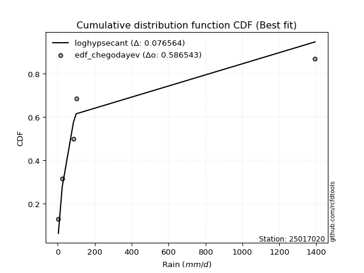</img>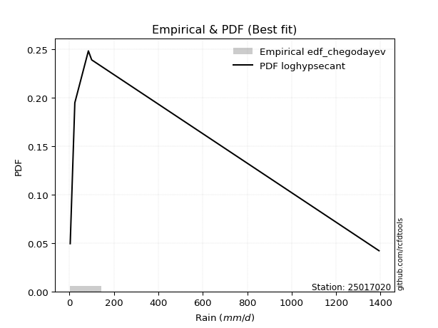</img>

</div>


### 6. EDF Blom (1958)

The Blom formula is a specific "plotting position" formula used in hydrology and statistical analysis to estimate the empirical cumulative probability (or non-exceedance probability) of a data series. It is particularly recommended for data that are approximately normally distributed. The constant _a_ is set to 0.375 (or 3/8).

<div align="center">


$P=(m-a)/(n+1-2a)$


</div>


**6.1. Empirical values**

<div align="center">

|                | 0                   | 1                   | 2        | 3                  | 4                  |
|:---------------|:--------------------|:--------------------|:---------|:-------------------|:-------------------|
| date           | 2019                | 2017                | 2024     | 2025               | 2018               |
| x              | 3.5                 | 24.2                | 85.2     | 100.0              | 1393.0             |
| m              | 1                   | 2                   | 3        | 4                  | 5                  |
| empirical_dist | edf_blom            | edf_blom            | edf_blom | edf_blom           | edf_blom           |
| empirical      | 0.11904761904761904 | 0.30952380952380953 | 0.5      | 0.6904761904761905 | 0.8809523809523809 |
| empirical_tr   | 1.135135135135135   | 1.4482758620689655  | 2.0      | 3.230769230769231  | 8.399999999999999  |

</div>


**6.2. Kolmogorov-Smirnov fit test (sorted by Δ)**


<div align="center">

|                | 0                   | 1                  | 2                   | 3                   | 4                   | 5                   | 6                   | 7                   | 8                   | 9                   | 10                  | 11                  | 12                  | 13                  | 14                  | 15                  | 16                 | 17                 | 18                  | 19                  | 20                  | 21                  | 22                  | 23                 | 24                  | 25                  | 26                  | 27                  | 28                  | 29                  | 30                  | 31                  | 32                  | 33                  | 34                  | 35                  | 36                 | 37                  | 38                  | 39                  | 40                  | 41                  | 42                  | 43                  | 44                  | 45                  | 46                  | 47                  | 48                  | 49                  | 50                  | 51                  | 52                  | 53                  | 54                  | 55                  | 56                  | 57                  | 58                  | 59                  | 60                 | 61                  | 62                  | 63                 | 64                 | 65                  | 66                  | 67                  | 68                 | 69                 | 70                 | 71                  | 72                  | 73                  | 74                  | 75                  | 76                  | 77                  | 78                  | 79                  | 80                  | 81                  | 82                 | 83                 | 84                  | 85                  | 86                 | 87                  | 88                  | 89                  | 90                  | 91                 | 92                  | 93                  | 94                 | 95                  | 96                 | 97                  | 98                 | 99                 | 100                | 101                | 102                | 103                 | 104                 | 105                 | 106                | 107                 | 108                | 109                | 110                | 111                 | 112                 | 113                | 114                | 115                | 116                 | 117                 | 118                 | 119                 | 120                 | 121                | 122                 | 123                 | 124                 | 125                 | 126                 | 127                 | 128                | 129                | 130                | 131                 | 132                | 133                | 134                 | 135                 | 136                 | 137                 | 138                | 139                 | 140                | 141                | 142                | 143                | 144                | 145                | 146                | 147                | 148                | 149                | 150                | 151                | 152                | 153                | 154                | 155                | 156                | 157                | 158                | 159                |
|:---------------|:--------------------|:-------------------|:--------------------|:--------------------|:--------------------|:--------------------|:--------------------|:--------------------|:--------------------|:--------------------|:--------------------|:--------------------|:--------------------|:--------------------|:--------------------|:--------------------|:-------------------|:-------------------|:--------------------|:--------------------|:--------------------|:--------------------|:--------------------|:-------------------|:--------------------|:--------------------|:--------------------|:--------------------|:--------------------|:--------------------|:--------------------|:--------------------|:--------------------|:--------------------|:--------------------|:--------------------|:-------------------|:--------------------|:--------------------|:--------------------|:--------------------|:--------------------|:--------------------|:--------------------|:--------------------|:--------------------|:--------------------|:--------------------|:--------------------|:--------------------|:--------------------|:--------------------|:--------------------|:--------------------|:--------------------|:--------------------|:--------------------|:--------------------|:--------------------|:--------------------|:-------------------|:--------------------|:--------------------|:-------------------|:-------------------|:--------------------|:--------------------|:--------------------|:-------------------|:-------------------|:-------------------|:--------------------|:--------------------|:--------------------|:--------------------|:--------------------|:--------------------|:--------------------|:--------------------|:--------------------|:--------------------|:--------------------|:-------------------|:-------------------|:--------------------|:--------------------|:-------------------|:--------------------|:--------------------|:--------------------|:--------------------|:-------------------|:--------------------|:--------------------|:-------------------|:--------------------|:-------------------|:--------------------|:-------------------|:-------------------|:-------------------|:-------------------|:-------------------|:--------------------|:--------------------|:--------------------|:-------------------|:--------------------|:-------------------|:-------------------|:-------------------|:--------------------|:--------------------|:-------------------|:-------------------|:-------------------|:--------------------|:--------------------|:--------------------|:--------------------|:--------------------|:-------------------|:--------------------|:--------------------|:--------------------|:--------------------|:--------------------|:--------------------|:-------------------|:-------------------|:-------------------|:--------------------|:-------------------|:-------------------|:--------------------|:--------------------|:--------------------|:--------------------|:-------------------|:--------------------|:-------------------|:-------------------|:-------------------|:-------------------|:-------------------|:-------------------|:-------------------|:-------------------|:-------------------|:-------------------|:-------------------|:-------------------|:-------------------|:-------------------|:-------------------|:-------------------|:-------------------|:-------------------|:-------------------|:-------------------|
| station        | 25017020            | 25017020           | 25017020            | 25017020            | 25017020            | 25017020            | 25017020            | 25017020            | 25017020            | 25017020            | 25017020            | 25017020            | 25017020            | 25017020            | 25017020            | 25017020            | 25017020           | 25017020           | 25017020            | 25017020            | 25017020            | 25017020            | 25017020            | 25017020           | 25017020            | 25017020            | 25017020            | 25017020            | 25017020            | 25017020            | 25017020            | 25017020            | 25017020            | 25017020            | 25017020            | 25017020            | 25017020           | 25017020            | 25017020            | 25017020            | 25017020            | 25017020            | 25017020            | 25017020            | 25017020            | 25017020            | 25017020            | 25017020            | 25017020            | 25017020            | 25017020            | 25017020            | 25017020            | 25017020            | 25017020            | 25017020            | 25017020            | 25017020            | 25017020            | 25017020            | 25017020           | 25017020            | 25017020            | 25017020           | 25017020           | 25017020            | 25017020            | 25017020            | 25017020           | 25017020           | 25017020           | 25017020            | 25017020            | 25017020            | 25017020            | 25017020            | 25017020            | 25017020            | 25017020            | 25017020            | 25017020            | 25017020            | 25017020           | 25017020           | 25017020            | 25017020            | 25017020           | 25017020            | 25017020            | 25017020            | 25017020            | 25017020           | 25017020            | 25017020            | 25017020           | 25017020            | 25017020           | 25017020            | 25017020           | 25017020           | 25017020           | 25017020           | 25017020           | 25017020            | 25017020            | 25017020            | 25017020           | 25017020            | 25017020           | 25017020           | 25017020           | 25017020            | 25017020            | 25017020           | 25017020           | 25017020           | 25017020            | 25017020            | 25017020            | 25017020            | 25017020            | 25017020           | 25017020            | 25017020            | 25017020            | 25017020            | 25017020            | 25017020            | 25017020           | 25017020           | 25017020           | 25017020            | 25017020           | 25017020           | 25017020            | 25017020            | 25017020            | 25017020            | 25017020           | 25017020            | 25017020           | 25017020           | 25017020           | 25017020           | 25017020           | 25017020           | 25017020           | 25017020           | 25017020           | 25017020           | 25017020           | 25017020           | 25017020           | 25017020           | 25017020           | 25017020           | 25017020           | 25017020           | 25017020           | 25017020           |
| empirical_dist | edf_blom            | edf_blom           | edf_blom            | edf_blom            | edf_blom            | edf_blom            | edf_blom            | edf_blom            | edf_blom            | edf_blom            | edf_blom            | edf_blom            | edf_blom            | edf_blom            | edf_blom            | edf_blom            | edf_blom           | edf_blom           | edf_blom            | edf_blom            | edf_blom            | edf_blom            | edf_blom            | edf_blom           | edf_blom            | edf_blom            | edf_blom            | edf_blom            | edf_blom            | edf_blom            | edf_blom            | edf_blom            | edf_blom            | edf_blom            | edf_blom            | edf_blom            | edf_blom           | edf_blom            | edf_blom            | edf_blom            | edf_blom            | edf_blom            | edf_blom            | edf_blom            | edf_blom            | edf_blom            | edf_blom            | edf_blom            | edf_blom            | edf_blom            | edf_blom            | edf_blom            | edf_blom            | edf_blom            | edf_blom            | edf_blom            | edf_blom            | edf_blom            | edf_blom            | edf_blom            | edf_blom           | edf_blom            | edf_blom            | edf_blom           | edf_blom           | edf_blom            | edf_blom            | edf_blom            | edf_blom           | edf_blom           | edf_blom           | edf_blom            | edf_blom            | edf_blom            | edf_blom            | edf_blom            | edf_blom            | edf_blom            | edf_blom            | edf_blom            | edf_blom            | edf_blom            | edf_blom           | edf_blom           | edf_blom            | edf_blom            | edf_blom           | edf_blom            | edf_blom            | edf_blom            | edf_blom            | edf_blom           | edf_blom            | edf_blom            | edf_blom           | edf_blom            | edf_blom           | edf_blom            | edf_blom           | edf_blom           | edf_blom           | edf_blom           | edf_blom           | edf_blom            | edf_blom            | edf_blom            | edf_blom           | edf_blom            | edf_blom           | edf_blom           | edf_blom           | edf_blom            | edf_blom            | edf_blom           | edf_blom           | edf_blom           | edf_blom            | edf_blom            | edf_blom            | edf_blom            | edf_blom            | edf_blom           | edf_blom            | edf_blom            | edf_blom            | edf_blom            | edf_blom            | edf_blom            | edf_blom           | edf_blom           | edf_blom           | edf_blom            | edf_blom           | edf_blom           | edf_blom            | edf_blom            | edf_blom            | edf_blom            | edf_blom           | edf_blom            | edf_blom           | edf_blom           | edf_blom           | edf_blom           | edf_blom           | edf_blom           | edf_blom           | edf_blom           | edf_blom           | edf_blom           | edf_blom           | edf_blom           | edf_blom           | edf_blom           | edf_blom           | edf_blom           | edf_blom           | edf_blom           | edf_blom           | edf_blom           |
| p_dist         | loghypsecant        | logf               | logfatiguelife      | logrice             | logjohnsonsu        | logskewnorm         | loggamma            | loggamma            | logalpha            | loglogistic         | logerlang           | loggenlogistic      | loginvgamma         | logpearson3         | loginvgauss         | logmaxwell          | ncf                | logweibull_min     | logburr12           | logfoldnorm         | lognct              | loglaplace          | loglaplace          | logexponnorm       | lognorm             | logcrystalball      | logt                | logbetaprime        | loggenextreme       | logloggamma         | lograyleigh         | logcosine           | logncf              | loganglit           | loginvweibull       | logsemicircular     | f                  | truncpareto         | logkappa4           | logtruncpareto      | betaprime           | logbradford         | logkstwobign        | logtruncnorm        | mielke              | logksone            | lomax               | logdweibull         | loghalfnorm         | genpareto           | loggompertz         | gamma               | logvonmises_line    | logkappa3           | loggumbel_r         | invgamma            | loguniform          | logtukeylambda      | logwrapcauchy       | loggausshyper       | invgauss           | logarcsine          | exponweib           | t                  | loggenexpon        | logtruncexpon       | logloglaplace       | logburr             | loghalflogistic    | logmoyal           | loggennorm         | erlang              | halfgennorm         | loggumbel_l         | nct                 | burr                | loglomax            | burr12              | logargus            | logexponpow         | nakagami            | logdgamma           | gausshyper         | truncweibull_min   | logwald             | loglevy_l           | logexponweib       | exponpow            | loghalfgennorm      | logbeta             | loggenpareto        | logmielke          | logtruncweibull_min | wrapcauchy          | vonmises_line      | wald                | gengamma           | foldnorm            | halflogistic       | dweibull           | pearson3           | halfnorm           | logjohnsonsb       | fatiguelife         | weibull_min         | arcsine             | loggenhalflogistic | levy_l              | moyal              | loggengamma        | gennorm            | gumbel_r            | rayleigh            | lognakagami        | genextreme         | maxwell            | semicircular        | anglit              | logtriang           | genlogistic         | norm                | powerlaw           | logistic            | invweibull          | dgamma              | hypsecant           | crystalball         | kstwobign           | logtrapezoid       | cosine             | rice               | gumbel_l            | logrdist           | laplace            | kappa3              | logweibull_max      | exponnorm           | genexpon            | gompertz           | alpha               | truncnorm          | argus              | ksone              | johnsonsb          | logpowerlaw        | bradford           | skewnorm           | truncexpon         | weibull_max        | kappa4             | genhalflogistic    | uniform            | triang             | rdist              | beta               | trapezoid          | johnsonsu          | tukeylambda        | logvonmises        | vonmises           |
| delta          | 0.07572344522739038 | 0.0803707469237589 | 0.08173901688902474 | 0.08243003210478739 | 0.08358740439345214 | 0.08392364214937775 | 0.08424869195749363 | 0.08424869195749363 | 0.08469374373290883 | 0.08562271145831901 | 0.08623311096531217 | 0.08672845740948931 | 0.08694900813845541 | 0.09015710382789821 | 0.09024595117427903 | 0.09041447747000408 | 0.0924379850014645 | 0.0956264516055152 | 0.09578385431868541 | 0.09598152548659478 | 0.09718198388762755 | 0.09722397525984716 | 0.09722397525984716 | 0.0972409000191059 | 0.09769037276430459 | 0.09769048855424234 | 0.09769095512926274 | 0.09834215300030658 | 0.09898161928129645 | 0.09985256216498528 | 0.09986628468840753 | 0.10872819374092912 | 0.10898507845658345 | 0.11058589560949394 | 0.11531162386857319 | 0.11593529705666106 | 0.1190241111177425 | 0.11904761904746264 | 0.11904761904761729 | 0.11904761904761907 | 0.11922061260385425 | 0.12012427209057575 | 0.12169620830595917 | 0.12221441797675614 | 0.12250750153860257 | 0.12271921863322333 | 0.12282880808928742 | 0.12505701084000564 | 0.12656122616733012 | 0.12656519948426526 | 0.12666127420939932 | 0.12753171745275194 | 0.12847234700604415 | 0.12995104814343095 | 0.13034879099393726 | 0.13043185782792333 | 0.13047717694807004 | 0.13149319133364012 | 0.13331483801273947 | 0.13425502248103482 | 0.1360073862834803 | 0.13740071669138287 | 0.13771671036089972 | 0.1430211788771385 | 0.1462775148140143 | 0.14714097465990783 | 0.15040141494421833 | 0.15336251278259683 | 0.1541776779483588 | 0.1548135364389508 | 0.1560984562230287 | 0.15787627559446715 | 0.15821864085056903 | 0.15876182731570687 | 0.16221348111710532 | 0.16261245133229396 | 0.17275851482601956 | 0.17788683283069973 | 0.17851808232341537 | 0.18323014287309214 | 0.18865101232546644 | 0.19935294227022463 | 0.2177109640220406 | 0.2226762544177593 | 0.22270869160537066 | 0.22770254134655188 | 0.2278373841352498 | 0.22818074025923307 | 0.23271950550737586 | 0.23416853644492058 | 0.23692839287717976 | 0.2458060718972831 | 0.2473855874926546  | 0.24767028775514133 | 0.2525136285543377 | 0.25302934092477014 | 0.2649465801395946 | 0.26654093392604733 | 0.2666656146833585 | 0.2711641933696307 | 0.272584335268744  | 0.2730308983076725 | 0.2799829696740622 | 0.28294017750378586 | 0.28382683876526626 | 0.28452247537663816 | 0.2860068801139367 | 0.28619529259552934 | 0.2879432957919472 | 0.2987183355705516 | 0.3010718469528595 | 0.30454759752369626 | 0.30698977483646217 | 0.3095236414554501 | 0.3103914691307328 | 0.3189222280687131 | 0.32061905730533335 | 0.32938584454771314 | 0.32959652905850173 | 0.33671797115656804 | 0.35022732239144116 | 0.3593237841072444 | 0.36897764227537794 | 0.38056525786197004 | 0.38095238095343376 | 0.38335145169614615 | 0.38342339859803587 | 0.38671831903191783 | 0.3879770947414042 | 0.4069334754425345 | 0.4072137560822264 | 0.40861295546613835 | 0.4093048765699333 | 0.4111842672451218 | 0.41295929512194296 | 0.42524159843778353 | 0.42758977630714534 | 0.42851046606134824 | 0.428561616547636  | 0.43823699632297985 | 0.4459995425103032 | 0.4600218024856092 | 0.5492683219383472 | 0.558561802378822  | 0.5592602255965533 | 0.5615776463005856 | 0.5676033762718977 | 0.5879252657605587 | 0.5970192147609629 | 0.604950950173011  | 0.6095712457803077 | 0.6210267482307784 | 0.623267317524019  | 0.6366243432290013 | 0.6485935829183404 | 0.6693729392006524 | 0.6794402936910309 | 0.6798020690864717 | 1.182826437138334  | 221.58972440257213 |
| deltao         | 0.5865427407550001  | 0.5865427407550001 | 0.5865427407550001  | 0.5865427407550001  | 0.5865427407550001  | 0.5865427407550001  | 0.5865427407550001  | 0.5865427407550001  | 0.5865427407550001  | 0.5865427407550001  | 0.5865427407550001  | 0.5865427407550001  | 0.5865427407550001  | 0.5865427407550001  | 0.5865427407550001  | 0.5865427407550001  | 0.5865427407550001 | 0.5865427407550001 | 0.5865427407550001  | 0.5865427407550001  | 0.5865427407550001  | 0.5865427407550001  | 0.5865427407550001  | 0.5865427407550001 | 0.5865427407550001  | 0.5865427407550001  | 0.5865427407550001  | 0.5865427407550001  | 0.5865427407550001  | 0.5865427407550001  | 0.5865427407550001  | 0.5865427407550001  | 0.5865427407550001  | 0.5865427407550001  | 0.5865427407550001  | 0.5865427407550001  | 0.5865427407550001 | 0.5865427407550001  | 0.5865427407550001  | 0.5865427407550001  | 0.5865427407550001  | 0.5865427407550001  | 0.5865427407550001  | 0.5865427407550001  | 0.5865427407550001  | 0.5865427407550001  | 0.5865427407550001  | 0.5865427407550001  | 0.5865427407550001  | 0.5865427407550001  | 0.5865427407550001  | 0.5865427407550001  | 0.5865427407550001  | 0.5865427407550001  | 0.5865427407550001  | 0.5865427407550001  | 0.5865427407550001  | 0.5865427407550001  | 0.5865427407550001  | 0.5865427407550001  | 0.5865427407550001 | 0.5865427407550001  | 0.5865427407550001  | 0.5865427407550001 | 0.5865427407550001 | 0.5865427407550001  | 0.5865427407550001  | 0.5865427407550001  | 0.5865427407550001 | 0.5865427407550001 | 0.5865427407550001 | 0.5865427407550001  | 0.5865427407550001  | 0.5865427407550001  | 0.5865427407550001  | 0.5865427407550001  | 0.5865427407550001  | 0.5865427407550001  | 0.5865427407550001  | 0.5865427407550001  | 0.5865427407550001  | 0.5865427407550001  | 0.5865427407550001 | 0.5865427407550001 | 0.5865427407550001  | 0.5865427407550001  | 0.5865427407550001 | 0.5865427407550001  | 0.5865427407550001  | 0.5865427407550001  | 0.5865427407550001  | 0.5865427407550001 | 0.5865427407550001  | 0.5865427407550001  | 0.5865427407550001 | 0.5865427407550001  | 0.5865427407550001 | 0.5865427407550001  | 0.5865427407550001 | 0.5865427407550001 | 0.5865427407550001 | 0.5865427407550001 | 0.5865427407550001 | 0.5865427407550001  | 0.5865427407550001  | 0.5865427407550001  | 0.5865427407550001 | 0.5865427407550001  | 0.5865427407550001 | 0.5865427407550001 | 0.5865427407550001 | 0.5865427407550001  | 0.5865427407550001  | 0.5865427407550001 | 0.5865427407550001 | 0.5865427407550001 | 0.5865427407550001  | 0.5865427407550001  | 0.5865427407550001  | 0.5865427407550001  | 0.5865427407550001  | 0.5865427407550001 | 0.5865427407550001  | 0.5865427407550001  | 0.5865427407550001  | 0.5865427407550001  | 0.5865427407550001  | 0.5865427407550001  | 0.5865427407550001 | 0.5865427407550001 | 0.5865427407550001 | 0.5865427407550001  | 0.5865427407550001 | 0.5865427407550001 | 0.5865427407550001  | 0.5865427407550001  | 0.5865427407550001  | 0.5865427407550001  | 0.5865427407550001 | 0.5865427407550001  | 0.5865427407550001 | 0.5865427407550001 | 0.5865427407550001 | 0.5865427407550001 | 0.5865427407550001 | 0.5865427407550001 | 0.5865427407550001 | 0.5865427407550001 | 0.5865427407550001 | 0.5865427407550001 | 0.5865427407550001 | 0.5865427407550001 | 0.5865427407550001 | 0.5865427407550001 | 0.5865427407550001 | 0.5865427407550001 | 0.5865427407550001 | 0.5865427407550001 | 0.5865427407550001 | 0.5865427407550001 |
| eval           | Δo > Δ              | Δo > Δ             | Δo > Δ              | Δo > Δ              | Δo > Δ              | Δo > Δ              | Δo > Δ              | Δo > Δ              | Δo > Δ              | Δo > Δ              | Δo > Δ              | Δo > Δ              | Δo > Δ              | Δo > Δ              | Δo > Δ              | Δo > Δ              | Δo > Δ             | Δo > Δ             | Δo > Δ              | Δo > Δ              | Δo > Δ              | Δo > Δ              | Δo > Δ              | Δo > Δ             | Δo > Δ              | Δo > Δ              | Δo > Δ              | Δo > Δ              | Δo > Δ              | Δo > Δ              | Δo > Δ              | Δo > Δ              | Δo > Δ              | Δo > Δ              | Δo > Δ              | Δo > Δ              | Δo > Δ             | Δo > Δ              | Δo > Δ              | Δo > Δ              | Δo > Δ              | Δo > Δ              | Δo > Δ              | Δo > Δ              | Δo > Δ              | Δo > Δ              | Δo > Δ              | Δo > Δ              | Δo > Δ              | Δo > Δ              | Δo > Δ              | Δo > Δ              | Δo > Δ              | Δo > Δ              | Δo > Δ              | Δo > Δ              | Δo > Δ              | Δo > Δ              | Δo > Δ              | Δo > Δ              | Δo > Δ             | Δo > Δ              | Δo > Δ              | Δo > Δ             | Δo > Δ             | Δo > Δ              | Δo > Δ              | Δo > Δ              | Δo > Δ             | Δo > Δ             | Δo > Δ             | Δo > Δ              | Δo > Δ              | Δo > Δ              | Δo > Δ              | Δo > Δ              | Δo > Δ              | Δo > Δ              | Δo > Δ              | Δo > Δ              | Δo > Δ              | Δo > Δ              | Δo > Δ             | Δo > Δ             | Δo > Δ              | Δo > Δ              | Δo > Δ             | Δo > Δ              | Δo > Δ              | Δo > Δ              | Δo > Δ              | Δo > Δ             | Δo > Δ              | Δo > Δ              | Δo > Δ             | Δo > Δ              | Δo > Δ             | Δo > Δ              | Δo > Δ             | Δo > Δ             | Δo > Δ             | Δo > Δ             | Δo > Δ             | Δo > Δ              | Δo > Δ              | Δo > Δ              | Δo > Δ             | Δo > Δ              | Δo > Δ             | Δo > Δ             | Δo > Δ             | Δo > Δ              | Δo > Δ              | Δo > Δ             | Δo > Δ             | Δo > Δ             | Δo > Δ              | Δo > Δ              | Δo > Δ              | Δo > Δ              | Δo > Δ              | Δo > Δ             | Δo > Δ              | Δo > Δ              | Δo > Δ              | Δo > Δ              | Δo > Δ              | Δo > Δ              | Δo > Δ             | Δo > Δ             | Δo > Δ             | Δo > Δ              | Δo > Δ             | Δo > Δ             | Δo > Δ              | Δo > Δ              | Δo > Δ              | Δo > Δ              | Δo > Δ             | Δo > Δ              | Δo > Δ             | Δo > Δ             | Δo > Δ             | Δo > Δ             | Δo > Δ             | Δo > Δ             | Δo > Δ             | Δo <= Δ            | Δo <= Δ            | Δo <= Δ            | Δo <= Δ            | Δo <= Δ            | Δo <= Δ            | Δo <= Δ            | Δo <= Δ            | Δo <= Δ            | Δo <= Δ            | Δo <= Δ            | Δo <= Δ            | Δo <= Δ            |
| fit            | 1                   | 1                  | 1                   | 1                   | 1                   | 1                   | 1                   | 1                   | 1                   | 1                   | 1                   | 1                   | 1                   | 1                   | 1                   | 1                   | 1                  | 1                  | 1                   | 1                   | 1                   | 1                   | 1                   | 1                  | 1                   | 1                   | 1                   | 1                   | 1                   | 1                   | 1                   | 1                   | 1                   | 1                   | 1                   | 1                   | 1                  | 1                   | 1                   | 1                   | 1                   | 1                   | 1                   | 1                   | 1                   | 1                   | 1                   | 1                   | 1                   | 1                   | 1                   | 1                   | 1                   | 1                   | 1                   | 1                   | 1                   | 1                   | 1                   | 1                   | 1                  | 1                   | 1                   | 1                  | 1                  | 1                   | 1                   | 1                   | 1                  | 1                  | 1                  | 1                   | 1                   | 1                   | 1                   | 1                   | 1                   | 1                   | 1                   | 1                   | 1                   | 1                   | 1                  | 1                  | 1                   | 1                   | 1                  | 1                   | 1                   | 1                   | 1                   | 1                  | 1                   | 1                   | 1                  | 1                   | 1                  | 1                   | 1                  | 1                  | 1                  | 1                  | 1                  | 1                   | 1                   | 1                   | 1                  | 1                   | 1                  | 1                  | 1                  | 1                   | 1                   | 1                  | 1                  | 1                  | 1                   | 1                   | 1                   | 1                   | 1                   | 1                  | 1                   | 1                   | 1                   | 1                   | 1                   | 1                   | 1                  | 1                  | 1                  | 1                   | 1                  | 1                  | 1                   | 1                   | 1                   | 1                   | 1                  | 1                   | 1                  | 1                  | 1                  | 1                  | 1                  | 1                  | 1                  | 0                  | 0                  | 0                  | 0                  | 0                  | 0                  | 0                  | 0                  | 0                  | 0                  | 0                  | 0                  | 0                  |
| n              | 5                   | 5                  | 5                   | 5                   | 5                   | 5                   | 5                   | 5                   | 5                   | 5                   | 5                   | 5                   | 5                   | 5                   | 5                   | 5                   | 5                  | 5                  | 5                   | 5                   | 5                   | 5                   | 5                   | 5                  | 5                   | 5                   | 5                   | 5                   | 5                   | 5                   | 5                   | 5                   | 5                   | 5                   | 5                   | 5                   | 5                  | 5                   | 5                   | 5                   | 5                   | 5                   | 5                   | 5                   | 5                   | 5                   | 5                   | 5                   | 5                   | 5                   | 5                   | 5                   | 5                   | 5                   | 5                   | 5                   | 5                   | 5                   | 5                   | 5                   | 5                  | 5                   | 5                   | 5                  | 5                  | 5                   | 5                   | 5                   | 5                  | 5                  | 5                  | 5                   | 5                   | 5                   | 5                   | 5                   | 5                   | 5                   | 5                   | 5                   | 5                   | 5                   | 5                  | 5                  | 5                   | 5                   | 5                  | 5                   | 5                   | 5                   | 5                   | 5                  | 5                   | 5                   | 5                  | 5                   | 5                  | 5                   | 5                  | 5                  | 5                  | 5                  | 5                  | 5                   | 5                   | 5                   | 5                  | 5                   | 5                  | 5                  | 5                  | 5                   | 5                   | 5                  | 5                  | 5                  | 5                   | 5                   | 5                   | 5                   | 5                   | 5                  | 5                   | 5                   | 5                   | 5                   | 5                   | 5                   | 5                  | 5                  | 5                  | 5                   | 5                  | 5                  | 5                   | 5                   | 5                   | 5                   | 5                  | 5                   | 5                  | 5                  | 5                  | 5                  | 5                  | 5                  | 5                  | 5                  | 5                  | 5                  | 5                  | 5                  | 5                  | 5                  | 5                  | 5                  | 5                  | 5                  | 5                  | 5                  |
| best_fit       | 1                   | 0                  | 0                   | 0                   | 0                   | 0                   | 0                   | 0                   | 0                   | 0                   | 0                   | 0                   | 0                   | 0                   | 0                   | 0                   | 0                  | 0                  | 0                   | 0                   | 0                   | 0                   | 0                   | 0                  | 0                   | 0                   | 0                   | 0                   | 0                   | 0                   | 0                   | 0                   | 0                   | 0                   | 0                   | 0                   | 0                  | 0                   | 0                   | 0                   | 0                   | 0                   | 0                   | 0                   | 0                   | 0                   | 0                   | 0                   | 0                   | 0                   | 0                   | 0                   | 0                   | 0                   | 0                   | 0                   | 0                   | 0                   | 0                   | 0                   | 0                  | 0                   | 0                   | 0                  | 0                  | 0                   | 0                   | 0                   | 0                  | 0                  | 0                  | 0                   | 0                   | 0                   | 0                   | 0                   | 0                   | 0                   | 0                   | 0                   | 0                   | 0                   | 0                  | 0                  | 0                   | 0                   | 0                  | 0                   | 0                   | 0                   | 0                   | 0                  | 0                   | 0                   | 0                  | 0                   | 0                  | 0                   | 0                  | 0                  | 0                  | 0                  | 0                  | 0                   | 0                   | 0                   | 0                  | 0                   | 0                  | 0                  | 0                  | 0                   | 0                   | 0                  | 0                  | 0                  | 0                   | 0                   | 0                   | 0                   | 0                   | 0                  | 0                   | 0                   | 0                   | 0                   | 0                   | 0                   | 0                  | 0                  | 0                  | 0                   | 0                  | 0                  | 0                   | 0                   | 0                   | 0                   | 0                  | 0                   | 0                  | 0                  | 0                  | 0                  | 0                  | 0                  | 0                  | 0                  | 0                  | 0                  | 0                  | 0                  | 0                  | 0                  | 0                  | 0                  | 0                  | 0                  | 0                  | 0                  |
| best_fit_sort  | 1                   | 2                  | 3                   | 4                   | 5                   | 6                   | 7                   | 8                   | 9                   | 10                  | 11                  | 12                  | 13                  | 14                  | 15                  | 16                  | 17                 | 18                 | 19                  | 20                  | 21                  | 22                  | 23                  | 24                 | 25                  | 26                  | 27                  | 28                  | 29                  | 30                  | 31                  | 32                  | 33                  | 34                  | 35                  | 36                  | 37                 | 38                  | 39                  | 40                  | 41                  | 42                  | 43                  | 44                  | 45                  | 46                  | 47                  | 48                  | 49                  | 50                  | 51                  | 52                  | 53                  | 54                  | 55                  | 56                  | 57                  | 58                  | 59                  | 60                  | 61                 | 62                  | 63                  | 64                 | 65                 | 66                  | 67                  | 68                  | 69                 | 70                 | 71                 | 72                  | 73                  | 74                  | 75                  | 76                  | 77                  | 78                  | 79                  | 80                  | 81                  | 82                  | 83                 | 84                 | 85                  | 86                  | 87                 | 88                  | 89                  | 90                  | 91                  | 92                 | 93                  | 94                  | 95                 | 96                  | 97                 | 98                  | 99                 | 100                | 101                | 102                | 103                | 104                 | 105                 | 106                 | 107                | 108                 | 109                | 110                | 111                | 112                 | 113                 | 114                | 115                | 116                | 117                 | 118                 | 119                 | 120                 | 121                 | 122                | 123                 | 124                 | 125                 | 126                 | 127                 | 128                 | 129                | 130                | 131                | 132                 | 133                | 134                | 135                 | 136                 | 137                 | 138                 | 139                | 140                 | 141                | 142                | 143                | 144                | 145                | 146                | 147                | 148                | 149                | 150                | 151                | 152                | 153                | 154                | 155                | 156                | 157                | 158                | 159                | 160                |

</div>


**6.3. Best fit**

<div align="center">

|   id |   station | empirical_dist   | p_dist       |     delta |   deltao | eval   |   fit |   n |   best_fit |   best_fit_sort |
|-----:|----------:|:-----------------|:-------------|----------:|---------:|:-------|------:|----:|-----------:|----------------:|
|    0 |  25017020 | edf_blom         | loghypsecant | 0.0757234 | 0.586543 | Δo > Δ |     1 |   5 |          1 |               1 |

</div>


<div align="center">

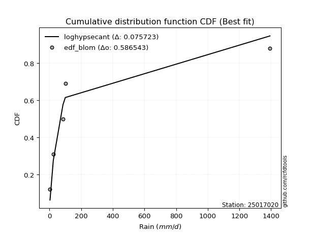</img></img>

</div>


### 7. EDF Tukey (1962)

In hydrology, the Tukey formula is used as a plotting position formula to estimate the empirical probability or frequency of a flood event (or other hydrological data). The formula parameter is given as _c=0.333_ (or 1/3).

<div align="center">


$P=(m-c)/(n+1-2c)$


</div>


**7.1. Empirical values**

<div align="center">

|                | 0                  | 1                  | 2         | 3         | 4         |
|:---------------|:-------------------|:-------------------|:----------|:----------|:----------|
| date           | 2019               | 2017               | 2024      | 2025      | 2018      |
| x              | 3.5                | 24.2               | 85.2      | 100.0     | 1393.0    |
| m              | 1                  | 2                  | 3         | 4         | 5         |
| empirical_dist | edf_tukey          | edf_tukey          | edf_tukey | edf_tukey | edf_tukey |
| empirical      | 0.125              | 0.3125             | 0.5       | 0.6875    | 0.875     |
| empirical_tr   | 1.1428571428571428 | 1.4545454545454546 | 2.0       | 3.2       | 8.0       |

</div>


**7.2. Kolmogorov-Smirnov fit test (sorted by Δ)**


<div align="center">

|                | 0                   | 1                   | 2                  | 3                   | 4                   | 5                   | 6                   | 7                   | 8                   | 9                  | 10                  | 11                  | 12                  | 13                  | 14                  | 15                  | 16                 | 17                  | 18                  | 19                  | 20                  | 21                  | 22                  | 23                 | 24                  | 25                  | 26                  | 27                  | 28                  | 29                  | 30                  | 31                  | 32                  | 33                  | 34                  | 35                  | 36                  | 37                  | 38                  | 39                  | 40                  | 41                  | 42                  | 43                  | 44                  | 45                  | 46                  | 47                 | 48                  | 49                 | 50                  | 51                  | 52                  | 53                  | 54                  | 55                 | 56                  | 57                  | 58                  | 59                  | 60                 | 61                  | 62                 | 63                 | 64                 | 65                  | 66                  | 67                  | 68                 | 69                 | 70                 | 71                  | 72                 | 73                  | 74                 | 75                  | 76                 | 77                  | 78                 | 79                  | 80                  | 81                 | 82                  | 83                  | 84                  | 85                 | 86                  | 87                 | 88                 | 89                  | 90                 | 91                  | 92                  | 93                 | 94                 | 95                 | 96                  | 97                  | 98                 | 99                 | 100                | 101                 | 102                 | 103                | 104                | 105                | 106                | 107                 | 108                 | 109                 | 110                | 111                | 112                | 113                 | 114                 | 115                 | 116                | 117                 | 118                 | 119                | 120                | 121                 | 122                 | 123                | 124                | 125                 | 126                | 127                 | 128                | 129                 | 130                | 131                | 132                 | 133                 | 134                | 135                 | 136                | 137                | 138                 | 139                | 140                 | 141                 | 142                | 143                | 144                | 145                | 146                | 147                | 148                | 149                | 150                | 151                | 152                | 153                | 154                | 155                | 156                | 157                | 158                | 159                |
|:---------------|:--------------------|:--------------------|:-------------------|:--------------------|:--------------------|:--------------------|:--------------------|:--------------------|:--------------------|:-------------------|:--------------------|:--------------------|:--------------------|:--------------------|:--------------------|:--------------------|:-------------------|:--------------------|:--------------------|:--------------------|:--------------------|:--------------------|:--------------------|:-------------------|:--------------------|:--------------------|:--------------------|:--------------------|:--------------------|:--------------------|:--------------------|:--------------------|:--------------------|:--------------------|:--------------------|:--------------------|:--------------------|:--------------------|:--------------------|:--------------------|:--------------------|:--------------------|:--------------------|:--------------------|:--------------------|:--------------------|:--------------------|:-------------------|:--------------------|:-------------------|:--------------------|:--------------------|:--------------------|:--------------------|:--------------------|:-------------------|:--------------------|:--------------------|:--------------------|:--------------------|:-------------------|:--------------------|:-------------------|:-------------------|:-------------------|:--------------------|:--------------------|:--------------------|:-------------------|:-------------------|:-------------------|:--------------------|:-------------------|:--------------------|:-------------------|:--------------------|:-------------------|:--------------------|:-------------------|:--------------------|:--------------------|:-------------------|:--------------------|:--------------------|:--------------------|:-------------------|:--------------------|:-------------------|:-------------------|:--------------------|:-------------------|:--------------------|:--------------------|:-------------------|:-------------------|:-------------------|:--------------------|:--------------------|:-------------------|:-------------------|:-------------------|:--------------------|:--------------------|:-------------------|:-------------------|:-------------------|:-------------------|:--------------------|:--------------------|:--------------------|:-------------------|:-------------------|:-------------------|:--------------------|:--------------------|:--------------------|:-------------------|:--------------------|:--------------------|:-------------------|:-------------------|:--------------------|:--------------------|:-------------------|:-------------------|:--------------------|:-------------------|:--------------------|:-------------------|:--------------------|:-------------------|:-------------------|:--------------------|:--------------------|:-------------------|:--------------------|:-------------------|:-------------------|:--------------------|:-------------------|:--------------------|:--------------------|:-------------------|:-------------------|:-------------------|:-------------------|:-------------------|:-------------------|:-------------------|:-------------------|:-------------------|:-------------------|:-------------------|:-------------------|:-------------------|:-------------------|:-------------------|:-------------------|:-------------------|:-------------------|
| station        | 25017020            | 25017020            | 25017020           | 25017020            | 25017020            | 25017020            | 25017020            | 25017020            | 25017020            | 25017020           | 25017020            | 25017020            | 25017020            | 25017020            | 25017020            | 25017020            | 25017020           | 25017020            | 25017020            | 25017020            | 25017020            | 25017020            | 25017020            | 25017020           | 25017020            | 25017020            | 25017020            | 25017020            | 25017020            | 25017020            | 25017020            | 25017020            | 25017020            | 25017020            | 25017020            | 25017020            | 25017020            | 25017020            | 25017020            | 25017020            | 25017020            | 25017020            | 25017020            | 25017020            | 25017020            | 25017020            | 25017020            | 25017020           | 25017020            | 25017020           | 25017020            | 25017020            | 25017020            | 25017020            | 25017020            | 25017020           | 25017020            | 25017020            | 25017020            | 25017020            | 25017020           | 25017020            | 25017020           | 25017020           | 25017020           | 25017020            | 25017020            | 25017020            | 25017020           | 25017020           | 25017020           | 25017020            | 25017020           | 25017020            | 25017020           | 25017020            | 25017020           | 25017020            | 25017020           | 25017020            | 25017020            | 25017020           | 25017020            | 25017020            | 25017020            | 25017020           | 25017020            | 25017020           | 25017020           | 25017020            | 25017020           | 25017020            | 25017020            | 25017020           | 25017020           | 25017020           | 25017020            | 25017020            | 25017020           | 25017020           | 25017020           | 25017020            | 25017020            | 25017020           | 25017020           | 25017020           | 25017020           | 25017020            | 25017020            | 25017020            | 25017020           | 25017020           | 25017020           | 25017020            | 25017020            | 25017020            | 25017020           | 25017020            | 25017020            | 25017020           | 25017020           | 25017020            | 25017020            | 25017020           | 25017020           | 25017020            | 25017020           | 25017020            | 25017020           | 25017020            | 25017020           | 25017020           | 25017020            | 25017020            | 25017020           | 25017020            | 25017020           | 25017020           | 25017020            | 25017020           | 25017020            | 25017020            | 25017020           | 25017020           | 25017020           | 25017020           | 25017020           | 25017020           | 25017020           | 25017020           | 25017020           | 25017020           | 25017020           | 25017020           | 25017020           | 25017020           | 25017020           | 25017020           | 25017020           | 25017020           |
| empirical_dist | edf_tukey           | edf_tukey           | edf_tukey          | edf_tukey           | edf_tukey           | edf_tukey           | edf_tukey           | edf_tukey           | edf_tukey           | edf_tukey          | edf_tukey           | edf_tukey           | edf_tukey           | edf_tukey           | edf_tukey           | edf_tukey           | edf_tukey          | edf_tukey           | edf_tukey           | edf_tukey           | edf_tukey           | edf_tukey           | edf_tukey           | edf_tukey          | edf_tukey           | edf_tukey           | edf_tukey           | edf_tukey           | edf_tukey           | edf_tukey           | edf_tukey           | edf_tukey           | edf_tukey           | edf_tukey           | edf_tukey           | edf_tukey           | edf_tukey           | edf_tukey           | edf_tukey           | edf_tukey           | edf_tukey           | edf_tukey           | edf_tukey           | edf_tukey           | edf_tukey           | edf_tukey           | edf_tukey           | edf_tukey          | edf_tukey           | edf_tukey          | edf_tukey           | edf_tukey           | edf_tukey           | edf_tukey           | edf_tukey           | edf_tukey          | edf_tukey           | edf_tukey           | edf_tukey           | edf_tukey           | edf_tukey          | edf_tukey           | edf_tukey          | edf_tukey          | edf_tukey          | edf_tukey           | edf_tukey           | edf_tukey           | edf_tukey          | edf_tukey          | edf_tukey          | edf_tukey           | edf_tukey          | edf_tukey           | edf_tukey          | edf_tukey           | edf_tukey          | edf_tukey           | edf_tukey          | edf_tukey           | edf_tukey           | edf_tukey          | edf_tukey           | edf_tukey           | edf_tukey           | edf_tukey          | edf_tukey           | edf_tukey          | edf_tukey          | edf_tukey           | edf_tukey          | edf_tukey           | edf_tukey           | edf_tukey          | edf_tukey          | edf_tukey          | edf_tukey           | edf_tukey           | edf_tukey          | edf_tukey          | edf_tukey          | edf_tukey           | edf_tukey           | edf_tukey          | edf_tukey          | edf_tukey          | edf_tukey          | edf_tukey           | edf_tukey           | edf_tukey           | edf_tukey          | edf_tukey          | edf_tukey          | edf_tukey           | edf_tukey           | edf_tukey           | edf_tukey          | edf_tukey           | edf_tukey           | edf_tukey          | edf_tukey          | edf_tukey           | edf_tukey           | edf_tukey          | edf_tukey          | edf_tukey           | edf_tukey          | edf_tukey           | edf_tukey          | edf_tukey           | edf_tukey          | edf_tukey          | edf_tukey           | edf_tukey           | edf_tukey          | edf_tukey           | edf_tukey          | edf_tukey          | edf_tukey           | edf_tukey          | edf_tukey           | edf_tukey           | edf_tukey          | edf_tukey          | edf_tukey          | edf_tukey          | edf_tukey          | edf_tukey          | edf_tukey          | edf_tukey          | edf_tukey          | edf_tukey          | edf_tukey          | edf_tukey          | edf_tukey          | edf_tukey          | edf_tukey          | edf_tukey          | edf_tukey          | edf_tukey          |
| p_dist         | loghypsecant        | logfatiguelife      | logf               | logjohnsonsu        | logskewnorm         | loggamma            | loggamma            | logrice             | loglogistic         | logerlang          | logalpha            | loggenlogistic      | loginvgamma         | logpearson3         | loginvgauss         | logmaxwell          | ncf                | logfoldnorm         | lognct              | logexponnorm        | lognorm             | logcrystalball      | logt                | logweibull_min     | logburr12           | loggenextreme       | logloggamma         | loglaplace          | loglaplace          | logbetaprime        | lograyleigh         | logcosine           | loganglit           | logncf              | logsemicircular     | loginvweibull       | logksone            | logkstwobign        | logdweibull         | mielke              | f                   | betaprime           | logbradford         | gamma               | loggompertz         | logtruncnorm        | truncpareto         | lomax              | logkappa4           | logtruncpareto     | loghalfnorm         | genpareto           | logkappa3           | loguniform          | logtukeylambda      | logwrapcauchy      | loggumbel_r         | invgamma            | logvonmises_line    | loggausshyper       | logarcsine         | exponweib           | invgauss           | t                  | loggenexpon        | logtruncexpon       | logloglaplace       | logburr             | loghalflogistic    | logmoyal           | erlang             | halfgennorm         | loggumbel_l        | loggennorm          | nct                | burr                | loglomax           | burr12              | logargus           | logexponpow         | nakagami            | logdgamma          | gausshyper          | truncweibull_min    | logwald             | loglevy_l          | logexponweib        | exponpow           | loghalfgennorm     | logbeta             | loggenpareto       | logtruncweibull_min | wrapcauchy          | logmielke          | vonmises_line      | wald               | gengamma            | foldnorm            | halflogistic       | dweibull           | pearson3           | halfnorm            | logjohnsonsb        | fatiguelife        | levy_l             | weibull_min        | arcsine            | loggenhalflogistic  | moyal               | loggengamma         | gennorm            | gumbel_r           | rayleigh           | genextreme          | lognakagami         | maxwell             | semicircular       | anglit              | logtriang           | genlogistic        | norm               | powerlaw            | logistic            | invweibull         | dgamma             | crystalball         | hypsecant          | kstwobign           | logtrapezoid       | cosine              | rice               | gumbel_l           | kappa3              | laplace             | logrdist           | logweibull_max      | exponnorm          | genexpon           | gompertz            | alpha              | truncnorm           | argus               | ksone              | johnsonsb          | logpowerlaw        | bradford           | skewnorm           | truncexpon         | weibull_max        | kappa4             | genhalflogistic    | uniform            | triang             | rdist              | beta               | trapezoid          | tukeylambda        | johnsonsu          | logvonmises        | vonmises           |
| delta          | 0.07572344522739038 | 0.07876282641283427 | 0.0803707469237589 | 0.08061121391726167 | 0.08094745167318729 | 0.08127250148130316 | 0.08127250148130316 | 0.08243003210478739 | 0.08264652098212855 | 0.0832569204891217 | 0.08469374373290883 | 0.08672845740948931 | 0.08694900813845541 | 0.08718091335170775 | 0.09024595117427903 | 0.09041447747000408 | 0.0924379850014645 | 0.09300533501040431 | 0.09420579341143709 | 0.09426470954291544 | 0.09471418228811412 | 0.09471429807805187 | 0.09471476465307227 | 0.0956264516055152 | 0.09578385431868541 | 0.09600542880510599 | 0.09687637168879482 | 0.09722397525984716 | 0.09722397525984716 | 0.09834215300030658 | 0.09986628468840753 | 0.10575200326473866 | 0.10760970513330348 | 0.10898507845658345 | 0.11295910658047059 | 0.11531162386857319 | 0.11974302815703286 | 0.12169620830595917 | 0.12208082036381518 | 0.12250750153860257 | 0.12497649207012346 | 0.12499959249715438 | 0.12499984750040072 | 0.12499990498789455 | 0.12499995624655423 | 0.12499999793662564 | 0.12499999999984357 | 0.1249999999998883 | 0.12499999999999825 | 0.125              | 0.12656122616733012 | 0.12656519948426526 | 0.12697485766724048 | 0.12750098647187957 | 0.12851700085744966 | 0.130338647536549  | 0.13034879099393726 | 0.13043185782792333 | 0.13144853748223462 | 0.13425502248103482 | 0.1344245262151924 | 0.13474051988470925 | 0.1360073862834803 | 0.1430211788771385 | 0.1462775148140143 | 0.14714097465990783 | 0.14742522446802786 | 0.15336251278259683 | 0.1541776779483588 | 0.1548135364389508 | 0.1549000851182767 | 0.15524245037437856 | 0.1557856368395164 | 0.15907464669921917 | 0.1619697977515584 | 0.16261245133229396 | 0.1697823243498291 | 0.17491064235450926 | 0.1755418918472249 | 0.18025395239690167 | 0.18567482184927597 | 0.2023291327464151 | 0.21473477354585013 | 0.21970006394156882 | 0.22270869160537066 | 0.2247263508703614 | 0.22486119365905932 | 0.2252045497830426 | 0.2297433150311854 | 0.23119234596873012 | 0.2339522024009893 | 0.24440939701646414 | 0.24469409727895086 | 0.2458060718972831 | 0.2495374380781472 | 0.2500531504485797 | 0.26197038966340414 | 0.26356474344985686 | 0.263689424207168  | 0.2652118124172498 | 0.2696081447925535 | 0.27005470783148205 | 0.27700677919787176 | 0.2799639870275954 | 0.2802429116431484 | 0.2808506482890758 | 0.2815462849004477 | 0.28303068963774625 | 0.28496710531575675 | 0.29574214509436114 | 0.3010718469528595 | 0.3015714070475058 | 0.3040135843602717 | 0.30443908817835186 | 0.31249983193164055 | 0.31594603759252265 | 0.3176428668291429 | 0.32640965407152267 | 0.32662033858231126 | 0.3337417806803776 | 0.3472511319152507 | 0.35634759363105395 | 0.36600145179918747 | 0.3746128769095891 | 0.3750000000010528 | 0.37747101764565494 | 0.3803752612199557 | 0.38374212855572737 | 0.3850009042652137 | 0.40395728496634403 | 0.4042375656060359 | 0.4056367649899479 | 0.40700691416956203 | 0.40820807676893134 | 0.4093048765699333 | 0.42226540796159306 | 0.4246135858309549 | 0.4255342755851578 | 0.42558542607144556 | 0.4352608058467894 | 0.44302335203411275 | 0.45704561200941873 | 0.5462921314621567 | 0.5555856119026316 | 0.5562840351203628 | 0.5586014558243951 | 0.5646271857957073 | 0.5849490752843682 | 0.5940430242847724 | 0.6019747596968206 | 0.6065950553041173 | 0.618050557754588  | 0.6202911270478285 | 0.6306719622766204 | 0.6426412019659594 | 0.666396748724462  | 0.6738496881340907 | 0.6764641032148404 | 1.1887788180907148 | 221.5956767835245  |
| deltao         | 0.5865427407550001  | 0.5865427407550001  | 0.5865427407550001 | 0.5865427407550001  | 0.5865427407550001  | 0.5865427407550001  | 0.5865427407550001  | 0.5865427407550001  | 0.5865427407550001  | 0.5865427407550001 | 0.5865427407550001  | 0.5865427407550001  | 0.5865427407550001  | 0.5865427407550001  | 0.5865427407550001  | 0.5865427407550001  | 0.5865427407550001 | 0.5865427407550001  | 0.5865427407550001  | 0.5865427407550001  | 0.5865427407550001  | 0.5865427407550001  | 0.5865427407550001  | 0.5865427407550001 | 0.5865427407550001  | 0.5865427407550001  | 0.5865427407550001  | 0.5865427407550001  | 0.5865427407550001  | 0.5865427407550001  | 0.5865427407550001  | 0.5865427407550001  | 0.5865427407550001  | 0.5865427407550001  | 0.5865427407550001  | 0.5865427407550001  | 0.5865427407550001  | 0.5865427407550001  | 0.5865427407550001  | 0.5865427407550001  | 0.5865427407550001  | 0.5865427407550001  | 0.5865427407550001  | 0.5865427407550001  | 0.5865427407550001  | 0.5865427407550001  | 0.5865427407550001  | 0.5865427407550001 | 0.5865427407550001  | 0.5865427407550001 | 0.5865427407550001  | 0.5865427407550001  | 0.5865427407550001  | 0.5865427407550001  | 0.5865427407550001  | 0.5865427407550001 | 0.5865427407550001  | 0.5865427407550001  | 0.5865427407550001  | 0.5865427407550001  | 0.5865427407550001 | 0.5865427407550001  | 0.5865427407550001 | 0.5865427407550001 | 0.5865427407550001 | 0.5865427407550001  | 0.5865427407550001  | 0.5865427407550001  | 0.5865427407550001 | 0.5865427407550001 | 0.5865427407550001 | 0.5865427407550001  | 0.5865427407550001 | 0.5865427407550001  | 0.5865427407550001 | 0.5865427407550001  | 0.5865427407550001 | 0.5865427407550001  | 0.5865427407550001 | 0.5865427407550001  | 0.5865427407550001  | 0.5865427407550001 | 0.5865427407550001  | 0.5865427407550001  | 0.5865427407550001  | 0.5865427407550001 | 0.5865427407550001  | 0.5865427407550001 | 0.5865427407550001 | 0.5865427407550001  | 0.5865427407550001 | 0.5865427407550001  | 0.5865427407550001  | 0.5865427407550001 | 0.5865427407550001 | 0.5865427407550001 | 0.5865427407550001  | 0.5865427407550001  | 0.5865427407550001 | 0.5865427407550001 | 0.5865427407550001 | 0.5865427407550001  | 0.5865427407550001  | 0.5865427407550001 | 0.5865427407550001 | 0.5865427407550001 | 0.5865427407550001 | 0.5865427407550001  | 0.5865427407550001  | 0.5865427407550001  | 0.5865427407550001 | 0.5865427407550001 | 0.5865427407550001 | 0.5865427407550001  | 0.5865427407550001  | 0.5865427407550001  | 0.5865427407550001 | 0.5865427407550001  | 0.5865427407550001  | 0.5865427407550001 | 0.5865427407550001 | 0.5865427407550001  | 0.5865427407550001  | 0.5865427407550001 | 0.5865427407550001 | 0.5865427407550001  | 0.5865427407550001 | 0.5865427407550001  | 0.5865427407550001 | 0.5865427407550001  | 0.5865427407550001 | 0.5865427407550001 | 0.5865427407550001  | 0.5865427407550001  | 0.5865427407550001 | 0.5865427407550001  | 0.5865427407550001 | 0.5865427407550001 | 0.5865427407550001  | 0.5865427407550001 | 0.5865427407550001  | 0.5865427407550001  | 0.5865427407550001 | 0.5865427407550001 | 0.5865427407550001 | 0.5865427407550001 | 0.5865427407550001 | 0.5865427407550001 | 0.5865427407550001 | 0.5865427407550001 | 0.5865427407550001 | 0.5865427407550001 | 0.5865427407550001 | 0.5865427407550001 | 0.5865427407550001 | 0.5865427407550001 | 0.5865427407550001 | 0.5865427407550001 | 0.5865427407550001 | 0.5865427407550001 |
| eval           | Δo > Δ              | Δo > Δ              | Δo > Δ             | Δo > Δ              | Δo > Δ              | Δo > Δ              | Δo > Δ              | Δo > Δ              | Δo > Δ              | Δo > Δ             | Δo > Δ              | Δo > Δ              | Δo > Δ              | Δo > Δ              | Δo > Δ              | Δo > Δ              | Δo > Δ             | Δo > Δ              | Δo > Δ              | Δo > Δ              | Δo > Δ              | Δo > Δ              | Δo > Δ              | Δo > Δ             | Δo > Δ              | Δo > Δ              | Δo > Δ              | Δo > Δ              | Δo > Δ              | Δo > Δ              | Δo > Δ              | Δo > Δ              | Δo > Δ              | Δo > Δ              | Δo > Δ              | Δo > Δ              | Δo > Δ              | Δo > Δ              | Δo > Δ              | Δo > Δ              | Δo > Δ              | Δo > Δ              | Δo > Δ              | Δo > Δ              | Δo > Δ              | Δo > Δ              | Δo > Δ              | Δo > Δ             | Δo > Δ              | Δo > Δ             | Δo > Δ              | Δo > Δ              | Δo > Δ              | Δo > Δ              | Δo > Δ              | Δo > Δ             | Δo > Δ              | Δo > Δ              | Δo > Δ              | Δo > Δ              | Δo > Δ             | Δo > Δ              | Δo > Δ             | Δo > Δ             | Δo > Δ             | Δo > Δ              | Δo > Δ              | Δo > Δ              | Δo > Δ             | Δo > Δ             | Δo > Δ             | Δo > Δ              | Δo > Δ             | Δo > Δ              | Δo > Δ             | Δo > Δ              | Δo > Δ             | Δo > Δ              | Δo > Δ             | Δo > Δ              | Δo > Δ              | Δo > Δ             | Δo > Δ              | Δo > Δ              | Δo > Δ              | Δo > Δ             | Δo > Δ              | Δo > Δ             | Δo > Δ             | Δo > Δ              | Δo > Δ             | Δo > Δ              | Δo > Δ              | Δo > Δ             | Δo > Δ             | Δo > Δ             | Δo > Δ              | Δo > Δ              | Δo > Δ             | Δo > Δ             | Δo > Δ             | Δo > Δ              | Δo > Δ              | Δo > Δ             | Δo > Δ             | Δo > Δ             | Δo > Δ             | Δo > Δ              | Δo > Δ              | Δo > Δ              | Δo > Δ             | Δo > Δ             | Δo > Δ             | Δo > Δ              | Δo > Δ              | Δo > Δ              | Δo > Δ             | Δo > Δ              | Δo > Δ              | Δo > Δ             | Δo > Δ             | Δo > Δ              | Δo > Δ              | Δo > Δ             | Δo > Δ             | Δo > Δ              | Δo > Δ             | Δo > Δ              | Δo > Δ             | Δo > Δ              | Δo > Δ             | Δo > Δ             | Δo > Δ              | Δo > Δ              | Δo > Δ             | Δo > Δ              | Δo > Δ             | Δo > Δ             | Δo > Δ              | Δo > Δ             | Δo > Δ              | Δo > Δ              | Δo > Δ             | Δo > Δ             | Δo > Δ             | Δo > Δ             | Δo > Δ             | Δo > Δ             | Δo <= Δ            | Δo <= Δ            | Δo <= Δ            | Δo <= Δ            | Δo <= Δ            | Δo <= Δ            | Δo <= Δ            | Δo <= Δ            | Δo <= Δ            | Δo <= Δ            | Δo <= Δ            | Δo <= Δ            |
| fit            | 1                   | 1                   | 1                  | 1                   | 1                   | 1                   | 1                   | 1                   | 1                   | 1                  | 1                   | 1                   | 1                   | 1                   | 1                   | 1                   | 1                  | 1                   | 1                   | 1                   | 1                   | 1                   | 1                   | 1                  | 1                   | 1                   | 1                   | 1                   | 1                   | 1                   | 1                   | 1                   | 1                   | 1                   | 1                   | 1                   | 1                   | 1                   | 1                   | 1                   | 1                   | 1                   | 1                   | 1                   | 1                   | 1                   | 1                   | 1                  | 1                   | 1                  | 1                   | 1                   | 1                   | 1                   | 1                   | 1                  | 1                   | 1                   | 1                   | 1                   | 1                  | 1                   | 1                  | 1                  | 1                  | 1                   | 1                   | 1                   | 1                  | 1                  | 1                  | 1                   | 1                  | 1                   | 1                  | 1                   | 1                  | 1                   | 1                  | 1                   | 1                   | 1                  | 1                   | 1                   | 1                   | 1                  | 1                   | 1                  | 1                  | 1                   | 1                  | 1                   | 1                   | 1                  | 1                  | 1                  | 1                   | 1                   | 1                  | 1                  | 1                  | 1                   | 1                   | 1                  | 1                  | 1                  | 1                  | 1                   | 1                   | 1                   | 1                  | 1                  | 1                  | 1                   | 1                   | 1                   | 1                  | 1                   | 1                   | 1                  | 1                  | 1                   | 1                   | 1                  | 1                  | 1                   | 1                  | 1                   | 1                  | 1                   | 1                  | 1                  | 1                   | 1                   | 1                  | 1                   | 1                  | 1                  | 1                   | 1                  | 1                   | 1                   | 1                  | 1                  | 1                  | 1                  | 1                  | 1                  | 0                  | 0                  | 0                  | 0                  | 0                  | 0                  | 0                  | 0                  | 0                  | 0                  | 0                  | 0                  |
| n              | 5                   | 5                   | 5                  | 5                   | 5                   | 5                   | 5                   | 5                   | 5                   | 5                  | 5                   | 5                   | 5                   | 5                   | 5                   | 5                   | 5                  | 5                   | 5                   | 5                   | 5                   | 5                   | 5                   | 5                  | 5                   | 5                   | 5                   | 5                   | 5                   | 5                   | 5                   | 5                   | 5                   | 5                   | 5                   | 5                   | 5                   | 5                   | 5                   | 5                   | 5                   | 5                   | 5                   | 5                   | 5                   | 5                   | 5                   | 5                  | 5                   | 5                  | 5                   | 5                   | 5                   | 5                   | 5                   | 5                  | 5                   | 5                   | 5                   | 5                   | 5                  | 5                   | 5                  | 5                  | 5                  | 5                   | 5                   | 5                   | 5                  | 5                  | 5                  | 5                   | 5                  | 5                   | 5                  | 5                   | 5                  | 5                   | 5                  | 5                   | 5                   | 5                  | 5                   | 5                   | 5                   | 5                  | 5                   | 5                  | 5                  | 5                   | 5                  | 5                   | 5                   | 5                  | 5                  | 5                  | 5                   | 5                   | 5                  | 5                  | 5                  | 5                   | 5                   | 5                  | 5                  | 5                  | 5                  | 5                   | 5                   | 5                   | 5                  | 5                  | 5                  | 5                   | 5                   | 5                   | 5                  | 5                   | 5                   | 5                  | 5                  | 5                   | 5                   | 5                  | 5                  | 5                   | 5                  | 5                   | 5                  | 5                   | 5                  | 5                  | 5                   | 5                   | 5                  | 5                   | 5                  | 5                  | 5                   | 5                  | 5                   | 5                   | 5                  | 5                  | 5                  | 5                  | 5                  | 5                  | 5                  | 5                  | 5                  | 5                  | 5                  | 5                  | 5                  | 5                  | 5                  | 5                  | 5                  | 5                  |
| best_fit       | 1                   | 0                   | 0                  | 0                   | 0                   | 0                   | 0                   | 0                   | 0                   | 0                  | 0                   | 0                   | 0                   | 0                   | 0                   | 0                   | 0                  | 0                   | 0                   | 0                   | 0                   | 0                   | 0                   | 0                  | 0                   | 0                   | 0                   | 0                   | 0                   | 0                   | 0                   | 0                   | 0                   | 0                   | 0                   | 0                   | 0                   | 0                   | 0                   | 0                   | 0                   | 0                   | 0                   | 0                   | 0                   | 0                   | 0                   | 0                  | 0                   | 0                  | 0                   | 0                   | 0                   | 0                   | 0                   | 0                  | 0                   | 0                   | 0                   | 0                   | 0                  | 0                   | 0                  | 0                  | 0                  | 0                   | 0                   | 0                   | 0                  | 0                  | 0                  | 0                   | 0                  | 0                   | 0                  | 0                   | 0                  | 0                   | 0                  | 0                   | 0                   | 0                  | 0                   | 0                   | 0                   | 0                  | 0                   | 0                  | 0                  | 0                   | 0                  | 0                   | 0                   | 0                  | 0                  | 0                  | 0                   | 0                   | 0                  | 0                  | 0                  | 0                   | 0                   | 0                  | 0                  | 0                  | 0                  | 0                   | 0                   | 0                   | 0                  | 0                  | 0                  | 0                   | 0                   | 0                   | 0                  | 0                   | 0                   | 0                  | 0                  | 0                   | 0                   | 0                  | 0                  | 0                   | 0                  | 0                   | 0                  | 0                   | 0                  | 0                  | 0                   | 0                   | 0                  | 0                   | 0                  | 0                  | 0                   | 0                  | 0                   | 0                   | 0                  | 0                  | 0                  | 0                  | 0                  | 0                  | 0                  | 0                  | 0                  | 0                  | 0                  | 0                  | 0                  | 0                  | 0                  | 0                  | 0                  | 0                  |
| best_fit_sort  | 1                   | 2                   | 3                  | 4                   | 5                   | 6                   | 7                   | 8                   | 9                   | 10                 | 11                  | 12                  | 13                  | 14                  | 15                  | 16                  | 17                 | 18                  | 19                  | 20                  | 21                  | 22                  | 23                  | 24                 | 25                  | 26                  | 27                  | 28                  | 29                  | 30                  | 31                  | 32                  | 33                  | 34                  | 35                  | 36                  | 37                  | 38                  | 39                  | 40                  | 41                  | 42                  | 43                  | 44                  | 45                  | 46                  | 47                  | 48                 | 49                  | 50                 | 51                  | 52                  | 53                  | 54                  | 55                  | 56                 | 57                  | 58                  | 59                  | 60                  | 61                 | 62                  | 63                 | 64                 | 65                 | 66                  | 67                  | 68                  | 69                 | 70                 | 71                 | 72                  | 73                 | 74                  | 75                 | 76                  | 77                 | 78                  | 79                 | 80                  | 81                  | 82                 | 83                  | 84                  | 85                  | 86                 | 87                  | 88                 | 89                 | 90                  | 91                 | 92                  | 93                  | 94                 | 95                 | 96                 | 97                  | 98                  | 99                 | 100                | 101                | 102                 | 103                 | 104                | 105                | 106                | 107                | 108                 | 109                 | 110                 | 111                | 112                | 113                | 114                 | 115                 | 116                 | 117                | 118                 | 119                 | 120                | 121                | 122                 | 123                 | 124                | 125                | 126                 | 127                | 128                 | 129                | 130                 | 131                | 132                | 133                 | 134                 | 135                | 136                 | 137                | 138                | 139                 | 140                | 141                 | 142                 | 143                | 144                | 145                | 146                | 147                | 148                | 149                | 150                | 151                | 152                | 153                | 154                | 155                | 156                | 157                | 158                | 159                | 160                |

</div>


**7.3. Best fit**

<div align="center">

|   id |   station | empirical_dist   | p_dist       |     delta |   deltao | eval   |   fit |   n |   best_fit |   best_fit_sort |
|-----:|----------:|:-----------------|:-------------|----------:|---------:|:-------|------:|----:|-----------:|----------------:|
|    0 |  25017020 | edf_tukey        | loghypsecant | 0.0757234 | 0.586543 | Δo > Δ |     1 |   5 |          1 |               1 |

</div>


<div align="center">

</img></img>

</div>


### 8. EDF Gringorten (1963)

Gringorten plotting position formula is essential for estimating the probability and return periods of extreme events like floods and heavy rainfall. The constant _a=0.44_.

<div align="center">


$P=(m-a)/(n+1-2a)$


</div>


**8.1. Empirical values**

<div align="center">

|                | 0                   | 1                  | 2              | 3                 | 4                  |
|:---------------|:--------------------|:-------------------|:---------------|:------------------|:-------------------|
| date           | 2019                | 2017               | 2024           | 2025              | 2018               |
| x              | 3.5                 | 24.2               | 85.2           | 100.0             | 1393.0             |
| m              | 1                   | 2                  | 3              | 4                 | 5                  |
| empirical_dist | edf_gringorten      | edf_gringorten     | edf_gringorten | edf_gringorten    | edf_gringorten     |
| empirical      | 0.10937500000000001 | 0.3046875          | 0.5            | 0.6953125         | 0.8906249999999999 |
| empirical_tr   | 1.1228070175438596  | 1.4382022471910112 | 2.0            | 3.282051282051282 | 9.142857142857133  |

</div>


**8.2. Kolmogorov-Smirnov fit test (sorted by Δ)**


<div align="center">

|                | 0                   | 1                   | 2                   | 3                   | 4                   | 5                   | 6                   | 7                   | 8                   | 9                   | 10                  | 11                  | 12                  | 13                  | 14                 | 15                 | 16                  | 17                 | 18                  | 19                  | 20                  | 21                  | 22                  | 23                  | 24                  | 25                  | 26                  | 27                  | 28                  | 29                  | 30                  | 31                  | 32                  | 33                  | 34                  | 35                  | 36                  | 37                  | 38                  | 39                  | 40                  | 41                  | 42                  | 43                  | 44                  | 45                  | 46                  | 47                  | 48                  | 49                  | 50                  | 51                  | 52                  | 53                  | 54                  | 55                  | 56                  | 57                  | 58                 | 59                  | 60                 | 61                 | 62                  | 63                 | 64                 | 65                  | 66                  | 67                  | 68                 | 69                 | 70                  | 71                  | 72                 | 73                  | 74                 | 75                  | 76                 | 77                  | 78                 | 79                  | 80                  | 81                 | 82                  | 83                  | 84                  | 85                 | 86                  | 87                 | 88                 | 89                  | 90                 | 91                 | 92                  | 93                  | 94                 | 95                 | 96                  | 97                  | 98                 | 99                 | 100                 | 101                | 102                 | 103                | 104                | 105                | 106                 | 107                 | 108                | 109                | 110                 | 111                 | 112                | 113                | 114                 | 115                 | 116                | 117                 | 118                 | 119                | 120                | 121                 | 122                 | 123                | 124                | 125                | 126                 | 127                | 128                 | 129                | 130                 | 131                | 132                | 133                 | 134                | 135                 | 136                | 137                | 138                 | 139                | 140                 | 141                 | 142                | 143                | 144                | 145                | 146                | 147                | 148                | 149                | 150                | 151                | 152                | 153                | 154                | 155                | 156                | 157                | 158                | 159                |
|:---------------|:--------------------|:--------------------|:--------------------|:--------------------|:--------------------|:--------------------|:--------------------|:--------------------|:--------------------|:--------------------|:--------------------|:--------------------|:--------------------|:--------------------|:-------------------|:-------------------|:--------------------|:-------------------|:--------------------|:--------------------|:--------------------|:--------------------|:--------------------|:--------------------|:--------------------|:--------------------|:--------------------|:--------------------|:--------------------|:--------------------|:--------------------|:--------------------|:--------------------|:--------------------|:--------------------|:--------------------|:--------------------|:--------------------|:--------------------|:--------------------|:--------------------|:--------------------|:--------------------|:--------------------|:--------------------|:--------------------|:--------------------|:--------------------|:--------------------|:--------------------|:--------------------|:--------------------|:--------------------|:--------------------|:--------------------|:--------------------|:--------------------|:--------------------|:-------------------|:--------------------|:-------------------|:-------------------|:--------------------|:-------------------|:-------------------|:--------------------|:--------------------|:--------------------|:-------------------|:-------------------|:--------------------|:--------------------|:-------------------|:--------------------|:-------------------|:--------------------|:-------------------|:--------------------|:-------------------|:--------------------|:--------------------|:-------------------|:--------------------|:--------------------|:--------------------|:-------------------|:--------------------|:-------------------|:-------------------|:--------------------|:-------------------|:-------------------|:--------------------|:--------------------|:-------------------|:-------------------|:--------------------|:--------------------|:-------------------|:-------------------|:--------------------|:-------------------|:--------------------|:-------------------|:-------------------|:-------------------|:--------------------|:--------------------|:-------------------|:-------------------|:--------------------|:--------------------|:-------------------|:-------------------|:--------------------|:--------------------|:-------------------|:--------------------|:--------------------|:-------------------|:-------------------|:--------------------|:--------------------|:-------------------|:-------------------|:-------------------|:--------------------|:-------------------|:--------------------|:-------------------|:--------------------|:-------------------|:-------------------|:--------------------|:-------------------|:--------------------|:-------------------|:-------------------|:--------------------|:-------------------|:--------------------|:--------------------|:-------------------|:-------------------|:-------------------|:-------------------|:-------------------|:-------------------|:-------------------|:-------------------|:-------------------|:-------------------|:-------------------|:-------------------|:-------------------|:-------------------|:-------------------|:-------------------|:-------------------|:-------------------|
| station        | 25017020            | 25017020            | 25017020            | 25017020            | 25017020            | 25017020            | 25017020            | 25017020            | 25017020            | 25017020            | 25017020            | 25017020            | 25017020            | 25017020            | 25017020           | 25017020           | 25017020            | 25017020           | 25017020            | 25017020            | 25017020            | 25017020            | 25017020            | 25017020            | 25017020            | 25017020            | 25017020            | 25017020            | 25017020            | 25017020            | 25017020            | 25017020            | 25017020            | 25017020            | 25017020            | 25017020            | 25017020            | 25017020            | 25017020            | 25017020            | 25017020            | 25017020            | 25017020            | 25017020            | 25017020            | 25017020            | 25017020            | 25017020            | 25017020            | 25017020            | 25017020            | 25017020            | 25017020            | 25017020            | 25017020            | 25017020            | 25017020            | 25017020            | 25017020           | 25017020            | 25017020           | 25017020           | 25017020            | 25017020           | 25017020           | 25017020            | 25017020            | 25017020            | 25017020           | 25017020           | 25017020            | 25017020            | 25017020           | 25017020            | 25017020           | 25017020            | 25017020           | 25017020            | 25017020           | 25017020            | 25017020            | 25017020           | 25017020            | 25017020            | 25017020            | 25017020           | 25017020            | 25017020           | 25017020           | 25017020            | 25017020           | 25017020           | 25017020            | 25017020            | 25017020           | 25017020           | 25017020            | 25017020            | 25017020           | 25017020           | 25017020            | 25017020           | 25017020            | 25017020           | 25017020           | 25017020           | 25017020            | 25017020            | 25017020           | 25017020           | 25017020            | 25017020            | 25017020           | 25017020           | 25017020            | 25017020            | 25017020           | 25017020            | 25017020            | 25017020           | 25017020           | 25017020            | 25017020            | 25017020           | 25017020           | 25017020           | 25017020            | 25017020           | 25017020            | 25017020           | 25017020            | 25017020           | 25017020           | 25017020            | 25017020           | 25017020            | 25017020           | 25017020           | 25017020            | 25017020           | 25017020            | 25017020            | 25017020           | 25017020           | 25017020           | 25017020           | 25017020           | 25017020           | 25017020           | 25017020           | 25017020           | 25017020           | 25017020           | 25017020           | 25017020           | 25017020           | 25017020           | 25017020           | 25017020           | 25017020           |
| empirical_dist | edf_gringorten      | edf_gringorten      | edf_gringorten      | edf_gringorten      | edf_gringorten      | edf_gringorten      | edf_gringorten      | edf_gringorten      | edf_gringorten      | edf_gringorten      | edf_gringorten      | edf_gringorten      | edf_gringorten      | edf_gringorten      | edf_gringorten     | edf_gringorten     | edf_gringorten      | edf_gringorten     | edf_gringorten      | edf_gringorten      | edf_gringorten      | edf_gringorten      | edf_gringorten      | edf_gringorten      | edf_gringorten      | edf_gringorten      | edf_gringorten      | edf_gringorten      | edf_gringorten      | edf_gringorten      | edf_gringorten      | edf_gringorten      | edf_gringorten      | edf_gringorten      | edf_gringorten      | edf_gringorten      | edf_gringorten      | edf_gringorten      | edf_gringorten      | edf_gringorten      | edf_gringorten      | edf_gringorten      | edf_gringorten      | edf_gringorten      | edf_gringorten      | edf_gringorten      | edf_gringorten      | edf_gringorten      | edf_gringorten      | edf_gringorten      | edf_gringorten      | edf_gringorten      | edf_gringorten      | edf_gringorten      | edf_gringorten      | edf_gringorten      | edf_gringorten      | edf_gringorten      | edf_gringorten     | edf_gringorten      | edf_gringorten     | edf_gringorten     | edf_gringorten      | edf_gringorten     | edf_gringorten     | edf_gringorten      | edf_gringorten      | edf_gringorten      | edf_gringorten     | edf_gringorten     | edf_gringorten      | edf_gringorten      | edf_gringorten     | edf_gringorten      | edf_gringorten     | edf_gringorten      | edf_gringorten     | edf_gringorten      | edf_gringorten     | edf_gringorten      | edf_gringorten      | edf_gringorten     | edf_gringorten      | edf_gringorten      | edf_gringorten      | edf_gringorten     | edf_gringorten      | edf_gringorten     | edf_gringorten     | edf_gringorten      | edf_gringorten     | edf_gringorten     | edf_gringorten      | edf_gringorten      | edf_gringorten     | edf_gringorten     | edf_gringorten      | edf_gringorten      | edf_gringorten     | edf_gringorten     | edf_gringorten      | edf_gringorten     | edf_gringorten      | edf_gringorten     | edf_gringorten     | edf_gringorten     | edf_gringorten      | edf_gringorten      | edf_gringorten     | edf_gringorten     | edf_gringorten      | edf_gringorten      | edf_gringorten     | edf_gringorten     | edf_gringorten      | edf_gringorten      | edf_gringorten     | edf_gringorten      | edf_gringorten      | edf_gringorten     | edf_gringorten     | edf_gringorten      | edf_gringorten      | edf_gringorten     | edf_gringorten     | edf_gringorten     | edf_gringorten      | edf_gringorten     | edf_gringorten      | edf_gringorten     | edf_gringorten      | edf_gringorten     | edf_gringorten     | edf_gringorten      | edf_gringorten     | edf_gringorten      | edf_gringorten     | edf_gringorten     | edf_gringorten      | edf_gringorten     | edf_gringorten      | edf_gringorten      | edf_gringorten     | edf_gringorten     | edf_gringorten     | edf_gringorten     | edf_gringorten     | edf_gringorten     | edf_gringorten     | edf_gringorten     | edf_gringorten     | edf_gringorten     | edf_gringorten     | edf_gringorten     | edf_gringorten     | edf_gringorten     | edf_gringorten     | edf_gringorten     | edf_gringorten     | edf_gringorten     |
| p_dist         | loghypsecant        | logrice             | logf                | logalpha            | logfatiguelife      | loggenlogistic      | loginvgamma         | logjohnsonsu        | logskewnorm         | loggamma            | loggamma            | loginvgauss         | logmaxwell          | loglogistic         | logerlang          | ncf                | logpearson3         | logweibull_min     | logburr12           | loglaplace          | loglaplace          | logbetaprime        | lograyleigh         | logfoldnorm         | lognct              | logexponnorm        | lognorm             | logcrystalball      | logt                | loggenextreme       | logloggamma         | logncf              | f                   | truncpareto         | logtruncpareto      | logcosine           | loginvweibull       | loganglit           | logkappa4           | logbradford         | logsemicircular     | logkstwobign        | logtruncnorm        | mielke              | lomax               | logvonmises_line    | betaprime           | loghalfnorm         | genpareto           | logksone            | logdweibull         | loggumbel_r         | invgamma            | loggompertz         | gamma               | loggausshyper       | logkappa3           | loguniform          | invgauss           | logtukeylambda      | logwrapcauchy      | logarcsine         | exponweib           | t                  | loggenexpon        | logtruncexpon       | loggennorm          | logburr             | loghalflogistic    | logmoyal           | logloglaplace       | burr                | erlang             | halfgennorm         | loggumbel_l        | nct                 | loglomax           | burr12              | logargus           | logexponpow         | nakagami            | logdgamma          | gausshyper          | logwald             | truncweibull_min    | loglevy_l          | logexponweib        | exponpow           | loghalfgennorm     | logbeta             | loggenpareto       | logmielke          | logtruncweibull_min | wrapcauchy          | vonmises_line      | wald               | gengamma            | foldnorm            | halflogistic       | pearson3           | halfnorm            | dweibull           | logjohnsonsb        | fatiguelife        | weibull_min        | arcsine            | loggenhalflogistic  | moyal               | levy_l             | gennorm            | loggengamma         | lognakagami         | gumbel_r           | rayleigh           | genextreme          | maxwell             | semicircular       | anglit              | logtriang           | genlogistic        | norm               | powerlaw            | logistic            | hypsecant          | invweibull         | dgamma             | kstwobign           | logtrapezoid       | crystalball         | logrdist           | cosine              | rice               | gumbel_l           | laplace             | kappa3             | logweibull_max      | exponnorm          | genexpon           | gompertz            | alpha              | truncnorm           | argus               | ksone              | johnsonsb          | logpowerlaw        | bradford           | skewnorm           | truncexpon         | weibull_max        | kappa4             | genhalflogistic    | uniform            | triang             | rdist              | beta               | trapezoid          | johnsonsu          | tukeylambda        | logvonmises        | vonmises           |
| delta          | 0.08052588760140622 | 0.08297428127591078 | 0.08405055702863695 | 0.08469374373290883 | 0.08657532641283427 | 0.08672845740948931 | 0.08694900813845541 | 0.08842371391726167 | 0.08875995167318729 | 0.08908500148130316 | 0.08908500148130316 | 0.09024595117427903 | 0.09041447747000408 | 0.09045902098212855 | 0.0910694204891217 | 0.0924379850014645 | 0.09499341335170775 | 0.0956264516055152 | 0.09578385431868541 | 0.09722397525984716 | 0.09722397525984716 | 0.09834215300030658 | 0.09986628468840753 | 0.10081783501040431 | 0.10201829341143709 | 0.10207720954291544 | 0.10252668228811412 | 0.10252679807805187 | 0.10252726465307227 | 0.10381792880510599 | 0.10468887168879482 | 0.10898507845658345 | 0.10935149207012347 | 0.10937499999984368 | 0.10937500000000011 | 0.11356450326473866 | 0.11531162386857319 | 0.11542220513330348 | 0.11697450543954868 | 0.12012427209057575 | 0.12077160658047059 | 0.12169620830595917 | 0.12221441797675614 | 0.12250750153860257 | 0.12282880808928742 | 0.12363603748223462 | 0.12405692212766378 | 0.12656122616733012 | 0.12656519948426526 | 0.12755552815703286 | 0.12989332036381518 | 0.13034879099393726 | 0.13043185782792333 | 0.13149758373320886 | 0.13236802697656147 | 0.13425502248103482 | 0.13478735766724048 | 0.13531348647187957 | 0.1360073862834803 | 0.13632950085744966 | 0.138151147536549  | 0.1422370262151924 | 0.14255301988470925 | 0.1430211788771385 | 0.1462775148140143 | 0.14714097465990783 | 0.15126214669921917 | 0.15336251278259683 | 0.1541776779483588 | 0.1548135364389508 | 0.15523772446802786 | 0.16261245133229396 | 0.1627125851182767 | 0.16305495037437856 | 0.1635981368395164 | 0.16704979064091485 | 0.1775948243498291 | 0.18272314235450926 | 0.1833543918472249 | 0.18806645239690167 | 0.19348732184927597 | 0.1945166327464151 | 0.22254727354585013 | 0.22270869160537066 | 0.22751256394156882 | 0.2325388508703614 | 0.23267369365905932 | 0.2330170497830426 | 0.2375558150311854 | 0.23900484596873012 | 0.2417647024009893 | 0.2458060718972831 | 0.25222189701646414 | 0.25250659727895086 | 0.2573499380781472 | 0.2578656504485797 | 0.26978288966340414 | 0.27137724344985686 | 0.271501924207168  | 0.2774206447925535 | 0.27786720783148205 | 0.2808368124172498 | 0.28481927919787176 | 0.2877764870275954 | 0.2886631482890758 | 0.2893587849004477 | 0.29084318963774625 | 0.29277960531575675 | 0.2958679116431484 | 0.3010718469528595 | 0.30355464509436114 | 0.30468733193164055 | 0.3093839070475058 | 0.3118260843602717 | 0.32006408817835175 | 0.32375853759252265 | 0.3254553668291429 | 0.33422215407152267 | 0.33443283858231126 | 0.3415542806803776 | 0.3550636319152507 | 0.36416009363105395 | 0.37381395179918747 | 0.3881877612199557 | 0.390237876909589  | 0.3906250000010528 | 0.39155462855572737 | 0.3928134042652137 | 0.39309601764565494 | 0.4093048765699333 | 0.41176978496634403 | 0.4120500656060359 | 0.4134492649899479 | 0.41602057676893134 | 0.4226319141695619 | 0.43007790796159306 | 0.4324260858309549 | 0.4333467755851578 | 0.43339792607144556 | 0.4430733058467894 | 0.45083585203411275 | 0.46485811200941873 | 0.5541046314621567 | 0.5633981119026316 | 0.5640965351203628 | 0.5664139558243951 | 0.5724396857957073 | 0.5927615752843682 | 0.6018555242847724 | 0.6097872596968206 | 0.6144075553041173 | 0.625863057754588  | 0.6281036270478285 | 0.6462969622766204 | 0.6582662019659594 | 0.674209248724462  | 0.6842766032148404 | 0.6894746881340907 | 1.1731538180907148 | 221.5800517835245  |
| deltao         | 0.5865427407550001  | 0.5865427407550001  | 0.5865427407550001  | 0.5865427407550001  | 0.5865427407550001  | 0.5865427407550001  | 0.5865427407550001  | 0.5865427407550001  | 0.5865427407550001  | 0.5865427407550001  | 0.5865427407550001  | 0.5865427407550001  | 0.5865427407550001  | 0.5865427407550001  | 0.5865427407550001 | 0.5865427407550001 | 0.5865427407550001  | 0.5865427407550001 | 0.5865427407550001  | 0.5865427407550001  | 0.5865427407550001  | 0.5865427407550001  | 0.5865427407550001  | 0.5865427407550001  | 0.5865427407550001  | 0.5865427407550001  | 0.5865427407550001  | 0.5865427407550001  | 0.5865427407550001  | 0.5865427407550001  | 0.5865427407550001  | 0.5865427407550001  | 0.5865427407550001  | 0.5865427407550001  | 0.5865427407550001  | 0.5865427407550001  | 0.5865427407550001  | 0.5865427407550001  | 0.5865427407550001  | 0.5865427407550001  | 0.5865427407550001  | 0.5865427407550001  | 0.5865427407550001  | 0.5865427407550001  | 0.5865427407550001  | 0.5865427407550001  | 0.5865427407550001  | 0.5865427407550001  | 0.5865427407550001  | 0.5865427407550001  | 0.5865427407550001  | 0.5865427407550001  | 0.5865427407550001  | 0.5865427407550001  | 0.5865427407550001  | 0.5865427407550001  | 0.5865427407550001  | 0.5865427407550001  | 0.5865427407550001 | 0.5865427407550001  | 0.5865427407550001 | 0.5865427407550001 | 0.5865427407550001  | 0.5865427407550001 | 0.5865427407550001 | 0.5865427407550001  | 0.5865427407550001  | 0.5865427407550001  | 0.5865427407550001 | 0.5865427407550001 | 0.5865427407550001  | 0.5865427407550001  | 0.5865427407550001 | 0.5865427407550001  | 0.5865427407550001 | 0.5865427407550001  | 0.5865427407550001 | 0.5865427407550001  | 0.5865427407550001 | 0.5865427407550001  | 0.5865427407550001  | 0.5865427407550001 | 0.5865427407550001  | 0.5865427407550001  | 0.5865427407550001  | 0.5865427407550001 | 0.5865427407550001  | 0.5865427407550001 | 0.5865427407550001 | 0.5865427407550001  | 0.5865427407550001 | 0.5865427407550001 | 0.5865427407550001  | 0.5865427407550001  | 0.5865427407550001 | 0.5865427407550001 | 0.5865427407550001  | 0.5865427407550001  | 0.5865427407550001 | 0.5865427407550001 | 0.5865427407550001  | 0.5865427407550001 | 0.5865427407550001  | 0.5865427407550001 | 0.5865427407550001 | 0.5865427407550001 | 0.5865427407550001  | 0.5865427407550001  | 0.5865427407550001 | 0.5865427407550001 | 0.5865427407550001  | 0.5865427407550001  | 0.5865427407550001 | 0.5865427407550001 | 0.5865427407550001  | 0.5865427407550001  | 0.5865427407550001 | 0.5865427407550001  | 0.5865427407550001  | 0.5865427407550001 | 0.5865427407550001 | 0.5865427407550001  | 0.5865427407550001  | 0.5865427407550001 | 0.5865427407550001 | 0.5865427407550001 | 0.5865427407550001  | 0.5865427407550001 | 0.5865427407550001  | 0.5865427407550001 | 0.5865427407550001  | 0.5865427407550001 | 0.5865427407550001 | 0.5865427407550001  | 0.5865427407550001 | 0.5865427407550001  | 0.5865427407550001 | 0.5865427407550001 | 0.5865427407550001  | 0.5865427407550001 | 0.5865427407550001  | 0.5865427407550001  | 0.5865427407550001 | 0.5865427407550001 | 0.5865427407550001 | 0.5865427407550001 | 0.5865427407550001 | 0.5865427407550001 | 0.5865427407550001 | 0.5865427407550001 | 0.5865427407550001 | 0.5865427407550001 | 0.5865427407550001 | 0.5865427407550001 | 0.5865427407550001 | 0.5865427407550001 | 0.5865427407550001 | 0.5865427407550001 | 0.5865427407550001 | 0.5865427407550001 |
| eval           | Δo > Δ              | Δo > Δ              | Δo > Δ              | Δo > Δ              | Δo > Δ              | Δo > Δ              | Δo > Δ              | Δo > Δ              | Δo > Δ              | Δo > Δ              | Δo > Δ              | Δo > Δ              | Δo > Δ              | Δo > Δ              | Δo > Δ             | Δo > Δ             | Δo > Δ              | Δo > Δ             | Δo > Δ              | Δo > Δ              | Δo > Δ              | Δo > Δ              | Δo > Δ              | Δo > Δ              | Δo > Δ              | Δo > Δ              | Δo > Δ              | Δo > Δ              | Δo > Δ              | Δo > Δ              | Δo > Δ              | Δo > Δ              | Δo > Δ              | Δo > Δ              | Δo > Δ              | Δo > Δ              | Δo > Δ              | Δo > Δ              | Δo > Δ              | Δo > Δ              | Δo > Δ              | Δo > Δ              | Δo > Δ              | Δo > Δ              | Δo > Δ              | Δo > Δ              | Δo > Δ              | Δo > Δ              | Δo > Δ              | Δo > Δ              | Δo > Δ              | Δo > Δ              | Δo > Δ              | Δo > Δ              | Δo > Δ              | Δo > Δ              | Δo > Δ              | Δo > Δ              | Δo > Δ             | Δo > Δ              | Δo > Δ             | Δo > Δ             | Δo > Δ              | Δo > Δ             | Δo > Δ             | Δo > Δ              | Δo > Δ              | Δo > Δ              | Δo > Δ             | Δo > Δ             | Δo > Δ              | Δo > Δ              | Δo > Δ             | Δo > Δ              | Δo > Δ             | Δo > Δ              | Δo > Δ             | Δo > Δ              | Δo > Δ             | Δo > Δ              | Δo > Δ              | Δo > Δ             | Δo > Δ              | Δo > Δ              | Δo > Δ              | Δo > Δ             | Δo > Δ              | Δo > Δ             | Δo > Δ             | Δo > Δ              | Δo > Δ             | Δo > Δ             | Δo > Δ              | Δo > Δ              | Δo > Δ             | Δo > Δ             | Δo > Δ              | Δo > Δ              | Δo > Δ             | Δo > Δ             | Δo > Δ              | Δo > Δ             | Δo > Δ              | Δo > Δ             | Δo > Δ             | Δo > Δ             | Δo > Δ              | Δo > Δ              | Δo > Δ             | Δo > Δ             | Δo > Δ              | Δo > Δ              | Δo > Δ             | Δo > Δ             | Δo > Δ              | Δo > Δ              | Δo > Δ             | Δo > Δ              | Δo > Δ              | Δo > Δ             | Δo > Δ             | Δo > Δ              | Δo > Δ              | Δo > Δ             | Δo > Δ             | Δo > Δ             | Δo > Δ              | Δo > Δ             | Δo > Δ              | Δo > Δ             | Δo > Δ              | Δo > Δ             | Δo > Δ             | Δo > Δ              | Δo > Δ             | Δo > Δ              | Δo > Δ             | Δo > Δ             | Δo > Δ              | Δo > Δ             | Δo > Δ              | Δo > Δ              | Δo > Δ             | Δo > Δ             | Δo > Δ             | Δo > Δ             | Δo > Δ             | Δo <= Δ            | Δo <= Δ            | Δo <= Δ            | Δo <= Δ            | Δo <= Δ            | Δo <= Δ            | Δo <= Δ            | Δo <= Δ            | Δo <= Δ            | Δo <= Δ            | Δo <= Δ            | Δo <= Δ            | Δo <= Δ            |
| fit            | 1                   | 1                   | 1                   | 1                   | 1                   | 1                   | 1                   | 1                   | 1                   | 1                   | 1                   | 1                   | 1                   | 1                   | 1                  | 1                  | 1                   | 1                  | 1                   | 1                   | 1                   | 1                   | 1                   | 1                   | 1                   | 1                   | 1                   | 1                   | 1                   | 1                   | 1                   | 1                   | 1                   | 1                   | 1                   | 1                   | 1                   | 1                   | 1                   | 1                   | 1                   | 1                   | 1                   | 1                   | 1                   | 1                   | 1                   | 1                   | 1                   | 1                   | 1                   | 1                   | 1                   | 1                   | 1                   | 1                   | 1                   | 1                   | 1                  | 1                   | 1                  | 1                  | 1                   | 1                  | 1                  | 1                   | 1                   | 1                   | 1                  | 1                  | 1                   | 1                   | 1                  | 1                   | 1                  | 1                   | 1                  | 1                   | 1                  | 1                   | 1                   | 1                  | 1                   | 1                   | 1                   | 1                  | 1                   | 1                  | 1                  | 1                   | 1                  | 1                  | 1                   | 1                   | 1                  | 1                  | 1                   | 1                   | 1                  | 1                  | 1                   | 1                  | 1                   | 1                  | 1                  | 1                  | 1                   | 1                   | 1                  | 1                  | 1                   | 1                   | 1                  | 1                  | 1                   | 1                   | 1                  | 1                   | 1                   | 1                  | 1                  | 1                   | 1                   | 1                  | 1                  | 1                  | 1                   | 1                  | 1                   | 1                  | 1                   | 1                  | 1                  | 1                   | 1                  | 1                   | 1                  | 1                  | 1                   | 1                  | 1                   | 1                   | 1                  | 1                  | 1                  | 1                  | 1                  | 0                  | 0                  | 0                  | 0                  | 0                  | 0                  | 0                  | 0                  | 0                  | 0                  | 0                  | 0                  | 0                  |
| n              | 5                   | 5                   | 5                   | 5                   | 5                   | 5                   | 5                   | 5                   | 5                   | 5                   | 5                   | 5                   | 5                   | 5                   | 5                  | 5                  | 5                   | 5                  | 5                   | 5                   | 5                   | 5                   | 5                   | 5                   | 5                   | 5                   | 5                   | 5                   | 5                   | 5                   | 5                   | 5                   | 5                   | 5                   | 5                   | 5                   | 5                   | 5                   | 5                   | 5                   | 5                   | 5                   | 5                   | 5                   | 5                   | 5                   | 5                   | 5                   | 5                   | 5                   | 5                   | 5                   | 5                   | 5                   | 5                   | 5                   | 5                   | 5                   | 5                  | 5                   | 5                  | 5                  | 5                   | 5                  | 5                  | 5                   | 5                   | 5                   | 5                  | 5                  | 5                   | 5                   | 5                  | 5                   | 5                  | 5                   | 5                  | 5                   | 5                  | 5                   | 5                   | 5                  | 5                   | 5                   | 5                   | 5                  | 5                   | 5                  | 5                  | 5                   | 5                  | 5                  | 5                   | 5                   | 5                  | 5                  | 5                   | 5                   | 5                  | 5                  | 5                   | 5                  | 5                   | 5                  | 5                  | 5                  | 5                   | 5                   | 5                  | 5                  | 5                   | 5                   | 5                  | 5                  | 5                   | 5                   | 5                  | 5                   | 5                   | 5                  | 5                  | 5                   | 5                   | 5                  | 5                  | 5                  | 5                   | 5                  | 5                   | 5                  | 5                   | 5                  | 5                  | 5                   | 5                  | 5                   | 5                  | 5                  | 5                   | 5                  | 5                   | 5                   | 5                  | 5                  | 5                  | 5                  | 5                  | 5                  | 5                  | 5                  | 5                  | 5                  | 5                  | 5                  | 5                  | 5                  | 5                  | 5                  | 5                  | 5                  |
| best_fit       | 1                   | 0                   | 0                   | 0                   | 0                   | 0                   | 0                   | 0                   | 0                   | 0                   | 0                   | 0                   | 0                   | 0                   | 0                  | 0                  | 0                   | 0                  | 0                   | 0                   | 0                   | 0                   | 0                   | 0                   | 0                   | 0                   | 0                   | 0                   | 0                   | 0                   | 0                   | 0                   | 0                   | 0                   | 0                   | 0                   | 0                   | 0                   | 0                   | 0                   | 0                   | 0                   | 0                   | 0                   | 0                   | 0                   | 0                   | 0                   | 0                   | 0                   | 0                   | 0                   | 0                   | 0                   | 0                   | 0                   | 0                   | 0                   | 0                  | 0                   | 0                  | 0                  | 0                   | 0                  | 0                  | 0                   | 0                   | 0                   | 0                  | 0                  | 0                   | 0                   | 0                  | 0                   | 0                  | 0                   | 0                  | 0                   | 0                  | 0                   | 0                   | 0                  | 0                   | 0                   | 0                   | 0                  | 0                   | 0                  | 0                  | 0                   | 0                  | 0                  | 0                   | 0                   | 0                  | 0                  | 0                   | 0                   | 0                  | 0                  | 0                   | 0                  | 0                   | 0                  | 0                  | 0                  | 0                   | 0                   | 0                  | 0                  | 0                   | 0                   | 0                  | 0                  | 0                   | 0                   | 0                  | 0                   | 0                   | 0                  | 0                  | 0                   | 0                   | 0                  | 0                  | 0                  | 0                   | 0                  | 0                   | 0                  | 0                   | 0                  | 0                  | 0                   | 0                  | 0                   | 0                  | 0                  | 0                   | 0                  | 0                   | 0                   | 0                  | 0                  | 0                  | 0                  | 0                  | 0                  | 0                  | 0                  | 0                  | 0                  | 0                  | 0                  | 0                  | 0                  | 0                  | 0                  | 0                  | 0                  |
| best_fit_sort  | 1                   | 2                   | 3                   | 4                   | 5                   | 6                   | 7                   | 8                   | 9                   | 10                  | 11                  | 12                  | 13                  | 14                  | 15                 | 16                 | 17                  | 18                 | 19                  | 20                  | 21                  | 22                  | 23                  | 24                  | 25                  | 26                  | 27                  | 28                  | 29                  | 30                  | 31                  | 32                  | 33                  | 34                  | 35                  | 36                  | 37                  | 38                  | 39                  | 40                  | 41                  | 42                  | 43                  | 44                  | 45                  | 46                  | 47                  | 48                  | 49                  | 50                  | 51                  | 52                  | 53                  | 54                  | 55                  | 56                  | 57                  | 58                  | 59                 | 60                  | 61                 | 62                 | 63                  | 64                 | 65                 | 66                  | 67                  | 68                  | 69                 | 70                 | 71                  | 72                  | 73                 | 74                  | 75                 | 76                  | 77                 | 78                  | 79                 | 80                  | 81                  | 82                 | 83                  | 84                  | 85                  | 86                 | 87                  | 88                 | 89                 | 90                  | 91                 | 92                 | 93                  | 94                  | 95                 | 96                 | 97                  | 98                  | 99                 | 100                | 101                 | 102                | 103                 | 104                | 105                | 106                | 107                 | 108                 | 109                | 110                | 111                 | 112                 | 113                | 114                | 115                 | 116                 | 117                | 118                 | 119                 | 120                | 121                | 122                 | 123                 | 124                | 125                | 126                | 127                 | 128                | 129                 | 130                | 131                 | 132                | 133                | 134                 | 135                | 136                 | 137                | 138                | 139                 | 140                | 141                 | 142                 | 143                | 144                | 145                | 146                | 147                | 148                | 149                | 150                | 151                | 152                | 153                | 154                | 155                | 156                | 157                | 158                | 159                | 160                |

</div>


**8.3. Best fit**

<div align="center">

|   id |   station | empirical_dist   | p_dist       |     delta |   deltao | eval   |   fit |   n |   best_fit |   best_fit_sort |
|-----:|----------:|:-----------------|:-------------|----------:|---------:|:-------|------:|----:|-----------:|----------------:|
|    0 |  25017020 | edf_gringorten   | loghypsecant | 0.0805259 | 0.586543 | Δo > Δ |     1 |   5 |          1 |               1 |

</div>


<div align="center">

</img>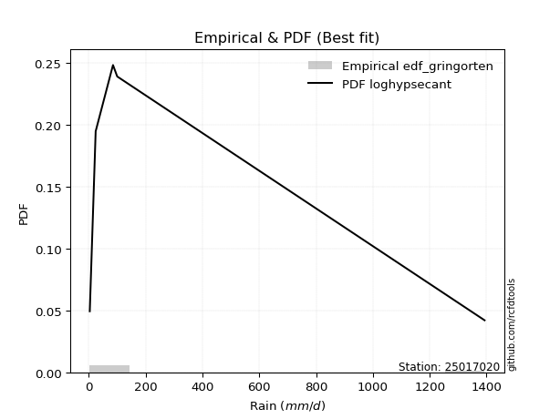</img>

</div>


### 9. EDF Filliben (1975)

The specific values of the constants (0.3175) (often denoted as $alpha$) and (0.365) are derived from a method proposed by James J. Filliben in a 1975 paper. This particular formula is the mean value of the $i$-th order statistic of the normal distribution and is considered a robust and effective plotting position formula for the normal probability plot correlation coefficient test for normality.

<div align="center">


$P=(m-0.3175)/(n+0.365)$


</div>


**9.1. Empirical values**

<div align="center">

|                | 0                   | 1                  | 2            | 3                  | 4                  |
|:---------------|:--------------------|:-------------------|:-------------|:-------------------|:-------------------|
| date           | 2019                | 2017               | 2024         | 2025               | 2018               |
| x              | 3.5                 | 24.2               | 85.2         | 100.0              | 1393.0             |
| m              | 1                   | 2                  | 3            | 4                  | 5                  |
| empirical_dist | edf_filliben        | edf_filliben       | edf_filliben | edf_filliben       | edf_filliben       |
| empirical      | 0.12721342031686858 | 0.3136067101584343 | 0.5          | 0.6863932898415657 | 0.8727865796831314 |
| empirical_tr   | 1.1457554725040042  | 1.456890699253225  | 2.0          | 3.188707280832095  | 7.860805860805863  |

</div>


**9.2. Kolmogorov-Smirnov fit test (sorted by Δ)**


<div align="center">

|                | 0                   | 1                   | 2                   | 3                   | 4                   | 5                   | 6                  | 7                   | 8                   | 9                   | 10                  | 11                  | 12                  | 13                  | 14                  | 15                  | 16                  | 17                 | 18                  | 19                 | 20                  | 21                  | 22                  | 23                  | 24                 | 25                  | 26                  | 27                  | 28                  | 29                  | 30                  | 31                  | 32                  | 33                  | 34                  | 35                  | 36                  | 37                  | 38                  | 39                  | 40                  | 41                  | 42                  | 43                  | 44                  | 45                  | 46                 | 47                  | 48                  | 49                  | 50                  | 51                  | 52                  | 53                  | 54                  | 55                  | 56                  | 57                  | 58                 | 59                  | 60                  | 61                  | 62                 | 63                 | 64                 | 65                  | 66                  | 67                  | 68                  | 69                  | 70                 | 71                  | 72                 | 73                  | 74                 | 75                  | 76                  | 77                  | 78                  | 79                 | 80                  | 81                  | 82                 | 83                 | 84                  | 85                  | 86                  | 87                  | 88                  | 89                  | 90                  | 91                  | 92                  | 93                 | 94                  | 95                  | 96                 | 97                  | 98                 | 99                  | 100                | 101                | 102                | 103                 | 104                | 105                 | 106                 | 107                | 108                | 109                 | 110                 | 111                | 112                | 113                | 114                | 115                | 116                 | 117                 | 118                 | 119                 | 120                 | 121                | 122                 | 123                 | 124                 | 125                | 126                 | 127                 | 128                | 129                | 130                | 131                 | 132                | 133                | 134                | 135                 | 136                 | 137                 | 138                 | 139                | 140                | 141                | 142                | 143                | 144                | 145                | 146                | 147                | 148                | 149                | 150                | 151                | 152                | 153                | 154                | 155                | 156                | 157                | 158                | 159                |
|:---------------|:--------------------|:--------------------|:--------------------|:--------------------|:--------------------|:--------------------|:-------------------|:--------------------|:--------------------|:--------------------|:--------------------|:--------------------|:--------------------|:--------------------|:--------------------|:--------------------|:--------------------|:-------------------|:--------------------|:-------------------|:--------------------|:--------------------|:--------------------|:--------------------|:-------------------|:--------------------|:--------------------|:--------------------|:--------------------|:--------------------|:--------------------|:--------------------|:--------------------|:--------------------|:--------------------|:--------------------|:--------------------|:--------------------|:--------------------|:--------------------|:--------------------|:--------------------|:--------------------|:--------------------|:--------------------|:--------------------|:-------------------|:--------------------|:--------------------|:--------------------|:--------------------|:--------------------|:--------------------|:--------------------|:--------------------|:--------------------|:--------------------|:--------------------|:-------------------|:--------------------|:--------------------|:--------------------|:-------------------|:-------------------|:-------------------|:--------------------|:--------------------|:--------------------|:--------------------|:--------------------|:-------------------|:--------------------|:-------------------|:--------------------|:-------------------|:--------------------|:--------------------|:--------------------|:--------------------|:-------------------|:--------------------|:--------------------|:-------------------|:-------------------|:--------------------|:--------------------|:--------------------|:--------------------|:--------------------|:--------------------|:--------------------|:--------------------|:--------------------|:-------------------|:--------------------|:--------------------|:-------------------|:--------------------|:-------------------|:--------------------|:-------------------|:-------------------|:-------------------|:--------------------|:-------------------|:--------------------|:--------------------|:-------------------|:-------------------|:--------------------|:--------------------|:-------------------|:-------------------|:-------------------|:-------------------|:-------------------|:--------------------|:--------------------|:--------------------|:--------------------|:--------------------|:-------------------|:--------------------|:--------------------|:--------------------|:-------------------|:--------------------|:--------------------|:-------------------|:-------------------|:-------------------|:--------------------|:-------------------|:-------------------|:-------------------|:--------------------|:--------------------|:--------------------|:--------------------|:-------------------|:-------------------|:-------------------|:-------------------|:-------------------|:-------------------|:-------------------|:-------------------|:-------------------|:-------------------|:-------------------|:-------------------|:-------------------|:-------------------|:-------------------|:-------------------|:-------------------|:-------------------|:-------------------|:-------------------|:-------------------|
| station        | 25017020            | 25017020            | 25017020            | 25017020            | 25017020            | 25017020            | 25017020           | 25017020            | 25017020            | 25017020            | 25017020            | 25017020            | 25017020            | 25017020            | 25017020            | 25017020            | 25017020            | 25017020           | 25017020            | 25017020           | 25017020            | 25017020            | 25017020            | 25017020            | 25017020           | 25017020            | 25017020            | 25017020            | 25017020            | 25017020            | 25017020            | 25017020            | 25017020            | 25017020            | 25017020            | 25017020            | 25017020            | 25017020            | 25017020            | 25017020            | 25017020            | 25017020            | 25017020            | 25017020            | 25017020            | 25017020            | 25017020           | 25017020            | 25017020            | 25017020            | 25017020            | 25017020            | 25017020            | 25017020            | 25017020            | 25017020            | 25017020            | 25017020            | 25017020           | 25017020            | 25017020            | 25017020            | 25017020           | 25017020           | 25017020           | 25017020            | 25017020            | 25017020            | 25017020            | 25017020            | 25017020           | 25017020            | 25017020           | 25017020            | 25017020           | 25017020            | 25017020            | 25017020            | 25017020            | 25017020           | 25017020            | 25017020            | 25017020           | 25017020           | 25017020            | 25017020            | 25017020            | 25017020            | 25017020            | 25017020            | 25017020            | 25017020            | 25017020            | 25017020           | 25017020            | 25017020            | 25017020           | 25017020            | 25017020           | 25017020            | 25017020           | 25017020           | 25017020           | 25017020            | 25017020           | 25017020            | 25017020            | 25017020           | 25017020           | 25017020            | 25017020            | 25017020           | 25017020           | 25017020           | 25017020           | 25017020           | 25017020            | 25017020            | 25017020            | 25017020            | 25017020            | 25017020           | 25017020            | 25017020            | 25017020            | 25017020           | 25017020            | 25017020            | 25017020           | 25017020           | 25017020           | 25017020            | 25017020           | 25017020           | 25017020           | 25017020            | 25017020            | 25017020            | 25017020            | 25017020           | 25017020           | 25017020           | 25017020           | 25017020           | 25017020           | 25017020           | 25017020           | 25017020           | 25017020           | 25017020           | 25017020           | 25017020           | 25017020           | 25017020           | 25017020           | 25017020           | 25017020           | 25017020           | 25017020           | 25017020           |
| empirical_dist | edf_filliben        | edf_filliben        | edf_filliben        | edf_filliben        | edf_filliben        | edf_filliben        | edf_filliben       | edf_filliben        | edf_filliben        | edf_filliben        | edf_filliben        | edf_filliben        | edf_filliben        | edf_filliben        | edf_filliben        | edf_filliben        | edf_filliben        | edf_filliben       | edf_filliben        | edf_filliben       | edf_filliben        | edf_filliben        | edf_filliben        | edf_filliben        | edf_filliben       | edf_filliben        | edf_filliben        | edf_filliben        | edf_filliben        | edf_filliben        | edf_filliben        | edf_filliben        | edf_filliben        | edf_filliben        | edf_filliben        | edf_filliben        | edf_filliben        | edf_filliben        | edf_filliben        | edf_filliben        | edf_filliben        | edf_filliben        | edf_filliben        | edf_filliben        | edf_filliben        | edf_filliben        | edf_filliben       | edf_filliben        | edf_filliben        | edf_filliben        | edf_filliben        | edf_filliben        | edf_filliben        | edf_filliben        | edf_filliben        | edf_filliben        | edf_filliben        | edf_filliben        | edf_filliben       | edf_filliben        | edf_filliben        | edf_filliben        | edf_filliben       | edf_filliben       | edf_filliben       | edf_filliben        | edf_filliben        | edf_filliben        | edf_filliben        | edf_filliben        | edf_filliben       | edf_filliben        | edf_filliben       | edf_filliben        | edf_filliben       | edf_filliben        | edf_filliben        | edf_filliben        | edf_filliben        | edf_filliben       | edf_filliben        | edf_filliben        | edf_filliben       | edf_filliben       | edf_filliben        | edf_filliben        | edf_filliben        | edf_filliben        | edf_filliben        | edf_filliben        | edf_filliben        | edf_filliben        | edf_filliben        | edf_filliben       | edf_filliben        | edf_filliben        | edf_filliben       | edf_filliben        | edf_filliben       | edf_filliben        | edf_filliben       | edf_filliben       | edf_filliben       | edf_filliben        | edf_filliben       | edf_filliben        | edf_filliben        | edf_filliben       | edf_filliben       | edf_filliben        | edf_filliben        | edf_filliben       | edf_filliben       | edf_filliben       | edf_filliben       | edf_filliben       | edf_filliben        | edf_filliben        | edf_filliben        | edf_filliben        | edf_filliben        | edf_filliben       | edf_filliben        | edf_filliben        | edf_filliben        | edf_filliben       | edf_filliben        | edf_filliben        | edf_filliben       | edf_filliben       | edf_filliben       | edf_filliben        | edf_filliben       | edf_filliben       | edf_filliben       | edf_filliben        | edf_filliben        | edf_filliben        | edf_filliben        | edf_filliben       | edf_filliben       | edf_filliben       | edf_filliben       | edf_filliben       | edf_filliben       | edf_filliben       | edf_filliben       | edf_filliben       | edf_filliben       | edf_filliben       | edf_filliben       | edf_filliben       | edf_filliben       | edf_filliben       | edf_filliben       | edf_filliben       | edf_filliben       | edf_filliben       | edf_filliben       | edf_filliben       |
| p_dist         | loghypsecant        | logfatiguelife      | logjohnsonsu        | logskewnorm         | loggamma            | loggamma            | logf               | loglogistic         | logerlang           | logrice             | logalpha            | logpearson3         | loggenlogistic      | loginvgamma         | loginvgauss         | logmaxwell          | logfoldnorm         | ncf                | lognct              | logexponnorm       | lognorm             | logcrystalball      | logt                | loggenextreme       | logweibull_min     | logloggamma         | logburr12           | loglaplace          | loglaplace          | logbetaprime        | lograyleigh         | logcosine           | loganglit           | logncf              | logsemicircular     | loginvweibull       | logksone            | logdweibull         | logkstwobign        | mielke              | logkappa3           | genpareto           | f                   | betaprime           | logbradford         | gamma               | loggompertz        | logtruncnorm        | truncpareto         | lomax               | logkappa4           | loguniform          | loghalfnorm         | logtruncpareto      | logtukeylambda      | logwrapcauchy       | loggumbel_r         | invgamma            | logvonmises_line   | logarcsine          | exponweib           | loggausshyper       | invgauss           | t                  | loggenexpon        | logloglaplace       | logtruncexpon       | logburr             | erlang              | halfgennorm         | loghalflogistic    | loggumbel_l         | logmoyal           | loggennorm          | nct                | burr                | loglomax            | burr12              | logargus            | logexponpow        | nakagami            | logdgamma           | gausshyper         | truncweibull_min   | logwald             | loglevy_l           | logexponweib        | exponpow            | loghalfgennorm      | logbeta             | loggenpareto        | logtruncweibull_min | wrapcauchy          | logmielke          | vonmises_line       | wald                | gengamma           | foldnorm            | halflogistic       | dweibull            | pearson3           | halfnorm           | logjohnsonsb       | levy_l              | fatiguelife        | weibull_min         | arcsine             | loggenhalflogistic | moyal              | loggengamma         | gumbel_r            | gennorm            | genextreme         | rayleigh           | lognakagami        | maxwell            | semicircular        | anglit              | logtriang           | genlogistic         | norm                | powerlaw           | logistic            | invweibull          | dgamma              | crystalball        | hypsecant           | kstwobign           | logtrapezoid       | cosine             | rice               | gumbel_l            | kappa3             | laplace            | logrdist           | logweibull_max      | exponnorm           | genexpon            | gompertz            | alpha              | truncnorm          | argus              | ksone              | johnsonsb          | logpowerlaw        | bradford           | skewnorm           | truncexpon         | weibull_max        | kappa4             | genhalflogistic    | uniform            | triang             | rdist              | beta               | trapezoid          | tukeylambda        | johnsonsu          | logvonmises        | vonmises           |
| delta          | 0.07572344522739038 | 0.07765611625439994 | 0.07950450375882734 | 0.07984074151475296 | 0.08016579132286883 | 0.08016579132286883 | 0.0803707469237589 | 0.08153981082369421 | 0.08215021033068737 | 0.08243003210478739 | 0.08469374373290883 | 0.08607420319327341 | 0.08672845740948931 | 0.08694900813845541 | 0.09024595117427903 | 0.09041447747000408 | 0.09189862485196998 | 0.0924379850014645 | 0.09309908325300276 | 0.0931579993844811 | 0.09360747212967979 | 0.09360758791961754 | 0.09360805449463794 | 0.09489871864667165 | 0.0956264516055152 | 0.09576966153036048 | 0.09578385431868541 | 0.09722397525984716 | 0.09722397525984716 | 0.09834215300030658 | 0.09986628468840753 | 0.10464529310630433 | 0.10650299497486915 | 0.10898507845658345 | 0.11185239642203626 | 0.11531162386857319 | 0.11863631799859853 | 0.12097411020538085 | 0.12169620830595917 | 0.12250750153860257 | 0.12586814750880615 | 0.12656519948426526 | 0.12718991238699204 | 0.12721301281402295 | 0.12721326781726927 | 0.12721332530476312 | 0.1272133765634228 | 0.12721341825349422 | 0.12721342031671212 | 0.12721342031675686 | 0.12721342031686683 | 0.12721342031686858 | 0.12721342031686858 | 0.12721342031686858 | 0.12741029069901533 | 0.12923193737811467 | 0.13034879099393726 | 0.13043185782792333 | 0.1325552476406689 | 0.13331781605675808 | 0.13363380972627492 | 0.13425502248103482 | 0.1360073862834803 | 0.1430211788771385 | 0.1462775148140143 | 0.14631851430959353 | 0.14714097465990783 | 0.15336251278259683 | 0.15379337495984235 | 0.15413574021594423 | 0.1541776779483588 | 0.15467892668108207 | 0.1548135364389508 | 0.16018135685765345 | 0.1619697977515584 | 0.16261245133229396 | 0.16867561419139482 | 0.17380393219607493 | 0.17443518168879057 | 0.1791472422384674 | 0.18456811169084164 | 0.20343584290484937 | 0.2136280633874158 | 0.2185933537831345 | 0.22270869160537066 | 0.22361964071192708 | 0.22375448350062505 | 0.22409783962460827 | 0.22863660487275111 | 0.23008563581029579 | 0.23284549224255496 | 0.24330268685802986 | 0.24358738712051653 | 0.2458060718972831 | 0.24843072791971288 | 0.24894644029014534 | 0.2608636795049698 | 0.26245803329142253 | 0.2625827140487337 | 0.26299839210038123 | 0.2685014346341192 | 0.2689479976730477 | 0.2759000690394374 | 0.27802949132627985 | 0.2788572768691611 | 0.27974393813064147 | 0.28043957474201336 | 0.2819239794793119 | 0.2838603951573224 | 0.29463543493592687 | 0.30046469688907146 | 0.3010718469528595 | 0.3022256678614833 | 0.3029068742018374 | 0.3136065420900748 | 0.3148393274340883 | 0.31653615667070856 | 0.32530294391308834 | 0.32551362842387693 | 0.33263507052194324 | 0.34614442175681637 | 0.3552408834726197 | 0.36489474164075314 | 0.37239945659272056 | 0.37278657968418427 | 0.3752575973287864 | 0.37926855106152135 | 0.38263541839729304 | 0.3838941941067794 | 0.4028505748079097 | 0.4031308554476016 | 0.40453005483151355 | 0.4047934938526935 | 0.407101366610497  | 0.4093048765699333 | 0.42115869780315873 | 0.42350687567252054 | 0.42442756542672344 | 0.42447871591301123 | 0.4341540956883551 | 0.4419166418756784 | 0.4559389018509844 | 0.5451854213037224 | 0.5544789017441973 | 0.5551773249619285 | 0.5574947456659608 | 0.5635204756372729 | 0.5838423651259339 | 0.5929363141263381 | 0.6008680495383862 | 0.605488345145683  | 0.6169438475961536 | 0.6191844168893942 | 0.6284585419597518 | 0.6404277816490909 | 0.6652900385660276 | 0.6716362678172222 | 0.6753573930564061 | 1.1909922384075835 | 221.5978902038414  |
| deltao         | 0.5865427407550001  | 0.5865427407550001  | 0.5865427407550001  | 0.5865427407550001  | 0.5865427407550001  | 0.5865427407550001  | 0.5865427407550001 | 0.5865427407550001  | 0.5865427407550001  | 0.5865427407550001  | 0.5865427407550001  | 0.5865427407550001  | 0.5865427407550001  | 0.5865427407550001  | 0.5865427407550001  | 0.5865427407550001  | 0.5865427407550001  | 0.5865427407550001 | 0.5865427407550001  | 0.5865427407550001 | 0.5865427407550001  | 0.5865427407550001  | 0.5865427407550001  | 0.5865427407550001  | 0.5865427407550001 | 0.5865427407550001  | 0.5865427407550001  | 0.5865427407550001  | 0.5865427407550001  | 0.5865427407550001  | 0.5865427407550001  | 0.5865427407550001  | 0.5865427407550001  | 0.5865427407550001  | 0.5865427407550001  | 0.5865427407550001  | 0.5865427407550001  | 0.5865427407550001  | 0.5865427407550001  | 0.5865427407550001  | 0.5865427407550001  | 0.5865427407550001  | 0.5865427407550001  | 0.5865427407550001  | 0.5865427407550001  | 0.5865427407550001  | 0.5865427407550001 | 0.5865427407550001  | 0.5865427407550001  | 0.5865427407550001  | 0.5865427407550001  | 0.5865427407550001  | 0.5865427407550001  | 0.5865427407550001  | 0.5865427407550001  | 0.5865427407550001  | 0.5865427407550001  | 0.5865427407550001  | 0.5865427407550001 | 0.5865427407550001  | 0.5865427407550001  | 0.5865427407550001  | 0.5865427407550001 | 0.5865427407550001 | 0.5865427407550001 | 0.5865427407550001  | 0.5865427407550001  | 0.5865427407550001  | 0.5865427407550001  | 0.5865427407550001  | 0.5865427407550001 | 0.5865427407550001  | 0.5865427407550001 | 0.5865427407550001  | 0.5865427407550001 | 0.5865427407550001  | 0.5865427407550001  | 0.5865427407550001  | 0.5865427407550001  | 0.5865427407550001 | 0.5865427407550001  | 0.5865427407550001  | 0.5865427407550001 | 0.5865427407550001 | 0.5865427407550001  | 0.5865427407550001  | 0.5865427407550001  | 0.5865427407550001  | 0.5865427407550001  | 0.5865427407550001  | 0.5865427407550001  | 0.5865427407550001  | 0.5865427407550001  | 0.5865427407550001 | 0.5865427407550001  | 0.5865427407550001  | 0.5865427407550001 | 0.5865427407550001  | 0.5865427407550001 | 0.5865427407550001  | 0.5865427407550001 | 0.5865427407550001 | 0.5865427407550001 | 0.5865427407550001  | 0.5865427407550001 | 0.5865427407550001  | 0.5865427407550001  | 0.5865427407550001 | 0.5865427407550001 | 0.5865427407550001  | 0.5865427407550001  | 0.5865427407550001 | 0.5865427407550001 | 0.5865427407550001 | 0.5865427407550001 | 0.5865427407550001 | 0.5865427407550001  | 0.5865427407550001  | 0.5865427407550001  | 0.5865427407550001  | 0.5865427407550001  | 0.5865427407550001 | 0.5865427407550001  | 0.5865427407550001  | 0.5865427407550001  | 0.5865427407550001 | 0.5865427407550001  | 0.5865427407550001  | 0.5865427407550001 | 0.5865427407550001 | 0.5865427407550001 | 0.5865427407550001  | 0.5865427407550001 | 0.5865427407550001 | 0.5865427407550001 | 0.5865427407550001  | 0.5865427407550001  | 0.5865427407550001  | 0.5865427407550001  | 0.5865427407550001 | 0.5865427407550001 | 0.5865427407550001 | 0.5865427407550001 | 0.5865427407550001 | 0.5865427407550001 | 0.5865427407550001 | 0.5865427407550001 | 0.5865427407550001 | 0.5865427407550001 | 0.5865427407550001 | 0.5865427407550001 | 0.5865427407550001 | 0.5865427407550001 | 0.5865427407550001 | 0.5865427407550001 | 0.5865427407550001 | 0.5865427407550001 | 0.5865427407550001 | 0.5865427407550001 | 0.5865427407550001 |
| eval           | Δo > Δ              | Δo > Δ              | Δo > Δ              | Δo > Δ              | Δo > Δ              | Δo > Δ              | Δo > Δ             | Δo > Δ              | Δo > Δ              | Δo > Δ              | Δo > Δ              | Δo > Δ              | Δo > Δ              | Δo > Δ              | Δo > Δ              | Δo > Δ              | Δo > Δ              | Δo > Δ             | Δo > Δ              | Δo > Δ             | Δo > Δ              | Δo > Δ              | Δo > Δ              | Δo > Δ              | Δo > Δ             | Δo > Δ              | Δo > Δ              | Δo > Δ              | Δo > Δ              | Δo > Δ              | Δo > Δ              | Δo > Δ              | Δo > Δ              | Δo > Δ              | Δo > Δ              | Δo > Δ              | Δo > Δ              | Δo > Δ              | Δo > Δ              | Δo > Δ              | Δo > Δ              | Δo > Δ              | Δo > Δ              | Δo > Δ              | Δo > Δ              | Δo > Δ              | Δo > Δ             | Δo > Δ              | Δo > Δ              | Δo > Δ              | Δo > Δ              | Δo > Δ              | Δo > Δ              | Δo > Δ              | Δo > Δ              | Δo > Δ              | Δo > Δ              | Δo > Δ              | Δo > Δ             | Δo > Δ              | Δo > Δ              | Δo > Δ              | Δo > Δ             | Δo > Δ             | Δo > Δ             | Δo > Δ              | Δo > Δ              | Δo > Δ              | Δo > Δ              | Δo > Δ              | Δo > Δ             | Δo > Δ              | Δo > Δ             | Δo > Δ              | Δo > Δ             | Δo > Δ              | Δo > Δ              | Δo > Δ              | Δo > Δ              | Δo > Δ             | Δo > Δ              | Δo > Δ              | Δo > Δ             | Δo > Δ             | Δo > Δ              | Δo > Δ              | Δo > Δ              | Δo > Δ              | Δo > Δ              | Δo > Δ              | Δo > Δ              | Δo > Δ              | Δo > Δ              | Δo > Δ             | Δo > Δ              | Δo > Δ              | Δo > Δ             | Δo > Δ              | Δo > Δ             | Δo > Δ              | Δo > Δ             | Δo > Δ             | Δo > Δ             | Δo > Δ              | Δo > Δ             | Δo > Δ              | Δo > Δ              | Δo > Δ             | Δo > Δ             | Δo > Δ              | Δo > Δ              | Δo > Δ             | Δo > Δ             | Δo > Δ             | Δo > Δ             | Δo > Δ             | Δo > Δ              | Δo > Δ              | Δo > Δ              | Δo > Δ              | Δo > Δ              | Δo > Δ             | Δo > Δ              | Δo > Δ              | Δo > Δ              | Δo > Δ             | Δo > Δ              | Δo > Δ              | Δo > Δ             | Δo > Δ             | Δo > Δ             | Δo > Δ              | Δo > Δ             | Δo > Δ             | Δo > Δ             | Δo > Δ              | Δo > Δ              | Δo > Δ              | Δo > Δ              | Δo > Δ             | Δo > Δ             | Δo > Δ             | Δo > Δ             | Δo > Δ             | Δo > Δ             | Δo > Δ             | Δo > Δ             | Δo > Δ             | Δo <= Δ            | Δo <= Δ            | Δo <= Δ            | Δo <= Δ            | Δo <= Δ            | Δo <= Δ            | Δo <= Δ            | Δo <= Δ            | Δo <= Δ            | Δo <= Δ            | Δo <= Δ            | Δo <= Δ            |
| fit            | 1                   | 1                   | 1                   | 1                   | 1                   | 1                   | 1                  | 1                   | 1                   | 1                   | 1                   | 1                   | 1                   | 1                   | 1                   | 1                   | 1                   | 1                  | 1                   | 1                  | 1                   | 1                   | 1                   | 1                   | 1                  | 1                   | 1                   | 1                   | 1                   | 1                   | 1                   | 1                   | 1                   | 1                   | 1                   | 1                   | 1                   | 1                   | 1                   | 1                   | 1                   | 1                   | 1                   | 1                   | 1                   | 1                   | 1                  | 1                   | 1                   | 1                   | 1                   | 1                   | 1                   | 1                   | 1                   | 1                   | 1                   | 1                   | 1                  | 1                   | 1                   | 1                   | 1                  | 1                  | 1                  | 1                   | 1                   | 1                   | 1                   | 1                   | 1                  | 1                   | 1                  | 1                   | 1                  | 1                   | 1                   | 1                   | 1                   | 1                  | 1                   | 1                   | 1                  | 1                  | 1                   | 1                   | 1                   | 1                   | 1                   | 1                   | 1                   | 1                   | 1                   | 1                  | 1                   | 1                   | 1                  | 1                   | 1                  | 1                   | 1                  | 1                  | 1                  | 1                   | 1                  | 1                   | 1                   | 1                  | 1                  | 1                   | 1                   | 1                  | 1                  | 1                  | 1                  | 1                  | 1                   | 1                   | 1                   | 1                   | 1                   | 1                  | 1                   | 1                   | 1                   | 1                  | 1                   | 1                   | 1                  | 1                  | 1                  | 1                   | 1                  | 1                  | 1                  | 1                   | 1                   | 1                   | 1                   | 1                  | 1                  | 1                  | 1                  | 1                  | 1                  | 1                  | 1                  | 1                  | 0                  | 0                  | 0                  | 0                  | 0                  | 0                  | 0                  | 0                  | 0                  | 0                  | 0                  | 0                  |
| n              | 5                   | 5                   | 5                   | 5                   | 5                   | 5                   | 5                  | 5                   | 5                   | 5                   | 5                   | 5                   | 5                   | 5                   | 5                   | 5                   | 5                   | 5                  | 5                   | 5                  | 5                   | 5                   | 5                   | 5                   | 5                  | 5                   | 5                   | 5                   | 5                   | 5                   | 5                   | 5                   | 5                   | 5                   | 5                   | 5                   | 5                   | 5                   | 5                   | 5                   | 5                   | 5                   | 5                   | 5                   | 5                   | 5                   | 5                  | 5                   | 5                   | 5                   | 5                   | 5                   | 5                   | 5                   | 5                   | 5                   | 5                   | 5                   | 5                  | 5                   | 5                   | 5                   | 5                  | 5                  | 5                  | 5                   | 5                   | 5                   | 5                   | 5                   | 5                  | 5                   | 5                  | 5                   | 5                  | 5                   | 5                   | 5                   | 5                   | 5                  | 5                   | 5                   | 5                  | 5                  | 5                   | 5                   | 5                   | 5                   | 5                   | 5                   | 5                   | 5                   | 5                   | 5                  | 5                   | 5                   | 5                  | 5                   | 5                  | 5                   | 5                  | 5                  | 5                  | 5                   | 5                  | 5                   | 5                   | 5                  | 5                  | 5                   | 5                   | 5                  | 5                  | 5                  | 5                  | 5                  | 5                   | 5                   | 5                   | 5                   | 5                   | 5                  | 5                   | 5                   | 5                   | 5                  | 5                   | 5                   | 5                  | 5                  | 5                  | 5                   | 5                  | 5                  | 5                  | 5                   | 5                   | 5                   | 5                   | 5                  | 5                  | 5                  | 5                  | 5                  | 5                  | 5                  | 5                  | 5                  | 5                  | 5                  | 5                  | 5                  | 5                  | 5                  | 5                  | 5                  | 5                  | 5                  | 5                  | 5                  |
| best_fit       | 1                   | 0                   | 0                   | 0                   | 0                   | 0                   | 0                  | 0                   | 0                   | 0                   | 0                   | 0                   | 0                   | 0                   | 0                   | 0                   | 0                   | 0                  | 0                   | 0                  | 0                   | 0                   | 0                   | 0                   | 0                  | 0                   | 0                   | 0                   | 0                   | 0                   | 0                   | 0                   | 0                   | 0                   | 0                   | 0                   | 0                   | 0                   | 0                   | 0                   | 0                   | 0                   | 0                   | 0                   | 0                   | 0                   | 0                  | 0                   | 0                   | 0                   | 0                   | 0                   | 0                   | 0                   | 0                   | 0                   | 0                   | 0                   | 0                  | 0                   | 0                   | 0                   | 0                  | 0                  | 0                  | 0                   | 0                   | 0                   | 0                   | 0                   | 0                  | 0                   | 0                  | 0                   | 0                  | 0                   | 0                   | 0                   | 0                   | 0                  | 0                   | 0                   | 0                  | 0                  | 0                   | 0                   | 0                   | 0                   | 0                   | 0                   | 0                   | 0                   | 0                   | 0                  | 0                   | 0                   | 0                  | 0                   | 0                  | 0                   | 0                  | 0                  | 0                  | 0                   | 0                  | 0                   | 0                   | 0                  | 0                  | 0                   | 0                   | 0                  | 0                  | 0                  | 0                  | 0                  | 0                   | 0                   | 0                   | 0                   | 0                   | 0                  | 0                   | 0                   | 0                   | 0                  | 0                   | 0                   | 0                  | 0                  | 0                  | 0                   | 0                  | 0                  | 0                  | 0                   | 0                   | 0                   | 0                   | 0                  | 0                  | 0                  | 0                  | 0                  | 0                  | 0                  | 0                  | 0                  | 0                  | 0                  | 0                  | 0                  | 0                  | 0                  | 0                  | 0                  | 0                  | 0                  | 0                  | 0                  |
| best_fit_sort  | 1                   | 2                   | 3                   | 4                   | 5                   | 6                   | 7                  | 8                   | 9                   | 10                  | 11                  | 12                  | 13                  | 14                  | 15                  | 16                  | 17                  | 18                 | 19                  | 20                 | 21                  | 22                  | 23                  | 24                  | 25                 | 26                  | 27                  | 28                  | 29                  | 30                  | 31                  | 32                  | 33                  | 34                  | 35                  | 36                  | 37                  | 38                  | 39                  | 40                  | 41                  | 42                  | 43                  | 44                  | 45                  | 46                  | 47                 | 48                  | 49                  | 50                  | 51                  | 52                  | 53                  | 54                  | 55                  | 56                  | 57                  | 58                  | 59                 | 60                  | 61                  | 62                  | 63                 | 64                 | 65                 | 66                  | 67                  | 68                  | 69                  | 70                  | 71                 | 72                  | 73                 | 74                  | 75                 | 76                  | 77                  | 78                  | 79                  | 80                 | 81                  | 82                  | 83                 | 84                 | 85                  | 86                  | 87                  | 88                  | 89                  | 90                  | 91                  | 92                  | 93                  | 94                 | 95                  | 96                  | 97                 | 98                  | 99                 | 100                 | 101                | 102                | 103                | 104                 | 105                | 106                 | 107                 | 108                | 109                | 110                 | 111                 | 112                | 113                | 114                | 115                | 116                | 117                 | 118                 | 119                 | 120                 | 121                 | 122                | 123                 | 124                 | 125                 | 126                | 127                 | 128                 | 129                | 130                | 131                | 132                 | 133                | 134                | 135                | 136                 | 137                 | 138                 | 139                 | 140                | 141                | 142                | 143                | 144                | 145                | 146                | 147                | 148                | 149                | 150                | 151                | 152                | 153                | 154                | 155                | 156                | 157                | 158                | 159                | 160                |

</div>


**9.3. Best fit**

<div align="center">

|   id |   station | empirical_dist   | p_dist       |     delta |   deltao | eval   |   fit |   n |   best_fit |   best_fit_sort |
|-----:|----------:|:-----------------|:-------------|----------:|---------:|:-------|------:|----:|-----------:|----------------:|
|    0 |  25017020 | edf_filliben     | loghypsecant | 0.0757234 | 0.586543 | Δo > Δ |     1 |   5 |          1 |               1 |

</div>


<div align="center">

</img>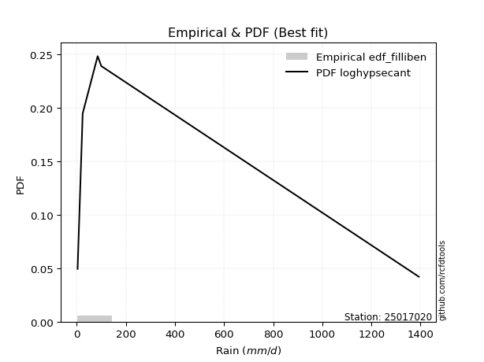</img>

</div>


### 10. EDF Jenkinson (1977)

The Jenkinson formula in hydrology is an empirical plotting position formula used to estimate the non-exceedance probability _(P)_ or return period _(T)_ of a given ordered observation within a sample. It is a widely used method in the frequency analysis of extreme events such as floods and rainfall, as it provides a distribution-free way to plot data. _a≈0.31_ and _b≈0.38_ are constants derived to approximate the median of the probability distribution for the given rank.

<div align="center">


$P=(m-a)/(n+b)$


</div>


**10.1. Empirical values**

<div align="center">

|                | 0                   | 1                  | 2             | 3                  | 4                  |
|:---------------|:--------------------|:-------------------|:--------------|:-------------------|:-------------------|
| date           | 2019                | 2017               | 2024          | 2025               | 2018               |
| x              | 3.5                 | 24.2               | 85.2          | 100.0              | 1393.0             |
| m              | 1                   | 2                  | 3             | 4                  | 5                  |
| empirical_dist | edf_jenkinson       | edf_jenkinson      | edf_jenkinson | edf_jenkinson      | edf_jenkinson      |
| empirical      | 0.12825278810408922 | 0.3141263940520446 | 0.5           | 0.6858736059479554 | 0.8717472118959109 |
| empirical_tr   | 1.1471215351812367  | 1.4579945799457996 | 2.0           | 3.183431952662722  | 7.797101449275368  |

</div>


**10.2. Kolmogorov-Smirnov fit test (sorted by Δ)**


<div align="center">

|                | 0                   | 1                   | 2                  | 3                   | 4                  | 5                  | 6                  | 7                   | 8                   | 9                   | 10                  | 11                  | 12                  | 13                  | 14                  | 15                  | 16                  | 17                 | 18                  | 19                  | 20                  | 21                 | 22                 | 23                  | 24                  | 25                 | 26                  | 27                  | 28                  | 29                  | 30                  | 31                  | 32                  | 33                  | 34                  | 35                  | 36                 | 37                  | 38                  | 39                  | 40                  | 41                 | 42                  | 43                  | 44                  | 45                  | 46                  | 47                  | 48                 | 49                 | 50                  | 51                  | 52                  | 53                  | 54                  | 55                  | 56                  | 57                  | 58                  | 59                  | 60                 | 61                  | 62                 | 63                 | 64                 | 65                 | 66                  | 67                  | 68                  | 69                 | 70                  | 71                 | 72                 | 73                 | 74                 | 75                  | 76                  | 77                 | 78                  | 79                  | 80                 | 81                 | 82                  | 83                  | 84                  | 85                  | 86                 | 87                  | 88                  | 89                  | 90                  | 91                  | 92                 | 93                 | 94                  | 95                 | 96                  | 97                 | 98                  | 99                  | 100                 | 101                | 102                | 103                 | 104                | 105                 | 106                 | 107                | 108                | 109                | 110                | 111                | 112                | 113                 | 114                 | 115                | 116                | 117                | 118                | 119                | 120                 | 121                | 122                | 123                | 124                | 125                | 126                | 127                | 128                 | 129                 | 130                 | 131                | 132                | 133                 | 134                | 135                | 136                | 137                | 138                | 139                 | 140                | 141                 | 142                | 143                | 144                | 145                | 146                | 147                | 148                | 149                | 150                | 151                | 152                | 153                | 154                | 155                | 156                | 157                | 158                | 159                |
|:---------------|:--------------------|:--------------------|:-------------------|:--------------------|:-------------------|:-------------------|:-------------------|:--------------------|:--------------------|:--------------------|:--------------------|:--------------------|:--------------------|:--------------------|:--------------------|:--------------------|:--------------------|:-------------------|:--------------------|:--------------------|:--------------------|:-------------------|:-------------------|:--------------------|:--------------------|:-------------------|:--------------------|:--------------------|:--------------------|:--------------------|:--------------------|:--------------------|:--------------------|:--------------------|:--------------------|:--------------------|:-------------------|:--------------------|:--------------------|:--------------------|:--------------------|:-------------------|:--------------------|:--------------------|:--------------------|:--------------------|:--------------------|:--------------------|:-------------------|:-------------------|:--------------------|:--------------------|:--------------------|:--------------------|:--------------------|:--------------------|:--------------------|:--------------------|:--------------------|:--------------------|:-------------------|:--------------------|:-------------------|:-------------------|:-------------------|:-------------------|:--------------------|:--------------------|:--------------------|:-------------------|:--------------------|:-------------------|:-------------------|:-------------------|:-------------------|:--------------------|:--------------------|:-------------------|:--------------------|:--------------------|:-------------------|:-------------------|:--------------------|:--------------------|:--------------------|:--------------------|:-------------------|:--------------------|:--------------------|:--------------------|:--------------------|:--------------------|:-------------------|:-------------------|:--------------------|:-------------------|:--------------------|:-------------------|:--------------------|:--------------------|:--------------------|:-------------------|:-------------------|:--------------------|:-------------------|:--------------------|:--------------------|:-------------------|:-------------------|:-------------------|:-------------------|:-------------------|:-------------------|:--------------------|:--------------------|:-------------------|:-------------------|:-------------------|:-------------------|:-------------------|:--------------------|:-------------------|:-------------------|:-------------------|:-------------------|:-------------------|:-------------------|:-------------------|:--------------------|:--------------------|:--------------------|:-------------------|:-------------------|:--------------------|:-------------------|:-------------------|:-------------------|:-------------------|:-------------------|:--------------------|:-------------------|:--------------------|:-------------------|:-------------------|:-------------------|:-------------------|:-------------------|:-------------------|:-------------------|:-------------------|:-------------------|:-------------------|:-------------------|:-------------------|:-------------------|:-------------------|:-------------------|:-------------------|:-------------------|:-------------------|
| station        | 25017020            | 25017020            | 25017020           | 25017020            | 25017020           | 25017020           | 25017020           | 25017020            | 25017020            | 25017020            | 25017020            | 25017020            | 25017020            | 25017020            | 25017020            | 25017020            | 25017020            | 25017020           | 25017020            | 25017020            | 25017020            | 25017020           | 25017020           | 25017020            | 25017020            | 25017020           | 25017020            | 25017020            | 25017020            | 25017020            | 25017020            | 25017020            | 25017020            | 25017020            | 25017020            | 25017020            | 25017020           | 25017020            | 25017020            | 25017020            | 25017020            | 25017020           | 25017020            | 25017020            | 25017020            | 25017020            | 25017020            | 25017020            | 25017020           | 25017020           | 25017020            | 25017020            | 25017020            | 25017020            | 25017020            | 25017020            | 25017020            | 25017020            | 25017020            | 25017020            | 25017020           | 25017020            | 25017020           | 25017020           | 25017020           | 25017020           | 25017020            | 25017020            | 25017020            | 25017020           | 25017020            | 25017020           | 25017020           | 25017020           | 25017020           | 25017020            | 25017020            | 25017020           | 25017020            | 25017020            | 25017020           | 25017020           | 25017020            | 25017020            | 25017020            | 25017020            | 25017020           | 25017020            | 25017020            | 25017020            | 25017020            | 25017020            | 25017020           | 25017020           | 25017020            | 25017020           | 25017020            | 25017020           | 25017020            | 25017020            | 25017020            | 25017020           | 25017020           | 25017020            | 25017020           | 25017020            | 25017020            | 25017020           | 25017020           | 25017020           | 25017020           | 25017020           | 25017020           | 25017020            | 25017020            | 25017020           | 25017020           | 25017020           | 25017020           | 25017020           | 25017020            | 25017020           | 25017020           | 25017020           | 25017020           | 25017020           | 25017020           | 25017020           | 25017020            | 25017020            | 25017020            | 25017020           | 25017020           | 25017020            | 25017020           | 25017020           | 25017020           | 25017020           | 25017020           | 25017020            | 25017020           | 25017020            | 25017020           | 25017020           | 25017020           | 25017020           | 25017020           | 25017020           | 25017020           | 25017020           | 25017020           | 25017020           | 25017020           | 25017020           | 25017020           | 25017020           | 25017020           | 25017020           | 25017020           | 25017020           |
| empirical_dist | edf_jenkinson       | edf_jenkinson       | edf_jenkinson      | edf_jenkinson       | edf_jenkinson      | edf_jenkinson      | edf_jenkinson      | edf_jenkinson       | edf_jenkinson       | edf_jenkinson       | edf_jenkinson       | edf_jenkinson       | edf_jenkinson       | edf_jenkinson       | edf_jenkinson       | edf_jenkinson       | edf_jenkinson       | edf_jenkinson      | edf_jenkinson       | edf_jenkinson       | edf_jenkinson       | edf_jenkinson      | edf_jenkinson      | edf_jenkinson       | edf_jenkinson       | edf_jenkinson      | edf_jenkinson       | edf_jenkinson       | edf_jenkinson       | edf_jenkinson       | edf_jenkinson       | edf_jenkinson       | edf_jenkinson       | edf_jenkinson       | edf_jenkinson       | edf_jenkinson       | edf_jenkinson      | edf_jenkinson       | edf_jenkinson       | edf_jenkinson       | edf_jenkinson       | edf_jenkinson      | edf_jenkinson       | edf_jenkinson       | edf_jenkinson       | edf_jenkinson       | edf_jenkinson       | edf_jenkinson       | edf_jenkinson      | edf_jenkinson      | edf_jenkinson       | edf_jenkinson       | edf_jenkinson       | edf_jenkinson       | edf_jenkinson       | edf_jenkinson       | edf_jenkinson       | edf_jenkinson       | edf_jenkinson       | edf_jenkinson       | edf_jenkinson      | edf_jenkinson       | edf_jenkinson      | edf_jenkinson      | edf_jenkinson      | edf_jenkinson      | edf_jenkinson       | edf_jenkinson       | edf_jenkinson       | edf_jenkinson      | edf_jenkinson       | edf_jenkinson      | edf_jenkinson      | edf_jenkinson      | edf_jenkinson      | edf_jenkinson       | edf_jenkinson       | edf_jenkinson      | edf_jenkinson       | edf_jenkinson       | edf_jenkinson      | edf_jenkinson      | edf_jenkinson       | edf_jenkinson       | edf_jenkinson       | edf_jenkinson       | edf_jenkinson      | edf_jenkinson       | edf_jenkinson       | edf_jenkinson       | edf_jenkinson       | edf_jenkinson       | edf_jenkinson      | edf_jenkinson      | edf_jenkinson       | edf_jenkinson      | edf_jenkinson       | edf_jenkinson      | edf_jenkinson       | edf_jenkinson       | edf_jenkinson       | edf_jenkinson      | edf_jenkinson      | edf_jenkinson       | edf_jenkinson      | edf_jenkinson       | edf_jenkinson       | edf_jenkinson      | edf_jenkinson      | edf_jenkinson      | edf_jenkinson      | edf_jenkinson      | edf_jenkinson      | edf_jenkinson       | edf_jenkinson       | edf_jenkinson      | edf_jenkinson      | edf_jenkinson      | edf_jenkinson      | edf_jenkinson      | edf_jenkinson       | edf_jenkinson      | edf_jenkinson      | edf_jenkinson      | edf_jenkinson      | edf_jenkinson      | edf_jenkinson      | edf_jenkinson      | edf_jenkinson       | edf_jenkinson       | edf_jenkinson       | edf_jenkinson      | edf_jenkinson      | edf_jenkinson       | edf_jenkinson      | edf_jenkinson      | edf_jenkinson      | edf_jenkinson      | edf_jenkinson      | edf_jenkinson       | edf_jenkinson      | edf_jenkinson       | edf_jenkinson      | edf_jenkinson      | edf_jenkinson      | edf_jenkinson      | edf_jenkinson      | edf_jenkinson      | edf_jenkinson      | edf_jenkinson      | edf_jenkinson      | edf_jenkinson      | edf_jenkinson      | edf_jenkinson      | edf_jenkinson      | edf_jenkinson      | edf_jenkinson      | edf_jenkinson      | edf_jenkinson      | edf_jenkinson      |
| p_dist         | loghypsecant        | logfatiguelife      | logjohnsonsu       | logskewnorm         | loggamma           | loggamma           | logf               | loglogistic         | logerlang           | logrice             | logalpha            | logpearson3         | loggenlogistic      | loginvgamma         | loginvgauss         | logmaxwell          | logfoldnorm         | ncf                | lognct              | logexponnorm        | lognorm             | logcrystalball     | logt               | loggenextreme       | logloggamma         | logweibull_min     | logburr12           | loglaplace          | loglaplace          | logbetaprime        | lograyleigh         | logcosine           | loganglit           | logncf              | logsemicircular     | loginvweibull       | logksone           | logdweibull         | logkstwobign        | mielke              | logkappa3           | genpareto          | f                   | betaprime           | logbradford         | gamma               | loggompertz         | logtruncnorm        | truncpareto        | lomax              | logtukeylambda      | logkappa4           | logtruncpareto      | loguniform          | loghalfnorm         | logwrapcauchy       | loggumbel_r         | invgamma            | logarcsine          | logvonmises_line    | exponweib          | loggausshyper       | invgauss           | t                  | logloglaplace      | loggenexpon        | logtruncexpon       | erlang              | logburr             | halfgennorm        | loggumbel_l         | loghalflogistic    | logmoyal           | loggennorm         | nct                | burr                | loglomax            | burr12             | logargus            | logexponpow         | nakagami           | logdgamma          | gausshyper          | truncweibull_min    | logwald             | loglevy_l           | logexponweib       | exponpow            | loghalfgennorm      | logbeta             | loggenpareto        | logtruncweibull_min | wrapcauchy         | logmielke          | vonmises_line       | wald               | gengamma            | foldnorm           | dweibull            | halflogistic        | pearson3            | halfnorm           | logjohnsonsb       | levy_l              | fatiguelife        | weibull_min         | arcsine             | loggenhalflogistic | moyal              | loggengamma        | gumbel_r           | gennorm            | genextreme         | rayleigh            | lognakagami         | maxwell            | semicircular       | anglit             | logtriang          | genlogistic        | norm                | powerlaw           | logistic           | invweibull         | dgamma             | crystalball        | hypsecant          | kstwobign          | logtrapezoid        | cosine              | rice                | kappa3             | gumbel_l           | laplace             | logrdist           | logweibull_max     | exponnorm          | genexpon           | gompertz           | alpha               | truncnorm          | argus               | ksone              | johnsonsb          | logpowerlaw        | bradford           | skewnorm           | truncexpon         | weibull_max        | kappa4             | genhalflogistic    | uniform            | triang             | rdist              | beta               | trapezoid          | tukeylambda        | johnsonsu          | logvonmises        | vonmises           |
| delta          | 0.07572344522739038 | 0.07759913779329097 | 0.0789848198652171 | 0.07932105762114272 | 0.0796461074292586 | 0.0796461074292586 | 0.0803707469237589 | 0.08102012693008398 | 0.08163052643707713 | 0.08243003210478739 | 0.08469374373290883 | 0.08555451929966318 | 0.08672845740948931 | 0.08694900813845541 | 0.09024595117427903 | 0.09041447747000408 | 0.09137894095835974 | 0.0924379850014645 | 0.09257939935939252 | 0.09263831549087087 | 0.09308778823606956 | 0.0930879040260073 | 0.0930883706010277 | 0.09437903475306142 | 0.09524997763675025 | 0.0956264516055152 | 0.09578385431868541 | 0.09722397525984716 | 0.09722397525984716 | 0.09834215300030658 | 0.09986628468840753 | 0.10412560921269409 | 0.10598331108125891 | 0.10898507845658345 | 0.11133271252842603 | 0.11531162386857319 | 0.1181166341049883 | 0.12045442631177061 | 0.12169620830595917 | 0.12250750153860257 | 0.12534846361519592 | 0.1274889286076502 | 0.12822928017421267 | 0.12825238060124358 | 0.12825263560448985 | 0.12825269309198375 | 0.12825274435064343 | 0.12825278604071486 | 0.1282527881039327 | 0.1282527881039775 | 0.12825278810408203 | 0.12825278810408747 | 0.12825278810408922 | 0.12825278810408922 | 0.12825278810408922 | 0.12871225348450444 | 0.13034879099393726 | 0.13043185782792333 | 0.13279813216314784 | 0.13307493153427924 | 0.1331141258326647 | 0.13425502248103482 | 0.1360073862834803 | 0.1430211788771385 | 0.1457988304159833 | 0.1462775148140143 | 0.14714097465990783 | 0.15327369106623212 | 0.15336251278259683 | 0.153616056322334  | 0.15415924278747184 | 0.1541776779483588 | 0.1548135364389508 | 0.1607010407512638 | 0.1619697977515584 | 0.16261245133229396 | 0.16815593029778447 | 0.1732842483024647 | 0.17391549779518034 | 0.17862755834485705 | 0.1840484277972314 | 0.2039555267984597 | 0.21310837949380557 | 0.21807366988952426 | 0.22270869160537066 | 0.22309995681831685 | 0.2232347996070147 | 0.22357815573099804 | 0.22811692097914077 | 0.22956595191668555 | 0.23232580834894473 | 0.24278300296441951 | 0.2430677032269063 | 0.2458060718972831 | 0.24791104402610264 | 0.2484267563965351 | 0.26034399561135957 | 0.2619383493978123 | 0.26195902431316054 | 0.26206303015512344 | 0.26798175074050895 | 0.2684283137794375 | 0.2753803851458272 | 0.27699012353905916 | 0.2783375929755508 | 0.27922425423703123 | 0.27991989084840313 | 0.2814042955857017 | 0.2833407112637122 | 0.2941157510423165 | 0.2999450129954612 | 0.3010718469528595 | 0.3011863000742627 | 0.30238719030822714 | 0.31412622598368517 | 0.3143196435404781 | 0.3160164727770983 | 0.3247832600194781 | 0.3249939445302667 | 0.332115386628333  | 0.34562473786320613 | 0.3547211995790093 | 0.3643750577471429 | 0.3713600888055    | 0.3717472118969636 | 0.3742182295415657 | 0.3787488671679111 | 0.3821157345036828 | 0.38337451021316915 | 0.40233089091429947 | 0.40261117155399134 | 0.4037541260654729 | 0.4040103709379033 | 0.40658168271688677 | 0.4093048765699333 | 0.4206390139095485 | 0.4229871917789103 | 0.4239078815331132 | 0.423959032019401  | 0.43363441179474477 | 0.4413969579820682 | 0.45541921795737417 | 0.544665737410112  | 0.553959217850587  | 0.5546576410683182 | 0.5569750617723506 | 0.5630007917436627 | 0.5833226812323237 | 0.5924166302327278 | 0.600348365644776  | 0.6049686612520727 | 0.6164241637025434 | 0.618664732995784  | 0.6274191741725311 | 0.6393884138618702 | 0.6647703546724173 | 0.6705969000300015 | 0.6748377091627957 | 1.192031606194804  | 221.5989295716286  |
| deltao         | 0.5865427407550001  | 0.5865427407550001  | 0.5865427407550001 | 0.5865427407550001  | 0.5865427407550001 | 0.5865427407550001 | 0.5865427407550001 | 0.5865427407550001  | 0.5865427407550001  | 0.5865427407550001  | 0.5865427407550001  | 0.5865427407550001  | 0.5865427407550001  | 0.5865427407550001  | 0.5865427407550001  | 0.5865427407550001  | 0.5865427407550001  | 0.5865427407550001 | 0.5865427407550001  | 0.5865427407550001  | 0.5865427407550001  | 0.5865427407550001 | 0.5865427407550001 | 0.5865427407550001  | 0.5865427407550001  | 0.5865427407550001 | 0.5865427407550001  | 0.5865427407550001  | 0.5865427407550001  | 0.5865427407550001  | 0.5865427407550001  | 0.5865427407550001  | 0.5865427407550001  | 0.5865427407550001  | 0.5865427407550001  | 0.5865427407550001  | 0.5865427407550001 | 0.5865427407550001  | 0.5865427407550001  | 0.5865427407550001  | 0.5865427407550001  | 0.5865427407550001 | 0.5865427407550001  | 0.5865427407550001  | 0.5865427407550001  | 0.5865427407550001  | 0.5865427407550001  | 0.5865427407550001  | 0.5865427407550001 | 0.5865427407550001 | 0.5865427407550001  | 0.5865427407550001  | 0.5865427407550001  | 0.5865427407550001  | 0.5865427407550001  | 0.5865427407550001  | 0.5865427407550001  | 0.5865427407550001  | 0.5865427407550001  | 0.5865427407550001  | 0.5865427407550001 | 0.5865427407550001  | 0.5865427407550001 | 0.5865427407550001 | 0.5865427407550001 | 0.5865427407550001 | 0.5865427407550001  | 0.5865427407550001  | 0.5865427407550001  | 0.5865427407550001 | 0.5865427407550001  | 0.5865427407550001 | 0.5865427407550001 | 0.5865427407550001 | 0.5865427407550001 | 0.5865427407550001  | 0.5865427407550001  | 0.5865427407550001 | 0.5865427407550001  | 0.5865427407550001  | 0.5865427407550001 | 0.5865427407550001 | 0.5865427407550001  | 0.5865427407550001  | 0.5865427407550001  | 0.5865427407550001  | 0.5865427407550001 | 0.5865427407550001  | 0.5865427407550001  | 0.5865427407550001  | 0.5865427407550001  | 0.5865427407550001  | 0.5865427407550001 | 0.5865427407550001 | 0.5865427407550001  | 0.5865427407550001 | 0.5865427407550001  | 0.5865427407550001 | 0.5865427407550001  | 0.5865427407550001  | 0.5865427407550001  | 0.5865427407550001 | 0.5865427407550001 | 0.5865427407550001  | 0.5865427407550001 | 0.5865427407550001  | 0.5865427407550001  | 0.5865427407550001 | 0.5865427407550001 | 0.5865427407550001 | 0.5865427407550001 | 0.5865427407550001 | 0.5865427407550001 | 0.5865427407550001  | 0.5865427407550001  | 0.5865427407550001 | 0.5865427407550001 | 0.5865427407550001 | 0.5865427407550001 | 0.5865427407550001 | 0.5865427407550001  | 0.5865427407550001 | 0.5865427407550001 | 0.5865427407550001 | 0.5865427407550001 | 0.5865427407550001 | 0.5865427407550001 | 0.5865427407550001 | 0.5865427407550001  | 0.5865427407550001  | 0.5865427407550001  | 0.5865427407550001 | 0.5865427407550001 | 0.5865427407550001  | 0.5865427407550001 | 0.5865427407550001 | 0.5865427407550001 | 0.5865427407550001 | 0.5865427407550001 | 0.5865427407550001  | 0.5865427407550001 | 0.5865427407550001  | 0.5865427407550001 | 0.5865427407550001 | 0.5865427407550001 | 0.5865427407550001 | 0.5865427407550001 | 0.5865427407550001 | 0.5865427407550001 | 0.5865427407550001 | 0.5865427407550001 | 0.5865427407550001 | 0.5865427407550001 | 0.5865427407550001 | 0.5865427407550001 | 0.5865427407550001 | 0.5865427407550001 | 0.5865427407550001 | 0.5865427407550001 | 0.5865427407550001 |
| eval           | Δo > Δ              | Δo > Δ              | Δo > Δ             | Δo > Δ              | Δo > Δ             | Δo > Δ             | Δo > Δ             | Δo > Δ              | Δo > Δ              | Δo > Δ              | Δo > Δ              | Δo > Δ              | Δo > Δ              | Δo > Δ              | Δo > Δ              | Δo > Δ              | Δo > Δ              | Δo > Δ             | Δo > Δ              | Δo > Δ              | Δo > Δ              | Δo > Δ             | Δo > Δ             | Δo > Δ              | Δo > Δ              | Δo > Δ             | Δo > Δ              | Δo > Δ              | Δo > Δ              | Δo > Δ              | Δo > Δ              | Δo > Δ              | Δo > Δ              | Δo > Δ              | Δo > Δ              | Δo > Δ              | Δo > Δ             | Δo > Δ              | Δo > Δ              | Δo > Δ              | Δo > Δ              | Δo > Δ             | Δo > Δ              | Δo > Δ              | Δo > Δ              | Δo > Δ              | Δo > Δ              | Δo > Δ              | Δo > Δ             | Δo > Δ             | Δo > Δ              | Δo > Δ              | Δo > Δ              | Δo > Δ              | Δo > Δ              | Δo > Δ              | Δo > Δ              | Δo > Δ              | Δo > Δ              | Δo > Δ              | Δo > Δ             | Δo > Δ              | Δo > Δ             | Δo > Δ             | Δo > Δ             | Δo > Δ             | Δo > Δ              | Δo > Δ              | Δo > Δ              | Δo > Δ             | Δo > Δ              | Δo > Δ             | Δo > Δ             | Δo > Δ             | Δo > Δ             | Δo > Δ              | Δo > Δ              | Δo > Δ             | Δo > Δ              | Δo > Δ              | Δo > Δ             | Δo > Δ             | Δo > Δ              | Δo > Δ              | Δo > Δ              | Δo > Δ              | Δo > Δ             | Δo > Δ              | Δo > Δ              | Δo > Δ              | Δo > Δ              | Δo > Δ              | Δo > Δ             | Δo > Δ             | Δo > Δ              | Δo > Δ             | Δo > Δ              | Δo > Δ             | Δo > Δ              | Δo > Δ              | Δo > Δ              | Δo > Δ             | Δo > Δ             | Δo > Δ              | Δo > Δ             | Δo > Δ              | Δo > Δ              | Δo > Δ             | Δo > Δ             | Δo > Δ             | Δo > Δ             | Δo > Δ             | Δo > Δ             | Δo > Δ              | Δo > Δ              | Δo > Δ             | Δo > Δ             | Δo > Δ             | Δo > Δ             | Δo > Δ             | Δo > Δ              | Δo > Δ             | Δo > Δ             | Δo > Δ             | Δo > Δ             | Δo > Δ             | Δo > Δ             | Δo > Δ             | Δo > Δ              | Δo > Δ              | Δo > Δ              | Δo > Δ             | Δo > Δ             | Δo > Δ              | Δo > Δ             | Δo > Δ             | Δo > Δ             | Δo > Δ             | Δo > Δ             | Δo > Δ              | Δo > Δ             | Δo > Δ              | Δo > Δ             | Δo > Δ             | Δo > Δ             | Δo > Δ             | Δo > Δ             | Δo > Δ             | Δo <= Δ            | Δo <= Δ            | Δo <= Δ            | Δo <= Δ            | Δo <= Δ            | Δo <= Δ            | Δo <= Δ            | Δo <= Δ            | Δo <= Δ            | Δo <= Δ            | Δo <= Δ            | Δo <= Δ            |
| fit            | 1                   | 1                   | 1                  | 1                   | 1                  | 1                  | 1                  | 1                   | 1                   | 1                   | 1                   | 1                   | 1                   | 1                   | 1                   | 1                   | 1                   | 1                  | 1                   | 1                   | 1                   | 1                  | 1                  | 1                   | 1                   | 1                  | 1                   | 1                   | 1                   | 1                   | 1                   | 1                   | 1                   | 1                   | 1                   | 1                   | 1                  | 1                   | 1                   | 1                   | 1                   | 1                  | 1                   | 1                   | 1                   | 1                   | 1                   | 1                   | 1                  | 1                  | 1                   | 1                   | 1                   | 1                   | 1                   | 1                   | 1                   | 1                   | 1                   | 1                   | 1                  | 1                   | 1                  | 1                  | 1                  | 1                  | 1                   | 1                   | 1                   | 1                  | 1                   | 1                  | 1                  | 1                  | 1                  | 1                   | 1                   | 1                  | 1                   | 1                   | 1                  | 1                  | 1                   | 1                   | 1                   | 1                   | 1                  | 1                   | 1                   | 1                   | 1                   | 1                   | 1                  | 1                  | 1                   | 1                  | 1                   | 1                  | 1                   | 1                   | 1                   | 1                  | 1                  | 1                   | 1                  | 1                   | 1                   | 1                  | 1                  | 1                  | 1                  | 1                  | 1                  | 1                   | 1                   | 1                  | 1                  | 1                  | 1                  | 1                  | 1                   | 1                  | 1                  | 1                  | 1                  | 1                  | 1                  | 1                  | 1                   | 1                   | 1                   | 1                  | 1                  | 1                   | 1                  | 1                  | 1                  | 1                  | 1                  | 1                   | 1                  | 1                   | 1                  | 1                  | 1                  | 1                  | 1                  | 1                  | 0                  | 0                  | 0                  | 0                  | 0                  | 0                  | 0                  | 0                  | 0                  | 0                  | 0                  | 0                  |
| n              | 5                   | 5                   | 5                  | 5                   | 5                  | 5                  | 5                  | 5                   | 5                   | 5                   | 5                   | 5                   | 5                   | 5                   | 5                   | 5                   | 5                   | 5                  | 5                   | 5                   | 5                   | 5                  | 5                  | 5                   | 5                   | 5                  | 5                   | 5                   | 5                   | 5                   | 5                   | 5                   | 5                   | 5                   | 5                   | 5                   | 5                  | 5                   | 5                   | 5                   | 5                   | 5                  | 5                   | 5                   | 5                   | 5                   | 5                   | 5                   | 5                  | 5                  | 5                   | 5                   | 5                   | 5                   | 5                   | 5                   | 5                   | 5                   | 5                   | 5                   | 5                  | 5                   | 5                  | 5                  | 5                  | 5                  | 5                   | 5                   | 5                   | 5                  | 5                   | 5                  | 5                  | 5                  | 5                  | 5                   | 5                   | 5                  | 5                   | 5                   | 5                  | 5                  | 5                   | 5                   | 5                   | 5                   | 5                  | 5                   | 5                   | 5                   | 5                   | 5                   | 5                  | 5                  | 5                   | 5                  | 5                   | 5                  | 5                   | 5                   | 5                   | 5                  | 5                  | 5                   | 5                  | 5                   | 5                   | 5                  | 5                  | 5                  | 5                  | 5                  | 5                  | 5                   | 5                   | 5                  | 5                  | 5                  | 5                  | 5                  | 5                   | 5                  | 5                  | 5                  | 5                  | 5                  | 5                  | 5                  | 5                   | 5                   | 5                   | 5                  | 5                  | 5                   | 5                  | 5                  | 5                  | 5                  | 5                  | 5                   | 5                  | 5                   | 5                  | 5                  | 5                  | 5                  | 5                  | 5                  | 5                  | 5                  | 5                  | 5                  | 5                  | 5                  | 5                  | 5                  | 5                  | 5                  | 5                  | 5                  |
| best_fit       | 1                   | 0                   | 0                  | 0                   | 0                  | 0                  | 0                  | 0                   | 0                   | 0                   | 0                   | 0                   | 0                   | 0                   | 0                   | 0                   | 0                   | 0                  | 0                   | 0                   | 0                   | 0                  | 0                  | 0                   | 0                   | 0                  | 0                   | 0                   | 0                   | 0                   | 0                   | 0                   | 0                   | 0                   | 0                   | 0                   | 0                  | 0                   | 0                   | 0                   | 0                   | 0                  | 0                   | 0                   | 0                   | 0                   | 0                   | 0                   | 0                  | 0                  | 0                   | 0                   | 0                   | 0                   | 0                   | 0                   | 0                   | 0                   | 0                   | 0                   | 0                  | 0                   | 0                  | 0                  | 0                  | 0                  | 0                   | 0                   | 0                   | 0                  | 0                   | 0                  | 0                  | 0                  | 0                  | 0                   | 0                   | 0                  | 0                   | 0                   | 0                  | 0                  | 0                   | 0                   | 0                   | 0                   | 0                  | 0                   | 0                   | 0                   | 0                   | 0                   | 0                  | 0                  | 0                   | 0                  | 0                   | 0                  | 0                   | 0                   | 0                   | 0                  | 0                  | 0                   | 0                  | 0                   | 0                   | 0                  | 0                  | 0                  | 0                  | 0                  | 0                  | 0                   | 0                   | 0                  | 0                  | 0                  | 0                  | 0                  | 0                   | 0                  | 0                  | 0                  | 0                  | 0                  | 0                  | 0                  | 0                   | 0                   | 0                   | 0                  | 0                  | 0                   | 0                  | 0                  | 0                  | 0                  | 0                  | 0                   | 0                  | 0                   | 0                  | 0                  | 0                  | 0                  | 0                  | 0                  | 0                  | 0                  | 0                  | 0                  | 0                  | 0                  | 0                  | 0                  | 0                  | 0                  | 0                  | 0                  |
| best_fit_sort  | 1                   | 2                   | 3                  | 4                   | 5                  | 6                  | 7                  | 8                   | 9                   | 10                  | 11                  | 12                  | 13                  | 14                  | 15                  | 16                  | 17                  | 18                 | 19                  | 20                  | 21                  | 22                 | 23                 | 24                  | 25                  | 26                 | 27                  | 28                  | 29                  | 30                  | 31                  | 32                  | 33                  | 34                  | 35                  | 36                  | 37                 | 38                  | 39                  | 40                  | 41                  | 42                 | 43                  | 44                  | 45                  | 46                  | 47                  | 48                  | 49                 | 50                 | 51                  | 52                  | 53                  | 54                  | 55                  | 56                  | 57                  | 58                  | 59                  | 60                  | 61                 | 62                  | 63                 | 64                 | 65                 | 66                 | 67                  | 68                  | 69                  | 70                 | 71                  | 72                 | 73                 | 74                 | 75                 | 76                  | 77                  | 78                 | 79                  | 80                  | 81                 | 82                 | 83                  | 84                  | 85                  | 86                  | 87                 | 88                  | 89                  | 90                  | 91                  | 92                  | 93                 | 94                 | 95                  | 96                 | 97                  | 98                 | 99                  | 100                 | 101                 | 102                | 103                | 104                 | 105                | 106                 | 107                 | 108                | 109                | 110                | 111                | 112                | 113                | 114                 | 115                 | 116                | 117                | 118                | 119                | 120                | 121                 | 122                | 123                | 124                | 125                | 126                | 127                | 128                | 129                 | 130                 | 131                 | 132                | 133                | 134                 | 135                | 136                | 137                | 138                | 139                | 140                 | 141                | 142                 | 143                | 144                | 145                | 146                | 147                | 148                | 149                | 150                | 151                | 152                | 153                | 154                | 155                | 156                | 157                | 158                | 159                | 160                |

</div>


**10.3. Best fit**

<div align="center">

|   id |   station | empirical_dist   | p_dist       |     delta |   deltao | eval   |   fit |   n |   best_fit |   best_fit_sort |
|-----:|----------:|:-----------------|:-------------|----------:|---------:|:-------|------:|----:|-----------:|----------------:|
|    0 |  25017020 | edf_jenkinson    | loghypsecant | 0.0757234 | 0.586543 | Δo > Δ |     1 |   5 |          1 |               1 |

</div>


<div align="center">

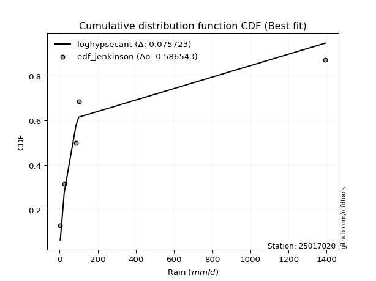</img></img>

</div>


### 11. EDF Cunnane (1978)

Cunnane´s work in statistical hydrology has focused on the performance and evaluation of different probability distributions (such as GEV, Gumbel, Lognormal) for flood frequency estimation. _b_ is a constant, typically set to 0.4.

<div align="center">


$P=(m-b)/(n+1-2b)$


</div>


**11.1. Empirical values**

<div align="center">

|                | 0                   | 1                  | 2           | 3                  | 4                  |
|:---------------|:--------------------|:-------------------|:------------|:-------------------|:-------------------|
| date           | 2019                | 2017               | 2024        | 2025               | 2018               |
| x              | 3.5                 | 24.2               | 85.2        | 100.0              | 1393.0             |
| m              | 1                   | 2                  | 3           | 4                  | 5                  |
| empirical_dist | edf_cunnane         | edf_cunnane        | edf_cunnane | edf_cunnane        | edf_cunnane        |
| empirical      | 0.11538461538461538 | 0.3076923076923077 | 0.5         | 0.6923076923076923 | 0.8846153846153845 |
| empirical_tr   | 1.1304347826086958  | 1.4444444444444444 | 2.0         | 3.25               | 8.666666666666655  |

</div>


**11.2. Kolmogorov-Smirnov fit test (sorted by Δ)**


<div align="center">

|                | 0                   | 1                   | 2                   | 3                   | 4                   | 5                   | 6                   | 7                   | 8                   | 9                   | 10                  | 11                  | 12                  | 13                  | 14                  | 15                  | 16                 | 17                 | 18                  | 19                  | 20                  | 21                 | 22                  | 23                  | 24                  | 25                  | 26                  | 27                  | 28                  | 29                  | 30                 | 31                  | 32                  | 33                  | 34                  | 35                  | 36                 | 37                  | 38                  | 39                  | 40                  | 41                  | 42                  | 43                  | 44                  | 45                  | 46                  | 47                  | 48                  | 49                  | 50                  | 51                  | 52                  | 53                  | 54                  | 55                  | 56                  | 57                  | 58                  | 59                 | 60                 | 61                 | 62                  | 63                 | 64                 | 65                  | 66                  | 67                  | 68                 | 69                  | 70                 | 71                  | 72                  | 73                 | 74                  | 75                  | 76                  | 77                  | 78                 | 79                  | 80                  | 81                 | 82                  | 83                  | 84                  | 85                 | 86                 | 87                 | 88                  | 89                 | 90                  | 91                 | 92                  | 93                  | 94                 | 95                  | 96                 | 97                  | 98                 | 99                 | 100                | 101                 | 102                 | 103                | 104                | 105                | 106                 | 107                 | 108                 | 109                 | 110                | 111                | 112                 | 113                | 114                 | 115                 | 116                | 117                 | 118                 | 119                 | 120                | 121                 | 122                 | 123                | 124                 | 125                | 126                | 127                 | 128                | 129                | 130                | 131                | 132                | 133                 | 134                | 135                 | 136                 | 137                 | 138                 | 139                | 140                 | 141                | 142                | 143                | 144                | 145                | 146                | 147                | 148                | 149                | 150                | 151                | 152                | 153                | 154                | 155                | 156                | 157                | 158                | 159                |
|:---------------|:--------------------|:--------------------|:--------------------|:--------------------|:--------------------|:--------------------|:--------------------|:--------------------|:--------------------|:--------------------|:--------------------|:--------------------|:--------------------|:--------------------|:--------------------|:--------------------|:-------------------|:-------------------|:--------------------|:--------------------|:--------------------|:-------------------|:--------------------|:--------------------|:--------------------|:--------------------|:--------------------|:--------------------|:--------------------|:--------------------|:-------------------|:--------------------|:--------------------|:--------------------|:--------------------|:--------------------|:-------------------|:--------------------|:--------------------|:--------------------|:--------------------|:--------------------|:--------------------|:--------------------|:--------------------|:--------------------|:--------------------|:--------------------|:--------------------|:--------------------|:--------------------|:--------------------|:--------------------|:--------------------|:--------------------|:--------------------|:--------------------|:--------------------|:--------------------|:-------------------|:-------------------|:-------------------|:--------------------|:-------------------|:-------------------|:--------------------|:--------------------|:--------------------|:-------------------|:--------------------|:-------------------|:--------------------|:--------------------|:-------------------|:--------------------|:--------------------|:--------------------|:--------------------|:-------------------|:--------------------|:--------------------|:-------------------|:--------------------|:--------------------|:--------------------|:-------------------|:-------------------|:-------------------|:--------------------|:-------------------|:--------------------|:-------------------|:--------------------|:--------------------|:-------------------|:--------------------|:-------------------|:--------------------|:-------------------|:-------------------|:-------------------|:--------------------|:--------------------|:-------------------|:-------------------|:-------------------|:--------------------|:--------------------|:--------------------|:--------------------|:-------------------|:-------------------|:--------------------|:-------------------|:--------------------|:--------------------|:-------------------|:--------------------|:--------------------|:--------------------|:-------------------|:--------------------|:--------------------|:-------------------|:--------------------|:-------------------|:-------------------|:--------------------|:-------------------|:-------------------|:-------------------|:-------------------|:-------------------|:--------------------|:-------------------|:--------------------|:--------------------|:--------------------|:--------------------|:-------------------|:--------------------|:-------------------|:-------------------|:-------------------|:-------------------|:-------------------|:-------------------|:-------------------|:-------------------|:-------------------|:-------------------|:-------------------|:-------------------|:-------------------|:-------------------|:-------------------|:-------------------|:-------------------|:-------------------|:-------------------|
| station        | 25017020            | 25017020            | 25017020            | 25017020            | 25017020            | 25017020            | 25017020            | 25017020            | 25017020            | 25017020            | 25017020            | 25017020            | 25017020            | 25017020            | 25017020            | 25017020            | 25017020           | 25017020           | 25017020            | 25017020            | 25017020            | 25017020           | 25017020            | 25017020            | 25017020            | 25017020            | 25017020            | 25017020            | 25017020            | 25017020            | 25017020           | 25017020            | 25017020            | 25017020            | 25017020            | 25017020            | 25017020           | 25017020            | 25017020            | 25017020            | 25017020            | 25017020            | 25017020            | 25017020            | 25017020            | 25017020            | 25017020            | 25017020            | 25017020            | 25017020            | 25017020            | 25017020            | 25017020            | 25017020            | 25017020            | 25017020            | 25017020            | 25017020            | 25017020            | 25017020           | 25017020           | 25017020           | 25017020            | 25017020           | 25017020           | 25017020            | 25017020            | 25017020            | 25017020           | 25017020            | 25017020           | 25017020            | 25017020            | 25017020           | 25017020            | 25017020            | 25017020            | 25017020            | 25017020           | 25017020            | 25017020            | 25017020           | 25017020            | 25017020            | 25017020            | 25017020           | 25017020           | 25017020           | 25017020            | 25017020           | 25017020            | 25017020           | 25017020            | 25017020            | 25017020           | 25017020            | 25017020           | 25017020            | 25017020           | 25017020           | 25017020           | 25017020            | 25017020            | 25017020           | 25017020           | 25017020           | 25017020            | 25017020            | 25017020            | 25017020            | 25017020           | 25017020           | 25017020            | 25017020           | 25017020            | 25017020            | 25017020           | 25017020            | 25017020            | 25017020            | 25017020           | 25017020            | 25017020            | 25017020           | 25017020            | 25017020           | 25017020           | 25017020            | 25017020           | 25017020           | 25017020           | 25017020           | 25017020           | 25017020            | 25017020           | 25017020            | 25017020            | 25017020            | 25017020            | 25017020           | 25017020            | 25017020           | 25017020           | 25017020           | 25017020           | 25017020           | 25017020           | 25017020           | 25017020           | 25017020           | 25017020           | 25017020           | 25017020           | 25017020           | 25017020           | 25017020           | 25017020           | 25017020           | 25017020           | 25017020           |
| empirical_dist | edf_cunnane         | edf_cunnane         | edf_cunnane         | edf_cunnane         | edf_cunnane         | edf_cunnane         | edf_cunnane         | edf_cunnane         | edf_cunnane         | edf_cunnane         | edf_cunnane         | edf_cunnane         | edf_cunnane         | edf_cunnane         | edf_cunnane         | edf_cunnane         | edf_cunnane        | edf_cunnane        | edf_cunnane         | edf_cunnane         | edf_cunnane         | edf_cunnane        | edf_cunnane         | edf_cunnane         | edf_cunnane         | edf_cunnane         | edf_cunnane         | edf_cunnane         | edf_cunnane         | edf_cunnane         | edf_cunnane        | edf_cunnane         | edf_cunnane         | edf_cunnane         | edf_cunnane         | edf_cunnane         | edf_cunnane        | edf_cunnane         | edf_cunnane         | edf_cunnane         | edf_cunnane         | edf_cunnane         | edf_cunnane         | edf_cunnane         | edf_cunnane         | edf_cunnane         | edf_cunnane         | edf_cunnane         | edf_cunnane         | edf_cunnane         | edf_cunnane         | edf_cunnane         | edf_cunnane         | edf_cunnane         | edf_cunnane         | edf_cunnane         | edf_cunnane         | edf_cunnane         | edf_cunnane         | edf_cunnane        | edf_cunnane        | edf_cunnane        | edf_cunnane         | edf_cunnane        | edf_cunnane        | edf_cunnane         | edf_cunnane         | edf_cunnane         | edf_cunnane        | edf_cunnane         | edf_cunnane        | edf_cunnane         | edf_cunnane         | edf_cunnane        | edf_cunnane         | edf_cunnane         | edf_cunnane         | edf_cunnane         | edf_cunnane        | edf_cunnane         | edf_cunnane         | edf_cunnane        | edf_cunnane         | edf_cunnane         | edf_cunnane         | edf_cunnane        | edf_cunnane        | edf_cunnane        | edf_cunnane         | edf_cunnane        | edf_cunnane         | edf_cunnane        | edf_cunnane         | edf_cunnane         | edf_cunnane        | edf_cunnane         | edf_cunnane        | edf_cunnane         | edf_cunnane        | edf_cunnane        | edf_cunnane        | edf_cunnane         | edf_cunnane         | edf_cunnane        | edf_cunnane        | edf_cunnane        | edf_cunnane         | edf_cunnane         | edf_cunnane         | edf_cunnane         | edf_cunnane        | edf_cunnane        | edf_cunnane         | edf_cunnane        | edf_cunnane         | edf_cunnane         | edf_cunnane        | edf_cunnane         | edf_cunnane         | edf_cunnane         | edf_cunnane        | edf_cunnane         | edf_cunnane         | edf_cunnane        | edf_cunnane         | edf_cunnane        | edf_cunnane        | edf_cunnane         | edf_cunnane        | edf_cunnane        | edf_cunnane        | edf_cunnane        | edf_cunnane        | edf_cunnane         | edf_cunnane        | edf_cunnane         | edf_cunnane         | edf_cunnane         | edf_cunnane         | edf_cunnane        | edf_cunnane         | edf_cunnane        | edf_cunnane        | edf_cunnane        | edf_cunnane        | edf_cunnane        | edf_cunnane        | edf_cunnane        | edf_cunnane        | edf_cunnane        | edf_cunnane        | edf_cunnane        | edf_cunnane        | edf_cunnane        | edf_cunnane        | edf_cunnane        | edf_cunnane        | edf_cunnane        | edf_cunnane        | edf_cunnane        |
| p_dist         | loghypsecant        | logf                | logrice             | logfatiguelife      | logalpha            | logjohnsonsu        | logskewnorm         | loggamma            | loggamma            | loggenlogistic      | loginvgamma         | loglogistic         | logerlang           | loginvgauss         | logmaxwell          | logpearson3         | ncf                | logweibull_min     | logburr12           | loglaplace          | loglaplace          | logfoldnorm        | logbetaprime        | lognct              | logexponnorm        | lognorm             | logcrystalball      | logt                | lograyleigh         | loggenextreme       | logloggamma        | logncf              | logcosine           | loganglit           | loginvweibull       | f                   | truncpareto        | logkappa4           | logtruncpareto      | logsemicircular     | logbradford         | betaprime           | logkstwobign        | logtruncnorm        | mielke              | lomax               | logksone            | loghalfnorm         | genpareto           | logvonmises_line    | logdweibull         | loggompertz         | gamma               | loggumbel_r         | invgamma            | logkappa3           | loguniform          | logtukeylambda      | loggausshyper       | logwrapcauchy      | invgauss           | logarcsine         | exponweib           | t                  | loggenexpon        | logtruncexpon       | logloglaplace       | logburr             | loghalflogistic    | loggennorm          | logmoyal           | erlang              | halfgennorm         | loggumbel_l        | burr                | nct                 | loglomax            | burr12              | logargus           | logexponpow         | nakagami            | logdgamma          | gausshyper          | logwald             | truncweibull_min    | loglevy_l          | logexponweib       | exponpow           | loghalfgennorm      | logbeta            | loggenpareto        | logmielke          | logtruncweibull_min | wrapcauchy          | vonmises_line      | wald                | gengamma           | foldnorm            | halflogistic       | pearson3           | dweibull           | halfnorm            | logjohnsonsb        | fatiguelife        | weibull_min        | arcsine            | loggenhalflogistic  | moyal               | levy_l              | loggengamma         | gennorm            | gumbel_r           | lognakagami         | rayleigh           | genextreme          | maxwell             | semicircular       | anglit              | logtriang           | genlogistic         | norm               | powerlaw            | logistic            | invweibull         | dgamma              | hypsecant          | crystalball        | kstwobign           | logtrapezoid       | cosine             | rice               | logrdist           | gumbel_l           | laplace             | kappa3             | logweibull_max      | exponnorm           | genexpon            | gompertz            | alpha              | truncnorm           | argus              | ksone              | johnsonsb          | logpowerlaw        | bradford           | skewnorm           | truncexpon         | weibull_max        | kappa4             | genhalflogistic    | uniform            | triang             | rdist              | beta               | trapezoid          | johnsonsu          | tukeylambda        | logvonmises        | vonmises           |
| delta          | 0.07752107990909851 | 0.08104574933632924 | 0.08243003210478739 | 0.08357051872052657 | 0.08469374373290883 | 0.08541890622495396 | 0.08575514398087958 | 0.08608019378899545 | 0.08608019378899545 | 0.08672845740948931 | 0.08694900813845541 | 0.08745421328982084 | 0.08806461279681399 | 0.09024595117427903 | 0.09041447747000408 | 0.09198860565940004 | 0.0924379850014645 | 0.0956264516055152 | 0.09578385431868541 | 0.09722397525984716 | 0.09722397525984716 | 0.0978130273180966 | 0.09834215300030658 | 0.09901348571912938 | 0.09907240185060773 | 0.09952187459580641 | 0.09952199038574416 | 0.09952245696076456 | 0.09986628468840753 | 0.10081312111279828 | 0.1016840639964871 | 0.10898507845658345 | 0.11055969557243095 | 0.11241739744099577 | 0.11531162386857319 | 0.11536110745473883 | 0.1153846153844591 | 0.11538461538461363 | 0.11538461538461553 | 0.11776679888816288 | 0.12012427209057575 | 0.12105211443535607 | 0.12169620830595917 | 0.12221441797675614 | 0.12250750153860257 | 0.12282880808928742 | 0.12455072046472515 | 0.12656122616733012 | 0.12656519948426526 | 0.12664084517454233 | 0.12688851267150747 | 0.12849277604090115 | 0.12936321928425376 | 0.13034879099393726 | 0.13043185782792333 | 0.13178254997493277 | 0.13230867877957186 | 0.13332469316514195 | 0.13425502248103482 | 0.1351463398442413 | 0.1360073862834803 | 0.1392322185228847 | 0.13954821219240154 | 0.1430211788771385 | 0.1462775148140143 | 0.14714097465990783 | 0.15223291677572015 | 0.15336251278259683 | 0.1541776779483588 | 0.15426695439152688 | 0.1548135364389508 | 0.15970777742596898 | 0.16005014268207085 | 0.1605933291472087 | 0.16261245133229396 | 0.16404498294860714 | 0.17459001665752139 | 0.17971833466220155 | 0.1803495841549172 | 0.18506164470459396 | 0.19048251415696826 | 0.1975214404387228 | 0.21954246585354242 | 0.22270869160537066 | 0.22450775624926111 | 0.2295340431780537 | 0.2296688859667516 | 0.2300122420907349 | 0.23455100733887768 | 0.2360000382764224 | 0.23875989470868159 | 0.2458060718972831 | 0.24921708932415643 | 0.24950178958664315 | 0.2543451303858395 | 0.25486084275627197 | 0.2667780819710964 | 0.26837243575754915 | 0.2684971165148603 | 0.2744158371002458 | 0.2748271970326344 | 0.27486240013917435 | 0.28181447150556405 | 0.2847716793352877 | 0.2856583405967681 | 0.28635397720814   | 0.28783838194543854 | 0.28977479762344904 | 0.28985829625853304 | 0.30054983740205343 | 0.3010718469528595 | 0.3063790993551981 | 0.30769213962394826 | 0.308821276667964  | 0.31405447279373633 | 0.32075372990021495 | 0.3224505591368352 | 0.33121734637921496 | 0.33142803089000356 | 0.33854947298806987 | 0.352058824222943  | 0.36115528593874624 | 0.37080914410687976 | 0.3842282615249736 | 0.38461538461643746 | 0.385182953527648  | 0.3870864022610396 | 0.38854982086341966 | 0.389808596572906  | 0.4087649772740363 | 0.4090452579137282 | 0.4093048765699333 | 0.4104444572976402 | 0.41301576907662363 | 0.4166222987849465 | 0.42707310026928536 | 0.42942127813864717 | 0.43034196789285006 | 0.43039311837913785 | 0.4400684981544817 | 0.44783104434180504 | 0.461853304317111  | 0.551099823769849  | 0.5603933042103239 | 0.5610917274280551 | 0.5634091481320874 | 0.5694348781033995 | 0.5897567675920605 | 0.5988507165924647 | 0.6067824520045129 | 0.6114027476118096 | 0.6228582500622802 | 0.6250988193555208 | 0.640287346892005  | 0.652256586581344  | 0.6712044410321543 | 0.6812717955225327 | 0.6834650727494753 | 1.1791634334753303 | 221.58606139890912 |
| deltao         | 0.5865427407550001  | 0.5865427407550001  | 0.5865427407550001  | 0.5865427407550001  | 0.5865427407550001  | 0.5865427407550001  | 0.5865427407550001  | 0.5865427407550001  | 0.5865427407550001  | 0.5865427407550001  | 0.5865427407550001  | 0.5865427407550001  | 0.5865427407550001  | 0.5865427407550001  | 0.5865427407550001  | 0.5865427407550001  | 0.5865427407550001 | 0.5865427407550001 | 0.5865427407550001  | 0.5865427407550001  | 0.5865427407550001  | 0.5865427407550001 | 0.5865427407550001  | 0.5865427407550001  | 0.5865427407550001  | 0.5865427407550001  | 0.5865427407550001  | 0.5865427407550001  | 0.5865427407550001  | 0.5865427407550001  | 0.5865427407550001 | 0.5865427407550001  | 0.5865427407550001  | 0.5865427407550001  | 0.5865427407550001  | 0.5865427407550001  | 0.5865427407550001 | 0.5865427407550001  | 0.5865427407550001  | 0.5865427407550001  | 0.5865427407550001  | 0.5865427407550001  | 0.5865427407550001  | 0.5865427407550001  | 0.5865427407550001  | 0.5865427407550001  | 0.5865427407550001  | 0.5865427407550001  | 0.5865427407550001  | 0.5865427407550001  | 0.5865427407550001  | 0.5865427407550001  | 0.5865427407550001  | 0.5865427407550001  | 0.5865427407550001  | 0.5865427407550001  | 0.5865427407550001  | 0.5865427407550001  | 0.5865427407550001  | 0.5865427407550001 | 0.5865427407550001 | 0.5865427407550001 | 0.5865427407550001  | 0.5865427407550001 | 0.5865427407550001 | 0.5865427407550001  | 0.5865427407550001  | 0.5865427407550001  | 0.5865427407550001 | 0.5865427407550001  | 0.5865427407550001 | 0.5865427407550001  | 0.5865427407550001  | 0.5865427407550001 | 0.5865427407550001  | 0.5865427407550001  | 0.5865427407550001  | 0.5865427407550001  | 0.5865427407550001 | 0.5865427407550001  | 0.5865427407550001  | 0.5865427407550001 | 0.5865427407550001  | 0.5865427407550001  | 0.5865427407550001  | 0.5865427407550001 | 0.5865427407550001 | 0.5865427407550001 | 0.5865427407550001  | 0.5865427407550001 | 0.5865427407550001  | 0.5865427407550001 | 0.5865427407550001  | 0.5865427407550001  | 0.5865427407550001 | 0.5865427407550001  | 0.5865427407550001 | 0.5865427407550001  | 0.5865427407550001 | 0.5865427407550001 | 0.5865427407550001 | 0.5865427407550001  | 0.5865427407550001  | 0.5865427407550001 | 0.5865427407550001 | 0.5865427407550001 | 0.5865427407550001  | 0.5865427407550001  | 0.5865427407550001  | 0.5865427407550001  | 0.5865427407550001 | 0.5865427407550001 | 0.5865427407550001  | 0.5865427407550001 | 0.5865427407550001  | 0.5865427407550001  | 0.5865427407550001 | 0.5865427407550001  | 0.5865427407550001  | 0.5865427407550001  | 0.5865427407550001 | 0.5865427407550001  | 0.5865427407550001  | 0.5865427407550001 | 0.5865427407550001  | 0.5865427407550001 | 0.5865427407550001 | 0.5865427407550001  | 0.5865427407550001 | 0.5865427407550001 | 0.5865427407550001 | 0.5865427407550001 | 0.5865427407550001 | 0.5865427407550001  | 0.5865427407550001 | 0.5865427407550001  | 0.5865427407550001  | 0.5865427407550001  | 0.5865427407550001  | 0.5865427407550001 | 0.5865427407550001  | 0.5865427407550001 | 0.5865427407550001 | 0.5865427407550001 | 0.5865427407550001 | 0.5865427407550001 | 0.5865427407550001 | 0.5865427407550001 | 0.5865427407550001 | 0.5865427407550001 | 0.5865427407550001 | 0.5865427407550001 | 0.5865427407550001 | 0.5865427407550001 | 0.5865427407550001 | 0.5865427407550001 | 0.5865427407550001 | 0.5865427407550001 | 0.5865427407550001 | 0.5865427407550001 |
| eval           | Δo > Δ              | Δo > Δ              | Δo > Δ              | Δo > Δ              | Δo > Δ              | Δo > Δ              | Δo > Δ              | Δo > Δ              | Δo > Δ              | Δo > Δ              | Δo > Δ              | Δo > Δ              | Δo > Δ              | Δo > Δ              | Δo > Δ              | Δo > Δ              | Δo > Δ             | Δo > Δ             | Δo > Δ              | Δo > Δ              | Δo > Δ              | Δo > Δ             | Δo > Δ              | Δo > Δ              | Δo > Δ              | Δo > Δ              | Δo > Δ              | Δo > Δ              | Δo > Δ              | Δo > Δ              | Δo > Δ             | Δo > Δ              | Δo > Δ              | Δo > Δ              | Δo > Δ              | Δo > Δ              | Δo > Δ             | Δo > Δ              | Δo > Δ              | Δo > Δ              | Δo > Δ              | Δo > Δ              | Δo > Δ              | Δo > Δ              | Δo > Δ              | Δo > Δ              | Δo > Δ              | Δo > Δ              | Δo > Δ              | Δo > Δ              | Δo > Δ              | Δo > Δ              | Δo > Δ              | Δo > Δ              | Δo > Δ              | Δo > Δ              | Δo > Δ              | Δo > Δ              | Δo > Δ              | Δo > Δ             | Δo > Δ             | Δo > Δ             | Δo > Δ              | Δo > Δ             | Δo > Δ             | Δo > Δ              | Δo > Δ              | Δo > Δ              | Δo > Δ             | Δo > Δ              | Δo > Δ             | Δo > Δ              | Δo > Δ              | Δo > Δ             | Δo > Δ              | Δo > Δ              | Δo > Δ              | Δo > Δ              | Δo > Δ             | Δo > Δ              | Δo > Δ              | Δo > Δ             | Δo > Δ              | Δo > Δ              | Δo > Δ              | Δo > Δ             | Δo > Δ             | Δo > Δ             | Δo > Δ              | Δo > Δ             | Δo > Δ              | Δo > Δ             | Δo > Δ              | Δo > Δ              | Δo > Δ             | Δo > Δ              | Δo > Δ             | Δo > Δ              | Δo > Δ             | Δo > Δ             | Δo > Δ             | Δo > Δ              | Δo > Δ              | Δo > Δ             | Δo > Δ             | Δo > Δ             | Δo > Δ              | Δo > Δ              | Δo > Δ              | Δo > Δ              | Δo > Δ             | Δo > Δ             | Δo > Δ              | Δo > Δ             | Δo > Δ              | Δo > Δ              | Δo > Δ             | Δo > Δ              | Δo > Δ              | Δo > Δ              | Δo > Δ             | Δo > Δ              | Δo > Δ              | Δo > Δ             | Δo > Δ              | Δo > Δ             | Δo > Δ             | Δo > Δ              | Δo > Δ             | Δo > Δ             | Δo > Δ             | Δo > Δ             | Δo > Δ             | Δo > Δ              | Δo > Δ             | Δo > Δ              | Δo > Δ              | Δo > Δ              | Δo > Δ              | Δo > Δ             | Δo > Δ              | Δo > Δ             | Δo > Δ             | Δo > Δ             | Δo > Δ             | Δo > Δ             | Δo > Δ             | Δo <= Δ            | Δo <= Δ            | Δo <= Δ            | Δo <= Δ            | Δo <= Δ            | Δo <= Δ            | Δo <= Δ            | Δo <= Δ            | Δo <= Δ            | Δo <= Δ            | Δo <= Δ            | Δo <= Δ            | Δo <= Δ            |
| fit            | 1                   | 1                   | 1                   | 1                   | 1                   | 1                   | 1                   | 1                   | 1                   | 1                   | 1                   | 1                   | 1                   | 1                   | 1                   | 1                   | 1                  | 1                  | 1                   | 1                   | 1                   | 1                  | 1                   | 1                   | 1                   | 1                   | 1                   | 1                   | 1                   | 1                   | 1                  | 1                   | 1                   | 1                   | 1                   | 1                   | 1                  | 1                   | 1                   | 1                   | 1                   | 1                   | 1                   | 1                   | 1                   | 1                   | 1                   | 1                   | 1                   | 1                   | 1                   | 1                   | 1                   | 1                   | 1                   | 1                   | 1                   | 1                   | 1                   | 1                  | 1                  | 1                  | 1                   | 1                  | 1                  | 1                   | 1                   | 1                   | 1                  | 1                   | 1                  | 1                   | 1                   | 1                  | 1                   | 1                   | 1                   | 1                   | 1                  | 1                   | 1                   | 1                  | 1                   | 1                   | 1                   | 1                  | 1                  | 1                  | 1                   | 1                  | 1                   | 1                  | 1                   | 1                   | 1                  | 1                   | 1                  | 1                   | 1                  | 1                  | 1                  | 1                   | 1                   | 1                  | 1                  | 1                  | 1                   | 1                   | 1                   | 1                   | 1                  | 1                  | 1                   | 1                  | 1                   | 1                   | 1                  | 1                   | 1                   | 1                   | 1                  | 1                   | 1                   | 1                  | 1                   | 1                  | 1                  | 1                   | 1                  | 1                  | 1                  | 1                  | 1                  | 1                   | 1                  | 1                   | 1                   | 1                   | 1                   | 1                  | 1                   | 1                  | 1                  | 1                  | 1                  | 1                  | 1                  | 0                  | 0                  | 0                  | 0                  | 0                  | 0                  | 0                  | 0                  | 0                  | 0                  | 0                  | 0                  | 0                  |
| n              | 5                   | 5                   | 5                   | 5                   | 5                   | 5                   | 5                   | 5                   | 5                   | 5                   | 5                   | 5                   | 5                   | 5                   | 5                   | 5                   | 5                  | 5                  | 5                   | 5                   | 5                   | 5                  | 5                   | 5                   | 5                   | 5                   | 5                   | 5                   | 5                   | 5                   | 5                  | 5                   | 5                   | 5                   | 5                   | 5                   | 5                  | 5                   | 5                   | 5                   | 5                   | 5                   | 5                   | 5                   | 5                   | 5                   | 5                   | 5                   | 5                   | 5                   | 5                   | 5                   | 5                   | 5                   | 5                   | 5                   | 5                   | 5                   | 5                   | 5                  | 5                  | 5                  | 5                   | 5                  | 5                  | 5                   | 5                   | 5                   | 5                  | 5                   | 5                  | 5                   | 5                   | 5                  | 5                   | 5                   | 5                   | 5                   | 5                  | 5                   | 5                   | 5                  | 5                   | 5                   | 5                   | 5                  | 5                  | 5                  | 5                   | 5                  | 5                   | 5                  | 5                   | 5                   | 5                  | 5                   | 5                  | 5                   | 5                  | 5                  | 5                  | 5                   | 5                   | 5                  | 5                  | 5                  | 5                   | 5                   | 5                   | 5                   | 5                  | 5                  | 5                   | 5                  | 5                   | 5                   | 5                  | 5                   | 5                   | 5                   | 5                  | 5                   | 5                   | 5                  | 5                   | 5                  | 5                  | 5                   | 5                  | 5                  | 5                  | 5                  | 5                  | 5                   | 5                  | 5                   | 5                   | 5                   | 5                   | 5                  | 5                   | 5                  | 5                  | 5                  | 5                  | 5                  | 5                  | 5                  | 5                  | 5                  | 5                  | 5                  | 5                  | 5                  | 5                  | 5                  | 5                  | 5                  | 5                  | 5                  |
| best_fit       | 1                   | 0                   | 0                   | 0                   | 0                   | 0                   | 0                   | 0                   | 0                   | 0                   | 0                   | 0                   | 0                   | 0                   | 0                   | 0                   | 0                  | 0                  | 0                   | 0                   | 0                   | 0                  | 0                   | 0                   | 0                   | 0                   | 0                   | 0                   | 0                   | 0                   | 0                  | 0                   | 0                   | 0                   | 0                   | 0                   | 0                  | 0                   | 0                   | 0                   | 0                   | 0                   | 0                   | 0                   | 0                   | 0                   | 0                   | 0                   | 0                   | 0                   | 0                   | 0                   | 0                   | 0                   | 0                   | 0                   | 0                   | 0                   | 0                   | 0                  | 0                  | 0                  | 0                   | 0                  | 0                  | 0                   | 0                   | 0                   | 0                  | 0                   | 0                  | 0                   | 0                   | 0                  | 0                   | 0                   | 0                   | 0                   | 0                  | 0                   | 0                   | 0                  | 0                   | 0                   | 0                   | 0                  | 0                  | 0                  | 0                   | 0                  | 0                   | 0                  | 0                   | 0                   | 0                  | 0                   | 0                  | 0                   | 0                  | 0                  | 0                  | 0                   | 0                   | 0                  | 0                  | 0                  | 0                   | 0                   | 0                   | 0                   | 0                  | 0                  | 0                   | 0                  | 0                   | 0                   | 0                  | 0                   | 0                   | 0                   | 0                  | 0                   | 0                   | 0                  | 0                   | 0                  | 0                  | 0                   | 0                  | 0                  | 0                  | 0                  | 0                  | 0                   | 0                  | 0                   | 0                   | 0                   | 0                   | 0                  | 0                   | 0                  | 0                  | 0                  | 0                  | 0                  | 0                  | 0                  | 0                  | 0                  | 0                  | 0                  | 0                  | 0                  | 0                  | 0                  | 0                  | 0                  | 0                  | 0                  |
| best_fit_sort  | 1                   | 2                   | 3                   | 4                   | 5                   | 6                   | 7                   | 8                   | 9                   | 10                  | 11                  | 12                  | 13                  | 14                  | 15                  | 16                  | 17                 | 18                 | 19                  | 20                  | 21                  | 22                 | 23                  | 24                  | 25                  | 26                  | 27                  | 28                  | 29                  | 30                  | 31                 | 32                  | 33                  | 34                  | 35                  | 36                  | 37                 | 38                  | 39                  | 40                  | 41                  | 42                  | 43                  | 44                  | 45                  | 46                  | 47                  | 48                  | 49                  | 50                  | 51                  | 52                  | 53                  | 54                  | 55                  | 56                  | 57                  | 58                  | 59                  | 60                 | 61                 | 62                 | 63                  | 64                 | 65                 | 66                  | 67                  | 68                  | 69                 | 70                  | 71                 | 72                  | 73                  | 74                 | 75                  | 76                  | 77                  | 78                  | 79                 | 80                  | 81                  | 82                 | 83                  | 84                  | 85                  | 86                 | 87                 | 88                 | 89                  | 90                 | 91                  | 92                 | 93                  | 94                  | 95                 | 96                  | 97                 | 98                  | 99                 | 100                | 101                | 102                 | 103                 | 104                | 105                | 106                | 107                 | 108                 | 109                 | 110                 | 111                | 112                | 113                 | 114                | 115                 | 116                 | 117                | 118                 | 119                 | 120                 | 121                | 122                 | 123                 | 124                | 125                 | 126                | 127                | 128                 | 129                | 130                | 131                | 132                | 133                | 134                 | 135                | 136                 | 137                 | 138                 | 139                 | 140                | 141                 | 142                | 143                | 144                | 145                | 146                | 147                | 148                | 149                | 150                | 151                | 152                | 153                | 154                | 155                | 156                | 157                | 158                | 159                | 160                |

</div>


**11.3. Best fit**

<div align="center">

|   id |   station | empirical_dist   | p_dist       |     delta |   deltao | eval   |   fit |   n |   best_fit |   best_fit_sort |
|-----:|----------:|:-----------------|:-------------|----------:|---------:|:-------|------:|----:|-----------:|----------------:|
|    0 |  25017020 | edf_cunnane      | loghypsecant | 0.0775211 | 0.586543 | Δo > Δ |     1 |   5 |          1 |               1 |

</div>


<div align="center">

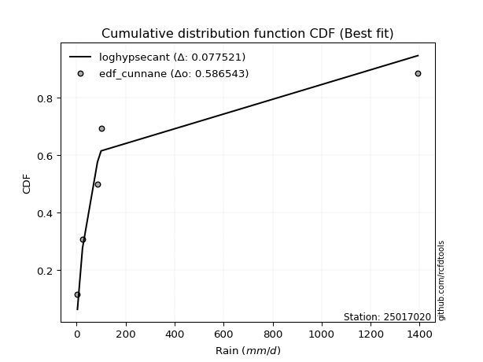</img></img>

</div>


### 12. EDF Adamowski (1981)

The Adamowski formula in hydrology refers to a specific plotting position formula used for estimating the non-parametric empirical distribution of hydrological events (like flood peaks) to calculate their return periods. This formula provides an alternative to traditional parametric methods (like the Gumbel or Log Pearson Type III distributions). 

<div align="center">


$P=(m-0.25)/(n+0.5)$


</div>


**12.1. Empirical values**

<div align="center">

|                | 0                   | 1                  | 2             | 3                  | 4                  |
|:---------------|:--------------------|:-------------------|:--------------|:-------------------|:-------------------|
| date           | 2019                | 2017               | 2024          | 2025               | 2018               |
| x              | 3.5                 | 24.2               | 85.2          | 100.0              | 1393.0             |
| m              | 1                   | 2                  | 3             | 4                  | 5                  |
| empirical_dist | edf_adamowski       | edf_adamowski      | edf_adamowski | edf_adamowski      | edf_adamowski      |
| empirical      | 0.13636363636363635 | 0.3181818181818182 | 0.5           | 0.6818181818181818 | 0.8636363636363636 |
| empirical_tr   | 1.1578947368421053  | 1.4666666666666666 | 2.0           | 3.1428571428571423 | 7.333333333333334  |

</div>


**12.2. Kolmogorov-Smirnov fit test (sorted by Δ)**


<div align="center">

|                | 0                   | 1                   | 2                   | 3                   | 4                   | 5                   | 6                  | 7                   | 8                   | 9                  | 10                  | 11                  | 12                  | 13                  | 14                  | 15                 | 16                  | 17                  | 18                  | 19                  | 20                  | 21                  | 22                  | 23                  | 24                 | 25                 | 26                  | 27                  | 28                  | 29                  | 30                  | 31                  | 32                  | 33                  | 34                  | 35                  | 36                  | 37                  | 38                  | 39                  | 40                  | 41                  | 42                  | 43                  | 44                 | 45                 | 46                  | 47                  | 48                  | 49                 | 50                  | 51                 | 52                 | 53                  | 54                  | 55                  | 56                  | 57                 | 58                  | 59                  | 60                  | 61                  | 62                 | 63                  | 64                 | 65                 | 66                  | 67                  | 68                  | 69                  | 70                  | 71                 | 72                 | 73                 | 74                  | 75                  | 76                  | 77                  | 78                  | 79                 | 80                  | 81                  | 82                 | 83                 | 84                  | 85                  | 86                  | 87                  | 88                  | 89                  | 90                  | 91                  | 92                  | 93                  | 94                  | 95                 | 96                  | 97                 | 98                  | 99                 | 100                | 101                | 102                 | 103                | 104                | 105                 | 106                 | 107                | 108                | 109                 | 110                | 111                 | 112                | 113                | 114                | 115                 | 116                | 117                 | 118                 | 119                 | 120                 | 121                | 122                 | 123                 | 124                 | 125                | 126                 | 127                 | 128                | 129                | 130                | 131                | 132                 | 133                | 134                | 135                 | 136                 | 137                 | 138                 | 139                | 140                | 141                | 142                | 143                | 144                | 145                | 146                | 147                | 148                | 149                | 150                | 151                | 152                | 153                | 154                | 155                | 156                | 157                | 158                | 159                |
|:---------------|:--------------------|:--------------------|:--------------------|:--------------------|:--------------------|:--------------------|:-------------------|:--------------------|:--------------------|:-------------------|:--------------------|:--------------------|:--------------------|:--------------------|:--------------------|:-------------------|:--------------------|:--------------------|:--------------------|:--------------------|:--------------------|:--------------------|:--------------------|:--------------------|:-------------------|:-------------------|:--------------------|:--------------------|:--------------------|:--------------------|:--------------------|:--------------------|:--------------------|:--------------------|:--------------------|:--------------------|:--------------------|:--------------------|:--------------------|:--------------------|:--------------------|:--------------------|:--------------------|:--------------------|:-------------------|:-------------------|:--------------------|:--------------------|:--------------------|:-------------------|:--------------------|:-------------------|:-------------------|:--------------------|:--------------------|:--------------------|:--------------------|:-------------------|:--------------------|:--------------------|:--------------------|:--------------------|:-------------------|:--------------------|:-------------------|:-------------------|:--------------------|:--------------------|:--------------------|:--------------------|:--------------------|:-------------------|:-------------------|:-------------------|:--------------------|:--------------------|:--------------------|:--------------------|:--------------------|:-------------------|:--------------------|:--------------------|:-------------------|:-------------------|:--------------------|:--------------------|:--------------------|:--------------------|:--------------------|:--------------------|:--------------------|:--------------------|:--------------------|:--------------------|:--------------------|:-------------------|:--------------------|:-------------------|:--------------------|:-------------------|:-------------------|:-------------------|:--------------------|:-------------------|:-------------------|:--------------------|:--------------------|:-------------------|:-------------------|:--------------------|:-------------------|:--------------------|:-------------------|:-------------------|:-------------------|:--------------------|:-------------------|:--------------------|:--------------------|:--------------------|:--------------------|:-------------------|:--------------------|:--------------------|:--------------------|:-------------------|:--------------------|:--------------------|:-------------------|:-------------------|:-------------------|:-------------------|:--------------------|:-------------------|:-------------------|:--------------------|:--------------------|:--------------------|:--------------------|:-------------------|:-------------------|:-------------------|:-------------------|:-------------------|:-------------------|:-------------------|:-------------------|:-------------------|:-------------------|:-------------------|:-------------------|:-------------------|:-------------------|:-------------------|:-------------------|:-------------------|:-------------------|:-------------------|:-------------------|:-------------------|
| station        | 25017020            | 25017020            | 25017020            | 25017020            | 25017020            | 25017020            | 25017020           | 25017020            | 25017020            | 25017020           | 25017020            | 25017020            | 25017020            | 25017020            | 25017020            | 25017020           | 25017020            | 25017020            | 25017020            | 25017020            | 25017020            | 25017020            | 25017020            | 25017020            | 25017020           | 25017020           | 25017020            | 25017020            | 25017020            | 25017020            | 25017020            | 25017020            | 25017020            | 25017020            | 25017020            | 25017020            | 25017020            | 25017020            | 25017020            | 25017020            | 25017020            | 25017020            | 25017020            | 25017020            | 25017020           | 25017020           | 25017020            | 25017020            | 25017020            | 25017020           | 25017020            | 25017020           | 25017020           | 25017020            | 25017020            | 25017020            | 25017020            | 25017020           | 25017020            | 25017020            | 25017020            | 25017020            | 25017020           | 25017020            | 25017020           | 25017020           | 25017020            | 25017020            | 25017020            | 25017020            | 25017020            | 25017020           | 25017020           | 25017020           | 25017020            | 25017020            | 25017020            | 25017020            | 25017020            | 25017020           | 25017020            | 25017020            | 25017020           | 25017020           | 25017020            | 25017020            | 25017020            | 25017020            | 25017020            | 25017020            | 25017020            | 25017020            | 25017020            | 25017020            | 25017020            | 25017020           | 25017020            | 25017020           | 25017020            | 25017020           | 25017020           | 25017020           | 25017020            | 25017020           | 25017020           | 25017020            | 25017020            | 25017020           | 25017020           | 25017020            | 25017020           | 25017020            | 25017020           | 25017020           | 25017020           | 25017020            | 25017020           | 25017020            | 25017020            | 25017020            | 25017020            | 25017020           | 25017020            | 25017020            | 25017020            | 25017020           | 25017020            | 25017020            | 25017020           | 25017020           | 25017020           | 25017020           | 25017020            | 25017020           | 25017020           | 25017020            | 25017020            | 25017020            | 25017020            | 25017020           | 25017020           | 25017020           | 25017020           | 25017020           | 25017020           | 25017020           | 25017020           | 25017020           | 25017020           | 25017020           | 25017020           | 25017020           | 25017020           | 25017020           | 25017020           | 25017020           | 25017020           | 25017020           | 25017020           | 25017020           |
| empirical_dist | edf_adamowski       | edf_adamowski       | edf_adamowski       | edf_adamowski       | edf_adamowski       | edf_adamowski       | edf_adamowski      | edf_adamowski       | edf_adamowski       | edf_adamowski      | edf_adamowski       | edf_adamowski       | edf_adamowski       | edf_adamowski       | edf_adamowski       | edf_adamowski      | edf_adamowski       | edf_adamowski       | edf_adamowski       | edf_adamowski       | edf_adamowski       | edf_adamowski       | edf_adamowski       | edf_adamowski       | edf_adamowski      | edf_adamowski      | edf_adamowski       | edf_adamowski       | edf_adamowski       | edf_adamowski       | edf_adamowski       | edf_adamowski       | edf_adamowski       | edf_adamowski       | edf_adamowski       | edf_adamowski       | edf_adamowski       | edf_adamowski       | edf_adamowski       | edf_adamowski       | edf_adamowski       | edf_adamowski       | edf_adamowski       | edf_adamowski       | edf_adamowski      | edf_adamowski      | edf_adamowski       | edf_adamowski       | edf_adamowski       | edf_adamowski      | edf_adamowski       | edf_adamowski      | edf_adamowski      | edf_adamowski       | edf_adamowski       | edf_adamowski       | edf_adamowski       | edf_adamowski      | edf_adamowski       | edf_adamowski       | edf_adamowski       | edf_adamowski       | edf_adamowski      | edf_adamowski       | edf_adamowski      | edf_adamowski      | edf_adamowski       | edf_adamowski       | edf_adamowski       | edf_adamowski       | edf_adamowski       | edf_adamowski      | edf_adamowski      | edf_adamowski      | edf_adamowski       | edf_adamowski       | edf_adamowski       | edf_adamowski       | edf_adamowski       | edf_adamowski      | edf_adamowski       | edf_adamowski       | edf_adamowski      | edf_adamowski      | edf_adamowski       | edf_adamowski       | edf_adamowski       | edf_adamowski       | edf_adamowski       | edf_adamowski       | edf_adamowski       | edf_adamowski       | edf_adamowski       | edf_adamowski       | edf_adamowski       | edf_adamowski      | edf_adamowski       | edf_adamowski      | edf_adamowski       | edf_adamowski      | edf_adamowski      | edf_adamowski      | edf_adamowski       | edf_adamowski      | edf_adamowski      | edf_adamowski       | edf_adamowski       | edf_adamowski      | edf_adamowski      | edf_adamowski       | edf_adamowski      | edf_adamowski       | edf_adamowski      | edf_adamowski      | edf_adamowski      | edf_adamowski       | edf_adamowski      | edf_adamowski       | edf_adamowski       | edf_adamowski       | edf_adamowski       | edf_adamowski      | edf_adamowski       | edf_adamowski       | edf_adamowski       | edf_adamowski      | edf_adamowski       | edf_adamowski       | edf_adamowski      | edf_adamowski      | edf_adamowski      | edf_adamowski      | edf_adamowski       | edf_adamowski      | edf_adamowski      | edf_adamowski       | edf_adamowski       | edf_adamowski       | edf_adamowski       | edf_adamowski      | edf_adamowski      | edf_adamowski      | edf_adamowski      | edf_adamowski      | edf_adamowski      | edf_adamowski      | edf_adamowski      | edf_adamowski      | edf_adamowski      | edf_adamowski      | edf_adamowski      | edf_adamowski      | edf_adamowski      | edf_adamowski      | edf_adamowski      | edf_adamowski      | edf_adamowski      | edf_adamowski      | edf_adamowski      | edf_adamowski      |
| p_dist         | logskewnorm         | loggamma            | loggamma            | logjohnsonsu        | logerlang           | logfatiguelife      | logf               | logpearson3         | loglogistic         | loghypsecant       | logalpha            | loggenlogistic      | loginvgamma         | logfoldnorm         | lognct              | logexponnorm       | lognorm             | logcrystalball      | logt                | loginvgauss         | loggenextreme       | logmaxwell          | logrice             | logloggamma         | ncf                | logweibull_min     | logburr12           | loglaplace          | loglaplace          | logbetaprime        | lograyleigh         | logcosine           | loganglit           | logsemicircular     | logncf              | logksone            | loginvweibull       | logdweibull         | logkstwobign        | mielke              | logkappa3           | loggumbel_r         | invgamma            | genpareto           | invgauss           | f                  | logwrapcauchy       | betaprime           | logbradford         | gamma              | loggompertz         | logtruncnorm       | exponweib          | loggausshyper       | truncpareto         | lomax               | logtukeylambda      | logkappa4          | loguniform          | logarcsine          | loghalfnorm         | logtruncpareto      | logvonmises_line   | logloglaplace       | t                  | loggenexpon        | logtruncexpon       | erlang              | halfgennorm         | loggumbel_l         | logburr             | loghalflogistic    | logmoyal           | nct                | burr                | loglomax            | loggennorm          | burr12              | logargus            | logexponpow        | nakagami            | logdgamma           | gausshyper         | truncweibull_min   | loglevy_l           | exponpow            | logwald             | logexponweib        | loghalfgennorm      | logbeta             | loggenpareto        | logtruncweibull_min | wrapcauchy          | vonmises_line       | wald                | logmielke          | dweibull            | gengamma           | foldnorm            | halflogistic       | pearson3           | halfnorm           | levy_l              | logjohnsonsb       | fatiguelife        | weibull_min         | arcsine             | loggenhalflogistic | moyal              | loggengamma         | genextreme         | gumbel_r            | rayleigh           | gennorm            | maxwell            | semicircular        | lognakagami        | anglit              | logtriang           | genlogistic         | norm                | powerlaw           | logistic            | invweibull          | dgamma              | crystalball        | hypsecant           | kstwobign           | logtrapezoid       | kappa3             | cosine             | rice               | gumbel_l            | laplace            | logrdist           | logweibull_max      | exponnorm           | genexpon            | gompertz            | alpha              | truncnorm          | argus              | ksone              | johnsonsb          | logpowerlaw        | bradford           | skewnorm           | truncexpon         | weibull_max        | kappa4             | genhalflogistic    | uniform            | triang             | rdist              | beta               | trapezoid          | tukeylambda        | johnsonsu          | logvonmises        | vonmises           |
| delta          | 0.07526563349136906 | 0.07559068329948493 | 0.07559068329948493 | 0.07561168797605455 | 0.07757510230730347 | 0.07759913779329097 | 0.0803707469237589 | 0.08149909516988951 | 0.08252130248253708 | 0.0832984229164414 | 0.08469374373290883 | 0.08672845740948931 | 0.08694900813845541 | 0.08732351682858608 | 0.08852397522961886 | 0.0885828913610972 | 0.08903236410629589 | 0.08903247989623364 | 0.08903294647125404 | 0.09024595117427903 | 0.09032361062328775 | 0.09041447747000408 | 0.09051102177616699 | 0.09119455350697658 | 0.0924379850014645 | 0.0956264516055152 | 0.09578385431868541 | 0.09722397525984716 | 0.09722397525984716 | 0.09834215300030658 | 0.09986628468840753 | 0.10007018508292043 | 0.10192788695148525 | 0.10727728839865236 | 0.10898507845658345 | 0.11406120997521463 | 0.11531162386857319 | 0.11639900218199695 | 0.12169620830595917 | 0.12250750153860257 | 0.12460403189133362 | 0.13034879099393726 | 0.13043185782792333 | 0.13559977686719732 | 0.1360073862834803 | 0.1363401284337598 | 0.13636096055701347 | 0.13636322886079072 | 0.13636348386403707 | 0.1363635413515309 | 0.13636359261019057 | 0.136363634300262  | 0.136363636088698  | 0.13636363636332616 | 0.13636363636347992 | 0.13636363636352464 | 0.13636363636362925 | 0.1363636363636346 | 0.13636363636363635 | 0.13636363636363635 | 0.13636363636363635 | 0.13636363636363635 | 0.1371303556640528 | 0.14174340628620963 | 0.1430211788771385 | 0.1462775148140143 | 0.14714097465990783 | 0.14921826693645845 | 0.14956063219256033 | 0.15010381865769817 | 0.15336251278259683 | 0.1541776779483588 | 0.1548135364389508 | 0.1619697977515584 | 0.16261245133229396 | 0.16410050616801092 | 0.16475646488103735 | 0.16922882417269103 | 0.16986007366540667 | 0.1745721342150835 | 0.17999300366745774 | 0.20801095092823327 | 0.2090529553640319 | 0.2140182457597506 | 0.21904453268854318 | 0.21952273160122437 | 0.22270869160537066 | 0.22304758760151555 | 0.22406149684936721 | 0.22551052778691189 | 0.22827038421917106 | 0.23872757883464596 | 0.23901227909713263 | 0.24385561989632898 | 0.24437133226676144 | 0.2458060718972831 | 0.25384817605361343 | 0.2562885714815859 | 0.25788292526803863 | 0.2580076060253498 | 0.2639263266107353 | 0.2643728896496638 | 0.26887927527951205 | 0.2713249610160535 | 0.2742821688457772 | 0.27516883010725757 | 0.27586446671862946 | 0.277348871455928  | 0.2792852871339385 | 0.29006032691254297 | 0.2930754518147155 | 0.29588958886568756 | 0.2983317661784535 | 0.3010718469528595 | 0.3102642194107044 | 0.31196104864732466 | 0.3181816501134587 | 0.32072783588970444 | 0.32093852040049303 | 0.32805996249855934 | 0.34156931373343247 | 0.3506657754492358 | 0.36031963361736924 | 0.36324924054595276 | 0.36363636363741647 | 0.3661073812820186 | 0.37469344303813745 | 0.37806031037390914 | 0.3793190860833955 | 0.3956432778059257 | 0.3982754667845258 | 0.3985557474242177 | 0.39995494680812965 | 0.4025262585871131 | 0.4093048765699333 | 0.41658358977977483 | 0.41893176764913664 | 0.41985245740333954 | 0.41990360788962733 | 0.4295789876649712 | 0.4373415338522945 | 0.4513637938276005 | 0.5406103132803384 | 0.5499037937208133 | 0.5506022169385447 | 0.5529196376425769 | 0.558945367613889  | 0.57926725710255   | 0.5883612061029542 | 0.5962929415150023 | 0.600913237122299  | 0.6123687395727697 | 0.6146093088660103 | 0.619308325912984  | 0.6312775656023231 | 0.6607149305426436 | 0.6624860517704544 | 0.6707822850330223 | 1.200142454454351  | 221.60704041988814 |
| deltao         | 0.5865427407550001  | 0.5865427407550001  | 0.5865427407550001  | 0.5865427407550001  | 0.5865427407550001  | 0.5865427407550001  | 0.5865427407550001 | 0.5865427407550001  | 0.5865427407550001  | 0.5865427407550001 | 0.5865427407550001  | 0.5865427407550001  | 0.5865427407550001  | 0.5865427407550001  | 0.5865427407550001  | 0.5865427407550001 | 0.5865427407550001  | 0.5865427407550001  | 0.5865427407550001  | 0.5865427407550001  | 0.5865427407550001  | 0.5865427407550001  | 0.5865427407550001  | 0.5865427407550001  | 0.5865427407550001 | 0.5865427407550001 | 0.5865427407550001  | 0.5865427407550001  | 0.5865427407550001  | 0.5865427407550001  | 0.5865427407550001  | 0.5865427407550001  | 0.5865427407550001  | 0.5865427407550001  | 0.5865427407550001  | 0.5865427407550001  | 0.5865427407550001  | 0.5865427407550001  | 0.5865427407550001  | 0.5865427407550001  | 0.5865427407550001  | 0.5865427407550001  | 0.5865427407550001  | 0.5865427407550001  | 0.5865427407550001 | 0.5865427407550001 | 0.5865427407550001  | 0.5865427407550001  | 0.5865427407550001  | 0.5865427407550001 | 0.5865427407550001  | 0.5865427407550001 | 0.5865427407550001 | 0.5865427407550001  | 0.5865427407550001  | 0.5865427407550001  | 0.5865427407550001  | 0.5865427407550001 | 0.5865427407550001  | 0.5865427407550001  | 0.5865427407550001  | 0.5865427407550001  | 0.5865427407550001 | 0.5865427407550001  | 0.5865427407550001 | 0.5865427407550001 | 0.5865427407550001  | 0.5865427407550001  | 0.5865427407550001  | 0.5865427407550001  | 0.5865427407550001  | 0.5865427407550001 | 0.5865427407550001 | 0.5865427407550001 | 0.5865427407550001  | 0.5865427407550001  | 0.5865427407550001  | 0.5865427407550001  | 0.5865427407550001  | 0.5865427407550001 | 0.5865427407550001  | 0.5865427407550001  | 0.5865427407550001 | 0.5865427407550001 | 0.5865427407550001  | 0.5865427407550001  | 0.5865427407550001  | 0.5865427407550001  | 0.5865427407550001  | 0.5865427407550001  | 0.5865427407550001  | 0.5865427407550001  | 0.5865427407550001  | 0.5865427407550001  | 0.5865427407550001  | 0.5865427407550001 | 0.5865427407550001  | 0.5865427407550001 | 0.5865427407550001  | 0.5865427407550001 | 0.5865427407550001 | 0.5865427407550001 | 0.5865427407550001  | 0.5865427407550001 | 0.5865427407550001 | 0.5865427407550001  | 0.5865427407550001  | 0.5865427407550001 | 0.5865427407550001 | 0.5865427407550001  | 0.5865427407550001 | 0.5865427407550001  | 0.5865427407550001 | 0.5865427407550001 | 0.5865427407550001 | 0.5865427407550001  | 0.5865427407550001 | 0.5865427407550001  | 0.5865427407550001  | 0.5865427407550001  | 0.5865427407550001  | 0.5865427407550001 | 0.5865427407550001  | 0.5865427407550001  | 0.5865427407550001  | 0.5865427407550001 | 0.5865427407550001  | 0.5865427407550001  | 0.5865427407550001 | 0.5865427407550001 | 0.5865427407550001 | 0.5865427407550001 | 0.5865427407550001  | 0.5865427407550001 | 0.5865427407550001 | 0.5865427407550001  | 0.5865427407550001  | 0.5865427407550001  | 0.5865427407550001  | 0.5865427407550001 | 0.5865427407550001 | 0.5865427407550001 | 0.5865427407550001 | 0.5865427407550001 | 0.5865427407550001 | 0.5865427407550001 | 0.5865427407550001 | 0.5865427407550001 | 0.5865427407550001 | 0.5865427407550001 | 0.5865427407550001 | 0.5865427407550001 | 0.5865427407550001 | 0.5865427407550001 | 0.5865427407550001 | 0.5865427407550001 | 0.5865427407550001 | 0.5865427407550001 | 0.5865427407550001 | 0.5865427407550001 |
| eval           | Δo > Δ              | Δo > Δ              | Δo > Δ              | Δo > Δ              | Δo > Δ              | Δo > Δ              | Δo > Δ             | Δo > Δ              | Δo > Δ              | Δo > Δ             | Δo > Δ              | Δo > Δ              | Δo > Δ              | Δo > Δ              | Δo > Δ              | Δo > Δ             | Δo > Δ              | Δo > Δ              | Δo > Δ              | Δo > Δ              | Δo > Δ              | Δo > Δ              | Δo > Δ              | Δo > Δ              | Δo > Δ             | Δo > Δ             | Δo > Δ              | Δo > Δ              | Δo > Δ              | Δo > Δ              | Δo > Δ              | Δo > Δ              | Δo > Δ              | Δo > Δ              | Δo > Δ              | Δo > Δ              | Δo > Δ              | Δo > Δ              | Δo > Δ              | Δo > Δ              | Δo > Δ              | Δo > Δ              | Δo > Δ              | Δo > Δ              | Δo > Δ             | Δo > Δ             | Δo > Δ              | Δo > Δ              | Δo > Δ              | Δo > Δ             | Δo > Δ              | Δo > Δ             | Δo > Δ             | Δo > Δ              | Δo > Δ              | Δo > Δ              | Δo > Δ              | Δo > Δ             | Δo > Δ              | Δo > Δ              | Δo > Δ              | Δo > Δ              | Δo > Δ             | Δo > Δ              | Δo > Δ             | Δo > Δ             | Δo > Δ              | Δo > Δ              | Δo > Δ              | Δo > Δ              | Δo > Δ              | Δo > Δ             | Δo > Δ             | Δo > Δ             | Δo > Δ              | Δo > Δ              | Δo > Δ              | Δo > Δ              | Δo > Δ              | Δo > Δ             | Δo > Δ              | Δo > Δ              | Δo > Δ             | Δo > Δ             | Δo > Δ              | Δo > Δ              | Δo > Δ              | Δo > Δ              | Δo > Δ              | Δo > Δ              | Δo > Δ              | Δo > Δ              | Δo > Δ              | Δo > Δ              | Δo > Δ              | Δo > Δ             | Δo > Δ              | Δo > Δ             | Δo > Δ              | Δo > Δ             | Δo > Δ             | Δo > Δ             | Δo > Δ              | Δo > Δ             | Δo > Δ             | Δo > Δ              | Δo > Δ              | Δo > Δ             | Δo > Δ             | Δo > Δ              | Δo > Δ             | Δo > Δ              | Δo > Δ             | Δo > Δ             | Δo > Δ             | Δo > Δ              | Δo > Δ             | Δo > Δ              | Δo > Δ              | Δo > Δ              | Δo > Δ              | Δo > Δ             | Δo > Δ              | Δo > Δ              | Δo > Δ              | Δo > Δ             | Δo > Δ              | Δo > Δ              | Δo > Δ             | Δo > Δ             | Δo > Δ             | Δo > Δ             | Δo > Δ              | Δo > Δ             | Δo > Δ             | Δo > Δ              | Δo > Δ              | Δo > Δ              | Δo > Δ              | Δo > Δ             | Δo > Δ             | Δo > Δ             | Δo > Δ             | Δo > Δ             | Δo > Δ             | Δo > Δ             | Δo > Δ             | Δo > Δ             | Δo <= Δ            | Δo <= Δ            | Δo <= Δ            | Δo <= Δ            | Δo <= Δ            | Δo <= Δ            | Δo <= Δ            | Δo <= Δ            | Δo <= Δ            | Δo <= Δ            | Δo <= Δ            | Δo <= Δ            |
| fit            | 1                   | 1                   | 1                   | 1                   | 1                   | 1                   | 1                  | 1                   | 1                   | 1                  | 1                   | 1                   | 1                   | 1                   | 1                   | 1                  | 1                   | 1                   | 1                   | 1                   | 1                   | 1                   | 1                   | 1                   | 1                  | 1                  | 1                   | 1                   | 1                   | 1                   | 1                   | 1                   | 1                   | 1                   | 1                   | 1                   | 1                   | 1                   | 1                   | 1                   | 1                   | 1                   | 1                   | 1                   | 1                  | 1                  | 1                   | 1                   | 1                   | 1                  | 1                   | 1                  | 1                  | 1                   | 1                   | 1                   | 1                   | 1                  | 1                   | 1                   | 1                   | 1                   | 1                  | 1                   | 1                  | 1                  | 1                   | 1                   | 1                   | 1                   | 1                   | 1                  | 1                  | 1                  | 1                   | 1                   | 1                   | 1                   | 1                   | 1                  | 1                   | 1                   | 1                  | 1                  | 1                   | 1                   | 1                   | 1                   | 1                   | 1                   | 1                   | 1                   | 1                   | 1                   | 1                   | 1                  | 1                   | 1                  | 1                   | 1                  | 1                  | 1                  | 1                   | 1                  | 1                  | 1                   | 1                   | 1                  | 1                  | 1                   | 1                  | 1                   | 1                  | 1                  | 1                  | 1                   | 1                  | 1                   | 1                   | 1                   | 1                   | 1                  | 1                   | 1                   | 1                   | 1                  | 1                   | 1                   | 1                  | 1                  | 1                  | 1                  | 1                   | 1                  | 1                  | 1                   | 1                   | 1                   | 1                   | 1                  | 1                  | 1                  | 1                  | 1                  | 1                  | 1                  | 1                  | 1                  | 0                  | 0                  | 0                  | 0                  | 0                  | 0                  | 0                  | 0                  | 0                  | 0                  | 0                  | 0                  |
| n              | 5                   | 5                   | 5                   | 5                   | 5                   | 5                   | 5                  | 5                   | 5                   | 5                  | 5                   | 5                   | 5                   | 5                   | 5                   | 5                  | 5                   | 5                   | 5                   | 5                   | 5                   | 5                   | 5                   | 5                   | 5                  | 5                  | 5                   | 5                   | 5                   | 5                   | 5                   | 5                   | 5                   | 5                   | 5                   | 5                   | 5                   | 5                   | 5                   | 5                   | 5                   | 5                   | 5                   | 5                   | 5                  | 5                  | 5                   | 5                   | 5                   | 5                  | 5                   | 5                  | 5                  | 5                   | 5                   | 5                   | 5                   | 5                  | 5                   | 5                   | 5                   | 5                   | 5                  | 5                   | 5                  | 5                  | 5                   | 5                   | 5                   | 5                   | 5                   | 5                  | 5                  | 5                  | 5                   | 5                   | 5                   | 5                   | 5                   | 5                  | 5                   | 5                   | 5                  | 5                  | 5                   | 5                   | 5                   | 5                   | 5                   | 5                   | 5                   | 5                   | 5                   | 5                   | 5                   | 5                  | 5                   | 5                  | 5                   | 5                  | 5                  | 5                  | 5                   | 5                  | 5                  | 5                   | 5                   | 5                  | 5                  | 5                   | 5                  | 5                   | 5                  | 5                  | 5                  | 5                   | 5                  | 5                   | 5                   | 5                   | 5                   | 5                  | 5                   | 5                   | 5                   | 5                  | 5                   | 5                   | 5                  | 5                  | 5                  | 5                  | 5                   | 5                  | 5                  | 5                   | 5                   | 5                   | 5                   | 5                  | 5                  | 5                  | 5                  | 5                  | 5                  | 5                  | 5                  | 5                  | 5                  | 5                  | 5                  | 5                  | 5                  | 5                  | 5                  | 5                  | 5                  | 5                  | 5                  | 5                  |
| best_fit       | 1                   | 0                   | 0                   | 0                   | 0                   | 0                   | 0                  | 0                   | 0                   | 0                  | 0                   | 0                   | 0                   | 0                   | 0                   | 0                  | 0                   | 0                   | 0                   | 0                   | 0                   | 0                   | 0                   | 0                   | 0                  | 0                  | 0                   | 0                   | 0                   | 0                   | 0                   | 0                   | 0                   | 0                   | 0                   | 0                   | 0                   | 0                   | 0                   | 0                   | 0                   | 0                   | 0                   | 0                   | 0                  | 0                  | 0                   | 0                   | 0                   | 0                  | 0                   | 0                  | 0                  | 0                   | 0                   | 0                   | 0                   | 0                  | 0                   | 0                   | 0                   | 0                   | 0                  | 0                   | 0                  | 0                  | 0                   | 0                   | 0                   | 0                   | 0                   | 0                  | 0                  | 0                  | 0                   | 0                   | 0                   | 0                   | 0                   | 0                  | 0                   | 0                   | 0                  | 0                  | 0                   | 0                   | 0                   | 0                   | 0                   | 0                   | 0                   | 0                   | 0                   | 0                   | 0                   | 0                  | 0                   | 0                  | 0                   | 0                  | 0                  | 0                  | 0                   | 0                  | 0                  | 0                   | 0                   | 0                  | 0                  | 0                   | 0                  | 0                   | 0                  | 0                  | 0                  | 0                   | 0                  | 0                   | 0                   | 0                   | 0                   | 0                  | 0                   | 0                   | 0                   | 0                  | 0                   | 0                   | 0                  | 0                  | 0                  | 0                  | 0                   | 0                  | 0                  | 0                   | 0                   | 0                   | 0                   | 0                  | 0                  | 0                  | 0                  | 0                  | 0                  | 0                  | 0                  | 0                  | 0                  | 0                  | 0                  | 0                  | 0                  | 0                  | 0                  | 0                  | 0                  | 0                  | 0                  | 0                  |
| best_fit_sort  | 1                   | 2                   | 3                   | 4                   | 5                   | 6                   | 7                  | 8                   | 9                   | 10                 | 11                  | 12                  | 13                  | 14                  | 15                  | 16                 | 17                  | 18                  | 19                  | 20                  | 21                  | 22                  | 23                  | 24                  | 25                 | 26                 | 27                  | 28                  | 29                  | 30                  | 31                  | 32                  | 33                  | 34                  | 35                  | 36                  | 37                  | 38                  | 39                  | 40                  | 41                  | 42                  | 43                  | 44                  | 45                 | 46                 | 47                  | 48                  | 49                  | 50                 | 51                  | 52                 | 53                 | 54                  | 55                  | 56                  | 57                  | 58                 | 59                  | 60                  | 61                  | 62                  | 63                 | 64                  | 65                 | 66                 | 67                  | 68                  | 69                  | 70                  | 71                  | 72                 | 73                 | 74                 | 75                  | 76                  | 77                  | 78                  | 79                  | 80                 | 81                  | 82                  | 83                 | 84                 | 85                  | 86                  | 87                  | 88                  | 89                  | 90                  | 91                  | 92                  | 93                  | 94                  | 95                  | 96                 | 97                  | 98                 | 99                  | 100                | 101                | 102                | 103                 | 104                | 105                | 106                 | 107                 | 108                | 109                | 110                 | 111                | 112                 | 113                | 114                | 115                | 116                 | 117                | 118                 | 119                 | 120                 | 121                 | 122                | 123                 | 124                 | 125                 | 126                | 127                 | 128                 | 129                | 130                | 131                | 132                | 133                 | 134                | 135                | 136                 | 137                 | 138                 | 139                 | 140                | 141                | 142                | 143                | 144                | 145                | 146                | 147                | 148                | 149                | 150                | 151                | 152                | 153                | 154                | 155                | 156                | 157                | 158                | 159                | 160                |

</div>


**12.3. Best fit**

<div align="center">

|   id |   station | empirical_dist   | p_dist      |     delta |   deltao | eval   |   fit |   n |   best_fit |   best_fit_sort |
|-----:|----------:|:-----------------|:------------|----------:|---------:|:-------|------:|----:|-----------:|----------------:|
|    0 |  25017020 | edf_adamowski    | logskewnorm | 0.0752656 | 0.586543 | Δo > Δ |     1 |   5 |          1 |               1 |

</div>


<div align="center">

</img>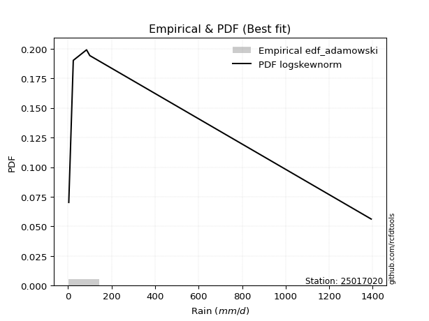</img>

</div>


## C. Best fit & Estimate extreme values for specific return periods - Tr

Best fit in probability distribution analysis means finding the theoretical distribution (like Normal, Poisson, Exponential, etc.) that most accurately mirrors your real-world data´s patterns (shape, center, spread) for better predictions, using methods like visual checks (Q-Q plots), goodness-of-fit tests (Kolmogorov-Smirnov, Chi-Squared), and information criteria (AIC) to score and select the simplest, most representative model.


### 1. Best fit (ordered by delta Δ)

:file_folder:Table: [bestfit_25017020.csv](table/bestfit_25017020.csv)

<div align="center">

|   id |   station | empirical_dist   | p_dist       |     delta |   deltao | eval   |   fit |   n |   best_fit |   best_fit_sort |
|-----:|----------:|:-----------------|:-------------|----------:|---------:|:-------|------:|----:|-----------:|----------------:|
|    0 |  25017020 | edf_adamowski    | logskewnorm  | 0.0752656 | 0.586543 | Δo > Δ |     1 |   5 |          1 |               1 |
|    1 |  25017020 | edf_jenkinson    | loghypsecant | 0.0757234 | 0.586543 | Δo > Δ |     1 |   5 |          1 |               2 |
|    2 |  25017020 | edf_filliben     | loghypsecant | 0.0757234 | 0.586543 | Δo > Δ |     1 |   5 |          1 |               3 |
|    3 |  25017020 | edf_tukey        | loghypsecant | 0.0757234 | 0.586543 | Δo > Δ |     1 |   5 |          1 |               4 |
|    4 |  25017020 | edf_blom         | loghypsecant | 0.0757234 | 0.586543 | Δo > Δ |     1 |   5 |          1 |               5 |
|    5 |  25017020 | edf_beard        | loghypsecant | 0.0757234 | 0.586543 | Δo > Δ |     1 |   5 |          1 |               6 |
|    6 |  25017020 | edf_chegodayev   | loghypsecant | 0.0765644 | 0.586543 | Δo > Δ |     1 |   5 |          1 |               7 |
|    7 |  25017020 | edf_cunnane      | loghypsecant | 0.0775211 | 0.586543 | Δo > Δ |     1 |   5 |          1 |               8 |
|    8 |  25017020 | edf_gringorten   | loghypsecant | 0.0805259 | 0.586543 | Δo > Δ |     1 |   5 |          1 |               9 |
|    9 |  25017020 | edf_hazen        | logalpha     | 0.0846937 | 0.586543 | Δo > Δ |     1 |   5 |          1 |              10 |
|   10 |  25017020 | edf_california   | t            | 0.0945944 | 0.586543 | Δo > Δ |     1 |   5 |          1 |              11 |
|   11 |  25017020 | edf_weibull      | ncf          | 0.10109   | 0.586543 | Δo > Δ |     1 |   5 |          1 |              12 |

</div>


### 2. Extreme values and % difference analysis

In hydrology, a return period (or recurrence interval $Tr$) is the statistical average time between extreme events like floods or droughts of a specific magnitude, indicating how rare an event is, with a 100-year flood, for example, having a 1% chance of occurring in any given year, not that it happens exactly every century. It is a key tool for infrastructure design (like bridges or dams) and risk assessment, calculated from historical data to determine the probability of future events, although it is important to remember it is statistical average, and events can cluster or be missed.

The extreme value porcentage difference is evaluated as $pdiff = 1 - (ETrBf / ETr) * 100$, where _ETrBf_ correspond to the bestfit extreme value for a specific recurrence interval and _ETr_ correspond to the extreme value for one of the most used PDFsused in hydrology.

> risk_rate: assuming the return period as the project useful life.

:file_folder:Table: [extreme_25017020.csv](table/extreme_25017020.csv), all PDFs.  
:file_folder:Table: [extremepdiff_25017020.csv](table/extremepdiff_25017020.csv), % difference between bestfit and most used PDFs in Hydrology.

<div align="center">

Extreme values table for only best fit PDFs
|   id |      tr |   prob_l |     prob_g |     alpha |   anglit |   arcsine |    argus |    beta |        betaprime |   bradford |       burr |           burr12 |   cosine |   crystalball |    dgamma |   dweibull |    erlang |   exponnorm |   exponpow |   exponweib |          f |   fatiguelife |   foldnorm |     gamma |   gausshyper |   genexpon |     genextreme |   gengamma |   genhalflogistic |   genlogistic |    gennorm |        genpareto |   gompertz |   gumbel_l |   gumbel_r |   halfgennorm |   halflogistic |   halfnorm |   hypsecant |         invgamma |   invgauss |      invweibull |   johnsonsb |    johnsonsu |          kappa3 |   kappa4 |    ksone |   kstwobign |   laplace |   levy_l |   loggamma |   logistic |   loglaplace |            lomax |   maxwell |           mielke |    moyal |   nakagami |         ncf |              nct |     norm |   pearson3 |   powerlaw |   rayleigh |     rdist |     rice |   semicircular |   skewnorm |          t |   trapezoid |   triang |   truncexpon |   truncnorm |   truncpareto |   truncweibull_min |   tukeylambda |   uniform |   vonmises |   vonmises_line |     wald |   weibull_max |   weibull_min |   wrapcauchy |   logalpha |   loganglit |   logarcsine |   logargus |   logbeta |   logbetaprime |   logbradford |          logburr |   logburr12 |   logcosine |   logcrystalball |        logdgamma |      logdweibull |   logerlang |   logexponnorm |      logexponpow |   logexponweib |       logf |   logfatiguelife |   logfoldnorm |   loggausshyper |      loggenexpon |   loggenextreme |   loggengamma |   loggenhalflogistic |   loggenlogistic |       loggennorm |   loggenpareto |   loggompertz |   loggumbel_l |   loggumbel_r |   loghalfgennorm |   loghalflogistic |   loghalfnorm |   loghypsecant |   loginvgamma |   loginvgauss |    loginvweibull |   logjohnsonsb |   logjohnsonsu |   logkappa3 |   logkappa4 |   logksone |   logkstwobign |   loglevy_l |   logloggamma |   loglogistic |    logloglaplace |         loglomax |   logmaxwell |   logmielke |         logmoyal |   lognakagami |      logncf |     lognct |    lognorm |   logpearson3 |   logpowerlaw |   lograyleigh |   logrdist |    logrice |   logsemicircular |   logskewnorm |       logt |   logtrapezoid |   logtriang |   logtruncexpon |   logtruncnorm |   logtruncpareto |   logtruncweibull_min |   logtukeylambda |   loguniform |   logvonmises |   logvonmises_line |          logwald |   logweibull_max |   logweibull_min |   logwrapcauchy |   station |   n |   risk_rate |
|-----:|--------:|---------:|-----------:|----------:|---------:|----------:|---------:|--------:|-----------------:|-----------:|-----------:|-----------------:|---------:|--------------:|----------:|-----------:|----------:|------------:|-----------:|------------:|-----------:|--------------:|-----------:|----------:|-------------:|-----------:|---------------:|-----------:|------------------:|--------------:|-----------:|-----------------:|-----------:|-----------:|-----------:|--------------:|---------------:|-----------:|------------:|-----------------:|-----------:|----------------:|------------:|-------------:|----------------:|---------:|---------:|------------:|----------:|---------:|-----------:|-----------:|-------------:|-----------------:|----------:|-----------------:|---------:|-----------:|------------:|-----------------:|---------:|-----------:|-----------:|-----------:|----------:|---------:|---------------:|-----------:|-----------:|------------:|---------:|-------------:|------------:|--------------:|-------------------:|--------------:|----------:|-----------:|----------------:|---------:|--------------:|--------------:|-------------:|-----------:|------------:|-------------:|-----------:|----------:|---------------:|--------------:|-----------------:|------------:|------------:|-----------------:|-----------------:|-----------------:|------------:|---------------:|-----------------:|---------------:|-----------:|-----------------:|--------------:|----------------:|-----------------:|----------------:|--------------:|---------------------:|-----------------:|-----------------:|---------------:|--------------:|--------------:|--------------:|-----------------:|------------------:|--------------:|---------------:|--------------:|--------------:|-----------------:|---------------:|---------------:|------------:|------------:|-----------:|---------------:|------------:|--------------:|--------------:|-----------------:|-----------------:|-------------:|------------:|-----------------:|--------------:|------------:|-----------:|-----------:|--------------:|--------------:|--------------:|-----------:|-----------:|------------------:|--------------:|-----------:|---------------:|------------:|----------------:|---------------:|-----------------:|----------------------:|-----------------:|-------------:|--------------:|-------------------:|-----------------:|-----------------:|-----------------:|----------------:|----------:|----:|------------:|
|    0 |    2    | 0.5      | 0.5        |   11.5288 |  321.18  |   321.18  |  588.997 | -132.51 |     38.1892      |    484.771 |    36.6549 |     90.1682      |  427.766 |     -0.376994 |    3.5    |    24.2    |   85.2091 |     223.078 |    130.921 |     79.8911 |    56.5946 |        3.5003 |    207.307 |   72.4371 |      117.678 |    223.699 |  278.388       |    144.654 |           911.184 |       210.026 |    24.1688 |     46.1126      |    223.749 |    409.421 |    232.939 |       88.4409 |        189.07  |    211.231 |     321.18  |     43.357       |    44.5858 |  1367.05        |     3.50151 |      3.5     |  4258.66        |  666.388 |  698.25  |     280.542 |   321.18  |  570.633 |    58.8096 |    321.18  |      63.1618 |     46.9429      |   275.242 |     39.0147      |  204.451 |    98.5548 |     56.183  |     28.2915      |  321.18  |    193.607 |    4.48721 |    258.949 | -149.04   |  337.051 |        321.18  |    424.479 |    60.6114 |     1036.81 |  830.208 |      545.179 |     240.233 |       43.5746 |            118.103 |    -156.461   |   698.25  | -1.80124   |         157.427 |  147.066 |       1392.9  |        209.84 |      698.285 |    55.8322 |     63.1618 |      63.1616 |    93.6336 |   136.139 |        50.8942 |       40.8475 |     33.4754      |     51.4793 |     65.5399 |          63.1619 |     85.2         |     85.2         |     59.4337 |        63.0216 |     25.4781      |        19.6543 |    57.0332 |          57.9246 |       61.9972 |         35.9314 |     33.8742      |         63.0771 |       13.3537 |              182.051 |          56.1291 |     85.2         |        143.951 |       72.7322 |       87.1207 |       45.7919 |     18.5651      |      39.0251      |       42.3092 |        63.1618 |       55.1255 |       53.7891 |     45.55        |        817.338 |        58.5359 |     68.8866 |     61.5616 |    63.1618 |        43.0982 |     161.173 |       63.6249 |       63.1618 |     85.2         |     26.8061      |      53.425  |     21.3621 |     41.2761      |       53.8811 |     47.6133 |    63.0017 |    63.1618 |       60.6657 |       3.58084 |       50.345  |    5.79807 |    55.7178 |           63.1618 |       58.8545 |    63.1621 |        309.139 |     201.734 |         35.37   |        40.0356 |          56.6061 |               17.482  |          69.7636 |      69.8248 |     0.0682844 |            69.8237 |     33.487       |          612.123 |          51.507  |         70.8946 |  25017020 |   5 |    0.75     |
|    1 |    2.33 | 0.570815 | 0.429185   |   13.7215 |  432.828 |   488.783 |  702.338 | -132.51 |     61.2634      |    581.122 |    52.6726 |    162.629       |  531.046 |    111.321    |   18.6304 |    30.6849 |  119.879  |     271.506 |    210.465 |    107.773  |    88.8604 |       15.5504 |    315.312 |  103.978  |      175.797 |    272.215 | 1401.5         |    200.288 |          1002.3   |       267.651 |    25.125  |     64.1891      |    272.277 |    492.813 |    321.755 |      115.683  |        280.387 |    314.678 |     397.889 |     61.5328      |    61.6677 | 48845.6         |     3.50692 |      3.5     | 56886           |  768.767 |  816.328 |     351.665 |   379.184 |  824.609 |    83.4945 |    405.631 |      78.0302 |     65.4147      |   374.824 |     60.1847      |  288.527 |   168.146  |     77.0846 |     43.5518      |  417.031 |    283.132 |    7.44519 |    360.004 | -105.059  |  417.928 |        440.925 |    496.941 |    71.9606 |     1117.54 |  976.938 |      640.189 |     291.563 |       69.0603 |            169.327 |    -118.017   |   796.648 | -1.64121   |         223.084 |  209.916 |       1392.98 |        355.3  |     1315.15  |    79.3764 |     94.8789 |     116.341  |   137.633  |   217.386 |        73.4103 |       62.5193 |     50.7174      |     74.437  |     94.4579 |          89.5705 |     85.953       |    101.685       |     84.3643 |        89.3666 |     44.1129      |        29.4668 |    81.1491 |          82.3207 |       88.5765 |         55.9367 |     51.4081      |         89.9976 |       19.4286 |              269.096 |          78.7537 |     91.5129      |        240.31  |      103.571  |      118.062  |       63.2943 |     29.545       |      54.4353      |       61.6833 |        83.535  |       78.4397 |       76.9626 |     66.1583      |       1246.6   |        83.16   |    106.542  |     95.4307 |   102.096  |        63.2517 |     313.764 |       90.4866 |       85.9255 |    114.679       |     41.9799      |      76.7999 |     30.6496 |     56.0754      |       72.9862 |     68.9249 |    89.3393 |    89.5705 |       86.1188 |       3.73949 |       72.7619 |   10.3793  |    80.1474 |           97.7202 |       83.4125 |    89.5708 |        437.73  |     277.651 |         53.1881 |        61.0761 |          86.7379 |               26.3379 |         107.487  |     106.689  |     0.0983211 |            85.0716 |     42.1069      |          793.894 |          74.4947 |        108.563  |  25017020 |   5 |    0.729209 |
|    2 |    5    | 0.8      | 0.2        |   30.7239 |  826.749 |   935.718 | 1065.9   | 1378.33 |    451.643       |    959.599 |   195.595  |   1634.78        |  903.227 |    526.42     |  177.094  |   498.49   |  339.315  |     513.634 |    868.454 |    276.374  |   364.43   |      271.526  |    772.052 |  311.078  |      590.345 |    514.786 |    1.63764e+06 |    554.824 |          1241.67  |       517.99  |    84.2298 |    271.52        |    514.903 |    762.214 |    707.613 |      291.328  |        693.578 |    752.145 |     705.587 |    296.686       |   237.615  |     2.75808e+11 |     5.47845 |      3.5     |     3.93321e+09 | 1104.48  | 1198.47  |     653.782 |   669.192 | 1245.39  |   318.333  |    731.708 |     224.534  |    278.2         |   766.771 |    412.562       |  677.974 |   697.973  |    281.096  |    371.217       |  773.237 |    693.422 |  138.174   |    764.572 |   26.7714 |  741.717 |        849.564 |    803.374 |   138.007  |     1349.15 | 1563.77  |      995.901 |     543.947 |      329.888  |            526.676 |       4.09522 |  1115.1   | -1.02275   |         477.53  |  561.752 |       1393    |       1975.29 |     1380.13  |   313.716  |    398.712  |     593.115  |   473.525  |   750.235 |       325.786  |      290.804  |    256.71        |    320.478  |    352.577  |         328.066  |    141.043       |    352.245       |    321.179  |       327.686  |    637.687       |       171.157  |   318.922  |         319.329  |      333.548  |        284.881  |    340.058       |        332.261  |      104.378  |              744.514 |         311.311  |    199.016       |        854.347 |      362.971  |      315.148  |      258.281  |    444.52        |     245.403       |      303.789  |       256.381  |      312.678  |      319.902  |    334.812       |       1392.65  |       319.848  |    436.958  |    401.685  |   483.013  |       322.707  |     946.072 |      333.496  |      281.987  |    700.922       |    395.4         |     320.426  |    125.561  |    231.836       |      353.942  |    326.128  |   327.639  |   328.066  |      323.871  |       9.48251 |      317.868  |   52.6934  |   325.956  |          433.281  |      317.986  |   328.066  |       1187.32  |     694.193 |        246.831  |       366.314  |         366.411  |              150.092  |         432.068  |     420.702  |     0.363838  |           184.402  |    151.784       |         1250.6   |         320.995  |        431.116  |  25017020 |   5 |    0.67232  |
|    3 |   10    | 0.9      | 0.1        |   61.9616 | 1049.71  |  1043.61  | 1241.22  | 1393    |   2358.34        |   1162.56  |   476.921  |   8895.98        | 1128.09  |    801.786    |  355.463  |  1852.8    |  578.074  |     733.432 |   1747.89  |    456.172  |   793.929  |      624.962  |   1110.03  |  542.211  |     1037.39  |    734.985 |    5.17176e+08 |    954.576 |          1324.16  |       721.88  |   334.872  |    900.25        |    735.152 |    912.205 |   1021.89  |      505.29   |       1036.72  |   1075.86  |     951.293 |   1137.78        |   634.071  |     8.70682e+16 |    86.3415  |      3.50041 |     3.17889e+13 | 1251.38  | 1365.21  |     883.804 |   932.454 | 1346.97  |   798.229  |    971.851 |     586.092  |    927.217       |  1042.6   |   1994.59        | 1017.05  |  1247.51   |    780.472  |   2591.18        | 1009.53  |   1037.67  |  465.12    |   1053.04  |   72.2532 |  972.585 |       1059.24  |   1030.13  |   266.31   |     1439.61 | 1933.49  |     1181.56  |     767.251 |      672.237  |            857.486 |      54.5438  |  1254.05  | -0.557533  |         670.326 |  935.134 |       1393    |       5151.38 |     1387.28  |   831.138  |    898.591  |     878.848  |   859.237  |  1105.21  |       982.768  |      618.674  |    815.358       |    895.973  |    781.352  |         776.192  |    345.34        |   1308.53        |    804.05   |       776.912  |   5778.87        |       613.873  |   832.299  |         820.273  |      803.818  |        630.703  |   1598.27        |        759.317  |      357.65   |             1051.61  |         896.449  |    675.803       |       1195.33  |      773.23   |      544.397  |      811.936  |   8476.13        |     857.035       |      988.405  |       627.746  |      836.705  |      896.376  |   1254.23        |       1392.99  |       812.117  |    808.863  |    754.716  |   951.612  |      1115.98   |    1234.93  |      789.285  |      676.587  |   6541.02        |   3028.33        |     875.607  |    334.65   |    797.739       |     1326.61   |   1086.77   |   776.843  |   776.191  |      795.414  |      45.6233  |      909.545  |   82.6648  |   851.622  |          930.351  |      803.436  |   776.191  |       1753.23  |     992.961 |        552.944  |      1384.21   |         707.761  |              412.548  |         784.828  |     765.531  |     0.730013  |           333.292  |    591.835       |         1354.41  |         897.678  |        786.838  |  25017020 |   5 |    0.651322 |
|    4 |   15    | 0.933333 | 0.0666667  |   93.0879 | 1144.92  |  1064.19  | 1307.87  | 1393    |   6113.17        |   1236.14  |   762.986  |  22288           | 1230.51  |    939.199    |  466.012  |  3156.67   |  727.996  |     862.005 |   2347.59  |    568.921  |  1143.29   |      856.117  |   1285.91  |  688.688  |     1269.88  |    863.793 |    1.32981e+10 |   1213.32  |          1348.92  |       836.911 |   660.64   |   1788.86        |    863.989 |    980.132 |   1199.2   |      653.956  |       1230.9   |   1244.32  |    1091.52  |   2474.14        |  1032.97   |     1.10279e+20 |   495.049   |      3.50434 |     5.0155e+15  | 1300.01  | 1420.79  |    1005.92  |  1086.45  | 1377.66  |  1274.91   |   1102.69  |    1027.33   |   1848.27        |  1184.13  |   4846.43        | 1213.83  |  1556.22   |   1386.82   |   8074.6         | 1127.45  |   1232.16  |  678.767   |   1201.67  |   84.3613 | 1091.54  |       1141.01  |   1148.13  |   413.598  |     1468.64 | 2097.28  |     1248.84  |     895.473 |      855.446  |           1008.21  |      70.5664  |  1300.37  | -0.293636  |         779.979 | 1174.9   |       1393    |       7953.6  |     1389.28  |  1379.18   |   1271.33   |     947.296  |  1077.68   |  1222.62  |      1766.69   |      805.626  |   1544.94        |   1516.69   |   1122.71   |        1192.91   |    648.114       |   2956.76        |   1282.9    |      1195.82   |  18960.8         |      1169.77   |  1364.33   |        1331.36   |     1246.76   |        827.182  |   3782.89        |       1121.83   |      665.519  |             1165.11  |        1609.43   |   1733.55        |       1289.02  |     1100.3    |      697.316  |     1549.41   |  57578.3         |    1739.22        |     1826.28   |      1046.47   |     1396.95   |     1539.49   |   2642.3         |       1393     |      1308.31   |    993.162  |    930.627  |  1192.96   |      2156.37   |    1338.45  |     1211.84   |     1089.97   |  33846.7         |   9963.38        |    1466.61   |    569.634  |   1634.28        |     2690.27   |   2098.45   |  1195.65   |  1192.91   |     1252.86   |     109.047   |     1563.41   |   91.1389  |  1383.25   |         1253.34   |     1290.83   |  1192.91   |       1986.78  |    1113.81  |        741.424  |      2767.11   |         885.099  |              603.455  |         954.567  |     934.6    |     0.938803  |           459.326  |   1418.07        |         1374.8   |        1519.56   |        961.567  |  25017020 |   5 |    0.644736 |
|    5 |   20    | 0.95     | 0.05       |  124.187  | 1200.93  |  1071.44  | 1344.45  | 1393    |  11992.3         |   1274.12  |  1051.42   |  41980.3         | 1293.5   |   1029.19     |  546.233  |  4336.84   |  837.689  |     953.23  |   2801.79  |    651.528  |  1445.27   |     1027.26   |   1403.17  |  796.269  |     1408.07  |    955.184 |    1.29164e+11 |   1406.15  |          1360.74  |       917.453 |  1016.69   |   2903.72        |    955.401 |   1022.41  |   1323.35  |      769.891  |       1366.96  |   1356.64  |    1190.44  |   4286.32        |  1409.69   |     1.64011e+22 |  1344.64    |      3.52035 |     1.72836e+17 | 1324.18  | 1448.58  |    1088.18  |  1195.71  | 1393.38  |  1738.39   |   1193.13  |    1529.85   |   3006.99        |  1278.06  |   9018.73        | 1353.2   |  1766.18   |   2075.13   |  18086.4         | 1204.67  |   1367.93  |  816.09    |   1300.46  |   89.6012 | 1170.6   |       1186.37  |   1226.8   |   576.565  |     1482.96 | 2194.91  |     1283.62  |     985.419 |      965.672  |           1093.15  |      78.3489  |  1323.52  | -0.10536   |         857.862 | 1353.58  |       1393    |      10423.2  |     1390.25  |  1936.39   |   1559.22   |     972.65   |  1220.36   |  1277.04  |      2627.94   |      921.544  |   2435.16        |   2149.61   |   1403.07   |        1580.63   |   1045.68        |   5361.55        |   1747.99   |      1586.35   |  42267           |      1783.04   |  1896.45   |        1837.37   |     1661.96   |        947.065  |   6873.15        |       1433.5    |      998.49   |             1223.16  |        2417.36   |   3751.6         |       1327.84  |     1374.25   |      813.489  |     2435.94   | 242959           |    2855.61        |     2750.01   |      1500.7    |     1969.96   |     2215.61   |   4452.07        |       1393     |      1795.7    |   1100.51   |   1033.01   |  1335.71   |      3360.67   |    1394.77  |     1604.03   |     1515.49   | 130465           |  23193.6         |    2065.27   |    828.988  |   2715.88        |     4325.45   |   3301.07   |  1586.01   |  1580.63   |     1690.65   |     184.436   |     2240.97   |   94.5889  |  1903.58   |         1478.6    |     1767.84   |  1580.63   |       2113.21  |    1178.73  |        863.045  |      4392.44   |         990.573  |              736.514  |        1051.68   |    1032.66   |     1.06758   |           565.98   |   2719.56        |         1382.27  |        2153.5    |       1062.98   |  25017020 |   5 |    0.641514 |
|    6 |   25    | 0.96     | 0.04       |  155.275  | 1238.89  |  1074.8   | 1368.04  | 1393    |  20214.1         |   1297.3   |  1341.47   |  68085.8         | 1337.68  |   1095.43     |  609.265  |  5406.64   |  924.35   |    1023.99  |   3167.75  |    716.892  |  1715.44   |     1163.24   |   1490.42  |  881.45   |     1498.27  |   1026.07  |    7.44152e+11 |   1560.48  |          1367.64  |       979.491 |  1386.01   |   4224.1         |   1026.31  |   1052.5   |   1418.98  |      865.783  |       1471.78  |   1440.2   |    1266.99  |   6561.22        |  1760.66   |     7.73e+23    |  2342.93    |      3.56348 |     2.63686e+18 | 1338.61  | 1465.25  |    1149.8   |  1280.47  | 1403.24  |  2187.96   |   1262.31  |    2083.49   |   4382.09        |  1347.79  |  14547.5         | 1461.22  |  1923.69   |   2831.62   |  33807.5         | 1261.52  |   1472.19  |  910.14    |   1373.86  |   92.426  | 1229.35  |       1215.79  |   1285.34  |   752.6    |     1491.49 | 2261.55  |     1304.88  |    1054.62  |     1038.74   |           1147.49  |      82.9244  |  1337.42  |  0.0415191 |         918.058 | 1496.69  |       1393    |      12635.1  |     1390.82  |  2495.85   |   1790.54   |     984.642  |  1322.24   |  1307.38  |      3543.66   |      999.736  |   3484.95        |   2783.93   |   1640.48   |        1944.49   |   1537.47        |   8579.47        |   2198.76   |      1953.4    |  77001.2         |      2429.2    |  2423.68   |        2334.97   |     2053.6    |       1026.66   |  10849.4         |       1706.77   |     1344.47   |             1258.18  |        3302.97   |   7251.49        |       1347.83  |     1611.68   |      907.767  |     3451.63   | 775889           |    4184.18        |     3729.05   |      1983.66   |     2547.75   |     2911.37   |   6654.09        |       1393     |      2272.2    |   1170.4    |   1099.55   |  1429.42   |      4685.62   |    1431.33  |     1971.34   |     1950.07   | 418464           |  44669           |    2662.84   |   1112.2    |   4026.12        |     6165.12   |   4661.9    |  1952.83   |  1944.48   |     2110.25   |     261.196   |     2928.27   |   96.3301  |  2409.76   |         1645.97   |     2232.61   |  1944.48   |       2192.33  |    1219.2   |        947.073  |      6195.4    |        1060.07   |              832.586  |        1114.14   |    1096.37   |     1.15396   |           655.221  |   4581.58        |         1385.86  |        2788.7    |       1128.9    |  25017020 |   5 |    0.639603 |
|    7 |   50    | 0.98     | 0.02       |  310.666  | 1332.32  |  1079.29  | 1421.53  | 1393    | 102204           |   1344.54  |  2806.49   | 297324           | 1453.34  |   1285.13     |  808.525  |  9646.61   | 1200.63   |    1243.79  |   4364.74  |    926.035  |  2801.56   |     1599.52   |   1744.02  | 1153.84   |     1691.78  |   1246.27  |    1.63857e+14 |   2063.37  |          1380.92  |      1170.6   |  3253.88   |  13495.3         |   1246.55  |   1134.18  |   1713.56  |     1196.89   |       1794.75  |   1683.1   |    1504.35  |  24589.1         |  3197.71   |     1.10367e+29 |  4413.26    |      5.14922 |     1.15935e+22 | 1367.21  | 1498.6   |    1330.73  |  1543.73  | 1425.45  |  4262.5    |   1473.68  |    5438.47   |  14078.1         |  1550.02  |  63384.1         | 1796.57  |  2384.42   |   7393.57   | 235976           | 1424.3   |   1791.27  | 1128.35    |   1586.92  |   97.1744 | 1399.87  |       1283     |   1455.48  |  1779.75   |     1508.42 | 2426.89  |     1348.3   |    1266.5   |     1202.5    |           1264.34  |      91.7955  |  1365.21  |  0.487115  |        1094.22  | 1963.96  |       1393    |      21304.6  |     1391.95  |  5263.82   |   2516.89   |    1000.89   |  1585.84   |  1360.15  |      8608.38   |     1178.68   |  11218.5         |   5883.08   |   2470.27   |        3519.29   |   5417.53        |  38514.7         |   4275.67   |      3546.98   | 444191           |      5846.55   |  4959.52   |        4694.17   |     3764.19   |       1203.23   |  43481           |       2725.44   |     3128.23   |             1327.87  |        8602.11   |  79160.5         |       1378.7   |     2495.08   |     1222.49   |    10099.1    |      3.62511e+07 |   13577.2         |     9037.39   |      4711.39   |     5429.73   |     6520.49   |  22946.8         |       1393     |      4506.15   |   1323.81   |   1244.88   |  1637.05   |     12434.4    |    1517.18  |     3554.45   |     4213.11   |      3.4332e+07  | 342115           |    5564.59   |   2878.02   |  13666.8         |    17310.4    |  13268.7    |  3544.54   |  3519.28   |     4002      |     568.09    |     6365.71   |   98.9193  |  4748.13   |         2102.84   |     4392.45   |  3519.28   |       2358.21  |    1303.67  |       1145.24   |     16843.4    |        1214.72   |             1071.59   |        1248.58   |    1235.81   |     1.34978   |           927.419  |  25153.3         |         1390.97  |        5890.16   |       1273.24   |  25017020 |   5 |    0.63583  |
|    8 |   75    | 0.986667 | 0.0133333  |  466.035  | 1373.44  |  1080.12  | 1442.74  | 1393    | 263650           |   1360.56  |  4286.68   | 695335           | 1508.58  |   1386.91     |  926.968  | 12809.8    | 1366.25   |    1372.36  |   5097.58  |   1052.03   |  3655.27   |     1862.26   |   1882.07  | 1317.57   |     1757.51  |   1375.08  |    3.76869e+15 |   2372.2   |          1385.15  |      1281.68  |  5045.32   |  26598.6         |   1375.39  |   1175.48  |   1884.78  |     1413.92   |       1982.49  |   1815.32  |    1643.06  |  53233.3         |  4283.24   |     1.09377e+32 |  4665.76    |     12.9692  |     1.51568e+24 | 1376.62  | 1509.72  |    1430.28  |  1697.72  | 1434.58  |  6127.19   |   1595.76  |    9532.82   |  27838.2         |  1659.97  | 149033           | 1992.67  |  2635.67   |  12933.5    | 735344           | 1511.65  |   1975.19  | 1211       |   1702.84  |   98.4137 | 1492.64  |       1309.85  |   1548.1   |  2986.84   |     1514.02 | 2500.14  |     1363.06  |    1388.38  |     1262.82   |           1305.85  |      94.6399  |  1374.47  |  0.715981  |        1179.11  | 2251.5   |       1393    |      27747.1  |     1392.32  |  7953.35   |   2923.79   |    1003.93   |  1704.4    |  1374.35  |     14131.5    |     1245.85   |  23476.3         |   8826.49   |   3003.59   |        4838.39   |  11705.7         |  95106           |   6139.38   |      4886.65   |      1.15498e+06 |      9316.47   |  7343.74   |        6878.78   |     5210.41   |       1266.64   |  96338.7         |       3429.76   |     4894.52   |             1350.63  |       14975.3    | 410136           |       1385.73  |     3119.09   |     1421.08   |    18849.1    |      4.03164e+08 |   26913.4         |    14632.5    |      7810.79   |     8253.19   |    10203.3    |  47121.1         |       1393     |      6550.24   |   1379.44   |   1297.02   |  1712.75   |     21273      |    1553.94  |     4873.98   |     6573.97   |      8.7977e+08  |      1.12558e+06 |    8307.28   |   5222.64   |  27929           |    30371.1    |  24135.7    |  4881.65   |  4838.38   |     5659.5    |     755.362   |     9712.16   |   99.4743  |  6843.33   |         2319.03   |     6344.82   |  4838.38   |       2415.85  |    1332.9   |       1221.69   |     29039.9    |        1271.35   |             1168.19   |        1296.08   |    1286.13   |     1.4225    |          1057.27   |  71729.5         |         1392.03  |        8833.33   |       1325.34   |  25017020 |   5 |    0.634587 |
|    9 |  100    | 0.99     | 0.01       |  621.398  | 1397.89  |  1080.42  | 1454.59  | 1393    | 516434           |   1368.62  |  5776.56   |      1.26602e+06 | 1543.2   |   1455.76     | 1011.66   | 15377.1    | 1485.21   |    1463.58  |   5628.58  |   1142.85   |  4385.25   |     2051.32   |   1976.11  | 1435.33   |     1789.6   |   1466.47  |    3.46711e+16 |   2597.18  |          1387.21  |      1360.3   |  6740.45   |  43038.4         |   1466.8   |   1202.49  |   2005.97  |     1578.38   |       2115.37  |   1905.39  |    1741.45  |  92076.9         |  5158.98   |     1.44357e+34 |  4720.51    |     34.3811  |     4.76651e+25 | 1381.29  | 1515.28  |    1498.49  |  1806.99  | 1439.91  |  7847.39   |   1681.95  |   14195.8    |  45149           |  1734.86  | 272906           | 2131.8   |  2806.63   |  19222.4    |      1.64711e+06 | 1570.72  |   2104.68  | 1254.36    |   1781.81  |   98.947  | 1555.84  |       1324.89  |   1611.19  |  4328.18   |     1516.82 | 2543.8   |     1370.49  |    1473.97  |     1294.14   |           1327.12  |      96.032   |  1379.11  |  0.852472  |        1227.74  | 2461.14  |       1393    |      32981.7  |     1392.51  | 10567.9    |   3196.3    |    1005      |  1774.39   |  1380.54  |     19914      |     1280.98   |  40875           |  11630.4    |   3395.1    |        6000.75   |  20459.4         | 182456           |   7856.82   |      6070.02   |      2.21304e+06 |     12738.6    |  9608.71   |        8933.99   |     6491.94   |       1298.88   | 168426           |       3970.6    |     6609.47   |             1361.81  |       22159.1    |      1.47592e+06 |       1388.51  |     3612.04   |     1568.11   |    29315.7    |      2.38647e+09 |   43680.8         |    20318.2    |     11179.7    |    11012      |    13896.6    |  78412.6         |       1393     |      8458.62   |   1408.45   |   1323.75   |  1751.91   |     30733.3    |    1575.84  |     6032.81   |     9000.14   |      1.26087e+10 |      2.62022e+06 |   10914.3    |   8155.73   |  46373           |    44531.7    |  36737.9    |  6062.09   |  6000.73   |     7163.29   |     875.523   |    12951.2    |   99.685   |  8767.52   |         2449.66   |     8150.09   |  6000.72   |       2445.12  |    1347.72  |       1262.11   |     42091.2    |        1300.68   |             1220.22   |        1320.24   |    1312.06   |     1.46035   |          1131.3    | 153997           |         1392.42  |       11635.2    |       1352.19   |  25017020 |   5 |    0.633968 |
|   10 |  200    | 0.995    | 0.005      | 1242.84   | 1444.08  |  1080.7   | 1475.17  | 1393    |      2.60921e+06 |   1380.77  | 11795.7    |      5.32245e+06 | 1613.6   |   1611.91     | 1217.56   | 22718      | 1775.93   |    1683.38  |   6936.5   |   1365.93   |  6687.67   |     2514.09   |   2191.2   | 1723.56   |     1835.16  |   1686.67  |    7.19426e+18 |   3157.33  |          1390.22  |      1549.31  | 12755.2    | 137179           |   1687.05  |   1261.21  |   2297.31  |     2010.49   |       2434.83  |   2111.41  |    1978.49  | 344720           |  7601.89   |     1.80871e+39 |  4752.11    |    454.525   |     1.89625e+29 | 1388.21  | 1523.61  |    1655.58  |  2070.25  | 1450.02  | 13839      |   1888.7   |   37054.8    | 144715           |  1906.2   |      1.16817e+06 | 2467     |  3196.49   |  49894.1    |      1.14968e+07 | 1704.73  |   2413.8   | 1322.03    |   1962.5   |   99.6077 | 1700.46  |       1351.1   |   1755.5   | 10653      |     1521    | 2626.47  |     1381.7   |    1677.29  |     1342.63   |           1359.66  |      98.0695  |  1386.05  |  1.08494   |        1307.69  | 2983.34  |       1393    |      48019.4  |     1392.79  | 20455.2    |   3782.34   |    1006.03   |  1902.95   |  1388.3   |     44385.7    |     1335.72   | 175838           |  21831.6    |   4355.58   |        9779.18   |  81124           | 904676           |  13829.2    |      9931.59   |      9.74258e+06 |     25724.3    | 17857.8    |       16310.8    |    10690.6    |       1347.32   | 636851           |       5381.36   |    12967.9    |             1378.12  |       56777.4    |      4.80014e+07 |       1391.59  |     4977.94   |     1942.3    |    84767.2    |      2.17546e+11 |  139937           |    43047.9    |     26522.3    |    21522.3    |    28528.7    | 266749           |       1393     |     15230.9    |   1456.01   |   1364.58   |  1812.33   |     71717.3    |    1618.17  |     9780.14   |    19120.4    |      3.45101e+13 |      2.0068e+07  |   20379.2    |  26199.2    | 157333           |   106710      | 100019      |  9910.15   |  9779.16   |    12270.6    |    1099.83    |    25021.1    |   99.9085  | 15403.4    |         2695.23   |    14446.7    |  9779.13   |       2489.6   |    1370.22  |       1325.69   |     98395      |        1346.02   |             1303.33   |        1356.83   |    1351.92   |     1.51906   |          1254.57   |      1.03281e+06 |         1392.83  |       21818.1    |       1393.48   |  25017020 |   5 |    0.633042 |
|   11 |  250    | 0.996    | 0.004      | 1553.56   | 1455.84  |  1080.73  | 1479.98  | 1393    |      4.39523e+06 |   1383.21  | 14829.3    |      8.43723e+06 | 1632.9   |   1659.63     | 1284.3    | 25442      | 1870.58   |    1754.14  |   7364.2   |   1438.92   |  7631.28   |     2664.91   |   2257.37  | 1817.52   |     1843.6   |   1757.56  |    3.99828e+19 |   3342.69  |          1390.8   |      1610.07  | 15423.3    | 199221           |   1757.96  |   1278.49  |   2390.97  |     2160.42   |       2537.54  |   2174.78  |    2054.8   | 527261           |  8480.25   |     7.87551e+40 |  4754.16    |   1026.96    |     2.72278e+30 | 1389.58  | 1525.28  |    1704.2   |  2155     | 1452.65  | 16486.3    |   1955.08  |   50464.7    | 210547           |  1958.94  |      1.8642e+06  | 2574.91  |  3316.02   |  67816.4    |      2.149e+07   | 1745.68  |   2512.57  | 1335.96    |   2018.13  |   99.7146 | 1744.97  |       1357.25  |   1799.89  | 14254.2    |     1521.84 | 2647.54  |     1383.95  |    1741.9   |     1352.55   |           1366.27  |      98.4674  |  1387.44  |  1.13478   |        1324.47  | 3156.09  |       1393    |      53631.4  |     1392.85  | 25141.9    |   3947.92   |    1006.15   |  1934.36   |  1389.56  |     57075.8    |     1346.97   | 293215           |  26491.4    |   4663.43   |       11353.2    | 127431           |      1.52797e+06 |  16464.4    |     11545.8    |      1.53396e+07 |     31828.1    | 21641.6    |       19654.2    |    12451      |       1356.89   | 973339           |       5858.68   |    15900.8    |             1381.28  |       76814.2    |      1.66338e+08 |       1392.03  |     5472.99   |     2068.52   |   119254      |      9.94261e+11 |  203466           |    54233      |     35025.6    |    26533.1    |    35726.9    | 395404           |       1393     |     18271.7    |   1467.12   |   1372.83   |  1824.66   |     93221.4    |    1629.38  |    11334      |    24353.4    |      7.5237e+14  |      3.86493e+07 |   24698.4    |  39372.9    | 233140           |   139559      | 137752      | 11517.1    | 11353.2    |    14479.5    |    1152.29    |    30643.9    |   99.9385  | 18305      |         2756.32   |    17227.9    | 11353.2    |       2498.58  |    1374.76  |       1338.85   |    127777      |        1355.28   |             1320.72   |        1364.16   |    1360.04   |     1.53109   |          1281.03   |      1.93845e+06 |         1392.89  |       26464.9    |       1401.89   |  25017020 |   5 |    0.632858 |
|   12 |  500    | 0.998    | 0.002      | 3107.14   | 1484.99  |  1080.78  | 1491.06  | 1393    |      2.22057e+07 |   1388.1   | 30139.1    |      3.51927e+07 | 1684.25  |   1801.15     | 1492.81   | 35075.6    | 2167.33   |    1973.94  |   8707.13  |   1668.92   | 11400.3    |     3138.03   |   2454.65  | 2112.34   |     1859.28  |   1977.76  |    8.20071e+21 |   3932.66  |          1391.94  |      1798.66  | 26750.8    | 634861           |   1978.21  |   1328.01  |   2681.68  |     2659.93   |       2856.31  |   2363.75  |    2291.82  |      1.97385e+06 | 11459.1    |     9.61876e+45 |  4756.09    |  11628.8     |     1.06224e+34 | 1392.29  | 1528.62  |    1849.9   |  2418.26  | 1459.44  | 27833.6    |   2160.94  |  131726      | 674731           |  2116.33  |      7.95191e+06 | 2910.11  |  3671.08   | 175896      |      1.5e+08     | 1867.12  |   2817.4   | 1364.21    |   2184.08  |   99.8937 | 1877.8   |       1371.41  |   1932.25  | 35289.2    |     1523.51 | 2699.83  |     1388.47  |    1940.08  |     1372.62   |           1379.57  |      99.2494  |  1390.22  |  1.23671   |        1358.54  | 3705.4   |       1393    |      73625.4  |     1392.96  | 46951.1    |   4390.42   |    1006.32   |  2008.56   |  1391.71  |    122512      |     1369.77   |      1.6655e+06  |  47136.3    |   5592.87   |       17673.8    | 528875           |      7.9768e+06  |  27742.6    |     18053.3    |      5.89344e+07 |     59555.8    | 38559.8    |       34405.4    |    19567      |       1375.69   |      3.59996e+06 |       7374.8    |    28942.2    |             1387.42  |      196193      |      1.16568e+10 |       1392.7   |     7189.52   |     2477.71   |   344031      |      1.36429e+14 |  650189           |   107981      |     83088      |    49994.9    |    70642.7    |      1.34153e+06 |       1393     |     31549.7    |   1494.99   |   1389.37   |  1849.57   |    204562      |    1658.67  |    17541.3    |    51568.7    |      8.66681e+19 |      2.96011e+08 |   43830.5    | 156268      | 790965           |   310174      | 370709      | 17987.3    | 17673.8    |    23723.3    |    1266.1     |    56107.2    |   99.9822  | 30566.8    |         2902.29   |    29119.9    | 17673.7    |       2516.62  |    1383.87  |       1365.62   |    278523      |        1374.01   |             1356.31   |        1378.77   |    1376.42   |     1.55542   |          1335.8    |      1.43511e+07 |         1392.97  |       47026.4    |       1418.86   |  25017020 |   5 |    0.632489 |
|   13 |  750    | 0.998667 | 0.00133333 | 4660.73   | 1497.89  |  1080.78  | 1495.51  | 1393    |      5.72764e+07 |   1389.73  | 45599.9    |      8.1037e+07  | 1709.14  |   1879.77     | 1615.48   | 41561      | 2342.57   |    2102.51  |   9499.94  |   1805.58   | 14350.5    |     3417.57   |   2564.87  | 2286.62   |     1863.97  |   2106.56  |    1.8426e+23  |   4287.03  |          1392.31  |      1908.91  | 36047.1    |      1.25057e+06 |   2107.04  |   1354.48  |   2851.62  |     2975.94   |       3042.66  |   2469.31  |    2430.47  |      4.27231e+06 | 13358.2    |     9.0548e+48  |  4756.3     |  44842.3     |     1.33514e+36 | 1393.18  | 1529.73  |    1931.75  |  2572.26  | 1462.66  | 37343.8    |   2281.21  |  230896      |      1.33348e+06 |  2204.35  |      1.85666e+07 | 3106.19  |  3868.53   | 307145      |      4.67429e+08 | 1934.58  |   2994.5   | 1373.74    |   2276.89  |   99.9403 | 1952.07  |       1377.11  |   2006.2   | 60017.7    |     1524.07 | 2722.99  |     1389.98  |    2054.31  |     1379.38   |           1384.03  |      99.5047  |  1391.15  |  1.27115   |        1370.01  | 4034.76  |       1393    |      87211.4  |     1392.99  | 66992.3    |   4601.86   |    1006.35   |  2039.17   |  1392.27  |    189485      |     1377.47   |      5.16477e+06 |  65016.5    |   6107.78   |       22600      |      1.23084e+06 |      2.13121e+07 |  37179.2    |     23148.5    |      1.24313e+08 |     84101.3    | 53413.5    |       47171.8    |    25152.6    |       1381.77   |      7.6935e+06  |       8264.48   |    40220.3    |             1389.39  |      339371      |      1.85073e+11 |       1392.85  |     8322.77   |     2728.64   |   639126      |      2.78678e+15 |       1.28232e+06 |   158646      |    137717      |    71689.2    |   104150      |      2.74009e+06 |       1393     |     42913.7    |   1508.54   |   1394.87   |  1857.95   |    318101      |    1672.75  |    22350.3    |    79936.8    |      4.60154e+23 |      9.73894e+08 |   60409.3    | 382210      |      1.61623e+06 |   484083      | 660365      | 23045.2    | 22599.9    |    31267.7    |    1306.86    |    78687.3    |   99.9913  | 40662.1    |         2963.2    |    39041.9    | 22599.8    |       2522.66  |    1386.92  |       1374.68   |    430481      |        1380.31   |             1368.41   |        1383.6    |    1381.93   |     1.56362   |          1354.6    |      4.76621e+07 |         1392.98  |       64808.2    |       1424.56   |  25017020 |   5 |    0.632366 |
|   14 | 1000    | 0.999    | 0.001      | 6214.31   | 1505.59  |  1080.79  | 1498.01  | 1393    |      1.12188e+08 |   1390.55  | 61159.3    |      1.46394e+08 | 1724.84  |   1933.89     | 1702.79   | 46555.6    | 2467.56   |    2193.74  |  10064.6   |   1903.43   | 16869.3    |     3616.97   |   2640.99  | 2410.98   |     1866.15  |   2197.95  |    1.67555e+24 |   4542.33  |          1392.49  |      1987.12  | 44132.3    |      2.02305e+06 |   2198.45  |   1372.3   |   2972.17  |     3210.85   |       3174.85  |   2542.22  |    2528.84  |      7.38919e+06 | 14767.4    |     1.16488e+51 |  4756.36    | 113580       |     4.11735e+37 | 1393.62  | 1530.28  |    1988.45  |  2681.52  | 1464.69  | 45777.1    |   2366.5   |  343840      |      2.16221e+06 |  2265.2   |      3.38804e+07 | 3245.3   |  4004.52   | 456140      |      1.047e+09   | 1981.02  |   3119.68  | 1378.54    |   2341.02  |   99.9604 | 2003.39  |       1380.31  |   2057.27  | 87498.3    |     1524.34 | 2736.8   |     1390.73  |    2134.63  |     1382.77   |           1386.27  |      99.6309  |  1391.61  |  1.28842   |        1375.75  | 4271.67  |       1393    |      97740    |     1393.01  | 85880.9    |   4732.68   |    1006.36   |  2056.56   |  1392.51  |    257104      |     1381.33   |      1.22098e+07 |  81177.3    |   6456.71   |       26768.5    |      2.25167e+06 |      4.30874e+07 |  45538.1    |     27473.3    |      2.07612e+08 |    106536      | 66986.6    |       58731.3    |    29899.9    |       1384.74   |      1.31595e+07 |       8888.29   |    50372.6    |             1390.34  |      500574      |      1.49538e+12 |       1392.91  |     9186.33   |     2911.68   |   991722      |      2.5171e+16  |       2.07598e+06 |   206928      |    197100      |    92212.6    |   136605      |      4.54755e+06 |       1393     |     53130.7    |   1517.48   |   1397.62   |  1862.16   |    431916      |    1681.66  |    26403.8    |   109080      |      5.25521e+26 |      2.26712e+09 |   75405.2    | 753078      |      2.68347e+06 |   658009      | 994470      | 27333.6    | 26768.4    |    37844      |    1327.81    |    99405.4    |   99.9948  | 49501      |         2997.98   |    47804.9    | 26768.3    |       2525.68  |    1388.45  |       1379.24   |    581511      |        1383.47   |             1374.51   |        1386      |    1384.69   |     1.56774   |          1364.1    |      1.13019e+08 |         1392.99  |       80863.7    |       1427.42   |  25017020 |   5 |    0.632305 |


</div>


<div align="center">

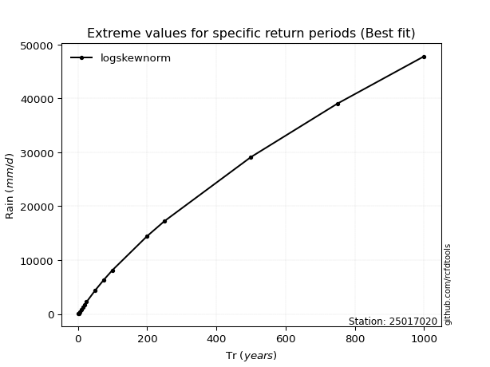</img>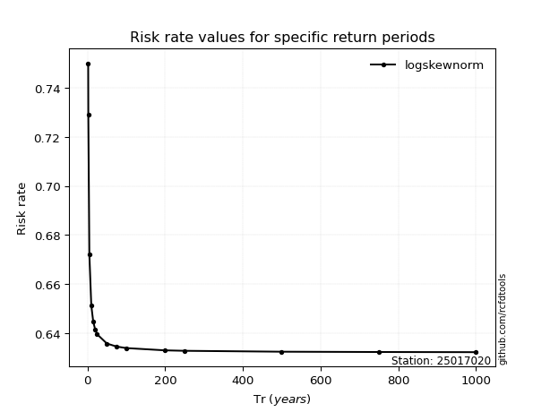</img>

</div>


<sub>**APP DISCLAIMER**: NO WARRANTY - This software is provided by [github.com/rcfdtools](https://github.com/rcfdtools) "as is", without any express or implied warranty, including warranties of merchantability, fitness for a particular purpose, or non-infringement. There is no guarantee that the software will be error-free or operate without interruption. LIMITATION OF LIABILITY - Neither the authors nor copyright holders will be liable for claims or damages arising from the software or its use. You are responsible for determining if the software is appropriate for your use and assume all associated risks, including errors, legal compliance, and data loss. NO PROFESSIONAL ADVICE - The software provides general information and does not offer professional advice. It should not replace consultation with professional advisors.</sub>