<div align="center">


</div>

# PMax24h Station (Rain): 25017030

Maximum Precipitation in 24 hours (PMax24h) is the greatest amount of rainfall for a specific duration that is meteorologically possible for a given location, acting as a "worst-case" scenario for extreme storms, crucial for designing safety-critical infrastructure like bridges, river deviations, dams, spillways, and nuclear plants to prevent catastrophic failure. The PMax24h is related with the Probable Maximum Precipitation (PMP) and it is calculated by hydrologists using meteorological data to determine the upper limit of extreme rainfall, often leading to the Probable Maximum Flood (PMF) for flood control design, and is increasingly being studied for climate change impacts. Probable Maximum Precipitation (PMP) is the theoretical upper limit of rainfall, a deterministic estimate for extreme events, while probability distributions (like GEV, Gumbel) describe the likelihood and frequency of various precipitation amounts, including rare ones, showing how often events occur, with PMP representing the extreme end of these distributions, used for critical infrastructure design to ensure safety against the worst conceivable weather, unlike standard statistical forecasts which cover typical probabilities.

The most common probability distributions in hydrology, used for analyzing floods, rainfall, and streamflow, include the Normal, Log-Normal, Gumbel, Gamma (including Log-Pearson Type III), and Generalized Extreme Value (GEV) distributions, often chosen based on the data´s skewness and whether modeling extremes or general conditions, with Gumbel and GEV popular for extreme events like floods, while the Normal distribution serves as a baseline, though often requiring transformations for skewed hydrological data. These distributions help in designing water infrastructure, managing water resources, and forecasting hydrologic events.

> Hydrological data often isn´t perfectly normal (it´s skewed), so different distributions are needed for different applications, such as: **Flood Frequency Analysis**: Using Gumbel, GEV, or Log-Pearson Type III for predicting extreme flood magnitudes and their return periods, **Rainfall Analysis**: Normal for annual totals, but Log-Normal, Weibull, or GEV for intensity or extreme daily rainfall, **Streamflow Modeling**: Gamma and Log-Normal for maximum flows, GEV for minimum flows, and Kappa for daily flows.

<div align="center">

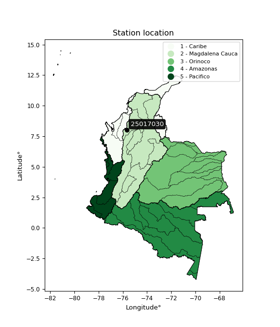</img>

</div>


## A. General information


### 1. General running parameters

• app_version: _v20260312_. • runtime: _2026-03-12 07:15:23.203550_. • Python version: _3.14.0_. • SciPy version: _1.16.3_. • Pandas version: _2.3.3_. • NumPy version: _2.3.5_. • Stations dataset (station_dataset_file): _dataset/pmax24h_in/automatic_colombia_2003_2025.csv_. • Stations catalog (station_catalog_file): _dataset/CNE.xls_. • Minimum year to eval til year_max (date_min): _1900_. • Maximum year to eval since year_min (date_max): _2025_. • Creates, save and include plots into reports (create_plot): _True_. • Plot only fit distributions with Δo > Δ (plot_only_fit): _True_. • Plot only simple graphs avoiding multiple CDFs and multiple Extreme values plots (plot_only_simple): _True_. • Eval low extreme values, if False, evaluates high extreme values (low_extreme): _False_. • Eval every SciPy distribution as logarithmic (pdist_logarithmic_on): _True_. • Standard deviation normalized (ddof): _1.0_. • Return periods to eval in years (Tr): _[2, 2.33, 5, 10, 15, 20, 25, 50, 75, 100, 200, 250, 500, 750, 1000]_. • Minimum data sample per station, 0 means any (minimum_sample): _5_. • Z-Score maximum threshold to adjust a value, 0 means disable (zscore_max): _3.5_. • Z-Score minimum threshold to adjust a value, 0 means disable (zscore_min): _-2.5_. • Avoid zeros, e.g. rain = 0 (avoid_zeros): _True_. • Avoid null values (avoid_nans): _True_. 

:file_folder:Table: [dataset.csv](../../dataset/pmax24h_in/automatic_colombia_2003_2025.csv)

> Delta Degrees of Freedom (DDOF): is a parameter used in the formulas for calculating variance and standard deviation. When ddof=0, the divisor is $N$ (the total number of observations) and this is used when your data set is the entire population. When ddof=1, the divisor is $N-1$ and this is used when your data set is a sample drawn from a larger population. Using $N-1$ provides an unbiased estimate of the population variance (known as Bessel´s correction).


### 2. Station info and location

|   id |   CODIGO | NOMBRE                      | CATEGORIA    | TECNOLOGIA                              | ESTADO   | FECHA_INSTALACION   |   FECHA_SUSPENSION |   ALTITUD |   LATITUD |   LONGITUD | DEPARTAMENTO   | MUNICIPIO   | AREA_OPERATIVA                              | ENTIDAD                                                     | AREA_HIDROGRAFICA   | ZONA_HIDROGRAFICA                | SUBZONA_HIDROGRAFICA   | CORRIENTE   | Catalogo   |   Version |
|-----:|---------:|:----------------------------|:-------------|:----------------------------------------|:---------|:--------------------|-------------------:|----------:|----------:|-----------:|:---------------|:------------|:--------------------------------------------|:------------------------------------------------------------|:--------------------|:---------------------------------|:-----------------------|:------------|:-----------|----------:|
|    0 | 25017030 | PICA PICA  - AUT [25017030] | Limnigráfica | Automática con Telemetría, Convencional | Activa   | 15/08/1995          |                nan |        96 |      8.03 |     -75.68 | Cordoba        | Montelíbano | Area Operativa 02 - Atlántico-Bolivar-Sucre | INSTITUTO DE HIDROLOGIA METEOROLOGIA Y ESTUDIOS AMBIENTALES | Magdalena Cauca     | Bajo Magdalena- Cauca -San Jorge | Alto San Jorge         | San Jorge   | CNE_IDEAM  |  20251226 |

<div align="center">

Dynamic map: [:earth_americas:Google](http://maps.google.com/maps?q=8.03,-75.68) [:earth_americas:OSM](https://www.openstreetmap.org/#map=18/8.03/-75.68&layers=P) [:earth_americas:Bing](https://www.bing.com/maps?cp=8.03~-75.68&lvl=18) [:earth_americas:Apple](https://maps.apple.com/frame?center=8.03%2C-75.68&span=0.003%2C0.006)

</div>


<div align="center">

```geojson
{
  "type": "Feature",
  "geometry": {
    "type": "Point", 
    "coordinates": [-75.68, 8.03]
  }, 
  "properties": {
    "Name": "25017030"
  }
}
```

</div>


### 3. Discrete values table and plot

<div align="center">

|               |           0 |           1 |          2 |           3 |           4 |          5 |
|:--------------|------------:|------------:|-----------:|------------:|------------:|-----------:|
| Date          | 2019        | 2020        | 2021       | 2022        | 2023        | 2025       |
| Value         |  105        |  117.4      |   92       |   89.4      |   33.6      |    3.8     |
| Value_initial |  105        |  117.4      |   92       |   89.4      |   33.6      |    3.8     |
| count         |    6        |    6        |    6       |    6        |    6        |    6       |
| mean          |   73.5333   |   73.5333   |   73.5333  |   73.5333   |   73.5333   |   73.5333  |
| std           |   44.6422   |   44.6422   |   44.6422  |   44.6422   |   44.6422   |   44.6422  |
| zscore        |    0.704864 |    0.982629 |    0.41366 |    0.355419 |   -0.894521 |   -1.56205 |


</div>


<div align="center">

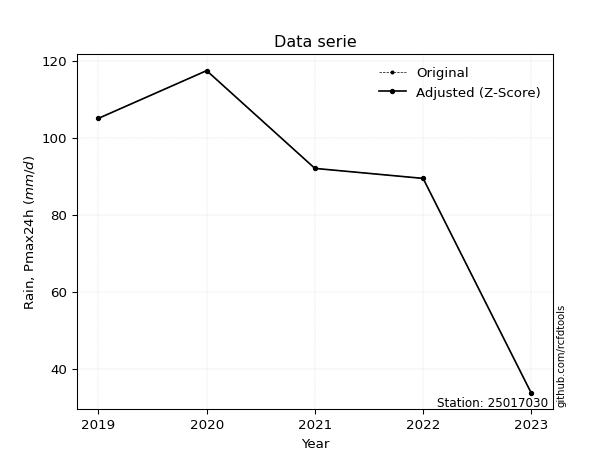</img>

</div>


> The initial value (value_initial) correspond to the initial obtained or null completed value, and value (value) is adjusted only when the initial value is outside the valid range (outlier) definite through the Z-Score value. If Z-Score is active, values out of range or outliers are replaced with the station mean value. A Z-Score (or standard score) measures how many standard deviations a data point is from the mean of a dataset, indicating its relative position; positive scores mean above the mean, negative mean below, and a score of zero is exactly at the mean, allowing for comparison of values from different distributions. It´s calculated using the formula $z=(x–μ)/σ$, where $x$ is the data point, $μ$ is the mean, and $σ$ is the standard deviation, helping identify outliers and understand probability.
>
> <sub>**Note**: In this study, "completing" (filling gaps in) and "extending" (forecasting or lengthening the historical record) rainfall data series are avoided for certain critical analyses because they introduce artificial bias and uncertainty, which can distort the statistics of rare events (extremes), alter day-to-day variability, and compromise the integrity and homogeneity of the original data. Some reasons against Completing/Extending rainfall data are: **Distortion of Extremes and Variability**: The primary issue is that most gap-filling or extension methods rely on averaging or regression with nearby stations, which inherently smooths the data. Rainfall is highly variable in space and time, with a large percentage of zero values and occasional large storms. Infilling methods often underestimate the highest values and overestimate the lowest (zero) values, which severely distorts analyses focused on flood frequency, drought severity, and intensity-duration-frequency (IDF) curves, **Loss of Data Homogeneity**: Infilled or extended data are synthetic estimates, not actual measurements. Combining these estimates with observed data can violate the assumption of data homogeneity, which requires that the data properties do not change over time. Inhomogeneity can lead to incorrect conclusions about long-term trends or changes in climate patterns, **Propagation of Errors**: Errors and biases from the original data (e.g., wind-induced undercatch, instrument errors, site changes) or the data used for imputation can propagate through the analysis, leading to unreliable hydrological models and inaccurate predictions, **Compromised Statistical Integrity**: For statistical analyses, especially those involving the frequency of events, using artificial data can introduce time bias or autocorrelation that doesn´t exist in reality, making it difficult to assess the true probability of events, **Difficulty in Validation**: It is difficult to accurately validate the quality of filled or extended data, especially for past periods where ground-truth measurements are unavailable. The reliability of imputation techniques heavily depends on the density of the surrounding station network and the complexity of the local topography.</sub>


### 4. Active continuous probability distributions from SciPy (80 of 104 available)

A Probability Density Function (PDF) describes the relative likelihood of a continuous random variable falling within a specific range, where the total area under its curve equals 1, and the area over any interval gives the actual probability for that range. Unlike discrete probabilities (like rolling a die), a PDF shows density, not direct probability for a single point (which is zero), with higher points indicating higher likelihood, often visualized as a bell curve for normal distributions.

A log of a probability density function (log-PDF) is simply the logarithm of the PDF´s value, denoted as $log(f(x))$, useful for converting multiplication of probabilities into addition, improving numerical stability with tiny numbers, and connecting to information theory concepts like entropy. Instead of dealing with very small probabilities (e.g., 0.000001), log-PDFs use negative numbers (e.g., $log(0.00001) ≈ -11.51$ that are easier for computers to handle, preventing underflow errors and simplifying complex calculations. In this study, each active probability distribution from SciPy is also evaluated in the $log$ form.

[scipy.stats](https://docs.scipy.org/doc/scipy/reference/stats.html) is a Python´s powerful submodule within the SciPy library for comprehensive statistical analysis, offering over 130 probability distributions (like Normal, Poisson, etc.), functions for descriptive stats (mean, variance), hypothesis testing (t-tests, chi-square), random variable generation, and statistical tests, making it essential for data science, modeling, and research. It provides tools to explore, model, and draw conclusions from data efficiently, working seamlessly with [NumPy](https://numpy.org/).

<div align="center">

|   id | p_dist           |   n_parameter | fit_method   | label                                                                       | active   | ref                                                                                                      |
|-----:|:-----------------|--------------:|:-------------|:----------------------------------------------------------------------------|:---------|:---------------------------------------------------------------------------------------------------------|
|    0 | alpha            |             3 | MLE          | Alpha                                                                       | True     | [:mortar_board:](https://docs.scipy.org/doc/scipy/reference/generated/scipy.stats.alpha.html)            |
|    1 | anglit           |             2 | MM           | Anglit                                                                      | True     | [:mortar_board:](https://docs.scipy.org/doc/scipy/reference/generated/scipy.stats.anglit.html)           |
|    2 | arcsine          |             2 | MM           | Arcsine                                                                     | True     | [:mortar_board:](https://docs.scipy.org/doc/scipy/reference/generated/scipy.stats.arcsine.html)          |
|    3 | argus            |             3 | MLE          | Argus                                                                       | True     | [:mortar_board:](https://docs.scipy.org/doc/scipy/reference/generated/scipy.stats.argus.html)            |
|    4 | beta             |             4 | MLE          | Beta                                                                        | True     | [:mortar_board:](https://docs.scipy.org/doc/scipy/reference/generated/scipy.stats.beta.html)             |
|    5 | betaprime        |             4 | MLE          | Beta prime                                                                  | True     | [:mortar_board:](https://docs.scipy.org/doc/scipy/reference/generated/scipy.stats.betaprime.html)        |
|    6 | bradford         |             3 | MLE          | Bradford                                                                    | True     | [:mortar_board:](https://docs.scipy.org/doc/scipy/reference/generated/scipy.stats.bradford.html)         |
|    7 | burr             |             4 | MLE          | Burr (Type III)                                                             | True     | [:mortar_board:](https://docs.scipy.org/doc/scipy/reference/generated/scipy.stats.burr.html)             |
|    8 | burr12           |             4 | MLE          | Burr (Type III) 12                                                          | True     | [:mortar_board:](https://docs.scipy.org/doc/scipy/reference/generated/scipy.stats.burr12.html)           |
|    9 | cosine           |             2 | MLE          | Cosine                                                                      | True     | [:mortar_board:](https://docs.scipy.org/doc/scipy/reference/generated/scipy.stats.cosine.html)           |
|   10 | crystalball      |             4 | MLE          | Crystalball                                                                 | True     | [:mortar_board:](https://docs.scipy.org/doc/scipy/reference/generated/scipy.stats.crystalball.html)      |
|   11 | dgamma           |             3 | MLE          | Double gamma                                                                | True     | [:mortar_board:](https://docs.scipy.org/doc/scipy/reference/generated/scipy.stats.dgamma.html)           |
|   12 | dweibull         |             3 | MLE          | Double Weibull                                                              | True     | [:mortar_board:](https://docs.scipy.org/doc/scipy/reference/generated/scipy.stats.dweibull.html)         |
|   13 | erlang           |             3 | MLE          | Erlang                                                                      | True     | [:mortar_board:](https://docs.scipy.org/doc/scipy/reference/generated/scipy.stats.erlang.html)           |
|   14 | exponnorm        |             3 | MLE          | Exponentially modified Normal                                               | True     | [:mortar_board:](https://docs.scipy.org/doc/scipy/reference/generated/scipy.stats.exponnorm.html)        |
|   15 | exponpow         |             3 | MLE          | Exponential power                                                           | True     | [:mortar_board:](https://docs.scipy.org/doc/scipy/reference/generated/scipy.stats.exponpow.html)         |
|   16 | exponweib        |             4 | MLE          | Exponentiated Weibull                                                       | True     | [:mortar_board:](https://docs.scipy.org/doc/scipy/reference/generated/scipy.stats.exponweib.html)        |
|   17 | f                |             4 | MLE          | F                                                                           | True     | [:mortar_board:](https://docs.scipy.org/doc/scipy/reference/generated/scipy.stats.f.html)                |
|   18 | fatiguelife      |             3 | MLE          | Fatigue-life (Birnbaum-Saunders)                                            | True     | [:mortar_board:](https://docs.scipy.org/doc/scipy/reference/generated/scipy.stats.fatiguelife.html)      |
|   19 | foldnorm         |             3 | MM           | Fold Normal                                                                 | True     | [:mortar_board:](https://docs.scipy.org/doc/scipy/reference/generated/scipy.stats.foldnorm.html)         |
|   20 | gamma            |             3 | MLE          | Gamma                                                                       | True     | [:mortar_board:](https://docs.scipy.org/doc/scipy/reference/generated/scipy.stats.gamma.html)            |
|   21 | gausshyper       |             6 | MLE          | Gauss hypergeometric                                                        | True     | [:mortar_board:](https://docs.scipy.org/doc/scipy/reference/generated/scipy.stats.gausshyper.html)       |
|   22 | genexpon         |             5 | MLE          | Generalized exponential                                                     | True     | [:mortar_board:](https://docs.scipy.org/doc/scipy/reference/generated/scipy.stats.genexpon.html)         |
|   23 | genextreme       |             3 | MLE          | Generalized exponential                                                     | True     | [:mortar_board:](https://docs.scipy.org/doc/scipy/reference/generated/scipy.stats.genextreme.html)       |
|   24 | gengamma         |             4 | MLE          | Generalized gamma                                                           | True     | [:mortar_board:](https://docs.scipy.org/doc/scipy/reference/generated/scipy.stats.gengamma.html)         |
|   25 | genhalflogistic  |             3 | MLE          | Generalized half-logistic                                                   | True     | [:mortar_board:](https://docs.scipy.org/doc/scipy/reference/generated/scipy.stats.genhalflogistic.html)  |
|   26 | genlogistic      |             3 | MLE          | Generalized logistic                                                        | True     | [:mortar_board:](https://docs.scipy.org/doc/scipy/reference/generated/scipy.stats.genlogistic.html)      |
|   27 | gennorm          |             3 | MLE          | Generalized Normal                                                          | True     | [:mortar_board:](https://docs.scipy.org/doc/scipy/reference/generated/scipy.stats.gennorm.html)          |
|   28 | genpareto        |             3 | MLE          | Generalized Pareto                                                          | True     | [:mortar_board:](https://docs.scipy.org/doc/scipy/reference/generated/scipy.stats.genpareto.html)        |
|   29 | gompertz         |             3 | MLE          | Gompertz (or truncated Gumbel)                                              | True     | [:mortar_board:](https://docs.scipy.org/doc/scipy/reference/generated/scipy.stats.gompertz.html)         |
|   30 | gumbel_l         |             2 | MM           | Gumbel Left Skew                                                            | True     | [:mortar_board:](https://docs.scipy.org/doc/scipy/reference/generated/scipy.stats.gumbel_l.html)         |
|   31 | gumbel_r         |             2 | MM           | Gumbel Right Skew                                                           | True     | [:mortar_board:](https://docs.scipy.org/doc/scipy/reference/generated/scipy.stats.gumbel_r.html)         |
|   32 | halfgennorm      |             3 | MLE          | Upper half of a generalized normal                                          | True     | [:mortar_board:](https://docs.scipy.org/doc/scipy/reference/generated/scipy.stats.halfgennorm.html)      |
|   33 | halflogistic     |             2 | MM           | Half-logistic                                                               | True     | [:mortar_board:](https://docs.scipy.org/doc/scipy/reference/generated/scipy.stats.halflogistic.html)     |
|   34 | halfnorm         |             2 | MM           | Half Normal                                                                 | True     | [:mortar_board:](https://docs.scipy.org/doc/scipy/reference/generated/scipy.stats.halfnorm.html)         |
|   35 | hypsecant        |             2 | MM           | hyperbolic secant                                                           | True     | [:mortar_board:](https://docs.scipy.org/doc/scipy/reference/generated/scipy.stats.hypsecant.html)        |
|   36 | invgamma         |             3 | MLE          | Inverted gamma                                                              | True     | [:mortar_board:](https://docs.scipy.org/doc/scipy/reference/generated/scipy.stats.invgamma.html)         |
|   37 | invgauss         |             3 | MLE          | Inverse Gaussian                                                            | True     | [:mortar_board:](https://docs.scipy.org/doc/scipy/reference/generated/scipy.stats.invgauss.html)         |
|   38 | invweibull       |             3 | MLE          | Inverted Weibull                                                            | True     | [:mortar_board:](https://docs.scipy.org/doc/scipy/reference/generated/scipy.stats.invweibull.html)       |
|   39 | johnsonsb        |             4 | MLE          | Johnson SB                                                                  | True     | [:mortar_board:](https://docs.scipy.org/doc/scipy/reference/generated/scipy.stats.johnsonsb.html)        |
|   40 | johnsonsu        |             4 | MLE          | Johnson Su                                                                  | True     | [:mortar_board:](https://docs.scipy.org/doc/scipy/reference/generated/scipy.stats.johnsonsu.html)        |
|   41 | kappa3           |             3 | MLE          | Kappa 3                                                                     | True     | [:mortar_board:](https://docs.scipy.org/doc/scipy/reference/generated/scipy.stats.kappa3.html)           |
|   42 | kappa4           |             4 | MLE          | Kappa 4                                                                     | True     | [:mortar_board:](https://docs.scipy.org/doc/scipy/reference/generated/scipy.stats.kappa4.html)           |
|   43 | ksone            |             3 | MLE          | Kolmogorov-Smirnov one-sided test statistic distribution                    | True     | [:mortar_board:](https://docs.scipy.org/doc/scipy/reference/generated/scipy.stats.ksone.html)            |
|   44 | kstwobign        |             2 | MLE          | Limiting distribution of scaled Kolmogorov-Smirnov two-sided test statistic | True     | [:mortar_board:](https://docs.scipy.org/doc/scipy/reference/generated/scipy.stats.kstwobign.html)        |
|   45 | laplace          |             2 | MM           | Laplace                                                                     | True     | [:mortar_board:](https://docs.scipy.org/doc/scipy/reference/generated/scipy.stats.laplace.html)          |
|   46 | levy_l           |             2 | MLE          | Left-skewed Levy                                                            | True     | [:mortar_board:](https://docs.scipy.org/doc/scipy/reference/generated/scipy.stats.levy_l.html)           |
|   47 | loggamma         |             3 | MLE          | Log gamma                                                                   | True     | [:mortar_board:](https://docs.scipy.org/doc/scipy/reference/generated/scipy.stats.loggamma.html)         |
|   48 | logistic         |             2 | MM           | Logistic (or Sech-squared)                                                  | True     | [:mortar_board:](https://docs.scipy.org/doc/scipy/reference/generated/scipy.stats.logistic.html)         |
|   49 | loglaplace       |             3 | MLE          | Log-Laplace                                                                 | True     | [:mortar_board:](https://docs.scipy.org/doc/scipy/reference/generated/scipy.stats.loglaplace.html)       |
|   50 | lomax            |             3 | MLE          | Lomax (Pareto of the second kind)                                           | True     | [:mortar_board:](https://docs.scipy.org/doc/scipy/reference/generated/scipy.stats.lomax.html)            |
|   51 | maxwell          |             2 | MM           | Maxwell                                                                     | True     | [:mortar_board:](https://docs.scipy.org/doc/scipy/reference/generated/scipy.stats.maxwell.html)          |
|   52 | mielke           |             4 | MLE          | Mielke Beta-Kappa / Dagum                                                   | True     | [:mortar_board:](https://docs.scipy.org/doc/scipy/reference/generated/scipy.stats.mielke.html)           |
|   53 | moyal            |             2 | MM           | Moyal                                                                       | True     | [:mortar_board:](https://docs.scipy.org/doc/scipy/reference/generated/scipy.stats.moyal.html)            |
|   54 | nakagami         |             3 | MLE          | Nakagami                                                                    | True     | [:mortar_board:](https://docs.scipy.org/doc/scipy/reference/generated/scipy.stats.nakagami.html)         |
|   55 | ncf              |             5 | MLE          | Non-central F distribution                                                  | True     | [:mortar_board:](https://docs.scipy.org/doc/scipy/reference/generated/scipy.stats.ncf.html)              |
|   56 | nct              |             4 | MLE          | Non-central Student’s t                                                     | True     | [:mortar_board:](https://docs.scipy.org/doc/scipy/reference/generated/scipy.stats.nct.html)              |
|   57 | norm             |             2 | MM           | Normal                                                                      | True     | [:mortar_board:](https://docs.scipy.org/doc/scipy/reference/generated/scipy.stats.norm.html)             |
|   58 | pearson3         |             3 | MM           | Pearson type III                                                            | True     | [:mortar_board:](https://docs.scipy.org/doc/scipy/reference/generated/scipy.stats.pearson3.html)         |
|   59 | powerlaw         |             3 | MLE          | Power-function                                                              | True     | [:mortar_board:](https://docs.scipy.org/doc/scipy/reference/generated/scipy.stats.powerlaw.html)         |
|   60 | rayleigh         |             2 | MM           | Rayleigh                                                                    | True     | [:mortar_board:](https://docs.scipy.org/doc/scipy/reference/generated/scipy.stats.rayleigh.html)         |
|   61 | rdist            |             3 | MLE          | R-distributed (symmetric beta)                                              | True     | [:mortar_board:](https://docs.scipy.org/doc/scipy/reference/generated/scipy.stats.rdist.html)            |
|   62 | rice             |             3 | MLE          | Rice                                                                        | True     | [:mortar_board:](https://docs.scipy.org/doc/scipy/reference/generated/scipy.stats.rice.html)             |
|   63 | semicircular     |             2 | MM           | Semicircular                                                                | True     | [:mortar_board:](https://docs.scipy.org/doc/scipy/reference/generated/scipy.stats.semicircular.html)     |
|   64 | skewnorm         |             3 | MLE          | Skew normal                                                                 | True     | [:mortar_board:](https://docs.scipy.org/doc/scipy/reference/generated/scipy.stats.skewnorm.html)         |
|   65 | t                |             3 | MLE          | Student’s t                                                                 | True     | [:mortar_board:](https://docs.scipy.org/doc/scipy/reference/generated/scipy.stats.t.html)                |
|   66 | trapezoid        |             4 | MLE          | Trapezoid                                                                   | True     | [:mortar_board:](https://docs.scipy.org/doc/scipy/reference/generated/scipy.stats.trapezoid.html)        |
|   67 | triang           |             3 | MLE          | Triangular                                                                  | True     | [:mortar_board:](https://docs.scipy.org/doc/scipy/reference/generated/scipy.stats.triang.html)           |
|   68 | truncexpon       |             3 | MLE          | Truncated exponential                                                       | True     | [:mortar_board:](https://docs.scipy.org/doc/scipy/reference/generated/scipy.stats.truncexpon.html)       |
|   69 | truncnorm        |             4 | MLE          | Truncated normal                                                            | True     | [:mortar_board:](https://docs.scipy.org/doc/scipy/reference/generated/scipy.stats.truncnorm.html)        |
|   70 | truncpareto      |             4 | MLE          | Upper truncated Pareto                                                      | True     | [:mortar_board:](https://docs.scipy.org/doc/scipy/reference/generated/scipy.stats.truncpareto.html)      |
|   71 | truncweibull_min |             5 | MLE          | Doubly truncated Weibull minimum                                            | True     | [:mortar_board:](https://docs.scipy.org/doc/scipy/reference/generated/scipy.stats.truncweibull_min.html) |
|   72 | tukeylambda      |             3 | MLE          | Tukey-Lamdba                                                                | True     | [:mortar_board:](https://docs.scipy.org/doc/scipy/reference/generated/scipy.stats.tukeylambda.html)      |
|   73 | uniform          |             2 | MLE          | Uniform                                                                     | True     | [:mortar_board:](https://docs.scipy.org/doc/scipy/reference/generated/scipy.stats.uniform.html)          |
|   74 | vonmises         |             3 | MLE          | Von Mises                                                                   | True     | [:mortar_board:](https://docs.scipy.org/doc/scipy/reference/generated/scipy.stats.vonmises.html)         |
|   75 | vonmises_line    |             3 | MLE          | Von Mises line                                                              | True     | [:mortar_board:](https://docs.scipy.org/doc/scipy/reference/generated/scipy.stats.vonmises_line.html)    |
|   76 | wald             |             2 | MM           | Wald                                                                        | True     | [:mortar_board:](https://docs.scipy.org/doc/scipy/reference/generated/scipy.stats.wald.html)             |
|   77 | weibull_max      |             3 | MLE          | Weibull maximum                                                             | True     | [:mortar_board:](https://docs.scipy.org/doc/scipy/reference/generated/scipy.stats.weibull_max.html)      |
|   78 | weibull_min      |             3 | MLE          | Weibull minimum                                                             | True     | [:mortar_board:](https://docs.scipy.org/doc/scipy/reference/generated/scipy.stats.weibull_min.html)      |
|   79 | wrapcauchy       |             3 | MLE          | Wrapped  Cauchy                                                             | True     | [:mortar_board:](https://docs.scipy.org/doc/scipy/reference/generated/scipy.stats.wrapcauchy.html)       |

</div>

> **n_parameter:** # arguments & localization & scale.
>
> **Fit methods:** (MLE) maximum likelihood, (MM) L-moments.
>
>**Inactive** (With the only purpose of prevent loops, zero divisions, infinite values, over high estimated values or horizontal trending for recurrence intervals estimations, the follow distributions were disabled.)**:** lognorm, norminvgauss, powernorm, powerlognorm, cauchy, halfcauchy, foldcauchy, skewcauchy, chi2, expon, fisk, genhyperbolic, geninvgauss, gibrat, kstwo, laplace_asymmetric, levy, levy_stable, ncx2, pareto, rel_breitwigner, recipinvgauss, studentized_range, loguniform, 


## B. Probability (PDF) vs. Empirical (EDF) distributions functions

A continuous probability distribution (CPD) describes probabilities for variables that can take any value within a range (like rain any time), unlike discrete variables with specific outcomes (like temperature). It uses a Probability Density Function (PDF), a curve where the total area under it equals 1, and the probability of the variable falling within an interval (a to b) is found by calculating the area under the curve between those points. A key feature is that the probability of hitting any single exact value is zero, so probabilities are always expressed for ranges, e.g., $P(a ≤ X ≤ b)$.

<div align="center">

Distributions parameters from station values
|     |   station | p_dist              |   n |               loc |            scale | shape                  | shape1                | shape2                | shape3             |
|----:|----------:|:--------------------|----:|------------------:|-----------------:|:-----------------------|:----------------------|:----------------------|:-------------------|
|   0 |  25017030 | alpha               |   6 |      -0.0223766   |      9.29202     | 9.15542168456387e-11   |                       |                       |                    |
|   1 |  25017030 | anglit              |   6 |      73.5333      |    119.217       |                        |                       |                       |                    |
|   2 |  25017030 | arcsine             |   6 |      15.9006      |    115.266       |                        |                       |                       |                    |
|   3 |  25017030 | argus               |   6 |     -39.3212      |    160.918       | 2.095017684143029      |                       |                       |                    |
|   4 |  25017030 | beta                |   6 |      -7.82266     |    125.223       | 0.4483974191772394     | 0.24519670392828624   |                       |                    |
|   5 |  25017030 | betaprime           |   6 |    -587.6         |      1.05932e+06 | 253.5919746214879      | 406542.43864360836    |                       |                    |
|   6 |  25017030 | bradford            |   6 |     -10.1932      |    127.593       | 1.7467850369600833e-06 |                       |                       |                    |
|   7 |  25017030 | burr                |   6 |      -1.55229     |    120.756       | 227.76824285624716     | 0.00523783905111095   |                       |                    |
|   8 |  25017030 | burr12              |   6 |      -0.748953    |      4.4566      | 216.5582692580993      | 0.0019042888662766165 |                       |                    |
|   9 |  25017030 | cosine              |   6 |      69.5669      |     33.1791      |                        |                       |                       |                    |
|  10 |  25017030 | crystalball         |   6 |      73.5333      |     40.7525      | 376.57238994584674     | 14233.389738419179    |                       |                    |
|  11 |  25017030 | dgamma              |   6 |      92           |     30.151       | 0.8246772966793776     |                       |                       |                    |
|  12 |  25017030 | dweibull            |   6 |      92           |     30.9221      | 0.835090079312672      |                       |                       |                    |
|  13 |  25017030 | erlang              |   6 |    -551.327       |      2.81936     | 221.5359070511356      |                       |                       |                    |
|  14 |  25017030 | exponnorm           |   6 |      73.4992      |     40.7525      | 0.0008462566320712787  |                       |                       |                    |
|  15 |  25017030 | exponpow            |   6 |       3.8         |      4.12501     | 0.11891578153240415    |                       |                       |                    |
|  16 |  25017030 | exponweib           |   6 | -309428           | 309269           | 45.864918158435444     | 1918.1238735242453    |                       |                    |
|  17 |  25017030 | f                   |   6 |  -11587.2         |  11660.7         | 207497.36543874792     | 798191.9777313434     |                       |                    |
|  18 |  25017030 | fatiguelife         |   6 |       3.8         |      6.44255e-05 | 961.777070115711       |                       |                       |                    |
|  19 |  25017030 | foldnorm            |   6 |     -95.5723      |     37.4862      | 4.532493133901523      |                       |                       |                    |
|  20 |  25017030 | gamma               |   6 |    -574.801       |      2.66603     | 243.14747893375602     |                       |                       |                    |
|  21 |  25017030 | gausshyper          |   6 |      -6.54505     |    123.945       | 1.3548874740565937     | 0.464765944896085     | 1.3380874672312237    | 0.9432587156652026 |
|  22 |  25017030 | genexpon            |   6 |       1.53278     |      6.42792     | 9.898421508390782e-11  | 0.09029402860167544   | 7.647086635348741     |                    |
|  23 |  25017030 | genextreme          |   6 |      76.8012      |     52.3586      | 1.289657678334149      |                       |                       |                    |
|  24 |  25017030 | gengamma            |   6 |     -38.9832      |      0.00166004  | 46.06072610691429      | 0.3458744472847376    |                       |                    |
|  25 |  25017030 | genhalflogistic     |   6 |     -16.0873      |    160.228       | 1.2003225035212797     |                       |                       |                    |
|  26 |  25017030 | genlogistic         |   6 |     117.4         |      2.14932e-06 | 4.907845974131083e-08  |                       |                       |                    |
|  27 |  25017030 | gennorm             |   6 |      92           |      0.000206494 | 0.1686753301286181     |                       |                       |                    |
|  28 |  25017030 | genpareto           |   6 |      -0.342438    |    247.761       | -2.104266391157581     |                       |                       |                    |
|  29 |  25017030 | gompertz            |   6 |      33.6         |      9.02516     | 0.00034393556910861437 |                       |                       |                    |
|  30 |  25017030 | gumbel_l            |   6 |      91.8741      |     31.7746      |                        |                       |                       |                    |
|  31 |  25017030 | gumbel_r            |   6 |      55.1925      |     31.7746      |                        |                       |                       |                    |
|  32 |  25017030 | halfgennorm         |   6 |       3.8         |      4.88263     | 0.38793517117278525    |                       |                       |                    |
|  33 |  25017030 | halflogistic        |   6 |      25.2321      |     34.8419      |                        |                       |                       |                    |
|  34 |  25017030 | halfnorm            |   6 |      19.593       |     67.6042      |                        |                       |                       |                    |
|  35 |  25017030 | hypsecant           |   6 |      73.5333      |     25.9439      |                        |                       |                       |                    |
|  36 |  25017030 | invgamma            |   6 |    -459.292       |  82261.3         | 155.7930409496945      |                       |                       |                    |
|  37 |  25017030 | invgauss            |   6 |    -158.903       |   5649.91        | 0.04099396592535327    |                       |                       |                    |
|  38 |  25017030 | invweibull          |   6 |       3.8         |      3.21391     | 0.03338180286178723    |                       |                       |                    |
|  39 |  25017030 | johnsonsb           |   6 |     -17.322       |    134.722       | -0.4903179933355587    | 0.1627696093637285    |                       |                    |
|  40 |  25017030 | johnsonsu           |   6 |     122.785       |      0.179053    | 5.729784638114674      | 0.9755969325695073    |                       |                    |
|  41 |  25017030 | kappa3              |   6 |       3.79941     |    113.597       | 50702.01818001707      |                       |                       |                    |
|  42 |  25017030 | kappa4              |   6 |       3.03065     |    132.361       | 0.9846167431289057     | 1.1573100747605247    |                       |                    |
|  43 |  25017030 | ksone               |   6 |       2.94788     |    141.171       | 1.0                    |                       |                       |                    |
|  44 |  25017030 | kstwobign           |   6 |     -92.4304      |    188.931       |                        |                       |                       |                    |
|  45 |  25017030 | laplace             |   6 |      73.5333      |     28.8164      |                        |                       |                       |                    |
|  46 |  25017030 | levy_l              |   6 |     120.388       |     12.3154      |                        |                       |                       |                    |
|  47 |  25017030 | loggamma            |   6 |     117.4         |      2.57222e-05 | 5.867321720865558e-07  |                       |                       |                    |
|  48 |  25017030 | logistic            |   6 |      73.5333      |     22.468       |                        |                       |                       |                    |
|  49 |  25017030 | loglaplace          |   6 |      -0.260769    |     92.2607      | 1.3246927048938242     |                       |                       |                    |
|  50 |  25017030 | lomax               |   6 |       3.79992     |      1.66252e+06 | 23596.286537617576     |                       |                       |                    |
|  51 |  25017030 | maxwell             |   6 |     -23.0331      |     60.514       |                        |                       |                       |                    |
|  52 |  25017030 | mielke              |   6 |     -29.3591      |    146.909       | 2.1205916949521253     | 6112.891343703879     |                       |                    |
|  53 |  25017030 | moyal               |   6 |      50.2284      |     18.3451      |                        |                       |                       |                    |
|  54 |  25017030 | nakagami            |   6 |       3.8         |     69.5149      | 0.2930648850974059     |                       |                       |                    |
|  55 |  25017030 | ncf                 |   6 |      -0.0162631   |      3.50893e-08 | 2.94140309634105e-09   | 3.1482312690163883    | 4.428993287330725     |                    |
|  56 |  25017030 | nct                 |   6 |   -3432.71        |     40.5814      | 421464.70199279394     | 86.40000490096674     |                       |                    |
|  57 |  25017030 | norm                |   6 |      73.5333      |     40.7525      |                        |                       |                       |                    |
|  58 |  25017030 | pearson3            |   6 |      73.5333      |     40.7526      | -0.6819185350300662    |                       |                       |                    |
|  59 |  25017030 | powerlaw            |   6 |       3.8         |    113.6         | 0.14260919184269724    |                       |                       |                    |
|  60 |  25017030 | rayleigh            |   6 |      -4.42864     |     62.2047      |                        |                       |                       |                    |
|  61 |  25017030 | rdist               |   6 |      -7.57298     |     41.173       | 1.1927641176391304     |                       |                       |                    |
|  62 |  25017030 | rice                |   6 |     -21.0152      |     45.3573      | 1.775531095622119      |                       |                       |                    |
|  63 |  25017030 | semicircular        |   6 |      73.5333      |     81.5051      |                        |                       |                       |                    |
|  64 |  25017030 | skewnorm            |   6 |     117.4         |     59.8759      | -28376687.241711132    |                       |                       |                    |
|  65 |  25017030 | t                   |   6 |      73.534       |     40.752       | 37268667.8426449       |                       |                       |                    |
|  66 |  25017030 | trapezoid           |   6 |     -43.8188      |    172.898       | 1.0                    | 1.0                   |                       |                    |
|  67 |  25017030 | triang              |   6 |     -24.5602      |    141.961       | 0.9999999999881546     |                       |                       |                    |
|  68 |  25017030 | truncexpon          |   6 |       3.8         |    176.557       | 0.6434181279184229     |                       |                       |                    |
|  69 |  25017030 | truncnorm           |   6 |      59.1114      |     32.1232      | -1405.5502224348884    | 1.814533491659203     |                       |                    |
|  70 |  25017030 | truncpareto         |   6 |       3.5876      |      0.212397    | 0.20383179803072587    | 535.8487361515323     |                       |                    |
|  71 |  25017030 | truncweibull_min    |   6 |      -2.62232     |    217.899       | 1.396387228482491      | 0.0011800761430521322 | 0.5508158602860553    |                    |
|  72 |  25017030 | tukeylambda         |   6 |      60.602       |     63.1039      | 1.1109456788681118     |                       |                       |                    |
|  73 |  25017030 | uniform             |   6 |       3.8         |    113.6         |                        |                       |                       |                    |
|  74 |  25017030 | vonmises            |   6 |      -2.60943     |      1           | 1.1069723999942287     |                       |                       |                    |
|  75 |  25017030 | vonmises_line       |   6 |      59.168       |     18.5358      | 2.1659641699344375e-07 |                       |                       |                    |
|  76 |  25017030 | wald                |   6 |      32.7808      |     40.7526      |                        |                       |                       |                    |
|  77 |  25017030 | weibull_max         |   6 |     117.4         |      1.56855     | 0.23371795704975773    |                       |                       |                    |
|  78 |  25017030 | weibull_min         |   6 |      -1.0578e+09  |      1.0578e+09  | 36058910.24136832      |                       |                       |                    |
|  79 |  25017030 | wrapcauchy          |   6 |       3.79997     |     18.08        | 0.42949137910055735    |                       |                       |                    |
|  80 |  25017030 | logalpha            |   6 |     -30.4993      |    916.594       | 26.706767836659438     |                       |                       |                    |
|  81 |  25017030 | loganglit           |   6 |       3.88066     |      3.53914     |                        |                       |                       |                    |
|  82 |  25017030 | logarcsine          |   6 |       2.16976     |      3.4218      |                        |                       |                       |                    |
|  83 |  25017030 | logargus            |   6 |      -0.126534    |      4.9834      | 3.078956653151634      |                       |                       |                    |
|  84 |  25017030 | logbeta             |   6 |       1.02211     |      3.74348     | 0.37010169321628955    | 0.10831716888008376   |                       |                    |
|  85 |  25017030 | logbetaprime        |   6 |    -511.035       |   5364.7         | 199683.23302796605     | 2080402.2793265055    |                       |                    |
|  86 |  25017030 | logbradford         |   6 |       1.33449     |      3.4311      | 0.9978700183181897     |                       |                       |                    |
|  87 |  25017030 | logburr             |   6 |      -5.5038e+07  |      5.5038e+07  | 4195614853.7041674     | 0.014315550212803285  |                       |                    |
|  88 |  25017030 | logburr12           |   6 |  -30904.5         |  30922.3         | 36660.32967025487      | 8430493.306032814     |                       |                    |
|  89 |  25017030 | logcosine           |   6 |       3.6413      |      1.05898     |                        |                       |                       |                    |
|  90 |  25017030 | logcrystalball      |   6 |       4.76559     |      1.04412e-05 | 1.3513439052231414e-05 | 21.894431920306406    |                       |                    |
|  91 |  25017030 | logdgamma           |   6 |       4.49312     |      1.25171     | 0.6290450988773435     |                       |                       |                    |
|  92 |  25017030 | logdweibull         |   6 |       4.49312     |      1.12486     | 0.7530817958880437     |                       |                       |                    |
|  93 |  25017030 | logerlang           |   6 |     -17.5805      |      0.0748084   | 286.7349228964015      |                       |                       |                    |
|  94 |  25017030 | logexponnorm        |   6 |       3.87987     |      1.2098      | 0.0006524326518057748  |                       |                       |                    |
|  95 |  25017030 | logexponpow         |   6 |       1.335       |      1.24772     | 0.2776506569566217     |                       |                       |                    |
|  96 |  25017030 | logexponweib        |   6 |       1.335       |      1.13814     | 1.1115123607241157     | 0.5550160268466982    |                       |                    |
|  97 |  25017030 | logf                |   6 |   -2126.09        |   2129.97        | 16164369.75928235      | 9906939.437026791     |                       |                    |
|  98 |  25017030 | logfatiguelife      |   6 |   -1068.2         |   1072.09        | 0.001124709318658382   |                       |                       |                    |
|  99 |  25017030 | logfoldnorm         |   6 |      -4.55771     |      1.08198     | 7.820146239874297      |                       |                       |                    |
| 100 |  25017030 | loggamma            |   6 |     -17.6517      |      0.0753805   | 285.52120614021214     |                       |                       |                    |
| 101 |  25017030 | loggausshyper       |   6 |       1.15408     |      3.61151     | 1.2372628510043562     | 0.6994862193235285    | 0.9902422647887428    | 0.8999420303240486 |
| 102 |  25017030 | loggenexpon         |   6 |       1.32889     |      0.00554971  | 0.0007483717551867741  | 1.73580667301451      | 2.916857238112625e-06 |                    |
| 103 |  25017030 | loggenextreme       |   6 |       3.77989     |      1.17782     | 1.1949169000522244     |                       |                       |                    |
| 104 |  25017030 | loggengamma         |   6 |      -2.18647e+08 |      2.18648e+08 | 1.2750067299985584     | 226900637.88652033    |                       |                    |
| 105 |  25017030 | loggenhalflogistic  |   6 |       1.26024     |      3.73685     | 1.0660403949398702     |                       |                       |                    |
| 106 |  25017030 | loggenlogistic      |   6 |       4.76567     |      7.347e-06   | 8.267537916107128e-06  |                       |                       |                    |
| 107 |  25017030 | loggennorm          |   6 |       4.52179     |      0.000496006 | 0.24079926248996353    |                       |                       |                    |
| 108 |  25017030 | loggenpareto        |   6 |      -0.129533    |      8.88352     | -1.8147710988662888    |                       |                       |                    |
| 109 |  25017030 | loggompertz         |   6 |       1.335       |      0.729773    | 0.016050432375097443   |                       |                       |                    |
| 110 |  25017030 | loggumbel_l         |   6 |       4.42514     |      0.943276    |                        |                       |                       |                    |
| 111 |  25017030 | loggumbel_r         |   6 |       3.33619     |      0.943276    |                        |                       |                       |                    |
| 112 |  25017030 | loghalfgennorm      |   6 |       1.33499     |      3.43136     | 40699.82945484781      |                       |                       |                    |
| 113 |  25017030 | loghalflogistic     |   6 |       2.4468      |      1.03432     |                        |                       |                       |                    |
| 114 |  25017030 | loghalfnorm         |   6 |       2.27934     |      2.00696     |                        |                       |                       |                    |
| 115 |  25017030 | loghypsecant        |   6 |       3.88066     |      0.770182    |                        |                       |                       |                    |
| 116 |  25017030 | loginvgamma         |   6 |     -23.3447      |  12022.2         | 442.88156225785133     |                       |                       |                    |
| 117 |  25017030 | loginvgauss         |   6 |      -9.97938     |   1562.47        | 0.008861477572166007   |                       |                       |                    |
| 118 |  25017030 | loginvweibull       |   6 |      -2.32605e+08 |      2.32605e+08 | 164324480.14859876     |                       |                       |                    |
| 119 |  25017030 | logjohnsonsb        |   6 |      -3.16025     |      7.92584     | -1.158577987689304     | 0.15314442879256035   |                       |                    |
| 120 |  25017030 | logjohnsonsu        |   6 |       4.76559     |      3.29758e-15 | 3.272050356922734      | 0.13822582216714854   |                       |                    |
| 121 |  25017030 | logkappa3           |   6 |       1.335       |      3.42613     | 1669.3122918458403     |                       |                       |                    |
| 122 |  25017030 | logkappa4           |   6 |       0.916372    |      4.11528     | 1.0413368534525014     | 1.0691220116058218    |                       |                    |
| 123 |  25017030 | logksone            |   6 |       0.991942    |      4.1167      | 1.0                    |                       |                       |                    |
| 124 |  25017030 | logkstwobign        |   6 |      -1.88186     |      6.57868     |                        |                       |                       |                    |
| 125 |  25017030 | loglaplace          |   6 |       3.88066     |      0.855457    |                        |                       |                       |                    |
| 126 |  25017030 | loglevy_l           |   6 |       4.7964      |      0.126401    |                        |                       |                       |                    |
| 127 |  25017030 | logloggamma         |   6 |       4.76562     |      2.57162e-06 | 2.9218700924921476e-06 |                       |                       |                    |
| 128 |  25017030 | loglogistic         |   6 |       3.88066     |      0.666997    |                        |                       |                       |                    |
| 129 |  25017030 | logloglaplace       |   6 |      -5.95304e+07 |      5.95304e+07 | 77931765.7216807       |                       |                       |                    |
| 130 |  25017030 | loglomax            |   6 |       1.335       |      1.13175e+07 | 4540549.728378756      |                       |                       |                    |
| 131 |  25017030 | logmaxwell          |   6 |       1.01395     |      1.79645     |                        |                       |                       |                    |
| 132 |  25017030 | logmielke           |   6 |      -6.62282e+07 |      6.62282e+07 | 72565233.0482066       | 44565375247.95307     |                       |                    |
| 133 |  25017030 | logmoyal            |   6 |       3.18882     |      0.544601    |                        |                       |                       |                    |
| 134 |  25017030 | lognakagami         |   6 |       3.51453     |      1.00021     | 0.3787713036467819     |                       |                       |                    |
| 135 |  25017030 | logncf              |   6 |      -0.556601    |      6.62467e-07 | 7.637605535168782e-06  | 99.29163583650744     | 50.55038877041147     |                    |
| 136 |  25017030 | lognct              |   6 |     -99.4388      |      1.1836      | 79691.28518733804      | 87.29122189276224     |                       |                    |
| 137 |  25017030 | lognorm             |   6 |       3.88066     |      1.2098      |                        |                       |                       |                    |
| 138 |  25017030 | logpearson3         |   6 |       3.88067     |      1.20979     | -1.4022156181947372    |                       |                       |                    |
| 139 |  25017030 | logpowerlaw         |   6 |       1.335       |      3.43059     | 0.15822968310819063    |                       |                       |                    |
| 140 |  25017030 | lograyleigh         |   6 |       1.5663      |      1.84661     |                        |                       |                       |                    |
| 141 |  25017030 | logrdist            |   6 |       2.40906     |      1.10546     | 1.360235849685059      |                       |                       |                    |
| 142 |  25017030 | logrice             |   6 |    -284.445       |      1.2098      | 238.322152346304       |                       |                       |                    |
| 143 |  25017030 | logsemicircular     |   6 |       3.88067     |      2.41957     |                        |                       |                       |                    |
| 144 |  25017030 | logskewnorm         |   6 |       4.76559     |      1.49891     | -9116688.703426458     |                       |                       |                    |
| 145 |  25017030 | logt                |   6 |       4.55649     |      0.126042    | 0.6269795785920063     |                       |                       |                    |
| 146 |  25017030 | logtrapezoid        |   6 |       0.458837    |      5.13274     | 0.9999999999999999     | 1.0                   |                       |                    |
| 147 |  25017030 | logtriang           |   6 |       0.478328    |      4.28728     | 0.9999988151562968     |                       |                       |                    |
| 148 |  25017030 | logtruncexpon       |   6 |       1.335       |      5.35202     | 0.640989347961628      |                       |                       |                    |
| 149 |  25017030 | logtruncnorm        |   6 |      -0.412847    |      6.15677     | 0.28389045092071713    | 0.8434887238373951    |                       |                    |
| 150 |  25017030 | logtruncpareto      |   6 |       1.32673     |      0.00827457  | 0.2033400638712591     | 415.59390991323386    |                       |                    |
| 151 |  25017030 | logtruncweibull_min |   6 |       1.27224     |      6.36232     | 1.2306936416452352     | 0.001196715474902195  | 0.5490685803689288    |                    |
| 152 |  25017030 | logtukeylambda      |   6 |       2.42806     |      1.38696     | 1.2688873743503408     |                       |                       |                    |
| 153 |  25017030 | loguniform          |   6 |       1.335       |      3.43059     |                        |                       |                       |                    |
| 154 |  25017030 | logvonmises         |   6 |      -1.89099     |      1           | 1.466243133669545      |                       |                       |                    |
| 155 |  25017030 | logvonmises_line    |   6 |       4.20555     |      0.913724    | 1.3368733034353475     |                       |                       |                    |
| 156 |  25017030 | logwald             |   6 |       2.6709      |      1.20978     |                        |                       |                       |                    |
| 157 |  25017030 | logweibull_max      |   6 |       4.76559     |      2.09701     | 0.15997178480459037    |                       |                       |                    |
| 158 |  25017030 | logweibull_min      |   6 |       1.335       |      1.36495     | 0.48891417945344773    |                       |                       |                    |
| 159 |  25017030 | logwrapcauchy       |   6 |       1.32283     |      0.547932    | 0.7795204770969253     |                       |                       |                    |

</div>

> **loc** (Location parameter): This shifts the distribution along the x-axis. For many common distributions, like the normal (Gaussian) distribution, loc represents the mean $μ$. For others, like the uniform distribution, it might represent the minimum value, or for the beta distribution, the left end of the support interval.
>
> **scale** (Scale parameter): This determines the width or spread of the distribution. For the normal distribution, scale represents the standard deviation $σ$. For a uniform distribution, it defines the length of the interval (from $loc$ to $loc + scale$).
>
> **shape** (Shape parameters): Refers to parameters that define the specific form of a probability distribution, distinct from its location (loc) and scale (scale). These parameters are required arguments for most distribution functions. For example, a normal (Gaussian) distribution is fully defined by its location (mean) and scale (standard deviation), so it has no specific shape parameters beyond loc and scale. However, other distributions have intrinsic properties that need specification, as Gamma distribution that takes a shape parameter, often named $a$ or $alpha$.


### 0. Cumulative distribution values - CDF (160 evaluated)

Cumulative Distribution Function (CDF), denoted as $F$<sub>$X$</sub>$(x)$, is a function that gives the probability that a random variable $X$ will take a value less than or equal to a specific value, $x$ (i.e., $(P(X≥x)$. It essentially "accumulates" probabilities from a given point up to the far right (positive infinity), providing a complete picture of the distribution´s probabilities for both discrete (like rain) and continuous (like temperature) variables, helping to find probabilities over ranges or above certain values. Each station is evaluated separately ordering the $x$ values ascending, calculating the CDF and PDF values for the activated distributions and their logarithmic forms.

<div align="center">

CDF ordered by x ascending and calculating $log(f(x))$ separately
|   id |   Station |   date |     x |   count |    mean |     std |    zscore |   Value_initial |   station |   m |     alpha |   alpha_pdf |    anglit |   anglit_pdf |   arcsine |   arcsine_pdf |     argus |   argus_pdf |     beta |    beta_pdf |   betaprime |   betaprime_pdf |   bradford |   bradford_pdf |      burr |     burr_pdf |    burr12 |   burr12_pdf |   cosine |   cosine_pdf |   crystalball |   crystalball_pdf |    dgamma |   dgamma_pdf |   dweibull |   dweibull_pdf |    erlang |   erlang_pdf |   exponnorm |   exponnorm_pdf |   exponpow |   exponpow_pdf |   exponweib |   exponweib_pdf |         f |      f_pdf |   fatiguelife |   fatiguelife_pdf |   foldnorm |   foldnorm_pdf |     gamma |   gamma_pdf |   gausshyper |   gausshyper_pdf |   genexpon |   genexpon_pdf |   genextreme |   genextreme_pdf |   gengamma |   gengamma_pdf |   genhalflogistic |   genhalflogistic_pdf |   genlogistic |   genlogistic_pdf |   gennorm |   gennorm_pdf |   genpareto |   genpareto_pdf |    gompertz |   gompertz_pdf |   gumbel_l |   gumbel_l_pdf |   gumbel_r |   gumbel_r_pdf |   halfgennorm |   halfgennorm_pdf |   halflogistic |   halflogistic_pdf |   halfnorm |   halfnorm_pdf |   hypsecant |   hypsecant_pdf |   invgamma |   invgamma_pdf |   invgauss |   invgauss_pdf |   invweibull |   invweibull_pdf |   johnsonsb |   johnsonsb_pdf |   johnsonsu |   johnsonsu_pdf |      kappa3 |   kappa3_pdf |    kappa4 |   kappa4_pdf |      ksone |   ksone_pdf |   kstwobign |   kstwobign_pdf |   laplace |   laplace_pdf |   levy_l |   levy_l_pdf |   loggamma |   loggamma_pdf |   logistic |   logistic_pdf |   loglaplace |   loglaplace_pdf |       lomax |   lomax_pdf |   maxwell |   maxwell_pdf |    mielke |   mielke_pdf |       moyal |   moyal_pdf |    nakagami |   nakagami_pdf |      ncf |    ncf_pdf |       nct |    nct_pdf |      norm |   norm_pdf |   pearson3 |   pearson3_pdf |   powerlaw |   powerlaw_pdf |   rayleigh |   rayleigh_pdf |    rdist |      rdist_pdf |      rice |   rice_pdf |   semicircular |   semicircular_pdf |   skewnorm |   skewnorm_pdf |         t |      t_pdf |   trapezoid |   trapezoid_pdf |    triang |   triang_pdf |   truncexpon |   truncexpon_pdf |   truncnorm |   truncnorm_pdf |   truncpareto |   truncpareto_pdf |   truncweibull_min |   truncweibull_min_pdf |   tukeylambda |   tukeylambda_pdf |   uniform |   uniform_pdf |   vonmises |   vonmises_pdf |   vonmises_line |   vonmises_line_pdf |        wald |    wald_pdf |   weibull_max |   weibull_max_pdf |   weibull_min |   weibull_min_pdf |   wrapcauchy |   wrapcauchy_pdf |   logalpha |   logalpha_pdf |   loganglit |   loganglit_pdf |   logarcsine |   logarcsine_pdf |   logargus |   logargus_pdf |   logbeta |   logbeta_pdf |   logbetaprime |   logbetaprime_pdf |   logbradford |   logbradford_pdf |   logburr |   logburr_pdf |   logburr12 |   logburr12_pdf |   logcosine |   logcosine_pdf |   logcrystalball |   logcrystalball_pdf |   logdgamma |   logdgamma_pdf |   logdweibull |   logdweibull_pdf |   logerlang |   logerlang_pdf |   logexponnorm |   logexponnorm_pdf |   logexponpow |   logexponpow_pdf |   logexponweib |   logexponweib_pdf |      logf |   logf_pdf |   logfatiguelife |   logfatiguelife_pdf |   logfoldnorm |   logfoldnorm_pdf |   loggausshyper |   loggausshyper_pdf |   loggenexpon |   loggenexpon_pdf |   loggenextreme |   loggenextreme_pdf |   loggengamma |   loggengamma_pdf |   loggenhalflogistic |   loggenhalflogistic_pdf |   loggenlogistic |   loggenlogistic_pdf |   loggennorm |   loggennorm_pdf |   loggenpareto |   loggenpareto_pdf |   loggompertz |   loggompertz_pdf |   loggumbel_l |   loggumbel_l_pdf |   loggumbel_r |   loggumbel_r_pdf |   loghalfgennorm |   loghalfgennorm_pdf |   loghalflogistic |   loghalflogistic_pdf |   loghalfnorm |   loghalfnorm_pdf |   loghypsecant |   loghypsecant_pdf |   loginvgamma |   loginvgamma_pdf |   loginvgauss |   loginvgauss_pdf |   loginvweibull |   loginvweibull_pdf |   logjohnsonsb |   logjohnsonsb_pdf |   logjohnsonsu |   logjohnsonsu_pdf |   logkappa3 |   logkappa3_pdf |   logkappa4 |   logkappa4_pdf |   logksone |   logksone_pdf |   logkstwobign |   logkstwobign_pdf |   loglevy_l |   loglevy_l_pdf |   logloggamma |   logloggamma_pdf |   loglogistic |   loglogistic_pdf |   logloglaplace |   logloglaplace_pdf |    loglomax |   loglomax_pdf |   logmaxwell |   logmaxwell_pdf |   logmielke |   logmielke_pdf |    logmoyal |   logmoyal_pdf |   lognakagami |   lognakagami_pdf |    logncf |   logncf_pdf |    lognct |   lognct_pdf |   lognorm |   lognorm_pdf |   logpearson3 |   logpearson3_pdf |   logpowerlaw |   logpowerlaw_pdf |   lograyleigh |   lograyleigh_pdf |   logrdist |   logrdist_pdf |   logrice |   logrice_pdf |   logsemicircular |   logsemicircular_pdf |   logskewnorm |   logskewnorm_pdf |      logt |   logt_pdf |   logtrapezoid |   logtrapezoid_pdf |   logtriang |   logtriang_pdf |   logtruncexpon |   logtruncexpon_pdf |   logtruncnorm |   logtruncnorm_pdf |   logtruncpareto |   logtruncpareto_pdf |   logtruncweibull_min |   logtruncweibull_min_pdf |   logtukeylambda |   logtukeylambda_pdf |   loguniform |   loguniform_pdf |   logvonmises |   logvonmises_pdf |   logvonmises_line |   logvonmises_line_pdf |   logwald |   logwald_pdf |   logweibull_max |   logweibull_max_pdf |   logweibull_min |   logweibull_min_pdf |   logwrapcauchy |   logwrapcauchy_pdf |
|-----:|----------:|-------:|------:|--------:|--------:|--------:|----------:|----------------:|----------:|----:|----------:|------------:|----------:|-------------:|----------:|--------------:|----------:|------------:|---------:|------------:|------------:|----------------:|-----------:|---------------:|----------:|-------------:|----------:|-------------:|---------:|-------------:|--------------:|------------------:|----------:|-------------:|-----------:|---------------:|----------:|-------------:|------------:|----------------:|-----------:|---------------:|------------:|----------------:|----------:|-----------:|--------------:|------------------:|-----------:|---------------:|----------:|------------:|-------------:|-----------------:|-----------:|---------------:|-------------:|-----------------:|-----------:|---------------:|------------------:|----------------------:|--------------:|------------------:|----------:|--------------:|------------:|----------------:|------------:|---------------:|-----------:|---------------:|-----------:|---------------:|--------------:|------------------:|---------------:|-------------------:|-----------:|---------------:|------------:|----------------:|-----------:|---------------:|-----------:|---------------:|-------------:|-----------------:|------------:|----------------:|------------:|----------------:|------------:|-------------:|----------:|-------------:|-----------:|------------:|------------:|----------------:|----------:|--------------:|---------:|-------------:|-----------:|---------------:|-----------:|---------------:|-------------:|-----------------:|------------:|------------:|----------:|--------------:|----------:|-------------:|------------:|------------:|------------:|---------------:|---------:|-----------:|----------:|-----------:|----------:|-----------:|-----------:|---------------:|-----------:|---------------:|-----------:|---------------:|---------:|---------------:|----------:|-----------:|---------------:|-------------------:|-----------:|---------------:|----------:|-----------:|------------:|----------------:|----------:|-------------:|-------------:|-----------------:|------------:|----------------:|--------------:|------------------:|-------------------:|-----------------------:|--------------:|------------------:|----------:|--------------:|-----------:|---------------:|----------------:|--------------------:|------------:|------------:|--------------:|------------------:|--------------:|------------------:|-------------:|-----------------:|-----------:|---------------:|------------:|----------------:|-------------:|-----------------:|-----------:|---------------:|----------:|--------------:|---------------:|-------------------:|--------------:|------------------:|----------:|--------------:|------------:|----------------:|------------:|----------------:|-----------------:|---------------------:|------------:|----------------:|--------------:|------------------:|------------:|----------------:|---------------:|-------------------:|--------------:|------------------:|---------------:|-------------------:|----------:|-----------:|-----------------:|---------------------:|--------------:|------------------:|----------------:|--------------------:|--------------:|------------------:|----------------:|--------------------:|--------------:|------------------:|---------------------:|-------------------------:|-----------------:|---------------------:|-------------:|-----------------:|---------------:|-------------------:|--------------:|------------------:|--------------:|------------------:|--------------:|------------------:|-----------------:|---------------------:|------------------:|----------------------:|--------------:|------------------:|---------------:|-------------------:|--------------:|------------------:|--------------:|------------------:|----------------:|--------------------:|---------------:|-------------------:|---------------:|-------------------:|------------:|----------------:|------------:|----------------:|-----------:|---------------:|---------------:|-------------------:|------------:|----------------:|--------------:|------------------:|--------------:|------------------:|----------------:|--------------------:|------------:|---------------:|-------------:|-----------------:|------------:|----------------:|------------:|---------------:|--------------:|------------------:|----------:|-------------:|----------:|-------------:|----------:|--------------:|--------------:|------------------:|--------------:|------------------:|--------------:|------------------:|-----------:|---------------:|----------:|--------------:|------------------:|----------------------:|--------------:|------------------:|----------:|-----------:|---------------:|-------------------:|------------:|----------------:|----------------:|--------------------:|---------------:|-------------------:|-----------------:|---------------------:|----------------------:|--------------------------:|-----------------:|---------------------:|-------------:|-----------------:|--------------:|------------------:|-------------------:|-----------------------:|----------:|--------------:|-----------------:|---------------------:|-----------------:|---------------------:|----------------:|--------------------:|
|    0 |  25017030 |   2025 |   3.8 |       6 | 73.5333 | 44.6422 | -1.56205  |             3.8 |  25017030 |   1 | 0.0150591 | 0.0264328   | 0.0396537 |   0.00327375 |  0        |    0          | 0.0401142 |  0.00197426 | 0.140613 | 0.00570852  |   0.0433705 |      0.00238752 |   0.10967  |     0.00783741 | 0.0242891 | nan          | 0.0084449 |  0.0888442   | 0.03865  |   0.0028787  |     0.0435275 |        0.00226437 | 0.0186536 |  0.000647905 |  0.0453785 |     0.00103098 | 0.0447193 |   0.00243185 |   0.0435266 |      0.00226433 |  0.0126225 |    3.37981e+12 |    0.048211 |      0.00257554 | 0.0427962 | 0.00225082 |     0.0636704 |       3.1748e+09  |  0.0299461 |     0.00181242 | 0.0429386 |  0.00236884 |    0.0266931 |      0.00341871  |  0.0206205 |     0.0128304  |     0.108528 |       0.00164509 |  0.0231578 |     0.00271155 |         0.0670989 |            0.00365035 |      0        |        0.00170621 | 0.0579514 |   0.000520433 |   0.0168766 |      0.00411272 | 0           |    0           |  0.0606309 |     0.0018491  | 0.00647368 |     0.00102684 |   7.49021e-12 |        0.0565009  |       0        |         0          |   0        |     0          |   0.0432406 |      0.00166158 |   0.044504 |     0.00264607 |  0.0482503 |     0.00310719 |    0.0339141 |      8.62661e+12 |    0.222387 |     0.00272276  |   0.0990617 |      0.00142909 | 5.19412e-06 |   0.00880115 | 0.0198742 |   0.00711969 | 0.00603611 |  0.00708361 |   0.0423471 |      0.00374528 | 0.0444644 |    0.00154302 | 0.254826 |   0.0010549  |  0.0199309 |      0.0412195 |  0.0429563 |     0.00182975 |    0.0255035 |        0.0298127 | 1.19359e-06 |  0.0141931  |  0.021867 |    0.00234972 | 0.0425751 |   0.00272277 | 0.000393245 | 0.000144116 | 6.48594e-11 | 85604.4        | 0.148213 | 0.0102521  | 0.0435508 | 0.00226567 | 0.0435275 | 0.00226437 |  0.0583372 |     0.00211022 | 0.00329209 |    1.05718e+12 | 0.00871128 |     0.00210806 | 0.600207 |     0.00900231 | 0.0321742 | 0.00268437 |      0.0322216 |         0.00404354 |  0.0577939 |     0.00220317 | 0.0435242 | 0.00226426 |   0.0758536 |      0.00318586 | 0.0399099 |   0.0028145  |  5.93478e-09 |       0.0119364  |   0.0440818 |      0.00292199 |      0        |       1.32883     |          0.0203715 |             0.00446329 |   7.10543e-15 |        0.0154312  |  0        |    0.00880282 |    1.54555 |      0.358667  |       0.0245908 |          0.00858635 | 0           | 0           |     0.0658259 |       0.000368467 |     0.0479753 |        0.00159554 |   5.8372e-07 |       0.0220567  |  0.0184945 |      0.0409739 |  0.00436422 |       0.0372508 |     0        |         0        |  0.0108088 |      0.0176295 | 0.0969286 |   0.121368    |      0.0171361 |          0.0353142 |   0.000216181 |          0.420163 | 0.0228719 |     0.0249599 |   0.0280327 |       0.0327817 |    0.022665 |        0.064557 |        0.0211083 |            0.0216759 |   0.0179117 |       0.0159389 |     0.0567557 |         0.0294478 |   0.0194257 |       0.0405633 |      0.0176805 |          0.0360366 |   4.23732e-05 |       5.29847e+10 |    2.03488e-10 |     565352         | 0.0180821 |  0.0366113 |        0.0172106 |            0.0354187 |    0.00880042 |         0.0220277 |       0.0246405 |            0.16643  |   0.000826596 |          0.135741 |        0.058442 |            0.040485 |     0.0225382 |          0.029061 |            0.0101116 |                 0.136705 |         0        |            0.0236957 |    0.020646  |        0.0086163 |       0.177903 |        0.132048    |   4.42533e-09 |         0.0219937 |     0.0370757 |         0.0385675 |   0.000237843 |        0.00210388 |         0        |             0.291434 |          0        |              0        |      0        |          0        |      0.0233465 |          0.0302858 |      0.020078 |         0.0427676 |     0.0176912 |         0.0412107 |       0.0241643 |           0.0635529 |       0.131958 |        0.0168233   |      0.0544257 |        0.00444513  | 6.03111e-09 |        0.29058  |   0.0724296 |        0.272873 |  0.0833333 |       0.242913 |      0.0294422 |          0.0852954 |    0.151549 |       0.021626  |     0.0202853 |         0.0230481 |     0.0215287 |         0.0315822 |       0.0079598 |           0.0104202 | 1.02708e-09 |       0.401196 |   0.00150364 |        0.0139609 |   0.0231361 |       0.0253498 | 4.13671e-08 |    1.17838e-06 |   0           |          0        | 0.0123664 |    0.0390197 | 0.0177545 |    0.0361918 | 0.0176803 |     0.0360363 |      0.041146 |         0.0402034 |     0.0027443 |       1.95559e+12 |      0        |          0        |  0.0410107 |       0.890787 | 0.0176803 |     0.0360363 |          0        |              0        |     0.0220958 |          0.038788 | 0.0409881 | 0.00797255 |      0.0291389 |          0.0665146 |   0.0399271 |       0.0932144 |     1.97471e-07 |            0.394831 |    6.80485e-08 |           0.329704 |         0        |           34.7799    |            0.00826687 |                  0.17488  |      7.10543e-15 |             0.720886 |     0        |         0.291495 |       1.00192 |         0.0228751 |        1.09433e-10 |              0.0305162 |  0        |      0        |         0.338943 |          0.0171001   |       1.9085e-08 |          4.20227e+07 |       0.0284657 |           2.32597   |
|    1 |  25017030 |   2023 |  33.6 |       6 | 73.5333 | 44.6422 | -0.894521 |            33.6 |  25017030 |   2 | 0.782268  | 0.0063126   | 0.189537  |   0.00657512 |  0.256336 |    0.00765986 | 0.128537  |  0.00414107 | 0.265999 | 0.00356297  |   0.170467  |      0.0063642  |   0.343225 |     0.00783741 | 0.229402  |   0.00778554 | 0.569228  |  0.0051718   | 0.186804 |   0.00704069 |     0.163568  |        0.0060569  | 0.0529416 |  0.0018713   |  0.0912858 |     0.00221988 | 0.172733  |   0.00636444 |   0.163566  |      0.00605686 |  0.921404  |    0.00140595  |    0.180638 |      0.00645602 | 0.162804  | 0.00607252 |     0.76026   |       0.00368627  |  0.138601  |     0.00589714 | 0.16925   |  0.00633204 |    0.156786  |      0.00504303  |  0.355091  |     0.00905914 |     0.173072 |       0.00280899 |  0.200359  |     0.00866691 |         0.191541  |            0.00478845 |      0        |        0.00336943 | 0.0788241 |   0.000946757 |   0.149225  |      0.00482469 | 4.77019e-10 |    3.81086e-05 |  0.147665  |     0.00428589 | 0.13904    |     0.00863346 |   0.434378    |        0.00751683 |       0.119509 |         0.0141456  |   0.16414  |     0.0115517  |   0.134546  |      0.00503299 |   0.185193 |     0.00692064 |  0.206356  |     0.00738854 |    0.395204  |      0.000410987 |    0.283864 |     0.0017413   |   0.157288  |      0.00263193 | 0.262279    |   0.00880115 | 0.242066  |   0.00771121 | 0.217128   |  0.00708361 |   0.234886  |      0.00847044 | 0.125064  |    0.00434002 | 0.293602 |   0.00161297 |  0.396769  |      0.306024  |  0.144632  |     0.0055062  |    0.325905  |        0.380972  | 0.34489     |  0.00929788 |  0.168748 |    0.00745289 | 0.165824  |   0.00558528 | 0.115636    | 0.00992384  | 0.467064    |     0.00881084 | 0.413399 | 0.00712581 | 0.163643  | 0.00605868 | 0.163568  | 0.0060569  |  0.15885   |     0.00489887 | 0.826268   |    0.00395414  | 0.170451   |     0.00815281 | 1        | 13708.8        | 0.170716  | 0.00668238 |      0.201061  |         0.00680907 |  0.161645  |     0.00500433 | 0.163561  | 0.00605681 |   0.200499  |      0.00517959 | 0.167847  |   0.00577188 |  0.327305    |       0.0100826  |   0.221245  |      0.00938675 |      0.879914 |       0.00342803  |          0.222093  |             0.00822567 |   0.268075    |        0.00865913 |  0.262324 |    0.00880282 |    6.10881 |      0.130833  |       0.280464  |          0.00858635 | 4.71595e-12 | 1.45893e-10 |     0.0793417 |       0.000560731 |     0.126962  |        0.00404078 |   0.387384   |       0.00573903 |  0.404809  |      0.307024  |  0.397283   |       0.276528  |     0.431349 |         0.190461 |  0.200788  |      0.262009  | 0.260752  |   0.0807352   |      0.379647  |          0.315703  |   0.709519    |          0.257173 | 0.246758  |     0.269285  |   0.314228  |       0.306823  |    0.461939 |        0.299506 |        0.225197  |            0.258995  |   0.137516  |       0.140418  |     0.203201  |         0.140801  |   0.396586  |       0.307671  |      0.381082  |          0.314998  |   0.890734    |       0.0522304   |    0.738918    |          0.0938471 | 0.381897  |  0.313806  |        0.380152  |            0.315921  |    0.359602   |         0.345639  |       0.531215  |            0.273888 |   0.497031    |          0.248437 |        0.294991 |            0.240902 |     0.307697  |          0.314359 |            0.448832  |                 0.299378 |         0        |            0.275311  |    0.0727789 |        0.063693  |       0.528457 |        0.207692    |   0.260686    |         0.322242  |     0.316714  |         0.275872  |   0.437037    |        0.383506   |         0        |             0.291434 |          0.474721 |              0.374467 |      0.461743 |          0.328965 |      0.354076  |          0.370618  |      0.405418 |         0.30481   |     0.410292  |         0.306457  |       0.450079  |           0.253837  |       0.183486 |        0.0386017   |      0.0716047 |        0.0150955   | 0.633326    |        0.29058  |   0.647567  |        0.266047 |  0.612768  |       0.242913 |      0.488478  |          0.241418  |    0.246491 |       0.0930256 |     0.241355  |         0.274228  |     0.366112  |         0.347938  |       0.138053  |           0.180727  | 0.582894    |       0.167341 |   0.41453    |        0.326622  |   0.252009  |       0.276122  | 0.458367    |    0.41263     |   1.82522e-12 |       3113.53     | 0.426742  |    0.296309  | 0.381591  |    0.314766  | 0.381081  |     0.314998  |      0.303035 |         0.250908  |     0.930739  |       0.06757     |      0.426816 |          0.327481 |  1         |   28862.5      | 0.381081  |     0.314998  |          0.404033 |              0.260082 |     0.403917  |          0.375744 | 0.0830456 | 0.0496893  |      0.354421  |          0.231975  |   0.501531  |       0.330368  |     0.706871    |            0.262755 |    0.670003    |           0.280069 |         0.959997 |            0.0423178 |            0.636482   |                  0.303491 |      0.995971    |             0.588118 |     0.635322 |         0.291495 |       1.18329 |         0.251621  |        0.228374    |              0.307222  |  0.514034 |      0.53029  |         0.398243 |          0.0468844   |       0.715521   |          0.0802212   |       0.518029  |           0.0433852 |
|    2 |  25017030 |   2022 |  89.4 |       6 | 73.5333 | 44.6422 |  0.355419 |            89.4 |  25017030 |   3 | 0.917239  | 0.000922175 | 0.631524  |   0.00809263 |  0.588779 |    0.00574508 | 0.567623  |  0.0127697  | 0.480774 | 0.0050907   |   0.658532  |      0.00869941 |   0.780553 |     0.0078374  | 0.713091  |   0.00935355 | 0.710641  |  0.00132368  | 0.684707 |   0.00876191 |     0.651488  |        0.00907484 | 0.432052  |  0.0205505   |  0.440595  |     0.0178991  | 0.656767  |   0.00861438 |   0.651486  |      0.00907487 |  0.959091  |    0.000342044 |    0.650249 |      0.00814363 | 0.652214  | 0.00908391 |     0.884636  |       0.00136187  |  0.65613   |     0.00981659 | 0.65624   |  0.0087075  |    0.511183  |      0.00847496  |  0.7055    |     0.00413688 |     0.47251  |       0.00980988 |  0.685176  |     0.00662861 |         0.572058  |            0.0100085  |      0        |        0.012048   | 0.309518  |   0.0281733   |   0.49468   |      0.00857645 | 0.153145    |    0.0156297   |  0.603504  |     0.0115436  | 0.711227   |     0.00762748 |   0.68343     |        0.0027096  |       0.726295 |         0.00678055 |   0.698201 |     0.00692528 |   0.68356   |      0.010285   |   0.673487 |     0.00809747 |  0.672153  |     0.00722434 |    0.408108  |      0.000142635 |    0.392608 |     0.00282086  |   0.481242  |      0.0116452  | 0.753383    |   0.00880115 | 0.704323  |   0.00909853 | 0.612393   |  0.00708361 |   0.687521  |      0.00629314 | 0.711702  |    0.0100047  | 0.471574 |   0.00665327 |  0.692669  |      0.270717  |  0.669558  |     0.00984732 |    0.755634  |        0.285656  | 0.70326     |  0.00421144 |  0.672965 |    0.00810137 | 0.636942  |   0.0113734  | 0.73098     | 0.00704781  | 0.799108    |     0.00385261 | 0.674339 | 0.00294656 | 0.651528  | 0.0090719  | 0.651488  | 0.00907484 |  0.61516   |     0.0102861  | 0.960445   |    0.0016001   | 0.679417   |     0.00777374 | 1        |     0          | 0.658717  | 0.00857387 |      0.623144  |         0.00766137 |  0.640046  |     0.0119454  | 0.651484  | 0.00907498 |   0.593676  |      0.0089128  | 0.644418  |   0.0113095  |  0.809678    |       0.00735045 |   0.856951  |      0.00824938 |      0.977209 |       0.000967827 |          0.735091  |             0.00956751 |   0.747491    |        0.00867552 |  0.753521 |    0.00880282 |   15.0416  |      0.0602765 |       0.759582  |          0.00858635 | 0.787001    | 0.00566043  |     0.140681  |       0.00230306  |     0.597368  |        0.0124862  |   0.623316   |       0.00615982 |  0.695919  |      0.261855  |  0.669618   |       0.265799  |     0.616532 |         0.199252 |  0.714496  |      0.854259  | 0.385287  |   0.255109    |      0.693102  |          0.290913  |   0.941523    |          0.219024 | 0.717907  |     0.783446  |   0.700044  |       0.428389  |    0.742676 |        0.254527 |        0.716146  |            0.870514  |   0.5       |  116653         |     0.5       |      1793.99      |   0.693968  |       0.271672  |      0.69366   |          0.290098  |   0.929196    |       0.0293862   |    0.811077    |          0.0578696 | 0.693083  |  0.28891   |        0.693716  |            0.290874  |    0.707098   |         0.317841  |       0.842636  |            0.408144 |   0.713267    |          0.187691 |        0.71111  |            0.744645 |     0.698965  |          0.427232 |            0.833086  |                 0.526694 |         0        |            0.828078  |    0.375531  |        2.3367    |       0.79641  |        0.411738    |   0.698772    |         0.501902  |     0.658611  |         0.388966  |   0.745786    |        0.231906   |         0        |             0.291434 |          0.757024 |              0.206374 |      0.729995 |          0.216368 |      0.730017  |          0.310001  |      0.695639 |         0.262333  |     0.697704  |         0.25643   |       0.670392  |           0.189389  |       0.258563 |        0.188266    |      0.105056  |        0.0922836   | 0.917686    |        0.29058  |   0.915846  |        0.289423 |  0.850481  |       0.242913 |      0.69532   |          0.177586  |    0.481449 |       0.68946   |     0.733735  |         0.833669  |     0.714681  |         0.305716  |       0.497069  |           0.650718  | 0.718331    |       0.113004 |   0.710338   |        0.255373  |   0.736342  |       0.806799  | 0.762687    |    0.211336    |   0.697345    |          0.412793 | 0.691581  |    0.228781  | 0.693683  |    0.289508  | 0.693658  |     0.290098  |      0.632976 |         0.414184  |     0.986991  |       0.0494507   |      0.71523  |          0.244423 |  1         |       0        | 0.693658  |     0.290098  |          0.659406 |              0.254544 |     0.855758  |          0.523587 | 0.368888  | 1.72682    |      0.617781  |          0.306265  |   0.876928  |       0.436849  |     0.941863    |            0.218848 |    0.929575    |           0.249888 |         0.99297  |            0.0271218 |            0.924062   |                  0.282393 |      1           |             0        |     0.920577 |         0.291495 |       1.54301 |         0.424051  |        0.624456    |              0.414196  |  0.81201  |      0.163838 |         0.486037 |          0.205882    |       0.778429   |          0.0516932   |       0.644516  |           0.479998  |
|    3 |  25017030 |   2021 |  92   |       6 | 73.5333 | 44.6422 |  0.41366  |            92   |  25017030 |   4 | 0.91957   | 0.000871063 | 0.652433  |   0.00798872 |  0.603824 |    0.00583048 | 0.6015    |  0.0132864  | 0.494399 | 0.0054001   |   0.680826  |      0.0084458  |   0.80093  |     0.0078374  | 0.737476  |   0.00940457 | 0.714014  |  0.00127158  | 0.707203 |   0.00853841 |     0.674777  |        0.0088342  | 0.5       |  7.09231     |  0.5       |     4.56841    | 0.678848  |   0.00836735 |   0.674774  |      0.00883424 |  0.959961  |    0.000327726 |    0.671125 |      0.00791168 | 0.675521  | 0.00883991 |     0.888113  |       0.0013127   |  0.68128   |     0.00952378 | 0.678559  |  0.00845689 |    0.533728  |      0.00887777  |  0.716062  |     0.00398852 |     0.499009 |       0.0105893  |  0.702055  |     0.00635558 |         0.598734  |            0.0105208  |      0        |        0.012785   | 0.5       |   3.84303     |   0.517549  |      0.00902648 | 0.198956    |    0.0197202   |  0.633578  |     0.0115777  | 0.730526   |     0.00721891 |   0.690352    |        0.00261519 |       0.743452 |         0.00641869 |   0.71585  |     0.00665073 |   0.709554  |      0.00970507 |   0.694191 |     0.0078256  |  0.690618  |     0.00697832 |    0.408473  |      0.000138416 |    0.400232 |     0.00305147  |   0.512789  |      0.0126362  | 0.776266    |   0.00880115 | 0.72814   |   0.00922457 | 0.630811   |  0.00708361 |   0.703587  |      0.0060655  | 0.736575  |    0.0091415  | 0.489877 |   0.00745107 |  0.700383  |      0.26743   |  0.694641  |     0.00944073 |    0.763687  |        0.276241  | 0.71401     |  0.00405887 |  0.693668 |    0.00782251 | 0.666875  |   0.0116528  | 0.74874     | 0.00661714  | 0.808928    |     0.00370233 | 0.68186  | 0.00284005 | 0.674809  | 0.00883123 | 0.674777  | 0.0088342  |  0.641835  |     0.0102247  | 0.964552   |    0.00155957  | 0.699268   |     0.00749446 | 1        |     0          | 0.680699  | 0.00833125 |      0.642996  |         0.00760768 |  0.671412  |     0.012179   | 0.674773  | 0.00883434 |   0.617076  |      0.00908674 | 0.674158  |   0.0115675  |  0.828649    |       0.007243   |   0.877579  |      0.00761825 |      0.979681 |       0.000933667 |          0.759956  |             0.00955928 |   0.770081    |        0.00870256 |  0.776408 |    0.00880282 |   15.6278  |      0.336837  |       0.781907  |          0.00858635 | 0.801119    | 0.00520726  |     0.147034  |       0.00259369  |     0.629923  |        0.0125403  |   0.640242   |       0.00688579 |  0.703378  |      0.258508  |  0.677215   |       0.264211  |     0.622264 |         0.20067  |  0.739205  |      0.869203  | 0.392948  |   0.280238    |      0.701391  |          0.287355  |   0.947788    |          0.218077 | 0.740722  |     0.808344  |   0.712279  |       0.425126  |    0.74993  |        0.251558 |        0.741563  |            0.902916  |   0.551356  |       1.11112   |     0.53056   |         0.777746  |   0.701709  |       0.268334  |      0.701926  |          0.286558  |   0.930032    |       0.0289442   |    0.812726    |          0.0571406 | 0.701316  |  0.285409  |        0.702004  |            0.287306  |    0.716143   |         0.313175  |       0.85452   |            0.42124  |   0.718616    |          0.185513 |        0.732978 |            0.781591 |     0.71116   |          0.423469 |            0.848363  |                 0.53921  |         0        |            0.855227  |    0.5       |       33.2223    |       0.808508 |        0.432811    |   0.713095    |         0.49719   |     0.669747  |         0.387889  |   0.752363    |        0.226948   |         0        |             0.291434 |          0.762879 |              0.202072 |      0.736149 |          0.212964 |      0.738794  |          0.302347  |      0.703112 |         0.259049  |     0.705008  |         0.253098  |       0.675789  |           0.187086  |       0.264287 |        0.211989    |      0.107879  |        0.105128    | 0.926016    |        0.29058  |   0.924171  |        0.291402 |  0.857445  |       0.242913 |      0.700381  |          0.175516  |    0.502508 |       0.782973  |     0.758028  |         0.861271  |     0.723364  |         0.300014  |       0.515577  |           0.634163  | 0.721552    |       0.111712 |   0.717606   |        0.251666  |   0.759838  |       0.832543  | 0.768674    |    0.206328    |   0.709012    |          0.401173 | 0.698095  |    0.225703  | 0.701932  |    0.285975  | 0.701924  |     0.286559  |      0.644891 |         0.417014  |     0.988403  |       0.049076    |      0.722185 |          0.240789 |  1         |       0        | 0.701924  |     0.286559  |          0.666692 |              0.253708 |     0.870793  |          0.525314 | 0.423504  | 2.07297    |      0.626592  |          0.308442  |   0.889497  |       0.439968  |     0.94812     |            0.217679 |    0.936726    |           0.24896  |         0.993744 |            0.0268292 |            0.932147   |                  0.281631 |      1           |             0        |     0.928934 |         0.291495 |       1.55514 |         0.422006  |        0.636251    |              0.408598  |  0.816637 |      0.158977 |         0.492257 |          0.228929    |       0.779903   |          0.0511128   |       0.659497  |           0.56866   |
|    4 |  25017030 |   2019 | 105   |       6 | 73.5333 | 44.6422 |  0.704864 |           105   |  25017030 |   5 | 0.929498  | 0.000669556 | 0.751855  |   0.0072462  |  0.683845 |    0.00659239 | 0.788303  |  0.0151403  | 0.581291 | 0.00867221  |   0.780958  |      0.00689554 |   0.902816 |     0.0078374  | 0.861318  |   0.00964375 | 0.729073  |  0.00105653  | 0.80942  |   0.00710861 |     0.779984  |        0.00726595 | 0.720936  |  0.0109768   |  0.692149  |     0.00959103 | 0.778215  |   0.00685789 |   0.779982  |      0.007266   |  0.963818  |    0.000268672 |    0.7654   |      0.0065469  | 0.780704  | 0.0072573  |     0.903734  |       0.00109885  |  0.793343  |     0.00761576 | 0.778922  |  0.00691923 |    0.669109  |      0.0126509   |  0.763454  |     0.0033228  |     0.671222 |       0.0167328  |  0.77603   |     0.00504532 |         0.757304  |            0.0143272  |      0        |        0.0172036  | 0.817321  |   0.00608127  |   0.656867  |      0.0131504  | 0.608517    |    0.0406943   |  0.779418  |     0.0104929  | 0.811752   |     0.00532814 |   0.721604    |        0.00220997 |       0.815994 |         0.00479528 |   0.793532 |     0.00531366 |   0.816007  |      0.00670359 |   0.786224 |     0.00630016 |  0.77297   |     0.0056807  |    0.410151  |      0.000120577 |    0.453135 |     0.00572776  |   0.714759  |      0.0186304  | 0.890681    |   0.00880115 | 0.853529  |   0.0101938  | 0.722898   |  0.00708361 |   0.775142  |      0.0049535  | 0.832223  |    0.00582228 | 0.628996 |   0.0155438  |  0.734677  |      0.251239  |  0.802264  |     0.00706053 |    0.797518  |        0.236695  | 0.762194    |  0.003375   |  0.785598 |    0.00629464 | 0.827492  |   0.0130603  | 0.822182    | 0.00476543  | 0.852466    |     0.00301239 | 0.715656 | 0.00237742 | 0.77998   | 0.00726341 | 0.779984  | 0.00726595 |  0.769152  |     0.00914861 | 0.983652   |    0.00138614  | 0.787187   |     0.00601843 | 1        |     0          | 0.779774  | 0.00684933 |      0.73953   |         0.00720522 |  0.835935  |     0.0130429  | 0.779982  | 0.00726607 |   0.740857  |      0.00995649 | 0.832922  |   0.0128577  |  0.919425    |       0.00672885 |   0.956721  |      0.00463819 |      0.990848 |       0.000791535 |          0.883682  |             0.00946026 |   0.884496    |        0.00893527 |  0.890845 |    0.00880282 |   17.7583  |      0.259616  |       0.893529  |          0.00858635 | 0.856876    | 0.00350714  |     0.197644  |       0.00603968  |     0.787398  |        0.0112212  |   0.767693   |       0.0138136  |  0.736485  |      0.242255  |  0.71161    |       0.256002  |     0.649282 |         0.208568 |  0.856521  |      0.888449  | 0.44346   |   0.549416    |      0.738218  |          0.269537  |   0.976328    |          0.213811 | 0.855651  |     0.933748  |   0.767112  |       0.402508  |    0.782229 |        0.236946 |        0.871585  |            1.06947   |   0.645998  |       0.527299  |     0.603184  |         0.429443  |   0.736106  |       0.251901  |      0.738653  |          0.268829  |   0.933728    |       0.0270169   |    0.820064    |          0.0539436 | 0.737904  |  0.267877  |        0.738821  |            0.269441  |    0.756027   |         0.289889  |       0.916058  |            0.528222 |   0.742468    |          0.175375 |        0.850815 |            1.03054  |     0.765638  |          0.398913 |            0.924141  |                 0.613302 |         0        |            0.992373  |    0.751358  |        0.716815  |       0.87549  |        0.614633    |   0.776804    |         0.463583  |     0.72044   |         0.377737  |   0.78088     |        0.204753   |         0        |             0.291434 |          0.788313 |              0.183    |      0.763267 |          0.197427 |      0.776416  |          0.267011  |      0.736308 |         0.243045  |     0.73741   |         0.23702   |       0.699814  |           0.176466  |       0.305749 |        0.487955    |      0.129257  |        0.260916    | 0.964423    |        0.29058  |   0.963513  |        0.30597  |  0.889551  |       0.242913 |      0.72295   |          0.166007  |    0.653809 |       1.69288   |     0.880856  |         1.00083   |     0.761218  |         0.272513  |       0.592545  |           0.533403  | 0.735933    |       0.105943 |   0.749715   |        0.23409   |   0.878244  |       0.962278  | 0.794477    |    0.184462    |   0.758596    |          0.3497   | 0.726976  |    0.211261  | 0.738585  |    0.268289  | 0.738652  |     0.26883   |      0.700683 |         0.426028  |     0.994779  |       0.0474256   |      0.752889 |          0.223755 |  1         |       0        | 0.738652  |     0.26883   |          0.699944 |              0.249313 |     0.940635  |          0.530835 | 0.682856  | 1.31907    |      0.668022  |          0.318476  |   0.948598  |       0.45435   |     0.976539    |            0.212369 |    0.969347    |           0.244657 |         0.997204 |            0.025552  |            0.969135   |                  0.27805  |      1           |             0        |     0.967461 |         0.291495 |       1.60999 |         0.406412  |        0.688301    |              0.377747  |  0.836273 |      0.138719 |         0.534997 |          0.479568    |       0.786488   |          0.0485644   |       0.780431  |           1.40953   |
|    5 |  25017030 |   2020 | 117.4 |       6 | 73.5333 | 44.6422 |  0.982629 |           117.4 |  25017030 |   6 | 0.936927  | 0.00053603  | 0.835631  |   0.00621738 |  0.775361 |    0.00851555 | 0.965654  |  0.0115725  | 0.999911 | 1.57655e+09 |   0.856161  |      0.00523052 |   1        |     0.0078374  | 0.982039  |   0.00953973 | 0.741182  |  0.000903383 | 0.887278 |   0.00541455 |     0.859129  |        0.00548471 | 0.825962  |  0.00646945  |  0.785973  |     0.00597067 | 0.853205  |   0.00523284 |   0.859128  |      0.00548475 |  0.966877  |    0.000226683 |    0.837734 |      0.00511911 | 0.859691  | 0.00546898 |     0.916308  |       0.000934672 |  0.874694  |     0.00550083 | 0.854467  |  0.00526095 |    1         |      1.24093e+06 |  0.801268  |     0.00279162 |     1        |      73.1846     |  0.831587  |     0.00394422 |         1         |            5.74067    |      0.999997 |        0.0228343  | 0.868041  |   0.00281197  |   1         | 951779          | 0.975429    |    0.0100909   |  0.892793  |     0.0075341  | 0.868339   |     0.00385798 |   0.747046    |        0.00190471 |       0.867443 |         0.00355236 |   0.852036 |     0.00414431 |   0.883932  |      0.00437533 |   0.854925 |     0.00479204 |  0.835765  |     0.00446203 |    0.411562  |      0.000107369 |    1        |     1.14709e+06 |   0.958429  |      0.0161003  | 0.999815    |   0.00880039 | 1         |   1.11405    | 0.810734   |  0.00708361 |   0.830419  |      0.00398019 | 0.890893  |    0.00378627 | 0.957644 |   0.0345229  |  0.761906  |      0.236483  |  0.875708  |     0.00484436 |    0.822288  |        0.207739  | 0.800568    |  0.00283036 |  0.854351 |    0.00480687 | 0.997844  |   0.0143897  | 0.872654    | 0.00344123  | 0.886205    |     0.00244334 | 0.742874 | 0.00202527 | 0.859099  | 0.00548317 | 0.859129  | 0.00548471 |  0.870447  |     0.00704438 | 1          |    0.00125536  | 0.853083   |     0.00462568 | 1        |     0          | 0.854782  | 0.0052415  |      0.825286  |         0.00658304 |  1         |     0.0133256  | 0.859129  | 0.00548479 |   0.869461  |      0.0107861  | 0.999987  |   0.0140883  |  1           |       0.00627248 |   1         |      0.00248033 |      1        |       0.000688906 |          1         |             0.00928967 |   0.999951    |        0.0118917  |  1        |    0.00880282 |   19.7123  |      0.292775  |       1         |          0.00858635 | 0.893521    | 0.00247521  |     0.999478  |       8.58563e+09 |     0.90585   |        0.00758347 |   1          |       0.0220567  |  0.76272   |      0.227702  |  0.739747   |       0.247954  |     0.673035 |         0.217384 |  0.950365  |      0.753634  | 0.984802  |   3.96081e+12 |      0.767393  |          0.252983  |   1           |          0.210337 | 0.965275  |     0.964187  |   0.810521  |       0.373839  |    0.807939 |        0.223545 |        0.999979  |            1.23511   |   0.696784  |       0.39665   |     0.645453  |         0.336874  |   0.763398  |       0.236936  |      0.767753  |          0.252356  |   0.93666     |       0.0255193   |    0.825944    |          0.0514379 | 0.766908  |  0.251587  |        0.767983  |            0.252849  |    0.787201   |         0.268438  |       1         |        11495.6      |   0.761562    |          0.166739 |        1        |          339.986    |     0.808586  |          0.369304 |            1         |                 5.21074  |         0.999912 |            1.12517   |    0.809875  |        0.38962   |       1        |        1.00064e+06 |   0.826265    |         0.420492  |     0.761802  |         0.362282  |   0.802735    |        0.186992   |         0.999791 |             0.291401 |          0.807889 |              0.167895 |      0.784585 |          0.184567 |      0.804594  |          0.238076  |      0.762641 |         0.228646  |     0.763075  |         0.222743  |       0.719014  |           0.167559  |       0.999996 |        3.21878e+09 |      0.999315  |        8.77595e+10 | 0.996856    |        0.289064 |   1         |        2.61285  |  0.916667  |       0.242913 |      0.741036  |          0.158057  |    0.957156 |       3.37243   |     0.999969  |         1.13615   |     0.790299  |         0.248467  |       0.647941  |           0.460884  | 0.747498    |       0.101303 |   0.774996   |        0.218827  |   0.992489  |       1.07685   | 0.814111    |    0.167544    |   0.795336    |          0.309014 | 0.749869  |    0.198886  | 0.767627  |    0.251867  | 0.767752  |     0.252357  |      0.748366 |         0.427152  |     1         |       0.0461232   |      0.777053 |          0.209173 |  1         |       0        | 0.767752  |     0.252357  |          0.727533 |              0.244884 |     1         |          0.532309 | 0.781321  | 0.577823   |      0.704045  |          0.32695   |   0.999994  |       0.466496  |     1           |            0.207985 |    0.996453    |           0.240994 |         1        |            0.0245572 |            1          |                  0.274941 |      1           |             0        |     1        |         0.291495 |       1.65429 |         0.386173  |        0.728771    |              0.346768  |  0.850919 |      0.124018 |         0.996533 |          6.23408e+11 |       0.791796   |          0.0465631   |       1         |           2.34438   |


</div>

An Empirical Distribution Function (EDF) is a step-function estimate of a true cumulative distribution function (CDF) based on observed sample data, representing the proportion of data points less than or equal to a given value. It is calculated by ordering your data and jumping up by $1/n$ (where $n$ is sample size) at each unique data point, allowing analysis without assuming an underlying population distribution, and it gets closer to the true CDF as the sample size grows. For the empirical probability calculations, the parameter $m$ correspond to the order number which means the position of the $x$ values in an ascending order list.

The Kolmogorov-Smirnov (K-S) test is a non-parametric statistical test used to determine if a sample data set comes from a specific theoretical distribution (one-sample) or if two different samples come from the same underlying distribution (two-sample), by comparing their cumulative distribution functions (CDFs). It calculates the maximum vertical difference (D statistic) between these functions, with a small p-value indicating a significant difference and rejection of the null hypothesis (that the data/samples match).


### 1. EDF California (1923)

California´s estimates the true probability distribution of water-related data (like rainfall, streamflow) using observed samples, crucial for risk assessment.

<div align="center">


$P=m/n$


</div>


**1.1. Empirical values**

<div align="center">

|                | 0                   | 1                  | 2              | 3                  | 4                  | 5              |
|:---------------|:--------------------|:-------------------|:---------------|:-------------------|:-------------------|:---------------|
| date           | 2025                | 2023               | 2022           | 2021               | 2019               | 2020           |
| x              | 3.8                 | 33.6               | 89.4           | 92.0               | 105.0              | 117.4          |
| m              | 1                   | 2                  | 3              | 4                  | 5                  | 6              |
| empirical_dist | edf_california      | edf_california     | edf_california | edf_california     | edf_california     | edf_california |
| empirical      | 0.16666666666666666 | 0.3333333333333333 | 0.5            | 0.6666666666666666 | 0.8333333333333334 | 1.0            |
| empirical_tr   | 1.2                 | 1.4999999999999998 | 2.0            | 2.9999999999999996 | 6.000000000000002  | inf            |

</div>


**1.2. Kolmogorov-Smirnov fit test (sorted by Δ)**


<div align="center">

|                | 0                   | 1                  | 2                   | 3                   | 4                   | 5                   | 6                   | 7                   | 8                   | 9                   | 10                  | 11                  | 12                  | 13                 | 14                  | 15                  | 16                  | 17                | 18                  | 19                 | 20                 | 21                 | 22                | 23                  | 24                 | 25                  | 26                 | 27                  | 28                  | 29                  | 30                 | 31                 | 32                  | 33                 | 34                  | 35                 | 36                  | 37                  | 38                  | 39                  | 40                  | 41               | 42                  | 43                 | 44                  | 45                  | 46                 | 47                  | 48                 | 49                  | 50                  | 51                  | 52                 | 53                 | 54                 | 55                  | 56                  | 57                  | 58                  | 59                  | 60                  | 61                  | 62                 | 63                  | 64                 | 65                  | 66                  | 67                  | 68                  | 69                 | 70                | 71                  | 72                  | 73                  | 74                  | 75                  | 76                  | 77                  | 78                  | 79                  | 80                 | 81                  | 82                  | 83                  | 84                  | 85                  | 86                  | 87                  | 88                  | 89                 | 90                  | 91                 | 92                 | 93                 | 94                  | 95                 | 96                 | 97                | 98                | 99                 | 100                 | 101                | 102                 | 103                 | 104                 | 105                | 106                | 107                 | 108                 | 109                | 110                | 111                 | 112                 | 113                 | 114                 | 115                | 116                | 117               | 118                | 119                 | 120                | 121                | 122                | 123                 | 124                | 125                 | 126               | 127               | 128               | 129                | 130               | 131                 | 132                | 133                | 134                 | 135                 | 136                | 137                 | 138                 | 139                 | 140                 | 141                 | 142                | 143                | 144                | 145                | 146                | 147                | 148                | 149                | 150                | 151                | 152                | 153              | 154                | 155                | 156                | 157                | 158                | 159                |
|:---------------|:--------------------|:-------------------|:--------------------|:--------------------|:--------------------|:--------------------|:--------------------|:--------------------|:--------------------|:--------------------|:--------------------|:--------------------|:--------------------|:-------------------|:--------------------|:--------------------|:--------------------|:------------------|:--------------------|:-------------------|:-------------------|:-------------------|:------------------|:--------------------|:-------------------|:--------------------|:-------------------|:--------------------|:--------------------|:--------------------|:-------------------|:-------------------|:--------------------|:-------------------|:--------------------|:-------------------|:--------------------|:--------------------|:--------------------|:--------------------|:--------------------|:-----------------|:--------------------|:-------------------|:--------------------|:--------------------|:-------------------|:--------------------|:-------------------|:--------------------|:--------------------|:--------------------|:-------------------|:-------------------|:-------------------|:--------------------|:--------------------|:--------------------|:--------------------|:--------------------|:--------------------|:--------------------|:-------------------|:--------------------|:-------------------|:--------------------|:--------------------|:--------------------|:--------------------|:-------------------|:------------------|:--------------------|:--------------------|:--------------------|:--------------------|:--------------------|:--------------------|:--------------------|:--------------------|:--------------------|:-------------------|:--------------------|:--------------------|:--------------------|:--------------------|:--------------------|:--------------------|:--------------------|:--------------------|:-------------------|:--------------------|:-------------------|:-------------------|:-------------------|:--------------------|:-------------------|:-------------------|:------------------|:------------------|:-------------------|:--------------------|:-------------------|:--------------------|:--------------------|:--------------------|:-------------------|:-------------------|:--------------------|:--------------------|:-------------------|:-------------------|:--------------------|:--------------------|:--------------------|:--------------------|:-------------------|:-------------------|:------------------|:-------------------|:--------------------|:-------------------|:-------------------|:-------------------|:--------------------|:-------------------|:--------------------|:------------------|:------------------|:------------------|:-------------------|:------------------|:--------------------|:-------------------|:-------------------|:--------------------|:--------------------|:-------------------|:--------------------|:--------------------|:--------------------|:--------------------|:--------------------|:-------------------|:-------------------|:-------------------|:-------------------|:-------------------|:-------------------|:-------------------|:-------------------|:-------------------|:-------------------|:-------------------|:-----------------|:-------------------|:-------------------|:-------------------|:-------------------|:-------------------|:-------------------|
| station        | 25017030            | 25017030           | 25017030            | 25017030            | 25017030            | 25017030            | 25017030            | 25017030            | 25017030            | 25017030            | 25017030            | 25017030            | 25017030            | 25017030           | 25017030            | 25017030            | 25017030            | 25017030          | 25017030            | 25017030           | 25017030           | 25017030           | 25017030          | 25017030            | 25017030           | 25017030            | 25017030           | 25017030            | 25017030            | 25017030            | 25017030           | 25017030           | 25017030            | 25017030           | 25017030            | 25017030           | 25017030            | 25017030            | 25017030            | 25017030            | 25017030            | 25017030         | 25017030            | 25017030           | 25017030            | 25017030            | 25017030           | 25017030            | 25017030           | 25017030            | 25017030            | 25017030            | 25017030           | 25017030           | 25017030           | 25017030            | 25017030            | 25017030            | 25017030            | 25017030            | 25017030            | 25017030            | 25017030           | 25017030            | 25017030           | 25017030            | 25017030            | 25017030            | 25017030            | 25017030           | 25017030          | 25017030            | 25017030            | 25017030            | 25017030            | 25017030            | 25017030            | 25017030            | 25017030            | 25017030            | 25017030           | 25017030            | 25017030            | 25017030            | 25017030            | 25017030            | 25017030            | 25017030            | 25017030            | 25017030           | 25017030            | 25017030           | 25017030           | 25017030           | 25017030            | 25017030           | 25017030           | 25017030          | 25017030          | 25017030           | 25017030            | 25017030           | 25017030            | 25017030            | 25017030            | 25017030           | 25017030           | 25017030            | 25017030            | 25017030           | 25017030           | 25017030            | 25017030            | 25017030            | 25017030            | 25017030           | 25017030           | 25017030          | 25017030           | 25017030            | 25017030           | 25017030           | 25017030           | 25017030            | 25017030           | 25017030            | 25017030          | 25017030          | 25017030          | 25017030           | 25017030          | 25017030            | 25017030           | 25017030           | 25017030            | 25017030            | 25017030           | 25017030            | 25017030            | 25017030            | 25017030            | 25017030            | 25017030           | 25017030           | 25017030           | 25017030           | 25017030           | 25017030           | 25017030           | 25017030           | 25017030           | 25017030           | 25017030           | 25017030         | 25017030           | 25017030           | 25017030           | 25017030           | 25017030           | 25017030           |
| empirical_dist | edf_california      | edf_california     | edf_california      | edf_california      | edf_california      | edf_california      | edf_california      | edf_california      | edf_california      | edf_california      | edf_california      | edf_california      | edf_california      | edf_california     | edf_california      | edf_california      | edf_california      | edf_california    | edf_california      | edf_california     | edf_california     | edf_california     | edf_california    | edf_california      | edf_california     | edf_california      | edf_california     | edf_california      | edf_california      | edf_california      | edf_california     | edf_california     | edf_california      | edf_california     | edf_california      | edf_california     | edf_california      | edf_california      | edf_california      | edf_california      | edf_california      | edf_california   | edf_california      | edf_california     | edf_california      | edf_california      | edf_california     | edf_california      | edf_california     | edf_california      | edf_california      | edf_california      | edf_california     | edf_california     | edf_california     | edf_california      | edf_california      | edf_california      | edf_california      | edf_california      | edf_california      | edf_california      | edf_california     | edf_california      | edf_california     | edf_california      | edf_california      | edf_california      | edf_california      | edf_california     | edf_california    | edf_california      | edf_california      | edf_california      | edf_california      | edf_california      | edf_california      | edf_california      | edf_california      | edf_california      | edf_california     | edf_california      | edf_california      | edf_california      | edf_california      | edf_california      | edf_california      | edf_california      | edf_california      | edf_california     | edf_california      | edf_california     | edf_california     | edf_california     | edf_california      | edf_california     | edf_california     | edf_california    | edf_california    | edf_california     | edf_california      | edf_california     | edf_california      | edf_california      | edf_california      | edf_california     | edf_california     | edf_california      | edf_california      | edf_california     | edf_california     | edf_california      | edf_california      | edf_california      | edf_california      | edf_california     | edf_california     | edf_california    | edf_california     | edf_california      | edf_california     | edf_california     | edf_california     | edf_california      | edf_california     | edf_california      | edf_california    | edf_california    | edf_california    | edf_california     | edf_california    | edf_california      | edf_california     | edf_california     | edf_california      | edf_california      | edf_california     | edf_california      | edf_california      | edf_california      | edf_california      | edf_california      | edf_california     | edf_california     | edf_california     | edf_california     | edf_california     | edf_california     | edf_california     | edf_california     | edf_california     | edf_california     | edf_california     | edf_california   | edf_california     | edf_california     | edf_california     | edf_california     | edf_california     | edf_california     |
| p_dist         | trapezoid           | genhalflogistic    | erlang              | exponweib           | rice                | betaprime           | gamma               | anglit              | triang              | wrapcauchy          | mielke              | genextreme          | nct                 | norm               | crystalball         | exponnorm           | t                   | f                 | skewnorm            | invgauss           | maxwell            | invgamma           | pearson3          | semicircular        | johnsonsu          | gausshyper          | rayleigh           | loglevy_l           | genpareto           | logwrapcauchy       | cosine             | gengamma           | gumbel_l            | kstwobign          | logistic            | ksone              | foldnorm            | halfnorm            | loggompertz         | hypsecant           | loggengamma         | logburr12        | lomax               | kappa4             | levy_l              | argus               | genexpon           | weibull_min         | loggenextreme      | gumbel_r            | laplace             | logfoldnorm         | burr               | logargus           | loglogistic        | logcrystalball      | logburr             | lograyleigh         | arcsine             | logmaxwell          | halflogistic        | loghalfnorm         | loghypsecant       | moyal               | logfatiguelife     | logexponnorm        | lognorm             | logrice             | lognct              | logbetaprime       | logf              | logloggamma         | truncweibull_min    | logmielke           | logerlang           | loginvgauss         | logalpha            | loginvgamma         | loggamma            | loggamma            | loggumbel_l        | loggenexpon         | dweibull            | logcosine           | loggumbel_r         | tukeylambda         | logncf              | logt                | logpearson3         | beta               | loglomax            | halfgennorm        | kappa3             | uniform            | gennorm             | loglaplace         | loglaplace         | loghalflogistic   | ncf               | burr12             | logkstwobign        | vonmises_line      | loganglit           | loggennorm          | logmoyal            | logvonmises_line   | logsemicircular    | dgamma              | bradford            | loginvweibull      | logtrapezoid       | loggenpareto        | logweibull_max      | nakagami            | logdgamma           | truncexpon         | logwald            | logarcsine        | loggenhalflogistic | wald                | lognakagami        | loggausshyper      | logksone           | logloglaplace       | logdweibull        | logskewnorm         | truncnorm         | logtriang         | johnsonsb         | logweibull_min     | logbeta           | logexponweib        | logkappa4          | logkappa3          | loguniform          | logtruncweibull_min | fatiguelife        | logtruncnorm        | logbradford         | logtruncexpon       | alpha               | gompertz            | powerlaw           | logjohnsonsb       | truncpareto        | logexponpow        | exponpow           | invweibull         | logpowerlaw        | logtruncpareto     | weibull_max        | logtukeylambda     | rdist              | logrdist         | logjohnsonsu       | genlogistic        | loggenlogistic     | loghalfgennorm     | logvonmises        | vonmises           |
| delta          | 0.13283457710324503 | 0.1417918720049432 | 0.16060058034919591 | 0.16226559859077083 | 0.16261686238689918 | 0.16286647288340203 | 0.16408310813192276 | 0.16436890559378015 | 0.16548652563005128 | 0.16666608294694138 | 0.16750952665863694 | 0.16765757202041454 | 0.16969037978430815 | 0.1697651492833558 | 0.16976515493375144 | 0.16976748313878057 | 0.16977204829615594 | 0.170529272060353 | 0.17168878731104223 | 0.1721525761442222 | 0.1729645033947418 | 0.1734871907971639 | 0.174483445864708 | 0.17471358764212508 | 0.1760452938059695 | 0.17654740644856812 | 0.1794171045834636 | 0.17952456532146088 | 0.18410788820431004 | 0.18469517977538236 | 0.1847072676571373 | 0.1851759546933719 | 0.18566822806009203 | 0.1875212037001468 | 0.18870127699725364 | 0.1892655452450166 | 0.19473226685672768 | 0.19820130917791734 | 0.19877199244072452 | 0.19878733875224025 | 0.19896498301896093 | 0.20004354035283 | 0.20326001726142873 | 0.2043230611127238 | 0.20433776162285555 | 0.20479628344178286 | 0.2055003122740593 | 0.20637139933802584 | 0.2111099201607134 | 0.21122695023360294 | 0.21170174218917015 | 0.21279887725419055 | 0.2130905771543028 | 0.2144957005232797 | 0.2146813597701519 | 0.21614574080610083 | 0.21790685692430578 | 0.22294666245959616 | 0.22463946287401926 | 0.22500357522951298 | 0.22629547025340124 | 0.22999506422911076 | 0.2300165031296454 | 0.23098023186359695 | 0.2320174365222909 | 0.23224687836340863 | 0.23224819201802793 | 0.23224822302869186 | 0.23237272911991635 | 0.2326070564902405 | 0.233092322495295 | 0.23373500558016458 | 0.23509070418819578 | 0.23634211649942283 | 0.23660224903906268 | 0.23692489354237545 | 0.23727977787453236 | 0.23735903441851125 | 0.23809366846739466 | 0.23809366846739466 | 0.2381983120997423 | 0.23843763661627093 | 0.24204757850410163 | 0.24267576093729737 | 0.24578593486391087 | 0.24749074157383433 | 0.25013115017627174 | 0.25028768882780444 | 0.25163430656827646 | 0.2520420283530771 | 0.25250212894185586 | 0.2529537859342853 | 0.2533832690556347 | 0.2535211267605634 | 0.25450927435214776 | 0.2556340375251409 | 0.2556340375251409 | 0.257024227405396 | 0.257125671571915 | 0.2588177045519985 | 0.25896371777519844 | 0.2595822425527008 | 0.26025326278722527 | 0.26055443814664025 | 0.26268705987107976 | 0.2712290235473508 | 0.2724667102499153 | 0.28039172827822945 | 0.28055257980534265 | 0.2809855702686992 | 0.2959545641448801 | 0.29641048139668236 | 0.29833585898065973 | 0.29910780143791793 | 0.30321645704121014 | 0.3096776371683707 | 0.3120099030570417 | 0.326965065828957 | 0.3330863745745464 | 0.33333333332861736 | 0.3333333333315081 | 0.3426362172126558 | 0.3504811233732852 | 0.35205922363381625 | 0.3545473546442013 | 0.35575813586405847 | 0.356950998621266 | 0.376928309161753 | 0.380198421038508 | 0.3821881164887559 | 0.389873763758315 | 0.40558461333932433 | 0.4158464040300569 | 0.4176861126150486 | 0.42057734804794245 | 0.42406211784156167 | 0.4269262373222514 | 0.42957523601627456 | 0.44152254937343915 | 0.44186334268390215 | 0.44893498002837146 | 0.46771108604478356 | 0.4929346926962606 | 0.5275848136419551 | 0.5465803382067969 | 0.5574005145835266 | 0.5880708731249433 | 0.5884384027316142 | 0.5974052849921452 | 0.6266640782815323 | 0.6356897509241717 | 0.6626372660130666 | 0.6666666664565184 | 0.66666666665625 | 0.7040759091329416 | 0.8333333333333334 | 0.8333333333333334 | 0.8333333333333334 | 1.0430114595623583 | 18.712273938046504 |
| deltao         | 0.530385761606      | 0.530385761606     | 0.530385761606      | 0.530385761606      | 0.530385761606      | 0.530385761606      | 0.530385761606      | 0.530385761606      | 0.530385761606      | 0.530385761606      | 0.530385761606      | 0.530385761606      | 0.530385761606      | 0.530385761606     | 0.530385761606      | 0.530385761606      | 0.530385761606      | 0.530385761606    | 0.530385761606      | 0.530385761606     | 0.530385761606     | 0.530385761606     | 0.530385761606    | 0.530385761606      | 0.530385761606     | 0.530385761606      | 0.530385761606     | 0.530385761606      | 0.530385761606      | 0.530385761606      | 0.530385761606     | 0.530385761606     | 0.530385761606      | 0.530385761606     | 0.530385761606      | 0.530385761606     | 0.530385761606      | 0.530385761606      | 0.530385761606      | 0.530385761606      | 0.530385761606      | 0.530385761606   | 0.530385761606      | 0.530385761606     | 0.530385761606      | 0.530385761606      | 0.530385761606     | 0.530385761606      | 0.530385761606     | 0.530385761606      | 0.530385761606      | 0.530385761606      | 0.530385761606     | 0.530385761606     | 0.530385761606     | 0.530385761606      | 0.530385761606      | 0.530385761606      | 0.530385761606      | 0.530385761606      | 0.530385761606      | 0.530385761606      | 0.530385761606     | 0.530385761606      | 0.530385761606     | 0.530385761606      | 0.530385761606      | 0.530385761606      | 0.530385761606      | 0.530385761606     | 0.530385761606    | 0.530385761606      | 0.530385761606      | 0.530385761606      | 0.530385761606      | 0.530385761606      | 0.530385761606      | 0.530385761606      | 0.530385761606      | 0.530385761606      | 0.530385761606     | 0.530385761606      | 0.530385761606      | 0.530385761606      | 0.530385761606      | 0.530385761606      | 0.530385761606      | 0.530385761606      | 0.530385761606      | 0.530385761606     | 0.530385761606      | 0.530385761606     | 0.530385761606     | 0.530385761606     | 0.530385761606      | 0.530385761606     | 0.530385761606     | 0.530385761606    | 0.530385761606    | 0.530385761606     | 0.530385761606      | 0.530385761606     | 0.530385761606      | 0.530385761606      | 0.530385761606      | 0.530385761606     | 0.530385761606     | 0.530385761606      | 0.530385761606      | 0.530385761606     | 0.530385761606     | 0.530385761606      | 0.530385761606      | 0.530385761606      | 0.530385761606      | 0.530385761606     | 0.530385761606     | 0.530385761606    | 0.530385761606     | 0.530385761606      | 0.530385761606     | 0.530385761606     | 0.530385761606     | 0.530385761606      | 0.530385761606     | 0.530385761606      | 0.530385761606    | 0.530385761606    | 0.530385761606    | 0.530385761606     | 0.530385761606    | 0.530385761606      | 0.530385761606     | 0.530385761606     | 0.530385761606      | 0.530385761606      | 0.530385761606     | 0.530385761606      | 0.530385761606      | 0.530385761606      | 0.530385761606      | 0.530385761606      | 0.530385761606     | 0.530385761606     | 0.530385761606     | 0.530385761606     | 0.530385761606     | 0.530385761606     | 0.530385761606     | 0.530385761606     | 0.530385761606     | 0.530385761606     | 0.530385761606     | 0.530385761606   | 0.530385761606     | 0.530385761606     | 0.530385761606     | 0.530385761606     | 0.530385761606     | 0.530385761606     |
| eval           | Δo > Δ              | Δo > Δ             | Δo > Δ              | Δo > Δ              | Δo > Δ              | Δo > Δ              | Δo > Δ              | Δo > Δ              | Δo > Δ              | Δo > Δ              | Δo > Δ              | Δo > Δ              | Δo > Δ              | Δo > Δ             | Δo > Δ              | Δo > Δ              | Δo > Δ              | Δo > Δ            | Δo > Δ              | Δo > Δ             | Δo > Δ             | Δo > Δ             | Δo > Δ            | Δo > Δ              | Δo > Δ             | Δo > Δ              | Δo > Δ             | Δo > Δ              | Δo > Δ              | Δo > Δ              | Δo > Δ             | Δo > Δ             | Δo > Δ              | Δo > Δ             | Δo > Δ              | Δo > Δ             | Δo > Δ              | Δo > Δ              | Δo > Δ              | Δo > Δ              | Δo > Δ              | Δo > Δ           | Δo > Δ              | Δo > Δ             | Δo > Δ              | Δo > Δ              | Δo > Δ             | Δo > Δ              | Δo > Δ             | Δo > Δ              | Δo > Δ              | Δo > Δ              | Δo > Δ             | Δo > Δ             | Δo > Δ             | Δo > Δ              | Δo > Δ              | Δo > Δ              | Δo > Δ              | Δo > Δ              | Δo > Δ              | Δo > Δ              | Δo > Δ             | Δo > Δ              | Δo > Δ             | Δo > Δ              | Δo > Δ              | Δo > Δ              | Δo > Δ              | Δo > Δ             | Δo > Δ            | Δo > Δ              | Δo > Δ              | Δo > Δ              | Δo > Δ              | Δo > Δ              | Δo > Δ              | Δo > Δ              | Δo > Δ              | Δo > Δ              | Δo > Δ             | Δo > Δ              | Δo > Δ              | Δo > Δ              | Δo > Δ              | Δo > Δ              | Δo > Δ              | Δo > Δ              | Δo > Δ              | Δo > Δ             | Δo > Δ              | Δo > Δ             | Δo > Δ             | Δo > Δ             | Δo > Δ              | Δo > Δ             | Δo > Δ             | Δo > Δ            | Δo > Δ            | Δo > Δ             | Δo > Δ              | Δo > Δ             | Δo > Δ              | Δo > Δ              | Δo > Δ              | Δo > Δ             | Δo > Δ             | Δo > Δ              | Δo > Δ              | Δo > Δ             | Δo > Δ             | Δo > Δ              | Δo > Δ              | Δo > Δ              | Δo > Δ              | Δo > Δ             | Δo > Δ             | Δo > Δ            | Δo > Δ             | Δo > Δ              | Δo > Δ             | Δo > Δ             | Δo > Δ             | Δo > Δ              | Δo > Δ             | Δo > Δ              | Δo > Δ            | Δo > Δ            | Δo > Δ            | Δo > Δ             | Δo > Δ            | Δo > Δ              | Δo > Δ             | Δo > Δ             | Δo > Δ              | Δo > Δ              | Δo > Δ             | Δo > Δ              | Δo > Δ              | Δo > Δ              | Δo > Δ              | Δo > Δ              | Δo > Δ             | Δo > Δ             | Δo <= Δ            | Δo <= Δ            | Δo <= Δ            | Δo <= Δ            | Δo <= Δ            | Δo <= Δ            | Δo <= Δ            | Δo <= Δ            | Δo <= Δ            | Δo <= Δ          | Δo <= Δ            | Δo <= Δ            | Δo <= Δ            | Δo <= Δ            | Δo <= Δ            | Δo <= Δ            |
| fit            | 1                   | 1                  | 1                   | 1                   | 1                   | 1                   | 1                   | 1                   | 1                   | 1                   | 1                   | 1                   | 1                   | 1                  | 1                   | 1                   | 1                   | 1                 | 1                   | 1                  | 1                  | 1                  | 1                 | 1                   | 1                  | 1                   | 1                  | 1                   | 1                   | 1                   | 1                  | 1                  | 1                   | 1                  | 1                   | 1                  | 1                   | 1                   | 1                   | 1                   | 1                   | 1                | 1                   | 1                  | 1                   | 1                   | 1                  | 1                   | 1                  | 1                   | 1                   | 1                   | 1                  | 1                  | 1                  | 1                   | 1                   | 1                   | 1                   | 1                   | 1                   | 1                   | 1                  | 1                   | 1                  | 1                   | 1                   | 1                   | 1                   | 1                  | 1                 | 1                   | 1                   | 1                   | 1                   | 1                   | 1                   | 1                   | 1                   | 1                   | 1                  | 1                   | 1                   | 1                   | 1                   | 1                   | 1                   | 1                   | 1                   | 1                  | 1                   | 1                  | 1                  | 1                  | 1                   | 1                  | 1                  | 1                 | 1                 | 1                  | 1                   | 1                  | 1                   | 1                   | 1                   | 1                  | 1                  | 1                   | 1                   | 1                  | 1                  | 1                   | 1                   | 1                   | 1                   | 1                  | 1                  | 1                 | 1                  | 1                   | 1                  | 1                  | 1                  | 1                   | 1                  | 1                   | 1                 | 1                 | 1                 | 1                  | 1                 | 1                   | 1                  | 1                  | 1                   | 1                   | 1                  | 1                   | 1                   | 1                   | 1                   | 1                   | 1                  | 1                  | 0                  | 0                  | 0                  | 0                  | 0                  | 0                  | 0                  | 0                  | 0                  | 0                | 0                  | 0                  | 0                  | 0                  | 0                  | 0                  |
| n              | 6                   | 6                  | 6                   | 6                   | 6                   | 6                   | 6                   | 6                   | 6                   | 6                   | 6                   | 6                   | 6                   | 6                  | 6                   | 6                   | 6                   | 6                 | 6                   | 6                  | 6                  | 6                  | 6                 | 6                   | 6                  | 6                   | 6                  | 6                   | 6                   | 6                   | 6                  | 6                  | 6                   | 6                  | 6                   | 6                  | 6                   | 6                   | 6                   | 6                   | 6                   | 6                | 6                   | 6                  | 6                   | 6                   | 6                  | 6                   | 6                  | 6                   | 6                   | 6                   | 6                  | 6                  | 6                  | 6                   | 6                   | 6                   | 6                   | 6                   | 6                   | 6                   | 6                  | 6                   | 6                  | 6                   | 6                   | 6                   | 6                   | 6                  | 6                 | 6                   | 6                   | 6                   | 6                   | 6                   | 6                   | 6                   | 6                   | 6                   | 6                  | 6                   | 6                   | 6                   | 6                   | 6                   | 6                   | 6                   | 6                   | 6                  | 6                   | 6                  | 6                  | 6                  | 6                   | 6                  | 6                  | 6                 | 6                 | 6                  | 6                   | 6                  | 6                   | 6                   | 6                   | 6                  | 6                  | 6                   | 6                   | 6                  | 6                  | 6                   | 6                   | 6                   | 6                   | 6                  | 6                  | 6                 | 6                  | 6                   | 6                  | 6                  | 6                  | 6                   | 6                  | 6                   | 6                 | 6                 | 6                 | 6                  | 6                 | 6                   | 6                  | 6                  | 6                   | 6                   | 6                  | 6                   | 6                   | 6                   | 6                   | 6                   | 6                  | 6                  | 6                  | 6                  | 6                  | 6                  | 6                  | 6                  | 6                  | 6                  | 6                  | 6                | 6                  | 6                  | 6                  | 6                  | 6                  | 6                  |
| best_fit       | 1                   | 0                  | 0                   | 0                   | 0                   | 0                   | 0                   | 0                   | 0                   | 0                   | 0                   | 0                   | 0                   | 0                  | 0                   | 0                   | 0                   | 0                 | 0                   | 0                  | 0                  | 0                  | 0                 | 0                   | 0                  | 0                   | 0                  | 0                   | 0                   | 0                   | 0                  | 0                  | 0                   | 0                  | 0                   | 0                  | 0                   | 0                   | 0                   | 0                   | 0                   | 0                | 0                   | 0                  | 0                   | 0                   | 0                  | 0                   | 0                  | 0                   | 0                   | 0                   | 0                  | 0                  | 0                  | 0                   | 0                   | 0                   | 0                   | 0                   | 0                   | 0                   | 0                  | 0                   | 0                  | 0                   | 0                   | 0                   | 0                   | 0                  | 0                 | 0                   | 0                   | 0                   | 0                   | 0                   | 0                   | 0                   | 0                   | 0                   | 0                  | 0                   | 0                   | 0                   | 0                   | 0                   | 0                   | 0                   | 0                   | 0                  | 0                   | 0                  | 0                  | 0                  | 0                   | 0                  | 0                  | 0                 | 0                 | 0                  | 0                   | 0                  | 0                   | 0                   | 0                   | 0                  | 0                  | 0                   | 0                   | 0                  | 0                  | 0                   | 0                   | 0                   | 0                   | 0                  | 0                  | 0                 | 0                  | 0                   | 0                  | 0                  | 0                  | 0                   | 0                  | 0                   | 0                 | 0                 | 0                 | 0                  | 0                 | 0                   | 0                  | 0                  | 0                   | 0                   | 0                  | 0                   | 0                   | 0                   | 0                   | 0                   | 0                  | 0                  | 0                  | 0                  | 0                  | 0                  | 0                  | 0                  | 0                  | 0                  | 0                  | 0                | 0                  | 0                  | 0                  | 0                  | 0                  | 0                  |
| best_fit_sort  | 1                   | 2                  | 3                   | 4                   | 5                   | 6                   | 7                   | 8                   | 9                   | 10                  | 11                  | 12                  | 13                  | 14                 | 15                  | 16                  | 17                  | 18                | 19                  | 20                 | 21                 | 22                 | 23                | 24                  | 25                 | 26                  | 27                 | 28                  | 29                  | 30                  | 31                 | 32                 | 33                  | 34                 | 35                  | 36                 | 37                  | 38                  | 39                  | 40                  | 41                  | 42               | 43                  | 44                 | 45                  | 46                  | 47                 | 48                  | 49                 | 50                  | 51                  | 52                  | 53                 | 54                 | 55                 | 56                  | 57                  | 58                  | 59                  | 60                  | 61                  | 62                  | 63                 | 64                  | 65                 | 66                  | 67                  | 68                  | 69                  | 70                 | 71                | 72                  | 73                  | 74                  | 75                  | 76                  | 77                  | 78                  | 79                  | 80                  | 81                 | 82                  | 83                  | 84                  | 85                  | 86                  | 87                  | 88                  | 89                  | 90                 | 91                  | 92                 | 93                 | 94                 | 95                  | 96                 | 97                 | 98                | 99                | 100                | 101                 | 102                | 103                 | 104                 | 105                 | 106                | 107                | 108                 | 109                 | 110                | 111                | 112                 | 113                 | 114                 | 115                 | 116                | 117                | 118               | 119                | 120                 | 121                | 122                | 123                | 124                 | 125                | 126                 | 127               | 128               | 129               | 130                | 131               | 132                 | 133                | 134                | 135                 | 136                 | 137                | 138                 | 139                 | 140                 | 141                 | 142                 | 143                | 144                | 145                | 146                | 147                | 148                | 149                | 150                | 151                | 152                | 153                | 154              | 155                | 156                | 157                | 158                | 159                | 160                |

</div>


**1.3. Best fit**

<div align="center">

|   id |   station | empirical_dist   | p_dist    |    delta |   deltao | eval   |   fit |   n |   best_fit |   best_fit_sort |
|-----:|----------:|:-----------------|:----------|---------:|---------:|:-------|------:|----:|-----------:|----------------:|
|    0 |  25017030 | edf_california   | trapezoid | 0.132835 | 0.530386 | Δo > Δ |     1 |   6 |          1 |               1 |

</div>


<div align="center">

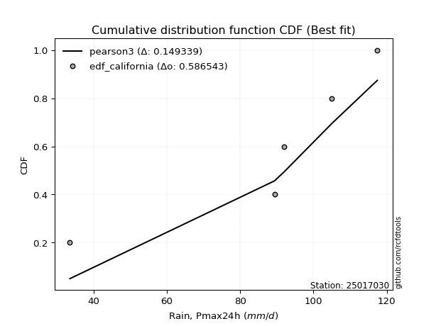</img>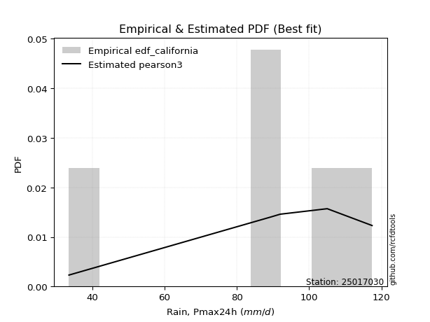</img>

</div>


### 2. EDF Hazen (1930)

Hazen method for plotting positions is a formula used to estimate the empirical cumulative probability distribution of flood events or other hydrological data. This formula often results in biased estimations, particularly when extrapolating to extreme events (high return periods).

<div align="center">


$P=(m-0.5)/n$


</div>


**2.1. Empirical values**

<div align="center">

|                | 0                   | 1                  | 2                  | 3                  | 4         | 5                  |
|:---------------|:--------------------|:-------------------|:-------------------|:-------------------|:----------|:-------------------|
| date           | 2025                | 2023               | 2022               | 2021               | 2019      | 2020               |
| x              | 3.8                 | 33.6               | 89.4               | 92.0               | 105.0     | 117.4              |
| m              | 1                   | 2                  | 3                  | 4                  | 5         | 6                  |
| empirical_dist | edf_hazen           | edf_hazen          | edf_hazen          | edf_hazen          | edf_hazen | edf_hazen          |
| empirical      | 0.08333333333333333 | 0.25               | 0.4166666666666667 | 0.5833333333333334 | 0.75      | 0.9166666666666666 |
| empirical_tr   | 1.090909090909091   | 1.3333333333333333 | 1.7142857142857144 | 2.4000000000000004 | 4.0       | 11.999999999999995 |

</div>


**2.2. Kolmogorov-Smirnov fit test (sorted by Δ)**


<div align="center">

|                | 0                   | 1                   | 2                   | 3                   | 4                   | 5                   | 6                   | 7                   | 8                   | 9                   | 10                  | 11                  | 12                  | 13                  | 14                  | 15                  | 16                  | 17                 | 18                  | 19                  | 20                  | 21                 | 22                  | 23                 | 24                  | 25                  | 26                  | 27                  | 28                 | 29               | 30                 | 31                 | 32                  | 33                  | 34                 | 35                  | 36                  | 37                  | 38                  | 39                | 40                | 41                  | 42                  | 43                  | 44                  | 45                 | 46                 | 47                  | 48                 | 49                 | 50                 | 51                 | 52                  | 53                 | 54                 | 55                | 56                  | 57                 | 58                 | 59                 | 60                 | 61                 | 62                  | 63                 | 64                 | 65                 | 66                 | 67                 | 68                 | 69                 | 70                  | 71                 | 72                 | 73                  | 74                 | 75                 | 76                | 77                 | 78                  | 79                  | 80                  | 81                 | 82                  | 83                 | 84                 | 85                 | 86                  | 87                 | 88                  | 89                  | 90                 | 91                  | 92                 | 93                | 94                 | 95                 | 96                  | 97                 | 98                  | 99                  | 100                 | 101                | 102                 | 103                | 104                | 105               | 106                 | 107                | 108                | 109                 | 110                 | 111               | 112                | 113                | 114                | 115                | 116                | 117                | 118                 | 119                | 120                 | 121                 | 122                | 123               | 124               | 125                | 126                | 127                | 128                | 129                | 130                | 131                 | 132                | 133                 | 134                | 135                | 136                | 137                | 138                 | 139                | 140                | 141                | 142                | 143                | 144                | 145                | 146                | 147                | 148                | 149                | 150                | 151                | 152                | 153                | 154                | 155            | 156            | 157            | 158                | 159                |
|:---------------|:--------------------|:--------------------|:--------------------|:--------------------|:--------------------|:--------------------|:--------------------|:--------------------|:--------------------|:--------------------|:--------------------|:--------------------|:--------------------|:--------------------|:--------------------|:--------------------|:--------------------|:-------------------|:--------------------|:--------------------|:--------------------|:-------------------|:--------------------|:-------------------|:--------------------|:--------------------|:--------------------|:--------------------|:-------------------|:-----------------|:-------------------|:-------------------|:--------------------|:--------------------|:-------------------|:--------------------|:--------------------|:--------------------|:--------------------|:------------------|:------------------|:--------------------|:--------------------|:--------------------|:--------------------|:-------------------|:-------------------|:--------------------|:-------------------|:-------------------|:-------------------|:-------------------|:--------------------|:-------------------|:-------------------|:------------------|:--------------------|:-------------------|:-------------------|:-------------------|:-------------------|:-------------------|:--------------------|:-------------------|:-------------------|:-------------------|:-------------------|:-------------------|:-------------------|:-------------------|:--------------------|:-------------------|:-------------------|:--------------------|:-------------------|:-------------------|:------------------|:-------------------|:--------------------|:--------------------|:--------------------|:-------------------|:--------------------|:-------------------|:-------------------|:-------------------|:--------------------|:-------------------|:--------------------|:--------------------|:-------------------|:--------------------|:-------------------|:------------------|:-------------------|:-------------------|:--------------------|:-------------------|:--------------------|:--------------------|:--------------------|:-------------------|:--------------------|:-------------------|:-------------------|:------------------|:--------------------|:-------------------|:-------------------|:--------------------|:--------------------|:------------------|:-------------------|:-------------------|:-------------------|:-------------------|:-------------------|:-------------------|:--------------------|:-------------------|:--------------------|:--------------------|:-------------------|:------------------|:------------------|:-------------------|:-------------------|:-------------------|:-------------------|:-------------------|:-------------------|:--------------------|:-------------------|:--------------------|:-------------------|:-------------------|:-------------------|:-------------------|:--------------------|:-------------------|:-------------------|:-------------------|:-------------------|:-------------------|:-------------------|:-------------------|:-------------------|:-------------------|:-------------------|:-------------------|:-------------------|:-------------------|:-------------------|:-------------------|:-------------------|:---------------|:---------------|:---------------|:-------------------|:-------------------|
| station        | 25017030            | 25017030            | 25017030            | 25017030            | 25017030            | 25017030            | 25017030            | 25017030            | 25017030            | 25017030            | 25017030            | 25017030            | 25017030            | 25017030            | 25017030            | 25017030            | 25017030            | 25017030           | 25017030            | 25017030            | 25017030            | 25017030           | 25017030            | 25017030           | 25017030            | 25017030            | 25017030            | 25017030            | 25017030           | 25017030         | 25017030           | 25017030           | 25017030            | 25017030            | 25017030           | 25017030            | 25017030            | 25017030            | 25017030            | 25017030          | 25017030          | 25017030            | 25017030            | 25017030            | 25017030            | 25017030           | 25017030           | 25017030            | 25017030           | 25017030           | 25017030           | 25017030           | 25017030            | 25017030           | 25017030           | 25017030          | 25017030            | 25017030           | 25017030           | 25017030           | 25017030           | 25017030           | 25017030            | 25017030           | 25017030           | 25017030           | 25017030           | 25017030           | 25017030           | 25017030           | 25017030            | 25017030           | 25017030           | 25017030            | 25017030           | 25017030           | 25017030          | 25017030           | 25017030            | 25017030            | 25017030            | 25017030           | 25017030            | 25017030           | 25017030           | 25017030           | 25017030            | 25017030           | 25017030            | 25017030            | 25017030           | 25017030            | 25017030           | 25017030          | 25017030           | 25017030           | 25017030            | 25017030           | 25017030            | 25017030            | 25017030            | 25017030           | 25017030            | 25017030           | 25017030           | 25017030          | 25017030            | 25017030           | 25017030           | 25017030            | 25017030            | 25017030          | 25017030           | 25017030           | 25017030           | 25017030           | 25017030           | 25017030           | 25017030            | 25017030           | 25017030            | 25017030            | 25017030           | 25017030          | 25017030          | 25017030           | 25017030           | 25017030           | 25017030           | 25017030           | 25017030           | 25017030            | 25017030           | 25017030            | 25017030           | 25017030           | 25017030           | 25017030           | 25017030            | 25017030           | 25017030           | 25017030           | 25017030           | 25017030           | 25017030           | 25017030           | 25017030           | 25017030           | 25017030           | 25017030           | 25017030           | 25017030           | 25017030           | 25017030           | 25017030           | 25017030       | 25017030       | 25017030       | 25017030           | 25017030           |
| empirical_dist | edf_hazen           | edf_hazen           | edf_hazen           | edf_hazen           | edf_hazen           | edf_hazen           | edf_hazen           | edf_hazen           | edf_hazen           | edf_hazen           | edf_hazen           | edf_hazen           | edf_hazen           | edf_hazen           | edf_hazen           | edf_hazen           | edf_hazen           | edf_hazen          | edf_hazen           | edf_hazen           | edf_hazen           | edf_hazen          | edf_hazen           | edf_hazen          | edf_hazen           | edf_hazen           | edf_hazen           | edf_hazen           | edf_hazen          | edf_hazen        | edf_hazen          | edf_hazen          | edf_hazen           | edf_hazen           | edf_hazen          | edf_hazen           | edf_hazen           | edf_hazen           | edf_hazen           | edf_hazen         | edf_hazen         | edf_hazen           | edf_hazen           | edf_hazen           | edf_hazen           | edf_hazen          | edf_hazen          | edf_hazen           | edf_hazen          | edf_hazen          | edf_hazen          | edf_hazen          | edf_hazen           | edf_hazen          | edf_hazen          | edf_hazen         | edf_hazen           | edf_hazen          | edf_hazen          | edf_hazen          | edf_hazen          | edf_hazen          | edf_hazen           | edf_hazen          | edf_hazen          | edf_hazen          | edf_hazen          | edf_hazen          | edf_hazen          | edf_hazen          | edf_hazen           | edf_hazen          | edf_hazen          | edf_hazen           | edf_hazen          | edf_hazen          | edf_hazen         | edf_hazen          | edf_hazen           | edf_hazen           | edf_hazen           | edf_hazen          | edf_hazen           | edf_hazen          | edf_hazen          | edf_hazen          | edf_hazen           | edf_hazen          | edf_hazen           | edf_hazen           | edf_hazen          | edf_hazen           | edf_hazen          | edf_hazen         | edf_hazen          | edf_hazen          | edf_hazen           | edf_hazen          | edf_hazen           | edf_hazen           | edf_hazen           | edf_hazen          | edf_hazen           | edf_hazen          | edf_hazen          | edf_hazen         | edf_hazen           | edf_hazen          | edf_hazen          | edf_hazen           | edf_hazen           | edf_hazen         | edf_hazen          | edf_hazen          | edf_hazen          | edf_hazen          | edf_hazen          | edf_hazen          | edf_hazen           | edf_hazen          | edf_hazen           | edf_hazen           | edf_hazen          | edf_hazen         | edf_hazen         | edf_hazen          | edf_hazen          | edf_hazen          | edf_hazen          | edf_hazen          | edf_hazen          | edf_hazen           | edf_hazen          | edf_hazen           | edf_hazen          | edf_hazen          | edf_hazen          | edf_hazen          | edf_hazen           | edf_hazen          | edf_hazen          | edf_hazen          | edf_hazen          | edf_hazen          | edf_hazen          | edf_hazen          | edf_hazen          | edf_hazen          | edf_hazen          | edf_hazen          | edf_hazen          | edf_hazen          | edf_hazen          | edf_hazen          | edf_hazen          | edf_hazen      | edf_hazen      | edf_hazen      | edf_hazen          | edf_hazen          |
| p_dist         | genextreme          | johnsonsu           | gausshyper          | loglevy_l           | genpareto           | argus               | genhalflogistic     | dweibull            | logt                | beta                | gennorm             | levy_l              | arcsine             | trapezoid           | loggennorm          | weibull_min         | gumbel_l            | ksone              | dgamma              | pearson3            | semicircular        | wrapcauchy         | logvonmises_line    | logtrapezoid       | anglit              | logpearson3         | logdgamma           | mielke              | skewnorm           | triang           | exponweib          | t                  | exponnorm           | crystalball         | norm               | nct                 | f                   | foldnorm            | gamma               | erlang            | betaprime         | loggumbel_l         | rice                | logsemicircular     | logarcsine          | logistic           | loganglit          | loginvweibull       | invgauss           | logweibull_max     | maxwell            | invgamma           | ncf                 | rayleigh           | halfgennorm        | hypsecant         | logwrapcauchy       | cosine             | gengamma           | logloglaplace      | kstwobign          | logdweibull        | logncf              | loggamma           | loggamma           | logf               | logbetaprime       | logrice            | lognorm            | logexponnorm       | lognct              | logfatiguelife     | logerlang          | logkstwobign        | loginvgamma        | logalpha           | lognakagami       | loginvgauss        | halfnorm            | loggompertz         | loggengamma         | logburr12          | lomax               | kappa4             | genexpon           | logfoldnorm        | logmaxwell          | loggenextreme      | gumbel_r            | laplace             | burr               | loggenexpon         | johnsonsb          | logargus          | loglogistic        | lograyleigh        | logcrystalball      | logburr            | logbeta             | halflogistic        | loghalfnorm         | loghypsecant       | moyal               | logloggamma        | truncweibull_min   | burr12            | logmielke           | logcosine          | loggumbel_r        | tukeylambda         | loglomax            | kappa3            | uniform            | loglaplace         | loglaplace         | loghalflogistic    | vonmises_line      | logmoyal           | bradford            | wald               | loggenpareto        | nakagami            | gompertz           | truncexpon        | logwald           | loggenhalflogistic | loggausshyper      | logksone           | logskewnorm        | truncnorm          | logjohnsonsb       | logtriang           | logweibull_min     | logexponweib        | logkappa4          | logkappa3          | loguniform         | invweibull         | logtruncweibull_min | fatiguelife        | logtruncnorm       | logbradford        | logtruncexpon      | alpha              | weibull_max        | powerlaw           | logjohnsonsu       | truncpareto        | logexponpow        | exponpow           | logpowerlaw        | logtruncpareto     | logtukeylambda     | rdist              | logrdist           | genlogistic    | loggenlogistic | loghalfgennorm | logvonmises        | vonmises           |
| delta          | 0.08432423868708128 | 0.09271196047263619 | 0.09451598742593487 | 0.09619123198812751 | 0.10077455487097672 | 0.15095653948029458 | 0.15539093087659878 | 0.15871424517076832 | 0.16695435549447113 | 0.16870869501974373 | 0.17117594101881445 | 0.17149271220047607 | 0.17211263154669748 | 0.17700952110635543 | 0.17722110481330697 | 0.18070163416761892 | 0.18683720381777197 | 0.1957266467553485 | 0.19705839494489613 | 0.19849378265931533 | 0.20647741860502405 | 0.2066490624194683 | 0.20778892038478464 | 0.2126212308115467 | 0.21485744097549558 | 0.21630925383374527 | 0.21988312370787677 | 0.22027488642162824 | 0.2233795415190854 | 0.22775101103016 | 0.2335828129192296 | 0.2348173577613149 | 0.23481895326226448 | 0.23482168904747397 | 0.2348216955434808 | 0.23486179342871744 | 0.23554734573092323 | 0.23946318176438303 | 0.23957349074855988 | 0.240099939500727 | 0.241865567427424 | 0.24194402782034802 | 0.24205066978758566 | 0.24273980332663975 | 0.24363173249562364 | 0.2528916374496328 | 0.2529512576608964 | 0.25372578636789717 | 0.2554859094775555 | 0.2556094189301946 | 0.2562978367280751 | 0.2568205241304972 | 0.25767222940732654 | 0.2627504379167969 | 0.2667638192293296 | 0.266893318083778 | 0.26802851310871567 | 0.2680406009904706 | 0.2685092880267052 | 0.2687258903004829 | 0.2708545370334801 | 0.2712140213108679 | 0.27491421557333745 | 0.2760022450056016 | 0.2760022450056016 | 0.2764164283739386 | 0.2764356439996643 | 0.2769916083723502 | 0.2769916458898853 | 0.2769931475582969 | 0.27701601151263505 | 0.2770490337325487 | 0.2773012319337897 | 0.27865311260836984 | 0.2789719450260289 | 0.2792518354382269 | 0.280678573082174 | 0.2810373414322251 | 0.28153464251125065 | 0.28210532577405784 | 0.28229831635229424 | 0.2833768736861633 | 0.28659335059476204 | 0.2876563944460571 | 0.2888336456073926 | 0.2904309163086702 | 0.29367120615344416 | 0.2944432534940467 | 0.29456028356693625 | 0.29503507552250346 | 0.2964239104876361 | 0.29660024280766467 | 0.2968650877051746 | 0.297829033856613 | 0.2980146931034852 | 0.2985635960794895 | 0.29947907413943414 | 0.3012401902576391 | 0.30654043042498164 | 0.30962880358673456 | 0.31332839756244407 | 0.3133498364629787 | 0.31431356519693027 | 0.3170683389134979 | 0.3184240375215291 | 0.319227767118052 | 0.31967544983275614 | 0.3260090942706307 | 0.3291192681972442 | 0.33082407490716764 | 0.33289432380862793 | 0.336716602388968 | 0.3368544600938967 | 0.3389673708584742 | 0.3389673708584742 | 0.3403575607387293 | 0.3429155758860341 | 0.3460203932044131 | 0.36388591313867596 | 0.3703340871116832 | 0.37974381473001567 | 0.38244113477125125 | 0.3843777527114503 | 0.393010970501704 | 0.395343236390375 | 0.4164197079078797 | 0.4259695505459891 | 0.4338144567066185 | 0.4390914691973918 | 0.4402843319545993 | 0.4442514803086217 | 0.46026164249508633 | 0.4655214498220892 | 0.48891794667265764 | 0.4991797373633902 | 0.5010194459483819 | 0.5039106813812757 | 0.5051050693982808 | 0.507395451174895   | 0.5102595706555847 | 0.5129085693496078 | 0.5248558827067724 | 0.5251966760172355 | 0.5322683133617048 | 0.5523564175908384 | 0.5762680260295939 | 0.6207425757996082 | 0.6299136715401301 | 0.6407338479168598 | 0.6714042064582767 | 0.6807386183254786 | 0.7099974116148656 | 0.7459705993463999 | 0.7499999997898517 | 0.7499999999895832 | 0.75           | 0.75           | 0.75           | 1.1263447928956916 | 18.795607271379836 |
| deltao         | 0.530385761606      | 0.530385761606      | 0.530385761606      | 0.530385761606      | 0.530385761606      | 0.530385761606      | 0.530385761606      | 0.530385761606      | 0.530385761606      | 0.530385761606      | 0.530385761606      | 0.530385761606      | 0.530385761606      | 0.530385761606      | 0.530385761606      | 0.530385761606      | 0.530385761606      | 0.530385761606     | 0.530385761606      | 0.530385761606      | 0.530385761606      | 0.530385761606     | 0.530385761606      | 0.530385761606     | 0.530385761606      | 0.530385761606      | 0.530385761606      | 0.530385761606      | 0.530385761606     | 0.530385761606   | 0.530385761606     | 0.530385761606     | 0.530385761606      | 0.530385761606      | 0.530385761606     | 0.530385761606      | 0.530385761606      | 0.530385761606      | 0.530385761606      | 0.530385761606    | 0.530385761606    | 0.530385761606      | 0.530385761606      | 0.530385761606      | 0.530385761606      | 0.530385761606     | 0.530385761606     | 0.530385761606      | 0.530385761606     | 0.530385761606     | 0.530385761606     | 0.530385761606     | 0.530385761606      | 0.530385761606     | 0.530385761606     | 0.530385761606    | 0.530385761606      | 0.530385761606     | 0.530385761606     | 0.530385761606     | 0.530385761606     | 0.530385761606     | 0.530385761606      | 0.530385761606     | 0.530385761606     | 0.530385761606     | 0.530385761606     | 0.530385761606     | 0.530385761606     | 0.530385761606     | 0.530385761606      | 0.530385761606     | 0.530385761606     | 0.530385761606      | 0.530385761606     | 0.530385761606     | 0.530385761606    | 0.530385761606     | 0.530385761606      | 0.530385761606      | 0.530385761606      | 0.530385761606     | 0.530385761606      | 0.530385761606     | 0.530385761606     | 0.530385761606     | 0.530385761606      | 0.530385761606     | 0.530385761606      | 0.530385761606      | 0.530385761606     | 0.530385761606      | 0.530385761606     | 0.530385761606    | 0.530385761606     | 0.530385761606     | 0.530385761606      | 0.530385761606     | 0.530385761606      | 0.530385761606      | 0.530385761606      | 0.530385761606     | 0.530385761606      | 0.530385761606     | 0.530385761606     | 0.530385761606    | 0.530385761606      | 0.530385761606     | 0.530385761606     | 0.530385761606      | 0.530385761606      | 0.530385761606    | 0.530385761606     | 0.530385761606     | 0.530385761606     | 0.530385761606     | 0.530385761606     | 0.530385761606     | 0.530385761606      | 0.530385761606     | 0.530385761606      | 0.530385761606      | 0.530385761606     | 0.530385761606    | 0.530385761606    | 0.530385761606     | 0.530385761606     | 0.530385761606     | 0.530385761606     | 0.530385761606     | 0.530385761606     | 0.530385761606      | 0.530385761606     | 0.530385761606      | 0.530385761606     | 0.530385761606     | 0.530385761606     | 0.530385761606     | 0.530385761606      | 0.530385761606     | 0.530385761606     | 0.530385761606     | 0.530385761606     | 0.530385761606     | 0.530385761606     | 0.530385761606     | 0.530385761606     | 0.530385761606     | 0.530385761606     | 0.530385761606     | 0.530385761606     | 0.530385761606     | 0.530385761606     | 0.530385761606     | 0.530385761606     | 0.530385761606 | 0.530385761606 | 0.530385761606 | 0.530385761606     | 0.530385761606     |
| eval           | Δo > Δ              | Δo > Δ              | Δo > Δ              | Δo > Δ              | Δo > Δ              | Δo > Δ              | Δo > Δ              | Δo > Δ              | Δo > Δ              | Δo > Δ              | Δo > Δ              | Δo > Δ              | Δo > Δ              | Δo > Δ              | Δo > Δ              | Δo > Δ              | Δo > Δ              | Δo > Δ             | Δo > Δ              | Δo > Δ              | Δo > Δ              | Δo > Δ             | Δo > Δ              | Δo > Δ             | Δo > Δ              | Δo > Δ              | Δo > Δ              | Δo > Δ              | Δo > Δ             | Δo > Δ           | Δo > Δ             | Δo > Δ             | Δo > Δ              | Δo > Δ              | Δo > Δ             | Δo > Δ              | Δo > Δ              | Δo > Δ              | Δo > Δ              | Δo > Δ            | Δo > Δ            | Δo > Δ              | Δo > Δ              | Δo > Δ              | Δo > Δ              | Δo > Δ             | Δo > Δ             | Δo > Δ              | Δo > Δ             | Δo > Δ             | Δo > Δ             | Δo > Δ             | Δo > Δ              | Δo > Δ             | Δo > Δ             | Δo > Δ            | Δo > Δ              | Δo > Δ             | Δo > Δ             | Δo > Δ             | Δo > Δ             | Δo > Δ             | Δo > Δ              | Δo > Δ             | Δo > Δ             | Δo > Δ             | Δo > Δ             | Δo > Δ             | Δo > Δ             | Δo > Δ             | Δo > Δ              | Δo > Δ             | Δo > Δ             | Δo > Δ              | Δo > Δ             | Δo > Δ             | Δo > Δ            | Δo > Δ             | Δo > Δ              | Δo > Δ              | Δo > Δ              | Δo > Δ             | Δo > Δ              | Δo > Δ             | Δo > Δ             | Δo > Δ             | Δo > Δ              | Δo > Δ             | Δo > Δ              | Δo > Δ              | Δo > Δ             | Δo > Δ              | Δo > Δ             | Δo > Δ            | Δo > Δ             | Δo > Δ             | Δo > Δ              | Δo > Δ             | Δo > Δ              | Δo > Δ              | Δo > Δ              | Δo > Δ             | Δo > Δ              | Δo > Δ             | Δo > Δ             | Δo > Δ            | Δo > Δ              | Δo > Δ             | Δo > Δ             | Δo > Δ              | Δo > Δ              | Δo > Δ            | Δo > Δ             | Δo > Δ             | Δo > Δ             | Δo > Δ             | Δo > Δ             | Δo > Δ             | Δo > Δ              | Δo > Δ             | Δo > Δ              | Δo > Δ              | Δo > Δ             | Δo > Δ            | Δo > Δ            | Δo > Δ             | Δo > Δ             | Δo > Δ             | Δo > Δ             | Δo > Δ             | Δo > Δ             | Δo > Δ              | Δo > Δ             | Δo > Δ              | Δo > Δ             | Δo > Δ             | Δo > Δ             | Δo > Δ             | Δo > Δ              | Δo > Δ             | Δo > Δ             | Δo > Δ             | Δo > Δ             | Δo <= Δ            | Δo <= Δ            | Δo <= Δ            | Δo <= Δ            | Δo <= Δ            | Δo <= Δ            | Δo <= Δ            | Δo <= Δ            | Δo <= Δ            | Δo <= Δ            | Δo <= Δ            | Δo <= Δ            | Δo <= Δ        | Δo <= Δ        | Δo <= Δ        | Δo <= Δ            | Δo <= Δ            |
| fit            | 1                   | 1                   | 1                   | 1                   | 1                   | 1                   | 1                   | 1                   | 1                   | 1                   | 1                   | 1                   | 1                   | 1                   | 1                   | 1                   | 1                   | 1                  | 1                   | 1                   | 1                   | 1                  | 1                   | 1                  | 1                   | 1                   | 1                   | 1                   | 1                  | 1                | 1                  | 1                  | 1                   | 1                   | 1                  | 1                   | 1                   | 1                   | 1                   | 1                 | 1                 | 1                   | 1                   | 1                   | 1                   | 1                  | 1                  | 1                   | 1                  | 1                  | 1                  | 1                  | 1                   | 1                  | 1                  | 1                 | 1                   | 1                  | 1                  | 1                  | 1                  | 1                  | 1                   | 1                  | 1                  | 1                  | 1                  | 1                  | 1                  | 1                  | 1                   | 1                  | 1                  | 1                   | 1                  | 1                  | 1                 | 1                  | 1                   | 1                   | 1                   | 1                  | 1                   | 1                  | 1                  | 1                  | 1                   | 1                  | 1                   | 1                   | 1                  | 1                   | 1                  | 1                 | 1                  | 1                  | 1                   | 1                  | 1                   | 1                   | 1                   | 1                  | 1                   | 1                  | 1                  | 1                 | 1                   | 1                  | 1                  | 1                   | 1                   | 1                 | 1                  | 1                  | 1                  | 1                  | 1                  | 1                  | 1                   | 1                  | 1                   | 1                   | 1                  | 1                 | 1                 | 1                  | 1                  | 1                  | 1                  | 1                  | 1                  | 1                   | 1                  | 1                   | 1                  | 1                  | 1                  | 1                  | 1                   | 1                  | 1                  | 1                  | 1                  | 0                  | 0                  | 0                  | 0                  | 0                  | 0                  | 0                  | 0                  | 0                  | 0                  | 0                  | 0                  | 0              | 0              | 0              | 0                  | 0                  |
| n              | 6                   | 6                   | 6                   | 6                   | 6                   | 6                   | 6                   | 6                   | 6                   | 6                   | 6                   | 6                   | 6                   | 6                   | 6                   | 6                   | 6                   | 6                  | 6                   | 6                   | 6                   | 6                  | 6                   | 6                  | 6                   | 6                   | 6                   | 6                   | 6                  | 6                | 6                  | 6                  | 6                   | 6                   | 6                  | 6                   | 6                   | 6                   | 6                   | 6                 | 6                 | 6                   | 6                   | 6                   | 6                   | 6                  | 6                  | 6                   | 6                  | 6                  | 6                  | 6                  | 6                   | 6                  | 6                  | 6                 | 6                   | 6                  | 6                  | 6                  | 6                  | 6                  | 6                   | 6                  | 6                  | 6                  | 6                  | 6                  | 6                  | 6                  | 6                   | 6                  | 6                  | 6                   | 6                  | 6                  | 6                 | 6                  | 6                   | 6                   | 6                   | 6                  | 6                   | 6                  | 6                  | 6                  | 6                   | 6                  | 6                   | 6                   | 6                  | 6                   | 6                  | 6                 | 6                  | 6                  | 6                   | 6                  | 6                   | 6                   | 6                   | 6                  | 6                   | 6                  | 6                  | 6                 | 6                   | 6                  | 6                  | 6                   | 6                   | 6                 | 6                  | 6                  | 6                  | 6                  | 6                  | 6                  | 6                   | 6                  | 6                   | 6                   | 6                  | 6                 | 6                 | 6                  | 6                  | 6                  | 6                  | 6                  | 6                  | 6                   | 6                  | 6                   | 6                  | 6                  | 6                  | 6                  | 6                   | 6                  | 6                  | 6                  | 6                  | 6                  | 6                  | 6                  | 6                  | 6                  | 6                  | 6                  | 6                  | 6                  | 6                  | 6                  | 6                  | 6              | 6              | 6              | 6                  | 6                  |
| best_fit       | 1                   | 0                   | 0                   | 0                   | 0                   | 0                   | 0                   | 0                   | 0                   | 0                   | 0                   | 0                   | 0                   | 0                   | 0                   | 0                   | 0                   | 0                  | 0                   | 0                   | 0                   | 0                  | 0                   | 0                  | 0                   | 0                   | 0                   | 0                   | 0                  | 0                | 0                  | 0                  | 0                   | 0                   | 0                  | 0                   | 0                   | 0                   | 0                   | 0                 | 0                 | 0                   | 0                   | 0                   | 0                   | 0                  | 0                  | 0                   | 0                  | 0                  | 0                  | 0                  | 0                   | 0                  | 0                  | 0                 | 0                   | 0                  | 0                  | 0                  | 0                  | 0                  | 0                   | 0                  | 0                  | 0                  | 0                  | 0                  | 0                  | 0                  | 0                   | 0                  | 0                  | 0                   | 0                  | 0                  | 0                 | 0                  | 0                   | 0                   | 0                   | 0                  | 0                   | 0                  | 0                  | 0                  | 0                   | 0                  | 0                   | 0                   | 0                  | 0                   | 0                  | 0                 | 0                  | 0                  | 0                   | 0                  | 0                   | 0                   | 0                   | 0                  | 0                   | 0                  | 0                  | 0                 | 0                   | 0                  | 0                  | 0                   | 0                   | 0                 | 0                  | 0                  | 0                  | 0                  | 0                  | 0                  | 0                   | 0                  | 0                   | 0                   | 0                  | 0                 | 0                 | 0                  | 0                  | 0                  | 0                  | 0                  | 0                  | 0                   | 0                  | 0                   | 0                  | 0                  | 0                  | 0                  | 0                   | 0                  | 0                  | 0                  | 0                  | 0                  | 0                  | 0                  | 0                  | 0                  | 0                  | 0                  | 0                  | 0                  | 0                  | 0                  | 0                  | 0              | 0              | 0              | 0                  | 0                  |
| best_fit_sort  | 1                   | 2                   | 3                   | 4                   | 5                   | 6                   | 7                   | 8                   | 9                   | 10                  | 11                  | 12                  | 13                  | 14                  | 15                  | 16                  | 17                  | 18                 | 19                  | 20                  | 21                  | 22                 | 23                  | 24                 | 25                  | 26                  | 27                  | 28                  | 29                 | 30               | 31                 | 32                 | 33                  | 34                  | 35                 | 36                  | 37                  | 38                  | 39                  | 40                | 41                | 42                  | 43                  | 44                  | 45                  | 46                 | 47                 | 48                  | 49                 | 50                 | 51                 | 52                 | 53                  | 54                 | 55                 | 56                | 57                  | 58                 | 59                 | 60                 | 61                 | 62                 | 63                  | 64                 | 65                 | 66                 | 67                 | 68                 | 69                 | 70                 | 71                  | 72                 | 73                 | 74                  | 75                 | 76                 | 77                | 78                 | 79                  | 80                  | 81                  | 82                 | 83                  | 84                 | 85                 | 86                 | 87                  | 88                 | 89                  | 90                  | 91                 | 92                  | 93                 | 94                | 95                 | 96                 | 97                  | 98                 | 99                  | 100                 | 101                 | 102                | 103                 | 104                | 105                | 106               | 107                 | 108                | 109                | 110                 | 111                 | 112               | 113                | 114                | 115                | 116                | 117                | 118                | 119                 | 120                | 121                 | 122                 | 123                | 124               | 125               | 126                | 127                | 128                | 129                | 130                | 131                | 132                 | 133                | 134                 | 135                | 136                | 137                | 138                | 139                 | 140                | 141                | 142                | 143                | 144                | 145                | 146                | 147                | 148                | 149                | 150                | 151                | 152                | 153                | 154                | 155                | 156            | 157            | 158            | 159                | 160                |

</div>


**2.3. Best fit**

<div align="center">

|   id |   station | empirical_dist   | p_dist     |     delta |   deltao | eval   |   fit |   n |   best_fit |   best_fit_sort |
|-----:|----------:|:-----------------|:-----------|----------:|---------:|:-------|------:|----:|-----------:|----------------:|
|    0 |  25017030 | edf_hazen        | genextreme | 0.0843242 | 0.530386 | Δo > Δ |     1 |   6 |          1 |               1 |

</div>


<div align="center">

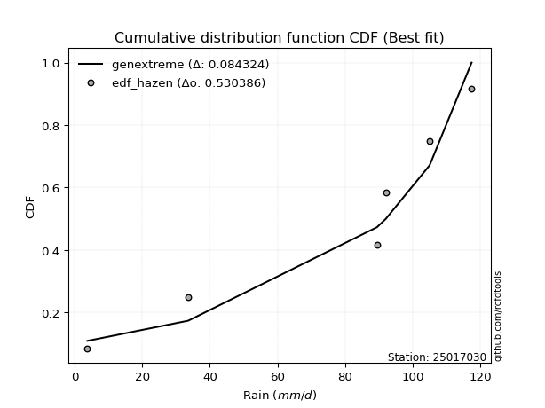</img></img>

</div>


### 3. EDF Weibull (1939)

Weibull plotting position formula is an empirical method used to estimate the non-exceedance probability or plotting position for a set of observed data, is often recommended or widely used in practice, particularly in flood frequency analysis.

<div align="center">


$P=m/(n+1)$


</div>


**3.1. Empirical values**

<div align="center">

|                | 0                   | 1                  | 2                   | 3                  | 4                  | 5                  |
|:---------------|:--------------------|:-------------------|:--------------------|:-------------------|:-------------------|:-------------------|
| date           | 2025                | 2023               | 2022                | 2021               | 2019               | 2020               |
| x              | 3.8                 | 33.6               | 89.4                | 92.0               | 105.0              | 117.4              |
| m              | 1                   | 2                  | 3                   | 4                  | 5                  | 6                  |
| empirical_dist | edf_weibull         | edf_weibull        | edf_weibull         | edf_weibull        | edf_weibull        | edf_weibull        |
| empirical      | 0.14285714285714285 | 0.2857142857142857 | 0.42857142857142855 | 0.5714285714285714 | 0.7142857142857143 | 0.8571428571428571 |
| empirical_tr   | 1.1666666666666665  | 1.4                | 1.75                | 2.333333333333333  | 3.5                | 6.999999999999997  |

</div>


**3.2. Kolmogorov-Smirnov fit test (sorted by Δ)**


<div align="center">

|                | 0                   | 1                   | 2                  | 3                   | 4                  | 5                   | 6                  | 7                  | 8                   | 9                   | 10                  | 11                  | 12                  | 13                 | 14                  | 15                  | 16                 | 17                  | 18                  | 19                 | 20                  | 21                  | 22                 | 23                  | 24                  | 25                 | 26                  | 27                  | 28                  | 29                  | 30                  | 31                  | 32                  | 33                  | 34                  | 35                  | 36                 | 37                  | 38                  | 39                  | 40                  | 41                  | 42                  | 43                  | 44                  | 45                 | 46                  | 47                  | 48                  | 49                  | 50                  | 51                 | 52                  | 53                  | 54                  | 55                  | 56                  | 57                  | 58                 | 59                  | 60                  | 61                  | 62                 | 63                 | 64                  | 65                  | 66                  | 67                  | 68                  | 69                 | 70                  | 71                 | 72                 | 73                  | 74                | 75                  | 76                  | 77                 | 78                 | 79                | 80                 | 81                  | 82                  | 83                 | 84                  | 85                  | 86                 | 87                 | 88                  | 89                 | 90                 | 91                 | 92                  | 93                 | 94                 | 95                  | 96                  | 97                  | 98                 | 99                  | 100                 | 101                | 102                | 103                 | 104                | 105                 | 106                 | 107                | 108                | 109                | 110                | 111                 | 112                 | 113                 | 114                 | 115                 | 116                 | 117                | 118                | 119                 | 120                | 121                | 122                 | 123                 | 124                 | 125                | 126               | 127                 | 128                 | 129                | 130                 | 131                | 132                | 133                 | 134                 | 135               | 136                 | 137                | 138                | 139                 | 140                 | 141               | 142                | 143                | 144                | 145                | 146                | 147                | 148                | 149               | 150                | 151                | 152                | 153               | 154                | 155                | 156                | 157                | 158                | 159                |
|:---------------|:--------------------|:--------------------|:-------------------|:--------------------|:-------------------|:--------------------|:-------------------|:-------------------|:--------------------|:--------------------|:--------------------|:--------------------|:--------------------|:-------------------|:--------------------|:--------------------|:-------------------|:--------------------|:--------------------|:-------------------|:--------------------|:--------------------|:-------------------|:--------------------|:--------------------|:-------------------|:--------------------|:--------------------|:--------------------|:--------------------|:--------------------|:--------------------|:--------------------|:--------------------|:--------------------|:--------------------|:-------------------|:--------------------|:--------------------|:--------------------|:--------------------|:--------------------|:--------------------|:--------------------|:--------------------|:-------------------|:--------------------|:--------------------|:--------------------|:--------------------|:--------------------|:-------------------|:--------------------|:--------------------|:--------------------|:--------------------|:--------------------|:--------------------|:-------------------|:--------------------|:--------------------|:--------------------|:-------------------|:-------------------|:--------------------|:--------------------|:--------------------|:--------------------|:--------------------|:-------------------|:--------------------|:-------------------|:-------------------|:--------------------|:------------------|:--------------------|:--------------------|:-------------------|:-------------------|:------------------|:-------------------|:--------------------|:--------------------|:-------------------|:--------------------|:--------------------|:-------------------|:-------------------|:--------------------|:-------------------|:-------------------|:-------------------|:--------------------|:-------------------|:-------------------|:--------------------|:--------------------|:--------------------|:-------------------|:--------------------|:--------------------|:-------------------|:-------------------|:--------------------|:-------------------|:--------------------|:--------------------|:-------------------|:-------------------|:-------------------|:-------------------|:--------------------|:--------------------|:--------------------|:--------------------|:--------------------|:--------------------|:-------------------|:-------------------|:--------------------|:-------------------|:-------------------|:--------------------|:--------------------|:--------------------|:-------------------|:------------------|:--------------------|:--------------------|:-------------------|:--------------------|:-------------------|:-------------------|:--------------------|:--------------------|:------------------|:--------------------|:-------------------|:-------------------|:--------------------|:--------------------|:------------------|:-------------------|:-------------------|:-------------------|:-------------------|:-------------------|:-------------------|:-------------------|:------------------|:-------------------|:-------------------|:-------------------|:------------------|:-------------------|:-------------------|:-------------------|:-------------------|:-------------------|:-------------------|
| station        | 25017030            | 25017030            | 25017030           | 25017030            | 25017030           | 25017030            | 25017030           | 25017030           | 25017030            | 25017030            | 25017030            | 25017030            | 25017030            | 25017030           | 25017030            | 25017030            | 25017030           | 25017030            | 25017030            | 25017030           | 25017030            | 25017030            | 25017030           | 25017030            | 25017030            | 25017030           | 25017030            | 25017030            | 25017030            | 25017030            | 25017030            | 25017030            | 25017030            | 25017030            | 25017030            | 25017030            | 25017030           | 25017030            | 25017030            | 25017030            | 25017030            | 25017030            | 25017030            | 25017030            | 25017030            | 25017030           | 25017030            | 25017030            | 25017030            | 25017030            | 25017030            | 25017030           | 25017030            | 25017030            | 25017030            | 25017030            | 25017030            | 25017030            | 25017030           | 25017030            | 25017030            | 25017030            | 25017030           | 25017030           | 25017030            | 25017030            | 25017030            | 25017030            | 25017030            | 25017030           | 25017030            | 25017030           | 25017030           | 25017030            | 25017030          | 25017030            | 25017030            | 25017030           | 25017030           | 25017030          | 25017030           | 25017030            | 25017030            | 25017030           | 25017030            | 25017030            | 25017030           | 25017030           | 25017030            | 25017030           | 25017030           | 25017030           | 25017030            | 25017030           | 25017030           | 25017030            | 25017030            | 25017030            | 25017030           | 25017030            | 25017030            | 25017030           | 25017030           | 25017030            | 25017030           | 25017030            | 25017030            | 25017030           | 25017030           | 25017030           | 25017030           | 25017030            | 25017030            | 25017030            | 25017030            | 25017030            | 25017030            | 25017030           | 25017030           | 25017030            | 25017030           | 25017030           | 25017030            | 25017030            | 25017030            | 25017030           | 25017030          | 25017030            | 25017030            | 25017030           | 25017030            | 25017030           | 25017030           | 25017030            | 25017030            | 25017030          | 25017030            | 25017030           | 25017030           | 25017030            | 25017030            | 25017030          | 25017030           | 25017030           | 25017030           | 25017030           | 25017030           | 25017030           | 25017030           | 25017030          | 25017030           | 25017030           | 25017030           | 25017030          | 25017030           | 25017030           | 25017030           | 25017030           | 25017030           | 25017030           |
| empirical_dist | edf_weibull         | edf_weibull         | edf_weibull        | edf_weibull         | edf_weibull        | edf_weibull         | edf_weibull        | edf_weibull        | edf_weibull         | edf_weibull         | edf_weibull         | edf_weibull         | edf_weibull         | edf_weibull        | edf_weibull         | edf_weibull         | edf_weibull        | edf_weibull         | edf_weibull         | edf_weibull        | edf_weibull         | edf_weibull         | edf_weibull        | edf_weibull         | edf_weibull         | edf_weibull        | edf_weibull         | edf_weibull         | edf_weibull         | edf_weibull         | edf_weibull         | edf_weibull         | edf_weibull         | edf_weibull         | edf_weibull         | edf_weibull         | edf_weibull        | edf_weibull         | edf_weibull         | edf_weibull         | edf_weibull         | edf_weibull         | edf_weibull         | edf_weibull         | edf_weibull         | edf_weibull        | edf_weibull         | edf_weibull         | edf_weibull         | edf_weibull         | edf_weibull         | edf_weibull        | edf_weibull         | edf_weibull         | edf_weibull         | edf_weibull         | edf_weibull         | edf_weibull         | edf_weibull        | edf_weibull         | edf_weibull         | edf_weibull         | edf_weibull        | edf_weibull        | edf_weibull         | edf_weibull         | edf_weibull         | edf_weibull         | edf_weibull         | edf_weibull        | edf_weibull         | edf_weibull        | edf_weibull        | edf_weibull         | edf_weibull       | edf_weibull         | edf_weibull         | edf_weibull        | edf_weibull        | edf_weibull       | edf_weibull        | edf_weibull         | edf_weibull         | edf_weibull        | edf_weibull         | edf_weibull         | edf_weibull        | edf_weibull        | edf_weibull         | edf_weibull        | edf_weibull        | edf_weibull        | edf_weibull         | edf_weibull        | edf_weibull        | edf_weibull         | edf_weibull         | edf_weibull         | edf_weibull        | edf_weibull         | edf_weibull         | edf_weibull        | edf_weibull        | edf_weibull         | edf_weibull        | edf_weibull         | edf_weibull         | edf_weibull        | edf_weibull        | edf_weibull        | edf_weibull        | edf_weibull         | edf_weibull         | edf_weibull         | edf_weibull         | edf_weibull         | edf_weibull         | edf_weibull        | edf_weibull        | edf_weibull         | edf_weibull        | edf_weibull        | edf_weibull         | edf_weibull         | edf_weibull         | edf_weibull        | edf_weibull       | edf_weibull         | edf_weibull         | edf_weibull        | edf_weibull         | edf_weibull        | edf_weibull        | edf_weibull         | edf_weibull         | edf_weibull       | edf_weibull         | edf_weibull        | edf_weibull        | edf_weibull         | edf_weibull         | edf_weibull       | edf_weibull        | edf_weibull        | edf_weibull        | edf_weibull        | edf_weibull        | edf_weibull        | edf_weibull        | edf_weibull       | edf_weibull        | edf_weibull        | edf_weibull        | edf_weibull       | edf_weibull        | edf_weibull        | edf_weibull        | edf_weibull        | edf_weibull        | edf_weibull        |
| p_dist         | loglevy_l           | levy_l              | johnsonsu          | beta                | genpareto          | genextreme          | gausshyper         | genhalflogistic    | argus               | arcsine             | logdgamma           | trapezoid           | weibull_min         | gumbel_l           | ksone               | pearson3            | logarcsine         | logtrapezoid        | dweibull            | semicircular       | wrapcauchy          | logvonmises_line    | logweibull_max     | logt                | anglit              | logpearson3        | gennorm             | mielke              | logloglaplace       | skewnorm            | logdweibull         | loggennorm          | triang              | exponweib           | t                   | exponnorm           | crystalball        | norm                | nct                 | f                   | foldnorm            | gamma               | erlang              | betaprime           | loggumbel_l         | rice               | logsemicircular     | logwrapcauchy       | dgamma              | logistic            | loganglit           | loginvweibull      | invgauss            | maxwell             | invgamma            | ncf                 | rayleigh            | halfgennorm         | hypsecant          | cosine              | gengamma            | kstwobign           | johnsonsb          | logncf             | loggamma            | loggamma            | logf                | logbetaprime        | logrice             | lognorm            | logexponnorm        | lognct             | logfatiguelife     | logerlang           | logkstwobign      | loginvgamma         | logalpha            | loginvgauss        | halfnorm           | loggompertz       | loggengamma        | logbeta             | logburr12           | lomax              | kappa4              | genexpon            | logfoldnorm        | logmaxwell         | loggenextreme       | gumbel_r           | laplace            | burr12             | burr                | loggenexpon        | lognakagami        | logargus            | loglogistic         | lograyleigh         | logcrystalball     | logburr             | loglomax            | halflogistic       | loghalfnorm        | loghypsecant        | moyal              | logloggamma         | truncweibull_min    | logmielke          | logcosine          | loggumbel_r        | tukeylambda        | kappa3              | uniform             | loglaplace          | loglaplace          | loghalflogistic     | vonmises_line       | logmoyal           | bradford           | wald                | loggenpareto       | nakagami           | gompertz            | truncexpon          | logwald             | loggenhalflogistic | logjohnsonsb      | loggausshyper       | logksone            | logskewnorm        | truncnorm           | logweibull_min     | invweibull         | logtriang           | logexponweib        | fatiguelife       | logkappa4           | logkappa3          | loguniform         | logtruncweibull_min | alpha               | logtruncnorm      | logbradford        | logtruncexpon      | weibull_max        | powerlaw           | logjohnsonsu       | truncpareto        | logexponpow        | exponpow          | logpowerlaw        | logtruncpareto     | logtukeylambda     | rdist             | logrdist           | genlogistic        | loggenlogistic     | loghalfgennorm     | logvonmises        | vonmises           |
| delta          | 0.10001279345163228 | 0.11196890267666654 | 0.1284262461869219 | 0.14276775360323546 | 0.1428571166765159 | 0.14285714285671747 | 0.1428571428753288 | 0.1434861689718369 | 0.15717723582273524 | 0.16020786964193562 | 0.16035931418406724 | 0.16510475920159356 | 0.16879687226285706 | 0.1749324419130101 | 0.18382188485058665 | 0.18658902075455347 | 0.1879602104956561 | 0.18920915297319246 | 0.19442853088505402 | 0.1945726567002622 | 0.19474430051470643 | 0.19588415848002277 | 0.1960856094063851 | 0.20266864120875683 | 0.20295267907073372 | 0.2044044919289834 | 0.20689022673310015 | 0.20837012451686637 | 0.20920208077667335 | 0.21147477961432354 | 0.21169021178705838 | 0.21293539052759267 | 0.21584624912539813 | 0.22167805101446775 | 0.22291259585655304 | 0.22291419135750262 | 0.2229169271427121 | 0.22291693363871895 | 0.22295703152395557 | 0.22364258382616137 | 0.22755841985962116 | 0.22766872884379802 | 0.22819517759596514 | 0.22996080552266213 | 0.23003926591558616 | 0.2301459078828238 | 0.23083504142187788 | 0.23231422739442997 | 0.23277268065918183 | 0.24098687554487092 | 0.24104649575613452 | 0.2418210244631353 | 0.24358114757279364 | 0.24439307482331324 | 0.24491576222573536 | 0.24576746750256467 | 0.25084567601203506 | 0.25485905732456776 | 0.2549885561790161 | 0.25613583908570875 | 0.25660452612194334 | 0.25894977512871825 | 0.2611508019908889 | 0.2630094536685756 | 0.26409748310083975 | 0.26409748310083975 | 0.26451166646917673 | 0.26453088209490244 | 0.26508684646758834 | 0.2650868839851234 | 0.26508838565353504 | 0.2651112496078732 | 0.2651442718277868 | 0.26539647002902783 | 0.266748350703608 | 0.26706718312126704 | 0.26734707353346504 | 0.2691325795274632 | 0.2696298806064888 | 0.270200563869296 | 0.2703935544475324 | 0.27082614471069594 | 0.27147211178140146 | 0.2746885886900002 | 0.27575163254129526 | 0.27692888370263075 | 0.2785261544039083 | 0.2817664442486823 | 0.28253849158928485 | 0.2826555216621744 | 0.2831303136177416 | 0.2835134814037663 | 0.28451914858287425 | 0.2846954809029028 | 0.2857142857124605 | 0.28592427195185116 | 0.28610993119872336 | 0.28665883417472765 | 0.2875743122346723 | 0.28933542835287723 | 0.29718003809434224 | 0.2977240416819727 | 0.3014236356576822 | 0.30144507455821684 | 0.3024088032921684 | 0.30516357700873603 | 0.30651927561676723 | 0.3077706879279943 | 0.3141043323658688 | 0.3172145062924823 | 0.3189193130024058 | 0.32481184048420614 | 0.32494969818913483 | 0.32706260895371236 | 0.32706260895371236 | 0.32845279883396744 | 0.33101081398127224 | 0.3341156312996512 | 0.3519811512339141 | 0.35842932520692133 | 0.3678390528252538 | 0.3705363728664894 | 0.37247299080668833 | 0.38110620859694216 | 0.38343847448561313 | 0.4045149460031178 | 0.408537194594336 | 0.41406478864122725 | 0.42190969480185664 | 0.4271867072926299 | 0.42837957004983745 | 0.4298071641078035 | 0.4455812598744713 | 0.44835688059032447 | 0.45320366095837195 | 0.474545284941299 | 0.48727497545862836 | 0.4891146840436201 | 0.4920059194765139 | 0.4954906892701331  | 0.49655402764741907 | 0.501003807444846 | 0.5129511208020106 | 0.5132919141124737 | 0.5166421318765526 | 0.5405537403153082 | 0.5850282900853225 | 0.5941993858258444 | 0.6050195622025741 | 0.635689920743991 | 0.6450243326111929 | 0.6742831259005799 | 0.7102563136321142 | 0.714285714075566 | 0.7142857142752975 | 0.7142857142857143 | 0.7142857142857143 | 0.7142857142857143 | 1.1144400309909297 | 18.855131080903647 |
| deltao         | 0.530385761606      | 0.530385761606      | 0.530385761606     | 0.530385761606      | 0.530385761606     | 0.530385761606      | 0.530385761606     | 0.530385761606     | 0.530385761606      | 0.530385761606      | 0.530385761606      | 0.530385761606      | 0.530385761606      | 0.530385761606     | 0.530385761606      | 0.530385761606      | 0.530385761606     | 0.530385761606      | 0.530385761606      | 0.530385761606     | 0.530385761606      | 0.530385761606      | 0.530385761606     | 0.530385761606      | 0.530385761606      | 0.530385761606     | 0.530385761606      | 0.530385761606      | 0.530385761606      | 0.530385761606      | 0.530385761606      | 0.530385761606      | 0.530385761606      | 0.530385761606      | 0.530385761606      | 0.530385761606      | 0.530385761606     | 0.530385761606      | 0.530385761606      | 0.530385761606      | 0.530385761606      | 0.530385761606      | 0.530385761606      | 0.530385761606      | 0.530385761606      | 0.530385761606     | 0.530385761606      | 0.530385761606      | 0.530385761606      | 0.530385761606      | 0.530385761606      | 0.530385761606     | 0.530385761606      | 0.530385761606      | 0.530385761606      | 0.530385761606      | 0.530385761606      | 0.530385761606      | 0.530385761606     | 0.530385761606      | 0.530385761606      | 0.530385761606      | 0.530385761606     | 0.530385761606     | 0.530385761606      | 0.530385761606      | 0.530385761606      | 0.530385761606      | 0.530385761606      | 0.530385761606     | 0.530385761606      | 0.530385761606     | 0.530385761606     | 0.530385761606      | 0.530385761606    | 0.530385761606      | 0.530385761606      | 0.530385761606     | 0.530385761606     | 0.530385761606    | 0.530385761606     | 0.530385761606      | 0.530385761606      | 0.530385761606     | 0.530385761606      | 0.530385761606      | 0.530385761606     | 0.530385761606     | 0.530385761606      | 0.530385761606     | 0.530385761606     | 0.530385761606     | 0.530385761606      | 0.530385761606     | 0.530385761606     | 0.530385761606      | 0.530385761606      | 0.530385761606      | 0.530385761606     | 0.530385761606      | 0.530385761606      | 0.530385761606     | 0.530385761606     | 0.530385761606      | 0.530385761606     | 0.530385761606      | 0.530385761606      | 0.530385761606     | 0.530385761606     | 0.530385761606     | 0.530385761606     | 0.530385761606      | 0.530385761606      | 0.530385761606      | 0.530385761606      | 0.530385761606      | 0.530385761606      | 0.530385761606     | 0.530385761606     | 0.530385761606      | 0.530385761606     | 0.530385761606     | 0.530385761606      | 0.530385761606      | 0.530385761606      | 0.530385761606     | 0.530385761606    | 0.530385761606      | 0.530385761606      | 0.530385761606     | 0.530385761606      | 0.530385761606     | 0.530385761606     | 0.530385761606      | 0.530385761606      | 0.530385761606    | 0.530385761606      | 0.530385761606     | 0.530385761606     | 0.530385761606      | 0.530385761606      | 0.530385761606    | 0.530385761606     | 0.530385761606     | 0.530385761606     | 0.530385761606     | 0.530385761606     | 0.530385761606     | 0.530385761606     | 0.530385761606    | 0.530385761606     | 0.530385761606     | 0.530385761606     | 0.530385761606    | 0.530385761606     | 0.530385761606     | 0.530385761606     | 0.530385761606     | 0.530385761606     | 0.530385761606     |
| eval           | Δo > Δ              | Δo > Δ              | Δo > Δ             | Δo > Δ              | Δo > Δ             | Δo > Δ              | Δo > Δ             | Δo > Δ             | Δo > Δ              | Δo > Δ              | Δo > Δ              | Δo > Δ              | Δo > Δ              | Δo > Δ             | Δo > Δ              | Δo > Δ              | Δo > Δ             | Δo > Δ              | Δo > Δ              | Δo > Δ             | Δo > Δ              | Δo > Δ              | Δo > Δ             | Δo > Δ              | Δo > Δ              | Δo > Δ             | Δo > Δ              | Δo > Δ              | Δo > Δ              | Δo > Δ              | Δo > Δ              | Δo > Δ              | Δo > Δ              | Δo > Δ              | Δo > Δ              | Δo > Δ              | Δo > Δ             | Δo > Δ              | Δo > Δ              | Δo > Δ              | Δo > Δ              | Δo > Δ              | Δo > Δ              | Δo > Δ              | Δo > Δ              | Δo > Δ             | Δo > Δ              | Δo > Δ              | Δo > Δ              | Δo > Δ              | Δo > Δ              | Δo > Δ             | Δo > Δ              | Δo > Δ              | Δo > Δ              | Δo > Δ              | Δo > Δ              | Δo > Δ              | Δo > Δ             | Δo > Δ              | Δo > Δ              | Δo > Δ              | Δo > Δ             | Δo > Δ             | Δo > Δ              | Δo > Δ              | Δo > Δ              | Δo > Δ              | Δo > Δ              | Δo > Δ             | Δo > Δ              | Δo > Δ             | Δo > Δ             | Δo > Δ              | Δo > Δ            | Δo > Δ              | Δo > Δ              | Δo > Δ             | Δo > Δ             | Δo > Δ            | Δo > Δ             | Δo > Δ              | Δo > Δ              | Δo > Δ             | Δo > Δ              | Δo > Δ              | Δo > Δ             | Δo > Δ             | Δo > Δ              | Δo > Δ             | Δo > Δ             | Δo > Δ             | Δo > Δ              | Δo > Δ             | Δo > Δ             | Δo > Δ              | Δo > Δ              | Δo > Δ              | Δo > Δ             | Δo > Δ              | Δo > Δ              | Δo > Δ             | Δo > Δ             | Δo > Δ              | Δo > Δ             | Δo > Δ              | Δo > Δ              | Δo > Δ             | Δo > Δ             | Δo > Δ             | Δo > Δ             | Δo > Δ              | Δo > Δ              | Δo > Δ              | Δo > Δ              | Δo > Δ              | Δo > Δ              | Δo > Δ             | Δo > Δ             | Δo > Δ              | Δo > Δ             | Δo > Δ             | Δo > Δ              | Δo > Δ              | Δo > Δ              | Δo > Δ             | Δo > Δ            | Δo > Δ              | Δo > Δ              | Δo > Δ             | Δo > Δ              | Δo > Δ             | Δo > Δ             | Δo > Δ              | Δo > Δ              | Δo > Δ            | Δo > Δ              | Δo > Δ             | Δo > Δ             | Δo > Δ              | Δo > Δ              | Δo > Δ            | Δo > Δ             | Δo > Δ             | Δo > Δ             | Δo <= Δ            | Δo <= Δ            | Δo <= Δ            | Δo <= Δ            | Δo <= Δ           | Δo <= Δ            | Δo <= Δ            | Δo <= Δ            | Δo <= Δ           | Δo <= Δ            | Δo <= Δ            | Δo <= Δ            | Δo <= Δ            | Δo <= Δ            | Δo <= Δ            |
| fit            | 1                   | 1                   | 1                  | 1                   | 1                  | 1                   | 1                  | 1                  | 1                   | 1                   | 1                   | 1                   | 1                   | 1                  | 1                   | 1                   | 1                  | 1                   | 1                   | 1                  | 1                   | 1                   | 1                  | 1                   | 1                   | 1                  | 1                   | 1                   | 1                   | 1                   | 1                   | 1                   | 1                   | 1                   | 1                   | 1                   | 1                  | 1                   | 1                   | 1                   | 1                   | 1                   | 1                   | 1                   | 1                   | 1                  | 1                   | 1                   | 1                   | 1                   | 1                   | 1                  | 1                   | 1                   | 1                   | 1                   | 1                   | 1                   | 1                  | 1                   | 1                   | 1                   | 1                  | 1                  | 1                   | 1                   | 1                   | 1                   | 1                   | 1                  | 1                   | 1                  | 1                  | 1                   | 1                 | 1                   | 1                   | 1                  | 1                  | 1                 | 1                  | 1                   | 1                   | 1                  | 1                   | 1                   | 1                  | 1                  | 1                   | 1                  | 1                  | 1                  | 1                   | 1                  | 1                  | 1                   | 1                   | 1                   | 1                  | 1                   | 1                   | 1                  | 1                  | 1                   | 1                  | 1                   | 1                   | 1                  | 1                  | 1                  | 1                  | 1                   | 1                   | 1                   | 1                   | 1                   | 1                   | 1                  | 1                  | 1                   | 1                  | 1                  | 1                   | 1                   | 1                   | 1                  | 1                 | 1                   | 1                   | 1                  | 1                   | 1                  | 1                  | 1                   | 1                   | 1                 | 1                   | 1                  | 1                  | 1                   | 1                   | 1                 | 1                  | 1                  | 1                  | 0                  | 0                  | 0                  | 0                  | 0                 | 0                  | 0                  | 0                  | 0                 | 0                  | 0                  | 0                  | 0                  | 0                  | 0                  |
| n              | 6                   | 6                   | 6                  | 6                   | 6                  | 6                   | 6                  | 6                  | 6                   | 6                   | 6                   | 6                   | 6                   | 6                  | 6                   | 6                   | 6                  | 6                   | 6                   | 6                  | 6                   | 6                   | 6                  | 6                   | 6                   | 6                  | 6                   | 6                   | 6                   | 6                   | 6                   | 6                   | 6                   | 6                   | 6                   | 6                   | 6                  | 6                   | 6                   | 6                   | 6                   | 6                   | 6                   | 6                   | 6                   | 6                  | 6                   | 6                   | 6                   | 6                   | 6                   | 6                  | 6                   | 6                   | 6                   | 6                   | 6                   | 6                   | 6                  | 6                   | 6                   | 6                   | 6                  | 6                  | 6                   | 6                   | 6                   | 6                   | 6                   | 6                  | 6                   | 6                  | 6                  | 6                   | 6                 | 6                   | 6                   | 6                  | 6                  | 6                 | 6                  | 6                   | 6                   | 6                  | 6                   | 6                   | 6                  | 6                  | 6                   | 6                  | 6                  | 6                  | 6                   | 6                  | 6                  | 6                   | 6                   | 6                   | 6                  | 6                   | 6                   | 6                  | 6                  | 6                   | 6                  | 6                   | 6                   | 6                  | 6                  | 6                  | 6                  | 6                   | 6                   | 6                   | 6                   | 6                   | 6                   | 6                  | 6                  | 6                   | 6                  | 6                  | 6                   | 6                   | 6                   | 6                  | 6                 | 6                   | 6                   | 6                  | 6                   | 6                  | 6                  | 6                   | 6                   | 6                 | 6                   | 6                  | 6                  | 6                   | 6                   | 6                 | 6                  | 6                  | 6                  | 6                  | 6                  | 6                  | 6                  | 6                 | 6                  | 6                  | 6                  | 6                 | 6                  | 6                  | 6                  | 6                  | 6                  | 6                  |
| best_fit       | 1                   | 0                   | 0                  | 0                   | 0                  | 0                   | 0                  | 0                  | 0                   | 0                   | 0                   | 0                   | 0                   | 0                  | 0                   | 0                   | 0                  | 0                   | 0                   | 0                  | 0                   | 0                   | 0                  | 0                   | 0                   | 0                  | 0                   | 0                   | 0                   | 0                   | 0                   | 0                   | 0                   | 0                   | 0                   | 0                   | 0                  | 0                   | 0                   | 0                   | 0                   | 0                   | 0                   | 0                   | 0                   | 0                  | 0                   | 0                   | 0                   | 0                   | 0                   | 0                  | 0                   | 0                   | 0                   | 0                   | 0                   | 0                   | 0                  | 0                   | 0                   | 0                   | 0                  | 0                  | 0                   | 0                   | 0                   | 0                   | 0                   | 0                  | 0                   | 0                  | 0                  | 0                   | 0                 | 0                   | 0                   | 0                  | 0                  | 0                 | 0                  | 0                   | 0                   | 0                  | 0                   | 0                   | 0                  | 0                  | 0                   | 0                  | 0                  | 0                  | 0                   | 0                  | 0                  | 0                   | 0                   | 0                   | 0                  | 0                   | 0                   | 0                  | 0                  | 0                   | 0                  | 0                   | 0                   | 0                  | 0                  | 0                  | 0                  | 0                   | 0                   | 0                   | 0                   | 0                   | 0                   | 0                  | 0                  | 0                   | 0                  | 0                  | 0                   | 0                   | 0                   | 0                  | 0                 | 0                   | 0                   | 0                  | 0                   | 0                  | 0                  | 0                   | 0                   | 0                 | 0                   | 0                  | 0                  | 0                   | 0                   | 0                 | 0                  | 0                  | 0                  | 0                  | 0                  | 0                  | 0                  | 0                 | 0                  | 0                  | 0                  | 0                 | 0                  | 0                  | 0                  | 0                  | 0                  | 0                  |
| best_fit_sort  | 1                   | 2                   | 3                  | 4                   | 5                  | 6                   | 7                  | 8                  | 9                   | 10                  | 11                  | 12                  | 13                  | 14                 | 15                  | 16                  | 17                 | 18                  | 19                  | 20                 | 21                  | 22                  | 23                 | 24                  | 25                  | 26                 | 27                  | 28                  | 29                  | 30                  | 31                  | 32                  | 33                  | 34                  | 35                  | 36                  | 37                 | 38                  | 39                  | 40                  | 41                  | 42                  | 43                  | 44                  | 45                  | 46                 | 47                  | 48                  | 49                  | 50                  | 51                  | 52                 | 53                  | 54                  | 55                  | 56                  | 57                  | 58                  | 59                 | 60                  | 61                  | 62                  | 63                 | 64                 | 65                  | 66                  | 67                  | 68                  | 69                  | 70                 | 71                  | 72                 | 73                 | 74                  | 75                | 76                  | 77                  | 78                 | 79                 | 80                | 81                 | 82                  | 83                  | 84                 | 85                  | 86                  | 87                 | 88                 | 89                  | 90                 | 91                 | 92                 | 93                  | 94                 | 95                 | 96                  | 97                  | 98                  | 99                 | 100                 | 101                 | 102                | 103                | 104                 | 105                | 106                 | 107                 | 108                | 109                | 110                | 111                | 112                 | 113                 | 114                 | 115                 | 116                 | 117                 | 118                | 119                | 120                 | 121                | 122                | 123                 | 124                 | 125                 | 126                | 127               | 128                 | 129                 | 130                | 131                 | 132                | 133                | 134                 | 135                 | 136               | 137                 | 138                | 139                | 140                 | 141                 | 142               | 143                | 144                | 145                | 146                | 147                | 148                | 149                | 150               | 151                | 152                | 153                | 154               | 155                | 156                | 157                | 158                | 159                | 160                |

</div>


**3.3. Best fit**

<div align="center">

|   id |   station | empirical_dist   | p_dist    |    delta |   deltao | eval   |   fit |   n |   best_fit |   best_fit_sort |
|-----:|----------:|:-----------------|:----------|---------:|---------:|:-------|------:|----:|-----------:|----------------:|
|    0 |  25017030 | edf_weibull      | loglevy_l | 0.100013 | 0.530386 | Δo > Δ |     1 |   6 |          1 |               1 |

</div>


<div align="center">

</img></img>

</div>


### 4. EDF Beard (1943)

The Beard formula (or Beard´s plotting position formula) in hydrology is used to estimate the empirical non-exceedance probability _(P)_ of a flood event (or other extreme hydrological data point) within a given dataset.

<div align="center">


$P=(m-0.31)/(n+0.38)$


</div>


**4.1. Empirical values**

<div align="center">

|                | 0                   | 1                   | 2                  | 3                  | 4                  | 5                  |
|:---------------|:--------------------|:--------------------|:-------------------|:-------------------|:-------------------|:-------------------|
| date           | 2025                | 2023                | 2022               | 2021               | 2019               | 2020               |
| x              | 3.8                 | 33.6                | 89.4               | 92.0               | 105.0              | 117.4              |
| m              | 1                   | 2                   | 3                  | 4                  | 5                  | 6                  |
| empirical_dist | edf_beard           | edf_beard           | edf_beard          | edf_beard          | edf_beard          | edf_beard          |
| empirical      | 0.10815047021943573 | 0.26489028213166144 | 0.4216300940438871 | 0.5783699059561128 | 0.7351097178683387 | 0.8918495297805643 |
| empirical_tr   | 1.1212653778558874  | 1.3603411513859276  | 1.7289972899728996 | 2.3717472118959106 | 3.7751479289940844 | 9.246376811594207  |

</div>


**4.2. Kolmogorov-Smirnov fit test (sorted by Δ)**


<div align="center">

|                | 0                   | 1                   | 2                   | 3                   | 4                   | 5                   | 6                   | 7                   | 8                  | 9                   | 10                  | 11                  | 12                  | 13                  | 14                  | 15                  | 16                  | 17                 | 18                 | 19                  | 20                  | 21                 | 22                  | 23                 | 24                  | 25                  | 26                  | 27                 | 28                  | 29                  | 30                  | 31                  | 32                  | 33                  | 34                  | 35                  | 36                | 37                 | 38                 | 39                  | 40                  | 41                  | 42                  | 43                  | 44                  | 45                 | 46                  | 47                 | 48                  | 49                  | 50                  | 51                  | 52                  | 53                 | 54                 | 55                  | 56                 | 57                 | 58                  | 59                  | 60                  | 61                  | 62                | 63                  | 64                  | 65                  | 66                  | 67                  | 68                  | 69                  | 70                 | 71                  | 72                  | 73                 | 74                  | 75                  | 76                  | 77                  | 78                 | 79                 | 80                 | 81                 | 82                 | 83                 | 84                 | 85                  | 86                  | 87                 | 88                  | 89                 | 90                | 91                  | 92                  | 93                 | 94                 | 95                 | 96                  | 97                 | 98                  | 99                  | 100                | 101                 | 102                 | 103                | 104                 | 105                 | 106                | 107                | 108                 | 109                 | 110                | 111                 | 112                 | 113                | 114                | 115                 | 116                 | 117                 | 118                | 119                 | 120                 | 121                | 122                 | 123                | 124                 | 125                 | 126                | 127                 | 128                | 129                 | 130                | 131                 | 132                | 133                | 134                | 135                | 136                 | 137                | 138                | 139                 | 140                | 141                | 142                | 143               | 144               | 145                | 146                | 147                | 148                | 149                | 150                | 151                | 152                | 153                | 154                | 155                | 156                | 157                | 158                | 159               |
|:---------------|:--------------------|:--------------------|:--------------------|:--------------------|:--------------------|:--------------------|:--------------------|:--------------------|:-------------------|:--------------------|:--------------------|:--------------------|:--------------------|:--------------------|:--------------------|:--------------------|:--------------------|:-------------------|:-------------------|:--------------------|:--------------------|:-------------------|:--------------------|:-------------------|:--------------------|:--------------------|:--------------------|:-------------------|:--------------------|:--------------------|:--------------------|:--------------------|:--------------------|:--------------------|:--------------------|:--------------------|:------------------|:-------------------|:-------------------|:--------------------|:--------------------|:--------------------|:--------------------|:--------------------|:--------------------|:-------------------|:--------------------|:-------------------|:--------------------|:--------------------|:--------------------|:--------------------|:--------------------|:-------------------|:-------------------|:--------------------|:-------------------|:-------------------|:--------------------|:--------------------|:--------------------|:--------------------|:------------------|:--------------------|:--------------------|:--------------------|:--------------------|:--------------------|:--------------------|:--------------------|:-------------------|:--------------------|:--------------------|:-------------------|:--------------------|:--------------------|:--------------------|:--------------------|:-------------------|:-------------------|:-------------------|:-------------------|:-------------------|:-------------------|:-------------------|:--------------------|:--------------------|:-------------------|:--------------------|:-------------------|:------------------|:--------------------|:--------------------|:-------------------|:-------------------|:-------------------|:--------------------|:-------------------|:--------------------|:--------------------|:-------------------|:--------------------|:--------------------|:-------------------|:--------------------|:--------------------|:-------------------|:-------------------|:--------------------|:--------------------|:-------------------|:--------------------|:--------------------|:-------------------|:-------------------|:--------------------|:--------------------|:--------------------|:-------------------|:--------------------|:--------------------|:-------------------|:--------------------|:-------------------|:--------------------|:--------------------|:-------------------|:--------------------|:-------------------|:--------------------|:-------------------|:--------------------|:-------------------|:-------------------|:-------------------|:-------------------|:--------------------|:-------------------|:-------------------|:--------------------|:-------------------|:-------------------|:-------------------|:------------------|:------------------|:-------------------|:-------------------|:-------------------|:-------------------|:-------------------|:-------------------|:-------------------|:-------------------|:-------------------|:-------------------|:-------------------|:-------------------|:-------------------|:-------------------|:------------------|
| station        | 25017030            | 25017030            | 25017030            | 25017030            | 25017030            | 25017030            | 25017030            | 25017030            | 25017030           | 25017030            | 25017030            | 25017030            | 25017030            | 25017030            | 25017030            | 25017030            | 25017030            | 25017030           | 25017030           | 25017030            | 25017030            | 25017030           | 25017030            | 25017030           | 25017030            | 25017030            | 25017030            | 25017030           | 25017030            | 25017030            | 25017030            | 25017030            | 25017030            | 25017030            | 25017030            | 25017030            | 25017030          | 25017030           | 25017030           | 25017030            | 25017030            | 25017030            | 25017030            | 25017030            | 25017030            | 25017030           | 25017030            | 25017030           | 25017030            | 25017030            | 25017030            | 25017030            | 25017030            | 25017030           | 25017030           | 25017030            | 25017030           | 25017030           | 25017030            | 25017030            | 25017030            | 25017030            | 25017030          | 25017030            | 25017030            | 25017030            | 25017030            | 25017030            | 25017030            | 25017030            | 25017030           | 25017030            | 25017030            | 25017030           | 25017030            | 25017030            | 25017030            | 25017030            | 25017030           | 25017030           | 25017030           | 25017030           | 25017030           | 25017030           | 25017030           | 25017030            | 25017030            | 25017030           | 25017030            | 25017030           | 25017030          | 25017030            | 25017030            | 25017030           | 25017030           | 25017030           | 25017030            | 25017030           | 25017030            | 25017030            | 25017030           | 25017030            | 25017030            | 25017030           | 25017030            | 25017030            | 25017030           | 25017030           | 25017030            | 25017030            | 25017030           | 25017030            | 25017030            | 25017030           | 25017030           | 25017030            | 25017030            | 25017030            | 25017030           | 25017030            | 25017030            | 25017030           | 25017030            | 25017030           | 25017030            | 25017030            | 25017030           | 25017030            | 25017030           | 25017030            | 25017030           | 25017030            | 25017030           | 25017030           | 25017030           | 25017030           | 25017030            | 25017030           | 25017030           | 25017030            | 25017030           | 25017030           | 25017030           | 25017030          | 25017030          | 25017030           | 25017030           | 25017030           | 25017030           | 25017030           | 25017030           | 25017030           | 25017030           | 25017030           | 25017030           | 25017030           | 25017030           | 25017030           | 25017030           | 25017030          |
| empirical_dist | edf_beard           | edf_beard           | edf_beard           | edf_beard           | edf_beard           | edf_beard           | edf_beard           | edf_beard           | edf_beard          | edf_beard           | edf_beard           | edf_beard           | edf_beard           | edf_beard           | edf_beard           | edf_beard           | edf_beard           | edf_beard          | edf_beard          | edf_beard           | edf_beard           | edf_beard          | edf_beard           | edf_beard          | edf_beard           | edf_beard           | edf_beard           | edf_beard          | edf_beard           | edf_beard           | edf_beard           | edf_beard           | edf_beard           | edf_beard           | edf_beard           | edf_beard           | edf_beard         | edf_beard          | edf_beard          | edf_beard           | edf_beard           | edf_beard           | edf_beard           | edf_beard           | edf_beard           | edf_beard          | edf_beard           | edf_beard          | edf_beard           | edf_beard           | edf_beard           | edf_beard           | edf_beard           | edf_beard          | edf_beard          | edf_beard           | edf_beard          | edf_beard          | edf_beard           | edf_beard           | edf_beard           | edf_beard           | edf_beard         | edf_beard           | edf_beard           | edf_beard           | edf_beard           | edf_beard           | edf_beard           | edf_beard           | edf_beard          | edf_beard           | edf_beard           | edf_beard          | edf_beard           | edf_beard           | edf_beard           | edf_beard           | edf_beard          | edf_beard          | edf_beard          | edf_beard          | edf_beard          | edf_beard          | edf_beard          | edf_beard           | edf_beard           | edf_beard          | edf_beard           | edf_beard          | edf_beard         | edf_beard           | edf_beard           | edf_beard          | edf_beard          | edf_beard          | edf_beard           | edf_beard          | edf_beard           | edf_beard           | edf_beard          | edf_beard           | edf_beard           | edf_beard          | edf_beard           | edf_beard           | edf_beard          | edf_beard          | edf_beard           | edf_beard           | edf_beard          | edf_beard           | edf_beard           | edf_beard          | edf_beard          | edf_beard           | edf_beard           | edf_beard           | edf_beard          | edf_beard           | edf_beard           | edf_beard          | edf_beard           | edf_beard          | edf_beard           | edf_beard           | edf_beard          | edf_beard           | edf_beard          | edf_beard           | edf_beard          | edf_beard           | edf_beard          | edf_beard          | edf_beard          | edf_beard          | edf_beard           | edf_beard          | edf_beard          | edf_beard           | edf_beard          | edf_beard          | edf_beard          | edf_beard         | edf_beard         | edf_beard          | edf_beard          | edf_beard          | edf_beard          | edf_beard          | edf_beard          | edf_beard          | edf_beard          | edf_beard          | edf_beard          | edf_beard          | edf_beard          | edf_beard          | edf_beard          | edf_beard         |
| p_dist         | loglevy_l           | johnsonsu           | genextreme          | gausshyper          | genpareto           | argus               | levy_l              | genhalflogistic     | beta               | arcsine             | trapezoid           | dweibull            | weibull_min         | logt                | gumbel_l            | gennorm             | ksone               | loggennorm         | pearson3           | logdgamma           | logtrapezoid        | semicircular       | wrapcauchy          | logvonmises_line   | anglit              | logpearson3         | dgamma              | mielke             | skewnorm            | logarcsine          | triang              | exponweib           | t                   | exponnorm           | crystalball         | norm                | nct               | f                  | logweibull_max     | foldnorm            | gamma               | erlang              | betaprime           | loggumbel_l         | rice                | logsemicircular    | logloglaplace       | logdweibull        | logistic            | loganglit           | loginvweibull       | invgauss            | maxwell             | invgamma           | ncf                | logwrapcauchy       | rayleigh           | halfgennorm        | hypsecant           | cosine              | gengamma            | kstwobign           | logncf            | loggamma            | loggamma            | logf                | logbetaprime        | logrice             | lognorm             | logexponnorm        | lognct             | logfatiguelife      | logerlang           | logkstwobign       | loginvgamma         | logalpha            | lognakagami         | loginvgauss         | halfnorm           | loggompertz        | loggengamma        | logburr12          | lomax              | johnsonsb          | kappa4             | genexpon            | logfoldnorm         | logmaxwell         | loggenextreme       | gumbel_r           | laplace           | burr                | loggenexpon         | logbeta            | logargus           | loglogistic        | lograyleigh         | logcrystalball     | logburr             | burr12              | halflogistic       | loghalfnorm         | loghypsecant        | moyal              | logloggamma         | truncweibull_min    | logmielke          | loglomax           | logcosine           | loggumbel_r         | tukeylambda        | kappa3              | uniform             | loglaplace         | loglaplace         | loghalflogistic     | vonmises_line       | logmoyal            | bradford           | wald                | loggenpareto        | nakagami           | gompertz            | truncexpon         | logwald             | loggenhalflogistic  | loggausshyper      | logksone            | logjohnsonsb       | logskewnorm         | truncnorm          | logweibull_min      | logtriang          | logexponweib       | invweibull         | logkappa4          | fatiguelife         | logkappa3          | loguniform         | logtruncweibull_min | logtruncnorm       | alpha              | logbradford        | logtruncexpon     | weibull_max       | powerlaw           | logjohnsonsu       | truncpareto        | logexponpow        | exponpow           | logpowerlaw        | logtruncpareto     | logtukeylambda     | rdist              | logrdist           | genlogistic        | loggenlogistic     | loghalfgennorm     | logvonmises        | vonmises          |
| delta          | 0.08130094985646619 | 0.10760224260429763 | 0.10815047021901025 | 0.10815047023762159 | 0.11566483700263816 | 0.14599311210307414 | 0.14667557531437364 | 0.15042750349937833 | 0.1538184128880824 | 0.16714920416947704 | 0.17204609372913499 | 0.17360452730242976 | 0.17573820679039848 | 0.18184463762613257 | 0.18187377644055153 | 0.18606622315047588 | 0.19076321937812807 | 0.1921113869449684 | 0.1935303552820949 | 0.19506598682177445 | 0.19615048750073388 | 0.2015139912278036 | 0.20168563504224785 | 0.2028254930075642 | 0.20989401359827514 | 0.21134582645652483 | 0.21194867707655757 | 0.2153114590444078 | 0.21841611414186496 | 0.21881459560952132 | 0.22278758365293955 | 0.22861938554200917 | 0.22985393038409446 | 0.22985552588504404 | 0.22985826167025353 | 0.22985826816626037 | 0.229898366051497 | 0.2305839183537028 | 0.2307922820440922 | 0.23449975438716258 | 0.23461006337133944 | 0.23513651212350656 | 0.23690214005020355 | 0.23698060044312758 | 0.23708724241036522 | 0.2377763759494193 | 0.24390875341438056 | 0.2463968844247656 | 0.24792821007241234 | 0.24798783028367594 | 0.24876235899067672 | 0.25052248210033506 | 0.25133440935085466 | 0.2518570967532768 | 0.2527088020301061 | 0.25313823097705423 | 0.2577870105395765 | 0.2618003918521092 | 0.26192989070655753 | 0.26307717361325017 | 0.26354586064948476 | 0.26589110965625967 | 0.269950788196117 | 0.27103881762838117 | 0.27103881762838117 | 0.27145300099671815 | 0.27147221662244386 | 0.27202818099512976 | 0.27202821851266484 | 0.27202972018107646 | 0.2720525841354146 | 0.27208560635532825 | 0.27233780455656925 | 0.2736896852311494 | 0.27400851764880846 | 0.27428840806100646 | 0.27571514570495353 | 0.27607391405500464 | 0.2765712151340302 | 0.2771418983968374 | 0.2773348889750738 | 0.2784134463089429 | 0.2816299232175416 | 0.2819748055735133 | 0.2826929670688367 | 0.28387021823017217 | 0.28546748893144974 | 0.2887077787762237 | 0.28947982611682627 | 0.2895968561897158 | 0.290071648145283 | 0.29146048311041567 | 0.29163681543044423 | 0.2916501482933203 | 0.2928656064793926 | 0.2930512657262648 | 0.29360016870226907 | 0.2945156467622137 | 0.29627676288041865 | 0.30433748498639057 | 0.3046653762095141 | 0.30836497018522363 | 0.30838640908575826 | 0.3093501378197098 | 0.31210491153627745 | 0.31346061014430865 | 0.3147120224555357 | 0.3180040416769665 | 0.32104566689341024 | 0.32415584082002374 | 0.3258606475299472 | 0.33175317501174756 | 0.33189103271667625 | 0.3340039434812538 | 0.3340039434812538 | 0.33539413336150886 | 0.33795214850881367 | 0.34105696582719264 | 0.3589224857614555 | 0.36537065973446275 | 0.37478038735279523 | 0.3774777073940308 | 0.37941432533422975 | 0.3880475431244836 | 0.39037980901315456 | 0.41145628053065925 | 0.4210061231687687 | 0.42885102932939806 | 0.4293611981769604 | 0.43412804182017134 | 0.4353209045773789 | 0.45063116769042777 | 0.4552982151178659 | 0.4740276645409962 | 0.4802879325121785 | 0.4942163099861698 | 0.49536928852392326 | 0.4960560185711615 | 0.4989472540040553 | 0.5024320237976745  | 0.5079451419723875 | 0.5173780312300433 | 0.5198924553295521 | 0.520233248640015 | 0.537466135459177 | 0.5613777438979325 | 0.6058522936679469 | 0.6150233894084687 | 0.6258435657851984 | 0.6565139243266153 | 0.6658483361938171 | 0.6951071294832042 | 0.7310803172147384 | 0.7351097176581902 | 0.7351097178579218 | 0.7351097178683387 | 0.7351097178683387 | 0.7351097178683387 | 1.1213813655184712 | 18.82042440826594 |
| deltao         | 0.530385761606      | 0.530385761606      | 0.530385761606      | 0.530385761606      | 0.530385761606      | 0.530385761606      | 0.530385761606      | 0.530385761606      | 0.530385761606     | 0.530385761606      | 0.530385761606      | 0.530385761606      | 0.530385761606      | 0.530385761606      | 0.530385761606      | 0.530385761606      | 0.530385761606      | 0.530385761606     | 0.530385761606     | 0.530385761606      | 0.530385761606      | 0.530385761606     | 0.530385761606      | 0.530385761606     | 0.530385761606      | 0.530385761606      | 0.530385761606      | 0.530385761606     | 0.530385761606      | 0.530385761606      | 0.530385761606      | 0.530385761606      | 0.530385761606      | 0.530385761606      | 0.530385761606      | 0.530385761606      | 0.530385761606    | 0.530385761606     | 0.530385761606     | 0.530385761606      | 0.530385761606      | 0.530385761606      | 0.530385761606      | 0.530385761606      | 0.530385761606      | 0.530385761606     | 0.530385761606      | 0.530385761606     | 0.530385761606      | 0.530385761606      | 0.530385761606      | 0.530385761606      | 0.530385761606      | 0.530385761606     | 0.530385761606     | 0.530385761606      | 0.530385761606     | 0.530385761606     | 0.530385761606      | 0.530385761606      | 0.530385761606      | 0.530385761606      | 0.530385761606    | 0.530385761606      | 0.530385761606      | 0.530385761606      | 0.530385761606      | 0.530385761606      | 0.530385761606      | 0.530385761606      | 0.530385761606     | 0.530385761606      | 0.530385761606      | 0.530385761606     | 0.530385761606      | 0.530385761606      | 0.530385761606      | 0.530385761606      | 0.530385761606     | 0.530385761606     | 0.530385761606     | 0.530385761606     | 0.530385761606     | 0.530385761606     | 0.530385761606     | 0.530385761606      | 0.530385761606      | 0.530385761606     | 0.530385761606      | 0.530385761606     | 0.530385761606    | 0.530385761606      | 0.530385761606      | 0.530385761606     | 0.530385761606     | 0.530385761606     | 0.530385761606      | 0.530385761606     | 0.530385761606      | 0.530385761606      | 0.530385761606     | 0.530385761606      | 0.530385761606      | 0.530385761606     | 0.530385761606      | 0.530385761606      | 0.530385761606     | 0.530385761606     | 0.530385761606      | 0.530385761606      | 0.530385761606     | 0.530385761606      | 0.530385761606      | 0.530385761606     | 0.530385761606     | 0.530385761606      | 0.530385761606      | 0.530385761606      | 0.530385761606     | 0.530385761606      | 0.530385761606      | 0.530385761606     | 0.530385761606      | 0.530385761606     | 0.530385761606      | 0.530385761606      | 0.530385761606     | 0.530385761606      | 0.530385761606     | 0.530385761606      | 0.530385761606     | 0.530385761606      | 0.530385761606     | 0.530385761606     | 0.530385761606     | 0.530385761606     | 0.530385761606      | 0.530385761606     | 0.530385761606     | 0.530385761606      | 0.530385761606     | 0.530385761606     | 0.530385761606     | 0.530385761606    | 0.530385761606    | 0.530385761606     | 0.530385761606     | 0.530385761606     | 0.530385761606     | 0.530385761606     | 0.530385761606     | 0.530385761606     | 0.530385761606     | 0.530385761606     | 0.530385761606     | 0.530385761606     | 0.530385761606     | 0.530385761606     | 0.530385761606     | 0.530385761606    |
| eval           | Δo > Δ              | Δo > Δ              | Δo > Δ              | Δo > Δ              | Δo > Δ              | Δo > Δ              | Δo > Δ              | Δo > Δ              | Δo > Δ             | Δo > Δ              | Δo > Δ              | Δo > Δ              | Δo > Δ              | Δo > Δ              | Δo > Δ              | Δo > Δ              | Δo > Δ              | Δo > Δ             | Δo > Δ             | Δo > Δ              | Δo > Δ              | Δo > Δ             | Δo > Δ              | Δo > Δ             | Δo > Δ              | Δo > Δ              | Δo > Δ              | Δo > Δ             | Δo > Δ              | Δo > Δ              | Δo > Δ              | Δo > Δ              | Δo > Δ              | Δo > Δ              | Δo > Δ              | Δo > Δ              | Δo > Δ            | Δo > Δ             | Δo > Δ             | Δo > Δ              | Δo > Δ              | Δo > Δ              | Δo > Δ              | Δo > Δ              | Δo > Δ              | Δo > Δ             | Δo > Δ              | Δo > Δ             | Δo > Δ              | Δo > Δ              | Δo > Δ              | Δo > Δ              | Δo > Δ              | Δo > Δ             | Δo > Δ             | Δo > Δ              | Δo > Δ             | Δo > Δ             | Δo > Δ              | Δo > Δ              | Δo > Δ              | Δo > Δ              | Δo > Δ            | Δo > Δ              | Δo > Δ              | Δo > Δ              | Δo > Δ              | Δo > Δ              | Δo > Δ              | Δo > Δ              | Δo > Δ             | Δo > Δ              | Δo > Δ              | Δo > Δ             | Δo > Δ              | Δo > Δ              | Δo > Δ              | Δo > Δ              | Δo > Δ             | Δo > Δ             | Δo > Δ             | Δo > Δ             | Δo > Δ             | Δo > Δ             | Δo > Δ             | Δo > Δ              | Δo > Δ              | Δo > Δ             | Δo > Δ              | Δo > Δ             | Δo > Δ            | Δo > Δ              | Δo > Δ              | Δo > Δ             | Δo > Δ             | Δo > Δ             | Δo > Δ              | Δo > Δ             | Δo > Δ              | Δo > Δ              | Δo > Δ             | Δo > Δ              | Δo > Δ              | Δo > Δ             | Δo > Δ              | Δo > Δ              | Δo > Δ             | Δo > Δ             | Δo > Δ              | Δo > Δ              | Δo > Δ             | Δo > Δ              | Δo > Δ              | Δo > Δ             | Δo > Δ             | Δo > Δ              | Δo > Δ              | Δo > Δ              | Δo > Δ             | Δo > Δ              | Δo > Δ              | Δo > Δ             | Δo > Δ              | Δo > Δ             | Δo > Δ              | Δo > Δ              | Δo > Δ             | Δo > Δ              | Δo > Δ             | Δo > Δ              | Δo > Δ             | Δo > Δ              | Δo > Δ             | Δo > Δ             | Δo > Δ             | Δo > Δ             | Δo > Δ              | Δo > Δ             | Δo > Δ             | Δo > Δ              | Δo > Δ             | Δo > Δ             | Δo > Δ             | Δo > Δ            | Δo <= Δ           | Δo <= Δ            | Δo <= Δ            | Δo <= Δ            | Δo <= Δ            | Δo <= Δ            | Δo <= Δ            | Δo <= Δ            | Δo <= Δ            | Δo <= Δ            | Δo <= Δ            | Δo <= Δ            | Δo <= Δ            | Δo <= Δ            | Δo <= Δ            | Δo <= Δ           |
| fit            | 1                   | 1                   | 1                   | 1                   | 1                   | 1                   | 1                   | 1                   | 1                  | 1                   | 1                   | 1                   | 1                   | 1                   | 1                   | 1                   | 1                   | 1                  | 1                  | 1                   | 1                   | 1                  | 1                   | 1                  | 1                   | 1                   | 1                   | 1                  | 1                   | 1                   | 1                   | 1                   | 1                   | 1                   | 1                   | 1                   | 1                 | 1                  | 1                  | 1                   | 1                   | 1                   | 1                   | 1                   | 1                   | 1                  | 1                   | 1                  | 1                   | 1                   | 1                   | 1                   | 1                   | 1                  | 1                  | 1                   | 1                  | 1                  | 1                   | 1                   | 1                   | 1                   | 1                 | 1                   | 1                   | 1                   | 1                   | 1                   | 1                   | 1                   | 1                  | 1                   | 1                   | 1                  | 1                   | 1                   | 1                   | 1                   | 1                  | 1                  | 1                  | 1                  | 1                  | 1                  | 1                  | 1                   | 1                   | 1                  | 1                   | 1                  | 1                 | 1                   | 1                   | 1                  | 1                  | 1                  | 1                   | 1                  | 1                   | 1                   | 1                  | 1                   | 1                   | 1                  | 1                   | 1                   | 1                  | 1                  | 1                   | 1                   | 1                  | 1                   | 1                   | 1                  | 1                  | 1                   | 1                   | 1                   | 1                  | 1                   | 1                   | 1                  | 1                   | 1                  | 1                   | 1                   | 1                  | 1                   | 1                  | 1                   | 1                  | 1                   | 1                  | 1                  | 1                  | 1                  | 1                   | 1                  | 1                  | 1                   | 1                  | 1                  | 1                  | 1                 | 0                 | 0                  | 0                  | 0                  | 0                  | 0                  | 0                  | 0                  | 0                  | 0                  | 0                  | 0                  | 0                  | 0                  | 0                  | 0                 |
| n              | 6                   | 6                   | 6                   | 6                   | 6                   | 6                   | 6                   | 6                   | 6                  | 6                   | 6                   | 6                   | 6                   | 6                   | 6                   | 6                   | 6                   | 6                  | 6                  | 6                   | 6                   | 6                  | 6                   | 6                  | 6                   | 6                   | 6                   | 6                  | 6                   | 6                   | 6                   | 6                   | 6                   | 6                   | 6                   | 6                   | 6                 | 6                  | 6                  | 6                   | 6                   | 6                   | 6                   | 6                   | 6                   | 6                  | 6                   | 6                  | 6                   | 6                   | 6                   | 6                   | 6                   | 6                  | 6                  | 6                   | 6                  | 6                  | 6                   | 6                   | 6                   | 6                   | 6                 | 6                   | 6                   | 6                   | 6                   | 6                   | 6                   | 6                   | 6                  | 6                   | 6                   | 6                  | 6                   | 6                   | 6                   | 6                   | 6                  | 6                  | 6                  | 6                  | 6                  | 6                  | 6                  | 6                   | 6                   | 6                  | 6                   | 6                  | 6                 | 6                   | 6                   | 6                  | 6                  | 6                  | 6                   | 6                  | 6                   | 6                   | 6                  | 6                   | 6                   | 6                  | 6                   | 6                   | 6                  | 6                  | 6                   | 6                   | 6                  | 6                   | 6                   | 6                  | 6                  | 6                   | 6                   | 6                   | 6                  | 6                   | 6                   | 6                  | 6                   | 6                  | 6                   | 6                   | 6                  | 6                   | 6                  | 6                   | 6                  | 6                   | 6                  | 6                  | 6                  | 6                  | 6                   | 6                  | 6                  | 6                   | 6                  | 6                  | 6                  | 6                 | 6                 | 6                  | 6                  | 6                  | 6                  | 6                  | 6                  | 6                  | 6                  | 6                  | 6                  | 6                  | 6                  | 6                  | 6                  | 6                 |
| best_fit       | 1                   | 0                   | 0                   | 0                   | 0                   | 0                   | 0                   | 0                   | 0                  | 0                   | 0                   | 0                   | 0                   | 0                   | 0                   | 0                   | 0                   | 0                  | 0                  | 0                   | 0                   | 0                  | 0                   | 0                  | 0                   | 0                   | 0                   | 0                  | 0                   | 0                   | 0                   | 0                   | 0                   | 0                   | 0                   | 0                   | 0                 | 0                  | 0                  | 0                   | 0                   | 0                   | 0                   | 0                   | 0                   | 0                  | 0                   | 0                  | 0                   | 0                   | 0                   | 0                   | 0                   | 0                  | 0                  | 0                   | 0                  | 0                  | 0                   | 0                   | 0                   | 0                   | 0                 | 0                   | 0                   | 0                   | 0                   | 0                   | 0                   | 0                   | 0                  | 0                   | 0                   | 0                  | 0                   | 0                   | 0                   | 0                   | 0                  | 0                  | 0                  | 0                  | 0                  | 0                  | 0                  | 0                   | 0                   | 0                  | 0                   | 0                  | 0                 | 0                   | 0                   | 0                  | 0                  | 0                  | 0                   | 0                  | 0                   | 0                   | 0                  | 0                   | 0                   | 0                  | 0                   | 0                   | 0                  | 0                  | 0                   | 0                   | 0                  | 0                   | 0                   | 0                  | 0                  | 0                   | 0                   | 0                   | 0                  | 0                   | 0                   | 0                  | 0                   | 0                  | 0                   | 0                   | 0                  | 0                   | 0                  | 0                   | 0                  | 0                   | 0                  | 0                  | 0                  | 0                  | 0                   | 0                  | 0                  | 0                   | 0                  | 0                  | 0                  | 0                 | 0                 | 0                  | 0                  | 0                  | 0                  | 0                  | 0                  | 0                  | 0                  | 0                  | 0                  | 0                  | 0                  | 0                  | 0                  | 0                 |
| best_fit_sort  | 1                   | 2                   | 3                   | 4                   | 5                   | 6                   | 7                   | 8                   | 9                  | 10                  | 11                  | 12                  | 13                  | 14                  | 15                  | 16                  | 17                  | 18                 | 19                 | 20                  | 21                  | 22                 | 23                  | 24                 | 25                  | 26                  | 27                  | 28                 | 29                  | 30                  | 31                  | 32                  | 33                  | 34                  | 35                  | 36                  | 37                | 38                 | 39                 | 40                  | 41                  | 42                  | 43                  | 44                  | 45                  | 46                 | 47                  | 48                 | 49                  | 50                  | 51                  | 52                  | 53                  | 54                 | 55                 | 56                  | 57                 | 58                 | 59                  | 60                  | 61                  | 62                  | 63                | 64                  | 65                  | 66                  | 67                  | 68                  | 69                  | 70                  | 71                 | 72                  | 73                  | 74                 | 75                  | 76                  | 77                  | 78                  | 79                 | 80                 | 81                 | 82                 | 83                 | 84                 | 85                 | 86                  | 87                  | 88                 | 89                  | 90                 | 91                | 92                  | 93                  | 94                 | 95                 | 96                 | 97                  | 98                 | 99                  | 100                 | 101                | 102                 | 103                 | 104                | 105                 | 106                 | 107                | 108                | 109                 | 110                 | 111                | 112                 | 113                 | 114                | 115                | 116                 | 117                 | 118                 | 119                | 120                 | 121                 | 122                | 123                 | 124                | 125                 | 126                 | 127                | 128                 | 129                | 130                 | 131                | 132                 | 133                | 134                | 135                | 136                | 137                 | 138                | 139                | 140                 | 141                | 142                | 143                | 144               | 145               | 146                | 147                | 148                | 149                | 150                | 151                | 152                | 153                | 154                | 155                | 156                | 157                | 158                | 159                | 160               |

</div>


**4.3. Best fit**

<div align="center">

|   id |   station | empirical_dist   | p_dist    |     delta |   deltao | eval   |   fit |   n |   best_fit |   best_fit_sort |
|-----:|----------:|:-----------------|:----------|----------:|---------:|:-------|------:|----:|-----------:|----------------:|
|    0 |  25017030 | edf_beard        | loglevy_l | 0.0813009 | 0.530386 | Δo > Δ |     1 |   6 |          1 |               1 |

</div>


<div align="center">

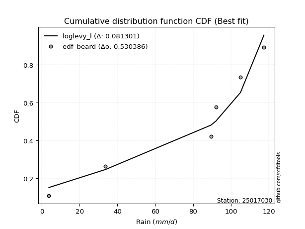</img></img>

</div>


### 5. EDF Chegodayev (1955)

The Chegodayev formula is an empirical plotting position formula used in hydrological frequency analysis to estimate the exceedance probability or return period of a specific event from a set of observed data. It is primarily used for plotting observed data points on probability paper to fit a theoretical distribution, particularly for analyzing extreme events like maximum flood flows or rainfall intensities. The constant _b_ value in the generalized plotting position formula is 0.3.

<div align="center">


$P=(m-b)/(n+1-2b)$


</div>


**5.1. Empirical values**

<div align="center">

|                | 0                   | 1                  | 2                  | 3                  | 4                 | 5                 |
|:---------------|:--------------------|:-------------------|:-------------------|:-------------------|:------------------|:------------------|
| date           | 2025                | 2023               | 2022               | 2021               | 2019              | 2020              |
| x              | 3.8                 | 33.6               | 89.4               | 92.0               | 105.0             | 117.4             |
| m              | 1                   | 2                  | 3                  | 4                  | 5                 | 6                 |
| empirical_dist | edf_chegodayev      | edf_chegodayev     | edf_chegodayev     | edf_chegodayev     | edf_chegodayev    | edf_chegodayev    |
| empirical      | 0.10937499999999999 | 0.265625           | 0.421875           | 0.578125           | 0.734375          | 0.890625          |
| empirical_tr   | 1.1228070175438596  | 1.3617021276595744 | 1.7297297297297298 | 2.3703703703703702 | 3.764705882352941 | 9.142857142857142 |

</div>


**5.2. Kolmogorov-Smirnov fit test (sorted by Δ)**


<div align="center">

|                | 0                   | 1                   | 2                   | 3                  | 4                   | 5                  | 6                   | 7                   | 8                   | 9                   | 10                 | 11                  | 12                 | 13                  | 14                  | 15                  | 16                 | 17                  | 18                  | 19                  | 20                | 21                  | 22                  | 23                  | 24                  | 25                  | 26                  | 27                  | 28                | 29                  | 30                  | 31                 | 32                  | 33                 | 34                  | 35                  | 36                 | 37                  | 38                  | 39                 | 40                  | 41                  | 42                  | 43                 | 44                  | 45                  | 46                  | 47                  | 48                  | 49                  | 50                  | 51                 | 52                 | 53                 | 54                  | 55                 | 56                 | 57                 | 58                  | 59                 | 60                 | 61                 | 62                  | 63                 | 64                 | 65                 | 66                | 67                 | 68                  | 69                 | 70                  | 71                 | 72                 | 73                 | 74                 | 75                 | 76                  | 77                  | 78                  | 79                 | 80                  | 81               | 82                 | 83                 | 84                 | 85                 | 86                  | 87                  | 88                 | 89                  | 90                  | 91                  | 92                 | 93                  | 94                 | 95                 | 96                 | 97                  | 98                 | 99                | 100                 | 101                 | 102                | 103                 | 104                | 105                | 106                | 107                 | 108                 | 109                 | 110                | 111                | 112                | 113                | 114                | 115               | 116                | 117                 | 118                 | 119                | 120                 | 121                 | 122                 | 123                | 124                | 125                | 126                | 127                | 128                | 129                 | 130               | 131                | 132               | 133                 | 134                | 135                | 136                | 137                | 138                 | 139                 | 140                | 141                | 142                | 143                | 144                | 145                | 146                | 147                | 148                | 149                | 150                | 151                | 152                | 153                | 154                | 155            | 156            | 157            | 158                | 159                |
|:---------------|:--------------------|:--------------------|:--------------------|:-------------------|:--------------------|:-------------------|:--------------------|:--------------------|:--------------------|:--------------------|:-------------------|:--------------------|:-------------------|:--------------------|:--------------------|:--------------------|:-------------------|:--------------------|:--------------------|:--------------------|:------------------|:--------------------|:--------------------|:--------------------|:--------------------|:--------------------|:--------------------|:--------------------|:------------------|:--------------------|:--------------------|:-------------------|:--------------------|:-------------------|:--------------------|:--------------------|:-------------------|:--------------------|:--------------------|:-------------------|:--------------------|:--------------------|:--------------------|:-------------------|:--------------------|:--------------------|:--------------------|:--------------------|:--------------------|:--------------------|:--------------------|:-------------------|:-------------------|:-------------------|:--------------------|:-------------------|:-------------------|:-------------------|:--------------------|:-------------------|:-------------------|:-------------------|:--------------------|:-------------------|:-------------------|:-------------------|:------------------|:-------------------|:--------------------|:-------------------|:--------------------|:-------------------|:-------------------|:-------------------|:-------------------|:-------------------|:--------------------|:--------------------|:--------------------|:-------------------|:--------------------|:-----------------|:-------------------|:-------------------|:-------------------|:-------------------|:--------------------|:--------------------|:-------------------|:--------------------|:--------------------|:--------------------|:-------------------|:--------------------|:-------------------|:-------------------|:-------------------|:--------------------|:-------------------|:------------------|:--------------------|:--------------------|:-------------------|:--------------------|:-------------------|:-------------------|:-------------------|:--------------------|:--------------------|:--------------------|:-------------------|:-------------------|:-------------------|:-------------------|:-------------------|:------------------|:-------------------|:--------------------|:--------------------|:-------------------|:--------------------|:--------------------|:--------------------|:-------------------|:-------------------|:-------------------|:-------------------|:-------------------|:-------------------|:--------------------|:------------------|:-------------------|:------------------|:--------------------|:-------------------|:-------------------|:-------------------|:-------------------|:--------------------|:--------------------|:-------------------|:-------------------|:-------------------|:-------------------|:-------------------|:-------------------|:-------------------|:-------------------|:-------------------|:-------------------|:-------------------|:-------------------|:-------------------|:-------------------|:-------------------|:---------------|:---------------|:---------------|:-------------------|:-------------------|
| station        | 25017030            | 25017030            | 25017030            | 25017030           | 25017030            | 25017030           | 25017030            | 25017030            | 25017030            | 25017030            | 25017030           | 25017030            | 25017030           | 25017030            | 25017030            | 25017030            | 25017030           | 25017030            | 25017030            | 25017030            | 25017030          | 25017030            | 25017030            | 25017030            | 25017030            | 25017030            | 25017030            | 25017030            | 25017030          | 25017030            | 25017030            | 25017030           | 25017030            | 25017030           | 25017030            | 25017030            | 25017030           | 25017030            | 25017030            | 25017030           | 25017030            | 25017030            | 25017030            | 25017030           | 25017030            | 25017030            | 25017030            | 25017030            | 25017030            | 25017030            | 25017030            | 25017030           | 25017030           | 25017030           | 25017030            | 25017030           | 25017030           | 25017030           | 25017030            | 25017030           | 25017030           | 25017030           | 25017030            | 25017030           | 25017030           | 25017030           | 25017030          | 25017030           | 25017030            | 25017030           | 25017030            | 25017030           | 25017030           | 25017030           | 25017030           | 25017030           | 25017030            | 25017030            | 25017030            | 25017030           | 25017030            | 25017030         | 25017030           | 25017030           | 25017030           | 25017030           | 25017030            | 25017030            | 25017030           | 25017030            | 25017030            | 25017030            | 25017030           | 25017030            | 25017030           | 25017030           | 25017030           | 25017030            | 25017030           | 25017030          | 25017030            | 25017030            | 25017030           | 25017030            | 25017030           | 25017030           | 25017030           | 25017030            | 25017030            | 25017030            | 25017030           | 25017030           | 25017030           | 25017030           | 25017030           | 25017030          | 25017030           | 25017030            | 25017030            | 25017030           | 25017030            | 25017030            | 25017030            | 25017030           | 25017030           | 25017030           | 25017030           | 25017030           | 25017030           | 25017030            | 25017030          | 25017030           | 25017030          | 25017030            | 25017030           | 25017030           | 25017030           | 25017030           | 25017030            | 25017030            | 25017030           | 25017030           | 25017030           | 25017030           | 25017030           | 25017030           | 25017030           | 25017030           | 25017030           | 25017030           | 25017030           | 25017030           | 25017030           | 25017030           | 25017030           | 25017030       | 25017030       | 25017030       | 25017030           | 25017030           |
| empirical_dist | edf_chegodayev      | edf_chegodayev      | edf_chegodayev      | edf_chegodayev     | edf_chegodayev      | edf_chegodayev     | edf_chegodayev      | edf_chegodayev      | edf_chegodayev      | edf_chegodayev      | edf_chegodayev     | edf_chegodayev      | edf_chegodayev     | edf_chegodayev      | edf_chegodayev      | edf_chegodayev      | edf_chegodayev     | edf_chegodayev      | edf_chegodayev      | edf_chegodayev      | edf_chegodayev    | edf_chegodayev      | edf_chegodayev      | edf_chegodayev      | edf_chegodayev      | edf_chegodayev      | edf_chegodayev      | edf_chegodayev      | edf_chegodayev    | edf_chegodayev      | edf_chegodayev      | edf_chegodayev     | edf_chegodayev      | edf_chegodayev     | edf_chegodayev      | edf_chegodayev      | edf_chegodayev     | edf_chegodayev      | edf_chegodayev      | edf_chegodayev     | edf_chegodayev      | edf_chegodayev      | edf_chegodayev      | edf_chegodayev     | edf_chegodayev      | edf_chegodayev      | edf_chegodayev      | edf_chegodayev      | edf_chegodayev      | edf_chegodayev      | edf_chegodayev      | edf_chegodayev     | edf_chegodayev     | edf_chegodayev     | edf_chegodayev      | edf_chegodayev     | edf_chegodayev     | edf_chegodayev     | edf_chegodayev      | edf_chegodayev     | edf_chegodayev     | edf_chegodayev     | edf_chegodayev      | edf_chegodayev     | edf_chegodayev     | edf_chegodayev     | edf_chegodayev    | edf_chegodayev     | edf_chegodayev      | edf_chegodayev     | edf_chegodayev      | edf_chegodayev     | edf_chegodayev     | edf_chegodayev     | edf_chegodayev     | edf_chegodayev     | edf_chegodayev      | edf_chegodayev      | edf_chegodayev      | edf_chegodayev     | edf_chegodayev      | edf_chegodayev   | edf_chegodayev     | edf_chegodayev     | edf_chegodayev     | edf_chegodayev     | edf_chegodayev      | edf_chegodayev      | edf_chegodayev     | edf_chegodayev      | edf_chegodayev      | edf_chegodayev      | edf_chegodayev     | edf_chegodayev      | edf_chegodayev     | edf_chegodayev     | edf_chegodayev     | edf_chegodayev      | edf_chegodayev     | edf_chegodayev    | edf_chegodayev      | edf_chegodayev      | edf_chegodayev     | edf_chegodayev      | edf_chegodayev     | edf_chegodayev     | edf_chegodayev     | edf_chegodayev      | edf_chegodayev      | edf_chegodayev      | edf_chegodayev     | edf_chegodayev     | edf_chegodayev     | edf_chegodayev     | edf_chegodayev     | edf_chegodayev    | edf_chegodayev     | edf_chegodayev      | edf_chegodayev      | edf_chegodayev     | edf_chegodayev      | edf_chegodayev      | edf_chegodayev      | edf_chegodayev     | edf_chegodayev     | edf_chegodayev     | edf_chegodayev     | edf_chegodayev     | edf_chegodayev     | edf_chegodayev      | edf_chegodayev    | edf_chegodayev     | edf_chegodayev    | edf_chegodayev      | edf_chegodayev     | edf_chegodayev     | edf_chegodayev     | edf_chegodayev     | edf_chegodayev      | edf_chegodayev      | edf_chegodayev     | edf_chegodayev     | edf_chegodayev     | edf_chegodayev     | edf_chegodayev     | edf_chegodayev     | edf_chegodayev     | edf_chegodayev     | edf_chegodayev     | edf_chegodayev     | edf_chegodayev     | edf_chegodayev     | edf_chegodayev     | edf_chegodayev     | edf_chegodayev     | edf_chegodayev | edf_chegodayev | edf_chegodayev | edf_chegodayev     | edf_chegodayev     |
| p_dist         | loglevy_l           | johnsonsu           | genextreme          | gausshyper         | genpareto           | levy_l             | argus               | genhalflogistic     | beta                | arcsine             | trapezoid          | dweibull            | weibull_min        | gumbel_l            | logt                | gennorm             | ksone              | loggennorm          | pearson3            | logdgamma           | logtrapezoid      | semicircular        | wrapcauchy          | logvonmises_line    | anglit              | logpearson3         | dgamma              | mielke              | logarcsine        | skewnorm            | triang              | exponweib          | logweibull_max      | t                  | exponnorm           | crystalball         | norm               | nct                 | f                   | foldnorm           | gamma               | erlang              | betaprime           | loggumbel_l        | rice                | logsemicircular     | logloglaplace       | logdweibull         | logistic            | loganglit           | loginvweibull       | invgauss           | maxwell            | invgamma           | logwrapcauchy       | ncf                | rayleigh           | halfgennorm        | hypsecant           | cosine             | gengamma           | kstwobign          | logncf              | loggamma           | loggamma           | logf               | logbetaprime      | logrice            | lognorm             | logexponnorm       | lognct              | logfatiguelife     | logerlang          | logkstwobign       | loginvgamma        | logalpha           | lognakagami         | loginvgauss         | halfnorm            | loggompertz        | loggengamma         | logburr12        | johnsonsb          | lomax              | kappa4             | genexpon           | logfoldnorm         | logmaxwell          | loggenextreme      | gumbel_r            | laplace             | logbeta             | burr               | loggenexpon         | logargus           | loglogistic        | lograyleigh        | logcrystalball      | logburr            | burr12            | halflogistic        | loghalfnorm         | loghypsecant       | moyal               | logloggamma        | truncweibull_min   | logmielke          | loglomax            | logcosine           | loggumbel_r         | tukeylambda        | kappa3             | uniform            | loglaplace         | loglaplace         | loghalflogistic   | vonmises_line      | logmoyal            | bradford            | wald               | loggenpareto        | nakagami            | gompertz            | truncexpon         | logwald            | loggenhalflogistic | loggausshyper      | logksone           | logjohnsonsb       | logskewnorm         | truncnorm         | logweibull_min     | logtriang         | logexponweib        | invweibull         | logkappa4          | fatiguelife        | logkappa3          | loguniform          | logtruncweibull_min | logtruncnorm       | alpha              | logbradford        | logtruncexpon      | weibull_max        | powerlaw           | logjohnsonsu       | truncpareto        | logexponpow        | exponpow           | logpowerlaw        | logtruncpareto     | logtukeylambda     | rdist              | logrdist           | genlogistic    | loggenlogistic | loghalfgennorm | logvonmises        | vonmises           |
| delta          | 0.08056623198812751 | 0.10833696047263619 | 0.10937499999957456 | 0.1093750000181859 | 0.11639955487097672 | 0.1454510455338094 | 0.14574820614696127 | 0.15018259754326546 | 0.15308369501974373 | 0.16690429821336417 | 0.1718011877730221 | 0.17433924517076832 | 0.1754933008342856 | 0.18162887048443865 | 0.18257935549447113 | 0.18680094101881445 | 0.1905183134220152 | 0.19284610481330697 | 0.19328544932598202 | 0.19384145704121014 | 0.195905581544621 | 0.20126908527169074 | 0.20144072908613497 | 0.20258058705145132 | 0.20964910764216227 | 0.21110092050041196 | 0.21268339494489613 | 0.21506655308829492 | 0.217590065828957 | 0.21817120818575209 | 0.22254267769682667 | 0.2283744795858963 | 0.22956775226352794 | 0.2296090244279816 | 0.22961061992893117 | 0.22961335571414065 | 0.2296133622101475 | 0.22965346009538412 | 0.23033901239758992 | 0.2342548484310497 | 0.23436515741522657 | 0.23489160616739369 | 0.23665723409409067 | 0.2367356944870147 | 0.23684233645425234 | 0.23753146999330643 | 0.24268422363381625 | 0.24517235464420128 | 0.24768330411629946 | 0.24774292432756306 | 0.24851745303456385 | 0.2502775761442222 | 0.2510895033947418 | 0.2516121907971639 | 0.25240351310871567 | 0.2524638960739932 | 0.2575421045834636 | 0.2615554858959963 | 0.26168498475044466 | 0.2628322676571373 | 0.2633009546933719 | 0.2656462037001468 | 0.26970588224000414 | 0.2707939116722683 | 0.2707939116722683 | 0.2712080950406053 | 0.271227310666331 | 0.2717832750390169 | 0.27178331255655197 | 0.2717848142249636 | 0.27180767817930174 | 0.2718407003992154 | 0.2720928986004564 | 0.2734447792750365 | 0.2737636116926956 | 0.2740435021048936 | 0.27547023974884066 | 0.27582900809889177 | 0.27632630917791734 | 0.2768969924407245 | 0.27708998301896093 | 0.27816854035283 | 0.2812400877051746 | 0.2813850172614287 | 0.2824480611127238 | 0.2836253122740593 | 0.28522258297533687 | 0.28846287282011085 | 0.2892349201607134 | 0.28935195023360294 | 0.28982674218917015 | 0.29091543042498164 | 0.2912155771543028 | 0.29139190947433136 | 0.2926207005232797 | 0.2928063597701519 | 0.2933552627461562 | 0.29427074080610083 | 0.2960318569243058 | 0.303602767118052 | 0.30442047025340124 | 0.30812006422911076 | 0.3081415031296454 | 0.30910523186359695 | 0.3118600055801646 | 0.3132157041881958 | 0.3144671164994228 | 0.31726932380862793 | 0.32080076093729737 | 0.32391093486391087 | 0.3256157415738343 | 0.3315082690556347 | 0.3316461267605634 | 0.3337590375251409 | 0.3337590375251409 | 0.335149227405396 | 0.3377072425527008 | 0.34081205987107976 | 0.35867757980534265 | 0.3651257537783499 | 0.37453548139668236 | 0.37723280143791793 | 0.37916941937811693 | 0.3878026371683707 | 0.3901349030570417 | 0.4112113745745464 | 0.4207612172126558 | 0.4286061233732852 | 0.4286264803086217 | 0.43388313586405847 | 0.435075998621266 | 0.4498964498220892 | 0.455053309161753 | 0.47329294667265764 | 0.4790634027316142 | 0.4939714040300569 | 0.4946345706555847 | 0.4958111126150486 | 0.49870234804794245 | 0.5021871178415617  | 0.5077002360162746 | 0.5166433133617048 | 0.5196475493734392 | 0.5199883426839021 | 0.5367314175908384 | 0.5606430260295939 | 0.6051175757996082 | 0.6142886715401301 | 0.6251088479168598 | 0.6557792064582767 | 0.6651136183254786 | 0.6943724116148656 | 0.7303455993463999 | 0.7343749997898517 | 0.7343749999895832 | 0.734375       | 0.734375       | 0.734375       | 1.1211364595623583 | 18.821648938046504 |
| deltao         | 0.530385761606      | 0.530385761606      | 0.530385761606      | 0.530385761606     | 0.530385761606      | 0.530385761606     | 0.530385761606      | 0.530385761606      | 0.530385761606      | 0.530385761606      | 0.530385761606     | 0.530385761606      | 0.530385761606     | 0.530385761606      | 0.530385761606      | 0.530385761606      | 0.530385761606     | 0.530385761606      | 0.530385761606      | 0.530385761606      | 0.530385761606    | 0.530385761606      | 0.530385761606      | 0.530385761606      | 0.530385761606      | 0.530385761606      | 0.530385761606      | 0.530385761606      | 0.530385761606    | 0.530385761606      | 0.530385761606      | 0.530385761606     | 0.530385761606      | 0.530385761606     | 0.530385761606      | 0.530385761606      | 0.530385761606     | 0.530385761606      | 0.530385761606      | 0.530385761606     | 0.530385761606      | 0.530385761606      | 0.530385761606      | 0.530385761606     | 0.530385761606      | 0.530385761606      | 0.530385761606      | 0.530385761606      | 0.530385761606      | 0.530385761606      | 0.530385761606      | 0.530385761606     | 0.530385761606     | 0.530385761606     | 0.530385761606      | 0.530385761606     | 0.530385761606     | 0.530385761606     | 0.530385761606      | 0.530385761606     | 0.530385761606     | 0.530385761606     | 0.530385761606      | 0.530385761606     | 0.530385761606     | 0.530385761606     | 0.530385761606    | 0.530385761606     | 0.530385761606      | 0.530385761606     | 0.530385761606      | 0.530385761606     | 0.530385761606     | 0.530385761606     | 0.530385761606     | 0.530385761606     | 0.530385761606      | 0.530385761606      | 0.530385761606      | 0.530385761606     | 0.530385761606      | 0.530385761606   | 0.530385761606     | 0.530385761606     | 0.530385761606     | 0.530385761606     | 0.530385761606      | 0.530385761606      | 0.530385761606     | 0.530385761606      | 0.530385761606      | 0.530385761606      | 0.530385761606     | 0.530385761606      | 0.530385761606     | 0.530385761606     | 0.530385761606     | 0.530385761606      | 0.530385761606     | 0.530385761606    | 0.530385761606      | 0.530385761606      | 0.530385761606     | 0.530385761606      | 0.530385761606     | 0.530385761606     | 0.530385761606     | 0.530385761606      | 0.530385761606      | 0.530385761606      | 0.530385761606     | 0.530385761606     | 0.530385761606     | 0.530385761606     | 0.530385761606     | 0.530385761606    | 0.530385761606     | 0.530385761606      | 0.530385761606      | 0.530385761606     | 0.530385761606      | 0.530385761606      | 0.530385761606      | 0.530385761606     | 0.530385761606     | 0.530385761606     | 0.530385761606     | 0.530385761606     | 0.530385761606     | 0.530385761606      | 0.530385761606    | 0.530385761606     | 0.530385761606    | 0.530385761606      | 0.530385761606     | 0.530385761606     | 0.530385761606     | 0.530385761606     | 0.530385761606      | 0.530385761606      | 0.530385761606     | 0.530385761606     | 0.530385761606     | 0.530385761606     | 0.530385761606     | 0.530385761606     | 0.530385761606     | 0.530385761606     | 0.530385761606     | 0.530385761606     | 0.530385761606     | 0.530385761606     | 0.530385761606     | 0.530385761606     | 0.530385761606     | 0.530385761606 | 0.530385761606 | 0.530385761606 | 0.530385761606     | 0.530385761606     |
| eval           | Δo > Δ              | Δo > Δ              | Δo > Δ              | Δo > Δ             | Δo > Δ              | Δo > Δ             | Δo > Δ              | Δo > Δ              | Δo > Δ              | Δo > Δ              | Δo > Δ             | Δo > Δ              | Δo > Δ             | Δo > Δ              | Δo > Δ              | Δo > Δ              | Δo > Δ             | Δo > Δ              | Δo > Δ              | Δo > Δ              | Δo > Δ            | Δo > Δ              | Δo > Δ              | Δo > Δ              | Δo > Δ              | Δo > Δ              | Δo > Δ              | Δo > Δ              | Δo > Δ            | Δo > Δ              | Δo > Δ              | Δo > Δ             | Δo > Δ              | Δo > Δ             | Δo > Δ              | Δo > Δ              | Δo > Δ             | Δo > Δ              | Δo > Δ              | Δo > Δ             | Δo > Δ              | Δo > Δ              | Δo > Δ              | Δo > Δ             | Δo > Δ              | Δo > Δ              | Δo > Δ              | Δo > Δ              | Δo > Δ              | Δo > Δ              | Δo > Δ              | Δo > Δ             | Δo > Δ             | Δo > Δ             | Δo > Δ              | Δo > Δ             | Δo > Δ             | Δo > Δ             | Δo > Δ              | Δo > Δ             | Δo > Δ             | Δo > Δ             | Δo > Δ              | Δo > Δ             | Δo > Δ             | Δo > Δ             | Δo > Δ            | Δo > Δ             | Δo > Δ              | Δo > Δ             | Δo > Δ              | Δo > Δ             | Δo > Δ             | Δo > Δ             | Δo > Δ             | Δo > Δ             | Δo > Δ              | Δo > Δ              | Δo > Δ              | Δo > Δ             | Δo > Δ              | Δo > Δ           | Δo > Δ             | Δo > Δ             | Δo > Δ             | Δo > Δ             | Δo > Δ              | Δo > Δ              | Δo > Δ             | Δo > Δ              | Δo > Δ              | Δo > Δ              | Δo > Δ             | Δo > Δ              | Δo > Δ             | Δo > Δ             | Δo > Δ             | Δo > Δ              | Δo > Δ             | Δo > Δ            | Δo > Δ              | Δo > Δ              | Δo > Δ             | Δo > Δ              | Δo > Δ             | Δo > Δ             | Δo > Δ             | Δo > Δ              | Δo > Δ              | Δo > Δ              | Δo > Δ             | Δo > Δ             | Δo > Δ             | Δo > Δ             | Δo > Δ             | Δo > Δ            | Δo > Δ             | Δo > Δ              | Δo > Δ              | Δo > Δ             | Δo > Δ              | Δo > Δ              | Δo > Δ              | Δo > Δ             | Δo > Δ             | Δo > Δ             | Δo > Δ             | Δo > Δ             | Δo > Δ             | Δo > Δ              | Δo > Δ            | Δo > Δ             | Δo > Δ            | Δo > Δ              | Δo > Δ             | Δo > Δ             | Δo > Δ             | Δo > Δ             | Δo > Δ              | Δo > Δ              | Δo > Δ             | Δo > Δ             | Δo > Δ             | Δo > Δ             | Δo <= Δ            | Δo <= Δ            | Δo <= Δ            | Δo <= Δ            | Δo <= Δ            | Δo <= Δ            | Δo <= Δ            | Δo <= Δ            | Δo <= Δ            | Δo <= Δ            | Δo <= Δ            | Δo <= Δ        | Δo <= Δ        | Δo <= Δ        | Δo <= Δ            | Δo <= Δ            |
| fit            | 1                   | 1                   | 1                   | 1                  | 1                   | 1                  | 1                   | 1                   | 1                   | 1                   | 1                  | 1                   | 1                  | 1                   | 1                   | 1                   | 1                  | 1                   | 1                   | 1                   | 1                 | 1                   | 1                   | 1                   | 1                   | 1                   | 1                   | 1                   | 1                 | 1                   | 1                   | 1                  | 1                   | 1                  | 1                   | 1                   | 1                  | 1                   | 1                   | 1                  | 1                   | 1                   | 1                   | 1                  | 1                   | 1                   | 1                   | 1                   | 1                   | 1                   | 1                   | 1                  | 1                  | 1                  | 1                   | 1                  | 1                  | 1                  | 1                   | 1                  | 1                  | 1                  | 1                   | 1                  | 1                  | 1                  | 1                 | 1                  | 1                   | 1                  | 1                   | 1                  | 1                  | 1                  | 1                  | 1                  | 1                   | 1                   | 1                   | 1                  | 1                   | 1                | 1                  | 1                  | 1                  | 1                  | 1                   | 1                   | 1                  | 1                   | 1                   | 1                   | 1                  | 1                   | 1                  | 1                  | 1                  | 1                   | 1                  | 1                 | 1                   | 1                   | 1                  | 1                   | 1                  | 1                  | 1                  | 1                   | 1                   | 1                   | 1                  | 1                  | 1                  | 1                  | 1                  | 1                 | 1                  | 1                   | 1                   | 1                  | 1                   | 1                   | 1                   | 1                  | 1                  | 1                  | 1                  | 1                  | 1                  | 1                   | 1                 | 1                  | 1                 | 1                   | 1                  | 1                  | 1                  | 1                  | 1                   | 1                   | 1                  | 1                  | 1                  | 1                  | 0                  | 0                  | 0                  | 0                  | 0                  | 0                  | 0                  | 0                  | 0                  | 0                  | 0                  | 0              | 0              | 0              | 0                  | 0                  |
| n              | 6                   | 6                   | 6                   | 6                  | 6                   | 6                  | 6                   | 6                   | 6                   | 6                   | 6                  | 6                   | 6                  | 6                   | 6                   | 6                   | 6                  | 6                   | 6                   | 6                   | 6                 | 6                   | 6                   | 6                   | 6                   | 6                   | 6                   | 6                   | 6                 | 6                   | 6                   | 6                  | 6                   | 6                  | 6                   | 6                   | 6                  | 6                   | 6                   | 6                  | 6                   | 6                   | 6                   | 6                  | 6                   | 6                   | 6                   | 6                   | 6                   | 6                   | 6                   | 6                  | 6                  | 6                  | 6                   | 6                  | 6                  | 6                  | 6                   | 6                  | 6                  | 6                  | 6                   | 6                  | 6                  | 6                  | 6                 | 6                  | 6                   | 6                  | 6                   | 6                  | 6                  | 6                  | 6                  | 6                  | 6                   | 6                   | 6                   | 6                  | 6                   | 6                | 6                  | 6                  | 6                  | 6                  | 6                   | 6                   | 6                  | 6                   | 6                   | 6                   | 6                  | 6                   | 6                  | 6                  | 6                  | 6                   | 6                  | 6                 | 6                   | 6                   | 6                  | 6                   | 6                  | 6                  | 6                  | 6                   | 6                   | 6                   | 6                  | 6                  | 6                  | 6                  | 6                  | 6                 | 6                  | 6                   | 6                   | 6                  | 6                   | 6                   | 6                   | 6                  | 6                  | 6                  | 6                  | 6                  | 6                  | 6                   | 6                 | 6                  | 6                 | 6                   | 6                  | 6                  | 6                  | 6                  | 6                   | 6                   | 6                  | 6                  | 6                  | 6                  | 6                  | 6                  | 6                  | 6                  | 6                  | 6                  | 6                  | 6                  | 6                  | 6                  | 6                  | 6              | 6              | 6              | 6                  | 6                  |
| best_fit       | 1                   | 0                   | 0                   | 0                  | 0                   | 0                  | 0                   | 0                   | 0                   | 0                   | 0                  | 0                   | 0                  | 0                   | 0                   | 0                   | 0                  | 0                   | 0                   | 0                   | 0                 | 0                   | 0                   | 0                   | 0                   | 0                   | 0                   | 0                   | 0                 | 0                   | 0                   | 0                  | 0                   | 0                  | 0                   | 0                   | 0                  | 0                   | 0                   | 0                  | 0                   | 0                   | 0                   | 0                  | 0                   | 0                   | 0                   | 0                   | 0                   | 0                   | 0                   | 0                  | 0                  | 0                  | 0                   | 0                  | 0                  | 0                  | 0                   | 0                  | 0                  | 0                  | 0                   | 0                  | 0                  | 0                  | 0                 | 0                  | 0                   | 0                  | 0                   | 0                  | 0                  | 0                  | 0                  | 0                  | 0                   | 0                   | 0                   | 0                  | 0                   | 0                | 0                  | 0                  | 0                  | 0                  | 0                   | 0                   | 0                  | 0                   | 0                   | 0                   | 0                  | 0                   | 0                  | 0                  | 0                  | 0                   | 0                  | 0                 | 0                   | 0                   | 0                  | 0                   | 0                  | 0                  | 0                  | 0                   | 0                   | 0                   | 0                  | 0                  | 0                  | 0                  | 0                  | 0                 | 0                  | 0                   | 0                   | 0                  | 0                   | 0                   | 0                   | 0                  | 0                  | 0                  | 0                  | 0                  | 0                  | 0                   | 0                 | 0                  | 0                 | 0                   | 0                  | 0                  | 0                  | 0                  | 0                   | 0                   | 0                  | 0                  | 0                  | 0                  | 0                  | 0                  | 0                  | 0                  | 0                  | 0                  | 0                  | 0                  | 0                  | 0                  | 0                  | 0              | 0              | 0              | 0                  | 0                  |
| best_fit_sort  | 1                   | 2                   | 3                   | 4                  | 5                   | 6                  | 7                   | 8                   | 9                   | 10                  | 11                 | 12                  | 13                 | 14                  | 15                  | 16                  | 17                 | 18                  | 19                  | 20                  | 21                | 22                  | 23                  | 24                  | 25                  | 26                  | 27                  | 28                  | 29                | 30                  | 31                  | 32                 | 33                  | 34                 | 35                  | 36                  | 37                 | 38                  | 39                  | 40                 | 41                  | 42                  | 43                  | 44                 | 45                  | 46                  | 47                  | 48                  | 49                  | 50                  | 51                  | 52                 | 53                 | 54                 | 55                  | 56                 | 57                 | 58                 | 59                  | 60                 | 61                 | 62                 | 63                  | 64                 | 65                 | 66                 | 67                | 68                 | 69                  | 70                 | 71                  | 72                 | 73                 | 74                 | 75                 | 76                 | 77                  | 78                  | 79                  | 80                 | 81                  | 82               | 83                 | 84                 | 85                 | 86                 | 87                  | 88                  | 89                 | 90                  | 91                  | 92                  | 93                 | 94                  | 95                 | 96                 | 97                 | 98                  | 99                 | 100               | 101                 | 102                 | 103                | 104                 | 105                | 106                | 107                | 108                 | 109                 | 110                 | 111                | 112                | 113                | 114                | 115                | 116               | 117                | 118                 | 119                 | 120                | 121                 | 122                 | 123                 | 124                | 125                | 126                | 127                | 128                | 129                | 130                 | 131               | 132                | 133               | 134                 | 135                | 136                | 137                | 138                | 139                 | 140                 | 141                | 142                | 143                | 144                | 145                | 146                | 147                | 148                | 149                | 150                | 151                | 152                | 153                | 154                | 155                | 156            | 157            | 158            | 159                | 160                |

</div>


**5.3. Best fit**

<div align="center">

|   id |   station | empirical_dist   | p_dist    |     delta |   deltao | eval   |   fit |   n |   best_fit |   best_fit_sort |
|-----:|----------:|:-----------------|:----------|----------:|---------:|:-------|------:|----:|-----------:|----------------:|
|    0 |  25017030 | edf_chegodayev   | loglevy_l | 0.0805662 | 0.530386 | Δo > Δ |     1 |   6 |          1 |               1 |

</div>


<div align="center">

</img></img>

</div>


### 6. EDF Blom (1958)

The Blom formula is a specific "plotting position" formula used in hydrology and statistical analysis to estimate the empirical cumulative probability (or non-exceedance probability) of a data series. It is particularly recommended for data that are approximately normally distributed. The constant _a_ is set to 0.375 (or 3/8).

<div align="center">


$P=(m-a)/(n+1-2a)$


</div>


**6.1. Empirical values**

<div align="center">

|                | 0                  | 1                  | 2                  | 3                 | 4                 | 5                  |
|:---------------|:-------------------|:-------------------|:-------------------|:------------------|:------------------|:-------------------|
| date           | 2025               | 2023               | 2022               | 2021              | 2019              | 2020               |
| x              | 3.8                | 33.6               | 89.4               | 92.0              | 105.0             | 117.4              |
| m              | 1                  | 2                  | 3                  | 4                 | 5                 | 6                  |
| empirical_dist | edf_blom           | edf_blom           | edf_blom           | edf_blom          | edf_blom          | edf_blom           |
| empirical      | 0.1                | 0.26               | 0.42               | 0.58              | 0.74              | 0.9                |
| empirical_tr   | 1.1111111111111112 | 1.3513513513513513 | 1.7241379310344827 | 2.380952380952381 | 3.846153846153846 | 10.000000000000002 |

</div>


**6.2. Kolmogorov-Smirnov fit test (sorted by Δ)**


<div align="center">

|                | 0                  | 1                   | 2                  | 3                   | 4                   | 5                   | 6                   | 7                   | 8                   | 9                   | 10                  | 11                  | 12                  | 13                  | 14                  | 15                  | 16                  | 17                 | 18                  | 19                  | 20                  | 21                  | 22                | 23                  | 24                  | 25                  | 26                  | 27                  | 28                 | 29                 | 30                  | 31                 | 32                 | 33                  | 34                  | 35                 | 36                  | 37                  | 38                  | 39                  | 40                 | 41                 | 42                  | 43                  | 44                  | 45                  | 46                  | 47                  | 48                  | 49                 | 50                 | 51                 | 52                 | 53                  | 54                 | 55                  | 56                 | 57                 | 58                 | 59                 | 60                 | 61                 | 62                  | 63                 | 64                 | 65                 | 66                | 67                 | 68                | 69                 | 70                  | 71                 | 72                 | 73                  | 74                 | 75                 | 76                 | 77                 | 78                  | 79                  | 80                  | 81               | 82                  | 83                 | 84                 | 85                 | 86                 | 87                  | 88                 | 89                  | 90                  | 91                 | 92                  | 93                 | 94                 | 95                 | 96                  | 97                 | 98                 | 99                  | 100               | 101                | 102                | 103                 | 104                | 105                | 106                 | 107                | 108                | 109                | 110                 | 111                | 112                | 113                | 114                | 115               | 116                | 117                | 118                 | 119                | 120                | 121                 | 122                | 123                | 124                | 125                | 126                | 127                | 128                | 129                | 130               | 131                | 132                 | 133                 | 134                | 135                | 136                 | 137                | 138                | 139                 | 140                | 141                | 142                | 143                | 144                | 145                | 146                | 147                | 148                | 149                | 150                | 151                | 152                | 153                | 154                | 155            | 156            | 157            | 158                | 159                |
|:---------------|:-------------------|:--------------------|:-------------------|:--------------------|:--------------------|:--------------------|:--------------------|:--------------------|:--------------------|:--------------------|:--------------------|:--------------------|:--------------------|:--------------------|:--------------------|:--------------------|:--------------------|:-------------------|:--------------------|:--------------------|:--------------------|:--------------------|:------------------|:--------------------|:--------------------|:--------------------|:--------------------|:--------------------|:-------------------|:-------------------|:--------------------|:-------------------|:-------------------|:--------------------|:--------------------|:-------------------|:--------------------|:--------------------|:--------------------|:--------------------|:-------------------|:-------------------|:--------------------|:--------------------|:--------------------|:--------------------|:--------------------|:--------------------|:--------------------|:-------------------|:-------------------|:-------------------|:-------------------|:--------------------|:-------------------|:--------------------|:-------------------|:-------------------|:-------------------|:-------------------|:-------------------|:-------------------|:--------------------|:-------------------|:-------------------|:-------------------|:------------------|:-------------------|:------------------|:-------------------|:--------------------|:-------------------|:-------------------|:--------------------|:-------------------|:-------------------|:-------------------|:-------------------|:--------------------|:--------------------|:--------------------|:-----------------|:--------------------|:-------------------|:-------------------|:-------------------|:-------------------|:--------------------|:-------------------|:--------------------|:--------------------|:-------------------|:--------------------|:-------------------|:-------------------|:-------------------|:--------------------|:-------------------|:-------------------|:--------------------|:------------------|:-------------------|:-------------------|:--------------------|:-------------------|:-------------------|:--------------------|:-------------------|:-------------------|:-------------------|:--------------------|:-------------------|:-------------------|:-------------------|:-------------------|:------------------|:-------------------|:-------------------|:--------------------|:-------------------|:-------------------|:--------------------|:-------------------|:-------------------|:-------------------|:-------------------|:-------------------|:-------------------|:-------------------|:-------------------|:------------------|:-------------------|:--------------------|:--------------------|:-------------------|:-------------------|:--------------------|:-------------------|:-------------------|:--------------------|:-------------------|:-------------------|:-------------------|:-------------------|:-------------------|:-------------------|:-------------------|:-------------------|:-------------------|:-------------------|:-------------------|:-------------------|:-------------------|:-------------------|:-------------------|:---------------|:---------------|:---------------|:-------------------|:-------------------|
| station        | 25017030           | 25017030            | 25017030           | 25017030            | 25017030            | 25017030            | 25017030            | 25017030            | 25017030            | 25017030            | 25017030            | 25017030            | 25017030            | 25017030            | 25017030            | 25017030            | 25017030            | 25017030           | 25017030            | 25017030            | 25017030            | 25017030            | 25017030          | 25017030            | 25017030            | 25017030            | 25017030            | 25017030            | 25017030           | 25017030           | 25017030            | 25017030           | 25017030           | 25017030            | 25017030            | 25017030           | 25017030            | 25017030            | 25017030            | 25017030            | 25017030           | 25017030           | 25017030            | 25017030            | 25017030            | 25017030            | 25017030            | 25017030            | 25017030            | 25017030           | 25017030           | 25017030           | 25017030           | 25017030            | 25017030           | 25017030            | 25017030           | 25017030           | 25017030           | 25017030           | 25017030           | 25017030           | 25017030            | 25017030           | 25017030           | 25017030           | 25017030          | 25017030           | 25017030          | 25017030           | 25017030            | 25017030           | 25017030           | 25017030            | 25017030           | 25017030           | 25017030           | 25017030           | 25017030            | 25017030            | 25017030            | 25017030         | 25017030            | 25017030           | 25017030           | 25017030           | 25017030           | 25017030            | 25017030           | 25017030            | 25017030            | 25017030           | 25017030            | 25017030           | 25017030           | 25017030           | 25017030            | 25017030           | 25017030           | 25017030            | 25017030          | 25017030           | 25017030           | 25017030            | 25017030           | 25017030           | 25017030            | 25017030           | 25017030           | 25017030           | 25017030            | 25017030           | 25017030           | 25017030           | 25017030           | 25017030          | 25017030           | 25017030           | 25017030            | 25017030           | 25017030           | 25017030            | 25017030           | 25017030           | 25017030           | 25017030           | 25017030           | 25017030           | 25017030           | 25017030           | 25017030          | 25017030           | 25017030            | 25017030            | 25017030           | 25017030           | 25017030            | 25017030           | 25017030           | 25017030            | 25017030           | 25017030           | 25017030           | 25017030           | 25017030           | 25017030           | 25017030           | 25017030           | 25017030           | 25017030           | 25017030           | 25017030           | 25017030           | 25017030           | 25017030           | 25017030       | 25017030       | 25017030       | 25017030           | 25017030           |
| empirical_dist | edf_blom           | edf_blom            | edf_blom           | edf_blom            | edf_blom            | edf_blom            | edf_blom            | edf_blom            | edf_blom            | edf_blom            | edf_blom            | edf_blom            | edf_blom            | edf_blom            | edf_blom            | edf_blom            | edf_blom            | edf_blom           | edf_blom            | edf_blom            | edf_blom            | edf_blom            | edf_blom          | edf_blom            | edf_blom            | edf_blom            | edf_blom            | edf_blom            | edf_blom           | edf_blom           | edf_blom            | edf_blom           | edf_blom           | edf_blom            | edf_blom            | edf_blom           | edf_blom            | edf_blom            | edf_blom            | edf_blom            | edf_blom           | edf_blom           | edf_blom            | edf_blom            | edf_blom            | edf_blom            | edf_blom            | edf_blom            | edf_blom            | edf_blom           | edf_blom           | edf_blom           | edf_blom           | edf_blom            | edf_blom           | edf_blom            | edf_blom           | edf_blom           | edf_blom           | edf_blom           | edf_blom           | edf_blom           | edf_blom            | edf_blom           | edf_blom           | edf_blom           | edf_blom          | edf_blom           | edf_blom          | edf_blom           | edf_blom            | edf_blom           | edf_blom           | edf_blom            | edf_blom           | edf_blom           | edf_blom           | edf_blom           | edf_blom            | edf_blom            | edf_blom            | edf_blom         | edf_blom            | edf_blom           | edf_blom           | edf_blom           | edf_blom           | edf_blom            | edf_blom           | edf_blom            | edf_blom            | edf_blom           | edf_blom            | edf_blom           | edf_blom           | edf_blom           | edf_blom            | edf_blom           | edf_blom           | edf_blom            | edf_blom          | edf_blom           | edf_blom           | edf_blom            | edf_blom           | edf_blom           | edf_blom            | edf_blom           | edf_blom           | edf_blom           | edf_blom            | edf_blom           | edf_blom           | edf_blom           | edf_blom           | edf_blom          | edf_blom           | edf_blom           | edf_blom            | edf_blom           | edf_blom           | edf_blom            | edf_blom           | edf_blom           | edf_blom           | edf_blom           | edf_blom           | edf_blom           | edf_blom           | edf_blom           | edf_blom          | edf_blom           | edf_blom            | edf_blom            | edf_blom           | edf_blom           | edf_blom            | edf_blom           | edf_blom           | edf_blom            | edf_blom           | edf_blom           | edf_blom           | edf_blom           | edf_blom           | edf_blom           | edf_blom           | edf_blom           | edf_blom           | edf_blom           | edf_blom           | edf_blom           | edf_blom           | edf_blom           | edf_blom           | edf_blom       | edf_blom       | edf_blom       | edf_blom           | edf_blom           |
| p_dist         | loglevy_l          | genextreme          | johnsonsu          | gausshyper          | genpareto           | argus               | genhalflogistic     | levy_l              | beta                | dweibull            | arcsine             | trapezoid           | logt                | weibull_min         | gennorm             | gumbel_l            | loggennorm          | ksone              | pearson3            | logtrapezoid        | semicircular        | logdgamma           | wrapcauchy        | logvonmises_line    | dgamma              | anglit              | logpearson3         | mielke              | skewnorm           | triang             | logarcsine          | exponweib          | t                  | exponnorm           | crystalball         | norm               | nct                 | f                   | foldnorm            | gamma               | erlang             | betaprime          | loggumbel_l         | rice                | logweibull_max      | logsemicircular     | logistic            | loganglit           | loginvweibull       | logloglaplace      | invgauss           | maxwell            | invgamma           | ncf                 | logdweibull        | logwrapcauchy       | rayleigh           | halfgennorm        | hypsecant          | cosine             | gengamma           | kstwobign          | logncf              | loggamma           | loggamma           | logf               | logbetaprime      | logrice            | lognorm           | logexponnorm       | lognct              | logfatiguelife     | logerlang          | logkstwobign        | loginvgamma        | logalpha           | lognakagami        | loginvgauss        | halfnorm            | loggompertz         | loggengamma         | logburr12        | lomax               | kappa4             | genexpon           | johnsonsb          | logfoldnorm        | logmaxwell          | loggenextreme      | gumbel_r            | laplace             | burr               | loggenexpon         | logargus           | loglogistic        | lograyleigh        | logcrystalball      | logbeta            | logburr            | halflogistic        | burr12            | loghalfnorm        | loghypsecant       | moyal               | logloggamma        | truncweibull_min   | logmielke           | logcosine          | loglomax           | loggumbel_r        | tukeylambda         | kappa3             | uniform            | loglaplace         | loglaplace         | loghalflogistic   | vonmises_line      | logmoyal           | bradford            | wald               | loggenpareto       | nakagami            | gompertz           | truncexpon         | logwald            | loggenhalflogistic | loggausshyper      | logksone           | logjohnsonsb       | logskewnorm        | truncnorm         | logweibull_min     | logtriang           | logexponweib        | invweibull         | logkappa4          | logkappa3           | fatiguelife        | loguniform         | logtruncweibull_min | logtruncnorm       | logbradford        | logtruncexpon      | alpha              | weibull_max        | powerlaw           | logjohnsonsu       | truncpareto        | logexponpow        | exponpow           | logpowerlaw        | logtruncpareto     | logtukeylambda     | rdist              | logrdist           | genlogistic    | loggenlogistic | loghalfgennorm | logvonmises        | vonmises           |
| delta          | 0.0861912319881275 | 0.09999999999957454 | 0.1027119604726362 | 0.10321407311523481 | 0.11077455487097673 | 0.14762320614696128 | 0.15205759754326548 | 0.15482604553380938 | 0.15870869501974372 | 0.16871424517076833 | 0.16877929821336418 | 0.17367618777302213 | 0.17695435549447114 | 0.17736830083428562 | 0.18117594101881446 | 0.18350387048443867 | 0.18722110481330698 | 0.1923933134220152 | 0.19516044932598203 | 0.19778058154462103 | 0.20314408527169076 | 0.20321645704121016 | 0.203315729086135 | 0.20445558705145134 | 0.20705839494489614 | 0.21152410764216228 | 0.21297592050041197 | 0.21694155308829494 | 0.2200462081857521 | 0.2244176776968267 | 0.22696506582895704 | 0.2302494795858963 | 0.2314840244279816 | 0.23148561992893119 | 0.23148835571414067 | 0.2314883622101475 | 0.23152846009538414 | 0.23221401239758993 | 0.23612984843104973 | 0.23624015741522658 | 0.2367666061673937 | 0.2385322340940907 | 0.23861069448701472 | 0.23871733645425236 | 0.23894275226352793 | 0.23940646999330645 | 0.24955830411629948 | 0.24961792432756308 | 0.25039245303456387 | 0.2520592236338163 | 0.2521525761442222 | 0.2529645033947418 | 0.2534871907971639 | 0.25433889607399324 | 0.2545473546442013 | 0.25802851310871566 | 0.2594171045834636 | 0.2634304858959963 | 0.2635599847504447 | 0.2647072676571373 | 0.2651759546933719 | 0.2675212037001468 | 0.27158088224000415 | 0.2726689116722683 | 0.2726689116722683 | 0.2730830950406053 | 0.273102310666331 | 0.2736582750390169 | 0.273658312556552 | 0.2736598142249636 | 0.27368267817930175 | 0.2737157003992154 | 0.2739678986004564 | 0.27531977927503654 | 0.2756386116926956 | 0.2759185021048936 | 0.2773452397488407 | 0.2777040080988918 | 0.27820130917791736 | 0.27877199244072454 | 0.27896498301896094 | 0.28004354035283 | 0.28326001726142874 | 0.2843230611127238 | 0.2855003122740593 | 0.2868650877051746 | 0.2870975829753369 | 0.29033787282011086 | 0.2911099201607134 | 0.29122695023360295 | 0.29170174218917017 | 0.2930905771543028 | 0.29326690947433137 | 0.2944957005232797 | 0.2946813597701519 | 0.2952302627461562 | 0.29614574080610084 | 0.2965404304249816 | 0.2979068569243058 | 0.30629547025340126 | 0.309227767118052 | 0.3099950642291108 | 0.3100165031296454 | 0.31098023186359697 | 0.3137350055801646 | 0.3150907041881958 | 0.31634211649942284 | 0.3226757609372974 | 0.3228943238086279 | 0.3257859348639109 | 0.32749074157383434 | 0.3333832690556347 | 0.3335211267605634 | 0.3356340375251409 | 0.3356340375251409 | 0.337024227405396 | 0.3395822425527008 | 0.3426870598710798 | 0.36055257980534267 | 0.3670007537783499 | 0.3764104813966824 | 0.37910780143791795 | 0.3810444193781169 | 0.3896776371683707 | 0.3920099030570417 | 0.4130863745745464 | 0.4226362172126558 | 0.4304811233732852 | 0.4342514803086217 | 0.4357581358640585 | 0.436950998621266 | 0.4555214498220892 | 0.45692830916175303 | 0.47891794667265764 | 0.4884384027316142 | 0.4958464040300569 | 0.49768611261504864 | 0.5002595706555847 | 0.5005773480479425 | 0.5040621178415616  | 0.5095752360162746 | 0.5215225493734392 | 0.5218633426839021 | 0.5222683133617048 | 0.5423564175908384 | 0.5662680260295939 | 0.6107425757996082 | 0.6199136715401301 | 0.6307338479168598 | 0.6614042064582767 | 0.6707386183254785 | 0.6999974116148656 | 0.7359705993463999 | 0.7399999997898516 | 0.7399999999895832 | 0.74           | 0.74           | 0.74           | 1.1230114595623584 | 18.812273938046506 |
| deltao         | 0.530385761606     | 0.530385761606      | 0.530385761606     | 0.530385761606      | 0.530385761606      | 0.530385761606      | 0.530385761606      | 0.530385761606      | 0.530385761606      | 0.530385761606      | 0.530385761606      | 0.530385761606      | 0.530385761606      | 0.530385761606      | 0.530385761606      | 0.530385761606      | 0.530385761606      | 0.530385761606     | 0.530385761606      | 0.530385761606      | 0.530385761606      | 0.530385761606      | 0.530385761606    | 0.530385761606      | 0.530385761606      | 0.530385761606      | 0.530385761606      | 0.530385761606      | 0.530385761606     | 0.530385761606     | 0.530385761606      | 0.530385761606     | 0.530385761606     | 0.530385761606      | 0.530385761606      | 0.530385761606     | 0.530385761606      | 0.530385761606      | 0.530385761606      | 0.530385761606      | 0.530385761606     | 0.530385761606     | 0.530385761606      | 0.530385761606      | 0.530385761606      | 0.530385761606      | 0.530385761606      | 0.530385761606      | 0.530385761606      | 0.530385761606     | 0.530385761606     | 0.530385761606     | 0.530385761606     | 0.530385761606      | 0.530385761606     | 0.530385761606      | 0.530385761606     | 0.530385761606     | 0.530385761606     | 0.530385761606     | 0.530385761606     | 0.530385761606     | 0.530385761606      | 0.530385761606     | 0.530385761606     | 0.530385761606     | 0.530385761606    | 0.530385761606     | 0.530385761606    | 0.530385761606     | 0.530385761606      | 0.530385761606     | 0.530385761606     | 0.530385761606      | 0.530385761606     | 0.530385761606     | 0.530385761606     | 0.530385761606     | 0.530385761606      | 0.530385761606      | 0.530385761606      | 0.530385761606   | 0.530385761606      | 0.530385761606     | 0.530385761606     | 0.530385761606     | 0.530385761606     | 0.530385761606      | 0.530385761606     | 0.530385761606      | 0.530385761606      | 0.530385761606     | 0.530385761606      | 0.530385761606     | 0.530385761606     | 0.530385761606     | 0.530385761606      | 0.530385761606     | 0.530385761606     | 0.530385761606      | 0.530385761606    | 0.530385761606     | 0.530385761606     | 0.530385761606      | 0.530385761606     | 0.530385761606     | 0.530385761606      | 0.530385761606     | 0.530385761606     | 0.530385761606     | 0.530385761606      | 0.530385761606     | 0.530385761606     | 0.530385761606     | 0.530385761606     | 0.530385761606    | 0.530385761606     | 0.530385761606     | 0.530385761606      | 0.530385761606     | 0.530385761606     | 0.530385761606      | 0.530385761606     | 0.530385761606     | 0.530385761606     | 0.530385761606     | 0.530385761606     | 0.530385761606     | 0.530385761606     | 0.530385761606     | 0.530385761606    | 0.530385761606     | 0.530385761606      | 0.530385761606      | 0.530385761606     | 0.530385761606     | 0.530385761606      | 0.530385761606     | 0.530385761606     | 0.530385761606      | 0.530385761606     | 0.530385761606     | 0.530385761606     | 0.530385761606     | 0.530385761606     | 0.530385761606     | 0.530385761606     | 0.530385761606     | 0.530385761606     | 0.530385761606     | 0.530385761606     | 0.530385761606     | 0.530385761606     | 0.530385761606     | 0.530385761606     | 0.530385761606 | 0.530385761606 | 0.530385761606 | 0.530385761606     | 0.530385761606     |
| eval           | Δo > Δ             | Δo > Δ              | Δo > Δ             | Δo > Δ              | Δo > Δ              | Δo > Δ              | Δo > Δ              | Δo > Δ              | Δo > Δ              | Δo > Δ              | Δo > Δ              | Δo > Δ              | Δo > Δ              | Δo > Δ              | Δo > Δ              | Δo > Δ              | Δo > Δ              | Δo > Δ             | Δo > Δ              | Δo > Δ              | Δo > Δ              | Δo > Δ              | Δo > Δ            | Δo > Δ              | Δo > Δ              | Δo > Δ              | Δo > Δ              | Δo > Δ              | Δo > Δ             | Δo > Δ             | Δo > Δ              | Δo > Δ             | Δo > Δ             | Δo > Δ              | Δo > Δ              | Δo > Δ             | Δo > Δ              | Δo > Δ              | Δo > Δ              | Δo > Δ              | Δo > Δ             | Δo > Δ             | Δo > Δ              | Δo > Δ              | Δo > Δ              | Δo > Δ              | Δo > Δ              | Δo > Δ              | Δo > Δ              | Δo > Δ             | Δo > Δ             | Δo > Δ             | Δo > Δ             | Δo > Δ              | Δo > Δ             | Δo > Δ              | Δo > Δ             | Δo > Δ             | Δo > Δ             | Δo > Δ             | Δo > Δ             | Δo > Δ             | Δo > Δ              | Δo > Δ             | Δo > Δ             | Δo > Δ             | Δo > Δ            | Δo > Δ             | Δo > Δ            | Δo > Δ             | Δo > Δ              | Δo > Δ             | Δo > Δ             | Δo > Δ              | Δo > Δ             | Δo > Δ             | Δo > Δ             | Δo > Δ             | Δo > Δ              | Δo > Δ              | Δo > Δ              | Δo > Δ           | Δo > Δ              | Δo > Δ             | Δo > Δ             | Δo > Δ             | Δo > Δ             | Δo > Δ              | Δo > Δ             | Δo > Δ              | Δo > Δ              | Δo > Δ             | Δo > Δ              | Δo > Δ             | Δo > Δ             | Δo > Δ             | Δo > Δ              | Δo > Δ             | Δo > Δ             | Δo > Δ              | Δo > Δ            | Δo > Δ             | Δo > Δ             | Δo > Δ              | Δo > Δ             | Δo > Δ             | Δo > Δ              | Δo > Δ             | Δo > Δ             | Δo > Δ             | Δo > Δ              | Δo > Δ             | Δo > Δ             | Δo > Δ             | Δo > Δ             | Δo > Δ            | Δo > Δ             | Δo > Δ             | Δo > Δ              | Δo > Δ             | Δo > Δ             | Δo > Δ              | Δo > Δ             | Δo > Δ             | Δo > Δ             | Δo > Δ             | Δo > Δ             | Δo > Δ             | Δo > Δ             | Δo > Δ             | Δo > Δ            | Δo > Δ             | Δo > Δ              | Δo > Δ              | Δo > Δ             | Δo > Δ             | Δo > Δ              | Δo > Δ             | Δo > Δ             | Δo > Δ              | Δo > Δ             | Δo > Δ             | Δo > Δ             | Δo > Δ             | Δo <= Δ            | Δo <= Δ            | Δo <= Δ            | Δo <= Δ            | Δo <= Δ            | Δo <= Δ            | Δo <= Δ            | Δo <= Δ            | Δo <= Δ            | Δo <= Δ            | Δo <= Δ            | Δo <= Δ        | Δo <= Δ        | Δo <= Δ        | Δo <= Δ            | Δo <= Δ            |
| fit            | 1                  | 1                   | 1                  | 1                   | 1                   | 1                   | 1                   | 1                   | 1                   | 1                   | 1                   | 1                   | 1                   | 1                   | 1                   | 1                   | 1                   | 1                  | 1                   | 1                   | 1                   | 1                   | 1                 | 1                   | 1                   | 1                   | 1                   | 1                   | 1                  | 1                  | 1                   | 1                  | 1                  | 1                   | 1                   | 1                  | 1                   | 1                   | 1                   | 1                   | 1                  | 1                  | 1                   | 1                   | 1                   | 1                   | 1                   | 1                   | 1                   | 1                  | 1                  | 1                  | 1                  | 1                   | 1                  | 1                   | 1                  | 1                  | 1                  | 1                  | 1                  | 1                  | 1                   | 1                  | 1                  | 1                  | 1                 | 1                  | 1                 | 1                  | 1                   | 1                  | 1                  | 1                   | 1                  | 1                  | 1                  | 1                  | 1                   | 1                   | 1                   | 1                | 1                   | 1                  | 1                  | 1                  | 1                  | 1                   | 1                  | 1                   | 1                   | 1                  | 1                   | 1                  | 1                  | 1                  | 1                   | 1                  | 1                  | 1                   | 1                 | 1                  | 1                  | 1                   | 1                  | 1                  | 1                   | 1                  | 1                  | 1                  | 1                   | 1                  | 1                  | 1                  | 1                  | 1                 | 1                  | 1                  | 1                   | 1                  | 1                  | 1                   | 1                  | 1                  | 1                  | 1                  | 1                  | 1                  | 1                  | 1                  | 1                 | 1                  | 1                   | 1                   | 1                  | 1                  | 1                   | 1                  | 1                  | 1                   | 1                  | 1                  | 1                  | 1                  | 0                  | 0                  | 0                  | 0                  | 0                  | 0                  | 0                  | 0                  | 0                  | 0                  | 0                  | 0              | 0              | 0              | 0                  | 0                  |
| n              | 6                  | 6                   | 6                  | 6                   | 6                   | 6                   | 6                   | 6                   | 6                   | 6                   | 6                   | 6                   | 6                   | 6                   | 6                   | 6                   | 6                   | 6                  | 6                   | 6                   | 6                   | 6                   | 6                 | 6                   | 6                   | 6                   | 6                   | 6                   | 6                  | 6                  | 6                   | 6                  | 6                  | 6                   | 6                   | 6                  | 6                   | 6                   | 6                   | 6                   | 6                  | 6                  | 6                   | 6                   | 6                   | 6                   | 6                   | 6                   | 6                   | 6                  | 6                  | 6                  | 6                  | 6                   | 6                  | 6                   | 6                  | 6                  | 6                  | 6                  | 6                  | 6                  | 6                   | 6                  | 6                  | 6                  | 6                 | 6                  | 6                 | 6                  | 6                   | 6                  | 6                  | 6                   | 6                  | 6                  | 6                  | 6                  | 6                   | 6                   | 6                   | 6                | 6                   | 6                  | 6                  | 6                  | 6                  | 6                   | 6                  | 6                   | 6                   | 6                  | 6                   | 6                  | 6                  | 6                  | 6                   | 6                  | 6                  | 6                   | 6                 | 6                  | 6                  | 6                   | 6                  | 6                  | 6                   | 6                  | 6                  | 6                  | 6                   | 6                  | 6                  | 6                  | 6                  | 6                 | 6                  | 6                  | 6                   | 6                  | 6                  | 6                   | 6                  | 6                  | 6                  | 6                  | 6                  | 6                  | 6                  | 6                  | 6                 | 6                  | 6                   | 6                   | 6                  | 6                  | 6                   | 6                  | 6                  | 6                   | 6                  | 6                  | 6                  | 6                  | 6                  | 6                  | 6                  | 6                  | 6                  | 6                  | 6                  | 6                  | 6                  | 6                  | 6                  | 6              | 6              | 6              | 6                  | 6                  |
| best_fit       | 1                  | 0                   | 0                  | 0                   | 0                   | 0                   | 0                   | 0                   | 0                   | 0                   | 0                   | 0                   | 0                   | 0                   | 0                   | 0                   | 0                   | 0                  | 0                   | 0                   | 0                   | 0                   | 0                 | 0                   | 0                   | 0                   | 0                   | 0                   | 0                  | 0                  | 0                   | 0                  | 0                  | 0                   | 0                   | 0                  | 0                   | 0                   | 0                   | 0                   | 0                  | 0                  | 0                   | 0                   | 0                   | 0                   | 0                   | 0                   | 0                   | 0                  | 0                  | 0                  | 0                  | 0                   | 0                  | 0                   | 0                  | 0                  | 0                  | 0                  | 0                  | 0                  | 0                   | 0                  | 0                  | 0                  | 0                 | 0                  | 0                 | 0                  | 0                   | 0                  | 0                  | 0                   | 0                  | 0                  | 0                  | 0                  | 0                   | 0                   | 0                   | 0                | 0                   | 0                  | 0                  | 0                  | 0                  | 0                   | 0                  | 0                   | 0                   | 0                  | 0                   | 0                  | 0                  | 0                  | 0                   | 0                  | 0                  | 0                   | 0                 | 0                  | 0                  | 0                   | 0                  | 0                  | 0                   | 0                  | 0                  | 0                  | 0                   | 0                  | 0                  | 0                  | 0                  | 0                 | 0                  | 0                  | 0                   | 0                  | 0                  | 0                   | 0                  | 0                  | 0                  | 0                  | 0                  | 0                  | 0                  | 0                  | 0                 | 0                  | 0                   | 0                   | 0                  | 0                  | 0                   | 0                  | 0                  | 0                   | 0                  | 0                  | 0                  | 0                  | 0                  | 0                  | 0                  | 0                  | 0                  | 0                  | 0                  | 0                  | 0                  | 0                  | 0                  | 0              | 0              | 0              | 0                  | 0                  |
| best_fit_sort  | 1                  | 2                   | 3                  | 4                   | 5                   | 6                   | 7                   | 8                   | 9                   | 10                  | 11                  | 12                  | 13                  | 14                  | 15                  | 16                  | 17                  | 18                 | 19                  | 20                  | 21                  | 22                  | 23                | 24                  | 25                  | 26                  | 27                  | 28                  | 29                 | 30                 | 31                  | 32                 | 33                 | 34                  | 35                  | 36                 | 37                  | 38                  | 39                  | 40                  | 41                 | 42                 | 43                  | 44                  | 45                  | 46                  | 47                  | 48                  | 49                  | 50                 | 51                 | 52                 | 53                 | 54                  | 55                 | 56                  | 57                 | 58                 | 59                 | 60                 | 61                 | 62                 | 63                  | 64                 | 65                 | 66                 | 67                | 68                 | 69                | 70                 | 71                  | 72                 | 73                 | 74                  | 75                 | 76                 | 77                 | 78                 | 79                  | 80                  | 81                  | 82               | 83                  | 84                 | 85                 | 86                 | 87                 | 88                  | 89                 | 90                  | 91                  | 92                 | 93                  | 94                 | 95                 | 96                 | 97                  | 98                 | 99                 | 100                 | 101               | 102                | 103                | 104                 | 105                | 106                | 107                 | 108                | 109                | 110                | 111                 | 112                | 113                | 114                | 115                | 116               | 117                | 118                | 119                 | 120                | 121                | 122                 | 123                | 124                | 125                | 126                | 127                | 128                | 129                | 130                | 131               | 132                | 133                 | 134                 | 135                | 136                | 137                 | 138                | 139                | 140                 | 141                | 142                | 143                | 144                | 145                | 146                | 147                | 148                | 149                | 150                | 151                | 152                | 153                | 154                | 155                | 156            | 157            | 158            | 159                | 160                |

</div>


**6.3. Best fit**

<div align="center">

|   id |   station | empirical_dist   | p_dist    |     delta |   deltao | eval   |   fit |   n |   best_fit |   best_fit_sort |
|-----:|----------:|:-----------------|:----------|----------:|---------:|:-------|------:|----:|-----------:|----------------:|
|    0 |  25017030 | edf_blom         | loglevy_l | 0.0861912 | 0.530386 | Δo > Δ |     1 |   6 |          1 |               1 |

</div>


<div align="center">

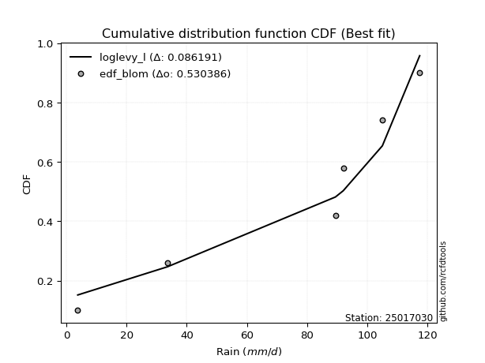</img></img>

</div>


### 7. EDF Tukey (1962)

In hydrology, the Tukey formula is used as a plotting position formula to estimate the empirical probability or frequency of a flood event (or other hydrological data). The formula parameter is given as _c=0.333_ (or 1/3).

<div align="center">


$P=(m-c)/(n+1-2c)$


</div>


**7.1. Empirical values**

<div align="center">

|                | 0                   | 1                  | 2                   | 3                  | 4                  | 5                  |
|:---------------|:--------------------|:-------------------|:--------------------|:-------------------|:-------------------|:-------------------|
| date           | 2025                | 2023               | 2022                | 2021               | 2019               | 2020               |
| x              | 3.8                 | 33.6               | 89.4                | 92.0               | 105.0              | 117.4              |
| m              | 1                   | 2                  | 3                   | 4                  | 5                  | 6                  |
| empirical_dist | edf_tukey           | edf_tukey          | edf_tukey           | edf_tukey          | edf_tukey          | edf_tukey          |
| empirical      | 0.10526315789473684 | 0.2631578947368421 | 0.42105263157894735 | 0.5789473684210527 | 0.7368421052631579 | 0.8947368421052632 |
| empirical_tr   | 1.1176470588235294  | 1.357142857142857  | 1.7272727272727273  | 2.375              | 3.7999999999999994 | 9.5                |

</div>


**7.2. Kolmogorov-Smirnov fit test (sorted by Δ)**


<div align="center">

|                | 0                   | 1                  | 2                   | 3                   | 4                   | 5                   | 6                   | 7                   | 8                   | 9                   | 10                 | 11                  | 12                  | 13                  | 14                 | 15                  | 16                  | 17                  | 18                  | 19                  | 20                 | 21                 | 22                  | 23                  | 24                  | 25                  | 26                  | 27                  | 28                  | 29                  | 30                  | 31                  | 32                  | 33                  | 34                 | 35                  | 36                  | 37                  | 38                 | 39                  | 40                  | 41                  | 42                  | 43                  | 44                | 45                 | 46                  | 47                  | 48                  | 49                  | 50                 | 51                  | 52                  | 53                  | 54                 | 55                 | 56                  | 57                  | 58                 | 59                  | 60                  | 61                  | 62                 | 63                  | 64                  | 65                  | 66                  | 67                  | 68                 | 69                  | 70                 | 71                  | 72                  | 73                 | 74                  | 75                  | 76                 | 77                 | 78               | 79                 | 80                 | 81                  | 82                 | 83                  | 84                  | 85                  | 86                 | 87                 | 88                  | 89                 | 90                 | 91                  | 92                | 93                 | 94                  | 95                  | 96                  | 97                 | 98                  | 99                 | 100                | 101                | 102                 | 103                | 104                 | 105                 | 106                | 107                 | 108              | 109                | 110               | 111                 | 112                 | 113                 | 114                 | 115                 | 116                 | 117                | 118                | 119                 | 120               | 121                | 122                | 123                 | 124                 | 125                 | 126                 | 127                 | 128                 | 129                | 130                 | 131                | 132                 | 133                 | 134                 | 135                 | 136                | 137                | 138                | 139                 | 140                | 141                | 142                | 143                | 144                | 145                | 146                | 147                | 148                | 149                | 150                | 151                | 152                | 153                | 154                | 155                | 156                | 157                | 158               | 159               |
|:---------------|:--------------------|:-------------------|:--------------------|:--------------------|:--------------------|:--------------------|:--------------------|:--------------------|:--------------------|:--------------------|:-------------------|:--------------------|:--------------------|:--------------------|:-------------------|:--------------------|:--------------------|:--------------------|:--------------------|:--------------------|:-------------------|:-------------------|:--------------------|:--------------------|:--------------------|:--------------------|:--------------------|:--------------------|:--------------------|:--------------------|:--------------------|:--------------------|:--------------------|:--------------------|:-------------------|:--------------------|:--------------------|:--------------------|:-------------------|:--------------------|:--------------------|:--------------------|:--------------------|:--------------------|:------------------|:-------------------|:--------------------|:--------------------|:--------------------|:--------------------|:-------------------|:--------------------|:--------------------|:--------------------|:-------------------|:-------------------|:--------------------|:--------------------|:-------------------|:--------------------|:--------------------|:--------------------|:-------------------|:--------------------|:--------------------|:--------------------|:--------------------|:--------------------|:-------------------|:--------------------|:-------------------|:--------------------|:--------------------|:-------------------|:--------------------|:--------------------|:-------------------|:-------------------|:-----------------|:-------------------|:-------------------|:--------------------|:-------------------|:--------------------|:--------------------|:--------------------|:-------------------|:-------------------|:--------------------|:-------------------|:-------------------|:--------------------|:------------------|:-------------------|:--------------------|:--------------------|:--------------------|:-------------------|:--------------------|:-------------------|:-------------------|:-------------------|:--------------------|:-------------------|:--------------------|:--------------------|:-------------------|:--------------------|:-----------------|:-------------------|:------------------|:--------------------|:--------------------|:--------------------|:--------------------|:--------------------|:--------------------|:-------------------|:-------------------|:--------------------|:------------------|:-------------------|:-------------------|:--------------------|:--------------------|:--------------------|:--------------------|:--------------------|:--------------------|:-------------------|:--------------------|:-------------------|:--------------------|:--------------------|:--------------------|:--------------------|:-------------------|:-------------------|:-------------------|:--------------------|:-------------------|:-------------------|:-------------------|:-------------------|:-------------------|:-------------------|:-------------------|:-------------------|:-------------------|:-------------------|:-------------------|:-------------------|:-------------------|:-------------------|:-------------------|:-------------------|:-------------------|:-------------------|:------------------|:------------------|
| station        | 25017030            | 25017030           | 25017030            | 25017030            | 25017030            | 25017030            | 25017030            | 25017030            | 25017030            | 25017030            | 25017030           | 25017030            | 25017030            | 25017030            | 25017030           | 25017030            | 25017030            | 25017030            | 25017030            | 25017030            | 25017030           | 25017030           | 25017030            | 25017030            | 25017030            | 25017030            | 25017030            | 25017030            | 25017030            | 25017030            | 25017030            | 25017030            | 25017030            | 25017030            | 25017030           | 25017030            | 25017030            | 25017030            | 25017030           | 25017030            | 25017030            | 25017030            | 25017030            | 25017030            | 25017030          | 25017030           | 25017030            | 25017030            | 25017030            | 25017030            | 25017030           | 25017030            | 25017030            | 25017030            | 25017030           | 25017030           | 25017030            | 25017030            | 25017030           | 25017030            | 25017030            | 25017030            | 25017030           | 25017030            | 25017030            | 25017030            | 25017030            | 25017030            | 25017030           | 25017030            | 25017030           | 25017030            | 25017030            | 25017030           | 25017030            | 25017030            | 25017030           | 25017030           | 25017030         | 25017030           | 25017030           | 25017030            | 25017030           | 25017030            | 25017030            | 25017030            | 25017030           | 25017030           | 25017030            | 25017030           | 25017030           | 25017030            | 25017030          | 25017030           | 25017030            | 25017030            | 25017030            | 25017030           | 25017030            | 25017030           | 25017030           | 25017030           | 25017030            | 25017030           | 25017030            | 25017030            | 25017030           | 25017030            | 25017030         | 25017030           | 25017030          | 25017030            | 25017030            | 25017030            | 25017030            | 25017030            | 25017030            | 25017030           | 25017030           | 25017030            | 25017030          | 25017030           | 25017030           | 25017030            | 25017030            | 25017030            | 25017030            | 25017030            | 25017030            | 25017030           | 25017030            | 25017030           | 25017030            | 25017030            | 25017030            | 25017030            | 25017030           | 25017030           | 25017030           | 25017030            | 25017030           | 25017030           | 25017030           | 25017030           | 25017030           | 25017030           | 25017030           | 25017030           | 25017030           | 25017030           | 25017030           | 25017030           | 25017030           | 25017030           | 25017030           | 25017030           | 25017030           | 25017030           | 25017030          | 25017030          |
| empirical_dist | edf_tukey           | edf_tukey          | edf_tukey           | edf_tukey           | edf_tukey           | edf_tukey           | edf_tukey           | edf_tukey           | edf_tukey           | edf_tukey           | edf_tukey          | edf_tukey           | edf_tukey           | edf_tukey           | edf_tukey          | edf_tukey           | edf_tukey           | edf_tukey           | edf_tukey           | edf_tukey           | edf_tukey          | edf_tukey          | edf_tukey           | edf_tukey           | edf_tukey           | edf_tukey           | edf_tukey           | edf_tukey           | edf_tukey           | edf_tukey           | edf_tukey           | edf_tukey           | edf_tukey           | edf_tukey           | edf_tukey          | edf_tukey           | edf_tukey           | edf_tukey           | edf_tukey          | edf_tukey           | edf_tukey           | edf_tukey           | edf_tukey           | edf_tukey           | edf_tukey         | edf_tukey          | edf_tukey           | edf_tukey           | edf_tukey           | edf_tukey           | edf_tukey          | edf_tukey           | edf_tukey           | edf_tukey           | edf_tukey          | edf_tukey          | edf_tukey           | edf_tukey           | edf_tukey          | edf_tukey           | edf_tukey           | edf_tukey           | edf_tukey          | edf_tukey           | edf_tukey           | edf_tukey           | edf_tukey           | edf_tukey           | edf_tukey          | edf_tukey           | edf_tukey          | edf_tukey           | edf_tukey           | edf_tukey          | edf_tukey           | edf_tukey           | edf_tukey          | edf_tukey          | edf_tukey        | edf_tukey          | edf_tukey          | edf_tukey           | edf_tukey          | edf_tukey           | edf_tukey           | edf_tukey           | edf_tukey          | edf_tukey          | edf_tukey           | edf_tukey          | edf_tukey          | edf_tukey           | edf_tukey         | edf_tukey          | edf_tukey           | edf_tukey           | edf_tukey           | edf_tukey          | edf_tukey           | edf_tukey          | edf_tukey          | edf_tukey          | edf_tukey           | edf_tukey          | edf_tukey           | edf_tukey           | edf_tukey          | edf_tukey           | edf_tukey        | edf_tukey          | edf_tukey         | edf_tukey           | edf_tukey           | edf_tukey           | edf_tukey           | edf_tukey           | edf_tukey           | edf_tukey          | edf_tukey          | edf_tukey           | edf_tukey         | edf_tukey          | edf_tukey          | edf_tukey           | edf_tukey           | edf_tukey           | edf_tukey           | edf_tukey           | edf_tukey           | edf_tukey          | edf_tukey           | edf_tukey          | edf_tukey           | edf_tukey           | edf_tukey           | edf_tukey           | edf_tukey          | edf_tukey          | edf_tukey          | edf_tukey           | edf_tukey          | edf_tukey          | edf_tukey          | edf_tukey          | edf_tukey          | edf_tukey          | edf_tukey          | edf_tukey          | edf_tukey          | edf_tukey          | edf_tukey          | edf_tukey          | edf_tukey          | edf_tukey          | edf_tukey          | edf_tukey          | edf_tukey          | edf_tukey          | edf_tukey         | edf_tukey         |
| p_dist         | loglevy_l           | genextreme         | johnsonsu           | gausshyper          | genpareto           | argus               | levy_l              | genhalflogistic     | beta                | arcsine             | dweibull           | trapezoid           | weibull_min         | logt                | gumbel_l           | gennorm             | loggennorm          | ksone               | pearson3            | logtrapezoid        | logdgamma          | semicircular       | wrapcauchy          | logvonmises_line    | dgamma              | anglit              | logpearson3         | mielke              | skewnorm            | logarcsine          | triang              | exponweib           | t                   | exponnorm           | crystalball        | norm                | nct                 | f                   | logweibull_max     | foldnorm            | gamma               | erlang              | betaprime           | loggumbel_l         | rice              | logsemicircular    | logloglaplace       | logistic            | loganglit           | logdweibull         | loginvweibull      | invgauss            | maxwell             | invgamma            | ncf                | logwrapcauchy      | rayleigh            | halfgennorm         | hypsecant          | cosine              | gengamma            | kstwobign           | logncf             | loggamma            | loggamma            | logf                | logbetaprime        | logrice             | lognorm            | logexponnorm        | lognct             | logfatiguelife      | logerlang           | logkstwobign       | loginvgamma         | logalpha            | lognakagami        | loginvgauss        | halfnorm         | loggompertz        | loggengamma        | logburr12           | lomax              | kappa4              | johnsonsb           | genexpon            | logfoldnorm        | logmaxwell         | loggenextreme       | gumbel_r           | laplace            | burr                | loggenexpon       | logbeta            | logargus            | loglogistic         | lograyleigh         | logcrystalball     | logburr             | halflogistic       | burr12             | loghalfnorm        | loghypsecant        | moyal              | logloggamma         | truncweibull_min    | logmielke          | loglomax            | logcosine        | loggumbel_r        | tukeylambda       | kappa3              | uniform             | loglaplace          | loglaplace          | loghalflogistic     | vonmises_line       | logmoyal           | bradford           | wald                | loggenpareto      | nakagami           | gompertz           | truncexpon          | logwald             | loggenhalflogistic  | loggausshyper       | logksone            | logjohnsonsb        | logskewnorm        | truncnorm           | logweibull_min     | logtriang           | logexponweib        | invweibull          | logkappa4           | logkappa3          | fatiguelife        | loguniform         | logtruncweibull_min | logtruncnorm       | alpha              | logbradford        | logtruncexpon      | weibull_max        | powerlaw           | logjohnsonsu       | truncpareto        | logexponpow        | exponpow           | logpowerlaw        | logtruncpareto     | logtukeylambda     | rdist              | logrdist           | genlogistic        | loggenlogistic     | loghalfgennorm     | logvonmises       | vonmises          |
| delta          | 0.08303333725128537 | 0.1052631578943114 | 0.10586985520947828 | 0.10637196785207689 | 0.11393244960781881 | 0.14657057456801392 | 0.14956288763907255 | 0.15100496596431812 | 0.15555080028290158 | 0.16772666663441682 | 0.1718721399076104 | 0.17262355619407477 | 0.17631566925533826 | 0.18011225023131322 | 0.1824512389054913 | 0.18433383575565654 | 0.19037899955014906 | 0.19134068184306785 | 0.19410781774703467 | 0.19672794996567367 | 0.1979532991464733 | 0.2020914536927434 | 0.20226309750718763 | 0.20340295547250398 | 0.21021628968173822 | 0.21047147606321492 | 0.21192328892146461 | 0.21588892150934758 | 0.21899357660680474 | 0.22170190793422018 | 0.22336504611787933 | 0.22919684800694895 | 0.23043139284903424 | 0.23043298834998382 | 0.2304357241351933 | 0.23043573063120015 | 0.23047582851643678 | 0.23116138081864257 | 0.2336795943687911 | 0.23507721685210237 | 0.23518752583627922 | 0.23571397458844634 | 0.23747960251514333 | 0.23755806290806736 | 0.237664704875305 | 0.2383538384143591 | 0.24679606573907942 | 0.24850567253735212 | 0.24856529274861572 | 0.24928419674946445 | 0.2493398214556165 | 0.25109994456527485 | 0.25191187181579444 | 0.25243455921821656 | 0.2532862644950459 | 0.2548706183718736 | 0.25836447300451626 | 0.26237785431704896 | 0.2625073531714973 | 0.26365463607818995 | 0.26412332311442455 | 0.26646857212119945 | 0.2705282506610568 | 0.27161628009332095 | 0.27161628009332095 | 0.27203046346165793 | 0.27204967908738364 | 0.27260564346006955 | 0.2726056809776046 | 0.27260718264601624 | 0.2726300466003544 | 0.27266306882026803 | 0.27291526702150903 | 0.2742671476960892 | 0.27458598011374824 | 0.27486587052594624 | 0.2762926081698933 | 0.2766513765199444 | 0.27714867759897 | 0.2777193608617772 | 0.2779123514400136 | 0.27899090877388266 | 0.2822073856824814 | 0.28327042953377646 | 0.28370719296833247 | 0.28444768069511195 | 0.2860449513963895 | 0.2892852412411635 | 0.29005728858176605 | 0.2901743186546556 | 0.2906491106102228 | 0.29203794557535545 | 0.292214277895384 | 0.2933825356881395 | 0.29344306894433236 | 0.29362872819120456 | 0.29417763116720885 | 0.2950931092271535 | 0.29685422534535844 | 0.3052428386744539 | 0.3060698723812099 | 0.3089424326501634 | 0.30896387155069804 | 0.3099276002846496 | 0.31268237400121723 | 0.31403807260924843 | 0.3152894849204755 | 0.31973642907178584 | 0.32162312935835 | 0.3247333032849635 | 0.326438109994887 | 0.33233063747668734 | 0.33246849518161603 | 0.33458140594619357 | 0.33458140594619357 | 0.33597159582644864 | 0.33852961097375345 | 0.3416344282921324 | 0.3594999482263953 | 0.36594812219940254 | 0.375357849817735 | 0.3780551698589706 | 0.3799917877991696 | 0.38862500558942337 | 0.39095727147809434 | 0.41203374299559903 | 0.42158358563370846 | 0.42942849179433784 | 0.43109358557177957 | 0.4347055042851111 | 0.43589836704231866 | 0.4523635550852471 | 0.45587567758280567 | 0.47576005193581555 | 0.48317524483687735 | 0.49479377245110956 | 0.4966334810361013 | 0.4971016759187426 | 0.4995247164689951 | 0.5030094862626143  | 0.5085226044373272 | 0.5191104186248627 | 0.5204699177944918 | 0.5208107111049548 | 0.5391985228539962 | 0.5631101312927518 | 0.6075846810627661 | 0.6167557768032881 | 0.6275759531800178 | 0.6582463117214346 | 0.6675807235886364 | 0.6968395168780235 | 0.7328127046095578 | 0.7368421050530096 | 0.7368421052527412 | 0.7368421052631579 | 0.7368421052631579 | 0.7368421052631579 | 1.121958827983411 | 18.81753709594124 |
| deltao         | 0.530385761606      | 0.530385761606     | 0.530385761606      | 0.530385761606      | 0.530385761606      | 0.530385761606      | 0.530385761606      | 0.530385761606      | 0.530385761606      | 0.530385761606      | 0.530385761606     | 0.530385761606      | 0.530385761606      | 0.530385761606      | 0.530385761606     | 0.530385761606      | 0.530385761606      | 0.530385761606      | 0.530385761606      | 0.530385761606      | 0.530385761606     | 0.530385761606     | 0.530385761606      | 0.530385761606      | 0.530385761606      | 0.530385761606      | 0.530385761606      | 0.530385761606      | 0.530385761606      | 0.530385761606      | 0.530385761606      | 0.530385761606      | 0.530385761606      | 0.530385761606      | 0.530385761606     | 0.530385761606      | 0.530385761606      | 0.530385761606      | 0.530385761606     | 0.530385761606      | 0.530385761606      | 0.530385761606      | 0.530385761606      | 0.530385761606      | 0.530385761606    | 0.530385761606     | 0.530385761606      | 0.530385761606      | 0.530385761606      | 0.530385761606      | 0.530385761606     | 0.530385761606      | 0.530385761606      | 0.530385761606      | 0.530385761606     | 0.530385761606     | 0.530385761606      | 0.530385761606      | 0.530385761606     | 0.530385761606      | 0.530385761606      | 0.530385761606      | 0.530385761606     | 0.530385761606      | 0.530385761606      | 0.530385761606      | 0.530385761606      | 0.530385761606      | 0.530385761606     | 0.530385761606      | 0.530385761606     | 0.530385761606      | 0.530385761606      | 0.530385761606     | 0.530385761606      | 0.530385761606      | 0.530385761606     | 0.530385761606     | 0.530385761606   | 0.530385761606     | 0.530385761606     | 0.530385761606      | 0.530385761606     | 0.530385761606      | 0.530385761606      | 0.530385761606      | 0.530385761606     | 0.530385761606     | 0.530385761606      | 0.530385761606     | 0.530385761606     | 0.530385761606      | 0.530385761606    | 0.530385761606     | 0.530385761606      | 0.530385761606      | 0.530385761606      | 0.530385761606     | 0.530385761606      | 0.530385761606     | 0.530385761606     | 0.530385761606     | 0.530385761606      | 0.530385761606     | 0.530385761606      | 0.530385761606      | 0.530385761606     | 0.530385761606      | 0.530385761606   | 0.530385761606     | 0.530385761606    | 0.530385761606      | 0.530385761606      | 0.530385761606      | 0.530385761606      | 0.530385761606      | 0.530385761606      | 0.530385761606     | 0.530385761606     | 0.530385761606      | 0.530385761606    | 0.530385761606     | 0.530385761606     | 0.530385761606      | 0.530385761606      | 0.530385761606      | 0.530385761606      | 0.530385761606      | 0.530385761606      | 0.530385761606     | 0.530385761606      | 0.530385761606     | 0.530385761606      | 0.530385761606      | 0.530385761606      | 0.530385761606      | 0.530385761606     | 0.530385761606     | 0.530385761606     | 0.530385761606      | 0.530385761606     | 0.530385761606     | 0.530385761606     | 0.530385761606     | 0.530385761606     | 0.530385761606     | 0.530385761606     | 0.530385761606     | 0.530385761606     | 0.530385761606     | 0.530385761606     | 0.530385761606     | 0.530385761606     | 0.530385761606     | 0.530385761606     | 0.530385761606     | 0.530385761606     | 0.530385761606     | 0.530385761606    | 0.530385761606    |
| eval           | Δo > Δ              | Δo > Δ             | Δo > Δ              | Δo > Δ              | Δo > Δ              | Δo > Δ              | Δo > Δ              | Δo > Δ              | Δo > Δ              | Δo > Δ              | Δo > Δ             | Δo > Δ              | Δo > Δ              | Δo > Δ              | Δo > Δ             | Δo > Δ              | Δo > Δ              | Δo > Δ              | Δo > Δ              | Δo > Δ              | Δo > Δ             | Δo > Δ             | Δo > Δ              | Δo > Δ              | Δo > Δ              | Δo > Δ              | Δo > Δ              | Δo > Δ              | Δo > Δ              | Δo > Δ              | Δo > Δ              | Δo > Δ              | Δo > Δ              | Δo > Δ              | Δo > Δ             | Δo > Δ              | Δo > Δ              | Δo > Δ              | Δo > Δ             | Δo > Δ              | Δo > Δ              | Δo > Δ              | Δo > Δ              | Δo > Δ              | Δo > Δ            | Δo > Δ             | Δo > Δ              | Δo > Δ              | Δo > Δ              | Δo > Δ              | Δo > Δ             | Δo > Δ              | Δo > Δ              | Δo > Δ              | Δo > Δ             | Δo > Δ             | Δo > Δ              | Δo > Δ              | Δo > Δ             | Δo > Δ              | Δo > Δ              | Δo > Δ              | Δo > Δ             | Δo > Δ              | Δo > Δ              | Δo > Δ              | Δo > Δ              | Δo > Δ              | Δo > Δ             | Δo > Δ              | Δo > Δ             | Δo > Δ              | Δo > Δ              | Δo > Δ             | Δo > Δ              | Δo > Δ              | Δo > Δ             | Δo > Δ             | Δo > Δ           | Δo > Δ             | Δo > Δ             | Δo > Δ              | Δo > Δ             | Δo > Δ              | Δo > Δ              | Δo > Δ              | Δo > Δ             | Δo > Δ             | Δo > Δ              | Δo > Δ             | Δo > Δ             | Δo > Δ              | Δo > Δ            | Δo > Δ             | Δo > Δ              | Δo > Δ              | Δo > Δ              | Δo > Δ             | Δo > Δ              | Δo > Δ             | Δo > Δ             | Δo > Δ             | Δo > Δ              | Δo > Δ             | Δo > Δ              | Δo > Δ              | Δo > Δ             | Δo > Δ              | Δo > Δ           | Δo > Δ             | Δo > Δ            | Δo > Δ              | Δo > Δ              | Δo > Δ              | Δo > Δ              | Δo > Δ              | Δo > Δ              | Δo > Δ             | Δo > Δ             | Δo > Δ              | Δo > Δ            | Δo > Δ             | Δo > Δ             | Δo > Δ              | Δo > Δ              | Δo > Δ              | Δo > Δ              | Δo > Δ              | Δo > Δ              | Δo > Δ             | Δo > Δ              | Δo > Δ             | Δo > Δ              | Δo > Δ              | Δo > Δ              | Δo > Δ              | Δo > Δ             | Δo > Δ             | Δo > Δ             | Δo > Δ              | Δo > Δ             | Δo > Δ             | Δo > Δ             | Δo > Δ             | Δo <= Δ            | Δo <= Δ            | Δo <= Δ            | Δo <= Δ            | Δo <= Δ            | Δo <= Δ            | Δo <= Δ            | Δo <= Δ            | Δo <= Δ            | Δo <= Δ            | Δo <= Δ            | Δo <= Δ            | Δo <= Δ            | Δo <= Δ            | Δo <= Δ           | Δo <= Δ           |
| fit            | 1                   | 1                  | 1                   | 1                   | 1                   | 1                   | 1                   | 1                   | 1                   | 1                   | 1                  | 1                   | 1                   | 1                   | 1                  | 1                   | 1                   | 1                   | 1                   | 1                   | 1                  | 1                  | 1                   | 1                   | 1                   | 1                   | 1                   | 1                   | 1                   | 1                   | 1                   | 1                   | 1                   | 1                   | 1                  | 1                   | 1                   | 1                   | 1                  | 1                   | 1                   | 1                   | 1                   | 1                   | 1                 | 1                  | 1                   | 1                   | 1                   | 1                   | 1                  | 1                   | 1                   | 1                   | 1                  | 1                  | 1                   | 1                   | 1                  | 1                   | 1                   | 1                   | 1                  | 1                   | 1                   | 1                   | 1                   | 1                   | 1                  | 1                   | 1                  | 1                   | 1                   | 1                  | 1                   | 1                   | 1                  | 1                  | 1                | 1                  | 1                  | 1                   | 1                  | 1                   | 1                   | 1                   | 1                  | 1                  | 1                   | 1                  | 1                  | 1                   | 1                 | 1                  | 1                   | 1                   | 1                   | 1                  | 1                   | 1                  | 1                  | 1                  | 1                   | 1                  | 1                   | 1                   | 1                  | 1                   | 1                | 1                  | 1                 | 1                   | 1                   | 1                   | 1                   | 1                   | 1                   | 1                  | 1                  | 1                   | 1                 | 1                  | 1                  | 1                   | 1                   | 1                   | 1                   | 1                   | 1                   | 1                  | 1                   | 1                  | 1                   | 1                   | 1                   | 1                   | 1                  | 1                  | 1                  | 1                   | 1                  | 1                  | 1                  | 1                  | 0                  | 0                  | 0                  | 0                  | 0                  | 0                  | 0                  | 0                  | 0                  | 0                  | 0                  | 0                  | 0                  | 0                  | 0                 | 0                 |
| n              | 6                   | 6                  | 6                   | 6                   | 6                   | 6                   | 6                   | 6                   | 6                   | 6                   | 6                  | 6                   | 6                   | 6                   | 6                  | 6                   | 6                   | 6                   | 6                   | 6                   | 6                  | 6                  | 6                   | 6                   | 6                   | 6                   | 6                   | 6                   | 6                   | 6                   | 6                   | 6                   | 6                   | 6                   | 6                  | 6                   | 6                   | 6                   | 6                  | 6                   | 6                   | 6                   | 6                   | 6                   | 6                 | 6                  | 6                   | 6                   | 6                   | 6                   | 6                  | 6                   | 6                   | 6                   | 6                  | 6                  | 6                   | 6                   | 6                  | 6                   | 6                   | 6                   | 6                  | 6                   | 6                   | 6                   | 6                   | 6                   | 6                  | 6                   | 6                  | 6                   | 6                   | 6                  | 6                   | 6                   | 6                  | 6                  | 6                | 6                  | 6                  | 6                   | 6                  | 6                   | 6                   | 6                   | 6                  | 6                  | 6                   | 6                  | 6                  | 6                   | 6                 | 6                  | 6                   | 6                   | 6                   | 6                  | 6                   | 6                  | 6                  | 6                  | 6                   | 6                  | 6                   | 6                   | 6                  | 6                   | 6                | 6                  | 6                 | 6                   | 6                   | 6                   | 6                   | 6                   | 6                   | 6                  | 6                  | 6                   | 6                 | 6                  | 6                  | 6                   | 6                   | 6                   | 6                   | 6                   | 6                   | 6                  | 6                   | 6                  | 6                   | 6                   | 6                   | 6                   | 6                  | 6                  | 6                  | 6                   | 6                  | 6                  | 6                  | 6                  | 6                  | 6                  | 6                  | 6                  | 6                  | 6                  | 6                  | 6                  | 6                  | 6                  | 6                  | 6                  | 6                  | 6                  | 6                 | 6                 |
| best_fit       | 1                   | 0                  | 0                   | 0                   | 0                   | 0                   | 0                   | 0                   | 0                   | 0                   | 0                  | 0                   | 0                   | 0                   | 0                  | 0                   | 0                   | 0                   | 0                   | 0                   | 0                  | 0                  | 0                   | 0                   | 0                   | 0                   | 0                   | 0                   | 0                   | 0                   | 0                   | 0                   | 0                   | 0                   | 0                  | 0                   | 0                   | 0                   | 0                  | 0                   | 0                   | 0                   | 0                   | 0                   | 0                 | 0                  | 0                   | 0                   | 0                   | 0                   | 0                  | 0                   | 0                   | 0                   | 0                  | 0                  | 0                   | 0                   | 0                  | 0                   | 0                   | 0                   | 0                  | 0                   | 0                   | 0                   | 0                   | 0                   | 0                  | 0                   | 0                  | 0                   | 0                   | 0                  | 0                   | 0                   | 0                  | 0                  | 0                | 0                  | 0                  | 0                   | 0                  | 0                   | 0                   | 0                   | 0                  | 0                  | 0                   | 0                  | 0                  | 0                   | 0                 | 0                  | 0                   | 0                   | 0                   | 0                  | 0                   | 0                  | 0                  | 0                  | 0                   | 0                  | 0                   | 0                   | 0                  | 0                   | 0                | 0                  | 0                 | 0                   | 0                   | 0                   | 0                   | 0                   | 0                   | 0                  | 0                  | 0                   | 0                 | 0                  | 0                  | 0                   | 0                   | 0                   | 0                   | 0                   | 0                   | 0                  | 0                   | 0                  | 0                   | 0                   | 0                   | 0                   | 0                  | 0                  | 0                  | 0                   | 0                  | 0                  | 0                  | 0                  | 0                  | 0                  | 0                  | 0                  | 0                  | 0                  | 0                  | 0                  | 0                  | 0                  | 0                  | 0                  | 0                  | 0                  | 0                 | 0                 |
| best_fit_sort  | 1                   | 2                  | 3                   | 4                   | 5                   | 6                   | 7                   | 8                   | 9                   | 10                  | 11                 | 12                  | 13                  | 14                  | 15                 | 16                  | 17                  | 18                  | 19                  | 20                  | 21                 | 22                 | 23                  | 24                  | 25                  | 26                  | 27                  | 28                  | 29                  | 30                  | 31                  | 32                  | 33                  | 34                  | 35                 | 36                  | 37                  | 38                  | 39                 | 40                  | 41                  | 42                  | 43                  | 44                  | 45                | 46                 | 47                  | 48                  | 49                  | 50                  | 51                 | 52                  | 53                  | 54                  | 55                 | 56                 | 57                  | 58                  | 59                 | 60                  | 61                  | 62                  | 63                 | 64                  | 65                  | 66                  | 67                  | 68                  | 69                 | 70                  | 71                 | 72                  | 73                  | 74                 | 75                  | 76                  | 77                 | 78                 | 79               | 80                 | 81                 | 82                  | 83                 | 84                  | 85                  | 86                  | 87                 | 88                 | 89                  | 90                 | 91                 | 92                  | 93                | 94                 | 95                  | 96                  | 97                  | 98                 | 99                  | 100                | 101                | 102                | 103                 | 104                | 105                 | 106                 | 107                | 108                 | 109              | 110                | 111               | 112                 | 113                 | 114                 | 115                 | 116                 | 117                 | 118                | 119                | 120                 | 121               | 122                | 123                | 124                 | 125                 | 126                 | 127                 | 128                 | 129                 | 130                | 131                 | 132                | 133                 | 134                 | 135                 | 136                 | 137                | 138                | 139                | 140                 | 141                | 142                | 143                | 144                | 145                | 146                | 147                | 148                | 149                | 150                | 151                | 152                | 153                | 154                | 155                | 156                | 157                | 158                | 159               | 160               |

</div>


**7.3. Best fit**

<div align="center">

|   id |   station | empirical_dist   | p_dist    |     delta |   deltao | eval   |   fit |   n |   best_fit |   best_fit_sort |
|-----:|----------:|:-----------------|:----------|----------:|---------:|:-------|------:|----:|-----------:|----------------:|
|    0 |  25017030 | edf_tukey        | loglevy_l | 0.0830333 | 0.530386 | Δo > Δ |     1 |   6 |          1 |               1 |

</div>


<div align="center">

</img></img>

</div>


### 8. EDF Gringorten (1963)

Gringorten plotting position formula is essential for estimating the probability and return periods of extreme events like floods and heavy rainfall. The constant _a=0.44_.

<div align="center">


$P=(m-a)/(n+1-2a)$


</div>


**8.1. Empirical values**

<div align="center">

|                | 0                   | 1                  | 2                   | 3                  | 4                  | 5                  |
|:---------------|:--------------------|:-------------------|:--------------------|:-------------------|:-------------------|:-------------------|
| date           | 2025                | 2023               | 2022                | 2021               | 2019               | 2020               |
| x              | 3.8                 | 33.6               | 89.4                | 92.0               | 105.0              | 117.4              |
| m              | 1                   | 2                  | 3                   | 4                  | 5                  | 6                  |
| empirical_dist | edf_gringorten      | edf_gringorten     | edf_gringorten      | edf_gringorten     | edf_gringorten     | edf_gringorten     |
| empirical      | 0.09150326797385622 | 0.2549019607843137 | 0.41830065359477125 | 0.5816993464052288 | 0.7450980392156862 | 0.9084967320261437 |
| empirical_tr   | 1.1007194244604317  | 1.3421052631578947 | 1.7191011235955058  | 2.3906250000000004 | 3.9230769230769216 | 10.928571428571415 |

</div>


**8.2. Kolmogorov-Smirnov fit test (sorted by Δ)**


<div align="center">

|                | 0                  | 1                   | 2                  | 3                   | 4                   | 5                | 6                  | 7                   | 8                   | 9                  | 10                 | 11                  | 12                  | 13                  | 14                  | 15                  | 16                 | 17                  | 18                  | 19                  | 20                  | 21                  | 22                  | 23                  | 24                 | 25                  | 26                 | 27                  | 28                  | 29                  | 30                  | 31                  | 32                  | 33                 | 34                  | 35                  | 36                  | 37                  | 38                  | 39                 | 40                  | 41                  | 42                  | 43                 | 44                  | 45                  | 46                 | 47                 | 48                 | 49                  | 50                  | 51                  | 52                  | 53                 | 54                  | 55                  | 56                  | 57                  | 58                 | 59                  | 60                  | 61                  | 62                 | 63                  | 64                  | 65                | 66                  | 67                  | 68                 | 69                  | 70                 | 71                 | 72                 | 73                  | 74                  | 75                  | 76                 | 77                 | 78                 | 79                  | 80                 | 81                  | 82                 | 83                  | 84                  | 85                 | 86                 | 87                 | 88                  | 89                 | 90                 | 91                  | 92                 | 93                  | 94                  | 95                  | 96                 | 97                 | 98                 | 99               | 100                | 101                 | 102                | 103                | 104                | 105                | 106                | 107                | 108                | 109                | 110                | 111                 | 112                | 113                 | 114                 | 115                 | 116                 | 117                | 118                | 119                | 120                | 121                | 122                 | 123                 | 124                | 125                | 126                 | 127                 | 128                | 129                 | 130                | 131                 | 132                | 133                 | 134                 | 135                 | 136                 | 137                | 138               | 139                 | 140                | 141                | 142               | 143                | 144                | 145                | 146                | 147                | 148                | 149               | 150                | 151                | 152                | 153               | 154                | 155                | 156                | 157                | 158               | 159               |
|:---------------|:-------------------|:--------------------|:-------------------|:--------------------|:--------------------|:-----------------|:-------------------|:--------------------|:--------------------|:-------------------|:-------------------|:--------------------|:--------------------|:--------------------|:--------------------|:--------------------|:-------------------|:--------------------|:--------------------|:--------------------|:--------------------|:--------------------|:--------------------|:--------------------|:-------------------|:--------------------|:-------------------|:--------------------|:--------------------|:--------------------|:--------------------|:--------------------|:--------------------|:-------------------|:--------------------|:--------------------|:--------------------|:--------------------|:--------------------|:-------------------|:--------------------|:--------------------|:--------------------|:-------------------|:--------------------|:--------------------|:-------------------|:-------------------|:-------------------|:--------------------|:--------------------|:--------------------|:--------------------|:-------------------|:--------------------|:--------------------|:--------------------|:--------------------|:-------------------|:--------------------|:--------------------|:--------------------|:-------------------|:--------------------|:--------------------|:------------------|:--------------------|:--------------------|:-------------------|:--------------------|:-------------------|:-------------------|:-------------------|:--------------------|:--------------------|:--------------------|:-------------------|:-------------------|:-------------------|:--------------------|:-------------------|:--------------------|:-------------------|:--------------------|:--------------------|:-------------------|:-------------------|:-------------------|:--------------------|:-------------------|:-------------------|:--------------------|:-------------------|:--------------------|:--------------------|:--------------------|:-------------------|:-------------------|:-------------------|:-----------------|:-------------------|:--------------------|:-------------------|:-------------------|:-------------------|:-------------------|:-------------------|:-------------------|:-------------------|:-------------------|:-------------------|:--------------------|:-------------------|:--------------------|:--------------------|:--------------------|:--------------------|:-------------------|:-------------------|:-------------------|:-------------------|:-------------------|:--------------------|:--------------------|:-------------------|:-------------------|:--------------------|:--------------------|:-------------------|:--------------------|:-------------------|:--------------------|:-------------------|:--------------------|:--------------------|:--------------------|:--------------------|:-------------------|:------------------|:--------------------|:-------------------|:-------------------|:------------------|:-------------------|:-------------------|:-------------------|:-------------------|:-------------------|:-------------------|:------------------|:-------------------|:-------------------|:-------------------|:------------------|:-------------------|:-------------------|:-------------------|:-------------------|:------------------|:------------------|
| station        | 25017030           | 25017030            | 25017030           | 25017030            | 25017030            | 25017030         | 25017030           | 25017030            | 25017030            | 25017030           | 25017030           | 25017030            | 25017030            | 25017030            | 25017030            | 25017030            | 25017030           | 25017030            | 25017030            | 25017030            | 25017030            | 25017030            | 25017030            | 25017030            | 25017030           | 25017030            | 25017030           | 25017030            | 25017030            | 25017030            | 25017030            | 25017030            | 25017030            | 25017030           | 25017030            | 25017030            | 25017030            | 25017030            | 25017030            | 25017030           | 25017030            | 25017030            | 25017030            | 25017030           | 25017030            | 25017030            | 25017030           | 25017030           | 25017030           | 25017030            | 25017030            | 25017030            | 25017030            | 25017030           | 25017030            | 25017030            | 25017030            | 25017030            | 25017030           | 25017030            | 25017030            | 25017030            | 25017030           | 25017030            | 25017030            | 25017030          | 25017030            | 25017030            | 25017030           | 25017030            | 25017030           | 25017030           | 25017030           | 25017030            | 25017030            | 25017030            | 25017030           | 25017030           | 25017030           | 25017030            | 25017030           | 25017030            | 25017030           | 25017030            | 25017030            | 25017030           | 25017030           | 25017030           | 25017030            | 25017030           | 25017030           | 25017030            | 25017030           | 25017030            | 25017030            | 25017030            | 25017030           | 25017030           | 25017030           | 25017030         | 25017030           | 25017030            | 25017030           | 25017030           | 25017030           | 25017030           | 25017030           | 25017030           | 25017030           | 25017030           | 25017030           | 25017030            | 25017030           | 25017030            | 25017030            | 25017030            | 25017030            | 25017030           | 25017030           | 25017030           | 25017030           | 25017030           | 25017030            | 25017030            | 25017030           | 25017030           | 25017030            | 25017030            | 25017030           | 25017030            | 25017030           | 25017030            | 25017030           | 25017030            | 25017030            | 25017030            | 25017030            | 25017030           | 25017030          | 25017030            | 25017030           | 25017030           | 25017030          | 25017030           | 25017030           | 25017030           | 25017030           | 25017030           | 25017030           | 25017030          | 25017030           | 25017030           | 25017030           | 25017030          | 25017030           | 25017030           | 25017030           | 25017030           | 25017030          | 25017030          |
| empirical_dist | edf_gringorten     | edf_gringorten      | edf_gringorten     | edf_gringorten      | edf_gringorten      | edf_gringorten   | edf_gringorten     | edf_gringorten      | edf_gringorten      | edf_gringorten     | edf_gringorten     | edf_gringorten      | edf_gringorten      | edf_gringorten      | edf_gringorten      | edf_gringorten      | edf_gringorten     | edf_gringorten      | edf_gringorten      | edf_gringorten      | edf_gringorten      | edf_gringorten      | edf_gringorten      | edf_gringorten      | edf_gringorten     | edf_gringorten      | edf_gringorten     | edf_gringorten      | edf_gringorten      | edf_gringorten      | edf_gringorten      | edf_gringorten      | edf_gringorten      | edf_gringorten     | edf_gringorten      | edf_gringorten      | edf_gringorten      | edf_gringorten      | edf_gringorten      | edf_gringorten     | edf_gringorten      | edf_gringorten      | edf_gringorten      | edf_gringorten     | edf_gringorten      | edf_gringorten      | edf_gringorten     | edf_gringorten     | edf_gringorten     | edf_gringorten      | edf_gringorten      | edf_gringorten      | edf_gringorten      | edf_gringorten     | edf_gringorten      | edf_gringorten      | edf_gringorten      | edf_gringorten      | edf_gringorten     | edf_gringorten      | edf_gringorten      | edf_gringorten      | edf_gringorten     | edf_gringorten      | edf_gringorten      | edf_gringorten    | edf_gringorten      | edf_gringorten      | edf_gringorten     | edf_gringorten      | edf_gringorten     | edf_gringorten     | edf_gringorten     | edf_gringorten      | edf_gringorten      | edf_gringorten      | edf_gringorten     | edf_gringorten     | edf_gringorten     | edf_gringorten      | edf_gringorten     | edf_gringorten      | edf_gringorten     | edf_gringorten      | edf_gringorten      | edf_gringorten     | edf_gringorten     | edf_gringorten     | edf_gringorten      | edf_gringorten     | edf_gringorten     | edf_gringorten      | edf_gringorten     | edf_gringorten      | edf_gringorten      | edf_gringorten      | edf_gringorten     | edf_gringorten     | edf_gringorten     | edf_gringorten   | edf_gringorten     | edf_gringorten      | edf_gringorten     | edf_gringorten     | edf_gringorten     | edf_gringorten     | edf_gringorten     | edf_gringorten     | edf_gringorten     | edf_gringorten     | edf_gringorten     | edf_gringorten      | edf_gringorten     | edf_gringorten      | edf_gringorten      | edf_gringorten      | edf_gringorten      | edf_gringorten     | edf_gringorten     | edf_gringorten     | edf_gringorten     | edf_gringorten     | edf_gringorten      | edf_gringorten      | edf_gringorten     | edf_gringorten     | edf_gringorten      | edf_gringorten      | edf_gringorten     | edf_gringorten      | edf_gringorten     | edf_gringorten      | edf_gringorten     | edf_gringorten      | edf_gringorten      | edf_gringorten      | edf_gringorten      | edf_gringorten     | edf_gringorten    | edf_gringorten      | edf_gringorten     | edf_gringorten     | edf_gringorten    | edf_gringorten     | edf_gringorten     | edf_gringorten     | edf_gringorten     | edf_gringorten     | edf_gringorten     | edf_gringorten    | edf_gringorten     | edf_gringorten     | edf_gringorten     | edf_gringorten    | edf_gringorten     | edf_gringorten     | edf_gringorten     | edf_gringorten     | edf_gringorten    | edf_gringorten    |
| p_dist         | loglevy_l          | genextreme          | johnsonsu          | gausshyper          | genpareto           | argus            | genhalflogistic    | levy_l              | dweibull            | beta               | arcsine            | logt                | trapezoid           | gennorm             | weibull_min         | loggennorm          | gumbel_l           | ksone               | pearson3            | dgamma              | logtrapezoid        | semicircular        | wrapcauchy          | logvonmises_line    | logdgamma          | anglit              | logpearson3        | mielke              | skewnorm            | triang              | exponweib           | t                   | exponnorm           | crystalball        | norm                | nct                 | f                   | logarcsine          | foldnorm            | gamma              | erlang              | betaprime           | loggumbel_l         | rice               | logsemicircular     | logweibull_max      | logistic           | loganglit          | loginvweibull      | invgauss            | maxwell             | invgamma            | ncf                 | logloglaplace      | rayleigh            | logdweibull         | logwrapcauchy       | halfgennorm         | hypsecant          | cosine              | gengamma            | kstwobign           | logncf             | loggamma            | loggamma            | logf              | logbetaprime        | logrice             | lognorm            | logexponnorm        | lognct             | logfatiguelife     | logerlang          | logkstwobign        | loginvgamma         | logalpha            | lognakagami        | loginvgauss        | halfnorm           | loggompertz         | loggengamma        | logburr12           | lomax              | kappa4              | genexpon            | logfoldnorm        | johnsonsb          | logmaxwell         | loggenextreme       | gumbel_r           | laplace            | burr                | loggenexpon        | logargus            | loglogistic         | lograyleigh         | logcrystalball     | logburr            | logbeta            | halflogistic     | loghalfnorm        | loghypsecant        | moyal              | burr12             | logloggamma        | truncweibull_min   | logmielke          | logcosine          | loggumbel_r        | loglomax           | tukeylambda        | kappa3              | uniform            | loglaplace          | loglaplace          | loghalflogistic     | vonmises_line       | logmoyal           | bradford           | wald               | loggenpareto       | nakagami           | gompertz            | truncexpon          | logwald            | loggenhalflogistic | loggausshyper       | logksone            | logskewnorm        | truncnorm           | logjohnsonsb       | logtriang           | logweibull_min     | logexponweib        | invweibull          | logkappa4           | logkappa3           | loguniform         | fatiguelife       | logtruncweibull_min | logtruncnorm       | logbradford        | logtruncexpon     | alpha              | weibull_max        | powerlaw           | logjohnsonsu       | truncpareto        | logexponpow        | exponpow          | logpowerlaw        | logtruncpareto     | logtukeylambda     | rdist             | logrdist           | genlogistic        | loggenlogistic     | loghalfgennorm     | logvonmises       | vonmises          |
| delta          | 0.0912892712038137 | 0.09150326797343089 | 0.0976139212569499 | 0.09811603389954851 | 0.10567651565529043 | 0.14932255255219 | 0.1537569439484942 | 0.16332277755995317 | 0.16361620595508203 | 0.1638067342354299 | 0.1704786446185929 | 0.17185631627878484 | 0.17537553417825086 | 0.17607790180312816 | 0.17906764723951435 | 0.18212306559762068 | 0.1852032168896674 | 0.19409265982724394 | 0.19685979573121076 | 0.20196035572920984 | 0.20445129617102376 | 0.20484343167691949 | 0.20501507549136372 | 0.20615493345668007 | 0.2117131890673538 | 0.21322345404739101 | 0.2146752669056407 | 0.21864089949352367 | 0.22174555459098083 | 0.22611702410205542 | 0.23194882599112504 | 0.23318337083321033 | 0.23318496633415992 | 0.2331877021193694 | 0.23318770861537624 | 0.23322780650061287 | 0.23391335880281866 | 0.23546179785510069 | 0.23782919483627846 | 0.2379395038204553 | 0.23846595257262243 | 0.24023158049931942 | 0.24031004089224345 | 0.2404166828594811 | 0.24110581639853518 | 0.24743948428967172 | 0.2512576505215282 | 0.2513172707327918 | 0.2520917994397926 | 0.25385192254945094 | 0.25466384979997053 | 0.25518653720239265 | 0.25603824247922197 | 0.2605559556599599 | 0.26111645098869235 | 0.26304408667034496 | 0.26312655232440196 | 0.26512983230122505 | 0.2652593311556734 | 0.26640661406236604 | 0.26687530109860064 | 0.26922055010537554 | 0.2732802286452329 | 0.27436825807749704 | 0.27436825807749704 | 0.274782441445834 | 0.27480165707155974 | 0.27535762144424564 | 0.2753576589617807 | 0.27535916063019233 | 0.2753820245845305 | 0.2754150468044441 | 0.2756672450056851 | 0.27701912568026527 | 0.27733795809792433 | 0.27761784851012233 | 0.2790445861540694 | 0.2794033545041205 | 0.2799006555831461 | 0.28047133884595327 | 0.2806643294241897 | 0.28174288675805875 | 0.2849593636666575 | 0.28602240751795255 | 0.28719965867928804 | 0.2887969293805656 | 0.2919631269208608 | 0.2920372192253396 | 0.29280926656594214 | 0.2929262966388317 | 0.2934010885943989 | 0.29478992355953154 | 0.2949662558795601 | 0.29619504692850845 | 0.29638070617538065 | 0.29692960915138494 | 0.2978450872113296 | 0.2996062033295345 | 0.3016384696406678 | 0.30799481665863 | 0.3116944106343395 | 0.31171584953487413 | 0.3126795782688257 | 0.3143258063337383 | 0.3154343519853933 | 0.3167900505934245 | 0.3180414629046516 | 0.3243751073425261 | 0.3274852812691396 | 0.3279923630243142 | 0.3291900879790631 | 0.33508261546086343 | 0.3352204731657921 | 0.33733338393036966 | 0.33733338393036966 | 0.33872357381062473 | 0.34128158895792954 | 0.3443864062763085 | 0.3622519262105714 | 0.3687001001835786 | 0.3781098278019111 | 0.3808071478431467 | 0.38274376578334574 | 0.39137698357359946 | 0.3937092494622704 | 0.4147857209797751 | 0.42433556361788455 | 0.43218046977851393 | 0.4374574822692872 | 0.43865034502649475 | 0.4393495195243079 | 0.45862765556698176 | 0.4606194890377755 | 0.48401598588834394 | 0.49693513475775786 | 0.49754575043528565 | 0.49938545902027737 | 0.5022766944531711 | 0.505357609871271 | 0.5057614642467905  | 0.5112745824215033 | 0.5232218957786678 | 0.523562689089131 | 0.5273663525773911 | 0.5474544568065245 | 0.5713660652452802 | 0.6158406150152944 | 0.6250117107558164 | 0.6358318871325461 | 0.666502245673963 | 0.6758366575411648 | 0.7050954508305519 | 0.7410686385620862 | 0.745098039005538 | 0.7450980392052695 | 0.7450980392156862 | 0.7450980392156862 | 0.7450980392156862 | 1.124710805967587 | 18.80377720602036 |
| deltao         | 0.530385761606     | 0.530385761606      | 0.530385761606     | 0.530385761606      | 0.530385761606      | 0.530385761606   | 0.530385761606     | 0.530385761606      | 0.530385761606      | 0.530385761606     | 0.530385761606     | 0.530385761606      | 0.530385761606      | 0.530385761606      | 0.530385761606      | 0.530385761606      | 0.530385761606     | 0.530385761606      | 0.530385761606      | 0.530385761606      | 0.530385761606      | 0.530385761606      | 0.530385761606      | 0.530385761606      | 0.530385761606     | 0.530385761606      | 0.530385761606     | 0.530385761606      | 0.530385761606      | 0.530385761606      | 0.530385761606      | 0.530385761606      | 0.530385761606      | 0.530385761606     | 0.530385761606      | 0.530385761606      | 0.530385761606      | 0.530385761606      | 0.530385761606      | 0.530385761606     | 0.530385761606      | 0.530385761606      | 0.530385761606      | 0.530385761606     | 0.530385761606      | 0.530385761606      | 0.530385761606     | 0.530385761606     | 0.530385761606     | 0.530385761606      | 0.530385761606      | 0.530385761606      | 0.530385761606      | 0.530385761606     | 0.530385761606      | 0.530385761606      | 0.530385761606      | 0.530385761606      | 0.530385761606     | 0.530385761606      | 0.530385761606      | 0.530385761606      | 0.530385761606     | 0.530385761606      | 0.530385761606      | 0.530385761606    | 0.530385761606      | 0.530385761606      | 0.530385761606     | 0.530385761606      | 0.530385761606     | 0.530385761606     | 0.530385761606     | 0.530385761606      | 0.530385761606      | 0.530385761606      | 0.530385761606     | 0.530385761606     | 0.530385761606     | 0.530385761606      | 0.530385761606     | 0.530385761606      | 0.530385761606     | 0.530385761606      | 0.530385761606      | 0.530385761606     | 0.530385761606     | 0.530385761606     | 0.530385761606      | 0.530385761606     | 0.530385761606     | 0.530385761606      | 0.530385761606     | 0.530385761606      | 0.530385761606      | 0.530385761606      | 0.530385761606     | 0.530385761606     | 0.530385761606     | 0.530385761606   | 0.530385761606     | 0.530385761606      | 0.530385761606     | 0.530385761606     | 0.530385761606     | 0.530385761606     | 0.530385761606     | 0.530385761606     | 0.530385761606     | 0.530385761606     | 0.530385761606     | 0.530385761606      | 0.530385761606     | 0.530385761606      | 0.530385761606      | 0.530385761606      | 0.530385761606      | 0.530385761606     | 0.530385761606     | 0.530385761606     | 0.530385761606     | 0.530385761606     | 0.530385761606      | 0.530385761606      | 0.530385761606     | 0.530385761606     | 0.530385761606      | 0.530385761606      | 0.530385761606     | 0.530385761606      | 0.530385761606     | 0.530385761606      | 0.530385761606     | 0.530385761606      | 0.530385761606      | 0.530385761606      | 0.530385761606      | 0.530385761606     | 0.530385761606    | 0.530385761606      | 0.530385761606     | 0.530385761606     | 0.530385761606    | 0.530385761606     | 0.530385761606     | 0.530385761606     | 0.530385761606     | 0.530385761606     | 0.530385761606     | 0.530385761606    | 0.530385761606     | 0.530385761606     | 0.530385761606     | 0.530385761606    | 0.530385761606     | 0.530385761606     | 0.530385761606     | 0.530385761606     | 0.530385761606    | 0.530385761606    |
| eval           | Δo > Δ             | Δo > Δ              | Δo > Δ             | Δo > Δ              | Δo > Δ              | Δo > Δ           | Δo > Δ             | Δo > Δ              | Δo > Δ              | Δo > Δ             | Δo > Δ             | Δo > Δ              | Δo > Δ              | Δo > Δ              | Δo > Δ              | Δo > Δ              | Δo > Δ             | Δo > Δ              | Δo > Δ              | Δo > Δ              | Δo > Δ              | Δo > Δ              | Δo > Δ              | Δo > Δ              | Δo > Δ             | Δo > Δ              | Δo > Δ             | Δo > Δ              | Δo > Δ              | Δo > Δ              | Δo > Δ              | Δo > Δ              | Δo > Δ              | Δo > Δ             | Δo > Δ              | Δo > Δ              | Δo > Δ              | Δo > Δ              | Δo > Δ              | Δo > Δ             | Δo > Δ              | Δo > Δ              | Δo > Δ              | Δo > Δ             | Δo > Δ              | Δo > Δ              | Δo > Δ             | Δo > Δ             | Δo > Δ             | Δo > Δ              | Δo > Δ              | Δo > Δ              | Δo > Δ              | Δo > Δ             | Δo > Δ              | Δo > Δ              | Δo > Δ              | Δo > Δ              | Δo > Δ             | Δo > Δ              | Δo > Δ              | Δo > Δ              | Δo > Δ             | Δo > Δ              | Δo > Δ              | Δo > Δ            | Δo > Δ              | Δo > Δ              | Δo > Δ             | Δo > Δ              | Δo > Δ             | Δo > Δ             | Δo > Δ             | Δo > Δ              | Δo > Δ              | Δo > Δ              | Δo > Δ             | Δo > Δ             | Δo > Δ             | Δo > Δ              | Δo > Δ             | Δo > Δ              | Δo > Δ             | Δo > Δ              | Δo > Δ              | Δo > Δ             | Δo > Δ             | Δo > Δ             | Δo > Δ              | Δo > Δ             | Δo > Δ             | Δo > Δ              | Δo > Δ             | Δo > Δ              | Δo > Δ              | Δo > Δ              | Δo > Δ             | Δo > Δ             | Δo > Δ             | Δo > Δ           | Δo > Δ             | Δo > Δ              | Δo > Δ             | Δo > Δ             | Δo > Δ             | Δo > Δ             | Δo > Δ             | Δo > Δ             | Δo > Δ             | Δo > Δ             | Δo > Δ             | Δo > Δ              | Δo > Δ             | Δo > Δ              | Δo > Δ              | Δo > Δ              | Δo > Δ              | Δo > Δ             | Δo > Δ             | Δo > Δ             | Δo > Δ             | Δo > Δ             | Δo > Δ              | Δo > Δ              | Δo > Δ             | Δo > Δ             | Δo > Δ              | Δo > Δ              | Δo > Δ             | Δo > Δ              | Δo > Δ             | Δo > Δ              | Δo > Δ             | Δo > Δ              | Δo > Δ              | Δo > Δ              | Δo > Δ              | Δo > Δ             | Δo > Δ            | Δo > Δ              | Δo > Δ             | Δo > Δ             | Δo > Δ            | Δo > Δ             | Δo <= Δ            | Δo <= Δ            | Δo <= Δ            | Δo <= Δ            | Δo <= Δ            | Δo <= Δ           | Δo <= Δ            | Δo <= Δ            | Δo <= Δ            | Δo <= Δ           | Δo <= Δ            | Δo <= Δ            | Δo <= Δ            | Δo <= Δ            | Δo <= Δ           | Δo <= Δ           |
| fit            | 1                  | 1                   | 1                  | 1                   | 1                   | 1                | 1                  | 1                   | 1                   | 1                  | 1                  | 1                   | 1                   | 1                   | 1                   | 1                   | 1                  | 1                   | 1                   | 1                   | 1                   | 1                   | 1                   | 1                   | 1                  | 1                   | 1                  | 1                   | 1                   | 1                   | 1                   | 1                   | 1                   | 1                  | 1                   | 1                   | 1                   | 1                   | 1                   | 1                  | 1                   | 1                   | 1                   | 1                  | 1                   | 1                   | 1                  | 1                  | 1                  | 1                   | 1                   | 1                   | 1                   | 1                  | 1                   | 1                   | 1                   | 1                   | 1                  | 1                   | 1                   | 1                   | 1                  | 1                   | 1                   | 1                 | 1                   | 1                   | 1                  | 1                   | 1                  | 1                  | 1                  | 1                   | 1                   | 1                   | 1                  | 1                  | 1                  | 1                   | 1                  | 1                   | 1                  | 1                   | 1                   | 1                  | 1                  | 1                  | 1                   | 1                  | 1                  | 1                   | 1                  | 1                   | 1                   | 1                   | 1                  | 1                  | 1                  | 1                | 1                  | 1                   | 1                  | 1                  | 1                  | 1                  | 1                  | 1                  | 1                  | 1                  | 1                  | 1                   | 1                  | 1                   | 1                   | 1                   | 1                   | 1                  | 1                  | 1                  | 1                  | 1                  | 1                   | 1                   | 1                  | 1                  | 1                   | 1                   | 1                  | 1                   | 1                  | 1                   | 1                  | 1                   | 1                   | 1                   | 1                   | 1                  | 1                 | 1                   | 1                  | 1                  | 1                 | 1                  | 0                  | 0                  | 0                  | 0                  | 0                  | 0                 | 0                  | 0                  | 0                  | 0                 | 0                  | 0                  | 0                  | 0                  | 0                 | 0                 |
| n              | 6                  | 6                   | 6                  | 6                   | 6                   | 6                | 6                  | 6                   | 6                   | 6                  | 6                  | 6                   | 6                   | 6                   | 6                   | 6                   | 6                  | 6                   | 6                   | 6                   | 6                   | 6                   | 6                   | 6                   | 6                  | 6                   | 6                  | 6                   | 6                   | 6                   | 6                   | 6                   | 6                   | 6                  | 6                   | 6                   | 6                   | 6                   | 6                   | 6                  | 6                   | 6                   | 6                   | 6                  | 6                   | 6                   | 6                  | 6                  | 6                  | 6                   | 6                   | 6                   | 6                   | 6                  | 6                   | 6                   | 6                   | 6                   | 6                  | 6                   | 6                   | 6                   | 6                  | 6                   | 6                   | 6                 | 6                   | 6                   | 6                  | 6                   | 6                  | 6                  | 6                  | 6                   | 6                   | 6                   | 6                  | 6                  | 6                  | 6                   | 6                  | 6                   | 6                  | 6                   | 6                   | 6                  | 6                  | 6                  | 6                   | 6                  | 6                  | 6                   | 6                  | 6                   | 6                   | 6                   | 6                  | 6                  | 6                  | 6                | 6                  | 6                   | 6                  | 6                  | 6                  | 6                  | 6                  | 6                  | 6                  | 6                  | 6                  | 6                   | 6                  | 6                   | 6                   | 6                   | 6                   | 6                  | 6                  | 6                  | 6                  | 6                  | 6                   | 6                   | 6                  | 6                  | 6                   | 6                   | 6                  | 6                   | 6                  | 6                   | 6                  | 6                   | 6                   | 6                   | 6                   | 6                  | 6                 | 6                   | 6                  | 6                  | 6                 | 6                  | 6                  | 6                  | 6                  | 6                  | 6                  | 6                 | 6                  | 6                  | 6                  | 6                 | 6                  | 6                  | 6                  | 6                  | 6                 | 6                 |
| best_fit       | 1                  | 0                   | 0                  | 0                   | 0                   | 0                | 0                  | 0                   | 0                   | 0                  | 0                  | 0                   | 0                   | 0                   | 0                   | 0                   | 0                  | 0                   | 0                   | 0                   | 0                   | 0                   | 0                   | 0                   | 0                  | 0                   | 0                  | 0                   | 0                   | 0                   | 0                   | 0                   | 0                   | 0                  | 0                   | 0                   | 0                   | 0                   | 0                   | 0                  | 0                   | 0                   | 0                   | 0                  | 0                   | 0                   | 0                  | 0                  | 0                  | 0                   | 0                   | 0                   | 0                   | 0                  | 0                   | 0                   | 0                   | 0                   | 0                  | 0                   | 0                   | 0                   | 0                  | 0                   | 0                   | 0                 | 0                   | 0                   | 0                  | 0                   | 0                  | 0                  | 0                  | 0                   | 0                   | 0                   | 0                  | 0                  | 0                  | 0                   | 0                  | 0                   | 0                  | 0                   | 0                   | 0                  | 0                  | 0                  | 0                   | 0                  | 0                  | 0                   | 0                  | 0                   | 0                   | 0                   | 0                  | 0                  | 0                  | 0                | 0                  | 0                   | 0                  | 0                  | 0                  | 0                  | 0                  | 0                  | 0                  | 0                  | 0                  | 0                   | 0                  | 0                   | 0                   | 0                   | 0                   | 0                  | 0                  | 0                  | 0                  | 0                  | 0                   | 0                   | 0                  | 0                  | 0                   | 0                   | 0                  | 0                   | 0                  | 0                   | 0                  | 0                   | 0                   | 0                   | 0                   | 0                  | 0                 | 0                   | 0                  | 0                  | 0                 | 0                  | 0                  | 0                  | 0                  | 0                  | 0                  | 0                 | 0                  | 0                  | 0                  | 0                 | 0                  | 0                  | 0                  | 0                  | 0                 | 0                 |
| best_fit_sort  | 1                  | 2                   | 3                  | 4                   | 5                   | 6                | 7                  | 8                   | 9                   | 10                 | 11                 | 12                  | 13                  | 14                  | 15                  | 16                  | 17                 | 18                  | 19                  | 20                  | 21                  | 22                  | 23                  | 24                  | 25                 | 26                  | 27                 | 28                  | 29                  | 30                  | 31                  | 32                  | 33                  | 34                 | 35                  | 36                  | 37                  | 38                  | 39                  | 40                 | 41                  | 42                  | 43                  | 44                 | 45                  | 46                  | 47                 | 48                 | 49                 | 50                  | 51                  | 52                  | 53                  | 54                 | 55                  | 56                  | 57                  | 58                  | 59                 | 60                  | 61                  | 62                  | 63                 | 64                  | 65                  | 66                | 67                  | 68                  | 69                 | 70                  | 71                 | 72                 | 73                 | 74                  | 75                  | 76                  | 77                 | 78                 | 79                 | 80                  | 81                 | 82                  | 83                 | 84                  | 85                  | 86                 | 87                 | 88                 | 89                  | 90                 | 91                 | 92                  | 93                 | 94                  | 95                  | 96                  | 97                 | 98                 | 99                 | 100              | 101                | 102                 | 103                | 104                | 105                | 106                | 107                | 108                | 109                | 110                | 111                | 112                 | 113                | 114                 | 115                 | 116                 | 117                 | 118                | 119                | 120                | 121                | 122                | 123                 | 124                 | 125                | 126                | 127                 | 128                 | 129                | 130                 | 131                | 132                 | 133                | 134                 | 135                 | 136                 | 137                 | 138                | 139               | 140                 | 141                | 142                | 143               | 144                | 145                | 146                | 147                | 148                | 149                | 150               | 151                | 152                | 153                | 154               | 155                | 156                | 157                | 158                | 159               | 160               |

</div>


**8.3. Best fit**

<div align="center">

|   id |   station | empirical_dist   | p_dist    |     delta |   deltao | eval   |   fit |   n |   best_fit |   best_fit_sort |
|-----:|----------:|:-----------------|:----------|----------:|---------:|:-------|------:|----:|-----------:|----------------:|
|    0 |  25017030 | edf_gringorten   | loglevy_l | 0.0912893 | 0.530386 | Δo > Δ |     1 |   6 |          1 |               1 |

</div>


<div align="center">

</img></img>

</div>


### 9. EDF Filliben (1975)

The specific values of the constants (0.3175) (often denoted as $alpha$) and (0.365) are derived from a method proposed by James J. Filliben in a 1975 paper. This particular formula is the mean value of the $i$-th order statistic of the normal distribution and is considered a robust and effective plotting position formula for the normal probability plot correlation coefficient test for normality.

<div align="center">


$P=(m-0.3175)/(n+0.365)$


</div>


**9.1. Empirical values**

<div align="center">

|                | 0                   | 1                   | 2                  | 3                  | 4                  | 5                  |
|:---------------|:--------------------|:--------------------|:-------------------|:-------------------|:-------------------|:-------------------|
| date           | 2025                | 2023                | 2022               | 2021               | 2019               | 2020               |
| x              | 3.8                 | 33.6                | 89.4               | 92.0               | 105.0              | 117.4              |
| m              | 1                   | 2                   | 3                  | 4                  | 5                  | 6                  |
| empirical_dist | edf_filliben        | edf_filliben        | edf_filliben       | edf_filliben       | edf_filliben       | edf_filliben       |
| empirical      | 0.10722702278083267 | 0.26433621366849963 | 0.4214454045561665 | 0.5785545954438335 | 0.7356637863315004 | 0.8927729772191673 |
| empirical_tr   | 1.1201055873295205  | 1.3593166043780034  | 1.7284453496266123 | 2.3727865796831313 | 3.783060921248143  | 9.326007326007321  |

</div>


**9.2. Kolmogorov-Smirnov fit test (sorted by Δ)**


<div align="center">

|                | 0                   | 1                   | 2                  | 3                   | 4                   | 5                   | 6                  | 7                   | 8                   | 9                   | 10                 | 11                  | 12                  | 13                  | 14                  | 15                  | 16                  | 17                 | 18                 | 19                 | 20                  | 21                  | 22                  | 23                 | 24                  | 25                  | 26                  | 27                 | 28                  | 29                  | 30                  | 31                  | 32                  | 33                  | 34                  | 35                  | 36                 | 37                 | 38                  | 39                 | 40                  | 41                  | 42                  | 43                  | 44                  | 45                 | 46                  | 47                  | 48                  | 49                  | 50                  | 51                  | 52                  | 53                 | 54                 | 55                  | 56                 | 57                 | 58                  | 59                  | 60                  | 61                 | 62                 | 63                  | 64                  | 65                  | 66                  | 67                  | 68                  | 69                  | 70                 | 71                  | 72                  | 73               | 74                  | 75                  | 76                  | 77                  | 78                 | 79                | 80                 | 81                 | 82                 | 83                  | 84                 | 85                  | 86                  | 87                 | 88                  | 89                 | 90                 | 91                  | 92                  | 93                  | 94                 | 95                 | 96                 | 97                 | 98                  | 99                 | 100                | 101                 | 102                 | 103                | 104                 | 105                 | 106                | 107                | 108                 | 109                 | 110                | 111                 | 112                 | 113                | 114                | 115                 | 116                 | 117                 | 118                | 119                 | 120                 | 121                | 122                | 123                | 124                 | 125                 | 126                | 127                 | 128                 | 129                 | 130                | 131                | 132                | 133               | 134                 | 135                | 136                 | 137                | 138                | 139                 | 140               | 141                | 142                | 143                | 144                | 145                | 146                | 147                | 148                | 149                | 150               | 151               | 152                | 153               | 154                | 155                | 156                | 157                | 158                | 159                |
|:---------------|:--------------------|:--------------------|:-------------------|:--------------------|:--------------------|:--------------------|:-------------------|:--------------------|:--------------------|:--------------------|:-------------------|:--------------------|:--------------------|:--------------------|:--------------------|:--------------------|:--------------------|:-------------------|:-------------------|:-------------------|:--------------------|:--------------------|:--------------------|:-------------------|:--------------------|:--------------------|:--------------------|:-------------------|:--------------------|:--------------------|:--------------------|:--------------------|:--------------------|:--------------------|:--------------------|:--------------------|:-------------------|:-------------------|:--------------------|:-------------------|:--------------------|:--------------------|:--------------------|:--------------------|:--------------------|:-------------------|:--------------------|:--------------------|:--------------------|:--------------------|:--------------------|:--------------------|:--------------------|:-------------------|:-------------------|:--------------------|:-------------------|:-------------------|:--------------------|:--------------------|:--------------------|:-------------------|:-------------------|:--------------------|:--------------------|:--------------------|:--------------------|:--------------------|:--------------------|:--------------------|:-------------------|:--------------------|:--------------------|:-----------------|:--------------------|:--------------------|:--------------------|:--------------------|:-------------------|:------------------|:-------------------|:-------------------|:-------------------|:--------------------|:-------------------|:--------------------|:--------------------|:-------------------|:--------------------|:-------------------|:-------------------|:--------------------|:--------------------|:--------------------|:-------------------|:-------------------|:-------------------|:-------------------|:--------------------|:-------------------|:-------------------|:--------------------|:--------------------|:-------------------|:--------------------|:--------------------|:-------------------|:-------------------|:--------------------|:--------------------|:-------------------|:--------------------|:--------------------|:-------------------|:-------------------|:--------------------|:--------------------|:--------------------|:-------------------|:--------------------|:--------------------|:-------------------|:-------------------|:-------------------|:--------------------|:--------------------|:-------------------|:--------------------|:--------------------|:--------------------|:-------------------|:-------------------|:-------------------|:------------------|:--------------------|:-------------------|:--------------------|:-------------------|:-------------------|:--------------------|:------------------|:-------------------|:-------------------|:-------------------|:-------------------|:-------------------|:-------------------|:-------------------|:-------------------|:-------------------|:------------------|:------------------|:-------------------|:------------------|:-------------------|:-------------------|:-------------------|:-------------------|:-------------------|:-------------------|
| station        | 25017030            | 25017030            | 25017030           | 25017030            | 25017030            | 25017030            | 25017030           | 25017030            | 25017030            | 25017030            | 25017030           | 25017030            | 25017030            | 25017030            | 25017030            | 25017030            | 25017030            | 25017030           | 25017030           | 25017030           | 25017030            | 25017030            | 25017030            | 25017030           | 25017030            | 25017030            | 25017030            | 25017030           | 25017030            | 25017030            | 25017030            | 25017030            | 25017030            | 25017030            | 25017030            | 25017030            | 25017030           | 25017030           | 25017030            | 25017030           | 25017030            | 25017030            | 25017030            | 25017030            | 25017030            | 25017030           | 25017030            | 25017030            | 25017030            | 25017030            | 25017030            | 25017030            | 25017030            | 25017030           | 25017030           | 25017030            | 25017030           | 25017030           | 25017030            | 25017030            | 25017030            | 25017030           | 25017030           | 25017030            | 25017030            | 25017030            | 25017030            | 25017030            | 25017030            | 25017030            | 25017030           | 25017030            | 25017030            | 25017030         | 25017030            | 25017030            | 25017030            | 25017030            | 25017030           | 25017030          | 25017030           | 25017030           | 25017030           | 25017030            | 25017030           | 25017030            | 25017030            | 25017030           | 25017030            | 25017030           | 25017030           | 25017030            | 25017030            | 25017030            | 25017030           | 25017030           | 25017030           | 25017030           | 25017030            | 25017030           | 25017030           | 25017030            | 25017030            | 25017030           | 25017030            | 25017030            | 25017030           | 25017030           | 25017030            | 25017030            | 25017030           | 25017030            | 25017030            | 25017030           | 25017030           | 25017030            | 25017030            | 25017030            | 25017030           | 25017030            | 25017030            | 25017030           | 25017030           | 25017030           | 25017030            | 25017030            | 25017030           | 25017030            | 25017030            | 25017030            | 25017030           | 25017030           | 25017030           | 25017030          | 25017030            | 25017030           | 25017030            | 25017030           | 25017030           | 25017030            | 25017030          | 25017030           | 25017030           | 25017030           | 25017030           | 25017030           | 25017030           | 25017030           | 25017030           | 25017030           | 25017030          | 25017030          | 25017030           | 25017030          | 25017030           | 25017030           | 25017030           | 25017030           | 25017030           | 25017030           |
| empirical_dist | edf_filliben        | edf_filliben        | edf_filliben       | edf_filliben        | edf_filliben        | edf_filliben        | edf_filliben       | edf_filliben        | edf_filliben        | edf_filliben        | edf_filliben       | edf_filliben        | edf_filliben        | edf_filliben        | edf_filliben        | edf_filliben        | edf_filliben        | edf_filliben       | edf_filliben       | edf_filliben       | edf_filliben        | edf_filliben        | edf_filliben        | edf_filliben       | edf_filliben        | edf_filliben        | edf_filliben        | edf_filliben       | edf_filliben        | edf_filliben        | edf_filliben        | edf_filliben        | edf_filliben        | edf_filliben        | edf_filliben        | edf_filliben        | edf_filliben       | edf_filliben       | edf_filliben        | edf_filliben       | edf_filliben        | edf_filliben        | edf_filliben        | edf_filliben        | edf_filliben        | edf_filliben       | edf_filliben        | edf_filliben        | edf_filliben        | edf_filliben        | edf_filliben        | edf_filliben        | edf_filliben        | edf_filliben       | edf_filliben       | edf_filliben        | edf_filliben       | edf_filliben       | edf_filliben        | edf_filliben        | edf_filliben        | edf_filliben       | edf_filliben       | edf_filliben        | edf_filliben        | edf_filliben        | edf_filliben        | edf_filliben        | edf_filliben        | edf_filliben        | edf_filliben       | edf_filliben        | edf_filliben        | edf_filliben     | edf_filliben        | edf_filliben        | edf_filliben        | edf_filliben        | edf_filliben       | edf_filliben      | edf_filliben       | edf_filliben       | edf_filliben       | edf_filliben        | edf_filliben       | edf_filliben        | edf_filliben        | edf_filliben       | edf_filliben        | edf_filliben       | edf_filliben       | edf_filliben        | edf_filliben        | edf_filliben        | edf_filliben       | edf_filliben       | edf_filliben       | edf_filliben       | edf_filliben        | edf_filliben       | edf_filliben       | edf_filliben        | edf_filliben        | edf_filliben       | edf_filliben        | edf_filliben        | edf_filliben       | edf_filliben       | edf_filliben        | edf_filliben        | edf_filliben       | edf_filliben        | edf_filliben        | edf_filliben       | edf_filliben       | edf_filliben        | edf_filliben        | edf_filliben        | edf_filliben       | edf_filliben        | edf_filliben        | edf_filliben       | edf_filliben       | edf_filliben       | edf_filliben        | edf_filliben        | edf_filliben       | edf_filliben        | edf_filliben        | edf_filliben        | edf_filliben       | edf_filliben       | edf_filliben       | edf_filliben      | edf_filliben        | edf_filliben       | edf_filliben        | edf_filliben       | edf_filliben       | edf_filliben        | edf_filliben      | edf_filliben       | edf_filliben       | edf_filliben       | edf_filliben       | edf_filliben       | edf_filliben       | edf_filliben       | edf_filliben       | edf_filliben       | edf_filliben      | edf_filliben      | edf_filliben       | edf_filliben      | edf_filliben       | edf_filliben       | edf_filliben       | edf_filliben       | edf_filliben       | edf_filliben       |
| p_dist         | loglevy_l           | johnsonsu           | genextreme         | gausshyper          | genpareto           | argus               | levy_l             | genhalflogistic     | beta                | arcsine             | trapezoid          | dweibull            | weibull_min         | logt                | gumbel_l            | gennorm             | ksone               | loggennorm         | pearson3           | logdgamma          | logtrapezoid        | semicircular        | wrapcauchy          | logvonmises_line   | anglit              | dgamma              | logpearson3         | mielke             | skewnorm            | logarcsine          | triang              | exponweib           | t                   | exponnorm           | crystalball         | norm                | nct                | f                  | logweibull_max      | foldnorm           | gamma               | erlang              | betaprime           | loggumbel_l         | rice                | logsemicircular    | logloglaplace       | logdweibull         | logistic            | loganglit           | loginvweibull       | invgauss            | maxwell             | invgamma           | ncf                | logwrapcauchy       | rayleigh           | halfgennorm        | hypsecant           | cosine              | gengamma            | kstwobign          | logncf             | loggamma            | loggamma            | logf                | logbetaprime        | logrice             | lognorm             | logexponnorm        | lognct             | logfatiguelife      | logerlang           | logkstwobign     | loginvgamma         | logalpha            | lognakagami         | loginvgauss         | halfnorm           | loggompertz       | loggengamma        | logburr12          | lomax              | johnsonsb           | kappa4             | genexpon            | logfoldnorm         | logmaxwell         | loggenextreme       | gumbel_r           | laplace            | burr                | loggenexpon         | logbeta             | logargus           | loglogistic        | lograyleigh        | logcrystalball     | logburr             | halflogistic       | burr12             | loghalfnorm         | loghypsecant        | moyal              | logloggamma         | truncweibull_min    | logmielke          | loglomax           | logcosine           | loggumbel_r         | tukeylambda        | kappa3              | uniform             | loglaplace         | loglaplace         | loghalflogistic     | vonmises_line       | logmoyal            | bradford           | wald                | loggenpareto        | nakagami           | gompertz           | truncexpon         | logwald             | loggenhalflogistic  | loggausshyper      | logksone            | logjohnsonsb        | logskewnorm         | truncnorm          | logweibull_min     | logtriang          | logexponweib      | invweibull          | logkappa4          | fatiguelife         | logkappa3          | loguniform         | logtruncweibull_min | logtruncnorm      | alpha              | logbradford        | logtruncexpon      | weibull_max        | powerlaw           | logjohnsonsu       | truncpareto        | logexponpow        | exponpow           | logpowerlaw       | logtruncpareto    | logtukeylambda     | rdist             | logrdist           | genlogistic        | loggenlogistic     | loghalfgennorm     | logvonmises        | vonmises           |
| delta          | 0.08185501831962794 | 0.10704817414113582 | 0.1072270227804073 | 0.10755028678373443 | 0.11511076853947635 | 0.14617780159079474 | 0.1475990227529767 | 0.15061219298709894 | 0.15437248135124415 | 0.16733389365719764 | 0.1722307832168556 | 0.17305045883926795 | 0.17592289627811908 | 0.18129056916297076 | 0.18205846592827213 | 0.18551215468731408 | 0.19094790886584867 | 0.1915573184818066 | 0.1937150447698155 | 0.1959894342603774 | 0.19633517698845449 | 0.20169868071552421 | 0.20187032452996845 | 0.2030101824952848 | 0.21007870308599574 | 0.21139460861339576 | 0.21153051594424543 | 0.2154961485321284 | 0.21860080362958556 | 0.21973804304812428 | 0.22297227314066015 | 0.22880407502972977 | 0.23003861987181506 | 0.23004021537276464 | 0.23004295115797413 | 0.23004295765398097 | 0.2300830555392176 | 0.2307686078414234 | 0.23171572948269525 | 0.2346844438748832 | 0.23479475285906004 | 0.23532120161122716 | 0.23708682953792415 | 0.23716528993084818 | 0.23727193189808582 | 0.2379610654371399 | 0.24483220085298352 | 0.24732033186336855 | 0.24811289956013294 | 0.24817251977139654 | 0.24894704847839733 | 0.25070717158805567 | 0.25151909883857526 | 0.2520417862409974 | 0.2528934915178267 | 0.25369229944021604 | 0.2579717000272971 | 0.2619850813398298 | 0.26211458019427814 | 0.26326186310097077 | 0.26373055013720537 | 0.2660757991439803 | 0.2701354776838376 | 0.27122350711610177 | 0.27122350711610177 | 0.27163769048443875 | 0.27165690611016446 | 0.27221287048285037 | 0.27221290800038545 | 0.27221440966879706 | 0.2722372736231352 | 0.27227029584304885 | 0.27252249404428985 | 0.27387437471887 | 0.27419320713652906 | 0.27447309754872706 | 0.27589983519267414 | 0.27625860354272525 | 0.2767559046217508 | 0.277326587884558 | 0.2775195784627944 | 0.2785981357966635 | 0.2818146127052622 | 0.28252887403667504 | 0.2828776565565573 | 0.28405490771789277 | 0.28565217841917034 | 0.2888924682639443 | 0.28966451560454687 | 0.2897815456774364 | 0.2902563376330036 | 0.29164517259813627 | 0.29182150491816483 | 0.29220421675648206 | 0.2930502959671132 | 0.2932359552139854 | 0.2937848581899897 | 0.2947003362499343 | 0.29646145236813926 | 0.3048500656972347 | 0.3048915534495524 | 0.30854965967294423 | 0.30857109857347886 | 0.3095348273074304 | 0.31228960102399805 | 0.31364529963202925 | 0.3148967119432563 | 0.3185581101401283 | 0.32123035638113084 | 0.32434053030774435 | 0.3260453370176678 | 0.33193786449946816 | 0.33207572220439685 | 0.3341886329689744 | 0.3341886329689744 | 0.33557882284922946 | 0.33813683799653427 | 0.34124165531491324 | 0.3591071752491761 | 0.36555534922218336 | 0.37496507684051583 | 0.3776623968817514 | 0.3795990148219504 | 0.3882322326122042 | 0.39056449850087516 | 0.41164097001837985 | 0.4211908126564893 | 0.42903571881711866 | 0.42991526664012214 | 0.43431273130789194 | 0.4355055940650995 | 0.4511852361535896 | 0.4554829046055865 | 0.474581733004158 | 0.48121137995078145 | 0.4944009994738904 | 0.49592335698708506 | 0.4962407080588821 | 0.4991319434917759 | 0.5026167132853951  | 0.508129831460108 | 0.5179320996932051 | 0.5200771448172726 | 0.5204179381277356 | 0.5380202039223387 | 0.5619318123610944 | 0.6064063621311087 | 0.6155774578716304 | 0.6263976342483601 | 0.6570679927897771 | 0.666402404656979 | 0.695661197946366 | 0.7316343856779002 | 0.735663786121352 | 0.7356637863210835 | 0.7356637863315004 | 0.7356637863315004 | 0.7356637863315004 | 1.1215660550061917 | 18.819500960827337 |
| deltao         | 0.530385761606      | 0.530385761606      | 0.530385761606     | 0.530385761606      | 0.530385761606      | 0.530385761606      | 0.530385761606     | 0.530385761606      | 0.530385761606      | 0.530385761606      | 0.530385761606     | 0.530385761606      | 0.530385761606      | 0.530385761606      | 0.530385761606      | 0.530385761606      | 0.530385761606      | 0.530385761606     | 0.530385761606     | 0.530385761606     | 0.530385761606      | 0.530385761606      | 0.530385761606      | 0.530385761606     | 0.530385761606      | 0.530385761606      | 0.530385761606      | 0.530385761606     | 0.530385761606      | 0.530385761606      | 0.530385761606      | 0.530385761606      | 0.530385761606      | 0.530385761606      | 0.530385761606      | 0.530385761606      | 0.530385761606     | 0.530385761606     | 0.530385761606      | 0.530385761606     | 0.530385761606      | 0.530385761606      | 0.530385761606      | 0.530385761606      | 0.530385761606      | 0.530385761606     | 0.530385761606      | 0.530385761606      | 0.530385761606      | 0.530385761606      | 0.530385761606      | 0.530385761606      | 0.530385761606      | 0.530385761606     | 0.530385761606     | 0.530385761606      | 0.530385761606     | 0.530385761606     | 0.530385761606      | 0.530385761606      | 0.530385761606      | 0.530385761606     | 0.530385761606     | 0.530385761606      | 0.530385761606      | 0.530385761606      | 0.530385761606      | 0.530385761606      | 0.530385761606      | 0.530385761606      | 0.530385761606     | 0.530385761606      | 0.530385761606      | 0.530385761606   | 0.530385761606      | 0.530385761606      | 0.530385761606      | 0.530385761606      | 0.530385761606     | 0.530385761606    | 0.530385761606     | 0.530385761606     | 0.530385761606     | 0.530385761606      | 0.530385761606     | 0.530385761606      | 0.530385761606      | 0.530385761606     | 0.530385761606      | 0.530385761606     | 0.530385761606     | 0.530385761606      | 0.530385761606      | 0.530385761606      | 0.530385761606     | 0.530385761606     | 0.530385761606     | 0.530385761606     | 0.530385761606      | 0.530385761606     | 0.530385761606     | 0.530385761606      | 0.530385761606      | 0.530385761606     | 0.530385761606      | 0.530385761606      | 0.530385761606     | 0.530385761606     | 0.530385761606      | 0.530385761606      | 0.530385761606     | 0.530385761606      | 0.530385761606      | 0.530385761606     | 0.530385761606     | 0.530385761606      | 0.530385761606      | 0.530385761606      | 0.530385761606     | 0.530385761606      | 0.530385761606      | 0.530385761606     | 0.530385761606     | 0.530385761606     | 0.530385761606      | 0.530385761606      | 0.530385761606     | 0.530385761606      | 0.530385761606      | 0.530385761606      | 0.530385761606     | 0.530385761606     | 0.530385761606     | 0.530385761606    | 0.530385761606      | 0.530385761606     | 0.530385761606      | 0.530385761606     | 0.530385761606     | 0.530385761606      | 0.530385761606    | 0.530385761606     | 0.530385761606     | 0.530385761606     | 0.530385761606     | 0.530385761606     | 0.530385761606     | 0.530385761606     | 0.530385761606     | 0.530385761606     | 0.530385761606    | 0.530385761606    | 0.530385761606     | 0.530385761606    | 0.530385761606     | 0.530385761606     | 0.530385761606     | 0.530385761606     | 0.530385761606     | 0.530385761606     |
| eval           | Δo > Δ              | Δo > Δ              | Δo > Δ             | Δo > Δ              | Δo > Δ              | Δo > Δ              | Δo > Δ             | Δo > Δ              | Δo > Δ              | Δo > Δ              | Δo > Δ             | Δo > Δ              | Δo > Δ              | Δo > Δ              | Δo > Δ              | Δo > Δ              | Δo > Δ              | Δo > Δ             | Δo > Δ             | Δo > Δ             | Δo > Δ              | Δo > Δ              | Δo > Δ              | Δo > Δ             | Δo > Δ              | Δo > Δ              | Δo > Δ              | Δo > Δ             | Δo > Δ              | Δo > Δ              | Δo > Δ              | Δo > Δ              | Δo > Δ              | Δo > Δ              | Δo > Δ              | Δo > Δ              | Δo > Δ             | Δo > Δ             | Δo > Δ              | Δo > Δ             | Δo > Δ              | Δo > Δ              | Δo > Δ              | Δo > Δ              | Δo > Δ              | Δo > Δ             | Δo > Δ              | Δo > Δ              | Δo > Δ              | Δo > Δ              | Δo > Δ              | Δo > Δ              | Δo > Δ              | Δo > Δ             | Δo > Δ             | Δo > Δ              | Δo > Δ             | Δo > Δ             | Δo > Δ              | Δo > Δ              | Δo > Δ              | Δo > Δ             | Δo > Δ             | Δo > Δ              | Δo > Δ              | Δo > Δ              | Δo > Δ              | Δo > Δ              | Δo > Δ              | Δo > Δ              | Δo > Δ             | Δo > Δ              | Δo > Δ              | Δo > Δ           | Δo > Δ              | Δo > Δ              | Δo > Δ              | Δo > Δ              | Δo > Δ             | Δo > Δ            | Δo > Δ             | Δo > Δ             | Δo > Δ             | Δo > Δ              | Δo > Δ             | Δo > Δ              | Δo > Δ              | Δo > Δ             | Δo > Δ              | Δo > Δ             | Δo > Δ             | Δo > Δ              | Δo > Δ              | Δo > Δ              | Δo > Δ             | Δo > Δ             | Δo > Δ             | Δo > Δ             | Δo > Δ              | Δo > Δ             | Δo > Δ             | Δo > Δ              | Δo > Δ              | Δo > Δ             | Δo > Δ              | Δo > Δ              | Δo > Δ             | Δo > Δ             | Δo > Δ              | Δo > Δ              | Δo > Δ             | Δo > Δ              | Δo > Δ              | Δo > Δ             | Δo > Δ             | Δo > Δ              | Δo > Δ              | Δo > Δ              | Δo > Δ             | Δo > Δ              | Δo > Δ              | Δo > Δ             | Δo > Δ             | Δo > Δ             | Δo > Δ              | Δo > Δ              | Δo > Δ             | Δo > Δ              | Δo > Δ              | Δo > Δ              | Δo > Δ             | Δo > Δ             | Δo > Δ             | Δo > Δ            | Δo > Δ              | Δo > Δ             | Δo > Δ              | Δo > Δ             | Δo > Δ             | Δo > Δ              | Δo > Δ            | Δo > Δ             | Δo > Δ             | Δo > Δ             | Δo <= Δ            | Δo <= Δ            | Δo <= Δ            | Δo <= Δ            | Δo <= Δ            | Δo <= Δ            | Δo <= Δ           | Δo <= Δ           | Δo <= Δ            | Δo <= Δ           | Δo <= Δ            | Δo <= Δ            | Δo <= Δ            | Δo <= Δ            | Δo <= Δ            | Δo <= Δ            |
| fit            | 1                   | 1                   | 1                  | 1                   | 1                   | 1                   | 1                  | 1                   | 1                   | 1                   | 1                  | 1                   | 1                   | 1                   | 1                   | 1                   | 1                   | 1                  | 1                  | 1                  | 1                   | 1                   | 1                   | 1                  | 1                   | 1                   | 1                   | 1                  | 1                   | 1                   | 1                   | 1                   | 1                   | 1                   | 1                   | 1                   | 1                  | 1                  | 1                   | 1                  | 1                   | 1                   | 1                   | 1                   | 1                   | 1                  | 1                   | 1                   | 1                   | 1                   | 1                   | 1                   | 1                   | 1                  | 1                  | 1                   | 1                  | 1                  | 1                   | 1                   | 1                   | 1                  | 1                  | 1                   | 1                   | 1                   | 1                   | 1                   | 1                   | 1                   | 1                  | 1                   | 1                   | 1                | 1                   | 1                   | 1                   | 1                   | 1                  | 1                 | 1                  | 1                  | 1                  | 1                   | 1                  | 1                   | 1                   | 1                  | 1                   | 1                  | 1                  | 1                   | 1                   | 1                   | 1                  | 1                  | 1                  | 1                  | 1                   | 1                  | 1                  | 1                   | 1                   | 1                  | 1                   | 1                   | 1                  | 1                  | 1                   | 1                   | 1                  | 1                   | 1                   | 1                  | 1                  | 1                   | 1                   | 1                   | 1                  | 1                   | 1                   | 1                  | 1                  | 1                  | 1                   | 1                   | 1                  | 1                   | 1                   | 1                   | 1                  | 1                  | 1                  | 1                 | 1                   | 1                  | 1                   | 1                  | 1                  | 1                   | 1                 | 1                  | 1                  | 1                  | 0                  | 0                  | 0                  | 0                  | 0                  | 0                  | 0                 | 0                 | 0                  | 0                 | 0                  | 0                  | 0                  | 0                  | 0                  | 0                  |
| n              | 6                   | 6                   | 6                  | 6                   | 6                   | 6                   | 6                  | 6                   | 6                   | 6                   | 6                  | 6                   | 6                   | 6                   | 6                   | 6                   | 6                   | 6                  | 6                  | 6                  | 6                   | 6                   | 6                   | 6                  | 6                   | 6                   | 6                   | 6                  | 6                   | 6                   | 6                   | 6                   | 6                   | 6                   | 6                   | 6                   | 6                  | 6                  | 6                   | 6                  | 6                   | 6                   | 6                   | 6                   | 6                   | 6                  | 6                   | 6                   | 6                   | 6                   | 6                   | 6                   | 6                   | 6                  | 6                  | 6                   | 6                  | 6                  | 6                   | 6                   | 6                   | 6                  | 6                  | 6                   | 6                   | 6                   | 6                   | 6                   | 6                   | 6                   | 6                  | 6                   | 6                   | 6                | 6                   | 6                   | 6                   | 6                   | 6                  | 6                 | 6                  | 6                  | 6                  | 6                   | 6                  | 6                   | 6                   | 6                  | 6                   | 6                  | 6                  | 6                   | 6                   | 6                   | 6                  | 6                  | 6                  | 6                  | 6                   | 6                  | 6                  | 6                   | 6                   | 6                  | 6                   | 6                   | 6                  | 6                  | 6                   | 6                   | 6                  | 6                   | 6                   | 6                  | 6                  | 6                   | 6                   | 6                   | 6                  | 6                   | 6                   | 6                  | 6                  | 6                  | 6                   | 6                   | 6                  | 6                   | 6                   | 6                   | 6                  | 6                  | 6                  | 6                 | 6                   | 6                  | 6                   | 6                  | 6                  | 6                   | 6                 | 6                  | 6                  | 6                  | 6                  | 6                  | 6                  | 6                  | 6                  | 6                  | 6                 | 6                 | 6                  | 6                 | 6                  | 6                  | 6                  | 6                  | 6                  | 6                  |
| best_fit       | 1                   | 0                   | 0                  | 0                   | 0                   | 0                   | 0                  | 0                   | 0                   | 0                   | 0                  | 0                   | 0                   | 0                   | 0                   | 0                   | 0                   | 0                  | 0                  | 0                  | 0                   | 0                   | 0                   | 0                  | 0                   | 0                   | 0                   | 0                  | 0                   | 0                   | 0                   | 0                   | 0                   | 0                   | 0                   | 0                   | 0                  | 0                  | 0                   | 0                  | 0                   | 0                   | 0                   | 0                   | 0                   | 0                  | 0                   | 0                   | 0                   | 0                   | 0                   | 0                   | 0                   | 0                  | 0                  | 0                   | 0                  | 0                  | 0                   | 0                   | 0                   | 0                  | 0                  | 0                   | 0                   | 0                   | 0                   | 0                   | 0                   | 0                   | 0                  | 0                   | 0                   | 0                | 0                   | 0                   | 0                   | 0                   | 0                  | 0                 | 0                  | 0                  | 0                  | 0                   | 0                  | 0                   | 0                   | 0                  | 0                   | 0                  | 0                  | 0                   | 0                   | 0                   | 0                  | 0                  | 0                  | 0                  | 0                   | 0                  | 0                  | 0                   | 0                   | 0                  | 0                   | 0                   | 0                  | 0                  | 0                   | 0                   | 0                  | 0                   | 0                   | 0                  | 0                  | 0                   | 0                   | 0                   | 0                  | 0                   | 0                   | 0                  | 0                  | 0                  | 0                   | 0                   | 0                  | 0                   | 0                   | 0                   | 0                  | 0                  | 0                  | 0                 | 0                   | 0                  | 0                   | 0                  | 0                  | 0                   | 0                 | 0                  | 0                  | 0                  | 0                  | 0                  | 0                  | 0                  | 0                  | 0                  | 0                 | 0                 | 0                  | 0                 | 0                  | 0                  | 0                  | 0                  | 0                  | 0                  |
| best_fit_sort  | 1                   | 2                   | 3                  | 4                   | 5                   | 6                   | 7                  | 8                   | 9                   | 10                  | 11                 | 12                  | 13                  | 14                  | 15                  | 16                  | 17                  | 18                 | 19                 | 20                 | 21                  | 22                  | 23                  | 24                 | 25                  | 26                  | 27                  | 28                 | 29                  | 30                  | 31                  | 32                  | 33                  | 34                  | 35                  | 36                  | 37                 | 38                 | 39                  | 40                 | 41                  | 42                  | 43                  | 44                  | 45                  | 46                 | 47                  | 48                  | 49                  | 50                  | 51                  | 52                  | 53                  | 54                 | 55                 | 56                  | 57                 | 58                 | 59                  | 60                  | 61                  | 62                 | 63                 | 64                  | 65                  | 66                  | 67                  | 68                  | 69                  | 70                  | 71                 | 72                  | 73                  | 74               | 75                  | 76                  | 77                  | 78                  | 79                 | 80                | 81                 | 82                 | 83                 | 84                  | 85                 | 86                  | 87                  | 88                 | 89                  | 90                 | 91                 | 92                  | 93                  | 94                  | 95                 | 96                 | 97                 | 98                 | 99                  | 100                | 101                | 102                 | 103                 | 104                | 105                 | 106                 | 107                | 108                | 109                 | 110                 | 111                | 112                 | 113                 | 114                | 115                | 116                 | 117                 | 118                 | 119                | 120                 | 121                 | 122                | 123                | 124                | 125                 | 126                 | 127                | 128                 | 129                 | 130                 | 131                | 132                | 133                | 134               | 135                 | 136                | 137                 | 138                | 139                | 140                 | 141               | 142                | 143                | 144                | 145                | 146                | 147                | 148                | 149                | 150                | 151               | 152               | 153                | 154               | 155                | 156                | 157                | 158                | 159                | 160                |

</div>


**9.3. Best fit**

<div align="center">

|   id |   station | empirical_dist   | p_dist    |    delta |   deltao | eval   |   fit |   n |   best_fit |   best_fit_sort |
|-----:|----------:|:-----------------|:----------|---------:|---------:|:-------|------:|----:|-----------:|----------------:|
|    0 |  25017030 | edf_filliben     | loglevy_l | 0.081855 | 0.530386 | Δo > Δ |     1 |   6 |          1 |               1 |

</div>


<div align="center">

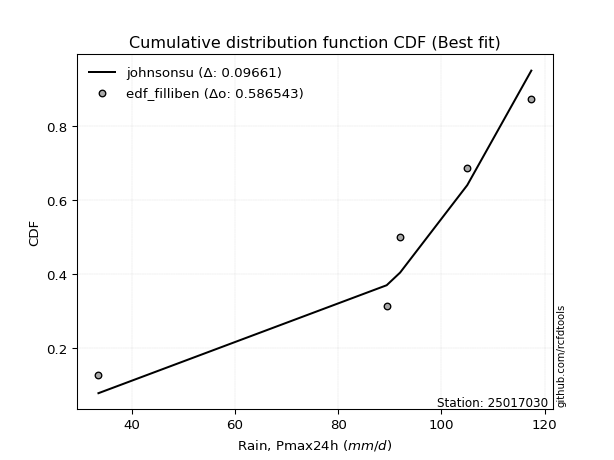</img>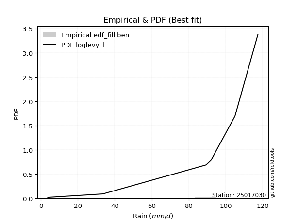</img>

</div>


### 10. EDF Jenkinson (1977)

The Jenkinson formula in hydrology is an empirical plotting position formula used to estimate the non-exceedance probability _(P)_ or return period _(T)_ of a given ordered observation within a sample. It is a widely used method in the frequency analysis of extreme events such as floods and rainfall, as it provides a distribution-free way to plot data. _a≈0.31_ and _b≈0.38_ are constants derived to approximate the median of the probability distribution for the given rank.

<div align="center">


$P=(m-a)/(n+b)$


</div>


**10.1. Empirical values**

<div align="center">

|                | 0                   | 1                   | 2                  | 3                  | 4                  | 5                  |
|:---------------|:--------------------|:--------------------|:-------------------|:-------------------|:-------------------|:-------------------|
| date           | 2025                | 2023                | 2022               | 2021               | 2019               | 2020               |
| x              | 3.8                 | 33.6                | 89.4               | 92.0               | 105.0              | 117.4              |
| m              | 1                   | 2                   | 3                  | 4                  | 5                  | 6                  |
| empirical_dist | edf_jenkinson       | edf_jenkinson       | edf_jenkinson      | edf_jenkinson      | edf_jenkinson      | edf_jenkinson      |
| empirical      | 0.10815047021943573 | 0.26489028213166144 | 0.4216300940438871 | 0.5783699059561128 | 0.7351097178683387 | 0.8918495297805643 |
| empirical_tr   | 1.1212653778558874  | 1.3603411513859276  | 1.7289972899728996 | 2.3717472118959106 | 3.7751479289940844 | 9.246376811594207  |

</div>


**10.2. Kolmogorov-Smirnov fit test (sorted by Δ)**


<div align="center">

|                | 0                   | 1                   | 2                   | 3                   | 4                   | 5                   | 6                   | 7                   | 8                  | 9                   | 10                  | 11                  | 12                  | 13                  | 14                  | 15                  | 16                  | 17                 | 18                 | 19                  | 20                  | 21                 | 22                  | 23                 | 24                  | 25                  | 26                  | 27                 | 28                  | 29                  | 30                  | 31                  | 32                  | 33                  | 34                  | 35                  | 36                | 37                 | 38                 | 39                  | 40                  | 41                  | 42                  | 43                  | 44                  | 45                 | 46                  | 47                 | 48                  | 49                  | 50                  | 51                  | 52                  | 53                 | 54                 | 55                  | 56                 | 57                 | 58                  | 59                  | 60                  | 61                  | 62                | 63                  | 64                  | 65                  | 66                  | 67                  | 68                  | 69                  | 70                 | 71                  | 72                  | 73                 | 74                  | 75                  | 76                  | 77                  | 78                 | 79                 | 80                 | 81                 | 82                 | 83                 | 84                 | 85                  | 86                  | 87                 | 88                  | 89                 | 90                | 91                  | 92                  | 93                 | 94                 | 95                 | 96                  | 97                 | 98                  | 99                  | 100                | 101                 | 102                 | 103                | 104                 | 105                 | 106                | 107                | 108                 | 109                 | 110                | 111                 | 112                 | 113                | 114                | 115                 | 116                 | 117                 | 118                | 119                 | 120                 | 121                | 122                 | 123                | 124                 | 125                 | 126                | 127                 | 128                | 129                 | 130                | 131                 | 132                | 133                | 134                | 135                | 136                 | 137                | 138                | 139                 | 140                | 141                | 142                | 143               | 144               | 145                | 146                | 147                | 148                | 149                | 150                | 151                | 152                | 153                | 154                | 155                | 156                | 157                | 158                | 159               |
|:---------------|:--------------------|:--------------------|:--------------------|:--------------------|:--------------------|:--------------------|:--------------------|:--------------------|:-------------------|:--------------------|:--------------------|:--------------------|:--------------------|:--------------------|:--------------------|:--------------------|:--------------------|:-------------------|:-------------------|:--------------------|:--------------------|:-------------------|:--------------------|:-------------------|:--------------------|:--------------------|:--------------------|:-------------------|:--------------------|:--------------------|:--------------------|:--------------------|:--------------------|:--------------------|:--------------------|:--------------------|:------------------|:-------------------|:-------------------|:--------------------|:--------------------|:--------------------|:--------------------|:--------------------|:--------------------|:-------------------|:--------------------|:-------------------|:--------------------|:--------------------|:--------------------|:--------------------|:--------------------|:-------------------|:-------------------|:--------------------|:-------------------|:-------------------|:--------------------|:--------------------|:--------------------|:--------------------|:------------------|:--------------------|:--------------------|:--------------------|:--------------------|:--------------------|:--------------------|:--------------------|:-------------------|:--------------------|:--------------------|:-------------------|:--------------------|:--------------------|:--------------------|:--------------------|:-------------------|:-------------------|:-------------------|:-------------------|:-------------------|:-------------------|:-------------------|:--------------------|:--------------------|:-------------------|:--------------------|:-------------------|:------------------|:--------------------|:--------------------|:-------------------|:-------------------|:-------------------|:--------------------|:-------------------|:--------------------|:--------------------|:-------------------|:--------------------|:--------------------|:-------------------|:--------------------|:--------------------|:-------------------|:-------------------|:--------------------|:--------------------|:-------------------|:--------------------|:--------------------|:-------------------|:-------------------|:--------------------|:--------------------|:--------------------|:-------------------|:--------------------|:--------------------|:-------------------|:--------------------|:-------------------|:--------------------|:--------------------|:-------------------|:--------------------|:-------------------|:--------------------|:-------------------|:--------------------|:-------------------|:-------------------|:-------------------|:-------------------|:--------------------|:-------------------|:-------------------|:--------------------|:-------------------|:-------------------|:-------------------|:------------------|:------------------|:-------------------|:-------------------|:-------------------|:-------------------|:-------------------|:-------------------|:-------------------|:-------------------|:-------------------|:-------------------|:-------------------|:-------------------|:-------------------|:-------------------|:------------------|
| station        | 25017030            | 25017030            | 25017030            | 25017030            | 25017030            | 25017030            | 25017030            | 25017030            | 25017030           | 25017030            | 25017030            | 25017030            | 25017030            | 25017030            | 25017030            | 25017030            | 25017030            | 25017030           | 25017030           | 25017030            | 25017030            | 25017030           | 25017030            | 25017030           | 25017030            | 25017030            | 25017030            | 25017030           | 25017030            | 25017030            | 25017030            | 25017030            | 25017030            | 25017030            | 25017030            | 25017030            | 25017030          | 25017030           | 25017030           | 25017030            | 25017030            | 25017030            | 25017030            | 25017030            | 25017030            | 25017030           | 25017030            | 25017030           | 25017030            | 25017030            | 25017030            | 25017030            | 25017030            | 25017030           | 25017030           | 25017030            | 25017030           | 25017030           | 25017030            | 25017030            | 25017030            | 25017030            | 25017030          | 25017030            | 25017030            | 25017030            | 25017030            | 25017030            | 25017030            | 25017030            | 25017030           | 25017030            | 25017030            | 25017030           | 25017030            | 25017030            | 25017030            | 25017030            | 25017030           | 25017030           | 25017030           | 25017030           | 25017030           | 25017030           | 25017030           | 25017030            | 25017030            | 25017030           | 25017030            | 25017030           | 25017030          | 25017030            | 25017030            | 25017030           | 25017030           | 25017030           | 25017030            | 25017030           | 25017030            | 25017030            | 25017030           | 25017030            | 25017030            | 25017030           | 25017030            | 25017030            | 25017030           | 25017030           | 25017030            | 25017030            | 25017030           | 25017030            | 25017030            | 25017030           | 25017030           | 25017030            | 25017030            | 25017030            | 25017030           | 25017030            | 25017030            | 25017030           | 25017030            | 25017030           | 25017030            | 25017030            | 25017030           | 25017030            | 25017030           | 25017030            | 25017030           | 25017030            | 25017030           | 25017030           | 25017030           | 25017030           | 25017030            | 25017030           | 25017030           | 25017030            | 25017030           | 25017030           | 25017030           | 25017030          | 25017030          | 25017030           | 25017030           | 25017030           | 25017030           | 25017030           | 25017030           | 25017030           | 25017030           | 25017030           | 25017030           | 25017030           | 25017030           | 25017030           | 25017030           | 25017030          |
| empirical_dist | edf_jenkinson       | edf_jenkinson       | edf_jenkinson       | edf_jenkinson       | edf_jenkinson       | edf_jenkinson       | edf_jenkinson       | edf_jenkinson       | edf_jenkinson      | edf_jenkinson       | edf_jenkinson       | edf_jenkinson       | edf_jenkinson       | edf_jenkinson       | edf_jenkinson       | edf_jenkinson       | edf_jenkinson       | edf_jenkinson      | edf_jenkinson      | edf_jenkinson       | edf_jenkinson       | edf_jenkinson      | edf_jenkinson       | edf_jenkinson      | edf_jenkinson       | edf_jenkinson       | edf_jenkinson       | edf_jenkinson      | edf_jenkinson       | edf_jenkinson       | edf_jenkinson       | edf_jenkinson       | edf_jenkinson       | edf_jenkinson       | edf_jenkinson       | edf_jenkinson       | edf_jenkinson     | edf_jenkinson      | edf_jenkinson      | edf_jenkinson       | edf_jenkinson       | edf_jenkinson       | edf_jenkinson       | edf_jenkinson       | edf_jenkinson       | edf_jenkinson      | edf_jenkinson       | edf_jenkinson      | edf_jenkinson       | edf_jenkinson       | edf_jenkinson       | edf_jenkinson       | edf_jenkinson       | edf_jenkinson      | edf_jenkinson      | edf_jenkinson       | edf_jenkinson      | edf_jenkinson      | edf_jenkinson       | edf_jenkinson       | edf_jenkinson       | edf_jenkinson       | edf_jenkinson     | edf_jenkinson       | edf_jenkinson       | edf_jenkinson       | edf_jenkinson       | edf_jenkinson       | edf_jenkinson       | edf_jenkinson       | edf_jenkinson      | edf_jenkinson       | edf_jenkinson       | edf_jenkinson      | edf_jenkinson       | edf_jenkinson       | edf_jenkinson       | edf_jenkinson       | edf_jenkinson      | edf_jenkinson      | edf_jenkinson      | edf_jenkinson      | edf_jenkinson      | edf_jenkinson      | edf_jenkinson      | edf_jenkinson       | edf_jenkinson       | edf_jenkinson      | edf_jenkinson       | edf_jenkinson      | edf_jenkinson     | edf_jenkinson       | edf_jenkinson       | edf_jenkinson      | edf_jenkinson      | edf_jenkinson      | edf_jenkinson       | edf_jenkinson      | edf_jenkinson       | edf_jenkinson       | edf_jenkinson      | edf_jenkinson       | edf_jenkinson       | edf_jenkinson      | edf_jenkinson       | edf_jenkinson       | edf_jenkinson      | edf_jenkinson      | edf_jenkinson       | edf_jenkinson       | edf_jenkinson      | edf_jenkinson       | edf_jenkinson       | edf_jenkinson      | edf_jenkinson      | edf_jenkinson       | edf_jenkinson       | edf_jenkinson       | edf_jenkinson      | edf_jenkinson       | edf_jenkinson       | edf_jenkinson      | edf_jenkinson       | edf_jenkinson      | edf_jenkinson       | edf_jenkinson       | edf_jenkinson      | edf_jenkinson       | edf_jenkinson      | edf_jenkinson       | edf_jenkinson      | edf_jenkinson       | edf_jenkinson      | edf_jenkinson      | edf_jenkinson      | edf_jenkinson      | edf_jenkinson       | edf_jenkinson      | edf_jenkinson      | edf_jenkinson       | edf_jenkinson      | edf_jenkinson      | edf_jenkinson      | edf_jenkinson     | edf_jenkinson     | edf_jenkinson      | edf_jenkinson      | edf_jenkinson      | edf_jenkinson      | edf_jenkinson      | edf_jenkinson      | edf_jenkinson      | edf_jenkinson      | edf_jenkinson      | edf_jenkinson      | edf_jenkinson      | edf_jenkinson      | edf_jenkinson      | edf_jenkinson      | edf_jenkinson     |
| p_dist         | loglevy_l           | johnsonsu           | genextreme          | gausshyper          | genpareto           | argus               | levy_l              | genhalflogistic     | beta               | arcsine             | trapezoid           | dweibull            | weibull_min         | logt                | gumbel_l            | gennorm             | ksone               | loggennorm         | pearson3           | logdgamma           | logtrapezoid        | semicircular       | wrapcauchy          | logvonmises_line   | anglit              | logpearson3         | dgamma              | mielke             | skewnorm            | logarcsine          | triang              | exponweib           | t                   | exponnorm           | crystalball         | norm                | nct               | f                  | logweibull_max     | foldnorm            | gamma               | erlang              | betaprime           | loggumbel_l         | rice                | logsemicircular    | logloglaplace       | logdweibull        | logistic            | loganglit           | loginvweibull       | invgauss            | maxwell             | invgamma           | ncf                | logwrapcauchy       | rayleigh           | halfgennorm        | hypsecant           | cosine              | gengamma            | kstwobign           | logncf            | loggamma            | loggamma            | logf                | logbetaprime        | logrice             | lognorm             | logexponnorm        | lognct             | logfatiguelife      | logerlang           | logkstwobign       | loginvgamma         | logalpha            | lognakagami         | loginvgauss         | halfnorm           | loggompertz        | loggengamma        | logburr12          | lomax              | johnsonsb          | kappa4             | genexpon            | logfoldnorm         | logmaxwell         | loggenextreme       | gumbel_r           | laplace           | burr                | loggenexpon         | logbeta            | logargus           | loglogistic        | lograyleigh         | logcrystalball     | logburr             | burr12              | halflogistic       | loghalfnorm         | loghypsecant        | moyal              | logloggamma         | truncweibull_min    | logmielke          | loglomax           | logcosine           | loggumbel_r         | tukeylambda        | kappa3              | uniform             | loglaplace         | loglaplace         | loghalflogistic     | vonmises_line       | logmoyal            | bradford           | wald                | loggenpareto        | nakagami           | gompertz            | truncexpon         | logwald             | loggenhalflogistic  | loggausshyper      | logksone            | logjohnsonsb       | logskewnorm         | truncnorm          | logweibull_min      | logtriang          | logexponweib       | invweibull         | logkappa4          | fatiguelife         | logkappa3          | loguniform         | logtruncweibull_min | logtruncnorm       | alpha              | logbradford        | logtruncexpon     | weibull_max       | powerlaw           | logjohnsonsu       | truncpareto        | logexponpow        | exponpow           | logpowerlaw        | logtruncpareto     | logtukeylambda     | rdist              | logrdist           | genlogistic        | loggenlogistic     | loghalfgennorm     | logvonmises        | vonmises          |
| delta          | 0.08130094985646619 | 0.10760224260429763 | 0.10815047021901025 | 0.10815047023762159 | 0.11566483700263816 | 0.14599311210307414 | 0.14667557531437364 | 0.15042750349937833 | 0.1538184128880824 | 0.16714920416947704 | 0.17204609372913499 | 0.17360452730242976 | 0.17573820679039848 | 0.18184463762613257 | 0.18187377644055153 | 0.18606622315047588 | 0.19076321937812807 | 0.1921113869449684 | 0.1935303552820949 | 0.19506598682177445 | 0.19615048750073388 | 0.2015139912278036 | 0.20168563504224785 | 0.2028254930075642 | 0.20989401359827514 | 0.21134582645652483 | 0.21194867707655757 | 0.2153114590444078 | 0.21841611414186496 | 0.21881459560952132 | 0.22278758365293955 | 0.22861938554200917 | 0.22985393038409446 | 0.22985552588504404 | 0.22985826167025353 | 0.22985826816626037 | 0.229898366051497 | 0.2305839183537028 | 0.2307922820440922 | 0.23449975438716258 | 0.23461006337133944 | 0.23513651212350656 | 0.23690214005020355 | 0.23698060044312758 | 0.23708724241036522 | 0.2377763759494193 | 0.24390875341438056 | 0.2463968844247656 | 0.24792821007241234 | 0.24798783028367594 | 0.24876235899067672 | 0.25052248210033506 | 0.25133440935085466 | 0.2518570967532768 | 0.2527088020301061 | 0.25313823097705423 | 0.2577870105395765 | 0.2618003918521092 | 0.26192989070655753 | 0.26307717361325017 | 0.26354586064948476 | 0.26589110965625967 | 0.269950788196117 | 0.27103881762838117 | 0.27103881762838117 | 0.27145300099671815 | 0.27147221662244386 | 0.27202818099512976 | 0.27202821851266484 | 0.27202972018107646 | 0.2720525841354146 | 0.27208560635532825 | 0.27233780455656925 | 0.2736896852311494 | 0.27400851764880846 | 0.27428840806100646 | 0.27571514570495353 | 0.27607391405500464 | 0.2765712151340302 | 0.2771418983968374 | 0.2773348889750738 | 0.2784134463089429 | 0.2816299232175416 | 0.2819748055735133 | 0.2826929670688367 | 0.28387021823017217 | 0.28546748893144974 | 0.2887077787762237 | 0.28947982611682627 | 0.2895968561897158 | 0.290071648145283 | 0.29146048311041567 | 0.29163681543044423 | 0.2916501482933203 | 0.2928656064793926 | 0.2930512657262648 | 0.29360016870226907 | 0.2945156467622137 | 0.29627676288041865 | 0.30433748498639057 | 0.3046653762095141 | 0.30836497018522363 | 0.30838640908575826 | 0.3093501378197098 | 0.31210491153627745 | 0.31346061014430865 | 0.3147120224555357 | 0.3180040416769665 | 0.32104566689341024 | 0.32415584082002374 | 0.3258606475299472 | 0.33175317501174756 | 0.33189103271667625 | 0.3340039434812538 | 0.3340039434812538 | 0.33539413336150886 | 0.33795214850881367 | 0.34105696582719264 | 0.3589224857614555 | 0.36537065973446275 | 0.37478038735279523 | 0.3774777073940308 | 0.37941432533422975 | 0.3880475431244836 | 0.39037980901315456 | 0.41145628053065925 | 0.4210061231687687 | 0.42885102932939806 | 0.4293611981769604 | 0.43412804182017134 | 0.4353209045773789 | 0.45063116769042777 | 0.4552982151178659 | 0.4740276645409962 | 0.4802879325121785 | 0.4942163099861698 | 0.49536928852392326 | 0.4960560185711615 | 0.4989472540040553 | 0.5024320237976745  | 0.5079451419723875 | 0.5173780312300433 | 0.5198924553295521 | 0.520233248640015 | 0.537466135459177 | 0.5613777438979325 | 0.6058522936679469 | 0.6150233894084687 | 0.6258435657851984 | 0.6565139243266153 | 0.6658483361938171 | 0.6951071294832042 | 0.7310803172147384 | 0.7351097176581902 | 0.7351097178579218 | 0.7351097178683387 | 0.7351097178683387 | 0.7351097178683387 | 1.1213813655184712 | 18.82042440826594 |
| deltao         | 0.530385761606      | 0.530385761606      | 0.530385761606      | 0.530385761606      | 0.530385761606      | 0.530385761606      | 0.530385761606      | 0.530385761606      | 0.530385761606     | 0.530385761606      | 0.530385761606      | 0.530385761606      | 0.530385761606      | 0.530385761606      | 0.530385761606      | 0.530385761606      | 0.530385761606      | 0.530385761606     | 0.530385761606     | 0.530385761606      | 0.530385761606      | 0.530385761606     | 0.530385761606      | 0.530385761606     | 0.530385761606      | 0.530385761606      | 0.530385761606      | 0.530385761606     | 0.530385761606      | 0.530385761606      | 0.530385761606      | 0.530385761606      | 0.530385761606      | 0.530385761606      | 0.530385761606      | 0.530385761606      | 0.530385761606    | 0.530385761606     | 0.530385761606     | 0.530385761606      | 0.530385761606      | 0.530385761606      | 0.530385761606      | 0.530385761606      | 0.530385761606      | 0.530385761606     | 0.530385761606      | 0.530385761606     | 0.530385761606      | 0.530385761606      | 0.530385761606      | 0.530385761606      | 0.530385761606      | 0.530385761606     | 0.530385761606     | 0.530385761606      | 0.530385761606     | 0.530385761606     | 0.530385761606      | 0.530385761606      | 0.530385761606      | 0.530385761606      | 0.530385761606    | 0.530385761606      | 0.530385761606      | 0.530385761606      | 0.530385761606      | 0.530385761606      | 0.530385761606      | 0.530385761606      | 0.530385761606     | 0.530385761606      | 0.530385761606      | 0.530385761606     | 0.530385761606      | 0.530385761606      | 0.530385761606      | 0.530385761606      | 0.530385761606     | 0.530385761606     | 0.530385761606     | 0.530385761606     | 0.530385761606     | 0.530385761606     | 0.530385761606     | 0.530385761606      | 0.530385761606      | 0.530385761606     | 0.530385761606      | 0.530385761606     | 0.530385761606    | 0.530385761606      | 0.530385761606      | 0.530385761606     | 0.530385761606     | 0.530385761606     | 0.530385761606      | 0.530385761606     | 0.530385761606      | 0.530385761606      | 0.530385761606     | 0.530385761606      | 0.530385761606      | 0.530385761606     | 0.530385761606      | 0.530385761606      | 0.530385761606     | 0.530385761606     | 0.530385761606      | 0.530385761606      | 0.530385761606     | 0.530385761606      | 0.530385761606      | 0.530385761606     | 0.530385761606     | 0.530385761606      | 0.530385761606      | 0.530385761606      | 0.530385761606     | 0.530385761606      | 0.530385761606      | 0.530385761606     | 0.530385761606      | 0.530385761606     | 0.530385761606      | 0.530385761606      | 0.530385761606     | 0.530385761606      | 0.530385761606     | 0.530385761606      | 0.530385761606     | 0.530385761606      | 0.530385761606     | 0.530385761606     | 0.530385761606     | 0.530385761606     | 0.530385761606      | 0.530385761606     | 0.530385761606     | 0.530385761606      | 0.530385761606     | 0.530385761606     | 0.530385761606     | 0.530385761606    | 0.530385761606    | 0.530385761606     | 0.530385761606     | 0.530385761606     | 0.530385761606     | 0.530385761606     | 0.530385761606     | 0.530385761606     | 0.530385761606     | 0.530385761606     | 0.530385761606     | 0.530385761606     | 0.530385761606     | 0.530385761606     | 0.530385761606     | 0.530385761606    |
| eval           | Δo > Δ              | Δo > Δ              | Δo > Δ              | Δo > Δ              | Δo > Δ              | Δo > Δ              | Δo > Δ              | Δo > Δ              | Δo > Δ             | Δo > Δ              | Δo > Δ              | Δo > Δ              | Δo > Δ              | Δo > Δ              | Δo > Δ              | Δo > Δ              | Δo > Δ              | Δo > Δ             | Δo > Δ             | Δo > Δ              | Δo > Δ              | Δo > Δ             | Δo > Δ              | Δo > Δ             | Δo > Δ              | Δo > Δ              | Δo > Δ              | Δo > Δ             | Δo > Δ              | Δo > Δ              | Δo > Δ              | Δo > Δ              | Δo > Δ              | Δo > Δ              | Δo > Δ              | Δo > Δ              | Δo > Δ            | Δo > Δ             | Δo > Δ             | Δo > Δ              | Δo > Δ              | Δo > Δ              | Δo > Δ              | Δo > Δ              | Δo > Δ              | Δo > Δ             | Δo > Δ              | Δo > Δ             | Δo > Δ              | Δo > Δ              | Δo > Δ              | Δo > Δ              | Δo > Δ              | Δo > Δ             | Δo > Δ             | Δo > Δ              | Δo > Δ             | Δo > Δ             | Δo > Δ              | Δo > Δ              | Δo > Δ              | Δo > Δ              | Δo > Δ            | Δo > Δ              | Δo > Δ              | Δo > Δ              | Δo > Δ              | Δo > Δ              | Δo > Δ              | Δo > Δ              | Δo > Δ             | Δo > Δ              | Δo > Δ              | Δo > Δ             | Δo > Δ              | Δo > Δ              | Δo > Δ              | Δo > Δ              | Δo > Δ             | Δo > Δ             | Δo > Δ             | Δo > Δ             | Δo > Δ             | Δo > Δ             | Δo > Δ             | Δo > Δ              | Δo > Δ              | Δo > Δ             | Δo > Δ              | Δo > Δ             | Δo > Δ            | Δo > Δ              | Δo > Δ              | Δo > Δ             | Δo > Δ             | Δo > Δ             | Δo > Δ              | Δo > Δ             | Δo > Δ              | Δo > Δ              | Δo > Δ             | Δo > Δ              | Δo > Δ              | Δo > Δ             | Δo > Δ              | Δo > Δ              | Δo > Δ             | Δo > Δ             | Δo > Δ              | Δo > Δ              | Δo > Δ             | Δo > Δ              | Δo > Δ              | Δo > Δ             | Δo > Δ             | Δo > Δ              | Δo > Δ              | Δo > Δ              | Δo > Δ             | Δo > Δ              | Δo > Δ              | Δo > Δ             | Δo > Δ              | Δo > Δ             | Δo > Δ              | Δo > Δ              | Δo > Δ             | Δo > Δ              | Δo > Δ             | Δo > Δ              | Δo > Δ             | Δo > Δ              | Δo > Δ             | Δo > Δ             | Δo > Δ             | Δo > Δ             | Δo > Δ              | Δo > Δ             | Δo > Δ             | Δo > Δ              | Δo > Δ             | Δo > Δ             | Δo > Δ             | Δo > Δ            | Δo <= Δ           | Δo <= Δ            | Δo <= Δ            | Δo <= Δ            | Δo <= Δ            | Δo <= Δ            | Δo <= Δ            | Δo <= Δ            | Δo <= Δ            | Δo <= Δ            | Δo <= Δ            | Δo <= Δ            | Δo <= Δ            | Δo <= Δ            | Δo <= Δ            | Δo <= Δ           |
| fit            | 1                   | 1                   | 1                   | 1                   | 1                   | 1                   | 1                   | 1                   | 1                  | 1                   | 1                   | 1                   | 1                   | 1                   | 1                   | 1                   | 1                   | 1                  | 1                  | 1                   | 1                   | 1                  | 1                   | 1                  | 1                   | 1                   | 1                   | 1                  | 1                   | 1                   | 1                   | 1                   | 1                   | 1                   | 1                   | 1                   | 1                 | 1                  | 1                  | 1                   | 1                   | 1                   | 1                   | 1                   | 1                   | 1                  | 1                   | 1                  | 1                   | 1                   | 1                   | 1                   | 1                   | 1                  | 1                  | 1                   | 1                  | 1                  | 1                   | 1                   | 1                   | 1                   | 1                 | 1                   | 1                   | 1                   | 1                   | 1                   | 1                   | 1                   | 1                  | 1                   | 1                   | 1                  | 1                   | 1                   | 1                   | 1                   | 1                  | 1                  | 1                  | 1                  | 1                  | 1                  | 1                  | 1                   | 1                   | 1                  | 1                   | 1                  | 1                 | 1                   | 1                   | 1                  | 1                  | 1                  | 1                   | 1                  | 1                   | 1                   | 1                  | 1                   | 1                   | 1                  | 1                   | 1                   | 1                  | 1                  | 1                   | 1                   | 1                  | 1                   | 1                   | 1                  | 1                  | 1                   | 1                   | 1                   | 1                  | 1                   | 1                   | 1                  | 1                   | 1                  | 1                   | 1                   | 1                  | 1                   | 1                  | 1                   | 1                  | 1                   | 1                  | 1                  | 1                  | 1                  | 1                   | 1                  | 1                  | 1                   | 1                  | 1                  | 1                  | 1                 | 0                 | 0                  | 0                  | 0                  | 0                  | 0                  | 0                  | 0                  | 0                  | 0                  | 0                  | 0                  | 0                  | 0                  | 0                  | 0                 |
| n              | 6                   | 6                   | 6                   | 6                   | 6                   | 6                   | 6                   | 6                   | 6                  | 6                   | 6                   | 6                   | 6                   | 6                   | 6                   | 6                   | 6                   | 6                  | 6                  | 6                   | 6                   | 6                  | 6                   | 6                  | 6                   | 6                   | 6                   | 6                  | 6                   | 6                   | 6                   | 6                   | 6                   | 6                   | 6                   | 6                   | 6                 | 6                  | 6                  | 6                   | 6                   | 6                   | 6                   | 6                   | 6                   | 6                  | 6                   | 6                  | 6                   | 6                   | 6                   | 6                   | 6                   | 6                  | 6                  | 6                   | 6                  | 6                  | 6                   | 6                   | 6                   | 6                   | 6                 | 6                   | 6                   | 6                   | 6                   | 6                   | 6                   | 6                   | 6                  | 6                   | 6                   | 6                  | 6                   | 6                   | 6                   | 6                   | 6                  | 6                  | 6                  | 6                  | 6                  | 6                  | 6                  | 6                   | 6                   | 6                  | 6                   | 6                  | 6                 | 6                   | 6                   | 6                  | 6                  | 6                  | 6                   | 6                  | 6                   | 6                   | 6                  | 6                   | 6                   | 6                  | 6                   | 6                   | 6                  | 6                  | 6                   | 6                   | 6                  | 6                   | 6                   | 6                  | 6                  | 6                   | 6                   | 6                   | 6                  | 6                   | 6                   | 6                  | 6                   | 6                  | 6                   | 6                   | 6                  | 6                   | 6                  | 6                   | 6                  | 6                   | 6                  | 6                  | 6                  | 6                  | 6                   | 6                  | 6                  | 6                   | 6                  | 6                  | 6                  | 6                 | 6                 | 6                  | 6                  | 6                  | 6                  | 6                  | 6                  | 6                  | 6                  | 6                  | 6                  | 6                  | 6                  | 6                  | 6                  | 6                 |
| best_fit       | 1                   | 0                   | 0                   | 0                   | 0                   | 0                   | 0                   | 0                   | 0                  | 0                   | 0                   | 0                   | 0                   | 0                   | 0                   | 0                   | 0                   | 0                  | 0                  | 0                   | 0                   | 0                  | 0                   | 0                  | 0                   | 0                   | 0                   | 0                  | 0                   | 0                   | 0                   | 0                   | 0                   | 0                   | 0                   | 0                   | 0                 | 0                  | 0                  | 0                   | 0                   | 0                   | 0                   | 0                   | 0                   | 0                  | 0                   | 0                  | 0                   | 0                   | 0                   | 0                   | 0                   | 0                  | 0                  | 0                   | 0                  | 0                  | 0                   | 0                   | 0                   | 0                   | 0                 | 0                   | 0                   | 0                   | 0                   | 0                   | 0                   | 0                   | 0                  | 0                   | 0                   | 0                  | 0                   | 0                   | 0                   | 0                   | 0                  | 0                  | 0                  | 0                  | 0                  | 0                  | 0                  | 0                   | 0                   | 0                  | 0                   | 0                  | 0                 | 0                   | 0                   | 0                  | 0                  | 0                  | 0                   | 0                  | 0                   | 0                   | 0                  | 0                   | 0                   | 0                  | 0                   | 0                   | 0                  | 0                  | 0                   | 0                   | 0                  | 0                   | 0                   | 0                  | 0                  | 0                   | 0                   | 0                   | 0                  | 0                   | 0                   | 0                  | 0                   | 0                  | 0                   | 0                   | 0                  | 0                   | 0                  | 0                   | 0                  | 0                   | 0                  | 0                  | 0                  | 0                  | 0                   | 0                  | 0                  | 0                   | 0                  | 0                  | 0                  | 0                 | 0                 | 0                  | 0                  | 0                  | 0                  | 0                  | 0                  | 0                  | 0                  | 0                  | 0                  | 0                  | 0                  | 0                  | 0                  | 0                 |
| best_fit_sort  | 1                   | 2                   | 3                   | 4                   | 5                   | 6                   | 7                   | 8                   | 9                  | 10                  | 11                  | 12                  | 13                  | 14                  | 15                  | 16                  | 17                  | 18                 | 19                 | 20                  | 21                  | 22                 | 23                  | 24                 | 25                  | 26                  | 27                  | 28                 | 29                  | 30                  | 31                  | 32                  | 33                  | 34                  | 35                  | 36                  | 37                | 38                 | 39                 | 40                  | 41                  | 42                  | 43                  | 44                  | 45                  | 46                 | 47                  | 48                 | 49                  | 50                  | 51                  | 52                  | 53                  | 54                 | 55                 | 56                  | 57                 | 58                 | 59                  | 60                  | 61                  | 62                  | 63                | 64                  | 65                  | 66                  | 67                  | 68                  | 69                  | 70                  | 71                 | 72                  | 73                  | 74                 | 75                  | 76                  | 77                  | 78                  | 79                 | 80                 | 81                 | 82                 | 83                 | 84                 | 85                 | 86                  | 87                  | 88                 | 89                  | 90                 | 91                | 92                  | 93                  | 94                 | 95                 | 96                 | 97                  | 98                 | 99                  | 100                 | 101                | 102                 | 103                 | 104                | 105                 | 106                 | 107                | 108                | 109                 | 110                 | 111                | 112                 | 113                 | 114                | 115                | 116                 | 117                 | 118                 | 119                | 120                 | 121                 | 122                | 123                 | 124                | 125                 | 126                 | 127                | 128                 | 129                | 130                 | 131                | 132                 | 133                | 134                | 135                | 136                | 137                 | 138                | 139                | 140                 | 141                | 142                | 143                | 144               | 145               | 146                | 147                | 148                | 149                | 150                | 151                | 152                | 153                | 154                | 155                | 156                | 157                | 158                | 159                | 160               |

</div>


**10.3. Best fit**

<div align="center">

|   id |   station | empirical_dist   | p_dist    |     delta |   deltao | eval   |   fit |   n |   best_fit |   best_fit_sort |
|-----:|----------:|:-----------------|:----------|----------:|---------:|:-------|------:|----:|-----------:|----------------:|
|    0 |  25017030 | edf_jenkinson    | loglevy_l | 0.0813009 | 0.530386 | Δo > Δ |     1 |   6 |          1 |               1 |

</div>


<div align="center">

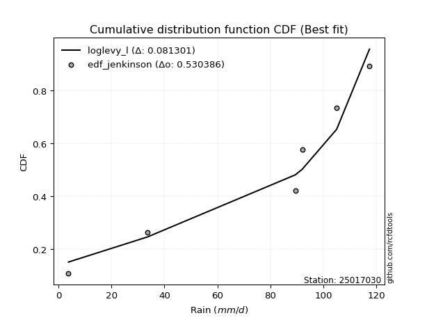</img>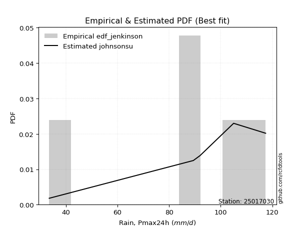</img>

</div>


### 11. EDF Cunnane (1978)

Cunnane´s work in statistical hydrology has focused on the performance and evaluation of different probability distributions (such as GEV, Gumbel, Lognormal) for flood frequency estimation. _b_ is a constant, typically set to 0.4.

<div align="center">


$P=(m-b)/(n+1-2b)$


</div>


**11.1. Empirical values**

<div align="center">

|                | 0                  | 1                   | 2                   | 3                  | 4                  | 5                  |
|:---------------|:-------------------|:--------------------|:--------------------|:-------------------|:-------------------|:-------------------|
| date           | 2025               | 2023                | 2022                | 2021               | 2019               | 2020               |
| x              | 3.8                | 33.6                | 89.4                | 92.0               | 105.0              | 117.4              |
| m              | 1                  | 2                   | 3                   | 4                  | 5                  | 6                  |
| empirical_dist | edf_cunnane        | edf_cunnane         | edf_cunnane         | edf_cunnane        | edf_cunnane        | edf_cunnane        |
| empirical      | 0.0967741935483871 | 0.25806451612903225 | 0.41935483870967744 | 0.5806451612903226 | 0.7419354838709676 | 0.9032258064516128 |
| empirical_tr   | 1.1071428571428572 | 1.3478260869565217  | 1.7222222222222225  | 2.384615384615385  | 3.8749999999999982 | 10.333333333333318 |

</div>


**11.2. Kolmogorov-Smirnov fit test (sorted by Δ)**


<div align="center">

|                | 0                   | 1                  | 2                   | 3                   | 4                   | 5                   | 6                   | 7                  | 8                   | 9                   | 10                  | 11                  | 12                  | 13                  | 14                 | 15                  | 16                  | 17                  | 18                  | 19                  | 20                 | 21                  | 22                 | 23                  | 24                 | 25                  | 26                  | 27                  | 28                  | 29                  | 30                  | 31                  | 32                  | 33                  | 34                  | 35                  | 36                  | 37                  | 38                  | 39                  | 40                  | 41                  | 42                  | 43                 | 44                | 45                  | 46                | 47                  | 48                 | 49                  | 50                  | 51                  | 52                 | 53                | 54                  | 55                 | 56                  | 57                 | 58                 | 59                  | 60                  | 61                  | 62                 | 63                  | 64                  | 65                  | 66                  | 67                  | 68                  | 69                  | 70                 | 71                  | 72                  | 73                 | 74                  | 75                  | 76                 | 77                  | 78                 | 79                 | 80                 | 81                  | 82                 | 83                  | 84                  | 85                  | 86                  | 87                 | 88                  | 89                 | 90                 | 91                  | 92                 | 93                 | 94                  | 95                  | 96                 | 97                 | 98                  | 99                 | 100                | 101                 | 102                 | 103                | 104                 | 105                 | 106                | 107                 | 108                | 109                 | 110                | 111                 | 112                 | 113                | 114                | 115                 | 116                 | 117                 | 118                | 119                 | 120                | 121                | 122                 | 123                | 124                 | 125                 | 126                 | 127                 | 128                 | 129                 | 130                 | 131                 | 132                | 133                | 134                 | 135                 | 136                | 137               | 138                | 139                 | 140                | 141                | 142                | 143                | 144               | 145                | 146                | 147                | 148                | 149                | 150                | 151                | 152                | 153                | 154               | 155                | 156                | 157                | 158                | 159                |
|:---------------|:--------------------|:-------------------|:--------------------|:--------------------|:--------------------|:--------------------|:--------------------|:-------------------|:--------------------|:--------------------|:--------------------|:--------------------|:--------------------|:--------------------|:-------------------|:--------------------|:--------------------|:--------------------|:--------------------|:--------------------|:-------------------|:--------------------|:-------------------|:--------------------|:-------------------|:--------------------|:--------------------|:--------------------|:--------------------|:--------------------|:--------------------|:--------------------|:--------------------|:--------------------|:--------------------|:--------------------|:--------------------|:--------------------|:--------------------|:--------------------|:--------------------|:--------------------|:--------------------|:-------------------|:------------------|:--------------------|:------------------|:--------------------|:-------------------|:--------------------|:--------------------|:--------------------|:-------------------|:------------------|:--------------------|:-------------------|:--------------------|:-------------------|:-------------------|:--------------------|:--------------------|:--------------------|:-------------------|:--------------------|:--------------------|:--------------------|:--------------------|:--------------------|:--------------------|:--------------------|:-------------------|:--------------------|:--------------------|:-------------------|:--------------------|:--------------------|:-------------------|:--------------------|:-------------------|:-------------------|:-------------------|:--------------------|:-------------------|:--------------------|:--------------------|:--------------------|:--------------------|:-------------------|:--------------------|:-------------------|:-------------------|:--------------------|:-------------------|:-------------------|:--------------------|:--------------------|:-------------------|:-------------------|:--------------------|:-------------------|:-------------------|:--------------------|:--------------------|:-------------------|:--------------------|:--------------------|:-------------------|:--------------------|:-------------------|:--------------------|:-------------------|:--------------------|:--------------------|:-------------------|:-------------------|:--------------------|:--------------------|:--------------------|:-------------------|:--------------------|:-------------------|:-------------------|:--------------------|:-------------------|:--------------------|:--------------------|:--------------------|:--------------------|:--------------------|:--------------------|:--------------------|:--------------------|:-------------------|:-------------------|:--------------------|:--------------------|:-------------------|:------------------|:-------------------|:--------------------|:-------------------|:-------------------|:-------------------|:-------------------|:------------------|:-------------------|:-------------------|:-------------------|:-------------------|:-------------------|:-------------------|:-------------------|:-------------------|:-------------------|:------------------|:-------------------|:-------------------|:-------------------|:-------------------|:-------------------|
| station        | 25017030            | 25017030           | 25017030            | 25017030            | 25017030            | 25017030            | 25017030            | 25017030           | 25017030            | 25017030            | 25017030            | 25017030            | 25017030            | 25017030            | 25017030           | 25017030            | 25017030            | 25017030            | 25017030            | 25017030            | 25017030           | 25017030            | 25017030           | 25017030            | 25017030           | 25017030            | 25017030            | 25017030            | 25017030            | 25017030            | 25017030            | 25017030            | 25017030            | 25017030            | 25017030            | 25017030            | 25017030            | 25017030            | 25017030            | 25017030            | 25017030            | 25017030            | 25017030            | 25017030           | 25017030          | 25017030            | 25017030          | 25017030            | 25017030           | 25017030            | 25017030            | 25017030            | 25017030           | 25017030          | 25017030            | 25017030           | 25017030            | 25017030           | 25017030           | 25017030            | 25017030            | 25017030            | 25017030           | 25017030            | 25017030            | 25017030            | 25017030            | 25017030            | 25017030            | 25017030            | 25017030           | 25017030            | 25017030            | 25017030           | 25017030            | 25017030            | 25017030           | 25017030            | 25017030           | 25017030           | 25017030           | 25017030            | 25017030           | 25017030            | 25017030            | 25017030            | 25017030            | 25017030           | 25017030            | 25017030           | 25017030           | 25017030            | 25017030           | 25017030           | 25017030            | 25017030            | 25017030           | 25017030           | 25017030            | 25017030           | 25017030           | 25017030            | 25017030            | 25017030           | 25017030            | 25017030            | 25017030           | 25017030            | 25017030           | 25017030            | 25017030           | 25017030            | 25017030            | 25017030           | 25017030           | 25017030            | 25017030            | 25017030            | 25017030           | 25017030            | 25017030           | 25017030           | 25017030            | 25017030           | 25017030            | 25017030            | 25017030            | 25017030            | 25017030            | 25017030            | 25017030            | 25017030            | 25017030           | 25017030           | 25017030            | 25017030            | 25017030           | 25017030          | 25017030           | 25017030            | 25017030           | 25017030           | 25017030           | 25017030           | 25017030          | 25017030           | 25017030           | 25017030           | 25017030           | 25017030           | 25017030           | 25017030           | 25017030           | 25017030           | 25017030          | 25017030           | 25017030           | 25017030           | 25017030           | 25017030           |
| empirical_dist | edf_cunnane         | edf_cunnane        | edf_cunnane         | edf_cunnane         | edf_cunnane         | edf_cunnane         | edf_cunnane         | edf_cunnane        | edf_cunnane         | edf_cunnane         | edf_cunnane         | edf_cunnane         | edf_cunnane         | edf_cunnane         | edf_cunnane        | edf_cunnane         | edf_cunnane         | edf_cunnane         | edf_cunnane         | edf_cunnane         | edf_cunnane        | edf_cunnane         | edf_cunnane        | edf_cunnane         | edf_cunnane        | edf_cunnane         | edf_cunnane         | edf_cunnane         | edf_cunnane         | edf_cunnane         | edf_cunnane         | edf_cunnane         | edf_cunnane         | edf_cunnane         | edf_cunnane         | edf_cunnane         | edf_cunnane         | edf_cunnane         | edf_cunnane         | edf_cunnane         | edf_cunnane         | edf_cunnane         | edf_cunnane         | edf_cunnane        | edf_cunnane       | edf_cunnane         | edf_cunnane       | edf_cunnane         | edf_cunnane        | edf_cunnane         | edf_cunnane         | edf_cunnane         | edf_cunnane        | edf_cunnane       | edf_cunnane         | edf_cunnane        | edf_cunnane         | edf_cunnane        | edf_cunnane        | edf_cunnane         | edf_cunnane         | edf_cunnane         | edf_cunnane        | edf_cunnane         | edf_cunnane         | edf_cunnane         | edf_cunnane         | edf_cunnane         | edf_cunnane         | edf_cunnane         | edf_cunnane        | edf_cunnane         | edf_cunnane         | edf_cunnane        | edf_cunnane         | edf_cunnane         | edf_cunnane        | edf_cunnane         | edf_cunnane        | edf_cunnane        | edf_cunnane        | edf_cunnane         | edf_cunnane        | edf_cunnane         | edf_cunnane         | edf_cunnane         | edf_cunnane         | edf_cunnane        | edf_cunnane         | edf_cunnane        | edf_cunnane        | edf_cunnane         | edf_cunnane        | edf_cunnane        | edf_cunnane         | edf_cunnane         | edf_cunnane        | edf_cunnane        | edf_cunnane         | edf_cunnane        | edf_cunnane        | edf_cunnane         | edf_cunnane         | edf_cunnane        | edf_cunnane         | edf_cunnane         | edf_cunnane        | edf_cunnane         | edf_cunnane        | edf_cunnane         | edf_cunnane        | edf_cunnane         | edf_cunnane         | edf_cunnane        | edf_cunnane        | edf_cunnane         | edf_cunnane         | edf_cunnane         | edf_cunnane        | edf_cunnane         | edf_cunnane        | edf_cunnane        | edf_cunnane         | edf_cunnane        | edf_cunnane         | edf_cunnane         | edf_cunnane         | edf_cunnane         | edf_cunnane         | edf_cunnane         | edf_cunnane         | edf_cunnane         | edf_cunnane        | edf_cunnane        | edf_cunnane         | edf_cunnane         | edf_cunnane        | edf_cunnane       | edf_cunnane        | edf_cunnane         | edf_cunnane        | edf_cunnane        | edf_cunnane        | edf_cunnane        | edf_cunnane       | edf_cunnane        | edf_cunnane        | edf_cunnane        | edf_cunnane        | edf_cunnane        | edf_cunnane        | edf_cunnane        | edf_cunnane        | edf_cunnane        | edf_cunnane       | edf_cunnane        | edf_cunnane        | edf_cunnane        | edf_cunnane        | edf_cunnane        |
| p_dist         | loglevy_l           | genextreme         | johnsonsu           | gausshyper          | genpareto           | argus               | genhalflogistic     | levy_l             | beta                | dweibull            | arcsine             | trapezoid           | logt                | weibull_min         | gennorm            | gumbel_l            | loggennorm          | ksone               | pearson3            | logtrapezoid        | semicircular       | wrapcauchy          | logvonmises_line   | dgamma              | logdgamma          | anglit              | logpearson3         | mielke              | skewnorm            | triang              | logarcsine          | exponweib           | t                   | exponnorm           | crystalball         | norm                | nct                 | f                   | foldnorm            | gamma               | erlang              | betaprime           | loggumbel_l         | rice               | logsemicircular   | logweibull_max      | logistic          | loganglit           | loginvweibull      | invgauss            | maxwell             | invgamma            | ncf                | logloglaplace     | logdweibull         | logwrapcauchy      | rayleigh            | halfgennorm        | hypsecant          | cosine              | gengamma            | kstwobign           | logncf             | loggamma            | loggamma            | logf                | logbetaprime        | logrice             | lognorm             | logexponnorm        | lognct             | logfatiguelife      | logerlang           | logkstwobign       | loginvgamma         | logalpha            | lognakagami        | loginvgauss         | halfnorm           | loggompertz        | loggengamma        | logburr12           | lomax              | kappa4              | genexpon            | logfoldnorm         | johnsonsb           | logmaxwell         | loggenextreme       | gumbel_r           | laplace            | burr                | loggenexpon        | logargus           | loglogistic         | lograyleigh         | logcrystalball     | logbeta            | logburr             | halflogistic       | loghalfnorm        | loghypsecant        | burr12              | moyal              | logloggamma         | truncweibull_min    | logmielke          | logcosine           | loglomax           | loggumbel_r         | tukeylambda        | kappa3              | uniform             | loglaplace         | loglaplace         | loghalflogistic     | vonmises_line       | logmoyal            | bradford           | wald                | loggenpareto       | nakagami           | gompertz            | truncexpon         | logwald             | loggenhalflogistic  | loggausshyper       | logksone            | logjohnsonsb        | logskewnorm         | truncnorm           | logweibull_min      | logtriang          | logexponweib       | invweibull          | logkappa4           | logkappa3          | loguniform        | fatiguelife        | logtruncweibull_min | logtruncnorm       | logbradford        | logtruncexpon      | alpha              | weibull_max       | powerlaw           | logjohnsonsu       | truncpareto        | logexponpow        | exponpow           | logpowerlaw        | logtruncpareto     | logtukeylambda     | rdist              | logrdist          | genlogistic        | loggenlogistic     | loghalfgennorm     | logvonmises        | vonmises           |
| delta          | 0.08812671585909515 | 0.0967741935479618 | 0.10077647660166844 | 0.10127858924426705 | 0.10883907100000897 | 0.14826836743728383 | 0.15270275883358803 | 0.1580518519854223 | 0.16064417889071136 | 0.16677876129980057 | 0.16942445950368673 | 0.17432134906334468 | 0.17501887162350338 | 0.17801346212460817 | 0.1792404571478467 | 0.18414903177476122 | 0.18528562094233922 | 0.19303847471233776 | 0.19580561061630458 | 0.19918037059649285 | 0.2037892465620133 | 0.20396089037645754 | 0.2051007483417739 | 0.20512291107392838 | 0.2064422634928229 | 0.21216926893248483 | 0.21362108179073452 | 0.21758671437861749 | 0.22069136947607465 | 0.22506283898714924 | 0.23019087228056978 | 0.23089464087621886 | 0.23212918571830415 | 0.23213078121925373 | 0.23213351700446322 | 0.23213352350047006 | 0.23217362138570669 | 0.23285917368791248 | 0.23677500972137228 | 0.23688531870554913 | 0.23741176745771625 | 0.23917739538441324 | 0.23925585577733727 | 0.2393624977445749 | 0.240051631283629 | 0.24216855871514084 | 0.250203465406622 | 0.25026308561788563 | 0.2510376143248864 | 0.25279773743454476 | 0.25360966468506435 | 0.25413235208748647 | 0.2549840573643158 | 0.255285030085429 | 0.25777316109581405 | 0.2599639969796834 | 0.26006226587378617 | 0.2640756471863189 | 0.2642051460407672 | 0.26535242894745986 | 0.26582111598369446 | 0.26816636499046936 | 0.2722260435303267 | 0.27331407296259086 | 0.27331407296259086 | 0.27372825633092784 | 0.27374747195665355 | 0.27430343632933946 | 0.27430347384687453 | 0.27430497551528615 | 0.2743278394696243 | 0.27436086168953794 | 0.27461305989077894 | 0.2759649405653591 | 0.27628377298301815 | 0.27656366339521615 | 0.2779904010391632 | 0.27834916938921433 | 0.2788464704682399 | 0.2794171537310471 | 0.2796101443092835 | 0.28068870164315257 | 0.2839051785517513 | 0.28496822240304637 | 0.28614547356438186 | 0.28774274426565943 | 0.28880057157614225 | 0.2909830341104334 | 0.29175508145103596 | 0.2918721115239255 | 0.2923469034794927 | 0.29373573844462536 | 0.2939120707646539 | 0.2951408618136023 | 0.29532652106047447 | 0.29587542403647876 | 0.2967909020964234 | 0.2984759142959493 | 0.29855201821462835 | 0.3069406315437238 | 0.3106402255194333 | 0.31066166441996795 | 0.31116325098901976 | 0.3116253931539195 | 0.31438016687048714 | 0.31573586547851834 | 0.3169872777897454 | 0.32332092222761993 | 0.3248298076795957 | 0.32643109615423344 | 0.3281359028641569 | 0.33402843034595725 | 0.33416628805088594 | 0.3362791988154635 | 0.3362791988154635 | 0.33766938869571855 | 0.34022740384302336 | 0.34333222116140233 | 0.3611977410956652 | 0.36764591506867245 | 0.3770556426870049 | 0.3797529627282405 | 0.38168958066843955 | 0.3903227984586933 | 0.39265506434736425 | 0.41373153586486894 | 0.42328137850297837 | 0.43112628466360775 | 0.43618696417958935 | 0.43640329715438103 | 0.43759615991158857 | 0.45745693369305696 | 0.4575734704520756 | 0.4808534305436254 | 0.49166420918322695 | 0.49649156532037947 | 0.4983312739053712 | 0.501222509338265 | 0.5021950545265524 | 0.5047072791318843  | 0.5102203973065971 | 0.5221677106637617 | 0.5225085039742248 | 0.5242037972326725 | 0.544291901461806 | 0.5682035099005617 | 0.6126780596705759 | 0.6218491554110979 | 0.6326693317878276 | 0.6633396903292444 | 0.6726741021964463 | 0.7019328954858334 | 0.7379060832173676 | 0.7419354836608194 | 0.741935483860551 | 0.7419354838709676 | 0.7419354838709676 | 0.7419354838709676 | 1.1236566208526808 | 18.809048131594892 |
| deltao         | 0.530385761606      | 0.530385761606     | 0.530385761606      | 0.530385761606      | 0.530385761606      | 0.530385761606      | 0.530385761606      | 0.530385761606     | 0.530385761606      | 0.530385761606      | 0.530385761606      | 0.530385761606      | 0.530385761606      | 0.530385761606      | 0.530385761606     | 0.530385761606      | 0.530385761606      | 0.530385761606      | 0.530385761606      | 0.530385761606      | 0.530385761606     | 0.530385761606      | 0.530385761606     | 0.530385761606      | 0.530385761606     | 0.530385761606      | 0.530385761606      | 0.530385761606      | 0.530385761606      | 0.530385761606      | 0.530385761606      | 0.530385761606      | 0.530385761606      | 0.530385761606      | 0.530385761606      | 0.530385761606      | 0.530385761606      | 0.530385761606      | 0.530385761606      | 0.530385761606      | 0.530385761606      | 0.530385761606      | 0.530385761606      | 0.530385761606     | 0.530385761606    | 0.530385761606      | 0.530385761606    | 0.530385761606      | 0.530385761606     | 0.530385761606      | 0.530385761606      | 0.530385761606      | 0.530385761606     | 0.530385761606    | 0.530385761606      | 0.530385761606     | 0.530385761606      | 0.530385761606     | 0.530385761606     | 0.530385761606      | 0.530385761606      | 0.530385761606      | 0.530385761606     | 0.530385761606      | 0.530385761606      | 0.530385761606      | 0.530385761606      | 0.530385761606      | 0.530385761606      | 0.530385761606      | 0.530385761606     | 0.530385761606      | 0.530385761606      | 0.530385761606     | 0.530385761606      | 0.530385761606      | 0.530385761606     | 0.530385761606      | 0.530385761606     | 0.530385761606     | 0.530385761606     | 0.530385761606      | 0.530385761606     | 0.530385761606      | 0.530385761606      | 0.530385761606      | 0.530385761606      | 0.530385761606     | 0.530385761606      | 0.530385761606     | 0.530385761606     | 0.530385761606      | 0.530385761606     | 0.530385761606     | 0.530385761606      | 0.530385761606      | 0.530385761606     | 0.530385761606     | 0.530385761606      | 0.530385761606     | 0.530385761606     | 0.530385761606      | 0.530385761606      | 0.530385761606     | 0.530385761606      | 0.530385761606      | 0.530385761606     | 0.530385761606      | 0.530385761606     | 0.530385761606      | 0.530385761606     | 0.530385761606      | 0.530385761606      | 0.530385761606     | 0.530385761606     | 0.530385761606      | 0.530385761606      | 0.530385761606      | 0.530385761606     | 0.530385761606      | 0.530385761606     | 0.530385761606     | 0.530385761606      | 0.530385761606     | 0.530385761606      | 0.530385761606      | 0.530385761606      | 0.530385761606      | 0.530385761606      | 0.530385761606      | 0.530385761606      | 0.530385761606      | 0.530385761606     | 0.530385761606     | 0.530385761606      | 0.530385761606      | 0.530385761606     | 0.530385761606    | 0.530385761606     | 0.530385761606      | 0.530385761606     | 0.530385761606     | 0.530385761606     | 0.530385761606     | 0.530385761606    | 0.530385761606     | 0.530385761606     | 0.530385761606     | 0.530385761606     | 0.530385761606     | 0.530385761606     | 0.530385761606     | 0.530385761606     | 0.530385761606     | 0.530385761606    | 0.530385761606     | 0.530385761606     | 0.530385761606     | 0.530385761606     | 0.530385761606     |
| eval           | Δo > Δ              | Δo > Δ             | Δo > Δ              | Δo > Δ              | Δo > Δ              | Δo > Δ              | Δo > Δ              | Δo > Δ             | Δo > Δ              | Δo > Δ              | Δo > Δ              | Δo > Δ              | Δo > Δ              | Δo > Δ              | Δo > Δ             | Δo > Δ              | Δo > Δ              | Δo > Δ              | Δo > Δ              | Δo > Δ              | Δo > Δ             | Δo > Δ              | Δo > Δ             | Δo > Δ              | Δo > Δ             | Δo > Δ              | Δo > Δ              | Δo > Δ              | Δo > Δ              | Δo > Δ              | Δo > Δ              | Δo > Δ              | Δo > Δ              | Δo > Δ              | Δo > Δ              | Δo > Δ              | Δo > Δ              | Δo > Δ              | Δo > Δ              | Δo > Δ              | Δo > Δ              | Δo > Δ              | Δo > Δ              | Δo > Δ             | Δo > Δ            | Δo > Δ              | Δo > Δ            | Δo > Δ              | Δo > Δ             | Δo > Δ              | Δo > Δ              | Δo > Δ              | Δo > Δ             | Δo > Δ            | Δo > Δ              | Δo > Δ             | Δo > Δ              | Δo > Δ             | Δo > Δ             | Δo > Δ              | Δo > Δ              | Δo > Δ              | Δo > Δ             | Δo > Δ              | Δo > Δ              | Δo > Δ              | Δo > Δ              | Δo > Δ              | Δo > Δ              | Δo > Δ              | Δo > Δ             | Δo > Δ              | Δo > Δ              | Δo > Δ             | Δo > Δ              | Δo > Δ              | Δo > Δ             | Δo > Δ              | Δo > Δ             | Δo > Δ             | Δo > Δ             | Δo > Δ              | Δo > Δ             | Δo > Δ              | Δo > Δ              | Δo > Δ              | Δo > Δ              | Δo > Δ             | Δo > Δ              | Δo > Δ             | Δo > Δ             | Δo > Δ              | Δo > Δ             | Δo > Δ             | Δo > Δ              | Δo > Δ              | Δo > Δ             | Δo > Δ             | Δo > Δ              | Δo > Δ             | Δo > Δ             | Δo > Δ              | Δo > Δ              | Δo > Δ             | Δo > Δ              | Δo > Δ              | Δo > Δ             | Δo > Δ              | Δo > Δ             | Δo > Δ              | Δo > Δ             | Δo > Δ              | Δo > Δ              | Δo > Δ             | Δo > Δ             | Δo > Δ              | Δo > Δ              | Δo > Δ              | Δo > Δ             | Δo > Δ              | Δo > Δ             | Δo > Δ             | Δo > Δ              | Δo > Δ             | Δo > Δ              | Δo > Δ              | Δo > Δ              | Δo > Δ              | Δo > Δ              | Δo > Δ              | Δo > Δ              | Δo > Δ              | Δo > Δ             | Δo > Δ             | Δo > Δ              | Δo > Δ              | Δo > Δ             | Δo > Δ            | Δo > Δ             | Δo > Δ              | Δo > Δ             | Δo > Δ             | Δo > Δ             | Δo > Δ             | Δo <= Δ           | Δo <= Δ            | Δo <= Δ            | Δo <= Δ            | Δo <= Δ            | Δo <= Δ            | Δo <= Δ            | Δo <= Δ            | Δo <= Δ            | Δo <= Δ            | Δo <= Δ           | Δo <= Δ            | Δo <= Δ            | Δo <= Δ            | Δo <= Δ            | Δo <= Δ            |
| fit            | 1                   | 1                  | 1                   | 1                   | 1                   | 1                   | 1                   | 1                  | 1                   | 1                   | 1                   | 1                   | 1                   | 1                   | 1                  | 1                   | 1                   | 1                   | 1                   | 1                   | 1                  | 1                   | 1                  | 1                   | 1                  | 1                   | 1                   | 1                   | 1                   | 1                   | 1                   | 1                   | 1                   | 1                   | 1                   | 1                   | 1                   | 1                   | 1                   | 1                   | 1                   | 1                   | 1                   | 1                  | 1                 | 1                   | 1                 | 1                   | 1                  | 1                   | 1                   | 1                   | 1                  | 1                 | 1                   | 1                  | 1                   | 1                  | 1                  | 1                   | 1                   | 1                   | 1                  | 1                   | 1                   | 1                   | 1                   | 1                   | 1                   | 1                   | 1                  | 1                   | 1                   | 1                  | 1                   | 1                   | 1                  | 1                   | 1                  | 1                  | 1                  | 1                   | 1                  | 1                   | 1                   | 1                   | 1                   | 1                  | 1                   | 1                  | 1                  | 1                   | 1                  | 1                  | 1                   | 1                   | 1                  | 1                  | 1                   | 1                  | 1                  | 1                   | 1                   | 1                  | 1                   | 1                   | 1                  | 1                   | 1                  | 1                   | 1                  | 1                   | 1                   | 1                  | 1                  | 1                   | 1                   | 1                   | 1                  | 1                   | 1                  | 1                  | 1                   | 1                  | 1                   | 1                   | 1                   | 1                   | 1                   | 1                   | 1                   | 1                   | 1                  | 1                  | 1                   | 1                   | 1                  | 1                 | 1                  | 1                   | 1                  | 1                  | 1                  | 1                  | 0                 | 0                  | 0                  | 0                  | 0                  | 0                  | 0                  | 0                  | 0                  | 0                  | 0                 | 0                  | 0                  | 0                  | 0                  | 0                  |
| n              | 6                   | 6                  | 6                   | 6                   | 6                   | 6                   | 6                   | 6                  | 6                   | 6                   | 6                   | 6                   | 6                   | 6                   | 6                  | 6                   | 6                   | 6                   | 6                   | 6                   | 6                  | 6                   | 6                  | 6                   | 6                  | 6                   | 6                   | 6                   | 6                   | 6                   | 6                   | 6                   | 6                   | 6                   | 6                   | 6                   | 6                   | 6                   | 6                   | 6                   | 6                   | 6                   | 6                   | 6                  | 6                 | 6                   | 6                 | 6                   | 6                  | 6                   | 6                   | 6                   | 6                  | 6                 | 6                   | 6                  | 6                   | 6                  | 6                  | 6                   | 6                   | 6                   | 6                  | 6                   | 6                   | 6                   | 6                   | 6                   | 6                   | 6                   | 6                  | 6                   | 6                   | 6                  | 6                   | 6                   | 6                  | 6                   | 6                  | 6                  | 6                  | 6                   | 6                  | 6                   | 6                   | 6                   | 6                   | 6                  | 6                   | 6                  | 6                  | 6                   | 6                  | 6                  | 6                   | 6                   | 6                  | 6                  | 6                   | 6                  | 6                  | 6                   | 6                   | 6                  | 6                   | 6                   | 6                  | 6                   | 6                  | 6                   | 6                  | 6                   | 6                   | 6                  | 6                  | 6                   | 6                   | 6                   | 6                  | 6                   | 6                  | 6                  | 6                   | 6                  | 6                   | 6                   | 6                   | 6                   | 6                   | 6                   | 6                   | 6                   | 6                  | 6                  | 6                   | 6                   | 6                  | 6                 | 6                  | 6                   | 6                  | 6                  | 6                  | 6                  | 6                 | 6                  | 6                  | 6                  | 6                  | 6                  | 6                  | 6                  | 6                  | 6                  | 6                 | 6                  | 6                  | 6                  | 6                  | 6                  |
| best_fit       | 1                   | 0                  | 0                   | 0                   | 0                   | 0                   | 0                   | 0                  | 0                   | 0                   | 0                   | 0                   | 0                   | 0                   | 0                  | 0                   | 0                   | 0                   | 0                   | 0                   | 0                  | 0                   | 0                  | 0                   | 0                  | 0                   | 0                   | 0                   | 0                   | 0                   | 0                   | 0                   | 0                   | 0                   | 0                   | 0                   | 0                   | 0                   | 0                   | 0                   | 0                   | 0                   | 0                   | 0                  | 0                 | 0                   | 0                 | 0                   | 0                  | 0                   | 0                   | 0                   | 0                  | 0                 | 0                   | 0                  | 0                   | 0                  | 0                  | 0                   | 0                   | 0                   | 0                  | 0                   | 0                   | 0                   | 0                   | 0                   | 0                   | 0                   | 0                  | 0                   | 0                   | 0                  | 0                   | 0                   | 0                  | 0                   | 0                  | 0                  | 0                  | 0                   | 0                  | 0                   | 0                   | 0                   | 0                   | 0                  | 0                   | 0                  | 0                  | 0                   | 0                  | 0                  | 0                   | 0                   | 0                  | 0                  | 0                   | 0                  | 0                  | 0                   | 0                   | 0                  | 0                   | 0                   | 0                  | 0                   | 0                  | 0                   | 0                  | 0                   | 0                   | 0                  | 0                  | 0                   | 0                   | 0                   | 0                  | 0                   | 0                  | 0                  | 0                   | 0                  | 0                   | 0                   | 0                   | 0                   | 0                   | 0                   | 0                   | 0                   | 0                  | 0                  | 0                   | 0                   | 0                  | 0                 | 0                  | 0                   | 0                  | 0                  | 0                  | 0                  | 0                 | 0                  | 0                  | 0                  | 0                  | 0                  | 0                  | 0                  | 0                  | 0                  | 0                 | 0                  | 0                  | 0                  | 0                  | 0                  |
| best_fit_sort  | 1                   | 2                  | 3                   | 4                   | 5                   | 6                   | 7                   | 8                  | 9                   | 10                  | 11                  | 12                  | 13                  | 14                  | 15                 | 16                  | 17                  | 18                  | 19                  | 20                  | 21                 | 22                  | 23                 | 24                  | 25                 | 26                  | 27                  | 28                  | 29                  | 30                  | 31                  | 32                  | 33                  | 34                  | 35                  | 36                  | 37                  | 38                  | 39                  | 40                  | 41                  | 42                  | 43                  | 44                 | 45                | 46                  | 47                | 48                  | 49                 | 50                  | 51                  | 52                  | 53                 | 54                | 55                  | 56                 | 57                  | 58                 | 59                 | 60                  | 61                  | 62                  | 63                 | 64                  | 65                  | 66                  | 67                  | 68                  | 69                  | 70                  | 71                 | 72                  | 73                  | 74                 | 75                  | 76                  | 77                 | 78                  | 79                 | 80                 | 81                 | 82                  | 83                 | 84                  | 85                  | 86                  | 87                  | 88                 | 89                  | 90                 | 91                 | 92                  | 93                 | 94                 | 95                  | 96                  | 97                 | 98                 | 99                  | 100                | 101                | 102                 | 103                 | 104                | 105                 | 106                 | 107                | 108                 | 109                | 110                 | 111                | 112                 | 113                 | 114                | 115                | 116                 | 117                 | 118                 | 119                | 120                 | 121                | 122                | 123                 | 124                | 125                 | 126                 | 127                 | 128                 | 129                 | 130                 | 131                 | 132                 | 133                | 134                | 135                 | 136                 | 137                | 138               | 139                | 140                 | 141                | 142                | 143                | 144                | 145               | 146                | 147                | 148                | 149                | 150                | 151                | 152                | 153                | 154                | 155               | 156                | 157                | 158                | 159                | 160                |

</div>


**11.3. Best fit**

<div align="center">

|   id |   station | empirical_dist   | p_dist    |     delta |   deltao | eval   |   fit |   n |   best_fit |   best_fit_sort |
|-----:|----------:|:-----------------|:----------|----------:|---------:|:-------|------:|----:|-----------:|----------------:|
|    0 |  25017030 | edf_cunnane      | loglevy_l | 0.0881267 | 0.530386 | Δo > Δ |     1 |   6 |          1 |               1 |

</div>


<div align="center">

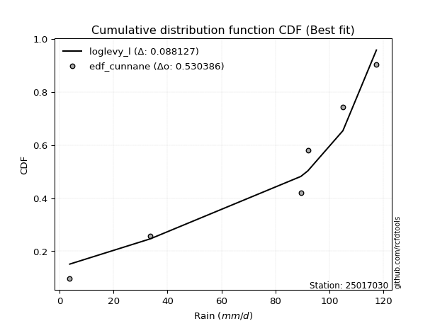</img></img>

</div>


### 12. EDF Adamowski (1981)

The Adamowski formula in hydrology refers to a specific plotting position formula used for estimating the non-parametric empirical distribution of hydrological events (like flood peaks) to calculate their return periods. This formula provides an alternative to traditional parametric methods (like the Gumbel or Log Pearson Type III distributions). 

<div align="center">


$P=(m-0.25)/(n+0.5)$


</div>


**12.1. Empirical values**

<div align="center">

|                | 0                   | 1                  | 2                  | 3                  | 4                  | 5                  |
|:---------------|:--------------------|:-------------------|:-------------------|:-------------------|:-------------------|:-------------------|
| date           | 2025                | 2023               | 2022               | 2021               | 2019               | 2020               |
| x              | 3.8                 | 33.6               | 89.4               | 92.0               | 105.0              | 117.4              |
| m              | 1                   | 2                  | 3                  | 4                  | 5                  | 6                  |
| empirical_dist | edf_adamowski       | edf_adamowski      | edf_adamowski      | edf_adamowski      | edf_adamowski      | edf_adamowski      |
| empirical      | 0.11538461538461539 | 0.2692307692307692 | 0.4230769230769231 | 0.5769230769230769 | 0.7307692307692307 | 0.8846153846153846 |
| empirical_tr   | 1.1304347826086958  | 1.3684210526315788 | 1.7333333333333334 | 2.3636363636363633 | 3.7142857142857135 | 8.666666666666664  |

</div>


**12.2. Kolmogorov-Smirnov fit test (sorted by Δ)**


<div align="center">

|                | 0                   | 1                   | 2                   | 3                   | 4                   | 5                 | 6                  | 7                  | 8                   | 9                  | 10                  | 11                  | 12                  | 13                  | 14                  | 15                  | 16                  | 17                  | 18                  | 19                  | 20                  | 21                  | 22                 | 23                  | 24                 | 25                 | 26                 | 27                  | 28                  | 29                | 30                 | 31                  | 32                  | 33                  | 34                 | 35                  | 36                  | 37                  | 38                  | 39                  | 40                 | 41                 | 42                 | 43                  | 44                  | 45                  | 46                  | 47                  | 48                 | 49               | 50                  | 51                  | 52                  | 53                 | 54                  | 55                  | 56                  | 57                  | 58                 | 59                 | 60                 | 61                 | 62                  | 63                 | 64                 | 65                 | 66                 | 67                 | 68                 | 69                 | 70                  | 71                 | 72                 | 73                  | 74                 | 75                 | 76                 | 77                 | 78                  | 79                  | 80                  | 81                  | 82                  | 83                  | 84                  | 85                 | 86                 | 87                 | 88                  | 89                 | 90                  | 91                 | 92                 | 93                 | 94                  | 95                  | 96                 | 97                  | 98                 | 99                 | 100                 | 101                | 102                | 103                | 104                | 105                | 106                 | 107                | 108                | 109                | 110                 | 111                | 112                | 113                 | 114                 | 115                | 116                | 117                | 118                | 119                | 120                | 121                 | 122                | 123                 | 124                | 125                | 126                 | 127                 | 128                | 129                | 130                 | 131              | 132                 | 133                | 134                 | 135                | 136                 | 137                 | 138                | 139                 | 140                | 141                | 142               | 143                | 144               | 145                | 146               | 147               | 148                | 149                | 150                | 151                | 152                | 153                | 154                | 155                | 156                | 157                | 158                | 159               |
|:---------------|:--------------------|:--------------------|:--------------------|:--------------------|:--------------------|:------------------|:-------------------|:-------------------|:--------------------|:-------------------|:--------------------|:--------------------|:--------------------|:--------------------|:--------------------|:--------------------|:--------------------|:--------------------|:--------------------|:--------------------|:--------------------|:--------------------|:-------------------|:--------------------|:-------------------|:-------------------|:-------------------|:--------------------|:--------------------|:------------------|:-------------------|:--------------------|:--------------------|:--------------------|:-------------------|:--------------------|:--------------------|:--------------------|:--------------------|:--------------------|:-------------------|:-------------------|:-------------------|:--------------------|:--------------------|:--------------------|:--------------------|:--------------------|:-------------------|:-----------------|:--------------------|:--------------------|:--------------------|:-------------------|:--------------------|:--------------------|:--------------------|:--------------------|:-------------------|:-------------------|:-------------------|:-------------------|:--------------------|:-------------------|:-------------------|:-------------------|:-------------------|:-------------------|:-------------------|:-------------------|:--------------------|:-------------------|:-------------------|:--------------------|:-------------------|:-------------------|:-------------------|:-------------------|:--------------------|:--------------------|:--------------------|:--------------------|:--------------------|:--------------------|:--------------------|:-------------------|:-------------------|:-------------------|:--------------------|:-------------------|:--------------------|:-------------------|:-------------------|:-------------------|:--------------------|:--------------------|:-------------------|:--------------------|:-------------------|:-------------------|:--------------------|:-------------------|:-------------------|:-------------------|:-------------------|:-------------------|:--------------------|:-------------------|:-------------------|:-------------------|:--------------------|:-------------------|:-------------------|:--------------------|:--------------------|:-------------------|:-------------------|:-------------------|:-------------------|:-------------------|:-------------------|:--------------------|:-------------------|:--------------------|:-------------------|:-------------------|:--------------------|:--------------------|:-------------------|:-------------------|:--------------------|:-----------------|:--------------------|:-------------------|:--------------------|:-------------------|:--------------------|:--------------------|:-------------------|:--------------------|:-------------------|:-------------------|:------------------|:-------------------|:------------------|:-------------------|:------------------|:------------------|:-------------------|:-------------------|:-------------------|:-------------------|:-------------------|:-------------------|:-------------------|:-------------------|:-------------------|:-------------------|:-------------------|:------------------|
| station        | 25017030            | 25017030            | 25017030            | 25017030            | 25017030            | 25017030          | 25017030           | 25017030           | 25017030            | 25017030           | 25017030            | 25017030            | 25017030            | 25017030            | 25017030            | 25017030            | 25017030            | 25017030            | 25017030            | 25017030            | 25017030            | 25017030            | 25017030           | 25017030            | 25017030           | 25017030           | 25017030           | 25017030            | 25017030            | 25017030          | 25017030           | 25017030            | 25017030            | 25017030            | 25017030           | 25017030            | 25017030            | 25017030            | 25017030            | 25017030            | 25017030           | 25017030           | 25017030           | 25017030            | 25017030            | 25017030            | 25017030            | 25017030            | 25017030           | 25017030         | 25017030            | 25017030            | 25017030            | 25017030           | 25017030            | 25017030            | 25017030            | 25017030            | 25017030           | 25017030           | 25017030           | 25017030           | 25017030            | 25017030           | 25017030           | 25017030           | 25017030           | 25017030           | 25017030           | 25017030           | 25017030            | 25017030           | 25017030           | 25017030            | 25017030           | 25017030           | 25017030           | 25017030           | 25017030            | 25017030            | 25017030            | 25017030            | 25017030            | 25017030            | 25017030            | 25017030           | 25017030           | 25017030           | 25017030            | 25017030           | 25017030            | 25017030           | 25017030           | 25017030           | 25017030            | 25017030            | 25017030           | 25017030            | 25017030           | 25017030           | 25017030            | 25017030           | 25017030           | 25017030           | 25017030           | 25017030           | 25017030            | 25017030           | 25017030           | 25017030           | 25017030            | 25017030           | 25017030           | 25017030            | 25017030            | 25017030           | 25017030           | 25017030           | 25017030           | 25017030           | 25017030           | 25017030            | 25017030           | 25017030            | 25017030           | 25017030           | 25017030            | 25017030            | 25017030           | 25017030           | 25017030            | 25017030         | 25017030            | 25017030           | 25017030            | 25017030           | 25017030            | 25017030            | 25017030           | 25017030            | 25017030           | 25017030           | 25017030          | 25017030           | 25017030          | 25017030           | 25017030          | 25017030          | 25017030           | 25017030           | 25017030           | 25017030           | 25017030           | 25017030           | 25017030           | 25017030           | 25017030           | 25017030           | 25017030           | 25017030          |
| empirical_dist | edf_adamowski       | edf_adamowski       | edf_adamowski       | edf_adamowski       | edf_adamowski       | edf_adamowski     | edf_adamowski      | edf_adamowski      | edf_adamowski       | edf_adamowski      | edf_adamowski       | edf_adamowski       | edf_adamowski       | edf_adamowski       | edf_adamowski       | edf_adamowski       | edf_adamowski       | edf_adamowski       | edf_adamowski       | edf_adamowski       | edf_adamowski       | edf_adamowski       | edf_adamowski      | edf_adamowski       | edf_adamowski      | edf_adamowski      | edf_adamowski      | edf_adamowski       | edf_adamowski       | edf_adamowski     | edf_adamowski      | edf_adamowski       | edf_adamowski       | edf_adamowski       | edf_adamowski      | edf_adamowski       | edf_adamowski       | edf_adamowski       | edf_adamowski       | edf_adamowski       | edf_adamowski      | edf_adamowski      | edf_adamowski      | edf_adamowski       | edf_adamowski       | edf_adamowski       | edf_adamowski       | edf_adamowski       | edf_adamowski      | edf_adamowski    | edf_adamowski       | edf_adamowski       | edf_adamowski       | edf_adamowski      | edf_adamowski       | edf_adamowski       | edf_adamowski       | edf_adamowski       | edf_adamowski      | edf_adamowski      | edf_adamowski      | edf_adamowski      | edf_adamowski       | edf_adamowski      | edf_adamowski      | edf_adamowski      | edf_adamowski      | edf_adamowski      | edf_adamowski      | edf_adamowski      | edf_adamowski       | edf_adamowski      | edf_adamowski      | edf_adamowski       | edf_adamowski      | edf_adamowski      | edf_adamowski      | edf_adamowski      | edf_adamowski       | edf_adamowski       | edf_adamowski       | edf_adamowski       | edf_adamowski       | edf_adamowski       | edf_adamowski       | edf_adamowski      | edf_adamowski      | edf_adamowski      | edf_adamowski       | edf_adamowski      | edf_adamowski       | edf_adamowski      | edf_adamowski      | edf_adamowski      | edf_adamowski       | edf_adamowski       | edf_adamowski      | edf_adamowski       | edf_adamowski      | edf_adamowski      | edf_adamowski       | edf_adamowski      | edf_adamowski      | edf_adamowski      | edf_adamowski      | edf_adamowski      | edf_adamowski       | edf_adamowski      | edf_adamowski      | edf_adamowski      | edf_adamowski       | edf_adamowski      | edf_adamowski      | edf_adamowski       | edf_adamowski       | edf_adamowski      | edf_adamowski      | edf_adamowski      | edf_adamowski      | edf_adamowski      | edf_adamowski      | edf_adamowski       | edf_adamowski      | edf_adamowski       | edf_adamowski      | edf_adamowski      | edf_adamowski       | edf_adamowski       | edf_adamowski      | edf_adamowski      | edf_adamowski       | edf_adamowski    | edf_adamowski       | edf_adamowski      | edf_adamowski       | edf_adamowski      | edf_adamowski       | edf_adamowski       | edf_adamowski      | edf_adamowski       | edf_adamowski      | edf_adamowski      | edf_adamowski     | edf_adamowski      | edf_adamowski     | edf_adamowski      | edf_adamowski     | edf_adamowski     | edf_adamowski      | edf_adamowski      | edf_adamowski      | edf_adamowski      | edf_adamowski      | edf_adamowski      | edf_adamowski      | edf_adamowski      | edf_adamowski      | edf_adamowski      | edf_adamowski      | edf_adamowski     |
| p_dist         | loglevy_l           | johnsonsu           | genextreme          | gausshyper          | genpareto           | levy_l            | argus              | genhalflogistic    | beta                | arcsine            | trapezoid           | weibull_min         | dweibull            | gumbel_l            | logt                | logdgamma           | ksone               | gennorm             | pearson3            | logtrapezoid        | loggennorm          | semicircular        | wrapcauchy         | logvonmises_line    | anglit             | logpearson3        | logarcsine         | mielke              | dgamma              | skewnorm          | triang             | logweibull_max      | exponweib           | t                   | exponnorm          | crystalball         | norm                | nct                 | f                   | foldnorm            | gamma              | erlang             | betaprime          | loggumbel_l         | rice                | logsemicircular     | logloglaplace       | logdweibull         | logistic           | loganglit        | loginvweibull       | logwrapcauchy       | invgauss            | maxwell            | invgamma            | ncf                 | rayleigh            | halfgennorm         | hypsecant          | cosine             | gengamma           | kstwobign          | logncf              | loggamma           | loggamma           | logf               | logbetaprime       | logrice            | lognorm            | logexponnorm       | lognct              | logfatiguelife     | logerlang          | logkstwobign        | loginvgamma        | logalpha           | lognakagami        | loginvgauss        | halfnorm            | loggompertz         | loggengamma         | logburr12           | johnsonsb           | lomax               | kappa4              | genexpon           | logfoldnorm        | logmaxwell         | logbeta             | loggenextreme      | gumbel_r            | laplace            | burr               | loggenexpon        | logargus            | loglogistic         | lograyleigh        | logcrystalball      | logburr            | burr12             | halflogistic        | loghalfnorm        | loghypsecant       | moyal              | logloggamma        | truncweibull_min   | logmielke           | loglomax           | logcosine          | loggumbel_r        | tukeylambda         | kappa3             | uniform            | loglaplace          | loglaplace          | loghalflogistic    | vonmises_line      | logmoyal           | bradford           | wald               | loggenpareto       | nakagami            | gompertz           | truncexpon          | logwald            | loggenhalflogistic | loggausshyper       | logjohnsonsb        | logksone           | logskewnorm        | truncnorm           | logweibull_min   | logtriang           | logexponweib       | invweibull          | fatiguelife        | logkappa4           | logkappa3           | loguniform         | logtruncweibull_min | logtruncnorm       | alpha              | logbradford       | logtruncexpon      | weibull_max       | powerlaw           | logjohnsonsu      | truncpareto       | logexponpow        | exponpow           | logpowerlaw        | logtruncpareto     | logtukeylambda     | rdist              | logrdist           | genlogistic        | loggenlogistic     | loghalfgennorm     | logvonmises        | vonmises          |
| delta          | 0.07696046275735824 | 0.11194272970340541 | 0.11538461538418998 | 0.11538461540280132 | 0.12000532410174594 | 0.139441430149194 | 0.1445462830700382 | 0.1489806744663424 | 0.14947792578897445 | 0.1657023751364411 | 0.17059926469609904 | 0.17429137775736253 | 0.17794501440153754 | 0.18042694740751558 | 0.18618512472524035 | 0.18783184165659472 | 0.18931639034509212 | 0.19040671024958367 | 0.19208352624905894 | 0.19470365846769794 | 0.19645187404407619 | 0.20006716219476767 | 0.2002388060092119 | 0.20137866397452825 | 0.2084471845652392 | 0.2098989974234889 | 0.2115804504443416 | 0.21386463001137185 | 0.21628916417566535 | 0.216969285108829 | 0.2213407546199036 | 0.22355813687891254 | 0.22717255650897322 | 0.22840710135105852 | 0.2284086968520081 | 0.22841143263721758 | 0.22841143913322443 | 0.22845153701846105 | 0.22913708932066684 | 0.23305292535412664 | 0.2331632343383035 | 0.2336896830904706 | 0.2354553110171676 | 0.23553377141009163 | 0.23564041337732927 | 0.23632954691638336 | 0.23667460824920084 | 0.23916273925958587 | 0.2464813810393764 | 0.24654100125064 | 0.24731552995764078 | 0.24879774387794645 | 0.24907565306729912 | 0.2498875803178187 | 0.25041026772024083 | 0.25126197299707015 | 0.25634018150654053 | 0.26035356281907324 | 0.2604830616735216 | 0.2616303445802142 | 0.2620990316164488 | 0.2644442806232237 | 0.26850395916308106 | 0.2695919885953452 | 0.2695919885953452 | 0.2700061719636822 | 0.2700253875894079 | 0.2705813519620938 | 0.2705813894796289 | 0.2705828911480405 | 0.27060575510237866 | 0.2706387773222923 | 0.2708909755235333 | 0.27224285619811345 | 0.2725616886157725 | 0.2728415790279705 | 0.2742683166719176 | 0.2746270850219687 | 0.27512438610099427 | 0.27569506936380145 | 0.27588805994203786 | 0.27696661727590693 | 0.27763431847440534 | 0.28018309418450565 | 0.28124613803580073 | 0.2824233891971362 | 0.2840206598984138 | 0.2872609497431878 | 0.28730966119421236 | 0.2880329970837903 | 0.28815002715667987 | 0.2886248191122471 | 0.2900136540773797 | 0.2901899863974083 | 0.29141877744635664 | 0.29160443669322883 | 0.2921533396692331 | 0.29306881772917776 | 0.2948299338473827 | 0.2999969978872828 | 0.30321854717647817 | 0.3069181411521877 | 0.3069395800527223 | 0.3079033087866739 | 0.3106580825032415 | 0.3120137811112727 | 0.31326519342249975 | 0.3136635545778587 | 0.3195988378603743 | 0.3227090117869878 | 0.32441381849691125 | 0.3303063459787116 | 0.3304442036836403 | 0.33255711444821784 | 0.33255711444821784 | 0.3339473043284729 | 0.3365053194757777 | 0.3396101367941567 | 0.3574756567284196 | 0.3639238307014268 | 0.3733335583197593 | 0.37603087836099486 | 0.3779674963011938 | 0.38660071409144764 | 0.3889329799801186 | 0.4100094514976233 | 0.41955929413573273 | 0.42502071107785244 | 0.4274042002963621 | 0.4326812127871354 | 0.43387407554434293 | 0.44629068059132 | 0.45385138608482994 | 0.4696871774418884 | 0.47305378734699877 | 0.4910288014248155 | 0.49276948095313383 | 0.49460918953812555 | 0.4975004249710194 | 0.5009851947646387  | 0.5064983129393514 | 0.5130375441309356 | 0.518445626296516 | 0.5187864196069791 | 0.533125648360069 | 0.5570372567988247 | 0.601511806568839 | 0.610682902309361 | 0.6215030786860907 | 0.6521734372275074 | 0.6615078490947093 | 0.6907666423840964 | 0.7267398301156307 | 0.7307692305590825 | 0.7307692307588141 | 0.7307692307692307 | 0.7307692307692307 | 0.7307692307692307 | 1.1199345364854352 | 18.82765855343112 |
| deltao         | 0.530385761606      | 0.530385761606      | 0.530385761606      | 0.530385761606      | 0.530385761606      | 0.530385761606    | 0.530385761606     | 0.530385761606     | 0.530385761606      | 0.530385761606     | 0.530385761606      | 0.530385761606      | 0.530385761606      | 0.530385761606      | 0.530385761606      | 0.530385761606      | 0.530385761606      | 0.530385761606      | 0.530385761606      | 0.530385761606      | 0.530385761606      | 0.530385761606      | 0.530385761606     | 0.530385761606      | 0.530385761606     | 0.530385761606     | 0.530385761606     | 0.530385761606      | 0.530385761606      | 0.530385761606    | 0.530385761606     | 0.530385761606      | 0.530385761606      | 0.530385761606      | 0.530385761606     | 0.530385761606      | 0.530385761606      | 0.530385761606      | 0.530385761606      | 0.530385761606      | 0.530385761606     | 0.530385761606     | 0.530385761606     | 0.530385761606      | 0.530385761606      | 0.530385761606      | 0.530385761606      | 0.530385761606      | 0.530385761606     | 0.530385761606   | 0.530385761606      | 0.530385761606      | 0.530385761606      | 0.530385761606     | 0.530385761606      | 0.530385761606      | 0.530385761606      | 0.530385761606      | 0.530385761606     | 0.530385761606     | 0.530385761606     | 0.530385761606     | 0.530385761606      | 0.530385761606     | 0.530385761606     | 0.530385761606     | 0.530385761606     | 0.530385761606     | 0.530385761606     | 0.530385761606     | 0.530385761606      | 0.530385761606     | 0.530385761606     | 0.530385761606      | 0.530385761606     | 0.530385761606     | 0.530385761606     | 0.530385761606     | 0.530385761606      | 0.530385761606      | 0.530385761606      | 0.530385761606      | 0.530385761606      | 0.530385761606      | 0.530385761606      | 0.530385761606     | 0.530385761606     | 0.530385761606     | 0.530385761606      | 0.530385761606     | 0.530385761606      | 0.530385761606     | 0.530385761606     | 0.530385761606     | 0.530385761606      | 0.530385761606      | 0.530385761606     | 0.530385761606      | 0.530385761606     | 0.530385761606     | 0.530385761606      | 0.530385761606     | 0.530385761606     | 0.530385761606     | 0.530385761606     | 0.530385761606     | 0.530385761606      | 0.530385761606     | 0.530385761606     | 0.530385761606     | 0.530385761606      | 0.530385761606     | 0.530385761606     | 0.530385761606      | 0.530385761606      | 0.530385761606     | 0.530385761606     | 0.530385761606     | 0.530385761606     | 0.530385761606     | 0.530385761606     | 0.530385761606      | 0.530385761606     | 0.530385761606      | 0.530385761606     | 0.530385761606     | 0.530385761606      | 0.530385761606      | 0.530385761606     | 0.530385761606     | 0.530385761606      | 0.530385761606   | 0.530385761606      | 0.530385761606     | 0.530385761606      | 0.530385761606     | 0.530385761606      | 0.530385761606      | 0.530385761606     | 0.530385761606      | 0.530385761606     | 0.530385761606     | 0.530385761606    | 0.530385761606     | 0.530385761606    | 0.530385761606     | 0.530385761606    | 0.530385761606    | 0.530385761606     | 0.530385761606     | 0.530385761606     | 0.530385761606     | 0.530385761606     | 0.530385761606     | 0.530385761606     | 0.530385761606     | 0.530385761606     | 0.530385761606     | 0.530385761606     | 0.530385761606    |
| eval           | Δo > Δ              | Δo > Δ              | Δo > Δ              | Δo > Δ              | Δo > Δ              | Δo > Δ            | Δo > Δ             | Δo > Δ             | Δo > Δ              | Δo > Δ             | Δo > Δ              | Δo > Δ              | Δo > Δ              | Δo > Δ              | Δo > Δ              | Δo > Δ              | Δo > Δ              | Δo > Δ              | Δo > Δ              | Δo > Δ              | Δo > Δ              | Δo > Δ              | Δo > Δ             | Δo > Δ              | Δo > Δ             | Δo > Δ             | Δo > Δ             | Δo > Δ              | Δo > Δ              | Δo > Δ            | Δo > Δ             | Δo > Δ              | Δo > Δ              | Δo > Δ              | Δo > Δ             | Δo > Δ              | Δo > Δ              | Δo > Δ              | Δo > Δ              | Δo > Δ              | Δo > Δ             | Δo > Δ             | Δo > Δ             | Δo > Δ              | Δo > Δ              | Δo > Δ              | Δo > Δ              | Δo > Δ              | Δo > Δ             | Δo > Δ           | Δo > Δ              | Δo > Δ              | Δo > Δ              | Δo > Δ             | Δo > Δ              | Δo > Δ              | Δo > Δ              | Δo > Δ              | Δo > Δ             | Δo > Δ             | Δo > Δ             | Δo > Δ             | Δo > Δ              | Δo > Δ             | Δo > Δ             | Δo > Δ             | Δo > Δ             | Δo > Δ             | Δo > Δ             | Δo > Δ             | Δo > Δ              | Δo > Δ             | Δo > Δ             | Δo > Δ              | Δo > Δ             | Δo > Δ             | Δo > Δ             | Δo > Δ             | Δo > Δ              | Δo > Δ              | Δo > Δ              | Δo > Δ              | Δo > Δ              | Δo > Δ              | Δo > Δ              | Δo > Δ             | Δo > Δ             | Δo > Δ             | Δo > Δ              | Δo > Δ             | Δo > Δ              | Δo > Δ             | Δo > Δ             | Δo > Δ             | Δo > Δ              | Δo > Δ              | Δo > Δ             | Δo > Δ              | Δo > Δ             | Δo > Δ             | Δo > Δ              | Δo > Δ             | Δo > Δ             | Δo > Δ             | Δo > Δ             | Δo > Δ             | Δo > Δ              | Δo > Δ             | Δo > Δ             | Δo > Δ             | Δo > Δ              | Δo > Δ             | Δo > Δ             | Δo > Δ              | Δo > Δ              | Δo > Δ             | Δo > Δ             | Δo > Δ             | Δo > Δ             | Δo > Δ             | Δo > Δ             | Δo > Δ              | Δo > Δ             | Δo > Δ              | Δo > Δ             | Δo > Δ             | Δo > Δ              | Δo > Δ              | Δo > Δ             | Δo > Δ             | Δo > Δ              | Δo > Δ           | Δo > Δ              | Δo > Δ             | Δo > Δ              | Δo > Δ             | Δo > Δ              | Δo > Δ              | Δo > Δ             | Δo > Δ              | Δo > Δ             | Δo > Δ             | Δo > Δ            | Δo > Δ             | Δo <= Δ           | Δo <= Δ            | Δo <= Δ           | Δo <= Δ           | Δo <= Δ            | Δo <= Δ            | Δo <= Δ            | Δo <= Δ            | Δo <= Δ            | Δo <= Δ            | Δo <= Δ            | Δo <= Δ            | Δo <= Δ            | Δo <= Δ            | Δo <= Δ            | Δo <= Δ           |
| fit            | 1                   | 1                   | 1                   | 1                   | 1                   | 1                 | 1                  | 1                  | 1                   | 1                  | 1                   | 1                   | 1                   | 1                   | 1                   | 1                   | 1                   | 1                   | 1                   | 1                   | 1                   | 1                   | 1                  | 1                   | 1                  | 1                  | 1                  | 1                   | 1                   | 1                 | 1                  | 1                   | 1                   | 1                   | 1                  | 1                   | 1                   | 1                   | 1                   | 1                   | 1                  | 1                  | 1                  | 1                   | 1                   | 1                   | 1                   | 1                   | 1                  | 1                | 1                   | 1                   | 1                   | 1                  | 1                   | 1                   | 1                   | 1                   | 1                  | 1                  | 1                  | 1                  | 1                   | 1                  | 1                  | 1                  | 1                  | 1                  | 1                  | 1                  | 1                   | 1                  | 1                  | 1                   | 1                  | 1                  | 1                  | 1                  | 1                   | 1                   | 1                   | 1                   | 1                   | 1                   | 1                   | 1                  | 1                  | 1                  | 1                   | 1                  | 1                   | 1                  | 1                  | 1                  | 1                   | 1                   | 1                  | 1                   | 1                  | 1                  | 1                   | 1                  | 1                  | 1                  | 1                  | 1                  | 1                   | 1                  | 1                  | 1                  | 1                   | 1                  | 1                  | 1                   | 1                   | 1                  | 1                  | 1                  | 1                  | 1                  | 1                  | 1                   | 1                  | 1                   | 1                  | 1                  | 1                   | 1                   | 1                  | 1                  | 1                   | 1                | 1                   | 1                  | 1                   | 1                  | 1                   | 1                   | 1                  | 1                   | 1                  | 1                  | 1                 | 1                  | 0                 | 0                  | 0                 | 0                 | 0                  | 0                  | 0                  | 0                  | 0                  | 0                  | 0                  | 0                  | 0                  | 0                  | 0                  | 0                 |
| n              | 6                   | 6                   | 6                   | 6                   | 6                   | 6                 | 6                  | 6                  | 6                   | 6                  | 6                   | 6                   | 6                   | 6                   | 6                   | 6                   | 6                   | 6                   | 6                   | 6                   | 6                   | 6                   | 6                  | 6                   | 6                  | 6                  | 6                  | 6                   | 6                   | 6                 | 6                  | 6                   | 6                   | 6                   | 6                  | 6                   | 6                   | 6                   | 6                   | 6                   | 6                  | 6                  | 6                  | 6                   | 6                   | 6                   | 6                   | 6                   | 6                  | 6                | 6                   | 6                   | 6                   | 6                  | 6                   | 6                   | 6                   | 6                   | 6                  | 6                  | 6                  | 6                  | 6                   | 6                  | 6                  | 6                  | 6                  | 6                  | 6                  | 6                  | 6                   | 6                  | 6                  | 6                   | 6                  | 6                  | 6                  | 6                  | 6                   | 6                   | 6                   | 6                   | 6                   | 6                   | 6                   | 6                  | 6                  | 6                  | 6                   | 6                  | 6                   | 6                  | 6                  | 6                  | 6                   | 6                   | 6                  | 6                   | 6                  | 6                  | 6                   | 6                  | 6                  | 6                  | 6                  | 6                  | 6                   | 6                  | 6                  | 6                  | 6                   | 6                  | 6                  | 6                   | 6                   | 6                  | 6                  | 6                  | 6                  | 6                  | 6                  | 6                   | 6                  | 6                   | 6                  | 6                  | 6                   | 6                   | 6                  | 6                  | 6                   | 6                | 6                   | 6                  | 6                   | 6                  | 6                   | 6                   | 6                  | 6                   | 6                  | 6                  | 6                 | 6                  | 6                 | 6                  | 6                 | 6                 | 6                  | 6                  | 6                  | 6                  | 6                  | 6                  | 6                  | 6                  | 6                  | 6                  | 6                  | 6                 |
| best_fit       | 1                   | 0                   | 0                   | 0                   | 0                   | 0                 | 0                  | 0                  | 0                   | 0                  | 0                   | 0                   | 0                   | 0                   | 0                   | 0                   | 0                   | 0                   | 0                   | 0                   | 0                   | 0                   | 0                  | 0                   | 0                  | 0                  | 0                  | 0                   | 0                   | 0                 | 0                  | 0                   | 0                   | 0                   | 0                  | 0                   | 0                   | 0                   | 0                   | 0                   | 0                  | 0                  | 0                  | 0                   | 0                   | 0                   | 0                   | 0                   | 0                  | 0                | 0                   | 0                   | 0                   | 0                  | 0                   | 0                   | 0                   | 0                   | 0                  | 0                  | 0                  | 0                  | 0                   | 0                  | 0                  | 0                  | 0                  | 0                  | 0                  | 0                  | 0                   | 0                  | 0                  | 0                   | 0                  | 0                  | 0                  | 0                  | 0                   | 0                   | 0                   | 0                   | 0                   | 0                   | 0                   | 0                  | 0                  | 0                  | 0                   | 0                  | 0                   | 0                  | 0                  | 0                  | 0                   | 0                   | 0                  | 0                   | 0                  | 0                  | 0                   | 0                  | 0                  | 0                  | 0                  | 0                  | 0                   | 0                  | 0                  | 0                  | 0                   | 0                  | 0                  | 0                   | 0                   | 0                  | 0                  | 0                  | 0                  | 0                  | 0                  | 0                   | 0                  | 0                   | 0                  | 0                  | 0                   | 0                   | 0                  | 0                  | 0                   | 0                | 0                   | 0                  | 0                   | 0                  | 0                   | 0                   | 0                  | 0                   | 0                  | 0                  | 0                 | 0                  | 0                 | 0                  | 0                 | 0                 | 0                  | 0                  | 0                  | 0                  | 0                  | 0                  | 0                  | 0                  | 0                  | 0                  | 0                  | 0                 |
| best_fit_sort  | 1                   | 2                   | 3                   | 4                   | 5                   | 6                 | 7                  | 8                  | 9                   | 10                 | 11                  | 12                  | 13                  | 14                  | 15                  | 16                  | 17                  | 18                  | 19                  | 20                  | 21                  | 22                  | 23                 | 24                  | 25                 | 26                 | 27                 | 28                  | 29                  | 30                | 31                 | 32                  | 33                  | 34                  | 35                 | 36                  | 37                  | 38                  | 39                  | 40                  | 41                 | 42                 | 43                 | 44                  | 45                  | 46                  | 47                  | 48                  | 49                 | 50               | 51                  | 52                  | 53                  | 54                 | 55                  | 56                  | 57                  | 58                  | 59                 | 60                 | 61                 | 62                 | 63                  | 64                 | 65                 | 66                 | 67                 | 68                 | 69                 | 70                 | 71                  | 72                 | 73                 | 74                  | 75                 | 76                 | 77                 | 78                 | 79                  | 80                  | 81                  | 82                  | 83                  | 84                  | 85                  | 86                 | 87                 | 88                 | 89                  | 90                 | 91                  | 92                 | 93                 | 94                 | 95                  | 96                  | 97                 | 98                  | 99                 | 100                | 101                 | 102                | 103                | 104                | 105                | 106                | 107                 | 108                | 109                | 110                | 111                 | 112                | 113                | 114                 | 115                 | 116                | 117                | 118                | 119                | 120                | 121                | 122                 | 123                | 124                 | 125                | 126                | 127                 | 128                 | 129                | 130                | 131                 | 132              | 133                 | 134                | 135                 | 136                | 137                 | 138                 | 139                | 140                 | 141                | 142                | 143               | 144                | 145               | 146                | 147               | 148               | 149                | 150                | 151                | 152                | 153                | 154                | 155                | 156                | 157                | 158                | 159                | 160               |

</div>


**12.3. Best fit**

<div align="center">

|   id |   station | empirical_dist   | p_dist    |     delta |   deltao | eval   |   fit |   n |   best_fit |   best_fit_sort |
|-----:|----------:|:-----------------|:----------|----------:|---------:|:-------|------:|----:|-----------:|----------------:|
|    0 |  25017030 | edf_adamowski    | loglevy_l | 0.0769605 | 0.530386 | Δo > Δ |     1 |   6 |          1 |               1 |

</div>


<div align="center">

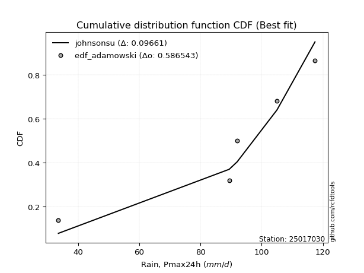</img>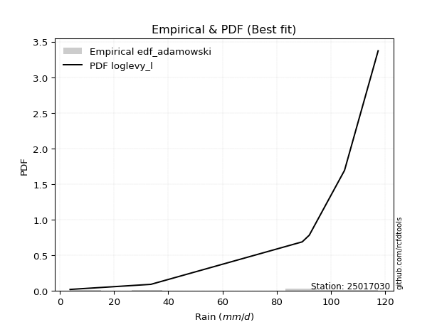</img>

</div>


## C. Best fit & Estimate extreme values for specific return periods - Tr

Best fit in probability distribution analysis means finding the theoretical distribution (like Normal, Poisson, Exponential, etc.) that most accurately mirrors your real-world data´s patterns (shape, center, spread) for better predictions, using methods like visual checks (Q-Q plots), goodness-of-fit tests (Kolmogorov-Smirnov, Chi-Squared), and information criteria (AIC) to score and select the simplest, most representative model.


### 1. Best fit (ordered by delta Δ)

:file_folder:Table: [bestfit_25017030.csv](table/bestfit_25017030.csv)

<div align="center">

|   id |   station | empirical_dist   | p_dist     |     delta |   deltao | eval   |   fit |   n |   best_fit |   best_fit_sort |
|-----:|----------:|:-----------------|:-----------|----------:|---------:|:-------|------:|----:|-----------:|----------------:|
|    0 |  25017030 | edf_adamowski    | loglevy_l  | 0.0769605 | 0.530386 | Δo > Δ |     1 |   6 |          1 |               1 |
|    1 |  25017030 | edf_chegodayev   | loglevy_l  | 0.0805662 | 0.530386 | Δo > Δ |     1 |   6 |          1 |               2 |
|    2 |  25017030 | edf_jenkinson    | loglevy_l  | 0.0813009 | 0.530386 | Δo > Δ |     1 |   6 |          1 |               3 |
|    3 |  25017030 | edf_beard        | loglevy_l  | 0.0813009 | 0.530386 | Δo > Δ |     1 |   6 |          1 |               4 |
|    4 |  25017030 | edf_filliben     | loglevy_l  | 0.081855  | 0.530386 | Δo > Δ |     1 |   6 |          1 |               5 |
|    5 |  25017030 | edf_tukey        | loglevy_l  | 0.0830333 | 0.530386 | Δo > Δ |     1 |   6 |          1 |               6 |
|    6 |  25017030 | edf_hazen        | genextreme | 0.0843242 | 0.530386 | Δo > Δ |     1 |   6 |          1 |               7 |
|    7 |  25017030 | edf_blom         | loglevy_l  | 0.0861912 | 0.530386 | Δo > Δ |     1 |   6 |          1 |               8 |
|    8 |  25017030 | edf_cunnane      | loglevy_l  | 0.0881267 | 0.530386 | Δo > Δ |     1 |   6 |          1 |               9 |
|    9 |  25017030 | edf_gringorten   | loglevy_l  | 0.0912893 | 0.530386 | Δo > Δ |     1 |   6 |          1 |              10 |
|   10 |  25017030 | edf_weibull      | loglevy_l  | 0.100013  | 0.530386 | Δo > Δ |     1 |   6 |          1 |              11 |
|   11 |  25017030 | edf_california   | trapezoid  | 0.132835  | 0.530386 | Δo > Δ |     1 |   6 |          1 |              12 |

</div>


### 2. Extreme values and % difference analysis

In hydrology, a return period (or recurrence interval $Tr$) is the statistical average time between extreme events like floods or droughts of a specific magnitude, indicating how rare an event is, with a 100-year flood, for example, having a 1% chance of occurring in any given year, not that it happens exactly every century. It is a key tool for infrastructure design (like bridges or dams) and risk assessment, calculated from historical data to determine the probability of future events, although it is important to remember it is statistical average, and events can cluster or be missed.

The extreme value porcentage difference is evaluated as $pdiff = 1 - (ETrBf / ETr) * 100$, where _ETrBf_ correspond to the bestfit extreme value for a specific recurrence interval and _ETr_ correspond to the extreme value for one of the most used PDFsused in hydrology.

> risk_rate: assuming the return period as the project useful life.

:file_folder:Table: [extreme_25017030.csv](table/extreme_25017030.csv), all PDFs.  
:file_folder:Table: [extremepdiff_25017030.csv](table/extremepdiff_25017030.csv), % difference between bestfit and most used PDFs in Hydrology.

<div align="center">

Extreme values table for only best fit PDFs
|   id |      tr |   prob_l |     prob_g |     alpha |   anglit |   arcsine |    argus |     beta |   betaprime |   bradford |     burr |   burr12 |   cosine |   crystalball |   dgamma |   dweibull |   erlang |   exponnorm |   exponpow |   exponweib |        f |   fatiguelife |   foldnorm |    gamma |   gausshyper |   genexpon |   genextreme |   gengamma |   genhalflogistic |   genlogistic |   gennorm |   genpareto |   gompertz |   gumbel_l |   gumbel_r |   halfgennorm |   halflogistic |   halfnorm |   hypsecant |   invgamma |   invgauss |       invweibull |   johnsonsb |   johnsonsu |    kappa3 |   kappa4 |    ksone |   kstwobign |   laplace |   levy_l |   loggamma |   logistic |   loglaplace |    lomax |   maxwell |   mielke |    moyal |   nakagami |       ncf |      nct |     norm |   pearson3 |   powerlaw |   rayleigh |     rdist |     rice |   semicircular |   skewnorm |        t |   trapezoid |   triang |   truncexpon |   truncnorm |   truncpareto |   truncweibull_min |   tukeylambda |   uniform |   vonmises |   vonmises_line |     wald |   weibull_max |   weibull_min |   wrapcauchy |   logalpha |   loganglit |   logarcsine |   logargus |   logbeta |   logbetaprime |   logbradford |   logburr |   logburr12 |   logcosine |   logcrystalball |   logdgamma |      logdweibull |   logerlang |   logexponnorm |      logexponpow |    logexponweib |      logf |   logfatiguelife |   logfoldnorm |   loggausshyper |   loggenexpon |   loggenextreme |   loggengamma |   loggenhalflogistic |   loggenlogistic |       loggennorm |   loggenpareto |   loggompertz |   loggumbel_l |   loggumbel_r |   loghalfgennorm |   loghalflogistic |   loghalfnorm |   loghypsecant |   loginvgamma |   loginvgauss |   loginvweibull |   logjohnsonsb |   logjohnsonsu |   logkappa3 |   logkappa4 |   logksone |   logkstwobign |   loglevy_l |   logloggamma |   loglogistic |   logloglaplace |         loglomax |   logmaxwell |   logmielke |   logmoyal |   lognakagami |     logncf |    lognct |   lognorm |   logpearson3 |   logpowerlaw |   lograyleigh |   logrdist |   logrice |   logsemicircular |   logskewnorm |            logt |   logtrapezoid |   logtriang |   logtruncexpon |   logtruncnorm |   logtruncpareto |   logtruncweibull_min |   logtukeylambda |   loguniform |   logvonmises |   logvonmises_line |     logwald |   logweibull_max |   logweibull_min |   logwrapcauchy |   station |   n |   risk_rate |
|-----:|--------:|---------:|-----------:|----------:|---------:|----------:|---------:|---------:|------------:|-----------:|---------:|---------:|---------:|--------------:|---------:|-----------:|---------:|------------:|-----------:|------------:|---------:|--------------:|-----------:|---------:|-------------:|-----------:|-------------:|-----------:|------------------:|--------------:|----------:|------------:|-----------:|-----------:|-----------:|--------------:|---------------:|-----------:|------------:|-----------:|-----------:|-----------------:|------------:|------------:|----------:|---------:|---------:|------------:|----------:|---------:|-----------:|-----------:|-------------:|---------:|----------:|---------:|---------:|-----------:|----------:|---------:|---------:|-----------:|-----------:|-----------:|----------:|---------:|---------------:|-----------:|---------:|------------:|---------:|-------------:|------------:|--------------:|-------------------:|--------------:|----------:|-----------:|----------------:|---------:|--------------:|--------------:|-------------:|-----------:|------------:|-------------:|-----------:|----------:|---------------:|--------------:|----------:|------------:|------------:|-----------------:|------------:|-----------------:|------------:|---------------:|-----------------:|----------------:|----------:|-----------------:|--------------:|----------------:|--------------:|----------------:|--------------:|---------------------:|-----------------:|-----------------:|---------------:|--------------:|--------------:|--------------:|-----------------:|------------------:|--------------:|---------------:|--------------:|--------------:|----------------:|---------------:|---------------:|------------:|------------:|-----------:|---------------:|------------:|--------------:|--------------:|----------------:|-----------------:|-------------:|------------:|-----------:|--------------:|-----------:|----------:|----------:|--------------:|--------------:|--------------:|-----------:|----------:|------------------:|--------------:|----------------:|---------------:|------------:|----------------:|---------------:|-----------------:|----------------------:|-----------------:|-------------:|--------------:|-------------------:|------------:|-----------------:|-----------------:|----------------:|----------:|----:|------------:|
|    0 |    2    | 0.5      | 0.5        |   13.754  |  73.5333 |   73.5333 |  83.86   |  93.0241 |     72.3135 |    53.6034 |  65.991  |  23.1825 |  69.5669 |       73.5333 |  92      |    92      |  72.3226 |     73.5337 |    3.81876 |     72.1561 |  73.4902 |       3.80006 |    74.3334 |  72.5481 |      88.0658 |    51.7176 |      92.0934 |    65.7467 |           81.694  |           inf |   92      |     90.0167 |    102.273 |    80.2283 |    66.8383 |       43.4343 |        63.5099 |    65.1913 |     73.5333 |    69.8568 |    68.072  | 188515           |     111.085 |     90.9714 |   3.79941 |  65.8416 |  73.5333 |     63.9236 |   73.5333 |   93.318 |    46.8026 |    73.5333 |      48.4564 |  52.6376 |   70.0479 | -29.3591 |  64.677  |    37.463  |   47.1804 |  73.5251 |  73.5333 |    78.1317 |    4.68004 |    68.8117 | -7.57298  |  72.0404 |        73.5333 |    77.0143 |  73.534  |     78.4388 |  75.8215 |      51.6168 |     57.71   |       5.5005  |            64.7163 |       60.602  |   60.6    | -2.60943   |         59.168  |  60.323  |       117.073 |       81.4235 |      60.6    |    45.6663 |     48.4564 |      48.4565 |    67.3044 |   112.575 |        48.6214 |       15.739  |   64.1773 |     56.1206 |     38.1415 |          66.3537 |     89.4    |     89.4         |     46.7457 |        48.4561 |      4.30109     |     7.7074      |   48.4089 |          48.5369 |       49.5768 |         29.9454 |       34.0044 |         62.1446 |       56.4566 |              39.6032 |          inf     |     92           |        29.1995 |       60.3206 |       59.1109 |       39.7223 |          3.79997 |           35.9857 |       37.8266 |        48.4564 |       45.6616 |       44.9421 |         41.0386 |        116.919 |        117.396 |      3.8    |     19.2145 |    21.1216 |        35.2508 |     91.7036 |       63.7875 |       48.4564 |         89.8024 |     21.3853      |      43.6933 |     62.7926 |    37.2536 |       60.1947 |    43.121  |   48.4009 |   48.4564 |       63.668  |       3.96673 |       42.1194 |    11.1236 |   48.4564 |           48.4565 |       42.7166 |   95.2483       |        59.6344 |     33.4445 |         16.1191 |        18.6335 |          4.04425 |               21.5146 |          11.3368 |      21.1216 |      0.150922 |            67.0574 |     32.7375 |          94.9609 |      7.24265     |         20.9934 |  25017030 |   6 |    0.75     |
|    1 |    2.33 | 0.570815 | 0.429185   |   16.37   |  82.0043 |   86.2496 |  89.6495 | 103.751  |     79.7425 |    62.639  |  73.9224 |  33.9089 |  76.9791 |       80.8056 |  94.7405 |    95.2584 |  79.8344 |     80.806  |    3.86727 |     80.0524 |  80.7435 |       5.69789 |    81.0229 |  79.989  |      96.0118 |    62.5897 |      98.1491 |    74.0071 |           89.2757 |           inf |   92.3127 |     97.5428 |    104.069 |    86.5553 |    73.5769 |       57.135  |        70.4383 |    73.04   |     79.3534 |    77.5015 |    76.3799 |      1.08248e+08 |     115.222 |     96.2894 |   3.79941 |  74.2349 |  83.5304 |     72.7504 |   77.9342 |  100.685 |    58.7848 |    79.9407 |      55.2192 |  63.3981 |   77.6034 | -29.3591 |  71.0559 |    46.6814 |   61.1332 |  80.799  |  80.8056 |    85.0923 |    6.02784 |    76.4789 |  0.506899 |  79.5772 |        82.6185 |    83.4593 |  80.8062 |     86.8099 |  82.6947 |      59.5715 |     63.2254 |       6.46806 |            72.2054 |       68.8752 |   68.6446 | -2.41232   |         67.4155 |  65.0916 |       117.268 |       87.2648 |      79.2465 |    57.5256 |     62.3108 |      70.6801 |    74.6002 |   116.197 |        60.3022 |       20.0909 |   72.4594 |     66.3792 |     48.3216 |          74.1069 |     93.8179 |     98.0907      |     58.6399 |        60.1324 |      4.70696     |    10.2351      |   60.1363 |          60.1908 |       60.1356 |         38.7495 |       45.6122 |         71.6549 |       66.6177 |              48.7394 |          inf     |     93.0067      |        40.8933 |       69.5467 |       71.3246 |       48.5192 |          3.79997 |           44.2032 |       47.7519 |        57.5952 |       57.5696 |       56.7488 |         55.4073 |        117.25  |        117.399 |      3.8    |     25.1476 |    28.2705 |        47.9348 |     98.9063 |       71.6746 |       58.6084 |        100.914  |     31.2922      |      54.6795 |     70.8616 |    45.0205 |       68.3052 |    55.4189 |   60.0841 |   60.1327 |       76.6832 |       4.19622 |       52.8848 |    13.5754 |   60.1327 |           63.4576 |       50.1956 |   98.3432       |        76.458  |     41.1598 |         20.4967 |        23.7251 |          4.18533 |               27.0907 |          13.3429 |      26.9298 |      0.178332 |            78.7883 |     37.7158 |         110.968  |     10.0165      |         67.7945 |  25017030 |   6 |    0.729209 |
|    2 |    5    | 0.8      | 0.2        |   36.6547 | 111.892  |  120.159  | 105.772  | 116.764  |    107.839  |    91.8814 |  98.6041 | inf      | 103.69   |      107.832  | 113.681  |   119.849  | 108.278  |    107.832  |    6.70432 |    110.555  | 107.731  |      46.0125  |   105.883  | 108.14   |     113.147  |   116.947  |     111.533  |   109.982  |          107.849  |           inf |  102.461  |    113.418  |    109.873 |   106.995  |   102.853  |      150.568  |       101.788  |   106.231  |    102.699  |   107.235  |   109.978  |      1.04985e+20 |     117.362 |    109.359  |   3.79941 |  99.6084 | 115.885  |    110.245  |   99.9375 |  112.89  |   139.084  |   104.681  |     106.114  | 117.2    |  107.341  | 102.876  | 100.604  |    89.632  |  151.839  | 107.833  | 107.832  |   108.463  |   27.559   |   107.174  | 23.5541   | 108.039  |       113.623  |   102.231  | 107.832  |    110.826  | 102.414  |      88.0883 |     83.0748 |      18.1808  |            96.1934 |       95.4298 |   94.68   | -1.64154   |         94.1072 |  91.7859 |       117.397 |      106.135  |     107.195  |   139.507  |    151.318  |     193.41   |    98.5606 |   117.399 |       134.299  |       48.3084 |   98.7247 |    114.176  |    113.342  |          97.9025 |    166.864  |    243.397       |    138.083  |       134.136  |     11.1187      |    74.4022      |  134.679  |         133.97   |      123.241  |         80.103  |      149.899  |         99.6231 |      114.726  |              83.8233 |          inf     |    114.616       |        90.1771 |      110.495  |      130.847  |      115.705  |          3.79997 |          112.105  |      127.915  |       115.179  |      139.441  |      139.822  |        204.161  |        117.398 |        117.4   |     59.6275 |     59.1487 |    72.6247 |       176.871  |    112.106  |       96.4688 |      122.158  |        180.828  |    209.895       |     132.197  |     96.428  |   108.234  |      119.201  |   154.212  |  134.244  |  134.136  |      132.598  |       8.77885 |      131.543  |    24.5359 |  134.136  |          159.296  |       80.3059 |  121.706        |       155.976  |     74.6627 |         48.4844 |        54.0927 |          6.19823 |               58.0975 |          22.4157 |      59.1141 |      0.340483 |           147.477  |     83.3065 |         117.379  |    140.859       |        106.4    |  25017030 |   6 |    0.67232  |
|    3 |   10    | 0.9      | 0.1        |   73.9226 | 128.808  |  128.345  | 112.452  | 117.362  |    126.904  |   104.641  | 108.997  | inf      | 119.828  |      125.76   | 132.565  |   146.671  | 127.608  |    125.76   |   22.2135  |    131.786  | 125.661  |     101.677   |   122.374  | 127.251  |     116.438  |   166.292  |     115.171  |   139.1    |          113.505  |           inf |  132.827  |    116.474  |    113.105 |   118.375  |   126.697  |      271.752  |       127.822  |   130.792  |    121.341  |   128.178  |   134.782  |      6.08311e+29 |     117.397 |    114.233  |   3.79941 | 109.431  | 130.002  |    138.792  |  119.912  |  115.837 |   249.312  |   122.901  |     191.995  | 166.041  |  128.269  | 110.429  | 126.33   |   123.346  |  279.757  | 125.769  | 125.76   |   121.889  |   58.0649  |   129.06   | 30.3871   | 127.187  |       129.531  |   109.876  | 125.76   |    120.207  | 110.116  |     102.137  |     95.0952 |      40.2164  |           106.727  |      106.73   |  106.04   | -1.04975   |        105.754  | 120.115  |       117.4   |      116.642  |     112.737  |   257.568  |    250.03   |     246.615  |   110.348  |   117.4   |       228.546  |       74.1611 |  109.977  |    154.425  |    189.708  |         107.779  |    327.189  |    741.904       |    246.715  |       228.395  |     40.5694      |   952.422       |  229.968  |         227.856  |      198.37   |        101.737  |      352.87   |        109.794  |      156.235  |             100.856  |          inf     |    182.26        |       108.918  |      143.189  |      183.435  |      234.841  |          3.79997 |          242.815  |      265.204  |       200.317  |      256.101  |      262.379  |        590.611  |        117.4   |        117.4   |     84.121  |     84.61   |   109.615  |       477.923  |    115.548  |      107.006  |      209.811  |        307.055  |   1181.23        |     246.058  |    107.371  |   232.295  |      181.901  |   331.592  |  228.896  |  228.397  |      170.713  |      22.1475  |      251.904  |    29.9329 |  228.397  |          255.451  |       97.2449 |  206.328        |       206.063  |     94.2162 |         74.0818 |        79.4921 |         12.3907  |               82.1254 |          27.8122 |      83.3066 |      0.555776 |           238.019  |    193.156  |         117.4    |   6979.97        |        112.336  |  25017030 |   6 |    0.651322 |
|    4 |   15    | 0.933333 | 0.0666667  |  111.057  | 136.032  |  129.907  | 114.836  | 117.393  |    136.547  |   108.894  | 112.419  | inf      | 127.179  |      134.706  | 143.897  |   163.549  | 137.393  |    134.707  |   43.8873  |    142.645  | 134.617  |     138.082   |   130.603  | 136.919  |     116.997  |   195.156  |     116.109  |   155.424  |          115.055  |           inf |  165.554  |    117.005  |    114.568 |   123.529  |   140.15   |      359.137  |       142.555  |   143.573  |    131.98   |   139.014  |   147.955  |      1.96032e+35 |     117.399 |    115.956  |   3.79941 | 112.417  | 134.707  |    153.947  |  131.596  |  116.727 |   334.838  |   132.828  |     271.599  | 194.611  |  139.007  | 112.847  | 141.26   |   141.133  |  384.747  | 134.72   | 134.706  |   128      |   73.8279  |   140.337  | 31.964    | 136.798  |       135.735  |   112.391  | 134.706  |    123.217  | 112.587  |     107.079  |    100.436  |      55.5447  |           110.266  |      110.409  |  109.827  | -0.721922  |        109.636  | 138.306  |       117.4   |      121.4    |     114.34   |   352.579  |    309.831  |     258.315  |   114.86   |   117.4   |       298.03   |       86.1282 |  113.715  |    177.055  |    239.872  |         111.014  |    498.742  |   1548.22        |    330.804  |       297.874  |    103.482       |  5761.85        |  300.363  |         297.032  |      251.556  |        108.331  |      549.324  |        112.753  |      179.951  |             106.571  |          inf     |    279.342       |       113.257  |      161.059  |      213.761  |      350.12   |          3.79997 |          376.031  |      387.586  |       274.714  |      349.132  |      362.662  |       1075.42   |        117.4   |        117.4   |     94.346  |     94.9262 |   125.738  |       810.101  |    116.608  |      110.486  |      281.718  |        418.531  |   3245.27        |     338.435  |    110.995  |   361.851  |      226.954  |   499.906  |  298.762  |  297.876  |      188.276  |      34.9253  |      352.063  |    31.5182 |  297.876  |          307.108  |      103.565  |  418.964        |       225.323  |    101.517  |         85.9946 |        90.756  |         19.6961  |               92.3885 |          29.794  |      93.3991 |      0.734398 |           312.369  |    331.47   |         117.4    | 134260           |        114.061  |  25017030 |   6 |    0.644736 |
|    5 |   20    | 0.95     | 0.05       |  148.16   | 140.281  |  130.457  | 116.111  | 117.398  |    142.907  |   111.02   | 114.122  | inf      | 131.7    |      140.565  | 152.018  |   175.948  | 143.851  |    140.566  |   67.7025  |    149.838  | 140.485  |     165.036   |   135.993  | 143.298  |     117.183  |   215.636  |     116.519  |   166.815  |          115.757  |           inf |  197.752  |    117.185  |    115.479 |   126.737  |   149.569  |      428.707  |       152.878  |   152.095  |    139.485  |   146.255  |   156.879  |      1.40938e+39 |     117.4   |    116.892  |   3.79941 | 113.829  | 137.06   |    164.156  |  139.886  |  117.183 |   406.725  |   139.689  |     347.382  | 214.883  |  146.133  | 114.039  | 151.834  |   153.036  |  477.315  | 140.582  | 140.565  |   131.797  |   83.0816  |   147.833  | 32.5881   | 143.109  |       139.176  |   113.645  | 140.565  |    124.702  | 113.806  |     109.603  |    103.595  |      66.0783  |           112.042  |      112.221  |  111.72   | -0.502292  |        111.577  | 151.863  |       117.4   |      124.362  |     115.117  |   434.363  |    351.488  |     262.566  |   117.343  |   117.4   |       354.636  |       92.9387 |  115.605  |    192.787  |    277.104  |         112.621  |    678.012  |   2691.35        |    401.387  |       354.462  |    214.828       | 23607.5         |  357.772  |         353.364  |      293.894  |        111.302  |      737.507  |        114.12   |      196.59   |             109.401  |          inf     |    410.605       |       114.924  |      173.302  |      235.118  |      463.082  |          3.79997 |          510.865  |      499.153  |       343.276  |      428.709  |      449.872  |       1636.14   |        117.4   |        117.4   |     99.9156 |    100.414  |   134.668  |      1155.91   |    117.155  |      112.221  |      345.363  |        521.394  |   6647.63        |     418.17   |    112.803  |   495.285  |      263.097  |   661.273  |  355.714  |  354.464  |      198.945  |      45.4109  |      439.799  |    32.2187 |  354.464  |          340.138  |      106.868  |  994.483        |       235.477  |    105.324  |         92.7984 |        97.0566 |         26.9204  |               98.0397 |          30.8092 |      98.8949 |      0.895159 |           378.011  |    495.7    |         117.4    |      1.48298e+06 |        114.903  |  25017030 |   6 |    0.641514 |
|    6 |   25    | 0.96     | 0.04       |  185.249  | 143.161  |  130.712  | 116.921  | 117.399  |    147.614  |   112.296  | 115.142  | inf      | 134.87   |      144.878  | 158.355  |   185.781  | 148.631  |    144.878  |   92.1182  |    155.169  | 144.806  |     186.451   |   139.96   | 148.018  |     117.266  |   231.521  |     116.744  |   175.571  |          116.151  |           inf |  228.844  |    117.265  |    116.128 |   129.02   |   156.825  |      487.072  |       160.831  |   158.435  |    145.293  |   151.659  |   163.601  |      1.31734e+42 |     117.4   |    117.498  |   3.79941 | 114.642  | 138.472  |    171.803  |  146.316  |  117.469 |   469.65   |   144.938  |     420.446  | 230.607  |  151.423  | 114.748  | 160.03   |   161.905  |  561.657  | 144.897  | 144.878  |   134.49   |   89.122   |   153.402  | 32.9033   | 147.762  |       141.409  |   114.397  | 144.878  |    125.586  | 114.533  |     111.135  |    105.718  |      73.6374  |           113.11   |      113.296  |  112.856  | -0.344124  |        112.741  | 162.721  |       117.4   |      126.469  |     115.578  |   507.237  |    382.859  |     264.562  |   118.947  |   117.4   |       403.078  |       97.322  |  116.768  |    204.825  |    306.61   |         113.582  |    863.467  |   4199.6         |    463.112  |       402.879  |    391.361       | 75950.8         |  406.938  |         401.559  |      329.55   |        112.933  |      918.123  |        114.895  |      209.403  |             111.081  |          inf     |    583.113       |       115.743  |      182.582  |      251.604  |      574.38   |          3.79997 |          646.905  |      602.529  |       407.878  |      499.275  |      528.157  |       2260.43   |        117.4   |        117.4   |    103.414  |    103.798  |   140.327  |      1508.56   |    117.5    |      113.26   |      403.597  |        618.292  |  11593.7         |     489.285  |    113.886  |   631.715  |      293.698  |   817.146  |  404.473  |  402.881  |      206.311  |      53.8109  |      518.861  |    32.5982 |  402.881  |          363.443  |      108.898  | 2713.26         |       241.743  |    107.66   |         97.1875 |       101.074  |         33.6021  |              101.612  |          31.4228 |     102.346  |      1.04316  |           436.887  |    684.241  |         117.4    |      1.13813e+07 |        115.404  |  25017030 |   6 |    0.639603 |
|    7 |   50    | 0.98     | 0.02       |  370.637  | 150.25   |  131.052  | 118.723  | 117.4    |    161.201  |   114.848  | 117.187  | inf      | 143.171  |      157.229  | 178.194  |   217.381  | 162.438  |    157.229  |  209.345   |    170.567  | 157.187  |     255.163   |   151.321  | 161.646  |     117.37   |   280.865  |     117.135  |   202.488  |          116.863  |           inf |  367.682  |    117.369  |    117.888 |   135.216  |   179.175  |      693.448  |       185.335  |   176.864  |    163.302  |   167.492  |   183.584  |      1.86609e+51 |     117.4   |    118.911  |   3.79941 | 116.164  | 141.295  |    194.258  |  166.29   |  118.113 |   711.314  |   160.975  |     760.726  | 279.451  |  166.767  | 116.156  | 185.473  |   187.715  |  914.419  | 157.255  | 157.229  |   141.736  |  102.395   |   169.567  | 33.3818   | 161.117  |       146.508  |   115.899  | 157.228  |    127.342  | 115.974  |     114.24   |    110.712  |      92.3426  |           115.251  |      115.407  |  115.128  |  0.0478508 |        115.071  | 198.174  |       117.4   |      132.19   |     116.492  |   796.704  |    472.533  |     267.252  |   122.59   |   117.4   |       581.675  |      106.821  |  119.339  |    241.433  |    399.627  |         115.496  |   1858.49   |  18128.3         |    699.775  |       581.308  |   2950.79        |     4.29838e+06 |  588.418  |         579.152  |      457.436  |        115.72   |     1735.33   |        116.312  |      248.775  |             114.371  |          inf     |   2405.12        |       116.927  |      210.372  |      302.42   |     1115.21   |          3.79997 |         1338.95   |     1041.31   |       696.159  |      776.93   |      843.309  |       6118.05   |        117.4   |        117.4   |    110.782  |    110.705  |   152.37   |      3297.15   |    118.279  |      115.334  |      649.691  |       1049.89   |  65245.9         |     771.581  |    116.049  |  1344.47   |      404.455  |  1540.58   |  584.362  |  581.311  |      224.901  |      77.8186  |      838.426  |    33.2343 |  581.311  |          422.847  |      113.071  |    2.36671e+06  |       254.676  |    112.45   |        106.728  |       109.687  |         57.7115  |              109.192  |          32.6489 |     109.615  |      1.63262  |           652.441  |   1960.11   |         117.4    |      1.70106e+10 |        116.401  |  25017030 |   6 |    0.63583  |
|    8 |   75    | 0.986667 | 0.0133333  |  555.999  | 153.37   |  131.116  | 119.425  | 117.4    |    168.559  |   115.699  | 117.895  | inf      | 147.136  |      163.856  | 189.886  |   236.521  | 169.92   |    163.856  |  313.189   |    178.887  | 163.835  |     296.544   |   157.416  | 169.029  |     117.387  |   309.73   |     117.244  |   218.121  |          117.071  |           inf |  485.613  |    117.387  |    118.778 |   138.35   |   192.166  |      832.187  |       199.579  |   186.896  |    173.826  |   176.212  |   194.764  |      3.89024e+56 |     117.4   |    119.506  | 115.906   | 116.627  | 142.237  |    206.613  |  177.974  |  118.378 |   890.529  |   170.237  |    1076.13   | 308.024  |  175.109  | 116.622  | 200.352  |   201.767  | 1205.26   | 163.886  | 163.856  |   145.348  |  107.195   |   178.362  | 33.4894   | 168.3    |       148.545  |   116.399  | 163.855  |    127.923  | 116.451  |     115.287  |    112.69   |      99.8789  |           115.966  |      116.094  |  115.885  |  0.201677  |        115.847  | 219.99   |       117.4   |      135.083  |     116.795  |  1019.79   |    518.387  |     267.753  |   124.037  |   117.4   |       708.246  |      110.221  |  120.425  |    262.366  |    453.531  |         116.133  |   2934.68   |  44874.3         |    874.971  |       707.694  |  10547.9         |     6.01935e+07 |  717.188  |         704.94   |      545.434  |        116.456  |     2454.55   |        116.731  |      271.554  |             115.432  |          inf     |   7145.63        |       117.173  |      226.007  |      331.903  |     1640      |        112.23    |         2043.66   |     1402.55   |       951.463  |      988.553  |     1089.74   |      10913.2    |        117.4   |        117.4   |    113.353  |    113.015  |   156.61   |      5069.56   |    118.601  |      116.024  |      855.308  |       1431.05   | 179254           |     988.4    |    116.77   |  2091.12   |      481.421  |  2204.06   |  711.94   |  707.697  |      233.285  |      88.8158  |     1088.55   |    33.398  |  707.697  |          449.209  |      114.496  |    2.34758e+10  |       259.108  |    114.083  |        110.152  |       112.741  |         71.5664  |              111.856  |          33.0522 |     112.151  |      2.02617  |           779.874  |   3745.76   |         117.4    |      2.44144e+12 |        116.734  |  25017030 |   6 |    0.634587 |
|    9 |  100    | 0.99     | 0.01       |  741.354  | 155.225  |  131.138  | 119.813  | 117.4    |    173.563  |   116.124  | 118.274  | inf      | 149.62   |      168.338  | 198.211  |   250.363  | 175.009  |    168.338  |  405.482   |    184.527  | 168.333  |     326.319   |   161.539  | 174.049  |     117.393  |   330.21   |     117.292  |   229.191  |          117.168  |           inf |  589.435  |    117.393  |    119.36  |   140.4    |   201.361  |      938.89   |       209.661  |   193.73   |    181.291  |   182.201  |   202.51   |      2.26252e+60 |     117.4   |    119.856  | 116.285   | 116.846  | 142.707  |    215.078  |  186.264  |  118.532 |  1037.5    |   176.777  |    1376.41   | 328.297  |  180.791  | 116.855  | 210.908  |   211.336  | 1462.04   | 168.372  | 168.338  |   147.685  |  109.67    |   184.353  | 33.5317   | 173.165  |       149.686  |   116.65   | 168.337  |    128.213  | 116.689  |     115.813  |    113.76   |     103.935   |           116.325  |      116.433  |  116.264  |  0.282145  |        116.235  | 235.895  |       117.4   |      136.976  |     116.946  |  1207.36   |    547.736  |     267.929  |   124.846  |   117.4   |       809.149  |      111.968  |  121.095  |    277.031  |    490.963  |         116.45   |   4070.11   |  87154.1         |   1018.5    |       808.411  |  26947.7         |     4.42394e+08 |  819.916  |         805.184  |      614.361  |        116.773  |     3109.01   |        116.927  |      287.62   |             115.951  |          inf     |  17642.4         |       117.265  |      236.861  |      352.725  |     2154.69   |        113.521   |         2756.69   |     1718.03   |      1187.51   |     1165.18   |     1298.79   |      16437.7    |        117.4   |        117.4   |    114.661  |    114.159  |   158.773  |      6807.37   |    118.79   |      116.369  |     1038.56   |       1782.76   | 367186           |    1170.01   |    117.13   |  2860.7    |      542.07   |  2829.08   |  813.687  |  808.416  |      238.329  |      95.0555  |     1300.46   |    33.4675 |  808.416  |          464.682  |      115.215  |    1.80576e+15  |       261.347  |    114.906  |        111.913  |       114.304  |         80.3064  |              113.214  |          33.2512 |     113.441  |      2.29311  |           860.244  |   6006.27   |         117.4    |      1.12975e+14 |        116.9    |  25017030 |   6 |    0.633968 |
|   10 |  200    | 0.995    | 0.005      | 1482.76   | 158.729  |  131.159  | 120.484  | 117.4    |    184.994  |   116.762  | 118.954  | inf      | 154.673  |      178.505  | 218.353  |   284.526  | 186.641  |    178.505  |  700.3     |    197.331  | 178.54   |     399.204   |   170.891  | 185.52   |     117.398  |   379.554  |     117.356  |   255.869  |          117.299  |           inf |  922.767  |    117.398  |    120.625 |   144.855  |   223.465  |     1224.84   |       233.899  |   209.36   |    199.276  |   196.066  |   220.645  |      2.54162e+69 |     117.4   |    120.518  | 116.853   | 117.152  | 143.413  |    234.574  |  206.238  |  118.826 |  1470.56   |   192.464  |    2490.37   | 377.144  |  193.791  | 117.203  | 236.34   |   233.202  | 2312.43   | 178.546  | 178.505  |   152.678  |  113.476   |   198.063  | 33.5786   | 184.215  |       151.675  |   117.025  | 178.504  |    128.647  | 117.046  |     116.605  |    115.49   |     110.413   |           116.862  |      116.931  |  116.832  |  0.406072  |        116.818  | 275.515  |       117.4   |      141.089  |     117.173  |  1780.91   |    607.794  |     268.099  |   126.252  |   117.4   |      1094.66   |      114.647  |  122.513  |    311.795  |    576.873  |         116.926  |   9023.82   | 460462           |   1440.77   |      1093.23   | 284577           |     8.13247e+10 | 1110.85   |        1088.68   |      804.738  |        117.167  |     5341.38   |        117.194  |      326.046  |             116.708  |          116.887 | 256799           |       117.362  |      262.293  |      402.601  |     4153.07   |        115.486   |         5660.79   |     2732.44   |      2025.38   |     1699.23   |     1946.27   |      44005.1    |        117.4   |        117.4   |    116.651  |    115.844  |   162.075  |     13422      |    119.148  |      116.886  |     1654.55   |       3027.22   |      2.06642e+06 |    1721.04   |    117.678  |  6086.44   |      710.99   |  5100.7    | 1101.74   | 1093.24   |      247.982  |     105.49    |     1953.65   |    33.5521 | 1093.24   |          492.945  |      116.303  |    1.22759e+42  |       264.735  |    116.148  |        114.618  |       116.694  |         96.4512  |              115.286  |          33.5443 |     115.403  |      2.81062  |          1005.67   |  19471.5    |         117.4    |      3.3714e+18  |        117.15   |  25017030 |   6 |    0.633042 |
|   11 |  250    | 0.996    | 0.004      | 1853.46   | 159.621  |  131.162  | 120.64   | 117.4    |    188.509  |   116.89   | 119.13   | inf      | 156.058  |      181.612  | 224.859  |   295.75   | 190.22   |    181.612  |  819.197   |    201.241  | 181.661  |     422.957   |   173.749  | 189.048  |     117.399  |   395.439  |     117.367  |   264.473  |          117.323  |           inf | 1059.27   |    117.399  |    120.997 |   146.166  |   230.571  |     1325.75   |       241.691  |   214.169  |    205.065  |   200.381  |   226.345  |      2.06404e+72 |     117.4   |    120.689  | 116.966   | 117.208  | 143.554  |    240.608  |  212.668  |  118.902 |  1637.04   |   197.5    |    3014.16   | 392.87   |  197.793  | 117.272  | 244.527  |   239.923  | 2676.02   | 181.655  | 181.612  |   154.121  |  114.252   |   202.283  | 33.5853   | 187.596  |       152.142  |   117.1    | 181.611  |    128.733  | 117.117  |     116.763  |    115.856  |     111.768   |           116.97   |      117.029  |  116.946  |  0.431184  |        116.934  | 288.622  |       117.4   |      142.299  |     117.219  |  2008.75   |    624.104  |     268.119  |   126.581  |   117.4   |      1200.6    |      115.192  |  122.932  |    322.831  |    602.945  |         117.022  |  11684.4    | 801494           |   1602.9    |      1198.86   | 623151           |     4.91687e+11 | 1218.89   |        1193.83   |      873.936  |        117.231  |     6310.17   |        117.242  |      338.341  |             116.854  |          116.992 | 717103           |       117.374  |      270.285  |      418.576  |     5128.47   |        115.883   |         7134.09   |     3151.72   |      2405.18   |     1909.26   |     2206.28   |      60393.6    |        117.4   |        117.4   |    117.054  |    116.172  |   162.744  |     16560      |    119.241  |      116.99   |     1921.36   |       3589.81   |      3.6039e+06  |    1938.14   |    117.793  |  7761.03   |      772.841  |  6148.09   | 1208.67   | 1198.87   |      250.466  |     107.746   |     2214.38   |    33.5655 | 1198.87   |          499.82   |      116.521  |    1.71751e+59  |       265.417  |    116.398  |        115.168  |       117.179  |        100.207   |              115.706  |          33.6017 |     115.8    |      2.9333   |          1038.59   |  28733.3    |         117.4    |      1.28215e+20 |        117.2    |  25017030 |   6 |    0.632858 |
|   12 |  500    | 0.998    | 0.002      | 3706.95   | 161.833  |  131.165  | 120.997  | 117.4    |    198.997  |   117.145  | 119.61   | inf      | 159.743  |      190.826  | 245.121  |   331.254  | 200.901  |    190.826  | 1271.42    |    212.807  | 190.92   |     497.47    |   182.225  | 199.574  |     117.4    |   444.784  |     117.387  |   291.3    |          117.367  |           inf | 1593.29   |    117.4    |    122.065 |   149.923  |   252.628  |     1667.43   |       265.877  |   228.506  |    223.048  |   213.403  |   243.693  |      2.21589e+81 |     117.4   |    121.125  | 117.194   | 117.314  | 143.836  |    258.69   |  232.642  |  119.099 |  2254.02   |   213.118  |    5453.62   | 441.719  |  209.734  | 117.411  | 269.959  |   259.938  | 4197.89   | 190.876  | 190.826  |   158.178  |  115.816   |   214.874  | 33.5954   | 197.634  |       153.216  |   117.25   | 190.825  |    128.907  | 117.259  |     117.081  |    116.611  |     114.541   |           117.185  |      117.221  |  117.173  |  0.481602  |        117.167  | 330.299  |       117.4   |      145.768  |     117.309  |  2883.66   |    666.455  |     268.147  |   127.338  |   117.4   |      1579.09   |      116.29   |  124.175  |    356.681  |    678.214  |         117.212  |  26208.8    |      4.72678e+06 |   2202.99   |      1576.01   |      7.57368e+06 |     1.90167e+14 | 1605.12   |        1569.31   |     1116.14   |        117.337  |    10378.1    |        117.331  |      376.329  |             117.139  |          117.2   |      3.09159e+07 |       117.393  |      294.578  |      467.973  |     9870.81   |        116.681   |        14626.8    |     4823.82   |      4102.03   |     2706.82   |     3215.93   |     161333      |        117.4   |        117.4   |    117.87   |    116.813  |   164.09   |     31081.5    |    119.482  |      117.197  |     3054.75   |       6095.67   |      2.02818e+07 |    2762.72   |    118.054  | 16512.1    |      990.938  | 10903.8    | 1590.85   | 1576.02   |      256.675  |     112.444   |     3218.01   |    33.5875 | 1576.02   |          516.017  |      116.96   |    8.71064e+174 |       266.785  |    116.899  |        116.278  |       118.156  |        108.342   |              116.549  |          33.7145 |     116.597  |      3.19913  |          1108.36   |  99015.9    |         117.4    |      2.82966e+25 |        117.3    |  25017030 |   6 |    0.632489 |
|   13 |  750    | 0.998667 | 0.00133333 | 5560.45   | 162.812  |  131.166  | 121.14   | 117.4    |    204.863  |   117.23   | 119.862  | inf      | 161.529  |      195.944  | 257.006  |   352.443  | 206.878  |    195.944  | 1598.46    |    219.203  | 196.066  |     541.496   |   186.933  | 205.463  |     117.4    |   473.648  |     117.392  |   307.083  |          117.379  |           inf | 1995.29   |    117.4    |    122.635 |   151.932  |   265.522  |     1887.51   |       280.016  |   236.515  |    233.568  |   220.783  |   253.62   |      4.21656e+86 |     117.4   |    121.326  | 117.269   | 117.346  | 143.931  |    268.848  |  244.326  |  119.192 |  2695.37   |   222.243  |    7714.78   | 470.294  |  216.412  | 117.458  | 284.836  |   271.106  | 5453.18   | 195.999  | 195.944  |   160.292  |  116.342   |   221.916  | 33.5977   | 203.216  |       153.648  |   117.3    | 195.943  |    128.964  | 117.306  |     117.188  |    116.87   |     115.484   |           117.256  |      117.284  |  117.249  |  0.498447  |        117.245  | 355.288  |       117.4   |      147.622  |     117.34   |  3535.6    |    686.112  |     268.152  |   127.643  |   117.4   |      1838.82   |      116.659  |  124.876  |    376.204  |    717.999  |         117.275  |  42173.7    |      1.38227e+07 |   2631.66   |      1834.64   |      3.38863e+07 |     8.00416e+15 | 1870.35   |        1826.82   |     1278.61   |        117.365  |    13709      |        117.358  |      398.421  |             117.231  |          117.27  |      4.33815e+08 |       117.397  |      308.448  |      496.722  |    14474.1    |        116.948   |        22255.4    |     6118.64   |      5605.6    |     3293.46   |     3977.58   |     286543      |        117.4   |        117.4   |    118.16   |    117.019  |   164.54   |     44270.5    |    119.597  |      117.265  |     4005.18   |       8308.71   |      5.57215e+07 |    3368.56   |    118.167  | 25680.4    |     1138.47   | 15183.3    | 1853.23   | 1834.65   |      259.449  |     114.066   |     3966.11   |    33.5931 | 1834.65   |          522.684  |      117.106  |  inf            |       267.242  |    117.066  |        116.65   |       118.484  |        111.253   |              116.832  |          33.7512 |     116.864  |      3.29385  |          1132.78   | 207907      |         117.4    |      7.65778e+28 |        117.333  |  25017030 |   6 |    0.632366 |
|   14 | 1000    | 0.999    | 0.001      | 7413.94   | 163.396  |  131.166  | 121.22   | 117.4    |    208.918  |   117.272  | 120.033  | inf      | 162.656  |      199.468  | 265.451  |   367.652  | 211.011  |    199.468  | 1860.37    |    223.592  | 199.61   |     572.9     |   190.174  | 209.534  |     117.4    |   494.128  |     117.395  |   318.331  |          117.385  |           inf | 2327      |    117.4    |    123.019 |   153.283  |   274.668  |     2052.88   |       290.045  |   242.046  |    241.031  |   225.927  |   260.577  |      2.34341e+90 |     117.4   |    121.451  | 117.307   | 117.361  | 143.978  |    275.885  |  252.616  |  119.251 |  3049.97   |   228.715  |    9867.41   | 490.569  |  221.029  | 117.482  | 295.391  |   278.812  | 6561.64   | 199.526  | 199.468  |   161.692  |  116.606   |   226.781  | 33.5986   | 207.062  |       153.891  |   117.325  | 199.467  |    128.993  | 117.33   |     117.241  |    117.001  |     115.96    |           117.292  |      117.315  |  117.286  |  0.506873  |        117.284  | 373.263  |       117.4   |      148.87   |     117.355  |  4073.39   |    698.102  |     268.153  |   127.814  |   117.4   |      2042.1    |      116.843  |  125.368  |    389.942  |    744.289  |         117.307  |  59176.3    |      3.00391e+07 |   2975.78   |      2036.97   |      9.94869e+07 |     1.27209e+17 | 2078.04   |        2028.31   |     1404.01   |        117.377  |    16617.5    |        117.37   |      414.044  |             117.275  |          117.305 |      3.50345e+09 |       117.398  |      318.15   |      517.058  |    18989.5    |        117.082   |        29973.5    |     7210.58   |      6995.97   |     3773.3    |     4610.66   |     430671      |        117.4   |        117.4   |    118.319  |    117.12   |   164.766  |     56563.3    |    119.669  |      117.3    |     4853.47   |      10350.7    |      1.1414e+08  |    3863.3    |    118.238  | 35130.6    |     1252.94   | 19176      | 2058.64   | 2036.98   |      261.112  |     114.889   |     4582.43   |    33.5955 | 2036.98   |          526.467  |      117.18   |  inf            |       267.471  |    117.15   |        116.837  |       118.648  |        112.748   |              116.974  |          33.7694 |     116.998  |      3.34236  |          1145.2    | 354495      |         117.4    |      2.86448e+31 |        117.35   |  25017030 |   6 |    0.632305 |


</div>


<div align="center">

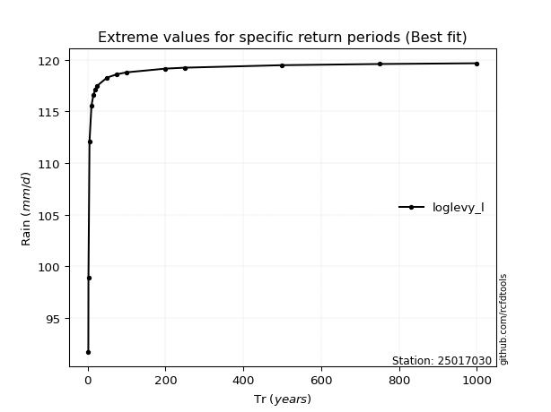</img>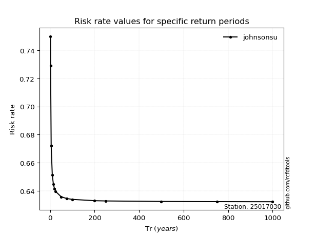</img>

</div>


<sub>**APP DISCLAIMER**: NO WARRANTY - This software is provided by [github.com/rcfdtools](https://github.com/rcfdtools) "as is", without any express or implied warranty, including warranties of merchantability, fitness for a particular purpose, or non-infringement. There is no guarantee that the software will be error-free or operate without interruption. LIMITATION OF LIABILITY - Neither the authors nor copyright holders will be liable for claims or damages arising from the software or its use. You are responsible for determining if the software is appropriate for your use and assume all associated risks, including errors, legal compliance, and data loss. NO PROFESSIONAL ADVICE - The software provides general information and does not offer professional advice. It should not replace consultation with professional advisors.</sub>