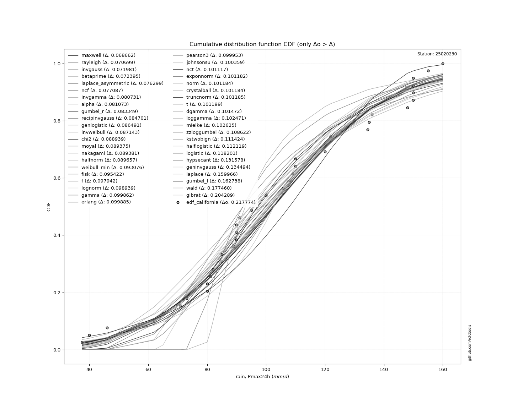
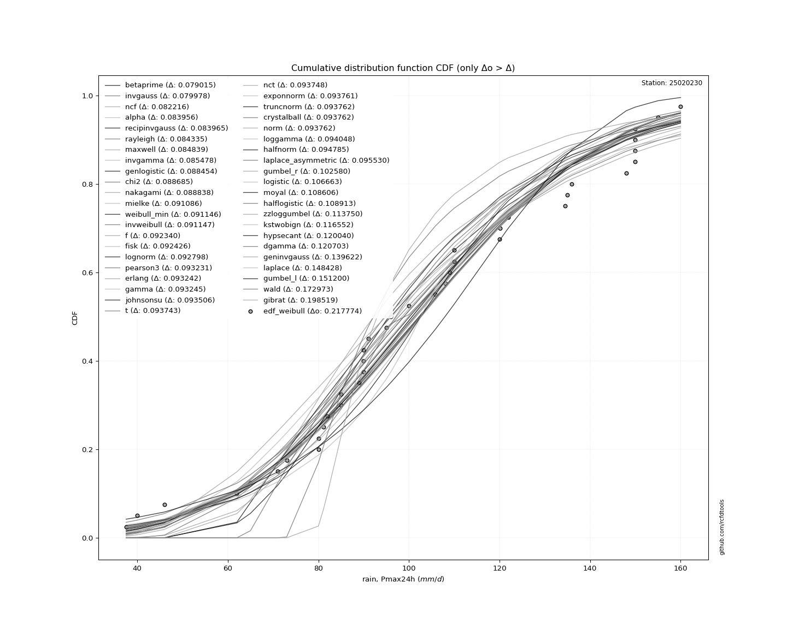
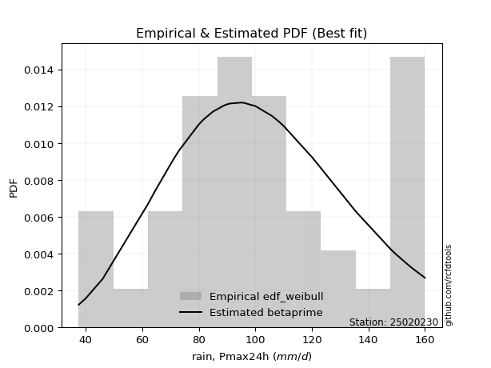
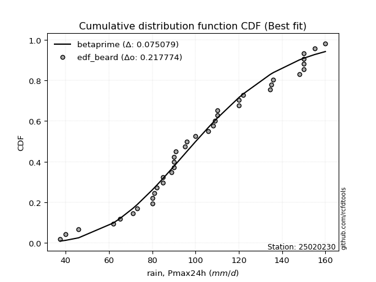
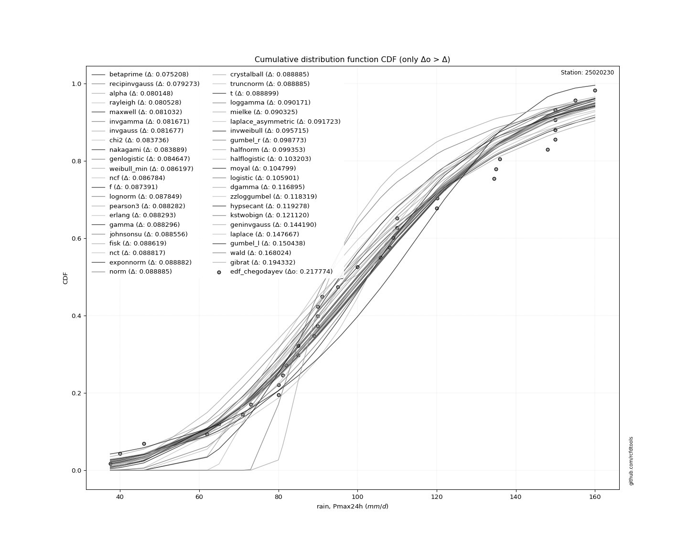
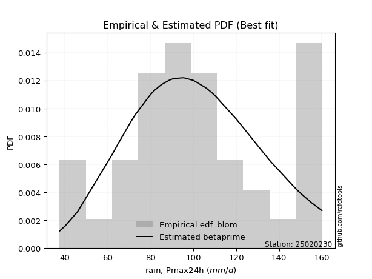
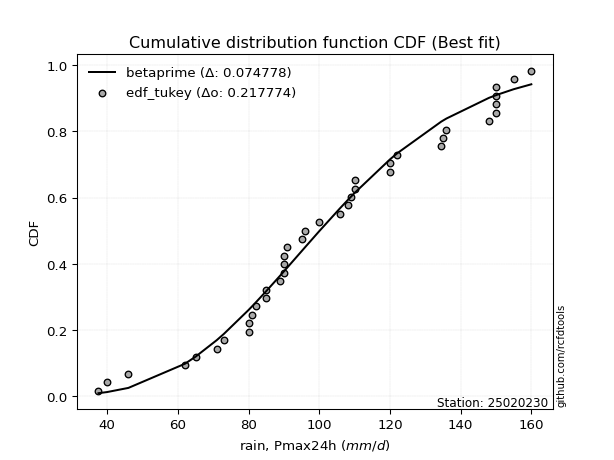
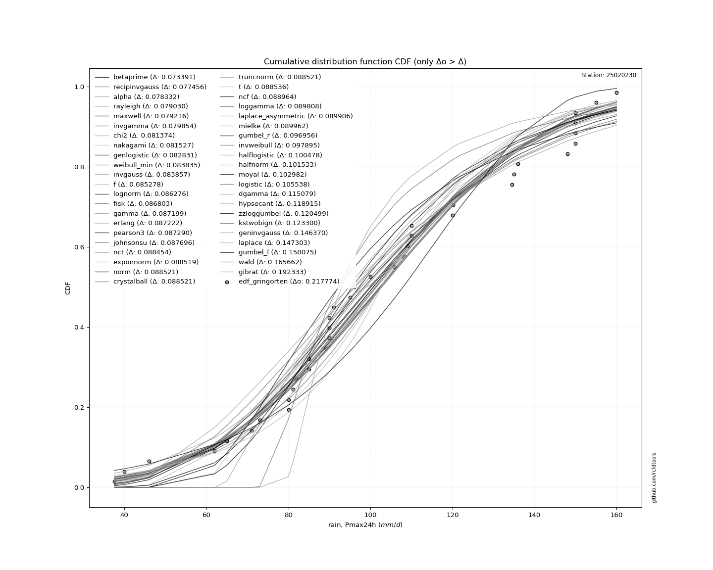
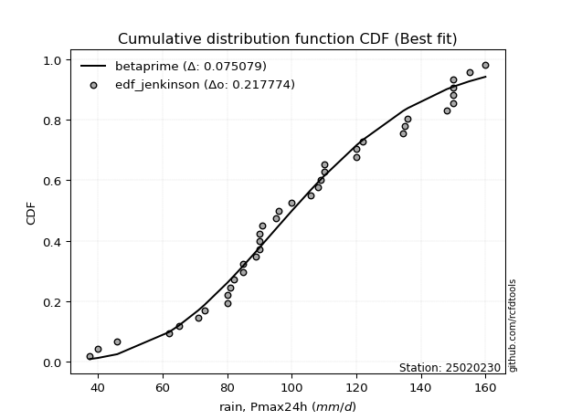

# Station (rain, Pmax24h): 25020230

Probable Maximum Precipitation (PMP) is the greatest amount of rainfall for a specific duration that is meteorologically possible for a given location, acting as a "worst-case" scenario for extreme storms, crucial for designing safety-critical infrastructure like bridges, river deviations, dams, spillways, and nuclear plants to prevent catastrophic failure. PMP is calculated by hydrologists using meteorological data to determine the upper limit of extreme rainfall, often leading to the Probable Maximum Flood (PMF) for flood control design, and is increasingly being studied for climate change impacts.

## A. General information

### 1. General running parameters

• app_version: _v20251220_. • runtime: _2025-12-22 06:11:29.595230_. • Stations dataset (station_dataset_file): _dataset/pmax24h_in/conventional.csv_. • Stations catalog (station_catalog_file): _dataset/CNE_IDEAM.xls_. • Plot only fit distributions with Δo > Δ (plot_only_fit): _True_. • Eval low extreme values, if False, evaluates high extreme values (low_extreme): _False_. • Eval Gumbel distribution, non include in SciPy (pdist_loggumbel_on): _True_. • Eval Log-Gumbel distribution, non include in SciPy (pdist_loggumbel_on): _True_. • Standard deviation normalized (ddof): _1.0_. • Return periods to eval in years (Tr): _[2, 2.33, 5, 10, 15, 20, 25, 50, 75, 100, 200, 250, 500, 750, 1000]_. • Minimum data sample per station, 0 means any (minimum_sample): _10_. • Z-Score threshold to adjust a value, 0 means disable (zscore): _3_. • Avoid zeros, e.g. rain = 0 (avoid_zeros): _True_. • Avoid null values (avoid_nans): _True_. [:file_folder:Dataset file.](../../dataset/pmax24h_in/conventional.csv)

### 2. Station info and location

|   id |   CODIGO | NOMBRE               | CATEGORIA     | TECNOLOGIA   | ESTADO   | FECHA_INSTALACION   |   FECHA_SUSPENSION |   ALTITUD |   LATITUD |   LONGITUD | DEPARTAMENTO   | MUNICIPIO           | AREA_OPERATIVA                                         | ENTIDAD                                                     | AREA_HIDROGRAFICA   | ZONA_HIDROGRAFICA   | SUBZONA_HIDROGRAFICA   |   CORRIENTE | OBSERVACION                                                                      |   SUBRED |
|-----:|---------:|:---------------------|:--------------|:-------------|:---------|:--------------------|-------------------:|----------:|----------:|-----------:|:---------------|:--------------------|:-------------------------------------------------------|:------------------------------------------------------------|:--------------------|:--------------------|:-----------------------|------------:|:---------------------------------------------------------------------------------|---------:|
|    0 | 25020230 | LA JAGUA  [25020230] | Pluviométrica | Convencional | Activa   | 15/08/1963          |                nan |       170 |   9.56217 |   -73.3395 | Cesar          | La Jagua De Ibirico | Area Operativa 05 - Magdalena-Cesar-Guajira-San Andrés | INSTITUTO DE HIDROLOGIA METEOROLOGIA Y ESTUDIOS AMBIENTALES | Magdalena Cauca     | Cesar               | Bajo Cesar             |         nan | |01/11/2024$mvelez$Se cambia el sentido del nombre según radicado 20243120200713 |      nan |

Map location in: [:earth_americas:Google](http://maps.google.com/maps?q=9.562166667,-73.33947222) [:earth_americas:OSM](https://www.openstreetmap.org/#map=18/9.562166667/-73.33947222&layers=P) [:earth_americas:Bing](https://www.bing.com/maps?cp=9.562166667~-73.33947222&lvl=18) [:earth_americas:Apple](https://maps.apple.com/frame?center=9.562166667%2C-73.33947222&span=0.003%2C0.006) 
</img>

### 3. Discrete values table and plot

|               |            0 |          1 |          2 |           3 |         4 |          5 |          6 |          7 |          8 |           9 |          10 |         11 |        12 |          13 |          14 |          15 |         16 |          17 |          18 |          19 |         20 |          21 |           22 |          23 |          24 |         25 |          26 |         27 |         28 |         29 |          30 |          31 |          32 |          33 |          34 |         35 |          36 |          37 |          38 |
|:--------------|-------------:|-----------:|-----------:|------------:|----------:|-----------:|-----------:|-----------:|-----------:|------------:|------------:|-----------:|----------:|------------:|------------:|------------:|-----------:|------------:|------------:|------------:|-----------:|------------:|-------------:|------------:|------------:|-----------:|------------:|-----------:|-----------:|-----------:|------------:|------------:|------------:|------------:|------------:|-----------:|------------:|------------:|------------:|
| Date          | 1980         | 1981       | 1982       | 1983        | 1984      | 1985       | 1986       | 1987       | 1988       | 1989        | 1990        | 1991       | 1992      | 1993        | 1994        | 1995        | 1996       | 1997        | 1998        | 1999        | 2000       | 2001        | 2002         | 2003        | 2004        | 2005       | 2006        | 2007       | 2008       | 2009       | 2010        | 2011        | 2012        | 2013        | 2014        | 2015       | 2016        | 2017        | 2018        |
| Value         |  108         |  150       |  148       |  120        |  155      |  105.801   |  136       |   46       |   95       |   85        |   89        |   65       |   62      |   90        |  135        |   90        |   37.5273  |   85        |   71        |  110        |  122       |  134.5      |  109         |   80        |   80        |   40       |   90        |  150       |  160       |  150       |   91        |  110        |   73        |   82        |   96        |  150       |  100        |  120.1      |   81.1      |
| Value_initial |  108         |  150       |  148       |  120        |  155      |  230       |  136       |   46       |   95       |   85        |   89        |   65       |   62      |   90        |  135        |   90        |   37.5273  |   85        |   71        |  110        |  122       |  134.5      |  109         |   80        |   80        |   40       |   90        |  150       |  160       |  150       |   91        |  110        |   73        |   82        |   96        |  150       |  100        |  120.1      |   81.1      |
| count         |   39         |   39       |   39       |   39        |   39      |   39       |   39       |   39       |   39       |   39        |   39        |   39       |   39      |   39        |   39        |   39        |   39       |   39        |   39        |   39        |   39       |   39        |   39         |   39        |   39        |   39       |   39        |   39       |   39       |   39       |   39        |   39        |   39        |   39        |   39        |   39       |   39        |   39        |   39        |
| mean          |  105.801     |  105.801   |  105.801   |  105.801    |  105.801  |  105.801   |  105.801   |  105.801   |  105.801   |  105.801    |  105.801    |  105.801   |  105.801  |  105.801    |  105.801    |  105.801    |  105.801   |  105.801    |  105.801    |  105.801    |  105.801   |  105.801    |  105.801     |  105.801    |  105.801    |  105.801   |  105.801    |  105.801   |  105.801   |  105.801   |  105.801    |  105.801    |  105.801    |  105.801    |  105.801    |  105.801   |  105.801    |  105.801    |  105.801    |
| std           |   38.7275    |   38.7275  |   38.7275  |   38.7275   |   38.7275 |   38.7275  |   38.7275  |   38.7275  |   38.7275  |   38.7275   |   38.7275   |   38.7275  |   38.7275 |   38.7275   |   38.7275   |   38.7275   |   38.7275  |   38.7275   |   38.7275   |   38.7275   |   38.7275  |   38.7275   |   38.7275    |   38.7275   |   38.7275   |   38.7275  |   38.7275   |   38.7275  |   38.7275  |   38.7275  |   38.7275   |   38.7275   |   38.7275   |   38.7275   |   38.7275   |   38.7275  |   38.7275   |   38.7275   |   38.7275   |
| zscore        |    0.0567891 |    1.14129 |    1.08965 |    0.366647 |    1.2704 |    3.20701 |    0.77979 |   -1.54414 |   -0.27889 |   -0.537105 |   -0.433819 |   -1.05353 |   -1.131  |   -0.407997 |    0.753969 |   -0.407997 |   -1.76292 |   -0.537105 |   -0.898605 |    0.108432 |    0.41829 |    0.741058 |    0.0826106 |   -0.666212 |   -0.666212 |   -1.69907 |   -0.407997 |    1.14129 |    1.39951 |    1.14129 |   -0.382176 |    0.108432 |   -0.846962 |   -0.614569 |   -0.253068 |    1.14129 |   -0.149783 |    0.369229 |   -0.637808 |

</img>

> If Z-Score is active, values out of range or outliers are replaced with the station mean value.

### 4. Active continuous probability distributions from SciPy (48 of 104 available)

[scipy.stats](https://docs.scipy.org/doc/scipy/reference/stats.html) is a Python´s powerful submodule within the SciPy library for comprehensive statistical analysis, offering over 130 probability distributions (like Normal, Poisson), functions for descriptive stats (mean, variance), hypothesis testing (t-tests, chi-square), random variable generation, and statistical tests, making it essential for data science, modeling, and research. It provides tools to explore, model, and draw conclusions from data efficiently, working seamlessly with NumPy.

|   id | p_dist             |   n_parameter | fit_method   | label                                                                       | active   | ref                                                                                                        |
|-----:|:-------------------|--------------:|:-------------|:----------------------------------------------------------------------------|:---------|:-----------------------------------------------------------------------------------------------------------|
|    0 | alpha              |             3 | MLE          | Alpha                                                                       | True     | [:mortar_board:](https://docs.scipy.org/doc/scipy/reference/generated/scipy.stats.alpha.html)              |
|    1 | betaprime          |             4 | MLE          | Beta prime                                                                  | True     | [:mortar_board:](https://docs.scipy.org/doc/scipy/reference/generated/scipy.stats.betaprime.html)          |
|    2 | chi2               |             3 | MLE          | Chi²                                                                        | True     | [:mortar_board:](https://docs.scipy.org/doc/scipy/reference/generated/scipy.stats.chi2.html)               |
|    3 | crystalball        |             4 | MLE          | Crystalball                                                                 | True     | [:mortar_board:](https://docs.scipy.org/doc/scipy/reference/generated/scipy.stats.crystalball.html)        |
|    4 | dgamma             |             3 | MLE          | Double gamma                                                                | True     | [:mortar_board:](https://docs.scipy.org/doc/scipy/reference/generated/scipy.stats.dgamma.html)             |
|    5 | erlang             |             3 | MLE          | Erlang                                                                      | True     | [:mortar_board:](https://docs.scipy.org/doc/scipy/reference/generated/scipy.stats.erlang.html)             |
|    6 | expon              |             2 | MLE          | Exponential                                                                 | True     | [:mortar_board:](https://docs.scipy.org/doc/scipy/reference/generated/scipy.stats.expon.html)              |
|    7 | exponnorm          |             3 | MLE          | Exponentially modified Normal                                               | True     | [:mortar_board:](https://docs.scipy.org/doc/scipy/reference/generated/scipy.stats.exponnorm.html)          |
|    8 | f                  |             4 | MLE          | F                                                                           | True     | [:mortar_board:](https://docs.scipy.org/doc/scipy/reference/generated/scipy.stats.f.html)                  |
|    9 | fatiguelife        |             3 | MLE          | Fatigue-life (Birnbaum-Saunders)                                            | True     | [:mortar_board:](https://docs.scipy.org/doc/scipy/reference/generated/scipy.stats.fatiguelife.html)        |
|   10 | fisk               |             3 | MLE          | Fisk                                                                        | True     | [:mortar_board:](https://docs.scipy.org/doc/scipy/reference/generated/scipy.stats.fisk.html)               |
|   11 | gamma              |             3 | MLE          | Gamma                                                                       | True     | [:mortar_board:](https://docs.scipy.org/doc/scipy/reference/generated/scipy.stats.gamma.html)              |
|   12 | genexpon           |             5 | MLE          | Generalized exponential                                                     | True     | [:mortar_board:](https://docs.scipy.org/doc/scipy/reference/generated/scipy.stats.genexpon.html)           |
|   13 | geninvgauss        |             4 | MLE          | Generalized Inverse Gaussian                                                | True     | [:mortar_board:](https://docs.scipy.org/doc/scipy/reference/generated/scipy.stats.geninvgauss.html)        |
|   14 | genlogistic        |             3 | MLE          | Generalized logistic                                                        | True     | [:mortar_board:](https://docs.scipy.org/doc/scipy/reference/generated/scipy.stats.genlogistic.html)        |
|   15 | gibrat             |             2 | MM           | Gibrat                                                                      | True     | [:mortar_board:](https://docs.scipy.org/doc/scipy/reference/generated/scipy.stats.gibrat.html)             |
|   16 | gompertz           |             3 | MLE          | Gompertz (or truncated Gumbel)                                              | True     | [:mortar_board:](https://docs.scipy.org/doc/scipy/reference/generated/scipy.stats.gompertz.html)           |
|   17 | gumbel_l           |             2 | MM           | Gumbel Left Skew                                                            | True     | [:mortar_board:](https://docs.scipy.org/doc/scipy/reference/generated/scipy.stats.gumbel_l.html)           |
|   18 | gumbel_r           |             2 | MM           | Gumbel Right Skew                                                           | True     | [:mortar_board:](https://docs.scipy.org/doc/scipy/reference/generated/scipy.stats.gumbel_r.html)           |
|   19 | halflogistic       |             2 | MM           | Half-logistic                                                               | True     | [:mortar_board:](https://docs.scipy.org/doc/scipy/reference/generated/scipy.stats.halflogistic.html)       |
|   20 | halfnorm           |             2 | MM           | Half Normal                                                                 | True     | [:mortar_board:](https://docs.scipy.org/doc/scipy/reference/generated/scipy.stats.halfnorm.html)           |
|   21 | hypsecant          |             2 | MM           | hyperbolic secant                                                           | True     | [:mortar_board:](https://docs.scipy.org/doc/scipy/reference/generated/scipy.stats.hypsecant.html)          |
|   22 | invgamma           |             3 | MLE          | Inverted gamma                                                              | True     | [:mortar_board:](https://docs.scipy.org/doc/scipy/reference/generated/scipy.stats.invgamma.html)           |
|   23 | invgauss           |             3 | MLE          | Inverse Gaussian                                                            | True     | [:mortar_board:](https://docs.scipy.org/doc/scipy/reference/generated/scipy.stats.invgauss.html)           |
|   24 | invweibull         |             3 | MLE          | Inverted Weibull                                                            | True     | [:mortar_board:](https://docs.scipy.org/doc/scipy/reference/generated/scipy.stats.invweibull.html)         |
|   25 | johnsonsu          |             4 | MLE          | Johnson Su                                                                  | True     | [:mortar_board:](https://docs.scipy.org/doc/scipy/reference/generated/scipy.stats.johnsonsu.html)          |
|   26 | kstwobign          |             2 | MLE          | Limiting distribution of scaled Kolmogorov-Smirnov two-sided test statistic | True     | [:mortar_board:](https://docs.scipy.org/doc/scipy/reference/generated/scipy.stats.kstwobign.html)          |
|   27 | laplace            |             2 | MM           | Laplace                                                                     | True     | [:mortar_board:](https://docs.scipy.org/doc/scipy/reference/generated/scipy.stats.laplace.html)            |
|   28 | laplace_asymmetric |             3 | MLE          | Asymmetric Laplace                                                          | True     | [:mortar_board:](https://docs.scipy.org/doc/scipy/reference/generated/scipy.stats.laplace_asymmetric.html) |
|   29 | loggamma           |             3 | MLE          | Log gamma                                                                   | True     | [:mortar_board:](https://docs.scipy.org/doc/scipy/reference/generated/scipy.stats.loggamma.html)           |
|   30 | logistic           |             2 | MM           | Logistic (or Sech-squared)                                                  | True     | [:mortar_board:](https://docs.scipy.org/doc/scipy/reference/generated/scipy.stats.logistic.html)           |
|   31 | lognorm            |             3 | MLE          | Log Normal                                                                  | True     | [:mortar_board:](https://docs.scipy.org/doc/scipy/reference/generated/scipy.stats.lognorm.html)            |
|   32 | maxwell            |             2 | MM           | Maxwell                                                                     | True     | [:mortar_board:](https://docs.scipy.org/doc/scipy/reference/generated/scipy.stats.maxwell.html)            |
|   33 | mielke             |             4 | MLE          | Mielke Beta-Kappa / Dagum                                                   | True     | [:mortar_board:](https://docs.scipy.org/doc/scipy/reference/generated/scipy.stats.mielke.html)             |
|   34 | moyal              |             2 | MM           | Moyal                                                                       | True     | [:mortar_board:](https://docs.scipy.org/doc/scipy/reference/generated/scipy.stats.moyal.html)              |
|   35 | nakagami           |             3 | MLE          | Nakagami                                                                    | True     | [:mortar_board:](https://docs.scipy.org/doc/scipy/reference/generated/scipy.stats.nakagami.html)           |
|   36 | ncf                |             5 | MLE          | Non-central F distribution                                                  | True     | [:mortar_board:](https://docs.scipy.org/doc/scipy/reference/generated/scipy.stats.ncf.html)                |
|   37 | nct                |             4 | MLE          | Non-central Student’s t                                                     | True     | [:mortar_board:](https://docs.scipy.org/doc/scipy/reference/generated/scipy.stats.nct.html)                |
|   38 | norm               |             2 | MM           | Normal                                                                      | True     | [:mortar_board:](https://docs.scipy.org/doc/scipy/reference/generated/scipy.stats.norm.html)               |
|   39 | pareto             |             3 | MLE          | Pareto                                                                      | True     | [:mortar_board:](https://docs.scipy.org/doc/scipy/reference/generated/scipy.stats.pareto.html)             |
|   40 | pearson3           |             3 | MM           | Pearson type III                                                            | True     | [:mortar_board:](https://docs.scipy.org/doc/scipy/reference/generated/scipy.stats.pearson3.html)           |
|   41 | rayleigh           |             2 | MM           | Rayleigh                                                                    | True     | [:mortar_board:](https://docs.scipy.org/doc/scipy/reference/generated/scipy.stats.rayleigh.html)           |
|   42 | recipinvgauss      |             3 | MLE          | Reciprocal inverse Gaussian                                                 | True     | [:mortar_board:](https://docs.scipy.org/doc/scipy/reference/generated/scipy.stats.recipinvgauss.html)      |
|   43 | rice               |             3 | MLE          | Rice                                                                        | True     | [:mortar_board:](https://docs.scipy.org/doc/scipy/reference/generated/scipy.stats.rice.html)               |
|   44 | t                  |             3 | MLE          | Student’s t                                                                 | True     | [:mortar_board:](https://docs.scipy.org/doc/scipy/reference/generated/scipy.stats.t.html)                  |
|   45 | truncnorm          |             4 | MLE          | Truncated normal                                                            | True     | [:mortar_board:](https://docs.scipy.org/doc/scipy/reference/generated/scipy.stats.truncnorm.html)          |
|   46 | wald               |             2 | MM           | Wald                                                                        | True     | [:mortar_board:](https://docs.scipy.org/doc/scipy/reference/generated/scipy.stats.wald.html)               |
|   47 | weibull_min        |             3 | MLE          | Weibull minimum                                                             | True     | [:mortar_board:](https://docs.scipy.org/doc/scipy/reference/generated/scipy.stats.weibull_min.html)        |

> Gumbel and Lob-Gumbel probability distributions are not shown in the above table.  
> n_parameter = # arguments & localization & scale.  
> Fit methods: (MLE) maximum likelihood, (MM) L-moments.

## B. Probability distributions vs. Empirical distributions

A continuous probability distribution describes probabilities for variables that can take any value within a range (like rain any time), unlike discrete variables with specific outcomes (like temperature). It uses a Probability Density Function (PDF), a curve where the total area under it equals 1, and the probability of the variable falling within an interval (a to b) is found by calculating the area under the curve between those points. A key feature is that the probability of hitting any single exact value is zero, so probabilities are always expressed for ranges, e.g., $P(a ≤ X ≤ b)$.

### 0. Cumulative distribution values - CDF (50 evalated, ordered by x ascending) 

|   id |   Station |   date |        x |   count |    mean |     std |     zscore |   Value_initial |   station |   m |     alpha |   alpha_pdf |   betaprime |   betaprime_pdf |      chi2 |   chi2_pdf |   crystalball |   crystalball_pdf |    dgamma |   dgamma_pdf |    erlang |   erlang_pdf |     expon |   expon_pdf |   exponnorm |   exponnorm_pdf |         f |      f_pdf |   fatiguelife |   fatiguelife_pdf |      fisk |   fisk_pdf |     gamma |   gamma_pdf |    genexpon |   genexpon_pdf |   geninvgauss |   geninvgauss_pdf |   genlogistic |   genlogistic_pdf |    gibrat |   gibrat_pdf |    gompertz |   gompertz_pdf |   gumbel_l |   gumbel_l_pdf |    gumbel_r |   gumbel_r_pdf |   halflogistic |   halflogistic_pdf |   halfnorm |   halfnorm_pdf |   hypsecant |   hypsecant_pdf |   invgamma |   invgamma_pdf |   invgauss |   invgauss_pdf |   invweibull |   invweibull_pdf |   johnsonsu |   johnsonsu_pdf |   kstwobign |   kstwobign_pdf |   laplace |   laplace_pdf |   laplace_asymmetric |   laplace_asymmetric_pdf |   loggamma |   loggamma_pdf |   logistic |   logistic_pdf |   lognorm |   lognorm_pdf |    maxwell |   maxwell_pdf |    mielke |   mielke_pdf |       moyal |   moyal_pdf |   nakagami |   nakagami_pdf |        ncf |    ncf_pdf |       nct |    nct_pdf |      norm |   norm_pdf |    pareto |   pareto_pdf |   pearson3 |   pearson3_pdf |   rayleigh |   rayleigh_pdf |   recipinvgauss |   recipinvgauss_pdf |     rice |    rice_pdf |         t |      t_pdf |   truncnorm |   truncnorm_pdf |        wald |   wald_pdf |   weibull_min |   weibull_min_pdf |    zzgumbel |   gumbel_pdf |   zzloggumbel |   loggumbel_pdf |
|-----:|----------:|-------:|---------:|--------:|--------:|--------:|-----------:|----------------:|----------:|----:|----------:|------------:|------------:|----------------:|----------:|-----------:|--------------:|------------------:|----------:|-------------:|----------:|-------------:|----------:|------------:|------------:|----------------:|----------:|-----------:|--------------:|------------------:|----------:|-----------:|----------:|------------:|------------:|---------------:|--------------:|------------------:|--------------:|------------------:|----------:|-------------:|------------:|---------------:|-----------:|---------------:|------------:|---------------:|---------------:|-------------------:|-----------:|---------------:|------------:|----------------:|-----------:|---------------:|-----------:|---------------:|-------------:|-----------------:|------------:|----------------:|------------:|----------------:|----------:|--------------:|---------------------:|-------------------------:|-----------:|---------------:|-----------:|---------------:|----------:|--------------:|-----------:|--------------:|----------:|-------------:|------------:|------------:|-----------:|---------------:|-----------:|-----------:|----------:|-----------:|----------:|-----------:|----------:|-------------:|-----------:|---------------:|-----------:|---------------:|----------------:|--------------------:|---------:|------------:|----------:|-----------:|------------:|----------------:|------------:|-----------:|--------------:|------------------:|------------:|-------------:|--------------:|----------------:|
|    0 |  25020230 |   1996 |  37.5273 |      39 | 105.801 | 38.7275 | -1.76292   |         37.5273 |  25020230 |   1 | 0.014015  |  0.00140951 |  0.00940385 |      0.00123318 | 0.0178629 | 0.00155297 |     0.0225747 |        0.00165089 | 0.0350582 |   0.00186392 | 0.0219332 |   0.00163717 | 0         |  0.0153636  |   0.0225733 |      0.00165086 | 0.0211131 | 0.00162094 |     0.0425757 |       3.70276     | 0.0259368 | 0.00155797 | 0.0219427 |  0.00163761 | 3.37407e-07 |     0.0153286  |    0.00569005 |        0.00169919 |     0.0199447 |        0.0014057  | 0         |   0          | 1.98322e-12 |    5.39112e-13 |  0.042091  |    0.00162601  | 0.000655145 |    0.000189577 |      0         |         0          |   0        |     0          |   0.0273535 |      0.00132078 |  0.0144473 |     0.00143496 |  0.0114329 |     0.00143257 |    0.0072992 |       0.00116946 |   0.0222608 |      0.00164503 |  0.00647066 |      0.00131611 | 0.0294169 |    0.00128039 |            0.0247976 |               0.00128583 |  0.0238601 |     0.00168557 |  0.025743  |     0.00140008 | 0.0214626 |    0.0016267  | 0.00392087 |   0.000976279 | 0.0222945 |   0.00188326 | 9.43051e-07 | 8.05029e-07 |  0.0171141 |     0.00154558 | 0.00696883 | 0.00117143 | 0.0225752 | 0.0016513  | 0.0225747 | 0.00165089 | 0         |   0.0153636  |  0.021962  |     0.00163786 | 0          |     0          |       0.0161756 |          0.00151168 | 0.18557  | 0.00098754  | 0.0225773 | 0.00165096 |   0.0225747 |      0.00165089 | 0           | 0          |     0.0147149 |        0.00169972 | 3.30442e-06 |            0 |   1.87185e-08 |               0 |
|    1 |  25020230 |   2005 |  40      |      39 | 105.801 | 38.7275 | -1.69907   |         40      |  25020230 |   2 | 0.0178728 |  0.00171799 |  0.0128644  |      0.00157499 | 0.0220578 | 0.00184603 |     0.02698   |        0.00191721 | 0.0399697 |   0.00211354 | 0.0263079 |   0.00190631 | 0.0372768 |  0.0147909  |   0.0269786 |      0.00191719 | 0.0254527 | 0.00189429 |     0.512036  |       0.0282349   | 0.0300657 | 0.00178621 | 0.0263185 |  0.00190677 | 0.0371938   |     0.0147585  |    0.0108863  |        0.00251773 |     0.0237164 |        0.00165068 | 0         |   0          | 3.81489e-12 |    9.87347e-13 |  0.0463051 |    0.00178484  | 0.00129538  |    0.000339981 |      0         |         0          |   0        |     0          |   0.0308217 |      0.00148775 |  0.018369  |     0.00174418 |  0.0154291 |     0.0018091  |    0.0106803 |       0.00157878 |   0.0266535 |      0.00191296 |  0.0103833  |      0.00186636 | 0.0327596 |    0.00142589 |            0.0281899 |               0.00146173 |  0.0283473 |     0.00194859 |  0.0294412 |     0.00159514 | 0.0258139 |    0.00189792 | 0.00685001 |   0.00140432  | 0.0272941 |   0.00216408 | 6.61421e-06 | 4.79828e-06 |  0.0212967 |     0.00184357 | 0.0103559  | 0.00158064 | 0.0269816 | 0.00191772 | 0.02698   | 0.00191721 | 0.0372768 |   0.0147909  |  0.0263383 |     0.00190687 | 0          |     0          |       0.0202823 |          0.00181647 | 0.188022 | 0.000995524 | 0.0269828 | 0.00191727 |   0.02698   |      0.00191721 | 0           | 0          |     0.019334  |        0.00204145 | 1.05321e-05 |            0 |   7.26913e-07 |               0 |
|    2 |  25020230 |   1987 |  46      |      39 | 105.801 | 38.7275 | -1.54414   |         46      |  25020230 |   3 | 0.0308455 |  0.00265012 |  0.0253288  |      0.00263359 | 0.0356185 | 0.00271101 |     0.0407111 |        0.00269042 | 0.0547677 |   0.00285291 | 0.0400009 |   0.00268934 | 0.122055  |  0.0134884  |   0.0407096 |      0.00269042 | 0.0391139 | 0.00269173 |     0.604969  |       0.0100018   | 0.042725  | 0.00246486 | 0.0400144 |  0.00268983 | 0.121795    |     0.0134617  |    0.032463   |        0.00469286 |     0.0357526 |        0.0024003  | 0         |   0          | 1.72979e-11 |    4.28683e-12 |  0.0583124 |    0.00223334  | 0.00526433  |    0.00109029  |      0         |         0          |   0        |     0          |   0.0411686 |      0.00198475 |  0.0314974 |     0.00267502 |  0.0295572 |     0.00295356 |    0.0239044 |       0.00290644 |   0.0403745 |      0.00269167 |  0.0265109  |      0.00358881 | 0.042536  |    0.00185141 |            0.0384778 |               0.00199519 |  0.0422315 |     0.00270889 |  0.0406782 |     0.00217845 | 0.0394769 |    0.00268827 | 0.0189924  |   0.00269772  | 0.0425256 |   0.00293411 | 0.000242376 | 0.000118969 |  0.0348808 |     0.00272128 | 0.023517   | 0.0028745  | 0.0407166 | 0.00269123 | 0.0407111 | 0.00269042 | 0.122055  |   0.0134884  |  0.0400335 |     0.00268947 | 0.00622372 |     0.00223908 |       0.0337797 |          0.00272223 | 0.194053 | 0.00101481  | 0.0407141 | 0.00269044 |   0.0407111 |      0.00269042 | 0           | 0          |     0.0343497 |        0.00299115 | 0.000114858 |            0 |   0.000196186 |               0 |
|    3 |  25020230 |   1992 |  62      |      39 | 105.801 | 38.7275 | -1.131     |         62      |  25020230 |   4 | 0.100376  |  0.00626777 |  0.0982109  |      0.0066874  | 0.103664  | 0.00600158 |     0.10564   |        0.00562106 | 0.123298  |   0.00604986 | 0.105224  |   0.00566114 | 0.31339   |  0.0105488  |   0.105639  |      0.00562114 | 0.104818  | 0.0057211  |     0.708558  |       0.00456822  | 0.102922  | 0.00533537 | 0.105245  |  0.00566154 | 0.312803    |     0.0105338  |    0.149242   |        0.00945014 |     0.0977846 |        0.00566991 | 0         |   0          | 8.78644e-10 |    2.1507e-10  |  0.106839  |    0.00398352  | 0.061421    |    0.00676436  |      0         |         0          |   0.035365 |     0.0147885  |   0.0887726 |      0.00423629 |  0.101258  |     0.00626717 |  0.108831  |     0.00712129 |    0.108885  |       0.00786265 |   0.105494  |      0.00564473 |  0.12689    |      0.00881205 | 0.0853502 |    0.00371493 |            0.088211  |               0.00457401 |  0.106988  |     0.0055757  |  0.0938633 |     0.00474799 | 0.104917  |    0.00569083 | 0.0963763  |   0.00707465  | 0.109616  |   0.00559607 | 0.0336736   | 0.00607194  |  0.103279  |     0.00602824 | 0.105892   | 0.00755375 | 0.105665  | 0.00562268 | 0.10564   | 0.00562106 | 0.31339   |   0.0105488  |  0.105244  |     0.00565932 | 0.09002    |     0.00796969 |       0.103191  |          0.00616097 | 0.210697 | 0.00106554  | 0.105641  | 0.00562082 |   0.10564   |      0.00562106 | 0           | 0          |     0.106571  |        0.0061517  | 0.00772386  |            0 |   0.0546012   |               0 |
|    4 |  25020230 |   1991 |  65      |      39 | 105.801 | 38.7275 | -1.05353   |         65      |  25020230 |   5 | 0.120355  |  0.00705293 |  0.119528   |      0.00752223 | 0.122751  | 0.00672531 |     0.123488  |        0.00628194 | 0.142684  |   0.0068872  | 0.123205  |   0.00632994 | 0.344318  |  0.0100736  |   0.123488  |      0.00628203 | 0.122995  | 0.00640038 |     0.721665  |       0.00418179  | 0.119996  | 0.00605531 | 0.123228  |  0.00633029 | 0.343689    |     0.0100604  |    0.178441   |        0.00999598 |     0.115993  |        0.006477   | 0         |   0          | 1.83106e-09 |    4.48139e-10 |  0.119436  |    0.00442107  | 0.0838754   |    0.00820569  |      0.0160866 |         0.0179945  |   0.079653 |     0.0147292  |   0.102406  |      0.00486586 |  0.121225  |     0.00704581 |  0.131431  |     0.00794092 |    0.133844  |       0.00876544 |   0.12342   |      0.00630986 |  0.154497   |      0.00957309 | 0.0972553 |    0.00423311 |            0.103058  |               0.00534387 |  0.12468   |     0.00622259 |  0.109109  |     0.00542631 | 0.122996  |    0.00636549 | 0.118839   |   0.0078948   | 0.127283  |   0.00618599 | 0.0552465   | 0.0083262   |  0.122442  |     0.00674935 | 0.129864   | 0.00841889 | 0.123519  | 0.00628365 | 0.123488  | 0.00628194 | 0.344318  |   0.0100736  |  0.123219  |     0.00632771 | 0.115238   |     0.00882796 |       0.122789  |          0.00690597 | 0.213908 | 0.00107491  | 0.123489  | 0.00628162 |   0.123488  |      0.00628194 | 0           | 0          |     0.125992  |        0.00679597 | 0.0132083   |            0 |   0.0861283   |               0 |
|    5 |  25020230 |   1998 |  71      |      39 | 105.801 | 38.7275 | -0.898605  |         71      |  25020230 |   6 | 0.167361  |  0.00860366 |  0.169496   |      0.00910599 | 0.167488  | 0.00818351 |     0.165262  |        0.0076478  | 0.189551  |   0.0087791  | 0.165308  |   0.00770873 | 0.402058  |  0.00918656 |   0.165262  |      0.00764792 | 0.165572  | 0.0077953  |     0.744855  |       0.00357961  | 0.160971  | 0.00762803 | 0.165332  |  0.00770893 | 0.401358    |     0.00917639 |    0.240866   |        0.0107365  |     0.159949  |        0.00818811 | 0         |   0          | 7.95076e-09 |    1.94571e-09 |  0.148864  |    0.00541532  | 0.141456    |    0.0109205   |      0.12345   |         0.0177249  |   0.167358 |     0.0144762  |   0.135956  |      0.00637473 |  0.168152  |     0.0085851  |  0.183724  |     0.00945381 |    0.191256  |       0.0103023  |   0.165383  |      0.00768257 |  0.215646   |      0.0107253  | 0.126279  |    0.00549639 |            0.140669  |               0.00729412 |  0.166019  |     0.007563   |  0.146173  |     0.0069672  | 0.165342  |    0.00775371 | 0.17083    |   0.00939935  | 0.168095  |   0.00743054 | 0.118417    | 0.0125855   |  0.167295  |     0.0081968  | 0.185104   | 0.00993947 | 0.165303  | 0.00764958 | 0.165262  | 0.0076478  | 0.402058  |   0.00918656 |  0.165307  |     0.00770577 | 0.172728   |     0.0102724  |       0.168694  |          0.00838699 | 0.220413 | 0.0010935   | 0.16526   | 0.00764734 |   0.165262  |      0.0076478  | 2.98096e-09 | 6.4788e-08 |     0.170612  |        0.00807046 | 0.0325529   |            0 |   0.168131    |               0 |
|    6 |  25020230 |   2012 |  73      |      39 | 105.801 | 38.7275 | -0.846962  |         73      |  25020230 |   7 | 0.185064  |  0.00909604 |  0.188195   |      0.00958825 | 0.184331  | 0.00865759 |     0.181015  |        0.0081045  | 0.207787  |   0.00945989 | 0.181186  |   0.00816844 | 0.420152  |  0.00890857 |   0.181015  |      0.00810463 | 0.181627  | 0.00825838 |     0.751848  |       0.00341523  | 0.176776  | 0.00817807 | 0.18121   |  0.0081686  | 0.419433    |     0.00889933 |    0.262496   |        0.0108853  |     0.176903  |        0.00876567 | 0         |   0          | 1.29709e-08 |    3.1742e-09  |  0.160059  |    0.00578309  | 0.164096    |    0.0117067   |      0.158728  |         0.0175457  |   0.19619  |     0.0143533  |   0.149279  |      0.00695524 |  0.185815  |     0.0090746  |  0.203085  |     0.0099014  |    0.212281  |       0.0107138  |   0.181207  |      0.00814084 |  0.237377   |      0.010996   | 0.137764  |    0.0059963  |            0.156041  |               0.00809118 |  0.181595  |     0.00801265 |  0.160665  |     0.00752796 | 0.181312  |    0.00821557 | 0.190081   |   0.00984597  | 0.183384  |   0.00785913 | 0.144768    | 0.0137354   |  0.18416   |     0.008666   | 0.205417   | 0.0103655  | 0.181059  | 0.00810626 | 0.181015  | 0.0081045  | 0.420152  |   0.00890857 |  0.181178  |     0.0081653  | 0.193675   |     0.0106679  |       0.185945  |          0.00886154 | 0.222606 | 0.00109965  | 0.181012  | 0.008104   |   0.181015  |      0.0081045  | 0.00202694  | 0.00426628 |     0.187166  |        0.00848154 | 0.0420823   |            0 |   0.199296    |               0 |
|    7 |  25020230 |   2003 |  80      |      39 | 105.801 | 38.7275 | -0.666212  |         80      |  25020230 |   8 | 0.254295  |  0.0106251  |  0.260541   |      0.0110043  | 0.250426  | 0.0101844  |     0.243195  |        0.00963679 | 0.282467  |   0.0118506  | 0.243832  |   0.00970426 | 0.479276  |  0.00800022 |   0.243196  |      0.00963693 | 0.244918  | 0.00979556 |     0.774005  |       0.00293757  | 0.240787  | 0.0100964  | 0.243857  |  0.00970422 | 0.478502    |     0.00799387 |    0.339622   |        0.0110679  |     0.245091  |        0.0106721  | 0.0264806 |   0.0282521  | 7.19315e-08 |    1.76027e-08 |  0.205416  |    0.00721196  | 0.25386     |    0.0137382   |      0.278519  |         0.0166029  |   0.294785 |     0.0137809  |   0.205835  |      0.00927193 |  0.254874  |     0.0105991  |  0.277109  |     0.0111632  |    0.291147  |       0.0116989  |   0.243651  |      0.00967472 |  0.316552   |      0.0115195  | 0.186835  |    0.00813213 |            0.224323  |               0.0116318  |  0.243067  |     0.00952925 |  0.22054   |     0.00959626 | 0.244301  |    0.00975354 | 0.263768   |   0.0111305   | 0.243693  |   0.00936937 | 0.251002    | 0.0162012   |  0.250248  |     0.0101735  | 0.282216   | 0.0114743  | 0.24325   | 0.00963829 | 0.243195  | 0.00963679 | 0.479276  |   0.00800022 |  0.243801  |     0.00970073 | 0.272282   |     0.0116989  |       0.253393  |          0.0103588  | 0.230379 | 0.00112096  | 0.243188  | 0.00963613 |   0.243195  |      0.00963679 | 0.16995     | 0.0330228  |     0.251311  |        0.00981266 | 0.0896497   |            0 |   0.31375     |               0 |
|    8 |  25020230 |   2004 |  80      |      39 | 105.801 | 38.7275 | -0.666212  |         80      |  25020230 |   9 | 0.254295  |  0.0106251  |  0.260541   |      0.0110043  | 0.250426  | 0.0101844  |     0.243195  |        0.00963679 | 0.282467  |   0.0118506  | 0.243832  |   0.00970426 | 0.479276  |  0.00800022 |   0.243196  |      0.00963693 | 0.244918  | 0.00979556 |     0.774005  |       0.00293757  | 0.240787  | 0.0100964  | 0.243857  |  0.00970422 | 0.478502    |     0.00799387 |    0.339622   |        0.0110679  |     0.245091  |        0.0106721  | 0.0264806 |   0.0282521  | 7.19315e-08 |    1.76027e-08 |  0.205416  |    0.00721196  | 0.25386     |    0.0137382   |      0.278519  |         0.0166029  |   0.294785 |     0.0137809  |   0.205835  |      0.00927193 |  0.254874  |     0.0105991  |  0.277109  |     0.0111632  |    0.291147  |       0.0116989  |   0.243651  |      0.00967472 |  0.316552   |      0.0115195  | 0.186835  |    0.00813213 |            0.224323  |               0.0116318  |  0.243067  |     0.00952925 |  0.22054   |     0.00959626 | 0.244301  |    0.00975354 | 0.263768   |   0.0111305   | 0.243693  |   0.00936937 | 0.251002    | 0.0162012   |  0.250248  |     0.0101735  | 0.282216   | 0.0114743  | 0.24325   | 0.00963829 | 0.243195  | 0.00963679 | 0.479276  |   0.00800022 |  0.243801  |     0.00970073 | 0.272282   |     0.0116989  |       0.253393  |          0.0103588  | 0.230379 | 0.00112096  | 0.243188  | 0.00963613 |   0.243195  |      0.00963679 | 0.16995     | 0.0330228  |     0.251311  |        0.00981266 | 0.0896497   |            0 |   0.31375     |               0 |
|    9 |  25020230 |   2018 |  81.1    |      39 | 105.801 | 38.7275 | -0.637808  |         81.1    |  25020230 |  10 | 0.266096  |  0.0108295  |  0.272745   |      0.0111816  | 0.261747  | 0.0103976  |     0.253919  |        0.00986093 | 0.295692  |   0.0121932  | 0.254631  |   0.00992783 | 0.488002  |  0.00786615 |   0.25392   |      0.00986107 | 0.255816  | 0.0100177  |     0.777201  |       0.0028735   | 0.252051  | 0.0103839  | 0.254655  |  0.00992776 | 0.487222    |     0.00786021 |    0.35179    |        0.0110539  |     0.256979  |        0.0109407  | 0.0635932 |   0.0381123  | 9.41509e-08 |    2.30401e-08 |  0.213483  |    0.00745554  | 0.269088    |    0.0139435   |      0.29668   |         0.0164149  |   0.309885 |     0.0136721  |   0.216252  |      0.00966882 |  0.266647  |     0.0108037  |  0.289472  |     0.0113129  |    0.304066  |       0.0117882  |   0.254416  |      0.00989848 |  0.329239   |      0.0115463  | 0.195998  |    0.00853095 |            0.23749   |               0.0123146  |  0.253673  |     0.00975246 |  0.231277  |     0.00992483 | 0.255153  |    0.0099766  | 0.2761     |   0.0112886   | 0.254128  |   0.00960246 | 0.268919    | 0.0163662   |  0.261555  |     0.0103838  | 0.294903   | 0.0115917  | 0.253976  | 0.00986236 | 0.253919  | 0.00986093 | 0.488002  |   0.00786615 |  0.254596  |     0.0099243  | 0.285213   |     0.0118107  |       0.2649    |          0.0105631  | 0.231613 | 0.00112427  | 0.253911  | 0.00986025 |   0.253919  |      0.00986093 | 0.20614     | 0.032679   |     0.26221   |        0.0100015  | 0.0991961   |            0 |   0.331732    |               0 |
|   10 |  25020230 |   2013 |  82      |      39 | 105.801 | 38.7275 | -0.614569  |         82      |  25020230 |  11 | 0.275914  |  0.0109881  |  0.28287    |      0.0113165  | 0.271181  | 0.0105654  |     0.262874  |        0.0100396  | 0.306787  |   0.0124576  | 0.263646  |   0.0101058  | 0.495033  |  0.00775813 |   0.262876  |      0.0100398  | 0.264912  | 0.0101942  |     0.779764  |       0.00282291  | 0.261501  | 0.0106136  | 0.263671  |  0.0101057  | 0.494247    |     0.00775252 |    0.36173    |        0.0110348  |     0.266921  |        0.0111515  | 0.0998835 |   0.0420425  | 1.17348e-07 |    2.87166e-08 |  0.220284  |    0.00765837  | 0.281703    |    0.0140877   |      0.311381  |         0.016254   |   0.322148 |     0.0135795  |   0.225102  |      0.00999789 |  0.276442  |     0.0109627  |  0.299705  |     0.0114249  |    0.314703  |       0.0118482  |   0.263406  |      0.0100767  |  0.339637   |      0.0115581  | 0.203828  |    0.00887177 |            0.248836  |               0.0129029  |  0.262531  |     0.00993074 |  0.24033   |     0.0101919  | 0.264213  |    0.010154   | 0.286314   |   0.0114085   | 0.262855  |   0.00979109 | 0.283694    | 0.0164598   |  0.270975  |     0.0105491  | 0.305375   | 0.011676   | 0.262933  | 0.010041   | 0.262874  | 0.0100396  | 0.495033  |   0.00775813 |  0.263608  |     0.0101023  | 0.29588    |     0.0118921  |       0.27448   |          0.0107226  | 0.232627 | 0.00112698  | 0.262866  | 0.0100389  |   0.262874  |      0.0100396  | 0.235281    | 0.0320355  |     0.271279  |        0.010151   | 0.107418    |            0 |   0.346334    |               0 |
|   11 |  25020230 |   1997 |  85      |      39 | 105.801 | 38.7275 | -0.537105  |         85      |  25020230 |  12 | 0.309606  |  0.0114573  |  0.317418   |      0.0116983  | 0.303663  | 0.0110764  |     0.293848  |        0.0106001  | 0.345318  |   0.0131828  | 0.294814  |   0.0106624  | 0.517779  |  0.00740867 |   0.29385   |      0.0106002  | 0.296334  | 0.0107437  |     0.787992  |       0.00266509  | 0.294442  | 0.0113344  | 0.294838  |  0.0106622  | 0.516978    |     0.00740409 |    0.394687   |        0.0109248  |     0.301357  |        0.0117875  | 0.229558  |   0.0422998  | 2.44517e-07 |    5.98365e-08 |  0.244297  |    0.00835565  | 0.324517    |    0.0144164   |      0.359291  |         0.0156757  |   0.362398 |     0.0132486  |   0.256761  |      0.0111101  |  0.310061  |     0.0114342  |  0.334462  |     0.0117286  |    0.350456  |       0.0119662  |   0.294488  |      0.0106349  |  0.3743     |      0.0115351  | 0.232259  |    0.0101093  |            0.290718  |               0.0150746  |  0.293178  |     0.0104921  |  0.272218  |     0.0110596  | 0.29552   |    0.0107074  | 0.32107    |   0.0117454   | 0.293151  |   0.0104011  | 0.333262    | 0.016526    |  0.303397  |     0.0110527  | 0.34074    | 0.0118821  | 0.293911  | 0.0106012  | 0.293848  | 0.0106001  | 0.517779  |   0.00740867 |  0.294765  |     0.0106589  | 0.331891   |     0.0120988  |       0.307387  |          0.0112015  | 0.236021 | 0.00113597  | 0.293838  | 0.0105994  |   0.293848  |      0.0106001  | 0.326739    | 0.0287522  |     0.30244   |        0.0106136  | 0.137394    |            0 |   0.393994    |               0 |
|   12 |  25020230 |   1989 |  85      |      39 | 105.801 | 38.7275 | -0.537105  |         85      |  25020230 |  13 | 0.309606  |  0.0114573  |  0.317418   |      0.0116983  | 0.303663  | 0.0110764  |     0.293848  |        0.0106001  | 0.345318  |   0.0131828  | 0.294814  |   0.0106624  | 0.517779  |  0.00740867 |   0.29385   |      0.0106002  | 0.296334  | 0.0107437  |     0.787992  |       0.00266509  | 0.294442  | 0.0113344  | 0.294838  |  0.0106622  | 0.516978    |     0.00740409 |    0.394687   |        0.0109248  |     0.301357  |        0.0117875  | 0.229558  |   0.0422998  | 2.44517e-07 |    5.98365e-08 |  0.244297  |    0.00835565  | 0.324517    |    0.0144164   |      0.359291  |         0.0156757  |   0.362398 |     0.0132486  |   0.256761  |      0.0111101  |  0.310061  |     0.0114342  |  0.334462  |     0.0117286  |    0.350456  |       0.0119662  |   0.294488  |      0.0106349  |  0.3743     |      0.0115351  | 0.232259  |    0.0101093  |            0.290718  |               0.0150746  |  0.293178  |     0.0104921  |  0.272218  |     0.0110596  | 0.29552   |    0.0107074  | 0.32107    |   0.0117454   | 0.293151  |   0.0104011  | 0.333262    | 0.016526    |  0.303397  |     0.0110527  | 0.34074    | 0.0118821  | 0.293911  | 0.0106012  | 0.293848  | 0.0106001  | 0.517779  |   0.00740867 |  0.294765  |     0.0106589  | 0.331891   |     0.0120988  |       0.307387  |          0.0112015  | 0.236021 | 0.00113597  | 0.293838  | 0.0105994  |   0.293848  |      0.0106001  | 0.326739    | 0.0287522  |     0.30244   |        0.0106136  | 0.137394    |            0 |   0.393994    |               0 |
|   13 |  25020230 |   1990 |  89      |      39 | 105.801 | 38.7275 | -0.433819  |         89      |  25020230 |  14 | 0.356437  |  0.0119277  |  0.364959   |      0.0120396  | 0.349124  | 0.0116276  |     0.337583  |        0.0112462  | 0.399001  |   0.0134882  | 0.338781  |   0.0112997  | 0.546521  |  0.00696708 |   0.337586  |      0.0112463  | 0.3406    | 0.0113665  |     0.798269  |       0.00247712  | 0.341476  | 0.0121507  | 0.338805  |  0.0112994  | 0.545705    |     0.00696374 |    0.437931   |        0.0106803  |     0.349904  |        0.0124471  | 0.383228  |   0.0341721  | 6.50758e-07 |    1.59249e-07 |  0.279649  |    0.00932708  | 0.382495    |    0.0145102   |      0.42031   |         0.0148194  |   0.41443  |     0.0127582  |   0.304141  |      0.0125663  |  0.356811  |     0.0119104  |  0.381914  |     0.0119658  |    0.398334  |       0.0119399  |   0.338353  |      0.0112759  |  0.42016    |      0.0113717  | 0.27643   |    0.0120318  |            0.357725  |               0.0185492  |  0.336493  |     0.0111452  |  0.318624  |     0.0121195  | 0.339656  |    0.0113378  | 0.368703   |   0.0120419   | 0.33628   |   0.0111477  | 0.398722    | 0.0161221   |  0.348747  |     0.0115963  | 0.388535   | 0.011983   | 0.33765   | 0.0112469  | 0.337583  | 0.0112462  | 0.546521  |   0.00696708 |  0.338719  |     0.0112965  | 0.380593   |     0.0122242  |       0.353246  |          0.0117     | 0.240589 | 0.00114784  | 0.33757   | 0.0112454  |   0.337583  |      0.0112462  | 0.431838    | 0.0238401  |     0.345975  |        0.0111342  | 0.182967    |            0 |   0.454289    |               0 |
|   14 |  25020230 |   1993 |  90      |      39 | 105.801 | 38.7275 | -0.407997  |         90      |  25020230 |  15 | 0.36841   |  0.012016   |  0.377027   |      0.0120945  | 0.360808  | 0.0117399  |     0.348901  |        0.0113868  | 0.412439  |   0.0133702  | 0.350151  |   0.0114375  | 0.553435  |  0.00686086 |   0.348903  |      0.0113869  | 0.352034  | 0.0114999  |     0.800724  |       0.00243362  | 0.353714  | 0.0123226  | 0.350174  |  0.0114372  | 0.552616    |     0.00685781 |    0.448574   |        0.0106041  |     0.362416  |        0.012574   | 0.416335  |   0.0320553  | 8.31184e-07 |    2.03402e-07 |  0.2891    |    0.00957531  | 0.396991    |    0.0144772   |      0.435017  |         0.014593   |   0.427123 |     0.0126277  |   0.316881  |      0.0129117  |  0.368767  |     0.0120006  |  0.393896  |     0.0119953  |    0.410257  |       0.0119032  |   0.349699  |      0.0114149  |  0.431502   |      0.01131    | 0.288727  |    0.0125671  |            0.376764  |               0.0195364  |  0.347711  |     0.0112885  |  0.330864  |     0.012359   | 0.351062  |    0.0114735  | 0.380769   |   0.0120886   | 0.347514  |   0.0113181  | 0.414761    | 0.0159513   |  0.360399  |     0.0117072  | 0.400517   | 0.0119787  | 0.348968  | 0.0113874  | 0.348901  | 0.0113868  | 0.553435  |   0.00686086 |  0.350086  |     0.0114344  | 0.392821   |     0.0122297  |       0.364996  |          0.0117979  | 0.241738 | 0.00115078  | 0.348887  | 0.011386   |   0.348901  |      0.0113868  | 0.455098    | 0.0226883  |     0.357165  |        0.0112453  | 0.195237    |            0 |   0.468675    |               0 |
|   15 |  25020230 |   2006 |  90      |      39 | 105.801 | 38.7275 | -0.407997  |         90      |  25020230 |  16 | 0.36841   |  0.012016   |  0.377027   |      0.0120945  | 0.360808  | 0.0117399  |     0.348901  |        0.0113868  | 0.412439  |   0.0133702  | 0.350151  |   0.0114375  | 0.553435  |  0.00686086 |   0.348903  |      0.0113869  | 0.352034  | 0.0114999  |     0.800724  |       0.00243362  | 0.353714  | 0.0123226  | 0.350174  |  0.0114372  | 0.552616    |     0.00685781 |    0.448574   |        0.0106041  |     0.362416  |        0.012574   | 0.416335  |   0.0320553  | 8.31184e-07 |    2.03402e-07 |  0.2891    |    0.00957531  | 0.396991    |    0.0144772   |      0.435017  |         0.014593   |   0.427123 |     0.0126277  |   0.316881  |      0.0129117  |  0.368767  |     0.0120006  |  0.393896  |     0.0119953  |    0.410257  |       0.0119032  |   0.349699  |      0.0114149  |  0.431502   |      0.01131    | 0.288727  |    0.0125671  |            0.376764  |               0.0195364  |  0.347711  |     0.0112885  |  0.330864  |     0.012359   | 0.351062  |    0.0114735  | 0.380769   |   0.0120886   | 0.347514  |   0.0113181  | 0.414761    | 0.0159513   |  0.360399  |     0.0117072  | 0.400517   | 0.0119787  | 0.348968  | 0.0113874  | 0.348901  | 0.0113868  | 0.553435  |   0.00686086 |  0.350086  |     0.0114344  | 0.392821   |     0.0122297  |       0.364996  |          0.0117979  | 0.241738 | 0.00115078  | 0.348887  | 0.011386   |   0.348901  |      0.0113868  | 0.455098    | 0.0226883  |     0.357165  |        0.0112453  | 0.195237    |            0 |   0.468675    |               0 |
|   16 |  25020230 |   1995 |  90      |      39 | 105.801 | 38.7275 | -0.407997  |         90      |  25020230 |  17 | 0.36841   |  0.012016   |  0.377027   |      0.0120945  | 0.360808  | 0.0117399  |     0.348901  |        0.0113868  | 0.412439  |   0.0133702  | 0.350151  |   0.0114375  | 0.553435  |  0.00686086 |   0.348903  |      0.0113869  | 0.352034  | 0.0114999  |     0.800724  |       0.00243362  | 0.353714  | 0.0123226  | 0.350174  |  0.0114372  | 0.552616    |     0.00685781 |    0.448574   |        0.0106041  |     0.362416  |        0.012574   | 0.416335  |   0.0320553  | 8.31184e-07 |    2.03402e-07 |  0.2891    |    0.00957531  | 0.396991    |    0.0144772   |      0.435017  |         0.014593   |   0.427123 |     0.0126277  |   0.316881  |      0.0129117  |  0.368767  |     0.0120006  |  0.393896  |     0.0119953  |    0.410257  |       0.0119032  |   0.349699  |      0.0114149  |  0.431502   |      0.01131    | 0.288727  |    0.0125671  |            0.376764  |               0.0195364  |  0.347711  |     0.0112885  |  0.330864  |     0.012359   | 0.351062  |    0.0114735  | 0.380769   |   0.0120886   | 0.347514  |   0.0113181  | 0.414761    | 0.0159513   |  0.360399  |     0.0117072  | 0.400517   | 0.0119787  | 0.348968  | 0.0113874  | 0.348901  | 0.0113868  | 0.553435  |   0.00686086 |  0.350086  |     0.0114344  | 0.392821   |     0.0122297  |       0.364996  |          0.0117979  | 0.241738 | 0.00115078  | 0.348887  | 0.011386   |   0.348901  |      0.0113868  | 0.455098    | 0.0226883  |     0.357165  |        0.0112453  | 0.195237    |            0 |   0.468675    |               0 |
|   17 |  25020230 |   2010 |  91      |      39 | 105.801 | 38.7275 | -0.382176  |         91      |  25020230 |  18 | 0.380465  |  0.0120923  |  0.389144   |      0.0121374  | 0.3726    | 0.0118415  |     0.360354  |        0.0115182  | 0.425704  |   0.01314    | 0.361653  |   0.0115659  | 0.560244  |  0.00675625 |   0.360357  |      0.0115184  | 0.363597  | 0.0116236  |     0.803136  |       0.00239138  | 0.366116  | 0.01248    | 0.361676  |  0.0115656  | 0.559421    |     0.00675349 |    0.459138   |        0.0105224  |     0.375047  |        0.0126848  | 0.447368  |   0.030026   | 1.06163e-06 |    2.59796e-07 |  0.2988    |    0.00982493  | 0.411443    |    0.0144235   |      0.449495  |         0.0143625  |   0.439684 |     0.0124941  |   0.32996   |      0.0132447  |  0.380808  |     0.0120788  |  0.405901  |     0.0120132  |    0.422137  |       0.0118555  |   0.361179  |      0.0115446  |  0.442778   |      0.0112409  | 0.301572  |    0.0131261  |            0.395997  |               0.0189335  |  0.359067  |     0.0114231  |  0.343337  |     0.0125859  | 0.362599  |    0.0115995  | 0.392876   |   0.0121244   | 0.358914  |   0.0114806  | 0.430617    | 0.0157578   |  0.372158  |     0.0118075  | 0.412489   | 0.0119632  | 0.360421  | 0.0115188  | 0.360354  | 0.0115182  | 0.560244  |   0.00675625 |  0.361585  |     0.0115629  | 0.405049   |     0.0122253  |       0.376838  |          0.0118845  | 0.24289  | 0.00115372  | 0.360339  | 0.0115175  |   0.360354  |      0.0115182  | 0.47723     | 0.0215847  |     0.368463  |        0.0113482  | 0.207813    |            0 |   0.482765    |               0 |
|   18 |  25020230 |   1988 |  95      |      39 | 105.801 | 38.7275 | -0.27889   |         95      |  25020230 |  19 | 0.429266  |  0.0122755  |  0.437861   |      0.0121899  | 0.420616  | 0.0121362  |     0.407336  |        0.0119457  | 0.474088  |   0.0104759  | 0.408798  |   0.0119791  | 0.586455  |  0.00635355 |   0.407339  |      0.0119457  | 0.410931  | 0.0120155  |     0.812381  |       0.00223392  | 0.417064  | 0.01295    | 0.40882   |  0.0119788  | 0.585624    |     0.00635184 |    0.500502   |        0.0101478  |     0.426428  |        0.0129607  | 0.552861  |   0.0230296  | 2.82543e-06 |    6.91421e-07 |  0.340106  |    0.0108277   | 0.468429    |    0.0140227   |      0.505051  |         0.013408   |   0.488551 |     0.0119327  |   0.38536   |      0.0144014  |  0.429573  |     0.0122714  |  0.453931  |     0.0119721  |    0.469026  |       0.0115636  |   0.408251  |      0.011964   |  0.487088   |      0.0108977  | 0.358924  |    0.0156224  |            0.467175  |               0.0167023  |  0.405699  |     0.0118665  |  0.395282  |     0.0133438  | 0.409858  |    0.012002   | 0.441503   |   0.0121608   | 0.406005  |   0.0120383  | 0.491825    | 0.0148041   |  0.420031  |     0.0120999  | 0.460061   | 0.0117956  | 0.407404  | 0.0119457  | 0.407336  | 0.0119457  | 0.586455  |   0.00635355 |  0.408719  |     0.0119767  | 0.453774   |     0.0121124  |       0.424902  |          0.0121171  | 0.247528 | 0.0011654   | 0.407318  | 0.0119449  |   0.407336  |      0.0119457  | 0.555492    | 0.0176831  |     0.414555  |        0.0116748  | 0.260702    |            0 |   0.536047    |               0 |
|   19 |  25020230 |   2014 |  96      |      39 | 105.801 | 38.7275 | -0.253068  |         96      |  25020230 |  20 | 0.44155   |  0.0122909  |  0.450044   |      0.0121742  | 0.432775  | 0.0121813  |     0.419323  |        0.0120265  | 0.483911  |   0.00909917 | 0.420817  |   0.012056   | 0.59276   |  0.00625668 |   0.419326  |      0.0120265  | 0.422983  | 0.0120865  |     0.814596  |       0.00219718  | 0.430053  | 0.0130249  | 0.420838  |  0.0120556  | 0.591927    |     0.00625522 |    0.510598   |        0.0100437  |     0.439403  |        0.0129872  | 0.57515   |   0.0215645  | 3.6088e-06  |    8.8312e-07  |  0.351058  |    0.0110767   | 0.482382    |    0.0138815   |      0.518337  |         0.0131633  |   0.500411 |     0.0117862  |   0.39988   |      0.0146337  |  0.441854  |     0.0122894  |  0.465885  |     0.0119348  |    0.480543  |       0.0114679  |   0.420256  |      0.0120426  |  0.497936   |      0.0107972  | 0.374892  |    0.0163174  |            0.483619  |               0.0161868  |  0.417609  |     0.0119521  |  0.408701  |     0.0134907  | 0.421898  |    0.0120759  | 0.453656   |   0.0121439   | 0.4181    |   0.0121511  | 0.506493    | 0.0145317   |  0.432155  |     0.012145   | 0.471824   | 0.0117291  | 0.419391  | 0.0120264  | 0.419323  | 0.0120265  | 0.59276   |   0.00625668 |  0.420735  |     0.0120537  | 0.465862   |     0.0120615  |       0.437035  |          0.0121465  | 0.248695 | 0.0011683   | 0.419304  | 0.0120257  |   0.419323  |      0.0120265  | 0.572746    | 0.0168329  |     0.426261  |        0.0117341  | 0.274446    |            0 |   0.548584    |               0 |
|   20 |  25020230 |   2016 | 100      |      39 | 105.801 | 38.7275 | -0.149783  |        100      |  25020230 |  21 | 0.490662  |  0.0122336  |  0.498454   |      0.0120026  | 0.481691  | 0.0122454  |     0.467913  |        0.0122386  | 0.504763  |   0.00603357 | 0.469492  |   0.0122512  | 0.617033  |  0.00588376 |   0.467916  |      0.0122387  | 0.471732  | 0.0122572  |     0.823105  |       0.00205948  | 0.482489  | 0.0131443  | 0.469511  |  0.0122508  | 0.616196    |     0.00588321 |    0.54989    |        0.009594   |     0.491317  |        0.0129257  | 0.651162  |   0.0166864  | 9.60444e-06 |    2.35033e-06 |  0.397322  |    0.0120465   | 0.53658     |    0.0131858   |      0.569011  |         0.0121715  |   0.546353 |     0.0111794  |   0.459849  |      0.0152664  |  0.490981  |     0.0122427  |  0.513179  |     0.0116865  |    0.525536  |       0.01101    |   0.468891  |      0.0122451  |  0.54025    |      0.010348   | 0.446188  |    0.0194207  |            0.544471  |               0.0142793  |  0.465944  |     0.0121862  |  0.463554  |     0.0138818  | 0.470628  |    0.0122584  | 0.50195    |   0.0119774   | 0.467425  |   0.0124762  | 0.562314    | 0.0133617   |  0.480929  |     0.0122119  | 0.51808    | 0.0113771  | 0.46798   | 0.012238   | 0.467913  | 0.0122386  | 0.617033  |   0.00588376 |  0.469403  |     0.0122497  | 0.513577   |     0.011775   |       0.485687  |          0.012149   | 0.253392 | 0.0011798   | 0.467892  | 0.0122379  |   0.467913  |      0.0122386  | 0.633941    | 0.013877   |     0.473536  |        0.0118783  | 0.330748    |            0 |   0.595601    |               0 |
|   21 |  25020230 |   1985 | 105.801  |      39 | 105.801 | 38.7275 |  3.20701   |        230      |  25020230 |  22 | 0.560637  |  0.0118339  |  0.566699   |      0.0114771  | 0.552234  | 0.0120147  |     0.539039  |        0.0122195  | 0.565565  |   0.012911   | 0.540616  |   0.0122064  | 0.649687  |  0.00538209 |   0.539043  |      0.0122195  | 0.542785  | 0.0121763  |     0.834526  |       0.00188253  | 0.558044  | 0.012809   | 0.540633  |  0.0122059  | 0.64885     |     0.00538267 |    0.60348    |        0.00887247 |     0.564995  |        0.012397   | 0.732658  |   0.0117622  | 3.97147e-05 |    9.71852e-06 |  0.470947  |    0.0132959   | 0.609488    |    0.0119123   |      0.635428  |         0.0107317  |   0.608537 |     0.0102537  |   0.548814  |      0.0152081  |  0.561053  |     0.0118579  |  0.579337  |     0.0110802  |    0.587077  |       0.0101822  |   0.540013  |      0.0122114  |  0.598139   |      0.00959546 | 0.564717  |    0.018946   |            0.620207  |               0.0119052  |  0.53687   |     0.0122035  |  0.544327  |     0.0138463  | 0.541738  |    0.0121945  | 0.570123   |   0.0114806   | 0.540223  |   0.0125376  | 0.634654    | 0.0115773   |  0.551305  |     0.0119917  | 0.582107   | 0.0106638  | 0.539101  | 0.0122183  | 0.539039  | 0.0122195  | 0.649687  |   0.00538209 |  0.540521  |     0.0122059  | 0.580184   |     0.0111527  |       0.555436  |          0.0118403  | 0.260283 | 0.00119622  | 0.539014  | 0.012219   |   0.539039  |      0.0122195  | 0.704493    | 0.010625   |     0.542412  |        0.0118151  | 0.413715    |            0 |   0.655214    |               0 |
|   22 |  25020230 |   1980 | 108      |      39 | 105.801 | 38.7275 |  0.0567891 |        108      |  25020230 |  23 | 0.586409  |  0.0115947  |  0.591648   |      0.0112049  | 0.578467  | 0.0118327  |     0.565804  |        0.012111   | 0.594659  |   0.0134453  | 0.567342  |   0.0120884  | 0.661326  |  0.00520327 |   0.565808  |      0.0121109  | 0.56943   | 0.0120455  |     0.838599  |       0.00182149  | 0.585929  | 0.0125367  | 0.567357  |  0.0120879  | 0.66049     |     0.00520423 |    0.622678   |        0.00858524 |     0.591921  |        0.0120798  | 0.756961  |   0.0103744  | 6.8027e-05  |    1.66466e-05 |  0.50063   |    0.0136881   | 0.635105    |    0.0113808   |      0.658439  |         0.0101958  |   0.630693 |     0.00989311 |   0.581931  |      0.0148817  |  0.586883  |     0.0116238  |  0.60339   |     0.0107876  |    0.60909   |       0.00983385 |   0.566754  |      0.0120975  |  0.618907   |      0.00928918 | 0.604453  |    0.0172165  |            0.645508  |               0.0111121  |  0.563615  |     0.0121091  |  0.574577  |     0.0136455  | 0.56843   |    0.0120696  | 0.595095   |   0.0112233   | 0.567685  |   0.0124232  | 0.659379    | 0.0109094   |  0.577493  |     0.0118153  | 0.605213   | 0.0103452  | 0.565863  | 0.0121094  | 0.565804  | 0.012111   | 0.661326  |   0.00520327 |  0.567246  |     0.0120884  | 0.604398   |     0.0108632  |       0.581258  |          0.0116343  | 0.262921 | 0.00120236  | 0.565778  | 0.0121105  |   0.565804  |      0.012111   | 0.726758    | 0.00964152 |     0.568286  |        0.0117069  | 0.444816    |            0 |   0.675336    |               0 |
|   23 |  25020230 |   2002 | 109      |      39 | 105.801 | 38.7275 |  0.0826106 |        109      |  25020230 |  24 | 0.597943  |  0.0114718  |  0.602786   |      0.0110698  | 0.590251  | 0.011734   |     0.577883  |        0.0120437  | 0.608146  |   0.0135122  | 0.579395  |   0.012017   | 0.666489  |  0.00512394 |   0.577886  |      0.0120436  | 0.581438  | 0.0119686  |     0.840407  |       0.00179471  | 0.598393  | 0.0123895  | 0.57941   |  0.0120165  | 0.665655    |     0.00512507 |    0.631197   |        0.00845309 |     0.603921  |        0.0119177  | 0.76705   |   0.0098109  | 8.6887e-05  |    2.12615e-05 |  0.514399  |    0.0138466   | 0.646363    |    0.0111342   |      0.668514  |         0.00995514 |   0.640503 |     0.00972801 |   0.596716  |      0.0146838  |  0.598447  |     0.0115031  |  0.614107  |     0.0106451  |    0.618843  |       0.00967119 |   0.578818  |      0.0120279  |  0.628126   |      0.00914733 | 0.6213    |    0.0164832  |            0.656448  |               0.0107692  |  0.575695  |     0.0120482  |  0.588162  |     0.0135221  | 0.580464  |    0.0119952  | 0.606255   |   0.0110953   | 0.580071  |   0.0123459  | 0.670139    | 0.0106107   |  0.589261  |     0.0117193  | 0.615483   | 0.0101935  | 0.577939  | 0.012042   | 0.577883  | 0.0120437  | 0.666489  |   0.00512394 |  0.5793    |     0.0120172  | 0.615192   |     0.0107233  |       0.592839  |          0.0115259  | 0.264124 | 0.00120514  | 0.577856  | 0.0120432  |   0.577882  |      0.0120437  | 0.736192    | 0.00923161 |     0.579961  |        0.0116426  | 0.458801    |            0 |   0.684063    |               0 |
|   24 |  25020230 |   1999 | 110      |      39 | 105.801 | 38.7275 |  0.108432  |        110      |  25020230 |  25 | 0.60935   |  0.0113407  |  0.613785   |      0.0109282  | 0.601931  | 0.0116257  |     0.589888  |        0.0119654  | 0.621656  |   0.0134956  | 0.591372  |   0.0119347  | 0.671574  |  0.00504582 |   0.589891  |      0.0119653  | 0.593364  | 0.011881   |     0.842189  |       0.00176853  | 0.610703  | 0.0122288  | 0.591386  |  0.0119342  | 0.670741    |     0.00504711 |    0.639584   |        0.00832022 |     0.615753  |        0.0117454  | 0.776595  |   0.00928493 | 0.000110976 |    2.71557e-05 |  0.528319  |    0.0139912   | 0.657373    |    0.0108856   |      0.67835   |         0.0097167  |   0.650148 |     0.00956239 |   0.611289  |      0.0144577  |  0.609886  |     0.0113739  |  0.624678  |     0.0104972  |    0.628432  |       0.00950638 |   0.590806  |      0.0119473  |  0.637201   |      0.00900418 | 0.63743   |    0.0157811  |            0.66705   |               0.0104369  |  0.587708  |     0.0119762  |  0.601615  |     0.0133796  | 0.592417  |    0.0119101  | 0.617283   |   0.0109609   | 0.592372  |   0.012253   | 0.680602    | 0.0103157   |  0.600929  |     0.0116139  | 0.625599   | 0.010038   | 0.589943  | 0.0119637  | 0.589888  | 0.0119654  | 0.671574  |   0.00504582 |  0.591277  |     0.0119351  | 0.625843   |     0.0105786  |       0.604307  |          0.0114088  | 0.265331 | 0.0012079   | 0.589861  | 0.0119649  |   0.589888  |      0.0119654  | 0.745228    | 0.00884301 |     0.591568  |        0.0115692  | 0.472667    |            0 |   0.692534    |               0 |
|   25 |  25020230 |   2011 | 110      |      39 | 105.801 | 38.7275 |  0.108432  |        110      |  25020230 |  26 | 0.60935   |  0.0113407  |  0.613785   |      0.0109282  | 0.601931  | 0.0116257  |     0.589888  |        0.0119654  | 0.621656  |   0.0134956  | 0.591372  |   0.0119347  | 0.671574  |  0.00504582 |   0.589891  |      0.0119653  | 0.593364  | 0.011881   |     0.842189  |       0.00176853  | 0.610703  | 0.0122288  | 0.591386  |  0.0119342  | 0.670741    |     0.00504711 |    0.639584   |        0.00832022 |     0.615753  |        0.0117454  | 0.776595  |   0.00928493 | 0.000110976 |    2.71557e-05 |  0.528319  |    0.0139912   | 0.657373    |    0.0108856   |      0.67835   |         0.0097167  |   0.650148 |     0.00956239 |   0.611289  |      0.0144577  |  0.609886  |     0.0113739  |  0.624678  |     0.0104972  |    0.628432  |       0.00950638 |   0.590806  |      0.0119473  |  0.637201   |      0.00900418 | 0.63743   |    0.0157811  |            0.66705   |               0.0104369  |  0.587708  |     0.0119762  |  0.601615  |     0.0133796  | 0.592417  |    0.0119101  | 0.617283   |   0.0109609   | 0.592372  |   0.012253   | 0.680602    | 0.0103157   |  0.600929  |     0.0116139  | 0.625599   | 0.010038   | 0.589943  | 0.0119637  | 0.589888  | 0.0119654  | 0.671574  |   0.00504582 |  0.591277  |     0.0119351  | 0.625843   |     0.0105786  |       0.604307  |          0.0114088  | 0.265331 | 0.0012079   | 0.589861  | 0.0119649  |   0.589888  |      0.0119654  | 0.745228    | 0.00884301 |     0.591568  |        0.0115692  | 0.472667    |            0 |   0.692534    |               0 |
|   26 |  25020230 |   1983 | 120      |      39 | 105.801 | 38.7275 |  0.366647  |        120      |  25020230 |  27 | 0.71487   |  0.00966943 |  0.714982   |      0.00924328 | 0.711165  | 0.0101003  |     0.703685  |        0.010641   | 0.746455  |   0.0110091  | 0.704698  |   0.0105809  | 0.718347  |  0.00432721 |   0.703688  |      0.0106408  | 0.705941  | 0.0104903  |     0.858666  |       0.00153496  | 0.722889  | 0.0100732  | 0.704708  |  0.0105805  | 0.717534    |     0.00432983 |    0.716095   |        0.00698419 |     0.723123  |        0.00963692 | 0.848826  |   0.00555769 | 0.00128159  |    0.000313422 |  0.672133  |    0.0144323   | 0.753756    |    0.00841087  |      0.764121  |         0.00748982 |   0.737459 |     0.0079025  |   0.74065   |      0.0111963  |  0.715808  |     0.00971368 |  0.721462  |     0.0088084  |    0.715039  |       0.00781018 |   0.704329  |      0.0106061  |  0.719954   |      0.00754307 | 0.765381  |    0.0102119  |            0.756644  |               0.0076284  |  0.701897  |     0.0107044  |  0.725207  |     0.0111247  | 0.705378  |    0.0105354  | 0.719152   |   0.00934079  | 0.707535  |   0.0105728  | 0.76994     | 0.00764293  |  0.710199  |     0.0101194  | 0.717702   | 0.00835432 | 0.70372   | 0.0106387  | 0.703685  | 0.010641   | 0.718347  |   0.00432721 |  0.704616  |     0.0105829  | 0.723664   |     0.00893633 |       0.711101  |          0.00984463 | 0.277546 | 0.001235    | 0.703655  | 0.0106409  |   0.703685  |      0.010641   | 0.817613    | 0.00588128 |     0.701935  |        0.0103712  | 0.601972    |            0 |   0.764597    |               0 |
|   27 |  25020230 |   2017 | 120.1    |      39 | 105.801 | 38.7275 |  0.369229  |        120.1    |  25020230 |  28 | 0.715836  |  0.00965026 |  0.715905   |      0.00922471 | 0.712174  | 0.0100818  |     0.704749  |        0.0106234  | 0.747554  |   0.0109748  | 0.705755  |   0.0105631  | 0.718779  |  0.00432057 |   0.704751  |      0.0106233  | 0.706989  | 0.0104724  |     0.858819  |       0.00153286  | 0.723895  | 0.0100483  | 0.705765  |  0.0105627  | 0.717967    |     0.0043232  |    0.716793   |        0.006971   |     0.724086  |        0.00961369 | 0.849381  |   0.005531   | 0.00131332  |    0.000321176 |  0.673576  |    0.0144256   | 0.754596    |    0.00838707  |      0.764868  |         0.00746923 |   0.738249 |     0.00788608 |   0.741767  |      0.0111592  |  0.716779  |     0.00969453 |  0.722342  |     0.00879027 |    0.71582   |       0.00779328 |   0.705389  |      0.0105884  |  0.720707   |      0.00752849 | 0.7664    |    0.0101676  |            0.757405  |               0.00760453 |  0.702966  |     0.0106872  |  0.726318  |     0.0110967  | 0.706431  |    0.0105175  | 0.720085   |   0.00932271  | 0.708592  |   0.0105504  | 0.770703    | 0.00761907  |  0.71121   |     0.0101011  | 0.718537   | 0.00833689 | 0.704783  | 0.0106211  | 0.704749  | 0.0106234  | 0.718779  |   0.00432057 |  0.705673  |     0.0105652  | 0.724557   |     0.00891866 |       0.712085  |          0.00982616 | 0.27767  | 0.00123527  | 0.704719  | 0.0106233  |   0.704749  |      0.0106234  | 0.8182      | 0.00585843 |     0.702971  |        0.0103554  | 0.603162    |            0 |   0.765213    |               0 |
|   28 |  25020230 |   2000 | 122      |      39 | 105.801 | 38.7275 |  0.41829   |        122      |  25020230 |  29 | 0.733822  |  0.00928    |  0.733095   |      0.00886829 | 0.730989  | 0.0097205  |     0.724608  |        0.0102767  | 0.767783  |   0.0103172  | 0.725497  |   0.0102136  | 0.72687   |  0.00419627 |   0.72461   |      0.0102766  | 0.726555  | 0.0101198  |     0.861694  |       0.00149364  | 0.742534  | 0.00957058 | 0.725506  |  0.0102132  | 0.726062    |     0.0041991  |    0.7298     |        0.00672184 |     0.74193   |        0.00916936 | 0.859427  |   0.005053   | 0.00208992  |    0.000510897 |  0.700833  |    0.0142507   | 0.770106    |    0.00794098  |      0.778693  |         0.00708515 |   0.752937 |     0.00757549 |   0.762299  |      0.010453   |  0.734848  |     0.00932438 |  0.738715  |     0.00844367 |    0.730323  |       0.00747413 |   0.725179  |      0.0102401  |  0.734749   |      0.00725263 | 0.784942  |    0.00936058 |            0.771432  |               0.00716483 |  0.722953  |     0.0103473  |  0.746888  |     0.0105533  | 0.726084  |    0.0101661  | 0.737469   |   0.0089745   | 0.728223  |   0.0101103  | 0.784756    | 0.00717697  |  0.730067  |     0.00974518 | 0.734062   | 0.00800543 | 0.724638  | 0.0102745  | 0.724608  | 0.0102767  | 0.72687   |   0.00419627 |  0.725419  |     0.0102159  | 0.741182   |     0.00858029 |       0.730416  |          0.00946778 | 0.280022 | 0.00124029  | 0.724578  | 0.0102767  |   0.724608  |      0.0102767  | 0.828932    | 0.00544436 |     0.722354  |        0.0100437  | 0.625319    |            0 |   0.776571    |               0 |
|   29 |  25020230 |   2001 | 134.5    |      39 | 105.801 | 38.7275 |  0.741058  |        134.5    |  25020230 |  30 | 0.833956  |  0.00673615 |  0.829015   |      0.00648944 | 0.8364    | 0.00710676 |     0.836778  |        0.00758645 | 0.870703  |   0.00631223 | 0.836861  |   0.00752686 | 0.774594  |  0.00346305 |   0.836778  |      0.00758632 | 0.836766  | 0.00744424 |     0.878898  |       0.00126753  | 0.842426  | 0.00646529 | 0.836867  |  0.00752662 | 0.773829    |     0.00346691 |    0.803994   |        0.00518234 |     0.838454  |        0.00632865 | 0.907737  |   0.00291878 | 0.0435926   |    0.0104317   |  0.861454  |    0.0108096   | 0.85258     |    0.00536747  |      0.852991  |         0.00490309 |   0.835296 |     0.00563832 |   0.865742  |      0.00629997 |  0.835478  |     0.00676758 |  0.829978  |     0.00618039 |    0.81125   |       0.00552609 |   0.83688   |      0.00755148 |  0.814448   |      0.00553203 | 0.875184  |    0.00543269 |            0.84553   |               0.00484212 |  0.83614   |     0.00766938 |  0.855683  |     0.00689369 | 0.836851  |    0.00748325 | 0.834839   |   0.00660089  | 0.834867  |   0.00693293 | 0.858606    | 0.00478265  |  0.835949  |     0.00715294 | 0.820779   | 0.00590481 | 0.836781  | 0.0075846  | 0.836778  | 0.00758645 | 0.774594  |   0.00346305 |  0.836817  |     0.00752966 | 0.834335   |     0.006334   |       0.83308   |          0.00693492 | 0.295727 | 0.0012723   | 0.836751  | 0.00758687 |   0.836778  |      0.00758645 | 0.8834      | 0.00345285 |     0.833103  |        0.0075853  | 0.749407    |            0 |   0.837071    |               0 |
|   30 |  25020230 |   1994 | 135      |      39 | 105.801 | 38.7275 |  0.753969  |        135      |  25020230 |  31 | 0.837299  |  0.0066361  |  0.832237   |      0.00639739 | 0.839927  | 0.00700029 |     0.840543  |        0.00747186 | 0.873825  |   0.00617606 | 0.840596  |   0.00741311 | 0.776319  |  0.00343655 |   0.840543  |      0.00747173 | 0.84046   | 0.00733187 |     0.87953   |       0.0012595   | 0.84563   | 0.00635103 | 0.840602  |  0.00741288 | 0.775556    |     0.00344044 |    0.806571   |        0.00512524 |     0.841592  |        0.00622417 | 0.909181  |   0.00285962 | 0.0491249   |    0.0117213   |  0.866806  |    0.0105991   | 0.855241    |    0.005279    |      0.855424  |         0.00482828 |   0.838097 |     0.00556588 |   0.868857  |      0.00616225 |  0.838837  |     0.00666664 |  0.833046  |     0.00609407 |    0.813995  |       0.00545524 |   0.840627  |      0.00743736 |  0.817198   |      0.00546775 | 0.877871  |    0.00531574 |            0.847932  |               0.00476682 |  0.839946  |     0.00755421 |  0.859095  |     0.00675752 | 0.840565  |    0.00737016 | 0.838116   |   0.00650733  | 0.838302  |   0.00680888 | 0.860977    | 0.0047041   |  0.839499  |     0.00704673 | 0.823711   | 0.00582625 | 0.840545  | 0.00747005 | 0.840543  | 0.00747186 | 0.776319  |   0.00343655 |  0.840554  |     0.0074159  | 0.83748    |     0.00624678 |       0.836522  |          0.00683322 | 0.296364 | 0.00127354  | 0.840515  | 0.0074723  |   0.840543  |      0.00747186 | 0.885111    | 0.00339344 |     0.836869  |        0.0074785  | 0.753589    |            0 |   0.839053    |               0 |
|   31 |  25020230 |   1986 | 136      |      39 | 105.801 | 38.7275 |  0.77979   |        136      |  25020230 |  32 | 0.843835  |  0.00643743 |  0.838543   |      0.00621477 | 0.846821  | 0.00678818 |     0.8479    |        0.00724271 | 0.879867  |   0.00591028 | 0.847896  |   0.00718576 | 0.779729  |  0.00338416 |   0.8479    |      0.00724258 | 0.84768   | 0.00710743 |     0.880781  |       0.00124363  | 0.851869  | 0.00612608 | 0.847901  |  0.00718554 | 0.77897     |     0.0033881  |    0.81164    |        0.00501221 |     0.847713  |        0.00601823 | 0.911983  |   0.0027457  | 0.0623126   |    0.0147634   |  0.87719   |    0.0101663   | 0.860433    |    0.00510549  |      0.860178  |         0.00468146 |   0.843591 |     0.00542237 |   0.874884  |      0.00589415 |  0.845403  |     0.00646611 |  0.839055  |     0.00592303 |    0.81938   |       0.00531539 |   0.847951  |      0.00720921 |  0.822602   |      0.00534043 | 0.883073  |    0.00508933 |            0.852625  |               0.00461971 |  0.847385  |     0.00732367 |  0.865718  |     0.00648954 | 0.847822  |    0.00714423 | 0.844531   |   0.00632133  | 0.844988  |   0.00656372 | 0.865604    | 0.00455062  |  0.846439  |     0.00683501 | 0.82946    | 0.0056708  | 0.847901  | 0.00724097 | 0.8479    | 0.00724271 | 0.779729  |   0.00338416 |  0.847856  |     0.00718853 | 0.84364    |     0.00607358 |       0.843254  |          0.00663085 | 0.297638 | 0.00127602  | 0.847873  | 0.00724317 |   0.8479    |      0.00724271 | 0.888447    | 0.00327826 |     0.84424   |        0.00726433 | 0.761781    |            0 |   0.842931    |               0 |
|   32 |  25020230 |   1982 | 148      |      39 | 105.801 | 38.7275 |  1.08965   |        148      |  25020230 |  33 | 0.907615  |  0.00426737 |  0.900772   |      0.00422529 | 0.913685  | 0.00442519 |     0.918762  |        0.00462891 | 0.934438  |   0.00338084 | 0.918242  |   0.00460146 | 0.816815  |  0.00281438 |   0.918761  |      0.00462885 | 0.91734   | 0.00456705 |     0.894644  |       0.00107242  | 0.910884  | 0.00384119 | 0.918245  |  0.00460134 | 0.816107    |     0.00281884 |    0.864174   |        0.00378342 |     0.906533  |        0.00389546 | 0.938295  |   0.00173522 | 0.702649    |    0.0882534   |  0.965533  |    0.00458195  | 0.910643    |    0.00336473  |      0.906943  |         0.00319404 |   0.898971 |     0.00385827 |   0.929333  |      0.00338837 |  0.909379  |     0.00427102 |  0.898626  |     0.00407211 |    0.873917  |       0.00383538 |   0.918506  |      0.00461207 |  0.878084   |      0.0039501  | 0.930645  |    0.00301873 |            0.898828  |               0.0031714  |  0.919048  |     0.0046777  |  0.926458  |     0.0038035  | 0.917798  |    0.00458229 | 0.907676   |   0.00426487  | 0.907759  |   0.00403801 | 0.91059     | 0.00304366  |  0.913838  |     0.00446388 | 0.887113   | 0.00400078 | 0.918748  | 0.00462815 | 0.918762  | 0.00462891 | 0.816815  |   0.00281438 |  0.918231  |     0.00460338 | 0.904726   |     0.00416563 |       0.908965  |          0.0043894  | 0.313125 | 0.00130469  | 0.918743  | 0.00462952 |   0.918762  |      0.00462891 | 0.920826    | 0.00220258 |     0.916146  |        0.00475829 | 0.843264    |            0 |   0.881666    |               0 |
|   33 |  25020230 |   1981 | 150      |      39 | 105.801 | 38.7275 |  1.14129   |        150      |  25020230 |  34 | 0.915834  |  0.00395357 |  0.908932   |      0.00393657 | 0.922186  | 0.00407858 |     0.927628  |        0.00423951 | 0.940881  |   0.00306685 | 0.927058  |   0.00421739 | 0.822359  |  0.00272922 |   0.927627  |      0.00423946 | 0.926095  | 0.00419059 |     0.896763  |       0.00104696  | 0.918258  | 0.00353695 | 0.927061  |  0.00421729 | 0.821659    |     0.00273373 |    0.871558   |        0.00360208 |     0.914031  |        0.00360634 | 0.941644  |   0.00161501 | 0.861738    |    0.0669452   |  0.973863  |    0.00376001  | 0.917136    |    0.00313148  |      0.913126  |         0.00299147 |   0.906456 |     0.003628   |   0.9358    |      0.00308274 |  0.917601  |     0.00395312 |  0.9065    |     0.00380454 |    0.881375  |       0.00362421 |   0.92734   |      0.00422572 |  0.885777   |      0.00374419 | 0.936427  |    0.00276706 |            0.904976  |               0.00297868 |  0.928004  |     0.00428151 |  0.933712  |     0.00345517 | 0.926579  |    0.0042022  | 0.915901   |   0.00396233  | 0.915495  |   0.00370185 | 0.916476    | 0.00284481  |  0.922414  |     0.00411418 | 0.894872   | 0.0037599  | 0.927612  | 0.00423891 | 0.927628  | 0.00423951 | 0.822359  |   0.00272922 |  0.927051  |     0.00421912 | 0.912774   |     0.00388466 |       0.917413  |          0.00406126 | 0.315739 | 0.00130929  | 0.927609  | 0.00424012 |   0.927628  |      0.00423951 | 0.925094    | 0.00206688 |     0.925276  |        0.00437381 | 0.854111    |            0 |   0.886932    |               0 |
|   34 |  25020230 |   2007 | 150      |      39 | 105.801 | 38.7275 |  1.14129   |        150      |  25020230 |  35 | 0.915834  |  0.00395357 |  0.908932   |      0.00393657 | 0.922186  | 0.00407858 |     0.927628  |        0.00423951 | 0.940881  |   0.00306685 | 0.927058  |   0.00421739 | 0.822359  |  0.00272922 |   0.927627  |      0.00423946 | 0.926095  | 0.00419059 |     0.896763  |       0.00104696  | 0.918258  | 0.00353695 | 0.927061  |  0.00421729 | 0.821659    |     0.00273373 |    0.871558   |        0.00360208 |     0.914031  |        0.00360634 | 0.941644  |   0.00161501 | 0.861738    |    0.0669452   |  0.973863  |    0.00376001  | 0.917136    |    0.00313148  |      0.913126  |         0.00299147 |   0.906456 |     0.003628   |   0.9358    |      0.00308274 |  0.917601  |     0.00395312 |  0.9065    |     0.00380454 |    0.881375  |       0.00362421 |   0.92734   |      0.00422572 |  0.885777   |      0.00374419 | 0.936427  |    0.00276706 |            0.904976  |               0.00297868 |  0.928004  |     0.00428151 |  0.933712  |     0.00345517 | 0.926579  |    0.0042022  | 0.915901   |   0.00396233  | 0.915495  |   0.00370185 | 0.916476    | 0.00284481  |  0.922414  |     0.00411418 | 0.894872   | 0.0037599  | 0.927612  | 0.00423891 | 0.927628  | 0.00423951 | 0.822359  |   0.00272922 |  0.927051  |     0.00421912 | 0.912774   |     0.00388466 |       0.917413  |          0.00406126 | 0.315739 | 0.00130929  | 0.927609  | 0.00424012 |   0.927628  |      0.00423951 | 0.925094    | 0.00206688 |     0.925276  |        0.00437381 | 0.854111    |            0 |   0.886932    |               0 |
|   35 |  25020230 |   2009 | 150      |      39 | 105.801 | 38.7275 |  1.14129   |        150      |  25020230 |  36 | 0.915834  |  0.00395357 |  0.908932   |      0.00393657 | 0.922186  | 0.00407858 |     0.927628  |        0.00423951 | 0.940881  |   0.00306685 | 0.927058  |   0.00421739 | 0.822359  |  0.00272922 |   0.927627  |      0.00423946 | 0.926095  | 0.00419059 |     0.896763  |       0.00104696  | 0.918258  | 0.00353695 | 0.927061  |  0.00421729 | 0.821659    |     0.00273373 |    0.871558   |        0.00360208 |     0.914031  |        0.00360634 | 0.941644  |   0.00161501 | 0.861738    |    0.0669452   |  0.973863  |    0.00376001  | 0.917136    |    0.00313148  |      0.913126  |         0.00299147 |   0.906456 |     0.003628   |   0.9358    |      0.00308274 |  0.917601  |     0.00395312 |  0.9065    |     0.00380454 |    0.881375  |       0.00362421 |   0.92734   |      0.00422572 |  0.885777   |      0.00374419 | 0.936427  |    0.00276706 |            0.904976  |               0.00297868 |  0.928004  |     0.00428151 |  0.933712  |     0.00345517 | 0.926579  |    0.0042022  | 0.915901   |   0.00396233  | 0.915495  |   0.00370185 | 0.916476    | 0.00284481  |  0.922414  |     0.00411418 | 0.894872   | 0.0037599  | 0.927612  | 0.00423891 | 0.927628  | 0.00423951 | 0.822359  |   0.00272922 |  0.927051  |     0.00421912 | 0.912774   |     0.00388466 |       0.917413  |          0.00406126 | 0.315739 | 0.00130929  | 0.927609  | 0.00424012 |   0.927628  |      0.00423951 | 0.925094    | 0.00206688 |     0.925276  |        0.00437381 | 0.854111    |            0 |   0.886932    |               0 |
|   36 |  25020230 |   2015 | 150      |      39 | 105.801 | 38.7275 |  1.14129   |        150      |  25020230 |  37 | 0.915834  |  0.00395357 |  0.908932   |      0.00393657 | 0.922186  | 0.00407858 |     0.927628  |        0.00423951 | 0.940881  |   0.00306685 | 0.927058  |   0.00421739 | 0.822359  |  0.00272922 |   0.927627  |      0.00423946 | 0.926095  | 0.00419059 |     0.896763  |       0.00104696  | 0.918258  | 0.00353695 | 0.927061  |  0.00421729 | 0.821659    |     0.00273373 |    0.871558   |        0.00360208 |     0.914031  |        0.00360634 | 0.941644  |   0.00161501 | 0.861738    |    0.0669452   |  0.973863  |    0.00376001  | 0.917136    |    0.00313148  |      0.913126  |         0.00299147 |   0.906456 |     0.003628   |   0.9358    |      0.00308274 |  0.917601  |     0.00395312 |  0.9065    |     0.00380454 |    0.881375  |       0.00362421 |   0.92734   |      0.00422572 |  0.885777   |      0.00374419 | 0.936427  |    0.00276706 |            0.904976  |               0.00297868 |  0.928004  |     0.00428151 |  0.933712  |     0.00345517 | 0.926579  |    0.0042022  | 0.915901   |   0.00396233  | 0.915495  |   0.00370185 | 0.916476    | 0.00284481  |  0.922414  |     0.00411418 | 0.894872   | 0.0037599  | 0.927612  | 0.00423891 | 0.927628  | 0.00423951 | 0.822359  |   0.00272922 |  0.927051  |     0.00421912 | 0.912774   |     0.00388466 |       0.917413  |          0.00406126 | 0.315739 | 0.00130929  | 0.927609  | 0.00424012 |   0.927628  |      0.00423951 | 0.925094    | 0.00206688 |     0.925276  |        0.00437381 | 0.854111    |            0 |   0.886932    |               0 |
|   37 |  25020230 |   1984 | 155      |      39 | 105.801 | 38.7275 |  1.2704    |        155      |  25020230 |  38 | 0.933769  |  0.00323669 |  0.926922   |      0.00327352 | 0.940551  | 0.00328527 |     0.946545  |        0.00334741 | 0.954469  |   0.0023936  | 0.945897  |   0.00333781 | 0.835494  |  0.00252741 |   0.946543  |      0.00334739 | 0.944844  | 0.00332858 |     0.901845  |       0.000986636 | 0.934214  | 0.00286597 | 0.945899  |  0.00333773 | 0.834817    |     0.00253204 |    0.888491   |        0.00317782 |     0.930404  |        0.00296073 | 0.94905   |   0.00135666 | 0.998801    |    0.00197424  |  0.988199  |    0.00206806  | 0.931456    |    0.00261074  |      0.926913  |         0.00253485 |   0.923233 |     0.00309199 |   0.94952   |      0.00243024 |  0.935509  |     0.00322684 |  0.923954  |     0.00318988 |    0.898257  |       0.00313863 |   0.946207  |      0.0033408  |  0.903274   |      0.00326219 | 0.94886   |    0.00222589 |            0.918761  |               0.00254657 |  0.947089  |     0.0033727  |  0.949033  |     0.00270014 | 0.945365  |    0.00333189 | 0.933933   |   0.0032646   | 0.932104  |   0.00296589 | 0.929562    | 0.00240167  |  0.940935  |     0.00331205 | 0.912257   | 0.00320524 | 0.946527  | 0.00334718 | 0.946545  | 0.00334741 | 0.835494  |   0.00252741 |  0.945897  |     0.00333906 | 0.93054    |     0.00323461 |       0.935797  |          0.00330887 | 0.322313 | 0.00132053  | 0.946529  | 0.00334801 |   0.946545  |      0.00334741 | 0.934659    | 0.00176827 |     0.944869  |        0.00348056 | 0.878289    |            0 |   0.898886    |               0 |
|   38 |  25020230 |   2008 | 160      |      39 | 105.801 | 38.7275 |  1.39951   |        160      |  25020230 |  39 | 0.948363  |  0.00261706 |  0.941807   |      0.00269443 | 0.955221  | 0.00260076 |     0.961312  |        0.00258117 | 0.965047  |   0.00185854 | 0.960644  |   0.0025821  | 0.847658  |  0.00234053 |   0.961311  |      0.00258117 | 0.959583  | 0.00258737 |     0.906637  |       0.00093069  | 0.947113  | 0.00231185 | 0.960645  |  0.00258203 | 0.847004    |     0.00234522 |    0.903404   |        0.00279409 |     0.94381   |        0.00241757 | 0.955292  |   0.00114751 | 1           |    6.58328e-10 |  0.995521  |    0.000956286 | 0.943378    |    0.00217056  |      0.938583  |         0.00214303 |   0.937471 |     0.00261258 |   0.960328  |      0.001913   |  0.950034  |     0.00259939 |  0.938527  |     0.00265185 |    0.912857  |       0.00271038 |   0.960957  |      0.00258065 |  0.918476   |      0.00282642 | 0.958862  |    0.00179056 |            0.930546  |               0.00217714 |  0.961945  |     0.0025915  |  0.960962  |     0.00209419 | 0.960103  |    0.00258393 | 0.948691   |   0.00265305  | 0.945382  |   0.00236667 | 0.940606    | 0.00202662  |  0.955715  |     0.00261814 | 0.927035   | 0.00271667 | 0.961294  | 0.00258124 | 0.961312  | 0.00258117 | 0.847658  |   0.00234053 |  0.960649  |     0.00258291 | 0.945248   |     0.00266103 |       0.950668  |          0.00265639 | 0.328943 | 0.00133141  | 0.9613    | 0.00258173 |   0.961312  |      0.00258117 | 0.942858    | 0.00151869 |     0.960267  |        0.00269856 | 0.8987      |            0 |   0.909317    |               0 |

An Empirical Distribution Function (EDF) is a step-function estimate of a true cumulative distribution function (CDF) based on observed sample data, representing the proportion of data points less than or equal to a given value. It is calculated by ordering your data and jumping up by $1/n$ (where $n$ is sample size) at each unique data point, allowing analysis without assuming an underlying population distribution, and it gets closer to the true CDF as the sample size grows.

### 1. Empirical - EDF California (1923)

California´s estimates the true probability distribution of water-related data (like rainfall, streamflow) using observed samples, crucial for risk assessment.

$P=m/n$

**1.1. Empirical values**

|                | 0                   | 1                   | 2                   | 3                   | 4                  | 5                   | 6                  | 7                   | 8                   | 9                  | 10                  | 11                 | 12                 | 13                | 14                  | 15                  | 16                 | 17                  | 18                  | 19                 | 20                 | 21                 | 22                 | 23                 | 24                 | 25                 | 26                 | 27                 | 28                 | 29                 | 30                 | 31                 | 32                 | 33                 | 34                 | 35                 | 36                 | 37                 | 38             |
|:---------------|:--------------------|:--------------------|:--------------------|:--------------------|:-------------------|:--------------------|:-------------------|:--------------------|:--------------------|:-------------------|:--------------------|:-------------------|:-------------------|:------------------|:--------------------|:--------------------|:-------------------|:--------------------|:--------------------|:-------------------|:-------------------|:-------------------|:-------------------|:-------------------|:-------------------|:-------------------|:-------------------|:-------------------|:-------------------|:-------------------|:-------------------|:-------------------|:-------------------|:-------------------|:-------------------|:-------------------|:-------------------|:-------------------|:---------------|
| date           | 1996                | 2005                | 1987                | 1992                | 1991               | 1998                | 2012               | 2003                | 2004                | 2018               | 2013                | 1997               | 1989               | 1990              | 1993                | 2006                | 1995               | 2010                | 1988                | 2014               | 2016               | 1985               | 1980               | 2002               | 1999               | 2011               | 1983               | 2017               | 2000               | 2001               | 1994               | 1986               | 1982               | 1981               | 2007               | 2009               | 2015               | 1984               | 2008           |
| x              | 37.52732            | 40.0                | 46.0                | 62.0                | 65.0               | 71.0                | 73.0               | 80.0                | 80.0                | 81.1               | 82.0                | 85.0               | 85.0               | 89.0              | 90.0                | 90.0                | 90.0               | 91.0                | 95.0                | 96.0               | 100.0              | 105.80070051282051 | 108.0              | 109.0              | 110.0              | 110.0              | 120.0              | 120.1              | 122.0              | 134.5              | 135.0              | 136.0              | 148.0              | 150.0              | 150.0              | 150.0              | 150.0              | 155.0              | 160.0          |
| m              | 1                   | 2                   | 3                   | 4                   | 5                  | 6                   | 7                  | 8                   | 9                   | 10                 | 11                  | 12                 | 13                 | 14                | 15                  | 16                  | 17                 | 18                  | 19                  | 20                 | 21                 | 22                 | 23                 | 24                 | 25                 | 26                 | 27                 | 28                 | 29                 | 30                 | 31                 | 32                 | 33                 | 34                 | 35                 | 36                 | 37                 | 38                 | 39             |
| empirical_dist | edf_california      | edf_california      | edf_california      | edf_california      | edf_california     | edf_california      | edf_california     | edf_california      | edf_california      | edf_california     | edf_california      | edf_california     | edf_california     | edf_california    | edf_california      | edf_california      | edf_california     | edf_california      | edf_california      | edf_california     | edf_california     | edf_california     | edf_california     | edf_california     | edf_california     | edf_california     | edf_california     | edf_california     | edf_california     | edf_california     | edf_california     | edf_california     | edf_california     | edf_california     | edf_california     | edf_california     | edf_california     | edf_california     | edf_california |
| empirical      | 0.02564102564102564 | 0.05128205128205128 | 0.07692307692307693 | 0.10256410256410256 | 0.1282051282051282 | 0.15384615384615385 | 0.1794871794871795 | 0.20512820512820512 | 0.23076923076923078 | 0.2564102564102564 | 0.28205128205128205 | 0.3076923076923077 | 0.3333333333333333 | 0.358974358974359 | 0.38461538461538464 | 0.41025641025641024 | 0.4358974358974359 | 0.46153846153846156 | 0.48717948717948717 | 0.5128205128205128 | 0.5384615384615384 | 0.5641025641025641 | 0.5897435897435898 | 0.6153846153846154 | 0.6410256410256411 | 0.6666666666666666 | 0.6923076923076923 | 0.717948717948718  | 0.7435897435897436 | 0.7692307692307693 | 0.7948717948717948 | 0.8205128205128205 | 0.8461538461538461 | 0.8717948717948718 | 0.8974358974358975 | 0.9230769230769231 | 0.9487179487179487 | 0.9743589743589743 | 1.0            |
| empirical_tr   | 1.0263157894736843  | 1.0540540540540542  | 1.0833333333333333  | 1.1142857142857143  | 1.1470588235294117 | 1.1818181818181819  | 1.21875            | 1.2580645161290323  | 1.3                 | 1.3448275862068966 | 1.3928571428571428  | 1.4444444444444444 | 1.4999999999999998 | 1.56              | 1.625               | 1.6956521739130435  | 1.7727272727272727 | 1.8571428571428572  | 1.9500000000000002  | 2.052631578947368  | 2.1666666666666665 | 2.2941176470588234 | 2.4375             | 2.6                | 2.785714285714286  | 2.9999999999999996 | 3.25               | 3.5454545454545454 | 3.9000000000000004 | 4.333333333333334  | 4.874999999999999  | 5.57142857142857   | 6.5                | 7.800000000000001  | 9.750000000000004  | 13.000000000000009 | 19.499999999999986 | 38.99999999999997  | inf            |

**1.2. Parameters & Kolmogorov-Smirnov fit test (sorted by Δ)**

|   id | empirical_dist   | p_dist             |     delta |   deltao | eval    |   fit |   n |             loc |           scale | shape                  | shape1                 | shape2                 | shape3   |   best_fit |   best_fit_sort |
|-----:|:-----------------|:-------------------|----------:|---------:|:--------|------:|----:|----------------:|----------------:|:-----------------------|:-----------------------|:-----------------------|:---------|-----------:|----------------:|
|    0 | edf_california   | maxwell            | 0.0686621 | 0.217774 | Δo > Δ  |     1 |  39 |    25.625       |    48.247       |                        |                        |                        |          |          1 |               1 |
|    1 | edf_california   | rayleigh           | 0.0706994 | 0.217774 | Δo > Δ  |     1 |  39 |    40.4582      |    49.5949      |                        |                        |                        |          |          0 |               2 |
|    2 | edf_california   | invgauss           | 0.0719805 | 0.217774 | Δo > Δ  |     1 |  39 |   -68.9818      |  4159.42        | 0.041184461467446226   |                        |                        |          |          0 |               3 |
|    3 | edf_california   | betaprime          | 0.0723946 | 0.217774 | Δo > Δ  |     1 |  39 |   -23.9864      | 21073.2         | 14.282469064190899     | 2368.957601306465      |                        |          |          0 |               4 |
|    4 | edf_california   | laplace_asymmetric | 0.0762993 | 0.217774 | Δo > Δ  |     1 |  39 |    90           |    24.8037      | 0.7775140060494596     |                        |                        |          |          0 |               5 |
|    5 | edf_california   | ncf                | 0.0770874 | 0.217774 | Δo > Δ  |     1 |  39 |    -0.963452    |   101.905       | 20.753905190420074     | 90.22692516306277      | 1.8480181374382526e-10 |          |          0 |               6 |
|    6 | edf_california   | invgamma           | 0.0807307 | 0.217774 | Δo > Δ  |     1 |  39 |  -276.397       | 50257.1         | 133.59355393842065     |                        |                        |          |          0 |               7 |
|    7 | edf_california   | alpha              | 0.0810731 | 0.217774 | Δo > Δ  |     1 |  39 |  -427.927       |  8548.94        | 16.169991265413387     |                        |                        |          |          0 |               8 |
|    8 | edf_california   | gumbel_r           | 0.0833491 | 0.217774 | Δo > Δ  |     1 |  39 |    87.9932      |    25.3335      |                        |                        |                        |          |          0 |               9 |
|    9 | edf_california   | recipinvgauss      | 0.0847007 | 0.217774 | Δo > Δ  |     1 |  39 |  -244.083       |     3.13338     | 0.009116694358864232   |                        |                        |          |          0 |              10 |
|   10 | edf_california   | genlogistic        | 0.0864915 | 0.217774 | Δo > Δ  |     1 |  39 |    84.5981      |    22.2087      | 1.7532378836693443     |                        |                        |          |          0 |              11 |
|   11 | edf_california   | invweibull         | 0.0871432 | 0.217774 | Δo > Δ  |     1 |  39 |    -3.6035e+08  |     3.6035e+08  | 11734641.152584553     |                        |                        |          |          0 |              12 |
|   12 | edf_california   | chi2               | 0.0889386 | 0.217774 | Δo > Δ  |     1 |  39 |  -234.655       |     1.58564     | 212.66401997608125     |                        |                        |          |          0 |              13 |
|   13 | edf_california   | moyal              | 0.089375  | 0.217774 | Δo > Δ  |     1 |  39 |    84.0354      |    14.6263      |                        |                        |                        |          |          0 |              14 |
|   14 | edf_california   | nakagami           | 0.0893809 | 0.217774 | Δo > Δ  |     1 |  39 |   -74.494       |   180.066       | 7.507615505036482      |                        |                        |          |          0 |              15 |
|   15 | edf_california   | halfnorm           | 0.0896568 | 0.217774 | Δo > Δ  |     1 |  39 |    59.6102      |    53.8999      |                        |                        |                        |          |          0 |              16 |
|   16 | edf_california   | weibull_min        | 0.0930758 | 0.217774 | Δo > Δ  |     1 |  39 |    10.4719      |   103.082       | 3.148466227785894      |                        |                        |          |          0 |              17 |
|   17 | edf_california   | fisk               | 0.0954223 | 0.217774 | Δo > Δ  |     1 |  39 |  -326.83        |   428.163       | 22.46903037006107      |                        |                        |          |          0 |              18 |
|   18 | edf_california   | f                  | 0.0979417 | 0.217774 | Δo > Δ  |     1 |  39 | -1058.22        |  1160.82        | 2576.4294081834196     | 241626.06288114464     |                        |          |          0 |              19 |
|   19 | edf_california   | lognorm            | 0.0989392 | 0.217774 | Δo > Δ  |     1 |  39 | -2262.8         |  2365.19        | 0.013736254588168455   |                        |                        |          |          0 |              20 |
|   20 | edf_california   | gamma              | 0.0998625 | 0.217774 | Δo > Δ  |     1 |  39 | -2672.84        |     0.380328    | 7297.527177458018      |                        |                        |          |          0 |              21 |
|   21 | edf_california   | erlang             | 0.0998852 | 0.217774 | Δo > Δ  |     1 |  39 | -2662.71        |     0.381694    | 7244.8679092457605     |                        |                        |          |          0 |              22 |
|   22 | edf_california   | pearson3           | 0.0999535 | 0.217774 | Δo > Δ  |     1 |  39 |   102.616       |    32.4914      | 0.022617206749217383   |                        |                        |          |          0 |              23 |
|   23 | edf_california   | johnsonsu          | 0.100359  | 0.217774 | Δo > Δ  |     1 |  39 |  -837.419       |  2515.75        | -30.205938111699165    | 82.65649691080993      |                        |          |          0 |              24 |
|   24 | edf_california   | nct                | 0.101117  | 0.217774 | Δo > Δ  |     1 |  39 | -1618.31        |    32.427       | 340979.34318035713     | 53.070484964804095     |                        |          |          0 |              25 |
|   25 | edf_california   | exponnorm          | 0.101182  | 0.217774 | Δo > Δ  |     1 |  39 |   101.659       |    32.4773      | 0.029458892980787937   |                        |                        |          |          0 |              26 |
|   26 | edf_california   | norm               | 0.101184  | 0.217774 | Δo > Δ  |     1 |  39 |   102.616       |    32.4914      |                        |                        |                        |          |          0 |              27 |
|   27 | edf_california   | crystalball        | 0.101184  | 0.217774 | Δo > Δ  |     1 |  39 |   102.616       |    32.4914      | 7038.513879320482      | 9726.658475773394      |                        |          |          0 |              28 |
|   28 | edf_california   | truncnorm          | 0.101185  | 0.217774 | Δo > Δ  |     1 |  39 |   102.616       |    32.4914      | -1246.9261322667357    | 2205.7090643949687     |                        |          |          0 |              29 |
|   29 | edf_california   | t                  | 0.101199  | 0.217774 | Δo > Δ  |     1 |  39 |   102.618       |    32.4932      | 5508824.895887917      |                        |                        |          |          0 |              30 |
|   30 | edf_california   | dgamma             | 0.101472  | 0.217774 | Δo > Δ  |     1 |  39 |    98.7353      |    16.2149      | 1.6501246388329553     |                        |                        |          |          0 |              31 |
|   31 | edf_california   | loggamma           | 0.102471  | 0.217774 | Δo > Δ  |     1 |  39 | -6244.55        |   943.075       | 837.8729733623227      |                        |                        |          |          0 |              32 |
|   32 | edf_california   | mielke             | 0.102625  | 0.217774 | Δo > Δ  |     1 |  39 |    -0.33382     |   124.339       | 3.1985644127062915     | 7.636103144777831      |                        |          |          0 |              33 |
|   33 | edf_california   | zzloggumbel        | 0.108622  | 0.217774 | Δo > Δ  |     1 |  39 |     4.42296     |     0.277157    | 0.5430175598423775     | 1.1389553227283298     |                        |          |          0 |              34 |
|   34 | edf_california   | kstwobign          | 0.111424  | 0.217774 | Δo > Δ  |     1 |  39 |   -24.557       |   145.906       |                        |                        |                        |          |          0 |              35 |
|   35 | edf_california   | halflogistic       | 0.112119  | 0.217774 | Δo > Δ  |     1 |  39 |    64.1062      |    27.779       |                        |                        |                        |          |          0 |              36 |
|   36 | edf_california   | logistic           | 0.118201  | 0.217774 | Δo > Δ  |     1 |  39 |   102.616       |    17.9135      |                        |                        |                        |          |          0 |              37 |
|   37 | edf_california   | hypsecant          | 0.131578  | 0.217774 | Δo > Δ  |     1 |  39 |   102.616       |    20.6847      |                        |                        |                        |          |          0 |              38 |
|   38 | edf_california   | geninvgauss        | 0.134494  | 0.217774 | Δo > Δ  |     1 |  39 |    27.901       |     2.76832e-07 | 3.180256958995572      | 2.356582181176053e-08  |                        |          |          0 |              39 |
|   39 | edf_california   | laplace            | 0.159966  | 0.217774 | Δo > Δ  |     1 |  39 |   102.616       |    22.9749      |                        |                        |                        |          |          0 |              40 |
|   40 | edf_california   | gumbel_l           | 0.162738  | 0.217774 | Δo > Δ  |     1 |  39 |   117.239       |    25.3335      |                        |                        |                        |          |          0 |              41 |
|   41 | edf_california   | wald               | 0.17746   | 0.217774 | Δo > Δ  |     1 |  39 |    70.1247      |    32.4914      |                        |                        |                        |          |          0 |              42 |
|   42 | edf_california   | gibrat             | 0.204289  | 0.217774 | Δo > Δ  |     1 |  39 |    77.8292      |    15.034       |                        |                        |                        |          |          0 |              43 |
|   43 | edf_california   | zzgumbel           | 0.253726  | 0.217774 | Δo <= Δ |     0 |  39 |   102.595       |    25.6646      | 0.5430175598423775     | 1.1389553227283298     |                        |          |          0 |              44 |
|   44 | edf_california   | genexpon           | 0.273374  | 0.217774 | Δo <= Δ |     0 |  39 |    37.5273      |     1.51366     | 0.023202224933328325   | 1.7124798304599923e-07 | 0.874882365315794      |          |          0 |              45 |
|   45 | edf_california   | expon              | 0.274147  | 0.217774 | Δo <= Δ |     0 |  39 |    37.5273      |    65.0888      |                        |                        |                        |          |          0 |              46 |
|   46 | edf_california   | pareto             | 0.274147  | 0.217774 | Δo <= Δ |     0 |  39 |    -5.96523e+09 |     5.96523e+09 | 91647625.12270126      |                        |                        |          |          0 |              47 |
|   47 | edf_california   | fatiguelife        | 0.605994  | 0.217774 | Δo <= Δ |     0 |  39 |    37.5058      |     2.10158     | 5.68313097556269       |                        |                        |          |          0 |              48 |
|   48 | edf_california   | rice               | 0.671057  | 0.217774 | Δo <= Δ |     0 |  39 |  -889.34        |   276.282       | 4.113019378401081      |                        |                        |          |          0 |              49 |
|   49 | edf_california   | gompertz           | 0.7582    | 0.217774 | Δo <= Δ |     0 |  39 |    28.109       |     4.08641     | 2.1981944641787098e-13 |                        |                        |          |          0 |              50 |

</img>

**1.3. Best fit**

|   id |   station | empirical_dist   | p_dist   |     delta |   deltao | eval   |   fit |   n |    loc |   scale | shape   | shape1   | shape2   | shape3   |   best_fit |   best_fit_sort |
|-----:|----------:|:-----------------|:---------|----------:|---------:|:-------|------:|----:|-------:|--------:|:--------|:---------|:---------|:---------|-----------:|----------------:|
|    0 |  25020230 | edf_california   | maxwell  | 0.0686621 | 0.217774 | Δo > Δ |     1 |  39 | 25.625 |  48.247 |         |          |          |          |          1 |               1 |

</img>

</img>

### 2. Empirical - EDF Hazen (1930)

Hazen method for plotting positions is a formula used to estimate the empirical cumulative probability distribution of flood events or other hydrological data. This formula often results in biased estimations, particularly when extrapolating to extreme events (high return periods).

$P=(m-0.5)/n$

**2.1. Empirical values**

|                | 0                   | 1                    | 2                  | 3                   | 4                   | 5                   | 6                   | 7                   | 8                   | 9                   | 10                 | 11                 | 12                  | 13                  | 14                 | 15                 | 16                 | 17                  | 18                  | 19        | 20                 | 21                 | 22                 | 23                 | 24                 | 25                 | 26                 | 27                 | 28                 | 29                 | 30                | 31                 | 32                 | 33                 | 34                 | 35                 | 36                 | 37                 | 38                 |
|:---------------|:--------------------|:---------------------|:-------------------|:--------------------|:--------------------|:--------------------|:--------------------|:--------------------|:--------------------|:--------------------|:-------------------|:-------------------|:--------------------|:--------------------|:-------------------|:-------------------|:-------------------|:--------------------|:--------------------|:----------|:-------------------|:-------------------|:-------------------|:-------------------|:-------------------|:-------------------|:-------------------|:-------------------|:-------------------|:-------------------|:------------------|:-------------------|:-------------------|:-------------------|:-------------------|:-------------------|:-------------------|:-------------------|:-------------------|
| date           | 1996                | 2005                 | 1987               | 1992                | 1991                | 1998                | 2012                | 2003                | 2004                | 2018                | 2013               | 1997               | 1989                | 1990                | 1993               | 2006               | 1995               | 2010                | 1988                | 2014      | 2016               | 1985               | 1980               | 2002               | 1999               | 2011               | 1983               | 2017               | 2000               | 2001               | 1994              | 1986               | 1982               | 1981               | 2007               | 2009               | 2015               | 1984               | 2008               |
| x              | 37.52732            | 40.0                 | 46.0               | 62.0                | 65.0                | 71.0                | 73.0                | 80.0                | 80.0                | 81.1                | 82.0               | 85.0               | 85.0                | 89.0                | 90.0               | 90.0               | 90.0               | 91.0                | 95.0                | 96.0      | 100.0              | 105.80070051282051 | 108.0              | 109.0              | 110.0              | 110.0              | 120.0              | 120.1              | 122.0              | 134.5              | 135.0             | 136.0              | 148.0              | 150.0              | 150.0              | 150.0              | 150.0              | 155.0              | 160.0              |
| m              | 1                   | 2                    | 3                  | 4                   | 5                   | 6                   | 7                   | 8                   | 9                   | 10                  | 11                 | 12                 | 13                  | 14                  | 15                 | 16                 | 17                 | 18                  | 19                  | 20        | 21                 | 22                 | 23                 | 24                 | 25                 | 26                 | 27                 | 28                 | 29                 | 30                 | 31                | 32                 | 33                 | 34                 | 35                 | 36                 | 37                 | 38                 | 39                 |
| empirical_dist | edf_hazen           | edf_hazen            | edf_hazen          | edf_hazen           | edf_hazen           | edf_hazen           | edf_hazen           | edf_hazen           | edf_hazen           | edf_hazen           | edf_hazen          | edf_hazen          | edf_hazen           | edf_hazen           | edf_hazen          | edf_hazen          | edf_hazen          | edf_hazen           | edf_hazen           | edf_hazen | edf_hazen          | edf_hazen          | edf_hazen          | edf_hazen          | edf_hazen          | edf_hazen          | edf_hazen          | edf_hazen          | edf_hazen          | edf_hazen          | edf_hazen         | edf_hazen          | edf_hazen          | edf_hazen          | edf_hazen          | edf_hazen          | edf_hazen          | edf_hazen          | edf_hazen          |
| empirical      | 0.01282051282051282 | 0.038461538461538464 | 0.0641025641025641 | 0.08974358974358974 | 0.11538461538461539 | 0.14102564102564102 | 0.16666666666666666 | 0.19230769230769232 | 0.21794871794871795 | 0.24358974358974358 | 0.2692307692307692 | 0.2948717948717949 | 0.32051282051282054 | 0.34615384615384615 | 0.3717948717948718 | 0.3974358974358974 | 0.4230769230769231 | 0.44871794871794873 | 0.47435897435897434 | 0.5       | 0.5256410256410257 | 0.5512820512820513 | 0.5769230769230769 | 0.6025641025641025 | 0.6282051282051282 | 0.6538461538461539 | 0.6794871794871795 | 0.7051282051282052 | 0.7307692307692307 | 0.7564102564102564 | 0.782051282051282 | 0.8076923076923077 | 0.8333333333333334 | 0.8589743589743589 | 0.8846153846153846 | 0.9102564102564102 | 0.9358974358974359 | 0.9615384615384616 | 0.9871794871794872 |
| empirical_tr   | 1.0129870129870129  | 1.04                 | 1.0684931506849316 | 1.0985915492957747  | 1.1304347826086958  | 1.164179104477612   | 1.2                 | 1.2380952380952381  | 1.278688524590164   | 1.3220338983050848  | 1.3684210526315788 | 1.4181818181818182 | 1.471698113207547   | 1.5294117647058822  | 1.5918367346938775 | 1.6595744680851061 | 1.7333333333333334 | 1.813953488372093   | 1.9024390243902438  | 2.0       | 2.1081081081081083 | 2.2285714285714286 | 2.3636363636363633 | 2.5161290322580645 | 2.689655172413793  | 2.888888888888889  | 3.12               | 3.3913043478260874 | 3.7142857142857135 | 4.105263157894736  | 4.588235294117647 | 5.2                | 6.000000000000002  | 7.090909090909088  | 8.666666666666664  | 11.14285714285714  | 15.600000000000001 | 26.000000000000018 | 78.00000000000028  |

**2.2. Parameters & Kolmogorov-Smirnov fit test (sorted by Δ)**

|   id | empirical_dist   | p_dist             |     delta |   deltao | eval    |   fit |   n |             loc |           scale | shape                  | shape1                 | shape2                 | shape3   |   best_fit |   best_fit_sort |
|-----:|:-----------------|:-------------------|----------:|---------:|:--------|------:|----:|----------------:|----------------:|:-----------------------|:-----------------------|:-----------------------|:---------|-----------:|----------------:|
|    0 | edf_hazen        | betaprime          | 0.0726047 | 0.217774 | Δo > Δ  |     1 |  39 |   -23.9864      | 21073.2         | 14.282469064190899     | 2368.957601306465      |                        |          |          1 |               1 |
|    1 | edf_hazen        | recipinvgauss      | 0.0766697 | 0.217774 | Δo > Δ  |     1 |  39 |  -244.083       |     3.13338     | 0.009116694358864232   |                        |                        |          |          0 |               2 |
|    2 | edf_hazen        | alpha              | 0.0775453 | 0.217774 | Δo > Δ  |     1 |  39 |  -427.927       |  8548.94        | 16.169991265413387     |                        |                        |          |          0 |               3 |
|    3 | edf_hazen        | maxwell            | 0.0784291 | 0.217774 | Δo > Δ  |     1 |  39 |    25.625       |    48.247       |                        |                        |                        |          |          0 |               4 |
|    4 | edf_hazen        | invgamma           | 0.0790677 | 0.217774 | Δo > Δ  |     1 |  39 |  -276.397       | 50257.1         | 133.59355393842065     |                        |                        |          |          0 |               5 |
|    5 | edf_hazen        | rayleigh           | 0.079974  | 0.217774 | Δo > Δ  |     1 |  39 |    40.4582      |    49.5949      |                        |                        |                        |          |          0 |               6 |
|    6 | edf_hazen        | chi2               | 0.0803518 | 0.217774 | Δo > Δ  |     1 |  39 |  -234.655       |     1.58564     | 212.66401997608125     |                        |                        |          |          0 |               7 |
|    7 | edf_hazen        | nakagami           | 0.0805049 | 0.217774 | Δo > Δ  |     1 |  39 |   -74.494       |   180.066       | 7.507615505036482      |                        |                        |          |          0 |               8 |
|    8 | edf_hazen        | genlogistic        | 0.0820441 | 0.217774 | Δo > Δ  |     1 |  39 |    84.5981      |    22.2087      | 1.7532378836693443     |                        |                        |          |          0 |               9 |
|    9 | edf_hazen        | weibull_min        | 0.0828127 | 0.217774 | Δo > Δ  |     1 |  39 |    10.4719      |   103.082       | 3.148466227785894      |                        |                        |          |          0 |              10 |
|   10 | edf_hazen        | invgauss           | 0.084801  | 0.217774 | Δo > Δ  |     1 |  39 |   -68.9818      |  4159.42        | 0.041184461467446226   |                        |                        |          |          0 |              11 |
|   11 | edf_hazen        | f                  | 0.0851212 | 0.217774 | Δo > Δ  |     1 |  39 | -1058.22        |  1160.82        | 2576.4294081834196     | 241626.06288114464     |                        |          |          0 |              12 |
|   12 | edf_hazen        | fisk               | 0.0860161 | 0.217774 | Δo > Δ  |     1 |  39 |  -326.83        |   428.163       | 22.46903037006107      |                        |                        |          |          0 |              13 |
|   13 | edf_hazen        | lognorm            | 0.0861187 | 0.217774 | Δo > Δ  |     1 |  39 | -2262.8         |  2365.19        | 0.013736254588168455   |                        |                        |          |          0 |              14 |
|   14 | edf_hazen        | gamma              | 0.0870419 | 0.217774 | Δo > Δ  |     1 |  39 | -2672.84        |     0.380328    | 7297.527177458018      |                        |                        |          |          0 |              15 |
|   15 | edf_hazen        | erlang             | 0.0870647 | 0.217774 | Δo > Δ  |     1 |  39 | -2662.71        |     0.381694    | 7244.8679092457605     |                        |                        |          |          0 |              16 |
|   16 | edf_hazen        | pearson3           | 0.0871329 | 0.217774 | Δo > Δ  |     1 |  39 |   102.616       |    32.4914      | 0.022617206749217383   |                        |                        |          |          0 |              17 |
|   17 | edf_hazen        | johnsonsu          | 0.0875385 | 0.217774 | Δo > Δ  |     1 |  39 |  -837.419       |  2515.75        | -30.205938111699165    | 82.65649691080993      |                        |          |          0 |              18 |
|   18 | edf_hazen        | nct                | 0.0882965 | 0.217774 | Δo > Δ  |     1 |  39 | -1618.31        |    32.427       | 340979.34318035713     | 53.070484964804095     |                        |          |          0 |              19 |
|   19 | edf_hazen        | exponnorm          | 0.0883613 | 0.217774 | Δo > Δ  |     1 |  39 |   101.659       |    32.4773      | 0.029458892980787937   |                        |                        |          |          0 |              20 |
|   20 | edf_hazen        | norm               | 0.088364  | 0.217774 | Δo > Δ  |     1 |  39 |   102.616       |    32.4914      |                        |                        |                        |          |          0 |              21 |
|   21 | edf_hazen        | crystalball        | 0.088364  | 0.217774 | Δo > Δ  |     1 |  39 |   102.616       |    32.4914      | 7038.513879320482      | 9726.658475773394      |                        |          |          0 |              22 |
|   22 | edf_hazen        | truncnorm          | 0.088364  | 0.217774 | Δo > Δ  |     1 |  39 |   102.616       |    32.4914      | -1246.9261322667357    | 2205.7090643949687     |                        |          |          0 |              23 |
|   23 | edf_hazen        | t                  | 0.0883787 | 0.217774 | Δo > Δ  |     1 |  39 |   102.618       |    32.4932      | 5508824.895887917      |                        |                        |          |          0 |              24 |
|   24 | edf_hazen        | laplace_asymmetric | 0.0891198 | 0.217774 | Δo > Δ  |     1 |  39 |    90           |    24.8037      | 0.7775140060494596     |                        |                        |          |          0 |              25 |
|   25 | edf_hazen        | loggamma           | 0.0896505 | 0.217774 | Δo > Δ  |     1 |  39 | -6244.55        |   943.075       | 837.8729733623227      |                        |                        |          |          0 |              26 |
|   26 | edf_hazen        | mielke             | 0.0898043 | 0.217774 | Δo > Δ  |     1 |  39 |    -0.33382     |   124.339       | 3.1985644127062915     | 7.636103144777831      |                        |          |          0 |              27 |
|   27 | edf_hazen        | ncf                | 0.089908  | 0.217774 | Δo > Δ  |     1 |  39 |    -0.963452    |   101.905       | 20.753905190420074     | 90.22692516306277      | 1.8480181374382526e-10 |          |          0 |              28 |
|   28 | edf_hazen        | gumbel_r           | 0.0961696 | 0.217774 | Δo > Δ  |     1 |  39 |    87.9932      |    25.3335      |                        |                        |                        |          |          0 |              29 |
|   29 | edf_hazen        | invweibull         | 0.0988389 | 0.217774 | Δo > Δ  |     1 |  39 |    -3.6035e+08  |     3.6035e+08  | 11734641.152584553     |                        |                        |          |          0 |              30 |
|   30 | edf_hazen        | halflogistic       | 0.099298  | 0.217774 | Δo > Δ  |     1 |  39 |    64.1062      |    27.779       |                        |                        |                        |          |          0 |              31 |
|   31 | edf_hazen        | moyal              | 0.102195  | 0.217774 | Δo > Δ  |     1 |  39 |    84.0354      |    14.6263      |                        |                        |                        |          |          0 |              32 |
|   32 | edf_hazen        | halfnorm           | 0.102477  | 0.217774 | Δo > Δ  |     1 |  39 |    59.6102      |    53.8999      |                        |                        |                        |          |          0 |              33 |
|   33 | edf_hazen        | logistic           | 0.10538   | 0.217774 | Δo > Δ  |     1 |  39 |   102.616       |    17.9135      |                        |                        |                        |          |          0 |              34 |
|   34 | edf_hazen        | dgamma             | 0.114292  | 0.217774 | Δo > Δ  |     1 |  39 |    98.7353      |    16.2149      | 1.6501246388329553     |                        |                        |          |          0 |              35 |
|   35 | edf_hazen        | hypsecant          | 0.118758  | 0.217774 | Δo > Δ  |     1 |  39 |   102.616       |    20.6847      |                        |                        |                        |          |          0 |              36 |
|   36 | edf_hazen        | zzloggumbel        | 0.121443  | 0.217774 | Δo > Δ  |     1 |  39 |     4.42296     |     0.277157    | 0.5430175598423775     | 1.1389553227283298     |                        |          |          0 |              37 |
|   37 | edf_hazen        | kstwobign          | 0.124244  | 0.217774 | Δo > Δ  |     1 |  39 |   -24.557       |   145.906       |                        |                        |                        |          |          0 |              38 |
|   38 | edf_hazen        | laplace            | 0.147146  | 0.217774 | Δo > Δ  |     1 |  39 |   102.616       |    22.9749      |                        |                        |                        |          |          0 |              39 |
|   39 | edf_hazen        | geninvgauss        | 0.147314  | 0.217774 | Δo > Δ  |     1 |  39 |    27.901       |     2.76832e-07 | 3.180256958995572      | 2.356582181176053e-08  |                        |          |          0 |              40 |
|   40 | edf_hazen        | gumbel_l           | 0.149918  | 0.217774 | Δo > Δ  |     1 |  39 |   117.239       |    25.3335      |                        |                        |                        |          |          0 |              41 |
|   41 | edf_hazen        | wald               | 0.16464   | 0.217774 | Δo > Δ  |     1 |  39 |    70.1247      |    32.4914      |                        |                        |                        |          |          0 |              42 |
|   42 | edf_hazen        | gibrat             | 0.191468  | 0.217774 | Δo > Δ  |     1 |  39 |    77.8292      |    15.034       |                        |                        |                        |          |          0 |              43 |
|   43 | edf_hazen        | zzgumbel           | 0.240905  | 0.217774 | Δo <= Δ |     0 |  39 |   102.595       |    25.6646      | 0.5430175598423775     | 1.1389553227283298     |                        |          |          0 |              44 |
|   44 | edf_hazen        | genexpon           | 0.286194  | 0.217774 | Δo <= Δ |     0 |  39 |    37.5273      |     1.51366     | 0.023202224933328325   | 1.7124798304599923e-07 | 0.874882365315794      |          |          0 |              45 |
|   45 | edf_hazen        | expon              | 0.286968  | 0.217774 | Δo <= Δ |     0 |  39 |    37.5273      |    65.0888      |                        |                        |                        |          |          0 |              46 |
|   46 | edf_hazen        | pareto             | 0.286968  | 0.217774 | Δo <= Δ |     0 |  39 |    -5.96523e+09 |     5.96523e+09 | 91647625.12270126      |                        |                        |          |          0 |              47 |
|   47 | edf_hazen        | fatiguelife        | 0.618814  | 0.217774 | Δo <= Δ |     0 |  39 |    37.5058      |     2.10158     | 5.68313097556269       |                        |                        |          |          0 |              48 |
|   48 | edf_hazen        | rice               | 0.658236  | 0.217774 | Δo <= Δ |     0 |  39 |  -889.34        |   276.282       | 4.113019378401081      |                        |                        |          |          0 |              49 |
|   49 | edf_hazen        | gompertz           | 0.74538   | 0.217774 | Δo <= Δ |     0 |  39 |    28.109       |     4.08641     | 2.1981944641787098e-13 |                        |                        |          |          0 |              50 |

</img>

**2.3. Best fit**

|   id |   station | empirical_dist   | p_dist    |     delta |   deltao | eval   |   fit |   n |      loc |   scale |   shape |   shape1 | shape2   | shape3   |   best_fit |   best_fit_sort |
|-----:|----------:|:-----------------|:----------|----------:|---------:|:-------|------:|----:|---------:|--------:|--------:|---------:|:---------|:---------|-----------:|----------------:|
|    0 |  25020230 | edf_hazen        | betaprime | 0.0726047 | 0.217774 | Δo > Δ |     1 |  39 | -23.9864 | 21073.2 | 14.2825 |  2368.96 |          |          |          1 |               1 |

</img>

</img>

### 3. Empirical - EDF Weibull (1939)

Weibull plotting position formula is an empirical method used to estimate the non-exceedance probability or plotting position for a set of observed data, is often recommended or widely used in practice, particularly in flood frequency analysis.

$P=m/(n+1)$

**3.1. Empirical values**

|                | 0                  | 1                  | 2                 | 3                  | 4                  | 5                  | 6                  | 7           | 8                  | 9                  | 10                 | 11                 | 12                 | 13                 | 14          | 15                 | 16                 | 17                 | 18                 | 19          | 20                 | 21                 | 22                | 23          | 24                 | 25                | 26                 | 27                | 28                 | 29          | 30                | 31                | 32                | 33                | 34          | 35                 | 36                 | 37                 | 38                 |
|:---------------|:-------------------|:-------------------|:------------------|:-------------------|:-------------------|:-------------------|:-------------------|:------------|:-------------------|:-------------------|:-------------------|:-------------------|:-------------------|:-------------------|:------------|:-------------------|:-------------------|:-------------------|:-------------------|:------------|:-------------------|:-------------------|:------------------|:------------|:-------------------|:------------------|:-------------------|:------------------|:-------------------|:------------|:------------------|:------------------|:------------------|:------------------|:------------|:-------------------|:-------------------|:-------------------|:-------------------|
| date           | 1996               | 2005               | 1987              | 1992               | 1991               | 1998               | 2012               | 2003        | 2004               | 2018               | 2013               | 1997               | 1989               | 1990               | 1993        | 2006               | 1995               | 2010               | 1988               | 2014        | 2016               | 1985               | 1980              | 2002        | 1999               | 2011              | 1983               | 2017              | 2000               | 2001        | 1994              | 1986              | 1982              | 1981              | 2007        | 2009               | 2015               | 1984               | 2008               |
| x              | 37.52732           | 40.0               | 46.0              | 62.0               | 65.0               | 71.0               | 73.0               | 80.0        | 80.0               | 81.1               | 82.0               | 85.0               | 85.0               | 89.0               | 90.0        | 90.0               | 90.0               | 91.0               | 95.0               | 96.0        | 100.0              | 105.80070051282051 | 108.0             | 109.0       | 110.0              | 110.0             | 120.0              | 120.1             | 122.0              | 134.5       | 135.0             | 136.0             | 148.0             | 150.0             | 150.0       | 150.0              | 150.0              | 155.0              | 160.0              |
| m              | 1                  | 2                  | 3                 | 4                  | 5                  | 6                  | 7                  | 8           | 9                  | 10                 | 11                 | 12                 | 13                 | 14                 | 15          | 16                 | 17                 | 18                 | 19                 | 20          | 21                 | 22                 | 23                | 24          | 25                 | 26                | 27                 | 28                | 29                 | 30          | 31                | 32                | 33                | 34                | 35          | 36                 | 37                 | 38                 | 39                 |
| empirical_dist | edf_weibull        | edf_weibull        | edf_weibull       | edf_weibull        | edf_weibull        | edf_weibull        | edf_weibull        | edf_weibull | edf_weibull        | edf_weibull        | edf_weibull        | edf_weibull        | edf_weibull        | edf_weibull        | edf_weibull | edf_weibull        | edf_weibull        | edf_weibull        | edf_weibull        | edf_weibull | edf_weibull        | edf_weibull        | edf_weibull       | edf_weibull | edf_weibull        | edf_weibull       | edf_weibull        | edf_weibull       | edf_weibull        | edf_weibull | edf_weibull       | edf_weibull       | edf_weibull       | edf_weibull       | edf_weibull | edf_weibull        | edf_weibull        | edf_weibull        | edf_weibull        |
| empirical      | 0.025              | 0.05               | 0.075             | 0.1                | 0.125              | 0.15               | 0.175              | 0.2         | 0.225              | 0.25               | 0.275              | 0.3                | 0.325              | 0.35               | 0.375       | 0.4                | 0.425              | 0.45               | 0.475              | 0.5         | 0.525              | 0.55               | 0.575             | 0.6         | 0.625              | 0.65              | 0.675              | 0.7               | 0.725              | 0.75        | 0.775             | 0.8               | 0.825             | 0.85              | 0.875       | 0.9                | 0.925              | 0.95               | 0.975              |
| empirical_tr   | 1.0256410256410258 | 1.0526315789473684 | 1.081081081081081 | 1.1111111111111112 | 1.1428571428571428 | 1.1764705882352942 | 1.2121212121212122 | 1.25        | 1.2903225806451613 | 1.3333333333333333 | 1.3793103448275863 | 1.4285714285714286 | 1.4814814814814814 | 1.5384615384615383 | 1.6         | 1.6666666666666667 | 1.7391304347826089 | 1.8181818181818181 | 1.9047619047619047 | 2.0         | 2.1052631578947367 | 2.2222222222222223 | 2.352941176470588 | 2.5         | 2.6666666666666665 | 2.857142857142857 | 3.0769230769230775 | 3.333333333333333 | 3.6363636363636362 | 4.0         | 4.444444444444445 | 5.000000000000001 | 5.714285714285713 | 6.666666666666666 | 8.0         | 10.000000000000002 | 13.333333333333341 | 19.999999999999982 | 39.999999999999964 |

**3.2. Parameters & Kolmogorov-Smirnov fit test (sorted by Δ)**

|   id | empirical_dist   | p_dist             |     delta |   deltao | eval    |   fit |   n |             loc |           scale | shape                  | shape1                 | shape2                 | shape3   |   best_fit |   best_fit_sort |
|-----:|:-----------------|:-------------------|----------:|---------:|:--------|------:|----:|----------------:|----------------:|:-----------------------|:-----------------------|:-----------------------|:---------|-----------:|----------------:|
|    0 | edf_weibull      | betaprime          | 0.079015  | 0.217774 | Δo > Δ  |     1 |  39 |   -23.9864      | 21073.2         | 14.282469064190899     | 2368.957601306465      |                        |          |          1 |               1 |
|    1 | edf_weibull      | invgauss           | 0.0799779 | 0.217774 | Δo > Δ  |     1 |  39 |   -68.9818      |  4159.42        | 0.041184461467446226   |                        |                        |          |          0 |               2 |
|    2 | edf_weibull      | ncf                | 0.0822156 | 0.217774 | Δo > Δ  |     1 |  39 |    -0.963452    |   101.905       | 20.753905190420074     | 90.22692516306277      | 1.8480181374382526e-10 |          |          0 |               3 |
|    3 | edf_weibull      | alpha              | 0.0839555 | 0.217774 | Δo > Δ  |     1 |  39 |  -427.927       |  8548.94        | 16.169991265413387     |                        |                        |          |          0 |               4 |
|    4 | edf_weibull      | recipinvgauss      | 0.0839647 | 0.217774 | Δo > Δ  |     1 |  39 |  -244.083       |     3.13338     | 0.009116694358864232   |                        |                        |          |          0 |               5 |
|    5 | edf_weibull      | rayleigh           | 0.0843352 | 0.217774 | Δo > Δ  |     1 |  39 |    40.4582      |    49.5949      |                        |                        |                        |          |          0 |               6 |
|    6 | edf_weibull      | maxwell            | 0.0848394 | 0.217774 | Δo > Δ  |     1 |  39 |    25.625       |    48.247       |                        |                        |                        |          |          0 |               7 |
|    7 | edf_weibull      | invgamma           | 0.085478  | 0.217774 | Δo > Δ  |     1 |  39 |  -276.397       | 50257.1         | 133.59355393842065     |                        |                        |          |          0 |               8 |
|    8 | edf_weibull      | genlogistic        | 0.0884543 | 0.217774 | Δo > Δ  |     1 |  39 |    84.5981      |    22.2087      | 1.7532378836693443     |                        |                        |          |          0 |               9 |
|    9 | edf_weibull      | chi2               | 0.0886851 | 0.217774 | Δo > Δ  |     1 |  39 |  -234.655       |     1.58564     | 212.66401997608125     |                        |                        |          |          0 |              10 |
|   10 | edf_weibull      | nakagami           | 0.0888382 | 0.217774 | Δo > Δ  |     1 |  39 |   -74.494       |   180.066       | 7.507615505036482      |                        |                        |          |          0 |              11 |
|   11 | edf_weibull      | mielke             | 0.0910864 | 0.217774 | Δo > Δ  |     1 |  39 |    -0.33382     |   124.339       | 3.1985644127062915     | 7.636103144777831      |                        |          |          0 |              12 |
|   12 | edf_weibull      | weibull_min        | 0.091146  | 0.217774 | Δo > Δ  |     1 |  39 |    10.4719      |   103.082       | 3.148466227785894      |                        |                        |          |          0 |              13 |
|   13 | edf_weibull      | invweibull         | 0.0911466 | 0.217774 | Δo > Δ  |     1 |  39 |    -3.6035e+08  |     3.6035e+08  | 11734641.152584553     |                        |                        |          |          0 |              14 |
|   14 | edf_weibull      | f                  | 0.0923401 | 0.217774 | Δo > Δ  |     1 |  39 | -1058.22        |  1160.82        | 2576.4294081834196     | 241626.06288114464     |                        |          |          0 |              15 |
|   15 | edf_weibull      | fisk               | 0.0924263 | 0.217774 | Δo > Δ  |     1 |  39 |  -326.83        |   428.163       | 22.46903037006107      |                        |                        |          |          0 |              16 |
|   16 | edf_weibull      | lognorm            | 0.0927978 | 0.217774 | Δo > Δ  |     1 |  39 | -2262.8         |  2365.19        | 0.013736254588168455   |                        |                        |          |          0 |              17 |
|   17 | edf_weibull      | pearson3           | 0.0932315 | 0.217774 | Δo > Δ  |     1 |  39 |   102.616       |    32.4914      | 0.022617206749217383   |                        |                        |          |          0 |              18 |
|   18 | edf_weibull      | erlang             | 0.0932425 | 0.217774 | Δo > Δ  |     1 |  39 | -2662.71        |     0.381694    | 7244.8679092457605     |                        |                        |          |          0 |              19 |
|   19 | edf_weibull      | gamma              | 0.0932454 | 0.217774 | Δo > Δ  |     1 |  39 | -2672.84        |     0.380328    | 7297.527177458018      |                        |                        |          |          0 |              20 |
|   20 | edf_weibull      | johnsonsu          | 0.0935055 | 0.217774 | Δo > Δ  |     1 |  39 |  -837.419       |  2515.75        | -30.205938111699165    | 82.65649691080993      |                        |          |          0 |              21 |
|   21 | edf_weibull      | t                  | 0.0937425 | 0.217774 | Δo > Δ  |     1 |  39 |   102.618       |    32.4932      | 5508824.895887917      |                        |                        |          |          0 |              22 |
|   22 | edf_weibull      | nct                | 0.0937481 | 0.217774 | Δo > Δ  |     1 |  39 | -1618.31        |    32.427       | 340979.34318035713     | 53.070484964804095     |                        |          |          0 |              23 |
|   23 | edf_weibull      | exponnorm          | 0.0937613 | 0.217774 | Δo > Δ  |     1 |  39 |   101.659       |    32.4773      | 0.029458892980787937   |                        |                        |          |          0 |              24 |
|   24 | edf_weibull      | truncnorm          | 0.0937625 | 0.217774 | Δo > Δ  |     1 |  39 |   102.616       |    32.4914      | -1246.9261322667357    | 2205.7090643949687     |                        |          |          0 |              25 |
|   25 | edf_weibull      | crystalball        | 0.0937625 | 0.217774 | Δo > Δ  |     1 |  39 |   102.616       |    32.4914      | 7038.513879320482      | 9726.658475773394      |                        |          |          0 |              26 |
|   26 | edf_weibull      | norm               | 0.0937625 | 0.217774 | Δo > Δ  |     1 |  39 |   102.616       |    32.4914      |                        |                        |                        |          |          0 |              27 |
|   27 | edf_weibull      | loggamma           | 0.0940479 | 0.217774 | Δo > Δ  |     1 |  39 | -6244.55        |   943.075       | 837.8729733623227      |                        |                        |          |          0 |              28 |
|   28 | edf_weibull      | halfnorm           | 0.094785  | 0.217774 | Δo > Δ  |     1 |  39 |    59.6102      |    53.8999      |                        |                        |                        |          |          0 |              29 |
|   29 | edf_weibull      | laplace_asymmetric | 0.0955301 | 0.217774 | Δo > Δ  |     1 |  39 |    90           |    24.8037      | 0.7775140060494596     |                        |                        |          |          0 |              30 |
|   30 | edf_weibull      | gumbel_r           | 0.10258   | 0.217774 | Δo > Δ  |     1 |  39 |    87.9932      |    25.3335      |                        |                        |                        |          |          0 |              31 |
|   31 | edf_weibull      | logistic           | 0.106663  | 0.217774 | Δo > Δ  |     1 |  39 |   102.616       |    17.9135      |                        |                        |                        |          |          0 |              32 |
|   32 | edf_weibull      | moyal              | 0.108606  | 0.217774 | Δo > Δ  |     1 |  39 |    84.0354      |    14.6263      |                        |                        |                        |          |          0 |              33 |
|   33 | edf_weibull      | halflogistic       | 0.108913  | 0.217774 | Δo > Δ  |     1 |  39 |    64.1062      |    27.779       |                        |                        |                        |          |          0 |              34 |
|   34 | edf_weibull      | zzloggumbel        | 0.11375   | 0.217774 | Δo > Δ  |     1 |  39 |     4.42296     |     0.277157    | 0.5430175598423775     | 1.1389553227283298     |                        |          |          0 |              35 |
|   35 | edf_weibull      | kstwobign          | 0.116552  | 0.217774 | Δo > Δ  |     1 |  39 |   -24.557       |   145.906       |                        |                        |                        |          |          0 |              36 |
|   36 | edf_weibull      | hypsecant          | 0.12004   | 0.217774 | Δo > Δ  |     1 |  39 |   102.616       |    20.6847      |                        |                        |                        |          |          0 |              37 |
|   37 | edf_weibull      | dgamma             | 0.120703  | 0.217774 | Δo > Δ  |     1 |  39 |    98.7353      |    16.2149      | 1.6501246388329553     |                        |                        |          |          0 |              38 |
|   38 | edf_weibull      | geninvgauss        | 0.139622  | 0.217774 | Δo > Δ  |     1 |  39 |    27.901       |     2.76832e-07 | 3.180256958995572      | 2.356582181176053e-08  |                        |          |          0 |              39 |
|   39 | edf_weibull      | laplace            | 0.148428  | 0.217774 | Δo > Δ  |     1 |  39 |   102.616       |    22.9749      |                        |                        |                        |          |          0 |              40 |
|   40 | edf_weibull      | gumbel_l           | 0.1512    | 0.217774 | Δo > Δ  |     1 |  39 |   117.239       |    25.3335      |                        |                        |                        |          |          0 |              41 |
|   41 | edf_weibull      | wald               | 0.172973  | 0.217774 | Δo > Δ  |     1 |  39 |    70.1247      |    32.4914      |                        |                        |                        |          |          0 |              42 |
|   42 | edf_weibull      | gibrat             | 0.198519  | 0.217774 | Δo > Δ  |     1 |  39 |    77.8292      |    15.034       |                        |                        |                        |          |          0 |              43 |
|   43 | edf_weibull      | zzgumbel           | 0.242187  | 0.217774 | Δo <= Δ |     0 |  39 |   102.595       |    25.6646      | 0.5430175598423775     | 1.1389553227283298     |                        |          |          0 |              44 |
|   44 | edf_weibull      | genexpon           | 0.278502  | 0.217774 | Δo <= Δ |     0 |  39 |    37.5273      |     1.51366     | 0.023202224933328325   | 1.7124798304599923e-07 | 0.874882365315794      |          |          0 |              45 |
|   45 | edf_weibull      | expon              | 0.279276  | 0.217774 | Δo <= Δ |     0 |  39 |    37.5273      |    65.0888      |                        |                        |                        |          |          0 |              46 |
|   46 | edf_weibull      | pareto             | 0.279276  | 0.217774 | Δo <= Δ |     0 |  39 |    -5.96523e+09 |     5.96523e+09 | 91647625.12270126      |                        |                        |          |          0 |              47 |
|   47 | edf_weibull      | fatiguelife        | 0.608558  | 0.217774 | Δo <= Δ |     0 |  39 |    37.5058      |     2.10158     | 5.68313097556269       |                        |                        |          |          0 |              48 |
|   48 | edf_weibull      | rice               | 0.646057  | 0.217774 | Δo <= Δ |     0 |  39 |  -889.34        |   276.282       | 4.113019378401081      |                        |                        |          |          0 |              49 |
|   49 | edf_weibull      | gompertz           | 0.737687  | 0.217774 | Δo <= Δ |     0 |  39 |    28.109       |     4.08641     | 2.1981944641787098e-13 |                        |                        |          |          0 |              50 |

</img>

**3.3. Best fit**

|   id |   station | empirical_dist   | p_dist    |    delta |   deltao | eval   |   fit |   n |      loc |   scale |   shape |   shape1 | shape2   | shape3   |   best_fit |   best_fit_sort |
|-----:|----------:|:-----------------|:----------|---------:|---------:|:-------|------:|----:|---------:|--------:|--------:|---------:|:---------|:---------|-----------:|----------------:|
|    0 |  25020230 | edf_weibull      | betaprime | 0.079015 | 0.217774 | Δo > Δ |     1 |  39 | -23.9864 | 21073.2 | 14.2825 |  2368.96 |          |          |          1 |               1 |

</img>

</img>

### 4. Empirical - EDF Beard (1943)

The Beard formula (or Beard´s plotting position formula) in hydrology is used to estimate the empirical non-exceedance probability _(P)_ of a flood event (or other extreme hydrological data point) within a given dataset.

$P=(m-0.31)/(n+0.38)$

**4.1. Empirical values**

|                | 0                    | 1                    | 2                   | 3                   | 4                   | 5                   | 6                   | 7                   | 8                   | 9                  | 10                  | 11                  | 12                 | 13                 | 14                  | 15                 | 16                 | 17                  | 18                  | 19        | 20                 | 21                 | 22                 | 23                 | 24                 | 25                 | 26                 | 27                 | 28                 | 29                 | 30                 | 31                 | 32                 | 33                 | 34                 | 35                 | 36                 | 37                 | 38                 |
|:---------------|:---------------------|:---------------------|:--------------------|:--------------------|:--------------------|:--------------------|:--------------------|:--------------------|:--------------------|:-------------------|:--------------------|:--------------------|:-------------------|:-------------------|:--------------------|:-------------------|:-------------------|:--------------------|:--------------------|:----------|:-------------------|:-------------------|:-------------------|:-------------------|:-------------------|:-------------------|:-------------------|:-------------------|:-------------------|:-------------------|:-------------------|:-------------------|:-------------------|:-------------------|:-------------------|:-------------------|:-------------------|:-------------------|:-------------------|
| date           | 1996                 | 2005                 | 1987                | 1992                | 1991                | 1998                | 2012                | 2003                | 2004                | 2018               | 2013                | 1997                | 1989               | 1990               | 1993                | 2006               | 1995               | 2010                | 1988                | 2014      | 2016               | 1985               | 1980               | 2002               | 1999               | 2011               | 1983               | 2017               | 2000               | 2001               | 1994               | 1986               | 1982               | 1981               | 2007               | 2009               | 2015               | 1984               | 2008               |
| x              | 37.52732             | 40.0                 | 46.0                | 62.0                | 65.0                | 71.0                | 73.0                | 80.0                | 80.0                | 81.1               | 82.0                | 85.0                | 85.0               | 89.0               | 90.0                | 90.0               | 90.0               | 91.0                | 95.0                | 96.0      | 100.0              | 105.80070051282051 | 108.0              | 109.0              | 110.0              | 110.0              | 120.0              | 120.1              | 122.0              | 134.5              | 135.0              | 136.0              | 148.0              | 150.0              | 150.0              | 150.0              | 150.0              | 155.0              | 160.0              |
| m              | 1                    | 2                    | 3                   | 4                   | 5                   | 6                   | 7                   | 8                   | 9                   | 10                 | 11                  | 12                  | 13                 | 14                 | 15                  | 16                 | 17                 | 18                  | 19                  | 20        | 21                 | 22                 | 23                 | 24                 | 25                 | 26                 | 27                 | 28                 | 29                 | 30                 | 31                 | 32                 | 33                 | 34                 | 35                 | 36                 | 37                 | 38                 | 39                 |
| empirical_dist | edf_beard            | edf_beard            | edf_beard           | edf_beard           | edf_beard           | edf_beard           | edf_beard           | edf_beard           | edf_beard           | edf_beard          | edf_beard           | edf_beard           | edf_beard          | edf_beard          | edf_beard           | edf_beard          | edf_beard          | edf_beard           | edf_beard           | edf_beard | edf_beard          | edf_beard          | edf_beard          | edf_beard          | edf_beard          | edf_beard          | edf_beard          | edf_beard          | edf_beard          | edf_beard          | edf_beard          | edf_beard          | edf_beard          | edf_beard          | edf_beard          | edf_beard          | edf_beard          | edf_beard          | edf_beard          |
| empirical      | 0.017521584560690702 | 0.042915185373285925 | 0.06830878618588115 | 0.09370238699847637 | 0.11909598781107161 | 0.14448958862366684 | 0.16988318943626207 | 0.19527679024885727 | 0.22067039106145248 | 0.2460639918740477 | 0.27145759268664293 | 0.29685119349923816 | 0.3222447943118334 | 0.3476383951244286 | 0.37303199593702385 | 0.3984255967496191 | 0.4238191975622143 | 0.44921279837480954 | 0.47460639918740477 | 0.5       | 0.5253936008125952 | 0.5507872016251905 | 0.5761808024377857 | 0.6015744032503809 | 0.6269680040629761 | 0.6523616048755714 | 0.6777552056881666 | 0.7031488065007618 | 0.7285424073133571 | 0.7539360081259523 | 0.7793296089385474 | 0.8047232097511426 | 0.8301168105637379 | 0.8555104113763331 | 0.8809040121889282 | 0.9062976130015234 | 0.9316912138141187 | 0.9570848146267139 | 0.9824784154393091 |
| empirical_tr   | 1.0178340656500389   | 1.0448394799681613   | 1.0733169801035705  | 1.1033903054076772  | 1.135197463245892   | 1.1688928465420005  | 1.2046497399816456  | 1.242663300725781   | 1.2831541218637992  | 1.3263725159986526 | 1.3726036946671314  | 1.4221740700613938  | 1.4754589733982764 | 1.532892175943947  | 1.5949777237748075  | 1.6623047699451245 | 1.7355663287791978 | 1.8155832180728446  | 1.903334944417593   | 2.0       | 2.1070090957731407 | 2.2261164499717356 | 2.359496704613541  | 2.509878903760357  | 2.6807351940095305 | 2.8765522279035793 | 3.1032308904649333 | 3.368691189050471  | 3.683816651075772  | 4.063983488132095  | 4.531645569620252  | 5.120936280884264  | 5.8863976083707    | 6.920913884007027  | 8.396588486140713  | 10.67208672086719  | 14.639405204460932 | 23.301775147928907 | 57.07246376811543  |

**4.2. Parameters & Kolmogorov-Smirnov fit test (sorted by Δ)**

|   id | empirical_dist   | p_dist             |     delta |   deltao | eval    |   fit |   n |             loc |           scale | shape                  | shape1                 | shape2                 | shape3   |   best_fit |   best_fit_sort |
|-----:|:-----------------|:-------------------|----------:|---------:|:--------|------:|----:|----------------:|----------------:|:-----------------------|:-----------------------|:-----------------------|:---------|-----------:|----------------:|
|    0 | edf_beard        | betaprime          | 0.075079  | 0.217774 | Δo > Δ  |     1 |  39 |   -23.9864      | 21073.2         | 14.282469064190899     | 2368.957601306465      |                        |          |          1 |               1 |
|    1 | edf_beard        | recipinvgauss      | 0.079144  | 0.217774 | Δo > Δ  |     1 |  39 |  -244.083       |     3.13338     | 0.009116694358864232   |                        |                        |          |          0 |               2 |
|    2 | edf_beard        | alpha              | 0.0800195 | 0.217774 | Δo > Δ  |     1 |  39 |  -427.927       |  8548.94        | 16.169991265413387     |                        |                        |          |          0 |               3 |
|    3 | edf_beard        | rayleigh           | 0.0803992 | 0.217774 | Δo > Δ  |     1 |  39 |    40.4582      |    49.5949      |                        |                        |                        |          |          0 |               4 |
|    4 | edf_beard        | maxwell            | 0.0809034 | 0.217774 | Δo > Δ  |     1 |  39 |    25.625       |    48.247       |                        |                        |                        |          |          0 |               5 |
|    5 | edf_beard        | invgamma           | 0.081542  | 0.217774 | Δo > Δ  |     1 |  39 |  -276.397       | 50257.1         | 133.59355393842065     |                        |                        |          |          0 |               6 |
|    6 | edf_beard        | invgauss           | 0.0818319 | 0.217774 | Δo > Δ  |     1 |  39 |   -68.9818      |  4159.42        | 0.041184461467446226   |                        |                        |          |          0 |               7 |
|    7 | edf_beard        | chi2               | 0.0835683 | 0.217774 | Δo > Δ  |     1 |  39 |  -234.655       |     1.58564     | 212.66401997608125     |                        |                        |          |          0 |               8 |
|    8 | edf_beard        | nakagami           | 0.0837214 | 0.217774 | Δo > Δ  |     1 |  39 |   -74.494       |   180.066       | 7.507615505036482      |                        |                        |          |          0 |               9 |
|    9 | edf_beard        | genlogistic        | 0.0845183 | 0.217774 | Δo > Δ  |     1 |  39 |    84.5981      |    22.2087      | 1.7532378836693443     |                        |                        |          |          0 |              10 |
|   10 | edf_beard        | weibull_min        | 0.0860292 | 0.217774 | Δo > Δ  |     1 |  39 |    10.4719      |   103.082       | 3.148466227785894      |                        |                        |          |          0 |              11 |
|   11 | edf_beard        | ncf                | 0.0869389 | 0.217774 | Δo > Δ  |     1 |  39 |    -0.963452    |   101.905       | 20.753905190420074     | 90.22692516306277      | 1.8480181374382526e-10 |          |          0 |              12 |
|   12 | edf_beard        | f                  | 0.0872232 | 0.217774 | Δo > Δ  |     1 |  39 | -1058.22        |  1160.82        | 2576.4294081834196     | 241626.06288114464     |                        |          |          0 |              13 |
|   13 | edf_beard        | lognorm            | 0.087681  | 0.217774 | Δo > Δ  |     1 |  39 | -2262.8         |  2365.19        | 0.013736254588168455   |                        |                        |          |          0 |              14 |
|   14 | edf_beard        | pearson3           | 0.0881147 | 0.217774 | Δo > Δ  |     1 |  39 |   102.616       |    32.4914      | 0.022617206749217383   |                        |                        |          |          0 |              15 |
|   15 | edf_beard        | erlang             | 0.0881256 | 0.217774 | Δo > Δ  |     1 |  39 | -2662.71        |     0.381694    | 7244.8679092457605     |                        |                        |          |          0 |              16 |
|   16 | edf_beard        | gamma              | 0.0881286 | 0.217774 | Δo > Δ  |     1 |  39 | -2672.84        |     0.380328    | 7297.527177458018      |                        |                        |          |          0 |              17 |
|   17 | edf_beard        | johnsonsu          | 0.0883887 | 0.217774 | Δo > Δ  |     1 |  39 |  -837.419       |  2515.75        | -30.205938111699165    | 82.65649691080993      |                        |          |          0 |              18 |
|   18 | edf_beard        | fisk               | 0.0884903 | 0.217774 | Δo > Δ  |     1 |  39 |  -326.83        |   428.163       | 22.46903037006107      |                        |                        |          |          0 |              19 |
|   19 | edf_beard        | nct                | 0.0887913 | 0.217774 | Δo > Δ  |     1 |  39 | -1618.31        |    32.427       | 340979.34318035713     | 53.070484964804095     |                        |          |          0 |              20 |
|   20 | edf_beard        | exponnorm          | 0.0888562 | 0.217774 | Δo > Δ  |     1 |  39 |   101.659       |    32.4773      | 0.029458892980787937   |                        |                        |          |          0 |              21 |
|   21 | edf_beard        | norm               | 0.0888588 | 0.217774 | Δo > Δ  |     1 |  39 |   102.616       |    32.4914      |                        |                        |                        |          |          0 |              22 |
|   22 | edf_beard        | crystalball        | 0.0888588 | 0.217774 | Δo > Δ  |     1 |  39 |   102.616       |    32.4914      | 7038.513879320482      | 9726.658475773394      |                        |          |          0 |              23 |
|   23 | edf_beard        | truncnorm          | 0.0888588 | 0.217774 | Δo > Δ  |     1 |  39 |   102.616       |    32.4914      | -1246.9261322667357    | 2205.7090643949687     |                        |          |          0 |              24 |
|   24 | edf_beard        | t                  | 0.0888736 | 0.217774 | Δo > Δ  |     1 |  39 |   102.618       |    32.4932      | 5508824.895887917      |                        |                        |          |          0 |              25 |
|   25 | edf_beard        | loggamma           | 0.0901454 | 0.217774 | Δo > Δ  |     1 |  39 | -6244.55        |   943.075       | 837.8729733623227      |                        |                        |          |          0 |              26 |
|   26 | edf_beard        | mielke             | 0.0902992 | 0.217774 | Δo > Δ  |     1 |  39 |    -0.33382     |   124.339       | 3.1985644127062915     | 7.636103144777831      |                        |          |          0 |              27 |
|   27 | edf_beard        | laplace_asymmetric | 0.091594  | 0.217774 | Δo > Δ  |     1 |  39 |    90           |    24.8037      | 0.7775140060494596     |                        |                        |          |          0 |              28 |
|   28 | edf_beard        | invweibull         | 0.0958698 | 0.217774 | Δo > Δ  |     1 |  39 |    -3.6035e+08  |     3.6035e+08  | 11734641.152584553     |                        |                        |          |          0 |              29 |
|   29 | edf_beard        | gumbel_r           | 0.0986438 | 0.217774 | Δo > Δ  |     1 |  39 |    87.9932      |    25.3335      |                        |                        |                        |          |          0 |              30 |
|   30 | edf_beard        | halfnorm           | 0.0995082 | 0.217774 | Δo > Δ  |     1 |  39 |    59.6102      |    53.8999      |                        |                        |                        |          |          0 |              31 |
|   31 | edf_beard        | halflogistic       | 0.103009  | 0.217774 | Δo > Δ  |     1 |  39 |    64.1062      |    27.779       |                        |                        |                        |          |          0 |              32 |
|   32 | edf_beard        | moyal              | 0.10467   | 0.217774 | Δo > Δ  |     1 |  39 |    84.0354      |    14.6263      |                        |                        |                        |          |          0 |              33 |
|   33 | edf_beard        | logistic           | 0.105875  | 0.217774 | Δo > Δ  |     1 |  39 |   102.616       |    17.9135      |                        |                        |                        |          |          0 |              34 |
|   34 | edf_beard        | dgamma             | 0.116767  | 0.217774 | Δo > Δ  |     1 |  39 |    98.7353      |    16.2149      | 1.6501246388329553     |                        |                        |          |          0 |              35 |
|   35 | edf_beard        | zzloggumbel        | 0.118474  | 0.217774 | Δo > Δ  |     1 |  39 |     4.42296     |     0.277157    | 0.5430175598423775     | 1.1389553227283298     |                        |          |          0 |              36 |
|   36 | edf_beard        | hypsecant          | 0.119252  | 0.217774 | Δo > Δ  |     1 |  39 |   102.616       |    20.6847      |                        |                        |                        |          |          0 |              37 |
|   37 | edf_beard        | kstwobign          | 0.121275  | 0.217774 | Δo > Δ  |     1 |  39 |   -24.557       |   145.906       |                        |                        |                        |          |          0 |              38 |
|   38 | edf_beard        | geninvgauss        | 0.144345  | 0.217774 | Δo > Δ  |     1 |  39 |    27.901       |     2.76832e-07 | 3.180256958995572      | 2.356582181176053e-08  |                        |          |          0 |              39 |
|   39 | edf_beard        | laplace            | 0.147641  | 0.217774 | Δo > Δ  |     1 |  39 |   102.616       |    22.9749      |                        |                        |                        |          |          0 |              40 |
|   40 | edf_beard        | gumbel_l           | 0.150413  | 0.217774 | Δo > Δ  |     1 |  39 |   117.239       |    25.3335      |                        |                        |                        |          |          0 |              41 |
|   41 | edf_beard        | wald               | 0.167856  | 0.217774 | Δo > Δ  |     1 |  39 |    70.1247      |    32.4914      |                        |                        |                        |          |          0 |              42 |
|   42 | edf_beard        | gibrat             | 0.19419   | 0.217774 | Δo > Δ  |     1 |  39 |    77.8292      |    15.034       |                        |                        |                        |          |          0 |              43 |
|   43 | edf_beard        | zzgumbel           | 0.2414    | 0.217774 | Δo <= Δ |     0 |  39 |   102.595       |    25.6646      | 0.5430175598423775     | 1.1389553227283298     |                        |          |          0 |              44 |
|   44 | edf_beard        | genexpon           | 0.283225  | 0.217774 | Δo <= Δ |     0 |  39 |    37.5273      |     1.51366     | 0.023202224933328325   | 1.7124798304599923e-07 | 0.874882365315794      |          |          0 |              45 |
|   45 | edf_beard        | expon              | 0.283999  | 0.217774 | Δo <= Δ |     0 |  39 |    37.5273      |    65.0888      |                        |                        |                        |          |          0 |              46 |
|   46 | edf_beard        | pareto             | 0.283999  | 0.217774 | Δo <= Δ |     0 |  39 |    -5.96523e+09 |     5.96523e+09 | 91647625.12270126      |                        |                        |          |          0 |              47 |
|   47 | edf_beard        | fatiguelife        | 0.614856  | 0.217774 | Δo <= Δ |     0 |  39 |    37.5058      |     2.10158     | 5.68313097556269       |                        |                        |          |          0 |              48 |
|   48 | edf_beard        | rice               | 0.653535  | 0.217774 | Δo <= Δ |     0 |  39 |  -889.34        |   276.282       | 4.113019378401081      |                        |                        |          |          0 |              49 |
|   49 | edf_beard        | gompertz           | 0.742411  | 0.217774 | Δo <= Δ |     0 |  39 |    28.109       |     4.08641     | 2.1981944641787098e-13 |                        |                        |          |          0 |              50 |

</img>

**4.3. Best fit**

|   id |   station | empirical_dist   | p_dist    |    delta |   deltao | eval   |   fit |   n |      loc |   scale |   shape |   shape1 | shape2   | shape3   |   best_fit |   best_fit_sort |
|-----:|----------:|:-----------------|:----------|---------:|---------:|:-------|------:|----:|---------:|--------:|--------:|---------:|:---------|:---------|-----------:|----------------:|
|    0 |  25020230 | edf_beard        | betaprime | 0.075079 | 0.217774 | Δo > Δ |     1 |  39 | -23.9864 | 21073.2 | 14.2825 |  2368.96 |          |          |          1 |               1 |

</img>

</img>

### 5. Empirical - EDF Chegodayev (1955)

The Chegodayev formula is an empirical plotting position formula used in hydrological frequency analysis to estimate the exceedance probability or return period of a specific event from a set of observed data. It is primarily used for plotting observed data points on probability paper to fit a theoretical distribution, particularly for analyzing extreme events like maximum flood flows or rainfall intensities. The constant _b_ value in the generalized plotting position formula is 0.3.

$P=(m-b)/(n+1-2b)$

**5.1. Empirical values**

|                | 0                    | 1                   | 2                  | 3                   | 4                   | 5                   | 6                  | 7                   | 8                   | 9                   | 10                 | 11                 | 12                 | 13                 | 14                 | 15                  | 16                  | 17                  | 18                 | 19             | 20                 | 21                 | 22                 | 23                 | 24                 | 25                 | 26                 | 27                 | 28                 | 29                 | 30                 | 31                 | 32                 | 33                 | 34                 | 35                 | 36                 | 37                 | 38                 |
|:---------------|:---------------------|:--------------------|:-------------------|:--------------------|:--------------------|:--------------------|:-------------------|:--------------------|:--------------------|:--------------------|:-------------------|:-------------------|:-------------------|:-------------------|:-------------------|:--------------------|:--------------------|:--------------------|:-------------------|:---------------|:-------------------|:-------------------|:-------------------|:-------------------|:-------------------|:-------------------|:-------------------|:-------------------|:-------------------|:-------------------|:-------------------|:-------------------|:-------------------|:-------------------|:-------------------|:-------------------|:-------------------|:-------------------|:-------------------|
| date           | 1996                 | 2005                | 1987               | 1992                | 1991                | 1998                | 2012               | 2003                | 2004                | 2018                | 2013               | 1997               | 1989               | 1990               | 1993               | 2006                | 1995                | 2010                | 1988               | 2014           | 2016               | 1985               | 1980               | 2002               | 1999               | 2011               | 1983               | 2017               | 2000               | 2001               | 1994               | 1986               | 1982               | 1981               | 2007               | 2009               | 2015               | 1984               | 2008               |
| x              | 37.52732             | 40.0                | 46.0               | 62.0                | 65.0                | 71.0                | 73.0               | 80.0                | 80.0                | 81.1                | 82.0               | 85.0               | 85.0               | 89.0               | 90.0               | 90.0                | 90.0                | 91.0                | 95.0               | 96.0           | 100.0              | 105.80070051282051 | 108.0              | 109.0              | 110.0              | 110.0              | 120.0              | 120.1              | 122.0              | 134.5              | 135.0              | 136.0              | 148.0              | 150.0              | 150.0              | 150.0              | 150.0              | 155.0              | 160.0              |
| m              | 1                    | 2                   | 3                  | 4                   | 5                   | 6                   | 7                  | 8                   | 9                   | 10                  | 11                 | 12                 | 13                 | 14                 | 15                 | 16                  | 17                  | 18                  | 19                 | 20             | 21                 | 22                 | 23                 | 24                 | 25                 | 26                 | 27                 | 28                 | 29                 | 30                 | 31                 | 32                 | 33                 | 34                 | 35                 | 36                 | 37                 | 38                 | 39                 |
| empirical_dist | edf_chegodayev       | edf_chegodayev      | edf_chegodayev     | edf_chegodayev      | edf_chegodayev      | edf_chegodayev      | edf_chegodayev     | edf_chegodayev      | edf_chegodayev      | edf_chegodayev      | edf_chegodayev     | edf_chegodayev     | edf_chegodayev     | edf_chegodayev     | edf_chegodayev     | edf_chegodayev      | edf_chegodayev      | edf_chegodayev      | edf_chegodayev     | edf_chegodayev | edf_chegodayev     | edf_chegodayev     | edf_chegodayev     | edf_chegodayev     | edf_chegodayev     | edf_chegodayev     | edf_chegodayev     | edf_chegodayev     | edf_chegodayev     | edf_chegodayev     | edf_chegodayev     | edf_chegodayev     | edf_chegodayev     | edf_chegodayev     | edf_chegodayev     | edf_chegodayev     | edf_chegodayev     | edf_chegodayev     | edf_chegodayev     |
| empirical      | 0.017766497461928935 | 0.04314720812182741 | 0.0685279187817259 | 0.09390862944162437 | 0.11928934010152285 | 0.14467005076142134 | 0.1700507614213198 | 0.19543147208121828 | 0.22081218274111675 | 0.24619289340101522 | 0.2715736040609137 | 0.2969543147208122 | 0.3223350253807106 | 0.3477157360406091 | 0.3730964467005076 | 0.39847715736040606 | 0.42385786802030456 | 0.44923857868020306 | 0.4746192893401015 | 0.5            | 0.5253807106598984 | 0.550761421319797  | 0.5761421319796954 | 0.6015228426395939 | 0.6269035532994924 | 0.6522842639593909 | 0.6776649746192893 | 0.7030456852791879 | 0.7284263959390863 | 0.7538071065989848 | 0.7791878172588833 | 0.8045685279187818 | 0.8299492385786803 | 0.8553299492385787 | 0.8807106598984773 | 0.9060913705583757 | 0.9314720812182742 | 0.9568527918781727 | 0.9822335025380712 |
| empirical_tr   | 1.0180878552971577   | 1.0450928381962865  | 1.0735694822888284 | 1.1036414565826331  | 1.1354466858789625  | 1.1691394658753709  | 1.2048929663608563 | 1.2429022082018928  | 1.283387622149837   | 1.3265993265993266  | 1.372822299651568  | 1.4223826714801444 | 1.4756554307116105 | 1.5330739299610894 | 1.5951417004048583 | 1.662447257383966   | 1.7356828193832599  | 1.815668202764977   | 1.9033816425120775 | 2.0            | 2.106951871657754  | 2.225988700564972  | 2.3592814371257487 | 2.5095541401273884 | 2.6802721088435377 | 2.8759124087591244 | 3.1023622047244093 | 3.367521367521368  | 3.682242990654206  | 4.061855670103093  | 4.528735632183909  | 5.116883116883118  | 5.880597014925376  | 6.912280701754389  | 8.382978723404266  | 10.648648648648662 | 14.592592592592608 | 23.176470588235375 | 56.28571428571465  |

**5.2. Parameters & Kolmogorov-Smirnov fit test (sorted by Δ)**

|   id | empirical_dist   | p_dist             |     delta |   deltao | eval    |   fit |   n |             loc |           scale | shape                  | shape1                 | shape2                 | shape3   |   best_fit |   best_fit_sort |
|-----:|:-----------------|:-------------------|----------:|---------:|:--------|------:|----:|----------------:|----------------:|:-----------------------|:-----------------------|:-----------------------|:---------|-----------:|----------------:|
|    0 | edf_chegodayev   | betaprime          | 0.0752079 | 0.217774 | Δo > Δ  |     1 |  39 |   -23.9864      | 21073.2         | 14.282469064190899     | 2368.957601306465      |                        |          |          1 |               1 |
|    1 | edf_chegodayev   | recipinvgauss      | 0.0792729 | 0.217774 | Δo > Δ  |     1 |  39 |  -244.083       |     3.13338     | 0.009116694358864232   |                        |                        |          |          0 |               2 |
|    2 | edf_chegodayev   | alpha              | 0.0801484 | 0.217774 | Δo > Δ  |     1 |  39 |  -427.927       |  8548.94        | 16.169991265413387     |                        |                        |          |          0 |               3 |
|    3 | edf_chegodayev   | rayleigh           | 0.0805281 | 0.217774 | Δo > Δ  |     1 |  39 |    40.4582      |    49.5949      |                        |                        |                        |          |          0 |               4 |
|    4 | edf_chegodayev   | maxwell            | 0.0810323 | 0.217774 | Δo > Δ  |     1 |  39 |    25.625       |    48.247       |                        |                        |                        |          |          0 |               5 |
|    5 | edf_chegodayev   | invgamma           | 0.0816709 | 0.217774 | Δo > Δ  |     1 |  39 |  -276.397       | 50257.1         | 133.59355393842065     |                        |                        |          |          0 |               6 |
|    6 | edf_chegodayev   | invgauss           | 0.0816773 | 0.217774 | Δo > Δ  |     1 |  39 |   -68.9818      |  4159.42        | 0.041184461467446226   |                        |                        |          |          0 |               7 |
|    7 | edf_chegodayev   | chi2               | 0.0837359 | 0.217774 | Δo > Δ  |     1 |  39 |  -234.655       |     1.58564     | 212.66401997608125     |                        |                        |          |          0 |               8 |
|    8 | edf_chegodayev   | nakagami           | 0.083889  | 0.217774 | Δo > Δ  |     1 |  39 |   -74.494       |   180.066       | 7.507615505036482      |                        |                        |          |          0 |               9 |
|    9 | edf_chegodayev   | genlogistic        | 0.0846472 | 0.217774 | Δo > Δ  |     1 |  39 |    84.5981      |    22.2087      | 1.7532378836693443     |                        |                        |          |          0 |              10 |
|   10 | edf_chegodayev   | weibull_min        | 0.0861968 | 0.217774 | Δo > Δ  |     1 |  39 |    10.4719      |   103.082       | 3.148466227785894      |                        |                        |          |          0 |              11 |
|   11 | edf_chegodayev   | ncf                | 0.0867842 | 0.217774 | Δo > Δ  |     1 |  39 |    -0.963452    |   101.905       | 20.753905190420074     | 90.22692516306277      | 1.8480181374382526e-10 |          |          0 |              12 |
|   12 | edf_chegodayev   | f                  | 0.0873908 | 0.217774 | Δo > Δ  |     1 |  39 | -1058.22        |  1160.82        | 2576.4294081834196     | 241626.06288114464     |                        |          |          0 |              13 |
|   13 | edf_chegodayev   | lognorm            | 0.0878486 | 0.217774 | Δo > Δ  |     1 |  39 | -2262.8         |  2365.19        | 0.013736254588168455   |                        |                        |          |          0 |              14 |
|   14 | edf_chegodayev   | pearson3           | 0.0882822 | 0.217774 | Δo > Δ  |     1 |  39 |   102.616       |    32.4914      | 0.022617206749217383   |                        |                        |          |          0 |              15 |
|   15 | edf_chegodayev   | erlang             | 0.0882932 | 0.217774 | Δo > Δ  |     1 |  39 | -2662.71        |     0.381694    | 7244.8679092457605     |                        |                        |          |          0 |              16 |
|   16 | edf_chegodayev   | gamma              | 0.0882961 | 0.217774 | Δo > Δ  |     1 |  39 | -2672.84        |     0.380328    | 7297.527177458018      |                        |                        |          |          0 |              17 |
|   17 | edf_chegodayev   | johnsonsu          | 0.0885563 | 0.217774 | Δo > Δ  |     1 |  39 |  -837.419       |  2515.75        | -30.205938111699165    | 82.65649691080993      |                        |          |          0 |              18 |
|   18 | edf_chegodayev   | fisk               | 0.0886192 | 0.217774 | Δo > Δ  |     1 |  39 |  -326.83        |   428.163       | 22.46903037006107      |                        |                        |          |          0 |              19 |
|   19 | edf_chegodayev   | nct                | 0.0888171 | 0.217774 | Δo > Δ  |     1 |  39 | -1618.31        |    32.427       | 340979.34318035713     | 53.070484964804095     |                        |          |          0 |              20 |
|   20 | edf_chegodayev   | exponnorm          | 0.0888819 | 0.217774 | Δo > Δ  |     1 |  39 |   101.659       |    32.4773      | 0.029458892980787937   |                        |                        |          |          0 |              21 |
|   21 | edf_chegodayev   | norm               | 0.0888846 | 0.217774 | Δo > Δ  |     1 |  39 |   102.616       |    32.4914      |                        |                        |                        |          |          0 |              22 |
|   22 | edf_chegodayev   | crystalball        | 0.0888846 | 0.217774 | Δo > Δ  |     1 |  39 |   102.616       |    32.4914      | 7038.513879320482      | 9726.658475773394      |                        |          |          0 |              23 |
|   23 | edf_chegodayev   | truncnorm          | 0.0888846 | 0.217774 | Δo > Δ  |     1 |  39 |   102.616       |    32.4914      | -1246.9261322667357    | 2205.7090643949687     |                        |          |          0 |              24 |
|   24 | edf_chegodayev   | t                  | 0.0888994 | 0.217774 | Δo > Δ  |     1 |  39 |   102.618       |    32.4932      | 5508824.895887917      |                        |                        |          |          0 |              25 |
|   25 | edf_chegodayev   | loggamma           | 0.0901711 | 0.217774 | Δo > Δ  |     1 |  39 | -6244.55        |   943.075       | 837.8729733623227      |                        |                        |          |          0 |              26 |
|   26 | edf_chegodayev   | mielke             | 0.090325  | 0.217774 | Δo > Δ  |     1 |  39 |    -0.33382     |   124.339       | 3.1985644127062915     | 7.636103144777831      |                        |          |          0 |              27 |
|   27 | edf_chegodayev   | laplace_asymmetric | 0.0917229 | 0.217774 | Δo > Δ  |     1 |  39 |    90           |    24.8037      | 0.7775140060494596     |                        |                        |          |          0 |              28 |
|   28 | edf_chegodayev   | invweibull         | 0.0957151 | 0.217774 | Δo > Δ  |     1 |  39 |    -3.6035e+08  |     3.6035e+08  | 11734641.152584553     |                        |                        |          |          0 |              29 |
|   29 | edf_chegodayev   | gumbel_r           | 0.0987727 | 0.217774 | Δo > Δ  |     1 |  39 |    87.9932      |    25.3335      |                        |                        |                        |          |          0 |              30 |
|   30 | edf_chegodayev   | halfnorm           | 0.0993535 | 0.217774 | Δo > Δ  |     1 |  39 |    59.6102      |    53.8999      |                        |                        |                        |          |          0 |              31 |
|   31 | edf_chegodayev   | halflogistic       | 0.103203  | 0.217774 | Δo > Δ  |     1 |  39 |    64.1062      |    27.779       |                        |                        |                        |          |          0 |              32 |
|   32 | edf_chegodayev   | moyal              | 0.104799  | 0.217774 | Δo > Δ  |     1 |  39 |    84.0354      |    14.6263      |                        |                        |                        |          |          0 |              33 |
|   33 | edf_chegodayev   | logistic           | 0.105901  | 0.217774 | Δo > Δ  |     1 |  39 |   102.616       |    17.9135      |                        |                        |                        |          |          0 |              34 |
|   34 | edf_chegodayev   | dgamma             | 0.116895  | 0.217774 | Δo > Δ  |     1 |  39 |    98.7353      |    16.2149      | 1.6501246388329553     |                        |                        |          |          0 |              35 |
|   35 | edf_chegodayev   | zzloggumbel        | 0.118319  | 0.217774 | Δo > Δ  |     1 |  39 |     4.42296     |     0.277157    | 0.5430175598423775     | 1.1389553227283298     |                        |          |          0 |              36 |
|   36 | edf_chegodayev   | hypsecant          | 0.119278  | 0.217774 | Δo > Δ  |     1 |  39 |   102.616       |    20.6847      |                        |                        |                        |          |          0 |              37 |
|   37 | edf_chegodayev   | kstwobign          | 0.12112   | 0.217774 | Δo > Δ  |     1 |  39 |   -24.557       |   145.906       |                        |                        |                        |          |          0 |              38 |
|   38 | edf_chegodayev   | geninvgauss        | 0.14419   | 0.217774 | Δo > Δ  |     1 |  39 |    27.901       |     2.76832e-07 | 3.180256958995572      | 2.356582181176053e-08  |                        |          |          0 |              39 |
|   39 | edf_chegodayev   | laplace            | 0.147667  | 0.217774 | Δo > Δ  |     1 |  39 |   102.616       |    22.9749      |                        |                        |                        |          |          0 |              40 |
|   40 | edf_chegodayev   | gumbel_l           | 0.150438  | 0.217774 | Δo > Δ  |     1 |  39 |   117.239       |    25.3335      |                        |                        |                        |          |          0 |              41 |
|   41 | edf_chegodayev   | wald               | 0.168024  | 0.217774 | Δo > Δ  |     1 |  39 |    70.1247      |    32.4914      |                        |                        |                        |          |          0 |              42 |
|   42 | edf_chegodayev   | gibrat             | 0.194332  | 0.217774 | Δo > Δ  |     1 |  39 |    77.8292      |    15.034       |                        |                        |                        |          |          0 |              43 |
|   43 | edf_chegodayev   | zzgumbel           | 0.241426  | 0.217774 | Δo <= Δ |     0 |  39 |   102.595       |    25.6646      | 0.5430175598423775     | 1.1389553227283298     |                        |          |          0 |              44 |
|   44 | edf_chegodayev   | genexpon           | 0.283071  | 0.217774 | Δo <= Δ |     0 |  39 |    37.5273      |     1.51366     | 0.023202224933328325   | 1.7124798304599923e-07 | 0.874882365315794      |          |          0 |              45 |
|   45 | edf_chegodayev   | expon              | 0.283844  | 0.217774 | Δo <= Δ |     0 |  39 |    37.5273      |    65.0888      |                        |                        |                        |          |          0 |              46 |
|   46 | edf_chegodayev   | pareto             | 0.283844  | 0.217774 | Δo <= Δ |     0 |  39 |    -5.96523e+09 |     5.96523e+09 | 91647625.12270126      |                        |                        |          |          0 |              47 |
|   47 | edf_chegodayev   | fatiguelife        | 0.614649  | 0.217774 | Δo <= Δ |     0 |  39 |    37.5058      |     2.10158     | 5.68313097556269       |                        |                        |          |          0 |              48 |
|   48 | edf_chegodayev   | rice               | 0.65329   | 0.217774 | Δo <= Δ |     0 |  39 |  -889.34        |   276.282       | 4.113019378401081      |                        |                        |          |          0 |              49 |
|   49 | edf_chegodayev   | gompertz           | 0.742256  | 0.217774 | Δo <= Δ |     0 |  39 |    28.109       |     4.08641     | 2.1981944641787098e-13 |                        |                        |          |          0 |              50 |

</img>

**5.3. Best fit**

|   id |   station | empirical_dist   | p_dist    |     delta |   deltao | eval   |   fit |   n |      loc |   scale |   shape |   shape1 | shape2   | shape3   |   best_fit |   best_fit_sort |
|-----:|----------:|:-----------------|:----------|----------:|---------:|:-------|------:|----:|---------:|--------:|--------:|---------:|:---------|:---------|-----------:|----------------:|
|    0 |  25020230 | edf_chegodayev   | betaprime | 0.0752079 | 0.217774 | Δo > Δ |     1 |  39 | -23.9864 | 21073.2 | 14.2825 |  2368.96 |          |          |          1 |               1 |

</img>

</img>

### 6. Empirical - EDF Blom (1958)

The Blom formula is a specific "plotting position" formula used in hydrology and statistical analysis to estimate the empirical cumulative probability (or non-exceedance probability) of a data series. It is particularly recommended for data that are approximately normally distributed. The constant _a_ is set to 0.375 (or 3/8).

$P=(m-a)/(n+1-2a)$

**6.1. Empirical values**

|                | 0                   | 1                    | 2                   | 3                   | 4                  | 5                   | 6                   | 7                  | 8                  | 9                   | 10                  | 11                 | 12                 | 13                 | 14                  | 15                 | 16                  | 17                  | 18                 | 19       | 20                 | 21                 | 22                 | 23                 | 24                 | 25                 | 26                 | 27                 | 28                 | 29                 | 30                 | 31                 | 32                 | 33                | 34                 | 35                 | 36                 | 37                 | 38                 |
|:---------------|:--------------------|:---------------------|:--------------------|:--------------------|:-------------------|:--------------------|:--------------------|:-------------------|:-------------------|:--------------------|:--------------------|:-------------------|:-------------------|:-------------------|:--------------------|:-------------------|:--------------------|:--------------------|:-------------------|:---------|:-------------------|:-------------------|:-------------------|:-------------------|:-------------------|:-------------------|:-------------------|:-------------------|:-------------------|:-------------------|:-------------------|:-------------------|:-------------------|:------------------|:-------------------|:-------------------|:-------------------|:-------------------|:-------------------|
| date           | 1996                | 2005                 | 1987                | 1992                | 1991               | 1998                | 2012                | 2003               | 2004               | 2018                | 2013                | 1997               | 1989               | 1990               | 1993                | 2006               | 1995                | 2010                | 1988               | 2014     | 2016               | 1985               | 1980               | 2002               | 1999               | 2011               | 1983               | 2017               | 2000               | 2001               | 1994               | 1986               | 1982               | 1981              | 2007               | 2009               | 2015               | 1984               | 2008               |
| x              | 37.52732            | 40.0                 | 46.0                | 62.0                | 65.0               | 71.0                | 73.0                | 80.0               | 80.0               | 81.1                | 82.0                | 85.0               | 85.0               | 89.0               | 90.0                | 90.0               | 90.0                | 91.0                | 95.0               | 96.0     | 100.0              | 105.80070051282051 | 108.0              | 109.0              | 110.0              | 110.0              | 120.0              | 120.1              | 122.0              | 134.5              | 135.0              | 136.0              | 148.0              | 150.0             | 150.0              | 150.0              | 150.0              | 155.0              | 160.0              |
| m              | 1                   | 2                    | 3                   | 4                   | 5                  | 6                   | 7                   | 8                  | 9                  | 10                  | 11                  | 12                 | 13                 | 14                 | 15                  | 16                 | 17                  | 18                  | 19                 | 20       | 21                 | 22                 | 23                 | 24                 | 25                 | 26                 | 27                 | 28                 | 29                 | 30                 | 31                 | 32                 | 33                 | 34                | 35                 | 36                 | 37                 | 38                 | 39                 |
| empirical_dist | edf_blom            | edf_blom             | edf_blom            | edf_blom            | edf_blom           | edf_blom            | edf_blom            | edf_blom           | edf_blom           | edf_blom            | edf_blom            | edf_blom           | edf_blom           | edf_blom           | edf_blom            | edf_blom           | edf_blom            | edf_blom            | edf_blom           | edf_blom | edf_blom           | edf_blom           | edf_blom           | edf_blom           | edf_blom           | edf_blom           | edf_blom           | edf_blom           | edf_blom           | edf_blom           | edf_blom           | edf_blom           | edf_blom           | edf_blom          | edf_blom           | edf_blom           | edf_blom           | edf_blom           | edf_blom           |
| empirical      | 0.01592356687898089 | 0.041401273885350316 | 0.06687898089171974 | 0.09235668789808917 | 0.1178343949044586 | 0.14331210191082802 | 0.16878980891719744 | 0.1942675159235669 | 0.2197452229299363 | 0.24522292993630573 | 0.27070063694267515 | 0.2961783439490446 | 0.321656050955414  | 0.3471337579617834 | 0.37261146496815284 | 0.3980891719745223 | 0.42356687898089174 | 0.44904458598726116 | 0.4745222929936306 | 0.5      | 0.5254777070063694 | 0.5509554140127388 | 0.5764331210191083 | 0.6019108280254777 | 0.6273885350318471 | 0.6528662420382165 | 0.678343949044586  | 0.7038216560509554 | 0.7292993630573248 | 0.7547770700636943 | 0.7802547770700637 | 0.8057324840764332 | 0.8312101910828026 | 0.856687898089172 | 0.8821656050955414 | 0.9076433121019108 | 0.9331210191082803 | 0.9585987261146497 | 0.9840764331210191 |
| empirical_tr   | 1.0161812297734627  | 1.043189368770764    | 1.0716723549488054  | 1.1017543859649122  | 1.1335740072202165 | 1.1672862453531598  | 1.2030651340996168  | 1.241106719367589  | 1.2816326530612245 | 1.3248945147679325  | 1.3711790393013101  | 1.420814479638009  | 1.4741784037558687 | 1.5317073170731708 | 1.5939086294416245  | 1.6613756613756614 | 1.7348066298342542  | 1.8150289017341041  | 1.903030303030303  | 2.0      | 2.1073825503355703 | 2.226950354609929  | 2.3609022556390977 | 2.512              | 2.6837606837606836 | 2.880733944954128  | 3.1089108910891086 | 3.376344086021505  | 3.694117647058823  | 4.077922077922079  | 4.55072463768116   | 5.147540983606558  | 5.924528301886793  | 6.97777777777778  | 8.486486486486488  | 10.827586206896553 | 14.952380952380956 | 24.15384615384616  | 62.80000000000001  |

**6.2. Parameters & Kolmogorov-Smirnov fit test (sorted by Δ)**

|   id | empirical_dist   | p_dist             |     delta |   deltao | eval    |   fit |   n |             loc |           scale | shape                  | shape1                 | shape2                 | shape3   |   best_fit |   best_fit_sort |
|-----:|:-----------------|:-------------------|----------:|---------:|:--------|------:|----:|----------------:|----------------:|:-----------------------|:-----------------------|:-----------------------|:---------|-----------:|----------------:|
|    0 | edf_blom         | betaprime          | 0.0742379 | 0.217774 | Δo > Δ  |     1 |  39 |   -23.9864      | 21073.2         | 14.282469064190899     | 2368.957601306465      |                        |          |          1 |               1 |
|    1 | edf_blom         | recipinvgauss      | 0.0783029 | 0.217774 | Δo > Δ  |     1 |  39 |  -244.083       |     3.13338     | 0.009116694358864232   |                        |                        |          |          0 |               2 |
|    2 | edf_blom         | alpha              | 0.0791785 | 0.217774 | Δo > Δ  |     1 |  39 |  -427.927       |  8548.94        | 16.169991265413387     |                        |                        |          |          0 |               3 |
|    3 | edf_blom         | rayleigh           | 0.0795582 | 0.217774 | Δo > Δ  |     1 |  39 |    40.4582      |    49.5949      |                        |                        |                        |          |          0 |               4 |
|    4 | edf_blom         | maxwell            | 0.0800623 | 0.217774 | Δo > Δ  |     1 |  39 |    25.625       |    48.247       |                        |                        |                        |          |          0 |               5 |
|    5 | edf_blom         | invgamma           | 0.0807009 | 0.217774 | Δo > Δ  |     1 |  39 |  -276.397       | 50257.1         | 133.59355393842065     |                        |                        |          |          0 |               6 |
|    6 | edf_blom         | chi2               | 0.0824749 | 0.217774 | Δo > Δ  |     1 |  39 |  -234.655       |     1.58564     | 212.66401997608125     |                        |                        |          |          0 |               7 |
|    7 | edf_blom         | nakagami           | 0.082628  | 0.217774 | Δo > Δ  |     1 |  39 |   -74.494       |   180.066       | 7.507615505036482      |                        |                        |          |          0 |               8 |
|    8 | edf_blom         | invgauss           | 0.0828412 | 0.217774 | Δo > Δ  |     1 |  39 |   -68.9818      |  4159.42        | 0.041184461467446226   |                        |                        |          |          0 |               9 |
|    9 | edf_blom         | genlogistic        | 0.0836772 | 0.217774 | Δo > Δ  |     1 |  39 |    84.5981      |    22.2087      | 1.7532378836693443     |                        |                        |          |          0 |              10 |
|   10 | edf_blom         | weibull_min        | 0.0849359 | 0.217774 | Δo > Δ  |     1 |  39 |    10.4719      |   103.082       | 3.148466227785894      |                        |                        |          |          0 |              11 |
|   11 | edf_blom         | f                  | 0.0861299 | 0.217774 | Δo > Δ  |     1 |  39 | -1058.22        |  1160.82        | 2576.4294081834196     | 241626.06288114464     |                        |          |          0 |              12 |
|   12 | edf_blom         | lognorm            | 0.0865876 | 0.217774 | Δo > Δ  |     1 |  39 | -2262.8         |  2365.19        | 0.013736254588168455   |                        |                        |          |          0 |              13 |
|   13 | edf_blom         | gamma              | 0.0873686 | 0.217774 | Δo > Δ  |     1 |  39 | -2672.84        |     0.380328    | 7297.527177458018      |                        |                        |          |          0 |              14 |
|   14 | edf_blom         | erlang             | 0.0873913 | 0.217774 | Δo > Δ  |     1 |  39 | -2662.71        |     0.381694    | 7244.8679092457605     |                        |                        |          |          0 |              15 |
|   15 | edf_blom         | pearson3           | 0.0874596 | 0.217774 | Δo > Δ  |     1 |  39 |   102.616       |    32.4914      | 0.022617206749217383   |                        |                        |          |          0 |              16 |
|   16 | edf_blom         | fisk               | 0.0876493 | 0.217774 | Δo > Δ  |     1 |  39 |  -326.83        |   428.163       | 22.46903037006107      |                        |                        |          |          0 |              17 |
|   17 | edf_blom         | johnsonsu          | 0.0878651 | 0.217774 | Δo > Δ  |     1 |  39 |  -837.419       |  2515.75        | -30.205938111699165    | 82.65649691080993      |                        |          |          0 |              18 |
|   18 | edf_blom         | ncf                | 0.0879481 | 0.217774 | Δo > Δ  |     1 |  39 |    -0.963452    |   101.905       | 20.753905190420074     | 90.22692516306277      | 1.8480181374382526e-10 |          |          0 |              19 |
|   19 | edf_blom         | nct                | 0.0886231 | 0.217774 | Δo > Δ  |     1 |  39 | -1618.31        |    32.427       | 340979.34318035713     | 53.070484964804095     |                        |          |          0 |              20 |
|   20 | edf_blom         | exponnorm          | 0.0886879 | 0.217774 | Δo > Δ  |     1 |  39 |   101.659       |    32.4773      | 0.029458892980787937   |                        |                        |          |          0 |              21 |
|   21 | edf_blom         | norm               | 0.0886906 | 0.217774 | Δo > Δ  |     1 |  39 |   102.616       |    32.4914      |                        |                        |                        |          |          0 |              22 |
|   22 | edf_blom         | crystalball        | 0.0886906 | 0.217774 | Δo > Δ  |     1 |  39 |   102.616       |    32.4914      | 7038.513879320482      | 9726.658475773394      |                        |          |          0 |              23 |
|   23 | edf_blom         | truncnorm          | 0.0886906 | 0.217774 | Δo > Δ  |     1 |  39 |   102.616       |    32.4914      | -1246.9261322667357    | 2205.7090643949687     |                        |          |          0 |              24 |
|   24 | edf_blom         | t                  | 0.0887054 | 0.217774 | Δo > Δ  |     1 |  39 |   102.618       |    32.4932      | 5508824.895887917      |                        |                        |          |          0 |              25 |
|   25 | edf_blom         | loggamma           | 0.0899772 | 0.217774 | Δo > Δ  |     1 |  39 | -6244.55        |   943.075       | 837.8729733623227      |                        |                        |          |          0 |              26 |
|   26 | edf_blom         | mielke             | 0.090131  | 0.217774 | Δo > Δ  |     1 |  39 |    -0.33382     |   124.339       | 3.1985644127062915     | 7.636103144777831      |                        |          |          0 |              27 |
|   27 | edf_blom         | laplace_asymmetric | 0.090753  | 0.217774 | Δo > Δ  |     1 |  39 |    90           |    24.8037      | 0.7775140060494596     |                        |                        |          |          0 |              28 |
|   28 | edf_blom         | invweibull         | 0.096879  | 0.217774 | Δo > Δ  |     1 |  39 |    -3.6035e+08  |     3.6035e+08  | 11734641.152584553     |                        |                        |          |          0 |              29 |
|   29 | edf_blom         | gumbel_r           | 0.0978028 | 0.217774 | Δo > Δ  |     1 |  39 |    87.9932      |    25.3335      |                        |                        |                        |          |          0 |              30 |
|   30 | edf_blom         | halfnorm           | 0.100517  | 0.217774 | Δo > Δ  |     1 |  39 |    59.6102      |    53.8999      |                        |                        |                        |          |          0 |              31 |
|   31 | edf_blom         | halflogistic       | 0.101748  | 0.217774 | Δo > Δ  |     1 |  39 |    64.1062      |    27.779       |                        |                        |                        |          |          0 |              32 |
|   32 | edf_blom         | moyal              | 0.103829  | 0.217774 | Δo > Δ  |     1 |  39 |    84.0354      |    14.6263      |                        |                        |                        |          |          0 |              33 |
|   33 | edf_blom         | logistic           | 0.105707  | 0.217774 | Δo > Δ  |     1 |  39 |   102.616       |    17.9135      |                        |                        |                        |          |          0 |              34 |
|   34 | edf_blom         | dgamma             | 0.115926  | 0.217774 | Δo > Δ  |     1 |  39 |    98.7353      |    16.2149      | 1.6501246388329553     |                        |                        |          |          0 |              35 |
|   35 | edf_blom         | hypsecant          | 0.119084  | 0.217774 | Δo > Δ  |     1 |  39 |   102.616       |    20.6847      |                        |                        |                        |          |          0 |              36 |
|   36 | edf_blom         | zzloggumbel        | 0.119483  | 0.217774 | Δo > Δ  |     1 |  39 |     4.42296     |     0.277157    | 0.5430175598423775     | 1.1389553227283298     |                        |          |          0 |              37 |
|   37 | edf_blom         | kstwobign          | 0.122284  | 0.217774 | Δo > Δ  |     1 |  39 |   -24.557       |   145.906       |                        |                        |                        |          |          0 |              38 |
|   38 | edf_blom         | geninvgauss        | 0.145354  | 0.217774 | Δo > Δ  |     1 |  39 |    27.901       |     2.76832e-07 | 3.180256958995572      | 2.356582181176053e-08  |                        |          |          0 |              39 |
|   39 | edf_blom         | laplace            | 0.147473  | 0.217774 | Δo > Δ  |     1 |  39 |   102.616       |    22.9749      |                        |                        |                        |          |          0 |              40 |
|   40 | edf_blom         | gumbel_l           | 0.150244  | 0.217774 | Δo > Δ  |     1 |  39 |   117.239       |    25.3335      |                        |                        |                        |          |          0 |              41 |
|   41 | edf_blom         | wald               | 0.166763  | 0.217774 | Δo > Δ  |     1 |  39 |    70.1247      |    32.4914      |                        |                        |                        |          |          0 |              42 |
|   42 | edf_blom         | gibrat             | 0.193265  | 0.217774 | Δo > Δ  |     1 |  39 |    77.8292      |    15.034       |                        |                        |                        |          |          0 |              43 |
|   43 | edf_blom         | zzgumbel           | 0.241232  | 0.217774 | Δo <= Δ |     0 |  39 |   102.595       |    25.6646      | 0.5430175598423775     | 1.1389553227283298     |                        |          |          0 |              44 |
|   44 | edf_blom         | genexpon           | 0.284235  | 0.217774 | Δo <= Δ |     0 |  39 |    37.5273      |     1.51366     | 0.023202224933328325   | 1.7124798304599923e-07 | 0.874882365315794      |          |          0 |              45 |
|   45 | edf_blom         | expon              | 0.285008  | 0.217774 | Δo <= Δ |     0 |  39 |    37.5273      |    65.0888      |                        |                        |                        |          |          0 |              46 |
|   46 | edf_blom         | pareto             | 0.285008  | 0.217774 | Δo <= Δ |     0 |  39 |    -5.96523e+09 |     5.96523e+09 | 91647625.12270126      |                        |                        |          |          0 |              47 |
|   47 | edf_blom         | fatiguelife        | 0.616201  | 0.217774 | Δo <= Δ |     0 |  39 |    37.5058      |     2.10158     | 5.68313097556269       |                        |                        |          |          0 |              48 |
|   48 | edf_blom         | rice               | 0.655133  | 0.217774 | Δo <= Δ |     0 |  39 |  -889.34        |   276.282       | 4.113019378401081      |                        |                        |          |          0 |              49 |
|   49 | edf_blom         | gompertz           | 0.74342   | 0.217774 | Δo <= Δ |     0 |  39 |    28.109       |     4.08641     | 2.1981944641787098e-13 |                        |                        |          |          0 |              50 |

</img>

**6.3. Best fit**

|   id |   station | empirical_dist   | p_dist    |     delta |   deltao | eval   |   fit |   n |      loc |   scale |   shape |   shape1 | shape2   | shape3   |   best_fit |   best_fit_sort |
|-----:|----------:|:-----------------|:----------|----------:|---------:|:-------|------:|----:|---------:|--------:|--------:|---------:|:---------|:---------|-----------:|----------------:|
|    0 |  25020230 | edf_blom         | betaprime | 0.0742379 | 0.217774 | Δo > Δ |     1 |  39 | -23.9864 | 21073.2 | 14.2825 |  2368.96 |          |          |          1 |               1 |

</img>

</img>

### 7. Empirical - EDF Tukey (1962)

In hydrology, the Tukey formula is used as a plotting position formula to estimate the empirical probability or frequency of a flood event (or other hydrological data). The formula parameter is given as _c=0.333_ (or 1/3).

$P=(m-c)/(n+1-2c)$

**7.1. Empirical values**

|                | 0                   | 1                  | 2                   | 3                   | 4                   | 5                  | 6                  | 7                   | 8                   | 9                  | 10                 | 11                 | 12                 | 13                 | 14                 | 15                 | 16                 | 17                 | 18                 | 19        | 20                 | 21                 | 22                 | 23                 | 24                 | 25                | 26                 | 27                 | 28                 | 29                 | 30                 | 31                 | 32                 | 33                 | 34                 | 35                 | 36                 | 37                 | 38                 |
|:---------------|:--------------------|:-------------------|:--------------------|:--------------------|:--------------------|:-------------------|:-------------------|:--------------------|:--------------------|:-------------------|:-------------------|:-------------------|:-------------------|:-------------------|:-------------------|:-------------------|:-------------------|:-------------------|:-------------------|:----------|:-------------------|:-------------------|:-------------------|:-------------------|:-------------------|:------------------|:-------------------|:-------------------|:-------------------|:-------------------|:-------------------|:-------------------|:-------------------|:-------------------|:-------------------|:-------------------|:-------------------|:-------------------|:-------------------|
| date           | 1996                | 2005               | 1987                | 1992                | 1991                | 1998               | 2012               | 2003                | 2004                | 2018               | 2013               | 1997               | 1989               | 1990               | 1993               | 2006               | 1995               | 2010               | 1988               | 2014      | 2016               | 1985               | 1980               | 2002               | 1999               | 2011              | 1983               | 2017               | 2000               | 2001               | 1994               | 1986               | 1982               | 1981               | 2007               | 2009               | 2015               | 1984               | 2008               |
| x              | 37.52732            | 40.0               | 46.0                | 62.0                | 65.0                | 71.0               | 73.0               | 80.0                | 80.0                | 81.1               | 82.0               | 85.0               | 85.0               | 89.0               | 90.0               | 90.0               | 90.0               | 91.0               | 95.0               | 96.0      | 100.0              | 105.80070051282051 | 108.0              | 109.0              | 110.0              | 110.0             | 120.0              | 120.1              | 122.0              | 134.5              | 135.0              | 136.0              | 148.0              | 150.0              | 150.0              | 150.0              | 150.0              | 155.0              | 160.0              |
| m              | 1                   | 2                  | 3                   | 4                   | 5                   | 6                  | 7                  | 8                   | 9                   | 10                 | 11                 | 12                 | 13                 | 14                 | 15                 | 16                 | 17                 | 18                 | 19                 | 20        | 21                 | 22                 | 23                 | 24                 | 25                 | 26                | 27                 | 28                 | 29                 | 30                 | 31                 | 32                 | 33                 | 34                 | 35                 | 36                 | 37                 | 38                 | 39                 |
| empirical_dist | edf_tukey           | edf_tukey          | edf_tukey           | edf_tukey           | edf_tukey           | edf_tukey          | edf_tukey          | edf_tukey           | edf_tukey           | edf_tukey          | edf_tukey          | edf_tukey          | edf_tukey          | edf_tukey          | edf_tukey          | edf_tukey          | edf_tukey          | edf_tukey          | edf_tukey          | edf_tukey | edf_tukey          | edf_tukey          | edf_tukey          | edf_tukey          | edf_tukey          | edf_tukey         | edf_tukey          | edf_tukey          | edf_tukey          | edf_tukey          | edf_tukey          | edf_tukey          | edf_tukey          | edf_tukey          | edf_tukey          | edf_tukey          | edf_tukey          | edf_tukey          | edf_tukey          |
| empirical      | 0.01694915254237288 | 0.0423728813559322 | 0.06779661016949153 | 0.09322033898305085 | 0.11864406779661017 | 0.1440677966101695 | 0.1694915254237288 | 0.19491525423728814 | 0.22033898305084745 | 0.2457627118644068 | 0.2711864406779661 | 0.2966101694915254 | 0.3220338983050847 | 0.3474576271186441 | 0.3728813559322034 | 0.3983050847457627 | 0.423728813559322  | 0.4491525423728814 | 0.4745762711864407 | 0.5       | 0.5254237288135594 | 0.5508474576271186 | 0.576271186440678  | 0.6016949152542372 | 0.6271186440677966 | 0.652542372881356 | 0.6779661016949152 | 0.7033898305084746 | 0.7288135593220338 | 0.7542372881355932 | 0.7796610169491526 | 0.8050847457627118 | 0.8305084745762712 | 0.8559322033898306 | 0.8813559322033898 | 0.9067796610169492 | 0.9322033898305084 | 0.9576271186440678 | 0.9830508474576272 |
| empirical_tr   | 1.0172413793103448  | 1.0442477876106195 | 1.0727272727272728  | 1.102803738317757   | 1.1346153846153846  | 1.1683168316831685 | 1.2040816326530612 | 1.2421052631578948  | 1.2826086956521738  | 1.3258426966292136 | 1.372093023255814  | 1.4216867469879517 | 1.475              | 1.5324675324675323 | 1.5945945945945945 | 1.6619718309859157 | 1.7352941176470589 | 1.8153846153846154 | 1.9032258064516132 | 2.0       | 2.107142857142857  | 2.2264150943396226 | 2.3600000000000003 | 2.5106382978723403 | 2.6818181818181817 | 2.878048780487805 | 3.1052631578947367 | 3.3714285714285714 | 3.687499999999999  | 4.068965517241379  | 4.538461538461539  | 5.1304347826086945 | 5.9                | 6.941176470588238  | 8.428571428571427  | 10.72727272727273  | 14.749999999999991 | 23.6               | 59.000000000000156 |

**7.2. Parameters & Kolmogorov-Smirnov fit test (sorted by Δ)**

|   id | empirical_dist   | p_dist             |     delta |   deltao | eval    |   fit |   n |             loc |           scale | shape                  | shape1                 | shape2                 | shape3   |   best_fit |   best_fit_sort |
|-----:|:-----------------|:-------------------|----------:|---------:|:--------|------:|----:|----------------:|----------------:|:-----------------------|:-----------------------|:-----------------------|:---------|-----------:|----------------:|
|    0 | edf_tukey        | betaprime          | 0.0747777 | 0.217774 | Δo > Δ  |     1 |  39 |   -23.9864      | 21073.2         | 14.282469064190899     | 2368.957601306465      |                        |          |          1 |               1 |
|    1 | edf_tukey        | recipinvgauss      | 0.0788427 | 0.217774 | Δo > Δ  |     1 |  39 |  -244.083       |     3.13338     | 0.009116694358864232   |                        |                        |          |          0 |               2 |
|    2 | edf_tukey        | alpha              | 0.0797182 | 0.217774 | Δo > Δ  |     1 |  39 |  -427.927       |  8548.94        | 16.169991265413387     |                        |                        |          |          0 |               3 |
|    3 | edf_tukey        | rayleigh           | 0.0800979 | 0.217774 | Δo > Δ  |     1 |  39 |    40.4582      |    49.5949      |                        |                        |                        |          |          0 |               4 |
|    4 | edf_tukey        | maxwell            | 0.0806021 | 0.217774 | Δo > Δ  |     1 |  39 |    25.625       |    48.247       |                        |                        |                        |          |          0 |               5 |
|    5 | edf_tukey        | invgamma           | 0.0812407 | 0.217774 | Δo > Δ  |     1 |  39 |  -276.397       | 50257.1         | 133.59355393842065     |                        |                        |          |          0 |               6 |
|    6 | edf_tukey        | invgauss           | 0.0821935 | 0.217774 | Δo > Δ  |     1 |  39 |   -68.9818      |  4159.42        | 0.041184461467446226   |                        |                        |          |          0 |               7 |
|    7 | edf_tukey        | chi2               | 0.0831766 | 0.217774 | Δo > Δ  |     1 |  39 |  -234.655       |     1.58564     | 212.66401997608125     |                        |                        |          |          0 |               8 |
|    8 | edf_tukey        | nakagami           | 0.0833297 | 0.217774 | Δo > Δ  |     1 |  39 |   -74.494       |   180.066       | 7.507615505036482      |                        |                        |          |          0 |               9 |
|    9 | edf_tukey        | genlogistic        | 0.084217  | 0.217774 | Δo > Δ  |     1 |  39 |    84.5981      |    22.2087      | 1.7532378836693443     |                        |                        |          |          0 |              10 |
|   10 | edf_tukey        | weibull_min        | 0.0856376 | 0.217774 | Δo > Δ  |     1 |  39 |    10.4719      |   103.082       | 3.148466227785894      |                        |                        |          |          0 |              11 |
|   11 | edf_tukey        | f                  | 0.0868316 | 0.217774 | Δo > Δ  |     1 |  39 | -1058.22        |  1160.82        | 2576.4294081834196     | 241626.06288114464     |                        |          |          0 |              12 |
|   12 | edf_tukey        | lognorm            | 0.0872894 | 0.217774 | Δo > Δ  |     1 |  39 | -2262.8         |  2365.19        | 0.013736254588168455   |                        |                        |          |          0 |              13 |
|   13 | edf_tukey        | ncf                | 0.0873004 | 0.217774 | Δo > Δ  |     1 |  39 |    -0.963452    |   101.905       | 20.753905190420074     | 90.22692516306277      | 1.8480181374382526e-10 |          |          0 |              14 |
|   14 | edf_tukey        | pearson3           | 0.087723  | 0.217774 | Δo > Δ  |     1 |  39 |   102.616       |    32.4914      | 0.022617206749217383   |                        |                        |          |          0 |              15 |
|   15 | edf_tukey        | erlang             | 0.087734  | 0.217774 | Δo > Δ  |     1 |  39 | -2662.71        |     0.381694    | 7244.8679092457605     |                        |                        |          |          0 |              16 |
|   16 | edf_tukey        | gamma              | 0.0877369 | 0.217774 | Δo > Δ  |     1 |  39 | -2672.84        |     0.380328    | 7297.527177458018      |                        |                        |          |          0 |              17 |
|   17 | edf_tukey        | johnsonsu          | 0.087997  | 0.217774 | Δo > Δ  |     1 |  39 |  -837.419       |  2515.75        | -30.205938111699165    | 82.65649691080993      |                        |          |          0 |              18 |
|   18 | edf_tukey        | fisk               | 0.0881891 | 0.217774 | Δo > Δ  |     1 |  39 |  -326.83        |   428.163       | 22.46903037006107      |                        |                        |          |          0 |              19 |
|   19 | edf_tukey        | nct                | 0.0887311 | 0.217774 | Δo > Δ  |     1 |  39 | -1618.31        |    32.427       | 340979.34318035713     | 53.070484964804095     |                        |          |          0 |              20 |
|   20 | edf_tukey        | exponnorm          | 0.0887959 | 0.217774 | Δo > Δ  |     1 |  39 |   101.659       |    32.4773      | 0.029458892980787937   |                        |                        |          |          0 |              21 |
|   21 | edf_tukey        | norm               | 0.0887986 | 0.217774 | Δo > Δ  |     1 |  39 |   102.616       |    32.4914      |                        |                        |                        |          |          0 |              22 |
|   22 | edf_tukey        | crystalball        | 0.0887986 | 0.217774 | Δo > Δ  |     1 |  39 |   102.616       |    32.4914      | 7038.513879320482      | 9726.658475773394      |                        |          |          0 |              23 |
|   23 | edf_tukey        | truncnorm          | 0.0887986 | 0.217774 | Δo > Δ  |     1 |  39 |   102.616       |    32.4914      | -1246.9261322667357    | 2205.7090643949687     |                        |          |          0 |              24 |
|   24 | edf_tukey        | t                  | 0.0888133 | 0.217774 | Δo > Δ  |     1 |  39 |   102.618       |    32.4932      | 5508824.895887917      |                        |                        |          |          0 |              25 |
|   25 | edf_tukey        | loggamma           | 0.0900851 | 0.217774 | Δo > Δ  |     1 |  39 | -6244.55        |   943.075       | 837.8729733623227      |                        |                        |          |          0 |              26 |
|   26 | edf_tukey        | mielke             | 0.0902389 | 0.217774 | Δo > Δ  |     1 |  39 |    -0.33382     |   124.339       | 3.1985644127062915     | 7.636103144777831      |                        |          |          0 |              27 |
|   27 | edf_tukey        | laplace_asymmetric | 0.0912928 | 0.217774 | Δo > Δ  |     1 |  39 |    90           |    24.8037      | 0.7775140060494596     |                        |                        |          |          0 |              28 |
|   28 | edf_tukey        | invweibull         | 0.0962313 | 0.217774 | Δo > Δ  |     1 |  39 |    -3.6035e+08  |     3.6035e+08  | 11734641.152584553     |                        |                        |          |          0 |              29 |
|   29 | edf_tukey        | gumbel_r           | 0.0983425 | 0.217774 | Δo > Δ  |     1 |  39 |    87.9932      |    25.3335      |                        |                        |                        |          |          0 |              30 |
|   30 | edf_tukey        | halfnorm           | 0.0998697 | 0.217774 | Δo > Δ  |     1 |  39 |    59.6102      |    53.8999      |                        |                        |                        |          |          0 |              31 |
|   31 | edf_tukey        | halflogistic       | 0.102557  | 0.217774 | Δo > Δ  |     1 |  39 |    64.1062      |    27.779       |                        |                        |                        |          |          0 |              32 |
|   32 | edf_tukey        | moyal              | 0.104368  | 0.217774 | Δo > Δ  |     1 |  39 |    84.0354      |    14.6263      |                        |                        |                        |          |          0 |              33 |
|   33 | edf_tukey        | logistic           | 0.105815  | 0.217774 | Δo > Δ  |     1 |  39 |   102.616       |    17.9135      |                        |                        |                        |          |          0 |              34 |
|   34 | edf_tukey        | dgamma             | 0.116465  | 0.217774 | Δo > Δ  |     1 |  39 |    98.7353      |    16.2149      | 1.6501246388329553     |                        |                        |          |          0 |              35 |
|   35 | edf_tukey        | zzloggumbel        | 0.118835  | 0.217774 | Δo > Δ  |     1 |  39 |     4.42296     |     0.277157    | 0.5430175598423775     | 1.1389553227283298     |                        |          |          0 |              36 |
|   36 | edf_tukey        | hypsecant          | 0.119192  | 0.217774 | Δo > Δ  |     1 |  39 |   102.616       |    20.6847      |                        |                        |                        |          |          0 |              37 |
|   37 | edf_tukey        | kstwobign          | 0.121637  | 0.217774 | Δo > Δ  |     1 |  39 |   -24.557       |   145.906       |                        |                        |                        |          |          0 |              38 |
|   38 | edf_tukey        | geninvgauss        | 0.144707  | 0.217774 | Δo > Δ  |     1 |  39 |    27.901       |     2.76832e-07 | 3.180256958995572      | 2.356582181176053e-08  |                        |          |          0 |              39 |
|   39 | edf_tukey        | laplace            | 0.147581  | 0.217774 | Δo > Δ  |     1 |  39 |   102.616       |    22.9749      |                        |                        |                        |          |          0 |              40 |
|   40 | edf_tukey        | gumbel_l           | 0.150352  | 0.217774 | Δo > Δ  |     1 |  39 |   117.239       |    25.3335      |                        |                        |                        |          |          0 |              41 |
|   41 | edf_tukey        | wald               | 0.167465  | 0.217774 | Δo > Δ  |     1 |  39 |    70.1247      |    32.4914      |                        |                        |                        |          |          0 |              42 |
|   42 | edf_tukey        | gibrat             | 0.193858  | 0.217774 | Δo > Δ  |     1 |  39 |    77.8292      |    15.034       |                        |                        |                        |          |          0 |              43 |
|   43 | edf_tukey        | zzgumbel           | 0.24134   | 0.217774 | Δo <= Δ |     0 |  39 |   102.595       |    25.6646      | 0.5430175598423775     | 1.1389553227283298     |                        |          |          0 |              44 |
|   44 | edf_tukey        | genexpon           | 0.283587  | 0.217774 | Δo <= Δ |     0 |  39 |    37.5273      |     1.51366     | 0.023202224933328325   | 1.7124798304599923e-07 | 0.874882365315794      |          |          0 |              45 |
|   45 | edf_tukey        | expon              | 0.28436   | 0.217774 | Δo <= Δ |     0 |  39 |    37.5273      |    65.0888      |                        |                        |                        |          |          0 |              46 |
|   46 | edf_tukey        | pareto             | 0.28436   | 0.217774 | Δo <= Δ |     0 |  39 |    -5.96523e+09 |     5.96523e+09 | 91647625.12270126      |                        |                        |          |          0 |              47 |
|   47 | edf_tukey        | fatiguelife        | 0.615338  | 0.217774 | Δo <= Δ |     0 |  39 |    37.5058      |     2.10158     | 5.68313097556269       |                        |                        |          |          0 |              48 |
|   48 | edf_tukey        | rice               | 0.654108  | 0.217774 | Δo <= Δ |     0 |  39 |  -889.34        |   276.282       | 4.113019378401081      |                        |                        |          |          0 |              49 |
|   49 | edf_tukey        | gompertz           | 0.742772  | 0.217774 | Δo <= Δ |     0 |  39 |    28.109       |     4.08641     | 2.1981944641787098e-13 |                        |                        |          |          0 |              50 |

</img>

**7.3. Best fit**

|   id |   station | empirical_dist   | p_dist    |     delta |   deltao | eval   |   fit |   n |      loc |   scale |   shape |   shape1 | shape2   | shape3   |   best_fit |   best_fit_sort |
|-----:|----------:|:-----------------|:----------|----------:|---------:|:-------|------:|----:|---------:|--------:|--------:|---------:|:---------|:---------|-----------:|----------------:|
|    0 |  25020230 | edf_tukey        | betaprime | 0.0747777 | 0.217774 | Δo > Δ |     1 |  39 | -23.9864 | 21073.2 | 14.2825 |  2368.96 |          |          |          1 |               1 |

</img>

</img>

### 8. Empirical - EDF Gringorten (1963)

Gringorten plotting position formula is essential for estimating the probability and return periods of extreme events like floods and heavy rainfall. The constant _a=0.44_.

$P=(m-a)/(n+1-2a)$

**8.1. Empirical values**

|                | 0                    | 1                   | 2                  | 3                   | 4                  | 5                   | 6                   | 7                   | 8                   | 9                   | 10                 | 11                 | 12                  | 13                 | 14                  | 15                 | 16                 | 17                 | 18                  | 19             | 20                 | 21                 | 22                 | 23                 | 24                 | 25                 | 26                 | 27                 | 28                 | 29                 | 30                 | 31                 | 32                 | 33                | 34                | 35                 | 36                 | 37                 | 38                 |
|:---------------|:---------------------|:--------------------|:-------------------|:--------------------|:-------------------|:--------------------|:--------------------|:--------------------|:--------------------|:--------------------|:-------------------|:-------------------|:--------------------|:-------------------|:--------------------|:-------------------|:-------------------|:-------------------|:--------------------|:---------------|:-------------------|:-------------------|:-------------------|:-------------------|:-------------------|:-------------------|:-------------------|:-------------------|:-------------------|:-------------------|:-------------------|:-------------------|:-------------------|:------------------|:------------------|:-------------------|:-------------------|:-------------------|:-------------------|
| date           | 1996                 | 2005                | 1987               | 1992                | 1991               | 1998                | 2012                | 2003                | 2004                | 2018                | 2013               | 1997               | 1989                | 1990               | 1993                | 2006               | 1995               | 2010               | 1988                | 2014           | 2016               | 1985               | 1980               | 2002               | 1999               | 2011               | 1983               | 2017               | 2000               | 2001               | 1994               | 1986               | 1982               | 1981              | 2007              | 2009               | 2015               | 1984               | 2008               |
| x              | 37.52732             | 40.0                | 46.0               | 62.0                | 65.0               | 71.0                | 73.0                | 80.0                | 80.0                | 81.1                | 82.0               | 85.0               | 85.0                | 89.0               | 90.0                | 90.0               | 90.0               | 91.0               | 95.0                | 96.0           | 100.0              | 105.80070051282051 | 108.0              | 109.0              | 110.0              | 110.0              | 120.0              | 120.1              | 122.0              | 134.5              | 135.0              | 136.0              | 148.0              | 150.0             | 150.0             | 150.0              | 150.0              | 155.0              | 160.0              |
| m              | 1                    | 2                   | 3                  | 4                   | 5                  | 6                   | 7                   | 8                   | 9                   | 10                  | 11                 | 12                 | 13                  | 14                 | 15                  | 16                 | 17                 | 18                 | 19                  | 20             | 21                 | 22                 | 23                 | 24                 | 25                 | 26                 | 27                 | 28                 | 29                 | 30                 | 31                 | 32                 | 33                 | 34                | 35                | 36                 | 37                 | 38                 | 39                 |
| empirical_dist | edf_gringorten       | edf_gringorten      | edf_gringorten     | edf_gringorten      | edf_gringorten     | edf_gringorten      | edf_gringorten      | edf_gringorten      | edf_gringorten      | edf_gringorten      | edf_gringorten     | edf_gringorten     | edf_gringorten      | edf_gringorten     | edf_gringorten      | edf_gringorten     | edf_gringorten     | edf_gringorten     | edf_gringorten      | edf_gringorten | edf_gringorten     | edf_gringorten     | edf_gringorten     | edf_gringorten     | edf_gringorten     | edf_gringorten     | edf_gringorten     | edf_gringorten     | edf_gringorten     | edf_gringorten     | edf_gringorten     | edf_gringorten     | edf_gringorten     | edf_gringorten    | edf_gringorten    | edf_gringorten     | edf_gringorten     | edf_gringorten     | edf_gringorten     |
| empirical      | 0.014314928425357875 | 0.03987730061349694 | 0.065439672801636  | 0.09100204498977506 | 0.1165644171779141 | 0.14212678936605316 | 0.16768916155419222 | 0.19325153374233128 | 0.21881390593047037 | 0.24437627811860943 | 0.2699386503067485 | 0.2955010224948876 | 0.32106339468302664 | 0.3466257668711657 | 0.37218813905930476 | 0.3977505112474438 | 0.4233128834355828 | 0.4488752556237219 | 0.47443762781186094 | 0.5            | 0.5255623721881391 | 0.5511247443762781 | 0.5766871165644172 | 0.6022494887525562 | 0.6278118609406953 | 0.6533742331288344 | 0.6789366053169734 | 0.7044989775051125 | 0.7300613496932515 | 0.7556237218813906 | 0.7811860940695297 | 0.8067484662576687 | 0.8323108384458079 | 0.857873210633947 | 0.883435582822086 | 0.9089979550102251 | 0.9345603271983641 | 0.9601226993865032 | 0.9856850715746422 |
| empirical_tr   | 1.0145228215767634   | 1.0415335463258786  | 1.0700218818380745 | 1.1001124859392575  | 1.1319444444444444 | 1.165673420738975   | 1.2014742014742015  | 1.2395437262357414  | 1.280104712041885   | 1.3234100135317997  | 1.3697478991596639 | 1.4194484760522497 | 1.4728915662650601  | 1.5305164319248825 | 1.5928338762214984  | 1.66044142614601   | 1.7340425531914894 | 1.8144712430426717 | 1.9027237354085602  | 2.0            | 2.1077586206896552 | 2.2277904328018225 | 2.36231884057971   | 2.51413881748072   | 2.686813186813187  | 2.8849557522123894 | 3.1146496815286624 | 3.384083044982699  | 3.7045454545454546 | 4.092050209205021  | 4.570093457943925  | 5.174603174603175  | 5.963414634146345  | 7.035971223021589 | 8.578947368421062 | 10.988764044943835 | 15.281250000000028 | 25.07692307692315  | 69.85714285714344  |

**8.2. Parameters & Kolmogorov-Smirnov fit test (sorted by Δ)**

|   id | empirical_dist   | p_dist             |     delta |   deltao | eval    |   fit |   n |             loc |           scale | shape                  | shape1                 | shape2                 | shape3   |   best_fit |   best_fit_sort |
|-----:|:-----------------|:-------------------|----------:|---------:|:--------|------:|----:|----------------:|----------------:|:-----------------------|:-----------------------|:-----------------------|:---------|-----------:|----------------:|
|    0 | edf_gringorten   | betaprime          | 0.0733913 | 0.217774 | Δo > Δ  |     1 |  39 |   -23.9864      | 21073.2         | 14.282469064190899     | 2368.957601306465      |                        |          |          1 |               1 |
|    1 | edf_gringorten   | recipinvgauss      | 0.0774563 | 0.217774 | Δo > Δ  |     1 |  39 |  -244.083       |     3.13338     | 0.009116694358864232   |                        |                        |          |          0 |               2 |
|    2 | edf_gringorten   | alpha              | 0.0783318 | 0.217774 | Δo > Δ  |     1 |  39 |  -427.927       |  8548.94        | 16.169991265413387     |                        |                        |          |          0 |               3 |
|    3 | edf_gringorten   | rayleigh           | 0.0790302 | 0.217774 | Δo > Δ  |     1 |  39 |    40.4582      |    49.5949      |                        |                        |                        |          |          0 |               4 |
|    4 | edf_gringorten   | maxwell            | 0.0792156 | 0.217774 | Δo > Δ  |     1 |  39 |    25.625       |    48.247       |                        |                        |                        |          |          0 |               5 |
|    5 | edf_gringorten   | invgamma           | 0.0798543 | 0.217774 | Δo > Δ  |     1 |  39 |  -276.397       | 50257.1         | 133.59355393842065     |                        |                        |          |          0 |               6 |
|    6 | edf_gringorten   | chi2               | 0.0813743 | 0.217774 | Δo > Δ  |     1 |  39 |  -234.655       |     1.58564     | 212.66401997608125     |                        |                        |          |          0 |               7 |
|    7 | edf_gringorten   | nakagami           | 0.0815274 | 0.217774 | Δo > Δ  |     1 |  39 |   -74.494       |   180.066       | 7.507615505036482      |                        |                        |          |          0 |               8 |
|    8 | edf_gringorten   | genlogistic        | 0.0828306 | 0.217774 | Δo > Δ  |     1 |  39 |    84.5981      |    22.2087      | 1.7532378836693443     |                        |                        |          |          0 |               9 |
|    9 | edf_gringorten   | weibull_min        | 0.0838352 | 0.217774 | Δo > Δ  |     1 |  39 |    10.4719      |   103.082       | 3.148466227785894      |                        |                        |          |          0 |              10 |
|   10 | edf_gringorten   | invgauss           | 0.0838572 | 0.217774 | Δo > Δ  |     1 |  39 |   -68.9818      |  4159.42        | 0.041184461467446226   |                        |                        |          |          0 |              11 |
|   11 | edf_gringorten   | f                  | 0.0852785 | 0.217774 | Δo > Δ  |     1 |  39 | -1058.22        |  1160.82        | 2576.4294081834196     | 241626.06288114464     |                        |          |          0 |              12 |
|   12 | edf_gringorten   | lognorm            | 0.086276  | 0.217774 | Δo > Δ  |     1 |  39 | -2262.8         |  2365.19        | 0.013736254588168455   |                        |                        |          |          0 |              13 |
|   13 | edf_gringorten   | fisk               | 0.0868026 | 0.217774 | Δo > Δ  |     1 |  39 |  -326.83        |   428.163       | 22.46903037006107      |                        |                        |          |          0 |              14 |
|   14 | edf_gringorten   | gamma              | 0.0871992 | 0.217774 | Δo > Δ  |     1 |  39 | -2672.84        |     0.380328    | 7297.527177458018      |                        |                        |          |          0 |              15 |
|   15 | edf_gringorten   | erlang             | 0.087222  | 0.217774 | Δo > Δ  |     1 |  39 | -2662.71        |     0.381694    | 7244.8679092457605     |                        |                        |          |          0 |              16 |
|   16 | edf_gringorten   | pearson3           | 0.0872903 | 0.217774 | Δo > Δ  |     1 |  39 |   102.616       |    32.4914      | 0.022617206749217383   |                        |                        |          |          0 |              17 |
|   17 | edf_gringorten   | johnsonsu          | 0.0876958 | 0.217774 | Δo > Δ  |     1 |  39 |  -837.419       |  2515.75        | -30.205938111699165    | 82.65649691080993      |                        |          |          0 |              18 |
|   18 | edf_gringorten   | nct                | 0.0884538 | 0.217774 | Δo > Δ  |     1 |  39 | -1618.31        |    32.427       | 340979.34318035713     | 53.070484964804095     |                        |          |          0 |              19 |
|   19 | edf_gringorten   | exponnorm          | 0.0885186 | 0.217774 | Δo > Δ  |     1 |  39 |   101.659       |    32.4773      | 0.029458892980787937   |                        |                        |          |          0 |              20 |
|   20 | edf_gringorten   | norm               | 0.0885213 | 0.217774 | Δo > Δ  |     1 |  39 |   102.616       |    32.4914      |                        |                        |                        |          |          0 |              21 |
|   21 | edf_gringorten   | crystalball        | 0.0885213 | 0.217774 | Δo > Δ  |     1 |  39 |   102.616       |    32.4914      | 7038.513879320482      | 9726.658475773394      |                        |          |          0 |              22 |
|   22 | edf_gringorten   | truncnorm          | 0.0885213 | 0.217774 | Δo > Δ  |     1 |  39 |   102.616       |    32.4914      | -1246.9261322667357    | 2205.7090643949687     |                        |          |          0 |              23 |
|   23 | edf_gringorten   | t                  | 0.088536  | 0.217774 | Δo > Δ  |     1 |  39 |   102.618       |    32.4932      | 5508824.895887917      |                        |                        |          |          0 |              24 |
|   24 | edf_gringorten   | ncf                | 0.0889641 | 0.217774 | Δo > Δ  |     1 |  39 |    -0.963452    |   101.905       | 20.753905190420074     | 90.22692516306277      | 1.8480181374382526e-10 |          |          0 |              25 |
|   25 | edf_gringorten   | loggamma           | 0.0898078 | 0.217774 | Δo > Δ  |     1 |  39 | -6244.55        |   943.075       | 837.8729733623227      |                        |                        |          |          0 |              26 |
|   26 | edf_gringorten   | laplace_asymmetric | 0.0899063 | 0.217774 | Δo > Δ  |     1 |  39 |    90           |    24.8037      | 0.7775140060494596     |                        |                        |          |          0 |              27 |
|   27 | edf_gringorten   | mielke             | 0.0899616 | 0.217774 | Δo > Δ  |     1 |  39 |    -0.33382     |   124.339       | 3.1985644127062915     | 7.636103144777831      |                        |          |          0 |              28 |
|   28 | edf_gringorten   | gumbel_r           | 0.0969561 | 0.217774 | Δo > Δ  |     1 |  39 |    87.9932      |    25.3335      |                        |                        |                        |          |          0 |              29 |
|   29 | edf_gringorten   | invweibull         | 0.097895  | 0.217774 | Δo > Δ  |     1 |  39 |    -3.6035e+08  |     3.6035e+08  | 11734641.152584553     |                        |                        |          |          0 |              30 |
|   30 | edf_gringorten   | halflogistic       | 0.100478  | 0.217774 | Δo > Δ  |     1 |  39 |    64.1062      |    27.779       |                        |                        |                        |          |          0 |              31 |
|   31 | edf_gringorten   | halfnorm           | 0.101533  | 0.217774 | Δo > Δ  |     1 |  39 |    59.6102      |    53.8999      |                        |                        |                        |          |          0 |              32 |
|   32 | edf_gringorten   | moyal              | 0.102982  | 0.217774 | Δo > Δ  |     1 |  39 |    84.0354      |    14.6263      |                        |                        |                        |          |          0 |              33 |
|   33 | edf_gringorten   | logistic           | 0.105538  | 0.217774 | Δo > Δ  |     1 |  39 |   102.616       |    17.9135      |                        |                        |                        |          |          0 |              34 |
|   34 | edf_gringorten   | dgamma             | 0.115079  | 0.217774 | Δo > Δ  |     1 |  39 |    98.7353      |    16.2149      | 1.6501246388329553     |                        |                        |          |          0 |              35 |
|   35 | edf_gringorten   | hypsecant          | 0.118915  | 0.217774 | Δo > Δ  |     1 |  39 |   102.616       |    20.6847      |                        |                        |                        |          |          0 |              36 |
|   36 | edf_gringorten   | zzloggumbel        | 0.120499  | 0.217774 | Δo > Δ  |     1 |  39 |     4.42296     |     0.277157    | 0.5430175598423775     | 1.1389553227283298     |                        |          |          0 |              37 |
|   37 | edf_gringorten   | kstwobign          | 0.1233    | 0.217774 | Δo > Δ  |     1 |  39 |   -24.557       |   145.906       |                        |                        |                        |          |          0 |              38 |
|   38 | edf_gringorten   | geninvgauss        | 0.14637   | 0.217774 | Δo > Δ  |     1 |  39 |    27.901       |     2.76832e-07 | 3.180256958995572      | 2.356582181176053e-08  |                        |          |          0 |              39 |
|   39 | edf_gringorten   | laplace            | 0.147303  | 0.217774 | Δo > Δ  |     1 |  39 |   102.616       |    22.9749      |                        |                        |                        |          |          0 |              40 |
|   40 | edf_gringorten   | gumbel_l           | 0.150075  | 0.217774 | Δo > Δ  |     1 |  39 |   117.239       |    25.3335      |                        |                        |                        |          |          0 |              41 |
|   41 | edf_gringorten   | wald               | 0.165662  | 0.217774 | Δo > Δ  |     1 |  39 |    70.1247      |    32.4914      |                        |                        |                        |          |          0 |              42 |
|   42 | edf_gringorten   | gibrat             | 0.192333  | 0.217774 | Δo > Δ  |     1 |  39 |    77.8292      |    15.034       |                        |                        |                        |          |          0 |              43 |
|   43 | edf_gringorten   | zzgumbel           | 0.241062  | 0.217774 | Δo <= Δ |     0 |  39 |   102.595       |    25.6646      | 0.5430175598423775     | 1.1389553227283298     |                        |          |          0 |              44 |
|   44 | edf_gringorten   | genexpon           | 0.285251  | 0.217774 | Δo <= Δ |     0 |  39 |    37.5273      |     1.51366     | 0.023202224933328325   | 1.7124798304599923e-07 | 0.874882365315794      |          |          0 |              45 |
|   45 | edf_gringorten   | expon              | 0.286024  | 0.217774 | Δo <= Δ |     0 |  39 |    37.5273      |    65.0888      |                        |                        |                        |          |          0 |              46 |
|   46 | edf_gringorten   | pareto             | 0.286024  | 0.217774 | Δo <= Δ |     0 |  39 |    -5.96523e+09 |     5.96523e+09 | 91647625.12270126      |                        |                        |          |          0 |              47 |
|   47 | edf_gringorten   | fatiguelife        | 0.617556  | 0.217774 | Δo <= Δ |     0 |  39 |    37.5058      |     2.10158     | 5.68313097556269       |                        |                        |          |          0 |              48 |
|   48 | edf_gringorten   | rice               | 0.656742  | 0.217774 | Δo <= Δ |     0 |  39 |  -889.34        |   276.282       | 4.113019378401081      |                        |                        |          |          0 |              49 |
|   49 | edf_gringorten   | gompertz           | 0.744436  | 0.217774 | Δo <= Δ |     0 |  39 |    28.109       |     4.08641     | 2.1981944641787098e-13 |                        |                        |          |          0 |              50 |

</img>

**8.3. Best fit**

|   id |   station | empirical_dist   | p_dist    |     delta |   deltao | eval   |   fit |   n |      loc |   scale |   shape |   shape1 | shape2   | shape3   |   best_fit |   best_fit_sort |
|-----:|----------:|:-----------------|:----------|----------:|---------:|:-------|------:|----:|---------:|--------:|--------:|---------:|:---------|:---------|-----------:|----------------:|
|    0 |  25020230 | edf_gringorten   | betaprime | 0.0733913 | 0.217774 | Δo > Δ |     1 |  39 | -23.9864 | 21073.2 | 14.2825 |  2368.96 |          |          |          1 |               1 |

</img>

</img>

### 9. Empirical - EDF Jenkinson (1977)

The Jenkinson formula in hydrology is an empirical plotting position formula used to estimate the non-exceedance probability _(P)_ or return period _(T)_ of a given ordered observation within a sample. It is a widely used method in the frequency analysis of extreme events such as floods and rainfall, as it provides a distribution-free way to plot data. _a≈0.31_ and _b≈0.38_ are constants derived to approximate the median of the probability distribution for the given rank.

$P=(m-a)/(n+b)$

**9.1. Empirical values**

|                | 0                    | 1                    | 2                   | 3                   | 4                   | 5                   | 6                   | 7                   | 8                   | 9                  | 10                  | 11                  | 12                 | 13                 | 14                  | 15                 | 16                 | 17                  | 18                  | 19            | 20                 | 21                 | 22                 | 23                 | 24                 | 25                 | 26                 | 27                 | 28                 | 29                 | 30                 | 31                 | 32                 | 33                 | 34                 | 35                 | 36                 | 37                 | 38                 |
|:---------------|:---------------------|:---------------------|:--------------------|:--------------------|:--------------------|:--------------------|:--------------------|:--------------------|:--------------------|:-------------------|:--------------------|:--------------------|:-------------------|:-------------------|:--------------------|:-------------------|:-------------------|:--------------------|:--------------------|:--------------|:-------------------|:-------------------|:-------------------|:-------------------|:-------------------|:-------------------|:-------------------|:-------------------|:-------------------|:-------------------|:-------------------|:-------------------|:-------------------|:-------------------|:-------------------|:-------------------|:-------------------|:-------------------|:-------------------|
| date           | 1996                 | 2005                 | 1987                | 1992                | 1991                | 1998                | 2012                | 2003                | 2004                | 2018               | 2013                | 1997                | 1989               | 1990               | 1993                | 2006               | 1995               | 2010                | 1988                | 2014          | 2016               | 1985               | 1980               | 2002               | 1999               | 2011               | 1983               | 2017               | 2000               | 2001               | 1994               | 1986               | 1982               | 1981               | 2007               | 2009               | 2015               | 1984               | 2008               |
| x              | 37.52732             | 40.0                 | 46.0                | 62.0                | 65.0                | 71.0                | 73.0                | 80.0                | 80.0                | 81.1               | 82.0                | 85.0                | 85.0               | 89.0               | 90.0                | 90.0               | 90.0               | 91.0                | 95.0                | 96.0          | 100.0              | 105.80070051282051 | 108.0              | 109.0              | 110.0              | 110.0              | 120.0              | 120.1              | 122.0              | 134.5              | 135.0              | 136.0              | 148.0              | 150.0              | 150.0              | 150.0              | 150.0              | 155.0              | 160.0              |
| m              | 1                    | 2                    | 3                   | 4                   | 5                   | 6                   | 7                   | 8                   | 9                   | 10                 | 11                  | 12                  | 13                 | 14                 | 15                  | 16                 | 17                 | 18                  | 19                  | 20            | 21                 | 22                 | 23                 | 24                 | 25                 | 26                 | 27                 | 28                 | 29                 | 30                 | 31                 | 32                 | 33                 | 34                 | 35                 | 36                 | 37                 | 38                 | 39                 |
| empirical_dist | edf_jenkinson        | edf_jenkinson        | edf_jenkinson       | edf_jenkinson       | edf_jenkinson       | edf_jenkinson       | edf_jenkinson       | edf_jenkinson       | edf_jenkinson       | edf_jenkinson      | edf_jenkinson       | edf_jenkinson       | edf_jenkinson      | edf_jenkinson      | edf_jenkinson       | edf_jenkinson      | edf_jenkinson      | edf_jenkinson       | edf_jenkinson       | edf_jenkinson | edf_jenkinson      | edf_jenkinson      | edf_jenkinson      | edf_jenkinson      | edf_jenkinson      | edf_jenkinson      | edf_jenkinson      | edf_jenkinson      | edf_jenkinson      | edf_jenkinson      | edf_jenkinson      | edf_jenkinson      | edf_jenkinson      | edf_jenkinson      | edf_jenkinson      | edf_jenkinson      | edf_jenkinson      | edf_jenkinson      | edf_jenkinson      |
| empirical      | 0.017521584560690702 | 0.042915185373285925 | 0.06830878618588115 | 0.09370238699847637 | 0.11909598781107161 | 0.14448958862366684 | 0.16988318943626207 | 0.19527679024885727 | 0.22067039106145248 | 0.2460639918740477 | 0.27145759268664293 | 0.29685119349923816 | 0.3222447943118334 | 0.3476383951244286 | 0.37303199593702385 | 0.3984255967496191 | 0.4238191975622143 | 0.44921279837480954 | 0.47460639918740477 | 0.5           | 0.5253936008125952 | 0.5507872016251905 | 0.5761808024377857 | 0.6015744032503809 | 0.6269680040629761 | 0.6523616048755714 | 0.6777552056881666 | 0.7031488065007618 | 0.7285424073133571 | 0.7539360081259523 | 0.7793296089385474 | 0.8047232097511426 | 0.8301168105637379 | 0.8555104113763331 | 0.8809040121889282 | 0.9062976130015234 | 0.9316912138141187 | 0.9570848146267139 | 0.9824784154393091 |
| empirical_tr   | 1.0178340656500389   | 1.0448394799681613   | 1.0733169801035705  | 1.1033903054076772  | 1.135197463245892   | 1.1688928465420005  | 1.2046497399816456  | 1.242663300725781   | 1.2831541218637992  | 1.3263725159986526 | 1.3726036946671314  | 1.4221740700613938  | 1.4754589733982764 | 1.532892175943947  | 1.5949777237748075  | 1.6623047699451245 | 1.7355663287791978 | 1.8155832180728446  | 1.903334944417593   | 2.0           | 2.1070090957731407 | 2.2261164499717356 | 2.359496704613541  | 2.509878903760357  | 2.6807351940095305 | 2.8765522279035793 | 3.1032308904649333 | 3.368691189050471  | 3.683816651075772  | 4.063983488132095  | 4.531645569620252  | 5.120936280884264  | 5.8863976083707    | 6.920913884007027  | 8.396588486140713  | 10.67208672086719  | 14.639405204460932 | 23.301775147928907 | 57.07246376811543  |

**9.2. Parameters & Kolmogorov-Smirnov fit test (sorted by Δ)**

|   id | empirical_dist   | p_dist             |     delta |   deltao | eval    |   fit |   n |             loc |           scale | shape                  | shape1                 | shape2                 | shape3   |   best_fit |   best_fit_sort |
|-----:|:-----------------|:-------------------|----------:|---------:|:--------|------:|----:|----------------:|----------------:|:-----------------------|:-----------------------|:-----------------------|:---------|-----------:|----------------:|
|    0 | edf_jenkinson    | betaprime          | 0.075079  | 0.217774 | Δo > Δ  |     1 |  39 |   -23.9864      | 21073.2         | 14.282469064190899     | 2368.957601306465      |                        |          |          1 |               1 |
|    1 | edf_jenkinson    | recipinvgauss      | 0.079144  | 0.217774 | Δo > Δ  |     1 |  39 |  -244.083       |     3.13338     | 0.009116694358864232   |                        |                        |          |          0 |               2 |
|    2 | edf_jenkinson    | alpha              | 0.0800195 | 0.217774 | Δo > Δ  |     1 |  39 |  -427.927       |  8548.94        | 16.169991265413387     |                        |                        |          |          0 |               3 |
|    3 | edf_jenkinson    | rayleigh           | 0.0803992 | 0.217774 | Δo > Δ  |     1 |  39 |    40.4582      |    49.5949      |                        |                        |                        |          |          0 |               4 |
|    4 | edf_jenkinson    | maxwell            | 0.0809034 | 0.217774 | Δo > Δ  |     1 |  39 |    25.625       |    48.247       |                        |                        |                        |          |          0 |               5 |
|    5 | edf_jenkinson    | invgamma           | 0.081542  | 0.217774 | Δo > Δ  |     1 |  39 |  -276.397       | 50257.1         | 133.59355393842065     |                        |                        |          |          0 |               6 |
|    6 | edf_jenkinson    | invgauss           | 0.0818319 | 0.217774 | Δo > Δ  |     1 |  39 |   -68.9818      |  4159.42        | 0.041184461467446226   |                        |                        |          |          0 |               7 |
|    7 | edf_jenkinson    | chi2               | 0.0835683 | 0.217774 | Δo > Δ  |     1 |  39 |  -234.655       |     1.58564     | 212.66401997608125     |                        |                        |          |          0 |               8 |
|    8 | edf_jenkinson    | nakagami           | 0.0837214 | 0.217774 | Δo > Δ  |     1 |  39 |   -74.494       |   180.066       | 7.507615505036482      |                        |                        |          |          0 |               9 |
|    9 | edf_jenkinson    | genlogistic        | 0.0845183 | 0.217774 | Δo > Δ  |     1 |  39 |    84.5981      |    22.2087      | 1.7532378836693443     |                        |                        |          |          0 |              10 |
|   10 | edf_jenkinson    | weibull_min        | 0.0860292 | 0.217774 | Δo > Δ  |     1 |  39 |    10.4719      |   103.082       | 3.148466227785894      |                        |                        |          |          0 |              11 |
|   11 | edf_jenkinson    | ncf                | 0.0869389 | 0.217774 | Δo > Δ  |     1 |  39 |    -0.963452    |   101.905       | 20.753905190420074     | 90.22692516306277      | 1.8480181374382526e-10 |          |          0 |              12 |
|   12 | edf_jenkinson    | f                  | 0.0872232 | 0.217774 | Δo > Δ  |     1 |  39 | -1058.22        |  1160.82        | 2576.4294081834196     | 241626.06288114464     |                        |          |          0 |              13 |
|   13 | edf_jenkinson    | lognorm            | 0.087681  | 0.217774 | Δo > Δ  |     1 |  39 | -2262.8         |  2365.19        | 0.013736254588168455   |                        |                        |          |          0 |              14 |
|   14 | edf_jenkinson    | pearson3           | 0.0881147 | 0.217774 | Δo > Δ  |     1 |  39 |   102.616       |    32.4914      | 0.022617206749217383   |                        |                        |          |          0 |              15 |
|   15 | edf_jenkinson    | erlang             | 0.0881256 | 0.217774 | Δo > Δ  |     1 |  39 | -2662.71        |     0.381694    | 7244.8679092457605     |                        |                        |          |          0 |              16 |
|   16 | edf_jenkinson    | gamma              | 0.0881286 | 0.217774 | Δo > Δ  |     1 |  39 | -2672.84        |     0.380328    | 7297.527177458018      |                        |                        |          |          0 |              17 |
|   17 | edf_jenkinson    | johnsonsu          | 0.0883887 | 0.217774 | Δo > Δ  |     1 |  39 |  -837.419       |  2515.75        | -30.205938111699165    | 82.65649691080993      |                        |          |          0 |              18 |
|   18 | edf_jenkinson    | fisk               | 0.0884903 | 0.217774 | Δo > Δ  |     1 |  39 |  -326.83        |   428.163       | 22.46903037006107      |                        |                        |          |          0 |              19 |
|   19 | edf_jenkinson    | nct                | 0.0887913 | 0.217774 | Δo > Δ  |     1 |  39 | -1618.31        |    32.427       | 340979.34318035713     | 53.070484964804095     |                        |          |          0 |              20 |
|   20 | edf_jenkinson    | exponnorm          | 0.0888562 | 0.217774 | Δo > Δ  |     1 |  39 |   101.659       |    32.4773      | 0.029458892980787937   |                        |                        |          |          0 |              21 |
|   21 | edf_jenkinson    | norm               | 0.0888588 | 0.217774 | Δo > Δ  |     1 |  39 |   102.616       |    32.4914      |                        |                        |                        |          |          0 |              22 |
|   22 | edf_jenkinson    | crystalball        | 0.0888588 | 0.217774 | Δo > Δ  |     1 |  39 |   102.616       |    32.4914      | 7038.513879320482      | 9726.658475773394      |                        |          |          0 |              23 |
|   23 | edf_jenkinson    | truncnorm          | 0.0888588 | 0.217774 | Δo > Δ  |     1 |  39 |   102.616       |    32.4914      | -1246.9261322667357    | 2205.7090643949687     |                        |          |          0 |              24 |
|   24 | edf_jenkinson    | t                  | 0.0888736 | 0.217774 | Δo > Δ  |     1 |  39 |   102.618       |    32.4932      | 5508824.895887917      |                        |                        |          |          0 |              25 |
|   25 | edf_jenkinson    | loggamma           | 0.0901454 | 0.217774 | Δo > Δ  |     1 |  39 | -6244.55        |   943.075       | 837.8729733623227      |                        |                        |          |          0 |              26 |
|   26 | edf_jenkinson    | mielke             | 0.0902992 | 0.217774 | Δo > Δ  |     1 |  39 |    -0.33382     |   124.339       | 3.1985644127062915     | 7.636103144777831      |                        |          |          0 |              27 |
|   27 | edf_jenkinson    | laplace_asymmetric | 0.091594  | 0.217774 | Δo > Δ  |     1 |  39 |    90           |    24.8037      | 0.7775140060494596     |                        |                        |          |          0 |              28 |
|   28 | edf_jenkinson    | invweibull         | 0.0958698 | 0.217774 | Δo > Δ  |     1 |  39 |    -3.6035e+08  |     3.6035e+08  | 11734641.152584553     |                        |                        |          |          0 |              29 |
|   29 | edf_jenkinson    | gumbel_r           | 0.0986438 | 0.217774 | Δo > Δ  |     1 |  39 |    87.9932      |    25.3335      |                        |                        |                        |          |          0 |              30 |
|   30 | edf_jenkinson    | halfnorm           | 0.0995082 | 0.217774 | Δo > Δ  |     1 |  39 |    59.6102      |    53.8999      |                        |                        |                        |          |          0 |              31 |
|   31 | edf_jenkinson    | halflogistic       | 0.103009  | 0.217774 | Δo > Δ  |     1 |  39 |    64.1062      |    27.779       |                        |                        |                        |          |          0 |              32 |
|   32 | edf_jenkinson    | moyal              | 0.10467   | 0.217774 | Δo > Δ  |     1 |  39 |    84.0354      |    14.6263      |                        |                        |                        |          |          0 |              33 |
|   33 | edf_jenkinson    | logistic           | 0.105875  | 0.217774 | Δo > Δ  |     1 |  39 |   102.616       |    17.9135      |                        |                        |                        |          |          0 |              34 |
|   34 | edf_jenkinson    | dgamma             | 0.116767  | 0.217774 | Δo > Δ  |     1 |  39 |    98.7353      |    16.2149      | 1.6501246388329553     |                        |                        |          |          0 |              35 |
|   35 | edf_jenkinson    | zzloggumbel        | 0.118474  | 0.217774 | Δo > Δ  |     1 |  39 |     4.42296     |     0.277157    | 0.5430175598423775     | 1.1389553227283298     |                        |          |          0 |              36 |
|   36 | edf_jenkinson    | hypsecant          | 0.119252  | 0.217774 | Δo > Δ  |     1 |  39 |   102.616       |    20.6847      |                        |                        |                        |          |          0 |              37 |
|   37 | edf_jenkinson    | kstwobign          | 0.121275  | 0.217774 | Δo > Δ  |     1 |  39 |   -24.557       |   145.906       |                        |                        |                        |          |          0 |              38 |
|   38 | edf_jenkinson    | geninvgauss        | 0.144345  | 0.217774 | Δo > Δ  |     1 |  39 |    27.901       |     2.76832e-07 | 3.180256958995572      | 2.356582181176053e-08  |                        |          |          0 |              39 |
|   39 | edf_jenkinson    | laplace            | 0.147641  | 0.217774 | Δo > Δ  |     1 |  39 |   102.616       |    22.9749      |                        |                        |                        |          |          0 |              40 |
|   40 | edf_jenkinson    | gumbel_l           | 0.150413  | 0.217774 | Δo > Δ  |     1 |  39 |   117.239       |    25.3335      |                        |                        |                        |          |          0 |              41 |
|   41 | edf_jenkinson    | wald               | 0.167856  | 0.217774 | Δo > Δ  |     1 |  39 |    70.1247      |    32.4914      |                        |                        |                        |          |          0 |              42 |
|   42 | edf_jenkinson    | gibrat             | 0.19419   | 0.217774 | Δo > Δ  |     1 |  39 |    77.8292      |    15.034       |                        |                        |                        |          |          0 |              43 |
|   43 | edf_jenkinson    | zzgumbel           | 0.2414    | 0.217774 | Δo <= Δ |     0 |  39 |   102.595       |    25.6646      | 0.5430175598423775     | 1.1389553227283298     |                        |          |          0 |              44 |
|   44 | edf_jenkinson    | genexpon           | 0.283225  | 0.217774 | Δo <= Δ |     0 |  39 |    37.5273      |     1.51366     | 0.023202224933328325   | 1.7124798304599923e-07 | 0.874882365315794      |          |          0 |              45 |
|   45 | edf_jenkinson    | expon              | 0.283999  | 0.217774 | Δo <= Δ |     0 |  39 |    37.5273      |    65.0888      |                        |                        |                        |          |          0 |              46 |
|   46 | edf_jenkinson    | pareto             | 0.283999  | 0.217774 | Δo <= Δ |     0 |  39 |    -5.96523e+09 |     5.96523e+09 | 91647625.12270126      |                        |                        |          |          0 |              47 |
|   47 | edf_jenkinson    | fatiguelife        | 0.614856  | 0.217774 | Δo <= Δ |     0 |  39 |    37.5058      |     2.10158     | 5.68313097556269       |                        |                        |          |          0 |              48 |
|   48 | edf_jenkinson    | rice               | 0.653535  | 0.217774 | Δo <= Δ |     0 |  39 |  -889.34        |   276.282       | 4.113019378401081      |                        |                        |          |          0 |              49 |
|   49 | edf_jenkinson    | gompertz           | 0.742411  | 0.217774 | Δo <= Δ |     0 |  39 |    28.109       |     4.08641     | 2.1981944641787098e-13 |                        |                        |          |          0 |              50 |

</img>

**9.3. Best fit**

|   id |   station | empirical_dist   | p_dist    |    delta |   deltao | eval   |   fit |   n |      loc |   scale |   shape |   shape1 | shape2   | shape3   |   best_fit |   best_fit_sort |
|-----:|----------:|:-----------------|:----------|---------:|---------:|:-------|------:|----:|---------:|--------:|--------:|---------:|:---------|:---------|-----------:|----------------:|
|    0 |  25020230 | edf_jenkinson    | betaprime | 0.075079 | 0.217774 | Δo > Δ |     1 |  39 | -23.9864 | 21073.2 | 14.2825 |  2368.96 |          |          |          1 |               1 |

</img>

</img>

### 10. Empirical - EDF Cunnane (1978)

Cunnane´s work in statistical hydrology has focused on the performance and evaluation of different probability distributions (such as GEV, Gumbel, Lognormal) for flood frequency estimation. _b_ is a constant, typically set to 0.4.

$P=(m-b)/(n+1-2b)$

**10.1. Empirical values**

|                | 0                   | 1                   | 2                  | 3                   | 4                   | 5                   | 6                   | 7                   | 8                   | 9                   | 10                 | 11                  | 12                 | 13                 | 14                 | 15                  | 16                  | 17                 | 18                 | 19          | 20                 | 21                 | 22                | 23                 | 24                 | 25                 | 26                 | 27                 | 28                 | 29                 | 30                 | 31                 | 32                 | 33                 | 34                 | 35                 | 36                 | 37                 | 38                 |
|:---------------|:--------------------|:--------------------|:-------------------|:--------------------|:--------------------|:--------------------|:--------------------|:--------------------|:--------------------|:--------------------|:-------------------|:--------------------|:-------------------|:-------------------|:-------------------|:--------------------|:--------------------|:-------------------|:-------------------|:------------|:-------------------|:-------------------|:------------------|:-------------------|:-------------------|:-------------------|:-------------------|:-------------------|:-------------------|:-------------------|:-------------------|:-------------------|:-------------------|:-------------------|:-------------------|:-------------------|:-------------------|:-------------------|:-------------------|
| date           | 1996                | 2005                | 1987               | 1992                | 1991                | 1998                | 2012                | 2003                | 2004                | 2018                | 2013               | 1997                | 1989               | 1990               | 1993               | 2006                | 1995                | 2010               | 1988               | 2014        | 2016               | 1985               | 1980              | 2002               | 1999               | 2011               | 1983               | 2017               | 2000               | 2001               | 1994               | 1986               | 1982               | 1981               | 2007               | 2009               | 2015               | 1984               | 2008               |
| x              | 37.52732            | 40.0                | 46.0               | 62.0                | 65.0                | 71.0                | 73.0                | 80.0                | 80.0                | 81.1                | 82.0               | 85.0                | 85.0               | 89.0               | 90.0               | 90.0                | 90.0                | 91.0               | 95.0               | 96.0        | 100.0              | 105.80070051282051 | 108.0             | 109.0              | 110.0              | 110.0              | 120.0              | 120.1              | 122.0              | 134.5              | 135.0              | 136.0              | 148.0              | 150.0              | 150.0              | 150.0              | 150.0              | 155.0              | 160.0              |
| m              | 1                   | 2                   | 3                  | 4                   | 5                   | 6                   | 7                   | 8                   | 9                   | 10                  | 11                 | 12                  | 13                 | 14                 | 15                 | 16                  | 17                  | 18                 | 19                 | 20          | 21                 | 22                 | 23                | 24                 | 25                 | 26                 | 27                 | 28                 | 29                 | 30                 | 31                 | 32                 | 33                 | 34                 | 35                 | 36                 | 37                 | 38                 | 39                 |
| empirical_dist | edf_cunnane         | edf_cunnane         | edf_cunnane        | edf_cunnane         | edf_cunnane         | edf_cunnane         | edf_cunnane         | edf_cunnane         | edf_cunnane         | edf_cunnane         | edf_cunnane        | edf_cunnane         | edf_cunnane        | edf_cunnane        | edf_cunnane        | edf_cunnane         | edf_cunnane         | edf_cunnane        | edf_cunnane        | edf_cunnane | edf_cunnane        | edf_cunnane        | edf_cunnane       | edf_cunnane        | edf_cunnane        | edf_cunnane        | edf_cunnane        | edf_cunnane        | edf_cunnane        | edf_cunnane        | edf_cunnane        | edf_cunnane        | edf_cunnane        | edf_cunnane        | edf_cunnane        | edf_cunnane        | edf_cunnane        | edf_cunnane        | edf_cunnane        |
| empirical      | 0.01530612244897959 | 0.04081632653061224 | 0.0663265306122449 | 0.09183673469387754 | 0.11734693877551018 | 0.14285714285714285 | 0.16836734693877548 | 0.19387755102040813 | 0.21938775510204078 | 0.24489795918367344 | 0.2704081632653061 | 0.29591836734693877 | 0.3214285714285714 | 0.346938775510204  | 0.3724489795918367 | 0.39795918367346933 | 0.42346938775510207 | 0.4489795918367347 | 0.4744897959183674 | 0.5         | 0.5255102040816326 | 0.5510204081632653 | 0.576530612244898 | 0.6020408163265306 | 0.6275510204081632 | 0.6530612244897959 | 0.6785714285714286 | 0.7040816326530612 | 0.7295918367346939 | 0.7551020408163265 | 0.7806122448979592 | 0.8061224489795918 | 0.8316326530612245 | 0.8571428571428571 | 0.8826530612244897 | 0.9081632653061225 | 0.9336734693877551 | 0.9591836734693877 | 0.9846938775510203 |
| empirical_tr   | 1.0155440414507773  | 1.0425531914893618  | 1.0710382513661203 | 1.101123595505618   | 1.1329479768786126  | 1.1666666666666665  | 1.2024539877300613  | 1.240506329113924   | 1.2810457516339868  | 1.3243243243243241  | 1.3706293706293706 | 1.4202898550724639  | 1.4736842105263157 | 1.5312499999999998 | 1.5934959349593494 | 1.6610169491525422  | 1.7345132743362834  | 1.814814814814815  | 1.9029126213592233 | 2.0         | 2.10752688172043   | 2.227272727272727  | 2.36144578313253  | 2.5128205128205128 | 2.6849315068493147 | 2.88235294117647   | 3.1111111111111116 | 3.3793103448275863 | 3.6981132075471694 | 4.083333333333332  | 4.558139534883722  | 5.157894736842105  | 5.939393939393939  | 6.999999999999997  | 8.521739130434778  | 10.88888888888889  | 15.076923076923073 | 24.49999999999997  | 65.33333333333303  |

**10.2. Parameters & Kolmogorov-Smirnov fit test (sorted by Δ)**

|   id | empirical_dist   | p_dist             |     delta |   deltao | eval    |   fit |   n |             loc |           scale | shape                  | shape1                 | shape2                 | shape3   |   best_fit |   best_fit_sort |
|-----:|:-----------------|:-------------------|----------:|---------:|:--------|------:|----:|----------------:|----------------:|:-----------------------|:-----------------------|:-----------------------|:---------|-----------:|----------------:|
|    0 | edf_cunnane      | betaprime          | 0.0739129 | 0.217774 | Δo > Δ  |     1 |  39 |   -23.9864      | 21073.2         | 14.282469064190899     | 2368.957601306465      |                        |          |          1 |               1 |
|    1 | edf_cunnane      | recipinvgauss      | 0.077978  | 0.217774 | Δo > Δ  |     1 |  39 |  -244.083       |     3.13338     | 0.009116694358864232   |                        |                        |          |          0 |               2 |
|    2 | edf_cunnane      | alpha              | 0.0788535 | 0.217774 | Δo > Δ  |     1 |  39 |  -427.927       |  8548.94        | 16.169991265413387     |                        |                        |          |          0 |               3 |
|    3 | edf_cunnane      | rayleigh           | 0.0792332 | 0.217774 | Δo > Δ  |     1 |  39 |    40.4582      |    49.5949      |                        |                        |                        |          |          0 |               4 |
|    4 | edf_cunnane      | maxwell            | 0.0797373 | 0.217774 | Δo > Δ  |     1 |  39 |    25.625       |    48.247       |                        |                        |                        |          |          0 |               5 |
|    5 | edf_cunnane      | invgamma           | 0.080376  | 0.217774 | Δo > Δ  |     1 |  39 |  -276.397       | 50257.1         | 133.59355393842065     |                        |                        |          |          0 |               6 |
|    6 | edf_cunnane      | chi2               | 0.0820525 | 0.217774 | Δo > Δ  |     1 |  39 |  -234.655       |     1.58564     | 212.66401997608125     |                        |                        |          |          0 |               7 |
|    7 | edf_cunnane      | nakagami           | 0.0822055 | 0.217774 | Δo > Δ  |     1 |  39 |   -74.494       |   180.066       | 7.507615505036482      |                        |                        |          |          0 |               8 |
|    8 | edf_cunnane      | invgauss           | 0.0832312 | 0.217774 | Δo > Δ  |     1 |  39 |   -68.9818      |  4159.42        | 0.041184461467446226   |                        |                        |          |          0 |               9 |
|    9 | edf_cunnane      | genlogistic        | 0.0833523 | 0.217774 | Δo > Δ  |     1 |  39 |    84.5981      |    22.2087      | 1.7532378836693443     |                        |                        |          |          0 |              10 |
|   10 | edf_cunnane      | weibull_min        | 0.0845134 | 0.217774 | Δo > Δ  |     1 |  39 |    10.4719      |   103.082       | 3.148466227785894      |                        |                        |          |          0 |              11 |
|   11 | edf_cunnane      | f                  | 0.0857074 | 0.217774 | Δo > Δ  |     1 |  39 | -1058.22        |  1160.82        | 2576.4294081834196     | 241626.06288114464     |                        |          |          0 |              12 |
|   12 | edf_cunnane      | lognorm            | 0.0863803 | 0.217774 | Δo > Δ  |     1 |  39 | -2262.8         |  2365.19        | 0.013736254588168455   |                        |                        |          |          0 |              13 |
|   13 | edf_cunnane      | gamma              | 0.0873036 | 0.217774 | Δo > Δ  |     1 |  39 | -2672.84        |     0.380328    | 7297.527177458018      |                        |                        |          |          0 |              14 |
|   14 | edf_cunnane      | fisk               | 0.0873243 | 0.217774 | Δo > Δ  |     1 |  39 |  -326.83        |   428.163       | 22.46903037006107      |                        |                        |          |          0 |              15 |
|   15 | edf_cunnane      | erlang             | 0.0873263 | 0.217774 | Δo > Δ  |     1 |  39 | -2662.71        |     0.381694    | 7244.8679092457605     |                        |                        |          |          0 |              16 |
|   16 | edf_cunnane      | pearson3           | 0.0873946 | 0.217774 | Δo > Δ  |     1 |  39 |   102.616       |    32.4914      | 0.022617206749217383   |                        |                        |          |          0 |              17 |
|   17 | edf_cunnane      | johnsonsu          | 0.0878001 | 0.217774 | Δo > Δ  |     1 |  39 |  -837.419       |  2515.75        | -30.205938111699165    | 82.65649691080993      |                        |          |          0 |              18 |
|   18 | edf_cunnane      | ncf                | 0.0883381 | 0.217774 | Δo > Δ  |     1 |  39 |    -0.963452    |   101.905       | 20.753905190420074     | 90.22692516306277      | 1.8480181374382526e-10 |          |          0 |              19 |
|   19 | edf_cunnane      | nct                | 0.0885581 | 0.217774 | Δo > Δ  |     1 |  39 | -1618.31        |    32.427       | 340979.34318035713     | 53.070484964804095     |                        |          |          0 |              20 |
|   20 | edf_cunnane      | exponnorm          | 0.0886229 | 0.217774 | Δo > Δ  |     1 |  39 |   101.659       |    32.4773      | 0.029458892980787937   |                        |                        |          |          0 |              21 |
|   21 | edf_cunnane      | norm               | 0.0886256 | 0.217774 | Δo > Δ  |     1 |  39 |   102.616       |    32.4914      |                        |                        |                        |          |          0 |              22 |
|   22 | edf_cunnane      | crystalball        | 0.0886256 | 0.217774 | Δo > Δ  |     1 |  39 |   102.616       |    32.4914      | 7038.513879320482      | 9726.658475773394      |                        |          |          0 |              23 |
|   23 | edf_cunnane      | truncnorm          | 0.0886256 | 0.217774 | Δo > Δ  |     1 |  39 |   102.616       |    32.4914      | -1246.9261322667357    | 2205.7090643949687     |                        |          |          0 |              24 |
|   24 | edf_cunnane      | t                  | 0.0886404 | 0.217774 | Δo > Δ  |     1 |  39 |   102.618       |    32.4932      | 5508824.895887917      |                        |                        |          |          0 |              25 |
|   25 | edf_cunnane      | loggamma           | 0.0899122 | 0.217774 | Δo > Δ  |     1 |  39 | -6244.55        |   943.075       | 837.8729733623227      |                        |                        |          |          0 |              26 |
|   26 | edf_cunnane      | mielke             | 0.090066  | 0.217774 | Δo > Δ  |     1 |  39 |    -0.33382     |   124.339       | 3.1985644127062915     | 7.636103144777831      |                        |          |          0 |              27 |
|   27 | edf_cunnane      | laplace_asymmetric | 0.090428  | 0.217774 | Δo > Δ  |     1 |  39 |    90           |    24.8037      | 0.7775140060494596     |                        |                        |          |          0 |              28 |
|   28 | edf_cunnane      | invweibull         | 0.097269  | 0.217774 | Δo > Δ  |     1 |  39 |    -3.6035e+08  |     3.6035e+08  | 11734641.152584553     |                        |                        |          |          0 |              29 |
|   29 | edf_cunnane      | gumbel_r           | 0.0974778 | 0.217774 | Δo > Δ  |     1 |  39 |    87.9932      |    25.3335      |                        |                        |                        |          |          0 |              30 |
|   30 | edf_cunnane      | halfnorm           | 0.100907  | 0.217774 | Δo > Δ  |     1 |  39 |    59.6102      |    53.8999      |                        |                        |                        |          |          0 |              31 |
|   31 | edf_cunnane      | halflogistic       | 0.10126   | 0.217774 | Δo > Δ  |     1 |  39 |    64.1062      |    27.779       |                        |                        |                        |          |          0 |              32 |
|   32 | edf_cunnane      | moyal              | 0.103504  | 0.217774 | Δo > Δ  |     1 |  39 |    84.0354      |    14.6263      |                        |                        |                        |          |          0 |              33 |
|   33 | edf_cunnane      | logistic           | 0.105642  | 0.217774 | Δo > Δ  |     1 |  39 |   102.616       |    17.9135      |                        |                        |                        |          |          0 |              34 |
|   34 | edf_cunnane      | dgamma             | 0.115601  | 0.217774 | Δo > Δ  |     1 |  39 |    98.7353      |    16.2149      | 1.6501246388329553     |                        |                        |          |          0 |              35 |
|   35 | edf_cunnane      | hypsecant          | 0.119019  | 0.217774 | Δo > Δ  |     1 |  39 |   102.616       |    20.6847      |                        |                        |                        |          |          0 |              36 |
|   36 | edf_cunnane      | zzloggumbel        | 0.119873  | 0.217774 | Δo > Δ  |     1 |  39 |     4.42296     |     0.277157    | 0.5430175598423775     | 1.1389553227283298     |                        |          |          0 |              37 |
|   37 | edf_cunnane      | kstwobign          | 0.122674  | 0.217774 | Δo > Δ  |     1 |  39 |   -24.557       |   145.906       |                        |                        |                        |          |          0 |              38 |
|   38 | edf_cunnane      | geninvgauss        | 0.145744  | 0.217774 | Δo > Δ  |     1 |  39 |    27.901       |     2.76832e-07 | 3.180256958995572      | 2.356582181176053e-08  |                        |          |          0 |              39 |
|   39 | edf_cunnane      | laplace            | 0.147408  | 0.217774 | Δo > Δ  |     1 |  39 |   102.616       |    22.9749      |                        |                        |                        |          |          0 |              40 |
|   40 | edf_cunnane      | gumbel_l           | 0.150179  | 0.217774 | Δo > Δ  |     1 |  39 |   117.239       |    25.3335      |                        |                        |                        |          |          0 |              41 |
|   41 | edf_cunnane      | wald               | 0.16634   | 0.217774 | Δo > Δ  |     1 |  39 |    70.1247      |    32.4914      |                        |                        |                        |          |          0 |              42 |
|   42 | edf_cunnane      | gibrat             | 0.192907  | 0.217774 | Δo > Δ  |     1 |  39 |    77.8292      |    15.034       |                        |                        |                        |          |          0 |              43 |
|   43 | edf_cunnane      | zzgumbel           | 0.241167  | 0.217774 | Δo <= Δ |     0 |  39 |   102.595       |    25.6646      | 0.5430175598423775     | 1.1389553227283298     |                        |          |          0 |              44 |
|   44 | edf_cunnane      | genexpon           | 0.284625  | 0.217774 | Δo <= Δ |     0 |  39 |    37.5273      |     1.51366     | 0.023202224933328325   | 1.7124798304599923e-07 | 0.874882365315794      |          |          0 |              45 |
|   45 | edf_cunnane      | expon              | 0.285398  | 0.217774 | Δo <= Δ |     0 |  39 |    37.5273      |    65.0888      |                        |                        |                        |          |          0 |              46 |
|   46 | edf_cunnane      | pareto             | 0.285398  | 0.217774 | Δo <= Δ |     0 |  39 |    -5.96523e+09 |     5.96523e+09 | 91647625.12270126      |                        |                        |          |          0 |              47 |
|   47 | edf_cunnane      | fatiguelife        | 0.616721  | 0.217774 | Δo <= Δ |     0 |  39 |    37.5058      |     2.10158     | 5.68313097556269       |                        |                        |          |          0 |              48 |
|   48 | edf_cunnane      | rice               | 0.655751  | 0.217774 | Δo <= Δ |     0 |  39 |  -889.34        |   276.282       | 4.113019378401081      |                        |                        |          |          0 |              49 |
|   49 | edf_cunnane      | gompertz           | 0.74381   | 0.217774 | Δo <= Δ |     0 |  39 |    28.109       |     4.08641     | 2.1981944641787098e-13 |                        |                        |          |          0 |              50 |

</img>

**10.3. Best fit**

|   id |   station | empirical_dist   | p_dist    |     delta |   deltao | eval   |   fit |   n |      loc |   scale |   shape |   shape1 | shape2   | shape3   |   best_fit |   best_fit_sort |
|-----:|----------:|:-----------------|:----------|----------:|---------:|:-------|------:|----:|---------:|--------:|--------:|---------:|:---------|:---------|-----------:|----------------:|
|    0 |  25020230 | edf_cunnane      | betaprime | 0.0739129 | 0.217774 | Δo > Δ |     1 |  39 | -23.9864 | 21073.2 | 14.2825 |  2368.96 |          |          |          1 |               1 |

</img>

</img>

### 11. Empirical - EDF Adamowski (1981)

The Adamowski formula in hydrology refers to a specific plotting position formula used for estimating the non-parametric empirical distribution of hydrological events (like flood peaks) to calculate their return periods. This formula provides an alternative to traditional parametric methods (like the Gumbel or Log Pearson Type III distributions). 

$P=(m-0.25)/(n+0.5)$

**11.1. Empirical values**

|                | 0                  | 1                   | 2                   | 3                  | 4                   | 5                   | 6                   | 7                  | 8                   | 9                  | 10                 | 11                 | 12                 | 13                  | 14                  | 15                 | 16                 | 17                  | 18                  | 19            | 20                 | 21                 | 22                 | 23                 | 24                 | 25                 | 26                 | 27                 | 28                 | 29                 | 30                 | 31                 | 32                 | 33                 | 34                | 35                 | 36                 | 37                 | 38                 |
|:---------------|:-------------------|:--------------------|:--------------------|:-------------------|:--------------------|:--------------------|:--------------------|:-------------------|:--------------------|:-------------------|:-------------------|:-------------------|:-------------------|:--------------------|:--------------------|:-------------------|:-------------------|:--------------------|:--------------------|:--------------|:-------------------|:-------------------|:-------------------|:-------------------|:-------------------|:-------------------|:-------------------|:-------------------|:-------------------|:-------------------|:-------------------|:-------------------|:-------------------|:-------------------|:------------------|:-------------------|:-------------------|:-------------------|:-------------------|
| date           | 1996               | 2005                | 1987                | 1992               | 1991                | 1998                | 2012                | 2003               | 2004                | 2018               | 2013               | 1997               | 1989               | 1990                | 1993                | 2006               | 1995               | 2010                | 1988                | 2014          | 2016               | 1985               | 1980               | 2002               | 1999               | 2011               | 1983               | 2017               | 2000               | 2001               | 1994               | 1986               | 1982               | 1981               | 2007              | 2009               | 2015               | 1984               | 2008               |
| x              | 37.52732           | 40.0                | 46.0                | 62.0               | 65.0                | 71.0                | 73.0                | 80.0               | 80.0                | 81.1               | 82.0               | 85.0               | 85.0               | 89.0                | 90.0                | 90.0               | 90.0               | 91.0                | 95.0                | 96.0          | 100.0              | 105.80070051282051 | 108.0              | 109.0              | 110.0              | 110.0              | 120.0              | 120.1              | 122.0              | 134.5              | 135.0              | 136.0              | 148.0              | 150.0              | 150.0             | 150.0              | 150.0              | 155.0              | 160.0              |
| m              | 1                  | 2                   | 3                   | 4                  | 5                   | 6                   | 7                   | 8                  | 9                   | 10                 | 11                 | 12                 | 13                 | 14                  | 15                  | 16                 | 17                 | 18                  | 19                  | 20            | 21                 | 22                 | 23                 | 24                 | 25                 | 26                 | 27                 | 28                 | 29                 | 30                 | 31                 | 32                 | 33                 | 34                 | 35                | 36                 | 37                 | 38                 | 39                 |
| empirical_dist | edf_adamowski      | edf_adamowski       | edf_adamowski       | edf_adamowski      | edf_adamowski       | edf_adamowski       | edf_adamowski       | edf_adamowski      | edf_adamowski       | edf_adamowski      | edf_adamowski      | edf_adamowski      | edf_adamowski      | edf_adamowski       | edf_adamowski       | edf_adamowski      | edf_adamowski      | edf_adamowski       | edf_adamowski       | edf_adamowski | edf_adamowski      | edf_adamowski      | edf_adamowski      | edf_adamowski      | edf_adamowski      | edf_adamowski      | edf_adamowski      | edf_adamowski      | edf_adamowski      | edf_adamowski      | edf_adamowski      | edf_adamowski      | edf_adamowski      | edf_adamowski      | edf_adamowski     | edf_adamowski      | edf_adamowski      | edf_adamowski      | edf_adamowski      |
| empirical      | 0.0189873417721519 | 0.04430379746835443 | 0.06962025316455696 | 0.0949367088607595 | 0.12025316455696203 | 0.14556962025316456 | 0.17088607594936708 | 0.1962025316455696 | 0.22151898734177214 | 0.2468354430379747 | 0.2721518987341772 | 0.2974683544303797 | 0.3227848101265823 | 0.34810126582278483 | 0.37341772151898733 | 0.3987341772151899 | 0.4240506329113924 | 0.44936708860759494 | 0.47468354430379744 | 0.5           | 0.5253164556962026 | 0.5506329113924051 | 0.5759493670886076 | 0.6012658227848101 | 0.6265822784810127 | 0.6518987341772152 | 0.6772151898734177 | 0.7025316455696202 | 0.7278481012658228 | 0.7531645569620253 | 0.7784810126582279 | 0.8037974683544303 | 0.8291139240506329 | 0.8544303797468354 | 0.879746835443038 | 0.9050632911392406 | 0.930379746835443  | 0.9556962025316456 | 0.9810126582278481 |
| empirical_tr   | 1.0193548387096774 | 1.0463576158940397  | 1.0748299319727892  | 1.104895104895105  | 1.1366906474820144  | 1.1703703703703703  | 1.2061068702290076  | 1.2440944881889764 | 1.2845528455284552  | 1.3277310924369747 | 1.373913043478261  | 1.4234234234234235 | 1.4766355140186915 | 1.533980582524272   | 1.595959595959596   | 1.6631578947368422 | 1.7362637362637363 | 1.8160919540229883  | 1.9036144578313252  | 2.0           | 2.106666666666667  | 2.2253521126760565 | 2.3582089552238803 | 2.507936507936508  | 2.6779661016949152 | 2.872727272727273  | 3.098039215686274  | 3.361702127659574  | 3.6744186046511627 | 4.051282051282052  | 4.514285714285715  | 5.096774193548386  | 5.851851851851851  | 6.869565217391305  | 8.315789473684212 | 10.533333333333339 | 14.363636363636356 | 22.571428571428566 | 52.66666666666669  |

**11.2. Parameters & Kolmogorov-Smirnov fit test (sorted by Δ)**

|   id | empirical_dist   | p_dist             |     delta |   deltao | eval    |   fit |   n |             loc |           scale | shape                  | shape1                 | shape2                 | shape3   |   best_fit |   best_fit_sort |
|-----:|:-----------------|:-------------------|----------:|---------:|:--------|------:|----:|----------------:|----------------:|:-----------------------|:-----------------------|:-----------------------|:---------|-----------:|----------------:|
|    0 | edf_adamowski    | betaprime          | 0.0758504 | 0.217774 | Δo > Δ  |     1 |  39 |   -23.9864      | 21073.2         | 14.282469064190899     | 2368.957601306465      |                        |          |          1 |               1 |
|    1 | edf_adamowski    | recipinvgauss      | 0.0799154 | 0.217774 | Δo > Δ  |     1 |  39 |  -244.083       |     3.13338     | 0.009116694358864232   |                        |                        |          |          0 |               2 |
|    2 | edf_adamowski    | alpha              | 0.080791  | 0.217774 | Δo > Δ  |     1 |  39 |  -427.927       |  8548.94        | 16.169991265413387     |                        |                        |          |          0 |               3 |
|    3 | edf_adamowski    | invgauss           | 0.0809062 | 0.217774 | Δo > Δ  |     1 |  39 |   -68.9818      |  4159.42        | 0.041184461467446226   |                        |                        |          |          0 |               4 |
|    4 | edf_adamowski    | rayleigh           | 0.0811707 | 0.217774 | Δo > Δ  |     1 |  39 |    40.4582      |    49.5949      |                        |                        |                        |          |          0 |               5 |
|    5 | edf_adamowski    | maxwell            | 0.0816748 | 0.217774 | Δo > Δ  |     1 |  39 |    25.625       |    48.247       |                        |                        |                        |          |          0 |               6 |
|    6 | edf_adamowski    | invgamma           | 0.0823134 | 0.217774 | Δo > Δ  |     1 |  39 |  -276.397       | 50257.1         | 133.59355393842065     |                        |                        |          |          0 |               7 |
|    7 | edf_adamowski    | chi2               | 0.0845712 | 0.217774 | Δo > Δ  |     1 |  39 |  -234.655       |     1.58564     | 212.66401997608125     |                        |                        |          |          0 |               8 |
|    8 | edf_adamowski    | nakagami           | 0.0847243 | 0.217774 | Δo > Δ  |     1 |  39 |   -74.494       |   180.066       | 7.507615505036482      |                        |                        |          |          0 |               9 |
|    9 | edf_adamowski    | genlogistic        | 0.0852898 | 0.217774 | Δo > Δ  |     1 |  39 |    84.5981      |    22.2087      | 1.7532378836693443     |                        |                        |          |          0 |              10 |
|   10 | edf_adamowski    | ncf                | 0.0860131 | 0.217774 | Δo > Δ  |     1 |  39 |    -0.963452    |   101.905       | 20.753905190420074     | 90.22692516306277      | 1.8480181374382526e-10 |          |          0 |              11 |
|   11 | edf_adamowski    | weibull_min        | 0.0870321 | 0.217774 | Δo > Δ  |     1 |  39 |    10.4719      |   103.082       | 3.148466227785894      |                        |                        |          |          0 |              12 |
|   12 | edf_adamowski    | f                  | 0.0882261 | 0.217774 | Δo > Δ  |     1 |  39 | -1058.22        |  1160.82        | 2576.4294081834196     | 241626.06288114464     |                        |          |          0 |              13 |
|   13 | edf_adamowski    | lognorm            | 0.0886839 | 0.217774 | Δo > Δ  |     1 |  39 | -2262.8         |  2365.19        | 0.013736254588168455   |                        |                        |          |          0 |              14 |
|   14 | edf_adamowski    | pearson3           | 0.0891175 | 0.217774 | Δo > Δ  |     1 |  39 |   102.616       |    32.4914      | 0.022617206749217383   |                        |                        |          |          0 |              15 |
|   15 | edf_adamowski    | erlang             | 0.0891285 | 0.217774 | Δo > Δ  |     1 |  39 | -2662.71        |     0.381694    | 7244.8679092457605     |                        |                        |          |          0 |              16 |
|   16 | edf_adamowski    | gamma              | 0.0891315 | 0.217774 | Δo > Δ  |     1 |  39 | -2672.84        |     0.380328    | 7297.527177458018      |                        |                        |          |          0 |              17 |
|   17 | edf_adamowski    | fisk               | 0.0892618 | 0.217774 | Δo > Δ  |     1 |  39 |  -326.83        |   428.163       | 22.46903037006107      |                        |                        |          |          0 |              18 |
|   18 | edf_adamowski    | johnsonsu          | 0.0893916 | 0.217774 | Δo > Δ  |     1 |  39 |  -837.419       |  2515.75        | -30.205938111699165    | 82.65649691080993      |                        |          |          0 |              19 |
|   19 | edf_adamowski    | t                  | 0.0896286 | 0.217774 | Δo > Δ  |     1 |  39 |   102.618       |    32.4932      | 5508824.895887917      |                        |                        |          |          0 |              20 |
|   20 | edf_adamowski    | nct                | 0.0896342 | 0.217774 | Δo > Δ  |     1 |  39 | -1618.31        |    32.427       | 340979.34318035713     | 53.070484964804095     |                        |          |          0 |              21 |
|   21 | edf_adamowski    | exponnorm          | 0.0896474 | 0.217774 | Δo > Δ  |     1 |  39 |   101.659       |    32.4773      | 0.029458892980787937   |                        |                        |          |          0 |              22 |
|   22 | edf_adamowski    | truncnorm          | 0.0896486 | 0.217774 | Δo > Δ  |     1 |  39 |   102.616       |    32.4914      | -1246.9261322667357    | 2205.7090643949687     |                        |          |          0 |              23 |
|   23 | edf_adamowski    | crystalball        | 0.0896486 | 0.217774 | Δo > Δ  |     1 |  39 |   102.616       |    32.4914      | 7038.513879320482      | 9726.658475773394      |                        |          |          0 |              24 |
|   24 | edf_adamowski    | norm               | 0.0896486 | 0.217774 | Δo > Δ  |     1 |  39 |   102.616       |    32.4914      |                        |                        |                        |          |          0 |              25 |
|   25 | edf_adamowski    | loggamma           | 0.0902997 | 0.217774 | Δo > Δ  |     1 |  39 | -6244.55        |   943.075       | 837.8729733623227      |                        |                        |          |          0 |              26 |
|   26 | edf_adamowski    | mielke             | 0.0904535 | 0.217774 | Δo > Δ  |     1 |  39 |    -0.33382     |   124.339       | 3.1985644127062915     | 7.636103144777831      |                        |          |          0 |              27 |
|   27 | edf_adamowski    | laplace_asymmetric | 0.0923655 | 0.217774 | Δo > Δ  |     1 |  39 |    90           |    24.8037      | 0.7775140060494596     |                        |                        |          |          0 |              28 |
|   28 | edf_adamowski    | invweibull         | 0.094944  | 0.217774 | Δo > Δ  |     1 |  39 |    -3.6035e+08  |     3.6035e+08  | 11734641.152584553     |                        |                        |          |          0 |              29 |
|   29 | edf_adamowski    | halfnorm           | 0.0985824 | 0.217774 | Δo > Δ  |     1 |  39 |    59.6102      |    53.8999      |                        |                        |                        |          |          0 |              30 |
|   30 | edf_adamowski    | gumbel_r           | 0.0994153 | 0.217774 | Δo > Δ  |     1 |  39 |    87.9932      |    25.3335      |                        |                        |                        |          |          0 |              31 |
|   31 | edf_adamowski    | halflogistic       | 0.104167  | 0.217774 | Δo > Δ  |     1 |  39 |    64.1062      |    27.779       |                        |                        |                        |          |          0 |              32 |
|   32 | edf_adamowski    | moyal              | 0.105441  | 0.217774 | Δo > Δ  |     1 |  39 |    84.0354      |    14.6263      |                        |                        |                        |          |          0 |              33 |
|   33 | edf_adamowski    | logistic           | 0.10603   | 0.217774 | Δo > Δ  |     1 |  39 |   102.616       |    17.9135      |                        |                        |                        |          |          0 |              34 |
|   34 | edf_adamowski    | dgamma             | 0.117538  | 0.217774 | Δo > Δ  |     1 |  39 |    98.7353      |    16.2149      | 1.6501246388329553     |                        |                        |          |          0 |              35 |
|   35 | edf_adamowski    | zzloggumbel        | 0.117548  | 0.217774 | Δo > Δ  |     1 |  39 |     4.42296     |     0.277157    | 0.5430175598423775     | 1.1389553227283298     |                        |          |          0 |              36 |
|   36 | edf_adamowski    | hypsecant          | 0.119407  | 0.217774 | Δo > Δ  |     1 |  39 |   102.616       |    20.6847      |                        |                        |                        |          |          0 |              37 |
|   37 | edf_adamowski    | kstwobign          | 0.120349  | 0.217774 | Δo > Δ  |     1 |  39 |   -24.557       |   145.906       |                        |                        |                        |          |          0 |              38 |
|   38 | edf_adamowski    | geninvgauss        | 0.143419  | 0.217774 | Δo > Δ  |     1 |  39 |    27.901       |     2.76832e-07 | 3.180256958995572      | 2.356582181176053e-08  |                        |          |          0 |              39 |
|   39 | edf_adamowski    | laplace            | 0.147795  | 0.217774 | Δo > Δ  |     1 |  39 |   102.616       |    22.9749      |                        |                        |                        |          |          0 |              40 |
|   40 | edf_adamowski    | gumbel_l           | 0.150567  | 0.217774 | Δo > Δ  |     1 |  39 |   117.239       |    25.3335      |                        |                        |                        |          |          0 |              41 |
|   41 | edf_adamowski    | wald               | 0.168859  | 0.217774 | Δo > Δ  |     1 |  39 |    70.1247      |    32.4914      |                        |                        |                        |          |          0 |              42 |
|   42 | edf_adamowski    | gibrat             | 0.195038  | 0.217774 | Δo > Δ  |     1 |  39 |    77.8292      |    15.034       |                        |                        |                        |          |          0 |              43 |
|   43 | edf_adamowski    | zzgumbel           | 0.241554  | 0.217774 | Δo <= Δ |     0 |  39 |   102.595       |    25.6646      | 0.5430175598423775     | 1.1389553227283298     |                        |          |          0 |              44 |
|   44 | edf_adamowski    | genexpon           | 0.2823    | 0.217774 | Δo <= Δ |     0 |  39 |    37.5273      |     1.51366     | 0.023202224933328325   | 1.7124798304599923e-07 | 0.874882365315794      |          |          0 |              45 |
|   45 | edf_adamowski    | expon              | 0.283073  | 0.217774 | Δo <= Δ |     0 |  39 |    37.5273      |    65.0888      |                        |                        |                        |          |          0 |              46 |
|   46 | edf_adamowski    | pareto             | 0.283073  | 0.217774 | Δo <= Δ |     0 |  39 |    -5.96523e+09 |     5.96523e+09 | 91647625.12270126      |                        |                        |          |          0 |              47 |
|   47 | edf_adamowski    | fatiguelife        | 0.613621  | 0.217774 | Δo <= Δ |     0 |  39 |    37.5058      |     2.10158     | 5.68313097556269       |                        |                        |          |          0 |              48 |
|   48 | edf_adamowski    | rice               | 0.652069  | 0.217774 | Δo <= Δ |     0 |  39 |  -889.34        |   276.282       | 4.113019378401081      |                        |                        |          |          0 |              49 |
|   49 | edf_adamowski    | gompertz           | 0.741485  | 0.217774 | Δo <= Δ |     0 |  39 |    28.109       |     4.08641     | 2.1981944641787098e-13 |                        |                        |          |          0 |              50 |

</img>

**11.3. Best fit**

|   id |   station | empirical_dist   | p_dist    |     delta |   deltao | eval   |   fit |   n |      loc |   scale |   shape |   shape1 | shape2   | shape3   |   best_fit |   best_fit_sort |
|-----:|----------:|:-----------------|:----------|----------:|---------:|:-------|------:|----:|---------:|--------:|--------:|---------:|:---------|:---------|-----------:|----------------:|
|    0 |  25020230 | edf_adamowski    | betaprime | 0.0758504 | 0.217774 | Δo > Δ |     1 |  39 | -23.9864 | 21073.2 | 14.2825 |  2368.96 |          |          |          1 |               1 |

</img>

</img>

## C. Best fit & Estimate extreme values for specific return periods - Tr

### 1. Best fit (ordered by delta Δ)

|   id |   station | empirical_dist   | p_dist    |     delta |   deltao | eval   |   fit |   n |      loc |     scale | shape              | shape1            | shape2   | shape3   |   best_fit |   best_fit_sort |
|-----:|----------:|:-----------------|:----------|----------:|---------:|:-------|------:|----:|---------:|----------:|:-------------------|:------------------|:---------|:---------|-----------:|----------------:|
|    0 |  25020230 | edf_california   | maxwell   | 0.0686621 | 0.217774 | Δo > Δ |     1 |  39 |  25.625  |    48.247 |                    |                   |          |          |          1 |               1 |
|    1 |  25020230 | edf_hazen        | betaprime | 0.0726047 | 0.217774 | Δo > Δ |     1 |  39 | -23.9864 | 21073.2   | 14.282469064190899 | 2368.957601306465 |          |          |          1 |               2 |
|    2 |  25020230 | edf_gringorten   | betaprime | 0.0733913 | 0.217774 | Δo > Δ |     1 |  39 | -23.9864 | 21073.2   | 14.282469064190899 | 2368.957601306465 |          |          |          1 |               3 |
|    3 |  25020230 | edf_cunnane      | betaprime | 0.0739129 | 0.217774 | Δo > Δ |     1 |  39 | -23.9864 | 21073.2   | 14.282469064190899 | 2368.957601306465 |          |          |          1 |               4 |
|    4 |  25020230 | edf_blom         | betaprime | 0.0742379 | 0.217774 | Δo > Δ |     1 |  39 | -23.9864 | 21073.2   | 14.282469064190899 | 2368.957601306465 |          |          |          1 |               5 |
|    5 |  25020230 | edf_tukey        | betaprime | 0.0747777 | 0.217774 | Δo > Δ |     1 |  39 | -23.9864 | 21073.2   | 14.282469064190899 | 2368.957601306465 |          |          |          1 |               6 |
|    6 |  25020230 | edf_beard        | betaprime | 0.075079  | 0.217774 | Δo > Δ |     1 |  39 | -23.9864 | 21073.2   | 14.282469064190899 | 2368.957601306465 |          |          |          1 |               7 |
|    7 |  25020230 | edf_jenkinson    | betaprime | 0.075079  | 0.217774 | Δo > Δ |     1 |  39 | -23.9864 | 21073.2   | 14.282469064190899 | 2368.957601306465 |          |          |          1 |               8 |
|    8 |  25020230 | edf_chegodayev   | betaprime | 0.0752079 | 0.217774 | Δo > Δ |     1 |  39 | -23.9864 | 21073.2   | 14.282469064190899 | 2368.957601306465 |          |          |          1 |               9 |
|    9 |  25020230 | edf_adamowski    | betaprime | 0.0758504 | 0.217774 | Δo > Δ |     1 |  39 | -23.9864 | 21073.2   | 14.282469064190899 | 2368.957601306465 |          |          |          1 |              10 |
|   10 |  25020230 | edf_weibull      | betaprime | 0.079015  | 0.217774 | Δo > Δ |     1 |  39 | -23.9864 | 21073.2   | 14.282469064190899 | 2368.957601306465 |          |          |          1 |              11 |

:file_folder:Tables: [bestfit_25020230.csv](table/bestfit_25020230.csv) | [extreme_25020230.csv](table/extreme_25020230.csv)

### 2. Extreme values

In hydrology, a return period (or recurrence interval) is the statistical average time between extreme events like floods or droughts of a specific magnitude, indicating how rare an event is, with a 100-year flood, for example, having a 1% chance of occurring in any given year, not that it happens exactly every century. It is a key tool for infrastructure design (like bridges or dams) and risk assessment, calculated from historical data to determine the probability of future events, although it is important to remember it is statistical average, and events can cluster or be missed.

> risk_rate: assuming the return period as the project useful life.

|   id |      tr |   prob_l |     prob_g |   alpha |   betaprime |    chi2 |   crystalball |   dgamma |   erlang |    expon |   exponnorm |       f |   fatiguelife |    fisk |   gamma |   genexpon |   geninvgauss |   genlogistic |   gibrat |   gompertz |   gumbel_l |   gumbel_r |   halflogistic |   halfnorm |   hypsecant |   invgamma |   invgauss |   invweibull |   johnsonsu |   kstwobign |   laplace |   laplace_asymmetric |   loggamma |   logistic |   lognorm |   maxwell |   mielke |   moyal |   nakagami |      ncf |     nct |    norm |   pareto |   pearson3 |   rayleigh |   recipinvgauss |     rice |       t |   truncnorm |     wald |   weibull_min |   zzgumbel |   zzloggumbel |   station |   n |   risk_rate |
|-----:|--------:|---------:|-----------:|--------:|------------:|--------:|--------------:|---------:|---------:|---------:|------------:|--------:|--------------:|--------:|--------:|-----------:|--------------:|--------------:|---------:|-----------:|-----------:|-----------:|---------------:|-----------:|------------:|-----------:|-----------:|-------------:|------------:|------------:|----------:|---------------------:|-----------:|-----------:|----------:|----------:|---------:|--------:|-----------:|---------:|--------:|--------:|---------:|-----------:|-----------:|----------------:|---------:|--------:|------------:|---------:|--------------:|-----------:|--------------:|----------:|----:|------------:|
|    0 |    2    | 0.5      | 0.5        | 100.764 |     100.129 | 101.496 |       102.616 |  98.7353 |  102.486 |  82.6434 |     102.616 | 102.304 |       39.6074 | 101.333 | 102.485 |    82.7463 |       94.9506 |       100.673 |  92.8632 |    145.714 |    107.954 |    97.2783 |        94.6246 |    95.9651 |     102.616 |    100.738 |    98.8765 |      97.7099 |     102.536 |     96.1913 |   102.616 |              97.0284 |    102.786 |    102.616 |   102.393 |   99.8372 |  102.6   |  95.555 |    101.563 |  98.4218 | 102.611 | 102.616 |  82.6434 |    102.494 |    98.8517 |         101.18  |  280.443 | 102.618 |     102.616 |  92.0837 |       102.226 |    112.001 |       92.2537 |  25020230 |  39 |    0.75     |
|    1 |    2.33 | 0.570815 | 0.429185   | 106.664 |     106.16  | 107.355 |       108.414 | 106.205  |  108.288 |  92.5839 |     108.414 | 108.115 |       43.0778 | 106.802 | 108.286 |    92.7094 |      102.212  |       106.271 |  95.8003 |    146.527 |    112.998 |   102.651  |       100.148  |   102.223  |     107.256 |    106.627 |   105.035  |     104.222  |     108.336 |    103.008  |   106.125 |             101.9    |    108.595 |    107.725 |   108.198 |  105.861  |  108.252 | 100.641 |    107.436 | 104.749  | 108.409 | 108.414 |  92.5839 |    108.296 |   104.965  |         107.106 |  329.051 | 108.416 |     108.414 |  95.8856 |       108.216 |    117.444 |       97.8387 |  25020230 |  39 |    0.729209 |
|    2 |    5    | 0.8      | 0.2        | 129.793 |     130.285 | 129.722 |       129.962 | 125.307  |  129.919 | 142.284  |     129.961 | 129.882 |       89.7033 | 128.582 | 129.918 |   142.523  |      133.736  |       128.951 | 112.71   |    149.156 |    129.295 |   125.992  |       125.143  |   128.686  |     125.869 |    129.618 |   129.945  |     132.515  |     129.93  |    131.964  |   123.668 |             126.259  |    130.079 |    127.449 |   129.895 |  129.57   |  129.864 | 124.199 |    129.803 | 131.135  | 129.96  | 129.962 | 142.284  |    129.925 |   129.437  |         130.026 |  509.993 | 129.965 |     129.962 | 117.169  |       130.373 |    141.09  |      126.302  |  25020230 |  39 |    0.67232  |
|    3 |   10    | 0.9      | 0.1        | 146.272 |     147.818 | 145.082 |       144.256 | 139.696  |  144.33  | 187.4    |     144.256 | 144.472 |      153.15   | 145.319 | 144.329 |   187.742  |      158.801  |       146.374 | 131.985  |    150.62  |    138.368 |   145.003  |       145.9    |   148.268  |     140.732 |    145.89  |   148.339  |     155.56   |     144.29  |    154.01   |   139.593 |             148.372  |    144.241 |    141.976 |   144.398 |  146.256  |  146.154 | 144.71  |    145.075 | 151.394  | 144.258 | 144.256 | 187.4    |    144.333 |   146.887  |         146.033 |  630.237 | 144.26  |     144.256 | 139.755  |       144.818 |    160.35  |      155.503  |  25020230 |  39 |    0.651322 |
|    4 |   15    | 0.933333 | 0.0666667  | 154.866 |     157.036 | 152.904 |       151.389 | 147.676  |  151.54  | 213.791  |     151.389 | 151.797 |      194.625  | 154.695 | 151.539 |   214.193  |      172.603  |       156.009 | 145.28   |    151.282 |    142.477 |   155.729  |       157.646  |   158.458  |     149.215 |    154.335 |   158.11   |     168.561  |     151.466 |    165.714  |   148.908 |             161.307  |    151.281 |    149.891 |   151.668 |  154.817  |  155.419 | 156.614 |    152.815 | 162.414  | 151.393 | 151.389 | 213.791  |    151.541 |   155.878  |         154.267 |  690.293 | 151.393 |     151.389 | 154.259  |       151.921 |    171.216 |      174.864  |  25020230 |  39 |    0.644736 |
|    5 |   20    | 0.95     | 0.05       | 160.634 |     163.244 | 158.084 |       156.06  | 153.215  |  156.268 | 232.516  |     156.06  | 156.611 |      225.329  | 161.284 | 156.268 |   232.96   |      182.12   |       162.706 | 155.709  |    151.695 |    145.035 |   163.239  |       165.876  |   165.252  |     155.198 |    159.987 |   164.729  |     177.664  |     156.169 |    173.598  |   155.518 |             170.484  |    155.883 |    155.361 |   156.441 |  160.499  |  162.043 | 165.044 |    157.925 | 169.981  | 156.065 | 156.06  | 232.516  |    156.268 |   161.854  |         159.75  |  729.639 | 156.065 |     156.06  | 165.067  |       156.53  |    178.824 |      189.838  |  25020230 |  39 |    0.641514 |
|    6 |   25    | 0.96     | 0.04       | 164.954 |     167.901 | 161.925 |       159.498 | 157.456  |  159.752 | 247.04   |     159.499 | 160.162 |      249.724  | 166.385 | 159.752 |   247.518  |      189.371  |       167.844 | 164.403  |    151.989 |    146.855 |   169.023  |       172.217  |   170.307  |     159.829 |    164.21  |   169.716  |     184.676  |     159.633 |    179.504  |   160.644 |             177.603  |    159.265 |    159.546 |   159.96  |  164.717  |  167.251 | 171.579 |    161.706 | 175.735  | 159.505 | 159.498 | 247.04   |    159.75  |   166.294  |         163.832 |  758.611 | 159.503 |     159.498 | 173.724  |       159.901 |    184.684 |      202.24   |  25020230 |  39 |    0.639603 |
|    7 |   50    | 0.98     | 0.02       | 177.683 |     181.654 | 173.064 |       169.345 | 170.395  |  169.745 | 292.156  |     169.346 | 170.371 |      327.991  | 182.305 | 169.744 |   292.737  |      211.296  |       183.596 | 195.05   |    152.786 |    151.795 |   186.843  |       191.754  |   185      |     174.187 |    176.608 |   184.54   |     206.277  |     169.562 |    196.845  |   176.569 |             199.715  |    168.927 |    172.332 |   170.067 |  176.95   |  184.022 | 191.864 |    172.627 | 193.114  | 169.356 | 169.345 | 292.156  |    169.739 |   179.182  |         175.742 |  841.611 | 169.351 |     169.345 | 201.99   |       169.45  |    202.737 |      245.773  |  25020230 |  39 |    0.63583  |
|    8 |   75    | 0.986667 | 0.0133333  | 184.74  |     189.289 | 179.124 |       174.629 | 177.834  |  175.117 | 318.547  |     174.63  | 175.872 |      375.125  | 191.732 | 175.116 |   319.188  |      223.78   |       192.719 | 215.75   |    153.189 |    154.294 |   197.2    |       203.111  |   192.998  |     182.578 |    183.451 |   192.834  |     218.832  |     174.895 |    206.387  |   185.885 |             212.65   |    174.098 |    179.717 |   175.507 |  183.601  |  194.369 | 203.727 |    178.54  | 203.016  | 174.642 | 174.629 | 318.547  |    175.107 |   186.194  |         182.268 |  886.165 | 174.635 |     174.629 | 219.384  |       174.508 |    213.23  |      275.262  |  25020230 |  39 |    0.634587 |
|    9 |  100    | 0.99     | 0.01       | 189.608 |     194.555 | 183.256 |       178.202 | 183.067  |  178.754 | 337.272  |     178.204 | 179.602 |      409.04   | 198.493 | 178.753 |   337.956  |      232.512  |       199.167 | 231.784  |    153.452 |    155.928 |   204.531  |       211.149  |   198.447  |     188.53  |    188.157 |   198.582  |     227.718  |     178.504 |    212.924  |   192.494 |             221.827  |    177.59  |    184.931 |   179.194 |  188.131  |  201.996 | 212.143 |    182.56  | 209.953  | 178.217 | 178.202 | 337.272  |    178.742 |   190.971  |         186.736 |  916.308 | 178.208 |     178.202 | 232.065  |       177.904 |    220.656 |      298.247  |  25020230 |  39 |    0.633968 |
|   10 |  200    | 0.995    | 0.005      | 200.941 |     206.809 | 192.729 |       186.308 | 195.548  |  187.015 | 382.388  |     186.31  | 188.091 |      492.055  | 215.073 | 187.014 |   383.175  |      253.191  |       214.649 | 275.409  |    154.025 |    159.48  |   222.155  |       230.474  |   210.909  |     202.869 |    199.07  |   212.037  |     249.08   |     186.698 |    227.981  |   208.419 |             243.939  |    185.495 |    197.438 |   187.577 |  198.496  |  221.47  | 232.42  |    191.737 | 226.437  | 186.327 | 186.308 | 382.388  |    186.998 |   201.902  |         197.035 |  984.7   | 186.315 |     186.308 | 263.653  |       185.528 |    238.51  |      361.669  |  25020230 |  39 |    0.633042 |
|   11 |  250    | 0.996    | 0.004      | 204.488 |     210.639 | 195.652 |       188.786 | 199.534  |  189.543 | 396.912  |     188.787 | 190.693 |      519.11   | 220.506 | 189.541 |   397.732  |      259.754  |       219.622 | 291.062  |    154.194 |    160.525 |   227.82   |       236.686  |   214.743  |     207.485 |    202.473 |   216.267  |     255.948  |     189.204 |    232.64   |   213.546 |             251.058  |    187.907 |    201.453 |   190.144 |  201.686  |  228.098 | 238.947 |    194.558 | 231.69   | 188.805 | 188.786 | 396.913  |    189.525 |   205.266  |         200.228 | 1005.61  | 188.792 |     188.786 | 274.103  |       187.837 |    244.25  |      384.797  |  25020230 |  39 |    0.632858 |
|   12 |  500    | 0.998    | 0.002      | 215.245 |     222.238 | 204.395 |       196.132 | 211.833  |  197.048 | 442.029  |     196.134 | 198.431 |      603.981  | 237.704 | 197.046 |   442.951  |      279.891  |       235.051 | 345.157  |    154.677 |    163.521 |   245.405  |       255.969  |   226.173  |     221.822 |    212.753 |   229.14   |     277.264  |     196.64  |    246.604  |   229.471 |             273.17   |    195.045 |    213.905 |   197.774 |  211.207  |  249.915 | 259.224 |    202.966 | 247.886  | 196.155 | 196.132 | 442.029  |    197.024 |   215.305  |         209.825 | 1067.62  | 196.139 |     196.132 | 307.332  |       194.626 |    262.065 |      466.428  |  25020230 |  39 |    0.632489 |
|   13 |  750    | 0.998667 | 0.00133333 | 221.381 |     228.837 | 209.302 |       200.213 | 218.977  |  201.223 | 468.42   |     200.215 | 202.743 |      654.125  | 248.001 | 201.221 |   469.402  |      291.517  |       244.067 | 380.932  |    154.935 |    165.122 |   255.686  |       267.242  |   232.559  |     230.209 |    218.59  |   236.507  |     289.725  |     200.774 |    254.449  |   238.787 |             286.105  |    199.002 |    221.181 |   202.023 |  216.532  |  263.601 | 271.085 |    207.663 | 257.299  | 200.238 | 200.213 | 468.42   |    201.196 |   220.919  |         215.24  | 1102.07  | 200.22  |     200.213 | 327.255  |       198.36  |    272.48  |      521.951  |  25020230 |  39 |    0.632366 |
|   14 | 1000    | 0.999    | 0.001      | 225.673 |     233.445 | 212.701 |       203.022 | 224.026  |  204.099 | 487.145  |     203.025 | 205.718 |      689.895  | 255.417 | 204.097 |   488.17   |      299.705  |       250.462 | 408.309  |    155.109 |    166.2   |   262.978  |       275.238  |   236.969  |     236.16  |    222.663 |   241.67   |     298.565  |     203.622 |    259.884  |   245.396 |             295.283  |    201.724 |    226.34  |   204.953 |  220.212  |  273.754 | 279.5   |    210.908 | 263.959  | 203.049 | 203.022 | 487.145  |    204.07  |   224.798  |         219.002 | 1125.8   | 203.029 |     203.022 | 341.586  |       200.916 |    279.867 |      565.298  |  25020230 |  39 |    0.632305 |

</img>

</img>

**APP DISCLAIMER**: NO WARRANTY - This software is provided by [github.com/rcfdtools](https://github.com/rcfdtools) "as is", without any express or implied warranty, including warranties of merchantability, fitness for a particular purpose, or non-infringement. There is no guarantee that the software will be error-free or operate without interruption. LIMITATION OF LIABILITY - Neither the authors nor copyright holders will be liable for claims or damages arising from the software or its use. You are responsible for determining if the software is appropriate for your use and assume all associated risks, including errors, legal compliance, and data loss. NO PROFESSIONAL ADVICE - The software provides general information and does not offer professional advice. It should not replace consultation with professional advisors.