

# Station (rain, Pmax24h): 25020230

## A. General information

### 1. General running parameters

●app_version: v20251220. ●runtime: 2025-12-20 08:20:51.817193. ●Stations dataset (station_dataset_file): dataset/pmax24h_in/conventional.csv. ●Stations catalog (station_catalog_file): dataset/CNE_IDEAM.xls. ●Plot only fit distributions with Δo > Δ (plot_only_fit): True. ●Eval low extreme values, if False, evaluates high extreme values (low_extreme): False. ●Eval Gumbel distribution, non include in SciPy (pdist_loggumbel_on): True. ●Eval Log-Gumbel distribution, non include in SciPy (pdist_loggumbel_on): True. ●Standard deviation normalized (ddof): 1.0. ●Return periods to eval in years (Tr): [2, 2.33, 5, 10, 15, 20, 25, 50, 75, 100, 200, 250, 500, 750, 1000]. 

### 2. Station info and location
[:earth_americas:Google](http://maps.google.com/maps?q=9.562166667,-73.33947222), [:earth_americas:OSM](https://www.openstreetmap.org/#map=12/9.562166667/-73.33947222&layers=P)

|   id |   CODIGO | NOMBRE               | CATEGORIA     | TECNOLOGIA   | ESTADO   | FECHA_INSTALACION   |   FECHA_SUSPENSION |   ALTITUD |   LATITUD |   LONGITUD | DEPARTAMENTO   | MUNICIPIO           | AREA_OPERATIVA                                         | ENTIDAD                                                     | AREA_HIDROGRAFICA   | ZONA_HIDROGRAFICA   | SUBZONA_HIDROGRAFICA   |   CORRIENTE | OBSERVACION                                                                      |   SUBRED |
|-----:|---------:|:---------------------|:--------------|:-------------|:---------|:--------------------|-------------------:|----------:|----------:|-----------:|:---------------|:--------------------|:-------------------------------------------------------|:------------------------------------------------------------|:--------------------|:--------------------|:-----------------------|------------:|:---------------------------------------------------------------------------------|---------:|
|    0 | 25020230 | LA JAGUA  [25020230] | Pluviométrica | Convencional | Activa   | 15/08/1963          |                nan |       170 |   9.56217 |   -73.3395 | Cesar          | La Jagua De Ibirico | Area Operativa 05 - Magdalena-Cesar-Guajira-San Andrés | INSTITUTO DE HIDROLOGIA METEOROLOGIA Y ESTUDIOS AMBIENTALES | Magdalena Cauca     | Cesar               | Bajo Cesar             |         nan | |01/11/2024$mvelez$Se cambia el sentido del nombre según radicado 20243120200713 |      nan |

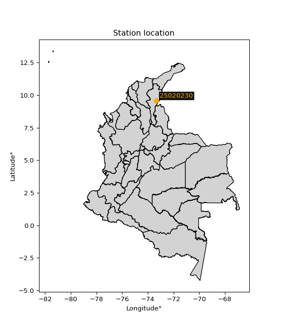</img>

### 3. Discrete values table

|       |    0 |    1 |    2 |    3 |    4 |    5 |    6 |    7 |    8 |    9 |   10 |   11 |   12 |   13 |   14 |   15 |        16 |   17 |   18 |   19 |   20 |     21 |   22 |   23 |   24 |   25 |   26 |   27 |   28 |   29 |   30 |   31 |   32 |   33 |   34 |   35 |   36 |     37 |     38 |
|:------|-----:|-----:|-----:|-----:|-----:|-----:|-----:|-----:|-----:|-----:|-----:|-----:|-----:|-----:|-----:|-----:|----------:|-----:|-----:|-----:|-----:|-------:|-----:|-----:|-----:|-----:|-----:|-----:|-----:|-----:|-----:|-----:|-----:|-----:|-----:|-----:|-----:|-------:|-------:|
| Date  | 1980 | 1981 | 1982 | 1983 | 1984 | 1985 | 1986 | 1987 | 1988 | 1989 | 1990 | 1991 | 1992 | 1993 | 1994 | 1995 | 1996      | 1997 | 1998 | 1999 | 2000 | 2001   | 2002 | 2003 | 2004 | 2005 | 2006 | 2007 | 2008 | 2009 | 2010 | 2011 | 2012 | 2013 | 2014 | 2015 | 2016 | 2017   | 2018   |
| Value |  108 |  150 |  148 |  120 |  155 |  230 |  136 |   46 |   95 |   85 |   89 |   65 |   62 |   90 |  135 |   90 |   37.5273 |   85 |   71 |  110 |  122 |  134.5 |  109 |   80 |   80 |   40 |   90 |  150 |  160 |  150 |   91 |  110 |   73 |   82 |   96 |  150 |  100 |  120.1 |   81.1 |

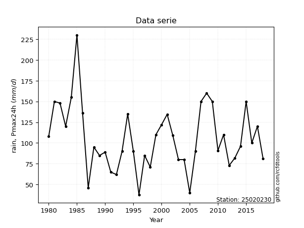</img>

## B. Active continuous probability distributions from SciPy (48 of 104 available)

|   id | p_dist             |   n_parameter | fit_method   | label                                                                       | active   | ref                                                                                                        |
|-----:|:-------------------|--------------:|:-------------|:----------------------------------------------------------------------------|:---------|:-----------------------------------------------------------------------------------------------------------|
|    0 | alpha              |             3 | MLE          | Alpha                                                                       | True     | [:mortar_board:](https://docs.scipy.org/doc/scipy/reference/generated/scipy.stats.alpha.html)              |
|    1 | betaprime          |             4 | MLE          | Beta prime                                                                  | True     | [:mortar_board:](https://docs.scipy.org/doc/scipy/reference/generated/scipy.stats.betaprime.html)          |
|    2 | chi2               |             3 | MLE          | Chi²                                                                        | True     | [:mortar_board:](https://docs.scipy.org/doc/scipy/reference/generated/scipy.stats.chi2.html)               |
|    3 | crystalball        |             4 | MLE          | Crystalball                                                                 | True     | [:mortar_board:](https://docs.scipy.org/doc/scipy/reference/generated/scipy.stats.crystalball.html)        |
|    4 | dgamma             |             3 | MLE          | Double gamma                                                                | True     | [:mortar_board:](https://docs.scipy.org/doc/scipy/reference/generated/scipy.stats.dgamma.html)             |
|    5 | erlang             |             3 | MLE          | Erlang                                                                      | True     | [:mortar_board:](https://docs.scipy.org/doc/scipy/reference/generated/scipy.stats.erlang.html)             |
|    6 | expon              |             2 | MLE          | Exponential                                                                 | True     | [:mortar_board:](https://docs.scipy.org/doc/scipy/reference/generated/scipy.stats.expon.html)              |
|    7 | exponnorm          |             3 | MLE          | Exponentially modified Normal                                               | True     | [:mortar_board:](https://docs.scipy.org/doc/scipy/reference/generated/scipy.stats.exponnorm.html)          |
|    8 | f                  |             4 | MLE          | F                                                                           | True     | [:mortar_board:](https://docs.scipy.org/doc/scipy/reference/generated/scipy.stats.f.html)                  |
|    9 | fatiguelife        |             3 | MLE          | Fatigue-life (Birnbaum-Saunders)                                            | True     | [:mortar_board:](https://docs.scipy.org/doc/scipy/reference/generated/scipy.stats.fatiguelife.html)        |
|   10 | fisk               |             3 | MLE          | Fisk                                                                        | True     | [:mortar_board:](https://docs.scipy.org/doc/scipy/reference/generated/scipy.stats.fisk.html)               |
|   11 | gamma              |             3 | MLE          | Gamma                                                                       | True     | [:mortar_board:](https://docs.scipy.org/doc/scipy/reference/generated/scipy.stats.gamma.html)              |
|   12 | genexpon           |             5 | MLE          | Generalized exponential                                                     | True     | [:mortar_board:](https://docs.scipy.org/doc/scipy/reference/generated/scipy.stats.genexpon.html)           |
|   13 | geninvgauss        |             4 | MLE          | Generalized Inverse Gaussian                                                | True     | [:mortar_board:](https://docs.scipy.org/doc/scipy/reference/generated/scipy.stats.geninvgauss.html)        |
|   14 | genlogistic        |             3 | MLE          | Generalized logistic                                                        | True     | [:mortar_board:](https://docs.scipy.org/doc/scipy/reference/generated/scipy.stats.genlogistic.html)        |
|   15 | gibrat             |             2 | MM           | Gibrat                                                                      | True     | [:mortar_board:](https://docs.scipy.org/doc/scipy/reference/generated/scipy.stats.gibrat.html)             |
|   16 | gompertz           |             3 | MLE          | Gompertz (or truncated Gumbel)                                              | True     | [:mortar_board:](https://docs.scipy.org/doc/scipy/reference/generated/scipy.stats.gompertz.html)           |
|   17 | gumbel_l           |             2 | MM           | Gumbel Left Skew                                                            | True     | [:mortar_board:](https://docs.scipy.org/doc/scipy/reference/generated/scipy.stats.gumbel_l.html)           |
|   18 | gumbel_r           |             2 | MM           | Gumbel Right Skew                                                           | True     | [:mortar_board:](https://docs.scipy.org/doc/scipy/reference/generated/scipy.stats.gumbel_r.html)           |
|   19 | halflogistic       |             2 | MM           | Half-logistic                                                               | True     | [:mortar_board:](https://docs.scipy.org/doc/scipy/reference/generated/scipy.stats.halflogistic.html)       |
|   20 | halfnorm           |             2 | MM           | Half Normal                                                                 | True     | [:mortar_board:](https://docs.scipy.org/doc/scipy/reference/generated/scipy.stats.halfnorm.html)           |
|   21 | hypsecant          |             2 | MM           | hyperbolic secant                                                           | True     | [:mortar_board:](https://docs.scipy.org/doc/scipy/reference/generated/scipy.stats.hypsecant.html)          |
|   22 | invgamma           |             3 | MLE          | Inverted gamma                                                              | True     | [:mortar_board:](https://docs.scipy.org/doc/scipy/reference/generated/scipy.stats.invgamma.html)           |
|   23 | invgauss           |             3 | MLE          | Inverse Gaussian                                                            | True     | [:mortar_board:](https://docs.scipy.org/doc/scipy/reference/generated/scipy.stats.invgauss.html)           |
|   24 | invweibull         |             3 | MLE          | Inverted Weibull                                                            | True     | [:mortar_board:](https://docs.scipy.org/doc/scipy/reference/generated/scipy.stats.invweibull.html)         |
|   25 | johnsonsu          |             4 | MLE          | Johnson Su                                                                  | True     | [:mortar_board:](https://docs.scipy.org/doc/scipy/reference/generated/scipy.stats.johnsonsu.html)          |
|   26 | kstwobign          |             2 | MLE          | Limiting distribution of scaled Kolmogorov-Smirnov two-sided test statistic | True     | [:mortar_board:](https://docs.scipy.org/doc/scipy/reference/generated/scipy.stats.kstwobign.html)          |
|   27 | laplace            |             2 | MM           | Laplace                                                                     | True     | [:mortar_board:](https://docs.scipy.org/doc/scipy/reference/generated/scipy.stats.laplace.html)            |
|   28 | laplace_asymmetric |             3 | MLE          | Asymmetric Laplace                                                          | True     | [:mortar_board:](https://docs.scipy.org/doc/scipy/reference/generated/scipy.stats.laplace_asymmetric.html) |
|   29 | loggamma           |             3 | MLE          | Log gamma                                                                   | True     | [:mortar_board:](https://docs.scipy.org/doc/scipy/reference/generated/scipy.stats.loggamma.html)           |
|   30 | logistic           |             2 | MM           | Logistic (or Sech-squared)                                                  | True     | [:mortar_board:](https://docs.scipy.org/doc/scipy/reference/generated/scipy.stats.logistic.html)           |
|   31 | lognorm            |             3 | MLE          | Log Normal                                                                  | True     | [:mortar_board:](https://docs.scipy.org/doc/scipy/reference/generated/scipy.stats.lognorm.html)            |
|   32 | maxwell            |             2 | MM           | Maxwell                                                                     | True     | [:mortar_board:](https://docs.scipy.org/doc/scipy/reference/generated/scipy.stats.maxwell.html)            |
|   33 | mielke             |             4 | MLE          | Mielke Beta-Kappa / Dagum                                                   | True     | [:mortar_board:](https://docs.scipy.org/doc/scipy/reference/generated/scipy.stats.mielke.html)             |
|   34 | moyal              |             2 | MM           | Moyal                                                                       | True     | [:mortar_board:](https://docs.scipy.org/doc/scipy/reference/generated/scipy.stats.moyal.html)              |
|   35 | nakagami           |             3 | MLE          | Nakagami                                                                    | True     | [:mortar_board:](https://docs.scipy.org/doc/scipy/reference/generated/scipy.stats.nakagami.html)           |
|   36 | ncf                |             5 | MLE          | Non-central F distribution                                                  | True     | [:mortar_board:](https://docs.scipy.org/doc/scipy/reference/generated/scipy.stats.ncf.html)                |
|   37 | nct                |             4 | MLE          | Non-central Student’s t                                                     | True     | [:mortar_board:](https://docs.scipy.org/doc/scipy/reference/generated/scipy.stats.nct.html)                |
|   38 | norm               |             2 | MM           | Normal                                                                      | True     | [:mortar_board:](https://docs.scipy.org/doc/scipy/reference/generated/scipy.stats.norm.html)               |
|   39 | pareto             |             3 | MLE          | Pareto                                                                      | True     | [:mortar_board:](https://docs.scipy.org/doc/scipy/reference/generated/scipy.stats.pareto.html)             |
|   40 | pearson3           |             3 | MM           | Pearson type III                                                            | True     | [:mortar_board:](https://docs.scipy.org/doc/scipy/reference/generated/scipy.stats.pearson3.html)           |
|   41 | rayleigh           |             2 | MM           | Rayleigh                                                                    | True     | [:mortar_board:](https://docs.scipy.org/doc/scipy/reference/generated/scipy.stats.rayleigh.html)           |
|   42 | recipinvgauss      |             3 | MLE          | Reciprocal inverse Gaussian                                                 | True     | [:mortar_board:](https://docs.scipy.org/doc/scipy/reference/generated/scipy.stats.recipinvgauss.html)      |
|   43 | rice               |             3 | MLE          | Rice                                                                        | True     | [:mortar_board:](https://docs.scipy.org/doc/scipy/reference/generated/scipy.stats.rice.html)               |
|   44 | t                  |             3 | MLE          | Student’s t                                                                 | True     | [:mortar_board:](https://docs.scipy.org/doc/scipy/reference/generated/scipy.stats.t.html)                  |
|   45 | truncnorm          |             4 | MLE          | Truncated normal                                                            | True     | [:mortar_board:](https://docs.scipy.org/doc/scipy/reference/generated/scipy.stats.truncnorm.html)          |
|   46 | wald               |             2 | MM           | Wald                                                                        | True     | [:mortar_board:](https://docs.scipy.org/doc/scipy/reference/generated/scipy.stats.wald.html)               |
|   47 | weibull_min        |             3 | MLE          | Weibull minimum                                                             | True     | [:mortar_board:](https://docs.scipy.org/doc/scipy/reference/generated/scipy.stats.weibull_min.html)        |

> Gumbel and Lob-Gumbel probability distributions are not shown in the above table.  
> n_parameter = # arguments & localization & scale.  
> Fit methods: (MLE) maximum likelihood, (MM) L-moments.

## C. Probability distributions

### Cumulative distribution values - CDF (50 evalated, ordered by x ascending) 

|   id |   Station |   date |        x |   station |   m |     alpha |   alpha_pdf |   betaprime |   betaprime_pdf |      chi2 |    chi2_pdf |   crystalball |   crystalball_pdf |    dgamma |   dgamma_pdf |    erlang |   erlang_pdf |     expon |   expon_pdf |   exponnorm |   exponnorm_pdf |         f |       f_pdf |   fatiguelife |   fatiguelife_pdf |      fisk |    fisk_pdf |     gamma |   gamma_pdf |    genexpon |   genexpon_pdf |   geninvgauss |   geninvgauss_pdf |   genlogistic |   genlogistic_pdf |    gibrat |   gibrat_pdf |    gompertz |   gompertz_pdf |   gumbel_l |   gumbel_l_pdf |   gumbel_r |   gumbel_r_pdf |   halflogistic |   halflogistic_pdf |   halfnorm |   halfnorm_pdf |   hypsecant |   hypsecant_pdf |   invgamma |   invgamma_pdf |   invgauss |   invgauss_pdf |   invweibull |   invweibull_pdf |   johnsonsu |   johnsonsu_pdf |   kstwobign |   kstwobign_pdf |   laplace |   laplace_pdf |   laplace_asymmetric |   laplace_asymmetric_pdf |   loggamma |   loggamma_pdf |   logistic |   logistic_pdf |   lognorm |   lognorm_pdf |   maxwell |   maxwell_pdf |    mielke |   mielke_pdf |       moyal |   moyal_pdf |   nakagami |   nakagami_pdf |      ncf |    ncf_pdf |       nct |     nct_pdf |      norm |    norm_pdf |    pareto |   pareto_pdf |   pearson3 |   pearson3_pdf |   rayleigh |   rayleigh_pdf |   recipinvgauss |   recipinvgauss_pdf |       rice |    rice_pdf |         t |       t_pdf |   truncnorm |   truncnorm_pdf |       wald |    wald_pdf |   weibull_min |   weibull_min_pdf |    zzgumbel |   gumbel_pdf |   zzloggumbel |   loggumbel_pdf |
|-----:|----------:|-------:|---------:|----------:|----:|----------:|------------:|------------:|----------------:|----------:|------------:|--------------:|------------------:|----------:|-------------:|----------:|-------------:|----------:|------------:|------------:|----------------:|----------:|------------:|--------------:|------------------:|----------:|------------:|----------:|------------:|------------:|---------------:|--------------:|------------------:|--------------:|------------------:|----------:|-------------:|------------:|---------------:|-----------:|---------------:|-----------:|---------------:|---------------:|-------------------:|-----------:|---------------:|------------:|----------------:|-----------:|---------------:|-----------:|---------------:|-------------:|-----------------:|------------:|----------------:|------------:|----------------:|----------:|--------------:|---------------------:|-------------------------:|-----------:|---------------:|-----------:|---------------:|----------:|--------------:|----------:|--------------:|----------:|-------------:|------------:|------------:|-----------:|---------------:|---------:|-----------:|----------:|------------:|----------:|------------:|----------:|-------------:|-----------:|---------------:|-----------:|---------------:|----------------:|--------------------:|-----------:|------------:|----------:|------------:|------------:|----------------:|-----------:|------------:|--------------:|------------------:|------------:|-------------:|--------------:|----------------:|
|    0 |  25020230 |   1996 |  37.5273 |  25020230 |   1 | 0.0150854 | 0.00157658  |   0.0128172 |     0.00161989  | 0.0137695 | 0.00163059  |     0.0370525 |       0.00211789  | 0.0375959 |  0.00187973  | 0.0137694 |  0.00163059  | 0         | 0.014647    |   0.0194808 |     0.00161058  | 0.0137692 | 0.00162997  |     0.0142972 |       0.00160401  | 0.0192043 | 0.0015221   | 0.0137695 | 0.00163059  | 1.95377e-08 |    0.0131743   |    0.00515014 |       0.00185646  |     0.0168773 |       0.00146714  | 0         |  0           | 2.84631e-05 |    0.00607834  |  0.0552393 |    0.00180113  | 0.00389664 |    0.00072526  |      0         |        0           |  0         |    0           |   0.0384581 |     0.00157642  |  0.0147564 |    0.00158436  |  0.013266  |    0.00156608  |   0.00954062 |      0.00135656  |   0.038382  |     0.00216004  |  0.00866664 |     0.00151401  | 0.0399997 |   0.00147977  |            0.0215418 |              0.00121718  |  0.0387769 |    0.00215536  |  0.0377103 |    0.00172178  | 0.0145045 |   0.00159346  | 0.0154191 |   0.00200987  | 0.018563  |  0.00171916  | 0.000117279 | 5.36092e-05 |  0.0104094 |    0.00191207  | 0.24744  | 0.00627584 | 0.0169533 | 0.00153215  | 0.0370525 | 0.00211789  | 0         |  0.014647    |  0.010626  |    0.00147929  | 0.00346043 |    0.00142201  |       0.0143025 |         0.0016055   | 0.00922731 | 0.00211738  | 0.0438163 | 0.00216539  |   0.0370525 |     0.00211789  | 0          | 0           |    0.00937628 |        0.00202055 | 6.85967e-05 |            0 |   2.58726e-07 |               0 |
|    1 |  25020230 |   2005 |  40      |  25020230 |   2 | 0.0194003 | 0.00192078  |   0.0173051 |     0.00201812  | 0.018262  | 0.00201071  |     0.0425999 |       0.00237228  | 0.0425274 |  0.00211319  | 0.018262  |  0.00201071  | 0.0355693 | 0.014126    |   0.0238171 |     0.00190266  | 0.0182601 | 0.00200993  |     0.0187055 |       0.00196908  | 0.0232928 | 0.00179049  | 0.018262  | 0.00201071  | 0.0332535   |    0.0135884   |    0.0109109  |       0.00280893  |     0.0208618 |       0.00176259  | 0         |  0           | 0.0152035   |    0.00619568  |  0.0598714 |    0.00194733  | 0.00606035 |    0.00103818  |      0         |        0           |  0         |    0           |   0.0425593 |     0.00174358  |  0.0190999 |    0.0019362   |  0.0175914 |    0.00194051  |   0.0133857  |      0.00176475  |   0.0440338 |     0.00241455  |  0.0130392  |     0.002036    | 0.0438313 |   0.00162151  |            0.0247719 |              0.00139969  |  0.0444141 |    0.00240735  |  0.0422064 |    0.00191806  | 0.0188785 |   0.00195189  | 0.0209094 |   0.00243566  | 0.0231763 |  0.00201703  | 0.000337433 | 0.000134656 |  0.0157641 |    0.00242303  | 0.262954 | 0.00627019 | 0.0211161 | 0.00184173  | 0.0425999 | 0.00237228  | 0.0355693 |  0.014126    |  0.0147707 |    0.00188204  | 0.00786162 |    0.00213625  |       0.0187149 |         0.00197092  | 0.0151936  | 0.00270693  | 0.0494605 | 0.00240282  |   0.0425999 |     0.00237228  | 0          | 0           |    0.0150721  |        0.00258756 | 0.000145772 |            0 |   4.86457e-06 |               0 |
|    2 |  25020230 |   1987 |  46      |  25020230 |   3 | 0.0338425 | 0.00293443  |   0.0327445 |     0.00316866  | 0.0335048 | 0.00310931  |     0.0588703 |       0.00307005  | 0.0571597 |  0.00279252  | 0.0335048 |  0.00310931  | 0.116708  | 0.0129376   |   0.0377008 |     0.00276099  | 0.0334973 | 0.00310827  |     0.0335948 |       0.0030346   | 0.0363277 | 0.00259119  | 0.0335048 | 0.00310931  | 0.113451    |    0.0129672   |    0.0347118  |       0.00509283  |     0.0340004 |       0.00266093  | 0         |  0           | 0.0532205   |    0.00647522  |  0.0727258 |    0.00234901  | 0.0153753  |    0.00215365  |      0         |        0           |  0         |    0           |   0.0544071 |     0.00222474  |  0.033694  |    0.00296966  |  0.0324018 |    0.0030389   |   0.0275754  |      0.00302637  |   0.0605536 |     0.00311028  |  0.0297295  |     0.00358334  | 0.0547247 |   0.00202451  |            0.0347691 |              0.00196456  |  0.0608715 |    0.00309668  |  0.0553375 |    0.00248032  | 0.0336159 |   0.00300147  | 0.0388615 |   0.00356832  | 0.0377221 |  0.00286019  | 0.00260189  | 0.000749761 |  0.0342023 |    0.00373507  | 0.300428 | 0.00621129 | 0.0348195 | 0.00276766  | 0.0588703 | 0.00307005  | 0.116708  |  0.0129376   |  0.0294785 |    0.00306582  | 0.0257608  |    0.00381453  |       0.0336175 |         0.00303715  | 0.0356267  | 0.00409171  | 0.06578   | 0.00305504  |   0.0588703 |     0.00307005  | 0          | 0           |    0.0347496  |        0.00396939 | 0.000716159 |            0 |   0.000481081 |               0 |
|    3 |  25020230 |   1992 |  62      |  25020230 |   4 | 0.108387  | 0.00652297  |   0.112853  |     0.00690328  | 0.111692  | 0.0067434   |     0.125942  |       0.00541323  | 0.122098  |  0.00558721  | 0.111692  |  0.0067434   | 0.301242  | 0.0102347   |   0.106175  |     0.00599254  | 0.11167   | 0.00674289  |     0.110352  |       0.00666401  | 0.101653  | 0.00583326  | 0.111692  | 0.0067434   | 0.299192    |    0.0103077   |    0.154      |       0.00925922  |     0.103223  |       0.00623184  | 0         |  0           | 0.162435    |    0.00715694  |  0.121163  |    0.00380817  | 0.0870948  |    0.00713202  |      0.0230668 |        0.0152902   |  0.0853659 |    0.0125097   |   0.104311  |     0.00420988  |  0.109076  |    0.00658005  |  0.110069  |    0.00676661  |   0.110582   |      0.00744227  |   0.128109  |     0.0054284   |  0.124054   |     0.00807635  | 0.0989115 |   0.00365918  |            0.0858653 |              0.00485166  |  0.128094  |    0.00540285  |  0.111232  |    0.00469059  | 0.109687  |   0.00662329  | 0.121922  |   0.00679804  | 0.10642   |  0.0059042   | 0.058534    | 0.00732765  |  0.122074  |    0.00716216  | 0.39706  | 0.00582131 | 0.105539  | 0.00626752  | 0.125942  | 0.00541323  | 0.301242  |  0.0102347   |  0.109261  |    0.00697348  | 0.118684   |    0.0075922   |       0.110418  |         0.00666631  | 0.127741   | 0.00727302  | 0.131617  | 0.00527956  |   0.125942  |     0.00541323  | 0          | 0           |    0.125966   |        0.00730005 | 0.0140804   |            0 |   0.0611342   |               0 |
|    4 |  25020230 |   1991 |  65      |  25020230 |   5 | 0.129029  | 0.00723567  |   0.134593  |     0.00758414  | 0.132949  | 0.00742324  |     0.142917  |       0.00590432  | 0.139902  |  0.00629184  | 0.132949  |  0.00742324  | 0.331282  | 0.00979472  |   0.125203  |     0.00669459  | 0.132925  | 0.00742302  |     0.131392  |       0.00735871  | 0.12028   | 0.00658979  | 0.132949  | 0.00742324  | 0.329443    |    0.00986292  |    0.18242    |       0.00966924  |     0.123089  |       0.00701281  | 0         |  0           | 0.184076    |    0.00726927  |  0.1331    |    0.00415421  | 0.110024   |    0.008147    |      0.0688567 |        0.0152258   |  0.122786  |    0.0124325   |   0.117703  |     0.00472701  |  0.129882  |    0.00728741  |  0.131432  |    0.00747075  |   0.134112   |      0.00823512  |   0.145117  |     0.00591161  |  0.149306   |     0.00874307  | 0.110521  |   0.00408868  |            0.101727  |              0.00574787  |  0.145026  |    0.00588599  |  0.126101  |    0.00522867  | 0.130614  |   0.00732489  | 0.143165  |   0.00735947  | 0.125134  |  0.00657503  | 0.082959    | 0.00894175  |  0.144402  |    0.00771661  | 0.414376 | 0.0057219  | 0.12545   | 0.007006    | 0.142917  | 0.00590432  | 0.331282  |  0.00979472  |  0.13126   |    0.00768567  | 0.142303   |    0.00814446  |       0.131464  |         0.00736058  | 0.150297   | 0.00775759  | 0.148166  | 0.00575474  |   0.142917  |     0.00590432  | 0          | 0           |    0.14865    |        0.00781581 | 0.0210723   |            0 |   0.0922369   |               0 |
|    5 |  25020230 |   1998 |  71      |  25020230 |   6 | 0.17654   | 0.00857552  |   0.183882  |     0.00881037  | 0.181314  | 0.00866739  |     0.181318  |       0.00689561  | 0.182251  |  0.00785469  | 0.181314  |  0.00866739  | 0.387542  | 0.00897068  |   0.16959   |     0.00809354  | 0.181291  | 0.00866778  |     0.179481  |       0.00864162  | 0.164493  | 0.00815092  | 0.181314  | 0.00866739  | 0.386085    |    0.00902987  |    0.242163   |       0.0101805   |     0.169798  |       0.0085404   | 0         |  0           | 0.228319    |    0.00747381  |  0.160276  |    0.00492131  | 0.164535   |    0.00996191  |      0.159385  |        0.0149097   |  0.196729  |    0.0121974   |   0.14954   |     0.00592112  |  0.17765   |    0.00860799  |  0.180217  |    0.00875776  |   0.187785   |      0.00959888  |   0.183509  |     0.00688482  |  0.205095   |     0.00978638  | 0.137989  |   0.00510483  |            0.14278   |              0.00806754  |  0.183271  |    0.00686223  |  0.160947  |    0.00640743  | 0.178558  |   0.00862774  | 0.19045   |   0.00837537  | 0.168701  |  0.00794992  | 0.145283    | 0.0116911   |  0.193714  |    0.00868773  | 0.448072 | 0.00550714 | 0.171828  | 0.00843499  | 0.181318  | 0.00689561  | 0.387542  |  0.00897068  |  0.181319  |    0.00896216  | 0.194075   |    0.00907304  |       0.179562  |         0.00864239  | 0.199452   | 0.00859779  | 0.185598  | 0.00672443  |   0.181318  |     0.00689561  | 0.00219102 | 0.00382216  |    0.19832    |        0.00870815 | 0.0422466   |            0 |   0.170305    |               0 |
|    6 |  25020230 |   2012 |  73      |  25020230 |   7 | 0.1941    | 0.00898121  |   0.201865  |     0.00916698  | 0.199021  | 0.00903533  |     0.195437  |       0.00722209  | 0.198513  |  0.00840943  | 0.199021  |  0.00903533  | 0.405223  | 0.0087117   |   0.186228  |     0.00854237  | 0.198999  | 0.00903593  |     0.197151  |       0.00902389  | 0.181311  | 0.00866568  | 0.199021  | 0.00903533  | 0.403882    |    0.00876811  |    0.262619   |       0.0102689   |     0.18736   |       0.00901726  | 0         |  0           | 0.243329    |    0.00753528  |  0.170395  |    0.00519944  | 0.184979   |    0.0104729   |      0.18905   |        0.0147515   |  0.221024  |    0.0120959   |   0.161824  |     0.00636666  |  0.195267  |    0.00900529  |  0.198116  |    0.00913692  |   0.207363   |      0.00997109  |   0.1976    |     0.00720477  |  0.224933   |     0.0100442   | 0.148586  |   0.00549686  |            0.159862  |              0.00903274  |  0.197318  |    0.00718421  |  0.174178  |    0.00682481  | 0.196208  |   0.00901785  | 0.207504  |   0.00867549  | 0.185057  |  0.0084053   | 0.169387    | 0.0123924   |  0.211371  |    0.0089657   | 0.459012 | 0.00543178 | 0.189145  | 0.00887874  | 0.195437  | 0.00722209  | 0.405223  |  0.0087117   |  0.199617  |    0.00933107  | 0.212481   |    0.00932842  |       0.197233  |         0.00902425  | 0.216891   | 0.00883738  | 0.19937   | 0.00704695  |   0.195437  |     0.00722209  | 0.0203953  | 0.014593    |    0.215993   |        0.00896111 | 0.0517443   |            0 |   0.199486    |               0 |
|    7 |  25020230 |   2003 |  80      |  25020230 |   8 | 0.261359  | 0.0101698   |   0.269761  |     0.0101634   | 0.266178  | 0.0100872   |     0.249863  |       0.0083103   | 0.264239  |  0.0103505   | 0.266178  |  0.0100872   | 0.463183  | 0.00786276  |   0.251145  |     0.00995647  | 0.266162  | 0.0100884   |     0.264402  |       0.0101246   | 0.247939  | 0.0103204   | 0.266178  | 0.0100872   | 0.462204    |    0.00791026  |    0.33487    |       0.0103096   |     0.255736  |       0.0104471   | 0.048428  |  0.029902    | 0.296751    |    0.00771985  |  0.210422  |    0.00625857  | 0.263343   |    0.0117888   |      0.289885  |        0.0140127   |  0.304229  |    0.0116557   |   0.212289  |     0.00809065  |  0.26258   |    0.0101609   |  0.266078  |    0.0102112   |   0.280759   |      0.0109001   |   0.251822  |     0.0082694   |  0.297501   |     0.0106028   | 0.192506  |   0.00712164  |            0.237421  |              0.0134151   |  0.251433  |    0.00826006  |  0.227203  |    0.00833087  | 0.263515  |   0.0101469   | 0.271449  |   0.00954549  | 0.249255  |  0.00990305  | 0.26217     | 0.0138634   |  0.277026  |    0.00974009  | 0.496083 | 0.0051577  | 0.256193  | 0.0102136   | 0.249863  | 0.0083103   | 0.463183  |  0.00786276  |  0.268763  |    0.0103515   | 0.280343   |    0.0100041   |       0.264481  |         0.0101235   | 0.281252   | 0.00950734  | 0.252554  | 0.00813356  |   0.249863  |     0.0083103   | 0.192598   | 0.0279428   |    0.281337   |        0.00965932 | 0.0954949   |            0 |   0.306016    |               0 |
|    8 |  25020230 |   2004 |  80      |  25020230 |   9 | 0.261359  | 0.0101698   |   0.269761  |     0.0101634   | 0.266178  | 0.0100872   |     0.249863  |       0.0083103   | 0.264239  |  0.0103505   | 0.266178  |  0.0100872   | 0.463183  | 0.00786276  |   0.251145  |     0.00995647  | 0.266162  | 0.0100884   |     0.264402  |       0.0101246   | 0.247939  | 0.0103204   | 0.266178  | 0.0100872   | 0.462204    |    0.00791026  |    0.33487    |       0.0103096   |     0.255736  |       0.0104471   | 0.048428  |  0.029902    | 0.296751    |    0.00771985  |  0.210422  |    0.00625857  | 0.263343   |    0.0117888   |      0.289885  |        0.0140127   |  0.304229  |    0.0116557   |   0.212289  |     0.00809065  |  0.26258   |    0.0101609   |  0.266078  |    0.0102112   |   0.280759   |      0.0109001   |   0.251822  |     0.0082694   |  0.297501   |     0.0106028   | 0.192506  |   0.00712164  |            0.237421  |              0.0134151   |  0.251433  |    0.00826006  |  0.227203  |    0.00833087  | 0.263515  |   0.0101469   | 0.271449  |   0.00954549  | 0.249255  |  0.00990305  | 0.26217     | 0.0138634   |  0.277026  |    0.00974009  | 0.496083 | 0.0051577  | 0.256193  | 0.0102136   | 0.249863  | 0.0083103   | 0.463183  |  0.00786276  |  0.268763  |    0.0103515   | 0.280343   |    0.0100041   |       0.264481  |         0.0101235   | 0.281252   | 0.00950734  | 0.252554  | 0.00813356  |   0.249863  |     0.0083103   | 0.192598   | 0.0279428   |    0.281337   |        0.00965932 | 0.0954949   |            0 |   0.306016    |               0 |
|    9 |  25020230 |   2018 |  81.1    |  25020230 |  10 | 0.272628  | 0.0103188   |   0.281006  |     0.0102816   | 0.277345  | 0.0102156   |     0.259092  |       0.00846977  | 0.275782  |  0.0106337   | 0.277345  |  0.0102156   | 0.471762  | 0.0077371   |   0.262203  |     0.0101485   | 0.277331  | 0.0102169   |     0.275614  |       0.0102599   | 0.259418  | 0.0105473   | 0.277345  | 0.0102156   | 0.470836    |    0.00778331  |    0.346197   |       0.0102829   |     0.267329  |       0.0106291   | 0.0842179 |  0.0346314   | 0.305256    |    0.00774413  |  0.217404  |    0.00643644  | 0.276387   |    0.0119245   |      0.305222  |        0.0138731   |  0.317006  |    0.0115752   |   0.221348  |     0.00837979  |  0.273837  |    0.0103045   |  0.277383  |    0.0103406   |   0.2928     |      0.0109918   |   0.261005  |     0.00842518  |  0.309188   |     0.0106448   | 0.200501  |   0.00741742  |            0.252646  |              0.0142753   |  0.260606  |    0.00841816  |  0.236497  |    0.00856737  | 0.274755  |   0.0102865   | 0.28201   |   0.00965465  | 0.260266  |  0.0101158   | 0.277476    | 0.0139603   |  0.287792  |    0.00983263  | 0.501732 | 0.00511355 | 0.267524  | 0.0103854   | 0.259092  | 0.00846977  | 0.471762  |  0.0077371   |  0.280216  |    0.0104707   | 0.29139    |    0.0100795   |       0.275692  |         0.0102587   | 0.291756   | 0.0095882   | 0.261589  | 0.00829432  |   0.259092  |     0.00846977  | 0.223109   | 0.0274845   |    0.292008   |        0.00974191 | 0.103865    |            0 |   0.322751    |               0 |
|   10 |  25020230 |   2013 |  82      |  25020230 |  11 | 0.281967  | 0.0104322   |   0.2903    |     0.0103702   | 0.286583  | 0.0103129   |     0.266773  |       0.00859721  | 0.285453  |  0.0108553   | 0.286583  |  0.0103129   | 0.47868   | 0.00763577  |   0.271405  |     0.0102983   | 0.28657   | 0.0103142   |     0.284895  |       0.0103626   | 0.26899   | 0.0107241   | 0.286583  | 0.0103129   | 0.477794    |    0.00768095  |    0.355439   |       0.0102553   |     0.276958  |       0.0107679   | 0.116334  |  0.0364957   | 0.312235    |    0.00776297  |  0.223263  |    0.00658408  | 0.287164   |    0.0120209   |      0.317655  |        0.0137546   |  0.327394  |    0.0115071   |   0.228997  |     0.00861868  |  0.283161  |    0.0104137   |  0.286734  |    0.010438    |   0.302723   |      0.0110559   |   0.268644  |     0.00854965  |  0.318781   |     0.0106705   | 0.207289  |   0.00766854  |            0.265826  |              0.01502     |  0.26824   |    0.00854463  |  0.244295  |    0.00875945  | 0.284061  |   0.0103924   | 0.290737  |   0.00973813  | 0.269446  |  0.0102836   | 0.290067    | 0.0140148   |  0.296673  |    0.00990234  | 0.506318 | 0.00507727 | 0.27693   | 0.0105172   | 0.266773  | 0.00859721  | 0.47868   |  0.00763577  |  0.28968   |    0.0105597   | 0.300487   |    0.010135    |       0.284972  |         0.0103612   | 0.300413   | 0.00964935  | 0.269112  | 0.00842309  |   0.266773  |     0.00859721  | 0.247607   | 0.0269337   |    0.300804   |        0.00980395 | 0.111007    |            0 |   0.336351    |               0 |
|   11 |  25020230 |   1997 |  85      |  25020230 |  12 | 0.313769  | 0.0107545   |   0.321795  |     0.0106126   | 0.31795   | 0.010585    |     0.293177  |       0.00899995  | 0.319028  |  0.0115006   | 0.31795   |  0.010585    | 0.501091  | 0.00730751  |   0.302991  |     0.0107453   | 0.317942  | 0.0105865   |     0.316436  |       0.010651    | 0.301976  | 0.0112493   | 0.31795   | 0.010585    | 0.500336    |    0.00734939  |    0.386028   |       0.0101286   |     0.309881  |       0.0111628   | 0.226877  |  0.0360339   | 0.33561     |    0.00781885  |  0.243768  |    0.00708906  | 0.323604   |    0.0122492   |      0.358298  |        0.0133343   |  0.361559  |    0.0112667   |   0.256058  |     0.00942293  |  0.314886  |    0.0107224   |  0.318473  |    0.0107076   |   0.336134   |      0.0112006   |   0.294891  |     0.00894275  |  0.350862   |     0.0107035   | 0.23162   |   0.00856865  |            0.314931  |              0.0177946   |  0.294483  |    0.00894501  |  0.271518  |    0.00938486  | 0.315707  |   0.0106911   | 0.320326  |   0.00997777  | 0.301085  |  0.0107962   | 0.332216    | 0.014048    |  0.326685  |    0.0100956   | 0.521367 | 0.0049555  | 0.309075  | 0.0108969   | 0.293177  | 0.00899995  | 0.501091  |  0.00730751  |  0.321742  |    0.0108005   | 0.331125   |    0.0102804   |       0.316508  |         0.0106491   | 0.32963    | 0.00982061  | 0.295003  | 0.00883171  |   0.293177  |     0.00899995  | 0.324916   | 0.0245039   |    0.330486   |        0.00997474 | 0.136659    |            0 |   0.380842    |               0 |
|   12 |  25020230 |   1989 |  85      |  25020230 |  13 | 0.313769  | 0.0107545   |   0.321795  |     0.0106126   | 0.31795   | 0.010585    |     0.293177  |       0.00899995  | 0.319028  |  0.0115006   | 0.31795   |  0.010585    | 0.501091  | 0.00730751  |   0.302991  |     0.0107453   | 0.317942  | 0.0105865   |     0.316436  |       0.010651    | 0.301976  | 0.0112493   | 0.31795   | 0.010585    | 0.500336    |    0.00734939  |    0.386028   |       0.0101286   |     0.309881  |       0.0111628   | 0.226877  |  0.0360339   | 0.33561     |    0.00781885  |  0.243768  |    0.00708906  | 0.323604   |    0.0122492   |      0.358298  |        0.0133343   |  0.361559  |    0.0112667   |   0.256058  |     0.00942293  |  0.314886  |    0.0107224   |  0.318473  |    0.0107076   |   0.336134   |      0.0112006   |   0.294891  |     0.00894275  |  0.350862   |     0.0107035   | 0.23162   |   0.00856865  |            0.314931  |              0.0177946   |  0.294483  |    0.00894501  |  0.271518  |    0.00938486  | 0.315707  |   0.0106911   | 0.320326  |   0.00997777  | 0.301085  |  0.0107962   | 0.332216    | 0.014048    |  0.326685  |    0.0100956   | 0.521367 | 0.0049555  | 0.309075  | 0.0108969   | 0.293177  | 0.00899995  | 0.501091  |  0.00730751  |  0.321742  |    0.0108005   | 0.331125   |    0.0102804   |       0.316508  |         0.0106491   | 0.32963    | 0.00982061  | 0.295003  | 0.00883171  |   0.293177  |     0.00899995  | 0.324916   | 0.0245039   |    0.330486   |        0.00997474 | 0.136659    |            0 |   0.380842    |               0 |
|   13 |  25020230 |   1990 |  89      |  25020230 |  14 | 0.357423  | 0.0110463   |   0.364687  |     0.0108098   | 0.360813  | 0.0108222   |     0.330153  |       0.00947522  | 0.366197  |  0.0119929   | 0.360813  |  0.0108222   | 0.529482  | 0.00689168  |   0.346943  |     0.0112032   | 0.36081   | 0.0108239   |     0.359598  |       0.0109049   | 0.348094  | 0.0117736   | 0.360813  | 0.0108222   | 0.528886    |    0.00692947  |    0.426085   |       0.00988709  |     0.355308  |       0.0115178   | 0.360077  |  0.0302652   | 0.367006    |    0.0078758   |  0.273514  |    0.00778831  | 0.372863   |    0.0123413   |      0.410427  |        0.0127213   |  0.405936  |    0.010916    |   0.29588   |     0.0104812   |  0.35838   |    0.0109984   |  0.361807  |    0.0109338   |   0.381065   |      0.0112366   |   0.331614  |     0.00940624  |  0.393575   |     0.0106323   | 0.26856   |   0.00993524  |            0.382536  |              0.0160385   |  0.331236  |    0.00941943  |  0.310636  |    0.0101604   | 0.359053  |   0.010956    | 0.360724  |   0.0102035   | 0.345426  |  0.0113466   | 0.387991    | 0.0137875   |  0.367431  |    0.01026     | 0.540863 | 0.0047919  | 0.353433  | 0.0112532   | 0.330153  | 0.00947522  | 0.529482  |  0.00689168  |  0.365371  |    0.0109887   | 0.372485   |    0.010382    |       0.359661  |         0.0109025   | 0.369243   | 0.00997106  | 0.331326  | 0.00931739  |   0.330153  |     0.00947522  | 0.415758   | 0.0209328   |    0.370702   |        0.010117   | 0.174936    |            0 |   0.437437    |               0 |
|   14 |  25020230 |   1993 |  90      |  25020230 |  15 | 0.368495  | 0.0110944   |   0.375512  |     0.010837    | 0.371654  | 0.0108592   |     0.339682  |       0.0095815   | 0.378206  |  0.0120159   | 0.371654  |  0.0108592   | 0.536323  | 0.00679147  |   0.358191  |     0.0112912   | 0.371653  | 0.0108609   |     0.370523  |       0.010945    | 0.359917  | 0.0118702   | 0.371654  | 0.0108592   | 0.535765    |    0.00682829  |    0.435936   |       0.0098156   |     0.366856  |       0.0115752   | 0.38956   |  0.0287045   | 0.374888    |    0.00788674  |  0.281392  |    0.00796671  | 0.3852     |    0.012329    |      0.423068  |        0.0125601   |  0.416806  |    0.0108233   |   0.306489  |     0.0107361   |  0.369401  |    0.011043    |  0.372758  |    0.0109668   |   0.392294   |      0.0112195   |   0.341072  |     0.00950982  |  0.404189   |     0.010596    | 0.278682  |   0.0103097   |            0.398368  |              0.0156273   |  0.340709  |    0.00952591  |  0.320887  |    0.0103396   | 0.370031  |   0.0109984   | 0.370948  |   0.010243    | 0.356829  |  0.011457    | 0.401724    | 0.0136774   |  0.377704  |    0.0102847   | 0.545634 | 0.00475089 | 0.364718  | 0.0113147   | 0.339682  | 0.0095815   | 0.536323  |  0.00679147  |  0.376372  |    0.0110125   | 0.382872   |    0.0103914   |       0.370584  |         0.0109425   | 0.379227   | 0.00999487  | 0.340698  | 0.00942655  |   0.339682  |     0.0095815   | 0.436261   | 0.0200774   |    0.380829   |        0.0101375  | 0.185158    |            0 |   0.451005    |               0 |
|   15 |  25020230 |   2006 |  90      |  25020230 |  16 | 0.368495  | 0.0110944   |   0.375512  |     0.010837    | 0.371654  | 0.0108592   |     0.339682  |       0.0095815   | 0.378206  |  0.0120159   | 0.371654  |  0.0108592   | 0.536323  | 0.00679147  |   0.358191  |     0.0112912   | 0.371653  | 0.0108609   |     0.370523  |       0.010945    | 0.359917  | 0.0118702   | 0.371654  | 0.0108592   | 0.535765    |    0.00682829  |    0.435936   |       0.0098156   |     0.366856  |       0.0115752   | 0.38956   |  0.0287045   | 0.374888    |    0.00788674  |  0.281392  |    0.00796671  | 0.3852     |    0.012329    |      0.423068  |        0.0125601   |  0.416806  |    0.0108233   |   0.306489  |     0.0107361   |  0.369401  |    0.011043    |  0.372758  |    0.0109668   |   0.392294   |      0.0112195   |   0.341072  |     0.00950982  |  0.404189   |     0.010596    | 0.278682  |   0.0103097   |            0.398368  |              0.0156273   |  0.340709  |    0.00952591  |  0.320887  |    0.0103396   | 0.370031  |   0.0109984   | 0.370948  |   0.010243    | 0.356829  |  0.011457    | 0.401724    | 0.0136774   |  0.377704  |    0.0102847   | 0.545634 | 0.00475089 | 0.364718  | 0.0113147   | 0.339682  | 0.0095815   | 0.536323  |  0.00679147  |  0.376372  |    0.0110125   | 0.382872   |    0.0103914   |       0.370584  |         0.0109425   | 0.379227   | 0.00999487  | 0.340698  | 0.00942655  |   0.339682  |     0.0095815   | 0.436261   | 0.0200774   |    0.380829   |        0.0101375  | 0.185158    |            0 |   0.451005    |               0 |
|   16 |  25020230 |   1995 |  90      |  25020230 |  17 | 0.368495  | 0.0110944   |   0.375512  |     0.010837    | 0.371654  | 0.0108592   |     0.339682  |       0.0095815   | 0.378206  |  0.0120159   | 0.371654  |  0.0108592   | 0.536323  | 0.00679147  |   0.358191  |     0.0112912   | 0.371653  | 0.0108609   |     0.370523  |       0.010945    | 0.359917  | 0.0118702   | 0.371654  | 0.0108592   | 0.535765    |    0.00682829  |    0.435936   |       0.0098156   |     0.366856  |       0.0115752   | 0.38956   |  0.0287045   | 0.374888    |    0.00788674  |  0.281392  |    0.00796671  | 0.3852     |    0.012329    |      0.423068  |        0.0125601   |  0.416806  |    0.0108233   |   0.306489  |     0.0107361   |  0.369401  |    0.011043    |  0.372758  |    0.0109668   |   0.392294   |      0.0112195   |   0.341072  |     0.00950982  |  0.404189   |     0.010596    | 0.278682  |   0.0103097   |            0.398368  |              0.0156273   |  0.340709  |    0.00952591  |  0.320887  |    0.0103396   | 0.370031  |   0.0109984   | 0.370948  |   0.010243    | 0.356829  |  0.011457    | 0.401724    | 0.0136774   |  0.377704  |    0.0102847   | 0.545634 | 0.00475089 | 0.364718  | 0.0113147   | 0.339682  | 0.0095815   | 0.536323  |  0.00679147  |  0.376372  |    0.0110125   | 0.382872   |    0.0103914   |       0.370584  |         0.0109425   | 0.379227   | 0.00999487  | 0.340698  | 0.00942655  |   0.339682  |     0.0095815   | 0.436261   | 0.0200774   |    0.380829   |        0.0101375  | 0.185158    |            0 |   0.451005    |               0 |
|   17 |  25020230 |   2010 |  91      |  25020230 |  18 | 0.379609  | 0.0111326   |   0.386359  |     0.0108555   | 0.382528  | 0.0108874   |     0.349315  |       0.00968235  | 0.390211  |  0.0119853   | 0.382528  |  0.0108874   | 0.543065  | 0.00669273  |   0.369522  |     0.0113681   | 0.382529  | 0.0108891   |     0.381485  |       0.010976    | 0.371829  | 0.0119523   | 0.382528  | 0.0108874   | 0.542543    |    0.00672859  |    0.445714   |       0.00974018  |     0.378455  |       0.0116201   | 0.417499  |  0.0271811   | 0.382779    |    0.0078963   |  0.289448  |    0.00814617  | 0.397517   |    0.0123034   |      0.435547  |        0.0123962   |  0.427582  |    0.0107287   |   0.31735   |     0.0109847   |  0.380463  |    0.011078    |  0.383737  |    0.0109906   |   0.403501   |      0.0111926   |   0.350632  |     0.00960809  |  0.414764   |     0.010553    | 0.289184  |   0.0106982   |            0.413794  |              0.0152266   |  0.350286  |    0.00962713  |  0.331313  |    0.0105117   | 0.381046  |   0.0110314   | 0.381208  |   0.0102759   | 0.368336  |  0.0115555   | 0.41534     | 0.0135521   |  0.387998  |    0.0103029   | 0.550364 | 0.00470987 | 0.376059  | 0.0113652   | 0.349315  | 0.00968235  | 0.543065  |  0.00669273  |  0.387393  |    0.0110274   | 0.393265   |    0.0103946   |       0.381543  |         0.0109734   | 0.389231   | 0.0100132   | 0.350177  | 0.00953032  |   0.349314  |     0.00968235  | 0.455922   | 0.019249    |    0.390975   |        0.0101521  | 0.195615    |            0 |   0.464321    |               0 |
|   18 |  25020230 |   1988 |  95      |  25020230 |  19 | 0.424302  | 0.0111883   |   0.429805  |     0.010846    | 0.426177  | 0.0109144   |     0.388766  |       0.0100276   | 0.436902  |  0.0111375   | 0.426177  |  0.0109144   | 0.569067  | 0.00631188  |   0.415446  |     0.0115636   | 0.426185  | 0.0109161   |     0.425504  |       0.0110102   | 0.42008   | 0.0121332   | 0.426177  | 0.0109144   | 0.568681    |    0.00634413  |    0.48402    |       0.00940394  |     0.425113  |       0.0116766   | 0.514916  |  0.021711    | 0.41442     |    0.00792036  |  0.323479  |    0.00886997  | 0.446345   |    0.0120798   |      0.483786  |        0.0117178   |  0.469714  |    0.0103328   |   0.363154  |     0.0118893   |  0.424916  |    0.0111237   |  0.427758  |    0.0109966   |   0.447922   |      0.010995    |   0.389768  |     0.00994438  |  0.45654    |     0.0103196   | 0.335306  |   0.0124044   |            0.471643  |              0.013724    |  0.389523  |    0.00997548  |  0.374616  |    0.0111159   | 0.425299  |   0.0110709   | 0.422477  |   0.010341    | 0.415164  |  0.0118246   | 0.468354    | 0.0129244   |  0.429263  |    0.0103127   | 0.568876 | 0.00454598 | 0.421762  | 0.0114575   | 0.388766  | 0.0100276   | 0.569067  |  0.00631188  |  0.431493  |    0.0110002   | 0.434781   |    0.0103473   |       0.425552  |         0.0110073   | 0.429351   | 0.0100327   | 0.389044  | 0.00988723  |   0.388766  |     0.0100276   | 0.526737   | 0.0162432   |    0.431614   |        0.0101525  | 0.239507    |            0 |   0.514954    |               0 |
|   19 |  25020230 |   2014 |  96      |  25020230 |  20 | 0.435486  | 0.0111786   |   0.440641  |     0.0108236   | 0.437085  | 0.0109005   |     0.39883   |       0.0100985   | 0.447823  |  0.0106829   | 0.437085  |  0.0109005   | 0.575333  | 0.0062201   |   0.427021  |     0.0115842   | 0.437094  | 0.0109021   |     0.436509  |       0.010997    | 0.432218  | 0.0121415   | 0.437085  | 0.0109005   | 0.574978    |    0.0062515   |    0.493378   |       0.00931237  |     0.436782  |       0.0116609   | 0.536026  |  0.0205201   | 0.422342    |    0.00792271  |  0.332439  |    0.00905111  | 0.458384   |    0.0119963   |      0.495416  |        0.0115435   |  0.479995  |    0.0102298   |   0.375142  |     0.0120861   |  0.436035  |    0.0111122   |  0.438746  |    0.0109765   |   0.458883   |      0.010925    |   0.399747  |     0.0100134   |  0.466824   |     0.0102475   | 0.347942  |   0.0128719   |            0.48519   |              0.0133721   |  0.399535  |    0.0100476   |  0.385797  |    0.011243    | 0.436365  |   0.0110585   | 0.432819  |   0.010341    | 0.427008  |  0.0118594   | 0.481188    | 0.0127421   |  0.43957   |    0.0102998   | 0.573401 | 0.00450512 | 0.433218  | 0.0114537   | 0.39883   | 0.0100985   | 0.575333  |  0.0062201   |  0.44248   |    0.0109726   | 0.445115   |    0.0103211   |       0.436553  |         0.0109941   | 0.43938    | 0.0100244   | 0.398969  | 0.00996092  |   0.39883   |     0.0100985   | 0.542642   | 0.0155707   |    0.44176    |        0.0101386  | 0.250921    |            0 |   0.526937    |               0 |
|   20 |  25020230 |   2016 | 100      |  25020230 |  21 | 0.479991  | 0.011051    |   0.483646  |     0.0106596   | 0.48046   | 0.0107669   |     0.439696  |       0.0103165   | 0.484788  |  0.00731129  | 0.48046   |  0.0107669   | 0.599498  | 0.00586615  |   0.473357  |     0.0115546   | 0.480476  | 0.0107684   |     0.480271  |       0.0108629   | 0.480638  | 0.0120311   | 0.48046   | 0.0107669   | 0.599263    |    0.00589431  |    0.529859   |       0.00892225  |     0.483136  |       0.0114875   | 0.609579  |  0.0164281   | 0.454029    |    0.00791677  |  0.370082  |    0.00976737  | 0.505562   |    0.0115693   |      0.540178  |        0.0108344   |  0.520069  |    0.00980349  |   0.424838  |     0.0127166   |  0.480264  |    0.0109802   |  0.482374  |    0.0108168   |   0.501917   |      0.0105744   |   0.44026   |     0.0102255   |  0.507168   |     0.00991288  | 0.403435  |   0.0149248   |            0.535994  |              0.0120525   |  0.440208  |    0.0102716   |  0.431624  |    0.01164     | 0.480375  |   0.0109249   | 0.47409   |   0.010278    | 0.474528  |  0.0118655   | 0.53059     | 0.0119429   |  0.480579  |    0.0101898   | 0.591096 | 0.00434253 | 0.478853  | 0.0113372   | 0.439696  | 0.0103165   | 0.599498  |  0.00586615  |  0.486038  |    0.0107865   | 0.48611    |    0.0101623   |       0.480303  |         0.01086     | 0.479336   | 0.00994005  | 0.439305  | 0.0101886   |   0.439696  |     0.0103165   | 0.599986   | 0.0131779   |    0.482124   |        0.010029   | 0.297877    |            0 |   0.57215     |               0 |
|   21 |  25020230 |   1980 | 108      |  25020230 |  22 | 0.566182  | 0.0104214   |   0.566626  |     0.0100243   | 0.564483  | 0.0101729   |     0.522939  |       0.0104187   | 0.52324   |  0.00846113  | 0.564483  |  0.0101729   | 0.643782  | 0.00521752  |   0.563981  |     0.0109982   | 0.564508  | 0.0101739   |     0.565009  |       0.010253    | 0.574064  | 0.0112056   | 0.564483  | 0.0101729   | 0.643749    |    0.00523998  |    0.597856   |       0.00806439  |     0.5722    |       0.0106906   | 0.716578  |  0.0107964   | 0.517076    |    0.00782724  |  0.453628  |    0.0110802   | 0.593616   |    0.0103866   |      0.621099  |        0.00939676  |  0.59491   |    0.00889658  |   0.528727  |     0.0130263   |  0.565894  |    0.0103547   |  0.566573  |    0.0101675   |   0.582865   |      0.00961622  |   0.522757  |     0.0103249   |  0.583246   |     0.00907653  | 0.53907   |   0.0170518   |            0.623055  |              0.00979108  |  0.523157  |    0.010391    |  0.526064  |    0.0118296   | 0.56558   |   0.0103057   | 0.554931  |   0.00987414  | 0.567576  |  0.0112689   | 0.61916     | 0.0101839   |  0.560414  |    0.00971678  | 0.624554 | 0.00402348 | 0.567251  | 0.0106762   | 0.522939  | 0.0104187   | 0.643782  |  0.00521752  |  0.56984   |    0.0101025   | 0.565408   |    0.0096153   |       0.565019  |         0.0102504   | 0.557464   | 0.00954403  | 0.521573  | 0.0103004   |   0.522939  |     0.0104187   | 0.690097   | 0.00958103  |    0.560736   |        0.00957549 | 0.394869    |            0 |   0.649969    |               0 |
|   22 |  25020230 |   2002 | 109      |  25020230 |  23 | 0.57655   | 0.0103133   |   0.5766    |     0.00992099  | 0.574606  | 0.0100728   |     0.533349  |       0.0103995   | 0.532174  |  0.00937473  | 0.574606  |  0.0100728   | 0.648962  | 0.00514166  |   0.574925  |     0.0108877   | 0.574632  | 0.0100737   |     0.575211  |       0.0101499   | 0.585196  | 0.0110565   | 0.574606  | 0.0100728   | 0.648951    |    0.00516347  |    0.605865   |       0.00795288  |     0.582824  |       0.0105575   | 0.727109  |  0.0102714   | 0.524894    |    0.00780844  |  0.46478   |    0.0112244   | 0.603919   |    0.0102183   |      0.630407  |        0.00921856  |  0.603748  |    0.00877945  |   0.541725  |     0.0129673   |  0.576196  |    0.0102481   |  0.576688  |    0.0100607   |   0.592413   |      0.00947954  |   0.533073  |     0.0103062   |  0.592265   |     0.00896095  | 0.55581   |   0.0164325   |            0.63272   |              0.00954004  |  0.53354   |    0.0103742   |  0.537877  |    0.0117937   | 0.575834  |   0.0102007   | 0.564768  |   0.00980027  | 0.578783  |  0.0111437   | 0.629233    | 0.00996145  |  0.570091  |    0.00963676  | 0.628558 | 0.00398435 | 0.577869  | 0.0105601   | 0.533349  | 0.0103995   | 0.648962  |  0.00514166  |  0.579888  |    0.00999316  | 0.57498    |    0.00952835  |       0.575218  |         0.0101473   | 0.566974   | 0.00947512  | 0.531865  | 0.0102813   |   0.533349  |     0.0103995   | 0.699497   | 0.00922084  |    0.570274   |        0.00949925 | 0.407004    |            0 |   0.658587    |               0 |
|   23 |  25020230 |   1999 | 110      |  25020230 |  24 | 0.586807  | 0.0101997   |   0.586467  |     0.00981323  | 0.584626  | 0.00996776  |     0.543736  |       0.0103732   | 0.541929  |  0.0101086   | 0.584626  |  0.00996776  | 0.654066  | 0.0050669   |   0.585754  |     0.0107693   | 0.584654  | 0.00996862  |     0.585307  |       0.0100417   | 0.596175  | 0.0108992   | 0.584626  | 0.00996776  | 0.654076    |    0.00508808  |    0.613762   |       0.00784086  |     0.593313  |       0.0104185   | 0.737131  |  0.00977746  | 0.532693    |    0.00778791  |  0.476074  |    0.0113624   | 0.614052   |    0.0100469   |      0.639537  |        0.00904119  |  0.612469  |    0.00866171  |   0.554654  |     0.0128872   |  0.586388  |    0.0101362   |  0.586693  |    0.00994927  |   0.601824   |      0.00934024  |   0.543367  |     0.0102806   |  0.601168   |     0.00884361  | 0.571943  |   0.0158357   |            0.642137  |              0.00929543  |  0.543903  |    0.0103504   |  0.549647  |    0.0117449   | 0.58598   |   0.0100904   | 0.574529  |   0.00972172  | 0.58986   |  0.011009    | 0.639083    | 0.00974005  |  0.579687  |    0.00955262  | 0.632522 | 0.00394541 | 0.588369  | 0.0104378   | 0.543736  | 0.0103732   | 0.654066  |  0.00506689  |  0.589825  |    0.00987938  | 0.584463   |    0.00943779  |       0.585312  |         0.0100392   | 0.576413   | 0.00940227  | 0.542133  | 0.010255    |   0.543736  |     0.0103732   | 0.708544   | 0.00887717  |    0.579734   |        0.00941912 | 0.419098    |            0 |   0.666974    |               0 |
|   24 |  25020230 |   2011 | 110      |  25020230 |  25 | 0.586807  | 0.0101997   |   0.586467  |     0.00981323  | 0.584626  | 0.00996776  |     0.543736  |       0.0103732   | 0.541929  |  0.0101086   | 0.584626  |  0.00996776  | 0.654066  | 0.0050669   |   0.585754  |     0.0107693   | 0.584654  | 0.00996862  |     0.585307  |       0.0100417   | 0.596175  | 0.0108992   | 0.584626  | 0.00996776  | 0.654076    |    0.00508808  |    0.613762   |       0.00784086  |     0.593313  |       0.0104185   | 0.737131  |  0.00977746  | 0.532693    |    0.00778791  |  0.476074  |    0.0113624   | 0.614052   |    0.0100469   |      0.639537  |        0.00904119  |  0.612469  |    0.00866171  |   0.554654  |     0.0128872   |  0.586388  |    0.0101362   |  0.586693  |    0.00994927  |   0.601824   |      0.00934024  |   0.543367  |     0.0102806   |  0.601168   |     0.00884361  | 0.571943  |   0.0158357   |            0.642137  |              0.00929543  |  0.543903  |    0.0103504   |  0.549647  |    0.0117449   | 0.58598   |   0.0100904   | 0.574529  |   0.00972172  | 0.58986   |  0.011009    | 0.639083    | 0.00974005  |  0.579687  |    0.00955262  | 0.632522 | 0.00394541 | 0.588369  | 0.0104378   | 0.543736  | 0.0103732   | 0.654066  |  0.00506689  |  0.589825  |    0.00987938  | 0.584463   |    0.00943779  |       0.585312  |         0.0100392   | 0.576413   | 0.00940227  | 0.542133  | 0.010255    |   0.543736  |     0.0103732   | 0.708544   | 0.00887717  |    0.579734   |        0.00941912 | 0.419098    |            0 |   0.666974    |               0 |
|   25 |  25020230 |   1983 | 120      |  25020230 |  26 | 0.68226   | 0.00883123  |   0.678515  |     0.00854774  | 0.678278  | 0.00870757  |     0.644845  |       0.0097403   | 0.657817  |  0.011813    | 0.678278  |  0.00870757  | 0.701199  | 0.00437654  |   0.686274  |     0.00924704  | 0.678311  | 0.00870769  |     0.679518  |       0.00874429  | 0.696158  | 0.00902818  | 0.678278  | 0.00870757  | 0.701392    |    0.00439213  |    0.686536   |       0.00671555  |     0.689693  |       0.00880381  | 0.815058  |  0.00615461  | 0.609207    |    0.00748522  |  0.59509   |    0.0122819   | 0.70562    |    0.00825451  |      0.721311  |        0.00733876  |  0.693121  |    0.00746496  |   0.675999  |     0.0111306   |  0.681323  |    0.00879263  |  0.679876  |    0.0086362   |   0.687931   |      0.00786498  |   0.643618  |     0.00966412  |  0.683505   |     0.00761125  | 0.70431   |   0.0109389   |            0.724     |              0.00716906  |  0.644911  |    0.0097423   |  0.662335  |    0.0106114   | 0.680556  |   0.00876779  | 0.667026  |   0.0087172   | 0.691735  |  0.00926773  | 0.725793    | 0.00764583  |  0.670315  |    0.00852111  | 0.67007  | 0.00356778 | 0.685678  | 0.00895914  | 0.644845  | 0.0097403   | 0.701199  |  0.00437654  |  0.682252  |    0.00855951  | 0.673718   |    0.00836892  |       0.679501  |         0.00874266  | 0.666112   | 0.00848468  | 0.642017  | 0.00961081  |   0.644845  |     0.0097403   | 0.782822   | 0.00617905  |    0.66926    |        0.00843606 | 0.535541    |            0 |   0.739264    |               0 |
|   26 |  25020230 |   2017 | 120.1    |  25020230 |  27 | 0.683143  | 0.00881599  |   0.679369  |     0.00853382  | 0.679148  | 0.00869352  |     0.645819  |       0.00973081  | 0.658998  |  0.0118001   | 0.679148  |  0.00869351  | 0.701636  | 0.00437013  |   0.687198  |     0.00922954  | 0.679181  | 0.00869363  |     0.680391  |       0.00872984  | 0.697059  | 0.0090079   | 0.679148  | 0.00869351  | 0.701831    |    0.00438567  |    0.687207   |       0.00670442  |     0.690572  |       0.00878639  | 0.815672  |  0.00612776  | 0.609955    |    0.00748129  |  0.596318  |    0.0122858   | 0.706445   |    0.00823648  |      0.722044  |        0.00732257  |  0.693867  |    0.00745293  |   0.677111  |     0.0111065   |  0.682201  |    0.00877768  |  0.680738  |    0.00862175  |   0.688717   |      0.00784994  |   0.644584  |     0.00965487  |  0.684266   |     0.00759866  | 0.705401  |   0.0108985   |            0.724716  |              0.00715046  |  0.645885  |    0.00973303  |  0.663395  |    0.0105951   | 0.681432  |   0.00875308  | 0.667898  |   0.00870547  | 0.69266   |  0.00924788  | 0.726557    | 0.00762636  |  0.671167  |    0.00850937  | 0.670426 | 0.00356412 | 0.686573  | 0.0089427   | 0.645819  | 0.00973081  | 0.701636  |  0.00437013  |  0.683107  |    0.00854511  | 0.674554   |    0.00835702  |       0.680375  |         0.00872823  | 0.66696    | 0.00847401  | 0.642978  | 0.00960115  |   0.645819  |     0.00973081  | 0.783439   | 0.00615763  |    0.670103   |        0.00842483 | 0.536647    |            0 |   0.73989     |               0 |
|   27 |  25020230 |   2000 | 122      |  25020230 |  28 | 0.699616  | 0.00852291  |   0.69533   |     0.00826633  | 0.69541   | 0.00842291  |     0.664129  |       0.00953978  | 0.681147  |  0.0114978   | 0.69541   |  0.00842291  | 0.709825  | 0.00425019  |   0.704415  |     0.00889189  | 0.695442  | 0.0084229   |     0.696715  |       0.00845192  | 0.713807  | 0.00862072  | 0.69541   | 0.00842291  | 0.710048    |    0.0042648   |    0.699745   |       0.00649393  |     0.706951  |       0.00845333  | 0.826848  |  0.00564438  | 0.624097    |    0.00740324  |  0.619716  |    0.0123355   | 0.721769   |    0.00789546  |      0.735667  |        0.00701877  |  0.70781   |    0.00722464  |   0.69777   |     0.0106351   |  0.698607  |    0.00849019  |  0.696857  |    0.00834418  |   0.70336    |      0.00756456  |   0.662755  |     0.00946867  |  0.698476   |     0.0073595   | 0.725398  |   0.0101588   |            0.737972  |              0.00680613  |  0.664203  |    0.00954616  |  0.68322   |    0.010269    | 0.697795  |   0.00846999  | 0.684223  |   0.00847783  | 0.70987   |  0.00886634  | 0.7407      | 0.00726303  |  0.68712   |    0.00828209  | 0.677132 | 0.00349507 | 0.703265  | 0.00862683  | 0.664129  | 0.00953978  | 0.709825  |  0.00425019  |  0.699081  |    0.00826893  | 0.690215   |    0.00812773  |       0.696695  |         0.00845049  | 0.682865   | 0.0082668   | 0.661038  | 0.00940681  |   0.664129  |     0.00953978  | 0.794763   | 0.00576753  |    0.685905   |        0.00820755 | 0.557409    |            0 |   0.75146     |               0 |
|   28 |  25020230 |   2001 | 134.5    |  25020230 |  29 | 0.793723  | 0.00653217  |   0.787327  |     0.00644942  | 0.789135  | 0.00656422  |     0.773597  |       0.00787305  | 0.805783  |  0.00826548  | 0.789135  |  0.00656422  | 0.758373  | 0.00353912  |   0.801167  |     0.00659009  | 0.789162  | 0.00656354  |     0.790529  |       0.00655212  | 0.805906  | 0.00616498  | 0.789135  | 0.00656422  | 0.758745    |    0.00354855  |    0.772562   |       0.00518052  |     0.798946  |       0.00629188  | 0.882024  |  0.0034159   | 0.712725    |    0.00673276  |  0.770206  |    0.0113376   | 0.807055   |    0.00580429  |      0.81177   |        0.00521717  |  0.788862  |    0.00575718  |   0.810079  |     0.00734908  |  0.792531  |    0.00653438  |  0.789428  |    0.00646576  |   0.78651    |      0.00577285  |   0.77157   |     0.00784124  |  0.780774   |     0.00582527  | 0.827069  |   0.00639749  |            0.810618  |              0.00491916  |  0.773882  |    0.00789727  |  0.796036  |    0.00770365  | 0.791637  |   0.00654021  | 0.780064  |   0.00682347  | 0.804818  |  0.00635506  | 0.81798     | 0.00519595  |  0.780676  |    0.0066614   | 0.718085 | 0.00306424 | 0.797807  | 0.00650572  | 0.773597  | 0.00787305  | 0.758373  |  0.00353912  |  0.790822  |    0.00641034  | 0.781896   |    0.00652305  |       0.790499  |         0.00655183  | 0.776928   | 0.00674798  | 0.76874   | 0.00772786  |   0.773597  |     0.00787305  | 0.853779   | 0.00383522  |    0.778923   |        0.00664761 | 0.67954     |            0 |   0.814071    |               0 |
|   29 |  25020230 |   1994 | 135      |  25020230 |  30 | 0.796969  | 0.00645373  |   0.790534  |     0.00637744  | 0.792398  | 0.00649005  |     0.777514  |       0.00779546  | 0.809881  |  0.00812642  | 0.792398  |  0.00649005  | 0.760136  | 0.00351329  |   0.80444   |     0.00650042  | 0.792425  | 0.00648935  |     0.793786  |       0.00647667  | 0.808966  | 0.00607478  | 0.792398  | 0.00649005  | 0.760512    |    0.00352254  |    0.775139   |       0.00513122  |     0.802072  |       0.00621008  | 0.883716  |  0.00335216  | 0.716083    |    0.00670051  |  0.775853  |    0.0112461   | 0.809938   |    0.00572812  |      0.814363  |        0.00515268  |  0.791726  |    0.00570052  |   0.813723  |     0.00722475  |  0.795779  |    0.00645714  |  0.792643  |    0.00639167  |   0.78938    |      0.00570604  |   0.775472  |     0.00776533  |  0.783672   |     0.00576652  | 0.830238  |   0.00628024  |            0.813062  |              0.00485569  |  0.777811  |    0.00781998  |  0.799861  |    0.00759551  | 0.794888  |   0.00646382  | 0.783458  |   0.00675435  | 0.807972  |  0.00626077  | 0.82056     | 0.00512489  |  0.78399   |    0.00659445  | 0.719613 | 0.00304789 | 0.801039  | 0.00642322  | 0.777514  | 0.00779546  | 0.760136  |  0.00351329  |  0.794009  |    0.00633723  | 0.785141   |    0.00645755  |       0.793756  |         0.00647643  | 0.780286   | 0.00668381  | 0.772584  | 0.00765051  |   0.777514  |     0.00779546  | 0.855682   | 0.00377591  |    0.782231   |        0.00658273 | 0.683865    |            0 |   0.816154    |               0 |
|   30 |  25020230 |   1986 | 136      |  25020230 |  31 | 0.803345  | 0.00629776  |   0.796839  |     0.00623412  | 0.798814  | 0.00634231  |     0.785231  |       0.00763863  | 0.817869  |  0.0078505   | 0.798814  |  0.00634231  | 0.763623  | 0.00346221  |   0.810851  |     0.00632255  | 0.798841  | 0.00634157  |     0.800187  |       0.00632649  | 0.814951  | 0.00589691  | 0.798814  | 0.00634231  | 0.764009    |    0.00347111  |    0.780222   |       0.00503345  |     0.808201  |       0.00604812  | 0.887006  |  0.00322905  | 0.722751    |    0.00663485  |  0.787003  |    0.0110513   | 0.815591   |    0.00557779  |      0.819451  |        0.00502548  |  0.79737   |    0.00558783  |   0.820825  |     0.00697972  |  0.802159  |    0.00630348  |  0.79896   |    0.00624427  |   0.795019   |      0.00557382  |   0.783161  |     0.00761188  |  0.78938    |     0.00564983  | 0.836404  |   0.00605215  |            0.817855  |              0.00473119  |  0.785553  |    0.00766368  |  0.807348  |    0.00737979  | 0.801276  |   0.00631179  | 0.790143  |   0.00661596  | 0.814139  |  0.00607457  | 0.825615    | 0.00498536  |  0.790517  |    0.00646054  | 0.722644 | 0.00301538 | 0.80738   | 0.00625944  | 0.785231  | 0.00763863  | 0.763623  |  0.00346221  |  0.800274  |    0.00619181  | 0.791533   |    0.00632666  |       0.800157  |         0.00632632  | 0.786906   | 0.00655515  | 0.780157  | 0.00749441  |   0.785231  |     0.00763863  | 0.8594     | 0.00366058  |    0.788749   |        0.00645287 | 0.692383    |            0 |   0.820236    |               0 |
|   31 |  25020230 |   1982 | 148      |  25020230 |  32 | 0.868211  | 0.00456019  |   0.861732  |     0.00461806  | 0.864673  | 0.00467096  |     0.86518   |       0.00567441  | 0.893754  |  0.00493732  | 0.864673  |  0.00467096  | 0.801724  | 0.00290415  |   0.874739  |     0.00439636  | 0.864689  | 0.00467003  |     0.865725  |       0.00463647  | 0.874086  | 0.00404898  | 0.864673  | 0.00467096  | 0.802194    |    0.00290947  |    0.833969   |       0.0039539   |     0.869929  |       0.00430501  | 0.918473  |  0.00211323  | 0.797169    |    0.00573617  |  0.901044  |    0.00767941  | 0.872595   |    0.00398983  |      0.871366  |        0.00368264  |  0.856621  |    0.00431283  |   0.888734  |     0.00447945  |  0.867229  |    0.00458582  |  0.863732  |    0.00459162  |   0.85303    |      0.00414435  |   0.86302   |     0.00568472  |  0.849168   |     0.00434624  | 0.895052  |   0.00388251  |            0.866633  |              0.00346419  |  0.865801  |    0.00569652  |  0.881032  |    0.00497316  | 0.866536  |   0.00460733  | 0.859661  |   0.0049867   | 0.874799  |  0.00412842  | 0.87645     | 0.00356095  |  0.858528  |    0.00489242  | 0.756578 | 0.00264689 | 0.871366  | 0.0044619   | 0.86518   | 0.00567441  | 0.801724  |  0.00290415  |  0.864554  |    0.00456161  | 0.858195   |    0.00480335  |       0.865697  |         0.00463695  | 0.856295   | 0.00501814  | 0.858538  | 0.00556585  |   0.86518   |     0.00567441  | 0.896251   | 0.00255991  |    0.856908   |        0.00492085 | 0.781094    |            0 |   0.861534    |               0 |
|   32 |  25020230 |   2007 | 150      |  25020230 |  33 | 0.877071  | 0.00430067  |   0.870721  |     0.0043727   | 0.87376   | 0.00441677  |     0.876202  |       0.00534865  | 0.903226  |  0.00453904  | 0.87376   |  0.00441677  | 0.807448  | 0.00282031  |   0.883253  |     0.0041196   | 0.873774  | 0.00441584  |     0.874741  |       0.00438096  | 0.881926  | 0.00379352  | 0.87376   | 0.00441677  | 0.807928    |    0.00282513  |    0.841714   |       0.00379141  |     0.878286  |       0.00405371  | 0.922561  |  0.00197712  | 0.808475    |    0.0055693   |  0.915721  |    0.00699439  | 0.880347   |    0.00376404  |      0.878537  |        0.00349064  |  0.865049  |    0.00411627  |   0.897354  |     0.00414504  |  0.876141  |    0.00432817  |  0.872664  |    0.00434242  |   0.861109   |      0.00393553  |   0.874068  |     0.00536405  |  0.857661   |     0.00414815  | 0.902536  |   0.00360561  |            0.873384  |              0.00328882  |  0.876865  |    0.00536891  |  0.890624  |    0.00462196  | 0.875493  |   0.00435075  | 0.869375  |   0.00472864  | 0.882784  |  0.00385917  | 0.883374    | 0.00336438  |  0.868065  |    0.00464484  | 0.761814 | 0.00258933 | 0.880024  | 0.00419803  | 0.876202  | 0.00534865  | 0.807448  |  0.00282031  |  0.87343   |    0.0043156   | 0.867562   |    0.00456388  |       0.874714  |         0.0043815   | 0.866083   | 0.00477058  | 0.869354  | 0.00525074  |   0.876202  |     0.00534865  | 0.901227   | 0.0024175   |    0.866505   |        0.00467698 | 0.79356     |            0 |   0.86723     |               0 |
|   33 |  25020230 |   1981 | 150      |  25020230 |  34 | 0.877071  | 0.00430067  |   0.870721  |     0.0043727   | 0.87376   | 0.00441677  |     0.876202  |       0.00534865  | 0.903226  |  0.00453904  | 0.87376   |  0.00441677  | 0.807448  | 0.00282031  |   0.883253  |     0.0041196   | 0.873774  | 0.00441584  |     0.874741  |       0.00438096  | 0.881926  | 0.00379352  | 0.87376   | 0.00441677  | 0.807928    |    0.00282513  |    0.841714   |       0.00379141  |     0.878286  |       0.00405371  | 0.922561  |  0.00197712  | 0.808475    |    0.0055693   |  0.915721  |    0.00699439  | 0.880347   |    0.00376404  |      0.878537  |        0.00349064  |  0.865049  |    0.00411627  |   0.897354  |     0.00414504  |  0.876141  |    0.00432817  |  0.872664  |    0.00434242  |   0.861109   |      0.00393553  |   0.874068  |     0.00536405  |  0.857661   |     0.00414815  | 0.902536  |   0.00360561  |            0.873384  |              0.00328882  |  0.876865  |    0.00536891  |  0.890624  |    0.00462196  | 0.875493  |   0.00435075  | 0.869375  |   0.00472864  | 0.882784  |  0.00385917  | 0.883374    | 0.00336438  |  0.868065  |    0.00464484  | 0.761814 | 0.00258933 | 0.880024  | 0.00419803  | 0.876202  | 0.00534865  | 0.807448  |  0.00282031  |  0.87343   |    0.0043156   | 0.867562   |    0.00456388  |       0.874714  |         0.0043815   | 0.866083   | 0.00477058  | 0.869354  | 0.00525074  |   0.876202  |     0.00534865  | 0.901227   | 0.0024175   |    0.866505   |        0.00467698 | 0.79356     |            0 |   0.86723     |               0 |
|   34 |  25020230 |   2015 | 150      |  25020230 |  35 | 0.877071  | 0.00430067  |   0.870721  |     0.0043727   | 0.87376   | 0.00441677  |     0.876202  |       0.00534865  | 0.903226  |  0.00453904  | 0.87376   |  0.00441677  | 0.807448  | 0.00282031  |   0.883253  |     0.0041196   | 0.873774  | 0.00441584  |     0.874741  |       0.00438096  | 0.881926  | 0.00379352  | 0.87376   | 0.00441677  | 0.807928    |    0.00282513  |    0.841714   |       0.00379141  |     0.878286  |       0.00405371  | 0.922561  |  0.00197712  | 0.808475    |    0.0055693   |  0.915721  |    0.00699439  | 0.880347   |    0.00376404  |      0.878537  |        0.00349064  |  0.865049  |    0.00411627  |   0.897354  |     0.00414504  |  0.876141  |    0.00432817  |  0.872664  |    0.00434242  |   0.861109   |      0.00393553  |   0.874068  |     0.00536405  |  0.857661   |     0.00414815  | 0.902536  |   0.00360561  |            0.873384  |              0.00328882  |  0.876865  |    0.00536891  |  0.890624  |    0.00462196  | 0.875493  |   0.00435075  | 0.869375  |   0.00472864  | 0.882784  |  0.00385917  | 0.883374    | 0.00336438  |  0.868065  |    0.00464484  | 0.761814 | 0.00258933 | 0.880024  | 0.00419803  | 0.876202  | 0.00534865  | 0.807448  |  0.00282031  |  0.87343   |    0.0043156   | 0.867562   |    0.00456388  |       0.874714  |         0.0043815   | 0.866083   | 0.00477058  | 0.869354  | 0.00525074  |   0.876202  |     0.00534865  | 0.901227   | 0.0024175   |    0.866505   |        0.00467698 | 0.79356     |            0 |   0.86723     |               0 |
|   35 |  25020230 |   2009 | 150      |  25020230 |  36 | 0.877071  | 0.00430067  |   0.870721  |     0.0043727   | 0.87376   | 0.00441677  |     0.876202  |       0.00534865  | 0.903226  |  0.00453904  | 0.87376   |  0.00441677  | 0.807448  | 0.00282031  |   0.883253  |     0.0041196   | 0.873774  | 0.00441584  |     0.874741  |       0.00438096  | 0.881926  | 0.00379352  | 0.87376   | 0.00441677  | 0.807928    |    0.00282513  |    0.841714   |       0.00379141  |     0.878286  |       0.00405371  | 0.922561  |  0.00197712  | 0.808475    |    0.0055693   |  0.915721  |    0.00699439  | 0.880347   |    0.00376404  |      0.878537  |        0.00349064  |  0.865049  |    0.00411627  |   0.897354  |     0.00414504  |  0.876141  |    0.00432817  |  0.872664  |    0.00434242  |   0.861109   |      0.00393553  |   0.874068  |     0.00536405  |  0.857661   |     0.00414815  | 0.902536  |   0.00360561  |            0.873384  |              0.00328882  |  0.876865  |    0.00536891  |  0.890624  |    0.00462196  | 0.875493  |   0.00435075  | 0.869375  |   0.00472864  | 0.882784  |  0.00385917  | 0.883374    | 0.00336438  |  0.868065  |    0.00464484  | 0.761814 | 0.00258933 | 0.880024  | 0.00419803  | 0.876202  | 0.00534865  | 0.807448  |  0.00282031  |  0.87343   |    0.0043156   | 0.867562   |    0.00456388  |       0.874714  |         0.0043815   | 0.866083   | 0.00477058  | 0.869354  | 0.00525074  |   0.876202  |     0.00534865  | 0.901227   | 0.0024175   |    0.866505   |        0.00467698 | 0.79356     |            0 |   0.86723     |               0 |
|   36 |  25020230 |   1984 | 155      |  25020230 |  37 | 0.897034  | 0.00369498  |   0.891118  |     0.00379481  | 0.894324  | 0.00381817  |     0.900954  |       0.00455882  | 0.923647  |  0.00365517  | 0.894324  |  0.00381817  | 0.821045  | 0.00262115  |   0.902234  |     0.00348715  | 0.894334  | 0.00381727  |     0.895122  |       0.00378092  | 0.899416  | 0.00321713  | 0.894324  | 0.00381817  | 0.821547    |    0.00262481  |    0.859697   |       0.00340717  |     0.897079  |       0.00347553  | 0.931683  |  0.00168159  | 0.835247    |    0.00513604  |  0.946357  |    0.00526495  | 0.897845   |    0.00324599  |      0.894862  |        0.00304776  |  0.884444  |    0.00364726  |   0.916174  |     0.00340479  |  0.89625   |    0.00372545  |  0.892891  |    0.00375746  |   0.879551   |      0.00345015  |   0.898924  |     0.00458506  |  0.877213   |     0.00367857  | 0.918995  |   0.00299672  |            0.888805  |              0.00288826  |  0.901704  |    0.00457338  |  0.911684  |    0.00382028  | 0.895719  |   0.0037495   | 0.891455  |   0.00411017  | 0.900526  |  0.00325317  | 0.899053    | 0.00291736  |  0.889789  |    0.00405158  | 0.77441  | 0.00245022 | 0.899458  | 0.00358728  | 0.900954  | 0.00455882  | 0.821045  |  0.00262115  |  0.893541  |    0.00373763  | 0.888932   |    0.00399056  |       0.895098  |         0.00378157  | 0.888427   | 0.0041723   | 0.893691  | 0.00449207  |   0.900954  |     0.00455882  | 0.9125     | 0.00210068  |    0.888408   |        0.00409032 | 0.822061    |            0 |   0.880247    |               0 |
|   37 |  25020230 |   2008 | 160      |  25020230 |  38 | 0.914126  | 0.00315232  |   0.908758  |     0.00326981  | 0.912034  | 0.00327493  |     0.921875  |       0.00381972  | 0.940028  |  0.00292091  | 0.912034  |  0.00327493  | 0.833683  | 0.00243605  |   0.918263  |     0.00293777  | 0.912039  | 0.0032741   |     0.912646  |       0.00323849  | 0.914235  | 0.00272345  | 0.912034  | 0.00327493  | 0.8342      |    0.0024387   |    0.875837   |       0.00305393  |     0.913157  |       0.00296676  | 0.939465  |  0.00143895  | 0.859807    |    0.00468536  |  0.968561  |    0.00364925  | 0.912911   |    0.00279075  |      0.909098  |        0.00265487  |  0.901577  |    0.00321167  |   0.931609  |     0.00278864  |  0.913497  |    0.00318366  |  0.910333  |    0.00322866  |   0.895695   |      0.00301557  |   0.919998  |     0.00385391  |  0.894509   |     0.00324611  | 0.932675  |   0.00249066  |            0.902348  |              0.00253649  |  0.922683  |    0.0038277   |  0.929012  |    0.0031291   | 0.913087  |   0.00320766  | 0.910551  |   0.00353591  | 0.915466  |  0.00273681  | 0.912643    | 0.00252801  |  0.908651  |    0.00350031  | 0.786328 | 0.0023178  | 0.916013  | 0.00304642  | 0.921875  | 0.00381972  | 0.833683  |  0.00243605  |  0.910898  |    0.0032144   | 0.907535   |    0.00345795  |       0.912626  |         0.0032392   | 0.907867   | 0.00361013  | 0.914367  | 0.00378855  |   0.921875  |     0.00381972  | 0.922313   | 0.00183174  |    0.907472   |        0.00354216 | 0.847013    |            0 |   0.89171     |               0 |
|   38 |  25020230 |   1985 | 230      |  25020230 |  39 | 0.994854  | 0.000216594 |   0.99497   |     0.000231338 | 0.995826  | 0.000203819 |     0.999421  |       5.32625e-05 | 0.998432  |  8.49553e-05 | 0.995826  |  0.000203819 | 0.940343  | 0.000873793 |   0.993597  |     0.000233415 | 0.995818  | 0.000203974 |     0.995597  |       0.000207628 | 0.988693  | 0.000292842 | 0.995826  | 0.000203819 | 0.940785    |    0.000870976 |    0.980246   |       0.000544751 |     0.992748  |       0.000261546 | 0.98461   |  0.000252441 | 0.997327    |    0.000236609 |  1         |    2.25489e-16 | 0.991335   |    0.000289445 |      0.988878  |        0.000338413 |  0.994155  |    0.000281803 |   0.996132  |     0.000158936 |  0.99513   |    0.000214135 |  0.994913  |    0.000228415 |   0.987116   |      0.000391227 |   0.999358  |     5.80229e-05 |  0.991758   |     0.000346647 | 0.994947  |   0.000186922 |            0.98415   |              0.000411701 |  0.999497  |    4.80527e-05 |  0.997249  |    0.000130184 | 0.995327  |   0.000211661 | 0.997496  |   0.000156635 | 0.988687  |  0.000282464 | 0.988549    | 0.000332695 |  0.997074  |    0.000175435 | 0.898562 | 0.00105203 | 0.994091  | 0.000224382 | 0.999421  | 5.32625e-05 | 0.940343  |  0.000873793 |  0.995132  |    0.000224059 | 0.996715   |    0.000190402 |       0.9956    |         0.000207615 | 0.997609   | 0.000156528 | 0.998122  | 0.000115534 |   0.999421  |     5.32625e-05 | 0.982714   | 0.000344077 |    0.997193   |        0.00017345 | 0.983786    |            0 |   0.966814    |               0 |

### Empirical: emp_california

#### 1. Empirical values

|                | 0                   | 1                   | 2                   | 3                   | 4                  | 5                   | 6                  | 7                   | 8                   | 9                  | 10                  | 11                 | 12                 | 13                | 14                  | 15                  | 16                 | 17                  | 18                  | 19                 | 20                 | 21                 | 22                 | 23                 | 24                 | 25                 | 26                 | 27                 | 28                 | 29                 | 30                 | 31                 | 32                 | 33                 | 34                 | 35                 | 36                 | 37                 | 38             |
|:---------------|:--------------------|:--------------------|:--------------------|:--------------------|:-------------------|:--------------------|:-------------------|:--------------------|:--------------------|:-------------------|:--------------------|:-------------------|:-------------------|:------------------|:--------------------|:--------------------|:-------------------|:--------------------|:--------------------|:-------------------|:-------------------|:-------------------|:-------------------|:-------------------|:-------------------|:-------------------|:-------------------|:-------------------|:-------------------|:-------------------|:-------------------|:-------------------|:-------------------|:-------------------|:-------------------|:-------------------|:-------------------|:-------------------|:---------------|
| date           | 1996                | 2005                | 1987                | 1992                | 1991               | 1998                | 2012               | 2003                | 2004                | 2018               | 2013                | 1997               | 1989               | 1990              | 1993                | 2006                | 1995               | 2010                | 1988                | 2014               | 2016               | 1980               | 2002               | 1999               | 2011               | 1983               | 2017               | 2000               | 2001               | 1994               | 1986               | 1982               | 2007               | 1981               | 2015               | 2009               | 1984               | 2008               | 1985           |
| x              | 37.52732            | 40.0                | 46.0                | 62.0                | 65.0               | 71.0                | 73.0               | 80.0                | 80.0                | 81.1               | 82.0                | 85.0               | 85.0               | 89.0              | 90.0                | 90.0                | 90.0               | 91.0                | 95.0                | 96.0               | 100.0              | 108.0              | 109.0              | 110.0              | 110.0              | 120.0              | 120.1              | 122.0              | 134.5              | 135.0              | 136.0              | 148.0              | 150.0              | 150.0              | 150.0              | 150.0              | 155.0              | 160.0              | 230.0          |
| m              | 1                   | 2                   | 3                   | 4                   | 5                  | 6                   | 7                  | 8                   | 9                   | 10                 | 11                  | 12                 | 13                 | 14                | 15                  | 16                  | 17                 | 18                  | 19                  | 20                 | 21                 | 22                 | 23                 | 24                 | 25                 | 26                 | 27                 | 28                 | 29                 | 30                 | 31                 | 32                 | 33                 | 34                 | 35                 | 36                 | 37                 | 38                 | 39             |
| empirical_dist | emp_california      | emp_california      | emp_california      | emp_california      | emp_california     | emp_california      | emp_california     | emp_california      | emp_california      | emp_california     | emp_california      | emp_california     | emp_california     | emp_california    | emp_california      | emp_california      | emp_california     | emp_california      | emp_california      | emp_california     | emp_california     | emp_california     | emp_california     | emp_california     | emp_california     | emp_california     | emp_california     | emp_california     | emp_california     | emp_california     | emp_california     | emp_california     | emp_california     | emp_california     | emp_california     | emp_california     | emp_california     | emp_california     | emp_california |
| empirical      | 0.02564102564102564 | 0.05128205128205128 | 0.07692307692307693 | 0.10256410256410256 | 0.1282051282051282 | 0.15384615384615385 | 0.1794871794871795 | 0.20512820512820512 | 0.23076923076923078 | 0.2564102564102564 | 0.28205128205128205 | 0.3076923076923077 | 0.3333333333333333 | 0.358974358974359 | 0.38461538461538464 | 0.41025641025641024 | 0.4358974358974359 | 0.46153846153846156 | 0.48717948717948717 | 0.5128205128205128 | 0.5384615384615384 | 0.5641025641025641 | 0.5897435897435898 | 0.6153846153846154 | 0.6410256410256411 | 0.6666666666666666 | 0.6923076923076923 | 0.717948717948718  | 0.7435897435897436 | 0.7692307692307693 | 0.7948717948717948 | 0.8205128205128205 | 0.8461538461538461 | 0.8717948717948718 | 0.8974358974358975 | 0.9230769230769231 | 0.9487179487179487 | 0.9743589743589743 | 1.0            |
| empirical_tr   | 1.0263157894736843  | 1.0540540540540542  | 1.0833333333333333  | 1.1142857142857143  | 1.1470588235294117 | 1.1818181818181819  | 1.21875            | 1.2580645161290323  | 1.3                 | 1.3448275862068966 | 1.3928571428571428  | 1.4444444444444444 | 1.4999999999999998 | 1.56              | 1.625               | 1.6956521739130435  | 1.7727272727272727 | 1.8571428571428572  | 1.9500000000000002  | 2.052631578947368  | 2.1666666666666665 | 2.2941176470588234 | 2.4375             | 2.6                | 2.785714285714286  | 2.9999999999999996 | 3.25               | 3.5454545454545454 | 3.9000000000000004 | 4.333333333333334  | 4.874999999999999  | 5.57142857142857   | 6.5                | 7.800000000000001  | 9.750000000000004  | 13.000000000000009 | 19.499999999999986 | 38.99999999999997  | inf            |

####  2. Parameters & Kolmogorov-Smirnov fit test (sorted by Δ)

|   id | empirical_dist   | p_dist             |     delta |   deltao | eval    |   fit |   n |             loc |           scale | shape                 | shape1                | shape2             | shape3   |   best_fit |   best_fit_sort |
|-----:|:-----------------|:-------------------|----------:|---------:|:--------|------:|----:|----------------:|----------------:|:----------------------|:----------------------|:-------------------|:---------|-----------:|----------------:|
|    0 | emp_california   | gumbel_r           | 0.0640216 | 0.217774 | Δo > Δ  |     1 |  39 |    88.5962      |    29.806       |                       |                       |                    |          |          1 |               1 |
|    1 | emp_california   | laplace_asymmetric | 0.0720107 | 0.217774 | Δo > Δ  |     1 |  39 |    85           |    26.1028      | 0.6780162075097738    |                       |                    |          |          0 |               2 |
|    2 | emp_california   | nakagami           | 0.07354   | 0.217774 | Δo > Δ  |     1 |  39 |    24.4646      |    89.8717      | 1.2137236270696525    |                       |                    |          |          0 |               3 |
|    3 | emp_california   | pearson3           | 0.0741457 | 0.217774 | Δo > Δ  |     1 |  39 |   105.801       |    38.2277      | 0.7120941855529046    |                       |                    |          |          0 |               4 |
|    4 | emp_california   | moyal              | 0.0743901 | 0.217774 | Δo > Δ  |     1 |  39 |    83.9396      |    17.2085      |                       |                       |                    |          |          0 |               5 |
|    5 | emp_california   | betaprime          | 0.07518   | 0.217774 | Δo > Δ  |     1 |  39 |    -7.7074      | 14311.7         | 8.711914272217232     | 1098.2495868443489    |                    |          |          0 |               6 |
|    6 | emp_california   | rayleigh           | 0.0752153 | 0.217774 | Δo > Δ  |     1 |  39 |    32.6688      |    58.3508      |                       |                       |                    |          |          0 |               7 |
|    7 | emp_california   | rice               | 0.0761242 | 0.217774 | Δo > Δ  |     1 |  39 |    28.8446      |    49.4668      | 1.0086920154102033    |                       |                    |          |          0 |               8 |
|    8 | emp_california   | weibull_min        | 0.0762084 | 0.217774 | Δo > Δ  |     1 |  39 |    27.6997      |    88.016       | 2.127819115649472     |                       |                    |          |          0 |               9 |
|    9 | emp_california   | invgauss           | 0.0778012 | 0.217774 | Δo > Δ  |     1 |  39 |   -60.6923      |  3126.93        | 0.05329080666089131   |                       |                    |          |          0 |              10 |
|   10 | emp_california   | invweibull         | 0.0786642 | 0.217774 | Δo > Δ  |     1 |  39 |    -3.55869e+07 |     3.5587e+07  | 1087666.0794998629    |                       |                    |          |          0 |              11 |
|   11 | emp_california   | f                  | 0.0790093 | 0.217774 | Δo > Δ  |     1 |  39 |   -15.4955      |   121.273       | 20.272895908966266    | 10530.135463947896    |                    |          |          0 |              12 |
|   12 | emp_california   | erlang             | 0.0790103 | 0.217774 | Δo > Δ  |     1 |  39 |   -15.3407      |    12.0065      | 10.089696230161591    |                       |                    |          |          0 |              13 |
|   13 | emp_california   | gamma              | 0.0790103 | 0.217774 | Δo > Δ  |     1 |  39 |   -15.3408      |    12.0065      | 10.089697793573393    |                       |                    |          |          0 |              14 |
|   14 | emp_california   | chi2               | 0.0790103 | 0.217774 | Δo > Δ  |     1 |  39 |   -15.3408      |     6.00322     | 20.179412499216305    |                       |                    |          |          0 |              15 |
|   15 | emp_california   | recipinvgauss      | 0.0799954 | 0.217774 | Δo > Δ  |     1 |  39 |   -69.6431      |     7.92805     | 0.04732722966555314   |                       |                    |          |          0 |              16 |
|   16 | emp_california   | fatiguelife        | 0.0800538 | 0.217774 | Δo > Δ  |     1 |  39 |   -70.8952      |   172.72        | 0.21463881727137762   |                       |                    |          |          0 |              17 |
|   17 | emp_california   | maxwell            | 0.0803302 | 0.217774 | Δo > Δ  |     1 |  39 |    15.217       |    56.7649      |                       |                       |                    |          |          0 |              18 |
|   18 | emp_california   | lognorm            | 0.0804923 | 0.217774 | Δo > Δ  |     1 |  39 |   -70.2523      |   172.057       | 0.21422700262979513   |                       |                    |          |          0 |              19 |
|   19 | emp_california   | invgamma           | 0.0810757 | 0.217774 | Δo > Δ  |     1 |  39 |  -127.184       |  8915.04        | 39.264885803401164    |                       |                    |          |          0 |              20 |
|   20 | emp_california   | alpha              | 0.0819295 | 0.217774 | Δo > Δ  |     1 |  39 |  -243.67        |  3275.81        | 9.481687591916309     |                       |                    |          |          0 |              21 |
|   21 | emp_california   | genlogistic        | 0.0830838 | 0.217774 | Δo > Δ  |     1 |  39 |    59.8389      |    27.5995      | 3.46822996768894      |                       |                    |          |          0 |              22 |
|   22 | emp_california   | halflogistic       | 0.0847565 | 0.217774 | Δo > Δ  |     1 |  39 |    60.4919      |    32.6834      |                       |                       |                    |          |          0 |              23 |
|   23 | emp_california   | nct                | 0.0854797 | 0.217774 | Δo > Δ  |     1 |  39 |    -0.115389    |    28.7882      | 13.581667670648887    | 3.4711270782563686    |                    |          |          0 |              24 |
|   24 | emp_california   | fisk               | 0.089709  | 0.217774 | Δo > Δ  |     1 |  39 |   -54.7959      |   156.412       | 7.460631469733795     |                       |                    |          |          0 |              25 |
|   25 | emp_california   | exponnorm          | 0.0920165 | 0.217774 | Δo > Δ  |     1 |  39 |    78.3708      |    26.7867      | 1.0240107773320781    |                       |                    |          |          0 |              26 |
|   26 | emp_california   | kstwobign          | 0.092373  | 0.217774 | Δo > Δ  |     1 |  39 |   -31.1406      |   157.593       |                       |                       |                    |          |          0 |              27 |
|   27 | emp_california   | mielke             | 0.0932023 | 0.217774 | Δo > Δ  |     1 |  39 |    -1.45821     |   117.373       | 3.6161644733307794    | 5.86585181901645      |                    |          |          0 |              28 |
|   28 | emp_california   | dgamma             | 0.0990964 | 0.217774 | Δo > Δ  |     1 |  39 |   103.492       |    16.7034      | 1.8105480298115495    |                       |                    |          |          0 |              29 |
|   29 | emp_california   | halfnorm           | 0.099101  | 0.217774 | Δo > Δ  |     1 |  39 |    55.2021      |    63.4159      |                       |                       |                    |          |          0 |              30 |
|   30 | emp_california   | zzloggumbel        | 0.100888  | 0.217774 | Δo > Δ  |     1 |  39 |     4.43219     |     0.296828    | 0.5430175598423775    | 1.1389553227283298    |                    |          |          0 |              31 |
|   31 | emp_california   | johnsonsu          | 0.113073  | 0.217774 | Δo > Δ  |     1 |  39 |     2.58281e+08 |     6.77349e+08 | 7002443.376614271     | 18792021.363224953    |                    |          |          0 |              32 |
|   32 | emp_california   | loggamma           | 0.113286  | 0.217774 | Δo > Δ  |     1 |  39 | -9785.94        |  1380.26        | 1295.7067945076137    |                       |                    |          |          0 |              33 |
|   33 | emp_california   | t                  | 0.113852  | 0.217774 | Δo > Δ  |     1 |  39 |   105.908       |    38.2266      | 21.67178402806863     |                       |                    |          |          0 |              34 |
|   34 | emp_california   | crystalball        | 0.113991  | 0.217774 | Δo > Δ  |     1 |  39 |   105.801       |    38.2277      | 7605.535442412194     | 6104.386628798199     |                    |          |          0 |              35 |
|   35 | emp_california   | norm               | 0.113991  | 0.217774 | Δo > Δ  |     1 |  39 |   105.801       |    38.2277      |                       |                       |                    |          |          0 |              36 |
|   36 | emp_california   | truncnorm          | 0.113991  | 0.217774 | Δo > Δ  |     1 |  39 |   105.801       |    38.2277      | -761.4622798670403    | 7.503505991779575     |                    |          |          0 |              37 |
|   37 | emp_california   | gompertz           | 0.114602  | 0.217774 | Δo > Δ  |     1 |  39 |    37.5226      |    71.8562      | 0.43675042205089065   |                       |                    |          |          0 |              38 |
|   38 | emp_california   | geninvgauss        | 0.129742  | 0.217774 | Δo > Δ  |     1 |  39 |    30.7704      |     0.00466425  | 2.601803956249613     | 0.0003221294883634945 |                    |          |          0 |              39 |
|   39 | emp_california   | logistic           | 0.130225  | 0.217774 | Δo > Δ  |     1 |  39 |   105.801       |    21.0761      |                       |                       |                    |          |          0 |              40 |
|   40 | emp_california   | hypsecant          | 0.144188  | 0.217774 | Δo > Δ  |     1 |  39 |   105.801       |    24.3365      |                       |                       |                    |          |          0 |              41 |
|   41 | emp_california   | wald               | 0.159092  | 0.217774 | Δo > Δ  |     1 |  39 |    67.573       |    38.2277      |                       |                       |                    |          |          0 |              42 |
|   42 | emp_california   | laplace            | 0.172354  | 0.217774 | Δo > Δ  |     1 |  39 |   105.801       |    27.0311      |                       |                       |                    |          |          0 |              43 |
|   43 | emp_california   | gumbel_l           | 0.180381  | 0.217774 | Δo > Δ  |     1 |  39 |   123.005       |    29.806       |                       |                       |                    |          |          0 |              44 |
|   44 | emp_california   | gibrat             | 0.182341  | 0.217774 | Δo > Δ  |     1 |  39 |    76.6378      |    17.6882      |                       |                       |                    |          |          0 |              45 |
|   45 | emp_california   | genexpon           | 0.257076  | 0.217774 | Δo <= Δ |     0 |  39 |    37.5273      |     2.24278     | 0.029546930847224324  | 0.003441345619576359  | 0.7750570077294003 |          |          0 |              46 |
|   46 | emp_california   | expon              | 0.258054  | 0.217774 | Δo <= Δ |     0 |  39 |    37.5273      |    68.2734      |                       |                       |                    |          |          0 |              47 |
|   47 | emp_california   | pareto             | 0.258054  | 0.217774 | Δo <= Δ |     0 |  39 |    -2.14748e+09 |     2.14748e+09 | 31454187.1816981      |                       |                    |          |          0 |              48 |
|   48 | emp_california   | zzgumbel           | 0.265923  | 0.217774 | Δo <= Δ |     0 |  39 |   105.783       |    30.1957      | 0.5430175598423775    | 1.1389553227283298    |                    |          |          0 |              49 |
|   49 | emp_california   | ncf                | 0.294495  | 0.217774 | Δo <= Δ |     0 |  39 |    -0.0782662   |     7.04566e-06 | 5.132450078952019e-07 | 13.81406420736777     | 6.710701038988491  |          |          0 |              50 |

</img>

#### 3. Best fit for

|   id |   station | empirical_dist   | p_dist   |     delta |   deltao | eval   |   fit |   n |     loc |   scale | shape   | shape1   | shape2   | shape3   |   best_fit |   best_fit_sort |
|-----:|----------:|:-----------------|:---------|----------:|---------:|:-------|------:|----:|--------:|--------:|:--------|:---------|:---------|:---------|-----------:|----------------:|
|    0 |  25020230 | emp_california   | gumbel_r | 0.0640216 | 0.217774 | Δo > Δ |     1 |  39 | 88.5962 |  29.806 |         |          |          |          |          1 |               1 |

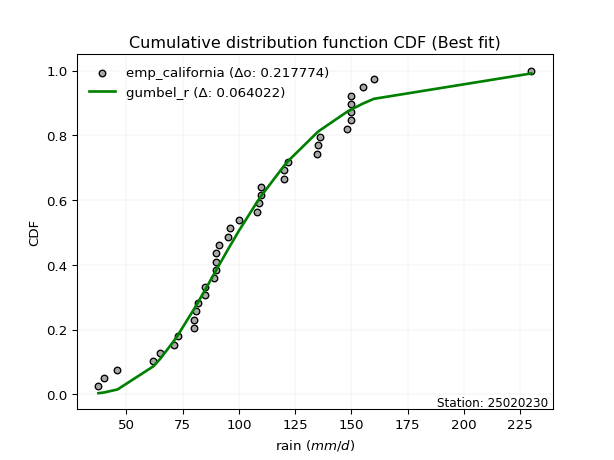</img>

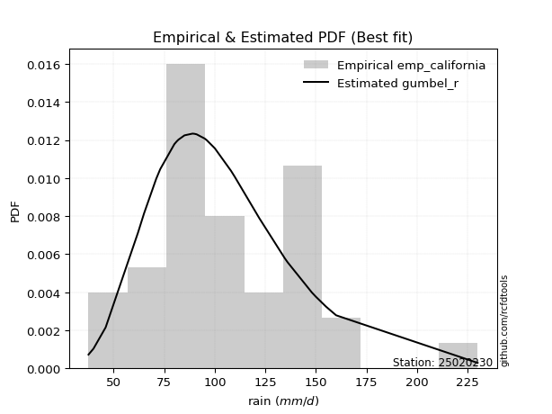</img>

### Empirical: emp_hazen

#### 1. Empirical values

|                | 0                   | 1                    | 2                  | 3                   | 4                   | 5                   | 6                   | 7                   | 8                   | 9                   | 10                 | 11                 | 12                  | 13                  | 14                 | 15                 | 16                 | 17                  | 18                  | 19        | 20                 | 21                 | 22                 | 23                 | 24                 | 25                 | 26                 | 27                 | 28                 | 29                 | 30                | 31                 | 32                 | 33                 | 34                 | 35                 | 36                 | 37                 | 38                 |
|:---------------|:--------------------|:---------------------|:-------------------|:--------------------|:--------------------|:--------------------|:--------------------|:--------------------|:--------------------|:--------------------|:-------------------|:-------------------|:--------------------|:--------------------|:-------------------|:-------------------|:-------------------|:--------------------|:--------------------|:----------|:-------------------|:-------------------|:-------------------|:-------------------|:-------------------|:-------------------|:-------------------|:-------------------|:-------------------|:-------------------|:------------------|:-------------------|:-------------------|:-------------------|:-------------------|:-------------------|:-------------------|:-------------------|:-------------------|
| date           | 1996                | 2005                 | 1987               | 1992                | 1991                | 1998                | 2012                | 2003                | 2004                | 2018                | 2013               | 1997               | 1989                | 1990                | 1993               | 2006               | 1995               | 2010                | 1988                | 2014      | 2016               | 1980               | 2002               | 1999               | 2011               | 1983               | 2017               | 2000               | 2001               | 1994               | 1986              | 1982               | 2007               | 1981               | 2015               | 2009               | 1984               | 2008               | 1985               |
| x              | 37.52732            | 40.0                 | 46.0               | 62.0                | 65.0                | 71.0                | 73.0                | 80.0                | 80.0                | 81.1                | 82.0               | 85.0               | 85.0                | 89.0                | 90.0               | 90.0               | 90.0               | 91.0                | 95.0                | 96.0      | 100.0              | 108.0              | 109.0              | 110.0              | 110.0              | 120.0              | 120.1              | 122.0              | 134.5              | 135.0              | 136.0             | 148.0              | 150.0              | 150.0              | 150.0              | 150.0              | 155.0              | 160.0              | 230.0              |
| m              | 1                   | 2                    | 3                  | 4                   | 5                   | 6                   | 7                   | 8                   | 9                   | 10                  | 11                 | 12                 | 13                  | 14                  | 15                 | 16                 | 17                 | 18                  | 19                  | 20        | 21                 | 22                 | 23                 | 24                 | 25                 | 26                 | 27                 | 28                 | 29                 | 30                 | 31                | 32                 | 33                 | 34                 | 35                 | 36                 | 37                 | 38                 | 39                 |
| empirical_dist | emp_hazen           | emp_hazen            | emp_hazen          | emp_hazen           | emp_hazen           | emp_hazen           | emp_hazen           | emp_hazen           | emp_hazen           | emp_hazen           | emp_hazen          | emp_hazen          | emp_hazen           | emp_hazen           | emp_hazen          | emp_hazen          | emp_hazen          | emp_hazen           | emp_hazen           | emp_hazen | emp_hazen          | emp_hazen          | emp_hazen          | emp_hazen          | emp_hazen          | emp_hazen          | emp_hazen          | emp_hazen          | emp_hazen          | emp_hazen          | emp_hazen         | emp_hazen          | emp_hazen          | emp_hazen          | emp_hazen          | emp_hazen          | emp_hazen          | emp_hazen          | emp_hazen          |
| empirical      | 0.01282051282051282 | 0.038461538461538464 | 0.0641025641025641 | 0.08974358974358974 | 0.11538461538461539 | 0.14102564102564102 | 0.16666666666666666 | 0.19230769230769232 | 0.21794871794871795 | 0.24358974358974358 | 0.2692307692307692 | 0.2948717948717949 | 0.32051282051282054 | 0.34615384615384615 | 0.3717948717948718 | 0.3974358974358974 | 0.4230769230769231 | 0.44871794871794873 | 0.47435897435897434 | 0.5       | 0.5256410256410257 | 0.5512820512820513 | 0.5769230769230769 | 0.6025641025641025 | 0.6282051282051282 | 0.6538461538461539 | 0.6794871794871795 | 0.7051282051282052 | 0.7307692307692307 | 0.7564102564102564 | 0.782051282051282 | 0.8076923076923077 | 0.8333333333333334 | 0.8589743589743589 | 0.8846153846153846 | 0.9102564102564102 | 0.9358974358974359 | 0.9615384615384616 | 0.9871794871794872 |
| empirical_tr   | 1.0129870129870129  | 1.04                 | 1.0684931506849316 | 1.0985915492957747  | 1.1304347826086958  | 1.164179104477612   | 1.2                 | 1.2380952380952381  | 1.278688524590164   | 1.3220338983050848  | 1.3684210526315788 | 1.4181818181818182 | 1.471698113207547   | 1.5294117647058822  | 1.5918367346938775 | 1.6595744680851061 | 1.7333333333333334 | 1.813953488372093   | 1.9024390243902438  | 2.0       | 2.1081081081081083 | 2.2285714285714286 | 2.3636363636363633 | 2.5161290322580645 | 2.689655172413793  | 2.888888888888889  | 3.12               | 3.3913043478260874 | 3.7142857142857135 | 4.105263157894736  | 4.588235294117647 | 5.2                | 6.000000000000002  | 7.090909090909088  | 8.666666666666664  | 11.14285714285714  | 15.600000000000001 | 26.000000000000018 | 78.00000000000028  |

####  2. Parameters & Kolmogorov-Smirnov fit test (sorted by Δ)

|   id | empirical_dist   | p_dist             |     delta |   deltao | eval    |   fit |   n |             loc |           scale | shape                 | shape1                | shape2             | shape3   |   best_fit |   best_fit_sort |
|-----:|:-----------------|:-------------------|----------:|---------:|:--------|------:|----:|----------------:|----------------:|:----------------------|:----------------------|:-------------------|:---------|-----------:|----------------:|
|    0 | emp_hazen        | alpha              | 0.069109  | 0.217774 | Δo > Δ  |     1 |  39 |  -243.67        |  3275.81        | 9.481687591916309     |                       |                    |          |          1 |               1 |
|    1 | emp_hazen        | genlogistic        | 0.0702633 | 0.217774 | Δo > Δ  |     1 |  39 |    59.8389      |    27.5995      | 3.46822996768894      |                       |                    |          |          0 |               2 |
|    2 | emp_hazen        | invgamma           | 0.0702724 | 0.217774 | Δo > Δ  |     1 |  39 |  -127.184       |  8915.04        | 39.264885803401164    |                       |                    |          |          0 |               3 |
|    3 | emp_hazen        | lognorm            | 0.0712077 | 0.217774 | Δo > Δ  |     1 |  39 |   -70.2523      |   172.057       | 0.21422700262979513   |                       |                    |          |          0 |               4 |
|    4 | emp_hazen        | fatiguelife        | 0.0720941 | 0.217774 | Δo > Δ  |     1 |  39 |   -70.8952      |   172.72        | 0.21463881727137762   |                       |                    |          |          0 |               5 |
|    5 | emp_hazen        | recipinvgauss      | 0.0721734 | 0.217774 | Δo > Δ  |     1 |  39 |   -69.6431      |     7.92805     | 0.04732722966555314   |                       |                    |          |          0 |               6 |
|    6 | emp_hazen        | nct                | 0.0726592 | 0.217774 | Δo > Δ  |     1 |  39 |    -0.115389    |    28.7882      | 13.581667670648887    | 3.4711270782563686    |                    |          |          0 |               7 |
|    7 | emp_hazen        | invgauss           | 0.0737706 | 0.217774 | Δo > Δ  |     1 |  39 |   -60.6923      |  3126.93        | 0.05329080666089131   |                       |                    |          |          0 |               8 |
|    8 | emp_hazen        | f                  | 0.0738543 | 0.217774 | Δo > Δ  |     1 |  39 |   -15.4955      |   121.273       | 20.272895908966266    | 10530.135463947896    |                    |          |          0 |               9 |
|    9 | emp_hazen        | chi2               | 0.0738698 | 0.217774 | Δo > Δ  |     1 |  39 |   -15.3408      |     6.00322     | 20.179412499216305    |                       |                    |          |          0 |              10 |
|   10 | emp_hazen        | erlang             | 0.0738699 | 0.217774 | Δo > Δ  |     1 |  39 |   -15.3407      |    12.0065      | 10.089696230161591    |                       |                    |          |          0 |              11 |
|   11 | emp_hazen        | gamma              | 0.0738699 | 0.217774 | Δo > Δ  |     1 |  39 |   -15.3408      |    12.0065      | 10.089697793573393    |                       |                    |          |          0 |              12 |
|   12 | emp_hazen        | gumbel_r           | 0.0762861 | 0.217774 | Δo > Δ  |     1 |  39 |    88.5962      |    29.806       |                       |                       |                    |          |          0 |              13 |
|   13 | emp_hazen        | pearson3           | 0.0764552 | 0.217774 | Δo > Δ  |     1 |  39 |   105.801       |    38.2277      | 0.7120941855529046    |                       |                    |          |          0 |              14 |
|   14 | emp_hazen        | fisk               | 0.0768885 | 0.217774 | Δo > Δ  |     1 |  39 |   -54.7959      |   156.412       | 7.460631469733795     |                       |                    |          |          0 |              15 |
|   15 | emp_hazen        | betaprime          | 0.077453  | 0.217774 | Δo > Δ  |     1 |  39 |    -7.7074      | 14311.7         | 8.711914272217232     | 1098.2495868443489    |                    |          |          0 |              16 |
|   16 | emp_hazen        | maxwell            | 0.0791416 | 0.217774 | Δo > Δ  |     1 |  39 |    15.217       |    56.7649      |                       |                       |                    |          |          0 |              17 |
|   17 | emp_hazen        | exponnorm          | 0.079196  | 0.217774 | Δo > Δ  |     1 |  39 |    78.3708      |    26.7867      | 1.0240107773320781    |                       |                    |          |          0 |              18 |
|   18 | emp_hazen        | laplace_asymmetric | 0.0798489 | 0.217774 | Δo > Δ  |     1 |  39 |    85           |    26.1028      | 0.6780162075097738    |                       |                    |          |          0 |              19 |
|   19 | emp_hazen        | mielke             | 0.0803817 | 0.217774 | Δo > Δ  |     1 |  39 |    -1.45821     |   117.373       | 3.6161644733307794    | 5.86585181901645      |                    |          |          0 |              20 |
|   20 | emp_hazen        | nakagami           | 0.0847183 | 0.217774 | Δo > Δ  |     1 |  39 |    24.4646      |    89.8717      | 1.2137236270696525    |                       |                    |          |          0 |              21 |
|   21 | emp_hazen        | dgamma             | 0.0862759 | 0.217774 | Δo > Δ  |     1 |  39 |   103.492       |    16.7034      | 1.8105480298115495    |                       |                    |          |          0 |              22 |
|   22 | emp_hazen        | moyal              | 0.0872106 | 0.217774 | Δo > Δ  |     1 |  39 |    83.9396      |    17.2085      |                       |                       |                    |          |          0 |              23 |
|   23 | emp_hazen        | rayleigh           | 0.0880358 | 0.217774 | Δo > Δ  |     1 |  39 |    32.6688      |    58.3508      |                       |                       |                    |          |          0 |              24 |
|   24 | emp_hazen        | invweibull         | 0.0884509 | 0.217774 | Δo > Δ  |     1 |  39 |    -3.55869e+07 |     3.5587e+07  | 1087666.0794998629    |                       |                    |          |          0 |              25 |
|   25 | emp_hazen        | rice               | 0.0889447 | 0.217774 | Δo > Δ  |     1 |  39 |    28.8446      |    49.4668      | 1.0086920154102033    |                       |                    |          |          0 |              26 |
|   26 | emp_hazen        | weibull_min        | 0.0890289 | 0.217774 | Δo > Δ  |     1 |  39 |    27.6997      |    88.016       | 2.127819115649472     |                       |                    |          |          0 |              27 |
|   27 | emp_hazen        | halflogistic       | 0.097577  | 0.217774 | Δo > Δ  |     1 |  39 |    60.4919      |    32.6834      |                       |                       |                    |          |          0 |              28 |
|   28 | emp_hazen        | johnsonsu          | 0.100253  | 0.217774 | Δo > Δ  |     1 |  39 |     2.58281e+08 |     6.77349e+08 | 7002443.376614271     | 18792021.363224953    |                    |          |          0 |              29 |
|   29 | emp_hazen        | loggamma           | 0.100465  | 0.217774 | Δo > Δ  |     1 |  39 | -9785.94        |  1380.26        | 1295.7067945076137    |                       |                    |          |          0 |              30 |
|   30 | emp_hazen        | t                  | 0.101031  | 0.217774 | Δo > Δ  |     1 |  39 |   105.908       |    38.2266      | 21.67178402806863     |                       |                    |          |          0 |              31 |
|   31 | emp_hazen        | crystalball        | 0.10117   | 0.217774 | Δo > Δ  |     1 |  39 |   105.801       |    38.2277      | 7605.535442412194     | 6104.386628798199     |                    |          |          0 |              32 |
|   32 | emp_hazen        | norm               | 0.10117   | 0.217774 | Δo > Δ  |     1 |  39 |   105.801       |    38.2277      |                       |                       |                    |          |          0 |              33 |
|   33 | emp_hazen        | truncnorm          | 0.10117   | 0.217774 | Δo > Δ  |     1 |  39 |   105.801       |    38.2277      | -761.4622798670403    | 7.503505991779575     |                    |          |          0 |              34 |
|   34 | emp_hazen        | gompertz           | 0.104443  | 0.217774 | Δo > Δ  |     1 |  39 |    37.5226      |    71.8562      | 0.43675042205089065   |                       |                    |          |          0 |              35 |
|   35 | emp_hazen        | kstwobign          | 0.105194  | 0.217774 | Δo > Δ  |     1 |  39 |   -31.1406      |   157.593       |                       |                       |                    |          |          0 |              36 |
|   36 | emp_hazen        | halfnorm           | 0.111921  | 0.217774 | Δo > Δ  |     1 |  39 |    55.2021      |    63.4159      |                       |                       |                    |          |          0 |              37 |
|   37 | emp_hazen        | zzloggumbel        | 0.113708  | 0.217774 | Δo > Δ  |     1 |  39 |     4.43219     |     0.296828    | 0.5430175598423775    | 1.1389553227283298    |                    |          |          0 |              38 |
|   38 | emp_hazen        | logistic           | 0.117405  | 0.217774 | Δo > Δ  |     1 |  39 |   105.801       |    21.0761      |                       |                       |                    |          |          0 |              39 |
|   39 | emp_hazen        | hypsecant          | 0.131368  | 0.217774 | Δo > Δ  |     1 |  39 |   105.801       |    24.3365      |                       |                       |                    |          |          0 |              40 |
|   40 | emp_hazen        | geninvgauss        | 0.142562  | 0.217774 | Δo > Δ  |     1 |  39 |    30.7704      |     0.00466425  | 2.601803956249613     | 0.0003221294883634945 |                    |          |          0 |              41 |
|   41 | emp_hazen        | wald               | 0.146271  | 0.217774 | Δo > Δ  |     1 |  39 |    67.573       |    38.2277      |                       |                       |                    |          |          0 |              42 |
|   42 | emp_hazen        | laplace            | 0.159534  | 0.217774 | Δo > Δ  |     1 |  39 |   105.801       |    27.0311      |                       |                       |                    |          |          0 |              43 |
|   43 | emp_hazen        | gumbel_l           | 0.167561  | 0.217774 | Δo > Δ  |     1 |  39 |   123.005       |    29.806       |                       |                       |                    |          |          0 |              44 |
|   44 | emp_hazen        | gibrat             | 0.169521  | 0.217774 | Δo > Δ  |     1 |  39 |    76.6378      |    17.6882      |                       |                       |                    |          |          0 |              45 |
|   45 | emp_hazen        | zzgumbel           | 0.253103  | 0.217774 | Δo <= Δ |     0 |  39 |   105.783       |    30.1957      | 0.5430175598423775    | 1.1389553227283298    |                    |          |          0 |              46 |
|   46 | emp_hazen        | genexpon           | 0.269897  | 0.217774 | Δo <= Δ |     0 |  39 |    37.5273      |     2.24278     | 0.029546930847224324  | 0.003441345619576359  | 0.7750570077294003 |          |          0 |              47 |
|   47 | emp_hazen        | expon              | 0.270875  | 0.217774 | Δo <= Δ |     0 |  39 |    37.5273      |    68.2734      |                       |                       |                    |          |          0 |              48 |
|   48 | emp_hazen        | pareto             | 0.270875  | 0.217774 | Δo <= Δ |     0 |  39 |    -2.14748e+09 |     2.14748e+09 | 31454187.1816981      |                       |                    |          |          0 |              49 |
|   49 | emp_hazen        | ncf                | 0.307316  | 0.217774 | Δo <= Δ |     0 |  39 |    -0.0782662   |     7.04566e-06 | 5.132450078952019e-07 | 13.81406420736777     | 6.710701038988491  |          |          0 |              50 |

</img>

#### 3. Best fit for

|   id |   station | empirical_dist   | p_dist   |    delta |   deltao | eval   |   fit |   n |     loc |   scale |   shape | shape1   | shape2   | shape3   |   best_fit |   best_fit_sort |
|-----:|----------:|:-----------------|:---------|---------:|---------:|:-------|------:|----:|--------:|--------:|--------:|:---------|:---------|:---------|-----------:|----------------:|
|    0 |  25020230 | emp_hazen        | alpha    | 0.069109 | 0.217774 | Δo > Δ |     1 |  39 | -243.67 | 3275.81 | 9.48169 |          |          |          |          1 |               1 |

</img>

</img>

### Empirical: emp_weibull

#### 1. Empirical values

|                | 0                  | 1                  | 2                 | 3                  | 4                  | 5                  | 6                  | 7           | 8                  | 9                  | 10                 | 11                 | 12                 | 13                 | 14          | 15                 | 16                 | 17                 | 18                 | 19          | 20                 | 21                 | 22                | 23          | 24                 | 25                | 26                 | 27                | 28                 | 29          | 30                | 31                | 32                | 33                | 34          | 35                 | 36                 | 37                 | 38                 |
|:---------------|:-------------------|:-------------------|:------------------|:-------------------|:-------------------|:-------------------|:-------------------|:------------|:-------------------|:-------------------|:-------------------|:-------------------|:-------------------|:-------------------|:------------|:-------------------|:-------------------|:-------------------|:-------------------|:------------|:-------------------|:-------------------|:------------------|:------------|:-------------------|:------------------|:-------------------|:------------------|:-------------------|:------------|:------------------|:------------------|:------------------|:------------------|:------------|:-------------------|:-------------------|:-------------------|:-------------------|
| date           | 1996               | 2005               | 1987              | 1992               | 1991               | 1998               | 2012               | 2003        | 2004               | 2018               | 2013               | 1997               | 1989               | 1990               | 1993        | 2006               | 1995               | 2010               | 1988               | 2014        | 2016               | 1980               | 2002              | 1999        | 2011               | 1983              | 2017               | 2000              | 2001               | 1994        | 1986              | 1982              | 2007              | 1981              | 2015        | 2009               | 1984               | 2008               | 1985               |
| x              | 37.52732           | 40.0               | 46.0              | 62.0               | 65.0               | 71.0               | 73.0               | 80.0        | 80.0               | 81.1               | 82.0               | 85.0               | 85.0               | 89.0               | 90.0        | 90.0               | 90.0               | 91.0               | 95.0               | 96.0        | 100.0              | 108.0              | 109.0             | 110.0       | 110.0              | 120.0             | 120.1              | 122.0             | 134.5              | 135.0       | 136.0             | 148.0             | 150.0             | 150.0             | 150.0       | 150.0              | 155.0              | 160.0              | 230.0              |
| m              | 1                  | 2                  | 3                 | 4                  | 5                  | 6                  | 7                  | 8           | 9                  | 10                 | 11                 | 12                 | 13                 | 14                 | 15          | 16                 | 17                 | 18                 | 19                 | 20          | 21                 | 22                 | 23                | 24          | 25                 | 26                | 27                 | 28                | 29                 | 30          | 31                | 32                | 33                | 34                | 35          | 36                 | 37                 | 38                 | 39                 |
| empirical_dist | emp_weibull        | emp_weibull        | emp_weibull       | emp_weibull        | emp_weibull        | emp_weibull        | emp_weibull        | emp_weibull | emp_weibull        | emp_weibull        | emp_weibull        | emp_weibull        | emp_weibull        | emp_weibull        | emp_weibull | emp_weibull        | emp_weibull        | emp_weibull        | emp_weibull        | emp_weibull | emp_weibull        | emp_weibull        | emp_weibull       | emp_weibull | emp_weibull        | emp_weibull       | emp_weibull        | emp_weibull       | emp_weibull        | emp_weibull | emp_weibull       | emp_weibull       | emp_weibull       | emp_weibull       | emp_weibull | emp_weibull        | emp_weibull        | emp_weibull        | emp_weibull        |
| empirical      | 0.025              | 0.05               | 0.075             | 0.1                | 0.125              | 0.15               | 0.175              | 0.2         | 0.225              | 0.25               | 0.275              | 0.3                | 0.325              | 0.35               | 0.375       | 0.4                | 0.425              | 0.45               | 0.475              | 0.5         | 0.525              | 0.55               | 0.575             | 0.6         | 0.625              | 0.65              | 0.675              | 0.7               | 0.725              | 0.75        | 0.775             | 0.8               | 0.825             | 0.85              | 0.875       | 0.9                | 0.925              | 0.95               | 0.975              |
| empirical_tr   | 1.0256410256410258 | 1.0526315789473684 | 1.081081081081081 | 1.1111111111111112 | 1.1428571428571428 | 1.1764705882352942 | 1.2121212121212122 | 1.25        | 1.2903225806451613 | 1.3333333333333333 | 1.3793103448275863 | 1.4285714285714286 | 1.4814814814814814 | 1.5384615384615383 | 1.6         | 1.6666666666666667 | 1.7391304347826089 | 1.8181818181818181 | 1.9047619047619047 | 2.0         | 2.1052631578947367 | 2.2222222222222223 | 2.352941176470588 | 2.5         | 2.6666666666666665 | 2.857142857142857 | 3.0769230769230775 | 3.333333333333333 | 3.6363636363636362 | 4.0         | 4.444444444444445 | 5.000000000000001 | 5.714285714285713 | 6.666666666666666 | 8.0         | 10.000000000000002 | 13.333333333333341 | 19.999999999999982 | 39.999999999999964 |

####  2. Parameters & Kolmogorov-Smirnov fit test (sorted by Δ)

|   id | empirical_dist   | p_dist             |     delta |   deltao | eval    |   fit |   n |             loc |           scale | shape                 | shape1                | shape2             | shape3   |   best_fit |   best_fit_sort |
|-----:|:-----------------|:-------------------|----------:|---------:|:--------|------:|----:|----------------:|----------------:|:----------------------|:----------------------|:-------------------|:---------|-----------:|----------------:|
|    0 | emp_weibull      | invgauss           | 0.0662628 | 0.217774 | Δo > Δ  |     1 |  39 |   -60.6923      |  3126.93        | 0.05329080666089131   |                       |                    |          |          1 |               1 |
|    1 | emp_weibull      | f                  | 0.0674708 | 0.217774 | Δo > Δ  |     1 |  39 |   -15.4955      |   121.273       | 20.272895908966266    | 10530.135463947896    |                    |          |          0 |               2 |
|    2 | emp_weibull      | erlang             | 0.0674718 | 0.217774 | Δo > Δ  |     1 |  39 |   -15.3407      |    12.0065      | 10.089696230161591    |                       |                    |          |          0 |               3 |
|    3 | emp_weibull      | gamma              | 0.0674718 | 0.217774 | Δo > Δ  |     1 |  39 |   -15.3408      |    12.0065      | 10.089697793573393    |                       |                    |          |          0 |               4 |
|    4 | emp_weibull      | chi2               | 0.0674719 | 0.217774 | Δo > Δ  |     1 |  39 |   -15.3408      |     6.00322     | 20.179412499216305    |                       |                    |          |          0 |               5 |
|    5 | emp_weibull      | recipinvgauss      | 0.068457  | 0.217774 | Δo > Δ  |     1 |  39 |   -69.6431      |     7.92805     | 0.04732722966555314   |                       |                    |          |          0 |               6 |
|    6 | emp_weibull      | fatiguelife        | 0.0685153 | 0.217774 | Δo > Δ  |     1 |  39 |   -70.8952      |   172.72        | 0.21463881727137762   |                       |                    |          |          0 |               7 |
|    7 | emp_weibull      | pearson3           | 0.0687629 | 0.217774 | Δo > Δ  |     1 |  39 |   105.801       |    38.2277      | 0.7120941855529046    |                       |                    |          |          0 |               8 |
|    8 | emp_weibull      | lognorm            | 0.0689538 | 0.217774 | Δo > Δ  |     1 |  39 |   -70.2523      |   172.057       | 0.21422700262979513   |                       |                    |          |          0 |               9 |
|    9 | emp_weibull      | invgamma           | 0.0695373 | 0.217774 | Δo > Δ  |     1 |  39 |  -127.184       |  8915.04        | 39.264885803401164    |                       |                    |          |          0 |              10 |
|   10 | emp_weibull      | betaprime          | 0.0697607 | 0.217774 | Δo > Δ  |     1 |  39 |    -7.7074      | 14311.7         | 8.711914272217232     | 1098.2495868443489    |                    |          |          0 |              11 |
|   11 | emp_weibull      | alpha              | 0.0703911 | 0.217774 | Δo > Δ  |     1 |  39 |  -243.67        |  3275.81        | 9.481687591916309     |                       |                    |          |          0 |              12 |
|   12 | emp_weibull      | maxwell            | 0.0714493 | 0.217774 | Δo > Δ  |     1 |  39 |    15.217       |    56.7649      |                       |                       |                    |          |          0 |              13 |
|   13 | emp_weibull      | nct                | 0.0739412 | 0.217774 | Δo > Δ  |     1 |  39 |    -0.115389    |    28.7882      | 13.581667670648887    | 3.4711270782563686    |                    |          |          0 |              14 |
|   14 | emp_weibull      | genlogistic        | 0.0739464 | 0.217774 | Δo > Δ  |     1 |  39 |    59.8389      |    27.5995      | 3.46822996768894      |                       |                    |          |          0 |              15 |
|   15 | emp_weibull      | nakagami           | 0.077026  | 0.217774 | Δo > Δ  |     1 |  39 |    24.4646      |    89.8717      | 1.2137236270696525    |                       |                    |          |          0 |              16 |
|   16 | emp_weibull      | rayleigh           | 0.0803435 | 0.217774 | Δo > Δ  |     1 |  39 |    32.6688      |    58.3508      |                       |                       |                    |          |          0 |              17 |
|   17 | emp_weibull      | exponnorm          | 0.080478  | 0.217774 | Δo > Δ  |     1 |  39 |    78.3708      |    26.7867      | 1.0240107773320781    |                       |                    |          |          0 |              18 |
|   18 | emp_weibull      | invweibull         | 0.0807586 | 0.217774 | Δo > Δ  |     1 |  39 |    -3.55869e+07 |     3.5587e+07  | 1087666.0794998629    |                       |                    |          |          0 |              19 |
|   19 | emp_weibull      | fisk               | 0.0809056 | 0.217774 | Δo > Δ  |     1 |  39 |   -54.7959      |   156.412       | 7.460631469733795     |                       |                    |          |          0 |              20 |
|   20 | emp_weibull      | rice               | 0.0812524 | 0.217774 | Δo > Δ  |     1 |  39 |    28.8446      |    49.4668      | 1.0086920154102033    |                       |                    |          |          0 |              21 |
|   21 | emp_weibull      | weibull_min        | 0.0813366 | 0.217774 | Δo > Δ  |     1 |  39 |    27.6997      |    88.016       | 2.127819115649472     |                       |                    |          |          0 |              22 |
|   22 | emp_weibull      | mielke             | 0.0816638 | 0.217774 | Δo > Δ  |     1 |  39 |    -1.45821     |   117.373       | 3.6161644733307794    | 5.86585181901645      |                    |          |          0 |              23 |
|   23 | emp_weibull      | gumbel_r           | 0.0820553 | 0.217774 | Δo > Δ  |     1 |  39 |    88.5962      |    29.806       |                       |                       |                    |          |          0 |              24 |
|   24 | emp_weibull      | laplace_asymmetric | 0.0856181 | 0.217774 | Δo > Δ  |     1 |  39 |    85           |    26.1028      | 0.6780162075097738    |                       |                    |          |          0 |              25 |
|   25 | emp_weibull      | halflogistic       | 0.0898847 | 0.217774 | Δo > Δ  |     1 |  39 |    60.4919      |    32.6834      |                       |                       |                    |          |          0 |              26 |
|   26 | emp_weibull      | moyal              | 0.0929799 | 0.217774 | Δo > Δ  |     1 |  39 |    83.9396      |    17.2085      |                       |                       |                    |          |          0 |              27 |
|   27 | emp_weibull      | dgamma             | 0.0937543 | 0.217774 | Δo > Δ  |     1 |  39 |   103.492       |    16.7034      | 1.8105480298115495    |                       |                    |          |          0 |              28 |
|   28 | emp_weibull      | gompertz           | 0.0967511 | 0.217774 | Δo > Δ  |     1 |  39 |    37.5226      |    71.8562      | 0.43675042205089065   |                       |                    |          |          0 |              29 |
|   29 | emp_weibull      | kstwobign          | 0.0975012 | 0.217774 | Δo > Δ  |     1 |  39 |   -31.1406      |   157.593       |                       |                       |                    |          |          0 |              30 |
|   30 | emp_weibull      | johnsonsu          | 0.100253  | 0.217774 | Δo > Δ  |     1 |  39 |     2.58281e+08 |     6.77349e+08 | 7002443.376614271     | 18792021.363224953    |                    |          |          0 |              31 |
|   31 | emp_weibull      | loggamma           | 0.100465  | 0.217774 | Δo > Δ  |     1 |  39 | -9785.94        |  1380.26        | 1295.7067945076137    |                       |                    |          |          0 |              32 |
|   32 | emp_weibull      | t                  | 0.101031  | 0.217774 | Δo > Δ  |     1 |  39 |   105.908       |    38.2266      | 21.67178402806863     |                       |                    |          |          0 |              33 |
|   33 | emp_weibull      | crystalball        | 0.10117   | 0.217774 | Δo > Δ  |     1 |  39 |   105.801       |    38.2277      | 7605.535442412194     | 6104.386628798199     |                    |          |          0 |              34 |
|   34 | emp_weibull      | norm               | 0.10117   | 0.217774 | Δo > Δ  |     1 |  39 |   105.801       |    38.2277      |                       |                       |                    |          |          0 |              35 |
|   35 | emp_weibull      | truncnorm          | 0.10117   | 0.217774 | Δo > Δ  |     1 |  39 |   105.801       |    38.2277      | -761.4622798670403    | 7.503505991779575     |                    |          |          0 |              36 |
|   36 | emp_weibull      | halfnorm           | 0.104229  | 0.217774 | Δo > Δ  |     1 |  39 |    55.2021      |    63.4159      |                       |                       |                    |          |          0 |              37 |
|   37 | emp_weibull      | zzloggumbel        | 0.106016  | 0.217774 | Δo > Δ  |     1 |  39 |     4.43219     |     0.296828    | 0.5430175598423775    | 1.1389553227283298    |                    |          |          0 |              38 |
|   38 | emp_weibull      | logistic           | 0.118687  | 0.217774 | Δo > Δ  |     1 |  39 |   105.801       |    21.0761      |                       |                       |                    |          |          0 |              39 |
|   39 | emp_weibull      | hypsecant          | 0.13265   | 0.217774 | Δo > Δ  |     1 |  39 |   105.801       |    24.3365      |                       |                       |                    |          |          0 |              40 |
|   40 | emp_weibull      | geninvgauss        | 0.13487   | 0.217774 | Δo > Δ  |     1 |  39 |    30.7704      |     0.00466425  | 2.601803956249613     | 0.0003221294883634945 |                    |          |          0 |              41 |
|   41 | emp_weibull      | wald               | 0.154605  | 0.217774 | Δo > Δ  |     1 |  39 |    67.573       |    38.2277      |                       |                       |                    |          |          0 |              42 |
|   42 | emp_weibull      | laplace            | 0.160816  | 0.217774 | Δo > Δ  |     1 |  39 |   105.801       |    27.0311      |                       |                       |                    |          |          0 |              43 |
|   43 | emp_weibull      | gumbel_l           | 0.167561  | 0.217774 | Δo > Δ  |     1 |  39 |   123.005       |    29.806       |                       |                       |                    |          |          0 |              44 |
|   44 | emp_weibull      | gibrat             | 0.176572  | 0.217774 | Δo > Δ  |     1 |  39 |    76.6378      |    17.6882      |                       |                       |                    |          |          0 |              45 |
|   45 | emp_weibull      | zzgumbel           | 0.254385  | 0.217774 | Δo <= Δ |     0 |  39 |   105.783       |    30.1957      | 0.5430175598423775    | 1.1389553227283298    |                    |          |          0 |              46 |
|   46 | emp_weibull      | genexpon           | 0.262204  | 0.217774 | Δo <= Δ |     0 |  39 |    37.5273      |     2.24278     | 0.029546930847224324  | 0.003441345619576359  | 0.7750570077294003 |          |          0 |              47 |
|   47 | emp_weibull      | expon              | 0.263183  | 0.217774 | Δo <= Δ |     0 |  39 |    37.5273      |    68.2734      |                       |                       |                    |          |          0 |              48 |
|   48 | emp_weibull      | pareto             | 0.263183  | 0.217774 | Δo <= Δ |     0 |  39 |    -2.14748e+09 |     2.14748e+09 | 31454187.1816981      |                       |                    |          |          0 |              49 |
|   49 | emp_weibull      | ncf                | 0.298072  | 0.217774 | Δo <= Δ |     0 |  39 |    -0.0782662   |     7.04566e-06 | 5.132450078952019e-07 | 13.81406420736777     | 6.710701038988491  |          |          0 |              50 |

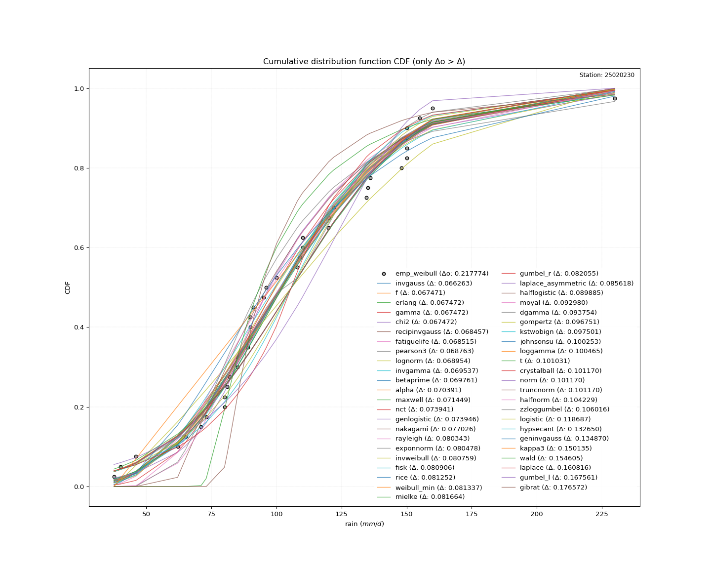</img>

#### 3. Best fit for

|   id |   station | empirical_dist   | p_dist   |     delta |   deltao | eval   |   fit |   n |      loc |   scale |     shape | shape1   | shape2   | shape3   |   best_fit |   best_fit_sort |
|-----:|----------:|:-----------------|:---------|----------:|---------:|:-------|------:|----:|---------:|--------:|----------:|:---------|:---------|:---------|-----------:|----------------:|
|    0 |  25020230 | emp_weibull      | invgauss | 0.0662628 | 0.217774 | Δo > Δ |     1 |  39 | -60.6923 | 3126.93 | 0.0532908 |          |          |          |          1 |               1 |

</img>

</img>

### Empirical: emp_beard

#### 1. Empirical values

|                | 0                    | 1                    | 2                   | 3                   | 4                   | 5                   | 6                   | 7                   | 8                   | 9                  | 10                  | 11                  | 12                 | 13                 | 14                  | 15                 | 16                 | 17                  | 18                  | 19        | 20                 | 21                 | 22                 | 23                 | 24                 | 25                 | 26                 | 27                 | 28                 | 29                 | 30                 | 31                 | 32                 | 33                 | 34                 | 35                 | 36                 | 37                 | 38                 |
|:---------------|:---------------------|:---------------------|:--------------------|:--------------------|:--------------------|:--------------------|:--------------------|:--------------------|:--------------------|:-------------------|:--------------------|:--------------------|:-------------------|:-------------------|:--------------------|:-------------------|:-------------------|:--------------------|:--------------------|:----------|:-------------------|:-------------------|:-------------------|:-------------------|:-------------------|:-------------------|:-------------------|:-------------------|:-------------------|:-------------------|:-------------------|:-------------------|:-------------------|:-------------------|:-------------------|:-------------------|:-------------------|:-------------------|:-------------------|
| date           | 1996                 | 2005                 | 1987                | 1992                | 1991                | 1998                | 2012                | 2003                | 2004                | 2018               | 2013                | 1997                | 1989               | 1990               | 1993                | 2006               | 1995               | 2010                | 1988                | 2014      | 2016               | 1980               | 2002               | 1999               | 2011               | 1983               | 2017               | 2000               | 2001               | 1994               | 1986               | 1982               | 2007               | 1981               | 2015               | 2009               | 1984               | 2008               | 1985               |
| x              | 37.52732             | 40.0                 | 46.0                | 62.0                | 65.0                | 71.0                | 73.0                | 80.0                | 80.0                | 81.1               | 82.0                | 85.0                | 85.0               | 89.0               | 90.0                | 90.0               | 90.0               | 91.0                | 95.0                | 96.0      | 100.0              | 108.0              | 109.0              | 110.0              | 110.0              | 120.0              | 120.1              | 122.0              | 134.5              | 135.0              | 136.0              | 148.0              | 150.0              | 150.0              | 150.0              | 150.0              | 155.0              | 160.0              | 230.0              |
| m              | 1                    | 2                    | 3                   | 4                   | 5                   | 6                   | 7                   | 8                   | 9                   | 10                 | 11                  | 12                  | 13                 | 14                 | 15                  | 16                 | 17                 | 18                  | 19                  | 20        | 21                 | 22                 | 23                 | 24                 | 25                 | 26                 | 27                 | 28                 | 29                 | 30                 | 31                 | 32                 | 33                 | 34                 | 35                 | 36                 | 37                 | 38                 | 39                 |
| empirical_dist | emp_beard            | emp_beard            | emp_beard           | emp_beard           | emp_beard           | emp_beard           | emp_beard           | emp_beard           | emp_beard           | emp_beard          | emp_beard           | emp_beard           | emp_beard          | emp_beard          | emp_beard           | emp_beard          | emp_beard          | emp_beard           | emp_beard           | emp_beard | emp_beard          | emp_beard          | emp_beard          | emp_beard          | emp_beard          | emp_beard          | emp_beard          | emp_beard          | emp_beard          | emp_beard          | emp_beard          | emp_beard          | emp_beard          | emp_beard          | emp_beard          | emp_beard          | emp_beard          | emp_beard          | emp_beard          |
| empirical      | 0.017521584560690702 | 0.042915185373285925 | 0.06830878618588115 | 0.09370238699847637 | 0.11909598781107161 | 0.14448958862366684 | 0.16988318943626207 | 0.19527679024885727 | 0.22067039106145248 | 0.2460639918740477 | 0.27145759268664293 | 0.29685119349923816 | 0.3222447943118334 | 0.3476383951244286 | 0.37303199593702385 | 0.3984255967496191 | 0.4238191975622143 | 0.44921279837480954 | 0.47460639918740477 | 0.5       | 0.5253936008125952 | 0.5507872016251905 | 0.5761808024377857 | 0.6015744032503809 | 0.6269680040629761 | 0.6523616048755714 | 0.6777552056881666 | 0.7031488065007618 | 0.7285424073133571 | 0.7539360081259523 | 0.7793296089385474 | 0.8047232097511426 | 0.8301168105637379 | 0.8555104113763331 | 0.8809040121889282 | 0.9062976130015234 | 0.9316912138141187 | 0.9570848146267139 | 0.9824784154393091 |
| empirical_tr   | 1.0178340656500389   | 1.0448394799681613   | 1.0733169801035705  | 1.1033903054076772  | 1.135197463245892   | 1.1688928465420005  | 1.2046497399816456  | 1.242663300725781   | 1.2831541218637992  | 1.3263725159986526 | 1.3726036946671314  | 1.4221740700613938  | 1.4754589733982764 | 1.532892175943947  | 1.5949777237748075  | 1.6623047699451245 | 1.7355663287791978 | 1.8155832180728446  | 1.903334944417593   | 2.0       | 2.1070090957731407 | 2.2261164499717356 | 2.359496704613541  | 2.509878903760357  | 2.6807351940095305 | 2.8765522279035793 | 3.1032308904649333 | 3.368691189050471  | 3.683816651075772  | 4.063983488132095  | 4.531645569620252  | 5.120936280884264  | 5.8863976083707    | 6.920913884007027  | 8.396588486140713  | 10.67208672086719  | 14.639405204460932 | 23.301775147928907 | 57.07246376811543  |

####  2. Parameters & Kolmogorov-Smirnov fit test (sorted by Δ)

|   id | empirical_dist   | p_dist             |     delta |   deltao | eval    |   fit |   n |             loc |           scale | shape                 | shape1                | shape2             | shape3   |   best_fit |   best_fit_sort |
|-----:|:-----------------|:-------------------|----------:|---------:|:--------|------:|----:|----------------:|----------------:|:----------------------|:----------------------|:-------------------|:---------|-----------:|----------------:|
|    0 | emp_beard        | lognorm            | 0.0682386 | 0.217774 | Δo > Δ  |     1 |  39 |   -70.2523      |   172.057       | 0.21422700262979513   |                       |                    |          |          1 |               1 |
|    1 | emp_beard        | invgamma           | 0.0687501 | 0.217774 | Δo > Δ  |     1 |  39 |  -127.184       |  8915.04        | 39.264885803401164    |                       |                    |          |          0 |               2 |
|    2 | emp_beard        | fatiguelife        | 0.069125  | 0.217774 | Δo > Δ  |     1 |  39 |   -70.8952      |   172.72        | 0.21463881727137762   |                       |                    |          |          0 |               3 |
|    3 | emp_beard        | recipinvgauss      | 0.0692043 | 0.217774 | Δo > Δ  |     1 |  39 |   -69.6431      |     7.92805     | 0.04732722966555314   |                       |                    |          |          0 |               4 |
|    4 | emp_beard        | alpha              | 0.0696039 | 0.217774 | Δo > Δ  |     1 |  39 |  -243.67        |  3275.81        | 9.481687591916309     |                       |                    |          |          0 |               5 |
|    5 | emp_beard        | genlogistic        | 0.0707581 | 0.217774 | Δo > Δ  |     1 |  39 |    59.8389      |    27.5995      | 3.46822996768894      |                       |                    |          |          0 |               6 |
|    6 | emp_beard        | invgauss           | 0.0708015 | 0.217774 | Δo > Δ  |     1 |  39 |   -60.6923      |  3126.93        | 0.05329080666089131   |                       |                    |          |          0 |               7 |
|    7 | emp_beard        | f                  | 0.0708852 | 0.217774 | Δo > Δ  |     1 |  39 |   -15.4955      |   121.273       | 20.272895908966266    | 10530.135463947896    |                    |          |          0 |               8 |
|    8 | emp_beard        | chi2               | 0.0709007 | 0.217774 | Δo > Δ  |     1 |  39 |   -15.3408      |     6.00322     | 20.179412499216305    |                       |                    |          |          0 |               9 |
|    9 | emp_beard        | erlang             | 0.0709008 | 0.217774 | Δo > Δ  |     1 |  39 |   -15.3407      |    12.0065      | 10.089696230161591    |                       |                    |          |          0 |              10 |
|   10 | emp_beard        | gamma              | 0.0709008 | 0.217774 | Δo > Δ  |     1 |  39 |   -15.3408      |    12.0065      | 10.089697793573393    |                       |                    |          |          0 |              11 |
|   11 | emp_beard        | nct                | 0.073154  | 0.217774 | Δo > Δ  |     1 |  39 |    -0.115389    |    28.7882      | 13.581667670648887    | 3.4711270782563686    |                    |          |          0 |              12 |
|   12 | emp_beard        | pearson3           | 0.0734861 | 0.217774 | Δo > Δ  |     1 |  39 |   105.801       |    38.2277      | 0.7120941855529046    |                       |                    |          |          0 |              13 |
|   13 | emp_beard        | betaprime          | 0.0744839 | 0.217774 | Δo > Δ  |     1 |  39 |    -7.7074      | 14311.7         | 8.711914272217232     | 1098.2495868443489    |                    |          |          0 |              14 |
|   14 | emp_beard        | maxwell            | 0.0761725 | 0.217774 | Δo > Δ  |     1 |  39 |    15.217       |    56.7649      |                       |                       |                    |          |          0 |              15 |
|   15 | emp_beard        | fisk               | 0.0773834 | 0.217774 | Δo > Δ  |     1 |  39 |   -54.7959      |   156.412       | 7.460631469733795     |                       |                    |          |          0 |              16 |
|   16 | emp_beard        | gumbel_r           | 0.0785129 | 0.217774 | Δo > Δ  |     1 |  39 |    88.5962      |    29.806       |                       |                       |                    |          |          0 |              17 |
|   17 | emp_beard        | exponnorm          | 0.0796908 | 0.217774 | Δo > Δ  |     1 |  39 |    78.3708      |    26.7867      | 1.0240107773320781    |                       |                    |          |          0 |              18 |
|   18 | emp_beard        | mielke             | 0.0808766 | 0.217774 | Δo > Δ  |     1 |  39 |    -1.45821     |   117.373       | 3.6161644733307794    | 5.86585181901645      |                    |          |          0 |              19 |
|   19 | emp_beard        | nakagami           | 0.0817492 | 0.217774 | Δo > Δ  |     1 |  39 |    24.4646      |    89.8717      | 1.2137236270696525    |                       |                    |          |          0 |              20 |
|   20 | emp_beard        | laplace_asymmetric | 0.0820757 | 0.217774 | Δo > Δ  |     1 |  39 |    85           |    26.1028      | 0.6780162075097738    |                       |                    |          |          0 |              21 |
|   21 | emp_beard        | rayleigh           | 0.0850667 | 0.217774 | Δo > Δ  |     1 |  39 |    32.6688      |    58.3508      |                       |                       |                    |          |          0 |              22 |
|   22 | emp_beard        | invweibull         | 0.0854818 | 0.217774 | Δo > Δ  |     1 |  39 |    -3.55869e+07 |     3.5587e+07  | 1087666.0794998629    |                       |                    |          |          0 |              23 |
|   23 | emp_beard        | rice               | 0.0859756 | 0.217774 | Δo > Δ  |     1 |  39 |    28.8446      |    49.4668      | 1.0086920154102033    |                       |                    |          |          0 |              24 |
|   24 | emp_beard        | weibull_min        | 0.0860598 | 0.217774 | Δo > Δ  |     1 |  39 |    27.6997      |    88.016       | 2.127819115649472     |                       |                    |          |          0 |              25 |
|   25 | emp_beard        | dgamma             | 0.0890311 | 0.217774 | Δo > Δ  |     1 |  39 |   103.492       |    16.7034      | 1.8105480298115495    |                       |                    |          |          0 |              26 |
|   26 | emp_beard        | moyal              | 0.0894375 | 0.217774 | Δo > Δ  |     1 |  39 |    83.9396      |    17.2085      |                       |                       |                    |          |          0 |              27 |
|   27 | emp_beard        | halflogistic       | 0.0946079 | 0.217774 | Δo > Δ  |     1 |  39 |    60.4919      |    32.6834      |                       |                       |                    |          |          0 |              28 |
|   28 | emp_beard        | johnsonsu          | 0.100253  | 0.217774 | Δo > Δ  |     1 |  39 |     2.58281e+08 |     6.77349e+08 | 7002443.376614271     | 18792021.363224953    |                    |          |          0 |              29 |
|   29 | emp_beard        | loggamma           | 0.100465  | 0.217774 | Δo > Δ  |     1 |  39 | -9785.94        |  1380.26        | 1295.7067945076137    |                       |                    |          |          0 |              30 |
|   30 | emp_beard        | t                  | 0.101031  | 0.217774 | Δo > Δ  |     1 |  39 |   105.908       |    38.2266      | 21.67178402806863     |                       |                    |          |          0 |              31 |
|   31 | emp_beard        | crystalball        | 0.10117   | 0.217774 | Δo > Δ  |     1 |  39 |   105.801       |    38.2277      | 7605.535442412194     | 6104.386628798199     |                    |          |          0 |              32 |
|   32 | emp_beard        | norm               | 0.10117   | 0.217774 | Δo > Δ  |     1 |  39 |   105.801       |    38.2277      |                       |                       |                    |          |          0 |              33 |
|   33 | emp_beard        | truncnorm          | 0.10117   | 0.217774 | Δo > Δ  |     1 |  39 |   105.801       |    38.2277      | -761.4622798670403    | 7.503505991779575     |                    |          |          0 |              34 |
|   34 | emp_beard        | gompertz           | 0.101474  | 0.217774 | Δo > Δ  |     1 |  39 |    37.5226      |    71.8562      | 0.43675042205089065   |                       |                    |          |          0 |              35 |
|   35 | emp_beard        | kstwobign          | 0.102224  | 0.217774 | Δo > Δ  |     1 |  39 |   -31.1406      |   157.593       |                       |                       |                    |          |          0 |              36 |
|   36 | emp_beard        | halfnorm           | 0.108952  | 0.217774 | Δo > Δ  |     1 |  39 |    55.2021      |    63.4159      |                       |                       |                    |          |          0 |              37 |
|   37 | emp_beard        | zzloggumbel        | 0.110739  | 0.217774 | Δo > Δ  |     1 |  39 |     4.43219     |     0.296828    | 0.5430175598423775    | 1.1389553227283298    |                    |          |          0 |              38 |
|   38 | emp_beard        | logistic           | 0.1179    | 0.217774 | Δo > Δ  |     1 |  39 |   105.801       |    21.0761      |                       |                       |                    |          |          0 |              39 |
|   39 | emp_beard        | hypsecant          | 0.131862  | 0.217774 | Δo > Δ  |     1 |  39 |   105.801       |    24.3365      |                       |                       |                    |          |          0 |              40 |
|   40 | emp_beard        | geninvgauss        | 0.139593  | 0.217774 | Δo > Δ  |     1 |  39 |    30.7704      |     0.00466425  | 2.601803956249613     | 0.0003221294883634945 |                    |          |          0 |              41 |
|   41 | emp_beard        | wald               | 0.149488  | 0.217774 | Δo > Δ  |     1 |  39 |    67.573       |    38.2277      |                       |                       |                    |          |          0 |              42 |
|   42 | emp_beard        | laplace            | 0.160028  | 0.217774 | Δo > Δ  |     1 |  39 |   105.801       |    27.0311      |                       |                       |                    |          |          0 |              43 |
|   43 | emp_beard        | gumbel_l           | 0.167561  | 0.217774 | Δo > Δ  |     1 |  39 |   123.005       |    29.806       |                       |                       |                    |          |          0 |              44 |
|   44 | emp_beard        | gibrat             | 0.172242  | 0.217774 | Δo > Δ  |     1 |  39 |    76.6378      |    17.6882      |                       |                       |                    |          |          0 |              45 |
|   45 | emp_beard        | zzgumbel           | 0.253597  | 0.217774 | Δo <= Δ |     0 |  39 |   105.783       |    30.1957      | 0.5430175598423775    | 1.1389553227283298    |                    |          |          0 |              46 |
|   46 | emp_beard        | genexpon           | 0.266928  | 0.217774 | Δo <= Δ |     0 |  39 |    37.5273      |     2.24278     | 0.029546930847224324  | 0.003441345619576359  | 0.7750570077294003 |          |          0 |              47 |
|   47 | emp_beard        | expon              | 0.267906  | 0.217774 | Δo <= Δ |     0 |  39 |    37.5273      |    68.2734      |                       |                       |                    |          |          0 |              48 |
|   48 | emp_beard        | pareto             | 0.267906  | 0.217774 | Δo <= Δ |     0 |  39 |    -2.14748e+09 |     2.14748e+09 | 31454187.1816981      |                       |                    |          |          0 |              49 |
|   49 | emp_beard        | ncf                | 0.303583  | 0.217774 | Δo <= Δ |     0 |  39 |    -0.0782662   |     7.04566e-06 | 5.132450078952019e-07 | 13.81406420736777     | 6.710701038988491  |          |          0 |              50 |

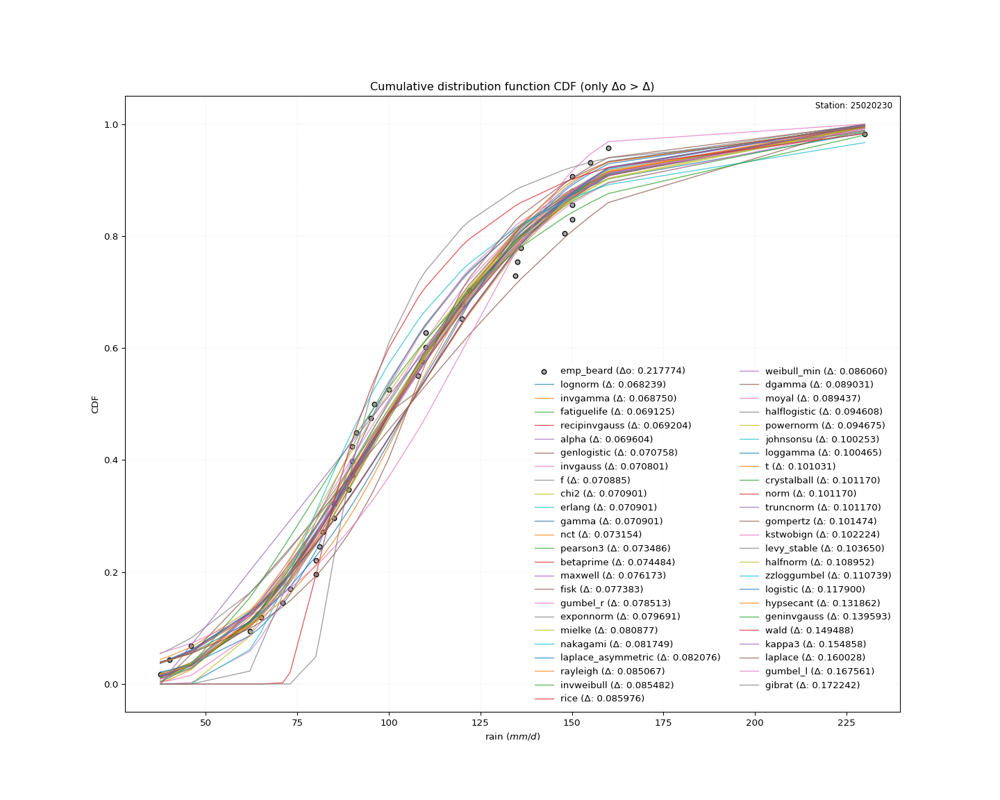</img>

#### 3. Best fit for

|   id |   station | empirical_dist   | p_dist   |     delta |   deltao | eval   |   fit |   n |      loc |   scale |    shape | shape1   | shape2   | shape3   |   best_fit |   best_fit_sort |
|-----:|----------:|:-----------------|:---------|----------:|---------:|:-------|------:|----:|---------:|--------:|---------:|:---------|:---------|:---------|-----------:|----------------:|
|    0 |  25020230 | emp_beard        | lognorm  | 0.0682386 | 0.217774 | Δo > Δ |     1 |  39 | -70.2523 | 172.057 | 0.214227 |          |          |          |          1 |               1 |

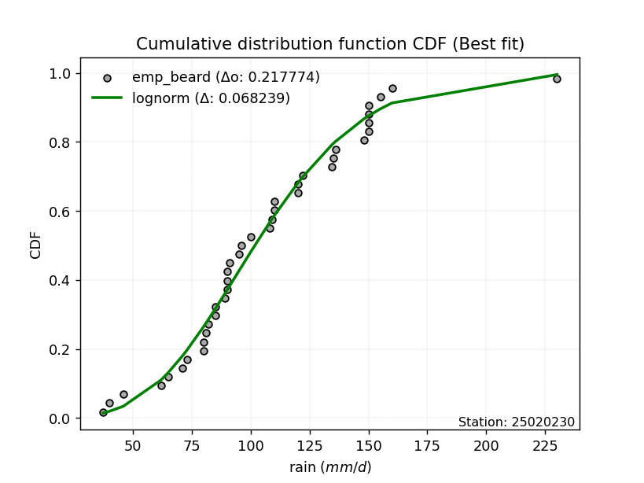</img>

</img>

### Empirical: emp_chegodayev

#### 1. Empirical values

|                | 0                    | 1                   | 2                  | 3                   | 4                   | 5                   | 6                  | 7                   | 8                   | 9                   | 10                 | 11                 | 12                 | 13                 | 14                 | 15                  | 16                  | 17                  | 18                 | 19             | 20                 | 21                | 22                 | 23                 | 24                 | 25                 | 26                 | 27                 | 28                 | 29                 | 30                 | 31                 | 32                 | 33                 | 34                 | 35                 | 36                 | 37                 | 38                 |
|:---------------|:---------------------|:--------------------|:-------------------|:--------------------|:--------------------|:--------------------|:-------------------|:--------------------|:--------------------|:--------------------|:-------------------|:-------------------|:-------------------|:-------------------|:-------------------|:--------------------|:--------------------|:--------------------|:-------------------|:---------------|:-------------------|:------------------|:-------------------|:-------------------|:-------------------|:-------------------|:-------------------|:-------------------|:-------------------|:-------------------|:-------------------|:-------------------|:-------------------|:-------------------|:-------------------|:-------------------|:-------------------|:-------------------|:-------------------|
| date           | 1996                 | 2005                | 1987               | 1992                | 1991                | 1998                | 2012               | 2003                | 2004                | 2018                | 2013               | 1997               | 1989               | 1990               | 1993               | 2006                | 1995                | 2010                | 1988               | 2014           | 2016               | 1980              | 2002               | 1999               | 2011               | 1983               | 2017               | 2000               | 2001               | 1994               | 1986               | 1982               | 2007               | 1981               | 2015               | 2009               | 1984               | 2008               | 1985               |
| x              | 37.52732             | 40.0                | 46.0               | 62.0                | 65.0                | 71.0                | 73.0               | 80.0                | 80.0                | 81.1                | 82.0               | 85.0               | 85.0               | 89.0               | 90.0               | 90.0                | 90.0                | 91.0                | 95.0               | 96.0           | 100.0              | 108.0             | 109.0              | 110.0              | 110.0              | 120.0              | 120.1              | 122.0              | 134.5              | 135.0              | 136.0              | 148.0              | 150.0              | 150.0              | 150.0              | 150.0              | 155.0              | 160.0              | 230.0              |
| m              | 1                    | 2                   | 3                  | 4                   | 5                   | 6                   | 7                  | 8                   | 9                   | 10                  | 11                 | 12                 | 13                 | 14                 | 15                 | 16                  | 17                  | 18                  | 19                 | 20             | 21                 | 22                | 23                 | 24                 | 25                 | 26                 | 27                 | 28                 | 29                 | 30                 | 31                 | 32                 | 33                 | 34                 | 35                 | 36                 | 37                 | 38                 | 39                 |
| empirical_dist | emp_chegodayev       | emp_chegodayev      | emp_chegodayev     | emp_chegodayev      | emp_chegodayev      | emp_chegodayev      | emp_chegodayev     | emp_chegodayev      | emp_chegodayev      | emp_chegodayev      | emp_chegodayev     | emp_chegodayev     | emp_chegodayev     | emp_chegodayev     | emp_chegodayev     | emp_chegodayev      | emp_chegodayev      | emp_chegodayev      | emp_chegodayev     | emp_chegodayev | emp_chegodayev     | emp_chegodayev    | emp_chegodayev     | emp_chegodayev     | emp_chegodayev     | emp_chegodayev     | emp_chegodayev     | emp_chegodayev     | emp_chegodayev     | emp_chegodayev     | emp_chegodayev     | emp_chegodayev     | emp_chegodayev     | emp_chegodayev     | emp_chegodayev     | emp_chegodayev     | emp_chegodayev     | emp_chegodayev     | emp_chegodayev     |
| empirical      | 0.017766497461928935 | 0.04314720812182741 | 0.0685279187817259 | 0.09390862944162437 | 0.11928934010152285 | 0.14467005076142134 | 0.1700507614213198 | 0.19543147208121828 | 0.22081218274111675 | 0.24619289340101522 | 0.2715736040609137 | 0.2969543147208122 | 0.3223350253807106 | 0.3477157360406091 | 0.3730964467005076 | 0.39847715736040606 | 0.42385786802030456 | 0.44923857868020306 | 0.4746192893401015 | 0.5            | 0.5253807106598984 | 0.550761421319797 | 0.5761421319796954 | 0.6015228426395939 | 0.6269035532994924 | 0.6522842639593909 | 0.6776649746192893 | 0.7030456852791879 | 0.7284263959390863 | 0.7538071065989848 | 0.7791878172588833 | 0.8045685279187818 | 0.8299492385786803 | 0.8553299492385787 | 0.8807106598984773 | 0.9060913705583757 | 0.9314720812182742 | 0.9568527918781727 | 0.9822335025380712 |
| empirical_tr   | 1.0180878552971577   | 1.0450928381962865  | 1.0735694822888284 | 1.1036414565826331  | 1.1354466858789625  | 1.1691394658753709  | 1.2048929663608563 | 1.2429022082018928  | 1.283387622149837   | 1.3265993265993266  | 1.372822299651568  | 1.4223826714801444 | 1.4756554307116105 | 1.5330739299610894 | 1.5951417004048583 | 1.662447257383966   | 1.7356828193832599  | 1.815668202764977   | 1.9033816425120775 | 2.0            | 2.106951871657754  | 2.225988700564972 | 2.3592814371257487 | 2.5095541401273884 | 2.6802721088435377 | 2.8759124087591244 | 3.1023622047244093 | 3.367521367521368  | 3.682242990654206  | 4.061855670103093  | 4.528735632183909  | 5.116883116883118  | 5.880597014925376  | 6.912280701754389  | 8.382978723404266  | 10.648648648648662 | 14.592592592592608 | 23.176470588235375 | 56.28571428571465  |

####  2. Parameters & Kolmogorov-Smirnov fit test (sorted by Δ)

|   id | empirical_dist   | p_dist             |     delta |   deltao | eval    |   fit |   n |             loc |           scale | shape                 | shape1                | shape2             | shape3   |   best_fit |   best_fit_sort |
|-----:|:-----------------|:-------------------|----------:|---------:|:--------|------:|----:|----------------:|----------------:|:----------------------|:----------------------|:-------------------|:---------|-----------:|----------------:|
|    0 | emp_chegodayev   | lognorm            | 0.0681924 | 0.217774 | Δo > Δ  |     1 |  39 |   -70.2523      |   172.057       | 0.21422700262979513   |                       |                    |          |          1 |               1 |
|    1 | emp_chegodayev   | invgamma           | 0.0687758 | 0.217774 | Δo > Δ  |     1 |  39 |  -127.184       |  8915.04        | 39.264885803401164    |                       |                    |          |          0 |               2 |
|    2 | emp_chegodayev   | fatiguelife        | 0.0689703 | 0.217774 | Δo > Δ  |     1 |  39 |   -70.8952      |   172.72        | 0.21463881727137762   |                       |                    |          |          0 |               3 |
|    3 | emp_chegodayev   | recipinvgauss      | 0.0690496 | 0.217774 | Δo > Δ  |     1 |  39 |   -69.6431      |     7.92805     | 0.04732722966555314   |                       |                    |          |          0 |               4 |
|    4 | emp_chegodayev   | alpha              | 0.0696297 | 0.217774 | Δo > Δ  |     1 |  39 |  -243.67        |  3275.81        | 9.481687591916309     |                       |                    |          |          0 |               5 |
|    5 | emp_chegodayev   | invgauss           | 0.0706468 | 0.217774 | Δo > Δ  |     1 |  39 |   -60.6923      |  3126.93        | 0.05329080666089131   |                       |                    |          |          0 |               6 |
|    6 | emp_chegodayev   | f                  | 0.0707305 | 0.217774 | Δo > Δ  |     1 |  39 |   -15.4955      |   121.273       | 20.272895908966266    | 10530.135463947896    |                    |          |          0 |               7 |
|    7 | emp_chegodayev   | chi2               | 0.0707461 | 0.217774 | Δo > Δ  |     1 |  39 |   -15.3408      |     6.00322     | 20.179412499216305    |                       |                    |          |          0 |               8 |
|    8 | emp_chegodayev   | erlang             | 0.0707461 | 0.217774 | Δo > Δ  |     1 |  39 |   -15.3407      |    12.0065      | 10.089696230161591    |                       |                    |          |          0 |               9 |
|    9 | emp_chegodayev   | gamma              | 0.0707461 | 0.217774 | Δo > Δ  |     1 |  39 |   -15.3408      |    12.0065      | 10.089697793573393    |                       |                    |          |          0 |              10 |
|   10 | emp_chegodayev   | genlogistic        | 0.0707839 | 0.217774 | Δo > Δ  |     1 |  39 |    59.8389      |    27.5995      | 3.46822996768894      |                       |                    |          |          0 |              11 |
|   11 | emp_chegodayev   | nct                | 0.0731798 | 0.217774 | Δo > Δ  |     1 |  39 |    -0.115389    |    28.7882      | 13.581667670648887    | 3.4711270782563686    |                    |          |          0 |              12 |
|   12 | emp_chegodayev   | pearson3           | 0.0733315 | 0.217774 | Δo > Δ  |     1 |  39 |   105.801       |    38.2277      | 0.7120941855529046    |                       |                    |          |          0 |              13 |
|   13 | emp_chegodayev   | betaprime          | 0.0743292 | 0.217774 | Δo > Δ  |     1 |  39 |    -7.7074      | 14311.7         | 8.711914272217232     | 1098.2495868443489    |                    |          |          0 |              14 |
|   14 | emp_chegodayev   | maxwell            | 0.0760178 | 0.217774 | Δo > Δ  |     1 |  39 |    15.217       |    56.7649      |                       |                       |                    |          |          0 |              15 |
|   15 | emp_chegodayev   | fisk               | 0.0774793 | 0.217774 | Δo > Δ  |     1 |  39 |   -54.7959      |   156.412       | 7.460631469733795     |                       |                    |          |          0 |              16 |
|   16 | emp_chegodayev   | gumbel_r           | 0.0786289 | 0.217774 | Δo > Δ  |     1 |  39 |    88.5962      |    29.806       |                       |                       |                    |          |          0 |              17 |
|   17 | emp_chegodayev   | exponnorm          | 0.0797166 | 0.217774 | Δo > Δ  |     1 |  39 |    78.3708      |    26.7867      | 1.0240107773320781    |                       |                    |          |          0 |              18 |
|   18 | emp_chegodayev   | mielke             | 0.0809024 | 0.217774 | Δo > Δ  |     1 |  39 |    -1.45821     |   117.373       | 3.6161644733307794    | 5.86585181901645      |                    |          |          0 |              19 |
|   19 | emp_chegodayev   | nakagami           | 0.0815945 | 0.217774 | Δo > Δ  |     1 |  39 |    24.4646      |    89.8717      | 1.2137236270696525    |                       |                    |          |          0 |              20 |
|   20 | emp_chegodayev   | laplace_asymmetric | 0.0821917 | 0.217774 | Δo > Δ  |     1 |  39 |    85           |    26.1028      | 0.6780162075097738    |                       |                    |          |          0 |              21 |
|   21 | emp_chegodayev   | rayleigh           | 0.084912  | 0.217774 | Δo > Δ  |     1 |  39 |    32.6688      |    58.3508      |                       |                       |                    |          |          0 |              22 |
|   22 | emp_chegodayev   | invweibull         | 0.0853271 | 0.217774 | Δo > Δ  |     1 |  39 |    -3.55869e+07 |     3.5587e+07  | 1087666.0794998629    |                       |                    |          |          0 |              23 |
|   23 | emp_chegodayev   | rice               | 0.0858209 | 0.217774 | Δo > Δ  |     1 |  39 |    28.8446      |    49.4668      | 1.0086920154102033    |                       |                    |          |          0 |              24 |
|   24 | emp_chegodayev   | weibull_min        | 0.0859052 | 0.217774 | Δo > Δ  |     1 |  39 |    27.6997      |    88.016       | 2.127819115649472     |                       |                    |          |          0 |              25 |
|   25 | emp_chegodayev   | dgamma             | 0.0891858 | 0.217774 | Δo > Δ  |     1 |  39 |   103.492       |    16.7034      | 1.8105480298115495    |                       |                    |          |          0 |              26 |
|   26 | emp_chegodayev   | moyal              | 0.0895535 | 0.217774 | Δo > Δ  |     1 |  39 |    83.9396      |    17.2085      |                       |                       |                    |          |          0 |              27 |
|   27 | emp_chegodayev   | halflogistic       | 0.0944532 | 0.217774 | Δo > Δ  |     1 |  39 |    60.4919      |    32.6834      |                       |                       |                    |          |          0 |              28 |
|   28 | emp_chegodayev   | johnsonsu          | 0.100253  | 0.217774 | Δo > Δ  |     1 |  39 |     2.58281e+08 |     6.77349e+08 | 7002443.376614271     | 18792021.363224953    |                    |          |          0 |              29 |
|   29 | emp_chegodayev   | loggamma           | 0.100465  | 0.217774 | Δo > Δ  |     1 |  39 | -9785.94        |  1380.26        | 1295.7067945076137    |                       |                    |          |          0 |              30 |
|   30 | emp_chegodayev   | t                  | 0.101031  | 0.217774 | Δo > Δ  |     1 |  39 |   105.908       |    38.2266      | 21.67178402806863     |                       |                    |          |          0 |              31 |
|   31 | emp_chegodayev   | crystalball        | 0.10117   | 0.217774 | Δo > Δ  |     1 |  39 |   105.801       |    38.2277      | 7605.535442412194     | 6104.386628798199     |                    |          |          0 |              32 |
|   32 | emp_chegodayev   | norm               | 0.10117   | 0.217774 | Δo > Δ  |     1 |  39 |   105.801       |    38.2277      |                       |                       |                    |          |          0 |              33 |
|   33 | emp_chegodayev   | truncnorm          | 0.10117   | 0.217774 | Δo > Δ  |     1 |  39 |   105.801       |    38.2277      | -761.4622798670403    | 7.503505991779575     |                    |          |          0 |              34 |
|   34 | emp_chegodayev   | gompertz           | 0.10132   | 0.217774 | Δo > Δ  |     1 |  39 |    37.5226      |    71.8562      | 0.43675042205089065   |                       |                    |          |          0 |              35 |
|   35 | emp_chegodayev   | kstwobign          | 0.10207   | 0.217774 | Δo > Δ  |     1 |  39 |   -31.1406      |   157.593       |                       |                       |                    |          |          0 |              36 |
|   36 | emp_chegodayev   | halfnorm           | 0.108798  | 0.217774 | Δo > Δ  |     1 |  39 |    55.2021      |    63.4159      |                       |                       |                    |          |          0 |              37 |
|   37 | emp_chegodayev   | zzloggumbel        | 0.110585  | 0.217774 | Δo > Δ  |     1 |  39 |     4.43219     |     0.296828    | 0.5430175598423775    | 1.1389553227283298    |                    |          |          0 |              38 |
|   38 | emp_chegodayev   | logistic           | 0.117925  | 0.217774 | Δo > Δ  |     1 |  39 |   105.801       |    21.0761      |                       |                       |                    |          |          0 |              39 |
|   39 | emp_chegodayev   | hypsecant          | 0.131888  | 0.217774 | Δo > Δ  |     1 |  39 |   105.801       |    24.3365      |                       |                       |                    |          |          0 |              40 |
|   40 | emp_chegodayev   | geninvgauss        | 0.139439  | 0.217774 | Δo > Δ  |     1 |  39 |    30.7704      |     0.00466425  | 2.601803956249613     | 0.0003221294883634945 |                    |          |          0 |              41 |
|   41 | emp_chegodayev   | wald               | 0.149655  | 0.217774 | Δo > Δ  |     1 |  39 |    67.573       |    38.2277      |                       |                       |                    |          |          0 |              42 |
|   42 | emp_chegodayev   | laplace            | 0.160054  | 0.217774 | Δo > Δ  |     1 |  39 |   105.801       |    27.0311      |                       |                       |                    |          |          0 |              43 |
|   43 | emp_chegodayev   | gumbel_l           | 0.167561  | 0.217774 | Δo > Δ  |     1 |  39 |   123.005       |    29.806       |                       |                       |                    |          |          0 |              44 |
|   44 | emp_chegodayev   | gibrat             | 0.172384  | 0.217774 | Δo > Δ  |     1 |  39 |    76.6378      |    17.6882      |                       |                       |                    |          |          0 |              45 |
|   45 | emp_chegodayev   | zzgumbel           | 0.253623  | 0.217774 | Δo <= Δ |     0 |  39 |   105.783       |    30.1957      | 0.5430175598423775    | 1.1389553227283298    |                    |          |          0 |              46 |
|   46 | emp_chegodayev   | genexpon           | 0.266773  | 0.217774 | Δo <= Δ |     0 |  39 |    37.5273      |     2.24278     | 0.029546930847224324  | 0.003441345619576359  | 0.7750570077294003 |          |          0 |              47 |
|   47 | emp_chegodayev   | expon              | 0.267751  | 0.217774 | Δo <= Δ |     0 |  39 |    37.5273      |    68.2734      |                       |                       |                    |          |          0 |              48 |
|   48 | emp_chegodayev   | pareto             | 0.267751  | 0.217774 | Δo <= Δ |     0 |  39 |    -2.14748e+09 |     2.14748e+09 | 31454187.1816981      |                       |                    |          |          0 |              49 |
|   49 | emp_chegodayev   | ncf                | 0.303402  | 0.217774 | Δo <= Δ |     0 |  39 |    -0.0782662   |     7.04566e-06 | 5.132450078952019e-07 | 13.81406420736777     | 6.710701038988491  |          |          0 |              50 |

</img>

#### 3. Best fit for

|   id |   station | empirical_dist   | p_dist   |     delta |   deltao | eval   |   fit |   n |      loc |   scale |    shape | shape1   | shape2   | shape3   |   best_fit |   best_fit_sort |
|-----:|----------:|:-----------------|:---------|----------:|---------:|:-------|------:|----:|---------:|--------:|---------:|:---------|:---------|:---------|-----------:|----------------:|
|    0 |  25020230 | emp_chegodayev   | lognorm  | 0.0681924 | 0.217774 | Δo > Δ |     1 |  39 | -70.2523 | 172.057 | 0.214227 |          |          |          |          1 |               1 |

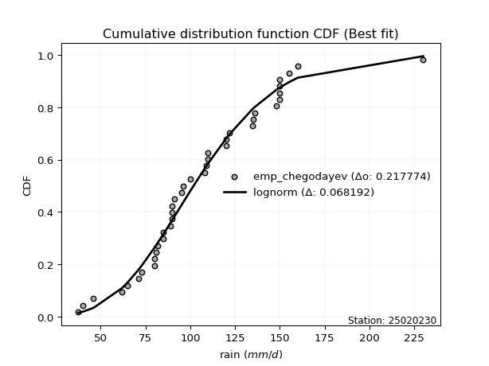</img>

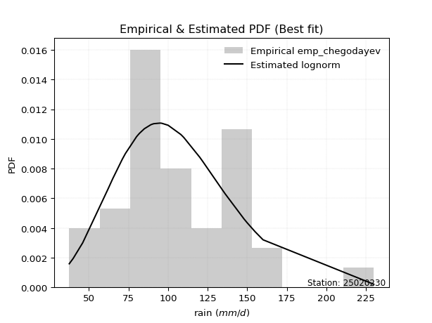</img>

### Empirical: emp_blom

#### 1. Empirical values

|                | 0                   | 1                    | 2                   | 3                   | 4                  | 5                   | 6                   | 7                  | 8                  | 9                   | 10                  | 11                 | 12                 | 13                 | 14                  | 15                 | 16                  | 17                  | 18                 | 19       | 20                 | 21                 | 22                 | 23                 | 24                 | 25                 | 26                 | 27                 | 28                 | 29                 | 30                 | 31                 | 32                 | 33                | 34                 | 35                 | 36                 | 37                 | 38                 |
|:---------------|:--------------------|:---------------------|:--------------------|:--------------------|:-------------------|:--------------------|:--------------------|:-------------------|:-------------------|:--------------------|:--------------------|:-------------------|:-------------------|:-------------------|:--------------------|:-------------------|:--------------------|:--------------------|:-------------------|:---------|:-------------------|:-------------------|:-------------------|:-------------------|:-------------------|:-------------------|:-------------------|:-------------------|:-------------------|:-------------------|:-------------------|:-------------------|:-------------------|:------------------|:-------------------|:-------------------|:-------------------|:-------------------|:-------------------|
| date           | 1996                | 2005                 | 1987                | 1992                | 1991               | 1998                | 2012                | 2003               | 2004               | 2018                | 2013                | 1997               | 1989               | 1990               | 1993                | 2006               | 1995                | 2010                | 1988               | 2014     | 2016               | 1980               | 2002               | 1999               | 2011               | 1983               | 2017               | 2000               | 2001               | 1994               | 1986               | 1982               | 2007               | 1981              | 2015               | 2009               | 1984               | 2008               | 1985               |
| x              | 37.52732            | 40.0                 | 46.0                | 62.0                | 65.0               | 71.0                | 73.0                | 80.0               | 80.0               | 81.1                | 82.0                | 85.0               | 85.0               | 89.0               | 90.0                | 90.0               | 90.0                | 91.0                | 95.0               | 96.0     | 100.0              | 108.0              | 109.0              | 110.0              | 110.0              | 120.0              | 120.1              | 122.0              | 134.5              | 135.0              | 136.0              | 148.0              | 150.0              | 150.0             | 150.0              | 150.0              | 155.0              | 160.0              | 230.0              |
| m              | 1                   | 2                    | 3                   | 4                   | 5                  | 6                   | 7                   | 8                  | 9                  | 10                  | 11                  | 12                 | 13                 | 14                 | 15                  | 16                 | 17                  | 18                  | 19                 | 20       | 21                 | 22                 | 23                 | 24                 | 25                 | 26                 | 27                 | 28                 | 29                 | 30                 | 31                 | 32                 | 33                 | 34                | 35                 | 36                 | 37                 | 38                 | 39                 |
| empirical_dist | emp_blom            | emp_blom             | emp_blom            | emp_blom            | emp_blom           | emp_blom            | emp_blom            | emp_blom           | emp_blom           | emp_blom            | emp_blom            | emp_blom           | emp_blom           | emp_blom           | emp_blom            | emp_blom           | emp_blom            | emp_blom            | emp_blom           | emp_blom | emp_blom           | emp_blom           | emp_blom           | emp_blom           | emp_blom           | emp_blom           | emp_blom           | emp_blom           | emp_blom           | emp_blom           | emp_blom           | emp_blom           | emp_blom           | emp_blom          | emp_blom           | emp_blom           | emp_blom           | emp_blom           | emp_blom           |
| empirical      | 0.01592356687898089 | 0.041401273885350316 | 0.06687898089171974 | 0.09235668789808917 | 0.1178343949044586 | 0.14331210191082802 | 0.16878980891719744 | 0.1942675159235669 | 0.2197452229299363 | 0.24522292993630573 | 0.27070063694267515 | 0.2961783439490446 | 0.321656050955414  | 0.3471337579617834 | 0.37261146496815284 | 0.3980891719745223 | 0.42356687898089174 | 0.44904458598726116 | 0.4745222929936306 | 0.5      | 0.5254777070063694 | 0.5509554140127388 | 0.5764331210191083 | 0.6019108280254777 | 0.6273885350318471 | 0.6528662420382165 | 0.678343949044586  | 0.7038216560509554 | 0.7292993630573248 | 0.7547770700636943 | 0.7802547770700637 | 0.8057324840764332 | 0.8312101910828026 | 0.856687898089172 | 0.8821656050955414 | 0.9076433121019108 | 0.9331210191082803 | 0.9585987261146497 | 0.9840764331210191 |
| empirical_tr   | 1.0161812297734627  | 1.043189368770764    | 1.0716723549488054  | 1.1017543859649122  | 1.1335740072202165 | 1.1672862453531598  | 1.2030651340996168  | 1.241106719367589  | 1.2816326530612245 | 1.3248945147679325  | 1.3711790393013101  | 1.420814479638009  | 1.4741784037558687 | 1.5317073170731708 | 1.5939086294416245  | 1.6613756613756614 | 1.7348066298342542  | 1.8150289017341041  | 1.903030303030303  | 2.0      | 2.1073825503355703 | 2.226950354609929  | 2.3609022556390977 | 2.512              | 2.6837606837606836 | 2.880733944954128  | 3.1089108910891086 | 3.376344086021505  | 3.694117647058823  | 4.077922077922079  | 4.55072463768116   | 5.147540983606558  | 5.924528301886793  | 6.97777777777778  | 8.486486486486488  | 10.827586206896553 | 14.952380952380956 | 24.15384615384616  | 62.80000000000001  |

####  2. Parameters & Kolmogorov-Smirnov fit test (sorted by Δ)

|   id | empirical_dist   | p_dist             |     delta |   deltao | eval    |   fit |   n |             loc |           scale | shape                 | shape1                | shape2             | shape3   |   best_fit |   best_fit_sort |
|-----:|:-----------------|:-------------------|----------:|---------:|:--------|------:|----:|----------------:|----------------:|:----------------------|:----------------------|:-------------------|:---------|-----------:|----------------:|
|    0 | emp_blom         | invgamma           | 0.0685819 | 0.217774 | Δo > Δ  |     1 |  39 |  -127.184       |  8915.04        | 39.264885803401164    |                       |                    |          |          1 |               1 |
|    1 | emp_blom         | lognorm            | 0.0692479 | 0.217774 | Δo > Δ  |     1 |  39 |   -70.2523      |   172.057       | 0.21422700262979513   |                       |                    |          |          0 |               2 |
|    2 | emp_blom         | alpha              | 0.0694357 | 0.217774 | Δo > Δ  |     1 |  39 |  -243.67        |  3275.81        | 9.481687591916309     |                       |                    |          |          0 |               3 |
|    3 | emp_blom         | fatiguelife        | 0.0701343 | 0.217774 | Δo > Δ  |     1 |  39 |   -70.8952      |   172.72        | 0.21463881727137762   |                       |                    |          |          0 |               4 |
|    4 | emp_blom         | recipinvgauss      | 0.0702136 | 0.217774 | Δo > Δ  |     1 |  39 |   -69.6431      |     7.92805     | 0.04732722966555314   |                       |                    |          |          0 |               5 |
|    5 | emp_blom         | genlogistic        | 0.0705899 | 0.217774 | Δo > Δ  |     1 |  39 |    59.8389      |    27.5995      | 3.46822996768894      |                       |                    |          |          0 |               6 |
|    6 | emp_blom         | invgauss           | 0.0718107 | 0.217774 | Δo > Δ  |     1 |  39 |   -60.6923      |  3126.93        | 0.05329080666089131   |                       |                    |          |          0 |               7 |
|    7 | emp_blom         | f                  | 0.0718945 | 0.217774 | Δo > Δ  |     1 |  39 |   -15.4955      |   121.273       | 20.272895908966266    | 10530.135463947896    |                    |          |          0 |               8 |
|    8 | emp_blom         | chi2               | 0.07191   | 0.217774 | Δo > Δ  |     1 |  39 |   -15.3408      |     6.00322     | 20.179412499216305    |                       |                    |          |          0 |               9 |
|    9 | emp_blom         | erlang             | 0.07191   | 0.217774 | Δo > Δ  |     1 |  39 |   -15.3407      |    12.0065      | 10.089696230161591    |                       |                    |          |          0 |              10 |
|   10 | emp_blom         | gamma              | 0.07191   | 0.217774 | Δo > Δ  |     1 |  39 |   -15.3408      |    12.0065      | 10.089697793573393    |                       |                    |          |          0 |              11 |
|   11 | emp_blom         | nct                | 0.0729858 | 0.217774 | Δo > Δ  |     1 |  39 |    -0.115389    |    28.7882      | 13.581667670648887    | 3.4711270782563686    |                    |          |          0 |              12 |
|   12 | emp_blom         | pearson3           | 0.0744954 | 0.217774 | Δo > Δ  |     1 |  39 |   105.801       |    38.2277      | 0.7120941855529046    |                       |                    |          |          0 |              13 |
|   13 | emp_blom         | betaprime          | 0.0754932 | 0.217774 | Δo > Δ  |     1 |  39 |    -7.7074      | 14311.7         | 8.711914272217232     | 1098.2495868443489    |                    |          |          0 |              14 |
|   14 | emp_blom         | maxwell            | 0.0771818 | 0.217774 | Δo > Δ  |     1 |  39 |    15.217       |    56.7649      |                       |                       |                    |          |          0 |              15 |
|   15 | emp_blom         | fisk               | 0.0772152 | 0.217774 | Δo > Δ  |     1 |  39 |   -54.7959      |   156.412       | 7.460631469733795     |                       |                    |          |          0 |              16 |
|   16 | emp_blom         | gumbel_r           | 0.077756  | 0.217774 | Δo > Δ  |     1 |  39 |    88.5962      |    29.806       |                       |                       |                    |          |          0 |              17 |
|   17 | emp_blom         | exponnorm          | 0.0795226 | 0.217774 | Δo > Δ  |     1 |  39 |    78.3708      |    26.7867      | 1.0240107773320781    |                       |                    |          |          0 |              18 |
|   18 | emp_blom         | mielke             | 0.0807084 | 0.217774 | Δo > Δ  |     1 |  39 |    -1.45821     |   117.373       | 3.6161644733307794    | 5.86585181901645      |                    |          |          0 |              19 |
|   19 | emp_blom         | laplace_asymmetric | 0.0813188 | 0.217774 | Δo > Δ  |     1 |  39 |    85           |    26.1028      | 0.6780162075097738    |                       |                    |          |          0 |              20 |
|   20 | emp_blom         | nakagami           | 0.0827584 | 0.217774 | Δo > Δ  |     1 |  39 |    24.4646      |    89.8717      | 1.2137236270696525    |                       |                    |          |          0 |              21 |
|   21 | emp_blom         | rayleigh           | 0.086076  | 0.217774 | Δo > Δ  |     1 |  39 |    32.6688      |    58.3508      |                       |                       |                    |          |          0 |              22 |
|   22 | emp_blom         | invweibull         | 0.0864911 | 0.217774 | Δo > Δ  |     1 |  39 |    -3.55869e+07 |     3.5587e+07  | 1087666.0794998629    |                       |                    |          |          0 |              23 |
|   23 | emp_blom         | rice               | 0.0869849 | 0.217774 | Δo > Δ  |     1 |  39 |    28.8446      |    49.4668      | 1.0086920154102033    |                       |                    |          |          0 |              24 |
|   24 | emp_blom         | weibull_min        | 0.0870691 | 0.217774 | Δo > Δ  |     1 |  39 |    27.6997      |    88.016       | 2.127819115649472     |                       |                    |          |          0 |              25 |
|   25 | emp_blom         | dgamma             | 0.0880218 | 0.217774 | Δo > Δ  |     1 |  39 |   103.492       |    16.7034      | 1.8105480298115495    |                       |                    |          |          0 |              26 |
|   26 | emp_blom         | moyal              | 0.0886805 | 0.217774 | Δo > Δ  |     1 |  39 |    83.9396      |    17.2085      |                       |                       |                    |          |          0 |              27 |
|   27 | emp_blom         | halflogistic       | 0.0956172 | 0.217774 | Δo > Δ  |     1 |  39 |    60.4919      |    32.6834      |                       |                       |                    |          |          0 |              28 |
|   28 | emp_blom         | johnsonsu          | 0.100253  | 0.217774 | Δo > Δ  |     1 |  39 |     2.58281e+08 |     6.77349e+08 | 7002443.376614271     | 18792021.363224953    |                    |          |          0 |              29 |
|   29 | emp_blom         | loggamma           | 0.100465  | 0.217774 | Δo > Δ  |     1 |  39 | -9785.94        |  1380.26        | 1295.7067945076137    |                       |                    |          |          0 |              30 |
|   30 | emp_blom         | t                  | 0.101031  | 0.217774 | Δo > Δ  |     1 |  39 |   105.908       |    38.2266      | 21.67178402806863     |                       |                    |          |          0 |              31 |
|   31 | emp_blom         | crystalball        | 0.10117   | 0.217774 | Δo > Δ  |     1 |  39 |   105.801       |    38.2277      | 7605.535442412194     | 6104.386628798199     |                    |          |          0 |              32 |
|   32 | emp_blom         | norm               | 0.10117   | 0.217774 | Δo > Δ  |     1 |  39 |   105.801       |    38.2277      |                       |                       |                    |          |          0 |              33 |
|   33 | emp_blom         | truncnorm          | 0.10117   | 0.217774 | Δo > Δ  |     1 |  39 |   105.801       |    38.2277      | -761.4622798670403    | 7.503505991779575     |                    |          |          0 |              34 |
|   34 | emp_blom         | gompertz           | 0.102484  | 0.217774 | Δo > Δ  |     1 |  39 |    37.5226      |    71.8562      | 0.43675042205089065   |                       |                    |          |          0 |              35 |
|   35 | emp_blom         | kstwobign          | 0.103234  | 0.217774 | Δo > Δ  |     1 |  39 |   -31.1406      |   157.593       |                       |                       |                    |          |          0 |              36 |
|   36 | emp_blom         | halfnorm           | 0.109962  | 0.217774 | Δo > Δ  |     1 |  39 |    55.2021      |    63.4159      |                       |                       |                    |          |          0 |              37 |
|   37 | emp_blom         | zzloggumbel        | 0.111749  | 0.217774 | Δo > Δ  |     1 |  39 |     4.43219     |     0.296828    | 0.5430175598423775    | 1.1389553227283298    |                    |          |          0 |              38 |
|   38 | emp_blom         | logistic           | 0.117731  | 0.217774 | Δo > Δ  |     1 |  39 |   105.801       |    21.0761      |                       |                       |                    |          |          0 |              39 |
|   39 | emp_blom         | hypsecant          | 0.131694  | 0.217774 | Δo > Δ  |     1 |  39 |   105.801       |    24.3365      |                       |                       |                    |          |          0 |              40 |
|   40 | emp_blom         | geninvgauss        | 0.140603  | 0.217774 | Δo > Δ  |     1 |  39 |    30.7704      |     0.00466425  | 2.601803956249613     | 0.0003221294883634945 |                    |          |          0 |              41 |
|   41 | emp_blom         | wald               | 0.148394  | 0.217774 | Δo > Δ  |     1 |  39 |    67.573       |    38.2277      |                       |                       |                    |          |          0 |              42 |
|   42 | emp_blom         | laplace            | 0.15986   | 0.217774 | Δo > Δ  |     1 |  39 |   105.801       |    27.0311      |                       |                       |                    |          |          0 |              43 |
|   43 | emp_blom         | gumbel_l           | 0.167561  | 0.217774 | Δo > Δ  |     1 |  39 |   123.005       |    29.806       |                       |                       |                    |          |          0 |              44 |
|   44 | emp_blom         | gibrat             | 0.171317  | 0.217774 | Δo > Δ  |     1 |  39 |    76.6378      |    17.6882      |                       |                       |                    |          |          0 |              45 |
|   45 | emp_blom         | zzgumbel           | 0.253429  | 0.217774 | Δo <= Δ |     0 |  39 |   105.783       |    30.1957      | 0.5430175598423775    | 1.1389553227283298    |                    |          |          0 |              46 |
|   46 | emp_blom         | genexpon           | 0.267937  | 0.217774 | Δo <= Δ |     0 |  39 |    37.5273      |     2.24278     | 0.029546930847224324  | 0.003441345619576359  | 0.7750570077294003 |          |          0 |              47 |
|   47 | emp_blom         | expon              | 0.268915  | 0.217774 | Δo <= Δ |     0 |  39 |    37.5273      |    68.2734      |                       |                       |                    |          |          0 |              48 |
|   48 | emp_blom         | pareto             | 0.268915  | 0.217774 | Δo <= Δ |     0 |  39 |    -2.14748e+09 |     2.14748e+09 | 31454187.1816981      |                       |                    |          |          0 |              49 |
|   49 | emp_blom         | ncf                | 0.30476   | 0.217774 | Δo <= Δ |     0 |  39 |    -0.0782662   |     7.04566e-06 | 5.132450078952019e-07 | 13.81406420736777     | 6.710701038988491  |          |          0 |              50 |

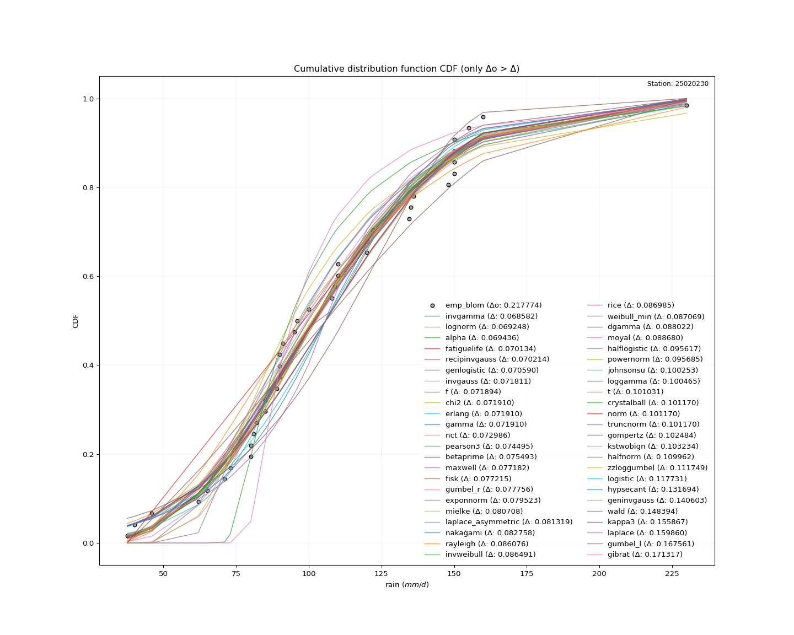</img>

#### 3. Best fit for

|   id |   station | empirical_dist   | p_dist   |     delta |   deltao | eval   |   fit |   n |      loc |   scale |   shape | shape1   | shape2   | shape3   |   best_fit |   best_fit_sort |
|-----:|----------:|:-----------------|:---------|----------:|---------:|:-------|------:|----:|---------:|--------:|--------:|:---------|:---------|:---------|-----------:|----------------:|
|    0 |  25020230 | emp_blom         | invgamma | 0.0685819 | 0.217774 | Δo > Δ |     1 |  39 | -127.184 | 8915.04 | 39.2649 |          |          |          |          1 |               1 |

</img>

</img>

### Empirical: emp_tukey

#### 1. Empirical values

|                | 0                   | 1                  | 2                   | 3                   | 4                   | 5                  | 6                  | 7                   | 8                   | 9                  | 10                 | 11                 | 12                 | 13                 | 14                 | 15                 | 16                 | 17                 | 18                 | 19        | 20                 | 21                 | 22                 | 23                 | 24                 | 25                | 26                 | 27                 | 28                 | 29                 | 30                 | 31                 | 32                 | 33                 | 34                 | 35                 | 36                 | 37                 | 38                 |
|:---------------|:--------------------|:-------------------|:--------------------|:--------------------|:--------------------|:-------------------|:-------------------|:--------------------|:--------------------|:-------------------|:-------------------|:-------------------|:-------------------|:-------------------|:-------------------|:-------------------|:-------------------|:-------------------|:-------------------|:----------|:-------------------|:-------------------|:-------------------|:-------------------|:-------------------|:------------------|:-------------------|:-------------------|:-------------------|:-------------------|:-------------------|:-------------------|:-------------------|:-------------------|:-------------------|:-------------------|:-------------------|:-------------------|:-------------------|
| date           | 1996                | 2005               | 1987                | 1992                | 1991                | 1998               | 2012               | 2003                | 2004                | 2018               | 2013               | 1997               | 1989               | 1990               | 1993               | 2006               | 1995               | 2010               | 1988               | 2014      | 2016               | 1980               | 2002               | 1999               | 2011               | 1983              | 2017               | 2000               | 2001               | 1994               | 1986               | 1982               | 2007               | 1981               | 2015               | 2009               | 1984               | 2008               | 1985               |
| x              | 37.52732            | 40.0               | 46.0                | 62.0                | 65.0                | 71.0               | 73.0               | 80.0                | 80.0                | 81.1               | 82.0               | 85.0               | 85.0               | 89.0               | 90.0               | 90.0               | 90.0               | 91.0               | 95.0               | 96.0      | 100.0              | 108.0              | 109.0              | 110.0              | 110.0              | 120.0             | 120.1              | 122.0              | 134.5              | 135.0              | 136.0              | 148.0              | 150.0              | 150.0              | 150.0              | 150.0              | 155.0              | 160.0              | 230.0              |
| m              | 1                   | 2                  | 3                   | 4                   | 5                   | 6                  | 7                  | 8                   | 9                   | 10                 | 11                 | 12                 | 13                 | 14                 | 15                 | 16                 | 17                 | 18                 | 19                 | 20        | 21                 | 22                 | 23                 | 24                 | 25                 | 26                | 27                 | 28                 | 29                 | 30                 | 31                 | 32                 | 33                 | 34                 | 35                 | 36                 | 37                 | 38                 | 39                 |
| empirical_dist | emp_tukey           | emp_tukey          | emp_tukey           | emp_tukey           | emp_tukey           | emp_tukey          | emp_tukey          | emp_tukey           | emp_tukey           | emp_tukey          | emp_tukey          | emp_tukey          | emp_tukey          | emp_tukey          | emp_tukey          | emp_tukey          | emp_tukey          | emp_tukey          | emp_tukey          | emp_tukey | emp_tukey          | emp_tukey          | emp_tukey          | emp_tukey          | emp_tukey          | emp_tukey         | emp_tukey          | emp_tukey          | emp_tukey          | emp_tukey          | emp_tukey          | emp_tukey          | emp_tukey          | emp_tukey          | emp_tukey          | emp_tukey          | emp_tukey          | emp_tukey          | emp_tukey          |
| empirical      | 0.01694915254237288 | 0.0423728813559322 | 0.06779661016949153 | 0.09322033898305085 | 0.11864406779661017 | 0.1440677966101695 | 0.1694915254237288 | 0.19491525423728814 | 0.22033898305084745 | 0.2457627118644068 | 0.2711864406779661 | 0.2966101694915254 | 0.3220338983050847 | 0.3474576271186441 | 0.3728813559322034 | 0.3983050847457627 | 0.423728813559322  | 0.4491525423728814 | 0.4745762711864407 | 0.5       | 0.5254237288135594 | 0.5508474576271186 | 0.576271186440678  | 0.6016949152542372 | 0.6271186440677966 | 0.652542372881356 | 0.6779661016949152 | 0.7033898305084746 | 0.7288135593220338 | 0.7542372881355932 | 0.7796610169491526 | 0.8050847457627118 | 0.8305084745762712 | 0.8559322033898306 | 0.8813559322033898 | 0.9067796610169492 | 0.9322033898305084 | 0.9576271186440678 | 0.9830508474576272 |
| empirical_tr   | 1.0172413793103448  | 1.0442477876106195 | 1.0727272727272728  | 1.102803738317757   | 1.1346153846153846  | 1.1683168316831685 | 1.2040816326530612 | 1.2421052631578948  | 1.2826086956521738  | 1.3258426966292136 | 1.372093023255814  | 1.4216867469879517 | 1.475              | 1.5324675324675323 | 1.5945945945945945 | 1.6619718309859157 | 1.7352941176470589 | 1.8153846153846154 | 1.9032258064516132 | 2.0       | 2.107142857142857  | 2.2264150943396226 | 2.3600000000000003 | 2.5106382978723403 | 2.6818181818181817 | 2.878048780487805 | 3.1052631578947367 | 3.3714285714285714 | 3.687499999999999  | 4.068965517241379  | 4.538461538461539  | 5.1304347826086945 | 5.9                | 6.941176470588238  | 8.428571428571427  | 10.72727272727273  | 14.749999999999991 | 23.6               | 59.000000000000156 |

####  2. Parameters & Kolmogorov-Smirnov fit test (sorted by Δ)

|   id | empirical_dist   | p_dist             |     delta |   deltao | eval    |   fit |   n |             loc |           scale | shape                 | shape1                | shape2             | shape3   |   best_fit |   best_fit_sort |
|-----:|:-----------------|:-------------------|----------:|---------:|:--------|------:|----:|----------------:|----------------:|:----------------------|:----------------------|:-------------------|:---------|-----------:|----------------:|
|    0 | emp_tukey        | lognorm            | 0.0686002 | 0.217774 | Δo > Δ  |     1 |  39 |   -70.2523      |   172.057       | 0.21422700262979513   |                       |                    |          |          1 |               1 |
|    1 | emp_tukey        | invgamma           | 0.0686898 | 0.217774 | Δo > Δ  |     1 |  39 |  -127.184       |  8915.04        | 39.264885803401164    |                       |                    |          |          0 |               2 |
|    2 | emp_tukey        | fatiguelife        | 0.0694866 | 0.217774 | Δo > Δ  |     1 |  39 |   -70.8952      |   172.72        | 0.21463881727137762   |                       |                    |          |          0 |               3 |
|    3 | emp_tukey        | alpha              | 0.0695436 | 0.217774 | Δo > Δ  |     1 |  39 |  -243.67        |  3275.81        | 9.481687591916309     |                       |                    |          |          0 |               4 |
|    4 | emp_tukey        | recipinvgauss      | 0.0695658 | 0.217774 | Δo > Δ  |     1 |  39 |   -69.6431      |     7.92805     | 0.04732722966555314   |                       |                    |          |          0 |               5 |
|    5 | emp_tukey        | genlogistic        | 0.0706978 | 0.217774 | Δo > Δ  |     1 |  39 |    59.8389      |    27.5995      | 3.46822996768894      |                       |                    |          |          0 |               6 |
|    6 | emp_tukey        | invgauss           | 0.071163  | 0.217774 | Δo > Δ  |     1 |  39 |   -60.6923      |  3126.93        | 0.05329080666089131   |                       |                    |          |          0 |               7 |
|    7 | emp_tukey        | f                  | 0.0712467 | 0.217774 | Δo > Δ  |     1 |  39 |   -15.4955      |   121.273       | 20.272895908966266    | 10530.135463947896    |                    |          |          0 |               8 |
|    8 | emp_tukey        | chi2               | 0.0712623 | 0.217774 | Δo > Δ  |     1 |  39 |   -15.3408      |     6.00322     | 20.179412499216305    |                       |                    |          |          0 |               9 |
|    9 | emp_tukey        | erlang             | 0.0712623 | 0.217774 | Δo > Δ  |     1 |  39 |   -15.3407      |    12.0065      | 10.089696230161591    |                       |                    |          |          0 |              10 |
|   10 | emp_tukey        | gamma              | 0.0712623 | 0.217774 | Δo > Δ  |     1 |  39 |   -15.3408      |    12.0065      | 10.089697793573393    |                       |                    |          |          0 |              11 |
|   11 | emp_tukey        | nct                | 0.0730938 | 0.217774 | Δo > Δ  |     1 |  39 |    -0.115389    |    28.7882      | 13.581667670648887    | 3.4711270782563686    |                    |          |          0 |              12 |
|   12 | emp_tukey        | pearson3           | 0.0738477 | 0.217774 | Δo > Δ  |     1 |  39 |   105.801       |    38.2277      | 0.7120941855529046    |                       |                    |          |          0 |              13 |
|   13 | emp_tukey        | betaprime          | 0.0748455 | 0.217774 | Δo > Δ  |     1 |  39 |    -7.7074      | 14311.7         | 8.711914272217232     | 1098.2495868443489    |                    |          |          0 |              14 |
|   14 | emp_tukey        | maxwell            | 0.0765341 | 0.217774 | Δo > Δ  |     1 |  39 |    15.217       |    56.7649      |                       |                       |                    |          |          0 |              15 |
|   15 | emp_tukey        | fisk               | 0.0773231 | 0.217774 | Δo > Δ  |     1 |  39 |   -54.7959      |   156.412       | 7.460631469733795     |                       |                    |          |          0 |              16 |
|   16 | emp_tukey        | gumbel_r           | 0.0782418 | 0.217774 | Δo > Δ  |     1 |  39 |    88.5962      |    29.806       |                       |                       |                    |          |          0 |              17 |
|   17 | emp_tukey        | exponnorm          | 0.0796306 | 0.217774 | Δo > Δ  |     1 |  39 |    78.3708      |    26.7867      | 1.0240107773320781    |                       |                    |          |          0 |              18 |
|   18 | emp_tukey        | mielke             | 0.0808163 | 0.217774 | Δo > Δ  |     1 |  39 |    -1.45821     |   117.373       | 3.6161644733307794    | 5.86585181901645      |                    |          |          0 |              19 |
|   19 | emp_tukey        | laplace_asymmetric | 0.0818046 | 0.217774 | Δo > Δ  |     1 |  39 |    85           |    26.1028      | 0.6780162075097738    |                       |                    |          |          0 |              20 |
|   20 | emp_tukey        | nakagami           | 0.0821107 | 0.217774 | Δo > Δ  |     1 |  39 |    24.4646      |    89.8717      | 1.2137236270696525    |                       |                    |          |          0 |              21 |
|   21 | emp_tukey        | rayleigh           | 0.0854282 | 0.217774 | Δo > Δ  |     1 |  39 |    32.6688      |    58.3508      |                       |                       |                    |          |          0 |              22 |
|   22 | emp_tukey        | invweibull         | 0.0858433 | 0.217774 | Δo > Δ  |     1 |  39 |    -3.55869e+07 |     3.5587e+07  | 1087666.0794998629    |                       |                    |          |          0 |              23 |
|   23 | emp_tukey        | rice               | 0.0863371 | 0.217774 | Δo > Δ  |     1 |  39 |    28.8446      |    49.4668      | 1.0086920154102033    |                       |                    |          |          0 |              24 |
|   24 | emp_tukey        | weibull_min        | 0.0864214 | 0.217774 | Δo > Δ  |     1 |  39 |    27.6997      |    88.016       | 2.127819115649472     |                       |                    |          |          0 |              25 |
|   25 | emp_tukey        | dgamma             | 0.0886696 | 0.217774 | Δo > Δ  |     1 |  39 |   103.492       |    16.7034      | 1.8105480298115495    |                       |                    |          |          0 |              26 |
|   26 | emp_tukey        | moyal              | 0.0891663 | 0.217774 | Δo > Δ  |     1 |  39 |    83.9396      |    17.2085      |                       |                       |                    |          |          0 |              27 |
|   27 | emp_tukey        | halflogistic       | 0.0949694 | 0.217774 | Δo > Δ  |     1 |  39 |    60.4919      |    32.6834      |                       |                       |                    |          |          0 |              28 |
|   28 | emp_tukey        | johnsonsu          | 0.100253  | 0.217774 | Δo > Δ  |     1 |  39 |     2.58281e+08 |     6.77349e+08 | 7002443.376614271     | 18792021.363224953    |                    |          |          0 |              29 |
|   29 | emp_tukey        | loggamma           | 0.100465  | 0.217774 | Δo > Δ  |     1 |  39 | -9785.94        |  1380.26        | 1295.7067945076137    |                       |                    |          |          0 |              30 |
|   30 | emp_tukey        | t                  | 0.101031  | 0.217774 | Δo > Δ  |     1 |  39 |   105.908       |    38.2266      | 21.67178402806863     |                       |                    |          |          0 |              31 |
|   31 | emp_tukey        | crystalball        | 0.10117   | 0.217774 | Δo > Δ  |     1 |  39 |   105.801       |    38.2277      | 7605.535442412194     | 6104.386628798199     |                    |          |          0 |              32 |
|   32 | emp_tukey        | norm               | 0.10117   | 0.217774 | Δo > Δ  |     1 |  39 |   105.801       |    38.2277      |                       |                       |                    |          |          0 |              33 |
|   33 | emp_tukey        | truncnorm          | 0.10117   | 0.217774 | Δo > Δ  |     1 |  39 |   105.801       |    38.2277      | -761.4622798670403    | 7.503505991779575     |                    |          |          0 |              34 |
|   34 | emp_tukey        | gompertz           | 0.101836  | 0.217774 | Δo > Δ  |     1 |  39 |    37.5226      |    71.8562      | 0.43675042205089065   |                       |                    |          |          0 |              35 |
|   35 | emp_tukey        | kstwobign          | 0.102586  | 0.217774 | Δo > Δ  |     1 |  39 |   -31.1406      |   157.593       |                       |                       |                    |          |          0 |              36 |
|   36 | emp_tukey        | halfnorm           | 0.109314  | 0.217774 | Δo > Δ  |     1 |  39 |    55.2021      |    63.4159      |                       |                       |                    |          |          0 |              37 |
|   37 | emp_tukey        | zzloggumbel        | 0.111101  | 0.217774 | Δo > Δ  |     1 |  39 |     4.43219     |     0.296828    | 0.5430175598423775    | 1.1389553227283298    |                    |          |          0 |              38 |
|   38 | emp_tukey        | logistic           | 0.117839  | 0.217774 | Δo > Δ  |     1 |  39 |   105.801       |    21.0761      |                       |                       |                    |          |          0 |              39 |
|   39 | emp_tukey        | hypsecant          | 0.131802  | 0.217774 | Δo > Δ  |     1 |  39 |   105.801       |    24.3365      |                       |                       |                    |          |          0 |              40 |
|   40 | emp_tukey        | geninvgauss        | 0.139955  | 0.217774 | Δo > Δ  |     1 |  39 |    30.7704      |     0.00466425  | 2.601803956249613     | 0.0003221294883634945 |                    |          |          0 |              41 |
|   41 | emp_tukey        | wald               | 0.149096  | 0.217774 | Δo > Δ  |     1 |  39 |    67.573       |    38.2277      |                       |                       |                    |          |          0 |              42 |
|   42 | emp_tukey        | laplace            | 0.159968  | 0.217774 | Δo > Δ  |     1 |  39 |   105.801       |    27.0311      |                       |                       |                    |          |          0 |              43 |
|   43 | emp_tukey        | gumbel_l           | 0.167561  | 0.217774 | Δo > Δ  |     1 |  39 |   123.005       |    29.806       |                       |                       |                    |          |          0 |              44 |
|   44 | emp_tukey        | gibrat             | 0.171911  | 0.217774 | Δo > Δ  |     1 |  39 |    76.6378      |    17.6882      |                       |                       |                    |          |          0 |              45 |
|   45 | emp_tukey        | zzgumbel           | 0.253537  | 0.217774 | Δo <= Δ |     0 |  39 |   105.783       |    30.1957      | 0.5430175598423775    | 1.1389553227283298    |                    |          |          0 |              46 |
|   46 | emp_tukey        | genexpon           | 0.267289  | 0.217774 | Δo <= Δ |     0 |  39 |    37.5273      |     2.24278     | 0.029546930847224324  | 0.003441345619576359  | 0.7750570077294003 |          |          0 |              47 |
|   47 | emp_tukey        | expon              | 0.268267  | 0.217774 | Δo <= Δ |     0 |  39 |    37.5273      |    68.2734      |                       |                       |                    |          |          0 |              48 |
|   48 | emp_tukey        | pareto             | 0.268267  | 0.217774 | Δo <= Δ |     0 |  39 |    -2.14748e+09 |     2.14748e+09 | 31454187.1816981      |                       |                    |          |          0 |              49 |
|   49 | emp_tukey        | ncf                | 0.304005  | 0.217774 | Δo <= Δ |     0 |  39 |    -0.0782662   |     7.04566e-06 | 5.132450078952019e-07 | 13.81406420736777     | 6.710701038988491  |          |          0 |              50 |

</img>

#### 3. Best fit for

|   id |   station | empirical_dist   | p_dist   |     delta |   deltao | eval   |   fit |   n |      loc |   scale |    shape | shape1   | shape2   | shape3   |   best_fit |   best_fit_sort |
|-----:|----------:|:-----------------|:---------|----------:|---------:|:-------|------:|----:|---------:|--------:|---------:|:---------|:---------|:---------|-----------:|----------------:|
|    0 |  25020230 | emp_tukey        | lognorm  | 0.0686002 | 0.217774 | Δo > Δ |     1 |  39 | -70.2523 | 172.057 | 0.214227 |          |          |          |          1 |               1 |

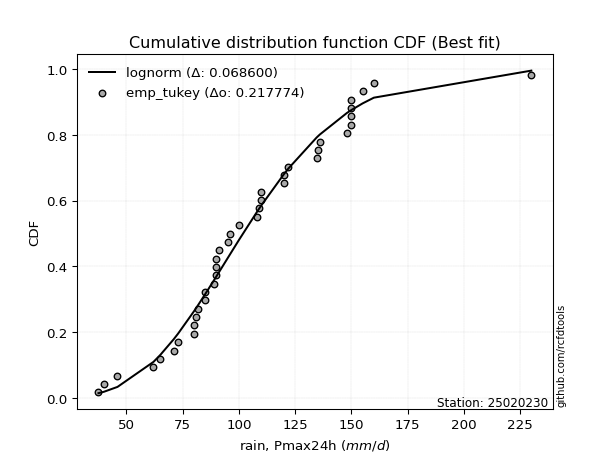</img>

</img>

### Empirical: emp_gringorten

#### 1. Empirical values

|                | 0                    | 1                   | 2                  | 3                   | 4                  | 5                   | 6                   | 7                   | 8                   | 9                   | 10                 | 11                 | 12                  | 13                 | 14                  | 15                 | 16                 | 17                 | 18                  | 19             | 20                 | 21                 | 22                 | 23                 | 24                 | 25                 | 26                 | 27                 | 28                 | 29                 | 30                 | 31                 | 32                 | 33                | 34                | 35                 | 36                 | 37                 | 38                 |
|:---------------|:---------------------|:--------------------|:-------------------|:--------------------|:-------------------|:--------------------|:--------------------|:--------------------|:--------------------|:--------------------|:-------------------|:-------------------|:--------------------|:-------------------|:--------------------|:-------------------|:-------------------|:-------------------|:--------------------|:---------------|:-------------------|:-------------------|:-------------------|:-------------------|:-------------------|:-------------------|:-------------------|:-------------------|:-------------------|:-------------------|:-------------------|:-------------------|:-------------------|:------------------|:------------------|:-------------------|:-------------------|:-------------------|:-------------------|
| date           | 1996                 | 2005                | 1987               | 1992                | 1991               | 1998                | 2012                | 2003                | 2004                | 2018                | 2013               | 1997               | 1989                | 1990               | 1993                | 2006               | 1995               | 2010               | 1988                | 2014           | 2016               | 1980               | 2002               | 1999               | 2011               | 1983               | 2017               | 2000               | 2001               | 1994               | 1986               | 1982               | 2007               | 1981              | 2015              | 2009               | 1984               | 2008               | 1985               |
| x              | 37.52732             | 40.0                | 46.0               | 62.0                | 65.0               | 71.0                | 73.0                | 80.0                | 80.0                | 81.1                | 82.0               | 85.0               | 85.0                | 89.0               | 90.0                | 90.0               | 90.0               | 91.0               | 95.0                | 96.0           | 100.0              | 108.0              | 109.0              | 110.0              | 110.0              | 120.0              | 120.1              | 122.0              | 134.5              | 135.0              | 136.0              | 148.0              | 150.0              | 150.0             | 150.0             | 150.0              | 155.0              | 160.0              | 230.0              |
| m              | 1                    | 2                   | 3                  | 4                   | 5                  | 6                   | 7                   | 8                   | 9                   | 10                  | 11                 | 12                 | 13                  | 14                 | 15                  | 16                 | 17                 | 18                 | 19                  | 20             | 21                 | 22                 | 23                 | 24                 | 25                 | 26                 | 27                 | 28                 | 29                 | 30                 | 31                 | 32                 | 33                 | 34                | 35                | 36                 | 37                 | 38                 | 39                 |
| empirical_dist | emp_gringorten       | emp_gringorten      | emp_gringorten     | emp_gringorten      | emp_gringorten     | emp_gringorten      | emp_gringorten      | emp_gringorten      | emp_gringorten      | emp_gringorten      | emp_gringorten     | emp_gringorten     | emp_gringorten      | emp_gringorten     | emp_gringorten      | emp_gringorten     | emp_gringorten     | emp_gringorten     | emp_gringorten      | emp_gringorten | emp_gringorten     | emp_gringorten     | emp_gringorten     | emp_gringorten     | emp_gringorten     | emp_gringorten     | emp_gringorten     | emp_gringorten     | emp_gringorten     | emp_gringorten     | emp_gringorten     | emp_gringorten     | emp_gringorten     | emp_gringorten    | emp_gringorten    | emp_gringorten     | emp_gringorten     | emp_gringorten     | emp_gringorten     |
| empirical      | 0.014314928425357875 | 0.03987730061349694 | 0.065439672801636  | 0.09100204498977506 | 0.1165644171779141 | 0.14212678936605316 | 0.16768916155419222 | 0.19325153374233128 | 0.21881390593047037 | 0.24437627811860943 | 0.2699386503067485 | 0.2955010224948876 | 0.32106339468302664 | 0.3466257668711657 | 0.37218813905930476 | 0.3977505112474438 | 0.4233128834355828 | 0.4488752556237219 | 0.47443762781186094 | 0.5            | 0.5255623721881391 | 0.5511247443762781 | 0.5766871165644172 | 0.6022494887525562 | 0.6278118609406953 | 0.6533742331288344 | 0.6789366053169734 | 0.7044989775051125 | 0.7300613496932515 | 0.7556237218813906 | 0.7811860940695297 | 0.8067484662576687 | 0.8323108384458079 | 0.857873210633947 | 0.883435582822086 | 0.9089979550102251 | 0.9345603271983641 | 0.9601226993865032 | 0.9856850715746422 |
| empirical_tr   | 1.0145228215767634   | 1.0415335463258786  | 1.0700218818380745 | 1.1001124859392575  | 1.1319444444444444 | 1.165673420738975   | 1.2014742014742015  | 1.2395437262357414  | 1.280104712041885   | 1.3234100135317997  | 1.3697478991596639 | 1.4194484760522497 | 1.4728915662650601  | 1.5305164319248825 | 1.5928338762214984  | 1.66044142614601   | 1.7340425531914894 | 1.8144712430426717 | 1.9027237354085602  | 2.0            | 2.1077586206896552 | 2.2277904328018225 | 2.36231884057971   | 2.51413881748072   | 2.686813186813187  | 2.8849557522123894 | 3.1146496815286624 | 3.384083044982699  | 3.7045454545454546 | 4.092050209205021  | 4.570093457943925  | 5.174603174603175  | 5.963414634146345  | 7.035971223021589 | 8.578947368421062 | 10.988764044943835 | 15.281250000000028 | 25.07692307692315  | 69.85714285714344  |

####  2. Parameters & Kolmogorov-Smirnov fit test (sorted by Δ)

|   id | empirical_dist   | p_dist             |     delta |   deltao | eval    |   fit |   n |             loc |           scale | shape                 | shape1                | shape2             | shape3   |   best_fit |   best_fit_sort |
|-----:|:-----------------|:-------------------|----------:|---------:|:--------|------:|----:|----------------:|----------------:|:----------------------|:----------------------|:-------------------|:---------|-----------:|----------------:|
|    0 | emp_gringorten   | alpha              | 0.0692663 | 0.217774 | Δo > Δ  |     1 |  39 |  -243.67        |  3275.81        | 9.481687591916309     |                       |                    |          |          1 |               1 |
|    1 | emp_gringorten   | invgamma           | 0.0693286 | 0.217774 | Δo > Δ  |     1 |  39 |  -127.184       |  8915.04        | 39.264885803401164    |                       |                    |          |          0 |               2 |
|    2 | emp_gringorten   | lognorm            | 0.0702639 | 0.217774 | Δo > Δ  |     1 |  39 |   -70.2523      |   172.057       | 0.21422700262979513   |                       |                    |          |          0 |               3 |
|    3 | emp_gringorten   | genlogistic        | 0.0704206 | 0.217774 | Δo > Δ  |     1 |  39 |    59.8389      |    27.5995      | 3.46822996768894      |                       |                    |          |          0 |               4 |
|    4 | emp_gringorten   | fatiguelife        | 0.0711503 | 0.217774 | Δo > Δ  |     1 |  39 |   -70.8952      |   172.72        | 0.21463881727137762   |                       |                    |          |          0 |               5 |
|    5 | emp_gringorten   | recipinvgauss      | 0.0712296 | 0.217774 | Δo > Δ  |     1 |  39 |   -69.6431      |     7.92805     | 0.04732722966555314   |                       |                    |          |          0 |               6 |
|    6 | emp_gringorten   | nct                | 0.0728165 | 0.217774 | Δo > Δ  |     1 |  39 |    -0.115389    |    28.7882      | 13.581667670648887    | 3.4711270782563686    |                    |          |          0 |               7 |
|    7 | emp_gringorten   | invgauss           | 0.0728267 | 0.217774 | Δo > Δ  |     1 |  39 |   -60.6923      |  3126.93        | 0.05329080666089131   |                       |                    |          |          0 |               8 |
|    8 | emp_gringorten   | f                  | 0.0729105 | 0.217774 | Δo > Δ  |     1 |  39 |   -15.4955      |   121.273       | 20.272895908966266    | 10530.135463947896    |                    |          |          0 |               9 |
|    9 | emp_gringorten   | chi2               | 0.072926  | 0.217774 | Δo > Δ  |     1 |  39 |   -15.3408      |     6.00322     | 20.179412499216305    |                       |                    |          |          0 |              10 |
|   10 | emp_gringorten   | erlang             | 0.072926  | 0.217774 | Δo > Δ  |     1 |  39 |   -15.3407      |    12.0065      | 10.089696230161591    |                       |                    |          |          0 |              11 |
|   11 | emp_gringorten   | gamma              | 0.072926  | 0.217774 | Δo > Δ  |     1 |  39 |   -15.3408      |    12.0065      | 10.089697793573393    |                       |                    |          |          0 |              12 |
|   12 | emp_gringorten   | pearson3           | 0.0755114 | 0.217774 | Δo > Δ  |     1 |  39 |   105.801       |    38.2277      | 0.7120941855529046    |                       |                    |          |          0 |              13 |
|   13 | emp_gringorten   | betaprime          | 0.0765092 | 0.217774 | Δo > Δ  |     1 |  39 |    -7.7074      | 14311.7         | 8.711914272217232     | 1098.2495868443489    |                    |          |          0 |              14 |
|   14 | emp_gringorten   | gumbel_r           | 0.076994  | 0.217774 | Δo > Δ  |     1 |  39 |    88.5962      |    29.806       |                       |                       |                    |          |          0 |              15 |
|   15 | emp_gringorten   | fisk               | 0.0770458 | 0.217774 | Δo > Δ  |     1 |  39 |   -54.7959      |   156.412       | 7.460631469733795     |                       |                    |          |          0 |              16 |
|   16 | emp_gringorten   | maxwell            | 0.0781978 | 0.217774 | Δo > Δ  |     1 |  39 |    15.217       |    56.7649      |                       |                       |                    |          |          0 |              17 |
|   17 | emp_gringorten   | exponnorm          | 0.0793533 | 0.217774 | Δo > Δ  |     1 |  39 |    78.3708      |    26.7867      | 1.0240107773320781    |                       |                    |          |          0 |              18 |
|   18 | emp_gringorten   | mielke             | 0.0805391 | 0.217774 | Δo > Δ  |     1 |  39 |    -1.45821     |   117.373       | 3.6161644733307794    | 5.86585181901645      |                    |          |          0 |              19 |
|   19 | emp_gringorten   | laplace_asymmetric | 0.0805568 | 0.217774 | Δo > Δ  |     1 |  39 |    85           |    26.1028      | 0.6780162075097738    |                       |                    |          |          0 |              20 |
|   20 | emp_gringorten   | nakagami           | 0.0837744 | 0.217774 | Δo > Δ  |     1 |  39 |    24.4646      |    89.8717      | 1.2137236270696525    |                       |                    |          |          0 |              21 |
|   21 | emp_gringorten   | dgamma             | 0.0870058 | 0.217774 | Δo > Δ  |     1 |  39 |   103.492       |    16.7034      | 1.8105480298115495    |                       |                    |          |          0 |              22 |
|   22 | emp_gringorten   | rayleigh           | 0.0870919 | 0.217774 | Δo > Δ  |     1 |  39 |    32.6688      |    58.3508      |                       |                       |                    |          |          0 |              23 |
|   23 | emp_gringorten   | invweibull         | 0.0875071 | 0.217774 | Δo > Δ  |     1 |  39 |    -3.55869e+07 |     3.5587e+07  | 1087666.0794998629    |                       |                    |          |          0 |              24 |
|   24 | emp_gringorten   | moyal              | 0.0879185 | 0.217774 | Δo > Δ  |     1 |  39 |    83.9396      |    17.2085      |                       |                       |                    |          |          0 |              25 |
|   25 | emp_gringorten   | rice               | 0.0880009 | 0.217774 | Δo > Δ  |     1 |  39 |    28.8446      |    49.4668      | 1.0086920154102033    |                       |                    |          |          0 |              26 |
|   26 | emp_gringorten   | weibull_min        | 0.0880851 | 0.217774 | Δo > Δ  |     1 |  39 |    27.6997      |    88.016       | 2.127819115649472     |                       |                    |          |          0 |              27 |
|   27 | emp_gringorten   | halflogistic       | 0.0966331 | 0.217774 | Δo > Δ  |     1 |  39 |    60.4919      |    32.6834      |                       |                       |                    |          |          0 |              28 |
|   28 | emp_gringorten   | johnsonsu          | 0.100253  | 0.217774 | Δo > Δ  |     1 |  39 |     2.58281e+08 |     6.77349e+08 | 7002443.376614271     | 18792021.363224953    |                    |          |          0 |              29 |
|   29 | emp_gringorten   | loggamma           | 0.100465  | 0.217774 | Δo > Δ  |     1 |  39 | -9785.94        |  1380.26        | 1295.7067945076137    |                       |                    |          |          0 |              30 |
|   30 | emp_gringorten   | t                  | 0.101031  | 0.217774 | Δo > Δ  |     1 |  39 |   105.908       |    38.2266      | 21.67178402806863     |                       |                    |          |          0 |              31 |
|   31 | emp_gringorten   | crystalball        | 0.10117   | 0.217774 | Δo > Δ  |     1 |  39 |   105.801       |    38.2277      | 7605.535442412194     | 6104.386628798199     |                    |          |          0 |              32 |
|   32 | emp_gringorten   | norm               | 0.10117   | 0.217774 | Δo > Δ  |     1 |  39 |   105.801       |    38.2277      |                       |                       |                    |          |          0 |              33 |
|   33 | emp_gringorten   | truncnorm          | 0.10117   | 0.217774 | Δo > Δ  |     1 |  39 |   105.801       |    38.2277      | -761.4622798670403    | 7.503505991779575     |                    |          |          0 |              34 |
|   34 | emp_gringorten   | gompertz           | 0.1035    | 0.217774 | Δo > Δ  |     1 |  39 |    37.5226      |    71.8562      | 0.43675042205089065   |                       |                    |          |          0 |              35 |
|   35 | emp_gringorten   | kstwobign          | 0.10425   | 0.217774 | Δo > Δ  |     1 |  39 |   -31.1406      |   157.593       |                       |                       |                    |          |          0 |              36 |
|   36 | emp_gringorten   | halfnorm           | 0.110978  | 0.217774 | Δo > Δ  |     1 |  39 |    55.2021      |    63.4159      |                       |                       |                    |          |          0 |              37 |
|   37 | emp_gringorten   | zzloggumbel        | 0.112765  | 0.217774 | Δo > Δ  |     1 |  39 |     4.43219     |     0.296828    | 0.5430175598423775    | 1.1389553227283298    |                    |          |          0 |              38 |
|   38 | emp_gringorten   | logistic           | 0.117562  | 0.217774 | Δo > Δ  |     1 |  39 |   105.801       |    21.0761      |                       |                       |                    |          |          0 |              39 |
|   39 | emp_gringorten   | hypsecant          | 0.131525  | 0.217774 | Δo > Δ  |     1 |  39 |   105.801       |    24.3365      |                       |                       |                    |          |          0 |              40 |
|   40 | emp_gringorten   | geninvgauss        | 0.141619  | 0.217774 | Δo > Δ  |     1 |  39 |    30.7704      |     0.00466425  | 2.601803956249613     | 0.0003221294883634945 |                    |          |          0 |              41 |
|   41 | emp_gringorten   | wald               | 0.147294  | 0.217774 | Δo > Δ  |     1 |  39 |    67.573       |    38.2277      |                       |                       |                    |          |          0 |              42 |
|   42 | emp_gringorten   | laplace            | 0.159691  | 0.217774 | Δo > Δ  |     1 |  39 |   105.801       |    27.0311      |                       |                       |                    |          |          0 |              43 |
|   43 | emp_gringorten   | gumbel_l           | 0.167561  | 0.217774 | Δo > Δ  |     1 |  39 |   123.005       |    29.806       |                       |                       |                    |          |          0 |              44 |
|   44 | emp_gringorten   | gibrat             | 0.170386  | 0.217774 | Δo > Δ  |     1 |  39 |    76.6378      |    17.6882      |                       |                       |                    |          |          0 |              45 |
|   45 | emp_gringorten   | zzgumbel           | 0.25326   | 0.217774 | Δo <= Δ |     0 |  39 |   105.783       |    30.1957      | 0.5430175598423775    | 1.1389553227283298    |                    |          |          0 |              46 |
|   46 | emp_gringorten   | genexpon           | 0.268953  | 0.217774 | Δo <= Δ |     0 |  39 |    37.5273      |     2.24278     | 0.029546930847224324  | 0.003441345619576359  | 0.7750570077294003 |          |          0 |              47 |
|   47 | emp_gringorten   | expon              | 0.269931  | 0.217774 | Δo <= Δ |     0 |  39 |    37.5273      |    68.2734      |                       |                       |                    |          |          0 |              48 |
|   48 | emp_gringorten   | pareto             | 0.269931  | 0.217774 | Δo <= Δ |     0 |  39 |    -2.14748e+09 |     2.14748e+09 | 31454187.1816981      |                       |                    |          |          0 |              49 |
|   49 | emp_gringorten   | ncf                | 0.306058  | 0.217774 | Δo <= Δ |     0 |  39 |    -0.0782662   |     7.04566e-06 | 5.132450078952019e-07 | 13.81406420736777     | 6.710701038988491  |          |          0 |              50 |

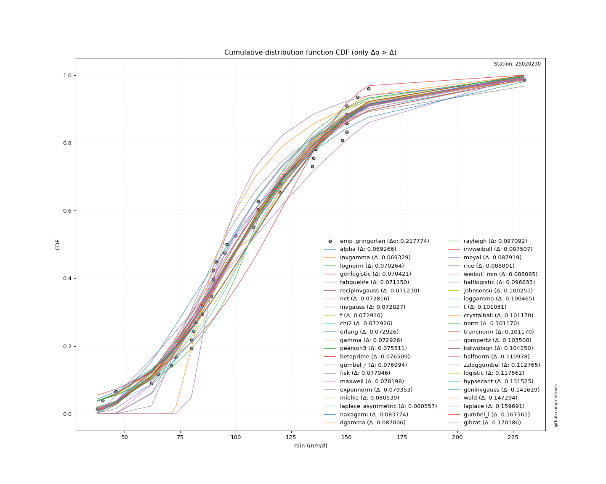</img>

#### 3. Best fit for

|   id |   station | empirical_dist   | p_dist   |     delta |   deltao | eval   |   fit |   n |     loc |   scale |   shape | shape1   | shape2   | shape3   |   best_fit |   best_fit_sort |
|-----:|----------:|:-----------------|:---------|----------:|---------:|:-------|------:|----:|--------:|--------:|--------:|:---------|:---------|:---------|-----------:|----------------:|
|    0 |  25020230 | emp_gringorten   | alpha    | 0.0692663 | 0.217774 | Δo > Δ |     1 |  39 | -243.67 | 3275.81 | 9.48169 |          |          |          |          1 |               1 |

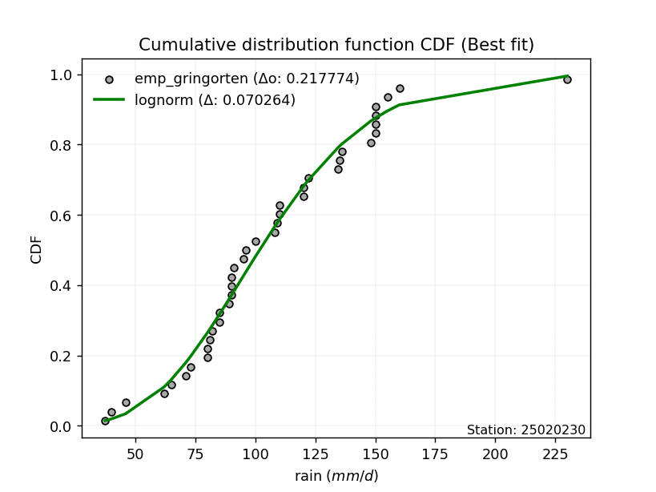</img>

</img>

### Empirical: emp_jenkinson

#### 1. Empirical values

|                | 0                    | 1                    | 2                   | 3                   | 4                   | 5                   | 6                   | 7                   | 8                   | 9                  | 10                  | 11                  | 12                 | 13                 | 14                  | 15                 | 16                 | 17                  | 18                  | 19            | 20                 | 21                 | 22                 | 23                 | 24                 | 25                 | 26                 | 27                 | 28                 | 29                 | 30                 | 31                 | 32                 | 33                 | 34                 | 35                 | 36                 | 37                 | 38                 |
|:---------------|:---------------------|:---------------------|:--------------------|:--------------------|:--------------------|:--------------------|:--------------------|:--------------------|:--------------------|:-------------------|:--------------------|:--------------------|:-------------------|:-------------------|:--------------------|:-------------------|:-------------------|:--------------------|:--------------------|:--------------|:-------------------|:-------------------|:-------------------|:-------------------|:-------------------|:-------------------|:-------------------|:-------------------|:-------------------|:-------------------|:-------------------|:-------------------|:-------------------|:-------------------|:-------------------|:-------------------|:-------------------|:-------------------|:-------------------|
| date           | 1996                 | 2005                 | 1987                | 1992                | 1991                | 1998                | 2012                | 2003                | 2004                | 2018               | 2013                | 1997                | 1989               | 1990               | 1993                | 2006               | 1995               | 2010                | 1988                | 2014          | 2016               | 1980               | 2002               | 1999               | 2011               | 1983               | 2017               | 2000               | 2001               | 1994               | 1986               | 1982               | 2007               | 1981               | 2015               | 2009               | 1984               | 2008               | 1985               |
| x              | 37.52732             | 40.0                 | 46.0                | 62.0                | 65.0                | 71.0                | 73.0                | 80.0                | 80.0                | 81.1               | 82.0                | 85.0                | 85.0               | 89.0               | 90.0                | 90.0               | 90.0               | 91.0                | 95.0                | 96.0          | 100.0              | 108.0              | 109.0              | 110.0              | 110.0              | 120.0              | 120.1              | 122.0              | 134.5              | 135.0              | 136.0              | 148.0              | 150.0              | 150.0              | 150.0              | 150.0              | 155.0              | 160.0              | 230.0              |
| m              | 1                    | 2                    | 3                   | 4                   | 5                   | 6                   | 7                   | 8                   | 9                   | 10                 | 11                  | 12                  | 13                 | 14                 | 15                  | 16                 | 17                 | 18                  | 19                  | 20            | 21                 | 22                 | 23                 | 24                 | 25                 | 26                 | 27                 | 28                 | 29                 | 30                 | 31                 | 32                 | 33                 | 34                 | 35                 | 36                 | 37                 | 38                 | 39                 |
| empirical_dist | emp_jenkinson        | emp_jenkinson        | emp_jenkinson       | emp_jenkinson       | emp_jenkinson       | emp_jenkinson       | emp_jenkinson       | emp_jenkinson       | emp_jenkinson       | emp_jenkinson      | emp_jenkinson       | emp_jenkinson       | emp_jenkinson      | emp_jenkinson      | emp_jenkinson       | emp_jenkinson      | emp_jenkinson      | emp_jenkinson       | emp_jenkinson       | emp_jenkinson | emp_jenkinson      | emp_jenkinson      | emp_jenkinson      | emp_jenkinson      | emp_jenkinson      | emp_jenkinson      | emp_jenkinson      | emp_jenkinson      | emp_jenkinson      | emp_jenkinson      | emp_jenkinson      | emp_jenkinson      | emp_jenkinson      | emp_jenkinson      | emp_jenkinson      | emp_jenkinson      | emp_jenkinson      | emp_jenkinson      | emp_jenkinson      |
| empirical      | 0.017521584560690702 | 0.042915185373285925 | 0.06830878618588115 | 0.09370238699847637 | 0.11909598781107161 | 0.14448958862366684 | 0.16988318943626207 | 0.19527679024885727 | 0.22067039106145248 | 0.2460639918740477 | 0.27145759268664293 | 0.29685119349923816 | 0.3222447943118334 | 0.3476383951244286 | 0.37303199593702385 | 0.3984255967496191 | 0.4238191975622143 | 0.44921279837480954 | 0.47460639918740477 | 0.5           | 0.5253936008125952 | 0.5507872016251905 | 0.5761808024377857 | 0.6015744032503809 | 0.6269680040629761 | 0.6523616048755714 | 0.6777552056881666 | 0.7031488065007618 | 0.7285424073133571 | 0.7539360081259523 | 0.7793296089385474 | 0.8047232097511426 | 0.8301168105637379 | 0.8555104113763331 | 0.8809040121889282 | 0.9062976130015234 | 0.9316912138141187 | 0.9570848146267139 | 0.9824784154393091 |
| empirical_tr   | 1.0178340656500389   | 1.0448394799681613   | 1.0733169801035705  | 1.1033903054076772  | 1.135197463245892   | 1.1688928465420005  | 1.2046497399816456  | 1.242663300725781   | 1.2831541218637992  | 1.3263725159986526 | 1.3726036946671314  | 1.4221740700613938  | 1.4754589733982764 | 1.532892175943947  | 1.5949777237748075  | 1.6623047699451245 | 1.7355663287791978 | 1.8155832180728446  | 1.903334944417593   | 2.0           | 2.1070090957731407 | 2.2261164499717356 | 2.359496704613541  | 2.509878903760357  | 2.6807351940095305 | 2.8765522279035793 | 3.1032308904649333 | 3.368691189050471  | 3.683816651075772  | 4.063983488132095  | 4.531645569620252  | 5.120936280884264  | 5.8863976083707    | 6.920913884007027  | 8.396588486140713  | 10.67208672086719  | 14.639405204460932 | 23.301775147928907 | 57.07246376811543  |

####  2. Parameters & Kolmogorov-Smirnov fit test (sorted by Δ)

|   id | empirical_dist   | p_dist             |     delta |   deltao | eval    |   fit |   n |             loc |           scale | shape                 | shape1                | shape2             | shape3   |   best_fit |   best_fit_sort |
|-----:|:-----------------|:-------------------|----------:|---------:|:--------|------:|----:|----------------:|----------------:|:----------------------|:----------------------|:-------------------|:---------|-----------:|----------------:|
|    0 | emp_jenkinson    | lognorm            | 0.0682386 | 0.217774 | Δo > Δ  |     1 |  39 |   -70.2523      |   172.057       | 0.21422700262979513   |                       |                    |          |          1 |               1 |
|    1 | emp_jenkinson    | invgamma           | 0.0687501 | 0.217774 | Δo > Δ  |     1 |  39 |  -127.184       |  8915.04        | 39.264885803401164    |                       |                    |          |          0 |               2 |
|    2 | emp_jenkinson    | fatiguelife        | 0.069125  | 0.217774 | Δo > Δ  |     1 |  39 |   -70.8952      |   172.72        | 0.21463881727137762   |                       |                    |          |          0 |               3 |
|    3 | emp_jenkinson    | recipinvgauss      | 0.0692043 | 0.217774 | Δo > Δ  |     1 |  39 |   -69.6431      |     7.92805     | 0.04732722966555314   |                       |                    |          |          0 |               4 |
|    4 | emp_jenkinson    | alpha              | 0.0696039 | 0.217774 | Δo > Δ  |     1 |  39 |  -243.67        |  3275.81        | 9.481687591916309     |                       |                    |          |          0 |               5 |
|    5 | emp_jenkinson    | genlogistic        | 0.0707581 | 0.217774 | Δo > Δ  |     1 |  39 |    59.8389      |    27.5995      | 3.46822996768894      |                       |                    |          |          0 |               6 |
|    6 | emp_jenkinson    | invgauss           | 0.0708015 | 0.217774 | Δo > Δ  |     1 |  39 |   -60.6923      |  3126.93        | 0.05329080666089131   |                       |                    |          |          0 |               7 |
|    7 | emp_jenkinson    | f                  | 0.0708852 | 0.217774 | Δo > Δ  |     1 |  39 |   -15.4955      |   121.273       | 20.272895908966266    | 10530.135463947896    |                    |          |          0 |               8 |
|    8 | emp_jenkinson    | chi2               | 0.0709007 | 0.217774 | Δo > Δ  |     1 |  39 |   -15.3408      |     6.00322     | 20.179412499216305    |                       |                    |          |          0 |               9 |
|    9 | emp_jenkinson    | erlang             | 0.0709008 | 0.217774 | Δo > Δ  |     1 |  39 |   -15.3407      |    12.0065      | 10.089696230161591    |                       |                    |          |          0 |              10 |
|   10 | emp_jenkinson    | gamma              | 0.0709008 | 0.217774 | Δo > Δ  |     1 |  39 |   -15.3408      |    12.0065      | 10.089697793573393    |                       |                    |          |          0 |              11 |
|   11 | emp_jenkinson    | nct                | 0.073154  | 0.217774 | Δo > Δ  |     1 |  39 |    -0.115389    |    28.7882      | 13.581667670648887    | 3.4711270782563686    |                    |          |          0 |              12 |
|   12 | emp_jenkinson    | pearson3           | 0.0734861 | 0.217774 | Δo > Δ  |     1 |  39 |   105.801       |    38.2277      | 0.7120941855529046    |                       |                    |          |          0 |              13 |
|   13 | emp_jenkinson    | betaprime          | 0.0744839 | 0.217774 | Δo > Δ  |     1 |  39 |    -7.7074      | 14311.7         | 8.711914272217232     | 1098.2495868443489    |                    |          |          0 |              14 |
|   14 | emp_jenkinson    | maxwell            | 0.0761725 | 0.217774 | Δo > Δ  |     1 |  39 |    15.217       |    56.7649      |                       |                       |                    |          |          0 |              15 |
|   15 | emp_jenkinson    | fisk               | 0.0773834 | 0.217774 | Δo > Δ  |     1 |  39 |   -54.7959      |   156.412       | 7.460631469733795     |                       |                    |          |          0 |              16 |
|   16 | emp_jenkinson    | gumbel_r           | 0.0785129 | 0.217774 | Δo > Δ  |     1 |  39 |    88.5962      |    29.806       |                       |                       |                    |          |          0 |              17 |
|   17 | emp_jenkinson    | exponnorm          | 0.0796908 | 0.217774 | Δo > Δ  |     1 |  39 |    78.3708      |    26.7867      | 1.0240107773320781    |                       |                    |          |          0 |              18 |
|   18 | emp_jenkinson    | mielke             | 0.0808766 | 0.217774 | Δo > Δ  |     1 |  39 |    -1.45821     |   117.373       | 3.6161644733307794    | 5.86585181901645      |                    |          |          0 |              19 |
|   19 | emp_jenkinson    | nakagami           | 0.0817492 | 0.217774 | Δo > Δ  |     1 |  39 |    24.4646      |    89.8717      | 1.2137236270696525    |                       |                    |          |          0 |              20 |
|   20 | emp_jenkinson    | laplace_asymmetric | 0.0820757 | 0.217774 | Δo > Δ  |     1 |  39 |    85           |    26.1028      | 0.6780162075097738    |                       |                    |          |          0 |              21 |
|   21 | emp_jenkinson    | rayleigh           | 0.0850667 | 0.217774 | Δo > Δ  |     1 |  39 |    32.6688      |    58.3508      |                       |                       |                    |          |          0 |              22 |
|   22 | emp_jenkinson    | invweibull         | 0.0854818 | 0.217774 | Δo > Δ  |     1 |  39 |    -3.55869e+07 |     3.5587e+07  | 1087666.0794998629    |                       |                    |          |          0 |              23 |
|   23 | emp_jenkinson    | rice               | 0.0859756 | 0.217774 | Δo > Δ  |     1 |  39 |    28.8446      |    49.4668      | 1.0086920154102033    |                       |                    |          |          0 |              24 |
|   24 | emp_jenkinson    | weibull_min        | 0.0860598 | 0.217774 | Δo > Δ  |     1 |  39 |    27.6997      |    88.016       | 2.127819115649472     |                       |                    |          |          0 |              25 |
|   25 | emp_jenkinson    | dgamma             | 0.0890311 | 0.217774 | Δo > Δ  |     1 |  39 |   103.492       |    16.7034      | 1.8105480298115495    |                       |                    |          |          0 |              26 |
|   26 | emp_jenkinson    | moyal              | 0.0894375 | 0.217774 | Δo > Δ  |     1 |  39 |    83.9396      |    17.2085      |                       |                       |                    |          |          0 |              27 |
|   27 | emp_jenkinson    | halflogistic       | 0.0946079 | 0.217774 | Δo > Δ  |     1 |  39 |    60.4919      |    32.6834      |                       |                       |                    |          |          0 |              28 |
|   28 | emp_jenkinson    | johnsonsu          | 0.100253  | 0.217774 | Δo > Δ  |     1 |  39 |     2.58281e+08 |     6.77349e+08 | 7002443.376614271     | 18792021.363224953    |                    |          |          0 |              29 |
|   29 | emp_jenkinson    | loggamma           | 0.100465  | 0.217774 | Δo > Δ  |     1 |  39 | -9785.94        |  1380.26        | 1295.7067945076137    |                       |                    |          |          0 |              30 |
|   30 | emp_jenkinson    | t                  | 0.101031  | 0.217774 | Δo > Δ  |     1 |  39 |   105.908       |    38.2266      | 21.67178402806863     |                       |                    |          |          0 |              31 |
|   31 | emp_jenkinson    | crystalball        | 0.10117   | 0.217774 | Δo > Δ  |     1 |  39 |   105.801       |    38.2277      | 7605.535442412194     | 6104.386628798199     |                    |          |          0 |              32 |
|   32 | emp_jenkinson    | norm               | 0.10117   | 0.217774 | Δo > Δ  |     1 |  39 |   105.801       |    38.2277      |                       |                       |                    |          |          0 |              33 |
|   33 | emp_jenkinson    | truncnorm          | 0.10117   | 0.217774 | Δo > Δ  |     1 |  39 |   105.801       |    38.2277      | -761.4622798670403    | 7.503505991779575     |                    |          |          0 |              34 |
|   34 | emp_jenkinson    | gompertz           | 0.101474  | 0.217774 | Δo > Δ  |     1 |  39 |    37.5226      |    71.8562      | 0.43675042205089065   |                       |                    |          |          0 |              35 |
|   35 | emp_jenkinson    | kstwobign          | 0.102224  | 0.217774 | Δo > Δ  |     1 |  39 |   -31.1406      |   157.593       |                       |                       |                    |          |          0 |              36 |
|   36 | emp_jenkinson    | halfnorm           | 0.108952  | 0.217774 | Δo > Δ  |     1 |  39 |    55.2021      |    63.4159      |                       |                       |                    |          |          0 |              37 |
|   37 | emp_jenkinson    | zzloggumbel        | 0.110739  | 0.217774 | Δo > Δ  |     1 |  39 |     4.43219     |     0.296828    | 0.5430175598423775    | 1.1389553227283298    |                    |          |          0 |              38 |
|   38 | emp_jenkinson    | logistic           | 0.1179    | 0.217774 | Δo > Δ  |     1 |  39 |   105.801       |    21.0761      |                       |                       |                    |          |          0 |              39 |
|   39 | emp_jenkinson    | hypsecant          | 0.131862  | 0.217774 | Δo > Δ  |     1 |  39 |   105.801       |    24.3365      |                       |                       |                    |          |          0 |              40 |
|   40 | emp_jenkinson    | geninvgauss        | 0.139593  | 0.217774 | Δo > Δ  |     1 |  39 |    30.7704      |     0.00466425  | 2.601803956249613     | 0.0003221294883634945 |                    |          |          0 |              41 |
|   41 | emp_jenkinson    | wald               | 0.149488  | 0.217774 | Δo > Δ  |     1 |  39 |    67.573       |    38.2277      |                       |                       |                    |          |          0 |              42 |
|   42 | emp_jenkinson    | laplace            | 0.160028  | 0.217774 | Δo > Δ  |     1 |  39 |   105.801       |    27.0311      |                       |                       |                    |          |          0 |              43 |
|   43 | emp_jenkinson    | gumbel_l           | 0.167561  | 0.217774 | Δo > Δ  |     1 |  39 |   123.005       |    29.806       |                       |                       |                    |          |          0 |              44 |
|   44 | emp_jenkinson    | gibrat             | 0.172242  | 0.217774 | Δo > Δ  |     1 |  39 |    76.6378      |    17.6882      |                       |                       |                    |          |          0 |              45 |
|   45 | emp_jenkinson    | zzgumbel           | 0.253597  | 0.217774 | Δo <= Δ |     0 |  39 |   105.783       |    30.1957      | 0.5430175598423775    | 1.1389553227283298    |                    |          |          0 |              46 |
|   46 | emp_jenkinson    | genexpon           | 0.266928  | 0.217774 | Δo <= Δ |     0 |  39 |    37.5273      |     2.24278     | 0.029546930847224324  | 0.003441345619576359  | 0.7750570077294003 |          |          0 |              47 |
|   47 | emp_jenkinson    | expon              | 0.267906  | 0.217774 | Δo <= Δ |     0 |  39 |    37.5273      |    68.2734      |                       |                       |                    |          |          0 |              48 |
|   48 | emp_jenkinson    | pareto             | 0.267906  | 0.217774 | Δo <= Δ |     0 |  39 |    -2.14748e+09 |     2.14748e+09 | 31454187.1816981      |                       |                    |          |          0 |              49 |
|   49 | emp_jenkinson    | ncf                | 0.303583  | 0.217774 | Δo <= Δ |     0 |  39 |    -0.0782662   |     7.04566e-06 | 5.132450078952019e-07 | 13.81406420736777     | 6.710701038988491  |          |          0 |              50 |

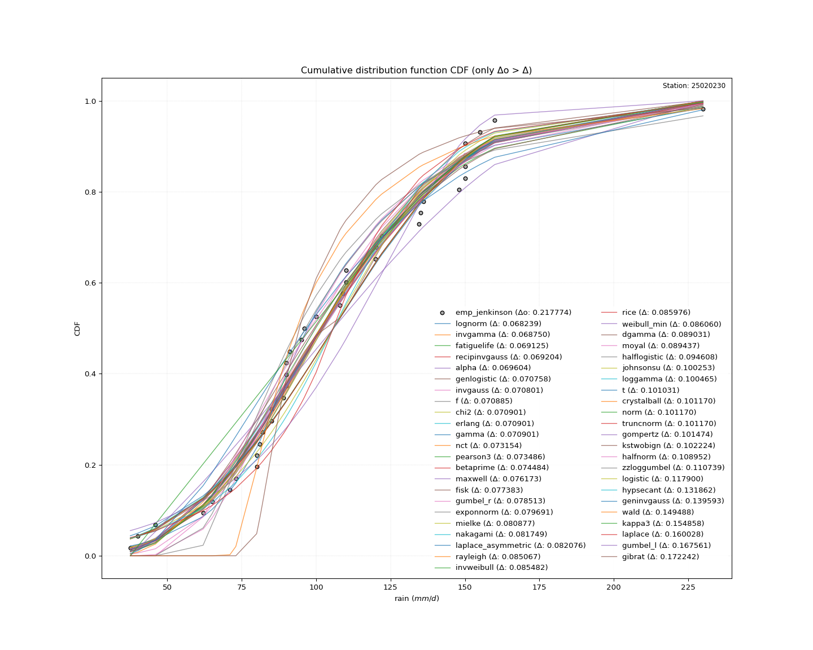</img>

#### 3. Best fit for

|   id |   station | empirical_dist   | p_dist   |     delta |   deltao | eval   |   fit |   n |      loc |   scale |    shape | shape1   | shape2   | shape3   |   best_fit |   best_fit_sort |
|-----:|----------:|:-----------------|:---------|----------:|---------:|:-------|------:|----:|---------:|--------:|---------:|:---------|:---------|:---------|-----------:|----------------:|
|    0 |  25020230 | emp_jenkinson    | lognorm  | 0.0682386 | 0.217774 | Δo > Δ |     1 |  39 | -70.2523 | 172.057 | 0.214227 |          |          |          |          1 |               1 |

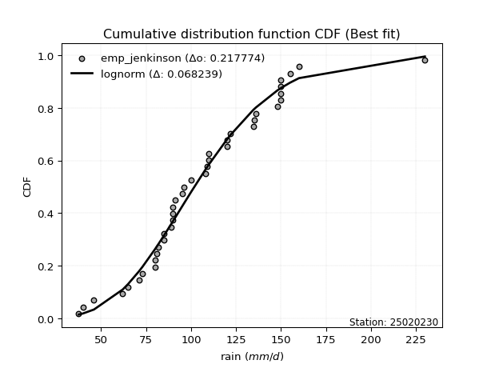</img>

</img>

### Empirical: emp_cunnane

#### 1. Empirical values

|                | 0                   | 1                   | 2                  | 3                   | 4                   | 5                   | 6                   | 7                   | 8                   | 9                   | 10                 | 11                  | 12                 | 13                 | 14                 | 15                  | 16                  | 17                 | 18                 | 19          | 20                 | 21                 | 22                | 23                 | 24                 | 25                 | 26                 | 27                 | 28                 | 29                 | 30                 | 31                 | 32                 | 33                 | 34                 | 35                 | 36                 | 37                 | 38                 |
|:---------------|:--------------------|:--------------------|:-------------------|:--------------------|:--------------------|:--------------------|:--------------------|:--------------------|:--------------------|:--------------------|:-------------------|:--------------------|:-------------------|:-------------------|:-------------------|:--------------------|:--------------------|:-------------------|:-------------------|:------------|:-------------------|:-------------------|:------------------|:-------------------|:-------------------|:-------------------|:-------------------|:-------------------|:-------------------|:-------------------|:-------------------|:-------------------|:-------------------|:-------------------|:-------------------|:-------------------|:-------------------|:-------------------|:-------------------|
| date           | 1996                | 2005                | 1987               | 1992                | 1991                | 1998                | 2012                | 2003                | 2004                | 2018                | 2013               | 1997                | 1989               | 1990               | 1993               | 2006                | 1995                | 2010               | 1988               | 2014        | 2016               | 1980               | 2002              | 1999               | 2011               | 1983               | 2017               | 2000               | 2001               | 1994               | 1986               | 1982               | 2007               | 1981               | 2015               | 2009               | 1984               | 2008               | 1985               |
| x              | 37.52732            | 40.0                | 46.0               | 62.0                | 65.0                | 71.0                | 73.0                | 80.0                | 80.0                | 81.1                | 82.0               | 85.0                | 85.0               | 89.0               | 90.0               | 90.0                | 90.0                | 91.0               | 95.0               | 96.0        | 100.0              | 108.0              | 109.0             | 110.0              | 110.0              | 120.0              | 120.1              | 122.0              | 134.5              | 135.0              | 136.0              | 148.0              | 150.0              | 150.0              | 150.0              | 150.0              | 155.0              | 160.0              | 230.0              |
| m              | 1                   | 2                   | 3                  | 4                   | 5                   | 6                   | 7                   | 8                   | 9                   | 10                  | 11                 | 12                  | 13                 | 14                 | 15                 | 16                  | 17                  | 18                 | 19                 | 20          | 21                 | 22                 | 23                | 24                 | 25                 | 26                 | 27                 | 28                 | 29                 | 30                 | 31                 | 32                 | 33                 | 34                 | 35                 | 36                 | 37                 | 38                 | 39                 |
| empirical_dist | emp_cunnane         | emp_cunnane         | emp_cunnane        | emp_cunnane         | emp_cunnane         | emp_cunnane         | emp_cunnane         | emp_cunnane         | emp_cunnane         | emp_cunnane         | emp_cunnane        | emp_cunnane         | emp_cunnane        | emp_cunnane        | emp_cunnane        | emp_cunnane         | emp_cunnane         | emp_cunnane        | emp_cunnane        | emp_cunnane | emp_cunnane        | emp_cunnane        | emp_cunnane       | emp_cunnane        | emp_cunnane        | emp_cunnane        | emp_cunnane        | emp_cunnane        | emp_cunnane        | emp_cunnane        | emp_cunnane        | emp_cunnane        | emp_cunnane        | emp_cunnane        | emp_cunnane        | emp_cunnane        | emp_cunnane        | emp_cunnane        | emp_cunnane        |
| empirical      | 0.01530612244897959 | 0.04081632653061224 | 0.0663265306122449 | 0.09183673469387754 | 0.11734693877551018 | 0.14285714285714285 | 0.16836734693877548 | 0.19387755102040813 | 0.21938775510204078 | 0.24489795918367344 | 0.2704081632653061 | 0.29591836734693877 | 0.3214285714285714 | 0.346938775510204  | 0.3724489795918367 | 0.39795918367346933 | 0.42346938775510207 | 0.4489795918367347 | 0.4744897959183674 | 0.5         | 0.5255102040816326 | 0.5510204081632653 | 0.576530612244898 | 0.6020408163265306 | 0.6275510204081632 | 0.6530612244897959 | 0.6785714285714286 | 0.7040816326530612 | 0.7295918367346939 | 0.7551020408163265 | 0.7806122448979592 | 0.8061224489795918 | 0.8316326530612245 | 0.8571428571428571 | 0.8826530612244897 | 0.9081632653061225 | 0.9336734693877551 | 0.9591836734693877 | 0.9846938775510203 |
| empirical_tr   | 1.0155440414507773  | 1.0425531914893618  | 1.0710382513661203 | 1.101123595505618   | 1.1329479768786126  | 1.1666666666666665  | 1.2024539877300613  | 1.240506329113924   | 1.2810457516339868  | 1.3243243243243241  | 1.3706293706293706 | 1.4202898550724639  | 1.4736842105263157 | 1.5312499999999998 | 1.5934959349593494 | 1.6610169491525422  | 1.7345132743362834  | 1.814814814814815  | 1.9029126213592233 | 2.0         | 2.10752688172043   | 2.227272727272727  | 2.36144578313253  | 2.5128205128205128 | 2.6849315068493147 | 2.88235294117647   | 3.1111111111111116 | 3.3793103448275863 | 3.6981132075471694 | 4.083333333333332  | 4.558139534883722  | 5.157894736842105  | 5.939393939393939  | 6.999999999999997  | 8.521739130434778  | 10.88888888888889  | 15.076923076923073 | 24.49999999999997  | 65.33333333333303  |

####  2. Parameters & Kolmogorov-Smirnov fit test (sorted by Δ)

|   id | empirical_dist   | p_dist             |     delta |   deltao | eval    |   fit |   n |             loc |           scale | shape                 | shape1                | shape2             | shape3   |   best_fit |   best_fit_sort |
|-----:|:-----------------|:-------------------|----------:|---------:|:--------|------:|----:|----------------:|----------------:|:----------------------|:----------------------|:-------------------|:---------|-----------:|----------------:|
|    0 | emp_cunnane      | invgamma           | 0.0687026 | 0.217774 | Δo > Δ  |     1 |  39 |  -127.184       |  8915.04        | 39.264885803401164    |                       |                    |          |          1 |               1 |
|    1 | emp_cunnane      | alpha              | 0.0693707 | 0.217774 | Δo > Δ  |     1 |  39 |  -243.67        |  3275.81        | 9.481687591916309     |                       |                    |          |          0 |               2 |
|    2 | emp_cunnane      | lognorm            | 0.0696379 | 0.217774 | Δo > Δ  |     1 |  39 |   -70.2523      |   172.057       | 0.21422700262979513   |                       |                    |          |          0 |               3 |
|    3 | emp_cunnane      | fatiguelife        | 0.0705243 | 0.217774 | Δo > Δ  |     1 |  39 |   -70.8952      |   172.72        | 0.21463881727137762   |                       |                    |          |          0 |               4 |
|    4 | emp_cunnane      | genlogistic        | 0.0705249 | 0.217774 | Δo > Δ  |     1 |  39 |    59.8389      |    27.5995      | 3.46822996768894      |                       |                    |          |          0 |               5 |
|    5 | emp_cunnane      | recipinvgauss      | 0.0706036 | 0.217774 | Δo > Δ  |     1 |  39 |   -69.6431      |     7.92805     | 0.04732722966555314   |                       |                    |          |          0 |               6 |
|    6 | emp_cunnane      | invgauss           | 0.0722007 | 0.217774 | Δo > Δ  |     1 |  39 |   -60.6923      |  3126.93        | 0.05329080666089131   |                       |                    |          |          0 |               7 |
|    7 | emp_cunnane      | f                  | 0.0722844 | 0.217774 | Δo > Δ  |     1 |  39 |   -15.4955      |   121.273       | 20.272895908966266    | 10530.135463947896    |                    |          |          0 |               8 |
|    8 | emp_cunnane      | chi2               | 0.0723    | 0.217774 | Δo > Δ  |     1 |  39 |   -15.3408      |     6.00322     | 20.179412499216305    |                       |                    |          |          0 |               9 |
|    9 | emp_cunnane      | erlang             | 0.0723    | 0.217774 | Δo > Δ  |     1 |  39 |   -15.3407      |    12.0065      | 10.089696230161591    |                       |                    |          |          0 |              10 |
|   10 | emp_cunnane      | gamma              | 0.0723    | 0.217774 | Δo > Δ  |     1 |  39 |   -15.3408      |    12.0065      | 10.089697793573393    |                       |                    |          |          0 |              11 |
|   11 | emp_cunnane      | nct                | 0.0729208 | 0.217774 | Δo > Δ  |     1 |  39 |    -0.115389    |    28.7882      | 13.581667670648887    | 3.4711270782563686    |                    |          |          0 |              12 |
|   12 | emp_cunnane      | pearson3           | 0.0748854 | 0.217774 | Δo > Δ  |     1 |  39 |   105.801       |    38.2277      | 0.7120941855529046    |                       |                    |          |          0 |              13 |
|   13 | emp_cunnane      | betaprime          | 0.0758832 | 0.217774 | Δo > Δ  |     1 |  39 |    -7.7074      | 14311.7         | 8.711914272217232     | 1098.2495868443489    |                    |          |          0 |              14 |
|   14 | emp_cunnane      | fisk               | 0.0771502 | 0.217774 | Δo > Δ  |     1 |  39 |   -54.7959      |   156.412       | 7.460631469733795     |                       |                    |          |          0 |              15 |
|   15 | emp_cunnane      | gumbel_r           | 0.0774635 | 0.217774 | Δo > Δ  |     1 |  39 |    88.5962      |    29.806       |                       |                       |                    |          |          0 |              16 |
|   16 | emp_cunnane      | maxwell            | 0.0775718 | 0.217774 | Δo > Δ  |     1 |  39 |    15.217       |    56.7649      |                       |                       |                    |          |          0 |              17 |
|   17 | emp_cunnane      | exponnorm          | 0.0794576 | 0.217774 | Δo > Δ  |     1 |  39 |    78.3708      |    26.7867      | 1.0240107773320781    |                       |                    |          |          0 |              18 |
|   18 | emp_cunnane      | mielke             | 0.0806434 | 0.217774 | Δo > Δ  |     1 |  39 |    -1.45821     |   117.373       | 3.6161644733307794    | 5.86585181901645      |                    |          |          0 |              19 |
|   19 | emp_cunnane      | laplace_asymmetric | 0.0810263 | 0.217774 | Δo > Δ  |     1 |  39 |    85           |    26.1028      | 0.6780162075097738    |                       |                    |          |          0 |              20 |
|   20 | emp_cunnane      | nakagami           | 0.0831484 | 0.217774 | Δo > Δ  |     1 |  39 |    24.4646      |    89.8717      | 1.2137236270696525    |                       |                    |          |          0 |              21 |
|   21 | emp_cunnane      | rayleigh           | 0.0864659 | 0.217774 | Δo > Δ  |     1 |  39 |    32.6688      |    58.3508      |                       |                       |                    |          |          0 |              22 |
|   22 | emp_cunnane      | invweibull         | 0.086881  | 0.217774 | Δo > Δ  |     1 |  39 |    -3.55869e+07 |     3.5587e+07  | 1087666.0794998629    |                       |                    |          |          0 |              23 |
|   23 | emp_cunnane      | rice               | 0.0873749 | 0.217774 | Δo > Δ  |     1 |  39 |    28.8446      |    49.4668      | 1.0086920154102033    |                       |                    |          |          0 |              24 |
|   24 | emp_cunnane      | weibull_min        | 0.0874591 | 0.217774 | Δo > Δ  |     1 |  39 |    27.6997      |    88.016       | 2.127819115649472     |                       |                    |          |          0 |              25 |
|   25 | emp_cunnane      | dgamma             | 0.0876319 | 0.217774 | Δo > Δ  |     1 |  39 |   103.492       |    16.7034      | 1.8105480298115495    |                       |                    |          |          0 |              26 |
|   26 | emp_cunnane      | moyal              | 0.088388  | 0.217774 | Δo > Δ  |     1 |  39 |    83.9396      |    17.2085      |                       |                       |                    |          |          0 |              27 |
|   27 | emp_cunnane      | halflogistic       | 0.0960071 | 0.217774 | Δo > Δ  |     1 |  39 |    60.4919      |    32.6834      |                       |                       |                    |          |          0 |              28 |
|   28 | emp_cunnane      | johnsonsu          | 0.100253  | 0.217774 | Δo > Δ  |     1 |  39 |     2.58281e+08 |     6.77349e+08 | 7002443.376614271     | 18792021.363224953    |                    |          |          0 |              29 |
|   29 | emp_cunnane      | loggamma           | 0.100465  | 0.217774 | Δo > Δ  |     1 |  39 | -9785.94        |  1380.26        | 1295.7067945076137    |                       |                    |          |          0 |              30 |
|   30 | emp_cunnane      | t                  | 0.101031  | 0.217774 | Δo > Δ  |     1 |  39 |   105.908       |    38.2266      | 21.67178402806863     |                       |                    |          |          0 |              31 |
|   31 | emp_cunnane      | crystalball        | 0.10117   | 0.217774 | Δo > Δ  |     1 |  39 |   105.801       |    38.2277      | 7605.535442412194     | 6104.386628798199     |                    |          |          0 |              32 |
|   32 | emp_cunnane      | norm               | 0.10117   | 0.217774 | Δo > Δ  |     1 |  39 |   105.801       |    38.2277      |                       |                       |                    |          |          0 |              33 |
|   33 | emp_cunnane      | truncnorm          | 0.10117   | 0.217774 | Δo > Δ  |     1 |  39 |   105.801       |    38.2277      | -761.4622798670403    | 7.503505991779575     |                    |          |          0 |              34 |
|   34 | emp_cunnane      | gompertz           | 0.102874  | 0.217774 | Δo > Δ  |     1 |  39 |    37.5226      |    71.8562      | 0.43675042205089065   |                       |                    |          |          0 |              35 |
|   35 | emp_cunnane      | kstwobign          | 0.103624  | 0.217774 | Δo > Δ  |     1 |  39 |   -31.1406      |   157.593       |                       |                       |                    |          |          0 |              36 |
|   36 | emp_cunnane      | halfnorm           | 0.110352  | 0.217774 | Δo > Δ  |     1 |  39 |    55.2021      |    63.4159      |                       |                       |                    |          |          0 |              37 |
|   37 | emp_cunnane      | zzloggumbel        | 0.112139  | 0.217774 | Δo > Δ  |     1 |  39 |     4.43219     |     0.296828    | 0.5430175598423775    | 1.1389553227283298    |                    |          |          0 |              38 |
|   38 | emp_cunnane      | logistic           | 0.117666  | 0.217774 | Δo > Δ  |     1 |  39 |   105.801       |    21.0761      |                       |                       |                    |          |          0 |              39 |
|   39 | emp_cunnane      | hypsecant          | 0.131629  | 0.217774 | Δo > Δ  |     1 |  39 |   105.801       |    24.3365      |                       |                       |                    |          |          0 |              40 |
|   40 | emp_cunnane      | geninvgauss        | 0.140993  | 0.217774 | Δo > Δ  |     1 |  39 |    30.7704      |     0.00466425  | 2.601803956249613     | 0.0003221294883634945 |                    |          |          0 |              41 |
|   41 | emp_cunnane      | wald               | 0.147972  | 0.217774 | Δo > Δ  |     1 |  39 |    67.573       |    38.2277      |                       |                       |                    |          |          0 |              42 |
|   42 | emp_cunnane      | laplace            | 0.159795  | 0.217774 | Δo > Δ  |     1 |  39 |   105.801       |    27.0311      |                       |                       |                    |          |          0 |              43 |
|   43 | emp_cunnane      | gumbel_l           | 0.167561  | 0.217774 | Δo > Δ  |     1 |  39 |   123.005       |    29.806       |                       |                       |                    |          |          0 |              44 |
|   44 | emp_cunnane      | gibrat             | 0.17096   | 0.217774 | Δo > Δ  |     1 |  39 |    76.6378      |    17.6882      |                       |                       |                    |          |          0 |              45 |
|   45 | emp_cunnane      | zzgumbel           | 0.253364  | 0.217774 | Δo <= Δ |     0 |  39 |   105.783       |    30.1957      | 0.5430175598423775    | 1.1389553227283298    |                    |          |          0 |              46 |
|   46 | emp_cunnane      | genexpon           | 0.268327  | 0.217774 | Δo <= Δ |     0 |  39 |    37.5273      |     2.24278     | 0.029546930847224324  | 0.003441345619576359  | 0.7750570077294003 |          |          0 |              47 |
|   47 | emp_cunnane      | expon              | 0.269305  | 0.217774 | Δo <= Δ |     0 |  39 |    37.5273      |    68.2734      |                       |                       |                    |          |          0 |              48 |
|   48 | emp_cunnane      | pareto             | 0.269305  | 0.217774 | Δo <= Δ |     0 |  39 |    -2.14748e+09 |     2.14748e+09 | 31454187.1816981      |                       |                    |          |          0 |              49 |
|   49 | emp_cunnane      | ncf                | 0.305223  | 0.217774 | Δo <= Δ |     0 |  39 |    -0.0782662   |     7.04566e-06 | 5.132450078952019e-07 | 13.81406420736777     | 6.710701038988491  |          |          0 |              50 |

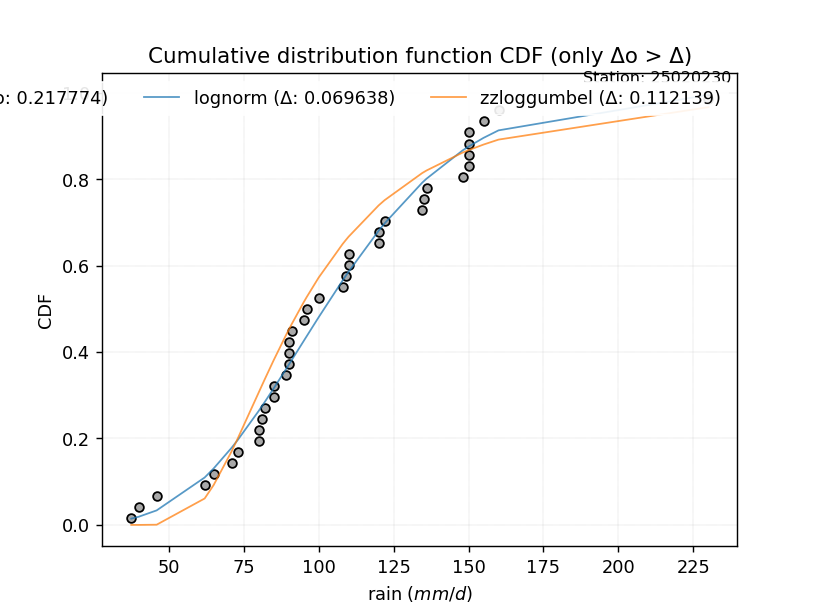</img>

#### 3. Best fit for

|   id |   station | empirical_dist   | p_dist   |     delta |   deltao | eval   |   fit |   n |      loc |   scale |   shape | shape1   | shape2   | shape3   |   best_fit |   best_fit_sort |
|-----:|----------:|:-----------------|:---------|----------:|---------:|:-------|------:|----:|---------:|--------:|--------:|:---------|:---------|:---------|-----------:|----------------:|
|    0 |  25020230 | emp_cunnane      | invgamma | 0.0687026 | 0.217774 | Δo > Δ |     1 |  39 | -127.184 | 8915.04 | 39.2649 |          |          |          |          1 |               1 |

</img>

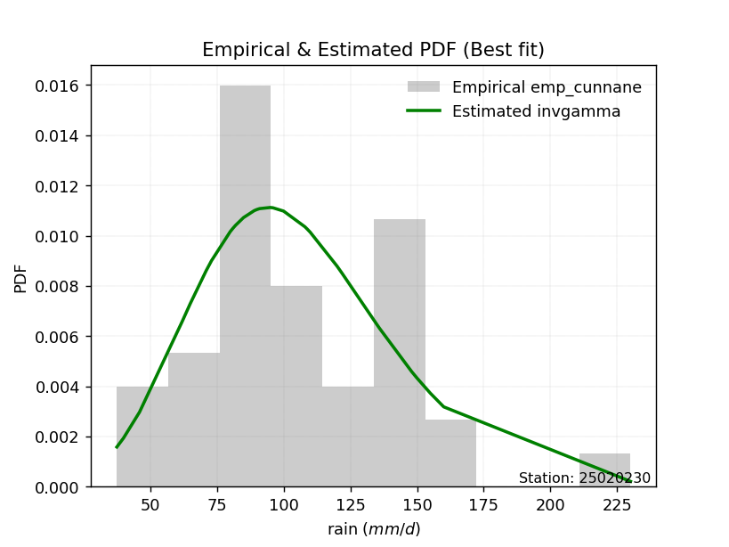</img>

### Empirical: emp_adamowski

#### 1. Empirical values

|                | 0                  | 1                   | 2                   | 3                  | 4                   | 5                   | 6                   | 7                  | 8                   | 9                  | 10                 | 11                 | 12                 | 13                  | 14                  | 15                 | 16                 | 17                  | 18                  | 19            | 20                 | 21                 | 22                 | 23                 | 24                 | 25                 | 26                 | 27                 | 28                 | 29                 | 30                 | 31                 | 32                 | 33                 | 34                | 35                 | 36                 | 37                 | 38                 |
|:---------------|:-------------------|:--------------------|:--------------------|:-------------------|:--------------------|:--------------------|:--------------------|:-------------------|:--------------------|:-------------------|:-------------------|:-------------------|:-------------------|:--------------------|:--------------------|:-------------------|:-------------------|:--------------------|:--------------------|:--------------|:-------------------|:-------------------|:-------------------|:-------------------|:-------------------|:-------------------|:-------------------|:-------------------|:-------------------|:-------------------|:-------------------|:-------------------|:-------------------|:-------------------|:------------------|:-------------------|:-------------------|:-------------------|:-------------------|
| date           | 1996               | 2005                | 1987                | 1992               | 1991                | 1998                | 2012                | 2003               | 2004                | 2018               | 2013               | 1997               | 1989               | 1990                | 1993                | 2006               | 1995               | 2010                | 1988                | 2014          | 2016               | 1980               | 2002               | 1999               | 2011               | 1983               | 2017               | 2000               | 2001               | 1994               | 1986               | 1982               | 2007               | 1981               | 2015              | 2009               | 1984               | 2008               | 1985               |
| x              | 37.52732           | 40.0                | 46.0                | 62.0               | 65.0                | 71.0                | 73.0                | 80.0               | 80.0                | 81.1               | 82.0               | 85.0               | 85.0               | 89.0                | 90.0                | 90.0               | 90.0               | 91.0                | 95.0                | 96.0          | 100.0              | 108.0              | 109.0              | 110.0              | 110.0              | 120.0              | 120.1              | 122.0              | 134.5              | 135.0              | 136.0              | 148.0              | 150.0              | 150.0              | 150.0             | 150.0              | 155.0              | 160.0              | 230.0              |
| m              | 1                  | 2                   | 3                   | 4                  | 5                   | 6                   | 7                   | 8                  | 9                   | 10                 | 11                 | 12                 | 13                 | 14                  | 15                  | 16                 | 17                 | 18                  | 19                  | 20            | 21                 | 22                 | 23                 | 24                 | 25                 | 26                 | 27                 | 28                 | 29                 | 30                 | 31                 | 32                 | 33                 | 34                 | 35                | 36                 | 37                 | 38                 | 39                 |
| empirical_dist | emp_adamowski      | emp_adamowski       | emp_adamowski       | emp_adamowski      | emp_adamowski       | emp_adamowski       | emp_adamowski       | emp_adamowski      | emp_adamowski       | emp_adamowski      | emp_adamowski      | emp_adamowski      | emp_adamowski      | emp_adamowski       | emp_adamowski       | emp_adamowski      | emp_adamowski      | emp_adamowski       | emp_adamowski       | emp_adamowski | emp_adamowski      | emp_adamowski      | emp_adamowski      | emp_adamowski      | emp_adamowski      | emp_adamowski      | emp_adamowski      | emp_adamowski      | emp_adamowski      | emp_adamowski      | emp_adamowski      | emp_adamowski      | emp_adamowski      | emp_adamowski      | emp_adamowski     | emp_adamowski      | emp_adamowski      | emp_adamowski      | emp_adamowski      |
| empirical      | 0.0189873417721519 | 0.04430379746835443 | 0.06962025316455696 | 0.0949367088607595 | 0.12025316455696203 | 0.14556962025316456 | 0.17088607594936708 | 0.1962025316455696 | 0.22151898734177214 | 0.2468354430379747 | 0.2721518987341772 | 0.2974683544303797 | 0.3227848101265823 | 0.34810126582278483 | 0.37341772151898733 | 0.3987341772151899 | 0.4240506329113924 | 0.44936708860759494 | 0.47468354430379744 | 0.5           | 0.5253164556962026 | 0.5506329113924051 | 0.5759493670886076 | 0.6012658227848101 | 0.6265822784810127 | 0.6518987341772152 | 0.6772151898734177 | 0.7025316455696202 | 0.7278481012658228 | 0.7531645569620253 | 0.7784810126582279 | 0.8037974683544303 | 0.8291139240506329 | 0.8544303797468354 | 0.879746835443038 | 0.9050632911392406 | 0.930379746835443  | 0.9556962025316456 | 0.9810126582278481 |
| empirical_tr   | 1.0193548387096774 | 1.0463576158940397  | 1.0748299319727892  | 1.104895104895105  | 1.1366906474820144  | 1.1703703703703703  | 1.2061068702290076  | 1.2440944881889764 | 1.2845528455284552  | 1.3277310924369747 | 1.373913043478261  | 1.4234234234234235 | 1.4766355140186915 | 1.533980582524272   | 1.595959595959596   | 1.6631578947368422 | 1.7362637362637363 | 1.8160919540229883  | 1.9036144578313252  | 2.0           | 2.106666666666667  | 2.2253521126760565 | 2.3582089552238803 | 2.507936507936508  | 2.6779661016949152 | 2.872727272727273  | 3.098039215686274  | 3.361702127659574  | 3.6744186046511627 | 4.051282051282052  | 4.514285714285715  | 5.096774193548386  | 5.851851851851851  | 6.869565217391305  | 8.315789473684212 | 10.533333333333339 | 14.363636363636356 | 22.571428571428566 | 52.66666666666669  |

####  2. Parameters & Kolmogorov-Smirnov fit test (sorted by Δ)

|   id | empirical_dist   | p_dist             |     delta |   deltao | eval    |   fit |   n |             loc |           scale | shape                 | shape1                | shape2             | shape3   |   best_fit |   best_fit_sort |
|-----:|:-----------------|:-------------------|----------:|---------:|:--------|------:|----:|----------------:|----------------:|:----------------------|:----------------------|:-------------------|:---------|-----------:|----------------:|
|    0 | emp_adamowski    | fatiguelife        | 0.0681993 | 0.217774 | Δo > Δ  |     1 |  39 |   -70.8952      |   172.72        | 0.21463881727137762   |                       |                    |          |          1 |               1 |
|    1 | emp_adamowski    | recipinvgauss      | 0.0682786 | 0.217774 | Δo > Δ  |     1 |  39 |   -69.6431      |     7.92805     | 0.04732722966555314   |                       |                    |          |          0 |               2 |
|    2 | emp_adamowski    | lognorm            | 0.0683209 | 0.217774 | Δo > Δ  |     1 |  39 |   -70.2523      |   172.057       | 0.21422700262979513   |                       |                    |          |          0 |               3 |
|    3 | emp_adamowski    | invgamma           | 0.0689044 | 0.217774 | Δo > Δ  |     1 |  39 |  -127.184       |  8915.04        | 39.264885803401164    |                       |                    |          |          0 |               4 |
|    4 | emp_adamowski    | alpha              | 0.0697582 | 0.217774 | Δo > Δ  |     1 |  39 |  -243.67        |  3275.81        | 9.481687591916309     |                       |                    |          |          0 |               5 |
|    5 | emp_adamowski    | invgauss           | 0.0698757 | 0.217774 | Δo > Δ  |     1 |  39 |   -60.6923      |  3126.93        | 0.05329080666089131   |                       |                    |          |          0 |               6 |
|    6 | emp_adamowski    | f                  | 0.0699595 | 0.217774 | Δo > Δ  |     1 |  39 |   -15.4955      |   121.273       | 20.272895908966266    | 10530.135463947896    |                    |          |          0 |               7 |
|    7 | emp_adamowski    | chi2               | 0.069975  | 0.217774 | Δo > Δ  |     1 |  39 |   -15.3408      |     6.00322     | 20.179412499216305    |                       |                    |          |          0 |               8 |
|    8 | emp_adamowski    | erlang             | 0.069975  | 0.217774 | Δo > Δ  |     1 |  39 |   -15.3407      |    12.0065      | 10.089696230161591    |                       |                    |          |          0 |               9 |
|    9 | emp_adamowski    | gamma              | 0.069975  | 0.217774 | Δo > Δ  |     1 |  39 |   -15.3408      |    12.0065      | 10.089697793573393    |                       |                    |          |          0 |              10 |
|   10 | emp_adamowski    | genlogistic        | 0.0710983 | 0.217774 | Δo > Δ  |     1 |  39 |    59.8389      |    27.5995      | 3.46822996768894      |                       |                    |          |          0 |              11 |
|   11 | emp_adamowski    | pearson3           | 0.0725604 | 0.217774 | Δo > Δ  |     1 |  39 |   105.801       |    38.2277      | 0.7120941855529046    |                       |                    |          |          0 |              12 |
|   12 | emp_adamowski    | nct                | 0.0733083 | 0.217774 | Δo > Δ  |     1 |  39 |    -0.115389    |    28.7882      | 13.581667670648887    | 3.4711270782563686    |                    |          |          0 |              13 |
|   13 | emp_adamowski    | betaprime          | 0.0735582 | 0.217774 | Δo > Δ  |     1 |  39 |    -7.7074      | 14311.7         | 8.711914272217232     | 1098.2495868443489    |                    |          |          0 |              14 |
|   14 | emp_adamowski    | maxwell            | 0.0752468 | 0.217774 | Δo > Δ  |     1 |  39 |    15.217       |    56.7649      |                       |                       |                    |          |          0 |              15 |
|   15 | emp_adamowski    | fisk               | 0.0780575 | 0.217774 | Δo > Δ  |     1 |  39 |   -54.7959      |   156.412       | 7.460631469733795     |                       |                    |          |          0 |              16 |
|   16 | emp_adamowski    | gumbel_r           | 0.0792072 | 0.217774 | Δo > Δ  |     1 |  39 |    88.5962      |    29.806       |                       |                       |                    |          |          0 |              17 |
|   17 | emp_adamowski    | exponnorm          | 0.0798451 | 0.217774 | Δo > Δ  |     1 |  39 |    78.3708      |    26.7867      | 1.0240107773320781    |                       |                    |          |          0 |              18 |
|   18 | emp_adamowski    | nakagami           | 0.0808234 | 0.217774 | Δo > Δ  |     1 |  39 |    24.4646      |    89.8717      | 1.2137236270696525    |                       |                    |          |          0 |              19 |
|   19 | emp_adamowski    | mielke             | 0.0810309 | 0.217774 | Δo > Δ  |     1 |  39 |    -1.45821     |   117.373       | 3.6161644733307794    | 5.86585181901645      |                    |          |          0 |              20 |
|   20 | emp_adamowski    | laplace_asymmetric | 0.08277   | 0.217774 | Δo > Δ  |     1 |  39 |    85           |    26.1028      | 0.6780162075097738    |                       |                    |          |          0 |              21 |
|   21 | emp_adamowski    | rayleigh           | 0.0841409 | 0.217774 | Δo > Δ  |     1 |  39 |    32.6688      |    58.3508      |                       |                       |                    |          |          0 |              22 |
|   22 | emp_adamowski    | invweibull         | 0.0845561 | 0.217774 | Δo > Δ  |     1 |  39 |    -3.55869e+07 |     3.5587e+07  | 1087666.0794998629    |                       |                    |          |          0 |              23 |
|   23 | emp_adamowski    | rice               | 0.0850499 | 0.217774 | Δo > Δ  |     1 |  39 |    28.8446      |    49.4668      | 1.0086920154102033    |                       |                    |          |          0 |              24 |
|   24 | emp_adamowski    | weibull_min        | 0.0851341 | 0.217774 | Δo > Δ  |     1 |  39 |    27.6997      |    88.016       | 2.127819115649472     |                       |                    |          |          0 |              25 |
|   25 | emp_adamowski    | dgamma             | 0.0899568 | 0.217774 | Δo > Δ  |     1 |  39 |   103.492       |    16.7034      | 1.8105480298115495    |                       |                    |          |          0 |              26 |
|   26 | emp_adamowski    | moyal              | 0.0901318 | 0.217774 | Δo > Δ  |     1 |  39 |    83.9396      |    17.2085      |                       |                       |                    |          |          0 |              27 |
|   27 | emp_adamowski    | halflogistic       | 0.0936821 | 0.217774 | Δo > Δ  |     1 |  39 |    60.4919      |    32.6834      |                       |                       |                    |          |          0 |              28 |
|   28 | emp_adamowski    | johnsonsu          | 0.100253  | 0.217774 | Δo > Δ  |     1 |  39 |     2.58281e+08 |     6.77349e+08 | 7002443.376614271     | 18792021.363224953    |                    |          |          0 |              29 |
|   29 | emp_adamowski    | loggamma           | 0.100465  | 0.217774 | Δo > Δ  |     1 |  39 | -9785.94        |  1380.26        | 1295.7067945076137    |                       |                    |          |          0 |              30 |
|   30 | emp_adamowski    | gompertz           | 0.100549  | 0.217774 | Δo > Δ  |     1 |  39 |    37.5226      |    71.8562      | 0.43675042205089065   |                       |                    |          |          0 |              31 |
|   31 | emp_adamowski    | t                  | 0.101031  | 0.217774 | Δo > Δ  |     1 |  39 |   105.908       |    38.2266      | 21.67178402806863     |                       |                    |          |          0 |              32 |
|   32 | emp_adamowski    | crystalball        | 0.10117   | 0.217774 | Δo > Δ  |     1 |  39 |   105.801       |    38.2277      | 7605.535442412194     | 6104.386628798199     |                    |          |          0 |              33 |
|   33 | emp_adamowski    | norm               | 0.10117   | 0.217774 | Δo > Δ  |     1 |  39 |   105.801       |    38.2277      |                       |                       |                    |          |          0 |              34 |
|   34 | emp_adamowski    | truncnorm          | 0.10117   | 0.217774 | Δo > Δ  |     1 |  39 |   105.801       |    38.2277      | -761.4622798670403    | 7.503505991779575     |                    |          |          0 |              35 |
|   35 | emp_adamowski    | kstwobign          | 0.101299  | 0.217774 | Δo > Δ  |     1 |  39 |   -31.1406      |   157.593       |                       |                       |                    |          |          0 |              36 |
|   36 | emp_adamowski    | halfnorm           | 0.108027  | 0.217774 | Δo > Δ  |     1 |  39 |    55.2021      |    63.4159      |                       |                       |                    |          |          0 |              37 |
|   37 | emp_adamowski    | zzloggumbel        | 0.109814  | 0.217774 | Δo > Δ  |     1 |  39 |     4.43219     |     0.296828    | 0.5430175598423775    | 1.1389553227283298    |                    |          |          0 |              38 |
|   38 | emp_adamowski    | logistic           | 0.118054  | 0.217774 | Δo > Δ  |     1 |  39 |   105.801       |    21.0761      |                       |                       |                    |          |          0 |              39 |
|   39 | emp_adamowski    | hypsecant          | 0.132017  | 0.217774 | Δo > Δ  |     1 |  39 |   105.801       |    24.3365      |                       |                       |                    |          |          0 |              40 |
|   40 | emp_adamowski    | geninvgauss        | 0.138668  | 0.217774 | Δo > Δ  |     1 |  39 |    30.7704      |     0.00466425  | 2.601803956249613     | 0.0003221294883634945 |                    |          |          0 |              41 |
|   41 | emp_adamowski    | wald               | 0.150491  | 0.217774 | Δo > Δ  |     1 |  39 |    67.573       |    38.2277      |                       |                       |                    |          |          0 |              42 |
|   42 | emp_adamowski    | laplace            | 0.160183  | 0.217774 | Δo > Δ  |     1 |  39 |   105.801       |    27.0311      |                       |                       |                    |          |          0 |              43 |
|   43 | emp_adamowski    | gumbel_l           | 0.167561  | 0.217774 | Δo > Δ  |     1 |  39 |   123.005       |    29.806       |                       |                       |                    |          |          0 |              44 |
|   44 | emp_adamowski    | gibrat             | 0.173091  | 0.217774 | Δo > Δ  |     1 |  39 |    76.6378      |    17.6882      |                       |                       |                    |          |          0 |              45 |
|   45 | emp_adamowski    | zzgumbel           | 0.253752  | 0.217774 | Δo <= Δ |     0 |  39 |   105.783       |    30.1957      | 0.5430175598423775    | 1.1389553227283298    |                    |          |          0 |              46 |
|   46 | emp_adamowski    | genexpon           | 0.266002  | 0.217774 | Δo <= Δ |     0 |  39 |    37.5273      |     2.24278     | 0.029546930847224324  | 0.003441345619576359  | 0.7750570077294003 |          |          0 |              47 |
|   47 | emp_adamowski    | expon              | 0.26698   | 0.217774 | Δo <= Δ |     0 |  39 |    37.5273      |    68.2734      |                       |                       |                    |          |          0 |              48 |
|   48 | emp_adamowski    | pareto             | 0.26698   | 0.217774 | Δo <= Δ |     0 |  39 |    -2.14748e+09 |     2.14748e+09 | 31454187.1816981      |                       |                    |          |          0 |              49 |
|   49 | emp_adamowski    | ncf                | 0.302503  | 0.217774 | Δo <= Δ |     0 |  39 |    -0.0782662   |     7.04566e-06 | 5.132450078952019e-07 | 13.81406420736777     | 6.710701038988491  |          |          0 |              50 |

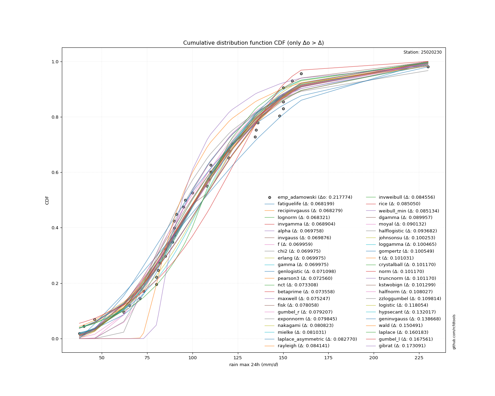</img>

#### 3. Best fit for

|   id |   station | empirical_dist   | p_dist      |     delta |   deltao | eval   |   fit |   n |      loc |   scale |    shape | shape1   | shape2   | shape3   |   best_fit |   best_fit_sort |
|-----:|----------:|:-----------------|:------------|----------:|---------:|:-------|------:|----:|---------:|--------:|---------:|:---------|:---------|:---------|-----------:|----------------:|
|    0 |  25020230 | emp_adamowski    | fatiguelife | 0.0681993 | 0.217774 | Δo > Δ |     1 |  39 | -70.8952 |  172.72 | 0.214639 |          |          |          |          1 |               1 |

</img>

</img>

## D. Best CDF fit & Estimate extreme values for specific return periods - Tr

### Best fit (ordered by delta)

|   id |   station | empirical_dist   | p_dist      |     delta |   deltao | eval   |   fit |   n |       loc |    scale | shape               | shape1   | shape2   | shape3   |   best_fit |   best_fit_sort |
|-----:|----------:|:-----------------|:------------|----------:|---------:|:-------|------:|----:|----------:|---------:|:--------------------|:---------|:---------|:---------|-----------:|----------------:|
|    0 |  25020230 | emp_california   | gumbel_r    | 0.0640216 | 0.217774 | Δo > Δ |     1 |  39 |   88.5962 |   29.806 |                     |          |          |          |          1 |               1 |
|    1 |  25020230 | emp_weibull      | invgauss    | 0.0662628 | 0.217774 | Δo > Δ |     1 |  39 |  -60.6923 | 3126.93  | 0.05329080666089131 |          |          |          |          1 |               2 |
|    2 |  25020230 | emp_chegodayev   | lognorm     | 0.0681924 | 0.217774 | Δo > Δ |     1 |  39 |  -70.2523 |  172.057 | 0.21422700262979513 |          |          |          |          1 |               3 |
|    3 |  25020230 | emp_adamowski    | fatiguelife | 0.0681993 | 0.217774 | Δo > Δ |     1 |  39 |  -70.8952 |  172.72  | 0.21463881727137762 |          |          |          |          1 |               4 |
|    4 |  25020230 | emp_beard        | lognorm     | 0.0682386 | 0.217774 | Δo > Δ |     1 |  39 |  -70.2523 |  172.057 | 0.21422700262979513 |          |          |          |          1 |               5 |
|    5 |  25020230 | emp_jenkinson    | lognorm     | 0.0682386 | 0.217774 | Δo > Δ |     1 |  39 |  -70.2523 |  172.057 | 0.21422700262979513 |          |          |          |          1 |               6 |
|    6 |  25020230 | emp_blom         | invgamma    | 0.0685819 | 0.217774 | Δo > Δ |     1 |  39 | -127.184  | 8915.04  | 39.264885803401164  |          |          |          |          1 |               7 |
|    7 |  25020230 | emp_tukey        | lognorm     | 0.0686002 | 0.217774 | Δo > Δ |     1 |  39 |  -70.2523 |  172.057 | 0.21422700262979513 |          |          |          |          1 |               8 |
|    8 |  25020230 | emp_cunnane      | invgamma    | 0.0687026 | 0.217774 | Δo > Δ |     1 |  39 | -127.184  | 8915.04  | 39.264885803401164  |          |          |          |          1 |               9 |
|    9 |  25020230 | emp_hazen        | alpha       | 0.069109  | 0.217774 | Δo > Δ |     1 |  39 | -243.67   | 3275.81  | 9.481687591916309   |          |          |          |          1 |              10 |
|   10 |  25020230 | emp_gringorten   | alpha       | 0.0692663 | 0.217774 | Δo > Δ |     1 |  39 | -243.67   | 3275.81  | 9.481687591916309   |          |          |          |          1 |              11 |

### Extreme values

|   id |      tr |   prob_l |     prob_g |   alpha |   betaprime |    chi2 |   crystalball |   dgamma |   erlang |    expon |   exponnorm |       f |   fatiguelife |    fisk |   gamma |   genexpon |   geninvgauss |   genlogistic |   gibrat |   gompertz |   gumbel_l |   gumbel_r |   halflogistic |   halfnorm |   hypsecant |   invgamma |   invgauss |   invweibull |   johnsonsu |   kstwobign |   laplace |   laplace_asymmetric |   loggamma |   logistic |   lognorm |   maxwell |   mielke |   moyal |   nakagami |      ncf |     nct |    norm |   pareto |   pearson3 |   rayleigh |   recipinvgauss |    rice |       t |   truncnorm |     wald |   weibull_min |   zzgumbel |   zzloggumbel |   station |   n |   risk_rate |
|-----:|--------:|---------:|-----------:|--------:|------------:|--------:|--------------:|---------:|---------:|---------:|------------:|--------:|--------------:|--------:|--------:|-----------:|--------------:|--------------:|---------:|-----------:|-----------:|-----------:|---------------:|-----------:|------------:|-----------:|-----------:|-------------:|------------:|------------:|----------:|---------------------:|-----------:|-----------:|----------:|----------:|---------:|--------:|-----------:|---------:|--------:|--------:|---------:|-----------:|-----------:|----------------:|--------:|--------:|------------:|---------:|--------------:|-----------:|--------------:|----------:|----:|------------:|
|    0 |    2    | 0.5      | 0.5        | 101.819 |     101.541 | 101.823 |       105.801 |  103.492 |  101.823 |  84.8508 |     102.315 | 101.821 |       101.824 | 101.616 | 101.823 |    84.9543 |       96.7136 |       101.475 |  94.326  |    105.823 |    112.081 |    99.5205 |        96.3983 |    97.9755 |     105.801 |    101.805 |    101.637 |      99.8188 |     105.798 |     99.2793 |   105.801 |              97.1237 |    105.773 |    105.801 |   101.804 |   102.531 |  102.153 |  97.493 |    101.913 |  80.7617 | 101.874 | 105.801 |  84.8508 |    101.299 |    101.372 |         101.822 | 102.086 | 105.908 |     105.801 |  93.4089 |       101.789 |    116.85  |       93.7828 |  25020230 |  39 |    0.75     |
|    1 |    2.33 | 0.570815 | 0.429185   | 108.446 |     108.419 | 108.624 |       112.622 |  112.67  |  108.624 |  95.2776 |     108.623 | 108.622 |       108.568 | 107.711 | 108.624 |    95.3373 |      104.721  |       107.871 |  97.7816 |    114.933 |    118.016 |   105.842  |       102.897  |   105.338  |     111.26  |    108.476 |    108.418 |     106.758  |     112.682 |    106.642  |   109.929 |             103.003  |    112.611 |    111.811 |   108.509 |   109.619 |  108.288 | 103.477 |    109.075 |  95.4275 | 108.335 | 112.622 |  95.2776 |    108.097 |    108.564 |         108.567 | 109.406 | 112.811 |     112.622 |  97.882  |       109.057 |    123.254 |       99.8762 |  25020230 |  39 |    0.729209 |
|    2 |    5    | 0.8      | 0.2        | 135.472 |     136.51  | 136.187 |       137.974 |  133.808 |  136.187 | 147.409  |     134.323 | 136.183 |       135.97  | 133.555 | 136.187 |   147.25   |      140.088  |       134.668 | 117.677  |    148.495 |    137.189 |   133.303  |       132.305  |   136.473  |     133.159 |    135.659 |    136.167 |     136.903  |     138.265 |    137.917  |   130.569 |             132.4    |    137.923 |    135.018 |   135.798 |   137.514 |  133.75  | 131.194 |    137.491 | 166.102  | 134.839 | 137.974 | 147.409  |    135.956 |    137.357 |         135.975 | 138.038 | 138.726 |     137.974 | 122.922  |       137.775 |    151.074 |      131.291  |  25020230 |  39 |    0.67232  |
|    3 |   10    | 0.9      | 0.1        | 155.813 |     157.425 | 156.521 |       154.792 |  149.3   |  156.521 | 194.733  |     154.366 | 156.518 |       156.316 | 155.182 | 156.521 |   194.375  |      168.709  |       155.852 | 140.355  |    169.458 |    147.864 |   155.671  |       156.726  |   159.512  |     150.646 |    156.023 |    156.947 |     161.456  |     155.236 |    161.729  |   149.306 |             159.085  |    154.63  |    152.11  |   156.162 |   157.145 |  154.839 | 155.326 |    157.616 | 231.378  | 155.151 | 154.792 | 194.733  |    156.774 |    157.888 |         156.322 | 157.889 | 156.438 |     154.792 | 149.496  |       157.953 |    173.734 |      164.048  |  25020230 |  39 |    0.651322 |
|    4 |   15    | 0.933333 | 0.0666667  | 166.802 |     168.565 | 167.296 |       163.184 |  157.82  |  167.296 | 222.415  |     165.653 | 167.296 |       167.155 | 167.993 | 167.296 |   221.942  |      184.605  |       167.682 | 155.997  |    179.377 |    152.699 |   168.29   |       170.546  |   171.501  |     160.626 |    166.967 |    168.073 |     175.309  |     163.704 |    174.371  |   160.266 |             174.695  |    162.941 |    161.422 |   167.065 |   167.218 |  167.404 | 169.332 |    167.963 | 271.25   | 166.311 | 163.184 | 222.415  |    167.882 |    168.466 |         167.161 | 167.965 | 165.527 |     163.184 | 166.561  |       168.271 |    186.518 |      186.016  |  25020230 |  39 |    0.644736 |
|    5 |   20    | 0.95     | 0.05       | 174.332 |     176.119 | 174.583 |       168.68  |  163.713 |  174.583 | 242.056  |     173.59  | 174.585 |       174.51  | 177.301 | 174.583 |   241.5    |      195.612  |       175.934 | 168.267  |    185.667 |    155.708 |   177.126  |       180.229  |   179.495  |     167.666 |    174.438 |    175.642 |     185.008  |     169.25  |    182.886  |   168.042 |             185.77   |    168.375 |    167.858 |   174.488 |   173.902 |  176.599 | 179.25  |    174.836 | 300.527  | 174.043 | 168.68  | 242.056  |    175.42  |    175.497 |         174.515 | 174.612 | 171.592 |     168.68  | 179.277  |       175.101 |    195.47  |      203.126  |  25020230 |  39 |    0.641514 |
|    6 |   25    | 0.96     | 0.04       | 180.054 |     181.812 | 180.065 |       172.725 |  168.216 |  180.065 | 257.291  |     179.728 | 180.069 |       180.056 | 184.684 | 180.065 |   256.671  |      204.02   |       182.278 | 178.496  |    190.193 |    157.849 |   183.932  |       187.69   |   185.442  |     173.115 |    180.099 |    181.36  |     192.479  |     173.333 |    189.265  |   174.074 |             194.361  |    172.371 |    172.782 |   180.1   |   178.865 |  183.939 | 186.938 |    179.94  | 323.869  | 179.968 | 172.725 | 257.291  |    181.104 |    180.721 |         180.06  | 179.527 | 176.121 |     172.725 | 189.463  |       180.163 |    202.365 |      217.371  |  25020230 |  39 |    0.639603 |
|    7 |   50    | 0.98     | 0.02       | 197.343 |     198.742 | 196.319 |       184.311 |  181.911 |  196.319 | 304.614  |     198.755 | 196.331 |       196.57  | 208.727 | 196.319 |   303.796  |      229.551  |       201.774 | 214.554  |    202.669 |    163.662 |   204.898  |       210.676  |   202.73   |     190.008 |    197.1   |    198.436 |     215.494  |     185.024 |    207.995  |   192.81  |             221.047  |    183.791 |    187.825 |   196.893 |   193.258 |  208.16  | 210.805 |    194.751 | 400.35   | 198.139 | 184.311 | 304.614  |    198.02  |    195.885 |         196.571 | 193.689 | 189.432 |     184.311 | 222.719  |       194.797 |    223.604 |      267.841  |  25020230 |  39 |    0.63583  |
|    8 |   75    | 0.986667 | 0.0133333  | 207.213 |     208.214 | 205.384 |       190.527 |  189.762 |  205.384 | 332.297  |     209.878 | 205.401 |       205.826 | 223.698 | 205.384 |   331.363  |      244.15   |       213.085 | 238.908  |    209.074 |    166.602 |   217.084  |       224.038  |   212.14   |     199.88  |    206.734 |    208.037 |     228.871  |     191.297 |    218.301  |   203.771 |             236.656  |    189.905 |    196.513 |   206.363 |   201.083 |  223.503 | 224.762 |    202.806 | 448.191  | 208.704 | 190.527 | 332.297  |    207.491 |    204.135 |         205.824 | 201.335 | 196.81  |     190.527 | 243.183  |       202.724 |    235.95  |      302.4    |  25020230 |  39 |    0.634587 |
|    9 |  100    | 0.99     | 0.01       | 214.144 |     214.776 | 211.653 |       194.732 |  195.277 |  211.653 | 351.938  |     217.769 | 211.674 |       212.246 | 234.778 | 211.653 |   350.921  |      254.384  |       221.085 | 257.773  |    213.296 |    168.524 |   225.708  |       233.495  |   218.551  |     206.883 |    213.464 |    214.709 |     238.338  |     195.54  |    225.362  |   211.547 |             247.732  |    194.036 |    202.648 |   212.958 |   206.413 |  234.99  | 234.664 |    208.294 | 483.666  | 216.208 | 194.732 | 351.938  |    214.054 |    209.755 |         212.241 | 206.522 | 201.906 |     194.732 | 258.104  |       208.111 |    244.687 |      329.522  |  25020230 |  39 |    0.633968 |
|   10 |  200    | 0.995    | 0.005      | 230.683 |     230.132 | 226.286 |       204.269 |  208.407 |  226.286 | 399.261  |     236.782 | 226.319 |       227.295 | 263.185 | 226.286 |   398.046  |      278.689  |       240.305 | 309.1    |    222.552 |    172.703 |   246.443  |       256.231  |   233.213  |     223.753 |    229.401 |    230.384 |     261.099  |     205.164 |    241.624  |   230.283 |             274.417  |    203.39  |    217.363 |   228.506 |   218.608 |  264.948 | 258.521 |    220.849 | 574.844  | 234.406 | 204.269 | 399.261  |    229.418 |    222.615 |         227.283 | 218.33  | 213.812 |     204.269 | 295.269  |       220.399 |    265.693 |      405.1    |  25020230 |  39 |    0.633042 |
|   11 |  250    | 0.996    | 0.004      | 235.978 |     234.955 | 230.873 |       207.183 |  212.594 |  230.873 | 414.496  |     242.903 | 230.91  |       232.031 | 272.884 | 230.873 |   413.217  |      286.421  |       246.481 | 327.516  |    225.295 |    173.933 |   253.109  |       263.541  |   237.723  |     229.184 |    234.465 |    235.327 |     268.417  |     208.105 |    246.657  |   236.315 |             283.008  |    206.244 |    222.087 |   233.426 |   222.362 |  275.34  | 266.201 |    224.715 | 606.039  | 240.32  | 207.183 | 414.496  |    234.246 |    226.574 |         232.016 | 221.949 | 217.555 |     207.183 | 307.564  |       224.172 |    272.446 |      432.905  |  25020230 |  39 |    0.632858 |
|   12 |  500    | 0.998    | 0.002      | 252.4   |     249.625 | 244.797 |       215.826 |  225.497 |  244.797 | 461.82   |     261.916 | 244.848 |       246.456 | 304.883 | 244.797 |   460.342  |      310.194  |       265.647 | 391.162  |    233.202 |    177.458 |   273.799  |       286.228  |   251.172  |     246.053 |    250.047 |    250.413 |     291.129  |     216.826 |    261.74   |   255.052 |             309.693  |    214.696 |    236.738 |   248.497 |   233.563 |  310.198 | 290.057 |    236.248 | 709.203  | 258.932 | 215.826 | 461.82   |    248.931 |    238.385 |         246.432 | 232.708 | 228.974 |     215.826 | 346.659  |       235.401 |    293.407 |      531.956  |  25020230 |  39 |    0.632489 |
|   13 |  750    | 0.998667 | 0.00133333 | 262.019 |     258.012 | 252.74  |       220.628 |  232.983 |  252.74  | 489.502  |     273.038 | 252.8   |       254.721 | 325.006 | 252.74  |   487.909  |      323.951  |       276.85  | 433.253  |    237.454 |    179.342 |   285.894  |       299.491  |   258.685  |     255.92  |    259.082 |    259.074 |     304.406  |     221.671 |    270.213  |   266.012 |             325.303  |    219.384 |    245.298 |   257.189 |   239.828 |  332.553 | 304.012 |    242.698 | 774.272  | 270.024 | 220.628 | 489.502  |    257.328 |    244.99  |         254.691 | 238.7   | 235.54  |     220.628 | 370.099  |       241.663 |    305.66  |      600.05   |  25020230 |  39 |    0.632366 |
|   14 | 1000    | 0.999    | 0.001      | 268.86  |     263.886 | 258.295 |       223.933 |  238.271 |  258.295 | 509.143  |     280.929 | 258.362 |       260.516 | 339.954 | 258.295 |   507.467  |      333.652  |       284.796 | 465.463  |    240.326 |    180.61  |   294.474  |       308.899  |   263.874  |     262.922 |    265.467 |    265.155 |     313.824  |     225.007 |    276.083  |   273.788 |             336.379  |    222.609 |    251.368 |   263.312 |   244.158 |  349.369 | 313.913 |    247.155 | 822.712  | 277.999 | 223.933 | 509.143  |    263.21  |    249.554 |         260.481 | 242.831 | 240.16  |     223.933 | 386.96   |       245.983 |    314.352 |      653.574  |  25020230 |  39 |    0.632305 |

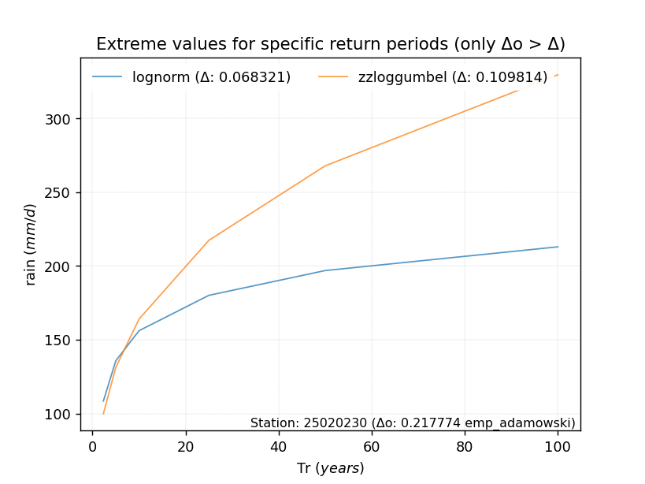</img>

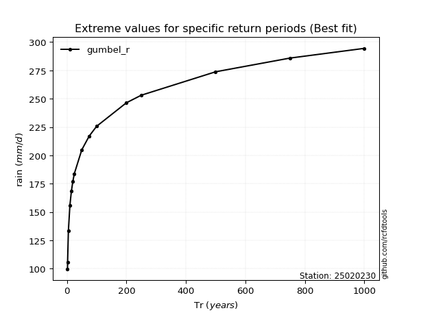</img>

> risk_rate: assuming the return period as the project useful life.
**APP DISCLAIMER**: NO WARRANTY - This software is provided by [https://github.com/rcfdtools](github.com/rcfdtools) "as is", without any express or implied warranty, including warranties of merchantability, fitness for a particular purpose, or non-infringement. There is no guarantee that the software will be error-free or operate without interruption. LIMITATION OF LIABILITY - Neither the authors nor copyright holders will be liable for claims or damages arising from the software or its use. You are responsible for determining if the software is appropriate for your use and assume all associated risks, including errors, legal compliance, and data loss. NO PROFESSIONAL ADVICE - The software provides general information and does not offer professional advice. It should not replace consultation with professional advisors.