<div align="center">


</div>

# Station (rain, Pmax24h): 25020230

Probable Maximum Precipitation (PMP) is the greatest amount of rainfall for a specific duration that is meteorologically possible for a given location, acting as a "worst-case" scenario for extreme storms, crucial for designing safety-critical infrastructure like bridges, river deviations, dams, spillways, and nuclear plants to prevent catastrophic failure. PMP is calculated by hydrologists using meteorological data to determine the upper limit of extreme rainfall, often leading to the Probable Maximum Flood (PMF) for flood control design, and is increasingly being studied for climate change impacts.

<div align="center">

</img>


</div>


## A. General information


### 1. General running parameters

• app_version: _v20251225_. • runtime: _2025-12-26 08:10:51.378813_. • Python version: _3.14.0_. • SciPy version: _1.16.3_. • Pandas version: _2.3.3_. • NumPy version: _2.3.5_. • Stations dataset (station_dataset_file): _dataset/pmax24h_in/test.csv_. • Stations catalog (station_catalog_file): _dataset/CNE_IDEAM.xls_. • Plot only fit distributions with Δo > Δ (plot_only_fit): _True_. • Eval low extreme values, if False, evaluates high extreme values (low_extreme): _False_. • Eval Gumbel distribution, non include in SciPy (pdist_loggumbel_on): _False_. • Eval Log-Gumbel distribution, non include in SciPy (pdist_loggumbel_on): _False_. • Eval every SciPy distribution as logarithmic (pdist_logarithmic_on): _True_. • Standard deviation normalized (ddof): _1.0_. • Return periods to eval in years (Tr): _[2, 2.33, 5, 10, 15, 20, 25, 50, 75, 100, 200, 250, 500, 750, 1000]_. • Minimum data sample per station, 0 means any (minimum_sample): _5_. • Z-Score threshold to adjust a value, 0 means disable (zscore): _3.5_. • Avoid zeros, e.g. rain = 0 (avoid_zeros): _True_. • Avoid null values (avoid_nans): _True_. [:file_folder:Dataset file.](../../dataset/pmax24h_in/test.csv)


### 2. Station info and location

|   id |   CODIGO | NOMBRE               | CATEGORIA     | TECNOLOGIA   | ESTADO   | FECHA_INSTALACION   |   FECHA_SUSPENSION |   ALTITUD |   LATITUD |   LONGITUD | DEPARTAMENTO   | MUNICIPIO           | AREA_OPERATIVA                                         | ENTIDAD                                                     | AREA_HIDROGRAFICA   | ZONA_HIDROGRAFICA   | SUBZONA_HIDROGRAFICA   |   CORRIENTE | OBSERVACION                                                                      |   SUBRED |
|-----:|---------:|:---------------------|:--------------|:-------------|:---------|:--------------------|-------------------:|----------:|----------:|-----------:|:---------------|:--------------------|:-------------------------------------------------------|:------------------------------------------------------------|:--------------------|:--------------------|:-----------------------|------------:|:---------------------------------------------------------------------------------|---------:|
|    0 | 25020230 | LA JAGUA  [25020230] | Pluviométrica | Convencional | Activa   | 15/08/1963          |                nan |       170 |   9.56217 |   -73.3395 | Cesar          | La Jagua De Ibirico | Area Operativa 05 - Magdalena-Cesar-Guajira-San Andrés | INSTITUTO DE HIDROLOGIA METEOROLOGIA Y ESTUDIOS AMBIENTALES | Magdalena Cauca     | Cesar               | Bajo Cesar             |         nan | |01/11/2024$mvelez$Se cambia el sentido del nombre según radicado 20243120200713 |      nan |

<div align="center">

Map location in: [:earth_americas:Google](http://maps.google.com/maps?q=9.562166667,-73.33947222) [:earth_americas:OSM](https://www.openstreetmap.org/#map=18/9.562166667/-73.33947222&layers=P) [:earth_americas:Bing](https://www.bing.com/maps?cp=9.562166667~-73.33947222&lvl=18) [:earth_americas:Apple](https://maps.apple.com/frame?center=9.562166667%2C-73.33947222&span=0.003%2C0.006)

</div>


<div align="center">

```geojson
{
  "type": "Feature",
  "geometry": {
    "type": "Point", 
    "coordinates": [-73.33947222, 9.562166667]
  }, 
  "properties": {
    "Name": "25020230"
  }
}
```

</div>


### 3. Discrete values table and plot

|               |            0 |          1 |          2 |           3 |         4 |          5 |          6 |          7 |          8 |           9 |          10 |         11 |        12 |          13 |          14 |          15 |         16 |          17 |          18 |          19 |         20 |          21 |           22 |          23 |          24 |         25 |          26 |         27 |         28 |         29 |          30 |          31 |          32 |          33 |          34 |         35 |          36 |          37 |          38 |
|:--------------|-------------:|-----------:|-----------:|------------:|----------:|-----------:|-----------:|-----------:|-----------:|------------:|------------:|-----------:|----------:|------------:|------------:|------------:|-----------:|------------:|------------:|------------:|-----------:|------------:|-------------:|------------:|------------:|-----------:|------------:|-----------:|-----------:|-----------:|------------:|------------:|------------:|------------:|------------:|-----------:|------------:|------------:|------------:|
| Date          | 1980         | 1981       | 1982       | 1983        | 1984      | 1985       | 1986       | 1987       | 1988       | 1989        | 1990        | 1991       | 1992      | 1993        | 1994        | 1995        | 1996       | 1997        | 1998        | 1999        | 2000       | 2001        | 2002         | 2003        | 2004        | 2005       | 2006        | 2007       | 2008       | 2009       | 2010        | 2011        | 2012        | 2013        | 2014        | 2015       | 2016        | 2017        | 2018        |
| Value         |  108         |  150       |  148       |  120        |  155      |  230       |  136       |   46       |   95       |   85        |   89        |   65       |   62      |   90        |  135        |   90        |   37.5273  |   85        |   71        |  110        |  122       |  134.5      |  109         |   80        |   80        |   40       |   90        |  150       |  160       |  150       |   91        |  110        |   73        |   82        |   96        |  150       |  100        |  120.1      |   81.1      |
| Value_initial |  108         |  150       |  148       |  120        |  155      |  230       |  136       |   46       |   95       |   85        |   89        |   65       |   62      |   90        |  135        |   90        |   37.5273  |   85        |   71        |  110        |  122       |  134.5      |  109         |   80        |   80        |   40       |   90        |  150       |  160       |  150       |   91        |  110        |   73        |   82        |   96        |  150       |  100        |  120.1      |   81.1      |
| count         |   39         |   39       |   39       |   39        |   39      |   39       |   39       |   39       |   39       |   39        |   39        |   39       |   39      |   39        |   39        |   39        |   39       |   39        |   39        |   39        |   39       |   39        |   39         |   39        |   39        |   39       |   39        |   39       |   39       |   39       |   39        |   39        |   39        |   39        |   39        |   39       |   39        |   39        |   39        |
| mean          |  105.801     |  105.801   |  105.801   |  105.801    |  105.801  |  105.801   |  105.801   |  105.801   |  105.801   |  105.801    |  105.801    |  105.801   |  105.801  |  105.801    |  105.801    |  105.801    |  105.801   |  105.801    |  105.801    |  105.801    |  105.801   |  105.801    |  105.801     |  105.801    |  105.801    |  105.801   |  105.801    |  105.801   |  105.801   |  105.801   |  105.801    |  105.801    |  105.801    |  105.801    |  105.801    |  105.801   |  105.801    |  105.801    |  105.801    |
| std           |   38.7275    |   38.7275  |   38.7275  |   38.7275   |   38.7275 |   38.7275  |   38.7275  |   38.7275  |   38.7275  |   38.7275   |   38.7275   |   38.7275  |   38.7275 |   38.7275   |   38.7275   |   38.7275   |   38.7275  |   38.7275   |   38.7275   |   38.7275   |   38.7275  |   38.7275   |   38.7275    |   38.7275   |   38.7275   |   38.7275  |   38.7275   |   38.7275  |   38.7275  |   38.7275  |   38.7275   |   38.7275   |   38.7275   |   38.7275   |   38.7275   |   38.7275  |   38.7275   |   38.7275   |   38.7275   |
| zscore        |    0.0567891 |    1.14129 |    1.08965 |    0.366647 |    1.2704 |    3.20701 |    0.77979 |   -1.54414 |   -0.27889 |   -0.537105 |   -0.433819 |   -1.05353 |   -1.131  |   -0.407997 |    0.753969 |   -0.407997 |   -1.76292 |   -0.537105 |   -0.898605 |    0.108432 |    0.41829 |    0.741058 |    0.0826106 |   -0.666212 |   -0.666212 |   -1.69907 |   -0.407997 |    1.14129 |    1.39951 |    1.14129 |   -0.382176 |    0.108432 |   -0.846962 |   -0.614569 |   -0.253068 |    1.14129 |   -0.149783 |    0.369229 |   -0.637808 |

<div align="center">

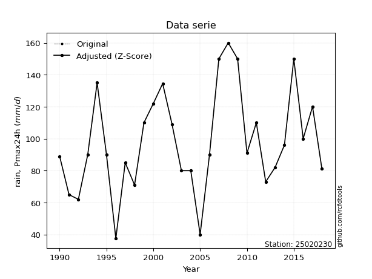</img>

</div>

> If Z-Score is active, values out of range or outliers are replaced with the station mean value.

### 4. Active continuous probability distributions from SciPy (47 of 104 available)

[scipy.stats](https://docs.scipy.org/doc/scipy/reference/stats.html) is a Python´s powerful submodule within the SciPy library for comprehensive statistical analysis, offering over 130 probability distributions (like Normal, Poisson), functions for descriptive stats (mean, variance), hypothesis testing (t-tests, chi-square), random variable generation, and statistical tests, making it essential for data science, modeling, and research. It provides tools to explore, model, and draw conclusions from data efficiently, working seamlessly with NumPy.
<div align="center">


|   id | p_dist             |   n_parameter | fit_method   | label                                                                       | active   | ref                                                                                                        |
|-----:|:-------------------|--------------:|:-------------|:----------------------------------------------------------------------------|:---------|:-----------------------------------------------------------------------------------------------------------|
|    0 | alpha              |             3 | MLE          | Alpha                                                                       | True     | [:mortar_board:](https://docs.scipy.org/doc/scipy/reference/generated/scipy.stats.alpha.html)              |
|    1 | betaprime          |             4 | MLE          | Beta prime                                                                  | True     | [:mortar_board:](https://docs.scipy.org/doc/scipy/reference/generated/scipy.stats.betaprime.html)          |
|    2 | chi2               |             3 | MLE          | Chi²                                                                        | True     | [:mortar_board:](https://docs.scipy.org/doc/scipy/reference/generated/scipy.stats.chi2.html)               |
|    3 | crystalball        |             4 | MLE          | Crystalball                                                                 | True     | [:mortar_board:](https://docs.scipy.org/doc/scipy/reference/generated/scipy.stats.crystalball.html)        |
|    4 | dgamma             |             3 | MLE          | Double gamma                                                                | True     | [:mortar_board:](https://docs.scipy.org/doc/scipy/reference/generated/scipy.stats.dgamma.html)             |
|    5 | erlang             |             3 | MLE          | Erlang                                                                      | True     | [:mortar_board:](https://docs.scipy.org/doc/scipy/reference/generated/scipy.stats.erlang.html)             |
|    6 | expon              |             2 | MLE          | Exponential                                                                 | True     | [:mortar_board:](https://docs.scipy.org/doc/scipy/reference/generated/scipy.stats.expon.html)              |
|    7 | exponnorm          |             3 | MLE          | Exponentially modified Normal                                               | True     | [:mortar_board:](https://docs.scipy.org/doc/scipy/reference/generated/scipy.stats.exponnorm.html)          |
|    8 | f                  |             4 | MLE          | F                                                                           | True     | [:mortar_board:](https://docs.scipy.org/doc/scipy/reference/generated/scipy.stats.f.html)                  |
|    9 | fatiguelife        |             3 | MLE          | Fatigue-life (Birnbaum-Saunders)                                            | True     | [:mortar_board:](https://docs.scipy.org/doc/scipy/reference/generated/scipy.stats.fatiguelife.html)        |
|   10 | fisk               |             3 | MLE          | Fisk                                                                        | True     | [:mortar_board:](https://docs.scipy.org/doc/scipy/reference/generated/scipy.stats.fisk.html)               |
|   11 | gamma              |             3 | MLE          | Gamma                                                                       | True     | [:mortar_board:](https://docs.scipy.org/doc/scipy/reference/generated/scipy.stats.gamma.html)              |
|   12 | genexpon           |             5 | MLE          | Generalized exponential                                                     | True     | [:mortar_board:](https://docs.scipy.org/doc/scipy/reference/generated/scipy.stats.genexpon.html)           |
|   13 | genlogistic        |             3 | MLE          | Generalized logistic                                                        | True     | [:mortar_board:](https://docs.scipy.org/doc/scipy/reference/generated/scipy.stats.genlogistic.html)        |
|   14 | gibrat             |             2 | MM           | Gibrat                                                                      | True     | [:mortar_board:](https://docs.scipy.org/doc/scipy/reference/generated/scipy.stats.gibrat.html)             |
|   15 | gompertz           |             3 | MLE          | Gompertz (or truncated Gumbel)                                              | True     | [:mortar_board:](https://docs.scipy.org/doc/scipy/reference/generated/scipy.stats.gompertz.html)           |
|   16 | gumbel_l           |             2 | MM           | Gumbel Left Skew                                                            | True     | [:mortar_board:](https://docs.scipy.org/doc/scipy/reference/generated/scipy.stats.gumbel_l.html)           |
|   17 | gumbel_r           |             2 | MM           | Gumbel Right Skew                                                           | True     | [:mortar_board:](https://docs.scipy.org/doc/scipy/reference/generated/scipy.stats.gumbel_r.html)           |
|   18 | halflogistic       |             2 | MM           | Half-logistic                                                               | True     | [:mortar_board:](https://docs.scipy.org/doc/scipy/reference/generated/scipy.stats.halflogistic.html)       |
|   19 | halfnorm           |             2 | MM           | Half Normal                                                                 | True     | [:mortar_board:](https://docs.scipy.org/doc/scipy/reference/generated/scipy.stats.halfnorm.html)           |
|   20 | hypsecant          |             2 | MM           | hyperbolic secant                                                           | True     | [:mortar_board:](https://docs.scipy.org/doc/scipy/reference/generated/scipy.stats.hypsecant.html)          |
|   21 | invgamma           |             3 | MLE          | Inverted gamma                                                              | True     | [:mortar_board:](https://docs.scipy.org/doc/scipy/reference/generated/scipy.stats.invgamma.html)           |
|   22 | invgauss           |             3 | MLE          | Inverse Gaussian                                                            | True     | [:mortar_board:](https://docs.scipy.org/doc/scipy/reference/generated/scipy.stats.invgauss.html)           |
|   23 | invweibull         |             3 | MLE          | Inverted Weibull                                                            | True     | [:mortar_board:](https://docs.scipy.org/doc/scipy/reference/generated/scipy.stats.invweibull.html)         |
|   24 | johnsonsu          |             4 | MLE          | Johnson Su                                                                  | True     | [:mortar_board:](https://docs.scipy.org/doc/scipy/reference/generated/scipy.stats.johnsonsu.html)          |
|   25 | kstwobign          |             2 | MLE          | Limiting distribution of scaled Kolmogorov-Smirnov two-sided test statistic | True     | [:mortar_board:](https://docs.scipy.org/doc/scipy/reference/generated/scipy.stats.kstwobign.html)          |
|   26 | laplace            |             2 | MM           | Laplace                                                                     | True     | [:mortar_board:](https://docs.scipy.org/doc/scipy/reference/generated/scipy.stats.laplace.html)            |
|   27 | laplace_asymmetric |             3 | MLE          | Asymmetric Laplace                                                          | True     | [:mortar_board:](https://docs.scipy.org/doc/scipy/reference/generated/scipy.stats.laplace_asymmetric.html) |
|   28 | loggamma           |             3 | MLE          | Log gamma                                                                   | True     | [:mortar_board:](https://docs.scipy.org/doc/scipy/reference/generated/scipy.stats.loggamma.html)           |
|   29 | logistic           |             2 | MM           | Logistic (or Sech-squared)                                                  | True     | [:mortar_board:](https://docs.scipy.org/doc/scipy/reference/generated/scipy.stats.logistic.html)           |
|   30 | lognorm            |             3 | MLE          | Log Normal                                                                  | True     | [:mortar_board:](https://docs.scipy.org/doc/scipy/reference/generated/scipy.stats.lognorm.html)            |
|   31 | maxwell            |             2 | MM           | Maxwell                                                                     | True     | [:mortar_board:](https://docs.scipy.org/doc/scipy/reference/generated/scipy.stats.maxwell.html)            |
|   32 | mielke             |             4 | MLE          | Mielke Beta-Kappa / Dagum                                                   | True     | [:mortar_board:](https://docs.scipy.org/doc/scipy/reference/generated/scipy.stats.mielke.html)             |
|   33 | moyal              |             2 | MM           | Moyal                                                                       | True     | [:mortar_board:](https://docs.scipy.org/doc/scipy/reference/generated/scipy.stats.moyal.html)              |
|   34 | nakagami           |             3 | MLE          | Nakagami                                                                    | True     | [:mortar_board:](https://docs.scipy.org/doc/scipy/reference/generated/scipy.stats.nakagami.html)           |
|   35 | ncf                |             5 | MLE          | Non-central F distribution                                                  | True     | [:mortar_board:](https://docs.scipy.org/doc/scipy/reference/generated/scipy.stats.ncf.html)                |
|   36 | nct                |             4 | MLE          | Non-central Student’s t                                                     | True     | [:mortar_board:](https://docs.scipy.org/doc/scipy/reference/generated/scipy.stats.nct.html)                |
|   37 | norm               |             2 | MM           | Normal                                                                      | True     | [:mortar_board:](https://docs.scipy.org/doc/scipy/reference/generated/scipy.stats.norm.html)               |
|   38 | pareto             |             3 | MLE          | Pareto                                                                      | True     | [:mortar_board:](https://docs.scipy.org/doc/scipy/reference/generated/scipy.stats.pareto.html)             |
|   39 | pearson3           |             3 | MM           | Pearson type III                                                            | True     | [:mortar_board:](https://docs.scipy.org/doc/scipy/reference/generated/scipy.stats.pearson3.html)           |
|   40 | rayleigh           |             2 | MM           | Rayleigh                                                                    | True     | [:mortar_board:](https://docs.scipy.org/doc/scipy/reference/generated/scipy.stats.rayleigh.html)           |
|   41 | recipinvgauss      |             3 | MLE          | Reciprocal inverse Gaussian                                                 | True     | [:mortar_board:](https://docs.scipy.org/doc/scipy/reference/generated/scipy.stats.recipinvgauss.html)      |
|   42 | rice               |             3 | MLE          | Rice                                                                        | True     | [:mortar_board:](https://docs.scipy.org/doc/scipy/reference/generated/scipy.stats.rice.html)               |
|   43 | t                  |             3 | MLE          | Student’s t                                                                 | True     | [:mortar_board:](https://docs.scipy.org/doc/scipy/reference/generated/scipy.stats.t.html)                  |
|   44 | truncnorm          |             4 | MLE          | Truncated normal                                                            | True     | [:mortar_board:](https://docs.scipy.org/doc/scipy/reference/generated/scipy.stats.truncnorm.html)          |
|   45 | wald               |             2 | MM           | Wald                                                                        | True     | [:mortar_board:](https://docs.scipy.org/doc/scipy/reference/generated/scipy.stats.wald.html)               |
|   46 | weibull_min        |             3 | MLE          | Weibull minimum                                                             | True     | [:mortar_board:](https://docs.scipy.org/doc/scipy/reference/generated/scipy.stats.weibull_min.html)        |

</div>


>Gumbel and Lob-Gumbel probability distributions are not shown in the above table.
>
>**n_parameter:** # arguments & localization & scale.
>
>**Fit methods:** (MLE) maximum likelihood, (MM) L-moments.
>
>**Inactive:** foldnorm, gennorm, norminvgauss, powernorm, powerlognorm, skewnorm, genextreme, anglit, arcsine, argus, beta, bradford, burr, burr12, cauchy, cosine, halfcauchy, foldcauchy, skewcauchy, wrapcauchy, gengamma, exponweib, exponpow, truncexpon, gausshyper, genhalflogistic, genhyperbolic, geninvgauss, halfgennorm, johnsonsb, kappa4, kappa3, ksone, kstwo, loglaplace, levy, levy_l, levy_stable, ncx2, genpareto, truncpareto, lomax, powerlaw, rdist, rel_breitwigner, semicircular, studentized_range, trapezoid, triang, truncweibull_min, tukeylambda, uniform, loguniform, vonmises, vonmises_line, weibull_max, dweibull, 


## B. Probability distributions vs. Empirical distributions

A continuous probability distribution describes probabilities for variables that can take any value within a range (like rain any time), unlike discrete variables with specific outcomes (like temperature). It uses a Probability Density Function (PDF), a curve where the total area under it equals 1, and the probability of the variable falling within an interval (a to b) is found by calculating the area under the curve between those points. A key feature is that the probability of hitting any single exact value is zero, so probabilities are always expressed for ranges, e.g., $P(a ≤ X ≤ b)$.

<div align="center">

Distributions parameters
|    |   station | p_dist                |   n |              loc |           scale | shape                 | shape1               | shape2               | shape3   |
|---:|----------:|:----------------------|----:|-----------------:|----------------:|:----------------------|:---------------------|:---------------------|:---------|
|  0 |  25020230 | alpha                 |  39 |   -243.67        |  3275.81        | 9.481687591916309     |                      |                      |          |
|  1 |  25020230 | betaprime             |  39 |     -7.7074      | 14311.7         | 8.711914272217232     | 1098.2495868443489   |                      |          |
|  2 |  25020230 | chi2                  |  39 |    -15.3408      |     6.00322     | 20.179412499216305    |                      |                      |          |
|  3 |  25020230 | crystalball           |  39 |    105.801       |    38.2277      | 7605.535442412194     | 6104.386628798199    |                      |          |
|  4 |  25020230 | dgamma                |  39 |    103.492       |    16.7034      | 1.8105480298115495    |                      |                      |          |
|  5 |  25020230 | erlang                |  39 |    -15.3407      |    12.0065      | 10.089696230161591    |                      |                      |          |
|  6 |  25020230 | expon                 |  39 |     37.5273      |    68.2734      |                       |                      |                      |          |
|  7 |  25020230 | exponnorm             |  39 |     78.3708      |    26.7867      | 1.0240107773320781    |                      |                      |          |
|  8 |  25020230 | f                     |  39 |    -15.4955      |   121.273       | 20.272895908966266    | 10530.135463947896   |                      |          |
|  9 |  25020230 | fatiguelife           |  39 |    -70.8952      |   172.72        | 0.21463881727137762   |                      |                      |          |
| 10 |  25020230 | fisk                  |  39 |    -54.7959      |   156.412       | 7.460631469733795     |                      |                      |          |
| 11 |  25020230 | gamma                 |  39 |    -15.3408      |    12.0065      | 10.089697793573393    |                      |                      |          |
| 12 |  25020230 | genexpon              |  39 |     37.5273      |     2.24278     | 0.029546930847224324  | 0.003441345619576359 | 0.7750570077294003   |          |
| 13 |  25020230 | genlogistic           |  39 |     59.8389      |    27.5995      | 3.46822996768894      |                      |                      |          |
| 14 |  25020230 | gibrat                |  39 |     76.6378      |    17.6882      |                       |                      |                      |          |
| 15 |  25020230 | gompertz              |  39 |     37.5226      |    71.8562      | 0.43675042205089065   |                      |                      |          |
| 16 |  25020230 | gumbel_l              |  39 |    123.005       |    29.806       |                       |                      |                      |          |
| 17 |  25020230 | gumbel_r              |  39 |     88.5962      |    29.806       |                       |                      |                      |          |
| 18 |  25020230 | halflogistic          |  39 |     60.4919      |    32.6834      |                       |                      |                      |          |
| 19 |  25020230 | halfnorm              |  39 |     55.2021      |    63.4159      |                       |                      |                      |          |
| 20 |  25020230 | hypsecant             |  39 |    105.801       |    24.3365      |                       |                      |                      |          |
| 21 |  25020230 | invgamma              |  39 |   -127.184       |  8915.04        | 39.264885803401164    |                      |                      |          |
| 22 |  25020230 | invgauss              |  39 |    -60.6923      |  3126.93        | 0.05329080666089131   |                      |                      |          |
| 23 |  25020230 | invweibull            |  39 |     -3.55869e+07 |     3.5587e+07  | 1087666.0794998629    |                      |                      |          |
| 24 |  25020230 | johnsonsu             |  39 |      2.58281e+08 |     6.77349e+08 | 7002443.376614271     | 18792021.363224953   |                      |          |
| 25 |  25020230 | kstwobign             |  39 |    -31.1406      |   157.593       |                       |                      |                      |          |
| 26 |  25020230 | laplace               |  39 |    105.801       |    27.0311      |                       |                      |                      |          |
| 27 |  25020230 | laplace_asymmetric    |  39 |     85           |    26.1028      | 0.6780162075097738    |                      |                      |          |
| 28 |  25020230 | loggamma              |  39 |  -9785.94        |  1380.26        | 1295.7067945076137    |                      |                      |          |
| 29 |  25020230 | logistic              |  39 |    105.801       |    21.0761      |                       |                      |                      |          |
| 30 |  25020230 | lognorm               |  39 |    -70.2523      |   172.057       | 0.21422700262979513   |                      |                      |          |
| 31 |  25020230 | maxwell               |  39 |     15.217       |    56.7649      |                       |                      |                      |          |
| 32 |  25020230 | mielke                |  39 |     -1.45821     |   117.373       | 3.6161644733307794    | 5.86585181901645     |                      |          |
| 33 |  25020230 | moyal                 |  39 |     83.9396      |    17.2085      |                       |                      |                      |          |
| 34 |  25020230 | nakagami              |  39 |     24.4646      |    89.8717      | 1.2137236270696525    |                      |                      |          |
| 35 |  25020230 | ncf                   |  39 |     -0.0782662   |     7.04566e-06 | 5.132450078952019e-07 | 13.81406420736777    | 6.710701038988491    |          |
| 36 |  25020230 | nct                   |  39 |     -0.115389    |    28.7882      | 13.581667670648887    | 3.4711270782563686   |                      |          |
| 37 |  25020230 | norm                  |  39 |    105.801       |    38.2277      |                       |                      |                      |          |
| 38 |  25020230 | pareto                |  39 |     -2.14748e+09 |     2.14748e+09 | 31454187.1816981      |                      |                      |          |
| 39 |  25020230 | pearson3              |  39 |    105.801       |    38.2277      | 0.7120941855529046    |                      |                      |          |
| 40 |  25020230 | rayleigh              |  39 |     32.6688      |    58.3508      |                       |                      |                      |          |
| 41 |  25020230 | recipinvgauss         |  39 |    -69.6431      |     7.92805     | 0.04732722966555314   |                      |                      |          |
| 42 |  25020230 | rice                  |  39 |     28.8446      |    49.4668      | 1.0086920154102033    |                      |                      |          |
| 43 |  25020230 | t                     |  39 |    105.908       |    38.2266      | 21.67178402806863     |                      |                      |          |
| 44 |  25020230 | truncnorm             |  39 |    105.801       |    38.2277      | -761.4622798670403    | 7.503505991779575    |                      |          |
| 45 |  25020230 | wald                  |  39 |     67.573       |    38.2277      |                       |                      |                      |          |
| 46 |  25020230 | weibull_min           |  39 |     27.6997      |    88.016       | 2.127819115649472     |                      |                      |          |
| 47 |  25020230 | logalpha              |  39 |     -8.08427     |   407.461       | 32.182977126302006    |                      |                      |          |
| 48 |  25020230 | logbetaprime          |  39 |     -5.04664     |    13.6622      | 697.2250809754651     | 988.0636518849324    |                      |          |
| 49 |  25020230 | logchi2               |  39 |      3.62507     |     1.00163     | 1.0673079695772452    |                      |                      |          |
| 50 |  25020230 | logcrystalball        |  39 |      4.59337     |     0.380696    | 7.58421257998815      | 50.4369170267613     |                      |          |
| 51 |  25020230 | logdgamma             |  39 |      4.63343     |     0.171443    | 1.7497444496225931    |                      |                      |          |
| 52 |  25020230 | logerlang             |  39 |     -2.85275     |     0.0200869   | 370.50687581436046    |                      |                      |          |
| 53 |  25020230 | logexpon              |  39 |      3.62507     |     0.968303    |                       |                      |                      |          |
| 54 |  25020230 | logexponnorm          |  39 |      4.59311     |     0.380697    | 0.0006876983607407936 |                      |                      |          |
| 55 |  25020230 | logf                  |  39 |   -266.238       |   270.831       | 2034592.8999479795    | 2004870.6638593534   |                      |          |
| 56 |  25020230 | logfatiguelife        |  39 |   -110.353       |   114.946       | 0.003297887266678689  |                      |                      |          |
| 57 |  25020230 | logfisk               |  39 |     -2.8672e+07  |     2.8672e+07  | 135366232.17048886    |                      |                      |          |
| 58 |  25020230 | loggamma              |  39 |     -2.28066     |     0.0219835   | 312.7480830623065     |                      |                      |          |
| 59 |  25020230 | loggenexpon           |  39 |      3.60783     |     0.0786617   | 0.006039056448498869  | 6.844459966493214    | 0.001510182768977322 |          |
| 60 |  25020230 | loggenlogistic        |  39 |      4.75841     |     0.171377    | 0.6032768156659909    |                      |                      |          |
| 61 |  25020230 | loggibrat             |  39 |      4.30298     |     0.176136    |                       |                      |                      |          |
| 62 |  25020230 | loggompertz           |  39 |      3.62496     |     0.381866    | 0.05417901941940342   |                      |                      |          |
| 63 |  25020230 | loggumbel_l           |  39 |      4.76471     |     0.296828    |                       |                      |                      |          |
| 64 |  25020230 | loggumbel_r           |  39 |      4.42204     |     0.296828    |                       |                      |                      |          |
| 65 |  25020230 | loghalflogistic       |  39 |      4.14213     |     0.3255      |                       |                      |                      |          |
| 66 |  25020230 | loghalfnorm           |  39 |      4.08945     |     0.631573    |                       |                      |                      |          |
| 67 |  25020230 | loghypsecant          |  39 |      4.59337     |     0.242359    |                       |                      |                      |          |
| 68 |  25020230 | loginvgamma           |  39 |     -2.77327     |  2563.91        | 349.3662875986231     |                      |                      |          |
| 69 |  25020230 | loginvgauss           |  39 |      0.0387901   |   588.77        | 0.00772980265200645   |                      |                      |          |
| 70 |  25020230 | loginvweibull         |  39 |     -3.13418e+07 |     3.13418e+07 | 74788410.98251995     |                      |                      |          |
| 71 |  25020230 | logjohnsonsu          |  39 |      5.11433     |     0.85346     | 1.5093275246006537    | 2.770895944793064    |                      |          |
| 72 |  25020230 | logkstwobign          |  39 |      2.82988     |     2.0289      |                       |                      |                      |          |
| 73 |  25020230 | loglaplace            |  39 |      4.59337     |     0.269193    |                       |                      |                      |          |
| 74 |  25020230 | loglaplace_asymmetric |  39 |      4.49981     |     0.290562    | 0.8517858638084082    |                      |                      |          |
| 75 |  25020230 | logloggamma           |  39 |      3.48845     |     0.775817    | 4.644563460835911     |                      |                      |          |
| 76 |  25020230 | loglogistic           |  39 |      4.59337     |     0.209889    |                       |                      |                      |          |
| 77 |  25020230 | loglognorm            |  39 | -69748.7         | 69753.3         | 5.45776655593158e-06  |                      |                      |          |
| 78 |  25020230 | logmaxwell            |  39 |      3.69127     |     0.56531     |                       |                      |                      |          |
| 79 |  25020230 | logmielke             |  39 |     -0.167412    |     4.99365     | 14.589654708230404    | 32.00588667031144    |                      |          |
| 80 |  25020230 | logmoyal              |  39 |      4.37567     |     0.171374    |                       |                      |                      |          |
| 81 |  25020230 | lognakagami           |  39 |   -178.858       |   183.452       | 57873.47888331395     |                      |                      |          |
| 82 |  25020230 | logncf                |  39 |    -60.2276      |    62.0576      | 98690.63460291893     | 135160.80255748564   | 4391.406774285602    |          |
| 83 |  25020230 | lognct                |  39 |    -13.5529      |     0.331454    | 4335.606931048575     | 54.73158797796543    |                      |          |
| 84 |  25020230 | lognorm               |  39 |      4.59337     |     0.380696    |                       |                      |                      |          |
| 85 |  25020230 | logpareto             |  39 |     -1.34218e+08 |     1.34218e+08 | 138611230.9763022     |                      |                      |          |
| 86 |  25020230 | logpearson3           |  39 |      4.59337     |     0.380697    | -0.5092151365912186   |                      |                      |          |
| 87 |  25020230 | lograyleigh           |  39 |      3.86511     |     0.581067    |                       |                      |                      |          |
| 88 |  25020230 | logrecipinvgauss      |  39 |     -1.6843      |     0.0241392   | 0.00385789594585363   |                      |                      |          |
| 89 |  25020230 | logrice               |  39 |    -70.9716      |     0.380619    | 198.52911218301972    |                      |                      |          |
| 90 |  25020230 | logt                  |  39 |      4.59389     |     0.381314    | 33.57065893678282     |                      |                      |          |
| 91 |  25020230 | logtruncnorm          |  39 |      0.170273    |     2.23482     | 1.5458900058856804    | 42.12215617706576    |                      |          |
| 92 |  25020230 | logwald               |  39 |      4.21271     |     0.380663    |                       |                      |                      |          |
| 93 |  25020230 | logweibull_min        |  39 |      2.47148     |     2.27558     | 6.531208512204765     |                      |                      |          |

</div>

> **loc** (Location parameter): This shifts the distribution along the x-axis. For many common distributions, like the normal (Gaussian) distribution, loc represents the mean $μ$. For others, like the uniform distribution, it might represent the minimum value, or for the beta distribution, the left end of the support interval.

> **scale** (Scale parameter): This determines the width or spread of the distribution. For the normal distribution, scale represents the standard deviation $σ$. For a uniform distribution, it defines the length of the interval (from $loc$ to $loc + scale$).

> **shape** (Shape parameters): Refers to parameters that define the specific form of a probability distribution, distinct from its location (loc) and scale (scale). These parameters are required arguments for most distribution functions. For example, a normal (Gaussian) distribution is fully defined by its location (mean) and scale (standard deviation), so it has no specific shape parameters beyond loc and scale. However, other distributions have intrinsic properties that need specification, as Gamma distribution that takes a shape parameter, often named $a$ or $alpha$.


### 0. Cumulative distribution values - CDF (94 evaluated including log(f(x)), ordered by x ascending) 

|   id |   Station |   date |        x |   count |    mean |     std |     zscore |   Value_initial |   station |   m |     alpha |   alpha_pdf |   betaprime |   betaprime_pdf |      chi2 |    chi2_pdf |   crystalball |   crystalball_pdf |    dgamma |   dgamma_pdf |    erlang |   erlang_pdf |     expon |   expon_pdf |   exponnorm |   exponnorm_pdf |         f |       f_pdf |   fatiguelife |   fatiguelife_pdf |      fisk |    fisk_pdf |     gamma |   gamma_pdf |    genexpon |   genexpon_pdf |   genlogistic |   genlogistic_pdf |    gibrat |   gibrat_pdf |    gompertz |   gompertz_pdf |   gumbel_l |   gumbel_l_pdf |   gumbel_r |   gumbel_r_pdf |   halflogistic |   halflogistic_pdf |   halfnorm |   halfnorm_pdf |   hypsecant |   hypsecant_pdf |   invgamma |   invgamma_pdf |   invgauss |   invgauss_pdf |   invweibull |   invweibull_pdf |   johnsonsu |   johnsonsu_pdf |   kstwobign |   kstwobign_pdf |   laplace |   laplace_pdf |   laplace_asymmetric |   laplace_asymmetric_pdf |   loggamma |   loggamma_pdf |   logistic |   logistic_pdf |    lognorm |   lognorm_pdf |   maxwell |   maxwell_pdf |    mielke |   mielke_pdf |       moyal |   moyal_pdf |   nakagami |   nakagami_pdf |      ncf |    ncf_pdf |       nct |     nct_pdf |      norm |    norm_pdf |    pareto |   pareto_pdf |   pearson3 |   pearson3_pdf |   rayleigh |   rayleigh_pdf |   recipinvgauss |   recipinvgauss_pdf |       rice |    rice_pdf |         t |       t_pdf |   truncnorm |   truncnorm_pdf |       wald |    wald_pdf |   weibull_min |   weibull_min_pdf |   logalpha |   logalpha_pdf |   logbetaprime |   logbetaprime_pdf |     logchi2 |   logchi2_pdf |   logcrystalball |   logcrystalball_pdf |   logdgamma |   logdgamma_pdf |   logerlang |   logerlang_pdf |   logexpon |   logexpon_pdf |   logexponnorm |   logexponnorm_pdf |       logf |   logf_pdf |   logfatiguelife |   logfatiguelife_pdf |    logfisk |   logfisk_pdf |   loggenexpon |   loggenexpon_pdf |   loggenlogistic |   loggenlogistic_pdf |   loggibrat |   loggibrat_pdf |   loggompertz |   loggompertz_pdf |   loggumbel_l |   loggumbel_l_pdf |   loggumbel_r |   loggumbel_r_pdf |   loghalflogistic |   loghalflogistic_pdf |   loghalfnorm |   loghalfnorm_pdf |   loghypsecant |   loghypsecant_pdf |   loginvgamma |   loginvgamma_pdf |   loginvgauss |   loginvgauss_pdf |   loginvweibull |   loginvweibull_pdf |   logjohnsonsu |   logjohnsonsu_pdf |   logkstwobign |   logkstwobign_pdf |   loglaplace |   loglaplace_pdf |   loglaplace_asymmetric |   loglaplace_asymmetric_pdf |   logloggamma |   logloggamma_pdf |   loglogistic |   loglogistic_pdf |   loglognorm |   loglognorm_pdf |   logmaxwell |   logmaxwell_pdf |   logmielke |   logmielke_pdf |    logmoyal |   logmoyal_pdf |   lognakagami |   lognakagami_pdf |     logncf |   logncf_pdf |     lognct |   lognct_pdf |   logpareto |   logpareto_pdf |   logpearson3 |   logpearson3_pdf |   lograyleigh |   lograyleigh_pdf |   logrecipinvgauss |   logrecipinvgauss_pdf |    logrice |   logrice_pdf |       logt |   logt_pdf |   logtruncnorm |   logtruncnorm_pdf |   logwald |   logwald_pdf |   logweibull_min |   logweibull_min_pdf |
|-----:|----------:|-------:|---------:|--------:|--------:|--------:|-----------:|----------------:|----------:|----:|----------:|------------:|------------:|----------------:|----------:|------------:|--------------:|------------------:|----------:|-------------:|----------:|-------------:|----------:|------------:|------------:|----------------:|----------:|------------:|--------------:|------------------:|----------:|------------:|----------:|------------:|------------:|---------------:|--------------:|------------------:|----------:|-------------:|------------:|---------------:|-----------:|---------------:|-----------:|---------------:|---------------:|-------------------:|-----------:|---------------:|------------:|----------------:|-----------:|---------------:|-----------:|---------------:|-------------:|-----------------:|------------:|----------------:|------------:|----------------:|----------:|--------------:|---------------------:|-------------------------:|-----------:|---------------:|-----------:|---------------:|-----------:|--------------:|----------:|--------------:|----------:|-------------:|------------:|------------:|-----------:|---------------:|---------:|-----------:|----------:|------------:|----------:|------------:|----------:|-------------:|-----------:|---------------:|-----------:|---------------:|----------------:|--------------------:|-----------:|------------:|----------:|------------:|------------:|----------------:|-----------:|------------:|--------------:|------------------:|-----------:|---------------:|---------------:|-------------------:|------------:|--------------:|-----------------:|---------------------:|------------:|----------------:|------------:|----------------:|-----------:|---------------:|---------------:|-------------------:|-----------:|-----------:|-----------------:|---------------------:|-----------:|--------------:|--------------:|------------------:|-----------------:|---------------------:|------------:|----------------:|--------------:|------------------:|--------------:|------------------:|--------------:|------------------:|------------------:|----------------------:|--------------:|------------------:|---------------:|-------------------:|--------------:|------------------:|--------------:|------------------:|----------------:|--------------------:|---------------:|-------------------:|---------------:|-------------------:|-------------:|-----------------:|------------------------:|----------------------------:|--------------:|------------------:|--------------:|------------------:|-------------:|-----------------:|-------------:|-----------------:|------------:|----------------:|------------:|---------------:|--------------:|------------------:|-----------:|-------------:|-----------:|-------------:|------------:|----------------:|--------------:|------------------:|--------------:|------------------:|-------------------:|-----------------------:|-----------:|--------------:|-----------:|-----------:|---------------:|-------------------:|----------:|--------------:|-----------------:|---------------------:|
|    0 |  25020230 |   1996 |  37.5273 |      39 | 105.801 | 38.7275 | -1.76292   |         37.5273 |  25020230 |   1 | 0.0150854 | 0.00157658  |   0.0128172 |     0.00161989  | 0.0137695 | 0.00163059  |     0.0370525 |       0.00211789  | 0.0375959 |  0.00187973  | 0.0137694 |  0.00163059  | 0         | 0.014647    |   0.0194808 |     0.00161058  | 0.0137692 | 0.00162997  |     0.0142972 |       0.00160401  | 0.0192043 | 0.0015221   | 0.0137695 | 0.00163059  | 1.95377e-08 |    0.0131743   |     0.0168773 |       0.00146714  | 0         |  0           | 2.84631e-05 |    0.00607834  |  0.0552393 |    0.00180113  | 0.00389664 |    0.00072526  |      0         |        0           |  0         |    0           |   0.0384581 |     0.00157642  |  0.0147564 |    0.00158436  |  0.013266  |    0.00156608  |   0.00954062 |      0.00135656  |   0.038382  |     0.00216004  |  0.00866664 |     0.00151401  | 0.0399997 |   0.00147977  |            0.0215418 |              0.00121718  | 0.0046235  |      0.0384068 |  0.0377103 |    0.00172178  | 0.00548732 |     0.0412586 | 0.0154191 |   0.00200987  | 0.018563  |  0.00171916  | 0.000117279 | 5.36092e-05 |  0.0104094 |    0.00191207  | 0.24744  | 0.00627584 | 0.0169533 | 0.00153215  | 0.0370525 | 0.00211789  | 0         |  0.014647    |  0.010626  |    0.00147929  | 0.00346043 |    0.00142201  |       0.0143025 |         0.0016055   | 0.00922731 | 0.00211738  | 0.0438163 | 0.00216539  |   0.0370525 |     0.00211789  | 0          | 0           |    0.00937628 |        0.00202055 | 0.00446152 |      0.0388188 |      0.0165214 |           0.095263 | 4.98576e-09 |    5.9913e+06 |       0.00548725 |            0.0412582 |  0.00643544 |       0.0334282 |  0.00474659 |       0.0391837 |  0         |       1.03273  |     0.00548738 |          0.0412589 | 0.0054581  |  0.0411622 |       0.00516866 |            0.0396219 | 0.00943958 |     0.0441454 |    0.00157014 |          0.105395 |        0.0184929 |            0.0650109 |    0        |       0         |   1.57108e-05 |         0.141919  |     0.0212771 |        0.0709137  |   4.30824e-07 |       2.12744e-05 |         0         |              0        |     0         |          0        |      0.0117134 |          0.0483198 |    0.00413689 |         0.0373515 |    0.00373562 |         0.0356276 |      0.00190661 |           0.0284916 |      0.0154767 |          0.0627991 |     0.00207931 |          0.0393867 |    0.0137021 |        0.0509006 |               0.0122684 |                   0.0495698 |     0.013043  |         0.0621672 |    0.00982056 |         0.0463298 |   0.00548714 |        0.0412579 |   0          |        0         |   0.0180545 |       0.0694453 | 4.08283e-19 |    9.62557e-17 |    0.00551475 |         0.0414508 | 0.00559723 |    0.0422694 | 0.00553578 |    0.0422419 |   0         |        1.03273  |     0.0132087 |         0.0642311 |      0        |          0        |         0.00368611 |              0.0335151 | 0.0054812  |     0.0412264 | 0.00792991 |  0.0496697 |    1.32178e-05 |           0.884981 | 0         |     0         |        0.0117614 |            0.0661957 |
|    1 |  25020230 |   2005 |  40      |      39 | 105.801 | 38.7275 | -1.69907   |         40      |  25020230 |   2 | 0.0194003 | 0.00192078  |   0.0173051 |     0.00201812  | 0.018262  | 0.00201071  |     0.0425999 |       0.00237228  | 0.0425274 |  0.00211319  | 0.018262  |  0.00201071  | 0.0355693 | 0.014126    |   0.0238171 |     0.00190266  | 0.0182601 | 0.00200993  |     0.0187055 |       0.00196908  | 0.0232928 | 0.00179049  | 0.018262  | 0.00201071  | 0.0332535   |    0.0135884   |     0.0208618 |       0.00176259  | 0         |  0           | 0.0152035   |    0.00619568  |  0.0598714 |    0.00194733  | 0.00606035 |    0.00103818  |      0         |        0           |  0         |    0           |   0.0425593 |     0.00174358  |  0.0190999 |    0.0019362   |  0.0175914 |    0.00194051  |   0.0133857  |      0.00176475  |   0.0440338 |     0.00241455  |  0.0130392  |     0.002036    | 0.0438313 |   0.00162151  |            0.0247719 |              0.00139969  | 0.00772397 |      0.0600934 |  0.0422064 |    0.00191806  | 0.00875332 |     0.0623112 | 0.0209094 |   0.00243566  | 0.0231763 |  0.00201703  | 0.000337433 | 0.000134656 |  0.0157641 |    0.00242303  | 0.262954 | 0.00627019 | 0.0211161 | 0.00184173  | 0.0425999 | 0.00237228  | 0.0355693 |  0.014126    |  0.0147707 |    0.00188204  | 0.00786162 |    0.00213625  |       0.0187149 |         0.00197092  | 0.0151936  | 0.00270693  | 0.0494605 | 0.00240282  |   0.0425999 |     0.00237228  | 0          | 0           |    0.0150721  |        0.00258756 | 0.00762505 |      0.0617719 |      0.0236102 |           0.128104 | 0.177052    |    1.45021    |       0.00875323 |            0.0623106 |  0.00895419 |       0.0461817 |  0.00790568 |       0.061166  |  0.0637746 |       0.966872 |     0.0087534  |          0.0623116 | 0.00871826 |  0.0622271 |       0.00831872 |            0.0603175 | 0.012716   |     0.0592712 |    0.0116373  |          0.209586 |        0.0231419 |            0.0813052 |    0        |       0         |   0.00982374  |         0.166085  |     0.0263124 |        0.0874686  |   7.33949e-06 |       0.000292322 |         0         |              0        |     0         |          0        |      0.0152403 |          0.062859  |    0.00720711 |         0.0603609 |    0.00670015 |         0.0588357 |      0.0046174  |           0.0592547 |      0.0200377 |          0.0808804 |     0.00607227 |          0.0902348 |    0.0173673 |        0.0645163 |               0.0158766 |                   0.0641488 |     0.0176237 |         0.0822371 |    0.0132635  |         0.0623547 |   0.0087531  |        0.0623105 |   0          |        0         |   0.0230297 |       0.0871068 | 1.19836e-13 |    1.95718e-11 |    0.00879537 |         0.0625797 | 0.00894403 |    0.0638585 | 0.00888681 |    0.0640381 |   0.0637746 |        0.966872 |     0.0179419 |         0.0849636 |      0        |          0        |         0.0064501  |              0.0544994 | 0.00874492 |     0.0622718 | 0.011748   |  0.07111   |    0.0552485   |           0.846423 | 0         |     0         |        0.016676  |            0.0887146 |
|    2 |  25020230 |   1987 |  46      |      39 | 105.801 | 38.7275 | -1.54414   |         46      |  25020230 |   3 | 0.0338425 | 0.00293443  |   0.0327445 |     0.00316866  | 0.0335048 | 0.00310931  |     0.0588703 |       0.00307005  | 0.0571597 |  0.00279252  | 0.0335048 |  0.00310931  | 0.116708  | 0.0129376   |   0.0377008 |     0.00276099  | 0.0334973 | 0.00310827  |     0.0335948 |       0.0030346   | 0.0363277 | 0.00259119  | 0.0335048 | 0.00310931  | 0.113451    |    0.0129672   |     0.0340004 |       0.00266093  | 0         |  0           | 0.0532205   |    0.00647522  |  0.0727258 |    0.00234901  | 0.0153753  |    0.00215365  |      0         |        0           |  0         |    0           |   0.0544071 |     0.00222474  |  0.033694  |    0.00296966  |  0.0324018 |    0.0030389   |   0.0275754  |      0.00302637  |   0.0605536 |     0.00311028  |  0.0297295  |     0.00358334  | 0.0547247 |   0.00202451  |            0.0347691 |              0.00196456  | 0.0211987  |      0.141598  |  0.0553375 |    0.00248032  | 0.0222808  |     0.139351  | 0.0388615 |   0.00356832  | 0.0377221 |  0.00286019  | 0.00260189  | 0.000749761 |  0.0342023 |    0.00373507  | 0.300428 | 0.00621129 | 0.0348195 | 0.00276766  | 0.0588703 | 0.00307005  | 0.116708  |  0.0129376   |  0.0294785 |    0.00306582  | 0.0257608  |    0.00381453  |       0.0336175 |         0.00303715  | 0.0356267  | 0.00409171  | 0.06578   | 0.00305504  |   0.0588703 |     0.00307005  | 0          | 0           |    0.0347496  |        0.00396939 | 0.0216736  |      0.148801  |      0.047929  |           0.225934 | 0.321076    |    0.78736    |       0.0222806  |            0.13935   |  0.0182913  |       0.0925487 |  0.0215906  |       0.143607  |  0.189607  |       0.836921 |     0.022281   |          0.139351  | 0.0222395  |  0.139362  |       0.0215243  |            0.136833  | 0.02431    |     0.111982  |    0.0559894  |          0.419942 |        0.0377941 |            0.132459  |    0        |       0         |   0.0374602   |         0.232802  |     0.041801  |        0.13784    |   0.00062196  |       0.0154692   |         0         |              0        |     0         |          0        |      0.0271181 |          0.111757  |    0.0211343  |         0.148831  |    0.0205288  |         0.149336  |      0.0212203  |           0.195092  |      0.0350609 |          0.138943  |     0.0313246  |          0.28798   |    0.0291886 |        0.10843   |               0.0279258 |                   0.112833  |     0.0332696 |         0.147044  |    0.0254936  |         0.118366  |   0.0222805  |        0.13935   |   0.00374953 |        0.0809201 |   0.0387041 |       0.141197  | 8.08685e-07 |    5.96179e-05 |    0.0223742  |         0.139821  | 0.0227982  |    0.142582  | 0.0228226  |    0.143689  |   0.189607  |        0.836921 |     0.0340713 |         0.151182  |      0        |          0        |         0.0191377  |              0.136541  | 0.0222661  |     0.139302  | 0.0264354  |  0.146498  |    0.167837    |           0.765554 | 0         |     0         |        0.0336198 |            0.159042  |
|    3 |  25020230 |   1992 |  62      |      39 | 105.801 | 38.7275 | -1.131     |         62      |  25020230 |   4 | 0.108387  | 0.00652297  |   0.112853  |     0.00690328  | 0.111692  | 0.0067434   |     0.125942  |       0.00541323  | 0.122098  |  0.00558721  | 0.111692  |  0.0067434   | 0.301242  | 0.0102347   |   0.106175  |     0.00599254  | 0.11167   | 0.00674289  |     0.110352  |       0.00666401  | 0.101653  | 0.00583326  | 0.111692  | 0.0067434   | 0.299192    |    0.0103077   |     0.103223  |       0.00623184  | 0         |  0           | 0.162435    |    0.00715694  |  0.121163  |    0.00380817  | 0.0870948  |    0.00713202  |      0.0230668 |        0.0152902   |  0.0853659 |    0.0125097   |   0.104311  |     0.00420988  |  0.109076  |    0.00658005  |  0.110069  |    0.00676661  |   0.110582   |      0.00744227  |   0.128109  |     0.0054284   |  0.124054   |     0.00807635  | 0.0989115 |   0.00365918  |            0.0858653 |              0.00485166  | 0.112766   |      0.516032  |  0.111232  |    0.00469059  | 0.110344   |     0.495034  | 0.121922  |   0.00679804  | 0.10642   |  0.0059042   | 0.058534    | 0.00732765  |  0.122074  |    0.00716216  | 0.39706  | 0.00582131 | 0.105539  | 0.00626752  | 0.125942  | 0.00541323  | 0.301242  |  0.0102347   |  0.109261  |    0.00697348  | 0.118684   |    0.0075922   |       0.110418  |         0.00666631  | 0.127741   | 0.00727302  | 0.131617  | 0.00527956  |   0.125942  |     0.00541323  | 0          | 0           |    0.125966   |        0.00730005 | 0.118149   |      0.540639  |      0.158824  |           0.531974 | 0.494663    |    0.445282   |       0.110344   |            0.495032  |  0.0791418  |       0.372903  |  0.114231   |       0.52148   |  0.404587  |       0.614903 |     0.110345   |          0.495034  | 0.11036    |  0.495352  |       0.109053   |            0.494969  | 0.0925396  |     0.396467  |    0.232306   |          0.721591 |        0.10676   |            0.366599  |    0        |       0         |   0.137255    |         0.455958  |     0.110168  |        0.349913   |   0.0671567   |       0.611034    |         0         |              0        |     0.0475809 |          1.26108  |      0.0923306 |          0.375646  |    0.118836   |         0.549318  |    0.119507   |         0.556265  |      0.151085   |           0.681357  |      0.109688  |          0.398451  |     0.191755   |          0.744318  |    0.0884664 |        0.328636  |               0.0932792 |                   0.376891  |     0.113176  |         0.424206  |    0.097849   |         0.420577  |   0.110345   |        0.495037  |   0.102303   |        0.623301  |   0.110354  |       0.371922  | 0.0389257   |    0.570087    |    0.110613   |         0.495548  | 0.112381   |    0.50114   | 0.113233   |    0.505525  |   0.404587  |        0.614903 |     0.11517   |         0.426017  |      0.096672 |          0.70102  |         0.110954   |              0.52477   | 0.110323   |     0.495069  | 0.114723   |  0.488202  |    0.372518    |           0.609742 | 0         |     0         |        0.117753  |            0.436022  |
|    4 |  25020230 |   1991 |  65      |      39 | 105.801 | 38.7275 | -1.05353   |         65      |  25020230 |   5 | 0.129029  | 0.00723567  |   0.134593  |     0.00758414  | 0.132949  | 0.00742324  |     0.142917  |       0.00590432  | 0.139902  |  0.00629184  | 0.132949  |  0.00742324  | 0.331282  | 0.00979472  |   0.125203  |     0.00669459  | 0.132925  | 0.00742302  |     0.131392  |       0.00735871  | 0.12028   | 0.00658979  | 0.132949  | 0.00742324  | 0.329443    |    0.00986292  |     0.123089  |       0.00701281  | 0         |  0           | 0.184076    |    0.00726927  |  0.1331    |    0.00415421  | 0.110024   |    0.008147    |      0.0688567 |        0.0152258   |  0.122786  |    0.0124325   |   0.117703  |     0.00472701  |  0.129882  |    0.00728741  |  0.131432  |    0.00747075  |   0.134112   |      0.00823512  |   0.145117  |     0.00591161  |  0.149306   |     0.00874307  | 0.110521  |   0.00408868  |            0.101727  |              0.00574787  | 0.13899    |      0.59418   |  0.126101  |    0.00522867  | 0.135541   |     0.571884  | 0.143165  |   0.00735947  | 0.125134  |  0.00657503  | 0.082959    | 0.00894175  |  0.144402  |    0.00771661  | 0.414376 | 0.0057219  | 0.12545   | 0.007006    | 0.142917  | 0.00590432  | 0.331282  |  0.00979472  |  0.13126   |    0.00768567  | 0.142303   |    0.00814446  |       0.131464  |         0.00736058  | 0.150297   | 0.00775759  | 0.148166  | 0.00575474  |   0.142917  |     0.00590432  | 0          | 0           |    0.14865    |        0.00781581 | 0.145559   |      0.619603  |      0.185196  |           0.584005 | 0.515023    |    0.417036   |       0.13554    |            0.571882  |  0.0986817  |       0.456449  |  0.140727   |       0.600238  |  0.432945  |       0.585617 |     0.135541   |          0.571884  | 0.13557    |  0.57218   |       0.134267   |            0.572702  | 0.113054   |     0.473406  |    0.267012   |          0.746229 |        0.125492  |            0.427595  |    0        |       0         |   0.159888    |         0.502481  |     0.127912  |        0.402113   |   0.099932    |       0.775432    |         0.0495046 |              1.53233  |     0.106982  |          1.25196  |      0.111836  |          0.452011  |    0.146683   |         0.629342  |    0.147677   |         0.635956  |      0.184818   |           0.744605  |      0.129984  |          0.461658  |     0.227883   |          0.782822  |    0.105442  |        0.391696  |               0.112902  |                   0.456176  |     0.134706  |         0.487873  |    0.1196     |         0.501674  |   0.135541   |        0.571887  |   0.133958   |        0.715473  |   0.129261  |       0.429469  | 0.0720129   |    0.830237    |    0.13583    |         0.572269  | 0.137859   |    0.577673  | 0.138926   |    0.582315  |   0.432945  |        0.585617 |     0.136746  |         0.487941  |      0.132072 |          0.795015 |         0.137647   |              0.605244  | 0.135522   |     0.571949  | 0.139546   |  0.563     |    0.400795    |           0.587206 | 0         |     0         |        0.139775  |            0.49674   |
|    5 |  25020230 |   1998 |  71      |      39 | 105.801 | 38.7275 | -0.898605  |         71      |  25020230 |   6 | 0.17654   | 0.00857552  |   0.183882  |     0.00881037  | 0.181314  | 0.00866739  |     0.181318  |       0.00689561  | 0.182251  |  0.00785469  | 0.181314  |  0.00866739  | 0.387542  | 0.00897068  |   0.16959   |     0.00809354  | 0.181291  | 0.00866778  |     0.179481  |       0.00864162  | 0.164493  | 0.00815092  | 0.181314  | 0.00866739  | 0.386085    |    0.00902987  |     0.169798  |       0.0085404   | 0         |  0           | 0.228319    |    0.00747381  |  0.160276  |    0.00492131  | 0.164535   |    0.00996191  |      0.159385  |        0.0149097   |  0.196729  |    0.0121974   |   0.14954   |     0.00592112  |  0.17765   |    0.00860799  |  0.180217  |    0.00875776  |   0.187785   |      0.00959888  |   0.183509  |     0.00688482  |  0.205095   |     0.00978638  | 0.137989  |   0.00510483  |            0.14278   |              0.00806754  | 0.197919   |      0.739581  |  0.160947  |    0.00640743  | 0.192519   |     0.71859   | 0.19045   |   0.00837537  | 0.168701  |  0.00794992  | 0.145283    | 0.0116911   |  0.193714  |    0.00868773  | 0.448072 | 0.00550714 | 0.171828  | 0.00843499  | 0.181318  | 0.00689561  | 0.387542  |  0.00897068  |  0.181319  |    0.00896216  | 0.194075   |    0.00907304  |       0.179562  |         0.00864239  | 0.199452   | 0.00859779  | 0.185598  | 0.00672443  |   0.181318  |     0.00689561  | 0.00219102 | 0.00382216  |    0.19832    |        0.00870815 | 0.206684   |      0.763107  |      0.240855  |           0.674959 | 0.5498      |    0.372259   |       0.192518   |            0.718588  |  0.147198   |       0.650874  |  0.200235   |       0.746607  |  0.482364  |       0.534581 |     0.192519   |          0.71859   | 0.192569   |  0.718734  |       0.191394   |            0.721146  | 0.162047   |     0.64108   |    0.334322   |          0.774739 |        0.169043  |            0.56381   |    0        |       0         |   0.208347    |         0.596667  |     0.168296  |        0.516345   |   0.180748    |       1.04167     |         0.183083  |              1.48461  |     0.216134  |          1.21669  |      0.159258  |          0.630043  |    0.208715   |         0.773626  |    0.210203   |         0.777813  |      0.254707   |           0.831235  |      0.17652   |          0.595667  |     0.299105   |          0.824066  |    0.146372  |        0.543742  |               0.1613    |                   0.651724  |     0.183443  |         0.618212  |    0.171425   |         0.676732  |   0.192519   |        0.718594  |   0.203999   |        0.865203  |   0.172592  |       0.556351  | 0.164383    |    1.23109     |    0.192827   |         0.718611  | 0.19529    |    0.722833  | 0.196767   |    0.727373  |   0.482364  |        0.534581 |     0.185306  |         0.61392   |      0.20869  |          0.931761 |         0.197687   |              0.753229  | 0.192508   |     0.718717  | 0.195616   |  0.707212  |    0.450836    |           0.54665  | 0.0148753 |     1.24362   |        0.188975  |            0.61941   |
|    6 |  25020230 |   2012 |  73      |      39 | 105.801 | 38.7275 | -0.846962  |         73      |  25020230 |   7 | 0.1941    | 0.00898121  |   0.201865  |     0.00916698  | 0.199021  | 0.00903533  |     0.195437  |       0.00722209  | 0.198513  |  0.00840943  | 0.199021  |  0.00903533  | 0.405223  | 0.0087117   |   0.186228  |     0.00854237  | 0.198999  | 0.00903593  |     0.197151  |       0.00902389  | 0.181311  | 0.00866568  | 0.199021  | 0.00903533  | 0.403882    |    0.00876811  |     0.18736   |       0.00901726  | 0         |  0           | 0.243329    |    0.00753528  |  0.170395  |    0.00519944  | 0.184979   |    0.0104729   |      0.18905   |        0.0147515   |  0.221024  |    0.0120959   |   0.161824  |     0.00636666  |  0.195267  |    0.00900529  |  0.198116  |    0.00913692  |   0.207363   |      0.00997109  |   0.1976    |     0.00720477  |  0.224933   |     0.0100442   | 0.148586  |   0.00549686  |            0.159862  |              0.00903274  | 0.219071   |      0.783009  |  0.174178  |    0.00682481  | 0.213109   |     0.763578  | 0.207504  |   0.00867549  | 0.185057  |  0.0084053   | 0.169387    | 0.0123924   |  0.211371  |    0.0089657   | 0.459012 | 0.00543178 | 0.189145  | 0.00887874  | 0.195437  | 0.00722209  | 0.405223  |  0.0087117   |  0.199617  |    0.00933107  | 0.212481   |    0.00932842  |       0.197233  |         0.00902425  | 0.216891   | 0.00883738  | 0.19937   | 0.00704695  |   0.195437  |     0.00722209  | 0.0203953  | 0.014593    |    0.215993   |        0.00896111 | 0.228469   |      0.804931  |      0.259969  |           0.700884 | 0.559967    |    0.359903   |       0.213108   |            0.763576  |  0.166256   |       0.721951  |  0.221586   |       0.79026   |  0.497003  |       0.519462 |     0.213109   |          0.763577  | 0.213162   |  0.763641  |       0.212062   |            0.766653  | 0.180654   |     0.698822  |    0.35591    |          0.779122 |        0.185377  |            0.612628  |    0        |       0         |   0.225355    |         0.627904  |     0.183198  |        0.556843   |   0.210595    |       1.10525     |         0.223981  |              1.45904  |     0.24972   |          1.20094  |      0.177661  |          0.695578  |    0.23079    |         0.815309  |    0.232378   |         0.818273  |      0.278059   |           0.849241  |      0.1937    |          0.641403  |     0.322079   |          0.829379  |    0.162283  |        0.602851  |               0.180459  |                   0.729138  |     0.201214  |         0.661325  |    0.191049   |         0.736339  |   0.213109   |        0.763581  |   0.228586   |        0.90418   |   0.188669  |       0.601563  | 0.199763    |    1.31195     |    0.213416   |         0.763456  | 0.215987   |    0.767075  | 0.217588   |    0.7714    |   0.497003  |        0.519462 |     0.202936  |         0.655434  |      0.23503  |          0.963685 |         0.219222   |              0.796839  | 0.213102   |     0.763724  | 0.215884   |  0.751821  |    0.46585     |           0.534307 | 0.0676114 |     2.40942   |        0.20674   |            0.659673  |
|    7 |  25020230 |   2003 |  80      |      39 | 105.801 | 38.7275 | -0.666212  |         80      |  25020230 |   8 | 0.261359  | 0.0101698   |   0.269761  |     0.0101634   | 0.266178  | 0.0100872   |     0.249863  |       0.0083103   | 0.264239  |  0.0103505   | 0.266178  |  0.0100872   | 0.463183  | 0.00786276  |   0.251145  |     0.00995647  | 0.266162  | 0.0100884   |     0.264402  |       0.0101246   | 0.247939  | 0.0103204   | 0.266178  | 0.0100872   | 0.462204    |    0.00791026  |     0.255736  |       0.0104471   | 0.048428  |  0.029902    | 0.296751    |    0.00771985  |  0.210422  |    0.00625857  | 0.263343   |    0.0117888   |      0.289885  |        0.0140127   |  0.304229  |    0.0116557   |   0.212289  |     0.00809065  |  0.26258   |    0.0101609   |  0.266078  |    0.0102112   |   0.280759   |      0.0109001   |   0.251822  |     0.0082694   |  0.297501   |     0.0106028   | 0.192506  |   0.00712164  |            0.237421  |              0.0134151   | 0.296767   |      0.908715  |  0.227203  |    0.00833087  | 0.289394   |     0.89827   | 0.271449  |   0.00954549  | 0.249255  |  0.00990305  | 0.26217     | 0.0138634   |  0.277026  |    0.00974009  | 0.496083 | 0.0051577  | 0.256193  | 0.0102136   | 0.249863  | 0.0083103   | 0.463183  |  0.00786276  |  0.268763  |    0.0103515   | 0.280343   |    0.0100041   |       0.264481  |         0.0101235   | 0.281252   | 0.00950734  | 0.252554  | 0.00813356  |   0.249863  |     0.0083103   | 0.192598   | 0.0279428   |    0.281337   |        0.00965932 | 0.307818   |      0.922125  |      0.327626  |           0.773181 | 0.591219    |    0.323758   |       0.289393   |            0.898268  |  0.243866   |       0.975736  |  0.299966   |       0.916282  |  0.542389  |       0.472591 |     0.289394   |          0.898269  | 0.289437   |  0.897972  |       0.288697   |            0.902738  | 0.253578   |     0.89361   |    0.427412   |          0.778998 |        0.249435  |            0.790173  |    0.211519 |       3.66121   |   0.287679    |         0.733847  |     0.240794  |        0.70461    |   0.318444    |       1.22764     |         0.352678  |              1.34503  |     0.356816  |          1.13479  |      0.252108  |          0.934832  |    0.311021   |         0.930663  |    0.312655   |         0.928478  |      0.35747    |           0.877487  |      0.259583  |          0.798561  |     0.398052   |          0.824733  |    0.228035  |        0.847106  |               0.26125   |                   1.05557   |     0.268343  |         0.804488  |    0.267579   |         0.933734  |   0.289395   |        0.898273  |   0.316128   |        0.99889   |   0.251136  |       0.766506  | 0.32629     |    1.41147     |    0.289666   |         0.897619  | 0.292454   |    0.898577  | 0.294397   |    0.90155   |   0.542389  |        0.472591 |     0.269274  |         0.793138  |      0.326784 |          1.03067  |         0.298129   |              0.920702  | 0.289403   |     0.898472  | 0.291079   |  0.886497  |    0.51296     |           0.495017 | 0.314455  |     2.4983    |        0.273267  |            0.792991  |
|    8 |  25020230 |   2004 |  80      |      39 | 105.801 | 38.7275 | -0.666212  |         80      |  25020230 |   9 | 0.261359  | 0.0101698   |   0.269761  |     0.0101634   | 0.266178  | 0.0100872   |     0.249863  |       0.0083103   | 0.264239  |  0.0103505   | 0.266178  |  0.0100872   | 0.463183  | 0.00786276  |   0.251145  |     0.00995647  | 0.266162  | 0.0100884   |     0.264402  |       0.0101246   | 0.247939  | 0.0103204   | 0.266178  | 0.0100872   | 0.462204    |    0.00791026  |     0.255736  |       0.0104471   | 0.048428  |  0.029902    | 0.296751    |    0.00771985  |  0.210422  |    0.00625857  | 0.263343   |    0.0117888   |      0.289885  |        0.0140127   |  0.304229  |    0.0116557   |   0.212289  |     0.00809065  |  0.26258   |    0.0101609   |  0.266078  |    0.0102112   |   0.280759   |      0.0109001   |   0.251822  |     0.0082694   |  0.297501   |     0.0106028   | 0.192506  |   0.00712164  |            0.237421  |              0.0134151   | 0.296767   |      0.908715  |  0.227203  |    0.00833087  | 0.289394   |     0.89827   | 0.271449  |   0.00954549  | 0.249255  |  0.00990305  | 0.26217     | 0.0138634   |  0.277026  |    0.00974009  | 0.496083 | 0.0051577  | 0.256193  | 0.0102136   | 0.249863  | 0.0083103   | 0.463183  |  0.00786276  |  0.268763  |    0.0103515   | 0.280343   |    0.0100041   |       0.264481  |         0.0101235   | 0.281252   | 0.00950734  | 0.252554  | 0.00813356  |   0.249863  |     0.0083103   | 0.192598   | 0.0279428   |    0.281337   |        0.00965932 | 0.307818   |      0.922125  |      0.327626  |           0.773181 | 0.591219    |    0.323758   |       0.289393   |            0.898268  |  0.243866   |       0.975736  |  0.299966   |       0.916282  |  0.542389  |       0.472591 |     0.289394   |          0.898269  | 0.289437   |  0.897972  |       0.288697   |            0.902738  | 0.253578   |     0.89361   |    0.427412   |          0.778998 |        0.249435  |            0.790173  |    0.211519 |       3.66121   |   0.287679    |         0.733847  |     0.240794  |        0.70461    |   0.318444    |       1.22764     |         0.352678  |              1.34503  |     0.356816  |          1.13479  |      0.252108  |          0.934832  |    0.311021   |         0.930663  |    0.312655   |         0.928478  |      0.35747    |           0.877487  |      0.259583  |          0.798561  |     0.398052   |          0.824733  |    0.228035  |        0.847106  |               0.26125   |                   1.05557   |     0.268343  |         0.804488  |    0.267579   |         0.933734  |   0.289395   |        0.898273  |   0.316128   |        0.99889   |   0.251136  |       0.766506  | 0.32629     |    1.41147     |    0.289666   |         0.897619  | 0.292454   |    0.898577  | 0.294397   |    0.90155   |   0.542389  |        0.472591 |     0.269274  |         0.793138  |      0.326784 |          1.03067  |         0.298129   |              0.920702  | 0.289403   |     0.898472  | 0.291079   |  0.886497  |    0.51296     |           0.495017 | 0.314455  |     2.4983    |        0.273267  |            0.792991  |
|    9 |  25020230 |   2018 |  81.1    |      39 | 105.801 | 38.7275 | -0.637808  |         81.1    |  25020230 |  10 | 0.272628  | 0.0103188   |   0.281006  |     0.0102816   | 0.277345  | 0.0102156   |     0.259092  |       0.00846977  | 0.275782  |  0.0106337   | 0.277345  |  0.0102156   | 0.471762  | 0.0077371   |   0.262203  |     0.0101485   | 0.277331  | 0.0102169   |     0.275614  |       0.0102599   | 0.259418  | 0.0105473   | 0.277345  | 0.0102156   | 0.470836    |    0.00778331  |     0.267329  |       0.0106291   | 0.0842179 |  0.0346314   | 0.305256    |    0.00774413  |  0.217404  |    0.00643644  | 0.276387   |    0.0119245   |      0.305222  |        0.0138731   |  0.317006  |    0.0115752   |   0.221348  |     0.00837979  |  0.273837  |    0.0103045   |  0.277383  |    0.0103406   |   0.2928     |      0.0109918   |   0.261005  |     0.00842518  |  0.309188   |     0.0106448   | 0.200501  |   0.00741742  |            0.252646  |              0.0142753   | 0.309285   |      0.924406  |  0.236497  |    0.00856737  | 0.301781   |     0.915748  | 0.28201   |   0.00965465  | 0.260266  |  0.0101158   | 0.277476    | 0.0139603   |  0.287792  |    0.00983263  | 0.501732 | 0.00511355 | 0.267524  | 0.0103854   | 0.259092  | 0.00846977  | 0.471762  |  0.0077371   |  0.280216  |    0.0104707   | 0.29139    |    0.0100795   |       0.275692  |         0.0102587   | 0.291756   | 0.0095882   | 0.261589  | 0.00829432  |   0.259092  |     0.00846977  | 0.223109   | 0.0274845   |    0.292008   |        0.00974191 | 0.320508   |      0.93618   |      0.338246  |           0.781936 | 0.595606    |    0.318889   |       0.30178    |            0.915747  |  0.257449   |       1.01331   |  0.312587   |       0.931953  |  0.548798  |       0.465972 |     0.301781   |          0.915747  | 0.30182    |  0.915387  |       0.301147   |            0.920365  | 0.265974   |     0.921728  |    0.438038   |          0.77717  |        0.260417  |            0.818169  |    0.260499 |       3.50227   |   0.297809    |         0.749749  |     0.250578  |        0.728277   |   0.335258    |       1.23435     |         0.370909  |              1.32477  |     0.372235  |          1.12322  |      0.265127  |          0.971771  |    0.323825   |         0.944275  |    0.325423   |         0.941233  |      0.369457   |           0.877834  |      0.27065   |          0.822142  |     0.409293   |          0.821489  |    0.239902  |        0.891188  |               0.276071  |                   1.11545   |     0.279472  |         0.825326  |    0.280521   |         0.961599  |   0.301782   |        0.915751  |   0.329835   |        1.00827   |   0.261782  |       0.792758  | 0.345542    |    1.40732     |    0.302044   |         0.915015  | 0.304842   |    0.915507  | 0.306823   |    0.9182    |   0.548798  |        0.465972 |     0.280243  |         0.813205  |      0.340895 |          1.03573  |         0.310806   |              0.935805  | 0.301793   |     0.915957  | 0.303306   |  0.904099  |    0.519681    |           0.489339 | 0.347738  |     2.37553   |        0.284229  |            0.812413  |
|   10 |  25020230 |   2013 |  82      |      39 | 105.801 | 38.7275 | -0.614569  |         82      |  25020230 |  11 | 0.281967  | 0.0104322   |   0.2903    |     0.0103702   | 0.286583  | 0.0103129   |     0.266773  |       0.00859721  | 0.285453  |  0.0108553   | 0.286583  |  0.0103129   | 0.47868   | 0.00763577  |   0.271405  |     0.0102983   | 0.28657   | 0.0103142   |     0.284895  |       0.0103626   | 0.26899   | 0.0107241   | 0.286583  | 0.0103129   | 0.477794    |    0.00768095  |     0.276958  |       0.0107679   | 0.116334  |  0.0364957   | 0.312235    |    0.00776297  |  0.223263  |    0.00658408  | 0.287164   |    0.0120209   |      0.317655  |        0.0137546   |  0.327394  |    0.0115071   |   0.228997  |     0.00861868  |  0.283161  |    0.0104137   |  0.286734  |    0.010438    |   0.302723   |      0.0110559   |   0.268644  |     0.00854965  |  0.318781   |     0.0106705   | 0.207289  |   0.00766854  |            0.265826  |              0.01502     | 0.319554   |      0.936391  |  0.244295  |    0.00875945  | 0.311963   |     0.929248  | 0.290737  |   0.00973813  | 0.269446  |  0.0102836   | 0.290067    | 0.0140148   |  0.296673  |    0.00990234  | 0.506318 | 0.00507727 | 0.27693   | 0.0105172   | 0.266773  | 0.00859721  | 0.47868   |  0.00763577  |  0.28968   |    0.0105597   | 0.300487   |    0.010135    |       0.284972  |         0.0103612   | 0.300413   | 0.00964935  | 0.269112  | 0.00842309  |   0.266773  |     0.00859721  | 0.247607   | 0.0269337   |    0.300804   |        0.00980395 | 0.330899   |      0.946787  |      0.346912  |           0.788583 | 0.599105    |    0.315041   |       0.311962   |            0.929247  |  0.268796   |       1.04285   |  0.322939   |       0.943908  |  0.553911  |       0.460691 |     0.311963   |          0.929246  | 0.311998   |  0.928834  |       0.31138    |            0.933972  | 0.27627    |     0.943979  |    0.446606   |          0.77537  |        0.269572  |            0.840919  |    0.298288 |       3.34276   |   0.306155    |         0.762562  |     0.258722  |        0.747651   |   0.348901    |       1.23769     |         0.385437  |              1.30789  |     0.384578  |          1.11357  |      0.276016  |          1.00142   |    0.334303   |         0.954497  |    0.335864   |         0.950755  |      0.379143   |           0.877435  |      0.279828  |          0.841086  |     0.418343   |          0.818445  |    0.249942  |        0.928484  |               0.28866   |                   1.16632   |     0.288672  |         0.841946  |    0.291255   |         0.983499  |   0.311964   |        0.92925   |   0.341      |        1.01492   |   0.270649  |       0.814174  | 0.361042    |    1.40107     |    0.312217   |         0.928449  | 0.315018   |    0.928554  | 0.317028   |    0.931007  |   0.553911  |        0.460691 |     0.289306  |         0.829224  |      0.352344 |          1.03891  |         0.321198   |              0.94726   | 0.311977   |     0.929461  | 0.31336    |  0.917715  |    0.525056    |           0.484786 | 0.373401  |     2.27515   |        0.293281  |            0.827919  |
|   11 |  25020230 |   1997 |  85      |      39 | 105.801 | 38.7275 | -0.537105  |         85      |  25020230 |  12 | 0.313769  | 0.0107545   |   0.321795  |     0.0106126   | 0.31795   | 0.010585    |     0.293177  |       0.00899995  | 0.319028  |  0.0115006   | 0.31795   |  0.010585    | 0.501091  | 0.00730751  |   0.302991  |     0.0107453   | 0.317942  | 0.0105865   |     0.316436  |       0.010651    | 0.301976  | 0.0112493   | 0.31795   | 0.010585    | 0.500336    |    0.00734939  |     0.309881  |       0.0111628   | 0.226877  |  0.0360339   | 0.33561     |    0.00781885  |  0.243768  |    0.00708906  | 0.323604   |    0.0122492   |      0.358298  |        0.0133343   |  0.361559  |    0.0112667   |   0.256058  |     0.00942293  |  0.314886  |    0.0107224   |  0.318473  |    0.0107076   |   0.336134   |      0.0112006   |   0.294891  |     0.00894275  |  0.350862   |     0.0107035   | 0.23162   |   0.00856865  |            0.314931  |              0.0177946   | 0.35384    |      0.970786  |  0.271518  |    0.00938486  | 0.346086   |     0.968935  | 0.320326  |   0.00997777  | 0.301085  |  0.0107962   | 0.332216    | 0.014048    |  0.326685  |    0.0100956   | 0.521367 | 0.0049555  | 0.309075  | 0.0108969   | 0.293177  | 0.00899995  | 0.501091  |  0.00730751  |  0.321742  |    0.0108005   | 0.331125   |    0.0102804   |       0.316508  |         0.0106491   | 0.32963    | 0.00982061  | 0.295003  | 0.00883171  |   0.293177  |     0.00899995  | 0.324916   | 0.0245039   |    0.330486   |        0.00997474 | 0.365474   |      0.976409  |      0.3756    |           0.807461 | 0.610206    |    0.303022   |       0.346085   |            0.968934  |  0.307884   |       1.12994   |  0.357492   |       0.978112  |  0.570161  |       0.443909 |     0.346086   |          0.968934  | 0.346103   |  0.968346  |       0.345677   |            0.973917  | 0.31144    |     1.01244   |    0.474335   |          0.767579 |        0.301121  |            0.915037  |    0.408296 |       2.78041   |   0.334299    |         0.803817  |     0.286737  |        0.81197    |   0.393406    |       1.23645     |         0.431407  |              1.25021  |     0.424003  |          1.08045  |      0.313695  |          1.09477   |    0.36913    |         0.982707  |    0.370516   |         0.976689  |      0.410594   |           0.872141  |      0.311142  |          0.901526  |     0.447541   |          0.806112  |    0.285633  |        1.06107   |               0.333763  |                   1.34855   |     0.319874  |         0.894263  |    0.327811   |         1.04985   |   0.346087   |        0.968937  |   0.37778    |        1.03082   |   0.301168  |       0.884602  | 0.410806    |    1.3652      |    0.346308   |         0.967929  | 0.34909    |    0.966731  | 0.351173   |    0.968334  |   0.570161  |        0.443909 |     0.320018  |         0.879765  |      0.389786 |          1.04378  |         0.355839   |              0.979621  | 0.346108   |     0.969161  | 0.347076   |  0.957852  |    0.542212    |           0.470172 | 0.449417  |     1.96065   |        0.323917  |            0.876867  |
|   12 |  25020230 |   1989 |  85      |      39 | 105.801 | 38.7275 | -0.537105  |         85      |  25020230 |  13 | 0.313769  | 0.0107545   |   0.321795  |     0.0106126   | 0.31795   | 0.010585    |     0.293177  |       0.00899995  | 0.319028  |  0.0115006   | 0.31795   |  0.010585    | 0.501091  | 0.00730751  |   0.302991  |     0.0107453   | 0.317942  | 0.0105865   |     0.316436  |       0.010651    | 0.301976  | 0.0112493   | 0.31795   | 0.010585    | 0.500336    |    0.00734939  |     0.309881  |       0.0111628   | 0.226877  |  0.0360339   | 0.33561     |    0.00781885  |  0.243768  |    0.00708906  | 0.323604   |    0.0122492   |      0.358298  |        0.0133343   |  0.361559  |    0.0112667   |   0.256058  |     0.00942293  |  0.314886  |    0.0107224   |  0.318473  |    0.0107076   |   0.336134   |      0.0112006   |   0.294891  |     0.00894275  |  0.350862   |     0.0107035   | 0.23162   |   0.00856865  |            0.314931  |              0.0177946   | 0.35384    |      0.970786  |  0.271518  |    0.00938486  | 0.346086   |     0.968935  | 0.320326  |   0.00997777  | 0.301085  |  0.0107962   | 0.332216    | 0.014048    |  0.326685  |    0.0100956   | 0.521367 | 0.0049555  | 0.309075  | 0.0108969   | 0.293177  | 0.00899995  | 0.501091  |  0.00730751  |  0.321742  |    0.0108005   | 0.331125   |    0.0102804   |       0.316508  |         0.0106491   | 0.32963    | 0.00982061  | 0.295003  | 0.00883171  |   0.293177  |     0.00899995  | 0.324916   | 0.0245039   |    0.330486   |        0.00997474 | 0.365474   |      0.976409  |      0.3756    |           0.807461 | 0.610206    |    0.303022   |       0.346085   |            0.968934  |  0.307884   |       1.12994   |  0.357492   |       0.978112  |  0.570161  |       0.443909 |     0.346086   |          0.968934  | 0.346103   |  0.968346  |       0.345677   |            0.973917  | 0.31144    |     1.01244   |    0.474335   |          0.767579 |        0.301121  |            0.915037  |    0.408296 |       2.78041   |   0.334299    |         0.803817  |     0.286737  |        0.81197    |   0.393406    |       1.23645     |         0.431407  |              1.25021  |     0.424003  |          1.08045  |      0.313695  |          1.09477   |    0.36913    |         0.982707  |    0.370516   |         0.976689  |      0.410594   |           0.872141  |      0.311142  |          0.901526  |     0.447541   |          0.806112  |    0.285633  |        1.06107   |               0.333763  |                   1.34855   |     0.319874  |         0.894263  |    0.327811   |         1.04985   |   0.346087   |        0.968937  |   0.37778    |        1.03082   |   0.301168  |       0.884602  | 0.410806    |    1.3652      |    0.346308   |         0.967929  | 0.34909    |    0.966731  | 0.351173   |    0.968334  |   0.570161  |        0.443909 |     0.320018  |         0.879765  |      0.389786 |          1.04378  |         0.355839   |              0.979621  | 0.346108   |     0.969161  | 0.347076   |  0.957852  |    0.542212    |           0.470172 | 0.449417  |     1.96065   |        0.323917  |            0.876867  |
|   13 |  25020230 |   1990 |  89      |      39 | 105.801 | 38.7275 | -0.433819  |         89      |  25020230 |  14 | 0.357423  | 0.0110463   |   0.364687  |     0.0108098   | 0.360813  | 0.0108222   |     0.330153  |       0.00947522  | 0.366197  |  0.0119929   | 0.360813  |  0.0108222   | 0.529482  | 0.00689168  |   0.346943  |     0.0112032   | 0.36081   | 0.0108239   |     0.359598  |       0.0109049   | 0.348094  | 0.0117736   | 0.360813  | 0.0108222   | 0.528886    |    0.00692947  |     0.355308  |       0.0115178   | 0.360077  |  0.0302652   | 0.367006    |    0.0078758   |  0.273514  |    0.00778831  | 0.372863   |    0.0123413   |      0.410427  |        0.0127213   |  0.405936  |    0.010916    |   0.29588   |     0.0104812   |  0.35838   |    0.0109984   |  0.361807  |    0.0109338   |   0.381065   |      0.0112366   |   0.331614  |     0.00940624  |  0.393575   |     0.0106323   | 0.26856   |   0.00993524  |            0.382536  |              0.0160385   | 0.399286   |      1.00355   |  0.310636  |    0.0101604   | 0.391613   |     1.00901   | 0.360724  |   0.0102035   | 0.345426  |  0.0113466   | 0.387991    | 0.0137875   |  0.367431  |    0.01026     | 0.540863 | 0.0047919  | 0.353433  | 0.0112532   | 0.330153  | 0.00947522  | 0.529482  |  0.00689168  |  0.365371  |    0.0109887   | 0.372485   |    0.010382    |       0.359661  |         0.0109025   | 0.369243   | 0.00997106  | 0.331326  | 0.00931739  |   0.330153  |     0.00947522  | 0.415758   | 0.0209328   |    0.370702   |        0.010117   | 0.411029   |      1.00263   |      0.413166  |           0.825129 | 0.623807    |    0.288684   |       0.391612   |            1.00901   |  0.361729   |       1.20153   |  0.403265   |       1.01041   |  0.590097  |       0.423321 |     0.391613   |          1.00901   | 0.391597   |  1.0082    |       0.391437   |            1.01411   | 0.359786   |     1.08748   |    0.509327   |          0.753561 |        0.345335  |            1.00701   |    0.521001 |       2.14579   |   0.372444    |         0.85473   |     0.326001  |        0.895842   |   0.449768    |       1.21072     |         0.487108  |              1.17162  |     0.472647  |          1.03459  |      0.366533  |          1.19961   |    0.414928   |         1.00685   |    0.415972   |         0.998047  |      0.45039    |           0.85725   |      0.354294  |          0.974115  |     0.484156   |          0.785572  |    0.338842  |        1.25873   |               0.401911  |                   1.6239    |     0.362437  |         0.955654  |    0.377774   |         1.11993   |   0.391614   |        1.00901   |   0.425411   |        1.03844   |   0.343912  |       0.973995  | 0.472012    |    1.2927      |    0.391783   |         1.00776   | 0.394471   |    1.00486   | 0.3966     |    1.00525   |   0.590097  |        0.423321 |     0.361872  |         0.939454  |      0.437709 |          1.03839  |         0.401621   |              1.00921   | 0.391646   |     1.00925   | 0.392108   |  0.998562  |    0.563412    |           0.45194  | 0.531299  |     1.61181   |        0.365595  |            0.934753  |
|   14 |  25020230 |   1993 |  90      |      39 | 105.801 | 38.7275 | -0.407997  |         90      |  25020230 |  15 | 0.368495  | 0.0110944   |   0.375512  |     0.010837    | 0.371654  | 0.0108592   |     0.339682  |       0.0095815   | 0.378206  |  0.0120159   | 0.371654  |  0.0108592   | 0.536323  | 0.00679147  |   0.358191  |     0.0112912   | 0.371653  | 0.0108609   |     0.370523  |       0.010945    | 0.359917  | 0.0118702   | 0.371654  | 0.0108592   | 0.535765    |    0.00682829  |     0.366856  |       0.0115752   | 0.38956   |  0.0287045   | 0.374888    |    0.00788674  |  0.281392  |    0.00796671  | 0.3852     |    0.012329    |      0.423068  |        0.0125601   |  0.416806  |    0.0108233   |   0.306489  |     0.0107361   |  0.369401  |    0.011043    |  0.372758  |    0.0109668   |   0.392294   |      0.0112195   |   0.341072  |     0.00950982  |  0.404189   |     0.010596    | 0.278682  |   0.0103097   |            0.398368  |              0.0156273   | 0.410532   |      1.00947   |  0.320887  |    0.0103396   | 0.402931   |     1.01675   | 0.370948  |   0.010243    | 0.356829  |  0.011457    | 0.401724    | 0.0136774   |  0.377704  |    0.0102847   | 0.545634 | 0.00475089 | 0.364718  | 0.0113147   | 0.339682  | 0.0095815   | 0.536323  |  0.00679147  |  0.376372  |    0.0110125   | 0.382872   |    0.0103914   |       0.370584  |         0.0109425   | 0.379227   | 0.00999487  | 0.340698  | 0.00942655  |   0.339682  |     0.0095815   | 0.436261   | 0.0200774   |    0.380829   |        0.0101375  | 0.422257   |      1.00693   |      0.422403  |           0.828278 | 0.627014    |    0.285362   |       0.40293    |            1.01675   |  0.375193   |       1.20751   |  0.414588   |       1.01619   |  0.5948    |       0.418464 |     0.402931   |          1.01675   | 0.402906   |  1.01588   |       0.402812   |            1.02184   | 0.372025   |     1.10298   |    0.517724   |          0.749514 |        0.356706  |            1.02828   |    0.544234 |       2.01432   |   0.382061    |         0.866622  |     0.336125  |        0.916234   |   0.463242    |       1.20092     |         0.500089  |              1.15194  |     0.484142  |          1.02293  |      0.380059  |          1.22124   |    0.4262     |         1.01061   |    0.427142   |         1.00118   |      0.459941   |           0.852397  |      0.365271  |          0.990582  |     0.492902   |          0.77988   |    0.353202  |        1.31208   |               0.420471  |                   1.69889   |     0.373192  |         0.969355  |    0.390366   |         1.13384   |   0.402932   |        1.01675   |   0.437014   |        1.03819   |   0.354913  |       0.995113  | 0.48634     |    1.27184     |    0.403087   |         1.01545   | 0.40574    |    1.01214   | 0.407871   |    1.01223   |   0.5948    |        0.418464 |     0.372444  |         0.952867  |      0.449294 |          1.03522  |         0.412926   |              1.01429   | 0.402967   |     1.01699   | 0.403311   |  1.00645   |    0.568437    |           0.44759  | 0.548888  |     1.53723   |        0.376112  |            0.947776  |
|   15 |  25020230 |   2006 |  90      |      39 | 105.801 | 38.7275 | -0.407997  |         90      |  25020230 |  16 | 0.368495  | 0.0110944   |   0.375512  |     0.010837    | 0.371654  | 0.0108592   |     0.339682  |       0.0095815   | 0.378206  |  0.0120159   | 0.371654  |  0.0108592   | 0.536323  | 0.00679147  |   0.358191  |     0.0112912   | 0.371653  | 0.0108609   |     0.370523  |       0.010945    | 0.359917  | 0.0118702   | 0.371654  | 0.0108592   | 0.535765    |    0.00682829  |     0.366856  |       0.0115752   | 0.38956   |  0.0287045   | 0.374888    |    0.00788674  |  0.281392  |    0.00796671  | 0.3852     |    0.012329    |      0.423068  |        0.0125601   |  0.416806  |    0.0108233   |   0.306489  |     0.0107361   |  0.369401  |    0.011043    |  0.372758  |    0.0109668   |   0.392294   |      0.0112195   |   0.341072  |     0.00950982  |  0.404189   |     0.010596    | 0.278682  |   0.0103097   |            0.398368  |              0.0156273   | 0.410532   |      1.00947   |  0.320887  |    0.0103396   | 0.402931   |     1.01675   | 0.370948  |   0.010243    | 0.356829  |  0.011457    | 0.401724    | 0.0136774   |  0.377704  |    0.0102847   | 0.545634 | 0.00475089 | 0.364718  | 0.0113147   | 0.339682  | 0.0095815   | 0.536323  |  0.00679147  |  0.376372  |    0.0110125   | 0.382872   |    0.0103914   |       0.370584  |         0.0109425   | 0.379227   | 0.00999487  | 0.340698  | 0.00942655  |   0.339682  |     0.0095815   | 0.436261   | 0.0200774   |    0.380829   |        0.0101375  | 0.422257   |      1.00693   |      0.422403  |           0.828278 | 0.627014    |    0.285362   |       0.40293    |            1.01675   |  0.375193   |       1.20751   |  0.414588   |       1.01619   |  0.5948    |       0.418464 |     0.402931   |          1.01675   | 0.402906   |  1.01588   |       0.402812   |            1.02184   | 0.372025   |     1.10298   |    0.517724   |          0.749514 |        0.356706  |            1.02828   |    0.544234 |       2.01432   |   0.382061    |         0.866622  |     0.336125  |        0.916234   |   0.463242    |       1.20092     |         0.500089  |              1.15194  |     0.484142  |          1.02293  |      0.380059  |          1.22124   |    0.4262     |         1.01061   |    0.427142   |         1.00118   |      0.459941   |           0.852397  |      0.365271  |          0.990582  |     0.492902   |          0.77988   |    0.353202  |        1.31208   |               0.420471  |                   1.69889   |     0.373192  |         0.969355  |    0.390366   |         1.13384   |   0.402932   |        1.01675   |   0.437014   |        1.03819   |   0.354913  |       0.995113  | 0.48634     |    1.27184     |    0.403087   |         1.01545   | 0.40574    |    1.01214   | 0.407871   |    1.01223   |   0.5948    |        0.418464 |     0.372444  |         0.952867  |      0.449294 |          1.03522  |         0.412926   |              1.01429   | 0.402967   |     1.01699   | 0.403311   |  1.00645   |    0.568437    |           0.44759  | 0.548888  |     1.53723   |        0.376112  |            0.947776  |
|   16 |  25020230 |   1995 |  90      |      39 | 105.801 | 38.7275 | -0.407997  |         90      |  25020230 |  17 | 0.368495  | 0.0110944   |   0.375512  |     0.010837    | 0.371654  | 0.0108592   |     0.339682  |       0.0095815   | 0.378206  |  0.0120159   | 0.371654  |  0.0108592   | 0.536323  | 0.00679147  |   0.358191  |     0.0112912   | 0.371653  | 0.0108609   |     0.370523  |       0.010945    | 0.359917  | 0.0118702   | 0.371654  | 0.0108592   | 0.535765    |    0.00682829  |     0.366856  |       0.0115752   | 0.38956   |  0.0287045   | 0.374888    |    0.00788674  |  0.281392  |    0.00796671  | 0.3852     |    0.012329    |      0.423068  |        0.0125601   |  0.416806  |    0.0108233   |   0.306489  |     0.0107361   |  0.369401  |    0.011043    |  0.372758  |    0.0109668   |   0.392294   |      0.0112195   |   0.341072  |     0.00950982  |  0.404189   |     0.010596    | 0.278682  |   0.0103097   |            0.398368  |              0.0156273   | 0.410532   |      1.00947   |  0.320887  |    0.0103396   | 0.402931   |     1.01675   | 0.370948  |   0.010243    | 0.356829  |  0.011457    | 0.401724    | 0.0136774   |  0.377704  |    0.0102847   | 0.545634 | 0.00475089 | 0.364718  | 0.0113147   | 0.339682  | 0.0095815   | 0.536323  |  0.00679147  |  0.376372  |    0.0110125   | 0.382872   |    0.0103914   |       0.370584  |         0.0109425   | 0.379227   | 0.00999487  | 0.340698  | 0.00942655  |   0.339682  |     0.0095815   | 0.436261   | 0.0200774   |    0.380829   |        0.0101375  | 0.422257   |      1.00693   |      0.422403  |           0.828278 | 0.627014    |    0.285362   |       0.40293    |            1.01675   |  0.375193   |       1.20751   |  0.414588   |       1.01619   |  0.5948    |       0.418464 |     0.402931   |          1.01675   | 0.402906   |  1.01588   |       0.402812   |            1.02184   | 0.372025   |     1.10298   |    0.517724   |          0.749514 |        0.356706  |            1.02828   |    0.544234 |       2.01432   |   0.382061    |         0.866622  |     0.336125  |        0.916234   |   0.463242    |       1.20092     |         0.500089  |              1.15194  |     0.484142  |          1.02293  |      0.380059  |          1.22124   |    0.4262     |         1.01061   |    0.427142   |         1.00118   |      0.459941   |           0.852397  |      0.365271  |          0.990582  |     0.492902   |          0.77988   |    0.353202  |        1.31208   |               0.420471  |                   1.69889   |     0.373192  |         0.969355  |    0.390366   |         1.13384   |   0.402932   |        1.01675   |   0.437014   |        1.03819   |   0.354913  |       0.995113  | 0.48634     |    1.27184     |    0.403087   |         1.01545   | 0.40574    |    1.01214   | 0.407871   |    1.01223   |   0.5948    |        0.418464 |     0.372444  |         0.952867  |      0.449294 |          1.03522  |         0.412926   |              1.01429   | 0.402967   |     1.01699   | 0.403311   |  1.00645   |    0.568437    |           0.44759  | 0.548888  |     1.53723   |        0.376112  |            0.947776  |
|   17 |  25020230 |   2010 |  91      |      39 | 105.801 | 38.7275 | -0.382176  |         91      |  25020230 |  18 | 0.379609  | 0.0111326   |   0.386359  |     0.0108555   | 0.382528  | 0.0108874   |     0.349315  |       0.00968235  | 0.390211  |  0.0119853   | 0.382528  |  0.0108874   | 0.543065  | 0.00669273  |   0.369522  |     0.0113681   | 0.382529  | 0.0108891   |     0.381485  |       0.010976    | 0.371829  | 0.0119523   | 0.382528  | 0.0108874   | 0.542543    |    0.00672859  |     0.378455  |       0.0116201   | 0.417499  |  0.0271811   | 0.382779    |    0.0078963   |  0.289448  |    0.00814617  | 0.397517   |    0.0123034   |      0.435547  |        0.0123962   |  0.427582  |    0.0107287   |   0.31735   |     0.0109847   |  0.380463  |    0.011078    |  0.383737  |    0.0109906   |   0.403501   |      0.0111926   |   0.350632  |     0.00960809  |  0.414764   |     0.010553    | 0.289184  |   0.0106982   |            0.413794  |              0.0152266   | 0.421715   |      1.01451   |  0.331313  |    0.0105117   | 0.414205   |     1.0236    | 0.381208  |   0.0102759   | 0.368336  |  0.0115555   | 0.41534     | 0.0135521   |  0.387998  |    0.0103029   | 0.550364 | 0.00470987 | 0.376059  | 0.0113652   | 0.349315  | 0.00968235  | 0.543065  |  0.00669273  |  0.387393  |    0.0110274   | 0.393265   |    0.0103946   |       0.381543  |         0.0109734   | 0.389231   | 0.0100132   | 0.350177  | 0.00953032  |   0.349314  |     0.00968235  | 0.455922   | 0.019249    |    0.390975   |        0.0101521  | 0.433403   |      1.01038   |      0.431571  |           0.830943 | 0.630149    |    0.282136   |       0.414203   |            1.0236    |  0.38854    |       1.20719   |  0.425844   |       1.02107   |  0.599398  |       0.413716 |     0.414204   |          1.0236    | 0.41417    |  1.02268   |       0.414142   |            1.02867   | 0.384291   |     1.11709   |    0.525983   |          0.745279 |        0.368182  |            1.04871   |    0.565813 |       1.89289   |   0.3917      |         0.878149  |     0.34636   |        0.936323   |   0.476453    |       1.19004     |         0.51271   |              1.1323   |     0.495381  |          1.01121  |      0.393664  |          1.24077   |    0.437384   |         1.01351   |    0.438218   |         1.00347   |      0.469332   |           0.847166  |      0.376304  |          1.00631   |     0.501487   |          0.774011  |    0.368002  |        1.36706   |               0.438943  |                   1.64474   |     0.383975  |         0.98236   |    0.402965   |         1.14624   |   0.414206   |        1.0236    |   0.44848    |        1.03715   |   0.366022  |       1.01561   | 0.500275    |    1.25026     |    0.414345   |         1.02225   | 0.41696    |    1.01854   | 0.419091   |    1.01832   |   0.599398  |        0.413716 |     0.383044  |         0.965642  |      0.460713 |          1.03141  |         0.424157   |              1.01848   | 0.414243   |     1.02384   | 0.414471   |  1.01344   |    0.573359    |           0.443317 | 0.565484  |     1.46725   |        0.386654  |            0.960187  |
|   18 |  25020230 |   1988 |  95      |      39 | 105.801 | 38.7275 | -0.27889   |         95      |  25020230 |  19 | 0.424302  | 0.0111883   |   0.429805  |     0.010846    | 0.426177  | 0.0109144   |     0.388766  |       0.0100276   | 0.436902  |  0.0111375   | 0.426177  |  0.0109144   | 0.569067  | 0.00631188  |   0.415446  |     0.0115636   | 0.426185  | 0.0109161   |     0.425504  |       0.0110102   | 0.42008   | 0.0121332   | 0.426177  | 0.0109144   | 0.568681    |    0.00634413  |     0.425113  |       0.0116766   | 0.514916  |  0.021711    | 0.41442     |    0.00792036  |  0.323479  |    0.00886997  | 0.446345   |    0.0120798   |      0.483786  |        0.0117178   |  0.469714  |    0.0103328   |   0.363154  |     0.0118893   |  0.424916  |    0.0111237   |  0.427758  |    0.0109966   |   0.447922   |      0.010995    |   0.389768  |     0.00994438  |  0.45654    |     0.0103196   | 0.335306  |   0.0124044   |            0.471643  |              0.013724    | 0.465656   |      1.02633   |  0.374616  |    0.0111159   | 0.458685   |     1.0423    | 0.422477  |   0.010341    | 0.415164  |  0.0118246   | 0.468354    | 0.0129244   |  0.429263  |    0.0103127   | 0.568876 | 0.00454598 | 0.421762  | 0.0114575   | 0.388766  | 0.0100276   | 0.569067  |  0.00631188  |  0.431493  |    0.0110002   | 0.434781   |    0.0103473   |       0.425552  |         0.0110073   | 0.429351   | 0.0100327   | 0.389044  | 0.00988723  |   0.388766  |     0.0100276   | 0.526737   | 0.0162432   |    0.431614   |        0.0101525  | 0.477033   |      1.01604   |      0.467471  |           0.837028 | 0.642024    |    0.270102   |       0.458684   |            1.0423    |  0.439202   |       1.12201   |  0.470052   |       1.03213   |  0.616805  |       0.395739 |     0.458685   |          1.0423    | 0.458607   |  1.0412    |       0.458837   |            1.04715   | 0.43333    |     1.15931   |    0.557655   |          0.72671  |        0.414892  |            1.12073   |    0.638257 |       1.49357   |   0.4304      |         0.920331  |     0.388297  |        1.0129     |   0.526573    |       1.13778     |         0.559756  |              1.0548   |     0.537874  |          0.964042 |      0.448355  |          1.29613   |    0.481102   |         1.017     |    0.481458   |         1.00488   |      0.505276   |           0.823072  |      0.420814  |          1.06126   |     0.534259   |          0.749126  |    0.431768  |        1.60394   |               0.505416  |                   1.44988   |     0.427232  |         1.02713   |    0.453095   |         1.18062   |   0.458687   |        1.0423    |   0.492894   |        1.0259    |   0.411348  |       1.09006   | 0.552144    |    1.15983     |    0.458764   |         1.04078   | 0.461187   |    1.03559   | 0.463282   |    1.03416   |   0.616805  |        0.395739 |     0.425572  |         1.0101    |      0.504665 |          1.01046  |         0.468195   |              1.02684   | 0.458734   |     1.04253   | 0.458525   |  1.0326    |    0.592076    |           0.42697  | 0.623271  |     1.22779   |        0.428919  |            1.00344   |
|   19 |  25020230 |   2014 |  96      |      39 | 105.801 | 38.7275 | -0.253068  |         96      |  25020230 |  20 | 0.435486  | 0.0111786   |   0.440641  |     0.0108236   | 0.437085  | 0.0109005   |     0.39883   |       0.0100985   | 0.447823  |  0.0106829   | 0.437085  |  0.0109005   | 0.575333  | 0.0062201   |   0.427021  |     0.0115842   | 0.437094  | 0.0109021   |     0.436509  |       0.010997    | 0.432218  | 0.0121415   | 0.437085  | 0.0109005   | 0.574978    |    0.0062515   |     0.436782  |       0.0116609   | 0.536026  |  0.0205201   | 0.422342    |    0.00792271  |  0.332439  |    0.00905111  | 0.458384   |    0.0119963   |      0.495416  |        0.0115435   |  0.479995  |    0.0102298   |   0.375142  |     0.0120861   |  0.436035  |    0.0111122   |  0.438746  |    0.0109765   |   0.458883   |      0.010925    |   0.399747  |     0.0100134   |  0.466824   |     0.0102475   | 0.347942  |   0.0128719   |            0.48519   |              0.0133721   | 0.476409   |      1.0273    |  0.385797  |    0.011243    | 0.469614   |     1.04489   | 0.432819  |   0.010341    | 0.427008  |  0.0118594   | 0.481188    | 0.0127421   |  0.43957   |    0.0102998   | 0.573401 | 0.00450512 | 0.433218  | 0.0114537   | 0.39883   | 0.0100985   | 0.575333  |  0.0062201   |  0.44248   |    0.0109726   | 0.445115   |    0.0103211   |       0.436553  |         0.0109941   | 0.43938    | 0.0100244   | 0.398969  | 0.00996092  |   0.39883   |     0.0100985   | 0.542642   | 0.0155707   |    0.44176    |        0.0101386  | 0.48767    |      1.01555   |      0.476239  |           0.837471 | 0.644838    |    0.267293   |       0.469613   |            1.04489   |  0.450706   |       1.07292   |  0.480864   |       1.03288   |  0.620927  |       0.391482 |     0.469614   |          1.04488   | 0.469524   |  1.04374   |       0.469816   |            1.04965   | 0.445507   |     1.16628   |    0.565239   |          0.721718 |        0.426708  |            1.13599   |    0.653465 |       1.41196   |   0.440087    |         0.92983   |     0.398998  |        1.03092    |   0.538411    |       1.12304     |         0.570702  |              1.03579  |     0.547907  |          0.952229 |      0.461971  |          1.30402   |    0.491746   |         1.01599   |    0.491973   |         1.00343   |      0.51386    |           0.816398  |      0.431988  |          1.07289   |     0.542069   |          0.742634  |    0.448895  |        1.66756   |               0.520368  |                   1.40605   |     0.438037  |         1.03645   |    0.465484   |         1.18543   |   0.469615   |        1.04489   |   0.503614   |        1.0215    |   0.422849  |       1.10648   | 0.564168    |    1.13678     |    0.469677   |         1.04333   | 0.472043   |    1.03781   | 0.474122   |    1.03608   |   0.620927  |        0.391482 |     0.436199  |         1.01951   |      0.515212 |          1.00398  |         0.478949   |              1.02696   | 0.469665   |     1.04512   | 0.469353   |  1.03527   |    0.596527    |           0.423059 | 0.635858  |     1.17672   |        0.439475  |            1.0126    |
|   20 |  25020230 |   2016 | 100      |      39 | 105.801 | 38.7275 | -0.149783  |        100      |  25020230 |  21 | 0.479991  | 0.011051    |   0.483646  |     0.0106596   | 0.48046   | 0.0107669   |     0.439696  |       0.0103165   | 0.484788  |  0.00731129  | 0.48046   |  0.0107669   | 0.599498  | 0.00586615  |   0.473357  |     0.0115546   | 0.480476  | 0.0107684   |     0.480271  |       0.0108629   | 0.480638  | 0.0120311   | 0.48046   | 0.0107669   | 0.599263    |    0.00589431  |     0.483136  |       0.0114875   | 0.609579  |  0.0164281   | 0.454029    |    0.00791677  |  0.370082  |    0.00976737  | 0.505562   |    0.0115693   |      0.540178  |        0.0108344   |  0.520069  |    0.00980349  |   0.424838  |     0.0127166   |  0.480264  |    0.0109802   |  0.482374  |    0.0108168   |   0.501917   |      0.0105744   |   0.44026   |     0.0102255   |  0.507168   |     0.00991288  | 0.403435  |   0.0149248   |            0.535994  |              0.0120525   | 0.518315   |      1.02394   |  0.431624  |    0.01164     | 0.512361   |     1.04742   | 0.47409   |   0.010278    | 0.474528  |  0.0118655   | 0.53059     | 0.0119429   |  0.480579  |    0.0101898   | 0.591096 | 0.00434253 | 0.478853  | 0.0113372   | 0.439696  | 0.0103165   | 0.599498  |  0.00586615  |  0.486038  |    0.0107865   | 0.48611    |    0.0101623   |       0.480303  |         0.01086     | 0.479336   | 0.00994005  | 0.439305  | 0.0101886   |   0.439696  |     0.0103165   | 0.599986   | 0.0131779   |    0.482124   |        0.010029   | 0.528986   |      1.00685   |      0.510403  |           0.835331 | 0.655532    |    0.256756   |       0.51236    |            1.04742   |  0.488047   |       0.696497  |  0.52298    |       1.02858   |  0.636576  |       0.375321 |     0.512361   |          1.04742   | 0.512222   |  1.04615   |       0.512749   |            1.05175   | 0.493472   |     1.1801    |    0.594279   |          0.700663 |        0.474137  |            1.18461   |    0.705338 |       1.14116   |   0.478748    |         0.96329   |     0.442462  |        1.09736    |   0.582992    |       1.05978     |         0.611472  |              0.961753 |     0.585824  |          0.905163 |      0.515489  |          1.31183   |    0.533038   |         1.00526   |    0.532723   |         0.991307  |      0.546617   |           0.787836  |      0.476596  |          1.11041   |     0.571848   |          0.715986  |    0.52144   |        1.77776   |               0.574464  |                   1.24746   |     0.480989  |         1.06607   |    0.514048   |         1.19017   |   0.512362   |        1.04742   |   0.544876   |        0.99853   |   0.469196  |       1.16162   | 0.608712    |    1.04534     |    0.512358   |         1.04578   | 0.514474   |    1.03906   | 0.51646    |    1.03624   |   0.636576  |        0.375321 |     0.478475  |         1.05006   |      0.55561  |          0.974043 |         0.520774   |              1.02033   | 0.512421   |     1.04764   | 0.511712   |  1.038     |    0.613489    |           0.408067 | 0.680182  |     1.00066   |        0.481453  |            1.0424    |
|   21 |  25020230 |   1980 | 108      |      39 | 105.801 | 38.7275 |  0.0567891 |        108      |  25020230 |  22 | 0.566182  | 0.0104214   |   0.566626  |     0.0100243   | 0.564483  | 0.0101729   |     0.522939  |       0.0104187   | 0.52324   |  0.00846113  | 0.564483  |  0.0101729   | 0.643782  | 0.00521752  |   0.563981  |     0.0109982   | 0.564508  | 0.0101739   |     0.565009  |       0.010253    | 0.574064  | 0.0112056   | 0.564483  | 0.0101729   | 0.643749    |    0.00523998  |     0.5722    |       0.0106906   | 0.716578  |  0.0107964   | 0.517076    |    0.00782724  |  0.453628  |    0.0110802   | 0.593616   |    0.0103866   |      0.621099  |        0.00939676  |  0.59491   |    0.00889658  |   0.528727  |     0.0130263   |  0.565894  |    0.0103547   |  0.566573  |    0.0101675   |   0.582865   |      0.00961622  |   0.522757  |     0.0103249   |  0.583246   |     0.00907653  | 0.53907   |   0.0170518   |            0.623055  |              0.00979108  | 0.595972   |      0.987876  |  0.526064  |    0.0118296   | 0.592177   |     1.01983   | 0.554931  |   0.00987414  | 0.567576  |  0.0112689   | 0.61916     | 0.0101839   |  0.560414  |    0.00971678  | 0.624554 | 0.00402348 | 0.567251  | 0.0106762   | 0.522939  | 0.0104187   | 0.643782  |  0.00521752  |  0.56984   |    0.0101025   | 0.565408   |    0.0096153   |       0.565019  |         0.0102504   | 0.557464   | 0.00954403  | 0.521573  | 0.0103004   |   0.522939  |     0.0104187   | 0.690097   | 0.00958103  |    0.560736   |        0.00957549 | 0.604994   |      0.962633  |      0.574043  |           0.815054 | 0.674578    |    0.238521   |       0.592176   |            1.01983   |  0.528768   |       0.929766  |  0.600913   |       0.990357  |  0.664343  |       0.346645 |     0.592176   |          1.01983   | 0.591933   |  1.01844   |       0.592854   |            1.02297   | 0.583518   |     1.14737   |    0.646492   |          0.655046 |        0.567093  |            1.21667   |    0.778368 |       0.784241  |   0.554739    |         1.00659   |     0.531     |        1.19633    |   0.659452    |       0.924981    |         0.680202  |              0.825385 |     0.651972  |          0.813371 |      0.614052  |          1.22997   |    0.608789   |         0.957644  |    0.607343   |         0.942583  |      0.604912   |           0.725584  |      0.563592  |          1.1408    |     0.624881   |          0.661443  |    0.640438  |        1.3357    |               0.66041   |                   0.99551   |     0.564198  |         1.08851   |    0.604173   |         1.1394    |   0.592178   |        1.01983   |   0.619378   |        0.933214  |   0.561079  |       1.21288   | 0.682571    |    0.875644    |    0.592045   |         1.01816   | 0.593577   |    1.00987   | 0.595275   |    1.0053    |   0.664343  |        0.346645 |     0.560606  |         1.07713   |      0.62787  |          0.900482 |         0.597935   |              0.978834  | 0.592251   |     1.02      | 0.5908     |  1.01025   |    0.64384     |           0.380885 | 0.746918  |     0.748626  |        0.562962  |            1.06877   |
|   22 |  25020230 |   2002 | 109      |      39 | 105.801 | 38.7275 |  0.0826106 |        109      |  25020230 |  23 | 0.57655   | 0.0103133   |   0.5766    |     0.00992099  | 0.574606  | 0.0100728   |     0.533349  |       0.0103995   | 0.532174  |  0.00937473  | 0.574606  |  0.0100728   | 0.648962  | 0.00514166  |   0.574925  |     0.0108877   | 0.574632  | 0.0100737   |     0.575211  |       0.0101499   | 0.585196  | 0.0110565   | 0.574606  | 0.0100728   | 0.648951    |    0.00516347  |     0.582824  |       0.0105575   | 0.727109  |  0.0102714   | 0.524894    |    0.00780844  |  0.46478   |    0.0112244   | 0.603919   |    0.0102183   |      0.630407  |        0.00921856  |  0.603748  |    0.00877945  |   0.541725  |     0.0129673   |  0.576196  |    0.0102481   |  0.576688  |    0.0100607   |   0.592413   |      0.00947954  |   0.533073  |     0.0103062   |  0.592265   |     0.00896095  | 0.55581   |   0.0164325   |            0.63272   |              0.00954004  | 0.605046   |      0.981118  |  0.537877  |    0.0117937   | 0.601549   |     1.01379   | 0.564768  |   0.00980027  | 0.578783  |  0.0111437   | 0.629233    | 0.00996145  |  0.570091  |    0.00963676  | 0.628558 | 0.00398435 | 0.577869  | 0.0105601   | 0.533349  | 0.0103995   | 0.648962  |  0.00514166  |  0.579888  |    0.00999316  | 0.57498    |    0.00952835  |       0.575218  |         0.0101473   | 0.566974   | 0.00947512  | 0.531865  | 0.0102813   |   0.533349  |     0.0103995   | 0.699497   | 0.00922084  |    0.570274   |        0.00949925 | 0.613832   |      0.955116  |      0.581538  |           0.811271 | 0.676767    |    0.236467   |       0.601548   |            1.01379   |  0.537689   |       1.00337   |  0.610008   |       0.983315  |  0.667522  |       0.343361 |     0.601548   |          1.01379   | 0.601292   |  1.0124    |       0.602255   |            1.01677   | 0.594053   |     1.13853   |    0.652502   |          0.64915  |        0.578297  |            1.2145    |    0.785443 |       0.751444  |   0.564031    |         1.00966   |     0.542066  |        1.20494    |   0.6679      |       0.908188    |         0.687736  |              0.809553 |     0.659418  |          0.802223 |      0.625311  |          1.21292   |    0.617579   |         0.949774  |    0.615995   |         0.934719  |      0.611563   |           0.717605  |      0.574105  |          1.14044   |     0.630946   |          0.654651  |    0.65254   |        1.29075   |               0.669463  |                   0.968973  |     0.574228  |         1.08798   |    0.614625   |         1.12851   |   0.60155    |        1.01379   |   0.627936   |        0.92375   |   0.572261  |       1.2133    | 0.690551    |    0.856151    |    0.601402   |         1.01214   | 0.602857   |    1.00373   | 0.604512   |    0.998987  |   0.667522  |        0.343361 |     0.570535  |         1.07739   |      0.636123 |          0.890443 |         0.606923   |              0.971529  | 0.601625   |     1.01395   | 0.600084   |  1.00416   |    0.647336    |           0.377724 | 0.753704  |     0.723988  |        0.572814  |            1.069     |
|   23 |  25020230 |   1999 | 110      |      39 | 105.801 | 38.7275 |  0.108432  |        110      |  25020230 |  24 | 0.586807  | 0.0101997   |   0.586467  |     0.00981323  | 0.584626  | 0.00996776  |     0.543736  |       0.0103732   | 0.541929  |  0.0101086   | 0.584626  |  0.00996776  | 0.654066  | 0.0050669   |   0.585754  |     0.0107693   | 0.584654  | 0.00996862  |     0.585307  |       0.0100417   | 0.596175  | 0.0108992   | 0.584626  | 0.00996776  | 0.654076    |    0.00508808  |     0.593313  |       0.0104185   | 0.737131  |  0.00977746  | 0.532693    |    0.00778791  |  0.476074  |    0.0113624   | 0.614052   |    0.0100469   |      0.639537  |        0.00904119  |  0.612469  |    0.00866171  |   0.554654  |     0.0128872   |  0.586388  |    0.0101362   |  0.586693  |    0.00994927  |   0.601824   |      0.00934024  |   0.543367  |     0.0102806   |  0.601168   |     0.00884361  | 0.571943  |   0.0158357   |            0.642137  |              0.00929543  | 0.613974   |      0.973943  |  0.549647  |    0.0117449   | 0.610778   |     1.00726   | 0.574529  |   0.00972172  | 0.58986   |  0.011009    | 0.639083    | 0.00974005  |  0.579687  |    0.00955262  | 0.632522 | 0.00394541 | 0.588369  | 0.0104378   | 0.543736  | 0.0103732   | 0.654066  |  0.00506689  |  0.589825  |    0.00987938  | 0.584463   |    0.00943779  |       0.585312  |         0.0100392   | 0.576413   | 0.00940227  | 0.542133  | 0.010255    |   0.543736  |     0.0103732   | 0.708544   | 0.00887717  |    0.579734   |        0.00941912 | 0.622519   |      0.94724   |      0.588929  |           0.807251 | 0.678917    |    0.234457   |       0.610777   |            1.00726   |  0.547129   |       1.0617    |  0.618955   |       0.975856  |  0.670643  |       0.340138 |     0.610777   |          1.00726   | 0.610509   |  1.00587   |       0.61151    |            1.01007   | 0.604407   |     1.12883   |    0.658404   |          0.643229 |        0.589374  |            1.21102   |    0.792164 |       0.720616  |   0.573263    |         1.0122    |     0.553106  |        1.21263    |   0.676118    |       0.891507    |         0.695058  |              0.794    |     0.666693  |          0.791161 |      0.636306  |          1.19479   |    0.626216   |         0.941563  |    0.624494   |         0.926543  |      0.61808    |           0.709618  |      0.584515  |          1.13919   |     0.636894   |          0.647882  |    0.66413   |        1.24769   |               0.678194  |                   0.943376  |     0.584159  |         1.08674   |    0.624878   |         1.11681   |   0.610779   |        1.00726   |   0.636328   |        0.914075  |   0.583338  |       1.2124    | 0.698283    |    0.837076    |    0.610616   |         1.00562   | 0.611993   |    0.997109  | 0.613605   |    0.992211  |   0.670643  |        0.340138 |     0.580373  |         1.07698   |      0.644209 |          0.88028  |         0.615761   |              0.96384   | 0.610856   |     1.00742   | 0.609224   |  0.997565  |    0.650771    |           0.374611 | 0.760208  |     0.700556  |        0.582575  |            1.06856   |
|   24 |  25020230 |   2011 | 110      |      39 | 105.801 | 38.7275 |  0.108432  |        110      |  25020230 |  25 | 0.586807  | 0.0101997   |   0.586467  |     0.00981323  | 0.584626  | 0.00996776  |     0.543736  |       0.0103732   | 0.541929  |  0.0101086   | 0.584626  |  0.00996776  | 0.654066  | 0.0050669   |   0.585754  |     0.0107693   | 0.584654  | 0.00996862  |     0.585307  |       0.0100417   | 0.596175  | 0.0108992   | 0.584626  | 0.00996776  | 0.654076    |    0.00508808  |     0.593313  |       0.0104185   | 0.737131  |  0.00977746  | 0.532693    |    0.00778791  |  0.476074  |    0.0113624   | 0.614052   |    0.0100469   |      0.639537  |        0.00904119  |  0.612469  |    0.00866171  |   0.554654  |     0.0128872   |  0.586388  |    0.0101362   |  0.586693  |    0.00994927  |   0.601824   |      0.00934024  |   0.543367  |     0.0102806   |  0.601168   |     0.00884361  | 0.571943  |   0.0158357   |            0.642137  |              0.00929543  | 0.613974   |      0.973943  |  0.549647  |    0.0117449   | 0.610778   |     1.00726   | 0.574529  |   0.00972172  | 0.58986   |  0.011009    | 0.639083    | 0.00974005  |  0.579687  |    0.00955262  | 0.632522 | 0.00394541 | 0.588369  | 0.0104378   | 0.543736  | 0.0103732   | 0.654066  |  0.00506689  |  0.589825  |    0.00987938  | 0.584463   |    0.00943779  |       0.585312  |         0.0100392   | 0.576413   | 0.00940227  | 0.542133  | 0.010255    |   0.543736  |     0.0103732   | 0.708544   | 0.00887717  |    0.579734   |        0.00941912 | 0.622519   |      0.94724   |      0.588929  |           0.807251 | 0.678917    |    0.234457   |       0.610777   |            1.00726   |  0.547129   |       1.0617    |  0.618955   |       0.975856  |  0.670643  |       0.340138 |     0.610777   |          1.00726   | 0.610509   |  1.00587   |       0.61151    |            1.01007   | 0.604407   |     1.12883   |    0.658404   |          0.643229 |        0.589374  |            1.21102   |    0.792164 |       0.720616  |   0.573263    |         1.0122    |     0.553106  |        1.21263    |   0.676118    |       0.891507    |         0.695058  |              0.794    |     0.666693  |          0.791161 |      0.636306  |          1.19479   |    0.626216   |         0.941563  |    0.624494   |         0.926543  |      0.61808    |           0.709618  |      0.584515  |          1.13919   |     0.636894   |          0.647882  |    0.66413   |        1.24769   |               0.678194  |                   0.943376  |     0.584159  |         1.08674   |    0.624878   |         1.11681   |   0.610779   |        1.00726   |   0.636328   |        0.914075  |   0.583338  |       1.2124    | 0.698283    |    0.837076    |    0.610616   |         1.00562   | 0.611993   |    0.997109  | 0.613605   |    0.992211  |   0.670643  |        0.340138 |     0.580373  |         1.07698   |      0.644209 |          0.88028  |         0.615761   |              0.96384   | 0.610856   |     1.00742   | 0.609224   |  0.997565  |    0.650771    |           0.374611 | 0.760208  |     0.700556  |        0.582575  |            1.06856   |
|   25 |  25020230 |   1983 | 120      |      39 | 105.801 | 38.7275 |  0.366647  |        120      |  25020230 |  26 | 0.68226   | 0.00883123  |   0.678515  |     0.00854774  | 0.678278  | 0.00870757  |     0.644845  |       0.0097403   | 0.657817  |  0.011813    | 0.678278  |  0.00870757  | 0.701199  | 0.00437654  |   0.686274  |     0.00924704  | 0.678311  | 0.00870769  |     0.679518  |       0.00874429  | 0.696158  | 0.00902818  | 0.678278  | 0.00870757  | 0.701392    |    0.00439213  |     0.689693  |       0.00880381  | 0.815058  |  0.00615461  | 0.609207    |    0.00748522  |  0.59509   |    0.0122819   | 0.70562    |    0.00825451  |      0.721311  |        0.00733876  |  0.693121  |    0.00746496  |   0.675999  |     0.0111306   |  0.681323  |    0.00879263  |  0.679876  |    0.0086362   |   0.687931   |      0.00786498  |   0.643618  |     0.00966412  |  0.683505   |     0.00761125  | 0.70431   |   0.0109389   |            0.724     |              0.00716906  | 0.695081   |      0.884361  |  0.662335  |    0.0106114   | 0.694941   |     0.920179  | 0.667026  |   0.0087172   | 0.691735  |  0.00926773  | 0.725793    | 0.00764583  |  0.670315  |    0.00852111  | 0.67007  | 0.00356778 | 0.685678  | 0.00895914  | 0.644845  | 0.0097403   | 0.701199  |  0.00437654  |  0.682252  |    0.00855951  | 0.673718   |    0.00836892  |       0.679501  |         0.00874266  | 0.666112   | 0.00848468  | 0.642017  | 0.00961081  |   0.644845  |     0.0097403   | 0.782822   | 0.00617905  |    0.66926    |        0.00843606 | 0.701092   |      0.853665  |      0.657116  |           0.756464 | 0.698521    |    0.216492   |       0.69494    |            0.920181  |  0.649371   |       1.1925    |  0.700107   |       0.88347   |  0.698948  |       0.310906 |     0.694941   |          0.920178  | 0.694556   |  0.918944  |       0.695846   |            0.921327  | 0.69734    |     0.996441  |    0.711816   |          0.583636 |        0.691329  |            1.1138    |    0.844206 |       0.493466  |   0.661551    |         1.00822   |     0.660332  |        1.23563    |   0.746811    |       0.734522    |         0.75793   |              0.653674 |     0.730946  |          0.685894 |      0.731386  |          0.981392  |    0.70418    |         0.845578  |    0.701208   |         0.832247  |      0.676428   |           0.631001  |      0.681736  |          1.08178   |     0.690422   |          0.582246  |    0.756895  |        0.903088  |               0.750646  |                   0.730983  |     0.677104  |         1.03874   |    0.716033   |         0.96875   |   0.694942   |        0.920174  |   0.711465   |        0.809721  |   0.686384  |       1.13584   | 0.763621    |    0.66912     |    0.694647   |         0.918821  | 0.695266   |    0.910133  | 0.696401   |    0.904253  |   0.698948  |        0.310906 |     0.672874  |         1.03873   |      0.716318 |          0.774978 |         0.695821   |              0.870895  | 0.695029   |     0.920254  | 0.692516   |  0.909851  |    0.682106    |           0.34592  | 0.812742  |     0.518239  |        0.674341  |            1.03032   |
|   26 |  25020230 |   2017 | 120.1    |      39 | 105.801 | 38.7275 |  0.369229  |        120.1    |  25020230 |  27 | 0.683143  | 0.00881599  |   0.679369  |     0.00853382  | 0.679148  | 0.00869352  |     0.645819  |       0.00973081  | 0.658998  |  0.0118001   | 0.679148  |  0.00869351  | 0.701636  | 0.00437013  |   0.687198  |     0.00922954  | 0.679181  | 0.00869363  |     0.680391  |       0.00872984  | 0.697059  | 0.0090079   | 0.679148  | 0.00869351  | 0.701831    |    0.00438567  |     0.690572  |       0.00878639  | 0.815672  |  0.00612776  | 0.609955    |    0.00748129  |  0.596318  |    0.0122858   | 0.706445   |    0.00823648  |      0.722044  |        0.00732257  |  0.693867  |    0.00745293  |   0.677111  |     0.0111065   |  0.682201  |    0.00877768  |  0.680738  |    0.00862175  |   0.688717   |      0.00784994  |   0.644584  |     0.00965487  |  0.684266   |     0.00759866  | 0.705401  |   0.0108985   |            0.724716  |              0.00715046  | 0.695817   |      0.883341  |  0.663395  |    0.0105951   | 0.695707   |     0.919151  | 0.667898  |   0.00870547  | 0.69266   |  0.00924788  | 0.726557    | 0.00762636  |  0.671167  |    0.00850937  | 0.670426 | 0.00356412 | 0.686573  | 0.0089427   | 0.645819  | 0.00973081  | 0.701636  |  0.00437013  |  0.683107  |    0.00854511  | 0.674554   |    0.00835702  |       0.680375  |         0.00872823  | 0.66696    | 0.00847401  | 0.642978  | 0.00960115  |   0.645819  |     0.00973081  | 0.783439   | 0.00615763  |    0.670103   |        0.00842483 | 0.701803   |      0.852631  |      0.657746  |           0.755878 | 0.698701    |    0.21633    |       0.695706   |            0.919152  |  0.650364   |       1.19153   |  0.700842   |       0.882424  |  0.699207  |       0.310639 |     0.695707   |          0.91915   | 0.695321   |  0.917918  |       0.696613   |            0.920283  | 0.698169   |     0.994892  |    0.712302   |          0.583044 |        0.692256  |            1.11236   |    0.844616 |       0.491763  |   0.66239     |         1.00792   |     0.661361  |        1.23535    |   0.747422    |       0.733063    |         0.758474  |              0.652407 |     0.731517  |          0.684894 |      0.732202  |          0.979149  |    0.704884   |         0.844529  |    0.701901   |         0.831224  |      0.676954   |           0.630237  |      0.682637  |          1.08084   |     0.690906   |          0.581613  |    0.757646  |        0.900298  |               0.751254  |                   0.7292    |     0.677969  |         1.03797   |    0.716839   |         0.967087  |   0.695708   |        0.919146  |   0.712139   |        0.808637  |   0.687329  |       1.13453   | 0.764177    |    0.667642    |    0.695412   |         0.917797  | 0.696023   |    0.909114  | 0.697154   |    0.90323   |   0.699207  |        0.310639 |     0.673739  |         1.03806   |      0.716963 |          0.773914 |         0.696546   |              0.869858  | 0.695795   |     0.919225  | 0.693273   |  0.908818  |    0.682394    |           0.345653 | 0.813173  |     0.516797  |        0.675199  |            1.02965   |
|   27 |  25020230 |   2000 | 122      |      39 | 105.801 | 38.7275 |  0.41829   |        122      |  25020230 |  28 | 0.699616  | 0.00852291  |   0.69533   |     0.00826633  | 0.69541   | 0.00842291  |     0.664129  |       0.00953978  | 0.681147  |  0.0114978   | 0.69541   |  0.00842291  | 0.709825  | 0.00425019  |   0.704415  |     0.00889189  | 0.695442  | 0.0084229   |     0.696715  |       0.00845192  | 0.713807  | 0.00862072  | 0.69541   | 0.00842291  | 0.710048    |    0.0042648   |     0.706951  |       0.00845333  | 0.826848  |  0.00564438  | 0.624097    |    0.00740324  |  0.619716  |    0.0123355   | 0.721769   |    0.00789546  |      0.735667  |        0.00701877  |  0.70781   |    0.00722464  |   0.69777   |     0.0106351   |  0.698607  |    0.00849019  |  0.696857  |    0.00834418  |   0.70336    |      0.00756456  |   0.662755  |     0.00946867  |  0.698476   |     0.0073595   | 0.725398  |   0.0101588   |            0.737972  |              0.00680613  | 0.709529   |      0.863644  |  0.68322   |    0.010269    | 0.709979   |     0.899183  | 0.684223  |   0.00847783  | 0.70987   |  0.00886634  | 0.7407      | 0.00726303  |  0.68712   |    0.00828209  | 0.677132 | 0.00349507 | 0.703265  | 0.00862683  | 0.664129  | 0.00953978  | 0.709825  |  0.00425019  |  0.699081  |    0.00826893  | 0.690215   |    0.00812773  |       0.696695  |         0.00845049  | 0.682865   | 0.0082668   | 0.661038  | 0.00940681  |   0.664129  |     0.00953978  | 0.794763   | 0.00576753  |    0.685905   |        0.00820755 | 0.715031   |      0.832748  |      0.669522  |           0.744519 | 0.702073    |    0.213304   |       0.709978   |            0.899184  |  0.668899   |       1.16889   |  0.714536   |       0.862223  |  0.704044  |       0.305644 |     0.709979   |          0.899182  | 0.709574   |  0.898005  |       0.7109     |            0.90002   | 0.713552   |     0.96499   |    0.721366   |          0.571817 |        0.709493  |            1.08357   |    0.852091 |       0.461001  |   0.67816     |         1.00115   |     0.680699  |        1.22805    |   0.758714    |       0.70581     |         0.768529  |              0.628822 |     0.74212   |          0.66611  |      0.747239  |          0.936722  |    0.717983   |         0.824375  |    0.714795   |         0.811611  |      0.686733   |           0.615838  |      0.699455  |          1.06176   |     0.699942   |          0.569694  |    0.771373  |        0.849303  |               0.762441  |                   0.696407  |     0.694141  |         1.02231   |    0.731769   |         0.935175  |   0.70998    |        0.899178  |   0.72467    |        0.787997  |   0.704934  |       1.10807   | 0.774441    |    0.640273    |    0.709664   |         0.897903  | 0.710139   |    0.889342  | 0.711177   |    0.883392  |   0.704044  |        0.305644 |     0.689928  |         1.02438   |      0.728953 |          0.753731 |         0.710044   |              0.849877  | 0.710068   |     0.899242  | 0.707382   |  0.888775  |    0.68778     |           0.340664 | 0.821077  |     0.490514  |        0.691256  |            1.01599   |
|   28 |  25020230 |   2001 | 134.5    |      39 | 105.801 | 38.7275 |  0.741058  |        134.5    |  25020230 |  29 | 0.793723  | 0.00653217  |   0.787327  |     0.00644942  | 0.789135  | 0.00656422  |     0.773597  |       0.00787305  | 0.805783  |  0.00826548  | 0.789135  |  0.00656422  | 0.758373  | 0.00353912  |   0.801167  |     0.00659009  | 0.789162  | 0.00656354  |     0.790529  |       0.00655212  | 0.805906  | 0.00616498  | 0.789135  | 0.00656422  | 0.758745    |    0.00354855  |     0.798946  |       0.00629188  | 0.882024  |  0.0034159   | 0.712725    |    0.00673276  |  0.770206  |    0.0113376   | 0.807055   |    0.00580429  |      0.81177   |        0.00521717  |  0.788862  |    0.00575718  |   0.810079  |     0.00734908  |  0.792531  |    0.00653438  |  0.789428  |    0.00646576  |   0.78651    |      0.00577285  |   0.77157   |     0.00784124  |  0.780774   |     0.00582527  | 0.827069  |   0.00639749  |            0.810618  |              0.00491916  | 0.787219   |      0.725584  |  0.796036  |    0.00770365  | 0.7909     |     0.755128  | 0.780064  |   0.00682347  | 0.804818  |  0.00635506  | 0.81798     | 0.00519595  |  0.780676  |    0.0066614   | 0.718085 | 0.00306424 | 0.797807  | 0.00650572  | 0.773597  | 0.00787305  | 0.758373  |  0.00353912  |  0.790822  |    0.00641034  | 0.781896   |    0.00652305  |       0.790499  |         0.00655183  | 0.776928   | 0.00674798  | 0.76874   | 0.00772786  |   0.773597  |     0.00787305  | 0.853779   | 0.00383522  |    0.778923   |        0.00664761 | 0.789769   |      0.696825  |      0.738288  |           0.662507 | 0.722007    |    0.195773   |       0.790899   |            0.75513   |  0.772069   |       0.928807  |  0.791942   |       0.721284  |  0.732405  |       0.276355 |     0.790899   |          0.755127  | 0.790401   |  0.75443   |       0.79182    |            0.754356  | 0.7979     |     0.761319  |    0.773678   |          0.500468 |        0.804649  |            0.856891  |    0.889395 |       0.315369  |   0.772227    |         0.914742  |     0.795209  |        1.09407    |   0.819721    |       0.548983    |         0.823166  |              0.495234 |     0.801508  |          0.552684 |      0.825977  |          0.6828    |    0.79186    |         0.68786   |    0.787631   |         0.679561  |      0.742472   |           0.527561  |      0.79546   |          0.89387   |     0.751925   |          0.496518  |    0.840868  |        0.591146  |               0.821521  |                   0.523211  |     0.787623  |         0.88319   |    0.812807   |         0.724915  |   0.7909     |        0.755123  |   0.795049   |        0.653943  |   0.802753  |       0.883635  | 0.829305    |    0.490352    |    0.790486   |         0.754413  | 0.790194   |    0.747475  | 0.790657   |    0.741837  |   0.732405  |        0.276355 |     0.784197  |         0.896886  |      0.796238 |          0.625491 |         0.786382   |              0.712203  | 0.79099    |     0.755094  | 0.787292   |  0.745079  |    0.71954     |           0.310892 | 0.862115  |     0.3592    |        0.784714  |            0.888627  |
|   29 |  25020230 |   1994 | 135      |      39 | 105.801 | 38.7275 |  0.753969  |        135      |  25020230 |  30 | 0.796969  | 0.00645373  |   0.790534  |     0.00637744  | 0.792398  | 0.00649005  |     0.777514  |       0.00779546  | 0.809881  |  0.00812642  | 0.792398  |  0.00649005  | 0.760136  | 0.00351329  |   0.80444   |     0.00650042  | 0.792425  | 0.00648935  |     0.793786  |       0.00647667  | 0.808966  | 0.00607478  | 0.792398  | 0.00649005  | 0.760512    |    0.00352254  |     0.802072  |       0.00621008  | 0.883716  |  0.00335216  | 0.716083    |    0.00670051  |  0.775853  |    0.0112461   | 0.809938   |    0.00572812  |      0.814363  |        0.00515268  |  0.791726  |    0.00570052  |   0.813723  |     0.00722475  |  0.795779  |    0.00645714  |  0.792643  |    0.00639167  |   0.78938    |      0.00570604  |   0.775472  |     0.00776533  |  0.783672   |     0.00576652  | 0.830238  |   0.00628024  |            0.813062  |              0.00485569  | 0.789901   |      0.719967  |  0.799861  |    0.00759551  | 0.793691   |     0.749157  | 0.783458  |   0.00675435  | 0.807972  |  0.00626077  | 0.82056     | 0.00512489  |  0.78399   |    0.00659445  | 0.719613 | 0.00304789 | 0.801039  | 0.00642322  | 0.777514  | 0.00779546  | 0.760136  |  0.00351329  |  0.794009  |    0.00633723  | 0.785141   |    0.00645755  |       0.793756  |         0.00647643  | 0.780286   | 0.00668381  | 0.772584  | 0.00765051  |   0.777514  |     0.00779546  | 0.855682   | 0.00377591  |    0.782231   |        0.00658273 | 0.792344   |      0.691388  |      0.74074   |           0.659071 | 0.722732    |    0.195146   |       0.79369    |            0.749159  |  0.775496   |       0.918335  |  0.794608   |       0.715571  |  0.733428  |       0.275298 |     0.79369    |          0.749157  | 0.79319    |  0.748481  |       0.794608   |            0.748335  | 0.80071    |     0.753377  |    0.77553    |          0.49773  |        0.807811  |            0.847323  |    0.890558 |       0.311059  |   0.775613    |         0.909945  |     0.799254  |        1.08595    |   0.821748    |       0.543503    |         0.824995  |              0.490604 |     0.803551  |          0.548515 |      0.828494  |          0.673907  |    0.794402   |         0.682436  |    0.790143   |         0.674333  |      0.744423   |           0.524284  |      0.798763  |          0.886118  |     0.753762   |          0.493787  |    0.843046  |        0.583053  |               0.823452  |                   0.517551  |     0.790888  |         0.876662  |    0.815482   |         0.716907  |   0.79369    |        0.749153  |   0.797466   |        0.648764  |   0.806013  |       0.873788  | 0.831115    |    0.485314    |    0.793274   |         0.748466  | 0.792957   |    0.741614  | 0.793399   |    0.736011  |   0.733428  |        0.275298 |     0.787514  |         0.890733  |      0.798549 |          0.620608 |         0.789014   |              0.706667  | 0.79378    |     0.74912   | 0.790045   |  0.739158  |    0.720692    |           0.309801 | 0.86344   |     0.35511   |        0.788     |            0.88248   |
|   30 |  25020230 |   1986 | 136      |      39 | 105.801 | 38.7275 |  0.77979   |        136      |  25020230 |  31 | 0.803345  | 0.00629776  |   0.796839  |     0.00623412  | 0.798814  | 0.00634231  |     0.785231  |       0.00763863  | 0.817869  |  0.0078505   | 0.798814  |  0.00634231  | 0.763623  | 0.00346221  |   0.810851  |     0.00632255  | 0.798841  | 0.00634157  |     0.800187  |       0.00632649  | 0.814951  | 0.00589691  | 0.798814  | 0.00634231  | 0.764009    |    0.00347111  |     0.808201  |       0.00604812  | 0.887006  |  0.00322905  | 0.722751    |    0.00663485  |  0.787003  |    0.0110513   | 0.815591   |    0.00557779  |      0.819451  |        0.00502548  |  0.79737   |    0.00558783  |   0.820825  |     0.00697972  |  0.802159  |    0.00630348  |  0.79896   |    0.00624427  |   0.795019   |      0.00557382  |   0.783161  |     0.00761188  |  0.78938    |     0.00564983  | 0.836404  |   0.00605215  |            0.817855  |              0.00473119  | 0.795173   |      0.708749  |  0.807348  |    0.00737979  | 0.799175   |     0.737214  | 0.790143  |   0.00661596  | 0.814139  |  0.00607457  | 0.825615    | 0.00498536  |  0.790517  |    0.00646054  | 0.722644 | 0.00301538 | 0.80738   | 0.00625944  | 0.785231  | 0.00763863  | 0.763623  |  0.00346221  |  0.800274  |    0.00619181  | 0.791533   |    0.00632666  |       0.800157  |         0.00632632  | 0.786906   | 0.00655515  | 0.780157  | 0.00749441  |   0.785231  |     0.00763863  | 0.8594     | 0.00366058  |    0.788749   |        0.00645287 | 0.797407   |      0.680547  |      0.745579  |           0.652182 | 0.724168    |    0.193908   |       0.799175   |            0.737216  |  0.782197   |       0.897486  |  0.799847   |       0.704164  |  0.735452  |       0.273207 |     0.799175   |          0.737214  | 0.79867    |  0.736582  |       0.800086   |            0.736293  | 0.806212   |     0.737612  |    0.779183   |          0.492284 |        0.813993  |            0.828222  |    0.892822 |       0.302704  |   0.782292    |         0.900087  |     0.807207  |        1.06919    |   0.825719    |       0.532719    |         0.828582  |              0.481492 |     0.807569  |          0.540261 |      0.833403  |          0.656443  |    0.799398   |         0.671625  |    0.795082   |         0.663916  |      0.748268   |           0.517793  |      0.805245  |          0.870478  |     0.757387   |          0.488371  |    0.847291  |        0.567286  |               0.827231  |                   0.506474  |     0.797309  |         0.863457  |    0.820715   |         0.701048  |   0.799175   |        0.73721   |   0.802216   |        0.638467  |   0.812389  |       0.854074  | 0.83466     |    0.475431    |    0.798754   |         0.736571  | 0.798387   |    0.729894  | 0.798788   |    0.724362  |   0.735452  |        0.273207 |     0.794041  |         0.878249  |      0.803094 |          0.610912 |         0.794188   |              0.695624  | 0.799265   |     0.737171  | 0.795457   |  0.727324  |    0.72297     |           0.307639 | 0.866031  |     0.347141  |        0.794467  |            0.870009  |
|   31 |  25020230 |   1982 | 148      |      39 | 105.801 | 38.7275 |  1.08965   |        148      |  25020230 |  32 | 0.868211  | 0.00456019  |   0.861732  |     0.00461806  | 0.864673  | 0.00467096  |     0.86518   |       0.00567441  | 0.893754  |  0.00493732  | 0.864673  |  0.00467096  | 0.801724  | 0.00290415  |   0.874739  |     0.00439636  | 0.864689  | 0.00467003  |     0.865725  |       0.00463647  | 0.874086  | 0.00404898  | 0.864673  | 0.00467096  | 0.802194    |    0.00290947  |     0.869929  |       0.00430501  | 0.918473  |  0.00211323  | 0.797169    |    0.00573617  |  0.901044  |    0.00767941  | 0.872595   |    0.00398983  |      0.871366  |        0.00368264  |  0.856621  |    0.00431283  |   0.888734  |     0.00447945  |  0.867229  |    0.00458582  |  0.863732  |    0.00459162  |   0.85303    |      0.00414435  |   0.86302   |     0.00568472  |  0.849168   |     0.00434624  | 0.895052  |   0.00388251  |            0.866633  |              0.00346419  | 0.8496     |      0.578435  |  0.881032  |    0.00497316  | 0.855608   |     0.597008  | 0.859661  |   0.0049867   | 0.874799  |  0.00412842  | 0.87645     | 0.00356095  |  0.858528  |    0.00489242  | 0.756578 | 0.00264689 | 0.871366  | 0.0044619   | 0.86518   | 0.00567441  | 0.801724  |  0.00290415  |  0.864554  |    0.00456161  | 0.858195   |    0.00480335  |       0.865697  |         0.00463695  | 0.856295   | 0.00501814  | 0.858538  | 0.00556585  |   0.86518   |     0.00567441  | 0.896251   | 0.00255991  |    0.856908   |        0.00492085 | 0.849675   |      0.555969  |      0.797267  |           0.569362 | 0.739986    |    0.180461   |       0.855607   |            0.59701   |  0.848209   |       0.668291  |  0.853805   |       0.572053  |  0.757574  |       0.250362 |     0.855607   |          0.597008  | 0.855071   |  0.596902  |       0.856401   |            0.595238  | 0.86114    |     0.56455   |    0.818183   |          0.430366 |        0.874802  |            0.612378  |    0.914899 |       0.224342  |   0.852794    |         0.759457  |     0.887936  |        0.826312   |   0.865862    |       0.420143    |         0.865154  |              0.386341 |     0.849369  |          0.449701 |      0.881114  |          0.479211  |    0.850944   |         0.547954  |    0.846171   |         0.54488   |      0.788987   |           0.44621   |      0.870819  |          0.677465  |     0.796107   |          0.428036  |    0.888456  |        0.414366  |               0.865162  |                   0.395279  |     0.863413  |         0.695881  |    0.872591   |         0.52969   |   0.855607   |        0.597005  |   0.851264   |        0.522482  |   0.874972  |       0.62777   | 0.870444    |    0.374653    |    0.855155   |         0.596904  | 0.854317   |    0.592506  | 0.854295   |    0.588136  |   0.757574  |        0.250362 |     0.861665  |         0.716081  |      0.850126 |          0.502527 |         0.847621   |              0.568322  | 0.855691   |     0.596901  | 0.851131   |  0.58925   |    0.747961    |           0.283701 | 0.89194   |     0.26959   |        0.861407  |            0.708242  |
|   32 |  25020230 |   2007 | 150      |      39 | 105.801 | 38.7275 |  1.14129   |        150      |  25020230 |  33 | 0.877071  | 0.00430067  |   0.870721  |     0.0043727   | 0.87376   | 0.00441677  |     0.876202  |       0.00534865  | 0.903226  |  0.00453904  | 0.87376   |  0.00441677  | 0.807448  | 0.00282031  |   0.883253  |     0.0041196   | 0.873774  | 0.00441584  |     0.874741  |       0.00438096  | 0.881926  | 0.00379352  | 0.87376   | 0.00441677  | 0.807928    |    0.00282513  |     0.878286  |       0.00405371  | 0.922561  |  0.00197712  | 0.808475    |    0.0055693   |  0.915721  |    0.00699439  | 0.880347   |    0.00376404  |      0.878537  |        0.00349064  |  0.865049  |    0.00411627  |   0.897354  |     0.00414504  |  0.876141  |    0.00432817  |  0.872664  |    0.00434242  |   0.861109   |      0.00393553  |   0.874068  |     0.00536405  |  0.857661   |     0.00414815  | 0.902536  |   0.00360561  |            0.873384  |              0.00328882  | 0.857226   |      0.557898  |  0.890624  |    0.00462196  | 0.863472   |     0.574733  | 0.869375  |   0.00472864  | 0.882784  |  0.00385917  | 0.883374    | 0.00336438  |  0.868065  |    0.00464484  | 0.761814 | 0.00258933 | 0.880024  | 0.00419803  | 0.876202  | 0.00534865  | 0.807448  |  0.00282031  |  0.87343   |    0.0043156   | 0.867562   |    0.00456388  |       0.874714  |         0.0043815   | 0.866083   | 0.00477058  | 0.869354  | 0.00525074  |   0.876202  |     0.00534865  | 0.901227   | 0.0024175   |    0.866505   |        0.00467698 | 0.857007   |      0.53652   |      0.804818  |           0.55578  | 0.742395    |    0.178444   |       0.863471   |            0.574735  |  0.856954   |       0.634981  |  0.861344   |       0.5513    |  0.760911  |       0.246915 |     0.863471   |          0.574734  | 0.862934   |  0.57471   |       0.864241   |            0.572877  | 0.868546   |     0.539036  |    0.823895   |          0.42069  |        0.882805  |            0.580115  |    0.917843 |       0.214342  |   0.862812    |         0.733092  |     0.898727  |        0.78129    |   0.871393    |       0.404132    |         0.870249  |              0.372761 |     0.855313  |          0.436073 |      0.887383  |          0.455037  |    0.85817    |         0.528726  |    0.85336    |         0.526377  |      0.794903   |           0.435385  |      0.879701  |          0.645855  |     0.80179    |          0.418791  |    0.893881  |        0.39421   |               0.870365  |                   0.380027  |     0.872564  |         0.667484  |    0.879533   |         0.504813  |   0.863471   |        0.57473   |   0.858157   |        0.504672  |   0.883168  |       0.593645  | 0.875378    |    0.360626    |    0.863018   |         0.57471   | 0.862124   |    0.570699  | 0.862045   |    0.566557  |   0.760911  |        0.246915 |     0.871089  |         0.687973  |      0.85676  |          0.485977 |         0.855116   |              0.548395  | 0.863553   |     0.574618  | 0.858895   |  0.567458  |    0.751744    |           0.280039 | 0.895489  |     0.259279  |        0.870726  |            0.680272  |
|   33 |  25020230 |   1981 | 150      |      39 | 105.801 | 38.7275 |  1.14129   |        150      |  25020230 |  34 | 0.877071  | 0.00430067  |   0.870721  |     0.0043727   | 0.87376   | 0.00441677  |     0.876202  |       0.00534865  | 0.903226  |  0.00453904  | 0.87376   |  0.00441677  | 0.807448  | 0.00282031  |   0.883253  |     0.0041196   | 0.873774  | 0.00441584  |     0.874741  |       0.00438096  | 0.881926  | 0.00379352  | 0.87376   | 0.00441677  | 0.807928    |    0.00282513  |     0.878286  |       0.00405371  | 0.922561  |  0.00197712  | 0.808475    |    0.0055693   |  0.915721  |    0.00699439  | 0.880347   |    0.00376404  |      0.878537  |        0.00349064  |  0.865049  |    0.00411627  |   0.897354  |     0.00414504  |  0.876141  |    0.00432817  |  0.872664  |    0.00434242  |   0.861109   |      0.00393553  |   0.874068  |     0.00536405  |  0.857661   |     0.00414815  | 0.902536  |   0.00360561  |            0.873384  |              0.00328882  | 0.857226   |      0.557898  |  0.890624  |    0.00462196  | 0.863472   |     0.574733  | 0.869375  |   0.00472864  | 0.882784  |  0.00385917  | 0.883374    | 0.00336438  |  0.868065  |    0.00464484  | 0.761814 | 0.00258933 | 0.880024  | 0.00419803  | 0.876202  | 0.00534865  | 0.807448  |  0.00282031  |  0.87343   |    0.0043156   | 0.867562   |    0.00456388  |       0.874714  |         0.0043815   | 0.866083   | 0.00477058  | 0.869354  | 0.00525074  |   0.876202  |     0.00534865  | 0.901227   | 0.0024175   |    0.866505   |        0.00467698 | 0.857007   |      0.53652   |      0.804818  |           0.55578  | 0.742395    |    0.178444   |       0.863471   |            0.574735  |  0.856954   |       0.634981  |  0.861344   |       0.5513    |  0.760911  |       0.246915 |     0.863471   |          0.574734  | 0.862934   |  0.57471   |       0.864241   |            0.572877  | 0.868546   |     0.539036  |    0.823895   |          0.42069  |        0.882805  |            0.580115  |    0.917843 |       0.214342  |   0.862812    |         0.733092  |     0.898727  |        0.78129    |   0.871393    |       0.404132    |         0.870249  |              0.372761 |     0.855313  |          0.436073 |      0.887383  |          0.455037  |    0.85817    |         0.528726  |    0.85336    |         0.526377  |      0.794903   |           0.435385  |      0.879701  |          0.645855  |     0.80179    |          0.418791  |    0.893881  |        0.39421   |               0.870365  |                   0.380027  |     0.872564  |         0.667484  |    0.879533   |         0.504813  |   0.863471   |        0.57473   |   0.858157   |        0.504672  |   0.883168  |       0.593645  | 0.875378    |    0.360626    |    0.863018   |         0.57471   | 0.862124   |    0.570699  | 0.862045   |    0.566557  |   0.760911  |        0.246915 |     0.871089  |         0.687973  |      0.85676  |          0.485977 |         0.855116   |              0.548395  | 0.863553   |     0.574618  | 0.858895   |  0.567458  |    0.751744    |           0.280039 | 0.895489  |     0.259279  |        0.870726  |            0.680272  |
|   34 |  25020230 |   2015 | 150      |      39 | 105.801 | 38.7275 |  1.14129   |        150      |  25020230 |  35 | 0.877071  | 0.00430067  |   0.870721  |     0.0043727   | 0.87376   | 0.00441677  |     0.876202  |       0.00534865  | 0.903226  |  0.00453904  | 0.87376   |  0.00441677  | 0.807448  | 0.00282031  |   0.883253  |     0.0041196   | 0.873774  | 0.00441584  |     0.874741  |       0.00438096  | 0.881926  | 0.00379352  | 0.87376   | 0.00441677  | 0.807928    |    0.00282513  |     0.878286  |       0.00405371  | 0.922561  |  0.00197712  | 0.808475    |    0.0055693   |  0.915721  |    0.00699439  | 0.880347   |    0.00376404  |      0.878537  |        0.00349064  |  0.865049  |    0.00411627  |   0.897354  |     0.00414504  |  0.876141  |    0.00432817  |  0.872664  |    0.00434242  |   0.861109   |      0.00393553  |   0.874068  |     0.00536405  |  0.857661   |     0.00414815  | 0.902536  |   0.00360561  |            0.873384  |              0.00328882  | 0.857226   |      0.557898  |  0.890624  |    0.00462196  | 0.863472   |     0.574733  | 0.869375  |   0.00472864  | 0.882784  |  0.00385917  | 0.883374    | 0.00336438  |  0.868065  |    0.00464484  | 0.761814 | 0.00258933 | 0.880024  | 0.00419803  | 0.876202  | 0.00534865  | 0.807448  |  0.00282031  |  0.87343   |    0.0043156   | 0.867562   |    0.00456388  |       0.874714  |         0.0043815   | 0.866083   | 0.00477058  | 0.869354  | 0.00525074  |   0.876202  |     0.00534865  | 0.901227   | 0.0024175   |    0.866505   |        0.00467698 | 0.857007   |      0.53652   |      0.804818  |           0.55578  | 0.742395    |    0.178444   |       0.863471   |            0.574735  |  0.856954   |       0.634981  |  0.861344   |       0.5513    |  0.760911  |       0.246915 |     0.863471   |          0.574734  | 0.862934   |  0.57471   |       0.864241   |            0.572877  | 0.868546   |     0.539036  |    0.823895   |          0.42069  |        0.882805  |            0.580115  |    0.917843 |       0.214342  |   0.862812    |         0.733092  |     0.898727  |        0.78129    |   0.871393    |       0.404132    |         0.870249  |              0.372761 |     0.855313  |          0.436073 |      0.887383  |          0.455037  |    0.85817    |         0.528726  |    0.85336    |         0.526377  |      0.794903   |           0.435385  |      0.879701  |          0.645855  |     0.80179    |          0.418791  |    0.893881  |        0.39421   |               0.870365  |                   0.380027  |     0.872564  |         0.667484  |    0.879533   |         0.504813  |   0.863471   |        0.57473   |   0.858157   |        0.504672  |   0.883168  |       0.593645  | 0.875378    |    0.360626    |    0.863018   |         0.57471   | 0.862124   |    0.570699  | 0.862045   |    0.566557  |   0.760911  |        0.246915 |     0.871089  |         0.687973  |      0.85676  |          0.485977 |         0.855116   |              0.548395  | 0.863553   |     0.574618  | 0.858895   |  0.567458  |    0.751744    |           0.280039 | 0.895489  |     0.259279  |        0.870726  |            0.680272  |
|   35 |  25020230 |   2009 | 150      |      39 | 105.801 | 38.7275 |  1.14129   |        150      |  25020230 |  36 | 0.877071  | 0.00430067  |   0.870721  |     0.0043727   | 0.87376   | 0.00441677  |     0.876202  |       0.00534865  | 0.903226  |  0.00453904  | 0.87376   |  0.00441677  | 0.807448  | 0.00282031  |   0.883253  |     0.0041196   | 0.873774  | 0.00441584  |     0.874741  |       0.00438096  | 0.881926  | 0.00379352  | 0.87376   | 0.00441677  | 0.807928    |    0.00282513  |     0.878286  |       0.00405371  | 0.922561  |  0.00197712  | 0.808475    |    0.0055693   |  0.915721  |    0.00699439  | 0.880347   |    0.00376404  |      0.878537  |        0.00349064  |  0.865049  |    0.00411627  |   0.897354  |     0.00414504  |  0.876141  |    0.00432817  |  0.872664  |    0.00434242  |   0.861109   |      0.00393553  |   0.874068  |     0.00536405  |  0.857661   |     0.00414815  | 0.902536  |   0.00360561  |            0.873384  |              0.00328882  | 0.857226   |      0.557898  |  0.890624  |    0.00462196  | 0.863472   |     0.574733  | 0.869375  |   0.00472864  | 0.882784  |  0.00385917  | 0.883374    | 0.00336438  |  0.868065  |    0.00464484  | 0.761814 | 0.00258933 | 0.880024  | 0.00419803  | 0.876202  | 0.00534865  | 0.807448  |  0.00282031  |  0.87343   |    0.0043156   | 0.867562   |    0.00456388  |       0.874714  |         0.0043815   | 0.866083   | 0.00477058  | 0.869354  | 0.00525074  |   0.876202  |     0.00534865  | 0.901227   | 0.0024175   |    0.866505   |        0.00467698 | 0.857007   |      0.53652   |      0.804818  |           0.55578  | 0.742395    |    0.178444   |       0.863471   |            0.574735  |  0.856954   |       0.634981  |  0.861344   |       0.5513    |  0.760911  |       0.246915 |     0.863471   |          0.574734  | 0.862934   |  0.57471   |       0.864241   |            0.572877  | 0.868546   |     0.539036  |    0.823895   |          0.42069  |        0.882805  |            0.580115  |    0.917843 |       0.214342  |   0.862812    |         0.733092  |     0.898727  |        0.78129    |   0.871393    |       0.404132    |         0.870249  |              0.372761 |     0.855313  |          0.436073 |      0.887383  |          0.455037  |    0.85817    |         0.528726  |    0.85336    |         0.526377  |      0.794903   |           0.435385  |      0.879701  |          0.645855  |     0.80179    |          0.418791  |    0.893881  |        0.39421   |               0.870365  |                   0.380027  |     0.872564  |         0.667484  |    0.879533   |         0.504813  |   0.863471   |        0.57473   |   0.858157   |        0.504672  |   0.883168  |       0.593645  | 0.875378    |    0.360626    |    0.863018   |         0.57471   | 0.862124   |    0.570699  | 0.862045   |    0.566557  |   0.760911  |        0.246915 |     0.871089  |         0.687973  |      0.85676  |          0.485977 |         0.855116   |              0.548395  | 0.863553   |     0.574618  | 0.858895   |  0.567458  |    0.751744    |           0.280039 | 0.895489  |     0.259279  |        0.870726  |            0.680272  |
|   36 |  25020230 |   1984 | 155      |      39 | 105.801 | 38.7275 |  1.2704    |        155      |  25020230 |  37 | 0.897034  | 0.00369498  |   0.891118  |     0.00379481  | 0.894324  | 0.00381817  |     0.900954  |       0.00455882  | 0.923647  |  0.00365517  | 0.894324  |  0.00381817  | 0.821045  | 0.00262115  |   0.902234  |     0.00348715  | 0.894334  | 0.00381727  |     0.895122  |       0.00378092  | 0.899416  | 0.00321713  | 0.894324  | 0.00381817  | 0.821547    |    0.00262481  |     0.897079  |       0.00347553  | 0.931683  |  0.00168159  | 0.835247    |    0.00513604  |  0.946357  |    0.00526495  | 0.897845   |    0.00324599  |      0.894862  |        0.00304776  |  0.884444  |    0.00364726  |   0.916174  |     0.00340479  |  0.89625   |    0.00372545  |  0.892891  |    0.00375746  |   0.879551   |      0.00345015  |   0.898924  |     0.00458506  |  0.877213   |     0.00367857  | 0.918995  |   0.00299672  |            0.888805  |              0.00288826  | 0.874706   |      0.508486  |  0.911684  |    0.00382028  | 0.881433   |     0.521022  | 0.891455  |   0.00411017  | 0.900526  |  0.00325317  | 0.899053    | 0.00291736  |  0.889789  |    0.00405158  | 0.77441  | 0.00245022 | 0.899458  | 0.00358728  | 0.900954  | 0.00455882  | 0.821045  |  0.00262115  |  0.893541  |    0.00373763  | 0.888932   |    0.00399056  |       0.895098  |         0.00378157  | 0.888427   | 0.0041723   | 0.893691  | 0.00449207  |   0.900954  |     0.00455882  | 0.9125     | 0.00210068  |    0.888408   |        0.00409032 | 0.873831   |      0.489878  |      0.822495  |           0.522412 | 0.748167    |    0.173642   |       0.881433   |            0.521024  |  0.876499   |       0.558265  |  0.8786     |       0.501446  |  0.768872  |       0.238694 |     0.881433   |          0.521023  | 0.880898   |  0.521196  |       0.882139   |            0.519009  | 0.885236   |     0.479643  |    0.837305   |          0.397327 |        0.900582  |            0.505162  |    0.924499 |       0.192148  |   0.88575     |         0.665259  |     0.922494  |        0.667773   |   0.88403     |       0.367113    |         0.881949  |              0.34127  |     0.869078  |          0.403726 |      0.901391  |          0.400395  |    0.874748   |         0.482688  |    0.86989    |         0.482053  |      0.808754   |           0.409633  |      0.89962   |          0.569401  |     0.815158   |          0.396641  |    0.906051  |        0.349002  |               0.882246  |                   0.345198  |     0.893304  |         0.597473  |    0.895129   |         0.44725   |   0.881433   |        0.52102   |   0.874005   |        0.462178  |   0.901317  |       0.514345  | 0.886667    |    0.328427    |    0.880982   |         0.521187  | 0.879972   |    0.518121  | 0.879766   |    0.51456   |   0.768872  |        0.238694 |     0.892504  |         0.617951  |      0.872045 |          0.446547 |         0.87231    |              0.500562  | 0.881511   |     0.52089   | 0.876639   |  0.515072  |    0.760782    |           0.271251 | 0.903602  |     0.236003  |        0.891895  |            0.610716  |
|   37 |  25020230 |   2008 | 160      |      39 | 105.801 | 38.7275 |  1.39951   |        160      |  25020230 |  38 | 0.914126  | 0.00315232  |   0.908758  |     0.00326981  | 0.912034  | 0.00327493  |     0.921875  |       0.00381972  | 0.940028  |  0.00292091  | 0.912034  |  0.00327493  | 0.833683  | 0.00243605  |   0.918263  |     0.00293777  | 0.912039  | 0.0032741   |     0.912646  |       0.00323849  | 0.914235  | 0.00272345  | 0.912034  | 0.00327493  | 0.8342      |    0.0024387   |     0.913157  |       0.00296676  | 0.939465  |  0.00143895  | 0.859807    |    0.00468536  |  0.968561  |    0.00364925  | 0.912911   |    0.00279075  |      0.909098  |        0.00265487  |  0.901577  |    0.00321167  |   0.931609  |     0.00278864  |  0.913497  |    0.00318366  |  0.910333  |    0.00322866  |   0.895695   |      0.00301557  |   0.919998  |     0.00385391  |  0.894509   |     0.00324611  | 0.932675  |   0.00249066  |            0.902348  |              0.00253649  | 0.890108   |      0.462056  |  0.929012  |    0.0031291   | 0.897168   |     0.470467  | 0.910551  |   0.00353591  | 0.915466  |  0.00273681  | 0.912643    | 0.00252801  |  0.908651  |    0.00350031  | 0.786328 | 0.0023178  | 0.916013  | 0.00304642  | 0.921875  | 0.00381972  | 0.833683  |  0.00243605  |  0.910898  |    0.0032144   | 0.907535   |    0.00345795  |       0.912626  |         0.0032392   | 0.907867   | 0.00361013  | 0.914367  | 0.00378855  |   0.921875  |     0.00381972  | 0.922313   | 0.00183174  |    0.907472   |        0.00354216 | 0.888687   |      0.446216  |      0.838568  |           0.490076 | 0.753608    |    0.169157   |       0.897167   |            0.470469  |  0.893131   |       0.49057   |  0.893774   |       0.454705  |  0.776328  |       0.230994 |     0.897168   |          0.470467  | 0.896641   |  0.470818  |       0.897808   |            0.46837   | 0.899607   |     0.426392  |    0.849566   |          0.375142 |        0.915546  |            0.438526  |    0.930294 |       0.173315  |   0.905781    |         0.596183  |     0.94193   |        0.556799   |   0.895153    |       0.334025    |         0.892329  |              0.312979 |     0.881416  |          0.373733 |      0.913339  |          0.353172  |    0.889386   |         0.439675  |    0.884532   |         0.440597  |      0.821377   |           0.385673  |      0.916552  |          0.497745  |     0.827418   |          0.375811  |    0.916503  |        0.310175  |               0.892711  |                   0.31452   |     0.911198  |         0.529956  |    0.908504   |         0.39604   |   0.897167   |        0.470465  |   0.888046   |        0.422614  |   0.916512  |       0.443989  | 0.896635    |    0.299886    |    0.896725   |         0.470797  | 0.895631   |    0.468622  | 0.895322   |    0.465647  |   0.776328  |        0.230994 |     0.911036  |         0.549468  |      0.885636 |          0.40987  |         0.887486   |              0.455738  | 0.897241   |     0.470322  | 0.892207   |  0.465963  |    0.769261    |           0.26295  | 0.910768  |     0.215792  |        0.910207  |            0.542884  |
|   38 |  25020230 |   1985 | 230      |      39 | 105.801 | 38.7275 |  3.20701   |        230      |  25020230 |  39 | 0.994854  | 0.000216594 |   0.99497   |     0.000231338 | 0.995826  | 0.000203819 |     0.999421  |       5.32625e-05 | 0.998432  |  8.49553e-05 | 0.995826  |  0.000203819 | 0.940343  | 0.000873793 |   0.993597  |     0.000233415 | 0.995818  | 0.000203974 |     0.995597  |       0.000207628 | 0.988693  | 0.000292842 | 0.995826  | 0.000203819 | 0.940785    |    0.000870976 |     0.992748  |       0.000261546 | 0.98461   |  0.000252441 | 0.997327    |    0.000236609 |  1         |    2.25489e-16 | 0.991335   |    0.000289445 |      0.988878  |        0.000338413 |  0.994155  |    0.000281803 |   0.996132  |     0.000158936 |  0.99513   |    0.000214135 |  0.994913  |    0.000228415 |   0.987116   |      0.000391227 |   0.999358  |     5.80229e-05 |  0.991758   |     0.000346647 | 0.994947  |   0.000186922 |            0.98415   |              0.000411701 | 0.982368   |      0.103602  |  0.997249  |    0.000130184 | 0.986751   |     0.0893831 | 0.997496  |   0.000156635 | 0.988687  |  0.000282464 | 0.988549    | 0.000332695 |  0.997074  |    0.000175435 | 0.898562 | 0.00105203 | 0.994091  | 0.000224382 | 0.999421  | 5.32625e-05 | 0.940343  |  0.000873793 |  0.995132  |    0.000224059 | 0.996715   |    0.000190402 |       0.9956    |         0.000207615 | 0.997609   | 0.000156528 | 0.998122  | 0.000115534 |   0.999421  |     5.32625e-05 | 0.982714   | 0.000344077 |    0.997193   |        0.00017345 | 0.979845   |      0.108602  |      0.955736  |           0.181139 | 0.806912    |    0.127168   |       0.986751   |            0.0893836 |  0.981696   |       0.0926106 |  0.983556   |       0.0986451 |  0.846239  |       0.158794 |     0.986751   |          0.0893837 | 0.986532   |  0.0902695 |       0.986825   |            0.0886836 | 0.98028    |     0.0912655 |    0.945302   |          0.16853  |        0.988739  |            0.0647299 |    0.968785 |       0.0619477 |   0.997962    |         0.0333531 |     0.999937  |        0.00206557 |   0.967912    |       0.106351    |         0.963365  |              0.11049  |     0.967268  |          0.129236 |      0.980498  |          0.0804161 |    0.979493   |         0.10847   |    0.976812   |         0.116106  |      0.920562   |           0.18182   |      0.994405  |          0.0485076 |     0.926617   |          0.185957  |    0.978314  |        0.0805609 |               0.962972  |                   0.108547  |     0.996023  |         0.0462674 |    0.982442   |         0.0821842 |   0.986751   |        0.0893846 |   0.977175   |        0.11382   |   0.98892   |       0.062147  | 0.964057    |    0.104796    |    0.986577   |         0.0901196 | 0.98588    |    0.0925668 | 0.985448   |    0.0937443 |   0.846239  |        0.158794 |     0.997298  |         0.0387701 |      0.974371 |          0.119401 |         0.980148   |              0.109044  | 0.986772   |     0.0892811 | 0.983133   |  0.098484  |    0.849214    |           0.181704 | 0.960995  |     0.0844527 |        0.996488  |            0.0436926 |

An Empirical Distribution Function (EDF) is a step-function estimate of a true cumulative distribution function (CDF) based on observed sample data, representing the proportion of data points less than or equal to a given value. It is calculated by ordering your data and jumping up by $1/n$ (where $n$ is sample size) at each unique data point, allowing analysis without assuming an underlying population distribution, and it gets closer to the true CDF as the sample size grows.


### 1. Empirical - EDF California (1923)

California´s estimates the true probability distribution of water-related data (like rainfall, streamflow) using observed samples, crucial for risk assessment.

<div align="center">


$P=m/n$


</div>


**1.1. Empirical values**

<div align="center">

|                | 0                   | 1                   | 2                   | 3                   | 4                  | 5                   | 6                  | 7                   | 8                   | 9                  | 10                  | 11                 | 12                 | 13                | 14                  | 15                  | 16                 | 17                  | 18                  | 19                 | 20                 | 21                 | 22                 | 23                 | 24                 | 25                 | 26                 | 27                 | 28                 | 29                 | 30                 | 31                 | 32                 | 33                 | 34                 | 35                 | 36                 | 37                 | 38             |
|:---------------|:--------------------|:--------------------|:--------------------|:--------------------|:-------------------|:--------------------|:-------------------|:--------------------|:--------------------|:-------------------|:--------------------|:-------------------|:-------------------|:------------------|:--------------------|:--------------------|:-------------------|:--------------------|:--------------------|:-------------------|:-------------------|:-------------------|:-------------------|:-------------------|:-------------------|:-------------------|:-------------------|:-------------------|:-------------------|:-------------------|:-------------------|:-------------------|:-------------------|:-------------------|:-------------------|:-------------------|:-------------------|:-------------------|:---------------|
| date           | 1996                | 2005                | 1987                | 1992                | 1991               | 1998                | 2012               | 2003                | 2004                | 2018               | 2013                | 1997               | 1989               | 1990              | 1993                | 2006                | 1995               | 2010                | 1988                | 2014               | 2016               | 1980               | 2002               | 1999               | 2011               | 1983               | 2017               | 2000               | 2001               | 1994               | 1986               | 1982               | 2007               | 1981               | 2015               | 2009               | 1984               | 2008               | 1985           |
| x              | 37.52732            | 40.0                | 46.0                | 62.0                | 65.0               | 71.0                | 73.0               | 80.0                | 80.0                | 81.1               | 82.0                | 85.0               | 85.0               | 89.0              | 90.0                | 90.0                | 90.0               | 91.0                | 95.0                | 96.0               | 100.0              | 108.0              | 109.0              | 110.0              | 110.0              | 120.0              | 120.1              | 122.0              | 134.5              | 135.0              | 136.0              | 148.0              | 150.0              | 150.0              | 150.0              | 150.0              | 155.0              | 160.0              | 230.0          |
| m              | 1                   | 2                   | 3                   | 4                   | 5                  | 6                   | 7                  | 8                   | 9                   | 10                 | 11                  | 12                 | 13                 | 14                | 15                  | 16                  | 17                 | 18                  | 19                  | 20                 | 21                 | 22                 | 23                 | 24                 | 25                 | 26                 | 27                 | 28                 | 29                 | 30                 | 31                 | 32                 | 33                 | 34                 | 35                 | 36                 | 37                 | 38                 | 39             |
| empirical_dist | edf_california      | edf_california      | edf_california      | edf_california      | edf_california     | edf_california      | edf_california     | edf_california      | edf_california      | edf_california     | edf_california      | edf_california     | edf_california     | edf_california    | edf_california      | edf_california      | edf_california     | edf_california      | edf_california      | edf_california     | edf_california     | edf_california     | edf_california     | edf_california     | edf_california     | edf_california     | edf_california     | edf_california     | edf_california     | edf_california     | edf_california     | edf_california     | edf_california     | edf_california     | edf_california     | edf_california     | edf_california     | edf_california     | edf_california |
| empirical      | 0.02564102564102564 | 0.05128205128205128 | 0.07692307692307693 | 0.10256410256410256 | 0.1282051282051282 | 0.15384615384615385 | 0.1794871794871795 | 0.20512820512820512 | 0.23076923076923078 | 0.2564102564102564 | 0.28205128205128205 | 0.3076923076923077 | 0.3333333333333333 | 0.358974358974359 | 0.38461538461538464 | 0.41025641025641024 | 0.4358974358974359 | 0.46153846153846156 | 0.48717948717948717 | 0.5128205128205128 | 0.5384615384615384 | 0.5641025641025641 | 0.5897435897435898 | 0.6153846153846154 | 0.6410256410256411 | 0.6666666666666666 | 0.6923076923076923 | 0.717948717948718  | 0.7435897435897436 | 0.7692307692307693 | 0.7948717948717948 | 0.8205128205128205 | 0.8461538461538461 | 0.8717948717948718 | 0.8974358974358975 | 0.9230769230769231 | 0.9487179487179487 | 0.9743589743589743 | 1.0            |
| empirical_tr   | 1.0263157894736843  | 1.0540540540540542  | 1.0833333333333333  | 1.1142857142857143  | 1.1470588235294117 | 1.1818181818181819  | 1.21875            | 1.2580645161290323  | 1.3                 | 1.3448275862068966 | 1.3928571428571428  | 1.4444444444444444 | 1.4999999999999998 | 1.56              | 1.625               | 1.6956521739130435  | 1.7727272727272727 | 1.8571428571428572  | 1.9500000000000002  | 2.052631578947368  | 2.1666666666666665 | 2.2941176470588234 | 2.4375             | 2.6                | 2.785714285714286  | 2.9999999999999996 | 3.25               | 3.5454545454545454 | 3.9000000000000004 | 4.333333333333334  | 4.874999999999999  | 5.57142857142857   | 6.5                | 7.800000000000001  | 9.750000000000004  | 13.000000000000009 | 19.499999999999986 | 38.99999999999997  | inf            |

</div>


**1.2. Kolmogorov-Smirnov fit test (sorted by Δ)**


<div align="center">

|                | 0                   | 1                   | 2                   | 3                   | 4                  | 5                   | 6                  | 7                   | 8                   | 9                   | 10                 | 11                 | 12                  | 13                  | 14                  | 15                  | 16                  | 17                 | 18                  | 19                  | 20                  | 21                  | 22                  | 23                  | 24                  | 25                  | 26                  | 27                  | 28                  | 29                  | 30                  | 31                  | 32                  | 33                 | 34                  | 35                  | 36                 | 37                  | 38                  | 39                  | 40                  | 41                 | 42                  | 43                  | 44                  | 45                  | 46                  | 47                 | 48                  | 49                  | 50                 | 51                  | 52                  | 53                  | 54                    | 55                  | 56                  | 57                  | 58                  | 59                 | 60                  | 61                  | 62                  | 63                  | 64                  | 65                 | 66                  | 67                  | 68                  | 69                 | 70                  | 71                  | 72                  | 73                 | 74                  | 75                  | 76                  | 77                 | 78                  | 79                  | 80                  | 81                 | 82                 | 83                  | 84                 | 85                  | 86                 | 87                 | 88                 | 89                  | 90                  | 91                  | 92                 | 93                  |
|:---------------|:--------------------|:--------------------|:--------------------|:--------------------|:-------------------|:--------------------|:-------------------|:--------------------|:--------------------|:--------------------|:-------------------|:-------------------|:--------------------|:--------------------|:--------------------|:--------------------|:--------------------|:-------------------|:--------------------|:--------------------|:--------------------|:--------------------|:--------------------|:--------------------|:--------------------|:--------------------|:--------------------|:--------------------|:--------------------|:--------------------|:--------------------|:--------------------|:--------------------|:-------------------|:--------------------|:--------------------|:-------------------|:--------------------|:--------------------|:--------------------|:--------------------|:-------------------|:--------------------|:--------------------|:--------------------|:--------------------|:--------------------|:-------------------|:--------------------|:--------------------|:-------------------|:--------------------|:--------------------|:--------------------|:----------------------|:--------------------|:--------------------|:--------------------|:--------------------|:-------------------|:--------------------|:--------------------|:--------------------|:--------------------|:--------------------|:-------------------|:--------------------|:--------------------|:--------------------|:-------------------|:--------------------|:--------------------|:--------------------|:-------------------|:--------------------|:--------------------|:--------------------|:-------------------|:--------------------|:--------------------|:--------------------|:-------------------|:-------------------|:--------------------|:-------------------|:--------------------|:-------------------|:-------------------|:-------------------|:--------------------|:--------------------|:--------------------|:-------------------|:--------------------|
| station        | 25020230            | 25020230            | 25020230            | 25020230            | 25020230           | 25020230            | 25020230           | 25020230            | 25020230            | 25020230            | 25020230           | 25020230           | 25020230            | 25020230            | 25020230            | 25020230            | 25020230            | 25020230           | 25020230            | 25020230            | 25020230            | 25020230            | 25020230            | 25020230            | 25020230            | 25020230            | 25020230            | 25020230            | 25020230            | 25020230            | 25020230            | 25020230            | 25020230            | 25020230           | 25020230            | 25020230            | 25020230           | 25020230            | 25020230            | 25020230            | 25020230            | 25020230           | 25020230            | 25020230            | 25020230            | 25020230            | 25020230            | 25020230           | 25020230            | 25020230            | 25020230           | 25020230            | 25020230            | 25020230            | 25020230              | 25020230            | 25020230            | 25020230            | 25020230            | 25020230           | 25020230            | 25020230            | 25020230            | 25020230            | 25020230            | 25020230           | 25020230            | 25020230            | 25020230            | 25020230           | 25020230            | 25020230            | 25020230            | 25020230           | 25020230            | 25020230            | 25020230            | 25020230           | 25020230            | 25020230            | 25020230            | 25020230           | 25020230           | 25020230            | 25020230           | 25020230            | 25020230           | 25020230           | 25020230           | 25020230            | 25020230            | 25020230            | 25020230           | 25020230            |
| empirical_dist | edf_california      | edf_california      | edf_california      | edf_california      | edf_california     | edf_california      | edf_california     | edf_california      | edf_california      | edf_california      | edf_california     | edf_california     | edf_california      | edf_california      | edf_california      | edf_california      | edf_california      | edf_california     | edf_california      | edf_california      | edf_california      | edf_california      | edf_california      | edf_california      | edf_california      | edf_california      | edf_california      | edf_california      | edf_california      | edf_california      | edf_california      | edf_california      | edf_california      | edf_california     | edf_california      | edf_california      | edf_california     | edf_california      | edf_california      | edf_california      | edf_california      | edf_california     | edf_california      | edf_california      | edf_california      | edf_california      | edf_california      | edf_california     | edf_california      | edf_california      | edf_california     | edf_california      | edf_california      | edf_california      | edf_california        | edf_california      | edf_california      | edf_california      | edf_california      | edf_california     | edf_california      | edf_california      | edf_california      | edf_california      | edf_california      | edf_california     | edf_california      | edf_california      | edf_california      | edf_california     | edf_california      | edf_california      | edf_california      | edf_california     | edf_california      | edf_california      | edf_california      | edf_california     | edf_california      | edf_california      | edf_california      | edf_california     | edf_california     | edf_california      | edf_california     | edf_california      | edf_california     | edf_california     | edf_california     | edf_california      | edf_california      | edf_california      | edf_california     | edf_california      |
| p_dist         | gumbel_r            | loglogistic         | laplace_asymmetric  | nakagami            | pearson3           | moyal               | logweibull_min     | betaprime           | rayleigh            | rice                | weibull_min        | logfisk            | logloggamma         | invgauss            | logpearson3         | invweibull          | f                   | erlang             | gamma               | chi2                | recipinvgauss       | fatiguelife         | maxwell             | invgamma            | alpha               | loghypsecant        | loggompertz         | genlogistic         | logfatiguelife      | logcrystalball      | lognorm             | lognorm             | logexponnorm        | loglognorm         | logrice             | logf                | lognakagami        | halflogistic        | logjohnsonsu        | nct                 | logt                | logncf             | lognct              | fisk                | loggamma            | loggamma            | exponnorm           | kstwobign          | logrecipinvgauss    | mielke              | loggenlogistic     | logdgamma           | logerlang           | logmielke           | loglaplace_asymmetric | loglaplace          | dgamma              | halfnorm            | logalpha            | loginvgamma        | loginvgauss         | logmaxwell          | johnsonsu           | loggumbel_r         | t                   | crystalball        | norm                | truncnorm           | gompertz            | loggumbel_l        | logmoyal            | lograyleigh         | logistic            | logbetaprime       | hypsecant           | loghalflogistic     | loghalfnorm         | loginvweibull      | wald                | laplace             | gumbel_l            | gibrat             | logwald            | logkstwobign        | loggibrat          | loggenexpon         | genexpon           | expon              | pareto             | ncf                 | logtruncnorm        | logexpon            | logpareto          | logchi2             |
| delta          | 0.06402156999746339 | 0.06921754820695836 | 0.07201066518858767 | 0.07353996597647061 | 0.0741457337190069 | 0.07439011817746721 | 0.0748846787987753 | 0.07517995424022411 | 0.07521526762842706 | 0.07612419766864581 | 0.0762084313173893 | 0.0772471008573215 | 0.07756324887409022 | 0.07780123824958052 | 0.07849429265204017 | 0.07866418821648857 | 0.07900931113589887 | 0.0790102963683913 | 0.07901029898255268 | 0.07901032050734363 | 0.07999544227991473 | 0.08005377517910933 | 0.08033021241162436 | 0.08107572773297689 | 0.08192954933513252 | 0.08238712679340143 | 0.08255100843522711 | 0.08308376879347829 | 0.08356891534230448 | 0.08426455513206837 | 0.08426571531416821 | 0.08426571531416821 | 0.08426587441633221 | 0.0842666246757019 | 0.08427505216398395 | 0.08430926919849374 | 0.0845379187061544 | 0.08475646336353693 | 0.08523433490023757 | 0.08547968060310163 | 0.08595069820692308 | 0.0873261271947357 | 0.08926875590500821 | 0.08970904034105281 | 0.09163900164982691 | 0.09163900164982691 | 0.09201648133099549 | 0.0923729899480788 | 0.09300040240512086 | 0.09320225712878377 | 0.0933563327560345 | 0.09389695152850597 | 0.09483773619421865 | 0.09551598484475765 | 0.09630776496969773   | 0.09727793576867172 | 0.09909643646668231 | 0.09910095800861501 | 0.10268970400325966 | 0.1058927654905637 | 0.10752708562330338 | 0.11099988592976634 | 0.11307310024942463 | 0.11331610630605327 | 0.11385152587907249 | 0.1139905203407312 | 0.11399052407220533 | 0.11399054305734801 | 0.11460170670794834 | 0.1151783753394372 | 0.12116224076642773 | 0.12165569997844289 | 0.13022532975076972 | 0.1357913430172143 | 0.14418803620001203 | 0.14755014169427594 | 0.15168821373921954 | 0.1529821243427586 | 0.15909186923578014 | 0.17235407426133809 | 0.18038132271538032 | 0.1823411928239329 | 0.1828155147500401 | 0.19292377648748926 | 0.214264983222058  | 0.22228393572335808 | 0.2570761871707226 | 0.258054361201641  | 0.2580543651804415 | 0.29449549152244636 | 0.30783134640787496 | 0.33726078871619397 | 0.3372607928414005 | 0.39595338443342565 |
| deltao         | 0.2177742891749185  | 0.2177742891749185  | 0.2177742891749185  | 0.2177742891749185  | 0.2177742891749185 | 0.2177742891749185  | 0.2177742891749185 | 0.2177742891749185  | 0.2177742891749185  | 0.2177742891749185  | 0.2177742891749185 | 0.2177742891749185 | 0.2177742891749185  | 0.2177742891749185  | 0.2177742891749185  | 0.2177742891749185  | 0.2177742891749185  | 0.2177742891749185 | 0.2177742891749185  | 0.2177742891749185  | 0.2177742891749185  | 0.2177742891749185  | 0.2177742891749185  | 0.2177742891749185  | 0.2177742891749185  | 0.2177742891749185  | 0.2177742891749185  | 0.2177742891749185  | 0.2177742891749185  | 0.2177742891749185  | 0.2177742891749185  | 0.2177742891749185  | 0.2177742891749185  | 0.2177742891749185 | 0.2177742891749185  | 0.2177742891749185  | 0.2177742891749185 | 0.2177742891749185  | 0.2177742891749185  | 0.2177742891749185  | 0.2177742891749185  | 0.2177742891749185 | 0.2177742891749185  | 0.2177742891749185  | 0.2177742891749185  | 0.2177742891749185  | 0.2177742891749185  | 0.2177742891749185 | 0.2177742891749185  | 0.2177742891749185  | 0.2177742891749185 | 0.2177742891749185  | 0.2177742891749185  | 0.2177742891749185  | 0.2177742891749185    | 0.2177742891749185  | 0.2177742891749185  | 0.2177742891749185  | 0.2177742891749185  | 0.2177742891749185 | 0.2177742891749185  | 0.2177742891749185  | 0.2177742891749185  | 0.2177742891749185  | 0.2177742891749185  | 0.2177742891749185 | 0.2177742891749185  | 0.2177742891749185  | 0.2177742891749185  | 0.2177742891749185 | 0.2177742891749185  | 0.2177742891749185  | 0.2177742891749185  | 0.2177742891749185 | 0.2177742891749185  | 0.2177742891749185  | 0.2177742891749185  | 0.2177742891749185 | 0.2177742891749185  | 0.2177742891749185  | 0.2177742891749185  | 0.2177742891749185 | 0.2177742891749185 | 0.2177742891749185  | 0.2177742891749185 | 0.2177742891749185  | 0.2177742891749185 | 0.2177742891749185 | 0.2177742891749185 | 0.2177742891749185  | 0.2177742891749185  | 0.2177742891749185  | 0.2177742891749185 | 0.2177742891749185  |
| eval           | Δo > Δ              | Δo > Δ              | Δo > Δ              | Δo > Δ              | Δo > Δ             | Δo > Δ              | Δo > Δ             | Δo > Δ              | Δo > Δ              | Δo > Δ              | Δo > Δ             | Δo > Δ             | Δo > Δ              | Δo > Δ              | Δo > Δ              | Δo > Δ              | Δo > Δ              | Δo > Δ             | Δo > Δ              | Δo > Δ              | Δo > Δ              | Δo > Δ              | Δo > Δ              | Δo > Δ              | Δo > Δ              | Δo > Δ              | Δo > Δ              | Δo > Δ              | Δo > Δ              | Δo > Δ              | Δo > Δ              | Δo > Δ              | Δo > Δ              | Δo > Δ             | Δo > Δ              | Δo > Δ              | Δo > Δ             | Δo > Δ              | Δo > Δ              | Δo > Δ              | Δo > Δ              | Δo > Δ             | Δo > Δ              | Δo > Δ              | Δo > Δ              | Δo > Δ              | Δo > Δ              | Δo > Δ             | Δo > Δ              | Δo > Δ              | Δo > Δ             | Δo > Δ              | Δo > Δ              | Δo > Δ              | Δo > Δ                | Δo > Δ              | Δo > Δ              | Δo > Δ              | Δo > Δ              | Δo > Δ             | Δo > Δ              | Δo > Δ              | Δo > Δ              | Δo > Δ              | Δo > Δ              | Δo > Δ             | Δo > Δ              | Δo > Δ              | Δo > Δ              | Δo > Δ             | Δo > Δ              | Δo > Δ              | Δo > Δ              | Δo > Δ             | Δo > Δ              | Δo > Δ              | Δo > Δ              | Δo > Δ             | Δo > Δ              | Δo > Δ              | Δo > Δ              | Δo > Δ             | Δo > Δ             | Δo > Δ              | Δo > Δ             | Δo <= Δ             | Δo <= Δ            | Δo <= Δ            | Δo <= Δ            | Δo <= Δ             | Δo <= Δ             | Δo <= Δ             | Δo <= Δ            | Δo <= Δ             |
| fit            | 1                   | 1                   | 1                   | 1                   | 1                  | 1                   | 1                  | 1                   | 1                   | 1                   | 1                  | 1                  | 1                   | 1                   | 1                   | 1                   | 1                   | 1                  | 1                   | 1                   | 1                   | 1                   | 1                   | 1                   | 1                   | 1                   | 1                   | 1                   | 1                   | 1                   | 1                   | 1                   | 1                   | 1                  | 1                   | 1                   | 1                  | 1                   | 1                   | 1                   | 1                   | 1                  | 1                   | 1                   | 1                   | 1                   | 1                   | 1                  | 1                   | 1                   | 1                  | 1                   | 1                   | 1                   | 1                     | 1                   | 1                   | 1                   | 1                   | 1                  | 1                   | 1                   | 1                   | 1                   | 1                   | 1                  | 1                   | 1                   | 1                   | 1                  | 1                   | 1                   | 1                   | 1                  | 1                   | 1                   | 1                   | 1                  | 1                   | 1                   | 1                   | 1                  | 1                  | 1                   | 1                  | 0                   | 0                  | 0                  | 0                  | 0                   | 0                   | 0                   | 0                  | 0                   |
| n              | 39                  | 39                  | 39                  | 39                  | 39                 | 39                  | 39                 | 39                  | 39                  | 39                  | 39                 | 39                 | 39                  | 39                  | 39                  | 39                  | 39                  | 39                 | 39                  | 39                  | 39                  | 39                  | 39                  | 39                  | 39                  | 39                  | 39                  | 39                  | 39                  | 39                  | 39                  | 39                  | 39                  | 39                 | 39                  | 39                  | 39                 | 39                  | 39                  | 39                  | 39                  | 39                 | 39                  | 39                  | 39                  | 39                  | 39                  | 39                 | 39                  | 39                  | 39                 | 39                  | 39                  | 39                  | 39                    | 39                  | 39                  | 39                  | 39                  | 39                 | 39                  | 39                  | 39                  | 39                  | 39                  | 39                 | 39                  | 39                  | 39                  | 39                 | 39                  | 39                  | 39                  | 39                 | 39                  | 39                  | 39                  | 39                 | 39                  | 39                  | 39                  | 39                 | 39                 | 39                  | 39                 | 39                  | 39                 | 39                 | 39                 | 39                  | 39                  | 39                  | 39                 | 39                  |
| best_fit       | 1                   | 0                   | 0                   | 0                   | 0                  | 0                   | 0                  | 0                   | 0                   | 0                   | 0                  | 0                  | 0                   | 0                   | 0                   | 0                   | 0                   | 0                  | 0                   | 0                   | 0                   | 0                   | 0                   | 0                   | 0                   | 0                   | 0                   | 0                   | 0                   | 0                   | 0                   | 0                   | 0                   | 0                  | 0                   | 0                   | 0                  | 0                   | 0                   | 0                   | 0                   | 0                  | 0                   | 0                   | 0                   | 0                   | 0                   | 0                  | 0                   | 0                   | 0                  | 0                   | 0                   | 0                   | 0                     | 0                   | 0                   | 0                   | 0                   | 0                  | 0                   | 0                   | 0                   | 0                   | 0                   | 0                  | 0                   | 0                   | 0                   | 0                  | 0                   | 0                   | 0                   | 0                  | 0                   | 0                   | 0                   | 0                  | 0                   | 0                   | 0                   | 0                  | 0                  | 0                   | 0                  | 0                   | 0                  | 0                  | 0                  | 0                   | 0                   | 0                   | 0                  | 0                   |
| best_fit_sort  | 1                   | 2                   | 3                   | 4                   | 5                  | 6                   | 7                  | 8                   | 9                   | 10                  | 11                 | 12                 | 13                  | 14                  | 15                  | 16                  | 17                  | 18                 | 19                  | 20                  | 21                  | 22                  | 23                  | 24                  | 25                  | 26                  | 27                  | 28                  | 29                  | 30                  | 31                  | 32                  | 33                  | 34                 | 35                  | 36                  | 37                 | 38                  | 39                  | 40                  | 41                  | 42                 | 43                  | 44                  | 45                  | 46                  | 47                  | 48                 | 49                  | 50                  | 51                 | 52                  | 53                  | 54                  | 55                    | 56                  | 57                  | 58                  | 59                  | 60                 | 61                  | 62                  | 63                  | 64                  | 65                  | 66                 | 67                  | 68                  | 69                  | 70                 | 71                  | 72                  | 73                  | 74                 | 75                  | 76                  | 77                  | 78                 | 79                  | 80                  | 81                  | 82                 | 83                 | 84                  | 85                 | 86                  | 87                 | 88                 | 89                 | 90                  | 91                  | 92                  | 93                 | 94                  |

</div>


<div align="center">

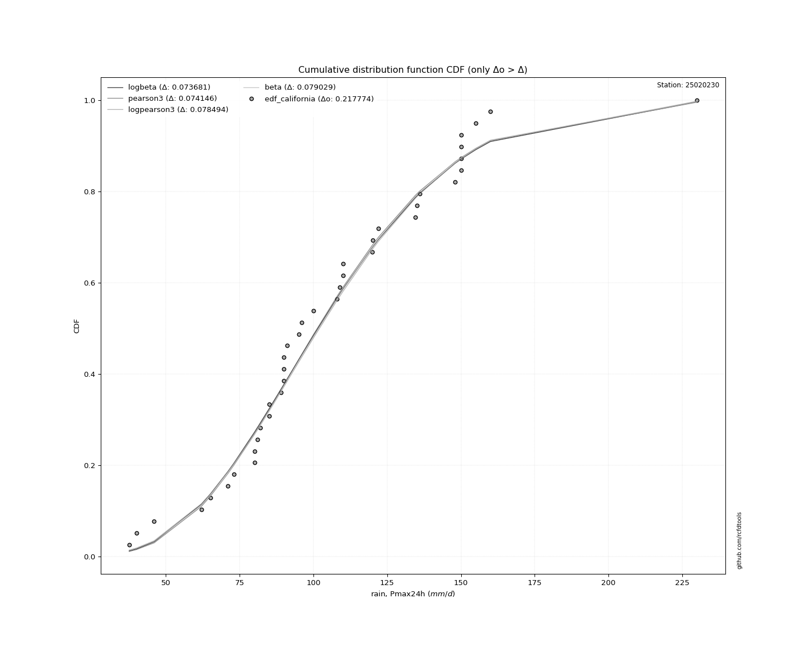</img>

</div>


**1.3. Best fit**

<div align="center">

|   id |   station | empirical_dist   | p_dist   |     delta |   deltao | eval   |   fit |   n |   best_fit |   best_fit_sort |
|-----:|----------:|:-----------------|:---------|----------:|---------:|:-------|------:|----:|-----------:|----------------:|
|    0 |  25020230 | edf_california   | gumbel_r | 0.0640216 | 0.217774 | Δo > Δ |     1 |  39 |          1 |               1 |

</div>


<div align="center">

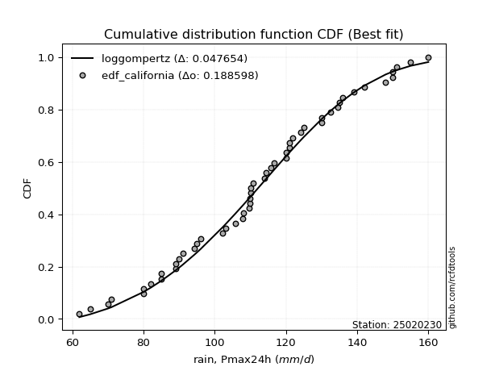</img>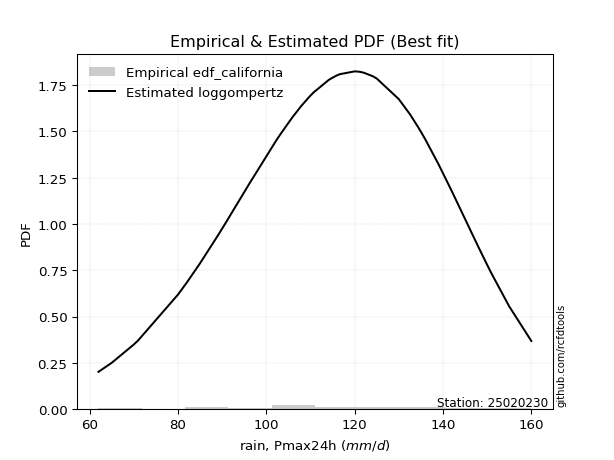</img>

</div>


### 2. Empirical - EDF Hazen (1930)

Hazen method for plotting positions is a formula used to estimate the empirical cumulative probability distribution of flood events or other hydrological data. This formula often results in biased estimations, particularly when extrapolating to extreme events (high return periods).

<div align="center">


$P=(m-0.5)/n$


</div>


**2.1. Empirical values**

<div align="center">

|                | 0                   | 1                    | 2                  | 3                   | 4                   | 5                   | 6                   | 7                   | 8                   | 9                   | 10                 | 11                 | 12                  | 13                  | 14                 | 15                 | 16                 | 17                  | 18                  | 19        | 20                 | 21                 | 22                 | 23                 | 24                 | 25                 | 26                 | 27                 | 28                 | 29                 | 30                | 31                 | 32                 | 33                 | 34                 | 35                 | 36                 | 37                 | 38                 |
|:---------------|:--------------------|:---------------------|:-------------------|:--------------------|:--------------------|:--------------------|:--------------------|:--------------------|:--------------------|:--------------------|:-------------------|:-------------------|:--------------------|:--------------------|:-------------------|:-------------------|:-------------------|:--------------------|:--------------------|:----------|:-------------------|:-------------------|:-------------------|:-------------------|:-------------------|:-------------------|:-------------------|:-------------------|:-------------------|:-------------------|:------------------|:-------------------|:-------------------|:-------------------|:-------------------|:-------------------|:-------------------|:-------------------|:-------------------|
| date           | 1996                | 2005                 | 1987               | 1992                | 1991                | 1998                | 2012                | 2003                | 2004                | 2018                | 2013               | 1997               | 1989                | 1990                | 1993               | 2006               | 1995               | 2010                | 1988                | 2014      | 2016               | 1980               | 2002               | 1999               | 2011               | 1983               | 2017               | 2000               | 2001               | 1994               | 1986              | 1982               | 2007               | 1981               | 2015               | 2009               | 1984               | 2008               | 1985               |
| x              | 37.52732            | 40.0                 | 46.0               | 62.0                | 65.0                | 71.0                | 73.0                | 80.0                | 80.0                | 81.1                | 82.0               | 85.0               | 85.0                | 89.0                | 90.0               | 90.0               | 90.0               | 91.0                | 95.0                | 96.0      | 100.0              | 108.0              | 109.0              | 110.0              | 110.0              | 120.0              | 120.1              | 122.0              | 134.5              | 135.0              | 136.0             | 148.0              | 150.0              | 150.0              | 150.0              | 150.0              | 155.0              | 160.0              | 230.0              |
| m              | 1                   | 2                    | 3                  | 4                   | 5                   | 6                   | 7                   | 8                   | 9                   | 10                  | 11                 | 12                 | 13                  | 14                  | 15                 | 16                 | 17                 | 18                  | 19                  | 20        | 21                 | 22                 | 23                 | 24                 | 25                 | 26                 | 27                 | 28                 | 29                 | 30                 | 31                | 32                 | 33                 | 34                 | 35                 | 36                 | 37                 | 38                 | 39                 |
| empirical_dist | edf_hazen           | edf_hazen            | edf_hazen          | edf_hazen           | edf_hazen           | edf_hazen           | edf_hazen           | edf_hazen           | edf_hazen           | edf_hazen           | edf_hazen          | edf_hazen          | edf_hazen           | edf_hazen           | edf_hazen          | edf_hazen          | edf_hazen          | edf_hazen           | edf_hazen           | edf_hazen | edf_hazen          | edf_hazen          | edf_hazen          | edf_hazen          | edf_hazen          | edf_hazen          | edf_hazen          | edf_hazen          | edf_hazen          | edf_hazen          | edf_hazen         | edf_hazen          | edf_hazen          | edf_hazen          | edf_hazen          | edf_hazen          | edf_hazen          | edf_hazen          | edf_hazen          |
| empirical      | 0.01282051282051282 | 0.038461538461538464 | 0.0641025641025641 | 0.08974358974358974 | 0.11538461538461539 | 0.14102564102564102 | 0.16666666666666666 | 0.19230769230769232 | 0.21794871794871795 | 0.24358974358974358 | 0.2692307692307692 | 0.2948717948717949 | 0.32051282051282054 | 0.34615384615384615 | 0.3717948717948718 | 0.3974358974358974 | 0.4230769230769231 | 0.44871794871794873 | 0.47435897435897434 | 0.5       | 0.5256410256410257 | 0.5512820512820513 | 0.5769230769230769 | 0.6025641025641025 | 0.6282051282051282 | 0.6538461538461539 | 0.6794871794871795 | 0.7051282051282052 | 0.7307692307692307 | 0.7564102564102564 | 0.782051282051282 | 0.8076923076923077 | 0.8333333333333334 | 0.8589743589743589 | 0.8846153846153846 | 0.9102564102564102 | 0.9358974358974359 | 0.9615384615384616 | 0.9871794871794872 |
| empirical_tr   | 1.0129870129870129  | 1.04                 | 1.0684931506849316 | 1.0985915492957747  | 1.1304347826086958  | 1.164179104477612   | 1.2                 | 1.2380952380952381  | 1.278688524590164   | 1.3220338983050848  | 1.3684210526315788 | 1.4181818181818182 | 1.471698113207547   | 1.5294117647058822  | 1.5918367346938775 | 1.6595744680851061 | 1.7333333333333334 | 1.813953488372093   | 1.9024390243902438  | 2.0       | 2.1081081081081083 | 2.2285714285714286 | 2.3636363636363633 | 2.5161290322580645 | 2.689655172413793  | 2.888888888888889  | 3.12               | 3.3913043478260874 | 3.7142857142857135 | 4.105263157894736  | 4.588235294117647 | 5.2                | 6.000000000000002  | 7.090909090909088  | 8.666666666666664  | 11.14285714285714  | 15.600000000000001 | 26.000000000000018 | 78.00000000000028  |

</div>


**2.2. Kolmogorov-Smirnov fit test (sorted by Δ)**


<div align="center">

|                | 0                  | 1                   | 2                   | 3                   | 4                   | 5                   | 6                   | 7                  | 8                   | 9                   | 10                  | 11                  | 12                  | 13                  | 14                  | 15                 | 16                  | 17                 | 18                  | 19                  | 20                  | 21                  | 22                  | 23                  | 24                  | 25                  | 26                  | 27                  | 28                  | 29                  | 30                 | 31                  | 32                  | 33                  | 34                 | 35                  | 36                  | 37                  | 38                  | 39                  | 40                  | 41                  | 42                 | 43                  | 44                  | 45                 | 46                  | 47                  | 48                 | 49                  | 50                  | 51                  | 52                  | 53                  | 54                  | 55                  | 56                 | 57                  | 58                  | 59                 | 60                  | 61                  | 62                    | 63                 | 64                  | 65                  | 66                 | 67                 | 68                  | 69                  | 70                  | 71                 | 72                  | 73                 | 74                 | 75                 | 76                  | 77                  | 78                  | 79                 | 80                  | 81                  | 82                  | 83                  | 84                  | 85                 | 86                  | 87                 | 88                  | 89                 | 90                 | 91                 | 92                 | 93                 |
|:---------------|:-------------------|:--------------------|:--------------------|:--------------------|:--------------------|:--------------------|:--------------------|:-------------------|:--------------------|:--------------------|:--------------------|:--------------------|:--------------------|:--------------------|:--------------------|:-------------------|:--------------------|:-------------------|:--------------------|:--------------------|:--------------------|:--------------------|:--------------------|:--------------------|:--------------------|:--------------------|:--------------------|:--------------------|:--------------------|:--------------------|:-------------------|:--------------------|:--------------------|:--------------------|:-------------------|:--------------------|:--------------------|:--------------------|:--------------------|:--------------------|:--------------------|:--------------------|:-------------------|:--------------------|:--------------------|:-------------------|:--------------------|:--------------------|:-------------------|:--------------------|:--------------------|:--------------------|:--------------------|:--------------------|:--------------------|:--------------------|:-------------------|:--------------------|:--------------------|:-------------------|:--------------------|:--------------------|:----------------------|:-------------------|:--------------------|:--------------------|:-------------------|:-------------------|:--------------------|:--------------------|:--------------------|:-------------------|:--------------------|:-------------------|:-------------------|:-------------------|:--------------------|:--------------------|:--------------------|:-------------------|:--------------------|:--------------------|:--------------------|:--------------------|:--------------------|:-------------------|:--------------------|:-------------------|:--------------------|:-------------------|:-------------------|:-------------------|:-------------------|:-------------------|
| station        | 25020230           | 25020230            | 25020230            | 25020230            | 25020230            | 25020230            | 25020230            | 25020230           | 25020230            | 25020230            | 25020230            | 25020230            | 25020230            | 25020230            | 25020230            | 25020230           | 25020230            | 25020230           | 25020230            | 25020230            | 25020230            | 25020230            | 25020230            | 25020230            | 25020230            | 25020230            | 25020230            | 25020230            | 25020230            | 25020230            | 25020230           | 25020230            | 25020230            | 25020230            | 25020230           | 25020230            | 25020230            | 25020230            | 25020230            | 25020230            | 25020230            | 25020230            | 25020230           | 25020230            | 25020230            | 25020230           | 25020230            | 25020230            | 25020230           | 25020230            | 25020230            | 25020230            | 25020230            | 25020230            | 25020230            | 25020230            | 25020230           | 25020230            | 25020230            | 25020230           | 25020230            | 25020230            | 25020230              | 25020230           | 25020230            | 25020230            | 25020230           | 25020230           | 25020230            | 25020230            | 25020230            | 25020230           | 25020230            | 25020230           | 25020230           | 25020230           | 25020230            | 25020230            | 25020230            | 25020230           | 25020230            | 25020230            | 25020230            | 25020230            | 25020230            | 25020230           | 25020230            | 25020230           | 25020230            | 25020230           | 25020230           | 25020230           | 25020230           | 25020230           |
| empirical_dist | edf_hazen          | edf_hazen           | edf_hazen           | edf_hazen           | edf_hazen           | edf_hazen           | edf_hazen           | edf_hazen          | edf_hazen           | edf_hazen           | edf_hazen           | edf_hazen           | edf_hazen           | edf_hazen           | edf_hazen           | edf_hazen          | edf_hazen           | edf_hazen          | edf_hazen           | edf_hazen           | edf_hazen           | edf_hazen           | edf_hazen           | edf_hazen           | edf_hazen           | edf_hazen           | edf_hazen           | edf_hazen           | edf_hazen           | edf_hazen           | edf_hazen          | edf_hazen           | edf_hazen           | edf_hazen           | edf_hazen          | edf_hazen           | edf_hazen           | edf_hazen           | edf_hazen           | edf_hazen           | edf_hazen           | edf_hazen           | edf_hazen          | edf_hazen           | edf_hazen           | edf_hazen          | edf_hazen           | edf_hazen           | edf_hazen          | edf_hazen           | edf_hazen           | edf_hazen           | edf_hazen           | edf_hazen           | edf_hazen           | edf_hazen           | edf_hazen          | edf_hazen           | edf_hazen           | edf_hazen          | edf_hazen           | edf_hazen           | edf_hazen             | edf_hazen          | edf_hazen           | edf_hazen           | edf_hazen          | edf_hazen          | edf_hazen           | edf_hazen           | edf_hazen           | edf_hazen          | edf_hazen           | edf_hazen          | edf_hazen          | edf_hazen          | edf_hazen           | edf_hazen           | edf_hazen           | edf_hazen          | edf_hazen           | edf_hazen           | edf_hazen           | edf_hazen           | edf_hazen           | edf_hazen          | edf_hazen           | edf_hazen          | edf_hazen           | edf_hazen          | edf_hazen          | edf_hazen          | edf_hazen          | edf_hazen          |
| p_dist         | logfisk            | alpha               | genlogistic         | invgamma            | fatiguelife         | recipinvgauss       | logjohnsonsu        | nct                | invgauss            | f                   | chi2                | erlang              | gamma               | logloggamma         | gumbel_r            | pearson3           | fisk                | logpearson3        | betaprime           | maxwell             | exponnorm           | laplace_asymmetric  | mielke              | loggenlogistic      | logweibull_min      | logdgamma           | loglogistic         | logmielke           | nakagami            | dgamma              | moyal              | rayleigh            | invweibull          | rice                | weibull_min        | loghypsecant        | loggompertz         | logfatiguelife      | logcrystalball      | lognorm             | lognorm             | logexponnorm        | loglognorm         | logrice             | logf                | lognakagami        | halflogistic        | logt                | logncf             | johnsonsu           | t                   | crystalball         | norm                | truncnorm           | lognct              | loggumbel_l         | gompertz           | loggamma            | loggamma            | kstwobign          | logrecipinvgauss    | logerlang           | loglaplace_asymmetric | loglaplace         | halfnorm            | logalpha            | logistic           | loginvgamma        | loginvgauss         | logmaxwell          | loggumbel_r         | hypsecant          | logmoyal            | lograyleigh        | logbetaprime       | wald               | laplace             | loghalflogistic     | loghalfnorm         | loginvweibull      | gumbel_l            | gibrat              | logwald             | logkstwobign        | loggibrat           | loggenexpon        | genexpon            | expon              | pareto              | ncf                | logtruncnorm       | logexpon           | logpareto          | logchi2            |
| delta          | 0.067130526370075  | 0.06910903651461969 | 0.07026325597296545 | 0.07027242918027318 | 0.07209412144172503 | 0.07217341090071813 | 0.07241382207972474 | 0.0726591677825888 | 0.07377057358765357 | 0.07385429199601432 | 0.07386983735591021 | 0.07386985411310967 | 0.07386986710284285 | 0.07603518101197951 | 0.07628609228235017 | 0.0764552453555877 | 0.07688852752053998 | 0.0769664023235134 | 0.07745302750704616 | 0.07914161909434583 | 0.07919596851048266 | 0.07984889288691799 | 0.08038174430827094 | 0.08053581993552167 | 0.08095883602065138 | 0.08107643870799308 | 0.08203806102747124 | 0.08269547202424482 | 0.08471825972326805 | 0.08627592364616943 | 0.0872106309979801 | 0.08803578044893987 | 0.08845090220805077 | 0.08894471048915861 | 0.0890289441379021 | 0.09520763961391432 | 0.09537152125573992 | 0.09638942816281729 | 0.09708506795258118 | 0.09708622813468101 | 0.09708622813468101 | 0.09708638723684501 | 0.0970871374962147 | 0.09709556498449676 | 0.09712978201900654 | 0.0973584315266672 | 0.09757697618404973 | 0.09877121102743588 | 0.1001466400152485 | 0.10025258742891185 | 0.10103101305855972 | 0.10117000752021843 | 0.10117001125169256 | 0.10117003023683524 | 0.10208926872552102 | 0.10235786251892437 | 0.1044434055254658 | 0.10445951447033971 | 0.10445951447033971 | 0.1051935027685916 | 0.10582091522563367 | 0.10765824901473145 | 0.1091282777902105    | 0.1100984485891846 | 0.11192147082912782 | 0.11551021682377247 | 0.1174048169302569 | 0.1187132783110765 | 0.12034759844381618 | 0.12382039875027914 | 0.12613661912656607 | 0.1313675233794992 | 0.13398275358694053 | 0.1344762127989557 | 0.1353185797025012 | 0.1462713564152673 | 0.15953356144082526 | 0.16037065451478874 | 0.16450872655973234 | 0.1651623342959562 | 0.16756080989486755 | 0.16952068000342008 | 0.19563602757055287 | 0.20574428930800207 | 0.22708549604257078 | 0.2351044485438709 | 0.26989669999123544 | 0.2708748740221538 | 0.27087487800095433 | 0.3073160043429592 | 0.3206518592283878 | 0.3500813015367068 | 0.3500813056619133 | 0.4087738972539385 |
| deltao         | 0.2177742891749185 | 0.2177742891749185  | 0.2177742891749185  | 0.2177742891749185  | 0.2177742891749185  | 0.2177742891749185  | 0.2177742891749185  | 0.2177742891749185 | 0.2177742891749185  | 0.2177742891749185  | 0.2177742891749185  | 0.2177742891749185  | 0.2177742891749185  | 0.2177742891749185  | 0.2177742891749185  | 0.2177742891749185 | 0.2177742891749185  | 0.2177742891749185 | 0.2177742891749185  | 0.2177742891749185  | 0.2177742891749185  | 0.2177742891749185  | 0.2177742891749185  | 0.2177742891749185  | 0.2177742891749185  | 0.2177742891749185  | 0.2177742891749185  | 0.2177742891749185  | 0.2177742891749185  | 0.2177742891749185  | 0.2177742891749185 | 0.2177742891749185  | 0.2177742891749185  | 0.2177742891749185  | 0.2177742891749185 | 0.2177742891749185  | 0.2177742891749185  | 0.2177742891749185  | 0.2177742891749185  | 0.2177742891749185  | 0.2177742891749185  | 0.2177742891749185  | 0.2177742891749185 | 0.2177742891749185  | 0.2177742891749185  | 0.2177742891749185 | 0.2177742891749185  | 0.2177742891749185  | 0.2177742891749185 | 0.2177742891749185  | 0.2177742891749185  | 0.2177742891749185  | 0.2177742891749185  | 0.2177742891749185  | 0.2177742891749185  | 0.2177742891749185  | 0.2177742891749185 | 0.2177742891749185  | 0.2177742891749185  | 0.2177742891749185 | 0.2177742891749185  | 0.2177742891749185  | 0.2177742891749185    | 0.2177742891749185 | 0.2177742891749185  | 0.2177742891749185  | 0.2177742891749185 | 0.2177742891749185 | 0.2177742891749185  | 0.2177742891749185  | 0.2177742891749185  | 0.2177742891749185 | 0.2177742891749185  | 0.2177742891749185 | 0.2177742891749185 | 0.2177742891749185 | 0.2177742891749185  | 0.2177742891749185  | 0.2177742891749185  | 0.2177742891749185 | 0.2177742891749185  | 0.2177742891749185  | 0.2177742891749185  | 0.2177742891749185  | 0.2177742891749185  | 0.2177742891749185 | 0.2177742891749185  | 0.2177742891749185 | 0.2177742891749185  | 0.2177742891749185 | 0.2177742891749185 | 0.2177742891749185 | 0.2177742891749185 | 0.2177742891749185 |
| eval           | Δo > Δ             | Δo > Δ              | Δo > Δ              | Δo > Δ              | Δo > Δ              | Δo > Δ              | Δo > Δ              | Δo > Δ             | Δo > Δ              | Δo > Δ              | Δo > Δ              | Δo > Δ              | Δo > Δ              | Δo > Δ              | Δo > Δ              | Δo > Δ             | Δo > Δ              | Δo > Δ             | Δo > Δ              | Δo > Δ              | Δo > Δ              | Δo > Δ              | Δo > Δ              | Δo > Δ              | Δo > Δ              | Δo > Δ              | Δo > Δ              | Δo > Δ              | Δo > Δ              | Δo > Δ              | Δo > Δ             | Δo > Δ              | Δo > Δ              | Δo > Δ              | Δo > Δ             | Δo > Δ              | Δo > Δ              | Δo > Δ              | Δo > Δ              | Δo > Δ              | Δo > Δ              | Δo > Δ              | Δo > Δ             | Δo > Δ              | Δo > Δ              | Δo > Δ             | Δo > Δ              | Δo > Δ              | Δo > Δ             | Δo > Δ              | Δo > Δ              | Δo > Δ              | Δo > Δ              | Δo > Δ              | Δo > Δ              | Δo > Δ              | Δo > Δ             | Δo > Δ              | Δo > Δ              | Δo > Δ             | Δo > Δ              | Δo > Δ              | Δo > Δ                | Δo > Δ             | Δo > Δ              | Δo > Δ              | Δo > Δ             | Δo > Δ             | Δo > Δ              | Δo > Δ              | Δo > Δ              | Δo > Δ             | Δo > Δ              | Δo > Δ             | Δo > Δ             | Δo > Δ             | Δo > Δ              | Δo > Δ              | Δo > Δ              | Δo > Δ             | Δo > Δ              | Δo > Δ              | Δo > Δ              | Δo > Δ              | Δo <= Δ             | Δo <= Δ            | Δo <= Δ             | Δo <= Δ            | Δo <= Δ             | Δo <= Δ            | Δo <= Δ            | Δo <= Δ            | Δo <= Δ            | Δo <= Δ            |
| fit            | 1                  | 1                   | 1                   | 1                   | 1                   | 1                   | 1                   | 1                  | 1                   | 1                   | 1                   | 1                   | 1                   | 1                   | 1                   | 1                  | 1                   | 1                  | 1                   | 1                   | 1                   | 1                   | 1                   | 1                   | 1                   | 1                   | 1                   | 1                   | 1                   | 1                   | 1                  | 1                   | 1                   | 1                   | 1                  | 1                   | 1                   | 1                   | 1                   | 1                   | 1                   | 1                   | 1                  | 1                   | 1                   | 1                  | 1                   | 1                   | 1                  | 1                   | 1                   | 1                   | 1                   | 1                   | 1                   | 1                   | 1                  | 1                   | 1                   | 1                  | 1                   | 1                   | 1                     | 1                  | 1                   | 1                   | 1                  | 1                  | 1                   | 1                   | 1                   | 1                  | 1                   | 1                  | 1                  | 1                  | 1                   | 1                   | 1                   | 1                  | 1                   | 1                   | 1                   | 1                   | 0                   | 0                  | 0                   | 0                  | 0                   | 0                  | 0                  | 0                  | 0                  | 0                  |
| n              | 39                 | 39                  | 39                  | 39                  | 39                  | 39                  | 39                  | 39                 | 39                  | 39                  | 39                  | 39                  | 39                  | 39                  | 39                  | 39                 | 39                  | 39                 | 39                  | 39                  | 39                  | 39                  | 39                  | 39                  | 39                  | 39                  | 39                  | 39                  | 39                  | 39                  | 39                 | 39                  | 39                  | 39                  | 39                 | 39                  | 39                  | 39                  | 39                  | 39                  | 39                  | 39                  | 39                 | 39                  | 39                  | 39                 | 39                  | 39                  | 39                 | 39                  | 39                  | 39                  | 39                  | 39                  | 39                  | 39                  | 39                 | 39                  | 39                  | 39                 | 39                  | 39                  | 39                    | 39                 | 39                  | 39                  | 39                 | 39                 | 39                  | 39                  | 39                  | 39                 | 39                  | 39                 | 39                 | 39                 | 39                  | 39                  | 39                  | 39                 | 39                  | 39                  | 39                  | 39                  | 39                  | 39                 | 39                  | 39                 | 39                  | 39                 | 39                 | 39                 | 39                 | 39                 |
| best_fit       | 1                  | 0                   | 0                   | 0                   | 0                   | 0                   | 0                   | 0                  | 0                   | 0                   | 0                   | 0                   | 0                   | 0                   | 0                   | 0                  | 0                   | 0                  | 0                   | 0                   | 0                   | 0                   | 0                   | 0                   | 0                   | 0                   | 0                   | 0                   | 0                   | 0                   | 0                  | 0                   | 0                   | 0                   | 0                  | 0                   | 0                   | 0                   | 0                   | 0                   | 0                   | 0                   | 0                  | 0                   | 0                   | 0                  | 0                   | 0                   | 0                  | 0                   | 0                   | 0                   | 0                   | 0                   | 0                   | 0                   | 0                  | 0                   | 0                   | 0                  | 0                   | 0                   | 0                     | 0                  | 0                   | 0                   | 0                  | 0                  | 0                   | 0                   | 0                   | 0                  | 0                   | 0                  | 0                  | 0                  | 0                   | 0                   | 0                   | 0                  | 0                   | 0                   | 0                   | 0                   | 0                   | 0                  | 0                   | 0                  | 0                   | 0                  | 0                  | 0                  | 0                  | 0                  |
| best_fit_sort  | 1                  | 2                   | 3                   | 4                   | 5                   | 6                   | 7                   | 8                  | 9                   | 10                  | 11                  | 12                  | 13                  | 14                  | 15                  | 16                 | 17                  | 18                 | 19                  | 20                  | 21                  | 22                  | 23                  | 24                  | 25                  | 26                  | 27                  | 28                  | 29                  | 30                  | 31                 | 32                  | 33                  | 34                  | 35                 | 36                  | 37                  | 38                  | 39                  | 40                  | 41                  | 42                  | 43                 | 44                  | 45                  | 46                 | 47                  | 48                  | 49                 | 50                  | 51                  | 52                  | 53                  | 54                  | 55                  | 56                  | 57                 | 58                  | 59                  | 60                 | 61                  | 62                  | 63                    | 64                 | 65                  | 66                  | 67                 | 68                 | 69                  | 70                  | 71                  | 72                 | 73                  | 74                 | 75                 | 76                 | 77                  | 78                  | 79                  | 80                 | 81                  | 82                  | 83                  | 84                  | 85                  | 86                 | 87                  | 88                 | 89                  | 90                 | 91                 | 92                 | 93                 | 94                 |

</div>


<div align="center">

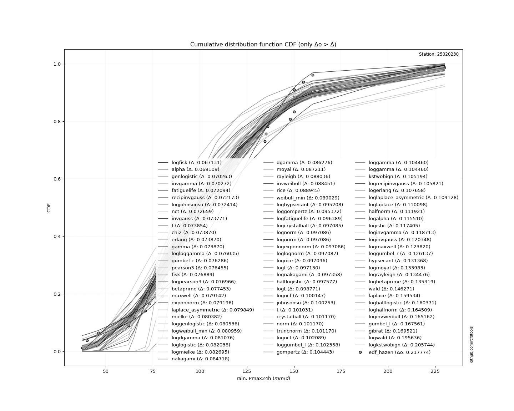</img>

</div>


**2.3. Best fit**

<div align="center">

|   id |   station | empirical_dist   | p_dist   |     delta |   deltao | eval   |   fit |   n |   best_fit |   best_fit_sort |
|-----:|----------:|:-----------------|:---------|----------:|---------:|:-------|------:|----:|-----------:|----------------:|
|    0 |  25020230 | edf_hazen        | logfisk  | 0.0671305 | 0.217774 | Δo > Δ |     1 |  39 |          1 |               1 |

</div>


<div align="center">

</img>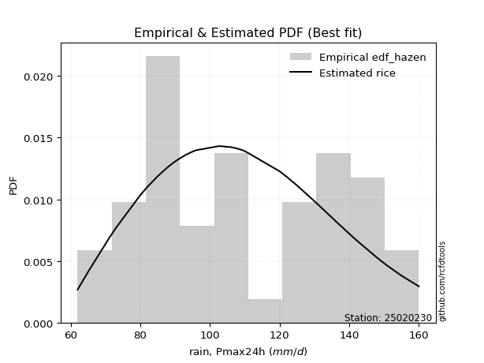</img>

</div>


### 3. Empirical - EDF Weibull (1939)

Weibull plotting position formula is an empirical method used to estimate the non-exceedance probability or plotting position for a set of observed data, is often recommended or widely used in practice, particularly in flood frequency analysis.

<div align="center">


$P=m/(n+1)$


</div>


**3.1. Empirical values**

<div align="center">

|                | 0                  | 1                  | 2                 | 3                  | 4                  | 5                  | 6                  | 7           | 8                  | 9                  | 10                 | 11                 | 12                 | 13                 | 14          | 15                 | 16                 | 17                 | 18                 | 19          | 20                 | 21                 | 22                | 23          | 24                 | 25                | 26                 | 27                | 28                 | 29          | 30                | 31                | 32                | 33                | 34          | 35                 | 36                 | 37                 | 38                 |
|:---------------|:-------------------|:-------------------|:------------------|:-------------------|:-------------------|:-------------------|:-------------------|:------------|:-------------------|:-------------------|:-------------------|:-------------------|:-------------------|:-------------------|:------------|:-------------------|:-------------------|:-------------------|:-------------------|:------------|:-------------------|:-------------------|:------------------|:------------|:-------------------|:------------------|:-------------------|:------------------|:-------------------|:------------|:------------------|:------------------|:------------------|:------------------|:------------|:-------------------|:-------------------|:-------------------|:-------------------|
| date           | 1996               | 2005               | 1987              | 1992               | 1991               | 1998               | 2012               | 2003        | 2004               | 2018               | 2013               | 1997               | 1989               | 1990               | 1993        | 2006               | 1995               | 2010               | 1988               | 2014        | 2016               | 1980               | 2002              | 1999        | 2011               | 1983              | 2017               | 2000              | 2001               | 1994        | 1986              | 1982              | 2007              | 1981              | 2015        | 2009               | 1984               | 2008               | 1985               |
| x              | 37.52732           | 40.0               | 46.0              | 62.0               | 65.0               | 71.0               | 73.0               | 80.0        | 80.0               | 81.1               | 82.0               | 85.0               | 85.0               | 89.0               | 90.0        | 90.0               | 90.0               | 91.0               | 95.0               | 96.0        | 100.0              | 108.0              | 109.0             | 110.0       | 110.0              | 120.0             | 120.1              | 122.0             | 134.5              | 135.0       | 136.0             | 148.0             | 150.0             | 150.0             | 150.0       | 150.0              | 155.0              | 160.0              | 230.0              |
| m              | 1                  | 2                  | 3                 | 4                  | 5                  | 6                  | 7                  | 8           | 9                  | 10                 | 11                 | 12                 | 13                 | 14                 | 15          | 16                 | 17                 | 18                 | 19                 | 20          | 21                 | 22                 | 23                | 24          | 25                 | 26                | 27                 | 28                | 29                 | 30          | 31                | 32                | 33                | 34                | 35          | 36                 | 37                 | 38                 | 39                 |
| empirical_dist | edf_weibull        | edf_weibull        | edf_weibull       | edf_weibull        | edf_weibull        | edf_weibull        | edf_weibull        | edf_weibull | edf_weibull        | edf_weibull        | edf_weibull        | edf_weibull        | edf_weibull        | edf_weibull        | edf_weibull | edf_weibull        | edf_weibull        | edf_weibull        | edf_weibull        | edf_weibull | edf_weibull        | edf_weibull        | edf_weibull       | edf_weibull | edf_weibull        | edf_weibull       | edf_weibull        | edf_weibull       | edf_weibull        | edf_weibull | edf_weibull       | edf_weibull       | edf_weibull       | edf_weibull       | edf_weibull | edf_weibull        | edf_weibull        | edf_weibull        | edf_weibull        |
| empirical      | 0.025              | 0.05               | 0.075             | 0.1                | 0.125              | 0.15               | 0.175              | 0.2         | 0.225              | 0.25               | 0.275              | 0.3                | 0.325              | 0.35               | 0.375       | 0.4                | 0.425              | 0.45               | 0.475              | 0.5         | 0.525              | 0.55               | 0.575             | 0.6         | 0.625              | 0.65              | 0.675              | 0.7               | 0.725              | 0.75        | 0.775             | 0.8               | 0.825             | 0.85              | 0.875       | 0.9                | 0.925              | 0.95               | 0.975              |
| empirical_tr   | 1.0256410256410258 | 1.0526315789473684 | 1.081081081081081 | 1.1111111111111112 | 1.1428571428571428 | 1.1764705882352942 | 1.2121212121212122 | 1.25        | 1.2903225806451613 | 1.3333333333333333 | 1.3793103448275863 | 1.4285714285714286 | 1.4814814814814814 | 1.5384615384615383 | 1.6         | 1.6666666666666667 | 1.7391304347826089 | 1.8181818181818181 | 1.9047619047619047 | 2.0         | 2.1052631578947367 | 2.2222222222222223 | 2.352941176470588 | 2.5         | 2.6666666666666665 | 2.857142857142857 | 3.0769230769230775 | 3.333333333333333 | 3.6363636363636362 | 4.0         | 4.444444444444445 | 5.000000000000001 | 5.714285714285713 | 6.666666666666666 | 8.0         | 10.000000000000002 | 13.333333333333341 | 19.999999999999982 | 39.999999999999964 |

</div>


**3.2. Kolmogorov-Smirnov fit test (sorted by Δ)**


<div align="center">

|                | 0                   | 1                   | 2                   | 3                   | 4                   | 5                   | 6                   | 7                   | 8                   | 9                   | 10                  | 11                  | 12                  | 13                  | 14                  | 15                  | 16                  | 17                  | 18                  | 19                  | 20                  | 21                  | 22                  | 23                  | 24                  | 25                  | 26                  | 27                  | 28                  | 29                  | 30                 | 31                  | 32                  | 33                  | 34                 | 35                  | 36                  | 37                  | 38                  | 39                 | 40                  | 41                  | 42                  | 43                  | 44                  | 45                  | 46                  | 47                  | 48                  | 49                 | 50                  | 51                  | 52                  | 53                  | 54                  | 55                  | 56                  | 57                  | 58                  | 59                  | 60                  | 61                  | 62                  | 63                  | 64                    | 65                  | 66                  | 67                  | 68                  | 69                  | 70                  | 71                 | 72                 | 73                  | 74                  | 75                  | 76                  | 77                  | 78                 | 79                  | 80                  | 81                  | 82                  | 83                  | 84                 | 85                  | 86                 | 87                 | 88                 | 89                  | 90                  | 91                 | 92                 | 93                 |
|:---------------|:--------------------|:--------------------|:--------------------|:--------------------|:--------------------|:--------------------|:--------------------|:--------------------|:--------------------|:--------------------|:--------------------|:--------------------|:--------------------|:--------------------|:--------------------|:--------------------|:--------------------|:--------------------|:--------------------|:--------------------|:--------------------|:--------------------|:--------------------|:--------------------|:--------------------|:--------------------|:--------------------|:--------------------|:--------------------|:--------------------|:-------------------|:--------------------|:--------------------|:--------------------|:-------------------|:--------------------|:--------------------|:--------------------|:--------------------|:-------------------|:--------------------|:--------------------|:--------------------|:--------------------|:--------------------|:--------------------|:--------------------|:--------------------|:--------------------|:-------------------|:--------------------|:--------------------|:--------------------|:--------------------|:--------------------|:--------------------|:--------------------|:--------------------|:--------------------|:--------------------|:--------------------|:--------------------|:--------------------|:--------------------|:----------------------|:--------------------|:--------------------|:--------------------|:--------------------|:--------------------|:--------------------|:-------------------|:-------------------|:--------------------|:--------------------|:--------------------|:--------------------|:--------------------|:-------------------|:--------------------|:--------------------|:--------------------|:--------------------|:--------------------|:-------------------|:--------------------|:-------------------|:-------------------|:-------------------|:--------------------|:--------------------|:-------------------|:-------------------|:-------------------|
| station        | 25020230            | 25020230            | 25020230            | 25020230            | 25020230            | 25020230            | 25020230            | 25020230            | 25020230            | 25020230            | 25020230            | 25020230            | 25020230            | 25020230            | 25020230            | 25020230            | 25020230            | 25020230            | 25020230            | 25020230            | 25020230            | 25020230            | 25020230            | 25020230            | 25020230            | 25020230            | 25020230            | 25020230            | 25020230            | 25020230            | 25020230           | 25020230            | 25020230            | 25020230            | 25020230           | 25020230            | 25020230            | 25020230            | 25020230            | 25020230           | 25020230            | 25020230            | 25020230            | 25020230            | 25020230            | 25020230            | 25020230            | 25020230            | 25020230            | 25020230           | 25020230            | 25020230            | 25020230            | 25020230            | 25020230            | 25020230            | 25020230            | 25020230            | 25020230            | 25020230            | 25020230            | 25020230            | 25020230            | 25020230            | 25020230              | 25020230            | 25020230            | 25020230            | 25020230            | 25020230            | 25020230            | 25020230           | 25020230           | 25020230            | 25020230            | 25020230            | 25020230            | 25020230            | 25020230           | 25020230            | 25020230            | 25020230            | 25020230            | 25020230            | 25020230           | 25020230            | 25020230           | 25020230           | 25020230           | 25020230            | 25020230            | 25020230           | 25020230           | 25020230           |
| empirical_dist | edf_weibull         | edf_weibull         | edf_weibull         | edf_weibull         | edf_weibull         | edf_weibull         | edf_weibull         | edf_weibull         | edf_weibull         | edf_weibull         | edf_weibull         | edf_weibull         | edf_weibull         | edf_weibull         | edf_weibull         | edf_weibull         | edf_weibull         | edf_weibull         | edf_weibull         | edf_weibull         | edf_weibull         | edf_weibull         | edf_weibull         | edf_weibull         | edf_weibull         | edf_weibull         | edf_weibull         | edf_weibull         | edf_weibull         | edf_weibull         | edf_weibull        | edf_weibull         | edf_weibull         | edf_weibull         | edf_weibull        | edf_weibull         | edf_weibull         | edf_weibull         | edf_weibull         | edf_weibull        | edf_weibull         | edf_weibull         | edf_weibull         | edf_weibull         | edf_weibull         | edf_weibull         | edf_weibull         | edf_weibull         | edf_weibull         | edf_weibull        | edf_weibull         | edf_weibull         | edf_weibull         | edf_weibull         | edf_weibull         | edf_weibull         | edf_weibull         | edf_weibull         | edf_weibull         | edf_weibull         | edf_weibull         | edf_weibull         | edf_weibull         | edf_weibull         | edf_weibull           | edf_weibull         | edf_weibull         | edf_weibull         | edf_weibull         | edf_weibull         | edf_weibull         | edf_weibull        | edf_weibull        | edf_weibull         | edf_weibull         | edf_weibull         | edf_weibull         | edf_weibull         | edf_weibull        | edf_weibull         | edf_weibull         | edf_weibull         | edf_weibull         | edf_weibull         | edf_weibull        | edf_weibull         | edf_weibull        | edf_weibull        | edf_weibull        | edf_weibull         | edf_weibull         | edf_weibull        | edf_weibull        | edf_weibull        |
| p_dist         | invgauss            | f                   | erlang              | gamma               | chi2                | logloggamma         | recipinvgauss       | fatiguelife         | pearson3            | logpearson3         | invgamma            | betaprime           | alpha               | maxwell             | logfisk             | logweibull_min      | logjohnsonsu        | nct                 | genlogistic         | nakagami            | logdgamma           | rayleigh            | exponnorm           | invweibull          | fisk                | rice                | weibull_min         | mielke              | loggenlogistic      | gumbel_r            | logmielke          | laplace_asymmetric  | loggompertz         | loglogistic         | logfatiguelife     | logcrystalball      | lognorm             | lognorm             | logexponnorm        | loglognorm         | logrice             | logf                | lognakagami         | halflogistic        | logt                | logncf              | moyal               | dgamma              | lognct              | gompertz           | loggamma            | loggamma            | kstwobign           | logrecipinvgauss    | logerlang           | johnsonsu           | loghypsecant        | t                   | crystalball         | norm                | truncnorm           | loggumbel_l         | halfnorm            | logalpha            | loglaplace_asymmetric | loginvgamma         | loginvgauss         | loglaplace          | logmaxwell          | loggumbel_r         | logistic            | lograyleigh        | logbetaprime       | logmoyal            | hypsecant           | loghalflogistic     | wald                | loghalfnorm         | loginvweibull      | laplace             | gumbel_l            | gibrat              | logwald             | logkstwobign        | loggenexpon        | loggibrat           | genexpon           | expon              | pareto             | ncf                 | logtruncnorm        | logexpon           | logpareto          | logchi2            |
| delta          | 0.06626277671111896 | 0.06747084959743732 | 0.06747183482992974 | 0.06747183744409113 | 0.06747185896888208 | 0.06834287331967182 | 0.06845698074145318 | 0.06851531364064778 | 0.06876293766328001 | 0.06927409463120571 | 0.06953726619451533 | 0.06976071981473847 | 0.07039108779667097 | 0.07144931140203814 | 0.07289975713930574 | 0.07326652832834368 | 0.07369587336177602 | 0.07394121906464007 | 0.07394639693563443 | 0.07702595203096035 | 0.07787131050286489 | 0.08034347275663217 | 0.08047801979253394 | 0.08075859451574308 | 0.08090564713899773 | 0.08125240279685092 | 0.08133663644559441 | 0.08166379559032222 | 0.08181787121757295 | 0.08205532305158092 | 0.0839775233062961 | 0.08561812365614874 | 0.08767921356343222 | 0.08780729179670199 | 0.0886971204705096 | 0.08939276026027348 | 0.08939392044237332 | 0.08939392044237332 | 0.08939407954453732 | 0.089394829803907  | 0.08940325729218906 | 0.08943747432669885 | 0.08966612383435951 | 0.08988466849174204 | 0.09107890333512819 | 0.09245433232294081 | 0.09297986176721085 | 0.09375429983111072 | 0.09439696103321332 | 0.0967510978331581 | 0.09676720677803202 | 0.09676720677803202 | 0.09750119507628391 | 0.09812860753332597 | 0.09996594132242376 | 0.10025258742891185 | 0.10097687038314507 | 0.10103101305855972 | 0.10117000752021843 | 0.10117001125169256 | 0.10117003023683524 | 0.10363991380097565 | 0.10422916313682012 | 0.10781790913146477 | 0.11041032907226178   | 0.11102097061876881 | 0.11265529075150849 | 0.11586767935841535 | 0.11612809105797145 | 0.11844431143425838 | 0.11868686821230817 | 0.126783905106648  | 0.1276262720101935 | 0.13257075615167502 | 0.13264957466155047 | 0.15267834682248105 | 0.15460468974860064 | 0.15681641886742465 | 0.1574700266036485 | 0.16081561272287653 | 0.16756080989486755 | 0.17657196205470216 | 0.19691807885260415 | 0.19805198161569437 | 0.2274121408515632 | 0.22836754732462206 | 0.2622043922989277 | 0.2631825663298461 | 0.2631825703086466 | 0.29807248644393003 | 0.31295955153608007 | 0.3423889938443991 | 0.3423889979696056 | 0.3997995382795795 |
| deltao         | 0.2177742891749185  | 0.2177742891749185  | 0.2177742891749185  | 0.2177742891749185  | 0.2177742891749185  | 0.2177742891749185  | 0.2177742891749185  | 0.2177742891749185  | 0.2177742891749185  | 0.2177742891749185  | 0.2177742891749185  | 0.2177742891749185  | 0.2177742891749185  | 0.2177742891749185  | 0.2177742891749185  | 0.2177742891749185  | 0.2177742891749185  | 0.2177742891749185  | 0.2177742891749185  | 0.2177742891749185  | 0.2177742891749185  | 0.2177742891749185  | 0.2177742891749185  | 0.2177742891749185  | 0.2177742891749185  | 0.2177742891749185  | 0.2177742891749185  | 0.2177742891749185  | 0.2177742891749185  | 0.2177742891749185  | 0.2177742891749185 | 0.2177742891749185  | 0.2177742891749185  | 0.2177742891749185  | 0.2177742891749185 | 0.2177742891749185  | 0.2177742891749185  | 0.2177742891749185  | 0.2177742891749185  | 0.2177742891749185 | 0.2177742891749185  | 0.2177742891749185  | 0.2177742891749185  | 0.2177742891749185  | 0.2177742891749185  | 0.2177742891749185  | 0.2177742891749185  | 0.2177742891749185  | 0.2177742891749185  | 0.2177742891749185 | 0.2177742891749185  | 0.2177742891749185  | 0.2177742891749185  | 0.2177742891749185  | 0.2177742891749185  | 0.2177742891749185  | 0.2177742891749185  | 0.2177742891749185  | 0.2177742891749185  | 0.2177742891749185  | 0.2177742891749185  | 0.2177742891749185  | 0.2177742891749185  | 0.2177742891749185  | 0.2177742891749185    | 0.2177742891749185  | 0.2177742891749185  | 0.2177742891749185  | 0.2177742891749185  | 0.2177742891749185  | 0.2177742891749185  | 0.2177742891749185 | 0.2177742891749185 | 0.2177742891749185  | 0.2177742891749185  | 0.2177742891749185  | 0.2177742891749185  | 0.2177742891749185  | 0.2177742891749185 | 0.2177742891749185  | 0.2177742891749185  | 0.2177742891749185  | 0.2177742891749185  | 0.2177742891749185  | 0.2177742891749185 | 0.2177742891749185  | 0.2177742891749185 | 0.2177742891749185 | 0.2177742891749185 | 0.2177742891749185  | 0.2177742891749185  | 0.2177742891749185 | 0.2177742891749185 | 0.2177742891749185 |
| eval           | Δo > Δ              | Δo > Δ              | Δo > Δ              | Δo > Δ              | Δo > Δ              | Δo > Δ              | Δo > Δ              | Δo > Δ              | Δo > Δ              | Δo > Δ              | Δo > Δ              | Δo > Δ              | Δo > Δ              | Δo > Δ              | Δo > Δ              | Δo > Δ              | Δo > Δ              | Δo > Δ              | Δo > Δ              | Δo > Δ              | Δo > Δ              | Δo > Δ              | Δo > Δ              | Δo > Δ              | Δo > Δ              | Δo > Δ              | Δo > Δ              | Δo > Δ              | Δo > Δ              | Δo > Δ              | Δo > Δ             | Δo > Δ              | Δo > Δ              | Δo > Δ              | Δo > Δ             | Δo > Δ              | Δo > Δ              | Δo > Δ              | Δo > Δ              | Δo > Δ             | Δo > Δ              | Δo > Δ              | Δo > Δ              | Δo > Δ              | Δo > Δ              | Δo > Δ              | Δo > Δ              | Δo > Δ              | Δo > Δ              | Δo > Δ             | Δo > Δ              | Δo > Δ              | Δo > Δ              | Δo > Δ              | Δo > Δ              | Δo > Δ              | Δo > Δ              | Δo > Δ              | Δo > Δ              | Δo > Δ              | Δo > Δ              | Δo > Δ              | Δo > Δ              | Δo > Δ              | Δo > Δ                | Δo > Δ              | Δo > Δ              | Δo > Δ              | Δo > Δ              | Δo > Δ              | Δo > Δ              | Δo > Δ             | Δo > Δ             | Δo > Δ              | Δo > Δ              | Δo > Δ              | Δo > Δ              | Δo > Δ              | Δo > Δ             | Δo > Δ              | Δo > Δ              | Δo > Δ              | Δo > Δ              | Δo > Δ              | Δo <= Δ            | Δo <= Δ             | Δo <= Δ            | Δo <= Δ            | Δo <= Δ            | Δo <= Δ             | Δo <= Δ             | Δo <= Δ            | Δo <= Δ            | Δo <= Δ            |
| fit            | 1                   | 1                   | 1                   | 1                   | 1                   | 1                   | 1                   | 1                   | 1                   | 1                   | 1                   | 1                   | 1                   | 1                   | 1                   | 1                   | 1                   | 1                   | 1                   | 1                   | 1                   | 1                   | 1                   | 1                   | 1                   | 1                   | 1                   | 1                   | 1                   | 1                   | 1                  | 1                   | 1                   | 1                   | 1                  | 1                   | 1                   | 1                   | 1                   | 1                  | 1                   | 1                   | 1                   | 1                   | 1                   | 1                   | 1                   | 1                   | 1                   | 1                  | 1                   | 1                   | 1                   | 1                   | 1                   | 1                   | 1                   | 1                   | 1                   | 1                   | 1                   | 1                   | 1                   | 1                   | 1                     | 1                   | 1                   | 1                   | 1                   | 1                   | 1                   | 1                  | 1                  | 1                   | 1                   | 1                   | 1                   | 1                   | 1                  | 1                   | 1                   | 1                   | 1                   | 1                   | 0                  | 0                   | 0                  | 0                  | 0                  | 0                   | 0                   | 0                  | 0                  | 0                  |
| n              | 39                  | 39                  | 39                  | 39                  | 39                  | 39                  | 39                  | 39                  | 39                  | 39                  | 39                  | 39                  | 39                  | 39                  | 39                  | 39                  | 39                  | 39                  | 39                  | 39                  | 39                  | 39                  | 39                  | 39                  | 39                  | 39                  | 39                  | 39                  | 39                  | 39                  | 39                 | 39                  | 39                  | 39                  | 39                 | 39                  | 39                  | 39                  | 39                  | 39                 | 39                  | 39                  | 39                  | 39                  | 39                  | 39                  | 39                  | 39                  | 39                  | 39                 | 39                  | 39                  | 39                  | 39                  | 39                  | 39                  | 39                  | 39                  | 39                  | 39                  | 39                  | 39                  | 39                  | 39                  | 39                    | 39                  | 39                  | 39                  | 39                  | 39                  | 39                  | 39                 | 39                 | 39                  | 39                  | 39                  | 39                  | 39                  | 39                 | 39                  | 39                  | 39                  | 39                  | 39                  | 39                 | 39                  | 39                 | 39                 | 39                 | 39                  | 39                  | 39                 | 39                 | 39                 |
| best_fit       | 1                   | 0                   | 0                   | 0                   | 0                   | 0                   | 0                   | 0                   | 0                   | 0                   | 0                   | 0                   | 0                   | 0                   | 0                   | 0                   | 0                   | 0                   | 0                   | 0                   | 0                   | 0                   | 0                   | 0                   | 0                   | 0                   | 0                   | 0                   | 0                   | 0                   | 0                  | 0                   | 0                   | 0                   | 0                  | 0                   | 0                   | 0                   | 0                   | 0                  | 0                   | 0                   | 0                   | 0                   | 0                   | 0                   | 0                   | 0                   | 0                   | 0                  | 0                   | 0                   | 0                   | 0                   | 0                   | 0                   | 0                   | 0                   | 0                   | 0                   | 0                   | 0                   | 0                   | 0                   | 0                     | 0                   | 0                   | 0                   | 0                   | 0                   | 0                   | 0                  | 0                  | 0                   | 0                   | 0                   | 0                   | 0                   | 0                  | 0                   | 0                   | 0                   | 0                   | 0                   | 0                  | 0                   | 0                  | 0                  | 0                  | 0                   | 0                   | 0                  | 0                  | 0                  |
| best_fit_sort  | 1                   | 2                   | 3                   | 4                   | 5                   | 6                   | 7                   | 8                   | 9                   | 10                  | 11                  | 12                  | 13                  | 14                  | 15                  | 16                  | 17                  | 18                  | 19                  | 20                  | 21                  | 22                  | 23                  | 24                  | 25                  | 26                  | 27                  | 28                  | 29                  | 30                  | 31                 | 32                  | 33                  | 34                  | 35                 | 36                  | 37                  | 38                  | 39                  | 40                 | 41                  | 42                  | 43                  | 44                  | 45                  | 46                  | 47                  | 48                  | 49                  | 50                 | 51                  | 52                  | 53                  | 54                  | 55                  | 56                  | 57                  | 58                  | 59                  | 60                  | 61                  | 62                  | 63                  | 64                  | 65                    | 66                  | 67                  | 68                  | 69                  | 70                  | 71                  | 72                 | 73                 | 74                  | 75                  | 76                  | 77                  | 78                  | 79                 | 80                  | 81                  | 82                  | 83                  | 84                  | 85                 | 86                  | 87                 | 88                 | 89                 | 90                  | 91                  | 92                 | 93                 | 94                 |

</div>


<div align="center">

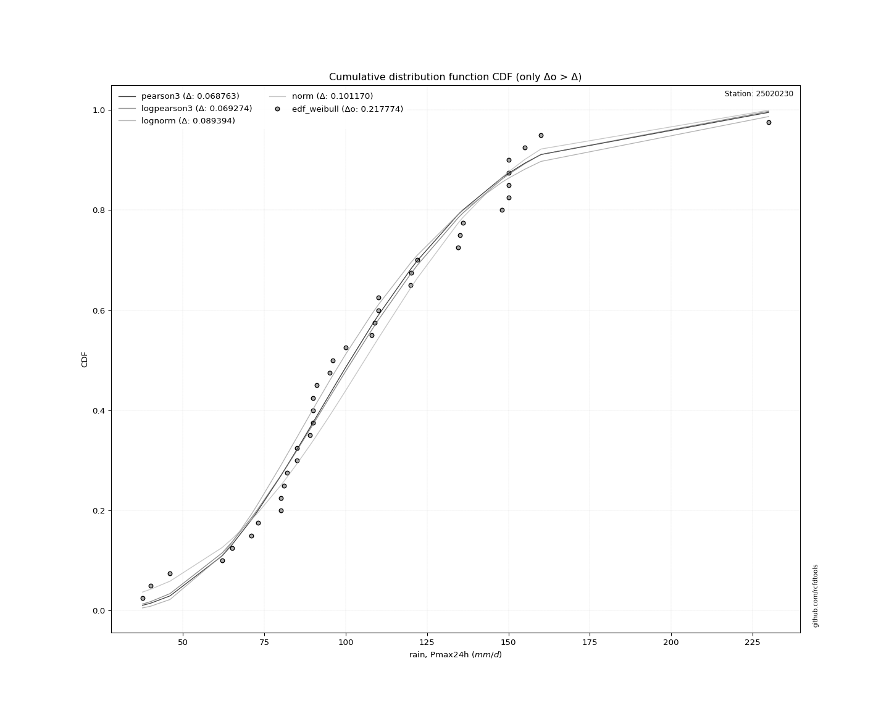</img>

</div>


**3.3. Best fit**

<div align="center">

|   id |   station | empirical_dist   | p_dist   |     delta |   deltao | eval   |   fit |   n |   best_fit |   best_fit_sort |
|-----:|----------:|:-----------------|:---------|----------:|---------:|:-------|------:|----:|-----------:|----------------:|
|    0 |  25020230 | edf_weibull      | invgauss | 0.0662628 | 0.217774 | Δo > Δ |     1 |  39 |          1 |               1 |

</div>


<div align="center">

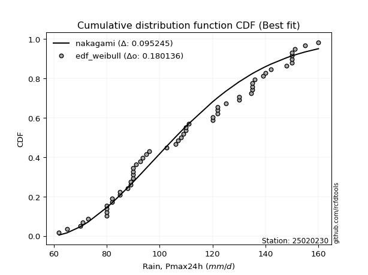</img></img>

</div>


### 4. Empirical - EDF Beard (1943)

The Beard formula (or Beard´s plotting position formula) in hydrology is used to estimate the empirical non-exceedance probability _(P)_ of a flood event (or other extreme hydrological data point) within a given dataset.

<div align="center">


$P=(m-0.31)/(n+0.38)$


</div>


**4.1. Empirical values**

<div align="center">

|                | 0                    | 1                    | 2                   | 3                   | 4                   | 5                   | 6                   | 7                   | 8                   | 9                  | 10                  | 11                  | 12                 | 13                 | 14                  | 15                 | 16                 | 17                  | 18                  | 19        | 20                 | 21                 | 22                 | 23                 | 24                 | 25                 | 26                 | 27                 | 28                 | 29                 | 30                 | 31                 | 32                 | 33                 | 34                 | 35                 | 36                 | 37                 | 38                 |
|:---------------|:---------------------|:---------------------|:--------------------|:--------------------|:--------------------|:--------------------|:--------------------|:--------------------|:--------------------|:-------------------|:--------------------|:--------------------|:-------------------|:-------------------|:--------------------|:-------------------|:-------------------|:--------------------|:--------------------|:----------|:-------------------|:-------------------|:-------------------|:-------------------|:-------------------|:-------------------|:-------------------|:-------------------|:-------------------|:-------------------|:-------------------|:-------------------|:-------------------|:-------------------|:-------------------|:-------------------|:-------------------|:-------------------|:-------------------|
| date           | 1996                 | 2005                 | 1987                | 1992                | 1991                | 1998                | 2012                | 2003                | 2004                | 2018               | 2013                | 1997                | 1989               | 1990               | 1993                | 2006               | 1995               | 2010                | 1988                | 2014      | 2016               | 1980               | 2002               | 1999               | 2011               | 1983               | 2017               | 2000               | 2001               | 1994               | 1986               | 1982               | 2007               | 1981               | 2015               | 2009               | 1984               | 2008               | 1985               |
| x              | 37.52732             | 40.0                 | 46.0                | 62.0                | 65.0                | 71.0                | 73.0                | 80.0                | 80.0                | 81.1               | 82.0                | 85.0                | 85.0               | 89.0               | 90.0                | 90.0               | 90.0               | 91.0                | 95.0                | 96.0      | 100.0              | 108.0              | 109.0              | 110.0              | 110.0              | 120.0              | 120.1              | 122.0              | 134.5              | 135.0              | 136.0              | 148.0              | 150.0              | 150.0              | 150.0              | 150.0              | 155.0              | 160.0              | 230.0              |
| m              | 1                    | 2                    | 3                   | 4                   | 5                   | 6                   | 7                   | 8                   | 9                   | 10                 | 11                  | 12                  | 13                 | 14                 | 15                  | 16                 | 17                 | 18                  | 19                  | 20        | 21                 | 22                 | 23                 | 24                 | 25                 | 26                 | 27                 | 28                 | 29                 | 30                 | 31                 | 32                 | 33                 | 34                 | 35                 | 36                 | 37                 | 38                 | 39                 |
| empirical_dist | edf_beard            | edf_beard            | edf_beard           | edf_beard           | edf_beard           | edf_beard           | edf_beard           | edf_beard           | edf_beard           | edf_beard          | edf_beard           | edf_beard           | edf_beard          | edf_beard          | edf_beard           | edf_beard          | edf_beard          | edf_beard           | edf_beard           | edf_beard | edf_beard          | edf_beard          | edf_beard          | edf_beard          | edf_beard          | edf_beard          | edf_beard          | edf_beard          | edf_beard          | edf_beard          | edf_beard          | edf_beard          | edf_beard          | edf_beard          | edf_beard          | edf_beard          | edf_beard          | edf_beard          | edf_beard          |
| empirical      | 0.017521584560690702 | 0.042915185373285925 | 0.06830878618588115 | 0.09370238699847637 | 0.11909598781107161 | 0.14448958862366684 | 0.16988318943626207 | 0.19527679024885727 | 0.22067039106145248 | 0.2460639918740477 | 0.27145759268664293 | 0.29685119349923816 | 0.3222447943118334 | 0.3476383951244286 | 0.37303199593702385 | 0.3984255967496191 | 0.4238191975622143 | 0.44921279837480954 | 0.47460639918740477 | 0.5       | 0.5253936008125952 | 0.5507872016251905 | 0.5761808024377857 | 0.6015744032503809 | 0.6269680040629761 | 0.6523616048755714 | 0.6777552056881666 | 0.7031488065007618 | 0.7285424073133571 | 0.7539360081259523 | 0.7793296089385474 | 0.8047232097511426 | 0.8301168105637379 | 0.8555104113763331 | 0.8809040121889282 | 0.9062976130015234 | 0.9316912138141187 | 0.9570848146267139 | 0.9824784154393091 |
| empirical_tr   | 1.0178340656500389   | 1.0448394799681613   | 1.0733169801035705  | 1.1033903054076772  | 1.135197463245892   | 1.1688928465420005  | 1.2046497399816456  | 1.242663300725781   | 1.2831541218637992  | 1.3263725159986526 | 1.3726036946671314  | 1.4221740700613938  | 1.4754589733982764 | 1.532892175943947  | 1.5949777237748075  | 1.6623047699451245 | 1.7355663287791978 | 1.8155832180728446  | 1.903334944417593   | 2.0       | 2.1070090957731407 | 2.2261164499717356 | 2.359496704613541  | 2.509878903760357  | 2.6807351940095305 | 2.8765522279035793 | 3.1032308904649333 | 3.368691189050471  | 3.683816651075772  | 4.063983488132095  | 4.531645569620252  | 5.120936280884264  | 5.8863976083707    | 6.920913884007027  | 8.396588486140713  | 10.67208672086719  | 14.639405204460932 | 23.301775147928907 | 57.07246376811543  |

</div>


**4.2. Kolmogorov-Smirnov fit test (sorted by Δ)**


<div align="center">

|                | 0                   | 1                   | 2                   | 3                   | 4                  | 5                   | 6                   | 7                   | 8                   | 9                   | 10                 | 11                  | 12                  | 13                 | 14                  | 15                  | 16                  | 17                  | 18                  | 19                  | 20                  | 21                  | 22                  | 23                  | 24                  | 25                  | 26                  | 27                  | 28                 | 29                  | 30                  | 31                  | 32                  | 33                  | 34                  | 35                  | 36                  | 37                  | 38                  | 39                  | 40                  | 41                  | 42                 | 43                  | 44                  | 45                  | 46                  | 47                  | 48                  | 49                  | 50                  | 51                  | 52                  | 53                  | 54                  | 55                  | 56                  | 57                  | 58                  | 59                  | 60                  | 61                 | 62                  | 63                    | 64                  | 65                  | 66                  | 67                  | 68                 | 69                  | 70                  | 71                  | 72                 | 73                 | 74                  | 75                  | 76                  | 77                  | 78                  | 79                  | 80                  | 81                 | 82                  | 83                 | 84                  | 85                  | 86                 | 87                  | 88                 | 89                 | 90                  | 91                  | 92                  | 93                  |
|:---------------|:--------------------|:--------------------|:--------------------|:--------------------|:-------------------|:--------------------|:--------------------|:--------------------|:--------------------|:--------------------|:-------------------|:--------------------|:--------------------|:-------------------|:--------------------|:--------------------|:--------------------|:--------------------|:--------------------|:--------------------|:--------------------|:--------------------|:--------------------|:--------------------|:--------------------|:--------------------|:--------------------|:--------------------|:-------------------|:--------------------|:--------------------|:--------------------|:--------------------|:--------------------|:--------------------|:--------------------|:--------------------|:--------------------|:--------------------|:--------------------|:--------------------|:--------------------|:-------------------|:--------------------|:--------------------|:--------------------|:--------------------|:--------------------|:--------------------|:--------------------|:--------------------|:--------------------|:--------------------|:--------------------|:--------------------|:--------------------|:--------------------|:--------------------|:--------------------|:--------------------|:--------------------|:-------------------|:--------------------|:----------------------|:--------------------|:--------------------|:--------------------|:--------------------|:-------------------|:--------------------|:--------------------|:--------------------|:-------------------|:-------------------|:--------------------|:--------------------|:--------------------|:--------------------|:--------------------|:--------------------|:--------------------|:-------------------|:--------------------|:-------------------|:--------------------|:--------------------|:-------------------|:--------------------|:-------------------|:-------------------|:--------------------|:--------------------|:--------------------|:--------------------|
| station        | 25020230            | 25020230            | 25020230            | 25020230            | 25020230           | 25020230            | 25020230            | 25020230            | 25020230            | 25020230            | 25020230           | 25020230            | 25020230            | 25020230           | 25020230            | 25020230            | 25020230            | 25020230            | 25020230            | 25020230            | 25020230            | 25020230            | 25020230            | 25020230            | 25020230            | 25020230            | 25020230            | 25020230            | 25020230           | 25020230            | 25020230            | 25020230            | 25020230            | 25020230            | 25020230            | 25020230            | 25020230            | 25020230            | 25020230            | 25020230            | 25020230            | 25020230            | 25020230           | 25020230            | 25020230            | 25020230            | 25020230            | 25020230            | 25020230            | 25020230            | 25020230            | 25020230            | 25020230            | 25020230            | 25020230            | 25020230            | 25020230            | 25020230            | 25020230            | 25020230            | 25020230            | 25020230           | 25020230            | 25020230              | 25020230            | 25020230            | 25020230            | 25020230            | 25020230           | 25020230            | 25020230            | 25020230            | 25020230           | 25020230           | 25020230            | 25020230            | 25020230            | 25020230            | 25020230            | 25020230            | 25020230            | 25020230           | 25020230            | 25020230           | 25020230            | 25020230            | 25020230           | 25020230            | 25020230           | 25020230           | 25020230            | 25020230            | 25020230            | 25020230            |
| empirical_dist | edf_beard           | edf_beard           | edf_beard           | edf_beard           | edf_beard          | edf_beard           | edf_beard           | edf_beard           | edf_beard           | edf_beard           | edf_beard          | edf_beard           | edf_beard           | edf_beard          | edf_beard           | edf_beard           | edf_beard           | edf_beard           | edf_beard           | edf_beard           | edf_beard           | edf_beard           | edf_beard           | edf_beard           | edf_beard           | edf_beard           | edf_beard           | edf_beard           | edf_beard          | edf_beard           | edf_beard           | edf_beard           | edf_beard           | edf_beard           | edf_beard           | edf_beard           | edf_beard           | edf_beard           | edf_beard           | edf_beard           | edf_beard           | edf_beard           | edf_beard          | edf_beard           | edf_beard           | edf_beard           | edf_beard           | edf_beard           | edf_beard           | edf_beard           | edf_beard           | edf_beard           | edf_beard           | edf_beard           | edf_beard           | edf_beard           | edf_beard           | edf_beard           | edf_beard           | edf_beard           | edf_beard           | edf_beard          | edf_beard           | edf_beard             | edf_beard           | edf_beard           | edf_beard           | edf_beard           | edf_beard          | edf_beard           | edf_beard           | edf_beard           | edf_beard          | edf_beard          | edf_beard           | edf_beard           | edf_beard           | edf_beard           | edf_beard           | edf_beard           | edf_beard           | edf_beard          | edf_beard           | edf_beard          | edf_beard           | edf_beard           | edf_beard          | edf_beard           | edf_beard          | edf_beard          | edf_beard           | edf_beard           | edf_beard           | edf_beard           |
| p_dist         | invgamma            | fatiguelife         | recipinvgauss       | logfisk             | alpha              | genlogistic         | invgauss            | f                   | chi2                | erlang              | gamma              | logjohnsonsu        | logloggamma         | nct                | pearson3            | logpearson3         | betaprime           | maxwell             | fisk                | logweibull_min      | gumbel_r            | exponnorm           | logdgamma           | mielke              | loggenlogistic      | nakagami            | laplace_asymmetric  | logmielke           | loglogistic        | rayleigh            | invweibull          | rice                | weibull_min         | dgamma              | moyal               | loggompertz         | logfatiguelife      | logcrystalball      | lognorm             | lognorm             | logexponnorm        | loglognorm          | logrice            | logf                | lognakagami         | halflogistic        | logt                | logncf              | loghypsecant        | lognct              | johnsonsu           | t                   | crystalball         | norm                | truncnorm           | gompertz            | loggamma            | loggamma            | kstwobign           | logrecipinvgauss    | loggumbel_l         | logerlang          | halfnorm            | loglaplace_asymmetric | loglaplace          | logalpha            | loginvgamma         | loginvgauss         | logistic           | logmaxwell          | loggumbel_r         | lograyleigh         | logmoyal           | hypsecant          | logbetaprime        | wald                | loghalflogistic     | laplace             | loghalfnorm         | loginvweibull       | gumbel_l            | gibrat             | logwald             | logkstwobign       | loggibrat           | loggenexpon         | genexpon           | expon               | pareto             | ncf                | logtruncnorm        | logexpon            | logpareto           | logchi2             |
| delta          | 0.06875006456932486 | 0.06912502350056007 | 0.06920431295955318 | 0.06935734982594866 | 0.0696038861714805 | 0.07075810562982626 | 0.07080147564648862 | 0.07088519405484936 | 0.07090073941474526 | 0.07090075617194472 | 0.0709007691616779 | 0.07290867173658555 | 0.07306608307081455 | 0.0731540174394496 | 0.07348614741442275 | 0.07399730438234844 | 0.07448392956588121 | 0.07617252115318088 | 0.07738337717740079 | 0.07798973807948642 | 0.07851291573822383 | 0.07969081816734347 | 0.07983931456584104 | 0.08087659396513175 | 0.08103066959238248 | 0.08174916178210309 | 0.08207571634279165 | 0.08319032168110563 | 0.0842648844833449 | 0.08506668250777491 | 0.08548180426688581 | 0.08597561254799366 | 0.08605984619673715 | 0.08903109007996812 | 0.08943745445385376 | 0.09240242331457496 | 0.09342033022165233 | 0.09411597001141622 | 0.09411713019351606 | 0.09411713019351606 | 0.09411728929568006 | 0.09411803955504974 | 0.0941264670433318 | 0.09416068407784159 | 0.09438933358550225 | 0.09460787824288477 | 0.09580211308627093 | 0.09717754207408355 | 0.09743446306978798 | 0.09912017078435606 | 0.10025258742891185 | 0.10103101305855972 | 0.10117000752021843 | 0.10117001125169256 | 0.10117003023683524 | 0.10147430758430084 | 0.10149041652917476 | 0.10149041652917476 | 0.10222440482742665 | 0.10285181728446871 | 0.10285271217578518 | 0.1046891510735665 | 0.10895237288796286 | 0.10962312744707137   | 0.11232527204505827 | 0.11254111888260751 | 0.11574418036991155 | 0.11737850050265122 | 0.1178996665871177 | 0.12085130080911419 | 0.12316752118540111 | 0.13150711485779074 | 0.1317835545264846 | 0.13186237303636   | 0.13234948176133624 | 0.14948787918486273 | 0.15740155657362379 | 0.16002841109768606 | 0.16153962861856738 | 0.16219323635479124 | 0.16756080989486755 | 0.1722423531161546 | 0.19613087722741374 | 0.2027751913668371 | 0.22758034569943164 | 0.23213535060270593 | 0.2669276020500705 | 0.26790577608098887 | 0.2679057800597894 | 0.3035828978202632 | 0.31768276128722284 | 0.34711220359554185 | 0.34711220772074836 | 0.40530994965591266 |
| deltao         | 0.2177742891749185  | 0.2177742891749185  | 0.2177742891749185  | 0.2177742891749185  | 0.2177742891749185 | 0.2177742891749185  | 0.2177742891749185  | 0.2177742891749185  | 0.2177742891749185  | 0.2177742891749185  | 0.2177742891749185 | 0.2177742891749185  | 0.2177742891749185  | 0.2177742891749185 | 0.2177742891749185  | 0.2177742891749185  | 0.2177742891749185  | 0.2177742891749185  | 0.2177742891749185  | 0.2177742891749185  | 0.2177742891749185  | 0.2177742891749185  | 0.2177742891749185  | 0.2177742891749185  | 0.2177742891749185  | 0.2177742891749185  | 0.2177742891749185  | 0.2177742891749185  | 0.2177742891749185 | 0.2177742891749185  | 0.2177742891749185  | 0.2177742891749185  | 0.2177742891749185  | 0.2177742891749185  | 0.2177742891749185  | 0.2177742891749185  | 0.2177742891749185  | 0.2177742891749185  | 0.2177742891749185  | 0.2177742891749185  | 0.2177742891749185  | 0.2177742891749185  | 0.2177742891749185 | 0.2177742891749185  | 0.2177742891749185  | 0.2177742891749185  | 0.2177742891749185  | 0.2177742891749185  | 0.2177742891749185  | 0.2177742891749185  | 0.2177742891749185  | 0.2177742891749185  | 0.2177742891749185  | 0.2177742891749185  | 0.2177742891749185  | 0.2177742891749185  | 0.2177742891749185  | 0.2177742891749185  | 0.2177742891749185  | 0.2177742891749185  | 0.2177742891749185  | 0.2177742891749185 | 0.2177742891749185  | 0.2177742891749185    | 0.2177742891749185  | 0.2177742891749185  | 0.2177742891749185  | 0.2177742891749185  | 0.2177742891749185 | 0.2177742891749185  | 0.2177742891749185  | 0.2177742891749185  | 0.2177742891749185 | 0.2177742891749185 | 0.2177742891749185  | 0.2177742891749185  | 0.2177742891749185  | 0.2177742891749185  | 0.2177742891749185  | 0.2177742891749185  | 0.2177742891749185  | 0.2177742891749185 | 0.2177742891749185  | 0.2177742891749185 | 0.2177742891749185  | 0.2177742891749185  | 0.2177742891749185 | 0.2177742891749185  | 0.2177742891749185 | 0.2177742891749185 | 0.2177742891749185  | 0.2177742891749185  | 0.2177742891749185  | 0.2177742891749185  |
| eval           | Δo > Δ              | Δo > Δ              | Δo > Δ              | Δo > Δ              | Δo > Δ             | Δo > Δ              | Δo > Δ              | Δo > Δ              | Δo > Δ              | Δo > Δ              | Δo > Δ             | Δo > Δ              | Δo > Δ              | Δo > Δ             | Δo > Δ              | Δo > Δ              | Δo > Δ              | Δo > Δ              | Δo > Δ              | Δo > Δ              | Δo > Δ              | Δo > Δ              | Δo > Δ              | Δo > Δ              | Δo > Δ              | Δo > Δ              | Δo > Δ              | Δo > Δ              | Δo > Δ             | Δo > Δ              | Δo > Δ              | Δo > Δ              | Δo > Δ              | Δo > Δ              | Δo > Δ              | Δo > Δ              | Δo > Δ              | Δo > Δ              | Δo > Δ              | Δo > Δ              | Δo > Δ              | Δo > Δ              | Δo > Δ             | Δo > Δ              | Δo > Δ              | Δo > Δ              | Δo > Δ              | Δo > Δ              | Δo > Δ              | Δo > Δ              | Δo > Δ              | Δo > Δ              | Δo > Δ              | Δo > Δ              | Δo > Δ              | Δo > Δ              | Δo > Δ              | Δo > Δ              | Δo > Δ              | Δo > Δ              | Δo > Δ              | Δo > Δ             | Δo > Δ              | Δo > Δ                | Δo > Δ              | Δo > Δ              | Δo > Δ              | Δo > Δ              | Δo > Δ             | Δo > Δ              | Δo > Δ              | Δo > Δ              | Δo > Δ             | Δo > Δ             | Δo > Δ              | Δo > Δ              | Δo > Δ              | Δo > Δ              | Δo > Δ              | Δo > Δ              | Δo > Δ              | Δo > Δ             | Δo > Δ              | Δo > Δ             | Δo <= Δ             | Δo <= Δ             | Δo <= Δ            | Δo <= Δ             | Δo <= Δ            | Δo <= Δ            | Δo <= Δ             | Δo <= Δ             | Δo <= Δ             | Δo <= Δ             |
| fit            | 1                   | 1                   | 1                   | 1                   | 1                  | 1                   | 1                   | 1                   | 1                   | 1                   | 1                  | 1                   | 1                   | 1                  | 1                   | 1                   | 1                   | 1                   | 1                   | 1                   | 1                   | 1                   | 1                   | 1                   | 1                   | 1                   | 1                   | 1                   | 1                  | 1                   | 1                   | 1                   | 1                   | 1                   | 1                   | 1                   | 1                   | 1                   | 1                   | 1                   | 1                   | 1                   | 1                  | 1                   | 1                   | 1                   | 1                   | 1                   | 1                   | 1                   | 1                   | 1                   | 1                   | 1                   | 1                   | 1                   | 1                   | 1                   | 1                   | 1                   | 1                   | 1                  | 1                   | 1                     | 1                   | 1                   | 1                   | 1                   | 1                  | 1                   | 1                   | 1                   | 1                  | 1                  | 1                   | 1                   | 1                   | 1                   | 1                   | 1                   | 1                   | 1                  | 1                   | 1                  | 0                   | 0                   | 0                  | 0                   | 0                  | 0                  | 0                   | 0                   | 0                   | 0                   |
| n              | 39                  | 39                  | 39                  | 39                  | 39                 | 39                  | 39                  | 39                  | 39                  | 39                  | 39                 | 39                  | 39                  | 39                 | 39                  | 39                  | 39                  | 39                  | 39                  | 39                  | 39                  | 39                  | 39                  | 39                  | 39                  | 39                  | 39                  | 39                  | 39                 | 39                  | 39                  | 39                  | 39                  | 39                  | 39                  | 39                  | 39                  | 39                  | 39                  | 39                  | 39                  | 39                  | 39                 | 39                  | 39                  | 39                  | 39                  | 39                  | 39                  | 39                  | 39                  | 39                  | 39                  | 39                  | 39                  | 39                  | 39                  | 39                  | 39                  | 39                  | 39                  | 39                 | 39                  | 39                    | 39                  | 39                  | 39                  | 39                  | 39                 | 39                  | 39                  | 39                  | 39                 | 39                 | 39                  | 39                  | 39                  | 39                  | 39                  | 39                  | 39                  | 39                 | 39                  | 39                 | 39                  | 39                  | 39                 | 39                  | 39                 | 39                 | 39                  | 39                  | 39                  | 39                  |
| best_fit       | 1                   | 0                   | 0                   | 0                   | 0                  | 0                   | 0                   | 0                   | 0                   | 0                   | 0                  | 0                   | 0                   | 0                  | 0                   | 0                   | 0                   | 0                   | 0                   | 0                   | 0                   | 0                   | 0                   | 0                   | 0                   | 0                   | 0                   | 0                   | 0                  | 0                   | 0                   | 0                   | 0                   | 0                   | 0                   | 0                   | 0                   | 0                   | 0                   | 0                   | 0                   | 0                   | 0                  | 0                   | 0                   | 0                   | 0                   | 0                   | 0                   | 0                   | 0                   | 0                   | 0                   | 0                   | 0                   | 0                   | 0                   | 0                   | 0                   | 0                   | 0                   | 0                  | 0                   | 0                     | 0                   | 0                   | 0                   | 0                   | 0                  | 0                   | 0                   | 0                   | 0                  | 0                  | 0                   | 0                   | 0                   | 0                   | 0                   | 0                   | 0                   | 0                  | 0                   | 0                  | 0                   | 0                   | 0                  | 0                   | 0                  | 0                  | 0                   | 0                   | 0                   | 0                   |
| best_fit_sort  | 1                   | 2                   | 3                   | 4                   | 5                  | 6                   | 7                   | 8                   | 9                   | 10                  | 11                 | 12                  | 13                  | 14                 | 15                  | 16                  | 17                  | 18                  | 19                  | 20                  | 21                  | 22                  | 23                  | 24                  | 25                  | 26                  | 27                  | 28                  | 29                 | 30                  | 31                  | 32                  | 33                  | 34                  | 35                  | 36                  | 37                  | 38                  | 39                  | 40                  | 41                  | 42                  | 43                 | 44                  | 45                  | 46                  | 47                  | 48                  | 49                  | 50                  | 51                  | 52                  | 53                  | 54                  | 55                  | 56                  | 57                  | 58                  | 59                  | 60                  | 61                  | 62                 | 63                  | 64                    | 65                  | 66                  | 67                  | 68                  | 69                 | 70                  | 71                  | 72                  | 73                 | 74                 | 75                  | 76                  | 77                  | 78                  | 79                  | 80                  | 81                  | 82                 | 83                  | 84                 | 85                  | 86                  | 87                 | 88                  | 89                 | 90                 | 91                  | 92                  | 93                  | 94                  |

</div>


<div align="center">

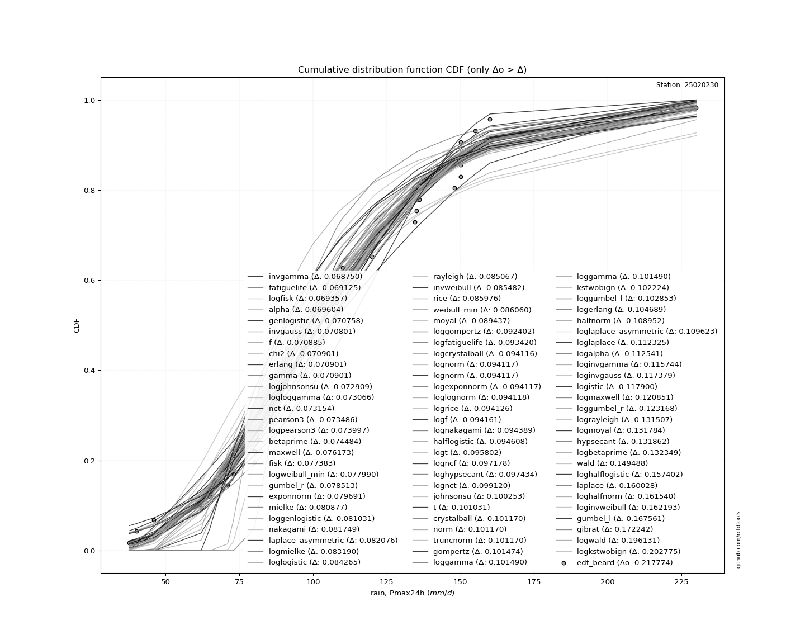</img>

</div>


**4.3. Best fit**

<div align="center">

|   id |   station | empirical_dist   | p_dist   |     delta |   deltao | eval   |   fit |   n |   best_fit |   best_fit_sort |
|-----:|----------:|:-----------------|:---------|----------:|---------:|:-------|------:|----:|-----------:|----------------:|
|    0 |  25020230 | edf_beard        | invgamma | 0.0687501 | 0.217774 | Δo > Δ |     1 |  39 |          1 |               1 |

</div>


<div align="center">

</img>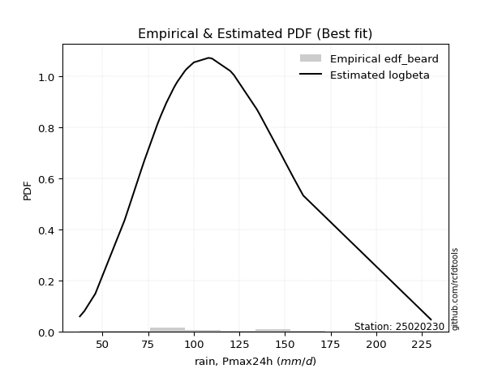</img>

</div>


### 5. Empirical - EDF Chegodayev (1955)

The Chegodayev formula is an empirical plotting position formula used in hydrological frequency analysis to estimate the exceedance probability or return period of a specific event from a set of observed data. It is primarily used for plotting observed data points on probability paper to fit a theoretical distribution, particularly for analyzing extreme events like maximum flood flows or rainfall intensities. The constant _b_ value in the generalized plotting position formula is 0.3.

<div align="center">


$P=(m-b)/(n+1-2b)$


</div>


**5.1. Empirical values**

<div align="center">

|                | 0                    | 1                   | 2                  | 3                   | 4                   | 5                   | 6                  | 7                   | 8                   | 9                   | 10                 | 11                 | 12                 | 13                 | 14                 | 15                  | 16                  | 17                  | 18                 | 19             | 20                 | 21                | 22                 | 23                 | 24                 | 25                 | 26                 | 27                 | 28                 | 29                 | 30                 | 31                 | 32                 | 33                 | 34                 | 35                 | 36                 | 37                 | 38                 |
|:---------------|:---------------------|:--------------------|:-------------------|:--------------------|:--------------------|:--------------------|:-------------------|:--------------------|:--------------------|:--------------------|:-------------------|:-------------------|:-------------------|:-------------------|:-------------------|:--------------------|:--------------------|:--------------------|:-------------------|:---------------|:-------------------|:------------------|:-------------------|:-------------------|:-------------------|:-------------------|:-------------------|:-------------------|:-------------------|:-------------------|:-------------------|:-------------------|:-------------------|:-------------------|:-------------------|:-------------------|:-------------------|:-------------------|:-------------------|
| date           | 1996                 | 2005                | 1987               | 1992                | 1991                | 1998                | 2012               | 2003                | 2004                | 2018                | 2013               | 1997               | 1989               | 1990               | 1993               | 2006                | 1995                | 2010                | 1988               | 2014           | 2016               | 1980              | 2002               | 1999               | 2011               | 1983               | 2017               | 2000               | 2001               | 1994               | 1986               | 1982               | 2007               | 1981               | 2015               | 2009               | 1984               | 2008               | 1985               |
| x              | 37.52732             | 40.0                | 46.0               | 62.0                | 65.0                | 71.0                | 73.0               | 80.0                | 80.0                | 81.1                | 82.0               | 85.0               | 85.0               | 89.0               | 90.0               | 90.0                | 90.0                | 91.0                | 95.0               | 96.0           | 100.0              | 108.0             | 109.0              | 110.0              | 110.0              | 120.0              | 120.1              | 122.0              | 134.5              | 135.0              | 136.0              | 148.0              | 150.0              | 150.0              | 150.0              | 150.0              | 155.0              | 160.0              | 230.0              |
| m              | 1                    | 2                   | 3                  | 4                   | 5                   | 6                   | 7                  | 8                   | 9                   | 10                  | 11                 | 12                 | 13                 | 14                 | 15                 | 16                  | 17                  | 18                  | 19                 | 20             | 21                 | 22                | 23                 | 24                 | 25                 | 26                 | 27                 | 28                 | 29                 | 30                 | 31                 | 32                 | 33                 | 34                 | 35                 | 36                 | 37                 | 38                 | 39                 |
| empirical_dist | edf_chegodayev       | edf_chegodayev      | edf_chegodayev     | edf_chegodayev      | edf_chegodayev      | edf_chegodayev      | edf_chegodayev     | edf_chegodayev      | edf_chegodayev      | edf_chegodayev      | edf_chegodayev     | edf_chegodayev     | edf_chegodayev     | edf_chegodayev     | edf_chegodayev     | edf_chegodayev      | edf_chegodayev      | edf_chegodayev      | edf_chegodayev     | edf_chegodayev | edf_chegodayev     | edf_chegodayev    | edf_chegodayev     | edf_chegodayev     | edf_chegodayev     | edf_chegodayev     | edf_chegodayev     | edf_chegodayev     | edf_chegodayev     | edf_chegodayev     | edf_chegodayev     | edf_chegodayev     | edf_chegodayev     | edf_chegodayev     | edf_chegodayev     | edf_chegodayev     | edf_chegodayev     | edf_chegodayev     | edf_chegodayev     |
| empirical      | 0.017766497461928935 | 0.04314720812182741 | 0.0685279187817259 | 0.09390862944162437 | 0.11928934010152285 | 0.14467005076142134 | 0.1700507614213198 | 0.19543147208121828 | 0.22081218274111675 | 0.24619289340101522 | 0.2715736040609137 | 0.2969543147208122 | 0.3223350253807106 | 0.3477157360406091 | 0.3730964467005076 | 0.39847715736040606 | 0.42385786802030456 | 0.44923857868020306 | 0.4746192893401015 | 0.5            | 0.5253807106598984 | 0.550761421319797 | 0.5761421319796954 | 0.6015228426395939 | 0.6269035532994924 | 0.6522842639593909 | 0.6776649746192893 | 0.7030456852791879 | 0.7284263959390863 | 0.7538071065989848 | 0.7791878172588833 | 0.8045685279187818 | 0.8299492385786803 | 0.8553299492385787 | 0.8807106598984773 | 0.9060913705583757 | 0.9314720812182742 | 0.9568527918781727 | 0.9822335025380712 |
| empirical_tr   | 1.0180878552971577   | 1.0450928381962865  | 1.0735694822888284 | 1.1036414565826331  | 1.1354466858789625  | 1.1691394658753709  | 1.2048929663608563 | 1.2429022082018928  | 1.283387622149837   | 1.3265993265993266  | 1.372822299651568  | 1.4223826714801444 | 1.4756554307116105 | 1.5330739299610894 | 1.5951417004048583 | 1.662447257383966   | 1.7356828193832599  | 1.815668202764977   | 1.9033816425120775 | 2.0            | 2.106951871657754  | 2.225988700564972 | 2.3592814371257487 | 2.5095541401273884 | 2.6802721088435377 | 2.8759124087591244 | 3.1023622047244093 | 3.367521367521368  | 3.682242990654206  | 4.061855670103093  | 4.528735632183909  | 5.116883116883118  | 5.880597014925376  | 6.912280701754389  | 8.382978723404266  | 10.648648648648662 | 14.592592592592608 | 23.176470588235375 | 56.28571428571465  |

</div>


**5.2. Kolmogorov-Smirnov fit test (sorted by Δ)**


<div align="center">

|                | 0                   | 1                   | 2                   | 3                   | 4                   | 5                   | 6                   | 7                   | 8                   | 9                   | 10                  | 11                  | 12                  | 13                  | 14                  | 15                  | 16                 | 17                  | 18                  | 19                  | 20                  | 21                  | 22                  | 23                  | 24                 | 25                  | 26                 | 27                  | 28                  | 29                 | 30                  | 31                  | 32                  | 33                  | 34                  | 35                  | 36                  | 37                  | 38                  | 39                  | 40                  | 41                  | 42                 | 43                  | 44                  | 45                  | 46                  | 47                  | 48                  | 49                  | 50                  | 51                  | 52                  | 53                  | 54                  | 55                  | 56                  | 57                  | 58                  | 59                  | 60                 | 61                  | 62                  | 63                    | 64                  | 65                  | 66                  | 67                  | 68                  | 69                  | 70                  | 71                  | 72                  | 73                  | 74                  | 75                  | 76                  | 77                  | 78                  | 79                  | 80                  | 81                  | 82                 | 83                 | 84                 | 85                  | 86                 | 87                  | 88                 | 89                 | 90                  | 91                  | 92                  | 93                  |
|:---------------|:--------------------|:--------------------|:--------------------|:--------------------|:--------------------|:--------------------|:--------------------|:--------------------|:--------------------|:--------------------|:--------------------|:--------------------|:--------------------|:--------------------|:--------------------|:--------------------|:-------------------|:--------------------|:--------------------|:--------------------|:--------------------|:--------------------|:--------------------|:--------------------|:-------------------|:--------------------|:-------------------|:--------------------|:--------------------|:-------------------|:--------------------|:--------------------|:--------------------|:--------------------|:--------------------|:--------------------|:--------------------|:--------------------|:--------------------|:--------------------|:--------------------|:--------------------|:-------------------|:--------------------|:--------------------|:--------------------|:--------------------|:--------------------|:--------------------|:--------------------|:--------------------|:--------------------|:--------------------|:--------------------|:--------------------|:--------------------|:--------------------|:--------------------|:--------------------|:--------------------|:-------------------|:--------------------|:--------------------|:----------------------|:--------------------|:--------------------|:--------------------|:--------------------|:--------------------|:--------------------|:--------------------|:--------------------|:--------------------|:--------------------|:--------------------|:--------------------|:--------------------|:--------------------|:--------------------|:--------------------|:--------------------|:--------------------|:-------------------|:-------------------|:-------------------|:--------------------|:-------------------|:--------------------|:-------------------|:-------------------|:--------------------|:--------------------|:--------------------|:--------------------|
| station        | 25020230            | 25020230            | 25020230            | 25020230            | 25020230            | 25020230            | 25020230            | 25020230            | 25020230            | 25020230            | 25020230            | 25020230            | 25020230            | 25020230            | 25020230            | 25020230            | 25020230           | 25020230            | 25020230            | 25020230            | 25020230            | 25020230            | 25020230            | 25020230            | 25020230           | 25020230            | 25020230           | 25020230            | 25020230            | 25020230           | 25020230            | 25020230            | 25020230            | 25020230            | 25020230            | 25020230            | 25020230            | 25020230            | 25020230            | 25020230            | 25020230            | 25020230            | 25020230           | 25020230            | 25020230            | 25020230            | 25020230            | 25020230            | 25020230            | 25020230            | 25020230            | 25020230            | 25020230            | 25020230            | 25020230            | 25020230            | 25020230            | 25020230            | 25020230            | 25020230            | 25020230           | 25020230            | 25020230            | 25020230              | 25020230            | 25020230            | 25020230            | 25020230            | 25020230            | 25020230            | 25020230            | 25020230            | 25020230            | 25020230            | 25020230            | 25020230            | 25020230            | 25020230            | 25020230            | 25020230            | 25020230            | 25020230            | 25020230           | 25020230           | 25020230           | 25020230            | 25020230           | 25020230            | 25020230           | 25020230           | 25020230            | 25020230            | 25020230            | 25020230            |
| empirical_dist | edf_chegodayev      | edf_chegodayev      | edf_chegodayev      | edf_chegodayev      | edf_chegodayev      | edf_chegodayev      | edf_chegodayev      | edf_chegodayev      | edf_chegodayev      | edf_chegodayev      | edf_chegodayev      | edf_chegodayev      | edf_chegodayev      | edf_chegodayev      | edf_chegodayev      | edf_chegodayev      | edf_chegodayev     | edf_chegodayev      | edf_chegodayev      | edf_chegodayev      | edf_chegodayev      | edf_chegodayev      | edf_chegodayev      | edf_chegodayev      | edf_chegodayev     | edf_chegodayev      | edf_chegodayev     | edf_chegodayev      | edf_chegodayev      | edf_chegodayev     | edf_chegodayev      | edf_chegodayev      | edf_chegodayev      | edf_chegodayev      | edf_chegodayev      | edf_chegodayev      | edf_chegodayev      | edf_chegodayev      | edf_chegodayev      | edf_chegodayev      | edf_chegodayev      | edf_chegodayev      | edf_chegodayev     | edf_chegodayev      | edf_chegodayev      | edf_chegodayev      | edf_chegodayev      | edf_chegodayev      | edf_chegodayev      | edf_chegodayev      | edf_chegodayev      | edf_chegodayev      | edf_chegodayev      | edf_chegodayev      | edf_chegodayev      | edf_chegodayev      | edf_chegodayev      | edf_chegodayev      | edf_chegodayev      | edf_chegodayev      | edf_chegodayev     | edf_chegodayev      | edf_chegodayev      | edf_chegodayev        | edf_chegodayev      | edf_chegodayev      | edf_chegodayev      | edf_chegodayev      | edf_chegodayev      | edf_chegodayev      | edf_chegodayev      | edf_chegodayev      | edf_chegodayev      | edf_chegodayev      | edf_chegodayev      | edf_chegodayev      | edf_chegodayev      | edf_chegodayev      | edf_chegodayev      | edf_chegodayev      | edf_chegodayev      | edf_chegodayev      | edf_chegodayev     | edf_chegodayev     | edf_chegodayev     | edf_chegodayev      | edf_chegodayev     | edf_chegodayev      | edf_chegodayev     | edf_chegodayev     | edf_chegodayev      | edf_chegodayev      | edf_chegodayev      | edf_chegodayev      |
| p_dist         | invgamma            | fatiguelife         | recipinvgauss       | logfisk             | alpha               | invgauss            | f                   | chi2                | erlang              | gamma               | genlogistic         | logloggamma         | logjohnsonsu        | nct                 | pearson3            | logpearson3         | betaprime          | maxwell             | fisk                | logweibull_min      | gumbel_r            | exponnorm           | logdgamma           | mielke              | loggenlogistic     | nakagami            | laplace_asymmetric | logmielke           | loglogistic         | rayleigh           | invweibull          | rice                | weibull_min         | dgamma              | moyal               | loggompertz         | logfatiguelife      | logcrystalball      | lognorm             | lognorm             | logexponnorm        | loglognorm          | logrice            | logf                | lognakagami         | halflogistic        | logt                | logncf              | loghypsecant        | lognct              | johnsonsu           | t                   | crystalball         | norm                | truncnorm           | gompertz            | loggamma            | loggamma            | kstwobign           | logrecipinvgauss    | loggumbel_l        | logerlang           | halfnorm            | loglaplace_asymmetric | logalpha            | loglaplace          | loginvgamma         | loginvgauss         | logistic            | logmaxwell          | loggumbel_r         | lograyleigh         | logmoyal            | hypsecant           | logbetaprime        | wald                | loghalflogistic     | laplace             | loghalfnorm         | loginvweibull       | gumbel_l            | gibrat              | logwald            | logkstwobign       | loggibrat          | loggenexpon         | genexpon           | expon               | pareto             | ncf                | logtruncnorm        | logexpon            | logpareto           | logchi2             |
| delta          | 0.06877584487471838 | 0.06897034166819907 | 0.06904963112719217 | 0.06947336120021941 | 0.06962966647687402 | 0.07064679381412761 | 0.07073051222248836 | 0.07074605758238425 | 0.07074607433958371 | 0.07074608732931689 | 0.07078388593521978 | 0.07291140123845355 | 0.07293445204197907 | 0.07317979774484312 | 0.07333146558206174 | 0.07384262254998744 | 0.0743292477335202 | 0.07601783932081987 | 0.07747925119991139 | 0.07783505624712542 | 0.07862892711249458 | 0.07971659847273699 | 0.07977486380235732 | 0.08090237427052527 | 0.081056449897776  | 0.08159447994974209 | 0.0821917277170624 | 0.08321610198649915 | 0.08438089585761566 | 0.0849120006754139 | 0.08532712243452481 | 0.08582093071563265 | 0.08590516436437615 | 0.08918577191232901 | 0.08955346582812451 | 0.09224774148221396 | 0.09326564838929133 | 0.09396128817905522 | 0.09396244836115505 | 0.09396244836115505 | 0.09396260746331905 | 0.09396335772268874 | 0.0939717852109708 | 0.09400600224548059 | 0.09423465175314125 | 0.09445319641052377 | 0.09564743125390993 | 0.09702286024172255 | 0.09755047444405873 | 0.09896548895199506 | 0.10025258742891185 | 0.10103101305855972 | 0.10117000752021843 | 0.10117001125169256 | 0.10117003023683524 | 0.10131962575193984 | 0.10133573469681376 | 0.10133573469681376 | 0.10206972299506564 | 0.10269713545210771 | 0.1028784924811787 | 0.10453446924120549 | 0.10879769105560186 | 0.10964890775246483   | 0.11238643705024651 | 0.11244128341932902 | 0.11558949853755054 | 0.11722381867029022 | 0.11792544689251122 | 0.12069661897675318 | 0.12301283935304011 | 0.13135243302542973 | 0.13180933483187807 | 0.13188815334175352 | 0.13219479992897523 | 0.14965545116992046 | 0.15724687474126278 | 0.16005419140307958 | 0.16138494678620638 | 0.16203855452243024 | 0.16756080989486755 | 0.17238414479581887 | 0.1961566575328072 | 0.2026205095344761 | 0.2276061260048251 | 0.23198066877034493 | 0.2667729202177095 | 0.26775109424862786 | 0.2677510982274284 | 0.3034024356825087 | 0.31752807945486183 | 0.34695752176318084 | 0.34695752588838735 | 0.40512948751815814 |
| deltao         | 0.2177742891749185  | 0.2177742891749185  | 0.2177742891749185  | 0.2177742891749185  | 0.2177742891749185  | 0.2177742891749185  | 0.2177742891749185  | 0.2177742891749185  | 0.2177742891749185  | 0.2177742891749185  | 0.2177742891749185  | 0.2177742891749185  | 0.2177742891749185  | 0.2177742891749185  | 0.2177742891749185  | 0.2177742891749185  | 0.2177742891749185 | 0.2177742891749185  | 0.2177742891749185  | 0.2177742891749185  | 0.2177742891749185  | 0.2177742891749185  | 0.2177742891749185  | 0.2177742891749185  | 0.2177742891749185 | 0.2177742891749185  | 0.2177742891749185 | 0.2177742891749185  | 0.2177742891749185  | 0.2177742891749185 | 0.2177742891749185  | 0.2177742891749185  | 0.2177742891749185  | 0.2177742891749185  | 0.2177742891749185  | 0.2177742891749185  | 0.2177742891749185  | 0.2177742891749185  | 0.2177742891749185  | 0.2177742891749185  | 0.2177742891749185  | 0.2177742891749185  | 0.2177742891749185 | 0.2177742891749185  | 0.2177742891749185  | 0.2177742891749185  | 0.2177742891749185  | 0.2177742891749185  | 0.2177742891749185  | 0.2177742891749185  | 0.2177742891749185  | 0.2177742891749185  | 0.2177742891749185  | 0.2177742891749185  | 0.2177742891749185  | 0.2177742891749185  | 0.2177742891749185  | 0.2177742891749185  | 0.2177742891749185  | 0.2177742891749185  | 0.2177742891749185 | 0.2177742891749185  | 0.2177742891749185  | 0.2177742891749185    | 0.2177742891749185  | 0.2177742891749185  | 0.2177742891749185  | 0.2177742891749185  | 0.2177742891749185  | 0.2177742891749185  | 0.2177742891749185  | 0.2177742891749185  | 0.2177742891749185  | 0.2177742891749185  | 0.2177742891749185  | 0.2177742891749185  | 0.2177742891749185  | 0.2177742891749185  | 0.2177742891749185  | 0.2177742891749185  | 0.2177742891749185  | 0.2177742891749185  | 0.2177742891749185 | 0.2177742891749185 | 0.2177742891749185 | 0.2177742891749185  | 0.2177742891749185 | 0.2177742891749185  | 0.2177742891749185 | 0.2177742891749185 | 0.2177742891749185  | 0.2177742891749185  | 0.2177742891749185  | 0.2177742891749185  |
| eval           | Δo > Δ              | Δo > Δ              | Δo > Δ              | Δo > Δ              | Δo > Δ              | Δo > Δ              | Δo > Δ              | Δo > Δ              | Δo > Δ              | Δo > Δ              | Δo > Δ              | Δo > Δ              | Δo > Δ              | Δo > Δ              | Δo > Δ              | Δo > Δ              | Δo > Δ             | Δo > Δ              | Δo > Δ              | Δo > Δ              | Δo > Δ              | Δo > Δ              | Δo > Δ              | Δo > Δ              | Δo > Δ             | Δo > Δ              | Δo > Δ             | Δo > Δ              | Δo > Δ              | Δo > Δ             | Δo > Δ              | Δo > Δ              | Δo > Δ              | Δo > Δ              | Δo > Δ              | Δo > Δ              | Δo > Δ              | Δo > Δ              | Δo > Δ              | Δo > Δ              | Δo > Δ              | Δo > Δ              | Δo > Δ             | Δo > Δ              | Δo > Δ              | Δo > Δ              | Δo > Δ              | Δo > Δ              | Δo > Δ              | Δo > Δ              | Δo > Δ              | Δo > Δ              | Δo > Δ              | Δo > Δ              | Δo > Δ              | Δo > Δ              | Δo > Δ              | Δo > Δ              | Δo > Δ              | Δo > Δ              | Δo > Δ             | Δo > Δ              | Δo > Δ              | Δo > Δ                | Δo > Δ              | Δo > Δ              | Δo > Δ              | Δo > Δ              | Δo > Δ              | Δo > Δ              | Δo > Δ              | Δo > Δ              | Δo > Δ              | Δo > Δ              | Δo > Δ              | Δo > Δ              | Δo > Δ              | Δo > Δ              | Δo > Δ              | Δo > Δ              | Δo > Δ              | Δo > Δ              | Δo > Δ             | Δo > Δ             | Δo <= Δ            | Δo <= Δ             | Δo <= Δ            | Δo <= Δ             | Δo <= Δ            | Δo <= Δ            | Δo <= Δ             | Δo <= Δ             | Δo <= Δ             | Δo <= Δ             |
| fit            | 1                   | 1                   | 1                   | 1                   | 1                   | 1                   | 1                   | 1                   | 1                   | 1                   | 1                   | 1                   | 1                   | 1                   | 1                   | 1                   | 1                  | 1                   | 1                   | 1                   | 1                   | 1                   | 1                   | 1                   | 1                  | 1                   | 1                  | 1                   | 1                   | 1                  | 1                   | 1                   | 1                   | 1                   | 1                   | 1                   | 1                   | 1                   | 1                   | 1                   | 1                   | 1                   | 1                  | 1                   | 1                   | 1                   | 1                   | 1                   | 1                   | 1                   | 1                   | 1                   | 1                   | 1                   | 1                   | 1                   | 1                   | 1                   | 1                   | 1                   | 1                  | 1                   | 1                   | 1                     | 1                   | 1                   | 1                   | 1                   | 1                   | 1                   | 1                   | 1                   | 1                   | 1                   | 1                   | 1                   | 1                   | 1                   | 1                   | 1                   | 1                   | 1                   | 1                  | 1                  | 0                  | 0                   | 0                  | 0                   | 0                  | 0                  | 0                   | 0                   | 0                   | 0                   |
| n              | 39                  | 39                  | 39                  | 39                  | 39                  | 39                  | 39                  | 39                  | 39                  | 39                  | 39                  | 39                  | 39                  | 39                  | 39                  | 39                  | 39                 | 39                  | 39                  | 39                  | 39                  | 39                  | 39                  | 39                  | 39                 | 39                  | 39                 | 39                  | 39                  | 39                 | 39                  | 39                  | 39                  | 39                  | 39                  | 39                  | 39                  | 39                  | 39                  | 39                  | 39                  | 39                  | 39                 | 39                  | 39                  | 39                  | 39                  | 39                  | 39                  | 39                  | 39                  | 39                  | 39                  | 39                  | 39                  | 39                  | 39                  | 39                  | 39                  | 39                  | 39                 | 39                  | 39                  | 39                    | 39                  | 39                  | 39                  | 39                  | 39                  | 39                  | 39                  | 39                  | 39                  | 39                  | 39                  | 39                  | 39                  | 39                  | 39                  | 39                  | 39                  | 39                  | 39                 | 39                 | 39                 | 39                  | 39                 | 39                  | 39                 | 39                 | 39                  | 39                  | 39                  | 39                  |
| best_fit       | 1                   | 0                   | 0                   | 0                   | 0                   | 0                   | 0                   | 0                   | 0                   | 0                   | 0                   | 0                   | 0                   | 0                   | 0                   | 0                   | 0                  | 0                   | 0                   | 0                   | 0                   | 0                   | 0                   | 0                   | 0                  | 0                   | 0                  | 0                   | 0                   | 0                  | 0                   | 0                   | 0                   | 0                   | 0                   | 0                   | 0                   | 0                   | 0                   | 0                   | 0                   | 0                   | 0                  | 0                   | 0                   | 0                   | 0                   | 0                   | 0                   | 0                   | 0                   | 0                   | 0                   | 0                   | 0                   | 0                   | 0                   | 0                   | 0                   | 0                   | 0                  | 0                   | 0                   | 0                     | 0                   | 0                   | 0                   | 0                   | 0                   | 0                   | 0                   | 0                   | 0                   | 0                   | 0                   | 0                   | 0                   | 0                   | 0                   | 0                   | 0                   | 0                   | 0                  | 0                  | 0                  | 0                   | 0                  | 0                   | 0                  | 0                  | 0                   | 0                   | 0                   | 0                   |
| best_fit_sort  | 1                   | 2                   | 3                   | 4                   | 5                   | 6                   | 7                   | 8                   | 9                   | 10                  | 11                  | 12                  | 13                  | 14                  | 15                  | 16                  | 17                 | 18                  | 19                  | 20                  | 21                  | 22                  | 23                  | 24                  | 25                 | 26                  | 27                 | 28                  | 29                  | 30                 | 31                  | 32                  | 33                  | 34                  | 35                  | 36                  | 37                  | 38                  | 39                  | 40                  | 41                  | 42                  | 43                 | 44                  | 45                  | 46                  | 47                  | 48                  | 49                  | 50                  | 51                  | 52                  | 53                  | 54                  | 55                  | 56                  | 57                  | 58                  | 59                  | 60                  | 61                 | 62                  | 63                  | 64                    | 65                  | 66                  | 67                  | 68                  | 69                  | 70                  | 71                  | 72                  | 73                  | 74                  | 75                  | 76                  | 77                  | 78                  | 79                  | 80                  | 81                  | 82                  | 83                 | 84                 | 85                 | 86                  | 87                 | 88                  | 89                 | 90                 | 91                  | 92                  | 93                  | 94                  |

</div>


<div align="center">

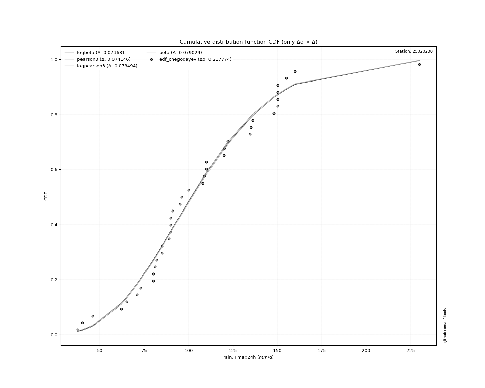</img>

</div>


**5.3. Best fit**

<div align="center">

|   id |   station | empirical_dist   | p_dist   |     delta |   deltao | eval   |   fit |   n |   best_fit |   best_fit_sort |
|-----:|----------:|:-----------------|:---------|----------:|---------:|:-------|------:|----:|-----------:|----------------:|
|    0 |  25020230 | edf_chegodayev   | invgamma | 0.0687758 | 0.217774 | Δo > Δ |     1 |  39 |          1 |               1 |

</div>


<div align="center">

</img>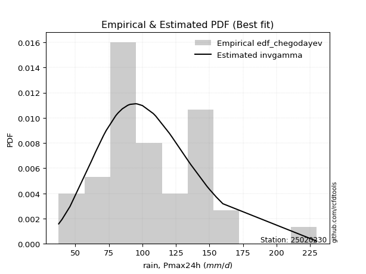</img>

</div>


### 6. Empirical - EDF Blom (1958)

The Blom formula is a specific "plotting position" formula used in hydrology and statistical analysis to estimate the empirical cumulative probability (or non-exceedance probability) of a data series. It is particularly recommended for data that are approximately normally distributed. The constant _a_ is set to 0.375 (or 3/8).

<div align="center">


$P=(m-a)/(n+1-2a)$


</div>


**6.1. Empirical values**

<div align="center">

|                | 0                   | 1                    | 2                   | 3                   | 4                  | 5                   | 6                   | 7                  | 8                  | 9                   | 10                  | 11                 | 12                 | 13                 | 14                  | 15                 | 16                  | 17                  | 18                 | 19       | 20                 | 21                 | 22                 | 23                 | 24                 | 25                 | 26                 | 27                 | 28                 | 29                 | 30                 | 31                 | 32                 | 33                | 34                 | 35                 | 36                 | 37                 | 38                 |
|:---------------|:--------------------|:---------------------|:--------------------|:--------------------|:-------------------|:--------------------|:--------------------|:-------------------|:-------------------|:--------------------|:--------------------|:-------------------|:-------------------|:-------------------|:--------------------|:-------------------|:--------------------|:--------------------|:-------------------|:---------|:-------------------|:-------------------|:-------------------|:-------------------|:-------------------|:-------------------|:-------------------|:-------------------|:-------------------|:-------------------|:-------------------|:-------------------|:-------------------|:------------------|:-------------------|:-------------------|:-------------------|:-------------------|:-------------------|
| date           | 1996                | 2005                 | 1987                | 1992                | 1991               | 1998                | 2012                | 2003               | 2004               | 2018                | 2013                | 1997               | 1989               | 1990               | 1993                | 2006               | 1995                | 2010                | 1988               | 2014     | 2016               | 1980               | 2002               | 1999               | 2011               | 1983               | 2017               | 2000               | 2001               | 1994               | 1986               | 1982               | 2007               | 1981              | 2015               | 2009               | 1984               | 2008               | 1985               |
| x              | 37.52732            | 40.0                 | 46.0                | 62.0                | 65.0               | 71.0                | 73.0                | 80.0               | 80.0               | 81.1                | 82.0                | 85.0               | 85.0               | 89.0               | 90.0                | 90.0               | 90.0                | 91.0                | 95.0               | 96.0     | 100.0              | 108.0              | 109.0              | 110.0              | 110.0              | 120.0              | 120.1              | 122.0              | 134.5              | 135.0              | 136.0              | 148.0              | 150.0              | 150.0             | 150.0              | 150.0              | 155.0              | 160.0              | 230.0              |
| m              | 1                   | 2                    | 3                   | 4                   | 5                  | 6                   | 7                   | 8                  | 9                  | 10                  | 11                  | 12                 | 13                 | 14                 | 15                  | 16                 | 17                  | 18                  | 19                 | 20       | 21                 | 22                 | 23                 | 24                 | 25                 | 26                 | 27                 | 28                 | 29                 | 30                 | 31                 | 32                 | 33                 | 34                | 35                 | 36                 | 37                 | 38                 | 39                 |
| empirical_dist | edf_blom            | edf_blom             | edf_blom            | edf_blom            | edf_blom           | edf_blom            | edf_blom            | edf_blom           | edf_blom           | edf_blom            | edf_blom            | edf_blom           | edf_blom           | edf_blom           | edf_blom            | edf_blom           | edf_blom            | edf_blom            | edf_blom           | edf_blom | edf_blom           | edf_blom           | edf_blom           | edf_blom           | edf_blom           | edf_blom           | edf_blom           | edf_blom           | edf_blom           | edf_blom           | edf_blom           | edf_blom           | edf_blom           | edf_blom          | edf_blom           | edf_blom           | edf_blom           | edf_blom           | edf_blom           |
| empirical      | 0.01592356687898089 | 0.041401273885350316 | 0.06687898089171974 | 0.09235668789808917 | 0.1178343949044586 | 0.14331210191082802 | 0.16878980891719744 | 0.1942675159235669 | 0.2197452229299363 | 0.24522292993630573 | 0.27070063694267515 | 0.2961783439490446 | 0.321656050955414  | 0.3471337579617834 | 0.37261146496815284 | 0.3980891719745223 | 0.42356687898089174 | 0.44904458598726116 | 0.4745222929936306 | 0.5      | 0.5254777070063694 | 0.5509554140127388 | 0.5764331210191083 | 0.6019108280254777 | 0.6273885350318471 | 0.6528662420382165 | 0.678343949044586  | 0.7038216560509554 | 0.7292993630573248 | 0.7547770700636943 | 0.7802547770700637 | 0.8057324840764332 | 0.8312101910828026 | 0.856687898089172 | 0.8821656050955414 | 0.9076433121019108 | 0.9331210191082803 | 0.9585987261146497 | 0.9840764331210191 |
| empirical_tr   | 1.0161812297734627  | 1.043189368770764    | 1.0716723549488054  | 1.1017543859649122  | 1.1335740072202165 | 1.1672862453531598  | 1.2030651340996168  | 1.241106719367589  | 1.2816326530612245 | 1.3248945147679325  | 1.3711790393013101  | 1.420814479638009  | 1.4741784037558687 | 1.5317073170731708 | 1.5939086294416245  | 1.6613756613756614 | 1.7348066298342542  | 1.8150289017341041  | 1.903030303030303  | 2.0      | 2.1073825503355703 | 2.226950354609929  | 2.3609022556390977 | 2.512              | 2.6837606837606836 | 2.880733944954128  | 3.1089108910891086 | 3.376344086021505  | 3.694117647058823  | 4.077922077922079  | 4.55072463768116   | 5.147540983606558  | 5.924528301886793  | 6.97777777777778  | 8.486486486486488  | 10.827586206896553 | 14.952380952380956 | 24.15384615384616  | 62.80000000000001  |

</div>


**6.2. Kolmogorov-Smirnov fit test (sorted by Δ)**


<div align="center">

|                | 0                   | 1                   | 2                   | 3                   | 4                   | 5                   | 6                  | 7                   | 8                   | 9                  | 10                  | 11                  | 12                  | 13                  | 14                  | 15                  | 16                  | 17                  | 18                  | 19                  | 20                 | 21                  | 22                 | 23                  | 24                  | 25                  | 26                  | 27                  | 28                  | 29                  | 30                 | 31                  | 32                  | 33                 | 34                  | 35                  | 36                  | 37                 | 38                  | 39                  | 40                  | 41                  | 42                  | 43                  | 44                  | 45                  | 46                  | 47                  | 48                  | 49                  | 50                  | 51                  | 52                  | 53                  | 54                  | 55                  | 56                  | 57                  | 58                 | 59                  | 60                  | 61                  | 62                    | 63                  | 64                  | 65                  | 66                  | 67                  | 68                 | 69                  | 70                 | 71                  | 72                  | 73                  | 74                  | 75                 | 76                  | 77                  | 78                  | 79                  | 80                  | 81                  | 82                  | 83                 | 84                  | 85                 | 86                  | 87                 | 88                  | 89                  | 90                 | 91                 | 92                 | 93                 |
|:---------------|:--------------------|:--------------------|:--------------------|:--------------------|:--------------------|:--------------------|:-------------------|:--------------------|:--------------------|:-------------------|:--------------------|:--------------------|:--------------------|:--------------------|:--------------------|:--------------------|:--------------------|:--------------------|:--------------------|:--------------------|:-------------------|:--------------------|:-------------------|:--------------------|:--------------------|:--------------------|:--------------------|:--------------------|:--------------------|:--------------------|:-------------------|:--------------------|:--------------------|:-------------------|:--------------------|:--------------------|:--------------------|:-------------------|:--------------------|:--------------------|:--------------------|:--------------------|:--------------------|:--------------------|:--------------------|:--------------------|:--------------------|:--------------------|:--------------------|:--------------------|:--------------------|:--------------------|:--------------------|:--------------------|:--------------------|:--------------------|:--------------------|:--------------------|:-------------------|:--------------------|:--------------------|:--------------------|:----------------------|:--------------------|:--------------------|:--------------------|:--------------------|:--------------------|:-------------------|:--------------------|:-------------------|:--------------------|:--------------------|:--------------------|:--------------------|:-------------------|:--------------------|:--------------------|:--------------------|:--------------------|:--------------------|:--------------------|:--------------------|:-------------------|:--------------------|:-------------------|:--------------------|:-------------------|:--------------------|:--------------------|:-------------------|:-------------------|:-------------------|:-------------------|
| station        | 25020230            | 25020230            | 25020230            | 25020230            | 25020230            | 25020230            | 25020230           | 25020230            | 25020230            | 25020230           | 25020230            | 25020230            | 25020230            | 25020230            | 25020230            | 25020230            | 25020230            | 25020230            | 25020230            | 25020230            | 25020230           | 25020230            | 25020230           | 25020230            | 25020230            | 25020230            | 25020230            | 25020230            | 25020230            | 25020230            | 25020230           | 25020230            | 25020230            | 25020230           | 25020230            | 25020230            | 25020230            | 25020230           | 25020230            | 25020230            | 25020230            | 25020230            | 25020230            | 25020230            | 25020230            | 25020230            | 25020230            | 25020230            | 25020230            | 25020230            | 25020230            | 25020230            | 25020230            | 25020230            | 25020230            | 25020230            | 25020230            | 25020230            | 25020230           | 25020230            | 25020230            | 25020230            | 25020230              | 25020230            | 25020230            | 25020230            | 25020230            | 25020230            | 25020230           | 25020230            | 25020230           | 25020230            | 25020230            | 25020230            | 25020230            | 25020230           | 25020230            | 25020230            | 25020230            | 25020230            | 25020230            | 25020230            | 25020230            | 25020230           | 25020230            | 25020230           | 25020230            | 25020230           | 25020230            | 25020230            | 25020230           | 25020230           | 25020230           | 25020230           |
| empirical_dist | edf_blom            | edf_blom            | edf_blom            | edf_blom            | edf_blom            | edf_blom            | edf_blom           | edf_blom            | edf_blom            | edf_blom           | edf_blom            | edf_blom            | edf_blom            | edf_blom            | edf_blom            | edf_blom            | edf_blom            | edf_blom            | edf_blom            | edf_blom            | edf_blom           | edf_blom            | edf_blom           | edf_blom            | edf_blom            | edf_blom            | edf_blom            | edf_blom            | edf_blom            | edf_blom            | edf_blom           | edf_blom            | edf_blom            | edf_blom           | edf_blom            | edf_blom            | edf_blom            | edf_blom           | edf_blom            | edf_blom            | edf_blom            | edf_blom            | edf_blom            | edf_blom            | edf_blom            | edf_blom            | edf_blom            | edf_blom            | edf_blom            | edf_blom            | edf_blom            | edf_blom            | edf_blom            | edf_blom            | edf_blom            | edf_blom            | edf_blom            | edf_blom            | edf_blom           | edf_blom            | edf_blom            | edf_blom            | edf_blom              | edf_blom            | edf_blom            | edf_blom            | edf_blom            | edf_blom            | edf_blom           | edf_blom            | edf_blom           | edf_blom            | edf_blom            | edf_blom            | edf_blom            | edf_blom           | edf_blom            | edf_blom            | edf_blom            | edf_blom            | edf_blom            | edf_blom            | edf_blom            | edf_blom           | edf_blom            | edf_blom           | edf_blom            | edf_blom           | edf_blom            | edf_blom            | edf_blom           | edf_blom           | edf_blom           | edf_blom           |
| p_dist         | invgamma            | logfisk             | alpha               | fatiguelife         | recipinvgauss       | genlogistic         | invgauss           | f                   | chi2                | erlang             | gamma               | logjohnsonsu        | nct                 | logloggamma         | pearson3            | logpearson3         | betaprime           | maxwell             | fisk                | gumbel_r            | logweibull_min     | exponnorm           | logdgamma          | mielke              | loggenlogistic      | laplace_asymmetric  | nakagami            | logmielke           | loglogistic         | rayleigh            | invweibull         | rice                | weibull_min         | dgamma             | moyal               | loggompertz         | logfatiguelife      | logcrystalball     | lognorm             | lognorm             | logexponnorm        | loglognorm          | logrice             | logf                | lognakagami         | halflogistic        | loghypsecant        | logt                | logncf              | lognct              | johnsonsu           | t                   | crystalball         | norm                | truncnorm           | gompertz            | loggamma            | loggamma            | loggumbel_l        | kstwobign           | logrecipinvgauss    | logerlang           | loglaplace_asymmetric | halfnorm            | loglaplace          | logalpha            | loginvgamma         | logistic            | loginvgauss        | logmaxwell          | loggumbel_r        | hypsecant           | logmoyal            | lograyleigh         | logbetaprime        | wald               | loghalflogistic     | laplace             | loghalfnorm         | loginvweibull       | gumbel_l            | gibrat              | logwald             | logkstwobign       | loggibrat           | loggenexpon        | genexpon            | expon              | pareto              | ncf                 | logtruncnorm       | logexpon           | logpareto          | logchi2            |
| delta          | 0.06858185218177648 | 0.06860039408198093 | 0.06943567378393212 | 0.07013429782585046 | 0.07021358728484356 | 0.07058989324227788 | 0.071810749971779  | 0.07189446838013974 | 0.07191001374003564 | 0.0719100304972351 | 0.07191004348696828 | 0.07274045934903717 | 0.07298580505190122 | 0.07407535739610493 | 0.07449542173971313 | 0.07500657870763883 | 0.07549320389117159 | 0.07718179547847126 | 0.07721516478985241 | 0.07775595999425611 | 0.0789990124047768 | 0.07952260577979509 | 0.080259845534712  | 0.08070838157758337 | 0.08086245720483409 | 0.08131876059882392 | 0.08275843610739347 | 0.08302210929355724 | 0.08350792873937718 | 0.08607595683306529 | 0.0864910785921762 | 0.08698488687328404 | 0.08706912052202753 | 0.0880218157546776 | 0.08868049870988604 | 0.09341169763986534 | 0.09442960454694271 | 0.0951252443367066 | 0.09512640451880644 | 0.09512640451880644 | 0.09512656362097044 | 0.09512731388034013 | 0.09513574136862218 | 0.09516995840313197 | 0.09539860791079263 | 0.09561715256817516 | 0.09667750732582026 | 0.09681138741156131 | 0.09818681639937393 | 0.10012944510964644 | 0.10025258742891185 | 0.10103101305855972 | 0.10117000752021843 | 0.10117001125169256 | 0.10117003023683524 | 0.10248358190959123 | 0.10249969085446514 | 0.10249969085446514 | 0.1026844997882368 | 0.10323367915271703 | 0.10386109160975909 | 0.10569842539885688 | 0.10945491505952298   | 0.10996164721325324 | 0.11156831630109054 | 0.11355039320789789 | 0.11675345469520193 | 0.11773145419956932 | 0.1183877748279416 | 0.12186057513440457 | 0.1241767955106915 | 0.13169416064881162 | 0.13202292997106596 | 0.13251638918308112 | 0.13335875608662662 | 0.1483944986657981 | 0.15841083089891417 | 0.15986019871013768 | 0.16254890294385776 | 0.16320251068008162 | 0.16756080989486755 | 0.17131718498463844 | 0.19596266483986535 | 0.2037844656921275 | 0.22741213331188326 | 0.2331446249279963 | 0.26793687637536084 | 0.2689150504062792 | 0.26891505438507973 | 0.30476038453310206 | 0.3186920356125132 | 0.3481214779208322 | 0.3481214820460387 | 0.4064874363687515 |
| deltao         | 0.2177742891749185  | 0.2177742891749185  | 0.2177742891749185  | 0.2177742891749185  | 0.2177742891749185  | 0.2177742891749185  | 0.2177742891749185 | 0.2177742891749185  | 0.2177742891749185  | 0.2177742891749185 | 0.2177742891749185  | 0.2177742891749185  | 0.2177742891749185  | 0.2177742891749185  | 0.2177742891749185  | 0.2177742891749185  | 0.2177742891749185  | 0.2177742891749185  | 0.2177742891749185  | 0.2177742891749185  | 0.2177742891749185 | 0.2177742891749185  | 0.2177742891749185 | 0.2177742891749185  | 0.2177742891749185  | 0.2177742891749185  | 0.2177742891749185  | 0.2177742891749185  | 0.2177742891749185  | 0.2177742891749185  | 0.2177742891749185 | 0.2177742891749185  | 0.2177742891749185  | 0.2177742891749185 | 0.2177742891749185  | 0.2177742891749185  | 0.2177742891749185  | 0.2177742891749185 | 0.2177742891749185  | 0.2177742891749185  | 0.2177742891749185  | 0.2177742891749185  | 0.2177742891749185  | 0.2177742891749185  | 0.2177742891749185  | 0.2177742891749185  | 0.2177742891749185  | 0.2177742891749185  | 0.2177742891749185  | 0.2177742891749185  | 0.2177742891749185  | 0.2177742891749185  | 0.2177742891749185  | 0.2177742891749185  | 0.2177742891749185  | 0.2177742891749185  | 0.2177742891749185  | 0.2177742891749185  | 0.2177742891749185 | 0.2177742891749185  | 0.2177742891749185  | 0.2177742891749185  | 0.2177742891749185    | 0.2177742891749185  | 0.2177742891749185  | 0.2177742891749185  | 0.2177742891749185  | 0.2177742891749185  | 0.2177742891749185 | 0.2177742891749185  | 0.2177742891749185 | 0.2177742891749185  | 0.2177742891749185  | 0.2177742891749185  | 0.2177742891749185  | 0.2177742891749185 | 0.2177742891749185  | 0.2177742891749185  | 0.2177742891749185  | 0.2177742891749185  | 0.2177742891749185  | 0.2177742891749185  | 0.2177742891749185  | 0.2177742891749185 | 0.2177742891749185  | 0.2177742891749185 | 0.2177742891749185  | 0.2177742891749185 | 0.2177742891749185  | 0.2177742891749185  | 0.2177742891749185 | 0.2177742891749185 | 0.2177742891749185 | 0.2177742891749185 |
| eval           | Δo > Δ              | Δo > Δ              | Δo > Δ              | Δo > Δ              | Δo > Δ              | Δo > Δ              | Δo > Δ             | Δo > Δ              | Δo > Δ              | Δo > Δ             | Δo > Δ              | Δo > Δ              | Δo > Δ              | Δo > Δ              | Δo > Δ              | Δo > Δ              | Δo > Δ              | Δo > Δ              | Δo > Δ              | Δo > Δ              | Δo > Δ             | Δo > Δ              | Δo > Δ             | Δo > Δ              | Δo > Δ              | Δo > Δ              | Δo > Δ              | Δo > Δ              | Δo > Δ              | Δo > Δ              | Δo > Δ             | Δo > Δ              | Δo > Δ              | Δo > Δ             | Δo > Δ              | Δo > Δ              | Δo > Δ              | Δo > Δ             | Δo > Δ              | Δo > Δ              | Δo > Δ              | Δo > Δ              | Δo > Δ              | Δo > Δ              | Δo > Δ              | Δo > Δ              | Δo > Δ              | Δo > Δ              | Δo > Δ              | Δo > Δ              | Δo > Δ              | Δo > Δ              | Δo > Δ              | Δo > Δ              | Δo > Δ              | Δo > Δ              | Δo > Δ              | Δo > Δ              | Δo > Δ             | Δo > Δ              | Δo > Δ              | Δo > Δ              | Δo > Δ                | Δo > Δ              | Δo > Δ              | Δo > Δ              | Δo > Δ              | Δo > Δ              | Δo > Δ             | Δo > Δ              | Δo > Δ             | Δo > Δ              | Δo > Δ              | Δo > Δ              | Δo > Δ              | Δo > Δ             | Δo > Δ              | Δo > Δ              | Δo > Δ              | Δo > Δ              | Δo > Δ              | Δo > Δ              | Δo > Δ              | Δo > Δ             | Δo <= Δ             | Δo <= Δ            | Δo <= Δ             | Δo <= Δ            | Δo <= Δ             | Δo <= Δ             | Δo <= Δ            | Δo <= Δ            | Δo <= Δ            | Δo <= Δ            |
| fit            | 1                   | 1                   | 1                   | 1                   | 1                   | 1                   | 1                  | 1                   | 1                   | 1                  | 1                   | 1                   | 1                   | 1                   | 1                   | 1                   | 1                   | 1                   | 1                   | 1                   | 1                  | 1                   | 1                  | 1                   | 1                   | 1                   | 1                   | 1                   | 1                   | 1                   | 1                  | 1                   | 1                   | 1                  | 1                   | 1                   | 1                   | 1                  | 1                   | 1                   | 1                   | 1                   | 1                   | 1                   | 1                   | 1                   | 1                   | 1                   | 1                   | 1                   | 1                   | 1                   | 1                   | 1                   | 1                   | 1                   | 1                   | 1                   | 1                  | 1                   | 1                   | 1                   | 1                     | 1                   | 1                   | 1                   | 1                   | 1                   | 1                  | 1                   | 1                  | 1                   | 1                   | 1                   | 1                   | 1                  | 1                   | 1                   | 1                   | 1                   | 1                   | 1                   | 1                   | 1                  | 0                   | 0                  | 0                   | 0                  | 0                   | 0                   | 0                  | 0                  | 0                  | 0                  |
| n              | 39                  | 39                  | 39                  | 39                  | 39                  | 39                  | 39                 | 39                  | 39                  | 39                 | 39                  | 39                  | 39                  | 39                  | 39                  | 39                  | 39                  | 39                  | 39                  | 39                  | 39                 | 39                  | 39                 | 39                  | 39                  | 39                  | 39                  | 39                  | 39                  | 39                  | 39                 | 39                  | 39                  | 39                 | 39                  | 39                  | 39                  | 39                 | 39                  | 39                  | 39                  | 39                  | 39                  | 39                  | 39                  | 39                  | 39                  | 39                  | 39                  | 39                  | 39                  | 39                  | 39                  | 39                  | 39                  | 39                  | 39                  | 39                  | 39                 | 39                  | 39                  | 39                  | 39                    | 39                  | 39                  | 39                  | 39                  | 39                  | 39                 | 39                  | 39                 | 39                  | 39                  | 39                  | 39                  | 39                 | 39                  | 39                  | 39                  | 39                  | 39                  | 39                  | 39                  | 39                 | 39                  | 39                 | 39                  | 39                 | 39                  | 39                  | 39                 | 39                 | 39                 | 39                 |
| best_fit       | 1                   | 0                   | 0                   | 0                   | 0                   | 0                   | 0                  | 0                   | 0                   | 0                  | 0                   | 0                   | 0                   | 0                   | 0                   | 0                   | 0                   | 0                   | 0                   | 0                   | 0                  | 0                   | 0                  | 0                   | 0                   | 0                   | 0                   | 0                   | 0                   | 0                   | 0                  | 0                   | 0                   | 0                  | 0                   | 0                   | 0                   | 0                  | 0                   | 0                   | 0                   | 0                   | 0                   | 0                   | 0                   | 0                   | 0                   | 0                   | 0                   | 0                   | 0                   | 0                   | 0                   | 0                   | 0                   | 0                   | 0                   | 0                   | 0                  | 0                   | 0                   | 0                   | 0                     | 0                   | 0                   | 0                   | 0                   | 0                   | 0                  | 0                   | 0                  | 0                   | 0                   | 0                   | 0                   | 0                  | 0                   | 0                   | 0                   | 0                   | 0                   | 0                   | 0                   | 0                  | 0                   | 0                  | 0                   | 0                  | 0                   | 0                   | 0                  | 0                  | 0                  | 0                  |
| best_fit_sort  | 1                   | 2                   | 3                   | 4                   | 5                   | 6                   | 7                  | 8                   | 9                   | 10                 | 11                  | 12                  | 13                  | 14                  | 15                  | 16                  | 17                  | 18                  | 19                  | 20                  | 21                 | 22                  | 23                 | 24                  | 25                  | 26                  | 27                  | 28                  | 29                  | 30                  | 31                 | 32                  | 33                  | 34                 | 35                  | 36                  | 37                  | 38                 | 39                  | 40                  | 41                  | 42                  | 43                  | 44                  | 45                  | 46                  | 47                  | 48                  | 49                  | 50                  | 51                  | 52                  | 53                  | 54                  | 55                  | 56                  | 57                  | 58                  | 59                 | 60                  | 61                  | 62                  | 63                    | 64                  | 65                  | 66                  | 67                  | 68                  | 69                 | 70                  | 71                 | 72                  | 73                  | 74                  | 75                  | 76                 | 77                  | 78                  | 79                  | 80                  | 81                  | 82                  | 83                  | 84                 | 85                  | 86                 | 87                  | 88                 | 89                  | 90                  | 91                 | 92                 | 93                 | 94                 |

</div>


<div align="center">

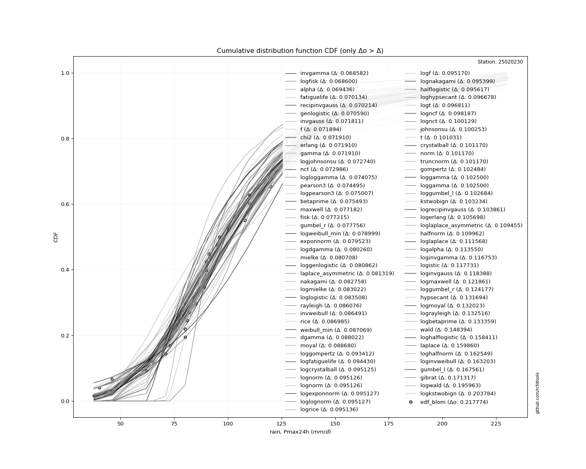</img>

</div>


**6.3. Best fit**

<div align="center">

|   id |   station | empirical_dist   | p_dist   |     delta |   deltao | eval   |   fit |   n |   best_fit |   best_fit_sort |
|-----:|----------:|:-----------------|:---------|----------:|---------:|:-------|------:|----:|-----------:|----------------:|
|    0 |  25020230 | edf_blom         | invgamma | 0.0685819 | 0.217774 | Δo > Δ |     1 |  39 |          1 |               1 |

</div>


<div align="center">

</img>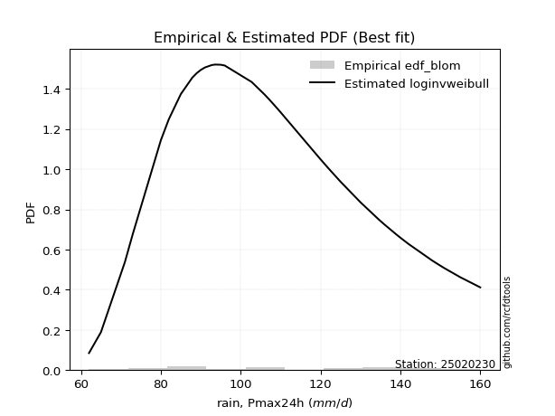</img>

</div>


### 7. Empirical - EDF Tukey (1962)

In hydrology, the Tukey formula is used as a plotting position formula to estimate the empirical probability or frequency of a flood event (or other hydrological data). The formula parameter is given as _c=0.333_ (or 1/3).

<div align="center">


$P=(m-c)/(n+1-2c)$


</div>


**7.1. Empirical values**

<div align="center">

|                | 0                   | 1                  | 2                   | 3                   | 4                   | 5                  | 6                  | 7                   | 8                   | 9                  | 10                 | 11                 | 12                 | 13                 | 14                 | 15                 | 16                 | 17                 | 18                 | 19        | 20                 | 21                 | 22                 | 23                 | 24                 | 25                | 26                 | 27                 | 28                 | 29                 | 30                 | 31                 | 32                 | 33                 | 34                 | 35                 | 36                 | 37                 | 38                 |
|:---------------|:--------------------|:-------------------|:--------------------|:--------------------|:--------------------|:-------------------|:-------------------|:--------------------|:--------------------|:-------------------|:-------------------|:-------------------|:-------------------|:-------------------|:-------------------|:-------------------|:-------------------|:-------------------|:-------------------|:----------|:-------------------|:-------------------|:-------------------|:-------------------|:-------------------|:------------------|:-------------------|:-------------------|:-------------------|:-------------------|:-------------------|:-------------------|:-------------------|:-------------------|:-------------------|:-------------------|:-------------------|:-------------------|:-------------------|
| date           | 1996                | 2005               | 1987                | 1992                | 1991                | 1998               | 2012               | 2003                | 2004                | 2018               | 2013               | 1997               | 1989               | 1990               | 1993               | 2006               | 1995               | 2010               | 1988               | 2014      | 2016               | 1980               | 2002               | 1999               | 2011               | 1983              | 2017               | 2000               | 2001               | 1994               | 1986               | 1982               | 2007               | 1981               | 2015               | 2009               | 1984               | 2008               | 1985               |
| x              | 37.52732            | 40.0               | 46.0                | 62.0                | 65.0                | 71.0               | 73.0               | 80.0                | 80.0                | 81.1               | 82.0               | 85.0               | 85.0               | 89.0               | 90.0               | 90.0               | 90.0               | 91.0               | 95.0               | 96.0      | 100.0              | 108.0              | 109.0              | 110.0              | 110.0              | 120.0             | 120.1              | 122.0              | 134.5              | 135.0              | 136.0              | 148.0              | 150.0              | 150.0              | 150.0              | 150.0              | 155.0              | 160.0              | 230.0              |
| m              | 1                   | 2                  | 3                   | 4                   | 5                   | 6                  | 7                  | 8                   | 9                   | 10                 | 11                 | 12                 | 13                 | 14                 | 15                 | 16                 | 17                 | 18                 | 19                 | 20        | 21                 | 22                 | 23                 | 24                 | 25                 | 26                | 27                 | 28                 | 29                 | 30                 | 31                 | 32                 | 33                 | 34                 | 35                 | 36                 | 37                 | 38                 | 39                 |
| empirical_dist | edf_tukey           | edf_tukey          | edf_tukey           | edf_tukey           | edf_tukey           | edf_tukey          | edf_tukey          | edf_tukey           | edf_tukey           | edf_tukey          | edf_tukey          | edf_tukey          | edf_tukey          | edf_tukey          | edf_tukey          | edf_tukey          | edf_tukey          | edf_tukey          | edf_tukey          | edf_tukey | edf_tukey          | edf_tukey          | edf_tukey          | edf_tukey          | edf_tukey          | edf_tukey         | edf_tukey          | edf_tukey          | edf_tukey          | edf_tukey          | edf_tukey          | edf_tukey          | edf_tukey          | edf_tukey          | edf_tukey          | edf_tukey          | edf_tukey          | edf_tukey          | edf_tukey          |
| empirical      | 0.01694915254237288 | 0.0423728813559322 | 0.06779661016949153 | 0.09322033898305085 | 0.11864406779661017 | 0.1440677966101695 | 0.1694915254237288 | 0.19491525423728814 | 0.22033898305084745 | 0.2457627118644068 | 0.2711864406779661 | 0.2966101694915254 | 0.3220338983050847 | 0.3474576271186441 | 0.3728813559322034 | 0.3983050847457627 | 0.423728813559322  | 0.4491525423728814 | 0.4745762711864407 | 0.5       | 0.5254237288135594 | 0.5508474576271186 | 0.576271186440678  | 0.6016949152542372 | 0.6271186440677966 | 0.652542372881356 | 0.6779661016949152 | 0.7033898305084746 | 0.7288135593220338 | 0.7542372881355932 | 0.7796610169491526 | 0.8050847457627118 | 0.8305084745762712 | 0.8559322033898306 | 0.8813559322033898 | 0.9067796610169492 | 0.9322033898305084 | 0.9576271186440678 | 0.9830508474576272 |
| empirical_tr   | 1.0172413793103448  | 1.0442477876106195 | 1.0727272727272728  | 1.102803738317757   | 1.1346153846153846  | 1.1683168316831685 | 1.2040816326530612 | 1.2421052631578948  | 1.2826086956521738  | 1.3258426966292136 | 1.372093023255814  | 1.4216867469879517 | 1.475              | 1.5324675324675323 | 1.5945945945945945 | 1.6619718309859157 | 1.7352941176470589 | 1.8153846153846154 | 1.9032258064516132 | 2.0       | 2.107142857142857  | 2.2264150943396226 | 2.3600000000000003 | 2.5106382978723403 | 2.6818181818181817 | 2.878048780487805 | 3.1052631578947367 | 3.3714285714285714 | 3.687499999999999  | 4.068965517241379  | 4.538461538461539  | 5.1304347826086945 | 5.9                | 6.941176470588238  | 8.428571428571427  | 10.72727272727273  | 14.749999999999991 | 23.6               | 59.000000000000156 |

</div>


**7.2. Kolmogorov-Smirnov fit test (sorted by Δ)**


<div align="center">

|                | 0                  | 1                   | 2                  | 3                   | 4                   | 5                  | 6                   | 7                   | 8                   | 9                   | 10                  | 11                  | 12                  | 13                  | 14                  | 15                  | 16                  | 17                  | 18                  | 19                  | 20                  | 21                  | 22                  | 23                  | 24                  | 25                  | 26                  | 27                  | 28                  | 29                  | 30                  | 31                  | 32                  | 33                  | 34                  | 35                  | 36                  | 37                  | 38                  | 39                  | 40                  | 41                  | 42                  | 43                  | 44                  | 45                 | 46                  | 47                 | 48                  | 49                  | 50                  | 51                  | 52                  | 53                  | 54                  | 55                  | 56                  | 57                  | 58                  | 59                  | 60                  | 61                  | 62                  | 63                    | 64                  | 65                  | 66                  | 67                  | 68                  | 69                  | 70                  | 71                  | 72                  | 73                  | 74                  | 75                  | 76                  | 77                 | 78                 | 79                  | 80                  | 81                 | 82                  | 83                  | 84                  | 85                  | 86                  | 87                  | 88                  | 89                  | 90                 | 91                 | 92                  | 93                 |
|:---------------|:-------------------|:--------------------|:-------------------|:--------------------|:--------------------|:-------------------|:--------------------|:--------------------|:--------------------|:--------------------|:--------------------|:--------------------|:--------------------|:--------------------|:--------------------|:--------------------|:--------------------|:--------------------|:--------------------|:--------------------|:--------------------|:--------------------|:--------------------|:--------------------|:--------------------|:--------------------|:--------------------|:--------------------|:--------------------|:--------------------|:--------------------|:--------------------|:--------------------|:--------------------|:--------------------|:--------------------|:--------------------|:--------------------|:--------------------|:--------------------|:--------------------|:--------------------|:--------------------|:--------------------|:--------------------|:-------------------|:--------------------|:-------------------|:--------------------|:--------------------|:--------------------|:--------------------|:--------------------|:--------------------|:--------------------|:--------------------|:--------------------|:--------------------|:--------------------|:--------------------|:--------------------|:--------------------|:--------------------|:----------------------|:--------------------|:--------------------|:--------------------|:--------------------|:--------------------|:--------------------|:--------------------|:--------------------|:--------------------|:--------------------|:--------------------|:--------------------|:--------------------|:-------------------|:-------------------|:--------------------|:--------------------|:-------------------|:--------------------|:--------------------|:--------------------|:--------------------|:--------------------|:--------------------|:--------------------|:--------------------|:-------------------|:-------------------|:--------------------|:-------------------|
| station        | 25020230           | 25020230            | 25020230           | 25020230            | 25020230            | 25020230           | 25020230            | 25020230            | 25020230            | 25020230            | 25020230            | 25020230            | 25020230            | 25020230            | 25020230            | 25020230            | 25020230            | 25020230            | 25020230            | 25020230            | 25020230            | 25020230            | 25020230            | 25020230            | 25020230            | 25020230            | 25020230            | 25020230            | 25020230            | 25020230            | 25020230            | 25020230            | 25020230            | 25020230            | 25020230            | 25020230            | 25020230            | 25020230            | 25020230            | 25020230            | 25020230            | 25020230            | 25020230            | 25020230            | 25020230            | 25020230           | 25020230            | 25020230           | 25020230            | 25020230            | 25020230            | 25020230            | 25020230            | 25020230            | 25020230            | 25020230            | 25020230            | 25020230            | 25020230            | 25020230            | 25020230            | 25020230            | 25020230            | 25020230              | 25020230            | 25020230            | 25020230            | 25020230            | 25020230            | 25020230            | 25020230            | 25020230            | 25020230            | 25020230            | 25020230            | 25020230            | 25020230            | 25020230           | 25020230           | 25020230            | 25020230            | 25020230           | 25020230            | 25020230            | 25020230            | 25020230            | 25020230            | 25020230            | 25020230            | 25020230            | 25020230           | 25020230           | 25020230            | 25020230           |
| empirical_dist | edf_tukey          | edf_tukey           | edf_tukey          | edf_tukey           | edf_tukey           | edf_tukey          | edf_tukey           | edf_tukey           | edf_tukey           | edf_tukey           | edf_tukey           | edf_tukey           | edf_tukey           | edf_tukey           | edf_tukey           | edf_tukey           | edf_tukey           | edf_tukey           | edf_tukey           | edf_tukey           | edf_tukey           | edf_tukey           | edf_tukey           | edf_tukey           | edf_tukey           | edf_tukey           | edf_tukey           | edf_tukey           | edf_tukey           | edf_tukey           | edf_tukey           | edf_tukey           | edf_tukey           | edf_tukey           | edf_tukey           | edf_tukey           | edf_tukey           | edf_tukey           | edf_tukey           | edf_tukey           | edf_tukey           | edf_tukey           | edf_tukey           | edf_tukey           | edf_tukey           | edf_tukey          | edf_tukey           | edf_tukey          | edf_tukey           | edf_tukey           | edf_tukey           | edf_tukey           | edf_tukey           | edf_tukey           | edf_tukey           | edf_tukey           | edf_tukey           | edf_tukey           | edf_tukey           | edf_tukey           | edf_tukey           | edf_tukey           | edf_tukey           | edf_tukey             | edf_tukey           | edf_tukey           | edf_tukey           | edf_tukey           | edf_tukey           | edf_tukey           | edf_tukey           | edf_tukey           | edf_tukey           | edf_tukey           | edf_tukey           | edf_tukey           | edf_tukey           | edf_tukey          | edf_tukey          | edf_tukey           | edf_tukey           | edf_tukey          | edf_tukey           | edf_tukey           | edf_tukey           | edf_tukey           | edf_tukey           | edf_tukey           | edf_tukey           | edf_tukey           | edf_tukey          | edf_tukey          | edf_tukey           | edf_tukey          |
| p_dist         | invgamma           | logfisk             | fatiguelife        | alpha               | recipinvgauss       | genlogistic        | invgauss            | f                   | chi2                | erlang              | gamma               | logjohnsonsu        | nct                 | logloggamma         | pearson3            | logpearson3         | betaprime           | maxwell             | fisk                | gumbel_r            | logweibull_min      | exponnorm           | logdgamma           | mielke              | loggenlogistic      | laplace_asymmetric  | nakagami            | logmielke           | loglogistic         | rayleigh            | invweibull          | rice                | weibull_min         | dgamma              | moyal               | loggompertz         | logfatiguelife      | logcrystalball      | lognorm             | lognorm             | logexponnorm        | loglognorm          | logrice             | logf                | lognakagami         | halflogistic       | logt                | loghypsecant       | logncf              | lognct              | johnsonsu           | t                   | crystalball         | norm                | truncnorm           | gompertz            | loggamma            | loggamma            | kstwobign           | loggumbel_l         | logrecipinvgauss    | logerlang           | halfnorm            | loglaplace_asymmetric | loglaplace          | logalpha            | loginvgamma         | loginvgauss         | logistic            | logmaxwell          | loggumbel_r         | logmoyal            | hypsecant           | lograyleigh         | logbetaprime        | wald                | loghalflogistic     | laplace            | loghalfnorm        | loginvweibull       | gumbel_l            | gibrat             | logwald             | logkstwobign        | loggibrat           | loggenexpon         | genexpon            | expon               | pareto              | ncf                 | logtruncnorm       | logexpon           | logpareto           | logchi2            |
| delta          | 0.0686898085673967 | 0.06908619781727188 | 0.0694865595121292 | 0.06954363016955234 | 0.06956584897112231 | 0.0706978496278981 | 0.07116301165805775 | 0.07124673006641849 | 0.07126227542631439 | 0.07126229218351385 | 0.07126230517324703 | 0.07284841573465739 | 0.07309376143752144 | 0.07342761908238368 | 0.07384768342599188 | 0.07435884039391757 | 0.07484546557745034 | 0.07653405716475001 | 0.07732312117547263 | 0.07824176372954705 | 0.07835127409105555 | 0.07963056216541531 | 0.07998995457066149 | 0.08081633796320359 | 0.08097041359045432 | 0.08180456433411487 | 0.08211069779367222 | 0.08313006567917747 | 0.08399373247466813 | 0.08542821851934404 | 0.08584334027845494 | 0.08633714855956279 | 0.08642138220830628 | 0.08866955406839894 | 0.08916630244517698 | 0.09276395932614409 | 0.09378186623322146 | 0.09447750602298535 | 0.09447866620508519 | 0.09447866620508519 | 0.09447882530724919 | 0.09447957556661887 | 0.09448800305490093 | 0.09452222008941072 | 0.09475086959707138 | 0.0949694142544539 | 0.09616364909784006 | 0.0971633110611112 | 0.09753907808565268 | 0.09948170679592519 | 0.10025258742891185 | 0.10103101305855972 | 0.10117000752021843 | 0.10117001125169256 | 0.10117003023683524 | 0.10183584359586997 | 0.10185195254074389 | 0.10185195254074389 | 0.10258594083899578 | 0.10279245617385702 | 0.10321335329603784 | 0.10505068708513562 | 0.10931390889953199 | 0.1095628714451432    | 0.11205412003638149 | 0.11290265489417664 | 0.11610571638148068 | 0.11774003651422035 | 0.11783941058518954 | 0.12121283682068332 | 0.12352905719697024 | 0.13172329852455644 | 0.13180211703443184 | 0.13186865086935987 | 0.13271101777290537 | 0.14909621517232946 | 0.15776309258519292 | 0.1599681550957579 | 0.1619011646301365 | 0.16255477236636037 | 0.16756080989486755 | 0.1719109451055496 | 0.19607062122548558 | 0.20313672737840624 | 0.22752008969750348 | 0.23249688661427506 | 0.26728913806163956 | 0.26826731209255794 | 0.26826731607135845 | 0.30400468983376056 | 0.3180442972987919 | 0.3474737396071109 | 0.34747374373231743 | 0.40573174166941   |
| deltao         | 0.2177742891749185 | 0.2177742891749185  | 0.2177742891749185 | 0.2177742891749185  | 0.2177742891749185  | 0.2177742891749185 | 0.2177742891749185  | 0.2177742891749185  | 0.2177742891749185  | 0.2177742891749185  | 0.2177742891749185  | 0.2177742891749185  | 0.2177742891749185  | 0.2177742891749185  | 0.2177742891749185  | 0.2177742891749185  | 0.2177742891749185  | 0.2177742891749185  | 0.2177742891749185  | 0.2177742891749185  | 0.2177742891749185  | 0.2177742891749185  | 0.2177742891749185  | 0.2177742891749185  | 0.2177742891749185  | 0.2177742891749185  | 0.2177742891749185  | 0.2177742891749185  | 0.2177742891749185  | 0.2177742891749185  | 0.2177742891749185  | 0.2177742891749185  | 0.2177742891749185  | 0.2177742891749185  | 0.2177742891749185  | 0.2177742891749185  | 0.2177742891749185  | 0.2177742891749185  | 0.2177742891749185  | 0.2177742891749185  | 0.2177742891749185  | 0.2177742891749185  | 0.2177742891749185  | 0.2177742891749185  | 0.2177742891749185  | 0.2177742891749185 | 0.2177742891749185  | 0.2177742891749185 | 0.2177742891749185  | 0.2177742891749185  | 0.2177742891749185  | 0.2177742891749185  | 0.2177742891749185  | 0.2177742891749185  | 0.2177742891749185  | 0.2177742891749185  | 0.2177742891749185  | 0.2177742891749185  | 0.2177742891749185  | 0.2177742891749185  | 0.2177742891749185  | 0.2177742891749185  | 0.2177742891749185  | 0.2177742891749185    | 0.2177742891749185  | 0.2177742891749185  | 0.2177742891749185  | 0.2177742891749185  | 0.2177742891749185  | 0.2177742891749185  | 0.2177742891749185  | 0.2177742891749185  | 0.2177742891749185  | 0.2177742891749185  | 0.2177742891749185  | 0.2177742891749185  | 0.2177742891749185  | 0.2177742891749185 | 0.2177742891749185 | 0.2177742891749185  | 0.2177742891749185  | 0.2177742891749185 | 0.2177742891749185  | 0.2177742891749185  | 0.2177742891749185  | 0.2177742891749185  | 0.2177742891749185  | 0.2177742891749185  | 0.2177742891749185  | 0.2177742891749185  | 0.2177742891749185 | 0.2177742891749185 | 0.2177742891749185  | 0.2177742891749185 |
| eval           | Δo > Δ             | Δo > Δ              | Δo > Δ             | Δo > Δ              | Δo > Δ              | Δo > Δ             | Δo > Δ              | Δo > Δ              | Δo > Δ              | Δo > Δ              | Δo > Δ              | Δo > Δ              | Δo > Δ              | Δo > Δ              | Δo > Δ              | Δo > Δ              | Δo > Δ              | Δo > Δ              | Δo > Δ              | Δo > Δ              | Δo > Δ              | Δo > Δ              | Δo > Δ              | Δo > Δ              | Δo > Δ              | Δo > Δ              | Δo > Δ              | Δo > Δ              | Δo > Δ              | Δo > Δ              | Δo > Δ              | Δo > Δ              | Δo > Δ              | Δo > Δ              | Δo > Δ              | Δo > Δ              | Δo > Δ              | Δo > Δ              | Δo > Δ              | Δo > Δ              | Δo > Δ              | Δo > Δ              | Δo > Δ              | Δo > Δ              | Δo > Δ              | Δo > Δ             | Δo > Δ              | Δo > Δ             | Δo > Δ              | Δo > Δ              | Δo > Δ              | Δo > Δ              | Δo > Δ              | Δo > Δ              | Δo > Δ              | Δo > Δ              | Δo > Δ              | Δo > Δ              | Δo > Δ              | Δo > Δ              | Δo > Δ              | Δo > Δ              | Δo > Δ              | Δo > Δ                | Δo > Δ              | Δo > Δ              | Δo > Δ              | Δo > Δ              | Δo > Δ              | Δo > Δ              | Δo > Δ              | Δo > Δ              | Δo > Δ              | Δo > Δ              | Δo > Δ              | Δo > Δ              | Δo > Δ              | Δo > Δ             | Δo > Δ             | Δo > Δ              | Δo > Δ              | Δo > Δ             | Δo > Δ              | Δo > Δ              | Δo <= Δ             | Δo <= Δ             | Δo <= Δ             | Δo <= Δ             | Δo <= Δ             | Δo <= Δ             | Δo <= Δ            | Δo <= Δ            | Δo <= Δ             | Δo <= Δ            |
| fit            | 1                  | 1                   | 1                  | 1                   | 1                   | 1                  | 1                   | 1                   | 1                   | 1                   | 1                   | 1                   | 1                   | 1                   | 1                   | 1                   | 1                   | 1                   | 1                   | 1                   | 1                   | 1                   | 1                   | 1                   | 1                   | 1                   | 1                   | 1                   | 1                   | 1                   | 1                   | 1                   | 1                   | 1                   | 1                   | 1                   | 1                   | 1                   | 1                   | 1                   | 1                   | 1                   | 1                   | 1                   | 1                   | 1                  | 1                   | 1                  | 1                   | 1                   | 1                   | 1                   | 1                   | 1                   | 1                   | 1                   | 1                   | 1                   | 1                   | 1                   | 1                   | 1                   | 1                   | 1                     | 1                   | 1                   | 1                   | 1                   | 1                   | 1                   | 1                   | 1                   | 1                   | 1                   | 1                   | 1                   | 1                   | 1                  | 1                  | 1                   | 1                   | 1                  | 1                   | 1                   | 0                   | 0                   | 0                   | 0                   | 0                   | 0                   | 0                  | 0                  | 0                   | 0                  |
| n              | 39                 | 39                  | 39                 | 39                  | 39                  | 39                 | 39                  | 39                  | 39                  | 39                  | 39                  | 39                  | 39                  | 39                  | 39                  | 39                  | 39                  | 39                  | 39                  | 39                  | 39                  | 39                  | 39                  | 39                  | 39                  | 39                  | 39                  | 39                  | 39                  | 39                  | 39                  | 39                  | 39                  | 39                  | 39                  | 39                  | 39                  | 39                  | 39                  | 39                  | 39                  | 39                  | 39                  | 39                  | 39                  | 39                 | 39                  | 39                 | 39                  | 39                  | 39                  | 39                  | 39                  | 39                  | 39                  | 39                  | 39                  | 39                  | 39                  | 39                  | 39                  | 39                  | 39                  | 39                    | 39                  | 39                  | 39                  | 39                  | 39                  | 39                  | 39                  | 39                  | 39                  | 39                  | 39                  | 39                  | 39                  | 39                 | 39                 | 39                  | 39                  | 39                 | 39                  | 39                  | 39                  | 39                  | 39                  | 39                  | 39                  | 39                  | 39                 | 39                 | 39                  | 39                 |
| best_fit       | 1                  | 0                   | 0                  | 0                   | 0                   | 0                  | 0                   | 0                   | 0                   | 0                   | 0                   | 0                   | 0                   | 0                   | 0                   | 0                   | 0                   | 0                   | 0                   | 0                   | 0                   | 0                   | 0                   | 0                   | 0                   | 0                   | 0                   | 0                   | 0                   | 0                   | 0                   | 0                   | 0                   | 0                   | 0                   | 0                   | 0                   | 0                   | 0                   | 0                   | 0                   | 0                   | 0                   | 0                   | 0                   | 0                  | 0                   | 0                  | 0                   | 0                   | 0                   | 0                   | 0                   | 0                   | 0                   | 0                   | 0                   | 0                   | 0                   | 0                   | 0                   | 0                   | 0                   | 0                     | 0                   | 0                   | 0                   | 0                   | 0                   | 0                   | 0                   | 0                   | 0                   | 0                   | 0                   | 0                   | 0                   | 0                  | 0                  | 0                   | 0                   | 0                  | 0                   | 0                   | 0                   | 0                   | 0                   | 0                   | 0                   | 0                   | 0                  | 0                  | 0                   | 0                  |
| best_fit_sort  | 1                  | 2                   | 3                  | 4                   | 5                   | 6                  | 7                   | 8                   | 9                   | 10                  | 11                  | 12                  | 13                  | 14                  | 15                  | 16                  | 17                  | 18                  | 19                  | 20                  | 21                  | 22                  | 23                  | 24                  | 25                  | 26                  | 27                  | 28                  | 29                  | 30                  | 31                  | 32                  | 33                  | 34                  | 35                  | 36                  | 37                  | 38                  | 39                  | 40                  | 41                  | 42                  | 43                  | 44                  | 45                  | 46                 | 47                  | 48                 | 49                  | 50                  | 51                  | 52                  | 53                  | 54                  | 55                  | 56                  | 57                  | 58                  | 59                  | 60                  | 61                  | 62                  | 63                  | 64                    | 65                  | 66                  | 67                  | 68                  | 69                  | 70                  | 71                  | 72                  | 73                  | 74                  | 75                  | 76                  | 77                  | 78                 | 79                 | 80                  | 81                  | 82                 | 83                  | 84                  | 85                  | 86                  | 87                  | 88                  | 89                  | 90                  | 91                 | 92                 | 93                  | 94                 |

</div>


<div align="center">

</img>

</div>


**7.3. Best fit**

<div align="center">

|   id |   station | empirical_dist   | p_dist   |     delta |   deltao | eval   |   fit |   n |   best_fit |   best_fit_sort |
|-----:|----------:|:-----------------|:---------|----------:|---------:|:-------|------:|----:|-----------:|----------------:|
|    0 |  25020230 | edf_tukey        | invgamma | 0.0686898 | 0.217774 | Δo > Δ |     1 |  39 |          1 |               1 |

</div>


<div align="center">

</img></img>

</div>


### 8. Empirical - EDF Gringorten (1963)

Gringorten plotting position formula is essential for estimating the probability and return periods of extreme events like floods and heavy rainfall. The constant _a=0.44_.

<div align="center">


$P=(m-a)/(n+1-2a)$


</div>


**8.1. Empirical values**

<div align="center">

|                | 0                    | 1                   | 2                  | 3                   | 4                  | 5                   | 6                   | 7                   | 8                   | 9                   | 10                 | 11                 | 12                  | 13                 | 14                  | 15                 | 16                 | 17                 | 18                  | 19             | 20                 | 21                 | 22                 | 23                 | 24                 | 25                 | 26                 | 27                 | 28                 | 29                 | 30                 | 31                 | 32                 | 33                | 34                | 35                 | 36                 | 37                 | 38                 |
|:---------------|:---------------------|:--------------------|:-------------------|:--------------------|:-------------------|:--------------------|:--------------------|:--------------------|:--------------------|:--------------------|:-------------------|:-------------------|:--------------------|:-------------------|:--------------------|:-------------------|:-------------------|:-------------------|:--------------------|:---------------|:-------------------|:-------------------|:-------------------|:-------------------|:-------------------|:-------------------|:-------------------|:-------------------|:-------------------|:-------------------|:-------------------|:-------------------|:-------------------|:------------------|:------------------|:-------------------|:-------------------|:-------------------|:-------------------|
| date           | 1996                 | 2005                | 1987               | 1992                | 1991               | 1998                | 2012                | 2003                | 2004                | 2018                | 2013               | 1997               | 1989                | 1990               | 1993                | 2006               | 1995               | 2010               | 1988                | 2014           | 2016               | 1980               | 2002               | 1999               | 2011               | 1983               | 2017               | 2000               | 2001               | 1994               | 1986               | 1982               | 2007               | 1981              | 2015              | 2009               | 1984               | 2008               | 1985               |
| x              | 37.52732             | 40.0                | 46.0               | 62.0                | 65.0               | 71.0                | 73.0                | 80.0                | 80.0                | 81.1                | 82.0               | 85.0               | 85.0                | 89.0               | 90.0                | 90.0               | 90.0               | 91.0               | 95.0                | 96.0           | 100.0              | 108.0              | 109.0              | 110.0              | 110.0              | 120.0              | 120.1              | 122.0              | 134.5              | 135.0              | 136.0              | 148.0              | 150.0              | 150.0             | 150.0             | 150.0              | 155.0              | 160.0              | 230.0              |
| m              | 1                    | 2                   | 3                  | 4                   | 5                  | 6                   | 7                   | 8                   | 9                   | 10                  | 11                 | 12                 | 13                  | 14                 | 15                  | 16                 | 17                 | 18                 | 19                  | 20             | 21                 | 22                 | 23                 | 24                 | 25                 | 26                 | 27                 | 28                 | 29                 | 30                 | 31                 | 32                 | 33                 | 34                | 35                | 36                 | 37                 | 38                 | 39                 |
| empirical_dist | edf_gringorten       | edf_gringorten      | edf_gringorten     | edf_gringorten      | edf_gringorten     | edf_gringorten      | edf_gringorten      | edf_gringorten      | edf_gringorten      | edf_gringorten      | edf_gringorten     | edf_gringorten     | edf_gringorten      | edf_gringorten     | edf_gringorten      | edf_gringorten     | edf_gringorten     | edf_gringorten     | edf_gringorten      | edf_gringorten | edf_gringorten     | edf_gringorten     | edf_gringorten     | edf_gringorten     | edf_gringorten     | edf_gringorten     | edf_gringorten     | edf_gringorten     | edf_gringorten     | edf_gringorten     | edf_gringorten     | edf_gringorten     | edf_gringorten     | edf_gringorten    | edf_gringorten    | edf_gringorten     | edf_gringorten     | edf_gringorten     | edf_gringorten     |
| empirical      | 0.014314928425357875 | 0.03987730061349694 | 0.065439672801636  | 0.09100204498977506 | 0.1165644171779141 | 0.14212678936605316 | 0.16768916155419222 | 0.19325153374233128 | 0.21881390593047037 | 0.24437627811860943 | 0.2699386503067485 | 0.2955010224948876 | 0.32106339468302664 | 0.3466257668711657 | 0.37218813905930476 | 0.3977505112474438 | 0.4233128834355828 | 0.4488752556237219 | 0.47443762781186094 | 0.5            | 0.5255623721881391 | 0.5511247443762781 | 0.5766871165644172 | 0.6022494887525562 | 0.6278118609406953 | 0.6533742331288344 | 0.6789366053169734 | 0.7044989775051125 | 0.7300613496932515 | 0.7556237218813906 | 0.7811860940695297 | 0.8067484662576687 | 0.8323108384458079 | 0.857873210633947 | 0.883435582822086 | 0.9089979550102251 | 0.9345603271983641 | 0.9601226993865032 | 0.9856850715746422 |
| empirical_tr   | 1.0145228215767634   | 1.0415335463258786  | 1.0700218818380745 | 1.1001124859392575  | 1.1319444444444444 | 1.165673420738975   | 1.2014742014742015  | 1.2395437262357414  | 1.280104712041885   | 1.3234100135317997  | 1.3697478991596639 | 1.4194484760522497 | 1.4728915662650601  | 1.5305164319248825 | 1.5928338762214984  | 1.66044142614601   | 1.7340425531914894 | 1.8144712430426717 | 1.9027237354085602  | 2.0            | 2.1077586206896552 | 2.2277904328018225 | 2.36231884057971   | 2.51413881748072   | 2.686813186813187  | 2.8849557522123894 | 3.1146496815286624 | 3.384083044982699  | 3.7045454545454546 | 4.092050209205021  | 4.570093457943925  | 5.174603174603175  | 5.963414634146345  | 7.035971223021589 | 8.578947368421062 | 10.988764044943835 | 15.281250000000028 | 25.07692307692315  | 69.85714285714344  |

</div>


**8.2. Kolmogorov-Smirnov fit test (sorted by Δ)**


<div align="center">

|                | 0                   | 1                   | 2                   | 3                  | 4                   | 5                   | 6                   | 7                   | 8                  | 9                   | 10                  | 11                  | 12                  | 13                  | 14                  | 15                  | 16                 | 17                  | 18                  | 19                  | 20                  | 21                  | 22                  | 23                  | 24                  | 25                  | 26                  | 27                  | 28                  | 29                  | 30                 | 31                 | 32                  | 33                  | 34                  | 35                  | 36                  | 37                  | 38                  | 39                  | 40                  | 41                  | 42                  | 43                  | 44                  | 45                  | 46                  | 47                  | 48                  | 49                  | 50                  | 51                  | 52                  | 53                  | 54                  | 55                  | 56                  | 57                  | 58                  | 59                  | 60                 | 61                  | 62                    | 63                 | 64                  | 65                 | 66                  | 67                  | 68                  | 69                  | 70                 | 71                  | 72                  | 73                  | 74                  | 75                  | 76                  | 77                 | 78                  | 79                  | 80                  | 81                  | 82                  | 83                 | 84                  | 85                  | 86                  | 87                  | 88                  | 89                 | 90                 | 91                 | 92                 | 93                  |
|:---------------|:--------------------|:--------------------|:--------------------|:-------------------|:--------------------|:--------------------|:--------------------|:--------------------|:-------------------|:--------------------|:--------------------|:--------------------|:--------------------|:--------------------|:--------------------|:--------------------|:-------------------|:--------------------|:--------------------|:--------------------|:--------------------|:--------------------|:--------------------|:--------------------|:--------------------|:--------------------|:--------------------|:--------------------|:--------------------|:--------------------|:-------------------|:-------------------|:--------------------|:--------------------|:--------------------|:--------------------|:--------------------|:--------------------|:--------------------|:--------------------|:--------------------|:--------------------|:--------------------|:--------------------|:--------------------|:--------------------|:--------------------|:--------------------|:--------------------|:--------------------|:--------------------|:--------------------|:--------------------|:--------------------|:--------------------|:--------------------|:--------------------|:--------------------|:--------------------|:--------------------|:-------------------|:--------------------|:----------------------|:-------------------|:--------------------|:-------------------|:--------------------|:--------------------|:--------------------|:--------------------|:-------------------|:--------------------|:--------------------|:--------------------|:--------------------|:--------------------|:--------------------|:-------------------|:--------------------|:--------------------|:--------------------|:--------------------|:--------------------|:-------------------|:--------------------|:--------------------|:--------------------|:--------------------|:--------------------|:-------------------|:-------------------|:-------------------|:-------------------|:--------------------|
| station        | 25020230            | 25020230            | 25020230            | 25020230           | 25020230            | 25020230            | 25020230            | 25020230            | 25020230           | 25020230            | 25020230            | 25020230            | 25020230            | 25020230            | 25020230            | 25020230            | 25020230           | 25020230            | 25020230            | 25020230            | 25020230            | 25020230            | 25020230            | 25020230            | 25020230            | 25020230            | 25020230            | 25020230            | 25020230            | 25020230            | 25020230           | 25020230           | 25020230            | 25020230            | 25020230            | 25020230            | 25020230            | 25020230            | 25020230            | 25020230            | 25020230            | 25020230            | 25020230            | 25020230            | 25020230            | 25020230            | 25020230            | 25020230            | 25020230            | 25020230            | 25020230            | 25020230            | 25020230            | 25020230            | 25020230            | 25020230            | 25020230            | 25020230            | 25020230            | 25020230            | 25020230           | 25020230            | 25020230              | 25020230           | 25020230            | 25020230           | 25020230            | 25020230            | 25020230            | 25020230            | 25020230           | 25020230            | 25020230            | 25020230            | 25020230            | 25020230            | 25020230            | 25020230           | 25020230            | 25020230            | 25020230            | 25020230            | 25020230            | 25020230           | 25020230            | 25020230            | 25020230            | 25020230            | 25020230            | 25020230           | 25020230           | 25020230           | 25020230           | 25020230            |
| empirical_dist | edf_gringorten      | edf_gringorten      | edf_gringorten      | edf_gringorten     | edf_gringorten      | edf_gringorten      | edf_gringorten      | edf_gringorten      | edf_gringorten     | edf_gringorten      | edf_gringorten      | edf_gringorten      | edf_gringorten      | edf_gringorten      | edf_gringorten      | edf_gringorten      | edf_gringorten     | edf_gringorten      | edf_gringorten      | edf_gringorten      | edf_gringorten      | edf_gringorten      | edf_gringorten      | edf_gringorten      | edf_gringorten      | edf_gringorten      | edf_gringorten      | edf_gringorten      | edf_gringorten      | edf_gringorten      | edf_gringorten     | edf_gringorten     | edf_gringorten      | edf_gringorten      | edf_gringorten      | edf_gringorten      | edf_gringorten      | edf_gringorten      | edf_gringorten      | edf_gringorten      | edf_gringorten      | edf_gringorten      | edf_gringorten      | edf_gringorten      | edf_gringorten      | edf_gringorten      | edf_gringorten      | edf_gringorten      | edf_gringorten      | edf_gringorten      | edf_gringorten      | edf_gringorten      | edf_gringorten      | edf_gringorten      | edf_gringorten      | edf_gringorten      | edf_gringorten      | edf_gringorten      | edf_gringorten      | edf_gringorten      | edf_gringorten     | edf_gringorten      | edf_gringorten        | edf_gringorten     | edf_gringorten      | edf_gringorten     | edf_gringorten      | edf_gringorten      | edf_gringorten      | edf_gringorten      | edf_gringorten     | edf_gringorten      | edf_gringorten      | edf_gringorten      | edf_gringorten      | edf_gringorten      | edf_gringorten      | edf_gringorten     | edf_gringorten      | edf_gringorten      | edf_gringorten      | edf_gringorten      | edf_gringorten      | edf_gringorten     | edf_gringorten      | edf_gringorten      | edf_gringorten      | edf_gringorten      | edf_gringorten      | edf_gringorten     | edf_gringorten     | edf_gringorten     | edf_gringorten     | edf_gringorten      |
| p_dist         | logfisk             | alpha               | invgamma            | genlogistic        | fatiguelife         | recipinvgauss       | logjohnsonsu        | nct                 | invgauss           | f                   | chi2                | erlang              | gamma               | logloggamma         | pearson3            | logpearson3         | betaprime          | gumbel_r            | fisk                | maxwell             | exponnorm           | logweibull_min      | mielke              | laplace_asymmetric  | logdgamma           | loggenlogistic      | loglogistic         | logmielke           | nakagami            | dgamma              | rayleigh           | invweibull         | moyal               | rice                | weibull_min         | loggompertz         | logfatiguelife      | loghypsecant        | logcrystalball      | lognorm             | lognorm             | logexponnorm        | loglognorm          | logrice             | logf                | lognakagami         | halflogistic        | logt                | logncf              | johnsonsu           | t                   | lognct              | crystalball         | norm                | truncnorm           | loggumbel_l         | gompertz            | loggamma            | loggamma            | kstwobign           | logrecipinvgauss   | logerlang           | loglaplace_asymmetric | loglaplace         | halfnorm            | logalpha           | logistic            | loginvgamma         | loginvgauss         | logmaxwell          | loggumbel_r        | hypsecant           | logmoyal            | lograyleigh         | logbetaprime        | wald                | loghalflogistic     | laplace            | loghalfnorm         | loginvweibull       | gumbel_l            | gibrat              | logwald             | logkstwobign       | loggibrat           | loggenexpon         | genexpon            | expon               | pareto              | ncf                | logtruncnorm       | logexpon           | logpareto          | logchi2             |
| delta          | 0.06783840744605418 | 0.06926634342039284 | 0.06932858774563422 | 0.0704205628787386 | 0.07115028000708606 | 0.07122956946607917 | 0.07257112898549789 | 0.07281647468836194 | 0.0728267321530146 | 0.07291045056137535 | 0.07292599592127125 | 0.07292601267847071 | 0.07292602566820389 | 0.07509133957734054 | 0.07551140392094874 | 0.07602256088887444 | 0.0765091860724072 | 0.07699397335832936 | 0.07704583442631313 | 0.07819777765970687 | 0.07935327541625581 | 0.08001499458601241 | 0.08053905121404409 | 0.08055677396289718 | 0.08068317144356019 | 0.08069312684129482 | 0.08274594210345043 | 0.08285277893001797 | 0.08377441828862908 | 0.08700583357344205 | 0.0870919390143009 | 0.0875070607734118 | 0.08791851207395929 | 0.08800086905451965 | 0.08808510270326314 | 0.09442767982110095 | 0.09544558672817832 | 0.09591552068989351 | 0.09614122651794221 | 0.09614238670004205 | 0.09614238670004205 | 0.09614254580220605 | 0.09614329606157573 | 0.09615172354985779 | 0.09618594058436758 | 0.09641459009202824 | 0.09663313474941077 | 0.09782736959279692 | 0.09920279858060954 | 0.10025258742891185 | 0.10103101305855972 | 0.10114542729088205 | 0.10117000752021843 | 0.10117001125169256 | 0.10117003023683524 | 0.10251516942469752 | 0.10349956409082683 | 0.10351567303570075 | 0.10351567303570075 | 0.10424966133395264 | 0.1048770737909947 | 0.10671440758009249 | 0.1092855846959837    | 0.1108063296651638 | 0.11097762939448885 | 0.1145663753891335 | 0.11756212383603004 | 0.11776943687643754 | 0.11940375700917721 | 0.12287655731564018 | 0.1251927776919271 | 0.13152483028527234 | 0.13303891215230157 | 0.13353237136431673 | 0.13437473826786223 | 0.14729385130279288 | 0.15942681308014978 | 0.1596908683465984 | 0.16356488512509337 | 0.16421849286131723 | 0.16756080989486755 | 0.17038586798517252 | 0.19579333447632608 | 0.2048004478733631 | 0.22724280294834398 | 0.23416060710923192 | 0.26895285855659645 | 0.26993103258751483 | 0.26993103656631534 | 0.3060575490967739 | 0.3197080177937488 | 0.3491374601020678 | 0.3491374642272743 | 0.40767274891352634 |
| deltao         | 0.2177742891749185  | 0.2177742891749185  | 0.2177742891749185  | 0.2177742891749185 | 0.2177742891749185  | 0.2177742891749185  | 0.2177742891749185  | 0.2177742891749185  | 0.2177742891749185 | 0.2177742891749185  | 0.2177742891749185  | 0.2177742891749185  | 0.2177742891749185  | 0.2177742891749185  | 0.2177742891749185  | 0.2177742891749185  | 0.2177742891749185 | 0.2177742891749185  | 0.2177742891749185  | 0.2177742891749185  | 0.2177742891749185  | 0.2177742891749185  | 0.2177742891749185  | 0.2177742891749185  | 0.2177742891749185  | 0.2177742891749185  | 0.2177742891749185  | 0.2177742891749185  | 0.2177742891749185  | 0.2177742891749185  | 0.2177742891749185 | 0.2177742891749185 | 0.2177742891749185  | 0.2177742891749185  | 0.2177742891749185  | 0.2177742891749185  | 0.2177742891749185  | 0.2177742891749185  | 0.2177742891749185  | 0.2177742891749185  | 0.2177742891749185  | 0.2177742891749185  | 0.2177742891749185  | 0.2177742891749185  | 0.2177742891749185  | 0.2177742891749185  | 0.2177742891749185  | 0.2177742891749185  | 0.2177742891749185  | 0.2177742891749185  | 0.2177742891749185  | 0.2177742891749185  | 0.2177742891749185  | 0.2177742891749185  | 0.2177742891749185  | 0.2177742891749185  | 0.2177742891749185  | 0.2177742891749185  | 0.2177742891749185  | 0.2177742891749185  | 0.2177742891749185 | 0.2177742891749185  | 0.2177742891749185    | 0.2177742891749185 | 0.2177742891749185  | 0.2177742891749185 | 0.2177742891749185  | 0.2177742891749185  | 0.2177742891749185  | 0.2177742891749185  | 0.2177742891749185 | 0.2177742891749185  | 0.2177742891749185  | 0.2177742891749185  | 0.2177742891749185  | 0.2177742891749185  | 0.2177742891749185  | 0.2177742891749185 | 0.2177742891749185  | 0.2177742891749185  | 0.2177742891749185  | 0.2177742891749185  | 0.2177742891749185  | 0.2177742891749185 | 0.2177742891749185  | 0.2177742891749185  | 0.2177742891749185  | 0.2177742891749185  | 0.2177742891749185  | 0.2177742891749185 | 0.2177742891749185 | 0.2177742891749185 | 0.2177742891749185 | 0.2177742891749185  |
| eval           | Δo > Δ              | Δo > Δ              | Δo > Δ              | Δo > Δ             | Δo > Δ              | Δo > Δ              | Δo > Δ              | Δo > Δ              | Δo > Δ             | Δo > Δ              | Δo > Δ              | Δo > Δ              | Δo > Δ              | Δo > Δ              | Δo > Δ              | Δo > Δ              | Δo > Δ             | Δo > Δ              | Δo > Δ              | Δo > Δ              | Δo > Δ              | Δo > Δ              | Δo > Δ              | Δo > Δ              | Δo > Δ              | Δo > Δ              | Δo > Δ              | Δo > Δ              | Δo > Δ              | Δo > Δ              | Δo > Δ             | Δo > Δ             | Δo > Δ              | Δo > Δ              | Δo > Δ              | Δo > Δ              | Δo > Δ              | Δo > Δ              | Δo > Δ              | Δo > Δ              | Δo > Δ              | Δo > Δ              | Δo > Δ              | Δo > Δ              | Δo > Δ              | Δo > Δ              | Δo > Δ              | Δo > Δ              | Δo > Δ              | Δo > Δ              | Δo > Δ              | Δo > Δ              | Δo > Δ              | Δo > Δ              | Δo > Δ              | Δo > Δ              | Δo > Δ              | Δo > Δ              | Δo > Δ              | Δo > Δ              | Δo > Δ             | Δo > Δ              | Δo > Δ                | Δo > Δ             | Δo > Δ              | Δo > Δ             | Δo > Δ              | Δo > Δ              | Δo > Δ              | Δo > Δ              | Δo > Δ             | Δo > Δ              | Δo > Δ              | Δo > Δ              | Δo > Δ              | Δo > Δ              | Δo > Δ              | Δo > Δ             | Δo > Δ              | Δo > Δ              | Δo > Δ              | Δo > Δ              | Δo > Δ              | Δo > Δ             | Δo <= Δ             | Δo <= Δ             | Δo <= Δ             | Δo <= Δ             | Δo <= Δ             | Δo <= Δ            | Δo <= Δ            | Δo <= Δ            | Δo <= Δ            | Δo <= Δ             |
| fit            | 1                   | 1                   | 1                   | 1                  | 1                   | 1                   | 1                   | 1                   | 1                  | 1                   | 1                   | 1                   | 1                   | 1                   | 1                   | 1                   | 1                  | 1                   | 1                   | 1                   | 1                   | 1                   | 1                   | 1                   | 1                   | 1                   | 1                   | 1                   | 1                   | 1                   | 1                  | 1                  | 1                   | 1                   | 1                   | 1                   | 1                   | 1                   | 1                   | 1                   | 1                   | 1                   | 1                   | 1                   | 1                   | 1                   | 1                   | 1                   | 1                   | 1                   | 1                   | 1                   | 1                   | 1                   | 1                   | 1                   | 1                   | 1                   | 1                   | 1                   | 1                  | 1                   | 1                     | 1                  | 1                   | 1                  | 1                   | 1                   | 1                   | 1                   | 1                  | 1                   | 1                   | 1                   | 1                   | 1                   | 1                   | 1                  | 1                   | 1                   | 1                   | 1                   | 1                   | 1                  | 0                   | 0                   | 0                   | 0                   | 0                   | 0                  | 0                  | 0                  | 0                  | 0                   |
| n              | 39                  | 39                  | 39                  | 39                 | 39                  | 39                  | 39                  | 39                  | 39                 | 39                  | 39                  | 39                  | 39                  | 39                  | 39                  | 39                  | 39                 | 39                  | 39                  | 39                  | 39                  | 39                  | 39                  | 39                  | 39                  | 39                  | 39                  | 39                  | 39                  | 39                  | 39                 | 39                 | 39                  | 39                  | 39                  | 39                  | 39                  | 39                  | 39                  | 39                  | 39                  | 39                  | 39                  | 39                  | 39                  | 39                  | 39                  | 39                  | 39                  | 39                  | 39                  | 39                  | 39                  | 39                  | 39                  | 39                  | 39                  | 39                  | 39                  | 39                  | 39                 | 39                  | 39                    | 39                 | 39                  | 39                 | 39                  | 39                  | 39                  | 39                  | 39                 | 39                  | 39                  | 39                  | 39                  | 39                  | 39                  | 39                 | 39                  | 39                  | 39                  | 39                  | 39                  | 39                 | 39                  | 39                  | 39                  | 39                  | 39                  | 39                 | 39                 | 39                 | 39                 | 39                  |
| best_fit       | 1                   | 0                   | 0                   | 0                  | 0                   | 0                   | 0                   | 0                   | 0                  | 0                   | 0                   | 0                   | 0                   | 0                   | 0                   | 0                   | 0                  | 0                   | 0                   | 0                   | 0                   | 0                   | 0                   | 0                   | 0                   | 0                   | 0                   | 0                   | 0                   | 0                   | 0                  | 0                  | 0                   | 0                   | 0                   | 0                   | 0                   | 0                   | 0                   | 0                   | 0                   | 0                   | 0                   | 0                   | 0                   | 0                   | 0                   | 0                   | 0                   | 0                   | 0                   | 0                   | 0                   | 0                   | 0                   | 0                   | 0                   | 0                   | 0                   | 0                   | 0                  | 0                   | 0                     | 0                  | 0                   | 0                  | 0                   | 0                   | 0                   | 0                   | 0                  | 0                   | 0                   | 0                   | 0                   | 0                   | 0                   | 0                  | 0                   | 0                   | 0                   | 0                   | 0                   | 0                  | 0                   | 0                   | 0                   | 0                   | 0                   | 0                  | 0                  | 0                  | 0                  | 0                   |
| best_fit_sort  | 1                   | 2                   | 3                   | 4                  | 5                   | 6                   | 7                   | 8                   | 9                  | 10                  | 11                  | 12                  | 13                  | 14                  | 15                  | 16                  | 17                 | 18                  | 19                  | 20                  | 21                  | 22                  | 23                  | 24                  | 25                  | 26                  | 27                  | 28                  | 29                  | 30                  | 31                 | 32                 | 33                  | 34                  | 35                  | 36                  | 37                  | 38                  | 39                  | 40                  | 41                  | 42                  | 43                  | 44                  | 45                  | 46                  | 47                  | 48                  | 49                  | 50                  | 51                  | 52                  | 53                  | 54                  | 55                  | 56                  | 57                  | 58                  | 59                  | 60                  | 61                 | 62                  | 63                    | 64                 | 65                  | 66                 | 67                  | 68                  | 69                  | 70                  | 71                 | 72                  | 73                  | 74                  | 75                  | 76                  | 77                  | 78                 | 79                  | 80                  | 81                  | 82                  | 83                  | 84                 | 85                  | 86                  | 87                  | 88                  | 89                  | 90                 | 91                 | 92                 | 93                 | 94                  |

</div>


<div align="center">

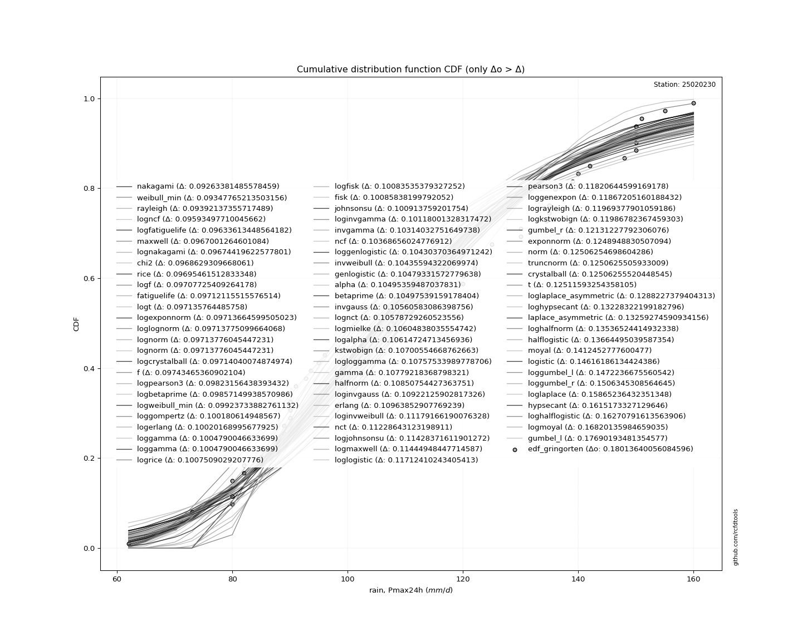</img>

</div>


**8.3. Best fit**

<div align="center">

|   id |   station | empirical_dist   | p_dist   |     delta |   deltao | eval   |   fit |   n |   best_fit |   best_fit_sort |
|-----:|----------:|:-----------------|:---------|----------:|---------:|:-------|------:|----:|-----------:|----------------:|
|    0 |  25020230 | edf_gringorten   | logfisk  | 0.0678384 | 0.217774 | Δo > Δ |     1 |  39 |          1 |               1 |

</div>


<div align="center">

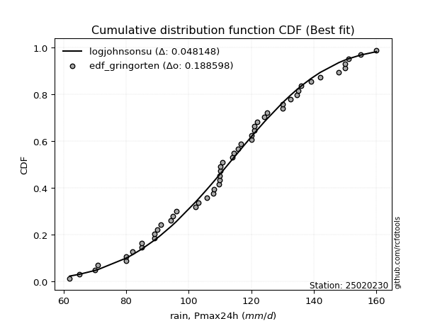</img>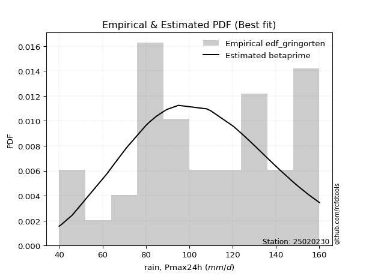</img>

</div>


### 9. Empirical - EDF Jenkinson (1977)

The Jenkinson formula in hydrology is an empirical plotting position formula used to estimate the non-exceedance probability _(P)_ or return period _(T)_ of a given ordered observation within a sample. It is a widely used method in the frequency analysis of extreme events such as floods and rainfall, as it provides a distribution-free way to plot data. _a≈0.31_ and _b≈0.38_ are constants derived to approximate the median of the probability distribution for the given rank.

<div align="center">


$P=(m-a)/(n+b)$


</div>


**9.1. Empirical values**

<div align="center">

|                | 0                    | 1                    | 2                   | 3                   | 4                   | 5                   | 6                   | 7                   | 8                   | 9                  | 10                  | 11                  | 12                 | 13                 | 14                  | 15                 | 16                 | 17                  | 18                  | 19            | 20                 | 21                 | 22                 | 23                 | 24                 | 25                 | 26                 | 27                 | 28                 | 29                 | 30                 | 31                 | 32                 | 33                 | 34                 | 35                 | 36                 | 37                 | 38                 |
|:---------------|:---------------------|:---------------------|:--------------------|:--------------------|:--------------------|:--------------------|:--------------------|:--------------------|:--------------------|:-------------------|:--------------------|:--------------------|:-------------------|:-------------------|:--------------------|:-------------------|:-------------------|:--------------------|:--------------------|:--------------|:-------------------|:-------------------|:-------------------|:-------------------|:-------------------|:-------------------|:-------------------|:-------------------|:-------------------|:-------------------|:-------------------|:-------------------|:-------------------|:-------------------|:-------------------|:-------------------|:-------------------|:-------------------|:-------------------|
| date           | 1996                 | 2005                 | 1987                | 1992                | 1991                | 1998                | 2012                | 2003                | 2004                | 2018               | 2013                | 1997                | 1989               | 1990               | 1993                | 2006               | 1995               | 2010                | 1988                | 2014          | 2016               | 1980               | 2002               | 1999               | 2011               | 1983               | 2017               | 2000               | 2001               | 1994               | 1986               | 1982               | 2007               | 1981               | 2015               | 2009               | 1984               | 2008               | 1985               |
| x              | 37.52732             | 40.0                 | 46.0                | 62.0                | 65.0                | 71.0                | 73.0                | 80.0                | 80.0                | 81.1               | 82.0                | 85.0                | 85.0               | 89.0               | 90.0                | 90.0               | 90.0               | 91.0                | 95.0                | 96.0          | 100.0              | 108.0              | 109.0              | 110.0              | 110.0              | 120.0              | 120.1              | 122.0              | 134.5              | 135.0              | 136.0              | 148.0              | 150.0              | 150.0              | 150.0              | 150.0              | 155.0              | 160.0              | 230.0              |
| m              | 1                    | 2                    | 3                   | 4                   | 5                   | 6                   | 7                   | 8                   | 9                   | 10                 | 11                  | 12                  | 13                 | 14                 | 15                  | 16                 | 17                 | 18                  | 19                  | 20            | 21                 | 22                 | 23                 | 24                 | 25                 | 26                 | 27                 | 28                 | 29                 | 30                 | 31                 | 32                 | 33                 | 34                 | 35                 | 36                 | 37                 | 38                 | 39                 |
| empirical_dist | edf_jenkinson        | edf_jenkinson        | edf_jenkinson       | edf_jenkinson       | edf_jenkinson       | edf_jenkinson       | edf_jenkinson       | edf_jenkinson       | edf_jenkinson       | edf_jenkinson      | edf_jenkinson       | edf_jenkinson       | edf_jenkinson      | edf_jenkinson      | edf_jenkinson       | edf_jenkinson      | edf_jenkinson      | edf_jenkinson       | edf_jenkinson       | edf_jenkinson | edf_jenkinson      | edf_jenkinson      | edf_jenkinson      | edf_jenkinson      | edf_jenkinson      | edf_jenkinson      | edf_jenkinson      | edf_jenkinson      | edf_jenkinson      | edf_jenkinson      | edf_jenkinson      | edf_jenkinson      | edf_jenkinson      | edf_jenkinson      | edf_jenkinson      | edf_jenkinson      | edf_jenkinson      | edf_jenkinson      | edf_jenkinson      |
| empirical      | 0.017521584560690702 | 0.042915185373285925 | 0.06830878618588115 | 0.09370238699847637 | 0.11909598781107161 | 0.14448958862366684 | 0.16988318943626207 | 0.19527679024885727 | 0.22067039106145248 | 0.2460639918740477 | 0.27145759268664293 | 0.29685119349923816 | 0.3222447943118334 | 0.3476383951244286 | 0.37303199593702385 | 0.3984255967496191 | 0.4238191975622143 | 0.44921279837480954 | 0.47460639918740477 | 0.5           | 0.5253936008125952 | 0.5507872016251905 | 0.5761808024377857 | 0.6015744032503809 | 0.6269680040629761 | 0.6523616048755714 | 0.6777552056881666 | 0.7031488065007618 | 0.7285424073133571 | 0.7539360081259523 | 0.7793296089385474 | 0.8047232097511426 | 0.8301168105637379 | 0.8555104113763331 | 0.8809040121889282 | 0.9062976130015234 | 0.9316912138141187 | 0.9570848146267139 | 0.9824784154393091 |
| empirical_tr   | 1.0178340656500389   | 1.0448394799681613   | 1.0733169801035705  | 1.1033903054076772  | 1.135197463245892   | 1.1688928465420005  | 1.2046497399816456  | 1.242663300725781   | 1.2831541218637992  | 1.3263725159986526 | 1.3726036946671314  | 1.4221740700613938  | 1.4754589733982764 | 1.532892175943947  | 1.5949777237748075  | 1.6623047699451245 | 1.7355663287791978 | 1.8155832180728446  | 1.903334944417593   | 2.0           | 2.1070090957731407 | 2.2261164499717356 | 2.359496704613541  | 2.509878903760357  | 2.6807351940095305 | 2.8765522279035793 | 3.1032308904649333 | 3.368691189050471  | 3.683816651075772  | 4.063983488132095  | 4.531645569620252  | 5.120936280884264  | 5.8863976083707    | 6.920913884007027  | 8.396588486140713  | 10.67208672086719  | 14.639405204460932 | 23.301775147928907 | 57.07246376811543  |

</div>


**9.2. Kolmogorov-Smirnov fit test (sorted by Δ)**


<div align="center">

|                | 0                   | 1                   | 2                   | 3                   | 4                  | 5                   | 6                   | 7                   | 8                   | 9                   | 10                 | 11                  | 12                  | 13                 | 14                  | 15                  | 16                  | 17                  | 18                  | 19                  | 20                  | 21                  | 22                  | 23                  | 24                  | 25                  | 26                  | 27                  | 28                 | 29                  | 30                  | 31                  | 32                  | 33                  | 34                  | 35                  | 36                  | 37                  | 38                  | 39                  | 40                  | 41                  | 42                 | 43                  | 44                  | 45                  | 46                  | 47                  | 48                  | 49                  | 50                  | 51                  | 52                  | 53                  | 54                  | 55                  | 56                  | 57                  | 58                  | 59                  | 60                  | 61                 | 62                  | 63                    | 64                  | 65                  | 66                  | 67                  | 68                 | 69                  | 70                  | 71                  | 72                 | 73                 | 74                  | 75                  | 76                  | 77                  | 78                  | 79                  | 80                  | 81                 | 82                  | 83                 | 84                  | 85                  | 86                 | 87                  | 88                 | 89                 | 90                  | 91                  | 92                  | 93                  |
|:---------------|:--------------------|:--------------------|:--------------------|:--------------------|:-------------------|:--------------------|:--------------------|:--------------------|:--------------------|:--------------------|:-------------------|:--------------------|:--------------------|:-------------------|:--------------------|:--------------------|:--------------------|:--------------------|:--------------------|:--------------------|:--------------------|:--------------------|:--------------------|:--------------------|:--------------------|:--------------------|:--------------------|:--------------------|:-------------------|:--------------------|:--------------------|:--------------------|:--------------------|:--------------------|:--------------------|:--------------------|:--------------------|:--------------------|:--------------------|:--------------------|:--------------------|:--------------------|:-------------------|:--------------------|:--------------------|:--------------------|:--------------------|:--------------------|:--------------------|:--------------------|:--------------------|:--------------------|:--------------------|:--------------------|:--------------------|:--------------------|:--------------------|:--------------------|:--------------------|:--------------------|:--------------------|:-------------------|:--------------------|:----------------------|:--------------------|:--------------------|:--------------------|:--------------------|:-------------------|:--------------------|:--------------------|:--------------------|:-------------------|:-------------------|:--------------------|:--------------------|:--------------------|:--------------------|:--------------------|:--------------------|:--------------------|:-------------------|:--------------------|:-------------------|:--------------------|:--------------------|:-------------------|:--------------------|:-------------------|:-------------------|:--------------------|:--------------------|:--------------------|:--------------------|
| station        | 25020230            | 25020230            | 25020230            | 25020230            | 25020230           | 25020230            | 25020230            | 25020230            | 25020230            | 25020230            | 25020230           | 25020230            | 25020230            | 25020230           | 25020230            | 25020230            | 25020230            | 25020230            | 25020230            | 25020230            | 25020230            | 25020230            | 25020230            | 25020230            | 25020230            | 25020230            | 25020230            | 25020230            | 25020230           | 25020230            | 25020230            | 25020230            | 25020230            | 25020230            | 25020230            | 25020230            | 25020230            | 25020230            | 25020230            | 25020230            | 25020230            | 25020230            | 25020230           | 25020230            | 25020230            | 25020230            | 25020230            | 25020230            | 25020230            | 25020230            | 25020230            | 25020230            | 25020230            | 25020230            | 25020230            | 25020230            | 25020230            | 25020230            | 25020230            | 25020230            | 25020230            | 25020230           | 25020230            | 25020230              | 25020230            | 25020230            | 25020230            | 25020230            | 25020230           | 25020230            | 25020230            | 25020230            | 25020230           | 25020230           | 25020230            | 25020230            | 25020230            | 25020230            | 25020230            | 25020230            | 25020230            | 25020230           | 25020230            | 25020230           | 25020230            | 25020230            | 25020230           | 25020230            | 25020230           | 25020230           | 25020230            | 25020230            | 25020230            | 25020230            |
| empirical_dist | edf_jenkinson       | edf_jenkinson       | edf_jenkinson       | edf_jenkinson       | edf_jenkinson      | edf_jenkinson       | edf_jenkinson       | edf_jenkinson       | edf_jenkinson       | edf_jenkinson       | edf_jenkinson      | edf_jenkinson       | edf_jenkinson       | edf_jenkinson      | edf_jenkinson       | edf_jenkinson       | edf_jenkinson       | edf_jenkinson       | edf_jenkinson       | edf_jenkinson       | edf_jenkinson       | edf_jenkinson       | edf_jenkinson       | edf_jenkinson       | edf_jenkinson       | edf_jenkinson       | edf_jenkinson       | edf_jenkinson       | edf_jenkinson      | edf_jenkinson       | edf_jenkinson       | edf_jenkinson       | edf_jenkinson       | edf_jenkinson       | edf_jenkinson       | edf_jenkinson       | edf_jenkinson       | edf_jenkinson       | edf_jenkinson       | edf_jenkinson       | edf_jenkinson       | edf_jenkinson       | edf_jenkinson      | edf_jenkinson       | edf_jenkinson       | edf_jenkinson       | edf_jenkinson       | edf_jenkinson       | edf_jenkinson       | edf_jenkinson       | edf_jenkinson       | edf_jenkinson       | edf_jenkinson       | edf_jenkinson       | edf_jenkinson       | edf_jenkinson       | edf_jenkinson       | edf_jenkinson       | edf_jenkinson       | edf_jenkinson       | edf_jenkinson       | edf_jenkinson      | edf_jenkinson       | edf_jenkinson         | edf_jenkinson       | edf_jenkinson       | edf_jenkinson       | edf_jenkinson       | edf_jenkinson      | edf_jenkinson       | edf_jenkinson       | edf_jenkinson       | edf_jenkinson      | edf_jenkinson      | edf_jenkinson       | edf_jenkinson       | edf_jenkinson       | edf_jenkinson       | edf_jenkinson       | edf_jenkinson       | edf_jenkinson       | edf_jenkinson      | edf_jenkinson       | edf_jenkinson      | edf_jenkinson       | edf_jenkinson       | edf_jenkinson      | edf_jenkinson       | edf_jenkinson      | edf_jenkinson      | edf_jenkinson       | edf_jenkinson       | edf_jenkinson       | edf_jenkinson       |
| p_dist         | invgamma            | fatiguelife         | recipinvgauss       | logfisk             | alpha              | genlogistic         | invgauss            | f                   | chi2                | erlang              | gamma              | logjohnsonsu        | logloggamma         | nct                | pearson3            | logpearson3         | betaprime           | maxwell             | fisk                | logweibull_min      | gumbel_r            | exponnorm           | logdgamma           | mielke              | loggenlogistic      | nakagami            | laplace_asymmetric  | logmielke           | loglogistic        | rayleigh            | invweibull          | rice                | weibull_min         | dgamma              | moyal               | loggompertz         | logfatiguelife      | logcrystalball      | lognorm             | lognorm             | logexponnorm        | loglognorm          | logrice            | logf                | lognakagami         | halflogistic        | logt                | logncf              | loghypsecant        | lognct              | johnsonsu           | t                   | crystalball         | norm                | truncnorm           | gompertz            | loggamma            | loggamma            | kstwobign           | logrecipinvgauss    | loggumbel_l         | logerlang          | halfnorm            | loglaplace_asymmetric | loglaplace          | logalpha            | loginvgamma         | loginvgauss         | logistic           | logmaxwell          | loggumbel_r         | lograyleigh         | logmoyal           | hypsecant          | logbetaprime        | wald                | loghalflogistic     | laplace             | loghalfnorm         | loginvweibull       | gumbel_l            | gibrat             | logwald             | logkstwobign       | loggibrat           | loggenexpon         | genexpon           | expon               | pareto             | ncf                | logtruncnorm        | logexpon            | logpareto           | logchi2             |
| delta          | 0.06875006456932486 | 0.06912502350056007 | 0.06920431295955318 | 0.06935734982594866 | 0.0696038861714805 | 0.07075810562982626 | 0.07080147564648862 | 0.07088519405484936 | 0.07090073941474526 | 0.07090075617194472 | 0.0709007691616779 | 0.07290867173658555 | 0.07306608307081455 | 0.0731540174394496 | 0.07348614741442275 | 0.07399730438234844 | 0.07448392956588121 | 0.07617252115318088 | 0.07738337717740079 | 0.07798973807948642 | 0.07851291573822383 | 0.07969081816734347 | 0.07983931456584104 | 0.08087659396513175 | 0.08103066959238248 | 0.08174916178210309 | 0.08207571634279165 | 0.08319032168110563 | 0.0842648844833449 | 0.08506668250777491 | 0.08548180426688581 | 0.08597561254799366 | 0.08605984619673715 | 0.08903109007996812 | 0.08943745445385376 | 0.09240242331457496 | 0.09342033022165233 | 0.09411597001141622 | 0.09411713019351606 | 0.09411713019351606 | 0.09411728929568006 | 0.09411803955504974 | 0.0941264670433318 | 0.09416068407784159 | 0.09438933358550225 | 0.09460787824288477 | 0.09580211308627093 | 0.09717754207408355 | 0.09743446306978798 | 0.09912017078435606 | 0.10025258742891185 | 0.10103101305855972 | 0.10117000752021843 | 0.10117001125169256 | 0.10117003023683524 | 0.10147430758430084 | 0.10149041652917476 | 0.10149041652917476 | 0.10222440482742665 | 0.10285181728446871 | 0.10285271217578518 | 0.1046891510735665 | 0.10895237288796286 | 0.10962312744707137   | 0.11232527204505827 | 0.11254111888260751 | 0.11574418036991155 | 0.11737850050265122 | 0.1178996665871177 | 0.12085130080911419 | 0.12316752118540111 | 0.13150711485779074 | 0.1317835545264846 | 0.13186237303636   | 0.13234948176133624 | 0.14948787918486273 | 0.15740155657362379 | 0.16002841109768606 | 0.16153962861856738 | 0.16219323635479124 | 0.16756080989486755 | 0.1722423531161546 | 0.19613087722741374 | 0.2027751913668371 | 0.22758034569943164 | 0.23213535060270593 | 0.2669276020500705 | 0.26790577608098887 | 0.2679057800597894 | 0.3035828978202632 | 0.31768276128722284 | 0.34711220359554185 | 0.34711220772074836 | 0.40530994965591266 |
| deltao         | 0.2177742891749185  | 0.2177742891749185  | 0.2177742891749185  | 0.2177742891749185  | 0.2177742891749185 | 0.2177742891749185  | 0.2177742891749185  | 0.2177742891749185  | 0.2177742891749185  | 0.2177742891749185  | 0.2177742891749185 | 0.2177742891749185  | 0.2177742891749185  | 0.2177742891749185 | 0.2177742891749185  | 0.2177742891749185  | 0.2177742891749185  | 0.2177742891749185  | 0.2177742891749185  | 0.2177742891749185  | 0.2177742891749185  | 0.2177742891749185  | 0.2177742891749185  | 0.2177742891749185  | 0.2177742891749185  | 0.2177742891749185  | 0.2177742891749185  | 0.2177742891749185  | 0.2177742891749185 | 0.2177742891749185  | 0.2177742891749185  | 0.2177742891749185  | 0.2177742891749185  | 0.2177742891749185  | 0.2177742891749185  | 0.2177742891749185  | 0.2177742891749185  | 0.2177742891749185  | 0.2177742891749185  | 0.2177742891749185  | 0.2177742891749185  | 0.2177742891749185  | 0.2177742891749185 | 0.2177742891749185  | 0.2177742891749185  | 0.2177742891749185  | 0.2177742891749185  | 0.2177742891749185  | 0.2177742891749185  | 0.2177742891749185  | 0.2177742891749185  | 0.2177742891749185  | 0.2177742891749185  | 0.2177742891749185  | 0.2177742891749185  | 0.2177742891749185  | 0.2177742891749185  | 0.2177742891749185  | 0.2177742891749185  | 0.2177742891749185  | 0.2177742891749185  | 0.2177742891749185 | 0.2177742891749185  | 0.2177742891749185    | 0.2177742891749185  | 0.2177742891749185  | 0.2177742891749185  | 0.2177742891749185  | 0.2177742891749185 | 0.2177742891749185  | 0.2177742891749185  | 0.2177742891749185  | 0.2177742891749185 | 0.2177742891749185 | 0.2177742891749185  | 0.2177742891749185  | 0.2177742891749185  | 0.2177742891749185  | 0.2177742891749185  | 0.2177742891749185  | 0.2177742891749185  | 0.2177742891749185 | 0.2177742891749185  | 0.2177742891749185 | 0.2177742891749185  | 0.2177742891749185  | 0.2177742891749185 | 0.2177742891749185  | 0.2177742891749185 | 0.2177742891749185 | 0.2177742891749185  | 0.2177742891749185  | 0.2177742891749185  | 0.2177742891749185  |
| eval           | Δo > Δ              | Δo > Δ              | Δo > Δ              | Δo > Δ              | Δo > Δ             | Δo > Δ              | Δo > Δ              | Δo > Δ              | Δo > Δ              | Δo > Δ              | Δo > Δ             | Δo > Δ              | Δo > Δ              | Δo > Δ             | Δo > Δ              | Δo > Δ              | Δo > Δ              | Δo > Δ              | Δo > Δ              | Δo > Δ              | Δo > Δ              | Δo > Δ              | Δo > Δ              | Δo > Δ              | Δo > Δ              | Δo > Δ              | Δo > Δ              | Δo > Δ              | Δo > Δ             | Δo > Δ              | Δo > Δ              | Δo > Δ              | Δo > Δ              | Δo > Δ              | Δo > Δ              | Δo > Δ              | Δo > Δ              | Δo > Δ              | Δo > Δ              | Δo > Δ              | Δo > Δ              | Δo > Δ              | Δo > Δ             | Δo > Δ              | Δo > Δ              | Δo > Δ              | Δo > Δ              | Δo > Δ              | Δo > Δ              | Δo > Δ              | Δo > Δ              | Δo > Δ              | Δo > Δ              | Δo > Δ              | Δo > Δ              | Δo > Δ              | Δo > Δ              | Δo > Δ              | Δo > Δ              | Δo > Δ              | Δo > Δ              | Δo > Δ             | Δo > Δ              | Δo > Δ                | Δo > Δ              | Δo > Δ              | Δo > Δ              | Δo > Δ              | Δo > Δ             | Δo > Δ              | Δo > Δ              | Δo > Δ              | Δo > Δ             | Δo > Δ             | Δo > Δ              | Δo > Δ              | Δo > Δ              | Δo > Δ              | Δo > Δ              | Δo > Δ              | Δo > Δ              | Δo > Δ             | Δo > Δ              | Δo > Δ             | Δo <= Δ             | Δo <= Δ             | Δo <= Δ            | Δo <= Δ             | Δo <= Δ            | Δo <= Δ            | Δo <= Δ             | Δo <= Δ             | Δo <= Δ             | Δo <= Δ             |
| fit            | 1                   | 1                   | 1                   | 1                   | 1                  | 1                   | 1                   | 1                   | 1                   | 1                   | 1                  | 1                   | 1                   | 1                  | 1                   | 1                   | 1                   | 1                   | 1                   | 1                   | 1                   | 1                   | 1                   | 1                   | 1                   | 1                   | 1                   | 1                   | 1                  | 1                   | 1                   | 1                   | 1                   | 1                   | 1                   | 1                   | 1                   | 1                   | 1                   | 1                   | 1                   | 1                   | 1                  | 1                   | 1                   | 1                   | 1                   | 1                   | 1                   | 1                   | 1                   | 1                   | 1                   | 1                   | 1                   | 1                   | 1                   | 1                   | 1                   | 1                   | 1                   | 1                  | 1                   | 1                     | 1                   | 1                   | 1                   | 1                   | 1                  | 1                   | 1                   | 1                   | 1                  | 1                  | 1                   | 1                   | 1                   | 1                   | 1                   | 1                   | 1                   | 1                  | 1                   | 1                  | 0                   | 0                   | 0                  | 0                   | 0                  | 0                  | 0                   | 0                   | 0                   | 0                   |
| n              | 39                  | 39                  | 39                  | 39                  | 39                 | 39                  | 39                  | 39                  | 39                  | 39                  | 39                 | 39                  | 39                  | 39                 | 39                  | 39                  | 39                  | 39                  | 39                  | 39                  | 39                  | 39                  | 39                  | 39                  | 39                  | 39                  | 39                  | 39                  | 39                 | 39                  | 39                  | 39                  | 39                  | 39                  | 39                  | 39                  | 39                  | 39                  | 39                  | 39                  | 39                  | 39                  | 39                 | 39                  | 39                  | 39                  | 39                  | 39                  | 39                  | 39                  | 39                  | 39                  | 39                  | 39                  | 39                  | 39                  | 39                  | 39                  | 39                  | 39                  | 39                  | 39                 | 39                  | 39                    | 39                  | 39                  | 39                  | 39                  | 39                 | 39                  | 39                  | 39                  | 39                 | 39                 | 39                  | 39                  | 39                  | 39                  | 39                  | 39                  | 39                  | 39                 | 39                  | 39                 | 39                  | 39                  | 39                 | 39                  | 39                 | 39                 | 39                  | 39                  | 39                  | 39                  |
| best_fit       | 1                   | 0                   | 0                   | 0                   | 0                  | 0                   | 0                   | 0                   | 0                   | 0                   | 0                  | 0                   | 0                   | 0                  | 0                   | 0                   | 0                   | 0                   | 0                   | 0                   | 0                   | 0                   | 0                   | 0                   | 0                   | 0                   | 0                   | 0                   | 0                  | 0                   | 0                   | 0                   | 0                   | 0                   | 0                   | 0                   | 0                   | 0                   | 0                   | 0                   | 0                   | 0                   | 0                  | 0                   | 0                   | 0                   | 0                   | 0                   | 0                   | 0                   | 0                   | 0                   | 0                   | 0                   | 0                   | 0                   | 0                   | 0                   | 0                   | 0                   | 0                   | 0                  | 0                   | 0                     | 0                   | 0                   | 0                   | 0                   | 0                  | 0                   | 0                   | 0                   | 0                  | 0                  | 0                   | 0                   | 0                   | 0                   | 0                   | 0                   | 0                   | 0                  | 0                   | 0                  | 0                   | 0                   | 0                  | 0                   | 0                  | 0                  | 0                   | 0                   | 0                   | 0                   |
| best_fit_sort  | 1                   | 2                   | 3                   | 4                   | 5                  | 6                   | 7                   | 8                   | 9                   | 10                  | 11                 | 12                  | 13                  | 14                 | 15                  | 16                  | 17                  | 18                  | 19                  | 20                  | 21                  | 22                  | 23                  | 24                  | 25                  | 26                  | 27                  | 28                  | 29                 | 30                  | 31                  | 32                  | 33                  | 34                  | 35                  | 36                  | 37                  | 38                  | 39                  | 40                  | 41                  | 42                  | 43                 | 44                  | 45                  | 46                  | 47                  | 48                  | 49                  | 50                  | 51                  | 52                  | 53                  | 54                  | 55                  | 56                  | 57                  | 58                  | 59                  | 60                  | 61                  | 62                 | 63                  | 64                    | 65                  | 66                  | 67                  | 68                  | 69                 | 70                  | 71                  | 72                  | 73                 | 74                 | 75                  | 76                  | 77                  | 78                  | 79                  | 80                  | 81                  | 82                 | 83                  | 84                 | 85                  | 86                  | 87                 | 88                  | 89                 | 90                 | 91                  | 92                  | 93                  | 94                  |

</div>


<div align="center">

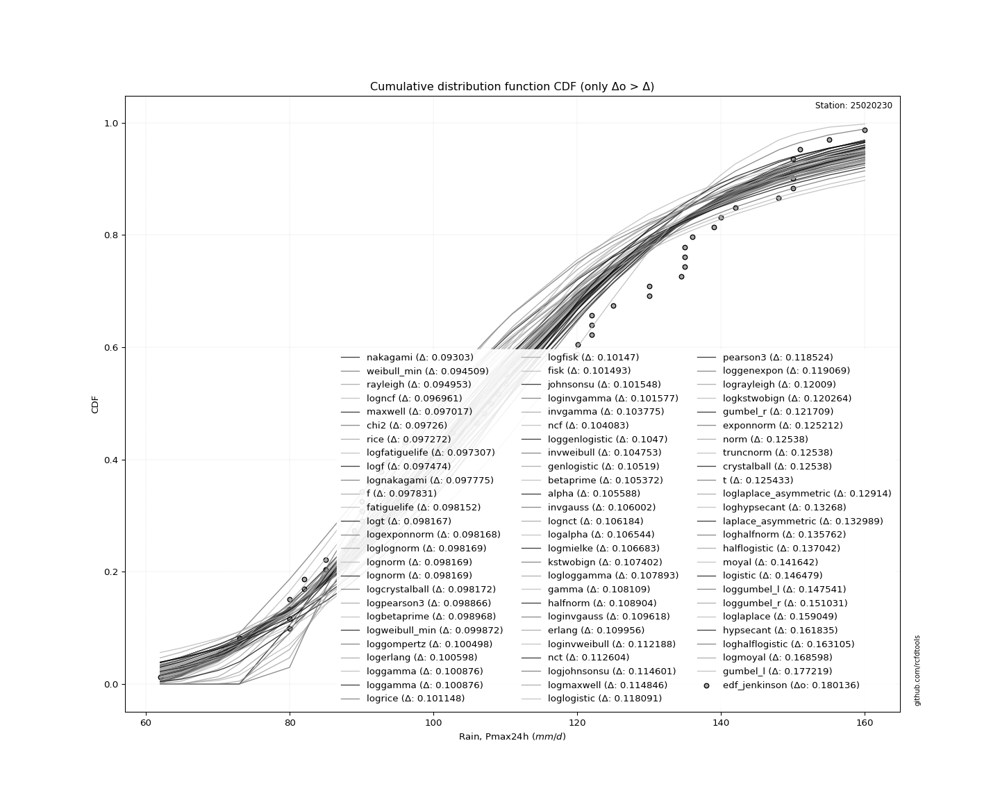</img>

</div>


**9.3. Best fit**

<div align="center">

|   id |   station | empirical_dist   | p_dist   |     delta |   deltao | eval   |   fit |   n |   best_fit |   best_fit_sort |
|-----:|----------:|:-----------------|:---------|----------:|---------:|:-------|------:|----:|-----------:|----------------:|
|    0 |  25020230 | edf_jenkinson    | invgamma | 0.0687501 | 0.217774 | Δo > Δ |     1 |  39 |          1 |               1 |

</div>


<div align="center">

</img>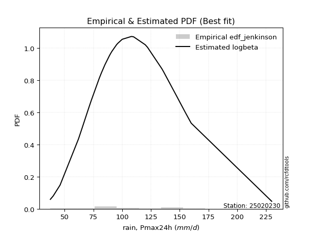</img>

</div>


### 10. Empirical - EDF Cunnane (1978)

Cunnane´s work in statistical hydrology has focused on the performance and evaluation of different probability distributions (such as GEV, Gumbel, Lognormal) for flood frequency estimation. _b_ is a constant, typically set to 0.4.

<div align="center">


$P=(m-b)/(n+1-2b)$


</div>


**10.1. Empirical values**

<div align="center">

|                | 0                   | 1                   | 2                  | 3                   | 4                   | 5                   | 6                   | 7                   | 8                   | 9                   | 10                 | 11                  | 12                 | 13                 | 14                 | 15                  | 16                  | 17                 | 18                 | 19          | 20                 | 21                 | 22                | 23                 | 24                 | 25                 | 26                 | 27                 | 28                 | 29                 | 30                 | 31                 | 32                 | 33                 | 34                 | 35                 | 36                 | 37                 | 38                 |
|:---------------|:--------------------|:--------------------|:-------------------|:--------------------|:--------------------|:--------------------|:--------------------|:--------------------|:--------------------|:--------------------|:-------------------|:--------------------|:-------------------|:-------------------|:-------------------|:--------------------|:--------------------|:-------------------|:-------------------|:------------|:-------------------|:-------------------|:------------------|:-------------------|:-------------------|:-------------------|:-------------------|:-------------------|:-------------------|:-------------------|:-------------------|:-------------------|:-------------------|:-------------------|:-------------------|:-------------------|:-------------------|:-------------------|:-------------------|
| date           | 1996                | 2005                | 1987               | 1992                | 1991                | 1998                | 2012                | 2003                | 2004                | 2018                | 2013               | 1997                | 1989               | 1990               | 1993               | 2006                | 1995                | 2010               | 1988               | 2014        | 2016               | 1980               | 2002              | 1999               | 2011               | 1983               | 2017               | 2000               | 2001               | 1994               | 1986               | 1982               | 2007               | 1981               | 2015               | 2009               | 1984               | 2008               | 1985               |
| x              | 37.52732            | 40.0                | 46.0               | 62.0                | 65.0                | 71.0                | 73.0                | 80.0                | 80.0                | 81.1                | 82.0               | 85.0                | 85.0               | 89.0               | 90.0               | 90.0                | 90.0                | 91.0               | 95.0               | 96.0        | 100.0              | 108.0              | 109.0             | 110.0              | 110.0              | 120.0              | 120.1              | 122.0              | 134.5              | 135.0              | 136.0              | 148.0              | 150.0              | 150.0              | 150.0              | 150.0              | 155.0              | 160.0              | 230.0              |
| m              | 1                   | 2                   | 3                  | 4                   | 5                   | 6                   | 7                   | 8                   | 9                   | 10                  | 11                 | 12                  | 13                 | 14                 | 15                 | 16                  | 17                  | 18                 | 19                 | 20          | 21                 | 22                 | 23                | 24                 | 25                 | 26                 | 27                 | 28                 | 29                 | 30                 | 31                 | 32                 | 33                 | 34                 | 35                 | 36                 | 37                 | 38                 | 39                 |
| empirical_dist | edf_cunnane         | edf_cunnane         | edf_cunnane        | edf_cunnane         | edf_cunnane         | edf_cunnane         | edf_cunnane         | edf_cunnane         | edf_cunnane         | edf_cunnane         | edf_cunnane        | edf_cunnane         | edf_cunnane        | edf_cunnane        | edf_cunnane        | edf_cunnane         | edf_cunnane         | edf_cunnane        | edf_cunnane        | edf_cunnane | edf_cunnane        | edf_cunnane        | edf_cunnane       | edf_cunnane        | edf_cunnane        | edf_cunnane        | edf_cunnane        | edf_cunnane        | edf_cunnane        | edf_cunnane        | edf_cunnane        | edf_cunnane        | edf_cunnane        | edf_cunnane        | edf_cunnane        | edf_cunnane        | edf_cunnane        | edf_cunnane        | edf_cunnane        |
| empirical      | 0.01530612244897959 | 0.04081632653061224 | 0.0663265306122449 | 0.09183673469387754 | 0.11734693877551018 | 0.14285714285714285 | 0.16836734693877548 | 0.19387755102040813 | 0.21938775510204078 | 0.24489795918367344 | 0.2704081632653061 | 0.29591836734693877 | 0.3214285714285714 | 0.346938775510204  | 0.3724489795918367 | 0.39795918367346933 | 0.42346938775510207 | 0.4489795918367347 | 0.4744897959183674 | 0.5         | 0.5255102040816326 | 0.5510204081632653 | 0.576530612244898 | 0.6020408163265306 | 0.6275510204081632 | 0.6530612244897959 | 0.6785714285714286 | 0.7040816326530612 | 0.7295918367346939 | 0.7551020408163265 | 0.7806122448979592 | 0.8061224489795918 | 0.8316326530612245 | 0.8571428571428571 | 0.8826530612244897 | 0.9081632653061225 | 0.9336734693877551 | 0.9591836734693877 | 0.9846938775510203 |
| empirical_tr   | 1.0155440414507773  | 1.0425531914893618  | 1.0710382513661203 | 1.101123595505618   | 1.1329479768786126  | 1.1666666666666665  | 1.2024539877300613  | 1.240506329113924   | 1.2810457516339868  | 1.3243243243243241  | 1.3706293706293706 | 1.4202898550724639  | 1.4736842105263157 | 1.5312499999999998 | 1.5934959349593494 | 1.6610169491525422  | 1.7345132743362834  | 1.814814814814815  | 1.9029126213592233 | 2.0         | 2.10752688172043   | 2.227272727272727  | 2.36144578313253  | 2.5128205128205128 | 2.6849315068493147 | 2.88235294117647   | 3.1111111111111116 | 3.3793103448275863 | 3.6981132075471694 | 4.083333333333332  | 4.558139534883722  | 5.157894736842105  | 5.939393939393939  | 6.999999999999997  | 8.521739130434778  | 10.88888888888889  | 15.076923076923073 | 24.49999999999997  | 65.33333333333303  |

</div>


**10.2. Kolmogorov-Smirnov fit test (sorted by Δ)**


<div align="center">

|                | 0                   | 1                   | 2                   | 3                   | 4                   | 5                   | 6                   | 7                  | 8                  | 9                   | 10                  | 11                 | 12                  | 13                 | 14                  | 15                  | 16                  | 17                  | 18                  | 19                  | 20                  | 21                  | 22                  | 23                 | 24                  | 25                  | 26                  | 27                  | 28                  | 29                  | 30                  | 31                 | 32                 | 33                  | 34                  | 35                 | 36                  | 37                  | 38                 | 39                 | 40                 | 41                  | 42                  | 43                  | 44                 | 45                  | 46                  | 47                  | 48                 | 49                  | 50                 | 51                  | 52                  | 53                  | 54                  | 55                  | 56                  | 57                 | 58                 | 59                  | 60                  | 61                  | 62                    | 63                 | 64                  | 65                  | 66                  | 67                  | 68                  | 69                  | 70                  | 71                  | 72                  | 73                  | 74                  | 75                  | 76                  | 77                  | 78                  | 79                 | 80                  | 81                 | 82                  | 83                  | 84                  | 85                  | 86                 | 87                  | 88                  | 89                 | 90                 | 91                  | 92                  | 93                  |
|:---------------|:--------------------|:--------------------|:--------------------|:--------------------|:--------------------|:--------------------|:--------------------|:-------------------|:-------------------|:--------------------|:--------------------|:-------------------|:--------------------|:-------------------|:--------------------|:--------------------|:--------------------|:--------------------|:--------------------|:--------------------|:--------------------|:--------------------|:--------------------|:-------------------|:--------------------|:--------------------|:--------------------|:--------------------|:--------------------|:--------------------|:--------------------|:-------------------|:-------------------|:--------------------|:--------------------|:-------------------|:--------------------|:--------------------|:-------------------|:-------------------|:-------------------|:--------------------|:--------------------|:--------------------|:-------------------|:--------------------|:--------------------|:--------------------|:-------------------|:--------------------|:-------------------|:--------------------|:--------------------|:--------------------|:--------------------|:--------------------|:--------------------|:-------------------|:-------------------|:--------------------|:--------------------|:--------------------|:----------------------|:-------------------|:--------------------|:--------------------|:--------------------|:--------------------|:--------------------|:--------------------|:--------------------|:--------------------|:--------------------|:--------------------|:--------------------|:--------------------|:--------------------|:--------------------|:--------------------|:-------------------|:--------------------|:-------------------|:--------------------|:--------------------|:--------------------|:--------------------|:-------------------|:--------------------|:--------------------|:-------------------|:-------------------|:--------------------|:--------------------|:--------------------|
| station        | 25020230            | 25020230            | 25020230            | 25020230            | 25020230            | 25020230            | 25020230            | 25020230           | 25020230           | 25020230            | 25020230            | 25020230           | 25020230            | 25020230           | 25020230            | 25020230            | 25020230            | 25020230            | 25020230            | 25020230            | 25020230            | 25020230            | 25020230            | 25020230           | 25020230            | 25020230            | 25020230            | 25020230            | 25020230            | 25020230            | 25020230            | 25020230           | 25020230           | 25020230            | 25020230            | 25020230           | 25020230            | 25020230            | 25020230           | 25020230           | 25020230           | 25020230            | 25020230            | 25020230            | 25020230           | 25020230            | 25020230            | 25020230            | 25020230           | 25020230            | 25020230           | 25020230            | 25020230            | 25020230            | 25020230            | 25020230            | 25020230            | 25020230           | 25020230           | 25020230            | 25020230            | 25020230            | 25020230              | 25020230           | 25020230            | 25020230            | 25020230            | 25020230            | 25020230            | 25020230            | 25020230            | 25020230            | 25020230            | 25020230            | 25020230            | 25020230            | 25020230            | 25020230            | 25020230            | 25020230           | 25020230            | 25020230           | 25020230            | 25020230            | 25020230            | 25020230            | 25020230           | 25020230            | 25020230            | 25020230           | 25020230           | 25020230            | 25020230            | 25020230            |
| empirical_dist | edf_cunnane         | edf_cunnane         | edf_cunnane         | edf_cunnane         | edf_cunnane         | edf_cunnane         | edf_cunnane         | edf_cunnane        | edf_cunnane        | edf_cunnane         | edf_cunnane         | edf_cunnane        | edf_cunnane         | edf_cunnane        | edf_cunnane         | edf_cunnane         | edf_cunnane         | edf_cunnane         | edf_cunnane         | edf_cunnane         | edf_cunnane         | edf_cunnane         | edf_cunnane         | edf_cunnane        | edf_cunnane         | edf_cunnane         | edf_cunnane         | edf_cunnane         | edf_cunnane         | edf_cunnane         | edf_cunnane         | edf_cunnane        | edf_cunnane        | edf_cunnane         | edf_cunnane         | edf_cunnane        | edf_cunnane         | edf_cunnane         | edf_cunnane        | edf_cunnane        | edf_cunnane        | edf_cunnane         | edf_cunnane         | edf_cunnane         | edf_cunnane        | edf_cunnane         | edf_cunnane         | edf_cunnane         | edf_cunnane        | edf_cunnane         | edf_cunnane        | edf_cunnane         | edf_cunnane         | edf_cunnane         | edf_cunnane         | edf_cunnane         | edf_cunnane         | edf_cunnane        | edf_cunnane        | edf_cunnane         | edf_cunnane         | edf_cunnane         | edf_cunnane           | edf_cunnane        | edf_cunnane         | edf_cunnane         | edf_cunnane         | edf_cunnane         | edf_cunnane         | edf_cunnane         | edf_cunnane         | edf_cunnane         | edf_cunnane         | edf_cunnane         | edf_cunnane         | edf_cunnane         | edf_cunnane         | edf_cunnane         | edf_cunnane         | edf_cunnane        | edf_cunnane         | edf_cunnane        | edf_cunnane         | edf_cunnane         | edf_cunnane         | edf_cunnane         | edf_cunnane        | edf_cunnane         | edf_cunnane         | edf_cunnane        | edf_cunnane        | edf_cunnane         | edf_cunnane         | edf_cunnane         |
| p_dist         | logfisk             | invgamma            | alpha               | fatiguelife         | genlogistic         | recipinvgauss       | invgauss            | f                  | chi2               | erlang              | gamma               | logjohnsonsu       | nct                 | logloggamma        | pearson3            | logpearson3         | betaprime           | fisk                | gumbel_r            | maxwell             | logweibull_min      | exponnorm           | logdgamma           | mielke             | loggenlogistic      | laplace_asymmetric  | logmielke           | nakagami            | loglogistic         | rayleigh            | invweibull          | rice               | weibull_min        | dgamma              | moyal               | loggompertz        | logfatiguelife      | logcrystalball      | lognorm            | lognorm            | logexponnorm       | loglognorm          | logrice             | logf                | lognakagami        | halflogistic        | loghypsecant        | logt                | logncf             | johnsonsu           | lognct             | t                   | crystalball         | norm                | truncnorm           | loggumbel_l         | gompertz            | loggamma           | loggamma           | kstwobign           | logrecipinvgauss    | logerlang           | loglaplace_asymmetric | halfnorm           | loglaplace          | logalpha            | loginvgamma         | logistic            | loginvgauss         | logmaxwell          | loggumbel_r         | hypsecant           | logmoyal            | lograyleigh         | logbetaprime        | wald                | loghalflogistic     | laplace             | loghalfnorm         | loginvweibull      | gumbel_l            | gibrat             | logwald             | logkstwobign        | loggibrat           | loggenexpon         | genexpon           | expon               | pareto              | ncf                | logtruncnorm       | logexpon            | logpareto           | logchi2             |
| delta          | 0.06830792040461187 | 0.06870257046755737 | 0.06937067963340565 | 0.07052426272900922 | 0.07052489909175141 | 0.07060355218800232 | 0.07220071487493776 | 0.0722844332832985 | 0.0722999786431944 | 0.07229999540039386 | 0.07230000839012704 | 0.0726754651985107 | 0.07292081090137476 | 0.0744653222992637 | 0.07488538664287189 | 0.07539654361079759 | 0.07588316879433035 | 0.07715017063932594 | 0.07746348631688704 | 0.07757176038163002 | 0.07938897730793557 | 0.07945761162926862 | 0.08042233091102813 | 0.0806433874270569 | 0.08079746305430763 | 0.08102628692145486 | 0.08295711514303078 | 0.08314840101055224 | 0.08321545506200811 | 0.08646592173622406 | 0.08688104349533496 | 0.0873748517764428 | 0.0874590854251863 | 0.08763185085151892 | 0.08838802503251697 | 0.0938016625430241 | 0.09481956945010148 | 0.09551520923986537 | 0.0955163694219652 | 0.0955163694219652 | 0.0955165285241292 | 0.09551727878349889 | 0.09552570627178095 | 0.09555992330629073 | 0.0957885728139514 | 0.09600711747133392 | 0.09638503364845119 | 0.09720135231472007 | 0.0985767813025327 | 0.10025258742891185 | 0.1005194100128052 | 0.10103101305855972 | 0.10117000752021843 | 0.10117001125169256 | 0.10117003023683524 | 0.10261950563771033 | 0.10287354681274999 | 0.1028896557576239 | 0.1028896557576239 | 0.10362364405587579 | 0.10425105651291786 | 0.10608839030201564 | 0.10938992090899657   | 0.110351612116412  | 0.11127584262372148 | 0.11394035811105666 | 0.11714341959836069 | 0.11766646004904285 | 0.11877773973110037 | 0.12225054003756333 | 0.12456676041385026 | 0.13162916649828516 | 0.13241289487422472 | 0.13290635408623988 | 0.13374872098978538 | 0.14797203668737613 | 0.15880079580207293 | 0.15979520455961121 | 0.16293886784701653 | 0.1635924755832404 | 0.16756080989486755 | 0.1709597171567429 | 0.19589767068933894 | 0.20417443059528625 | 0.22734713916135685 | 0.23353458983115508 | 0.2683268412785196 | 0.26930501530943796 | 0.26930501928823847 | 0.3052228593926714 | 0.3190820005156719 | 0.34851144282399094 | 0.34851144694919745 | 0.40694239542243665 |
| deltao         | 0.2177742891749185  | 0.2177742891749185  | 0.2177742891749185  | 0.2177742891749185  | 0.2177742891749185  | 0.2177742891749185  | 0.2177742891749185  | 0.2177742891749185 | 0.2177742891749185 | 0.2177742891749185  | 0.2177742891749185  | 0.2177742891749185 | 0.2177742891749185  | 0.2177742891749185 | 0.2177742891749185  | 0.2177742891749185  | 0.2177742891749185  | 0.2177742891749185  | 0.2177742891749185  | 0.2177742891749185  | 0.2177742891749185  | 0.2177742891749185  | 0.2177742891749185  | 0.2177742891749185 | 0.2177742891749185  | 0.2177742891749185  | 0.2177742891749185  | 0.2177742891749185  | 0.2177742891749185  | 0.2177742891749185  | 0.2177742891749185  | 0.2177742891749185 | 0.2177742891749185 | 0.2177742891749185  | 0.2177742891749185  | 0.2177742891749185 | 0.2177742891749185  | 0.2177742891749185  | 0.2177742891749185 | 0.2177742891749185 | 0.2177742891749185 | 0.2177742891749185  | 0.2177742891749185  | 0.2177742891749185  | 0.2177742891749185 | 0.2177742891749185  | 0.2177742891749185  | 0.2177742891749185  | 0.2177742891749185 | 0.2177742891749185  | 0.2177742891749185 | 0.2177742891749185  | 0.2177742891749185  | 0.2177742891749185  | 0.2177742891749185  | 0.2177742891749185  | 0.2177742891749185  | 0.2177742891749185 | 0.2177742891749185 | 0.2177742891749185  | 0.2177742891749185  | 0.2177742891749185  | 0.2177742891749185    | 0.2177742891749185 | 0.2177742891749185  | 0.2177742891749185  | 0.2177742891749185  | 0.2177742891749185  | 0.2177742891749185  | 0.2177742891749185  | 0.2177742891749185  | 0.2177742891749185  | 0.2177742891749185  | 0.2177742891749185  | 0.2177742891749185  | 0.2177742891749185  | 0.2177742891749185  | 0.2177742891749185  | 0.2177742891749185  | 0.2177742891749185 | 0.2177742891749185  | 0.2177742891749185 | 0.2177742891749185  | 0.2177742891749185  | 0.2177742891749185  | 0.2177742891749185  | 0.2177742891749185 | 0.2177742891749185  | 0.2177742891749185  | 0.2177742891749185 | 0.2177742891749185 | 0.2177742891749185  | 0.2177742891749185  | 0.2177742891749185  |
| eval           | Δo > Δ              | Δo > Δ              | Δo > Δ              | Δo > Δ              | Δo > Δ              | Δo > Δ              | Δo > Δ              | Δo > Δ             | Δo > Δ             | Δo > Δ              | Δo > Δ              | Δo > Δ             | Δo > Δ              | Δo > Δ             | Δo > Δ              | Δo > Δ              | Δo > Δ              | Δo > Δ              | Δo > Δ              | Δo > Δ              | Δo > Δ              | Δo > Δ              | Δo > Δ              | Δo > Δ             | Δo > Δ              | Δo > Δ              | Δo > Δ              | Δo > Δ              | Δo > Δ              | Δo > Δ              | Δo > Δ              | Δo > Δ             | Δo > Δ             | Δo > Δ              | Δo > Δ              | Δo > Δ             | Δo > Δ              | Δo > Δ              | Δo > Δ             | Δo > Δ             | Δo > Δ             | Δo > Δ              | Δo > Δ              | Δo > Δ              | Δo > Δ             | Δo > Δ              | Δo > Δ              | Δo > Δ              | Δo > Δ             | Δo > Δ              | Δo > Δ             | Δo > Δ              | Δo > Δ              | Δo > Δ              | Δo > Δ              | Δo > Δ              | Δo > Δ              | Δo > Δ             | Δo > Δ             | Δo > Δ              | Δo > Δ              | Δo > Δ              | Δo > Δ                | Δo > Δ             | Δo > Δ              | Δo > Δ              | Δo > Δ              | Δo > Δ              | Δo > Δ              | Δo > Δ              | Δo > Δ              | Δo > Δ              | Δo > Δ              | Δo > Δ              | Δo > Δ              | Δo > Δ              | Δo > Δ              | Δo > Δ              | Δo > Δ              | Δo > Δ             | Δo > Δ              | Δo > Δ             | Δo > Δ              | Δo > Δ              | Δo <= Δ             | Δo <= Δ             | Δo <= Δ            | Δo <= Δ             | Δo <= Δ             | Δo <= Δ            | Δo <= Δ            | Δo <= Δ             | Δo <= Δ             | Δo <= Δ             |
| fit            | 1                   | 1                   | 1                   | 1                   | 1                   | 1                   | 1                   | 1                  | 1                  | 1                   | 1                   | 1                  | 1                   | 1                  | 1                   | 1                   | 1                   | 1                   | 1                   | 1                   | 1                   | 1                   | 1                   | 1                  | 1                   | 1                   | 1                   | 1                   | 1                   | 1                   | 1                   | 1                  | 1                  | 1                   | 1                   | 1                  | 1                   | 1                   | 1                  | 1                  | 1                  | 1                   | 1                   | 1                   | 1                  | 1                   | 1                   | 1                   | 1                  | 1                   | 1                  | 1                   | 1                   | 1                   | 1                   | 1                   | 1                   | 1                  | 1                  | 1                   | 1                   | 1                   | 1                     | 1                  | 1                   | 1                   | 1                   | 1                   | 1                   | 1                   | 1                   | 1                   | 1                   | 1                   | 1                   | 1                   | 1                   | 1                   | 1                   | 1                  | 1                   | 1                  | 1                   | 1                   | 0                   | 0                   | 0                  | 0                   | 0                   | 0                  | 0                  | 0                   | 0                   | 0                   |
| n              | 39                  | 39                  | 39                  | 39                  | 39                  | 39                  | 39                  | 39                 | 39                 | 39                  | 39                  | 39                 | 39                  | 39                 | 39                  | 39                  | 39                  | 39                  | 39                  | 39                  | 39                  | 39                  | 39                  | 39                 | 39                  | 39                  | 39                  | 39                  | 39                  | 39                  | 39                  | 39                 | 39                 | 39                  | 39                  | 39                 | 39                  | 39                  | 39                 | 39                 | 39                 | 39                  | 39                  | 39                  | 39                 | 39                  | 39                  | 39                  | 39                 | 39                  | 39                 | 39                  | 39                  | 39                  | 39                  | 39                  | 39                  | 39                 | 39                 | 39                  | 39                  | 39                  | 39                    | 39                 | 39                  | 39                  | 39                  | 39                  | 39                  | 39                  | 39                  | 39                  | 39                  | 39                  | 39                  | 39                  | 39                  | 39                  | 39                  | 39                 | 39                  | 39                 | 39                  | 39                  | 39                  | 39                  | 39                 | 39                  | 39                  | 39                 | 39                 | 39                  | 39                  | 39                  |
| best_fit       | 1                   | 0                   | 0                   | 0                   | 0                   | 0                   | 0                   | 0                  | 0                  | 0                   | 0                   | 0                  | 0                   | 0                  | 0                   | 0                   | 0                   | 0                   | 0                   | 0                   | 0                   | 0                   | 0                   | 0                  | 0                   | 0                   | 0                   | 0                   | 0                   | 0                   | 0                   | 0                  | 0                  | 0                   | 0                   | 0                  | 0                   | 0                   | 0                  | 0                  | 0                  | 0                   | 0                   | 0                   | 0                  | 0                   | 0                   | 0                   | 0                  | 0                   | 0                  | 0                   | 0                   | 0                   | 0                   | 0                   | 0                   | 0                  | 0                  | 0                   | 0                   | 0                   | 0                     | 0                  | 0                   | 0                   | 0                   | 0                   | 0                   | 0                   | 0                   | 0                   | 0                   | 0                   | 0                   | 0                   | 0                   | 0                   | 0                   | 0                  | 0                   | 0                  | 0                   | 0                   | 0                   | 0                   | 0                  | 0                   | 0                   | 0                  | 0                  | 0                   | 0                   | 0                   |
| best_fit_sort  | 1                   | 2                   | 3                   | 4                   | 5                   | 6                   | 7                   | 8                  | 9                  | 10                  | 11                  | 12                 | 13                  | 14                 | 15                  | 16                  | 17                  | 18                  | 19                  | 20                  | 21                  | 22                  | 23                  | 24                 | 25                  | 26                  | 27                  | 28                  | 29                  | 30                  | 31                  | 32                 | 33                 | 34                  | 35                  | 36                 | 37                  | 38                  | 39                 | 40                 | 41                 | 42                  | 43                  | 44                  | 45                 | 46                  | 47                  | 48                  | 49                 | 50                  | 51                 | 52                  | 53                  | 54                  | 55                  | 56                  | 57                  | 58                 | 59                 | 60                  | 61                  | 62                  | 63                    | 64                 | 65                  | 66                  | 67                  | 68                  | 69                  | 70                  | 71                  | 72                  | 73                  | 74                  | 75                  | 76                  | 77                  | 78                  | 79                  | 80                 | 81                  | 82                 | 83                  | 84                  | 85                  | 86                  | 87                 | 88                  | 89                  | 90                 | 91                 | 92                  | 93                  | 94                  |

</div>


<div align="center">

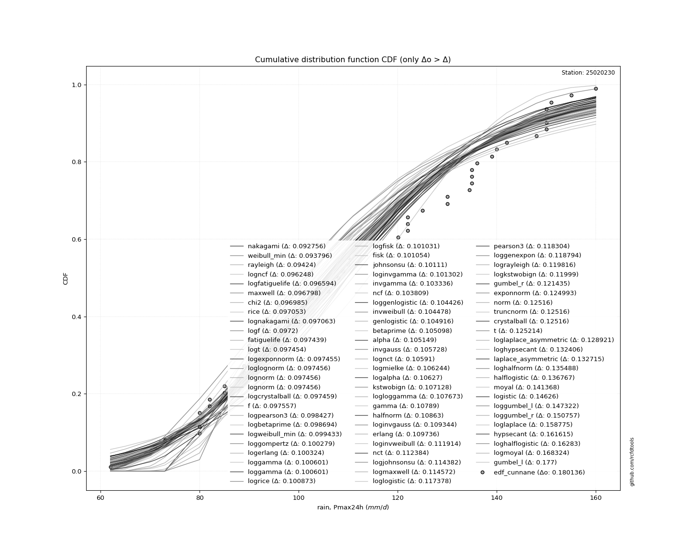</img>

</div>


**10.3. Best fit**

<div align="center">

|   id |   station | empirical_dist   | p_dist   |     delta |   deltao | eval   |   fit |   n |   best_fit |   best_fit_sort |
|-----:|----------:|:-----------------|:---------|----------:|---------:|:-------|------:|----:|-----------:|----------------:|
|    0 |  25020230 | edf_cunnane      | logfisk  | 0.0683079 | 0.217774 | Δo > Δ |     1 |  39 |          1 |               1 |

</div>


<div align="center">

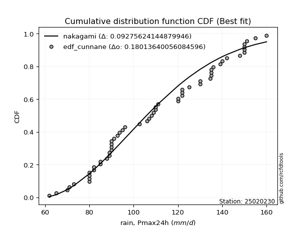</img>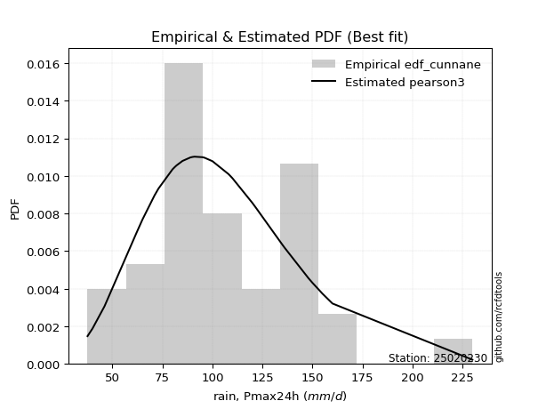</img>

</div>


### 11. Empirical - EDF Adamowski (1981)

The Adamowski formula in hydrology refers to a specific plotting position formula used for estimating the non-parametric empirical distribution of hydrological events (like flood peaks) to calculate their return periods. This formula provides an alternative to traditional parametric methods (like the Gumbel or Log Pearson Type III distributions). 

<div align="center">


$P=(m-0.25)/(n+0.5)$


</div>


**11.1. Empirical values**

<div align="center">

|                | 0                  | 1                   | 2                   | 3                  | 4                   | 5                   | 6                   | 7                  | 8                   | 9                  | 10                 | 11                 | 12                 | 13                  | 14                  | 15                 | 16                 | 17                  | 18                  | 19            | 20                 | 21                 | 22                 | 23                 | 24                 | 25                 | 26                 | 27                 | 28                 | 29                 | 30                 | 31                 | 32                 | 33                 | 34                | 35                 | 36                 | 37                 | 38                 |
|:---------------|:-------------------|:--------------------|:--------------------|:-------------------|:--------------------|:--------------------|:--------------------|:-------------------|:--------------------|:-------------------|:-------------------|:-------------------|:-------------------|:--------------------|:--------------------|:-------------------|:-------------------|:--------------------|:--------------------|:--------------|:-------------------|:-------------------|:-------------------|:-------------------|:-------------------|:-------------------|:-------------------|:-------------------|:-------------------|:-------------------|:-------------------|:-------------------|:-------------------|:-------------------|:------------------|:-------------------|:-------------------|:-------------------|:-------------------|
| date           | 1996               | 2005                | 1987                | 1992               | 1991                | 1998                | 2012                | 2003               | 2004                | 2018               | 2013               | 1997               | 1989               | 1990                | 1993                | 2006               | 1995               | 2010                | 1988                | 2014          | 2016               | 1980               | 2002               | 1999               | 2011               | 1983               | 2017               | 2000               | 2001               | 1994               | 1986               | 1982               | 2007               | 1981               | 2015              | 2009               | 1984               | 2008               | 1985               |
| x              | 37.52732           | 40.0                | 46.0                | 62.0               | 65.0                | 71.0                | 73.0                | 80.0               | 80.0                | 81.1               | 82.0               | 85.0               | 85.0               | 89.0                | 90.0                | 90.0               | 90.0               | 91.0                | 95.0                | 96.0          | 100.0              | 108.0              | 109.0              | 110.0              | 110.0              | 120.0              | 120.1              | 122.0              | 134.5              | 135.0              | 136.0              | 148.0              | 150.0              | 150.0              | 150.0             | 150.0              | 155.0              | 160.0              | 230.0              |
| m              | 1                  | 2                   | 3                   | 4                  | 5                   | 6                   | 7                   | 8                  | 9                   | 10                 | 11                 | 12                 | 13                 | 14                  | 15                  | 16                 | 17                 | 18                  | 19                  | 20            | 21                 | 22                 | 23                 | 24                 | 25                 | 26                 | 27                 | 28                 | 29                 | 30                 | 31                 | 32                 | 33                 | 34                 | 35                | 36                 | 37                 | 38                 | 39                 |
| empirical_dist | edf_adamowski      | edf_adamowski       | edf_adamowski       | edf_adamowski      | edf_adamowski       | edf_adamowski       | edf_adamowski       | edf_adamowski      | edf_adamowski       | edf_adamowski      | edf_adamowski      | edf_adamowski      | edf_adamowski      | edf_adamowski       | edf_adamowski       | edf_adamowski      | edf_adamowski      | edf_adamowski       | edf_adamowski       | edf_adamowski | edf_adamowski      | edf_adamowski      | edf_adamowski      | edf_adamowski      | edf_adamowski      | edf_adamowski      | edf_adamowski      | edf_adamowski      | edf_adamowski      | edf_adamowski      | edf_adamowski      | edf_adamowski      | edf_adamowski      | edf_adamowski      | edf_adamowski     | edf_adamowski      | edf_adamowski      | edf_adamowski      | edf_adamowski      |
| empirical      | 0.0189873417721519 | 0.04430379746835443 | 0.06962025316455696 | 0.0949367088607595 | 0.12025316455696203 | 0.14556962025316456 | 0.17088607594936708 | 0.1962025316455696 | 0.22151898734177214 | 0.2468354430379747 | 0.2721518987341772 | 0.2974683544303797 | 0.3227848101265823 | 0.34810126582278483 | 0.37341772151898733 | 0.3987341772151899 | 0.4240506329113924 | 0.44936708860759494 | 0.47468354430379744 | 0.5           | 0.5253164556962026 | 0.5506329113924051 | 0.5759493670886076 | 0.6012658227848101 | 0.6265822784810127 | 0.6518987341772152 | 0.6772151898734177 | 0.7025316455696202 | 0.7278481012658228 | 0.7531645569620253 | 0.7784810126582279 | 0.8037974683544303 | 0.8291139240506329 | 0.8544303797468354 | 0.879746835443038 | 0.9050632911392406 | 0.930379746835443  | 0.9556962025316456 | 0.9810126582278481 |
| empirical_tr   | 1.0193548387096774 | 1.0463576158940397  | 1.0748299319727892  | 1.104895104895105  | 1.1366906474820144  | 1.1703703703703703  | 1.2061068702290076  | 1.2440944881889764 | 1.2845528455284552  | 1.3277310924369747 | 1.373913043478261  | 1.4234234234234235 | 1.4766355140186915 | 1.533980582524272   | 1.595959595959596   | 1.6631578947368422 | 1.7362637362637363 | 1.8160919540229883  | 1.9036144578313252  | 2.0           | 2.106666666666667  | 2.2253521126760565 | 2.3582089552238803 | 2.507936507936508  | 2.6779661016949152 | 2.872727272727273  | 3.098039215686274  | 3.361702127659574  | 3.6744186046511627 | 4.051282051282052  | 4.514285714285715  | 5.096774193548386  | 5.851851851851851  | 6.869565217391305  | 8.315789473684212 | 10.533333333333339 | 14.363636363636356 | 22.571428571428566 | 52.66666666666669  |

</div>


**11.2. Kolmogorov-Smirnov fit test (sorted by Δ)**


<div align="center">

|                | 0                   | 1                   | 2                   | 3                  | 4                   | 5                   | 6                   | 7                   | 8                   | 9                   | 10                  | 11                  | 12                  | 13                  | 14                  | 15                 | 16                  | 17                  | 18                  | 19                  | 20                  | 21                  | 22                  | 23                  | 24                  | 25                  | 26                  | 27                  | 28                  | 29                  | 30                  | 31                  | 32                  | 33                  | 34                  | 35                  | 36                 | 37                  | 38                  | 39                  | 40                  | 41                 | 42                  | 43                  | 44                  | 45                  | 46                  | 47                  | 48                  | 49                  | 50                  | 51                 | 52                  | 53                  | 54                  | 55                  | 56                  | 57                  | 58                  | 59                  | 60                  | 61                  | 62                  | 63                    | 64                  | 65                  | 66                  | 67                  | 68                 | 69                  | 70                  | 71                 | 72                 | 73                  | 74                 | 75                  | 76                  | 77                  | 78                  | 79                 | 80                  | 81                 | 82                  | 83                  | 84                 | 85                 | 86                 | 87                 | 88                 | 89                 | 90                  | 91                 | 92                 | 93                  |
|:---------------|:--------------------|:--------------------|:--------------------|:-------------------|:--------------------|:--------------------|:--------------------|:--------------------|:--------------------|:--------------------|:--------------------|:--------------------|:--------------------|:--------------------|:--------------------|:-------------------|:--------------------|:--------------------|:--------------------|:--------------------|:--------------------|:--------------------|:--------------------|:--------------------|:--------------------|:--------------------|:--------------------|:--------------------|:--------------------|:--------------------|:--------------------|:--------------------|:--------------------|:--------------------|:--------------------|:--------------------|:-------------------|:--------------------|:--------------------|:--------------------|:--------------------|:-------------------|:--------------------|:--------------------|:--------------------|:--------------------|:--------------------|:--------------------|:--------------------|:--------------------|:--------------------|:-------------------|:--------------------|:--------------------|:--------------------|:--------------------|:--------------------|:--------------------|:--------------------|:--------------------|:--------------------|:--------------------|:--------------------|:----------------------|:--------------------|:--------------------|:--------------------|:--------------------|:-------------------|:--------------------|:--------------------|:-------------------|:-------------------|:--------------------|:-------------------|:--------------------|:--------------------|:--------------------|:--------------------|:-------------------|:--------------------|:-------------------|:--------------------|:--------------------|:-------------------|:-------------------|:-------------------|:-------------------|:-------------------|:-------------------|:--------------------|:-------------------|:-------------------|:--------------------|
| station        | 25020230            | 25020230            | 25020230            | 25020230           | 25020230            | 25020230            | 25020230            | 25020230            | 25020230            | 25020230            | 25020230            | 25020230            | 25020230            | 25020230            | 25020230            | 25020230           | 25020230            | 25020230            | 25020230            | 25020230            | 25020230            | 25020230            | 25020230            | 25020230            | 25020230            | 25020230            | 25020230            | 25020230            | 25020230            | 25020230            | 25020230            | 25020230            | 25020230            | 25020230            | 25020230            | 25020230            | 25020230           | 25020230            | 25020230            | 25020230            | 25020230            | 25020230           | 25020230            | 25020230            | 25020230            | 25020230            | 25020230            | 25020230            | 25020230            | 25020230            | 25020230            | 25020230           | 25020230            | 25020230            | 25020230            | 25020230            | 25020230            | 25020230            | 25020230            | 25020230            | 25020230            | 25020230            | 25020230            | 25020230              | 25020230            | 25020230            | 25020230            | 25020230            | 25020230           | 25020230            | 25020230            | 25020230           | 25020230           | 25020230            | 25020230           | 25020230            | 25020230            | 25020230            | 25020230            | 25020230           | 25020230            | 25020230           | 25020230            | 25020230            | 25020230           | 25020230           | 25020230           | 25020230           | 25020230           | 25020230           | 25020230            | 25020230           | 25020230           | 25020230            |
| empirical_dist | edf_adamowski       | edf_adamowski       | edf_adamowski       | edf_adamowski      | edf_adamowski       | edf_adamowski       | edf_adamowski       | edf_adamowski       | edf_adamowski       | edf_adamowski       | edf_adamowski       | edf_adamowski       | edf_adamowski       | edf_adamowski       | edf_adamowski       | edf_adamowski      | edf_adamowski       | edf_adamowski       | edf_adamowski       | edf_adamowski       | edf_adamowski       | edf_adamowski       | edf_adamowski       | edf_adamowski       | edf_adamowski       | edf_adamowski       | edf_adamowski       | edf_adamowski       | edf_adamowski       | edf_adamowski       | edf_adamowski       | edf_adamowski       | edf_adamowski       | edf_adamowski       | edf_adamowski       | edf_adamowski       | edf_adamowski      | edf_adamowski       | edf_adamowski       | edf_adamowski       | edf_adamowski       | edf_adamowski      | edf_adamowski       | edf_adamowski       | edf_adamowski       | edf_adamowski       | edf_adamowski       | edf_adamowski       | edf_adamowski       | edf_adamowski       | edf_adamowski       | edf_adamowski      | edf_adamowski       | edf_adamowski       | edf_adamowski       | edf_adamowski       | edf_adamowski       | edf_adamowski       | edf_adamowski       | edf_adamowski       | edf_adamowski       | edf_adamowski       | edf_adamowski       | edf_adamowski         | edf_adamowski       | edf_adamowski       | edf_adamowski       | edf_adamowski       | edf_adamowski      | edf_adamowski       | edf_adamowski       | edf_adamowski      | edf_adamowski      | edf_adamowski       | edf_adamowski      | edf_adamowski       | edf_adamowski       | edf_adamowski       | edf_adamowski       | edf_adamowski      | edf_adamowski       | edf_adamowski      | edf_adamowski       | edf_adamowski       | edf_adamowski      | edf_adamowski      | edf_adamowski      | edf_adamowski      | edf_adamowski      | edf_adamowski      | edf_adamowski       | edf_adamowski      | edf_adamowski      | edf_adamowski       |
| p_dist         | fatiguelife         | recipinvgauss       | invgamma            | alpha              | invgauss            | f                   | chi2                | erlang              | gamma               | logfisk             | genlogistic         | logloggamma         | pearson3            | logjohnsonsu        | logpearson3         | nct                | betaprime           | maxwell             | logweibull_min      | fisk                | gumbel_r            | logdgamma           | exponnorm           | nakagami            | mielke              | loggenlogistic      | laplace_asymmetric  | logmielke           | rayleigh            | invweibull          | loglogistic         | rice                | weibull_min         | dgamma              | moyal               | loggompertz         | logfatiguelife     | logcrystalball      | lognorm             | lognorm             | logexponnorm        | loglognorm         | logrice             | logf                | lognakagami         | halflogistic        | logt                | logncf              | loghypsecant        | lognct              | johnsonsu           | gompertz           | loggamma            | loggamma            | t                   | crystalball         | norm                | truncnorm           | kstwobign           | logrecipinvgauss    | loggumbel_l         | logerlang           | halfnorm            | loglaplace_asymmetric | logalpha            | loglaplace          | loginvgamma         | loginvgauss         | logistic           | logmaxwell          | loggumbel_r         | lograyleigh        | logbetaprime       | logmoyal            | hypsecant          | wald                | loghalflogistic     | laplace             | loghalfnorm         | loginvweibull      | gumbel_l            | gibrat             | logwald             | logkstwobign        | loggibrat          | loggenexpon        | genexpon           | expon              | pareto             | ncf                | logtruncnorm        | logexpon           | logpareto          | logchi2             |
| delta          | 0.06819928210384774 | 0.06827857156284084 | 0.06890435480211027 | 0.0697581764042659 | 0.06987573424977628 | 0.06995945265813702 | 0.06997499801803292 | 0.06997501477523238 | 0.06997502776496556 | 0.07005165587348294 | 0.07109829566981163 | 0.07214034167410222 | 0.07256040601771041 | 0.07306296196937095 | 0.07307156298563611 | 0.073308307672235  | 0.07355818816916887 | 0.07524677975646854 | 0.07706399668277408 | 0.07805754587317493 | 0.07920722178575812 | 0.07945358898387755 | 0.07984510840012887 | 0.08082342038539075 | 0.08103088419791715 | 0.08118495982516788 | 0.08277002239032594 | 0.08334461191389103 | 0.08414094111106257 | 0.08455606287017348 | 0.08495919053087919 | 0.08504987115128132 | 0.08513410480002481 | 0.08995683147668043 | 0.09013176050138805 | 0.09147668191786262 | 0.09249458882494   | 0.09319022861470388 | 0.09319138879680372 | 0.09319138879680372 | 0.09319154789896772 | 0.0931922981583374 | 0.09320072564661946 | 0.09323494268112925 | 0.09346359218878991 | 0.09368213684617244 | 0.09487637168955859 | 0.09625180067737121 | 0.09812876911732227 | 0.09819442938764372 | 0.10025258742891185 | 0.1005485661875885 | 0.10056467513246242 | 0.10056467513246242 | 0.10103101305855972 | 0.10117000752021843 | 0.10117001125169256 | 0.10117003023683524 | 0.10129866343071431 | 0.10192607588775637 | 0.10300700240857058 | 0.10376340967685416 | 0.10802663149125052 | 0.10977741767985671   | 0.11161537748589517 | 0.11301957809259255 | 0.11481843897319921 | 0.11645275910593889 | 0.1180539568199031 | 0.11992555941240185 | 0.12224177978868878 | 0.1305813734610784 | 0.1314237403646239 | 0.13193784475926995 | 0.1320166632691454 | 0.15049076569796774 | 0.15647581517691145 | 0.16018270133047147 | 0.16061388722185505 | 0.1612674949580789 | 0.16756080989486755 | 0.1730909493964743 | 0.19628516746019908 | 0.20184944997012477 | 0.227734635932217  | 0.2312096092059936 | 0.2660018606533581 | 0.2669800346842765 | 0.266980038663077  | 0.3025028661907655 | 0.31675701989051047 | 0.3461864621988295 | 0.346186466324036  | 0.40422991802641495 |
| deltao         | 0.2177742891749185  | 0.2177742891749185  | 0.2177742891749185  | 0.2177742891749185 | 0.2177742891749185  | 0.2177742891749185  | 0.2177742891749185  | 0.2177742891749185  | 0.2177742891749185  | 0.2177742891749185  | 0.2177742891749185  | 0.2177742891749185  | 0.2177742891749185  | 0.2177742891749185  | 0.2177742891749185  | 0.2177742891749185 | 0.2177742891749185  | 0.2177742891749185  | 0.2177742891749185  | 0.2177742891749185  | 0.2177742891749185  | 0.2177742891749185  | 0.2177742891749185  | 0.2177742891749185  | 0.2177742891749185  | 0.2177742891749185  | 0.2177742891749185  | 0.2177742891749185  | 0.2177742891749185  | 0.2177742891749185  | 0.2177742891749185  | 0.2177742891749185  | 0.2177742891749185  | 0.2177742891749185  | 0.2177742891749185  | 0.2177742891749185  | 0.2177742891749185 | 0.2177742891749185  | 0.2177742891749185  | 0.2177742891749185  | 0.2177742891749185  | 0.2177742891749185 | 0.2177742891749185  | 0.2177742891749185  | 0.2177742891749185  | 0.2177742891749185  | 0.2177742891749185  | 0.2177742891749185  | 0.2177742891749185  | 0.2177742891749185  | 0.2177742891749185  | 0.2177742891749185 | 0.2177742891749185  | 0.2177742891749185  | 0.2177742891749185  | 0.2177742891749185  | 0.2177742891749185  | 0.2177742891749185  | 0.2177742891749185  | 0.2177742891749185  | 0.2177742891749185  | 0.2177742891749185  | 0.2177742891749185  | 0.2177742891749185    | 0.2177742891749185  | 0.2177742891749185  | 0.2177742891749185  | 0.2177742891749185  | 0.2177742891749185 | 0.2177742891749185  | 0.2177742891749185  | 0.2177742891749185 | 0.2177742891749185 | 0.2177742891749185  | 0.2177742891749185 | 0.2177742891749185  | 0.2177742891749185  | 0.2177742891749185  | 0.2177742891749185  | 0.2177742891749185 | 0.2177742891749185  | 0.2177742891749185 | 0.2177742891749185  | 0.2177742891749185  | 0.2177742891749185 | 0.2177742891749185 | 0.2177742891749185 | 0.2177742891749185 | 0.2177742891749185 | 0.2177742891749185 | 0.2177742891749185  | 0.2177742891749185 | 0.2177742891749185 | 0.2177742891749185  |
| eval           | Δo > Δ              | Δo > Δ              | Δo > Δ              | Δo > Δ             | Δo > Δ              | Δo > Δ              | Δo > Δ              | Δo > Δ              | Δo > Δ              | Δo > Δ              | Δo > Δ              | Δo > Δ              | Δo > Δ              | Δo > Δ              | Δo > Δ              | Δo > Δ             | Δo > Δ              | Δo > Δ              | Δo > Δ              | Δo > Δ              | Δo > Δ              | Δo > Δ              | Δo > Δ              | Δo > Δ              | Δo > Δ              | Δo > Δ              | Δo > Δ              | Δo > Δ              | Δo > Δ              | Δo > Δ              | Δo > Δ              | Δo > Δ              | Δo > Δ              | Δo > Δ              | Δo > Δ              | Δo > Δ              | Δo > Δ             | Δo > Δ              | Δo > Δ              | Δo > Δ              | Δo > Δ              | Δo > Δ             | Δo > Δ              | Δo > Δ              | Δo > Δ              | Δo > Δ              | Δo > Δ              | Δo > Δ              | Δo > Δ              | Δo > Δ              | Δo > Δ              | Δo > Δ             | Δo > Δ              | Δo > Δ              | Δo > Δ              | Δo > Δ              | Δo > Δ              | Δo > Δ              | Δo > Δ              | Δo > Δ              | Δo > Δ              | Δo > Δ              | Δo > Δ              | Δo > Δ                | Δo > Δ              | Δo > Δ              | Δo > Δ              | Δo > Δ              | Δo > Δ             | Δo > Δ              | Δo > Δ              | Δo > Δ             | Δo > Δ             | Δo > Δ              | Δo > Δ             | Δo > Δ              | Δo > Δ              | Δo > Δ              | Δo > Δ              | Δo > Δ             | Δo > Δ              | Δo > Δ             | Δo > Δ              | Δo > Δ              | Δo <= Δ            | Δo <= Δ            | Δo <= Δ            | Δo <= Δ            | Δo <= Δ            | Δo <= Δ            | Δo <= Δ             | Δo <= Δ            | Δo <= Δ            | Δo <= Δ             |
| fit            | 1                   | 1                   | 1                   | 1                  | 1                   | 1                   | 1                   | 1                   | 1                   | 1                   | 1                   | 1                   | 1                   | 1                   | 1                   | 1                  | 1                   | 1                   | 1                   | 1                   | 1                   | 1                   | 1                   | 1                   | 1                   | 1                   | 1                   | 1                   | 1                   | 1                   | 1                   | 1                   | 1                   | 1                   | 1                   | 1                   | 1                  | 1                   | 1                   | 1                   | 1                   | 1                  | 1                   | 1                   | 1                   | 1                   | 1                   | 1                   | 1                   | 1                   | 1                   | 1                  | 1                   | 1                   | 1                   | 1                   | 1                   | 1                   | 1                   | 1                   | 1                   | 1                   | 1                   | 1                     | 1                   | 1                   | 1                   | 1                   | 1                  | 1                   | 1                   | 1                  | 1                  | 1                   | 1                  | 1                   | 1                   | 1                   | 1                   | 1                  | 1                   | 1                  | 1                   | 1                   | 0                  | 0                  | 0                  | 0                  | 0                  | 0                  | 0                   | 0                  | 0                  | 0                   |
| n              | 39                  | 39                  | 39                  | 39                 | 39                  | 39                  | 39                  | 39                  | 39                  | 39                  | 39                  | 39                  | 39                  | 39                  | 39                  | 39                 | 39                  | 39                  | 39                  | 39                  | 39                  | 39                  | 39                  | 39                  | 39                  | 39                  | 39                  | 39                  | 39                  | 39                  | 39                  | 39                  | 39                  | 39                  | 39                  | 39                  | 39                 | 39                  | 39                  | 39                  | 39                  | 39                 | 39                  | 39                  | 39                  | 39                  | 39                  | 39                  | 39                  | 39                  | 39                  | 39                 | 39                  | 39                  | 39                  | 39                  | 39                  | 39                  | 39                  | 39                  | 39                  | 39                  | 39                  | 39                    | 39                  | 39                  | 39                  | 39                  | 39                 | 39                  | 39                  | 39                 | 39                 | 39                  | 39                 | 39                  | 39                  | 39                  | 39                  | 39                 | 39                  | 39                 | 39                  | 39                  | 39                 | 39                 | 39                 | 39                 | 39                 | 39                 | 39                  | 39                 | 39                 | 39                  |
| best_fit       | 1                   | 0                   | 0                   | 0                  | 0                   | 0                   | 0                   | 0                   | 0                   | 0                   | 0                   | 0                   | 0                   | 0                   | 0                   | 0                  | 0                   | 0                   | 0                   | 0                   | 0                   | 0                   | 0                   | 0                   | 0                   | 0                   | 0                   | 0                   | 0                   | 0                   | 0                   | 0                   | 0                   | 0                   | 0                   | 0                   | 0                  | 0                   | 0                   | 0                   | 0                   | 0                  | 0                   | 0                   | 0                   | 0                   | 0                   | 0                   | 0                   | 0                   | 0                   | 0                  | 0                   | 0                   | 0                   | 0                   | 0                   | 0                   | 0                   | 0                   | 0                   | 0                   | 0                   | 0                     | 0                   | 0                   | 0                   | 0                   | 0                  | 0                   | 0                   | 0                  | 0                  | 0                   | 0                  | 0                   | 0                   | 0                   | 0                   | 0                  | 0                   | 0                  | 0                   | 0                   | 0                  | 0                  | 0                  | 0                  | 0                  | 0                  | 0                   | 0                  | 0                  | 0                   |
| best_fit_sort  | 1                   | 2                   | 3                   | 4                  | 5                   | 6                   | 7                   | 8                   | 9                   | 10                  | 11                  | 12                  | 13                  | 14                  | 15                  | 16                 | 17                  | 18                  | 19                  | 20                  | 21                  | 22                  | 23                  | 24                  | 25                  | 26                  | 27                  | 28                  | 29                  | 30                  | 31                  | 32                  | 33                  | 34                  | 35                  | 36                  | 37                 | 38                  | 39                  | 40                  | 41                  | 42                 | 43                  | 44                  | 45                  | 46                  | 47                  | 48                  | 49                  | 50                  | 51                  | 52                 | 53                  | 54                  | 55                  | 56                  | 57                  | 58                  | 59                  | 60                  | 61                  | 62                  | 63                  | 64                    | 65                  | 66                  | 67                  | 68                  | 69                 | 70                  | 71                  | 72                 | 73                 | 74                  | 75                 | 76                  | 77                  | 78                  | 79                  | 80                 | 81                  | 82                 | 83                  | 84                  | 85                 | 86                 | 87                 | 88                 | 89                 | 90                 | 91                  | 92                 | 93                 | 94                  |

</div>


<div align="center">

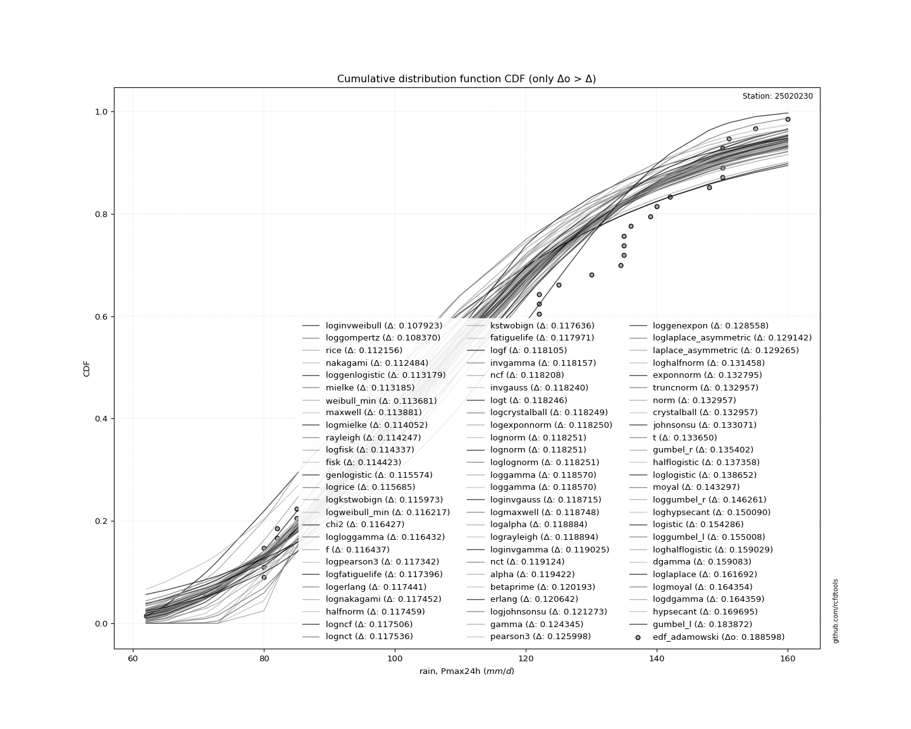</img>

</div>


**11.3. Best fit**

<div align="center">

|   id |   station | empirical_dist   | p_dist      |     delta |   deltao | eval   |   fit |   n |   best_fit |   best_fit_sort |
|-----:|----------:|:-----------------|:------------|----------:|---------:|:-------|------:|----:|-----------:|----------------:|
|    0 |  25020230 | edf_adamowski    | fatiguelife | 0.0681993 | 0.217774 | Δo > Δ |     1 |  39 |          1 |               1 |

</div>


<div align="center">

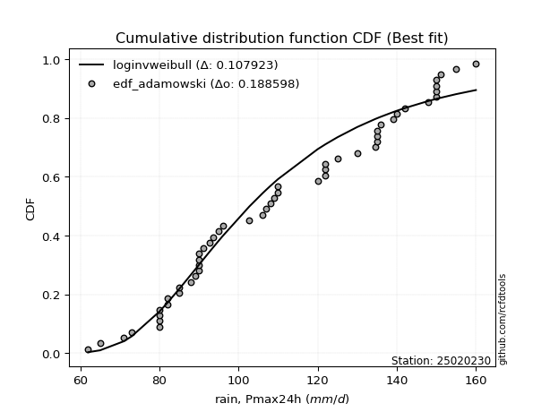</img></img>

</div>


## C. Best fit & Estimate extreme values for specific return periods - Tr


### 1. Best fit (ordered by delta Δ)

<div align="center">

|   id |   station | empirical_dist   | p_dist      |     delta |   deltao | eval   |   fit |   n |   best_fit |   best_fit_sort |
|-----:|----------:|:-----------------|:------------|----------:|---------:|:-------|------:|----:|-----------:|----------------:|
|    0 |  25020230 | edf_california   | gumbel_r    | 0.0640216 | 0.217774 | Δo > Δ |     1 |  39 |          1 |               1 |
|    1 |  25020230 | edf_weibull      | invgauss    | 0.0662628 | 0.217774 | Δo > Δ |     1 |  39 |          1 |               2 |
|    2 |  25020230 | edf_hazen        | logfisk     | 0.0671305 | 0.217774 | Δo > Δ |     1 |  39 |          1 |               3 |
|    3 |  25020230 | edf_gringorten   | logfisk     | 0.0678384 | 0.217774 | Δo > Δ |     1 |  39 |          1 |               4 |
|    4 |  25020230 | edf_adamowski    | fatiguelife | 0.0681993 | 0.217774 | Δo > Δ |     1 |  39 |          1 |               5 |
|    5 |  25020230 | edf_cunnane      | logfisk     | 0.0683079 | 0.217774 | Δo > Δ |     1 |  39 |          1 |               6 |
|    6 |  25020230 | edf_blom         | invgamma    | 0.0685819 | 0.217774 | Δo > Δ |     1 |  39 |          1 |               7 |
|    7 |  25020230 | edf_tukey        | invgamma    | 0.0686898 | 0.217774 | Δo > Δ |     1 |  39 |          1 |               8 |
|    8 |  25020230 | edf_jenkinson    | invgamma    | 0.0687501 | 0.217774 | Δo > Δ |     1 |  39 |          1 |               9 |
|    9 |  25020230 | edf_beard        | invgamma    | 0.0687501 | 0.217774 | Δo > Δ |     1 |  39 |          1 |              10 |
|   10 |  25020230 | edf_chegodayev   | invgamma    | 0.0687758 | 0.217774 | Δo > Δ |     1 |  39 |          1 |              11 |

</div>

:file_folder:Tables: [bestfit_25020230.csv](table/bestfit_25020230.csv) | [extreme_25020230.csv](table/extreme_25020230.csv)


### 2. Extreme values

In hydrology, a return period (or recurrence interval) is the statistical average time between extreme events like floods or droughts of a specific magnitude, indicating how rare an event is, with a 100-year flood, for example, having a 1% chance of occurring in any given year, not that it happens exactly every century. It is a key tool for infrastructure design (like bridges or dams) and risk assessment, calculated from historical data to determine the probability of future events, although it is important to remember it is statistical average, and events can cluster or be missed.

> risk_rate: assuming the return period as the project useful life.

|   id |      tr |   prob_l |     prob_g |   alpha |   betaprime |    chi2 |   crystalball |   dgamma |   erlang |    expon |   exponnorm |       f |   fatiguelife |    fisk |   gamma |   genexpon |   genlogistic |   gibrat |   gompertz |   gumbel_l |   gumbel_r |   halflogistic |   halfnorm |   hypsecant |   invgamma |   invgauss |   invweibull |   johnsonsu |   kstwobign |   laplace |   laplace_asymmetric |   loggamma |   logistic |   lognorm |   maxwell |   mielke |   moyal |   nakagami |      ncf |     nct |    norm |   pareto |   pearson3 |   rayleigh |   recipinvgauss |    rice |       t |   truncnorm |     wald |   weibull_min |   logalpha |   logbetaprime |          logchi2 |   logcrystalball |   logdgamma |   logerlang |   logexpon |   logexponnorm |     logf |   logfatiguelife |   logfisk |   loggenexpon |   loggenlogistic |   loggibrat |   loggompertz |   loggumbel_l |   loggumbel_r |   loghalflogistic |   loghalfnorm |   loghypsecant |   loginvgamma |   loginvgauss |   loginvweibull |   logjohnsonsu |   logkstwobign |   loglaplace |   loglaplace_asymmetric |   logloggamma |   loglogistic |   loglognorm |   logmaxwell |   logmielke |   logmoyal |   lognakagami |   logncf |   lognct |   logpareto |   logpearson3 |   lograyleigh |   logrecipinvgauss |   logrice |     logt |   logtruncnorm |   logwald |   logweibull_min |   station |   n |   risk_rate |
|-----:|--------:|---------:|-----------:|--------:|------------:|--------:|--------------:|---------:|---------:|---------:|------------:|--------:|--------------:|--------:|--------:|-----------:|--------------:|---------:|-----------:|-----------:|-----------:|---------------:|-----------:|------------:|-----------:|-----------:|-------------:|------------:|------------:|----------:|---------------------:|-----------:|-----------:|----------:|----------:|---------:|--------:|-----------:|---------:|--------:|--------:|---------:|-----------:|-----------:|----------------:|--------:|--------:|------------:|---------:|--------------:|-----------:|---------------:|-----------------:|-----------------:|------------:|------------:|-----------:|---------------:|---------:|-----------------:|----------:|--------------:|-----------------:|------------:|--------------:|--------------:|--------------:|------------------:|--------------:|---------------:|--------------:|--------------:|----------------:|---------------:|---------------:|-------------:|------------------------:|--------------:|--------------:|-------------:|-------------:|------------:|-----------:|--------------:|---------:|---------:|------------:|--------------:|--------------:|-------------------:|----------:|---------:|---------------:|----------:|-----------------:|----------:|----:|------------:|
|    0 |    2    | 0.5      | 0.5        | 101.819 |     101.541 | 101.823 |       105.801 |  103.492 |  101.823 |  84.8508 |     102.315 | 101.821 |       101.824 | 101.616 | 101.823 |    84.9543 |       101.475 |  94.326  |    105.823 |    112.081 |    99.5205 |        96.3983 |    97.9755 |     105.801 |    101.805 |    101.637 |      99.8188 |     105.798 |     99.2793 |   105.801 |              97.1237 |     98.23  |    105.801 |   98.8272 |   102.531 |  102.153 |  97.493 |    101.913 |  80.7617 | 101.874 | 105.801 |  84.8508 |    101.299 |    101.372 |         101.822 | 102.086 | 105.908 |     105.801 |  93.4089 |       101.789 |    97.1734 |        98.7634 |     62.7541      |          98.8273 |     102.866 |     97.7953 |    73.4236 |        98.8272 |  98.8389 |          98.7956 |   100.555 |       87.9083 |          102.19  |     88.1563 |       102.213 |       105.205 |       92.8356 |           89.993  |       91.4177 |        98.8272 |       96.7835 |       96.7716 |         94.3944 |        102.116 |        90.8254 |      98.8272 |                 94.6477 |       101.791 |       98.8272 |      98.8271 |      95.6612 |     102.655 |    90.98   |       98.8256 |  98.6174 |  98.4253 |     73.4236 |       102.059 |        94.563 |            97.9896 |   98.8218 |  98.8784 |        77.9549 |   87.3549 |          101.786 |  25020230 |  39 |    0.75     |
|    1 |    2.33 | 0.570815 | 0.429185   | 108.446 |     108.419 | 108.624 |       112.622 |  112.67  |  108.624 |  95.2776 |     108.623 | 108.622 |       108.568 | 107.711 | 108.624 |    95.3373 |       107.871 |  97.7816 |    114.933 |    118.016 |   105.842  |       102.897  |   105.338  |     111.26  |    108.476 |    108.418 |     106.758  |     112.682 |    106.642  |   109.929 |             103.003  |    105.307 |    111.811 |  105.774  |   109.619 |  108.288 | 103.477 |    109.075 |  95.4275 | 108.335 | 112.622 |  95.2776 |    108.097 |    108.564 |         108.567 | 109.406 | 112.811 |     112.622 |  97.882  |       109.057 |   104.281  |       107.574  |     75.2755      |         105.774  |     112.368 |    104.8    |    85.1255 |       105.774  | 105.796  |         105.712  |   106.816 |       96.7467 |          108.331 |     91.2426 |       109.734 |       111.611 |       98.8674 |           96.0105 |       98.3727 |       104.349  |      103.864  |      103.957  |        103.168  |        108.686 |        99.856  |     102.975  |                 99.7092 |       108.659 |      104.923  |     105.774  |     102.657  |     108.87  |    96.5663 |      105.784  | 105.608  | 105.422  |     85.1255 |       109.028 |       101.584 |           105.078  |  105.767  | 105.896  |        90.4806 |   91.3338 |          108.796 |  25020230 |  39 |    0.729209 |
|    2 |    5    | 0.8      | 0.2        | 135.472 |     136.51  | 136.187 |       137.974 |  133.808 |  136.187 | 147.409  |     134.323 | 136.183 |       135.97  | 133.555 | 136.187 |   147.25   |       134.668 | 117.677  |    148.495 |    137.189 |   133.303  |       132.305  |   136.473  |     133.159 |    135.659 |    136.167 |     136.903  |     138.265 |    137.917  |   130.569 |             132.4    |    136.936 |    135.018 |  136.152  |   137.514 |  133.75  | 131.194 |    137.491 | 166.102  | 134.839 | 137.974 | 147.409  |    135.956 |    137.357 |         135.975 | 138.038 | 138.726 |     137.974 | 122.922  |       137.775 |   136.521  |       148.715  |    218.07        |         136.153  |     138.816 |    136.03   |   178.305  |       136.152  | 136.246  |         135.984  |   134.873 |      142.077  |          133.778 |    111.234  |       138.746 |       135.093 |      129.965  |          128.68   |      134.134  |       129.778  |      136.122  |      137.019  |        151.786  |        135.189 |       149.362  |     126.473  |                129.377  |       136.426 |      132.203  |     136.152  |     135.53   |     134.084 |   127.263  |      136.231  | 136.302  | 136.228  |    178.305  |       136.932 |       135.317 |           137.151  |  136.136  | 136.858  |       181.166  |  117.199  |          136.873 |  25020230 |  39 |    0.67232  |
|    3 |   10    | 0.9      | 0.1        | 155.813 |     157.425 | 156.521 |       154.792 |  149.3   |  156.521 | 194.733  |     154.366 | 156.518 |       156.316 | 155.182 | 156.521 |   194.375  |       155.852 | 140.355  |    169.458 |    147.864 |   155.671  |       156.726  |   159.512  |     150.646 |    156.023 |    156.947 |     161.456  |     155.236 |    161.729  |   149.306 |             159.085  |    163.586 |    152.11  |  160.976  |   157.145 |  154.839 | 155.326 |    157.616 | 231.378  | 155.151 | 154.792 | 194.733  |    156.774 |    157.888 |         156.322 | 157.889 | 156.438 |     154.792 | 149.496  |       157.953 |   164.279  |       185.393  |    650.66        |         160.976  |     162.325 |    162.256  |   348.86   |       160.976  | 161.159  |         160.756  |   160.148 |      186.984  |          154.822 |    139.415  |       158.483 |       150.245 |      162.392  |          164.112  |      168.729  |       154.466  |      164.063  |      166.042  |        207.878  |        155.104 |       202.946  |     152.417  |                163.887  |       156.784 |      156.733  |     160.976  |     164.795  |     154.606 |   161.835  |      161.13   | 161.522  | 161.643  |    348.86   |       156.934 |       166.012 |           164.657  |  160.951  | 162.776  |       320.717  |  152.702  |          157.121 |  25020230 |  39 |    0.651322 |
|    4 |   15    | 0.933333 | 0.0666667  | 166.802 |     168.565 | 167.296 |       163.184 |  157.82  |  167.296 | 222.415  |     165.653 | 167.296 |       167.155 | 167.993 | 167.296 |   221.942  |       167.682 | 155.997  |    179.377 |    152.699 |   168.29   |       170.546  |   171.501  |     160.626 |    166.967 |    168.073 |     175.309  |     163.704 |    174.371  |   160.266 |             174.695  |    178.958 |    161.422 |  175.008  |   167.218 |  167.404 | 169.332 |    167.963 | 271.25   | 166.311 | 163.184 | 222.415  |    167.882 |    168.466 |         167.161 | 167.965 | 165.527 |     163.184 | 166.561  |       168.271 |   180.533  |       207.306  |   1274.11        |         175.008  |     176.956 |    177.352  |   516.608  |       175.008  | 175.254  |         174.774  |   175.859 |      215.452  |          167.356 |    162.913  |       168.387 |       157.656 |      184.138  |          188.329  |      190.129  |       170.606  |      180.491  |      183.25   |        248.237  |        165.967 |       238.814  |     169.995  |                188.197  |       167.515 |      171.963  |     175.008  |     182.183  |     166.838 |   186.057  |      175.212  | 175.83   | 176.1    |    516.608  |       167.266 |       184.454 |           180.716  |  174.977  | 177.77   |       438.723  |  180.984  |          167.676 |  25020230 |  39 |    0.644736 |
|    5 |   20    | 0.95     | 0.05       | 174.332 |     176.119 | 174.583 |       168.68  |  163.713 |  174.583 | 242.056  |     173.59  | 174.585 |       174.51  | 177.301 | 174.583 |   241.5    |       175.934 | 168.267  |    185.667 |    155.708 |   177.126  |       180.229  |   179.495  |     167.666 |    174.438 |    175.642 |     185.008  |     169.25  |    182.886  |   168.042 |             185.77   |    189.874 |    167.858 |  184.853  |   173.902 |  176.599 | 179.25  |    174.836 | 300.527  | 174.043 | 168.68  | 242.056  |    175.42  |    175.497 |         174.515 | 174.612 | 171.592 |     168.68  | 179.277  |       175.101 |   192.181  |       223.181  |   2074.18        |         184.853  |     187.855 |    188.059  |   682.558  |       184.854  | 185.147  |         184.616  |   187.61  |      236.751  |          176.529 |    184.086  |       174.88  |       162.452 |      201.074  |          207.395  |      205.883  |       182.997  |      192.29   |      195.67   |        281.073  |        173.485 |       266.485  |     183.683  |                207.602  |       174.747 |      183.347  |     184.854  |     194.724  |     175.828 |   205.374  |      185.096  | 185.891  | 186.282  |    682.558  |       174.136 |       197.832 |           192.201  |  184.819  | 188.462  |       543.566  |  205.416  |          174.744 |  25020230 |  39 |    0.641514 |
|    6 |   25    | 0.96     | 0.04       | 180.054 |     181.812 | 180.065 |       172.725 |  168.216 |  180.065 | 257.291  |     179.728 | 180.069 |       180.056 | 184.684 | 180.065 |   256.671  |       182.278 | 178.496  |    190.193 |    157.849 |   183.932  |       187.69   |   185.442  |     173.115 |    180.099 |    181.36  |     192.479  |     173.333 |    189.265  |   174.074 |             194.361  |    198.372 |    172.782 |  192.453  |   178.865 |  183.939 | 186.938 |    179.94  | 323.869  | 179.968 | 172.725 | 257.291  |    181.104 |    180.721 |         180.06  | 179.527 | 176.121 |     172.725 | 189.463  |       180.163 |   201.308  |       235.714  |   3042.12        |         192.453  |     196.641 |    196.387  |   847.184  |       192.453  | 192.787  |         192.216  |   197.127 |      253.938  |          183.85  |    203.825  |       179.659 |       165.953 |      215.175  |          223.391  |      218.447  |       193.201  |      201.553  |      205.453  |        309.298  |        179.247 |       289.292  |     195.055  |                224.021  |       180.173 |      192.561  |     192.454  |     204.59   |     183.035 |   221.715  |      192.727  | 193.668  | 194.162  |    847.184  |       179.238 |       208.395 |           201.188  |  192.416  | 196.819  |       639.174  |  227.344  |          180.025 |  25020230 |  39 |    0.639603 |
|    7 |   50    | 0.98     | 0.02       | 197.343 |     198.742 | 196.319 |       184.311 |  181.911 |  196.319 | 304.614  |     198.755 | 196.331 |       196.57  | 208.727 | 196.319 |   303.796  |       201.774 | 214.554  |    202.669 |    163.662 |   204.898  |       210.676  |   202.73   |     190.008 |    197.1   |    198.436 |     215.494  |     185.024 |    207.995  |   192.81  |             221.047  |    225.079 |    187.825 |  215.989  |   193.258 |  208.16  | 210.805 |    194.751 | 400.35   | 198.139 | 184.311 | 304.614  |    198.02  |    195.885 |         196.571 | 193.689 | 189.432 |     184.311 | 222.719  |       194.797 |   230.33   |       276.051  |  10223.8         |         215.989  |     226.001 |    222.519  |  1657.55   |       215.989  | 216.461  |         215.773  |   229.3   |      311.282  |          208.017 |    291.873  |       193.333 |       175.844 |      265.136  |          280.857  |      259.487  |       228.597  |      231.09   |      236.834  |        415.333  |        196.979 |       368.183  |     235.067  |                283.777  |       196.194 |      223.681  |     215.99   |     236.121  |     207.077 |   281.203  |      216.368  | 217.817  | 218.679  |   1657.55   |       194.017 |       242.365 |           229.69   |  215.942  | 223.326  |      1035.43   |  316.594  |          195.506 |  25020230 |  39 |    0.63583  |
|    8 |   75    | 0.986667 | 0.0133333  | 207.213 |     208.214 | 205.384 |       190.527 |  189.762 |  205.384 | 332.297  |     209.878 | 205.401 |       205.826 | 223.698 | 205.384 |   331.363  |       213.085 | 238.908  |    209.074 |    166.602 |   217.084  |       224.038  |   212.14   |     199.88  |    206.734 |    208.037 |     228.871  |     191.297 |    218.301  |   203.771 |             236.656  |    241     |    196.513 |  229.783  |   201.083 |  223.503 | 224.762 |    202.806 | 448.191  | 208.704 | 190.527 | 332.297  |    207.491 |    204.135 |         205.824 | 201.335 | 196.81  |     190.527 | 243.183  |       202.724 |   247.869  |       300.749  |  21042.1         |         229.783  |     244.792 |    238.071  |  2454.57   |       229.783  | 230.344  |         229.593  |   250.222 |      347.786  |          223.331 |    371.976  |       200.654 |       181.067 |      299.346  |          320.833  |      284.983  |       252.213  |      249.001  |      255.988  |        492.955  |        207.363 |       420.42   |     262.177  |                325.871  |       205.081 |      243.898  |     229.784  |     255.257  |     222.54  |   323.134  |      230.229  | 232.012  | 233.124  |   2454.57   |       202.022 |       263.116 |           246.859  |  229.73   | 239.335  |      1355.15   |  388.153  |          204.027 |  25020230 |  39 |    0.634587 |
|    9 |  100    | 0.99     | 0.01       | 214.144 |     214.776 | 211.653 |       194.732 |  195.277 |  211.653 | 351.938  |     217.769 | 211.674 |       212.246 | 234.778 | 211.653 |   350.921  |       221.085 | 257.773  |    213.296 |    168.524 |   225.708  |       233.495  |   218.551  |     206.883 |    213.464 |    214.709 |     238.338  |     195.54  |    225.362  |   211.547 |             247.732  |    252.459 |    202.648 |  239.608  |   206.413 |  234.99  | 234.664 |    208.294 | 483.666  | 216.208 | 194.732 | 351.938  |    214.054 |    209.755 |         212.241 | 206.522 | 201.906 |     194.732 | 258.104  |       208.111 |   260.601  |       318.813  |  35278.7         |         239.608  |     258.923 |    249.252  |  3243.06   |       239.609  | 240.238  |         239.442  |   266.133 |      375.094  |          234.798 |    448.85   |       205.597 |       184.568 |      326.194  |          352.519  |      303.771  |       270.43   |      262.029  |      269.975  |        556.509  |        214.786 |       460.428  |     283.287  |                359.472  |       211.207 |      259.262  |     239.61   |     269.173  |     234.245 |   356.622  |      240.105  | 242.141  | 243.447  |   3243.06   |       207.455 |       278.263 |           259.297  |  239.551  | 250.967  |      1631.65   |  450.327  |          209.874 |  25020230 |  39 |    0.633968 |
|   10 |  200    | 0.995    | 0.005      | 230.683 |     230.132 | 226.286 |       204.269 |  208.407 |  226.286 | 399.261  |     236.782 | 226.319 |       227.295 | 263.185 | 226.286 |   398.046  |       240.305 | 309.1    |    222.552 |    172.703 |   246.443  |       256.231  |   233.213  |     223.753 |    229.401 |    230.384 |     261.099  |     205.164 |    241.624  |   230.283 |             274.417  |    280.701 |    217.363 |  263.481  |   218.608 |  264.948 | 258.521 |    220.849 | 574.844  | 234.406 | 204.269 | 399.261  |    229.418 |    222.615 |         227.283 | 218.33  | 213.812 |     204.269 | 295.269  |       220.399 |   292.36   |       364.323  | 124148           |         263.481  |     295.969 |    276.77   |  6345.16   |       263.482  | 264.291  |         263.394  |   308.549 |      445.981  |          264.718 |    748.289  |       216.779 |       192.411 |      401.009  |          442.103  |      351.53   |       319.903  |      294.621  |      305.155  |        744.875  |        232.989 |       567.663  |     341.399  |                455.357  |       225.442 |      300.179  |     263.483  |     303.929  |     265.32  |   452.26   |      264.109  | 266.814  | 268.642  |   6345.16   |       219.805 |       316.28  |           290.232  |  263.413  | 280.073  |      2511.48   |  652.007  |          223.385 |  25020230 |  39 |    0.633042 |
|   11 |  250    | 0.996    | 0.004      | 235.978 |     234.955 | 230.873 |       207.183 |  212.594 |  230.873 | 414.496  |     242.903 | 230.91  |       232.031 | 272.884 | 230.873 |   413.217  |       246.481 | 327.516  |    225.295 |    173.933 |   253.109  |       263.541  |   237.723  |     229.184 |    234.465 |    235.327 |     268.417  |     208.105 |    246.657  |   236.315 |             283.008  |    290.002 |    222.087 |  271.241  |   222.362 |  275.34  | 266.201 |    224.715 | 606.039  | 240.32  | 207.183 | 414.496  |    234.246 |    226.574 |         232.016 | 221.949 | 217.555 |     207.183 | 307.564  |       224.172 |   302.935  |       379.605  | 186777           |         271.241  |     308.87  |    285.82   |  7875.55   |       271.241  | 272.113  |         271.186  |   323.551 |      470.407  |          275.1   |    898.902  |       220.187 |       194.782 |      428.533  |          475.486  |      367.682  |       337.68   |      305.5    |      316.955  |        818.063  |        238.977 |       605.663  |     362.535  |                491.372  |       229.886 |      314.639  |     271.243  |     315.506  |     276.289 |   488.208  |      271.914  | 274.852  | 276.864  |   7875.55   |       223.579 |       328.997 |           300.503  |  271.168  | 289.803  |      2872.72   |  736.927  |          227.581 |  25020230 |  39 |    0.632858 |
|   12 |  500    | 0.998    | 0.002      | 252.4   |     249.625 | 244.797 |       215.826 |  225.497 |  244.797 | 461.82   |     261.916 | 244.848 |       246.456 | 304.883 | 244.797 |   460.342  |       265.647 | 391.162  |    233.202 |    177.458 |   273.799  |       286.228  |   251.172  |     246.053 |    250.047 |    250.413 |     291.129  |     216.826 |    261.74   |   255.052 |             309.693  |    319.599 |    236.738 |  295.621  |   233.563 |  310.198 | 290.057 |    236.248 | 709.203  | 258.932 | 215.826 | 461.82   |    248.931 |    238.385 |         246.432 | 232.708 | 228.974 |     215.826 | 346.659  |       235.401 |   336.962  |       429.173  | 670108           |         295.621  |     352.292 |    314.584  | 15408.8    |       295.622  | 296.702  |         295.685  |   374.877 |      551.592  |          309.941 |   1694.16   |       230.263 |       201.74  |      526.584  |          596.026  |      420.379  |       399.451  |      340.598  |      355.199  |       1094.27   |        258.088 |       735.464  |     436.903  |                622.441  |       243.321 |      364.064  |     295.624  |     352.739  |     313.806 |   619.13   |      296.443  | 300.161  | 302.803  |  15408.8    |       234.746 |       370.061 |           333.458  |  295.537  | 321.292  |      4307.16   | 1087.66   |          240.212 |  25020230 |  39 |    0.632489 |
|   13 |  750    | 0.998667 | 0.00133333 | 262.019 |     258.012 | 252.74  |       220.628 |  232.983 |  252.74  | 489.502  |     273.038 | 252.8   |       254.721 | 325.006 | 252.74  |   487.909  |       276.85  | 433.253  |    237.454 |    179.342 |   285.894  |       299.491  |   258.685  |     255.92  |    259.082 |    259.074 |     304.406  |     221.671 |    270.213  |   266.012 |             325.303  |    337.439 |    245.298 |  310.099  |   239.828 |  332.553 | 304.012 |    242.698 | 774.272  | 270.024 | 220.628 | 489.502  |    257.328 |    244.99  |         254.691 | 238.7   | 235.54  |     220.628 | 370.099  |       241.663 |   357.744  |       459.713  |      1.4224e+06  |         310.1    |     380.243 |    331.898  | 22818.1    |       310.1    | 311.313  |         310.247  |   408.553 |      602.995  |          332.294 |   2576.23   |       235.84  |       205.561 |      593.99   |          680.19   |      453.041  |       440.698  |      362.098  |      378.751  |       1297.12   |        269.689 |       820.231  |     487.29   |                714.771  |       250.949 |      396.459  |     310.102  |     375.448  |     338.458 |   711.438  |      311.015  | 315.23   | 318.279  |  22818.1    |       240.921 |       395.219 |           353.515  |  310.008  | 340.679  |      5414.97   | 1373.61   |          247.346 |  25020230 |  39 |    0.632366 |
|   14 | 1000    | 0.999    | 0.001      | 268.86  |     263.886 | 258.295 |       223.933 |  238.271 |  258.295 | 509.143  |     280.929 | 258.362 |       260.516 | 339.954 | 258.295 |   507.467  |       284.796 | 465.463  |    240.326 |    180.61  |   294.474  |       308.899  |   263.874  |     262.922 |    265.467 |    265.155 |     313.824  |     225.007 |    276.083  |   273.788 |             336.379  |    350.348 |    251.368 |  320.478  |   244.158 |  349.369 | 313.913 |    247.155 | 822.712  | 277.999 | 223.933 | 509.143  |    263.21  |    249.554 |         260.481 | 242.831 | 240.16  |     223.933 | 386.96   |       245.983 |   372.905  |       482.109  |      2.43138e+06 |         320.478  |     401.316 |    344.412  | 30148      |       320.478  | 321.79   |         320.692  |   434.253 |      641.309  |          349.114 |   3550.44   |       239.672 |       208.173 |      646.973  |          747.001  |      477.067  |       472.521  |      377.811  |      396.02   |       1463.41   |        278.136 |       884.621  |     526.527  |                788.471  |       256.269 |      421.165  |     320.481  |     391.993  |     357.309 |   785.162  |      321.463  | 326.049  | 329.406  |  30148      |       245.156 |       413.597 |           368.114  |  320.381  | 354.907  |      6348.74   | 1624.74   |          252.308 |  25020230 |  39 |    0.632305 |

<div align="center">

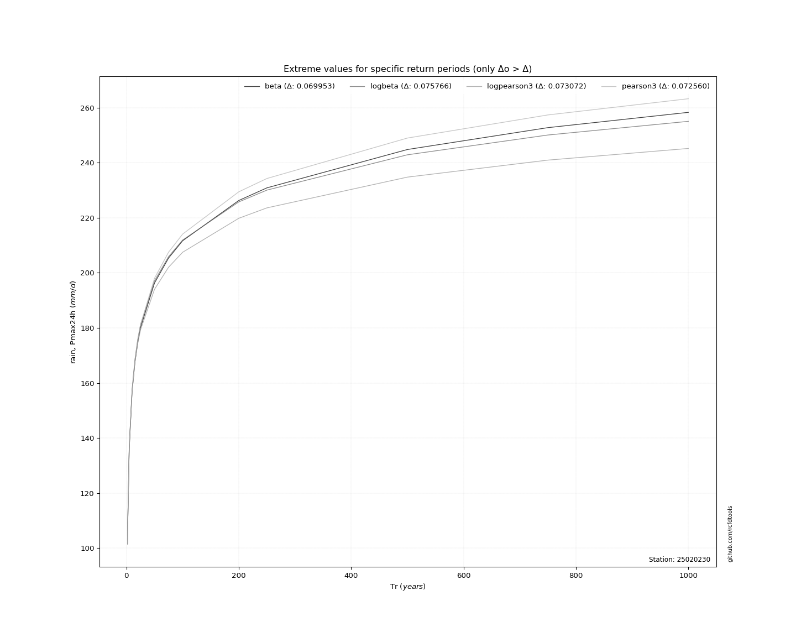</img>

</div>


<div align="center">

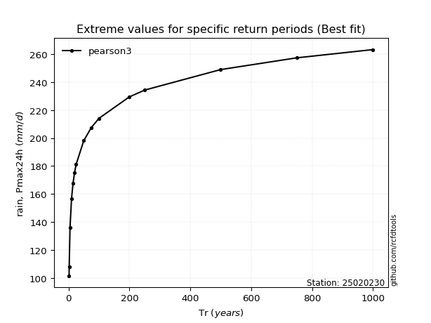</img>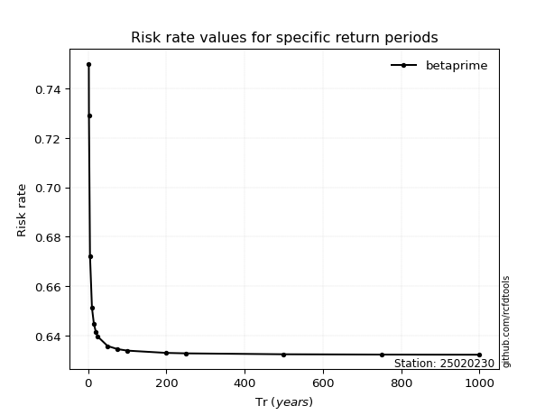</img>

</div>


______

<sub>**APP DISCLAIMER**: NO WARRANTY - This software is provided by [github.com/rcfdtools](https://github.com/rcfdtools) "as is", without any express or implied warranty, including warranties of merchantability, fitness for a particular purpose, or non-infringement. There is no guarantee that the software will be error-free or operate without interruption. LIMITATION OF LIABILITY - Neither the authors nor copyright holders will be liable for claims or damages arising from the software or its use. You are responsible for determining if the software is appropriate for your use and assume all associated risks, including errors, legal compliance, and data loss. NO PROFESSIONAL ADVICE - The software provides general information and does not offer professional advice. It should not replace consultation with professional advisors.</sub>