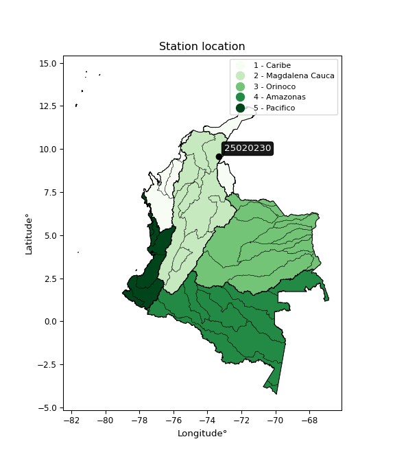

<div align="center">


</div>

# Station (rain, Pmax24h): 25020230

Probable Maximum Precipitation (PMP) is the greatest amount of rainfall for a specific duration that is meteorologically possible for a given location, acting as a "worst-case" scenario for extreme storms, crucial for designing safety-critical infrastructure like bridges, river deviations, dams, spillways, and nuclear plants to prevent catastrophic failure. PMP is calculated by hydrologists using meteorological data to determine the upper limit of extreme rainfall, often leading to the Probable Maximum Flood (PMF) for flood control design, and is increasingly being studied for climate change impacts.

<div align="center">

</img>

</div>


## A. General information


### 1. General running parameters

• app_version: _v20251225_. • runtime: _2025-12-26 15:15:32.515083_. • Python version: _3.14.0_. • SciPy version: _1.16.3_. • Pandas version: _2.3.3_. • NumPy version: _2.3.5_. • Stations dataset (station_dataset_file): _dataset/pmax24h_in/test.csv_. • Stations catalog (station_catalog_file): _dataset/CNE_IDEAM.xls_. • Minimum year to eval til year_max (date_min): _1990_. • Maximum year to eval since year_min (date_max): _2024_. • Creates, save and include plots into reports (create_plot): _False_. • Plot only fit distributions with Δo > Δ (plot_only_fit): _True_. • Eval low extreme values, if False, evaluates high extreme values (low_extreme): _False_. • Eval every SciPy distribution as logarithmic (pdist_logarithmic_on): _True_. • Standard deviation normalized (ddof): _1.0_. • Return periods to eval in years (Tr): _[2, 2.33, 5, 10, 15, 20, 25, 50, 75, 100, 200, 250, 500, 750, 1000]_. • Minimum data sample per station, 0 means any (minimum_sample): _5_. • Z-Score threshold to adjust a value, 0 means disable (zscore): _3.5_. • Avoid zeros, e.g. rain = 0 (avoid_zeros): _True_. • Avoid null values (avoid_nans): _True_. [:file_folder:Dataset file.](../../dataset/pmax24h_in/test.csv)


### 2. Station info and location

|   id |   CODIGO | NOMBRE               | CATEGORIA     | TECNOLOGIA   | ESTADO   | FECHA_INSTALACION   |   FECHA_SUSPENSION |   ALTITUD |   LATITUD |   LONGITUD | DEPARTAMENTO   | MUNICIPIO           | AREA_OPERATIVA                                         | ENTIDAD                                                     | AREA_HIDROGRAFICA   | ZONA_HIDROGRAFICA   | SUBZONA_HIDROGRAFICA   |   CORRIENTE | OBSERVACION                                                                      |   SUBRED | Catalogo   |
|-----:|---------:|:---------------------|:--------------|:-------------|:---------|:--------------------|-------------------:|----------:|----------:|-----------:|:---------------|:--------------------|:-------------------------------------------------------|:------------------------------------------------------------|:--------------------|:--------------------|:-----------------------|------------:|:---------------------------------------------------------------------------------|---------:|:-----------|
|    0 | 25020230 | LA JAGUA  [25020230] | Pluviométrica | Convencional | Activa   | 15/08/1963          |                nan |       170 |   9.56217 |   -73.3395 | Cesar          | La Jagua De Ibirico | Area Operativa 05 - Magdalena-Cesar-Guajira-San Andrés | INSTITUTO DE HIDROLOGIA METEOROLOGIA Y ESTUDIOS AMBIENTALES | Magdalena Cauca     | Cesar               | Bajo Cesar             |         nan | |01/11/2024$mvelez$Se cambia el sentido del nombre según radicado 20243120200713 |      nan | CNE_IDEAM  |

<div align="center">

Map location in: [:earth_americas:Google](http://maps.google.com/maps?q=9.562166667,-73.33947222) [:earth_americas:OSM](https://www.openstreetmap.org/#map=18/9.562166667/-73.33947222&layers=P) [:earth_americas:Bing](https://www.bing.com/maps?cp=9.562166667~-73.33947222&lvl=18) [:earth_americas:Apple](https://maps.apple.com/frame?center=9.562166667%2C-73.33947222&span=0.003%2C0.006)

</div>


<div align="center">

```geojson
{
  "type": "Feature",
  "geometry": {
    "type": "Point", 
    "coordinates": [-73.33947222, 9.562166667]
  }, 
  "properties": {
    "Name": "25020230"
  }
}
```

</div>


### 3. Discrete values table and plot

|               |           0 |          1 |          2 |           3 |          4 |           5 |         6 |           7 |           8 |           9 |          10 |         11 |          12 |          13 |          14 |        15 |          16 |         17 |         18 |         19 |         20 |          21 |          22 |          23 |           24 |         25 |           26 |          27 |          28 |
|:--------------|------------:|-----------:|-----------:|------------:|-----------:|------------:|----------:|------------:|------------:|------------:|------------:|-----------:|------------:|------------:|------------:|----------:|------------:|-----------:|-----------:|-----------:|-----------:|------------:|------------:|------------:|-------------:|-----------:|-------------:|------------:|------------:|
| Date          | 1990        | 1991       | 1992       | 1993        | 1994       | 1995        | 1996      | 1997        | 1998        | 1999        | 2000        | 2001       | 2002        | 2003        | 2004        | 2005      | 2006        | 2007       | 2008       | 2009       | 2010       | 2011        | 2012        | 2013        | 2014         | 2015       | 2016         | 2017        | 2018        |
| Value         |   89        |   65       |   62       |   90        |  135       |   90        |   37.5273 |   85        |   71        |  110        |  122        |  134.5     |  109        |   80        |   80        |   40      |   90        |  150       |  160       |  150       |   91       |  110        |   73        |   82        |   96         |  150       |  100         |  120.1      |   81.1      |
| Value_initial |   89        |   65       |   62       |   90        |  135       |   90        |   37.5273 |   85        |   71        |  110        |  122        |  134.5     |  109        |   80        |   80        |   40      |   90        |  150       |  160       |  150       |   91       |  110        |   73        |   82        |   96         |  150       |  100         |  120.1      |   81.1      |
| count         |   29        |   29       |   29       |   29        |   29       |   29        |   29      |   29        |   29        |   29        |   29        |   29       |   29        |   29        |   29        |   29      |   29        |   29       |   29       |   29       |   29       |   29        |   29        |   29        |   29         |   29       |   29         |   29        |   29        |
| mean          |   98.3871   |   98.3871  |   98.3871  |   98.3871   |   98.3871  |   98.3871   |   98.3871 |   98.3871   |   98.3871   |   98.3871   |   98.3871   |   98.3871  |   98.3871   |   98.3871   |   98.3871   |   98.3871 |   98.3871   |   98.3871  |   98.3871  |   98.3871  |   98.3871  |   98.3871   |   98.3871   |   98.3871   |   98.3871    |   98.3871  |   98.3871    |   98.3871   |   98.3871   |
| std           |   31.9458   |   31.9458  |   31.9458  |   31.9458   |   31.9458  |   31.9458   |   31.9458 |   31.9458   |   31.9458   |   31.9458   |   31.9458   |   31.9458  |   31.9458   |   31.9458   |   31.9458   |   31.9458 |   31.9458   |   31.9458  |   31.9458  |   31.9458  |   31.9458  |   31.9458   |   31.9458   |   31.9458   |   31.9458    |   31.9458  |   31.9458    |   31.9458   |   31.9458   |
| zscore        |   -0.293847 |   -1.04512 |   -1.13903 |   -0.262543 |    1.14609 |   -0.262543 |   -1.9051 |   -0.419059 |   -0.857302 |    0.363518 |    0.739155 |    1.13044 |    0.332215 |   -0.575574 |   -0.575574 |   -1.8277 |   -0.262543 |    1.61564 |    1.92867 |    1.61564 |   -0.23124 |    0.363518 |   -0.794696 |   -0.512968 |   -0.0747251 |    1.61564 |    0.0504872 |    0.679679 |   -0.541141 |
> If Z-Score is active, values out of range or outliers are replaced with the station mean value.


### 4. Active continuous probability distributions from SciPy (45 of 104 available)

[scipy.stats](https://docs.scipy.org/doc/scipy/reference/stats.html) is a Python´s powerful submodule within the SciPy library for comprehensive statistical analysis, offering over 130 probability distributions (like Normal, Poisson), functions for descriptive stats (mean, variance), hypothesis testing (t-tests, chi-square), random variable generation, and statistical tests, making it essential for data science, modeling, and research. It provides tools to explore, model, and draw conclusions from data efficiently, working seamlessly with NumPy.

<div align="center">

|   id | p_dist             |   n_parameter | fit_method   | label                                                                       | active   | ref                                                                                                        |
|-----:|:-------------------|--------------:|:-------------|:----------------------------------------------------------------------------|:---------|:-----------------------------------------------------------------------------------------------------------|
|    0 | alpha              |             3 | MLE          | Alpha                                                                       | True     | [:mortar_board:](https://docs.scipy.org/doc/scipy/reference/generated/scipy.stats.alpha.html)              |
|    1 | betaprime          |             4 | MLE          | Beta prime                                                                  | True     | [:mortar_board:](https://docs.scipy.org/doc/scipy/reference/generated/scipy.stats.betaprime.html)          |
|    2 | chi2               |             3 | MLE          | Chi²                                                                        | True     | [:mortar_board:](https://docs.scipy.org/doc/scipy/reference/generated/scipy.stats.chi2.html)               |
|    3 | crystalball        |             4 | MLE          | Crystalball                                                                 | True     | [:mortar_board:](https://docs.scipy.org/doc/scipy/reference/generated/scipy.stats.crystalball.html)        |
|    4 | erlang             |             3 | MLE          | Erlang                                                                      | True     | [:mortar_board:](https://docs.scipy.org/doc/scipy/reference/generated/scipy.stats.erlang.html)             |
|    5 | expon              |             2 | MLE          | Exponential                                                                 | True     | [:mortar_board:](https://docs.scipy.org/doc/scipy/reference/generated/scipy.stats.expon.html)              |
|    6 | exponnorm          |             3 | MLE          | Exponentially modified Normal                                               | True     | [:mortar_board:](https://docs.scipy.org/doc/scipy/reference/generated/scipy.stats.exponnorm.html)          |
|    7 | f                  |             4 | MLE          | F                                                                           | True     | [:mortar_board:](https://docs.scipy.org/doc/scipy/reference/generated/scipy.stats.f.html)                  |
|    8 | fatiguelife        |             3 | MLE          | Fatigue-life (Birnbaum-Saunders)                                            | True     | [:mortar_board:](https://docs.scipy.org/doc/scipy/reference/generated/scipy.stats.fatiguelife.html)        |
|    9 | fisk               |             3 | MLE          | Fisk                                                                        | True     | [:mortar_board:](https://docs.scipy.org/doc/scipy/reference/generated/scipy.stats.fisk.html)               |
|   10 | gamma              |             3 | MLE          | Gamma                                                                       | True     | [:mortar_board:](https://docs.scipy.org/doc/scipy/reference/generated/scipy.stats.gamma.html)              |
|   11 | genexpon           |             5 | MLE          | Generalized exponential                                                     | True     | [:mortar_board:](https://docs.scipy.org/doc/scipy/reference/generated/scipy.stats.genexpon.html)           |
|   12 | genlogistic        |             3 | MLE          | Generalized logistic                                                        | True     | [:mortar_board:](https://docs.scipy.org/doc/scipy/reference/generated/scipy.stats.genlogistic.html)        |
|   13 | gibrat             |             2 | MM           | Gibrat                                                                      | True     | [:mortar_board:](https://docs.scipy.org/doc/scipy/reference/generated/scipy.stats.gibrat.html)             |
|   14 | gompertz           |             3 | MLE          | Gompertz (or truncated Gumbel)                                              | True     | [:mortar_board:](https://docs.scipy.org/doc/scipy/reference/generated/scipy.stats.gompertz.html)           |
|   15 | gumbel_l           |             2 | MM           | Gumbel Left Skew                                                            | True     | [:mortar_board:](https://docs.scipy.org/doc/scipy/reference/generated/scipy.stats.gumbel_l.html)           |
|   16 | gumbel_r           |             2 | MM           | Gumbel Right Skew                                                           | True     | [:mortar_board:](https://docs.scipy.org/doc/scipy/reference/generated/scipy.stats.gumbel_r.html)           |
|   17 | halflogistic       |             2 | MM           | Half-logistic                                                               | True     | [:mortar_board:](https://docs.scipy.org/doc/scipy/reference/generated/scipy.stats.halflogistic.html)       |
|   18 | halfnorm           |             2 | MM           | Half Normal                                                                 | True     | [:mortar_board:](https://docs.scipy.org/doc/scipy/reference/generated/scipy.stats.halfnorm.html)           |
|   19 | hypsecant          |             2 | MM           | hyperbolic secant                                                           | True     | [:mortar_board:](https://docs.scipy.org/doc/scipy/reference/generated/scipy.stats.hypsecant.html)          |
|   20 | invgamma           |             3 | MLE          | Inverted gamma                                                              | True     | [:mortar_board:](https://docs.scipy.org/doc/scipy/reference/generated/scipy.stats.invgamma.html)           |
|   21 | invgauss           |             3 | MLE          | Inverse Gaussian                                                            | True     | [:mortar_board:](https://docs.scipy.org/doc/scipy/reference/generated/scipy.stats.invgauss.html)           |
|   22 | invweibull         |             3 | MLE          | Inverted Weibull                                                            | True     | [:mortar_board:](https://docs.scipy.org/doc/scipy/reference/generated/scipy.stats.invweibull.html)         |
|   23 | johnsonsu          |             4 | MLE          | Johnson Su                                                                  | True     | [:mortar_board:](https://docs.scipy.org/doc/scipy/reference/generated/scipy.stats.johnsonsu.html)          |
|   24 | kstwobign          |             2 | MLE          | Limiting distribution of scaled Kolmogorov-Smirnov two-sided test statistic | True     | [:mortar_board:](https://docs.scipy.org/doc/scipy/reference/generated/scipy.stats.kstwobign.html)          |
|   25 | laplace            |             2 | MM           | Laplace                                                                     | True     | [:mortar_board:](https://docs.scipy.org/doc/scipy/reference/generated/scipy.stats.laplace.html)            |
|   26 | laplace_asymmetric |             3 | MLE          | Asymmetric Laplace                                                          | True     | [:mortar_board:](https://docs.scipy.org/doc/scipy/reference/generated/scipy.stats.laplace_asymmetric.html) |
|   27 | loggamma           |             3 | MLE          | Log gamma                                                                   | True     | [:mortar_board:](https://docs.scipy.org/doc/scipy/reference/generated/scipy.stats.loggamma.html)           |
|   28 | logistic           |             2 | MM           | Logistic (or Sech-squared)                                                  | True     | [:mortar_board:](https://docs.scipy.org/doc/scipy/reference/generated/scipy.stats.logistic.html)           |
|   29 | lognorm            |             3 | MLE          | Log Normal                                                                  | True     | [:mortar_board:](https://docs.scipy.org/doc/scipy/reference/generated/scipy.stats.lognorm.html)            |
|   30 | maxwell            |             2 | MM           | Maxwell                                                                     | True     | [:mortar_board:](https://docs.scipy.org/doc/scipy/reference/generated/scipy.stats.maxwell.html)            |
|   31 | mielke             |             4 | MLE          | Mielke Beta-Kappa / Dagum                                                   | True     | [:mortar_board:](https://docs.scipy.org/doc/scipy/reference/generated/scipy.stats.mielke.html)             |
|   32 | moyal              |             2 | MM           | Moyal                                                                       | True     | [:mortar_board:](https://docs.scipy.org/doc/scipy/reference/generated/scipy.stats.moyal.html)              |
|   33 | nakagami           |             3 | MLE          | Nakagami                                                                    | True     | [:mortar_board:](https://docs.scipy.org/doc/scipy/reference/generated/scipy.stats.nakagami.html)           |
|   34 | ncf                |             5 | MLE          | Non-central F distribution                                                  | True     | [:mortar_board:](https://docs.scipy.org/doc/scipy/reference/generated/scipy.stats.ncf.html)                |
|   35 | nct                |             4 | MLE          | Non-central Student’s t                                                     | True     | [:mortar_board:](https://docs.scipy.org/doc/scipy/reference/generated/scipy.stats.nct.html)                |
|   36 | norm               |             2 | MM           | Normal                                                                      | True     | [:mortar_board:](https://docs.scipy.org/doc/scipy/reference/generated/scipy.stats.norm.html)               |
|   37 | pareto             |             3 | MLE          | Pareto                                                                      | True     | [:mortar_board:](https://docs.scipy.org/doc/scipy/reference/generated/scipy.stats.pareto.html)             |
|   38 | pearson3           |             3 | MM           | Pearson type III                                                            | True     | [:mortar_board:](https://docs.scipy.org/doc/scipy/reference/generated/scipy.stats.pearson3.html)           |
|   39 | rayleigh           |             2 | MM           | Rayleigh                                                                    | True     | [:mortar_board:](https://docs.scipy.org/doc/scipy/reference/generated/scipy.stats.rayleigh.html)           |
|   40 | rice               |             3 | MLE          | Rice                                                                        | True     | [:mortar_board:](https://docs.scipy.org/doc/scipy/reference/generated/scipy.stats.rice.html)               |
|   41 | t                  |             3 | MLE          | Student’s t                                                                 | True     | [:mortar_board:](https://docs.scipy.org/doc/scipy/reference/generated/scipy.stats.t.html)                  |
|   42 | truncnorm          |             4 | MLE          | Truncated normal                                                            | True     | [:mortar_board:](https://docs.scipy.org/doc/scipy/reference/generated/scipy.stats.truncnorm.html)          |
|   43 | wald               |             2 | MM           | Wald                                                                        | True     | [:mortar_board:](https://docs.scipy.org/doc/scipy/reference/generated/scipy.stats.wald.html)               |
|   44 | weibull_min        |             3 | MLE          | Weibull minimum                                                             | True     | [:mortar_board:](https://docs.scipy.org/doc/scipy/reference/generated/scipy.stats.weibull_min.html)        |

</div>

> **n_parameter:** # arguments & localization & scale.
>
> **Fit methods:** (MLE) maximum likelihood, (MM) L-moments.
>
>**Inactive:** foldnorm, gennorm, norminvgauss, powernorm, powerlognorm, skewnorm, genextreme, anglit, arcsine, argus, beta, bradford, burr, burr12, cauchy, cosine, halfcauchy, foldcauchy, skewcauchy, wrapcauchy, dgamma, gengamma, exponweib, exponpow, truncexpon, gausshyper, genhalflogistic, genhyperbolic, geninvgauss, halfgennorm, johnsonsb, kappa4, kappa3, ksone, kstwo, loglaplace, levy, levy_l, levy_stable, ncx2, genpareto, truncpareto, lomax, powerlaw, rdist, rel_breitwigner, recipinvgauss, semicircular, studentized_range, trapezoid, triang, truncweibull_min, tukeylambda, uniform, loguniform, vonmises, vonmises_line, weibull_max, dweibull, 


## B. Probability distributions vs. Empirical distributions

A continuous probability distribution (CPD) describes probabilities for variables that can take any value within a range (like rain any time), unlike discrete variables with specific outcomes (like temperature). It uses a Probability Density Function (PDF), a curve where the total area under it equals 1, and the probability of the variable falling within an interval (a to b) is found by calculating the area under the curve between those points. A key feature is that the probability of hitting any single exact value is zero, so probabilities are always expressed for ranges, e.g., $P(a ≤ X ≤ b)$.

<div align="center">

Distributions parameters
|    |   station | p_dist                |   n |              loc |           scale | shape                  | shape1                | shape2                | shape3   |
|---:|----------:|:----------------------|----:|-----------------:|----------------:|:-----------------------|:----------------------|:----------------------|:---------|
|  0 |  25020230 | alpha                 |  29 |   -381.011       |  7299.14        | 15.296253612217829     |                       |                       |          |
|  1 |  25020230 | betaprime             |  29 |    -69.4099      | 14837.1         | 28.692958069350254     | 2537.727627305151     |                       |          |
|  2 |  25020230 | chi2                  |  29 |     37.5273      |     2.55152     | 0.2157448790389183     |                       |                       |          |
|  3 |  25020230 | crystalball           |  29 |     98.3871      |    31.3901      | 8292.344629831721      | 1164.9622095250802    |                       |          |
|  4 |  25020230 | erlang                |  29 |    -97.9291      |     5.04339     | 38.925444169147895     |                       |                       |          |
|  5 |  25020230 | expon                 |  29 |     37.5273      |    60.8598      |                        |                       |                       |          |
|  6 |  25020230 | exponnorm             |  29 |     87.8812      |    29.606       | 0.3548589769610785     |                       |                       |          |
|  7 |  25020230 | f                     |  29 |    -98.6953      |   197.066       | 78.72648053240064      | 23693.387297265686    |                       |          |
|  8 |  25020230 | fatiguelife           |  29 |   -201.053       |   297.801       | 0.10492299371137645    |                       |                       |          |
|  9 |  25020230 | fisk                  |  29 |    -93.6016      |   189.367       | 10.578017957918071     |                       |                       |          |
| 10 |  25020230 | gamma                 |  29 |    -97.929       |     5.04339     | 38.9254076085502       |                       |                       |          |
| 11 |  25020230 | genexpon              |  29 |     37.5273      |     1.51593     | 0.02488870535515144    | 1.105206569356781e-06 | 0.8744487810700681    |          |
| 12 |  25020230 | genlogistic           |  29 |     73.7786      |    21.9195      | 2.212467278897189      |                       |                       |          |
| 13 |  25020230 | gibrat                |  29 |     74.4404      |    14.5244      |                        |                       |                       |          |
| 14 |  25020230 | gompertz              |  29 |   -430.772       |    30.9539      | 2.2429012790566322e-08 |                       |                       |          |
| 15 |  25020230 | gumbel_l              |  29 |    112.514       |    24.4748      |                        |                       |                       |          |
| 16 |  25020230 | gumbel_r              |  29 |     84.2599      |    24.4748      |                        |                       |                       |          |
| 17 |  25020230 | halflogistic          |  29 |     61.1825      |    26.8375      |                        |                       |                       |          |
| 18 |  25020230 | halfnorm              |  29 |     56.8389      |    52.073       |                        |                       |                       |          |
| 19 |  25020230 | hypsecant             |  29 |     98.3871      |    19.9836      |                        |                       |                       |          |
| 20 |  25020230 | invgamma              |  29 |   -213.33        | 30070.8         | 97.53190287420736      |                       |                       |          |
| 21 |  25020230 | invgauss              |  29 |    -44.4903      |  2566.54        | 0.05546594448535709    |                       |                       |          |
| 22 |  25020230 | invweibull            |  29 |     -5.89871e+08 |     5.89871e+08 | 20458126.497963406     |                       |                       |          |
| 23 |  25020230 | johnsonsu             |  29 |   -169.415       |   110.852       | -14.89330721662001     | 9.250704824681613     |                       |          |
| 24 |  25020230 | kstwobign             |  29 |    -21.9337      |   138.26        |                        |                       |                       |          |
| 25 |  25020230 | laplace               |  29 |     98.3871      |    22.1962      |                        |                       |                       |          |
| 26 |  25020230 | laplace_asymmetric    |  29 |     89           |    23.3301      | 0.8188587340430025     |                       |                       |          |
| 27 |  25020230 | loggamma              |  29 |  -8738.28        |  1212.16        | 1466.0262972912374     |                       |                       |          |
| 28 |  25020230 | logistic              |  29 |     98.3871      |    17.3063      |                        |                       |                       |          |
| 29 |  25020230 | lognorm               |  29 |   -207.769       |   304.554       | 0.10247540242132216    |                       |                       |          |
| 30 |  25020230 | maxwell               |  29 |     24.0057      |    46.6116      |                        |                       |                       |          |
| 31 |  25020230 | mielke                |  29 |      0.487778    |   107.612       | 3.8354690541453196     | 6.34984836657353      |                       |          |
| 32 |  25020230 | moyal                 |  29 |     80.4363      |    14.1305      |                        |                       |                       |          |
| 33 |  25020230 | nakagami              |  29 |     -2.50568     |   105.663       | 2.6709725175043086     |                       |                       |          |
| 34 |  25020230 | ncf                   |  29 |     -1.9496      |    99.3477      | 20.71607729561279      | 173.29286980953748    | 8.073152272600224e-07 |          |
| 35 |  25020230 | nct                   |  29 |     -0.24179     |    28.1616      | 34.51125474240182      | 3.425122689289675     |                       |          |
| 36 |  25020230 | norm                  |  29 |     98.3871      |    31.3901      |                        |                       |                       |          |
| 37 |  25020230 | pareto                |  29 |     -4.29497e+09 |     4.29497e+09 | 70571465.60242473      |                       |                       |          |
| 38 |  25020230 | pearson3              |  29 |     98.3871      |    31.3902      | 0.21860620664437636    |                       |                       |          |
| 39 |  25020230 | rayleigh              |  29 |     38.3359      |    47.9139      |                        |                       |                       |          |
| 40 |  25020230 | rice                  |  29 |     25.8222      |    35.075       | 1.7552929145631164     |                       |                       |          |
| 41 |  25020230 | t                     |  29 |     98.3902      |    31.3853      | 878340.9532232378      |                       |                       |          |
| 42 |  25020230 | truncnorm             |  29 |     98.3871      |    31.3901      | -1157.3674057053881    | 2412.0453468359483    |                       |          |
| 43 |  25020230 | wald                  |  29 |     66.997       |    31.3901      |                        |                       |                       |          |
| 44 |  25020230 | weibull_min           |  29 |     19.1258      |    89.0906      | 2.730958630781247      |                       |                       |          |
| 45 |  25020230 | logalpha              |  29 |     -7.13342     |   380.637       | 32.66952733991356      |                       |                       |          |
| 46 |  25020230 | logbetaprime          |  29 |    -14.0441      |    15.8507      | 5988.735836021213      | 5109.207694395422     |                       |          |
| 47 |  25020230 | logchi2               |  29 |      3.62507     |     0.950557    | 1.0938876074205246     |                       |                       |          |
| 48 |  25020230 | logcrystalball        |  29 |      4.53258     |     0.349148    | 6.969363128158996      | 1.0381718721492796    |                       |          |
| 49 |  25020230 | logerlang             |  29 |     -1.47397     |     0.0219544   | 273.40547475105996     |                       |                       |          |
| 50 |  25020230 | logexpon              |  29 |      3.62507     |     0.907508    |                        |                       |                       |          |
| 51 |  25020230 | logexponnorm          |  29 |      4.53231     |     0.349146    | 0.0007602389120197993  |                       |                       |          |
| 52 |  25020230 | logf                  |  29 |   -271.55        |   276.081       | 2540823.022105869      | 2445219.196200938     |                       |          |
| 53 |  25020230 | logfatiguelife        |  29 |   -168.21        |   172.742       | 0.0020156912865687913  |                       |                       |          |
| 54 |  25020230 | logfisk               |  29 |     -2.90093e+07 |     2.90093e+07 | 146350644.88089007     |                       |                       |          |
| 55 |  25020230 | loggamma              |  29 |     -1.89564     |     0.0198757   | 323.2264318241506      |                       |                       |          |
| 56 |  25020230 | loggenexpon           |  29 |      3.62507     |     1.03589     | 0.1876315594091874     | 1.7920962236684703    | 1.416155827219539     |          |
| 57 |  25020230 | loggenlogistic        |  29 |      4.6816      |     0.157066    | 0.607839135786837      |                       |                       |          |
| 58 |  25020230 | loggibrat             |  29 |      4.26624     |     0.161541    |                        |                       |                       |          |
| 59 |  25020230 | loggompertz           |  29 |      3.57435     |     0.313672    | 0.029680915267012255   |                       |                       |          |
| 60 |  25020230 | loggumbel_l           |  29 |      4.68971     |     0.272229    |                        |                       |                       |          |
| 61 |  25020230 | loggumbel_r           |  29 |      4.37544     |     0.272229    |                        |                       |                       |          |
| 62 |  25020230 | loghalflogistic       |  29 |      4.11872     |     0.298532    |                        |                       |                       |          |
| 63 |  25020230 | loghalfnorm           |  29 |      4.07045     |     0.579186    |                        |                       |                       |          |
| 64 |  25020230 | loghypsecant          |  29 |      4.53258     |     0.222274    |                        |                       |                       |          |
| 65 |  25020230 | loginvgamma           |  29 |     -3.78101     |  4471.51        | 539.2346914460024      |                       |                       |          |
| 66 |  25020230 | loginvgauss           |  29 |      0.818573    |   351.994       | 0.010527661963361603   |                       |                       |          |
| 67 |  25020230 | loginvweibull         |  29 |     -7.86095e+07 |     7.86095e+07 | 197413233.36194283     |                       |                       |          |
| 68 |  25020230 | logjohnsonsu          |  29 |      5.78851     |     0.15538     | 10.056210826851274     | 3.6579822818379535    |                       |          |
| 69 |  25020230 | logkstwobign          |  29 |      2.85241     |     1.93403     |                        |                       |                       |          |
| 70 |  25020230 | loglaplace            |  29 |      4.53258     |     0.246884    |                        |                       |                       |          |
| 71 |  25020230 | loglaplace_asymmetric |  29 |      4.49981     |     0.260965    | 0.9392326750562434     |                       |                       |          |
| 72 |  25020230 | logloggamma           |  29 |      4.40922     |     0.41236     | 1.8193320629866125     |                       |                       |          |
| 73 |  25020230 | loglogistic           |  29 |      4.53258     |     0.192495    |                        |                       |                       |          |
| 74 |  25020230 | loglognorm            |  29 | -65532.4         | 65536.9         | 5.327500963854817e-06  |                       |                       |          |
| 75 |  25020230 | logmaxwell            |  29 |      3.7052      |     0.518481    |                        |                       |                       |          |
| 76 |  25020230 | logmielke             |  29 |      0.427867    |     4.31258     | 13.843911047233599     | 29.69390677107313     |                       |          |
| 77 |  25020230 | logmoyal              |  29 |      4.33291     |     0.157171    |                        |                       |                       |          |
| 78 |  25020230 | lognakagami           |  29 |   -158.215       |   162.748       | 54314.09395312413      |                       |                       |          |
| 79 |  25020230 | logncf                |  29 |    -38.229       |    35.7629      | 47038.14769652023      | 78239.80434922484     | 9203.039938644539     |          |
| 80 |  25020230 | lognct                |  29 |     12.864       |     0.341326    | 7113.586936040464      | -24.403174360975008   |                       |          |
| 81 |  25020230 | lognorm               |  29 |      4.53258     |     0.349147    |                        |                       |                       |          |
| 82 |  25020230 | logpareto             |  29 |     -6.6736e+07  |     6.6736e+07  | 73537702.19367892      |                       |                       |          |
| 83 |  25020230 | logpearson3           |  29 |      4.53258     |     0.349147    | -0.702078879826124     |                       |                       |          |
| 84 |  25020230 | lograyleigh           |  29 |      3.86462     |     0.532954    |                        |                       |                       |          |
| 85 |  25020230 | logrice               |  29 |    -54.9724      |     0.34915     | 170.42496533222374     |                       |                       |          |
| 86 |  25020230 | logt                  |  29 |      4.52742     |     0.316317    | 9.909226484428473      |                       |                       |          |
| 87 |  25020230 | logtruncnorm          |  29 |     -0.150645    |     1.51202     | 2.829188233300048      | 3.4561941332142974    |                       |          |
| 88 |  25020230 | logwald               |  29 |      4.18346     |     0.349115    |                        |                       |                       |          |
| 89 |  25020230 | logweibull_min        |  29 |      0.830108    |     3.85366     | 12.934519833242634     |                       |                       |          |

</div>

> **loc** (Location parameter): This shifts the distribution along the x-axis. For many common distributions, like the normal (Gaussian) distribution, loc represents the mean $μ$. For others, like the uniform distribution, it might represent the minimum value, or for the beta distribution, the left end of the support interval.
>
> **scale** (Scale parameter): This determines the width or spread of the distribution. For the normal distribution, scale represents the standard deviation $σ$. For a uniform distribution, it defines the length of the interval (from $loc$ to $loc + scale$).
>
> **shape** (Shape parameters): Refers to parameters that define the specific form of a probability distribution, distinct from its location (loc) and scale (scale). These parameters are required arguments for most distribution functions. For example, a normal (Gaussian) distribution is fully defined by its location (mean) and scale (standard deviation), so it has no specific shape parameters beyond loc and scale. However, other distributions have intrinsic properties that need specification, as Gamma distribution that takes a shape parameter, often named $a$ or $alpha$.


### 0. Cumulative distribution values - CDF (90 evaluated)

> Ordered by x ascending and calculating $log(f(x))$ separately. 

|   id |   Station |   date |        x |   count |    mean |     std |     zscore |   Value_initial |   station |   m |     alpha |   alpha_pdf |   betaprime |   betaprime_pdf |      chi2 |    chi2_pdf |   crystalball |   crystalball_pdf |    erlang |   erlang_pdf |     expon |   expon_pdf |   exponnorm |   exponnorm_pdf |         f |      f_pdf |   fatiguelife |   fatiguelife_pdf |      fisk |   fisk_pdf |     gamma |   gamma_pdf |    genexpon |   genexpon_pdf |   genlogistic |   genlogistic_pdf |   gibrat |   gibrat_pdf |   gompertz |   gompertz_pdf |   gumbel_l |   gumbel_l_pdf |   gumbel_r |   gumbel_r_pdf |   halflogistic |   halflogistic_pdf |   halfnorm |   halfnorm_pdf |   hypsecant |   hypsecant_pdf |   invgamma |   invgamma_pdf |   invgauss |   invgauss_pdf |   invweibull |   invweibull_pdf |   johnsonsu |   johnsonsu_pdf |   kstwobign |   kstwobign_pdf |   laplace |   laplace_pdf |   laplace_asymmetric |   laplace_asymmetric_pdf |   loggamma |   loggamma_pdf |   logistic |   logistic_pdf |   lognorm |   lognorm_pdf |    maxwell |   maxwell_pdf |    mielke |   mielke_pdf |       moyal |   moyal_pdf |   nakagami |   nakagami_pdf |        ncf |    ncf_pdf |       nct |    nct_pdf |      norm |   norm_pdf |    pareto |   pareto_pdf |   pearson3 |   pearson3_pdf |    rayleigh |   rayleigh_pdf |      rice |   rice_pdf |         t |      t_pdf |   truncnorm |   truncnorm_pdf |      wald |   wald_pdf |   weibull_min |   weibull_min_pdf |   logalpha |   logalpha_pdf |   logbetaprime |   logbetaprime_pdf |     logchi2 |   logchi2_pdf |   logcrystalball |   logcrystalball_pdf |   logerlang |   logerlang_pdf |   logexpon |   logexpon_pdf |   logexponnorm |   logexponnorm_pdf |       logf |   logf_pdf |   logfatiguelife |   logfatiguelife_pdf |    logfisk |   logfisk_pdf |   loggenexpon |   loggenexpon_pdf |   loggenlogistic |   loggenlogistic_pdf |   loggibrat |   loggibrat_pdf |   loggompertz |   loggompertz_pdf |   loggumbel_l |   loggumbel_l_pdf |   loggumbel_r |   loggumbel_r_pdf |   loghalflogistic |   loghalflogistic_pdf |   loghalfnorm |   loghalfnorm_pdf |   loghypsecant |   loghypsecant_pdf |   loginvgamma |   loginvgamma_pdf |   loginvgauss |   loginvgauss_pdf |   loginvweibull |   loginvweibull_pdf |   logjohnsonsu |   logjohnsonsu_pdf |   logkstwobign |   logkstwobign_pdf |   loglaplace |   loglaplace_pdf |   loglaplace_asymmetric |   loglaplace_asymmetric_pdf |   logloggamma |   logloggamma_pdf |   loglogistic |   loglogistic_pdf |   loglognorm |   loglognorm_pdf |   logmaxwell |   logmaxwell_pdf |   logmielke |   logmielke_pdf |    logmoyal |   logmoyal_pdf |   lognakagami |   lognakagami_pdf |     logncf |   logncf_pdf |     lognct |   lognct_pdf |   logpareto |   logpareto_pdf |   logpearson3 |   logpearson3_pdf |   lograyleigh |   lograyleigh_pdf |   logrice |   logrice_pdf |       logt |   logt_pdf |   logtruncnorm |   logtruncnorm_pdf |   logwald |   logwald_pdf |   logweibull_min |   logweibull_min_pdf |
|-----:|----------:|-------:|---------:|--------:|--------:|--------:|-----------:|----------------:|----------:|----:|----------:|------------:|------------:|----------------:|----------:|------------:|--------------:|------------------:|----------:|-------------:|----------:|------------:|------------:|----------------:|----------:|-----------:|--------------:|------------------:|----------:|-----------:|----------:|------------:|------------:|---------------:|--------------:|------------------:|---------:|-------------:|-----------:|---------------:|-----------:|---------------:|-----------:|---------------:|---------------:|-------------------:|-----------:|---------------:|------------:|----------------:|-----------:|---------------:|-----------:|---------------:|-------------:|-----------------:|------------:|----------------:|------------:|----------------:|----------:|--------------:|---------------------:|-------------------------:|-----------:|---------------:|-----------:|---------------:|----------:|--------------:|-----------:|--------------:|----------:|-------------:|------------:|------------:|-----------:|---------------:|-----------:|-----------:|----------:|-----------:|----------:|-----------:|----------:|-------------:|-----------:|---------------:|------------:|---------------:|----------:|-----------:|----------:|-----------:|------------:|----------------:|----------:|-----------:|--------------:|------------------:|-----------:|---------------:|---------------:|-------------------:|------------:|--------------:|-----------------:|---------------------:|------------:|----------------:|-----------:|---------------:|---------------:|-------------------:|-----------:|-----------:|-----------------:|---------------------:|-----------:|--------------:|--------------:|------------------:|-----------------:|---------------------:|------------:|----------------:|--------------:|------------------:|--------------:|------------------:|--------------:|------------------:|------------------:|----------------------:|--------------:|------------------:|---------------:|-------------------:|--------------:|------------------:|--------------:|------------------:|----------------:|--------------------:|---------------:|-------------------:|---------------:|-------------------:|-------------:|-----------------:|------------------------:|----------------------------:|--------------:|------------------:|--------------:|------------------:|-------------:|-----------------:|-------------:|-----------------:|------------:|----------------:|------------:|---------------:|--------------:|------------------:|-----------:|-------------:|-----------:|-------------:|------------:|----------------:|--------------:|------------------:|--------------:|------------------:|----------:|--------------:|-----------:|-----------:|---------------:|-------------------:|----------:|--------------:|-----------------:|---------------------:|
|    0 |  25020230 |   1996 |  37.5273 |      29 | 98.3871 | 31.9458 | -1.9051    |         37.5273 |  25020230 |   1 | 0.0160433 |  0.00167173 |   0.0149736 |      0.00163293 | 0.0263336 | 3.99789e+11 |     0.0262616 |        0.00194024 | 0.0167759 |   0.00170192 | 0         |  0.0164312  |   0.0246019 |      0.00189306 | 0.0167865 | 0.00170205 |     0.0171092 |        0.00170385 | 0.0200851 | 0.0015877  | 0.0167759 |  0.00170192 | 1.98721e-07 |     0.0164181  |     0.0174856 |        0.0014815  | 0        |  0           |  0.0800273 |     0.00247905 |  0.0456335 |    0.00182131  | 0.00117186 |    0.000323152 |      0         |         0          |  0         |     0          |   0.030263  |      0.00151211 |  0.0160767 |     0.00169641 |  0.0115572 |     0.00163669 |   0.00782444 |       0.00131628 |   0.0176579 |      0.00171605 |  0.00739117 |      0.00153395 | 0.0322237 |    0.00145177 |            0.0271288 |               0.00142005 | 0.00415236 |      0.0379486 |  0.0288427 |     0.00161853 | 0.0046719 |     0.038983  | 0.00633114 |    0.00138115 | 0.016716  |   0.00172897 | 5.00711e-06 | 3.85457e-06 |  0.0145427 |     0.00174256 | 0.00828354 | 0.00136328 | 0.0193759 | 0.00170592 | 0.0262616 | 0.00194024 | 0         |   0.0164312  |  0.0197686 |     0.00179236 | 0           |    0           | 0.0121052 | 0.00209719 | 0.0262375 | 0.00193905 |   0.0262616 |      0.00194024 | 0         | 0          |     0.0133792 |        0.00197226 | 0.0033575  |      0.0332961 |     0.00415082 |          0.0364337 | 3.17466e-09 |   3.90993e+06 |       0.00467195 |            0.0389833 |  0.00458949 |       0.0411687 |  0         |       1.10192  |     0.00467178 |          0.0389822 | 0.00474278 |  0.0395704 |       0.00451048 |            0.0380819 | 0.00930798 |     0.0465212 |   2.16908e-09 |          0.181132 |        0.016748  |            0.0647367 |   0         |        0        |    0.00519501 |          0.110651 |     0.0198246 |         0.0720967 |   1.45496e-07 |       8.41411e-06 |         0         |              0        |     0         |          0        |      0.0107322 |          0.0482743 |    0.00357991 |         0.0349303 |    0.00379311 |         0.0396643 |      0.00218108 |           0.033565  |      0.0171044 |          0.0714743 |     0.0027579  |          0.0516115 |    0.0126641 |        0.0512955 |               0.0132122 |                   0.0539037 |     0.016766  |         0.0701085 |    0.00888515 |         0.0457477 |   0.00467176 |        0.0389825 |     0        |         0        |   0.015875  |       0.0687294 | 2.00063e-21 |    5.81229e-19 |    0.00464698 |         0.0388681 | 0.0044767  |    0.0381906 | 0.00469403 |    0.0388658 |   0         |        1.10192  |     0.0146103 |         0.0693836 |      0        |          0        | 0.0046719 |     0.038983  | 0.00865999 |  0.0467372 |    0           |           0        | 0         |      0        |        0.0155691 |            0.0714867 |
|    1 |  25020230 |   2005 |  40      |      29 | 98.3871 | 31.9458 | -1.8277    |         40      |  25020230 |   2 | 0.0206302 |  0.00204698 |   0.0194683 |      0.00201136 | 0.934573  | 0.026209    |     0.0314394 |        0.00225339 | 0.0214292 |   0.00206999 | 0.0398148 |  0.015777   |   0.0296697 |      0.002212   | 0.02144   | 0.00206999 |     0.0217622 |        0.00206772 | 0.0243666 | 0.00188223 | 0.0214292 |  0.00206999 | 0.0397848   |     0.0157655  |     0.0215189 |        0.00178892 | 0        |  0           |  0.0863866 |     0.00266664 |  0.0503607 |    0.00200495  | 0.0022415  |    0.000558719 |      0         |         0          |  0         |     0          |   0.0342419 |      0.0017102  |  0.0207341 |     0.00207941 |  0.0161812 |     0.00211583 |   0.0116568  |       0.00179982 |   0.0223358 |      0.00207548 |  0.0119595  |      0.00218136 | 0.036021  |    0.00162285 |            0.0308775 |               0.00161628 | 0.00729261 |      0.062104  |  0.0331259 |     0.00185069 | 0.0078363 |     0.0616491 | 0.0103739  |    0.00190028 | 0.0214105 |   0.00207474 | 2.88835e-05 | 1.88043e-05 |  0.0193482 |     0.00215277 | 0.0122121  | 0.00182809 | 0.0240004 | 0.00204195 | 0.0314394 | 0.00225339 | 0.0398148 |   0.015777   |  0.0246233 |     0.00214149 | 0.000602905 |    0.000724405 | 0.0178737 | 0.00257109 | 0.0314123 | 0.00225212 |   0.0314394 |      0.00225339 | 0         | 0          |     0.0188265 |        0.00243973 | 0.00617383 |      0.0566742 |     0.00714173 |          0.0587941 | 0.173731    |   1.45709     |       0.00783636 |            0.0616493 |  0.00797536 |       0.0666171 |  0.0678986 |       1.0271   |     0.00783612 |          0.061648  | 0.00795394 |  0.062543  |       0.00761076 |            0.0605446 | 0.0127977  |     0.0637374 |   0.016105    |          0.320409 |        0.0214315 |            0.08279   |   0         |        0        |    0.0129944  |          0.134551 |     0.0249954 |         0.0906602 |   3.90392e-06 |       0.000178591 |         0         |              0        |     0         |          0        |      0.0142999 |          0.0643128 |    0.00651972 |         0.0589214 |    0.00717106 |         0.0682397 |      0.00540415 |           0.0708513 |      0.0223016 |          0.0922449 |     0.00792064 |          0.115437  |    0.0163991 |        0.0664244 |               0.017141  |                   0.0699328 |     0.0218675 |         0.0906117 |    0.0123343  |         0.0632857 |   0.00783612 |        0.0616485 |     0        |         0        |   0.0208692 |       0.0885734 | 8.5769e-15  |    1.66896e-12 |    0.00780376 |         0.0615277 | 0.00759201 |    0.0609316 | 0.00784426 |    0.0613025 |   0.0678987 |        1.0271   |     0.0197174 |         0.0916058 |      0        |          0        | 0.0078363 |     0.0616491 | 0.0122249  |  0.0660803 |    0           |           0        | 0         |      0        |        0.020793  |            0.0930929 |
|    2 |  25020230 |   1992 |  62      |      29 | 98.3871 | 31.9458 | -1.13903   |         62      |  25020230 |   3 | 0.119012  |  0.00739652 |   0.117343  |      0.00737386 | 0.9998    | 4.55005e-05 |     0.123189  |        0.00649129 | 0.118524  |   0.00722838 | 0.331097  |  0.0109909  |   0.121788  |      0.00658867 | 0.118521  | 0.00722726 |     0.118357  |        0.00719138 | 0.111313  | 0.0067249  | 0.118524  |  0.00722839 | 0.330894    |     0.010986   |     0.110038  |        0.00701062 | 0        |  0           |  0.167982  |     0.00494314 |  0.119225  |    0.00456867  | 0.0834848  |    0.00846995  |      0.0152292 |         0.0186264  |  0.0789508 |     0.0152474  |   0.102174  |      0.00502557 |  0.120505  |     0.0074737  |  0.129421  |     0.00855901 |   0.125465   |       0.00903238 |   0.11851   |      0.0071485  |  0.145215   |      0.00985331 | 0.0970537 |    0.00437254 |            0.097672  |               0.00511263 | 0.129349   |      0.615912  |  0.10885   |     0.00560501 | 0.122773  |     0.582217  | 0.118463   |    0.00815858 | 0.115067  |   0.00697473 | 0.0548505   | 0.00858076  |  0.1214    |     0.00749797 | 0.120334   | 0.00845389 | 0.117086  | 0.00694153 | 0.123189  | 0.00649129 | 0.331097  |   0.0109909  |  0.119943  |     0.00697401 | 0.114818    |    0.00912427  | 0.126014  | 0.00741586 | 0.123133  | 0.00649021 |   0.123189  |      0.00649129 | 0         | 0          |     0.126887  |        0.00754639 | 0.128567   |      0.630171  |     0.121583   |          0.583706  | 0.49635     |   0.454455    |       0.122773   |            0.582214  |  0.133292   |       0.620902  |  0.424914  |       0.633698 |     0.122772   |          0.582215  | 0.124006   |  0.586125  |       0.122242   |            0.583403  | 0.105776   |     0.477188  |   0.281858    |          0.747052 |        0.114942  |            0.43216   |   0         |        0        |    0.133447   |          0.47769  |     0.118932  |         0.409807  |   0.0829419   |       0.758528    |         0.0140879 |              1.67453  |     0.0779601 |          1.37101  |      0.101852  |          0.450449  |    0.130369   |         0.632328  |    0.145574   |         0.675183  |      0.176092   |           0.768029  |      0.124053  |          0.448882  |     0.222215   |          0.815814  |    0.0967733 |        0.391978  |               0.102462  |                   0.41803   |     0.123019  |         0.450306  |    0.108491   |         0.502458  |   0.122773   |        0.58222   |     0.117955 |         0.731854 |   0.119008  |       0.440734  | 0.0543011   |    0.766744    |    0.122781   |         0.582701  | 0.123362   |    0.588077  | 0.121782   |    0.577809  |   0.424914  |        0.633698 |     0.125762  |         0.471321  |      0.114242 |          0.818639 | 0.122773  |     0.582217  | 0.117328   |  0.543231  |    1.23991e-07 |           2.34155  | 0         |      0        |        0.124487  |            0.45663   |
|    3 |  25020230 |   1991 |  65      |      29 | 98.3871 | 31.9458 | -1.04512   |         65      |  25020230 |   4 | 0.142509  |  0.00826588 |   0.140764  |      0.00823779 | 0.999898  | 2.27981e-05 |     0.143751  |        0.00721874 | 0.141472  |   0.0080688  | 0.36327   |  0.0104622  |   0.142679  |      0.00734104 | 0.141465  | 0.00806767 |     0.141194  |        0.00803217 | 0.132919  | 0.00768675 | 0.141472  |  0.0080688  | 0.363053    |     0.0104579  |     0.132566  |        0.00801247 | 0        |  0           |  0.183409  |     0.00534522 |  0.133687  |    0.00507965  | 0.111176   |    0.00997818  |      0.0710027 |         0.0185367  |  0.124537  |     0.0151354  |   0.118371  |      0.00578784 |  0.144227  |     0.0083378  |  0.156445  |     0.00944534 |   0.15403    |       0.00999302 |   0.141214  |      0.00798714 |  0.175942   |      0.0106072  | 0.111099  |    0.00500533 |            0.11428   |               0.00598196 | 0.160653   |      0.709038  |  0.12684   |     0.0063995  | 0.15247   |     0.675089  | 0.144204   |    0.00899375 | 0.13731   |   0.00785854 | 0.0842245   | 0.0109788   |  0.145115  |     0.00830839 | 0.147109   | 0.00938428 | 0.139178  | 0.00778795 | 0.143751  | 0.00721874 | 0.36327   |   0.0104622  |  0.142069  |     0.00777736 | 0.143453    |    0.00994842  | 0.149307  | 0.0081107  | 0.143691  | 0.00721784 |   0.143751  |      0.00721874 | 0         | 0          |     0.150593  |        0.0082533  | 0.160614   |      0.726115  |     0.151346   |          0.676319  | 0.517129    |   0.425596    |       0.152469   |            0.675085  |  0.164773   |       0.711462  |  0.454092  |       0.601547 |     0.152468   |          0.675087  | 0.153886   |  0.67891   |       0.152011   |            0.676985  | 0.130534   |     0.572576  |   0.317194    |          0.747493 |        0.137174  |            0.510646  |   0         |        0        |    0.157469   |          0.539959 |     0.139827  |         0.475926  |   0.123329    |       0.948155    |         0.0929618 |              1.66039  |     0.142415  |          1.35559  |      0.125416  |          0.549756  |    0.162499   |         0.727417  |    0.179568   |         0.762892  |      0.213865   |           0.8284    |      0.146886  |          0.518633  |     0.261554   |          0.847015  |    0.117187  |        0.474662  |               0.124248  |                   0.506912  |     0.145956  |         0.521728  |    0.134613   |         0.60517   |   0.15247    |        0.675092  |     0.155057 |         0.836784 |   0.141555  |       0.515171  | 0.0977552   |    1.06704     |    0.152502   |         0.67565   | 0.15335    |    0.681503  | 0.151268   |    0.670587  |   0.454092  |        0.601547 |     0.149699  |         0.542827  |      0.155419 |          0.921087 | 0.15247   |     0.675089  | 0.145363   |  0.644698  |    0.105878    |           2.14236  | 0         |      0        |        0.147696  |            0.526809  |
|    4 |  25020230 |   1998 |  71      |      29 | 98.3871 | 31.9458 | -0.857302  |         71      |  25020230 |   5 | 0.19714   |  0.00991514 |   0.195186  |      0.00987317 | 0.999973  | 5.89839e-06 |     0.191474  |        0.00868603 | 0.194786  |   0.00967808 | 0.423048  |  0.00948001 |   0.191273  |      0.00885205 | 0.194773  | 0.00967709 |     0.194303  |        0.00964771 | 0.185034  | 0.00969085 | 0.194786  |  0.00967808 | 0.422809    |     0.00947681 |     0.186702  |        0.0100189  | 0        |  0           |  0.218044  |     0.00621335 |  0.167546  |    0.00623716  | 0.179234   |    0.0125891   |      0.180894  |         0.018021   |  0.214337  |     0.0147662  |   0.158343  |      0.0076009  |  0.199233  |     0.00996612 |  0.217864  |     0.0109622  |   0.218891   |       0.0115331  |   0.194058  |      0.00960562 |  0.243068   |      0.0116683  | 0.145582  |    0.00655888 |            0.156447  |               0.00818922 | 0.230741   |      0.875598  |  0.170442  |     0.00816996 | 0.219756  |     0.847508  | 0.202737   |    0.0104669  | 0.18989   |   0.00966891 | 0.162595    | 0.014871    |  0.199599  |     0.00982155 | 0.208411   | 0.0109819  | 0.19095   | 0.00945458 | 0.191474  | 0.00868603 | 0.423048  |   0.00948001 |  0.193486  |     0.00934528 | 0.20735     |    0.0112779   | 0.202006  | 0.00943635 | 0.191411  | 0.00868561 |   0.191474  |      0.00868603 | 0.01316   | 0.0141103  |     0.204134  |        0.00956655 | 0.232347   |      0.895013  |     0.218663   |          0.846589  | 0.552614    |   0.379753    |       0.219755   |            0.847503  |  0.234821   |       0.872068  |  0.504702  |       0.545778 |     0.219755   |          0.847507  | 0.221484   |  0.850635  |       0.219521   |            0.850629  | 0.189876   |     0.776031  |   0.382689    |          0.733098 |        0.189754  |            0.686654  |   0         |        0        |    0.210769   |          0.670231 |     0.188058  |         0.621348  |   0.220207    |       1.22402     |         0.236543  |              1.58115  |     0.260029  |          1.30377  |      0.183753  |          0.781541  |    0.234272   |         0.894641  |    0.253561   |         0.907809  |      0.290639   |           0.9019    |      0.199024  |          0.665756  |     0.337738   |          0.871847  |    0.167569  |        0.678735  |               0.178127  |                   0.726733  |     0.198539  |         0.6729    |    0.197483   |         0.823313  |   0.219757   |        0.847511  |     0.236446 |         0.998062 |   0.194065  |       0.679783  | 0.211171    |    1.4524      |    0.219842   |         0.848128  | 0.221214   |    0.853906  | 0.218172   |    0.843532  |   0.504702  |        0.545778 |     0.204018  |         0.690178  |      0.243406 |          1.06031  | 0.219756  |     0.847507  | 0.211176   |  0.847323  |    0.279984    |           1.80972  | 0.0892636 |      2.83272  |        0.200579  |            0.67437   |
|    5 |  25020230 |   2012 |  73      |      29 | 98.3871 | 31.9458 | -0.794696  |         73      |  25020230 |   6 | 0.217476  |  0.0104156  |   0.215433  |      0.010369   | 0.999983  | 3.78477e-06 |     0.209326  |        0.00916393 | 0.214641  |   0.0101724  | 0.4417    |  0.00917354 |   0.209469  |      0.00934131 | 0.214626  | 0.0101715  |     0.214101  |        0.0101456  | 0.205079  | 0.0103507  | 0.214641  |  0.0101724  | 0.441455    |     0.00917067 |     0.207378  |        0.0106519  | 0        |  0           |  0.230776  |     0.00652014 |  0.180443  |    0.00666338  | 0.205117   |    0.0132766   |      0.216678  |         0.017756   |  0.243708  |     0.014602   |   0.174227  |      0.00828966 |  0.219661  |     0.0104569  |  0.240208  |     0.0113725  |   0.24235    |       0.0119134  |   0.213774  |      0.0101066  |  0.266638   |      0.0118906  | 0.159309  |    0.00717732 |            0.173714  |               0.00909303 | 0.25573    |      0.922885  |  0.187409  |     0.00879952 | 0.244012  |     0.898421  | 0.224096   |    0.0108851  | 0.209823  |   0.0102617  | 0.193261    | 0.0157575   |  0.219702  |     0.0102763  | 0.230817   | 0.0114156  | 0.210388  | 0.00998009 | 0.209326  | 0.00916393 | 0.4417    |   0.00917354 |  0.212673  |     0.00983733 | 0.230259    |    0.0116225   | 0.221292  | 0.00984688 | 0.209262  | 0.00916369 |   0.209326  |      0.00916393 | 0.0560259 | 0.0274816  |     0.223667  |        0.00996327 | 0.257872   |      0.942046  |     0.242879   |          0.896368  | 0.562985    |   0.367083    |       0.244012   |            0.898417  |  0.259683   |       0.917331  |  0.519634  |       0.529325 |     0.244011   |          0.898421  | 0.245823   |  0.901185  |       0.243869   |            0.901852  | 0.212375   |     0.843879  |   0.402947    |          0.725139 |        0.209693  |            0.749391  |   0.0288734 |        2.72155  |    0.229999   |          0.714454 |     0.206028  |         0.672872  |   0.255025    |       1.28004     |         0.279958  |              1.54359  |     0.295947  |          1.28171  |      0.206623  |          0.865665  |    0.25978    |         0.941186  |    0.279314   |         0.945599  |      0.315875   |           0.914161  |      0.218209  |          0.71578   |     0.361963   |          0.871641  |    0.187526  |        0.759569  |               0.199504  |                   0.813947  |     0.217943  |         0.724379  |    0.221355   |         0.895385  |   0.244013   |        0.898425  |     0.264727 |         1.03694  |   0.213753  |       0.738121  | 0.252376    |    1.50905     |    0.244115   |         0.89903   | 0.245644   |    0.90448   | 0.242323   |    0.894816  |   0.519634  |        0.529325 |     0.22387   |         0.739188  |      0.273283 |          1.08952  | 0.244012  |     0.898421  | 0.235598   |  0.910658  |    0.328931    |           1.71494  | 0.172678  |      3.07299  |        0.220005  |            0.724423  |
|    6 |  25020230 |   2004 |  80      |      29 | 98.3871 | 31.9458 | -0.575574  |         80      |  25020230 |   7 | 0.295761  |  0.0118638  |   0.293346  |      0.0118061  | 0.999996  | 8.17571e-07 |     0.279018  |        0.0107056  | 0.291237  |   0.0116338  | 0.502359  |  0.00817683 |   0.280493  |      0.0109032  | 0.291217  | 0.0116333  |     0.290564  |        0.0116233  | 0.285063  | 0.0124182  | 0.291237  |  0.0116338  | 0.502098    |     0.00817498 |     0.288867  |        0.0125234  | 0.168449 |  0.0452498   |  0.280322  |     0.00764813 |  0.232701  |    0.0083041   | 0.304185   |    0.0147914   |      0.336892  |         0.0165162  |  0.343522  |     0.0138794  |   0.2414    |      0.0109548  |  0.2981    |     0.0118653  |  0.323716  |     0.0123701  |   0.328949   |       0.0126848  |   0.290021  |      0.0116021  |  0.351357   |      0.0122001  | 0.218375  |    0.00983842 |            0.250591  |               0.0131172  | 0.346392   |      1.04857   |  0.256841  |     0.0110291  | 0.333164  |     1.04118   | 0.304538   |    0.0120054  | 0.28846   |   0.0121379  | 0.309841    | 0.0171199   |  0.296511  |     0.0115905  | 0.31487    | 0.0124778  | 0.286109  | 0.0115822  | 0.279018  | 0.0107056  | 0.502359  |   0.00817683 |  0.287021  |     0.0113389  | 0.314816    |    0.012435    | 0.294777  | 0.0110933  | 0.278955  | 0.010706   |   0.279018  |      0.0107056  | 0.284814  | 0.0315048  |     0.297725  |        0.0111351  | 0.350128   |      1.06335   |     0.331628   |          1.03422   | 0.594849    |   0.329972    |       0.333162   |            1.04118   |  0.349539   |       1.0367    |  0.565737  |       0.478522 |     0.333162   |          1.04118   | 0.335157   |  1.04234   |       0.333366   |            1.04519   | 0.299702   |     1.05884   |   0.467829    |          0.689957 |        0.288374  |            0.971721  |   0.369562  |        3.25965  |    0.302342   |          0.866771 |     0.275993  |         0.858914  |   0.376777    |       1.35097     |         0.414472  |              1.38714  |     0.409389  |          1.19201  |      0.299217  |          1.15649   |    0.351895   |         1.06124   |    0.370421   |         1.03461   |      0.400249   |           0.920385  |      0.291554  |          0.887096  |     0.440972   |          0.848903  |    0.27173   |        1.10063   |               0.289865  |                   1.18261   |     0.292297  |         0.900444  |    0.313867   |         1.11875   |   0.333165   |        1.04119   |     0.363972 |         1.11856  |   0.290721  |       0.945917  | 0.392358    |    1.50595     |    0.333317   |         1.04165   | 0.335258   |    1.04497   | 0.331223   |    1.03944   |   0.565737  |        0.478522 |     0.299053  |         0.902647  |      0.375783 |          1.13708  | 0.333163  |     1.04118   | 0.327848   |  1.09616   |    0.472705    |           1.43285  | 0.422319  |      2.26227  |        0.29413   |            0.895356  |
|    7 |  25020230 |   2003 |  80      |      29 | 98.3871 | 31.9458 | -0.575574  |         80      |  25020230 |   8 | 0.295761  |  0.0118638  |   0.293346  |      0.0118061  | 0.999996  | 8.17571e-07 |     0.279018  |        0.0107056  | 0.291237  |   0.0116338  | 0.502359  |  0.00817683 |   0.280493  |      0.0109032  | 0.291217  | 0.0116333  |     0.290564  |        0.0116233  | 0.285063  | 0.0124182  | 0.291237  |  0.0116338  | 0.502098    |     0.00817498 |     0.288867  |        0.0125234  | 0.168449 |  0.0452498   |  0.280322  |     0.00764813 |  0.232701  |    0.0083041   | 0.304185   |    0.0147914   |      0.336892  |         0.0165162  |  0.343522  |     0.0138794  |   0.2414    |      0.0109548  |  0.2981    |     0.0118653  |  0.323716  |     0.0123701  |   0.328949   |       0.0126848  |   0.290021  |      0.0116021  |  0.351357   |      0.0122001  | 0.218375  |    0.00983842 |            0.250591  |               0.0131172  | 0.346392   |      1.04857   |  0.256841  |     0.0110291  | 0.333164  |     1.04118   | 0.304538   |    0.0120054  | 0.28846   |   0.0121379  | 0.309841    | 0.0171199   |  0.296511  |     0.0115905  | 0.31487    | 0.0124778  | 0.286109  | 0.0115822  | 0.279018  | 0.0107056  | 0.502359  |   0.00817683 |  0.287021  |     0.0113389  | 0.314816    |    0.012435    | 0.294777  | 0.0110933  | 0.278955  | 0.010706   |   0.279018  |      0.0107056  | 0.284814  | 0.0315048  |     0.297725  |        0.0111351  | 0.350128   |      1.06335   |     0.331628   |          1.03422   | 0.594849    |   0.329972    |       0.333162   |            1.04118   |  0.349539   |       1.0367    |  0.565737  |       0.478522 |     0.333162   |          1.04118   | 0.335157   |  1.04234   |       0.333366   |            1.04519   | 0.299702   |     1.05884   |   0.467829    |          0.689957 |        0.288374  |            0.971721  |   0.369562  |        3.25965  |    0.302342   |          0.866771 |     0.275993  |         0.858914  |   0.376777    |       1.35097     |         0.414472  |              1.38714  |     0.409389  |          1.19201  |      0.299217  |          1.15649   |    0.351895   |         1.06124   |    0.370421   |         1.03461   |      0.400249   |           0.920385  |      0.291554  |          0.887096  |     0.440972   |          0.848903  |    0.27173   |        1.10063   |               0.289865  |                   1.18261   |     0.292297  |         0.900444  |    0.313867   |         1.11875   |   0.333165   |        1.04119   |     0.363972 |         1.11856  |   0.290721  |       0.945917  | 0.392358    |    1.50595     |    0.333317   |         1.04165   | 0.335258   |    1.04497   | 0.331223   |    1.03944   |   0.565737  |        0.478522 |     0.299053  |         0.902647  |      0.375783 |          1.13708  | 0.333163  |     1.04118   | 0.327848   |  1.09616   |    0.472705    |           1.43285  | 0.422319  |      2.26227  |        0.29413   |            0.895356  |
|    8 |  25020230 |   2018 |  81.1    |      29 | 98.3871 | 31.9458 | -0.541141  |         81.1    |  25020230 |   9 | 0.308909  |  0.0120401  |   0.306431  |      0.0119818  | 0.999997  | 6.44174e-07 |     0.290913  |        0.0109209  | 0.304136  |   0.0118171  | 0.511273  |  0.00803037 |   0.292606  |      0.0111185  | 0.304116  | 0.0118167  |     0.303454  |        0.0118095  | 0.298873  | 0.0126879  | 0.304136  |  0.0118171  | 0.51101     |     0.00802866 |     0.30277   |        0.0127518  | 0.217761 |  0.0442006   |  0.288836  |     0.00783106 |  0.241987  |    0.00858071  | 0.320519   |    0.0149007   |      0.354933  |         0.0162836  |  0.358717  |     0.0137465  |   0.253691  |      0.0113931  |  0.311247  |     0.0120349  |  0.337376  |     0.0124624  |   0.342928   |       0.0127289  |   0.302889  |      0.0117918  |  0.364773   |      0.0121894  | 0.22947   |    0.0103383  |            0.265444  |               0.0138946  | 0.360807   |      1.06241   |  0.269159  |     0.0113665  | 0.347499  |     1.05808   | 0.317813   |    0.0121295  | 0.30195   |   0.012388   | 0.328674    | 0.0171147   |  0.30935   |     0.0117515  | 0.328652   | 0.0125777  | 0.298965  | 0.01179    | 0.290913  | 0.0109209  | 0.511273  |   0.00803037 |  0.299603  |     0.011535   | 0.328536    |    0.0125077   | 0.307071  | 0.0112562  | 0.290851  | 0.0109215  |   0.290913  |      0.0109209  | 0.318713  | 0.0301129  |     0.310056  |        0.011284   | 0.364739   |      1.07612   |     0.345863   |          1.0503    | 0.599321    |   0.324967    |       0.347498   |            1.05808   |  0.363787   |       1.04972   |  0.572223  |       0.471375 |     0.347498   |          1.05808   | 0.349507   |  1.05896   |       0.347757   |            1.0621    | 0.314359   |     1.08738   |   0.477209    |          0.683739 |        0.301875  |            1.00541   |   0.412343  |        3.0073   |    0.314336   |          0.889777 |     0.287923  |         0.88822   |   0.395207    |       1.34772     |         0.433234  |              1.36051  |     0.425564  |          1.17666  |      0.315293  |          1.19765   |    0.366476   |         1.07388   |    0.384606   |         1.04271   |      0.412797   |           0.917238  |      0.303844  |          0.912722  |     0.452525   |          0.843056  |    0.287184  |        1.16323   |               0.306473  |                   1.25037   |     0.304773  |         0.926688  |    0.329343   |         1.14744   |   0.3475     |        1.05808   |     0.379289 |         1.12442  |   0.303856  |       0.977805  | 0.412795    |    1.4865      |    0.347659   |         1.05851   | 0.349642   |    1.0614    | 0.345537   |    1.05668   |   0.572223  |        0.471375 |     0.311543  |         0.926482  |      0.39132  |          1.13804  | 0.347499  |     1.05808   | 0.342974   |  1.11878   |    0.49201     |           1.39452  | 0.452266  |      2.12466  |        0.306532  |            0.920847  |
|    9 |  25020230 |   2013 |  82      |      29 | 98.3871 | 31.9458 | -0.512968  |         82      |  25020230 |  10 | 0.319806  |  0.0121728  |   0.317275  |      0.0121142  | 0.999998  | 5.30259e-07 |     0.300819  |        0.0110901  | 0.314835  |   0.0119565  | 0.518447  |  0.00791249 |   0.302689  |      0.0112869  | 0.314815  | 0.0119562  |     0.314147  |        0.0119513  | 0.310386  | 0.0128939  | 0.314835  |  0.0119565  | 0.518182    |     0.00791089 |     0.314325  |        0.0129228  | 0.256872 |  0.0426398   |  0.295951  |     0.00798143 |  0.249813  |    0.00881021  | 0.33396    |    0.014965    |      0.3695    |         0.016087   |  0.371038  |     0.0136342  |   0.264106  |      0.0117511  |  0.322136  |     0.0121621  |  0.348621  |     0.0125248  |   0.354395   |       0.0127503  |   0.313567  |      0.0119366  |  0.375735   |      0.01217    | 0.238966  |    0.0107661  |            0.278248  |               0.0145649  | 0.372589   |      1.07254   |  0.279511  |     0.0116365  | 0.359247  |     1.07074   | 0.328771   |    0.0122201  | 0.313187  |   0.0125806  | 0.344061    | 0.0170735   |  0.319982  |     0.0118731  | 0.340004   | 0.0126459  | 0.309649  | 0.0119496  | 0.300819  | 0.0110901  | 0.518447  |   0.00791249 |  0.310053  |     0.0116861  | 0.339815    |    0.0125564   | 0.317258  | 0.0113819  | 0.300757  | 0.0110908  |   0.300819  |      0.0110901  | 0.34528   | 0.0289214  |     0.320264  |        0.011398   | 0.376667   |      1.08531   |     0.357521   |          1.06229   | 0.602885    |   0.321011    |       0.359246   |            1.07074   |  0.375425   |       1.05922   |  0.577394  |       0.465678 |     0.359246   |          1.07074   | 0.361263   |  1.07138   |       0.359549   |            1.07476   | 0.326481   |     1.10934   |   0.484727    |          0.678562 |        0.31312   |            1.03238   |   0.444448  |        2.81229  |    0.324258   |          0.908303 |     0.297857  |         0.912064  |   0.410056    |       1.3428      |         0.448128  |              1.33852  |     0.43848   |          1.16393  |      0.328688  |          1.22962   |    0.378378   |         1.08298   |    0.396145   |         1.04821   |      0.422903   |           0.914007  |      0.314031  |          0.93329   |     0.461802   |          0.837937  |    0.300313  |        1.21641   |               0.320588  |                   1.30795   |     0.315117  |         0.947721  |    0.342128   |         1.16926   |   0.359248   |        1.07074   |     0.391719 |         1.12796  |   0.31479   |       1.00347   | 0.429101    |    1.46822     |    0.359411   |         1.07114   | 0.361425   |    1.07365   | 0.357271   |    1.06963   |   0.577394  |        0.465678 |     0.321873  |         0.945489  |      0.403879 |          1.13772  | 0.359247  |     1.07074   | 0.355416   |  1.13578   |    0.507232    |           1.36421  | 0.475125  |      2.01863  |        0.316807  |            0.941287  |
|   10 |  25020230 |   1997 |  85      |      29 | 98.3871 | 31.9458 | -0.419059  |         85      |  25020230 |  11 | 0.356901  |  0.0125366  |   0.354195  |      0.0124795  | 0.999999  | 2.77895e-07 |     0.33488   |        0.0116044  | 0.351321  |   0.0123488  | 0.541609  |  0.00753191 |   0.337332  |      0.0117938  | 0.3513    | 0.0123488  |     0.350629  |        0.0123516  | 0.34998   | 0.0134738  | 0.351321  |  0.0123488  | 0.54134     |     0.00753067 |     0.353827  |        0.0133834  | 0.374939 |  0.0359083   |  0.320651  |     0.0084852  |  0.277411  |    0.00959272  | 0.379002   |    0.0150242   |      0.416736  |         0.0153951  |  0.411355  |     0.0132379  |   0.301126  |      0.0129195  |  0.359172  |     0.0125082  |  0.386414  |     0.0126496  |   0.39265    |       0.0127306  |   0.350021  |      0.0123471  |  0.412076   |      0.0120418  | 0.273549  |    0.0123241  |            0.32556   |               0.0170414  | 0.411629   |      1.09868   |  0.315713  |     0.0124832  | 0.398374  |     1.10534   | 0.365806   |    0.012451   | 0.351795  |   0.013134   | 0.394837    | 0.0167265   |  0.356133  |     0.0122104  | 0.378186   | 0.0127865  | 0.346214  | 0.0124082  | 0.33488   | 0.0116044  | 0.541609  |   0.00753191 |  0.345794  |     0.0121241  | 0.377651    |    0.0126501   | 0.351974  | 0.011748   | 0.334821  | 0.0116054  |   0.33488   |      0.0116044  | 0.426065  | 0.0249704  |     0.354969  |        0.0117248  | 0.416106   |      1.10803   |     0.396305   |          1.09473   | 0.614195    |   0.308652    |       0.398372   |            1.10534   |  0.413953   |       1.08356   |  0.5938    |       0.4476   |     0.398373   |          1.10534   | 0.400399   |  1.1052    |       0.398819   |            1.10927   | 0.367521   |     1.1727    |   0.508795    |          0.66086  |        0.351757  |            1.11726   |   0.535084  |        2.25269  |    0.357968   |          0.967734 |     0.332031  |         0.990101  |   0.457842    |       1.3139      |         0.494906  |              1.26464  |     0.479531  |          1.12059  |      0.374597  |          1.32236   |    0.417729   |         1.10547   |    0.434045   |         1.05964   |      0.455502   |           0.899518  |      0.34875   |          0.998779  |     0.491581   |          0.819054  |    0.347361  |        1.40698   |               0.371205  |                   1.51446   |     0.350379  |         1.01444   |    0.385289   |         1.23038   |   0.398375   |        1.10534   |     0.432358 |         1.13218  |   0.352327  |       1.08525   | 0.480612    |    1.39603     |    0.39855    |         1.10562   | 0.400631   |    1.10684   | 0.396375   |    1.10521   |   0.5938    |        0.4476   |     0.356931  |         1.00522   |      0.444653 |          1.13016  | 0.398374  |     1.10534   | 0.397106   |  1.18234   |    0.554532    |           1.26956  | 0.541922  |      1.7083   |        0.351805  |            1.00623   |
|   11 |  25020230 |   1990 |  89      |      29 | 98.3871 | 31.9458 | -0.293847  |         89      |  25020230 |  12 | 0.407703  |  0.0128271  |   0.404782  |      0.0127773  | 0.999999  | 1.18064e-07 |     0.382452  |        0.0121534  | 0.40147   |   0.0126898  | 0.570768  |  0.0070528  |   0.385623  |      0.0123216  | 0.401449  | 0.0126901  |     0.400809  |        0.0127026  | 0.404962  | 0.0139591  | 0.40147   |  0.0126898  | 0.570495    |     0.00705198 |     0.408143  |        0.0137205  | 0.500964 |  0.0274006   |  0.355933  |     0.00915422 |  0.317916  |    0.0106627   | 0.438705   |    0.0147687   |      0.476355  |         0.0144031  |  0.463171  |     0.0126619  |   0.35569   |      0.0143195  |  0.409817  |     0.0127771  |  0.437033  |     0.0126246  |   0.443197   |       0.0125081  |   0.400211  |      0.0127119  |  0.459682   |      0.0117382  | 0.327566  |    0.0147578  |            0.401387  |               0.0210106  | 0.462623   |      1.11608   |  0.367627  |     0.0134331  | 0.449925  |     1.13361   | 0.415951   |    0.0125895  | 0.405417  |   0.0136271  | 0.460161    | 0.0158744   |  0.405603  |     0.0124916  | 0.429382   | 0.0127755  | 0.396766  | 0.0128303  | 0.382452  | 0.0121534  | 0.570768  |   0.0070528  |  0.395187  |     0.012539   | 0.428245    |    0.0126179   | 0.399724  | 0.0120998  | 0.382397  | 0.0121547  |   0.382452  |      0.0121534  | 0.516346  | 0.0203179  |     0.402525  |        0.0120271  | 0.467417   |      1.12048   |     0.447309   |          1.12048   | 0.628045    |   0.293898    |       0.449923   |            1.1336    |  0.46421    |       1.0993    |  0.61387   |       0.425484 |     0.449924   |          1.13361   | 0.451921   |  1.13246   |       0.450544   |            1.13721   | 0.422901   |     1.23125   |   0.538633    |          0.63662  |        0.405421  |            1.2137    |   0.625402  |        1.70447  |    0.404152   |          1.03993  |     0.379835  |         1.08841   |   0.51695     |       1.25295     |         0.550819  |              1.16671  |     0.529717  |          1.0615   |      0.43748   |          1.40453   |    0.46892    |         1.1178    |    0.482838   |         1.05985   |      0.496292   |           0.873178  |      0.396509  |          1.07701   |     0.528609   |          0.790658  |    0.418479  |        1.69504   |               0.447809  |                   1.827     |     0.398878  |         1.0934    |    0.443179   |         1.28196   |   0.449926   |        1.1336    |     0.48425  |         1.12192  |   0.404488  |       1.18109   | 0.542306    |    1.28459     |    0.45011    |         1.13372   | 0.452206   |    1.13314   | 0.44795    |    1.13478   |   0.61387   |        0.425484 |     0.404791  |         1.0748    |      0.496145 |          1.10694  | 0.449925  |     1.13361   | 0.452437   |  1.21972   |    0.610289    |           1.15698  | 0.612759  |      1.3856   |        0.399883  |            1.0834    |
|   12 |  25020230 |   2006 |  90      |      29 | 98.3871 | 31.9458 | -0.262543  |         90      |  25020230 |  13 | 0.42055   |  0.0128644  |   0.41758   |      0.0128173  | 1         | 9.5402e-08  |     0.394661  |        0.0122635  | 0.414186  |   0.0127415  | 0.577763  |  0.00693786 |   0.397997  |      0.0124244  | 0.414166  | 0.0127419  |     0.41354   |        0.0127565  | 0.418956  | 0.0140251  | 0.414186  |  0.0127415  | 0.577489    |     0.00693714 |     0.421882  |        0.0137541  | 0.527443 |  0.025579    |  0.36517   |     0.0093192  |  0.328713  |    0.0109315   | 0.453417   |    0.0146529   |      0.49063   |         0.0141459  |  0.475757  |     0.0125103  |   0.370162  |      0.0146217  |  0.422612  |     0.0128095  |  0.44964   |     0.0125863  |   0.455663   |       0.0124216  |   0.412953  |      0.0127693  |  0.471373   |      0.0116421  | 0.342662  |    0.0154379  |            0.422034  |               0.0202859  | 0.475102   |      1.11752   |  0.381159  |     0.0136296  | 0.462614  |     1.1376    | 0.428544   |    0.0125945  | 0.419083  |   0.0137018  | 0.475905    | 0.0156107   |  0.418115  |     0.0125313  | 0.442141   | 0.0127395  | 0.409633  | 0.0129002  | 0.394661  | 0.0122635  | 0.577763  |   0.00693786 |  0.407763  |     0.0126109  | 0.440846    |    0.0125833   | 0.411855  | 0.012162   | 0.394608  | 0.0122649  |   0.394661  |      0.0122635  | 0.536149  | 0.0192964  |     0.414578  |        0.0120779  | 0.479939   |      1.12065   |     0.459848   |          1.12392   | 0.63131     |   0.290479    |       0.462612   |            1.13759   |  0.476501   |       1.10046   |  0.618595  |       0.420278 |     0.462613   |          1.1376    | 0.464596   |  1.13622   |       0.463273   |            1.1411    | 0.436715   |     1.24103   |   0.545712    |          0.630511 |        0.419097  |            1.23404   |   0.643832  |        1.59578  |    0.415864   |          1.05646  |     0.392126  |         1.11153   |   0.53085     |       1.2349      |         0.56372   |              1.14263  |     0.541495  |          1.04662  |      0.453244  |          1.41664   |    0.481411   |         1.11798   |    0.494668   |         1.05751   |      0.506006   |           0.865636  |      0.408642  |          1.09465   |     0.537401   |          0.783157  |    0.437854  |        1.77352   |               0.468695  |                   1.91221   |     0.411194  |         1.11103   |    0.457546   |         1.28937   |   0.462615   |        1.1376    |     0.496759 |         1.11691  |   0.417802  |       1.20196   | 0.556498    |    1.25563     |    0.462801   |         1.13767   | 0.464887   |    1.13664   | 0.460655   |    1.13909   |   0.618595  |        0.420278 |     0.416887  |         1.09017   |      0.50847  |          1.0992   | 0.462614  |     1.1376    | 0.466094   |  1.2247    |    0.623071    |           1.13101  | 0.627862  |      1.31837  |        0.412086  |            1.1007    |
|   13 |  25020230 |   1993 |  90      |      29 | 98.3871 | 31.9458 | -0.262543  |         90      |  25020230 |  14 | 0.42055   |  0.0128644  |   0.41758   |      0.0128173  | 1         | 9.5402e-08  |     0.394661  |        0.0122635  | 0.414186  |   0.0127415  | 0.577763  |  0.00693786 |   0.397997  |      0.0124244  | 0.414166  | 0.0127419  |     0.41354   |        0.0127565  | 0.418956  | 0.0140251  | 0.414186  |  0.0127415  | 0.577489    |     0.00693714 |     0.421882  |        0.0137541  | 0.527443 |  0.025579    |  0.36517   |     0.0093192  |  0.328713  |    0.0109315   | 0.453417   |    0.0146529   |      0.49063   |         0.0141459  |  0.475757  |     0.0125103  |   0.370162  |      0.0146217  |  0.422612  |     0.0128095  |  0.44964   |     0.0125863  |   0.455663   |       0.0124216  |   0.412953  |      0.0127693  |  0.471373   |      0.0116421  | 0.342662  |    0.0154379  |            0.422034  |               0.0202859  | 0.475102   |      1.11752   |  0.381159  |     0.0136296  | 0.462614  |     1.1376    | 0.428544   |    0.0125945  | 0.419083  |   0.0137018  | 0.475905    | 0.0156107   |  0.418115  |     0.0125313  | 0.442141   | 0.0127395  | 0.409633  | 0.0129002  | 0.394661  | 0.0122635  | 0.577763  |   0.00693786 |  0.407763  |     0.0126109  | 0.440846    |    0.0125833   | 0.411855  | 0.012162   | 0.394608  | 0.0122649  |   0.394661  |      0.0122635  | 0.536149  | 0.0192964  |     0.414578  |        0.0120779  | 0.479939   |      1.12065   |     0.459848   |          1.12392   | 0.63131     |   0.290479    |       0.462612   |            1.13759   |  0.476501   |       1.10046   |  0.618595  |       0.420278 |     0.462613   |          1.1376    | 0.464596   |  1.13622   |       0.463273   |            1.1411    | 0.436715   |     1.24103   |   0.545712    |          0.630511 |        0.419097  |            1.23404   |   0.643832  |        1.59578  |    0.415864   |          1.05646  |     0.392126  |         1.11153   |   0.53085     |       1.2349      |         0.56372   |              1.14263  |     0.541495  |          1.04662  |      0.453244  |          1.41664   |    0.481411   |         1.11798   |    0.494668   |         1.05751   |      0.506006   |           0.865636  |      0.408642  |          1.09465   |     0.537401   |          0.783157  |    0.437854  |        1.77352   |               0.468695  |                   1.91221   |     0.411194  |         1.11103   |    0.457546   |         1.28937   |   0.462615   |        1.1376    |     0.496759 |         1.11691  |   0.417802  |       1.20196   | 0.556498    |    1.25563     |    0.462801   |         1.13767   | 0.464887   |    1.13664   | 0.460655   |    1.13909   |   0.618595  |        0.420278 |     0.416887  |         1.09017   |      0.50847  |          1.0992   | 0.462614  |     1.1376    | 0.466094   |  1.2247    |    0.623071    |           1.13101  | 0.627862  |      1.31837  |        0.412086  |            1.1007    |
|   14 |  25020230 |   1995 |  90      |      29 | 98.3871 | 31.9458 | -0.262543  |         90      |  25020230 |  15 | 0.42055   |  0.0128644  |   0.41758   |      0.0128173  | 1         | 9.5402e-08  |     0.394661  |        0.0122635  | 0.414186  |   0.0127415  | 0.577763  |  0.00693786 |   0.397997  |      0.0124244  | 0.414166  | 0.0127419  |     0.41354   |        0.0127565  | 0.418956  | 0.0140251  | 0.414186  |  0.0127415  | 0.577489    |     0.00693714 |     0.421882  |        0.0137541  | 0.527443 |  0.025579    |  0.36517   |     0.0093192  |  0.328713  |    0.0109315   | 0.453417   |    0.0146529   |      0.49063   |         0.0141459  |  0.475757  |     0.0125103  |   0.370162  |      0.0146217  |  0.422612  |     0.0128095  |  0.44964   |     0.0125863  |   0.455663   |       0.0124216  |   0.412953  |      0.0127693  |  0.471373   |      0.0116421  | 0.342662  |    0.0154379  |            0.422034  |               0.0202859  | 0.475102   |      1.11752   |  0.381159  |     0.0136296  | 0.462614  |     1.1376    | 0.428544   |    0.0125945  | 0.419083  |   0.0137018  | 0.475905    | 0.0156107   |  0.418115  |     0.0125313  | 0.442141   | 0.0127395  | 0.409633  | 0.0129002  | 0.394661  | 0.0122635  | 0.577763  |   0.00693786 |  0.407763  |     0.0126109  | 0.440846    |    0.0125833   | 0.411855  | 0.012162   | 0.394608  | 0.0122649  |   0.394661  |      0.0122635  | 0.536149  | 0.0192964  |     0.414578  |        0.0120779  | 0.479939   |      1.12065   |     0.459848   |          1.12392   | 0.63131     |   0.290479    |       0.462612   |            1.13759   |  0.476501   |       1.10046   |  0.618595  |       0.420278 |     0.462613   |          1.1376    | 0.464596   |  1.13622   |       0.463273   |            1.1411    | 0.436715   |     1.24103   |   0.545712    |          0.630511 |        0.419097  |            1.23404   |   0.643832  |        1.59578  |    0.415864   |          1.05646  |     0.392126  |         1.11153   |   0.53085     |       1.2349      |         0.56372   |              1.14263  |     0.541495  |          1.04662  |      0.453244  |          1.41664   |    0.481411   |         1.11798   |    0.494668   |         1.05751   |      0.506006   |           0.865636  |      0.408642  |          1.09465   |     0.537401   |          0.783157  |    0.437854  |        1.77352   |               0.468695  |                   1.91221   |     0.411194  |         1.11103   |    0.457546   |         1.28937   |   0.462615   |        1.1376    |     0.496759 |         1.11691  |   0.417802  |       1.20196   | 0.556498    |    1.25563     |    0.462801   |         1.13767   | 0.464887   |    1.13664   | 0.460655   |    1.13909   |   0.618595  |        0.420278 |     0.416887  |         1.09017   |      0.50847  |          1.0992   | 0.462614  |     1.1376    | 0.466094   |  1.2247    |    0.623071    |           1.13101  | 0.627862  |      1.31837  |        0.412086  |            1.1007    |
|   15 |  25020230 |   2010 |  91      |      29 | 98.3871 | 31.9458 | -0.23124   |         91      |  25020230 |  16 | 0.433427  |  0.0128876  |   0.430412  |      0.0128436  | 1         | 7.71149e-08 |     0.406975  |        0.0123621  | 0.426948  |   0.0127797  | 0.584644  |  0.00682479 |   0.410467  |      0.0125149  | 0.426928  | 0.0127801  |     0.426318  |        0.0127969  | 0.433005  | 0.0140683  | 0.426948  |  0.0127797  | 0.58437     |     0.00682417 |     0.435644  |        0.0137677  | 0.552165 |  0.0238851   |  0.374571  |     0.00948264 |  0.339779  |    0.0111997   | 0.468005   |    0.0145188   |      0.504646  |         0.013886   |  0.488191  |     0.0123559  |   0.384925  |      0.014899   |  0.435432  |     0.0128281  |  0.462202  |     0.0125359  |   0.468036   |       0.012324   |   0.425745  |      0.0128129  |  0.482964   |      0.0115389  | 0.358453  |    0.0161493  |            0.441968  |               0.0195863  | 0.487454   |      1.11786   |  0.394879  |     0.0138071  | 0.475201  |     1.14041   | 0.441136   |    0.0125878  | 0.432814  |   0.0137561  | 0.491377    | 0.0153319   |  0.430661  |     0.0125587  | 0.454857   | 0.012691   | 0.422562  | 0.0129554  | 0.406975  | 0.0123621  | 0.584644  |   0.00682479 |  0.420405  |     0.0126697  | 0.453408    |    0.0125387   | 0.424044  | 0.0122135  | 0.406923  | 0.0123636  |   0.406975  |      0.0123621  | 0.554958  | 0.0183308  |     0.426677  |        0.0121187  | 0.492318   |      1.11974   |     0.472281   |          1.12623   | 0.634501    |   0.287158    |       0.475199   |            1.14041   |  0.488662   |       1.10057   |  0.623211  |       0.415191 |     0.4752     |          1.14041   | 0.477166   |  1.1388    |       0.475898   |            1.14379   | 0.450473   |     1.24886   |   0.552646    |          0.624397 |        0.432837  |            1.25266   |   0.660908  |        1.49634  |    0.427626   |          1.0723   |     0.404532  |         1.13395   |   0.544392    |       1.21602     |         0.576214  |              1.11877  |     0.552978  |          1.03174  |      0.468949  |          1.42525   |    0.493761   |         1.11707   |    0.506336   |         1.0543    |      0.515528   |           0.857789  |      0.420831  |          1.11144   |     0.546013   |          0.775537  |    0.457896  |        1.8547    |               0.48941   |                   1.83765   |     0.423564  |         1.12773   |    0.471825   |         1.29461   |   0.475202   |        1.14041   |     0.509069 |         1.11104  |   0.431192  |       1.22138   | 0.570212    |    1.22657     |    0.475388   |         1.14044   | 0.477461   |    1.13897   | 0.47326    |    1.14221   |   0.623211  |        0.415191 |     0.429014  |         1.10468   |      0.52057  |          1.09079  | 0.475201  |     1.14041   | 0.479647   |  1.22799   |    0.635428    |           1.10584  | 0.64208   |      1.2557   |        0.42434   |            1.11714   |
|   16 |  25020230 |   2014 |  96      |      29 | 98.3871 | 31.9458 | -0.0747251 |         96      |  25020230 |  17 | 0.497781  |  0.0127973  |   0.494593  |      0.0127737  | 1         | 2.67288e-08 |     0.469691  |        0.0126725  | 0.490961  |   0.0127701  | 0.617404  |  0.00628651 |   0.473829  |      0.0127753  | 0.490943  | 0.0127708  |     0.49044   |        0.0127962  | 0.503274  | 0.0139471  | 0.490961  |  0.0127701  | 0.617127    |     0.00628633 |     0.504127  |        0.0135476  | 0.653574 |  0.0171156   |  0.423968  |     0.0102648  |  0.399074  |    0.0125044   | 0.538493   |    0.0136188   |      0.570776  |         0.0125611  |  0.547974  |     0.0115483  |   0.462066  |      0.0158156  |  0.499438  |     0.0127193  |  0.523946  |     0.0121181  |   0.52817    |       0.0116932  |   0.489984  |      0.0128265  |  0.539201   |      0.0109331  | 0.449017  |    0.0202295  |            0.531787  |               0.0164337  | 0.546999   |      1.1045    |  0.465571  |     0.0143771  | 0.536252  |     1.1379    | 0.503689   |    0.0123884  | 0.501711  |   0.0137159  | 0.564251    | 0.0137848   |  0.493469  |     0.0125149  | 0.51739    | 0.0122768  | 0.487633  | 0.0130122  | 0.469691  | 0.0126725  | 0.617404  |   0.00628651 |  0.484131  |     0.0127658  | 0.515286    |    0.0121749   | 0.485463  | 0.0123087  | 0.469647  | 0.0126743  |   0.469691  |      0.0126725  | 0.635949  | 0.0142654  |     0.487506  |        0.0121703  | 0.551801   |      1.10036   |     0.53252    |          1.12189   | 0.649446    |   0.271873    |       0.53625    |            1.13789   |  0.547267   |       1.08681   |  0.644777  |       0.391427 |     0.536251   |          1.1379    | 0.538103   |  1.13524   |       0.537112   |            1.14057   | 0.517765   |     1.25965   |   0.585236    |          0.593983 |        0.501775  |            1.31739   |   0.729961  |        1.10923  |    0.486867   |          1.14005  |     0.467921  |         1.23323   |   0.606766    |       1.11358     |         0.632974  |              1.00382  |     0.606197  |          0.957678 |      0.545344  |          1.41755   |    0.553105   |         1.09784   |    0.56208    |         1.02677   |      0.560301   |           0.815102  |      0.482243  |          1.18144   |     0.586461   |          0.736268  |    0.560376  |        1.78069   |               0.578822  |                   1.51585   |     0.485812  |         1.196     |    0.541169   |         1.28993   |   0.536253   |        1.1379    |     0.567501 |         1.07061  |   0.498633  |       1.29369   | 0.632006    |    1.08388     |    0.536436   |         1.13772   | 0.538374   |    1.13421   | 0.534445   |    1.1411    |   0.644777  |        0.391427 |     0.489762  |         1.16334   |      0.577637 |          1.04049  | 0.536252  |     1.1379    | 0.545306   |  1.22065   |    0.691456    |           0.990962 | 0.70206   |      0.998976 |        0.486001  |            1.1849    |
|   17 |  25020230 |   2016 | 100      |      29 | 98.3871 | 31.9458 |  0.0504872 |        100      |  25020230 |  18 | 0.548425  |  0.0124927  |   0.545184  |      0.01249    | 1         | 1.1506e-08  |     0.520489  |        0.0126924  | 0.54163   |   0.012532   | 0.641742  |  0.00588661 |   0.524942  |      0.0127462  | 0.541616  | 0.0125328  |     0.541223  |        0.0125625  | 0.558219  | 0.0134743  | 0.54163   |  0.012532   | 0.641465    |     0.00588674 |     0.557428  |        0.0130614  | 0.714025 |  0.0133043   |  0.466172  |     0.0108249  |  0.451027  |    0.0134515   | 0.591169   |    0.0126967   |      0.618885  |         0.0114948  |  0.592815  |     0.0108679  |   0.525663  |      0.0158768  |  0.549751  |     0.012406   |  0.571453  |     0.0116134  |   0.5737     |       0.0110559  |   0.540906  |      0.0126012  |  0.581819   |      0.0103662  | 0.535043  |    0.0209476  |            0.593116  |               0.0142811  | 0.591597   |      1.07825   |  0.523282  |     0.0144143  | 0.582353  |     1.11819   | 0.552607   |    0.0120453  | 0.555886  |   0.0133207  | 0.61676     | 0.012466    |  0.543103  |     0.0122728  | 0.565528   | 0.0117694  | 0.539333  | 0.0128015  | 0.520489  | 0.0126924  | 0.641742  |   0.00588661 |  0.534947  |     0.012609   | 0.563145    |    0.011734    | 0.534516  | 0.0121892  | 0.520453  | 0.0126944  |   0.520489  |      0.0126924  | 0.687834  | 0.0117742  |     0.535961  |        0.012031   | 0.596141   |      1.06986   |     0.577952   |          1.10159   | 0.660321    |   0.261017    |       0.58235    |            1.11818   |  0.591149   |       1.06103   |  0.660402  |       0.37421  |     0.582352   |          1.11819   | 0.58408    |  1.11485   |       0.583308   |            1.1202    | 0.568819   |     1.23735   |   0.608998    |          0.57012  |        0.555973  |            1.33251   |   0.770663  |        0.894454 |    0.534239   |          1.17863  |     0.519554  |         1.29371   |   0.650483    |       1.02757     |         0.672193  |              0.918087 |     0.644108  |          0.899578 |      0.602158  |          1.35894   |    0.597346   |         1.06756   |    0.603349   |         0.993519  |      0.592836   |           0.778399  |      0.531292  |          1.21897   |     0.615869   |          0.704258  |    0.627376  |        1.50931   |               0.636371  |                   1.30873   |     0.5354    |         1.2306    |    0.593178   |         1.25363   |   0.582353   |        1.11818   |     0.610365 |         1.02789  |   0.552043  |       1.31796   | 0.674061    |    0.977182    |    0.582526   |         1.11787   | 0.584292   |    1.11298   | 0.580695   |    1.12229   |   0.660402  |        0.37421  |     0.5379    |         1.19258   |      0.619165 |          0.992918 | 0.582353  |     1.11819   | 0.594576   |  1.18973   |    0.730248    |           0.910616 | 0.7396    |      0.845484 |        0.535145  |            1.22008   |
|   18 |  25020230 |   2002 | 109      |      29 | 98.3871 | 31.9458 |  0.332215  |        109      |  25020230 |  19 | 0.655567  |  0.0111933  |   0.652534  |      0.011242   | 1         | 1.74917e-09 |     0.632354  |        0.0120031  | 0.649738  |   0.0113613  | 0.69099   |  0.0050774  |   0.636755  |      0.0119383  | 0.649732  | 0.0113622  |     0.649618  |        0.0113926  | 0.671415  | 0.0115186  | 0.649738  |  0.0113613  | 0.690717    |     0.00507807 |     0.667421  |        0.011252   | 0.806989 |  0.00792811  |  0.568067  |     0.0117142  |  0.579471  |    0.0148839   | 0.694951   |    0.0103332   |      0.711824  |         0.00919063 |  0.683508  |     0.0092778  |   0.661619  |      0.0139191  |  0.656094  |     0.0111068  |  0.669466  |     0.0100983  |   0.665866   |       0.00939149 |   0.649691  |      0.0114377  |  0.668827   |      0.00894757 | 0.690032  |    0.0139649  |            0.703325  |               0.0104129  | 0.680772   |      0.983166  |  0.648679  |     0.0131683  | 0.675351  |     1.03038   | 0.655821   |    0.010795   | 0.668372  |   0.0114997  | 0.715888    | 0.00961703  |  0.649067  |     0.0111563  | 0.664872   | 0.0102361  | 0.649855  | 0.0116108  | 0.632354  | 0.0120031  | 0.69099   |   0.0050774  |  0.64444   |     0.0115797  | 0.662954    |    0.0103744   | 0.640921  | 0.0113275  | 0.632337  | 0.0120052  |   0.632354  |      0.0120031  | 0.774768  | 0.00786749 |     0.640918  |        0.0111753  | 0.684276   |      0.967988  |     0.669557   |          1.01525   | 0.681895    |   0.240105    |       0.675349   |            1.03038   |  0.678952   |       0.968928  |  0.691166  |       0.34031  |     0.675351   |          1.03038   | 0.676747   |  1.02612   |       0.676414   |            1.03086   | 0.670798   |     1.11407   |   0.65593     |          0.519013 |        0.668474  |            1.25337   |   0.833374  |        0.587644 |    0.637619   |          1.20697  |     0.634331  |         1.35134   |   0.730996    |       0.841409    |         0.743862  |              0.748111 |     0.716286  |          0.775485 |      0.710186  |          1.13104   |    0.685307   |         0.966265  |    0.684978   |         0.895384  |      0.656329   |           0.694065  |      0.637796  |          1.23759   |     0.673531   |          0.633484  |    0.737169  |        1.06459   |               0.73334   |                   0.959731  |     0.642486  |         1.2385    |    0.695255   |         1.10068   |   0.675352   |        1.03038   |     0.69417  |         0.912174 |   0.664227  |       1.26      | 0.749171    |    0.771125    |    0.675486   |         1.02982   | 0.676736   |    1.02297   | 0.674109   |    1.03572   |   0.691166  |        0.34031  |     0.641518  |         1.19849   |      0.699752 |          0.873907 | 0.675351  |     1.03038   | 0.692171   |  1.06291   |    0.802054    |           0.759931 | 0.801465  |      0.606562 |        0.64147   |            1.23193   |
|   19 |  25020230 |   1999 | 110      |      29 | 98.3871 | 31.9458 |  0.363518  |        110      |  25020230 |  20 | 0.666668  |  0.0110081  |   0.663686  |      0.0110622  | 1         | 1.42018e-09 |     0.644291  |        0.0118685  | 0.661012  |   0.0111872  | 0.696026  |  0.00499466 |   0.648621  |      0.0117913  | 0.661007  | 0.0111881  |     0.660924  |        0.0112179  | 0.682801  | 0.0112525  | 0.661012  |  0.0111872  | 0.695754    |     0.00499538 |     0.678553  |        0.0110116  | 0.814708 |  0.00751392  |  0.57981   |     0.0117699  |  0.594392  |    0.0149545   | 0.70515    |    0.0100651   |      0.720893  |         0.00894855 |  0.692696  |     0.00909936 |   0.675366  |      0.0135718  |  0.66711   |     0.0109231  |  0.67947   |     0.00990878 |   0.675161   |       0.00919798 |   0.661042  |      0.0112627  |  0.677693   |      0.00878434 | 0.703687  |    0.0133497  |            0.713557  |               0.0100538  | 0.689693   |      0.970428  |  0.661731  |     0.0129342  | 0.684705  |     1.01785   | 0.666531   |    0.0106241  | 0.679744  |   0.0112425  | 0.725358    | 0.00932479  |  0.660142  |     0.0109922  | 0.675012   | 0.0100439  | 0.661375  | 0.0114285  | 0.644291  | 0.0118685  | 0.696026  |   0.00499466 |  0.655938  |     0.0114163  | 0.673242    |    0.0102001   | 0.652178  | 0.0111866  | 0.644276  | 0.0118705  |   0.644291  |      0.0118685  | 0.78247   | 0.00753988 |     0.652026  |        0.0110391  | 0.693056   |      0.954751  |     0.678774   |          1.00309   | 0.684079    |   0.238033    |       0.684702   |            1.01785   |  0.687745   |       0.956635  |  0.694259  |       0.336902 |     0.684704   |          1.01785   | 0.686061   |  1.01354   |       0.685771   |            1.01816   | 0.680891   |     1.09616   |   0.660645    |          0.513596 |        0.679845  |            1.23653   |   0.838629  |        0.563448 |    0.648633   |          1.20486  |     0.646669  |         1.35029   |   0.738591    |       0.822105    |         0.750616  |              0.731204 |     0.723308  |          0.762392 |      0.720384  |          1.10232   |    0.694072   |         0.953091  |    0.693099   |         0.883229  |      0.662626   |           0.684836  |      0.649082  |          1.23396   |     0.679282   |          0.62586   |    0.746714  |        1.02593   |               0.741962  |                   0.928698  |     0.653774  |         1.23344   |    0.705213   |         1.07996   |   0.684705   |        1.01784   |     0.702438 |         0.898396 |   0.675667  |       1.24501   | 0.756122    |    0.751208    |    0.684834   |         1.01728   | 0.686021   |    1.0103    | 0.683511   |    1.02326   |   0.694259  |        0.336902 |     0.652444  |         1.19412   |      0.707671 |          0.860257 | 0.684705  |     1.01785   | 0.701799   |  1.04556   |    0.808927    |           0.74536  | 0.806912  |      0.586438 |        0.652701  |            1.22747   |
|   20 |  25020230 |   2011 | 110      |      29 | 98.3871 | 31.9458 |  0.363518  |        110      |  25020230 |  21 | 0.666668  |  0.0110081  |   0.663686  |      0.0110622  | 1         | 1.42018e-09 |     0.644291  |        0.0118685  | 0.661012  |   0.0111872  | 0.696026  |  0.00499466 |   0.648621  |      0.0117913  | 0.661007  | 0.0111881  |     0.660924  |        0.0112179  | 0.682801  | 0.0112525  | 0.661012  |  0.0111872  | 0.695754    |     0.00499538 |     0.678553  |        0.0110116  | 0.814708 |  0.00751392  |  0.57981   |     0.0117699  |  0.594392  |    0.0149545   | 0.70515    |    0.0100651   |      0.720893  |         0.00894855 |  0.692696  |     0.00909936 |   0.675366  |      0.0135718  |  0.66711   |     0.0109231  |  0.67947   |     0.00990878 |   0.675161   |       0.00919798 |   0.661042  |      0.0112627  |  0.677693   |      0.00878434 | 0.703687  |    0.0133497  |            0.713557  |               0.0100538  | 0.689693   |      0.970428  |  0.661731  |     0.0129342  | 0.684705  |     1.01785   | 0.666531   |    0.0106241  | 0.679744  |   0.0112425  | 0.725358    | 0.00932479  |  0.660142  |     0.0109922  | 0.675012   | 0.0100439  | 0.661375  | 0.0114285  | 0.644291  | 0.0118685  | 0.696026  |   0.00499466 |  0.655938  |     0.0114163  | 0.673242    |    0.0102001   | 0.652178  | 0.0111866  | 0.644276  | 0.0118705  |   0.644291  |      0.0118685  | 0.78247   | 0.00753988 |     0.652026  |        0.0110391  | 0.693056   |      0.954751  |     0.678774   |          1.00309   | 0.684079    |   0.238033    |       0.684702   |            1.01785   |  0.687745   |       0.956635  |  0.694259  |       0.336902 |     0.684704   |          1.01785   | 0.686061   |  1.01354   |       0.685771   |            1.01816   | 0.680891   |     1.09616   |   0.660645    |          0.513596 |        0.679845  |            1.23653   |   0.838629  |        0.563448 |    0.648633   |          1.20486  |     0.646669  |         1.35029   |   0.738591    |       0.822105    |         0.750616  |              0.731204 |     0.723308  |          0.762392 |      0.720384  |          1.10232   |    0.694072   |         0.953091  |    0.693099   |         0.883229  |      0.662626   |           0.684836  |      0.649082  |          1.23396   |     0.679282   |          0.62586   |    0.746714  |        1.02593   |               0.741962  |                   0.928698  |     0.653774  |         1.23344   |    0.705213   |         1.07996   |   0.684705   |        1.01784   |     0.702438 |         0.898396 |   0.675667  |       1.24501   | 0.756122    |    0.751208    |    0.684834   |         1.01728   | 0.686021   |    1.0103    | 0.683511   |    1.02326   |   0.694259  |        0.336902 |     0.652444  |         1.19412   |      0.707671 |          0.860257 | 0.684705  |     1.01785   | 0.701799   |  1.04556   |    0.808927    |           0.74536  | 0.806912  |      0.586438 |        0.652701  |            1.22747   |
|   21 |  25020230 |   2017 | 120.1    |      29 | 98.3871 | 31.9458 |  0.679679  |        120.1    |  25020230 |  22 | 0.767411  |  0.00888147 |   0.765208  |      0.00897687 | 1         | 1.74677e-10 |     0.75544   |        0.0100051  | 0.763965  |   0.0091249  | 0.742508  |  0.0042309  |   0.758456  |      0.0098327  | 0.763967  | 0.0091255  |     0.764137  |        0.00914469 | 0.782248  | 0.00843147 | 0.763965  |  0.0091249  | 0.742245    |     0.00423203 |     0.776931  |        0.00845494 | 0.873975 |  0.00453422  |  0.699279  |     0.0116734  |  0.744195  |    0.0142493   | 0.793562   |    0.00749713  |      0.799661  |         0.00671713 |  0.775578  |     0.00732565 |   0.792849  |      0.00964968 |  0.767111  |     0.00882222 |  0.769534  |     0.00791357 |   0.758264   |       0.0072774  |   0.764657  |      0.00917722 |  0.758114   |      0.00715055 | 0.812011  |    0.00846943 |            0.799053  |               0.007053   | 0.768967   |      0.829649  |  0.778099  |     0.00997678 | 0.768066  |     0.87376   | 0.764313   |    0.00868839 | 0.779319  |   0.0084514  | 0.805883    | 0.00673157  |  0.7617    |     0.0090464  | 0.766295   | 0.00801946 | 0.766211  | 0.00924873 | 0.75544   | 0.0100051  | 0.742508  |   0.0042309  |  0.761528  |     0.00939921 | 0.766841    |    0.00830408  | 0.756601  | 0.00939204 | 0.755443  | 0.0100065  |   0.75544   |      0.0100051  | 0.84481   | 0.00501433 |     0.755291  |        0.00931666 | 0.770816   |      0.811591  |     0.761052   |          0.864349  | 0.704152    |   0.219341    |       0.768064   |            0.873762  |  0.766021   |       0.820919  |  0.722466  |       0.30582  |     0.768066   |          0.873763  | 0.769034   |  0.869356  |       0.769096   |            0.872682  | 0.76871    |     0.896968  |   0.703489    |          0.462097 |        0.779392  |            1.01459   |   0.879616  |        0.384021 |    0.751809   |          1.12613  |     0.762253  |         1.25459   |   0.802968    |       0.647263    |         0.808088  |              0.581169 |     0.784821  |          0.639047 |      0.80489   |          0.823846  |    0.77171    |         0.810454  |    0.765196   |         0.755522  |      0.718871   |           0.595884  |      0.754091  |          1.13836   |     0.73104    |          0.552706  |    0.822547  |        0.718771  |               0.811905  |                   0.676969  |     0.758097  |         1.12326   |    0.790608   |         0.860007  |   0.768066   |        0.873755  |     0.775259 |         0.757625 |   0.776486  |       1.03238   | 0.814319    |    0.579914    |    0.76814    |         0.873107  | 0.768692   |    0.865899  | 0.767356   |    0.879195  |   0.722466  |        0.30582  |     0.753884  |         1.09949   |      0.777308 |          0.724204 | 0.768066  |     0.87376   | 0.785561   |  0.856143  |    0.868631    |           0.617563 | 0.851083  |      0.429192 |        0.756776  |            1.12366   |
|   22 |  25020230 |   2000 | 122      |      29 | 98.3871 | 31.9458 |  0.739155  |        122      |  25020230 |  23 | 0.783881  |  0.00845452 |   0.781863  |      0.00855427 | 1         | 1.17956e-10 |     0.774046  |        0.00957727 | 0.7809    |   0.00870018 | 0.750423  |  0.00410085 |   0.776725  |      0.00939493 | 0.780903  | 0.0087007  |     0.781107  |        0.00871736 | 0.797775  | 0.00791529 | 0.780899  |  0.00870018 | 0.750162    |     0.00410205 |     0.792543  |        0.00798015 | 0.882219 |  0.00415103  |  0.721305  |     0.0115033  |  0.770853  |    0.0137947   | 0.807386   |    0.00705799  |      0.812068  |         0.00634461 |  0.78919   |     0.00700336 |   0.810498  |      0.00893255 |  0.783474  |     0.0084014  |  0.784212  |     0.00753851 |   0.771764   |       0.0069346  |   0.781686  |      0.00874634 |  0.771417   |      0.00685346 | 0.827433  |    0.00777461 |            0.812016  |               0.006598   | 0.781773   |      0.801987  |  0.796475  |     0.00936668 | 0.781553  |     0.844602  | 0.780453   |    0.00830021 | 0.794882  |   0.00793283 | 0.818276    | 0.00631783  |  0.778506  |     0.00864356 | 0.78117    | 0.00763884 | 0.783357  | 0.00879895 | 0.774046  | 0.00957727 | 0.750423  |   0.00410085 |  0.778982  |     0.00897095 | 0.782268    |    0.00793484  | 0.774074  | 0.00899929 | 0.774052  | 0.00957861 |   0.774046  |      0.00957727 | 0.853998  | 0.00466232 |     0.772637  |        0.00894014 | 0.783339   |      0.783956  |     0.7744     |          0.836419  | 0.70757     |   0.21622     |       0.781551   |            0.844604  |  0.778698   |       0.79425   |  0.727225  |       0.300576 |     0.781553   |          0.844604  | 0.782452   |  0.840258  |       0.782564   |            0.84332   | 0.782488   |     0.858653  |   0.710672    |          0.45307  |        0.794949  |            0.967374  |   0.885452  |        0.359922 |    0.769289   |          1.10053  |     0.781684  |         1.22043   |   0.812901    |       0.618557    |         0.817018  |              0.556861 |     0.794684  |          0.617711 |      0.817452  |          0.77699   |    0.784215   |         0.782891  |    0.776866   |         0.731374  |      0.728101   |           0.580208  |      0.771739  |          1.10971   |     0.739614   |          0.539799  |    0.833478  |        0.674495  |               0.822236  |                   0.639786  |     0.775489  |         1.09221   |    0.803787   |         0.819311  |   0.781553   |        0.844597  |     0.786947 |         0.731621 |   0.792322  |       0.985179  | 0.82321     |    0.553116    |    0.781617   |         0.843952  | 0.782056   |    0.836871  | 0.780928   |    0.849931  |   0.727225  |        0.300576 |     0.770935  |         1.07265   |      0.788481 |          0.699555 | 0.781553  |     0.844602  | 0.798716   |  0.819894  |    0.878161    |           0.59694  | 0.857642  |      0.406789 |        0.774182  |            1.09371   |
|   23 |  25020230 |   2001 | 134.5    |      29 | 98.3871 | 31.9458 |  1.13044   |        134.5    |  25020230 |  24 | 0.872278  |  0.00573949 |   0.871555  |      0.0058391  | 1         | 9.00411e-12 |     0.875021  |        0.00655713 | 0.872168  |   0.00593799 | 0.796762  |  0.00333944 |   0.875323  |      0.00637806 | 0.872175  | 0.00593806 |     0.872486  |        0.00593919 | 0.877462  | 0.00498626 | 0.872168  |  0.00593799 | 0.796518    |     0.00334094 |     0.874205  |        0.00520219 | 0.922124 |  0.00242536  |  0.85241   |     0.0091228  |  0.914173  |    0.00861058  | 0.879515   |    0.00461356  |      0.877767  |         0.00427621 |  0.864141  |     0.00503895 |   0.896438  |      0.00509141 |  0.871459  |     0.00572546 |  0.863741  |     0.00524966 |   0.845406   |       0.00492406 |   0.873269  |      0.00594325 |  0.845512   |      0.00504995 | 0.901739  |    0.00442691 |            0.878779  |               0.00425473 | 0.851376   |      0.624554  |  0.889603  |     0.0056748  | 0.854704  |     0.653694  | 0.868331   |    0.00579291 | 0.874628  |   0.00497897 | 0.882631    | 0.00412295  |  0.869825  |     0.00599055 | 0.861739   | 0.00531708 | 0.874929  | 0.00589893 | 0.875021  | 0.00655713 | 0.796762  |   0.00333944 |  0.873182  |     0.00612165 | 0.866554    |    0.00558978  | 0.869688  | 0.00629122 | 0.875038  | 0.00655753 |   0.875021  |      0.00655713 | 0.900693  | 0.00296261 |     0.868129  |        0.00632384 | 0.851283   |      0.609229  |     0.847159   |          0.653944  | 0.727761    |   0.19814     |       0.854702   |            0.653698  |  0.847846   |       0.622856  |  0.755024  |       0.269944 |     0.854704   |          0.653696  | 0.855212   |  0.650115  |       0.855542   |            0.65154   | 0.854747   |     0.626354  |   0.752189    |          0.398737 |        0.874655  |            0.669348  |   0.914559  |        0.24588  |    0.866326   |          0.870228 |     0.886684  |         0.906419  |   0.865226    |       0.460106    |         0.864567  |              0.422943 |     0.848703  |          0.492027 |      0.880388  |          0.525553  |    0.852071   |         0.60842   |    0.840818   |         0.580257  |      0.780069   |           0.486563  |      0.868872  |          0.864525  |     0.788434   |          0.461956  |    0.887828  |        0.45435   |               0.874865  |                   0.450369  |     0.870375  |         0.838097  |    0.871789   |         0.580655  |   0.854704   |        0.653691  |     0.850465 |         0.571894 |   0.873511  |       0.680599  | 0.869877    |    0.410263    |    0.854709   |         0.653157  | 0.854529   |    0.647753  | 0.854546   |    0.657801  |   0.755024  |        0.269944 |     0.865343  |         0.847963  |      0.84935  |          0.54998  | 0.854704  |     0.653694  | 0.867759   |  0.598393  |    0.930612    |           0.482191 | 0.891532  |      0.295248 |        0.869482  |            0.844308  |
|   24 |  25020230 |   1994 | 135      |      29 | 98.3871 | 31.9458 |  1.14609   |        135      |  25020230 |  25 | 0.875122  |  0.00563916 |   0.874449  |      0.00573785 | 1         | 8.12635e-12 |     0.87827   |        0.00643725 | 0.875111  |   0.00583415 | 0.798425  |  0.00331212 |   0.878482  |      0.00626049 | 0.875118  | 0.0058342  |     0.875429  |        0.00583483 | 0.879931  | 0.00488883 | 0.875111  |  0.00583415 | 0.798182    |     0.00331362 |     0.876782  |        0.00510665 | 0.923325 |  0.00237712  |  0.856938  |     0.00898695 |  0.918414  |    0.00835401  | 0.881802   |    0.00453201  |      0.879888  |         0.00420677 |  0.866642  |     0.00496707 |   0.898954  |      0.00497197 |  0.874297  |     0.00562647 |  0.866345  |     0.00516699 |   0.847851   |       0.0048534  |   0.876215  |      0.00583799 |  0.848021   |      0.00498416 | 0.903928  |    0.00432831 |            0.880887  |               0.00418071 | 0.853681   |      0.617824  |  0.892408  |     0.00554802 | 0.857116  |     0.646357  | 0.871204   |    0.00569836 | 0.877093  |   0.00488088 | 0.884675    | 0.00405218  |  0.872795  |     0.00588946 | 0.864376   | 0.00523326 | 0.877851  | 0.0057912  | 0.87827   | 0.00643725 | 0.798425  |   0.00331212 |  0.876215  |     0.00601291 | 0.869327    |    0.00550209  | 0.872807  | 0.00618463 | 0.878286  | 0.00643761 |   0.87827   |      0.00643725 | 0.902161  | 0.00291173 |     0.871264  |        0.00621985 | 0.853532   |      0.602672  |     0.849572   |          0.646931  | 0.728495    |   0.197494    |       0.857114   |            0.646361  |  0.850145   |       0.616339  |  0.756023  |       0.268842 |     0.857116   |          0.646359  | 0.857611   |  0.642817  |       0.857946   |            0.644184  | 0.857056   |     0.618064  |   0.753665    |          0.396739 |        0.877119  |            0.658602  |   0.915465  |        0.242506 |    0.869535   |          0.859443 |     0.890021  |         0.891805  |   0.866923    |       0.454768    |         0.866128  |              0.418418 |     0.85052   |          0.487515 |      0.882323  |          0.517445  |    0.854317   |         0.601867  |    0.842961   |         0.574608  |      0.781868   |           0.483162  |      0.87206   |          0.853375  |     0.790142   |          0.459094  |    0.889501  |        0.447573  |               0.876525  |                   0.444395  |     0.873464  |         0.826893  |    0.873928   |         0.572368  |   0.857115   |        0.646354  |     0.852576 |         0.566008 |   0.876016  |       0.6695    | 0.87139     |    0.405576    |    0.857119   |         0.645826  | 0.856919   |    0.640509  | 0.856973   |    0.650403  |   0.756023  |        0.268842 |     0.868471  |         0.837806  |      0.85138  |          0.544508 | 0.857116  |     0.646357  | 0.869965   |  0.590407  |    0.932393    |           0.478251 | 0.892622  |      0.291786 |        0.872594  |            0.833184  |
|   25 |  25020230 |   2015 | 150      |      29 | 98.3871 | 31.9458 |  1.61564   |        150      |  25020230 |  26 | 0.939492  |  0.00310404 |   0.939996  |      0.00315845 | 1         | 3.78323e-13 |     0.949936  |        0.00328893 | 0.941512  |   0.00317853 | 0.842458  |  0.00258861 |   0.94824   |      0.00321874 | 0.941518  | 0.00317831 |     0.941757  |        0.00317025 | 0.934871  | 0.00264392 | 0.941512  |  0.00317853 | 0.842239    |     0.00259026 |     0.934907  |        0.00282758 | 0.950435 |  0.00135547  |  0.957442  |     0.00434037 |  0.990202  |    0.00185175  | 0.93412    |    0.00260108  |      0.929504  |         0.0025342  |  0.926393  |     0.00309247 |   0.951985  |      0.00239361 |  0.938711  |     0.00311836 |  0.92721   |     0.00307542 |   0.906556   |       0.0030845  |   0.942431  |      0.00315518 |  0.909262   |      0.00326357 | 0.951123  |    0.00220204 |            0.929643  |               0.00246946 | 0.909025   |      0.436559  |  0.951769  |     0.0026525  | 0.914534  |     0.447511  | 0.937257   |    0.00324011 | 0.931869  |   0.00263571 | 0.932015    | 0.00239976  |  0.940351  |     0.00326092 | 0.926015   | 0.00311441 | 0.943079  | 0.00308508 | 0.949936  | 0.00328893 | 0.842458  |   0.00258861 |  0.944179  |     0.00321283 | 0.933838    |    0.0032181   | 0.943326  | 0.00335695 | 0.949953  | 0.00328859 |   0.949936  |      0.00328893 | 0.936469  | 0.00177276 |     0.942643  |        0.00342122 | 0.907583   |      0.427445  |     0.907506   |          0.456318  | 0.748378    |   0.18027     |       0.914533   |            0.447515  |  0.905617   |       0.440131  |  0.782766  |       0.239374 |     0.914534   |          0.447512  | 0.91472    |  0.445208  |       0.915121   |            0.44519   | 0.91073    |     0.410157  |   0.792563    |          0.342455 |        0.931873  |            0.39524   |   0.93672   |        0.166817 |    0.942818   |          0.527062 |     0.961253  |         0.462678  |   0.907579    |       0.323302    |         0.904028  |              0.306055 |     0.895471  |          0.368917 |      0.926232  |          0.328915  |    0.908283   |         0.426604  |    0.895348   |         0.423068  |      0.8279     |           0.392668  |      0.944405  |          0.517364  |     0.834365   |          0.381627  |    0.927886  |        0.292095  |               0.915493  |                   0.304147  |     0.9433    |         0.499259  |    0.922976   |         0.369316  |   0.914533   |        0.44751   |     0.903782 |         0.409902 |   0.931432  |       0.397632  | 0.907821    |    0.291935    |    0.914493   |         0.447215  | 0.913874   |    0.444614  | 0.914721   |    0.449695  |   0.782766  |        0.239374 |     0.940643  |         0.528324  |      0.90093  |          0.399721 | 0.914534  |     0.447511  | 0.921065   |  0.388036  |    0.977308    |           0.377928 | 0.918833  |      0.210936 |        0.943096  |            0.504659  |
|   26 |  25020230 |   2007 | 150      |      29 | 98.3871 | 31.9458 |  1.61564   |        150      |  25020230 |  27 | 0.939492  |  0.00310404 |   0.939996  |      0.00315845 | 1         | 3.78323e-13 |     0.949936  |        0.00328893 | 0.941512  |   0.00317853 | 0.842458  |  0.00258861 |   0.94824   |      0.00321874 | 0.941518  | 0.00317831 |     0.941757  |        0.00317025 | 0.934871  | 0.00264392 | 0.941512  |  0.00317853 | 0.842239    |     0.00259026 |     0.934907  |        0.00282758 | 0.950435 |  0.00135547  |  0.957442  |     0.00434037 |  0.990202  |    0.00185175  | 0.93412    |    0.00260108  |      0.929504  |         0.0025342  |  0.926393  |     0.00309247 |   0.951985  |      0.00239361 |  0.938711  |     0.00311836 |  0.92721   |     0.00307542 |   0.906556   |       0.0030845  |   0.942431  |      0.00315518 |  0.909262   |      0.00326357 | 0.951123  |    0.00220204 |            0.929643  |               0.00246946 | 0.909025   |      0.436559  |  0.951769  |     0.0026525  | 0.914534  |     0.447511  | 0.937257   |    0.00324011 | 0.931869  |   0.00263571 | 0.932015    | 0.00239976  |  0.940351  |     0.00326092 | 0.926015   | 0.00311441 | 0.943079  | 0.00308508 | 0.949936  | 0.00328893 | 0.842458  |   0.00258861 |  0.944179  |     0.00321283 | 0.933838    |    0.0032181   | 0.943326  | 0.00335695 | 0.949953  | 0.00328859 |   0.949936  |      0.00328893 | 0.936469  | 0.00177276 |     0.942643  |        0.00342122 | 0.907583   |      0.427445  |     0.907506   |          0.456318  | 0.748378    |   0.18027     |       0.914533   |            0.447515  |  0.905617   |       0.440131  |  0.782766  |       0.239374 |     0.914534   |          0.447512  | 0.91472    |  0.445208  |       0.915121   |            0.44519   | 0.91073    |     0.410157  |   0.792563    |          0.342455 |        0.931873  |            0.39524   |   0.93672   |        0.166817 |    0.942818   |          0.527062 |     0.961253  |         0.462678  |   0.907579    |       0.323302    |         0.904028  |              0.306055 |     0.895471  |          0.368917 |      0.926232  |          0.328915  |    0.908283   |         0.426604  |    0.895348   |         0.423068  |      0.8279     |           0.392668  |      0.944405  |          0.517364  |     0.834365   |          0.381627  |    0.927886  |        0.292095  |               0.915493  |                   0.304147  |     0.9433    |         0.499259  |    0.922976   |         0.369316  |   0.914533   |        0.44751   |     0.903782 |         0.409902 |   0.931432  |       0.397632  | 0.907821    |    0.291935    |    0.914493   |         0.447215  | 0.913874   |    0.444614  | 0.914721   |    0.449695  |   0.782766  |        0.239374 |     0.940643  |         0.528324  |      0.90093  |          0.399721 | 0.914534  |     0.447511  | 0.921065   |  0.388036  |    0.977308    |           0.377928 | 0.918833  |      0.210936 |        0.943096  |            0.504659  |
|   27 |  25020230 |   2009 | 150      |      29 | 98.3871 | 31.9458 |  1.61564   |        150      |  25020230 |  28 | 0.939492  |  0.00310404 |   0.939996  |      0.00315845 | 1         | 3.78323e-13 |     0.949936  |        0.00328893 | 0.941512  |   0.00317853 | 0.842458  |  0.00258861 |   0.94824   |      0.00321874 | 0.941518  | 0.00317831 |     0.941757  |        0.00317025 | 0.934871  | 0.00264392 | 0.941512  |  0.00317853 | 0.842239    |     0.00259026 |     0.934907  |        0.00282758 | 0.950435 |  0.00135547  |  0.957442  |     0.00434037 |  0.990202  |    0.00185175  | 0.93412    |    0.00260108  |      0.929504  |         0.0025342  |  0.926393  |     0.00309247 |   0.951985  |      0.00239361 |  0.938711  |     0.00311836 |  0.92721   |     0.00307542 |   0.906556   |       0.0030845  |   0.942431  |      0.00315518 |  0.909262   |      0.00326357 | 0.951123  |    0.00220204 |            0.929643  |               0.00246946 | 0.909025   |      0.436559  |  0.951769  |     0.0026525  | 0.914534  |     0.447511  | 0.937257   |    0.00324011 | 0.931869  |   0.00263571 | 0.932015    | 0.00239976  |  0.940351  |     0.00326092 | 0.926015   | 0.00311441 | 0.943079  | 0.00308508 | 0.949936  | 0.00328893 | 0.842458  |   0.00258861 |  0.944179  |     0.00321283 | 0.933838    |    0.0032181   | 0.943326  | 0.00335695 | 0.949953  | 0.00328859 |   0.949936  |      0.00328893 | 0.936469  | 0.00177276 |     0.942643  |        0.00342122 | 0.907583   |      0.427445  |     0.907506   |          0.456318  | 0.748378    |   0.18027     |       0.914533   |            0.447515  |  0.905617   |       0.440131  |  0.782766  |       0.239374 |     0.914534   |          0.447512  | 0.91472    |  0.445208  |       0.915121   |            0.44519   | 0.91073    |     0.410157  |   0.792563    |          0.342455 |        0.931873  |            0.39524   |   0.93672   |        0.166817 |    0.942818   |          0.527062 |     0.961253  |         0.462678  |   0.907579    |       0.323302    |         0.904028  |              0.306055 |     0.895471  |          0.368917 |      0.926232  |          0.328915  |    0.908283   |         0.426604  |    0.895348   |         0.423068  |      0.8279     |           0.392668  |      0.944405  |          0.517364  |     0.834365   |          0.381627  |    0.927886  |        0.292095  |               0.915493  |                   0.304147  |     0.9433    |         0.499259  |    0.922976   |         0.369316  |   0.914533   |        0.44751   |     0.903782 |         0.409902 |   0.931432  |       0.397632  | 0.907821    |    0.291935    |    0.914493   |         0.447215  | 0.913874   |    0.444614  | 0.914721   |    0.449695  |   0.782766  |        0.239374 |     0.940643  |         0.528324  |      0.90093  |          0.399721 | 0.914534  |     0.447511  | 0.921065   |  0.388036  |    0.977308    |           0.377928 | 0.918833  |      0.210936 |        0.943096  |            0.504659  |
|   28 |  25020230 |   2008 | 160      |      29 | 98.3871 | 31.9458 |  1.92867   |        160      |  25020230 |  29 | 0.964431  |  0.00195261 |   0.965313  |      0.00197459 | 1         | 4.94095e-14 |     0.975166  |        0.00185153 | 0.966844  |   0.00196064 | 0.866329  |  0.00219638 |   0.973132  |      0.00185055 | 0.966847  | 0.00196042 |     0.967003  |        0.00195223 | 0.956462  | 0.00173696 | 0.966844  |  0.00196064 | 0.866126    |     0.00219805 |     0.958018  |        0.00185644 | 0.961917 |  0.000967695 |  0.987231  |     0.00179885 |  0.999051  |    0.000269889 | 0.955718   |    0.00176863  |      0.950895  |         0.00178481 |  0.952418  |     0.00215322 |   0.970855  |      0.00145643 |  0.963825  |     0.00197184 |  0.952787  |     0.00209103 |   0.932998   |       0.00224413 |   0.967507  |      0.00193457 |  0.937335   |      0.00238541 | 0.968851  |    0.00140334 |            0.950469  |               0.00173848 | 0.934013   |      0.340022  |  0.972351  |     0.00155343 | 0.939915  |     0.34156   | 0.963472   |    0.00206563 | 0.953433  |   0.00174029 | 0.952247    | 0.00168771  |  0.966416  |     0.00202214 | 0.95192    | 0.00211839 | 0.967541  | 0.0018843  | 0.975166  | 0.00185153 | 0.866329  |   0.00219638 |  0.969506  |     0.0019315  | 0.960197    |    0.00210936  | 0.969774  | 0.00201047 | 0.975178  | 0.00185107 |   0.975166  |      0.00185153 | 0.951696  | 0.00130076 |     0.969654  |        0.00205608 | 0.932112   |      0.334886  |     0.933575   |          0.353828  | 0.759699    |   0.170696    |       0.939914   |            0.341564  |  0.930903   |       0.345552  |  0.797679  |       0.222942 |     0.939915   |          0.34156   | 0.939977   |  0.340004  |       0.940358   |            0.339447  | 0.933899   |     0.311434  |   0.813662    |          0.311718 |        0.953432  |            0.278409  |   0.946405  |        0.134729 |    0.97046    |          0.334482 |     0.983762  |         0.245777  |   0.926347    |       0.260338    |         0.921958  |              0.251219 |     0.917208  |          0.305969 |      0.944713  |          0.247485  |    0.932755   |         0.333944  |    0.919973   |         0.341725  |      0.851629   |           0.343486  |      0.97148   |          0.326892  |     0.857575   |          0.338174  |    0.944475  |        0.224902  |               0.933009  |                   0.241105  |     0.969571  |         0.320364  |    0.943681   |         0.276096  |   0.939914   |        0.34156   |     0.927515 |         0.32743  |   0.953051  |       0.278229  | 0.924874    |    0.238287    |    0.93986    |         0.341412  | 0.939125   |    0.340399  | 0.940207   |    0.342674  |   0.797679  |        0.222942 |     0.96874   |         0.346084  |      0.9242   |          0.323056 | 0.939915  |     0.34156   | 0.942857   |  0.290785  |    0.999999    |           0.32639  | 0.931226  |      0.174461 |        0.969638  |            0.323288  |

An Empirical Distribution Function (EDF) is a step-function estimate of a true cumulative distribution function (CDF) based on observed sample data, representing the proportion of data points less than or equal to a given value. It is calculated by ordering your data and jumping up by $1/n$ (where $n$ is sample size) at each unique data point, allowing analysis without assuming an underlying population distribution, and it gets closer to the true CDF as the sample size grows.


### 1. Empirical - EDF California (1923)

California´s estimates the true probability distribution of water-related data (like rainfall, streamflow) using observed samples, crucial for risk assessment.

<div align="center">


$P=m/n$


</div>


**1.1. Empirical values**

<div align="center">

|                | 0                    | 1                   | 2                   | 3                   | 4                  | 5                   | 6                  | 7                   | 8                  | 9                  | 10                 | 11                  | 12                 | 13                 | 14                 | 15                 | 16                 | 17                 | 18                 | 19                 | 20                 | 21                 | 22                 | 23                 | 24                 | 25                | 26                 | 27                 | 28             |
|:---------------|:---------------------|:--------------------|:--------------------|:--------------------|:-------------------|:--------------------|:-------------------|:--------------------|:-------------------|:-------------------|:-------------------|:--------------------|:-------------------|:-------------------|:-------------------|:-------------------|:-------------------|:-------------------|:-------------------|:-------------------|:-------------------|:-------------------|:-------------------|:-------------------|:-------------------|:------------------|:-------------------|:-------------------|:---------------|
| date           | 1996                 | 2005                | 1992                | 1991                | 1998               | 2012                | 2004               | 2003                | 2018               | 2013               | 1997               | 1990                | 2006               | 1993               | 1995               | 2010               | 2014               | 2016               | 2002               | 1999               | 2011               | 2017               | 2000               | 2001               | 1994               | 2015              | 2007               | 2009               | 2008           |
| x              | 37.52732             | 40.0                | 62.0                | 65.0                | 71.0               | 73.0                | 80.0               | 80.0                | 81.1               | 82.0               | 85.0               | 89.0                | 90.0               | 90.0               | 90.0               | 91.0               | 96.0               | 100.0              | 109.0              | 110.0              | 110.0              | 120.1              | 122.0              | 134.5              | 135.0              | 150.0             | 150.0              | 150.0              | 160.0          |
| m              | 1                    | 2                   | 3                   | 4                   | 5                  | 6                   | 7                  | 8                   | 9                  | 10                 | 11                 | 12                  | 13                 | 14                 | 15                 | 16                 | 17                 | 18                 | 19                 | 20                 | 21                 | 22                 | 23                 | 24                 | 25                 | 26                | 27                 | 28                 | 29             |
| empirical_dist | edf_california       | edf_california      | edf_california      | edf_california      | edf_california     | edf_california      | edf_california     | edf_california      | edf_california     | edf_california     | edf_california     | edf_california      | edf_california     | edf_california     | edf_california     | edf_california     | edf_california     | edf_california     | edf_california     | edf_california     | edf_california     | edf_california     | edf_california     | edf_california     | edf_california     | edf_california    | edf_california     | edf_california     | edf_california |
| empirical      | 0.034482758620689655 | 0.06896551724137931 | 0.10344827586206896 | 0.13793103448275862 | 0.1724137931034483 | 0.20689655172413793 | 0.2413793103448276 | 0.27586206896551724 | 0.3103448275862069 | 0.3448275862068966 | 0.3793103448275862 | 0.41379310344827586 | 0.4482758620689655 | 0.4827586206896552 | 0.5172413793103449 | 0.5517241379310345 | 0.5862068965517241 | 0.6206896551724138 | 0.6551724137931034 | 0.6896551724137931 | 0.7241379310344828 | 0.7586206896551724 | 0.7931034482758621 | 0.8275862068965517 | 0.8620689655172413 | 0.896551724137931 | 0.9310344827586207 | 0.9655172413793104 | 1.0            |
| empirical_tr   | 1.0357142857142856   | 1.0740740740740742  | 1.1153846153846154  | 1.1600000000000001  | 1.2083333333333333 | 1.2608695652173914  | 1.3181818181818183 | 1.380952380952381   | 1.45               | 1.5263157894736843 | 1.6111111111111112 | 1.7058823529411762  | 1.8125             | 1.9333333333333336 | 2.0714285714285716 | 2.230769230769231  | 2.4166666666666665 | 2.6363636363636367 | 2.9                | 3.2222222222222228 | 3.625              | 4.142857142857142  | 4.833333333333334  | 5.8                | 7.249999999999997  | 9.666666666666668 | 14.499999999999995 | 29.000000000000036 | inf            |

</div>


**1.2. Kolmogorov-Smirnov fit test (sorted by Δ)**


<div align="center">

|                | 0                   | 1                     | 2                   | 3                   | 4                   | 5                   | 6                   | 7                   | 8                   | 9                   | 10                  | 11                  | 12                  | 13                  | 14                  | 15                  | 16                  | 17                  | 18                  | 19                  | 20                  | 21                  | 22                  | 23                  | 24                  | 25                  | 26                  | 27                  | 28                  | 29                  | 30                  | 31                  | 32                  | 33                  | 34                  | 35                  | 36                  | 37                  | 38                  | 39                  | 40                  | 41                  | 42                  | 43                  | 44                  | 45                  | 46                  | 47                  | 48                  | 49                  | 50                  | 51                  | 52                  | 53                  | 54                  | 55                  | 56                  | 57                  | 58                  | 59                  | 60                  | 61                  | 62                  | 63                  | 64                  | 65                  | 66                  | 67                  | 68                  | 69                  | 70                  | 71                  | 72                  | 73                  | 74                  | 75                  | 76                  | 77                  | 78                  | 79                  | 80                  | 81                  | 82                  | 83                  | 84                  | 85                  | 86                  | 87                  | 88                  | 89                  |
|:---------------|:--------------------|:----------------------|:--------------------|:--------------------|:--------------------|:--------------------|:--------------------|:--------------------|:--------------------|:--------------------|:--------------------|:--------------------|:--------------------|:--------------------|:--------------------|:--------------------|:--------------------|:--------------------|:--------------------|:--------------------|:--------------------|:--------------------|:--------------------|:--------------------|:--------------------|:--------------------|:--------------------|:--------------------|:--------------------|:--------------------|:--------------------|:--------------------|:--------------------|:--------------------|:--------------------|:--------------------|:--------------------|:--------------------|:--------------------|:--------------------|:--------------------|:--------------------|:--------------------|:--------------------|:--------------------|:--------------------|:--------------------|:--------------------|:--------------------|:--------------------|:--------------------|:--------------------|:--------------------|:--------------------|:--------------------|:--------------------|:--------------------|:--------------------|:--------------------|:--------------------|:--------------------|:--------------------|:--------------------|:--------------------|:--------------------|:--------------------|:--------------------|:--------------------|:--------------------|:--------------------|:--------------------|:--------------------|:--------------------|:--------------------|:--------------------|:--------------------|:--------------------|:--------------------|:--------------------|:--------------------|:--------------------|:--------------------|:--------------------|:--------------------|:--------------------|:--------------------|:--------------------|:--------------------|:--------------------|:--------------------|
| station        | 25020230            | 25020230              | 25020230            | 25020230            | 25020230            | 25020230            | 25020230            | 25020230            | 25020230            | 25020230            | 25020230            | 25020230            | 25020230            | 25020230            | 25020230            | 25020230            | 25020230            | 25020230            | 25020230            | 25020230            | 25020230            | 25020230            | 25020230            | 25020230            | 25020230            | 25020230            | 25020230            | 25020230            | 25020230            | 25020230            | 25020230            | 25020230            | 25020230            | 25020230            | 25020230            | 25020230            | 25020230            | 25020230            | 25020230            | 25020230            | 25020230            | 25020230            | 25020230            | 25020230            | 25020230            | 25020230            | 25020230            | 25020230            | 25020230            | 25020230            | 25020230            | 25020230            | 25020230            | 25020230            | 25020230            | 25020230            | 25020230            | 25020230            | 25020230            | 25020230            | 25020230            | 25020230            | 25020230            | 25020230            | 25020230            | 25020230            | 25020230            | 25020230            | 25020230            | 25020230            | 25020230            | 25020230            | 25020230            | 25020230            | 25020230            | 25020230            | 25020230            | 25020230            | 25020230            | 25020230            | 25020230            | 25020230            | 25020230            | 25020230            | 25020230            | 25020230            | 25020230            | 25020230            | 25020230            | 25020230            |
| empirical_dist | edf_california      | edf_california        | edf_california      | edf_california      | edf_california      | edf_california      | edf_california      | edf_california      | edf_california      | edf_california      | edf_california      | edf_california      | edf_california      | edf_california      | edf_california      | edf_california      | edf_california      | edf_california      | edf_california      | edf_california      | edf_california      | edf_california      | edf_california      | edf_california      | edf_california      | edf_california      | edf_california      | edf_california      | edf_california      | edf_california      | edf_california      | edf_california      | edf_california      | edf_california      | edf_california      | edf_california      | edf_california      | edf_california      | edf_california      | edf_california      | edf_california      | edf_california      | edf_california      | edf_california      | edf_california      | edf_california      | edf_california      | edf_california      | edf_california      | edf_california      | edf_california      | edf_california      | edf_california      | edf_california      | edf_california      | edf_california      | edf_california      | edf_california      | edf_california      | edf_california      | edf_california      | edf_california      | edf_california      | edf_california      | edf_california      | edf_california      | edf_california      | edf_california      | edf_california      | edf_california      | edf_california      | edf_california      | edf_california      | edf_california      | edf_california      | edf_california      | edf_california      | edf_california      | edf_california      | edf_california      | edf_california      | edf_california      | edf_california      | edf_california      | edf_california      | edf_california      | edf_california      | edf_california      | edf_california      | edf_california      |
| p_dist         | moyal               | loglaplace_asymmetric | loglogistic         | loghypsecant        | gumbel_r            | logt                | invweibull          | invgauss            | lognct              | logbetaprime        | logexponnorm        | logcrystalball      | logrice             | lognorm             | lognorm             | loglognorm          | lognakagami         | logfatiguelife      | logf                | loglaplace          | logncf              | halflogistic        | ncf                 | rayleigh            | logfisk             | halfnorm            | loggamma            | loggamma            | logerlang           | logalpha            | laplace_asymmetric  | kstwobign           | loginvgamma         | maxwell             | genlogistic         | invgamma            | alpha               | fisk                | loggenlogistic      | mielke              | logmielke           | nakagami            | betaprime           | logmaxwell          | logpearson3         | loggompertz         | gamma               | erlang              | f                   | weibull_min         | fatiguelife         | johnsonsu           | logweibull_min      | rice                | logloggamma         | loginvgauss         | nct                 | logjohnsonsu        | pearson3            | lograyleigh         | loggumbel_r         | exponnorm           | truncnorm           | norm                | crystalball         | t                   | loggumbel_l         | logmoyal            | logistic            | loginvweibull       | wald                | hypsecant           | loghalfnorm         | loghalflogistic     | gompertz            | laplace             | logwald             | logkstwobign        | gibrat              | loggibrat           | gumbel_l            | loggenexpon         | logtruncnorm        | genexpon            | expon               | pareto              | logexpon            | logpareto           | logchi2             | chi2                |
| delta          | 0.06893663378649782 | 0.07816746667650865   | 0.07989951583284238 | 0.08277551919866893 | 0.08371942238555108 | 0.08646872910189704 | 0.08756925851828531 | 0.0895225163455396  | 0.08984333017993809 | 0.09024841758817018 | 0.09178285298704539 | 0.09178291485876836 | 0.09178414064709275 | 0.09178420174090765 | 0.09178420174090765 | 0.09178528322238647 | 0.09193756297988312 | 0.09198680465870882 | 0.09377815042449847 | 0.09382822138330382 | 0.09387890446933703 | 0.09551265929522648 | 0.09686710850733776 | 0.09831588950785575 | 0.10125108520168508 | 0.10214263809604171 | 0.10501230515490009 | 0.10501230515490009 | 0.10815990823478114 | 0.10874908500441413 | 0.10975650353319988 | 0.10997798478792711 | 0.11051578465124798 | 0.11058841293640226 | 0.11607998520362556 | 0.11629262883878527 | 0.11829665314238064 | 0.11871938363759627 | 0.11888729603201903 | 0.11891013084331614 | 0.12053187538751403 | 0.12106310022000927 | 0.12131208610058486 | 0.12259246077317862 | 0.12271036306396849 | 0.12409856377677941 | 0.1247760049618703  | 0.12477604695665356 | 0.12479588963394861 | 0.1250466576746454  | 0.12540652588143092 | 0.12597941181765526 | 0.12738436346179893 | 0.12768000345661934 | 0.12816004144744203 | 0.12904127561229875 | 0.12916223373554275 | 0.13089349459288052 | 0.1313195437585234  | 0.13440403428979605 | 0.1353973003419188  | 0.14125685955584044 | 0.14474917217182282 | 0.1447491863252342  | 0.14474918961391747 | 0.14480108917369966 | 0.1471917554717187  | 0.15097825756825115 | 0.15684482404463007 | 0.15886928217577698 | 0.15925376425713927 | 0.16679910355800265 | 0.1680099958809044  | 0.17309269742734637 | 0.1771533863477417  | 0.19327159146125594 | 0.19896624270140212 | 0.1995924231743175  | 0.20689655172413793 | 0.21160909087325258 | 0.21194542428562996 | 0.22645007837511547 | 0.2313256433805597  | 0.26071848216733384 | 0.2609800574217982  | 0.2609800589146448  | 0.3322880032101848  | 0.332288006823374   | 0.39290167704388684 | 0.8963516292548641  |
| deltao         | 0.22728905025099833 | 0.22728905025099833   | 0.22728905025099833 | 0.22728905025099833 | 0.22728905025099833 | 0.22728905025099833 | 0.22728905025099833 | 0.22728905025099833 | 0.22728905025099833 | 0.22728905025099833 | 0.22728905025099833 | 0.22728905025099833 | 0.22728905025099833 | 0.22728905025099833 | 0.22728905025099833 | 0.22728905025099833 | 0.22728905025099833 | 0.22728905025099833 | 0.22728905025099833 | 0.22728905025099833 | 0.22728905025099833 | 0.22728905025099833 | 0.22728905025099833 | 0.22728905025099833 | 0.22728905025099833 | 0.22728905025099833 | 0.22728905025099833 | 0.22728905025099833 | 0.22728905025099833 | 0.22728905025099833 | 0.22728905025099833 | 0.22728905025099833 | 0.22728905025099833 | 0.22728905025099833 | 0.22728905025099833 | 0.22728905025099833 | 0.22728905025099833 | 0.22728905025099833 | 0.22728905025099833 | 0.22728905025099833 | 0.22728905025099833 | 0.22728905025099833 | 0.22728905025099833 | 0.22728905025099833 | 0.22728905025099833 | 0.22728905025099833 | 0.22728905025099833 | 0.22728905025099833 | 0.22728905025099833 | 0.22728905025099833 | 0.22728905025099833 | 0.22728905025099833 | 0.22728905025099833 | 0.22728905025099833 | 0.22728905025099833 | 0.22728905025099833 | 0.22728905025099833 | 0.22728905025099833 | 0.22728905025099833 | 0.22728905025099833 | 0.22728905025099833 | 0.22728905025099833 | 0.22728905025099833 | 0.22728905025099833 | 0.22728905025099833 | 0.22728905025099833 | 0.22728905025099833 | 0.22728905025099833 | 0.22728905025099833 | 0.22728905025099833 | 0.22728905025099833 | 0.22728905025099833 | 0.22728905025099833 | 0.22728905025099833 | 0.22728905025099833 | 0.22728905025099833 | 0.22728905025099833 | 0.22728905025099833 | 0.22728905025099833 | 0.22728905025099833 | 0.22728905025099833 | 0.22728905025099833 | 0.22728905025099833 | 0.22728905025099833 | 0.22728905025099833 | 0.22728905025099833 | 0.22728905025099833 | 0.22728905025099833 | 0.22728905025099833 | 0.22728905025099833 |
| eval           | Δo > Δ              | Δo > Δ                | Δo > Δ              | Δo > Δ              | Δo > Δ              | Δo > Δ              | Δo > Δ              | Δo > Δ              | Δo > Δ              | Δo > Δ              | Δo > Δ              | Δo > Δ              | Δo > Δ              | Δo > Δ              | Δo > Δ              | Δo > Δ              | Δo > Δ              | Δo > Δ              | Δo > Δ              | Δo > Δ              | Δo > Δ              | Δo > Δ              | Δo > Δ              | Δo > Δ              | Δo > Δ              | Δo > Δ              | Δo > Δ              | Δo > Δ              | Δo > Δ              | Δo > Δ              | Δo > Δ              | Δo > Δ              | Δo > Δ              | Δo > Δ              | Δo > Δ              | Δo > Δ              | Δo > Δ              | Δo > Δ              | Δo > Δ              | Δo > Δ              | Δo > Δ              | Δo > Δ              | Δo > Δ              | Δo > Δ              | Δo > Δ              | Δo > Δ              | Δo > Δ              | Δo > Δ              | Δo > Δ              | Δo > Δ              | Δo > Δ              | Δo > Δ              | Δo > Δ              | Δo > Δ              | Δo > Δ              | Δo > Δ              | Δo > Δ              | Δo > Δ              | Δo > Δ              | Δo > Δ              | Δo > Δ              | Δo > Δ              | Δo > Δ              | Δo > Δ              | Δo > Δ              | Δo > Δ              | Δo > Δ              | Δo > Δ              | Δo > Δ              | Δo > Δ              | Δo > Δ              | Δo > Δ              | Δo > Δ              | Δo > Δ              | Δo > Δ              | Δo > Δ              | Δo > Δ              | Δo > Δ              | Δo > Δ              | Δo > Δ              | Δo > Δ              | Δo > Δ              | Δo <= Δ             | Δo <= Δ             | Δo <= Δ             | Δo <= Δ             | Δo <= Δ             | Δo <= Δ             | Δo <= Δ             | Δo <= Δ             |
| fit            | 1                   | 1                     | 1                   | 1                   | 1                   | 1                   | 1                   | 1                   | 1                   | 1                   | 1                   | 1                   | 1                   | 1                   | 1                   | 1                   | 1                   | 1                   | 1                   | 1                   | 1                   | 1                   | 1                   | 1                   | 1                   | 1                   | 1                   | 1                   | 1                   | 1                   | 1                   | 1                   | 1                   | 1                   | 1                   | 1                   | 1                   | 1                   | 1                   | 1                   | 1                   | 1                   | 1                   | 1                   | 1                   | 1                   | 1                   | 1                   | 1                   | 1                   | 1                   | 1                   | 1                   | 1                   | 1                   | 1                   | 1                   | 1                   | 1                   | 1                   | 1                   | 1                   | 1                   | 1                   | 1                   | 1                   | 1                   | 1                   | 1                   | 1                   | 1                   | 1                   | 1                   | 1                   | 1                   | 1                   | 1                   | 1                   | 1                   | 1                   | 1                   | 1                   | 0                   | 0                   | 0                   | 0                   | 0                   | 0                   | 0                   | 0                   |
| n              | 29                  | 29                    | 29                  | 29                  | 29                  | 29                  | 29                  | 29                  | 29                  | 29                  | 29                  | 29                  | 29                  | 29                  | 29                  | 29                  | 29                  | 29                  | 29                  | 29                  | 29                  | 29                  | 29                  | 29                  | 29                  | 29                  | 29                  | 29                  | 29                  | 29                  | 29                  | 29                  | 29                  | 29                  | 29                  | 29                  | 29                  | 29                  | 29                  | 29                  | 29                  | 29                  | 29                  | 29                  | 29                  | 29                  | 29                  | 29                  | 29                  | 29                  | 29                  | 29                  | 29                  | 29                  | 29                  | 29                  | 29                  | 29                  | 29                  | 29                  | 29                  | 29                  | 29                  | 29                  | 29                  | 29                  | 29                  | 29                  | 29                  | 29                  | 29                  | 29                  | 29                  | 29                  | 29                  | 29                  | 29                  | 29                  | 29                  | 29                  | 29                  | 29                  | 29                  | 29                  | 29                  | 29                  | 29                  | 29                  | 29                  | 29                  |
| best_fit       | 1                   | 0                     | 0                   | 0                   | 0                   | 0                   | 0                   | 0                   | 0                   | 0                   | 0                   | 0                   | 0                   | 0                   | 0                   | 0                   | 0                   | 0                   | 0                   | 0                   | 0                   | 0                   | 0                   | 0                   | 0                   | 0                   | 0                   | 0                   | 0                   | 0                   | 0                   | 0                   | 0                   | 0                   | 0                   | 0                   | 0                   | 0                   | 0                   | 0                   | 0                   | 0                   | 0                   | 0                   | 0                   | 0                   | 0                   | 0                   | 0                   | 0                   | 0                   | 0                   | 0                   | 0                   | 0                   | 0                   | 0                   | 0                   | 0                   | 0                   | 0                   | 0                   | 0                   | 0                   | 0                   | 0                   | 0                   | 0                   | 0                   | 0                   | 0                   | 0                   | 0                   | 0                   | 0                   | 0                   | 0                   | 0                   | 0                   | 0                   | 0                   | 0                   | 0                   | 0                   | 0                   | 0                   | 0                   | 0                   | 0                   | 0                   |
| best_fit_sort  | 1                   | 2                     | 3                   | 4                   | 5                   | 6                   | 7                   | 8                   | 9                   | 10                  | 11                  | 12                  | 13                  | 14                  | 15                  | 16                  | 17                  | 18                  | 19                  | 20                  | 21                  | 22                  | 23                  | 24                  | 25                  | 26                  | 27                  | 28                  | 29                  | 30                  | 31                  | 32                  | 33                  | 34                  | 35                  | 36                  | 37                  | 38                  | 39                  | 40                  | 41                  | 42                  | 43                  | 44                  | 45                  | 46                  | 47                  | 48                  | 49                  | 50                  | 51                  | 52                  | 53                  | 54                  | 55                  | 56                  | 57                  | 58                  | 59                  | 60                  | 61                  | 62                  | 63                  | 64                  | 65                  | 66                  | 67                  | 68                  | 69                  | 70                  | 71                  | 72                  | 73                  | 74                  | 75                  | 76                  | 77                  | 78                  | 79                  | 80                  | 81                  | 82                  | 83                  | 84                  | 85                  | 86                  | 87                  | 88                  | 89                  | 90                  |

</div>


**1.3. Best fit**

<div align="center">

|   id |   station | empirical_dist   | p_dist   |     delta |   deltao | eval   |   fit |   n |   best_fit |   best_fit_sort |
|-----:|----------:|:-----------------|:---------|----------:|---------:|:-------|------:|----:|-----------:|----------------:|
|    0 |  25020230 | edf_california   | moyal    | 0.0689366 | 0.227289 | Δo > Δ |     1 |  29 |          1 |               1 |

</div>


### 2. Empirical - EDF Hazen (1930)

Hazen method for plotting positions is a formula used to estimate the empirical cumulative probability distribution of flood events or other hydrological data. This formula often results in biased estimations, particularly when extrapolating to extreme events (high return periods).

<div align="center">


$P=(m-0.5)/n$


</div>


**2.1. Empirical values**

<div align="center">

|                | 0                    | 1                   | 2                   | 3                  | 4                   | 5                  | 6                   | 7                   | 8                   | 9                  | 10                 | 11                  | 12                  | 13                  | 14        | 15                 | 16                 | 17                 | 18                 | 19                 | 20                 | 21                 | 22                 | 23                 | 24                 | 25                 | 26                 | 27                 | 28                 |
|:---------------|:---------------------|:--------------------|:--------------------|:-------------------|:--------------------|:-------------------|:--------------------|:--------------------|:--------------------|:-------------------|:-------------------|:--------------------|:--------------------|:--------------------|:----------|:-------------------|:-------------------|:-------------------|:-------------------|:-------------------|:-------------------|:-------------------|:-------------------|:-------------------|:-------------------|:-------------------|:-------------------|:-------------------|:-------------------|
| date           | 1996                 | 2005                | 1992                | 1991               | 1998                | 2012               | 2004                | 2003                | 2018                | 2013               | 1997               | 1990                | 2006                | 1993                | 1995      | 2010               | 2014               | 2016               | 2002               | 1999               | 2011               | 2017               | 2000               | 2001               | 1994               | 2015               | 2007               | 2009               | 2008               |
| x              | 37.52732             | 40.0                | 62.0                | 65.0               | 71.0                | 73.0               | 80.0                | 80.0                | 81.1                | 82.0               | 85.0               | 89.0                | 90.0                | 90.0                | 90.0      | 91.0               | 96.0               | 100.0              | 109.0              | 110.0              | 110.0              | 120.1              | 122.0              | 134.5              | 135.0              | 150.0              | 150.0              | 150.0              | 160.0              |
| m              | 1                    | 2                   | 3                   | 4                  | 5                   | 6                  | 7                   | 8                   | 9                   | 10                 | 11                 | 12                  | 13                  | 14                  | 15        | 16                 | 17                 | 18                 | 19                 | 20                 | 21                 | 22                 | 23                 | 24                 | 25                 | 26                 | 27                 | 28                 | 29                 |
| empirical_dist | edf_hazen            | edf_hazen           | edf_hazen           | edf_hazen          | edf_hazen           | edf_hazen          | edf_hazen           | edf_hazen           | edf_hazen           | edf_hazen          | edf_hazen          | edf_hazen           | edf_hazen           | edf_hazen           | edf_hazen | edf_hazen          | edf_hazen          | edf_hazen          | edf_hazen          | edf_hazen          | edf_hazen          | edf_hazen          | edf_hazen          | edf_hazen          | edf_hazen          | edf_hazen          | edf_hazen          | edf_hazen          | edf_hazen          |
| empirical      | 0.017241379310344827 | 0.05172413793103448 | 0.08620689655172414 | 0.1206896551724138 | 0.15517241379310345 | 0.1896551724137931 | 0.22413793103448276 | 0.25862068965517243 | 0.29310344827586204 | 0.3275862068965517 | 0.3620689655172414 | 0.39655172413793105 | 0.43103448275862066 | 0.46551724137931033 | 0.5       | 0.5344827586206896 | 0.5689655172413793 | 0.603448275862069  | 0.6379310344827587 | 0.6724137931034483 | 0.7068965517241379 | 0.7413793103448276 | 0.7758620689655172 | 0.8103448275862069 | 0.8448275862068966 | 0.8793103448275862 | 0.9137931034482759 | 0.9482758620689655 | 0.9827586206896551 |
| empirical_tr   | 1.0175438596491229   | 1.0545454545454545  | 1.0943396226415094  | 1.1372549019607843 | 1.183673469387755   | 1.2340425531914894 | 1.288888888888889   | 1.3488372093023255  | 1.4146341463414636  | 1.4871794871794872 | 1.5675675675675675 | 1.6571428571428573  | 1.7575757575757576  | 1.8709677419354835  | 2.0       | 2.148148148148148  | 2.3200000000000003 | 2.5217391304347827 | 2.7619047619047623 | 3.0526315789473686 | 3.4117647058823524 | 3.866666666666667  | 4.461538461538462  | 5.272727272727272  | 6.4444444444444455 | 8.285714285714285  | 11.600000000000007 | 19.333333333333336 | 57.999999999999886 |

</div>


**2.2. Kolmogorov-Smirnov fit test (sorted by Δ)**


<div align="center">

|                | 0                   | 1                   | 2                   | 3                   | 4                   | 5                   | 6                   | 7                   | 8                   | 9                     | 10                  | 11                  | 12                  | 13                  | 14                  | 15                  | 16                  | 17                  | 18                  | 19                  | 20                  | 21                  | 22                  | 23                  | 24                  | 25                  | 26                  | 27                  | 28                  | 29                  | 30                  | 31                  | 32                  | 33                  | 34                  | 35                  | 36                  | 37                  | 38                  | 39                  | 40                  | 41                  | 42                  | 43                  | 44                  | 45                  | 46                  | 47                  | 48                  | 49                  | 50                  | 51                  | 52                  | 53                  | 54                  | 55                  | 56                  | 57                  | 58                  | 59                  | 60                  | 61                  | 62                  | 63                  | 64                  | 65                  | 66                  | 67                  | 68                  | 69                  | 70                  | 71                  | 72                  | 73                  | 74                  | 75                  | 76                  | 77                  | 78                  | 79                  | 80                  | 81                  | 82                  | 83                  | 84                  | 85                  | 86                  | 87                  | 88                  | 89                  |
|:---------------|:--------------------|:--------------------|:--------------------|:--------------------|:--------------------|:--------------------|:--------------------|:--------------------|:--------------------|:----------------------|:--------------------|:--------------------|:--------------------|:--------------------|:--------------------|:--------------------|:--------------------|:--------------------|:--------------------|:--------------------|:--------------------|:--------------------|:--------------------|:--------------------|:--------------------|:--------------------|:--------------------|:--------------------|:--------------------|:--------------------|:--------------------|:--------------------|:--------------------|:--------------------|:--------------------|:--------------------|:--------------------|:--------------------|:--------------------|:--------------------|:--------------------|:--------------------|:--------------------|:--------------------|:--------------------|:--------------------|:--------------------|:--------------------|:--------------------|:--------------------|:--------------------|:--------------------|:--------------------|:--------------------|:--------------------|:--------------------|:--------------------|:--------------------|:--------------------|:--------------------|:--------------------|:--------------------|:--------------------|:--------------------|:--------------------|:--------------------|:--------------------|:--------------------|:--------------------|:--------------------|:--------------------|:--------------------|:--------------------|:--------------------|:--------------------|:--------------------|:--------------------|:--------------------|:--------------------|:--------------------|:--------------------|:--------------------|:--------------------|:--------------------|:--------------------|:--------------------|:--------------------|:--------------------|:--------------------|:--------------------|
| station        | 25020230            | 25020230            | 25020230            | 25020230            | 25020230            | 25020230            | 25020230            | 25020230            | 25020230            | 25020230              | 25020230            | 25020230            | 25020230            | 25020230            | 25020230            | 25020230            | 25020230            | 25020230            | 25020230            | 25020230            | 25020230            | 25020230            | 25020230            | 25020230            | 25020230            | 25020230            | 25020230            | 25020230            | 25020230            | 25020230            | 25020230            | 25020230            | 25020230            | 25020230            | 25020230            | 25020230            | 25020230            | 25020230            | 25020230            | 25020230            | 25020230            | 25020230            | 25020230            | 25020230            | 25020230            | 25020230            | 25020230            | 25020230            | 25020230            | 25020230            | 25020230            | 25020230            | 25020230            | 25020230            | 25020230            | 25020230            | 25020230            | 25020230            | 25020230            | 25020230            | 25020230            | 25020230            | 25020230            | 25020230            | 25020230            | 25020230            | 25020230            | 25020230            | 25020230            | 25020230            | 25020230            | 25020230            | 25020230            | 25020230            | 25020230            | 25020230            | 25020230            | 25020230            | 25020230            | 25020230            | 25020230            | 25020230            | 25020230            | 25020230            | 25020230            | 25020230            | 25020230            | 25020230            | 25020230            | 25020230            |
| empirical_dist | edf_hazen           | edf_hazen           | edf_hazen           | edf_hazen           | edf_hazen           | edf_hazen           | edf_hazen           | edf_hazen           | edf_hazen           | edf_hazen             | edf_hazen           | edf_hazen           | edf_hazen           | edf_hazen           | edf_hazen           | edf_hazen           | edf_hazen           | edf_hazen           | edf_hazen           | edf_hazen           | edf_hazen           | edf_hazen           | edf_hazen           | edf_hazen           | edf_hazen           | edf_hazen           | edf_hazen           | edf_hazen           | edf_hazen           | edf_hazen           | edf_hazen           | edf_hazen           | edf_hazen           | edf_hazen           | edf_hazen           | edf_hazen           | edf_hazen           | edf_hazen           | edf_hazen           | edf_hazen           | edf_hazen           | edf_hazen           | edf_hazen           | edf_hazen           | edf_hazen           | edf_hazen           | edf_hazen           | edf_hazen           | edf_hazen           | edf_hazen           | edf_hazen           | edf_hazen           | edf_hazen           | edf_hazen           | edf_hazen           | edf_hazen           | edf_hazen           | edf_hazen           | edf_hazen           | edf_hazen           | edf_hazen           | edf_hazen           | edf_hazen           | edf_hazen           | edf_hazen           | edf_hazen           | edf_hazen           | edf_hazen           | edf_hazen           | edf_hazen           | edf_hazen           | edf_hazen           | edf_hazen           | edf_hazen           | edf_hazen           | edf_hazen           | edf_hazen           | edf_hazen           | edf_hazen           | edf_hazen           | edf_hazen           | edf_hazen           | edf_hazen           | edf_hazen           | edf_hazen           | edf_hazen           | edf_hazen           | edf_hazen           | edf_hazen           | edf_hazen           |
| p_dist         | loghypsecant        | gumbel_r            | logfisk             | moyal               | loglogistic         | rayleigh            | ncf                 | laplace_asymmetric  | maxwell             | loglaplace_asymmetric | genlogistic         | invgamma            | loglaplace          | invgauss            | alpha               | fisk                | loggenlogistic      | mielke              | logmielke           | logt                | nakagami            | betaprime           | invweibull          | logpearson3         | loggompertz         | lognct              | logbetaprime        | gamma               | erlang              | f                   | weibull_min         | fatiguelife         | johnsonsu           | logexponnorm        | logcrystalball      | logrice             | lognorm             | lognorm             | loglognorm          | lognakagami         | logfatiguelife      | logweibull_min      | rice                | logloggamma         | logf                | logncf              | nct                 | halflogistic        | logjohnsonsu        | pearson3            | halfnorm            | loggamma            | loggamma            | exponnorm           | logerlang           | logalpha            | kstwobign           | truncnorm           | norm                | crystalball         | t                   | loginvgamma         | loggumbel_l         | logistic            | logmaxwell          | wald                | loginvgauss         | hypsecant           | lograyleigh         | loggumbel_r         | gompertz            | logmoyal            | laplace             | loginvweibull       | loghalfnorm         | gibrat              | loghalflogistic     | gumbel_l            | logwald             | logkstwobign        | loggibrat           | loggenexpon         | logtruncnorm        | genexpon            | expon               | pareto              | logexpon            | logpareto           | logchi2             | chi2                |
| delta          | 0.07507911562380859 | 0.08004708772909064 | 0.08400970589134021 | 0.08570271787055461 | 0.08972950516126416 | 0.09067795755197411 | 0.0907322788050195  | 0.09251512422285502 | 0.0933470336260574  | 0.0954088459868534    | 0.0988386058932807  | 0.09905124952844041 | 0.09923828774940935 | 0.0995785221144529  | 0.10105527383203577 | 0.1014780043272514  | 0.10164591672167417 | 0.10166875153297128 | 0.10329049607716917 | 0.10371010841224187 | 0.1038217209096644  | 0.10407070679024    | 0.10481063782863015 | 0.10546898375362362 | 0.10685718446643455 | 0.10708470949028293 | 0.10748979689851501 | 0.10753462565152544 | 0.1075346676463087  | 0.10755451032360375 | 0.10780527836430054 | 0.10816514657108606 | 0.1087380325073104  | 0.10902423229739022 | 0.10902429416911319 | 0.10902551995743759 | 0.10902558105125248 | 0.10902558105125248 | 0.1090266625327313  | 0.10917894229022795 | 0.10922818396905365 | 0.11014298415145407 | 0.11043862414627448 | 0.11091866213709717 | 0.1110195297348433  | 0.11112028377968186 | 0.11192085442519789 | 0.11275403860557132 | 0.11365211528253566 | 0.11407816444817853 | 0.11938401740638654 | 0.12225368446524493 | 0.12225368446524493 | 0.12401548024549558 | 0.12540128754512597 | 0.12599046431475897 | 0.12721936409827195 | 0.12750779286147795 | 0.12750780701488934 | 0.1275078103035726  | 0.1275597098633548  | 0.1277571639615928  | 0.12995037616137384 | 0.1396034447342852  | 0.13983384008352345 | 0.14201238494679444 | 0.14628265492264358 | 0.1495577242476578  | 0.1516454136001409  | 0.15263867965226363 | 0.15991200703739683 | 0.16821963687859598 | 0.17603021215091108 | 0.1761106614861218  | 0.18525137519124923 | 0.1896551724137931  | 0.1903340767376912  | 0.1947040449752851  | 0.21620762201174692 | 0.21683380248466233 | 0.2288504701835974  | 0.2436914576854603  | 0.24856702269090453 | 0.2779598614776787  | 0.27822143673214306 | 0.2782214382249897  | 0.3495293825205297  | 0.34952938613371887 | 0.41014305635423165 | 0.9135930085652089  |
| deltao         | 0.22728905025099833 | 0.22728905025099833 | 0.22728905025099833 | 0.22728905025099833 | 0.22728905025099833 | 0.22728905025099833 | 0.22728905025099833 | 0.22728905025099833 | 0.22728905025099833 | 0.22728905025099833   | 0.22728905025099833 | 0.22728905025099833 | 0.22728905025099833 | 0.22728905025099833 | 0.22728905025099833 | 0.22728905025099833 | 0.22728905025099833 | 0.22728905025099833 | 0.22728905025099833 | 0.22728905025099833 | 0.22728905025099833 | 0.22728905025099833 | 0.22728905025099833 | 0.22728905025099833 | 0.22728905025099833 | 0.22728905025099833 | 0.22728905025099833 | 0.22728905025099833 | 0.22728905025099833 | 0.22728905025099833 | 0.22728905025099833 | 0.22728905025099833 | 0.22728905025099833 | 0.22728905025099833 | 0.22728905025099833 | 0.22728905025099833 | 0.22728905025099833 | 0.22728905025099833 | 0.22728905025099833 | 0.22728905025099833 | 0.22728905025099833 | 0.22728905025099833 | 0.22728905025099833 | 0.22728905025099833 | 0.22728905025099833 | 0.22728905025099833 | 0.22728905025099833 | 0.22728905025099833 | 0.22728905025099833 | 0.22728905025099833 | 0.22728905025099833 | 0.22728905025099833 | 0.22728905025099833 | 0.22728905025099833 | 0.22728905025099833 | 0.22728905025099833 | 0.22728905025099833 | 0.22728905025099833 | 0.22728905025099833 | 0.22728905025099833 | 0.22728905025099833 | 0.22728905025099833 | 0.22728905025099833 | 0.22728905025099833 | 0.22728905025099833 | 0.22728905025099833 | 0.22728905025099833 | 0.22728905025099833 | 0.22728905025099833 | 0.22728905025099833 | 0.22728905025099833 | 0.22728905025099833 | 0.22728905025099833 | 0.22728905025099833 | 0.22728905025099833 | 0.22728905025099833 | 0.22728905025099833 | 0.22728905025099833 | 0.22728905025099833 | 0.22728905025099833 | 0.22728905025099833 | 0.22728905025099833 | 0.22728905025099833 | 0.22728905025099833 | 0.22728905025099833 | 0.22728905025099833 | 0.22728905025099833 | 0.22728905025099833 | 0.22728905025099833 | 0.22728905025099833 |
| eval           | Δo > Δ              | Δo > Δ              | Δo > Δ              | Δo > Δ              | Δo > Δ              | Δo > Δ              | Δo > Δ              | Δo > Δ              | Δo > Δ              | Δo > Δ                | Δo > Δ              | Δo > Δ              | Δo > Δ              | Δo > Δ              | Δo > Δ              | Δo > Δ              | Δo > Δ              | Δo > Δ              | Δo > Δ              | Δo > Δ              | Δo > Δ              | Δo > Δ              | Δo > Δ              | Δo > Δ              | Δo > Δ              | Δo > Δ              | Δo > Δ              | Δo > Δ              | Δo > Δ              | Δo > Δ              | Δo > Δ              | Δo > Δ              | Δo > Δ              | Δo > Δ              | Δo > Δ              | Δo > Δ              | Δo > Δ              | Δo > Δ              | Δo > Δ              | Δo > Δ              | Δo > Δ              | Δo > Δ              | Δo > Δ              | Δo > Δ              | Δo > Δ              | Δo > Δ              | Δo > Δ              | Δo > Δ              | Δo > Δ              | Δo > Δ              | Δo > Δ              | Δo > Δ              | Δo > Δ              | Δo > Δ              | Δo > Δ              | Δo > Δ              | Δo > Δ              | Δo > Δ              | Δo > Δ              | Δo > Δ              | Δo > Δ              | Δo > Δ              | Δo > Δ              | Δo > Δ              | Δo > Δ              | Δo > Δ              | Δo > Δ              | Δo > Δ              | Δo > Δ              | Δo > Δ              | Δo > Δ              | Δo > Δ              | Δo > Δ              | Δo > Δ              | Δo > Δ              | Δo > Δ              | Δo > Δ              | Δo > Δ              | Δo > Δ              | Δo > Δ              | Δo <= Δ             | Δo <= Δ             | Δo <= Δ             | Δo <= Δ             | Δo <= Δ             | Δo <= Δ             | Δo <= Δ             | Δo <= Δ             | Δo <= Δ             | Δo <= Δ             |
| fit            | 1                   | 1                   | 1                   | 1                   | 1                   | 1                   | 1                   | 1                   | 1                   | 1                     | 1                   | 1                   | 1                   | 1                   | 1                   | 1                   | 1                   | 1                   | 1                   | 1                   | 1                   | 1                   | 1                   | 1                   | 1                   | 1                   | 1                   | 1                   | 1                   | 1                   | 1                   | 1                   | 1                   | 1                   | 1                   | 1                   | 1                   | 1                   | 1                   | 1                   | 1                   | 1                   | 1                   | 1                   | 1                   | 1                   | 1                   | 1                   | 1                   | 1                   | 1                   | 1                   | 1                   | 1                   | 1                   | 1                   | 1                   | 1                   | 1                   | 1                   | 1                   | 1                   | 1                   | 1                   | 1                   | 1                   | 1                   | 1                   | 1                   | 1                   | 1                   | 1                   | 1                   | 1                   | 1                   | 1                   | 1                   | 1                   | 1                   | 1                   | 0                   | 0                   | 0                   | 0                   | 0                   | 0                   | 0                   | 0                   | 0                   | 0                   |
| n              | 29                  | 29                  | 29                  | 29                  | 29                  | 29                  | 29                  | 29                  | 29                  | 29                    | 29                  | 29                  | 29                  | 29                  | 29                  | 29                  | 29                  | 29                  | 29                  | 29                  | 29                  | 29                  | 29                  | 29                  | 29                  | 29                  | 29                  | 29                  | 29                  | 29                  | 29                  | 29                  | 29                  | 29                  | 29                  | 29                  | 29                  | 29                  | 29                  | 29                  | 29                  | 29                  | 29                  | 29                  | 29                  | 29                  | 29                  | 29                  | 29                  | 29                  | 29                  | 29                  | 29                  | 29                  | 29                  | 29                  | 29                  | 29                  | 29                  | 29                  | 29                  | 29                  | 29                  | 29                  | 29                  | 29                  | 29                  | 29                  | 29                  | 29                  | 29                  | 29                  | 29                  | 29                  | 29                  | 29                  | 29                  | 29                  | 29                  | 29                  | 29                  | 29                  | 29                  | 29                  | 29                  | 29                  | 29                  | 29                  | 29                  | 29                  |
| best_fit       | 1                   | 0                   | 0                   | 0                   | 0                   | 0                   | 0                   | 0                   | 0                   | 0                     | 0                   | 0                   | 0                   | 0                   | 0                   | 0                   | 0                   | 0                   | 0                   | 0                   | 0                   | 0                   | 0                   | 0                   | 0                   | 0                   | 0                   | 0                   | 0                   | 0                   | 0                   | 0                   | 0                   | 0                   | 0                   | 0                   | 0                   | 0                   | 0                   | 0                   | 0                   | 0                   | 0                   | 0                   | 0                   | 0                   | 0                   | 0                   | 0                   | 0                   | 0                   | 0                   | 0                   | 0                   | 0                   | 0                   | 0                   | 0                   | 0                   | 0                   | 0                   | 0                   | 0                   | 0                   | 0                   | 0                   | 0                   | 0                   | 0                   | 0                   | 0                   | 0                   | 0                   | 0                   | 0                   | 0                   | 0                   | 0                   | 0                   | 0                   | 0                   | 0                   | 0                   | 0                   | 0                   | 0                   | 0                   | 0                   | 0                   | 0                   |
| best_fit_sort  | 1                   | 2                   | 3                   | 4                   | 5                   | 6                   | 7                   | 8                   | 9                   | 10                    | 11                  | 12                  | 13                  | 14                  | 15                  | 16                  | 17                  | 18                  | 19                  | 20                  | 21                  | 22                  | 23                  | 24                  | 25                  | 26                  | 27                  | 28                  | 29                  | 30                  | 31                  | 32                  | 33                  | 34                  | 35                  | 36                  | 37                  | 38                  | 39                  | 40                  | 41                  | 42                  | 43                  | 44                  | 45                  | 46                  | 47                  | 48                  | 49                  | 50                  | 51                  | 52                  | 53                  | 54                  | 55                  | 56                  | 57                  | 58                  | 59                  | 60                  | 61                  | 62                  | 63                  | 64                  | 65                  | 66                  | 67                  | 68                  | 69                  | 70                  | 71                  | 72                  | 73                  | 74                  | 75                  | 76                  | 77                  | 78                  | 79                  | 80                  | 81                  | 82                  | 83                  | 84                  | 85                  | 86                  | 87                  | 88                  | 89                  | 90                  |

</div>


**2.3. Best fit**

<div align="center">

|   id |   station | empirical_dist   | p_dist       |     delta |   deltao | eval   |   fit |   n |   best_fit |   best_fit_sort |
|-----:|----------:|:-----------------|:-------------|----------:|---------:|:-------|------:|----:|-----------:|----------------:|
|    0 |  25020230 | edf_hazen        | loghypsecant | 0.0750791 | 0.227289 | Δo > Δ |     1 |  29 |          1 |               1 |

</div>


### 3. Empirical - EDF Weibull (1939)

Weibull plotting position formula is an empirical method used to estimate the non-exceedance probability or plotting position for a set of observed data, is often recommended or widely used in practice, particularly in flood frequency analysis.

<div align="center">


$P=m/(n+1)$


</div>


**3.1. Empirical values**

<div align="center">

|                | 0                   | 1                   | 2                  | 3                   | 4                   | 5           | 6                   | 7                   | 8                  | 9                  | 10                  | 11                 | 12                  | 13                 | 14          | 15                 | 16                 | 17          | 18                 | 19                 | 20                | 21                 | 22                 | 23                | 24                 | 25                 | 26                 | 27                 | 28                 |
|:---------------|:--------------------|:--------------------|:-------------------|:--------------------|:--------------------|:------------|:--------------------|:--------------------|:-------------------|:-------------------|:--------------------|:-------------------|:--------------------|:-------------------|:------------|:-------------------|:-------------------|:------------|:-------------------|:-------------------|:------------------|:-------------------|:-------------------|:------------------|:-------------------|:-------------------|:-------------------|:-------------------|:-------------------|
| date           | 1996                | 2005                | 1992               | 1991                | 1998                | 2012        | 2004                | 2003                | 2018               | 2013               | 1997                | 1990               | 2006                | 1993               | 1995        | 2010               | 2014               | 2016        | 2002               | 1999               | 2011              | 2017               | 2000               | 2001              | 1994               | 2015               | 2007               | 2009               | 2008               |
| x              | 37.52732            | 40.0                | 62.0               | 65.0                | 71.0                | 73.0        | 80.0                | 80.0                | 81.1               | 82.0               | 85.0                | 89.0               | 90.0                | 90.0               | 90.0        | 91.0               | 96.0               | 100.0       | 109.0              | 110.0              | 110.0             | 120.1              | 122.0              | 134.5             | 135.0              | 150.0              | 150.0              | 150.0              | 160.0              |
| m              | 1                   | 2                   | 3                  | 4                   | 5                   | 6           | 7                   | 8                   | 9                  | 10                 | 11                  | 12                 | 13                  | 14                 | 15          | 16                 | 17                 | 18          | 19                 | 20                 | 21                | 22                 | 23                 | 24                | 25                 | 26                 | 27                 | 28                 | 29                 |
| empirical_dist | edf_weibull         | edf_weibull         | edf_weibull        | edf_weibull         | edf_weibull         | edf_weibull | edf_weibull         | edf_weibull         | edf_weibull        | edf_weibull        | edf_weibull         | edf_weibull        | edf_weibull         | edf_weibull        | edf_weibull | edf_weibull        | edf_weibull        | edf_weibull | edf_weibull        | edf_weibull        | edf_weibull       | edf_weibull        | edf_weibull        | edf_weibull       | edf_weibull        | edf_weibull        | edf_weibull        | edf_weibull        | edf_weibull        |
| empirical      | 0.03333333333333333 | 0.06666666666666667 | 0.1                | 0.13333333333333333 | 0.16666666666666666 | 0.2         | 0.23333333333333334 | 0.26666666666666666 | 0.3                | 0.3333333333333333 | 0.36666666666666664 | 0.4                | 0.43333333333333335 | 0.4666666666666667 | 0.5         | 0.5333333333333333 | 0.5666666666666667 | 0.6         | 0.6333333333333333 | 0.6666666666666666 | 0.7               | 0.7333333333333333 | 0.7666666666666667 | 0.8               | 0.8333333333333334 | 0.8666666666666667 | 0.9                | 0.9333333333333333 | 0.9666666666666667 |
| empirical_tr   | 1.0344827586206897  | 1.0714285714285714  | 1.1111111111111112 | 1.1538461538461537  | 1.2                 | 1.25        | 1.3043478260869565  | 1.3636363636363635  | 1.4285714285714286 | 1.4999999999999998 | 1.5789473684210527  | 1.6666666666666667 | 1.7647058823529411  | 1.875              | 2.0         | 2.142857142857143  | 2.3076923076923075 | 2.5         | 2.727272727272727  | 2.9999999999999996 | 3.333333333333333 | 3.749999999999999  | 4.2857142857142865 | 5.000000000000001 | 6.000000000000002  | 7.500000000000002  | 10.000000000000002 | 15.000000000000004 | 30.000000000000007 |

</div>


**3.2. Kolmogorov-Smirnov fit test (sorted by Δ)**


<div align="center">

|                | 0                   | 1                   | 2                   | 3                   | 4                   | 5                   | 6                   | 7                   | 8                   | 9                   | 10                  | 11                  | 12                  | 13                  | 14                  | 15                  | 16                  | 17                  | 18                  | 19                  | 20                  | 21                  | 22                  | 23                  | 24                    | 25                  | 26                  | 27                  | 28                  | 29                  | 30                  | 31                  | 32                  | 33                  | 34                  | 35                  | 36                  | 37                  | 38                  | 39                  | 40                  | 41                  | 42                  | 43                  | 44                  | 45                  | 46                  | 47                  | 48                  | 49                  | 50                  | 51                  | 52                  | 53                  | 54                  | 55                  | 56                  | 57                  | 58                  | 59                  | 60                  | 61                  | 62                  | 63                  | 64                  | 65                  | 66                  | 67                  | 68                  | 69                  | 70                  | 71                  | 72                  | 73                  | 74                  | 75                  | 76                  | 77                  | 78                  | 79                  | 80                  | 81                  | 82                  | 83                  | 84                  | 85                  | 86                  | 87                  | 88                  | 89                  |
|:---------------|:--------------------|:--------------------|:--------------------|:--------------------|:--------------------|:--------------------|:--------------------|:--------------------|:--------------------|:--------------------|:--------------------|:--------------------|:--------------------|:--------------------|:--------------------|:--------------------|:--------------------|:--------------------|:--------------------|:--------------------|:--------------------|:--------------------|:--------------------|:--------------------|:----------------------|:--------------------|:--------------------|:--------------------|:--------------------|:--------------------|:--------------------|:--------------------|:--------------------|:--------------------|:--------------------|:--------------------|:--------------------|:--------------------|:--------------------|:--------------------|:--------------------|:--------------------|:--------------------|:--------------------|:--------------------|:--------------------|:--------------------|:--------------------|:--------------------|:--------------------|:--------------------|:--------------------|:--------------------|:--------------------|:--------------------|:--------------------|:--------------------|:--------------------|:--------------------|:--------------------|:--------------------|:--------------------|:--------------------|:--------------------|:--------------------|:--------------------|:--------------------|:--------------------|:--------------------|:--------------------|:--------------------|:--------------------|:--------------------|:--------------------|:--------------------|:--------------------|:--------------------|:--------------------|:--------------------|:--------------------|:--------------------|:--------------------|:--------------------|:--------------------|:--------------------|:--------------------|:--------------------|:--------------------|:--------------------|:--------------------|
| station        | 25020230            | 25020230            | 25020230            | 25020230            | 25020230            | 25020230            | 25020230            | 25020230            | 25020230            | 25020230            | 25020230            | 25020230            | 25020230            | 25020230            | 25020230            | 25020230            | 25020230            | 25020230            | 25020230            | 25020230            | 25020230            | 25020230            | 25020230            | 25020230            | 25020230              | 25020230            | 25020230            | 25020230            | 25020230            | 25020230            | 25020230            | 25020230            | 25020230            | 25020230            | 25020230            | 25020230            | 25020230            | 25020230            | 25020230            | 25020230            | 25020230            | 25020230            | 25020230            | 25020230            | 25020230            | 25020230            | 25020230            | 25020230            | 25020230            | 25020230            | 25020230            | 25020230            | 25020230            | 25020230            | 25020230            | 25020230            | 25020230            | 25020230            | 25020230            | 25020230            | 25020230            | 25020230            | 25020230            | 25020230            | 25020230            | 25020230            | 25020230            | 25020230            | 25020230            | 25020230            | 25020230            | 25020230            | 25020230            | 25020230            | 25020230            | 25020230            | 25020230            | 25020230            | 25020230            | 25020230            | 25020230            | 25020230            | 25020230            | 25020230            | 25020230            | 25020230            | 25020230            | 25020230            | 25020230            | 25020230            |
| empirical_dist | edf_weibull         | edf_weibull         | edf_weibull         | edf_weibull         | edf_weibull         | edf_weibull         | edf_weibull         | edf_weibull         | edf_weibull         | edf_weibull         | edf_weibull         | edf_weibull         | edf_weibull         | edf_weibull         | edf_weibull         | edf_weibull         | edf_weibull         | edf_weibull         | edf_weibull         | edf_weibull         | edf_weibull         | edf_weibull         | edf_weibull         | edf_weibull         | edf_weibull           | edf_weibull         | edf_weibull         | edf_weibull         | edf_weibull         | edf_weibull         | edf_weibull         | edf_weibull         | edf_weibull         | edf_weibull         | edf_weibull         | edf_weibull         | edf_weibull         | edf_weibull         | edf_weibull         | edf_weibull         | edf_weibull         | edf_weibull         | edf_weibull         | edf_weibull         | edf_weibull         | edf_weibull         | edf_weibull         | edf_weibull         | edf_weibull         | edf_weibull         | edf_weibull         | edf_weibull         | edf_weibull         | edf_weibull         | edf_weibull         | edf_weibull         | edf_weibull         | edf_weibull         | edf_weibull         | edf_weibull         | edf_weibull         | edf_weibull         | edf_weibull         | edf_weibull         | edf_weibull         | edf_weibull         | edf_weibull         | edf_weibull         | edf_weibull         | edf_weibull         | edf_weibull         | edf_weibull         | edf_weibull         | edf_weibull         | edf_weibull         | edf_weibull         | edf_weibull         | edf_weibull         | edf_weibull         | edf_weibull         | edf_weibull         | edf_weibull         | edf_weibull         | edf_weibull         | edf_weibull         | edf_weibull         | edf_weibull         | edf_weibull         | edf_weibull         | edf_weibull         |
| p_dist         | gumbel_r            | loghypsecant        | loglogistic         | rayleigh            | ncf                 | moyal               | logfisk             | invgauss            | laplace_asymmetric  | maxwell             | logt                | invweibull          | genlogistic         | lognct              | invgamma            | logbetaprime        | logexponnorm        | logcrystalball      | logrice             | lognorm             | lognorm             | loglognorm          | alpha               | lognakagami         | loglaplace_asymmetric | logfatiguelife      | fisk                | loggenlogistic      | mielke              | logf                | logncf              | logmielke           | nakagami            | betaprime           | halflogistic        | loglaplace          | logpearson3         | loggompertz         | gamma               | erlang              | f                   | weibull_min         | fatiguelife         | johnsonsu           | logweibull_min      | rice                | logloggamma         | halfnorm            | nct                 | logjohnsonsu        | pearson3            | loggamma            | loggamma            | logerlang           | logalpha            | kstwobign           | loginvgamma         | exponnorm           | truncnorm           | norm                | crystalball         | t                   | loggumbel_l         | logmaxwell          | loginvgauss         | logistic            | lograyleigh         | loggumbel_r         | hypsecant           | wald                | gompertz            | logmoyal            | loginvweibull       | laplace             | loghalfnorm         | loghalflogistic     | gumbel_l            | gibrat              | logkstwobign        | logwald             | loggibrat           | loggenexpon         | logtruncnorm        | genexpon            | expon               | pareto              | logexpon            | logpareto           | logchi2             | chi2                |
| delta          | 0.07951543290041663 | 0.0803880841672564  | 0.08053410286241358 | 0.08148255525312353 | 0.08153687650616892 | 0.08263088939815444 | 0.08286028060398393 | 0.09038311981560232 | 0.09136569893549873 | 0.09219760833870111 | 0.0945147061133913  | 0.09561523552977957 | 0.09768918060592441 | 0.09788930719143235 | 0.09790182424108412 | 0.09829439459966444 | 0.09982882999853965 | 0.09982889187026261 | 0.09983011765858701 | 0.09983017875240191 | 0.09983017875240191 | 0.09983126023388073 | 0.09990584854467949 | 0.09998353999137738 | 0.10000654713627877   | 0.10003278167020307 | 0.10032857903989512 | 0.10049649143431788 | 0.10051932624561499 | 0.10182412743599273 | 0.10192488148083129 | 0.10214107078981288 | 0.10267229562230812 | 0.10292128150288371 | 0.10355863630672074 | 0.10383598889883472 | 0.10431955846626734 | 0.10570775917907826 | 0.10638520036416915 | 0.10638524235895241 | 0.10640508503624746 | 0.10665585307694425 | 0.10701572128372977 | 0.10758860721995411 | 0.10899355886409778 | 0.10928919885891819 | 0.10976923684974088 | 0.11018861510753597 | 0.1107714291378416  | 0.11250268999517937 | 0.11292873916082224 | 0.11305828216639435 | 0.11305828216639435 | 0.1162058852462754  | 0.11679506201590839 | 0.11802396179942137 | 0.11856176166274224 | 0.12286605495813929 | 0.12635836757412167 | 0.12635838172753305 | 0.12635838501621632 | 0.1264102845759985  | 0.12880095087401755 | 0.13063843778467288 | 0.137087252623793   | 0.13845401944692892 | 0.1424500113012903  | 0.14344327735341306 | 0.1484082989603015  | 0.15350663782035764 | 0.15876258175004054 | 0.1590242345797454  | 0.16691525918727124 | 0.1748807868635548  | 0.17605597289239866 | 0.18113867443884063 | 0.1935546196879288  | 0.2                 | 0.20763840018581176 | 0.21275934614967795 | 0.22540219432152842 | 0.23449605538660973 | 0.23937162039205395 | 0.26876445917882813 | 0.2690260344332925  | 0.2690260359261391  | 0.33803512964696647 | 0.33803513326015566 | 0.39634995290595576 | 0.8997999051169331  |
| deltao         | 0.22728905025099833 | 0.22728905025099833 | 0.22728905025099833 | 0.22728905025099833 | 0.22728905025099833 | 0.22728905025099833 | 0.22728905025099833 | 0.22728905025099833 | 0.22728905025099833 | 0.22728905025099833 | 0.22728905025099833 | 0.22728905025099833 | 0.22728905025099833 | 0.22728905025099833 | 0.22728905025099833 | 0.22728905025099833 | 0.22728905025099833 | 0.22728905025099833 | 0.22728905025099833 | 0.22728905025099833 | 0.22728905025099833 | 0.22728905025099833 | 0.22728905025099833 | 0.22728905025099833 | 0.22728905025099833   | 0.22728905025099833 | 0.22728905025099833 | 0.22728905025099833 | 0.22728905025099833 | 0.22728905025099833 | 0.22728905025099833 | 0.22728905025099833 | 0.22728905025099833 | 0.22728905025099833 | 0.22728905025099833 | 0.22728905025099833 | 0.22728905025099833 | 0.22728905025099833 | 0.22728905025099833 | 0.22728905025099833 | 0.22728905025099833 | 0.22728905025099833 | 0.22728905025099833 | 0.22728905025099833 | 0.22728905025099833 | 0.22728905025099833 | 0.22728905025099833 | 0.22728905025099833 | 0.22728905025099833 | 0.22728905025099833 | 0.22728905025099833 | 0.22728905025099833 | 0.22728905025099833 | 0.22728905025099833 | 0.22728905025099833 | 0.22728905025099833 | 0.22728905025099833 | 0.22728905025099833 | 0.22728905025099833 | 0.22728905025099833 | 0.22728905025099833 | 0.22728905025099833 | 0.22728905025099833 | 0.22728905025099833 | 0.22728905025099833 | 0.22728905025099833 | 0.22728905025099833 | 0.22728905025099833 | 0.22728905025099833 | 0.22728905025099833 | 0.22728905025099833 | 0.22728905025099833 | 0.22728905025099833 | 0.22728905025099833 | 0.22728905025099833 | 0.22728905025099833 | 0.22728905025099833 | 0.22728905025099833 | 0.22728905025099833 | 0.22728905025099833 | 0.22728905025099833 | 0.22728905025099833 | 0.22728905025099833 | 0.22728905025099833 | 0.22728905025099833 | 0.22728905025099833 | 0.22728905025099833 | 0.22728905025099833 | 0.22728905025099833 | 0.22728905025099833 |
| eval           | Δo > Δ              | Δo > Δ              | Δo > Δ              | Δo > Δ              | Δo > Δ              | Δo > Δ              | Δo > Δ              | Δo > Δ              | Δo > Δ              | Δo > Δ              | Δo > Δ              | Δo > Δ              | Δo > Δ              | Δo > Δ              | Δo > Δ              | Δo > Δ              | Δo > Δ              | Δo > Δ              | Δo > Δ              | Δo > Δ              | Δo > Δ              | Δo > Δ              | Δo > Δ              | Δo > Δ              | Δo > Δ                | Δo > Δ              | Δo > Δ              | Δo > Δ              | Δo > Δ              | Δo > Δ              | Δo > Δ              | Δo > Δ              | Δo > Δ              | Δo > Δ              | Δo > Δ              | Δo > Δ              | Δo > Δ              | Δo > Δ              | Δo > Δ              | Δo > Δ              | Δo > Δ              | Δo > Δ              | Δo > Δ              | Δo > Δ              | Δo > Δ              | Δo > Δ              | Δo > Δ              | Δo > Δ              | Δo > Δ              | Δo > Δ              | Δo > Δ              | Δo > Δ              | Δo > Δ              | Δo > Δ              | Δo > Δ              | Δo > Δ              | Δo > Δ              | Δo > Δ              | Δo > Δ              | Δo > Δ              | Δo > Δ              | Δo > Δ              | Δo > Δ              | Δo > Δ              | Δo > Δ              | Δo > Δ              | Δo > Δ              | Δo > Δ              | Δo > Δ              | Δo > Δ              | Δo > Δ              | Δo > Δ              | Δo > Δ              | Δo > Δ              | Δo > Δ              | Δo > Δ              | Δo > Δ              | Δo > Δ              | Δo > Δ              | Δo > Δ              | Δo > Δ              | Δo <= Δ             | Δo <= Δ             | Δo <= Δ             | Δo <= Δ             | Δo <= Δ             | Δo <= Δ             | Δo <= Δ             | Δo <= Δ             | Δo <= Δ             |
| fit            | 1                   | 1                   | 1                   | 1                   | 1                   | 1                   | 1                   | 1                   | 1                   | 1                   | 1                   | 1                   | 1                   | 1                   | 1                   | 1                   | 1                   | 1                   | 1                   | 1                   | 1                   | 1                   | 1                   | 1                   | 1                     | 1                   | 1                   | 1                   | 1                   | 1                   | 1                   | 1                   | 1                   | 1                   | 1                   | 1                   | 1                   | 1                   | 1                   | 1                   | 1                   | 1                   | 1                   | 1                   | 1                   | 1                   | 1                   | 1                   | 1                   | 1                   | 1                   | 1                   | 1                   | 1                   | 1                   | 1                   | 1                   | 1                   | 1                   | 1                   | 1                   | 1                   | 1                   | 1                   | 1                   | 1                   | 1                   | 1                   | 1                   | 1                   | 1                   | 1                   | 1                   | 1                   | 1                   | 1                   | 1                   | 1                   | 1                   | 1                   | 1                   | 0                   | 0                   | 0                   | 0                   | 0                   | 0                   | 0                   | 0                   | 0                   |
| n              | 29                  | 29                  | 29                  | 29                  | 29                  | 29                  | 29                  | 29                  | 29                  | 29                  | 29                  | 29                  | 29                  | 29                  | 29                  | 29                  | 29                  | 29                  | 29                  | 29                  | 29                  | 29                  | 29                  | 29                  | 29                    | 29                  | 29                  | 29                  | 29                  | 29                  | 29                  | 29                  | 29                  | 29                  | 29                  | 29                  | 29                  | 29                  | 29                  | 29                  | 29                  | 29                  | 29                  | 29                  | 29                  | 29                  | 29                  | 29                  | 29                  | 29                  | 29                  | 29                  | 29                  | 29                  | 29                  | 29                  | 29                  | 29                  | 29                  | 29                  | 29                  | 29                  | 29                  | 29                  | 29                  | 29                  | 29                  | 29                  | 29                  | 29                  | 29                  | 29                  | 29                  | 29                  | 29                  | 29                  | 29                  | 29                  | 29                  | 29                  | 29                  | 29                  | 29                  | 29                  | 29                  | 29                  | 29                  | 29                  | 29                  | 29                  |
| best_fit       | 1                   | 0                   | 0                   | 0                   | 0                   | 0                   | 0                   | 0                   | 0                   | 0                   | 0                   | 0                   | 0                   | 0                   | 0                   | 0                   | 0                   | 0                   | 0                   | 0                   | 0                   | 0                   | 0                   | 0                   | 0                     | 0                   | 0                   | 0                   | 0                   | 0                   | 0                   | 0                   | 0                   | 0                   | 0                   | 0                   | 0                   | 0                   | 0                   | 0                   | 0                   | 0                   | 0                   | 0                   | 0                   | 0                   | 0                   | 0                   | 0                   | 0                   | 0                   | 0                   | 0                   | 0                   | 0                   | 0                   | 0                   | 0                   | 0                   | 0                   | 0                   | 0                   | 0                   | 0                   | 0                   | 0                   | 0                   | 0                   | 0                   | 0                   | 0                   | 0                   | 0                   | 0                   | 0                   | 0                   | 0                   | 0                   | 0                   | 0                   | 0                   | 0                   | 0                   | 0                   | 0                   | 0                   | 0                   | 0                   | 0                   | 0                   |
| best_fit_sort  | 1                   | 2                   | 3                   | 4                   | 5                   | 6                   | 7                   | 8                   | 9                   | 10                  | 11                  | 12                  | 13                  | 14                  | 15                  | 16                  | 17                  | 18                  | 19                  | 20                  | 21                  | 22                  | 23                  | 24                  | 25                    | 26                  | 27                  | 28                  | 29                  | 30                  | 31                  | 32                  | 33                  | 34                  | 35                  | 36                  | 37                  | 38                  | 39                  | 40                  | 41                  | 42                  | 43                  | 44                  | 45                  | 46                  | 47                  | 48                  | 49                  | 50                  | 51                  | 52                  | 53                  | 54                  | 55                  | 56                  | 57                  | 58                  | 59                  | 60                  | 61                  | 62                  | 63                  | 64                  | 65                  | 66                  | 67                  | 68                  | 69                  | 70                  | 71                  | 72                  | 73                  | 74                  | 75                  | 76                  | 77                  | 78                  | 79                  | 80                  | 81                  | 82                  | 83                  | 84                  | 85                  | 86                  | 87                  | 88                  | 89                  | 90                  |

</div>


**3.3. Best fit**

<div align="center">

|   id |   station | empirical_dist   | p_dist   |     delta |   deltao | eval   |   fit |   n |   best_fit |   best_fit_sort |
|-----:|----------:|:-----------------|:---------|----------:|---------:|:-------|------:|----:|-----------:|----------------:|
|    0 |  25020230 | edf_weibull      | gumbel_r | 0.0795154 | 0.227289 | Δo > Δ |     1 |  29 |          1 |               1 |

</div>


### 4. Empirical - EDF Beard (1943)

The Beard formula (or Beard´s plotting position formula) in hydrology is used to estimate the empirical non-exceedance probability _(P)_ of a flood event (or other extreme hydrological data point) within a given dataset.

<div align="center">


$P=(m-0.31)/(n+0.38)$


</div>


**4.1. Empirical values**

<div align="center">

|                | 0                    | 1                   | 2                   | 3                   | 4                   | 5                   | 6                  | 7                  | 8                  | 9                  | 10                  | 11                  | 12                 | 13                  | 14        | 15                 | 16                 | 17                 | 18                 | 19                 | 20                 | 21                 | 22                 | 23                 | 24                 | 25                 | 26                 | 27                 | 28                 |
|:---------------|:---------------------|:--------------------|:--------------------|:--------------------|:--------------------|:--------------------|:-------------------|:-------------------|:-------------------|:-------------------|:--------------------|:--------------------|:-------------------|:--------------------|:----------|:-------------------|:-------------------|:-------------------|:-------------------|:-------------------|:-------------------|:-------------------|:-------------------|:-------------------|:-------------------|:-------------------|:-------------------|:-------------------|:-------------------|
| date           | 1996                 | 2005                | 1992                | 1991                | 1998                | 2012                | 2004               | 2003               | 2018               | 2013               | 1997                | 1990                | 2006               | 1993                | 1995      | 2010               | 2014               | 2016               | 2002               | 1999               | 2011               | 2017               | 2000               | 2001               | 1994               | 2015               | 2007               | 2009               | 2008               |
| x              | 37.52732             | 40.0                | 62.0                | 65.0                | 71.0                | 73.0                | 80.0               | 80.0               | 81.1               | 82.0               | 85.0                | 89.0                | 90.0               | 90.0                | 90.0      | 91.0               | 96.0               | 100.0              | 109.0              | 110.0              | 110.0              | 120.1              | 122.0              | 134.5              | 135.0              | 150.0              | 150.0              | 150.0              | 160.0              |
| m              | 1                    | 2                   | 3                   | 4                   | 5                   | 6                   | 7                  | 8                  | 9                  | 10                 | 11                  | 12                  | 13                 | 14                  | 15        | 16                 | 17                 | 18                 | 19                 | 20                 | 21                 | 22                 | 23                 | 24                 | 25                 | 26                 | 27                 | 28                 | 29                 |
| empirical_dist | edf_beard            | edf_beard           | edf_beard           | edf_beard           | edf_beard           | edf_beard           | edf_beard          | edf_beard          | edf_beard          | edf_beard          | edf_beard           | edf_beard           | edf_beard          | edf_beard           | edf_beard | edf_beard          | edf_beard          | edf_beard          | edf_beard          | edf_beard          | edf_beard          | edf_beard          | edf_beard          | edf_beard          | edf_beard          | edf_beard          | edf_beard          | edf_beard          | edf_beard          |
| empirical      | 0.023485364193328796 | 0.05752212389380531 | 0.09155888359428183 | 0.12559564329475834 | 0.15963240299523487 | 0.19366916269571138 | 0.2277059223961879 | 0.2617426820966644 | 0.2957794417971409 | 0.3298162014976174 | 0.36385296119809396 | 0.39788972089857044 | 0.431926480599047  | 0.46596324029952346 | 0.5       | 0.5340367597004765 | 0.5680735194009531 | 0.6021102791014296 | 0.6361470388019062 | 0.6701837985023826 | 0.7042205582028591 | 0.7382573179033357 | 0.7722940776038122 | 0.8063308373042887 | 0.8403675970047653 | 0.8744043567052417 | 0.9084411164057182 | 0.9424778761061947 | 0.9765146358066713 |
| empirical_tr   | 1.0240501917044267   | 1.0610328638497653  | 1.1007868115399024  | 1.1436356558972363  | 1.1899554475496152  | 1.2401857323765302  | 1.2948435434111945 | 1.3545412632549563 | 1.4200096665055582 | 1.4921279837480954 | 1.5719636169074371  | 1.6608253250423968  | 1.7603355302576396 | 1.8725302740599108  | 2.0       | 2.1460920379839297 | 2.315208825847124  | 2.5132591958939265 | 2.748362956033677  | 3.031991744066048  | 3.3808975834292294 | 3.8205461638491562 | 4.391629297458895  | 5.163444639718806  | 6.264392324093821  | 7.962059620596212  | 10.921933085501864 | 17.38461538461539  | 42.579710144927716 |

</div>


**4.2. Kolmogorov-Smirnov fit test (sorted by Δ)**


<div align="center">

|                | 0                   | 1                   | 2                   | 3                   | 4                   | 5                   | 6                   | 7                   | 8                   | 9                   | 10                    | 11                  | 12                  | 13                  | 14                  | 15                  | 16                  | 17                  | 18                  | 19                  | 20                  | 21                  | 22                  | 23                  | 24                  | 25                  | 26                  | 27                  | 28                  | 29                  | 30                  | 31                  | 32                  | 33                  | 34                  | 35                  | 36                  | 37                  | 38                  | 39                  | 40                  | 41                  | 42                  | 43                  | 44                  | 45                  | 46                  | 47                  | 48                  | 49                  | 50                  | 51                  | 52                  | 53                  | 54                  | 55                  | 56                  | 57                  | 58                  | 59                  | 60                  | 61                  | 62                  | 63                  | 64                  | 65                  | 66                  | 67                  | 68                  | 69                  | 70                  | 71                  | 72                  | 73                  | 74                  | 75                  | 76                  | 77                  | 78                  | 79                  | 80                  | 81                  | 82                  | 83                  | 84                  | 85                  | 86                  | 87                  | 88                  | 89                  |
|:---------------|:--------------------|:--------------------|:--------------------|:--------------------|:--------------------|:--------------------|:--------------------|:--------------------|:--------------------|:--------------------|:----------------------|:--------------------|:--------------------|:--------------------|:--------------------|:--------------------|:--------------------|:--------------------|:--------------------|:--------------------|:--------------------|:--------------------|:--------------------|:--------------------|:--------------------|:--------------------|:--------------------|:--------------------|:--------------------|:--------------------|:--------------------|:--------------------|:--------------------|:--------------------|:--------------------|:--------------------|:--------------------|:--------------------|:--------------------|:--------------------|:--------------------|:--------------------|:--------------------|:--------------------|:--------------------|:--------------------|:--------------------|:--------------------|:--------------------|:--------------------|:--------------------|:--------------------|:--------------------|:--------------------|:--------------------|:--------------------|:--------------------|:--------------------|:--------------------|:--------------------|:--------------------|:--------------------|:--------------------|:--------------------|:--------------------|:--------------------|:--------------------|:--------------------|:--------------------|:--------------------|:--------------------|:--------------------|:--------------------|:--------------------|:--------------------|:--------------------|:--------------------|:--------------------|:--------------------|:--------------------|:--------------------|:--------------------|:--------------------|:--------------------|:--------------------|:--------------------|:--------------------|:--------------------|:--------------------|:--------------------|
| station        | 25020230            | 25020230            | 25020230            | 25020230            | 25020230            | 25020230            | 25020230            | 25020230            | 25020230            | 25020230            | 25020230              | 25020230            | 25020230            | 25020230            | 25020230            | 25020230            | 25020230            | 25020230            | 25020230            | 25020230            | 25020230            | 25020230            | 25020230            | 25020230            | 25020230            | 25020230            | 25020230            | 25020230            | 25020230            | 25020230            | 25020230            | 25020230            | 25020230            | 25020230            | 25020230            | 25020230            | 25020230            | 25020230            | 25020230            | 25020230            | 25020230            | 25020230            | 25020230            | 25020230            | 25020230            | 25020230            | 25020230            | 25020230            | 25020230            | 25020230            | 25020230            | 25020230            | 25020230            | 25020230            | 25020230            | 25020230            | 25020230            | 25020230            | 25020230            | 25020230            | 25020230            | 25020230            | 25020230            | 25020230            | 25020230            | 25020230            | 25020230            | 25020230            | 25020230            | 25020230            | 25020230            | 25020230            | 25020230            | 25020230            | 25020230            | 25020230            | 25020230            | 25020230            | 25020230            | 25020230            | 25020230            | 25020230            | 25020230            | 25020230            | 25020230            | 25020230            | 25020230            | 25020230            | 25020230            | 25020230            |
| empirical_dist | edf_beard           | edf_beard           | edf_beard           | edf_beard           | edf_beard           | edf_beard           | edf_beard           | edf_beard           | edf_beard           | edf_beard           | edf_beard             | edf_beard           | edf_beard           | edf_beard           | edf_beard           | edf_beard           | edf_beard           | edf_beard           | edf_beard           | edf_beard           | edf_beard           | edf_beard           | edf_beard           | edf_beard           | edf_beard           | edf_beard           | edf_beard           | edf_beard           | edf_beard           | edf_beard           | edf_beard           | edf_beard           | edf_beard           | edf_beard           | edf_beard           | edf_beard           | edf_beard           | edf_beard           | edf_beard           | edf_beard           | edf_beard           | edf_beard           | edf_beard           | edf_beard           | edf_beard           | edf_beard           | edf_beard           | edf_beard           | edf_beard           | edf_beard           | edf_beard           | edf_beard           | edf_beard           | edf_beard           | edf_beard           | edf_beard           | edf_beard           | edf_beard           | edf_beard           | edf_beard           | edf_beard           | edf_beard           | edf_beard           | edf_beard           | edf_beard           | edf_beard           | edf_beard           | edf_beard           | edf_beard           | edf_beard           | edf_beard           | edf_beard           | edf_beard           | edf_beard           | edf_beard           | edf_beard           | edf_beard           | edf_beard           | edf_beard           | edf_beard           | edf_beard           | edf_beard           | edf_beard           | edf_beard           | edf_beard           | edf_beard           | edf_beard           | edf_beard           | edf_beard           | edf_beard           |
| p_dist         | loghypsecant        | gumbel_r            | moyal               | logfisk             | loglogistic         | rayleigh            | ncf                 | laplace_asymmetric  | maxwell             | invgauss            | loglaplace_asymmetric | genlogistic         | invgamma            | logt                | alpha               | loglaplace          | fisk                | loggenlogistic      | mielke              | invweibull          | logmielke           | nakagami            | lognct              | betaprime           | logbetaprime        | logpearson3         | logexponnorm        | logcrystalball      | logrice             | lognorm             | lognorm             | loglognorm          | lognakagami         | logfatiguelife      | loggompertz         | gamma               | erlang              | f                   | weibull_min         | logf                | logncf              | fatiguelife         | johnsonsu           | halflogistic        | logweibull_min      | rice                | logloggamma         | nct                 | logjohnsonsu        | pearson3            | halfnorm            | loggamma            | loggamma            | logerlang           | logalpha            | exponnorm           | kstwobign           | loginvgamma         | truncnorm           | norm                | crystalball         | t                   | loggumbel_l         | logmaxwell          | logistic            | loginvgauss         | wald                | lograyleigh         | loggumbel_r         | hypsecant           | gompertz            | logmoyal            | loginvweibull       | laplace             | loghalfnorm         | loghalflogistic     | gibrat              | gumbel_l            | logkstwobign        | logwald             | loggibrat           | loggenexpon         | logtruncnorm        | genexpon            | expon               | pareto              | logexpon            | logpareto           | logchi2             | chi2                |
| delta          | 0.07405724686296777 | 0.07647909636738551 | 0.08213472650884948 | 0.08356370697112708 | 0.08616151379955903 | 0.08710996619026898 | 0.08716428744331436 | 0.09206912530264189 | 0.09290103470584427 | 0.09601053075274776 | 0.09719284166770592   | 0.09839260697306756 | 0.09860525060822728 | 0.10014211705053674 | 0.10060927491182264 | 0.10102228343026187 | 0.10103200540703827 | 0.10119991780146104 | 0.10122275261275815 | 0.10124264646692502 | 0.10284449715695604 | 0.10337572198945127 | 0.1035167181285778  | 0.10362470787002687 | 0.10392180553680988 | 0.1050229848334105  | 0.10545624093568509 | 0.10545630280740806 | 0.10545752859573246 | 0.10545758968954735 | 0.10545758968954735 | 0.10545867117102617 | 0.10561095092852282 | 0.10566019260734852 | 0.10641118554622142 | 0.10708862673131231 | 0.10708866872609557 | 0.10710851140339062 | 0.10735927944408741 | 0.10745153837313817 | 0.10755229241797673 | 0.10771914765087293 | 0.10829203358709727 | 0.10918604724386619 | 0.10969698523124094 | 0.10999262522606135 | 0.11047266321688404 | 0.11147485550498476 | 0.11320611636232253 | 0.1136321655279654  | 0.11581602604468141 | 0.1186856931035398  | 0.1186856931035398  | 0.12183329618342084 | 0.12242247295305383 | 0.12356948132528245 | 0.12365137273656682 | 0.12418917259988768 | 0.12706179394126482 | 0.1270618080946762  | 0.12706181138335948 | 0.12711371094314167 | 0.1295043772411607  | 0.13626584872181832 | 0.13915744581407208 | 0.14271466356093845 | 0.14647237414892586 | 0.14807742223843576 | 0.1490706882905585  | 0.14911172532744466 | 0.1594660081171837  | 0.16465164551689085 | 0.17254267012441668 | 0.17558421323069795 | 0.1816833838295441  | 0.18676608537598607 | 0.19366916269571138 | 0.19425804605507196 | 0.2132658111229572  | 0.21486962525110753 | 0.227512473422958   | 0.24012346632375517 | 0.2449990313291994  | 0.27439187011597355 | 0.2746534453704379  | 0.2746534468632845  | 0.34506939331839825 | 0.34506939693158745 | 0.40479106931167397 | 0.9082410215226513  |
| deltao         | 0.22728905025099833 | 0.22728905025099833 | 0.22728905025099833 | 0.22728905025099833 | 0.22728905025099833 | 0.22728905025099833 | 0.22728905025099833 | 0.22728905025099833 | 0.22728905025099833 | 0.22728905025099833 | 0.22728905025099833   | 0.22728905025099833 | 0.22728905025099833 | 0.22728905025099833 | 0.22728905025099833 | 0.22728905025099833 | 0.22728905025099833 | 0.22728905025099833 | 0.22728905025099833 | 0.22728905025099833 | 0.22728905025099833 | 0.22728905025099833 | 0.22728905025099833 | 0.22728905025099833 | 0.22728905025099833 | 0.22728905025099833 | 0.22728905025099833 | 0.22728905025099833 | 0.22728905025099833 | 0.22728905025099833 | 0.22728905025099833 | 0.22728905025099833 | 0.22728905025099833 | 0.22728905025099833 | 0.22728905025099833 | 0.22728905025099833 | 0.22728905025099833 | 0.22728905025099833 | 0.22728905025099833 | 0.22728905025099833 | 0.22728905025099833 | 0.22728905025099833 | 0.22728905025099833 | 0.22728905025099833 | 0.22728905025099833 | 0.22728905025099833 | 0.22728905025099833 | 0.22728905025099833 | 0.22728905025099833 | 0.22728905025099833 | 0.22728905025099833 | 0.22728905025099833 | 0.22728905025099833 | 0.22728905025099833 | 0.22728905025099833 | 0.22728905025099833 | 0.22728905025099833 | 0.22728905025099833 | 0.22728905025099833 | 0.22728905025099833 | 0.22728905025099833 | 0.22728905025099833 | 0.22728905025099833 | 0.22728905025099833 | 0.22728905025099833 | 0.22728905025099833 | 0.22728905025099833 | 0.22728905025099833 | 0.22728905025099833 | 0.22728905025099833 | 0.22728905025099833 | 0.22728905025099833 | 0.22728905025099833 | 0.22728905025099833 | 0.22728905025099833 | 0.22728905025099833 | 0.22728905025099833 | 0.22728905025099833 | 0.22728905025099833 | 0.22728905025099833 | 0.22728905025099833 | 0.22728905025099833 | 0.22728905025099833 | 0.22728905025099833 | 0.22728905025099833 | 0.22728905025099833 | 0.22728905025099833 | 0.22728905025099833 | 0.22728905025099833 | 0.22728905025099833 |
| eval           | Δo > Δ              | Δo > Δ              | Δo > Δ              | Δo > Δ              | Δo > Δ              | Δo > Δ              | Δo > Δ              | Δo > Δ              | Δo > Δ              | Δo > Δ              | Δo > Δ                | Δo > Δ              | Δo > Δ              | Δo > Δ              | Δo > Δ              | Δo > Δ              | Δo > Δ              | Δo > Δ              | Δo > Δ              | Δo > Δ              | Δo > Δ              | Δo > Δ              | Δo > Δ              | Δo > Δ              | Δo > Δ              | Δo > Δ              | Δo > Δ              | Δo > Δ              | Δo > Δ              | Δo > Δ              | Δo > Δ              | Δo > Δ              | Δo > Δ              | Δo > Δ              | Δo > Δ              | Δo > Δ              | Δo > Δ              | Δo > Δ              | Δo > Δ              | Δo > Δ              | Δo > Δ              | Δo > Δ              | Δo > Δ              | Δo > Δ              | Δo > Δ              | Δo > Δ              | Δo > Δ              | Δo > Δ              | Δo > Δ              | Δo > Δ              | Δo > Δ              | Δo > Δ              | Δo > Δ              | Δo > Δ              | Δo > Δ              | Δo > Δ              | Δo > Δ              | Δo > Δ              | Δo > Δ              | Δo > Δ              | Δo > Δ              | Δo > Δ              | Δo > Δ              | Δo > Δ              | Δo > Δ              | Δo > Δ              | Δo > Δ              | Δo > Δ              | Δo > Δ              | Δo > Δ              | Δo > Δ              | Δo > Δ              | Δo > Δ              | Δo > Δ              | Δo > Δ              | Δo > Δ              | Δo > Δ              | Δo > Δ              | Δo > Δ              | Δo > Δ              | Δo <= Δ             | Δo <= Δ             | Δo <= Δ             | Δo <= Δ             | Δo <= Δ             | Δo <= Δ             | Δo <= Δ             | Δo <= Δ             | Δo <= Δ             | Δo <= Δ             |
| fit            | 1                   | 1                   | 1                   | 1                   | 1                   | 1                   | 1                   | 1                   | 1                   | 1                   | 1                     | 1                   | 1                   | 1                   | 1                   | 1                   | 1                   | 1                   | 1                   | 1                   | 1                   | 1                   | 1                   | 1                   | 1                   | 1                   | 1                   | 1                   | 1                   | 1                   | 1                   | 1                   | 1                   | 1                   | 1                   | 1                   | 1                   | 1                   | 1                   | 1                   | 1                   | 1                   | 1                   | 1                   | 1                   | 1                   | 1                   | 1                   | 1                   | 1                   | 1                   | 1                   | 1                   | 1                   | 1                   | 1                   | 1                   | 1                   | 1                   | 1                   | 1                   | 1                   | 1                   | 1                   | 1                   | 1                   | 1                   | 1                   | 1                   | 1                   | 1                   | 1                   | 1                   | 1                   | 1                   | 1                   | 1                   | 1                   | 1                   | 1                   | 0                   | 0                   | 0                   | 0                   | 0                   | 0                   | 0                   | 0                   | 0                   | 0                   |
| n              | 29                  | 29                  | 29                  | 29                  | 29                  | 29                  | 29                  | 29                  | 29                  | 29                  | 29                    | 29                  | 29                  | 29                  | 29                  | 29                  | 29                  | 29                  | 29                  | 29                  | 29                  | 29                  | 29                  | 29                  | 29                  | 29                  | 29                  | 29                  | 29                  | 29                  | 29                  | 29                  | 29                  | 29                  | 29                  | 29                  | 29                  | 29                  | 29                  | 29                  | 29                  | 29                  | 29                  | 29                  | 29                  | 29                  | 29                  | 29                  | 29                  | 29                  | 29                  | 29                  | 29                  | 29                  | 29                  | 29                  | 29                  | 29                  | 29                  | 29                  | 29                  | 29                  | 29                  | 29                  | 29                  | 29                  | 29                  | 29                  | 29                  | 29                  | 29                  | 29                  | 29                  | 29                  | 29                  | 29                  | 29                  | 29                  | 29                  | 29                  | 29                  | 29                  | 29                  | 29                  | 29                  | 29                  | 29                  | 29                  | 29                  | 29                  |
| best_fit       | 1                   | 0                   | 0                   | 0                   | 0                   | 0                   | 0                   | 0                   | 0                   | 0                   | 0                     | 0                   | 0                   | 0                   | 0                   | 0                   | 0                   | 0                   | 0                   | 0                   | 0                   | 0                   | 0                   | 0                   | 0                   | 0                   | 0                   | 0                   | 0                   | 0                   | 0                   | 0                   | 0                   | 0                   | 0                   | 0                   | 0                   | 0                   | 0                   | 0                   | 0                   | 0                   | 0                   | 0                   | 0                   | 0                   | 0                   | 0                   | 0                   | 0                   | 0                   | 0                   | 0                   | 0                   | 0                   | 0                   | 0                   | 0                   | 0                   | 0                   | 0                   | 0                   | 0                   | 0                   | 0                   | 0                   | 0                   | 0                   | 0                   | 0                   | 0                   | 0                   | 0                   | 0                   | 0                   | 0                   | 0                   | 0                   | 0                   | 0                   | 0                   | 0                   | 0                   | 0                   | 0                   | 0                   | 0                   | 0                   | 0                   | 0                   |
| best_fit_sort  | 1                   | 2                   | 3                   | 4                   | 5                   | 6                   | 7                   | 8                   | 9                   | 10                  | 11                    | 12                  | 13                  | 14                  | 15                  | 16                  | 17                  | 18                  | 19                  | 20                  | 21                  | 22                  | 23                  | 24                  | 25                  | 26                  | 27                  | 28                  | 29                  | 30                  | 31                  | 32                  | 33                  | 34                  | 35                  | 36                  | 37                  | 38                  | 39                  | 40                  | 41                  | 42                  | 43                  | 44                  | 45                  | 46                  | 47                  | 48                  | 49                  | 50                  | 51                  | 52                  | 53                  | 54                  | 55                  | 56                  | 57                  | 58                  | 59                  | 60                  | 61                  | 62                  | 63                  | 64                  | 65                  | 66                  | 67                  | 68                  | 69                  | 70                  | 71                  | 72                  | 73                  | 74                  | 75                  | 76                  | 77                  | 78                  | 79                  | 80                  | 81                  | 82                  | 83                  | 84                  | 85                  | 86                  | 87                  | 88                  | 89                  | 90                  |

</div>


**4.3. Best fit**

<div align="center">

|   id |   station | empirical_dist   | p_dist       |     delta |   deltao | eval   |   fit |   n |   best_fit |   best_fit_sort |
|-----:|----------:|:-----------------|:-------------|----------:|---------:|:-------|------:|----:|-----------:|----------------:|
|    0 |  25020230 | edf_beard        | loghypsecant | 0.0740572 | 0.227289 | Δo > Δ |     1 |  29 |          1 |               1 |

</div>


### 5. Empirical - EDF Chegodayev (1955)

The Chegodayev formula is an empirical plotting position formula used in hydrological frequency analysis to estimate the exceedance probability or return period of a specific event from a set of observed data. It is primarily used for plotting observed data points on probability paper to fit a theoretical distribution, particularly for analyzing extreme events like maximum flood flows or rainfall intensities. The constant _b_ value in the generalized plotting position formula is 0.3.

<div align="center">


$P=(m-b)/(n+1-2b)$


</div>


**5.1. Empirical values**

<div align="center">

|                | 0                    | 1                   | 2                   | 3                   | 4                  | 5                   | 6                   | 7                  | 8                   | 9                  | 10                  | 11                 | 12                  | 13                  | 14             | 15                 | 16                 | 17                 | 18                 | 19                 | 20                 | 21                 | 22                 | 23                 | 24                 | 25                 | 26                 | 27                 | 28                 |
|:---------------|:---------------------|:--------------------|:--------------------|:--------------------|:-------------------|:--------------------|:--------------------|:-------------------|:--------------------|:-------------------|:--------------------|:-------------------|:--------------------|:--------------------|:---------------|:-------------------|:-------------------|:-------------------|:-------------------|:-------------------|:-------------------|:-------------------|:-------------------|:-------------------|:-------------------|:-------------------|:-------------------|:-------------------|:-------------------|
| date           | 1996                 | 2005                | 1992                | 1991                | 1998               | 2012                | 2004                | 2003               | 2018                | 2013               | 1997                | 1990               | 2006                | 1993                | 1995           | 2010               | 2014               | 2016               | 2002               | 1999               | 2011               | 2017               | 2000               | 2001               | 1994               | 2015               | 2007               | 2009               | 2008               |
| x              | 37.52732             | 40.0                | 62.0                | 65.0                | 71.0               | 73.0                | 80.0                | 80.0               | 81.1                | 82.0               | 85.0                | 89.0               | 90.0                | 90.0                | 90.0           | 91.0               | 96.0               | 100.0              | 109.0              | 110.0              | 110.0              | 120.1              | 122.0              | 134.5              | 135.0              | 150.0              | 150.0              | 150.0              | 160.0              |
| m              | 1                    | 2                   | 3                   | 4                   | 5                  | 6                   | 7                   | 8                  | 9                   | 10                 | 11                  | 12                 | 13                  | 14                  | 15             | 16                 | 17                 | 18                 | 19                 | 20                 | 21                 | 22                 | 23                 | 24                 | 25                 | 26                 | 27                 | 28                 | 29                 |
| empirical_dist | edf_chegodayev       | edf_chegodayev      | edf_chegodayev      | edf_chegodayev      | edf_chegodayev     | edf_chegodayev      | edf_chegodayev      | edf_chegodayev     | edf_chegodayev      | edf_chegodayev     | edf_chegodayev      | edf_chegodayev     | edf_chegodayev      | edf_chegodayev      | edf_chegodayev | edf_chegodayev     | edf_chegodayev     | edf_chegodayev     | edf_chegodayev     | edf_chegodayev     | edf_chegodayev     | edf_chegodayev     | edf_chegodayev     | edf_chegodayev     | edf_chegodayev     | edf_chegodayev     | edf_chegodayev     | edf_chegodayev     | edf_chegodayev     |
| empirical      | 0.023809523809523808 | 0.05782312925170068 | 0.09183673469387756 | 0.12585034013605442 | 0.1598639455782313 | 0.19387755102040818 | 0.22789115646258504 | 0.2619047619047619 | 0.29591836734693877 | 0.3299319727891156 | 0.36394557823129253 | 0.3979591836734694 | 0.43197278911564624 | 0.46598639455782315 | 0.5            | 0.5340136054421769 | 0.5680272108843537 | 0.6020408163265306 | 0.6360544217687075 | 0.6700680272108843 | 0.7040816326530612 | 0.7380952380952381 | 0.7721088435374149 | 0.8061224489795918 | 0.8401360544217688 | 0.8741496598639455 | 0.9081632653061225 | 0.9421768707482994 | 0.9761904761904762 |
| empirical_tr   | 1.024390243902439    | 1.0613718411552346  | 1.101123595505618   | 1.1439688715953307  | 1.1902834008097167 | 1.240506329113924   | 1.2951541850220265  | 1.3548387096774193 | 1.4202898550724639  | 1.4923857868020305 | 1.572192513368984   | 1.6610169491525424 | 1.7604790419161673  | 1.8726114649681527  | 2.0            | 2.1459854014598543 | 2.3149606299212597 | 2.5128205128205128 | 2.7476635514018692 | 3.0309278350515463 | 3.3793103448275863 | 3.818181818181819  | 4.388059701492537  | 5.157894736842105  | 6.255319148936172  | 7.945945945945944  | 10.88888888888889  | 17.294117647058837 | 41.99999999999995  |

</div>


**5.2. Kolmogorov-Smirnov fit test (sorted by Δ)**


<div align="center">

|                | 0                   | 1                   | 2                   | 3                   | 4                   | 5                   | 6                   | 7                   | 8                   | 9                   | 10                    | 11                  | 12                  | 13                  | 14                  | 15                  | 16                  | 17                  | 18                  | 19                  | 20                  | 21                  | 22                  | 23                  | 24                  | 25                  | 26                  | 27                  | 28                  | 29                  | 30                  | 31                  | 32                  | 33                  | 34                  | 35                  | 36                  | 37                  | 38                  | 39                  | 40                  | 41                  | 42                  | 43                  | 44                  | 45                  | 46                  | 47                  | 48                  | 49                  | 50                  | 51                  | 52                  | 53                  | 54                  | 55                  | 56                  | 57                  | 58                  | 59                  | 60                  | 61                  | 62                  | 63                  | 64                  | 65                  | 66                  | 67                  | 68                  | 69                  | 70                  | 71                  | 72                  | 73                  | 74                  | 75                  | 76                  | 77                  | 78                  | 79                  | 80                  | 81                  | 82                  | 83                  | 84                  | 85                  | 86                  | 87                  | 88                  | 89                  |
|:---------------|:--------------------|:--------------------|:--------------------|:--------------------|:--------------------|:--------------------|:--------------------|:--------------------|:--------------------|:--------------------|:----------------------|:--------------------|:--------------------|:--------------------|:--------------------|:--------------------|:--------------------|:--------------------|:--------------------|:--------------------|:--------------------|:--------------------|:--------------------|:--------------------|:--------------------|:--------------------|:--------------------|:--------------------|:--------------------|:--------------------|:--------------------|:--------------------|:--------------------|:--------------------|:--------------------|:--------------------|:--------------------|:--------------------|:--------------------|:--------------------|:--------------------|:--------------------|:--------------------|:--------------------|:--------------------|:--------------------|:--------------------|:--------------------|:--------------------|:--------------------|:--------------------|:--------------------|:--------------------|:--------------------|:--------------------|:--------------------|:--------------------|:--------------------|:--------------------|:--------------------|:--------------------|:--------------------|:--------------------|:--------------------|:--------------------|:--------------------|:--------------------|:--------------------|:--------------------|:--------------------|:--------------------|:--------------------|:--------------------|:--------------------|:--------------------|:--------------------|:--------------------|:--------------------|:--------------------|:--------------------|:--------------------|:--------------------|:--------------------|:--------------------|:--------------------|:--------------------|:--------------------|:--------------------|:--------------------|:--------------------|
| station        | 25020230            | 25020230            | 25020230            | 25020230            | 25020230            | 25020230            | 25020230            | 25020230            | 25020230            | 25020230            | 25020230              | 25020230            | 25020230            | 25020230            | 25020230            | 25020230            | 25020230            | 25020230            | 25020230            | 25020230            | 25020230            | 25020230            | 25020230            | 25020230            | 25020230            | 25020230            | 25020230            | 25020230            | 25020230            | 25020230            | 25020230            | 25020230            | 25020230            | 25020230            | 25020230            | 25020230            | 25020230            | 25020230            | 25020230            | 25020230            | 25020230            | 25020230            | 25020230            | 25020230            | 25020230            | 25020230            | 25020230            | 25020230            | 25020230            | 25020230            | 25020230            | 25020230            | 25020230            | 25020230            | 25020230            | 25020230            | 25020230            | 25020230            | 25020230            | 25020230            | 25020230            | 25020230            | 25020230            | 25020230            | 25020230            | 25020230            | 25020230            | 25020230            | 25020230            | 25020230            | 25020230            | 25020230            | 25020230            | 25020230            | 25020230            | 25020230            | 25020230            | 25020230            | 25020230            | 25020230            | 25020230            | 25020230            | 25020230            | 25020230            | 25020230            | 25020230            | 25020230            | 25020230            | 25020230            | 25020230            |
| empirical_dist | edf_chegodayev      | edf_chegodayev      | edf_chegodayev      | edf_chegodayev      | edf_chegodayev      | edf_chegodayev      | edf_chegodayev      | edf_chegodayev      | edf_chegodayev      | edf_chegodayev      | edf_chegodayev        | edf_chegodayev      | edf_chegodayev      | edf_chegodayev      | edf_chegodayev      | edf_chegodayev      | edf_chegodayev      | edf_chegodayev      | edf_chegodayev      | edf_chegodayev      | edf_chegodayev      | edf_chegodayev      | edf_chegodayev      | edf_chegodayev      | edf_chegodayev      | edf_chegodayev      | edf_chegodayev      | edf_chegodayev      | edf_chegodayev      | edf_chegodayev      | edf_chegodayev      | edf_chegodayev      | edf_chegodayev      | edf_chegodayev      | edf_chegodayev      | edf_chegodayev      | edf_chegodayev      | edf_chegodayev      | edf_chegodayev      | edf_chegodayev      | edf_chegodayev      | edf_chegodayev      | edf_chegodayev      | edf_chegodayev      | edf_chegodayev      | edf_chegodayev      | edf_chegodayev      | edf_chegodayev      | edf_chegodayev      | edf_chegodayev      | edf_chegodayev      | edf_chegodayev      | edf_chegodayev      | edf_chegodayev      | edf_chegodayev      | edf_chegodayev      | edf_chegodayev      | edf_chegodayev      | edf_chegodayev      | edf_chegodayev      | edf_chegodayev      | edf_chegodayev      | edf_chegodayev      | edf_chegodayev      | edf_chegodayev      | edf_chegodayev      | edf_chegodayev      | edf_chegodayev      | edf_chegodayev      | edf_chegodayev      | edf_chegodayev      | edf_chegodayev      | edf_chegodayev      | edf_chegodayev      | edf_chegodayev      | edf_chegodayev      | edf_chegodayev      | edf_chegodayev      | edf_chegodayev      | edf_chegodayev      | edf_chegodayev      | edf_chegodayev      | edf_chegodayev      | edf_chegodayev      | edf_chegodayev      | edf_chegodayev      | edf_chegodayev      | edf_chegodayev      | edf_chegodayev      | edf_chegodayev      |
| p_dist         | loghypsecant        | gumbel_r            | moyal               | logfisk             | loglogistic         | rayleigh            | ncf                 | laplace_asymmetric  | maxwell             | invgauss            | loglaplace_asymmetric | genlogistic         | invgamma            | logt                | alpha               | fisk                | invweibull          | loglaplace          | loggenlogistic      | mielke              | logmielke           | lognct              | nakagami            | betaprime           | logbetaprime        | logpearson3         | logexponnorm        | logcrystalball      | logrice             | lognorm             | lognorm             | loglognorm          | lognakagami         | logfatiguelife      | loggompertz         | gamma               | erlang              | f                   | logf                | weibull_min         | logncf              | fatiguelife         | johnsonsu           | halflogistic        | logweibull_min      | rice                | logloggamma         | nct                 | logjohnsonsu        | pearson3            | halfnorm            | loggamma            | loggamma            | logerlang           | logalpha            | kstwobign           | exponnorm           | loginvgamma         | truncnorm           | norm                | crystalball         | t                   | loggumbel_l         | logmaxwell          | logistic            | loginvgauss         | wald                | lograyleigh         | loggumbel_r         | hypsecant           | gompertz            | logmoyal            | loginvweibull       | laplace             | loghalfnorm         | loghalflogistic     | gibrat              | gumbel_l            | logkstwobign        | logwald             | loggibrat           | loggenexpon         | logtruncnorm        | genexpon            | expon               | pareto              | logexpon            | logpareto           | logchi2             | chi2                |
| delta          | 0.0742656351876646  | 0.07629386230098836 | 0.08194949244245234 | 0.08354055271282751 | 0.08597627973316188 | 0.08692473212387183 | 0.08697905337691722 | 0.09204597104434231 | 0.09287788044754469 | 0.09582529668635062 | 0.09728545870090455   | 0.09836945271476799 | 0.0985820963499277  | 0.0999568829841396  | 0.10058612065352307 | 0.1010088511487387  | 0.10105741240052787 | 0.1011149004634605  | 0.10117676354316146 | 0.10119959835445858 | 0.10282134289865646 | 0.10333148406218065 | 0.1033525677311517  | 0.10360155361172729 | 0.10373657147041274 | 0.10499983057511092 | 0.10527100686928795 | 0.10527106874101091 | 0.10527229452933531 | 0.10527235562315021 | 0.10527235562315021 | 0.10527343710462903 | 0.10542571686212568 | 0.10547495854095137 | 0.10638803128792185 | 0.10706547247301273 | 0.107065514467796   | 0.10708535714509104 | 0.10726630430674103 | 0.10733612518578783 | 0.10736705835157959 | 0.10769599339257335 | 0.1082688793287977  | 0.10900081317746904 | 0.10967383097294137 | 0.10996947096776177 | 0.11044950895858446 | 0.11145170124668519 | 0.11318296210402295 | 0.11360901126966583 | 0.11563079197828427 | 0.11850045903714265 | 0.11850045903714265 | 0.1216480621170237  | 0.12223723888665669 | 0.12346613867016967 | 0.12354632706698288 | 0.12400393853349054 | 0.12703863968296525 | 0.12703865383637664 | 0.1270386571250599  | 0.1270905566848421  | 0.12948122298286113 | 0.13608061465542118 | 0.1391342915557725  | 0.1425294294945413  | 0.1467039167319223  | 0.1478921881720386  | 0.14888545422416136 | 0.14908857106914508 | 0.15944285385888413 | 0.1644664114504937  | 0.17235743605801954 | 0.17556105897239838 | 0.18149814976314696 | 0.18658085130958893 | 0.19387755102040818 | 0.1942348917967724  | 0.21308057705656006 | 0.2148001624762086  | 0.22744301064805905 | 0.23993823225735803 | 0.24481379726280225 | 0.2742066360495764  | 0.27446821130404075 | 0.2744682127968874  | 0.3448378507354018  | 0.344837854348591   | 0.40451321821207825 | 0.9079631704230555  |
| deltao         | 0.22728905025099833 | 0.22728905025099833 | 0.22728905025099833 | 0.22728905025099833 | 0.22728905025099833 | 0.22728905025099833 | 0.22728905025099833 | 0.22728905025099833 | 0.22728905025099833 | 0.22728905025099833 | 0.22728905025099833   | 0.22728905025099833 | 0.22728905025099833 | 0.22728905025099833 | 0.22728905025099833 | 0.22728905025099833 | 0.22728905025099833 | 0.22728905025099833 | 0.22728905025099833 | 0.22728905025099833 | 0.22728905025099833 | 0.22728905025099833 | 0.22728905025099833 | 0.22728905025099833 | 0.22728905025099833 | 0.22728905025099833 | 0.22728905025099833 | 0.22728905025099833 | 0.22728905025099833 | 0.22728905025099833 | 0.22728905025099833 | 0.22728905025099833 | 0.22728905025099833 | 0.22728905025099833 | 0.22728905025099833 | 0.22728905025099833 | 0.22728905025099833 | 0.22728905025099833 | 0.22728905025099833 | 0.22728905025099833 | 0.22728905025099833 | 0.22728905025099833 | 0.22728905025099833 | 0.22728905025099833 | 0.22728905025099833 | 0.22728905025099833 | 0.22728905025099833 | 0.22728905025099833 | 0.22728905025099833 | 0.22728905025099833 | 0.22728905025099833 | 0.22728905025099833 | 0.22728905025099833 | 0.22728905025099833 | 0.22728905025099833 | 0.22728905025099833 | 0.22728905025099833 | 0.22728905025099833 | 0.22728905025099833 | 0.22728905025099833 | 0.22728905025099833 | 0.22728905025099833 | 0.22728905025099833 | 0.22728905025099833 | 0.22728905025099833 | 0.22728905025099833 | 0.22728905025099833 | 0.22728905025099833 | 0.22728905025099833 | 0.22728905025099833 | 0.22728905025099833 | 0.22728905025099833 | 0.22728905025099833 | 0.22728905025099833 | 0.22728905025099833 | 0.22728905025099833 | 0.22728905025099833 | 0.22728905025099833 | 0.22728905025099833 | 0.22728905025099833 | 0.22728905025099833 | 0.22728905025099833 | 0.22728905025099833 | 0.22728905025099833 | 0.22728905025099833 | 0.22728905025099833 | 0.22728905025099833 | 0.22728905025099833 | 0.22728905025099833 | 0.22728905025099833 |
| eval           | Δo > Δ              | Δo > Δ              | Δo > Δ              | Δo > Δ              | Δo > Δ              | Δo > Δ              | Δo > Δ              | Δo > Δ              | Δo > Δ              | Δo > Δ              | Δo > Δ                | Δo > Δ              | Δo > Δ              | Δo > Δ              | Δo > Δ              | Δo > Δ              | Δo > Δ              | Δo > Δ              | Δo > Δ              | Δo > Δ              | Δo > Δ              | Δo > Δ              | Δo > Δ              | Δo > Δ              | Δo > Δ              | Δo > Δ              | Δo > Δ              | Δo > Δ              | Δo > Δ              | Δo > Δ              | Δo > Δ              | Δo > Δ              | Δo > Δ              | Δo > Δ              | Δo > Δ              | Δo > Δ              | Δo > Δ              | Δo > Δ              | Δo > Δ              | Δo > Δ              | Δo > Δ              | Δo > Δ              | Δo > Δ              | Δo > Δ              | Δo > Δ              | Δo > Δ              | Δo > Δ              | Δo > Δ              | Δo > Δ              | Δo > Δ              | Δo > Δ              | Δo > Δ              | Δo > Δ              | Δo > Δ              | Δo > Δ              | Δo > Δ              | Δo > Δ              | Δo > Δ              | Δo > Δ              | Δo > Δ              | Δo > Δ              | Δo > Δ              | Δo > Δ              | Δo > Δ              | Δo > Δ              | Δo > Δ              | Δo > Δ              | Δo > Δ              | Δo > Δ              | Δo > Δ              | Δo > Δ              | Δo > Δ              | Δo > Δ              | Δo > Δ              | Δo > Δ              | Δo > Δ              | Δo > Δ              | Δo > Δ              | Δo > Δ              | Δo > Δ              | Δo <= Δ             | Δo <= Δ             | Δo <= Δ             | Δo <= Δ             | Δo <= Δ             | Δo <= Δ             | Δo <= Δ             | Δo <= Δ             | Δo <= Δ             | Δo <= Δ             |
| fit            | 1                   | 1                   | 1                   | 1                   | 1                   | 1                   | 1                   | 1                   | 1                   | 1                   | 1                     | 1                   | 1                   | 1                   | 1                   | 1                   | 1                   | 1                   | 1                   | 1                   | 1                   | 1                   | 1                   | 1                   | 1                   | 1                   | 1                   | 1                   | 1                   | 1                   | 1                   | 1                   | 1                   | 1                   | 1                   | 1                   | 1                   | 1                   | 1                   | 1                   | 1                   | 1                   | 1                   | 1                   | 1                   | 1                   | 1                   | 1                   | 1                   | 1                   | 1                   | 1                   | 1                   | 1                   | 1                   | 1                   | 1                   | 1                   | 1                   | 1                   | 1                   | 1                   | 1                   | 1                   | 1                   | 1                   | 1                   | 1                   | 1                   | 1                   | 1                   | 1                   | 1                   | 1                   | 1                   | 1                   | 1                   | 1                   | 1                   | 1                   | 0                   | 0                   | 0                   | 0                   | 0                   | 0                   | 0                   | 0                   | 0                   | 0                   |
| n              | 29                  | 29                  | 29                  | 29                  | 29                  | 29                  | 29                  | 29                  | 29                  | 29                  | 29                    | 29                  | 29                  | 29                  | 29                  | 29                  | 29                  | 29                  | 29                  | 29                  | 29                  | 29                  | 29                  | 29                  | 29                  | 29                  | 29                  | 29                  | 29                  | 29                  | 29                  | 29                  | 29                  | 29                  | 29                  | 29                  | 29                  | 29                  | 29                  | 29                  | 29                  | 29                  | 29                  | 29                  | 29                  | 29                  | 29                  | 29                  | 29                  | 29                  | 29                  | 29                  | 29                  | 29                  | 29                  | 29                  | 29                  | 29                  | 29                  | 29                  | 29                  | 29                  | 29                  | 29                  | 29                  | 29                  | 29                  | 29                  | 29                  | 29                  | 29                  | 29                  | 29                  | 29                  | 29                  | 29                  | 29                  | 29                  | 29                  | 29                  | 29                  | 29                  | 29                  | 29                  | 29                  | 29                  | 29                  | 29                  | 29                  | 29                  |
| best_fit       | 1                   | 0                   | 0                   | 0                   | 0                   | 0                   | 0                   | 0                   | 0                   | 0                   | 0                     | 0                   | 0                   | 0                   | 0                   | 0                   | 0                   | 0                   | 0                   | 0                   | 0                   | 0                   | 0                   | 0                   | 0                   | 0                   | 0                   | 0                   | 0                   | 0                   | 0                   | 0                   | 0                   | 0                   | 0                   | 0                   | 0                   | 0                   | 0                   | 0                   | 0                   | 0                   | 0                   | 0                   | 0                   | 0                   | 0                   | 0                   | 0                   | 0                   | 0                   | 0                   | 0                   | 0                   | 0                   | 0                   | 0                   | 0                   | 0                   | 0                   | 0                   | 0                   | 0                   | 0                   | 0                   | 0                   | 0                   | 0                   | 0                   | 0                   | 0                   | 0                   | 0                   | 0                   | 0                   | 0                   | 0                   | 0                   | 0                   | 0                   | 0                   | 0                   | 0                   | 0                   | 0                   | 0                   | 0                   | 0                   | 0                   | 0                   |
| best_fit_sort  | 1                   | 2                   | 3                   | 4                   | 5                   | 6                   | 7                   | 8                   | 9                   | 10                  | 11                    | 12                  | 13                  | 14                  | 15                  | 16                  | 17                  | 18                  | 19                  | 20                  | 21                  | 22                  | 23                  | 24                  | 25                  | 26                  | 27                  | 28                  | 29                  | 30                  | 31                  | 32                  | 33                  | 34                  | 35                  | 36                  | 37                  | 38                  | 39                  | 40                  | 41                  | 42                  | 43                  | 44                  | 45                  | 46                  | 47                  | 48                  | 49                  | 50                  | 51                  | 52                  | 53                  | 54                  | 55                  | 56                  | 57                  | 58                  | 59                  | 60                  | 61                  | 62                  | 63                  | 64                  | 65                  | 66                  | 67                  | 68                  | 69                  | 70                  | 71                  | 72                  | 73                  | 74                  | 75                  | 76                  | 77                  | 78                  | 79                  | 80                  | 81                  | 82                  | 83                  | 84                  | 85                  | 86                  | 87                  | 88                  | 89                  | 90                  |

</div>


**5.3. Best fit**

<div align="center">

|   id |   station | empirical_dist   | p_dist       |     delta |   deltao | eval   |   fit |   n |   best_fit |   best_fit_sort |
|-----:|----------:|:-----------------|:-------------|----------:|---------:|:-------|------:|----:|-----------:|----------------:|
|    0 |  25020230 | edf_chegodayev   | loghypsecant | 0.0742656 | 0.227289 | Δo > Δ |     1 |  29 |          1 |               1 |

</div>


### 6. Empirical - EDF Blom (1958)

The Blom formula is a specific "plotting position" formula used in hydrology and statistical analysis to estimate the empirical cumulative probability (or non-exceedance probability) of a data series. It is particularly recommended for data that are approximately normally distributed. The constant _a_ is set to 0.375 (or 3/8).

<div align="center">


$P=(m-a)/(n+1-2a)$


</div>


**6.1. Empirical values**

<div align="center">

|                | 0                    | 1                   | 2                   | 3                   | 4                  | 5                   | 6                  | 7                  | 8                  | 9                   | 10                  | 11                 | 12                  | 13                 | 14       | 15                 | 16                 | 17                 | 18                 | 19                 | 20                 | 21                 | 22                 | 23                 | 24                 | 25                 | 26                 | 27                 | 28                 |
|:---------------|:---------------------|:--------------------|:--------------------|:--------------------|:-------------------|:--------------------|:-------------------|:-------------------|:-------------------|:--------------------|:--------------------|:-------------------|:--------------------|:-------------------|:---------|:-------------------|:-------------------|:-------------------|:-------------------|:-------------------|:-------------------|:-------------------|:-------------------|:-------------------|:-------------------|:-------------------|:-------------------|:-------------------|:-------------------|
| date           | 1996                 | 2005                | 1992                | 1991                | 1998               | 2012                | 2004               | 2003               | 2018               | 2013                | 1997                | 1990               | 2006                | 1993               | 1995     | 2010               | 2014               | 2016               | 2002               | 1999               | 2011               | 2017               | 2000               | 2001               | 1994               | 2015               | 2007               | 2009               | 2008               |
| x              | 37.52732             | 40.0                | 62.0                | 65.0                | 71.0               | 73.0                | 80.0               | 80.0               | 81.1               | 82.0                | 85.0                | 89.0               | 90.0                | 90.0               | 90.0     | 91.0               | 96.0               | 100.0              | 109.0              | 110.0              | 110.0              | 120.1              | 122.0              | 134.5              | 135.0              | 150.0              | 150.0              | 150.0              | 160.0              |
| m              | 1                    | 2                   | 3                   | 4                   | 5                  | 6                   | 7                  | 8                  | 9                  | 10                  | 11                  | 12                 | 13                  | 14                 | 15       | 16                 | 17                 | 18                 | 19                 | 20                 | 21                 | 22                 | 23                 | 24                 | 25                 | 26                 | 27                 | 28                 | 29                 |
| empirical_dist | edf_blom             | edf_blom            | edf_blom            | edf_blom            | edf_blom           | edf_blom            | edf_blom           | edf_blom           | edf_blom           | edf_blom            | edf_blom            | edf_blom           | edf_blom            | edf_blom           | edf_blom | edf_blom           | edf_blom           | edf_blom           | edf_blom           | edf_blom           | edf_blom           | edf_blom           | edf_blom           | edf_blom           | edf_blom           | edf_blom           | edf_blom           | edf_blom           | edf_blom           |
| empirical      | 0.021367521367521368 | 0.05555555555555555 | 0.08974358974358974 | 0.12393162393162394 | 0.1581196581196581 | 0.19230769230769232 | 0.2264957264957265 | 0.2606837606837607 | 0.2948717948717949 | 0.32905982905982906 | 0.36324786324786323 | 0.3974358974358974 | 0.43162393162393164 | 0.4658119658119658 | 0.5      | 0.5341880341880342 | 0.5683760683760684 | 0.6025641025641025 | 0.6367521367521367 | 0.6709401709401709 | 0.7051282051282052 | 0.7393162393162394 | 0.7735042735042735 | 0.8076923076923077 | 0.8418803418803419 | 0.8760683760683761 | 0.9102564102564102 | 0.9444444444444444 | 0.9786324786324786 |
| empirical_tr   | 1.0218340611353711   | 1.0588235294117647  | 1.0985915492957747  | 1.1414634146341462  | 1.1878172588832487 | 1.2380952380952381  | 1.292817679558011  | 1.352601156069364  | 1.4181818181818182 | 1.4904458598726114  | 1.5704697986577183  | 1.6595744680851061 | 1.7593984962406015  | 1.872              | 2.0      | 2.146788990825688  | 2.3168316831683167 | 2.5161290322580645 | 2.752941176470588  | 3.0389610389610384 | 3.3913043478260874 | 3.8360655737704925 | 4.415094339622642  | 5.2                | 6.324324324324325  | 8.068965517241379  | 11.14285714285714  | 17.999999999999993 | 46.799999999999926 |

</div>


**6.2. Kolmogorov-Smirnov fit test (sorted by Δ)**


<div align="center">

|                | 0                   | 1                   | 2                   | 3                   | 4                   | 5                   | 6                   | 7                   | 8                   | 9                     | 10                  | 11                  | 12                  | 13                  | 14                  | 15                  | 16                  | 17                  | 18                  | 19                  | 20                  | 21                  | 22                  | 23                  | 24                  | 25                  | 26                  | 27                  | 28                  | 29                  | 30                  | 31                  | 32                  | 33                  | 34                  | 35                  | 36                  | 37                  | 38                  | 39                  | 40                  | 41                  | 42                  | 43                  | 44                  | 45                  | 46                  | 47                  | 48                  | 49                  | 50                  | 51                  | 52                  | 53                  | 54                  | 55                  | 56                  | 57                  | 58                  | 59                  | 60                  | 61                  | 62                  | 63                  | 64                  | 65                  | 66                  | 67                  | 68                  | 69                  | 70                  | 71                  | 72                  | 73                  | 74                  | 75                  | 76                  | 77                  | 78                  | 79                  | 80                  | 81                  | 82                  | 83                  | 84                  | 85                  | 86                  | 87                  | 88                  | 89                  |
|:---------------|:--------------------|:--------------------|:--------------------|:--------------------|:--------------------|:--------------------|:--------------------|:--------------------|:--------------------|:----------------------|:--------------------|:--------------------|:--------------------|:--------------------|:--------------------|:--------------------|:--------------------|:--------------------|:--------------------|:--------------------|:--------------------|:--------------------|:--------------------|:--------------------|:--------------------|:--------------------|:--------------------|:--------------------|:--------------------|:--------------------|:--------------------|:--------------------|:--------------------|:--------------------|:--------------------|:--------------------|:--------------------|:--------------------|:--------------------|:--------------------|:--------------------|:--------------------|:--------------------|:--------------------|:--------------------|:--------------------|:--------------------|:--------------------|:--------------------|:--------------------|:--------------------|:--------------------|:--------------------|:--------------------|:--------------------|:--------------------|:--------------------|:--------------------|:--------------------|:--------------------|:--------------------|:--------------------|:--------------------|:--------------------|:--------------------|:--------------------|:--------------------|:--------------------|:--------------------|:--------------------|:--------------------|:--------------------|:--------------------|:--------------------|:--------------------|:--------------------|:--------------------|:--------------------|:--------------------|:--------------------|:--------------------|:--------------------|:--------------------|:--------------------|:--------------------|:--------------------|:--------------------|:--------------------|:--------------------|:--------------------|
| station        | 25020230            | 25020230            | 25020230            | 25020230            | 25020230            | 25020230            | 25020230            | 25020230            | 25020230            | 25020230              | 25020230            | 25020230            | 25020230            | 25020230            | 25020230            | 25020230            | 25020230            | 25020230            | 25020230            | 25020230            | 25020230            | 25020230            | 25020230            | 25020230            | 25020230            | 25020230            | 25020230            | 25020230            | 25020230            | 25020230            | 25020230            | 25020230            | 25020230            | 25020230            | 25020230            | 25020230            | 25020230            | 25020230            | 25020230            | 25020230            | 25020230            | 25020230            | 25020230            | 25020230            | 25020230            | 25020230            | 25020230            | 25020230            | 25020230            | 25020230            | 25020230            | 25020230            | 25020230            | 25020230            | 25020230            | 25020230            | 25020230            | 25020230            | 25020230            | 25020230            | 25020230            | 25020230            | 25020230            | 25020230            | 25020230            | 25020230            | 25020230            | 25020230            | 25020230            | 25020230            | 25020230            | 25020230            | 25020230            | 25020230            | 25020230            | 25020230            | 25020230            | 25020230            | 25020230            | 25020230            | 25020230            | 25020230            | 25020230            | 25020230            | 25020230            | 25020230            | 25020230            | 25020230            | 25020230            | 25020230            |
| empirical_dist | edf_blom            | edf_blom            | edf_blom            | edf_blom            | edf_blom            | edf_blom            | edf_blom            | edf_blom            | edf_blom            | edf_blom              | edf_blom            | edf_blom            | edf_blom            | edf_blom            | edf_blom            | edf_blom            | edf_blom            | edf_blom            | edf_blom            | edf_blom            | edf_blom            | edf_blom            | edf_blom            | edf_blom            | edf_blom            | edf_blom            | edf_blom            | edf_blom            | edf_blom            | edf_blom            | edf_blom            | edf_blom            | edf_blom            | edf_blom            | edf_blom            | edf_blom            | edf_blom            | edf_blom            | edf_blom            | edf_blom            | edf_blom            | edf_blom            | edf_blom            | edf_blom            | edf_blom            | edf_blom            | edf_blom            | edf_blom            | edf_blom            | edf_blom            | edf_blom            | edf_blom            | edf_blom            | edf_blom            | edf_blom            | edf_blom            | edf_blom            | edf_blom            | edf_blom            | edf_blom            | edf_blom            | edf_blom            | edf_blom            | edf_blom            | edf_blom            | edf_blom            | edf_blom            | edf_blom            | edf_blom            | edf_blom            | edf_blom            | edf_blom            | edf_blom            | edf_blom            | edf_blom            | edf_blom            | edf_blom            | edf_blom            | edf_blom            | edf_blom            | edf_blom            | edf_blom            | edf_blom            | edf_blom            | edf_blom            | edf_blom            | edf_blom            | edf_blom            | edf_blom            | edf_blom            |
| p_dist         | loghypsecant        | gumbel_r            | moyal               | logfisk             | loglogistic         | rayleigh            | ncf                 | laplace_asymmetric  | maxwell             | loglaplace_asymmetric | invgauss            | genlogistic         | invgamma            | loglaplace          | alpha               | fisk                | loggenlogistic      | logt                | mielke              | invweibull          | logmielke           | nakagami            | betaprime           | lognct              | logbetaprime        | logpearson3         | loggompertz         | logexponnorm        | logcrystalball      | logrice             | lognorm             | lognorm             | loglognorm          | lognakagami         | logfatiguelife      | gamma               | erlang              | f                   | weibull_min         | fatiguelife         | johnsonsu           | logf                | logncf              | logweibull_min      | rice                | halflogistic        | logloggamma         | nct                 | logjohnsonsu        | pearson3            | halfnorm            | loggamma            | loggamma            | logerlang           | logalpha            | exponnorm           | kstwobign           | loginvgamma         | truncnorm           | norm                | crystalball         | t                   | loggumbel_l         | logmaxwell          | logistic            | loginvgauss         | wald                | hypsecant           | lograyleigh         | loggumbel_r         | gompertz            | logmoyal            | loginvweibull       | laplace             | loghalfnorm         | loghalflogistic     | gibrat              | gumbel_l            | logkstwobign        | logwald             | loggibrat           | loggenexpon         | logtruncnorm        | genexpon            | expon               | pareto              | logexpon            | logpareto           | logchi2             | chi2                |
| delta          | 0.07343345576592564 | 0.0776892922678469  | 0.08334492240931088 | 0.08371498145868478 | 0.08737170970002042 | 0.08832016209073038 | 0.08837448334377576 | 0.09222039979019958 | 0.09305230919340196 | 0.09658774371747536   | 0.09722072665320916 | 0.09854388146062526 | 0.09875652509578497 | 0.10041718548003131 | 0.10076054939938034 | 0.10118327989459597 | 0.10135119228901873 | 0.10135231295099814 | 0.10137402710031584 | 0.10245284236738642 | 0.10299577164451373 | 0.10352699647700897 | 0.10377598235758456 | 0.10472691402903919 | 0.10513200143727128 | 0.10517425932096819 | 0.10656246003377912 | 0.10666643683614649 | 0.10666649870786946 | 0.10666772449619386 | 0.10666778559000875 | 0.10666778559000875 | 0.10666886707148757 | 0.10682114682898422 | 0.10687038850780992 | 0.10723990121887    | 0.10723994321365327 | 0.10725978589094831 | 0.1075105539316451  | 0.10787042213843062 | 0.10844330807465496 | 0.10866173427359957 | 0.10876248831843813 | 0.10984825971879864 | 0.11014389971361904 | 0.11039624314432758 | 0.11062393770444173 | 0.11162612999254246 | 0.11335739084988022 | 0.1137834400155231  | 0.11702622194514281 | 0.1198958890040012  | 0.1198958890040012  | 0.12304349208388224 | 0.12363266885351523 | 0.12372075581284014 | 0.12486156863702821 | 0.12539936850034908 | 0.12721306842882252 | 0.1272130825822339  | 0.12721308587091718 | 0.12726498543069936 | 0.1296556517287184  | 0.13747604462227972 | 0.13930872030162977 | 0.14392485946139985 | 0.1449596292733491  | 0.14926299981500235 | 0.14928761813889715 | 0.1502808841910199  | 0.1596172826047414  | 0.16586184141735225 | 0.17375286602487808 | 0.17573548771825565 | 0.1828935797300055  | 0.18797628127644747 | 0.19230769230769232 | 0.19440932054262966 | 0.2144760070234186  | 0.21532344871378056 | 0.22796629688563103 | 0.24133366222421657 | 0.2462092272296608  | 0.275602066016435   | 0.27586364127089935 | 0.275863642763746   | 0.346582138193975   | 0.3465821418071642  | 0.40660636316236604 | 0.9100563153733433  |
| deltao         | 0.22728905025099833 | 0.22728905025099833 | 0.22728905025099833 | 0.22728905025099833 | 0.22728905025099833 | 0.22728905025099833 | 0.22728905025099833 | 0.22728905025099833 | 0.22728905025099833 | 0.22728905025099833   | 0.22728905025099833 | 0.22728905025099833 | 0.22728905025099833 | 0.22728905025099833 | 0.22728905025099833 | 0.22728905025099833 | 0.22728905025099833 | 0.22728905025099833 | 0.22728905025099833 | 0.22728905025099833 | 0.22728905025099833 | 0.22728905025099833 | 0.22728905025099833 | 0.22728905025099833 | 0.22728905025099833 | 0.22728905025099833 | 0.22728905025099833 | 0.22728905025099833 | 0.22728905025099833 | 0.22728905025099833 | 0.22728905025099833 | 0.22728905025099833 | 0.22728905025099833 | 0.22728905025099833 | 0.22728905025099833 | 0.22728905025099833 | 0.22728905025099833 | 0.22728905025099833 | 0.22728905025099833 | 0.22728905025099833 | 0.22728905025099833 | 0.22728905025099833 | 0.22728905025099833 | 0.22728905025099833 | 0.22728905025099833 | 0.22728905025099833 | 0.22728905025099833 | 0.22728905025099833 | 0.22728905025099833 | 0.22728905025099833 | 0.22728905025099833 | 0.22728905025099833 | 0.22728905025099833 | 0.22728905025099833 | 0.22728905025099833 | 0.22728905025099833 | 0.22728905025099833 | 0.22728905025099833 | 0.22728905025099833 | 0.22728905025099833 | 0.22728905025099833 | 0.22728905025099833 | 0.22728905025099833 | 0.22728905025099833 | 0.22728905025099833 | 0.22728905025099833 | 0.22728905025099833 | 0.22728905025099833 | 0.22728905025099833 | 0.22728905025099833 | 0.22728905025099833 | 0.22728905025099833 | 0.22728905025099833 | 0.22728905025099833 | 0.22728905025099833 | 0.22728905025099833 | 0.22728905025099833 | 0.22728905025099833 | 0.22728905025099833 | 0.22728905025099833 | 0.22728905025099833 | 0.22728905025099833 | 0.22728905025099833 | 0.22728905025099833 | 0.22728905025099833 | 0.22728905025099833 | 0.22728905025099833 | 0.22728905025099833 | 0.22728905025099833 | 0.22728905025099833 |
| eval           | Δo > Δ              | Δo > Δ              | Δo > Δ              | Δo > Δ              | Δo > Δ              | Δo > Δ              | Δo > Δ              | Δo > Δ              | Δo > Δ              | Δo > Δ                | Δo > Δ              | Δo > Δ              | Δo > Δ              | Δo > Δ              | Δo > Δ              | Δo > Δ              | Δo > Δ              | Δo > Δ              | Δo > Δ              | Δo > Δ              | Δo > Δ              | Δo > Δ              | Δo > Δ              | Δo > Δ              | Δo > Δ              | Δo > Δ              | Δo > Δ              | Δo > Δ              | Δo > Δ              | Δo > Δ              | Δo > Δ              | Δo > Δ              | Δo > Δ              | Δo > Δ              | Δo > Δ              | Δo > Δ              | Δo > Δ              | Δo > Δ              | Δo > Δ              | Δo > Δ              | Δo > Δ              | Δo > Δ              | Δo > Δ              | Δo > Δ              | Δo > Δ              | Δo > Δ              | Δo > Δ              | Δo > Δ              | Δo > Δ              | Δo > Δ              | Δo > Δ              | Δo > Δ              | Δo > Δ              | Δo > Δ              | Δo > Δ              | Δo > Δ              | Δo > Δ              | Δo > Δ              | Δo > Δ              | Δo > Δ              | Δo > Δ              | Δo > Δ              | Δo > Δ              | Δo > Δ              | Δo > Δ              | Δo > Δ              | Δo > Δ              | Δo > Δ              | Δo > Δ              | Δo > Δ              | Δo > Δ              | Δo > Δ              | Δo > Δ              | Δo > Δ              | Δo > Δ              | Δo > Δ              | Δo > Δ              | Δo > Δ              | Δo > Δ              | Δo > Δ              | Δo <= Δ             | Δo <= Δ             | Δo <= Δ             | Δo <= Δ             | Δo <= Δ             | Δo <= Δ             | Δo <= Δ             | Δo <= Δ             | Δo <= Δ             | Δo <= Δ             |
| fit            | 1                   | 1                   | 1                   | 1                   | 1                   | 1                   | 1                   | 1                   | 1                   | 1                     | 1                   | 1                   | 1                   | 1                   | 1                   | 1                   | 1                   | 1                   | 1                   | 1                   | 1                   | 1                   | 1                   | 1                   | 1                   | 1                   | 1                   | 1                   | 1                   | 1                   | 1                   | 1                   | 1                   | 1                   | 1                   | 1                   | 1                   | 1                   | 1                   | 1                   | 1                   | 1                   | 1                   | 1                   | 1                   | 1                   | 1                   | 1                   | 1                   | 1                   | 1                   | 1                   | 1                   | 1                   | 1                   | 1                   | 1                   | 1                   | 1                   | 1                   | 1                   | 1                   | 1                   | 1                   | 1                   | 1                   | 1                   | 1                   | 1                   | 1                   | 1                   | 1                   | 1                   | 1                   | 1                   | 1                   | 1                   | 1                   | 1                   | 1                   | 0                   | 0                   | 0                   | 0                   | 0                   | 0                   | 0                   | 0                   | 0                   | 0                   |
| n              | 29                  | 29                  | 29                  | 29                  | 29                  | 29                  | 29                  | 29                  | 29                  | 29                    | 29                  | 29                  | 29                  | 29                  | 29                  | 29                  | 29                  | 29                  | 29                  | 29                  | 29                  | 29                  | 29                  | 29                  | 29                  | 29                  | 29                  | 29                  | 29                  | 29                  | 29                  | 29                  | 29                  | 29                  | 29                  | 29                  | 29                  | 29                  | 29                  | 29                  | 29                  | 29                  | 29                  | 29                  | 29                  | 29                  | 29                  | 29                  | 29                  | 29                  | 29                  | 29                  | 29                  | 29                  | 29                  | 29                  | 29                  | 29                  | 29                  | 29                  | 29                  | 29                  | 29                  | 29                  | 29                  | 29                  | 29                  | 29                  | 29                  | 29                  | 29                  | 29                  | 29                  | 29                  | 29                  | 29                  | 29                  | 29                  | 29                  | 29                  | 29                  | 29                  | 29                  | 29                  | 29                  | 29                  | 29                  | 29                  | 29                  | 29                  |
| best_fit       | 1                   | 0                   | 0                   | 0                   | 0                   | 0                   | 0                   | 0                   | 0                   | 0                     | 0                   | 0                   | 0                   | 0                   | 0                   | 0                   | 0                   | 0                   | 0                   | 0                   | 0                   | 0                   | 0                   | 0                   | 0                   | 0                   | 0                   | 0                   | 0                   | 0                   | 0                   | 0                   | 0                   | 0                   | 0                   | 0                   | 0                   | 0                   | 0                   | 0                   | 0                   | 0                   | 0                   | 0                   | 0                   | 0                   | 0                   | 0                   | 0                   | 0                   | 0                   | 0                   | 0                   | 0                   | 0                   | 0                   | 0                   | 0                   | 0                   | 0                   | 0                   | 0                   | 0                   | 0                   | 0                   | 0                   | 0                   | 0                   | 0                   | 0                   | 0                   | 0                   | 0                   | 0                   | 0                   | 0                   | 0                   | 0                   | 0                   | 0                   | 0                   | 0                   | 0                   | 0                   | 0                   | 0                   | 0                   | 0                   | 0                   | 0                   |
| best_fit_sort  | 1                   | 2                   | 3                   | 4                   | 5                   | 6                   | 7                   | 8                   | 9                   | 10                    | 11                  | 12                  | 13                  | 14                  | 15                  | 16                  | 17                  | 18                  | 19                  | 20                  | 21                  | 22                  | 23                  | 24                  | 25                  | 26                  | 27                  | 28                  | 29                  | 30                  | 31                  | 32                  | 33                  | 34                  | 35                  | 36                  | 37                  | 38                  | 39                  | 40                  | 41                  | 42                  | 43                  | 44                  | 45                  | 46                  | 47                  | 48                  | 49                  | 50                  | 51                  | 52                  | 53                  | 54                  | 55                  | 56                  | 57                  | 58                  | 59                  | 60                  | 61                  | 62                  | 63                  | 64                  | 65                  | 66                  | 67                  | 68                  | 69                  | 70                  | 71                  | 72                  | 73                  | 74                  | 75                  | 76                  | 77                  | 78                  | 79                  | 80                  | 81                  | 82                  | 83                  | 84                  | 85                  | 86                  | 87                  | 88                  | 89                  | 90                  |

</div>


**6.3. Best fit**

<div align="center">

|   id |   station | empirical_dist   | p_dist       |     delta |   deltao | eval   |   fit |   n |   best_fit |   best_fit_sort |
|-----:|----------:|:-----------------|:-------------|----------:|---------:|:-------|------:|----:|-----------:|----------------:|
|    0 |  25020230 | edf_blom         | loghypsecant | 0.0734335 | 0.227289 | Δo > Δ |     1 |  29 |          1 |               1 |

</div>


### 7. Empirical - EDF Tukey (1962)

In hydrology, the Tukey formula is used as a plotting position formula to estimate the empirical probability or frequency of a flood event (or other hydrological data). The formula parameter is given as _c=0.333_ (or 1/3).

<div align="center">


$P=(m-c)/(n+1-2c)$


</div>


**7.1. Empirical values**

<div align="center">

|                | 0                    | 1                    | 2                   | 3                  | 4                  | 5                   | 6                   | 7                   | 8                   | 9                   | 10                  | 11                 | 12                 | 13                 | 14        | 15                 | 16                 | 17                 | 18                 | 19                 | 20                 | 21                 | 22                 | 23                 | 24                 | 25        | 26                 | 27                 | 28                 |
|:---------------|:---------------------|:---------------------|:--------------------|:-------------------|:-------------------|:--------------------|:--------------------|:--------------------|:--------------------|:--------------------|:--------------------|:-------------------|:-------------------|:-------------------|:----------|:-------------------|:-------------------|:-------------------|:-------------------|:-------------------|:-------------------|:-------------------|:-------------------|:-------------------|:-------------------|:----------|:-------------------|:-------------------|:-------------------|
| date           | 1996                 | 2005                 | 1992                | 1991               | 1998               | 2012                | 2004                | 2003                | 2018                | 2013                | 1997                | 1990               | 2006               | 1993               | 1995      | 2010               | 2014               | 2016               | 2002               | 1999               | 2011               | 2017               | 2000               | 2001               | 1994               | 2015      | 2007               | 2009               | 2008               |
| x              | 37.52732             | 40.0                 | 62.0                | 65.0               | 71.0               | 73.0                | 80.0                | 80.0                | 81.1                | 82.0                | 85.0                | 89.0               | 90.0               | 90.0               | 90.0      | 91.0               | 96.0               | 100.0              | 109.0              | 110.0              | 110.0              | 120.1              | 122.0              | 134.5              | 135.0              | 150.0     | 150.0              | 150.0              | 160.0              |
| m              | 1                    | 2                    | 3                   | 4                  | 5                  | 6                   | 7                   | 8                   | 9                   | 10                  | 11                  | 12                 | 13                 | 14                 | 15        | 16                 | 17                 | 18                 | 19                 | 20                 | 21                 | 22                 | 23                 | 24                 | 25                 | 26        | 27                 | 28                 | 29                 |
| empirical_dist | edf_tukey            | edf_tukey            | edf_tukey           | edf_tukey          | edf_tukey          | edf_tukey           | edf_tukey           | edf_tukey           | edf_tukey           | edf_tukey           | edf_tukey           | edf_tukey          | edf_tukey          | edf_tukey          | edf_tukey | edf_tukey          | edf_tukey          | edf_tukey          | edf_tukey          | edf_tukey          | edf_tukey          | edf_tukey          | edf_tukey          | edf_tukey          | edf_tukey          | edf_tukey | edf_tukey          | edf_tukey          | edf_tukey          |
| empirical      | 0.022727272727272728 | 0.056818181818181816 | 0.09090909090909091 | 0.125              | 0.1590909090909091 | 0.19318181818181818 | 0.22727272727272727 | 0.26136363636363635 | 0.29545454545454547 | 0.32954545454545453 | 0.36363636363636365 | 0.3977272727272727 | 0.4318181818181818 | 0.4659090909090909 | 0.5       | 0.5340909090909091 | 0.5681818181818182 | 0.6022727272727273 | 0.6363636363636364 | 0.6704545454545454 | 0.7045454545454546 | 0.7386363636363636 | 0.7727272727272727 | 0.8068181818181818 | 0.8409090909090909 | 0.875     | 0.9090909090909091 | 0.9431818181818182 | 0.9772727272727273 |
| empirical_tr   | 1.0232558139534884   | 1.0602409638554215   | 1.1                 | 1.1428571428571428 | 1.1891891891891893 | 1.2394366197183098  | 1.2941176470588236  | 1.353846153846154   | 1.4193548387096773  | 1.4915254237288136  | 1.5714285714285714  | 1.660377358490566  | 1.7600000000000002 | 1.8723404255319147 | 2.0       | 2.146341463414634  | 2.3157894736842106 | 2.5142857142857142 | 2.75               | 3.0344827586206895 | 3.384615384615385  | 3.8260869565217392 | 4.3999999999999995 | 5.176470588235293  | 6.2857142857142865 | 8.0       | 10.999999999999996 | 17.600000000000016 | 44.00000000000004  |

</div>


**7.2. Kolmogorov-Smirnov fit test (sorted by Δ)**


<div align="center">

|                | 0                   | 1                   | 2                   | 3                   | 4                   | 5                   | 6                   | 7                   | 8                   | 9                   | 10                    | 11                  | 12                  | 13                  | 14                  | 15                  | 16                  | 17                  | 18                  | 19                  | 20                  | 21                  | 22                  | 23                  | 24                  | 25                  | 26                  | 27                  | 28                  | 29                  | 30                  | 31                  | 32                  | 33                  | 34                  | 35                  | 36                  | 37                  | 38                  | 39                  | 40                  | 41                  | 42                  | 43                  | 44                  | 45                  | 46                  | 47                  | 48                  | 49                  | 50                  | 51                  | 52                  | 53                  | 54                  | 55                  | 56                  | 57                  | 58                  | 59                  | 60                  | 61                  | 62                  | 63                  | 64                  | 65                  | 66                  | 67                  | 68                  | 69                  | 70                  | 71                  | 72                  | 73                  | 74                  | 75                  | 76                  | 77                  | 78                  | 79                  | 80                  | 81                  | 82                  | 83                  | 84                  | 85                  | 86                  | 87                  | 88                  | 89                  |
|:---------------|:--------------------|:--------------------|:--------------------|:--------------------|:--------------------|:--------------------|:--------------------|:--------------------|:--------------------|:--------------------|:----------------------|:--------------------|:--------------------|:--------------------|:--------------------|:--------------------|:--------------------|:--------------------|:--------------------|:--------------------|:--------------------|:--------------------|:--------------------|:--------------------|:--------------------|:--------------------|:--------------------|:--------------------|:--------------------|:--------------------|:--------------------|:--------------------|:--------------------|:--------------------|:--------------------|:--------------------|:--------------------|:--------------------|:--------------------|:--------------------|:--------------------|:--------------------|:--------------------|:--------------------|:--------------------|:--------------------|:--------------------|:--------------------|:--------------------|:--------------------|:--------------------|:--------------------|:--------------------|:--------------------|:--------------------|:--------------------|:--------------------|:--------------------|:--------------------|:--------------------|:--------------------|:--------------------|:--------------------|:--------------------|:--------------------|:--------------------|:--------------------|:--------------------|:--------------------|:--------------------|:--------------------|:--------------------|:--------------------|:--------------------|:--------------------|:--------------------|:--------------------|:--------------------|:--------------------|:--------------------|:--------------------|:--------------------|:--------------------|:--------------------|:--------------------|:--------------------|:--------------------|:--------------------|:--------------------|:--------------------|
| station        | 25020230            | 25020230            | 25020230            | 25020230            | 25020230            | 25020230            | 25020230            | 25020230            | 25020230            | 25020230            | 25020230              | 25020230            | 25020230            | 25020230            | 25020230            | 25020230            | 25020230            | 25020230            | 25020230            | 25020230            | 25020230            | 25020230            | 25020230            | 25020230            | 25020230            | 25020230            | 25020230            | 25020230            | 25020230            | 25020230            | 25020230            | 25020230            | 25020230            | 25020230            | 25020230            | 25020230            | 25020230            | 25020230            | 25020230            | 25020230            | 25020230            | 25020230            | 25020230            | 25020230            | 25020230            | 25020230            | 25020230            | 25020230            | 25020230            | 25020230            | 25020230            | 25020230            | 25020230            | 25020230            | 25020230            | 25020230            | 25020230            | 25020230            | 25020230            | 25020230            | 25020230            | 25020230            | 25020230            | 25020230            | 25020230            | 25020230            | 25020230            | 25020230            | 25020230            | 25020230            | 25020230            | 25020230            | 25020230            | 25020230            | 25020230            | 25020230            | 25020230            | 25020230            | 25020230            | 25020230            | 25020230            | 25020230            | 25020230            | 25020230            | 25020230            | 25020230            | 25020230            | 25020230            | 25020230            | 25020230            |
| empirical_dist | edf_tukey           | edf_tukey           | edf_tukey           | edf_tukey           | edf_tukey           | edf_tukey           | edf_tukey           | edf_tukey           | edf_tukey           | edf_tukey           | edf_tukey             | edf_tukey           | edf_tukey           | edf_tukey           | edf_tukey           | edf_tukey           | edf_tukey           | edf_tukey           | edf_tukey           | edf_tukey           | edf_tukey           | edf_tukey           | edf_tukey           | edf_tukey           | edf_tukey           | edf_tukey           | edf_tukey           | edf_tukey           | edf_tukey           | edf_tukey           | edf_tukey           | edf_tukey           | edf_tukey           | edf_tukey           | edf_tukey           | edf_tukey           | edf_tukey           | edf_tukey           | edf_tukey           | edf_tukey           | edf_tukey           | edf_tukey           | edf_tukey           | edf_tukey           | edf_tukey           | edf_tukey           | edf_tukey           | edf_tukey           | edf_tukey           | edf_tukey           | edf_tukey           | edf_tukey           | edf_tukey           | edf_tukey           | edf_tukey           | edf_tukey           | edf_tukey           | edf_tukey           | edf_tukey           | edf_tukey           | edf_tukey           | edf_tukey           | edf_tukey           | edf_tukey           | edf_tukey           | edf_tukey           | edf_tukey           | edf_tukey           | edf_tukey           | edf_tukey           | edf_tukey           | edf_tukey           | edf_tukey           | edf_tukey           | edf_tukey           | edf_tukey           | edf_tukey           | edf_tukey           | edf_tukey           | edf_tukey           | edf_tukey           | edf_tukey           | edf_tukey           | edf_tukey           | edf_tukey           | edf_tukey           | edf_tukey           | edf_tukey           | edf_tukey           | edf_tukey           |
| p_dist         | loghypsecant        | gumbel_r            | moyal               | logfisk             | loglogistic         | rayleigh            | ncf                 | laplace_asymmetric  | maxwell             | invgauss            | loglaplace_asymmetric | genlogistic         | invgamma            | logt                | alpha               | loglaplace          | fisk                | loggenlogistic      | mielke              | invweibull          | logmielke           | nakagami            | betaprime           | lognct              | logbetaprime        | logpearson3         | logexponnorm        | logcrystalball      | logrice             | lognorm             | lognorm             | loglognorm          | lognakagami         | logfatiguelife      | loggompertz         | gamma               | erlang              | f                   | weibull_min         | fatiguelife         | logf                | logncf              | johnsonsu           | halflogistic        | logweibull_min      | rice                | logloggamma         | nct                 | logjohnsonsu        | pearson3            | halfnorm            | loggamma            | loggamma            | logerlang           | logalpha            | exponnorm           | kstwobign           | loginvgamma         | truncnorm           | norm                | crystalball         | t                   | loggumbel_l         | logmaxwell          | logistic            | loginvgauss         | wald                | lograyleigh         | hypsecant           | loggumbel_r         | gompertz            | logmoyal            | loginvweibull       | laplace             | loghalfnorm         | loghalflogistic     | gibrat              | gumbel_l            | logkstwobign        | logwald             | loggibrat           | loggenexpon         | logtruncnorm        | genexpon            | expon               | pareto              | logexpon            | logpareto           | logchi2             | chi2                |
| delta          | 0.073821956154426   | 0.07691229149084614 | 0.08256792163231011 | 0.08361785636155966 | 0.08659470892301965 | 0.0875431613137296  | 0.08759748256677499 | 0.09212327469307446 | 0.09295518409627684 | 0.09644372587620839 | 0.09697624410597572   | 0.09844675636350014 | 0.09865939999865986 | 0.10057531217399737 | 0.10066342430225522 | 0.10080568586853167 | 0.10108615479747085 | 0.10125406719189362 | 0.10127690200319073 | 0.10167584159038565 | 0.10289864654738862 | 0.10342987137988385 | 0.10367885726045944 | 0.10394991325203842 | 0.10435500066027051 | 0.10507713422384307 | 0.10588943605914572 | 0.10588949793086869 | 0.10589072371919309 | 0.10589078481300798 | 0.10589078481300798 | 0.1058918662944868  | 0.10604414605198345 | 0.10609338773080915 | 0.106465334936654   | 0.10714277612174489 | 0.10714281811652815 | 0.1071626607938232  | 0.10741342883451999 | 0.1077732970413055  | 0.1078847334965988  | 0.10798548754143736 | 0.10834618297752985 | 0.10961924236732681 | 0.10975113462167352 | 0.11004677461649393 | 0.11052681260731662 | 0.11152900489541734 | 0.11326026575275511 | 0.11368631491839798 | 0.11624922116814204 | 0.11911888822700042 | 0.11911888822700042 | 0.12226649130688147 | 0.12285566807651446 | 0.12362363071571503 | 0.12408456786002744 | 0.12462236772334831 | 0.1271159433316974  | 0.1271159574851088  | 0.12711596077379206 | 0.12716786033357425 | 0.12955852663159328 | 0.13669904384527895 | 0.13921159520450466 | 0.14314785868439908 | 0.14593088024460008 | 0.14851061736189639 | 0.14916587471787723 | 0.14950388341401913 | 0.15952015750761628 | 0.16508484064035148 | 0.1729758652478773  | 0.17563836262113053 | 0.18211657895300473 | 0.1871992804994467  | 0.19318181818181818 | 0.19431219544550454 | 0.21369900624641783 | 0.21503207342240527 | 0.22767492159425573 | 0.2405566614472158  | 0.24543222645266002 | 0.2748250652394342  | 0.2750866404938985  | 0.27508664198674515 | 0.34561088722272404 | 0.34561089083591323 | 0.4054408619968649  | 0.9088908142078421  |
| deltao         | 0.22728905025099833 | 0.22728905025099833 | 0.22728905025099833 | 0.22728905025099833 | 0.22728905025099833 | 0.22728905025099833 | 0.22728905025099833 | 0.22728905025099833 | 0.22728905025099833 | 0.22728905025099833 | 0.22728905025099833   | 0.22728905025099833 | 0.22728905025099833 | 0.22728905025099833 | 0.22728905025099833 | 0.22728905025099833 | 0.22728905025099833 | 0.22728905025099833 | 0.22728905025099833 | 0.22728905025099833 | 0.22728905025099833 | 0.22728905025099833 | 0.22728905025099833 | 0.22728905025099833 | 0.22728905025099833 | 0.22728905025099833 | 0.22728905025099833 | 0.22728905025099833 | 0.22728905025099833 | 0.22728905025099833 | 0.22728905025099833 | 0.22728905025099833 | 0.22728905025099833 | 0.22728905025099833 | 0.22728905025099833 | 0.22728905025099833 | 0.22728905025099833 | 0.22728905025099833 | 0.22728905025099833 | 0.22728905025099833 | 0.22728905025099833 | 0.22728905025099833 | 0.22728905025099833 | 0.22728905025099833 | 0.22728905025099833 | 0.22728905025099833 | 0.22728905025099833 | 0.22728905025099833 | 0.22728905025099833 | 0.22728905025099833 | 0.22728905025099833 | 0.22728905025099833 | 0.22728905025099833 | 0.22728905025099833 | 0.22728905025099833 | 0.22728905025099833 | 0.22728905025099833 | 0.22728905025099833 | 0.22728905025099833 | 0.22728905025099833 | 0.22728905025099833 | 0.22728905025099833 | 0.22728905025099833 | 0.22728905025099833 | 0.22728905025099833 | 0.22728905025099833 | 0.22728905025099833 | 0.22728905025099833 | 0.22728905025099833 | 0.22728905025099833 | 0.22728905025099833 | 0.22728905025099833 | 0.22728905025099833 | 0.22728905025099833 | 0.22728905025099833 | 0.22728905025099833 | 0.22728905025099833 | 0.22728905025099833 | 0.22728905025099833 | 0.22728905025099833 | 0.22728905025099833 | 0.22728905025099833 | 0.22728905025099833 | 0.22728905025099833 | 0.22728905025099833 | 0.22728905025099833 | 0.22728905025099833 | 0.22728905025099833 | 0.22728905025099833 | 0.22728905025099833 |
| eval           | Δo > Δ              | Δo > Δ              | Δo > Δ              | Δo > Δ              | Δo > Δ              | Δo > Δ              | Δo > Δ              | Δo > Δ              | Δo > Δ              | Δo > Δ              | Δo > Δ                | Δo > Δ              | Δo > Δ              | Δo > Δ              | Δo > Δ              | Δo > Δ              | Δo > Δ              | Δo > Δ              | Δo > Δ              | Δo > Δ              | Δo > Δ              | Δo > Δ              | Δo > Δ              | Δo > Δ              | Δo > Δ              | Δo > Δ              | Δo > Δ              | Δo > Δ              | Δo > Δ              | Δo > Δ              | Δo > Δ              | Δo > Δ              | Δo > Δ              | Δo > Δ              | Δo > Δ              | Δo > Δ              | Δo > Δ              | Δo > Δ              | Δo > Δ              | Δo > Δ              | Δo > Δ              | Δo > Δ              | Δo > Δ              | Δo > Δ              | Δo > Δ              | Δo > Δ              | Δo > Δ              | Δo > Δ              | Δo > Δ              | Δo > Δ              | Δo > Δ              | Δo > Δ              | Δo > Δ              | Δo > Δ              | Δo > Δ              | Δo > Δ              | Δo > Δ              | Δo > Δ              | Δo > Δ              | Δo > Δ              | Δo > Δ              | Δo > Δ              | Δo > Δ              | Δo > Δ              | Δo > Δ              | Δo > Δ              | Δo > Δ              | Δo > Δ              | Δo > Δ              | Δo > Δ              | Δo > Δ              | Δo > Δ              | Δo > Δ              | Δo > Δ              | Δo > Δ              | Δo > Δ              | Δo > Δ              | Δo > Δ              | Δo > Δ              | Δo > Δ              | Δo <= Δ             | Δo <= Δ             | Δo <= Δ             | Δo <= Δ             | Δo <= Δ             | Δo <= Δ             | Δo <= Δ             | Δo <= Δ             | Δo <= Δ             | Δo <= Δ             |
| fit            | 1                   | 1                   | 1                   | 1                   | 1                   | 1                   | 1                   | 1                   | 1                   | 1                   | 1                     | 1                   | 1                   | 1                   | 1                   | 1                   | 1                   | 1                   | 1                   | 1                   | 1                   | 1                   | 1                   | 1                   | 1                   | 1                   | 1                   | 1                   | 1                   | 1                   | 1                   | 1                   | 1                   | 1                   | 1                   | 1                   | 1                   | 1                   | 1                   | 1                   | 1                   | 1                   | 1                   | 1                   | 1                   | 1                   | 1                   | 1                   | 1                   | 1                   | 1                   | 1                   | 1                   | 1                   | 1                   | 1                   | 1                   | 1                   | 1                   | 1                   | 1                   | 1                   | 1                   | 1                   | 1                   | 1                   | 1                   | 1                   | 1                   | 1                   | 1                   | 1                   | 1                   | 1                   | 1                   | 1                   | 1                   | 1                   | 1                   | 1                   | 0                   | 0                   | 0                   | 0                   | 0                   | 0                   | 0                   | 0                   | 0                   | 0                   |
| n              | 29                  | 29                  | 29                  | 29                  | 29                  | 29                  | 29                  | 29                  | 29                  | 29                  | 29                    | 29                  | 29                  | 29                  | 29                  | 29                  | 29                  | 29                  | 29                  | 29                  | 29                  | 29                  | 29                  | 29                  | 29                  | 29                  | 29                  | 29                  | 29                  | 29                  | 29                  | 29                  | 29                  | 29                  | 29                  | 29                  | 29                  | 29                  | 29                  | 29                  | 29                  | 29                  | 29                  | 29                  | 29                  | 29                  | 29                  | 29                  | 29                  | 29                  | 29                  | 29                  | 29                  | 29                  | 29                  | 29                  | 29                  | 29                  | 29                  | 29                  | 29                  | 29                  | 29                  | 29                  | 29                  | 29                  | 29                  | 29                  | 29                  | 29                  | 29                  | 29                  | 29                  | 29                  | 29                  | 29                  | 29                  | 29                  | 29                  | 29                  | 29                  | 29                  | 29                  | 29                  | 29                  | 29                  | 29                  | 29                  | 29                  | 29                  |
| best_fit       | 1                   | 0                   | 0                   | 0                   | 0                   | 0                   | 0                   | 0                   | 0                   | 0                   | 0                     | 0                   | 0                   | 0                   | 0                   | 0                   | 0                   | 0                   | 0                   | 0                   | 0                   | 0                   | 0                   | 0                   | 0                   | 0                   | 0                   | 0                   | 0                   | 0                   | 0                   | 0                   | 0                   | 0                   | 0                   | 0                   | 0                   | 0                   | 0                   | 0                   | 0                   | 0                   | 0                   | 0                   | 0                   | 0                   | 0                   | 0                   | 0                   | 0                   | 0                   | 0                   | 0                   | 0                   | 0                   | 0                   | 0                   | 0                   | 0                   | 0                   | 0                   | 0                   | 0                   | 0                   | 0                   | 0                   | 0                   | 0                   | 0                   | 0                   | 0                   | 0                   | 0                   | 0                   | 0                   | 0                   | 0                   | 0                   | 0                   | 0                   | 0                   | 0                   | 0                   | 0                   | 0                   | 0                   | 0                   | 0                   | 0                   | 0                   |
| best_fit_sort  | 1                   | 2                   | 3                   | 4                   | 5                   | 6                   | 7                   | 8                   | 9                   | 10                  | 11                    | 12                  | 13                  | 14                  | 15                  | 16                  | 17                  | 18                  | 19                  | 20                  | 21                  | 22                  | 23                  | 24                  | 25                  | 26                  | 27                  | 28                  | 29                  | 30                  | 31                  | 32                  | 33                  | 34                  | 35                  | 36                  | 37                  | 38                  | 39                  | 40                  | 41                  | 42                  | 43                  | 44                  | 45                  | 46                  | 47                  | 48                  | 49                  | 50                  | 51                  | 52                  | 53                  | 54                  | 55                  | 56                  | 57                  | 58                  | 59                  | 60                  | 61                  | 62                  | 63                  | 64                  | 65                  | 66                  | 67                  | 68                  | 69                  | 70                  | 71                  | 72                  | 73                  | 74                  | 75                  | 76                  | 77                  | 78                  | 79                  | 80                  | 81                  | 82                  | 83                  | 84                  | 85                  | 86                  | 87                  | 88                  | 89                  | 90                  |

</div>


**7.3. Best fit**

<div align="center">

|   id |   station | empirical_dist   | p_dist       |    delta |   deltao | eval   |   fit |   n |   best_fit |   best_fit_sort |
|-----:|----------:|:-----------------|:-------------|---------:|---------:|:-------|------:|----:|-----------:|----------------:|
|    0 |  25020230 | edf_tukey        | loghypsecant | 0.073822 | 0.227289 | Δo > Δ |     1 |  29 |          1 |               1 |

</div>


### 8. Empirical - EDF Gringorten (1963)

Gringorten plotting position formula is essential for estimating the probability and return periods of extreme events like floods and heavy rainfall. The constant _a=0.44_.

<div align="center">


$P=(m-a)/(n+1-2a)$


</div>


**8.1. Empirical values**

<div align="center">

|                | 0                    | 1                   | 2                  | 3                   | 4                   | 5                   | 6                   | 7                  | 8                   | 9                  | 10                 | 11                  | 12                  | 13                  | 14             | 15                 | 16                 | 17                | 18                 | 19                 | 20                 | 21                 | 22                 | 23                | 24                 | 25                 | 26                 | 27                 | 28                 |
|:---------------|:---------------------|:--------------------|:-------------------|:--------------------|:--------------------|:--------------------|:--------------------|:-------------------|:--------------------|:-------------------|:-------------------|:--------------------|:--------------------|:--------------------|:---------------|:-------------------|:-------------------|:------------------|:-------------------|:-------------------|:-------------------|:-------------------|:-------------------|:------------------|:-------------------|:-------------------|:-------------------|:-------------------|:-------------------|
| date           | 1996                 | 2005                | 1992               | 1991                | 1998                | 2012                | 2004                | 2003               | 2018                | 2013               | 1997               | 1990                | 2006                | 1993                | 1995           | 2010               | 2014               | 2016              | 2002               | 1999               | 2011               | 2017               | 2000               | 2001              | 1994               | 2015               | 2007               | 2009               | 2008               |
| x              | 37.52732             | 40.0                | 62.0               | 65.0                | 71.0                | 73.0                | 80.0                | 80.0               | 81.1                | 82.0               | 85.0               | 89.0                | 90.0                | 90.0                | 90.0           | 91.0               | 96.0               | 100.0             | 109.0              | 110.0              | 110.0              | 120.1              | 122.0              | 134.5             | 135.0              | 150.0              | 150.0              | 150.0              | 160.0              |
| m              | 1                    | 2                   | 3                  | 4                   | 5                   | 6                   | 7                   | 8                  | 9                   | 10                 | 11                 | 12                  | 13                  | 14                  | 15             | 16                 | 17                 | 18                | 19                 | 20                 | 21                 | 22                 | 23                 | 24                | 25                 | 26                 | 27                 | 28                 | 29                 |
| empirical_dist | edf_gringorten       | edf_gringorten      | edf_gringorten     | edf_gringorten      | edf_gringorten      | edf_gringorten      | edf_gringorten      | edf_gringorten     | edf_gringorten      | edf_gringorten     | edf_gringorten     | edf_gringorten      | edf_gringorten      | edf_gringorten      | edf_gringorten | edf_gringorten     | edf_gringorten     | edf_gringorten    | edf_gringorten     | edf_gringorten     | edf_gringorten     | edf_gringorten     | edf_gringorten     | edf_gringorten    | edf_gringorten     | edf_gringorten     | edf_gringorten     | edf_gringorten     | edf_gringorten     |
| empirical      | 0.019230769230769232 | 0.05357142857142857 | 0.0879120879120879 | 0.12225274725274725 | 0.15659340659340656 | 0.19093406593406592 | 0.22527472527472525 | 0.2596153846153846 | 0.29395604395604397 | 0.3282967032967033 | 0.3626373626373626 | 0.39697802197802196 | 0.43131868131868134 | 0.46565934065934067 | 0.5            | 0.5343406593406593 | 0.5686813186813187 | 0.603021978021978 | 0.6373626373626373 | 0.6717032967032966 | 0.706043956043956  | 0.7403846153846153 | 0.7747252747252746 | 0.809065934065934 | 0.8434065934065933 | 0.8777472527472526 | 0.9120879120879121 | 0.9464285714285714 | 0.9807692307692307 |
| empirical_tr   | 1.019607843137255    | 1.0566037735849056  | 1.0963855421686748 | 1.1392801251956182  | 1.1856677524429968  | 1.2359932088285228  | 1.2907801418439715  | 1.3506493506493507 | 1.416342412451362   | 1.4887525562372186 | 1.5689655172413794 | 1.6583143507972662  | 1.7584541062801933  | 1.8714652956298201  | 2.0            | 2.1474926253687316 | 2.3184713375796178 | 2.519031141868512 | 2.7575757575757573 | 3.04602510460251   | 3.4018691588785037 | 3.8518518518518507 | 4.439024390243901  | 5.237410071942444 | 6.385964912280698  | 8.179775280898868  | 11.374999999999996 | 18.666666666666657 | 51.999999999999886 |

</div>


**8.2. Kolmogorov-Smirnov fit test (sorted by Δ)**


<div align="center">

|                | 0                   | 1                   | 2                   | 3                   | 4                   | 5                   | 6                   | 7                   | 8                   | 9                     | 10                  | 11                  | 12                  | 13                  | 14                  | 15                  | 16                  | 17                  | 18                  | 19                  | 20                  | 21                  | 22                  | 23                  | 24                  | 25                  | 26                  | 27                  | 28                  | 29                  | 30                  | 31                  | 32                  | 33                  | 34                  | 35                  | 36                  | 37                  | 38                  | 39                  | 40                  | 41                  | 42                  | 43                  | 44                  | 45                  | 46                  | 47                  | 48                  | 49                  | 50                  | 51                  | 52                  | 53                  | 54                  | 55                  | 56                  | 57                  | 58                  | 59                  | 60                  | 61                  | 62                  | 63                  | 64                  | 65                  | 66                  | 67                  | 68                  | 69                  | 70                  | 71                  | 72                  | 73                  | 74                  | 75                  | 76                  | 77                  | 78                  | 79                  | 80                  | 81                  | 82                  | 83                  | 84                  | 85                  | 86                  | 87                  | 88                  | 89                  |
|:---------------|:--------------------|:--------------------|:--------------------|:--------------------|:--------------------|:--------------------|:--------------------|:--------------------|:--------------------|:----------------------|:--------------------|:--------------------|:--------------------|:--------------------|:--------------------|:--------------------|:--------------------|:--------------------|:--------------------|:--------------------|:--------------------|:--------------------|:--------------------|:--------------------|:--------------------|:--------------------|:--------------------|:--------------------|:--------------------|:--------------------|:--------------------|:--------------------|:--------------------|:--------------------|:--------------------|:--------------------|:--------------------|:--------------------|:--------------------|:--------------------|:--------------------|:--------------------|:--------------------|:--------------------|:--------------------|:--------------------|:--------------------|:--------------------|:--------------------|:--------------------|:--------------------|:--------------------|:--------------------|:--------------------|:--------------------|:--------------------|:--------------------|:--------------------|:--------------------|:--------------------|:--------------------|:--------------------|:--------------------|:--------------------|:--------------------|:--------------------|:--------------------|:--------------------|:--------------------|:--------------------|:--------------------|:--------------------|:--------------------|:--------------------|:--------------------|:--------------------|:--------------------|:--------------------|:--------------------|:--------------------|:--------------------|:--------------------|:--------------------|:--------------------|:--------------------|:--------------------|:--------------------|:--------------------|:--------------------|:--------------------|
| station        | 25020230            | 25020230            | 25020230            | 25020230            | 25020230            | 25020230            | 25020230            | 25020230            | 25020230            | 25020230              | 25020230            | 25020230            | 25020230            | 25020230            | 25020230            | 25020230            | 25020230            | 25020230            | 25020230            | 25020230            | 25020230            | 25020230            | 25020230            | 25020230            | 25020230            | 25020230            | 25020230            | 25020230            | 25020230            | 25020230            | 25020230            | 25020230            | 25020230            | 25020230            | 25020230            | 25020230            | 25020230            | 25020230            | 25020230            | 25020230            | 25020230            | 25020230            | 25020230            | 25020230            | 25020230            | 25020230            | 25020230            | 25020230            | 25020230            | 25020230            | 25020230            | 25020230            | 25020230            | 25020230            | 25020230            | 25020230            | 25020230            | 25020230            | 25020230            | 25020230            | 25020230            | 25020230            | 25020230            | 25020230            | 25020230            | 25020230            | 25020230            | 25020230            | 25020230            | 25020230            | 25020230            | 25020230            | 25020230            | 25020230            | 25020230            | 25020230            | 25020230            | 25020230            | 25020230            | 25020230            | 25020230            | 25020230            | 25020230            | 25020230            | 25020230            | 25020230            | 25020230            | 25020230            | 25020230            | 25020230            |
| empirical_dist | edf_gringorten      | edf_gringorten      | edf_gringorten      | edf_gringorten      | edf_gringorten      | edf_gringorten      | edf_gringorten      | edf_gringorten      | edf_gringorten      | edf_gringorten        | edf_gringorten      | edf_gringorten      | edf_gringorten      | edf_gringorten      | edf_gringorten      | edf_gringorten      | edf_gringorten      | edf_gringorten      | edf_gringorten      | edf_gringorten      | edf_gringorten      | edf_gringorten      | edf_gringorten      | edf_gringorten      | edf_gringorten      | edf_gringorten      | edf_gringorten      | edf_gringorten      | edf_gringorten      | edf_gringorten      | edf_gringorten      | edf_gringorten      | edf_gringorten      | edf_gringorten      | edf_gringorten      | edf_gringorten      | edf_gringorten      | edf_gringorten      | edf_gringorten      | edf_gringorten      | edf_gringorten      | edf_gringorten      | edf_gringorten      | edf_gringorten      | edf_gringorten      | edf_gringorten      | edf_gringorten      | edf_gringorten      | edf_gringorten      | edf_gringorten      | edf_gringorten      | edf_gringorten      | edf_gringorten      | edf_gringorten      | edf_gringorten      | edf_gringorten      | edf_gringorten      | edf_gringorten      | edf_gringorten      | edf_gringorten      | edf_gringorten      | edf_gringorten      | edf_gringorten      | edf_gringorten      | edf_gringorten      | edf_gringorten      | edf_gringorten      | edf_gringorten      | edf_gringorten      | edf_gringorten      | edf_gringorten      | edf_gringorten      | edf_gringorten      | edf_gringorten      | edf_gringorten      | edf_gringorten      | edf_gringorten      | edf_gringorten      | edf_gringorten      | edf_gringorten      | edf_gringorten      | edf_gringorten      | edf_gringorten      | edf_gringorten      | edf_gringorten      | edf_gringorten      | edf_gringorten      | edf_gringorten      | edf_gringorten      | edf_gringorten      |
| p_dist         | loghypsecant        | gumbel_r            | logfisk             | moyal               | loglogistic         | rayleigh            | ncf                 | laplace_asymmetric  | maxwell             | loglaplace_asymmetric | invgauss            | genlogistic         | invgamma            | loglaplace          | alpha               | fisk                | loggenlogistic      | mielke              | logt                | logmielke           | invweibull          | nakagami            | betaprime           | logpearson3         | lognct              | logbetaprime        | loggompertz         | gamma               | erlang              | f                   | weibull_min         | logexponnorm        | logcrystalball      | logrice             | lognorm             | lognorm             | loglognorm          | fatiguelife         | lognakagami         | logfatiguelife      | johnsonsu           | logf                | logncf              | logweibull_min      | rice                | logloggamma         | halflogistic        | nct                 | logjohnsonsu        | pearson3            | halfnorm            | loggamma            | loggamma            | exponnorm           | logerlang           | logalpha            | kstwobign           | loginvgamma         | truncnorm           | norm                | crystalball         | t                   | loggumbel_l         | logmaxwell          | logistic            | wald                | loginvgauss         | hypsecant           | lograyleigh         | loggumbel_r         | gompertz            | logmoyal            | loginvweibull       | laplace             | loghalfnorm         | loghalflogistic     | gibrat              | gumbel_l            | logkstwobign        | logwald             | loggibrat           | loggenexpon         | logtruncnorm        | genexpon            | expon               | pareto              | logexpon            | logpareto           | logchi2             | chi2                |
| delta          | 0.0739423213835661  | 0.07891029348884815 | 0.08386760661130993 | 0.08456592363031212 | 0.08859271092102167 | 0.08954116331173162 | 0.089595484564777   | 0.09237302494282473 | 0.09320493434602711 | 0.09597724310697475   | 0.0984417278742104  | 0.09869650661325041 | 0.09890915024841013 | 0.0998066848695307  | 0.10091317455200549 | 0.10133590504722112 | 0.10150381744164388 | 0.101526652252941   | 0.10257331417199939 | 0.10314839679713889 | 0.10367384358838766 | 0.10367962162963412 | 0.10392860751020971 | 0.10532688447359334 | 0.10594791525004044 | 0.10635300265827252 | 0.10671508518640427 | 0.10739252637149516 | 0.10739256836627842 | 0.10741241104357346 | 0.10766317908427026 | 0.10788743805714773 | 0.1078874999288707  | 0.1078887257171951  | 0.10788878681101    | 0.10788878681101    | 0.10788986829248881 | 0.10802304729105577 | 0.10804214804998546 | 0.10809138972881116 | 0.10859593322728012 | 0.10988273549460081 | 0.10998348953943937 | 0.11000088487142379 | 0.1102965248662442  | 0.11077656285706688 | 0.11161724436532883 | 0.11177875514516761 | 0.11351001600250538 | 0.11393606516814825 | 0.11824722316614406 | 0.12111689022500244 | 0.12111689022500244 | 0.1238733809654653  | 0.12426449330488348 | 0.12485367007451648 | 0.12608256985802946 | 0.12662036972135032 | 0.12736569358144767 | 0.12736570773485906 | 0.12736571102354233 | 0.12741761058332451 | 0.12980827688134355 | 0.13869704584328096 | 0.13946134545425493 | 0.14343337774709755 | 0.1451458606824011  | 0.1494156249676275  | 0.1505086193598984  | 0.15150188541202114 | 0.15976990775736655 | 0.1670828426383535  | 0.17497386724587932 | 0.1758881128708808  | 0.18411458095100675 | 0.18919728249744872 | 0.19093406593406592 | 0.1945619456952548  | 0.21569700824441984 | 0.21578132417165602 | 0.22842417234350648 | 0.2425546634452178  | 0.24743022845066204 | 0.2768230672374362  | 0.27708464249190057 | 0.2770846439847472  | 0.3481083897202265  | 0.3481083933334157  | 0.4084378649938679  | 0.9118878172048451  |
| deltao         | 0.22728905025099833 | 0.22728905025099833 | 0.22728905025099833 | 0.22728905025099833 | 0.22728905025099833 | 0.22728905025099833 | 0.22728905025099833 | 0.22728905025099833 | 0.22728905025099833 | 0.22728905025099833   | 0.22728905025099833 | 0.22728905025099833 | 0.22728905025099833 | 0.22728905025099833 | 0.22728905025099833 | 0.22728905025099833 | 0.22728905025099833 | 0.22728905025099833 | 0.22728905025099833 | 0.22728905025099833 | 0.22728905025099833 | 0.22728905025099833 | 0.22728905025099833 | 0.22728905025099833 | 0.22728905025099833 | 0.22728905025099833 | 0.22728905025099833 | 0.22728905025099833 | 0.22728905025099833 | 0.22728905025099833 | 0.22728905025099833 | 0.22728905025099833 | 0.22728905025099833 | 0.22728905025099833 | 0.22728905025099833 | 0.22728905025099833 | 0.22728905025099833 | 0.22728905025099833 | 0.22728905025099833 | 0.22728905025099833 | 0.22728905025099833 | 0.22728905025099833 | 0.22728905025099833 | 0.22728905025099833 | 0.22728905025099833 | 0.22728905025099833 | 0.22728905025099833 | 0.22728905025099833 | 0.22728905025099833 | 0.22728905025099833 | 0.22728905025099833 | 0.22728905025099833 | 0.22728905025099833 | 0.22728905025099833 | 0.22728905025099833 | 0.22728905025099833 | 0.22728905025099833 | 0.22728905025099833 | 0.22728905025099833 | 0.22728905025099833 | 0.22728905025099833 | 0.22728905025099833 | 0.22728905025099833 | 0.22728905025099833 | 0.22728905025099833 | 0.22728905025099833 | 0.22728905025099833 | 0.22728905025099833 | 0.22728905025099833 | 0.22728905025099833 | 0.22728905025099833 | 0.22728905025099833 | 0.22728905025099833 | 0.22728905025099833 | 0.22728905025099833 | 0.22728905025099833 | 0.22728905025099833 | 0.22728905025099833 | 0.22728905025099833 | 0.22728905025099833 | 0.22728905025099833 | 0.22728905025099833 | 0.22728905025099833 | 0.22728905025099833 | 0.22728905025099833 | 0.22728905025099833 | 0.22728905025099833 | 0.22728905025099833 | 0.22728905025099833 | 0.22728905025099833 |
| eval           | Δo > Δ              | Δo > Δ              | Δo > Δ              | Δo > Δ              | Δo > Δ              | Δo > Δ              | Δo > Δ              | Δo > Δ              | Δo > Δ              | Δo > Δ                | Δo > Δ              | Δo > Δ              | Δo > Δ              | Δo > Δ              | Δo > Δ              | Δo > Δ              | Δo > Δ              | Δo > Δ              | Δo > Δ              | Δo > Δ              | Δo > Δ              | Δo > Δ              | Δo > Δ              | Δo > Δ              | Δo > Δ              | Δo > Δ              | Δo > Δ              | Δo > Δ              | Δo > Δ              | Δo > Δ              | Δo > Δ              | Δo > Δ              | Δo > Δ              | Δo > Δ              | Δo > Δ              | Δo > Δ              | Δo > Δ              | Δo > Δ              | Δo > Δ              | Δo > Δ              | Δo > Δ              | Δo > Δ              | Δo > Δ              | Δo > Δ              | Δo > Δ              | Δo > Δ              | Δo > Δ              | Δo > Δ              | Δo > Δ              | Δo > Δ              | Δo > Δ              | Δo > Δ              | Δo > Δ              | Δo > Δ              | Δo > Δ              | Δo > Δ              | Δo > Δ              | Δo > Δ              | Δo > Δ              | Δo > Δ              | Δo > Δ              | Δo > Δ              | Δo > Δ              | Δo > Δ              | Δo > Δ              | Δo > Δ              | Δo > Δ              | Δo > Δ              | Δo > Δ              | Δo > Δ              | Δo > Δ              | Δo > Δ              | Δo > Δ              | Δo > Δ              | Δo > Δ              | Δo > Δ              | Δo > Δ              | Δo > Δ              | Δo > Δ              | Δo > Δ              | Δo <= Δ             | Δo <= Δ             | Δo <= Δ             | Δo <= Δ             | Δo <= Δ             | Δo <= Δ             | Δo <= Δ             | Δo <= Δ             | Δo <= Δ             | Δo <= Δ             |
| fit            | 1                   | 1                   | 1                   | 1                   | 1                   | 1                   | 1                   | 1                   | 1                   | 1                     | 1                   | 1                   | 1                   | 1                   | 1                   | 1                   | 1                   | 1                   | 1                   | 1                   | 1                   | 1                   | 1                   | 1                   | 1                   | 1                   | 1                   | 1                   | 1                   | 1                   | 1                   | 1                   | 1                   | 1                   | 1                   | 1                   | 1                   | 1                   | 1                   | 1                   | 1                   | 1                   | 1                   | 1                   | 1                   | 1                   | 1                   | 1                   | 1                   | 1                   | 1                   | 1                   | 1                   | 1                   | 1                   | 1                   | 1                   | 1                   | 1                   | 1                   | 1                   | 1                   | 1                   | 1                   | 1                   | 1                   | 1                   | 1                   | 1                   | 1                   | 1                   | 1                   | 1                   | 1                   | 1                   | 1                   | 1                   | 1                   | 1                   | 1                   | 0                   | 0                   | 0                   | 0                   | 0                   | 0                   | 0                   | 0                   | 0                   | 0                   |
| n              | 29                  | 29                  | 29                  | 29                  | 29                  | 29                  | 29                  | 29                  | 29                  | 29                    | 29                  | 29                  | 29                  | 29                  | 29                  | 29                  | 29                  | 29                  | 29                  | 29                  | 29                  | 29                  | 29                  | 29                  | 29                  | 29                  | 29                  | 29                  | 29                  | 29                  | 29                  | 29                  | 29                  | 29                  | 29                  | 29                  | 29                  | 29                  | 29                  | 29                  | 29                  | 29                  | 29                  | 29                  | 29                  | 29                  | 29                  | 29                  | 29                  | 29                  | 29                  | 29                  | 29                  | 29                  | 29                  | 29                  | 29                  | 29                  | 29                  | 29                  | 29                  | 29                  | 29                  | 29                  | 29                  | 29                  | 29                  | 29                  | 29                  | 29                  | 29                  | 29                  | 29                  | 29                  | 29                  | 29                  | 29                  | 29                  | 29                  | 29                  | 29                  | 29                  | 29                  | 29                  | 29                  | 29                  | 29                  | 29                  | 29                  | 29                  |
| best_fit       | 1                   | 0                   | 0                   | 0                   | 0                   | 0                   | 0                   | 0                   | 0                   | 0                     | 0                   | 0                   | 0                   | 0                   | 0                   | 0                   | 0                   | 0                   | 0                   | 0                   | 0                   | 0                   | 0                   | 0                   | 0                   | 0                   | 0                   | 0                   | 0                   | 0                   | 0                   | 0                   | 0                   | 0                   | 0                   | 0                   | 0                   | 0                   | 0                   | 0                   | 0                   | 0                   | 0                   | 0                   | 0                   | 0                   | 0                   | 0                   | 0                   | 0                   | 0                   | 0                   | 0                   | 0                   | 0                   | 0                   | 0                   | 0                   | 0                   | 0                   | 0                   | 0                   | 0                   | 0                   | 0                   | 0                   | 0                   | 0                   | 0                   | 0                   | 0                   | 0                   | 0                   | 0                   | 0                   | 0                   | 0                   | 0                   | 0                   | 0                   | 0                   | 0                   | 0                   | 0                   | 0                   | 0                   | 0                   | 0                   | 0                   | 0                   |
| best_fit_sort  | 1                   | 2                   | 3                   | 4                   | 5                   | 6                   | 7                   | 8                   | 9                   | 10                    | 11                  | 12                  | 13                  | 14                  | 15                  | 16                  | 17                  | 18                  | 19                  | 20                  | 21                  | 22                  | 23                  | 24                  | 25                  | 26                  | 27                  | 28                  | 29                  | 30                  | 31                  | 32                  | 33                  | 34                  | 35                  | 36                  | 37                  | 38                  | 39                  | 40                  | 41                  | 42                  | 43                  | 44                  | 45                  | 46                  | 47                  | 48                  | 49                  | 50                  | 51                  | 52                  | 53                  | 54                  | 55                  | 56                  | 57                  | 58                  | 59                  | 60                  | 61                  | 62                  | 63                  | 64                  | 65                  | 66                  | 67                  | 68                  | 69                  | 70                  | 71                  | 72                  | 73                  | 74                  | 75                  | 76                  | 77                  | 78                  | 79                  | 80                  | 81                  | 82                  | 83                  | 84                  | 85                  | 86                  | 87                  | 88                  | 89                  | 90                  |

</div>


**8.3. Best fit**

<div align="center">

|   id |   station | empirical_dist   | p_dist       |     delta |   deltao | eval   |   fit |   n |   best_fit |   best_fit_sort |
|-----:|----------:|:-----------------|:-------------|----------:|---------:|:-------|------:|----:|-----------:|----------------:|
|    0 |  25020230 | edf_gringorten   | loghypsecant | 0.0739423 | 0.227289 | Δo > Δ |     1 |  29 |          1 |               1 |

</div>


### 9. Empirical - EDF Filliben (1975)

The specific values of the constants (0.3175) (often denoted as $alpha$) and (0.365) are derived from a method proposed by James J. Filliben in a 1975 paper. This particular formula is the mean value of the $i$-th order statistic of the normal distribution and is considered a robust and effective plotting position formula for the normal probability plot correlation coefficient test for normality.

<div align="center">


$P=(m-0.3175)/(n+0.365)$


</div>


**9.1. Empirical values**

<div align="center">

|                | 0                  | 1                   | 2                   | 3                  | 4                   | 5                   | 6                   | 7                   | 8                   | 9                  | 10                  | 11                 | 12                 | 13                  | 14           | 15                 | 16                 | 17                 | 18                | 19                 | 20                 | 21                 | 22                 | 23                 | 24                 | 25                 | 26                 | 27                 | 28                 |
|:---------------|:-------------------|:--------------------|:--------------------|:-------------------|:--------------------|:--------------------|:--------------------|:--------------------|:--------------------|:-------------------|:--------------------|:-------------------|:-------------------|:--------------------|:-------------|:-------------------|:-------------------|:-------------------|:------------------|:-------------------|:-------------------|:-------------------|:-------------------|:-------------------|:-------------------|:-------------------|:-------------------|:-------------------|:-------------------|
| date           | 1996               | 2005                | 1992                | 1991               | 1998                | 2012                | 2004                | 2003                | 2018                | 2013               | 1997                | 1990               | 2006               | 1993                | 1995         | 2010               | 2014               | 2016               | 2002              | 1999               | 2011               | 2017               | 2000               | 2001               | 1994               | 2015               | 2007               | 2009               | 2008               |
| x              | 37.52732           | 40.0                | 62.0                | 65.0               | 71.0                | 73.0                | 80.0                | 80.0                | 81.1                | 82.0               | 85.0                | 89.0               | 90.0               | 90.0                | 90.0         | 91.0               | 96.0               | 100.0              | 109.0             | 110.0              | 110.0              | 120.1              | 122.0              | 134.5              | 135.0              | 150.0              | 150.0              | 150.0              | 160.0              |
| m              | 1                  | 2                   | 3                   | 4                  | 5                   | 6                   | 7                   | 8                   | 9                   | 10                 | 11                  | 12                 | 13                 | 14                  | 15           | 16                 | 17                 | 18                 | 19                | 20                 | 21                 | 22                 | 23                 | 24                 | 25                 | 26                 | 27                 | 28                 | 29                 |
| empirical_dist | edf_filliben       | edf_filliben        | edf_filliben        | edf_filliben       | edf_filliben        | edf_filliben        | edf_filliben        | edf_filliben        | edf_filliben        | edf_filliben       | edf_filliben        | edf_filliben       | edf_filliben       | edf_filliben        | edf_filliben | edf_filliben       | edf_filliben       | edf_filliben       | edf_filliben      | edf_filliben       | edf_filliben       | edf_filliben       | edf_filliben       | edf_filliben       | edf_filliben       | edf_filliben       | edf_filliben       | edf_filliben       | edf_filliben       |
| empirical      | 0.0232419547079857 | 0.05729610080027244 | 0.09135024689255918 | 0.1254043929848459 | 0.15945853907713264 | 0.19351268516941939 | 0.22756683126170613 | 0.26162097735399287 | 0.29567512344627955 | 0.3297292695385663 | 0.36378341563085304 | 0.3978375617231398 | 0.4318917078154265 | 0.46594585390771326 | 0.5          | 0.5340541460922867 | 0.5681082921845735 | 0.6021624382768602 | 0.636216584369147 | 0.6702707304614337 | 0.7043248765537204 | 0.7383790226460072 | 0.7724331687382939 | 0.8064873148305807 | 0.8405414609228674 | 0.8745956070151542 | 0.9086497531074409 | 0.9427038991997276 | 0.9767580452920144 |
| empirical_tr   | 1.0237949969493594 | 1.0607784701526235  | 1.10053405790312    | 1.1433855738343228 | 1.1897093082143217  | 1.2399451071466272  | 1.2946103824534332  | 1.354317998385795   | 1.4197993472742656  | 1.4919344595452813 | 1.5717917837548507  | 1.6606814647250105 | 1.7602277836055746 | 1.8724693129284233  | 2.0          | 2.146172117668555  | 2.3153952296471516 | 2.513588701048577  | 2.748888368827522 | 3.0327911179963856 | 3.382090411747769  | 3.822323462414579  | 4.394313505424617  | 5.167619885613727  | 6.271222637479981  | 7.974202308214532  | 10.946877912395161 | 17.453194650817256 | 43.025641025641164 |

</div>


**9.2. Kolmogorov-Smirnov fit test (sorted by Δ)**


<div align="center">

|                | 0                   | 1                   | 2                   | 3                   | 4                   | 5                   | 6                   | 7                   | 8                   | 9                   | 10                    | 11                  | 12                  | 13                  | 14                  | 15                  | 16                  | 17                  | 18                  | 19                  | 20                  | 21                  | 22                  | 23                  | 24                  | 25                  | 26                  | 27                  | 28                  | 29                  | 30                  | 31                  | 32                  | 33                  | 34                  | 35                  | 36                  | 37                  | 38                  | 39                  | 40                  | 41                  | 42                  | 43                  | 44                  | 45                  | 46                  | 47                  | 48                  | 49                  | 50                  | 51                  | 52                  | 53                  | 54                  | 55                  | 56                  | 57                  | 58                  | 59                  | 60                  | 61                  | 62                  | 63                  | 64                  | 65                  | 66                  | 67                  | 68                  | 69                  | 70                  | 71                  | 72                  | 73                  | 74                  | 75                  | 76                  | 77                  | 78                  | 79                  | 80                  | 81                  | 82                  | 83                  | 84                  | 85                  | 86                  | 87                  | 88                  | 89                  |
|:---------------|:--------------------|:--------------------|:--------------------|:--------------------|:--------------------|:--------------------|:--------------------|:--------------------|:--------------------|:--------------------|:----------------------|:--------------------|:--------------------|:--------------------|:--------------------|:--------------------|:--------------------|:--------------------|:--------------------|:--------------------|:--------------------|:--------------------|:--------------------|:--------------------|:--------------------|:--------------------|:--------------------|:--------------------|:--------------------|:--------------------|:--------------------|:--------------------|:--------------------|:--------------------|:--------------------|:--------------------|:--------------------|:--------------------|:--------------------|:--------------------|:--------------------|:--------------------|:--------------------|:--------------------|:--------------------|:--------------------|:--------------------|:--------------------|:--------------------|:--------------------|:--------------------|:--------------------|:--------------------|:--------------------|:--------------------|:--------------------|:--------------------|:--------------------|:--------------------|:--------------------|:--------------------|:--------------------|:--------------------|:--------------------|:--------------------|:--------------------|:--------------------|:--------------------|:--------------------|:--------------------|:--------------------|:--------------------|:--------------------|:--------------------|:--------------------|:--------------------|:--------------------|:--------------------|:--------------------|:--------------------|:--------------------|:--------------------|:--------------------|:--------------------|:--------------------|:--------------------|:--------------------|:--------------------|:--------------------|:--------------------|
| station        | 25020230            | 25020230            | 25020230            | 25020230            | 25020230            | 25020230            | 25020230            | 25020230            | 25020230            | 25020230            | 25020230              | 25020230            | 25020230            | 25020230            | 25020230            | 25020230            | 25020230            | 25020230            | 25020230            | 25020230            | 25020230            | 25020230            | 25020230            | 25020230            | 25020230            | 25020230            | 25020230            | 25020230            | 25020230            | 25020230            | 25020230            | 25020230            | 25020230            | 25020230            | 25020230            | 25020230            | 25020230            | 25020230            | 25020230            | 25020230            | 25020230            | 25020230            | 25020230            | 25020230            | 25020230            | 25020230            | 25020230            | 25020230            | 25020230            | 25020230            | 25020230            | 25020230            | 25020230            | 25020230            | 25020230            | 25020230            | 25020230            | 25020230            | 25020230            | 25020230            | 25020230            | 25020230            | 25020230            | 25020230            | 25020230            | 25020230            | 25020230            | 25020230            | 25020230            | 25020230            | 25020230            | 25020230            | 25020230            | 25020230            | 25020230            | 25020230            | 25020230            | 25020230            | 25020230            | 25020230            | 25020230            | 25020230            | 25020230            | 25020230            | 25020230            | 25020230            | 25020230            | 25020230            | 25020230            | 25020230            |
| empirical_dist | edf_filliben        | edf_filliben        | edf_filliben        | edf_filliben        | edf_filliben        | edf_filliben        | edf_filliben        | edf_filliben        | edf_filliben        | edf_filliben        | edf_filliben          | edf_filliben        | edf_filliben        | edf_filliben        | edf_filliben        | edf_filliben        | edf_filliben        | edf_filliben        | edf_filliben        | edf_filliben        | edf_filliben        | edf_filliben        | edf_filliben        | edf_filliben        | edf_filliben        | edf_filliben        | edf_filliben        | edf_filliben        | edf_filliben        | edf_filliben        | edf_filliben        | edf_filliben        | edf_filliben        | edf_filliben        | edf_filliben        | edf_filliben        | edf_filliben        | edf_filliben        | edf_filliben        | edf_filliben        | edf_filliben        | edf_filliben        | edf_filliben        | edf_filliben        | edf_filliben        | edf_filliben        | edf_filliben        | edf_filliben        | edf_filliben        | edf_filliben        | edf_filliben        | edf_filliben        | edf_filliben        | edf_filliben        | edf_filliben        | edf_filliben        | edf_filliben        | edf_filliben        | edf_filliben        | edf_filliben        | edf_filliben        | edf_filliben        | edf_filliben        | edf_filliben        | edf_filliben        | edf_filliben        | edf_filliben        | edf_filliben        | edf_filliben        | edf_filliben        | edf_filliben        | edf_filliben        | edf_filliben        | edf_filliben        | edf_filliben        | edf_filliben        | edf_filliben        | edf_filliben        | edf_filliben        | edf_filliben        | edf_filliben        | edf_filliben        | edf_filliben        | edf_filliben        | edf_filliben        | edf_filliben        | edf_filliben        | edf_filliben        | edf_filliben        | edf_filliben        |
| p_dist         | loghypsecant        | gumbel_r            | moyal               | logfisk             | loglogistic         | rayleigh            | ncf                 | laplace_asymmetric  | maxwell             | invgauss            | loglaplace_asymmetric | genlogistic         | invgamma            | logt                | alpha               | loglaplace          | fisk                | loggenlogistic      | mielke              | invweibull          | logmielke           | nakagami            | betaprime           | lognct              | logbetaprime        | logpearson3         | logexponnorm        | logcrystalball      | logrice             | lognorm             | lognorm             | loglognorm          | lognakagami         | logfatiguelife      | loggompertz         | gamma               | erlang              | f                   | weibull_min         | logf                | logncf              | fatiguelife         | johnsonsu           | halflogistic        | logweibull_min      | rice                | logloggamma         | nct                 | logjohnsonsu        | pearson3            | halfnorm            | loggamma            | loggamma            | logerlang           | logalpha            | exponnorm           | kstwobign           | loginvgamma         | truncnorm           | norm                | crystalball         | t                   | loggumbel_l         | logmaxwell          | logistic            | loginvgauss         | wald                | lograyleigh         | hypsecant           | loggumbel_r         | gompertz            | logmoyal            | loginvweibull       | laplace             | loghalfnorm         | loghalflogistic     | gibrat              | gumbel_l            | logkstwobign        | logwald             | loggibrat           | loggenexpon         | logtruncnorm        | genexpon            | expon               | pareto              | logexpon            | logpareto           | logchi2             | chi2                |
| delta          | 0.07396900814891538 | 0.07661818750186727 | 0.08227381764333125 | 0.08358109336293734 | 0.08630060493404079 | 0.08724905732475075 | 0.08730337857779613 | 0.09208651169445214 | 0.09291842109765452 | 0.09614962188722953 | 0.0971232961004651    | 0.09840999336487782 | 0.09862263700003754 | 0.10028120818501851 | 0.1006266613036329  | 0.10095273786302106 | 0.10104939179884853 | 0.1012173041932713  | 0.10124013900456841 | 0.10138173760140679 | 0.1028618835487663  | 0.10339310838126153 | 0.10364209426183713 | 0.10365580926305956 | 0.10406089667129165 | 0.10504037122522075 | 0.10559533207016686 | 0.10559539394188983 | 0.10559661973021423 | 0.10559668082402912 | 0.10559668082402912 | 0.10559776230550794 | 0.10575004206300459 | 0.10579928374183029 | 0.10642857193803168 | 0.10710601312312257 | 0.10710605511790583 | 0.10712589779520088 | 0.10737666583589767 | 0.10759062950761994 | 0.1076913835524585  | 0.10773653404268319 | 0.10830941997890753 | 0.10932513837834795 | 0.1097143716230512  | 0.1100100116178716  | 0.1104900496086943  | 0.11149224189679502 | 0.11322350275413279 | 0.11364955191977566 | 0.11595511717916318 | 0.11882478423802156 | 0.11882478423802156 | 0.12197238731790261 | 0.1225615640875356  | 0.12358686771709271 | 0.12379046387104858 | 0.12432826373436945 | 0.12707918033307508 | 0.12707919448648647 | 0.12707919777516974 | 0.12713109733495193 | 0.12952176363297097 | 0.1364049398563001  | 0.13917483220588234 | 0.14285375469542022 | 0.14629851023082363 | 0.14821651337291752 | 0.14912911171925491 | 0.14920977942504027 | 0.15948339450899396 | 0.16479073665137262 | 0.17268176125889845 | 0.1756015996225082  | 0.18182247496402587 | 0.18690517651046784 | 0.19351268516941939 | 0.19427543244688222 | 0.21340490225743897 | 0.2149217844265382  | 0.22756463259838866 | 0.24026255745823694 | 0.24513812246368116 | 0.27453096125045534 | 0.2747925365049197  | 0.2747925379977663  | 0.34524325723650046 | 0.34524326084968965 | 0.40499970601339663 | 0.9084496582243738  |
| deltao         | 0.22728905025099833 | 0.22728905025099833 | 0.22728905025099833 | 0.22728905025099833 | 0.22728905025099833 | 0.22728905025099833 | 0.22728905025099833 | 0.22728905025099833 | 0.22728905025099833 | 0.22728905025099833 | 0.22728905025099833   | 0.22728905025099833 | 0.22728905025099833 | 0.22728905025099833 | 0.22728905025099833 | 0.22728905025099833 | 0.22728905025099833 | 0.22728905025099833 | 0.22728905025099833 | 0.22728905025099833 | 0.22728905025099833 | 0.22728905025099833 | 0.22728905025099833 | 0.22728905025099833 | 0.22728905025099833 | 0.22728905025099833 | 0.22728905025099833 | 0.22728905025099833 | 0.22728905025099833 | 0.22728905025099833 | 0.22728905025099833 | 0.22728905025099833 | 0.22728905025099833 | 0.22728905025099833 | 0.22728905025099833 | 0.22728905025099833 | 0.22728905025099833 | 0.22728905025099833 | 0.22728905025099833 | 0.22728905025099833 | 0.22728905025099833 | 0.22728905025099833 | 0.22728905025099833 | 0.22728905025099833 | 0.22728905025099833 | 0.22728905025099833 | 0.22728905025099833 | 0.22728905025099833 | 0.22728905025099833 | 0.22728905025099833 | 0.22728905025099833 | 0.22728905025099833 | 0.22728905025099833 | 0.22728905025099833 | 0.22728905025099833 | 0.22728905025099833 | 0.22728905025099833 | 0.22728905025099833 | 0.22728905025099833 | 0.22728905025099833 | 0.22728905025099833 | 0.22728905025099833 | 0.22728905025099833 | 0.22728905025099833 | 0.22728905025099833 | 0.22728905025099833 | 0.22728905025099833 | 0.22728905025099833 | 0.22728905025099833 | 0.22728905025099833 | 0.22728905025099833 | 0.22728905025099833 | 0.22728905025099833 | 0.22728905025099833 | 0.22728905025099833 | 0.22728905025099833 | 0.22728905025099833 | 0.22728905025099833 | 0.22728905025099833 | 0.22728905025099833 | 0.22728905025099833 | 0.22728905025099833 | 0.22728905025099833 | 0.22728905025099833 | 0.22728905025099833 | 0.22728905025099833 | 0.22728905025099833 | 0.22728905025099833 | 0.22728905025099833 | 0.22728905025099833 |
| eval           | Δo > Δ              | Δo > Δ              | Δo > Δ              | Δo > Δ              | Δo > Δ              | Δo > Δ              | Δo > Δ              | Δo > Δ              | Δo > Δ              | Δo > Δ              | Δo > Δ                | Δo > Δ              | Δo > Δ              | Δo > Δ              | Δo > Δ              | Δo > Δ              | Δo > Δ              | Δo > Δ              | Δo > Δ              | Δo > Δ              | Δo > Δ              | Δo > Δ              | Δo > Δ              | Δo > Δ              | Δo > Δ              | Δo > Δ              | Δo > Δ              | Δo > Δ              | Δo > Δ              | Δo > Δ              | Δo > Δ              | Δo > Δ              | Δo > Δ              | Δo > Δ              | Δo > Δ              | Δo > Δ              | Δo > Δ              | Δo > Δ              | Δo > Δ              | Δo > Δ              | Δo > Δ              | Δo > Δ              | Δo > Δ              | Δo > Δ              | Δo > Δ              | Δo > Δ              | Δo > Δ              | Δo > Δ              | Δo > Δ              | Δo > Δ              | Δo > Δ              | Δo > Δ              | Δo > Δ              | Δo > Δ              | Δo > Δ              | Δo > Δ              | Δo > Δ              | Δo > Δ              | Δo > Δ              | Δo > Δ              | Δo > Δ              | Δo > Δ              | Δo > Δ              | Δo > Δ              | Δo > Δ              | Δo > Δ              | Δo > Δ              | Δo > Δ              | Δo > Δ              | Δo > Δ              | Δo > Δ              | Δo > Δ              | Δo > Δ              | Δo > Δ              | Δo > Δ              | Δo > Δ              | Δo > Δ              | Δo > Δ              | Δo > Δ              | Δo > Δ              | Δo <= Δ             | Δo <= Δ             | Δo <= Δ             | Δo <= Δ             | Δo <= Δ             | Δo <= Δ             | Δo <= Δ             | Δo <= Δ             | Δo <= Δ             | Δo <= Δ             |
| fit            | 1                   | 1                   | 1                   | 1                   | 1                   | 1                   | 1                   | 1                   | 1                   | 1                   | 1                     | 1                   | 1                   | 1                   | 1                   | 1                   | 1                   | 1                   | 1                   | 1                   | 1                   | 1                   | 1                   | 1                   | 1                   | 1                   | 1                   | 1                   | 1                   | 1                   | 1                   | 1                   | 1                   | 1                   | 1                   | 1                   | 1                   | 1                   | 1                   | 1                   | 1                   | 1                   | 1                   | 1                   | 1                   | 1                   | 1                   | 1                   | 1                   | 1                   | 1                   | 1                   | 1                   | 1                   | 1                   | 1                   | 1                   | 1                   | 1                   | 1                   | 1                   | 1                   | 1                   | 1                   | 1                   | 1                   | 1                   | 1                   | 1                   | 1                   | 1                   | 1                   | 1                   | 1                   | 1                   | 1                   | 1                   | 1                   | 1                   | 1                   | 0                   | 0                   | 0                   | 0                   | 0                   | 0                   | 0                   | 0                   | 0                   | 0                   |
| n              | 29                  | 29                  | 29                  | 29                  | 29                  | 29                  | 29                  | 29                  | 29                  | 29                  | 29                    | 29                  | 29                  | 29                  | 29                  | 29                  | 29                  | 29                  | 29                  | 29                  | 29                  | 29                  | 29                  | 29                  | 29                  | 29                  | 29                  | 29                  | 29                  | 29                  | 29                  | 29                  | 29                  | 29                  | 29                  | 29                  | 29                  | 29                  | 29                  | 29                  | 29                  | 29                  | 29                  | 29                  | 29                  | 29                  | 29                  | 29                  | 29                  | 29                  | 29                  | 29                  | 29                  | 29                  | 29                  | 29                  | 29                  | 29                  | 29                  | 29                  | 29                  | 29                  | 29                  | 29                  | 29                  | 29                  | 29                  | 29                  | 29                  | 29                  | 29                  | 29                  | 29                  | 29                  | 29                  | 29                  | 29                  | 29                  | 29                  | 29                  | 29                  | 29                  | 29                  | 29                  | 29                  | 29                  | 29                  | 29                  | 29                  | 29                  |
| best_fit       | 1                   | 0                   | 0                   | 0                   | 0                   | 0                   | 0                   | 0                   | 0                   | 0                   | 0                     | 0                   | 0                   | 0                   | 0                   | 0                   | 0                   | 0                   | 0                   | 0                   | 0                   | 0                   | 0                   | 0                   | 0                   | 0                   | 0                   | 0                   | 0                   | 0                   | 0                   | 0                   | 0                   | 0                   | 0                   | 0                   | 0                   | 0                   | 0                   | 0                   | 0                   | 0                   | 0                   | 0                   | 0                   | 0                   | 0                   | 0                   | 0                   | 0                   | 0                   | 0                   | 0                   | 0                   | 0                   | 0                   | 0                   | 0                   | 0                   | 0                   | 0                   | 0                   | 0                   | 0                   | 0                   | 0                   | 0                   | 0                   | 0                   | 0                   | 0                   | 0                   | 0                   | 0                   | 0                   | 0                   | 0                   | 0                   | 0                   | 0                   | 0                   | 0                   | 0                   | 0                   | 0                   | 0                   | 0                   | 0                   | 0                   | 0                   |
| best_fit_sort  | 1                   | 2                   | 3                   | 4                   | 5                   | 6                   | 7                   | 8                   | 9                   | 10                  | 11                    | 12                  | 13                  | 14                  | 15                  | 16                  | 17                  | 18                  | 19                  | 20                  | 21                  | 22                  | 23                  | 24                  | 25                  | 26                  | 27                  | 28                  | 29                  | 30                  | 31                  | 32                  | 33                  | 34                  | 35                  | 36                  | 37                  | 38                  | 39                  | 40                  | 41                  | 42                  | 43                  | 44                  | 45                  | 46                  | 47                  | 48                  | 49                  | 50                  | 51                  | 52                  | 53                  | 54                  | 55                  | 56                  | 57                  | 58                  | 59                  | 60                  | 61                  | 62                  | 63                  | 64                  | 65                  | 66                  | 67                  | 68                  | 69                  | 70                  | 71                  | 72                  | 73                  | 74                  | 75                  | 76                  | 77                  | 78                  | 79                  | 80                  | 81                  | 82                  | 83                  | 84                  | 85                  | 86                  | 87                  | 88                  | 89                  | 90                  |

</div>


**9.3. Best fit**

<div align="center">

|   id |   station | empirical_dist   | p_dist       |    delta |   deltao | eval   |   fit |   n |   best_fit |   best_fit_sort |
|-----:|----------:|:-----------------|:-------------|---------:|---------:|:-------|------:|----:|-----------:|----------------:|
|    0 |  25020230 | edf_filliben     | loghypsecant | 0.073969 | 0.227289 | Δo > Δ |     1 |  29 |          1 |               1 |

</div>


### 10. Empirical - EDF Jenkinson (1977)

The Jenkinson formula in hydrology is an empirical plotting position formula used to estimate the non-exceedance probability _(P)_ or return period _(T)_ of a given ordered observation within a sample. It is a widely used method in the frequency analysis of extreme events such as floods and rainfall, as it provides a distribution-free way to plot data. _a≈0.31_ and _b≈0.38_ are constants derived to approximate the median of the probability distribution for the given rank.

<div align="center">


$P=(m-a)/(n+b)$


</div>


**10.1. Empirical values**

<div align="center">

|                | 0                    | 1                   | 2                   | 3                   | 4                   | 5                   | 6                  | 7                  | 8                  | 9                  | 10                  | 11                  | 12                 | 13                  | 14            | 15                 | 16                 | 17                 | 18                 | 19                 | 20                 | 21                 | 22                 | 23                 | 24                 | 25                 | 26                 | 27                 | 28                 |
|:---------------|:---------------------|:--------------------|:--------------------|:--------------------|:--------------------|:--------------------|:-------------------|:-------------------|:-------------------|:-------------------|:--------------------|:--------------------|:-------------------|:--------------------|:--------------|:-------------------|:-------------------|:-------------------|:-------------------|:-------------------|:-------------------|:-------------------|:-------------------|:-------------------|:-------------------|:-------------------|:-------------------|:-------------------|:-------------------|
| date           | 1996                 | 2005                | 1992                | 1991                | 1998                | 2012                | 2004               | 2003               | 2018               | 2013               | 1997                | 1990                | 2006               | 1993                | 1995          | 2010               | 2014               | 2016               | 2002               | 1999               | 2011               | 2017               | 2000               | 2001               | 1994               | 2015               | 2007               | 2009               | 2008               |
| x              | 37.52732             | 40.0                | 62.0                | 65.0                | 71.0                | 73.0                | 80.0               | 80.0               | 81.1               | 82.0               | 85.0                | 89.0                | 90.0               | 90.0                | 90.0          | 91.0               | 96.0               | 100.0              | 109.0              | 110.0              | 110.0              | 120.1              | 122.0              | 134.5              | 135.0              | 150.0              | 150.0              | 150.0              | 160.0              |
| m              | 1                    | 2                   | 3                   | 4                   | 5                   | 6                   | 7                  | 8                  | 9                  | 10                 | 11                  | 12                  | 13                 | 14                  | 15            | 16                 | 17                 | 18                 | 19                 | 20                 | 21                 | 22                 | 23                 | 24                 | 25                 | 26                 | 27                 | 28                 | 29                 |
| empirical_dist | edf_jenkinson        | edf_jenkinson       | edf_jenkinson       | edf_jenkinson       | edf_jenkinson       | edf_jenkinson       | edf_jenkinson      | edf_jenkinson      | edf_jenkinson      | edf_jenkinson      | edf_jenkinson       | edf_jenkinson       | edf_jenkinson      | edf_jenkinson       | edf_jenkinson | edf_jenkinson      | edf_jenkinson      | edf_jenkinson      | edf_jenkinson      | edf_jenkinson      | edf_jenkinson      | edf_jenkinson      | edf_jenkinson      | edf_jenkinson      | edf_jenkinson      | edf_jenkinson      | edf_jenkinson      | edf_jenkinson      | edf_jenkinson      |
| empirical      | 0.023485364193328796 | 0.05752212389380531 | 0.09155888359428183 | 0.12559564329475834 | 0.15963240299523487 | 0.19366916269571138 | 0.2277059223961879 | 0.2617426820966644 | 0.2957794417971409 | 0.3298162014976174 | 0.36385296119809396 | 0.39788972089857044 | 0.431926480599047  | 0.46596324029952346 | 0.5           | 0.5340367597004765 | 0.5680735194009531 | 0.6021102791014296 | 0.6361470388019062 | 0.6701837985023826 | 0.7042205582028591 | 0.7382573179033357 | 0.7722940776038122 | 0.8063308373042887 | 0.8403675970047653 | 0.8744043567052417 | 0.9084411164057182 | 0.9424778761061947 | 0.9765146358066713 |
| empirical_tr   | 1.0240501917044267   | 1.0610328638497653  | 1.1007868115399024  | 1.1436356558972363  | 1.1899554475496152  | 1.2401857323765302  | 1.2948435434111945 | 1.3545412632549563 | 1.4200096665055582 | 1.4921279837480954 | 1.5719636169074371  | 1.6608253250423968  | 1.7603355302576396 | 1.8725302740599108  | 2.0           | 2.1460920379839297 | 2.315208825847124  | 2.5132591958939265 | 2.748362956033677  | 3.031991744066048  | 3.3808975834292294 | 3.8205461638491562 | 4.391629297458895  | 5.163444639718806  | 6.264392324093821  | 7.962059620596212  | 10.921933085501864 | 17.38461538461539  | 42.579710144927716 |

</div>


**10.2. Kolmogorov-Smirnov fit test (sorted by Δ)**


<div align="center">

|                | 0                   | 1                   | 2                   | 3                   | 4                   | 5                   | 6                   | 7                   | 8                   | 9                   | 10                    | 11                  | 12                  | 13                  | 14                  | 15                  | 16                  | 17                  | 18                  | 19                  | 20                  | 21                  | 22                  | 23                  | 24                  | 25                  | 26                  | 27                  | 28                  | 29                  | 30                  | 31                  | 32                  | 33                  | 34                  | 35                  | 36                  | 37                  | 38                  | 39                  | 40                  | 41                  | 42                  | 43                  | 44                  | 45                  | 46                  | 47                  | 48                  | 49                  | 50                  | 51                  | 52                  | 53                  | 54                  | 55                  | 56                  | 57                  | 58                  | 59                  | 60                  | 61                  | 62                  | 63                  | 64                  | 65                  | 66                  | 67                  | 68                  | 69                  | 70                  | 71                  | 72                  | 73                  | 74                  | 75                  | 76                  | 77                  | 78                  | 79                  | 80                  | 81                  | 82                  | 83                  | 84                  | 85                  | 86                  | 87                  | 88                  | 89                  |
|:---------------|:--------------------|:--------------------|:--------------------|:--------------------|:--------------------|:--------------------|:--------------------|:--------------------|:--------------------|:--------------------|:----------------------|:--------------------|:--------------------|:--------------------|:--------------------|:--------------------|:--------------------|:--------------------|:--------------------|:--------------------|:--------------------|:--------------------|:--------------------|:--------------------|:--------------------|:--------------------|:--------------------|:--------------------|:--------------------|:--------------------|:--------------------|:--------------------|:--------------------|:--------------------|:--------------------|:--------------------|:--------------------|:--------------------|:--------------------|:--------------------|:--------------------|:--------------------|:--------------------|:--------------------|:--------------------|:--------------------|:--------------------|:--------------------|:--------------------|:--------------------|:--------------------|:--------------------|:--------------------|:--------------------|:--------------------|:--------------------|:--------------------|:--------------------|:--------------------|:--------------------|:--------------------|:--------------------|:--------------------|:--------------------|:--------------------|:--------------------|:--------------------|:--------------------|:--------------------|:--------------------|:--------------------|:--------------------|:--------------------|:--------------------|:--------------------|:--------------------|:--------------------|:--------------------|:--------------------|:--------------------|:--------------------|:--------------------|:--------------------|:--------------------|:--------------------|:--------------------|:--------------------|:--------------------|:--------------------|:--------------------|
| station        | 25020230            | 25020230            | 25020230            | 25020230            | 25020230            | 25020230            | 25020230            | 25020230            | 25020230            | 25020230            | 25020230              | 25020230            | 25020230            | 25020230            | 25020230            | 25020230            | 25020230            | 25020230            | 25020230            | 25020230            | 25020230            | 25020230            | 25020230            | 25020230            | 25020230            | 25020230            | 25020230            | 25020230            | 25020230            | 25020230            | 25020230            | 25020230            | 25020230            | 25020230            | 25020230            | 25020230            | 25020230            | 25020230            | 25020230            | 25020230            | 25020230            | 25020230            | 25020230            | 25020230            | 25020230            | 25020230            | 25020230            | 25020230            | 25020230            | 25020230            | 25020230            | 25020230            | 25020230            | 25020230            | 25020230            | 25020230            | 25020230            | 25020230            | 25020230            | 25020230            | 25020230            | 25020230            | 25020230            | 25020230            | 25020230            | 25020230            | 25020230            | 25020230            | 25020230            | 25020230            | 25020230            | 25020230            | 25020230            | 25020230            | 25020230            | 25020230            | 25020230            | 25020230            | 25020230            | 25020230            | 25020230            | 25020230            | 25020230            | 25020230            | 25020230            | 25020230            | 25020230            | 25020230            | 25020230            | 25020230            |
| empirical_dist | edf_jenkinson       | edf_jenkinson       | edf_jenkinson       | edf_jenkinson       | edf_jenkinson       | edf_jenkinson       | edf_jenkinson       | edf_jenkinson       | edf_jenkinson       | edf_jenkinson       | edf_jenkinson         | edf_jenkinson       | edf_jenkinson       | edf_jenkinson       | edf_jenkinson       | edf_jenkinson       | edf_jenkinson       | edf_jenkinson       | edf_jenkinson       | edf_jenkinson       | edf_jenkinson       | edf_jenkinson       | edf_jenkinson       | edf_jenkinson       | edf_jenkinson       | edf_jenkinson       | edf_jenkinson       | edf_jenkinson       | edf_jenkinson       | edf_jenkinson       | edf_jenkinson       | edf_jenkinson       | edf_jenkinson       | edf_jenkinson       | edf_jenkinson       | edf_jenkinson       | edf_jenkinson       | edf_jenkinson       | edf_jenkinson       | edf_jenkinson       | edf_jenkinson       | edf_jenkinson       | edf_jenkinson       | edf_jenkinson       | edf_jenkinson       | edf_jenkinson       | edf_jenkinson       | edf_jenkinson       | edf_jenkinson       | edf_jenkinson       | edf_jenkinson       | edf_jenkinson       | edf_jenkinson       | edf_jenkinson       | edf_jenkinson       | edf_jenkinson       | edf_jenkinson       | edf_jenkinson       | edf_jenkinson       | edf_jenkinson       | edf_jenkinson       | edf_jenkinson       | edf_jenkinson       | edf_jenkinson       | edf_jenkinson       | edf_jenkinson       | edf_jenkinson       | edf_jenkinson       | edf_jenkinson       | edf_jenkinson       | edf_jenkinson       | edf_jenkinson       | edf_jenkinson       | edf_jenkinson       | edf_jenkinson       | edf_jenkinson       | edf_jenkinson       | edf_jenkinson       | edf_jenkinson       | edf_jenkinson       | edf_jenkinson       | edf_jenkinson       | edf_jenkinson       | edf_jenkinson       | edf_jenkinson       | edf_jenkinson       | edf_jenkinson       | edf_jenkinson       | edf_jenkinson       | edf_jenkinson       |
| p_dist         | loghypsecant        | gumbel_r            | moyal               | logfisk             | loglogistic         | rayleigh            | ncf                 | laplace_asymmetric  | maxwell             | invgauss            | loglaplace_asymmetric | genlogistic         | invgamma            | logt                | alpha               | loglaplace          | fisk                | loggenlogistic      | mielke              | invweibull          | logmielke           | nakagami            | lognct              | betaprime           | logbetaprime        | logpearson3         | logexponnorm        | logcrystalball      | logrice             | lognorm             | lognorm             | loglognorm          | lognakagami         | logfatiguelife      | loggompertz         | gamma               | erlang              | f                   | weibull_min         | logf                | logncf              | fatiguelife         | johnsonsu           | halflogistic        | logweibull_min      | rice                | logloggamma         | nct                 | logjohnsonsu        | pearson3            | halfnorm            | loggamma            | loggamma            | logerlang           | logalpha            | exponnorm           | kstwobign           | loginvgamma         | truncnorm           | norm                | crystalball         | t                   | loggumbel_l         | logmaxwell          | logistic            | loginvgauss         | wald                | lograyleigh         | loggumbel_r         | hypsecant           | gompertz            | logmoyal            | loginvweibull       | laplace             | loghalfnorm         | loghalflogistic     | gibrat              | gumbel_l            | logkstwobign        | logwald             | loggibrat           | loggenexpon         | logtruncnorm        | genexpon            | expon               | pareto              | logexpon            | logpareto           | logchi2             | chi2                |
| delta          | 0.07405724686296777 | 0.07647909636738551 | 0.08213472650884948 | 0.08356370697112708 | 0.08616151379955903 | 0.08710996619026898 | 0.08716428744331436 | 0.09206912530264189 | 0.09290103470584427 | 0.09601053075274776 | 0.09719284166770592   | 0.09839260697306756 | 0.09860525060822728 | 0.10014211705053674 | 0.10060927491182264 | 0.10102228343026187 | 0.10103200540703827 | 0.10119991780146104 | 0.10122275261275815 | 0.10124264646692502 | 0.10284449715695604 | 0.10337572198945127 | 0.1035167181285778  | 0.10362470787002687 | 0.10392180553680988 | 0.1050229848334105  | 0.10545624093568509 | 0.10545630280740806 | 0.10545752859573246 | 0.10545758968954735 | 0.10545758968954735 | 0.10545867117102617 | 0.10561095092852282 | 0.10566019260734852 | 0.10641118554622142 | 0.10708862673131231 | 0.10708866872609557 | 0.10710851140339062 | 0.10735927944408741 | 0.10745153837313817 | 0.10755229241797673 | 0.10771914765087293 | 0.10829203358709727 | 0.10918604724386619 | 0.10969698523124094 | 0.10999262522606135 | 0.11047266321688404 | 0.11147485550498476 | 0.11320611636232253 | 0.1136321655279654  | 0.11581602604468141 | 0.1186856931035398  | 0.1186856931035398  | 0.12183329618342084 | 0.12242247295305383 | 0.12356948132528245 | 0.12365137273656682 | 0.12418917259988768 | 0.12706179394126482 | 0.1270618080946762  | 0.12706181138335948 | 0.12711371094314167 | 0.1295043772411607  | 0.13626584872181832 | 0.13915744581407208 | 0.14271466356093845 | 0.14647237414892586 | 0.14807742223843576 | 0.1490706882905585  | 0.14911172532744466 | 0.1594660081171837  | 0.16465164551689085 | 0.17254267012441668 | 0.17558421323069795 | 0.1816833838295441  | 0.18676608537598607 | 0.19366916269571138 | 0.19425804605507196 | 0.2132658111229572  | 0.21486962525110753 | 0.227512473422958   | 0.24012346632375517 | 0.2449990313291994  | 0.27439187011597355 | 0.2746534453704379  | 0.2746534468632845  | 0.34506939331839825 | 0.34506939693158745 | 0.40479106931167397 | 0.9082410215226513  |
| deltao         | 0.22728905025099833 | 0.22728905025099833 | 0.22728905025099833 | 0.22728905025099833 | 0.22728905025099833 | 0.22728905025099833 | 0.22728905025099833 | 0.22728905025099833 | 0.22728905025099833 | 0.22728905025099833 | 0.22728905025099833   | 0.22728905025099833 | 0.22728905025099833 | 0.22728905025099833 | 0.22728905025099833 | 0.22728905025099833 | 0.22728905025099833 | 0.22728905025099833 | 0.22728905025099833 | 0.22728905025099833 | 0.22728905025099833 | 0.22728905025099833 | 0.22728905025099833 | 0.22728905025099833 | 0.22728905025099833 | 0.22728905025099833 | 0.22728905025099833 | 0.22728905025099833 | 0.22728905025099833 | 0.22728905025099833 | 0.22728905025099833 | 0.22728905025099833 | 0.22728905025099833 | 0.22728905025099833 | 0.22728905025099833 | 0.22728905025099833 | 0.22728905025099833 | 0.22728905025099833 | 0.22728905025099833 | 0.22728905025099833 | 0.22728905025099833 | 0.22728905025099833 | 0.22728905025099833 | 0.22728905025099833 | 0.22728905025099833 | 0.22728905025099833 | 0.22728905025099833 | 0.22728905025099833 | 0.22728905025099833 | 0.22728905025099833 | 0.22728905025099833 | 0.22728905025099833 | 0.22728905025099833 | 0.22728905025099833 | 0.22728905025099833 | 0.22728905025099833 | 0.22728905025099833 | 0.22728905025099833 | 0.22728905025099833 | 0.22728905025099833 | 0.22728905025099833 | 0.22728905025099833 | 0.22728905025099833 | 0.22728905025099833 | 0.22728905025099833 | 0.22728905025099833 | 0.22728905025099833 | 0.22728905025099833 | 0.22728905025099833 | 0.22728905025099833 | 0.22728905025099833 | 0.22728905025099833 | 0.22728905025099833 | 0.22728905025099833 | 0.22728905025099833 | 0.22728905025099833 | 0.22728905025099833 | 0.22728905025099833 | 0.22728905025099833 | 0.22728905025099833 | 0.22728905025099833 | 0.22728905025099833 | 0.22728905025099833 | 0.22728905025099833 | 0.22728905025099833 | 0.22728905025099833 | 0.22728905025099833 | 0.22728905025099833 | 0.22728905025099833 | 0.22728905025099833 |
| eval           | Δo > Δ              | Δo > Δ              | Δo > Δ              | Δo > Δ              | Δo > Δ              | Δo > Δ              | Δo > Δ              | Δo > Δ              | Δo > Δ              | Δo > Δ              | Δo > Δ                | Δo > Δ              | Δo > Δ              | Δo > Δ              | Δo > Δ              | Δo > Δ              | Δo > Δ              | Δo > Δ              | Δo > Δ              | Δo > Δ              | Δo > Δ              | Δo > Δ              | Δo > Δ              | Δo > Δ              | Δo > Δ              | Δo > Δ              | Δo > Δ              | Δo > Δ              | Δo > Δ              | Δo > Δ              | Δo > Δ              | Δo > Δ              | Δo > Δ              | Δo > Δ              | Δo > Δ              | Δo > Δ              | Δo > Δ              | Δo > Δ              | Δo > Δ              | Δo > Δ              | Δo > Δ              | Δo > Δ              | Δo > Δ              | Δo > Δ              | Δo > Δ              | Δo > Δ              | Δo > Δ              | Δo > Δ              | Δo > Δ              | Δo > Δ              | Δo > Δ              | Δo > Δ              | Δo > Δ              | Δo > Δ              | Δo > Δ              | Δo > Δ              | Δo > Δ              | Δo > Δ              | Δo > Δ              | Δo > Δ              | Δo > Δ              | Δo > Δ              | Δo > Δ              | Δo > Δ              | Δo > Δ              | Δo > Δ              | Δo > Δ              | Δo > Δ              | Δo > Δ              | Δo > Δ              | Δo > Δ              | Δo > Δ              | Δo > Δ              | Δo > Δ              | Δo > Δ              | Δo > Δ              | Δo > Δ              | Δo > Δ              | Δo > Δ              | Δo > Δ              | Δo <= Δ             | Δo <= Δ             | Δo <= Δ             | Δo <= Δ             | Δo <= Δ             | Δo <= Δ             | Δo <= Δ             | Δo <= Δ             | Δo <= Δ             | Δo <= Δ             |
| fit            | 1                   | 1                   | 1                   | 1                   | 1                   | 1                   | 1                   | 1                   | 1                   | 1                   | 1                     | 1                   | 1                   | 1                   | 1                   | 1                   | 1                   | 1                   | 1                   | 1                   | 1                   | 1                   | 1                   | 1                   | 1                   | 1                   | 1                   | 1                   | 1                   | 1                   | 1                   | 1                   | 1                   | 1                   | 1                   | 1                   | 1                   | 1                   | 1                   | 1                   | 1                   | 1                   | 1                   | 1                   | 1                   | 1                   | 1                   | 1                   | 1                   | 1                   | 1                   | 1                   | 1                   | 1                   | 1                   | 1                   | 1                   | 1                   | 1                   | 1                   | 1                   | 1                   | 1                   | 1                   | 1                   | 1                   | 1                   | 1                   | 1                   | 1                   | 1                   | 1                   | 1                   | 1                   | 1                   | 1                   | 1                   | 1                   | 1                   | 1                   | 0                   | 0                   | 0                   | 0                   | 0                   | 0                   | 0                   | 0                   | 0                   | 0                   |
| n              | 29                  | 29                  | 29                  | 29                  | 29                  | 29                  | 29                  | 29                  | 29                  | 29                  | 29                    | 29                  | 29                  | 29                  | 29                  | 29                  | 29                  | 29                  | 29                  | 29                  | 29                  | 29                  | 29                  | 29                  | 29                  | 29                  | 29                  | 29                  | 29                  | 29                  | 29                  | 29                  | 29                  | 29                  | 29                  | 29                  | 29                  | 29                  | 29                  | 29                  | 29                  | 29                  | 29                  | 29                  | 29                  | 29                  | 29                  | 29                  | 29                  | 29                  | 29                  | 29                  | 29                  | 29                  | 29                  | 29                  | 29                  | 29                  | 29                  | 29                  | 29                  | 29                  | 29                  | 29                  | 29                  | 29                  | 29                  | 29                  | 29                  | 29                  | 29                  | 29                  | 29                  | 29                  | 29                  | 29                  | 29                  | 29                  | 29                  | 29                  | 29                  | 29                  | 29                  | 29                  | 29                  | 29                  | 29                  | 29                  | 29                  | 29                  |
| best_fit       | 1                   | 0                   | 0                   | 0                   | 0                   | 0                   | 0                   | 0                   | 0                   | 0                   | 0                     | 0                   | 0                   | 0                   | 0                   | 0                   | 0                   | 0                   | 0                   | 0                   | 0                   | 0                   | 0                   | 0                   | 0                   | 0                   | 0                   | 0                   | 0                   | 0                   | 0                   | 0                   | 0                   | 0                   | 0                   | 0                   | 0                   | 0                   | 0                   | 0                   | 0                   | 0                   | 0                   | 0                   | 0                   | 0                   | 0                   | 0                   | 0                   | 0                   | 0                   | 0                   | 0                   | 0                   | 0                   | 0                   | 0                   | 0                   | 0                   | 0                   | 0                   | 0                   | 0                   | 0                   | 0                   | 0                   | 0                   | 0                   | 0                   | 0                   | 0                   | 0                   | 0                   | 0                   | 0                   | 0                   | 0                   | 0                   | 0                   | 0                   | 0                   | 0                   | 0                   | 0                   | 0                   | 0                   | 0                   | 0                   | 0                   | 0                   |
| best_fit_sort  | 1                   | 2                   | 3                   | 4                   | 5                   | 6                   | 7                   | 8                   | 9                   | 10                  | 11                    | 12                  | 13                  | 14                  | 15                  | 16                  | 17                  | 18                  | 19                  | 20                  | 21                  | 22                  | 23                  | 24                  | 25                  | 26                  | 27                  | 28                  | 29                  | 30                  | 31                  | 32                  | 33                  | 34                  | 35                  | 36                  | 37                  | 38                  | 39                  | 40                  | 41                  | 42                  | 43                  | 44                  | 45                  | 46                  | 47                  | 48                  | 49                  | 50                  | 51                  | 52                  | 53                  | 54                  | 55                  | 56                  | 57                  | 58                  | 59                  | 60                  | 61                  | 62                  | 63                  | 64                  | 65                  | 66                  | 67                  | 68                  | 69                  | 70                  | 71                  | 72                  | 73                  | 74                  | 75                  | 76                  | 77                  | 78                  | 79                  | 80                  | 81                  | 82                  | 83                  | 84                  | 85                  | 86                  | 87                  | 88                  | 89                  | 90                  |

</div>


**10.3. Best fit**

<div align="center">

|   id |   station | empirical_dist   | p_dist       |     delta |   deltao | eval   |   fit |   n |   best_fit |   best_fit_sort |
|-----:|----------:|:-----------------|:-------------|----------:|---------:|:-------|------:|----:|-----------:|----------------:|
|    0 |  25020230 | edf_jenkinson    | loghypsecant | 0.0740572 | 0.227289 | Δo > Δ |     1 |  29 |          1 |               1 |

</div>


### 11. Empirical - EDF Cunnane (1978)

Cunnane´s work in statistical hydrology has focused on the performance and evaluation of different probability distributions (such as GEV, Gumbel, Lognormal) for flood frequency estimation. _b_ is a constant, typically set to 0.4.

<div align="center">


$P=(m-b)/(n+1-2b)$


</div>


**11.1. Empirical values**

<div align="center">

|                | 0                   | 1                   | 2                   | 3                   | 4                   | 5                  | 6                   | 7                  | 8                  | 9                  | 10                 | 11                 | 12                 | 13                 | 14          | 15                 | 16                 | 17                 | 18                 | 19                 | 20                 | 21                 | 22                 | 23                 | 24                 | 25                 | 26                 | 27                 | 28                 |
|:---------------|:--------------------|:--------------------|:--------------------|:--------------------|:--------------------|:-------------------|:--------------------|:-------------------|:-------------------|:-------------------|:-------------------|:-------------------|:-------------------|:-------------------|:------------|:-------------------|:-------------------|:-------------------|:-------------------|:-------------------|:-------------------|:-------------------|:-------------------|:-------------------|:-------------------|:-------------------|:-------------------|:-------------------|:-------------------|
| date           | 1996                | 2005                | 1992                | 1991                | 1998                | 2012               | 2004                | 2003               | 2018               | 2013               | 1997               | 1990               | 2006               | 1993               | 1995        | 2010               | 2014               | 2016               | 2002               | 1999               | 2011               | 2017               | 2000               | 2001               | 1994               | 2015               | 2007               | 2009               | 2008               |
| x              | 37.52732            | 40.0                | 62.0                | 65.0                | 71.0                | 73.0               | 80.0                | 80.0               | 81.1               | 82.0               | 85.0               | 89.0               | 90.0               | 90.0               | 90.0        | 91.0               | 96.0               | 100.0              | 109.0              | 110.0              | 110.0              | 120.1              | 122.0              | 134.5              | 135.0              | 150.0              | 150.0              | 150.0              | 160.0              |
| m              | 1                   | 2                   | 3                   | 4                   | 5                   | 6                  | 7                   | 8                  | 9                  | 10                 | 11                 | 12                 | 13                 | 14                 | 15          | 16                 | 17                 | 18                 | 19                 | 20                 | 21                 | 22                 | 23                 | 24                 | 25                 | 26                 | 27                 | 28                 | 29                 |
| empirical_dist | edf_cunnane         | edf_cunnane         | edf_cunnane         | edf_cunnane         | edf_cunnane         | edf_cunnane        | edf_cunnane         | edf_cunnane        | edf_cunnane        | edf_cunnane        | edf_cunnane        | edf_cunnane        | edf_cunnane        | edf_cunnane        | edf_cunnane | edf_cunnane        | edf_cunnane        | edf_cunnane        | edf_cunnane        | edf_cunnane        | edf_cunnane        | edf_cunnane        | edf_cunnane        | edf_cunnane        | edf_cunnane        | edf_cunnane        | edf_cunnane        | edf_cunnane        | edf_cunnane        |
| empirical      | 0.02054794520547945 | 0.05479452054794521 | 0.08904109589041097 | 0.12328767123287672 | 0.15753424657534246 | 0.1917808219178082 | 0.22602739726027396 | 0.2602739726027397 | 0.2945205479452055 | 0.3287671232876712 | 0.363013698630137  | 0.3972602739726027 | 0.4315068493150685 | 0.4657534246575342 | 0.5         | 0.5342465753424658 | 0.5684931506849316 | 0.6027397260273973 | 0.6369863013698631 | 0.6712328767123288 | 0.7054794520547946 | 0.7397260273972603 | 0.7739726027397261 | 0.8082191780821919 | 0.8424657534246576 | 0.8767123287671234 | 0.9109589041095891 | 0.9452054794520549 | 0.9794520547945206 |
| empirical_tr   | 1.020979020979021   | 1.0579710144927537  | 1.0977443609022557  | 1.140625            | 1.1869918699186992  | 1.2372881355932204 | 1.2920353982300885  | 1.3518518518518516 | 1.4174757281553398 | 1.4897959183673468 | 1.5698924731182795 | 1.6590909090909092 | 1.7590361445783131 | 1.8717948717948718 | 2.0         | 2.1470588235294117 | 2.3174603174603177 | 2.517241379310345  | 2.754716981132076  | 3.041666666666667  | 3.395348837209303  | 3.8421052631578956 | 4.4242424242424265 | 5.214285714285718  | 6.347826086956523  | 8.111111111111116  | 11.230769230769242 | 18.25000000000004  | 48.666666666666735 |

</div>


**11.2. Kolmogorov-Smirnov fit test (sorted by Δ)**


<div align="center">

|                | 0                   | 1                   | 2                   | 3                   | 4                   | 5                   | 6                   | 7                   | 8                   | 9                     | 10                  | 11                  | 12                  | 13                  | 14                  | 15                  | 16                  | 17                  | 18                  | 19                  | 20                  | 21                  | 22                  | 23                  | 24                  | 25                  | 26                  | 27                  | 28                  | 29                  | 30                  | 31                  | 32                  | 33                  | 34                  | 35                  | 36                  | 37                  | 38                  | 39                  | 40                  | 41                  | 42                  | 43                  | 44                  | 45                  | 46                  | 47                  | 48                  | 49                  | 50                  | 51                  | 52                  | 53                  | 54                  | 55                  | 56                  | 57                  | 58                  | 59                  | 60                  | 61                  | 62                  | 63                  | 64                  | 65                  | 66                  | 67                  | 68                  | 69                  | 70                  | 71                  | 72                  | 73                  | 74                  | 75                  | 76                  | 77                  | 78                  | 79                  | 80                  | 81                  | 82                  | 83                  | 84                  | 85                  | 86                  | 87                  | 88                  | 89                  |
|:---------------|:--------------------|:--------------------|:--------------------|:--------------------|:--------------------|:--------------------|:--------------------|:--------------------|:--------------------|:----------------------|:--------------------|:--------------------|:--------------------|:--------------------|:--------------------|:--------------------|:--------------------|:--------------------|:--------------------|:--------------------|:--------------------|:--------------------|:--------------------|:--------------------|:--------------------|:--------------------|:--------------------|:--------------------|:--------------------|:--------------------|:--------------------|:--------------------|:--------------------|:--------------------|:--------------------|:--------------------|:--------------------|:--------------------|:--------------------|:--------------------|:--------------------|:--------------------|:--------------------|:--------------------|:--------------------|:--------------------|:--------------------|:--------------------|:--------------------|:--------------------|:--------------------|:--------------------|:--------------------|:--------------------|:--------------------|:--------------------|:--------------------|:--------------------|:--------------------|:--------------------|:--------------------|:--------------------|:--------------------|:--------------------|:--------------------|:--------------------|:--------------------|:--------------------|:--------------------|:--------------------|:--------------------|:--------------------|:--------------------|:--------------------|:--------------------|:--------------------|:--------------------|:--------------------|:--------------------|:--------------------|:--------------------|:--------------------|:--------------------|:--------------------|:--------------------|:--------------------|:--------------------|:--------------------|:--------------------|:--------------------|
| station        | 25020230            | 25020230            | 25020230            | 25020230            | 25020230            | 25020230            | 25020230            | 25020230            | 25020230            | 25020230              | 25020230            | 25020230            | 25020230            | 25020230            | 25020230            | 25020230            | 25020230            | 25020230            | 25020230            | 25020230            | 25020230            | 25020230            | 25020230            | 25020230            | 25020230            | 25020230            | 25020230            | 25020230            | 25020230            | 25020230            | 25020230            | 25020230            | 25020230            | 25020230            | 25020230            | 25020230            | 25020230            | 25020230            | 25020230            | 25020230            | 25020230            | 25020230            | 25020230            | 25020230            | 25020230            | 25020230            | 25020230            | 25020230            | 25020230            | 25020230            | 25020230            | 25020230            | 25020230            | 25020230            | 25020230            | 25020230            | 25020230            | 25020230            | 25020230            | 25020230            | 25020230            | 25020230            | 25020230            | 25020230            | 25020230            | 25020230            | 25020230            | 25020230            | 25020230            | 25020230            | 25020230            | 25020230            | 25020230            | 25020230            | 25020230            | 25020230            | 25020230            | 25020230            | 25020230            | 25020230            | 25020230            | 25020230            | 25020230            | 25020230            | 25020230            | 25020230            | 25020230            | 25020230            | 25020230            | 25020230            |
| empirical_dist | edf_cunnane         | edf_cunnane         | edf_cunnane         | edf_cunnane         | edf_cunnane         | edf_cunnane         | edf_cunnane         | edf_cunnane         | edf_cunnane         | edf_cunnane           | edf_cunnane         | edf_cunnane         | edf_cunnane         | edf_cunnane         | edf_cunnane         | edf_cunnane         | edf_cunnane         | edf_cunnane         | edf_cunnane         | edf_cunnane         | edf_cunnane         | edf_cunnane         | edf_cunnane         | edf_cunnane         | edf_cunnane         | edf_cunnane         | edf_cunnane         | edf_cunnane         | edf_cunnane         | edf_cunnane         | edf_cunnane         | edf_cunnane         | edf_cunnane         | edf_cunnane         | edf_cunnane         | edf_cunnane         | edf_cunnane         | edf_cunnane         | edf_cunnane         | edf_cunnane         | edf_cunnane         | edf_cunnane         | edf_cunnane         | edf_cunnane         | edf_cunnane         | edf_cunnane         | edf_cunnane         | edf_cunnane         | edf_cunnane         | edf_cunnane         | edf_cunnane         | edf_cunnane         | edf_cunnane         | edf_cunnane         | edf_cunnane         | edf_cunnane         | edf_cunnane         | edf_cunnane         | edf_cunnane         | edf_cunnane         | edf_cunnane         | edf_cunnane         | edf_cunnane         | edf_cunnane         | edf_cunnane         | edf_cunnane         | edf_cunnane         | edf_cunnane         | edf_cunnane         | edf_cunnane         | edf_cunnane         | edf_cunnane         | edf_cunnane         | edf_cunnane         | edf_cunnane         | edf_cunnane         | edf_cunnane         | edf_cunnane         | edf_cunnane         | edf_cunnane         | edf_cunnane         | edf_cunnane         | edf_cunnane         | edf_cunnane         | edf_cunnane         | edf_cunnane         | edf_cunnane         | edf_cunnane         | edf_cunnane         | edf_cunnane         |
| p_dist         | loghypsecant        | gumbel_r            | logfisk             | moyal               | loglogistic         | rayleigh            | ncf                 | laplace_asymmetric  | maxwell             | loglaplace_asymmetric | invgauss            | genlogistic         | invgamma            | loglaplace          | alpha               | fisk                | loggenlogistic      | mielke              | logt                | invweibull          | logmielke           | nakagami            | betaprime           | lognct              | logpearson3         | logbetaprime        | loggompertz         | logexponnorm        | logcrystalball      | logrice             | lognorm             | lognorm             | loglognorm          | lognakagami         | gamma               | erlang              | f                   | logfatiguelife      | weibull_min         | fatiguelife         | johnsonsu           | logf                | logncf              | logweibull_min      | rice                | logloggamma         | halflogistic        | nct                 | logjohnsonsu        | pearson3            | halfnorm            | loggamma            | loggamma            | logerlang           | exponnorm           | logalpha            | kstwobign           | loginvgamma         | truncnorm           | norm                | crystalball         | t                   | loggumbel_l         | logmaxwell          | logistic            | wald                | loginvgauss         | hypsecant           | lograyleigh         | loggumbel_r         | gompertz            | logmoyal            | loginvweibull       | laplace             | loghalfnorm         | loghalflogistic     | gibrat              | gumbel_l            | logkstwobign        | logwald             | loggibrat           | loggenexpon         | logtruncnorm        | genexpon            | expon               | pareto              | logexpon            | logpareto           | logchi2             | chi2                |
| delta          | 0.07319929114819923 | 0.07815762150329944 | 0.08377352261311638 | 0.08381325164476341 | 0.08784003893547296 | 0.08878849132618291 | 0.0888428125792283  | 0.09227894094463118 | 0.09311085034783356 | 0.09635357909974895   | 0.0976890558886617  | 0.09860242261505686 | 0.09881506625021658 | 0.1001830208623049  | 0.10081909055381194 | 0.10124182104902757 | 0.10140973344345033 | 0.10143256825474745 | 0.10182064218645068 | 0.10292117160283895 | 0.10305431279894534 | 0.10358553763144057 | 0.10383452351201616 | 0.10519524326449173 | 0.10523280047539979 | 0.10560033067272381 | 0.10662100118821072 | 0.10713476607159902 | 0.10713482794332199 | 0.10713605373164639 | 0.10713611482546129 | 0.10713611482546129 | 0.1071371963069401  | 0.10728947606443676 | 0.1072984423733016  | 0.10729848436808487 | 0.10731832704537991 | 0.10733871774326245 | 0.1075690950860767  | 0.10792896329286222 | 0.10850184922908657 | 0.1091300635090521  | 0.10923081755389066 | 0.10990680087323024 | 0.11020244086805064 | 0.11068247885887333 | 0.11086457237978012 | 0.11168467114697406 | 0.11341593200431183 | 0.1138419811699547  | 0.11749455118059535 | 0.12036421823945373 | 0.12036421823945373 | 0.12351182131933477 | 0.12377929696727175 | 0.12410099808896777 | 0.12532989787248075 | 0.12586769773580161 | 0.12727160958325412 | 0.1272716237366655  | 0.12727162702534878 | 0.12732352658513096 | 0.12971419288315    | 0.13794437385773226 | 0.13936726145606138 | 0.14437421772903344 | 0.1443931886968524  | 0.14932154096943395 | 0.1497559473743497  | 0.15074921342647243 | 0.159675823759173   | 0.16633017065280478 | 0.1742211952603306  | 0.17579402887268725 | 0.18336190896545804 | 0.1884446105119     | 0.1917808219178082  | 0.19446786169706126 | 0.21494433625887113 | 0.21549907217707526 | 0.22814192034892572 | 0.2418019914596691  | 0.24667755646511333 | 0.2760703952518875  | 0.27633197050635183 | 0.27633197199919846 | 0.34716754973829067 | 0.34716755335147986 | 0.4073088570155448  | 0.9107588092265221  |
| deltao         | 0.22728905025099833 | 0.22728905025099833 | 0.22728905025099833 | 0.22728905025099833 | 0.22728905025099833 | 0.22728905025099833 | 0.22728905025099833 | 0.22728905025099833 | 0.22728905025099833 | 0.22728905025099833   | 0.22728905025099833 | 0.22728905025099833 | 0.22728905025099833 | 0.22728905025099833 | 0.22728905025099833 | 0.22728905025099833 | 0.22728905025099833 | 0.22728905025099833 | 0.22728905025099833 | 0.22728905025099833 | 0.22728905025099833 | 0.22728905025099833 | 0.22728905025099833 | 0.22728905025099833 | 0.22728905025099833 | 0.22728905025099833 | 0.22728905025099833 | 0.22728905025099833 | 0.22728905025099833 | 0.22728905025099833 | 0.22728905025099833 | 0.22728905025099833 | 0.22728905025099833 | 0.22728905025099833 | 0.22728905025099833 | 0.22728905025099833 | 0.22728905025099833 | 0.22728905025099833 | 0.22728905025099833 | 0.22728905025099833 | 0.22728905025099833 | 0.22728905025099833 | 0.22728905025099833 | 0.22728905025099833 | 0.22728905025099833 | 0.22728905025099833 | 0.22728905025099833 | 0.22728905025099833 | 0.22728905025099833 | 0.22728905025099833 | 0.22728905025099833 | 0.22728905025099833 | 0.22728905025099833 | 0.22728905025099833 | 0.22728905025099833 | 0.22728905025099833 | 0.22728905025099833 | 0.22728905025099833 | 0.22728905025099833 | 0.22728905025099833 | 0.22728905025099833 | 0.22728905025099833 | 0.22728905025099833 | 0.22728905025099833 | 0.22728905025099833 | 0.22728905025099833 | 0.22728905025099833 | 0.22728905025099833 | 0.22728905025099833 | 0.22728905025099833 | 0.22728905025099833 | 0.22728905025099833 | 0.22728905025099833 | 0.22728905025099833 | 0.22728905025099833 | 0.22728905025099833 | 0.22728905025099833 | 0.22728905025099833 | 0.22728905025099833 | 0.22728905025099833 | 0.22728905025099833 | 0.22728905025099833 | 0.22728905025099833 | 0.22728905025099833 | 0.22728905025099833 | 0.22728905025099833 | 0.22728905025099833 | 0.22728905025099833 | 0.22728905025099833 | 0.22728905025099833 |
| eval           | Δo > Δ              | Δo > Δ              | Δo > Δ              | Δo > Δ              | Δo > Δ              | Δo > Δ              | Δo > Δ              | Δo > Δ              | Δo > Δ              | Δo > Δ                | Δo > Δ              | Δo > Δ              | Δo > Δ              | Δo > Δ              | Δo > Δ              | Δo > Δ              | Δo > Δ              | Δo > Δ              | Δo > Δ              | Δo > Δ              | Δo > Δ              | Δo > Δ              | Δo > Δ              | Δo > Δ              | Δo > Δ              | Δo > Δ              | Δo > Δ              | Δo > Δ              | Δo > Δ              | Δo > Δ              | Δo > Δ              | Δo > Δ              | Δo > Δ              | Δo > Δ              | Δo > Δ              | Δo > Δ              | Δo > Δ              | Δo > Δ              | Δo > Δ              | Δo > Δ              | Δo > Δ              | Δo > Δ              | Δo > Δ              | Δo > Δ              | Δo > Δ              | Δo > Δ              | Δo > Δ              | Δo > Δ              | Δo > Δ              | Δo > Δ              | Δo > Δ              | Δo > Δ              | Δo > Δ              | Δo > Δ              | Δo > Δ              | Δo > Δ              | Δo > Δ              | Δo > Δ              | Δo > Δ              | Δo > Δ              | Δo > Δ              | Δo > Δ              | Δo > Δ              | Δo > Δ              | Δo > Δ              | Δo > Δ              | Δo > Δ              | Δo > Δ              | Δo > Δ              | Δo > Δ              | Δo > Δ              | Δo > Δ              | Δo > Δ              | Δo > Δ              | Δo > Δ              | Δo > Δ              | Δo > Δ              | Δo > Δ              | Δo > Δ              | Δo > Δ              | Δo <= Δ             | Δo <= Δ             | Δo <= Δ             | Δo <= Δ             | Δo <= Δ             | Δo <= Δ             | Δo <= Δ             | Δo <= Δ             | Δo <= Δ             | Δo <= Δ             |
| fit            | 1                   | 1                   | 1                   | 1                   | 1                   | 1                   | 1                   | 1                   | 1                   | 1                     | 1                   | 1                   | 1                   | 1                   | 1                   | 1                   | 1                   | 1                   | 1                   | 1                   | 1                   | 1                   | 1                   | 1                   | 1                   | 1                   | 1                   | 1                   | 1                   | 1                   | 1                   | 1                   | 1                   | 1                   | 1                   | 1                   | 1                   | 1                   | 1                   | 1                   | 1                   | 1                   | 1                   | 1                   | 1                   | 1                   | 1                   | 1                   | 1                   | 1                   | 1                   | 1                   | 1                   | 1                   | 1                   | 1                   | 1                   | 1                   | 1                   | 1                   | 1                   | 1                   | 1                   | 1                   | 1                   | 1                   | 1                   | 1                   | 1                   | 1                   | 1                   | 1                   | 1                   | 1                   | 1                   | 1                   | 1                   | 1                   | 1                   | 1                   | 0                   | 0                   | 0                   | 0                   | 0                   | 0                   | 0                   | 0                   | 0                   | 0                   |
| n              | 29                  | 29                  | 29                  | 29                  | 29                  | 29                  | 29                  | 29                  | 29                  | 29                    | 29                  | 29                  | 29                  | 29                  | 29                  | 29                  | 29                  | 29                  | 29                  | 29                  | 29                  | 29                  | 29                  | 29                  | 29                  | 29                  | 29                  | 29                  | 29                  | 29                  | 29                  | 29                  | 29                  | 29                  | 29                  | 29                  | 29                  | 29                  | 29                  | 29                  | 29                  | 29                  | 29                  | 29                  | 29                  | 29                  | 29                  | 29                  | 29                  | 29                  | 29                  | 29                  | 29                  | 29                  | 29                  | 29                  | 29                  | 29                  | 29                  | 29                  | 29                  | 29                  | 29                  | 29                  | 29                  | 29                  | 29                  | 29                  | 29                  | 29                  | 29                  | 29                  | 29                  | 29                  | 29                  | 29                  | 29                  | 29                  | 29                  | 29                  | 29                  | 29                  | 29                  | 29                  | 29                  | 29                  | 29                  | 29                  | 29                  | 29                  |
| best_fit       | 1                   | 0                   | 0                   | 0                   | 0                   | 0                   | 0                   | 0                   | 0                   | 0                     | 0                   | 0                   | 0                   | 0                   | 0                   | 0                   | 0                   | 0                   | 0                   | 0                   | 0                   | 0                   | 0                   | 0                   | 0                   | 0                   | 0                   | 0                   | 0                   | 0                   | 0                   | 0                   | 0                   | 0                   | 0                   | 0                   | 0                   | 0                   | 0                   | 0                   | 0                   | 0                   | 0                   | 0                   | 0                   | 0                   | 0                   | 0                   | 0                   | 0                   | 0                   | 0                   | 0                   | 0                   | 0                   | 0                   | 0                   | 0                   | 0                   | 0                   | 0                   | 0                   | 0                   | 0                   | 0                   | 0                   | 0                   | 0                   | 0                   | 0                   | 0                   | 0                   | 0                   | 0                   | 0                   | 0                   | 0                   | 0                   | 0                   | 0                   | 0                   | 0                   | 0                   | 0                   | 0                   | 0                   | 0                   | 0                   | 0                   | 0                   |
| best_fit_sort  | 1                   | 2                   | 3                   | 4                   | 5                   | 6                   | 7                   | 8                   | 9                   | 10                    | 11                  | 12                  | 13                  | 14                  | 15                  | 16                  | 17                  | 18                  | 19                  | 20                  | 21                  | 22                  | 23                  | 24                  | 25                  | 26                  | 27                  | 28                  | 29                  | 30                  | 31                  | 32                  | 33                  | 34                  | 35                  | 36                  | 37                  | 38                  | 39                  | 40                  | 41                  | 42                  | 43                  | 44                  | 45                  | 46                  | 47                  | 48                  | 49                  | 50                  | 51                  | 52                  | 53                  | 54                  | 55                  | 56                  | 57                  | 58                  | 59                  | 60                  | 61                  | 62                  | 63                  | 64                  | 65                  | 66                  | 67                  | 68                  | 69                  | 70                  | 71                  | 72                  | 73                  | 74                  | 75                  | 76                  | 77                  | 78                  | 79                  | 80                  | 81                  | 82                  | 83                  | 84                  | 85                  | 86                  | 87                  | 88                  | 89                  | 90                  |

</div>


**11.3. Best fit**

<div align="center">

|   id |   station | empirical_dist   | p_dist       |     delta |   deltao | eval   |   fit |   n |   best_fit |   best_fit_sort |
|-----:|----------:|:-----------------|:-------------|----------:|---------:|:-------|------:|----:|-----------:|----------------:|
|    0 |  25020230 | edf_cunnane      | loghypsecant | 0.0731993 | 0.227289 | Δo > Δ |     1 |  29 |          1 |               1 |

</div>


### 12. Empirical - EDF Adamowski (1981)

The Adamowski formula in hydrology refers to a specific plotting position formula used for estimating the non-parametric empirical distribution of hydrological events (like flood peaks) to calculate their return periods. This formula provides an alternative to traditional parametric methods (like the Gumbel or Log Pearson Type III distributions). 

<div align="center">


$P=(m-0.25)/(n+0.5)$


</div>


**12.1. Empirical values**

<div align="center">

|                | 0                    | 1                    | 2                   | 3                  | 4                   | 5                   | 6                  | 7                  | 8                  | 9                  | 10                 | 11                 | 12                 | 13                 | 14            | 15                 | 16                 | 17                 | 18                | 19                 | 20                 | 21                 | 22                 | 23                 | 24                 | 25                 | 26                 | 27                 | 28                 |
|:---------------|:---------------------|:---------------------|:--------------------|:-------------------|:--------------------|:--------------------|:-------------------|:-------------------|:-------------------|:-------------------|:-------------------|:-------------------|:-------------------|:-------------------|:--------------|:-------------------|:-------------------|:-------------------|:------------------|:-------------------|:-------------------|:-------------------|:-------------------|:-------------------|:-------------------|:-------------------|:-------------------|:-------------------|:-------------------|
| date           | 1996                 | 2005                 | 1992                | 1991               | 1998                | 2012                | 2004               | 2003               | 2018               | 2013               | 1997               | 1990               | 2006               | 1993               | 1995          | 2010               | 2014               | 2016               | 2002              | 1999               | 2011               | 2017               | 2000               | 2001               | 1994               | 2015               | 2007               | 2009               | 2008               |
| x              | 37.52732             | 40.0                 | 62.0                | 65.0               | 71.0                | 73.0                | 80.0               | 80.0               | 81.1               | 82.0               | 85.0               | 89.0               | 90.0               | 90.0               | 90.0          | 91.0               | 96.0               | 100.0              | 109.0             | 110.0              | 110.0              | 120.1              | 122.0              | 134.5              | 135.0              | 150.0              | 150.0              | 150.0              | 160.0              |
| m              | 1                    | 2                    | 3                   | 4                  | 5                   | 6                   | 7                  | 8                  | 9                  | 10                 | 11                 | 12                 | 13                 | 14                 | 15            | 16                 | 17                 | 18                 | 19                | 20                 | 21                 | 22                 | 23                 | 24                 | 25                 | 26                 | 27                 | 28                 | 29                 |
| empirical_dist | edf_adamowski        | edf_adamowski        | edf_adamowski       | edf_adamowski      | edf_adamowski       | edf_adamowski       | edf_adamowski      | edf_adamowski      | edf_adamowski      | edf_adamowski      | edf_adamowski      | edf_adamowski      | edf_adamowski      | edf_adamowski      | edf_adamowski | edf_adamowski      | edf_adamowski      | edf_adamowski      | edf_adamowski     | edf_adamowski      | edf_adamowski      | edf_adamowski      | edf_adamowski      | edf_adamowski      | edf_adamowski      | edf_adamowski      | edf_adamowski      | edf_adamowski      | edf_adamowski      |
| empirical      | 0.025423728813559324 | 0.059322033898305086 | 0.09322033898305085 | 0.1271186440677966 | 0.16101694915254236 | 0.19491525423728814 | 0.2288135593220339 | 0.2627118644067797 | 0.2966101694915254 | 0.3305084745762712 | 0.3644067796610169 | 0.3983050847457627 | 0.4322033898305085 | 0.4661016949152542 | 0.5           | 0.5338983050847458 | 0.5677966101694916 | 0.6016949152542372 | 0.635593220338983 | 0.6694915254237288 | 0.7033898305084746 | 0.7372881355932204 | 0.7711864406779662 | 0.8050847457627118 | 0.8389830508474576 | 0.8728813559322034 | 0.9067796610169492 | 0.940677966101695  | 0.9745762711864406 |
| empirical_tr   | 1.0260869565217392   | 1.063063063063063    | 1.102803738317757   | 1.145631067961165  | 1.191919191919192   | 1.2421052631578948  | 1.2967032967032968 | 1.3563218390804597 | 1.4216867469879517 | 1.4936708860759493 | 1.573333333333333  | 1.6619718309859157 | 1.7611940298507462 | 1.873015873015873  | 2.0           | 2.1454545454545455 | 2.3137254901960786 | 2.5106382978723403 | 2.744186046511628 | 3.0256410256410255 | 3.3714285714285714 | 3.8064516129032264 | 4.370370370370371  | 5.1304347826086945 | 6.2105263157894735 | 7.866666666666667  | 10.72727272727273  | 16.857142857142872 | 39.333333333333265 |

</div>


**12.2. Kolmogorov-Smirnov fit test (sorted by Δ)**


<div align="center">

|                | 0                   | 1                   | 2                   | 3                   | 4                   | 5                   | 6                   | 7                   | 8                   | 9                   | 10                    | 11                  | 12                  | 13                  | 14                  | 15                  | 16                  | 17                  | 18                  | 19                  | 20                  | 21                  | 22                  | 23                  | 24                  | 25                  | 26                  | 27                  | 28                  | 29                  | 30                  | 31                  | 32                  | 33                  | 34                  | 35                  | 36                  | 37                  | 38                  | 39                  | 40                  | 41                  | 42                  | 43                  | 44                  | 45                  | 46                  | 47                  | 48                  | 49                  | 50                  | 51                  | 52                  | 53                  | 54                  | 55                  | 56                  | 57                  | 58                  | 59                  | 60                  | 61                  | 62                  | 63                  | 64                  | 65                  | 66                  | 67                  | 68                  | 69                  | 70                  | 71                  | 72                  | 73                  | 74                  | 75                  | 76                  | 77                  | 78                  | 79                  | 80                  | 81                  | 82                  | 83                  | 84                  | 85                  | 86                  | 87                  | 88                  | 89                  |
|:---------------|:--------------------|:--------------------|:--------------------|:--------------------|:--------------------|:--------------------|:--------------------|:--------------------|:--------------------|:--------------------|:----------------------|:--------------------|:--------------------|:--------------------|:--------------------|:--------------------|:--------------------|:--------------------|:--------------------|:--------------------|:--------------------|:--------------------|:--------------------|:--------------------|:--------------------|:--------------------|:--------------------|:--------------------|:--------------------|:--------------------|:--------------------|:--------------------|:--------------------|:--------------------|:--------------------|:--------------------|:--------------------|:--------------------|:--------------------|:--------------------|:--------------------|:--------------------|:--------------------|:--------------------|:--------------------|:--------------------|:--------------------|:--------------------|:--------------------|:--------------------|:--------------------|:--------------------|:--------------------|:--------------------|:--------------------|:--------------------|:--------------------|:--------------------|:--------------------|:--------------------|:--------------------|:--------------------|:--------------------|:--------------------|:--------------------|:--------------------|:--------------------|:--------------------|:--------------------|:--------------------|:--------------------|:--------------------|:--------------------|:--------------------|:--------------------|:--------------------|:--------------------|:--------------------|:--------------------|:--------------------|:--------------------|:--------------------|:--------------------|:--------------------|:--------------------|:--------------------|:--------------------|:--------------------|:--------------------|:--------------------|
| station        | 25020230            | 25020230            | 25020230            | 25020230            | 25020230            | 25020230            | 25020230            | 25020230            | 25020230            | 25020230            | 25020230              | 25020230            | 25020230            | 25020230            | 25020230            | 25020230            | 25020230            | 25020230            | 25020230            | 25020230            | 25020230            | 25020230            | 25020230            | 25020230            | 25020230            | 25020230            | 25020230            | 25020230            | 25020230            | 25020230            | 25020230            | 25020230            | 25020230            | 25020230            | 25020230            | 25020230            | 25020230            | 25020230            | 25020230            | 25020230            | 25020230            | 25020230            | 25020230            | 25020230            | 25020230            | 25020230            | 25020230            | 25020230            | 25020230            | 25020230            | 25020230            | 25020230            | 25020230            | 25020230            | 25020230            | 25020230            | 25020230            | 25020230            | 25020230            | 25020230            | 25020230            | 25020230            | 25020230            | 25020230            | 25020230            | 25020230            | 25020230            | 25020230            | 25020230            | 25020230            | 25020230            | 25020230            | 25020230            | 25020230            | 25020230            | 25020230            | 25020230            | 25020230            | 25020230            | 25020230            | 25020230            | 25020230            | 25020230            | 25020230            | 25020230            | 25020230            | 25020230            | 25020230            | 25020230            | 25020230            |
| empirical_dist | edf_adamowski       | edf_adamowski       | edf_adamowski       | edf_adamowski       | edf_adamowski       | edf_adamowski       | edf_adamowski       | edf_adamowski       | edf_adamowski       | edf_adamowski       | edf_adamowski         | edf_adamowski       | edf_adamowski       | edf_adamowski       | edf_adamowski       | edf_adamowski       | edf_adamowski       | edf_adamowski       | edf_adamowski       | edf_adamowski       | edf_adamowski       | edf_adamowski       | edf_adamowski       | edf_adamowski       | edf_adamowski       | edf_adamowski       | edf_adamowski       | edf_adamowski       | edf_adamowski       | edf_adamowski       | edf_adamowski       | edf_adamowski       | edf_adamowski       | edf_adamowski       | edf_adamowski       | edf_adamowski       | edf_adamowski       | edf_adamowski       | edf_adamowski       | edf_adamowski       | edf_adamowski       | edf_adamowski       | edf_adamowski       | edf_adamowski       | edf_adamowski       | edf_adamowski       | edf_adamowski       | edf_adamowski       | edf_adamowski       | edf_adamowski       | edf_adamowski       | edf_adamowski       | edf_adamowski       | edf_adamowski       | edf_adamowski       | edf_adamowski       | edf_adamowski       | edf_adamowski       | edf_adamowski       | edf_adamowski       | edf_adamowski       | edf_adamowski       | edf_adamowski       | edf_adamowski       | edf_adamowski       | edf_adamowski       | edf_adamowski       | edf_adamowski       | edf_adamowski       | edf_adamowski       | edf_adamowski       | edf_adamowski       | edf_adamowski       | edf_adamowski       | edf_adamowski       | edf_adamowski       | edf_adamowski       | edf_adamowski       | edf_adamowski       | edf_adamowski       | edf_adamowski       | edf_adamowski       | edf_adamowski       | edf_adamowski       | edf_adamowski       | edf_adamowski       | edf_adamowski       | edf_adamowski       | edf_adamowski       | edf_adamowski       |
| p_dist         | loghypsecant        | gumbel_r            | moyal               | logfisk             | loglogistic         | rayleigh            | ncf                 | laplace_asymmetric  | maxwell             | invgauss            | loglaplace_asymmetric | genlogistic         | invgamma            | logt                | invweibull          | alpha               | fisk                | loggenlogistic      | mielke              | loglaplace          | lognct              | logmielke           | logbetaprime        | nakagami            | betaprime           | logexponnorm        | logcrystalball      | logrice             | lognorm             | lognorm             | loglognorm          | lognakagami         | logfatiguelife      | logpearson3         | loggompertz         | logf                | logncf              | gamma               | erlang              | f                   | weibull_min         | fatiguelife         | halflogistic        | johnsonsu           | logweibull_min      | rice                | logloggamma         | nct                 | logjohnsonsu        | pearson3            | halfnorm            | loggamma            | loggamma            | logerlang           | logalpha            | kstwobign           | loginvgamma         | exponnorm           | truncnorm           | norm                | crystalball         | t                   | loggumbel_l         | logmaxwell          | logistic            | loginvgauss         | lograyleigh         | wald                | loggumbel_r         | hypsecant           | gompertz            | logmoyal            | loginvweibull       | laplace             | loghalfnorm         | loghalflogistic     | gumbel_l            | gibrat              | logkstwobign        | logwald             | loggibrat           | loggenexpon         | logtruncnorm        | genexpon            | expon               | pareto              | logexpon            | logpareto           | logchi2             | chi2                |
| delta          | 0.07530333840454462 | 0.0753714594415395  | 0.08102708958300348 | 0.08342525235539638 | 0.08505387687371302 | 0.08600232926442297 | 0.08605665051746836 | 0.09193067068691119 | 0.09276258009011357 | 0.09490289382690176 | 0.09774666013062905   | 0.09825415235733687 | 0.09846679599249658 | 0.09903448012469074 | 0.10013500954107901 | 0.10047082029609194 | 0.10089355079130757 | 0.10106146318573034 | 0.10108429799702745 | 0.101576101893185   | 0.10240908120273179 | 0.10270604254122534 | 0.10281416861096387 | 0.10323726737372058 | 0.10348625325429617 | 0.10434860400983909 | 0.10434866588156205 | 0.10434989166988645 | 0.10434995276370135 | 0.10434995276370135 | 0.10435103424518016 | 0.10450331400267682 | 0.10455255568150251 | 0.1048845302176798  | 0.10627273093049072 | 0.10634390144729217 | 0.10644465549213072 | 0.10695017211558161 | 0.10695021411036487 | 0.10697005678765992 | 0.10722082482835671 | 0.10758069303514223 | 0.10807841031802018 | 0.10815357897136657 | 0.10955853061551024 | 0.10985417061033065 | 0.11033420860115334 | 0.11133640088925406 | 0.11306766174659183 | 0.1134937109122347  | 0.11470838911883541 | 0.11757805617769379 | 0.11757805617769379 | 0.12072565925757484 | 0.12131483602720783 | 0.12254373581072081 | 0.12308153567404168 | 0.12343102670955175 | 0.12692333932553412 | 0.1269233534789455  | 0.12692335676762878 | 0.12697525632741097 | 0.12936592262543    | 0.13515821179597232 | 0.13901899119834138 | 0.14160702663509245 | 0.14696978531258975 | 0.14785692030623335 | 0.1479630513647125  | 0.14897327071171396 | 0.159327553501453   | 0.16354400859104484 | 0.17143503319857067 | 0.17544575861496725 | 0.1805757469036981  | 0.18565844845014007 | 0.19411959143934127 | 0.19491525423728814 | 0.2121581741971112  | 0.21445426140391527 | 0.22709710957576573 | 0.23901582939790916 | 0.2438913944033534  | 0.27328423319012757 | 0.2735458084445919  | 0.27354580993743854 | 0.3436848471610907  | 0.3436848507742799  | 0.4031296139229049  | 0.9065795661338822  |
| deltao         | 0.22728905025099833 | 0.22728905025099833 | 0.22728905025099833 | 0.22728905025099833 | 0.22728905025099833 | 0.22728905025099833 | 0.22728905025099833 | 0.22728905025099833 | 0.22728905025099833 | 0.22728905025099833 | 0.22728905025099833   | 0.22728905025099833 | 0.22728905025099833 | 0.22728905025099833 | 0.22728905025099833 | 0.22728905025099833 | 0.22728905025099833 | 0.22728905025099833 | 0.22728905025099833 | 0.22728905025099833 | 0.22728905025099833 | 0.22728905025099833 | 0.22728905025099833 | 0.22728905025099833 | 0.22728905025099833 | 0.22728905025099833 | 0.22728905025099833 | 0.22728905025099833 | 0.22728905025099833 | 0.22728905025099833 | 0.22728905025099833 | 0.22728905025099833 | 0.22728905025099833 | 0.22728905025099833 | 0.22728905025099833 | 0.22728905025099833 | 0.22728905025099833 | 0.22728905025099833 | 0.22728905025099833 | 0.22728905025099833 | 0.22728905025099833 | 0.22728905025099833 | 0.22728905025099833 | 0.22728905025099833 | 0.22728905025099833 | 0.22728905025099833 | 0.22728905025099833 | 0.22728905025099833 | 0.22728905025099833 | 0.22728905025099833 | 0.22728905025099833 | 0.22728905025099833 | 0.22728905025099833 | 0.22728905025099833 | 0.22728905025099833 | 0.22728905025099833 | 0.22728905025099833 | 0.22728905025099833 | 0.22728905025099833 | 0.22728905025099833 | 0.22728905025099833 | 0.22728905025099833 | 0.22728905025099833 | 0.22728905025099833 | 0.22728905025099833 | 0.22728905025099833 | 0.22728905025099833 | 0.22728905025099833 | 0.22728905025099833 | 0.22728905025099833 | 0.22728905025099833 | 0.22728905025099833 | 0.22728905025099833 | 0.22728905025099833 | 0.22728905025099833 | 0.22728905025099833 | 0.22728905025099833 | 0.22728905025099833 | 0.22728905025099833 | 0.22728905025099833 | 0.22728905025099833 | 0.22728905025099833 | 0.22728905025099833 | 0.22728905025099833 | 0.22728905025099833 | 0.22728905025099833 | 0.22728905025099833 | 0.22728905025099833 | 0.22728905025099833 | 0.22728905025099833 |
| eval           | Δo > Δ              | Δo > Δ              | Δo > Δ              | Δo > Δ              | Δo > Δ              | Δo > Δ              | Δo > Δ              | Δo > Δ              | Δo > Δ              | Δo > Δ              | Δo > Δ                | Δo > Δ              | Δo > Δ              | Δo > Δ              | Δo > Δ              | Δo > Δ              | Δo > Δ              | Δo > Δ              | Δo > Δ              | Δo > Δ              | Δo > Δ              | Δo > Δ              | Δo > Δ              | Δo > Δ              | Δo > Δ              | Δo > Δ              | Δo > Δ              | Δo > Δ              | Δo > Δ              | Δo > Δ              | Δo > Δ              | Δo > Δ              | Δo > Δ              | Δo > Δ              | Δo > Δ              | Δo > Δ              | Δo > Δ              | Δo > Δ              | Δo > Δ              | Δo > Δ              | Δo > Δ              | Δo > Δ              | Δo > Δ              | Δo > Δ              | Δo > Δ              | Δo > Δ              | Δo > Δ              | Δo > Δ              | Δo > Δ              | Δo > Δ              | Δo > Δ              | Δo > Δ              | Δo > Δ              | Δo > Δ              | Δo > Δ              | Δo > Δ              | Δo > Δ              | Δo > Δ              | Δo > Δ              | Δo > Δ              | Δo > Δ              | Δo > Δ              | Δo > Δ              | Δo > Δ              | Δo > Δ              | Δo > Δ              | Δo > Δ              | Δo > Δ              | Δo > Δ              | Δo > Δ              | Δo > Δ              | Δo > Δ              | Δo > Δ              | Δo > Δ              | Δo > Δ              | Δo > Δ              | Δo > Δ              | Δo > Δ              | Δo > Δ              | Δo > Δ              | Δo > Δ              | Δo <= Δ             | Δo <= Δ             | Δo <= Δ             | Δo <= Δ             | Δo <= Δ             | Δo <= Δ             | Δo <= Δ             | Δo <= Δ             | Δo <= Δ             |
| fit            | 1                   | 1                   | 1                   | 1                   | 1                   | 1                   | 1                   | 1                   | 1                   | 1                   | 1                     | 1                   | 1                   | 1                   | 1                   | 1                   | 1                   | 1                   | 1                   | 1                   | 1                   | 1                   | 1                   | 1                   | 1                   | 1                   | 1                   | 1                   | 1                   | 1                   | 1                   | 1                   | 1                   | 1                   | 1                   | 1                   | 1                   | 1                   | 1                   | 1                   | 1                   | 1                   | 1                   | 1                   | 1                   | 1                   | 1                   | 1                   | 1                   | 1                   | 1                   | 1                   | 1                   | 1                   | 1                   | 1                   | 1                   | 1                   | 1                   | 1                   | 1                   | 1                   | 1                   | 1                   | 1                   | 1                   | 1                   | 1                   | 1                   | 1                   | 1                   | 1                   | 1                   | 1                   | 1                   | 1                   | 1                   | 1                   | 1                   | 1                   | 1                   | 0                   | 0                   | 0                   | 0                   | 0                   | 0                   | 0                   | 0                   | 0                   |
| n              | 29                  | 29                  | 29                  | 29                  | 29                  | 29                  | 29                  | 29                  | 29                  | 29                  | 29                    | 29                  | 29                  | 29                  | 29                  | 29                  | 29                  | 29                  | 29                  | 29                  | 29                  | 29                  | 29                  | 29                  | 29                  | 29                  | 29                  | 29                  | 29                  | 29                  | 29                  | 29                  | 29                  | 29                  | 29                  | 29                  | 29                  | 29                  | 29                  | 29                  | 29                  | 29                  | 29                  | 29                  | 29                  | 29                  | 29                  | 29                  | 29                  | 29                  | 29                  | 29                  | 29                  | 29                  | 29                  | 29                  | 29                  | 29                  | 29                  | 29                  | 29                  | 29                  | 29                  | 29                  | 29                  | 29                  | 29                  | 29                  | 29                  | 29                  | 29                  | 29                  | 29                  | 29                  | 29                  | 29                  | 29                  | 29                  | 29                  | 29                  | 29                  | 29                  | 29                  | 29                  | 29                  | 29                  | 29                  | 29                  | 29                  | 29                  |
| best_fit       | 1                   | 0                   | 0                   | 0                   | 0                   | 0                   | 0                   | 0                   | 0                   | 0                   | 0                     | 0                   | 0                   | 0                   | 0                   | 0                   | 0                   | 0                   | 0                   | 0                   | 0                   | 0                   | 0                   | 0                   | 0                   | 0                   | 0                   | 0                   | 0                   | 0                   | 0                   | 0                   | 0                   | 0                   | 0                   | 0                   | 0                   | 0                   | 0                   | 0                   | 0                   | 0                   | 0                   | 0                   | 0                   | 0                   | 0                   | 0                   | 0                   | 0                   | 0                   | 0                   | 0                   | 0                   | 0                   | 0                   | 0                   | 0                   | 0                   | 0                   | 0                   | 0                   | 0                   | 0                   | 0                   | 0                   | 0                   | 0                   | 0                   | 0                   | 0                   | 0                   | 0                   | 0                   | 0                   | 0                   | 0                   | 0                   | 0                   | 0                   | 0                   | 0                   | 0                   | 0                   | 0                   | 0                   | 0                   | 0                   | 0                   | 0                   |
| best_fit_sort  | 1                   | 2                   | 3                   | 4                   | 5                   | 6                   | 7                   | 8                   | 9                   | 10                  | 11                    | 12                  | 13                  | 14                  | 15                  | 16                  | 17                  | 18                  | 19                  | 20                  | 21                  | 22                  | 23                  | 24                  | 25                  | 26                  | 27                  | 28                  | 29                  | 30                  | 31                  | 32                  | 33                  | 34                  | 35                  | 36                  | 37                  | 38                  | 39                  | 40                  | 41                  | 42                  | 43                  | 44                  | 45                  | 46                  | 47                  | 48                  | 49                  | 50                  | 51                  | 52                  | 53                  | 54                  | 55                  | 56                  | 57                  | 58                  | 59                  | 60                  | 61                  | 62                  | 63                  | 64                  | 65                  | 66                  | 67                  | 68                  | 69                  | 70                  | 71                  | 72                  | 73                  | 74                  | 75                  | 76                  | 77                  | 78                  | 79                  | 80                  | 81                  | 82                  | 83                  | 84                  | 85                  | 86                  | 87                  | 88                  | 89                  | 90                  |

</div>


**12.3. Best fit**

<div align="center">

|   id |   station | empirical_dist   | p_dist       |     delta |   deltao | eval   |   fit |   n |   best_fit |   best_fit_sort |
|-----:|----------:|:-----------------|:-------------|----------:|---------:|:-------|------:|----:|-----------:|----------------:|
|    0 |  25020230 | edf_adamowski    | loghypsecant | 0.0753033 | 0.227289 | Δo > Δ |     1 |  29 |          1 |               1 |

</div>


## C. Best fit & Estimate extreme values for specific return periods - Tr


### 1. Best fit (ordered by delta Δ)

<div align="center">

|   id |   station | empirical_dist   | p_dist       |     delta |   deltao | eval   |   fit |   n |   best_fit |   best_fit_sort |
|-----:|----------:|:-----------------|:-------------|----------:|---------:|:-------|------:|----:|-----------:|----------------:|
|    0 |  25020230 | edf_california   | moyal        | 0.0689366 | 0.227289 | Δo > Δ |     1 |  29 |          1 |               1 |
|    1 |  25020230 | edf_cunnane      | loghypsecant | 0.0731993 | 0.227289 | Δo > Δ |     1 |  29 |          1 |               2 |
|    2 |  25020230 | edf_blom         | loghypsecant | 0.0734335 | 0.227289 | Δo > Δ |     1 |  29 |          1 |               3 |
|    3 |  25020230 | edf_tukey        | loghypsecant | 0.073822  | 0.227289 | Δo > Δ |     1 |  29 |          1 |               4 |
|    4 |  25020230 | edf_gringorten   | loghypsecant | 0.0739423 | 0.227289 | Δo > Δ |     1 |  29 |          1 |               5 |
|    5 |  25020230 | edf_filliben     | loghypsecant | 0.073969  | 0.227289 | Δo > Δ |     1 |  29 |          1 |               6 |
|    6 |  25020230 | edf_beard        | loghypsecant | 0.0740572 | 0.227289 | Δo > Δ |     1 |  29 |          1 |               7 |
|    7 |  25020230 | edf_jenkinson    | loghypsecant | 0.0740572 | 0.227289 | Δo > Δ |     1 |  29 |          1 |               8 |
|    8 |  25020230 | edf_chegodayev   | loghypsecant | 0.0742656 | 0.227289 | Δo > Δ |     1 |  29 |          1 |               9 |
|    9 |  25020230 | edf_hazen        | loghypsecant | 0.0750791 | 0.227289 | Δo > Δ |     1 |  29 |          1 |              10 |
|   10 |  25020230 | edf_adamowski    | loghypsecant | 0.0753033 | 0.227289 | Δo > Δ |     1 |  29 |          1 |              11 |
|   11 |  25020230 | edf_weibull      | gumbel_r     | 0.0795154 | 0.227289 | Δo > Δ |     1 |  29 |          1 |              12 |

</div>

:file_folder:Tables: [bestfit_25020230.csv](table/bestfit_25020230.csv) | [extreme_25020230.csv](table/extreme_25020230.csv)


### 2. Extreme values

In hydrology, a return period (or recurrence interval $Tr$) is the statistical average time between extreme events like floods or droughts of a specific magnitude, indicating how rare an event is, with a 100-year flood, for example, having a 1% chance of occurring in any given year, not that it happens exactly every century. It is a key tool for infrastructure design (like bridges or dams) and risk assessment, calculated from historical data to determine the probability of future events, although it is important to remember it is statistical average, and events can cluster or be missed.

> risk_rate: assuming the return period as the project useful life.

|   id |      tr |   prob_l |     prob_g |    alpha |   betaprime |    chi2 |   crystalball |   erlang |    expon |   exponnorm |        f |   fatiguelife |     fisk |    gamma |   genexpon |   genlogistic |   gibrat |   gompertz |   gumbel_l |   gumbel_r |   halflogistic |   halfnorm |   hypsecant |   invgamma |   invgauss |   invweibull |   johnsonsu |   kstwobign |   laplace |   laplace_asymmetric |   loggamma |   logistic |   lognorm |   maxwell |   mielke |    moyal |   nakagami |     ncf |      nct |     norm |   pareto |   pearson3 |   rayleigh |     rice |        t |   truncnorm |     wald |   weibull_min |   logalpha |   logbetaprime |          logchi2 |   logcrystalball |   logerlang |   logexpon |   logexponnorm |     logf |   logfatiguelife |   logfisk |   loggenexpon |   loggenlogistic |   loggibrat |   loggompertz |   loggumbel_l |   loggumbel_r |   loghalflogistic |   loghalfnorm |   loghypsecant |   loginvgamma |   loginvgauss |   loginvweibull |   logjohnsonsu |   logkstwobign |   loglaplace |   loglaplace_asymmetric |   logloggamma |   loglogistic |   loglognorm |   logmaxwell |   logmielke |   logmoyal |   lognakagami |   logncf |   lognct |   logpareto |   logpearson3 |   lograyleigh |   logrice |     logt |   logtruncnorm |   logwald |   logweibull_min |   station |   n |   risk_rate |
|-----:|--------:|---------:|-----------:|---------:|------------:|--------:|--------------:|---------:|---------:|------------:|---------:|--------------:|---------:|---------:|-----------:|--------------:|---------:|-----------:|-----------:|-----------:|---------------:|-----------:|------------:|-----------:|-----------:|-------------:|------------:|------------:|----------:|---------------------:|-----------:|-----------:|----------:|----------:|---------:|---------:|-----------:|--------:|---------:|---------:|---------:|-----------:|-----------:|---------:|---------:|------------:|---------:|--------------:|-----------:|---------------:|-----------------:|-----------------:|------------:|-----------:|---------------:|---------:|-----------------:|----------:|--------------:|-----------------:|------------:|--------------:|--------------:|--------------:|------------------:|--------------:|---------------:|--------------:|--------------:|----------------:|---------------:|---------------:|-------------:|------------------------:|--------------:|--------------:|-------------:|-------------:|------------:|-----------:|--------------:|---------:|---------:|------------:|--------------:|--------------:|----------:|---------:|---------------:|----------:|-----------------:|----------:|----:|------------:|
|    0 |    2    | 0.5      | 0.5        |  96.1735 |     96.4236 | 37.5324 |       98.3871 |  96.7086 |  79.7121 |     98.0469 |  96.7099 |       96.7479 |  95.7654 |  96.7086 |    79.7439 |       95.6957 |  88.9649 |    103.071 |    103.544 |    93.2302 |        90.6665 |    91.9616 |     98.3871 |    96.0442 |    94.0402 |      93.6248 |     96.7817 |     92.4869 |   98.3871 |              94.1286 |    92.0274 |    98.3871 |   92.9979 |   95.7025 |  95.8753 |  91.5654 |    96.5223 |  94.592 |  96.9515 |  98.3871 |  79.7121 |    97.2443 |    94.7503 |  97.1817 |  98.3902 |     98.3871 |  88.2118 |       97.0274 |    91.6268 |        93.2653 |     62.5029      |          92.9981 |     91.9426 |    70.3938 |        92.998  |  92.8409 |          92.9357 |   94.6568 |       83.8819 |          95.8707 |     83.7454 |       97.1063 |       98.4882 |       87.8137 |           85.3442 |       86.5834 |        92.9979 |       91.5099 |       90.4552 |         89.3794 |         97.444 |        85.8815 |      92.9979 |                 91.5315 |       97.1399 |       92.9979 |      92.9978 |      90.2617 |     96.1014 |    86.2026 |       92.9827 |  92.8172 |  93.152  |     70.3938 |       96.8458 |       89.3108 |   92.9979 |  92.5193 |        81.5687 |   83.0472 |          97.1351 |  25020230 |  29 |    0.75     |
|    1 |    2.33 | 0.570815 | 0.429185   | 101.806  |    102.07   | 37.5446 |      103.989  | 102.349  |  89.0067 |    103.624  | 102.35   |      102.376  | 100.94   | 102.349  |    89.0455 |      101.031  |  91.8024 |    109.234 |    108.418 |    98.4207 |        96.0031 |    98.0072 |    102.87   |   101.711  |    99.9451 |      99.7396 |    102.394  |     98.9464 |  101.777  |              98.4797 |    98.1037 |   103.323  |   98.9765 |  101.522  | 101.128  |  96.4789 |   102.277  | 100.451 | 102.481  | 103.989  |  89.0067 |   102.869  |   100.656  | 103.001  | 103.991  |    103.989  |  91.8848 |      102.92   |    97.6818 |        99.3555 |     74.5946      |          98.9767 |     98.1142 |    80.8585 |        98.9766 |  98.8213 |          98.8946 |  100.162  |       93.7236 |         101.121  |     86.4305 |      103.124  |      103.974  |       93.0327 |           90.564  |       92.6057 |        97.7526 |       97.5686 |       96.8227 |         97.2552 |        103.269 |        94.0029 |      96.5713 |                 95.499  |      102.902  |       98.2458 |      98.9764 |      96.2981 |    101.434  |    91.0448 |       98.961  |  98.8007 |  99.1256 |     80.8585 |      102.784  |       95.3747 |   98.9765 |  98.0378 |        86.1117 |   86.51   |         102.947  |  25020230 |  29 |    0.729209 |
|    2 |    5    | 0.8      | 0.2        | 123.958  |    124.182  | 37.9514 |      124.806  | 124.262  | 135.477  |    124.56   | 124.261  |      124.232  | 122.282  | 124.262  |   135.551  |      122.948  | 108.139  |    129.146 |    124.162 |   120.971  |       120.15   |   123.573  |    120.852  |   124.021  |   124.154  |     126.305  |    124.155  |    126.385  |  118.725  |             120.235  |   124.88   |   122.379  |  124.764  |  124.428  | 122.652  | 119.239  |   124.568  | 124.549 | 123.943  | 124.806  | 135.477  |   124.417  |   124.299  | 124.986  | 124.805  |    124.806  | 112.446  |      125.176  |   124.688  |       125.93   |    208.02        |         124.765  |    125.421  |   161.684  |       124.764  | 124.639  |         124.612  |  124.592  |      153.346  |         122.644  |    103.652  |      125.54   |      123.874  |      119.554  |          118.47   |      123.065  |       119.397  |      124.545  |      126.064  |        140.361  |        125.226 |       137.985  |     116.605  |                118.069  |      124.834  |      121.441  |     124.764  |     124.243  |    122.966  |   117.273  |      124.757  | 124.712  | 124.843  |    161.684  |      125.437  |      124.065  |  124.764  | 122.192  |       108.707  |  108.738  |         124.985  |  25020230 |  29 |    0.67232  |
|    3 |   10    | 0.9      | 0.1        | 139.809  |    139.855  | 39.0357 |      138.615  | 139.637  | 177.662  |    138.687  | 139.636  |      139.574  | 139.483  | 139.637  |   177.768  |      139.988  | 126.761  |    140.232 |    132.927 |   139.337  |       140.204  |   142.491  |    135.211  |   139.991  |   142.327  |     147.942  |    139.416  |    147.276  |  134.111  |             139.983  |   147.039  |   136.413  |  145.478  |  140.548  | 140.202  | 139.054  |   140.044  | 142.705 | 139.133  | 138.615  | 177.662  |   139.278  |   141.158  | 139.783  | 138.612  |    138.615  | 134.267  |      140.037  |   147.442  |       147.623  |    593.046       |         145.479  |    148.139  |   303.288  |       145.478  | 145.402  |         145.287  |  146.319  |      229.609  |         140.198  |    127.504  |      140.225  |      136.559  |      146.651  |          148.077  |      151.886  |       140.074  |      147.21   |      151.688  |        189.244  |        139.802 |       184.819  |     138.369  |                143.146  |      139.708  |      141.958  |     145.479  |     148.643  |    140.388  |   146.191  |      145.487  | 145.642  | 145.446  |    303.288  |      140.563  |      149.653  |  145.478  | 142.843  |       126.74   |  138.605  |         139.832  |  25020230 |  29 |    0.651322 |
|    4 |   15    | 0.933333 | 0.0666667  | 148.097  |    147.982  | 39.9533 |      145.506  | 147.565  | 202.339  |    145.833  | 147.563  |      147.49   | 149.425  | 147.565  |   202.463  |      149.45   | 139.605  |    145.253 |    136.897 |   149.699  |       151.552  |   152.336  |    143.406  |   148.337  |   152.069  |     160.15   |    147.29   |    158.367  |  143.11   |             151.535  |   159.682  |   144.059  |  157.068  |  148.819  | 150.562  | 150.555  |   147.944  | 152.46  | 147.051  | 145.506  | 202.339  |   146.865  |   149.844  | 147.211  | 145.502  |    145.506  | 148.279  |      147.435  |   160.589  |       159.891  |   1127.56        |         157.068  |    161.145  |   438.187  |       157.068  | 157.029  |         156.863  |  159.711  |      288.123  |         150.561  |    147.084  |      147.456  |      142.724  |      164.567  |          168      |      169.462  |       153.441  |      160.278  |      166.873  |        223.996  |        147.008 |       215.835  |     152.937  |                160.216  |      147.195  |      154.56   |     157.068  |     162.967  |    150.728  |   166.139  |      157.09   | 157.395  | 156.954  |    438.187  |      148.013  |      164.833  |  157.068  | 155.191  |       135.266  |  161.98   |         147.276  |  25020230 |  29 |    0.644736 |
|    5 |   20    | 0.95     | 0.05       | 153.669  |    153.416  | 40.7048 |      150.019  | 152.849  | 219.847  |    150.555  | 152.847  |      152.769  | 156.544  | 152.849  |   219.984  |      156.036  | 149.681  |    148.378 |    139.368 |   156.955  |       159.503  |   158.9    |    149.187  |   153.944  |   158.701  |     168.697  |    152.543  |    165.838  |  149.496  |             159.732  |   168.604  |   149.344  |  165.153  |  154.308  | 158.104  | 158.699  |   153.176  | 159.11  | 152.371  | 150.019  | 219.847  |   151.895  |   155.617  | 152.089  | 150.014  |    150.019  | 158.721  |      152.267  |   169.939  |       168.504  |   1795.96        |         165.154  |    170.342  |   568.908  |       165.153  | 165.143  |         164.941  |  169.677  |      337.602  |         158.104  |    164.525  |      152.15   |      146.701  |      178.398  |          183.536  |      182.297  |       163.632  |      169.56   |      177.832  |        252.061  |        151.689 |       239.612  |     164.194  |                173.548  |      152.115  |      163.918  |     165.154  |     173.227  |    158.307  |   181.893  |      165.186  | 165.613  | 164.975  |    568.908  |      152.829  |      175.766  |  165.153  | 164.229  |       140.285  |  181.927  |         152.159  |  25020230 |  29 |    0.641514 |
|    6 |   25    | 0.96     | 0.04       | 157.847  |    157.473  | 41.3361 |      153.341  | 156.786  | 233.428  |    154.054  | 156.784  |      156.705  | 162.129  | 156.786  |   233.575  |      161.093  | 158.08   |    150.602 |    141.126 |   162.543  |       165.629  |   163.784  |    153.661  |   158.145  |   163.714  |     175.281  |    156.46   |    171.434  |  154.449  |             166.089  |   175.521  |   153.387  |  171.37   |  158.383  | 164.101  | 165.012  |   157.057  | 164.141 | 156.36   | 153.341  | 233.428  |   155.63   |   159.907  | 155.685  | 153.336  |    153.341  | 167.085  |      155.816  |   177.228  |       175.155  |   2588.71        |         171.371  |    177.481  |   696.609  |       171.37   | 171.385  |         171.154  |  177.719  |      381.33   |         164.102  |    180.636  |      155.585  |      149.599  |      189.839  |          196.479  |      192.473  |       171.981  |      176.788  |      186.464  |        276.054  |        155.112 |       259.122  |     173.493  |                184.648  |      155.745  |      171.458  |     171.37   |     181.26   |    164.371  |   195.124  |      171.412  | 171.942  | 171.138  |    696.609  |      156.335  |      184.356  |  171.37   | 171.446  |       143.602  |  199.662  |         155.756  |  25020230 |  29 |    0.639603 |
|    7 |   50    | 0.98     | 0.02       | 170.179  |    169.36   | 43.5147 |      162.855  | 168.282  | 275.612  |    164.204  | 168.28   |      168.205  | 179.981  | 168.282  |   275.791  |      176.613  | 187.688  |    156.639 |    145.899 |   179.759  |       184.504  |   177.979  |    167.533  |   170.533  |   178.694  |     195.562  |    167.914  |    187.866  |  169.834  |             185.838  |   197.103  |   165.74   |  190.497  |  170.201  | 183.763  | 184.61   |   168.293  | 179.206 | 168.145  | 162.855  | 275.612  |   166.472  |   172.358  | 166.009  | 162.848  |    162.855  | 194.393  |      165.935  |   200.196  |       195.779  |   8226.82        |         190.498  |    199.808  |  1306.7    |       190.497  | 190.599  |         190.28   |  204.729  |      554.177  |         183.764  |    251.084  |      165.316  |      157.756  |      229.904  |          242.381  |      225.392  |       200.672  |      199.524  |      214.158  |        365.289  |        164.788 |       326.088  |     205.875  |                223.865  |      166.169  |      196.71   |     190.498  |     206.727  |    184.523  |   242.65   |      190.573  | 191.465  | 190.077  |   1306.7    |      166.148  |      211.742  |  190.497  | 195.335  |       151.081  |  270.517  |         166.064  |  25020230 |  29 |    0.63583  |
|    8 |   75    | 0.986667 | 0.0133333  | 177.032  |    175.903  | 44.9104 |      167.959  | 174.587  | 300.289  |    169.742  | 174.586  |      174.52   | 190.853  | 174.587  |   300.487  |      185.609  | 207.686  |    159.691 |    148.313 |   189.765  |       195.476  |   185.706  |    175.639  |   177.406  |   187.124  |     207.35   |    174.208  |    196.908  |  178.834  |             197.39   |   209.865  |   172.875  |  201.626  |  176.627  | 196.125  | 196.071  |   174.395  | 187.703 | 174.706  | 167.959  | 300.289  |   172.381  |   179.133  | 171.561  | 167.951  |    167.959  | 211.197  |      171.333  |   213.938  |       207.886  |  16368.9         |         201.627  |    213.046  |  1887.91   |       201.626  | 201.785  |         201.414  |  222.16   |      688.088  |         196.124  |    313.627  |      170.472  |      162.048  |      256.971  |          273.844  |      245.621  |       219.606  |      213.096  |      231.067  |        429.873  |        169.893 |       370.05   |     227.55   |                250.561  |      171.776  |      212.957  |     201.627  |     222.043  |    197.429  |   275.639  |      201.724  | 202.86   | 201.081  |   1887.91   |      171.252  |      228.314  |  201.626  | 210.587  |       153.872  |  326.107  |         171.597  |  25020230 |  29 |    0.634587 |
|    9 |  100    | 0.99     | 0.01       | 181.764  |    180.395  | 45.9436 |      171.412  | 178.905  | 317.797  |    173.53   | 178.905  |      178.848  | 198.789  | 178.906  |   318.008  |      191.968  | 223.177  |    161.688 |    149.892 |   196.848  |       203.241  |   190.97   |    181.389  |   182.146  |   192.984  |     215.694  |    178.525  |    203.102  |  185.219  |             205.586  |   219.007  |   177.912  |  209.519  |  181.004  | 205.337  | 204.201  |   178.549  | 193.62  | 179.244  | 171.412  | 317.797  |   176.414  |   183.748  | 175.322  | 171.403  |    171.412  | 223.448  |      174.971  |   223.854  |       216.519  |  26782.3         |         209.52   |    222.543  |  2451.11   |       209.519  | 209.722  |         209.313  |  235.354  |      801.742  |         205.333  |    372.597  |      173.933  |      164.919  |      278.032  |          298.551  |      260.431  |       234.111  |      222.876  |      243.419  |        482.372  |        173.308 |       403.546  |     244.299  |                271.411  |      175.572  |      225.228  |     209.52   |     233.12   |    207.172  |   301.73   |      209.634  | 210.957  | 208.88   |   2451.11   |      174.631  |      240.34   |  209.519  | 222.099  |       155.332  |  373.713  |         175.339  |  25020230 |  29 |    0.633968 |
|   10 |  200    | 0.995    | 0.005      | 192.801  |    190.783  | 48.5521 |      179.243  | 188.866  | 359.982  |    182.266  | 188.867  |      188.84   | 218.739  | 188.866  |   360.225  |      207.242  | 265.323  |    166.028 |    153.323 |   213.874  |       221.911  |   203.01   |    195.242  |   193.185  |   206.762  |     235.752  |    188.501  |    217.37   |  200.604  |             225.334  |   241.395  |   189.995  |  228.588  |  191.017  | 229.205  | 223.791  |   188.047  | 207.564 | 189.86   | 179.243  | 359.982  |   185.67   |   194.308  | 183.864  | 179.233  |    179.243  | 253.966  |      183.181  |   248.387  |       237.533  |  88766.8         |         228.589  |    245.853  |  4597.8    |       228.588  | 228.908  |         228.407  |  270.287  |     1156.84   |         229.19   |    595.409  |      181.705  |      171.335  |      336.002  |          367.461  |      297.748  |       273.11   |      247.025  |      274.505  |        636.336  |        180.931 |       492.686  |     289.896  |                329.055  |      184.191  |      257.627  |     228.589  |     260.587  |    232.933  |   375.186  |      228.749  | 230.571  | 227.699  |   4597.8    |      182.055  |      270.295  |  228.588  | 252.642  |       157.609  |  524.737  |         183.825  |  25020230 |  29 |    0.633042 |
|   11 |  250    | 0.996    | 0.004      | 196.261  |    194.013  | 49.4219 |      181.636  | 191.955  | 373.562  |    184.981  | 191.957  |      191.943  | 225.428  | 191.955  |   373.815  |      212.149  | 280.445  |    167.305 |    154.333 |   219.347  |       227.913  |   206.713  |    199.701  |   196.639  |   211.108  |     242.2    |    191.601  |    221.785  |  205.557  |             231.692  |   248.726  |   193.874  |  234.754  |  194.099  | 237.436  | 230.097  |   190.97   | 211.973 | 193.197  | 181.636  | 373.562  |   188.529  |   197.558  | 186.478  | 181.626  |    181.636  | 264.062  |      185.678  |   256.496  |       244.375  | 130958           |         234.756  |    253.5    |  5629.85   |       234.754  | 235.115  |         234.585  |  282.567  |     1301.29   |         237.415  |    704.464  |      184.059  |      173.27   |      357.094  |          392.832  |      310.271  |       286.998  |      254.992  |      284.938  |        695.605  |        183.224 |       524.077  |     306.315  |                350.102  |      186.827  |      268.986  |     234.756  |     269.677  |    241.993  |   402.449  |      234.932  | 236.928  | 233.779  |   5629.85   |      184.253  |      280.247  |  234.754  | 263.447  |       158.078  |  587.093  |         186.417  |  25020230 |  29 |    0.632858 |
|   12 |  500    | 0.998    | 0.002      | 206.771  |    203.746  | 52.1992 |      188.733  | 201.243  | 415.747  |    193.176  | 201.246  |      201.278  | 247.098  | 201.243  |   416.032  |      227.374  | 332.707  |    170.966 |    157.227 |   236.337  |       246.542  |   217.757  |    213.553  |   207.112  |   224.38   |     262.215  |    200.94   |    235.018  |  220.942  |             251.441  |   271.926  |   205.904  |  254.037  |  203.297  | 264.876  | 249.686  |   199.69   | 225.468 | 203.369  | 188.733  | 415.747  |   197.09   |   207.257  | 194.238  | 188.722  |    188.733  | 296.164  |      193.049  |   282.407  |       265.913  | 441781           |         254.038  |    277.748  | 10560.5    |       254.036  | 254.534  |         253.91   |  324.312  |     1874.01   |         264.832  |   1259.78   |      190.979  |      178.94   |      431.37   |          483.285  |      350.82   |       334.805  |      280.399  |      318.776  |        917.077  |        189.922 |       630.642  |     363.486  |                424.459  |      194.646  |      307.499  |     254.039  |     298.728  |    272.868  |   500.423  |      254.269  | 256.856  | 252.771  |  10560.5    |      190.562  |      312.171  |  254.037  | 300.648  |       159.03   |  839.007  |         194.102  |  25020230 |  29 |    0.632489 |
|   13 |  750    | 0.998667 | 0.00133333 | 212.777  |    209.253  | 53.8689 |      192.676  | 206.484  | 440.424  |    197.832  | 206.489  |      206.552  | 260.433  | 206.484  |   440.727  |      236.272  | 367.27   |    172.922 |    158.774 |   246.268  |       257.433  |   223.926  |    221.656  |   213.082  |   232.003  |     273.915  |    206.223  |    242.451  |  229.942  |             262.993  |   285.824  |   212.933  |  265.425  |  208.442  | 282.349  | 261.145  |   204.567  | 233.244 | 209.207  | 192.676  | 440.424  |   201.9    |   212.68   | 198.554  | 192.664  |    192.676  | 315.412  |      197.121  |   298.104  |       278.733  | 904149           |         265.426  |    292.305  | 15257.7    |       265.424  | 266.009  |         265.33   |  351.5    |     2318.77   |         282.285  |   1850.29   |      194.785  |      182.045  |      481.755  |          545.526  |      375.738  |       366.38   |      295.755  |      339.634  |       1077.91   |        193.572 |       699.749  |     401.755  |                475.075  |      198.99   |      332.504  |     265.427  |     316.321  |    293.068  |   568.448  |      265.693  | 268.657  | 263.974  |  15257.7    |      193.925  |      331.583  |  265.425  | 325.378  |       159.351  | 1039.29   |         198.368  |  25020230 |  29 |    0.632366 |
|   14 | 1000    | 0.999    | 0.001      | 216.984  |    213.086  | 55.0707 |      195.39   | 210.126  | 457.932  |    201.085  | 210.133  |      210.22   | 270.205  | 210.126  |   458.248  |      242.583  | 393.719  |    174.239 |    159.815 |   253.313  |       265.158  |   228.186  |    227.405  |   217.257  |   237.357  |     282.215  |    209.901  |    247.601  |  236.328  |             271.189  |   295.84   |   217.917  |  273.561  |  211.997  | 295.433  | 269.276  |   207.937  | 238.716 | 213.307  | 195.39   | 457.932  |   205.235  |   216.428  | 201.527  | 195.378  |    195.39   | 329.257  |      199.915  |   309.498  |       287.936  |      1.50574e+06 |         273.562  |    302.811  | 19809.4    |       273.56   | 274.21   |         273.491  |  372.151  |     2696.64   |         295.354  |   2483.11   |      197.39   |      184.165  |      521.025  |          594.478  |      393.972  |       390.574  |      306.886  |      354.938  |       1208.82   |        196.056 |       752.018  |     431.327  |                514.608  |      201.98   |      351.459  |     273.563  |     329.082  |    308.473  |   622.249  |      273.855  | 277.103  | 271.973  |  19809.4    |      196.179  |      345.698  |  273.561  | 344.478  |       159.513  | 1212.3    |         201.304  |  25020230 |  29 |    0.632305 |

<sub>**APP DISCLAIMER**: NO WARRANTY - This software is provided by [github.com/rcfdtools](https://github.com/rcfdtools) "as is", without any express or implied warranty, including warranties of merchantability, fitness for a particular purpose, or non-infringement. There is no guarantee that the software will be error-free or operate without interruption. LIMITATION OF LIABILITY - Neither the authors nor copyright holders will be liable for claims or damages arising from the software or its use. You are responsible for determining if the software is appropriate for your use and assume all associated risks, including errors, legal compliance, and data loss. NO PROFESSIONAL ADVICE - The software provides general information and does not offer professional advice. It should not replace consultation with professional advisors.</sub>