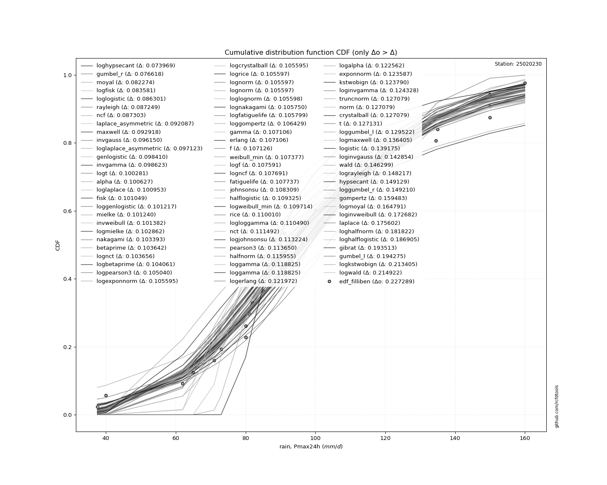
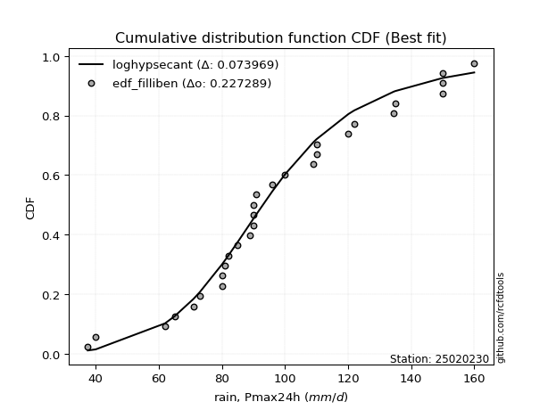
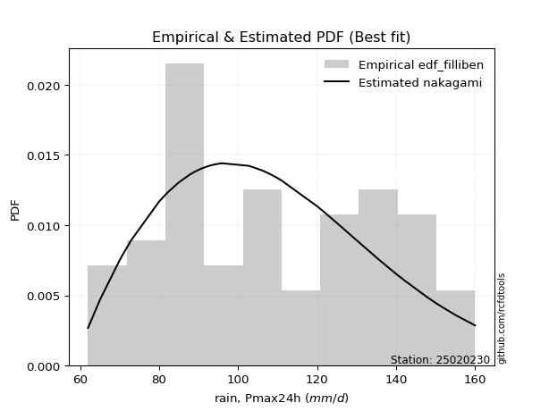

<div align="center">


</div>

# PMP Station (rain, Pmax24h): 25020230

Probable Maximum Precipitation (PMP) is the greatest amount of rainfall for a specific duration that is meteorologically possible for a given location, acting as a "worst-case" scenario for extreme storms, crucial for designing safety-critical infrastructure like bridges, river deviations, dams, spillways, and nuclear plants to prevent catastrophic failure. PMP is calculated by hydrologists using meteorological data to determine the upper limit of extreme rainfall, often leading to the Probable Maximum Flood (PMF) for flood control design, and is increasingly being studied for climate change impacts.

<div align="center">

</img>

</div>


## A. General information


### 1. General running parameters

• app_version: _v20251228_. • runtime: _2025-12-30 09:59:31.707837_. • Python version: _3.14.0_. • SciPy version: _1.16.3_. • Pandas version: _2.3.3_. • NumPy version: _2.3.5_. • Stations dataset (station_dataset_file): _dataset/pmax24h_in/conventional_test.csv_. • Stations catalog (station_catalog_file): _dataset/CNE_IDEAM.xls_. • Minimum year to eval til year_max (date_min): _1900_. • Maximum year to eval since year_min (date_max): _2024_. • Creates, save and include plots into reports (create_plot): _True_. • Plot only fit distributions with Δo > Δ (plot_only_fit): _True_. • Eval low extreme values, if False, evaluates high extreme values (low_extreme): _False_. • Eval every SciPy distribution as logarithmic (pdist_logarithmic_on): _True_. • Standard deviation normalized (ddof): _1.0_. • Return periods to eval in years (Tr): _[2, 2.33, 5, 10, 15, 20, 25, 50, 75, 100, 200, 250, 500, 750, 1000]_. • Minimum data sample per station, 0 means any (minimum_sample): _5_. • Z-Score maximum threshold to adjust a value, 0 means disable (zscore_max): _3.5_. • Z-Score minimum threshold to adjust a value, 0 means disable (zscore_min): _-2.5_. • Avoid zeros, e.g. rain = 0 (avoid_zeros): _True_. • Avoid null values (avoid_nans): _True_. [:file_folder:Dataset file.](../../dataset/pmax24h_in/conventional_test.csv)

> Delta Degrees of Freedom (DDOF): is a parameter used in the formulas for calculating variance and standard deviation. When ddof=0, the divisor is $N$ (the total number of observations) and this is used when your data set is the entire population. When ddof=1, the divisor is $N-1$ and this is used when your data set is a sample drawn from a larger population. Using $N-1$ provides an unbiased estimate of the population variance (known as Bessel´s correction).


### 2. Station info and location

|   id |   CODIGO | NOMBRE               | CATEGORIA     | TECNOLOGIA   | ESTADO   | FECHA_INSTALACION   |   FECHA_SUSPENSION |   ALTITUD |   LATITUD |   LONGITUD | DEPARTAMENTO   | MUNICIPIO           | AREA_OPERATIVA                                         | ENTIDAD                                                     | AREA_HIDROGRAFICA   | ZONA_HIDROGRAFICA   | SUBZONA_HIDROGRAFICA   |   CORRIENTE | Catalogo   |   Version |
|-----:|---------:|:---------------------|:--------------|:-------------|:---------|:--------------------|-------------------:|----------:|----------:|-----------:|:---------------|:--------------------|:-------------------------------------------------------|:------------------------------------------------------------|:--------------------|:--------------------|:-----------------------|------------:|:-----------|----------:|
|    0 | 25020230 | LA JAGUA  [25020230] | Pluviométrica | Convencional | Activa   | 15/08/1963          |                nan |       170 |   9.56217 |   -73.3395 | Cesar          | La Jagua De Ibirico | Area Operativa 05 - Magdalena-Cesar-Guajira-San Andrés | INSTITUTO DE HIDROLOGIA METEOROLOGIA Y ESTUDIOS AMBIENTALES | Magdalena Cauca     | Cesar               | Bajo Cesar             |         nan | CNE_IDEAM  |  20251226 |

<div align="center">

Dynamic map: [:earth_americas:Google](http://maps.google.com/maps?q=9.562166667,-73.33947222) [:earth_americas:OSM](https://www.openstreetmap.org/#map=18/9.562166667/-73.33947222&layers=P) [:earth_americas:Bing](https://www.bing.com/maps?cp=9.562166667~-73.33947222&lvl=18) [:earth_americas:Apple](https://maps.apple.com/frame?center=9.562166667%2C-73.33947222&span=0.003%2C0.006)

</div>


<div align="center">

```geojson
{
  "type": "Feature",
  "geometry": {
    "type": "Point", 
    "coordinates": [-73.33947222, 9.562166667]
  }, 
  "properties": {
    "Name": "25020230"
  }
}
```

</div>


### 3. Discrete values table and plot

<div align="center">

|               |           0 |          1 |           2 |           3 |          4 |          5 |          6 |           7 |          8 |           9 |          10 |         11 |         12 |          13 |         14 |         15 |           16 |         17 |         18 |          19 |         20 |         21 |          22 |          23 |          24 |          25 |          26 |         27 |         28 |          29 |          30 |          31 |          32 |          33 |         34 |            35 |         36 |          37 |          38 |         39 |         40 |         41 |          42 |         43 |         44 |         45 |         46 |            47 |         48 |         49 |          50 |         51 |          52 |          53 |        54 |          55 |          56 |
|:--------------|------------:|-----------:|------------:|------------:|-----------:|-----------:|-----------:|------------:|-----------:|------------:|------------:|-----------:|-----------:|------------:|-----------:|-----------:|-------------:|-----------:|-----------:|------------:|-----------:|-----------:|------------:|------------:|------------:|------------:|------------:|-----------:|-----------:|------------:|------------:|------------:|------------:|------------:|-----------:|--------------:|-----------:|------------:|------------:|-----------:|-----------:|-----------:|------------:|-----------:|-----------:|-----------:|-----------:|--------------:|-----------:|-----------:|------------:|-----------:|------------:|------------:|----------:|------------:|------------:|
| Date          | 1963        | 1964       | 1965        | 1966        | 1968       | 1969       | 1970       | 1971        | 1972       | 1973        | 1974        | 1975       | 1976       | 1977        | 1978       | 1979       | 1980         | 1981       | 1982       | 1983        | 1984       | 1985       | 1986        | 1987        | 1988        | 1989        | 1990        | 1991       | 1992       | 1993        | 1994        | 1995        | 1996        | 1997        | 1998       | 1999          | 2000       | 2001        | 2002        | 2003       | 2004       | 2005       | 2006        | 2007       | 2008       | 2009       | 2010       | 2011          | 2012       | 2013       | 2014        | 2015       | 2017        | 2018        | 2019      | 2020        | 2021        |
| Value         |   90        |  140       |  106        |  107        |  122       |   82       |   93.6267  |  125        |   80       |  130        |  135        |  139       |   80       |  135        |  142       |  151       |  108         |  150       |  148       |  120        |  155       |  122       |  136        |   87.888    |   95        |   85        |   89        |   65       |   62       |   90        |  135        |   90        |  102.737    |   85        |   71       |  110          |  122       |  134.5      |  109        |   80       |   80       |   92.7725  |   90        |  150       |  160       |  150       |   91       |  110          |   73       |   82       |   96        |  150       |  120.1      |  130        |   70      |  111        |   89        |
| Value_initial |   90        |  140       |  106        |  107        |  122       |   82       |   93.6267  |  125        |   80       |  130        |  135        |  139       |   80       |  135        |  142       |  151       |  108         |  150       |  148       |  120        |  155       |  122       |  136        |   87.888    |   95        |   85        |   89        |   65       |   62       |   90        |  135        |   90        |  102.737    |   85        |   71       |  110          |  122       |  134.5      |  109        |   80       |   80       |   92.7725  |   90        |  150       |  160       |  150       |   91       |  110          |   73       |   82       |   96        |  150       |  120.1      |  130        |   70      |  111        |   89        |
| count         |   57        |   57       |   57        |   57        |   57       |   57       |   57       |   57        |   57       |   57        |   57        |   57       |   57       |   57        |   57       |   57       |   57         |   57       |   57       |   57        |   57       |   57       |   57        |   57        |   57        |   57        |   57        |   57       |   57       |   57        |   57        |   57        |   57        |   57        |   57       |   57          |   57       |   57        |   57        |   57       |   57       |   57       |   57        |   57       |   57       |   57       |   57       |   57          |   57       |   57       |   57        |   57       |   57        |   57        |   57      |   57        |   57        |
| mean          |  109.73     |  109.73    |  109.73     |  109.73     |  109.73    |  109.73    |  109.73    |  109.73     |  109.73    |  109.73     |  109.73     |  109.73    |  109.73    |  109.73     |  109.73    |  109.73    |  109.73      |  109.73    |  109.73    |  109.73     |  109.73    |  109.73    |  109.73     |  109.73     |  109.73     |  109.73     |  109.73     |  109.73    |  109.73    |  109.73     |  109.73     |  109.73     |  109.73     |  109.73     |  109.73    |  109.73       |  109.73    |  109.73     |  109.73     |  109.73    |  109.73    |  109.73    |  109.73     |  109.73    |  109.73    |  109.73    |  109.73    |  109.73       |  109.73    |  109.73    |  109.73     |  109.73    |  109.73     |  109.73     |  109.73   |  109.73     |  109.73     |
| std           |   27.1437   |   27.1437  |   27.1437   |   27.1437   |   27.1437  |   27.1437  |   27.1437  |   27.1437   |   27.1437  |   27.1437   |   27.1437   |   27.1437  |   27.1437  |   27.1437   |   27.1437  |   27.1437  |   27.1437    |   27.1437  |   27.1437  |   27.1437   |   27.1437  |   27.1437  |   27.1437   |   27.1437   |   27.1437   |   27.1437   |   27.1437   |   27.1437  |   27.1437  |   27.1437   |   27.1437   |   27.1437   |   27.1437   |   27.1437   |   27.1437  |   27.1437     |   27.1437  |   27.1437   |   27.1437   |   27.1437  |   27.1437  |   27.1437  |   27.1437   |   27.1437  |   27.1437  |   27.1437  |   27.1437  |   27.1437     |   27.1437  |   27.1437  |   27.1437   |   27.1437  |   27.1437   |   27.1437   |   27.1437 |   27.1437   |   27.1437   |
| zscore        |   -0.726881 |    1.11517 |   -0.137426 |   -0.100585 |    0.45203 |   -1.02161 |   -0.59327 |    0.562553 |   -1.09529 |    0.746757 |    0.930962 |    1.07833 |   -1.09529 |    0.930962 |    1.18885 |    1.52042 |   -0.0637439 |    1.48358 |    1.40989 |    0.378348 |    1.66778 |    0.45203 |    0.967803 |   -0.804691 |   -0.542677 |   -0.911086 |   -0.763722 |   -1.64791 |   -1.75843 |   -0.726881 |    0.930962 |   -0.726881 |   -0.257643 |   -0.911086 |   -1.42686 |    0.00993801 |    0.45203 |    0.912542 |   -0.026903 |   -1.09529 |   -1.09529 |   -0.62474 |   -0.726881 |    1.48358 |    1.85199 |    1.48358 |   -0.69004 |    0.00993801 |   -1.35318 |   -1.02161 |   -0.505836 |    1.48358 |    0.382032 |    0.746757 |   -1.4637 |    0.046779 |   -0.763722 |


</div>


<div align="center">

</img>

</div>


> The initial value (value_initial) correspond to the initial obtained or null completed value, and value (value) is adjusted only when the initial value is outside the valid range definite through the Z-Score value. If Z-Score is active, values out of range or outliers are replaced with the station mean value


### 4. Active continuous probability distributions from SciPy (44 of 104 available)

[scipy.stats](https://docs.scipy.org/doc/scipy/reference/stats.html) is a Python´s powerful submodule within the SciPy library for comprehensive statistical analysis, offering over 130 probability distributions (like Normal, Poisson), functions for descriptive stats (mean, variance), hypothesis testing (t-tests, chi-square), random variable generation, and statistical tests, making it essential for data science, modeling, and research. It provides tools to explore, model, and draw conclusions from data efficiently, working seamlessly with NumPy.

<div align="center">

|   id | p_dist             |   n_parameter | fit_method   | label                                                                       | active   | ref                                                                                                        |
|-----:|:-------------------|--------------:|:-------------|:----------------------------------------------------------------------------|:---------|:-----------------------------------------------------------------------------------------------------------|
|    0 | alpha              |             3 | MLE          | Alpha                                                                       | True     | [:mortar_board:](https://docs.scipy.org/doc/scipy/reference/generated/scipy.stats.alpha.html)              |
|    1 | betaprime          |             4 | MLE          | Beta prime                                                                  | True     | [:mortar_board:](https://docs.scipy.org/doc/scipy/reference/generated/scipy.stats.betaprime.html)          |
|    2 | chi2               |             3 | MLE          | Chi²                                                                        | True     | [:mortar_board:](https://docs.scipy.org/doc/scipy/reference/generated/scipy.stats.chi2.html)               |
|    3 | crystalball        |             4 | MLE          | Crystalball                                                                 | True     | [:mortar_board:](https://docs.scipy.org/doc/scipy/reference/generated/scipy.stats.crystalball.html)        |
|    4 | erlang             |             3 | MLE          | Erlang                                                                      | True     | [:mortar_board:](https://docs.scipy.org/doc/scipy/reference/generated/scipy.stats.erlang.html)             |
|    5 | expon              |             2 | MLE          | Exponential                                                                 | True     | [:mortar_board:](https://docs.scipy.org/doc/scipy/reference/generated/scipy.stats.expon.html)              |
|    6 | exponnorm          |             3 | MLE          | Exponentially modified Normal                                               | True     | [:mortar_board:](https://docs.scipy.org/doc/scipy/reference/generated/scipy.stats.exponnorm.html)          |
|    7 | f                  |             4 | MLE          | F                                                                           | True     | [:mortar_board:](https://docs.scipy.org/doc/scipy/reference/generated/scipy.stats.f.html)                  |
|    8 | fatiguelife        |             3 | MLE          | Fatigue-life (Birnbaum-Saunders)                                            | True     | [:mortar_board:](https://docs.scipy.org/doc/scipy/reference/generated/scipy.stats.fatiguelife.html)        |
|    9 | fisk               |             3 | MLE          | Fisk                                                                        | True     | [:mortar_board:](https://docs.scipy.org/doc/scipy/reference/generated/scipy.stats.fisk.html)               |
|   10 | gamma              |             3 | MLE          | Gamma                                                                       | True     | [:mortar_board:](https://docs.scipy.org/doc/scipy/reference/generated/scipy.stats.gamma.html)              |
|   11 | genexpon           |             5 | MLE          | Generalized exponential                                                     | True     | [:mortar_board:](https://docs.scipy.org/doc/scipy/reference/generated/scipy.stats.genexpon.html)           |
|   12 | genlogistic        |             3 | MLE          | Generalized logistic                                                        | True     | [:mortar_board:](https://docs.scipy.org/doc/scipy/reference/generated/scipy.stats.genlogistic.html)        |
|   13 | gibrat             |             2 | MM           | Gibrat                                                                      | True     | [:mortar_board:](https://docs.scipy.org/doc/scipy/reference/generated/scipy.stats.gibrat.html)             |
|   14 | gompertz           |             3 | MLE          | Gompertz (or truncated Gumbel)                                              | True     | [:mortar_board:](https://docs.scipy.org/doc/scipy/reference/generated/scipy.stats.gompertz.html)           |
|   15 | gumbel_l           |             2 | MM           | Gumbel Left Skew                                                            | True     | [:mortar_board:](https://docs.scipy.org/doc/scipy/reference/generated/scipy.stats.gumbel_l.html)           |
|   16 | gumbel_r           |             2 | MM           | Gumbel Right Skew                                                           | True     | [:mortar_board:](https://docs.scipy.org/doc/scipy/reference/generated/scipy.stats.gumbel_r.html)           |
|   17 | halflogistic       |             2 | MM           | Half-logistic                                                               | True     | [:mortar_board:](https://docs.scipy.org/doc/scipy/reference/generated/scipy.stats.halflogistic.html)       |
|   18 | halfnorm           |             2 | MM           | Half Normal                                                                 | True     | [:mortar_board:](https://docs.scipy.org/doc/scipy/reference/generated/scipy.stats.halfnorm.html)           |
|   19 | hypsecant          |             2 | MM           | hyperbolic secant                                                           | True     | [:mortar_board:](https://docs.scipy.org/doc/scipy/reference/generated/scipy.stats.hypsecant.html)          |
|   20 | invgamma           |             3 | MLE          | Inverted gamma                                                              | True     | [:mortar_board:](https://docs.scipy.org/doc/scipy/reference/generated/scipy.stats.invgamma.html)           |
|   21 | invgauss           |             3 | MLE          | Inverse Gaussian                                                            | True     | [:mortar_board:](https://docs.scipy.org/doc/scipy/reference/generated/scipy.stats.invgauss.html)           |
|   22 | invweibull         |             3 | MLE          | Inverted Weibull                                                            | True     | [:mortar_board:](https://docs.scipy.org/doc/scipy/reference/generated/scipy.stats.invweibull.html)         |
|   23 | johnsonsu          |             4 | MLE          | Johnson Su                                                                  | True     | [:mortar_board:](https://docs.scipy.org/doc/scipy/reference/generated/scipy.stats.johnsonsu.html)          |
|   24 | kstwobign          |             2 | MLE          | Limiting distribution of scaled Kolmogorov-Smirnov two-sided test statistic | True     | [:mortar_board:](https://docs.scipy.org/doc/scipy/reference/generated/scipy.stats.kstwobign.html)          |
|   25 | laplace            |             2 | MM           | Laplace                                                                     | True     | [:mortar_board:](https://docs.scipy.org/doc/scipy/reference/generated/scipy.stats.laplace.html)            |
|   26 | laplace_asymmetric |             3 | MLE          | Asymmetric Laplace                                                          | True     | [:mortar_board:](https://docs.scipy.org/doc/scipy/reference/generated/scipy.stats.laplace_asymmetric.html) |
|   27 | loggamma           |             3 | MLE          | Log gamma                                                                   | True     | [:mortar_board:](https://docs.scipy.org/doc/scipy/reference/generated/scipy.stats.loggamma.html)           |
|   28 | logistic           |             2 | MM           | Logistic (or Sech-squared)                                                  | True     | [:mortar_board:](https://docs.scipy.org/doc/scipy/reference/generated/scipy.stats.logistic.html)           |
|   29 | lognorm            |             3 | MLE          | Log Normal                                                                  | True     | [:mortar_board:](https://docs.scipy.org/doc/scipy/reference/generated/scipy.stats.lognorm.html)            |
|   30 | maxwell            |             2 | MM           | Maxwell                                                                     | True     | [:mortar_board:](https://docs.scipy.org/doc/scipy/reference/generated/scipy.stats.maxwell.html)            |
|   31 | mielke             |             4 | MLE          | Mielke Beta-Kappa / Dagum                                                   | True     | [:mortar_board:](https://docs.scipy.org/doc/scipy/reference/generated/scipy.stats.mielke.html)             |
|   32 | moyal              |             2 | MM           | Moyal                                                                       | True     | [:mortar_board:](https://docs.scipy.org/doc/scipy/reference/generated/scipy.stats.moyal.html)              |
|   33 | nakagami           |             3 | MLE          | Nakagami                                                                    | True     | [:mortar_board:](https://docs.scipy.org/doc/scipy/reference/generated/scipy.stats.nakagami.html)           |
|   34 | ncf                |             5 | MLE          | Non-central F distribution                                                  | True     | [:mortar_board:](https://docs.scipy.org/doc/scipy/reference/generated/scipy.stats.ncf.html)                |
|   35 | nct                |             4 | MLE          | Non-central Student’s t                                                     | True     | [:mortar_board:](https://docs.scipy.org/doc/scipy/reference/generated/scipy.stats.nct.html)                |
|   36 | norm               |             2 | MM           | Normal                                                                      | True     | [:mortar_board:](https://docs.scipy.org/doc/scipy/reference/generated/scipy.stats.norm.html)               |
|   37 | pearson3           |             3 | MM           | Pearson type III                                                            | True     | [:mortar_board:](https://docs.scipy.org/doc/scipy/reference/generated/scipy.stats.pearson3.html)           |
|   38 | rayleigh           |             2 | MM           | Rayleigh                                                                    | True     | [:mortar_board:](https://docs.scipy.org/doc/scipy/reference/generated/scipy.stats.rayleigh.html)           |
|   39 | rice               |             3 | MLE          | Rice                                                                        | True     | [:mortar_board:](https://docs.scipy.org/doc/scipy/reference/generated/scipy.stats.rice.html)               |
|   40 | t                  |             3 | MLE          | Student’s t                                                                 | True     | [:mortar_board:](https://docs.scipy.org/doc/scipy/reference/generated/scipy.stats.t.html)                  |
|   41 | truncnorm          |             4 | MLE          | Truncated normal                                                            | True     | [:mortar_board:](https://docs.scipy.org/doc/scipy/reference/generated/scipy.stats.truncnorm.html)          |
|   42 | wald               |             2 | MM           | Wald                                                                        | True     | [:mortar_board:](https://docs.scipy.org/doc/scipy/reference/generated/scipy.stats.wald.html)               |
|   43 | weibull_min        |             3 | MLE          | Weibull minimum                                                             | True     | [:mortar_board:](https://docs.scipy.org/doc/scipy/reference/generated/scipy.stats.weibull_min.html)        |

</div>

> **n_parameter:** # arguments & localization & scale.
>
> **Fit methods:** (MLE) maximum likelihood, (MM) L-moments.
>
>**Inactive:** foldnorm, gennorm, norminvgauss, powernorm, powerlognorm, skewnorm, genextreme, anglit, arcsine, argus, beta, bradford, burr, burr12, cauchy, cosine, halfcauchy, foldcauchy, skewcauchy, wrapcauchy, dgamma, gengamma, exponweib, exponpow, truncexpon, gausshyper, genhalflogistic, genhyperbolic, geninvgauss, halfgennorm, johnsonsb, kappa4, kappa3, ksone, kstwo, loglaplace, levy, levy_l, levy_stable, ncx2, pareto, genpareto, truncpareto, lomax, powerlaw, rdist, rel_breitwigner, recipinvgauss, semicircular, studentized_range, trapezoid, triang, truncweibull_min, tukeylambda, uniform, loguniform, vonmises, vonmises_line, weibull_max, dweibull, 


## B. Probability distributions vs. Empirical distributions

A continuous probability distribution (CPD) describes probabilities for variables that can take any value within a range (like rain any time), unlike discrete variables with specific outcomes (like temperature). It uses a Probability Density Function (PDF), a curve where the total area under it equals 1, and the probability of the variable falling within an interval (a to b) is found by calculating the area under the curve between those points. A key feature is that the probability of hitting any single exact value is zero, so probabilities are always expressed for ranges, e.g., $P(a ≤ X ≤ b)$.

<div align="center">

Distributions parameters from station values
|    |   station | p_dist                |   n |               loc |            scale | shape                  | shape1                | shape2                | shape3   |
|---:|----------:|:----------------------|----:|------------------:|-----------------:|:-----------------------|:----------------------|:----------------------|:---------|
|  0 |  25020230 | alpha                 |  57 |    -225.513       |   4181.98        | 12.55377381022545      |                       |                       |          |
|  1 |  25020230 | betaprime             |  57 |      -7.49043     |      0.598626    | 3392.0507829742637     | 18.30857530202067     |                       |          |
|  2 |  25020230 | chi2                  |  57 |      38.1102      |      5.46549     | 13.104051391920517     |                       |                       |          |
|  3 |  25020230 | crystalball           |  57 |     109.73        |     26.9045      | 7480.651998547119      | 9290.898829555521     |                       |          |
|  4 |  25020230 | erlang                |  57 |     -45.3614      |      4.64888     | 33.348007624923596     |                       |                       |          |
|  5 |  25020230 | expon                 |  57 |      62           |     47.7302      |                        |                       |                       |          |
|  6 |  25020230 | exponnorm             |  57 |     106.125       |     26.662       | 0.13523190800699247    |                       |                       |          |
|  7 |  25020230 | f                     |  57 |      38.096       |     71.5829      | 13.101441150859047     | 23913.93990124086     |                       |          |
|  8 |  25020230 | fatiguelife           |  57 |     -13.5985      |    120.344       | 0.2227155083767246     |                       |                       |          |
|  9 |  25020230 | fisk                  |  57 |      -0.707291    |    107.498       | 6.61369677845229       |                       |                       |          |
| 10 |  25020230 | gamma                 |  57 |     -32.1494      |      5.05771     | 28.02640434970789      |                       |                       |          |
| 11 |  25020230 | genexpon              |  57 |      61.9999      |      1.43377     | 0.028436080960455298   | 0.0016511090564041422 | 1.4561169805405139    |          |
| 12 |  25020230 | genlogistic           |  57 |     -29.5893      |     23.3793      | 221.11937407008838     |                       |                       |          |
| 13 |  25020230 | gibrat                |  57 |      89.2055      |     12.4489      |                        |                       |                       |          |
| 14 |  25020230 | gompertz              |  57 |      85           |      5.04102     | 6.944779290878034e-06  |                       |                       |          |
| 15 |  25020230 | gumbel_l              |  57 |     121.839       |     20.9774      |                        |                       |                       |          |
| 16 |  25020230 | gumbel_r              |  57 |      97.6218      |     20.9774      |                        |                       |                       |          |
| 17 |  25020230 | halflogistic          |  57 |      77.8421      |     23.0024      |                        |                       |                       |          |
| 18 |  25020230 | halfnorm              |  57 |      74.1192      |     44.6318      |                        |                       |                       |          |
| 19 |  25020230 | hypsecant             |  57 |     109.73        |     17.128       |                        |                       |                       |          |
| 20 |  25020230 | invgamma              |  57 |    -102.987       |  13100.9         | 62.573646480216496     |                       |                       |          |
| 21 |  25020230 | invgauss              |  57 |      18.882       |    909.412       | 0.09969293155920558    |                       |                       |          |
| 22 |  25020230 | invweibull            |  57 |      -5.25486e+06 |      5.25496e+06 | 224151.56954880798     |                       |                       |          |
| 23 |  25020230 | johnsonsu             |  57 |     -33.2426      |     32.3688      | -11.75334097591221     | 5.405546026668702     |                       |          |
| 24 |  25020230 | kstwobign             |  57 |      14.3897      |    109.06        |                        |                       |                       |          |
| 25 |  25020230 | laplace               |  57 |     109.73        |     19.0244      |                        |                       |                       |          |
| 26 |  25020230 | laplace_asymmetric    |  57 |      89           |     18.7716      | 0.5901512980942057     |                       |                       |          |
| 27 |  25020230 | loggamma              |  57 |   -5488.32        |    820.148       | 921.6595185300389      |                       |                       |          |
| 28 |  25020230 | logistic              |  57 |     109.73        |     14.8332      |                        |                       |                       |          |
| 29 |  25020230 | lognorm               |  57 |     -35.0611      |    142.284       | 0.18762413417312282    |                       |                       |          |
| 30 |  25020230 | maxwell               |  57 |      45.9778      |     39.9509      |                        |                       |                       |          |
| 31 |  25020230 | mielke                |  57 |    -984.391       |    888.539       | 364706.80446847633     | 45.87660588049963     |                       |          |
| 32 |  25020230 | moyal                 |  57 |      94.3445      |     12.1113      |                        |                       |                       |          |
| 33 |  25020230 | nakagami              |  57 |      58.9238      |     57.4904      | 0.913050217274604      |                       |                       |          |
| 34 |  25020230 | ncf                   |  57 |      -2.93875     |      0.000112446 | 0.000649608728091696   | 37.94356184650016     | 617.5551853066004     |          |
| 35 |  25020230 | nct                   |  57 |      -1.3065      |     23.3649      | 40.22967951763977      | 4.660169498430072     |                       |          |
| 36 |  25020230 | norm                  |  57 |     109.73        |     26.9045      |                        |                       |                       |          |
| 37 |  25020230 | pearson3              |  57 |     109.73        |     26.9045      | 0.1586412321307889     |                       |                       |          |
| 38 |  25020230 | rayleigh              |  57 |      58.2603      |     41.0671      |                        |                       |                       |          |
| 39 |  25020230 | rice                  |  57 |      56.5013      |     33.5647      | 1.075863096931799      |                       |                       |          |
| 40 |  25020230 | t                     |  57 |     109.733       |     26.9021      | 976423.3469146676      |                       |                       |          |
| 41 |  25020230 | truncnorm             |  57 |     109.73        |     26.9045      | -5846.469959638338     | 435.47636316300515    |                       |          |
| 42 |  25020230 | wald                  |  57 |      82.8257      |     26.9045      |                        |                       |                       |          |
| 43 |  25020230 | weibull_min           |  57 |      55.9189      |     60.7961      | 2.1151674312476816     |                       |                       |          |
| 44 |  25020230 | logalpha              |  57 |      -3.57411     |    267.948       | 32.55137878345373      |                       |                       |          |
| 45 |  25020230 | logbetaprime          |  57 |      -0.996816    |    171.839       | 520.3339584248147      | 15784.736054823701    |                       |          |
| 46 |  25020230 | logchi2               |  57 |       4.12713     |      0.940618    | 1.125897535504836      |                       |                       |          |
| 47 |  25020230 | logcrystalball        |  57 |       4.66706     |      0.251198    | 4.944451762058258      | 72.13123180883593     |                       |          |
| 48 |  25020230 | logerlang             |  57 |      -0.919666    |      0.011468    | 487.1141345573001      |                       |                       |          |
| 49 |  25020230 | logexpon              |  57 |       4.12713     |      0.539926    |                        |                       |                       |          |
| 50 |  25020230 | logexponnorm          |  57 |       4.66678     |      0.2512      | 0.0011300648600139135  |                       |                       |          |
| 51 |  25020230 | logf                  |  57 |     -20.4224      |     25.088       | 49371.58038117879      | 32876.513466653036    |                       |          |
| 52 |  25020230 | logfatiguelife        |  57 |     -30.99        |     35.657       | 0.0070482090196320735  |                       |                       |          |
| 53 |  25020230 | logfisk               |  57 | -490357           | 490362           | 3221094.7084500827     |                       |                       |          |
| 54 |  25020230 | loggamma              |  57 |      -0.627019    |      0.012062    | 438.8761414204714      |                       |                       |          |
| 55 |  25020230 | loggenexpon           |  57 |       4.10462     |      0.00596322  | 0.00015828499745059192 | 2.650818284313421     | 6.961643833114026e-05 |          |
| 56 |  25020230 | loggenlogistic        |  57 |       4.57644     |      0.170073    | 1.4506767218689074     |                       |                       |          |
| 57 |  25020230 | loggibrat             |  57 |       4.47545     |      0.116218    |                        |                       |                       |          |
| 58 |  25020230 | loggompertz           |  57 |       4.12713     |      0.263019    | 0.09368554265903678    |                       |                       |          |
| 59 |  25020230 | loggumbel_l           |  57 |       4.78011     |      0.195859    |                        |                       |                       |          |
| 60 |  25020230 | loggumbel_r           |  57 |       4.55401     |      0.195859    |                        |                       |                       |          |
| 61 |  25020230 | loghalflogistic       |  57 |       4.36931     |      0.214781    |                        |                       |                       |          |
| 62 |  25020230 | loghalfnorm           |  57 |       4.33452     |      0.416768    |                        |                       |                       |          |
| 63 |  25020230 | loghypsecant          |  57 |       4.66706     |      0.159919    |                        |                       |                       |          |
| 64 |  25020230 | loginvgamma           |  57 |      -4.08582     |  10507.2         | 1201.446431183173      |                       |                       |          |
| 65 |  25020230 | loginvgauss           |  57 |       2.60976     |    128.765       | 0.01597508609174022    |                       |                       |          |
| 66 |  25020230 | loginvweibull         |  57 |      -1.94593e+07 |      1.94593e+07 | 80925830.16159369      |                       |                       |          |
| 67 |  25020230 | logjohnsonsu          |  57 |       6.09183     |      0.0624841   | 21.409389512902422     | 5.626996434675528     |                       |          |
| 68 |  25020230 | logkstwobign          |  57 |       3.67807     |      1.13261     |                        |                       |                       |          |
| 69 |  25020230 | loglaplace            |  57 |       4.66706     |      0.177625    |                        |                       |                       |          |
| 70 |  25020230 | loglaplace_asymmetric |  57 |       4.70048     |      0.216976    | 1.079947040416272      |                       |                       |          |
| 71 |  25020230 | logloggamma           |  57 |       3.37102     |      0.667756    | 7.4589535723649085     |                       |                       |          |
| 72 |  25020230 | loglogistic           |  57 |       4.66706     |      0.138494    |                        |                       |                       |          |
| 73 |  25020230 | loglognorm            |  57 |  -62806.3         |  62811           | 3.999293296260097e-06  |                       |                       |          |
| 74 |  25020230 | logmaxwell            |  57 |       4.07182     |      0.37301     |                        |                       |                       |          |
| 75 |  25020230 | logmielke             |  57 |  -13058.4         |  13063.1         | 78300.99971318009      | 90977.35637938984     |                       |          |
| 76 |  25020230 | logmoyal              |  57 |       4.52341     |      0.11308     |                        |                       |                       |          |
| 77 |  25020230 | lognakagami           |  57 |     -36.6034      |     41.2714      | 6731.117210021845      |                       |                       |          |
| 78 |  25020230 | logncf                |  57 |     -51.3299      |     49.8786      | 176502.11654327024     | 221177.0432250729     | 21650.842363825657    |          |
| 79 |  25020230 | lognct                |  57 |      -0.048395    |      0.103456    | 208.79255668166093     | 45.414815369047886    |                       |          |
| 80 |  25020230 | lognorm               |  57 |       4.66706     |      0.2512      |                        |                       |                       |          |
| 81 |  25020230 | logpearson3           |  57 |       4.66706     |      0.251199    | -0.15728335335894333   |                       |                       |          |
| 82 |  25020230 | lograyleigh           |  57 |       4.18648     |      0.383443    |                        |                       |                       |          |
| 83 |  25020230 | logrice               |  57 |       4.05465     |      0.276072    | 1.9361509068772373     |                       |                       |          |
| 84 |  25020230 | logt                  |  57 |       4.66706     |      0.251194    | 21156.71060655824      |                       |                       |          |
| 85 |  25020230 | logtruncnorm          |  57 |      -0.0782767   |      1.5683      | 2.6815068926198578     | 3.286007970068738     |                       |          |
| 86 |  25020230 | logwald               |  57 |       4.41588     |      0.251177    |                        |                       |                       |          |
| 87 |  25020230 | logweibull_min        |  57 |       3.79794     |      0.961741    | 3.9987687239420846     |                       |                       |          |

</div>

> **loc** (Location parameter): This shifts the distribution along the x-axis. For many common distributions, like the normal (Gaussian) distribution, loc represents the mean $μ$. For others, like the uniform distribution, it might represent the minimum value, or for the beta distribution, the left end of the support interval.
>
> **scale** (Scale parameter): This determines the width or spread of the distribution. For the normal distribution, scale represents the standard deviation $σ$. For a uniform distribution, it defines the length of the interval (from $loc$ to $loc + scale$).
>
> **shape** (Shape parameters): Refers to parameters that define the specific form of a probability distribution, distinct from its location (loc) and scale (scale). These parameters are required arguments for most distribution functions. For example, a normal (Gaussian) distribution is fully defined by its location (mean) and scale (standard deviation), so it has no specific shape parameters beyond loc and scale. However, other distributions have intrinsic properties that need specification, as Gamma distribution that takes a shape parameter, often named $a$ or $alpha$.


### 0. Cumulative distribution values - CDF (88 evaluated)

Cumulative Distribution Function (CDF), denoted as $F$<sub>$X$</sub>$(x)$, is a function that gives the probability that a random variable $X$ will take a value less than or equal to a specific value, $x$ (i.e., $(P(X≥x)$. It essentially "accumulates" probabilities from a given point up to the far right (positive infinity), providing a complete picture of the distribution´s probabilities for both discrete (like rain) and continuous (like temperature) variables, helping to find probabilities over ranges or above certain values.

<div align="center">

CDF ordered by x ascending and calculating $log(f(x))$ separately
|   id |   Station |   date |        x |   count |   mean |     std |      zscore |   Value_initial |   station |   m |     alpha |   alpha_pdf |   betaprime |   betaprime_pdf |      chi2 |   chi2_pdf |   crystalball |   crystalball_pdf |    erlang |   erlang_pdf |     expon |   expon_pdf |   exponnorm |   exponnorm_pdf |         f |      f_pdf |   fatiguelife |   fatiguelife_pdf |      fisk |   fisk_pdf |     gamma |   gamma_pdf |    genexpon |   genexpon_pdf |   genlogistic |   genlogistic_pdf |     gibrat |   gibrat_pdf |    gompertz |   gompertz_pdf |   gumbel_l |   gumbel_l_pdf |   gumbel_r |   gumbel_r_pdf |   halflogistic |   halflogistic_pdf |   halfnorm |   halfnorm_pdf |   hypsecant |   hypsecant_pdf |   invgamma |   invgamma_pdf |   invgauss |   invgauss_pdf |   invweibull |   invweibull_pdf |   johnsonsu |   johnsonsu_pdf |   kstwobign |   kstwobign_pdf |   laplace |   laplace_pdf |   laplace_asymmetric |   laplace_asymmetric_pdf |   loggamma |   loggamma_pdf |   logistic |   logistic_pdf |   lognorm |   lognorm_pdf |   maxwell |   maxwell_pdf |   mielke |   mielke_pdf |       moyal |   moyal_pdf |   nakagami |   nakagami_pdf |       ncf |    ncf_pdf |       nct |    nct_pdf |      norm |   norm_pdf |   pearson3 |   pearson3_pdf |   rayleigh |   rayleigh_pdf |       rice |   rice_pdf |         t |      t_pdf |   truncnorm |   truncnorm_pdf |       wald |   wald_pdf |   weibull_min |   weibull_min_pdf |   logalpha |   logalpha_pdf |   logbetaprime |   logbetaprime_pdf |     logchi2 |   logchi2_pdf |   logcrystalball |   logcrystalball_pdf |   logerlang |   logerlang_pdf |   logexpon |   logexpon_pdf |   logexponnorm |   logexponnorm_pdf |      logf |   logf_pdf |   logfatiguelife |   logfatiguelife_pdf |   logfisk |   logfisk_pdf |   loggenexpon |   loggenexpon_pdf |   loggenlogistic |   loggenlogistic_pdf |   loggibrat |   loggibrat_pdf |   loggompertz |   loggompertz_pdf |   loggumbel_l |   loggumbel_l_pdf |   loggumbel_r |   loggumbel_r_pdf |   loghalflogistic |   loghalflogistic_pdf |   loghalfnorm |   loghalfnorm_pdf |   loghypsecant |   loghypsecant_pdf |   loginvgamma |   loginvgamma_pdf |   loginvgauss |   loginvgauss_pdf |   loginvweibull |   loginvweibull_pdf |   logjohnsonsu |   logjohnsonsu_pdf |   logkstwobign |   logkstwobign_pdf |   loglaplace |   loglaplace_pdf |   loglaplace_asymmetric |   loglaplace_asymmetric_pdf |   logloggamma |   logloggamma_pdf |   loglogistic |   loglogistic_pdf |   loglognorm |   loglognorm_pdf |   logmaxwell |   logmaxwell_pdf |   logmielke |   logmielke_pdf |    logmoyal |   logmoyal_pdf |   lognakagami |   lognakagami_pdf |    logncf |   logncf_pdf |    lognct |   lognct_pdf |   logpearson3 |   logpearson3_pdf |   lograyleigh |   lograyleigh_pdf |    logrice |   logrice_pdf |      logt |   logt_pdf |   logtruncnorm |   logtruncnorm_pdf |    logwald |   logwald_pdf |   logweibull_min |   logweibull_min_pdf |
|-----:|----------:|-------:|---------:|--------:|-------:|--------:|------------:|----------------:|----------:|----:|----------:|------------:|------------:|----------------:|----------:|-----------:|--------------:|------------------:|----------:|-------------:|----------:|------------:|------------:|----------------:|----------:|-----------:|--------------:|------------------:|----------:|-----------:|----------:|------------:|------------:|---------------:|--------------:|------------------:|-----------:|-------------:|------------:|---------------:|-----------:|---------------:|-----------:|---------------:|---------------:|-------------------:|-----------:|---------------:|------------:|----------------:|-----------:|---------------:|-----------:|---------------:|-------------:|-----------------:|------------:|----------------:|------------:|----------------:|----------:|--------------:|---------------------:|-------------------------:|-----------:|---------------:|-----------:|---------------:|----------:|--------------:|----------:|--------------:|---------:|-------------:|------------:|------------:|-----------:|---------------:|----------:|-----------:|----------:|-----------:|----------:|-----------:|-----------:|---------------:|-----------:|---------------:|-----------:|-----------:|----------:|-----------:|------------:|----------------:|-----------:|-----------:|--------------:|------------------:|-----------:|---------------:|---------------:|-------------------:|------------:|--------------:|-----------------:|---------------------:|------------:|----------------:|-----------:|---------------:|---------------:|-------------------:|----------:|-----------:|-----------------:|---------------------:|----------:|--------------:|--------------:|------------------:|-----------------:|---------------------:|------------:|----------------:|--------------:|------------------:|--------------:|------------------:|--------------:|------------------:|------------------:|----------------------:|--------------:|------------------:|---------------:|-------------------:|--------------:|------------------:|--------------:|------------------:|----------------:|--------------------:|---------------:|-------------------:|---------------:|-------------------:|-------------:|-----------------:|------------------------:|----------------------------:|--------------:|------------------:|--------------:|------------------:|-------------:|-----------------:|-------------:|-----------------:|------------:|----------------:|------------:|---------------:|--------------:|------------------:|----------:|-------------:|----------:|-------------:|--------------:|------------------:|--------------:|------------------:|-----------:|--------------:|----------:|-----------:|---------------:|-------------------:|-----------:|--------------:|-----------------:|---------------------:|
|    0 |  25020230 |   1992 |  62      |      57 | 109.73 | 27.1437 | -1.75843    |         62      |  25020230 |   1 | 0.0232097 |  0.00277781 |   0.0127029 |      0.00236013 | 0.0126102 | 0.00249786 |     0.0380267 |        0.00307369 | 0.0261875 |   0.00290008 | 0         |  0.0209511  |   0.0378899 |      0.00307191 | 0.0126934 | 0.002511   |     0.0175877 |        0.00264772 | 0.0275249 | 0.00282313 | 0.0248219 |  0.00286087 | 1.23985e-06 |     0.0198331  |     0.012844  |        0.00236906 | 0          |   0          | 0           |    0           |  0.0560649 |    0.00259627  | 0.00423836 |     0.00110389 |      0         |         0          |   0        |     0          |   0.0391822 |      0.00228184 |  0.0225553 |     0.00278543 |  0.0111847 |     0.00233779 |    0.0126258 |       0.00235459 |   0.0215405 |      0.00277056 |  0.00886448 |      0.00222439 | 0.0406789 |    0.00213825 |            0.022577  |               0.00203799 |  0.0140281 |       0.152022 |  0.0385018 |     0.0024957  | 0.0158018 |      0.157652 | 0.0163511 |    0.002964   |      nan |          nan | 0.000144027 | 9.1229e-05  | 0.00453137 |     0.00268628 | 0.0124926 | 0.00231237 | 0.0298655 | 0.00292701 | 0.0380267 | 0.00307369 |  0.0330247 |     0.00303076 | 0.00413767 |     0.00220825 | 0.00750161 | 0.00272076 | 0.0380047 | 0.00307251 |   0.0380267 |      0.00307369 | 0          | 0          |    0.00764522 |        0.00264902 |  0.0124985 |       0.146175 |      0.0138152 |           0.149789 | 2.64818e-09 |   1.67848e+06 |        0.0158016 |             0.157651 |   0.0143075 |        0.153757 |  0         |       1.85211  |      0.0158019 |           0.157652 | 0.0154822 |   0.157681 |        0.0152065 |             0.154817 | 0.0273521 |      0.174757 |    0.00191024 |          0.143068 |        0.0195993 |             0.15606  | 0           |     0           |   6.07031e-08 |          0.356193 |     0.0350252 |          0.175659 |   0.000144571 |        0.00652643 |         0         |              0        |     0         |          0        |      0.0217482 |           0.13589  |     0.0135476 |          0.149516 |    0.00916926 |          0.130592 |       0.0037976 |           0.0880213 |      0.0290284 |           0.189526 |     0.00246896 |          0.0807998 |    0.0239247 |         0.134692 |               0.0466068 |                    0.1989   |     0.0249224 |          0.181287 |     0.0198683 |          0.14061  |    0.0158015 |         0.157651 |  0.000861487 |        0.0465201 |   0.0304905 |        0.179603 | 8.05904e-09 |    1.21899e-06 |     0.0157454 |          0.157662 | 0.0156424 |     0.157301 | 0.011245  |     0.13833  |     0.0194687 |          0.169849 |     0         |          0        | 0.00536725 |      0.150245 | 0.0158052 |   0.157657 |    6.05474e-07 |           2.21251  | 0          |      0        |        0.0136514 |             0.164688 |
|    1 |  25020230 |   1991 |  65      |      57 | 109.73 | 27.1437 | -1.64791    |         65      |  25020230 |   2 | 0.0327847 |  0.00362829 |   0.0214087 |      0.00348435 | 0.0217968 | 0.0036611  |     0.0482009 |        0.00372281 | 0.0360725 |   0.0037096  | 0.0609187 |  0.0196748  |   0.0480609 |      0.00372254 | 0.0219248 | 0.00367776 |     0.0269747 |        0.00363899 | 0.0371233 | 0.00359789 | 0.0346176 |  0.00369032 | 0.0599999   |     0.0196742  |     0.0216024 |        0.00351293 | 0          |   0          | 0           |    0           |  0.0644012 |    0.00296898  | 0.00877783 |     0.00198155 |      0         |         0          |   0        |     0          |   0.0466581 |      0.00271434 |  0.0321853 |     0.00365786 |  0.0199587 |     0.00355498 |    0.0213466 |       0.00350277 |   0.0311644 |      0.00366973 |  0.0175605  |      0.00362851 | 0.0476271 |    0.00250348 |            0.0295989 |               0.00267184 |  0.0229548 |       0.229804 |  0.0467288 |     0.00300306 | 0.0249232 |      0.232064 | 0.0268334 |    0.00404252 |      nan |          nan | 0.000784073 | 0.000393312 | 0.0156492  |     0.0046781  | 0.0210228 | 0.00341474 | 0.0397484 | 0.00368012 | 0.0482009 | 0.00372281 |  0.0431645 |     0.00374501 | 0.0133765  |     0.0039428  | 0.0178495  | 0.00417199 | 0.0481752 | 0.00372156 |   0.0482009 |      0.00372281 | 0          | 0          |    0.017764   |        0.00410061 |  0.0212154 |       0.227158 |      0.022615  |           0.226637 | 0.139967    |   1.64087     |        0.024923  |             0.232064 |   0.0233196 |        0.231655 |  0.0837971 |       1.69691  |      0.0249234 |           0.232065 | 0.0246347 |   0.233439 |        0.0241976 |             0.22945  | 0.0369396 |      0.233686 |    0.0143722  |          0.382849 |        0.0284452 |             0.221773 | 0           |     0           |   0.018269    |          0.418506 |     0.044367  |          0.221423 |   0.000962088 |        0.0341217  |         0         |              0        |     0         |          0        |      0.0292155 |           0.182433 |     0.022361  |          0.227593 |    0.0172992  |          0.21888  |       0.0102647 |           0.195469  |      0.0393439 |           0.249378 |     0.00927197 |          0.22137   |    0.0312162 |         0.175743 |               0.0570201 |                    0.24334  |     0.0349274 |          0.244786 |     0.0277232 |          0.194628 |    0.0249229 |         0.232064 |  0.00540534  |        0.155725  |   0.0402404 |        0.235444 | 2.87168e-06 |    0.000289822 |     0.0248723 |          0.232303 | 0.0247547 |     0.232056 | 0.0195895 |     0.219438 |     0.0290765 |          0.239954 |     0         |          0        | 0.0150047  |      0.259855 | 0.0249267 |   0.232063 |    0.100421    |           2.03985  | 0          |      0        |        0.0232274 |             0.243841 |
|    2 |  25020230 |   2019 |  70      |      57 | 109.73 | 27.1437 | -1.4637     |         70      |  25020230 |   3 | 0.0550444 |  0.00533055 |   0.0444877 |      0.0058309  | 0.0457296 | 0.00597262 |     0.0698764 |        0.00498375 | 0.0584905 |   0.00530535 | 0.154315  |  0.017718   |   0.0697429 |      0.00498671 | 0.0459535 | 0.00599395 |     0.0499957 |        0.00563113 | 0.0589315 | 0.00518739 | 0.0570459 |  0.00533069 | 0.153585    |     0.0177615  |     0.0449721 |        0.00592476 | 0          |   0          | 0           |    0           |  0.0810153 |    0.00370118  | 0.0239631  |     0.00426231 |      0         |         0          |   0        |     0          |   0.0623866 |      0.00361911 |  0.0546927 |     0.00540011 |  0.0438005 |     0.00606024 |    0.0446902 |       0.00592473 |   0.0538645 |      0.00546667 |  0.0427467  |      0.00652602 | 0.0619435 |    0.003256   |            0.0464826 |               0.0041959  |  0.0460159 |       0.403492 |  0.0642565 |     0.00405357 | 0.0478304 |      0.396274 | 0.051935  |    0.00602664 |      nan |          nan | 0.00629516  | 0.00215503  | 0.0463206  |     0.0075023  | 0.0436634 | 0.00572641 | 0.0617648 | 0.005174   | 0.0698765 | 0.00498375 |  0.065273  |     0.00513889 | 0.0400363  |     0.00668227 | 0.0445648  | 0.00648867 | 0.0698443 | 0.00498243 |   0.0698764 |      0.00498375 | 0          | 0          |    0.0443155  |        0.00650706 |  0.0444088 |       0.410649 |      0.0453804 |           0.398668 | 0.234716    |   1.04454     |        0.0478302 |             0.396275 |   0.0465124 |        0.405092 |  0.201303  |       1.47927  |      0.0478307 |           0.396275 | 0.0477515 |   0.400716 |        0.0469493 |             0.394872 | 0.0587438 |      0.363209 |    0.0558754  |          0.729374 |        0.0500763 |             0.372914 | 0           |     0           |   0.0534482   |          0.534836 |     0.0641055 |          0.316581 |   0.00858179  |        0.208482   |         0         |              0        |     0         |          0        |      0.0463879 |           0.289046 |     0.0453063 |          0.4028   |    0.0406467  |          0.425119 |       0.0345772 |           0.483813  |      0.0621859 |           0.373736 |     0.0384275  |          0.587955  |    0.0473779 |         0.26673  |               0.0782311 |                    0.33386  |     0.0577591 |          0.378905 |     0.0464299 |          0.319684 |    0.0478301 |         0.396275 |  0.0264318   |        0.428948  |   0.0618864 |        0.356332 | 0.000745636 |    0.0403707   |     0.0478151 |          0.397018 | 0.0476897 |     0.397073 | 0.0422977 |     0.405859 |     0.0521315 |          0.391089 |     0.0129916 |          0.416278 | 0.0415337  |      0.463086 | 0.0478333 |   0.396259 |    0.242255    |           1.79253  | 0          |      0        |        0.04707   |             0.407765 |
|    3 |  25020230 |   1998 |  71      |      57 | 109.73 | 27.1437 | -1.42686    |         71      |  25020230 |   4 | 0.0605626 |  0.0057077  |   0.0505779 |      0.00635148 | 0.0519502 | 0.00646969 |     0.0749983 |        0.00526131 | 0.0639707 |   0.00565652 | 0.171849  |  0.0173507  |   0.0748681 |      0.005265   | 0.0521957 | 0.00649168 |     0.0558447 |        0.00606861 | 0.0642986 | 0.00554906 | 0.0625564 |  0.00569196 | 0.171161    |     0.0173928  |     0.0511644 |        0.0064621  | 0          |   0          | 0           |    0           |  0.0847983 |    0.00386591  | 0.0285088  |     0.00483479 |      0         |         0          |   0        |     0          |   0.0661113 |      0.00383215 |  0.0602844 |     0.00578492 |  0.0501331 |     0.00660643 |    0.0508835 |       0.0064641  |   0.0595285 |      0.00586297 |  0.0495818  |      0.00714475 | 0.0652866 |    0.00343173 |            0.0508737 |               0.00459228 |  0.0520252 |       0.4442   |  0.0684311 |     0.00429766 | 0.0537211 |      0.434677 | 0.0581676 |    0.00643914 |      nan |          nan | 0.0087542   | 0.00277952  | 0.0540765  |     0.00800624 | 0.0496462 | 0.00624133 | 0.0671036 | 0.00550541 | 0.0749983 | 0.00526131 |  0.0705645 |     0.00544549 | 0.046978   |     0.00719904 | 0.0512757  | 0.00693175 | 0.0749649 | 0.00525999 |   0.0749983 |      0.00526131 | 0          | 0          |    0.0510571  |        0.0069749  |  0.0505369 |       0.453817 |      0.0513191 |           0.439064 | 0.24912     |   0.987804    |        0.0537209 |             0.434677 |   0.0525435 |        0.445678 |  0.222012  |       1.44092  |      0.0537214 |           0.434677 | 0.05371   |   0.439789 |        0.0528225 |             0.433625 | 0.0641126 |      0.394144 |    0.0666514  |          0.789633 |        0.0556237 |             0.409701 | 0           |     0           |   0.0612109   |          0.559842 |     0.0687511 |          0.338669 |   0.0119658   |        0.270384   |         0         |              0        |     0         |          0        |      0.0506731 |           0.315531 |     0.0513088 |          0.443947 |    0.0470188  |          0.47379  |       0.041927  |           0.553047  |      0.0676875 |           0.402252 |     0.0473409  |          0.668996  |    0.0513165 |         0.288904 |               0.0831131 |                    0.354695 |     0.0633512 |          0.409869 |     0.0511811 |          0.350642 |    0.0537209 |         0.434677 |  0.0329557   |        0.4913    |   0.0671419 |        0.385016 | 0.00153906  |    0.0741215   |     0.0537171 |          0.435527 | 0.0535929 |     0.435649 | 0.0483645 |     0.449976 |     0.0579254 |          0.426158 |     0.0195498 |          0.508101 | 0.0484106  |      0.506802 | 0.0537238 |   0.434658 |    0.267367    |           1.74828  | 0          |      0        |        0.0531136 |             0.444647 |
|    4 |  25020230 |   2012 |  73      |      57 | 109.73 | 27.1437 | -1.35318    |         73      |  25020230 |   5 | 0.0727552 |  0.00649075 |   0.0643454 |      0.00742095 | 0.0658956 | 0.00747758 |     0.0860941 |        0.0058394  | 0.0760064 |   0.00638445 | 0.205833  |  0.0166386  |   0.0859728 |      0.00584462 | 0.0661862 | 0.00750055 |     0.0688774 |        0.00696876 | 0.0761517 | 0.00631268 | 0.0746837 |  0.00644063 | 0.205227    |     0.016678   |     0.065188  |        0.00756653 | 0          |   0          | 0           |    0           |  0.0928748 |    0.00421511  | 0.0393983  |     0.00607394 |      0         |         0          |   0        |     0          |   0.0742298 |      0.00429466 |  0.0726459 |     0.00658215 |  0.0644536 |     0.00771639 |    0.064915  |       0.00757226 |   0.0720688 |      0.00668272 |  0.065109   |      0.00837963 | 0.0725238 |    0.00381215 |            0.0609395 |               0.0055009  |  0.0655442 |       0.53052  |  0.0775428 |     0.00482227 | 0.0669097 |      0.516209 | 0.0718751 |    0.0072687  |      nan |          nan | 0.0157893   | 0.00431788  | 0.0710519  |     0.00895642 | 0.0631838 | 0.00730166 | 0.0787993 | 0.00619615 | 0.0860941 | 0.0058394  |  0.0820877 |     0.00608273 | 0.0623804  |     0.0081946  | 0.0660065  | 0.00779335 | 0.086058  | 0.00583809 |   0.0860941 |      0.0058394  | 0          | 0          |    0.0659258  |        0.00788844 |  0.064394  |       0.545307 |      0.0646874 |           0.524814 | 0.275249    |   0.897162    |        0.0669096 |             0.51621  |   0.0660995 |        0.531691 |  0.261028  |       1.36865  |      0.06691   |           0.516209 | 0.067059  |   0.52264  |        0.0659925 |             0.515937 | 0.0759722 |      0.461134 |    0.0901515  |          0.900656 |        0.0680913 |             0.489674 | 0           |     0           |   0.0774716   |          0.61143  |     0.0788044 |          0.386065 |   0.0214835   |        0.421255   |         0         |              0        |     0         |          0        |      0.0602336 |           0.374408 |     0.0648341 |          0.531245 |    0.0615853  |          0.576447 |       0.0592631 |           0.696435  |      0.0796878 |           0.462744 |     0.0681385  |          0.827845  |    0.0600037 |         0.337811 |               0.0935742 |                    0.399339 |     0.075635  |          0.475645 |     0.0618462 |          0.418945 |    0.0669095 |         0.51621  |  0.0483624   |        0.618903  |   0.0786807 |        0.447044 | 0.00509249  |    0.195459    |     0.0669322 |          0.517266 | 0.0668132 |     0.517516 | 0.0621439 |     0.54362  |     0.0707799 |          0.500564 |     0.0360964 |          0.681646 | 0.0637248  |      0.596642 | 0.0669118 |   0.516185 |    0.314759    |           1.66437  | 0          |      0        |        0.0665216 |             0.521712 |
|    5 |  25020230 |   2003 |  80      |      57 | 109.73 | 27.1437 | -1.09529    |         80      |  25020230 |   6 | 0.128274  |  0.00939074 |   0.129455  |      0.0111236  | 0.130383  | 0.0108776  |     0.134574  |        0.00805247 | 0.130078  |   0.00908643 | 0.314166  |  0.014369   |   0.134509  |      0.0080632  | 0.130837  | 0.0109003  |     0.128926  |        0.0101697  | 0.130587  | 0.00930374 | 0.129397  |  0.00921143 | 0.313804    |     0.0143996  |     0.131703  |        0.0113677  | 0          |   0          | 0           |    0           |  0.127232  |    0.00566188  | 0.0986228  |     0.0108905  |      0.0468719 |         0.0216891  |   0.104828 |     0.0177225  |   0.111072  |      0.00635404 |  0.128927  |     0.00951054 |  0.131781  |     0.0114269  |    0.131498  |       0.0113796  |   0.12929   |      0.00967234 |  0.137841   |      0.012222   | 0.10478   |    0.00550767 |            0.114636  |               0.010348   |  0.128918  |       0.863599 |  0.118752  |     0.00705512 | 0.128253  |      0.834277 | 0.132744  |    0.0100787  |      nan |          nan | 0.0706138   | 0.0116177   | 0.143826   |     0.0116798  | 0.12742   | 0.0110015  | 0.131202  | 0.00881172 | 0.134574  | 0.00805247 |  0.132976  |     0.00849084 | 0.130743   |     0.0112051  | 0.130331   | 0.0104965  | 0.134529  | 0.00805136 |   0.134574  |      0.00805247 | 0          | 0          |    0.131528   |        0.0107573  |  0.129917  |       0.89507  |      0.127478  |           0.856813 | 0.347649    |   0.703474    |        0.128253  |             0.834281 |   0.129515  |        0.863217 |  0.376301  |       1.15516  |      0.128253  |           0.834275 | 0.129163  |   0.84403  |        0.127444  |             0.836923 | 0.130461  |      0.745174 |    0.186834   |          1.19032  |        0.127486  |             0.824536 | 0           |     0           |   0.142068    |          0.805406 |     0.122788  |          0.586748 |   0.0901506   |        1.10756    |         0.0295983 |              2.32591  |     0.0907443 |          1.90206  |      0.106111  |           0.65131  |     0.128443  |          0.868015 |    0.13149    |          0.956475 |       0.14502   |           1.16451   |      0.132682  |           0.705613 |     0.165447   |          1.26614   |    0.100476  |         0.565662 |               0.138314  |                    0.590272 |     0.130722  |          0.738847 |     0.113237  |          0.725045 |    0.128253  |         0.83428  |  0.124822    |        1.04688   |   0.130993  |        0.711185 | 0.061691    |    1.15051     |     0.128397  |          0.835794 | 0.128315  |     0.836284 | 0.127889  |     0.90163  |     0.129529  |          0.79352  |     0.121932  |          1.16779  | 0.132964   |      0.920554 | 0.128252  |   0.834245 |    0.455336    |           1.41213  | 0          |      0        |        0.127269  |             0.813348 |
|    6 |  25020230 |   1976 |  80      |      57 | 109.73 | 27.1437 | -1.09529    |         80      |  25020230 |   7 | 0.128274  |  0.00939074 |   0.129455  |      0.0111236  | 0.130383  | 0.0108776  |     0.134574  |        0.00805247 | 0.130078  |   0.00908643 | 0.314166  |  0.014369   |   0.134509  |      0.0080632  | 0.130837  | 0.0109003  |     0.128926  |        0.0101697  | 0.130587  | 0.00930374 | 0.129397  |  0.00921143 | 0.313804    |     0.0143996  |     0.131703  |        0.0113677  | 0          |   0          | 0           |    0           |  0.127232  |    0.00566188  | 0.0986228  |     0.0108905  |      0.0468719 |         0.0216891  |   0.104828 |     0.0177225  |   0.111072  |      0.00635404 |  0.128927  |     0.00951054 |  0.131781  |     0.0114269  |    0.131498  |       0.0113796  |   0.12929   |      0.00967234 |  0.137841   |      0.012222   | 0.10478   |    0.00550767 |            0.114636  |               0.010348   |  0.128918  |       0.863599 |  0.118752  |     0.00705512 | 0.128253  |      0.834277 | 0.132744  |    0.0100787  |      nan |          nan | 0.0706138   | 0.0116177   | 0.143826   |     0.0116798  | 0.12742   | 0.0110015  | 0.131202  | 0.00881172 | 0.134574  | 0.00805247 |  0.132976  |     0.00849084 | 0.130743   |     0.0112051  | 0.130331   | 0.0104965  | 0.134529  | 0.00805136 |   0.134574  |      0.00805247 | 0          | 0          |    0.131528   |        0.0107573  |  0.129917  |       0.89507  |      0.127478  |           0.856813 | 0.347649    |   0.703474    |        0.128253  |             0.834281 |   0.129515  |        0.863217 |  0.376301  |       1.15516  |      0.128253  |           0.834275 | 0.129163  |   0.84403  |        0.127444  |             0.836923 | 0.130461  |      0.745174 |    0.186834   |          1.19032  |        0.127486  |             0.824536 | 0           |     0           |   0.142068    |          0.805406 |     0.122788  |          0.586748 |   0.0901506   |        1.10756    |         0.0295983 |              2.32591  |     0.0907443 |          1.90206  |      0.106111  |           0.65131  |     0.128443  |          0.868015 |    0.13149    |          0.956475 |       0.14502   |           1.16451   |      0.132682  |           0.705613 |     0.165447   |          1.26614   |    0.100476  |         0.565662 |               0.138314  |                    0.590272 |     0.130722  |          0.738847 |     0.113237  |          0.725045 |    0.128253  |         0.83428  |  0.124822    |        1.04688   |   0.130993  |        0.711185 | 0.061691    |    1.15051     |     0.128397  |          0.835794 | 0.128315  |     0.836284 | 0.127889  |     0.90163  |     0.129529  |          0.79352  |     0.121932  |          1.16779  | 0.132964   |      0.920554 | 0.128252  |   0.834245 |    0.455336    |           1.41213  | 0          |      0        |        0.127269  |             0.813348 |
|    7 |  25020230 |   1972 |  80      |      57 | 109.73 | 27.1437 | -1.09529    |         80      |  25020230 |   8 | 0.128274  |  0.00939074 |   0.129455  |      0.0111236  | 0.130383  | 0.0108776  |     0.134574  |        0.00805247 | 0.130078  |   0.00908643 | 0.314166  |  0.014369   |   0.134509  |      0.0080632  | 0.130837  | 0.0109003  |     0.128926  |        0.0101697  | 0.130587  | 0.00930374 | 0.129397  |  0.00921143 | 0.313804    |     0.0143996  |     0.131703  |        0.0113677  | 0          |   0          | 0           |    0           |  0.127232  |    0.00566188  | 0.0986228  |     0.0108905  |      0.0468719 |         0.0216891  |   0.104828 |     0.0177225  |   0.111072  |      0.00635404 |  0.128927  |     0.00951054 |  0.131781  |     0.0114269  |    0.131498  |       0.0113796  |   0.12929   |      0.00967234 |  0.137841   |      0.012222   | 0.10478   |    0.00550767 |            0.114636  |               0.010348   |  0.128918  |       0.863599 |  0.118752  |     0.00705512 | 0.128253  |      0.834277 | 0.132744  |    0.0100787  |      nan |          nan | 0.0706138   | 0.0116177   | 0.143826   |     0.0116798  | 0.12742   | 0.0110015  | 0.131202  | 0.00881172 | 0.134574  | 0.00805247 |  0.132976  |     0.00849084 | 0.130743   |     0.0112051  | 0.130331   | 0.0104965  | 0.134529  | 0.00805136 |   0.134574  |      0.00805247 | 0          | 0          |    0.131528   |        0.0107573  |  0.129917  |       0.89507  |      0.127478  |           0.856813 | 0.347649    |   0.703474    |        0.128253  |             0.834281 |   0.129515  |        0.863217 |  0.376301  |       1.15516  |      0.128253  |           0.834275 | 0.129163  |   0.84403  |        0.127444  |             0.836923 | 0.130461  |      0.745174 |    0.186834   |          1.19032  |        0.127486  |             0.824536 | 0           |     0           |   0.142068    |          0.805406 |     0.122788  |          0.586748 |   0.0901506   |        1.10756    |         0.0295983 |              2.32591  |     0.0907443 |          1.90206  |      0.106111  |           0.65131  |     0.128443  |          0.868015 |    0.13149    |          0.956475 |       0.14502   |           1.16451   |      0.132682  |           0.705613 |     0.165447   |          1.26614   |    0.100476  |         0.565662 |               0.138314  |                    0.590272 |     0.130722  |          0.738847 |     0.113237  |          0.725045 |    0.128253  |         0.83428  |  0.124822    |        1.04688   |   0.130993  |        0.711185 | 0.061691    |    1.15051     |     0.128397  |          0.835794 | 0.128315  |     0.836284 | 0.127889  |     0.90163  |     0.129529  |          0.79352  |     0.121932  |          1.16779  | 0.132964   |      0.920554 | 0.128252  |   0.834245 |    0.455336    |           1.41213  | 0          |      0        |        0.127269  |             0.813348 |
|    8 |  25020230 |   2004 |  80      |      57 | 109.73 | 27.1437 | -1.09529    |         80      |  25020230 |   9 | 0.128274  |  0.00939074 |   0.129455  |      0.0111236  | 0.130383  | 0.0108776  |     0.134574  |        0.00805247 | 0.130078  |   0.00908643 | 0.314166  |  0.014369   |   0.134509  |      0.0080632  | 0.130837  | 0.0109003  |     0.128926  |        0.0101697  | 0.130587  | 0.00930374 | 0.129397  |  0.00921143 | 0.313804    |     0.0143996  |     0.131703  |        0.0113677  | 0          |   0          | 0           |    0           |  0.127232  |    0.00566188  | 0.0986228  |     0.0108905  |      0.0468719 |         0.0216891  |   0.104828 |     0.0177225  |   0.111072  |      0.00635404 |  0.128927  |     0.00951054 |  0.131781  |     0.0114269  |    0.131498  |       0.0113796  |   0.12929   |      0.00967234 |  0.137841   |      0.012222   | 0.10478   |    0.00550767 |            0.114636  |               0.010348   |  0.128918  |       0.863599 |  0.118752  |     0.00705512 | 0.128253  |      0.834277 | 0.132744  |    0.0100787  |      nan |          nan | 0.0706138   | 0.0116177   | 0.143826   |     0.0116798  | 0.12742   | 0.0110015  | 0.131202  | 0.00881172 | 0.134574  | 0.00805247 |  0.132976  |     0.00849084 | 0.130743   |     0.0112051  | 0.130331   | 0.0104965  | 0.134529  | 0.00805136 |   0.134574  |      0.00805247 | 0          | 0          |    0.131528   |        0.0107573  |  0.129917  |       0.89507  |      0.127478  |           0.856813 | 0.347649    |   0.703474    |        0.128253  |             0.834281 |   0.129515  |        0.863217 |  0.376301  |       1.15516  |      0.128253  |           0.834275 | 0.129163  |   0.84403  |        0.127444  |             0.836923 | 0.130461  |      0.745174 |    0.186834   |          1.19032  |        0.127486  |             0.824536 | 0           |     0           |   0.142068    |          0.805406 |     0.122788  |          0.586748 |   0.0901506   |        1.10756    |         0.0295983 |              2.32591  |     0.0907443 |          1.90206  |      0.106111  |           0.65131  |     0.128443  |          0.868015 |    0.13149    |          0.956475 |       0.14502   |           1.16451   |      0.132682  |           0.705613 |     0.165447   |          1.26614   |    0.100476  |         0.565662 |               0.138314  |                    0.590272 |     0.130722  |          0.738847 |     0.113237  |          0.725045 |    0.128253  |         0.83428  |  0.124822    |        1.04688   |   0.130993  |        0.711185 | 0.061691    |    1.15051     |     0.128397  |          0.835794 | 0.128315  |     0.836284 | 0.127889  |     0.90163  |     0.129529  |          0.79352  |     0.121932  |          1.16779  | 0.132964   |      0.920554 | 0.128252  |   0.834245 |    0.455336    |           1.41213  | 0          |      0        |        0.127269  |             0.813348 |
|    9 |  25020230 |   1969 |  82      |      57 | 109.73 | 27.1437 | -1.02161    |         82      |  25020230 |  10 | 0.147882  |  0.0102136  |   0.152661  |      0.012069   | 0.153009  | 0.0117362  |     0.151343  |        0.00871774 | 0.149027  |   0.00986086 | 0.34231   |  0.0137793  |   0.151301  |      0.0087299  | 0.153507  | 0.0117578  |     0.150133  |        0.01103    | 0.150092  | 0.0102007  | 0.148613  |  0.0100015  | 0.342007    |     0.0138078  |     0.155409  |        0.0123233  | 0          |   0          | 0           |    0           |  0.139033  |    0.00614405  | 0.121748   |     0.0122216  |      0.0901347 |         0.0215602  |   0.140157 |     0.0176005  |   0.1245    |      0.00708489 |  0.148775  |     0.0103334  |  0.155563  |     0.0123391  |    0.155228  |       0.0123346  |   0.149471  |      0.0105043  |  0.163165   |      0.0130805  | 0.116395  |    0.00611822 |            0.137318  |               0.0123954  |  0.151435  |       0.960282 |  0.133604  |     0.00780366 | 0.15001   |      0.928223 | 0.153643  |    0.0108134  |      nan |          nan | 0.0959783   | 0.0137184   | 0.167804   |     0.0122847  | 0.150389  | 0.011955   | 0.149593  | 0.00957853 | 0.151343  | 0.00871774 |  0.150668  |     0.00920068 | 0.153871   |     0.0119103  | 0.151999   | 0.0111634  | 0.151296  | 0.00871674 |   0.151343  |      0.00871774 | 0          | 0          |    0.153753   |        0.0114574  |  0.153252  |       0.994944 |      0.149827  |           0.953526 | 0.364557    |   0.666802    |        0.15001   |             0.928228 |   0.152016  |        0.959403 |  0.404183  |       1.10352  |      0.15001   |           0.928222 | 0.151165  |   0.938271 |        0.149275  |             0.931559 | 0.149989  |      0.837475 |    0.216937   |          1.24626  |        0.149133  |             0.929432 | 0           |     0           |   0.162667    |          0.86344  |     0.138094  |          0.653973 |   0.119881    |        1.29837    |         0.0868707 |              2.31038  |     0.137526  |          1.88595  |      0.123418  |           0.752562 |     0.15108   |          0.965586 |    0.156391   |          1.05995  |       0.175092  |           1.26877   |      0.151035  |           0.781613 |     0.197741   |          1.3465    |    0.115461  |         0.650026 |               0.153685  |                    0.655869 |     0.149964  |          0.820323 |     0.132411  |          0.829487 |    0.15001   |         0.928227 |  0.151989    |        1.15229   |   0.149615  |        0.798168 | 0.0938864   |    1.45276     |     0.150192  |          0.92975  | 0.150122  |     0.930208 | 0.151411  |     1.00344  |     0.150207  |          0.881752 |     0.152059  |          1.27013  | 0.156802   |      1.01006  | 0.150009  |   0.928192 |    0.489435    |           1.35012  | 0          |      0        |        0.148402  |             0.898579 |
|   10 |  25020230 |   2013 |  82      |      57 | 109.73 | 27.1437 | -1.02161    |         82      |  25020230 |  11 | 0.147882  |  0.0102136  |   0.152661  |      0.012069   | 0.153009  | 0.0117362  |     0.151343  |        0.00871774 | 0.149027  |   0.00986086 | 0.34231   |  0.0137793  |   0.151301  |      0.0087299  | 0.153507  | 0.0117578  |     0.150133  |        0.01103    | 0.150092  | 0.0102007  | 0.148613  |  0.0100015  | 0.342007    |     0.0138078  |     0.155409  |        0.0123233  | 0          |   0          | 0           |    0           |  0.139033  |    0.00614405  | 0.121748   |     0.0122216  |      0.0901347 |         0.0215602  |   0.140157 |     0.0176005  |   0.1245    |      0.00708489 |  0.148775  |     0.0103334  |  0.155563  |     0.0123391  |    0.155228  |       0.0123346  |   0.149471  |      0.0105043  |  0.163165   |      0.0130805  | 0.116395  |    0.00611822 |            0.137318  |               0.0123954  |  0.151435  |       0.960282 |  0.133604  |     0.00780366 | 0.15001   |      0.928223 | 0.153643  |    0.0108134  |      nan |          nan | 0.0959783   | 0.0137184   | 0.167804   |     0.0122847  | 0.150389  | 0.011955   | 0.149593  | 0.00957853 | 0.151343  | 0.00871774 |  0.150668  |     0.00920068 | 0.153871   |     0.0119103  | 0.151999   | 0.0111634  | 0.151296  | 0.00871674 |   0.151343  |      0.00871774 | 0          | 0          |    0.153753   |        0.0114574  |  0.153252  |       0.994944 |      0.149827  |           0.953526 | 0.364557    |   0.666802    |        0.15001   |             0.928228 |   0.152016  |        0.959403 |  0.404183  |       1.10352  |      0.15001   |           0.928222 | 0.151165  |   0.938271 |        0.149275  |             0.931559 | 0.149989  |      0.837475 |    0.216937   |          1.24626  |        0.149133  |             0.929432 | 0           |     0           |   0.162667    |          0.86344  |     0.138094  |          0.653973 |   0.119881    |        1.29837    |         0.0868707 |              2.31038  |     0.137526  |          1.88595  |      0.123418  |           0.752562 |     0.15108   |          0.965586 |    0.156391   |          1.05995  |       0.175092  |           1.26877   |      0.151035  |           0.781613 |     0.197741   |          1.3465    |    0.115461  |         0.650026 |               0.153685  |                    0.655869 |     0.149964  |          0.820323 |     0.132411  |          0.829487 |    0.15001   |         0.928227 |  0.151989    |        1.15229   |   0.149615  |        0.798168 | 0.0938864   |    1.45276     |     0.150192  |          0.92975  | 0.150122  |     0.930208 | 0.151411  |     1.00344  |     0.150207  |          0.881752 |     0.152059  |          1.27013  | 0.156802   |      1.01006  | 0.150009  |   0.928192 |    0.489435    |           1.35012  | 0          |      0        |        0.148402  |             0.898579 |
|   11 |  25020230 |   1997 |  85      |      57 | 109.73 | 27.1437 | -0.911086   |         85      |  25020230 |  12 | 0.180313  |  0.0113935  |   0.190797  |      0.0133176  | 0.189975  | 0.0128754  |     0.178999  |        0.00971889 | 0.180309  |   0.0109833  | 0.382376  |  0.0129399  |   0.178996  |      0.00973288 | 0.190534  | 0.0128947  |     0.18504   |        0.0122176  | 0.182689  | 0.0115219  | 0.180345  |  0.0111417  | 0.382153    |     0.0129653  |     0.194305  |        0.0135658  | 0          |   0          | 4.14744e-13 |    1.37765e-06 |  0.158622  |    0.00692737  | 0.161187   |     0.0140245  |      0.154347  |         0.021219   |   0.192607 |     0.0173536  |   0.147553  |      0.00830951 |  0.181556  |     0.0115058  |  0.194409  |     0.0135181  |    0.194154  |       0.0135746  |   0.182776  |      0.0116815  |  0.204041   |      0.0141195  | 0.136276  |    0.00716324 |            0.180026  |               0.0162506  |  0.188458  |       1.09977  |  0.158796  |     0.00900541 | 0.185835  |      1.0656   | 0.187631  |    0.0118254  |      nan |          nan | 0.141357    | 0.0164265   | 0.205845   |     0.0130474  | 0.188209  | 0.013222   | 0.18003   | 0.0107057  | 0.178999  | 0.00971889 |  0.179855  |     0.0102525  | 0.191019   |     0.0128265  | 0.18687    | 0.0120626  | 0.17895   | 0.00971807 |   0.178999  |      0.00971889 | 0.00114204 | 0.00346428 |    0.189559   |        0.0123891  |  0.191577  |       1.13713  |      0.186612  |           1.09336  | 0.387663    |   0.620516    |        0.185836  |             1.0656   |   0.188994  |        1.09818  |  0.442544  |       1.03247  |      0.185835  |           1.06559  | 0.187349  |   1.07538  |        0.185235  |             1.06969  | 0.182626  |      0.980553 |    0.262926   |          1.31     |        0.185342  |             1.08626  | 0           |     0           |   0.19526     |          0.951306 |     0.163504  |          0.762498 |   0.171067    |        1.54219    |         0.169098  |              2.26139  |     0.204705  |          1.8511   |      0.153435  |           0.922729 |     0.188313  |          1.10607  |    0.197072   |          1.20224  |       0.222999  |           1.39163   |      0.181199  |           0.8984   |     0.247748   |          1.43044   |    0.141348  |         0.795765 |               0.179155  |                    0.764564 |     0.181651  |          0.944194 |     0.165156  |          0.995566 |    0.185835  |         1.0656   |  0.195927    |        1.28977   |   0.180718  |        0.934854 | 0.152961    |    1.81588     |     0.186071  |          1.06701  | 0.186015  |     1.06732  | 0.190082  |     1.14775  |     0.184243  |          1.01296  |     0.200012  |          1.39381  | 0.195387   |      1.13652  | 0.185833  |   1.06557  |    0.536389    |           1.26417  | 0.00568668 |      1.07898  |        0.182941  |             1.02391  |
|   12 |  25020230 |   1989 |  85      |      57 | 109.73 | 27.1437 | -0.911086   |         85      |  25020230 |  13 | 0.180313  |  0.0113935  |   0.190797  |      0.0133176  | 0.189975  | 0.0128754  |     0.178999  |        0.00971889 | 0.180309  |   0.0109833  | 0.382376  |  0.0129399  |   0.178996  |      0.00973288 | 0.190534  | 0.0128947  |     0.18504   |        0.0122176  | 0.182689  | 0.0115219  | 0.180345  |  0.0111417  | 0.382153    |     0.0129653  |     0.194305  |        0.0135658  | 0          |   0          | 4.14744e-13 |    1.37765e-06 |  0.158622  |    0.00692737  | 0.161187   |     0.0140245  |      0.154347  |         0.021219   |   0.192607 |     0.0173536  |   0.147553  |      0.00830951 |  0.181556  |     0.0115058  |  0.194409  |     0.0135181  |    0.194154  |       0.0135746  |   0.182776  |      0.0116815  |  0.204041   |      0.0141195  | 0.136276  |    0.00716324 |            0.180026  |               0.0162506  |  0.188458  |       1.09977  |  0.158796  |     0.00900541 | 0.185835  |      1.0656   | 0.187631  |    0.0118254  |      nan |          nan | 0.141357    | 0.0164265   | 0.205845   |     0.0130474  | 0.188209  | 0.013222   | 0.18003   | 0.0107057  | 0.178999  | 0.00971889 |  0.179855  |     0.0102525  | 0.191019   |     0.0128265  | 0.18687    | 0.0120626  | 0.17895   | 0.00971807 |   0.178999  |      0.00971889 | 0.00114204 | 0.00346428 |    0.189559   |        0.0123891  |  0.191577  |       1.13713  |      0.186612  |           1.09336  | 0.387663    |   0.620516    |        0.185836  |             1.0656   |   0.188994  |        1.09818  |  0.442544  |       1.03247  |      0.185835  |           1.06559  | 0.187349  |   1.07538  |        0.185235  |             1.06969  | 0.182626  |      0.980553 |    0.262926   |          1.31     |        0.185342  |             1.08626  | 0           |     0           |   0.19526     |          0.951306 |     0.163504  |          0.762498 |   0.171067    |        1.54219    |         0.169098  |              2.26139  |     0.204705  |          1.8511   |      0.153435  |           0.922729 |     0.188313  |          1.10607  |    0.197072   |          1.20224  |       0.222999  |           1.39163   |      0.181199  |           0.8984   |     0.247748   |          1.43044   |    0.141348  |         0.795765 |               0.179155  |                    0.764564 |     0.181651  |          0.944194 |     0.165156  |          0.995566 |    0.185835  |         1.0656   |  0.195927    |        1.28977   |   0.180718  |        0.934854 | 0.152961    |    1.81588     |     0.186071  |          1.06701  | 0.186015  |     1.06732  | 0.190082  |     1.14775  |     0.184243  |          1.01296  |     0.200012  |          1.39381  | 0.195387   |      1.13652  | 0.185833  |   1.06557  |    0.536389    |           1.26417  | 0.00568668 |      1.07898  |        0.182941  |             1.02391  |
|   13 |  25020230 |   1987 |  87.888  |      57 | 109.73 | 27.1437 | -0.804691   |         87.888  |  25020230 |  14 | 0.214744  |  0.0124321  |   0.230719  |      0.0142894  | 0.228508  | 0.0137764  |     0.208441  |        0.0106651  | 0.213502  |   0.0119887  | 0.418637  |  0.0121802  |   0.20848   |      0.0106804  | 0.22912   | 0.0137928  |     0.221795  |        0.0132089  | 0.217711  | 0.012714   | 0.214011  |  0.0121566  | 0.418484    |     0.0122029  |     0.234905  |        0.0145071  | 0          |   0          | 5.37098e-06 |    2.4431e-06  |  0.179799  |    0.00774973  | 0.203835   |     0.0154542  |      0.21496   |         0.0207324  |   0.242295 |     0.0170463  |   0.173427  |      0.0096318  |  0.216291  |     0.012529   |  0.234797  |     0.0144105  |    0.234775  |       0.0145122  |   0.218012  |      0.012699   |  0.245913   |      0.0148311  | 0.158616  |    0.00833752 |            0.233642  |               0.0210905  |  0.227289  |       1.2232   |  0.18656   |     0.0102307  | 0.223526  |      1.18947  | 0.223044  |    0.0126774  |      nan |          nan | 0.191738    | 0.0183407   | 0.244389   |     0.0136188  | 0.227888  | 0.0142172  | 0.212449  | 0.0117331  | 0.208441  | 0.0106651  |  0.210881  |     0.011225   | 0.229135   |     0.0135422  | 0.222808   | 0.0128053  | 0.208389  | 0.0106645  |   0.208441  |      0.0106651  | 0.0533886  | 0.0315255  |    0.226461   |        0.0131418  |  0.231663  |       1.26055  |      0.22524   |           1.21746  | 0.407761    |   0.583357    |        0.223526  |             1.18948  |   0.227762  |        1.22101  |  0.475994  |       0.970515 |      0.223526  |           1.18947  | 0.225351  |   1.19819  |        0.22307   |             1.19393  | 0.21769   |      1.11868  |    0.307421   |          1.35051  |        0.224048  |             1.2296   | 7.86076e-08 |     0.000694715 |   0.228448    |          1.03562  |     0.190826  |          0.874788 |   0.225647    |        1.71521    |         0.243526  |              2.18989  |     0.265849  |          1.80718  |      0.187242  |           1.10449  |     0.227364  |          1.23001  |    0.239254   |          1.3199   |       0.270923  |           1.47137   |      0.213098  |           1.01156  |     0.296367   |          1.47464   |    0.1706    |         0.960453 |               0.206611  |                    0.881736 |     0.215167  |          1.06229  |     0.201153  |          1.16027  |    0.223526  |         1.18948  |  0.240864    |        1.39646   |   0.21419   |        1.06961  | 0.217624    |    2.03417     |     0.223804  |          1.19064  | 0.223755  |     1.19069  | 0.230543  |     1.27217  |     0.220121  |          1.13423  |     0.248111  |          1.48087  | 0.235217   |      1.24602  | 0.223522  |   1.18945  |    0.577352    |           1.1886   | 0.101995   |      4.05197  |        0.219079  |             1.13872  |
|   14 |  25020230 |   2021 |  89      |      57 | 109.73 | 27.1437 | -0.763722   |         89      |  25020230 |  15 | 0.228775  |  0.0127989  |   0.246784  |      0.0145975  | 0.243993  | 0.0140678  |     0.220498  |        0.0110196  | 0.227036  |   0.0123493  | 0.432026  |  0.0118997  |   0.220555  |      0.0110353  | 0.244622  | 0.014083   |     0.236673  |        0.0135441  | 0.232088  | 0.0131396  | 0.227732  |  0.0125187  | 0.431898    |     0.0119214  |     0.251203  |        0.0147974  | 0          |   0          | 8.41078e-06 |    3.0461e-06  |  0.188602  |    0.00808393  | 0.221279   |     0.0159106  |      0.237891  |         0.0205067  |   0.261177 |     0.0169105  |   0.184439  |      0.0101758  |  0.230426  |     0.012888   |  0.25098   |     0.014687   |    0.251078  |       0.0148009  |   0.232333  |      0.0130532  |  0.26252    |      0.0150312  | 0.168164  |    0.0088394  |            0.258314  |               0.0233175  |  0.242946  |       1.26696  |  0.198205  |     0.0107137  | 0.238763  |      1.23407  | 0.237306  |    0.0129696  |      nan |          nan | 0.212443    | 0.0188775   | 0.259635   |     0.0137968  | 0.243878  | 0.0145353  | 0.225705  | 0.0121064  | 0.220498  | 0.0110196  |  0.223564  |     0.011583   | 0.244325   |     0.0137736  | 0.23719    | 0.0130574  | 0.220446  | 0.0110191  |   0.220498  |      0.0110196  | 0.0918242  | 0.0369983  |    0.241216   |        0.0133922  |  0.247786  |       1.30362  |      0.240826  |           1.26156  | 0.415015    |   0.570575    |        0.238764  |             1.23408  |   0.243391  |        1.26458  |  0.488056  |       0.948175 |      0.238763  |           1.23406  | 0.240694  |   1.24217  |        0.238364  |             1.23856  | 0.232083  |      1.1707   |    0.324472   |          1.36114  |        0.239835  |             1.28118  | 0.0147692   |     2.83373     |   0.241671    |          1.06771  |     0.202107  |          0.919785 |   0.247533    |        1.76457    |         0.270858  |              2.15716  |     0.288453  |          1.78794  |      0.201589  |           1.17798  |     0.243108  |          1.27384  |    0.256101   |          1.35938  |       0.289561  |           1.49247   |      0.226088  |           1.05473  |     0.314968   |          1.48342   |    0.183114  |         1.03091  |               0.218     |                    0.930342 |     0.228804  |          1.10674  |     0.216138  |          1.22332  |    0.238764  |         1.23407  |  0.258641    |        1.43061   |   0.227963  |        1.12126  | 0.243535    |    2.08437     |     0.239056  |          1.2351   | 0.239006  |     1.23503  | 0.246813  |     1.31534  |     0.234664  |          1.17876  |     0.266897  |          1.50657  | 0.251127   |      1.2843   | 0.23876   |   1.23405  |    0.592125    |           1.1612   | 0.154627   |      4.26412  |        0.233662  |             1.18074  |
|   15 |  25020230 |   1990 |  89      |      57 | 109.73 | 27.1437 | -0.763722   |         89      |  25020230 |  16 | 0.228775  |  0.0127989  |   0.246784  |      0.0145975  | 0.243993  | 0.0140678  |     0.220498  |        0.0110196  | 0.227036  |   0.0123493  | 0.432026  |  0.0118997  |   0.220555  |      0.0110353  | 0.244622  | 0.014083   |     0.236673  |        0.0135441  | 0.232088  | 0.0131396  | 0.227732  |  0.0125187  | 0.431898    |     0.0119214  |     0.251203  |        0.0147974  | 0          |   0          | 8.41078e-06 |    3.0461e-06  |  0.188602  |    0.00808393  | 0.221279   |     0.0159106  |      0.237891  |         0.0205067  |   0.261177 |     0.0169105  |   0.184439  |      0.0101758  |  0.230426  |     0.012888   |  0.25098   |     0.014687   |    0.251078  |       0.0148009  |   0.232333  |      0.0130532  |  0.26252    |      0.0150312  | 0.168164  |    0.0088394  |            0.258314  |               0.0233175  |  0.242946  |       1.26696  |  0.198205  |     0.0107137  | 0.238763  |      1.23407  | 0.237306  |    0.0129696  |      nan |          nan | 0.212443    | 0.0188775   | 0.259635   |     0.0137968  | 0.243878  | 0.0145353  | 0.225705  | 0.0121064  | 0.220498  | 0.0110196  |  0.223564  |     0.011583   | 0.244325   |     0.0137736  | 0.23719    | 0.0130574  | 0.220446  | 0.0110191  |   0.220498  |      0.0110196  | 0.0918242  | 0.0369983  |    0.241216   |        0.0133922  |  0.247786  |       1.30362  |      0.240826  |           1.26156  | 0.415015    |   0.570575    |        0.238764  |             1.23408  |   0.243391  |        1.26458  |  0.488056  |       0.948175 |      0.238763  |           1.23406  | 0.240694  |   1.24217  |        0.238364  |             1.23856  | 0.232083  |      1.1707   |    0.324472   |          1.36114  |        0.239835  |             1.28118  | 0.0147692   |     2.83373     |   0.241671    |          1.06771  |     0.202107  |          0.919785 |   0.247533    |        1.76457    |         0.270858  |              2.15716  |     0.288453  |          1.78794  |      0.201589  |           1.17798  |     0.243108  |          1.27384  |    0.256101   |          1.35938  |       0.289561  |           1.49247   |      0.226088  |           1.05473  |     0.314968   |          1.48342   |    0.183114  |         1.03091  |               0.218     |                    0.930342 |     0.228804  |          1.10674  |     0.216138  |          1.22332  |    0.238764  |         1.23407  |  0.258641    |        1.43061   |   0.227963  |        1.12126  | 0.243535    |    2.08437     |     0.239056  |          1.2351   | 0.239006  |     1.23503  | 0.246813  |     1.31534  |     0.234664  |          1.17876  |     0.266897  |          1.50657  | 0.251127   |      1.2843   | 0.23876   |   1.23405  |    0.592125    |           1.1612   | 0.154627   |      4.26412  |        0.233662  |             1.18074  |
|   16 |  25020230 |   1995 |  90      |      57 | 109.73 | 27.1437 | -0.726881   |         90      |  25020230 |  17 | 0.241731  |  0.0131108  |   0.261506  |      0.014842   | 0.258181  | 0.0143027  |     0.231675  |        0.0113319  | 0.239541  |   0.0126588  | 0.443802  |  0.011653   |   0.231747  |      0.0113478  | 0.258824  | 0.0143167  |     0.250358  |        0.0138218  | 0.245411  | 0.0135023  | 0.240407  |  0.0128285  | 0.443695    |     0.0116739  |     0.266116  |        0.0150235  | 0.00296476 |   0.0113935  | 1.178e-05   |    3.71445e-06 |  0.19684   |    0.00839255  | 0.237375   |     0.0162734  |      0.258289  |         0.0202867  |   0.278023 |     0.0167804  |   0.194865  |      0.0106796  |  0.243467  |     0.0131921  |  0.265778  |     0.0149034  |    0.265993  |       0.0150254  |   0.245537  |      0.0133518  |  0.277627   |      0.0151772  | 0.17724   |    0.00931647 |            0.281268  |               0.0225958  |  0.257312  |       1.30427  |  0.209137  |     0.0111505  | 0.252767  |      1.27242  | 0.250399  |    0.0132143  |      nan |          nan | 0.231522    | 0.019265    | 0.273503   |     0.0139372  | 0.258543  | 0.0147892  | 0.237974  | 0.0124292  | 0.231675  | 0.0113319  |  0.235303  |     0.0118951  | 0.258194   |     0.0139606  | 0.250354   | 0.0132675  | 0.231622  | 0.0113315  |   0.231675  |      0.0113319  | 0.130136   | 0.0392839  |    0.254713   |        0.0135982  |  0.262557  |       1.33998  |      0.255134  |           1.2992   | 0.421329    |   0.5597      |        0.252768  |             1.27243  |   0.257729  |        1.30173  |  0.498542  |       0.928755 |      0.252767  |           1.27242  | 0.254786  |   1.27988  |        0.252418  |             1.27688  | 0.24542   |      1.21647  |    0.339723   |          1.36852  |        0.254398  |             1.32535  | 0.0590841   |     4.83141     |   0.253761    |          1.09628  |     0.212613  |          0.96096  |   0.267459    |        1.80089    |         0.294787  |              2.12566  |     0.308329  |          1.76967  |      0.215124  |           1.24512  |     0.257551  |          1.31115  |    0.271474   |          1.39194  |       0.306323  |           1.50718   |      0.238088  |           1.09314  |     0.33157    |          1.48788   |    0.195003  |         1.09784  |               0.228647  |                    0.975778 |     0.241389  |          1.14598  |     0.230119  |          1.27922  |    0.252768  |         1.27242  |  0.274781    |        1.45803   |   0.240748  |        1.16719  | 0.267007    |    2.11497     |     0.253071  |          1.27332  | 0.25302   |     1.27313  | 0.261714  |     1.35166  |     0.248052  |          1.21752  |     0.283842  |          1.52617  | 0.265659   |      1.3167   | 0.252764  |   1.2724   |    0.604965    |           1.13733  | 0.20225    |      4.23553  |        0.24706   |             1.21729  |
|   17 |  25020230 |   1993 |  90      |      57 | 109.73 | 27.1437 | -0.726881   |         90      |  25020230 |  18 | 0.241731  |  0.0131108  |   0.261506  |      0.014842   | 0.258181  | 0.0143027  |     0.231675  |        0.0113319  | 0.239541  |   0.0126588  | 0.443802  |  0.011653   |   0.231747  |      0.0113478  | 0.258824  | 0.0143167  |     0.250358  |        0.0138218  | 0.245411  | 0.0135023  | 0.240407  |  0.0128285  | 0.443695    |     0.0116739  |     0.266116  |        0.0150235  | 0.00296476 |   0.0113935  | 1.178e-05   |    3.71445e-06 |  0.19684   |    0.00839255  | 0.237375   |     0.0162734  |      0.258289  |         0.0202867  |   0.278023 |     0.0167804  |   0.194865  |      0.0106796  |  0.243467  |     0.0131921  |  0.265778  |     0.0149034  |    0.265993  |       0.0150254  |   0.245537  |      0.0133518  |  0.277627   |      0.0151772  | 0.17724   |    0.00931647 |            0.281268  |               0.0225958  |  0.257312  |       1.30427  |  0.209137  |     0.0111505  | 0.252767  |      1.27242  | 0.250399  |    0.0132143  |      nan |          nan | 0.231522    | 0.019265    | 0.273503   |     0.0139372  | 0.258543  | 0.0147892  | 0.237974  | 0.0124292  | 0.231675  | 0.0113319  |  0.235303  |     0.0118951  | 0.258194   |     0.0139606  | 0.250354   | 0.0132675  | 0.231622  | 0.0113315  |   0.231675  |      0.0113319  | 0.130136   | 0.0392839  |    0.254713   |        0.0135982  |  0.262557  |       1.33998  |      0.255134  |           1.2992   | 0.421329    |   0.5597      |        0.252768  |             1.27243  |   0.257729  |        1.30173  |  0.498542  |       0.928755 |      0.252767  |           1.27242  | 0.254786  |   1.27988  |        0.252418  |             1.27688  | 0.24542   |      1.21647  |    0.339723   |          1.36852  |        0.254398  |             1.32535  | 0.0590841   |     4.83141     |   0.253761    |          1.09628  |     0.212613  |          0.96096  |   0.267459    |        1.80089    |         0.294787  |              2.12566  |     0.308329  |          1.76967  |      0.215124  |           1.24512  |     0.257551  |          1.31115  |    0.271474   |          1.39194  |       0.306323  |           1.50718   |      0.238088  |           1.09314  |     0.33157    |          1.48788   |    0.195003  |         1.09784  |               0.228647  |                    0.975778 |     0.241389  |          1.14598  |     0.230119  |          1.27922  |    0.252768  |         1.27242  |  0.274781    |        1.45803   |   0.240748  |        1.16719  | 0.267007    |    2.11497     |     0.253071  |          1.27332  | 0.25302   |     1.27313  | 0.261714  |     1.35166  |     0.248052  |          1.21752  |     0.283842  |          1.52617  | 0.265659   |      1.3167   | 0.252764  |   1.2724   |    0.604965    |           1.13733  | 0.20225    |      4.23553  |        0.24706   |             1.21729  |
|   18 |  25020230 |   1963 |  90      |      57 | 109.73 | 27.1437 | -0.726881   |         90      |  25020230 |  19 | 0.241731  |  0.0131108  |   0.261506  |      0.014842   | 0.258181  | 0.0143027  |     0.231675  |        0.0113319  | 0.239541  |   0.0126588  | 0.443802  |  0.011653   |   0.231747  |      0.0113478  | 0.258824  | 0.0143167  |     0.250358  |        0.0138218  | 0.245411  | 0.0135023  | 0.240407  |  0.0128285  | 0.443695    |     0.0116739  |     0.266116  |        0.0150235  | 0.00296476 |   0.0113935  | 1.178e-05   |    3.71445e-06 |  0.19684   |    0.00839255  | 0.237375   |     0.0162734  |      0.258289  |         0.0202867  |   0.278023 |     0.0167804  |   0.194865  |      0.0106796  |  0.243467  |     0.0131921  |  0.265778  |     0.0149034  |    0.265993  |       0.0150254  |   0.245537  |      0.0133518  |  0.277627   |      0.0151772  | 0.17724   |    0.00931647 |            0.281268  |               0.0225958  |  0.257312  |       1.30427  |  0.209137  |     0.0111505  | 0.252767  |      1.27242  | 0.250399  |    0.0132143  |      nan |          nan | 0.231522    | 0.019265    | 0.273503   |     0.0139372  | 0.258543  | 0.0147892  | 0.237974  | 0.0124292  | 0.231675  | 0.0113319  |  0.235303  |     0.0118951  | 0.258194   |     0.0139606  | 0.250354   | 0.0132675  | 0.231622  | 0.0113315  |   0.231675  |      0.0113319  | 0.130136   | 0.0392839  |    0.254713   |        0.0135982  |  0.262557  |       1.33998  |      0.255134  |           1.2992   | 0.421329    |   0.5597      |        0.252768  |             1.27243  |   0.257729  |        1.30173  |  0.498542  |       0.928755 |      0.252767  |           1.27242  | 0.254786  |   1.27988  |        0.252418  |             1.27688  | 0.24542   |      1.21647  |    0.339723   |          1.36852  |        0.254398  |             1.32535  | 0.0590841   |     4.83141     |   0.253761    |          1.09628  |     0.212613  |          0.96096  |   0.267459    |        1.80089    |         0.294787  |              2.12566  |     0.308329  |          1.76967  |      0.215124  |           1.24512  |     0.257551  |          1.31115  |    0.271474   |          1.39194  |       0.306323  |           1.50718   |      0.238088  |           1.09314  |     0.33157    |          1.48788   |    0.195003  |         1.09784  |               0.228647  |                    0.975778 |     0.241389  |          1.14598  |     0.230119  |          1.27922  |    0.252768  |         1.27242  |  0.274781    |        1.45803   |   0.240748  |        1.16719  | 0.267007    |    2.11497     |     0.253071  |          1.27332  | 0.25302   |     1.27313  | 0.261714  |     1.35166  |     0.248052  |          1.21752  |     0.283842  |          1.52617  | 0.265659   |      1.3167   | 0.252764  |   1.2724   |    0.604965    |           1.13733  | 0.20225    |      4.23553  |        0.24706   |             1.21729  |
|   19 |  25020230 |   2006 |  90      |      57 | 109.73 | 27.1437 | -0.726881   |         90      |  25020230 |  20 | 0.241731  |  0.0131108  |   0.261506  |      0.014842   | 0.258181  | 0.0143027  |     0.231675  |        0.0113319  | 0.239541  |   0.0126588  | 0.443802  |  0.011653   |   0.231747  |      0.0113478  | 0.258824  | 0.0143167  |     0.250358  |        0.0138218  | 0.245411  | 0.0135023  | 0.240407  |  0.0128285  | 0.443695    |     0.0116739  |     0.266116  |        0.0150235  | 0.00296476 |   0.0113935  | 1.178e-05   |    3.71445e-06 |  0.19684   |    0.00839255  | 0.237375   |     0.0162734  |      0.258289  |         0.0202867  |   0.278023 |     0.0167804  |   0.194865  |      0.0106796  |  0.243467  |     0.0131921  |  0.265778  |     0.0149034  |    0.265993  |       0.0150254  |   0.245537  |      0.0133518  |  0.277627   |      0.0151772  | 0.17724   |    0.00931647 |            0.281268  |               0.0225958  |  0.257312  |       1.30427  |  0.209137  |     0.0111505  | 0.252767  |      1.27242  | 0.250399  |    0.0132143  |      nan |          nan | 0.231522    | 0.019265    | 0.273503   |     0.0139372  | 0.258543  | 0.0147892  | 0.237974  | 0.0124292  | 0.231675  | 0.0113319  |  0.235303  |     0.0118951  | 0.258194   |     0.0139606  | 0.250354   | 0.0132675  | 0.231622  | 0.0113315  |   0.231675  |      0.0113319  | 0.130136   | 0.0392839  |    0.254713   |        0.0135982  |  0.262557  |       1.33998  |      0.255134  |           1.2992   | 0.421329    |   0.5597      |        0.252768  |             1.27243  |   0.257729  |        1.30173  |  0.498542  |       0.928755 |      0.252767  |           1.27242  | 0.254786  |   1.27988  |        0.252418  |             1.27688  | 0.24542   |      1.21647  |    0.339723   |          1.36852  |        0.254398  |             1.32535  | 0.0590841   |     4.83141     |   0.253761    |          1.09628  |     0.212613  |          0.96096  |   0.267459    |        1.80089    |         0.294787  |              2.12566  |     0.308329  |          1.76967  |      0.215124  |           1.24512  |     0.257551  |          1.31115  |    0.271474   |          1.39194  |       0.306323  |           1.50718   |      0.238088  |           1.09314  |     0.33157    |          1.48788   |    0.195003  |         1.09784  |               0.228647  |                    0.975778 |     0.241389  |          1.14598  |     0.230119  |          1.27922  |    0.252768  |         1.27242  |  0.274781    |        1.45803   |   0.240748  |        1.16719  | 0.267007    |    2.11497     |     0.253071  |          1.27332  | 0.25302   |     1.27313  | 0.261714  |     1.35166  |     0.248052  |          1.21752  |     0.283842  |          1.52617  | 0.265659   |      1.3167   | 0.252764  |   1.2724   |    0.604965    |           1.13733  | 0.20225    |      4.23553  |        0.24706   |             1.21729  |
|   20 |  25020230 |   2010 |  91      |      57 | 109.73 | 27.1437 | -0.69004    |         91      |  25020230 |  21 | 0.25499   |  0.0134043  |   0.276458  |      0.0150555  | 0.27259   | 0.0145115  |     0.24316   |        0.011637   | 0.252348  |   0.0129532  | 0.455333  |  0.0114114  |   0.243248  |      0.011653   | 0.273247  | 0.0145243  |     0.264309  |        0.0140761  | 0.259086  | 0.0138437  | 0.253384  |  0.0131223  | 0.455247    |     0.0114315  |     0.281239  |        0.0152162  | 0.026379   |   0.0340659  | 1.58885e-05 |    4.52944e-06 |  0.20539   |    0.00870862  | 0.25381    |     0.0165901  |      0.27846   |         0.0200514  |   0.294735 |     0.016643   |   0.205802  |      0.0111958  |  0.256804  |     0.0134771  |  0.280776  |     0.0150892  |    0.281117  |       0.0152166  |   0.25903   |      0.0136303  |  0.292865   |      0.0152923  | 0.186806  |    0.00981928 |            0.303513  |               0.0218965  |  0.271921  |       1.3395   |  0.220506  |     0.0115877  | 0.267031  |      1.30897  | 0.263728  |    0.0134412  |      nan |          nan | 0.250944    | 0.0195648   | 0.287503   |     0.0140592  | 0.273446  | 0.0150122  | 0.250559  | 0.0127383  | 0.24316   | 0.011637   |  0.24735   |     0.0121967  | 0.27224    |     0.0141278  | 0.26372    | 0.0134618  | 0.243107  | 0.0116367  |   0.24316   |      0.011637   | 0.169831   | 0.0398802  |    0.268406   |        0.0137858  |  0.277553  |       1.37399  |      0.269688  |           1.33479  | 0.427456    |   0.549362    |        0.267032  |             1.30898  |   0.272309  |        1.33682  |  0.5087    |       0.909941 |      0.267031  |           1.30897  | 0.269127  |   1.31571  |        0.26673   |             1.31336  | 0.259109  |      1.26102  |    0.354877   |          1.37394  |        0.269276  |             1.36713  | 0.117325    |     5.55993     |   0.266031    |          1.12452  |     0.223461  |          1.00272  |   0.287524    |        1.8298     |         0.318093  |              2.0924   |     0.327779  |          1.75055  |      0.229256  |           1.31281  |     0.272234  |          1.34632  |    0.287021   |          1.42165  |       0.32304   |           1.51805   |      0.250376  |           1.13105  |     0.348022   |          1.48934   |    0.207519  |         1.1683   |               0.239688  |                    1.02289  |     0.254265  |          1.18439  |     0.244557  |          1.33399  |    0.267031  |         1.30897  |  0.291029    |        1.48237   |   0.253896  |        1.21239  | 0.290487    |    2.133       |     0.267343  |          1.30973  | 0.26729   |     1.3094   | 0.276839  |     1.38549  |     0.261712  |          1.25491  |     0.3008    |          1.54258  | 0.280378   |      1.34709  | 0.267027  |   1.30896  |    0.617404    |           1.11415  | 0.248356   |      4.09629  |        0.260707  |             1.25255  |
|   21 |  25020230 |   2005 |  92.7725 |      57 | 109.73 | 27.1437 | -0.62474    |         92.7725 |  25020230 |  22 | 0.279177  |  0.0138762  |   0.303425  |      0.0153573  | 0.298595  | 0.0148175  |     0.264251  |        0.0121568  | 0.275742  |   0.0134347  | 0.475189  |  0.0109954  |   0.264368  |      0.0121728  | 0.299272  | 0.0148281  |     0.289617  |        0.0144676  | 0.284119  | 0.0143902  | 0.277075  |  0.0136001  | 0.475137    |     0.0110141  |     0.308456  |        0.0154768  | 0.105667   |   0.0512112  | 2.55094e-05 |    6.4379e-06  |  0.221335  |    0.00928628  | 0.283634   |     0.0170373  |      0.313606  |         0.019599   |   0.324007 |     0.016382   |   0.226475  |      0.0121348  |  0.281105  |     0.0139327  |  0.307762  |     0.0153444  |    0.308332  |       0.0154744  |   0.283591  |      0.014072   |  0.3201     |      0.0154233  | 0.205047  |    0.0107781  |            0.341262  |               0.0207097  |  0.29832   |       1.39651  |  0.241729  |     0.0123571  | 0.292868  |      1.36895  | 0.287878  |    0.0137987  |      nan |          nan | 0.285949    | 0.0198912   | 0.312583   |     0.0142311  | 0.300352  | 0.0153313  | 0.273598  | 0.013249   | 0.264251  | 0.0121568  |  0.269423  |     0.0127022  | 0.29751    |     0.0143756  | 0.287859   | 0.0137664  | 0.264198  | 0.0121566  |   0.264251  |      0.0121568  | 0.23966    | 0.0385445  |    0.293105   |        0.0140731  |  0.304592  |       1.42817  |      0.296003  |           1.3925   | 0.437886    |   0.532225    |        0.29287   |             1.36896  |   0.298654  |        1.39363  |  0.525943  |       0.878004 |      0.292868  |           1.36895  | 0.295082  |   1.37423  |        0.292651  |             1.37311  | 0.284166  |      1.3362   |    0.381439   |          1.37899  |        0.296312  |             1.43465  | 0.225548    |     5.49032     |   0.288197    |          1.17355  |     0.243525  |          1.07792  |   0.323184    |        1.86382    |         0.357862  |              2.02982  |     0.361207  |          1.71476  |      0.255734  |           1.43259  |     0.298763  |          1.40308  |    0.314898   |          1.46718  |       0.352442  |           1.52854   |      0.272829  |           1.19662  |     0.376726   |          1.48535   |    0.231326  |         1.30233  |               0.260255  |                    1.11067  |     0.277749  |          1.25     |     0.271196  |          1.42713  |    0.292869  |         1.36895  |  0.319983    |        1.51806   |   0.278035  |        1.28994  | 0.331733    |    2.13796     |     0.293193  |          1.36942  | 0.293131  |     1.36885  | 0.304094  |     1.43909  |     0.28653   |          1.31742  |     0.33078   |          1.56424  | 0.306843   |      1.39579  | 0.292864  |   1.36894  |    0.638514    |           1.07468  | 0.324027   |      3.73426  |        0.285444  |             1.31155  |
|   22 |  25020230 |   1970 |  93.6267 |      57 | 109.73 | 27.1437 | -0.59327    |         93.6267 |  25020230 |  23 | 0.291118  |  0.0140803  |   0.316593  |      0.0154681  | 0.311304  | 0.0149356  |     0.274738  |        0.0123963  | 0.28731   |   0.0136469  | 0.484498  |  0.0108003  |   0.274869  |      0.0124122  | 0.31199   | 0.0149452  |     0.302045  |        0.0146285  | 0.296513  | 0.0146243  | 0.288783  |  0.0138095  | 0.484461    |     0.0108184  |     0.321716  |        0.0155659  | 0.150284   |   0.0528028  | 3.1502e-05  |    7.62664e-06 |  0.229389  |    0.00957218  | 0.29826    |     0.017201   |      0.330249  |         0.0193661  |   0.337944 |     0.0162485  |   0.237037  |      0.0125951  |  0.293091  |     0.0141284  |  0.320909  |     0.0154342  |    0.321589  |       0.0155622  |   0.295693  |      0.01426    |  0.333289   |      0.0154549  | 0.214463  |    0.0112731  |            0.358717  |               0.020161   |  0.311235  |       1.42139  |  0.25244   |     0.0127224  | 0.305538  |      1.39552  | 0.299731  |    0.01395    |      nan |          nan | 0.302974    | 0.019961    | 0.324767   |     0.0142941  | 0.313501  | 0.0154504  | 0.285013  | 0.0134766  | 0.274738  | 0.0123963  |  0.280371  |     0.0129311  | 0.309832   |     0.014473   | 0.299674   | 0.0138949  | 0.274685  | 0.0123962  |   0.274738  |      0.0123963  | 0.272076   | 0.037312   |    0.305177   |        0.0141908  |  0.317789  |       1.4514   |      0.308883  |           1.41774  | 0.442729    |   0.524458    |        0.305539  |             1.39552  |   0.311542  |        1.41843  |  0.533923  |       0.863225 |      0.305538  |           1.39551  | 0.307796  |   1.40003  |        0.305358  |             1.39951  | 0.29657   |      1.37036  |    0.394081   |          1.37948  |        0.309597  |             1.46393  | 0.274694    |     5.22166     |   0.299059    |          1.19662  |     0.253572  |          1.11456  |   0.340311    |        1.87287    |         0.376322  |              1.99827  |     0.376842  |          1.69674  |      0.269125  |           1.48944  |     0.311737  |          1.42777  |    0.328433   |          1.48586  |       0.36646   |           1.52989   |      0.283938  |           1.22731  |     0.39032    |          1.48074   |    0.243576  |         1.37129  |               0.270636  |                    1.15497  |     0.289345  |          1.28032  |     0.284472  |          1.46973  |    0.305539  |         1.39552  |  0.333962    |        1.53195   |   0.290023  |        1.3258   | 0.351296    |    2.12974     |     0.305866  |          1.39584  | 0.305798  |     1.39514  | 0.31739   |     1.46192  |     0.298734  |          1.34566  |     0.345151  |          1.57147  | 0.319733   |      1.41683  | 0.305534  |   1.39551  |    0.64828     |           1.05637  | 0.357382   |      3.54374  |        0.297588  |             1.33827  |
|   23 |  25020230 |   1988 |  95      |      57 | 109.73 | 27.1437 | -0.542677   |         95      |  25020230 |  24 | 0.310662  |  0.0143752  |   0.337932  |      0.0155998  | 0.331924  | 0.0150863  |     0.292017  |        0.0127642  | 0.30627   |   0.0139595  | 0.499118  |  0.010494   |   0.29217   |      0.0127799  | 0.332622  | 0.0150941  |     0.322292  |        0.0148491  | 0.316832  | 0.0149574  | 0.307962  |  0.0141162  | 0.499106    |     0.0105111  |     0.343164  |        0.015661   | 0.222219   |   0.0513932  | 4.35412e-05 |    1.00148e-05 |  0.242855  |    0.0100412   | 0.322025   |     0.0173947  |      0.356577  |         0.018973   |   0.360105 |     0.0160238  |   0.254844  |      0.0133395  |  0.312692  |     0.0144093  |  0.34218   |     0.0155344  |    0.343032  |       0.0156554  |   0.315465  |      0.0145274  |  0.354526   |      0.0154651  | 0.230517  |    0.0121169  |            0.385815  |               0.019309   |  0.332201  |       1.45769  |  0.270309  |     0.0132973  | 0.32615   |      1.43485  | 0.319039  |    0.0141642  |      nan |          nan | 0.330403    | 0.0199646   | 0.344453   |     0.0143687  | 0.334825  | 0.0155953  | 0.303757  | 0.0138151  | 0.292017  | 0.0127642  |  0.29837   |     0.013277   | 0.3298     |     0.0146     | 0.318884   | 0.0140762  | 0.291964  | 0.0127643  |   0.292017  |      0.0127642  | 0.321748   | 0.0349792  |    0.32478    |        0.0143517  |  0.339172  |       1.48473  |      0.329801  |           1.45464  | 0.450278    |   0.512577    |        0.326151  |             1.43486  |   0.332465  |        1.45463  |  0.546324  |       0.840256 |      0.326149  |           1.43485  | 0.328464  |   1.43805  |        0.326025  |             1.43852  | 0.316905  |      1.42199  |    0.414159   |          1.37781  |        0.331228  |             1.50621  | 0.347051    |     4.70817     |   0.316748    |          1.23282  |     0.270231  |          1.17379  |   0.367635    |        1.87828    |         0.405042  |              1.94603  |     0.401333  |          1.66684  |      0.291464  |           1.57836  |     0.332794  |          1.4637   |    0.350261   |          1.51145  |       0.388727  |           1.52749   |      0.302159  |           1.27519  |     0.41181    |          1.47013   |    0.264385  |         1.48844  |               0.287988  |                    1.22902  |     0.308331  |          1.32704  |     0.306349  |          1.53436  |    0.32615   |         1.43486  |  0.356406    |        1.54991   |   0.309733  |        1.38092  | 0.382141    |    2.10455     |     0.326481  |          1.43493  | 0.326401  |     1.43401  | 0.33892   |     1.49446  |     0.318643  |          1.38828  |     0.368095  |          1.57899  | 0.34059    |      1.44724  | 0.326145  |   1.43485  |    0.663453    |           1.02783  | 0.406779   |      3.24232  |        0.317372  |             1.37869  |
|   24 |  25020230 |   2014 |  96      |      57 | 109.73 | 27.1437 | -0.505836   |         96      |  25020230 |  25 | 0.325133  |  0.0145632  |   0.353564  |      0.0156604  | 0.347052  | 0.0151659  |     0.304909  |        0.0130176  | 0.320333  |   0.014164   | 0.509503  |  0.0102764  |   0.305077  |      0.013033   | 0.347757  | 0.0151724  |     0.337208  |        0.0149799  | 0.331895  | 0.0151646  | 0.32218   |  0.0143153  | 0.509508    |     0.0102928  |     0.358844  |        0.0156941  | 0.272418   |   0.0488804  | 5.46183e-05 |    1.2212e-05  |  0.25307   |    0.0103894   | 0.339467   |     0.0174833  |      0.375401  |         0.0186735  |   0.376044 |     0.0158528  |   0.268455  |      0.0138804  |  0.327191  |     0.0145868  |  0.357737  |     0.0155743  |    0.358706  |       0.0156871  |   0.330078  |      0.0146944  |  0.369982   |      0.0154428  | 0.242958  |    0.0127709  |            0.404824  |               0.0187114  |  0.34759   |       1.48119  |  0.28381   |     0.0137031  | 0.341312  |      1.46079  | 0.333272  |    0.0142974  |      nan |          nan | 0.350336    | 0.0198899   | 0.35884    |     0.0144029  | 0.350458  | 0.0156654  | 0.317686  | 0.0140392  | 0.304909  | 0.0130176  |  0.311766  |     0.0135106  | 0.344436   |     0.0146699  | 0.333017   | 0.0141886  | 0.304856  | 0.0130178  |   0.304909  |      0.0130176  | 0.355825   | 0.0331695  |    0.339181   |        0.014447   |  0.354831  |       1.50583  |      0.34516   |           1.4786   | 0.455603    |   0.50436     |        0.341313  |             1.4608   |   0.347822  |        1.47809  |  0.555038  |       0.824117 |      0.341312  |           1.46078  | 0.343655  |   1.46298  |        0.341224  |             1.46417  | 0.331979  |      1.45676  |    0.428572   |          1.3748   |        0.347144  |             1.53312  | 0.394361    |     4.32933     |   0.329791    |          1.2584   |     0.282748  |          1.21701  |   0.387295    |        1.87571    |         0.425217  |              1.90704  |     0.41867   |          1.64442  |      0.308318  |           1.64033  |     0.348245  |          1.48688  |    0.36617    |          1.52669  |       0.404697  |           1.52249   |      0.315688  |           1.30876  |     0.427153   |          1.46017   |    0.280439  |         1.57883  |               0.301149  |                    1.28519  |     0.322397  |          1.35934  |     0.322647  |          1.57802  |    0.341313  |         1.46079  |  0.372689    |        1.55971   |   0.324392  |        1.41878  | 0.404047    |    2.07836     |     0.341643  |          1.46067  | 0.341553  |     1.4596   | 0.354679  |     1.51489  |     0.333332  |          1.41703  |     0.384644  |          1.58146  | 0.355849   |      1.46671  | 0.341308  |   1.46079  |    0.674111    |           1.00774  | 0.439631   |      3.03413  |        0.331954  |             1.40606  |
|   25 |  25020230 |   1996 | 102.737  |      57 | 109.73 | 27.1437 | -0.257643   |        102.737  |  25020230 |  26 | 0.42605   |  0.0152172  |   0.45873   |      0.0153692  | 0.449535  | 0.0150886  |     0.397458  |        0.0143355  | 0.419095  |   0.0149928  | 0.57407   |  0.00892368 |   0.397717  |      0.0143466  | 0.450256  | 0.015087   |     0.439553  |        0.0152225  | 0.43678   | 0.0157282  | 0.421794  |  0.01509    | 0.574171    |     0.00893589 |     0.463601  |        0.0152171  | 0.533225   |   0.0293805  | 0.000227304 |    4.6463e-05  |  0.33121   |    0.0128255   | 0.456752   |     0.0170621  |      0.493845  |         0.0164356  |   0.478603 |     0.0145552  |   0.373501  |      0.0171359  |  0.42803   |     0.0151715  |  0.461974  |     0.0151958  |    0.46339   |       0.0152037  |   0.431377  |      0.0151991  |  0.472165   |      0.0147506  | 0.346197  |    0.0181975  |            0.518426  |               0.01514    |  0.451803  |       1.57399  |  0.384269  |     0.0159511  | 0.444769  |      1.5729   | 0.431413  |    0.0146937  |      nan |          nan | 0.479454    | 0.0181407   | 0.455648   |     0.0142224  | 0.455852  | 0.0154292  | 0.41606   | 0.0150008  | 0.397458  | 0.0143355  |  0.407006  |     0.0146227  | 0.443712   |     0.0146705  | 0.430121   | 0.0145146  | 0.397408  | 0.0143363  |   0.397458  |      0.0143355  | 0.540519   | 0.0222512  |    0.437547   |        0.0146226  |  0.460091  |       1.57938  |      0.449304  |           1.5746   | 0.488145    |   0.456785    |        0.444771  |             1.57291  |   0.451825  |        1.57104  |  0.607564  |       0.726833 |      0.444768  |           1.5729   | 0.447019  |   1.56787  |        0.44483   |             1.57374  | 0.436905  |      1.61605  |    0.520332   |          1.3219   |        0.455103  |             1.62575  | 0.61753     |     2.43426     |   0.420412    |          1.40837  |     0.374902  |          1.49955  |   0.51123     |        1.75127    |         0.545485  |              1.63526  |     0.524883  |          1.48351  |      0.4311    |           1.944    |     0.452748  |          1.57663  |    0.47148    |          1.55987  |       0.505458  |           1.43421   |      0.411204  |           1.4983   |     0.523047   |          1.35797   |    0.410834  |         2.31293  |               0.402239  |                    1.7166   |     0.420839  |          1.53136  |     0.437351  |          1.7768   |    0.444769  |         1.57291  |  0.479135    |        1.56191   |   0.427675  |        1.60802  | 0.536432    |    1.80167     |     0.445048  |          1.57149  | 0.444851  |     1.56942  | 0.460362  |     1.58246  |     0.434637  |          1.55522  |     0.491099  |          1.54263  | 0.458324   |      1.53911  | 0.444765  |   1.57292  |    0.738245    |           0.885817 | 0.606388   |      1.96557  |        0.432338  |             1.54071  |
|   26 |  25020230 |   1965 | 106      |      57 | 109.73 | 27.1437 | -0.137426   |        106      |  25020230 |  27 | 0.475666  |  0.0151524  |   0.508107  |      0.0148612  | 0.498215  | 0.0147155  |     0.444864  |        0.0146862  | 0.468157  |   0.0150391  | 0.602216  |  0.00833399 |   0.445154  |      0.014694   | 0.498925  | 0.0147106  |     0.488876  |        0.0149716  | 0.487794  | 0.0154857  | 0.47112   |  0.0151029  | 0.602354    |     0.00834447 |     0.512354  |        0.0146332  | 0.61769    |   0.022713   | 0.000440518 |    8.87444e-05 |  0.374993  |    0.0140031   | 0.511337   |     0.0163494  |      0.545578  |         0.0152667  |   0.524962 |     0.0138516  |   0.431218  |      0.018152   |  0.477449  |     0.0150787  |  0.510765  |     0.0146779  |    0.512098  |       0.0146186  |   0.480822  |      0.0150677  |  0.519364   |      0.0141557  | 0.410974  |    0.0216025  |            0.56538   |               0.0136638  |  0.501165  |       1.57931  |  0.43746   |     0.0165903  | 0.49425   |      1.58798  | 0.47923   |    0.0145827  |      nan |          nan | 0.536541    | 0.0168189   | 0.501576   |     0.0139047  | 0.505457  | 0.0149402  | 0.46524   | 0.0151015  | 0.444864  | 0.0146862  |  0.455138  |     0.0148407  | 0.49119    |     0.0144028  | 0.477358   | 0.01441    | 0.444817  | 0.0146873  |   0.444864  |      0.0146862  | 0.606515   | 0.0183429  |    0.485      |        0.0144337  |  0.509468  |       1.57486  |      0.498709  |           1.58139  | 0.502124    |   0.437614    |        0.494252  |             1.58799  |   0.501099  |        1.57668  |  0.629645  |       0.685937 |      0.494249  |           1.58798  | 0.49629   |   1.57967  |        0.494315  |             1.5874   | 0.487918  |      1.64124  |    0.561043   |          1.28048  |        0.505891  |             1.61744  | 0.684712    |     1.8904      |   0.465337    |          1.46321  |     0.423728  |          1.62171  |   0.564432    |        1.64822    |         0.594581  |              1.50496  |     0.570007  |          1.40216  |      0.492793  |           1.98994  |     0.502166  |          1.5802   |    0.519971   |          1.53806  |       0.549309  |           1.36858   |      0.459095  |           1.56183  |     0.56454    |          1.29479   |    0.489911  |         2.75812  |               0.45966   |                    1.96165  |     0.469566  |          1.58175  |     0.493464  |          1.80483  |    0.494251  |         1.58798  |  0.52752     |        1.5297    |   0.478701  |        1.65023  | 0.590307    |    1.64316     |     0.494476  |          1.58601  | 0.494208  |     1.58357  | 0.509785  |     1.57474  |     0.483798  |          1.58537  |     0.538655  |          1.49658  | 0.506506   |      1.53914  | 0.494246  |   1.588    |    0.765128    |           0.834163 | 0.662288   |      1.6231   |        0.481069  |             1.57276  |
|   27 |  25020230 |   1966 | 107      |      57 | 109.73 | 27.1437 | -0.100585   |        107      |  25020230 |  28 | 0.490786  |  0.0150854  |   0.522873  |      0.0146679  | 0.512856  | 0.0145647  |     0.459585  |        0.0147519  | 0.483182  |   0.0150077  | 0.610464  |  0.0081612  |   0.459882  |      0.0147585  | 0.513561  | 0.0145589  |     0.50379   |        0.0148525  | 0.503214  | 0.0153505  | 0.486203  |  0.0150608  | 0.610611    |     0.00817119 |     0.526882  |        0.0144199  | 0.639551   |   0.0210334  | 0.000538672 |    0.000108206 |  0.389172  |    0.0143536   | 0.527554   |     0.0160827  |      0.560664  |         0.014904   |   0.538702 |     0.0136282  |   0.449474  |      0.0183506  |  0.492492  |     0.0150043  |  0.525348  |     0.0144854  |    0.526611  |       0.0144052  |   0.495849  |      0.0149822  |  0.533417   |      0.0139491  | 0.433155  |    0.0227684  |            0.578831  |               0.0132409  |  0.515981  |       1.57619  |  0.454114  |     0.0167121  | 0.509161  |      1.58773  | 0.493779  |    0.0145118  |      nan |          nan | 0.553144    | 0.0163848   | 0.51542    |     0.0137812  | 0.520304  | 0.0147516  | 0.480335  | 0.0150844  | 0.459585  | 0.0147519  |  0.469992  |     0.0148634  | 0.505538   |     0.0142899  | 0.491737   | 0.0143455  | 0.459539  | 0.0147531  |   0.459585  |      0.0147519  | 0.624335   | 0.0173103  |    0.499389   |        0.0143432  |  0.524229  |       1.56882  |      0.513546  |           1.57869  | 0.506207    |   0.432144    |        0.509163  |             1.58774  |   0.515891  |        1.57367  |  0.63603   |       0.674111 |      0.50916   |           1.58773  | 0.511119  |   1.5785   |        0.509219  |             1.58672  | 0.503335  |      1.64213  |    0.573      |          1.26627  |        0.52104   |             1.60878  | 0.701825    |     1.75667     |   0.479143    |          1.47724  |     0.439117  |          1.65591  |   0.579747    |        1.61369    |         0.608528  |              1.4659   |     0.583055  |          1.3771   |      0.51148   |           1.98916  |     0.516988  |          1.57653  |    0.534364   |          1.52729  |       0.562058  |           1.34672   |      0.473833  |           1.57706  |     0.576603   |          1.27447   |    0.515978  |         2.72497  |               0.478454  |                    2.04186  |     0.48447   |          1.59253  |     0.510412  |          1.80436  |    0.509162  |         1.58773  |  0.541822    |        1.51637   |   0.494227  |        1.65619  | 0.605509    |    1.59465     |     0.509368  |          1.58561  | 0.509076  |     1.58307  | 0.524541  |     1.56776  |     0.498706  |          1.58978  |     0.55263   |          1.47982  | 0.52094    |      1.53499  | 0.509158  |   1.58775  |    0.77289     |           0.819184 | 0.677108   |      1.53471  |        0.495864  |             1.57817  |
|   28 |  25020230 |   1980 | 108      |      57 | 109.73 | 27.1437 | -0.0637439  |        108      |  25020230 |  29 | 0.50583   |  0.0149975  |   0.537438  |      0.0144594  | 0.527339  | 0.0143986  |     0.474361  |        0.0147974  | 0.498165  |   0.0149554  | 0.61854   |  0.007992   |   0.474665  |      0.0148028  | 0.528038  | 0.0143919  |     0.518575  |        0.0147152  | 0.518486  | 0.0151891  | 0.501234  |  0.0149979  | 0.618697    |     0.00800151 |     0.541189  |        0.014193   | 0.659806   |   0.0194999  | 0.000658349 |    0.000131932 |  0.403698  |    0.0146964   | 0.543496   |     0.0157974  |      0.575386  |         0.0145404  |   0.552218 |     0.0134018  |   0.467899  |      0.0184898  |  0.507451  |     0.0149096  |  0.539731  |     0.0142791  |    0.540903  |       0.0141783  |   0.51078   |      0.0148768  |  0.547259   |      0.0137332  | 0.456532  |    0.0239972  |            0.591866  |               0.0128311  |  0.530621  |       1.57097  |  0.470871  |     0.0167968  | 0.523921  |      1.58529  | 0.508249  |    0.0144245  |      nan |          nan | 0.569308    | 0.0159428   | 0.529135   |     0.0136464  | 0.534955  | 0.0145472  | 0.495401  | 0.0150452  | 0.474361  | 0.0147974  |  0.484858  |     0.0148654  | 0.519766   |     0.0141634  | 0.506044   | 0.0142662  | 0.474317  | 0.0147987  |   0.474361  |      0.0147974  | 0.641158   | 0.0163466  |    0.513681   |        0.0142382  |  0.538787  |       1.56076  |      0.528211  |           1.57387  | 0.510203    |   0.426848    |        0.523923  |             1.5853   |   0.530508  |        1.56857  |  0.642247  |       0.662596 |      0.52392   |           1.58529  | 0.525789  |   1.57518  |        0.523968  |             1.58386  | 0.518603  |      1.63993  |    0.584711   |          1.25146  |        0.535955  |             1.59754  | 0.717595    |     1.63544     |   0.492945    |          1.48987  |     0.454673  |          1.6883   |   0.594594    |        1.57825    |         0.621985  |              1.42735  |     0.595749  |          1.35204  |      0.529954  |           1.98164  |     0.531628  |          1.57078  |    0.548515   |          1.5148   |       0.574481  |           1.32425   |      0.488566  |           1.59021  |     0.588363   |          1.25386   |    0.540674  |         2.58593  |               0.49783   |                    2.12455  |     0.499326  |          1.60108  |     0.527179  |          1.7998   |    0.523922  |         1.58529  |  0.555861    |        1.50163   |   0.509649  |        1.65891  | 0.620119    |    1.54659     |     0.524108  |          1.58303  | 0.523792  |     1.58041  | 0.539084  |     1.55878  |     0.513507  |          1.59198  |     0.566314  |          1.46199  | 0.535192   |      1.529    | 0.523918  |   1.58531  |    0.780442    |           0.804581 | 0.691      |      1.45289  |        0.510562  |             1.58153  |
|   29 |  25020230 |   2002 | 109      |      57 | 109.73 | 27.1437 | -0.026903   |        109      |  25020230 |  30 | 0.520775  |  0.0148893  |   0.551787  |      0.014237   | 0.541648  | 0.0142182  |     0.489173  |        0.0148226  | 0.513086  |   0.0148828  | 0.626449  |  0.0078263  |   0.489481  |      0.0148268  | 0.542341  | 0.0142107  |     0.533214  |        0.0145608  | 0.533584  | 0.0150032  | 0.516192  |  0.0149147  | 0.626616    |     0.00783535 |     0.555264  |        0.013954   | 0.678595   |   0.0180992  | 0.000804267 |    0.000160857 |  0.418562  |    0.0150298   | 0.559144   |     0.0154956  |      0.589744  |         0.0141768  |   0.565505 |     0.0131724  |   0.486433  |      0.0185673  |  0.522305  |     0.0147954  |  0.553902  |     0.0140603  |    0.554963  |       0.0139394  |   0.525596  |      0.0147524  |  0.560881   |      0.0135088  | 0.481171  |    0.0252924  |            0.604498  |               0.012434   |  0.545068  |       1.56374  |  0.487695  |     0.0168438  | 0.538513  |      1.58074  | 0.522623  |    0.0143213  |      nan |          nan | 0.585028    | 0.0154956   | 0.542709   |     0.0135008  | 0.549394  | 0.0143285  | 0.510418  | 0.0149843  | 0.489173  | 0.0148226  |  0.499716  |     0.0148468  | 0.53386    |     0.0140241  | 0.520265   | 0.0141727  | 0.48913   | 0.0148239  |   0.489173  |      0.0148226  | 0.65705    | 0.0154471  |    0.527861   |        0.0141194  |  0.553127  |       1.55079  |      0.542687  |           1.56703  | 0.514113    |   0.421715    |        0.538515  |             1.58075  |   0.544934  |        1.56147  |  0.648302  |       0.651381 |      0.538512  |           1.58074  | 0.540284  |   1.56981  |        0.538544  |             1.57891  | 0.533696  |      1.63475  |    0.596175   |          1.2361   |        0.550618  |             1.58386  | 0.732153    |     1.52534     |   0.506729    |          1.50105  |     0.470375  |          1.71869  |   0.608975    |        1.54212    |         0.634965  |              1.38937  |     0.608095  |          1.327    |      0.548159  |           1.96771  |     0.546071  |          1.56302  |    0.562413   |          1.50073  |       0.586581  |           1.3013    |      0.503275  |           1.60126  |     0.599824   |          1.23301   |    0.5639    |         2.45517  |               0.517801  |                    2.20978  |     0.514114  |          1.6074   |     0.543731  |          1.79133  |    0.538514  |         1.58074  |  0.569628    |        1.48556   |   0.524939  |        1.65844  | 0.634155    |    1.49918     |     0.538678  |          1.57835  | 0.538338  |     1.57566  | 0.553403  |     1.54792  |     0.528182  |          1.592    |     0.579703  |          1.44321  | 0.54925    |      1.52124  | 0.53851   |   1.58076  |    0.787792    |           0.790342 | 0.704038   |      1.37705  |        0.525146  |             1.58287  |
|   30 |  25020230 |   2011 | 110      |      57 | 109.73 | 27.1437 |  0.00993801 |        110      |  25020230 |  31 | 0.535602  |  0.0147618  |   0.565908  |      0.014002   | 0.555771  | 0.0140246  |     0.504     |        0.0148273  | 0.527925  |   0.0147905  | 0.634194  |  0.00766403 |   0.504311  |      0.0148302  | 0.556455  | 0.0140163  |     0.547691  |        0.0143902  | 0.548485  | 0.0147947  | 0.531057  |  0.0148118  | 0.634369    |     0.00767264 |     0.569094  |        0.0137042  | 0.696044   |   0.0168191  | 0.000982172 |    0.000196116 |  0.433754  |    0.0153517   | 0.574482   |     0.0151796  |      0.60374   |         0.0138137  |   0.578562 |     0.0129406  |   0.505013  |      0.0185819  |  0.537036  |     0.0146624  |  0.567848  |     0.0138302  |    0.568779  |       0.0136898  |   0.540279  |      0.0146097  |  0.574274   |      0.013277   | 0.50704   |    0.025912   |            0.616738  |               0.0120492  |  0.559309  |       1.55459  |  0.504546  |     0.0168526  | 0.55292   |      1.57416  | 0.536886  |    0.0142027  |      nan |          nan | 0.600298    | 0.0150456   | 0.556133   |     0.013345   | 0.563608  | 0.0140966  | 0.525363  | 0.0149023  | 0.504     | 0.0148273  |  0.514545  |     0.0148078  | 0.54781    |     0.0138726  | 0.534385   | 0.0140652  | 0.503958  | 0.0148287  |   0.504     |      0.0148273  | 0.672072   | 0.0146071  |    0.541915   |        0.0139872  |  0.567238  |       1.53901  |      0.556959  |           1.55825  | 0.517941    |   0.416738    |        0.552923  |             1.57416  |   0.559154  |        1.55246  |  0.654201  |       0.640456 |      0.55292   |           1.57415  | 0.554588  |   1.56247  |        0.552933  |             1.57193  | 0.548591  |      1.62669  |    0.607392   |          1.22024  |        0.565012  |             1.56794  | 0.745619    |     1.42514     |   0.520483    |          1.51076  |     0.486201  |          1.74692  |   0.622891    |        1.5055     |         0.647483  |              1.352    |     0.6201    |          1.30203  |      0.566043  |           1.94776  |     0.560303  |          1.55336  |    0.576048   |          1.48517  |       0.598359  |           1.27796   |      0.517941  |           1.61018  |     0.610988   |          1.21199   |    0.585755  |         2.33213  |               0.53838   |                    2.2976   |     0.528814  |          1.61151  |     0.560037  |          1.77911  |    0.552921  |         1.57415  |  0.583117    |        1.46829   |   0.54007   |        1.65485  | 0.647633    |    1.45255     |     0.553063  |          1.57164  | 0.552698  |     1.5689   | 0.567483  |     1.53529  |     0.542712  |          1.58988  |     0.592794  |          1.42355  | 0.563101   |      1.51181  | 0.552918  |   1.57417  |    0.794946    |           0.776456 | 0.716289   |      1.30666  |        0.5396    |             1.58221  |
|   31 |  25020230 |   1999 | 110      |      57 | 109.73 | 27.1437 |  0.00993801 |        110      |  25020230 |  32 | 0.535602  |  0.0147618  |   0.565908  |      0.014002   | 0.555771  | 0.0140246  |     0.504     |        0.0148273  | 0.527925  |   0.0147905  | 0.634194  |  0.00766403 |   0.504311  |      0.0148302  | 0.556455  | 0.0140163  |     0.547691  |        0.0143902  | 0.548485  | 0.0147947  | 0.531057  |  0.0148118  | 0.634369    |     0.00767264 |     0.569094  |        0.0137042  | 0.696044   |   0.0168191  | 0.000982172 |    0.000196116 |  0.433754  |    0.0153517   | 0.574482   |     0.0151796  |      0.60374   |         0.0138137  |   0.578562 |     0.0129406  |   0.505013  |      0.0185819  |  0.537036  |     0.0146624  |  0.567848  |     0.0138302  |    0.568779  |       0.0136898  |   0.540279  |      0.0146097  |  0.574274   |      0.013277   | 0.50704   |    0.025912   |            0.616738  |               0.0120492  |  0.559309  |       1.55459  |  0.504546  |     0.0168526  | 0.55292   |      1.57416  | 0.536886  |    0.0142027  |      nan |          nan | 0.600298    | 0.0150456   | 0.556133   |     0.013345   | 0.563608  | 0.0140966  | 0.525363  | 0.0149023  | 0.504     | 0.0148273  |  0.514545  |     0.0148078  | 0.54781    |     0.0138726  | 0.534385   | 0.0140652  | 0.503958  | 0.0148287  |   0.504     |      0.0148273  | 0.672072   | 0.0146071  |    0.541915   |        0.0139872  |  0.567238  |       1.53901  |      0.556959  |           1.55825  | 0.517941    |   0.416738    |        0.552923  |             1.57416  |   0.559154  |        1.55246  |  0.654201  |       0.640456 |      0.55292   |           1.57415  | 0.554588  |   1.56247  |        0.552933  |             1.57193  | 0.548591  |      1.62669  |    0.607392   |          1.22024  |        0.565012  |             1.56794  | 0.745619    |     1.42514     |   0.520483    |          1.51076  |     0.486201  |          1.74692  |   0.622891    |        1.5055     |         0.647483  |              1.352    |     0.6201    |          1.30203  |      0.566043  |           1.94776  |     0.560303  |          1.55336  |    0.576048   |          1.48517  |       0.598359  |           1.27796   |      0.517941  |           1.61018  |     0.610988   |          1.21199   |    0.585755  |         2.33213  |               0.53838   |                    2.2976   |     0.528814  |          1.61151  |     0.560037  |          1.77911  |    0.552921  |         1.57415  |  0.583117    |        1.46829   |   0.54007   |        1.65485  | 0.647633    |    1.45255     |     0.553063  |          1.57164  | 0.552698  |     1.5689   | 0.567483  |     1.53529  |     0.542712  |          1.58988  |     0.592794  |          1.42355  | 0.563101   |      1.51181  | 0.552918  |   1.57417  |    0.794946    |           0.776456 | 0.716289   |      1.30666  |        0.5396    |             1.58221  |
|   32 |  25020230 |   2020 | 111      |      57 | 109.73 | 27.1437 |  0.046779   |        111      |  25020230 |  33 | 0.550292  |  0.0146156  |   0.579787  |      0.0137558  | 0.569694  | 0.0138188  |     0.518821  |        0.0148116  | 0.542661  |   0.0146791  | 0.641778  |  0.00750513 |   0.519135  |      0.0148132  | 0.570369  | 0.0138097  |     0.56199   |        0.0142045  | 0.563167  | 0.0145652  | 0.545809  |  0.01469    | 0.641962    |     0.00751331 |     0.582669  |        0.0134451  | 0.712269   |   0.015648   | 0.00119907  |    0.000239096 |  0.449261  |    0.0156603   | 0.589499   |     0.0148512  |      0.617372  |         0.0134519  |   0.591385 |     0.0127064  |   0.523576  |      0.0185333  |  0.551624  |     0.0145116  |  0.581559  |     0.01359    |    0.58234   |       0.0134309  |   0.55481   |      0.0144498  |  0.587433   |      0.0130388  | 0.532282  |    0.0245852  |            0.6286    |               0.0116763  |  0.573329  |       1.54362  |  0.521387  |     0.0168232  | 0.567129  |      1.56561  | 0.551023  |    0.0140694  |      nan |          nan | 0.615119    | 0.014595    | 0.569396   |     0.0131795  | 0.577583  | 0.013853   | 0.540215  | 0.0147998  | 0.518821  | 0.0148116  |  0.529324  |     0.0147487  | 0.561602   |     0.0137094  | 0.548391   | 0.0139443  | 0.51878   | 0.014813   |   0.518821  |      0.0148116  | 0.686282   | 0.0138223  |    0.555831   |        0.0138422  |  0.581106  |       1.52552  |      0.571015  |           1.54762  | 0.521691    |   0.411909    |        0.567132  |             1.56562  |   0.573156  |        1.54163  |  0.659949  |       0.629811 |      0.567128  |           1.56561  | 0.568688  |   1.55322  |        0.56712   |             1.56302  | 0.563265  |      1.61591  |    0.618361   |          1.20395  |        0.579121  |             1.54995  | 0.758098    |     1.33377     |   0.534193    |          1.51893  |     0.502129  |          1.77281  |   0.636349    |        1.46858    |         0.659552  |              1.31527  |     0.631771  |          1.27713  |      0.583558  |           1.92226  |     0.57431   |          1.54189  |    0.589413   |          1.46825  |       0.609818  |           1.25432   |      0.532545  |           1.61694  |     0.621861   |          1.19086   |    0.606332  |         2.21629  |               0.558712  |                    2.1964   |     0.543408  |          1.6134   |     0.576069  |          1.76336  |    0.56713   |         1.56561  |  0.596322    |        1.4499    |   0.555019  |        1.64824  | 0.660571    |    1.40683     |     0.567248  |          1.563    | 0.566859  |     1.56021  | 0.581313  |     1.521    |     0.557083  |          1.58569  |     0.605585  |          1.40311  | 0.576734   |      1.50079  | 0.567127  |   1.56563  |    0.801912    |           0.76291  | 0.727814   |      1.24123  |        0.553909  |             1.5796   |
|   33 |  25020230 |   1983 | 120      |      57 | 109.73 | 27.1437 |  0.378348   |        120      |  25020230 |  34 | 0.673684  |  0.012629   |   0.69251   |      0.0112266  | 0.684398  | 0.0115777  |     0.648662  |        0.0137862  | 0.667864  |   0.0129459  | 0.703338  |  0.00621538 |   0.648939  |      0.0137769  | 0.68497   | 0.0115643  |     0.680596  |        0.0120257  | 0.682763  | 0.0118677  | 0.670735  |  0.0128793  | 0.70358     |     0.00622027 |     0.692328  |        0.0108795  | 0.817454   |   0.00859628 | 0.00716144  |    0.0014169   |  0.599915  |    0.0174716   | 0.708847   |     0.011628   |      0.72418   |         0.0103372  |   0.696043 |     0.0105396  |   0.680351  |      0.0156802  |  0.673991  |     0.0125141  |  0.693141  |     0.0111448  |    0.691891  |       0.0108703  |   0.676346  |      0.0124005  |  0.694541   |      0.0107314  | 0.708574  |    0.0153186  |            0.720128  |               0.00879876 |  0.688014  |       1.37905  |  0.666489  |     0.0149854  | 0.684182  |      1.41573  | 0.67044   |    0.0123203  |      nan |          nan | 0.72878     | 0.0107554   | 0.680169   |     0.0113478  | 0.691222  | 0.0113274  | 0.666666  | 0.013085   | 0.648662  | 0.0137862  |  0.657005  |     0.0133933  | 0.676995   |     0.0118246  | 0.667287   | 0.0123337  | 0.648636  | 0.0137879  |   0.648662  |      0.0137862  | 0.785232   | 0.00866085 |    0.672981   |        0.012065   |  0.693682  |       1.34498  |      0.686107  |           1.38523  | 0.552288    |   0.374074    |        0.684185  |             1.41573  |   0.687737  |        1.37838  |  0.70567   |       0.545131 |      0.684181  |           1.41573  | 0.684612  |   1.40003  |        0.683871  |             1.41089  | 0.682772  |      1.42277  |    0.706207   |          1.0448   |        0.691839  |             1.32346  | 0.838342    |     0.785003    |   0.653509    |          1.51969  |     0.645976  |          1.87693  |   0.73817     |        1.14416    |         0.750243  |              1.01763  |     0.7229    |          1.06057  |      0.719818  |           1.53439  |     0.688715  |          1.37391  |    0.696756   |          1.27231  |       0.699327  |           1.04012   |      0.658355  |           1.58181  |     0.707403   |          1.00257   |    0.746187  |         1.42892  |               0.700635  |                    1.49002  |     0.667303  |          1.53728  |     0.704659  |          1.5027   |    0.684183  |         1.41572  |  0.701984    |        1.24983   |   0.678065  |        1.47645  | 0.755736    |    1.04566     |     0.684077  |          1.41275  | 0.68347   |     1.41014  | 0.693322  |     1.33564  |     0.676986  |          1.46607  |     0.707229  |          1.19676  | 0.688286   |      1.34361  | 0.684181  |   1.41573  |    0.857074    |           0.654678 | 0.806612   |      0.816639 |        0.673965  |             1.47659  |
|   34 |  25020230 |   2017 | 120.1    |      57 | 109.73 | 27.1437 |  0.382032   |        120.1    |  25020230 |  35 | 0.674946  |  0.0126017  |   0.693632  |      0.011197   | 0.685554  | 0.0115502  |     0.65004   |        0.0137666  | 0.669157  |   0.0129206  | 0.703959  |  0.00620238 |   0.650316  |      0.0137572  | 0.686125  | 0.0115369  |     0.681798  |        0.0119979  | 0.683948  | 0.011834   | 0.672022  |  0.0128534  | 0.704201    |     0.00620723 |     0.693415  |        0.0108501  | 0.818311   |   0.00854329 | 0.00730453  |    0.00144508  |  0.601663  |    0.0174784   | 0.710008   |     0.0115917  |      0.725212  |         0.0103047  |   0.697095 |     0.0105153  |   0.681917  |      0.0156309  |  0.675241  |     0.012487   |  0.694254  |     0.0111162  |    0.692977  |       0.010841   |   0.677585  |      0.0123732  |  0.695612   |      0.0107051  | 0.710101  |    0.0152383  |            0.721006  |               0.00877114 |  0.689162  |       1.37671  |  0.667986  |     0.0149516  | 0.685361  |      1.41347  | 0.671671  |    0.0122965  |      nan |          nan | 0.729854    | 0.0107164   | 0.681302   |     0.0113249  | 0.692353  | 0.0112976  | 0.667973  | 0.0130594  | 0.65004   | 0.0137666  |  0.658343  |     0.013371   | 0.678176   |     0.0118004  | 0.668519   | 0.0123114  | 0.650013  | 0.0137682  |   0.65004   |      0.0137666  | 0.786096   | 0.00861837 |    0.674186   |        0.0120415  |  0.694802  |       1.34253  |      0.687259  |           1.3829   | 0.552599    |   0.373702    |        0.685364  |             1.41347  |   0.688884  |        1.37605  |  0.706123  |       0.544291 |      0.68536   |           1.41347  | 0.685778  |   1.39776  |        0.685045  |             1.40862  | 0.683956  |      1.41992  |    0.707077   |          1.04296  |        0.69294   |             1.32054  | 0.838995    |     0.780852    |   0.654775    |          1.51894  |     0.64754   |          1.87661  |   0.739121    |        1.14077    |         0.751089  |              1.01467  |     0.723783  |          1.05826  |      0.721094  |           1.5293   |     0.689858  |          1.37155  |    0.697815   |          1.26983  |       0.700192  |           1.0378    |      0.659672  |           1.58049  |     0.708237   |          1.00055   |    0.747375  |         1.42224  |               0.701874  |                    1.48385  |     0.668583  |          1.53557  |     0.705909  |          1.499    |    0.685361  |         1.41347  |  0.703025    |        1.24738   |   0.679293  |        1.47367  | 0.756606    |    1.04219     |     0.685253  |          1.41049  | 0.684644  |     1.40789  | 0.694434  |     1.33317  |     0.678206  |          1.46404  |     0.708225  |          1.19434  | 0.689404   |      1.34141  | 0.685359  |   1.41348  |    0.857619    |           0.6536   | 0.80729    |      0.813167 |        0.675195  |             1.47474  |
|   35 |  25020230 |   2000 | 122      |      57 | 109.73 | 27.1437 |  0.45203    |        122      |  25020230 |  36 | 0.698388  |  0.0120694  |   0.71437   |      0.0106325  | 0.707001  | 0.0110241  |     0.675822  |        0.0133636  | 0.693238  |   0.0124219  | 0.715512  |  0.00596033 |   0.676079  |      0.0133523  | 0.707546  | 0.0110103  |     0.704087  |        0.0114617  | 0.705823  | 0.0111913  | 0.695964  |  0.0123435  | 0.715763    |     0.00596462 |     0.713501  |        0.0102943  | 0.833635   |   0.00760978 | 0.0106336   |    0.00209953  |  0.634949  |    0.0175364   | 0.73138    |     0.0109066  |      0.744211  |         0.00969788 |   0.716637 |     0.010055   |   0.710702  |      0.0146593  |  0.698468  |     0.0119588  |  0.714857  |     0.0105716  |    0.713047  |       0.0102866  |   0.700592  |      0.0118412  |  0.715478   |      0.0102068  | 0.737655  |    0.0137899  |            0.737183  |               0.00826256 |  0.710415  |       1.33075  |  0.695758  |     0.0142706  | 0.707202  |      1.3688   | 0.694594  |    0.0118291  |      nan |          nan | 0.749523    | 0.00999404  | 0.7024     |     0.0108813  | 0.713279  | 0.0107302  | 0.69231   | 0.0125524  | 0.675822  | 0.0133636  |  0.683329  |     0.0129218  | 0.700155   |     0.0113323  | 0.691498   | 0.011873   | 0.675799  | 0.0133652  |   0.675822  |      0.0133636  | 0.801734   | 0.00785786 |    0.696633   |        0.0115827  |  0.715504  |       1.29488  |      0.708612  |           1.33717  | 0.558411    |   0.366817    |        0.707205  |             1.3688   |   0.710129  |        1.33034  |  0.714544  |       0.528696 |      0.707201  |           1.3688   | 0.707372  |   1.35309  |        0.706809  |             1.36377  | 0.705809  |      1.36396  |    0.723174   |          1.00801  |        0.713229  |             1.26428  | 0.850664    |     0.707516    |   0.678488    |          1.50159  |     0.676912  |          1.86376  |   0.75653     |        1.07772    |         0.766584  |              0.959929 |     0.740054  |          1.01502  |      0.744339  |           1.43227  |     0.711027  |          1.32516  |    0.717376   |          1.22225  |       0.71614   |           0.994367  |      0.684265  |           1.5519   |     0.723643   |          0.962503  |    0.768741  |         1.30195  |               0.724278  |                    1.37234  |     0.692416  |          1.50019  |     0.728877  |          1.42689  |    0.707202  |         1.36879  |  0.722237    |        1.20042   |   0.701997  |        1.41838  | 0.77246     |    0.978378    |     0.707047  |          1.36587  | 0.706399  |     1.36343  | 0.714986  |     1.2851   |     0.700872  |          1.42312  |     0.726611  |          1.14826  | 0.710125   |      1.29824  | 0.7072    |   1.3688   |    0.86772     |           0.633581 | 0.819558   |      0.751001 |        0.698054  |             1.43714  |
|   36 |  25020230 |   1968 | 122      |      57 | 109.73 | 27.1437 |  0.45203    |        122      |  25020230 |  37 | 0.698388  |  0.0120694  |   0.71437   |      0.0106325  | 0.707001  | 0.0110241  |     0.675822  |        0.0133636  | 0.693238  |   0.0124219  | 0.715512  |  0.00596033 |   0.676079  |      0.0133523  | 0.707546  | 0.0110103  |     0.704087  |        0.0114617  | 0.705823  | 0.0111913  | 0.695964  |  0.0123435  | 0.715763    |     0.00596462 |     0.713501  |        0.0102943  | 0.833635   |   0.00760978 | 0.0106336   |    0.00209953  |  0.634949  |    0.0175364   | 0.73138    |     0.0109066  |      0.744211  |         0.00969788 |   0.716637 |     0.010055   |   0.710702  |      0.0146593  |  0.698468  |     0.0119588  |  0.714857  |     0.0105716  |    0.713047  |       0.0102866  |   0.700592  |      0.0118412  |  0.715478   |      0.0102068  | 0.737655  |    0.0137899  |            0.737183  |               0.00826256 |  0.710415  |       1.33075  |  0.695758  |     0.0142706  | 0.707202  |      1.3688   | 0.694594  |    0.0118291  |      nan |          nan | 0.749523    | 0.00999404  | 0.7024     |     0.0108813  | 0.713279  | 0.0107302  | 0.69231   | 0.0125524  | 0.675822  | 0.0133636  |  0.683329  |     0.0129218  | 0.700155   |     0.0113323  | 0.691498   | 0.011873   | 0.675799  | 0.0133652  |   0.675822  |      0.0133636  | 0.801734   | 0.00785786 |    0.696633   |        0.0115827  |  0.715504  |       1.29488  |      0.708612  |           1.33717  | 0.558411    |   0.366817    |        0.707205  |             1.3688   |   0.710129  |        1.33034  |  0.714544  |       0.528696 |      0.707201  |           1.3688   | 0.707372  |   1.35309  |        0.706809  |             1.36377  | 0.705809  |      1.36396  |    0.723174   |          1.00801  |        0.713229  |             1.26428  | 0.850664    |     0.707516    |   0.678488    |          1.50159  |     0.676912  |          1.86376  |   0.75653     |        1.07772    |         0.766584  |              0.959929 |     0.740054  |          1.01502  |      0.744339  |           1.43227  |     0.711027  |          1.32516  |    0.717376   |          1.22225  |       0.71614   |           0.994367  |      0.684265  |           1.5519   |     0.723643   |          0.962503  |    0.768741  |         1.30195  |               0.724278  |                    1.37234  |     0.692416  |          1.50019  |     0.728877  |          1.42689  |    0.707202  |         1.36879  |  0.722237    |        1.20042   |   0.701997  |        1.41838  | 0.77246     |    0.978378    |     0.707047  |          1.36587  | 0.706399  |     1.36343  | 0.714986  |     1.2851   |     0.700872  |          1.42312  |     0.726611  |          1.14826  | 0.710125   |      1.29824  | 0.7072    |   1.3688   |    0.86772     |           0.633581 | 0.819558   |      0.751001 |        0.698054  |             1.43714  |
|   37 |  25020230 |   1985 | 122      |      57 | 109.73 | 27.1437 |  0.45203    |        122      |  25020230 |  38 | 0.698388  |  0.0120694  |   0.71437   |      0.0106325  | 0.707001  | 0.0110241  |     0.675822  |        0.0133636  | 0.693238  |   0.0124219  | 0.715512  |  0.00596033 |   0.676079  |      0.0133523  | 0.707546  | 0.0110103  |     0.704087  |        0.0114617  | 0.705823  | 0.0111913  | 0.695964  |  0.0123435  | 0.715763    |     0.00596462 |     0.713501  |        0.0102943  | 0.833635   |   0.00760978 | 0.0106336   |    0.00209953  |  0.634949  |    0.0175364   | 0.73138    |     0.0109066  |      0.744211  |         0.00969788 |   0.716637 |     0.010055   |   0.710702  |      0.0146593  |  0.698468  |     0.0119588  |  0.714857  |     0.0105716  |    0.713047  |       0.0102866  |   0.700592  |      0.0118412  |  0.715478   |      0.0102068  | 0.737655  |    0.0137899  |            0.737183  |               0.00826256 |  0.710415  |       1.33075  |  0.695758  |     0.0142706  | 0.707202  |      1.3688   | 0.694594  |    0.0118291  |      nan |          nan | 0.749523    | 0.00999404  | 0.7024     |     0.0108813  | 0.713279  | 0.0107302  | 0.69231   | 0.0125524  | 0.675822  | 0.0133636  |  0.683329  |     0.0129218  | 0.700155   |     0.0113323  | 0.691498   | 0.011873   | 0.675799  | 0.0133652  |   0.675822  |      0.0133636  | 0.801734   | 0.00785786 |    0.696633   |        0.0115827  |  0.715504  |       1.29488  |      0.708612  |           1.33717  | 0.558411    |   0.366817    |        0.707205  |             1.3688   |   0.710129  |        1.33034  |  0.714544  |       0.528696 |      0.707201  |           1.3688   | 0.707372  |   1.35309  |        0.706809  |             1.36377  | 0.705809  |      1.36396  |    0.723174   |          1.00801  |        0.713229  |             1.26428  | 0.850664    |     0.707516    |   0.678488    |          1.50159  |     0.676912  |          1.86376  |   0.75653     |        1.07772    |         0.766584  |              0.959929 |     0.740054  |          1.01502  |      0.744339  |           1.43227  |     0.711027  |          1.32516  |    0.717376   |          1.22225  |       0.71614   |           0.994367  |      0.684265  |           1.5519   |     0.723643   |          0.962503  |    0.768741  |         1.30195  |               0.724278  |                    1.37234  |     0.692416  |          1.50019  |     0.728877  |          1.42689  |    0.707202  |         1.36879  |  0.722237    |        1.20042   |   0.701997  |        1.41838  | 0.77246     |    0.978378    |     0.707047  |          1.36587  | 0.706399  |     1.36343  | 0.714986  |     1.2851   |     0.700872  |          1.42312  |     0.726611  |          1.14826  | 0.710125   |      1.29824  | 0.7072    |   1.3688   |    0.86772     |           0.633581 | 0.819558   |      0.751001 |        0.698054  |             1.43714  |
|   38 |  25020230 |   1971 | 125      |      57 | 109.73 | 27.1437 |  0.562553   |        125      |  25020230 |  39 | 0.733281  |  0.0111857  |   0.744937  |      0.00974788 | 0.738813  | 0.0101829  |     0.714831  |        0.0126223  | 0.729249  |   0.0115751  | 0.732843  |  0.00559723 |   0.71505   |      0.0126086  | 0.739316  | 0.0101688  |     0.737173  |        0.010593   | 0.737871  | 0.0101761  | 0.731719  |  0.0114834  | 0.733105    |     0.00560069 |     0.743084  |        0.00943176 | 0.854553   |   0.00638073 | 0.0192035   |    0.00377398  |  0.687343  |    0.0173287   | 0.762512   |     0.00985563 |      0.771921  |         0.00878468 |   0.745718 |     0.00933437 |   0.752273  |      0.0130468  |  0.733043  |     0.011085   |  0.745287  |     0.00971679 |    0.74261   |       0.00942628 |   0.734811  |      0.0109658  |  0.744928   |      0.00942875 | 0.775928  |    0.0117781  |            0.760838  |               0.00751889 |  0.741818  |       1.25356  |  0.736805  |     0.0130736  | 0.739542  |      1.29244  | 0.728921  |    0.0110481  |      nan |          nan | 0.777884    | 0.00892914  | 0.733967   |     0.0101594  | 0.74413   | 0.00983922 | 0.728686  | 0.0116869  | 0.714831  | 0.0126223  |  0.720928  |     0.0121288  | 0.733008   |     0.0105656  | 0.726021   | 0.0111331  | 0.714812  | 0.0126238  |   0.714831  |      0.0126223  | 0.823702   | 0.00681757 |    0.730249   |        0.0108219  |  0.746015  |       1.21615  |      0.740174  |           1.26021  | 0.567196    |   0.356573    |        0.739545  |             1.29244  |   0.741526  |        1.25352  |  0.727103  |       0.505435 |      0.739541  |           1.29244  | 0.739335  |   1.27716  |        0.739026  |             1.28733  | 0.737824  |      1.27067  |    0.746994   |          0.952909 |        0.742851  |             1.17399  | 0.866633    |     0.610182    |   0.71452     |          1.46232  |     0.721691  |          1.81744  |   0.781558    |        0.9835     |         0.788911  |              0.879079 |     0.763906  |          0.948903 |      0.7773    |           1.28172  |     0.742289  |          1.24753  |    0.746141   |          1.14549  |       0.739489  |           0.928121  |      0.721294  |           1.49394  |     0.746316   |          0.904263  |    0.798301  |         1.13553  |               0.755679  |                    1.21605  |     0.728079  |          1.43355  |     0.762121  |          1.30903  |    0.739543  |         1.29243  |  0.750491    |        1.12523   |   0.735325  |        1.32393  | 0.795088    |    0.885865    |     0.739319  |          1.28968  | 0.738614  |     1.28755  | 0.745255  |     1.20612  |     0.734584  |          1.35068  |     0.753624  |          1.07551  | 0.740796   |      1.22586  | 0.739541  |   1.29243  |    0.882746    |           0.603682 | 0.836742   |      0.665838 |        0.732165  |             1.36934  |
|   39 |  25020230 |   2018 | 130      |      57 | 109.73 | 27.1437 |  0.746757   |        130      |  25020230 |  40 | 0.785401  |  0.00965749 |   0.79009   |      0.0083284  | 0.786236  | 0.00879275 |     0.774394  |        0.0111643  | 0.783383  |   0.0100649  | 0.759413  |  0.00504056 |   0.774538  |      0.0111485  | 0.786668  | 0.00877876 |     0.786486  |        0.00913494 | 0.784636  | 0.00855037 | 0.785361  |  0.00996233 | 0.75969     |     0.00504283 |     0.786784  |        0.00806569 | 0.88237    |   0.00483502 | 0.0509491   |    0.00984624  |  0.771354  |    0.0160833   | 0.807643   |     0.00822511 |      0.812298  |         0.00739426 |   0.789444 |     0.00816385 |   0.810823  |      0.0104061  |  0.784714  |     0.00957938 |  0.790395  |     0.0083395  |    0.786291  |       0.00806377 |   0.7859    |      0.00946758 |  0.788915   |      0.00817788 | 0.827716  |    0.00905598 |            0.795627  |               0.00642519 |  0.788354  |       1.11764  |  0.796815  |     0.0109147  | 0.787585  |      1.15501  | 0.780754  |    0.00967535 |      nan |          nan | 0.818505    | 0.00736219  | 0.781692   |     0.00892821 | 0.789707  | 0.00840609 | 0.783282  | 0.0101369  | 0.774394  | 0.0111643  |  0.777926  |     0.0106438  | 0.782556   |     0.00924953 | 0.778417   | 0.00981162 | 0.774383  | 0.0111656  |   0.774394  |      0.0111643  | 0.854167   | 0.00543213 |    0.781062   |        0.00949526 |  0.791077  |       1.08039  |      0.786973  |           1.12432  | 0.580872    |   0.341007    |        0.787587  |             1.15501  |   0.788071  |        1.11809  |  0.746223  |       0.470022 |      0.787584  |           1.15501  | 0.786808  |   1.14143  |        0.786873  |             1.15026  | 0.78454   |      1.11037  |    0.7826     |          0.86267  |        0.785983  |             1.02546  | 0.888009    |     0.485779    |   0.770129    |          1.36682  |     0.790408  |          1.67215  |   0.817308    |        0.841844   |         0.82099   |              0.758856 |     0.799072  |          0.845037 |      0.82297   |           1.05081  |     0.788582  |          1.1114   |    0.78856    |          1.01704  |       0.773851  |           0.825076  |      0.777537  |           1.36779  |     0.779975   |          0.812784  |    0.838263  |         0.910551 |               0.799007  |                    1.00039  |     0.781769  |          1.29931  |     0.809619  |          1.11295  |    0.787585  |         1.15501  |  0.792181    |        1.00031   |   0.784021  |        1.15729  | 0.827149    |    0.752219    |     0.787261  |          1.1527   | 0.786486  |     1.15124  | 0.78993   |     1.07085  |     0.784958  |          1.21462  |     0.793476  |          0.956635 | 0.786409   |      1.09835  | 0.787583  |   1.15501  |    0.905518    |           0.558075 | 0.860535   |      0.551781 |        0.783387  |             1.23874  |
|   40 |  25020230 |   1973 | 130      |      57 | 109.73 | 27.1437 |  0.746757   |        130      |  25020230 |  41 | 0.785401  |  0.00965749 |   0.79009   |      0.0083284  | 0.786236  | 0.00879275 |     0.774394  |        0.0111643  | 0.783383  |   0.0100649  | 0.759413  |  0.00504056 |   0.774538  |      0.0111485  | 0.786668  | 0.00877876 |     0.786486  |        0.00913494 | 0.784636  | 0.00855037 | 0.785361  |  0.00996233 | 0.75969     |     0.00504283 |     0.786784  |        0.00806569 | 0.88237    |   0.00483502 | 0.0509491   |    0.00984624  |  0.771354  |    0.0160833   | 0.807643   |     0.00822511 |      0.812298  |         0.00739426 |   0.789444 |     0.00816385 |   0.810823  |      0.0104061  |  0.784714  |     0.00957938 |  0.790395  |     0.0083395  |    0.786291  |       0.00806377 |   0.7859    |      0.00946758 |  0.788915   |      0.00817788 | 0.827716  |    0.00905598 |            0.795627  |               0.00642519 |  0.788354  |       1.11764  |  0.796815  |     0.0109147  | 0.787585  |      1.15501  | 0.780754  |    0.00967535 |      nan |          nan | 0.818505    | 0.00736219  | 0.781692   |     0.00892821 | 0.789707  | 0.00840609 | 0.783282  | 0.0101369  | 0.774394  | 0.0111643  |  0.777926  |     0.0106438  | 0.782556   |     0.00924953 | 0.778417   | 0.00981162 | 0.774383  | 0.0111656  |   0.774394  |      0.0111643  | 0.854167   | 0.00543213 |    0.781062   |        0.00949526 |  0.791077  |       1.08039  |      0.786973  |           1.12432  | 0.580872    |   0.341007    |        0.787587  |             1.15501  |   0.788071  |        1.11809  |  0.746223  |       0.470022 |      0.787584  |           1.15501  | 0.786808  |   1.14143  |        0.786873  |             1.15026  | 0.78454   |      1.11037  |    0.7826     |          0.86267  |        0.785983  |             1.02546  | 0.888009    |     0.485779    |   0.770129    |          1.36682  |     0.790408  |          1.67215  |   0.817308    |        0.841844   |         0.82099   |              0.758856 |     0.799072  |          0.845037 |      0.82297   |           1.05081  |     0.788582  |          1.1114   |    0.78856    |          1.01704  |       0.773851  |           0.825076  |      0.777537  |           1.36779  |     0.779975   |          0.812784  |    0.838263  |         0.910551 |               0.799007  |                    1.00039  |     0.781769  |          1.29931  |     0.809619  |          1.11295  |    0.787585  |         1.15501  |  0.792181    |        1.00031   |   0.784021  |        1.15729  | 0.827149    |    0.752219    |     0.787261  |          1.1527   | 0.786486  |     1.15124  | 0.78993   |     1.07085  |     0.784958  |          1.21462  |     0.793476  |          0.956635 | 0.786409   |      1.09835  | 0.787583  |   1.15501  |    0.905518    |           0.558075 | 0.860535   |      0.551781 |        0.783387  |             1.23874  |
|   41 |  25020230 |   2001 | 134.5    |      57 | 109.73 | 27.1437 |  0.912542   |        134.5    |  25020230 |  42 | 0.825775  |  0.00829395 |   0.824866  |      0.00714496 | 0.823085  | 0.00759658 |     0.821384  |        0.00970577 | 0.825549  |   0.00867724 | 0.781059  |  0.00458705 |   0.821457  |      0.00968992 | 0.823456  | 0.00758325 |     0.824712  |        0.0078655  | 0.820061  | 0.00721799 | 0.827064  |  0.00857544 | 0.781344    |     0.00458842 |     0.820506  |        0.00693998 | 0.901744   |   0.00382506 | 0.119875    |    0.0222951   |  0.839367  |    0.0140026   | 0.841651   |     0.00691658 |      0.843032  |         0.00628839 |   0.823901 |     0.00715918 |   0.852775  |      0.00829238 |  0.824789  |     0.00823924 |  0.825287  |     0.00718349 |    0.820011  |       0.00694085 |   0.825501  |      0.00814157 |  0.823312   |      0.0071222  | 0.864006  |    0.00714838 |            0.822588  |               0.00557757 |  0.824285  |       0.993574 |  0.84156   |     0.00898905 | 0.824729  |      1.02719  | 0.821466  |    0.00842067 |      nan |          nan | 0.848868    | 0.00616415  | 0.819383   |     0.00782733 | 0.824802  | 0.00720881 | 0.825687  | 0.00871198 | 0.821384  | 0.00970577 |  0.822631  |     0.00921911 | 0.821512   |     0.00806866 | 0.819805   | 0.00858136 | 0.821378  | 0.00970685 |   0.821384  |      0.00970577 | 0.876356   | 0.00446768 |    0.821069   |        0.00828765 |  0.825776  |       0.958778 |      0.823127  |           0.999999 | 0.59226     |   0.328381    |        0.824731  |             1.02718  |   0.824023  |        0.994342 |  0.761724  |       0.441312 |      0.824728  |           1.02719  | 0.823527  |   1.01588  |        0.823867  |             1.02317  | 0.819928  |      0.969859 |    0.810626   |          0.784601 |        0.81872   |             0.899419 | 0.903069    |     0.402563    |   0.814788    |          1.25339  |     0.844187  |          1.47898  |   0.844033    |        0.730716   |         0.845189  |              0.664993 |     0.826349  |          0.758711 |      0.855624  |           0.872172 |     0.824305  |          0.987645 |    0.821259   |          0.90492  |       0.80048   |           0.740842  |      0.821816  |           1.23091  |     0.806332   |          0.736836  |    0.866462  |         0.751798 |               0.830323  |                    0.844525 |     0.823695  |          1.16218  |     0.844651  |          0.947449 |    0.824729  |         1.02718  |  0.824369    |        0.891624  |   0.820868  |        1.0084   | 0.85099     |    0.65116     |     0.824335  |          1.0254   | 0.823521  |     1.0246   | 0.824323  |     0.950447 |     0.824082  |          1.08327  |     0.824288  |          0.854583 | 0.821807   |      0.981497 | 0.824727  |   1.02717  |    0.923872    |           0.521041 | 0.877903   |      0.471506 |        0.823376  |             1.10952  |
|   42 |  25020230 |   1977 | 135      |      57 | 109.73 | 27.1437 |  0.930962   |        135      |  25020230 |  43 | 0.829885  |  0.00814591 |   0.828407  |      0.00702008 | 0.826852  | 0.00746841 |     0.826196  |        0.00953947 | 0.829849  |   0.00852455 | 0.783341  |  0.00453925 |   0.82626   |      0.00952372 | 0.827215  | 0.00745518 |     0.828611  |        0.00772894 | 0.823635  | 0.00707927 | 0.831313  |  0.00842337 | 0.783626    |     0.00454053 |     0.823946  |        0.00682175 | 0.903633   |   0.00372981 | 0.131516    |    0.0242942   |  0.846298  |    0.0137216   | 0.845076   |     0.00678115 |      0.846148  |         0.006174   |   0.827453 |     0.00705106 |   0.856868  |      0.00807787 |  0.828872  |     0.00809382 |  0.828848  |     0.00706101 |    0.823452  |       0.0068229  |   0.829536  |      0.00799802 |  0.826845   |      0.00700971 | 0.867534  |    0.00696296 |            0.825355  |               0.00549058 |  0.827946  |       0.979921 |  0.846003  |     0.00878311 | 0.828514  |      1.01301  | 0.825642  |    0.00828249 |      nan |          nan | 0.851919    | 0.00604265  | 0.823266   |     0.00770694 | 0.828375  | 0.00708238 | 0.830004  | 0.00855539 | 0.826196  | 0.00953947 |  0.827201  |     0.00905946 | 0.825514   |     0.00793948 | 0.824061   | 0.00844462 | 0.82619   | 0.00954052 |   0.826196  |      0.00953947 | 0.878566   | 0.00437378 |    0.825179   |        0.00815474 |  0.829309  |       0.945503 |      0.826812  |           0.986303 | 0.593476    |   0.32705     |        0.828517  |             1.013    |   0.827687  |        0.980716 |  0.763356  |       0.43829  |      0.828513  |           1.01301  | 0.82727   |   1.00199  |        0.827637  |             1.0091   | 0.823499  |      0.954767 |    0.813521   |          0.776162 |        0.822033  |             0.886032 | 0.904548    |     0.394603    |   0.819413    |          1.23946  |     0.84963   |          1.45461  |   0.846723    |        0.719288   |         0.847639  |              0.655339 |     0.829147  |          0.749546 |      0.858827  |           0.854126 |     0.827944  |          0.974049 |    0.824594   |          0.892807 |       0.803212  |           0.731987  |      0.826354  |           1.21475  |     0.809051   |          0.728778  |    0.869223  |         0.736256 |               0.833428  |                    0.829071 |     0.827978  |          1.14638  |     0.848134  |          0.930025 |    0.828514  |         1.013    |  0.827655    |        0.879885  |   0.82458   |        0.992311 | 0.853387    |    0.640928    |     0.828114  |          1.01128  | 0.827297  |     1.01056  | 0.827825  |     0.937339 |     0.828074  |          1.06847  |     0.827438  |          0.843615 | 0.825425   |      0.9686   | 0.828512  |   1.01299  |    0.925799    |           0.51714  | 0.879638   |      0.463631 |        0.827465  |             1.0948   |
|   43 |  25020230 |   1974 | 135      |      57 | 109.73 | 27.1437 |  0.930962   |        135      |  25020230 |  44 | 0.829885  |  0.00814591 |   0.828407  |      0.00702008 | 0.826852  | 0.00746841 |     0.826196  |        0.00953947 | 0.829849  |   0.00852455 | 0.783341  |  0.00453925 |   0.82626   |      0.00952372 | 0.827215  | 0.00745518 |     0.828611  |        0.00772894 | 0.823635  | 0.00707927 | 0.831313  |  0.00842337 | 0.783626    |     0.00454053 |     0.823946  |        0.00682175 | 0.903633   |   0.00372981 | 0.131516    |    0.0242942   |  0.846298  |    0.0137216   | 0.845076   |     0.00678115 |      0.846148  |         0.006174   |   0.827453 |     0.00705106 |   0.856868  |      0.00807787 |  0.828872  |     0.00809382 |  0.828848  |     0.00706101 |    0.823452  |       0.0068229  |   0.829536  |      0.00799802 |  0.826845   |      0.00700971 | 0.867534  |    0.00696296 |            0.825355  |               0.00549058 |  0.827946  |       0.979921 |  0.846003  |     0.00878311 | 0.828514  |      1.01301  | 0.825642  |    0.00828249 |      nan |          nan | 0.851919    | 0.00604265  | 0.823266   |     0.00770694 | 0.828375  | 0.00708238 | 0.830004  | 0.00855539 | 0.826196  | 0.00953947 |  0.827201  |     0.00905946 | 0.825514   |     0.00793948 | 0.824061   | 0.00844462 | 0.82619   | 0.00954052 |   0.826196  |      0.00953947 | 0.878566   | 0.00437378 |    0.825179   |        0.00815474 |  0.829309  |       0.945503 |      0.826812  |           0.986303 | 0.593476    |   0.32705     |        0.828517  |             1.013    |   0.827687  |        0.980716 |  0.763356  |       0.43829  |      0.828513  |           1.01301  | 0.82727   |   1.00199  |        0.827637  |             1.0091   | 0.823499  |      0.954767 |    0.813521   |          0.776162 |        0.822033  |             0.886032 | 0.904548    |     0.394603    |   0.819413    |          1.23946  |     0.84963   |          1.45461  |   0.846723    |        0.719288   |         0.847639  |              0.655339 |     0.829147  |          0.749546 |      0.858827  |           0.854126 |     0.827944  |          0.974049 |    0.824594   |          0.892807 |       0.803212  |           0.731987  |      0.826354  |           1.21475  |     0.809051   |          0.728778  |    0.869223  |         0.736256 |               0.833428  |                    0.829071 |     0.827978  |          1.14638  |     0.848134  |          0.930025 |    0.828514  |         1.013    |  0.827655    |        0.879885  |   0.82458   |        0.992311 | 0.853387    |    0.640928    |     0.828114  |          1.01128  | 0.827297  |     1.01056  | 0.827825  |     0.937339 |     0.828074  |          1.06847  |     0.827438  |          0.843615 | 0.825425   |      0.9686   | 0.828512  |   1.01299  |    0.925799    |           0.51714  | 0.879638   |      0.463631 |        0.827465  |             1.0948   |
|   44 |  25020230 |   1994 | 135      |      57 | 109.73 | 27.1437 |  0.930962   |        135      |  25020230 |  45 | 0.829885  |  0.00814591 |   0.828407  |      0.00702008 | 0.826852  | 0.00746841 |     0.826196  |        0.00953947 | 0.829849  |   0.00852455 | 0.783341  |  0.00453925 |   0.82626   |      0.00952372 | 0.827215  | 0.00745518 |     0.828611  |        0.00772894 | 0.823635  | 0.00707927 | 0.831313  |  0.00842337 | 0.783626    |     0.00454053 |     0.823946  |        0.00682175 | 0.903633   |   0.00372981 | 0.131516    |    0.0242942   |  0.846298  |    0.0137216   | 0.845076   |     0.00678115 |      0.846148  |         0.006174   |   0.827453 |     0.00705106 |   0.856868  |      0.00807787 |  0.828872  |     0.00809382 |  0.828848  |     0.00706101 |    0.823452  |       0.0068229  |   0.829536  |      0.00799802 |  0.826845   |      0.00700971 | 0.867534  |    0.00696296 |            0.825355  |               0.00549058 |  0.827946  |       0.979921 |  0.846003  |     0.00878311 | 0.828514  |      1.01301  | 0.825642  |    0.00828249 |      nan |          nan | 0.851919    | 0.00604265  | 0.823266   |     0.00770694 | 0.828375  | 0.00708238 | 0.830004  | 0.00855539 | 0.826196  | 0.00953947 |  0.827201  |     0.00905946 | 0.825514   |     0.00793948 | 0.824061   | 0.00844462 | 0.82619   | 0.00954052 |   0.826196  |      0.00953947 | 0.878566   | 0.00437378 |    0.825179   |        0.00815474 |  0.829309  |       0.945503 |      0.826812  |           0.986303 | 0.593476    |   0.32705     |        0.828517  |             1.013    |   0.827687  |        0.980716 |  0.763356  |       0.43829  |      0.828513  |           1.01301  | 0.82727   |   1.00199  |        0.827637  |             1.0091   | 0.823499  |      0.954767 |    0.813521   |          0.776162 |        0.822033  |             0.886032 | 0.904548    |     0.394603    |   0.819413    |          1.23946  |     0.84963   |          1.45461  |   0.846723    |        0.719288   |         0.847639  |              0.655339 |     0.829147  |          0.749546 |      0.858827  |           0.854126 |     0.827944  |          0.974049 |    0.824594   |          0.892807 |       0.803212  |           0.731987  |      0.826354  |           1.21475  |     0.809051   |          0.728778  |    0.869223  |         0.736256 |               0.833428  |                    0.829071 |     0.827978  |          1.14638  |     0.848134  |          0.930025 |    0.828514  |         1.013    |  0.827655    |        0.879885  |   0.82458   |        0.992311 | 0.853387    |    0.640928    |     0.828114  |          1.01128  | 0.827297  |     1.01056  | 0.827825  |     0.937339 |     0.828074  |          1.06847  |     0.827438  |          0.843615 | 0.825425   |      0.9686   | 0.828512  |   1.01299  |    0.925799    |           0.51714  | 0.879638   |      0.463631 |        0.827465  |             1.0948   |
|   45 |  25020230 |   1986 | 136      |      57 | 109.73 | 27.1437 |  0.967803   |        136      |  25020230 |  46 | 0.837884  |  0.00785271 |   0.835304  |      0.00677456 | 0.834193  | 0.00721533 |     0.835568  |        0.00920583 | 0.838222  |   0.00822107 | 0.787833  |  0.00444514 |   0.835617  |      0.00919035 | 0.834544  | 0.00720231 |     0.836204  |        0.00745907 | 0.830578  | 0.00680775 | 0.839585  |  0.00812138 | 0.78812     |     0.00444624 |     0.830651  |        0.00658954 | 0.907271   |   0.003548   | 0.157976    |    0.0287222   |  0.859729  |    0.013134    | 0.851724   |     0.00651634 |      0.852209  |         0.00595023 |   0.834397 |     0.0068371  |   0.864736  |      0.00766172 |  0.836821  |     0.00780584 |  0.835788  |     0.00681987 |    0.830159  |       0.00659123 |   0.837391  |      0.00771388 |  0.833744   |      0.00678777 | 0.874317  |    0.00660641 |            0.83076   |               0.00532065 |  0.835078  |       0.952762 |  0.854583  |     0.00837788 | 0.835886  |      0.984749 | 0.833787  |    0.00800764 |      nan |          nan | 0.857843    | 0.00580628  | 0.830853   |     0.00746781 | 0.835333  | 0.00683374 | 0.838404  | 0.00824432 | 0.835568  | 0.00920583 |  0.836101  |     0.00874064 | 0.833325   |     0.00768289 | 0.832369   | 0.00817186 | 0.835564  | 0.00920682 |   0.835568  |      0.00920583 | 0.882849   | 0.00419299 |    0.833202   |        0.00789032 |  0.836189  |       0.919155 |      0.833991  |           0.959054 | 0.59588     |   0.324428    |        0.835888  |             0.984744 |   0.834825  |        0.953609 |  0.766569  |       0.432339 |      0.835885  |           0.984751 | 0.834563  |   0.974307 |        0.834981  |             0.981047 | 0.830435  |      0.924973 |    0.819188   |          0.759438 |        0.828474  |             0.859667 | 0.907403    |     0.379345    |   0.828455    |          1.2109   |     0.860182  |          1.40448  |   0.851949    |        0.696964   |         0.852405  |              0.636475 |     0.834612  |          0.731474 |      0.865     |           0.819098 |     0.835033  |          0.947017 |    0.831094   |          0.868829 |       0.80855   |           0.71458   |      0.835198  |           1.18198  |     0.814371   |          0.712888  |    0.874545  |         0.706292 |               0.839436  |                    0.799169 |     0.836321  |          1.11456  |     0.854871  |          0.895827 |    0.835886  |         0.984745 |  0.834063    |        0.856641  |   0.831786  |        0.960494 | 0.858043    |    0.62102     |     0.835473  |          0.98315  | 0.834652  |     0.982579 | 0.834647  |     0.911339 |     0.83585   |          1.03885  |     0.833584  |          0.821922 | 0.832479   |      0.94292  | 0.835884  |   0.984734 |    0.929587    |           0.509459 | 0.883003   |      0.448433 |        0.835436  |             1.06523  |
|   46 |  25020230 |   1975 | 139      |      57 | 109.73 | 27.1437 |  1.07833    |        139      |  25020230 |  47 | 0.860153  |  0.00700024 |   0.854562  |      0.00607279 | 0.854731  | 0.00648411 |     0.861683  |        0.00820502 | 0.861541  |   0.00733087 | 0.800758  |  0.00417434 |   0.861687  |      0.00819075 | 0.855044  | 0.00647181 |     0.857399  |        0.00667809 | 0.849833  | 0.00604134 | 0.862615  |  0.00723754 | 0.801047    |     0.00417496 |     0.849414  |        0.0059275  | 0.917168   |   0.00306496 | 0.267863    |    0.0452837   |  0.89629   |    0.0112036   | 0.870135   |     0.00577009 |      0.869097  |         0.00531834 |   0.853967 |     0.00621466 |   0.885965  |      0.00651635 |  0.858972  |     0.00696854 |  0.855198  |     0.00612825 |    0.848929  |       0.00593065 |   0.859285  |      0.00688883 |  0.853137   |      0.00614724 | 0.892653  |    0.00564261 |            0.845992  |               0.00484177 |  0.854993  |       0.872823 |  0.87796   |     0.00722338 | 0.85646   |      0.901169 | 0.85659   |    0.00719894 |      nan |          nan | 0.874256    | 0.005148    | 0.852198   |     0.00676597 | 0.854754  | 0.00612277 | 0.861761  | 0.00733352 | 0.861683  | 0.00820502 |  0.860899  |     0.00779462 | 0.855238   |     0.00693032 | 0.855668   | 0.00736379 | 0.861681  | 0.00820582 |   0.861683  |      0.00820502 | 0.894673   | 0.0037019  |    0.855699   |        0.00711189 |  0.8554    |       0.842005 |      0.85404   |           0.878795 | 0.602875    |   0.31687     |        0.856462  |             0.901163 |   0.854759  |        0.87379  |  0.775814  |       0.415216 |      0.856459  |           0.901171 | 0.854928  |   0.892534 |        0.855481  |             0.89815  | 0.849673  |      0.839027 |    0.835223   |          0.710567 |        0.846399  |             0.784004 | 0.915222    |     0.338334    |   0.853905    |          1.12045  |     0.889115  |          1.2451   |   0.866461    |        0.634111   |         0.865705  |              0.583279 |     0.849999  |          0.679303 |      0.881797  |           0.722271 |     0.854827  |          0.867539 |    0.849287   |          0.799039 |       0.823593  |           0.664736  |      0.859897  |           1.08112  |     0.829422   |          0.667024  |    0.889047  |         0.62465  |               0.855959  |                    0.716927 |     0.859593  |          1.01817  |     0.873346  |          0.798683 |    0.85646   |         0.901166 |  0.852013    |        0.788938  |   0.851732  |        0.868461 | 0.870979    |    0.565491    |     0.856017  |          0.899956 | 0.855187  |     0.899834 | 0.8537    |     0.835335 |     0.857553  |          0.950374 |     0.850827  |          0.758898 | 0.852225   |      0.867115 | 0.856457  |   0.901153 |    0.94046     |           0.487347 | 0.892325   |      0.406867 |        0.857711  |             0.976172 |
|   47 |  25020230 |   1964 | 140      |      57 | 109.73 | 27.1437 |  1.11517    |        140      |  25020230 |  48 | 0.867015  |  0.00672641 |   0.860523  |      0.00585071 | 0.861098  | 0.00625031 |     0.869722  |        0.00787442 | 0.868728  |   0.00704257 | 0.804888  |  0.0040878  |   0.869713  |      0.00786068 | 0.861399  | 0.00623827 |     0.863952  |        0.00642814 | 0.855754  | 0.00580203 | 0.869709  |  0.0069519  | 0.805179    |     0.00408826 |     0.855236  |        0.00571842 | 0.920161   |   0.00292236 | 0.316275    |    0.0515683   |  0.907153  |    0.0105199   | 0.875788   |     0.00553722 |      0.874316  |         0.00512056 |   0.860081 |     0.00601399 |   0.892306  |      0.00616837 |  0.865806  |     0.00669953 |  0.861216  |     0.00590859 |    0.854754  |       0.00572199 |   0.866041  |      0.00662405 |  0.859181   |      0.00594238 | 0.89815   |    0.00535368 |            0.850759  |               0.00469192 |  0.861156  |       0.846804 |  0.885001  |     0.0068612  | 0.862822  |      0.873848 | 0.863657  |    0.006936   |      nan |          nan | 0.879302    | 0.0049447   | 0.858849   |     0.00653805 | 0.860764  | 0.00589772 | 0.868947  | 0.00703921 | 0.869722  | 0.00787442 |  0.868538  |     0.0074851  | 0.862046   |     0.0066862  | 0.8629     | 0.0070993  | 0.869722  | 0.00787516 |   0.869722  |      0.00787442 | 0.8983     | 0.00355368 |    0.862684   |        0.00685854 |  0.861347  |       0.817012 |      0.860245  |           0.852656 | 0.605138    |   0.314448    |        0.862824  |             0.873842 |   0.86093   |        0.8478   |  0.778771  |       0.40974  |      0.862821  |           0.873851 | 0.861231  |   0.865831 |        0.861823  |             0.871071 | 0.855589  |      0.811619 |    0.84026    |          0.694732 |        0.851933  |             0.759966 | 0.917603    |     0.326076    |   0.861824    |          1.089    |     0.897843  |          1.18986  |   0.870936    |        0.614479   |         0.869826  |              0.566628 |     0.854809  |          0.662592 |      0.886868  |           0.692634 |     0.860953  |          0.841697 |    0.854934   |          0.776546 |       0.828302  |           0.6489    |      0.867525  |           1.04695  |     0.834151   |          0.652332  |    0.893435  |         0.599942 |               0.861008  |                    0.691798 |     0.866777  |          0.985982 |     0.878962  |          0.768179 |    0.862822  |         0.873845 |  0.85759     |        0.767094  |   0.857852  |        0.839055 | 0.87497     |    0.548292    |     0.86237   |          0.872764 | 0.861541  |     0.872788 | 0.8596    |     0.810749 |     0.864261  |          0.921191 |     0.856194  |          0.738604 | 0.858352   |      0.842365 | 0.862819  |   0.873832 |    0.943928    |           0.480274 | 0.895196   |      0.394226 |        0.864602  |             0.946573 |
|   48 |  25020230 |   1978 | 142      |      57 | 109.73 | 27.1437 |  1.18885    |        142      |  25020230 |  49 | 0.879934  |  0.00619615 |   0.871794  |      0.00542456 | 0.873143  | 0.00579845 |     0.884817  |        0.00722265 | 0.882248  |   0.00648129 | 0.812895  |  0.00392005 |   0.884781  |      0.00721013 | 0.87342   | 0.00578696 |     0.876321  |        0.00594497 | 0.866898  | 0.00534749 | 0.883054  |  0.00639654 | 0.813186    |     0.00392023 |     0.866268  |        0.0053176  | 0.92574    |   0.00266105 | 0.43184     |    0.0637201   |  0.9268    |    0.00912343  | 0.886415   |     0.00509476 |      0.884176  |         0.00474367 |   0.871716 |     0.00562342 |   0.903984  |      0.00552115 |  0.87868   |     0.00617844 |  0.872607  |     0.00548593 |    0.865794  |       0.00532195 |   0.878772  |      0.00611147 |  0.870666   |      0.00554592 | 0.908313  |    0.00481943 |            0.859854  |               0.00440599 |  0.872806  |       0.795879 |  0.898028  |     0.00617355 | 0.874836  |      0.820233 | 0.877013  |    0.00642214 |      nan |          nan | 0.888802    | 0.00456083  | 0.871478   |     0.0060926  | 0.872123  | 0.00546578 | 0.882449  | 0.00646728 | 0.884817  | 0.00722265 |  0.882899  |     0.00687858 | 0.874939   |     0.00620962 | 0.876577   | 0.00658003 | 0.884818  | 0.00722327 |   0.884817  |      0.00722265 | 0.905127   | 0.00327786 |    0.875903   |        0.00636293 |  0.872589  |       0.768248 |      0.871976  |           0.801476 | 0.609565    |   0.30974     |        0.874838  |             0.820227 |   0.872594  |        0.796921 |  0.784507  |       0.399116 |      0.874835  |           0.820236 | 0.87314   |   0.813457 |        0.873801  |             0.817953 | 0.866724  |      0.758784 |    0.849894   |          0.663772 |        0.862382  |             0.713702 | 0.922065    |     0.303407    |   0.876818    |          1.02462  |     0.913929  |          1.07779  |   0.879385    |        0.577095   |         0.877637  |              0.534856 |     0.863977  |          0.630177 |      0.896294  |           0.63708  |     0.872533  |          0.791153 |    0.865637   |          0.732793 |       0.837288  |           0.618366  |      0.88189   |           0.97834  |     0.843201   |          0.623825  |    0.901614  |         0.553896 |               0.870483  |                    0.644641 |     0.880309  |          0.921952 |     0.889442  |          0.71003  |    0.874836  |         0.82023  |  0.868168    |        0.724558  |   0.869349  |        0.782325 | 0.882514    |    0.515712    |     0.874371  |          0.819405 | 0.873544  |     0.819713 | 0.870759  |     0.762824 |     0.876919  |          0.863586 |     0.86639   |          0.699128 | 0.869955   |      0.793807 | 0.874833  |   0.820216 |    0.950643    |           0.46655  | 0.900619   |      0.370566 |        0.877612  |             0.887835 |
|   49 |  25020230 |   1982 | 148      |      57 | 109.73 | 27.1437 |  1.40989    |        148      |  25020230 |  50 | 0.91268   |  0.00475938 |   0.900829  |      0.00428887 | 0.904161  | 0.00457416 |     0.922549  |        0.00539176 | 0.916403  |   0.00494288 | 0.834997  |  0.00345699 |   0.922451  |      0.0053837  | 0.904375  | 0.00456445 |     0.90796   |        0.00463761 | 0.895312  | 0.00416853 | 0.916762  |  0.00487887 | 0.835287    |     0.00345645 |     0.894873  |        0.00425042 | 0.939719   |   0.00203352 | 0.844142    |    0.0574708   |  0.969202  |    0.00510964  | 0.913404   |     0.00394395 |      0.909567  |         0.00375369 |   0.902144 |     0.00454235 |   0.932101  |      0.00393425 |  0.911393  |     0.0047646  |  0.902019  |     0.00435148 |    0.894431  |       0.00425651 |   0.911158  |      0.00472215 |  0.900615   |      0.00446404 | 0.933114  |    0.00351581 |            0.883946  |               0.00364856 |  0.902761  |       0.653529 |  0.929563  |     0.0044141  | 0.905628  |      0.669565 | 0.911175  |    0.00499645 |      nan |          nan | 0.913089    | 0.00357377  | 0.904235   |     0.00485175 | 0.901357  | 0.00431446 | 0.916451  | 0.00490859 | 0.922549  | 0.00539176 |  0.919004  |     0.00519465 | 0.908145   |     0.00488764 | 0.911602   | 0.00512342 | 0.922552  | 0.00539207 |   0.922549  |      0.00539176 | 0.922636   | 0.00259023 |    0.909853   |        0.00498284 |  0.901541  |       0.632842 |      0.902146  |           0.65829  | 0.622109    |   0.296615    |        0.90563   |             0.669558 |   0.902593  |        0.654612 |  0.800407  |       0.369667 |      0.905627  |           0.669568 | 0.903727  |   0.666401 |        0.90453   |             0.668793 | 0.895121  |      0.616675 |    0.875546   |          0.576796 |        0.88929   |             0.589357 | 0.933418    |     0.247582    |   0.915152    |          0.826025 |     0.951667  |          0.747637 |   0.901179    |        0.478754   |         0.897988  |              0.450732 |     0.88818   |          0.540793 |      0.919654  |           0.497099 |     0.902318  |          0.650078 |    0.893426   |          0.611943 |       0.861131  |           0.535419  |      0.918188  |           0.776004 |     0.867365   |          0.54509   |    0.922063  |         0.438774 |               0.894593  |                    0.524638 |     0.914615  |          0.736956 |     0.91559   |          0.55804  |    0.905628  |         0.669563 |  0.89568     |        0.606661  |   0.898498  |        0.629765 | 0.902052    |    0.430911    |     0.905144  |          0.66946  | 0.904346  |     0.670527 | 0.89954   |     0.629992 |     0.909238  |          0.699711 |     0.89303   |          0.589841 | 0.899949   |      0.657146 | 0.905624  |   0.669549 |    0.969154    |           0.428509 | 0.91467    |      0.310576 |        0.910834  |             0.718669 |
|   50 |  25020230 |   1981 | 150      |      57 | 109.73 | 27.1437 |  1.48358    |        150      |  25020230 |  51 | 0.92177   |  0.00433496 |   0.90907   |      0.00395646 | 0.912942  | 0.00421056 |     0.932773  |        0.00483736 | 0.925826  |   0.0044844  | 0.841768  |  0.00331512 |   0.93266   |      0.00483089 | 0.913137  | 0.00420145 |     0.916844  |        0.00425062 | 0.903309  | 0.00383294 | 0.926063  |  0.00442765 | 0.842057    |     0.00331439 |     0.903058  |        0.00393778 | 0.943615   |   0.00186606 | 0.936961    |    0.0345643   |  0.978257  |    0.00396824  | 0.920958   |     0.00361495 |      0.916784  |         0.00346717 |   0.910897 |     0.00421337 |   0.939536  |      0.00350894 |  0.920499  |     0.00434612 |  0.910384  |     0.004017   |    0.902628  |       0.00394427 |   0.920187  |      0.00431108 |  0.909216   |      0.00413915 | 0.939788  |    0.00316497 |            0.891018  |               0.00342622 |  0.911239  |       0.609942 |  0.937896  |     0.00392679 | 0.914303  |      0.623264 | 0.920732  |    0.00456519 |      nan |          nan | 0.919953    | 0.00329353  | 0.913557   |     0.0044734  | 0.909645  | 0.00397751 | 0.925802  | 0.00444707 | 0.932773  | 0.00483736 |  0.928882  |     0.00468845 | 0.917516   |     0.00448682 | 0.921401   | 0.00467857 | 0.932777  | 0.00483758 |   0.932773  |      0.00483736 | 0.927623   | 0.0023998  |    0.919396   |        0.00456342 |  0.909758  |       0.591595 |      0.910686  |           0.614413 | 0.626063    |   0.292542    |        0.914305  |             0.623256 |   0.911086  |        0.611012 |  0.805308  |       0.36059  |      0.914302  |           0.623267 | 0.912367  |   0.621218 |        0.913198  |             0.622974 | 0.903115  |      0.574759 |    0.883107   |          0.549814 |        0.896952  |             0.552581 | 0.936637    |     0.232264    |   0.925798    |          0.760206 |     0.961014  |          0.645831 |   0.907412    |        0.450134   |         0.903871  |              0.426054 |     0.895255  |          0.513529 |      0.926062  |           0.4582   |     0.910753  |          0.606932 |    0.901392   |          0.575224 |       0.86815   |           0.510476  |      0.92817   |           0.711588 |     0.87452    |          0.521005  |    0.927735  |         0.406838 |               0.901405  |                    0.490733 |     0.924116  |          0.678983 |     0.922785  |          0.514484 |    0.914303  |         0.623262 |  0.90358     |        0.570692  |   0.906648  |        0.584867 | 0.90767     |    0.406424    |     0.913819  |          0.623375 | 0.913037  |     0.624658 | 0.907723  |     0.58958  |     0.918288  |          0.648886 |     0.900722  |          0.556488 | 0.908485   |      0.614993 | 0.914299  |   0.623249 |    0.974827    |           0.416787 | 0.918724   |      0.293637 |        0.920124  |             0.665648 |
|   51 |  25020230 |   2015 | 150      |      57 | 109.73 | 27.1437 |  1.48358    |        150      |  25020230 |  52 | 0.92177   |  0.00433496 |   0.90907   |      0.00395646 | 0.912942  | 0.00421056 |     0.932773  |        0.00483736 | 0.925826  |   0.0044844  | 0.841768  |  0.00331512 |   0.93266   |      0.00483089 | 0.913137  | 0.00420145 |     0.916844  |        0.00425062 | 0.903309  | 0.00383294 | 0.926063  |  0.00442765 | 0.842057    |     0.00331439 |     0.903058  |        0.00393778 | 0.943615   |   0.00186606 | 0.936961    |    0.0345643   |  0.978257  |    0.00396824  | 0.920958   |     0.00361495 |      0.916784  |         0.00346717 |   0.910897 |     0.00421337 |   0.939536  |      0.00350894 |  0.920499  |     0.00434612 |  0.910384  |     0.004017   |    0.902628  |       0.00394427 |   0.920187  |      0.00431108 |  0.909216   |      0.00413915 | 0.939788  |    0.00316497 |            0.891018  |               0.00342622 |  0.911239  |       0.609942 |  0.937896  |     0.00392679 | 0.914303  |      0.623264 | 0.920732  |    0.00456519 |      nan |          nan | 0.919953    | 0.00329353  | 0.913557   |     0.0044734  | 0.909645  | 0.00397751 | 0.925802  | 0.00444707 | 0.932773  | 0.00483736 |  0.928882  |     0.00468845 | 0.917516   |     0.00448682 | 0.921401   | 0.00467857 | 0.932777  | 0.00483758 |   0.932773  |      0.00483736 | 0.927623   | 0.0023998  |    0.919396   |        0.00456342 |  0.909758  |       0.591595 |      0.910686  |           0.614413 | 0.626063    |   0.292542    |        0.914305  |             0.623256 |   0.911086  |        0.611012 |  0.805308  |       0.36059  |      0.914302  |           0.623267 | 0.912367  |   0.621218 |        0.913198  |             0.622974 | 0.903115  |      0.574759 |    0.883107   |          0.549814 |        0.896952  |             0.552581 | 0.936637    |     0.232264    |   0.925798    |          0.760206 |     0.961014  |          0.645831 |   0.907412    |        0.450134   |         0.903871  |              0.426054 |     0.895255  |          0.513529 |      0.926062  |           0.4582   |     0.910753  |          0.606932 |    0.901392   |          0.575224 |       0.86815   |           0.510476  |      0.92817   |           0.711588 |     0.87452    |          0.521005  |    0.927735  |         0.406838 |               0.901405  |                    0.490733 |     0.924116  |          0.678983 |     0.922785  |          0.514484 |    0.914303  |         0.623262 |  0.90358     |        0.570692  |   0.906648  |        0.584867 | 0.90767     |    0.406424    |     0.913819  |          0.623375 | 0.913037  |     0.624658 | 0.907723  |     0.58958  |     0.918288  |          0.648886 |     0.900722  |          0.556488 | 0.908485   |      0.614993 | 0.914299  |   0.623249 |    0.974827    |           0.416787 | 0.918724   |      0.293637 |        0.920124  |             0.665648 |
|   52 |  25020230 |   2007 | 150      |      57 | 109.73 | 27.1437 |  1.48358    |        150      |  25020230 |  53 | 0.92177   |  0.00433496 |   0.90907   |      0.00395646 | 0.912942  | 0.00421056 |     0.932773  |        0.00483736 | 0.925826  |   0.0044844  | 0.841768  |  0.00331512 |   0.93266   |      0.00483089 | 0.913137  | 0.00420145 |     0.916844  |        0.00425062 | 0.903309  | 0.00383294 | 0.926063  |  0.00442765 | 0.842057    |     0.00331439 |     0.903058  |        0.00393778 | 0.943615   |   0.00186606 | 0.936961    |    0.0345643   |  0.978257  |    0.00396824  | 0.920958   |     0.00361495 |      0.916784  |         0.00346717 |   0.910897 |     0.00421337 |   0.939536  |      0.00350894 |  0.920499  |     0.00434612 |  0.910384  |     0.004017   |    0.902628  |       0.00394427 |   0.920187  |      0.00431108 |  0.909216   |      0.00413915 | 0.939788  |    0.00316497 |            0.891018  |               0.00342622 |  0.911239  |       0.609942 |  0.937896  |     0.00392679 | 0.914303  |      0.623264 | 0.920732  |    0.00456519 |      nan |          nan | 0.919953    | 0.00329353  | 0.913557   |     0.0044734  | 0.909645  | 0.00397751 | 0.925802  | 0.00444707 | 0.932773  | 0.00483736 |  0.928882  |     0.00468845 | 0.917516   |     0.00448682 | 0.921401   | 0.00467857 | 0.932777  | 0.00483758 |   0.932773  |      0.00483736 | 0.927623   | 0.0023998  |    0.919396   |        0.00456342 |  0.909758  |       0.591595 |      0.910686  |           0.614413 | 0.626063    |   0.292542    |        0.914305  |             0.623256 |   0.911086  |        0.611012 |  0.805308  |       0.36059  |      0.914302  |           0.623267 | 0.912367  |   0.621218 |        0.913198  |             0.622974 | 0.903115  |      0.574759 |    0.883107   |          0.549814 |        0.896952  |             0.552581 | 0.936637    |     0.232264    |   0.925798    |          0.760206 |     0.961014  |          0.645831 |   0.907412    |        0.450134   |         0.903871  |              0.426054 |     0.895255  |          0.513529 |      0.926062  |           0.4582   |     0.910753  |          0.606932 |    0.901392   |          0.575224 |       0.86815   |           0.510476  |      0.92817   |           0.711588 |     0.87452    |          0.521005  |    0.927735  |         0.406838 |               0.901405  |                    0.490733 |     0.924116  |          0.678983 |     0.922785  |          0.514484 |    0.914303  |         0.623262 |  0.90358     |        0.570692  |   0.906648  |        0.584867 | 0.90767     |    0.406424    |     0.913819  |          0.623375 | 0.913037  |     0.624658 | 0.907723  |     0.58958  |     0.918288  |          0.648886 |     0.900722  |          0.556488 | 0.908485   |      0.614993 | 0.914299  |   0.623249 |    0.974827    |           0.416787 | 0.918724   |      0.293637 |        0.920124  |             0.665648 |
|   53 |  25020230 |   2009 | 150      |      57 | 109.73 | 27.1437 |  1.48358    |        150      |  25020230 |  54 | 0.92177   |  0.00433496 |   0.90907   |      0.00395646 | 0.912942  | 0.00421056 |     0.932773  |        0.00483736 | 0.925826  |   0.0044844  | 0.841768  |  0.00331512 |   0.93266   |      0.00483089 | 0.913137  | 0.00420145 |     0.916844  |        0.00425062 | 0.903309  | 0.00383294 | 0.926063  |  0.00442765 | 0.842057    |     0.00331439 |     0.903058  |        0.00393778 | 0.943615   |   0.00186606 | 0.936961    |    0.0345643   |  0.978257  |    0.00396824  | 0.920958   |     0.00361495 |      0.916784  |         0.00346717 |   0.910897 |     0.00421337 |   0.939536  |      0.00350894 |  0.920499  |     0.00434612 |  0.910384  |     0.004017   |    0.902628  |       0.00394427 |   0.920187  |      0.00431108 |  0.909216   |      0.00413915 | 0.939788  |    0.00316497 |            0.891018  |               0.00342622 |  0.911239  |       0.609942 |  0.937896  |     0.00392679 | 0.914303  |      0.623264 | 0.920732  |    0.00456519 |      nan |          nan | 0.919953    | 0.00329353  | 0.913557   |     0.0044734  | 0.909645  | 0.00397751 | 0.925802  | 0.00444707 | 0.932773  | 0.00483736 |  0.928882  |     0.00468845 | 0.917516   |     0.00448682 | 0.921401   | 0.00467857 | 0.932777  | 0.00483758 |   0.932773  |      0.00483736 | 0.927623   | 0.0023998  |    0.919396   |        0.00456342 |  0.909758  |       0.591595 |      0.910686  |           0.614413 | 0.626063    |   0.292542    |        0.914305  |             0.623256 |   0.911086  |        0.611012 |  0.805308  |       0.36059  |      0.914302  |           0.623267 | 0.912367  |   0.621218 |        0.913198  |             0.622974 | 0.903115  |      0.574759 |    0.883107   |          0.549814 |        0.896952  |             0.552581 | 0.936637    |     0.232264    |   0.925798    |          0.760206 |     0.961014  |          0.645831 |   0.907412    |        0.450134   |         0.903871  |              0.426054 |     0.895255  |          0.513529 |      0.926062  |           0.4582   |     0.910753  |          0.606932 |    0.901392   |          0.575224 |       0.86815   |           0.510476  |      0.92817   |           0.711588 |     0.87452    |          0.521005  |    0.927735  |         0.406838 |               0.901405  |                    0.490733 |     0.924116  |          0.678983 |     0.922785  |          0.514484 |    0.914303  |         0.623262 |  0.90358     |        0.570692  |   0.906648  |        0.584867 | 0.90767     |    0.406424    |     0.913819  |          0.623375 | 0.913037  |     0.624658 | 0.907723  |     0.58958  |     0.918288  |          0.648886 |     0.900722  |          0.556488 | 0.908485   |      0.614993 | 0.914299  |   0.623249 |    0.974827    |           0.416787 | 0.918724   |      0.293637 |        0.920124  |             0.665648 |
|   54 |  25020230 |   1979 | 151      |      57 | 109.73 | 27.1437 |  1.52042    |        151      |  25020230 |  55 | 0.926004  |  0.00413315 |   0.912947  |      0.00379854 | 0.917066  | 0.00403704 |     0.937477  |        0.00457244 | 0.930201  |   0.00426591 | 0.845049  |  0.00324639 |   0.937358  |      0.00456676 | 0.917251  | 0.00402824 |     0.921002  |        0.00406627 | 0.907063  | 0.00367507 | 0.930383  |  0.00421277 | 0.845336    |     0.00324556 |     0.906921  |        0.00378912 | 0.945442   |   0.00178873 | 0.965627    |    0.0229823   |  0.981964  |    0.0034524   | 0.924495   |     0.00345991 |      0.920183  |         0.00333145 |   0.915031 |     0.00405487 |   0.942946  |      0.00331322 |  0.924745  |     0.00414696 |  0.914321  |     0.00385769 |    0.906498  |       0.00379576 |   0.924399  |      0.00411543 |  0.913277   |      0.0039833  | 0.942872  |    0.0030029  |            0.894391  |               0.00332018 |  0.915221  |       0.588912 |  0.941709  |     0.00370069 | 0.91837   |      0.600908 | 0.925194  |    0.00435842 |      nan |          nan | 0.92318     | 0.00316159  | 0.917939   |     0.00429123 | 0.913542  | 0.00381746 | 0.930139  | 0.0042277  | 0.937477  | 0.00457244 |  0.933449  |     0.00444683 | 0.921906   |     0.00429432 | 0.925972   | 0.00446463 | 0.937481  | 0.00457262 |   0.937477  |      0.00457244 | 0.929978   | 0.00231076 |    0.923858   |        0.00436192 |  0.913622  |       0.571723 |      0.914698  |           0.593238 | 0.628       |   0.290557    |        0.918372  |             0.6009   |   0.915076  |        0.589972 |  0.80769   |       0.356179 |      0.918369  |           0.600911 | 0.916422  |   0.599399 |        0.917263  |             0.600852 | 0.906868  |      0.554794 |    0.886716   |          0.536701 |        0.900565  |             0.53503  | 0.938157    |     0.225116    |   0.930741    |          0.727716 |     0.965143  |          0.59735  |   0.910357    |        0.436532   |         0.906663  |              0.414288 |     0.898623  |          0.500354 |      0.929046  |           0.440023 |     0.914716  |          0.586122 |    0.905155   |          0.557535 |       0.871502  |           0.498481  |      0.932794  |           0.680212 |     0.877943   |          0.509349  |    0.930389  |         0.3919   |               0.904612  |                    0.474769 |     0.928534  |          0.650865 |     0.926135  |          0.49395  |    0.91837   |         0.600906 |  0.907314    |        0.553334  |   0.910462  |        0.563511 | 0.910332    |    0.394809    |     0.917887  |          0.601122 | 0.917113  |     0.602506 | 0.911576  |     0.570115 |     0.922517  |          0.624288 |     0.904366  |          0.540384 | 0.912504   |      0.594598 | 0.918366  |   0.600894 |    0.977577    |           0.411093 | 0.920648   |      0.285655 |        0.924461  |             0.639904 |
|   55 |  25020230 |   1984 | 155      |      57 | 109.73 | 27.1437 |  1.66778    |        155      |  25020230 |  56 | 0.941023  |  0.00339457 |   0.926956  |      0.00321963 | 0.931905  | 0.00339702 |     0.953774  |        0.00360002 | 0.945623  |   0.00346448 | 0.857505  |  0.00298542 |   0.953639  |      0.00359734 | 0.932058  | 0.00338939 |     0.93588   |        0.00338873 | 0.920591  | 0.00310507 | 0.945621  |  0.00342518 | 0.857789    |     0.00298426 |     0.92096   |        0.00324291 | 0.952034   |   0.00151638 | 0.99942     |    0.000857462 |  0.992241  |    0.00179719  | 0.937182   |     0.00289849 |      0.932493  |         0.00283571 |   0.930041 |     0.00346088 |   0.954784  |      0.00263104 |  0.939837  |     0.00341683 |  0.928552  |     0.0032713  |    0.920564  |       0.00325003 |   0.939392  |      0.00339796 |  0.928026   |      0.00340298 | 0.953705  |    0.00243348 |            0.906871  |               0.00292784 |  0.929573  |       0.509962 |  0.954865  |     0.00290549 | 0.932969  |      0.516934 | 0.941062  |    0.00359181 |      nan |          nan | 0.934845    | 0.00268384  | 0.933716   |     0.00361031 | 0.927611  | 0.00323091 | 0.945406  | 0.00342628 | 0.953774  | 0.00360002 |  0.949419  |     0.00355975 | 0.937622   |     0.00357806 | 0.942205   | 0.00366827 | 0.953779  | 0.00360006 |   0.953774  |      0.00360002 | 0.938563   | 0.00199102 |    0.939776   |        0.00361227 |  0.927583  |       0.49725  |      0.929155  |           0.51372  | 0.635497    |   0.282945    |        0.93297   |             0.516927 |   0.929454  |        0.510961 |  0.81678   |       0.339343 |      0.932968  |           0.516937 | 0.931008  |   0.5174   |        0.931872  |             0.51775  | 0.920394  |      0.481287 |    0.90009    |          0.486752 |        0.913691  |             0.470144 | 0.943699    |     0.199503    |   0.948116    |          0.602137 |     0.978417  |          0.422695 |   0.921105    |        0.386491   |         0.916916  |              0.370761 |     0.911047  |          0.450599 |      0.939678  |           0.37495  |     0.929006  |          0.508031 |    0.918853   |          0.491177 |       0.883939  |           0.453504  |      0.949006  |           0.561299 |     0.890677   |          0.465206  |    0.939917  |         0.338259 |               0.916252  |                    0.416837 |     0.944147  |          0.544821 |     0.938055  |          0.41957  |    0.932968  |         0.516933 |  0.920917    |        0.488041  |   0.924151  |        0.485104 | 0.920087    |    0.352167    |     0.932496  |          0.517519 | 0.931764  |     0.51925  | 0.925515  |     0.497179 |     0.937613  |          0.531654 |     0.917692  |          0.479721 | 0.927032   |      0.517679 | 0.932965  |   0.516923 |    0.988039    |           0.389364 | 0.927729   |      0.256622 |        0.939904  |             0.542525 |
|   56 |  25020230 |   2008 | 160      |      57 | 109.73 | 27.1437 |  1.85199    |        160      |  25020230 |  57 | 0.955992  |  0.00261969 |   0.941472  |      0.00260593 | 0.947129  | 0.00271294 |     0.96915   |        0.00258822 | 0.960769  |   0.00262313 | 0.871677  |  0.0026885  |   0.96901   |      0.0025887  | 0.947247  | 0.00270668 |     0.950971  |        0.00267033 | 0.934591  | 0.00251576 | 0.96061   |  0.00259904 | 0.871954    |     0.002687   |     0.935674  |        0.00266054 | 0.958908   |   0.00124415 | 1           |    7.48073e-09 |  0.997902  |    0.000616792 | 0.950165   |     0.00231543 |      0.945321  |         0.0023121  |   0.945671 |     0.00280733 |   0.966206  |      0.00196932 |  0.954935  |     0.00264815 |  0.943297  |     0.00264544 |    0.935315  |       0.00266789 |   0.954428  |      0.00264172 |  0.943418   |      0.00277055 | 0.964404  |    0.00187105 |            0.920418  |               0.00250195 |  0.944355  |       0.42286  |  0.967359  |     0.00212872 | 0.947883  |      0.424352 | 0.956904  |    0.00277035 |      nan |          nan | 0.946977    | 0.00218575  | 0.94986    |     0.00286735 | 0.942163  | 0.00260961 | 0.960375  | 0.00259111 | 0.96915   | 0.00258822 |  0.964815  |     0.00263153 | 0.953521   |     0.00280386 | 0.958338   | 0.00281054 | 0.969155  | 0.00258815 |   0.96915   |      0.00258822 | 0.947664   | 0.00166085 |    0.955757   |        0.00280353 |  0.942043  |       0.415222 |      0.944045  |           0.425947 | 0.644338    |   0.274098    |        0.947884  |             0.424345 |   0.944266  |        0.423748 |  0.827243  |       0.319964 |      0.947882  |           0.424356 | 0.94597   |   0.426858 |        0.946827  |             0.426085 | 0.934396  |      0.402667 |    0.914629   |          0.42983  |        0.927481  |             0.400081 | 0.949601    |     0.173064    |   0.964928    |          0.459243 |     0.989011  |          0.253085 |   0.932502    |        0.332722   |         0.927921  |              0.323496 |     0.924453  |          0.39469  |      0.950492  |           0.308339 |     0.943743  |          0.421913 |    0.933261   |          0.417784 |       0.897531  |           0.403521  |      0.964698  |           0.429891 |     0.904643   |          0.415278  |    0.949751  |         0.282894 |               0.928493  |                    0.355909 |     0.959553  |          0.428034 |     0.950112  |          0.342246 |    0.947882  |         0.424352 |  0.93524     |        0.415458  |   0.938196  |        0.401763 | 0.930525    |    0.30642     |     0.947435  |          0.425305 | 0.946762  |     0.427349 | 0.94      |     0.416823 |     0.952837  |          0.429374 |     0.931831  |          0.412037 | 0.942085   |      0.432098 | 0.947878  |   0.424346 |    1           |           0.36438  | 0.935377   |      0.225882 |        0.95538   |             0.434398 |


</div>

An Empirical Distribution Function (EDF) is a step-function estimate of a true cumulative distribution function (CDF) based on observed sample data, representing the proportion of data points less than or equal to a given value. It is calculated by ordering your data and jumping up by $1/n$ (where $n$ is sample size) at each unique data point, allowing analysis without assuming an underlying population distribution, and it gets closer to the true CDF as the sample size grows.


### 1. Empirical - EDF California (1923)

California´s estimates the true probability distribution of water-related data (like rainfall, streamflow) using observed samples, crucial for risk assessment.

<div align="center">


$P=m/n$


</div>


**1.1. Empirical values**

<div align="center">

|                | 0                    | 1                   | 2                   | 3                   | 4                   | 5                   | 6                   | 7                   | 8                   | 9                   | 10                  | 11                  | 12                  | 13                  | 14                 | 15                 | 16                 | 17                 | 18                 | 19                 | 20                 | 21                  | 22                  | 23                  | 24                  | 25                  | 26                  | 27                  | 28                 | 29                 | 30                 | 31                 | 32                 | 33                 | 34                 | 35                | 36                 | 37                 | 38                 | 39                 | 40                 | 41                 | 42                 | 43                 | 44                 | 45                 | 46                 | 47                 | 48                 | 49                 | 50                 | 51                 | 52                 | 53                 | 54                 | 55                 | 56             |
|:---------------|:---------------------|:--------------------|:--------------------|:--------------------|:--------------------|:--------------------|:--------------------|:--------------------|:--------------------|:--------------------|:--------------------|:--------------------|:--------------------|:--------------------|:-------------------|:-------------------|:-------------------|:-------------------|:-------------------|:-------------------|:-------------------|:--------------------|:--------------------|:--------------------|:--------------------|:--------------------|:--------------------|:--------------------|:-------------------|:-------------------|:-------------------|:-------------------|:-------------------|:-------------------|:-------------------|:------------------|:-------------------|:-------------------|:-------------------|:-------------------|:-------------------|:-------------------|:-------------------|:-------------------|:-------------------|:-------------------|:-------------------|:-------------------|:-------------------|:-------------------|:-------------------|:-------------------|:-------------------|:-------------------|:-------------------|:-------------------|:---------------|
| date           | 1992                 | 1991                | 2019                | 1998                | 2012                | 2003                | 1976                | 1972                | 2004                | 1969                | 2013                | 1997                | 1989                | 1987                | 2021               | 1990               | 1995               | 1993               | 1963               | 2006               | 2010               | 2005                | 1970                | 1988                | 2014                | 1996                | 1965                | 1966                | 1980               | 2002               | 2011               | 1999               | 2020               | 1983               | 2017               | 2000              | 1968               | 1985               | 1971               | 2018               | 1973               | 2001               | 1977               | 1974               | 1994               | 1986               | 1975               | 1964               | 1978               | 1982               | 1981               | 2015               | 2007               | 2009               | 1979               | 1984               | 2008           |
| x              | 62.0                 | 65.0                | 70.0                | 71.0                | 73.0                | 80.0                | 80.0                | 80.0                | 80.0                | 82.0                | 82.0                | 85.0                | 85.0                | 87.88795568         | 89.0               | 89.0               | 90.0               | 90.0               | 90.0               | 90.0               | 91.0               | 92.77249134         | 93.62669481         | 95.0                | 96.0                | 102.7368594         | 106.0               | 107.0               | 108.0              | 109.0              | 110.0              | 110.0              | 111.0              | 120.0              | 120.1              | 122.0             | 122.0              | 122.0              | 125.0              | 130.0              | 130.0              | 134.5              | 135.0              | 135.0              | 135.0              | 136.0              | 139.0              | 140.0              | 142.0              | 148.0              | 150.0              | 150.0              | 150.0              | 150.0              | 151.0              | 155.0              | 160.0          |
| m              | 1                    | 2                   | 3                   | 4                   | 5                   | 6                   | 7                   | 8                   | 9                   | 10                  | 11                  | 12                  | 13                  | 14                  | 15                 | 16                 | 17                 | 18                 | 19                 | 20                 | 21                 | 22                  | 23                  | 24                  | 25                  | 26                  | 27                  | 28                  | 29                 | 30                 | 31                 | 32                 | 33                 | 34                 | 35                 | 36                | 37                 | 38                 | 39                 | 40                 | 41                 | 42                 | 43                 | 44                 | 45                 | 46                 | 47                 | 48                 | 49                 | 50                 | 51                 | 52                 | 53                 | 54                 | 55                 | 56                 | 57             |
| empirical_dist | edf_california       | edf_california      | edf_california      | edf_california      | edf_california      | edf_california      | edf_california      | edf_california      | edf_california      | edf_california      | edf_california      | edf_california      | edf_california      | edf_california      | edf_california     | edf_california     | edf_california     | edf_california     | edf_california     | edf_california     | edf_california     | edf_california      | edf_california      | edf_california      | edf_california      | edf_california      | edf_california      | edf_california      | edf_california     | edf_california     | edf_california     | edf_california     | edf_california     | edf_california     | edf_california     | edf_california    | edf_california     | edf_california     | edf_california     | edf_california     | edf_california     | edf_california     | edf_california     | edf_california     | edf_california     | edf_california     | edf_california     | edf_california     | edf_california     | edf_california     | edf_california     | edf_california     | edf_california     | edf_california     | edf_california     | edf_california     | edf_california |
| empirical      | 0.017543859649122806 | 0.03508771929824561 | 0.05263157894736842 | 0.07017543859649122 | 0.08771929824561403 | 0.10526315789473684 | 0.12280701754385964 | 0.14035087719298245 | 0.15789473684210525 | 0.17543859649122806 | 0.19298245614035087 | 0.21052631578947367 | 0.22807017543859648 | 0.24561403508771928 | 0.2631578947368421 | 0.2807017543859649 | 0.2982456140350877 | 0.3157894736842105 | 0.3333333333333333 | 0.3508771929824561 | 0.3684210526315789 | 0.38596491228070173 | 0.40350877192982454 | 0.42105263157894735 | 0.43859649122807015 | 0.45614035087719296 | 0.47368421052631576 | 0.49122807017543857 | 0.5087719298245614 | 0.5263157894736842 | 0.543859649122807  | 0.5614035087719298 | 0.5789473684210527 | 0.5964912280701754 | 0.6140350877192983 | 0.631578947368421 | 0.6491228070175439 | 0.6666666666666666 | 0.6842105263157895 | 0.7017543859649122 | 0.7192982456140351 | 0.7368421052631579 | 0.7543859649122807 | 0.7719298245614035 | 0.7894736842105263 | 0.8070175438596491 | 0.8245614035087719 | 0.8421052631578947 | 0.8596491228070176 | 0.8771929824561403 | 0.8947368421052632 | 0.9122807017543859 | 0.9298245614035088 | 0.9473684210526315 | 0.9649122807017544 | 0.9824561403508771 | 1.0            |
| empirical_tr   | 1.017857142857143    | 1.0363636363636364  | 1.0555555555555556  | 1.0754716981132075  | 1.0961538461538463  | 1.1176470588235294  | 1.14                | 1.163265306122449   | 1.1875              | 1.2127659574468086  | 1.2391304347826086  | 1.2666666666666666  | 1.2954545454545456  | 1.3255813953488371  | 1.357142857142857  | 1.3902439024390243 | 1.425              | 1.4615384615384615 | 1.4999999999999998 | 1.5405405405405406 | 1.5833333333333335 | 1.6285714285714286  | 1.676470588235294   | 1.7272727272727273  | 1.78125             | 1.8387096774193548  | 1.8999999999999997  | 1.9655172413793103  | 2.035714285714286  | 2.111111111111111  | 2.1923076923076925 | 2.28               | 2.375              | 2.4782608695652173 | 2.5909090909090913 | 2.714285714285714 | 2.85               | 2.9999999999999996 | 3.166666666666667  | 3.352941176470588  | 3.5625             | 3.7999999999999994 | 4.071428571428572  | 4.384615384615384  | 4.75               | 5.181818181818181  | 5.7                | 6.333333333333331  | 7.125              | 8.142857142857139  | 9.5                | 11.399999999999993 | 14.25              | 18.999999999999982 | 28.5               | 56.99999999999982  | inf            |

</div>


**1.2. Kolmogorov-Smirnov fit test (sorted by Δ)**


<div align="center">

|                | 0                   | 1                   | 2                   | 3                   | 4                   | 5                   | 6                   | 7                   | 8                   | 9                   | 10                  | 11                  | 12                  | 13                  | 14                  | 15                  | 16                  | 17                  | 18                  | 19                  | 20                  | 21                  | 22                  | 23                  | 24                  | 25                  | 26                  | 27                  | 28                  | 29                  | 30                  | 31                  | 32                  | 33                  | 34                  | 35                  | 36                  | 37                  | 38                  | 39                  | 40                  | 41                  | 42                  | 43                  | 44                  | 45                  | 46                  | 47                  | 48                  | 49                  | 50                  | 51                  | 52                  | 53                  | 54                  | 55                  | 56                  | 57                  | 58                  | 59                  | 60                  | 61                  | 62                  | 63                  | 64                  | 65                  | 66                    | 67                  | 68                  | 69                  | 70                  | 71                  | 72                  | 73                  | 74                  | 75                  | 76                  | 77                  | 78                  | 79                  | 80                  | 81                  | 82                  | 83                  | 84                  | 85                  | 86                  | 87                  |
|:---------------|:--------------------|:--------------------|:--------------------|:--------------------|:--------------------|:--------------------|:--------------------|:--------------------|:--------------------|:--------------------|:--------------------|:--------------------|:--------------------|:--------------------|:--------------------|:--------------------|:--------------------|:--------------------|:--------------------|:--------------------|:--------------------|:--------------------|:--------------------|:--------------------|:--------------------|:--------------------|:--------------------|:--------------------|:--------------------|:--------------------|:--------------------|:--------------------|:--------------------|:--------------------|:--------------------|:--------------------|:--------------------|:--------------------|:--------------------|:--------------------|:--------------------|:--------------------|:--------------------|:--------------------|:--------------------|:--------------------|:--------------------|:--------------------|:--------------------|:--------------------|:--------------------|:--------------------|:--------------------|:--------------------|:--------------------|:--------------------|:--------------------|:--------------------|:--------------------|:--------------------|:--------------------|:--------------------|:--------------------|:--------------------|:--------------------|:--------------------|:----------------------|:--------------------|:--------------------|:--------------------|:--------------------|:--------------------|:--------------------|:--------------------|:--------------------|:--------------------|:--------------------|:--------------------|:--------------------|:--------------------|:--------------------|:--------------------|:--------------------|:--------------------|:--------------------|:--------------------|:--------------------|:--------------------|
| station        | 25020230            | 25020230            | 25020230            | 25020230            | 25020230            | 25020230            | 25020230            | 25020230            | 25020230            | 25020230            | 25020230            | 25020230            | 25020230            | 25020230            | 25020230            | 25020230            | 25020230            | 25020230            | 25020230            | 25020230            | 25020230            | 25020230            | 25020230            | 25020230            | 25020230            | 25020230            | 25020230            | 25020230            | 25020230            | 25020230            | 25020230            | 25020230            | 25020230            | 25020230            | 25020230            | 25020230            | 25020230            | 25020230            | 25020230            | 25020230            | 25020230            | 25020230            | 25020230            | 25020230            | 25020230            | 25020230            | 25020230            | 25020230            | 25020230            | 25020230            | 25020230            | 25020230            | 25020230            | 25020230            | 25020230            | 25020230            | 25020230            | 25020230            | 25020230            | 25020230            | 25020230            | 25020230            | 25020230            | 25020230            | 25020230            | 25020230            | 25020230              | 25020230            | 25020230            | 25020230            | 25020230            | 25020230            | 25020230            | 25020230            | 25020230            | 25020230            | 25020230            | 25020230            | 25020230            | 25020230            | 25020230            | 25020230            | 25020230            | 25020230            | 25020230            | 25020230            | 25020230            | 25020230            |
| empirical_dist | edf_california      | edf_california      | edf_california      | edf_california      | edf_california      | edf_california      | edf_california      | edf_california      | edf_california      | edf_california      | edf_california      | edf_california      | edf_california      | edf_california      | edf_california      | edf_california      | edf_california      | edf_california      | edf_california      | edf_california      | edf_california      | edf_california      | edf_california      | edf_california      | edf_california      | edf_california      | edf_california      | edf_california      | edf_california      | edf_california      | edf_california      | edf_california      | edf_california      | edf_california      | edf_california      | edf_california      | edf_california      | edf_california      | edf_california      | edf_california      | edf_california      | edf_california      | edf_california      | edf_california      | edf_california      | edf_california      | edf_california      | edf_california      | edf_california      | edf_california      | edf_california      | edf_california      | edf_california      | edf_california      | edf_california      | edf_california      | edf_california      | edf_california      | edf_california      | edf_california      | edf_california      | edf_california      | edf_california      | edf_california      | edf_california      | edf_california      | edf_california        | edf_california      | edf_california      | edf_california      | edf_california      | edf_california      | edf_california      | edf_california      | edf_california      | edf_california      | edf_california      | edf_california      | edf_california      | edf_california      | edf_california      | edf_california      | edf_california      | edf_california      | edf_california      | edf_california      | edf_california      | edf_california      |
| p_dist         | nakagami            | logrice             | ncf                 | f                   | invweibull          | chi2                | genlogistic         | betaprime           | logerlang           | rayleigh            | loginvgamma         | loggamma            | loggamma            | invgauss            | lognct              | logalpha            | kstwobign           | logbetaprime        | loggenlogistic      | logf                | halfnorm            | weibull_min         | loginvgauss         | lognakagami         | logncf              | logcrystalball      | loglognorm          | lognorm             | lognorm             | logexponnorm        | logt                | logfatiguelife      | loginvweibull       | fatiguelife         | maxwell             | logmaxwell          | rice                | logpearson3         | logweibull_min      | loggompertz         | logfisk             | fisk                | johnsonsu           | loggenexpon         | lograyleigh         | logkstwobign        | invgamma            | alpha               | logmielke           | gumbel_r            | logloggamma         | gamma               | erlang              | nct                 | logjohnsonsu        | laplace_asymmetric  | loglogistic         | loghalfnorm         | pearson3            | halflogistic        | moyal               | exponnorm           | norm                | truncnorm           | crystalball         | t                   | loglaplace_asymmetric | loghypsecant        | loggumbel_r         | loghalflogistic     | logistic            | loggumbel_l         | logmoyal            | loglaplace          | hypsecant           | gumbel_l            | laplace             | genexpon            | expon               | logwald             | wald                | logexpon            | loggibrat           | gibrat              | logtruncnorm        | logchi2             | gompertz            | mielke              |
| delta          | 0.08367760079121145 | 0.09179468885620445 | 0.09497475317389276 | 0.09517424895149984 | 0.0953997291561266  | 0.09583090023987623 | 0.09583710166322323 | 0.0960191775272109  | 0.09611243117966273 | 0.09618110390842532 | 0.09618655755470318 | 0.09650052637347134 | 0.09650052637347134 | 0.09664961679941442 | 0.09683107854066242 | 0.09719103306999621 | 0.09804933262305349 | 0.09873294598547261 | 0.09914500213318406 | 0.09929366244472404 | 0.09955133020906437 | 0.10001466048147423 | 0.10026504496360011 | 0.10107773756383098 | 0.10113148876349681 | 0.10138948943551623 | 0.10138992050139262 | 0.1013903880866594  | 0.1013903880866594  | 0.10139042393426001 | 0.10139418219991109 | 0.10169096022479857 | 0.10283544783619014 | 0.10411202598440233 | 0.10532462889266037 | 0.10549327041257273 | 0.10557911756088545 | 0.10670863942447684 | 0.10771441386815384 | 0.10880511738111898 | 0.10931242883381503 | 0.10933545703846304 | 0.10939083424229651 | 0.10971583753731118 | 0.11073756494601872 | 0.11091160961001989 | 0.11161740255703989 | 0.1134632025700339  | 0.11452545539608994 | 0.11461057896029853 | 0.11619984233033903 | 0.11641668612053518 | 0.11826303151024437 | 0.12091093366454109 | 0.1229082185515647  | 0.12363653184476842 | 0.12386364213622444 | 0.12640903008475024 | 0.12683094842424375 | 0.1276887363313004  | 0.13228906369547455 | 0.13351938548326137 | 0.13368704941859483 | 0.13368705302585288 | 0.13368705763703742 | 0.13374043497613303 | 0.13744724037298328   | 0.1391654423140805  | 0.14167831679189136 | 0.15375170207106592 | 0.15478636377679583 | 0.15584816998860618 | 0.1592451457820172  | 0.16090178808663982 | 0.17014183514551656 | 0.18552643724609774 | 0.19563823232952346 | 0.20854048734230674 | 0.20890263876710163 | 0.22238349557533843 | 0.22692814018059052 | 0.2710380536518656  | 0.2917930902189793  | 0.34791242818116164 | 0.3500732902019615  | 0.3556616068195597  | 0.6683491541683454  | nan                 |
| deltao         | 0.18013640056084596 | 0.18013640056084596 | 0.18013640056084596 | 0.18013640056084596 | 0.18013640056084596 | 0.18013640056084596 | 0.18013640056084596 | 0.18013640056084596 | 0.18013640056084596 | 0.18013640056084596 | 0.18013640056084596 | 0.18013640056084596 | 0.18013640056084596 | 0.18013640056084596 | 0.18013640056084596 | 0.18013640056084596 | 0.18013640056084596 | 0.18013640056084596 | 0.18013640056084596 | 0.18013640056084596 | 0.18013640056084596 | 0.18013640056084596 | 0.18013640056084596 | 0.18013640056084596 | 0.18013640056084596 | 0.18013640056084596 | 0.18013640056084596 | 0.18013640056084596 | 0.18013640056084596 | 0.18013640056084596 | 0.18013640056084596 | 0.18013640056084596 | 0.18013640056084596 | 0.18013640056084596 | 0.18013640056084596 | 0.18013640056084596 | 0.18013640056084596 | 0.18013640056084596 | 0.18013640056084596 | 0.18013640056084596 | 0.18013640056084596 | 0.18013640056084596 | 0.18013640056084596 | 0.18013640056084596 | 0.18013640056084596 | 0.18013640056084596 | 0.18013640056084596 | 0.18013640056084596 | 0.18013640056084596 | 0.18013640056084596 | 0.18013640056084596 | 0.18013640056084596 | 0.18013640056084596 | 0.18013640056084596 | 0.18013640056084596 | 0.18013640056084596 | 0.18013640056084596 | 0.18013640056084596 | 0.18013640056084596 | 0.18013640056084596 | 0.18013640056084596 | 0.18013640056084596 | 0.18013640056084596 | 0.18013640056084596 | 0.18013640056084596 | 0.18013640056084596 | 0.18013640056084596   | 0.18013640056084596 | 0.18013640056084596 | 0.18013640056084596 | 0.18013640056084596 | 0.18013640056084596 | 0.18013640056084596 | 0.18013640056084596 | 0.18013640056084596 | 0.18013640056084596 | 0.18013640056084596 | 0.18013640056084596 | 0.18013640056084596 | 0.18013640056084596 | 0.18013640056084596 | 0.18013640056084596 | 0.18013640056084596 | 0.18013640056084596 | 0.18013640056084596 | 0.18013640056084596 | 0.18013640056084596 | 0.18013640056084596 |
| eval           | Δo > Δ              | Δo > Δ              | Δo > Δ              | Δo > Δ              | Δo > Δ              | Δo > Δ              | Δo > Δ              | Δo > Δ              | Δo > Δ              | Δo > Δ              | Δo > Δ              | Δo > Δ              | Δo > Δ              | Δo > Δ              | Δo > Δ              | Δo > Δ              | Δo > Δ              | Δo > Δ              | Δo > Δ              | Δo > Δ              | Δo > Δ              | Δo > Δ              | Δo > Δ              | Δo > Δ              | Δo > Δ              | Δo > Δ              | Δo > Δ              | Δo > Δ              | Δo > Δ              | Δo > Δ              | Δo > Δ              | Δo > Δ              | Δo > Δ              | Δo > Δ              | Δo > Δ              | Δo > Δ              | Δo > Δ              | Δo > Δ              | Δo > Δ              | Δo > Δ              | Δo > Δ              | Δo > Δ              | Δo > Δ              | Δo > Δ              | Δo > Δ              | Δo > Δ              | Δo > Δ              | Δo > Δ              | Δo > Δ              | Δo > Δ              | Δo > Δ              | Δo > Δ              | Δo > Δ              | Δo > Δ              | Δo > Δ              | Δo > Δ              | Δo > Δ              | Δo > Δ              | Δo > Δ              | Δo > Δ              | Δo > Δ              | Δo > Δ              | Δo > Δ              | Δo > Δ              | Δo > Δ              | Δo > Δ              | Δo > Δ                | Δo > Δ              | Δo > Δ              | Δo > Δ              | Δo > Δ              | Δo > Δ              | Δo > Δ              | Δo > Δ              | Δo > Δ              | Δo <= Δ             | Δo <= Δ             | Δo <= Δ             | Δo <= Δ             | Δo <= Δ             | Δo <= Δ             | Δo <= Δ             | Δo <= Δ             | Δo <= Δ             | Δo <= Δ             | Δo <= Δ             | Δo <= Δ             | Δo <= Δ             |
| fit            | 1                   | 1                   | 1                   | 1                   | 1                   | 1                   | 1                   | 1                   | 1                   | 1                   | 1                   | 1                   | 1                   | 1                   | 1                   | 1                   | 1                   | 1                   | 1                   | 1                   | 1                   | 1                   | 1                   | 1                   | 1                   | 1                   | 1                   | 1                   | 1                   | 1                   | 1                   | 1                   | 1                   | 1                   | 1                   | 1                   | 1                   | 1                   | 1                   | 1                   | 1                   | 1                   | 1                   | 1                   | 1                   | 1                   | 1                   | 1                   | 1                   | 1                   | 1                   | 1                   | 1                   | 1                   | 1                   | 1                   | 1                   | 1                   | 1                   | 1                   | 1                   | 1                   | 1                   | 1                   | 1                   | 1                   | 1                     | 1                   | 1                   | 1                   | 1                   | 1                   | 1                   | 1                   | 1                   | 0                   | 0                   | 0                   | 0                   | 0                   | 0                   | 0                   | 0                   | 0                   | 0                   | 0                   | 0                   | 0                   |
| n              | 57                  | 57                  | 57                  | 57                  | 57                  | 57                  | 57                  | 57                  | 57                  | 57                  | 57                  | 57                  | 57                  | 57                  | 57                  | 57                  | 57                  | 57                  | 57                  | 57                  | 57                  | 57                  | 57                  | 57                  | 57                  | 57                  | 57                  | 57                  | 57                  | 57                  | 57                  | 57                  | 57                  | 57                  | 57                  | 57                  | 57                  | 57                  | 57                  | 57                  | 57                  | 57                  | 57                  | 57                  | 57                  | 57                  | 57                  | 57                  | 57                  | 57                  | 57                  | 57                  | 57                  | 57                  | 57                  | 57                  | 57                  | 57                  | 57                  | 57                  | 57                  | 57                  | 57                  | 57                  | 57                  | 57                  | 57                    | 57                  | 57                  | 57                  | 57                  | 57                  | 57                  | 57                  | 57                  | 57                  | 57                  | 57                  | 57                  | 57                  | 57                  | 57                  | 57                  | 57                  | 57                  | 57                  | 57                  | 57                  |
| best_fit       | 1                   | 0                   | 0                   | 0                   | 0                   | 0                   | 0                   | 0                   | 0                   | 0                   | 0                   | 0                   | 0                   | 0                   | 0                   | 0                   | 0                   | 0                   | 0                   | 0                   | 0                   | 0                   | 0                   | 0                   | 0                   | 0                   | 0                   | 0                   | 0                   | 0                   | 0                   | 0                   | 0                   | 0                   | 0                   | 0                   | 0                   | 0                   | 0                   | 0                   | 0                   | 0                   | 0                   | 0                   | 0                   | 0                   | 0                   | 0                   | 0                   | 0                   | 0                   | 0                   | 0                   | 0                   | 0                   | 0                   | 0                   | 0                   | 0                   | 0                   | 0                   | 0                   | 0                   | 0                   | 0                   | 0                   | 0                     | 0                   | 0                   | 0                   | 0                   | 0                   | 0                   | 0                   | 0                   | 0                   | 0                   | 0                   | 0                   | 0                   | 0                   | 0                   | 0                   | 0                   | 0                   | 0                   | 0                   | 0                   |
| best_fit_sort  | 1                   | 2                   | 3                   | 4                   | 5                   | 6                   | 7                   | 8                   | 9                   | 10                  | 11                  | 12                  | 13                  | 14                  | 15                  | 16                  | 17                  | 18                  | 19                  | 20                  | 21                  | 22                  | 23                  | 24                  | 25                  | 26                  | 27                  | 28                  | 29                  | 30                  | 31                  | 32                  | 33                  | 34                  | 35                  | 36                  | 37                  | 38                  | 39                  | 40                  | 41                  | 42                  | 43                  | 44                  | 45                  | 46                  | 47                  | 48                  | 49                  | 50                  | 51                  | 52                  | 53                  | 54                  | 55                  | 56                  | 57                  | 58                  | 59                  | 60                  | 61                  | 62                  | 63                  | 64                  | 65                  | 66                  | 67                    | 68                  | 69                  | 70                  | 71                  | 72                  | 73                  | 74                  | 75                  | 76                  | 77                  | 78                  | 79                  | 80                  | 81                  | 82                  | 83                  | 84                  | 85                  | 86                  | 87                  | 88                  |

</div>


<div align="center">

</img>

</div>


**1.3. Best fit**

<div align="center">

|   id |   station | empirical_dist   | p_dist   |     delta |   deltao | eval   |   fit |   n |   best_fit |   best_fit_sort |
|-----:|----------:|:-----------------|:---------|----------:|---------:|:-------|------:|----:|-----------:|----------------:|
|    0 |  25020230 | edf_california   | nakagami | 0.0836776 | 0.180136 | Δo > Δ |     1 |  57 |          1 |               1 |

</div>


<div align="center">

</img></img>

</div>


### 2. Empirical - EDF Hazen (1930)

Hazen method for plotting positions is a formula used to estimate the empirical cumulative probability distribution of flood events or other hydrological data. This formula often results in biased estimations, particularly when extrapolating to extreme events (high return periods).

<div align="center">


$P=(m-0.5)/n$


</div>


**2.1. Empirical values**

<div align="center">

|                | 0                    | 1                   | 2                    | 3                   | 4                   | 5                   | 6                   | 7                   | 8                   | 9                   | 10                  | 11                  | 12                  | 13                  | 14                 | 15                 | 16                 | 17                  | 18                  | 19                  | 20                  | 21                  | 22                  | 23                  | 24                 | 25                 | 26                 | 27                 | 28        | 29                 | 30                 | 31                 | 32                 | 33                 | 34                 | 35                 | 36                 | 37                 | 38                 | 39                 | 40                 | 41                 | 42                 | 43                 | 44                 | 45                 | 46                 | 47                 | 48                 | 49                | 50                 | 51                 | 52                 | 53                 | 54                 | 55                 | 56                 |
|:---------------|:---------------------|:--------------------|:---------------------|:--------------------|:--------------------|:--------------------|:--------------------|:--------------------|:--------------------|:--------------------|:--------------------|:--------------------|:--------------------|:--------------------|:-------------------|:-------------------|:-------------------|:--------------------|:--------------------|:--------------------|:--------------------|:--------------------|:--------------------|:--------------------|:-------------------|:-------------------|:-------------------|:-------------------|:----------|:-------------------|:-------------------|:-------------------|:-------------------|:-------------------|:-------------------|:-------------------|:-------------------|:-------------------|:-------------------|:-------------------|:-------------------|:-------------------|:-------------------|:-------------------|:-------------------|:-------------------|:-------------------|:-------------------|:-------------------|:------------------|:-------------------|:-------------------|:-------------------|:-------------------|:-------------------|:-------------------|:-------------------|
| date           | 1992                 | 1991                | 2019                 | 1998                | 2012                | 2003                | 1976                | 1972                | 2004                | 1969                | 2013                | 1997                | 1989                | 1987                | 2021               | 1990               | 1995               | 1993                | 1963                | 2006                | 2010                | 2005                | 1970                | 1988                | 2014               | 1996               | 1965               | 1966               | 1980      | 2002               | 2011               | 1999               | 2020               | 1983               | 2017               | 2000               | 1968               | 1985               | 1971               | 2018               | 1973               | 2001               | 1977               | 1974               | 1994               | 1986               | 1975               | 1964               | 1978               | 1982              | 1981               | 2015               | 2007               | 2009               | 1979               | 1984               | 2008               |
| x              | 62.0                 | 65.0                | 70.0                 | 71.0                | 73.0                | 80.0                | 80.0                | 80.0                | 80.0                | 82.0                | 82.0                | 85.0                | 85.0                | 87.88795568         | 89.0               | 89.0               | 90.0               | 90.0                | 90.0                | 90.0                | 91.0                | 92.77249134         | 93.62669481         | 95.0                | 96.0               | 102.7368594        | 106.0              | 107.0              | 108.0     | 109.0              | 110.0              | 110.0              | 111.0              | 120.0              | 120.1              | 122.0              | 122.0              | 122.0              | 125.0              | 130.0              | 130.0              | 134.5              | 135.0              | 135.0              | 135.0              | 136.0              | 139.0              | 140.0              | 142.0              | 148.0             | 150.0              | 150.0              | 150.0              | 150.0              | 151.0              | 155.0              | 160.0              |
| m              | 1                    | 2                   | 3                    | 4                   | 5                   | 6                   | 7                   | 8                   | 9                   | 10                  | 11                  | 12                  | 13                  | 14                  | 15                 | 16                 | 17                 | 18                  | 19                  | 20                  | 21                  | 22                  | 23                  | 24                  | 25                 | 26                 | 27                 | 28                 | 29        | 30                 | 31                 | 32                 | 33                 | 34                 | 35                 | 36                 | 37                 | 38                 | 39                 | 40                 | 41                 | 42                 | 43                 | 44                 | 45                 | 46                 | 47                 | 48                 | 49                 | 50                | 51                 | 52                 | 53                 | 54                 | 55                 | 56                 | 57                 |
| empirical_dist | edf_hazen            | edf_hazen           | edf_hazen            | edf_hazen           | edf_hazen           | edf_hazen           | edf_hazen           | edf_hazen           | edf_hazen           | edf_hazen           | edf_hazen           | edf_hazen           | edf_hazen           | edf_hazen           | edf_hazen          | edf_hazen          | edf_hazen          | edf_hazen           | edf_hazen           | edf_hazen           | edf_hazen           | edf_hazen           | edf_hazen           | edf_hazen           | edf_hazen          | edf_hazen          | edf_hazen          | edf_hazen          | edf_hazen | edf_hazen          | edf_hazen          | edf_hazen          | edf_hazen          | edf_hazen          | edf_hazen          | edf_hazen          | edf_hazen          | edf_hazen          | edf_hazen          | edf_hazen          | edf_hazen          | edf_hazen          | edf_hazen          | edf_hazen          | edf_hazen          | edf_hazen          | edf_hazen          | edf_hazen          | edf_hazen          | edf_hazen         | edf_hazen          | edf_hazen          | edf_hazen          | edf_hazen          | edf_hazen          | edf_hazen          | edf_hazen          |
| empirical      | 0.008771929824561403 | 0.02631578947368421 | 0.043859649122807015 | 0.06140350877192982 | 0.07894736842105263 | 0.09649122807017543 | 0.11403508771929824 | 0.13157894736842105 | 0.14912280701754385 | 0.16666666666666666 | 0.18421052631578946 | 0.20175438596491227 | 0.21929824561403508 | 0.23684210526315788 | 0.2543859649122807 | 0.2719298245614035 | 0.2894736842105263 | 0.30701754385964913 | 0.32456140350877194 | 0.34210526315789475 | 0.35964912280701755 | 0.37719298245614036 | 0.39473684210526316 | 0.41228070175438597 | 0.4298245614035088 | 0.4473684210526316 | 0.4649122807017544 | 0.4824561403508772 | 0.5       | 0.5175438596491229 | 0.5350877192982456 | 0.5526315789473685 | 0.5701754385964912 | 0.5877192982456141 | 0.6052631578947368 | 0.6228070175438597 | 0.6403508771929824 | 0.6578947368421053 | 0.6754385964912281 | 0.6929824561403509 | 0.7105263157894737 | 0.7280701754385965 | 0.7456140350877193 | 0.7631578947368421 | 0.7807017543859649 | 0.7982456140350878 | 0.8157894736842105 | 0.8333333333333334 | 0.8508771929824561 | 0.868421052631579 | 0.8859649122807017 | 0.9035087719298246 | 0.9210526315789473 | 0.9385964912280702 | 0.956140350877193  | 0.9736842105263158 | 0.9912280701754386 |
| empirical_tr   | 1.008849557522124    | 1.027027027027027   | 1.0458715596330275   | 1.0654205607476634  | 1.0857142857142856  | 1.1067961165048543  | 1.1287128712871288  | 1.1515151515151514  | 1.175257731958763   | 1.2                 | 1.2258064516129032  | 1.2527472527472527  | 1.2808988764044944  | 1.3103448275862069  | 1.3411764705882354 | 1.3734939759036144 | 1.4074074074074074 | 1.4430379746835444  | 1.4805194805194806  | 1.5199999999999998  | 1.5616438356164384  | 1.6056338028169015  | 1.6521739130434783  | 1.7014925373134326  | 1.7538461538461538 | 1.8095238095238098 | 1.8688524590163935 | 1.9322033898305082 | 2.0       | 2.0727272727272728 | 2.150943396226415  | 2.235294117647059  | 2.326530612244898  | 2.425531914893617  | 2.533333333333333  | 2.6511627906976747 | 2.7804878048780486 | 2.9230769230769234 | 3.081081081081081  | 3.2571428571428576 | 3.4545454545454546 | 3.6774193548387104 | 3.9310344827586206 | 4.222222222222223  | 4.56               | 4.9565217391304355 | 5.428571428571428  | 6.000000000000002  | 6.705882352941176  | 7.600000000000002 | 8.769230769230768  | 10.363636363636367 | 12.666666666666663 | 16.285714285714295 | 22.799999999999986 | 38.00000000000004  | 113.99999999999964 |

</div>


**2.2. Kolmogorov-Smirnov fit test (sorted by Δ)**


<div align="center">

|                | 0                   | 1                   | 2                   | 3                   | 4                   | 5                   | 6                   | 7                   | 8                   | 9                   | 10                  | 11                  | 12                  | 13                  | 14                  | 15                  | 16                  | 17                  | 18                  | 19                  | 20                  | 21                  | 22                  | 23                  | 24                  | 25                  | 26                  | 27                  | 28                  | 29                  | 30                  | 31                  | 32                  | 33                  | 34                  | 35                  | 36                  | 37                  | 38                  | 39                  | 40                  | 41                  | 42                  | 43                  | 44                  | 45                  | 46                  | 47                  | 48                  | 49                  | 50                  | 51                  | 52                  | 53                  | 54                  | 55                  | 56                  | 57                  | 58                  | 59                  | 60                  | 61                  | 62                    | 63                  | 64                  | 65                  | 66                  | 67                  | 68                  | 69                  | 70                  | 71                  | 72                  | 73                  | 74                  | 75                  | 76                  | 77                  | 78                  | 79                  | 80                  | 81                  | 82                  | 83                  | 84                  | 85                  | 86                  | 87                  |
|:---------------|:--------------------|:--------------------|:--------------------|:--------------------|:--------------------|:--------------------|:--------------------|:--------------------|:--------------------|:--------------------|:--------------------|:--------------------|:--------------------|:--------------------|:--------------------|:--------------------|:--------------------|:--------------------|:--------------------|:--------------------|:--------------------|:--------------------|:--------------------|:--------------------|:--------------------|:--------------------|:--------------------|:--------------------|:--------------------|:--------------------|:--------------------|:--------------------|:--------------------|:--------------------|:--------------------|:--------------------|:--------------------|:--------------------|:--------------------|:--------------------|:--------------------|:--------------------|:--------------------|:--------------------|:--------------------|:--------------------|:--------------------|:--------------------|:--------------------|:--------------------|:--------------------|:--------------------|:--------------------|:--------------------|:--------------------|:--------------------|:--------------------|:--------------------|:--------------------|:--------------------|:--------------------|:--------------------|:----------------------|:--------------------|:--------------------|:--------------------|:--------------------|:--------------------|:--------------------|:--------------------|:--------------------|:--------------------|:--------------------|:--------------------|:--------------------|:--------------------|:--------------------|:--------------------|:--------------------|:--------------------|:--------------------|:--------------------|:--------------------|:--------------------|:--------------------|:--------------------|:--------------------|:--------------------|
| station        | 25020230            | 25020230            | 25020230            | 25020230            | 25020230            | 25020230            | 25020230            | 25020230            | 25020230            | 25020230            | 25020230            | 25020230            | 25020230            | 25020230            | 25020230            | 25020230            | 25020230            | 25020230            | 25020230            | 25020230            | 25020230            | 25020230            | 25020230            | 25020230            | 25020230            | 25020230            | 25020230            | 25020230            | 25020230            | 25020230            | 25020230            | 25020230            | 25020230            | 25020230            | 25020230            | 25020230            | 25020230            | 25020230            | 25020230            | 25020230            | 25020230            | 25020230            | 25020230            | 25020230            | 25020230            | 25020230            | 25020230            | 25020230            | 25020230            | 25020230            | 25020230            | 25020230            | 25020230            | 25020230            | 25020230            | 25020230            | 25020230            | 25020230            | 25020230            | 25020230            | 25020230            | 25020230            | 25020230              | 25020230            | 25020230            | 25020230            | 25020230            | 25020230            | 25020230            | 25020230            | 25020230            | 25020230            | 25020230            | 25020230            | 25020230            | 25020230            | 25020230            | 25020230            | 25020230            | 25020230            | 25020230            | 25020230            | 25020230            | 25020230            | 25020230            | 25020230            | 25020230            | 25020230            |
| empirical_dist | edf_hazen           | edf_hazen           | edf_hazen           | edf_hazen           | edf_hazen           | edf_hazen           | edf_hazen           | edf_hazen           | edf_hazen           | edf_hazen           | edf_hazen           | edf_hazen           | edf_hazen           | edf_hazen           | edf_hazen           | edf_hazen           | edf_hazen           | edf_hazen           | edf_hazen           | edf_hazen           | edf_hazen           | edf_hazen           | edf_hazen           | edf_hazen           | edf_hazen           | edf_hazen           | edf_hazen           | edf_hazen           | edf_hazen           | edf_hazen           | edf_hazen           | edf_hazen           | edf_hazen           | edf_hazen           | edf_hazen           | edf_hazen           | edf_hazen           | edf_hazen           | edf_hazen           | edf_hazen           | edf_hazen           | edf_hazen           | edf_hazen           | edf_hazen           | edf_hazen           | edf_hazen           | edf_hazen           | edf_hazen           | edf_hazen           | edf_hazen           | edf_hazen           | edf_hazen           | edf_hazen           | edf_hazen           | edf_hazen           | edf_hazen           | edf_hazen           | edf_hazen           | edf_hazen           | edf_hazen           | edf_hazen           | edf_hazen           | edf_hazen             | edf_hazen           | edf_hazen           | edf_hazen           | edf_hazen           | edf_hazen           | edf_hazen           | edf_hazen           | edf_hazen           | edf_hazen           | edf_hazen           | edf_hazen           | edf_hazen           | edf_hazen           | edf_hazen           | edf_hazen           | edf_hazen           | edf_hazen           | edf_hazen           | edf_hazen           | edf_hazen           | edf_hazen           | edf_hazen           | edf_hazen           | edf_hazen           | edf_hazen           |
| p_dist         | nakagami            | weibull_min         | rayleigh            | logncf              | logfatiguelife      | lognakagami         | maxwell             | fatiguelife         | logt                | logexponnorm        | loglognorm          | lognorm             | lognorm             | logcrystalball      | chi2                | rice                | logf                | f                   | logpearson3         | logbetaprime        | logweibull_min      | logerlang           | loggompertz         | loggamma            | loggamma            | logfisk             | fisk                | logrice             | johnsonsu           | loginvgamma         | invgamma            | ncf                 | loggenlogistic      | invweibull          | genlogistic         | alpha               | betaprime           | invgauss            | lognct              | logmielke           | logalpha            | kstwobign           | logloggamma         | gamma               | halfnorm            | loginvgauss         | erlang              | loginvweibull       | nct                 | logjohnsonsu        | logmaxwell          | loglogistic         | pearson3            | loggenexpon         | lograyleigh         | logkstwobign        | gumbel_r            | exponnorm           | norm                | truncnorm           | crystalball         | t                   | loglaplace_asymmetric | loghypsecant        | laplace_asymmetric  | loghalfnorm         | halflogistic        | moyal               | logistic            | loggumbel_l         | loggumbel_r         | loglaplace          | hypsecant           | loghalflogistic     | logmoyal            | gumbel_l            | laplace             | genexpon            | expon               | wald                | logwald             | logexpon            | loggibrat           | gibrat              | logchi2             | logtruncnorm        | gompertz            | mielke              |
| delta          | 0.09244953061577277 | 0.09299851311100094 | 0.09344223453314426 | 0.0957506928604448  | 0.09615185024563    | 0.09635768393503297 | 0.09655269906809899 | 0.09664201613173451 | 0.09665662546172737 | 0.0966575069710196  | 0.09665861197261005 | 0.09665862143044168 | 0.09665862143044168 | 0.09666126172471912 | 0.09667864672679427 | 0.09680718773632407 | 0.09689296985262996 | 0.09725036936900922 | 0.09793670959991546 | 0.09838721514569804 | 0.09894248404359246 | 0.10001740571676743 | 0.1000331875565576  | 0.10029472042335807 | 0.10029472042335807 | 0.10054049900925366 | 0.10056352721390166 | 0.10056661868076577 | 0.10061890441773513 | 0.1009957290431629  | 0.10284547273247852 | 0.1035022760077573  | 0.1041194194097006  | 0.10417165898068792 | 0.10460903148778455 | 0.10469127274547252 | 0.10479110735177222 | 0.10542154662397574 | 0.10560300836522374 | 0.10575352557152856 | 0.10596296289455753 | 0.1068212624476148  | 0.10742791250577766 | 0.10764475629597381 | 0.10832326003362569 | 0.10903697478816143 | 0.10949110168568299 | 0.11160737766075146 | 0.11213900383997971 | 0.11413628872700332 | 0.11426520023713405 | 0.11693981819404231 | 0.11805901859968237 | 0.1184877673618725  | 0.11950949477058004 | 0.11968353943458121 | 0.12112799368304894 | 0.12474745565869999 | 0.12491511959403345 | 0.1249151232012915  | 0.12491512781247605 | 0.12496850515157165 | 0.1286753105484219    | 0.13209893775181614 | 0.13240846166932974 | 0.13518095990931156 | 0.13646066615586172 | 0.14106099352003587 | 0.14601443395223446 | 0.1470762401640448  | 0.15045024661645268 | 0.15846808008350166 | 0.1613699053209552  | 0.16252363189562724 | 0.16801707560657853 | 0.17675450742153637 | 0.18686630250496208 | 0.21731241716686814 | 0.21767456859166304 | 0.2181562103560291  | 0.21889225857709527 | 0.27980998347642705 | 0.28302116039441794 | 0.33914049835660026 | 0.3468896769949983  | 0.35884522002652286 | 0.659577224343784   | nan                 |
| deltao         | 0.18013640056084596 | 0.18013640056084596 | 0.18013640056084596 | 0.18013640056084596 | 0.18013640056084596 | 0.18013640056084596 | 0.18013640056084596 | 0.18013640056084596 | 0.18013640056084596 | 0.18013640056084596 | 0.18013640056084596 | 0.18013640056084596 | 0.18013640056084596 | 0.18013640056084596 | 0.18013640056084596 | 0.18013640056084596 | 0.18013640056084596 | 0.18013640056084596 | 0.18013640056084596 | 0.18013640056084596 | 0.18013640056084596 | 0.18013640056084596 | 0.18013640056084596 | 0.18013640056084596 | 0.18013640056084596 | 0.18013640056084596 | 0.18013640056084596 | 0.18013640056084596 | 0.18013640056084596 | 0.18013640056084596 | 0.18013640056084596 | 0.18013640056084596 | 0.18013640056084596 | 0.18013640056084596 | 0.18013640056084596 | 0.18013640056084596 | 0.18013640056084596 | 0.18013640056084596 | 0.18013640056084596 | 0.18013640056084596 | 0.18013640056084596 | 0.18013640056084596 | 0.18013640056084596 | 0.18013640056084596 | 0.18013640056084596 | 0.18013640056084596 | 0.18013640056084596 | 0.18013640056084596 | 0.18013640056084596 | 0.18013640056084596 | 0.18013640056084596 | 0.18013640056084596 | 0.18013640056084596 | 0.18013640056084596 | 0.18013640056084596 | 0.18013640056084596 | 0.18013640056084596 | 0.18013640056084596 | 0.18013640056084596 | 0.18013640056084596 | 0.18013640056084596 | 0.18013640056084596 | 0.18013640056084596   | 0.18013640056084596 | 0.18013640056084596 | 0.18013640056084596 | 0.18013640056084596 | 0.18013640056084596 | 0.18013640056084596 | 0.18013640056084596 | 0.18013640056084596 | 0.18013640056084596 | 0.18013640056084596 | 0.18013640056084596 | 0.18013640056084596 | 0.18013640056084596 | 0.18013640056084596 | 0.18013640056084596 | 0.18013640056084596 | 0.18013640056084596 | 0.18013640056084596 | 0.18013640056084596 | 0.18013640056084596 | 0.18013640056084596 | 0.18013640056084596 | 0.18013640056084596 | 0.18013640056084596 | 0.18013640056084596 |
| eval           | Δo > Δ              | Δo > Δ              | Δo > Δ              | Δo > Δ              | Δo > Δ              | Δo > Δ              | Δo > Δ              | Δo > Δ              | Δo > Δ              | Δo > Δ              | Δo > Δ              | Δo > Δ              | Δo > Δ              | Δo > Δ              | Δo > Δ              | Δo > Δ              | Δo > Δ              | Δo > Δ              | Δo > Δ              | Δo > Δ              | Δo > Δ              | Δo > Δ              | Δo > Δ              | Δo > Δ              | Δo > Δ              | Δo > Δ              | Δo > Δ              | Δo > Δ              | Δo > Δ              | Δo > Δ              | Δo > Δ              | Δo > Δ              | Δo > Δ              | Δo > Δ              | Δo > Δ              | Δo > Δ              | Δo > Δ              | Δo > Δ              | Δo > Δ              | Δo > Δ              | Δo > Δ              | Δo > Δ              | Δo > Δ              | Δo > Δ              | Δo > Δ              | Δo > Δ              | Δo > Δ              | Δo > Δ              | Δo > Δ              | Δo > Δ              | Δo > Δ              | Δo > Δ              | Δo > Δ              | Δo > Δ              | Δo > Δ              | Δo > Δ              | Δo > Δ              | Δo > Δ              | Δo > Δ              | Δo > Δ              | Δo > Δ              | Δo > Δ              | Δo > Δ                | Δo > Δ              | Δo > Δ              | Δo > Δ              | Δo > Δ              | Δo > Δ              | Δo > Δ              | Δo > Δ              | Δo > Δ              | Δo > Δ              | Δo > Δ              | Δo > Δ              | Δo > Δ              | Δo > Δ              | Δo <= Δ             | Δo <= Δ             | Δo <= Δ             | Δo <= Δ             | Δo <= Δ             | Δo <= Δ             | Δo <= Δ             | Δo <= Δ             | Δo <= Δ             | Δo <= Δ             | Δo <= Δ             | Δo <= Δ             |
| fit            | 1                   | 1                   | 1                   | 1                   | 1                   | 1                   | 1                   | 1                   | 1                   | 1                   | 1                   | 1                   | 1                   | 1                   | 1                   | 1                   | 1                   | 1                   | 1                   | 1                   | 1                   | 1                   | 1                   | 1                   | 1                   | 1                   | 1                   | 1                   | 1                   | 1                   | 1                   | 1                   | 1                   | 1                   | 1                   | 1                   | 1                   | 1                   | 1                   | 1                   | 1                   | 1                   | 1                   | 1                   | 1                   | 1                   | 1                   | 1                   | 1                   | 1                   | 1                   | 1                   | 1                   | 1                   | 1                   | 1                   | 1                   | 1                   | 1                   | 1                   | 1                   | 1                   | 1                     | 1                   | 1                   | 1                   | 1                   | 1                   | 1                   | 1                   | 1                   | 1                   | 1                   | 1                   | 1                   | 1                   | 0                   | 0                   | 0                   | 0                   | 0                   | 0                   | 0                   | 0                   | 0                   | 0                   | 0                   | 0                   |
| n              | 57                  | 57                  | 57                  | 57                  | 57                  | 57                  | 57                  | 57                  | 57                  | 57                  | 57                  | 57                  | 57                  | 57                  | 57                  | 57                  | 57                  | 57                  | 57                  | 57                  | 57                  | 57                  | 57                  | 57                  | 57                  | 57                  | 57                  | 57                  | 57                  | 57                  | 57                  | 57                  | 57                  | 57                  | 57                  | 57                  | 57                  | 57                  | 57                  | 57                  | 57                  | 57                  | 57                  | 57                  | 57                  | 57                  | 57                  | 57                  | 57                  | 57                  | 57                  | 57                  | 57                  | 57                  | 57                  | 57                  | 57                  | 57                  | 57                  | 57                  | 57                  | 57                  | 57                    | 57                  | 57                  | 57                  | 57                  | 57                  | 57                  | 57                  | 57                  | 57                  | 57                  | 57                  | 57                  | 57                  | 57                  | 57                  | 57                  | 57                  | 57                  | 57                  | 57                  | 57                  | 57                  | 57                  | 57                  | 57                  |
| best_fit       | 1                   | 0                   | 0                   | 0                   | 0                   | 0                   | 0                   | 0                   | 0                   | 0                   | 0                   | 0                   | 0                   | 0                   | 0                   | 0                   | 0                   | 0                   | 0                   | 0                   | 0                   | 0                   | 0                   | 0                   | 0                   | 0                   | 0                   | 0                   | 0                   | 0                   | 0                   | 0                   | 0                   | 0                   | 0                   | 0                   | 0                   | 0                   | 0                   | 0                   | 0                   | 0                   | 0                   | 0                   | 0                   | 0                   | 0                   | 0                   | 0                   | 0                   | 0                   | 0                   | 0                   | 0                   | 0                   | 0                   | 0                   | 0                   | 0                   | 0                   | 0                   | 0                   | 0                     | 0                   | 0                   | 0                   | 0                   | 0                   | 0                   | 0                   | 0                   | 0                   | 0                   | 0                   | 0                   | 0                   | 0                   | 0                   | 0                   | 0                   | 0                   | 0                   | 0                   | 0                   | 0                   | 0                   | 0                   | 0                   |
| best_fit_sort  | 1                   | 2                   | 3                   | 4                   | 5                   | 6                   | 7                   | 8                   | 9                   | 10                  | 11                  | 12                  | 13                  | 14                  | 15                  | 16                  | 17                  | 18                  | 19                  | 20                  | 21                  | 22                  | 23                  | 24                  | 25                  | 26                  | 27                  | 28                  | 29                  | 30                  | 31                  | 32                  | 33                  | 34                  | 35                  | 36                  | 37                  | 38                  | 39                  | 40                  | 41                  | 42                  | 43                  | 44                  | 45                  | 46                  | 47                  | 48                  | 49                  | 50                  | 51                  | 52                  | 53                  | 54                  | 55                  | 56                  | 57                  | 58                  | 59                  | 60                  | 61                  | 62                  | 63                    | 64                  | 65                  | 66                  | 67                  | 68                  | 69                  | 70                  | 71                  | 72                  | 73                  | 74                  | 75                  | 76                  | 77                  | 78                  | 79                  | 80                  | 81                  | 82                  | 83                  | 84                  | 85                  | 86                  | 87                  | 88                  |

</div>


<div align="center">

</img>

</div>


**2.3. Best fit**

<div align="center">

|   id |   station | empirical_dist   | p_dist   |     delta |   deltao | eval   |   fit |   n |   best_fit |   best_fit_sort |
|-----:|----------:|:-----------------|:---------|----------:|---------:|:-------|------:|----:|-----------:|----------------:|
|    0 |  25020230 | edf_hazen        | nakagami | 0.0924495 | 0.180136 | Δo > Δ |     1 |  57 |          1 |               1 |

</div>


<div align="center">

</img></img>

</div>


### 3. Empirical - EDF Weibull (1939)

Weibull plotting position formula is an empirical method used to estimate the non-exceedance probability or plotting position for a set of observed data, is often recommended or widely used in practice, particularly in flood frequency analysis.

<div align="center">


$P=m/(n+1)$


</div>


**3.1. Empirical values**

<div align="center">

|                | 0                    | 1                    | 2                   | 3                   | 4                   | 5                   | 6                  | 7                   | 8                   | 9                  | 10                 | 11                  | 12                  | 13                 | 14                  | 15                  | 16                  | 17                 | 18                 | 19                 | 20                 | 21                 | 22                  | 23                  | 24                  | 25                 | 26                  | 27                 | 28          | 29                 | 30                 | 31                 | 32                 | 33                 | 34                 | 35                 | 36                 | 37                 | 38                 | 39                 | 40                 | 41                 | 42                 | 43                 | 44                 | 45                 | 46                 | 47                 | 48                 | 49                 | 50                 | 51                | 52                 | 53                 | 54                 | 55                 | 56                 |
|:---------------|:---------------------|:---------------------|:--------------------|:--------------------|:--------------------|:--------------------|:-------------------|:--------------------|:--------------------|:-------------------|:-------------------|:--------------------|:--------------------|:-------------------|:--------------------|:--------------------|:--------------------|:-------------------|:-------------------|:-------------------|:-------------------|:-------------------|:--------------------|:--------------------|:--------------------|:-------------------|:--------------------|:-------------------|:------------|:-------------------|:-------------------|:-------------------|:-------------------|:-------------------|:-------------------|:-------------------|:-------------------|:-------------------|:-------------------|:-------------------|:-------------------|:-------------------|:-------------------|:-------------------|:-------------------|:-------------------|:-------------------|:-------------------|:-------------------|:-------------------|:-------------------|:------------------|:-------------------|:-------------------|:-------------------|:-------------------|:-------------------|
| date           | 1992                 | 1991                 | 2019                | 1998                | 2012                | 2003                | 1976               | 1972                | 2004                | 1969               | 2013               | 1997                | 1989                | 1987               | 2021                | 1990                | 1995                | 1993               | 1963               | 2006               | 2010               | 2005               | 1970                | 1988                | 2014                | 1996               | 1965                | 1966               | 1980        | 2002               | 2011               | 1999               | 2020               | 1983               | 2017               | 2000               | 1968               | 1985               | 1971               | 2018               | 1973               | 2001               | 1977               | 1974               | 1994               | 1986               | 1975               | 1964               | 1978               | 1982               | 1981               | 2015              | 2007               | 2009               | 1979               | 1984               | 2008               |
| x              | 62.0                 | 65.0                 | 70.0                | 71.0                | 73.0                | 80.0                | 80.0               | 80.0                | 80.0                | 82.0               | 82.0               | 85.0                | 85.0                | 87.88795568        | 89.0                | 89.0                | 90.0                | 90.0               | 90.0               | 90.0               | 91.0               | 92.77249134        | 93.62669481         | 95.0                | 96.0                | 102.7368594        | 106.0               | 107.0              | 108.0       | 109.0              | 110.0              | 110.0              | 111.0              | 120.0              | 120.1              | 122.0              | 122.0              | 122.0              | 125.0              | 130.0              | 130.0              | 134.5              | 135.0              | 135.0              | 135.0              | 136.0              | 139.0              | 140.0              | 142.0              | 148.0              | 150.0              | 150.0             | 150.0              | 150.0              | 151.0              | 155.0              | 160.0              |
| m              | 1                    | 2                    | 3                   | 4                   | 5                   | 6                   | 7                  | 8                   | 9                   | 10                 | 11                 | 12                  | 13                  | 14                 | 15                  | 16                  | 17                  | 18                 | 19                 | 20                 | 21                 | 22                 | 23                  | 24                  | 25                  | 26                 | 27                  | 28                 | 29          | 30                 | 31                 | 32                 | 33                 | 34                 | 35                 | 36                 | 37                 | 38                 | 39                 | 40                 | 41                 | 42                 | 43                 | 44                 | 45                 | 46                 | 47                 | 48                 | 49                 | 50                 | 51                 | 52                | 53                 | 54                 | 55                 | 56                 | 57                 |
| empirical_dist | edf_weibull          | edf_weibull          | edf_weibull         | edf_weibull         | edf_weibull         | edf_weibull         | edf_weibull        | edf_weibull         | edf_weibull         | edf_weibull        | edf_weibull        | edf_weibull         | edf_weibull         | edf_weibull        | edf_weibull         | edf_weibull         | edf_weibull         | edf_weibull        | edf_weibull        | edf_weibull        | edf_weibull        | edf_weibull        | edf_weibull         | edf_weibull         | edf_weibull         | edf_weibull        | edf_weibull         | edf_weibull        | edf_weibull | edf_weibull        | edf_weibull        | edf_weibull        | edf_weibull        | edf_weibull        | edf_weibull        | edf_weibull        | edf_weibull        | edf_weibull        | edf_weibull        | edf_weibull        | edf_weibull        | edf_weibull        | edf_weibull        | edf_weibull        | edf_weibull        | edf_weibull        | edf_weibull        | edf_weibull        | edf_weibull        | edf_weibull        | edf_weibull        | edf_weibull       | edf_weibull        | edf_weibull        | edf_weibull        | edf_weibull        | edf_weibull        |
| empirical      | 0.017241379310344827 | 0.034482758620689655 | 0.05172413793103448 | 0.06896551724137931 | 0.08620689655172414 | 0.10344827586206896 | 0.1206896551724138 | 0.13793103448275862 | 0.15517241379310345 | 0.1724137931034483 | 0.1896551724137931 | 0.20689655172413793 | 0.22413793103448276 | 0.2413793103448276 | 0.25862068965517243 | 0.27586206896551724 | 0.29310344827586204 | 0.3103448275862069 | 0.3275862068965517 | 0.3448275862068966 | 0.3620689655172414 | 0.3793103448275862 | 0.39655172413793105 | 0.41379310344827586 | 0.43103448275862066 | 0.4482758620689655 | 0.46551724137931033 | 0.4827586206896552 | 0.5         | 0.5172413793103449 | 0.5344827586206896 | 0.5517241379310345 | 0.5689655172413793 | 0.5862068965517241 | 0.603448275862069  | 0.6206896551724138 | 0.6379310344827587 | 0.6551724137931034 | 0.6724137931034483 | 0.6896551724137931 | 0.7068965517241379 | 0.7241379310344828 | 0.7413793103448276 | 0.7586206896551724 | 0.7758620689655172 | 0.7931034482758621 | 0.8103448275862069 | 0.8275862068965517 | 0.8448275862068966 | 0.8620689655172413 | 0.8793103448275862 | 0.896551724137931 | 0.9137931034482759 | 0.9310344827586207 | 0.9482758620689655 | 0.9655172413793104 | 0.9827586206896551 |
| empirical_tr   | 1.0175438596491229   | 1.0357142857142856   | 1.0545454545454545  | 1.0740740740740742  | 1.0943396226415094  | 1.1153846153846154  | 1.1372549019607843 | 1.1600000000000001  | 1.183673469387755   | 1.2083333333333333 | 1.2340425531914894 | 1.2608695652173914  | 1.288888888888889   | 1.3181818181818183 | 1.3488372093023255  | 1.380952380952381   | 1.4146341463414636  | 1.45               | 1.4871794871794872 | 1.5263157894736843 | 1.5675675675675675 | 1.6111111111111112 | 1.6571428571428573  | 1.7058823529411762  | 1.7575757575757576  | 1.8125             | 1.8709677419354835  | 1.9333333333333336 | 2.0         | 2.0714285714285716 | 2.148148148148148  | 2.230769230769231  | 2.3200000000000003 | 2.4166666666666665 | 2.5217391304347827 | 2.6363636363636367 | 2.7619047619047623 | 2.9                | 3.0526315789473686 | 3.2222222222222228 | 3.4117647058823524 | 3.625              | 3.866666666666667  | 4.142857142857142  | 4.461538461538462  | 4.833333333333334  | 5.272727272727272  | 5.8                | 6.4444444444444455 | 7.249999999999997  | 8.285714285714285  | 9.666666666666668 | 11.600000000000007 | 14.499999999999995 | 19.333333333333336 | 29.000000000000036 | 57.999999999999886 |

</div>


**3.2. Kolmogorov-Smirnov fit test (sorted by Δ)**


<div align="center">

|                | 0                   | 1                   | 2                   | 3                   | 4                   | 5                   | 6                   | 7                   | 8                   | 9                   | 10                  | 11                  | 12                  | 13                  | 14                  | 15                  | 16                  | 17                  | 18                  | 19                  | 20                  | 21                  | 22                  | 23                  | 24                  | 25                  | 26                  | 27                  | 28                  | 29                  | 30                  | 31                  | 32                  | 33                  | 34                  | 35                  | 36                  | 37                  | 38                  | 39                  | 40                  | 41                  | 42                  | 43                  | 44                  | 45                  | 46                  | 47                  | 48                  | 49                  | 50                  | 51                  | 52                  | 53                  | 54                  | 55                  | 56                  | 57                  | 58                  | 59                  | 60                  | 61                  | 62                    | 63                  | 64                  | 65                  | 66                  | 67                  | 68                  | 69                  | 70                  | 71                  | 72                  | 73                  | 74                  | 75                  | 76                  | 77                  | 78                  | 79                  | 80                  | 81                  | 82                  | 83                  | 84                  | 85                  | 86                  | 87                  |
|:---------------|:--------------------|:--------------------|:--------------------|:--------------------|:--------------------|:--------------------|:--------------------|:--------------------|:--------------------|:--------------------|:--------------------|:--------------------|:--------------------|:--------------------|:--------------------|:--------------------|:--------------------|:--------------------|:--------------------|:--------------------|:--------------------|:--------------------|:--------------------|:--------------------|:--------------------|:--------------------|:--------------------|:--------------------|:--------------------|:--------------------|:--------------------|:--------------------|:--------------------|:--------------------|:--------------------|:--------------------|:--------------------|:--------------------|:--------------------|:--------------------|:--------------------|:--------------------|:--------------------|:--------------------|:--------------------|:--------------------|:--------------------|:--------------------|:--------------------|:--------------------|:--------------------|:--------------------|:--------------------|:--------------------|:--------------------|:--------------------|:--------------------|:--------------------|:--------------------|:--------------------|:--------------------|:--------------------|:----------------------|:--------------------|:--------------------|:--------------------|:--------------------|:--------------------|:--------------------|:--------------------|:--------------------|:--------------------|:--------------------|:--------------------|:--------------------|:--------------------|:--------------------|:--------------------|:--------------------|:--------------------|:--------------------|:--------------------|:--------------------|:--------------------|:--------------------|:--------------------|:--------------------|:--------------------|
| station        | 25020230            | 25020230            | 25020230            | 25020230            | 25020230            | 25020230            | 25020230            | 25020230            | 25020230            | 25020230            | 25020230            | 25020230            | 25020230            | 25020230            | 25020230            | 25020230            | 25020230            | 25020230            | 25020230            | 25020230            | 25020230            | 25020230            | 25020230            | 25020230            | 25020230            | 25020230            | 25020230            | 25020230            | 25020230            | 25020230            | 25020230            | 25020230            | 25020230            | 25020230            | 25020230            | 25020230            | 25020230            | 25020230            | 25020230            | 25020230            | 25020230            | 25020230            | 25020230            | 25020230            | 25020230            | 25020230            | 25020230            | 25020230            | 25020230            | 25020230            | 25020230            | 25020230            | 25020230            | 25020230            | 25020230            | 25020230            | 25020230            | 25020230            | 25020230            | 25020230            | 25020230            | 25020230            | 25020230              | 25020230            | 25020230            | 25020230            | 25020230            | 25020230            | 25020230            | 25020230            | 25020230            | 25020230            | 25020230            | 25020230            | 25020230            | 25020230            | 25020230            | 25020230            | 25020230            | 25020230            | 25020230            | 25020230            | 25020230            | 25020230            | 25020230            | 25020230            | 25020230            | 25020230            |
| empirical_dist | edf_weibull         | edf_weibull         | edf_weibull         | edf_weibull         | edf_weibull         | edf_weibull         | edf_weibull         | edf_weibull         | edf_weibull         | edf_weibull         | edf_weibull         | edf_weibull         | edf_weibull         | edf_weibull         | edf_weibull         | edf_weibull         | edf_weibull         | edf_weibull         | edf_weibull         | edf_weibull         | edf_weibull         | edf_weibull         | edf_weibull         | edf_weibull         | edf_weibull         | edf_weibull         | edf_weibull         | edf_weibull         | edf_weibull         | edf_weibull         | edf_weibull         | edf_weibull         | edf_weibull         | edf_weibull         | edf_weibull         | edf_weibull         | edf_weibull         | edf_weibull         | edf_weibull         | edf_weibull         | edf_weibull         | edf_weibull         | edf_weibull         | edf_weibull         | edf_weibull         | edf_weibull         | edf_weibull         | edf_weibull         | edf_weibull         | edf_weibull         | edf_weibull         | edf_weibull         | edf_weibull         | edf_weibull         | edf_weibull         | edf_weibull         | edf_weibull         | edf_weibull         | edf_weibull         | edf_weibull         | edf_weibull         | edf_weibull         | edf_weibull           | edf_weibull         | edf_weibull         | edf_weibull         | edf_weibull         | edf_weibull         | edf_weibull         | edf_weibull         | edf_weibull         | edf_weibull         | edf_weibull         | edf_weibull         | edf_weibull         | edf_weibull         | edf_weibull         | edf_weibull         | edf_weibull         | edf_weibull         | edf_weibull         | edf_weibull         | edf_weibull         | edf_weibull         | edf_weibull         | edf_weibull         | edf_weibull         | edf_weibull         |
| p_dist         | nakagami            | weibull_min         | rayleigh            | maxwell             | rice                | chi2                | f                   | logncf              | logf                | logfatiguelife      | logbetaprime        | lognakagami         | logpearson3         | fatiguelife         | logt                | logexponnorm        | loglognorm          | lognorm             | lognorm             | logcrystalball      | loggompertz         | logweibull_min      | logerlang           | loggamma            | loggamma            | logrice             | loginvgamma         | logfisk             | fisk                | johnsonsu           | ncf                 | invgamma            | loggenlogistic      | invweibull          | genlogistic         | betaprime           | invgauss            | alpha               | lognct              | logalpha            | logmielke           | kstwobign           | logloggamma         | gamma               | halfnorm            | loginvgauss         | erlang              | loginvweibull       | nct                 | logjohnsonsu        | logmaxwell          | pearson3            | loggenexpon         | loglogistic         | lograyleigh         | logkstwobign        | gumbel_r            | exponnorm           | norm                | truncnorm           | crystalball         | t                   | loglaplace_asymmetric | loghypsecant        | laplace_asymmetric  | loghalfnorm         | halflogistic        | moyal               | logistic            | loggumbel_l         | loggumbel_r         | loglaplace          | hypsecant           | loghalflogistic     | logmoyal            | gumbel_l            | laplace             | genexpon            | expon               | logwald             | wald                | logexpon            | loggibrat           | logchi2             | gibrat              | logtruncnorm        | gompertz            | mielke              |
| delta          | 0.09524463549439988 | 0.09693075751511471 | 0.09737447893725804 | 0.09834053695631728 | 0.0983488732424424  | 0.0989474455983913  | 0.09931790973929022 | 0.09938322611343431 | 0.09938859759077512 | 0.09972887289822474 | 0.09989961683958803 | 0.10019730160586116 | 0.10035655231013929 | 0.10057426053584828 | 0.10058886986584115 | 0.10058975137513337 | 0.10059085637672383 | 0.10059086583455545 | 0.10059086583455545 | 0.10059350612883289 | 0.10124310891166949 | 0.10136232675381629 | 0.10152980741065742 | 0.10180712211724807 | 0.10180712211724807 | 0.10207902037465577 | 0.1025081307370529  | 0.10296034171947749 | 0.10298336992412549 | 0.10303874712795896 | 0.1050146777016473  | 0.10526531544270235 | 0.1056318211035906  | 0.10568406067457792 | 0.10612143318167455 | 0.10630350904566221 | 0.10693394831786573 | 0.10707858279658328 | 0.10711541005911374 | 0.10747536458844753 | 0.10817336828175239 | 0.1083336641415048  | 0.10863783386088954 | 0.1088546776510857  | 0.10983566172751569 | 0.11054937648205143 | 0.11070102304079488 | 0.11311977935464146 | 0.1133489251950916  | 0.11534621008211521 | 0.11577760193102404 | 0.11926893995479426 | 0.1200001690557625  | 0.12051317276352469 | 0.12102189646447004 | 0.12119594112847121 | 0.12264039537693894 | 0.12595737701381188 | 0.12612504094914534 | 0.1261250445564034  | 0.12612504916758793 | 0.12617842650668354 | 0.1298852319035338    | 0.13361133944570613 | 0.13392086336321973 | 0.13669336160320156 | 0.13797306784975172 | 0.14257339521392587 | 0.14722435530734634 | 0.1482861615191567  | 0.15196264831034267 | 0.15998048177739166 | 0.16257982667606707 | 0.16403603358951724 | 0.16952947730046852 | 0.17796442877664825 | 0.18807622386007397 | 0.21035536937497462 | 0.21071752079976952 | 0.22040466027098526 | 0.2229958957764768  | 0.2728529356845335  | 0.28574348344341977 | 0.33842022750921485 | 0.3418628214056021  | 0.35188817223462937 | 0.6559474602784482  | nan                 |
| deltao         | 0.18013640056084596 | 0.18013640056084596 | 0.18013640056084596 | 0.18013640056084596 | 0.18013640056084596 | 0.18013640056084596 | 0.18013640056084596 | 0.18013640056084596 | 0.18013640056084596 | 0.18013640056084596 | 0.18013640056084596 | 0.18013640056084596 | 0.18013640056084596 | 0.18013640056084596 | 0.18013640056084596 | 0.18013640056084596 | 0.18013640056084596 | 0.18013640056084596 | 0.18013640056084596 | 0.18013640056084596 | 0.18013640056084596 | 0.18013640056084596 | 0.18013640056084596 | 0.18013640056084596 | 0.18013640056084596 | 0.18013640056084596 | 0.18013640056084596 | 0.18013640056084596 | 0.18013640056084596 | 0.18013640056084596 | 0.18013640056084596 | 0.18013640056084596 | 0.18013640056084596 | 0.18013640056084596 | 0.18013640056084596 | 0.18013640056084596 | 0.18013640056084596 | 0.18013640056084596 | 0.18013640056084596 | 0.18013640056084596 | 0.18013640056084596 | 0.18013640056084596 | 0.18013640056084596 | 0.18013640056084596 | 0.18013640056084596 | 0.18013640056084596 | 0.18013640056084596 | 0.18013640056084596 | 0.18013640056084596 | 0.18013640056084596 | 0.18013640056084596 | 0.18013640056084596 | 0.18013640056084596 | 0.18013640056084596 | 0.18013640056084596 | 0.18013640056084596 | 0.18013640056084596 | 0.18013640056084596 | 0.18013640056084596 | 0.18013640056084596 | 0.18013640056084596 | 0.18013640056084596 | 0.18013640056084596   | 0.18013640056084596 | 0.18013640056084596 | 0.18013640056084596 | 0.18013640056084596 | 0.18013640056084596 | 0.18013640056084596 | 0.18013640056084596 | 0.18013640056084596 | 0.18013640056084596 | 0.18013640056084596 | 0.18013640056084596 | 0.18013640056084596 | 0.18013640056084596 | 0.18013640056084596 | 0.18013640056084596 | 0.18013640056084596 | 0.18013640056084596 | 0.18013640056084596 | 0.18013640056084596 | 0.18013640056084596 | 0.18013640056084596 | 0.18013640056084596 | 0.18013640056084596 | 0.18013640056084596 | 0.18013640056084596 |
| eval           | Δo > Δ              | Δo > Δ              | Δo > Δ              | Δo > Δ              | Δo > Δ              | Δo > Δ              | Δo > Δ              | Δo > Δ              | Δo > Δ              | Δo > Δ              | Δo > Δ              | Δo > Δ              | Δo > Δ              | Δo > Δ              | Δo > Δ              | Δo > Δ              | Δo > Δ              | Δo > Δ              | Δo > Δ              | Δo > Δ              | Δo > Δ              | Δo > Δ              | Δo > Δ              | Δo > Δ              | Δo > Δ              | Δo > Δ              | Δo > Δ              | Δo > Δ              | Δo > Δ              | Δo > Δ              | Δo > Δ              | Δo > Δ              | Δo > Δ              | Δo > Δ              | Δo > Δ              | Δo > Δ              | Δo > Δ              | Δo > Δ              | Δo > Δ              | Δo > Δ              | Δo > Δ              | Δo > Δ              | Δo > Δ              | Δo > Δ              | Δo > Δ              | Δo > Δ              | Δo > Δ              | Δo > Δ              | Δo > Δ              | Δo > Δ              | Δo > Δ              | Δo > Δ              | Δo > Δ              | Δo > Δ              | Δo > Δ              | Δo > Δ              | Δo > Δ              | Δo > Δ              | Δo > Δ              | Δo > Δ              | Δo > Δ              | Δo > Δ              | Δo > Δ                | Δo > Δ              | Δo > Δ              | Δo > Δ              | Δo > Δ              | Δo > Δ              | Δo > Δ              | Δo > Δ              | Δo > Δ              | Δo > Δ              | Δo > Δ              | Δo > Δ              | Δo > Δ              | Δo > Δ              | Δo <= Δ             | Δo <= Δ             | Δo <= Δ             | Δo <= Δ             | Δo <= Δ             | Δo <= Δ             | Δo <= Δ             | Δo <= Δ             | Δo <= Δ             | Δo <= Δ             | Δo <= Δ             | Δo <= Δ             |
| fit            | 1                   | 1                   | 1                   | 1                   | 1                   | 1                   | 1                   | 1                   | 1                   | 1                   | 1                   | 1                   | 1                   | 1                   | 1                   | 1                   | 1                   | 1                   | 1                   | 1                   | 1                   | 1                   | 1                   | 1                   | 1                   | 1                   | 1                   | 1                   | 1                   | 1                   | 1                   | 1                   | 1                   | 1                   | 1                   | 1                   | 1                   | 1                   | 1                   | 1                   | 1                   | 1                   | 1                   | 1                   | 1                   | 1                   | 1                   | 1                   | 1                   | 1                   | 1                   | 1                   | 1                   | 1                   | 1                   | 1                   | 1                   | 1                   | 1                   | 1                   | 1                   | 1                   | 1                     | 1                   | 1                   | 1                   | 1                   | 1                   | 1                   | 1                   | 1                   | 1                   | 1                   | 1                   | 1                   | 1                   | 0                   | 0                   | 0                   | 0                   | 0                   | 0                   | 0                   | 0                   | 0                   | 0                   | 0                   | 0                   |
| n              | 57                  | 57                  | 57                  | 57                  | 57                  | 57                  | 57                  | 57                  | 57                  | 57                  | 57                  | 57                  | 57                  | 57                  | 57                  | 57                  | 57                  | 57                  | 57                  | 57                  | 57                  | 57                  | 57                  | 57                  | 57                  | 57                  | 57                  | 57                  | 57                  | 57                  | 57                  | 57                  | 57                  | 57                  | 57                  | 57                  | 57                  | 57                  | 57                  | 57                  | 57                  | 57                  | 57                  | 57                  | 57                  | 57                  | 57                  | 57                  | 57                  | 57                  | 57                  | 57                  | 57                  | 57                  | 57                  | 57                  | 57                  | 57                  | 57                  | 57                  | 57                  | 57                  | 57                    | 57                  | 57                  | 57                  | 57                  | 57                  | 57                  | 57                  | 57                  | 57                  | 57                  | 57                  | 57                  | 57                  | 57                  | 57                  | 57                  | 57                  | 57                  | 57                  | 57                  | 57                  | 57                  | 57                  | 57                  | 57                  |
| best_fit       | 1                   | 0                   | 0                   | 0                   | 0                   | 0                   | 0                   | 0                   | 0                   | 0                   | 0                   | 0                   | 0                   | 0                   | 0                   | 0                   | 0                   | 0                   | 0                   | 0                   | 0                   | 0                   | 0                   | 0                   | 0                   | 0                   | 0                   | 0                   | 0                   | 0                   | 0                   | 0                   | 0                   | 0                   | 0                   | 0                   | 0                   | 0                   | 0                   | 0                   | 0                   | 0                   | 0                   | 0                   | 0                   | 0                   | 0                   | 0                   | 0                   | 0                   | 0                   | 0                   | 0                   | 0                   | 0                   | 0                   | 0                   | 0                   | 0                   | 0                   | 0                   | 0                   | 0                     | 0                   | 0                   | 0                   | 0                   | 0                   | 0                   | 0                   | 0                   | 0                   | 0                   | 0                   | 0                   | 0                   | 0                   | 0                   | 0                   | 0                   | 0                   | 0                   | 0                   | 0                   | 0                   | 0                   | 0                   | 0                   |
| best_fit_sort  | 1                   | 2                   | 3                   | 4                   | 5                   | 6                   | 7                   | 8                   | 9                   | 10                  | 11                  | 12                  | 13                  | 14                  | 15                  | 16                  | 17                  | 18                  | 19                  | 20                  | 21                  | 22                  | 23                  | 24                  | 25                  | 26                  | 27                  | 28                  | 29                  | 30                  | 31                  | 32                  | 33                  | 34                  | 35                  | 36                  | 37                  | 38                  | 39                  | 40                  | 41                  | 42                  | 43                  | 44                  | 45                  | 46                  | 47                  | 48                  | 49                  | 50                  | 51                  | 52                  | 53                  | 54                  | 55                  | 56                  | 57                  | 58                  | 59                  | 60                  | 61                  | 62                  | 63                    | 64                  | 65                  | 66                  | 67                  | 68                  | 69                  | 70                  | 71                  | 72                  | 73                  | 74                  | 75                  | 76                  | 77                  | 78                  | 79                  | 80                  | 81                  | 82                  | 83                  | 84                  | 85                  | 86                  | 87                  | 88                  |

</div>


<div align="center">

</img>

</div>


**3.3. Best fit**

<div align="center">

|   id |   station | empirical_dist   | p_dist   |     delta |   deltao | eval   |   fit |   n |   best_fit |   best_fit_sort |
|-----:|----------:|:-----------------|:---------|----------:|---------:|:-------|------:|----:|-----------:|----------------:|
|    0 |  25020230 | edf_weibull      | nakagami | 0.0952446 | 0.180136 | Δo > Δ |     1 |  57 |          1 |               1 |

</div>


<div align="center">

</img></img>

</div>


### 4. Empirical - EDF Beard (1943)

The Beard formula (or Beard´s plotting position formula) in hydrology is used to estimate the empirical non-exceedance probability _(P)_ of a flood event (or other extreme hydrological data point) within a given dataset.

<div align="center">


$P=(m-0.31)/(n+0.38)$


</div>


**4.1. Empirical values**

<div align="center">

|                | 0                    | 1                   | 2                   | 3                   | 4                   | 5                  | 6                   | 7                   | 8                  | 9                   | 10                 | 11                  | 12                  | 13                 | 14                 | 15                 | 16                  | 17                 | 18                  | 19                  | 20                 | 21                 | 22                  | 23                 | 24                 | 25                 | 26                  | 27                  | 28        | 29                 | 30                 | 31                 | 32                 | 33                 | 34                 | 35                 | 36                 | 37                 | 38                 | 39                 | 40                 | 41                | 42                 | 43                 | 44                 | 45                 | 46                 | 47                 | 48                 | 49                | 50                 | 51                 | 52                 | 53                 | 54                 | 55                 | 56                 |
|:---------------|:---------------------|:--------------------|:--------------------|:--------------------|:--------------------|:-------------------|:--------------------|:--------------------|:-------------------|:--------------------|:-------------------|:--------------------|:--------------------|:-------------------|:-------------------|:-------------------|:--------------------|:-------------------|:--------------------|:--------------------|:-------------------|:-------------------|:--------------------|:-------------------|:-------------------|:-------------------|:--------------------|:--------------------|:----------|:-------------------|:-------------------|:-------------------|:-------------------|:-------------------|:-------------------|:-------------------|:-------------------|:-------------------|:-------------------|:-------------------|:-------------------|:------------------|:-------------------|:-------------------|:-------------------|:-------------------|:-------------------|:-------------------|:-------------------|:------------------|:-------------------|:-------------------|:-------------------|:-------------------|:-------------------|:-------------------|:-------------------|
| date           | 1992                 | 1991                | 2019                | 1998                | 2012                | 2003               | 1976                | 1972                | 2004               | 1969                | 2013               | 1997                | 1989                | 1987               | 2021               | 1990               | 1995                | 1993               | 1963                | 2006                | 2010               | 2005               | 1970                | 1988               | 2014               | 1996               | 1965                | 1966                | 1980      | 2002               | 2011               | 1999               | 2020               | 1983               | 2017               | 2000               | 1968               | 1985               | 1971               | 2018               | 1973               | 2001              | 1977               | 1974               | 1994               | 1986               | 1975               | 1964               | 1978               | 1982              | 1981               | 2015               | 2007               | 2009               | 1979               | 1984               | 2008               |
| x              | 62.0                 | 65.0                | 70.0                | 71.0                | 73.0                | 80.0               | 80.0                | 80.0                | 80.0               | 82.0                | 82.0               | 85.0                | 85.0                | 87.88795568        | 89.0               | 89.0               | 90.0                | 90.0               | 90.0                | 90.0                | 91.0               | 92.77249134        | 93.62669481         | 95.0               | 96.0               | 102.7368594        | 106.0               | 107.0               | 108.0     | 109.0              | 110.0              | 110.0              | 111.0              | 120.0              | 120.1              | 122.0              | 122.0              | 122.0              | 125.0              | 130.0              | 130.0              | 134.5             | 135.0              | 135.0              | 135.0              | 136.0              | 139.0              | 140.0              | 142.0              | 148.0             | 150.0              | 150.0              | 150.0              | 150.0              | 151.0              | 155.0              | 160.0              |
| m              | 1                    | 2                   | 3                   | 4                   | 5                   | 6                  | 7                   | 8                   | 9                  | 10                  | 11                 | 12                  | 13                  | 14                 | 15                 | 16                 | 17                  | 18                 | 19                  | 20                  | 21                 | 22                 | 23                  | 24                 | 25                 | 26                 | 27                  | 28                  | 29        | 30                 | 31                 | 32                 | 33                 | 34                 | 35                 | 36                 | 37                 | 38                 | 39                 | 40                 | 41                 | 42                | 43                 | 44                 | 45                 | 46                 | 47                 | 48                 | 49                 | 50                | 51                 | 52                 | 53                 | 54                 | 55                 | 56                 | 57                 |
| empirical_dist | edf_beard            | edf_beard           | edf_beard           | edf_beard           | edf_beard           | edf_beard          | edf_beard           | edf_beard           | edf_beard          | edf_beard           | edf_beard          | edf_beard           | edf_beard           | edf_beard          | edf_beard          | edf_beard          | edf_beard           | edf_beard          | edf_beard           | edf_beard           | edf_beard          | edf_beard          | edf_beard           | edf_beard          | edf_beard          | edf_beard          | edf_beard           | edf_beard           | edf_beard | edf_beard          | edf_beard          | edf_beard          | edf_beard          | edf_beard          | edf_beard          | edf_beard          | edf_beard          | edf_beard          | edf_beard          | edf_beard          | edf_beard          | edf_beard         | edf_beard          | edf_beard          | edf_beard          | edf_beard          | edf_beard          | edf_beard          | edf_beard          | edf_beard         | edf_beard          | edf_beard          | edf_beard          | edf_beard          | edf_beard          | edf_beard          | edf_beard          |
| empirical      | 0.012025095852213313 | 0.02945277100034855 | 0.04688044614848379 | 0.06430812129661903 | 0.08173579644475427 | 0.0991634715928895 | 0.11659114674102475 | 0.13401882188915998 | 0.1514464970372952 | 0.16887417218543044 | 0.1863018473335657 | 0.20372952248170093 | 0.22115719762983616 | 0.2385848727779714 | 0.2560125479261066 | 0.2734402230742419 | 0.29086789822237713 | 0.3082955733705124 | 0.32572324851864765 | 0.34315092366678285 | 0.3605785988149181 | 0.3780062739630533 | 0.39543394911118857 | 0.4128616242593238 | 0.430289299407459  | 0.4477169745555943 | 0.46514464970372954 | 0.48257232485186474 | 0.5       | 0.5174276751481353 | 0.5348553502962705 | 0.5522830254444057 | 0.5697107005925409 | 0.5871383757406762 | 0.6045660508888113 | 0.6219937260369466 | 0.6394214011850818 | 0.6568490763332171 | 0.6742767514813524 | 0.6917044266294875 | 0.7091321017776228 | 0.726559776925758 | 0.7439874520738933 | 0.7614151272220285 | 0.7788428023701638 | 0.7962704775182989 | 0.8136981526664342 | 0.8311258278145695 | 0.8485535029627047 | 0.86598117811084  | 0.8834088532589752 | 0.9008365284071104 | 0.9182642035552456 | 0.9356918787033809 | 0.9531195538515161 | 0.9705472289996514 | 0.9879749041477865 |
| empirical_tr   | 1.0121714588110777   | 1.0303465613216019  | 1.0491863229109526  | 1.0687278822872044  | 1.0890111975706964  | 1.110079319017218  | 1.1319786940224896  | 1.1547595089555243  | 1.1784760731156294 | 1.203187250996016   | 1.2289569500963804 | 1.2558546727949222  | 1.2839561423137167  | 1.313344014648661  | 1.34410869055985   | 1.376349244423123  | 1.4101744900466946  | 1.4457042076089694 | 1.4830705608684416  | 1.5224197399840809  | 1.5639138729899156 | 1.6077332586158588 | 1.6540789852983568  | 1.703176016622143  | 1.7552768430712753 | 1.8106658251814451 | 1.8696643857934179  | 1.932637251599865   | 2.0       | 2.0722282412423256 | 2.14986886474335   | 2.233553912028026  | 2.3240178209801536 | 2.4221190375685944 | 2.5288673424416035 | 2.6454587367450433 | 2.773320444659255  | 2.914169629253428  | 3.070090957731407  | 3.2436404748445438 | 3.437986818454163  | 3.657106437221159 | 3.906058543226684  | 4.191380569758947  | 4.521670606776989  | 4.908468776732247  | 5.367633302151541  | 5.921568627450977  | 6.602991944764094  | 7.461638491547461 | 8.576980568011956  | 10.084358523725822 | 12.234541577825144 | 15.550135501354994 | 21.330855018587332 | 33.95266272189344  | 83.15942028985413  |

</div>


**4.2. Kolmogorov-Smirnov fit test (sorted by Δ)**


<div align="center">

|                | 0                   | 1                   | 2                   | 3                   | 4                   | 5                   | 6                   | 7                   | 8                   | 9                   | 10                  | 11                  | 12                  | 13                  | 14                  | 15                  | 16                  | 17                  | 18                  | 19                  | 20                  | 21                  | 22                  | 23                  | 24                  | 25                  | 26                  | 27                  | 28                  | 29                  | 30                  | 31                  | 32                  | 33                  | 34                  | 35                  | 36                  | 37                  | 38                  | 39                  | 40                  | 41                  | 42                  | 43                  | 44                  | 45                  | 46                  | 47                  | 48                  | 49                  | 50                  | 51                  | 52                  | 53                  | 54                  | 55                  | 56                  | 57                  | 58                  | 59                  | 60                  | 61                  | 62                    | 63                  | 64                  | 65                  | 66                  | 67                  | 68                  | 69                  | 70                  | 71                  | 72                  | 73                  | 74                  | 75                  | 76                  | 77                  | 78                  | 79                  | 80                  | 81                  | 82                  | 83                  | 84                  | 85                  | 86                  | 87                  |
|:---------------|:--------------------|:--------------------|:--------------------|:--------------------|:--------------------|:--------------------|:--------------------|:--------------------|:--------------------|:--------------------|:--------------------|:--------------------|:--------------------|:--------------------|:--------------------|:--------------------|:--------------------|:--------------------|:--------------------|:--------------------|:--------------------|:--------------------|:--------------------|:--------------------|:--------------------|:--------------------|:--------------------|:--------------------|:--------------------|:--------------------|:--------------------|:--------------------|:--------------------|:--------------------|:--------------------|:--------------------|:--------------------|:--------------------|:--------------------|:--------------------|:--------------------|:--------------------|:--------------------|:--------------------|:--------------------|:--------------------|:--------------------|:--------------------|:--------------------|:--------------------|:--------------------|:--------------------|:--------------------|:--------------------|:--------------------|:--------------------|:--------------------|:--------------------|:--------------------|:--------------------|:--------------------|:--------------------|:----------------------|:--------------------|:--------------------|:--------------------|:--------------------|:--------------------|:--------------------|:--------------------|:--------------------|:--------------------|:--------------------|:--------------------|:--------------------|:--------------------|:--------------------|:--------------------|:--------------------|:--------------------|:--------------------|:--------------------|:--------------------|:--------------------|:--------------------|:--------------------|:--------------------|:--------------------|
| station        | 25020230            | 25020230            | 25020230            | 25020230            | 25020230            | 25020230            | 25020230            | 25020230            | 25020230            | 25020230            | 25020230            | 25020230            | 25020230            | 25020230            | 25020230            | 25020230            | 25020230            | 25020230            | 25020230            | 25020230            | 25020230            | 25020230            | 25020230            | 25020230            | 25020230            | 25020230            | 25020230            | 25020230            | 25020230            | 25020230            | 25020230            | 25020230            | 25020230            | 25020230            | 25020230            | 25020230            | 25020230            | 25020230            | 25020230            | 25020230            | 25020230            | 25020230            | 25020230            | 25020230            | 25020230            | 25020230            | 25020230            | 25020230            | 25020230            | 25020230            | 25020230            | 25020230            | 25020230            | 25020230            | 25020230            | 25020230            | 25020230            | 25020230            | 25020230            | 25020230            | 25020230            | 25020230            | 25020230              | 25020230            | 25020230            | 25020230            | 25020230            | 25020230            | 25020230            | 25020230            | 25020230            | 25020230            | 25020230            | 25020230            | 25020230            | 25020230            | 25020230            | 25020230            | 25020230            | 25020230            | 25020230            | 25020230            | 25020230            | 25020230            | 25020230            | 25020230            | 25020230            | 25020230            |
| empirical_dist | edf_beard           | edf_beard           | edf_beard           | edf_beard           | edf_beard           | edf_beard           | edf_beard           | edf_beard           | edf_beard           | edf_beard           | edf_beard           | edf_beard           | edf_beard           | edf_beard           | edf_beard           | edf_beard           | edf_beard           | edf_beard           | edf_beard           | edf_beard           | edf_beard           | edf_beard           | edf_beard           | edf_beard           | edf_beard           | edf_beard           | edf_beard           | edf_beard           | edf_beard           | edf_beard           | edf_beard           | edf_beard           | edf_beard           | edf_beard           | edf_beard           | edf_beard           | edf_beard           | edf_beard           | edf_beard           | edf_beard           | edf_beard           | edf_beard           | edf_beard           | edf_beard           | edf_beard           | edf_beard           | edf_beard           | edf_beard           | edf_beard           | edf_beard           | edf_beard           | edf_beard           | edf_beard           | edf_beard           | edf_beard           | edf_beard           | edf_beard           | edf_beard           | edf_beard           | edf_beard           | edf_beard           | edf_beard           | edf_beard             | edf_beard           | edf_beard           | edf_beard           | edf_beard           | edf_beard           | edf_beard           | edf_beard           | edf_beard           | edf_beard           | edf_beard           | edf_beard           | edf_beard           | edf_beard           | edf_beard           | edf_beard           | edf_beard           | edf_beard           | edf_beard           | edf_beard           | edf_beard           | edf_beard           | edf_beard           | edf_beard           | edf_beard           | edf_beard           |
| p_dist         | nakagami            | weibull_min         | rayleigh            | logncf              | maxwell             | chi2                | rice                | logfatiguelife      | logf                | lognakagami         | f                   | fatiguelife         | logt                | logexponnorm        | loglognorm          | lognorm             | lognorm             | logcrystalball      | logpearson3         | logbetaprime        | logweibull_min      | loggompertz         | logerlang           | loggamma            | loggamma            | logrice             | logfisk             | fisk                | johnsonsu           | loginvgamma         | invgamma            | ncf                 | loggenlogistic      | invweibull          | genlogistic         | betaprime           | alpha               | invgauss            | lognct              | logalpha            | logmielke           | kstwobign           | logloggamma         | gamma               | halfnorm            | loginvgauss         | erlang              | loginvweibull       | nct                 | logjohnsonsu        | logmaxwell          | loglogistic         | pearson3            | loggenexpon         | lograyleigh         | logkstwobign        | gumbel_r            | exponnorm           | norm                | truncnorm           | crystalball         | t                   | loglaplace_asymmetric | loghypsecant        | laplace_asymmetric  | loghalfnorm         | halflogistic        | moyal               | logistic            | loggumbel_l         | loggumbel_r         | loglaplace          | hypsecant           | loghalflogistic     | logmoyal            | gumbel_l            | laplace             | genexpon            | expon               | logwald             | wald                | logexpon            | loggibrat           | gibrat              | logchi2             | logtruncnorm        | gompertz            | mielke              |
| delta          | 0.09303045312071068 | 0.09450891162383945 | 0.09495263304598278 | 0.09696138022215905 | 0.09701743707204924 | 0.09725956923173218 | 0.09727192574027432 | 0.09730702700694949 | 0.09747389235756787 | 0.0977754557145859  | 0.09783129187394712 | 0.09815241464457303 | 0.09816702397456589 | 0.09816790548385812 | 0.09816901048544857 | 0.0981690199432802  | 0.0981690199432802  | 0.09817166023755763 | 0.09886618560781602 | 0.09896813765063595 | 0.09987196005149301 | 0.10049792556050785 | 0.10059832822170534 | 0.10087564292829598 | 0.10087564292829598 | 0.10114754118570368 | 0.10146997501715421 | 0.10149300322180221 | 0.10154838042563569 | 0.1015766515481008  | 0.10377494874037907 | 0.10408319851269521 | 0.1047003419146385  | 0.10475258148562583 | 0.10518995399272246 | 0.10537202985671013 | 0.10558821609426    | 0.10600246912891365 | 0.10618393087016165 | 0.10654388539949544 | 0.10668300157942912 | 0.10740218495255272 | 0.1078926505097279  | 0.10810949429992406 | 0.1089041825385636  | 0.10961789729309934 | 0.10995583968963324 | 0.11218830016568937 | 0.11260374184392996 | 0.11460102673095357 | 0.11484612274207195 | 0.11809132687224944 | 0.11852375660363262 | 0.1190686898668104  | 0.12009041727551795 | 0.12026446193951912 | 0.12170891618798685 | 0.12521219366265024 | 0.1253798575979837  | 0.12537986120524175 | 0.1253798658164263  | 0.1254332431555219  | 0.12914004855237216   | 0.13267986025675405 | 0.13298938417426764 | 0.13576188241424947 | 0.13704158866079963 | 0.14164191602497378 | 0.1464791719561847  | 0.14754097816799505 | 0.15103116912139058 | 0.15904900258843957 | 0.16183464332490544 | 0.16310455440056515 | 0.16859799811151643 | 0.17721924542548662 | 0.18733104050891233 | 0.21464017364415405 | 0.21500232506894895 | 0.21947318108203318 | 0.2200151623718302  | 0.27713773995371294 | 0.28406682090330604 | 0.34018615886548836 | 0.34363651096734626 | 0.3561729765038088  | 0.658183010331933   | nan                 |
| deltao         | 0.18013640056084596 | 0.18013640056084596 | 0.18013640056084596 | 0.18013640056084596 | 0.18013640056084596 | 0.18013640056084596 | 0.18013640056084596 | 0.18013640056084596 | 0.18013640056084596 | 0.18013640056084596 | 0.18013640056084596 | 0.18013640056084596 | 0.18013640056084596 | 0.18013640056084596 | 0.18013640056084596 | 0.18013640056084596 | 0.18013640056084596 | 0.18013640056084596 | 0.18013640056084596 | 0.18013640056084596 | 0.18013640056084596 | 0.18013640056084596 | 0.18013640056084596 | 0.18013640056084596 | 0.18013640056084596 | 0.18013640056084596 | 0.18013640056084596 | 0.18013640056084596 | 0.18013640056084596 | 0.18013640056084596 | 0.18013640056084596 | 0.18013640056084596 | 0.18013640056084596 | 0.18013640056084596 | 0.18013640056084596 | 0.18013640056084596 | 0.18013640056084596 | 0.18013640056084596 | 0.18013640056084596 | 0.18013640056084596 | 0.18013640056084596 | 0.18013640056084596 | 0.18013640056084596 | 0.18013640056084596 | 0.18013640056084596 | 0.18013640056084596 | 0.18013640056084596 | 0.18013640056084596 | 0.18013640056084596 | 0.18013640056084596 | 0.18013640056084596 | 0.18013640056084596 | 0.18013640056084596 | 0.18013640056084596 | 0.18013640056084596 | 0.18013640056084596 | 0.18013640056084596 | 0.18013640056084596 | 0.18013640056084596 | 0.18013640056084596 | 0.18013640056084596 | 0.18013640056084596 | 0.18013640056084596   | 0.18013640056084596 | 0.18013640056084596 | 0.18013640056084596 | 0.18013640056084596 | 0.18013640056084596 | 0.18013640056084596 | 0.18013640056084596 | 0.18013640056084596 | 0.18013640056084596 | 0.18013640056084596 | 0.18013640056084596 | 0.18013640056084596 | 0.18013640056084596 | 0.18013640056084596 | 0.18013640056084596 | 0.18013640056084596 | 0.18013640056084596 | 0.18013640056084596 | 0.18013640056084596 | 0.18013640056084596 | 0.18013640056084596 | 0.18013640056084596 | 0.18013640056084596 | 0.18013640056084596 | 0.18013640056084596 |
| eval           | Δo > Δ              | Δo > Δ              | Δo > Δ              | Δo > Δ              | Δo > Δ              | Δo > Δ              | Δo > Δ              | Δo > Δ              | Δo > Δ              | Δo > Δ              | Δo > Δ              | Δo > Δ              | Δo > Δ              | Δo > Δ              | Δo > Δ              | Δo > Δ              | Δo > Δ              | Δo > Δ              | Δo > Δ              | Δo > Δ              | Δo > Δ              | Δo > Δ              | Δo > Δ              | Δo > Δ              | Δo > Δ              | Δo > Δ              | Δo > Δ              | Δo > Δ              | Δo > Δ              | Δo > Δ              | Δo > Δ              | Δo > Δ              | Δo > Δ              | Δo > Δ              | Δo > Δ              | Δo > Δ              | Δo > Δ              | Δo > Δ              | Δo > Δ              | Δo > Δ              | Δo > Δ              | Δo > Δ              | Δo > Δ              | Δo > Δ              | Δo > Δ              | Δo > Δ              | Δo > Δ              | Δo > Δ              | Δo > Δ              | Δo > Δ              | Δo > Δ              | Δo > Δ              | Δo > Δ              | Δo > Δ              | Δo > Δ              | Δo > Δ              | Δo > Δ              | Δo > Δ              | Δo > Δ              | Δo > Δ              | Δo > Δ              | Δo > Δ              | Δo > Δ                | Δo > Δ              | Δo > Δ              | Δo > Δ              | Δo > Δ              | Δo > Δ              | Δo > Δ              | Δo > Δ              | Δo > Δ              | Δo > Δ              | Δo > Δ              | Δo > Δ              | Δo > Δ              | Δo > Δ              | Δo <= Δ             | Δo <= Δ             | Δo <= Δ             | Δo <= Δ             | Δo <= Δ             | Δo <= Δ             | Δo <= Δ             | Δo <= Δ             | Δo <= Δ             | Δo <= Δ             | Δo <= Δ             | Δo <= Δ             |
| fit            | 1                   | 1                   | 1                   | 1                   | 1                   | 1                   | 1                   | 1                   | 1                   | 1                   | 1                   | 1                   | 1                   | 1                   | 1                   | 1                   | 1                   | 1                   | 1                   | 1                   | 1                   | 1                   | 1                   | 1                   | 1                   | 1                   | 1                   | 1                   | 1                   | 1                   | 1                   | 1                   | 1                   | 1                   | 1                   | 1                   | 1                   | 1                   | 1                   | 1                   | 1                   | 1                   | 1                   | 1                   | 1                   | 1                   | 1                   | 1                   | 1                   | 1                   | 1                   | 1                   | 1                   | 1                   | 1                   | 1                   | 1                   | 1                   | 1                   | 1                   | 1                   | 1                   | 1                     | 1                   | 1                   | 1                   | 1                   | 1                   | 1                   | 1                   | 1                   | 1                   | 1                   | 1                   | 1                   | 1                   | 0                   | 0                   | 0                   | 0                   | 0                   | 0                   | 0                   | 0                   | 0                   | 0                   | 0                   | 0                   |
| n              | 57                  | 57                  | 57                  | 57                  | 57                  | 57                  | 57                  | 57                  | 57                  | 57                  | 57                  | 57                  | 57                  | 57                  | 57                  | 57                  | 57                  | 57                  | 57                  | 57                  | 57                  | 57                  | 57                  | 57                  | 57                  | 57                  | 57                  | 57                  | 57                  | 57                  | 57                  | 57                  | 57                  | 57                  | 57                  | 57                  | 57                  | 57                  | 57                  | 57                  | 57                  | 57                  | 57                  | 57                  | 57                  | 57                  | 57                  | 57                  | 57                  | 57                  | 57                  | 57                  | 57                  | 57                  | 57                  | 57                  | 57                  | 57                  | 57                  | 57                  | 57                  | 57                  | 57                    | 57                  | 57                  | 57                  | 57                  | 57                  | 57                  | 57                  | 57                  | 57                  | 57                  | 57                  | 57                  | 57                  | 57                  | 57                  | 57                  | 57                  | 57                  | 57                  | 57                  | 57                  | 57                  | 57                  | 57                  | 57                  |
| best_fit       | 1                   | 0                   | 0                   | 0                   | 0                   | 0                   | 0                   | 0                   | 0                   | 0                   | 0                   | 0                   | 0                   | 0                   | 0                   | 0                   | 0                   | 0                   | 0                   | 0                   | 0                   | 0                   | 0                   | 0                   | 0                   | 0                   | 0                   | 0                   | 0                   | 0                   | 0                   | 0                   | 0                   | 0                   | 0                   | 0                   | 0                   | 0                   | 0                   | 0                   | 0                   | 0                   | 0                   | 0                   | 0                   | 0                   | 0                   | 0                   | 0                   | 0                   | 0                   | 0                   | 0                   | 0                   | 0                   | 0                   | 0                   | 0                   | 0                   | 0                   | 0                   | 0                   | 0                     | 0                   | 0                   | 0                   | 0                   | 0                   | 0                   | 0                   | 0                   | 0                   | 0                   | 0                   | 0                   | 0                   | 0                   | 0                   | 0                   | 0                   | 0                   | 0                   | 0                   | 0                   | 0                   | 0                   | 0                   | 0                   |
| best_fit_sort  | 1                   | 2                   | 3                   | 4                   | 5                   | 6                   | 7                   | 8                   | 9                   | 10                  | 11                  | 12                  | 13                  | 14                  | 15                  | 16                  | 17                  | 18                  | 19                  | 20                  | 21                  | 22                  | 23                  | 24                  | 25                  | 26                  | 27                  | 28                  | 29                  | 30                  | 31                  | 32                  | 33                  | 34                  | 35                  | 36                  | 37                  | 38                  | 39                  | 40                  | 41                  | 42                  | 43                  | 44                  | 45                  | 46                  | 47                  | 48                  | 49                  | 50                  | 51                  | 52                  | 53                  | 54                  | 55                  | 56                  | 57                  | 58                  | 59                  | 60                  | 61                  | 62                  | 63                    | 64                  | 65                  | 66                  | 67                  | 68                  | 69                  | 70                  | 71                  | 72                  | 73                  | 74                  | 75                  | 76                  | 77                  | 78                  | 79                  | 80                  | 81                  | 82                  | 83                  | 84                  | 85                  | 86                  | 87                  | 88                  |

</div>


<div align="center">

</img>

</div>


**4.3. Best fit**

<div align="center">

|   id |   station | empirical_dist   | p_dist   |     delta |   deltao | eval   |   fit |   n |   best_fit |   best_fit_sort |
|-----:|----------:|:-----------------|:---------|----------:|---------:|:-------|------:|----:|-----------:|----------------:|
|    0 |  25020230 | edf_beard        | nakagami | 0.0930305 | 0.180136 | Δo > Δ |     1 |  57 |          1 |               1 |

</div>


<div align="center">

</img></img>

</div>


### 5. Empirical - EDF Chegodayev (1955)

The Chegodayev formula is an empirical plotting position formula used in hydrological frequency analysis to estimate the exceedance probability or return period of a specific event from a set of observed data. It is primarily used for plotting observed data points on probability paper to fit a theoretical distribution, particularly for analyzing extreme events like maximum flood flows or rainfall intensities. The constant _b_ value in the generalized plotting position formula is 0.3.

<div align="center">


$P=(m-b)/(n+1-2b)$


</div>


**5.1. Empirical values**

<div align="center">

|                | 0                    | 1                    | 2                    | 3                   | 4                  | 5                   | 6                  | 7                   | 8                   | 9                   | 10                  | 11                 | 12                  | 13                 | 14                  | 15                 | 16                  | 17                 | 18                  | 19                | 20                 | 21                 | 22                 | 23                  | 24                  | 25                  | 26                 | 27                  | 28             | 29                 | 30                 | 31                 | 32                 | 33                 | 34                 | 35                 | 36                 | 37                 | 38                 | 39                 | 40                 | 41                 | 42                 | 43                 | 44                 | 45                 | 46                 | 47                 | 48                 | 49                 | 50                 | 51                 | 52                 | 53                 | 54                 | 55                 | 56                 |
|:---------------|:---------------------|:---------------------|:---------------------|:--------------------|:-------------------|:--------------------|:-------------------|:--------------------|:--------------------|:--------------------|:--------------------|:-------------------|:--------------------|:-------------------|:--------------------|:-------------------|:--------------------|:-------------------|:--------------------|:------------------|:-------------------|:-------------------|:-------------------|:--------------------|:--------------------|:--------------------|:-------------------|:--------------------|:---------------|:-------------------|:-------------------|:-------------------|:-------------------|:-------------------|:-------------------|:-------------------|:-------------------|:-------------------|:-------------------|:-------------------|:-------------------|:-------------------|:-------------------|:-------------------|:-------------------|:-------------------|:-------------------|:-------------------|:-------------------|:-------------------|:-------------------|:-------------------|:-------------------|:-------------------|:-------------------|:-------------------|:-------------------|
| date           | 1992                 | 1991                 | 2019                 | 1998                | 2012               | 2003                | 1976               | 1972                | 2004                | 1969                | 2013                | 1997               | 1989                | 1987               | 2021                | 1990               | 1995                | 1993               | 1963                | 2006              | 2010               | 2005               | 1970               | 1988                | 2014                | 1996                | 1965               | 1966                | 1980           | 2002               | 2011               | 1999               | 2020               | 1983               | 2017               | 2000               | 1968               | 1985               | 1971               | 2018               | 1973               | 2001               | 1977               | 1974               | 1994               | 1986               | 1975               | 1964               | 1978               | 1982               | 1981               | 2015               | 2007               | 2009               | 1979               | 1984               | 2008               |
| x              | 62.0                 | 65.0                 | 70.0                 | 71.0                | 73.0               | 80.0                | 80.0               | 80.0                | 80.0                | 82.0                | 82.0                | 85.0               | 85.0                | 87.88795568        | 89.0                | 89.0               | 90.0                | 90.0               | 90.0                | 90.0              | 91.0               | 92.77249134        | 93.62669481        | 95.0                | 96.0                | 102.7368594         | 106.0              | 107.0               | 108.0          | 109.0              | 110.0              | 110.0              | 111.0              | 120.0              | 120.1              | 122.0              | 122.0              | 122.0              | 125.0              | 130.0              | 130.0              | 134.5              | 135.0              | 135.0              | 135.0              | 136.0              | 139.0              | 140.0              | 142.0              | 148.0              | 150.0              | 150.0              | 150.0              | 150.0              | 151.0              | 155.0              | 160.0              |
| m              | 1                    | 2                    | 3                    | 4                   | 5                  | 6                   | 7                  | 8                   | 9                   | 10                  | 11                  | 12                 | 13                  | 14                 | 15                  | 16                 | 17                  | 18                 | 19                  | 20                | 21                 | 22                 | 23                 | 24                  | 25                  | 26                  | 27                 | 28                  | 29             | 30                 | 31                 | 32                 | 33                 | 34                 | 35                 | 36                 | 37                 | 38                 | 39                 | 40                 | 41                 | 42                 | 43                 | 44                 | 45                 | 46                 | 47                 | 48                 | 49                 | 50                 | 51                 | 52                 | 53                 | 54                 | 55                 | 56                 | 57                 |
| empirical_dist | edf_chegodayev       | edf_chegodayev       | edf_chegodayev       | edf_chegodayev      | edf_chegodayev     | edf_chegodayev      | edf_chegodayev     | edf_chegodayev      | edf_chegodayev      | edf_chegodayev      | edf_chegodayev      | edf_chegodayev     | edf_chegodayev      | edf_chegodayev     | edf_chegodayev      | edf_chegodayev     | edf_chegodayev      | edf_chegodayev     | edf_chegodayev      | edf_chegodayev    | edf_chegodayev     | edf_chegodayev     | edf_chegodayev     | edf_chegodayev      | edf_chegodayev      | edf_chegodayev      | edf_chegodayev     | edf_chegodayev      | edf_chegodayev | edf_chegodayev     | edf_chegodayev     | edf_chegodayev     | edf_chegodayev     | edf_chegodayev     | edf_chegodayev     | edf_chegodayev     | edf_chegodayev     | edf_chegodayev     | edf_chegodayev     | edf_chegodayev     | edf_chegodayev     | edf_chegodayev     | edf_chegodayev     | edf_chegodayev     | edf_chegodayev     | edf_chegodayev     | edf_chegodayev     | edf_chegodayev     | edf_chegodayev     | edf_chegodayev     | edf_chegodayev     | edf_chegodayev     | edf_chegodayev     | edf_chegodayev     | edf_chegodayev     | edf_chegodayev     | edf_chegodayev     |
| empirical      | 0.012195121951219511 | 0.029616724738675958 | 0.047038327526132406 | 0.06445993031358885 | 0.0818815331010453 | 0.09930313588850175 | 0.1167247386759582 | 0.13414634146341464 | 0.15156794425087108 | 0.16898954703832753 | 0.18641114982578397 | 0.2038327526132404 | 0.22125435540069685 | 0.2386759581881533 | 0.25609756097560976 | 0.2735191637630662 | 0.29094076655052264 | 0.3083623693379791 | 0.32578397212543553 | 0.343205574912892 | 0.3606271777003484 | 0.3780487804878049 | 0.3954703832752613 | 0.41289198606271776 | 0.43031358885017423 | 0.44773519163763065 | 0.4651567944250871 | 0.48257839721254353 | 0.5            | 0.5174216027874564 | 0.5348432055749129 | 0.5522648083623694 | 0.5696864111498259 | 0.5871080139372823 | 0.6045296167247387 | 0.6219512195121952 | 0.6393728222996516 | 0.6567944250871081 | 0.6742160278745645 | 0.691637630662021  | 0.7090592334494774 | 0.7264808362369338 | 0.7439024390243903 | 0.7613240418118468 | 0.7787456445993032 | 0.7961672473867597 | 0.8135888501742161 | 0.8310104529616725 | 0.8484320557491289 | 0.8658536585365855 | 0.8832752613240419 | 0.9006968641114983 | 0.9181184668989548 | 0.9355400696864112 | 0.9529616724738676 | 0.9703832752613241 | 0.9878048780487806 |
| empirical_tr   | 1.0123456790123457   | 1.030520646319569    | 1.0493601462522852   | 1.0689013035381751  | 1.0891840607210626 | 1.1102514506769825  | 1.1321499013806706 | 1.1549295774647887  | 1.1786447638603696  | 1.2033542976939204  | 1.2291220556745182  | 1.2560175054704594 | 1.2841163310961967  | 1.3135011441647595 | 1.3442622950819672  | 1.3764988009592325 | 1.41031941031941    | 1.4458438287153652 | 1.483204134366925   | 1.522546419098143 | 1.564032697547684  | 1.607843137254902  | 1.654178674351585  | 1.7032640949554898  | 1.7553516819571866  | 1.810725552050473   | 1.8697068403908796 | 1.9326599326599323  | 2.0            | 2.0722021660649816 | 2.1498127340823974 | 2.2334630350194553 | 2.3238866396761138 | 2.4219409282700424 | 2.5286343612334803 | 2.6451612903225814 | 2.7729468599033824 | 2.9137055837563457 | 3.0695187165775404 | 3.2429378531073456 | 3.4371257485029947 | 3.6560509554140133 | 3.9047619047619064 | 4.1897810218978115 | 4.51968503937008   | 4.905982905982909  | 5.364485981308413  | 5.917525773195878  | 6.597701149425288  | 7.45454545454546   | 8.567164179104482  | 10.070175438596495 | 12.212765957446827 | 15.513513513513534 | 21.259259259259284 | 33.76470588235296  | 82.00000000000067  |

</div>


**5.2. Kolmogorov-Smirnov fit test (sorted by Δ)**


<div align="center">

|                | 0                   | 1                   | 2                   | 3                   | 4                   | 5                   | 6                   | 7                   | 8                   | 9                   | 10                  | 11                  | 12                  | 13                  | 14                  | 15                  | 16                  | 17                  | 18                  | 19                  | 20                  | 21                  | 22                  | 23                  | 24                  | 25                  | 26                  | 27                  | 28                  | 29                  | 30                  | 31                  | 32                  | 33                  | 34                  | 35                  | 36                  | 37                  | 38                  | 39                  | 40                  | 41                  | 42                  | 43                  | 44                  | 45                  | 46                  | 47                  | 48                  | 49                  | 50                  | 51                  | 52                  | 53                  | 54                  | 55                  | 56                  | 57                  | 58                  | 59                  | 60                  | 61                  | 62                    | 63                  | 64                  | 65                  | 66                  | 67                  | 68                  | 69                  | 70                  | 71                  | 72                  | 73                  | 74                  | 75                  | 76                  | 77                  | 78                  | 79                  | 80                  | 81                  | 82                  | 83                  | 84                  | 85                  | 86                  | 87                  |
|:---------------|:--------------------|:--------------------|:--------------------|:--------------------|:--------------------|:--------------------|:--------------------|:--------------------|:--------------------|:--------------------|:--------------------|:--------------------|:--------------------|:--------------------|:--------------------|:--------------------|:--------------------|:--------------------|:--------------------|:--------------------|:--------------------|:--------------------|:--------------------|:--------------------|:--------------------|:--------------------|:--------------------|:--------------------|:--------------------|:--------------------|:--------------------|:--------------------|:--------------------|:--------------------|:--------------------|:--------------------|:--------------------|:--------------------|:--------------------|:--------------------|:--------------------|:--------------------|:--------------------|:--------------------|:--------------------|:--------------------|:--------------------|:--------------------|:--------------------|:--------------------|:--------------------|:--------------------|:--------------------|:--------------------|:--------------------|:--------------------|:--------------------|:--------------------|:--------------------|:--------------------|:--------------------|:--------------------|:----------------------|:--------------------|:--------------------|:--------------------|:--------------------|:--------------------|:--------------------|:--------------------|:--------------------|:--------------------|:--------------------|:--------------------|:--------------------|:--------------------|:--------------------|:--------------------|:--------------------|:--------------------|:--------------------|:--------------------|:--------------------|:--------------------|:--------------------|:--------------------|:--------------------|:--------------------|
| station        | 25020230            | 25020230            | 25020230            | 25020230            | 25020230            | 25020230            | 25020230            | 25020230            | 25020230            | 25020230            | 25020230            | 25020230            | 25020230            | 25020230            | 25020230            | 25020230            | 25020230            | 25020230            | 25020230            | 25020230            | 25020230            | 25020230            | 25020230            | 25020230            | 25020230            | 25020230            | 25020230            | 25020230            | 25020230            | 25020230            | 25020230            | 25020230            | 25020230            | 25020230            | 25020230            | 25020230            | 25020230            | 25020230            | 25020230            | 25020230            | 25020230            | 25020230            | 25020230            | 25020230            | 25020230            | 25020230            | 25020230            | 25020230            | 25020230            | 25020230            | 25020230            | 25020230            | 25020230            | 25020230            | 25020230            | 25020230            | 25020230            | 25020230            | 25020230            | 25020230            | 25020230            | 25020230            | 25020230              | 25020230            | 25020230            | 25020230            | 25020230            | 25020230            | 25020230            | 25020230            | 25020230            | 25020230            | 25020230            | 25020230            | 25020230            | 25020230            | 25020230            | 25020230            | 25020230            | 25020230            | 25020230            | 25020230            | 25020230            | 25020230            | 25020230            | 25020230            | 25020230            | 25020230            |
| empirical_dist | edf_chegodayev      | edf_chegodayev      | edf_chegodayev      | edf_chegodayev      | edf_chegodayev      | edf_chegodayev      | edf_chegodayev      | edf_chegodayev      | edf_chegodayev      | edf_chegodayev      | edf_chegodayev      | edf_chegodayev      | edf_chegodayev      | edf_chegodayev      | edf_chegodayev      | edf_chegodayev      | edf_chegodayev      | edf_chegodayev      | edf_chegodayev      | edf_chegodayev      | edf_chegodayev      | edf_chegodayev      | edf_chegodayev      | edf_chegodayev      | edf_chegodayev      | edf_chegodayev      | edf_chegodayev      | edf_chegodayev      | edf_chegodayev      | edf_chegodayev      | edf_chegodayev      | edf_chegodayev      | edf_chegodayev      | edf_chegodayev      | edf_chegodayev      | edf_chegodayev      | edf_chegodayev      | edf_chegodayev      | edf_chegodayev      | edf_chegodayev      | edf_chegodayev      | edf_chegodayev      | edf_chegodayev      | edf_chegodayev      | edf_chegodayev      | edf_chegodayev      | edf_chegodayev      | edf_chegodayev      | edf_chegodayev      | edf_chegodayev      | edf_chegodayev      | edf_chegodayev      | edf_chegodayev      | edf_chegodayev      | edf_chegodayev      | edf_chegodayev      | edf_chegodayev      | edf_chegodayev      | edf_chegodayev      | edf_chegodayev      | edf_chegodayev      | edf_chegodayev      | edf_chegodayev        | edf_chegodayev      | edf_chegodayev      | edf_chegodayev      | edf_chegodayev      | edf_chegodayev      | edf_chegodayev      | edf_chegodayev      | edf_chegodayev      | edf_chegodayev      | edf_chegodayev      | edf_chegodayev      | edf_chegodayev      | edf_chegodayev      | edf_chegodayev      | edf_chegodayev      | edf_chegodayev      | edf_chegodayev      | edf_chegodayev      | edf_chegodayev      | edf_chegodayev      | edf_chegodayev      | edf_chegodayev      | edf_chegodayev      | edf_chegodayev      | edf_chegodayev      |
| p_dist         | nakagami            | weibull_min         | rayleigh            | logncf              | maxwell             | chi2                | rice                | logfatiguelife      | logf                | lognakagami         | f                   | fatiguelife         | logt                | logexponnorm        | loglognorm          | lognorm             | lognorm             | logcrystalball      | logpearson3         | logbetaprime        | logweibull_min      | loggompertz         | logerlang           | loggamma            | loggamma            | logrice             | logfisk             | fisk                | johnsonsu           | loginvgamma         | invgamma            | ncf                 | loggenlogistic      | invweibull          | genlogistic         | betaprime           | alpha               | invgauss            | lognct              | logalpha            | logmielke           | kstwobign           | logloggamma         | gamma               | halfnorm            | loginvgauss         | erlang              | loginvweibull       | nct                 | logjohnsonsu        | logmaxwell          | loglogistic         | pearson3            | loggenexpon         | lograyleigh         | logkstwobign        | gumbel_r            | exponnorm           | norm                | truncnorm           | crystalball         | t                   | loglaplace_asymmetric | loghypsecant        | laplace_asymmetric  | loghalfnorm         | halflogistic        | moyal               | logistic            | loggumbel_l         | loggumbel_r         | loglaplace          | hypsecant           | loghalflogistic     | logmoyal            | gumbel_l            | laplace             | genexpon            | expon               | logwald             | wald                | logexpon            | loggibrat           | gibrat              | logchi2             | logtruncnorm        | gompertz            | mielke              |
| delta          | 0.09306081492410456 | 0.09458785231266365 | 0.09503157373480697 | 0.09704032091098325 | 0.09704172651476445 | 0.09728993103512606 | 0.09729621518298953 | 0.09738596769577368 | 0.09750425416096176 | 0.0978543964034101  | 0.09786165367734101 | 0.09823135533339722 | 0.09824596466339008 | 0.09824684617268231 | 0.09824795117427276 | 0.09824796063210439 | 0.09824796063210439 | 0.09825060092638183 | 0.09891476449324632 | 0.09899849945402983 | 0.09992053893692332 | 0.10052221500322306 | 0.10062869002509922 | 0.10090600473168987 | 0.10090600473168987 | 0.10117790298909757 | 0.10151855390258452 | 0.10154158210723252 | 0.10159695931106599 | 0.10160701335149469 | 0.10382352762580938 | 0.1041135603160891  | 0.10473070371803239 | 0.10478294328901971 | 0.10522031579611635 | 0.10540239166010401 | 0.10563679497969031 | 0.10603283093230753 | 0.10621429267355553 | 0.10657424720288933 | 0.10673158046485942 | 0.1074325467559466  | 0.10791693995244311 | 0.10813378374263927 | 0.10893454434195748 | 0.10964825909649323 | 0.10998012913234845 | 0.11221866196908326 | 0.11262803128664517 | 0.11462531617366878 | 0.11487648454546584 | 0.11817026756107363 | 0.11854804604634783 | 0.11909905167020429 | 0.12012077907891183 | 0.120294823742913   | 0.12173927799138073 | 0.12523648310536545 | 0.1254041470406989  | 0.12540415064795696 | 0.1254041552591415  | 0.1254575325982371  | 0.12916433799508736   | 0.13271022206014793 | 0.13301974597766153 | 0.13579224421764335 | 0.13707195046419351 | 0.14167227782836767 | 0.14650346139889991 | 0.14756526761071026 | 0.15106153092478447 | 0.15907936439183346 | 0.16185893276762064 | 0.16313491620395904 | 0.16862835991491032 | 0.17724353486820182 | 0.18735532995162754 | 0.2145005093485418  | 0.2148626607733367  | 0.21950354288542706 | 0.2201123201426909  | 0.2769980756581007  | 0.2841214721494152  | 0.3402408101115975  | 0.3434664848683403  | 0.35603331220819656 | 0.6581101420037877  | nan                 |
| deltao         | 0.18013640056084596 | 0.18013640056084596 | 0.18013640056084596 | 0.18013640056084596 | 0.18013640056084596 | 0.18013640056084596 | 0.18013640056084596 | 0.18013640056084596 | 0.18013640056084596 | 0.18013640056084596 | 0.18013640056084596 | 0.18013640056084596 | 0.18013640056084596 | 0.18013640056084596 | 0.18013640056084596 | 0.18013640056084596 | 0.18013640056084596 | 0.18013640056084596 | 0.18013640056084596 | 0.18013640056084596 | 0.18013640056084596 | 0.18013640056084596 | 0.18013640056084596 | 0.18013640056084596 | 0.18013640056084596 | 0.18013640056084596 | 0.18013640056084596 | 0.18013640056084596 | 0.18013640056084596 | 0.18013640056084596 | 0.18013640056084596 | 0.18013640056084596 | 0.18013640056084596 | 0.18013640056084596 | 0.18013640056084596 | 0.18013640056084596 | 0.18013640056084596 | 0.18013640056084596 | 0.18013640056084596 | 0.18013640056084596 | 0.18013640056084596 | 0.18013640056084596 | 0.18013640056084596 | 0.18013640056084596 | 0.18013640056084596 | 0.18013640056084596 | 0.18013640056084596 | 0.18013640056084596 | 0.18013640056084596 | 0.18013640056084596 | 0.18013640056084596 | 0.18013640056084596 | 0.18013640056084596 | 0.18013640056084596 | 0.18013640056084596 | 0.18013640056084596 | 0.18013640056084596 | 0.18013640056084596 | 0.18013640056084596 | 0.18013640056084596 | 0.18013640056084596 | 0.18013640056084596 | 0.18013640056084596   | 0.18013640056084596 | 0.18013640056084596 | 0.18013640056084596 | 0.18013640056084596 | 0.18013640056084596 | 0.18013640056084596 | 0.18013640056084596 | 0.18013640056084596 | 0.18013640056084596 | 0.18013640056084596 | 0.18013640056084596 | 0.18013640056084596 | 0.18013640056084596 | 0.18013640056084596 | 0.18013640056084596 | 0.18013640056084596 | 0.18013640056084596 | 0.18013640056084596 | 0.18013640056084596 | 0.18013640056084596 | 0.18013640056084596 | 0.18013640056084596 | 0.18013640056084596 | 0.18013640056084596 | 0.18013640056084596 |
| eval           | Δo > Δ              | Δo > Δ              | Δo > Δ              | Δo > Δ              | Δo > Δ              | Δo > Δ              | Δo > Δ              | Δo > Δ              | Δo > Δ              | Δo > Δ              | Δo > Δ              | Δo > Δ              | Δo > Δ              | Δo > Δ              | Δo > Δ              | Δo > Δ              | Δo > Δ              | Δo > Δ              | Δo > Δ              | Δo > Δ              | Δo > Δ              | Δo > Δ              | Δo > Δ              | Δo > Δ              | Δo > Δ              | Δo > Δ              | Δo > Δ              | Δo > Δ              | Δo > Δ              | Δo > Δ              | Δo > Δ              | Δo > Δ              | Δo > Δ              | Δo > Δ              | Δo > Δ              | Δo > Δ              | Δo > Δ              | Δo > Δ              | Δo > Δ              | Δo > Δ              | Δo > Δ              | Δo > Δ              | Δo > Δ              | Δo > Δ              | Δo > Δ              | Δo > Δ              | Δo > Δ              | Δo > Δ              | Δo > Δ              | Δo > Δ              | Δo > Δ              | Δo > Δ              | Δo > Δ              | Δo > Δ              | Δo > Δ              | Δo > Δ              | Δo > Δ              | Δo > Δ              | Δo > Δ              | Δo > Δ              | Δo > Δ              | Δo > Δ              | Δo > Δ                | Δo > Δ              | Δo > Δ              | Δo > Δ              | Δo > Δ              | Δo > Δ              | Δo > Δ              | Δo > Δ              | Δo > Δ              | Δo > Δ              | Δo > Δ              | Δo > Δ              | Δo > Δ              | Δo > Δ              | Δo <= Δ             | Δo <= Δ             | Δo <= Δ             | Δo <= Δ             | Δo <= Δ             | Δo <= Δ             | Δo <= Δ             | Δo <= Δ             | Δo <= Δ             | Δo <= Δ             | Δo <= Δ             | Δo <= Δ             |
| fit            | 1                   | 1                   | 1                   | 1                   | 1                   | 1                   | 1                   | 1                   | 1                   | 1                   | 1                   | 1                   | 1                   | 1                   | 1                   | 1                   | 1                   | 1                   | 1                   | 1                   | 1                   | 1                   | 1                   | 1                   | 1                   | 1                   | 1                   | 1                   | 1                   | 1                   | 1                   | 1                   | 1                   | 1                   | 1                   | 1                   | 1                   | 1                   | 1                   | 1                   | 1                   | 1                   | 1                   | 1                   | 1                   | 1                   | 1                   | 1                   | 1                   | 1                   | 1                   | 1                   | 1                   | 1                   | 1                   | 1                   | 1                   | 1                   | 1                   | 1                   | 1                   | 1                   | 1                     | 1                   | 1                   | 1                   | 1                   | 1                   | 1                   | 1                   | 1                   | 1                   | 1                   | 1                   | 1                   | 1                   | 0                   | 0                   | 0                   | 0                   | 0                   | 0                   | 0                   | 0                   | 0                   | 0                   | 0                   | 0                   |
| n              | 57                  | 57                  | 57                  | 57                  | 57                  | 57                  | 57                  | 57                  | 57                  | 57                  | 57                  | 57                  | 57                  | 57                  | 57                  | 57                  | 57                  | 57                  | 57                  | 57                  | 57                  | 57                  | 57                  | 57                  | 57                  | 57                  | 57                  | 57                  | 57                  | 57                  | 57                  | 57                  | 57                  | 57                  | 57                  | 57                  | 57                  | 57                  | 57                  | 57                  | 57                  | 57                  | 57                  | 57                  | 57                  | 57                  | 57                  | 57                  | 57                  | 57                  | 57                  | 57                  | 57                  | 57                  | 57                  | 57                  | 57                  | 57                  | 57                  | 57                  | 57                  | 57                  | 57                    | 57                  | 57                  | 57                  | 57                  | 57                  | 57                  | 57                  | 57                  | 57                  | 57                  | 57                  | 57                  | 57                  | 57                  | 57                  | 57                  | 57                  | 57                  | 57                  | 57                  | 57                  | 57                  | 57                  | 57                  | 57                  |
| best_fit       | 1                   | 0                   | 0                   | 0                   | 0                   | 0                   | 0                   | 0                   | 0                   | 0                   | 0                   | 0                   | 0                   | 0                   | 0                   | 0                   | 0                   | 0                   | 0                   | 0                   | 0                   | 0                   | 0                   | 0                   | 0                   | 0                   | 0                   | 0                   | 0                   | 0                   | 0                   | 0                   | 0                   | 0                   | 0                   | 0                   | 0                   | 0                   | 0                   | 0                   | 0                   | 0                   | 0                   | 0                   | 0                   | 0                   | 0                   | 0                   | 0                   | 0                   | 0                   | 0                   | 0                   | 0                   | 0                   | 0                   | 0                   | 0                   | 0                   | 0                   | 0                   | 0                   | 0                     | 0                   | 0                   | 0                   | 0                   | 0                   | 0                   | 0                   | 0                   | 0                   | 0                   | 0                   | 0                   | 0                   | 0                   | 0                   | 0                   | 0                   | 0                   | 0                   | 0                   | 0                   | 0                   | 0                   | 0                   | 0                   |
| best_fit_sort  | 1                   | 2                   | 3                   | 4                   | 5                   | 6                   | 7                   | 8                   | 9                   | 10                  | 11                  | 12                  | 13                  | 14                  | 15                  | 16                  | 17                  | 18                  | 19                  | 20                  | 21                  | 22                  | 23                  | 24                  | 25                  | 26                  | 27                  | 28                  | 29                  | 30                  | 31                  | 32                  | 33                  | 34                  | 35                  | 36                  | 37                  | 38                  | 39                  | 40                  | 41                  | 42                  | 43                  | 44                  | 45                  | 46                  | 47                  | 48                  | 49                  | 50                  | 51                  | 52                  | 53                  | 54                  | 55                  | 56                  | 57                  | 58                  | 59                  | 60                  | 61                  | 62                  | 63                    | 64                  | 65                  | 66                  | 67                  | 68                  | 69                  | 70                  | 71                  | 72                  | 73                  | 74                  | 75                  | 76                  | 77                  | 78                  | 79                  | 80                  | 81                  | 82                  | 83                  | 84                  | 85                  | 86                  | 87                  | 88                  |

</div>


<div align="center">

</img>

</div>


**5.3. Best fit**

<div align="center">

|   id |   station | empirical_dist   | p_dist   |     delta |   deltao | eval   |   fit |   n |   best_fit |   best_fit_sort |
|-----:|----------:|:-----------------|:---------|----------:|---------:|:-------|------:|----:|-----------:|----------------:|
|    0 |  25020230 | edf_chegodayev   | nakagami | 0.0930608 | 0.180136 | Δo > Δ |     1 |  57 |          1 |               1 |

</div>


<div align="center">

</img></img>

</div>


### 6. Empirical - EDF Blom (1958)

The Blom formula is a specific "plotting position" formula used in hydrology and statistical analysis to estimate the empirical cumulative probability (or non-exceedance probability) of a data series. It is particularly recommended for data that are approximately normally distributed. The constant _a_ is set to 0.375 (or 3/8).

<div align="center">


$P=(m-a)/(n+1-2a)$


</div>


**6.1. Empirical values**

<div align="center">

|                | 0                    | 1                    | 2                   | 3                   | 4                   | 5                  | 6                   | 7                  | 8                   | 9                   | 10                | 11                  | 12                 | 13                  | 14                 | 15                  | 16                 | 17                 | 18                  | 19                  | 20                  | 21                 | 22                 | 23                 | 24                  | 25                  | 26                 | 27                  | 28       | 29                | 30                 | 31                 | 32                 | 33                 | 34                 | 35                 | 36                 | 37                 | 38                 | 39                 | 40                 | 41                 | 42                 | 43                 | 44                 | 45                 | 46                 | 47                 | 48                 | 49                 | 50                 | 51                 | 52                 | 53                 | 54                 | 55                 | 56                 |
|:---------------|:---------------------|:---------------------|:--------------------|:--------------------|:--------------------|:-------------------|:--------------------|:-------------------|:--------------------|:--------------------|:------------------|:--------------------|:-------------------|:--------------------|:-------------------|:--------------------|:-------------------|:-------------------|:--------------------|:--------------------|:--------------------|:-------------------|:-------------------|:-------------------|:--------------------|:--------------------|:-------------------|:--------------------|:---------|:------------------|:-------------------|:-------------------|:-------------------|:-------------------|:-------------------|:-------------------|:-------------------|:-------------------|:-------------------|:-------------------|:-------------------|:-------------------|:-------------------|:-------------------|:-------------------|:-------------------|:-------------------|:-------------------|:-------------------|:-------------------|:-------------------|:-------------------|:-------------------|:-------------------|:-------------------|:-------------------|:-------------------|
| date           | 1992                 | 1991                 | 2019                | 1998                | 2012                | 2003               | 1976                | 1972               | 2004                | 1969                | 2013              | 1997                | 1989               | 1987                | 2021               | 1990                | 1995               | 1993               | 1963                | 2006                | 2010                | 2005               | 1970               | 1988               | 2014                | 1996                | 1965               | 1966                | 1980     | 2002              | 2011               | 1999               | 2020               | 1983               | 2017               | 2000               | 1968               | 1985               | 1971               | 2018               | 1973               | 2001               | 1977               | 1974               | 1994               | 1986               | 1975               | 1964               | 1978               | 1982               | 1981               | 2015               | 2007               | 2009               | 1979               | 1984               | 2008               |
| x              | 62.0                 | 65.0                 | 70.0                | 71.0                | 73.0                | 80.0               | 80.0                | 80.0               | 80.0                | 82.0                | 82.0              | 85.0                | 85.0               | 87.88795568         | 89.0               | 89.0                | 90.0               | 90.0               | 90.0                | 90.0                | 91.0                | 92.77249134        | 93.62669481        | 95.0               | 96.0                | 102.7368594         | 106.0              | 107.0               | 108.0    | 109.0             | 110.0              | 110.0              | 111.0              | 120.0              | 120.1              | 122.0              | 122.0              | 122.0              | 125.0              | 130.0              | 130.0              | 134.5              | 135.0              | 135.0              | 135.0              | 136.0              | 139.0              | 140.0              | 142.0              | 148.0              | 150.0              | 150.0              | 150.0              | 150.0              | 151.0              | 155.0              | 160.0              |
| m              | 1                    | 2                    | 3                   | 4                   | 5                   | 6                  | 7                   | 8                  | 9                   | 10                  | 11                | 12                  | 13                 | 14                  | 15                 | 16                  | 17                 | 18                 | 19                  | 20                  | 21                  | 22                 | 23                 | 24                 | 25                  | 26                  | 27                 | 28                  | 29       | 30                | 31                 | 32                 | 33                 | 34                 | 35                 | 36                 | 37                 | 38                 | 39                 | 40                 | 41                 | 42                 | 43                 | 44                 | 45                 | 46                 | 47                 | 48                 | 49                 | 50                 | 51                 | 52                 | 53                 | 54                 | 55                 | 56                 | 57                 |
| empirical_dist | edf_blom             | edf_blom             | edf_blom            | edf_blom            | edf_blom            | edf_blom           | edf_blom            | edf_blom           | edf_blom            | edf_blom            | edf_blom          | edf_blom            | edf_blom           | edf_blom            | edf_blom           | edf_blom            | edf_blom           | edf_blom           | edf_blom            | edf_blom            | edf_blom            | edf_blom           | edf_blom           | edf_blom           | edf_blom            | edf_blom            | edf_blom           | edf_blom            | edf_blom | edf_blom          | edf_blom           | edf_blom           | edf_blom           | edf_blom           | edf_blom           | edf_blom           | edf_blom           | edf_blom           | edf_blom           | edf_blom           | edf_blom           | edf_blom           | edf_blom           | edf_blom           | edf_blom           | edf_blom           | edf_blom           | edf_blom           | edf_blom           | edf_blom           | edf_blom           | edf_blom           | edf_blom           | edf_blom           | edf_blom           | edf_blom           | edf_blom           |
| empirical      | 0.010917030567685589 | 0.028384279475982533 | 0.04585152838427948 | 0.06331877729257641 | 0.08078602620087336 | 0.0982532751091703 | 0.11572052401746726 | 0.1331877729257642 | 0.15065502183406113 | 0.16812227074235808 | 0.185589519650655 | 0.20305676855895197 | 0.2205240174672489 | 0.23799126637554585 | 0.2554585152838428 | 0.27292576419213976 | 0.2903930131004367 | 0.3078602620087336 | 0.32532751091703055 | 0.34279475982532753 | 0.36026200873362446 | 0.3777292576419214 | 0.3951965065502183 | 0.4126637554585153 | 0.43013100436681223 | 0.44759825327510916 | 0.4650655021834061 | 0.48253275109170307 | 0.5      | 0.517467248908297 | 0.5349344978165939 | 0.5524017467248908 | 0.5698689956331878 | 0.5873362445414847 | 0.6048034934497817 | 0.6222707423580786 | 0.6397379912663755 | 0.6572052401746725 | 0.6746724890829694 | 0.6921397379912664 | 0.7096069868995634 | 0.7270742358078602 | 0.7445414847161572 | 0.7620087336244541 | 0.7794759825327511 | 0.7969432314410481 | 0.8144104803493449 | 0.8318777292576419 | 0.8493449781659389 | 0.8668122270742358 | 0.8842794759825328 | 0.9017467248908297 | 0.9192139737991266 | 0.9366812227074236 | 0.9541484716157205 | 0.9716157205240175 | 0.9890829694323144 |
| empirical_tr   | 1.011037527593819    | 1.0292134831460675   | 1.0480549199084668  | 1.0675990675990676  | 1.0878859857482186  | 1.1089588377723971 | 1.1308641975308642  | 1.1536523929471034 | 1.1773778920308482  | 1.2020997375328084  | 1.227882037533512 | 1.2547945205479452  | 1.2829131652661065 | 1.3123209169054442  | 1.343108504398827  | 1.3753753753753755  | 1.409230769230769  | 1.444794952681388  | 1.482200647249191   | 1.5215946843853823  | 1.5631399317406143  | 1.607017543859649  | 1.6534296028880866 | 1.7026022304832715 | 1.7547892720306515  | 1.8102766798418972  | 1.8693877551020406 | 1.9324894514767932  | 2.0      | 2.072398190045249 | 2.1502347417840375 | 2.234146341463415  | 2.3248730964467006 | 2.4232804232804233 | 2.5303867403314917 | 2.6473988439306355 | 2.775757575757576  | 2.9171974522292996 | 3.0738255033557045 | 3.24822695035461   | 3.4436090225563913 | 3.6639999999999997 | 3.914529914529915  | 4.20183486238532   | 4.534653465346534  | 4.9247311827957    | 5.388235294117646  | 5.948051948051948  | 6.637681159420292  | 7.5081967213114735 | 8.641509433962264  | 10.177777777777782 | 12.378378378378375 | 15.793103448275867 | 21.809523809523785 | 35.23076923076922  | 91.60000000000025  |

</div>


**6.2. Kolmogorov-Smirnov fit test (sorted by Δ)**


<div align="center">

|                | 0                   | 1                   | 2                   | 3                   | 4                   | 5                   | 6                   | 7                   | 8                   | 9                   | 10                  | 11                  | 12                  | 13                  | 14                  | 15                  | 16                  | 17                  | 18                  | 19                  | 20                  | 21                  | 22                  | 23                  | 24                  | 25                  | 26                  | 27                  | 28                  | 29                  | 30                  | 31                  | 32                  | 33                  | 34                  | 35                  | 36                  | 37                  | 38                  | 39                  | 40                  | 41                  | 42                  | 43                  | 44                  | 45                  | 46                  | 47                  | 48                  | 49                  | 50                  | 51                  | 52                  | 53                  | 54                  | 55                  | 56                  | 57                  | 58                  | 59                  | 60                  | 61                  | 62                    | 63                  | 64                  | 65                  | 66                  | 67                  | 68                  | 69                  | 70                  | 71                  | 72                  | 73                  | 74                  | 75                  | 76                  | 77                  | 78                  | 79                  | 80                  | 81                  | 82                  | 83                  | 84                  | 85                  | 86                  | 87                  |
|:---------------|:--------------------|:--------------------|:--------------------|:--------------------|:--------------------|:--------------------|:--------------------|:--------------------|:--------------------|:--------------------|:--------------------|:--------------------|:--------------------|:--------------------|:--------------------|:--------------------|:--------------------|:--------------------|:--------------------|:--------------------|:--------------------|:--------------------|:--------------------|:--------------------|:--------------------|:--------------------|:--------------------|:--------------------|:--------------------|:--------------------|:--------------------|:--------------------|:--------------------|:--------------------|:--------------------|:--------------------|:--------------------|:--------------------|:--------------------|:--------------------|:--------------------|:--------------------|:--------------------|:--------------------|:--------------------|:--------------------|:--------------------|:--------------------|:--------------------|:--------------------|:--------------------|:--------------------|:--------------------|:--------------------|:--------------------|:--------------------|:--------------------|:--------------------|:--------------------|:--------------------|:--------------------|:--------------------|:----------------------|:--------------------|:--------------------|:--------------------|:--------------------|:--------------------|:--------------------|:--------------------|:--------------------|:--------------------|:--------------------|:--------------------|:--------------------|:--------------------|:--------------------|:--------------------|:--------------------|:--------------------|:--------------------|:--------------------|:--------------------|:--------------------|:--------------------|:--------------------|:--------------------|:--------------------|
| station        | 25020230            | 25020230            | 25020230            | 25020230            | 25020230            | 25020230            | 25020230            | 25020230            | 25020230            | 25020230            | 25020230            | 25020230            | 25020230            | 25020230            | 25020230            | 25020230            | 25020230            | 25020230            | 25020230            | 25020230            | 25020230            | 25020230            | 25020230            | 25020230            | 25020230            | 25020230            | 25020230            | 25020230            | 25020230            | 25020230            | 25020230            | 25020230            | 25020230            | 25020230            | 25020230            | 25020230            | 25020230            | 25020230            | 25020230            | 25020230            | 25020230            | 25020230            | 25020230            | 25020230            | 25020230            | 25020230            | 25020230            | 25020230            | 25020230            | 25020230            | 25020230            | 25020230            | 25020230            | 25020230            | 25020230            | 25020230            | 25020230            | 25020230            | 25020230            | 25020230            | 25020230            | 25020230            | 25020230              | 25020230            | 25020230            | 25020230            | 25020230            | 25020230            | 25020230            | 25020230            | 25020230            | 25020230            | 25020230            | 25020230            | 25020230            | 25020230            | 25020230            | 25020230            | 25020230            | 25020230            | 25020230            | 25020230            | 25020230            | 25020230            | 25020230            | 25020230            | 25020230            | 25020230            |
| empirical_dist | edf_blom            | edf_blom            | edf_blom            | edf_blom            | edf_blom            | edf_blom            | edf_blom            | edf_blom            | edf_blom            | edf_blom            | edf_blom            | edf_blom            | edf_blom            | edf_blom            | edf_blom            | edf_blom            | edf_blom            | edf_blom            | edf_blom            | edf_blom            | edf_blom            | edf_blom            | edf_blom            | edf_blom            | edf_blom            | edf_blom            | edf_blom            | edf_blom            | edf_blom            | edf_blom            | edf_blom            | edf_blom            | edf_blom            | edf_blom            | edf_blom            | edf_blom            | edf_blom            | edf_blom            | edf_blom            | edf_blom            | edf_blom            | edf_blom            | edf_blom            | edf_blom            | edf_blom            | edf_blom            | edf_blom            | edf_blom            | edf_blom            | edf_blom            | edf_blom            | edf_blom            | edf_blom            | edf_blom            | edf_blom            | edf_blom            | edf_blom            | edf_blom            | edf_blom            | edf_blom            | edf_blom            | edf_blom            | edf_blom              | edf_blom            | edf_blom            | edf_blom            | edf_blom            | edf_blom            | edf_blom            | edf_blom            | edf_blom            | edf_blom            | edf_blom            | edf_blom            | edf_blom            | edf_blom            | edf_blom            | edf_blom            | edf_blom            | edf_blom            | edf_blom            | edf_blom            | edf_blom            | edf_blom            | edf_blom            | edf_blom            | edf_blom            | edf_blom            |
| p_dist         | nakagami            | weibull_min         | rayleigh            | logncf              | logfatiguelife      | maxwell             | chi2                | rice                | lognakagami         | logf                | f                   | fatiguelife         | logt                | logexponnorm        | loglognorm          | lognorm             | lognorm             | logcrystalball      | logpearson3         | logbetaprime        | logweibull_min      | loggompertz         | logerlang           | loggamma            | loggamma            | logrice             | logfisk             | fisk                | johnsonsu           | loginvgamma         | invgamma            | ncf                 | loggenlogistic      | invweibull          | genlogistic         | betaprime           | alpha               | invgauss            | lognct              | logalpha            | logmielke           | kstwobign           | logloggamma         | gamma               | halfnorm            | loginvgauss         | erlang              | loginvweibull       | nct                 | logjohnsonsu        | logmaxwell          | loglogistic         | pearson3            | loggenexpon         | lograyleigh         | logkstwobign        | gumbel_r            | exponnorm           | norm                | truncnorm           | crystalball         | t                   | loglaplace_asymmetric | loghypsecant        | laplace_asymmetric  | loghalfnorm         | halflogistic        | moyal               | logistic            | loggumbel_l         | loggumbel_r         | loglaplace          | hypsecant           | loghalflogistic     | logmoyal            | gumbel_l            | laplace             | genexpon            | expon               | logwald             | wald                | logexpon            | loggibrat           | gibrat              | logchi2             | logtruncnorm        | gompertz            | mielke              |
| delta          | 0.09283258431990216 | 0.09399445274173723 | 0.09443817416388056 | 0.09644692134005683 | 0.09679256812484727 | 0.09685914203140245 | 0.09706170043092366 | 0.09711363069962753 | 0.09726099683248368 | 0.09727602355675935 | 0.0976334230731386  | 0.09763795576247081 | 0.09765256509246367 | 0.0976534466017559  | 0.09765455160334635 | 0.09765456106117798 | 0.09765456106117798 | 0.09765720135545541 | 0.09854959552652237 | 0.09877026884982743 | 0.09955536997019937 | 0.10033963051986106 | 0.10040045942089681 | 0.10067777412748746 | 0.10067777412748746 | 0.10094967238489516 | 0.10115338493586057 | 0.10117641314050857 | 0.10123179034434204 | 0.10137878274729228 | 0.10345835865908543 | 0.10388532971188669 | 0.10450247311382999 | 0.10455471268481731 | 0.10499208519191394 | 0.1051741610559016  | 0.10527162601296636 | 0.10580460032810513 | 0.10598606206935313 | 0.10634601659868692 | 0.10636641149813547 | 0.1072043161517442  | 0.10773435546908111 | 0.10795119925927726 | 0.10870631373775508 | 0.10942002849229082 | 0.10979754464898644 | 0.11199043136488085 | 0.11244544680328317 | 0.11444273169030678 | 0.11464825394126343 | 0.11757686799014722 | 0.11836546156298583 | 0.11887082106600189 | 0.11989254847470943 | 0.1200665931387106  | 0.12151104738717833 | 0.12505389862200345 | 0.1252215625573369  | 0.12522156616459496 | 0.1252215707757795  | 0.1252749481148751  | 0.12898175351172536   | 0.13248199145594552 | 0.13279151537345912 | 0.13556401361344095 | 0.1368437198599911  | 0.14144404722416526 | 0.1463208769155379  | 0.14738268312734826 | 0.15083330032058206 | 0.15885113378763105 | 0.16167634828425864 | 0.16290668559975663 | 0.1684001293107079  | 0.17706095038483982 | 0.18717274546826554 | 0.21555037012787326 | 0.21591252155266816 | 0.21927531228122465 | 0.21938198220924293 | 0.27804793643743214 | 0.2837106570618507  | 0.33982999502403305 | 0.34474457625187416 | 0.357083172987528   | 0.6586578954538737  | nan                 |
| deltao         | 0.18013640056084596 | 0.18013640056084596 | 0.18013640056084596 | 0.18013640056084596 | 0.18013640056084596 | 0.18013640056084596 | 0.18013640056084596 | 0.18013640056084596 | 0.18013640056084596 | 0.18013640056084596 | 0.18013640056084596 | 0.18013640056084596 | 0.18013640056084596 | 0.18013640056084596 | 0.18013640056084596 | 0.18013640056084596 | 0.18013640056084596 | 0.18013640056084596 | 0.18013640056084596 | 0.18013640056084596 | 0.18013640056084596 | 0.18013640056084596 | 0.18013640056084596 | 0.18013640056084596 | 0.18013640056084596 | 0.18013640056084596 | 0.18013640056084596 | 0.18013640056084596 | 0.18013640056084596 | 0.18013640056084596 | 0.18013640056084596 | 0.18013640056084596 | 0.18013640056084596 | 0.18013640056084596 | 0.18013640056084596 | 0.18013640056084596 | 0.18013640056084596 | 0.18013640056084596 | 0.18013640056084596 | 0.18013640056084596 | 0.18013640056084596 | 0.18013640056084596 | 0.18013640056084596 | 0.18013640056084596 | 0.18013640056084596 | 0.18013640056084596 | 0.18013640056084596 | 0.18013640056084596 | 0.18013640056084596 | 0.18013640056084596 | 0.18013640056084596 | 0.18013640056084596 | 0.18013640056084596 | 0.18013640056084596 | 0.18013640056084596 | 0.18013640056084596 | 0.18013640056084596 | 0.18013640056084596 | 0.18013640056084596 | 0.18013640056084596 | 0.18013640056084596 | 0.18013640056084596 | 0.18013640056084596   | 0.18013640056084596 | 0.18013640056084596 | 0.18013640056084596 | 0.18013640056084596 | 0.18013640056084596 | 0.18013640056084596 | 0.18013640056084596 | 0.18013640056084596 | 0.18013640056084596 | 0.18013640056084596 | 0.18013640056084596 | 0.18013640056084596 | 0.18013640056084596 | 0.18013640056084596 | 0.18013640056084596 | 0.18013640056084596 | 0.18013640056084596 | 0.18013640056084596 | 0.18013640056084596 | 0.18013640056084596 | 0.18013640056084596 | 0.18013640056084596 | 0.18013640056084596 | 0.18013640056084596 | 0.18013640056084596 |
| eval           | Δo > Δ              | Δo > Δ              | Δo > Δ              | Δo > Δ              | Δo > Δ              | Δo > Δ              | Δo > Δ              | Δo > Δ              | Δo > Δ              | Δo > Δ              | Δo > Δ              | Δo > Δ              | Δo > Δ              | Δo > Δ              | Δo > Δ              | Δo > Δ              | Δo > Δ              | Δo > Δ              | Δo > Δ              | Δo > Δ              | Δo > Δ              | Δo > Δ              | Δo > Δ              | Δo > Δ              | Δo > Δ              | Δo > Δ              | Δo > Δ              | Δo > Δ              | Δo > Δ              | Δo > Δ              | Δo > Δ              | Δo > Δ              | Δo > Δ              | Δo > Δ              | Δo > Δ              | Δo > Δ              | Δo > Δ              | Δo > Δ              | Δo > Δ              | Δo > Δ              | Δo > Δ              | Δo > Δ              | Δo > Δ              | Δo > Δ              | Δo > Δ              | Δo > Δ              | Δo > Δ              | Δo > Δ              | Δo > Δ              | Δo > Δ              | Δo > Δ              | Δo > Δ              | Δo > Δ              | Δo > Δ              | Δo > Δ              | Δo > Δ              | Δo > Δ              | Δo > Δ              | Δo > Δ              | Δo > Δ              | Δo > Δ              | Δo > Δ              | Δo > Δ                | Δo > Δ              | Δo > Δ              | Δo > Δ              | Δo > Δ              | Δo > Δ              | Δo > Δ              | Δo > Δ              | Δo > Δ              | Δo > Δ              | Δo > Δ              | Δo > Δ              | Δo > Δ              | Δo > Δ              | Δo <= Δ             | Δo <= Δ             | Δo <= Δ             | Δo <= Δ             | Δo <= Δ             | Δo <= Δ             | Δo <= Δ             | Δo <= Δ             | Δo <= Δ             | Δo <= Δ             | Δo <= Δ             | Δo <= Δ             |
| fit            | 1                   | 1                   | 1                   | 1                   | 1                   | 1                   | 1                   | 1                   | 1                   | 1                   | 1                   | 1                   | 1                   | 1                   | 1                   | 1                   | 1                   | 1                   | 1                   | 1                   | 1                   | 1                   | 1                   | 1                   | 1                   | 1                   | 1                   | 1                   | 1                   | 1                   | 1                   | 1                   | 1                   | 1                   | 1                   | 1                   | 1                   | 1                   | 1                   | 1                   | 1                   | 1                   | 1                   | 1                   | 1                   | 1                   | 1                   | 1                   | 1                   | 1                   | 1                   | 1                   | 1                   | 1                   | 1                   | 1                   | 1                   | 1                   | 1                   | 1                   | 1                   | 1                   | 1                     | 1                   | 1                   | 1                   | 1                   | 1                   | 1                   | 1                   | 1                   | 1                   | 1                   | 1                   | 1                   | 1                   | 0                   | 0                   | 0                   | 0                   | 0                   | 0                   | 0                   | 0                   | 0                   | 0                   | 0                   | 0                   |
| n              | 57                  | 57                  | 57                  | 57                  | 57                  | 57                  | 57                  | 57                  | 57                  | 57                  | 57                  | 57                  | 57                  | 57                  | 57                  | 57                  | 57                  | 57                  | 57                  | 57                  | 57                  | 57                  | 57                  | 57                  | 57                  | 57                  | 57                  | 57                  | 57                  | 57                  | 57                  | 57                  | 57                  | 57                  | 57                  | 57                  | 57                  | 57                  | 57                  | 57                  | 57                  | 57                  | 57                  | 57                  | 57                  | 57                  | 57                  | 57                  | 57                  | 57                  | 57                  | 57                  | 57                  | 57                  | 57                  | 57                  | 57                  | 57                  | 57                  | 57                  | 57                  | 57                  | 57                    | 57                  | 57                  | 57                  | 57                  | 57                  | 57                  | 57                  | 57                  | 57                  | 57                  | 57                  | 57                  | 57                  | 57                  | 57                  | 57                  | 57                  | 57                  | 57                  | 57                  | 57                  | 57                  | 57                  | 57                  | 57                  |
| best_fit       | 1                   | 0                   | 0                   | 0                   | 0                   | 0                   | 0                   | 0                   | 0                   | 0                   | 0                   | 0                   | 0                   | 0                   | 0                   | 0                   | 0                   | 0                   | 0                   | 0                   | 0                   | 0                   | 0                   | 0                   | 0                   | 0                   | 0                   | 0                   | 0                   | 0                   | 0                   | 0                   | 0                   | 0                   | 0                   | 0                   | 0                   | 0                   | 0                   | 0                   | 0                   | 0                   | 0                   | 0                   | 0                   | 0                   | 0                   | 0                   | 0                   | 0                   | 0                   | 0                   | 0                   | 0                   | 0                   | 0                   | 0                   | 0                   | 0                   | 0                   | 0                   | 0                   | 0                     | 0                   | 0                   | 0                   | 0                   | 0                   | 0                   | 0                   | 0                   | 0                   | 0                   | 0                   | 0                   | 0                   | 0                   | 0                   | 0                   | 0                   | 0                   | 0                   | 0                   | 0                   | 0                   | 0                   | 0                   | 0                   |
| best_fit_sort  | 1                   | 2                   | 3                   | 4                   | 5                   | 6                   | 7                   | 8                   | 9                   | 10                  | 11                  | 12                  | 13                  | 14                  | 15                  | 16                  | 17                  | 18                  | 19                  | 20                  | 21                  | 22                  | 23                  | 24                  | 25                  | 26                  | 27                  | 28                  | 29                  | 30                  | 31                  | 32                  | 33                  | 34                  | 35                  | 36                  | 37                  | 38                  | 39                  | 40                  | 41                  | 42                  | 43                  | 44                  | 45                  | 46                  | 47                  | 48                  | 49                  | 50                  | 51                  | 52                  | 53                  | 54                  | 55                  | 56                  | 57                  | 58                  | 59                  | 60                  | 61                  | 62                  | 63                    | 64                  | 65                  | 66                  | 67                  | 68                  | 69                  | 70                  | 71                  | 72                  | 73                  | 74                  | 75                  | 76                  | 77                  | 78                  | 79                  | 80                  | 81                  | 82                  | 83                  | 84                  | 85                  | 86                  | 87                  | 88                  |

</div>


<div align="center">

</img>

</div>


**6.3. Best fit**

<div align="center">

|   id |   station | empirical_dist   | p_dist   |     delta |   deltao | eval   |   fit |   n |   best_fit |   best_fit_sort |
|-----:|----------:|:-----------------|:---------|----------:|---------:|:-------|------:|----:|-----------:|----------------:|
|    0 |  25020230 | edf_blom         | nakagami | 0.0928326 | 0.180136 | Δo > Δ |     1 |  57 |          1 |               1 |

</div>


<div align="center">

</img></img>

</div>


### 7. Empirical - EDF Tukey (1962)

In hydrology, the Tukey formula is used as a plotting position formula to estimate the empirical probability or frequency of a flood event (or other hydrological data). The formula parameter is given as _c=0.333_ (or 1/3).

<div align="center">


$P=(m-c)/(n+1-2c)$


</div>


**7.1. Empirical values**

<div align="center">

|                | 0                    | 1                    | 2                    | 3                   | 4                   | 5                   | 6                   | 7                   | 8                  | 9                  | 10                  | 11                  | 12                  | 13                  | 14                 | 15                  | 16                  | 17                 | 18                  | 19                 | 20                  | 21                  | 22                 | 23                 | 24                  | 25                 | 26                  | 27                  | 28        | 29                 | 30                 | 31                 | 32                 | 33                 | 34                 | 35                | 36                 | 37                 | 38                 | 39                 | 40                 | 41                 | 42                 | 43                 | 44                 | 45                 | 46                | 47                 | 48                 | 49                 | 50                 | 51                 | 52                 | 53                 | 54                 | 55                 | 56                 |
|:---------------|:---------------------|:---------------------|:---------------------|:--------------------|:--------------------|:--------------------|:--------------------|:--------------------|:-------------------|:-------------------|:--------------------|:--------------------|:--------------------|:--------------------|:-------------------|:--------------------|:--------------------|:-------------------|:--------------------|:-------------------|:--------------------|:--------------------|:-------------------|:-------------------|:--------------------|:-------------------|:--------------------|:--------------------|:----------|:-------------------|:-------------------|:-------------------|:-------------------|:-------------------|:-------------------|:------------------|:-------------------|:-------------------|:-------------------|:-------------------|:-------------------|:-------------------|:-------------------|:-------------------|:-------------------|:-------------------|:------------------|:-------------------|:-------------------|:-------------------|:-------------------|:-------------------|:-------------------|:-------------------|:-------------------|:-------------------|:-------------------|
| date           | 1992                 | 1991                 | 2019                 | 1998                | 2012                | 2003                | 1976                | 1972                | 2004               | 1969               | 2013                | 1997                | 1989                | 1987                | 2021               | 1990                | 1995                | 1993               | 1963                | 2006               | 2010                | 2005                | 1970               | 1988               | 2014                | 1996               | 1965                | 1966                | 1980      | 2002               | 2011               | 1999               | 2020               | 1983               | 2017               | 2000              | 1968               | 1985               | 1971               | 2018               | 1973               | 2001               | 1977               | 1974               | 1994               | 1986               | 1975              | 1964               | 1978               | 1982               | 1981               | 2015               | 2007               | 2009               | 1979               | 1984               | 2008               |
| x              | 62.0                 | 65.0                 | 70.0                 | 71.0                | 73.0                | 80.0                | 80.0                | 80.0                | 80.0               | 82.0               | 82.0                | 85.0                | 85.0                | 87.88795568         | 89.0               | 89.0                | 90.0                | 90.0               | 90.0                | 90.0               | 91.0                | 92.77249134         | 93.62669481        | 95.0               | 96.0                | 102.7368594        | 106.0               | 107.0               | 108.0     | 109.0              | 110.0              | 110.0              | 111.0              | 120.0              | 120.1              | 122.0             | 122.0              | 122.0              | 125.0              | 130.0              | 130.0              | 134.5              | 135.0              | 135.0              | 135.0              | 136.0              | 139.0             | 140.0              | 142.0              | 148.0              | 150.0              | 150.0              | 150.0              | 150.0              | 151.0              | 155.0              | 160.0              |
| m              | 1                    | 2                    | 3                    | 4                   | 5                   | 6                   | 7                   | 8                   | 9                  | 10                 | 11                  | 12                  | 13                  | 14                  | 15                 | 16                  | 17                  | 18                 | 19                  | 20                 | 21                  | 22                  | 23                 | 24                 | 25                  | 26                 | 27                  | 28                  | 29        | 30                 | 31                 | 32                 | 33                 | 34                 | 35                 | 36                | 37                 | 38                 | 39                 | 40                 | 41                 | 42                 | 43                 | 44                 | 45                 | 46                 | 47                | 48                 | 49                 | 50                 | 51                 | 52                 | 53                 | 54                 | 55                 | 56                 | 57                 |
| empirical_dist | edf_tukey            | edf_tukey            | edf_tukey            | edf_tukey           | edf_tukey           | edf_tukey           | edf_tukey           | edf_tukey           | edf_tukey          | edf_tukey          | edf_tukey           | edf_tukey           | edf_tukey           | edf_tukey           | edf_tukey          | edf_tukey           | edf_tukey           | edf_tukey          | edf_tukey           | edf_tukey          | edf_tukey           | edf_tukey           | edf_tukey          | edf_tukey          | edf_tukey           | edf_tukey          | edf_tukey           | edf_tukey           | edf_tukey | edf_tukey          | edf_tukey          | edf_tukey          | edf_tukey          | edf_tukey          | edf_tukey          | edf_tukey         | edf_tukey          | edf_tukey          | edf_tukey          | edf_tukey          | edf_tukey          | edf_tukey          | edf_tukey          | edf_tukey          | edf_tukey          | edf_tukey          | edf_tukey         | edf_tukey          | edf_tukey          | edf_tukey          | edf_tukey          | edf_tukey          | edf_tukey          | edf_tukey          | edf_tukey          | edf_tukey          | edf_tukey          |
| empirical      | 0.011627906976744186 | 0.029069767441860465 | 0.046511627906976744 | 0.06395348837209303 | 0.08139534883720931 | 0.09883720930232558 | 0.11627906976744186 | 0.13372093023255813 | 0.1511627906976744 | 0.1686046511627907 | 0.18604651162790697 | 0.20348837209302326 | 0.22093023255813954 | 0.23837209302325582 | 0.2558139534883721 | 0.27325581395348836 | 0.29069767441860467 | 0.3081395348837209 | 0.32558139534883723 | 0.3430232558139535 | 0.36046511627906974 | 0.37790697674418605 | 0.3953488372093023 | 0.4127906976744186 | 0.43023255813953487 | 0.4476744186046512 | 0.46511627906976744 | 0.48255813953488375 | 0.5       | 0.5174418604651163 | 0.5348837209302325 | 0.5523255813953488 | 0.5697674418604651 | 0.5872093023255814 | 0.6046511627906976 | 0.622093023255814 | 0.6395348837209303 | 0.6569767441860465 | 0.6744186046511628 | 0.6918604651162791 | 0.7093023255813954 | 0.7267441860465116 | 0.7441860465116279 | 0.7616279069767442 | 0.7790697674418605 | 0.7965116279069767 | 0.813953488372093 | 0.8313953488372093 | 0.8488372093023255 | 0.8662790697674418 | 0.8837209302325582 | 0.9011627906976745 | 0.9186046511627907 | 0.936046511627907  | 0.9534883720930233 | 0.9709302325581395 | 0.9883720930232558 |
| empirical_tr   | 1.011764705882353    | 1.0299401197604792   | 1.048780487804878    | 1.0683229813664596  | 1.0886075949367089  | 1.1096774193548387  | 1.131578947368421   | 1.1543624161073827  | 1.178082191780822  | 1.2027972027972027 | 1.2285714285714286  | 1.2554744525547445  | 1.2835820895522387  | 1.3129770992366412  | 1.34375            | 1.3760000000000001  | 1.4098360655737707  | 1.4453781512605042 | 1.4827586206896552  | 1.5221238938053097 | 1.5636363636363635  | 1.6074766355140186  | 1.653846153846154  | 1.7029702970297032 | 1.7551020408163265  | 1.8105263157894738 | 1.8695652173913042  | 1.9325842696629212  | 2.0       | 2.072289156626506  | 2.15               | 2.2337662337662336 | 2.3243243243243246 | 2.422535211267606  | 2.5294117647058822 | 2.646153846153846 | 2.774193548387097  | 2.915254237288135  | 3.071428571428571  | 3.2452830188679247 | 3.4400000000000004 | 3.659574468085106  | 3.9090909090909087 | 4.195121951219512  | 4.526315789473685  | 4.914285714285714  | 5.375             | 5.931034482758622  | 6.615384615384613  | 7.478260869565217  | 8.600000000000001  | 10.117647058823534 | 12.285714285714281 | 15.636363636363635 | 21.500000000000014 | 34.39999999999994  | 85.99999999999984  |

</div>


**7.2. Kolmogorov-Smirnov fit test (sorted by Δ)**


<div align="center">

|                | 0                   | 1                   | 2                   | 3                   | 4                   | 5                   | 6                   | 7                   | 8                   | 9                   | 10                  | 11                  | 12                  | 13                  | 14                  | 15                  | 16                  | 17                  | 18                  | 19                  | 20                  | 21                  | 22                  | 23                  | 24                  | 25                  | 26                  | 27                  | 28                  | 29                  | 30                  | 31                  | 32                  | 33                  | 34                  | 35                  | 36                  | 37                  | 38                  | 39                  | 40                  | 41                  | 42                  | 43                  | 44                  | 45                  | 46                  | 47                  | 48                  | 49                  | 50                  | 51                  | 52                  | 53                  | 54                  | 55                  | 56                  | 57                  | 58                  | 59                  | 60                  | 61                  | 62                    | 63                  | 64                  | 65                  | 66                  | 67                  | 68                  | 69                  | 70                  | 71                  | 72                  | 73                  | 74                  | 75                  | 76                  | 77                  | 78                  | 79                  | 80                  | 81                  | 82                  | 83                  | 84                  | 85                  | 86                  | 87                  |
|:---------------|:--------------------|:--------------------|:--------------------|:--------------------|:--------------------|:--------------------|:--------------------|:--------------------|:--------------------|:--------------------|:--------------------|:--------------------|:--------------------|:--------------------|:--------------------|:--------------------|:--------------------|:--------------------|:--------------------|:--------------------|:--------------------|:--------------------|:--------------------|:--------------------|:--------------------|:--------------------|:--------------------|:--------------------|:--------------------|:--------------------|:--------------------|:--------------------|:--------------------|:--------------------|:--------------------|:--------------------|:--------------------|:--------------------|:--------------------|:--------------------|:--------------------|:--------------------|:--------------------|:--------------------|:--------------------|:--------------------|:--------------------|:--------------------|:--------------------|:--------------------|:--------------------|:--------------------|:--------------------|:--------------------|:--------------------|:--------------------|:--------------------|:--------------------|:--------------------|:--------------------|:--------------------|:--------------------|:----------------------|:--------------------|:--------------------|:--------------------|:--------------------|:--------------------|:--------------------|:--------------------|:--------------------|:--------------------|:--------------------|:--------------------|:--------------------|:--------------------|:--------------------|:--------------------|:--------------------|:--------------------|:--------------------|:--------------------|:--------------------|:--------------------|:--------------------|:--------------------|:--------------------|:--------------------|
| station        | 25020230            | 25020230            | 25020230            | 25020230            | 25020230            | 25020230            | 25020230            | 25020230            | 25020230            | 25020230            | 25020230            | 25020230            | 25020230            | 25020230            | 25020230            | 25020230            | 25020230            | 25020230            | 25020230            | 25020230            | 25020230            | 25020230            | 25020230            | 25020230            | 25020230            | 25020230            | 25020230            | 25020230            | 25020230            | 25020230            | 25020230            | 25020230            | 25020230            | 25020230            | 25020230            | 25020230            | 25020230            | 25020230            | 25020230            | 25020230            | 25020230            | 25020230            | 25020230            | 25020230            | 25020230            | 25020230            | 25020230            | 25020230            | 25020230            | 25020230            | 25020230            | 25020230            | 25020230            | 25020230            | 25020230            | 25020230            | 25020230            | 25020230            | 25020230            | 25020230            | 25020230            | 25020230            | 25020230              | 25020230            | 25020230            | 25020230            | 25020230            | 25020230            | 25020230            | 25020230            | 25020230            | 25020230            | 25020230            | 25020230            | 25020230            | 25020230            | 25020230            | 25020230            | 25020230            | 25020230            | 25020230            | 25020230            | 25020230            | 25020230            | 25020230            | 25020230            | 25020230            | 25020230            |
| empirical_dist | edf_tukey           | edf_tukey           | edf_tukey           | edf_tukey           | edf_tukey           | edf_tukey           | edf_tukey           | edf_tukey           | edf_tukey           | edf_tukey           | edf_tukey           | edf_tukey           | edf_tukey           | edf_tukey           | edf_tukey           | edf_tukey           | edf_tukey           | edf_tukey           | edf_tukey           | edf_tukey           | edf_tukey           | edf_tukey           | edf_tukey           | edf_tukey           | edf_tukey           | edf_tukey           | edf_tukey           | edf_tukey           | edf_tukey           | edf_tukey           | edf_tukey           | edf_tukey           | edf_tukey           | edf_tukey           | edf_tukey           | edf_tukey           | edf_tukey           | edf_tukey           | edf_tukey           | edf_tukey           | edf_tukey           | edf_tukey           | edf_tukey           | edf_tukey           | edf_tukey           | edf_tukey           | edf_tukey           | edf_tukey           | edf_tukey           | edf_tukey           | edf_tukey           | edf_tukey           | edf_tukey           | edf_tukey           | edf_tukey           | edf_tukey           | edf_tukey           | edf_tukey           | edf_tukey           | edf_tukey           | edf_tukey           | edf_tukey           | edf_tukey             | edf_tukey           | edf_tukey           | edf_tukey           | edf_tukey           | edf_tukey           | edf_tukey           | edf_tukey           | edf_tukey           | edf_tukey           | edf_tukey           | edf_tukey           | edf_tukey           | edf_tukey           | edf_tukey           | edf_tukey           | edf_tukey           | edf_tukey           | edf_tukey           | edf_tukey           | edf_tukey           | edf_tukey           | edf_tukey           | edf_tukey           | edf_tukey           | edf_tukey           |
| p_dist         | nakagami            | weibull_min         | rayleigh            | logncf              | maxwell             | logfatiguelife      | chi2                | rice                | logf                | lognakagami         | f                   | fatiguelife         | logt                | logexponnorm        | loglognorm          | lognorm             | lognorm             | logcrystalball      | logpearson3         | logbetaprime        | logweibull_min      | loggompertz         | logerlang           | loggamma            | loggamma            | logrice             | logfisk             | fisk                | johnsonsu           | loginvgamma         | invgamma            | ncf                 | loggenlogistic      | invweibull          | genlogistic         | betaprime           | alpha               | invgauss            | lognct              | logalpha            | logmielke           | kstwobign           | logloggamma         | gamma               | halfnorm            | loginvgauss         | erlang              | loginvweibull       | nct                 | logjohnsonsu        | logmaxwell          | loglogistic         | pearson3            | loggenexpon         | lograyleigh         | logkstwobign        | gumbel_r            | exponnorm           | norm                | truncnorm           | crystalball         | t                   | loglaplace_asymmetric | loghypsecant        | laplace_asymmetric  | loghalfnorm         | halflogistic        | moyal               | logistic            | loggumbel_l         | loggumbel_r         | loglaplace          | hypsecant           | loghalflogistic     | logmoyal            | gumbel_l            | laplace             | genexpon            | expon               | logwald             | wald                | logexpon            | loggibrat           | gibrat              | logchi2             | logtruncnorm        | gompertz            | mielke              |
| delta          | 0.09295952653580541 | 0.09432450250308588 | 0.09476822392522921 | 0.09677697110140548 | 0.09696069580412509 | 0.09712261788619592 | 0.09718864264682692 | 0.09721518447235017 | 0.09740296577266261 | 0.09759104659383233 | 0.09776036528904186 | 0.09796800552381946 | 0.09798261485381232 | 0.09798349636310455 | 0.097984601364695   | 0.09798461082252663 | 0.09798461082252663 | 0.09798725111680406 | 0.09875270307196765 | 0.09889721106573068 | 0.09975847751564465 | 0.1004411842925837  | 0.10052740163680007 | 0.10080471634339072 | 0.10080471634339072 | 0.10107661460079842 | 0.10135649248130585 | 0.10137952068595385 | 0.10143489788978732 | 0.10150572496319554 | 0.1036614662045307  | 0.10401227192778995 | 0.10462941532973324 | 0.10468165490072057 | 0.1051190274078172  | 0.10530110327180486 | 0.10547473355841164 | 0.10593154254400838 | 0.10611300428525638 | 0.10647295881459018 | 0.10656951904358075 | 0.10733125836764745 | 0.10783590924180375 | 0.1080527530319999  | 0.10883325595365834 | 0.10954697070819408 | 0.10989909842170908 | 0.11211737358078411 | 0.1125470005760058  | 0.11454428546302942 | 0.11477519615716669 | 0.11790691775149587 | 0.11846701533570847 | 0.11899776328190514 | 0.12001949069061268 | 0.12019353535461386 | 0.12163798960308159 | 0.12515545239472609 | 0.12532311633005955 | 0.1253231199373176  | 0.12532312454850214 | 0.12537650188759775 | 0.129083307284448     | 0.13260893367184878 | 0.13291845758936238 | 0.1356909558293442  | 0.13697066207589437 | 0.14157098944006852 | 0.14642243068826055 | 0.1474842369000709  | 0.15096024253648532 | 0.1589780760035343  | 0.16177790205698128 | 0.1630336278156599  | 0.16852707152661117 | 0.17716250415756246 | 0.18727429924098818 | 0.21496643593471798 | 0.21532858735951288 | 0.2194022544971279  | 0.21978819730013358 | 0.27746400224427686 | 0.2839391530504767  | 0.340058491012659   | 0.3440336998428155  | 0.35649923879437273 | 0.6583532341357057  | nan                 |
| deltao         | 0.18013640056084596 | 0.18013640056084596 | 0.18013640056084596 | 0.18013640056084596 | 0.18013640056084596 | 0.18013640056084596 | 0.18013640056084596 | 0.18013640056084596 | 0.18013640056084596 | 0.18013640056084596 | 0.18013640056084596 | 0.18013640056084596 | 0.18013640056084596 | 0.18013640056084596 | 0.18013640056084596 | 0.18013640056084596 | 0.18013640056084596 | 0.18013640056084596 | 0.18013640056084596 | 0.18013640056084596 | 0.18013640056084596 | 0.18013640056084596 | 0.18013640056084596 | 0.18013640056084596 | 0.18013640056084596 | 0.18013640056084596 | 0.18013640056084596 | 0.18013640056084596 | 0.18013640056084596 | 0.18013640056084596 | 0.18013640056084596 | 0.18013640056084596 | 0.18013640056084596 | 0.18013640056084596 | 0.18013640056084596 | 0.18013640056084596 | 0.18013640056084596 | 0.18013640056084596 | 0.18013640056084596 | 0.18013640056084596 | 0.18013640056084596 | 0.18013640056084596 | 0.18013640056084596 | 0.18013640056084596 | 0.18013640056084596 | 0.18013640056084596 | 0.18013640056084596 | 0.18013640056084596 | 0.18013640056084596 | 0.18013640056084596 | 0.18013640056084596 | 0.18013640056084596 | 0.18013640056084596 | 0.18013640056084596 | 0.18013640056084596 | 0.18013640056084596 | 0.18013640056084596 | 0.18013640056084596 | 0.18013640056084596 | 0.18013640056084596 | 0.18013640056084596 | 0.18013640056084596 | 0.18013640056084596   | 0.18013640056084596 | 0.18013640056084596 | 0.18013640056084596 | 0.18013640056084596 | 0.18013640056084596 | 0.18013640056084596 | 0.18013640056084596 | 0.18013640056084596 | 0.18013640056084596 | 0.18013640056084596 | 0.18013640056084596 | 0.18013640056084596 | 0.18013640056084596 | 0.18013640056084596 | 0.18013640056084596 | 0.18013640056084596 | 0.18013640056084596 | 0.18013640056084596 | 0.18013640056084596 | 0.18013640056084596 | 0.18013640056084596 | 0.18013640056084596 | 0.18013640056084596 | 0.18013640056084596 | 0.18013640056084596 |
| eval           | Δo > Δ              | Δo > Δ              | Δo > Δ              | Δo > Δ              | Δo > Δ              | Δo > Δ              | Δo > Δ              | Δo > Δ              | Δo > Δ              | Δo > Δ              | Δo > Δ              | Δo > Δ              | Δo > Δ              | Δo > Δ              | Δo > Δ              | Δo > Δ              | Δo > Δ              | Δo > Δ              | Δo > Δ              | Δo > Δ              | Δo > Δ              | Δo > Δ              | Δo > Δ              | Δo > Δ              | Δo > Δ              | Δo > Δ              | Δo > Δ              | Δo > Δ              | Δo > Δ              | Δo > Δ              | Δo > Δ              | Δo > Δ              | Δo > Δ              | Δo > Δ              | Δo > Δ              | Δo > Δ              | Δo > Δ              | Δo > Δ              | Δo > Δ              | Δo > Δ              | Δo > Δ              | Δo > Δ              | Δo > Δ              | Δo > Δ              | Δo > Δ              | Δo > Δ              | Δo > Δ              | Δo > Δ              | Δo > Δ              | Δo > Δ              | Δo > Δ              | Δo > Δ              | Δo > Δ              | Δo > Δ              | Δo > Δ              | Δo > Δ              | Δo > Δ              | Δo > Δ              | Δo > Δ              | Δo > Δ              | Δo > Δ              | Δo > Δ              | Δo > Δ                | Δo > Δ              | Δo > Δ              | Δo > Δ              | Δo > Δ              | Δo > Δ              | Δo > Δ              | Δo > Δ              | Δo > Δ              | Δo > Δ              | Δo > Δ              | Δo > Δ              | Δo > Δ              | Δo > Δ              | Δo <= Δ             | Δo <= Δ             | Δo <= Δ             | Δo <= Δ             | Δo <= Δ             | Δo <= Δ             | Δo <= Δ             | Δo <= Δ             | Δo <= Δ             | Δo <= Δ             | Δo <= Δ             | Δo <= Δ             |
| fit            | 1                   | 1                   | 1                   | 1                   | 1                   | 1                   | 1                   | 1                   | 1                   | 1                   | 1                   | 1                   | 1                   | 1                   | 1                   | 1                   | 1                   | 1                   | 1                   | 1                   | 1                   | 1                   | 1                   | 1                   | 1                   | 1                   | 1                   | 1                   | 1                   | 1                   | 1                   | 1                   | 1                   | 1                   | 1                   | 1                   | 1                   | 1                   | 1                   | 1                   | 1                   | 1                   | 1                   | 1                   | 1                   | 1                   | 1                   | 1                   | 1                   | 1                   | 1                   | 1                   | 1                   | 1                   | 1                   | 1                   | 1                   | 1                   | 1                   | 1                   | 1                   | 1                   | 1                     | 1                   | 1                   | 1                   | 1                   | 1                   | 1                   | 1                   | 1                   | 1                   | 1                   | 1                   | 1                   | 1                   | 0                   | 0                   | 0                   | 0                   | 0                   | 0                   | 0                   | 0                   | 0                   | 0                   | 0                   | 0                   |
| n              | 57                  | 57                  | 57                  | 57                  | 57                  | 57                  | 57                  | 57                  | 57                  | 57                  | 57                  | 57                  | 57                  | 57                  | 57                  | 57                  | 57                  | 57                  | 57                  | 57                  | 57                  | 57                  | 57                  | 57                  | 57                  | 57                  | 57                  | 57                  | 57                  | 57                  | 57                  | 57                  | 57                  | 57                  | 57                  | 57                  | 57                  | 57                  | 57                  | 57                  | 57                  | 57                  | 57                  | 57                  | 57                  | 57                  | 57                  | 57                  | 57                  | 57                  | 57                  | 57                  | 57                  | 57                  | 57                  | 57                  | 57                  | 57                  | 57                  | 57                  | 57                  | 57                  | 57                    | 57                  | 57                  | 57                  | 57                  | 57                  | 57                  | 57                  | 57                  | 57                  | 57                  | 57                  | 57                  | 57                  | 57                  | 57                  | 57                  | 57                  | 57                  | 57                  | 57                  | 57                  | 57                  | 57                  | 57                  | 57                  |
| best_fit       | 1                   | 0                   | 0                   | 0                   | 0                   | 0                   | 0                   | 0                   | 0                   | 0                   | 0                   | 0                   | 0                   | 0                   | 0                   | 0                   | 0                   | 0                   | 0                   | 0                   | 0                   | 0                   | 0                   | 0                   | 0                   | 0                   | 0                   | 0                   | 0                   | 0                   | 0                   | 0                   | 0                   | 0                   | 0                   | 0                   | 0                   | 0                   | 0                   | 0                   | 0                   | 0                   | 0                   | 0                   | 0                   | 0                   | 0                   | 0                   | 0                   | 0                   | 0                   | 0                   | 0                   | 0                   | 0                   | 0                   | 0                   | 0                   | 0                   | 0                   | 0                   | 0                   | 0                     | 0                   | 0                   | 0                   | 0                   | 0                   | 0                   | 0                   | 0                   | 0                   | 0                   | 0                   | 0                   | 0                   | 0                   | 0                   | 0                   | 0                   | 0                   | 0                   | 0                   | 0                   | 0                   | 0                   | 0                   | 0                   |
| best_fit_sort  | 1                   | 2                   | 3                   | 4                   | 5                   | 6                   | 7                   | 8                   | 9                   | 10                  | 11                  | 12                  | 13                  | 14                  | 15                  | 16                  | 17                  | 18                  | 19                  | 20                  | 21                  | 22                  | 23                  | 24                  | 25                  | 26                  | 27                  | 28                  | 29                  | 30                  | 31                  | 32                  | 33                  | 34                  | 35                  | 36                  | 37                  | 38                  | 39                  | 40                  | 41                  | 42                  | 43                  | 44                  | 45                  | 46                  | 47                  | 48                  | 49                  | 50                  | 51                  | 52                  | 53                  | 54                  | 55                  | 56                  | 57                  | 58                  | 59                  | 60                  | 61                  | 62                  | 63                    | 64                  | 65                  | 66                  | 67                  | 68                  | 69                  | 70                  | 71                  | 72                  | 73                  | 74                  | 75                  | 76                  | 77                  | 78                  | 79                  | 80                  | 81                  | 82                  | 83                  | 84                  | 85                  | 86                  | 87                  | 88                  |

</div>


<div align="center">

</img>

</div>


**7.3. Best fit**

<div align="center">

|   id |   station | empirical_dist   | p_dist   |     delta |   deltao | eval   |   fit |   n |   best_fit |   best_fit_sort |
|-----:|----------:|:-----------------|:---------|----------:|---------:|:-------|------:|----:|-----------:|----------------:|
|    0 |  25020230 | edf_tukey        | nakagami | 0.0929595 | 0.180136 | Δo > Δ |     1 |  57 |          1 |               1 |

</div>


<div align="center">

</img></img>

</div>


### 8. Empirical - EDF Gringorten (1963)

Gringorten plotting position formula is essential for estimating the probability and return periods of extreme events like floods and heavy rainfall. The constant _a=0.44_.

<div align="center">


$P=(m-a)/(n+1-2a)$


</div>


**8.1. Empirical values**

<div align="center">

|                | 0                    | 1                    | 2                   | 3                    | 4                   | 5                   | 6                   | 7                  | 8                   | 9                  | 10                  | 11                 | 12                  | 13                 | 14                  | 15                 | 16                 | 17                 | 18                  | 19                  | 20                 | 21                  | 22                 | 23                  | 24                 | 25                 | 26                 | 27                  | 28             | 29                 | 30                 | 31                 | 32                 | 33                 | 34                 | 35                 | 36                 | 37                 | 38                 | 39                | 40                 | 41                 | 42                 | 43                 | 44                 | 45                 | 46                 | 47                 | 48                | 49                 | 50                 | 51                 | 52                 | 53                 | 54                 | 55                 | 56                 |
|:---------------|:---------------------|:---------------------|:--------------------|:---------------------|:--------------------|:--------------------|:--------------------|:-------------------|:--------------------|:-------------------|:--------------------|:-------------------|:--------------------|:-------------------|:--------------------|:-------------------|:-------------------|:-------------------|:--------------------|:--------------------|:-------------------|:--------------------|:-------------------|:--------------------|:-------------------|:-------------------|:-------------------|:--------------------|:---------------|:-------------------|:-------------------|:-------------------|:-------------------|:-------------------|:-------------------|:-------------------|:-------------------|:-------------------|:-------------------|:------------------|:-------------------|:-------------------|:-------------------|:-------------------|:-------------------|:-------------------|:-------------------|:-------------------|:------------------|:-------------------|:-------------------|:-------------------|:-------------------|:-------------------|:-------------------|:-------------------|:-------------------|
| date           | 1992                 | 1991                 | 2019                | 1998                 | 2012                | 2003                | 1976                | 1972               | 2004                | 1969               | 2013                | 1997               | 1989                | 1987               | 2021                | 1990               | 1995               | 1993               | 1963                | 2006                | 2010               | 2005                | 1970               | 1988                | 2014               | 1996               | 1965               | 1966                | 1980           | 2002               | 2011               | 1999               | 2020               | 1983               | 2017               | 2000               | 1968               | 1985               | 1971               | 2018              | 1973               | 2001               | 1977               | 1974               | 1994               | 1986               | 1975               | 1964               | 1978              | 1982               | 1981               | 2015               | 2007               | 2009               | 1979               | 1984               | 2008               |
| x              | 62.0                 | 65.0                 | 70.0                | 71.0                 | 73.0                | 80.0                | 80.0                | 80.0               | 80.0                | 82.0               | 82.0                | 85.0               | 85.0                | 87.88795568        | 89.0                | 89.0               | 90.0               | 90.0               | 90.0                | 90.0                | 91.0               | 92.77249134         | 93.62669481        | 95.0                | 96.0               | 102.7368594        | 106.0              | 107.0               | 108.0          | 109.0              | 110.0              | 110.0              | 111.0              | 120.0              | 120.1              | 122.0              | 122.0              | 122.0              | 125.0              | 130.0             | 130.0              | 134.5              | 135.0              | 135.0              | 135.0              | 136.0              | 139.0              | 140.0              | 142.0             | 148.0              | 150.0              | 150.0              | 150.0              | 150.0              | 151.0              | 155.0              | 160.0              |
| m              | 1                    | 2                    | 3                   | 4                    | 5                   | 6                   | 7                   | 8                  | 9                   | 10                 | 11                  | 12                 | 13                  | 14                 | 15                  | 16                 | 17                 | 18                 | 19                  | 20                  | 21                 | 22                  | 23                 | 24                  | 25                 | 26                 | 27                 | 28                  | 29             | 30                 | 31                 | 32                 | 33                 | 34                 | 35                 | 36                 | 37                 | 38                 | 39                 | 40                | 41                 | 42                 | 43                 | 44                 | 45                 | 46                 | 47                 | 48                 | 49                | 50                 | 51                 | 52                 | 53                 | 54                 | 55                 | 56                 | 57                 |
| empirical_dist | edf_gringorten       | edf_gringorten       | edf_gringorten      | edf_gringorten       | edf_gringorten      | edf_gringorten      | edf_gringorten      | edf_gringorten     | edf_gringorten      | edf_gringorten     | edf_gringorten      | edf_gringorten     | edf_gringorten      | edf_gringorten     | edf_gringorten      | edf_gringorten     | edf_gringorten     | edf_gringorten     | edf_gringorten      | edf_gringorten      | edf_gringorten     | edf_gringorten      | edf_gringorten     | edf_gringorten      | edf_gringorten     | edf_gringorten     | edf_gringorten     | edf_gringorten      | edf_gringorten | edf_gringorten     | edf_gringorten     | edf_gringorten     | edf_gringorten     | edf_gringorten     | edf_gringorten     | edf_gringorten     | edf_gringorten     | edf_gringorten     | edf_gringorten     | edf_gringorten    | edf_gringorten     | edf_gringorten     | edf_gringorten     | edf_gringorten     | edf_gringorten     | edf_gringorten     | edf_gringorten     | edf_gringorten     | edf_gringorten    | edf_gringorten     | edf_gringorten     | edf_gringorten     | edf_gringorten     | edf_gringorten     | edf_gringorten     | edf_gringorten     | edf_gringorten     |
| empirical      | 0.009803921568627453 | 0.027310924369747903 | 0.04481792717086835 | 0.062324929971988796 | 0.07983193277310924 | 0.09733893557422969 | 0.11484593837535013 | 0.1323529411764706 | 0.14985994397759106 | 0.1673669467787115 | 0.18487394957983194 | 0.2023809523809524 | 0.21988795518207285 | 0.2373949579831933 | 0.25490196078431376 | 0.2724089635854342 | 0.2899159663865546 | 0.3074229691876751 | 0.32492997198879553 | 0.34243697478991597 | 0.3599439775910364 | 0.37745098039215685 | 0.3949579831932773 | 0.41246498599439774 | 0.4299719887955182 | 0.4474789915966387 | 0.4649859943977591 | 0.48249299719887956 | 0.5            | 0.5175070028011205 | 0.5350140056022409 | 0.5525210084033614 | 0.5700280112044819 | 0.5875350140056023 | 0.6050420168067228 | 0.6225490196078433 | 0.6400560224089636 | 0.6575630252100841 | 0.6750700280112045 | 0.692577030812325 | 0.7100840336134454 | 0.7275910364145659 | 0.7450980392156864 | 0.7626050420168068 | 0.7801120448179273 | 0.7976190476190477 | 0.8151260504201682 | 0.8326330532212886 | 0.850140056022409 | 0.8676470588235294 | 0.8851540616246499 | 0.9026610644257704 | 0.9201680672268908 | 0.9376750700280113 | 0.9551820728291317 | 0.9726890756302522 | 0.9901960784313726 |
| empirical_tr   | 1.00990099009901     | 1.0280777537796977   | 1.0469208211143695  | 1.0664675130694548   | 1.0867579908675797  | 1.1078355314197053  | 1.129746835443038   | 1.152542372881356  | 1.1762767710049424  | 1.2010092514718251 | 1.2268041237113403  | 1.2537313432835822 | 1.281867145421903   | 1.3112947658402205 | 1.3421052631578947  | 1.374398460057748  | 1.408284023668639  | 1.4438827098078868 | 1.4813278008298754  | 1.5207667731629393  | 1.5623632385120352 | 1.6062992125984252  | 1.6527777777777777 | 1.702026221692491   | 1.7542997542997545 | 1.8098859315589353 | 1.8691099476439792 | 1.93234100135318    | 2.0            | 2.072568940493469  | 2.1506024096385543 | 2.234741784037559  | 2.325732899022802  | 2.4244482173174875 | 2.5319148936170217 | 2.6493506493506502 | 2.778210116731518  | 2.920245398773007  | 3.077586206896552  | 3.252847380410024 | 3.449275362318841  | 3.6709511568123405 | 3.923076923076925  | 4.212389380530975  | 4.547770700636945  | 4.941176470588236  | 5.409090909090912  | 5.974895397489541  | 6.672897196261686 | 7.555555555555557  | 8.707317073170737  | 10.273381294964041 | 12.526315789473694 | 16.04494382022475  | 22.312500000000025 | 36.61538461538475  | 102.00000000000037 |

</div>


**8.2. Kolmogorov-Smirnov fit test (sorted by Δ)**


<div align="center">

|                | 0                   | 1                   | 2                   | 3                   | 4                   | 5                   | 6                   | 7                   | 8                   | 9                   | 10                  | 11                  | 12                  | 13                  | 14                  | 15                  | 16                  | 17                  | 18                  | 19                  | 20                  | 21                  | 22                  | 23                  | 24                  | 25                  | 26                  | 27                  | 28                  | 29                  | 30                  | 31                  | 32                  | 33                  | 34                  | 35                  | 36                  | 37                  | 38                  | 39                  | 40                  | 41                  | 42                  | 43                  | 44                  | 45                  | 46                  | 47                  | 48                  | 49                  | 50                  | 51                  | 52                  | 53                  | 54                  | 55                  | 56                  | 57                  | 58                  | 59                  | 60                  | 61                  | 62                    | 63                  | 64                  | 65                  | 66                  | 67                  | 68                  | 69                  | 70                  | 71                  | 72                  | 73                  | 74                  | 75                  | 76                  | 77                  | 78                  | 79                  | 80                  | 81                  | 82                  | 83                  | 84                  | 85                  | 86                  | 87                  |
|:---------------|:--------------------|:--------------------|:--------------------|:--------------------|:--------------------|:--------------------|:--------------------|:--------------------|:--------------------|:--------------------|:--------------------|:--------------------|:--------------------|:--------------------|:--------------------|:--------------------|:--------------------|:--------------------|:--------------------|:--------------------|:--------------------|:--------------------|:--------------------|:--------------------|:--------------------|:--------------------|:--------------------|:--------------------|:--------------------|:--------------------|:--------------------|:--------------------|:--------------------|:--------------------|:--------------------|:--------------------|:--------------------|:--------------------|:--------------------|:--------------------|:--------------------|:--------------------|:--------------------|:--------------------|:--------------------|:--------------------|:--------------------|:--------------------|:--------------------|:--------------------|:--------------------|:--------------------|:--------------------|:--------------------|:--------------------|:--------------------|:--------------------|:--------------------|:--------------------|:--------------------|:--------------------|:--------------------|:----------------------|:--------------------|:--------------------|:--------------------|:--------------------|:--------------------|:--------------------|:--------------------|:--------------------|:--------------------|:--------------------|:--------------------|:--------------------|:--------------------|:--------------------|:--------------------|:--------------------|:--------------------|:--------------------|:--------------------|:--------------------|:--------------------|:--------------------|:--------------------|:--------------------|:--------------------|
| station        | 25020230            | 25020230            | 25020230            | 25020230            | 25020230            | 25020230            | 25020230            | 25020230            | 25020230            | 25020230            | 25020230            | 25020230            | 25020230            | 25020230            | 25020230            | 25020230            | 25020230            | 25020230            | 25020230            | 25020230            | 25020230            | 25020230            | 25020230            | 25020230            | 25020230            | 25020230            | 25020230            | 25020230            | 25020230            | 25020230            | 25020230            | 25020230            | 25020230            | 25020230            | 25020230            | 25020230            | 25020230            | 25020230            | 25020230            | 25020230            | 25020230            | 25020230            | 25020230            | 25020230            | 25020230            | 25020230            | 25020230            | 25020230            | 25020230            | 25020230            | 25020230            | 25020230            | 25020230            | 25020230            | 25020230            | 25020230            | 25020230            | 25020230            | 25020230            | 25020230            | 25020230            | 25020230            | 25020230              | 25020230            | 25020230            | 25020230            | 25020230            | 25020230            | 25020230            | 25020230            | 25020230            | 25020230            | 25020230            | 25020230            | 25020230            | 25020230            | 25020230            | 25020230            | 25020230            | 25020230            | 25020230            | 25020230            | 25020230            | 25020230            | 25020230            | 25020230            | 25020230            | 25020230            |
| empirical_dist | edf_gringorten      | edf_gringorten      | edf_gringorten      | edf_gringorten      | edf_gringorten      | edf_gringorten      | edf_gringorten      | edf_gringorten      | edf_gringorten      | edf_gringorten      | edf_gringorten      | edf_gringorten      | edf_gringorten      | edf_gringorten      | edf_gringorten      | edf_gringorten      | edf_gringorten      | edf_gringorten      | edf_gringorten      | edf_gringorten      | edf_gringorten      | edf_gringorten      | edf_gringorten      | edf_gringorten      | edf_gringorten      | edf_gringorten      | edf_gringorten      | edf_gringorten      | edf_gringorten      | edf_gringorten      | edf_gringorten      | edf_gringorten      | edf_gringorten      | edf_gringorten      | edf_gringorten      | edf_gringorten      | edf_gringorten      | edf_gringorten      | edf_gringorten      | edf_gringorten      | edf_gringorten      | edf_gringorten      | edf_gringorten      | edf_gringorten      | edf_gringorten      | edf_gringorten      | edf_gringorten      | edf_gringorten      | edf_gringorten      | edf_gringorten      | edf_gringorten      | edf_gringorten      | edf_gringorten      | edf_gringorten      | edf_gringorten      | edf_gringorten      | edf_gringorten      | edf_gringorten      | edf_gringorten      | edf_gringorten      | edf_gringorten      | edf_gringorten      | edf_gringorten        | edf_gringorten      | edf_gringorten      | edf_gringorten      | edf_gringorten      | edf_gringorten      | edf_gringorten      | edf_gringorten      | edf_gringorten      | edf_gringorten      | edf_gringorten      | edf_gringorten      | edf_gringorten      | edf_gringorten      | edf_gringorten      | edf_gringorten      | edf_gringorten      | edf_gringorten      | edf_gringorten      | edf_gringorten      | edf_gringorten      | edf_gringorten      | edf_gringorten      | edf_gringorten      | edf_gringorten      | edf_gringorten      |
| p_dist         | nakagami            | weibull_min         | rayleigh            | logncf              | logfatiguelife      | maxwell             | lognakagami         | chi2                | rice                | logf                | fatiguelife         | logt                | logexponnorm        | loglognorm          | lognorm             | lognorm             | logcrystalball      | f                   | logpearson3         | logbetaprime        | logweibull_min      | loggompertz         | logerlang           | loggamma            | loggamma            | logrice             | logfisk             | fisk                | johnsonsu           | loginvgamma         | invgamma            | ncf                 | loggenlogistic      | invweibull          | genlogistic         | alpha               | betaprime           | invgauss            | lognct              | logmielke           | logalpha            | kstwobign           | logloggamma         | gamma               | halfnorm            | loginvgauss         | erlang              | loginvweibull       | nct                 | logjohnsonsu        | logmaxwell          | loglogistic         | pearson3            | loggenexpon         | lograyleigh         | logkstwobign        | gumbel_r            | exponnorm           | norm                | truncnorm           | crystalball         | t                   | loglaplace_asymmetric | loghypsecant        | laplace_asymmetric  | loghalfnorm         | halflogistic        | moyal               | logistic            | loggumbel_l         | loggumbel_r         | loglaplace          | hypsecant           | loghalflogistic     | logmoyal            | gumbel_l            | laplace             | genexpon            | expon               | wald                | logwald             | logexpon            | loggibrat           | gibrat              | logchi2             | logtruncnorm        | gompertz            | mielke              |
| delta          | 0.09263381485578459 | 0.09347765213503156 | 0.09392137355717489 | 0.09593497710045662 | 0.09633613448564182 | 0.0967001264601084  | 0.09674419622577801 | 0.0968629309668061  | 0.09695461512833348 | 0.09707725409264178 | 0.09712115515576514 | 0.097135764485758   | 0.09713664599505023 | 0.09713775099664068 | 0.09713776045447231 | 0.09713776045447231 | 0.09714040074874974 | 0.09743465360902104 | 0.09823156438393432 | 0.09857149938570986 | 0.09923733882761132 | 0.100180614948567   | 0.10020168995677925 | 0.1004790046633699  | 0.1004790046633699  | 0.1007509029207776  | 0.10083535379327252 | 0.10085838199792052 | 0.100913759201754   | 0.10118001328317472 | 0.10314032751649738 | 0.10368656024776912 | 0.10430370364971242 | 0.10435594322069974 | 0.10479331572779638 | 0.10495359487037831 | 0.10497539159178404 | 0.10560583086398756 | 0.10578729260523556 | 0.10604838035554742 | 0.10614724713456936 | 0.10700554668762663 | 0.10757533989778706 | 0.10779218368798321 | 0.10850754427363751 | 0.10922125902817326 | 0.10963852907769239 | 0.11179166190076328 | 0.11228643123198911 | 0.11428371611901272 | 0.11444948447714587 | 0.11712410243405413 | 0.11820644599169178 | 0.11867205160188432 | 0.11969377901059186 | 0.11986782367459303 | 0.12131227792306076 | 0.1248948830507094  | 0.12506254698604286 | 0.1250625505933009  | 0.12506255520448545 | 0.12511593254358105 | 0.1288227379404313    | 0.13228322199182796 | 0.13259274590934156 | 0.13536524414932338 | 0.13664495039587354 | 0.1412452777600477  | 0.14616186134424386 | 0.1472236675560542  | 0.1506345308564645  | 0.15865236432351348 | 0.1615173327129646  | 0.16270791613563906 | 0.16820135984659035 | 0.17690193481354577 | 0.1870137298969715  | 0.2164647096628139  | 0.2168268610876088  | 0.2187459199240669  | 0.2190765428171071  | 0.2789622759723728  | 0.28335287202643916 | 0.3394722099886215  | 0.3458576852509323  | 0.35799751252246864 | 0.6591349421677557  | nan                 |
| deltao         | 0.18013640056084596 | 0.18013640056084596 | 0.18013640056084596 | 0.18013640056084596 | 0.18013640056084596 | 0.18013640056084596 | 0.18013640056084596 | 0.18013640056084596 | 0.18013640056084596 | 0.18013640056084596 | 0.18013640056084596 | 0.18013640056084596 | 0.18013640056084596 | 0.18013640056084596 | 0.18013640056084596 | 0.18013640056084596 | 0.18013640056084596 | 0.18013640056084596 | 0.18013640056084596 | 0.18013640056084596 | 0.18013640056084596 | 0.18013640056084596 | 0.18013640056084596 | 0.18013640056084596 | 0.18013640056084596 | 0.18013640056084596 | 0.18013640056084596 | 0.18013640056084596 | 0.18013640056084596 | 0.18013640056084596 | 0.18013640056084596 | 0.18013640056084596 | 0.18013640056084596 | 0.18013640056084596 | 0.18013640056084596 | 0.18013640056084596 | 0.18013640056084596 | 0.18013640056084596 | 0.18013640056084596 | 0.18013640056084596 | 0.18013640056084596 | 0.18013640056084596 | 0.18013640056084596 | 0.18013640056084596 | 0.18013640056084596 | 0.18013640056084596 | 0.18013640056084596 | 0.18013640056084596 | 0.18013640056084596 | 0.18013640056084596 | 0.18013640056084596 | 0.18013640056084596 | 0.18013640056084596 | 0.18013640056084596 | 0.18013640056084596 | 0.18013640056084596 | 0.18013640056084596 | 0.18013640056084596 | 0.18013640056084596 | 0.18013640056084596 | 0.18013640056084596 | 0.18013640056084596 | 0.18013640056084596   | 0.18013640056084596 | 0.18013640056084596 | 0.18013640056084596 | 0.18013640056084596 | 0.18013640056084596 | 0.18013640056084596 | 0.18013640056084596 | 0.18013640056084596 | 0.18013640056084596 | 0.18013640056084596 | 0.18013640056084596 | 0.18013640056084596 | 0.18013640056084596 | 0.18013640056084596 | 0.18013640056084596 | 0.18013640056084596 | 0.18013640056084596 | 0.18013640056084596 | 0.18013640056084596 | 0.18013640056084596 | 0.18013640056084596 | 0.18013640056084596 | 0.18013640056084596 | 0.18013640056084596 | 0.18013640056084596 |
| eval           | Δo > Δ              | Δo > Δ              | Δo > Δ              | Δo > Δ              | Δo > Δ              | Δo > Δ              | Δo > Δ              | Δo > Δ              | Δo > Δ              | Δo > Δ              | Δo > Δ              | Δo > Δ              | Δo > Δ              | Δo > Δ              | Δo > Δ              | Δo > Δ              | Δo > Δ              | Δo > Δ              | Δo > Δ              | Δo > Δ              | Δo > Δ              | Δo > Δ              | Δo > Δ              | Δo > Δ              | Δo > Δ              | Δo > Δ              | Δo > Δ              | Δo > Δ              | Δo > Δ              | Δo > Δ              | Δo > Δ              | Δo > Δ              | Δo > Δ              | Δo > Δ              | Δo > Δ              | Δo > Δ              | Δo > Δ              | Δo > Δ              | Δo > Δ              | Δo > Δ              | Δo > Δ              | Δo > Δ              | Δo > Δ              | Δo > Δ              | Δo > Δ              | Δo > Δ              | Δo > Δ              | Δo > Δ              | Δo > Δ              | Δo > Δ              | Δo > Δ              | Δo > Δ              | Δo > Δ              | Δo > Δ              | Δo > Δ              | Δo > Δ              | Δo > Δ              | Δo > Δ              | Δo > Δ              | Δo > Δ              | Δo > Δ              | Δo > Δ              | Δo > Δ                | Δo > Δ              | Δo > Δ              | Δo > Δ              | Δo > Δ              | Δo > Δ              | Δo > Δ              | Δo > Δ              | Δo > Δ              | Δo > Δ              | Δo > Δ              | Δo > Δ              | Δo > Δ              | Δo > Δ              | Δo <= Δ             | Δo <= Δ             | Δo <= Δ             | Δo <= Δ             | Δo <= Δ             | Δo <= Δ             | Δo <= Δ             | Δo <= Δ             | Δo <= Δ             | Δo <= Δ             | Δo <= Δ             | Δo <= Δ             |
| fit            | 1                   | 1                   | 1                   | 1                   | 1                   | 1                   | 1                   | 1                   | 1                   | 1                   | 1                   | 1                   | 1                   | 1                   | 1                   | 1                   | 1                   | 1                   | 1                   | 1                   | 1                   | 1                   | 1                   | 1                   | 1                   | 1                   | 1                   | 1                   | 1                   | 1                   | 1                   | 1                   | 1                   | 1                   | 1                   | 1                   | 1                   | 1                   | 1                   | 1                   | 1                   | 1                   | 1                   | 1                   | 1                   | 1                   | 1                   | 1                   | 1                   | 1                   | 1                   | 1                   | 1                   | 1                   | 1                   | 1                   | 1                   | 1                   | 1                   | 1                   | 1                   | 1                   | 1                     | 1                   | 1                   | 1                   | 1                   | 1                   | 1                   | 1                   | 1                   | 1                   | 1                   | 1                   | 1                   | 1                   | 0                   | 0                   | 0                   | 0                   | 0                   | 0                   | 0                   | 0                   | 0                   | 0                   | 0                   | 0                   |
| n              | 57                  | 57                  | 57                  | 57                  | 57                  | 57                  | 57                  | 57                  | 57                  | 57                  | 57                  | 57                  | 57                  | 57                  | 57                  | 57                  | 57                  | 57                  | 57                  | 57                  | 57                  | 57                  | 57                  | 57                  | 57                  | 57                  | 57                  | 57                  | 57                  | 57                  | 57                  | 57                  | 57                  | 57                  | 57                  | 57                  | 57                  | 57                  | 57                  | 57                  | 57                  | 57                  | 57                  | 57                  | 57                  | 57                  | 57                  | 57                  | 57                  | 57                  | 57                  | 57                  | 57                  | 57                  | 57                  | 57                  | 57                  | 57                  | 57                  | 57                  | 57                  | 57                  | 57                    | 57                  | 57                  | 57                  | 57                  | 57                  | 57                  | 57                  | 57                  | 57                  | 57                  | 57                  | 57                  | 57                  | 57                  | 57                  | 57                  | 57                  | 57                  | 57                  | 57                  | 57                  | 57                  | 57                  | 57                  | 57                  |
| best_fit       | 1                   | 0                   | 0                   | 0                   | 0                   | 0                   | 0                   | 0                   | 0                   | 0                   | 0                   | 0                   | 0                   | 0                   | 0                   | 0                   | 0                   | 0                   | 0                   | 0                   | 0                   | 0                   | 0                   | 0                   | 0                   | 0                   | 0                   | 0                   | 0                   | 0                   | 0                   | 0                   | 0                   | 0                   | 0                   | 0                   | 0                   | 0                   | 0                   | 0                   | 0                   | 0                   | 0                   | 0                   | 0                   | 0                   | 0                   | 0                   | 0                   | 0                   | 0                   | 0                   | 0                   | 0                   | 0                   | 0                   | 0                   | 0                   | 0                   | 0                   | 0                   | 0                   | 0                     | 0                   | 0                   | 0                   | 0                   | 0                   | 0                   | 0                   | 0                   | 0                   | 0                   | 0                   | 0                   | 0                   | 0                   | 0                   | 0                   | 0                   | 0                   | 0                   | 0                   | 0                   | 0                   | 0                   | 0                   | 0                   |
| best_fit_sort  | 1                   | 2                   | 3                   | 4                   | 5                   | 6                   | 7                   | 8                   | 9                   | 10                  | 11                  | 12                  | 13                  | 14                  | 15                  | 16                  | 17                  | 18                  | 19                  | 20                  | 21                  | 22                  | 23                  | 24                  | 25                  | 26                  | 27                  | 28                  | 29                  | 30                  | 31                  | 32                  | 33                  | 34                  | 35                  | 36                  | 37                  | 38                  | 39                  | 40                  | 41                  | 42                  | 43                  | 44                  | 45                  | 46                  | 47                  | 48                  | 49                  | 50                  | 51                  | 52                  | 53                  | 54                  | 55                  | 56                  | 57                  | 58                  | 59                  | 60                  | 61                  | 62                  | 63                    | 64                  | 65                  | 66                  | 67                  | 68                  | 69                  | 70                  | 71                  | 72                  | 73                  | 74                  | 75                  | 76                  | 77                  | 78                  | 79                  | 80                  | 81                  | 82                  | 83                  | 84                  | 85                  | 86                  | 87                  | 88                  |

</div>


<div align="center">

</img>

</div>


**8.3. Best fit**

<div align="center">

|   id |   station | empirical_dist   | p_dist   |     delta |   deltao | eval   |   fit |   n |   best_fit |   best_fit_sort |
|-----:|----------:|:-----------------|:---------|----------:|---------:|:-------|------:|----:|-----------:|----------------:|
|    0 |  25020230 | edf_gringorten   | nakagami | 0.0926338 | 0.180136 | Δo > Δ |     1 |  57 |          1 |               1 |

</div>


<div align="center">

</img></img>

</div>


### 9. Empirical - EDF Filliben (1975)

The specific values of the constants (0.3175) (often denoted as $alpha$) and (0.365) are derived from a method proposed by James J. Filliben in a 1975 paper. This particular formula is the mean value of the $i$-th order statistic of the normal distribution and is considered a robust and effective plotting position formula for the normal probability plot correlation coefficient test for normality.

<div align="center">


$P=(m-0.3175)/(n+0.365)$


</div>


**9.1. Empirical values**

<div align="center">

|                | 0                    | 1                   | 2                   | 3                   | 4                   | 5                   | 6                   | 7                   | 8                  | 9                   | 10                  | 11                  | 12                 | 13                  | 14                  | 15                 | 16                 | 17                  | 18                 | 19                  | 20                  | 21                  | 22                 | 23                 | 24                  | 25                 | 26                  | 27                  | 28           | 29                 | 30                 | 31                 | 32                 | 33                 | 34                 | 35                | 36                 | 37                 | 38                 | 39                 | 40                 | 41                 | 42                 | 43                 | 44                 | 45                 | 46                 | 47                 | 48                 | 49                 | 50                | 51                 | 52                 | 53                 | 54                 | 55                 | 56                 |
|:---------------|:---------------------|:--------------------|:--------------------|:--------------------|:--------------------|:--------------------|:--------------------|:--------------------|:-------------------|:--------------------|:--------------------|:--------------------|:-------------------|:--------------------|:--------------------|:-------------------|:-------------------|:--------------------|:-------------------|:--------------------|:--------------------|:--------------------|:-------------------|:-------------------|:--------------------|:-------------------|:--------------------|:--------------------|:-------------|:-------------------|:-------------------|:-------------------|:-------------------|:-------------------|:-------------------|:------------------|:-------------------|:-------------------|:-------------------|:-------------------|:-------------------|:-------------------|:-------------------|:-------------------|:-------------------|:-------------------|:-------------------|:-------------------|:-------------------|:-------------------|:------------------|:-------------------|:-------------------|:-------------------|:-------------------|:-------------------|:-------------------|
| date           | 1992                 | 1991                | 2019                | 1998                | 2012                | 2003                | 1976                | 1972                | 2004               | 1969                | 2013                | 1997                | 1989               | 1987                | 2021                | 1990               | 1995               | 1993                | 1963               | 2006                | 2010                | 2005                | 1970               | 1988               | 2014                | 1996               | 1965                | 1966                | 1980         | 2002               | 2011               | 1999               | 2020               | 1983               | 2017               | 2000              | 1968               | 1985               | 1971               | 2018               | 1973               | 2001               | 1977               | 1974               | 1994               | 1986               | 1975               | 1964               | 1978               | 1982               | 1981              | 2015               | 2007               | 2009               | 1979               | 1984               | 2008               |
| x              | 62.0                 | 65.0                | 70.0                | 71.0                | 73.0                | 80.0                | 80.0                | 80.0                | 80.0               | 82.0                | 82.0                | 85.0                | 85.0               | 87.88795568         | 89.0                | 89.0               | 90.0               | 90.0                | 90.0               | 90.0                | 91.0                | 92.77249134         | 93.62669481        | 95.0               | 96.0                | 102.7368594        | 106.0               | 107.0               | 108.0        | 109.0              | 110.0              | 110.0              | 111.0              | 120.0              | 120.1              | 122.0             | 122.0              | 122.0              | 125.0              | 130.0              | 130.0              | 134.5              | 135.0              | 135.0              | 135.0              | 136.0              | 139.0              | 140.0              | 142.0              | 148.0              | 150.0             | 150.0              | 150.0              | 150.0              | 151.0              | 155.0              | 160.0              |
| m              | 1                    | 2                   | 3                   | 4                   | 5                   | 6                   | 7                   | 8                   | 9                  | 10                  | 11                  | 12                  | 13                 | 14                  | 15                  | 16                 | 17                 | 18                  | 19                 | 20                  | 21                  | 22                  | 23                 | 24                 | 25                  | 26                 | 27                  | 28                  | 29           | 30                 | 31                 | 32                 | 33                 | 34                 | 35                 | 36                | 37                 | 38                 | 39                 | 40                 | 41                 | 42                 | 43                 | 44                 | 45                 | 46                 | 47                 | 48                 | 49                 | 50                 | 51                | 52                 | 53                 | 54                 | 55                 | 56                 | 57                 |
| empirical_dist | edf_filliben         | edf_filliben        | edf_filliben        | edf_filliben        | edf_filliben        | edf_filliben        | edf_filliben        | edf_filliben        | edf_filliben       | edf_filliben        | edf_filliben        | edf_filliben        | edf_filliben       | edf_filliben        | edf_filliben        | edf_filliben       | edf_filliben       | edf_filliben        | edf_filliben       | edf_filliben        | edf_filliben        | edf_filliben        | edf_filliben       | edf_filliben       | edf_filliben        | edf_filliben       | edf_filliben        | edf_filliben        | edf_filliben | edf_filliben       | edf_filliben       | edf_filliben       | edf_filliben       | edf_filliben       | edf_filliben       | edf_filliben      | edf_filliben       | edf_filliben       | edf_filliben       | edf_filliben       | edf_filliben       | edf_filliben       | edf_filliben       | edf_filliben       | edf_filliben       | edf_filliben       | edf_filliben       | edf_filliben       | edf_filliben       | edf_filliben       | edf_filliben      | edf_filliben       | edf_filliben       | edf_filliben       | edf_filliben       | edf_filliben       | edf_filliben       |
| empirical      | 0.011897498474679682 | 0.02932973067201255 | 0.04676196286934542 | 0.06419419506667828 | 0.08162642726401116 | 0.09905865946134403 | 0.11649089165867689 | 0.13392312385600977 | 0.1513553560533426 | 0.16878758825067547 | 0.18621982044800836 | 0.20365205264534122 | 0.2210842848426741 | 0.23851651704000695 | 0.25594874923733985 | 0.2733809814346727 | 0.2908132136320056 | 0.30824544582933844 | 0.3256776780266713 | 0.34310991022400417 | 0.36054214242133703 | 0.37797437461866995 | 0.3954066068160028 | 0.4128388390133357 | 0.43027107121066854 | 0.4477033034080014 | 0.46513553560533427 | 0.48256776780266714 | 0.5          | 0.5174322321973329 | 0.5348644643946657 | 0.5522966965919986 | 0.5697289287893315 | 0.5871611609866643 | 0.6045933931839972 | 0.62202562538133  | 0.6394578575786629 | 0.6568900897759957 | 0.6743223219733286 | 0.6917545541706615 | 0.7091867863679944 | 0.7266190185653272 | 0.7440512507626601 | 0.7614834829599929 | 0.7789157151573258 | 0.7963479473546587 | 0.8137801795519916 | 0.8312124117493245 | 0.8486446439466573 | 0.8660768761439902 | 0.883509108341323 | 0.9009413405386559 | 0.9183735727359887 | 0.9358058049333217 | 0.9532380371306545 | 0.9706702693279874 | 0.9881025015253202 |
| empirical_tr   | 1.0120407533189255   | 1.0302159565393076  | 1.0490559136835367  | 1.0685977739486796  | 1.0888815071418403  | 1.1099501765587965  | 1.1318502441671188  | 1.1546319126452977  | 1.1783495095773635 | 1.2030619199916113  | 1.2288330744925828  | 1.2557325015049527  | 1.283835953673138  | 1.3132261202998912  | 1.3439934399343993  | 1.376237029928627  | 1.4100657530879372 | 1.4455994455994456  | 1.4829703354229948 | 1.5223246865255755  | 1.5638247120561577  | 1.607650809220206   | 1.6540041807828156 | 1.7031099235508056 | 1.7552206838522146  | 1.8106210052868301 | 1.8696325266845921  | 1.9326202307757099  | 2.0          | 2.07224780998826   | 2.14991099034948   | 2.233622116227003  | 2.324116276714271  | 2.4222527182518734 | 2.529042213159925  | 2.645682001614204 | 2.773600870300979  | 2.914517972818493  | 3.070520540612873  | 3.24416796267496   | 3.4386332983665513 | 3.6578989319304944 | 3.907032181168056  | 4.192581765028319  | 4.523161837177211  | 4.910335972608602  | 5.369997659723845  | 5.924606248386263  | 6.6069680391592245 | 7.466970387243734  | 8.584362139917689 | 10.095028596568408 | 12.250934329951933 | 15.57773251866937  | 21.384902143522783 | 34.095096582466496 | 84.0512820512812   |

</div>


**9.2. Kolmogorov-Smirnov fit test (sorted by Δ)**


<div align="center">

|                | 0                   | 1                   | 2                   | 3                   | 4                   | 5                   | 6                   | 7                   | 8                   | 9                   | 10                  | 11                  | 12                  | 13                  | 14                  | 15                  | 16                  | 17                  | 18                  | 19                  | 20                  | 21                  | 22                  | 23                  | 24                  | 25                  | 26                  | 27                  | 28                  | 29                  | 30                  | 31                  | 32                  | 33                  | 34                  | 35                  | 36                  | 37                  | 38                  | 39                  | 40                  | 41                  | 42                  | 43                  | 44                  | 45                  | 46                  | 47                  | 48                  | 49                  | 50                  | 51                  | 52                  | 53                  | 54                  | 55                  | 56                  | 57                  | 58                  | 59                  | 60                  | 61                  | 62                    | 63                  | 64                  | 65                  | 66                  | 67                  | 68                  | 69                  | 70                  | 71                  | 72                  | 73                  | 74                  | 75                  | 76                  | 77                  | 78                  | 79                  | 80                  | 81                  | 82                  | 83                  | 84                  | 85                  | 86                  | 87                  |
|:---------------|:--------------------|:--------------------|:--------------------|:--------------------|:--------------------|:--------------------|:--------------------|:--------------------|:--------------------|:--------------------|:--------------------|:--------------------|:--------------------|:--------------------|:--------------------|:--------------------|:--------------------|:--------------------|:--------------------|:--------------------|:--------------------|:--------------------|:--------------------|:--------------------|:--------------------|:--------------------|:--------------------|:--------------------|:--------------------|:--------------------|:--------------------|:--------------------|:--------------------|:--------------------|:--------------------|:--------------------|:--------------------|:--------------------|:--------------------|:--------------------|:--------------------|:--------------------|:--------------------|:--------------------|:--------------------|:--------------------|:--------------------|:--------------------|:--------------------|:--------------------|:--------------------|:--------------------|:--------------------|:--------------------|:--------------------|:--------------------|:--------------------|:--------------------|:--------------------|:--------------------|:--------------------|:--------------------|:----------------------|:--------------------|:--------------------|:--------------------|:--------------------|:--------------------|:--------------------|:--------------------|:--------------------|:--------------------|:--------------------|:--------------------|:--------------------|:--------------------|:--------------------|:--------------------|:--------------------|:--------------------|:--------------------|:--------------------|:--------------------|:--------------------|:--------------------|:--------------------|:--------------------|:--------------------|
| station        | 25020230            | 25020230            | 25020230            | 25020230            | 25020230            | 25020230            | 25020230            | 25020230            | 25020230            | 25020230            | 25020230            | 25020230            | 25020230            | 25020230            | 25020230            | 25020230            | 25020230            | 25020230            | 25020230            | 25020230            | 25020230            | 25020230            | 25020230            | 25020230            | 25020230            | 25020230            | 25020230            | 25020230            | 25020230            | 25020230            | 25020230            | 25020230            | 25020230            | 25020230            | 25020230            | 25020230            | 25020230            | 25020230            | 25020230            | 25020230            | 25020230            | 25020230            | 25020230            | 25020230            | 25020230            | 25020230            | 25020230            | 25020230            | 25020230            | 25020230            | 25020230            | 25020230            | 25020230            | 25020230            | 25020230            | 25020230            | 25020230            | 25020230            | 25020230            | 25020230            | 25020230            | 25020230            | 25020230              | 25020230            | 25020230            | 25020230            | 25020230            | 25020230            | 25020230            | 25020230            | 25020230            | 25020230            | 25020230            | 25020230            | 25020230            | 25020230            | 25020230            | 25020230            | 25020230            | 25020230            | 25020230            | 25020230            | 25020230            | 25020230            | 25020230            | 25020230            | 25020230            | 25020230            |
| empirical_dist | edf_filliben        | edf_filliben        | edf_filliben        | edf_filliben        | edf_filliben        | edf_filliben        | edf_filliben        | edf_filliben        | edf_filliben        | edf_filliben        | edf_filliben        | edf_filliben        | edf_filliben        | edf_filliben        | edf_filliben        | edf_filliben        | edf_filliben        | edf_filliben        | edf_filliben        | edf_filliben        | edf_filliben        | edf_filliben        | edf_filliben        | edf_filliben        | edf_filliben        | edf_filliben        | edf_filliben        | edf_filliben        | edf_filliben        | edf_filliben        | edf_filliben        | edf_filliben        | edf_filliben        | edf_filliben        | edf_filliben        | edf_filliben        | edf_filliben        | edf_filliben        | edf_filliben        | edf_filliben        | edf_filliben        | edf_filliben        | edf_filliben        | edf_filliben        | edf_filliben        | edf_filliben        | edf_filliben        | edf_filliben        | edf_filliben        | edf_filliben        | edf_filliben        | edf_filliben        | edf_filliben        | edf_filliben        | edf_filliben        | edf_filliben        | edf_filliben        | edf_filliben        | edf_filliben        | edf_filliben        | edf_filliben        | edf_filliben        | edf_filliben          | edf_filliben        | edf_filliben        | edf_filliben        | edf_filliben        | edf_filliben        | edf_filliben        | edf_filliben        | edf_filliben        | edf_filliben        | edf_filliben        | edf_filliben        | edf_filliben        | edf_filliben        | edf_filliben        | edf_filliben        | edf_filliben        | edf_filliben        | edf_filliben        | edf_filliben        | edf_filliben        | edf_filliben        | edf_filliben        | edf_filliben        | edf_filliben        | edf_filliben        |
| p_dist         | nakagami            | weibull_min         | rayleigh            | logncf              | maxwell             | chi2                | logfatiguelife      | rice                | logf                | lognakagami         | f                   | fatiguelife         | logt                | logexponnorm        | loglognorm          | lognorm             | lognorm             | logcrystalball      | logpearson3         | logbetaprime        | logweibull_min      | loggompertz         | logerlang           | loggamma            | loggamma            | logrice             | logfisk             | fisk                | johnsonsu           | loginvgamma         | invgamma            | ncf                 | loggenlogistic      | invweibull          | genlogistic         | betaprime           | alpha               | invgauss            | lognct              | logalpha            | logmielke           | kstwobign           | logloggamma         | gamma               | halfnorm            | loginvgauss         | erlang              | loginvweibull       | nct                 | logjohnsonsu        | logmaxwell          | loglogistic         | pearson3            | loggenexpon         | lograyleigh         | logkstwobign        | gumbel_r            | exponnorm           | norm                | truncnorm           | crystalball         | t                   | loglaplace_asymmetric | loghypsecant        | laplace_asymmetric  | loghalfnorm         | halflogistic        | moyal               | logistic            | loggumbel_l         | loggumbel_r         | loglaplace          | hypsecant           | loghalflogistic     | logmoyal            | gumbel_l            | laplace             | genexpon            | expon               | logwald             | wald                | logexpon            | loggibrat           | gibrat              | logchi2             | logtruncnorm        | gompertz            | mielke              |
| delta          | 0.09300766787472259 | 0.09444966998427029 | 0.09489339140641362 | 0.09690213858258989 | 0.09699920887525876 | 0.09723678398574409 | 0.09724778536738032 | 0.09725369754348384 | 0.09745110711157978 | 0.09771621407501674 | 0.09780850662795904 | 0.09809317300500386 | 0.09810778233499673 | 0.09810866384428896 | 0.09810976884587941 | 0.09810977830371104 | 0.09810977830371104 | 0.09811241859798847 | 0.09882972921423494 | 0.09894535240464786 | 0.09983550365791194 | 0.10047969736371737 | 0.10057554297571725 | 0.1008528576823079  | 0.1008528576823079  | 0.1011247559397156  | 0.10143351862357314 | 0.10145654682822114 | 0.10151192403205461 | 0.10155386630211272 | 0.103738492346798   | 0.10406041326670712 | 0.10467755666865042 | 0.10472979623963774 | 0.10516716874673437 | 0.10534924461072204 | 0.10555175970067893 | 0.10597968388292556 | 0.10616114562417356 | 0.10652110015350735 | 0.10664654518584804 | 0.10737939970656463 | 0.10787442231293742 | 0.10809126610313358 | 0.10888139729257551 | 0.10959511204711125 | 0.10993761149284276 | 0.11216551491970128 | 0.11258551364713948 | 0.11458279853416309 | 0.11482333749608387 | 0.11803208523268027 | 0.11850552840684214 | 0.11904590462082232 | 0.12006763202952986 | 0.12024167669353103 | 0.12168613094199876 | 0.12519396546585976 | 0.12536162940119322 | 0.12536163300845127 | 0.1253616376196358  | 0.12541501495873142 | 0.12912182035558167   | 0.13265707501076596 | 0.13296659892827956 | 0.13573909716826138 | 0.13701880341481154 | 0.1416191307789857  | 0.14646094375939422 | 0.14752274997120457 | 0.1510083838754025  | 0.15902621734245148 | 0.16181641512811495 | 0.16308176915457706 | 0.16857521286552835 | 0.17720101722869613 | 0.18731281231212185 | 0.21474498577569956 | 0.21510713720049446 | 0.2194503958360451  | 0.21994224958466813 | 0.27724255208525844 | 0.28402580746052736 | 0.3401451454227097  | 0.3437641083448799  | 0.3562777886353543  | 0.6582376949223047  | nan                 |
| deltao         | 0.18013640056084596 | 0.18013640056084596 | 0.18013640056084596 | 0.18013640056084596 | 0.18013640056084596 | 0.18013640056084596 | 0.18013640056084596 | 0.18013640056084596 | 0.18013640056084596 | 0.18013640056084596 | 0.18013640056084596 | 0.18013640056084596 | 0.18013640056084596 | 0.18013640056084596 | 0.18013640056084596 | 0.18013640056084596 | 0.18013640056084596 | 0.18013640056084596 | 0.18013640056084596 | 0.18013640056084596 | 0.18013640056084596 | 0.18013640056084596 | 0.18013640056084596 | 0.18013640056084596 | 0.18013640056084596 | 0.18013640056084596 | 0.18013640056084596 | 0.18013640056084596 | 0.18013640056084596 | 0.18013640056084596 | 0.18013640056084596 | 0.18013640056084596 | 0.18013640056084596 | 0.18013640056084596 | 0.18013640056084596 | 0.18013640056084596 | 0.18013640056084596 | 0.18013640056084596 | 0.18013640056084596 | 0.18013640056084596 | 0.18013640056084596 | 0.18013640056084596 | 0.18013640056084596 | 0.18013640056084596 | 0.18013640056084596 | 0.18013640056084596 | 0.18013640056084596 | 0.18013640056084596 | 0.18013640056084596 | 0.18013640056084596 | 0.18013640056084596 | 0.18013640056084596 | 0.18013640056084596 | 0.18013640056084596 | 0.18013640056084596 | 0.18013640056084596 | 0.18013640056084596 | 0.18013640056084596 | 0.18013640056084596 | 0.18013640056084596 | 0.18013640056084596 | 0.18013640056084596 | 0.18013640056084596   | 0.18013640056084596 | 0.18013640056084596 | 0.18013640056084596 | 0.18013640056084596 | 0.18013640056084596 | 0.18013640056084596 | 0.18013640056084596 | 0.18013640056084596 | 0.18013640056084596 | 0.18013640056084596 | 0.18013640056084596 | 0.18013640056084596 | 0.18013640056084596 | 0.18013640056084596 | 0.18013640056084596 | 0.18013640056084596 | 0.18013640056084596 | 0.18013640056084596 | 0.18013640056084596 | 0.18013640056084596 | 0.18013640056084596 | 0.18013640056084596 | 0.18013640056084596 | 0.18013640056084596 | 0.18013640056084596 |
| eval           | Δo > Δ              | Δo > Δ              | Δo > Δ              | Δo > Δ              | Δo > Δ              | Δo > Δ              | Δo > Δ              | Δo > Δ              | Δo > Δ              | Δo > Δ              | Δo > Δ              | Δo > Δ              | Δo > Δ              | Δo > Δ              | Δo > Δ              | Δo > Δ              | Δo > Δ              | Δo > Δ              | Δo > Δ              | Δo > Δ              | Δo > Δ              | Δo > Δ              | Δo > Δ              | Δo > Δ              | Δo > Δ              | Δo > Δ              | Δo > Δ              | Δo > Δ              | Δo > Δ              | Δo > Δ              | Δo > Δ              | Δo > Δ              | Δo > Δ              | Δo > Δ              | Δo > Δ              | Δo > Δ              | Δo > Δ              | Δo > Δ              | Δo > Δ              | Δo > Δ              | Δo > Δ              | Δo > Δ              | Δo > Δ              | Δo > Δ              | Δo > Δ              | Δo > Δ              | Δo > Δ              | Δo > Δ              | Δo > Δ              | Δo > Δ              | Δo > Δ              | Δo > Δ              | Δo > Δ              | Δo > Δ              | Δo > Δ              | Δo > Δ              | Δo > Δ              | Δo > Δ              | Δo > Δ              | Δo > Δ              | Δo > Δ              | Δo > Δ              | Δo > Δ                | Δo > Δ              | Δo > Δ              | Δo > Δ              | Δo > Δ              | Δo > Δ              | Δo > Δ              | Δo > Δ              | Δo > Δ              | Δo > Δ              | Δo > Δ              | Δo > Δ              | Δo > Δ              | Δo > Δ              | Δo <= Δ             | Δo <= Δ             | Δo <= Δ             | Δo <= Δ             | Δo <= Δ             | Δo <= Δ             | Δo <= Δ             | Δo <= Δ             | Δo <= Δ             | Δo <= Δ             | Δo <= Δ             | Δo <= Δ             |
| fit            | 1                   | 1                   | 1                   | 1                   | 1                   | 1                   | 1                   | 1                   | 1                   | 1                   | 1                   | 1                   | 1                   | 1                   | 1                   | 1                   | 1                   | 1                   | 1                   | 1                   | 1                   | 1                   | 1                   | 1                   | 1                   | 1                   | 1                   | 1                   | 1                   | 1                   | 1                   | 1                   | 1                   | 1                   | 1                   | 1                   | 1                   | 1                   | 1                   | 1                   | 1                   | 1                   | 1                   | 1                   | 1                   | 1                   | 1                   | 1                   | 1                   | 1                   | 1                   | 1                   | 1                   | 1                   | 1                   | 1                   | 1                   | 1                   | 1                   | 1                   | 1                   | 1                   | 1                     | 1                   | 1                   | 1                   | 1                   | 1                   | 1                   | 1                   | 1                   | 1                   | 1                   | 1                   | 1                   | 1                   | 0                   | 0                   | 0                   | 0                   | 0                   | 0                   | 0                   | 0                   | 0                   | 0                   | 0                   | 0                   |
| n              | 57                  | 57                  | 57                  | 57                  | 57                  | 57                  | 57                  | 57                  | 57                  | 57                  | 57                  | 57                  | 57                  | 57                  | 57                  | 57                  | 57                  | 57                  | 57                  | 57                  | 57                  | 57                  | 57                  | 57                  | 57                  | 57                  | 57                  | 57                  | 57                  | 57                  | 57                  | 57                  | 57                  | 57                  | 57                  | 57                  | 57                  | 57                  | 57                  | 57                  | 57                  | 57                  | 57                  | 57                  | 57                  | 57                  | 57                  | 57                  | 57                  | 57                  | 57                  | 57                  | 57                  | 57                  | 57                  | 57                  | 57                  | 57                  | 57                  | 57                  | 57                  | 57                  | 57                    | 57                  | 57                  | 57                  | 57                  | 57                  | 57                  | 57                  | 57                  | 57                  | 57                  | 57                  | 57                  | 57                  | 57                  | 57                  | 57                  | 57                  | 57                  | 57                  | 57                  | 57                  | 57                  | 57                  | 57                  | 57                  |
| best_fit       | 1                   | 0                   | 0                   | 0                   | 0                   | 0                   | 0                   | 0                   | 0                   | 0                   | 0                   | 0                   | 0                   | 0                   | 0                   | 0                   | 0                   | 0                   | 0                   | 0                   | 0                   | 0                   | 0                   | 0                   | 0                   | 0                   | 0                   | 0                   | 0                   | 0                   | 0                   | 0                   | 0                   | 0                   | 0                   | 0                   | 0                   | 0                   | 0                   | 0                   | 0                   | 0                   | 0                   | 0                   | 0                   | 0                   | 0                   | 0                   | 0                   | 0                   | 0                   | 0                   | 0                   | 0                   | 0                   | 0                   | 0                   | 0                   | 0                   | 0                   | 0                   | 0                   | 0                     | 0                   | 0                   | 0                   | 0                   | 0                   | 0                   | 0                   | 0                   | 0                   | 0                   | 0                   | 0                   | 0                   | 0                   | 0                   | 0                   | 0                   | 0                   | 0                   | 0                   | 0                   | 0                   | 0                   | 0                   | 0                   |
| best_fit_sort  | 1                   | 2                   | 3                   | 4                   | 5                   | 6                   | 7                   | 8                   | 9                   | 10                  | 11                  | 12                  | 13                  | 14                  | 15                  | 16                  | 17                  | 18                  | 19                  | 20                  | 21                  | 22                  | 23                  | 24                  | 25                  | 26                  | 27                  | 28                  | 29                  | 30                  | 31                  | 32                  | 33                  | 34                  | 35                  | 36                  | 37                  | 38                  | 39                  | 40                  | 41                  | 42                  | 43                  | 44                  | 45                  | 46                  | 47                  | 48                  | 49                  | 50                  | 51                  | 52                  | 53                  | 54                  | 55                  | 56                  | 57                  | 58                  | 59                  | 60                  | 61                  | 62                  | 63                    | 64                  | 65                  | 66                  | 67                  | 68                  | 69                  | 70                  | 71                  | 72                  | 73                  | 74                  | 75                  | 76                  | 77                  | 78                  | 79                  | 80                  | 81                  | 82                  | 83                  | 84                  | 85                  | 86                  | 87                  | 88                  |

</div>


<div align="center">

</img>

</div>


**9.3. Best fit**

<div align="center">

|   id |   station | empirical_dist   | p_dist   |     delta |   deltao | eval   |   fit |   n |   best_fit |   best_fit_sort |
|-----:|----------:|:-----------------|:---------|----------:|---------:|:-------|------:|----:|-----------:|----------------:|
|    0 |  25020230 | edf_filliben     | nakagami | 0.0930077 | 0.180136 | Δo > Δ |     1 |  57 |          1 |               1 |

</div>


<div align="center">

</img></img>

</div>


### 10. Empirical - EDF Jenkinson (1977)

The Jenkinson formula in hydrology is an empirical plotting position formula used to estimate the non-exceedance probability _(P)_ or return period _(T)_ of a given ordered observation within a sample. It is a widely used method in the frequency analysis of extreme events such as floods and rainfall, as it provides a distribution-free way to plot data. _a≈0.31_ and _b≈0.38_ are constants derived to approximate the median of the probability distribution for the given rank.

<div align="center">


$P=(m-a)/(n+b)$


</div>


**10.1. Empirical values**

<div align="center">

|                | 0                    | 1                   | 2                   | 3                   | 4                   | 5                  | 6                   | 7                   | 8                  | 9                   | 10                 | 11                  | 12                  | 13                 | 14                 | 15                 | 16                  | 17                 | 18                  | 19                  | 20                 | 21                 | 22                  | 23                 | 24                 | 25                 | 26                  | 27                  | 28            | 29                 | 30                 | 31                 | 32                 | 33                 | 34                 | 35                 | 36                 | 37                 | 38                 | 39                 | 40                 | 41                | 42                 | 43                 | 44                 | 45                 | 46                 | 47                 | 48                 | 49                | 50                 | 51                 | 52                 | 53                 | 54                 | 55                 | 56                 |
|:---------------|:---------------------|:--------------------|:--------------------|:--------------------|:--------------------|:-------------------|:--------------------|:--------------------|:-------------------|:--------------------|:-------------------|:--------------------|:--------------------|:-------------------|:-------------------|:-------------------|:--------------------|:-------------------|:--------------------|:--------------------|:-------------------|:-------------------|:--------------------|:-------------------|:-------------------|:-------------------|:--------------------|:--------------------|:--------------|:-------------------|:-------------------|:-------------------|:-------------------|:-------------------|:-------------------|:-------------------|:-------------------|:-------------------|:-------------------|:-------------------|:-------------------|:------------------|:-------------------|:-------------------|:-------------------|:-------------------|:-------------------|:-------------------|:-------------------|:------------------|:-------------------|:-------------------|:-------------------|:-------------------|:-------------------|:-------------------|:-------------------|
| date           | 1992                 | 1991                | 2019                | 1998                | 2012                | 2003               | 1976                | 1972                | 2004               | 1969                | 2013               | 1997                | 1989                | 1987               | 2021               | 1990               | 1995                | 1993               | 1963                | 2006                | 2010               | 2005               | 1970                | 1988               | 2014               | 1996               | 1965                | 1966                | 1980          | 2002               | 2011               | 1999               | 2020               | 1983               | 2017               | 2000               | 1968               | 1985               | 1971               | 2018               | 1973               | 2001              | 1977               | 1974               | 1994               | 1986               | 1975               | 1964               | 1978               | 1982              | 1981               | 2015               | 2007               | 2009               | 1979               | 1984               | 2008               |
| x              | 62.0                 | 65.0                | 70.0                | 71.0                | 73.0                | 80.0               | 80.0                | 80.0                | 80.0               | 82.0                | 82.0               | 85.0                | 85.0                | 87.88795568        | 89.0               | 89.0               | 90.0                | 90.0               | 90.0                | 90.0                | 91.0               | 92.77249134        | 93.62669481         | 95.0               | 96.0               | 102.7368594        | 106.0               | 107.0               | 108.0         | 109.0              | 110.0              | 110.0              | 111.0              | 120.0              | 120.1              | 122.0              | 122.0              | 122.0              | 125.0              | 130.0              | 130.0              | 134.5             | 135.0              | 135.0              | 135.0              | 136.0              | 139.0              | 140.0              | 142.0              | 148.0             | 150.0              | 150.0              | 150.0              | 150.0              | 151.0              | 155.0              | 160.0              |
| m              | 1                    | 2                   | 3                   | 4                   | 5                   | 6                  | 7                   | 8                   | 9                  | 10                  | 11                 | 12                  | 13                  | 14                 | 15                 | 16                 | 17                  | 18                 | 19                  | 20                  | 21                 | 22                 | 23                  | 24                 | 25                 | 26                 | 27                  | 28                  | 29            | 30                 | 31                 | 32                 | 33                 | 34                 | 35                 | 36                 | 37                 | 38                 | 39                 | 40                 | 41                 | 42                | 43                 | 44                 | 45                 | 46                 | 47                 | 48                 | 49                 | 50                | 51                 | 52                 | 53                 | 54                 | 55                 | 56                 | 57                 |
| empirical_dist | edf_jenkinson        | edf_jenkinson       | edf_jenkinson       | edf_jenkinson       | edf_jenkinson       | edf_jenkinson      | edf_jenkinson       | edf_jenkinson       | edf_jenkinson      | edf_jenkinson       | edf_jenkinson      | edf_jenkinson       | edf_jenkinson       | edf_jenkinson      | edf_jenkinson      | edf_jenkinson      | edf_jenkinson       | edf_jenkinson      | edf_jenkinson       | edf_jenkinson       | edf_jenkinson      | edf_jenkinson      | edf_jenkinson       | edf_jenkinson      | edf_jenkinson      | edf_jenkinson      | edf_jenkinson       | edf_jenkinson       | edf_jenkinson | edf_jenkinson      | edf_jenkinson      | edf_jenkinson      | edf_jenkinson      | edf_jenkinson      | edf_jenkinson      | edf_jenkinson      | edf_jenkinson      | edf_jenkinson      | edf_jenkinson      | edf_jenkinson      | edf_jenkinson      | edf_jenkinson     | edf_jenkinson      | edf_jenkinson      | edf_jenkinson      | edf_jenkinson      | edf_jenkinson      | edf_jenkinson      | edf_jenkinson      | edf_jenkinson     | edf_jenkinson      | edf_jenkinson      | edf_jenkinson      | edf_jenkinson      | edf_jenkinson      | edf_jenkinson      | edf_jenkinson      |
| empirical      | 0.012025095852213313 | 0.02945277100034855 | 0.04688044614848379 | 0.06430812129661903 | 0.08173579644475427 | 0.0991634715928895 | 0.11659114674102475 | 0.13401882188915998 | 0.1514464970372952 | 0.16887417218543044 | 0.1863018473335657 | 0.20372952248170093 | 0.22115719762983616 | 0.2385848727779714 | 0.2560125479261066 | 0.2734402230742419 | 0.29086789822237713 | 0.3082955733705124 | 0.32572324851864765 | 0.34315092366678285 | 0.3605785988149181 | 0.3780062739630533 | 0.39543394911118857 | 0.4128616242593238 | 0.430289299407459  | 0.4477169745555943 | 0.46514464970372954 | 0.48257232485186474 | 0.5           | 0.5174276751481353 | 0.5348553502962705 | 0.5522830254444057 | 0.5697107005925409 | 0.5871383757406762 | 0.6045660508888113 | 0.6219937260369466 | 0.6394214011850818 | 0.6568490763332171 | 0.6742767514813524 | 0.6917044266294875 | 0.7091321017776228 | 0.726559776925758 | 0.7439874520738933 | 0.7614151272220285 | 0.7788428023701638 | 0.7962704775182989 | 0.8136981526664342 | 0.8311258278145695 | 0.8485535029627047 | 0.86598117811084  | 0.8834088532589752 | 0.9008365284071104 | 0.9182642035552456 | 0.9356918787033809 | 0.9531195538515161 | 0.9705472289996514 | 0.9879749041477865 |
| empirical_tr   | 1.0121714588110777   | 1.0303465613216019  | 1.0491863229109526  | 1.0687278822872044  | 1.0890111975706964  | 1.110079319017218  | 1.1319786940224896  | 1.1547595089555243  | 1.1784760731156294 | 1.203187250996016   | 1.2289569500963804 | 1.2558546727949222  | 1.2839561423137167  | 1.313344014648661  | 1.34410869055985   | 1.376349244423123  | 1.4101744900466946  | 1.4457042076089694 | 1.4830705608684416  | 1.5224197399840809  | 1.5639138729899156 | 1.6077332586158588 | 1.6540789852983568  | 1.703176016622143  | 1.7552768430712753 | 1.8106658251814451 | 1.8696643857934179  | 1.932637251599865   | 2.0           | 2.0722282412423256 | 2.14986886474335   | 2.233553912028026  | 2.3240178209801536 | 2.4221190375685944 | 2.5288673424416035 | 2.6454587367450433 | 2.773320444659255  | 2.914169629253428  | 3.070090957731407  | 3.2436404748445438 | 3.437986818454163  | 3.657106437221159 | 3.906058543226684  | 4.191380569758947  | 4.521670606776989  | 4.908468776732247  | 5.367633302151541  | 5.921568627450977  | 6.602991944764094  | 7.461638491547461 | 8.576980568011956  | 10.084358523725822 | 12.234541577825144 | 15.550135501354994 | 21.330855018587332 | 33.95266272189344  | 83.15942028985413  |

</div>


**10.2. Kolmogorov-Smirnov fit test (sorted by Δ)**


<div align="center">

|                | 0                   | 1                   | 2                   | 3                   | 4                   | 5                   | 6                   | 7                   | 8                   | 9                   | 10                  | 11                  | 12                  | 13                  | 14                  | 15                  | 16                  | 17                  | 18                  | 19                  | 20                  | 21                  | 22                  | 23                  | 24                  | 25                  | 26                  | 27                  | 28                  | 29                  | 30                  | 31                  | 32                  | 33                  | 34                  | 35                  | 36                  | 37                  | 38                  | 39                  | 40                  | 41                  | 42                  | 43                  | 44                  | 45                  | 46                  | 47                  | 48                  | 49                  | 50                  | 51                  | 52                  | 53                  | 54                  | 55                  | 56                  | 57                  | 58                  | 59                  | 60                  | 61                  | 62                    | 63                  | 64                  | 65                  | 66                  | 67                  | 68                  | 69                  | 70                  | 71                  | 72                  | 73                  | 74                  | 75                  | 76                  | 77                  | 78                  | 79                  | 80                  | 81                  | 82                  | 83                  | 84                  | 85                  | 86                  | 87                  |
|:---------------|:--------------------|:--------------------|:--------------------|:--------------------|:--------------------|:--------------------|:--------------------|:--------------------|:--------------------|:--------------------|:--------------------|:--------------------|:--------------------|:--------------------|:--------------------|:--------------------|:--------------------|:--------------------|:--------------------|:--------------------|:--------------------|:--------------------|:--------------------|:--------------------|:--------------------|:--------------------|:--------------------|:--------------------|:--------------------|:--------------------|:--------------------|:--------------------|:--------------------|:--------------------|:--------------------|:--------------------|:--------------------|:--------------------|:--------------------|:--------------------|:--------------------|:--------------------|:--------------------|:--------------------|:--------------------|:--------------------|:--------------------|:--------------------|:--------------------|:--------------------|:--------------------|:--------------------|:--------------------|:--------------------|:--------------------|:--------------------|:--------------------|:--------------------|:--------------------|:--------------------|:--------------------|:--------------------|:----------------------|:--------------------|:--------------------|:--------------------|:--------------------|:--------------------|:--------------------|:--------------------|:--------------------|:--------------------|:--------------------|:--------------------|:--------------------|:--------------------|:--------------------|:--------------------|:--------------------|:--------------------|:--------------------|:--------------------|:--------------------|:--------------------|:--------------------|:--------------------|:--------------------|:--------------------|
| station        | 25020230            | 25020230            | 25020230            | 25020230            | 25020230            | 25020230            | 25020230            | 25020230            | 25020230            | 25020230            | 25020230            | 25020230            | 25020230            | 25020230            | 25020230            | 25020230            | 25020230            | 25020230            | 25020230            | 25020230            | 25020230            | 25020230            | 25020230            | 25020230            | 25020230            | 25020230            | 25020230            | 25020230            | 25020230            | 25020230            | 25020230            | 25020230            | 25020230            | 25020230            | 25020230            | 25020230            | 25020230            | 25020230            | 25020230            | 25020230            | 25020230            | 25020230            | 25020230            | 25020230            | 25020230            | 25020230            | 25020230            | 25020230            | 25020230            | 25020230            | 25020230            | 25020230            | 25020230            | 25020230            | 25020230            | 25020230            | 25020230            | 25020230            | 25020230            | 25020230            | 25020230            | 25020230            | 25020230              | 25020230            | 25020230            | 25020230            | 25020230            | 25020230            | 25020230            | 25020230            | 25020230            | 25020230            | 25020230            | 25020230            | 25020230            | 25020230            | 25020230            | 25020230            | 25020230            | 25020230            | 25020230            | 25020230            | 25020230            | 25020230            | 25020230            | 25020230            | 25020230            | 25020230            |
| empirical_dist | edf_jenkinson       | edf_jenkinson       | edf_jenkinson       | edf_jenkinson       | edf_jenkinson       | edf_jenkinson       | edf_jenkinson       | edf_jenkinson       | edf_jenkinson       | edf_jenkinson       | edf_jenkinson       | edf_jenkinson       | edf_jenkinson       | edf_jenkinson       | edf_jenkinson       | edf_jenkinson       | edf_jenkinson       | edf_jenkinson       | edf_jenkinson       | edf_jenkinson       | edf_jenkinson       | edf_jenkinson       | edf_jenkinson       | edf_jenkinson       | edf_jenkinson       | edf_jenkinson       | edf_jenkinson       | edf_jenkinson       | edf_jenkinson       | edf_jenkinson       | edf_jenkinson       | edf_jenkinson       | edf_jenkinson       | edf_jenkinson       | edf_jenkinson       | edf_jenkinson       | edf_jenkinson       | edf_jenkinson       | edf_jenkinson       | edf_jenkinson       | edf_jenkinson       | edf_jenkinson       | edf_jenkinson       | edf_jenkinson       | edf_jenkinson       | edf_jenkinson       | edf_jenkinson       | edf_jenkinson       | edf_jenkinson       | edf_jenkinson       | edf_jenkinson       | edf_jenkinson       | edf_jenkinson       | edf_jenkinson       | edf_jenkinson       | edf_jenkinson       | edf_jenkinson       | edf_jenkinson       | edf_jenkinson       | edf_jenkinson       | edf_jenkinson       | edf_jenkinson       | edf_jenkinson         | edf_jenkinson       | edf_jenkinson       | edf_jenkinson       | edf_jenkinson       | edf_jenkinson       | edf_jenkinson       | edf_jenkinson       | edf_jenkinson       | edf_jenkinson       | edf_jenkinson       | edf_jenkinson       | edf_jenkinson       | edf_jenkinson       | edf_jenkinson       | edf_jenkinson       | edf_jenkinson       | edf_jenkinson       | edf_jenkinson       | edf_jenkinson       | edf_jenkinson       | edf_jenkinson       | edf_jenkinson       | edf_jenkinson       | edf_jenkinson       | edf_jenkinson       |
| p_dist         | nakagami            | weibull_min         | rayleigh            | logncf              | maxwell             | chi2                | rice                | logfatiguelife      | logf                | lognakagami         | f                   | fatiguelife         | logt                | logexponnorm        | loglognorm          | lognorm             | lognorm             | logcrystalball      | logpearson3         | logbetaprime        | logweibull_min      | loggompertz         | logerlang           | loggamma            | loggamma            | logrice             | logfisk             | fisk                | johnsonsu           | loginvgamma         | invgamma            | ncf                 | loggenlogistic      | invweibull          | genlogistic         | betaprime           | alpha               | invgauss            | lognct              | logalpha            | logmielke           | kstwobign           | logloggamma         | gamma               | halfnorm            | loginvgauss         | erlang              | loginvweibull       | nct                 | logjohnsonsu        | logmaxwell          | loglogistic         | pearson3            | loggenexpon         | lograyleigh         | logkstwobign        | gumbel_r            | exponnorm           | norm                | truncnorm           | crystalball         | t                   | loglaplace_asymmetric | loghypsecant        | laplace_asymmetric  | loghalfnorm         | halflogistic        | moyal               | logistic            | loggumbel_l         | loggumbel_r         | loglaplace          | hypsecant           | loghalflogistic     | logmoyal            | gumbel_l            | laplace             | genexpon            | expon               | logwald             | wald                | logexpon            | loggibrat           | gibrat              | logchi2             | logtruncnorm        | gompertz            | mielke              |
| delta          | 0.09303045312071068 | 0.09450891162383945 | 0.09495263304598278 | 0.09696138022215905 | 0.09701743707204924 | 0.09725956923173218 | 0.09727192574027432 | 0.09730702700694949 | 0.09747389235756787 | 0.0977754557145859  | 0.09783129187394712 | 0.09815241464457303 | 0.09816702397456589 | 0.09816790548385812 | 0.09816901048544857 | 0.0981690199432802  | 0.0981690199432802  | 0.09817166023755763 | 0.09886618560781602 | 0.09896813765063595 | 0.09987196005149301 | 0.10049792556050785 | 0.10059832822170534 | 0.10087564292829598 | 0.10087564292829598 | 0.10114754118570368 | 0.10146997501715421 | 0.10149300322180221 | 0.10154838042563569 | 0.1015766515481008  | 0.10377494874037907 | 0.10408319851269521 | 0.1047003419146385  | 0.10475258148562583 | 0.10518995399272246 | 0.10537202985671013 | 0.10558821609426    | 0.10600246912891365 | 0.10618393087016165 | 0.10654388539949544 | 0.10668300157942912 | 0.10740218495255272 | 0.1078926505097279  | 0.10810949429992406 | 0.1089041825385636  | 0.10961789729309934 | 0.10995583968963324 | 0.11218830016568937 | 0.11260374184392996 | 0.11460102673095357 | 0.11484612274207195 | 0.11809132687224944 | 0.11852375660363262 | 0.1190686898668104  | 0.12009041727551795 | 0.12026446193951912 | 0.12170891618798685 | 0.12521219366265024 | 0.1253798575979837  | 0.12537986120524175 | 0.1253798658164263  | 0.1254332431555219  | 0.12914004855237216   | 0.13267986025675405 | 0.13298938417426764 | 0.13576188241424947 | 0.13704158866079963 | 0.14164191602497378 | 0.1464791719561847  | 0.14754097816799505 | 0.15103116912139058 | 0.15904900258843957 | 0.16183464332490544 | 0.16310455440056515 | 0.16859799811151643 | 0.17721924542548662 | 0.18733104050891233 | 0.21464017364415405 | 0.21500232506894895 | 0.21947318108203318 | 0.2200151623718302  | 0.27713773995371294 | 0.28406682090330604 | 0.34018615886548836 | 0.34363651096734626 | 0.3561729765038088  | 0.658183010331933   | nan                 |
| deltao         | 0.18013640056084596 | 0.18013640056084596 | 0.18013640056084596 | 0.18013640056084596 | 0.18013640056084596 | 0.18013640056084596 | 0.18013640056084596 | 0.18013640056084596 | 0.18013640056084596 | 0.18013640056084596 | 0.18013640056084596 | 0.18013640056084596 | 0.18013640056084596 | 0.18013640056084596 | 0.18013640056084596 | 0.18013640056084596 | 0.18013640056084596 | 0.18013640056084596 | 0.18013640056084596 | 0.18013640056084596 | 0.18013640056084596 | 0.18013640056084596 | 0.18013640056084596 | 0.18013640056084596 | 0.18013640056084596 | 0.18013640056084596 | 0.18013640056084596 | 0.18013640056084596 | 0.18013640056084596 | 0.18013640056084596 | 0.18013640056084596 | 0.18013640056084596 | 0.18013640056084596 | 0.18013640056084596 | 0.18013640056084596 | 0.18013640056084596 | 0.18013640056084596 | 0.18013640056084596 | 0.18013640056084596 | 0.18013640056084596 | 0.18013640056084596 | 0.18013640056084596 | 0.18013640056084596 | 0.18013640056084596 | 0.18013640056084596 | 0.18013640056084596 | 0.18013640056084596 | 0.18013640056084596 | 0.18013640056084596 | 0.18013640056084596 | 0.18013640056084596 | 0.18013640056084596 | 0.18013640056084596 | 0.18013640056084596 | 0.18013640056084596 | 0.18013640056084596 | 0.18013640056084596 | 0.18013640056084596 | 0.18013640056084596 | 0.18013640056084596 | 0.18013640056084596 | 0.18013640056084596 | 0.18013640056084596   | 0.18013640056084596 | 0.18013640056084596 | 0.18013640056084596 | 0.18013640056084596 | 0.18013640056084596 | 0.18013640056084596 | 0.18013640056084596 | 0.18013640056084596 | 0.18013640056084596 | 0.18013640056084596 | 0.18013640056084596 | 0.18013640056084596 | 0.18013640056084596 | 0.18013640056084596 | 0.18013640056084596 | 0.18013640056084596 | 0.18013640056084596 | 0.18013640056084596 | 0.18013640056084596 | 0.18013640056084596 | 0.18013640056084596 | 0.18013640056084596 | 0.18013640056084596 | 0.18013640056084596 | 0.18013640056084596 |
| eval           | Δo > Δ              | Δo > Δ              | Δo > Δ              | Δo > Δ              | Δo > Δ              | Δo > Δ              | Δo > Δ              | Δo > Δ              | Δo > Δ              | Δo > Δ              | Δo > Δ              | Δo > Δ              | Δo > Δ              | Δo > Δ              | Δo > Δ              | Δo > Δ              | Δo > Δ              | Δo > Δ              | Δo > Δ              | Δo > Δ              | Δo > Δ              | Δo > Δ              | Δo > Δ              | Δo > Δ              | Δo > Δ              | Δo > Δ              | Δo > Δ              | Δo > Δ              | Δo > Δ              | Δo > Δ              | Δo > Δ              | Δo > Δ              | Δo > Δ              | Δo > Δ              | Δo > Δ              | Δo > Δ              | Δo > Δ              | Δo > Δ              | Δo > Δ              | Δo > Δ              | Δo > Δ              | Δo > Δ              | Δo > Δ              | Δo > Δ              | Δo > Δ              | Δo > Δ              | Δo > Δ              | Δo > Δ              | Δo > Δ              | Δo > Δ              | Δo > Δ              | Δo > Δ              | Δo > Δ              | Δo > Δ              | Δo > Δ              | Δo > Δ              | Δo > Δ              | Δo > Δ              | Δo > Δ              | Δo > Δ              | Δo > Δ              | Δo > Δ              | Δo > Δ                | Δo > Δ              | Δo > Δ              | Δo > Δ              | Δo > Δ              | Δo > Δ              | Δo > Δ              | Δo > Δ              | Δo > Δ              | Δo > Δ              | Δo > Δ              | Δo > Δ              | Δo > Δ              | Δo > Δ              | Δo <= Δ             | Δo <= Δ             | Δo <= Δ             | Δo <= Δ             | Δo <= Δ             | Δo <= Δ             | Δo <= Δ             | Δo <= Δ             | Δo <= Δ             | Δo <= Δ             | Δo <= Δ             | Δo <= Δ             |
| fit            | 1                   | 1                   | 1                   | 1                   | 1                   | 1                   | 1                   | 1                   | 1                   | 1                   | 1                   | 1                   | 1                   | 1                   | 1                   | 1                   | 1                   | 1                   | 1                   | 1                   | 1                   | 1                   | 1                   | 1                   | 1                   | 1                   | 1                   | 1                   | 1                   | 1                   | 1                   | 1                   | 1                   | 1                   | 1                   | 1                   | 1                   | 1                   | 1                   | 1                   | 1                   | 1                   | 1                   | 1                   | 1                   | 1                   | 1                   | 1                   | 1                   | 1                   | 1                   | 1                   | 1                   | 1                   | 1                   | 1                   | 1                   | 1                   | 1                   | 1                   | 1                   | 1                   | 1                     | 1                   | 1                   | 1                   | 1                   | 1                   | 1                   | 1                   | 1                   | 1                   | 1                   | 1                   | 1                   | 1                   | 0                   | 0                   | 0                   | 0                   | 0                   | 0                   | 0                   | 0                   | 0                   | 0                   | 0                   | 0                   |
| n              | 57                  | 57                  | 57                  | 57                  | 57                  | 57                  | 57                  | 57                  | 57                  | 57                  | 57                  | 57                  | 57                  | 57                  | 57                  | 57                  | 57                  | 57                  | 57                  | 57                  | 57                  | 57                  | 57                  | 57                  | 57                  | 57                  | 57                  | 57                  | 57                  | 57                  | 57                  | 57                  | 57                  | 57                  | 57                  | 57                  | 57                  | 57                  | 57                  | 57                  | 57                  | 57                  | 57                  | 57                  | 57                  | 57                  | 57                  | 57                  | 57                  | 57                  | 57                  | 57                  | 57                  | 57                  | 57                  | 57                  | 57                  | 57                  | 57                  | 57                  | 57                  | 57                  | 57                    | 57                  | 57                  | 57                  | 57                  | 57                  | 57                  | 57                  | 57                  | 57                  | 57                  | 57                  | 57                  | 57                  | 57                  | 57                  | 57                  | 57                  | 57                  | 57                  | 57                  | 57                  | 57                  | 57                  | 57                  | 57                  |
| best_fit       | 1                   | 0                   | 0                   | 0                   | 0                   | 0                   | 0                   | 0                   | 0                   | 0                   | 0                   | 0                   | 0                   | 0                   | 0                   | 0                   | 0                   | 0                   | 0                   | 0                   | 0                   | 0                   | 0                   | 0                   | 0                   | 0                   | 0                   | 0                   | 0                   | 0                   | 0                   | 0                   | 0                   | 0                   | 0                   | 0                   | 0                   | 0                   | 0                   | 0                   | 0                   | 0                   | 0                   | 0                   | 0                   | 0                   | 0                   | 0                   | 0                   | 0                   | 0                   | 0                   | 0                   | 0                   | 0                   | 0                   | 0                   | 0                   | 0                   | 0                   | 0                   | 0                   | 0                     | 0                   | 0                   | 0                   | 0                   | 0                   | 0                   | 0                   | 0                   | 0                   | 0                   | 0                   | 0                   | 0                   | 0                   | 0                   | 0                   | 0                   | 0                   | 0                   | 0                   | 0                   | 0                   | 0                   | 0                   | 0                   |
| best_fit_sort  | 1                   | 2                   | 3                   | 4                   | 5                   | 6                   | 7                   | 8                   | 9                   | 10                  | 11                  | 12                  | 13                  | 14                  | 15                  | 16                  | 17                  | 18                  | 19                  | 20                  | 21                  | 22                  | 23                  | 24                  | 25                  | 26                  | 27                  | 28                  | 29                  | 30                  | 31                  | 32                  | 33                  | 34                  | 35                  | 36                  | 37                  | 38                  | 39                  | 40                  | 41                  | 42                  | 43                  | 44                  | 45                  | 46                  | 47                  | 48                  | 49                  | 50                  | 51                  | 52                  | 53                  | 54                  | 55                  | 56                  | 57                  | 58                  | 59                  | 60                  | 61                  | 62                  | 63                    | 64                  | 65                  | 66                  | 67                  | 68                  | 69                  | 70                  | 71                  | 72                  | 73                  | 74                  | 75                  | 76                  | 77                  | 78                  | 79                  | 80                  | 81                  | 82                  | 83                  | 84                  | 85                  | 86                  | 87                  | 88                  |

</div>


<div align="center">

</img>

</div>


**10.3. Best fit**

<div align="center">

|   id |   station | empirical_dist   | p_dist   |     delta |   deltao | eval   |   fit |   n |   best_fit |   best_fit_sort |
|-----:|----------:|:-----------------|:---------|----------:|---------:|:-------|------:|----:|-----------:|----------------:|
|    0 |  25020230 | edf_jenkinson    | nakagami | 0.0930305 | 0.180136 | Δo > Δ |     1 |  57 |          1 |               1 |

</div>


<div align="center">

</img></img>

</div>


### 11. Empirical - EDF Cunnane (1978)

Cunnane´s work in statistical hydrology has focused on the performance and evaluation of different probability distributions (such as GEV, Gumbel, Lognormal) for flood frequency estimation. _b_ is a constant, typically set to 0.4.

<div align="center">


$P=(m-b)/(n+1-2b)$


</div>


**11.1. Empirical values**

<div align="center">

|                | 0                    | 1                    | 2                    | 3                   | 4                  | 5                   | 6                   | 7                   | 8                   | 9                  | 10                 | 11                  | 12                  | 13                  | 14                 | 15                 | 16                 | 17                 | 18                 | 19                  | 20                  | 21                 | 22                 | 23                 | 24                  | 25                  | 26                  | 27                 | 28          | 29                 | 30                 | 31                 | 32                 | 33                 | 34                 | 35                 | 36                 | 37                 | 38                 | 39                 | 40                 | 41                 | 42                 | 43                 | 44                 | 45                 | 46                 | 47                 | 48                 | 49                 | 50                 | 51                 | 52                 | 53                 | 54                 | 55                 | 56                 |
|:---------------|:---------------------|:---------------------|:---------------------|:--------------------|:-------------------|:--------------------|:--------------------|:--------------------|:--------------------|:-------------------|:-------------------|:--------------------|:--------------------|:--------------------|:-------------------|:-------------------|:-------------------|:-------------------|:-------------------|:--------------------|:--------------------|:-------------------|:-------------------|:-------------------|:--------------------|:--------------------|:--------------------|:-------------------|:------------|:-------------------|:-------------------|:-------------------|:-------------------|:-------------------|:-------------------|:-------------------|:-------------------|:-------------------|:-------------------|:-------------------|:-------------------|:-------------------|:-------------------|:-------------------|:-------------------|:-------------------|:-------------------|:-------------------|:-------------------|:-------------------|:-------------------|:-------------------|:-------------------|:-------------------|:-------------------|:-------------------|:-------------------|
| date           | 1992                 | 1991                 | 2019                 | 1998                | 2012               | 2003                | 1976                | 1972                | 2004                | 1969               | 2013               | 1997                | 1989                | 1987                | 2021               | 1990               | 1995               | 1993               | 1963               | 2006                | 2010                | 2005               | 1970               | 1988               | 2014                | 1996                | 1965                | 1966               | 1980        | 2002               | 2011               | 1999               | 2020               | 1983               | 2017               | 2000               | 1968               | 1985               | 1971               | 2018               | 1973               | 2001               | 1977               | 1974               | 1994               | 1986               | 1975               | 1964               | 1978               | 1982               | 1981               | 2015               | 2007               | 2009               | 1979               | 1984               | 2008               |
| x              | 62.0                 | 65.0                 | 70.0                 | 71.0                | 73.0               | 80.0                | 80.0                | 80.0                | 80.0                | 82.0               | 82.0               | 85.0                | 85.0                | 87.88795568         | 89.0               | 89.0               | 90.0               | 90.0               | 90.0               | 90.0                | 91.0                | 92.77249134        | 93.62669481        | 95.0               | 96.0                | 102.7368594         | 106.0               | 107.0              | 108.0       | 109.0              | 110.0              | 110.0              | 111.0              | 120.0              | 120.1              | 122.0              | 122.0              | 122.0              | 125.0              | 130.0              | 130.0              | 134.5              | 135.0              | 135.0              | 135.0              | 136.0              | 139.0              | 140.0              | 142.0              | 148.0              | 150.0              | 150.0              | 150.0              | 150.0              | 151.0              | 155.0              | 160.0              |
| m              | 1                    | 2                    | 3                    | 4                   | 5                  | 6                   | 7                   | 8                   | 9                   | 10                 | 11                 | 12                  | 13                  | 14                  | 15                 | 16                 | 17                 | 18                 | 19                 | 20                  | 21                  | 22                 | 23                 | 24                 | 25                  | 26                  | 27                  | 28                 | 29          | 30                 | 31                 | 32                 | 33                 | 34                 | 35                 | 36                 | 37                 | 38                 | 39                 | 40                 | 41                 | 42                 | 43                 | 44                 | 45                 | 46                 | 47                 | 48                 | 49                 | 50                 | 51                 | 52                 | 53                 | 54                 | 55                 | 56                 | 57                 |
| empirical_dist | edf_cunnane          | edf_cunnane          | edf_cunnane          | edf_cunnane         | edf_cunnane        | edf_cunnane         | edf_cunnane         | edf_cunnane         | edf_cunnane         | edf_cunnane        | edf_cunnane        | edf_cunnane         | edf_cunnane         | edf_cunnane         | edf_cunnane        | edf_cunnane        | edf_cunnane        | edf_cunnane        | edf_cunnane        | edf_cunnane         | edf_cunnane         | edf_cunnane        | edf_cunnane        | edf_cunnane        | edf_cunnane         | edf_cunnane         | edf_cunnane         | edf_cunnane        | edf_cunnane | edf_cunnane        | edf_cunnane        | edf_cunnane        | edf_cunnane        | edf_cunnane        | edf_cunnane        | edf_cunnane        | edf_cunnane        | edf_cunnane        | edf_cunnane        | edf_cunnane        | edf_cunnane        | edf_cunnane        | edf_cunnane        | edf_cunnane        | edf_cunnane        | edf_cunnane        | edf_cunnane        | edf_cunnane        | edf_cunnane        | edf_cunnane        | edf_cunnane        | edf_cunnane        | edf_cunnane        | edf_cunnane        | edf_cunnane        | edf_cunnane        | edf_cunnane        |
| empirical      | 0.010489510489510488 | 0.027972027972027972 | 0.045454545454545456 | 0.06293706293706293 | 0.0804195804195804 | 0.09790209790209789 | 0.11538461538461538 | 0.13286713286713286 | 0.15034965034965034 | 0.1678321678321678 | 0.1853146853146853 | 0.20279720279720279 | 0.22027972027972026 | 0.23776223776223773 | 0.2552447552447552 | 0.2727272727272727 | 0.2902097902097902 | 0.3076923076923077 | 0.3251748251748252 | 0.34265734265734266 | 0.36013986013986016 | 0.3776223776223776 | 0.3951048951048951 | 0.4125874125874126 | 0.43006993006993005 | 0.44755244755244755 | 0.46503496503496505 | 0.4825174825174825 | 0.5         | 0.5174825174825175 | 0.534965034965035  | 0.5524475524475524 | 0.5699300699300699 | 0.5874125874125874 | 0.6048951048951049 | 0.6223776223776224 | 0.6398601398601399 | 0.6573426573426573 | 0.6748251748251748 | 0.6923076923076923 | 0.7097902097902098 | 0.7272727272727273 | 0.7447552447552448 | 0.7622377622377622 | 0.7797202797202797 | 0.7972027972027972 | 0.8146853146853147 | 0.8321678321678322 | 0.8496503496503496 | 0.8671328671328671 | 0.8846153846153846 | 0.9020979020979021 | 0.9195804195804196 | 0.9370629370629371 | 0.9545454545454545 | 0.972027972027972  | 0.9895104895104895 |
| empirical_tr   | 1.010600706713781    | 1.0287769784172662   | 1.0476190476190477   | 1.0671641791044777  | 1.0874524714828897 | 1.1085271317829457  | 1.1304347826086958  | 1.153225806451613   | 1.176954732510288   | 1.2016806722689075 | 1.2274678111587982 | 1.2543859649122808  | 1.2825112107623318  | 1.311926605504587   | 1.3427230046948355 | 1.375              | 1.4088669950738917 | 1.4444444444444444 | 1.4818652849740934 | 1.521276595744681   | 1.562841530054645   | 1.6067415730337078 | 1.653179190751445  | 1.7023809523809523 | 1.754601226993865   | 1.810126582278481   | 1.8692810457516338  | 1.9324324324324325 | 2.0         | 2.072463768115942  | 2.1503759398496243 | 2.2343749999999996 | 2.3252032520325203 | 2.423728813559322  | 2.5309734513274336 | 2.6481481481481484 | 2.7766990291262137 | 2.918367346938775  | 3.0752688172043006 | 3.25               | 3.4457831325301207 | 3.666666666666667  | 3.9178082191780828 | 4.205882352941176  | 4.539682539682539  | 4.93103448275862   | 5.39622641509434   | 5.958333333333334  | 6.651162790697671  | 7.526315789473681  | 8.666666666666664  | 10.214285714285714 | 12.434782608695652 | 15.888888888888895 | 21.999999999999964 | 35.749999999999936 | 95.33333333333303  |

</div>


**11.2. Kolmogorov-Smirnov fit test (sorted by Δ)**


<div align="center">

|                | 0                   | 1                   | 2                   | 3                   | 4                   | 5                   | 6                   | 7                   | 8                   | 9                   | 10                  | 11                  | 12                  | 13                  | 14                  | 15                  | 16                  | 17                  | 18                  | 19                  | 20                  | 21                  | 22                  | 23                  | 24                  | 25                  | 26                  | 27                  | 28                  | 29                  | 30                  | 31                  | 32                  | 33                  | 34                  | 35                  | 36                  | 37                  | 38                  | 39                  | 40                  | 41                  | 42                  | 43                  | 44                  | 45                  | 46                  | 47                  | 48                  | 49                  | 50                  | 51                  | 52                  | 53                  | 54                  | 55                  | 56                  | 57                  | 58                  | 59                  | 60                  | 61                  | 62                    | 63                  | 64                  | 65                  | 66                  | 67                  | 68                  | 69                  | 70                  | 71                  | 72                  | 73                  | 74                  | 75                  | 76                  | 77                  | 78                  | 79                  | 80                  | 81                  | 82                  | 83                  | 84                  | 85                  | 86                  | 87                  |
|:---------------|:--------------------|:--------------------|:--------------------|:--------------------|:--------------------|:--------------------|:--------------------|:--------------------|:--------------------|:--------------------|:--------------------|:--------------------|:--------------------|:--------------------|:--------------------|:--------------------|:--------------------|:--------------------|:--------------------|:--------------------|:--------------------|:--------------------|:--------------------|:--------------------|:--------------------|:--------------------|:--------------------|:--------------------|:--------------------|:--------------------|:--------------------|:--------------------|:--------------------|:--------------------|:--------------------|:--------------------|:--------------------|:--------------------|:--------------------|:--------------------|:--------------------|:--------------------|:--------------------|:--------------------|:--------------------|:--------------------|:--------------------|:--------------------|:--------------------|:--------------------|:--------------------|:--------------------|:--------------------|:--------------------|:--------------------|:--------------------|:--------------------|:--------------------|:--------------------|:--------------------|:--------------------|:--------------------|:----------------------|:--------------------|:--------------------|:--------------------|:--------------------|:--------------------|:--------------------|:--------------------|:--------------------|:--------------------|:--------------------|:--------------------|:--------------------|:--------------------|:--------------------|:--------------------|:--------------------|:--------------------|:--------------------|:--------------------|:--------------------|:--------------------|:--------------------|:--------------------|:--------------------|:--------------------|
| station        | 25020230            | 25020230            | 25020230            | 25020230            | 25020230            | 25020230            | 25020230            | 25020230            | 25020230            | 25020230            | 25020230            | 25020230            | 25020230            | 25020230            | 25020230            | 25020230            | 25020230            | 25020230            | 25020230            | 25020230            | 25020230            | 25020230            | 25020230            | 25020230            | 25020230            | 25020230            | 25020230            | 25020230            | 25020230            | 25020230            | 25020230            | 25020230            | 25020230            | 25020230            | 25020230            | 25020230            | 25020230            | 25020230            | 25020230            | 25020230            | 25020230            | 25020230            | 25020230            | 25020230            | 25020230            | 25020230            | 25020230            | 25020230            | 25020230            | 25020230            | 25020230            | 25020230            | 25020230            | 25020230            | 25020230            | 25020230            | 25020230            | 25020230            | 25020230            | 25020230            | 25020230            | 25020230            | 25020230              | 25020230            | 25020230            | 25020230            | 25020230            | 25020230            | 25020230            | 25020230            | 25020230            | 25020230            | 25020230            | 25020230            | 25020230            | 25020230            | 25020230            | 25020230            | 25020230            | 25020230            | 25020230            | 25020230            | 25020230            | 25020230            | 25020230            | 25020230            | 25020230            | 25020230            |
| empirical_dist | edf_cunnane         | edf_cunnane         | edf_cunnane         | edf_cunnane         | edf_cunnane         | edf_cunnane         | edf_cunnane         | edf_cunnane         | edf_cunnane         | edf_cunnane         | edf_cunnane         | edf_cunnane         | edf_cunnane         | edf_cunnane         | edf_cunnane         | edf_cunnane         | edf_cunnane         | edf_cunnane         | edf_cunnane         | edf_cunnane         | edf_cunnane         | edf_cunnane         | edf_cunnane         | edf_cunnane         | edf_cunnane         | edf_cunnane         | edf_cunnane         | edf_cunnane         | edf_cunnane         | edf_cunnane         | edf_cunnane         | edf_cunnane         | edf_cunnane         | edf_cunnane         | edf_cunnane         | edf_cunnane         | edf_cunnane         | edf_cunnane         | edf_cunnane         | edf_cunnane         | edf_cunnane         | edf_cunnane         | edf_cunnane         | edf_cunnane         | edf_cunnane         | edf_cunnane         | edf_cunnane         | edf_cunnane         | edf_cunnane         | edf_cunnane         | edf_cunnane         | edf_cunnane         | edf_cunnane         | edf_cunnane         | edf_cunnane         | edf_cunnane         | edf_cunnane         | edf_cunnane         | edf_cunnane         | edf_cunnane         | edf_cunnane         | edf_cunnane         | edf_cunnane           | edf_cunnane         | edf_cunnane         | edf_cunnane         | edf_cunnane         | edf_cunnane         | edf_cunnane         | edf_cunnane         | edf_cunnane         | edf_cunnane         | edf_cunnane         | edf_cunnane         | edf_cunnane         | edf_cunnane         | edf_cunnane         | edf_cunnane         | edf_cunnane         | edf_cunnane         | edf_cunnane         | edf_cunnane         | edf_cunnane         | edf_cunnane         | edf_cunnane         | edf_cunnane         | edf_cunnane         | edf_cunnane         |
| p_dist         | nakagami            | weibull_min         | rayleigh            | logncf              | logfatiguelife      | maxwell             | chi2                | rice                | lognakagami         | logf                | fatiguelife         | logt                | logexponnorm        | loglognorm          | lognorm             | lognorm             | logcrystalball      | f                   | logpearson3         | logbetaprime        | logweibull_min      | loggompertz         | logerlang           | loggamma            | loggamma            | logrice             | logfisk             | fisk                | johnsonsu           | loginvgamma         | invgamma            | ncf                 | loggenlogistic      | invweibull          | genlogistic         | betaprime           | alpha               | invgauss            | lognct              | logmielke           | logalpha            | kstwobign           | logloggamma         | gamma               | halfnorm            | loginvgauss         | erlang              | loginvweibull       | nct                 | logjohnsonsu        | logmaxwell          | loglogistic         | pearson3            | loggenexpon         | lograyleigh         | logkstwobign        | gumbel_r            | exponnorm           | norm                | truncnorm           | crystalball         | t                   | loglaplace_asymmetric | loghypsecant        | laplace_asymmetric  | loghalfnorm         | halflogistic        | moyal               | logistic            | loggumbel_l         | loggumbel_r         | loglaplace          | hypsecant           | loghalflogistic     | logmoyal            | gumbel_l            | laplace             | genexpon            | expon               | wald                | logwald             | logexpon            | loggibrat           | gibrat              | logchi2             | logtruncnorm        | gompertz            | mielke              |
| delta          | 0.09275624144879946 | 0.09379596127687018 | 0.0942396826990135  | 0.09624842987518978 | 0.09659407665998021 | 0.09679806773452027 | 0.09698535755982096 | 0.09705255640274535 | 0.09706250536761662 | 0.09719968068565665 | 0.09743946429760375 | 0.09745407362759662 | 0.09745495513688884 | 0.0974560601384793  | 0.09745606959631092 | 0.09745606959631092 | 0.09745870989058836 | 0.0975570802020359  | 0.09842744693275807 | 0.09869392597872473 | 0.09943322137643507 | 0.10027855622297888 | 0.10032411654979412 | 0.10060143125638477 | 0.10060143125638477 | 0.10087332951379246 | 0.10103123634209626 | 0.10105426454674427 | 0.10110964175057774 | 0.10130243987618959 | 0.10333621006532112 | 0.10380898684078399 | 0.10442613024272729 | 0.10447836981371461 | 0.10491574232081124 | 0.10509781818479891 | 0.10514947741920205 | 0.10572825745700243 | 0.10590971919825043 | 0.10624426290437117 | 0.10626967372758422 | 0.1071279732806415  | 0.10767328117219893 | 0.10789012496239508 | 0.10862997086665238 | 0.10934368562118812 | 0.10973647035210427 | 0.11191408849377815 | 0.11238437250640099 | 0.1143816573934246  | 0.11457191107016074 | 0.11737837652528016 | 0.11830438726610365 | 0.11879447819489919 | 0.11981620560360673 | 0.1199902502676079  | 0.12143470451607563 | 0.12499282432512127 | 0.12516048826045473 | 0.12516049186771278 | 0.12516049647889732 | 0.12521387381799293 | 0.12892067921484318   | 0.13240564858484283 | 0.13271517250235643 | 0.13548767074233825 | 0.1367673769888884  | 0.14136770435306256 | 0.14625980261865573 | 0.14732160883046608 | 0.15075695744947937 | 0.15877479091652835 | 0.16161527398737646 | 0.16283034272865393 | 0.16832378643960522 | 0.17699987608795764 | 0.18711167117138336 | 0.21590154733494568 | 0.21626369875974058 | 0.2191376850217143  | 0.21919896941012196 | 0.27839911364450454 | 0.28357323989386585 | 0.3396925778560482  | 0.3451720963300492  | 0.35743435019460046 | 0.6588411183445201  | nan                 |
| deltao         | 0.18013640056084596 | 0.18013640056084596 | 0.18013640056084596 | 0.18013640056084596 | 0.18013640056084596 | 0.18013640056084596 | 0.18013640056084596 | 0.18013640056084596 | 0.18013640056084596 | 0.18013640056084596 | 0.18013640056084596 | 0.18013640056084596 | 0.18013640056084596 | 0.18013640056084596 | 0.18013640056084596 | 0.18013640056084596 | 0.18013640056084596 | 0.18013640056084596 | 0.18013640056084596 | 0.18013640056084596 | 0.18013640056084596 | 0.18013640056084596 | 0.18013640056084596 | 0.18013640056084596 | 0.18013640056084596 | 0.18013640056084596 | 0.18013640056084596 | 0.18013640056084596 | 0.18013640056084596 | 0.18013640056084596 | 0.18013640056084596 | 0.18013640056084596 | 0.18013640056084596 | 0.18013640056084596 | 0.18013640056084596 | 0.18013640056084596 | 0.18013640056084596 | 0.18013640056084596 | 0.18013640056084596 | 0.18013640056084596 | 0.18013640056084596 | 0.18013640056084596 | 0.18013640056084596 | 0.18013640056084596 | 0.18013640056084596 | 0.18013640056084596 | 0.18013640056084596 | 0.18013640056084596 | 0.18013640056084596 | 0.18013640056084596 | 0.18013640056084596 | 0.18013640056084596 | 0.18013640056084596 | 0.18013640056084596 | 0.18013640056084596 | 0.18013640056084596 | 0.18013640056084596 | 0.18013640056084596 | 0.18013640056084596 | 0.18013640056084596 | 0.18013640056084596 | 0.18013640056084596 | 0.18013640056084596   | 0.18013640056084596 | 0.18013640056084596 | 0.18013640056084596 | 0.18013640056084596 | 0.18013640056084596 | 0.18013640056084596 | 0.18013640056084596 | 0.18013640056084596 | 0.18013640056084596 | 0.18013640056084596 | 0.18013640056084596 | 0.18013640056084596 | 0.18013640056084596 | 0.18013640056084596 | 0.18013640056084596 | 0.18013640056084596 | 0.18013640056084596 | 0.18013640056084596 | 0.18013640056084596 | 0.18013640056084596 | 0.18013640056084596 | 0.18013640056084596 | 0.18013640056084596 | 0.18013640056084596 | 0.18013640056084596 |
| eval           | Δo > Δ              | Δo > Δ              | Δo > Δ              | Δo > Δ              | Δo > Δ              | Δo > Δ              | Δo > Δ              | Δo > Δ              | Δo > Δ              | Δo > Δ              | Δo > Δ              | Δo > Δ              | Δo > Δ              | Δo > Δ              | Δo > Δ              | Δo > Δ              | Δo > Δ              | Δo > Δ              | Δo > Δ              | Δo > Δ              | Δo > Δ              | Δo > Δ              | Δo > Δ              | Δo > Δ              | Δo > Δ              | Δo > Δ              | Δo > Δ              | Δo > Δ              | Δo > Δ              | Δo > Δ              | Δo > Δ              | Δo > Δ              | Δo > Δ              | Δo > Δ              | Δo > Δ              | Δo > Δ              | Δo > Δ              | Δo > Δ              | Δo > Δ              | Δo > Δ              | Δo > Δ              | Δo > Δ              | Δo > Δ              | Δo > Δ              | Δo > Δ              | Δo > Δ              | Δo > Δ              | Δo > Δ              | Δo > Δ              | Δo > Δ              | Δo > Δ              | Δo > Δ              | Δo > Δ              | Δo > Δ              | Δo > Δ              | Δo > Δ              | Δo > Δ              | Δo > Δ              | Δo > Δ              | Δo > Δ              | Δo > Δ              | Δo > Δ              | Δo > Δ                | Δo > Δ              | Δo > Δ              | Δo > Δ              | Δo > Δ              | Δo > Δ              | Δo > Δ              | Δo > Δ              | Δo > Δ              | Δo > Δ              | Δo > Δ              | Δo > Δ              | Δo > Δ              | Δo > Δ              | Δo <= Δ             | Δo <= Δ             | Δo <= Δ             | Δo <= Δ             | Δo <= Δ             | Δo <= Δ             | Δo <= Δ             | Δo <= Δ             | Δo <= Δ             | Δo <= Δ             | Δo <= Δ             | Δo <= Δ             |
| fit            | 1                   | 1                   | 1                   | 1                   | 1                   | 1                   | 1                   | 1                   | 1                   | 1                   | 1                   | 1                   | 1                   | 1                   | 1                   | 1                   | 1                   | 1                   | 1                   | 1                   | 1                   | 1                   | 1                   | 1                   | 1                   | 1                   | 1                   | 1                   | 1                   | 1                   | 1                   | 1                   | 1                   | 1                   | 1                   | 1                   | 1                   | 1                   | 1                   | 1                   | 1                   | 1                   | 1                   | 1                   | 1                   | 1                   | 1                   | 1                   | 1                   | 1                   | 1                   | 1                   | 1                   | 1                   | 1                   | 1                   | 1                   | 1                   | 1                   | 1                   | 1                   | 1                   | 1                     | 1                   | 1                   | 1                   | 1                   | 1                   | 1                   | 1                   | 1                   | 1                   | 1                   | 1                   | 1                   | 1                   | 0                   | 0                   | 0                   | 0                   | 0                   | 0                   | 0                   | 0                   | 0                   | 0                   | 0                   | 0                   |
| n              | 57                  | 57                  | 57                  | 57                  | 57                  | 57                  | 57                  | 57                  | 57                  | 57                  | 57                  | 57                  | 57                  | 57                  | 57                  | 57                  | 57                  | 57                  | 57                  | 57                  | 57                  | 57                  | 57                  | 57                  | 57                  | 57                  | 57                  | 57                  | 57                  | 57                  | 57                  | 57                  | 57                  | 57                  | 57                  | 57                  | 57                  | 57                  | 57                  | 57                  | 57                  | 57                  | 57                  | 57                  | 57                  | 57                  | 57                  | 57                  | 57                  | 57                  | 57                  | 57                  | 57                  | 57                  | 57                  | 57                  | 57                  | 57                  | 57                  | 57                  | 57                  | 57                  | 57                    | 57                  | 57                  | 57                  | 57                  | 57                  | 57                  | 57                  | 57                  | 57                  | 57                  | 57                  | 57                  | 57                  | 57                  | 57                  | 57                  | 57                  | 57                  | 57                  | 57                  | 57                  | 57                  | 57                  | 57                  | 57                  |
| best_fit       | 1                   | 0                   | 0                   | 0                   | 0                   | 0                   | 0                   | 0                   | 0                   | 0                   | 0                   | 0                   | 0                   | 0                   | 0                   | 0                   | 0                   | 0                   | 0                   | 0                   | 0                   | 0                   | 0                   | 0                   | 0                   | 0                   | 0                   | 0                   | 0                   | 0                   | 0                   | 0                   | 0                   | 0                   | 0                   | 0                   | 0                   | 0                   | 0                   | 0                   | 0                   | 0                   | 0                   | 0                   | 0                   | 0                   | 0                   | 0                   | 0                   | 0                   | 0                   | 0                   | 0                   | 0                   | 0                   | 0                   | 0                   | 0                   | 0                   | 0                   | 0                   | 0                   | 0                     | 0                   | 0                   | 0                   | 0                   | 0                   | 0                   | 0                   | 0                   | 0                   | 0                   | 0                   | 0                   | 0                   | 0                   | 0                   | 0                   | 0                   | 0                   | 0                   | 0                   | 0                   | 0                   | 0                   | 0                   | 0                   |
| best_fit_sort  | 1                   | 2                   | 3                   | 4                   | 5                   | 6                   | 7                   | 8                   | 9                   | 10                  | 11                  | 12                  | 13                  | 14                  | 15                  | 16                  | 17                  | 18                  | 19                  | 20                  | 21                  | 22                  | 23                  | 24                  | 25                  | 26                  | 27                  | 28                  | 29                  | 30                  | 31                  | 32                  | 33                  | 34                  | 35                  | 36                  | 37                  | 38                  | 39                  | 40                  | 41                  | 42                  | 43                  | 44                  | 45                  | 46                  | 47                  | 48                  | 49                  | 50                  | 51                  | 52                  | 53                  | 54                  | 55                  | 56                  | 57                  | 58                  | 59                  | 60                  | 61                  | 62                  | 63                    | 64                  | 65                  | 66                  | 67                  | 68                  | 69                  | 70                  | 71                  | 72                  | 73                  | 74                  | 75                  | 76                  | 77                  | 78                  | 79                  | 80                  | 81                  | 82                  | 83                  | 84                  | 85                  | 86                  | 87                  | 88                  |

</div>


<div align="center">

</img>

</div>


**11.3. Best fit**

<div align="center">

|   id |   station | empirical_dist   | p_dist   |     delta |   deltao | eval   |   fit |   n |   best_fit |   best_fit_sort |
|-----:|----------:|:-----------------|:---------|----------:|---------:|:-------|------:|----:|-----------:|----------------:|
|    0 |  25020230 | edf_cunnane      | nakagami | 0.0927562 | 0.180136 | Δo > Δ |     1 |  57 |          1 |               1 |

</div>


<div align="center">

</img></img>

</div>


### 12. Empirical - EDF Adamowski (1981)

The Adamowski formula in hydrology refers to a specific plotting position formula used for estimating the non-parametric empirical distribution of hydrological events (like flood peaks) to calculate their return periods. This formula provides an alternative to traditional parametric methods (like the Gumbel or Log Pearson Type III distributions). 

<div align="center">


$P=(m-0.25)/(n+0.5)$


</div>


**12.1. Empirical values**

<div align="center">

|                | 0                    | 1                    | 2                   | 3                   | 4                   | 5                  | 6                   | 7                   | 8                   | 9                   | 10                  | 11                  | 12                 | 13                 | 14                 | 15                  | 16                  | 17                  | 18                  | 19                  | 20                  | 21                 | 22                  | 23                  | 24                  | 25                  | 26                 | 27                 | 28            | 29                 | 30                 | 31                 | 32                 | 33                 | 34                 | 35                 | 36                 | 37                 | 38                 | 39                | 40                 | 41                 | 42                 | 43                 | 44                 | 45                 | 46                 | 47                 | 48                 | 49                 | 50                 | 51                 | 52                 | 53                 | 54                 | 55                 | 56                 |
|:---------------|:---------------------|:---------------------|:--------------------|:--------------------|:--------------------|:-------------------|:--------------------|:--------------------|:--------------------|:--------------------|:--------------------|:--------------------|:-------------------|:-------------------|:-------------------|:--------------------|:--------------------|:--------------------|:--------------------|:--------------------|:--------------------|:-------------------|:--------------------|:--------------------|:--------------------|:--------------------|:-------------------|:-------------------|:--------------|:-------------------|:-------------------|:-------------------|:-------------------|:-------------------|:-------------------|:-------------------|:-------------------|:-------------------|:-------------------|:------------------|:-------------------|:-------------------|:-------------------|:-------------------|:-------------------|:-------------------|:-------------------|:-------------------|:-------------------|:-------------------|:-------------------|:-------------------|:-------------------|:-------------------|:-------------------|:-------------------|:-------------------|
| date           | 1992                 | 1991                 | 2019                | 1998                | 2012                | 2003               | 1976                | 1972                | 2004                | 1969                | 2013                | 1997                | 1989               | 1987               | 2021               | 1990                | 1995                | 1993                | 1963                | 2006                | 2010                | 2005               | 1970                | 1988                | 2014                | 1996                | 1965               | 1966               | 1980          | 2002               | 2011               | 1999               | 2020               | 1983               | 2017               | 2000               | 1968               | 1985               | 1971               | 2018              | 1973               | 2001               | 1977               | 1974               | 1994               | 1986               | 1975               | 1964               | 1978               | 1982               | 1981               | 2015               | 2007               | 2009               | 1979               | 1984               | 2008               |
| x              | 62.0                 | 65.0                 | 70.0                | 71.0                | 73.0                | 80.0               | 80.0                | 80.0                | 80.0                | 82.0                | 82.0                | 85.0                | 85.0               | 87.88795568        | 89.0               | 89.0                | 90.0                | 90.0                | 90.0                | 90.0                | 91.0                | 92.77249134        | 93.62669481         | 95.0                | 96.0                | 102.7368594         | 106.0              | 107.0              | 108.0         | 109.0              | 110.0              | 110.0              | 111.0              | 120.0              | 120.1              | 122.0              | 122.0              | 122.0              | 125.0              | 130.0             | 130.0              | 134.5              | 135.0              | 135.0              | 135.0              | 136.0              | 139.0              | 140.0              | 142.0              | 148.0              | 150.0              | 150.0              | 150.0              | 150.0              | 151.0              | 155.0              | 160.0              |
| m              | 1                    | 2                    | 3                   | 4                   | 5                   | 6                  | 7                   | 8                   | 9                   | 10                  | 11                  | 12                  | 13                 | 14                 | 15                 | 16                  | 17                  | 18                  | 19                  | 20                  | 21                  | 22                 | 23                  | 24                  | 25                  | 26                  | 27                 | 28                 | 29            | 30                 | 31                 | 32                 | 33                 | 34                 | 35                 | 36                 | 37                 | 38                 | 39                 | 40                | 41                 | 42                 | 43                 | 44                 | 45                 | 46                 | 47                 | 48                 | 49                 | 50                 | 51                 | 52                 | 53                 | 54                 | 55                 | 56                 | 57                 |
| empirical_dist | edf_adamowski        | edf_adamowski        | edf_adamowski       | edf_adamowski       | edf_adamowski       | edf_adamowski      | edf_adamowski       | edf_adamowski       | edf_adamowski       | edf_adamowski       | edf_adamowski       | edf_adamowski       | edf_adamowski      | edf_adamowski      | edf_adamowski      | edf_adamowski       | edf_adamowski       | edf_adamowski       | edf_adamowski       | edf_adamowski       | edf_adamowski       | edf_adamowski      | edf_adamowski       | edf_adamowski       | edf_adamowski       | edf_adamowski       | edf_adamowski      | edf_adamowski      | edf_adamowski | edf_adamowski      | edf_adamowski      | edf_adamowski      | edf_adamowski      | edf_adamowski      | edf_adamowski      | edf_adamowski      | edf_adamowski      | edf_adamowski      | edf_adamowski      | edf_adamowski     | edf_adamowski      | edf_adamowski      | edf_adamowski      | edf_adamowski      | edf_adamowski      | edf_adamowski      | edf_adamowski      | edf_adamowski      | edf_adamowski      | edf_adamowski      | edf_adamowski      | edf_adamowski      | edf_adamowski      | edf_adamowski      | edf_adamowski      | edf_adamowski      | edf_adamowski      |
| empirical      | 0.013043478260869565 | 0.030434782608695653 | 0.04782608695652174 | 0.06521739130434782 | 0.08260869565217391 | 0.1                | 0.11739130434782609 | 0.13478260869565217 | 0.15217391304347827 | 0.16956521739130434 | 0.18695652173913044 | 0.20434782608695654 | 0.2217391304347826 | 0.2391304347826087 | 0.2565217391304348 | 0.27391304347826084 | 0.29130434782608694 | 0.30869565217391304 | 0.32608695652173914 | 0.34347826086956523 | 0.36086956521739133 | 0.3782608695652174 | 0.39565217391304347 | 0.41304347826086957 | 0.43043478260869567 | 0.44782608695652176 | 0.4652173913043478 | 0.4826086956521739 | 0.5           | 0.5173913043478261 | 0.5347826086956522 | 0.5521739130434783 | 0.5695652173913044 | 0.5869565217391305 | 0.6043478260869565 | 0.6217391304347826 | 0.6391304347826087 | 0.6565217391304348 | 0.6739130434782609 | 0.691304347826087 | 0.7086956521739131 | 0.7260869565217392 | 0.7434782608695653 | 0.7608695652173914 | 0.7782608695652173 | 0.7956521739130434 | 0.8130434782608695 | 0.8304347826086956 | 0.8478260869565217 | 0.8652173913043478 | 0.8826086956521739 | 0.9                | 0.9173913043478261 | 0.9347826086956522 | 0.9521739130434783 | 0.9695652173913043 | 0.9869565217391304 |
| empirical_tr   | 1.013215859030837    | 1.031390134529148    | 1.050228310502283   | 1.069767441860465   | 1.0900473933649288  | 1.1111111111111112 | 1.1330049261083743  | 1.1557788944723617  | 1.1794871794871795  | 1.2041884816753927  | 1.2299465240641712  | 1.2568306010928962  | 1.2849162011173185 | 1.3142857142857143 | 1.345029239766082  | 1.377245508982036   | 1.4110429447852761  | 1.4465408805031446  | 1.4838709677419355  | 1.5231788079470199  | 1.564625850340136   | 1.6083916083916086 | 1.6546762589928057  | 1.703703703703704   | 1.7557251908396945  | 1.8110236220472444  | 1.8699186991869918 | 1.9327731092436975 | 2.0           | 2.0720720720720722 | 2.149532710280374  | 2.2330097087378644 | 2.3232323232323235 | 2.421052631578948  | 2.5274725274725274 | 2.64367816091954   | 2.7710843373493974 | 2.911392405063291  | 3.0666666666666664 | 3.23943661971831  | 3.4328358208955225 | 3.650793650793651  | 3.8983050847457634 | 4.1818181818181825 | 4.5098039215686265 | 4.893617021276595  | 5.348837209302324  | 5.897435897435897  | 6.571428571428571  | 7.419354838709677  | 8.518518518518519  | 10.000000000000002 | 12.105263157894742 | 15.333333333333343 | 20.90909090909093  | 32.857142857142804 | 76.66666666666646  |

</div>


**12.2. Kolmogorov-Smirnov fit test (sorted by Δ)**


<div align="center">

|                | 0                   | 1                   | 2                   | 3                   | 4                   | 5                   | 6                   | 7                   | 8                   | 9                   | 10                  | 11                  | 12                  | 13                  | 14                  | 15                  | 16                  | 17                  | 18                  | 19                  | 20                  | 21                  | 22                  | 23                  | 24                  | 25                  | 26                  | 27                  | 28                  | 29                  | 30                  | 31                  | 32                  | 33                  | 34                  | 35                  | 36                  | 37                  | 38                  | 39                  | 40                  | 41                  | 42                  | 43                  | 44                  | 45                  | 46                  | 47                  | 48                  | 49                  | 50                  | 51                  | 52                  | 53                  | 54                  | 55                  | 56                  | 57                  | 58                  | 59                  | 60                  | 61                  | 62                    | 63                  | 64                  | 65                  | 66                  | 67                  | 68                  | 69                  | 70                  | 71                  | 72                  | 73                  | 74                  | 75                  | 76                  | 77                  | 78                  | 79                  | 80                  | 81                  | 82                  | 83                  | 84                  | 85                  | 86                  | 87                  |
|:---------------|:--------------------|:--------------------|:--------------------|:--------------------|:--------------------|:--------------------|:--------------------|:--------------------|:--------------------|:--------------------|:--------------------|:--------------------|:--------------------|:--------------------|:--------------------|:--------------------|:--------------------|:--------------------|:--------------------|:--------------------|:--------------------|:--------------------|:--------------------|:--------------------|:--------------------|:--------------------|:--------------------|:--------------------|:--------------------|:--------------------|:--------------------|:--------------------|:--------------------|:--------------------|:--------------------|:--------------------|:--------------------|:--------------------|:--------------------|:--------------------|:--------------------|:--------------------|:--------------------|:--------------------|:--------------------|:--------------------|:--------------------|:--------------------|:--------------------|:--------------------|:--------------------|:--------------------|:--------------------|:--------------------|:--------------------|:--------------------|:--------------------|:--------------------|:--------------------|:--------------------|:--------------------|:--------------------|:----------------------|:--------------------|:--------------------|:--------------------|:--------------------|:--------------------|:--------------------|:--------------------|:--------------------|:--------------------|:--------------------|:--------------------|:--------------------|:--------------------|:--------------------|:--------------------|:--------------------|:--------------------|:--------------------|:--------------------|:--------------------|:--------------------|:--------------------|:--------------------|:--------------------|:--------------------|
| station        | 25020230            | 25020230            | 25020230            | 25020230            | 25020230            | 25020230            | 25020230            | 25020230            | 25020230            | 25020230            | 25020230            | 25020230            | 25020230            | 25020230            | 25020230            | 25020230            | 25020230            | 25020230            | 25020230            | 25020230            | 25020230            | 25020230            | 25020230            | 25020230            | 25020230            | 25020230            | 25020230            | 25020230            | 25020230            | 25020230            | 25020230            | 25020230            | 25020230            | 25020230            | 25020230            | 25020230            | 25020230            | 25020230            | 25020230            | 25020230            | 25020230            | 25020230            | 25020230            | 25020230            | 25020230            | 25020230            | 25020230            | 25020230            | 25020230            | 25020230            | 25020230            | 25020230            | 25020230            | 25020230            | 25020230            | 25020230            | 25020230            | 25020230            | 25020230            | 25020230            | 25020230            | 25020230            | 25020230              | 25020230            | 25020230            | 25020230            | 25020230            | 25020230            | 25020230            | 25020230            | 25020230            | 25020230            | 25020230            | 25020230            | 25020230            | 25020230            | 25020230            | 25020230            | 25020230            | 25020230            | 25020230            | 25020230            | 25020230            | 25020230            | 25020230            | 25020230            | 25020230            | 25020230            |
| empirical_dist | edf_adamowski       | edf_adamowski       | edf_adamowski       | edf_adamowski       | edf_adamowski       | edf_adamowski       | edf_adamowski       | edf_adamowski       | edf_adamowski       | edf_adamowski       | edf_adamowski       | edf_adamowski       | edf_adamowski       | edf_adamowski       | edf_adamowski       | edf_adamowski       | edf_adamowski       | edf_adamowski       | edf_adamowski       | edf_adamowski       | edf_adamowski       | edf_adamowski       | edf_adamowski       | edf_adamowski       | edf_adamowski       | edf_adamowski       | edf_adamowski       | edf_adamowski       | edf_adamowski       | edf_adamowski       | edf_adamowski       | edf_adamowski       | edf_adamowski       | edf_adamowski       | edf_adamowski       | edf_adamowski       | edf_adamowski       | edf_adamowski       | edf_adamowski       | edf_adamowski       | edf_adamowski       | edf_adamowski       | edf_adamowski       | edf_adamowski       | edf_adamowski       | edf_adamowski       | edf_adamowski       | edf_adamowski       | edf_adamowski       | edf_adamowski       | edf_adamowski       | edf_adamowski       | edf_adamowski       | edf_adamowski       | edf_adamowski       | edf_adamowski       | edf_adamowski       | edf_adamowski       | edf_adamowski       | edf_adamowski       | edf_adamowski       | edf_adamowski       | edf_adamowski         | edf_adamowski       | edf_adamowski       | edf_adamowski       | edf_adamowski       | edf_adamowski       | edf_adamowski       | edf_adamowski       | edf_adamowski       | edf_adamowski       | edf_adamowski       | edf_adamowski       | edf_adamowski       | edf_adamowski       | edf_adamowski       | edf_adamowski       | edf_adamowski       | edf_adamowski       | edf_adamowski       | edf_adamowski       | edf_adamowski       | edf_adamowski       | edf_adamowski       | edf_adamowski       | edf_adamowski       | edf_adamowski       |
| p_dist         | nakagami            | weibull_min         | rayleigh            | maxwell             | rice                | logncf              | chi2                | logf                | logfatiguelife      | f                   | lognakagami         | fatiguelife         | logt                | logexponnorm        | loglognorm          | lognorm             | lognorm             | logcrystalball      | logbetaprime        | logpearson3         | logweibull_min      | loggompertz         | logerlang           | loggamma            | loggamma            | logrice             | loginvgamma         | logfisk             | fisk                | johnsonsu           | invgamma            | ncf                 | loggenlogistic      | invweibull          | genlogistic         | betaprime           | alpha               | invgauss            | lognct              | logalpha            | logmielke           | kstwobign           | logloggamma         | gamma               | halfnorm            | loginvgauss         | erlang              | loginvweibull       | nct                 | logjohnsonsu        | logmaxwell          | loglogistic         | pearson3            | loggenexpon         | lograyleigh         | logkstwobign        | gumbel_r            | exponnorm           | norm                | truncnorm           | crystalball         | t                   | loglaplace_asymmetric | loghypsecant        | laplace_asymmetric  | loghalfnorm         | halflogistic        | moyal               | logistic            | loggumbel_l         | loggumbel_r         | loglaplace          | hypsecant           | loghalflogistic     | logmoyal            | gumbel_l            | laplace             | genexpon            | expon               | logwald             | wald                | logexpon            | loggibrat           | gibrat              | logchi2             | logtruncnorm        | gompertz            | mielke              |
| delta          | 0.09329561000714348 | 0.09498173202785831 | 0.09542545345000164 | 0.09716292027328588 | 0.09741740894151096 | 0.09743420062617791 | 0.09744142323327787 | 0.09765574635911356 | 0.09777984741096835 | 0.09801314587549281 | 0.09824827611860476 | 0.09862523504859189 | 0.09863984437858475 | 0.09864072588787698 | 0.09864183088946743 | 0.09864184034729906 | 0.09864184034729906 | 0.09864448064157649 | 0.09914999165218163 | 0.09915715201028924 | 0.10016292645396624 | 0.10064340876174449 | 0.10078018222325102 | 0.10105749692984167 | 0.10105749692984167 | 0.10132939518724937 | 0.1017585055496465  | 0.10176094141962744 | 0.10178396962427544 | 0.10183934682810891 | 0.1040659151428523  | 0.1042650525142409  | 0.1048821959161842  | 0.10493443548717152 | 0.10537180799426815 | 0.10555388385825581 | 0.10587918249673323 | 0.10618432313045933 | 0.10636578487170734 | 0.10672573940104113 | 0.10697396798190234 | 0.1075840389540984  | 0.10803813371096455 | 0.1082549775011607  | 0.10908603654010929 | 0.10979975129464503 | 0.11010132289086988 | 0.11237015416723506 | 0.1127492250451666  | 0.11474650993219021 | 0.11502797674361764 | 0.1185641472762683  | 0.11866923980486926 | 0.1192505438683561  | 0.12027227127706364 | 0.12044631594106481 | 0.12189077018953254 | 0.12535767686388688 | 0.12552534079922034 | 0.1255253444064784  | 0.12552534901766293 | 0.12557872635675854 | 0.1292855317536088    | 0.13286171425829973 | 0.13317123817581333 | 0.13594373641579516 | 0.13722344266234532 | 0.14182377002651947 | 0.14662465515742135 | 0.1476864613692317  | 0.15121302312293627 | 0.15923085658998526 | 0.16198012652614208 | 0.16328640840211084 | 0.16877985211306212 | 0.17736472862672326 | 0.18747652371014897 | 0.21380364523704357 | 0.21416579666183846 | 0.21965503508357886 | 0.22059709517677664 | 0.2763012115466025  | 0.2843941581060884  | 0.34051349606827075 | 0.3426181285586901  | 0.3553364480966983  | 0.6577465607282234  | nan                 |
| deltao         | 0.18013640056084596 | 0.18013640056084596 | 0.18013640056084596 | 0.18013640056084596 | 0.18013640056084596 | 0.18013640056084596 | 0.18013640056084596 | 0.18013640056084596 | 0.18013640056084596 | 0.18013640056084596 | 0.18013640056084596 | 0.18013640056084596 | 0.18013640056084596 | 0.18013640056084596 | 0.18013640056084596 | 0.18013640056084596 | 0.18013640056084596 | 0.18013640056084596 | 0.18013640056084596 | 0.18013640056084596 | 0.18013640056084596 | 0.18013640056084596 | 0.18013640056084596 | 0.18013640056084596 | 0.18013640056084596 | 0.18013640056084596 | 0.18013640056084596 | 0.18013640056084596 | 0.18013640056084596 | 0.18013640056084596 | 0.18013640056084596 | 0.18013640056084596 | 0.18013640056084596 | 0.18013640056084596 | 0.18013640056084596 | 0.18013640056084596 | 0.18013640056084596 | 0.18013640056084596 | 0.18013640056084596 | 0.18013640056084596 | 0.18013640056084596 | 0.18013640056084596 | 0.18013640056084596 | 0.18013640056084596 | 0.18013640056084596 | 0.18013640056084596 | 0.18013640056084596 | 0.18013640056084596 | 0.18013640056084596 | 0.18013640056084596 | 0.18013640056084596 | 0.18013640056084596 | 0.18013640056084596 | 0.18013640056084596 | 0.18013640056084596 | 0.18013640056084596 | 0.18013640056084596 | 0.18013640056084596 | 0.18013640056084596 | 0.18013640056084596 | 0.18013640056084596 | 0.18013640056084596 | 0.18013640056084596   | 0.18013640056084596 | 0.18013640056084596 | 0.18013640056084596 | 0.18013640056084596 | 0.18013640056084596 | 0.18013640056084596 | 0.18013640056084596 | 0.18013640056084596 | 0.18013640056084596 | 0.18013640056084596 | 0.18013640056084596 | 0.18013640056084596 | 0.18013640056084596 | 0.18013640056084596 | 0.18013640056084596 | 0.18013640056084596 | 0.18013640056084596 | 0.18013640056084596 | 0.18013640056084596 | 0.18013640056084596 | 0.18013640056084596 | 0.18013640056084596 | 0.18013640056084596 | 0.18013640056084596 | 0.18013640056084596 |
| eval           | Δo > Δ              | Δo > Δ              | Δo > Δ              | Δo > Δ              | Δo > Δ              | Δo > Δ              | Δo > Δ              | Δo > Δ              | Δo > Δ              | Δo > Δ              | Δo > Δ              | Δo > Δ              | Δo > Δ              | Δo > Δ              | Δo > Δ              | Δo > Δ              | Δo > Δ              | Δo > Δ              | Δo > Δ              | Δo > Δ              | Δo > Δ              | Δo > Δ              | Δo > Δ              | Δo > Δ              | Δo > Δ              | Δo > Δ              | Δo > Δ              | Δo > Δ              | Δo > Δ              | Δo > Δ              | Δo > Δ              | Δo > Δ              | Δo > Δ              | Δo > Δ              | Δo > Δ              | Δo > Δ              | Δo > Δ              | Δo > Δ              | Δo > Δ              | Δo > Δ              | Δo > Δ              | Δo > Δ              | Δo > Δ              | Δo > Δ              | Δo > Δ              | Δo > Δ              | Δo > Δ              | Δo > Δ              | Δo > Δ              | Δo > Δ              | Δo > Δ              | Δo > Δ              | Δo > Δ              | Δo > Δ              | Δo > Δ              | Δo > Δ              | Δo > Δ              | Δo > Δ              | Δo > Δ              | Δo > Δ              | Δo > Δ              | Δo > Δ              | Δo > Δ                | Δo > Δ              | Δo > Δ              | Δo > Δ              | Δo > Δ              | Δo > Δ              | Δo > Δ              | Δo > Δ              | Δo > Δ              | Δo > Δ              | Δo > Δ              | Δo > Δ              | Δo > Δ              | Δo > Δ              | Δo <= Δ             | Δo <= Δ             | Δo <= Δ             | Δo <= Δ             | Δo <= Δ             | Δo <= Δ             | Δo <= Δ             | Δo <= Δ             | Δo <= Δ             | Δo <= Δ             | Δo <= Δ             | Δo <= Δ             |
| fit            | 1                   | 1                   | 1                   | 1                   | 1                   | 1                   | 1                   | 1                   | 1                   | 1                   | 1                   | 1                   | 1                   | 1                   | 1                   | 1                   | 1                   | 1                   | 1                   | 1                   | 1                   | 1                   | 1                   | 1                   | 1                   | 1                   | 1                   | 1                   | 1                   | 1                   | 1                   | 1                   | 1                   | 1                   | 1                   | 1                   | 1                   | 1                   | 1                   | 1                   | 1                   | 1                   | 1                   | 1                   | 1                   | 1                   | 1                   | 1                   | 1                   | 1                   | 1                   | 1                   | 1                   | 1                   | 1                   | 1                   | 1                   | 1                   | 1                   | 1                   | 1                   | 1                   | 1                     | 1                   | 1                   | 1                   | 1                   | 1                   | 1                   | 1                   | 1                   | 1                   | 1                   | 1                   | 1                   | 1                   | 0                   | 0                   | 0                   | 0                   | 0                   | 0                   | 0                   | 0                   | 0                   | 0                   | 0                   | 0                   |
| n              | 57                  | 57                  | 57                  | 57                  | 57                  | 57                  | 57                  | 57                  | 57                  | 57                  | 57                  | 57                  | 57                  | 57                  | 57                  | 57                  | 57                  | 57                  | 57                  | 57                  | 57                  | 57                  | 57                  | 57                  | 57                  | 57                  | 57                  | 57                  | 57                  | 57                  | 57                  | 57                  | 57                  | 57                  | 57                  | 57                  | 57                  | 57                  | 57                  | 57                  | 57                  | 57                  | 57                  | 57                  | 57                  | 57                  | 57                  | 57                  | 57                  | 57                  | 57                  | 57                  | 57                  | 57                  | 57                  | 57                  | 57                  | 57                  | 57                  | 57                  | 57                  | 57                  | 57                    | 57                  | 57                  | 57                  | 57                  | 57                  | 57                  | 57                  | 57                  | 57                  | 57                  | 57                  | 57                  | 57                  | 57                  | 57                  | 57                  | 57                  | 57                  | 57                  | 57                  | 57                  | 57                  | 57                  | 57                  | 57                  |
| best_fit       | 1                   | 0                   | 0                   | 0                   | 0                   | 0                   | 0                   | 0                   | 0                   | 0                   | 0                   | 0                   | 0                   | 0                   | 0                   | 0                   | 0                   | 0                   | 0                   | 0                   | 0                   | 0                   | 0                   | 0                   | 0                   | 0                   | 0                   | 0                   | 0                   | 0                   | 0                   | 0                   | 0                   | 0                   | 0                   | 0                   | 0                   | 0                   | 0                   | 0                   | 0                   | 0                   | 0                   | 0                   | 0                   | 0                   | 0                   | 0                   | 0                   | 0                   | 0                   | 0                   | 0                   | 0                   | 0                   | 0                   | 0                   | 0                   | 0                   | 0                   | 0                   | 0                   | 0                     | 0                   | 0                   | 0                   | 0                   | 0                   | 0                   | 0                   | 0                   | 0                   | 0                   | 0                   | 0                   | 0                   | 0                   | 0                   | 0                   | 0                   | 0                   | 0                   | 0                   | 0                   | 0                   | 0                   | 0                   | 0                   |
| best_fit_sort  | 1                   | 2                   | 3                   | 4                   | 5                   | 6                   | 7                   | 8                   | 9                   | 10                  | 11                  | 12                  | 13                  | 14                  | 15                  | 16                  | 17                  | 18                  | 19                  | 20                  | 21                  | 22                  | 23                  | 24                  | 25                  | 26                  | 27                  | 28                  | 29                  | 30                  | 31                  | 32                  | 33                  | 34                  | 35                  | 36                  | 37                  | 38                  | 39                  | 40                  | 41                  | 42                  | 43                  | 44                  | 45                  | 46                  | 47                  | 48                  | 49                  | 50                  | 51                  | 52                  | 53                  | 54                  | 55                  | 56                  | 57                  | 58                  | 59                  | 60                  | 61                  | 62                  | 63                    | 64                  | 65                  | 66                  | 67                  | 68                  | 69                  | 70                  | 71                  | 72                  | 73                  | 74                  | 75                  | 76                  | 77                  | 78                  | 79                  | 80                  | 81                  | 82                  | 83                  | 84                  | 85                  | 86                  | 87                  | 88                  |

</div>


<div align="center">

</img>

</div>


**12.3. Best fit**

<div align="center">

|   id |   station | empirical_dist   | p_dist   |     delta |   deltao | eval   |   fit |   n |   best_fit |   best_fit_sort |
|-----:|----------:|:-----------------|:---------|----------:|---------:|:-------|------:|----:|-----------:|----------------:|
|    0 |  25020230 | edf_adamowski    | nakagami | 0.0932956 | 0.180136 | Δo > Δ |     1 |  57 |          1 |               1 |

</div>


<div align="center">

</img></img>

</div>


## C. Best fit & Estimate extreme values for specific return periods - Tr


### 1. Best fit (ordered by delta Δ)

<div align="center">

|   id |   station | empirical_dist   | p_dist   |     delta |   deltao | eval   |   fit |   n |   best_fit |   best_fit_sort |
|-----:|----------:|:-----------------|:---------|----------:|---------:|:-------|------:|----:|-----------:|----------------:|
|    0 |  25020230 | edf_california   | nakagami | 0.0836776 | 0.180136 | Δo > Δ |     1 |  57 |          1 |               1 |
|    1 |  25020230 | edf_hazen        | nakagami | 0.0924495 | 0.180136 | Δo > Δ |     1 |  57 |          1 |               2 |
|    2 |  25020230 | edf_gringorten   | nakagami | 0.0926338 | 0.180136 | Δo > Δ |     1 |  57 |          1 |               3 |
|    3 |  25020230 | edf_cunnane      | nakagami | 0.0927562 | 0.180136 | Δo > Δ |     1 |  57 |          1 |               4 |
|    4 |  25020230 | edf_blom         | nakagami | 0.0928326 | 0.180136 | Δo > Δ |     1 |  57 |          1 |               5 |
|    5 |  25020230 | edf_tukey        | nakagami | 0.0929595 | 0.180136 | Δo > Δ |     1 |  57 |          1 |               6 |
|    6 |  25020230 | edf_filliben     | nakagami | 0.0930077 | 0.180136 | Δo > Δ |     1 |  57 |          1 |               7 |
|    7 |  25020230 | edf_jenkinson    | nakagami | 0.0930305 | 0.180136 | Δo > Δ |     1 |  57 |          1 |               8 |
|    8 |  25020230 | edf_beard        | nakagami | 0.0930305 | 0.180136 | Δo > Δ |     1 |  57 |          1 |               9 |
|    9 |  25020230 | edf_chegodayev   | nakagami | 0.0930608 | 0.180136 | Δo > Δ |     1 |  57 |          1 |              10 |
|   10 |  25020230 | edf_adamowski    | nakagami | 0.0932956 | 0.180136 | Δo > Δ |     1 |  57 |          1 |              11 |
|   11 |  25020230 | edf_weibull      | nakagami | 0.0952446 | 0.180136 | Δo > Δ |     1 |  57 |          1 |              12 |

</div>

:file_folder:Tables: [bestfit_25020230.csv](table/bestfit_25020230.csv) | [extreme_25020230.csv](table/extreme_25020230.csv)


### 2. Extreme values

In hydrology, a return period (or recurrence interval $Tr$) is the statistical average time between extreme events like floods or droughts of a specific magnitude, indicating how rare an event is, with a 100-year flood, for example, having a 1% chance of occurring in any given year, not that it happens exactly every century. It is a key tool for infrastructure design (like bridges or dams) and risk assessment, calculated from historical data to determine the probability of future events, although it is important to remember it is statistical average, and events can cluster or be missed.

> risk_rate: assuming the return period as the project useful life.

|   id |      tr |   prob_l |     prob_g |   alpha |   betaprime |    chi2 |   crystalball |   erlang |    expon |   exponnorm |       f |   fatiguelife |    fisk |   gamma |   genexpon |   genlogistic |   gibrat |   gompertz |   gumbel_l |   gumbel_r |   halflogistic |   halfnorm |   hypsecant |   invgamma |   invgauss |   invweibull |   johnsonsu |   kstwobign |   laplace |   laplace_asymmetric |   loggamma |   logistic |   lognorm |   maxwell |   mielke |   moyal |   nakagami |     ncf |     nct |    norm |   pearson3 |   rayleigh |    rice |       t |   truncnorm |    wald |   weibull_min |   logalpha |   logbetaprime |          logchi2 |   logcrystalball |   logerlang |   logexpon |   logexponnorm |    logf |   logfatiguelife |   logfisk |   loggenexpon |   loggenlogistic |   loggibrat |   loggompertz |   loggumbel_l |   loggumbel_r |   loghalflogistic |   loghalfnorm |   loghypsecant |   loginvgamma |   loginvgauss |   loginvweibull |   logjohnsonsu |   logkstwobign |   loglaplace |   loglaplace_asymmetric |   logloggamma |   loglogistic |   loglognorm |   logmaxwell |   logmielke |   logmoyal |   lognakagami |   logncf |   lognct |   logpearson3 |   lograyleigh |   logrice |    logt |   logtruncnorm |   logwald |   logweibull_min |   station |   n |   risk_rate |
|-----:|--------:|---------:|-----------:|--------:|------------:|--------:|--------------:|---------:|---------:|------------:|--------:|--------------:|--------:|--------:|-----------:|--------------:|---------:|-----------:|-----------:|-----------:|---------------:|-----------:|------------:|-----------:|-----------:|-------------:|------------:|------------:|----------:|---------------------:|-----------:|-----------:|----------:|----------:|---------:|--------:|-----------:|--------:|--------:|--------:|-----------:|-----------:|--------:|--------:|------------:|--------:|--------------:|-----------:|---------------:|-----------------:|-----------------:|------------:|-----------:|---------------:|--------:|-----------------:|----------:|--------------:|-----------------:|------------:|--------------:|--------------:|--------------:|------------------:|--------------:|---------------:|--------------:|--------------:|----------------:|---------------:|---------------:|-------------:|------------------------:|--------------:|--------------:|-------------:|-------------:|------------:|-----------:|--------------:|---------:|---------:|--------------:|--------------:|----------:|--------:|---------------:|----------:|-----------------:|----------:|----:|------------:|
|    0 |    2    | 0.5      | 0.5        | 107.612 |     105.456 | 106.121 |       109.73  |  108.123 |  95.0841 |     109.709 | 106.073 |       106.745 | 106.791 | 107.918 |    95.0851 |       105.161 |  101.654 |    143.027 |    114.15  |    105.31  |        103.113 |    104.223 |     109.73  |    107.501 |    105.27  |      105.177 |     107.277 |     104.645 |   109.73  |              101.543 |    105.922 |    109.73  |   106.385 |   107.429 |  104.951 | 103.883 |    105.887 | 105.636 | 108.306 | 109.73  |    109.019 |    106.613 | 107.577 | 109.733 |     109.73  | 101.009 |       107.043 |    105.365 |        106.087 |    105.488       |          106.384 |     105.926 |    90.1416 |        106.385 | 106.249 |          106.38  |   106.783 |       101.179 |          105.615 |     98.6588 |       108.512 |       110.867 |       102.084 |           100.01  |       101.051 |        106.385 |       105.855 |       104.638 |         102.348 |        108.777 |        101.027 |      106.385 |                 108.11  |       108.045 |       106.385 |      106.384 |      104.123 |     107.373 |    100.733 |       106.37  |  106.388 |  105.344 |       107.087 |       103.333 |   105.553 | 106.385 |        82.6488 |   98.0659 |          107.281 |  25020230 |  57 |    0.75     |
|    1 |    2.33 | 0.570815 | 0.429185   | 112.415 |     110.352 | 111.081 |       114.531 |  112.935 | 102.374  |     114.51  | 111.032 |       111.624 | 111.527 | 112.716 |   102.363  |       110.126 |  104.086 |    144.031 |    118.327 |    109.759 |        107.687 |    109.405 |     113.573 |    112.333 |    110.215 |      110.149 |     112.115 |     109.74  |   112.636 |              106.4   |    110.82  |    113.96  |   111.262 |   112.417 |  109.999 | 108.095 |    111.108 | 110.514 | 113.086 | 114.531 |    113.837 |    111.675 | 112.621 | 114.534 |     114.531 | 104.157 |       112.089 |    110.256 |        110.986 |    126.283       |          111.262 |     110.832 |    97.8896 |        111.262 | 111.152 |          111.263 |   111.521 |       106.816 |          110.409 |    100.924  |       113.694 |       115.276 |       106.413 |           104.374 |       106.061 |        110.27  |       110.749 |       109.614 |         107.702 |        113.65  |        106.517 |      109.31  |                 111.622 |       112.902 |       110.67  |      111.262 |      109.087 |     112.072 |    104.772 |       111.254 |  111.282 |  110.239 |       111.967 |       108.334 |   110.564 | 111.262 |        87.4084 |  100.991  |          112.196 |  25020230 |  57 |    0.729209 |
|    2 |    5    | 0.8      | 0.2        | 131.55  |     131.214 | 131.605 |       132.374 |  131.695 | 138.819  |     132.363 | 131.556 |       131.516 | 131.859 | 131.505 |   138.75   |       131.684 |  118.088 |    147.274 |    131.822 |    129.087 |        128.384 |    131.317 |     128.985 |    131.638 |    131.174 |      131.749 |     131.526 |     131.384 |   127.162 |              130.688 |    131.385 |    130.293 |   131.43  |   132.05  |  132.2   | 127.602 |    132.112 | 131.25  | 131.694 | 132.374 |    132.141 |    131.94  | 132.271 | 132.374 |     132.374 | 121.78  |       132.054 |    131.093 |        131.544 |    355.027       |          131.43  |     131.419 |   147.837  |        131.43  | 131.54  |          131.521 |   131.873 |       132.725 |          131.837 |    115.018  |       132.948 |       130.754 |       127.458 |           126.625 |       130.143 |        127.337 |       131.366 |       131.499 |         134.413 |        132.205 |        133.363 |      125.188 |                 130.129 |       131.877 |       128.902 |      131.43  |      131.033 |     131.858 |    125.703 |       131.471 |  131.565 |  131.248 |       131.652 |       130.899 |   131.651 | 131.43  |       110.723  |  119.052  |          131.792 |  25020230 |  57 |    0.67232  |
|    3 |   10    | 0.9      | 0.1        | 145.485 |     147.808 | 147.107 |       144.21  |  144.916 | 171.903  |     144.219 | 147.06  |       146.344 | 149.152 | 144.814 |   171.781  |       149.235 |  134.049 |    149.079 |    139.335 |    144.829 |        145.571 |    147.532 |     141.292 |    145.729 |    147.54  |      149.342 |     145.753 |     147.862 |   140.349 |              152.736 |    147.383 |    142.322 |   146.787 |   145.866 |  150.615 | 144.586 |    147.142 | 147.688 | 144.891 | 144.21  |    144.634 |    146.389 | 145.841 | 144.21  |     144.21  | 140.483 |       146.102 |    147.642 |        147.522 |   1013.11        |          146.787 |     147.421 |   214.94   |        146.788 | 147.186 |          147.018 |   149.201 |       154.971 |          150.841 |    133.499  |       145.441 |       140.256 |       147.638 |           148.668 |       151.418 |        142.843 |       147.478 |       149.64  |         160.994 |        144.79  |        158.256 |      141.59  |                 149.574 |       145.247 |       144.223 |      146.787 |      149.075 |     148.356 |    147.304 |       146.889 |  147.059 |  148.108 |       146.125 |       149.806 |   148.012 | 146.788 |       128.733  |  141.764  |          145.871 |  25020230 |  57 |    0.651322 |
|    4 |   15    | 0.933333 | 0.0666667  | 152.854 |     157.068 | 155.424 |       150.116 |  151.748 | 191.256  |     150.14  | 155.379 |       154.261 | 159.505 | 151.713 |   191.103  |       159.135 |  145.058 |    149.897 |    142.737 |    153.71  |        155.298 |    155.97  |     148.316 |    153.18  |    156.508 |      159.268 |     153.29  |     156.611 |   148.063 |              165.633 |    156.172 |    148.876 |   155.11  |   152.955 |  161.139 | 154.443 |    154.894 | 156.841 | 151.771 | 150.116 |    150.974 |    153.834 | 152.717 | 150.115 |     150.116 | 152.493 |       153.289 |    156.863 |        156.296 |   1924.07        |          155.109 |     156.208 |   267.543  |        155.11  | 155.708 |          155.442 |   159.581 |       167.858 |          162.453 |    147.949  |       151.545 |       144.783 |       160.403 |           162.803 |       163.832 |        152.524 |       156.359 |       160.028 |         178.247 |        151.12  |        173.307 |      152.164 |                 162.269 |       152.145 |       153.324 |      155.11  |      159.276 |     158.142 |    161.504 |       155.252 |  155.474 |  157.569 |       153.788 |       160.59  |   156.966 | 155.111 |       137.011  |  158.584  |          153.204 |  25020230 |  57 |    0.644736 |
|    5 |   20    | 0.95     | 0.05       | 157.841 |     163.527 | 161.085 |       153.984 |  156.309 | 204.987  |     154.019 | 161.042 |       159.64  | 167.077 | 156.325 |   204.812  |       166.067 |  153.694 |    150.406 |    144.855 |    159.929 |        162.113 |    161.596 |     153.271 |    158.221 |    162.684 |      166.218 |     158.392 |     162.504 |   153.535 |              174.783 |    162.245 |    153.406 |   160.814 |   157.66  |  168.565 | 161.424 |    160.049 | 163.218 | 156.392 | 153.984 |    155.164 |    158.782 | 157.251 | 153.983 |     153.984 | 161.443 |       158.049 |    163.288 |        162.357 |   3060.52        |          160.813 |     162.277 |   312.501  |        160.814 | 161.565 |          161.226 |   167.175 |       177.014 |          171.031 |    160.371  |       155.492 |       147.674 |       169.991 |           173.499 |       172.669 |        159.746 |       162.507 |       167.381 |         191.417 |        155.277 |        184.245 |      160.141 |                 171.924 |       156.743 |       159.948 |      160.814 |      166.428 |     165.265 |    172.381 |       160.987 |  161.247 |  164.188 |       158.97  |       168.184 |   163.135 | 160.815 |       141.805  |  172.404  |          158.114 |  25020230 |  57 |    0.641514 |
|    6 |   25    | 0.96     | 0.04       | 161.596 |     168.495 | 165.361 |       156.832 |  159.709 | 215.638  |     156.875 | 165.32  |       163.699 | 173.109 | 159.767 |   215.446  |       171.406 |  160.893 |    150.768 |    146.362 |    164.719 |        167.363 |    165.782 |     157.106 |    162.016 |    167.387 |      171.571 |     162.234 |     166.918 |   157.781 |              181.881 |    166.884 |    156.871 |   165.146 |   161.153 |  174.318 | 166.835 |    163.879 | 168.118 | 159.856 | 156.832 |    158.268 |    162.459 | 160.601 | 156.83  |     156.832 | 168.611 |       161.578 |    168.226 |        166.985 |   4405.71        |          165.146 |     166.912 |   352.513  |        165.147 | 166.024 |          165.624 |   173.228 |       184.14  |          177.914 |    171.52   |       158.37  |       149.767 |       177.766 |           182.217 |       179.551 |        165.569 |       167.21  |       173.094 |         202.221 |        158.34  |        192.888 |      166.616 |                 179.808 |       160.168 |       165.207 |      165.146 |      171.945 |     170.924 |    181.313 |       165.345 |  165.637 |  169.289 |       162.868 |       174.057 |   167.837 | 165.148 |       144.938  |  184.337  |          161.783 |  25020230 |  57 |    0.639603 |
|    7 |   50    | 0.98     | 0.02       | 172.769 |     183.802 | 178.125 |       164.985 |  169.653 | 248.722  |     165.059 | 178.089 |       175.801 | 192.917 | 169.85  |   248.477  |       187.852 |  186.27  |    151.751 |    150.453 |    179.474 |        183.541 |    177.948 |     168.995 |    173.293 |    181.615 |      188.062 |     173.656 |     179.88  |   170.967 |              203.929 |    181.006 |    167.459 |   178.21  |   171.282 |  192.22  | 183.632 |    175     | 183.195 | 170.082 | 164.985 |    167.246 |    173.131 | 170.25  | 164.983 |     164.985 | 192.017 |       171.783 |    183.416 |        181.071 |  13928.5         |          178.209 |     181.018 |   512.518  |        178.21  | 179.515 |          178.915 |   193.111 |       206.498 |          200.766 |    217.373  |       166.486 |       155.598 |       204.024 |           211.929 |       201.154 |        185.007 |       181.563 |       191.009 |         239.487 |        167.118 |        220.682 |      188.446 |                 206.676 |       170.161 |       182.373 |      178.21  |      189.001 |     189.417 |    212.1   |       178.494 |  178.891 |  185.065 |       174.432 |       192.295 |   182.095 | 178.214 |       151.898  |  229.356  |          172.543 |  25020230 |  57 |    0.63583  |
|    8 |   75    | 0.986667 | 0.0133333  | 179.035 |     192.733 | 185.294 |       169.36  |  175.115 | 268.075  |     169.453 | 185.261 |       182.593 | 205.37  | 175.399 |   267.799  |       197.411 |  203.41  |    152.248 |    152.522 |    188.051 |        192.945 |    184.571 |     175.943 |    179.605 |    189.727 |      197.647 |     180.05  |     187.012 |   178.681 |              216.826 |    189.13  |    173.574 |   185.64  |   176.79  |  202.753 | 193.455 |    181.051 | 191.976 | 175.768 | 169.36  |    172.12  |    178.937 | 175.455 | 169.358 |     169.36  | 206.419 |       177.313 |    192.261 |        189.169 |  27611.3         |          185.639 |     189.128 |   637.948  |        185.64  | 187.219 |          186.494 |   205.619 |       219.786 |          215.309 |    255.092  |       170.762 |       158.633 |       221.034 |           231.38  |       213.987 |        197.407 |       189.843 |       201.67  |         264.227 |        171.825 |        237.647 |      202.519 |                 224.217 |       175.635 |       193.088 |      185.64  |      198.974 |     200.984 |    232.472 |       185.979 |  186.442 |  194.306 |       180.885 |       203.008 |   190.256 | 185.645 |       154.457  |  262.365  |          178.47  |  25020230 |  57 |    0.634587 |
|    9 |  100    | 0.99     | 0.01       | 183.385 |     199.082 | 190.271 |       172.32  |  178.86  | 281.806  |     172.426 | 190.24  |       187.308 | 214.642 | 179.207 |   281.508  |       204.176 |  216.688 |    152.573 |    153.875 |    194.121 |        199.601 |    189.083 |     180.871 |    183.982 |    195.407 |      204.431 |     184.484 |     191.898 |   184.154 |              225.977 |    194.853 |    177.891 |   190.84  |   180.541 |  210.265 | 200.424 |    185.174 | 198.213 | 179.699 | 172.32  |    175.439 |    182.893 | 178.986 | 172.317 |     172.32  | 216.92  |       181.072 |    198.541 |        194.874 |  45047.6         |          190.84  |     194.842 |   745.149  |        190.841 | 192.625 |          191.806 |   214.935 |       229.328 |          226.215 |    288.756  |       173.623 |       160.65  |       233.922 |           246.216 |       223.195 |        206.703 |       195.687 |       209.339 |         283.267 |        175.005 |        250.018 |      213.136 |                 237.559 |       179.381 |       201.03  |      190.841 |      206.067 |     209.571 |    248.102 |       191.22  |  191.733 |  200.892 |       185.349 |       210.646 |   195.988 | 190.847 |       155.787  |  289.389  |          182.54  |  25020230 |  57 |    0.633968 |
|   10 |  200    | 0.995    | 0.005      | 193.609 |     214.481 | 201.946 |       179.032 |  187.506 | 314.89   |     179.175 | 201.923 |       198.37  | 238.619 | 188.011 |   314.539  |       220.44  |  252.812 |    153.28  |    156.816 |    208.714 |        215.603 |    199.402 |     192.745 |    194.247 |    208.885 |      220.74  |     194.879 |     203.153 |   197.341 |              248.024 |    208.565 |    188.247 |   203.183 |   189.123 |  228.518 | 217.214 |    194.606 | 213.318 | 188.879 | 179.032 |    183.033 |    191.944 | 187.021 | 179.028 |     179.032 | 243.077 |       189.65  |    213.744 |        208.536 | 148181           |          203.182 |     208.522 |  1083.37   |        203.183 | 205.499 |          204.44  |   239.038 |       252.754 |          254.702 |    404.566  |       180.022 |       165.122 |       268.068 |           285.895 |       245.772 |        230.936 |       209.722 |       228.24  |         334.845 |        182.201 |        281.016 |      241.062 |                 273.056 |       188.007 |       221.439 |      203.184 |      223.259 |     231.684 |    290.21  |       203.666 |  204.307 |  216.915 |       195.779 |       229.221 |   209.656 | 203.192 |       157.85   |  369.432  |          191.953 |  25020230 |  57 |    0.633042 |
|   11 |  250    | 0.996    | 0.004      | 196.836 |     219.482 | 205.622 |       181.083 |  190.191 | 325.541  |     181.238 | 205.601 |       201.854 | 246.869 | 190.748 |   325.173  |       225.669 |  265.773 |    153.488 |    157.682 |    213.406 |        220.747 |    202.577 |     196.567 |    197.48  |    213.171 |      225.983 |     198.151 |     206.636 |   201.586 |              255.122 |    212.966 |    191.572 |   207.112 |   191.765 |  234.445 | 222.619 |    197.51  | 218.217 | 191.761 | 181.083 |    185.372 |    194.73  | 189.484 | 181.079 |     181.083 | 251.73  |       192.283 |    218.672 |        212.921 | 218043           |          207.111 |     212.912 |  1222.08   |        207.112 | 209.609 |          208.469 |   247.335 |       260.438 |          264.592 |    456.604  |       181.952 |       166.462 |       280.071 |           299.963 |       253.167 |        239.326 |       214.238 |       234.467 |         353.345 |        184.394 |        291.367 |      250.808 |                 285.576 |       190.679 |       228.421 |      207.112 |      228.834 |     239.265 |    305.231 |       207.63  |  208.314 |  222.134 |       199.051 |       235.262 |   214.025 | 207.122 |       158.273  |  400.516  |          194.88  |  25020230 |  57 |    0.632858 |
|   12 |  500    | 0.998    | 0.002      | 206.705 |     235.192 | 216.821 |       187.166 |  198.268 | 358.625  |     187.36  | 216.808 |       212.476 | 274.308 | 198.992 |   358.204  |       241.898 |  310.566 |    154.084 |    160.162 |    227.967 |        236.714 |    212.042 |     208.439 |    207.343 |    226.352 |      242.257 |     208.129 |     217.073 |   214.773 |              277.17  |    226.636 |    201.883 |   219.215 |   199.649 |  253.028 | 239.409 |    206.172 | 233.588 | 200.533 | 187.166 |    192.361 |    203.043 | 196.801 | 187.162 |     187.166 | 279.245 |       200.125 |    234.125 |        226.534 | 729310           |          219.214 |     226.543 |  1776.78   |        219.215 | 222.31  |          220.904 |   274.945 |       284.786 |          297.783 |    693.668  |       187.609 |       170.363 |       320.859 |           348.19  |       276.562 |        267.381 |       228.295 |       254.305 |         417.532 |        190.874 |        324.726 |      283.669 |                 328.249 |       198.698 |       251.506 |      219.216 |      246.313 |     264.388 |    357.035 |       219.85  |  220.675 |  238.574 |       208.99  |       254.25  |   227.536 | 219.229 |       159.129  |  517.82   |          203.698 |  25020230 |  57 |    0.632489 |
|   13 |  750    | 0.998667 | 0.00133333 | 212.389 |     244.527 | 223.238 |       190.545 |  202.831 | 377.978  |     190.764 | 223.23  |       218.567 | 291.726 | 203.655 |   377.526  |       251.385 |  340.19  |    154.403 |    161.488 |    236.48  |        246.049 |    217.33  |     215.384 |    213.006 |    233.983 |      251.771 |     213.853 |     222.937 |   222.486 |              290.067 |    234.649 |    207.908 |   226.241 |   204.058 |  264.022 | 249.231 |    211.016 | 242.708 | 205.558 | 190.545 |    196.276 |    207.691 | 200.876 | 190.541 |     190.545 | 295.742 |       204.499 |    243.286 |        234.511 |      1.48477e+06 |          226.24  |     234.53  |  2211.62   |        226.242 | 229.709 |          228.138 |   292.481 |       299.385 |          319.073 |    914.656  |       190.708 |       172.485 |       347.401 |           379.899 |       290.56  |        285.293 |       236.557 |       266.283 |         460.327 |        194.458 |        345.114 |      304.853 |                 356.109 |       203.214 |       266.058 |      226.242 |      256.665 |     280.267 |    391.323 |       226.948 |  227.861 |  248.373 |       214.666 |       265.528 |   235.415 | 226.258 |       159.418  |  604.042  |          208.687 |  25020230 |  57 |    0.632366 |
|   14 | 1000    | 0.999    | 0.001      | 216.391 |     251.224 | 227.736 |       192.872 |  206.005 | 391.709  |     193.108 | 227.732 |       222.84  | 304.742 | 206.9   |   391.235  |       258.115 |  362.859 |    154.617 |    162.381 |    242.518 |        252.67  |    220.981 |     220.311 |    216.984 |    239.367 |      258.519 |     217.872 |     226.999 |   227.959 |              299.218 |    240.348 |    212.18  |   231.21  |   207.106 |  271.879 | 256.199 |    214.363 | 249.245 | 209.083 | 192.872 |    198.985 |    210.903 | 203.685 | 192.867 |     192.872 | 307.609 |       207.517 |    249.848 |        240.183 |      2.46323e+06 |          231.208 |     240.209 |  2583.26   |        231.21  | 234.953 |          233.26  |   305.59  |       309.91  |          335.088 |   1130.24   |       192.824 |       173.928 |       367.55  |           404.128 |       300.639 |        298.725 |       242.443 |       274.962 |         493.318 |        196.917 |        359.985 |      320.836 |                 377.298 |       206.349 |       276.885 |      231.211 |      264.073 |     292.103 |    417.629 |       231.969 |  232.946 |  255.417 |       218.638 |       273.613 |   241.001 | 231.228 |       159.563  |  674.81   |          212.159 |  25020230 |  57 |    0.632305 |

<div align="center">

</img>

</div>


<div align="center">

</img></img>

</div>


<sub>**APP DISCLAIMER**: NO WARRANTY - This software is provided by [github.com/rcfdtools](https://github.com/rcfdtools) "as is", without any express or implied warranty, including warranties of merchantability, fitness for a particular purpose, or non-infringement. There is no guarantee that the software will be error-free or operate without interruption. LIMITATION OF LIABILITY - Neither the authors nor copyright holders will be liable for claims or damages arising from the software or its use. You are responsible for determining if the software is appropriate for your use and assume all associated risks, including errors, legal compliance, and data loss. NO PROFESSIONAL ADVICE - The software provides general information and does not offer professional advice. It should not replace consultation with professional advisors.</sub>