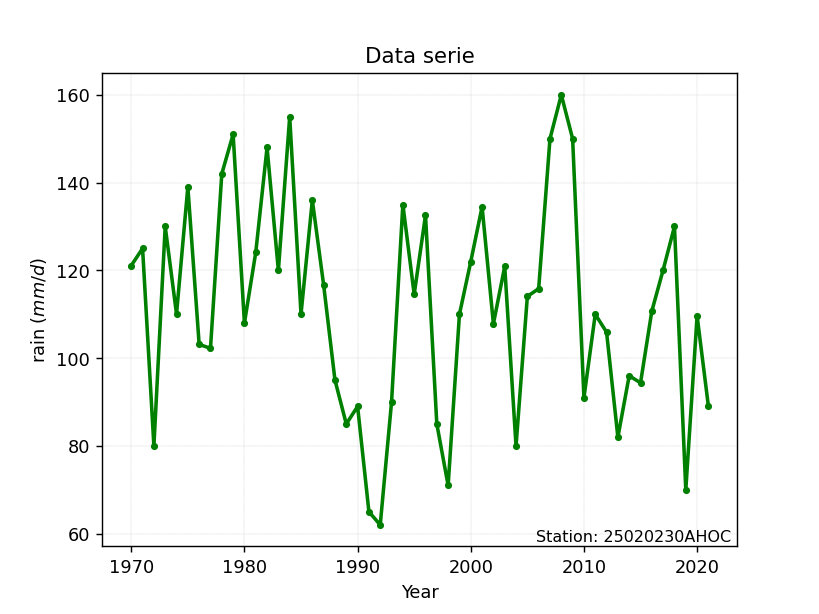

# Station: 25020230AHOC

</img>

## A. Active distributions from SciPy (4 of 104 available)

|   id | p_dist   |   n_parameter | fit_method   | label                          | active   | ref                                                                                              |
|-----:|:---------|--------------:|:-------------|:-------------------------------|:---------|:-------------------------------------------------------------------------------------------------|
|    0 | gompertz |             3 | MLE          | Gompertz (or truncated Gumbel) | True     | [:mortar_board:](https://docs.scipy.org/doc/scipy/reference/generated/scipy.stats.gompertz.html) |
|    1 | loggamma |             3 | MLE          | Log gamma                      | True     | [:mortar_board:](https://docs.scipy.org/doc/scipy/reference/generated/scipy.stats.loggamma.html) |
|    2 | pearson3 |             3 | MM           | Pearson type III               | True     | [:mortar_board:](https://docs.scipy.org/doc/scipy/reference/generated/scipy.stats.pearson3.html) |
|    3 | skewnorm |             3 | MLE          | Skew normal                    | True     | [:mortar_board:](https://docs.scipy.org/doc/scipy/reference/generated/scipy.stats.skewnorm.html) |

> Gumbel and Lob-Gumbel probability distributions are not shown in the above table.  
> n_parameter = # arguments & localization & scale.  
> Fit methods: (MLE) maximum likelihood, (MM) L-moments.

## B. Probability distributions

### Cumulative distribution values - CDF (6 evalated, ordered by x ascending) 

|   id |   date |      x | station      |   m |    gompertz |   gompertz_pdf |   loggamma |   loggamma_pdf |   pearson3 |   pearson3_pdf |   skewnorm |   skewnorm_pdf |    zzgumbel |   gumbel_pdf |   zzloggumbel |   loggumbel_pdf |
|-----:|-------:|-------:|:-------------|----:|------------:|---------------:|-----------:|---------------:|-----------:|---------------:|-----------:|---------------:|------------:|-------------:|--------------:|----------------:|
|    0 |   1992 |  62    | 25020230AHOC |   1 | 8.53975e-08 |     0.0048831  |  0.0218214 |     0.00203904 |  0.021126  |     0.00202043 |  0.0202472 |     0.00199223 | 1.20502e-06 |            0 |   1.08149e-06 |               0 |
|    1 |   1991 |  65    | 25020230AHOC |   2 | 0.0153334   |     0.00534467 |  0.0287187 |     0.00257497 |  0.0279766 |     0.00256291 |  0.0270235 |     0.00254212 | 8.74109e-06 |            0 |   2.64406e-05 |               0 |
|    2 |   2019 |  70    | 25020230AHOC |   3 | 0.0441275   |     0.00618859 |  0.0442606 |     0.00368945 |  0.0434965 |     0.00369382 |  0.0424854 |     0.00369298 | 0.00012791  |            0 |   0.000951392 |               0 |
|    3 |   1998 |  71    | 25020230AHOC |   4 | 0.0504058   |     0.00636856 |  0.0480779 |     0.00394706 |  0.0473202 |     0.00395549 |  0.0463107 |     0.00395977 | 0.000202088 |            0 |   0.00161923  |               0 |
|    4 |   1972 |  80    | 25020230AHOC |   5 | 0.11552     |     0.00814703 |  0.0956562 |     0.00677185 |  0.0951662 |     0.00682446 |  0.0944441 |     0.0068868  | 0.00494347  |            0 |   0.0371986   |               0 |
|    5 |   2004 |  80    | 25020230AHOC |   6 | 0.11552     |     0.00814703 |  0.0956562 |     0.00677185 |  0.0951662 |     0.00682446 |  0.0944441 |     0.0068868  | 0.00494347  |            0 |   0.0371986   |               0 |
|    6 |   2013 |  82    | 25020230AHOC |   7 | 0.132242    |     0.00857697 |  0.109931  |     0.00750813 |  0.109556  |     0.00757094 |  0.108973  |     0.0076473  | 0.0083819   |            0 |   0.0569246   |               0 |
|    7 |   1997 |  85    | 25020230AHOC |   8 | 0.158963    |     0.00924031 |  0.134176  |     0.00866434 |  0.134012  |     0.00874118 |  0.133688  |     0.00883734 | 0.0167985   |            0 |   0.0960205   |               0 |
|    8 |   1989 |  85    | 25020230AHOC |   9 | 0.158963    |     0.00924031 |  0.134176  |     0.00866434 |  0.134012  |     0.00874118 |  0.133688  |     0.00883734 | 0.0167985   |            0 |   0.0960205   |               0 |
|    9 |   1990 |  89    | 25020230AHOC |  10 | 0.197735    |     0.0101493  |  0.172016  |     0.010261   |  0.172189  |     0.0103521  |  0.172295  |     0.0104695  | 0.0363652   |            0 |   0.163529    |               0 |
|   10 |   2021 |  89    | 25020230AHOC |  11 | 0.197735    |     0.0101493  |  0.172016  |     0.010261   |  0.172189  |     0.0103521  |  0.172295  |     0.0104695  | 0.0363652   |            0 |   0.163529    |               0 |
|   11 |   1993 |  90    | 25020230AHOC |  12 | 0.207999    |     0.010379   |  0.182478  |     0.0106621  |  0.182744  |     0.0107557  |  0.182969  |     0.0108771  | 0.0430649   |            0 |   0.182531    |               0 |
|   12 |   2010 |  91    | 25020230AHOC |  13 | 0.218493    |     0.010609   |  0.19334   |     0.0110614  |  0.1937    |     0.0111569  |  0.194048  |     0.0112816  | 0.0505608   |            0 |   0.202162    |               0 |
|   13 |   2015 |  94.36 | 25020230AHOC |  14 | 0.255435    |     0.0113787  |  0.232723  |     0.0123706  |  0.23341   |     0.0124682  |  0.23419   |     0.0125985  | 0.0818384   |            0 |   0.271264    |               0 |
|   14 |   1988 |  95    | 25020230AHOC |  15 | 0.262764    |     0.0115238  |  0.240718  |     0.0126111  |  0.241467  |     0.0127084  |  0.24233   |     0.0128386  | 0.0888766   |            0 |   0.284748    |               0 |
|   15 |   2014 |  96    | 25020230AHOC |  16 | 0.274401    |     0.011749   |  0.253514  |     0.0129792  |  0.25436   |     0.0130752  |  0.255352  |     0.0132047  | 0.10056     |            0 |   0.305886    |               0 |
|   16 |   1977 | 102.24 | 25020230AHOC |  17 | 0.351941    |     0.0130757  |  0.341036  |     0.0149721  |  0.342424  |     0.0150453  |  0.344163  |     0.0151494  | 0.190772    |            0 |   0.435076    |               0 |
|   17 |   1976 | 103.13 | 25020230AHOC |  18 | 0.363655    |     0.0132486  |  0.354464  |     0.0152011  |  0.355915  |     0.015269   |  0.357744  |     0.0153666  | 0.205721    |            0 |   0.45259     |               0 |
|   18 |   2012 | 105.92 | 25020230AHOC |  19 | 0.401336    |     0.0137525  |  0.397761  |     0.0158068  |  0.399375  |     0.0158554  |  0.401444  |     0.0159289  | 0.255054    |            0 |   0.505304    |               0 |
|   19 |   2002 | 107.82 | 25020230AHOC |  20 | 0.42776     |     0.0140562  |  0.428099  |     0.0161131  |  0.429792  |     0.0161465  |  0.431983  |     0.0162007  | 0.29029     |            0 |   0.539103    |               0 |
|   20 |   1980 | 108    | 25020230AHOC |  21 | 0.430293    |     0.0140831  |  0.431002  |     0.0161373  |  0.4327    |     0.0161693  |  0.434901  |     0.0162216  | 0.293678    |            0 |   0.542211    |               0 |
|   21 |   2020 | 109.61 | 25020230AHOC |  22 | 0.453151    |     0.0143076  |  0.457136  |     0.0163164  |  0.458875  |     0.0163346  |  0.461145  |     0.016369   | 0.324265    |            0 |   0.569283    |               0 |
|   22 |   2011 | 110    | 25020230AHOC |  23 | 0.458741    |     0.0143574  |  0.463506  |     0.0163493  |  0.465251  |     0.0163641  |  0.467534  |     0.0163941  | 0.331733    |            0 |   0.575641    |               0 |
|   23 |   1999 | 110    | 25020230AHOC |  24 | 0.458741    |     0.0143574  |  0.463506  |     0.0163493  |  0.465251  |     0.0163641  |  0.467534  |     0.0163941  | 0.331733    |            0 |   0.575641    |               0 |
|   24 |   1985 | 110.05 | 25020230AHOC |  25 | 0.459459    |     0.0143637  |  0.464324  |     0.0163533  |  0.46607   |     0.0163676  |  0.468354  |     0.016397   | 0.332691    |            0 |   0.57645     |               0 |
|   25 |   1974 | 110.06 | 25020230AHOC |  26 | 0.459603    |     0.0143649  |  0.464488  |     0.016354   |  0.466233  |     0.0163683  |  0.468518  |     0.0163976  | 0.332883    |            0 |   0.576612    |               0 |
|   26 |   2016 | 110.73 | 25020230AHOC |  27 | 0.469254    |     0.0144456  |  0.475461  |     0.0163998  |  0.477214  |     0.0164081  |  0.479516  |     0.0164296  | 0.34575     |            0 |   0.587329    |               0 |
|   27 |   2005 | 114.07 | 25020230AHOC |  28 | 0.518066    |     0.0147563  |  0.530393  |     0.016442   |  0.532125  |     0.0164204  |  0.534432  |     0.0164024  | 0.409996    |            0 |   0.637301    |               0 |
|   28 |   1995 | 114.53 | 25020230AHOC |  29 | 0.524861    |     0.0147862  |  0.537953  |     0.0164233  |  0.539673  |     0.0163977  |  0.541971  |     0.0163743  | 0.41879     |            0 |   0.643738    |               0 |
|   29 |   2006 | 115.83 | 25020230AHOC |  30 | 0.544129    |     0.0148519  |  0.559253  |     0.0163385  |  0.560933  |     0.0163018  |  0.563191  |     0.0162632  | 0.443481    |            0 |   0.661358    |               0 |
|   30 |   1987 | 116.65 | 25020230AHOC |  31 | 0.556319    |     0.0148788  |  0.57262   |     0.0162609  |  0.574267  |     0.0162173  |  0.576489  |     0.0161695  | 0.4589      |            0 |   0.672045    |               0 |
|   31 |   1983 | 120    | 25020230AHOC |  32 | 0.606193    |     0.0148619  |  0.626331  |     0.0157561  |  0.627789  |     0.0156875  |  0.629791  |     0.0156049  | 0.520178    |            0 |   0.712408    |               0 |
|   32 |   2017 | 120.1  | 25020230AHOC |  33 | 0.607679    |     0.0148581  |  0.627906  |     0.0157366  |  0.629356  |     0.0156673  |  0.63135   |     0.0155838  | 0.521957    |            0 |   0.713534    |               0 |
|   33 |   2003 | 120.9  | 25020230AHOC |  34 | 0.619551    |     0.0148207  |  0.64043   |     0.0155713  |  0.641823  |     0.0154969  |  0.643747  |     0.0154061  | 0.536069    |            0 |   0.722386    |               0 |
|   34 |   1970 | 121.1  | 25020230AHOC |  35 | 0.622514    |     0.0148093  |  0.64354   |     0.0155276  |  0.644918  |     0.0154519  |  0.646824  |     0.0153594  | 0.539562    |            0 |   0.724556    |               0 |
|   35 |   2000 | 122    | 25020230AHOC |  36 | 0.635816    |     0.0147481  |  0.657422  |     0.0153189  |  0.65873   |     0.0152381  |  0.660549  |     0.0151381  | 0.555109    |            0 |   0.734109    |               0 |
|   36 |   1981 | 124.08 | 25020230AHOC |  37 | 0.666294    |     0.0145421  |  0.688728  |     0.0147666  |  0.689856  |     0.0146758  |  0.691452  |     0.014561   | 0.589876    |            0 |   0.754914    |               0 |
|   37 |   1971 | 125    | 25020230AHOC |  38 | 0.679619    |     0.0144217  |  0.702188  |     0.0144933  |  0.703232  |     0.0143991  |  0.704719  |     0.014279   | 0.604705    |            0 |   0.763572    |               0 |
|   38 |   1973 | 130    | 25020230AHOC |  39 | 0.749519    |     0.0134489  |  0.770467  |     0.0127538  |  0.771012  |     0.0126516  |  0.771852  |     0.0125167  | 0.679001    |            0 |   0.805324    |               0 |
|   39 |   2018 | 130    | 25020230AHOC |  40 | 0.749519    |     0.0134489  |  0.770467  |     0.0127538  |  0.771012  |     0.0126516  |  0.771852  |     0.0125167  | 0.679001    |            0 |   0.805324    |               0 |
|   40 |   1996 | 132.54 | 25020230AHOC |  41 | 0.782823    |     0.0127531  |  0.801597  |     0.0117479  |  0.801885  |     0.0116484  |  0.802383  |     0.0115152  | 0.712544    |            0 |   0.823447    |               0 |
|   41 |   2001 | 134.5  | 25020230AHOC |  42 | 0.807221    |     0.0121304  |  0.823833  |     0.0109384  |  0.82393   |     0.0108439  |  0.824172  |     0.0107156  | 0.736496    |            0 |   0.83618     |               0 |
|   42 |   1994 | 135    | 25020230AHOC |  43 | 0.813244    |     0.0119604  |  0.82925   |     0.0107289  |  0.8293    |     0.010636   |  0.829478  |     0.0105096  | 0.742341    |            0 |   0.839265    |               0 |
|   43 |   1986 | 136    | 25020230AHOC |  44 | 0.825029    |     0.0116078  |  0.839769  |     0.0103077  |  0.839728  |     0.0102185  |  0.839781  |     0.0100961  | 0.753712    |            0 |   0.845246    |               0 |
|   44 |   1975 | 139    | 25020230AHOC |  45 | 0.858161    |     0.0104596  |  0.868789  |     0.00904047 |  0.8685    |     0.00896474 |  0.86821   |     0.00885849 | 0.785342    |            0 |   0.861765    |               0 |
|   45 |   1978 | 142    | 25020230AHOC |  46 | 0.887682    |     0.00920674 |  0.894036  |     0.0077978  |  0.893544  |     0.00773837 |  0.892964  |     0.00765244 | 0.813423    |            0 |   0.87635     |               0 |
|   46 |   1982 | 148    | 25020230AHOC |  47 | 0.935049    |     0.00657824 |  0.933803  |     0.00551454 |  0.933059  |     0.00548993 |  0.932099  |     0.00544933 | 0.860001    |            0 |   0.900628    |               0 |
|   47 |   2007 | 150    | 25020230AHOC |  48 | 0.947345    |     0.00572251 |  0.944148  |     0.00483896 |  0.943366  |     0.00482513 |  0.94234   |     0.00479904 | 0.872996    |            0 |   0.907486    |               0 |
|   48 |   2009 | 150    | 25020230AHOC |  49 | 0.947345    |     0.00572251 |  0.944148  |     0.00483896 |  0.943366  |     0.00482513 |  0.94234   |     0.00479904 | 0.872996    |            0 |   0.907486    |               0 |
|   49 |   1979 | 151    | 25020230AHOC |  50 | 0.952859    |     0.00530711 |  0.948827  |     0.00451984 |  0.948033  |     0.00451106 |  0.946984  |     0.00449186 | 0.879067    |            0 |   0.910713    |               0 |
|   50 |   1984 | 155    | 25020230AHOC |  51 | 0.970936    |     0.00376766 |  0.964545  |     0.00337451 |  0.963752  |     0.00338304 |  0.962677  |     0.00338805 | 0.900745    |            0 |   0.922398    |               0 |
|   51 |   2008 | 160    | 25020230AHOC |  52 | 0.985693    |     0.0022121  |  0.978448  |     0.00224116 |  0.977737  |     0.00226384 |  0.976744  |     0.00228986 | 0.9227      |            0 |   0.934626    |               0 |

### Empirical: emp_california

#### 1. Empirical values

|   id |   date |      x |   m | empirical_dist   |   empirical |   empirical_tr |
|-----:|-------:|-------:|----:|:-----------------|------------:|---------------:|
|    0 |   1992 |  62    |   1 | emp_california   |   0.0192308 |        1.01961 |
|    1 |   1991 |  65    |   2 | emp_california   |   0.0384615 |        1.04    |
|    2 |   2019 |  70    |   3 | emp_california   |   0.0576923 |        1.06122 |
|    3 |   1998 |  71    |   4 | emp_california   |   0.0769231 |        1.08333 |
|    4 |   1972 |  80    |   5 | emp_california   |   0.0961538 |        1.10638 |
|    5 |   2004 |  80    |   6 | emp_california   |   0.115385  |        1.13043 |
|    6 |   2013 |  82    |   7 | emp_california   |   0.134615  |        1.15556 |
|    7 |   1997 |  85    |   8 | emp_california   |   0.153846  |        1.18182 |
|    8 |   1989 |  85    |   9 | emp_california   |   0.173077  |        1.2093  |
|    9 |   1990 |  89    |  10 | emp_california   |   0.192308  |        1.2381  |
|   10 |   2021 |  89    |  11 | emp_california   |   0.211538  |        1.26829 |
|   11 |   1993 |  90    |  12 | emp_california   |   0.230769  |        1.3     |
|   12 |   2010 |  91    |  13 | emp_california   |   0.25      |        1.33333 |
|   13 |   2015 |  94.36 |  14 | emp_california   |   0.269231  |        1.36842 |
|   14 |   1988 |  95    |  15 | emp_california   |   0.288462  |        1.40541 |
|   15 |   2014 |  96    |  16 | emp_california   |   0.307692  |        1.44444 |
|   16 |   1977 | 102.24 |  17 | emp_california   |   0.326923  |        1.48571 |
|   17 |   1976 | 103.13 |  18 | emp_california   |   0.346154  |        1.52941 |
|   18 |   2012 | 105.92 |  19 | emp_california   |   0.365385  |        1.57576 |
|   19 |   2002 | 107.82 |  20 | emp_california   |   0.384615  |        1.625   |
|   20 |   1980 | 108    |  21 | emp_california   |   0.403846  |        1.67742 |
|   21 |   2020 | 109.61 |  22 | emp_california   |   0.423077  |        1.73333 |
|   22 |   2011 | 110    |  23 | emp_california   |   0.442308  |        1.7931  |
|   23 |   1999 | 110    |  24 | emp_california   |   0.461538  |        1.85714 |
|   24 |   1985 | 110.05 |  25 | emp_california   |   0.480769  |        1.92593 |
|   25 |   1974 | 110.06 |  26 | emp_california   |   0.5       |        2       |
|   26 |   2016 | 110.73 |  27 | emp_california   |   0.519231  |        2.08    |
|   27 |   2005 | 114.07 |  28 | emp_california   |   0.538462  |        2.16667 |
|   28 |   1995 | 114.53 |  29 | emp_california   |   0.557692  |        2.26087 |
|   29 |   2006 | 115.83 |  30 | emp_california   |   0.576923  |        2.36364 |
|   30 |   1987 | 116.65 |  31 | emp_california   |   0.596154  |        2.47619 |
|   31 |   1983 | 120    |  32 | emp_california   |   0.615385  |        2.6     |
|   32 |   2017 | 120.1  |  33 | emp_california   |   0.634615  |        2.73684 |
|   33 |   2003 | 120.9  |  34 | emp_california   |   0.653846  |        2.88889 |
|   34 |   1970 | 121.1  |  35 | emp_california   |   0.673077  |        3.05882 |
|   35 |   2000 | 122    |  36 | emp_california   |   0.692308  |        3.25    |
|   36 |   1981 | 124.08 |  37 | emp_california   |   0.711538  |        3.46667 |
|   37 |   1971 | 125    |  38 | emp_california   |   0.730769  |        3.71429 |
|   38 |   1973 | 130    |  39 | emp_california   |   0.75      |        4       |
|   39 |   2018 | 130    |  40 | emp_california   |   0.769231  |        4.33333 |
|   40 |   1996 | 132.54 |  41 | emp_california   |   0.788462  |        4.72727 |
|   41 |   2001 | 134.5  |  42 | emp_california   |   0.807692  |        5.2     |
|   42 |   1994 | 135    |  43 | emp_california   |   0.826923  |        5.77778 |
|   43 |   1986 | 136    |  44 | emp_california   |   0.846154  |        6.5     |
|   44 |   1975 | 139    |  45 | emp_california   |   0.865385  |        7.42857 |
|   45 |   1978 | 142    |  46 | emp_california   |   0.884615  |        8.66667 |
|   46 |   1982 | 148    |  47 | emp_california   |   0.903846  |       10.4     |
|   47 |   2007 | 150    |  48 | emp_california   |   0.923077  |       13       |
|   48 |   2009 | 150    |  49 | emp_california   |   0.942308  |       17.3333  |
|   49 |   1979 | 151    |  50 | emp_california   |   0.961538  |       26       |
|   50 |   1984 | 155    |  51 | emp_california   |   0.980769  |       52       |
|   51 |   2008 | 160    |  52 | emp_california   |   1         |      inf       |

####  2. Parameters & Kolmogorov-Smirnov fit test (sorted by Δ)

|   id | empirical_dist   | p_dist      |     delta |   deltao | eval    |   fit |   n |         loc |    scale |       shape | shape1             | shape2   | shape3   |   best_fit |   best_fit_sort |
|-----:|:-----------------|:------------|----------:|---------:|:--------|------:|----:|------------:|---------:|------------:|:-------------------|:---------|:---------|-----------:|----------------:|
|    0 | emp_california   | skewnorm    | 0.0559515 | 0.188598 | Δo > Δ  |     1 |  52 |   120.087   |  25.5953 |  -0.437036  |                    |          |          |          1 |               1 |
|    1 | emp_california   | pearson3    | 0.0562999 | 0.188598 | Δo > Δ  |     1 |  52 |   111.908   |  24.2534 |  -0.0515654 |                    |          |          |          0 |               2 |
|    2 | emp_california   | gompertz    | 0.0564913 | 0.188598 | Δo > Δ  |     1 |  52 |    62       |  28.363  |   0.138499  |                    |          |          |          0 |               3 |
|    3 | emp_california   | loggamma    | 0.0566604 | 0.188598 | Δo > Δ  |     1 |  52 | -1473.27    | 310.777  | 164.636     |                    |          |          |          0 |               4 |
|    4 | emp_california   | zzloggumbel | 0.154487  | 0.188598 | Δo > Δ  |     1 |  52 |     4.59456 |   0.1784 |   0.549339  | 1.1638043535169666 |          |          |          0 |               5 |
|    5 | emp_california   | zzgumbel    | 0.207133  | 0.188598 | Δo <= Δ |     0 |  52 |   111.879   |  19.0947 |   0.549339  | 1.1638043535169666 |          |          |          0 |               6 |

#### 3. Best fit for

|   id | station      | empirical_dist   | p_dist   |     delta |   deltao | eval   |   fit |   n |     loc |   scale |     shape | shape1   | shape2   | shape3   |   best_fit |   best_fit_sort |
|-----:|:-------------|:-----------------|:---------|----------:|---------:|:-------|------:|----:|--------:|--------:|----------:|:---------|:---------|:---------|-----------:|----------------:|
|    0 | 25020230AHOC | emp_california   | skewnorm | 0.0559515 | 0.188598 | Δo > Δ |     1 |  52 | 120.087 | 25.5953 | -0.437036 |          |          |          |          1 |               1 |

### Empirical: emp_hazen

#### 1. Empirical values

|   id |   date |      x |   m | empirical_dist   |   empirical |   empirical_tr |
|-----:|-------:|-------:|----:|:-----------------|------------:|---------------:|
|    0 |   1992 |  62    |   1 | emp_hazen        |  0.00961538 |        1.00971 |
|    1 |   1991 |  65    |   2 | emp_hazen        |  0.0288462  |        1.0297  |
|    2 |   2019 |  70    |   3 | emp_hazen        |  0.0480769  |        1.05051 |
|    3 |   1998 |  71    |   4 | emp_hazen        |  0.0673077  |        1.07216 |
|    4 |   1972 |  80    |   5 | emp_hazen        |  0.0865385  |        1.09474 |
|    5 |   2004 |  80    |   6 | emp_hazen        |  0.105769   |        1.11828 |
|    6 |   2013 |  82    |   7 | emp_hazen        |  0.125      |        1.14286 |
|    7 |   1997 |  85    |   8 | emp_hazen        |  0.144231   |        1.16854 |
|    8 |   1989 |  85    |   9 | emp_hazen        |  0.163462   |        1.1954  |
|    9 |   1990 |  89    |  10 | emp_hazen        |  0.182692   |        1.22353 |
|   10 |   2021 |  89    |  11 | emp_hazen        |  0.201923   |        1.25301 |
|   11 |   1993 |  90    |  12 | emp_hazen        |  0.221154   |        1.28395 |
|   12 |   2010 |  91    |  13 | emp_hazen        |  0.240385   |        1.31646 |
|   13 |   2015 |  94.36 |  14 | emp_hazen        |  0.259615   |        1.35065 |
|   14 |   1988 |  95    |  15 | emp_hazen        |  0.278846   |        1.38667 |
|   15 |   2014 |  96    |  16 | emp_hazen        |  0.298077   |        1.42466 |
|   16 |   1977 | 102.24 |  17 | emp_hazen        |  0.317308   |        1.46479 |
|   17 |   1976 | 103.13 |  18 | emp_hazen        |  0.336538   |        1.50725 |
|   18 |   2012 | 105.92 |  19 | emp_hazen        |  0.355769   |        1.55224 |
|   19 |   2002 | 107.82 |  20 | emp_hazen        |  0.375      |        1.6     |
|   20 |   1980 | 108    |  21 | emp_hazen        |  0.394231   |        1.65079 |
|   21 |   2020 | 109.61 |  22 | emp_hazen        |  0.413462   |        1.70492 |
|   22 |   2011 | 110    |  23 | emp_hazen        |  0.432692   |        1.76271 |
|   23 |   1999 | 110    |  24 | emp_hazen        |  0.451923   |        1.82456 |
|   24 |   1985 | 110.05 |  25 | emp_hazen        |  0.471154   |        1.89091 |
|   25 |   1974 | 110.06 |  26 | emp_hazen        |  0.490385   |        1.96226 |
|   26 |   2016 | 110.73 |  27 | emp_hazen        |  0.509615   |        2.03922 |
|   27 |   2005 | 114.07 |  28 | emp_hazen        |  0.528846   |        2.12245 |
|   28 |   1995 | 114.53 |  29 | emp_hazen        |  0.548077   |        2.21277 |
|   29 |   2006 | 115.83 |  30 | emp_hazen        |  0.567308   |        2.31111 |
|   30 |   1987 | 116.65 |  31 | emp_hazen        |  0.586538   |        2.4186  |
|   31 |   1983 | 120    |  32 | emp_hazen        |  0.605769   |        2.53659 |
|   32 |   2017 | 120.1  |  33 | emp_hazen        |  0.625      |        2.66667 |
|   33 |   2003 | 120.9  |  34 | emp_hazen        |  0.644231   |        2.81081 |
|   34 |   1970 | 121.1  |  35 | emp_hazen        |  0.663462   |        2.97143 |
|   35 |   2000 | 122    |  36 | emp_hazen        |  0.682692   |        3.15152 |
|   36 |   1981 | 124.08 |  37 | emp_hazen        |  0.701923   |        3.35484 |
|   37 |   1971 | 125    |  38 | emp_hazen        |  0.721154   |        3.58621 |
|   38 |   1973 | 130    |  39 | emp_hazen        |  0.740385   |        3.85185 |
|   39 |   2018 | 130    |  40 | emp_hazen        |  0.759615   |        4.16    |
|   40 |   1996 | 132.54 |  41 | emp_hazen        |  0.778846   |        4.52174 |
|   41 |   2001 | 134.5  |  42 | emp_hazen        |  0.798077   |        4.95238 |
|   42 |   1994 | 135    |  43 | emp_hazen        |  0.817308   |        5.47368 |
|   43 |   1986 | 136    |  44 | emp_hazen        |  0.836538   |        6.11765 |
|   44 |   1975 | 139    |  45 | emp_hazen        |  0.855769   |        6.93333 |
|   45 |   1978 | 142    |  46 | emp_hazen        |  0.875      |        8       |
|   46 |   1982 | 148    |  47 | emp_hazen        |  0.894231   |        9.45455 |
|   47 |   2007 | 150    |  48 | emp_hazen        |  0.913462   |       11.5556  |
|   48 |   2009 | 150    |  49 | emp_hazen        |  0.932692   |       14.8571  |
|   49 |   1979 | 151    |  50 | emp_hazen        |  0.951923   |       20.8     |
|   50 |   1984 | 155    |  51 | emp_hazen        |  0.971154   |       34.6667  |
|   51 |   2008 | 160    |  52 | emp_hazen        |  0.990385   |      104       |

####  2. Parameters & Kolmogorov-Smirnov fit test (sorted by Δ)

|   id | empirical_dist   | p_dist      |     delta |   deltao | eval    |   fit |   n |         loc |    scale |       shape | shape1             | shape2   | shape3   |   best_fit |   best_fit_sort |
|-----:|:-----------------|:------------|----------:|---------:|:--------|------:|----:|------------:|---------:|------------:|:-------------------|:---------|:---------|-----------:|----------------:|
|    0 | emp_hazen        | gompertz    | 0.0527601 | 0.188598 | Δo > Δ  |     1 |  52 |    62       |  28.363  |   0.138499  |                    |          |          |          1 |               1 |
|    1 | emp_hazen        | loggamma    | 0.0530995 | 0.188598 | Δo > Δ  |     1 |  52 | -1473.27    | 310.777  | 164.636     |                    |          |          |          0 |               2 |
|    2 | emp_hazen        | pearson3    | 0.0547916 | 0.188598 | Δo > Δ  |     1 |  52 |   111.908   |  24.2534 |  -0.0515654 |                    |          |          |          0 |               3 |
|    3 | emp_hazen        | skewnorm    | 0.0569825 | 0.188598 | Δo > Δ  |     1 |  52 |   120.087   |  25.5953 |  -0.437036  |                    |          |          |          0 |               4 |
|    4 | emp_hazen        | zzloggumbel | 0.164103  | 0.188598 | Δo > Δ  |     1 |  52 |     4.59456 |   0.1784 |   0.549339  | 1.1638043535169666 |          |          |          0 |               5 |
|    5 | emp_hazen        | zzgumbel    | 0.197517  | 0.188598 | Δo <= Δ |     0 |  52 |   111.879   |  19.0947 |   0.549339  | 1.1638043535169666 |          |          |          0 |               6 |

#### 3. Best fit for

|   id | station      | empirical_dist   | p_dist   |     delta |   deltao | eval   |   fit |   n |   loc |   scale |    shape | shape1   | shape2   | shape3   |   best_fit |   best_fit_sort |
|-----:|:-------------|:-----------------|:---------|----------:|---------:|:-------|------:|----:|------:|--------:|---------:|:---------|:---------|:---------|-----------:|----------------:|
|    0 | 25020230AHOC | emp_hazen        | gompertz | 0.0527601 | 0.188598 | Δo > Δ |     1 |  52 |    62 |  28.363 | 0.138499 |          |          |          |          1 |               1 |

### Empirical: emp_weibull

#### 1. Empirical values

|   id |   date |      x |   m | empirical_dist   |   empirical |   empirical_tr |
|-----:|-------:|-------:|----:|:-----------------|------------:|---------------:|
|    0 |   1992 |  62    |   1 | emp_weibull      |   0.0188679 |        1.01923 |
|    1 |   1991 |  65    |   2 | emp_weibull      |   0.0377358 |        1.03922 |
|    2 |   2019 |  70    |   3 | emp_weibull      |   0.0566038 |        1.06    |
|    3 |   1998 |  71    |   4 | emp_weibull      |   0.0754717 |        1.08163 |
|    4 |   1972 |  80    |   5 | emp_weibull      |   0.0943396 |        1.10417 |
|    5 |   2004 |  80    |   6 | emp_weibull      |   0.113208  |        1.12766 |
|    6 |   2013 |  82    |   7 | emp_weibull      |   0.132075  |        1.15217 |
|    7 |   1997 |  85    |   8 | emp_weibull      |   0.150943  |        1.17778 |
|    8 |   1989 |  85    |   9 | emp_weibull      |   0.169811  |        1.20455 |
|    9 |   1990 |  89    |  10 | emp_weibull      |   0.188679  |        1.23256 |
|   10 |   2021 |  89    |  11 | emp_weibull      |   0.207547  |        1.2619  |
|   11 |   1993 |  90    |  12 | emp_weibull      |   0.226415  |        1.29268 |
|   12 |   2010 |  91    |  13 | emp_weibull      |   0.245283  |        1.325   |
|   13 |   2015 |  94.36 |  14 | emp_weibull      |   0.264151  |        1.35897 |
|   14 |   1988 |  95    |  15 | emp_weibull      |   0.283019  |        1.39474 |
|   15 |   2014 |  96    |  16 | emp_weibull      |   0.301887  |        1.43243 |
|   16 |   1977 | 102.24 |  17 | emp_weibull      |   0.320755  |        1.47222 |
|   17 |   1976 | 103.13 |  18 | emp_weibull      |   0.339623  |        1.51429 |
|   18 |   2012 | 105.92 |  19 | emp_weibull      |   0.358491  |        1.55882 |
|   19 |   2002 | 107.82 |  20 | emp_weibull      |   0.377358  |        1.60606 |
|   20 |   1980 | 108    |  21 | emp_weibull      |   0.396226  |        1.65625 |
|   21 |   2020 | 109.61 |  22 | emp_weibull      |   0.415094  |        1.70968 |
|   22 |   2011 | 110    |  23 | emp_weibull      |   0.433962  |        1.76667 |
|   23 |   1999 | 110    |  24 | emp_weibull      |   0.45283   |        1.82759 |
|   24 |   1985 | 110.05 |  25 | emp_weibull      |   0.471698  |        1.89286 |
|   25 |   1974 | 110.06 |  26 | emp_weibull      |   0.490566  |        1.96296 |
|   26 |   2016 | 110.73 |  27 | emp_weibull      |   0.509434  |        2.03846 |
|   27 |   2005 | 114.07 |  28 | emp_weibull      |   0.528302  |        2.12    |
|   28 |   1995 | 114.53 |  29 | emp_weibull      |   0.54717   |        2.20833 |
|   29 |   2006 | 115.83 |  30 | emp_weibull      |   0.566038  |        2.30435 |
|   30 |   1987 | 116.65 |  31 | emp_weibull      |   0.584906  |        2.40909 |
|   31 |   1983 | 120    |  32 | emp_weibull      |   0.603774  |        2.52381 |
|   32 |   2017 | 120.1  |  33 | emp_weibull      |   0.622642  |        2.65    |
|   33 |   2003 | 120.9  |  34 | emp_weibull      |   0.641509  |        2.78947 |
|   34 |   1970 | 121.1  |  35 | emp_weibull      |   0.660377  |        2.94444 |
|   35 |   2000 | 122    |  36 | emp_weibull      |   0.679245  |        3.11765 |
|   36 |   1981 | 124.08 |  37 | emp_weibull      |   0.698113  |        3.3125  |
|   37 |   1971 | 125    |  38 | emp_weibull      |   0.716981  |        3.53333 |
|   38 |   1973 | 130    |  39 | emp_weibull      |   0.735849  |        3.78571 |
|   39 |   2018 | 130    |  40 | emp_weibull      |   0.754717  |        4.07692 |
|   40 |   1996 | 132.54 |  41 | emp_weibull      |   0.773585  |        4.41667 |
|   41 |   2001 | 134.5  |  42 | emp_weibull      |   0.792453  |        4.81818 |
|   42 |   1994 | 135    |  43 | emp_weibull      |   0.811321  |        5.3     |
|   43 |   1986 | 136    |  44 | emp_weibull      |   0.830189  |        5.88889 |
|   44 |   1975 | 139    |  45 | emp_weibull      |   0.849057  |        6.625   |
|   45 |   1978 | 142    |  46 | emp_weibull      |   0.867925  |        7.57143 |
|   46 |   1982 | 148    |  47 | emp_weibull      |   0.886792  |        8.83333 |
|   47 |   2007 | 150    |  48 | emp_weibull      |   0.90566   |       10.6     |
|   48 |   2009 | 150    |  49 | emp_weibull      |   0.924528  |       13.25    |
|   49 |   1979 | 151    |  50 | emp_weibull      |   0.943396  |       17.6667  |
|   50 |   1984 | 155    |  51 | emp_weibull      |   0.962264  |       26.5     |
|   51 |   2008 | 160    |  52 | emp_weibull      |   0.981132  |       53       |

####  2. Parameters & Kolmogorov-Smirnov fit test (sorted by Δ)

|   id | empirical_dist   | p_dist      |     delta |   deltao | eval    |   fit |   n |         loc |    scale |       shape | shape1             | shape2   | shape3   |   best_fit |   best_fit_sort |
|-----:|:-----------------|:------------|----------:|---------:|:--------|------:|----:|------------:|---------:|------------:|:-------------------|:---------|:---------|-----------:|----------------:|
|    0 | emp_weibull      | gompertz    | 0.0504016 | 0.188598 | Δo > Δ  |     1 |  52 |    62       |  28.363  |   0.138499  |                    |          |          |          1 |               1 |
|    1 | emp_weibull      | loggamma    | 0.0519435 | 0.188598 | Δo > Δ  |     1 |  52 | -1473.27    | 310.777  | 164.636     |                    |          |          |          0 |               2 |
|    2 | emp_weibull      | pearson3    | 0.0524331 | 0.188598 | Δo > Δ  |     1 |  52 |   111.908   |  24.2534 |  -0.0515654 |                    |          |          |          0 |               3 |
|    3 | emp_weibull      | skewnorm    | 0.054624  | 0.188598 | Δo > Δ  |     1 |  52 |   120.087   |  25.5953 |  -0.437036  |                    |          |          |          0 |               4 |
|    4 | emp_weibull      | zzloggumbel | 0.161744  | 0.188598 | Δo > Δ  |     1 |  52 |     4.59456 |   0.1784 |   0.549339  | 1.1638043535169666 |          |          |          0 |               5 |
|    5 | emp_weibull      | zzgumbel    | 0.201327  | 0.188598 | Δo <= Δ |     0 |  52 |   111.879   |  19.0947 |   0.549339  | 1.1638043535169666 |          |          |          0 |               6 |

#### 3. Best fit for

|   id | station      | empirical_dist   | p_dist   |     delta |   deltao | eval   |   fit |   n |   loc |   scale |    shape | shape1   | shape2   | shape3   |   best_fit |   best_fit_sort |
|-----:|:-------------|:-----------------|:---------|----------:|---------:|:-------|------:|----:|------:|--------:|---------:|:---------|:---------|:---------|-----------:|----------------:|
|    0 | 25020230AHOC | emp_weibull      | gompertz | 0.0504016 | 0.188598 | Δo > Δ |     1 |  52 |    62 |  28.363 | 0.138499 |          |          |          |          1 |               1 |

### Empirical: emp_beard

#### 1. Empirical values

|   id |   date |      x |   m | empirical_dist   |   empirical |   empirical_tr |
|-----:|-------:|-------:|----:|:-----------------|------------:|---------------:|
|    0 |   1992 |  62    |   1 | emp_beard        |   0.013173  |        1.01335 |
|    1 |   1991 |  65    |   2 | emp_beard        |   0.0322642 |        1.03334 |
|    2 |   2019 |  70    |   3 | emp_beard        |   0.0513555 |        1.05414 |
|    3 |   1998 |  71    |   4 | emp_beard        |   0.0704467 |        1.07579 |
|    4 |   1972 |  80    |   5 | emp_beard        |   0.089538  |        1.09834 |
|    5 |   2004 |  80    |   6 | emp_beard        |   0.108629  |        1.12187 |
|    6 |   2013 |  82    |   7 | emp_beard        |   0.127721  |        1.14642 |
|    7 |   1997 |  85    |   8 | emp_beard        |   0.146812  |        1.17207 |
|    8 |   1989 |  85    |   9 | emp_beard        |   0.165903  |        1.1989  |
|    9 |   1990 |  89    |  10 | emp_beard        |   0.184994  |        1.22699 |
|   10 |   2021 |  89    |  11 | emp_beard        |   0.204086  |        1.25642 |
|   11 |   1993 |  90    |  12 | emp_beard        |   0.223177  |        1.28729 |
|   12 |   2010 |  91    |  13 | emp_beard        |   0.242268  |        1.31973 |
|   13 |   2015 |  94.36 |  14 | emp_beard        |   0.261359  |        1.35384 |
|   14 |   1988 |  95    |  15 | emp_beard        |   0.280451  |        1.38976 |
|   15 |   2014 |  96    |  16 | emp_beard        |   0.299542  |        1.42764 |
|   16 |   1977 | 102.24 |  17 | emp_beard        |   0.318633  |        1.46764 |
|   17 |   1976 | 103.13 |  18 | emp_beard        |   0.337724  |        1.50995 |
|   18 |   2012 | 105.92 |  19 | emp_beard        |   0.356816  |        1.55476 |
|   19 |   2002 | 107.82 |  20 | emp_beard        |   0.375907  |        1.60232 |
|   20 |   1980 | 108    |  21 | emp_beard        |   0.394998  |        1.65289 |
|   21 |   2020 | 109.61 |  22 | emp_beard        |   0.414089  |        1.70674 |
|   22 |   2011 | 110    |  23 | emp_beard        |   0.433181  |        1.76423 |
|   23 |   1999 | 110    |  24 | emp_beard        |   0.452272  |        1.82572 |
|   24 |   1985 | 110.05 |  25 | emp_beard        |   0.471363  |        1.89166 |
|   25 |   1974 | 110.06 |  26 | emp_beard        |   0.490454  |        1.96253 |
|   26 |   2016 | 110.73 |  27 | emp_beard        |   0.509546  |        2.03893 |
|   27 |   2005 | 114.07 |  28 | emp_beard        |   0.528637  |        2.12151 |
|   28 |   1995 | 114.53 |  29 | emp_beard        |   0.547728  |        2.21106 |
|   29 |   2006 | 115.83 |  30 | emp_beard        |   0.566819  |        2.30851 |
|   30 |   1987 | 116.65 |  31 | emp_beard        |   0.585911  |        2.41494 |
|   31 |   1983 | 120    |  32 | emp_beard        |   0.605002  |        2.53166 |
|   32 |   2017 | 120.1  |  33 | emp_beard        |   0.624093  |        2.66023 |
|   33 |   2003 | 120.9  |  34 | emp_beard        |   0.643184  |        2.80257 |
|   34 |   1970 | 121.1  |  35 | emp_beard        |   0.662276  |        2.96099 |
|   35 |   2000 | 122    |  36 | emp_beard        |   0.681367  |        3.13841 |
|   36 |   1981 | 124.08 |  37 | emp_beard        |   0.700458  |        3.33843 |
|   37 |   1971 | 125    |  38 | emp_beard        |   0.719549  |        3.56569 |
|   38 |   1973 | 130    |  39 | emp_beard        |   0.738641  |        3.82615 |
|   39 |   2018 | 130    |  40 | emp_beard        |   0.757732  |        4.12766 |
|   40 |   1996 | 132.54 |  41 | emp_beard        |   0.776823  |        4.48075 |
|   41 |   2001 | 134.5  |  42 | emp_beard        |   0.795914  |        4.89991 |
|   42 |   1994 | 135    |  43 | emp_beard        |   0.815006  |        5.40557 |
|   43 |   1986 | 136    |  44 | emp_beard        |   0.834097  |        6.02762 |
|   44 |   1975 | 139    |  45 | emp_beard        |   0.853188  |        6.81144 |
|   45 |   1978 | 142    |  46 | emp_beard        |   0.872279  |        7.8296  |
|   46 |   1982 | 148    |  47 | emp_beard        |   0.891371  |        9.20562 |
|   47 |   2007 | 150    |  48 | emp_beard        |   0.910462  |       11.1684  |
|   48 |   2009 | 150    |  49 | emp_beard        |   0.929553  |       14.1951  |
|   49 |   1979 | 151    |  50 | emp_beard        |   0.948645  |       19.4721  |
|   50 |   1984 | 155    |  51 | emp_beard        |   0.967736  |       30.9941  |
|   51 |   2008 | 160    |  52 | emp_beard        |   0.986827  |       75.913   |

####  2. Parameters & Kolmogorov-Smirnov fit test (sorted by Δ)

|   id | empirical_dist   | p_dist      |     delta |   deltao | eval    |   fit |   n |         loc |    scale |       shape | shape1             | shape2   | shape3   |   best_fit |   best_fit_sort |
|-----:|:-----------------|:------------|----------:|---------:|:--------|------:|----:|------------:|---------:|------------:|:-------------------|:---------|:---------|-----------:|----------------:|
|    0 | emp_beard        | gompertz    | 0.0518533 | 0.188598 | Δo > Δ  |     1 |  52 |    62       |  28.363  |   0.138499  |                    |          |          |          1 |               1 |
|    1 | emp_beard        | loggamma    | 0.0521926 | 0.188598 | Δo > Δ  |     1 |  52 | -1473.27    | 310.777  | 164.636     |                    |          |          |          0 |               2 |
|    2 | emp_beard        | pearson3    | 0.0538848 | 0.188598 | Δo > Δ  |     1 |  52 |   111.908   |  24.2534 |  -0.0515654 |                    |          |          |          0 |               3 |
|    3 | emp_beard        | skewnorm    | 0.0560757 | 0.188598 | Δo > Δ  |     1 |  52 |   120.087   |  25.5953 |  -0.437036  |                    |          |          |          0 |               4 |
|    4 | emp_beard        | zzloggumbel | 0.163196  | 0.188598 | Δo > Δ  |     1 |  52 |     4.59456 |   0.1784 |   0.549339  | 1.1638043535169666 |          |          |          0 |               5 |
|    5 | emp_beard        | zzgumbel    | 0.198982  | 0.188598 | Δo <= Δ |     0 |  52 |   111.879   |  19.0947 |   0.549339  | 1.1638043535169666 |          |          |          0 |               6 |

#### 3. Best fit for

|   id | station      | empirical_dist   | p_dist   |     delta |   deltao | eval   |   fit |   n |   loc |   scale |    shape | shape1   | shape2   | shape3   |   best_fit |   best_fit_sort |
|-----:|:-------------|:-----------------|:---------|----------:|---------:|:-------|------:|----:|------:|--------:|---------:|:---------|:---------|:---------|-----------:|----------------:|
|    0 | 25020230AHOC | emp_beard        | gompertz | 0.0518533 | 0.188598 | Δo > Δ |     1 |  52 |    62 |  28.363 | 0.138499 |          |          |          |          1 |               1 |

### Empirical: emp_chegodayev

#### 1. Empirical values

|   id |   date |      x |   m | empirical_dist   |   empirical |   empirical_tr |
|-----:|-------:|-------:|----:|:-----------------|------------:|---------------:|
|    0 |   1992 |  62    |   1 | emp_chegodayev   |   0.0133588 |        1.01354 |
|    1 |   1991 |  65    |   2 | emp_chegodayev   |   0.0324427 |        1.03353 |
|    2 |   2019 |  70    |   3 | emp_chegodayev   |   0.0515267 |        1.05433 |
|    3 |   1998 |  71    |   4 | emp_chegodayev   |   0.0706107 |        1.07598 |
|    4 |   1972 |  80    |   5 | emp_chegodayev   |   0.0896947 |        1.09853 |
|    5 |   2004 |  80    |   6 | emp_chegodayev   |   0.108779  |        1.12206 |
|    6 |   2013 |  82    |   7 | emp_chegodayev   |   0.127863  |        1.14661 |
|    7 |   1997 |  85    |   8 | emp_chegodayev   |   0.146947  |        1.17226 |
|    8 |   1989 |  85    |   9 | emp_chegodayev   |   0.166031  |        1.19908 |
|    9 |   1990 |  89    |  10 | emp_chegodayev   |   0.185115  |        1.22717 |
|   10 |   2021 |  89    |  11 | emp_chegodayev   |   0.204198  |        1.25659 |
|   11 |   1993 |  90    |  12 | emp_chegodayev   |   0.223282  |        1.28747 |
|   12 |   2010 |  91    |  13 | emp_chegodayev   |   0.242366  |        1.3199  |
|   13 |   2015 |  94.36 |  14 | emp_chegodayev   |   0.26145   |        1.35401 |
|   14 |   1988 |  95    |  15 | emp_chegodayev   |   0.280534  |        1.38992 |
|   15 |   2014 |  96    |  16 | emp_chegodayev   |   0.299618  |        1.42779 |
|   16 |   1977 | 102.24 |  17 | emp_chegodayev   |   0.318702  |        1.46779 |
|   17 |   1976 | 103.13 |  18 | emp_chegodayev   |   0.337786  |        1.51009 |
|   18 |   2012 | 105.92 |  19 | emp_chegodayev   |   0.35687   |        1.5549  |
|   19 |   2002 | 107.82 |  20 | emp_chegodayev   |   0.375954  |        1.60245 |
|   20 |   1980 | 108    |  21 | emp_chegodayev   |   0.395038  |        1.653   |
|   21 |   2020 | 109.61 |  22 | emp_chegodayev   |   0.414122  |        1.70684 |
|   22 |   2011 | 110    |  23 | emp_chegodayev   |   0.433206  |        1.76431 |
|   23 |   1999 | 110    |  24 | emp_chegodayev   |   0.45229   |        1.82578 |
|   24 |   1985 | 110.05 |  25 | emp_chegodayev   |   0.471374  |        1.8917  |
|   25 |   1974 | 110.06 |  26 | emp_chegodayev   |   0.490458  |        1.96255 |
|   26 |   2016 | 110.73 |  27 | emp_chegodayev   |   0.509542  |        2.03891 |
|   27 |   2005 | 114.07 |  28 | emp_chegodayev   |   0.528626  |        2.12146 |
|   28 |   1995 | 114.53 |  29 | emp_chegodayev   |   0.54771   |        2.21097 |
|   29 |   2006 | 115.83 |  30 | emp_chegodayev   |   0.566794  |        2.30837 |
|   30 |   1987 | 116.65 |  31 | emp_chegodayev   |   0.585878  |        2.41475 |
|   31 |   1983 | 120    |  32 | emp_chegodayev   |   0.604962  |        2.5314  |
|   32 |   2017 | 120.1  |  33 | emp_chegodayev   |   0.624046  |        2.6599  |
|   33 |   2003 | 120.9  |  34 | emp_chegodayev   |   0.64313   |        2.80214 |
|   34 |   1970 | 121.1  |  35 | emp_chegodayev   |   0.662214  |        2.96045 |
|   35 |   2000 | 122    |  36 | emp_chegodayev   |   0.681298  |        3.13772 |
|   36 |   1981 | 124.08 |  37 | emp_chegodayev   |   0.700382  |        3.33758 |
|   37 |   1971 | 125    |  38 | emp_chegodayev   |   0.719466  |        3.56463 |
|   38 |   1973 | 130    |  39 | emp_chegodayev   |   0.73855   |        3.82482 |
|   39 |   2018 | 130    |  40 | emp_chegodayev   |   0.757634  |        4.12598 |
|   40 |   1996 | 132.54 |  41 | emp_chegodayev   |   0.776718  |        4.47863 |
|   41 |   2001 | 134.5  |  42 | emp_chegodayev   |   0.795802  |        4.8972  |
|   42 |   1994 | 135    |  43 | emp_chegodayev   |   0.814885  |        5.40206 |
|   43 |   1986 | 136    |  44 | emp_chegodayev   |   0.833969  |        6.02299 |
|   44 |   1975 | 139    |  45 | emp_chegodayev   |   0.853053  |        6.80519 |
|   45 |   1978 | 142    |  46 | emp_chegodayev   |   0.872137  |        7.8209  |
|   46 |   1982 | 148    |  47 | emp_chegodayev   |   0.891221  |        9.19298 |
|   47 |   2007 | 150    |  48 | emp_chegodayev   |   0.910305  |       11.1489  |
|   48 |   2009 | 150    |  49 | emp_chegodayev   |   0.929389  |       14.1622  |
|   49 |   1979 | 151    |  50 | emp_chegodayev   |   0.948473  |       19.4074  |
|   50 |   1984 | 155    |  51 | emp_chegodayev   |   0.967557  |       30.8235  |
|   51 |   2008 | 160    |  52 | emp_chegodayev   |   0.986641  |       74.8571  |

####  2. Parameters & Kolmogorov-Smirnov fit test (sorted by Δ)

|   id | empirical_dist   | p_dist      |     delta |   deltao | eval    |   fit |   n |         loc |    scale |       shape | shape1             | shape2   | shape3   |   best_fit |   best_fit_sort |
|-----:|:-----------------|:------------|----------:|---------:|:--------|------:|----:|------------:|---------:|------------:|:-------------------|:---------|:---------|-----------:|----------------:|
|    0 | emp_chegodayev   | gompertz    | 0.0518059 | 0.188598 | Δo > Δ  |     1 |  52 |    62       |  28.363  |   0.138499  |                    |          |          |          1 |               1 |
|    1 | emp_chegodayev   | loggamma    | 0.0521453 | 0.188598 | Δo > Δ  |     1 |  52 | -1473.27    | 310.777  | 164.636     |                    |          |          |          0 |               2 |
|    2 | emp_chegodayev   | pearson3    | 0.0538374 | 0.188598 | Δo > Δ  |     1 |  52 |   111.908   |  24.2534 |  -0.0515654 |                    |          |          |          0 |               3 |
|    3 | emp_chegodayev   | skewnorm    | 0.0560283 | 0.188598 | Δo > Δ  |     1 |  52 |   120.087   |  25.5953 |  -0.437036  |                    |          |          |          0 |               4 |
|    4 | emp_chegodayev   | zzloggumbel | 0.163148  | 0.188598 | Δo > Δ  |     1 |  52 |     4.59456 |   0.1784 |   0.549339  | 1.1638043535169666 |          |          |          0 |               5 |
|    5 | emp_chegodayev   | zzgumbel    | 0.199059  | 0.188598 | Δo <= Δ |     0 |  52 |   111.879   |  19.0947 |   0.549339  | 1.1638043535169666 |          |          |          0 |               6 |

#### 3. Best fit for

|   id | station      | empirical_dist   | p_dist   |     delta |   deltao | eval   |   fit |   n |   loc |   scale |    shape | shape1   | shape2   | shape3   |   best_fit |   best_fit_sort |
|-----:|:-------------|:-----------------|:---------|----------:|---------:|:-------|------:|----:|------:|--------:|---------:|:---------|:---------|:---------|-----------:|----------------:|
|    0 | 25020230AHOC | emp_chegodayev   | gompertz | 0.0518059 | 0.188598 | Δo > Δ |     1 |  52 |    62 |  28.363 | 0.138499 |          |          |          |          1 |               1 |

### Empirical: emp_blom

#### 1. Empirical values

|   id |   date |      x |   m | empirical_dist   |   empirical |   empirical_tr |
|-----:|-------:|-------:|----:|:-----------------|------------:|---------------:|
|    0 |   1992 |  62    |   1 | emp_blom         |   0.0119617 |        1.01211 |
|    1 |   1991 |  65    |   2 | emp_blom         |   0.0311005 |        1.0321  |
|    2 |   2019 |  70    |   3 | emp_blom         |   0.0502392 |        1.0529  |
|    3 |   1998 |  71    |   4 | emp_blom         |   0.069378  |        1.07455 |
|    4 |   1972 |  80    |   5 | emp_blom         |   0.0885167 |        1.09711 |
|    5 |   2004 |  80    |   6 | emp_blom         |   0.107656  |        1.12064 |
|    6 |   2013 |  82    |   7 | emp_blom         |   0.126794  |        1.14521 |
|    7 |   1997 |  85    |   8 | emp_blom         |   0.145933  |        1.17087 |
|    8 |   1989 |  85    |   9 | emp_blom         |   0.165072  |        1.19771 |
|    9 |   1990 |  89    |  10 | emp_blom         |   0.184211  |        1.22581 |
|   10 |   2021 |  89    |  11 | emp_blom         |   0.203349  |        1.25526 |
|   11 |   1993 |  90    |  12 | emp_blom         |   0.222488  |        1.28615 |
|   12 |   2010 |  91    |  13 | emp_blom         |   0.241627  |        1.31861 |
|   13 |   2015 |  94.36 |  14 | emp_blom         |   0.260766  |        1.35275 |
|   14 |   1988 |  95    |  15 | emp_blom         |   0.279904  |        1.3887  |
|   15 |   2014 |  96    |  16 | emp_blom         |   0.299043  |        1.42662 |
|   16 |   1977 | 102.24 |  17 | emp_blom         |   0.318182  |        1.46667 |
|   17 |   1976 | 103.13 |  18 | emp_blom         |   0.337321  |        1.50903 |
|   18 |   2012 | 105.92 |  19 | emp_blom         |   0.356459  |        1.5539  |
|   19 |   2002 | 107.82 |  20 | emp_blom         |   0.375598  |        1.60153 |
|   20 |   1980 | 108    |  21 | emp_blom         |   0.394737  |        1.65217 |
|   21 |   2020 | 109.61 |  22 | emp_blom         |   0.413876  |        1.70612 |
|   22 |   2011 | 110    |  23 | emp_blom         |   0.433014  |        1.76371 |
|   23 |   1999 | 110    |  24 | emp_blom         |   0.452153  |        1.82533 |
|   24 |   1985 | 110.05 |  25 | emp_blom         |   0.471292  |        1.8914  |
|   25 |   1974 | 110.06 |  26 | emp_blom         |   0.490431  |        1.96244 |
|   26 |   2016 | 110.73 |  27 | emp_blom         |   0.509569  |        2.03902 |
|   27 |   2005 | 114.07 |  28 | emp_blom         |   0.528708  |        2.12183 |
|   28 |   1995 | 114.53 |  29 | emp_blom         |   0.547847  |        2.21164 |
|   29 |   2006 | 115.83 |  30 | emp_blom         |   0.566986  |        2.30939 |
|   30 |   1987 | 116.65 |  31 | emp_blom         |   0.586124  |        2.41618 |
|   31 |   1983 | 120    |  32 | emp_blom         |   0.605263  |        2.53333 |
|   32 |   2017 | 120.1  |  33 | emp_blom         |   0.624402  |        2.66242 |
|   33 |   2003 | 120.9  |  34 | emp_blom         |   0.643541  |        2.80537 |
|   34 |   1970 | 121.1  |  35 | emp_blom         |   0.662679  |        2.96454 |
|   35 |   2000 | 122    |  36 | emp_blom         |   0.681818  |        3.14286 |
|   36 |   1981 | 124.08 |  37 | emp_blom         |   0.700957  |        3.344   |
|   37 |   1971 | 125    |  38 | emp_blom         |   0.720096  |        3.57265 |
|   38 |   1973 | 130    |  39 | emp_blom         |   0.739234  |        3.83486 |
|   39 |   2018 | 130    |  40 | emp_blom         |   0.758373  |        4.13861 |
|   40 |   1996 | 132.54 |  41 | emp_blom         |   0.777512  |        4.49462 |
|   41 |   2001 | 134.5  |  42 | emp_blom         |   0.796651  |        4.91765 |
|   42 |   1994 | 135    |  43 | emp_blom         |   0.815789  |        5.42857 |
|   43 |   1986 | 136    |  44 | emp_blom         |   0.834928  |        6.05797 |
|   44 |   1975 | 139    |  45 | emp_blom         |   0.854067  |        6.85246 |
|   45 |   1978 | 142    |  46 | emp_blom         |   0.873206  |        7.88679 |
|   46 |   1982 | 148    |  47 | emp_blom         |   0.892344  |        9.28889 |
|   47 |   2007 | 150    |  48 | emp_blom         |   0.911483  |       11.2973  |
|   48 |   2009 | 150    |  49 | emp_blom         |   0.930622  |       14.4138  |
|   49 |   1979 | 151    |  50 | emp_blom         |   0.949761  |       19.9048  |
|   50 |   1984 | 155    |  51 | emp_blom         |   0.9689    |       32.1538  |
|   51 |   2008 | 160    |  52 | emp_blom         |   0.988038  |       83.6     |

####  2. Parameters & Kolmogorov-Smirnov fit test (sorted by Δ)

|   id | empirical_dist   | p_dist      |     delta |   deltao | eval    |   fit |   n |         loc |    scale |       shape | shape1             | shape2   | shape3   |   best_fit |   best_fit_sort |
|-----:|:-----------------|:------------|----------:|---------:|:--------|------:|----:|------------:|---------:|------------:|:-------------------|:---------|:---------|-----------:|----------------:|
|    0 | emp_blom         | gompertz    | 0.052162  | 0.188598 | Δo > Δ  |     1 |  52 |    62       |  28.363  |   0.138499  |                    |          |          |          1 |               1 |
|    1 | emp_blom         | loggamma    | 0.0525014 | 0.188598 | Δo > Δ  |     1 |  52 | -1473.27    | 310.777  | 164.636     |                    |          |          |          0 |               2 |
|    2 | emp_blom         | pearson3    | 0.0541935 | 0.188598 | Δo > Δ  |     1 |  52 |   111.908   |  24.2534 |  -0.0515654 |                    |          |          |          0 |               3 |
|    3 | emp_blom         | skewnorm    | 0.0563844 | 0.188598 | Δo > Δ  |     1 |  52 |   120.087   |  25.5953 |  -0.437036  |                    |          |          |          0 |               4 |
|    4 | emp_blom         | zzloggumbel | 0.163505  | 0.188598 | Δo > Δ  |     1 |  52 |     4.59456 |   0.1784 |   0.549339  | 1.1638043535169666 |          |          |          0 |               5 |
|    5 | emp_blom         | zzgumbel    | 0.198484  | 0.188598 | Δo <= Δ |     0 |  52 |   111.879   |  19.0947 |   0.549339  | 1.1638043535169666 |          |          |          0 |               6 |

#### 3. Best fit for

|   id | station      | empirical_dist   | p_dist   |    delta |   deltao | eval   |   fit |   n |   loc |   scale |    shape | shape1   | shape2   | shape3   |   best_fit |   best_fit_sort |
|-----:|:-------------|:-----------------|:---------|---------:|---------:|:-------|------:|----:|------:|--------:|---------:|:---------|:---------|:---------|-----------:|----------------:|
|    0 | 25020230AHOC | emp_blom         | gompertz | 0.052162 | 0.188598 | Δo > Δ |     1 |  52 |    62 |  28.363 | 0.138499 |          |          |          |          1 |               1 |

### Empirical: emp_tukey

#### 1. Empirical values

|   id |   date |      x |   m | empirical_dist   |   empirical |   empirical_tr |
|-----:|-------:|-------:|----:|:-----------------|------------:|---------------:|
|    0 |   1992 |  62    |   1 | emp_tukey        |   0.0127389 |        1.0129  |
|    1 |   1991 |  65    |   2 | emp_tukey        |   0.0318471 |        1.03289 |
|    2 |   2019 |  70    |   3 | emp_tukey        |   0.0509554 |        1.05369 |
|    3 |   1998 |  71    |   4 | emp_tukey        |   0.0700637 |        1.07534 |
|    4 |   1972 |  80    |   5 | emp_tukey        |   0.089172  |        1.0979  |
|    5 |   2004 |  80    |   6 | emp_tukey        |   0.10828   |        1.12143 |
|    6 |   2013 |  82    |   7 | emp_tukey        |   0.127389  |        1.14599 |
|    7 |   1997 |  85    |   8 | emp_tukey        |   0.146497  |        1.17164 |
|    8 |   1989 |  85    |   9 | emp_tukey        |   0.165605  |        1.19847 |
|    9 |   1990 |  89    |  10 | emp_tukey        |   0.184713  |        1.22656 |
|   10 |   2021 |  89    |  11 | emp_tukey        |   0.203822  |        1.256   |
|   11 |   1993 |  90    |  12 | emp_tukey        |   0.22293   |        1.28689 |
|   12 |   2010 |  91    |  13 | emp_tukey        |   0.242038  |        1.31933 |
|   13 |   2015 |  94.36 |  14 | emp_tukey        |   0.261146  |        1.35345 |
|   14 |   1988 |  95    |  15 | emp_tukey        |   0.280255  |        1.38938 |
|   15 |   2014 |  96    |  16 | emp_tukey        |   0.299363  |        1.42727 |
|   16 |   1977 | 102.24 |  17 | emp_tukey        |   0.318471  |        1.46729 |
|   17 |   1976 | 103.13 |  18 | emp_tukey        |   0.33758   |        1.50962 |
|   18 |   2012 | 105.92 |  19 | emp_tukey        |   0.356688  |        1.55446 |
|   19 |   2002 | 107.82 |  20 | emp_tukey        |   0.375796  |        1.60204 |
|   20 |   1980 | 108    |  21 | emp_tukey        |   0.394904  |        1.65263 |
|   21 |   2020 | 109.61 |  22 | emp_tukey        |   0.414013  |        1.70652 |
|   22 |   2011 | 110    |  23 | emp_tukey        |   0.433121  |        1.76404 |
|   23 |   1999 | 110    |  24 | emp_tukey        |   0.452229  |        1.82558 |
|   24 |   1985 | 110.05 |  25 | emp_tukey        |   0.471338  |        1.89157 |
|   25 |   1974 | 110.06 |  26 | emp_tukey        |   0.490446  |        1.9625  |
|   26 |   2016 | 110.73 |  27 | emp_tukey        |   0.509554  |        2.03896 |
|   27 |   2005 | 114.07 |  28 | emp_tukey        |   0.528662  |        2.12162 |
|   28 |   1995 | 114.53 |  29 | emp_tukey        |   0.547771  |        2.21127 |
|   29 |   2006 | 115.83 |  30 | emp_tukey        |   0.566879  |        2.30882 |
|   30 |   1987 | 116.65 |  31 | emp_tukey        |   0.585987  |        2.41538 |
|   31 |   1983 | 120    |  32 | emp_tukey        |   0.605096  |        2.53226 |
|   32 |   2017 | 120.1  |  33 | emp_tukey        |   0.624204  |        2.66102 |
|   33 |   2003 | 120.9  |  34 | emp_tukey        |   0.643312  |        2.80357 |
|   34 |   1970 | 121.1  |  35 | emp_tukey        |   0.66242   |        2.96226 |
|   35 |   2000 | 122    |  36 | emp_tukey        |   0.681529  |        3.14    |
|   36 |   1981 | 124.08 |  37 | emp_tukey        |   0.700637  |        3.34043 |
|   37 |   1971 | 125    |  38 | emp_tukey        |   0.719745  |        3.56818 |
|   38 |   1973 | 130    |  39 | emp_tukey        |   0.738854  |        3.82927 |
|   39 |   2018 | 130    |  40 | emp_tukey        |   0.757962  |        4.13158 |
|   40 |   1996 | 132.54 |  41 | emp_tukey        |   0.77707   |        4.48571 |
|   41 |   2001 | 134.5  |  42 | emp_tukey        |   0.796178  |        4.90625 |
|   42 |   1994 | 135    |  43 | emp_tukey        |   0.815287  |        5.41379 |
|   43 |   1986 | 136    |  44 | emp_tukey        |   0.834395  |        6.03846 |
|   44 |   1975 | 139    |  45 | emp_tukey        |   0.853503  |        6.82609 |
|   45 |   1978 | 142    |  46 | emp_tukey        |   0.872611  |        7.85    |
|   46 |   1982 | 148    |  47 | emp_tukey        |   0.89172   |        9.23529 |
|   47 |   2007 | 150    |  48 | emp_tukey        |   0.910828  |       11.2143  |
|   48 |   2009 | 150    |  49 | emp_tukey        |   0.929936  |       14.2727  |
|   49 |   1979 | 151    |  50 | emp_tukey        |   0.949045  |       19.625   |
|   50 |   1984 | 155    |  51 | emp_tukey        |   0.968153  |       31.4     |
|   51 |   2008 | 160    |  52 | emp_tukey        |   0.987261  |       78.5     |

####  2. Parameters & Kolmogorov-Smirnov fit test (sorted by Δ)

|   id | empirical_dist   | p_dist      |     delta |   deltao | eval    |   fit |   n |         loc |    scale |       shape | shape1             | shape2   | shape3   |   best_fit |   best_fit_sort |
|-----:|:-----------------|:------------|----------:|---------:|:--------|------:|----:|------------:|---------:|------------:|:-------------------|:---------|:---------|-----------:|----------------:|
|    0 | emp_tukey        | gompertz    | 0.0519639 | 0.188598 | Δo > Δ  |     1 |  52 |    62       |  28.363  |   0.138499  |                    |          |          |          1 |               1 |
|    1 | emp_tukey        | loggamma    | 0.0523033 | 0.188598 | Δo > Δ  |     1 |  52 | -1473.27    | 310.777  | 164.636     |                    |          |          |          0 |               2 |
|    2 | emp_tukey        | pearson3    | 0.0539954 | 0.188598 | Δo > Δ  |     1 |  52 |   111.908   |  24.2534 |  -0.0515654 |                    |          |          |          0 |               3 |
|    3 | emp_tukey        | skewnorm    | 0.0561864 | 0.188598 | Δo > Δ  |     1 |  52 |   120.087   |  25.5953 |  -0.437036  |                    |          |          |          0 |               4 |
|    4 | emp_tukey        | zzloggumbel | 0.163306  | 0.188598 | Δo > Δ  |     1 |  52 |     4.59456 |   0.1784 |   0.549339  | 1.1638043535169666 |          |          |          0 |               5 |
|    5 | emp_tukey        | zzgumbel    | 0.198804  | 0.188598 | Δo <= Δ |     0 |  52 |   111.879   |  19.0947 |   0.549339  | 1.1638043535169666 |          |          |          0 |               6 |

#### 3. Best fit for

|   id | station      | empirical_dist   | p_dist   |     delta |   deltao | eval   |   fit |   n |   loc |   scale |    shape | shape1   | shape2   | shape3   |   best_fit |   best_fit_sort |
|-----:|:-------------|:-----------------|:---------|----------:|---------:|:-------|------:|----:|------:|--------:|---------:|:---------|:---------|:---------|-----------:|----------------:|
|    0 | 25020230AHOC | emp_tukey        | gompertz | 0.0519639 | 0.188598 | Δo > Δ |     1 |  52 |    62 |  28.363 | 0.138499 |          |          |          |          1 |               1 |

### Empirical: emp_gringorten

#### 1. Empirical values

|   id |   date |      x |   m | empirical_dist   |   empirical |   empirical_tr |
|-----:|-------:|-------:|----:|:-----------------|------------:|---------------:|
|    0 |   1992 |  62    |   1 | emp_gringorten   |   0.0107444 |        1.01086 |
|    1 |   1991 |  65    |   2 | emp_gringorten   |   0.0299309 |        1.03085 |
|    2 |   2019 |  70    |   3 | emp_gringorten   |   0.0491174 |        1.05165 |
|    3 |   1998 |  71    |   4 | emp_gringorten   |   0.0683039 |        1.07331 |
|    4 |   1972 |  80    |   5 | emp_gringorten   |   0.0874904 |        1.09588 |
|    5 |   2004 |  80    |   6 | emp_gringorten   |   0.106677  |        1.11942 |
|    6 |   2013 |  82    |   7 | emp_gringorten   |   0.125863  |        1.14399 |
|    7 |   1997 |  85    |   8 | emp_gringorten   |   0.14505   |        1.16966 |
|    8 |   1989 |  85    |   9 | emp_gringorten   |   0.164236  |        1.19651 |
|    9 |   1990 |  89    |  10 | emp_gringorten   |   0.183423  |        1.22462 |
|   10 |   2021 |  89    |  11 | emp_gringorten   |   0.202609  |        1.25409 |
|   11 |   1993 |  90    |  12 | emp_gringorten   |   0.221796  |        1.28501 |
|   12 |   2010 |  91    |  13 | emp_gringorten   |   0.240982  |        1.31749 |
|   13 |   2015 |  94.36 |  14 | emp_gringorten   |   0.260169  |        1.35166 |
|   14 |   1988 |  95    |  15 | emp_gringorten   |   0.279355  |        1.38765 |
|   15 |   2014 |  96    |  16 | emp_gringorten   |   0.298542  |        1.4256  |
|   16 |   1977 | 102.24 |  17 | emp_gringorten   |   0.317728  |        1.46569 |
|   17 |   1976 | 103.13 |  18 | emp_gringorten   |   0.336915  |        1.5081  |
|   18 |   2012 | 105.92 |  19 | emp_gringorten   |   0.356101  |        1.55304 |
|   19 |   2002 | 107.82 |  20 | emp_gringorten   |   0.375288  |        1.60074 |
|   20 |   1980 | 108    |  21 | emp_gringorten   |   0.394474  |        1.65146 |
|   21 |   2020 | 109.61 |  22 | emp_gringorten   |   0.413661  |        1.7055  |
|   22 |   2011 | 110    |  23 | emp_gringorten   |   0.432847  |        1.76319 |
|   23 |   1999 | 110    |  24 | emp_gringorten   |   0.452034  |        1.82493 |
|   24 |   1985 | 110.05 |  25 | emp_gringorten   |   0.47122   |        1.89115 |
|   25 |   1974 | 110.06 |  26 | emp_gringorten   |   0.490407  |        1.96235 |
|   26 |   2016 | 110.73 |  27 | emp_gringorten   |   0.509593  |        2.03912 |
|   27 |   2005 | 114.07 |  28 | emp_gringorten   |   0.52878   |        2.12215 |
|   28 |   1995 | 114.53 |  29 | emp_gringorten   |   0.547966  |        2.21222 |
|   29 |   2006 | 115.83 |  30 | emp_gringorten   |   0.567153  |        2.31028 |
|   30 |   1987 | 116.65 |  31 | emp_gringorten   |   0.586339  |        2.41744 |
|   31 |   1983 | 120    |  32 | emp_gringorten   |   0.605526  |        2.53502 |
|   32 |   2017 | 120.1  |  33 | emp_gringorten   |   0.624712  |        2.66462 |
|   33 |   2003 | 120.9  |  34 | emp_gringorten   |   0.643899  |        2.80819 |
|   34 |   1970 | 121.1  |  35 | emp_gringorten   |   0.663085  |        2.96811 |
|   35 |   2000 | 122    |  36 | emp_gringorten   |   0.682272  |        3.14734 |
|   36 |   1981 | 124.08 |  37 | emp_gringorten   |   0.701458  |        3.34961 |
|   37 |   1971 | 125    |  38 | emp_gringorten   |   0.720645  |        3.57967 |
|   38 |   1973 | 130    |  39 | emp_gringorten   |   0.739831  |        3.84366 |
|   39 |   2018 | 130    |  40 | emp_gringorten   |   0.759018  |        4.14968 |
|   40 |   1996 | 132.54 |  41 | emp_gringorten   |   0.778204  |        4.50865 |
|   41 |   2001 | 134.5  |  42 | emp_gringorten   |   0.797391  |        4.93561 |
|   42 |   1994 | 135    |  43 | emp_gringorten   |   0.816577  |        5.45188 |
|   43 |   1986 | 136    |  44 | emp_gringorten   |   0.835764  |        6.08879 |
|   44 |   1975 | 139    |  45 | emp_gringorten   |   0.85495   |        6.89418 |
|   45 |   1978 | 142    |  46 | emp_gringorten   |   0.874137  |        7.94512 |
|   46 |   1982 | 148    |  47 | emp_gringorten   |   0.893323  |        9.3741  |
|   47 |   2007 | 150    |  48 | emp_gringorten   |   0.91251   |       11.4298  |
|   48 |   2009 | 150    |  49 | emp_gringorten   |   0.931696  |       14.6404  |
|   49 |   1979 | 151    |  50 | emp_gringorten   |   0.950883  |       20.3594  |
|   50 |   1984 | 155    |  51 | emp_gringorten   |   0.970069  |       33.4103  |
|   51 |   2008 | 160    |  52 | emp_gringorten   |   0.989256  |       93.0714  |

####  2. Parameters & Kolmogorov-Smirnov fit test (sorted by Δ)

|   id | empirical_dist   | p_dist      |     delta |   deltao | eval    |   fit |   n |         loc |    scale |       shape | shape1             | shape2   | shape3   |   best_fit |   best_fit_sort |
|-----:|:-----------------|:------------|----------:|---------:|:--------|------:|----:|------------:|---------:|------------:|:-------------------|:---------|:---------|-----------:|----------------:|
|    0 | emp_gringorten   | gompertz    | 0.0524723 | 0.188598 | Δo > Δ  |     1 |  52 |    62       |  28.363  |   0.138499  |                    |          |          |          1 |               1 |
|    1 | emp_gringorten   | loggamma    | 0.0528117 | 0.188598 | Δo > Δ  |     1 |  52 | -1473.27    | 310.777  | 164.636     |                    |          |          |          0 |               2 |
|    2 | emp_gringorten   | pearson3    | 0.0545038 | 0.188598 | Δo > Δ  |     1 |  52 |   111.908   |  24.2534 |  -0.0515654 |                    |          |          |          0 |               3 |
|    3 | emp_gringorten   | skewnorm    | 0.0566947 | 0.188598 | Δo > Δ  |     1 |  52 |   120.087   |  25.5953 |  -0.437036  |                    |          |          |          0 |               4 |
|    4 | emp_gringorten   | zzloggumbel | 0.163815  | 0.188598 | Δo > Δ  |     1 |  52 |     4.59456 |   0.1784 |   0.549339  | 1.1638043535169666 |          |          |          0 |               5 |
|    5 | emp_gringorten   | zzgumbel    | 0.197982  | 0.188598 | Δo <= Δ |     0 |  52 |   111.879   |  19.0947 |   0.549339  | 1.1638043535169666 |          |          |          0 |               6 |

#### 3. Best fit for

|   id | station      | empirical_dist   | p_dist   |     delta |   deltao | eval   |   fit |   n |   loc |   scale |    shape | shape1   | shape2   | shape3   |   best_fit |   best_fit_sort |
|-----:|:-------------|:-----------------|:---------|----------:|---------:|:-------|------:|----:|------:|--------:|---------:|:---------|:---------|:---------|-----------:|----------------:|
|    0 | 25020230AHOC | emp_gringorten   | gompertz | 0.0524723 | 0.188598 | Δo > Δ |     1 |  52 |    62 |  28.363 | 0.138499 |          |          |          |          1 |               1 |

### Empirical: emp_jenkinson

#### 1. Empirical values

|   id |   date |      x |   m | empirical_dist   |   empirical |   empirical_tr |
|-----:|-------:|-------:|----:|:-----------------|------------:|---------------:|
|    0 |   1992 |  62    |   1 | emp_jenkinson    |   0.013173  |        1.01335 |
|    1 |   1991 |  65    |   2 | emp_jenkinson    |   0.0322642 |        1.03334 |
|    2 |   2019 |  70    |   3 | emp_jenkinson    |   0.0513555 |        1.05414 |
|    3 |   1998 |  71    |   4 | emp_jenkinson    |   0.0704467 |        1.07579 |
|    4 |   1972 |  80    |   5 | emp_jenkinson    |   0.089538  |        1.09834 |
|    5 |   2004 |  80    |   6 | emp_jenkinson    |   0.108629  |        1.12187 |
|    6 |   2013 |  82    |   7 | emp_jenkinson    |   0.127721  |        1.14642 |
|    7 |   1997 |  85    |   8 | emp_jenkinson    |   0.146812  |        1.17207 |
|    8 |   1989 |  85    |   9 | emp_jenkinson    |   0.165903  |        1.1989  |
|    9 |   1990 |  89    |  10 | emp_jenkinson    |   0.184994  |        1.22699 |
|   10 |   2021 |  89    |  11 | emp_jenkinson    |   0.204086  |        1.25642 |
|   11 |   1993 |  90    |  12 | emp_jenkinson    |   0.223177  |        1.28729 |
|   12 |   2010 |  91    |  13 | emp_jenkinson    |   0.242268  |        1.31973 |
|   13 |   2015 |  94.36 |  14 | emp_jenkinson    |   0.261359  |        1.35384 |
|   14 |   1988 |  95    |  15 | emp_jenkinson    |   0.280451  |        1.38976 |
|   15 |   2014 |  96    |  16 | emp_jenkinson    |   0.299542  |        1.42764 |
|   16 |   1977 | 102.24 |  17 | emp_jenkinson    |   0.318633  |        1.46764 |
|   17 |   1976 | 103.13 |  18 | emp_jenkinson    |   0.337724  |        1.50995 |
|   18 |   2012 | 105.92 |  19 | emp_jenkinson    |   0.356816  |        1.55476 |
|   19 |   2002 | 107.82 |  20 | emp_jenkinson    |   0.375907  |        1.60232 |
|   20 |   1980 | 108    |  21 | emp_jenkinson    |   0.394998  |        1.65289 |
|   21 |   2020 | 109.61 |  22 | emp_jenkinson    |   0.414089  |        1.70674 |
|   22 |   2011 | 110    |  23 | emp_jenkinson    |   0.433181  |        1.76423 |
|   23 |   1999 | 110    |  24 | emp_jenkinson    |   0.452272  |        1.82572 |
|   24 |   1985 | 110.05 |  25 | emp_jenkinson    |   0.471363  |        1.89166 |
|   25 |   1974 | 110.06 |  26 | emp_jenkinson    |   0.490454  |        1.96253 |
|   26 |   2016 | 110.73 |  27 | emp_jenkinson    |   0.509546  |        2.03893 |
|   27 |   2005 | 114.07 |  28 | emp_jenkinson    |   0.528637  |        2.12151 |
|   28 |   1995 | 114.53 |  29 | emp_jenkinson    |   0.547728  |        2.21106 |
|   29 |   2006 | 115.83 |  30 | emp_jenkinson    |   0.566819  |        2.30851 |
|   30 |   1987 | 116.65 |  31 | emp_jenkinson    |   0.585911  |        2.41494 |
|   31 |   1983 | 120    |  32 | emp_jenkinson    |   0.605002  |        2.53166 |
|   32 |   2017 | 120.1  |  33 | emp_jenkinson    |   0.624093  |        2.66023 |
|   33 |   2003 | 120.9  |  34 | emp_jenkinson    |   0.643184  |        2.80257 |
|   34 |   1970 | 121.1  |  35 | emp_jenkinson    |   0.662276  |        2.96099 |
|   35 |   2000 | 122    |  36 | emp_jenkinson    |   0.681367  |        3.13841 |
|   36 |   1981 | 124.08 |  37 | emp_jenkinson    |   0.700458  |        3.33843 |
|   37 |   1971 | 125    |  38 | emp_jenkinson    |   0.719549  |        3.56569 |
|   38 |   1973 | 130    |  39 | emp_jenkinson    |   0.738641  |        3.82615 |
|   39 |   2018 | 130    |  40 | emp_jenkinson    |   0.757732  |        4.12766 |
|   40 |   1996 | 132.54 |  41 | emp_jenkinson    |   0.776823  |        4.48075 |
|   41 |   2001 | 134.5  |  42 | emp_jenkinson    |   0.795914  |        4.89991 |
|   42 |   1994 | 135    |  43 | emp_jenkinson    |   0.815006  |        5.40557 |
|   43 |   1986 | 136    |  44 | emp_jenkinson    |   0.834097  |        6.02762 |
|   44 |   1975 | 139    |  45 | emp_jenkinson    |   0.853188  |        6.81144 |
|   45 |   1978 | 142    |  46 | emp_jenkinson    |   0.872279  |        7.8296  |
|   46 |   1982 | 148    |  47 | emp_jenkinson    |   0.891371  |        9.20562 |
|   47 |   2007 | 150    |  48 | emp_jenkinson    |   0.910462  |       11.1684  |
|   48 |   2009 | 150    |  49 | emp_jenkinson    |   0.929553  |       14.1951  |
|   49 |   1979 | 151    |  50 | emp_jenkinson    |   0.948645  |       19.4721  |
|   50 |   1984 | 155    |  51 | emp_jenkinson    |   0.967736  |       30.9941  |
|   51 |   2008 | 160    |  52 | emp_jenkinson    |   0.986827  |       75.913   |

####  2. Parameters & Kolmogorov-Smirnov fit test (sorted by Δ)

|   id | empirical_dist   | p_dist      |     delta |   deltao | eval    |   fit |   n |         loc |    scale |       shape | shape1             | shape2   | shape3   |   best_fit |   best_fit_sort |
|-----:|:-----------------|:------------|----------:|---------:|:--------|------:|----:|------------:|---------:|------------:|:-------------------|:---------|:---------|-----------:|----------------:|
|    0 | emp_jenkinson    | gompertz    | 0.0518533 | 0.188598 | Δo > Δ  |     1 |  52 |    62       |  28.363  |   0.138499  |                    |          |          |          1 |               1 |
|    1 | emp_jenkinson    | loggamma    | 0.0521926 | 0.188598 | Δo > Δ  |     1 |  52 | -1473.27    | 310.777  | 164.636     |                    |          |          |          0 |               2 |
|    2 | emp_jenkinson    | pearson3    | 0.0538848 | 0.188598 | Δo > Δ  |     1 |  52 |   111.908   |  24.2534 |  -0.0515654 |                    |          |          |          0 |               3 |
|    3 | emp_jenkinson    | skewnorm    | 0.0560757 | 0.188598 | Δo > Δ  |     1 |  52 |   120.087   |  25.5953 |  -0.437036  |                    |          |          |          0 |               4 |
|    4 | emp_jenkinson    | zzloggumbel | 0.163196  | 0.188598 | Δo > Δ  |     1 |  52 |     4.59456 |   0.1784 |   0.549339  | 1.1638043535169666 |          |          |          0 |               5 |
|    5 | emp_jenkinson    | zzgumbel    | 0.198982  | 0.188598 | Δo <= Δ |     0 |  52 |   111.879   |  19.0947 |   0.549339  | 1.1638043535169666 |          |          |          0 |               6 |

#### 3. Best fit for

|   id | station      | empirical_dist   | p_dist   |     delta |   deltao | eval   |   fit |   n |   loc |   scale |    shape | shape1   | shape2   | shape3   |   best_fit |   best_fit_sort |
|-----:|:-------------|:-----------------|:---------|----------:|---------:|:-------|------:|----:|------:|--------:|---------:|:---------|:---------|:---------|-----------:|----------------:|
|    0 | 25020230AHOC | emp_jenkinson    | gompertz | 0.0518533 | 0.188598 | Δo > Δ |     1 |  52 |    62 |  28.363 | 0.138499 |          |          |          |          1 |               1 |

### Empirical: emp_cunnane

#### 1. Empirical values

|   id |   date |      x |   m | empirical_dist   |   empirical |   empirical_tr |
|-----:|-------:|-------:|----:|:-----------------|------------:|---------------:|
|    0 |   1992 |  62    |   1 | emp_cunnane      |   0.0114943 |        1.01163 |
|    1 |   1991 |  65    |   2 | emp_cunnane      |   0.0306513 |        1.03162 |
|    2 |   2019 |  70    |   3 | emp_cunnane      |   0.0498084 |        1.05242 |
|    3 |   1998 |  71    |   4 | emp_cunnane      |   0.0689655 |        1.07407 |
|    4 |   1972 |  80    |   5 | emp_cunnane      |   0.0881226 |        1.09664 |
|    5 |   2004 |  80    |   6 | emp_cunnane      |   0.10728   |        1.12017 |
|    6 |   2013 |  82    |   7 | emp_cunnane      |   0.126437  |        1.14474 |
|    7 |   1997 |  85    |   8 | emp_cunnane      |   0.145594  |        1.1704  |
|    8 |   1989 |  85    |   9 | emp_cunnane      |   0.164751  |        1.19725 |
|    9 |   1990 |  89    |  10 | emp_cunnane      |   0.183908  |        1.22535 |
|   10 |   2021 |  89    |  11 | emp_cunnane      |   0.203065  |        1.25481 |
|   11 |   1993 |  90    |  12 | emp_cunnane      |   0.222222  |        1.28571 |
|   12 |   2010 |  91    |  13 | emp_cunnane      |   0.241379  |        1.31818 |
|   13 |   2015 |  94.36 |  14 | emp_cunnane      |   0.260536  |        1.35233 |
|   14 |   1988 |  95    |  15 | emp_cunnane      |   0.279693  |        1.3883  |
|   15 |   2014 |  96    |  16 | emp_cunnane      |   0.298851  |        1.42623 |
|   16 |   1977 | 102.24 |  17 | emp_cunnane      |   0.318008  |        1.46629 |
|   17 |   1976 | 103.13 |  18 | emp_cunnane      |   0.337165  |        1.50867 |
|   18 |   2012 | 105.92 |  19 | emp_cunnane      |   0.356322  |        1.55357 |
|   19 |   2002 | 107.82 |  20 | emp_cunnane      |   0.375479  |        1.60123 |
|   20 |   1980 | 108    |  21 | emp_cunnane      |   0.394636  |        1.6519  |
|   21 |   2020 | 109.61 |  22 | emp_cunnane      |   0.413793  |        1.70588 |
|   22 |   2011 | 110    |  23 | emp_cunnane      |   0.43295   |        1.76351 |
|   23 |   1999 | 110    |  24 | emp_cunnane      |   0.452107  |        1.82517 |
|   24 |   1985 | 110.05 |  25 | emp_cunnane      |   0.471264  |        1.8913  |
|   25 |   1974 | 110.06 |  26 | emp_cunnane      |   0.490421  |        1.96241 |
|   26 |   2016 | 110.73 |  27 | emp_cunnane      |   0.509579  |        2.03906 |
|   27 |   2005 | 114.07 |  28 | emp_cunnane      |   0.528736  |        2.12195 |
|   28 |   1995 | 114.53 |  29 | emp_cunnane      |   0.547893  |        2.21186 |
|   29 |   2006 | 115.83 |  30 | emp_cunnane      |   0.56705   |        2.30973 |
|   30 |   1987 | 116.65 |  31 | emp_cunnane      |   0.586207  |        2.41667 |
|   31 |   1983 | 120    |  32 | emp_cunnane      |   0.605364  |        2.53398 |
|   32 |   2017 | 120.1  |  33 | emp_cunnane      |   0.624521  |        2.66327 |
|   33 |   2003 | 120.9  |  34 | emp_cunnane      |   0.643678  |        2.80645 |
|   34 |   1970 | 121.1  |  35 | emp_cunnane      |   0.662835  |        2.96591 |
|   35 |   2000 | 122    |  36 | emp_cunnane      |   0.681992  |        3.14458 |
|   36 |   1981 | 124.08 |  37 | emp_cunnane      |   0.701149  |        3.34615 |
|   37 |   1971 | 125    |  38 | emp_cunnane      |   0.720307  |        3.57534 |
|   38 |   1973 | 130    |  39 | emp_cunnane      |   0.739464  |        3.83824 |
|   39 |   2018 | 130    |  40 | emp_cunnane      |   0.758621  |        4.14286 |
|   40 |   1996 | 132.54 |  41 | emp_cunnane      |   0.777778  |        4.5     |
|   41 |   2001 | 134.5  |  42 | emp_cunnane      |   0.796935  |        4.92453 |
|   42 |   1994 | 135    |  43 | emp_cunnane      |   0.816092  |        5.4375  |
|   43 |   1986 | 136    |  44 | emp_cunnane      |   0.835249  |        6.06977 |
|   44 |   1975 | 139    |  45 | emp_cunnane      |   0.854406  |        6.86842 |
|   45 |   1978 | 142    |  46 | emp_cunnane      |   0.873563  |        7.90909 |
|   46 |   1982 | 148    |  47 | emp_cunnane      |   0.89272   |        9.32143 |
|   47 |   2007 | 150    |  48 | emp_cunnane      |   0.911877  |       11.3478  |
|   48 |   2009 | 150    |  49 | emp_cunnane      |   0.931034  |       14.5     |
|   49 |   1979 | 151    |  50 | emp_cunnane      |   0.950192  |       20.0769  |
|   50 |   1984 | 155    |  51 | emp_cunnane      |   0.969349  |       32.625   |
|   51 |   2008 | 160    |  52 | emp_cunnane      |   0.988506  |       87       |

####  2. Parameters & Kolmogorov-Smirnov fit test (sorted by Δ)

|   id | empirical_dist   | p_dist      |     delta |   deltao | eval    |   fit |   n |         loc |    scale |       shape | shape1             | shape2   | shape3   |   best_fit |   best_fit_sort |
|-----:|:-----------------|:------------|----------:|---------:|:--------|------:|----:|------------:|---------:|------------:|:-------------------|:---------|:---------|-----------:|----------------:|
|    0 | emp_cunnane      | gompertz    | 0.0522812 | 0.188598 | Δo > Δ  |     1 |  52 |    62       |  28.363  |   0.138499  |                    |          |          |          1 |               1 |
|    1 | emp_cunnane      | loggamma    | 0.0526205 | 0.188598 | Δo > Δ  |     1 |  52 | -1473.27    | 310.777  | 164.636     |                    |          |          |          0 |               2 |
|    2 | emp_cunnane      | pearson3    | 0.0543127 | 0.188598 | Δo > Δ  |     1 |  52 |   111.908   |  24.2534 |  -0.0515654 |                    |          |          |          0 |               3 |
|    3 | emp_cunnane      | skewnorm    | 0.0565036 | 0.188598 | Δo > Δ  |     1 |  52 |   120.087   |  25.5953 |  -0.437036  |                    |          |          |          0 |               4 |
|    4 | emp_cunnane      | zzloggumbel | 0.163624  | 0.188598 | Δo > Δ  |     1 |  52 |     4.59456 |   0.1784 |   0.549339  | 1.1638043535169666 |          |          |          0 |               5 |
|    5 | emp_cunnane      | zzgumbel    | 0.198291  | 0.188598 | Δo <= Δ |     0 |  52 |   111.879   |  19.0947 |   0.549339  | 1.1638043535169666 |          |          |          0 |               6 |

#### 3. Best fit for

|   id | station      | empirical_dist   | p_dist   |     delta |   deltao | eval   |   fit |   n |   loc |   scale |    shape | shape1   | shape2   | shape3   |   best_fit |   best_fit_sort |
|-----:|:-------------|:-----------------|:---------|----------:|---------:|:-------|------:|----:|------:|--------:|---------:|:---------|:---------|:---------|-----------:|----------------:|
|    0 | 25020230AHOC | emp_cunnane      | gompertz | 0.0522812 | 0.188598 | Δo > Δ |     1 |  52 |    62 |  28.363 | 0.138499 |          |          |          |          1 |               1 |

### Empirical: emp_adamowski

#### 1. Empirical values

|   id |   date |      x |   m | empirical_dist   |   empirical |   empirical_tr |
|-----:|-------:|-------:|----:|:-----------------|------------:|---------------:|
|    0 |   1992 |  62    |   1 | emp_adamowski    |   0.0142857 |        1.01449 |
|    1 |   1991 |  65    |   2 | emp_adamowski    |   0.0333333 |        1.03448 |
|    2 |   2019 |  70    |   3 | emp_adamowski    |   0.052381  |        1.05528 |
|    3 |   1998 |  71    |   4 | emp_adamowski    |   0.0714286 |        1.07692 |
|    4 |   1972 |  80    |   5 | emp_adamowski    |   0.0904762 |        1.09948 |
|    5 |   2004 |  80    |   6 | emp_adamowski    |   0.109524  |        1.12299 |
|    6 |   2013 |  82    |   7 | emp_adamowski    |   0.128571  |        1.14754 |
|    7 |   1997 |  85    |   8 | emp_adamowski    |   0.147619  |        1.17318 |
|    8 |   1989 |  85    |   9 | emp_adamowski    |   0.166667  |        1.2     |
|    9 |   1990 |  89    |  10 | emp_adamowski    |   0.185714  |        1.22807 |
|   10 |   2021 |  89    |  11 | emp_adamowski    |   0.204762  |        1.25749 |
|   11 |   1993 |  90    |  12 | emp_adamowski    |   0.22381   |        1.28834 |
|   12 |   2010 |  91    |  13 | emp_adamowski    |   0.242857  |        1.32075 |
|   13 |   2015 |  94.36 |  14 | emp_adamowski    |   0.261905  |        1.35484 |
|   14 |   1988 |  95    |  15 | emp_adamowski    |   0.280952  |        1.39073 |
|   15 |   2014 |  96    |  16 | emp_adamowski    |   0.3       |        1.42857 |
|   16 |   1977 | 102.24 |  17 | emp_adamowski    |   0.319048  |        1.46853 |
|   17 |   1976 | 103.13 |  18 | emp_adamowski    |   0.338095  |        1.51079 |
|   18 |   2012 | 105.92 |  19 | emp_adamowski    |   0.357143  |        1.55556 |
|   19 |   2002 | 107.82 |  20 | emp_adamowski    |   0.37619   |        1.60305 |
|   20 |   1980 | 108    |  21 | emp_adamowski    |   0.395238  |        1.65354 |
|   21 |   2020 | 109.61 |  22 | emp_adamowski    |   0.414286  |        1.70732 |
|   22 |   2011 | 110    |  23 | emp_adamowski    |   0.433333  |        1.76471 |
|   23 |   1999 | 110    |  24 | emp_adamowski    |   0.452381  |        1.82609 |
|   24 |   1985 | 110.05 |  25 | emp_adamowski    |   0.471429  |        1.89189 |
|   25 |   1974 | 110.06 |  26 | emp_adamowski    |   0.490476  |        1.96262 |
|   26 |   2016 | 110.73 |  27 | emp_adamowski    |   0.509524  |        2.03883 |
|   27 |   2005 | 114.07 |  28 | emp_adamowski    |   0.528571  |        2.12121 |
|   28 |   1995 | 114.53 |  29 | emp_adamowski    |   0.547619  |        2.21053 |
|   29 |   2006 | 115.83 |  30 | emp_adamowski    |   0.566667  |        2.30769 |
|   30 |   1987 | 116.65 |  31 | emp_adamowski    |   0.585714  |        2.41379 |
|   31 |   1983 | 120    |  32 | emp_adamowski    |   0.604762  |        2.53012 |
|   32 |   2017 | 120.1  |  33 | emp_adamowski    |   0.62381   |        2.65823 |
|   33 |   2003 | 120.9  |  34 | emp_adamowski    |   0.642857  |        2.8     |
|   34 |   1970 | 121.1  |  35 | emp_adamowski    |   0.661905  |        2.95775 |
|   35 |   2000 | 122    |  36 | emp_adamowski    |   0.680952  |        3.13433 |
|   36 |   1981 | 124.08 |  37 | emp_adamowski    |   0.7       |        3.33333 |
|   37 |   1971 | 125    |  38 | emp_adamowski    |   0.719048  |        3.55932 |
|   38 |   1973 | 130    |  39 | emp_adamowski    |   0.738095  |        3.81818 |
|   39 |   2018 | 130    |  40 | emp_adamowski    |   0.757143  |        4.11765 |
|   40 |   1996 | 132.54 |  41 | emp_adamowski    |   0.77619   |        4.46809 |
|   41 |   2001 | 134.5  |  42 | emp_adamowski    |   0.795238  |        4.88372 |
|   42 |   1994 | 135    |  43 | emp_adamowski    |   0.814286  |        5.38462 |
|   43 |   1986 | 136    |  44 | emp_adamowski    |   0.833333  |        6       |
|   44 |   1975 | 139    |  45 | emp_adamowski    |   0.852381  |        6.77419 |
|   45 |   1978 | 142    |  46 | emp_adamowski    |   0.871429  |        7.77778 |
|   46 |   1982 | 148    |  47 | emp_adamowski    |   0.890476  |        9.13043 |
|   47 |   2007 | 150    |  48 | emp_adamowski    |   0.909524  |       11.0526  |
|   48 |   2009 | 150    |  49 | emp_adamowski    |   0.928571  |       14       |
|   49 |   1979 | 151    |  50 | emp_adamowski    |   0.947619  |       19.0909  |
|   50 |   1984 | 155    |  51 | emp_adamowski    |   0.966667  |       30       |
|   51 |   2008 | 160    |  52 | emp_adamowski    |   0.985714  |       70       |

####  2. Parameters & Kolmogorov-Smirnov fit test (sorted by Δ)

|   id | empirical_dist   | p_dist      |     delta |   deltao | eval    |   fit |   n |         loc |    scale |       shape | shape1             | shape2   | shape3   |   best_fit |   best_fit_sort |
|-----:|:-----------------|:------------|----------:|---------:|:--------|------:|----:|------------:|---------:|------------:|:-------------------|:---------|:---------|-----------:|----------------:|
|    0 | emp_adamowski    | gompertz    | 0.0515696 | 0.188598 | Δo > Δ  |     1 |  52 |    62       |  28.363  |   0.138499  |                    |          |          |          1 |               1 |
|    1 | emp_adamowski    | loggamma    | 0.051909  | 0.188598 | Δo > Δ  |     1 |  52 | -1473.27    | 310.777  | 164.636     |                    |          |          |          0 |               2 |
|    2 | emp_adamowski    | pearson3    | 0.0536011 | 0.188598 | Δo > Δ  |     1 |  52 |   111.908   |  24.2534 |  -0.0515654 |                    |          |          |          0 |               3 |
|    3 | emp_adamowski    | skewnorm    | 0.0557921 | 0.188598 | Δo > Δ  |     1 |  52 |   120.087   |  25.5953 |  -0.437036  |                    |          |          |          0 |               4 |
|    4 | emp_adamowski    | zzloggumbel | 0.162912  | 0.188598 | Δo > Δ  |     1 |  52 |     4.59456 |   0.1784 |   0.549339  | 1.1638043535169666 |          |          |          0 |               5 |
|    5 | emp_adamowski    | zzgumbel    | 0.19944   | 0.188598 | Δo <= Δ |     0 |  52 |   111.879   |  19.0947 |   0.549339  | 1.1638043535169666 |          |          |          0 |               6 |

#### 3. Best fit for

|   id | station      | empirical_dist   | p_dist   |     delta |   deltao | eval   |   fit |   n |   loc |   scale |    shape | shape1   | shape2   | shape3   |   best_fit |   best_fit_sort |
|-----:|:-------------|:-----------------|:---------|----------:|---------:|:-------|------:|----:|------:|--------:|---------:|:---------|:---------|:---------|-----------:|----------------:|
|    0 | 25020230AHOC | emp_adamowski    | gompertz | 0.0515696 | 0.188598 | Δo > Δ |     1 |  52 |    62 |  28.363 | 0.138499 |          |          |          |          1 |               1 |

## C. Estimate extreme values for specific return periods - Tr
|   id |      tr |   prob_l |     prob_g |   gompertz |   loggamma |   pearson3 |   skewnorm |   zzgumbel |   zzloggumbel | empirical_dist    | station      |   n |   risk_rate |
|-----:|--------:|---------:|-----------:|-----------:|-----------:|-----------:|-----------:|-----------:|--------------:|:------------------|:-------------|----:|------------:|
|    0 |    2    | 0.5      | 0.5        |    112.842 |    112.223 |    112.117 |    111.976 |    118.878 |       105.631 | emp_adamowski     | 25020230AHOC |  52 |    0.75     |
|    1 |    2.33 | 0.570815 | 0.429185   |    117.624 |    116.539 |    116.437 |    116.3   |    122.927 |       109.704 | emp_adamowski     | 25020230AHOC |  52 |    0.729209 |
|    2 |    5    | 0.8      | 0.2        |    133.91  |    132.404 |    132.379 |    132.334 |    140.52  |       129.302 | emp_adamowski     | 25020230AHOC |  52 |    0.67232  |
|    3 |   10    | 0.9      | 0.1        |    143.383 |    142.781 |    142.853 |    142.942 |    154.849 |       147.825 | emp_adamowski     | 25020230AHOC |  52 |    0.651322 |
|    4 |   15    | 0.933333 | 0.0666667  |    147.741 |    147.915 |    148.05  |    148.228 |    162.934 |       159.423 | emp_adamowski     | 25020230AHOC |  52 |    0.644736 |
|    5 |   20    | 0.95     | 0.05       |    150.472 |    151.262 |    151.443 |    151.687 |    168.594 |       168.081 | emp_adamowski     | 25020230AHOC |  52 |    0.641514 |
|    6 |   25    | 0.96     | 0.04       |    152.423 |    153.718 |    153.935 |    154.232 |    172.955 |       175.069 | emp_adamowski     | 25020230AHOC |  52 |    0.639603 |
|    7 |   50    | 0.98     | 0.02       |    157.746 |    160.714 |    161.045 |    161.514 |    186.386 |       198.476 | emp_adamowski     | 25020230AHOC |  52 |    0.63583  |
|    8 |   75    | 0.986667 | 0.0133333  |    160.452 |    164.446 |    164.845 |    165.418 |    194.193 |       213.493 | emp_adamowski     | 25020230AHOC |  52 |    0.634587 |
|    9 |  100    | 0.99     | 0.01       |    162.226 |    166.962 |    167.409 |    168.057 |    199.718 |       224.804 | emp_adamowski     | 25020230AHOC |  52 |    0.633968 |
|   10 |  200    | 0.995    | 0.005      |    166.095 |    172.642 |    173.206 |    174.039 |    213.001 |       254.509 | emp_adamowski     | 25020230AHOC |  52 |    0.633042 |
|   11 |  250    | 0.996    | 0.004      |    167.236 |    174.371 |    174.972 |    175.866 |    217.272 |       264.869 | emp_adamowski     | 25020230AHOC |  52 |    0.632858 |
|   12 |  500    | 0.998    | 0.002      |    170.512 |    179.478 |    180.197 |    181.282 |    230.527 |       299.786 | emp_adamowski     | 25020230AHOC |  52 |    0.632489 |
|   13 |  750    | 0.998667 | 0.00133333 |    172.267 |    182.303 |    183.09  |    184.289 |    238.275 |       322.294 | emp_adamowski     | 25020230AHOC |  52 |    0.632366 |
|   14 | 1000    | 0.999    | 0.001      |    173.449 |    184.243 |    185.078 |    186.358 |    243.772 |       339.277 | emp_adamowski     | 25020230AHOC |  52 |    0.632305 |
> risk_rate: assuming the return period as the project useful life.