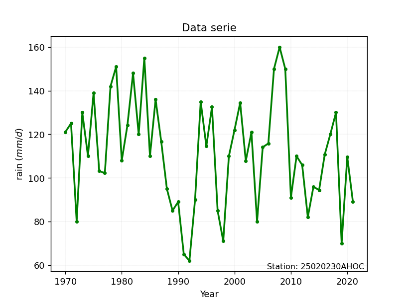

# Station: 25020230AHOC

</img>

## A. Active distributions from SciPy (90 of 104 available)

|   id | p_dist             |   n_parameter | fit_method   | label                                                                       | active   | ref                                                                                                        |
|-----:|:-------------------|--------------:|:-------------|:----------------------------------------------------------------------------|:---------|:-----------------------------------------------------------------------------------------------------------|
|    0 | alpha              |             3 | MLE          | Alpha                                                                       | True     | [:mortar_board:](https://docs.scipy.org/doc/scipy/reference/generated/scipy.stats.alpha.html)              |
|    1 | anglit             |             2 | MM           | Anglit                                                                      | True     | [:mortar_board:](https://docs.scipy.org/doc/scipy/reference/generated/scipy.stats.anglit.html)             |
|    2 | arcsine            |             2 | MM           | Arcsine                                                                     | True     | [:mortar_board:](https://docs.scipy.org/doc/scipy/reference/generated/scipy.stats.arcsine.html)            |
|    3 | argus              |             3 | MLE          | Argus                                                                       | True     | [:mortar_board:](https://docs.scipy.org/doc/scipy/reference/generated/scipy.stats.argus.html)              |
|    4 | beta               |             4 | MLE          | Beta                                                                        | True     | [:mortar_board:](https://docs.scipy.org/doc/scipy/reference/generated/scipy.stats.beta.html)               |
|    5 | betaprime          |             4 | MLE          | Beta prime                                                                  | True     | [:mortar_board:](https://docs.scipy.org/doc/scipy/reference/generated/scipy.stats.betaprime.html)          |
|    6 | bradford           |             3 | MLE          | Bradford                                                                    | True     | [:mortar_board:](https://docs.scipy.org/doc/scipy/reference/generated/scipy.stats.bradford.html)           |
|    7 | burr               |             4 | MLE          | Burr (Type III)                                                             | True     | [:mortar_board:](https://docs.scipy.org/doc/scipy/reference/generated/scipy.stats.burr.html)               |
|    8 | burr12             |             4 | MLE          | Burr (Type III) 12                                                          | True     | [:mortar_board:](https://docs.scipy.org/doc/scipy/reference/generated/scipy.stats.burr12.html)             |
|    9 | chi2               |             3 | MLE          | Chi²                                                                        | True     | [:mortar_board:](https://docs.scipy.org/doc/scipy/reference/generated/scipy.stats.chi2.html)               |
|   10 | cosine             |             2 | MLE          | Cosine                                                                      | True     | [:mortar_board:](https://docs.scipy.org/doc/scipy/reference/generated/scipy.stats.cosine.html)             |
|   11 | crystalball        |             4 | MLE          | Crystalball                                                                 | True     | [:mortar_board:](https://docs.scipy.org/doc/scipy/reference/generated/scipy.stats.crystalball.html)        |
|   12 | dgamma             |             3 | MLE          | Double gamma                                                                | True     | [:mortar_board:](https://docs.scipy.org/doc/scipy/reference/generated/scipy.stats.dgamma.html)             |
|   13 | erlang             |             3 | MLE          | Erlang                                                                      | True     | [:mortar_board:](https://docs.scipy.org/doc/scipy/reference/generated/scipy.stats.erlang.html)             |
|   14 | expon              |             2 | MLE          | Exponential                                                                 | True     | [:mortar_board:](https://docs.scipy.org/doc/scipy/reference/generated/scipy.stats.expon.html)              |
|   15 | exponnorm          |             3 | MLE          | Exponentially modified Normal                                               | True     | [:mortar_board:](https://docs.scipy.org/doc/scipy/reference/generated/scipy.stats.exponnorm.html)          |
|   16 | f                  |             4 | MLE          | F                                                                           | True     | [:mortar_board:](https://docs.scipy.org/doc/scipy/reference/generated/scipy.stats.f.html)                  |
|   17 | fatiguelife        |             3 | MLE          | Fatigue-life (Birnbaum-Saunders)                                            | True     | [:mortar_board:](https://docs.scipy.org/doc/scipy/reference/generated/scipy.stats.fatiguelife.html)        |
|   18 | fisk               |             3 | MLE          | Fisk                                                                        | True     | [:mortar_board:](https://docs.scipy.org/doc/scipy/reference/generated/scipy.stats.fisk.html)               |
|   19 | foldnorm           |             3 | MM           | Fold Normal                                                                 | True     | [:mortar_board:](https://docs.scipy.org/doc/scipy/reference/generated/scipy.stats.foldnorm.html)           |
|   20 | gamma              |             3 | MLE          | Gamma                                                                       | True     | [:mortar_board:](https://docs.scipy.org/doc/scipy/reference/generated/scipy.stats.gamma.html)              |
|   21 | gausshyper         |             6 | MLE          | Gauss hypergeometric                                                        | True     | [:mortar_board:](https://docs.scipy.org/doc/scipy/reference/generated/scipy.stats.gausshyper.html)         |
|   22 | genexpon           |             5 | MLE          | Generalized exponential                                                     | True     | [:mortar_board:](https://docs.scipy.org/doc/scipy/reference/generated/scipy.stats.genexpon.html)           |
|   23 | genextreme         |             3 | MLE          | Generalized exponential                                                     | True     | [:mortar_board:](https://docs.scipy.org/doc/scipy/reference/generated/scipy.stats.genextreme.html)         |
|   24 | genhalflogistic    |             3 | MLE          | Generalized half-logistic                                                   | True     | [:mortar_board:](https://docs.scipy.org/doc/scipy/reference/generated/scipy.stats.genhalflogistic.html)    |
|   25 | genhyperbolic      |             5 | MLE          | Generalized hyperbolic                                                      | True     | [:mortar_board:](https://docs.scipy.org/doc/scipy/reference/generated/scipy.stats.genhyperbolic.html)      |
|   26 | geninvgauss        |             4 | MLE          | Generalized Inverse Gaussian                                                | True     | [:mortar_board:](https://docs.scipy.org/doc/scipy/reference/generated/scipy.stats.geninvgauss.html)        |
|   27 | genlogistic        |             3 | MLE          | Generalized logistic                                                        | True     | [:mortar_board:](https://docs.scipy.org/doc/scipy/reference/generated/scipy.stats.genlogistic.html)        |
|   28 | gennorm            |             3 | MLE          | Generalized Normal                                                          | True     | [:mortar_board:](https://docs.scipy.org/doc/scipy/reference/generated/scipy.stats.gennorm.html)            |
|   29 | genpareto          |             3 | MLE          | Generalized Pareto                                                          | True     | [:mortar_board:](https://docs.scipy.org/doc/scipy/reference/generated/scipy.stats.genpareto.html)          |
|   30 | gibrat             |             2 | MM           | Gibrat                                                                      | True     | [:mortar_board:](https://docs.scipy.org/doc/scipy/reference/generated/scipy.stats.gibrat.html)             |
|   31 | gompertz           |             3 | MLE          | Gompertz (or truncated Gumbel)                                              | True     | [:mortar_board:](https://docs.scipy.org/doc/scipy/reference/generated/scipy.stats.gompertz.html)           |
|   32 | gumbel_l           |             2 | MM           | Gumbel Left Skew                                                            | True     | [:mortar_board:](https://docs.scipy.org/doc/scipy/reference/generated/scipy.stats.gumbel_l.html)           |
|   33 | gumbel_r           |             2 | MM           | Gumbel Right Skew                                                           | True     | [:mortar_board:](https://docs.scipy.org/doc/scipy/reference/generated/scipy.stats.gumbel_r.html)           |
|   34 | halflogistic       |             2 | MM           | Half-logistic                                                               | True     | [:mortar_board:](https://docs.scipy.org/doc/scipy/reference/generated/scipy.stats.halflogistic.html)       |
|   35 | halfnorm           |             2 | MM           | Half Normal                                                                 | True     | [:mortar_board:](https://docs.scipy.org/doc/scipy/reference/generated/scipy.stats.halfnorm.html)           |
|   36 | hypsecant          |             2 | MM           | hyperbolic secant                                                           | True     | [:mortar_board:](https://docs.scipy.org/doc/scipy/reference/generated/scipy.stats.hypsecant.html)          |
|   37 | invgamma           |             3 | MLE          | Inverted gamma                                                              | True     | [:mortar_board:](https://docs.scipy.org/doc/scipy/reference/generated/scipy.stats.invgamma.html)           |
|   38 | invgauss           |             3 | MLE          | Inverse Gaussian                                                            | True     | [:mortar_board:](https://docs.scipy.org/doc/scipy/reference/generated/scipy.stats.invgauss.html)           |
|   39 | invweibull         |             3 | MLE          | Inverted Weibull                                                            | True     | [:mortar_board:](https://docs.scipy.org/doc/scipy/reference/generated/scipy.stats.invweibull.html)         |
|   40 | johnsonsb          |             4 | MLE          | Johnson SB                                                                  | True     | [:mortar_board:](https://docs.scipy.org/doc/scipy/reference/generated/scipy.stats.johnsonsb.html)          |
|   41 | johnsonsu          |             4 | MLE          | Johnson Su                                                                  | True     | [:mortar_board:](https://docs.scipy.org/doc/scipy/reference/generated/scipy.stats.johnsonsu.html)          |
|   42 | kappa3             |             3 | MLE          | Kappa 3                                                                     | True     | [:mortar_board:](https://docs.scipy.org/doc/scipy/reference/generated/scipy.stats.kappa3.html)             |
|   43 | kappa4             |             4 | MLE          | Kappa 4                                                                     | True     | [:mortar_board:](https://docs.scipy.org/doc/scipy/reference/generated/scipy.stats.kappa4.html)             |
|   44 | ksone              |             3 | MLE          | Kolmogorov-Smirnov one-sided test statistic distribution                    | True     | [:mortar_board:](https://docs.scipy.org/doc/scipy/reference/generated/scipy.stats.ksone.html)              |
|   45 | kstwobign          |             2 | MLE          | Limiting distribution of scaled Kolmogorov-Smirnov two-sided test statistic | True     | [:mortar_board:](https://docs.scipy.org/doc/scipy/reference/generated/scipy.stats.kstwobign.html)          |
|   46 | laplace            |             2 | MM           | Laplace                                                                     | True     | [:mortar_board:](https://docs.scipy.org/doc/scipy/reference/generated/scipy.stats.laplace.html)            |
|   47 | laplace_asymmetric |             3 | MLE          | Asymmetric Laplace                                                          | True     | [:mortar_board:](https://docs.scipy.org/doc/scipy/reference/generated/scipy.stats.laplace_asymmetric.html) |
|   48 | levy_l             |             2 | MLE          | Left-skewed Levy                                                            | True     | [:mortar_board:](https://docs.scipy.org/doc/scipy/reference/generated/scipy.stats.levy_l.html)             |
|   49 | levy_stable        |             4 | MLE          | Levy-stable                                                                 | True     | [:mortar_board:](https://docs.scipy.org/doc/scipy/reference/generated/scipy.stats.levy_stable.html)        |
|   50 | loggamma           |             3 | MLE          | Log gamma                                                                   | True     | [:mortar_board:](https://docs.scipy.org/doc/scipy/reference/generated/scipy.stats.loggamma.html)           |
|   51 | logistic           |             2 | MM           | Logistic (or Sech-squared)                                                  | True     | [:mortar_board:](https://docs.scipy.org/doc/scipy/reference/generated/scipy.stats.logistic.html)           |
|   52 | loglaplace         |             3 | MLE          | Log-Laplace                                                                 | True     | [:mortar_board:](https://docs.scipy.org/doc/scipy/reference/generated/scipy.stats.loglaplace.html)         |
|   53 | lognorm            |             3 | MLE          | Log Normal                                                                  | True     | [:mortar_board:](https://docs.scipy.org/doc/scipy/reference/generated/scipy.stats.lognorm.html)            |
|   54 | loguniform         |             4 | MLE          | Log-Uniform or reciprocal                                                   | True     | [:mortar_board:](https://docs.scipy.org/doc/scipy/reference/generated/scipy.stats.loguniform.html)         |
|   55 | lomax              |             3 | MLE          | Lomax (Pareto of the second kind)                                           | True     | [:mortar_board:](https://docs.scipy.org/doc/scipy/reference/generated/scipy.stats.lomax.html)              |
|   56 | maxwell            |             2 | MM           | Maxwell                                                                     | True     | [:mortar_board:](https://docs.scipy.org/doc/scipy/reference/generated/scipy.stats.maxwell.html)            |
|   57 | mielke             |             4 | MLE          | Mielke Beta-Kappa / Dagum                                                   | True     | [:mortar_board:](https://docs.scipy.org/doc/scipy/reference/generated/scipy.stats.mielke.html)             |
|   58 | moyal              |             2 | MM           | Moyal                                                                       | True     | [:mortar_board:](https://docs.scipy.org/doc/scipy/reference/generated/scipy.stats.moyal.html)              |
|   59 | nakagami           |             3 | MLE          | Nakagami                                                                    | True     | [:mortar_board:](https://docs.scipy.org/doc/scipy/reference/generated/scipy.stats.nakagami.html)           |
|   60 | ncf                |             5 | MLE          | Non-central F distribution                                                  | True     | [:mortar_board:](https://docs.scipy.org/doc/scipy/reference/generated/scipy.stats.ncf.html)                |
|   61 | nct                |             4 | MLE          | Non-central Student’s t                                                     | True     | [:mortar_board:](https://docs.scipy.org/doc/scipy/reference/generated/scipy.stats.nct.html)                |
|   62 | ncx2               |             4 | MLE          | Non-central chi-squared                                                     | True     | [:mortar_board:](https://docs.scipy.org/doc/scipy/reference/generated/scipy.stats.ncx2.html)               |
|   63 | norm               |             2 | MM           | Normal                                                                      | True     | [:mortar_board:](https://docs.scipy.org/doc/scipy/reference/generated/scipy.stats.norm.html)               |
|   64 | pareto             |             3 | MLE          | Pareto                                                                      | True     | [:mortar_board:](https://docs.scipy.org/doc/scipy/reference/generated/scipy.stats.pareto.html)             |
|   65 | pearson3           |             3 | MM           | Pearson type III                                                            | True     | [:mortar_board:](https://docs.scipy.org/doc/scipy/reference/generated/scipy.stats.pearson3.html)           |
|   66 | powerlaw           |             3 | MLE          | Power-function                                                              | True     | [:mortar_board:](https://docs.scipy.org/doc/scipy/reference/generated/scipy.stats.powerlaw.html)           |
|   67 | powerlognorm       |             4 | MLE          | Power log-normal                                                            | True     | [:mortar_board:](https://docs.scipy.org/doc/scipy/reference/generated/scipy.stats.powerlognorm.html)       |
|   68 | powernorm          |             3 | MLE          | Power normal                                                                | True     | [:mortar_board:](https://docs.scipy.org/doc/scipy/reference/generated/scipy.stats.powernorm.html)          |
|   69 | rayleigh           |             2 | MM           | Rayleigh                                                                    | True     | [:mortar_board:](https://docs.scipy.org/doc/scipy/reference/generated/scipy.stats.rayleigh.html)           |
|   70 | rdist              |             3 | MLE          | R-distributed (symmetric beta)                                              | True     | [:mortar_board:](https://docs.scipy.org/doc/scipy/reference/generated/scipy.stats.rdist.html)              |
|   71 | recipinvgauss      |             3 | MLE          | Reciprocal inverse Gaussian                                                 | True     | [:mortar_board:](https://docs.scipy.org/doc/scipy/reference/generated/scipy.stats.recipinvgauss.html)      |
|   72 | rice               |             3 | MLE          | Rice                                                                        | True     | [:mortar_board:](https://docs.scipy.org/doc/scipy/reference/generated/scipy.stats.rice.html)               |
|   73 | semicircular       |             2 | MM           | Semicircular                                                                | True     | [:mortar_board:](https://docs.scipy.org/doc/scipy/reference/generated/scipy.stats.semicircular.html)       |
|   74 | skewnorm           |             3 | MLE          | Skew normal                                                                 | True     | [:mortar_board:](https://docs.scipy.org/doc/scipy/reference/generated/scipy.stats.skewnorm.html)           |
|   75 | t                  |             3 | MLE          | Student’s t                                                                 | True     | [:mortar_board:](https://docs.scipy.org/doc/scipy/reference/generated/scipy.stats.t.html)                  |
|   76 | trapezoid          |             4 | MLE          | Trapezoid                                                                   | True     | [:mortar_board:](https://docs.scipy.org/doc/scipy/reference/generated/scipy.stats.trapezoid.html)          |
|   77 | triang             |             3 | MLE          | Triangular                                                                  | True     | [:mortar_board:](https://docs.scipy.org/doc/scipy/reference/generated/scipy.stats.triang.html)             |
|   78 | truncexpon         |             3 | MLE          | Truncated exponential                                                       | True     | [:mortar_board:](https://docs.scipy.org/doc/scipy/reference/generated/scipy.stats.truncexpon.html)         |
|   79 | truncnorm          |             4 | MLE          | Truncated normal                                                            | True     | [:mortar_board:](https://docs.scipy.org/doc/scipy/reference/generated/scipy.stats.truncnorm.html)          |
|   80 | truncpareto        |             4 | MLE          | Upper truncated Pareto                                                      | True     | [:mortar_board:](https://docs.scipy.org/doc/scipy/reference/generated/scipy.stats.truncpareto.html)        |
|   81 | truncweibull_min   |             5 | MLE          | Doubly truncated Weibull minimum                                            | True     | [:mortar_board:](https://docs.scipy.org/doc/scipy/reference/generated/scipy.stats.truncweibull_min.html)   |
|   82 | tukeylambda        |             3 | MLE          | Tukey-Lamdba                                                                | True     | [:mortar_board:](https://docs.scipy.org/doc/scipy/reference/generated/scipy.stats.tukeylambda.html)        |
|   83 | uniform            |             2 | MLE          | Uniform                                                                     | True     | [:mortar_board:](https://docs.scipy.org/doc/scipy/reference/generated/scipy.stats.uniform.html)            |
|   84 | vonmises           |             3 | MLE          | Von Mises                                                                   | True     | [:mortar_board:](https://docs.scipy.org/doc/scipy/reference/generated/scipy.stats.vonmises.html)           |
|   85 | vonmises_line      |             3 | MLE          | Von Mises line                                                              | True     | [:mortar_board:](https://docs.scipy.org/doc/scipy/reference/generated/scipy.stats.vonmises_line.html)      |
|   86 | wald               |             2 | MM           | Wald                                                                        | True     | [:mortar_board:](https://docs.scipy.org/doc/scipy/reference/generated/scipy.stats.wald.html)               |
|   87 | weibull_max        |             3 | MLE          | Weibull maximum                                                             | True     | [:mortar_board:](https://docs.scipy.org/doc/scipy/reference/generated/scipy.stats.weibull_max.html)        |
|   88 | weibull_min        |             3 | MLE          | Weibull minimum                                                             | True     | [:mortar_board:](https://docs.scipy.org/doc/scipy/reference/generated/scipy.stats.weibull_min.html)        |
|   89 | wrapcauchy         |             3 | MLE          | Wrapped  Cauchy                                                             | True     | [:mortar_board:](https://docs.scipy.org/doc/scipy/reference/generated/scipy.stats.wrapcauchy.html)         |

> Gumbel and Lob-Gumbel probability distributions are not shown in the above table.  
> n_parameter = # arguments & localization & scale.  
> Fit methods: (MLE) maximum likelihood, (MM) L-moments.

## B. Probability distributions

### Cumulative distribution values - CDF (92 evalated, ordered by x ascending) 

|   id |   date |      x | station      |   m |     alpha |   alpha_pdf |     anglit |   anglit_pdf |   arcsine |   arcsine_pdf |     argus |   argus_pdf |      beta |   beta_pdf |   betaprime |   betaprime_pdf |   bradford |   bradford_pdf |      burr |   burr_pdf |    burr12 |   burr12_pdf |      chi2 |   chi2_pdf |    cosine |   cosine_pdf |   crystalball |   crystalball_pdf |    dgamma |   dgamma_pdf |    erlang |   erlang_pdf |     expon |   expon_pdf |   exponnorm |   exponnorm_pdf |         f |      f_pdf |   fatiguelife |   fatiguelife_pdf |      fisk |   fisk_pdf |   foldnorm |   foldnorm_pdf |     gamma |   gamma_pdf |   gausshyper |   gausshyper_pdf |    genexpon |   genexpon_pdf |   genextreme |   genextreme_pdf |   genhalflogistic |   genhalflogistic_pdf |   genhyperbolic |   genhyperbolic_pdf |   geninvgauss |   geninvgauss_pdf |   genlogistic |   genlogistic_pdf |    gennorm |   gennorm_pdf |   genpareto |   genpareto_pdf |    gibrat |   gibrat_pdf |    gompertz |   gompertz_pdf |   gumbel_l |   gumbel_l_pdf |    gumbel_r |   gumbel_r_pdf |   halflogistic |   halflogistic_pdf |   halfnorm |   halfnorm_pdf |   hypsecant |   hypsecant_pdf |   invgamma |   invgamma_pdf |   invgauss |   invgauss_pdf |   invweibull |   invweibull_pdf |   johnsonsb |   johnsonsb_pdf |   johnsonsu |   johnsonsu_pdf |      kappa3 |   kappa3_pdf |      kappa4 |   kappa4_pdf |     ksone |   ksone_pdf |   kstwobign |   kstwobign_pdf |   laplace |   laplace_pdf |   laplace_asymmetric |   laplace_asymmetric_pdf |   levy_l |   levy_l_pdf |   levy_stable |   levy_stable_pdf |   loggamma |   loggamma_pdf |   logistic |   logistic_pdf |   loglaplace |   loglaplace_pdf |   lognorm |   lognorm_pdf |   loguniform |   loguniform_pdf |       lomax |   lomax_pdf |    maxwell |   maxwell_pdf |    mielke |   mielke_pdf |       moyal |   moyal_pdf |   nakagami |   nakagami_pdf |        ncf |    ncf_pdf |       nct |    nct_pdf |     ncx2 |    ncx2_pdf |      norm |   norm_pdf |      pareto |   pareto_pdf |   pearson3 |   pearson3_pdf |    powerlaw |   powerlaw_pdf |   powerlognorm |   powerlognorm_pdf |   powernorm |   powernorm_pdf |   rayleigh |   rayleigh_pdf |     rdist |   rdist_pdf |   recipinvgauss |   recipinvgauss_pdf |        rice |     rice_pdf |   semicircular |   semicircular_pdf |   skewnorm |   skewnorm_pdf |         t |      t_pdf |   trapezoid |   trapezoid_pdf |    triang |   triang_pdf |   truncexpon |   truncexpon_pdf |   truncnorm |   truncnorm_pdf |   truncpareto |   truncpareto_pdf |   truncweibull_min |   truncweibull_min_pdf |   tukeylambda |   tukeylambda_pdf |   uniform |   uniform_pdf |   vonmises |   vonmises_pdf |   vonmises_line |   vonmises_line_pdf |        wald |    wald_pdf |   weibull_max |   weibull_max_pdf |   weibull_min |   weibull_min_pdf |   wrapcauchy |   wrapcauchy_pdf |
|-----:|-------:|-------:|:-------------|----:|----------:|------------:|-----------:|-------------:|----------:|--------------:|----------:|------------:|----------:|-----------:|------------:|----------------:|-----------:|---------------:|----------:|-----------:|----------:|-------------:|----------:|-----------:|----------:|-------------:|--------------:|------------------:|----------:|-------------:|----------:|-------------:|----------:|------------:|------------:|----------------:|----------:|-----------:|--------------:|------------------:|----------:|-----------:|-----------:|---------------:|----------:|------------:|-------------:|-----------------:|------------:|---------------:|-------------:|-----------------:|------------------:|----------------------:|----------------:|--------------------:|--------------:|------------------:|--------------:|------------------:|-----------:|--------------:|------------:|----------------:|----------:|-------------:|------------:|---------------:|-----------:|---------------:|------------:|---------------:|---------------:|-------------------:|-----------:|---------------:|------------:|----------------:|-----------:|---------------:|-----------:|---------------:|-------------:|-----------------:|------------:|----------------:|------------:|----------------:|------------:|-------------:|------------:|-------------:|----------:|------------:|------------:|----------------:|----------:|--------------:|---------------------:|-------------------------:|---------:|-------------:|--------------:|------------------:|-----------:|---------------:|-----------:|---------------:|-------------:|-----------------:|----------:|--------------:|-------------:|-----------------:|------------:|------------:|-----------:|--------------:|----------:|-------------:|------------:|------------:|-----------:|---------------:|-----------:|-----------:|----------:|-----------:|---------:|------------:|----------:|-----------:|------------:|-------------:|-----------:|---------------:|------------:|---------------:|---------------:|-------------------:|------------:|----------------:|-----------:|---------------:|----------:|------------:|----------------:|--------------------:|------------:|-------------:|---------------:|-------------------:|-----------:|---------------:|----------:|-----------:|------------:|----------------:|----------:|-------------:|-------------:|-----------------:|------------:|----------------:|--------------:|------------------:|-------------------:|-----------------------:|--------------:|------------------:|----------:|--------------:|-----------:|---------------:|----------------:|--------------------:|------------:|------------:|--------------:|------------------:|--------------:|------------------:|-------------:|-----------------:|
|    0 |   1992 |  62    | 25020230AHOC |   1 | 0.0138478 |  0.00180803 | 0.00670552 |   0.00230053 |  0        |    0          | 0.0148148 |  0.0027019  | 0.0047049 | 0.00281349 |  0.00795494 |      0.00141045 | 9.6869e-08 |     0.0150221  | 0.0289874 | 0.00227842 | 0.0279888 |   0.00234575 | 0.0152344 | 0.00186014 | 0.0110039 |   0.0020707  |     0.0198055 |        0.00197987 | 0.0272857 |   0.00179064 | 0.0187447 |   0.00194745 | 0         |  0.0200368  |   0.0198055 |      0.00197986 | 0.0193805 | 0.00197069 |     0.0154494 |        0.00183874 | 0.028603  | 0.00195605 |   0        |   0            | 0.0188011 |  0.00195186 |   0.00277973 |       0.00764774 | 1.31889e-07 |     0.0199627  |    0.0719332 |      0.00047915  |       1.06229e-11 |            0.00577758 |       0.0198749 |          0.00198098 |    0.00266394 |        0.00176903 |     0.0259918 |        0.00189618 | 0.00975751 |    0.00202869 |    0.30216  |      0.00517925 | 0         |   0          | 8.53975e-08 |     0.0048831  |  0.0393049 |    0.0020371   | 0.000385251 |    0.000160162 |      0         |         0          | 0          |     0          |   0.0251108 |      0.00162464 |  0.0131135 |     0.00171164 | 0.00724502 |     0.00163156 |   0.00615346 |       0.00135072 |  0.00729964 |      0.00245517 |   0.0198155 |      0.00198052 | 4.48122e-06 |    0.0101695 | 1.66171e-15 |   0.138495   | 0.0833333 |   0.0085034 |  0.00476594 |      0.00139555 | 0.027234  |    0.00158801 |            0.0358709 |               0.00193045 | 0.418317 |   0.00186803 |     0.0324623 |        0.00268609 |  0.0218214 |     0.00203904 |  0.0233757 |     0.0017073  |    0.0202185 |       0.00180145 | 0.0198029 |    0.00197978 |  3.92432e-07 |       0.0162223  | 3.06253e-06 |  0.0199604  | 0.00242996 |   0.000955516 | 0.0289402 |   0.00227417 | 1.89587e-07 | 2.43747e-07 |  0.0195203 |     0.00197107 | 0.00628434 | 0.00125113 | 0.0198255 | 0.00198176 | 0.257074 | 5.05888e+11 | 0.0198055 | 0.00197987 | 1.91086e-08 |   0.0200368  |  0.021126  |     0.00202043 | 2.26407e-11 |  2101.63       |     0.00510672 |         0.0141275  |   0.0198471 |      0.00198105 | 0          |     0          | 0.0039292 | 89.5075     |       0.0144214 |          0.00178177 | 0           | 0            |     0          |         0          |  0.0202472 |     0.00199223 | 0.0198176 | 0.0019807  |  0.00694444 |      0.00141723 | 0.0080738 |   0.00227406 |  4.57003e-06 |       0.0146912  |   0.0198055 |      0.00197987 |   2.22284e-08 |        0.0233082  |        0.000908017 |             0.0054185  |    0.00452601 |        0.00282956 | 0         |     0.0102041 |    9.99116 |       0.105913 |     2.48152e-09 |          0.00586953 | 0           | 0           |     0.0695852 |       0.000446534 |     0.013426  |        0.00201845 |  4.03549e-07 |       0.00957657 |
|    1 |   1991 |  65    | 25020230AHOC |   2 | 0.0202165 |  0.00246145 | 0.0153617  |   0.00346682 |  0        |    0          | 0.0240176 |  0.00343214 | 0.015751  | 0.00446718 |  0.0131925  |      0.00211387 | 0.0443416  |     0.014544   | 0.0364945 | 0.00273663 | 0.0357674 |   0.00285172 | 0.021722  | 0.00248642 | 0.018407  |   0.00288274 |     0.0265512 |        0.00253429 | 0.0332065 |   0.00216803 | 0.0254086 |   0.00251297 | 0.0583395 |  0.0188679  |   0.0265511 |      0.00253429 | 0.0261072 | 0.00253121 |     0.0218462 |        0.00244665 | 0.0350932 | 0.00238385 |   0        |   0            | 0.0254793 |  0.0025181  |   0.030061   |       0.00983247 | 0.0582621   |     0.0188606  |    0.0734023 |      0.000500502 |       0.017601    |            0.00595768 |       0.0266226 |          0.00253451 |    0.0112156  |        0.00397266 |     0.0323214 |        0.0023377  | 0.0174225  |    0.00312258 |    0.317764 |      0.00522334 | 0         |   0          | 0.0153334   |     0.00534467 |  0.0459049 |    0.00237092  | 0.00122072  |    0.000433044 |      0         |         0          | 0          |     0          |   0.0304885 |      0.00197161 |  0.0191483 |     0.00233461 | 0.0135414  |     0.00261109 |   0.0114126  |       0.00220117 |  0.016722   |      0.00382143 |   0.0265632 |      0.002535   | 0.0305131   |    0.0101695 | 0.038812    |   0.0119881  | 0.108844  |   0.0085034 |  0.0105486  |      0.00252283 | 0.0324401 |    0.00189158 |            0.0421559 |               0.00226869 | 0.424036 |   0.00194533 |     0.0413857 |        0.00327632 |  0.0287187 |     0.00257497 |  0.0290841 |     0.00211181 |    0.0262499 |       0.00223146 | 0.0265483 |    0.00253424 |  0.0476706   |       0.0155668  | 0.0581267   |  0.0188002  | 0.00653851 |   0.00182536  | 0.036434  |   0.00273207 | 5.61059e-06 | 5.53392e-06 |  0.0262434 |     0.00252823 | 0.011054   | 0.00196564 | 0.0265775 | 0.00253659 | 0.611442 | 0.0569064   | 0.0265512 | 0.00253429 | 0.0583396   |   0.0188679  |  0.0279766 |     0.00256291 | 0.100312    |     0.022054   |     0.0792807  |         0.0284789  |   0.0265956 |      0.00253502 | 0          |     0          | 0.18796   |  0.0200146  |       0.0206516 |          0.00239322 | 0           | 0            |     0.00357328 |         0.00334164 |  0.0270235 |     0.00254212 | 0.0265659 | 0.00253523 |  0.0118469  |      0.00185108 | 0.0163371 |   0.00323482 |  0.0435565   |       0.0143449  |   0.0265512 |      0.00253429 |   0.0678644   |        0.0219484  |        0.0225326   |             0.00825068 |    0.0159675  |        0.00470267 | 0.0306122 |     0.0102041 |   10.4498  |       0.22134  |     0.0176622   |          0.00592314 | 0           | 0           |     0.070954  |       0.000466263 |     0.0204753 |        0.00269823 |  0.0287301   |       0.00957657 |
|    2 |   2019 |  70    | 25020230AHOC |   3 | 0.0358871 |  0.00387521 | 0.0374442  |   0.00535154 |  0        |    0          | 0.044186  |  0.00463092 | 0.0434474 | 0.00650841 |  0.0275781  |      0.00373452 | 0.115199   |     0.0138115  | 0.0523731 | 0.00364681 | 0.0524519 |   0.00385654 | 0.0373466 | 0.00382596 | 0.0366366 |   0.0044479  |     0.0420004 |        0.00369652 | 0.0459535 |   0.00297066 | 0.0408177 |   0.0037039  | 0.148107  |  0.0170692  |   0.0420003 |      0.00369651 | 0.0415755 | 0.00370818 |     0.0371809 |        0.00374871 | 0.0491712 | 0.00329143 |   0        |   0            | 0.040917  |  0.00371018 |   0.0816117  |       0.0106221  | 0.148008    |     0.0170659  |    0.0760009 |      0.000539724 |       0.0481737   |            0.00627506 |       0.0420682 |          0.0036948  |    0.0404805  |        0.00766712 |     0.0462559 |        0.00328373 | 0.0385032  |    0.00537342 |    0.344072 |      0.00530092 | 0         |   0          | 0.0441275   |     0.00618859 |  0.0593785 |    0.00304489  | 0.00580107  |    0.00157977  |      0         |         0          | 0          |     0          |   0.0421184 |      0.0027199  |  0.0340454 |     0.00369207 | 0.0317999  |     0.00479518 |   0.0271725  |       0.00422442 |  0.0412072  |      0.00592294 |   0.0420161 |      0.00369727 | 0.0813609   |    0.0101695 | 0.0963321   |   0.0111641  | 0.151361  |   0.0085034 |  0.0293694  |      0.00513098 | 0.0434211 |    0.00253189 |            0.0551722 |               0.00296918 | 0.434109 |   0.00208654 |     0.0605817 |        0.00443898 |  0.0442606 |     0.00368945 |  0.0417216 |     0.00299    |    0.0395366 |       0.00312203 | 0.0419973 |    0.00369653 |  0.122996    |       0.0145847  | 0.147589    |  0.0170145  | 0.0202961  |   0.00376803  | 0.0522894 |   0.00364218 | 0.000304671 | 0.000194321 |  0.0416786 |     0.00369753 | 0.0248663  | 0.00366614 | 0.0420398 | 0.00369948 | 0.816285 | 0.0281284   | 0.0420004 | 0.00369652 | 0.148107    |   0.0170692  |  0.0434965 |     0.00369382 | 0.19156     |     0.0157933  |     0.211408   |         0.02346    |   0.0420457 |      0.00369609 | 0.00732801 |     0.00325216 | 0.25808   |  0.0106015  |       0.0357529 |          0.00371074 | 0           | 0            |     0.0294928  |         0.00660881 |  0.0424854 |     0.00369298 | 0.0420202 | 0.0036976  |  0.02291    |      0.00257416 | 0.0365144 |   0.0048361  |  0.113874    |       0.0137857  |   0.0420004 |      0.00369652 |   0.172288    |        0.019856   |        0.0680459   |             0.00973905 |    0.0454334  |        0.00695141 | 0.0816327 |     0.0102041 |   11.2013  |       0.157364 |     0.0479776   |          0.00625403 | 0           | 0           |     0.0733741 |       0.000502501 |     0.0372411 |        0.00405271 |  0.076613    |       0.00957657 |
|    3 |   1998 |  71    | 25020230AHOC |   4 | 0.0399268 |  0.00420674 | 0.0429788  |   0.00571691 |  0        |    0          | 0.0489353 |  0.00486735 | 0.0501294 | 0.00685265 |  0.0315062  |      0.00412518 | 0.128941   |     0.0136738  | 0.0561221 | 0.00385256 | 0.0564208 |   0.00408258 | 0.0413277 | 0.00413866 | 0.0412531 |   0.00478627 |     0.0458306 |        0.00396611 | 0.0490188 |   0.00316176 | 0.0446589 |   0.00398069 | 0.165007  |  0.0167306  |   0.0458305 |      0.0039661  | 0.0454193 | 0.00398135 |     0.0410808 |        0.00405335 | 0.0525691 | 0.0035063  |   0        |   0            | 0.0447646 |  0.00398718 |   0.0922713  |       0.0106945  | 0.164904    |     0.0167275  |    0.0765448 |      0.000548173 |       0.0544817   |            0.00634125 |       0.0458965 |          0.00396396 |    0.0484862  |        0.00833927 |     0.0496512 |        0.00350895 | 0.0441174  |    0.00585551 |    0.349381 |      0.00531709 | 0         |   0          | 0.0504058   |     0.00636856 |  0.0625001 |    0.00319959  | 0.00756317  |    0.00195355  |      0         |         0          | 0          |     0          |   0.0449275 |      0.00290013 |  0.0378963 |     0.00401225 | 0.036845   |     0.0052979  |   0.0316383  |       0.00471112 |  0.0473224  |      0.0063051  |   0.0458471 |      0.00396687 | 0.0915304   |    0.0101695 | 0.107448    |   0.0110701  | 0.159864  |   0.0085034 |  0.0347969  |      0.00572659 | 0.0460283 |    0.00268391 |            0.0582227 |               0.00313335 | 0.43621  |   0.00211682 |     0.0651493 |        0.00469765 |  0.0480779 |     0.00394706 |  0.0448162 |     0.0032014  |    0.0427614 |       0.00332935 | 0.0458276 |    0.00396614 |  0.137489    |       0.0144029  | 0.164435    |  0.0166782  | 0.0242864  |   0.00421532  | 0.0560338 |   0.00384799 | 0.000561334 | 0.000328467 |  0.0455108 |     0.0039689  | 0.0287381  | 0.00408135 | 0.0458731 | 0.0039692  | 0.842462 | 0.0243112   | 0.0458306 | 0.00396611 | 0.165007    |   0.0167306  |  0.0473202 |     0.00395549 | 0.207035    |     0.0151725  |     0.234247   |         0.022225   |   0.0458754 |      0.0039654  | 0.0109358  |     0.00396202 | 0.268295  |  0.00985412 |       0.0396169 |          0.00401984 | 0           | 0            |     0.0363268  |         0.0070526  |  0.0463107 |     0.00395977 | 0.0458515 | 0.00396722 |  0.0255565  |      0.00271877 | 0.0415106 |   0.00515635 |  0.127605    |       0.0136765  |   0.0458306 |      0.00396611 |   0.191947    |        0.0194622  |        0.0778781   |             0.00992144 |    0.0525701  |        0.00731835 | 0.0918367 |     0.0102041 |   11.3882  |       0.213121 |     0.0542822   |          0.00635735 | 0           | 0           |     0.0738805 |       0.000510307 |     0.041444  |        0.00435471 |  0.0861896   |       0.00957657 |
|    4 |   2004 |  80    | 25020230AHOC |   5 | 0.0932307 |  0.00779804 | 0.10851    |   0.00876729 |  0.119563 |    0.0252975  | 0.10212   |  0.00693015 | 0.123732  | 0.00934279 |  0.0870196  |      0.00839606 | 0.246792   |     0.0125475  | 0.100354  | 0.0060988  | 0.103504  |   0.00648999 | 0.093146  | 0.0075326  | 0.0987604 |   0.00803304 |     0.0941515 |        0.00692294 | 0.0870063 |   0.00547293 | 0.0934498 |   0.00701536 | 0.302786  |  0.01397    |   0.0941513 |      0.00692292 | 0.094041  | 0.00697533 |     0.0918246 |        0.00738415 | 0.0946592 | 0.00603318 |   0        |   0            | 0.0936203 |  0.00702302 |   0.189925   |       0.0109128  | 0.302662    |     0.0139681  |    0.0818539 |      0.000635124 |       0.11437     |            0.0069808  |       0.0941801 |          0.00691692 |    0.14587    |        0.0128079  |     0.0923145 |        0.00616919 | 0.115484   |    0.00980682 |    0.397925 |      0.00547392 | 0         |   0          | 0.11552     |     0.00814703 |  0.0986628 |    0.00495113  | 0.0480869   |    0.00771706  |      0         |         0          | 0.00384335 |     0.019831   |   0.0801821 |      0.00513834 |  0.0890524 |     0.00752552 | 0.106259   |     0.0101426  |   0.0960717  |       0.00970443 |  0.117669   |      0.00915691 |   0.0941741 |      0.00692348 | 0.183056    |    0.0101695 | 0.204391    |   0.0105406  | 0.236395  |   0.0085034 |  0.110926   |      0.0110683  | 0.0777926 |    0.00453609 |            0.0945025 |               0.00508581 | 0.4566   |   0.00242573 |     0.118985  |        0.00735402 |  0.0956562 |     0.00677185 |  0.0842262 |     0.00576837 |    0.0827283 |       0.00571956 | 0.0941495 |    0.00692315 |  0.260348    |       0.0129505  | 0.301829    |  0.0139357  | 0.0819419  |   0.008676    | 0.100232  |   0.00609646 | 0.0223484   | 0.00614288  |  0.0939399 |     0.00694479 | 0.0850502  | 0.0086184  | 0.0942256 | 0.00692673 | 0.96233  | 0.00614238  | 0.0941515 | 0.00692294 | 0.302786    |   0.01397    |  0.0951662 |     0.00682446 | 0.327033    |     0.0119833  |     0.393571   |         0.0140331  |   0.0941767 |      0.00691922 | 0.0737394  |     0.00979313 | 0.339302  |  0.006591   |       0.0902835 |          0.00740271 | 0           | 0            |     0.113777   |         0.00988509 |  0.0944441 |     0.0068868  | 0.0941828 | 0.0069241  |  0.0558824  |      0.00402032 | 0.100888  |   0.00803864 |  0.246392    |       0.0127319  |   0.0941515 |      0.00692294 |   0.352221    |        0.0162508  |        0.172176    |             0.010874   |    0.13071    |        0.00984392 | 0.183673  |     0.0102041 |   12.8959  |       0.123054 |     0.117514    |          0.0078717  | 0           | 0           |     0.0788201 |       0.000590629 |     0.0940962 |        0.00744331 |  0.172379    |       0.00957657 |
|    5 |   1972 |  80    | 25020230AHOC |   6 | 0.0932307 |  0.00779804 | 0.10851    |   0.00876729 |  0.119563 |    0.0252975  | 0.10212   |  0.00693015 | 0.123732  | 0.00934279 |  0.0870196  |      0.00839606 | 0.246792   |     0.0125475  | 0.100354  | 0.0060988  | 0.103504  |   0.00648999 | 0.093146  | 0.0075326  | 0.0987604 |   0.00803304 |     0.0941515 |        0.00692294 | 0.0870063 |   0.00547293 | 0.0934498 |   0.00701536 | 0.302786  |  0.01397    |   0.0941513 |      0.00692292 | 0.094041  | 0.00697533 |     0.0918246 |        0.00738415 | 0.0946592 | 0.00603318 |   0        |   0            | 0.0936203 |  0.00702302 |   0.189925   |       0.0109128  | 0.302662    |     0.0139681  |    0.0818539 |      0.000635124 |       0.11437     |            0.0069808  |       0.0941801 |          0.00691692 |    0.14587    |        0.0128079  |     0.0923145 |        0.00616919 | 0.115484   |    0.00980682 |    0.397925 |      0.00547392 | 0         |   0          | 0.11552     |     0.00814703 |  0.0986628 |    0.00495113  | 0.0480869   |    0.00771706  |      0         |         0          | 0.00384335 |     0.019831   |   0.0801821 |      0.00513834 |  0.0890524 |     0.00752552 | 0.106259   |     0.0101426  |   0.0960717  |       0.00970443 |  0.117669   |      0.00915691 |   0.0941741 |      0.00692348 | 0.183056    |    0.0101695 | 0.204391    |   0.0105406  | 0.236395  |   0.0085034 |  0.110926   |      0.0110683  | 0.0777926 |    0.00453609 |            0.0945025 |               0.00508581 | 0.4566   |   0.00242573 |     0.118985  |        0.00735402 |  0.0956562 |     0.00677185 |  0.0842262 |     0.00576837 |    0.0827283 |       0.00571956 | 0.0941495 |    0.00692315 |  0.260348    |       0.0129505  | 0.301829    |  0.0139357  | 0.0819419  |   0.008676    | 0.100232  |   0.00609646 | 0.0223484   | 0.00614288  |  0.0939399 |     0.00694479 | 0.0850502  | 0.0086184  | 0.0942256 | 0.00692673 | 0.96233  | 0.00614238  | 0.0941515 | 0.00692294 | 0.302786    |   0.01397    |  0.0951662 |     0.00682446 | 0.327033    |     0.0119833  |     0.393571   |         0.0140331  |   0.0941767 |      0.00691922 | 0.0737394  |     0.00979313 | 0.339302  |  0.006591   |       0.0902835 |          0.00740271 | 0           | 0            |     0.113777   |         0.00988509 |  0.0944441 |     0.0068868  | 0.0941828 | 0.0069241  |  0.0558824  |      0.00402032 | 0.100888  |   0.00803864 |  0.246392    |       0.0127319  |   0.0941515 |      0.00692294 |   0.352221    |        0.0162508  |        0.172176    |             0.010874   |    0.13071    |        0.00984392 | 0.183673  |     0.0102041 |   12.8959  |       0.123054 |     0.117514    |          0.0078717  | 0           | 0           |     0.0788201 |       0.000590629 |     0.0940962 |        0.00744331 |  0.172379    |       0.00957657 |
|    6 |   2013 |  82    | 25020230AHOC |   7 | 0.109722  |  0.0086962  | 0.126657   |   0.00937519 |  0.162842 |    0.0189566  | 0.116421  |  0.00736956 | 0.14286   | 0.00977952 |  0.10486    |      0.00944505 | 0.27166    |     0.012322   | 0.113146  | 0.00669991 | 0.117099  |   0.00710956 | 0.109065  | 0.00838982 | 0.115561  |   0.00876688 |     0.108759  |        0.00769007 | 0.0986266 |   0.00615929 | 0.10826   |   0.00780013 | 0.330174  |  0.0134212  |   0.108759  |      0.00769005 | 0.108762  | 0.0077505  |     0.107438  |        0.0082336  | 0.107434  | 0.00675074 |   0        |   0            | 0.108446  |  0.00780781 |   0.211745   |       0.010905   | 0.330046    |     0.0134196  |    0.0831463 |      0.000657553 |       0.128484    |            0.00713433 |       0.108775  |          0.00768339 |    0.172103   |        0.0134019  |     0.105398  |        0.00692381 | 0.135779   |    0.0104715  |    0.40891  |      0.00551183 | 0         |   0          | 0.132242    |     0.00857697 |  0.109047  |    0.00544007  | 0.0652081   |    0.00941443  |      0         |         0          | 0.0434843  |     0.0198018  |   0.0911291 |      0.00582179 |  0.104992  |     0.00841752 | 0.127568   |     0.0111561  |   0.116589   |       0.0108039  |  0.136492   |      0.00965938 |   0.108783  |      0.00769051 | 0.203395    |    0.0101695 | 0.225394    |   0.0104641  | 0.253401  |   0.0085034 |  0.134077   |      0.0120641  | 0.087415  |    0.00509717 |            0.105242  |               0.00566376 | 0.461529 |   0.00250459 |     0.13434   |        0.00800286 |  0.109931  |     0.00750813 |  0.0965036 |     0.0065206  |    0.0948353 |       0.00639734 | 0.108758  |    0.00769032 |  0.285963    |       0.0126666  | 0.329151    |  0.0133904  | 0.100304   |   0.00968195  | 0.113021  |   0.00669853 | 0.0371188   | 0.00867505  |  0.108596  |     0.0077162  | 0.103384   | 0.00971439 | 0.108841  | 0.00769386 | 0.972855 | 0.00446782  | 0.108759  | 0.00769007 | 0.330174    |   0.0134212  |  0.109556  |     0.00757094 | 0.350568    |     0.0115611  |     0.420392   |         0.0128165  |   0.108776  |      0.0076857  | 0.0944425  |     0.0108957  | 0.35212   |  0.006239   |       0.105946  |          0.0082639  | 0           | 0            |     0.134003   |         0.0103328  |  0.108973  |     0.0076473  | 0.108793  | 0.00769119 |  0.0642122  |      0.00430955 | 0.117606  |   0.00867915 |  0.271655    |       0.0125311  |   0.108759  |      0.00769007 |   0.38408     |        0.0156124  |        0.194037    |             0.0109824  |    0.150822   |        0.0102615  | 0.204082  |     0.0102041 |   13.1209  |       0.12834  |     0.13373     |          0.00835259 | 0           | 0           |     0.0800219 |       0.000611346 |     0.10973   |        0.00819318 |  0.191532    |       0.00957657 |
|    7 |   1989 |  85    | 25020230AHOC |   8 | 0.137854  |  0.0100585  | 0.156083   |   0.0102306  |  0.212917 |    0.0149653  | 0.1395    |  0.00801314 | 0.173103  | 0.0103704  |  0.135543   |      0.0110022  | 0.308137   |     0.0119985  | 0.134684  | 0.00767262 | 0.13988   |   0.00808603 | 0.136198  | 0.00970159 | 0.14349   |   0.00984634 |     0.133616  |        0.00888899 | 0.118815  |   0.00732862 | 0.133484  |   0.00902286 | 0.369251  |  0.0126382  |   0.133616  |      0.00888897 | 0.133816  | 0.00895994 |     0.134094  |        0.00954087 | 0.129428  | 0.00793236 |   0        |   0            | 0.133693  |  0.00903035 |   0.244419   |       0.010874   | 0.369119    |     0.012637   |    0.0851725 |      0.000693738 |       0.150243    |            0.00737297 |       0.133611  |          0.00888162 |    0.213344   |        0.0140443  |     0.127996  |        0.00816163 | 0.168465   |    0.0112825  |    0.425534 |      0.00557109 | 0         |   0          | 0.158963    |     0.00924031 |  0.126559  |    0.00625002  | 0.0973293   |    0.0119905   |      0.0442859 |         0.0240656  | 0.102714   |     0.0196667  |   0.110317  |      0.00700265 |  0.132287  |     0.00978181 | 0.163153   |     0.0125347  |   0.151324   |       0.0123212  |  0.166507   |      0.0103354  |   0.133641  |      0.00888924 | 0.233904    |    0.0101695 | 0.256633    |   0.0103648  | 0.278912  |   0.0085034 |  0.17224    |      0.01333    | 0.104125  |    0.00607156 |            0.123681  |               0.00665612 | 0.46923  |   0.00263111 |     0.15983   |        0.00899228 |  0.134176  |     0.00866434 |  0.117914  |     0.00777846 |    0.11569   |       0.00752981 | 0.133616  |    0.0088893  |  0.323352    |       0.0122634  | 0.368143    |  0.0126121  | 0.131545   |   0.0111304   | 0.134557  |   0.00767302 | 0.0692364   | 0.0127435   |  0.13354   |     0.00892086 | 0.134951   | 0.0113164  | 0.133709  | 0.00889262 | 0.983485 | 0.0027527   | 0.133616  | 0.00888899 | 0.369251    |   0.0126382  |  0.134012  |     0.00874118 | 0.38442     |     0.0110239  |     0.456448   |         0.0112715  |   0.133619  |      0.00888376 | 0.12941    |     0.0123807  | 0.370184  |  0.00582337 |       0.132716  |          0.00958635 | 0           | 0            |     0.165905   |         0.0109199  |  0.133688  |     0.00883734 | 0.133653  | 0.00889002 |  0.0777917  |      0.00474339 | 0.145085  |   0.00963992 |  0.308803    |       0.0122357  |   0.133616  |      0.00888899 |   0.429537    |        0.0147016  |        0.227174    |             0.0111011  |    0.182455   |        0.0108129  | 0.234694  |     0.0102041 |   13.6966  |       0.192515 |     0.159982    |          0.0091662  | 0           | 0           |     0.0819053 |       0.00064477  |     0.136019  |        0.00933401 |  0.220262    |       0.00957656 |
|    8 |   1997 |  85    | 25020230AHOC |   9 | 0.137854  |  0.0100585  | 0.156083   |   0.0102306  |  0.212917 |    0.0149653  | 0.1395    |  0.00801314 | 0.173103  | 0.0103704  |  0.135543   |      0.0110022  | 0.308137   |     0.0119985  | 0.134684  | 0.00767262 | 0.13988   |   0.00808603 | 0.136198  | 0.00970159 | 0.14349   |   0.00984634 |     0.133616  |        0.00888899 | 0.118815  |   0.00732862 | 0.133484  |   0.00902286 | 0.369251  |  0.0126382  |   0.133616  |      0.00888897 | 0.133816  | 0.00895994 |     0.134094  |        0.00954087 | 0.129428  | 0.00793236 |   0        |   0            | 0.133693  |  0.00903035 |   0.244419   |       0.010874   | 0.369119    |     0.012637   |    0.0851725 |      0.000693738 |       0.150243    |            0.00737297 |       0.133611  |          0.00888162 |    0.213344   |        0.0140443  |     0.127996  |        0.00816163 | 0.168465   |    0.0112825  |    0.425534 |      0.00557109 | 0         |   0          | 0.158963    |     0.00924031 |  0.126559  |    0.00625002  | 0.0973293   |    0.0119905   |      0.0442859 |         0.0240656  | 0.102714   |     0.0196667  |   0.110317  |      0.00700265 |  0.132287  |     0.00978181 | 0.163153   |     0.0125347  |   0.151324   |       0.0123212  |  0.166507   |      0.0103354  |   0.133641  |      0.00888924 | 0.233904    |    0.0101695 | 0.256633    |   0.0103648  | 0.278912  |   0.0085034 |  0.17224    |      0.01333    | 0.104125  |    0.00607156 |            0.123681  |               0.00665612 | 0.46923  |   0.00263111 |     0.15983   |        0.00899228 |  0.134176  |     0.00866434 |  0.117914  |     0.00777846 |    0.11569   |       0.00752981 | 0.133616  |    0.0088893  |  0.323352    |       0.0122634  | 0.368143    |  0.0126121  | 0.131545   |   0.0111304   | 0.134557  |   0.00767302 | 0.0692364   | 0.0127435   |  0.13354   |     0.00892086 | 0.134951   | 0.0113164  | 0.133709  | 0.00889262 | 0.983485 | 0.0027527   | 0.133616  | 0.00888899 | 0.369251    |   0.0126382  |  0.134012  |     0.00874118 | 0.38442     |     0.0110239  |     0.456448   |         0.0112715  |   0.133619  |      0.00888376 | 0.12941    |     0.0123807  | 0.370184  |  0.00582337 |       0.132716  |          0.00958635 | 0           | 0            |     0.165905   |         0.0109199  |  0.133688  |     0.00883734 | 0.133653  | 0.00889002 |  0.0777917  |      0.00474339 | 0.145085  |   0.00963992 |  0.308803    |       0.0122357  |   0.133616  |      0.00888899 |   0.429537    |        0.0147016  |        0.227174    |             0.0111011  |    0.182455   |        0.0108129  | 0.234694  |     0.0102041 |   13.6966  |       0.192515 |     0.159982    |          0.0091662  | 0           | 0           |     0.0819053 |       0.00064477  |     0.136019  |        0.00933401 |  0.220262    |       0.00957656 |
|    9 |   2021 |  89    | 25020230AHOC |  10 | 0.181657  |  0.0118251  | 0.199103   |   0.0112564  |  0.2672   |    0.0124691  | 0.173217  |  0.008839   | 0.215981  | 0.0110489  |  0.183501   |      0.0129393  | 0.35531    |     0.0115927  | 0.168177  | 0.00909679 | 0.174941  |   0.00945416 | 0.178486  | 0.011431   | 0.18564   |   0.0112111  |     0.172449  |        0.0105296  | 0.151699  |   0.00916799 | 0.172902  |   0.0106865  | 0.417831  |  0.0116648  |   0.172448  |      0.0105296  | 0.172953  | 0.01061    |     0.175752  |        0.0112798  | 0.164595  | 0.00968019 |   0        |   0            | 0.17314   |  0.0106933  |   0.287789   |       0.0108075  | 0.417695    |     0.011664   |    0.0880525 |      0.000747373 |       0.180397    |            0.00770741 |       0.172413  |          0.010522   |    0.270554   |        0.0144876  |     0.164218  |        0.00997607 | 0.215219   |    0.012036   |    0.447984 |      0.00565497 | 0         |   0          | 0.197735    |     0.0101493  |  0.153961  |    0.00748002  | 0.151753    |    0.015131    |      0.139844  |         0.0236414  | 0.18075    |     0.0193202  |   0.141986  |      0.00889395 |  0.175026  |     0.0115743  | 0.216422   |     0.0140275  |   0.204093   |       0.0139851  |  0.209435   |      0.0111049  |   0.172474  |      0.0105295  | 0.274582    |    0.0101695 | 0.297863    |   0.0102538  | 0.312925  |   0.0085034 |  0.228185   |      0.0145516  | 0.131478  |    0.00766647 |            0.153389  |               0.00825488 | 0.48012  |   0.00281699 |     0.198436  |        0.0103051  |  0.172016  |     0.010261   |  0.15275   |     0.00967855 |    0.149208  |       0.00927656 | 0.172449  |    0.01053    |  0.371393    |       0.0117642  | 0.41663     |  0.0116442  | 0.179641   |   0.0128746   | 0.168057  |   0.00910014 | 0.130343    | 0.0176042   |  0.172512  |     0.0105669  | 0.18419    | 0.0132534  | 0.172555  | 0.0105327  | 0.991564 | 0.00142693  | 0.172449  | 0.0105296  | 0.417831    |   0.0116648  |  0.172189  |     0.0103521  | 0.427302    |     0.0104383  |     0.498094   |         0.00961844 |   0.172429  |      0.0105236  | 0.182338   |     0.0140145  | 0.392618  |  0.00541686 |       0.174585  |          0.0113382  | 6.42522e-06 | 0.00115196   |     0.21093    |         0.0115686  |  0.172295  |     0.0104695  | 0.172489  | 0.0105304  |  0.0979222  |      0.00532186 | 0.186206  |   0.0109209  |  0.356975    |       0.0118526  |   0.172449  |      0.0105296  |   0.486048    |        0.0135693  |        0.271786    |             0.0111937  |    0.226974   |        0.0114248  | 0.27551   |     0.0102041 |   14.2257  |       0.166373 |     0.199061    |          0.0103976  | 5.76714e-05 | 0.000404986 |     0.0845815 |       0.000694311 |     0.17639   |        0.0108449  |  0.258568    |       0.00957656 |
|   10 |   1990 |  89    | 25020230AHOC |  11 | 0.181657  |  0.0118251  | 0.199103   |   0.0112564  |  0.2672   |    0.0124691  | 0.173217  |  0.008839   | 0.215981  | 0.0110489  |  0.183501   |      0.0129393  | 0.35531    |     0.0115927  | 0.168177  | 0.00909679 | 0.174941  |   0.00945416 | 0.178486  | 0.011431   | 0.18564   |   0.0112111  |     0.172449  |        0.0105296  | 0.151699  |   0.00916799 | 0.172902  |   0.0106865  | 0.417831  |  0.0116648  |   0.172448  |      0.0105296  | 0.172953  | 0.01061    |     0.175752  |        0.0112798  | 0.164595  | 0.00968019 |   0        |   0            | 0.17314   |  0.0106933  |   0.287789   |       0.0108075  | 0.417695    |     0.011664   |    0.0880525 |      0.000747373 |       0.180397    |            0.00770741 |       0.172413  |          0.010522   |    0.270554   |        0.0144876  |     0.164218  |        0.00997607 | 0.215219   |    0.012036   |    0.447984 |      0.00565497 | 0         |   0          | 0.197735    |     0.0101493  |  0.153961  |    0.00748002  | 0.151753    |    0.015131    |      0.139844  |         0.0236414  | 0.18075    |     0.0193202  |   0.141986  |      0.00889395 |  0.175026  |     0.0115743  | 0.216422   |     0.0140275  |   0.204093   |       0.0139851  |  0.209435   |      0.0111049  |   0.172474  |      0.0105295  | 0.274582    |    0.0101695 | 0.297863    |   0.0102538  | 0.312925  |   0.0085034 |  0.228185   |      0.0145516  | 0.131478  |    0.00766647 |            0.153389  |               0.00825488 | 0.48012  |   0.00281699 |     0.198436  |        0.0103051  |  0.172016  |     0.010261   |  0.15275   |     0.00967855 |    0.149208  |       0.00927656 | 0.172449  |    0.01053    |  0.371393    |       0.0117642  | 0.41663     |  0.0116442  | 0.179641   |   0.0128746   | 0.168057  |   0.00910014 | 0.130343    | 0.0176042   |  0.172512  |     0.0105669  | 0.18419    | 0.0132534  | 0.172555  | 0.0105327  | 0.991564 | 0.00142693  | 0.172449  | 0.0105296  | 0.417831    |   0.0116648  |  0.172189  |     0.0103521  | 0.427302    |     0.0104383  |     0.498094   |         0.00961844 |   0.172429  |      0.0105236  | 0.182338   |     0.0140145  | 0.392618  |  0.00541686 |       0.174585  |          0.0113382  | 6.42522e-06 | 0.00115196   |     0.21093    |         0.0115686  |  0.172295  |     0.0104695  | 0.172489  | 0.0105304  |  0.0979222  |      0.00532186 | 0.186206  |   0.0109209  |  0.356975    |       0.0118526  |   0.172449  |      0.0105296  |   0.486048    |        0.0135693  |        0.271786    |             0.0111937  |    0.226974   |        0.0114248  | 0.27551   |     0.0102041 |   14.2257  |       0.166373 |     0.199061    |          0.0103976  | 5.76714e-05 | 0.000404986 |     0.0845815 |       0.000694311 |     0.17639   |        0.0108449  |  0.258568    |       0.00957656 |
|   11 |   1993 |  90    | 25020230AHOC |  12 | 0.193693  |  0.0122451  | 0.210477   |   0.011491   |  0.27946  |    0.0120613  | 0.182156  |  0.00903917 | 0.227107  | 0.0112003  |  0.196663   |      0.0133824  | 0.366854   |     0.0114955  | 0.177461  | 0.00947368 | 0.184569  |   0.00980367 | 0.190126  | 0.0118484  | 0.197013  |   0.0115337  |     0.183183  |        0.0109385  | 0.161121  |   0.00967929 | 0.183795  |   0.011099   | 0.42938   |  0.0114334  |   0.183183  |      0.0109385  | 0.183769  | 0.0110201  |     0.187243  |        0.0117025  | 0.174505  | 0.0101413  |   0        |   0            | 0.184039  |  0.0111056  |   0.298587   |       0.0107875  | 0.429243    |     0.0114326  |    0.0888071 |      0.000761861 |       0.188148    |            0.00779403 |       0.18314   |          0.0109309  |    0.285066   |        0.0145333  |     0.174431  |        0.0104505  | 0.227325   |    0.0121727  |    0.45365  |      0.00567689 | 0         |   0          | 0.207999    |     0.010379   |  0.161607  |    0.00781494  | 0.16723     |    0.0158153   |      0.163401  |         0.0234691  | 0.200013   |     0.0192048  |   0.151144  |      0.00942527 |  0.186817  |     0.0120051  | 0.230603   |     0.0143302  |   0.21825    |       0.0143241  |  0.220626   |      0.0112756  |   0.183208  |      0.0109383  | 0.284752    |    0.0101695 | 0.308104    |   0.0102292  | 0.321429  |   0.0085034 |  0.242849   |      0.0147726  | 0.139372  |    0.00812679 |            0.16187   |               0.0087113  | 0.482961 |   0.00286686 |     0.208902  |        0.0106259  |  0.182478  |     0.0106621  |  0.162682  |     0.010187   |    0.158724  |       0.00975897 | 0.183184  |    0.0109389  |  0.383098    |       0.0116456  | 0.428159    |  0.0114141  | 0.192713   |   0.0132668   | 0.177345  |   0.00947785 | 0.148448    | 0.0185875   |  0.183284  |     0.0109766  | 0.197661   | 0.013685   | 0.183292  | 0.0109414  | 0.992879 | 0.00120857  | 0.183183  | 0.0109385  | 0.42938     |   0.0114334  |  0.182744  |     0.0107557  | 0.437676    |     0.0103098  |     0.507533   |         0.00926343 |   0.183157  |      0.0109324  | 0.196526   |     0.0143576  | 0.397994  |  0.00533508 |       0.186136  |          0.0117624  | 0.0514223   | 0.0990489    |     0.222569   |         0.0117095  |  0.182969  |     0.0108771  | 0.183224  | 0.0109392  |  0.103316   |      0.00546647 | 0.197287  |   0.0112412  |  0.368781    |       0.0117587  |   0.183183  |      0.0109385  |   0.499483    |        0.0133001  |        0.282986    |             0.0112071  |    0.238466   |        0.0115578  | 0.285714  |     0.0102041 |   14.4207  |       0.218207 |     0.209622    |          0.0107252  | 0.00339128  | 0.00804807  |     0.0852824 |       0.000707694 |     0.187419  |        0.0112139  |  0.268144    |       0.00957656 |
|   12 |   2010 |  91    | 25020230AHOC |  13 | 0.206143  |  0.0126527  | 0.222082   |   0.0117165  |  0.29134  |    0.0117068  | 0.191294  |  0.00923664 | 0.23838   | 0.0113447  |  0.210259   |      0.0138046  | 0.378301   |     0.0113999  | 0.187126  | 0.009858   | 0.194548  |   0.0101546  | 0.20218   | 0.0122562  | 0.208705  |   0.0118473  |     0.194324  |        0.0113439  | 0.171064  |   0.0102109  | 0.195099  |   0.0115071  | 0.440699  |  0.0112066  |   0.194324  |      0.0113439  | 0.194992  | 0.0114263  |     0.199154  |        0.0121168  | 0.18488   | 0.0106092  |   0        |   0            | 0.195349  |  0.0115134  |   0.309364   |       0.0107666  | 0.440562    |     0.0112059  |    0.0895764 |      0.000776821 |       0.195986    |            0.00788188 |       0.194274  |          0.0113365  |    0.299613   |        0.0145556  |     0.185121  |        0.0109299  | 0.239559   |    0.0122914  |    0.459338 |      0.0056992  | 0         |   0          | 0.218493    |     0.010609   |  0.169594  |    0.00816084  | 0.183366    |    0.0164481   |      0.186774  |         0.0232718  | 0.219156   |     0.0190784  |   0.160844  |      0.00997957 |  0.199033  |     0.0124251  | 0.245073   |     0.0146031  |   0.23273    |       0.0146298  |  0.231983   |      0.0114381  |   0.194349  |      0.0113437  | 0.294921    |    0.0101695 | 0.318322    |   0.0102056  | 0.329932  |   0.0085034 |  0.257719   |      0.0149606  | 0.14774   |    0.00861475 |            0.17082   |               0.00919296 | 0.485854 |   0.00291821 |     0.219686  |        0.0109416  |  0.19334   |     0.0110614  |  0.173128  |     0.0107059  |    0.168732  |       0.0102607  | 0.194326  |    0.0113443  |  0.394685    |       0.0115294  | 0.43946     |  0.0111885  | 0.206168   |   0.0136389   | 0.187015  |   0.00986302 | 0.167479    | 0.0194544   |  0.194464  |     0.0113826  | 0.211552   | 0.0140913  | 0.194437  | 0.0113466  | 0.993993 | 0.00102294  | 0.194324  | 0.0113439  | 0.440699    |   0.0112066  |  0.1937    |     0.0111569  | 0.447924    |     0.0101874  |     0.516627   |         0.00892825 |   0.194292  |      0.0113377  | 0.211044   |     0.0146738  | 0.403291  |  0.00525988 |       0.198107  |          0.0121775  | 0.188477    | 0.168541     |     0.234346   |         0.0118426  |  0.194048  |     0.0112816  | 0.194367  | 0.0113446  |  0.108855   |      0.00561109 | 0.208689  |   0.0115614  |  0.380493    |       0.0116656  |   0.194324  |      0.0113439  |   0.51265     |        0.0130363  |        0.294199    |             0.0112171  |    0.250087   |        0.0116834  | 0.295918  |     0.0102041 |   14.6399  |       0.207404 |     0.220513    |          0.0110582  | 0.0182071   | 0.0217102   |     0.085997  |       0.000721512 |     0.198815  |        0.0115772  |  0.277721    |       0.00957656 |
|   13 |   2015 |  94.36 | 25020230AHOC |  14 | 0.250819  |  0.0139077  | 0.262636   |   0.0124048  |  0.329048 |    0.0108009  | 0.223418  |  0.00987932 | 0.277251  | 0.0117807  |  0.258809   |      0.0150459  | 0.41608    |     0.0110901  | 0.222477  | 0.0111946  | 0.23065   |   0.0113327  | 0.245552  | 0.0135344  | 0.25019   |   0.0128259  |     0.234676  |        0.0126608  | 0.208549  |   0.012135   | 0.236004  |   0.0128249  | 0.477114  |  0.010477   |   0.234676  |      0.0126608  | 0.23562   | 0.0127418  |     0.242105  |        0.0134249  | 0.223205  | 0.0122062  |   0        |   0            | 0.236274  |  0.0128301  |   0.345414   |       0.0106901  | 0.476974    |     0.0104765  |    0.0922756 |      0.00083084  |       0.222976    |            0.00818634 |       0.234602  |          0.0126542  |    0.348449   |        0.0144759  |     0.224567  |        0.0125475  | 0.281383   |    0.0125774  |    0.478617 |      0.00577731 | 0.0068541 |   0.0200469  | 0.255435    |     0.0113787  |  0.199066  |    0.00940172  | 0.241682    |    0.01815     |      0.263636  |         0.022437   | 0.282447   |     0.0185753  |   0.197702  |      0.0119969  |  0.243028  |     0.0137331  | 0.295403   |     0.0152983  |   0.2833     |       0.0154068  |  0.271261   |      0.0119269  |   0.2347    |      0.0126603  | 0.329091    |    0.0101695 | 0.352488    |   0.0101332  | 0.358503  |   0.0085034 |  0.308758   |      0.0153624  | 0.179716  |    0.0104793  |            0.204677  |               0.011015   | 0.495963 |   0.00310235 |     0.258172  |        0.0119525  |  0.232723  |     0.0123706  |  0.212095  |     0.0124975  |    0.206225  |       0.0120958  | 0.234679  |    0.0126612  |  0.432789    |       0.0111555  | 0.47582     |  0.0104628  | 0.253895   |   0.0147271   | 0.222388  |   0.0112025  | 0.236618    | 0.021468    |  0.234946  |     0.0126994  | 0.260937   | 0.0152491  | 0.234796  | 0.0126627  | 0.99662  | 0.000581429 | 0.234676  | 0.0126608  | 0.477114    |   0.010477   |  0.23341   |     0.0124682  | 0.481511    |     0.00981419 |     0.544896   |         0.00792915 |   0.234624  |      0.0126548  | 0.261885   |     0.0155378  | 0.420593  |  0.00504889 |       0.241259  |          0.0134826  | 0.774533    | 0.125057     |     0.27482    |         0.0122354  |  0.23419   |     0.0125985  | 0.234721  | 0.0126613  |  0.128525   |      0.006097   | 0.249343  |   0.0126375  |  0.41917     |       0.011358   |   0.234676  |      0.0126608  |   0.55501     |        0.0121875  |        0.331916    |             0.011228   |    0.289987   |        0.0120532  | 0.330204  |     0.0102041 |   15.0952  |       0.120472 |     0.259575    |          0.0121945  | 0.140546    | 0.0439034   |     0.0885035 |       0.000771411 |     0.239699  |        0.012742   |  0.309898    |       0.00957656 |
|   14 |   1988 |  95    | 25020230AHOC |  15 | 0.259789  |  0.0141232  | 0.270613   |   0.0125235  |  0.335917 |    0.0106664  | 0.229779  |  0.0099979  | 0.284815  | 0.0118553  |  0.268504   |      0.015248   | 0.423159   |     0.011033   | 0.229725  | 0.0114552  | 0.237974  |   0.0115548  | 0.254286  | 0.0137582  | 0.258454  |   0.0129978  |     0.242856  |        0.0129004  | 0.216439  |   0.0125227  | 0.244288  |   0.0130632  | 0.483777  |  0.0103435  |   0.242856  |      0.0129004  | 0.243852  | 0.0129803  |     0.250771  |        0.0136558  | 0.231114  | 0.01251    |   0        |   0            | 0.244562  |  0.0130682  |   0.352251   |       0.0106747  | 0.483637    |     0.0103431  |    0.0928108 |      0.000841839 |       0.228235    |            0.00824598 |       0.242778  |          0.012894   |    0.357701   |        0.0144364  |     0.232695  |        0.0128516  | 0.289445   |    0.0126153  |    0.48232  |      0.00579276 | 0.025496  |   0.0372706  | 0.262764    |     0.0115238  |  0.205163  |    0.00965132  | 0.253378    |    0.0183951   |      0.277936  |         0.0222502  | 0.294301   |     0.0184664  |   0.20551   |      0.0124045  |  0.251891  |     0.0139605  | 0.305224   |     0.015392   |   0.293194   |       0.0155109  |  0.278921   |      0.0120105  |   0.242879  |      0.0128998  | 0.3356      |    0.0101695 | 0.358969    |   0.0101205  | 0.363946  |   0.0085034 |  0.318603   |      0.0154009  | 0.18655   |    0.0108777  |            0.211849  |               0.011401   | 0.497961 |   0.0031396  |     0.26588   |        0.0121341  |  0.240718  |     0.0126111  |  0.220204  |     0.0128417  |    0.214087  |       0.0124726  | 0.242859  |    0.0129008  |  0.439907    |       0.0110871  | 0.482474    |  0.0103299  | 0.263378   |   0.0149042   | 0.229641  |   0.0114637  | 0.250433    | 0.021696    |  0.243151  |     0.0129386  | 0.270755   | 0.0154306  | 0.242977  | 0.012902   | 0.996973 | 0.00052171  | 0.242856  | 0.0129004  | 0.483777    |   0.0103435  |  0.241467  |     0.0127084  | 0.487772    |     0.00974897 |     0.549916   |         0.00775848 |   0.2428    |      0.0128944  | 0.271871   |     0.0156676  | 0.423813  |  0.00501513 |       0.249962  |          0.0137118  | 0.845214    | 0.0960833    |     0.282672   |         0.0123012  |  0.24233   |     0.0128386  | 0.242901  | 0.0129008  |  0.132456   |      0.00618955 | 0.257496  |   0.0128425  |  0.426421    |       0.0113004  |   0.242856  |      0.0129004  |   0.56276     |        0.0120322  |        0.339101    |             0.0112265  |    0.297721   |        0.0121149  | 0.336735  |     0.0102041 |   15.181   |       0.14975  |     0.267449    |          0.0124099  | 0.16879     | 0.0442401   |     0.0890005 |       0.000781571 |     0.247921  |        0.0129516  |  0.316027    |       0.00957656 |
|   15 |   2014 |  96    | 25020230AHOC |  16 | 0.274074  |  0.0144427  | 0.283226   |   0.0127008  |  0.346485 |    0.0104751  | 0.239869  |  0.0101806  | 0.296727  | 0.0119667  |  0.2839     |      0.0155399  | 0.434148   |     0.0109449  | 0.241385  | 0.0118648  | 0.249701  |   0.0118989  | 0.268214  | 0.0140932  | 0.271582  |   0.0132561  |     0.25594   |        0.0132653  | 0.229269  |   0.0131388  | 0.257534  |   0.0134251  | 0.494017  |  0.0101383  |   0.25594   |      0.0132653  | 0.257014  | 0.0133432  |     0.264602  |        0.0140025  | 0.24386   | 0.0129811  |   0        |   0            | 0.257812  |  0.0134297  |   0.362913   |       0.0106502  | 0.493877    |     0.010138   |    0.0936614 |      0.000859518 |       0.236528    |            0.00834025 |       0.255855  |          0.0132593  |    0.372101   |        0.0143608  |     0.245781  |        0.0133204  | 0.302086   |    0.0126659  |    0.488125 |      0.0058173  | 0.0715109 |   0.0526141  | 0.274401    |     0.011749   |  0.215012  |    0.0100493   | 0.271943    |    0.018726    |      0.300034  |         0.0219423  | 0.312679   |     0.0182882  |   0.218238  |      0.0130528  |  0.266022  |     0.0142996  | 0.32068    |     0.0155139  |   0.308775   |       0.0156458  |  0.290994   |      0.0121351  |   0.255963  |      0.0132646  | 0.345769    |    0.0101695 | 0.36908     |   0.0101013  | 0.372449  |   0.0085034 |  0.334025   |      0.0154384  | 0.197751  |    0.0115309  |            0.223563  |               0.0120314  | 0.50113  |   0.00319929 |     0.278153  |        0.0124095  |  0.253514  |     0.0129792  |  0.233314  |     0.0133775  |    0.226861  |       0.0130796  | 0.255944  |    0.0132657  |  0.450941    |       0.0109817  | 0.492701    |  0.0101258  | 0.278412   |   0.0151605   | 0.24131   |   0.0118742  | 0.27227     | 0.0219581   |  0.256273  |     0.0133027  | 0.286317   | 0.015688   | 0.256063  | 0.0132666  | 0.997452 | 0.000440234 | 0.25594   | 0.0132653  | 0.494017    |   0.0101383  |  0.25436   |     0.0130752  | 0.497471    |     0.0096504  |     0.557546   |         0.00750293 |   0.255878  |      0.0132595  | 0.287632   |     0.0158483  | 0.428803  |  0.00496603 |       0.263847  |          0.0140554  | 0.920983    | 0.0572094    |     0.295022   |         0.0123985  |  0.255352  |     0.0132047  | 0.255985  | 0.0132656  |  0.138718   |      0.00633417 | 0.270499  |   0.0131627  |  0.437677    |       0.0112109  |   0.25594   |      0.0132653  |   0.574673    |        0.0117935  |        0.350326    |             0.0112221  |    0.309882   |        0.012206   | 0.346939  |     0.0102041 |   15.3603  |       0.207452 |     0.280026    |          0.0127431  | 0.212812    | 0.0436145   |     0.0897902 |       0.000797902 |     0.261033  |        0.0132698  |  0.325604    |       0.00957656 |
|   16 |   1977 | 102.24 | 25020230AHOC |  17 | 0.369237  |  0.0158932  | 0.365416   |   0.0135741  |  0.409044 |    0.00967254 | 0.306784  |  0.0112435  | 0.373253  | 0.012521   |  0.38501    |      0.0166618  | 0.500798   |     0.0104256  | 0.323389  | 0.0143956  | 0.330351  |   0.0138964  | 0.361633  | 0.0156995  | 0.358645  |   0.0145541  |     0.345083  |        0.0151926  | 0.323426  |   0.0169772  | 0.347556  |   0.0153073  | 0.553485  |  0.00894675 |   0.345083  |      0.0151926  | 0.346575  | 0.0152449  |     0.35772   |        0.0156969  | 0.333513  | 0.0156486  |   0        |   0            | 0.347854  |  0.015309   |   0.428872   |       0.0104885  | 0.553344    |     0.00894681 |    0.0994025 |      0.000985359 |       0.290474    |            0.00895906 |       0.344971  |          0.0151901  |    0.459506   |        0.0135722  |     0.337329  |        0.0158935  | 0.381702   |    0.012814   |    0.524928 |      0.00598232 | 0.40545   |   0.0438848  | 0.351941    |     0.0130757  |  0.285898  |    0.0127158   | 0.392125    |    0.0194126   |      0.430102  |         0.0196523  | 0.422873   |     0.0169761  |   0.312563  |      0.0171436  |  0.360722  |     0.0158918  | 0.418431   |     0.0156422  |   0.407415   |       0.015774   |  0.368797   |      0.0127585  |   0.3451    |      0.0151914  | 0.409227    |    0.0101695 | 0.431772    |   0.00999635 | 0.42551   |   0.0085034 |  0.429839   |      0.0151267  | 0.284537  |    0.0165913  |            0.312783  |               0.0168329  | 0.522356 |   0.00361797 |     0.360336  |        0.0138407  |  0.341036  |     0.0149721  |  0.326726  |     0.016451   |    0.321479  |       0.0174073  | 0.345089  |    0.0151929  |  0.517512    |       0.0103671  | 0.55211     |  0.00893997 | 0.376711   |   0.0161753   | 0.323387  |   0.0144093  | 0.409392    | 0.0214499   |  0.345618  |     0.0152182  | 0.387572   | 0.0165524  | 0.345207  | 0.0151917  | 0.999141 | 0.000150786 | 0.345083  | 0.0151926  | 0.553485    |   0.00894675 |  0.342424  |     0.0150453  | 0.555948    |     0.00911239 |     0.599982   |         0.0061659  |   0.34499   |      0.0151887  | 0.388713   |     0.0163827  | 0.459034  |  0.00474657 |       0.357201  |          0.0157158  | 0.999885    | 0.00015802   |     0.373958   |         0.012861   |  0.344163  |     0.0151494  | 0.345129  | 0.0151924  |  0.181059   |      0.00723657 | 0.358869  |   0.0151611  |  0.505925    |       0.0106682  |   0.345083  |      0.0151926  |   0.64385     |        0.0104074  |        0.420149    |             0.0111438  |    0.387503   |        0.0126332  | 0.410612  |     0.0102041 |   16.3514  |       0.205401 |     0.365575    |          0.0145885  | 0.447413    | 0.0309062   |     0.095118  |       0.000914163 |     0.349346  |        0.014934   |  0.385361    |       0.00957656 |
|   17 |   1976 | 103.13 | 25020230AHOC |  18 | 0.383439  |  0.0160161  | 0.377538   |   0.013665   |  0.41762  |    0.00960005 | 0.316853  |  0.0113834  | 0.384423  | 0.0125807  |  0.399867   |      0.0167209  | 0.510046   |     0.0103555  | 0.336354  | 0.0147366  | 0.342832  |   0.0141496  | 0.375675  | 0.0158514  | 0.37166   |   0.014691   |     0.358701  |        0.0154061  | 0.338749  |   0.0174488  | 0.361271  |   0.0155109  | 0.561377  |  0.00878862 |   0.358701  |      0.0154061  | 0.360237  | 0.0154532  |     0.371766  |        0.0158625  | 0.347582  | 0.0159644  |   0        |   0            | 0.361571  |  0.0155122  |   0.438196   |       0.0104647  | 0.561236    |     0.00878873 |    0.100289  |      0.00100582  |       0.298488    |            0.00905173 |       0.358587  |          0.0154041  |    0.47152    |        0.0134241  |     0.351606  |        0.016185   | 0.393109   |    0.0128205  |    0.530264 |      0.0060077  | 0.443035  |   0.040607   | 0.363655    |     0.0132486  |  0.297392  |    0.013114    | 0.409371    |    0.0193346   |      0.44743   |         0.0192857  | 0.437888   |     0.0167639  |   0.328062  |      0.0176806  |  0.374931  |     0.0160363  | 0.432326   |     0.0155794  |   0.421424   |       0.0157021  |  0.380183   |      0.0128266  |   0.358716  |      0.0154048  | 0.418278    |    0.0101695 | 0.440663    |   0.00998323 | 0.433078  |   0.0085034 |  0.443254   |      0.0150174  | 0.299693  |    0.0174751  |            0.328129  |               0.0176588  | 0.525605 |   0.00368501 |     0.372725  |        0.0139969  |  0.354464  |     0.0152011  |  0.341532  |     0.0168184  |    0.33728   |       0.0181058  | 0.358707  |    0.0154064  |  0.526702    |       0.010285   | 0.559996    |  0.00878255 | 0.391136   |   0.0162367   | 0.336364  |   0.0147506  | 0.428352    | 0.0211492   |  0.359257  |     0.0154292  | 0.402315   | 0.016573   | 0.358824  | 0.0154048  | 0.999265 | 0.000129219 | 0.358701  | 0.0154061  | 0.561377    |   0.00878862 |  0.355915  |     0.015269   | 0.564027    |     0.00904478 |     0.605398   |         0.00600545 |   0.358604  |      0.0154026  | 0.403294   |     0.0163795  | 0.463249  |  0.00472596 |       0.371261  |          0.0158749  | 0.999967    | 4.78921e-05  |     0.385425   |         0.0129077  |  0.357744  |     0.0153666  | 0.358746  | 0.0154058  |  0.187557   |      0.00736528 | 0.37249   |   0.0154461  |  0.515386    |       0.0105929  |   0.358701  |      0.0154061  |   0.65303     |        0.0102235  |        0.43006     |             0.0111264  |    0.398766   |        0.0126751  | 0.419694  |     0.0102041 |   16.5458  |       0.221684 |     0.378654    |          0.0147986  | 0.47412     | 0.0291245   |     0.09594   |       0.000933068 |     0.36272   |        0.0151175  |  0.393885    |       0.00957655 |
|   18 |   2012 | 105.92 | 25020230AHOC |  19 | 0.428511  |  0.0162575  | 0.416002   |   0.013894   |  0.444142 |    0.00942508 | 0.349203  |  0.0118009  | 0.419753  | 0.0127374  |  0.446609   |      0.0167466  | 0.538637   |     0.0101418  | 0.378888  | 0.0157326  | 0.383342  |   0.0148703  | 0.420422  | 0.01619    | 0.413159  |   0.0150355  |     0.402494  |        0.0159552  | 0.389096  |   0.0185065  | 0.405309  |   0.016025   | 0.585225  |  0.00831079 |   0.402493  |      0.0159552  | 0.404136  | 0.0159838  |     0.416603  |        0.016244   | 0.393346  | 0.0167991  |   0        |   0            | 0.40561   |  0.0160248  |   0.467288   |       0.0103895  | 0.585084    |     0.00831104 |    0.103189  |      0.00107481  |       0.324156    |            0.00934951 |       0.402377  |          0.015955   |    0.508281   |        0.012918   |     0.397863  |        0.0169292  | 0.428895   |    0.0128304  |    0.54714  |      0.00609067 | 0.543386  |   0.0316906  | 0.401336    |     0.0137525  |  0.335731  |    0.0143695   | 0.462725    |    0.0188568   |      0.499588  |         0.0180946  | 0.483695   |     0.0160647  |   0.379535  |      0.0191569  |  0.420154  |     0.0163446  | 0.4754     |     0.0152706  |   0.464789   |       0.0153549  |  0.416234   |      0.013008   |   0.402505  |      0.0159537  | 0.446651    |    0.0101695 | 0.468462    |   0.00994469 | 0.456803  |   0.0085034 |  0.484587   |      0.0145926  | 0.352638  |    0.0205624  |            0.381288  |               0.0205196  | 0.536194 |   0.0039089  |     0.412367  |        0.0143969  |  0.397761  |     0.0158068  |  0.389879  |     0.0177895  |    0.390998  |       0.0204384  | 0.402501  |    0.0159554  |  0.555047    |       0.0100358  | 0.583829    |  0.00830682 | 0.436566   |   0.0162968   | 0.378938  |   0.015747   | 0.485793    | 0.0199765   |  0.403102  |     0.0159693  | 0.44848    | 0.0164822  | 0.402612  | 0.0159528  | 0.999551 | 7.94683e-05 | 0.402494  | 0.0159552  | 0.585225    |   0.00831079 |  0.399375  |     0.0158554  | 0.588979    |     0.00884493 |     0.621493   |         0.00554202 |   0.402389  |      0.015953   | 0.448854   |     0.0162508  | 0.47636   |  0.00467654 |       0.416104  |          0.0162348  | 1           | 6.52362e-07  |     0.42161    |         0.013024   |  0.401444  |     0.0159289  | 0.402538  | 0.0159546  |  0.208669   |      0.00776875 | 0.416831  |   0.0163396  |  0.544615    |       0.0103605  |   0.402494  |      0.0159552  |   0.680771    |        0.00966765 |        0.461018    |             0.0110635  |    0.434282   |        0.0127771  | 0.448163  |     0.0102041 |   16.9846  |       0.106196 |     0.420735    |          0.0153339  | 0.548242    | 0.0241702   |     0.0986305 |       0.00099682  |     0.405595  |        0.0155905  |  0.420603    |       0.00957655 |
|   19 |   2002 | 107.82 | 25020230AHOC |  20 | 0.459454  |  0.0162966  | 0.442509   |   0.0140008  |  0.461971 |    0.00934696 | 0.371879  |  0.0120662  | 0.444034  | 0.0128177  |  0.478335   |      0.0166312  | 0.557773   |     0.0100013  | 0.409355  | 0.0163242  | 0.412002  |   0.0152869  | 0.451302  | 0.0162987  | 0.441887  |   0.0151944  |     0.433072  |        0.0162169  | 0.424416  |   0.0185374  | 0.435995  |   0.01626    | 0.600718  |  0.00800034 |   0.433072  |      0.0162169  | 0.434756  | 0.0162316  |     0.447613  |        0.0163806  | 0.425677  | 0.017211   |   0        |   0            | 0.436295  |  0.0162588  |   0.486979   |       0.0103381  | 0.600578    |     0.00800068 |    0.10528   |      0.00112648  |       0.342117    |            0.0095587  |       0.432956  |          0.016218   |    0.532473   |        0.0125435  |     0.430376  |        0.0172708  | 0.453275   |    0.0128322  |    0.558768 |      0.00615035 | 0.59883   |   0.0268234  | 0.42776     |     0.0140562  |  0.36384   |    0.015216    | 0.498099    |    0.0183579   |      0.533176  |         0.0172582  | 0.513744   |     0.0155624  |   0.416689  |      0.0199136  |  0.451304  |     0.0164275  | 0.504141   |     0.0149732  |   0.493661   |       0.0150259  |  0.441043   |      0.0131038  |   0.433081  |      0.0162154  | 0.465973    |    0.0101695 | 0.487333    |   0.00992054 | 0.472959  |   0.0085034 |  0.511988   |      0.0142426  | 0.393953  |    0.0229714  |            0.422338  |               0.0227288  | 0.543776 |   0.00407443 |     0.439912  |        0.0145866  |  0.428099  |     0.0161131  |  0.424158  |     0.0182662  |    0.431446  |       0.0221565  | 0.433079  |    0.0162171  |  0.57396     |       0.00987292 | 0.599317    |  0.00799768 | 0.467477   |   0.0162264   | 0.409432  |   0.0163383  | 0.522869    | 0.0190362   |  0.433701  |     0.0162243  | 0.479634   | 0.0162948  | 0.433185  | 0.0162138  | 0.999679 | 5.69637e-05 | 0.433072  | 0.0162169  | 0.600718    |   0.00800034 |  0.429792  |     0.0161465  | 0.605663    |     0.00871832 |     0.631749   |         0.00525715 |   0.432964  |      0.0162158  | 0.479567   |     0.0160667  | 0.485224  |  0.00465547 |       0.447081  |          0.0163564  | 1           | 2.17272e-08  |     0.44641    |         0.0130777  |  0.431983  |     0.0162007  | 0.433115  | 0.0162162  |  0.22369    |      0.00804352 | 0.448454  |   0.0169481  |  0.564152    |       0.0102052  |   0.433072  |      0.0162169  |   0.698795    |        0.00930652 |        0.481992    |             0.0110139  |    0.458604   |        0.0128214  | 0.467551  |     0.0102041 |   17.2208  |       0.16458  |     0.450116    |          0.0155767  | 0.591401    | 0.021329    |     0.100569  |       0.00104457  |     0.435445  |        0.0158179  |  0.438799    |       0.00957655 |
|   20 |   1980 | 108    | 25020230AHOC |  21 | 0.462387  |  0.0162951  | 0.44503    |   0.0140089  |  0.463653 |    0.00934117 | 0.374053  |  0.0120905  | 0.446342  | 0.0128242  |  0.481327   |      0.0166149  | 0.559572   |     0.00998815 | 0.412298  | 0.0163757  | 0.414757  |   0.0153229  | 0.454236  | 0.0163038  | 0.444623  |   0.0152062  |     0.435993  |        0.0162368  | 0.427749  |   0.018492   | 0.438924  |   0.0162772  | 0.602156  |  0.00797154 |   0.435993  |      0.0162368  | 0.437679  | 0.0162501  |     0.450562  |        0.0163883  | 0.428778  | 0.0172428  |   0        |   0            | 0.439223  |  0.016276   |   0.488839   |       0.0103333  | 0.602016    |     0.00797188 |    0.105483  |      0.00113159  |       0.34384     |            0.00957879 |       0.435877  |          0.016238   |    0.534727   |        0.012507   |     0.433487  |        0.0172957  | 0.455585   |    0.0128323  |    0.559876 |      0.00615615 | 0.60362   |   0.0264084  | 0.430293    |     0.0140831  |  0.366586  |    0.0152952   | 0.501399    |    0.0183045   |      0.536275  |         0.0171783  | 0.516541   |     0.0155138  |   0.420279  |      0.0199725  |  0.454261  |     0.01643    | 0.506834   |     0.0149418  |   0.496363   |       0.0149913  |  0.443403   |      0.0131117  |   0.436002  |      0.0162353  | 0.467804    |    0.0101695 | 0.489119    |   0.00991833 | 0.47449   |   0.0085034 |  0.514548   |      0.0142072  | 0.39811   |    0.0232138  |            0.426449  |               0.0229501  | 0.544511 |   0.0040907  |     0.442539  |        0.014601   |  0.431002  |     0.0161373  |  0.427449  |     0.0183027  |    0.43545   |       0.0223249  | 0.436     |    0.0162369  |  0.575735    |       0.00985777 | 0.600754    |  0.007969   | 0.470397   |   0.0162153   | 0.412377  |   0.0163897  | 0.526287    | 0.018943    |  0.436623  |     0.0162435  | 0.482565   | 0.0162721  | 0.436105  | 0.0162336  | 0.999689 | 5.51908e-05 | 0.435993  | 0.0162368  | 0.602156    |   0.00797154 |  0.4327    |     0.0161693  | 0.607232    |     0.00870669 |     0.632693   |         0.00523133 |   0.435885  |      0.0162358  | 0.482457   |     0.0160455  | 0.486062  |  0.00465399 |       0.450026  |          0.0163627  | 1           | 1.54309e-08  |     0.448765   |         0.0130817  |  0.434901  |     0.0162216  | 0.436036  | 0.0162361  |  0.225141   |      0.00806955 | 0.45151   |   0.0170058  |  0.565988    |       0.0101906  |   0.435993  |      0.0162368  |   0.700467    |        0.00927302 |        0.483974    |             0.011009   |    0.460912   |        0.0128245  | 0.469388  |     0.0102041 |   17.2514  |       0.175584 |     0.452922    |          0.0155942  | 0.595218    | 0.0210804   |     0.100758  |       0.0010493   |     0.438294  |        0.0158352  |  0.440522    |       0.00957655 |
|   21 |   2020 | 109.61 | 25020230AHOC |  22 | 0.488589  |  0.0162424  | 0.467633   |   0.0140647  |  0.478657 |    0.00930123 | 0.39369   |  0.0123009  | 0.467031  | 0.0128739  |  0.507938   |      0.0164307  | 0.575559   |     0.00987236 | 0.439011  | 0.0167962  | 0.43967   |   0.0156157  | 0.4805    | 0.0163102  | 0.469176  |   0.0152864  |     0.462256  |        0.0163753  | 0.456882  |   0.0174961  | 0.465232  |   0.0163918  | 0.614785  |  0.00771849 |   0.462255  |      0.0163753  | 0.463953  | 0.0163764  |     0.47698   |        0.0164168  | 0.456735  | 0.0174681  |   0        |   0            | 0.465528  |  0.0163897  |   0.505441   |       0.0102898  | 0.614646    |     0.00771889 |    0.107343  |      0.0011791   |       0.359408    |            0.00976056 |       0.462142  |          0.0163774  |    0.554597   |        0.012174   |     0.461479  |        0.0174588  | 0.476245   |    0.0128325  |    0.56983  |      0.00620917 | 0.643331  |   0.0230132  | 0.453151    |     0.0143076  |  0.391775  |    0.0159922   | 0.53046     |    0.0177849   |      0.563355  |         0.0164602  | 0.541165   |     0.0150728  |   0.452797  |      0.0203895  |  0.480709  |     0.0164119  | 0.530651   |     0.0146376  |   0.520237   |       0.0146586  |  0.464565   |      0.0131736  |   0.462261  |      0.0163737  | 0.484177    |    0.0101695 | 0.505072    |   0.00989922 | 0.48818   |   0.0085034 |  0.537159   |      0.0138762  | 0.437295  |    0.0254987  |            0.465047  |               0.0250273  | 0.551217 |   0.0042411  |     0.466134  |        0.0147011  |  0.457136  |     0.0163164  |  0.45714   |     0.018559   |    0.472631  |       0.0238763  | 0.462263  |    0.0163754  |  0.591498    |       0.00972424 | 0.61338     |  0.00771698 | 0.496404   |   0.016082    | 0.439113  |   0.0168093  | 0.556102    | 0.0180877   |  0.462891  |     0.0163759  | 0.508579   | 0.016034   | 0.462362  | 0.0163716  | 0.999767 | 4.15721e-05 | 0.462256  | 0.0163753  | 0.614785    |   0.00771849 |  0.458875  |     0.0163346  | 0.621167    |     0.00860532 |     0.640934   |         0.00500882 |   0.462146  |      0.0163751  | 0.508122   |     0.0158276  | 0.493546  |  0.00464458 |       0.476392  |          0.0163786  | 1           | 6.20675e-10  |     0.469851   |         0.0131096  |  0.461145  |     0.016369   | 0.462297  | 0.0163744  |  0.23832    |      0.00830239 | 0.479304  |   0.0175214  |  0.58229     |       0.0100609  |   0.462255  |      0.0163753  |   0.715158    |        0.00897865 |        0.501662    |             0.0109627  |    0.481578   |        0.0128446  | 0.485816  |     0.0102041 |   17.5891  |       0.21686  |     0.478129    |          0.0157059  | 0.627451    | 0.0190035   |     0.102482  |       0.00109321  |     0.463896  |        0.0159577  |  0.455941    |       0.00957655 |
|   22 |   1999 | 110    | 25020230AHOC |  23 | 0.494919  |  0.0162191  | 0.47312    |   0.0140739  |  0.482283 |    0.00929473 | 0.398497  |  0.0123501  | 0.472053  | 0.0128836  |  0.514335   |      0.0163759  | 0.579404   |     0.00984472 | 0.44558   | 0.0168863  | 0.445772  |   0.0156784  | 0.486859  | 0.0163011  | 0.47514   |   0.015299   |     0.468646  |        0.0163981  | 0.46362   |   0.0170354  | 0.471628  |   0.0164088  | 0.617784  |  0.00765841 |   0.468646  |      0.0163981  | 0.470344  | 0.0163962  |     0.483382  |        0.0164128  | 0.463555  | 0.0175064  |   0        |   0            | 0.471924  |  0.0164065  |   0.509452   |       0.0102793  | 0.617644    |     0.00765883 |    0.107805  |      0.00119111  |       0.363223    |            0.00980516 |       0.468534  |          0.0164005  |    0.559329   |        0.0120917  |     0.468292  |        0.0174819  | 0.48125    |    0.0128325  |    0.572254 |      0.00622234 | 0.65216   |   0.0222705  | 0.458741    |     0.0143574  |  0.398044  |    0.0161571   | 0.53737     |    0.0176488   |      0.56974   |         0.0162858  | 0.547022   |     0.0149642  |   0.460763  |      0.0204593  |  0.487107  |     0.0163967  | 0.536344   |     0.0145581  |   0.525937   |       0.0145721  |  0.469705   |      0.0131862  |   0.468652  |      0.0163965  | 0.488143    |    0.0101695 | 0.508932    |   0.00989475 | 0.491497  |   0.0085034 |  0.542554   |      0.0137922  | 0.447353  |    0.0260852  |            0.47491   |               0.0255581  | 0.552878 |   0.00427889 |     0.471871  |        0.0147176  |  0.463506  |     0.0163493  |  0.464386  |     0.0186015  |    0.482018  |       0.0242645  | 0.468654  |    0.0163982  |  0.595285    |       0.00969243 | 0.616378    |  0.00765714 | 0.502668   |   0.0160408   | 0.445686  |   0.0168992  | 0.563114    | 0.0178759   |  0.469282  |     0.0163973  | 0.51482    | 0.0159672  | 0.468751  | 0.0163943  | 0.999782 | 3.88084e-05 | 0.468646  | 0.0163981  | 0.617784    |   0.00765841 |  0.465251  |     0.0163641  | 0.624519    |     0.00858145 |     0.642878   |         0.00495711 |   0.468537  |      0.0163982  | 0.514283   |     0.0157676  | 0.495358  |  0.00464335 |       0.482779  |          0.0163717  | 1           | 2.73471e-10  |     0.474964   |         0.0131142  |  0.467534  |     0.0163941  | 0.468687  | 0.0163972  |  0.241569   |      0.00835879 | 0.486162  |   0.0176463  |  0.586208    |       0.0100298  |   0.468646  |      0.0163981  |   0.718646    |        0.00890876 |        0.505935    |             0.010951   |    0.486588   |        0.0128472  | 0.489796  |     0.0102041 |   17.6706  |       0.199882 |     0.484257    |          0.0157207  | 0.634771    | 0.0185378   |     0.102911  |       0.00110432  |     0.470123  |        0.0159783  |  0.459675    |       0.00957655 |
|   23 |   2011 | 110    | 25020230AHOC |  24 | 0.494919  |  0.0162191  | 0.47312    |   0.0140739  |  0.482283 |    0.00929473 | 0.398497  |  0.0123501  | 0.472053  | 0.0128836  |  0.514335   |      0.0163759  | 0.579404   |     0.00984472 | 0.44558   | 0.0168863  | 0.445772  |   0.0156784  | 0.486859  | 0.0163011  | 0.47514   |   0.015299   |     0.468646  |        0.0163981  | 0.46362   |   0.0170354  | 0.471628  |   0.0164088  | 0.617784  |  0.00765841 |   0.468646  |      0.0163981  | 0.470344  | 0.0163962  |     0.483382  |        0.0164128  | 0.463555  | 0.0175064  |   0        |   0            | 0.471924  |  0.0164065  |   0.509452   |       0.0102793  | 0.617644    |     0.00765883 |    0.107805  |      0.00119111  |       0.363223    |            0.00980516 |       0.468534  |          0.0164005  |    0.559329   |        0.0120917  |     0.468292  |        0.0174819  | 0.48125    |    0.0128325  |    0.572254 |      0.00622234 | 0.65216   |   0.0222705  | 0.458741    |     0.0143574  |  0.398044  |    0.0161571   | 0.53737     |    0.0176488   |      0.56974   |         0.0162858  | 0.547022   |     0.0149642  |   0.460763  |      0.0204593  |  0.487107  |     0.0163967  | 0.536344   |     0.0145581  |   0.525937   |       0.0145721  |  0.469705   |      0.0131862  |   0.468652  |      0.0163965  | 0.488143    |    0.0101695 | 0.508932    |   0.00989475 | 0.491497  |   0.0085034 |  0.542554   |      0.0137922  | 0.447353  |    0.0260852  |            0.47491   |               0.0255581  | 0.552878 |   0.00427889 |     0.471871  |        0.0147176  |  0.463506  |     0.0163493  |  0.464386  |     0.0186015  |    0.482018  |       0.0242645  | 0.468654  |    0.0163982  |  0.595285    |       0.00969243 | 0.616378    |  0.00765714 | 0.502668   |   0.0160408   | 0.445686  |   0.0168992  | 0.563114    | 0.0178759   |  0.469282  |     0.0163973  | 0.51482    | 0.0159672  | 0.468751  | 0.0163943  | 0.999782 | 3.88084e-05 | 0.468646  | 0.0163981  | 0.617784    |   0.00765841 |  0.465251  |     0.0163641  | 0.624519    |     0.00858145 |     0.642878   |         0.00495711 |   0.468537  |      0.0163982  | 0.514283   |     0.0157676  | 0.495358  |  0.00464335 |       0.482779  |          0.0163717  | 1           | 2.73471e-10  |     0.474964   |         0.0131142  |  0.467534  |     0.0163941  | 0.468687  | 0.0163972  |  0.241569   |      0.00835879 | 0.486162  |   0.0176463  |  0.586208    |       0.0100298  |   0.468646  |      0.0163981  |   0.718646    |        0.00890876 |        0.505935    |             0.010951   |    0.486588   |        0.0128472  | 0.489796  |     0.0102041 |   17.6706  |       0.199882 |     0.484257    |          0.0157207  | 0.634771    | 0.0185378   |     0.102911  |       0.00110432  |     0.470123  |        0.0159783  |  0.459675    |       0.00957655 |
|   24 |   1985 | 110.05 | 25020230AHOC |  25 | 0.49573   |  0.0162159  | 0.473824   |   0.014075   |  0.482748 |    0.00929398 | 0.399114  |  0.0123563  | 0.472697  | 0.0128847  |  0.515154   |      0.0163686  | 0.579896   |     0.00984118 | 0.446424  | 0.0168975  | 0.446556  |   0.0156862  | 0.487674  | 0.0162997  | 0.475905  |   0.0153004  |     0.469466  |        0.0164008  | 0.46447   |   0.0169679  | 0.472448  |   0.0164106  | 0.618166  |  0.00765074 |   0.469466  |      0.0164008  | 0.471163  | 0.0163984  |     0.484202  |        0.016412   | 0.464431  | 0.0175108  |   0        |   0            | 0.472744  |  0.0164084  |   0.509966   |       0.010278   | 0.618027    |     0.00765116 |    0.107864  |      0.00119267  |       0.363713    |            0.00981089 |       0.469354  |          0.0164032  |    0.559933   |        0.0120811  |     0.469166  |        0.0174844  | 0.481892   |    0.0128325  |    0.572565 |      0.00622403 | 0.653271  |   0.0221774  | 0.459459    |     0.0143637  |  0.398853  |    0.0161782   | 0.538252    |    0.0176311   |      0.570554  |         0.0162634  | 0.54777    |     0.0149503  |   0.461787  |      0.0204673  |  0.487926  |     0.0163944  | 0.537071   |     0.0145478  |   0.526665   |       0.0145609  |  0.470364   |      0.0131878  |   0.469471  |      0.0163992  | 0.488651    |    0.0101695 | 0.509426    |   0.00989418 | 0.491922  |   0.0085034 |  0.543244   |      0.0137814  | 0.448659  |    0.0261613  |            0.47619   |               0.025627   | 0.553093 |   0.00428378 |     0.472607  |        0.0147195  |  0.464324  |     0.0163533  |  0.465316  |     0.0186064  |    0.483232  |       0.0243146  | 0.469474  |    0.0164008  |  0.595769    |       0.00968837 | 0.616761    |  0.0076495  | 0.50347    |   0.0160353   | 0.446531  |   0.0169103  | 0.564008    | 0.0178486   |  0.470102  |     0.0163998  | 0.515618   | 0.0159584  | 0.469571  | 0.0163969  | 0.999784 | 3.84675e-05 | 0.469466  | 0.0164008  | 0.618166    |   0.00765074 |  0.46607   |     0.0163676  | 0.624948    |     0.00857841 |     0.643125   |         0.00495054 |   0.469357  |      0.0164008  | 0.515071   |     0.0157597  | 0.49559   |  0.00464322 |       0.483597  |          0.0163705  | 1           | 2.45908e-10  |     0.47562    |         0.0131147  |  0.468354  |     0.016397   | 0.469507  | 0.0163999  |  0.241987   |      0.00836602 | 0.487045  |   0.0176623  |  0.586709    |       0.0100258  |   0.469466  |      0.0164008  |   0.719091    |        0.00889984 |        0.506482    |             0.0109495  |    0.48723    |        0.0128475  | 0.490306  |     0.0102041 |   17.6805  |       0.197174 |     0.485044    |          0.0157223  | 0.635697    | 0.0184791   |     0.102966  |       0.00110575  |     0.470922  |        0.0159807  |  0.460154    |       0.00957655 |
|   25 |   1974 | 110.06 | 25020230AHOC |  26 | 0.495892  |  0.0162152  | 0.473964   |   0.0140752  |  0.482841 |    0.00929383 | 0.399238  |  0.0123576  | 0.472826  | 0.012885   |  0.515318   |      0.0163671  | 0.579994   |     0.00984048 | 0.446593  | 0.0168997  | 0.446713  |   0.0156878  | 0.487837  | 0.0162994  | 0.476058  |   0.0153007  |     0.46963   |        0.0164013  | 0.464639  |   0.0169542  | 0.472613  |   0.016411   | 0.618243  |  0.00764921 |   0.46963   |      0.0164013  | 0.471327  | 0.0163989  |     0.484367  |        0.0164118  | 0.464606  | 0.0175117  |   0        |   0            | 0.472908  |  0.0164087  |   0.510068   |       0.0102777  | 0.618104    |     0.00764963 |    0.107876  |      0.00119298  |       0.363811    |            0.00981204 |       0.469518  |          0.0164037  |    0.560054   |        0.012079   |     0.469341  |        0.0174849  | 0.48202    |    0.0128325  |    0.572627 |      0.00622437 | 0.653493  |   0.0221588  | 0.459603    |     0.0143649  |  0.399015  |    0.0161824   | 0.538428    |    0.0176276   |      0.570716  |         0.0162589  | 0.547919   |     0.0149475  |   0.461991  |      0.0204689  |  0.48809   |     0.016394   | 0.537217   |     0.0145457  |   0.526811   |       0.0145586  |  0.470496   |      0.0131881  |   0.469635  |      0.0163997  | 0.488753    |    0.0101695 | 0.509525    |   0.00989407 | 0.492007  |   0.0085034 |  0.543382   |      0.0137792  | 0.448921  |    0.0261766  |            0.476446  |               0.0256144  | 0.553135 |   0.00428475 |     0.472754  |        0.0147199  |  0.464488  |     0.016354   |  0.465503  |     0.0186074  |    0.483476  |       0.0243247  | 0.469638  |    0.0164013  |  0.595866    |       0.00968756 | 0.616837    |  0.00764797 | 0.50363    |   0.0160342   | 0.446701  |   0.0169125  | 0.564186    | 0.0178431   |  0.470266  |     0.0164002  | 0.515778   | 0.0159566  | 0.469735  | 0.0163974  | 0.999785 | 3.83997e-05 | 0.46963   | 0.0164013  | 0.618243    |   0.00764921 |  0.466233  |     0.0163683  | 0.625033    |     0.0085778  |     0.643175   |         0.00494923 |   0.469521  |      0.0164014  | 0.515229   |     0.0157581  | 0.495636  |  0.00464319 |       0.483761  |          0.0163702  | 1           | 2.4073e-10   |     0.475751   |         0.0131148  |  0.468518  |     0.0163976  | 0.469671  | 0.0164004  |  0.242071   |      0.00836746 | 0.487221  |   0.0176655  |  0.586809    |       0.010025   |   0.46963   |      0.0164013  |   0.71918     |        0.00889806 |        0.506592    |             0.0109492  |    0.487358   |        0.0128476  | 0.490408  |     0.0102041 |   17.6825  |       0.196623 |     0.485201    |          0.0157226  | 0.635882    | 0.0184674   |     0.102977  |       0.00110604  |     0.471082  |        0.0159812  |  0.46025     |       0.00957655 |
|   26 |   2016 | 110.73 | 25020230AHOC |  27 | 0.50674   |  0.0161648  | 0.483399   |   0.0140865  |  0.489065 |    0.00928581 | 0.407545  |  0.01244    | 0.481464  | 0.0128993  |  0.526249   |      0.016263   | 0.586572   |     0.00979338 | 0.457964  | 0.0170415  | 0.457258  |   0.0157869  | 0.49875   | 0.0162731  | 0.486315  |   0.0153153  |     0.480629  |        0.0164296  | 0.475642  |   0.0158121  | 0.483615  |   0.0164291  | 0.623333  |  0.00754721 |   0.480629  |      0.0164296  | 0.482323  | 0.016422   |     0.495357  |        0.016394   | 0.476356  | 0.0175605  |   0        |   0            | 0.483909  |  0.0164266  |   0.516948   |       0.0102597  | 0.623195    |     0.00754765 |    0.108683  |      0.00121417  |       0.370411    |            0.00988923 |       0.480519  |          0.0164324  |    0.568099   |        0.0119362  |     0.481065  |        0.0175079  | 0.490618   |    0.0128325  |    0.576805 |      0.00624734 | 0.667932  |   0.0209564  | 0.469254    |     0.0144456  |  0.40995   |    0.0164609   | 0.550158    |    0.0173846   |      0.581509  |         0.0159591  | 0.557871   |     0.0147594  |   0.475737  |      0.0205559  |  0.499063  |     0.0163569  | 0.546915   |     0.0144036  |   0.536514   |       0.0144045  |  0.479339   |      0.0132073  |   0.480633  |      0.016428   | 0.495567    |    0.0101695 | 0.516152    |   0.00988655 | 0.497704  |   0.0085034 |  0.552564   |      0.0136316  | 0.466806  |    0.0272195  |            0.49333   |               0.0247884  | 0.556028 |   0.00435112 |     0.482624  |        0.0147403  |  0.475461  |     0.0163998  |  0.477988  |     0.0186602  |    0.5       |       0.0250043  | 0.480637  |    0.0164296  |  0.602338    |       0.00963346 | 0.621927    |  0.00754637 | 0.514347   |   0.0159549   | 0.45808   |   0.0170538  | 0.576018    | 0.017476    |  0.481264  |     0.016426   | 0.526428   | 0.0158331  | 0.480731  | 0.0164255  | 0.999809 | 3.41144e-05 | 0.480629  | 0.0164296  | 0.623333    |   0.00754721 |  0.477214  |     0.0164081  | 0.630767    |     0.00853747 |     0.646462   |         0.00486248 |   0.48052   |      0.01643    | 0.52575    |     0.015648   | 0.498747  |  0.00464212 |       0.494722  |          0.0163474  | 1           | 5.64818e-11  |     0.48454    |         0.0131205  |  0.479516  |     0.0164296  | 0.480669  | 0.0164286  |  0.247709   |      0.00846436 | 0.498989  |   0.0174616  |  0.593508    |       0.00997173 |   0.480629  |      0.0164296  |   0.725102    |        0.0087794  |        0.513921    |             0.0109286  |    0.495967   |        0.01285    | 0.497245  |     0.0102041 |   17.8009  |       0.156532 |     0.49574     |          0.0157355  | 0.647996    | 0.0177026   |     0.103724  |       0.00112563  |     0.481799  |        0.0160074  |  0.466666    |       0.00957655 |
|   27 |   2005 | 114.07 | 25020230AHOC |  28 | 0.560106  |  0.0157453  | 0.530452   |   0.0140681  |  0.520077 |    0.00929882 | 0.44974   |  0.0128168  | 0.524619  | 0.012931   |  0.579512   |      0.0155902  | 0.618898   |     0.00956519 | 0.515771  | 0.0175008  | 0.510623  |   0.0161235  | 0.55267   | 0.0159669  | 0.537446  |   0.0152693  |     0.535514  |        0.0163837  | 0.512962  |   0.0137447  | 0.538414  |   0.0163333  | 0.647716  |  0.00705865 |   0.535514  |      0.0163837  | 0.53714   | 0.0163509  |     0.549745  |        0.0161243  | 0.535064  | 0.0175133  |   0        |   0            | 0.538697  |  0.0163292  |   0.551067   |       0.0101707  | 0.647579    |     0.00705922 |    0.112926  |      0.00132996  |       0.404096    |            0.0102837  |       0.535416  |          0.0163882  |    0.606754   |        0.011206   |     0.539391  |        0.0173401  | 0.533478   |    0.0128325  |    0.59787  |      0.00636806 | 0.729238  |   0.0160235  | 0.518066    |     0.0147563  |  0.467121  |    0.0177378   | 0.606043    |    0.01605     |      0.632323  |         0.0144718  | 0.605574   |     0.0137995  |   0.544425  |      0.0204153  |  0.553171  |     0.0159957  | 0.593741   |     0.0136151  |   0.583245   |       0.0135589  |  0.52356    |      0.0132611  |   0.535513  |      0.0163821  | 0.529533    |    0.0101695 | 0.549113    |   0.00985169 | 0.526105  |   0.0085034 |  0.596806   |      0.0128482  | 0.55922   |    0.0257019  |            0.569712  |               0.0210515  | 0.571145 |   0.00470836 |     0.531864  |        0.0147072  |  0.530393  |     0.016442   |  0.540332  |     0.0185747  |    0.575869  |       0.020591   | 0.535521  |    0.0163837  |  0.634074    |       0.00937254 | 0.64631     |  0.00705967 | 0.566808   |   0.0154218   | 0.515922  |   0.0175094  | 0.631303    | 0.0156282   |  0.536116  |     0.0163677  | 0.578118   | 0.0150843  | 0.535601  | 0.0163787  | 0.999895 | 1.88668e-05 | 0.535514  | 0.0163837  | 0.647716    |   0.00705865 |  0.532125  |     0.0164204  | 0.658959    |     0.00834694 |     0.66202    |         0.00446292 |   0.53541   |      0.016386   | 0.576963   |     0.0149892  | 0.514264  |  0.00465456 |       0.548916  |          0.0160555  | 1           | 2.02843e-14  |     0.528365   |         0.0131113  |  0.534432  |     0.0164024  | 0.535551  | 0.0163826  |  0.276787   |      0.00894737 | 0.555614  |   0.0164453  |  0.626376    |       0.00971037 |   0.535514  |      0.0163837  |   0.753466    |        0.00821109 |        0.550242    |             0.0108182  |    0.538861   |        0.0128248  | 0.531327  |     0.0102041 |   18.2154  |       0.162579 |     0.548147    |          0.0155876  | 0.70141     | 0.0144188   |     0.107658  |       0.00123269  |     0.53529   |        0.0159789  |  0.498652    |       0.00957655 |
|   28 |   1995 | 114.53 | 25020230AHOC |  29 | 0.567331  |  0.0156668  | 0.536921   |   0.0140558  |  0.524356 |    0.00930757 | 0.455647  |  0.012864   | 0.530568  | 0.0129302  |  0.586658   |      0.0154794  | 0.623291   |     0.00953459 | 0.523828  | 0.0175286  | 0.518046  |   0.0161482  | 0.560001  | 0.0159027  | 0.544465  |   0.0152475  |     0.543044  |        0.0163531  | 0.519615  |   0.0151089  | 0.545919  |   0.016296   | 0.650948  |  0.00699389 |   0.543043  |      0.0163531  | 0.544654  | 0.0163169  |     0.557149  |        0.0160643  | 0.543111  | 0.017469   |   0        |   0            | 0.5462    |  0.0162917  |   0.555743   |       0.0101586  | 0.650811    |     0.00699447 |    0.113542  |      0.00134737  |       0.408839    |            0.0103392  |       0.542948  |          0.0163577  |    0.611885   |        0.0111038  |     0.547354  |        0.0172809  | 0.539381   |    0.0128324  |    0.600803 |      0.00638557 | 0.736478  |   0.0154615  | 0.524861    |     0.0147862  |  0.475317  |    0.0178951   | 0.613381    |    0.0158539   |      0.638934  |         0.0142692  | 0.611891   |     0.0136649  |   0.553795  |      0.020322   |  0.560513  |     0.015924   | 0.599977   |     0.0134976  |   0.589454   |       0.0134341  |  0.529661   |      0.013263   |   0.543042  |      0.0163515  | 0.534211    |    0.0101695 | 0.553644    |   0.00984722 | 0.530017  |   0.0085034 |  0.60269    |      0.0127352  | 0.570886  |    0.0250217  |            0.579288  |               0.020583   | 0.573323 |   0.00476128 |     0.538624  |        0.0146851  |  0.537953  |     0.0164233  |  0.548864  |     0.0185178  |    0.585218  |       0.0200565  | 0.543051  |    0.016353   |  0.638378    |       0.00933771 | 0.649543    |  0.00699515 | 0.573881   |   0.0153317   | 0.523983  |   0.0175366  | 0.638434    | 0.0153753   |  0.543638  |     0.0163355  | 0.585029   | 0.0149659  | 0.543128  | 0.016348   | 0.999903 | 1.73835e-05 | 0.543044  | 0.0163531  | 0.650948    |   0.00699389 |  0.539673  |     0.0163977  | 0.662793    |     0.00832199 |     0.664062   |         0.00441185 |   0.54294   |      0.0163556  | 0.583834   |     0.0148854  | 0.516406  |  0.00465861 |       0.556288  |          0.0159929  | 1           | 6.20701e-15  |     0.534394   |         0.0131052  |  0.541971  |     0.0163743  | 0.54308   | 0.0163519  |  0.280918   |      0.00901389 | 0.563146  |   0.0163053  |  0.630834    |       0.00967492 |   0.543044  |      0.0163531  |   0.757225    |        0.00813575 |        0.555214    |             0.0108021  |    0.544759   |        0.0128165  | 0.53602   |     0.0102041 |   18.2966  |       0.190467 |     0.555307    |          0.0155401  | 0.707952    | 0.0140274   |     0.108229  |       0.00124879  |     0.542635  |        0.0159541  |  0.503057    |       0.00957655 |
|   29 |   2006 | 115.83 | 25020230AHOC |  30 | 0.587541  |  0.0154197  | 0.555164   |   0.0140083  |  0.536477 |    0.0093416  | 0.472454  |  0.012991   | 0.547372  | 0.0129209  |  0.606567   |      0.0151451  | 0.63563    |     0.00944917 | 0.546641  | 0.0175569  | 0.539069  |   0.0161881  | 0.580543  | 0.0156943  | 0.564237  |   0.0151659  |     0.564232  |        0.0162353  | 0.540912  |   0.0173587  | 0.56702   |   0.0161599  | 0.659923  |  0.00681407 |   0.564231  |      0.0162353  | 0.565788  | 0.0161899  |     0.577908  |        0.0158664  | 0.565715  | 0.0172959  |   0.588164 |   0.48346      | 0.567295  |  0.0161552  |   0.568927   |       0.0101246  | 0.659787    |     0.00681469 |    0.115327  |      0.00139873  |       0.422383    |            0.0104979  |       0.564141  |          0.0162404  |    0.626131   |        0.0108135  |     0.569689  |        0.0170686  | 0.556063   |    0.0128318  |    0.609137 |      0.00643627 | 0.755609  |   0.0140002  | 0.544129    |     0.0148519  |  0.498855  |    0.0183086   | 0.633626    |    0.0152891   |      0.657113  |         0.013701   | 0.629407   |     0.0132821  |   0.579998  |      0.0199681  |  0.581069  |     0.0156946  | 0.617303   |     0.013156   |   0.606685   |       0.0130731  |  0.546903   |      0.013261   |   0.564227  |      0.0162337  | 0.547431    |    0.0101695 | 0.566438    |   0.00983499 | 0.541071  |   0.0085034 |  0.619035   |      0.0124108  | 0.602211  |    0.0231951  |            0.605213  |               0.0193146  | 0.579612 |   0.00491617 |     0.557663  |        0.0145999  |  0.559253  |     0.0163385  |  0.572805  |     0.0183     |    0.610351  |       0.0186303  | 0.564238  |    0.0162351  |  0.650454    |       0.00924066 | 0.65852     |  0.00681597 | 0.593637   |   0.0150571   | 0.546806  |   0.017563   | 0.65796     | 0.0146673   |  0.564799  |     0.0162132  | 0.604259   | 0.014614   | 0.564309  | 0.0162299  | 0.999923 | 1.3787e-05  | 0.564232  | 0.0162353  | 0.659923    |   0.00681407 |  0.560933  |     0.0163018  | 0.673567    |     0.00825301 |     0.669705   |         0.00427226 |   0.564132  |      0.0162384  | 0.602987   |     0.0145769  | 0.522471  |  0.0046732  |       0.57695   |          0.0157883  | 1           | 1.93836e-16  |     0.551417   |         0.0130814  |  0.563191  |     0.0162632  | 0.564266  | 0.016234   |  0.292758   |      0.0092019  | 0.584086  |   0.0159097  |  0.643347    |       0.00957542 |   0.564232  |      0.0162353  |   0.767665    |        0.00792657 |        0.569227    |             0.0107554  |    0.561402   |        0.0127865  | 0.549286  |     0.0102041 |   18.5753  |       0.218725 |     0.575405    |          0.015372   | 0.725502    | 0.0129899   |     0.109883  |       0.00129629  |     0.563316  |        0.0158569  |  0.515507    |       0.00957655 |
|   30 |   1987 | 116.65 | 25020230AHOC |  31 | 0.600115  |  0.0152457  | 0.566635   |   0.0139686  |  0.544148 |    0.00937031 | 0.483137  |  0.013066   | 0.557963  | 0.0129097  |  0.618895   |      0.0149194  | 0.643356   |     0.00939607 | 0.561031  | 0.0175355  | 0.552346  |   0.0161902  | 0.593351  | 0.0155429  | 0.576646  |   0.0150992  |     0.577506  |        0.0161376  | 0.555467  |   0.0180756  | 0.580228  |   0.0160512  | 0.665465  |  0.00670303 |   0.577505  |      0.0161376  | 0.579023  | 0.0160867  |     0.59086   |        0.0157208  | 0.57984   | 0.0171511  |   0.871899 |   0.216064     | 0.580499  |  0.0160461  |   0.57722    |       0.0101033  | 0.665329    |     0.00670367 |    0.116488  |      0.00143286  |       0.431032    |            0.0105992  |       0.57742   |          0.0161429  |    0.634923   |        0.0106298  |     0.583618  |        0.0169018  | 0.566585   |    0.0128309  |    0.614428 |      0.00646924 | 0.766743  |   0.0131662  | 0.556319    |     0.0148788  |  0.513966  |    0.0185435   | 0.646015    |    0.0149266   |      0.668203  |         0.0133466  | 0.640199   |     0.0130393  |   0.596257  |      0.0196803  |  0.593873  |     0.0155303  | 0.628      |     0.0129342  |   0.617309   |       0.0128399  |  0.557774   |      0.0132541  |   0.5775    |      0.016136   | 0.55577     |    0.0101695 | 0.574499    |   0.00982759 | 0.548044  |   0.0085034 |  0.629127   |      0.012203   | 0.620784  |    0.0221121  |            0.620737  |               0.0185551  | 0.583685 |   0.0050181  |     0.569607  |        0.0145291  |  0.57262   |     0.0162609  |  0.587739  |     0.0181207  |    0.625281  |       0.0177909  | 0.577512  |    0.0161374  |  0.658006    |       0.00918047 | 0.664063    |  0.00670532 | 0.605908   |   0.0148695   | 0.5612    |   0.0175404  | 0.669806    | 0.0142272   |  0.578054  |     0.0161128  | 0.616147   | 0.0143802  | 0.577579  | 0.016132   | 0.999934 | 1.19083e-05 | 0.577506  | 0.0161376  | 0.665465    |   0.00670303 |  0.574267  |     0.0162173  | 0.680317    |     0.00821065 |     0.673174   |         0.00418765 |   0.577408  |      0.016141   | 0.614856   |     0.0143716  | 0.526308  |  0.00468482 |       0.589836  |          0.0156389  | 1           | 1.98762e-17  |     0.562136   |         0.0130615  |  0.576489  |     0.0161695  | 0.577539  | 0.0161363  |  0.300352   |      0.00932048 | 0.59703   |   0.0156602  |  0.651173    |       0.00951319 |   0.577506  |      0.0161376  |   0.774112    |        0.0077974  |        0.578034    |             0.010725   |    0.571877   |        0.0127627  | 0.557653  |     0.0102041 |   18.7401  |       0.178531 |     0.587958    |          0.0152412  | 0.735903    | 0.012384    |     0.110959  |       0.00132786  |     0.576286  |        0.0157751  |  0.52336     |       0.00957655 |
|   31 |   1983 | 120    | 25020230AHOC |  32 | 0.649834  |  0.0144047  | 0.613064   |   0.0137292  |  0.57581  |    0.0095499  | 0.52737   |  0.0133299  | 0.601081  | 0.0128212  |  0.667205   |      0.0138982  | 0.674477   |     0.0091852  | 0.619232  | 0.0171245  | 0.606363  |   0.0160077  | 0.644202  | 0.0147786  | 0.626626  |   0.014708   |     0.630675  |        0.0155585  | 0.617431  |   0.0184229  | 0.633039  |   0.0154324  | 0.687183  |  0.00626787 |   0.630674  |      0.0155585  | 0.631988  | 0.015488   |     0.642336  |        0.0149718  | 0.63598   | 0.0162982  |   0.999993 |   2.91431e-05  | 0.633291  |  0.0154263  |   0.610922   |       0.010018   | 0.68705     |     0.0062686  |    0.12154   |      0.00158822  |       0.467245    |            0.0110225  |       0.630608  |          0.0155645  |    0.669274   |        0.00987883 |     0.6388    |        0.0159826  | 0.609554   |    0.0128191  |    0.636336 |      0.00661267 | 0.805876  |   0.0103389  | 0.606193    |     0.0148619  |  0.577391  |    0.0192486   | 0.693504    |    0.0134224   |      0.710537  |         0.0119392  | 0.682209   |     0.0120402  |   0.65967   |      0.018076   |  0.644599  |     0.014718   | 0.669762   |     0.0119897  |   0.658688   |       0.0118579  |  0.602071   |      0.0131791  |   0.630665  |      0.0155571  | 0.589838    |    0.0101695 | 0.607374    |   0.00979979 | 0.576531  |   0.0085034 |  0.668562   |      0.0113365  | 0.688073  |    0.0181885  |            0.67807   |               0.0157501  | 0.601239 |   0.00547216 |     0.617632  |        0.0141082  |  0.626331  |     0.0157561  |  0.646836  |     0.017084   |    0.679667  |       0.0147854  | 0.630681  |    0.0155582  |  0.688359    |       0.00894252 | 0.685791    |  0.00627161 | 0.65431    |   0.0140019   | 0.619409  |   0.017124   | 0.71454     | 0.0125004   |  0.631124  |     0.0155242  | 0.662624   | 0.0133489  | 0.630729  | 0.0155525  | 0.999964 | 6.53069e-06 | 0.630675  | 0.0155585  | 0.687183    |   0.00626787 |  0.627789  |     0.0156875  | 0.707543    |     0.00804602 |     0.686655   |         0.00386724 |   0.630592  |      0.0155632  | 0.661502   |     0.0134584  | 0.542106  |  0.00475255 |       0.641018  |          0.0148795  | 1           | 8.71948e-22  |     0.605707   |         0.0129405  |  0.629791  |     0.0156049  | 0.630704  | 0.0155571  |  0.332388   |      0.00980494 | 0.647784  |   0.0146408  |  0.682622    |       0.00926311 |   0.630675  |      0.0155585  |   0.799376    |        0.00729119 |        0.613748    |             0.0105951  |    0.614421   |        0.0126255  | 0.591837  |     0.0102041 |   19.1616  |       0.14257  |     0.637898    |          0.0145293  | 0.773665    | 0.0102437   |     0.115641  |       0.00147159  |     0.628376  |        0.015281   |  0.555441    |       0.00957655 |
|   32 |   2017 | 120.1  | 25020230AHOC |  33 | 0.651273  |  0.0143767  | 0.614436   |   0.0137202  |  0.576766 |    0.00955691 | 0.528703  |  0.0133366  | 0.602363  | 0.0128175  |  0.668593   |      0.0138657  | 0.675395   |     0.00917905 | 0.620944  | 0.0171042  | 0.607963  |   0.0159975  | 0.645679  | 0.0147525  | 0.628096  |   0.0146934  |     0.63223   |        0.0155369  | 0.619272  |   0.0183959  | 0.634581  |   0.0154099  | 0.687809  |  0.00625532 |   0.632229  |      0.0155369  | 0.633535  | 0.015466   |     0.643832  |        0.014946   | 0.637608  | 0.0162668  |   0.999996 |   1.92898e-05  | 0.634833  |  0.0154037  |   0.611924   |       0.0100155  | 0.687676    |     0.00625605 |    0.121699  |      0.00159329  |       0.468348    |            0.0110353  |       0.632164  |          0.015543   |    0.670261   |        0.00985649 |     0.640397  |        0.0159499  | 0.610836   |    0.0128185  |    0.636998 |      0.00661719 | 0.806907  |   0.0102668  | 0.607679    |     0.0148581  |  0.579316  |    0.0192625   | 0.694844    |    0.0133774   |      0.711729  |         0.0118983  | 0.683411   |     0.0120103  |   0.661475  |      0.0180195  |  0.646069  |     0.0146906  | 0.67096    |     0.0119608  |   0.659873   |       0.0118281  |  0.603389   |      0.0131757  |   0.632219  |      0.0155356  | 0.590855    |    0.0101695 | 0.608354    |   0.00979902 | 0.577381  |   0.0085034 |  0.669694   |      0.0113103  | 0.689887  |    0.0180827  |            0.679641  |               0.0156733  | 0.601787 |   0.00548672 |     0.619042  |        0.0140925  |  0.627906  |     0.0157366  |  0.648542  |     0.0170463  |    0.681142  |       0.0147051  | 0.632236  |    0.0155366  |  0.689253    |       0.00893561 | 0.686418    |  0.0062591  | 0.655709   |   0.0139738   | 0.62112   |   0.0171036  | 0.715788    | 0.0124509   |  0.632675  |     0.0155024  | 0.663957   | 0.0133165  | 0.632283  | 0.015531   | 0.999965 | 6.41428e-06 | 0.63223   | 0.0155369  | 0.687809    |   0.00625532 |  0.629356  |     0.0156673  | 0.708347    |     0.0080413  |     0.687041   |         0.00385826 |   0.632147  |      0.0155418  | 0.662846   |     0.0134295  | 0.542581  |  0.00475509 |       0.642505  |          0.0148535  | 1           | 6.34725e-22  |     0.607001   |         0.0129358  |  0.63135   |     0.0155838  | 0.632258  | 0.0155355  |  0.333369   |      0.0098194  | 0.649246  |   0.0146104  |  0.683547    |       0.00925575 |   0.63223   |      0.0155369  |   0.800104    |        0.0072766  |        0.614807    |             0.0105911  |    0.615683   |        0.0126204  | 0.592857  |     0.0102041 |   19.1761  |       0.147935 |     0.63935     |          0.0145041  | 0.774686    | 0.0101871   |     0.115788  |       0.00147629  |     0.629903  |        0.0152624  |  0.556399    |       0.00957655 |
|   33 |   2003 | 120.9  | 25020230AHOC |  34 | 0.662683  |  0.0141474  | 0.625382   |   0.013644   |  0.584435 |    0.00961668 | 0.539394  |  0.0133884  | 0.612605  | 0.0127855  |  0.67958    |      0.0136015  | 0.682719   |     0.00913015 | 0.634558  | 0.0169261  | 0.620726  |   0.0159058  | 0.657395  | 0.0145372  | 0.639803  |   0.0145711  |     0.644588  |        0.0153564  | 0.633889  |   0.0181332  | 0.646834  |   0.0152215  | 0.692773  |  0.00615585 |   0.644587  |      0.0153564  | 0.645835  | 0.0152817  |     0.655704  |        0.0147324  | 0.650518  | 0.0160049  |   1        |   5.19695e-07  | 0.647081  |  0.0152152  |   0.619928   |       0.00999554 | 0.692641    |     0.0061566  |    0.122991  |      0.00163491  |       0.477217    |            0.0111387  |       0.644527  |          0.0153625  |    0.678075   |        0.00967815 |     0.653049  |        0.0156786  | 0.621088   |    0.012812   |    0.642306 |      0.00665383 | 0.814895  |   0.009712   | 0.619551    |     0.0148207  |  0.594766  |    0.0193569   | 0.705402    |    0.0130181   |      0.721117  |         0.011574   | 0.692924   |     0.0117712  |   0.675706  |      0.0175539  |  0.657732  |     0.0144653  | 0.680436   |     0.0117285  |   0.66924    |       0.0115892  |  0.613918   |      0.0131457  |   0.644576  |      0.0153551  | 0.598991    |    0.0101695 | 0.616191    |   0.00979298 | 0.584184  |   0.0085034 |  0.678659   |      0.0111009  | 0.704021  |    0.0172586  |            0.691938  |               0.0150717  | 0.606223 |   0.00560545 |     0.630264  |        0.0139606  |  0.64043   |     0.0155713  |  0.662055  |     0.0167324  |    0.692654  |       0.0140807  | 0.644594  |    0.0153561  |  0.696379    |       0.00888068 | 0.691385    |  0.00615995 | 0.666796   |   0.0137448   | 0.634733  |   0.0169242  | 0.725592    | 0.0120593   |  0.645005  |     0.0153201  | 0.674506   | 0.0130555  | 0.644636  | 0.0153505  | 0.999969 | 5.5541e-06  | 0.644588  | 0.0153564  | 0.692773    |   0.00615585 |  0.641823  |     0.0154969  | 0.714765    |     0.00800395 |     0.690099   |         0.00378752 |   0.644509  |      0.0153615  | 0.673497   |     0.0131959  | 0.546394  |  0.00477659 |       0.654302  |          0.0146387  | 1           | 4.81994e-23  |     0.617334   |         0.0128969  |  0.643747  |     0.0154061  | 0.644616  | 0.015355   |  0.341271   |      0.0099351  | 0.660837  |   0.014367   |  0.690929    |       0.00919706 |   0.644588  |      0.0153564  |   0.805879    |        0.00716089 |        0.623267    |             0.0105586  |    0.625762   |        0.0125776  | 0.60102   |     0.0102041 |   19.3133  |       0.195438 |     0.650871    |          0.0142958  | 0.782659    | 0.00974824  |     0.116984  |       0.0015148   |     0.642051  |        0.0151061  |  0.56406     |       0.00957655 |
|   34 |   1970 | 121.1  | 25020230AHOC |  35 | 0.665507  |  0.0140887  | 0.628109   |   0.0136238  |  0.58636  |    0.00963268 | 0.542073  |  0.0134006  | 0.615161  | 0.0127769  |  0.682294   |      0.0135346  | 0.684544   |     0.00911801 | 0.637938  | 0.0168771  | 0.623905  |   0.0158801  | 0.660297  | 0.0144817  | 0.642714  |   0.014539   |     0.647655  |        0.015309   | 0.637508  |   0.018056   | 0.649874  |   0.0151722  | 0.694002  |  0.00613123 |   0.647654  |      0.015309   | 0.648887  | 0.0152334  |     0.658645  |        0.0146772  | 0.653712  | 0.0159365  |   1        |   1.92986e-07  | 0.650119  |  0.0151658  |   0.621927   |       0.0099906  | 0.69387     |     0.00613199 |    0.123319  |      0.0016456   |       0.479447    |            0.0111646  |       0.647595  |          0.0153151  |    0.680006   |        0.00963367 |     0.656178  |        0.0156081  | 0.62365    |    0.0128101  |    0.643638 |      0.00666314 | 0.816825  |   0.00957919 | 0.622514    |     0.0148093  |  0.598639  |    0.0193757   | 0.707997    |    0.0129286   |      0.723424  |         0.0114936  | 0.695272   |     0.0117114  |   0.679205  |      0.017434   |  0.660619  |     0.0144074  | 0.682776   |     0.0116702  |   0.671552   |       0.0115294  |  0.616546   |      0.0131375  |   0.647643  |      0.0153077  | 0.601025    |    0.0101695 | 0.618149    |   0.0097915  | 0.585884  |   0.0085034 |  0.680874   |      0.0110485  | 0.707453  |    0.0170585  |            0.694937  |               0.0149249  | 0.607347 |   0.00563577 |     0.633053  |        0.0139259  |  0.64354   |     0.0155276  |  0.665393  |     0.0166506  |    0.695455  |       0.0139294  | 0.64766   |    0.0153087  |  0.698154    |       0.00886705 | 0.692615    |  0.00613541 | 0.66954    |   0.0136864   | 0.638113  |   0.0168749  | 0.727994    | 0.0119627   |  0.648064  |     0.0152722  | 0.677111   | 0.0129896  | 0.647702  | 0.0153031  | 0.999971 | 5.35757e-06 | 0.647655  | 0.015309   | 0.694002    |   0.00613123 |  0.644918  |     0.0154519  | 0.716365    |     0.00799472 |     0.690855   |         0.00377014 |   0.647577  |      0.0153142  | 0.67613    |     0.0131367  | 0.54735   |  0.00478229 |       0.657224  |          0.0145832  | 1           | 2.50396e-23  |     0.619912   |         0.0128866  |  0.646824  |     0.0153594  | 0.647682  | 0.0153076  |  0.34326    |      0.00996402 | 0.663705  |   0.0143061  |  0.692767    |       0.00918244 |   0.647655  |      0.015309   |   0.807309    |        0.00713225 |        0.625378    |             0.0105504  |    0.628277   |        0.0125663  | 0.603061  |     0.0102041 |   19.3535  |       0.205906 |     0.653724    |          0.0142419  | 0.784598    | 0.00964219  |     0.117288  |       0.0015247   |     0.645069  |        0.0150649  |  0.565975    |       0.00957655 |
|   35 |   2000 | 122    | 25020230AHOC |  36 | 0.678066  |  0.0138176  | 0.640328   |   0.0135278  |  0.595063 |    0.00971016 | 0.554157  |  0.0134524  | 0.626642  | 0.0127349  |  0.694338   |      0.013229   | 0.692726   |     0.00906376 | 0.653021  | 0.0166352  | 0.63814   |   0.0157509  | 0.673216  | 0.014224   | 0.655731  |   0.0143864  |     0.661333  |        0.0150849  | 0.653586  |   0.0176626  | 0.663426  |   0.0149402  | 0.699471  |  0.00602166 |   0.661333  |      0.0150849  | 0.662496  | 0.0150054  |     0.67174   |        0.0144203  | 0.667912  | 0.015615   |   1        |   1.45157e-09  | 0.663665  |  0.0149336  |   0.630909   |       0.00996849 | 0.699339    |     0.00602243 |    0.124822  |      0.00169524  |       0.489548    |            0.011282   |       0.661279  |          0.015091   |    0.688586   |        0.00943411 |     0.670079  |        0.0152794  | 0.635175   |    0.0127998  |    0.649654 |      0.0067058  | 0.825186  |   0.00900888 | 0.635816    |     0.0147481  |  0.616108  |    0.0194358   | 0.719452    |    0.0125271   |      0.733607  |         0.0111359  | 0.705691   |     0.0114427  |   0.694647  |      0.0168799  |  0.673466  |     0.0141395  | 0.69316    |     0.0114068  |   0.681807   |       0.0112599  |  0.628352   |      0.013097   |   0.66132   |      0.0150836  | 0.610177    |    0.0101695 | 0.626959    |   0.00978502 | 0.593537  |   0.0085034 |  0.690711   |      0.0108124  | 0.722409  |    0.0161863  |            0.708078  |               0.014282   | 0.612482 |   0.00577554 |     0.645513  |        0.0137616  |  0.657422  |     0.0153189  |  0.680208  |     0.0162677  |    0.707692  |       0.0132713  | 0.661338  |    0.0150845  |  0.706107    |       0.00880625 | 0.698088    |  0.00602617 | 0.681738   |   0.0134188   | 0.653194  |   0.0166316  | 0.738567    | 0.0115348   |  0.661709  |     0.0150462  | 0.688667   | 0.0126902  | 0.661375  | 0.0150789  | 0.999975 | 4.55507e-06 | 0.661333  | 0.0150849  | 0.699471    |   0.00602166 |  0.65873   |     0.0152381  | 0.723542    |     0.00795369 |     0.694214   |         0.00369344 |   0.66126   |      0.0150902  | 0.687832   |     0.0128671  | 0.551666  |  0.00480957 |       0.670234  |          0.0143257  | 1           | 1.24842e-24  |     0.631488   |         0.0128372  |  0.660549  |     0.0151381  | 0.661359  | 0.0150834  |  0.352287   |      0.0100942  | 0.676457  |   0.0140322  |  0.701001    |       0.00911696 |   0.661333  |      0.0150849  |   0.81367     |        0.00700478 |        0.634857    |             0.0105132  |    0.639563   |        0.0125125  | 0.612245  |     0.0102041 |   19.5504  |       0.221321 |     0.66643     |          0.0139905  | 0.793067    | 0.00918218  |     0.118681  |       0.00157065  |     0.65854   |        0.0148694  |  0.574594    |       0.00957655 |
|   36 |   1981 | 124.08 | 25020230AHOC |  37 | 0.706125  |  0.0131542  | 0.668208   |   0.0132728  |  0.615476 |    0.0099264  | 0.582245  |  0.0135497  | 0.653013  | 0.0126177  |  0.721102   |      0.012501   | 0.71145    |     0.00894082 | 0.686938  | 0.0159489  | 0.670524  |   0.0153684  | 0.702146  | 0.0135833  | 0.68525   |   0.0139859  |     0.692119  |        0.0145026  | 0.689205  |   0.0165488  | 0.693894  |   0.0143433  | 0.711738  |  0.00577585 |   0.692118  |      0.0145026  | 0.693109  | 0.0144162  |     0.701078  |        0.0137781  | 0.699556  | 0.0147964  |   1        |   1.19285e-15  | 0.69412   |  0.0143363  |   0.651591   |       0.00991842 | 0.711608    |     0.00577667 |    0.128475  |      0.00182031  |       0.5133      |            0.0115569  |       1         |          0.0145086  |    0.707733   |        0.00897754 |     0.701017  |        0.0144551  | 0.661763   |    0.0127621  |    0.663709 |      0.00680952 | 0.842679  |   0.00784481 | 0.666294    |     0.0145421  |  0.656549  |    0.0194101   | 0.744554    |    0.0116138   |      0.755929  |         0.0103341  | 0.728848   |     0.0108244  |   0.72837   |      0.0155337  |  0.702198  |     0.0134783  | 0.71625    |     0.0107944  |   0.70458    |       0.0106379  |  0.655478   |      0.0129804  |   0.692104  |      0.0145015  | 0.63133     |    0.0101695 | 0.647297    |   0.00977109 | 0.611224  |   0.0085034 |  0.712634   |      0.0102677  | 0.754115  |    0.0143375  |            0.736324  |               0.0129002  | 0.624848 |   0.00612049 |     0.673703  |        0.0133326  |  0.688728  |     0.0147666  |  0.713058  |     0.0153016  |    0.733822  |       0.0118829  | 0.692124  |    0.0145022  |  0.72428     |       0.00866887 | 0.710365    |  0.0057811  | 0.708983   |   0.0127724   | 0.6871    |   0.0159425  | 0.761564    | 0.0105885   |  0.692411  |     0.0144608  | 0.714332   | 0.011985   | 0.692149  | 0.0144967  | 0.999983 | 3.12779e-06 | 0.692119  | 0.0145026  | 0.711738    |   0.00577585 |  0.689856  |     0.0146758  | 0.739989    |     0.00786195 |     0.701719   |         0.003525   |   0.692058  |      0.0145084  | 0.713933   |     0.0122254  | 0.561744  |  0.00488338 |       0.699375  |          0.0136842  | 1           | 8.84041e-28  |     0.658056   |         0.0127044  |  0.691452  |     0.014561   | 0.692142  | 0.0145012  |  0.373595   |      0.010395   | 0.704986  |   0.0133993  |  0.719809    |       0.00896741 |   0.692119  |      0.0145026  |   0.827941    |        0.00671885 |        0.656633    |             0.0104251  |    0.665444   |        0.0123695  | 0.633469  |     0.0102041 |   19.9078  |       0.119627 |     0.694888    |          0.0133638  | 0.81114     | 0.00821817  |     0.122066  |       0.00168644  |     0.688949  |        0.0143565  |  0.594513    |       0.00957655 |
|   37 |   1971 | 125    | 25020230AHOC |  38 | 0.718086  |  0.0128468  | 0.680361   |   0.0131454  |  0.62466  |    0.0100405  | 0.594726  |  0.0135824  | 0.664594  | 0.0125567  |  0.732451   |      0.0121717  | 0.719651   |     0.0088875  | 0.70145   | 0.0155937  | 0.68457   |   0.0151628  | 0.714505  | 0.0132822  | 0.698027  |   0.0137883  |     0.705332  |        0.0142189  | 0.704179  |   0.0160003  | 0.706959  |   0.0140547  | 0.717003  |  0.00567035 |   0.705332  |      0.0142189  | 0.706241  | 0.0141303  |     0.713615  |        0.013475   | 0.712991  | 0.0144062  |   1        |   7.25022e-19  | 0.707178  |  0.0140476  |   0.660706   |       0.00989676 | 0.716874    |     0.00567119 |    0.130178  |      0.00188076  |       0.523989    |            0.0116799  |       1         |          0.0142248  |    0.715901   |        0.0087781  |     0.714138  |        0.0140669  | 0.673493   |    0.0127376  |    0.669995 |      0.00685787 | 0.849684  |   0.00739015 | 0.679619    |     0.0144217  |  0.674369  |    0.0193205   | 0.755057    |    0.0112184   |      0.765278  |         0.00999116 | 0.738682   |     0.0105527  |   0.74238   |      0.0149223  |  0.714457  |     0.0131699  | 0.726056   |     0.0105232  |   0.714241   |       0.0103643  |  0.667392   |      0.0129182  |   0.705316  |      0.0142179  | 0.640686    |    0.0101695 | 0.656283    |   0.0097654  | 0.619048  |   0.0085034 |  0.72197    |      0.0100279  | 0.766958  |    0.0135887  |            0.747929  |               0.0123324  | 0.630554 |   0.0062836  |     0.685873  |        0.0131223  |  0.702188  |     0.0144933  |  0.726927  |     0.0148452  |    0.744494  |       0.0113228  | 0.705336  |    0.0142185  |  0.732228    |       0.00860946 | 0.715635    |  0.00567591 | 0.720597   |   0.012476    | 0.701606  |   0.0155862  | 0.771121    | 0.0101895   |  0.705585  |     0.014176   | 0.725213   | 0.0116692  | 0.705356  | 0.0142131  | 0.999986 | 2.64764e-06 | 0.705332  | 0.0142189  | 0.717003    |   0.00567035 |  0.703232  |     0.0143991  | 0.747204    |     0.00782267 |     0.704929   |         0.00345421 |   0.705276  |      0.0142248  | 0.725047   |     0.011935   | 0.566254  |  0.00492115 |       0.711826  |          0.0133823  | 1           | 3.09646e-29  |     0.669714   |         0.0126373  |  0.704719  |     0.014279   | 0.705354  | 0.0142175  |  0.38322    |      0.010528   | 0.717184  |   0.0131194  |  0.728028    |       0.00890205 |   0.705332  |      0.0142189  |   0.834065    |        0.00659613 |        0.666206    |             0.0103852  |    0.676792   |        0.0122977  | 0.642857  |     0.0102041 |   20.009   |       0.105916 |     0.707049    |          0.0130705  | 0.818521    | 0.00783161  |     0.123643  |       0.00174243  |     0.702042  |        0.0141042  |  0.603324    |       0.00957655 |
|   38 |   2018 | 130    | 25020230AHOC |  39 | 0.777954  |  0.0110795  | 0.744082   |   0.0123008  |  0.676859 |    0.0109235  | 0.662866  |  0.0136379  | 0.726367  | 0.0121231  |  0.788769   |      0.0103522  | 0.763383   |     0.0086085  | 0.773806  | 0.0132513  | 0.756936  |   0.0136882  | 0.776568  | 0.0115121  | 0.763919  |   0.0125154  |     0.772153  |        0.0124539  | 0.776368  |   0.0128703  | 0.772924  |   0.012281   | 0.743981  |  0.0051298  |   0.772152  |      0.012454   | 0.772605  | 0.0123622  |     0.776589  |        0.0116804  | 0.779362  | 0.0121057  |   1        |   5.64246e-42  | 0.773107  |  0.0122737  |   0.709906   |       0.00978522 | 0.743857    |     0.00513072 |    0.140524  |      0.00227977  |       0.584083    |            0.0123606  |       1         |          0.0124587  |    0.757141   |        0.00772881 |     0.778913  |        0.0118162  | 0.736629   |    0.0124743  |    0.704997 |      0.00715225 | 0.881397  |   0.00542148 | 0.749519    |     0.0134489  |  0.768128  |    0.0179214   | 0.80599     |    0.00919285  |      0.810813  |         0.00826068 | 0.787806   |     0.00910716 |   0.80873   |      0.0116557  |  0.775891  |     0.0113775  | 0.775019   |     0.00907026 |   0.762412   |       0.00891773 |  0.730919   |      0.0124565  |   0.772132  |      0.0124534  | 0.691534    |    0.0101695 | 0.705042    |   0.00973956 | 0.661565  |   0.0085034 |  0.768894   |      0.00875067 | 0.825894  |    0.0101522  |            0.802628  |               0.00965627 | 0.664419 |   0.00730209 |     0.748285  |        0.0117951  |  0.770467  |     0.0127538  |  0.794622  |     0.0122048  |    0.794391  |       0.00876204 | 0.772155  |    0.0124535  |  0.774493    |       0.00830032 | 0.742645    |  0.00513679 | 0.778812   |   0.0107949   | 0.773913  |   0.0132404  | 0.817026    | 0.00823112  |  0.772186  |     0.0124103  | 0.779255   | 0.00995179 | 0.77215   | 0.0124489  | 0.999994 | 1.06607e-06 | 0.772153  | 0.0124539  | 0.743981    |   0.0051298  |  0.771012  |     0.0126516  | 0.785807    |     0.0076219  |     0.721303   |         0.00310471 |   0.772127  |      0.0124599  | 0.780699   |     0.0103194  | 0.591485  |  0.00519073 |       0.774373  |          0.0116043  | 1           | 8.15801e-38  |     0.731819   |         0.0121773  |  0.771852  |     0.0125167  | 0.772168  | 0.0124526  |  0.437668   |      0.0112511  | 0.778977  |   0.0115979  |  0.771665    |       0.00855505 |   0.772153  |      0.0124539  |   0.865448    |        0.00596732 |        0.717574    |             0.0101597  |    0.737134   |        0.0118117  | 0.693878  |     0.0102041 |   20.8618  |       0.134189 |     0.768244    |          0.0113955  | 0.853075    | 0.0060797   |     0.133229  |       0.00211219  |     0.768708  |        0.0125027  |  0.651207    |       0.00957656 |
|   39 |   1973 | 130    | 25020230AHOC |  40 | 0.777954  |  0.0110795  | 0.744082   |   0.0123008  |  0.676859 |    0.0109235  | 0.662866  |  0.0136379  | 0.726367  | 0.0121231  |  0.788769   |      0.0103522  | 0.763383   |     0.0086085  | 0.773806  | 0.0132513  | 0.756936  |   0.0136882  | 0.776568  | 0.0115121  | 0.763919  |   0.0125154  |     0.772153  |        0.0124539  | 0.776368  |   0.0128703  | 0.772924  |   0.012281   | 0.743981  |  0.0051298  |   0.772152  |      0.012454   | 0.772605  | 0.0123622  |     0.776589  |        0.0116804  | 0.779362  | 0.0121057  |   1        |   5.64246e-42  | 0.773107  |  0.0122737  |   0.709906   |       0.00978522 | 0.743857    |     0.00513072 |    0.140524  |      0.00227977  |       0.584083    |            0.0123606  |       1         |          0.0124587  |    0.757141   |        0.00772881 |     0.778913  |        0.0118162  | 0.736629   |    0.0124743  |    0.704997 |      0.00715225 | 0.881397  |   0.00542148 | 0.749519    |     0.0134489  |  0.768128  |    0.0179214   | 0.80599     |    0.00919285  |      0.810813  |         0.00826068 | 0.787806   |     0.00910716 |   0.80873   |      0.0116557  |  0.775891  |     0.0113775  | 0.775019   |     0.00907026 |   0.762412   |       0.00891773 |  0.730919   |      0.0124565  |   0.772132  |      0.0124534  | 0.691534    |    0.0101695 | 0.705042    |   0.00973956 | 0.661565  |   0.0085034 |  0.768894   |      0.00875067 | 0.825894  |    0.0101522  |            0.802628  |               0.00965627 | 0.664419 |   0.00730209 |     0.748285  |        0.0117951  |  0.770467  |     0.0127538  |  0.794622  |     0.0122048  |    0.794391  |       0.00876204 | 0.772155  |    0.0124535  |  0.774493    |       0.00830032 | 0.742645    |  0.00513679 | 0.778812   |   0.0107949   | 0.773913  |   0.0132404  | 0.817026    | 0.00823112  |  0.772186  |     0.0124103  | 0.779255   | 0.00995179 | 0.77215   | 0.0124489  | 0.999994 | 1.06607e-06 | 0.772153  | 0.0124539  | 0.743981    |   0.0051298  |  0.771012  |     0.0126516  | 0.785807    |     0.0076219  |     0.721303   |         0.00310471 |   0.772127  |      0.0124599  | 0.780699   |     0.0103194  | 0.591485  |  0.00519073 |       0.774373  |          0.0116043  | 1           | 8.15801e-38  |     0.731819   |         0.0121773  |  0.771852  |     0.0125167  | 0.772168  | 0.0124526  |  0.437668   |      0.0112511  | 0.778977  |   0.0115979  |  0.771665    |       0.00855505 |   0.772153  |      0.0124539  |   0.865448    |        0.00596732 |        0.717574    |             0.0101597  |    0.737134   |        0.0118117  | 0.693878  |     0.0102041 |   20.8618  |       0.134189 |     0.768244    |          0.0113955  | 0.853075    | 0.0060797   |     0.133229  |       0.00211219  |     0.768708  |        0.0125027  |  0.651207    |       0.00957656 |
|   40 |   1996 | 132.54 | 25020230AHOC |  41 | 0.80492   |  0.010153   | 0.774674   |   0.0117771  |  0.70544  |    0.011617   | 0.697444  |  0.013578   | 0.756802  | 0.0118328  |  0.813897   |      0.00943734 | 0.785077   |     0.00847337 | 0.805765  | 0.0119051  | 0.790526  |   0.0127419  | 0.804607  | 0.0105628  | 0.794758  |   0.0117562  |     0.802527  |        0.0114551  | 0.807104  |   0.0113475  | 0.802867  |   0.0112886  | 0.756685  |  0.00487526 |   0.802527  |      0.0114551  | 0.80275   | 0.0113672  |     0.805032  |        0.010712   | 0.808573  | 0.0108966  |   1        |   2.34248e-57  | 0.80303   |  0.0112813  |   0.734694   |       0.00973322 | 0.756563    |     0.00487621 |    0.146638  |      0.0025426   |       0.615923    |            0.0127107  |       1         |          0.011459   |    0.776125   |        0.00722232 |     0.807442  |        0.0106494  | 0.768013   |    0.0122201  |    0.723381 |      0.00732687 | 0.894186  |   0.00467248 | 0.782823    |     0.0127531  |  0.812069  |    0.0166132   | 0.828138    |    0.00825828  |      0.830778  |         0.00747036 | 0.810036   |     0.00840065 |   0.836378  |      0.0101366  |  0.803586  |     0.0104282  | 0.797149   |     0.00835934 |   0.784171   |       0.00822074 |  0.762163   |      0.012134   |   0.802506  |      0.0114547  | 0.717364    |    0.0101695 | 0.729768    |   0.0097299  | 0.683163  |   0.0085034 |  0.790324   |      0.00812676 | 0.849861  |    0.0087546  |            0.825692  |               0.00852788 | 0.683735 |   0.00792015 |     0.777281  |        0.0110278  |  0.801597  |     0.0117479  |  0.823896  |     0.0108507  |    0.815293  |       0.00772087 | 0.802529  |    0.0114547  |  0.795386    |       0.00815162 | 0.755367    |  0.00488285 | 0.805122   |   0.00992182  | 0.805844  |   0.0118939  | 0.836819    | 0.00736806  |  0.802453  |     0.0114138  | 0.803448   | 0.00910177 | 0.802512  | 0.0114507  | 0.999996 | 6.69933e-07 | 0.802528  | 0.0114551  | 0.756685    |   0.00487526 |  0.801885  |     0.0116484  | 0.805046    |     0.00752734 |     0.728986   |         0.00294734 |   0.802516  |      0.0114607  | 0.805862   |     0.0094951  | 0.604899  |  0.00537839 |       0.802639  |          0.0106493  | 1           | 1.32211e-42  |     0.762379   |         0.011878   |  0.802383  |     0.0115152  | 0.802539  | 0.0114539  |  0.466712   |      0.0116184  | 0.807455  |   0.010825   |  0.793177    |       0.00838399 |   0.802527  |      0.0114551  |   0.880225    |        0.00567122 |        0.743228    |             0.0100404  |    0.766749   |        0.0114986  | 0.719796  |     0.0102041 |   21.1578  |       0.141203 |     0.796107    |          0.010548   | 0.867597    | 0.00537317  |     0.138893  |       0.00235598  |     0.799297  |        0.0115735  |  0.675531    |       0.00957656 |
|   41 |   2001 | 134.5  | 25020230AHOC |  42 | 0.824121  |  0.00944076 | 0.797327   |   0.0113316  |  0.72888  |    0.0123338  | 0.723973  |  0.0134857  | 0.779746  | 0.011574   |  0.831716   |      0.00874814 | 0.801585   |     0.00837196 | 0.828065  | 0.0108506  | 0.814726  |   0.0119425  | 0.824587  | 0.0098249  | 0.81719   |   0.011128   |     0.824202  |        0.0106592  | 0.828255  |   0.010247   | 0.824223  |   0.010502   | 0.766055  |  0.00468751 |   0.824201  |      0.0106592  | 0.824257  | 0.0105765  |     0.825288  |        0.00995738 | 0.829027  | 0.00997849 |   1        |   6.64895e-71  | 0.824373  |  0.0104949  |   0.753734   |       0.00969568 | 0.765935    |     0.00468848 |    0.151852  |      0.00278379  |       0.641101    |            0.0129803  |       1         |          0.0106623  |    0.789909   |        0.00684532 |     0.827446  |        0.00976747 | 0.791709   |    0.0119483  |    0.737886 |      0.00747631 | 0.902852  |   0.00418113 | 0.807221    |     0.0121304  |  0.843428  |    0.0153526   | 0.843658    |    0.00758472  |      0.844857  |         0.00690152 | 0.825981   |     0.00787168 |   0.855176  |      0.00905941 |  0.823306  |     0.00969487 | 0.813011   |     0.0078288  |   0.799775   |       0.00770486 |  0.785663   |      0.0118395  |   0.82418   |      0.010659   | 0.737297    |    0.0101695 | 0.748833    |   0.00972418 | 0.69983   |   0.0085034 |  0.805793   |      0.00765999 | 0.866076  |    0.00780911 |            0.84163   |               0.00774811 | 0.699772 |   0.00845234 |     0.79829   |        0.010407   |  0.823833  |     0.0109384  |  0.844165  |     0.00983808 |    0.82972   |       0.00701432 | 0.824202  |    0.0106588  |  0.811254    |       0.00804047 | 0.764753    |  0.00469552 | 0.823911   |   0.00925165  | 0.828123  |   0.0108399  | 0.850656    | 0.00675903  |  0.824049  |     0.0106208  | 0.82066    | 0.00846577 | 0.824179  | 0.0106553  | 0.999997 | 4.67617e-07 | 0.824202  | 0.0106592  | 0.766055    |   0.00468751 |  0.82393   |     0.0108439  | 0.81973     |     0.00745743 |     0.734651   |         0.00283402 |   0.824201  |      0.0106643  | 0.823855   |     0.00886698 | 0.615607  |  0.00555319 |       0.822783  |          0.00990651 | 1           | 1.68268e-46  |     0.785406   |         0.011614   |  0.824172  |     0.0107156  | 0.824211  | 0.010658   |  0.489762   |      0.0119019  | 0.828087  |   0.0102286  |  0.809483    |       0.00825434 |   0.824202  |      0.0106592  |   0.891126    |        0.00545282 |        0.762816    |             0.00994643 |    0.789021   |        0.0112237  | 0.739796  |     0.0102041 |   21.5357  |       0.222377 |     0.81616     |          0.00991958 | 0.877651    | 0.00489495  |     0.143725  |       0.00257985  |     0.821248  |        0.0108217  |  0.694301    |       0.00957656 |
|   42 |   1994 | 135    | 25020230AHOC |  43 | 0.828796  |  0.00926044 | 0.802963   |   0.0112123  |  0.7351   |    0.0125508  | 0.730709  |  0.0134552  | 0.785515  | 0.0115029  |  0.836047   |      0.0085754  | 0.805764   |     0.00834648 | 0.833423  | 0.0105832  | 0.820644  |   0.0117308  | 0.829452  | 0.0096371  | 0.822713  |   0.0109626  |     0.82948   |        0.0104542  | 0.833311  |   0.009978   | 0.829424  |   0.0103     | 0.768387  |  0.00464078 |   0.82948   |      0.0104542  | 0.829495  | 0.0103731  |     0.830219  |        0.0097651  | 0.833959  | 0.00974831 |   1        |   1.35821e-74  | 0.82957   |  0.0102929  |   0.758579   |       0.0096865  | 0.768267    |     0.00464176 |    0.15326   |      0.00285176  |       0.647608    |            0.0130488  |       1         |          0.0104572  |    0.793309   |        0.00675116 |     0.832275  |        0.00954676 | 0.797663   |    0.0118669  |    0.741634 |      0.00751679 | 0.904914  |   0.00406624 | 0.813244    |     0.0119604  |  0.851017  |    0.0149999   | 0.847409    |    0.00741964  |      0.848273  |         0.00676207 | 0.829883   |     0.00773922 |   0.85964   |      0.00879881 |  0.828107  |     0.00950882 | 0.816892   |     0.00769629 |   0.803595   |       0.00757654 |  0.791563   |      0.0117576  |   0.829458  |      0.010454   | 0.742382    |    0.0101695 | 0.753694    |   0.00972298 | 0.704082  |   0.0085034 |  0.809594   |      0.00754314 | 0.869924  |    0.00758472 |            0.845457  |               0.00756088 | 0.704034 |   0.00859651 |     0.803453  |        0.0102457  |  0.82925   |     0.0107289  |  0.849021  |     0.00958634 |    0.833185  |       0.00684621 | 0.82948   |    0.0104538  |  0.815267    |       0.0080126  | 0.767089    |  0.00464889 | 0.828495   |   0.00908199  | 0.833476  |   0.0105726  | 0.853998    | 0.00661126  |  0.829308  |     0.0104167  | 0.824854   | 0.00830685 | 0.829455  | 0.0104505  | 0.999998 | 4.26576e-07 | 0.82948   | 0.0104542  | 0.768387    |   0.00464078 |  0.8293    |     0.010636   | 0.823455    |     0.00744001 |     0.736061   |         0.00280616 |   0.829482  |      0.0104593  | 0.828249   |     0.00870845 | 0.618396  |  0.00560265 |       0.827689  |          0.00971742 | 1           | 1.60177e-47  |     0.791195   |         0.0115418  |  0.829478  |     0.0105096  | 0.829489  | 0.0104531  |  0.495731   |      0.0119742  | 0.833163  |   0.0100764  |  0.813601    |       0.00822158 |   0.82948   |      0.0104542  |   0.893838    |        0.00539846 |        0.767783    |             0.00992221 |    0.794614   |        0.0111487  | 0.744898  |     0.0102041 |   21.6436  |       0.206574 |     0.821081    |          0.00976419 | 0.88007     | 0.00478126  |     0.14503   |       0.00264297  |     0.82661   |        0.0106265  |  0.699089    |       0.00957656 |
|   43 |   1986 | 136    | 25020230AHOC |  44 | 0.837877  |  0.00890228 | 0.814053   |   0.0109672  |  0.747888 |    0.0130382  | 0.74413   |  0.0133855  | 0.796944  | 0.0113543  |  0.844451   |      0.00823422 | 0.814085   |     0.00829598 | 0.843741  | 0.0100528  | 0.83216   |   0.0112996  | 0.838902  | 0.00926295 | 0.833508  |   0.0106261  |     0.839729  |        0.0100432  | 0.843026  |   0.00945516 | 0.839521  |   0.0098954  | 0.772982  |  0.00454872 |   0.839729  |      0.0100432  | 0.839664  | 0.00996562 |     0.839792  |        0.00938182 | 0.843479  | 0.00929426 |   1        |   2.93836e-82  | 0.839661  |  0.00988845 |   0.768257   |       0.00966866 | 0.772863    |     0.0045497  |    0.156184  |      0.00299675  |       0.660725    |            0.0131851  |       1         |          0.0100458  |    0.799967   |        0.00656535 |     0.841603  |        0.0091117  | 0.809443   |    0.0116884  |    0.749193 |      0.00760092 | 0.908869  |   0.003848   | 0.825029    |     0.0116078  |  0.865651  |    0.0142611   | 0.854667    |    0.00709775  |      0.854898  |         0.00648998 | 0.837491   |     0.00747748 |   0.868186  |      0.00829521 |  0.83743   |     0.0091388  | 0.824457   |     0.00743492 |   0.811045   |       0.00732407 |  0.803235   |      0.0115851  |   0.839706  |      0.0100431  | 0.752551    |    0.0101695 | 0.763416    |   0.00972092 | 0.712585  |   0.0085034 |  0.817021   |      0.00731228 | 0.877292  |    0.0071551  |            0.852836  |               0.00719987 | 0.712779 |   0.0088957  |     0.813537  |        0.00992037 |  0.839769  |     0.0103077  |  0.858359  |     0.00909233 |    0.839869  |       0.00652371 | 0.839729  |    0.0100428  |  0.823252    |       0.00795744 | 0.771691    |  0.00455701 | 0.837408   |   0.00874487  | 0.843783  |   0.0100427  | 0.860465    | 0.00632468  |  0.83952   |     0.0100076  | 0.833003   | 0.00799346 | 0.8397    | 0.0100398  | 0.999998 | 3.54923e-07 | 0.839729  | 0.0100432  | 0.772982    |   0.00454872 |  0.839728  |     0.0102185  | 0.830878    |     0.00740562 |     0.73884    |         0.00275168 |   0.839736  |      0.010048   | 0.8368     |     0.00839397 | 0.624051  |  0.00570819 |       0.837218  |          0.00934068 | 1           | 1.34278e-49  |     0.802662   |         0.0113911  |  0.839781  |     0.0100961  | 0.839737  | 0.0100422  |  0.507777   |      0.0121188  | 0.843088  |   0.00977214 |  0.82179     |       0.00815647 |   0.839729  |      0.0100432  |   0.899183    |        0.00529137 |        0.777681    |             0.00987351 |    0.805686   |        0.0109925  | 0.755102  |     0.0102041 |   21.8218  |       0.148709 |     0.830693    |          0.00946038 | 0.884742    | 0.00456325  |     0.14774   |       0.00277764  |     0.837041  |        0.0102331  |  0.708666    |       0.00957656 |
|   44 |   1975 | 139    | 25020230AHOC |  45 | 0.863001  |  0.0078547  | 0.845793   |   0.0101802  |  0.78985  |    0.0151323  | 0.783888  |  0.0130997  | 0.830278  | 0.0108542  |  0.867662   |      0.00724976 | 0.83875    |     0.00814807 | 0.871576  | 0.00852197 | 0.864064  |   0.0099608  | 0.865028  | 0.00816083 | 0.863828  |   0.00957866 |     0.868011  |        0.00881429 | 0.869177  |   0.00800989 | 0.867394  |   0.00868961 | 0.786226  |  0.00428335 |   0.868011  |      0.00881431 | 0.867732  | 0.00874906 |     0.866233  |        0.00825152 | 0.869387  | 0.0079941  |   1        |   1.55308e-107 | 0.867513  |  0.00868311 |   0.797188   |       0.00961987 | 0.78611     |     0.00428436 |    0.165922  |      0.00351988  |       0.700885    |            0.0135855  |       1         |          0.00881583 |    0.818849   |        0.00602844 |     0.867047  |        0.00786733 | 0.843554   |    0.0110167  |    0.772406 |      0.00788276 | 0.919526  |   0.00327524 | 0.858161    |     0.0104596  |  0.904861  |    0.0118352   | 0.874585    |    0.00619766  |      0.873204  |         0.00572718 | 0.858776   |     0.00671923 |   0.890963  |      0.0069246  |  0.863208  |     0.00805353 | 0.84562    |     0.00668197 |   0.83192    |       0.00660101 |  0.837132   |      0.0109936  |   0.867989  |      0.00881446 | 0.78306     |    0.0101695 | 0.792573    |   0.00971757 | 0.738095  |   0.0085034 |  0.837946   |      0.00664352 | 0.896985  |    0.00600682 |            0.872925  |               0.00621702 | 0.740915 |   0.00988573 |     0.841817  |        0.00893144 |  0.868789  |     0.00904047 |  0.883509  |     0.00769701 |    0.858103  |       0.00565638 | 0.86801   |    0.00881399 |  0.846881    |       0.00779641 | 0.784961    |  0.00429214 | 0.862151   |   0.00775694  | 0.87159   |   0.00851354 | 0.878227    | 0.00553328  |  0.867706  |     0.00878539 | 0.855616   | 0.00709208 | 0.867974  | 0.00881179 | 0.999999 | 2.04158e-07 | 0.868011  | 0.00881429 | 0.786226    |   0.00428335 |  0.8685    |     0.00896474 | 0.852944    |     0.00730611 |     0.74686    |         0.0025975  |   0.868031  |      0.00881823 | 0.860594   |     0.00747532 | 0.641718  |  0.00608735 |       0.863566  |          0.00823063 | 1           | 4.24602e-56  |     0.836099   |         0.0108866  |  0.86821   |     0.00885849 | 0.868016  | 0.00881342 |  0.544785   |      0.0125526  | 0.871035  |   0.00885926 |  0.84597     |       0.00796419 |   0.868011  |      0.00881429 |   0.91459     |        0.00498267 |        0.80708     |             0.00972539 |    0.837902   |        0.0104713  | 0.785714  |     0.0102041 |   22.1836  |       0.150743 |     0.857777    |          0.00861229 | 0.897528    | 0.00397704  |     0.156768  |       0.00326395  |     0.865954  |        0.00904101 |  0.737396    |       0.00957656 |
|   45 |   1978 | 142    | 25020230AHOC |  46 | 0.88506   |  0.00686165 | 0.875062   |   0.00932053 |  0.840678 |    0.0193386  | 0.822599  |  0.012684   | 0.861981  | 0.0102653  |  0.888017   |      0.00633262 | 0.862979   |     0.00800535 | 0.895005  | 0.00712296 | 0.891899  |   0.00859583 | 0.887915  | 0.0071069  | 0.89094   |   0.00849128 |     0.892648  |        0.0076183  | 0.891269  |   0.00674823 | 0.891696  |   0.0075207  | 0.798698  |  0.00403346 |   0.892647  |      0.00761831 | 0.892194  | 0.00756734 |     0.88935   |        0.00716961 | 0.891557  | 0.00680643 |   1        |   3.09595e-136 | 0.891797  |  0.00751476 |   0.825984   |       0.00957958 | 0.798584    |     0.00403448 |    0.177486  |      0.00422797  |       0.742215    |            0.0139631  |       0.89267   |          0.00761886 |    0.836169   |        0.005523   |     0.888915  |        0.00673049 | 0.875323   |    0.0101256  |    0.796545 |      0.00822114 | 0.928623  |   0.00280472 | 0.887682    |     0.00920674 |  0.936508  |    0.0092562   | 0.891948    |    0.00539346  |      0.889338  |         0.00504147 | 0.87785    |     0.00600439 |   0.909935  |      0.00575564 |  0.885805  |     0.00702143 | 0.864599   |     0.00597884 |   0.850704   |       0.00593101 |  0.869074   |      0.0102791  |   0.892626  |      0.00761865 | 0.813568    |    0.0101695 | 0.821727    |   0.00971921 | 0.763605  |   0.0085034 |  0.85692    |      0.00601246 | 0.913517  |    0.00504282 |            0.890272  |               0.00536834 | 0.772241 |   0.0110232  |     0.867126  |        0.00794271 |  0.894036  |     0.0077978  |  0.904689  |     0.00644855 |    0.873937  |       0.00491929 | 0.892646  |    0.00761806 |  0.870037    |       0.00764177 | 0.79746     |  0.00404267 | 0.883996   |   0.00681584  | 0.894997  |   0.00711647 | 0.89376     | 0.0048366   |  0.892267  |     0.00759696 | 0.87562    | 0.00625468 | 0.892604  | 0.0076167  | 0.999999 | 1.1721e-07  | 0.892648  | 0.0076183  | 0.798698    |   0.00403346 |  0.893544  |     0.00773837 | 0.874719    |     0.00721166 |     0.754437   |         0.002456   |   0.892678  |      0.00762125 | 0.881698   |     0.00660262 | 0.660699  |  0.006591   |       0.886651  |          0.00716891 | 1           | 5.28156e-63  |     0.867893   |         0.0102936  |  0.892964  |     0.00765244 | 0.89265   | 0.00761759 |  0.583093   |      0.0129865  | 0.896243  |   0.00794638 |  0.86958     |       0.00777645 |   0.892648  |      0.0076183  |   0.929097    |        0.00469199 |        0.83603     |             0.00957463 |    0.868427   |        0.00986312 | 0.816327  |     0.0102041 |   22.7774  |       0.165236 |     0.882475    |          0.00787202 | 0.908691    | 0.00347832  |     0.167495  |       0.00392318  |     0.891296  |        0.00785804 |  0.766125    |       0.00957656 |
|   46 |   1982 | 148    | 25020230AHOC |  47 | 0.92076   |  0.00509012 | 0.925367   |   0.00740791 |  1        |    0          | 0.895084  |  0.0113492  | 0.919305  | 0.00876162 |  0.921038   |      0.00472667 | 0.910189   |     0.0077344  | 0.930501  | 0.00482387 | 0.935505  |   0.00598639 | 0.924711  | 0.00521119 | 0.935265  |   0.00628767 |     0.931641  |        0.00543581 | 0.925388  |   0.00473024 | 0.930275  |   0.00539487 | 0.8215    |  0.00357657 |   0.93164   |      0.00543583 | 0.93097   | 0.00541435 |     0.926367  |        0.00522427 | 0.92616   | 0.00481447 |   1        |   6.59985e-204 | 0.930343  |  0.00539019 |   0.883303   |       0.00953738 | 0.821393    |     0.00357761 |    0.20941   |      0.00676679  |       0.82794     |            0.0145638  |       0.931662  |          0.00543499 |    0.866496   |        0.00460732 |     0.923313  |        0.00481664 | 0.929228   |    0.00771853 |    0.848508 |      0.00918217 | 0.943179  |   0.00209064 | 0.935049    |     0.00657824 |  0.977319  |    0.00454115  | 0.920113    |    0.00405109  |      0.915974  |         0.00388197 | 0.909913   |     0.00471546 |   0.938715  |      0.00394474 |  0.922236  |     0.00517568 | 0.896619   |     0.00472996 |   0.882645   |       0.00475093 |  0.925457   |      0.00840873 |   0.931622  |      0.00543642 | 0.874586    |    0.0101695 | 0.880098    |   0.00974377 | 0.814626  |   0.0085034 |  0.889485   |      0.00486918 | 0.939048  |    0.00355411 |            0.918185  |               0.00400271 | 0.846105 |   0.0136387  |     0.90903   |        0.00605376 |  0.933803  |     0.00551454 |  0.936977  |     0.00441619 |    0.899772  |       0.00375295 | 0.931638  |    0.00543571 |  0.915001    |       0.00735018 | 0.82032     |  0.00358638 | 0.919665   |   0.00511851  | 0.930465  |   0.00482094 | 0.919184    | 0.00368844  |  0.931178  |     0.00542976 | 0.908605   | 0.00478699 | 0.931592  | 0.00543579 | 1        | 3.84237e-08 | 0.931641  | 0.00543581 | 0.8215      |   0.00357657 |  0.933059  |     0.00548993 | 0.917455    |     0.00703627 |     0.768402   |         0.00220573 |   0.931683  |      0.00543685 | 0.916467   |     0.00502779 | 0.704698  |  0.00828246 |       0.923775  |          0.005259   | 1           | 4.98186e-78  |     0.92534    |         0.00876855 |  0.932099  |     0.00544933 | 0.93164   | 0.00543542 |  0.663615   |      0.0138542  | 0.938444  |   0.00612062 |  0.915143    |       0.00741414 |   0.931641  |      0.00543581 |   0.955623    |        0.0041605  |        0.892559    |             0.00926702 |    0.923233   |        0.00832567 | 0.877551  |     0.0102041 |   23.7282  |       0.182548 |     0.926085    |          0.00674422 | 0.927063    | 0.00268574  |     0.197152  |       0.00629478  |     0.931659  |        0.00564143 |  0.823585    |       0.00957657 |
|   47 |   2007 | 150    | 25020230AHOC |  48 | 0.930415  |  0.00457121 | 0.939499   |   0.00672051 |  1        |    0          | 0.917159  |  0.0107062  | 0.936217  | 0.00813849 |  0.930021   |      0.00426165 | 0.925571   |     0.00764811 | 0.939521  | 0.00420873 | 0.94668   |   0.00519763 | 0.93457   | 0.00465385 | 0.94712   |   0.00556953 |     0.94186   |        0.00479174 | 0.934298  |   0.00418959 | 0.94043   |   0.00476822 | 0.828512  |  0.00343608 |   0.94186   |      0.00479176 | 0.941156  | 0.00477928 |     0.936238  |        0.00465331 | 0.935229  | 0.00426447 |   1        |   1.6571e-229  | 0.94049   |  0.00476398 |   0.90238    |       0.00954144 | 0.828407    |     0.00343712 |    0.224397  |      0.0083166   |       0.857191    |            0.0146755  |       0.94188   |          0.00479065 |    0.875431   |        0.00432994 |     0.932407  |        0.00428512 | 0.943735   |    0.00678148 |    0.867322 |      0.00965017 | 0.94717   |   0.00190394 | 0.947345    |     0.00572251 |  0.985133  |    0.00330871  | 0.927834    |    0.0036751   |      0.923404  |         0.00355243 | 0.918954   |     0.00432908 |   0.946123  |      0.0034728  |  0.93204   |     0.00463478 | 0.905706   |     0.00436051 |   0.891796   |       0.00440358 |  0.941513   |      0.00763305 |   0.941843  |      0.00479239 | 0.894925    |    0.0101695 | 0.899603    |   0.00976168 | 0.831633  |   0.0085034 |  0.898875   |      0.00452383 | 0.945757  |    0.00316289 |            0.925812  |               0.00362961 | 0.87422  |   0.0144524  |     0.920549  |        0.00546964 |  0.944148  |     0.00483896 |  0.945253  |     0.00387015 |    0.906957  |       0.00343756 | 0.941857  |    0.00479168 |  0.929609    |       0.00725787 | 0.827351    |  0.00344603 | 0.929393   |   0.00461518  | 0.93948   |   0.00420674 | 0.926236    | 0.00336851  |  0.94139   |     0.00479026 | 0.917746   | 0.00435989 | 0.941812  | 0.00479214 | 1        | 2.64535e-08 | 0.94186   | 0.00479174 | 0.828512    |   0.00343608 |  0.943366  |     0.00482513 | 0.931472    |     0.00698142 |     0.772738   |         0.00213079 |   0.941904  |      0.00479222 | 0.926049   |     0.00455897 | 0.722168  |  0.00923863 |       0.933724  |          0.00469748 | 1           | 2.13355e-83  |     0.942248   |         0.00812563 |  0.94234   |     0.00479904 | 0.941859  | 0.00479144 |  0.691613   |      0.0141434  | 0.950077  |   0.00551204 |  0.929854    |       0.00729716 |   0.94186   |      0.00479174 |   0.963779    |        0.00399707 |        0.910989    |             0.00916312 |    0.939264   |        0.00769352 | 0.897959  |     0.0102041 |   23.9949  |       0.105821 |     0.939294    |          0.00647354 | 0.932215    | 0.00247011  |     0.211104  |       0.0077477   |     0.942267  |        0.00497322 |  0.842738    |       0.00957657 |
|   48 |   2009 | 150    | 25020230AHOC |  49 | 0.930415  |  0.00457121 | 0.939499   |   0.00672051 |  1        |    0          | 0.917159  |  0.0107062  | 0.936217  | 0.00813849 |  0.930021   |      0.00426165 | 0.925571   |     0.00764811 | 0.939521  | 0.00420873 | 0.94668   |   0.00519763 | 0.93457   | 0.00465385 | 0.94712   |   0.00556953 |     0.94186   |        0.00479174 | 0.934298  |   0.00418959 | 0.94043   |   0.00476822 | 0.828512  |  0.00343608 |   0.94186   |      0.00479176 | 0.941156  | 0.00477928 |     0.936238  |        0.00465331 | 0.935229  | 0.00426447 |   1        |   1.6571e-229  | 0.94049   |  0.00476398 |   0.90238    |       0.00954144 | 0.828407    |     0.00343712 |    0.224397  |      0.0083166   |       0.857191    |            0.0146755  |       0.94188   |          0.00479065 |    0.875431   |        0.00432994 |     0.932407  |        0.00428512 | 0.943735   |    0.00678148 |    0.867322 |      0.00965017 | 0.94717   |   0.00190394 | 0.947345    |     0.00572251 |  0.985133  |    0.00330871  | 0.927834    |    0.0036751   |      0.923404  |         0.00355243 | 0.918954   |     0.00432908 |   0.946123  |      0.0034728  |  0.93204   |     0.00463478 | 0.905706   |     0.00436051 |   0.891796   |       0.00440358 |  0.941513   |      0.00763305 |   0.941843  |      0.00479239 | 0.894925    |    0.0101695 | 0.899603    |   0.00976168 | 0.831633  |   0.0085034 |  0.898875   |      0.00452383 | 0.945757  |    0.00316289 |            0.925812  |               0.00362961 | 0.87422  |   0.0144524  |     0.920549  |        0.00546964 |  0.944148  |     0.00483896 |  0.945253  |     0.00387015 |    0.906957  |       0.00343756 | 0.941857  |    0.00479168 |  0.929609    |       0.00725787 | 0.827351    |  0.00344603 | 0.929393   |   0.00461518  | 0.93948   |   0.00420674 | 0.926236    | 0.00336851  |  0.94139   |     0.00479026 | 0.917746   | 0.00435989 | 0.941812  | 0.00479214 | 1        | 2.64535e-08 | 0.94186   | 0.00479174 | 0.828512    |   0.00343608 |  0.943366  |     0.00482513 | 0.931472    |     0.00698142 |     0.772738   |         0.00213079 |   0.941904  |      0.00479222 | 0.926049   |     0.00455897 | 0.722168  |  0.00923863 |       0.933724  |          0.00469748 | 1           | 2.13355e-83  |     0.942248   |         0.00812563 |  0.94234   |     0.00479904 | 0.941859  | 0.00479144 |  0.691613   |      0.0141434  | 0.950077  |   0.00551204 |  0.929854    |       0.00729716 |   0.94186   |      0.00479174 |   0.963779    |        0.00399707 |        0.910989    |             0.00916312 |    0.939264   |        0.00769352 | 0.897959  |     0.0102041 |   23.9949  |       0.105821 |     0.939294    |          0.00647354 | 0.932215    | 0.00247011  |     0.211104  |       0.0077477   |     0.942267  |        0.00497322 |  0.842738    |       0.00957657 |
|   49 |   1979 | 151    | 25020230AHOC |  50 | 0.934863  |  0.00432573 | 0.946044   |   0.00636866 |  1        |    0          | 0.927683  |  0.0103356  | 0.944187  | 0.00779795 |  0.934172   |      0.00404225 | 0.933198   |     0.00760569 | 0.943588  | 0.00392786 | 0.95169   |   0.0048238  | 0.939091  | 0.00439014 | 0.952513  |   0.00521732 |     0.946499  |        0.00448746 | 0.938362  |   0.00394108 | 0.945049  |   0.00447211 | 0.831914  |  0.00336792 |   0.946499  |      0.00448747 | 0.945784  | 0.00447921 |     0.940755  |        0.00438345 | 0.939365  | 0.00400981 |   1        |   7.05788e-243 | 0.945105  |  0.00446808 |   0.911925   |       0.00954885 | 0.83181     |     0.00336895 |    0.233215  |      0.00935607  |       0.871882    |            0.014703   |       0.946517  |          0.00448626 |    0.879694   |        0.00419634 |     0.936567  |        0.00403835 | 0.950277   |    0.0063011  |    0.87711  |      0.00993141 | 0.949031  |   0.00181833 | 0.952859    |     0.00530711 |  0.988171  |    0.00277567  | 0.931421    |    0.00349928  |      0.926879  |         0.00339742 | 0.92319    |     0.0041441  |   0.949487  |      0.00325784 |  0.936546  |     0.00437899 | 0.909978   |     0.0041844  |   0.896116   |       0.00423817 |  0.948938   |      0.00721353 |   0.946482  |      0.00448813 | 0.905094    |    0.0101695 | 0.90937     |   0.00977346 | 0.840136  |   0.0085034 |  0.903315   |      0.00435783 | 0.94883   |    0.00298373 |            0.929354  |               0.00345631 | 0.888842 |   0.0147779  |     0.925877  |        0.00518841 |  0.948827  |     0.00451984 |  0.948997  |     0.00361978 |    0.910321  |       0.00329138 | 0.946496  |    0.00448741 |  0.936844    |       0.00721258 | 0.830763    |  0.00337793 | 0.933888   |   0.00437588  | 0.943545  |   0.00392629 | 0.929529    | 0.00321893  |  0.946028  |     0.0044881  | 0.922005   | 0.00415776 | 0.946452  | 0.00448804 | 1        | 2.19436e-08 | 0.946499  | 0.00448746 | 0.831914    |   0.00336792 |  0.948033  |     0.00451106 | 0.93844     |     0.00695461 |     0.774851   |         0.00209474 |   0.946543  |      0.00448768 | 0.930496   |     0.00433556 | 0.731705  |  0.00985413 |       0.938288  |          0.00443181 | 1           | 3.78017e-86  |     0.950198   |         0.00777017 |  0.946984  |     0.00449186 | 0.946497  | 0.0044872  |  0.705829   |      0.014288   | 0.955437  |   0.00520774 |  0.937123    |       0.00723937 |   0.946499  |      0.00448746 |   0.967736    |        0.00391778 |        0.920126    |             0.00911097 |    0.946787   |        0.00734948 | 0.908163  |     0.0102041 |   24.1064  |       0.123753 |     0.945709    |          0.00635751 | 0.934635    | 0.0023699   |     0.219322  |       0.00872409  |     0.94708   |        0.00465539 |  0.852314    |       0.00957657 |
|   50 |   1984 | 155    | 25020230AHOC |  51 | 0.950339  |  0.0034368  | 0.968633   |   0.00491352 |  1        |    0          | 0.96544   |  0.00840404 | 0.972302  | 0.00618319 |  0.948711   |      0.00324963 | 0.963288   |     0.00744059 | 0.957295  | 0.0029673  | 0.968217  |   0.0034826  | 0.95469   | 0.00343636 | 0.970655  |   0.00387303 |     0.962195  |        0.00339348 | 0.952333  |   0.00307756 | 0.960742  |   0.00340634 | 0.84486   |  0.00310852 |   0.962194  |      0.00339349 | 0.961477  | 0.00339971 |     0.956285  |        0.00340952 | 0.953555  | 0.00311781 |   1        |   3.6484e-300  | 0.960783  |  0.00340312 |   0.950262   |       0.00964139 | 0.84476     |     0.00310956 |    0.284133  |      0.0177345   |       0.93048     |            0.014485   |       0.962208  |          0.00339209 |    0.89546    |        0.00369506 |     0.950922  |        0.00316981 | 0.971636   |    0.00439322 |    0.919861 |      0.0116577  | 0.955686  |   0.00151998 | 0.970936    |     0.00376766 |  0.995841  |    0.00120585  | 0.944122    |    0.00287076  |      0.939318  |         0.00283766 | 0.938367   |     0.00345845 |   0.960982  |      0.00252072 |  0.95216   |     0.00345388 | 0.925389   |     0.00353577 |   0.911823   |       0.00362928 |  0.974114   |      0.0053161  |   0.962181  |      0.00339417 | 0.945773    |    0.0101695 | 0.948601    |   0.0098529  | 0.87415   |   0.0085034 |  0.919483   |      0.00373767 | 0.959475  |    0.00236301 |            0.94191   |               0.00284199 | 0.948509 |   0.014417   |     0.944497  |        0.00414378 |  0.964545  |     0.00337451 |  0.961678  |     0.00275611 |    0.922418  |       0.00277408 | 0.962191  |    0.00339351 |  0.96534     |       0.00703693 | 0.843749    |  0.00311872 | 0.9496     |   0.00350195  | 0.957249  |   0.00296702 | 0.941301    | 0.00268334  |  0.961742  |     0.00340126 | 0.937127   | 0.00342279 | 0.962151  | 0.00339464 | 1        | 1.03714e-08 | 0.962195  | 0.00339348 | 0.84486     |   0.00310852 |  0.963752  |     0.00338304 | 0.96605     |     0.0068513  |     0.782954   |         0.00195934 |   0.962238  |      0.00339285 | 0.946159   |     0.00351566 | 0.77854   |  0.0143075  |       0.954039  |          0.00347089 | 1           | 1.32301e-97  |     0.977993   |         0.00602576 |  0.962677  |     0.00338805 | 0.962192  | 0.00339336 |  0.764138   |      0.0148665  | 0.973833  |   0.00399057 |  0.965624    |       0.00701272 |   0.962195  |      0.00339348 |   0.982796    |        0.00361603 |        0.956151    |             0.00890137 |    0.973103   |        0.00573958 | 0.94898   |     0.0102041 |   24.8436  |       0.140688 |     0.970395    |          0.00601892 | 0.943379    | 0.00201357  |     0.266941  |       0.0166376   |     0.963331  |        0.00350219 |  0.890621    |       0.00957657 |
|   51 |   2008 | 160    | 25020230AHOC |  52 | 0.965159  |  0.00252717 | 0.988472   |   0.00300909 |  1        |    0          | 0.997579  |  0.00363087 | 0.996262  | 0.00307156 |  0.962852   |      0.0024382  | 0.999995   |     0.00724403 | 0.969782  | 0.00207871 | 0.982192  |   0.00217644 | 0.969347  | 0.00246635 | 0.986215  |   0.00239491 |     0.976311  |        0.00230324 | 0.965543  |   0.00224737 | 0.974988  |   0.00233984 | 0.859649  |  0.00281219 |   0.976311  |      0.00230325 | 0.975657  | 0.00232157 |     0.970765  |        0.00242416 | 0.96688   | 0.00225441 |   1        |   0            | 0.975015  |  0.00233751 |   1          |       0.0351175  | 0.859555    |     0.00281321 |    0.99989   |      1.24568e+11 |       0.997634    |            0.0103218  |       0.976317  |          0.00230199 |    0.912514   |        0.00313956 |     0.964549  |        0.00232078 | 0.988231   |    0.00233825 |    1        |     83.9072     | 0.962521  |   0.00122717 | 0.985693    |     0.0022121  |  0.999209  |    0.000298884 | 0.95682     |    0.00223341  |      0.952007  |         0.00225894 | 0.95376    |     0.00272057 |   0.971759  |      0.00182668 |  0.966977  |     0.00251097 | 0.941285   |     0.00284351 |   0.928294   |       0.00297827 |  0.993855   |      0.00252758 |   0.9763    |      0.00230388 | 0.996534    |    0.0095034 | 0.998664    |   0.0105651  | 0.916667  |   0.0085034 |  0.936429   |      0.00305796 | 0.969724  |    0.00176541 |            0.954516  |               0.00222528 | 0.998371 |   0.00284263 |     0.962348  |        0.00303378 |  0.978448  |     0.00224116 |  0.973314  |     0.00194244 |    0.934936  |       0.00225392 | 0.976308  |    0.00230332 |  1           |       0.00682904 | 0.85859     |  0.0028225  | 0.964755   |   0.00259364  | 0.969737  |   0.00207937 | 0.953299    | 0.0021363   |  0.975912  |     0.00231665 | 0.952263   | 0.0026586  | 0.976274  | 0.00230478 | 1        | 4.04911e-09 | 0.976311  | 0.00230324 | 0.859649    |   0.00281219 |  0.977737  |     0.00226384 | 1           |     0.00673024 |     0.792365   |         0.00180777 |   0.976349  |      0.00230196 | 0.961509   |     0.00265378 | 0.999993  |  9.7146e+07 |       0.96885   |          0.00249357 | 1           | 6.17055e-113 |     0.999526   |         0.00171267 |  0.976744  |     0.00228986 | 0.976308  | 0.00230325 |  0.840278   |      0.0155896  | 0.989983  |   0.00246911 |  1           |       0.00673937 |   0.976311  |      0.00230324 |   1           |        0.00327132 |        1           |             0.00863792 |    0.995223   |        0.00289348 | 1         |     0.0102041 |   25.6158  |       0.212384 |     0.999992    |          0.00586953 | 0.952508    | 0.00165177  |     0.999425  |       4.76936e+09 |     0.977806  |        0.00233988 |  0.938503    |       0.00957657 |

### Empirical: emp_california

#### 1. Empirical values

|   id |   date |      x |   m | empirical_dist   |   empirical |   empirical_tr |
|-----:|-------:|-------:|----:|:-----------------|------------:|---------------:|
|    0 |   1992 |  62    |   1 | emp_california   |   0.0192308 |        1.01961 |
|    1 |   1991 |  65    |   2 | emp_california   |   0.0384615 |        1.04    |
|    2 |   2019 |  70    |   3 | emp_california   |   0.0576923 |        1.06122 |
|    3 |   1998 |  71    |   4 | emp_california   |   0.0769231 |        1.08333 |
|    4 |   2004 |  80    |   5 | emp_california   |   0.0961538 |        1.10638 |
|    5 |   1972 |  80    |   6 | emp_california   |   0.115385  |        1.13043 |
|    6 |   2013 |  82    |   7 | emp_california   |   0.134615  |        1.15556 |
|    7 |   1989 |  85    |   8 | emp_california   |   0.153846  |        1.18182 |
|    8 |   1997 |  85    |   9 | emp_california   |   0.173077  |        1.2093  |
|    9 |   2021 |  89    |  10 | emp_california   |   0.192308  |        1.2381  |
|   10 |   1990 |  89    |  11 | emp_california   |   0.211538  |        1.26829 |
|   11 |   1993 |  90    |  12 | emp_california   |   0.230769  |        1.3     |
|   12 |   2010 |  91    |  13 | emp_california   |   0.25      |        1.33333 |
|   13 |   2015 |  94.36 |  14 | emp_california   |   0.269231  |        1.36842 |
|   14 |   1988 |  95    |  15 | emp_california   |   0.288462  |        1.40541 |
|   15 |   2014 |  96    |  16 | emp_california   |   0.307692  |        1.44444 |
|   16 |   1977 | 102.24 |  17 | emp_california   |   0.326923  |        1.48571 |
|   17 |   1976 | 103.13 |  18 | emp_california   |   0.346154  |        1.52941 |
|   18 |   2012 | 105.92 |  19 | emp_california   |   0.365385  |        1.57576 |
|   19 |   2002 | 107.82 |  20 | emp_california   |   0.384615  |        1.625   |
|   20 |   1980 | 108    |  21 | emp_california   |   0.403846  |        1.67742 |
|   21 |   2020 | 109.61 |  22 | emp_california   |   0.423077  |        1.73333 |
|   22 |   1999 | 110    |  23 | emp_california   |   0.442308  |        1.7931  |
|   23 |   2011 | 110    |  24 | emp_california   |   0.461538  |        1.85714 |
|   24 |   1985 | 110.05 |  25 | emp_california   |   0.480769  |        1.92593 |
|   25 |   1974 | 110.06 |  26 | emp_california   |   0.5       |        2       |
|   26 |   2016 | 110.73 |  27 | emp_california   |   0.519231  |        2.08    |
|   27 |   2005 | 114.07 |  28 | emp_california   |   0.538462  |        2.16667 |
|   28 |   1995 | 114.53 |  29 | emp_california   |   0.557692  |        2.26087 |
|   29 |   2006 | 115.83 |  30 | emp_california   |   0.576923  |        2.36364 |
|   30 |   1987 | 116.65 |  31 | emp_california   |   0.596154  |        2.47619 |
|   31 |   1983 | 120    |  32 | emp_california   |   0.615385  |        2.6     |
|   32 |   2017 | 120.1  |  33 | emp_california   |   0.634615  |        2.73684 |
|   33 |   2003 | 120.9  |  34 | emp_california   |   0.653846  |        2.88889 |
|   34 |   1970 | 121.1  |  35 | emp_california   |   0.673077  |        3.05882 |
|   35 |   2000 | 122    |  36 | emp_california   |   0.692308  |        3.25    |
|   36 |   1981 | 124.08 |  37 | emp_california   |   0.711538  |        3.46667 |
|   37 |   1971 | 125    |  38 | emp_california   |   0.730769  |        3.71429 |
|   38 |   2018 | 130    |  39 | emp_california   |   0.75      |        4       |
|   39 |   1973 | 130    |  40 | emp_california   |   0.769231  |        4.33333 |
|   40 |   1996 | 132.54 |  41 | emp_california   |   0.788462  |        4.72727 |
|   41 |   2001 | 134.5  |  42 | emp_california   |   0.807692  |        5.2     |
|   42 |   1994 | 135    |  43 | emp_california   |   0.826923  |        5.77778 |
|   43 |   1986 | 136    |  44 | emp_california   |   0.846154  |        6.5     |
|   44 |   1975 | 139    |  45 | emp_california   |   0.865385  |        7.42857 |
|   45 |   1978 | 142    |  46 | emp_california   |   0.884615  |        8.66667 |
|   46 |   1982 | 148    |  47 | emp_california   |   0.903846  |       10.4     |
|   47 |   2007 | 150    |  48 | emp_california   |   0.923077  |       13       |
|   48 |   2009 | 150    |  49 | emp_california   |   0.942308  |       17.3333  |
|   49 |   1979 | 151    |  50 | emp_california   |   0.961538  |       26       |
|   50 |   1984 | 155    |  51 | emp_california   |   0.980769  |       52       |
|   51 |   2008 | 160    |  52 | emp_california   |   1         |      inf       |

####  2. Parameters & Kolmogorov-Smirnov fit test (sorted by Δ)

|   id | empirical_dist   | p_dist             |      delta |   deltao | eval    |   fit |   n |               loc |            scale | shape                  | shape1                 | shape2              | shape3             |   best_fit |   best_fit_sort |
|-----:|:-----------------|:-------------------|-----------:|---------:|:--------|------:|----:|------------------:|-----------------:|:-----------------------|:-----------------------|:--------------------|:-------------------|-----------:|----------------:|
|    0 | emp_california   | weibull_min        |  0.0511846 | 0.188598 | Δo > Δ  |     1 |  52 |      40.0611      |     80.1843      | 3.3206739415364126     |                        |                     |                    |          1 |               1 |
|    1 | emp_california   | gamma              |  0.0546506 | 0.188598 | Δo > Δ  |     1 |  52 |    -979.905       |      0.54011     | 2021.4284362387662     |                        |                     |                    |          0 |               2 |
|    2 | emp_california   | erlang             |  0.0549013 | 0.188598 | Δo > Δ  |     1 |  52 |    -976.129       |      0.541787    | 2008.235580299331      |                        |                     |                    |          0 |               3 |
|    3 | emp_california   | f                  |  0.0550077 | 0.188598 | Δo > Δ  |     1 |  52 |   -2227.68        |   2339.57        | 19097.592996612228     | 676889.4767617711      |                     |                    |          0 |               4 |
|    4 | emp_california   | levy_stable        |  0.0552969 | 0.188598 | Δo > Δ  |     1 |  52 |     111.908       |     19.1195      | 2.0                    | 1.0                    |                     |                    |          0 |               5 |
|    5 | emp_california   | nakagami           |  0.0555363 | 0.188598 | Δo > Δ  |     1 |  52 |   -1921.94        |   2034           | 1756.5784890828463     |                        |                     |                    |          0 |               6 |
|    6 | emp_california   | nct                |  0.0555632 | 0.188598 | Δo > Δ  |     1 |  52 |   -1268.76        |     24.196       | 308091.74720465206     | 57.06151064066151      |                     |                    |          0 |               7 |
|    7 | emp_california   | t                  |  0.0556333 | 0.188598 | Δo > Δ  |     1 |  52 |     111.906       |     24.2548      | 89245.35329446086      |                        |                     |                    |          0 |               8 |
|    8 | emp_california   | johnsonsu          |  0.0556508 | 0.188598 | Δo > Δ  |     1 |  52 |      -6.30286e+07 |      5.48007e+08 | -2609907.7613466894    | 22741838.233884074     |                     |                    |          0 |               9 |
|    9 | emp_california   | lognorm            |  0.055674  | 0.188598 | Δo > Δ  |     1 |  52 | -679132           | 679244           | 3.5706390550022044e-05 |                        |                     |                    |          0 |              10 |
|   10 | emp_california   | crystalball        |  0.0556755 | 0.188598 | Δo > Δ  |     1 |  52 |     111.908       |     24.2533      | 8030.482858472633      | 6333.716880139327      |                     |                    |          0 |              11 |
|   11 | emp_california   | norm               |  0.0556755 | 0.188598 | Δo > Δ  |     1 |  52 |     111.908       |     24.2533      |                        |                        |                     |                    |          0 |              12 |
|   12 | emp_california   | truncnorm          |  0.0556755 | 0.188598 | Δo > Δ  |     1 |  52 |     111.908       |     24.2533      | -4737.031737037398     | 57.21625755071085      |                     |                    |          0 |              13 |
|   13 | emp_california   | exponnorm          |  0.0556759 | 0.188598 | Δo > Δ  |     1 |  52 |     111.877       |     24.2533      | 0.001270852338007505   |                        |                     |                    |          0 |              14 |
|   14 | emp_california   | powernorm          |  0.0557077 | 0.188598 | Δo > Δ  |     1 |  52 |     112.072       |     24.3072      | 1.0074830313890621     |                        |                     |                    |          0 |              15 |
|   15 | emp_california   | skewnorm           |  0.0559515 | 0.188598 | Δo > Δ  |     1 |  52 |     120.087       |     25.5953      | -0.43703646535118545   |                        |                     |                    |          0 |              16 |
|   16 | emp_california   | pearson3           |  0.0562999 | 0.188598 | Δo > Δ  |     1 |  52 |     111.908       |     24.2534      | -0.05156539406872203   |                        |                     |                    |          0 |              17 |
|   17 | emp_california   | gompertz           |  0.0564913 | 0.188598 | Δo > Δ  |     1 |  52 |      62           |     28.363       | 0.13849942796465875    |                        |                     |                    |          0 |              18 |
|   18 | emp_california   | loggamma           |  0.0566604 | 0.188598 | Δo > Δ  |     1 |  52 |   -1473.27        |    310.777       | 164.63630356329512     |                        |                     |                    |          0 |              19 |
|   19 | emp_california   | cosine             |  0.0572715 | 0.188598 | Δo > Δ  |     1 |  52 |     111.623       |     20.7742      |                        |                        |                     |                    |          0 |              20 |
|   20 | emp_california   | anglit             |  0.0578935 | 0.188598 | Δo > Δ  |     1 |  52 |     111.908       |     70.9507      |                        |                        |                     |                    |          0 |              21 |
|   21 | emp_california   | semicircular       |  0.0617948 | 0.188598 | Δo > Δ  |     1 |  52 |     111.908       |     48.5067      |                        |                        |                     |                    |          0 |              22 |
|   22 | emp_california   | burr12             |  0.0619732 | 0.188598 | Δo > Δ  |     1 |  52 |      -2.20814     |    211.199       | 5.462500835890343      | 18.972570321290206     |                     |                    |          0 |              23 |
|   23 | emp_california   | recipinvgauss      |  0.0624658 | 0.188598 | Δo > Δ  |     1 |  52 |    -203.485       |      1.89413     | 0.006040112665501449   |                        |                     |                    |          0 |              24 |
|   24 | emp_california   | fatiguelife        |  0.0629974 | 0.188598 | Δo > Δ  |     1 |  52 |    -264.917       |    375.93        | 0.06477618057488876    |                        |                     |                    |          0 |              25 |
|   25 | emp_california   | triang             |  0.0638388 | 0.188598 | Δo > Δ  |     1 |  52 |      54.8992      |    113.215       | 0.48722141242355876    |                        |                     |                    |          0 |              26 |
|   26 | emp_california   | johnsonsb          |  0.0639558 | 0.188598 | Δo > Δ  |     1 |  52 |      53.6592      |    113.202       | -0.0673829983250071    | 0.9381034449645655     |                     |                    |          0 |              27 |
|   27 | emp_california   | genlogistic        |  0.0648788 | 0.188598 | Δo > Δ  |     1 |  52 |     109.531       |     14.7624      | 1.1200054821073295     |                        |                     |                    |          0 |              28 |
|   28 | emp_california   | fisk               |  0.0651204 | 0.188598 | Δo > Δ  |     1 |  52 |      -1.14306e+07 |      1.14307e+07 | 804714.7954547417      |                        |                     |                    |          0 |              29 |
|   29 | emp_california   | vonmises_line      |  0.065501  | 0.188598 | Δo > Δ  |     1 |  52 |     111.001       |     15.5974      | 0.4931098813770746     |                        |                     |                    |          0 |              30 |
|   30 | emp_california   | beta               |  0.0661753 | 0.188598 | Δo > Δ  |     1 |  52 |      59.2588      |    102.64        | 1.648805676333508      | 1.5679339314759928     |                     |                    |          0 |              31 |
|   31 | emp_california   | burr               |  0.0663072 | 0.188598 | Δo > Δ  |     1 |  52 |      -0.494612    |    128.477       | 11.623594788461046     | 0.4226938452705492     |                     |                    |          0 |              32 |
|   32 | emp_california   | mielke             |  0.0663826 | 0.188598 | Δo > Δ  |     1 |  52 |      -0.817066    |    128.726       | 4.937430897901148      | 11.632500687446399     |                     |                    |          0 |              33 |
|   33 | emp_california   | chi2               |  0.0666866 | 0.188598 | Δo > Δ  |     1 |  52 |    -105.146       |      1.39317     | 155.67473087977152     |                        |                     |                    |          0 |              34 |
|   34 | emp_california   | invgamma           |  0.0666886 | 0.188598 | Δo > Δ  |     1 |  52 |    -219.886       |  60736.9         | 184.0095709705879      |                        |                     |                    |          0 |              35 |
|   35 | emp_california   | gennorm            |  0.0686598 | 0.188598 | Δo > Δ  |     1 |  52 |     111.461       |     42.8342      | 4.256195885682524      |                        |                     |                    |          0 |              36 |
|   36 | emp_california   | tukeylambda        |  0.0739886 | 0.188598 | Δo > Δ  |     1 |  52 |     111.044       |     28.4622      | 0.5489157301776444     |                        |                     |                    |          0 |              37 |
|   37 | emp_california   | alpha              |  0.0748382 | 0.188598 | Δo > Δ  |     1 |  52 |    -332.894       |   7975.4         | 17.99472721105436      |                        |                     |                    |          0 |              38 |
|   38 | emp_california   | logistic           |  0.0768725 | 0.188598 | Δo > Δ  |     1 |  52 |     111.908       |     13.3716      |                        |                        |                     |                    |          0 |              39 |
|   39 | emp_california   | dgamma             |  0.0789359 | 0.188598 | Δo > Δ  |     1 |  52 |     112.783       |     13.8427      | 1.4183298493148995     |                        |                     |                    |          0 |              40 |
|   40 | emp_california   | loglaplace         |  0.0812676 | 0.188598 | Δo > Δ  |     1 |  52 |      -0.340531    |    111.071       | 5.554478926689956      |                        |                     |                    |          0 |              41 |
|   41 | emp_california   | maxwell            |  0.0828614 | 0.188598 | Δo > Δ  |     1 |  52 |      54.4378      |     36.0141      |                        |                        |                     |                    |          0 |              42 |
|   42 | emp_california   | laplace_asymmetric |  0.0841294 | 0.188598 | Δo > Δ  |     1 |  52 |     110.05        |     19.4886      | 0.9534618470658189     |                        |                     |                    |          0 |              43 |
|   43 | emp_california   | hypsecant          |  0.0894548 | 0.188598 | Δo > Δ  |     1 |  52 |     111.908       |     15.4402      |                        |                        |                     |                    |          0 |              44 |
|   44 | emp_california   | uniform            |  0.0910518 | 0.188598 | Δo > Δ  |     1 |  52 |      62           |     98           |                        |                        |                     |                    |          0 |              45 |
|   45 | emp_california   | kappa3             |  0.0936027 | 0.188598 | Δo > Δ  |     1 |  52 |      61.9996      |     97.5018      | 785.4867537789929      |                        |                     |                    |          0 |              46 |
|   46 | emp_california   | betaprime          |  0.0937192 | 0.188598 | Δo > Δ  |     1 |  52 |      -2.34155     |    339.472       | 28.482832570591427     | 86.06279149775997      |                     |                    |          0 |              47 |
|   47 | emp_california   | rayleigh           |  0.0949518 | 0.188598 | Δo > Δ  |     1 |  52 |      65.51        |     37.0203      |                        |                        |                     |                    |          0 |              48 |
|   48 | emp_california   | ncf                |  0.0950182 | 0.188598 | Δo > Δ  |     1 |  52 |      -1.23369     |      0.000147424 | 0.0002844055119589077  | 64.39699990473403      | 211.81820613076786  |                    |          0 |              49 |
|   49 | emp_california   | truncweibull_min   |  0.0973767 | 0.188598 | Δo > Δ  |     1 |  52 |      61.557       |    136.943       | 1.2102334787941014     | 0.0019508933185690817  | 0.7188610915410902  |                    |          0 |              50 |
|   50 | emp_california   | gausshyper         |  0.102363  | 0.188598 | Δo > Δ  |     1 |  52 |      61.5897      |     98.4103      | 1.130702341001459      | 0.9612272142026869     | 0.8974829374354342  | 0.9951423498459353 |          0 |              51 |
|   51 | emp_california   | arcsine            |  0.10611   | 0.188598 | Δo > Δ  |     1 |  52 |      77.6087      |     68.5988      |                        |                        |                     |                    |          0 |              52 |
|   52 | emp_california   | kappa4             |  0.108237  | 0.188598 | Δo > Δ  |     1 |  52 |      54.0337      |    108.239       | 1.0795121719866119     | 1.0202529165473149     |                     |                    |          0 |              53 |
|   53 | emp_california   | invweibull         |  0.109046  | 0.188598 | Δo > Δ  |     1 |  52 |      -1.51639e+09 |      1.51639e+09 | 65384873.73710912      |                        |                     |                    |          0 |              54 |
|   54 | emp_california   | gumbel_l           |  0.10928   | 0.188598 | Δo > Δ  |     1 |  52 |     122.823       |     18.9103      |                        |                        |                     |                    |          0 |              55 |
|   55 | emp_california   | laplace            |  0.109942  | 0.188598 | Δo > Δ  |     1 |  52 |     111.908       |     17.1497      |                        |                        |                     |                    |          0 |              56 |
|   56 | emp_california   | gumbel_r           |  0.113484  | 0.188598 | Δo > Δ  |     1 |  52 |     100.993       |     18.9103      |                        |                        |                     |                    |          0 |              57 |
|   57 | emp_california   | invgauss           |  0.119526  | 0.188598 | Δo > Δ  |     1 |  52 |      17.1785      |   1068.1         | 0.08831461762141393    |                        |                     |                    |          0 |              58 |
|   58 | emp_california   | kstwobign          |  0.127373  | 0.188598 | Δo > Δ  |     1 |  52 |      16.6251      |    109.184       |                        |                        |                     |                    |          0 |              59 |
|   59 | emp_california   | halfnorm           |  0.129129  | 0.188598 | Δo > Δ  |     1 |  52 |      79.8062      |     40.2337      |                        |                        |                     |                    |          0 |              60 |
|   60 | emp_california   | wrapcauchy         |  0.137488  | 0.188598 | Δo > Δ  |     1 |  52 |      62           |     16.6192      | 5.176283551224039e-07  |                        |                     |                    |          0 |              61 |
|   61 | emp_california   | argus              |  0.138151  | 0.188598 | Δo > Δ  |     1 |  52 |      51.0611      |    109.934       | 2.8822758774341213e-06 |                        |                     |                    |          0 |              62 |
|   62 | emp_california   | moyal              |  0.138253  | 0.188598 | Δo > Δ  |     1 |  52 |      98.0385      |     10.9178      |                        |                        |                     |                    |          0 |              63 |
|   63 | emp_california   | ksone              |  0.140241  | 0.188598 | Δo > Δ  |     1 |  52 |      52.2         |    117.6         | 1.0                    |                        |                     |                    |          0 |              64 |
|   64 | emp_california   | geninvgauss        |  0.147857  | 0.188598 | Δo > Δ  |     1 |  52 |      58.2377      |      5.96755e-07 | 2.6305612378380134     | 5.8497627689961456e-08 |                     |                    |          0 |              65 |
|   65 | emp_california   | halflogistic       |  0.14856   | 0.188598 | Δo > Δ  |     1 |  52 |      83.1622      |     20.7358      |                        |                        |                     |                    |          0 |              66 |
|   66 | emp_california   | bradford           |  0.173875  | 0.188598 | Δo > Δ  |     1 |  52 |      62           |     98.0007      | 1.0737279189188906     |                        |                     |                    |          0 |              67 |
|   67 | emp_california   | truncexpon         |  0.179537  | 0.188598 | Δo > Δ  |     1 |  52 |      61.9997      |    125.757       | 0.7792821533540217     |                        |                     |                    |          0 |              68 |
|   68 | emp_california   | loguniform         |  0.190589  | 0.188598 | Δo <= Δ |     0 |  52 |      -9.24739     |      1           | 71.24736925353938      | 169.24739914871975     |                     |                    |          0 |              69 |
|   69 | emp_california   | genhalflogistic    |  0.20678   | 0.188598 | Δo <= Δ |     0 |  52 |      62           |     86.5415      | 0.8807405441556644     |                        |                     |                    |          0 |              70 |
|   70 | emp_california   | lomax              |  0.225187  | 0.188598 | Δo <= Δ |     0 |  52 |      61.9998      |      2.42806e+06 | 48465.29609402186      |                        |                     |                    |          0 |              71 |
|   71 | emp_california   | genexpon           |  0.226421  | 0.188598 | Δo <= Δ |     0 |  52 |      62           |      1.43649     | 0.028676228044854764   | 9.754203527639721e-05  | 1.4563565798282152  |                    |          0 |              72 |
|   72 | emp_california   | expon              |  0.226562  | 0.188598 | Δo <= Δ |     0 |  52 |      62           |     49.9081      |                        |                        |                     |                    |          0 |              73 |
|   73 | emp_california   | pareto             |  0.226562  | 0.188598 | Δo <= Δ |     0 |  52 |      -4.29497e+09 |      4.29497e+09 | 86057560.10558334      |                        |                     |                    |          0 |              74 |
|   74 | emp_california   | wald               |  0.231793  | 0.188598 | Δo <= Δ |     0 |  52 |      87.6547      |     24.2533      |                        |                        |                     |                    |          0 |              75 |
|   75 | emp_california   | powerlaw           |  0.234995  | 0.188598 | Δo <= Δ |     0 |  52 |      62           |     98           | 0.6595632123583088     |                        |                     |                    |          0 |              76 |
|   76 | emp_california   | rdist              |  0.243148  | 0.188598 | Δo <= Δ |     0 |  52 |     111           |     49           | 0.6286126765554272     |                        |                     |                    |          0 |              77 |
|   77 | emp_california   | gibrat             |  0.262966  | 0.188598 | Δo <= Δ |     0 |  52 |      93.4058      |     11.2222      |                        |                        |                     |                    |          0 |              78 |
|   78 | emp_california   | genhyperbolic      |  0.288462  | 0.188598 | Δo <= Δ |     0 |  52 |     123.54        |   1044.82        | -873.3365885174167     | 453.9875761946154      | -20.657979971384993 |                    |          0 |              79 |
|   79 | emp_california   | genpareto          |  0.301771  | 0.188598 | Δo <= Δ |     0 |  52 |      -0.709757    |    220.956       | -1.374873357362779     |                        |                     |                    |          0 |              80 |
|   80 | emp_california   | powerlognorm       |  0.305786  | 0.188598 | Δo <= Δ |     0 |  52 |      58.4477      |      2.90008     | 6.999695917492544e-07  | 0.0016778172380451152  |                     |                    |          0 |              81 |
|   81 | emp_california   | truncpareto        |  0.316927  | 0.188598 | Δo <= Δ |     0 |  52 |      -4.29497e+09 |      4.29497e+09 | 86057559.27886032      | 1.0000000228174033     |                     |                    |          0 |              82 |
|   82 | emp_california   | trapezoid          |  0.347549  | 0.188598 | Δo <= Δ |     0 |  52 |      52.2         |    117.6         | 1.0                    | 1.0                    |                     |                    |          0 |              83 |
|   83 | emp_california   | levy_l             |  0.399087  | 0.188598 | Δo <= Δ |     0 |  52 |     163.091       |     30.6834      |                        |                        |                     |                    |          0 |              84 |
|   84 | emp_california   | foldnorm           |  0.557692  | 0.188598 | Δo <= Δ |     0 |  52 |     114.858       |      1.06851     | 0.4606203445664344     |                        |                     |                    |          0 |              85 |
|   85 | emp_california   | rice               |  0.672961  | 0.188598 | Δo <= Δ |     0 |  52 |      88.9888      |      3.11186     | 1.1475621414847718e-08 |                        |                     |                    |          0 |              86 |
|   86 | emp_california   | genextreme         |  0.728324  | 0.188598 | Δo <= Δ |     0 |  52 |     158.02        |      7.98258     | 4.03199818953194       |                        |                     |                    |          0 |              87 |
|   87 | emp_california   | weibull_max        |  0.742216  | 0.188598 | Δo <= Δ |     0 |  52 |     160           |      1.538       | 0.23595725251704797    |                        |                     |                    |          0 |              88 |
|   88 | emp_california   | ncx2               |  0.866176  | 0.188598 | Δo <= Δ |     0 |  52 |      62           |      2.20726     | 0.027965042630182575   | 1.780034057800655      |                     |                    |          0 |              89 |
|   89 | emp_california   | vonmises           | 24.6158    | 0.188598 | Δo <= Δ |     0 |  52 |       2.3933      |      1           | 0.37391279424173657    |                        |                     |                    |          0 |              90 |

#### 3. Best fit for

|   id | station      | empirical_dist   | p_dist      |     delta |   deltao | eval   |   fit |   n |     loc |   scale |   shape | shape1   | shape2   | shape3   |   best_fit |   best_fit_sort |
|-----:|:-------------|:-----------------|:------------|----------:|---------:|:-------|------:|----:|--------:|--------:|--------:|:---------|:---------|:---------|-----------:|----------------:|
|    0 | 25020230AHOC | emp_california   | weibull_min | 0.0511846 | 0.188598 | Δo > Δ |     1 |  52 | 40.0611 | 80.1843 | 3.32067 |          |          |          |          1 |               1 |

### Empirical: emp_hazen

#### 1. Empirical values

|   id |   date |      x |   m | empirical_dist   |   empirical |   empirical_tr |
|-----:|-------:|-------:|----:|:-----------------|------------:|---------------:|
|    0 |   1992 |  62    |   1 | emp_hazen        |  0.00961538 |        1.00971 |
|    1 |   1991 |  65    |   2 | emp_hazen        |  0.0288462  |        1.0297  |
|    2 |   2019 |  70    |   3 | emp_hazen        |  0.0480769  |        1.05051 |
|    3 |   1998 |  71    |   4 | emp_hazen        |  0.0673077  |        1.07216 |
|    4 |   2004 |  80    |   5 | emp_hazen        |  0.0865385  |        1.09474 |
|    5 |   1972 |  80    |   6 | emp_hazen        |  0.105769   |        1.11828 |
|    6 |   2013 |  82    |   7 | emp_hazen        |  0.125      |        1.14286 |
|    7 |   1989 |  85    |   8 | emp_hazen        |  0.144231   |        1.16854 |
|    8 |   1997 |  85    |   9 | emp_hazen        |  0.163462   |        1.1954  |
|    9 |   2021 |  89    |  10 | emp_hazen        |  0.182692   |        1.22353 |
|   10 |   1990 |  89    |  11 | emp_hazen        |  0.201923   |        1.25301 |
|   11 |   1993 |  90    |  12 | emp_hazen        |  0.221154   |        1.28395 |
|   12 |   2010 |  91    |  13 | emp_hazen        |  0.240385   |        1.31646 |
|   13 |   2015 |  94.36 |  14 | emp_hazen        |  0.259615   |        1.35065 |
|   14 |   1988 |  95    |  15 | emp_hazen        |  0.278846   |        1.38667 |
|   15 |   2014 |  96    |  16 | emp_hazen        |  0.298077   |        1.42466 |
|   16 |   1977 | 102.24 |  17 | emp_hazen        |  0.317308   |        1.46479 |
|   17 |   1976 | 103.13 |  18 | emp_hazen        |  0.336538   |        1.50725 |
|   18 |   2012 | 105.92 |  19 | emp_hazen        |  0.355769   |        1.55224 |
|   19 |   2002 | 107.82 |  20 | emp_hazen        |  0.375      |        1.6     |
|   20 |   1980 | 108    |  21 | emp_hazen        |  0.394231   |        1.65079 |
|   21 |   2020 | 109.61 |  22 | emp_hazen        |  0.413462   |        1.70492 |
|   22 |   1999 | 110    |  23 | emp_hazen        |  0.432692   |        1.76271 |
|   23 |   2011 | 110    |  24 | emp_hazen        |  0.451923   |        1.82456 |
|   24 |   1985 | 110.05 |  25 | emp_hazen        |  0.471154   |        1.89091 |
|   25 |   1974 | 110.06 |  26 | emp_hazen        |  0.490385   |        1.96226 |
|   26 |   2016 | 110.73 |  27 | emp_hazen        |  0.509615   |        2.03922 |
|   27 |   2005 | 114.07 |  28 | emp_hazen        |  0.528846   |        2.12245 |
|   28 |   1995 | 114.53 |  29 | emp_hazen        |  0.548077   |        2.21277 |
|   29 |   2006 | 115.83 |  30 | emp_hazen        |  0.567308   |        2.31111 |
|   30 |   1987 | 116.65 |  31 | emp_hazen        |  0.586538   |        2.4186  |
|   31 |   1983 | 120    |  32 | emp_hazen        |  0.605769   |        2.53659 |
|   32 |   2017 | 120.1  |  33 | emp_hazen        |  0.625      |        2.66667 |
|   33 |   2003 | 120.9  |  34 | emp_hazen        |  0.644231   |        2.81081 |
|   34 |   1970 | 121.1  |  35 | emp_hazen        |  0.663462   |        2.97143 |
|   35 |   2000 | 122    |  36 | emp_hazen        |  0.682692   |        3.15152 |
|   36 |   1981 | 124.08 |  37 | emp_hazen        |  0.701923   |        3.35484 |
|   37 |   1971 | 125    |  38 | emp_hazen        |  0.721154   |        3.58621 |
|   38 |   2018 | 130    |  39 | emp_hazen        |  0.740385   |        3.85185 |
|   39 |   1973 | 130    |  40 | emp_hazen        |  0.759615   |        4.16    |
|   40 |   1996 | 132.54 |  41 | emp_hazen        |  0.778846   |        4.52174 |
|   41 |   2001 | 134.5  |  42 | emp_hazen        |  0.798077   |        4.95238 |
|   42 |   1994 | 135    |  43 | emp_hazen        |  0.817308   |        5.47368 |
|   43 |   1986 | 136    |  44 | emp_hazen        |  0.836538   |        6.11765 |
|   44 |   1975 | 139    |  45 | emp_hazen        |  0.855769   |        6.93333 |
|   45 |   1978 | 142    |  46 | emp_hazen        |  0.875      |        8       |
|   46 |   1982 | 148    |  47 | emp_hazen        |  0.894231   |        9.45455 |
|   47 |   2007 | 150    |  48 | emp_hazen        |  0.913462   |       11.5556  |
|   48 |   2009 | 150    |  49 | emp_hazen        |  0.932692   |       14.8571  |
|   49 |   1979 | 151    |  50 | emp_hazen        |  0.951923   |       20.8     |
|   50 |   1984 | 155    |  51 | emp_hazen        |  0.971154   |       34.6667  |
|   51 |   2008 | 160    |  52 | emp_hazen        |  0.990385   |      104       |

####  2. Parameters & Kolmogorov-Smirnov fit test (sorted by Δ)

|   id | empirical_dist   | p_dist             |      delta |   deltao | eval    |   fit |   n |               loc |            scale | shape                  | shape1                 | shape2              | shape3             |   best_fit |   best_fit_sort |
|-----:|:-----------------|:-------------------|-----------:|---------:|:--------|------:|----:|------------------:|-----------------:|:-----------------------|:-----------------------|:--------------------|:-------------------|-----------:|----------------:|
|    0 | emp_hazen        | burr12             |  0.0523578 | 0.188598 | Δo > Δ  |     1 |  52 |      -2.20814     |    211.199       | 5.462500835890343      | 18.972570321290206     |                     |                    |          1 |               1 |
|    1 | emp_hazen        | gompertz           |  0.0527601 | 0.188598 | Δo > Δ  |     1 |  52 |      62           |     28.363       | 0.13849942796465875    |                        |                     |                    |          0 |               2 |
|    2 | emp_hazen        | loggamma           |  0.0530995 | 0.188598 | Δo > Δ  |     1 |  52 |   -1473.27        |    310.777       | 164.63630356329512     |                        |                     |                    |          0 |               3 |
|    3 | emp_hazen        | pearson3           |  0.0547916 | 0.188598 | Δo > Δ  |     1 |  52 |     111.908       |     24.2534      | -0.05156539406872203   |                        |                     |                    |          0 |               4 |
|    4 | emp_hazen        | genlogistic        |  0.0553757 | 0.188598 | Δo > Δ  |     1 |  52 |     109.531       |     14.7624      | 1.1200054821073295     |                        |                     |                    |          0 |               5 |
|    5 | emp_hazen        | fisk               |  0.0555051 | 0.188598 | Δo > Δ  |     1 |  52 |      -1.14306e+07 |      1.14307e+07 | 804714.7954547417      |                        |                     |                    |          0 |               6 |
|    6 | emp_hazen        | burr               |  0.0566918 | 0.188598 | Δo > Δ  |     1 |  52 |      -0.494612    |    128.477       | 11.623594788461046     | 0.4226938452705492     |                     |                    |          0 |               7 |
|    7 | emp_hazen        | mielke             |  0.0567673 | 0.188598 | Δo > Δ  |     1 |  52 |      -0.817066    |    128.726       | 4.937430897901148      | 11.632500687446399     |                     |                    |          0 |               8 |
|    8 | emp_hazen        | skewnorm           |  0.0569825 | 0.188598 | Δo > Δ  |     1 |  52 |     120.087       |     25.5953      | -0.43703646535118545   |                        |                     |                    |          0 |               9 |
|    9 | emp_hazen        | powernorm          |  0.0579642 | 0.188598 | Δo > Δ  |     1 |  52 |     112.072       |     24.3072      | 1.0074830313890621     |                        |                     |                    |          0 |              10 |
|   10 | emp_hazen        | exponnorm          |  0.0580719 | 0.188598 | Δo > Δ  |     1 |  52 |     111.877       |     24.2533      | 0.001270852338007505   |                        |                     |                    |          0 |              11 |
|   11 | emp_hazen        | truncnorm          |  0.0580724 | 0.188598 | Δo > Δ  |     1 |  52 |     111.908       |     24.2533      | -4737.031737037398     | 57.21625755071085      |                     |                    |          0 |              12 |
|   12 | emp_hazen        | norm               |  0.0580724 | 0.188598 | Δo > Δ  |     1 |  52 |     111.908       |     24.2533      |                        |                        |                     |                    |          0 |              13 |
|   13 | emp_hazen        | crystalball        |  0.0580724 | 0.188598 | Δo > Δ  |     1 |  52 |     111.908       |     24.2533      | 8030.482858472633      | 6333.716880139327      |                     |                    |          0 |              14 |
|   14 | emp_hazen        | lognorm            |  0.0580793 | 0.188598 | Δo > Δ  |     1 |  52 | -679132           | 679244           | 3.5706390550022044e-05 |                        |                     |                    |          0 |              15 |
|   15 | emp_hazen        | johnsonsu          |  0.058081  | 0.188598 | Δo > Δ  |     1 |  52 |      -6.30286e+07 |      5.48007e+08 | -2609907.7613466894    | 22741838.233884074     |                     |                    |          0 |              16 |
|   16 | emp_hazen        | t                  |  0.0581149 | 0.188598 | Δo > Δ  |     1 |  52 |     111.906       |     24.2548      | 89245.35329446086      |                        |                     |                    |          0 |              17 |
|   17 | emp_hazen        | nct                |  0.0581849 | 0.188598 | Δo > Δ  |     1 |  52 |   -1268.76        |     24.196       | 308091.74720465206     | 57.06151064066151      |                     |                    |          0 |              18 |
|   18 | emp_hazen        | nakagami           |  0.0587011 | 0.188598 | Δo > Δ  |     1 |  52 |   -1921.94        |   2034           | 1756.5784890828463     |                        |                     |                    |          0 |              19 |
|   19 | emp_hazen        | f                  |  0.0597555 | 0.188598 | Δo > Δ  |     1 |  52 |   -2227.68        |   2339.57        | 19097.592996612228     | 676889.4767617711      |                     |                    |          0 |              20 |
|   20 | emp_hazen        | weibull_min        |  0.0604455 | 0.188598 | Δo > Δ  |     1 |  52 |      40.0611      |     80.1843      | 3.3206739415364126     |                        |                     |                    |          0 |              21 |
|   21 | emp_hazen        | erlang             |  0.0609952 | 0.188598 | Δo > Δ  |     1 |  52 |    -976.129       |      0.541787    | 2008.235580299331      |                        |                     |                    |          0 |              22 |
|   22 | emp_hazen        | gamma              |  0.0612948 | 0.188598 | Δo > Δ  |     1 |  52 |    -979.905       |      0.54011     | 2021.4284362387662     |                        |                     |                    |          0 |              23 |
|   23 | emp_hazen        | levy_stable        |  0.0649123 | 0.188598 | Δo > Δ  |     1 |  52 |     111.908       |     19.1195      | 2.0                    | 1.0                    |                     |                    |          0 |              24 |
|   24 | emp_hazen        | johnsonsb          |  0.0660434 | 0.188598 | Δo > Δ  |     1 |  52 |      53.6592      |    113.202       | -0.0673829983250071    | 0.9381034449645655     |                     |                    |          0 |              25 |
|   25 | emp_hazen        | cosine             |  0.0668869 | 0.188598 | Δo > Δ  |     1 |  52 |     111.623       |     20.7742      |                        |                        |                     |                    |          0 |              26 |
|   26 | emp_hazen        | logistic           |  0.0672571 | 0.188598 | Δo > Δ  |     1 |  52 |     111.908       |     13.3716      |                        |                        |                     |                    |          0 |              27 |
|   27 | emp_hazen        | anglit             |  0.0675089 | 0.188598 | Δo > Δ  |     1 |  52 |     111.908       |     70.9507      |                        |                        |                     |                    |          0 |              28 |
|   28 | emp_hazen        | beta               |  0.0690337 | 0.188598 | Δo > Δ  |     1 |  52 |      59.2588      |    102.64        | 1.648805676333508      | 1.5679339314759928     |                     |                    |          0 |              29 |
|   29 | emp_hazen        | dgamma             |  0.0693205 | 0.188598 | Δo > Δ  |     1 |  52 |     112.783       |     13.8427      | 1.4183298493148995     |                        |                     |                    |          0 |              30 |
|   30 | emp_hazen        | semicircular       |  0.0714102 | 0.188598 | Δo > Δ  |     1 |  52 |     111.908       |     48.5067      |                        |                        |                     |                    |          0 |              31 |
|   31 | emp_hazen        | recipinvgauss      |  0.0720811 | 0.188598 | Δo > Δ  |     1 |  52 |    -203.485       |      1.89413     | 0.006040112665501449   |                        |                     |                    |          0 |              32 |
|   32 | emp_hazen        | fatiguelife        |  0.0726128 | 0.188598 | Δo > Δ  |     1 |  52 |    -264.917       |    375.93        | 0.06477618057488876    |                        |                     |                    |          0 |              33 |
|   33 | emp_hazen        | triang             |  0.0734541 | 0.188598 | Δo > Δ  |     1 |  52 |      54.8992      |    113.215       | 0.48722141242355876    |                        |                     |                    |          0 |              34 |
|   34 | emp_hazen        | loglaplace         |  0.0738979 | 0.188598 | Δo > Δ  |     1 |  52 |      -0.340531    |    111.071       | 5.554478926689956      |                        |                     |                    |          0 |              35 |
|   35 | emp_hazen        | laplace_asymmetric |  0.074514  | 0.188598 | Δo > Δ  |     1 |  52 |     110.05        |     19.4886      | 0.9534618470658189     |                        |                     |                    |          0 |              36 |
|   36 | emp_hazen        | vonmises_line      |  0.0751164 | 0.188598 | Δo > Δ  |     1 |  52 |     111.001       |     15.5974      | 0.4931098813770746     |                        |                     |                    |          0 |              37 |
|   37 | emp_hazen        | chi2               |  0.076302  | 0.188598 | Δo > Δ  |     1 |  52 |    -105.146       |      1.39317     | 155.67473087977152     |                        |                     |                    |          0 |              38 |
|   38 | emp_hazen        | invgamma           |  0.076304  | 0.188598 | Δo > Δ  |     1 |  52 |    -219.886       |  60736.9         | 184.0095709705879      |                        |                     |                    |          0 |              39 |
|   39 | emp_hazen        | gennorm            |  0.0782752 | 0.188598 | Δo > Δ  |     1 |  52 |     111.461       |     42.8342      | 4.256195885682524      |                        |                     |                    |          0 |              40 |
|   40 | emp_hazen        | hypsecant          |  0.0798394 | 0.188598 | Δo > Δ  |     1 |  52 |     111.908       |     15.4402      |                        |                        |                     |                    |          0 |              41 |
|   41 | emp_hazen        | tukeylambda        |  0.083604  | 0.188598 | Δo > Δ  |     1 |  52 |     111.044       |     28.4622      | 0.5489157301776444     |                        |                     |                    |          0 |              42 |
|   42 | emp_hazen        | alpha              |  0.0844536 | 0.188598 | Δo > Δ  |     1 |  52 |    -332.894       |   7975.4         | 17.99472721105436      |                        |                     |                    |          0 |              43 |
|   43 | emp_hazen        | maxwell            |  0.0924768 | 0.188598 | Δo > Δ  |     1 |  52 |      54.4378      |     36.0141      |                        |                        |                     |                    |          0 |              44 |
|   44 | emp_hazen        | kappa3             |  0.0965179 | 0.188598 | Δo > Δ  |     1 |  52 |      61.9996      |     97.5018      | 785.4867537789929      |                        |                     |                    |          0 |              45 |
|   45 | emp_hazen        | uniform            |  0.097135  | 0.188598 | Δo > Δ  |     1 |  52 |      62           |     98           |                        |                        |                     |                    |          0 |              46 |
|   46 | emp_hazen        | gumbel_l           |  0.0996649 | 0.188598 | Δo > Δ  |     1 |  52 |     122.823       |     18.9103      |                        |                        |                     |                    |          0 |              47 |
|   47 | emp_hazen        | laplace            |  0.100326  | 0.188598 | Δo > Δ  |     1 |  52 |     111.908       |     17.1497      |                        |                        |                     |                    |          0 |              48 |
|   48 | emp_hazen        | betaprime          |  0.103335  | 0.188598 | Δo > Δ  |     1 |  52 |      -2.34155     |    339.472       | 28.482832570591427     | 86.06279149775997      |                     |                    |          0 |              49 |
|   49 | emp_hazen        | rayleigh           |  0.104567  | 0.188598 | Δo > Δ  |     1 |  52 |      65.51        |     37.0203      |                        |                        |                     |                    |          0 |              50 |
|   50 | emp_hazen        | ncf                |  0.104634  | 0.188598 | Δo > Δ  |     1 |  52 |      -1.23369     |      0.000147424 | 0.0002844055119589077  | 64.39699990473403      | 211.81820613076786  |                    |          0 |              51 |
|   51 | emp_hazen        | arcsine            |  0.105769  | 0.188598 | Δo > Δ  |     1 |  52 |      77.6087      |     68.5988      |                        |                        |                     |                    |          0 |              52 |
|   52 | emp_hazen        | truncweibull_min   |  0.106992  | 0.188598 | Δo > Δ  |     1 |  52 |      61.557       |    136.943       | 1.2102334787941014     | 0.0019508933185690817  | 0.7188610915410902  |                    |          0 |              53 |
|   53 | emp_hazen        | gausshyper         |  0.111979  | 0.188598 | Δo > Δ  |     1 |  52 |      61.5897      |     98.4103      | 1.130702341001459      | 0.9612272142026869     | 0.8974829374354342  | 0.9951423498459353 |          0 |              54 |
|   54 | emp_hazen        | kappa4             |  0.117852  | 0.188598 | Δo > Δ  |     1 |  52 |      54.0337      |    108.239       | 1.0795121719866119     | 1.0202529165473149     |                     |                    |          0 |              55 |
|   55 | emp_hazen        | invweibull         |  0.118661  | 0.188598 | Δo > Δ  |     1 |  52 |      -1.51639e+09 |      1.51639e+09 | 65384873.73710912      |                        |                     |                    |          0 |              56 |
|   56 | emp_hazen        | gumbel_r           |  0.123099  | 0.188598 | Δo > Δ  |     1 |  52 |     100.993       |     18.9103      |                        |                        |                     |                    |          0 |              57 |
|   57 | emp_hazen        | wrapcauchy         |  0.127873  | 0.188598 | Δo > Δ  |     1 |  52 |      62           |     16.6192      | 5.176283551224039e-07  |                        |                     |                    |          0 |              58 |
|   58 | emp_hazen        | argus              |  0.128535  | 0.188598 | Δo > Δ  |     1 |  52 |      51.0611      |    109.934       | 2.8822758774341213e-06 |                        |                     |                    |          0 |              59 |
|   59 | emp_hazen        | invgauss           |  0.129141  | 0.188598 | Δo > Δ  |     1 |  52 |      17.1785      |   1068.1         | 0.08831461762141393    |                        |                     |                    |          0 |              60 |
|   60 | emp_hazen        | kstwobign          |  0.136988  | 0.188598 | Δo > Δ  |     1 |  52 |      16.6251      |    109.184       |                        |                        |                     |                    |          0 |              61 |
|   61 | emp_hazen        | halfnorm           |  0.138744  | 0.188598 | Δo > Δ  |     1 |  52 |      79.8062      |     40.2337      |                        |                        |                     |                    |          0 |              62 |
|   62 | emp_hazen        | moyal              |  0.147869  | 0.188598 | Δo > Δ  |     1 |  52 |      98.0385      |     10.9178      |                        |                        |                     |                    |          0 |              63 |
|   63 | emp_hazen        | ksone              |  0.149856  | 0.188598 | Δo > Δ  |     1 |  52 |      52.2         |    117.6         | 1.0                    |                        |                     |                    |          0 |              64 |
|   64 | emp_hazen        | geninvgauss        |  0.157473  | 0.188598 | Δo > Δ  |     1 |  52 |      58.2377      |      5.96755e-07 | 2.6305612378380134     | 5.8497627689961456e-08 |                     |                    |          0 |              65 |
|   65 | emp_hazen        | halflogistic       |  0.158176  | 0.188598 | Δo > Δ  |     1 |  52 |      83.1622      |     20.7358      |                        |                        |                     |                    |          0 |              66 |
|   66 | emp_hazen        | bradford           |  0.18349   | 0.188598 | Δo > Δ  |     1 |  52 |      62           |     98.0007      | 1.0737279189188906     |                        |                     |                    |          0 |              67 |
|   67 | emp_hazen        | truncexpon         |  0.189152  | 0.188598 | Δo <= Δ |     0 |  52 |      61.9997      |    125.757       | 0.7792821533540217     |                        |                     |                    |          0 |              68 |
|   68 | emp_hazen        | genhalflogistic    |  0.197165  | 0.188598 | Δo <= Δ |     0 |  52 |      62           |     86.5415      | 0.8807405441556644     |                        |                     |                    |          0 |              69 |
|   69 | emp_hazen        | loguniform         |  0.200205  | 0.188598 | Δo <= Δ |     0 |  52 |      -9.24739     |      1           | 71.24736925353938      | 169.24739914871975     |                     |                    |          0 |              70 |
|   70 | emp_hazen        | wald               |  0.222177  | 0.188598 | Δo <= Δ |     0 |  52 |      87.6547      |     24.2533      |                        |                        |                     |                    |          0 |              71 |
|   71 | emp_hazen        | lomax              |  0.234802  | 0.188598 | Δo <= Δ |     0 |  52 |      61.9998      |      2.42806e+06 | 48465.29609402186      |                        |                     |                    |          0 |              72 |
|   72 | emp_hazen        | genexpon           |  0.236036  | 0.188598 | Δo <= Δ |     0 |  52 |      62           |      1.43649     | 0.028676228044854764   | 9.754203527639721e-05  | 1.4563565798282152  |                    |          0 |              73 |
|   73 | emp_hazen        | expon              |  0.236177  | 0.188598 | Δo <= Δ |     0 |  52 |      62           |     49.9081      |                        |                        |                     |                    |          0 |              74 |
|   74 | emp_hazen        | pareto             |  0.236177  | 0.188598 | Δo <= Δ |     0 |  52 |      -4.29497e+09 |      4.29497e+09 | 86057560.10558334      |                        |                     |                    |          0 |              75 |
|   75 | emp_hazen        | powerlaw           |  0.24461   | 0.188598 | Δo <= Δ |     0 |  52 |      62           |     98           | 0.6595632123583088     |                        |                     |                    |          0 |              76 |
|   76 | emp_hazen        | rdist              |  0.252763  | 0.188598 | Δo <= Δ |     0 |  52 |     111           |     49           | 0.6286126765554272     |                        |                     |                    |          0 |              77 |
|   77 | emp_hazen        | gibrat             |  0.25335   | 0.188598 | Δo <= Δ |     0 |  52 |      93.4058      |     11.2222      |                        |                        |                     |                    |          0 |              78 |
|   78 | emp_hazen        | genhyperbolic      |  0.298077  | 0.188598 | Δo <= Δ |     0 |  52 |     123.54        |   1044.82        | -873.3365885174167     | 453.9875761946154      | -20.657979971384993 |                    |          0 |              79 |
|   79 | emp_hazen        | genpareto          |  0.311386  | 0.188598 | Δo <= Δ |     0 |  52 |      -0.709757    |    220.956       | -1.374873357362779     |                        |                     |                    |          0 |              80 |
|   80 | emp_hazen        | powerlognorm       |  0.315401  | 0.188598 | Δo <= Δ |     0 |  52 |      58.4477      |      2.90008     | 6.999695917492544e-07  | 0.0016778172380451152  |                     |                    |          0 |              81 |
|   81 | emp_hazen        | truncpareto        |  0.326542  | 0.188598 | Δo <= Δ |     0 |  52 |      -4.29497e+09 |      4.29497e+09 | 86057559.27886032      | 1.0000000228174033     |                     |                    |          0 |              82 |
|   82 | emp_hazen        | trapezoid          |  0.337934  | 0.188598 | Δo <= Δ |     0 |  52 |      52.2         |    117.6         | 1.0                    | 1.0                    |                     |                    |          0 |              83 |
|   83 | emp_hazen        | levy_l             |  0.408702  | 0.188598 | Δo <= Δ |     0 |  52 |     163.091       |     30.6834      |                        |                        |                     |                    |          0 |              84 |
|   84 | emp_hazen        | foldnorm           |  0.548077  | 0.188598 | Δo <= Δ |     0 |  52 |     114.858       |      1.06851     | 0.4606203445664344     |                        |                     |                    |          0 |              85 |
|   85 | emp_hazen        | rice               |  0.682577  | 0.188598 | Δo <= Δ |     0 |  52 |      88.9888      |      3.11186     | 1.1475621414847718e-08 |                        |                     |                    |          0 |              86 |
|   86 | emp_hazen        | genextreme         |  0.718708  | 0.188598 | Δo <= Δ |     0 |  52 |     158.02        |      7.98258     | 4.03199818953194       |                        |                     |                    |          0 |              87 |
|   87 | emp_hazen        | weibull_max        |  0.732601  | 0.188598 | Δo <= Δ |     0 |  52 |     160           |      1.538       | 0.23595725251704797    |                        |                     |                    |          0 |              88 |
|   88 | emp_hazen        | ncx2               |  0.875791  | 0.188598 | Δo <= Δ |     0 |  52 |      62           |      2.20726     | 0.027965042630182575   | 1.780034057800655      |                     |                    |          0 |              89 |
|   89 | emp_hazen        | vonmises           | 24.6254    | 0.188598 | Δo <= Δ |     0 |  52 |       2.3933      |      1           | 0.37391279424173657    |                        |                     |                    |          0 |              90 |

#### 3. Best fit for

|   id | station      | empirical_dist   | p_dist   |     delta |   deltao | eval   |   fit |   n |      loc |   scale |   shape |   shape1 | shape2   | shape3   |   best_fit |   best_fit_sort |
|-----:|:-------------|:-----------------|:---------|----------:|---------:|:-------|------:|----:|---------:|--------:|--------:|---------:|:---------|:---------|-----------:|----------------:|
|    0 | 25020230AHOC | emp_hazen        | burr12   | 0.0523578 | 0.188598 | Δo > Δ |     1 |  52 | -2.20814 | 211.199 |  5.4625 |  18.9726 |          |          |          1 |               1 |