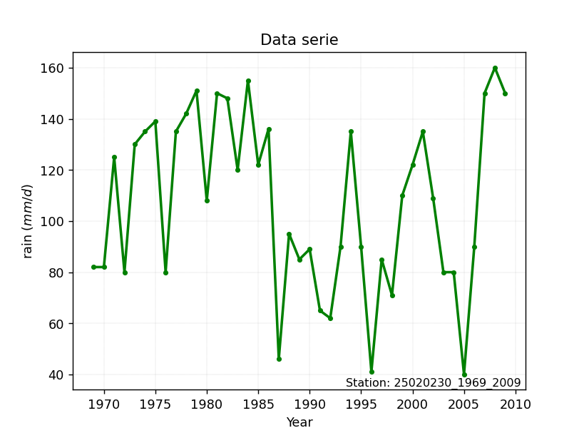

# Station: 25020230_1969_2009

</img>

## A. Active distributions from SciPy (101 of 104 available)

|   id | p_dist             |   n_parameter | fit_method   | label                                                                       | active   | ref                                                                                                        |
|-----:|:-------------------|--------------:|:-------------|:----------------------------------------------------------------------------|:---------|:-----------------------------------------------------------------------------------------------------------|
|    0 | alpha              |             3 | MLE          | Alpha                                                                       | True     | [:mortar_board:](https://docs.scipy.org/doc/scipy/reference/generated/scipy.stats.alpha.html)              |
|    1 | anglit             |             2 | MM           | Anglit                                                                      | True     | [:mortar_board:](https://docs.scipy.org/doc/scipy/reference/generated/scipy.stats.anglit.html)             |
|    2 | arcsine            |             2 | MM           | Arcsine                                                                     | True     | [:mortar_board:](https://docs.scipy.org/doc/scipy/reference/generated/scipy.stats.arcsine.html)            |
|    3 | argus              |             3 | MLE          | Argus                                                                       | True     | [:mortar_board:](https://docs.scipy.org/doc/scipy/reference/generated/scipy.stats.argus.html)              |
|    4 | beta               |             4 | MLE          | Beta                                                                        | True     | [:mortar_board:](https://docs.scipy.org/doc/scipy/reference/generated/scipy.stats.beta.html)               |
|    5 | betaprime          |             4 | MLE          | Beta prime                                                                  | True     | [:mortar_board:](https://docs.scipy.org/doc/scipy/reference/generated/scipy.stats.betaprime.html)          |
|    6 | bradford           |             3 | MLE          | Bradford                                                                    | True     | [:mortar_board:](https://docs.scipy.org/doc/scipy/reference/generated/scipy.stats.bradford.html)           |
|    7 | burr               |             4 | MLE          | Burr (Type III)                                                             | True     | [:mortar_board:](https://docs.scipy.org/doc/scipy/reference/generated/scipy.stats.burr.html)               |
|    8 | burr12             |             4 | MLE          | Burr (Type III) 12                                                          | True     | [:mortar_board:](https://docs.scipy.org/doc/scipy/reference/generated/scipy.stats.burr12.html)             |
|    9 | cauchy             |             2 | MLE          | Cauchy                                                                      | True     | [:mortar_board:](https://docs.scipy.org/doc/scipy/reference/generated/scipy.stats.cauchy.html)             |
|   10 | chi2               |             3 | MLE          | Chi²                                                                        | True     | [:mortar_board:](https://docs.scipy.org/doc/scipy/reference/generated/scipy.stats.chi2.html)               |
|   11 | cosine             |             2 | MLE          | Cosine                                                                      | True     | [:mortar_board:](https://docs.scipy.org/doc/scipy/reference/generated/scipy.stats.cosine.html)             |
|   12 | crystalball        |             4 | MLE          | Crystalball                                                                 | True     | [:mortar_board:](https://docs.scipy.org/doc/scipy/reference/generated/scipy.stats.crystalball.html)        |
|   13 | dgamma             |             3 | MLE          | Double gamma                                                                | True     | [:mortar_board:](https://docs.scipy.org/doc/scipy/reference/generated/scipy.stats.dgamma.html)             |
|   14 | erlang             |             3 | MLE          | Erlang                                                                      | True     | [:mortar_board:](https://docs.scipy.org/doc/scipy/reference/generated/scipy.stats.erlang.html)             |
|   15 | expon              |             2 | MLE          | Exponential                                                                 | True     | [:mortar_board:](https://docs.scipy.org/doc/scipy/reference/generated/scipy.stats.expon.html)              |
|   16 | exponnorm          |             3 | MLE          | Exponentially modified Normal                                               | True     | [:mortar_board:](https://docs.scipy.org/doc/scipy/reference/generated/scipy.stats.exponnorm.html)          |
|   17 | exponpow           |             3 | MLE          | Exponential power                                                           | True     | [:mortar_board:](https://docs.scipy.org/doc/scipy/reference/generated/scipy.stats.exponpow.html)           |
|   18 | exponweib          |             4 | MLE          | Exponentiated Weibull                                                       | True     | [:mortar_board:](https://docs.scipy.org/doc/scipy/reference/generated/scipy.stats.exponweib.html)          |
|   19 | f                  |             4 | MLE          | F                                                                           | True     | [:mortar_board:](https://docs.scipy.org/doc/scipy/reference/generated/scipy.stats.f.html)                  |
|   20 | fatiguelife        |             3 | MLE          | Fatigue-life (Birnbaum-Saunders)                                            | True     | [:mortar_board:](https://docs.scipy.org/doc/scipy/reference/generated/scipy.stats.fatiguelife.html)        |
|   21 | fisk               |             3 | MLE          | Fisk                                                                        | True     | [:mortar_board:](https://docs.scipy.org/doc/scipy/reference/generated/scipy.stats.fisk.html)               |
|   22 | foldcauchy         |             3 | MLE          | Fold Cauchy                                                                 | True     | [:mortar_board:](https://docs.scipy.org/doc/scipy/reference/generated/scipy.stats.foldcauchy.html)         |
|   23 | foldnorm           |             3 | MM           | Fold Normal                                                                 | True     | [:mortar_board:](https://docs.scipy.org/doc/scipy/reference/generated/scipy.stats.foldnorm.html)           |
|   24 | gamma              |             3 | MLE          | Gamma                                                                       | True     | [:mortar_board:](https://docs.scipy.org/doc/scipy/reference/generated/scipy.stats.gamma.html)              |
|   25 | gausshyper         |             6 | MLE          | Gauss hypergeometric                                                        | True     | [:mortar_board:](https://docs.scipy.org/doc/scipy/reference/generated/scipy.stats.gausshyper.html)         |
|   26 | genexpon           |             5 | MLE          | Generalized exponential                                                     | True     | [:mortar_board:](https://docs.scipy.org/doc/scipy/reference/generated/scipy.stats.genexpon.html)           |
|   27 | genextreme         |             3 | MLE          | Generalized exponential                                                     | True     | [:mortar_board:](https://docs.scipy.org/doc/scipy/reference/generated/scipy.stats.genextreme.html)         |
|   28 | gengamma           |             4 | MLE          | Generalized gamma                                                           | True     | [:mortar_board:](https://docs.scipy.org/doc/scipy/reference/generated/scipy.stats.gengamma.html)           |
|   29 | genhalflogistic    |             3 | MLE          | Generalized half-logistic                                                   | True     | [:mortar_board:](https://docs.scipy.org/doc/scipy/reference/generated/scipy.stats.genhalflogistic.html)    |
|   30 | genhyperbolic      |             5 | MLE          | Generalized hyperbolic                                                      | True     | [:mortar_board:](https://docs.scipy.org/doc/scipy/reference/generated/scipy.stats.genhyperbolic.html)      |
|   31 | geninvgauss        |             4 | MLE          | Generalized Inverse Gaussian                                                | True     | [:mortar_board:](https://docs.scipy.org/doc/scipy/reference/generated/scipy.stats.geninvgauss.html)        |
|   32 | genlogistic        |             3 | MLE          | Generalized logistic                                                        | True     | [:mortar_board:](https://docs.scipy.org/doc/scipy/reference/generated/scipy.stats.genlogistic.html)        |
|   33 | gennorm            |             3 | MLE          | Generalized Normal                                                          | True     | [:mortar_board:](https://docs.scipy.org/doc/scipy/reference/generated/scipy.stats.gennorm.html)            |
|   34 | genpareto          |             3 | MLE          | Generalized Pareto                                                          | True     | [:mortar_board:](https://docs.scipy.org/doc/scipy/reference/generated/scipy.stats.genpareto.html)          |
|   35 | gibrat             |             2 | MM           | Gibrat                                                                      | True     | [:mortar_board:](https://docs.scipy.org/doc/scipy/reference/generated/scipy.stats.gibrat.html)             |
|   36 | gompertz           |             3 | MLE          | Gompertz (or truncated Gumbel)                                              | True     | [:mortar_board:](https://docs.scipy.org/doc/scipy/reference/generated/scipy.stats.gompertz.html)           |
|   37 | gumbel_l           |             2 | MM           | Gumbel Left Skew                                                            | True     | [:mortar_board:](https://docs.scipy.org/doc/scipy/reference/generated/scipy.stats.gumbel_l.html)           |
|   38 | gumbel_r           |             2 | MM           | Gumbel Right Skew                                                           | True     | [:mortar_board:](https://docs.scipy.org/doc/scipy/reference/generated/scipy.stats.gumbel_r.html)           |
|   39 | halfcauchy         |             2 | MLE          | Half-Cauchy                                                                 | True     | [:mortar_board:](https://docs.scipy.org/doc/scipy/reference/generated/scipy.stats.halfcauchy.html)         |
|   40 | halfgennorm        |             3 | MLE          | Upper half of a generalized normal                                          | True     | [:mortar_board:](https://docs.scipy.org/doc/scipy/reference/generated/scipy.stats.halfgennorm.html)        |
|   41 | halflogistic       |             2 | MM           | Half-logistic                                                               | True     | [:mortar_board:](https://docs.scipy.org/doc/scipy/reference/generated/scipy.stats.halflogistic.html)       |
|   42 | halfnorm           |             2 | MM           | Half Normal                                                                 | True     | [:mortar_board:](https://docs.scipy.org/doc/scipy/reference/generated/scipy.stats.halfnorm.html)           |
|   43 | hypsecant          |             2 | MM           | hyperbolic secant                                                           | True     | [:mortar_board:](https://docs.scipy.org/doc/scipy/reference/generated/scipy.stats.hypsecant.html)          |
|   44 | invgamma           |             3 | MLE          | Inverted gamma                                                              | True     | [:mortar_board:](https://docs.scipy.org/doc/scipy/reference/generated/scipy.stats.invgamma.html)           |
|   45 | invgauss           |             3 | MLE          | Inverse Gaussian                                                            | True     | [:mortar_board:](https://docs.scipy.org/doc/scipy/reference/generated/scipy.stats.invgauss.html)           |
|   46 | invweibull         |             3 | MLE          | Inverted Weibull                                                            | True     | [:mortar_board:](https://docs.scipy.org/doc/scipy/reference/generated/scipy.stats.invweibull.html)         |
|   47 | johnsonsb          |             4 | MLE          | Johnson SB                                                                  | True     | [:mortar_board:](https://docs.scipy.org/doc/scipy/reference/generated/scipy.stats.johnsonsb.html)          |
|   48 | johnsonsu          |             4 | MLE          | Johnson Su                                                                  | True     | [:mortar_board:](https://docs.scipy.org/doc/scipy/reference/generated/scipy.stats.johnsonsu.html)          |
|   49 | kappa3             |             3 | MLE          | Kappa 3                                                                     | True     | [:mortar_board:](https://docs.scipy.org/doc/scipy/reference/generated/scipy.stats.kappa3.html)             |
|   50 | kappa4             |             4 | MLE          | Kappa 4                                                                     | True     | [:mortar_board:](https://docs.scipy.org/doc/scipy/reference/generated/scipy.stats.kappa4.html)             |
|   51 | ksone              |             3 | MLE          | Kolmogorov-Smirnov one-sided test statistic distribution                    | True     | [:mortar_board:](https://docs.scipy.org/doc/scipy/reference/generated/scipy.stats.ksone.html)              |
|   52 | kstwobign          |             2 | MLE          | Limiting distribution of scaled Kolmogorov-Smirnov two-sided test statistic | True     | [:mortar_board:](https://docs.scipy.org/doc/scipy/reference/generated/scipy.stats.kstwobign.html)          |
|   53 | laplace            |             2 | MM           | Laplace                                                                     | True     | [:mortar_board:](https://docs.scipy.org/doc/scipy/reference/generated/scipy.stats.laplace.html)            |
|   54 | laplace_asymmetric |             3 | MLE          | Asymmetric Laplace                                                          | True     | [:mortar_board:](https://docs.scipy.org/doc/scipy/reference/generated/scipy.stats.laplace_asymmetric.html) |
|   55 | levy               |             2 | MLE          | Levy                                                                        | True     | [:mortar_board:](https://docs.scipy.org/doc/scipy/reference/generated/scipy.stats.levy.html)               |
|   56 | levy_l             |             2 | MLE          | Left-skewed Levy                                                            | True     | [:mortar_board:](https://docs.scipy.org/doc/scipy/reference/generated/scipy.stats.levy_l.html)             |
|   57 | levy_stable        |             4 | MLE          | Levy-stable                                                                 | True     | [:mortar_board:](https://docs.scipy.org/doc/scipy/reference/generated/scipy.stats.levy_stable.html)        |
|   58 | loggamma           |             3 | MLE          | Log gamma                                                                   | True     | [:mortar_board:](https://docs.scipy.org/doc/scipy/reference/generated/scipy.stats.loggamma.html)           |
|   59 | logistic           |             2 | MM           | Logistic (or Sech-squared)                                                  | True     | [:mortar_board:](https://docs.scipy.org/doc/scipy/reference/generated/scipy.stats.logistic.html)           |
|   60 | loglaplace         |             3 | MLE          | Log-Laplace                                                                 | True     | [:mortar_board:](https://docs.scipy.org/doc/scipy/reference/generated/scipy.stats.loglaplace.html)         |
|   61 | lognorm            |             3 | MLE          | Log Normal                                                                  | True     | [:mortar_board:](https://docs.scipy.org/doc/scipy/reference/generated/scipy.stats.lognorm.html)            |
|   62 | loguniform         |             4 | MLE          | Log-Uniform or reciprocal                                                   | True     | [:mortar_board:](https://docs.scipy.org/doc/scipy/reference/generated/scipy.stats.loguniform.html)         |
|   63 | lomax              |             3 | MLE          | Lomax (Pareto of the second kind)                                           | True     | [:mortar_board:](https://docs.scipy.org/doc/scipy/reference/generated/scipy.stats.lomax.html)              |
|   64 | maxwell            |             2 | MM           | Maxwell                                                                     | True     | [:mortar_board:](https://docs.scipy.org/doc/scipy/reference/generated/scipy.stats.maxwell.html)            |
|   65 | mielke             |             4 | MLE          | Mielke Beta-Kappa / Dagum                                                   | True     | [:mortar_board:](https://docs.scipy.org/doc/scipy/reference/generated/scipy.stats.mielke.html)             |
|   66 | moyal              |             2 | MM           | Moyal                                                                       | True     | [:mortar_board:](https://docs.scipy.org/doc/scipy/reference/generated/scipy.stats.moyal.html)              |
|   67 | nakagami           |             3 | MLE          | Nakagami                                                                    | True     | [:mortar_board:](https://docs.scipy.org/doc/scipy/reference/generated/scipy.stats.nakagami.html)           |
|   68 | ncf                |             5 | MLE          | Non-central F distribution                                                  | True     | [:mortar_board:](https://docs.scipy.org/doc/scipy/reference/generated/scipy.stats.ncf.html)                |
|   69 | nct                |             4 | MLE          | Non-central Student’s t                                                     | True     | [:mortar_board:](https://docs.scipy.org/doc/scipy/reference/generated/scipy.stats.nct.html)                |
|   70 | ncx2               |             4 | MLE          | Non-central chi-squared                                                     | True     | [:mortar_board:](https://docs.scipy.org/doc/scipy/reference/generated/scipy.stats.ncx2.html)               |
|   71 | norm               |             2 | MM           | Normal                                                                      | True     | [:mortar_board:](https://docs.scipy.org/doc/scipy/reference/generated/scipy.stats.norm.html)               |
|   72 | norminvgauss       |             4 | MLE          | Normal Inverse Gaussian                                                     | True     | [:mortar_board:](https://docs.scipy.org/doc/scipy/reference/generated/scipy.stats.norminvgauss.html)       |
|   73 | pareto             |             3 | MLE          | Pareto                                                                      | True     | [:mortar_board:](https://docs.scipy.org/doc/scipy/reference/generated/scipy.stats.pareto.html)             |
|   74 | pearson3           |             3 | MM           | Pearson type III                                                            | True     | [:mortar_board:](https://docs.scipy.org/doc/scipy/reference/generated/scipy.stats.pearson3.html)           |
|   75 | powerlaw           |             3 | MLE          | Power-function                                                              | True     | [:mortar_board:](https://docs.scipy.org/doc/scipy/reference/generated/scipy.stats.powerlaw.html)           |
|   76 | powerlognorm       |             4 | MLE          | Power log-normal                                                            | True     | [:mortar_board:](https://docs.scipy.org/doc/scipy/reference/generated/scipy.stats.powerlognorm.html)       |
|   77 | powernorm          |             3 | MLE          | Power normal                                                                | True     | [:mortar_board:](https://docs.scipy.org/doc/scipy/reference/generated/scipy.stats.powernorm.html)          |
|   78 | rayleigh           |             2 | MM           | Rayleigh                                                                    | True     | [:mortar_board:](https://docs.scipy.org/doc/scipy/reference/generated/scipy.stats.rayleigh.html)           |
|   79 | rdist              |             3 | MLE          | R-distributed (symmetric beta)                                              | True     | [:mortar_board:](https://docs.scipy.org/doc/scipy/reference/generated/scipy.stats.rdist.html)              |
|   80 | recipinvgauss      |             3 | MLE          | Reciprocal inverse Gaussian                                                 | True     | [:mortar_board:](https://docs.scipy.org/doc/scipy/reference/generated/scipy.stats.recipinvgauss.html)      |
|   81 | rel_breitwigner    |             3 | MLE          | Relativistic Breit-Wigner                                                   | True     | [:mortar_board:](https://docs.scipy.org/doc/scipy/reference/generated/scipy.stats.rel_breitwigner.html)    |
|   82 | rice               |             3 | MLE          | Rice                                                                        | True     | [:mortar_board:](https://docs.scipy.org/doc/scipy/reference/generated/scipy.stats.rice.html)               |
|   83 | semicircular       |             2 | MM           | Semicircular                                                                | True     | [:mortar_board:](https://docs.scipy.org/doc/scipy/reference/generated/scipy.stats.semicircular.html)       |
|   84 | skewcauchy         |             3 | MLE          | Skewed Cauchy                                                               | True     | [:mortar_board:](https://docs.scipy.org/doc/scipy/reference/generated/scipy.stats.skewcauchy.html)         |
|   85 | skewnorm           |             3 | MLE          | Skew normal                                                                 | True     | [:mortar_board:](https://docs.scipy.org/doc/scipy/reference/generated/scipy.stats.skewnorm.html)           |
|   86 | t                  |             3 | MLE          | Student’s t                                                                 | True     | [:mortar_board:](https://docs.scipy.org/doc/scipy/reference/generated/scipy.stats.t.html)                  |
|   87 | trapezoid          |             4 | MLE          | Trapezoid                                                                   | True     | [:mortar_board:](https://docs.scipy.org/doc/scipy/reference/generated/scipy.stats.trapezoid.html)          |
|   88 | triang             |             3 | MLE          | Triangular                                                                  | True     | [:mortar_board:](https://docs.scipy.org/doc/scipy/reference/generated/scipy.stats.triang.html)             |
|   89 | truncexpon         |             3 | MLE          | Truncated exponential                                                       | True     | [:mortar_board:](https://docs.scipy.org/doc/scipy/reference/generated/scipy.stats.truncexpon.html)         |
|   90 | truncnorm          |             4 | MLE          | Truncated normal                                                            | True     | [:mortar_board:](https://docs.scipy.org/doc/scipy/reference/generated/scipy.stats.truncnorm.html)          |
|   91 | truncpareto        |             4 | MLE          | Upper truncated Pareto                                                      | True     | [:mortar_board:](https://docs.scipy.org/doc/scipy/reference/generated/scipy.stats.truncpareto.html)        |
|   92 | truncweibull_min   |             5 | MLE          | Doubly truncated Weibull minimum                                            | True     | [:mortar_board:](https://docs.scipy.org/doc/scipy/reference/generated/scipy.stats.truncweibull_min.html)   |
|   93 | tukeylambda        |             3 | MLE          | Tukey-Lamdba                                                                | True     | [:mortar_board:](https://docs.scipy.org/doc/scipy/reference/generated/scipy.stats.tukeylambda.html)        |
|   94 | uniform            |             2 | MLE          | Uniform                                                                     | True     | [:mortar_board:](https://docs.scipy.org/doc/scipy/reference/generated/scipy.stats.uniform.html)            |
|   95 | vonmises           |             3 | MLE          | Von Mises                                                                   | True     | [:mortar_board:](https://docs.scipy.org/doc/scipy/reference/generated/scipy.stats.vonmises.html)           |
|   96 | vonmises_line      |             3 | MLE          | Von Mises line                                                              | True     | [:mortar_board:](https://docs.scipy.org/doc/scipy/reference/generated/scipy.stats.vonmises_line.html)      |
|   97 | wald               |             2 | MM           | Wald                                                                        | True     | [:mortar_board:](https://docs.scipy.org/doc/scipy/reference/generated/scipy.stats.wald.html)               |
|   98 | weibull_max        |             3 | MLE          | Weibull maximum                                                             | True     | [:mortar_board:](https://docs.scipy.org/doc/scipy/reference/generated/scipy.stats.weibull_max.html)        |
|   99 | weibull_min        |             3 | MLE          | Weibull minimum                                                             | True     | [:mortar_board:](https://docs.scipy.org/doc/scipy/reference/generated/scipy.stats.weibull_min.html)        |
|  100 | wrapcauchy         |             3 | MLE          | Wrapped  Cauchy                                                             | True     | [:mortar_board:](https://docs.scipy.org/doc/scipy/reference/generated/scipy.stats.wrapcauchy.html)         |

> Gumbel and Lob-Gumbel probability distributions are not shown in the above table.  
> n_parameter = # arguments & localization & scale.  
> Fit methods: (MLE) maximum likelihood, (MM) L-moments.

## B. Probability distributions

### Cumulative distribution values - CDF (103 evalated, ordered by x ascending) 

|   id |   date |   x |            station |   m |     alpha |   alpha_pdf |     anglit |   anglit_pdf |   arcsine |   arcsine_pdf |     argus |   argus_pdf |        beta |   beta_pdf |   betaprime |   betaprime_pdf |    bradford |   bradford_pdf |      burr |   burr_pdf |     burr12 |   burr12_pdf |   cauchy |   cauchy_pdf |      chi2 |   chi2_pdf |    cosine |   cosine_pdf |   crystalball |   crystalball_pdf |    dgamma |   dgamma_pdf |    erlang |   erlang_pdf |     expon |   expon_pdf |   exponnorm |   exponnorm_pdf |   exponpow |   exponpow_pdf |   exponweib |   exponweib_pdf |         f |      f_pdf |   fatiguelife |   fatiguelife_pdf |      fisk |   fisk_pdf |   foldcauchy |   foldcauchy_pdf |   foldnorm |   foldnorm_pdf |     gamma |   gamma_pdf |   gausshyper |   gausshyper_pdf |    genexpon |   genexpon_pdf |   genextreme |   genextreme_pdf |    gengamma |   gengamma_pdf |   genhalflogistic |   genhalflogistic_pdf |   genhyperbolic |   genhyperbolic_pdf |   geninvgauss |   geninvgauss_pdf |   genlogistic |   genlogistic_pdf |     gennorm |   gennorm_pdf |   genpareto |   genpareto_pdf |     gibrat |   gibrat_pdf |   gompertz |   gompertz_pdf |   gumbel_l |   gumbel_l_pdf |    gumbel_r |   gumbel_r_pdf |   halfcauchy |   halfcauchy_pdf |   halfgennorm |   halfgennorm_pdf |   halflogistic |   halflogistic_pdf |   halfnorm |   halfnorm_pdf |   hypsecant |   hypsecant_pdf |   invgamma |   invgamma_pdf |   invgauss |   invgauss_pdf |   invweibull |   invweibull_pdf |   johnsonsb |   johnsonsb_pdf |   johnsonsu |   johnsonsu_pdf |      kappa3 |   kappa3_pdf |      kappa4 |   kappa4_pdf |     ksone |   ksone_pdf |   kstwobign |   kstwobign_pdf |   laplace |   laplace_pdf |   laplace_asymmetric |   laplace_asymmetric_pdf |       levy |   levy_pdf |   levy_l |   levy_l_pdf |   levy_stable |   levy_stable_pdf |   loggamma |   loggamma_pdf |   logistic |   logistic_pdf |   loglaplace |   loglaplace_pdf |   lognorm |   lognorm_pdf |   loguniform |   loguniform_pdf |       lomax |   lomax_pdf |    maxwell |   maxwell_pdf |   mielke |   mielke_pdf |       moyal |   moyal_pdf |   nakagami |   nakagami_pdf |        ncf |    ncf_pdf |       nct |    nct_pdf |     ncx2 |    ncx2_pdf |      norm |   norm_pdf |   norminvgauss |   norminvgauss_pdf |      pareto |   pareto_pdf |   pearson3 |   pearson3_pdf |    powerlaw |   powerlaw_pdf |   powerlognorm |   powerlognorm_pdf |   powernorm |   powernorm_pdf |   rayleigh |   rayleigh_pdf |       rdist |   rdist_pdf |   recipinvgauss |   recipinvgauss_pdf |   rel_breitwigner |   rel_breitwigner_pdf |      rice |   rice_pdf |   semicircular |   semicircular_pdf |   skewcauchy |   skewcauchy_pdf |   skewnorm |   skewnorm_pdf |         t |      t_pdf |   trapezoid |   trapezoid_pdf |    triang |   triang_pdf |   truncexpon |   truncexpon_pdf |   truncnorm |   truncnorm_pdf |   truncpareto |   truncpareto_pdf |   truncweibull_min |   truncweibull_min_pdf |   tukeylambda |   tukeylambda_pdf |    uniform |   uniform_pdf |   vonmises |   vonmises_pdf |   vonmises_line |   vonmises_line_pdf |      wald |   wald_pdf |   weibull_max |   weibull_max_pdf |   weibull_min |   weibull_min_pdf |   wrapcauchy |   wrapcauchy_pdf |    zzgumbel |   gumbel_pdf |   zzloggumbel |   loggumbel_pdf |
|-----:|-------:|----:|-------------------:|----:|----------:|------------:|-----------:|-------------:|----------:|--------------:|----------:|------------:|------------:|-----------:|------------:|----------------:|------------:|---------------:|----------:|-----------:|-----------:|-------------:|---------:|-------------:|----------:|-----------:|----------:|-------------:|--------------:|------------------:|----------:|-------------:|----------:|-------------:|----------:|------------:|------------:|----------------:|-----------:|---------------:|------------:|----------------:|----------:|-----------:|--------------:|------------------:|----------:|-----------:|-------------:|-----------------:|-----------:|---------------:|----------:|------------:|-------------:|-----------------:|------------:|---------------:|-------------:|-----------------:|------------:|---------------:|------------------:|----------------------:|----------------:|--------------------:|--------------:|------------------:|--------------:|------------------:|------------:|--------------:|------------:|----------------:|-----------:|-------------:|-----------:|---------------:|-----------:|---------------:|------------:|---------------:|-------------:|-----------------:|--------------:|------------------:|---------------:|-------------------:|-----------:|---------------:|------------:|----------------:|-----------:|---------------:|-----------:|---------------:|-------------:|-----------------:|------------:|----------------:|------------:|----------------:|------------:|-------------:|------------:|-------------:|----------:|------------:|------------:|----------------:|----------:|--------------:|---------------------:|-------------------------:|-----------:|-----------:|---------:|-------------:|--------------:|------------------:|-----------:|---------------:|-----------:|---------------:|-------------:|-----------------:|----------:|--------------:|-------------:|-----------------:|------------:|------------:|-----------:|--------------:|---------:|-------------:|------------:|------------:|-----------:|---------------:|-----------:|-----------:|----------:|-----------:|---------:|------------:|----------:|-----------:|---------------:|-------------------:|------------:|-------------:|-----------:|---------------:|------------:|---------------:|---------------:|-------------------:|------------:|----------------:|-----------:|---------------:|------------:|------------:|----------------:|--------------------:|------------------:|----------------------:|----------:|-----------:|---------------:|-------------------:|-------------:|-----------------:|-----------:|---------------:|----------:|-----------:|------------:|----------------:|----------:|-------------:|-------------:|-----------------:|------------:|----------------:|--------------:|------------------:|-------------------:|-----------------------:|--------------:|------------------:|-----------:|--------------:|-----------:|---------------:|----------------:|--------------------:|----------:|-----------:|--------------:|------------------:|--------------:|------------------:|-------------:|-----------------:|------------:|-------------:|--------------:|----------------:|
|    0 |   2005 |  40 | 25020230_1969_2009 |   1 | 0.0155943 |  0.00144096 | 0.00980559 |   0.00200891 | 0         |    0          | 0.0155996 |  0.00210003 | 0.000814232 | 0.00345185 |   0.012609  |      0.00144038 | 1.13674e-07 |     0.0116251  | 0.0443049 | 0.00252344 | 0.00513208 |   0.0235546  | 0.115524 |   0.0015292  | 0.0200953 | 0.00159971 | 0.0132729 |   0.00173205 |     0.0223511 |        0.00158621 | 0.0239518 |   0.00179089 | 0.0204302 |   0.00157517 | 0         |  0.0148551  |   0.0223504 |      0.00158618 |  0.0251897 |    3.89504e+11 | 9.00712e-07 |     5.56625e+07 | 0.0225025 | 0.00160185 |     0.0200919 |        0.00153655 | 0.0333946 | 0.00159456 |  3.95548e-12 |       0.00427922 |          0 |   0            | 0.0204679 |  0.00157001 |   0.00883487 |       0.00316861 | 2.25304e-07 |     0.0157083  |    0.0452534 |       0.00188844 | 3.69984e-05 |    1.58724e+09 |         0.0412806 |            0.00405499 |       0.0588312 |          0.00188514 |    0.00725378 |        0.00180912 |     0.0357135 |        0.00162383 | 2.67499e-07 |    0.00833331 |    0.182274 |      0.00466445 | 0          |  0           |  0.0526565 |     0.00178759 |  0.0418705 |     0.0015674  | 0.000629798 |    0.000177528 |    0         |       0.0104885  |   1.60085e-15 |        0.112648   |      0         |         0          |  0         |     0          |   0.0271745 |      0.00127137 |  0.0168655 |     0.00155889 |  0.0102486 |     0.00139333 |   0.00789047 |       0.00121255 |  0.00934535 |      0.00347128 |   0.0446337 |      0.00177504 | 1.02404e-08 |   0.00671263 | 2.90934e-15 |   0.199113   | 0.0833333 |  0.00694444 |  0.00822331 |      0.00149955 | 0.0292433 |    0.00123328 |            0.053832  |               0.00174822 | 0.00682527 | 0.00491636 | 0.363014 |   0.00136795 |     0.0395055 |        0.00217155 |  0.0376699 |     0.00172179 |  0.0255533 |     0.00134683 |    0.0169994 |       0.00142901 | 0.02235   |    0.00158619 |   0.00332387 |       0.00852504 | 1.17333e-11 |  0.00801485 | 0.00378957 |   0.000925082 |      nan |          nan | 8.3925e-07  | 7.00411e-07 |  0.0222948 |     0.00158651 | 0.00916794 | 0.00122947 | 0.022364  | 0.00158698 | 0.549334 | 0.000953771 | 0.0223511 | 0.00158621 |      0.0450483 |         0.00176492 | 1.41669e-08 |   0.0148551  |  0.0281888 |     0.00167779 | 1.63488e-10 | 13876.2        |      0.0287849 |         0.00169152 |   0.0413097 |      0.00174553 | 0          |     0          | 2.24682e-06 |  1.246e+08  |       0.0178489 |          0.00152186 |       2.82529e-09 |           0.000960844 | 0         | 0          |    0           |         0          |     0.193574 |       0.00163647 |  0.0509986 |     0.00198152 | 0.02236   | 0.00158661 |  0.00694444 |      0.00115741 | 0.0206815 |   0.00211472 |  1.29944e-07 |       0.0113189  |   0.0223511 |      0.00158621 |     0         |        0.0138296  |          0.0451782 |             0.00663446 |   7.10543e-15 |        0.0144789  | 0          |    0.00833333 |    6.34828 |       0.21403  |       0.0308834 |          0.00667242 | 0         | 0          |     0.0742938 |       0.000350854 |     0.0258402 |        0.00169725 |  4.53369e-07 |       0.00829081 | 3.02496e-06 |            0 |   1.27711e-07 |               0 |
|    1 |   1996 |  41 | 25020230_1969_2009 |   2 | 0.0170908 |  0.00155312 | 0.0119162  |   0.00221223 | 0         |    0          | 0.01777   |  0.00224079 | 0.00484662  | 0.00441404 |   0.0141149 |      0.00157268 | 0.0115826   |     0.0115402  | 0.0468689 | 0.00260459 | 0.0301454  |   0.024604   | 0.117073 |   0.0015686  | 0.0217483 | 0.00170709 | 0.0150786 |   0.00188017 |     0.0239855 |        0.00168332 | 0.0258066 |   0.00191988 | 0.0220567 |   0.00167857 | 0.0147453 |  0.014636   |   0.0239848 |      0.00168328 |  0.769855  |    0.0564405   | 0.400458    |     0.0921229   | 0.0241531 | 0.00169997 |     0.0216782 |        0.00163699 | 0.0350264 | 0.00166966 |  0.00428006  |       0.00428172 |          0 |   0            | 0.0220888 |  0.00167263 |   0.0121511  |       0.00345665 | 0.0155861   |     0.015464   |    0.0471765 |       0.0019581  | 0.443846    |    0.0874515   |         0.0453519 |            0.00408762 |       0.060745  |          0.00194264 |    0.00920513 |        0.00209564 |     0.0373736 |        0.00169693 | 0.5         |    0.00833333 |    0.186945 |      0.00467678 | 0          |  0           |  0.0544739 |     0.00184748 |  0.0434669 |     0.00162579 | 0.000830442 |    0.000225302 |    0.0104875 |       0.0104856  |   0.0536084   |        0.0417808  |      0         |         0          |  0         |     0          |   0.028476  |      0.0013321  |  0.0184838 |     0.00167866 |  0.0117167 |     0.00154446 |   0.00917897 |       0.00136649 |  0.0130281  |      0.00388178 |   0.0464422 |      0.00184231 | 0.00671264  |   0.00671263 | 0.0127632   |   0.0116284  | 0.0902778 |  0.00694444 |  0.00982635 |      0.00170901 | 0.030503  |    0.0012864  |            0.0556089 |               0.00180592 | 0.0126427  | 0.00667411 | 0.36439  |   0.00138353 |     0.0417261 |        0.00227012 |  0.0394282 |     0.00179524 |  0.0269353 |     0.00141766 |    0.0184712 |       0.00151518 | 0.0239844 |    0.0016833  |   0.011847   |       0.00852126 | 0.00798281  |  0.00795087 | 0.00479033 |   0.0010782   |      nan |          nan | 1.88365e-06 | 1.47474e-06 |  0.0239296 |     0.0016838  | 0.0104622  | 0.00136042 | 0.0239992 | 0.00168412 | 0.550287 | 0.000953156 | 0.0239855 | 0.00168332 |      0.0468458 |         0.00183034 | 0.0147453   |   0.014636   |  0.0299102 |     0.00176574 | 0.0557301   |     0.0336097  |      0.0305189 |         0.00177685 |   0.0430894 |      0.00181419 | 0          |     0          | 0.146653    |  0.0501138  |       0.0194249 |          0.00163111 |       0.000960917 |           0.000961054 | 0         | 0          |    0.000709105 |         0.00141594 |     0.195224 |       0.00166343 |  0.0530126 |     0.00204677 | 0.0239948 | 0.00168372 |  0.00815008 |      0.00125386 | 0.0228503 |   0.00222284 |  0.0112886   |       0.011258   |   0.0239855 |      0.00168332 |     0.0137655 |        0.0137016  |          0.0518934 |             0.00679304 |   0.0100043   |        0.00958747 | 0.00833333 |    0.00833333 |    6.57782 |       0.229379 |       0.0375634 |          0.00668805 | 0         | 0          |     0.0746466 |       0.000354835 |     0.0275817 |        0.0017863  |  0.00829127  |       0.00829081 | 4.84544e-06 |            0 |   4.86229e-07 |               0 |
|    2 |   1987 |  46 | 25020230_1969_2009 |   3 | 0.0264238 |  0.00220597 | 0.0254919  |   0.00321334 | 0         |    0          | 0.030729  |  0.00294205 | 0.0308281   | 0.00570531 |   0.0238361 |      0.00234697 | 0.0682555   |     0.0111338  | 0.0609214 | 0.00301866 | 0.140002   |   0.0196153  | 0.12545  |   0.00178899 | 0.0317635 | 0.00232045 | 0.0264571 |   0.00268926 |     0.0337357 |        0.00223563 | 0.0372491 |   0.00269532 | 0.0318745 |   0.00226935 | 0.0852737 |  0.0135883  |   0.0337348 |      0.00223559 |  0.865442  |    0.00815243  | 0.576536    |     0.0168947   | 0.0339997 | 0.00225762 |     0.0312482 |        0.00221137 | 0.044404  | 0.0020961  |  0.0258559   |       0.00436978 |          0 |   0            | 0.0318658 |  0.0022588  |   0.0322223  |       0.00448882 | 0.089948    |     0.014296   |    0.0578932 |       0.00233734 | 0.610386    |    0.0159862   |         0.0662089 |            0.00425695 |       0.0712201 |          0.00225431 |    0.0235228  |        0.00365814 |     0.0468573 |        0.00211033 | 0.5         |    0.00833333 |    0.210487 |      0.00474055 | 0          |  0           |  0.064512  |     0.00217609 |  0.0523833 |     0.00195007 | 0.00285452  |    0.000639645 |    0.0627271 |       0.010387   |   0.192143    |        0.0203289  |      0         |         0          |  0         |     0          |   0.0359768 |      0.00168165 |  0.0285422 |     0.00237082 |  0.0215901 |     0.00244439 |   0.0182693  |       0.0023207  |  0.0360841  |      0.00518127 |   0.0565564 |      0.00221328 | 0.0402758   |   0.00671263 | 0.0653006   |   0.00991543 | 0.125     |  0.00694444 |  0.0213657  |      0.00295874 | 0.0376634 |    0.00158838 |            0.0654129 |               0.00212431 | 0.059533   | 0.0109306  | 0.37151  |   0.00146602 |     0.0543881 |        0.00280682 |  0.0493959 |     0.00220356 |  0.0350071 |     0.00182721 |    0.0272048 |       0.00199083 | 0.0337346 |    0.00223563 |   0.0544061  |       0.00850239 | 0.0469511   |  0.00763854 | 0.0123657  |   0.00199074  |      nan |          nan | 5.38671e-05 | 3.07078e-05 |  0.0336847 |     0.00223714 | 0.0191306  | 0.00214215 | 0.0337538 | 0.00223658 | 0.555045 | 0.000950007 | 0.0337357 | 0.00223563 |      0.0568739 |         0.0021903  | 0.0852738   |   0.0135883  |  0.0399355 |     0.00225975 | 0.164201    |     0.0165044  |      0.0405589 |         0.00225326 |   0.0530831 |      0.00219357 | 0.00153245 |     0.00108034 | 0.273372    |  0.0163388  |       0.029095  |          0.00226022 |       0.00578026  |           0.000968458 | 0         | 0          |    0.0148735   |         0.00384557 |     0.203896 |       0.00180831 |  0.0641047 |     0.00239669 | 0.033747  | 0.00223606 |  0.015625   |      0.00173611 | 0.0353159 |   0.00276343 |  0.0668265   |       0.0109585  |   0.0337357 |      0.00223563 |     0.0807055 |        0.0130792  |          0.0874671 |             0.00739152 |   0.0554382   |        0.00880838 | 0.05       |    0.00833333 |    7.29017 |       0.195787 |       0.0712797 |          0.00681066 | 0         | 0          |     0.0764726 |       0.000375925 |     0.0377139 |        0.00228033 |  0.0497453   |       0.00829081 | 3.98191e-05 |            0 |   6.46075e-05 |               0 |
|    3 |   1992 |  62 | 25020230_1969_2009 |   4 | 0.084523  |  0.00528443 | 0.101021   |   0.00614389 | 0.0952343 |    0.0227724  | 0.0955155 |  0.00514281 | 0.134501    | 0.00703663 |   0.0878479 |      0.00585989 | 0.237055    |     0.0100062  | 0.120329  | 0.00442721 | 0.373168   |   0.0108071  | 0.161812 |   0.00287445 | 0.0896726 | 0.00511328 | 0.0934906 |   0.00577116 |     0.0882855 |        0.00477379 | 0.111017  |   0.00703884 | 0.0883169 |   0.00498418 | 0.27878   |  0.0107138  |   0.0882839 |      0.00477375 |  0.922607  |    0.00174653  | 0.705296    |     0.0043095   | 0.0890325 | 0.00481059 |     0.0862819 |        0.00486641 | 0.0929088 | 0.00416317 |  0.103562    |       0.00561419 |          0 |   0            | 0.087984  |  0.00495335 |   0.119902   |       0.00625578 | 0.292202    |     0.0111188  |    0.107223  |       0.00392802 | 0.732637    |    0.00410713  |         0.139112  |            0.00487751 |       0.117083  |          0.00356398 |    0.12163    |        0.00832127 |     0.0950107 |        0.00409409 | 0.5         |    0.00833333 |    0.288127 |      0.00497222 | 0          |  0           |  0.109991  |     0.00361723 |  0.0944544 |     0.00343631 | 0.0417012   |    0.00506745  |    0.22137   |       0.00927056 |   0.399808    |        0.00884929 |      0         |         0          |  0         |     0          |   0.0758433 |      0.00351915 |  0.0901297 |     0.00553787 |  0.0915018 |     0.00648988 |   0.0899209  |       0.00687431 |  0.132986   |      0.00661173 |   0.104081  |      0.00384994 | 0.147678    |   0.00671263 | 0.213292    |   0.00883156 | 0.236111  |  0.00694444 |  0.107471   |      0.00777623 | 0.0739549 |    0.00311889 |            0.109983  |               0.00357175 | 0.221265   | 0.00835151 | 0.397443 |   0.00179384 |     0.115765  |        0.00496439 |  0.0981828 |     0.00403668 |  0.0793546 |     0.00395159 |    0.0743814 |       0.00404623 | 0.0882848 |    0.00477385 |   0.189964   |       0.00844255 | 0.161656    |  0.0067192  | 0.0746059  |   0.00595548  |      nan |          nan | 0.0174546   | 0.00372557  |  0.0882828 |     0.0047778  | 0.0809017  | 0.00580959 | 0.0883215 | 0.00477498 | 0.57016  | 0.000939148 | 0.0882854 | 0.00477379 |      0.103617  |         0.0037694  | 0.27878     |   0.0107138  |  0.0926081 |     0.0044908  | 0.359482    |     0.00985435 |      0.0923702 |         0.00437851 |   0.100621  |      0.00387662 | 0.0654599  |     0.00671831 | 0.451458    |  0.00898615 |       0.0868634 |          0.00517005 |       0.021922    |           0.00107123  | 0.0124227 | 0.00292085 |    0.105291    |         0.0069975  |     0.23735  |       0.00241486 |  0.11304   |     0.00379023 | 0.0883034 | 0.00477412 |  0.0557485  |      0.00327932 | 0.0933699 |   0.00449331 |  0.23481     |       0.0100525  |   0.0882854 |      0.00477379 |     0.27515   |        0.0112712  |          0.214242  |             0.00828551 |   0.191205    |        0.0082882  | 0.183333   |    0.00833333 |    9.93348 |       0.107448 |       0.186095  |          0.00763879 | 0         | 0          |     0.0831213 |       0.000459906 |     0.0902541 |        0.00443257 |  0.182398    |       0.00829072 | 0.00394429  |            0 |   0.0357771   |               0 |
|    4 |   1991 |  65 | 25020230_1969_2009 |   5 | 0.101423  |  0.00598595 | 0.120187   |   0.0066296  | 0.149079  |    0.014869   | 0.111548  |  0.00554485 | 0.155846    | 0.00719108 |   0.106548  |      0.00660728 | 0.266792    |     0.00981978 | 0.134025  | 0.00470403 | 0.40408    |   0.00982446 | 0.170873 |   0.00317318 | 0.105958  | 0.00574762 | 0.111714  |   0.00637699 |     0.103488  |        0.00536575 | 0.133827  |   0.00818123 | 0.104201  |   0.00560916 | 0.310216  |  0.0102468  |   0.103486  |      0.00536572 |  0.92744   |    0.00148782  | 0.717334    |     0.00374071  | 0.104347  | 0.00540361 |     0.101798  |        0.00548202 | 0.106174  | 0.00468801 |  0.121038    |       0.00604936 |          0 |   0            | 0.103769  |  0.00557444 |   0.139012   |       0.00648044 | 0.324785    |     0.0106069  |    0.119549  |       0.00429321 | 0.744114    |    0.00356738  |         0.153941  |            0.00500924 |       0.128228  |          0.00386986 |    0.147553   |        0.00894384 |     0.108036  |        0.00459663 | 0.5         |    0.00833333 |    0.303117 |      0.00502123 | 0          |  0           |  0.121358  |     0.00396491 |  0.105312  |     0.00380789 | 0.0588474   |    0.00637584  |    0.248732  |       0.00896722 |   0.42504     |        0.00799877 |      0         |         0          |  0.0296606 |     0.0143331  |   0.0871533 |      0.00403164 |  0.107792  |     0.0062398  |  0.112199  |     0.00730449 |   0.11191    |       0.00777836 |  0.153023   |      0.00674357 |   0.116213  |      0.0042422  | 0.167816    |   0.00671263 | 0.239632    |   0.0087313  | 0.256944  |  0.00694444 |  0.131978   |      0.0085465  | 0.0839293 |    0.00353954 |            0.121238  |               0.00393725 | 0.245327   | 0.00769956 | 0.402936 |   0.00186896 |     0.131345  |        0.00542351 |  0.110946  |     0.00447737 |  0.092048  |     0.00452048 |    0.0872342 |       0.00452754 | 0.103487  |    0.00536583 |   0.215275   |       0.00843143 | 0.181573    |  0.00655957 | 0.0936683  |   0.00675051  |      nan |          nan | 0.0313857   | 0.00561262  |  0.103497  |     0.00536967 | 0.0995102  | 0.00659617 | 0.103527  | 0.00536692 | 0.572974 | 0.000936982 | 0.103488  | 0.00536575 |      0.115485  |         0.00414716 | 0.310216    |   0.0102468  |  0.10686   |     0.00501566 | 0.388292    |     0.00936681 |      0.106248  |         0.00487814 |   0.11285   |      0.00428129 | 0.0869686  |     0.00760915 | 0.478091    |  0.00879492 |       0.103362  |          0.00583262 |       0.0251877   |           0.00110695  | 0.0227299 | 0.00395029 |    0.126844    |         0.0073642  |     0.244809 |       0.0025599  |  0.124868  |     0.00409776 | 0.103506  | 0.00536602 |  0.0660204  |      0.00356867 | 0.107336  |   0.00481766 |  0.264725    |       0.00989114 |   0.103488  |      0.00536575 |     0.308496  |        0.0109611  |          0.239221  |             0.00836365 |   0.216002    |        0.00824444 | 0.208333   |    0.00833333 |   10.3204  |       0.205896 |       0.209322  |          0.00784817 | 0         | 0          |     0.0845297 |       0.000479209 |     0.104291  |        0.00492968 |  0.20727     |       0.0082907  | 0.00713757  |            0 |   0.0599422   |               0 |
|    5 |   1998 |  71 | 25020230_1969_2009 |   6 | 0.141643  |  0.0074224  | 0.162703   |   0.00752491 | 0.222344  |    0.0104373  | 0.147198  |  0.00633497 | 0.199832    | 0.00746393 |   0.150612  |      0.00806539 | 0.32464     |     0.00946695 | 0.163935  | 0.00526858 | 0.457992   |   0.00821644 | 0.192008 |   0.00390467 | 0.144365  | 0.00705992 | 0.153548  |   0.0075578  |     0.139404  |        0.00661817 | 0.190156  |   0.0106036  | 0.141747  |   0.00691448 | 0.369036  |  0.00937301 |   0.139402  |      0.00661815 |  0.935214  |    0.00113124  | 0.737196    |     0.00293876  | 0.14049   | 0.00665512 |     0.138537  |        0.00677411 | 0.137758  | 0.00586763 |  0.160496    |       0.00715798 |          0 |   0            | 0.141086  |  0.00687315 |   0.179115   |       0.00687721 | 0.385519    |     0.00965285 |    0.147645  |       0.00508545 | 0.763065    |    0.00280525  |         0.184826  |            0.00528964 |       0.153429  |          0.00454479 |    0.204239   |        0.00988353 |     0.13893   |        0.00572899 | 0.5         |    0.00833333 |    0.333553 |      0.00512565 | 0          |  0           |  0.147425  |     0.00474278 |  0.130629  |     0.00465457 | 0.105196    |    0.00906038  |    0.30061   |       0.00831859 |   0.46888     |        0.0066866  |      0.0597147 |         0.0173776  |  0.115321  |     0.0141929  |   0.114899  |      0.00526603 |  0.149487  |     0.00765492 |  0.160676  |     0.00882144 |   0.163601   |       0.0093995  |  0.194183   |      0.00697038 |   0.144217  |      0.0051112  | 0.208092    |   0.00671263 | 0.291502    |   0.00856498 | 0.298611  |  0.00694444 |  0.187193   |      0.00978769 | 0.108095  |    0.00455869 |            0.14732   |               0.00478428 | 0.288036   | 0.00657642 | 0.414638 |   0.00203588 |     0.166692  |        0.00636078 |  0.140666  |     0.00544877 |  0.122997  |     0.0058345  |    0.11751   |       0.00558597 | 0.139404  |    0.00661828 |   0.265797   |       0.00840927 | 0.219999    |  0.00625159 | 0.138782   |   0.00826443  |      nan |          nan | 0.0776882   | 0.009834    |  0.139434  |     0.00662093 | 0.143734   | 0.0081283  | 0.13945   | 0.00661917 | 0.578583 | 0.000932532 | 0.139404  | 0.00661817 |      0.142827  |         0.00498481 | 0.369037    |   0.00937301 |  0.140293  |     0.00614404 | 0.442078    |     0.00860025 |      0.138706  |         0.00595761 |   0.141172  |      0.0051785  | 0.137447   |     0.00916379 | 0.530722    |  0.00884174 |       0.142443  |          0.00719849 |       0.0320917   |           0.00119955  | 0.0525802 | 0.0059946  |    0.172949    |         0.00798012 |     0.261127 |       0.0028888  |  0.151397  |     0.0047539  | 0.139424  | 0.00661828 |  0.0891686  |      0.00414738 | 0.138188  |   0.00546637 |  0.323122    |       0.00957618 |   0.139404  |      0.00661817 |     0.372462  |        0.0103664  |          0.289749  |             0.0084688  |   0.265254    |        0.00817674 | 0.258333   |    0.00833333 |   11.2648  |       0.186381 |       0.257721  |          0.00828698 | 0         | 0          |     0.0875308 |       0.000522196 |     0.137025  |        0.00599645 |  0.257014    |       0.00829065 | 0.019448    |            0 |   0.128127    |               0 |
|    6 |   1976 |  80 | 25020230_1969_2009 |   7 | 0.217808  |  0.00945319 | 0.23571    |   0.0086533  | 0.304605  |    0.00821108 | 0.209392  |  0.00747599 | 0.26862     | 0.00781269 |   0.232015  |      0.00993711 | 0.407625    |     0.0089828  | 0.215257  | 0.00614107 | 0.523497   |   0.00644529 | 0.233619 |   0.00544326 | 0.216664  | 0.00897555 | 0.228953  |   0.0091523  |     0.207646  |        0.00853749 | 0.299956  |   0.0134493  | 0.212821  |   0.00885692 | 0.447998  |  0.00820004 |   0.207644  |      0.00853749 |  0.943822  |    0.000811644 | 0.760013    |     0.00219663  | 0.209026  | 0.00856396 |     0.208328  |        0.00871642 | 0.199496  | 0.00788885 |  0.234576    |       0.00940634 |          0 |   0            | 0.211762  |  0.00881096 |   0.243335   |       0.00737841 | 0.466533    |     0.00838021 |    0.199273  |       0.00641263 | 0.784854    |    0.00209843  |         0.234494  |            0.00575783 |       0.199475  |          0.00572025 |    0.29687    |        0.0105633  |     0.199126  |        0.007689   | 0.5         |    0.00833333 |    0.380455 |      0.00530099 | 0          |  0           |  0.196122  |     0.0061208  |  0.179222  |     0.00620001 | 0.202683    |    0.012373    |    0.370948  |       0.00731264 |   0.522509    |        0.00532285 |      0.213412  |         0.0166455  |  0.241024  |     0.0136835  |   0.17271   |      0.00769899 |  0.2274    |     0.00959927 |  0.248531  |     0.0105748  |   0.256524   |       0.0110764  |  0.258294   |      0.00727387 |   0.196808  |      0.00661213 | 0.268505    |   0.00671263 | 0.367677    |   0.00837158 | 0.361111  |  0.00694444 |  0.280712   |      0.0108319  | 0.157996  |    0.00666314 |            0.197332  |               0.00640843 | 0.341111   | 0.00528776 | 0.434266 |   0.00233735 |     0.230191  |        0.0077332  |  0.196975  |     0.00709633 |  0.185798  |     0.0081824  |    0.175816  |       0.0074214  | 0.207647  |    0.00853761 |   0.341332   |       0.00837624 | 0.274282    |  0.00581652 | 0.222099   |   0.0101549   |      nan |          nan | 0.190372    | 0.0146829   |  0.207683  |     0.00853565 | 0.226106   | 0.0100825  | 0.207699  | 0.00853795 | 0.586945 | 0.000925566 | 0.207646  | 0.00853749 |      0.194063  |         0.00643844 | 0.447998    |   0.00820004 |  0.203659  |     0.00794694 | 0.515535    |     0.00777271 |      0.200133  |         0.00770898 |   0.194582  |      0.00672768 | 0.228125   |     0.0108519  | 0.614904    |  0.0101934  |       0.216268  |          0.00916919 |       0.0437592   |           0.00141056  | 0.119922  | 0.00892844 |    0.24806     |         0.00866917 |     0.289764 |       0.00350179 |  0.198948  |     0.00582982 | 0.207666  | 0.00853727 |  0.130401   |      0.00501543 | 0.191764  |   0.00643943 |  0.407249    |       0.00912245 |   0.207646  |      0.00853749 |     0.461962  |        0.00953417 |          0.366311  |             0.00852785 |   0.338518    |        0.00810986 | 0.333333   |    0.00833333 |   12.8273  |       0.14765  |       0.335208  |          0.00891668 | 0.0510587 | 0.0248901  |     0.092568  |       0.000600262 |     0.198662  |        0.00771511 |  0.331629    |       0.00829059 | 0.0605433   |            0 |   0.261063    |               0 |
|    7 |   1972 |  80 | 25020230_1969_2009 |   8 | 0.217808  |  0.00945319 | 0.23571    |   0.0086533  | 0.304605  |    0.00821108 | 0.209392  |  0.00747599 | 0.26862     | 0.00781269 |   0.232015  |      0.00993711 | 0.407625    |     0.0089828  | 0.215257  | 0.00614107 | 0.523497   |   0.00644529 | 0.233619 |   0.00544326 | 0.216664  | 0.00897555 | 0.228953  |   0.0091523  |     0.207646  |        0.00853749 | 0.299956  |   0.0134493  | 0.212821  |   0.00885692 | 0.447998  |  0.00820004 |   0.207644  |      0.00853749 |  0.943822  |    0.000811644 | 0.760013    |     0.00219663  | 0.209026  | 0.00856396 |     0.208328  |        0.00871642 | 0.199496  | 0.00788885 |  0.234576    |       0.00940634 |          0 |   0            | 0.211762  |  0.00881096 |   0.243335   |       0.00737841 | 0.466533    |     0.00838021 |    0.199273  |       0.00641263 | 0.784854    |    0.00209843  |         0.234494  |            0.00575783 |       0.199475  |          0.00572025 |    0.29687    |        0.0105633  |     0.199126  |        0.007689   | 0.5         |    0.00833333 |    0.380455 |      0.00530099 | 0          |  0           |  0.196122  |     0.0061208  |  0.179222  |     0.00620001 | 0.202683    |    0.012373    |    0.370948  |       0.00731264 |   0.522509    |        0.00532285 |      0.213412  |         0.0166455  |  0.241024  |     0.0136835  |   0.17271   |      0.00769899 |  0.2274    |     0.00959927 |  0.248531  |     0.0105748  |   0.256524   |       0.0110764  |  0.258294   |      0.00727387 |   0.196808  |      0.00661213 | 0.268505    |   0.00671263 | 0.367677    |   0.00837158 | 0.361111  |  0.00694444 |  0.280712   |      0.0108319  | 0.157996  |    0.00666314 |            0.197332  |               0.00640843 | 0.341111   | 0.00528776 | 0.434266 |   0.00233735 |     0.230191  |        0.0077332  |  0.196975  |     0.00709633 |  0.185798  |     0.0081824  |    0.175816  |       0.0074214  | 0.207647  |    0.00853761 |   0.341332   |       0.00837624 | 0.274282    |  0.00581652 | 0.222099   |   0.0101549   |      nan |          nan | 0.190372    | 0.0146829   |  0.207683  |     0.00853565 | 0.226106   | 0.0100825  | 0.207699  | 0.00853795 | 0.586945 | 0.000925566 | 0.207646  | 0.00853749 |      0.194063  |         0.00643844 | 0.447998    |   0.00820004 |  0.203659  |     0.00794694 | 0.515535    |     0.00777271 |      0.200133  |         0.00770898 |   0.194582  |      0.00672768 | 0.228125   |     0.0108519  | 0.614904    |  0.0101934  |       0.216268  |          0.00916919 |       0.0437592   |           0.00141056  | 0.119922  | 0.00892844 |    0.24806     |         0.00866917 |     0.289764 |       0.00350179 |  0.198948  |     0.00582982 | 0.207666  | 0.00853727 |  0.130401   |      0.00501543 | 0.191764  |   0.00643943 |  0.407249    |       0.00912245 |   0.207646  |      0.00853749 |     0.461962  |        0.00953417 |          0.366311  |             0.00852785 |   0.338518    |        0.00810986 | 0.333333   |    0.00833333 |   12.8273  |       0.14765  |       0.335208  |          0.00891668 | 0.0510587 | 0.0248901  |     0.092568  |       0.000600262 |     0.198662  |        0.00771511 |  0.331629    |       0.00829059 | 0.0605433   |            0 |   0.261063    |               0 |
|    8 |   2004 |  80 | 25020230_1969_2009 |   9 | 0.217808  |  0.00945319 | 0.23571    |   0.0086533  | 0.304605  |    0.00821108 | 0.209392  |  0.00747599 | 0.26862     | 0.00781269 |   0.232015  |      0.00993711 | 0.407625    |     0.0089828  | 0.215257  | 0.00614107 | 0.523497   |   0.00644529 | 0.233619 |   0.00544326 | 0.216664  | 0.00897555 | 0.228953  |   0.0091523  |     0.207646  |        0.00853749 | 0.299956  |   0.0134493  | 0.212821  |   0.00885692 | 0.447998  |  0.00820004 |   0.207644  |      0.00853749 |  0.943822  |    0.000811644 | 0.760013    |     0.00219663  | 0.209026  | 0.00856396 |     0.208328  |        0.00871642 | 0.199496  | 0.00788885 |  0.234576    |       0.00940634 |          0 |   0            | 0.211762  |  0.00881096 |   0.243335   |       0.00737841 | 0.466533    |     0.00838021 |    0.199273  |       0.00641263 | 0.784854    |    0.00209843  |         0.234494  |            0.00575783 |       0.199475  |          0.00572025 |    0.29687    |        0.0105633  |     0.199126  |        0.007689   | 0.5         |    0.00833333 |    0.380455 |      0.00530099 | 0          |  0           |  0.196122  |     0.0061208  |  0.179222  |     0.00620001 | 0.202683    |    0.012373    |    0.370948  |       0.00731264 |   0.522509    |        0.00532285 |      0.213412  |         0.0166455  |  0.241024  |     0.0136835  |   0.17271   |      0.00769899 |  0.2274    |     0.00959927 |  0.248531  |     0.0105748  |   0.256524   |       0.0110764  |  0.258294   |      0.00727387 |   0.196808  |      0.00661213 | 0.268505    |   0.00671263 | 0.367677    |   0.00837158 | 0.361111  |  0.00694444 |  0.280712   |      0.0108319  | 0.157996  |    0.00666314 |            0.197332  |               0.00640843 | 0.341111   | 0.00528776 | 0.434266 |   0.00233735 |     0.230191  |        0.0077332  |  0.196975  |     0.00709633 |  0.185798  |     0.0081824  |    0.175816  |       0.0074214  | 0.207647  |    0.00853761 |   0.341332   |       0.00837624 | 0.274282    |  0.00581652 | 0.222099   |   0.0101549   |      nan |          nan | 0.190372    | 0.0146829   |  0.207683  |     0.00853565 | 0.226106   | 0.0100825  | 0.207699  | 0.00853795 | 0.586945 | 0.000925566 | 0.207646  | 0.00853749 |      0.194063  |         0.00643844 | 0.447998    |   0.00820004 |  0.203659  |     0.00794694 | 0.515535    |     0.00777271 |      0.200133  |         0.00770898 |   0.194582  |      0.00672768 | 0.228125   |     0.0108519  | 0.614904    |  0.0101934  |       0.216268  |          0.00916919 |       0.0437592   |           0.00141056  | 0.119922  | 0.00892844 |    0.24806     |         0.00866917 |     0.289764 |       0.00350179 |  0.198948  |     0.00582982 | 0.207666  | 0.00853727 |  0.130401   |      0.00501543 | 0.191764  |   0.00643943 |  0.407249    |       0.00912245 |   0.207646  |      0.00853749 |     0.461962  |        0.00953417 |          0.366311  |             0.00852785 |   0.338518    |        0.00810986 | 0.333333   |    0.00833333 |   12.8273  |       0.14765  |       0.335208  |          0.00891668 | 0.0510587 | 0.0248901  |     0.092568  |       0.000600262 |     0.198662  |        0.00771511 |  0.331629    |       0.00829059 | 0.0605433   |            0 |   0.261063    |               0 |
|    9 |   2003 |  80 | 25020230_1969_2009 |  10 | 0.217808  |  0.00945319 | 0.23571    |   0.0086533  | 0.304605  |    0.00821108 | 0.209392  |  0.00747599 | 0.26862     | 0.00781269 |   0.232015  |      0.00993711 | 0.407625    |     0.0089828  | 0.215257  | 0.00614107 | 0.523497   |   0.00644529 | 0.233619 |   0.00544326 | 0.216664  | 0.00897555 | 0.228953  |   0.0091523  |     0.207646  |        0.00853749 | 0.299956  |   0.0134493  | 0.212821  |   0.00885692 | 0.447998  |  0.00820004 |   0.207644  |      0.00853749 |  0.943822  |    0.000811644 | 0.760013    |     0.00219663  | 0.209026  | 0.00856396 |     0.208328  |        0.00871642 | 0.199496  | 0.00788885 |  0.234576    |       0.00940634 |          0 |   0            | 0.211762  |  0.00881096 |   0.243335   |       0.00737841 | 0.466533    |     0.00838021 |    0.199273  |       0.00641263 | 0.784854    |    0.00209843  |         0.234494  |            0.00575783 |       0.199475  |          0.00572025 |    0.29687    |        0.0105633  |     0.199126  |        0.007689   | 0.5         |    0.00833333 |    0.380455 |      0.00530099 | 0          |  0           |  0.196122  |     0.0061208  |  0.179222  |     0.00620001 | 0.202683    |    0.012373    |    0.370948  |       0.00731264 |   0.522509    |        0.00532285 |      0.213412  |         0.0166455  |  0.241024  |     0.0136835  |   0.17271   |      0.00769899 |  0.2274    |     0.00959927 |  0.248531  |     0.0105748  |   0.256524   |       0.0110764  |  0.258294   |      0.00727387 |   0.196808  |      0.00661213 | 0.268505    |   0.00671263 | 0.367677    |   0.00837158 | 0.361111  |  0.00694444 |  0.280712   |      0.0108319  | 0.157996  |    0.00666314 |            0.197332  |               0.00640843 | 0.341111   | 0.00528776 | 0.434266 |   0.00233735 |     0.230191  |        0.0077332  |  0.196975  |     0.00709633 |  0.185798  |     0.0081824  |    0.175816  |       0.0074214  | 0.207647  |    0.00853761 |   0.341332   |       0.00837624 | 0.274282    |  0.00581652 | 0.222099   |   0.0101549   |      nan |          nan | 0.190372    | 0.0146829   |  0.207683  |     0.00853565 | 0.226106   | 0.0100825  | 0.207699  | 0.00853795 | 0.586945 | 0.000925566 | 0.207646  | 0.00853749 |      0.194063  |         0.00643844 | 0.447998    |   0.00820004 |  0.203659  |     0.00794694 | 0.515535    |     0.00777271 |      0.200133  |         0.00770898 |   0.194582  |      0.00672768 | 0.228125   |     0.0108519  | 0.614904    |  0.0101934  |       0.216268  |          0.00916919 |       0.0437592   |           0.00141056  | 0.119922  | 0.00892844 |    0.24806     |         0.00866917 |     0.289764 |       0.00350179 |  0.198948  |     0.00582982 | 0.207666  | 0.00853727 |  0.130401   |      0.00501543 | 0.191764  |   0.00643943 |  0.407249    |       0.00912245 |   0.207646  |      0.00853749 |     0.461962  |        0.00953417 |          0.366311  |             0.00852785 |   0.338518    |        0.00810986 | 0.333333   |    0.00833333 |   12.8273  |       0.14765  |       0.335208  |          0.00891668 | 0.0510587 | 0.0248901  |     0.092568  |       0.000600262 |     0.198662  |        0.00771511 |  0.331629    |       0.00829059 | 0.0605433   |            0 |   0.261063    |               0 |
|   10 |   1969 |  82 | 25020230_1969_2009 |  11 | 0.237117  |  0.00985156 | 0.253232   |   0.00886575 | 0.320746  |    0.00793777 | 0.224589  |  0.00772069 | 0.284316    | 0.00788328 |   0.25223   |      0.010272   | 0.42549     |     0.00888187 | 0.227736  | 0.00633892 | 0.536067   |   0.00612855 | 0.24493  |   0.00587333 | 0.235008  | 0.0093655  | 0.247571  |   0.00946354 |     0.225132  |        0.00894659 | 0.327111  |   0.0136668  | 0.23094   |   0.0092593  | 0.464156  |  0.00795999 |   0.225131  |      0.00894661 |  0.945394  |    0.000760933 | 0.764284    |     0.00207624  | 0.226561  | 0.00896919 |     0.226169  |        0.0091226  | 0.215743  | 0.00835817 |  0.253949    |       0.00996738 |          0 |   0            | 0.229789  |  0.00921346 |   0.258193   |       0.0074786  | 0.483033    |     0.00812101 |    0.212411  |       0.00672622 | 0.788934    |    0.0019836   |         0.246122  |            0.00587054 |       0.211201  |          0.00600795 |    0.318047   |        0.0106078  |     0.214964  |        0.00814959 | 0.5         |    0.00833333 |    0.391099 |      0.0053435  | 2.3477e-05 |  0.000380442 |  0.208701  |     0.00646028 |  0.192008  |     0.00658862 | 0.227963    |    0.0128914   |    0.385352  |       0.00709251 |   0.532914    |        0.00508498 |      0.246444  |         0.0163806  |  0.268235  |     0.0135246  |   0.188736  |      0.00833183 |  0.246975  |     0.00997108 |  0.269966  |     0.0108533  |   0.278912   |       0.0113025  |  0.272909   |      0.00734076 |   0.210391  |      0.00697296 | 0.281931    |   0.00671263 | 0.384383    |   0.00833499 | 0.375     |  0.00694444 |  0.302487   |      0.010936   | 0.1719    |    0.00724953 |            0.210574  |               0.00683848 | 0.351449   | 0.00505359 | 0.439017 |   0.00241448 |     0.245944  |        0.00801898 |  0.211555  |     0.00748431 |  0.202721  |     0.00874213 |    0.191106  |       0.00787086 | 0.225134  |    0.00894672 |   0.358077   |       0.00836894 | 0.285822    |  0.00572403 | 0.242749   |   0.0104895   |      nan |          nan | 0.220371    | 0.0152843   |  0.225164  |     0.00894328 | 0.246624   | 0.0104295  | 0.225186  | 0.0089469  | 0.588794 | 0.000923971 | 0.225132  | 0.00894659 |      0.20729   |         0.00678997 | 0.464156    |   0.00795999 |  0.219955  |     0.00834799 | 0.53093     |     0.00762363 |      0.215947  |         0.00810503 |   0.208408  |      0.00709946 | 0.2501     |     0.0111154  | 0.635914    |  0.0108495  |       0.235006  |          0.00956491 |       0.0466422   |           0.00147361  | 0.138391  | 0.00953645 |    0.26552     |         0.00878995 |     0.296926 |       0.00366167 |  0.210859  |     0.00608158 | 0.225151  | 0.00894629 |  0.140625   |      0.00520833 | 0.20486   |   0.00665566 |  0.425396    |       0.00902458 |   0.225132  |      0.00894659 |     0.480855  |        0.0093585  |          0.383367  |             0.00852817 |   0.354727    |        0.00809929 | 0.35       |    0.00833333 |   13.0492  |       0.103342 |       0.353165  |          0.00903874 | 0.107559  | 0.0306533  |     0.0937884 |       0.000620337 |     0.21448   |        0.00810314 |  0.348211    |       0.00829057 | 0.07425     |            0 |   0.292327    |               0 |
|   11 |   1970 |  82 | 25020230_1969_2009 |  12 | 0.237117  |  0.00985156 | 0.253232   |   0.00886575 | 0.320746  |    0.00793777 | 0.224589  |  0.00772069 | 0.284316    | 0.00788328 |   0.25223   |      0.010272   | 0.42549     |     0.00888187 | 0.227736  | 0.00633892 | 0.536067   |   0.00612855 | 0.24493  |   0.00587333 | 0.235008  | 0.0093655  | 0.247571  |   0.00946354 |     0.225132  |        0.00894659 | 0.327111  |   0.0136668  | 0.23094   |   0.0092593  | 0.464156  |  0.00795999 |   0.225131  |      0.00894661 |  0.945394  |    0.000760933 | 0.764284    |     0.00207624  | 0.226561  | 0.00896919 |     0.226169  |        0.0091226  | 0.215743  | 0.00835817 |  0.253949    |       0.00996738 |          0 |   0            | 0.229789  |  0.00921346 |   0.258193   |       0.0074786  | 0.483033    |     0.00812101 |    0.212411  |       0.00672622 | 0.788934    |    0.0019836   |         0.246122  |            0.00587054 |       0.211201  |          0.00600795 |    0.318047   |        0.0106078  |     0.214964  |        0.00814959 | 0.5         |    0.00833333 |    0.391099 |      0.0053435  | 2.3477e-05 |  0.000380442 |  0.208701  |     0.00646028 |  0.192008  |     0.00658862 | 0.227963    |    0.0128914   |    0.385352  |       0.00709251 |   0.532914    |        0.00508498 |      0.246444  |         0.0163806  |  0.268235  |     0.0135246  |   0.188736  |      0.00833183 |  0.246975  |     0.00997108 |  0.269966  |     0.0108533  |   0.278912   |       0.0113025  |  0.272909   |      0.00734076 |   0.210391  |      0.00697296 | 0.281931    |   0.00671263 | 0.384383    |   0.00833499 | 0.375     |  0.00694444 |  0.302487   |      0.010936   | 0.1719    |    0.00724953 |            0.210574  |               0.00683848 | 0.351449   | 0.00505359 | 0.439017 |   0.00241448 |     0.245944  |        0.00801898 |  0.211555  |     0.00748431 |  0.202721  |     0.00874213 |    0.191106  |       0.00787086 | 0.225134  |    0.00894672 |   0.358077   |       0.00836894 | 0.285822    |  0.00572403 | 0.242749   |   0.0104895   |      nan |          nan | 0.220371    | 0.0152843   |  0.225164  |     0.00894328 | 0.246624   | 0.0104295  | 0.225186  | 0.0089469  | 0.588794 | 0.000923971 | 0.225132  | 0.00894659 |      0.20729   |         0.00678997 | 0.464156    |   0.00795999 |  0.219955  |     0.00834799 | 0.53093     |     0.00762363 |      0.215947  |         0.00810503 |   0.208408  |      0.00709946 | 0.2501     |     0.0111154  | 0.635914    |  0.0108495  |       0.235006  |          0.00956491 |       0.0466422   |           0.00147361  | 0.138391  | 0.00953645 |    0.26552     |         0.00878995 |     0.296926 |       0.00366167 |  0.210859  |     0.00608158 | 0.225151  | 0.00894629 |  0.140625   |      0.00520833 | 0.20486   |   0.00665566 |  0.425396    |       0.00902458 |   0.225132  |      0.00894659 |     0.480855  |        0.0093585  |          0.383367  |             0.00852817 |   0.354727    |        0.00809929 | 0.35       |    0.00833333 |   13.0492  |       0.103342 |       0.353165  |          0.00903874 | 0.107559  | 0.0306533  |     0.0937884 |       0.000620337 |     0.21448   |        0.00810314 |  0.348211    |       0.00829057 | 0.07425     |            0 |   0.292327    |               0 |
|   12 |   1989 |  85 | 25020230_1969_2009 |  13 | 0.267505  |  0.0103959  | 0.280274   |   0.00915669 | 0.344042  |    0.00760696 | 0.248293  |  0.00808058 | 0.30812     | 0.00798558 |   0.283719  |      0.0107066  | 0.451913    |     0.00873464 | 0.247201  | 0.00663828 | 0.55379    |   0.00569472 | 0.263596 |   0.00658418 | 0.263935  | 0.00991078 | 0.276619  |   0.00989381 |     0.252862  |        0.00953351 | 0.368015  |   0.0134902  | 0.259582  |   0.0098273  | 0.487512  |  0.00761304 |   0.25286   |      0.00953353 |  0.947574  |    0.000694202 | 0.770267    |     0.00191647  | 0.254349  | 0.0095493  |     0.254413  |        0.00969903 | 0.24187   | 0.0090582  |  0.285108    |       0.0107999  |          0 |   0            | 0.258295  |  0.00978255 |   0.280847   |       0.007623   | 0.506831    |     0.00774717 |    0.233307  |       0.00720615 | 0.794651    |    0.00183113  |         0.263995  |            0.00604611 |       0.229893  |          0.00645683 |    0.349894   |        0.0106113  |     0.240452  |        0.00884192 | 0.5         |    0.00833333 |    0.407228 |      0.00541003 | 0.0595385  |  0.0362659   |  0.228871  |     0.00699    |  0.212684  |     0.00720058 | 0.267592    |    0.013492    |    0.406142  |       0.00676827 |   0.547674    |        0.00476107 |      0.294916  |         0.0159229  |  0.308417  |     0.0132576  |   0.215216  |      0.00933051 |  0.277658  |     0.0104722  |  0.303053  |     0.0111876  |   0.313205   |       0.0115395  |  0.295083   |      0.00744279 |   0.232139  |      0.00752812 | 0.302069    |   0.00671263 | 0.40931     |   0.00828348 | 0.395833  |  0.00694444 |  0.335434   |      0.0110137  | 0.195084  |    0.00822728 |            0.232122  |               0.00753826 | 0.366118   | 0.00473144 | 0.446444 |   0.00253835 |     0.27062   |        0.00842651 |  0.23489   |     0.00807356 |  0.230214  |     0.00958538 |    0.215764  |       0.00857407 | 0.252863  |    0.00953363 |   0.383168   |       0.008358   | 0.30279     |  0.00558803 | 0.274889   |   0.0109233   |      nan |          nan | 0.267163    | 0.0158443   |  0.25288   |     0.0095277  | 0.278608   | 0.0108778  | 0.252916  | 0.00953355 | 0.591563 | 0.000921548 | 0.252862  | 0.00953351 |      0.22847   |         0.00733297 | 0.487512    |   0.00761304 |  0.245888  |     0.00893783 | 0.553487    |     0.00741769 |      0.241147  |         0.00869321 |   0.230559  |      0.00767054 | 0.283946   |     0.0114336  | 0.670494    |  0.0123295  |       0.264538  |          0.0101136  |       0.0512222   |           0.00158292  | 0.168314  | 0.0104024  |    0.292138    |         0.0089513  |     0.308293 |       0.00392041 |  0.229679  |     0.00646627 | 0.25288   | 0.00953309 |  0.156684   |      0.00549769 | 0.225313  |   0.00698001 |  0.452252    |       0.00887973 |   0.252862  |      0.00953351 |     0.508542  |        0.00910106 |          0.408944  |             0.00852134 |   0.379004    |        0.00808588 | 0.375      |    0.00833333 |   13.5819  |       0.228784 |       0.380532  |          0.00920227 | 0.202632  | 0.0317194  |     0.0956972 |       0.000652677 |     0.239657  |        0.00867992 |  0.373082    |       0.00829055 | 0.0981062   |            0 |   0.338888    |               0 |
|   13 |   1997 |  85 | 25020230_1969_2009 |  14 | 0.267505  |  0.0103959  | 0.280274   |   0.00915669 | 0.344042  |    0.00760696 | 0.248293  |  0.00808058 | 0.30812     | 0.00798558 |   0.283719  |      0.0107066  | 0.451913    |     0.00873464 | 0.247201  | 0.00663828 | 0.55379    |   0.00569472 | 0.263596 |   0.00658418 | 0.263935  | 0.00991078 | 0.276619  |   0.00989381 |     0.252862  |        0.00953351 | 0.368015  |   0.0134902  | 0.259582  |   0.0098273  | 0.487512  |  0.00761304 |   0.25286   |      0.00953353 |  0.947574  |    0.000694202 | 0.770267    |     0.00191647  | 0.254349  | 0.0095493  |     0.254413  |        0.00969903 | 0.24187   | 0.0090582  |  0.285108    |       0.0107999  |          0 |   0            | 0.258295  |  0.00978255 |   0.280847   |       0.007623   | 0.506831    |     0.00774717 |    0.233307  |       0.00720615 | 0.794651    |    0.00183113  |         0.263995  |            0.00604611 |       0.229893  |          0.00645683 |    0.349894   |        0.0106113  |     0.240452  |        0.00884192 | 0.5         |    0.00833333 |    0.407228 |      0.00541003 | 0.0595385  |  0.0362659   |  0.228871  |     0.00699    |  0.212684  |     0.00720058 | 0.267592    |    0.013492    |    0.406142  |       0.00676827 |   0.547674    |        0.00476107 |      0.294916  |         0.0159229  |  0.308417  |     0.0132576  |   0.215216  |      0.00933051 |  0.277658  |     0.0104722  |  0.303053  |     0.0111876  |   0.313205   |       0.0115395  |  0.295083   |      0.00744279 |   0.232139  |      0.00752812 | 0.302069    |   0.00671263 | 0.40931     |   0.00828348 | 0.395833  |  0.00694444 |  0.335434   |      0.0110137  | 0.195084  |    0.00822728 |            0.232122  |               0.00753826 | 0.366118   | 0.00473144 | 0.446444 |   0.00253835 |     0.27062   |        0.00842651 |  0.23489   |     0.00807356 |  0.230214  |     0.00958538 |    0.215764  |       0.00857407 | 0.252863  |    0.00953363 |   0.383168   |       0.008358   | 0.30279     |  0.00558803 | 0.274889   |   0.0109233   |      nan |          nan | 0.267163    | 0.0158443   |  0.25288   |     0.0095277  | 0.278608   | 0.0108778  | 0.252916  | 0.00953355 | 0.591563 | 0.000921548 | 0.252862  | 0.00953351 |      0.22847   |         0.00733297 | 0.487512    |   0.00761304 |  0.245888  |     0.00893783 | 0.553487    |     0.00741769 |      0.241147  |         0.00869321 |   0.230559  |      0.00767054 | 0.283946   |     0.0114336  | 0.670494    |  0.0123295  |       0.264538  |          0.0101136  |       0.0512222   |           0.00158292  | 0.168314  | 0.0104024  |    0.292138    |         0.0089513  |     0.308293 |       0.00392041 |  0.229679  |     0.00646627 | 0.25288   | 0.00953309 |  0.156684   |      0.00549769 | 0.225313  |   0.00698001 |  0.452252    |       0.00887973 |   0.252862  |      0.00953351 |     0.508542  |        0.00910106 |          0.408944  |             0.00852134 |   0.379004    |        0.00808588 | 0.375      |    0.00833333 |   13.5819  |       0.228784 |       0.380532  |          0.00920227 | 0.202632  | 0.0317194  |     0.0956972 |       0.000652677 |     0.239657  |        0.00867992 |  0.373082    |       0.00829055 | 0.0981062   |            0 |   0.338888    |               0 |
|   14 |   1990 |  89 | 25020230_1969_2009 |  15 | 0.310356  |  0.0110054  | 0.31759    |   0.00949117 | 0.373773  |    0.00727672 | 0.281552  |  0.00854553 | 0.340326    | 0.00811631 |   0.327485  |      0.01115    | 0.486471    |     0.00854577 | 0.27456   | 0.00704213 | 0.575522   |   0.00518321 | 0.292022 |   0.00764978 | 0.304889  | 0.010547   | 0.31722   |   0.0103917  |     0.292454  |        0.010248   | 0.419593  |   0.0120426  | 0.300273  |   0.0105004  | 0.517077  |  0.00717385 |   0.292453  |      0.010248   |  0.950197  |    0.000619284 | 0.77756     |     0.0017351   | 0.293984  | 0.0102532  |     0.294621  |        0.0103883  | 0.27992   | 0.00995705 |  0.330357    |       0.0117889  |          0 |   0            | 0.298813  |  0.0104588  |   0.311708   |       0.00780624 | 0.536866    |     0.00727535 |    0.263433  |       0.00785884 | 0.801619    |    0.00165792  |         0.288668  |            0.00629312 |       0.256967  |          0.00708581 |    0.392174   |        0.0105099  |     0.277635  |        0.00974267 | 0.5         |    0.00833333 |    0.429055 |      0.0055044  | 0.223976   |  0.0411757   |  0.258299  |     0.00772974 |  0.243199  |     0.00806568 | 0.32262     |    0.013959    |    0.432372  |       0.00635006 |   0.56594     |        0.0043811  |      0.357225  |         0.0152143  |  0.360653  |     0.0128515  |   0.255301  |      0.0107173  |  0.320691  |     0.0110198  |  0.348439  |     0.0114755  |   0.359696   |       0.0116724  |  0.325135   |      0.00758389 |   0.263763  |      0.0082862  | 0.328919    |   0.00671263 | 0.442315    |   0.00822025 | 0.423611  |  0.00694444 |  0.379478   |      0.0109846  | 0.230932  |    0.00973908 |            0.264321  |               0.00858395 | 0.384264   | 0.00434972 | 0.456955 |   0.00272068 |     0.305335  |        0.00892099 |  0.268761  |     0.00886078 |  0.270764  |     0.0106799  |    0.252025  |       0.00956661 | 0.292457  |    0.0102481  |   0.416571   |       0.00834347 | 0.324787    |  0.00541173 | 0.319524   |   0.011368    |      nan |          nan | 0.331086    | 0.0160166   |  0.292442  |     0.0102385  | 0.323082   | 0.0113314  | 0.292508  | 0.0102477  | 0.595242 | 0.000918261 | 0.292454  | 0.010248   |      0.259288  |         0.00807954 | 0.517077    |   0.00717385 |  0.283154  |     0.00968627 | 0.582655    |     0.00717116 |      0.27745   |         0.00945158 |   0.262792  |      0.00844785 | 0.330299   |     0.0117159  | 0.72662     |  0.0163381  |       0.306296  |          0.0107443  |       0.057899    |           0.00176279  | 0.212064  | 0.0114497  |    0.328316    |         0.00913135 |     0.324727 |       0.00430456 |  0.256588  |     0.00699005 | 0.29247   | 0.0102474  |  0.179446   |      0.00588349 | 0.254098  |   0.00741248 |  0.48739     |       0.00869022 |   0.292454  |      0.010248   |     0.544278  |        0.00876878 |          0.442991  |             0.00849988 |   0.411319    |        0.00807222 | 0.408333   |    0.00833333 |   14.1315  |       0.130133 |       0.417707  |          0.00937583 | 0.322945  | 0.0280151  |     0.0984017 |       0.000700512 |     0.275881  |        0.00942585 |  0.406244    |       0.00829053 | 0.135865    |            0 |   0.399098    |               0 |
|   15 |   1993 |  90 | 25020230_1969_2009 |  16 | 0.321426  |  0.0111346  | 0.327119   |   0.00956501 | 0.381016  |    0.00720989 | 0.290154  |  0.00865884 | 0.348458    | 0.00814812 |   0.338679  |      0.0112355  | 0.494994    |     0.00849982 | 0.281653  | 0.00714392 | 0.580646   |   0.0050659  | 0.299814 |   0.00793447 | 0.315507  | 0.0106873  | 0.327667  |   0.0105015  |     0.302785  |        0.0104117  | 0.431339  |   0.0114309  | 0.310849  |   0.0106509  | 0.524198  |  0.00706807 |   0.302783  |      0.0104117  |  0.950807  |    0.00060264  | 0.779274    |     0.00169449  | 0.304318  | 0.0104139  |     0.305088  |        0.0105437  | 0.289984  | 0.0101709  |  0.342251    |       0.0119952  |          0 |   0            | 0.309348  |  0.0106104  |   0.319537   |       0.00785063 | 0.544084    |     0.00716196 |    0.271374  |       0.00802339 | 0.803257    |    0.00161912  |         0.294993  |            0.00635732 |       0.264134  |          0.00724809 |    0.402663   |        0.0104675  |     0.287487  |        0.00995941 | 0.5         |    0.00833333 |    0.434572 |      0.00552908 | 0.26439    |  0.0395842   |  0.266124  |     0.00791964 |  0.251376  |     0.00828959 | 0.33661     |    0.0140178   |    0.438671  |       0.0062484  |   0.570277    |        0.00429413 |      0.372344  |         0.0150219  |  0.37345   |     0.0127416  |   0.266193  |      0.0110657  |  0.331768  |     0.0111333  |  0.359938  |     0.0115196  |   0.371371   |       0.0116748  |  0.332737   |      0.00762034 |   0.272145  |      0.00847738 | 0.335632    |   0.00671263 | 0.450528    |   0.00820531 | 0.430556  |  0.00694444 |  0.390449   |      0.010956   | 0.24088   |    0.0101586  |            0.273046  |               0.00886729 | 0.388569   | 0.0042619  | 0.4597   |   0.00276966 |     0.314313  |        0.00903443 |  0.277719  |     0.0090557  |  0.281575  |     0.0109417  |    0.26172   |       0.00982467 | 0.302787  |    0.0104118  |   0.424912   |       0.00833985 | 0.330177    |  0.00536852 | 0.330936   |   0.0114546   |      nan |          nan | 0.347083    | 0.0159711   |  0.302762  |     0.0104012  | 0.334458   | 0.0114181  | 0.302838  | 0.0104112  | 0.59616  | 0.000917429 | 0.302785  | 0.0104117  |      0.267463  |         0.00826892 | 0.524198    |   0.00706807 |  0.29293   |     0.00986394 | 0.589797    |     0.00711388 |      0.286993  |         0.00963404 |   0.271338  |      0.00864328 | 0.342039   |     0.0117617  | 0.743834    |  0.0181871  |       0.317109  |          0.0108815  |       0.0596877   |           0.00181519  | 0.223634  | 0.0116889  |    0.337467    |         0.00917036 |     0.329083 |       0.00440825 |  0.263644  |     0.00712254 | 0.3028    | 0.0104111  |  0.185378   |      0.00597994 | 0.261565  |   0.0075206  |  0.496057    |       0.00864347 |   0.302785  |      0.0104117  |     0.553006  |        0.00868762 |          0.451487  |             0.0084925  |   0.419389    |        0.00806952 | 0.416667   |    0.00833333 |   14.2936  |       0.197014 |       0.4271    |          0.00941018 | 0.35038   | 0.0268511  |     0.0991086 |       0.000713415 |     0.285397  |        0.00960593 |  0.414535    |       0.00829053 | 0.1463      |            0 |   0.413665    |               0 |
|   16 |   2006 |  90 | 25020230_1969_2009 |  17 | 0.321426  |  0.0111346  | 0.327119   |   0.00956501 | 0.381016  |    0.00720989 | 0.290154  |  0.00865884 | 0.348458    | 0.00814812 |   0.338679  |      0.0112355  | 0.494994    |     0.00849982 | 0.281653  | 0.00714392 | 0.580646   |   0.0050659  | 0.299814 |   0.00793447 | 0.315507  | 0.0106873  | 0.327667  |   0.0105015  |     0.302785  |        0.0104117  | 0.431339  |   0.0114309  | 0.310849  |   0.0106509  | 0.524198  |  0.00706807 |   0.302783  |      0.0104117  |  0.950807  |    0.00060264  | 0.779274    |     0.00169449  | 0.304318  | 0.0104139  |     0.305088  |        0.0105437  | 0.289984  | 0.0101709  |  0.342251    |       0.0119952  |          0 |   0            | 0.309348  |  0.0106104  |   0.319537   |       0.00785063 | 0.544084    |     0.00716196 |    0.271374  |       0.00802339 | 0.803257    |    0.00161912  |         0.294993  |            0.00635732 |       0.264134  |          0.00724809 |    0.402663   |        0.0104675  |     0.287487  |        0.00995941 | 0.5         |    0.00833333 |    0.434572 |      0.00552908 | 0.26439    |  0.0395842   |  0.266124  |     0.00791964 |  0.251376  |     0.00828959 | 0.33661     |    0.0140178   |    0.438671  |       0.0062484  |   0.570277    |        0.00429413 |      0.372344  |         0.0150219  |  0.37345   |     0.0127416  |   0.266193  |      0.0110657  |  0.331768  |     0.0111333  |  0.359938  |     0.0115196  |   0.371371   |       0.0116748  |  0.332737   |      0.00762034 |   0.272145  |      0.00847738 | 0.335632    |   0.00671263 | 0.450528    |   0.00820531 | 0.430556  |  0.00694444 |  0.390449   |      0.010956   | 0.24088   |    0.0101586  |            0.273046  |               0.00886729 | 0.388569   | 0.0042619  | 0.4597   |   0.00276966 |     0.314313  |        0.00903443 |  0.277719  |     0.0090557  |  0.281575  |     0.0109417  |    0.26172   |       0.00982467 | 0.302787  |    0.0104118  |   0.424912   |       0.00833985 | 0.330177    |  0.00536852 | 0.330936   |   0.0114546   |      nan |          nan | 0.347083    | 0.0159711   |  0.302762  |     0.0104012  | 0.334458   | 0.0114181  | 0.302838  | 0.0104112  | 0.59616  | 0.000917429 | 0.302785  | 0.0104117  |      0.267463  |         0.00826892 | 0.524198    |   0.00706807 |  0.29293   |     0.00986394 | 0.589797    |     0.00711388 |      0.286993  |         0.00963404 |   0.271338  |      0.00864328 | 0.342039   |     0.0117617  | 0.743834    |  0.0181871  |       0.317109  |          0.0108815  |       0.0596877   |           0.00181519  | 0.223634  | 0.0116889  |    0.337467    |         0.00917036 |     0.329083 |       0.00440825 |  0.263644  |     0.00712254 | 0.3028    | 0.0104111  |  0.185378   |      0.00597994 | 0.261565  |   0.0075206  |  0.496057    |       0.00864347 |   0.302785  |      0.0104117  |     0.553006  |        0.00868762 |          0.451487  |             0.0084925  |   0.419389    |        0.00806952 | 0.416667   |    0.00833333 |   14.2936  |       0.197014 |       0.4271    |          0.00941018 | 0.35038   | 0.0268511  |     0.0991086 |       0.000713415 |     0.285397  |        0.00960593 |  0.414535    |       0.00829053 | 0.1463      |            0 |   0.413665    |               0 |
|   17 |   1995 |  90 | 25020230_1969_2009 |  18 | 0.321426  |  0.0111346  | 0.327119   |   0.00956501 | 0.381016  |    0.00720989 | 0.290154  |  0.00865884 | 0.348458    | 0.00814812 |   0.338679  |      0.0112355  | 0.494994    |     0.00849982 | 0.281653  | 0.00714392 | 0.580646   |   0.0050659  | 0.299814 |   0.00793447 | 0.315507  | 0.0106873  | 0.327667  |   0.0105015  |     0.302785  |        0.0104117  | 0.431339  |   0.0114309  | 0.310849  |   0.0106509  | 0.524198  |  0.00706807 |   0.302783  |      0.0104117  |  0.950807  |    0.00060264  | 0.779274    |     0.00169449  | 0.304318  | 0.0104139  |     0.305088  |        0.0105437  | 0.289984  | 0.0101709  |  0.342251    |       0.0119952  |          0 |   0            | 0.309348  |  0.0106104  |   0.319537   |       0.00785063 | 0.544084    |     0.00716196 |    0.271374  |       0.00802339 | 0.803257    |    0.00161912  |         0.294993  |            0.00635732 |       0.264134  |          0.00724809 |    0.402663   |        0.0104675  |     0.287487  |        0.00995941 | 0.5         |    0.00833333 |    0.434572 |      0.00552908 | 0.26439    |  0.0395842   |  0.266124  |     0.00791964 |  0.251376  |     0.00828959 | 0.33661     |    0.0140178   |    0.438671  |       0.0062484  |   0.570277    |        0.00429413 |      0.372344  |         0.0150219  |  0.37345   |     0.0127416  |   0.266193  |      0.0110657  |  0.331768  |     0.0111333  |  0.359938  |     0.0115196  |   0.371371   |       0.0116748  |  0.332737   |      0.00762034 |   0.272145  |      0.00847738 | 0.335632    |   0.00671263 | 0.450528    |   0.00820531 | 0.430556  |  0.00694444 |  0.390449   |      0.010956   | 0.24088   |    0.0101586  |            0.273046  |               0.00886729 | 0.388569   | 0.0042619  | 0.4597   |   0.00276966 |     0.314313  |        0.00903443 |  0.277719  |     0.0090557  |  0.281575  |     0.0109417  |    0.26172   |       0.00982467 | 0.302787  |    0.0104118  |   0.424912   |       0.00833985 | 0.330177    |  0.00536852 | 0.330936   |   0.0114546   |      nan |          nan | 0.347083    | 0.0159711   |  0.302762  |     0.0104012  | 0.334458   | 0.0114181  | 0.302838  | 0.0104112  | 0.59616  | 0.000917429 | 0.302785  | 0.0104117  |      0.267463  |         0.00826892 | 0.524198    |   0.00706807 |  0.29293   |     0.00986394 | 0.589797    |     0.00711388 |      0.286993  |         0.00963404 |   0.271338  |      0.00864328 | 0.342039   |     0.0117617  | 0.743834    |  0.0181871  |       0.317109  |          0.0108815  |       0.0596877   |           0.00181519  | 0.223634  | 0.0116889  |    0.337467    |         0.00917036 |     0.329083 |       0.00440825 |  0.263644  |     0.00712254 | 0.3028    | 0.0104111  |  0.185378   |      0.00597994 | 0.261565  |   0.0075206  |  0.496057    |       0.00864347 |   0.302785  |      0.0104117  |     0.553006  |        0.00868762 |          0.451487  |             0.0084925  |   0.419389    |        0.00806952 | 0.416667   |    0.00833333 |   14.2936  |       0.197014 |       0.4271    |          0.00941018 | 0.35038   | 0.0268511  |     0.0991086 |       0.000713415 |     0.285397  |        0.00960593 |  0.414535    |       0.00829053 | 0.1463      |            0 |   0.413665    |               0 |
|   18 |   1988 |  95 | 25020230_1969_2009 |  19 | 0.378444  |  0.0116292  | 0.375758   |   0.00987402 | 0.416369  |    0.00695055 | 0.334829  |  0.00920549 | 0.389589    | 0.00830291 |   0.395646  |      0.0115084  | 0.536932    |     0.0082773  | 0.318654  | 0.00765767 | 0.60461    |   0.00453406 | 0.343171 |   0.0094186  | 0.370471  | 0.0112617  | 0.381379  |   0.0109562  |     0.356696  |        0.0111207  | 0.47812   |   0.00690507 | 0.365767  |   0.0112801  | 0.558258  |  0.00656211 |   0.356695  |      0.0111208  |  0.953631  |    0.000529532 | 0.787282    |     0.00151459  | 0.358203  | 0.0111076  |     0.359538  |        0.0112015  | 0.343335  | 0.0111373  |  0.404133    |       0.0126375  |          0 |   0            | 0.364079  |  0.0112466  |   0.359332   |       0.0080658  | 0.578524    |     0.00662095 |    0.313551  |       0.00884646 | 0.810909    |    0.00144716  |         0.32761   |            0.00669406 |       0.302451  |          0.00808542 |    0.45431    |        0.0101684  |     0.339845  |        0.0109559  | 0.5         |    0.00833333 |    0.462539 |      0.00565988 | 0.437714   |  0.0297077   |  0.308134  |     0.00888867 |  0.295687  |     0.00944249 | 0.406851    |    0.0139938   |    0.468677  |       0.00575945 |   0.590736    |        0.00389999 |      0.444913  |         0.0139876  |  0.435702  |     0.0121472  |   0.325763  |      0.0127318  |  0.388583  |     0.0115499  |  0.417794  |     0.0115791  |   0.429469   |       0.0115201  |  0.371309   |      0.00781145 |   0.316918  |      0.00942921 | 0.369195    |   0.00671263 | 0.491376    |   0.00813506 | 0.465278  |  0.00694444 |  0.444669   |      0.010703   | 0.297425  |    0.0125433  |            0.321185  |               0.0104306  | 0.408854   | 0.00386248 | 0.474202 |   0.00303802 |     0.360777  |        0.00953055 |  0.325385  |     0.0100004  |  0.339345  |     0.0121262  |    0.314178  |       0.0111754  | 0.356699  |    0.0111208  |   0.466566   |       0.00832177 | 0.356489    |  0.00515764 | 0.389021   |   0.0117377   |      nan |          nan | 0.425594    | 0.0153299   |  0.356609  |     0.0111053  | 0.39234    | 0.0116899  | 0.356746  | 0.0111198  | 0.600737 | 0.000913209 | 0.356696  | 0.0111207  |      0.311185  |         0.00922006 | 0.558258    |   0.00656211 |  0.344336  |     0.0106754  | 0.624692    |     0.00684979 |      0.337335  |         0.0104835  |   0.316985  |      0.00961126 | 0.401159   |     0.0118477  | 0.989168    |  7.98291    |       0.372986  |          0.0114299  |       0.06952     |           0.00213566  | 0.284785  | 0.0127248  |    0.383744    |         0.00933078 |     0.352512 |       0.00497796 |  0.300924  |     0.00779108 | 0.356708  | 0.0111199  |  0.216483   |      0.00646219 | 0.300519  |   0.00806119 |  0.538697    |       0.0084135  |   0.356696  |      0.0111207  |     0.59545   |        0.00829297 |          0.493837  |             0.00844476 |   0.45971     |        0.00805998 | 0.458333   |    0.00833333 |   15.0967  |       0.116807 |       0.474473  |          0.00952137 | 0.47031   | 0.0212487  |     0.102849  |       0.000784509 |     0.33558   |        0.0104498  |  0.455988    |       0.00829051 | 0.203668    |            0 |   0.482861    |               0 |
|   19 |   1980 | 108 | 25020230_1969_2009 |  20 | 0.531818  |  0.0116684  | 0.506961   |   0.0101927  | 0.504584  |    0.00671272 | 0.46281   |  0.0104293  | 0.500024    | 0.00868344 |   0.544136  |      0.0110806  | 0.641033    |     0.00774979 | 0.427064  | 0.00902919 | 0.656275   |   0.00348223 | 0.486853 |   0.0121124  | 0.521087  | 0.0116286  | 0.527566  |   0.0113338  |     0.508124  |        0.0118943  | 0.507175  |   0.0037595  | 0.51756   |   0.0117853  | 0.635834  |  0.00540972 |   0.508124  |      0.0118944  |  0.959572  |    0.00039511  | 0.804608    |     0.00117616  | 0.509202  | 0.0118433  |     0.510904  |        0.0118005  | 0.49843   | 0.0123496  |  0.561051    |       0.0107449  |          0 |   0            | 0.515606  |  0.0117794  |   0.467652   |       0.0085945  | 0.656377    |     0.00539797 |    0.441902  |       0.0108405  | 0.82746     |    0.00112325  |         0.421007  |            0.00771218 |       0.422313  |          0.010358   |    0.578879   |        0.00890615 |     0.49361   |        0.0123426  | 0.5         |    0.00833333 |    0.538669 |      0.00607271 | 0.700676   |  0.0132244   |  0.439919  |     0.0113232  |  0.438036  |     0.0123869  | 0.578692    |    0.0121064   |    0.536086  |       0.00465098 |   0.63602     |        0.00311536 |      0.607568  |         0.0110021  |  0.582152  |     0.0103303  |   0.510181  |      0.0149027  |  0.539806  |     0.0114326  |  0.563861  |     0.0106695  |   0.571508   |       0.0101477  |  0.476528   |      0.00840199 |   0.454366  |      0.0115978  | 0.456459    |   0.00671263 | 0.596087    |   0.00798005 | 0.555556  |  0.00694444 |  0.576298   |      0.00943405 | 0.514195  |    0.0204878  |            0.489898  |               0.0159097  | 0.453563   | 0.00306552 | 0.519368 |   0.0039803  |     0.489846  |        0.0101521  |  0.468942  |     0.0119026  |  0.509234  |     0.0135176  |    0.484661  |       0.015171   | 0.508127  |    0.0118943  |   0.574445   |       0.00827513 | 0.420164    |  0.0046473  | 0.540832   |   0.0113664   |      nan |          nan | 0.604466    | 0.0119707   |  0.507765  |     0.011869   | 0.542965   | 0.0112208  | 0.508155  | 0.0118923  | 0.612535 | 0.000901783 | 0.508124  | 0.0118943  |      0.44633   |         0.0114774  | 0.635834    |   0.00540972 |  0.492744  |     0.0119091  | 0.709965    |     0.00629654 |      0.484364  |         0.0119057  |   0.456763  |      0.0117535  | 0.551662   |     0.0110947  | 1           |  0          |       0.525056  |          0.0116753  |       0.106456    |           0.0038513   | 0.460364  | 0.0138891  |    0.506482    |         0.00949174 |     0.42917  |       0.00694506 |  0.41353   |     0.009523   | 0.508124  | 0.0118933  |  0.308642   |      0.00771605 | 0.41445   |   0.00946672 |  0.644326    |       0.0078438  |   0.508124  |      0.0118943  |     0.696997  |        0.00734875 |          0.602456  |             0.00825095 |   0.564476    |        0.00806491 | 0.566667   |    0.00833333 |   17.1517  |       0.138592 |       0.597653  |          0.00931126 | 0.676104  | 0.01154    |     0.114577  |       0.00104059  |     0.482395  |        0.0119236  |  0.563764    |       0.00829052 | 0.377655    |            0 |   0.630665    |               0 |
|   20 |   2002 | 109 | 25020230_1969_2009 |  21 | 0.543453  |  0.0115995  | 0.517152   |   0.0101877  | 0.511298  |    0.00671626 | 0.473279  |  0.0105085  | 0.508722    | 0.00871202 |   0.555172  |      0.0109885  | 0.648764    |     0.00771199 | 0.436147  | 0.00913674 | 0.659724   |   0.00341666 | 0.498979 |   0.012133   | 0.532695  | 0.0115872  | 0.53889   |   0.0113127  |     0.520013  |        0.0118818  | 0.511507  |   0.00490769 | 0.529329  |   0.0117522  | 0.641204  |  0.00532995 |   0.520013  |      0.0118819  |  0.959963  |    0.000387128 | 0.805774    |     0.00115569  | 0.521039  | 0.0118285  |     0.522693  |        0.0117748  | 0.510778  | 0.012344   |  0.571652    |       0.0104546  |          0 |   0            | 0.527371  |  0.0117487  |   0.476266   |       0.00863464 | 0.661732    |     0.00531383 |    0.45281   |       0.0109746  | 0.828573    |    0.00110364  |         0.428763  |            0.00780041 |       0.432757  |          0.0105294  |    0.587728   |        0.00879059 |     0.505959  |        0.0123528  | 0.5         |    0.00833333 |    0.544761 |      0.00611003 | 0.713525   |  0.0124825   |  0.451324  |     0.0114863  |  0.450522  |     0.0125839  | 0.590693    |    0.0118938   |    0.5407    |       0.00457553 |   0.63911     |        0.00306592 |      0.618454  |         0.0107693  |  0.592407  |     0.0101793  |   0.525067  |      0.0148642  |  0.551202  |     0.0113562  |  0.574471  |     0.01055    |   0.581584   |       0.010004   |  0.484956   |      0.00845445 |   0.466029  |      0.0117268  | 0.463172    |   0.00671263 | 0.604062    |   0.00796944 | 0.5625    |  0.00694444 |  0.585671   |      0.00931306 | 0.534257  |    0.0196417  |            0.506069  |               0.0164348  | 0.456603   | 0.00301545 | 0.523394 |   0.00407236 |     0.5       |        0.0101554  |  0.480891  |     0.0119954  |  0.522741  |     0.0134942  |    0.5       |       0.015508   | 0.520016  |    0.0118817  |   0.582719   |       0.00827156 | 0.424793    |  0.0046102  | 0.552155   |   0.011279    |      nan |          nan | 0.616292    | 0.0116807   |  0.519628  |     0.0118561  | 0.554138   | 0.0111241  | 0.520041  | 0.0118798  | 0.613436 | 0.000900878 | 0.520013  | 0.0118818  |      0.457879  |         0.0116197  | 0.641204    |   0.00532995 |  0.504668  |     0.0119378  | 0.716244    |     0.00626016 |      0.496294  |         0.0119519  |   0.468578  |      0.0118748  | 0.562704   |     0.0109883  | 1           |  0          |       0.536706  |          0.0116231  |       0.110422    |           0.00408486  | 0.474248  | 0.0138774  |    0.515973    |         0.00948925 |     0.436207 |       0.00713039 |  0.423117  |     0.00965238 | 0.520012  | 0.0118808  |  0.316406   |      0.0078125  | 0.423971  |   0.00957483 |  0.652149    |       0.00780161 |   0.520013  |      0.0118818  |     0.704312  |        0.00728074 |          0.610698  |             0.00823262 |   0.572542    |        0.00806708 | 0.575      |    0.00833333 |   17.3241  |       0.20703  |       0.606942  |          0.00926727 | 0.687392  | 0.011041   |     0.11563   |       0.00106623  |     0.494347  |        0.0119779  |  0.572055    |       0.00829052 | 0.391538    |            0 |   0.640128    |               0 |
|   21 |   1999 | 110 | 25020230_1969_2009 |  22 | 0.555014  |  0.0115214  | 0.527335   |   0.0101785  | 0.518018  |    0.00672279 | 0.483826  |  0.0105851  | 0.517448    | 0.00874058 |   0.566111  |      0.0108893  | 0.656457    |     0.00767455 | 0.445338  | 0.00924457 | 0.663109   |   0.00335288 | 0.511107 |   0.0121184  | 0.544258  | 0.0115362  | 0.550189  |   0.0112844  |     0.531884  |        0.0118587  | 0.516991  |   0.0060577  | 0.541061  |   0.0117091  | 0.646494  |  0.00525136 |   0.531884  |      0.0118588  |  0.960346  |    0.000379406 | 0.806919    |     0.00113584  | 0.532856  | 0.0118033  |     0.53445   |        0.011739   | 0.523112  | 0.0123233  |  0.581958    |       0.0101574  |          0 |   0            | 0.5391    |  0.0117079  |   0.484921   |       0.00867485 | 0.667005    |     0.00523101 |    0.46385   |       0.0111047  | 0.829667    |    0.00108463  |         0.436609  |            0.00789024 |       0.443371  |          0.0106988  |    0.59646    |        0.00867342 |     0.51831   |        0.0123477  | 0.5         |    0.00833333 |    0.55089  |      0.00614832 | 0.725658   |  0.0117912   |  0.46289   |     0.0116433  |  0.463201  |     0.0127728  | 0.602478    |    0.0116758   |    0.545238  |       0.00450144 |   0.642152    |        0.00301775 |      0.629107  |         0.0105375  |  0.602511  |     0.0100272  |   0.539899  |      0.0147934  |  0.562516  |     0.0112713  |  0.584959  |     0.0104252  |   0.591515   |       0.00985699 |  0.493437   |      0.00850808 |   0.477817  |      0.011848   | 0.469884    |   0.00671263 | 0.612026    |   0.00795898 | 0.569444  |  0.00694444 |  0.594923   |      0.00919    | 0.55349   |    0.0188306  |            0.522774  |               0.0169773  | 0.459594   | 0.00296671 | 0.527514 |   0.00416796 |     0.510154  |        0.0101521  |  0.492929  |     0.0120783  |  0.536216  |     0.0134513  |    0.515202  |       0.0149002  | 0.531887  |    0.0118587  |   0.590989   |       0.008268   | 0.429384    |  0.0045734  | 0.563387   |   0.0111843   |      nan |          nan | 0.627828    | 0.0113915   |  0.531473  |     0.0118328  | 0.565211   | 0.0110204  | 0.531911  | 0.0118567  | 0.614337 | 0.000899969 | 0.531884  | 0.0118587  |      0.469567  |         0.0117551  | 0.646494    |   0.00525136 |  0.516616  |     0.0119559  | 0.722486    |     0.00622451 |      0.508265  |         0.0119876  |   0.480509  |      0.0119873  | 0.573637   |     0.0108763  | 1           |  0          |       0.548299  |          0.0115614  |       0.114634    |           0.00434346  | 0.488114  | 0.0138511  |    0.52546     |         0.00948464 |     0.443432 |       0.00732102 |  0.432834  |     0.0097808  | 0.531882  | 0.0118578  |  0.324267   |      0.00790895 | 0.4336    |   0.00968295 |  0.659929    |       0.00775965 |   0.531884  |      0.0118587  |     0.711559  |        0.00721336 |          0.618921  |             0.00821387 |   0.58061     |        0.00806952 | 0.583333   |    0.00833333 |   17.5512  |       0.232543 |       0.616186  |          0.00921992 | 0.698195  | 0.0105682  |     0.11671   |       0.00109298  |     0.506347  |        0.0120223  |  0.580345    |       0.00829053 | 0.405388    |            0 |   0.649336    |               0 |
|   22 |   1983 | 120 | 25020230_1969_2009 |  23 | 0.664731  |  0.0103     | 0.627851   |   0.00985485 | 0.586177  |    0.00696575 | 0.592952  |  0.0111855  | 0.606285    | 0.00902782 |   0.668882  |      0.00958004 | 0.731398    |     0.00731922 | 0.543228  | 0.010338   | 0.693757   |   0.00280115 | 0.625507 |   0.0103426  | 0.655363  | 0.0105486  | 0.660275  |   0.0106194  |     0.647364  |        0.0110756  | 0.621867  |   0.0133323  | 0.654174  |   0.0107667  | 0.695293  |  0.00452644 |   0.647365  |      0.0110756  |  0.963797  |    0.000314191 | 0.81739     |     0.000966245 | 0.647709  | 0.0110087  |     0.648195  |        0.0108594  | 0.642562  | 0.0113457  |  0.668624    |       0.00724487 |          1 |   2.21261e-22  | 0.652315  |  0.0107873  |   0.573716   |       0.00908903 | 0.715413    |     0.00447056 |    0.580422  |       0.0121092  | 0.839662    |    0.000922065 |         0.520335  |            0.00888645 |       0.55823   |          0.0121994  |    0.677128   |        0.00744947 |     0.63869   |        0.0114953  | 0.5         |    0.00833333 |    0.614506 |      0.00659678 | 0.816643   |  0.00693721  |  0.585605  |     0.0127318  |  0.598272  |     0.0140123  | 0.707752    |    0.00935675  |    0.586799  |       0.00383186 |   0.670138    |        0.00259657 |      0.723206  |         0.0083183  |  0.69505   |     0.00847439 |   0.678874  |      0.0126174  |  0.669535  |     0.0100228  |  0.682159  |     0.00896008 |   0.682302   |       0.00827797 |  0.581444   |      0.00911605 |   0.600541  |      0.0125156  | 0.537011    |   0.00671263 | 0.69112     |   0.0078621  | 0.638889  |  0.00694444 |  0.680394   |      0.00788892 | 0.707129  |    0.0123512  |            0.665633  |               0.0118951  | 0.487051   | 0.00254252 | 0.574781 |   0.00536772 |     0.610267  |        0.00976498 |  0.615738  |     0.0122841  |  0.665078  |     0.0120483  |    0.638767  |       0.0101799  | 0.647367  |    0.0110755  |   0.673491   |       0.00823254 | 0.473334    |  0.00422115 | 0.66928    |   0.00990275  |      nan |          nan | 0.727767    | 0.0086587   |  0.646693  |     0.0110508  | 0.669062   | 0.00966487 | 0.647369  | 0.0110734  | 0.62329  | 0.00089068  | 0.647364  | 0.0110756  |      0.59224   |         0.0126103  | 0.695293    |   0.00452644 |  0.635016  |     0.0115444  | 0.783075    |     0.00590319 |      0.62782   |         0.0117362  |   0.604015  |      0.0125183  | 0.675881   |     0.00950525 | 1           |  0          |       0.659153  |          0.0104776  |       0.178906    |           0.00959574  | 0.622631  | 0.0128336  |    0.619668    |         0.00932096 |     0.527197 |       0.00951847 |  0.536828  |     0.0109935  | 0.647354  | 0.0110748  |  0.408179   |      0.00887346 | 0.535836  |   0.0107641  |  0.73547     |       0.00735222 |   0.647364  |      0.0110756  |     0.78044   |        0.00657288 |          0.700049  |             0.00800604 |   0.661482    |        0.00810986 | 0.666667   |    0.00833333 |   19.0815  |       0.111788 |       0.705485  |          0.00860335 | 0.784415  | 0.00698096 |     0.129241  |       0.00144108  |     0.626747  |        0.0118733  |  0.663251    |       0.00829058 | 0.538567    |            0 |   0.728551    |               0 |
|   23 |   2000 | 122 | 25020230_1969_2009 |  24 | 0.685013  |  0.00997824 | 0.647449   |   0.00974041 | 0.600199  |    0.00705888 | 0.615402  |  0.0112623  | 0.624399    | 0.0090865  |   0.687731  |      0.00926632 | 0.745969    |     0.00725207 | 0.564126  | 0.0105599  | 0.699265   |   0.00270696 | 0.645621 |   0.00976606 | 0.676177  | 0.0102614  | 0.681306  |   0.0104076  |     0.669255  |        0.0108093  | 0.648901  |   0.0136462  | 0.675426  |   0.0104806  | 0.704213  |  0.00439394 |   0.669255  |      0.0108094  |  0.964415  |    0.000303323 | 0.819293    |     0.000937602 | 0.669466  | 0.0107425  |     0.669642  |        0.0105828  | 0.664921  | 0.0110061  |  0.682601    |       0.00673784 |          1 |   1.11922e-39  | 0.673612  |  0.0105049  |   0.591981   |       0.00917665 | 0.724215    |     0.00433229 |    0.604764  |       0.0122281  | 0.841479    |    0.000894596 |         0.53833   |            0.0091098  |       0.582867  |          0.0124323  |    0.691778   |        0.00720068 |     0.661363  |        0.0111705  | 0.5         |    0.00833333 |    0.627806 |      0.0067044  | 0.829855   |  0.00628816  |  0.611156  |     0.0128099  |  0.626366  |     0.0140684  | 0.725999    |    0.00889118  |    0.594343  |       0.00371257 |   0.675258    |        0.00252367 |      0.739427  |         0.00790454 |  0.711686  |     0.00816225 |   0.703464  |      0.0119666  |  0.689265  |     0.00970405 |  0.699757  |     0.00863637 |   0.698533   |       0.00795369 |  0.599814   |      0.009255   |   0.625572  |      0.0125061  | 0.550436    |   0.00671263 | 0.706826    |   0.00784417 | 0.652778  |  0.00694444 |  0.695905   |      0.00762207 | 0.730818  |    0.0113522  |            0.688596  |               0.0110782  | 0.492063   | 0.00246957 | 0.58582  |   0.00567558 |     0.62965   |        0.00961429 |  0.640206  |     0.0121752  |  0.688729  |     0.0115956  |    0.658405  |       0.00946909 | 0.669257  |    0.0108092  |   0.689949   |       0.00822549 | 0.481709    |  0.00415403 | 0.688774   |   0.00958911  |      nan |          nan | 0.744587    | 0.00816484  |  0.668535  |     0.0107857  | 0.688071   | 0.00934235 | 0.669255  | 0.0108071  | 0.62507  | 0.00088878  | 0.669255  | 0.0108093  |      0.617504  |         0.0126448  | 0.704213    |   0.00439394 |  0.657902  |     0.011335   | 0.794823    |     0.00584562 |      0.651115  |         0.0115513  |   0.629015  |      0.0124724  | 0.694578   |     0.00919008 | 1           |  0          |       0.67981   |          0.0101753  |       0.200219    |           0.011833    | 0.647956  | 0.0124837  |    0.638252    |         0.00926196 |     0.546729 |       0.0100161  |  0.559039  |     0.011216   | 0.669242  | 0.0108086  |  0.426119   |      0.00906636 | 0.55758   |   0.0109804  |  0.750096    |       0.00727334 |   0.669255  |      0.0108093  |     0.793465  |        0.00645177 |          0.716016  |             0.00796059 |   0.677713    |        0.00812185 | 0.683333   |    0.00833333 |   19.419   |       0.22892  |       0.722549  |          0.00845968 | 0.797842  | 0.00645508 |     0.132215  |       0.00153458  |     0.650337  |        0.011709   |  0.679832    |       0.00829059 | 0.563375    |            0 |   0.741868    |               0 |
|   24 |   1985 | 122 | 25020230_1969_2009 |  25 | 0.685013  |  0.00997824 | 0.647449   |   0.00974041 | 0.600199  |    0.00705888 | 0.615402  |  0.0112623  | 0.624399    | 0.0090865  |   0.687731  |      0.00926632 | 0.745969    |     0.00725207 | 0.564126  | 0.0105599  | 0.699265   |   0.00270696 | 0.645621 |   0.00976606 | 0.676177  | 0.0102614  | 0.681306  |   0.0104076  |     0.669255  |        0.0108093  | 0.648901  |   0.0136462  | 0.675426  |   0.0104806  | 0.704213  |  0.00439394 |   0.669255  |      0.0108094  |  0.964415  |    0.000303323 | 0.819293    |     0.000937602 | 0.669466  | 0.0107425  |     0.669642  |        0.0105828  | 0.664921  | 0.0110061  |  0.682601    |       0.00673784 |          1 |   1.11922e-39  | 0.673612  |  0.0105049  |   0.591981   |       0.00917665 | 0.724215    |     0.00433229 |    0.604764  |       0.0122281  | 0.841479    |    0.000894596 |         0.53833   |            0.0091098  |       0.582867  |          0.0124323  |    0.691778   |        0.00720068 |     0.661363  |        0.0111705  | 0.5         |    0.00833333 |    0.627806 |      0.0067044  | 0.829855   |  0.00628816  |  0.611156  |     0.0128099  |  0.626366  |     0.0140684  | 0.725999    |    0.00889118  |    0.594343  |       0.00371257 |   0.675258    |        0.00252367 |      0.739427  |         0.00790454 |  0.711686  |     0.00816225 |   0.703464  |      0.0119666  |  0.689265  |     0.00970405 |  0.699757  |     0.00863637 |   0.698533   |       0.00795369 |  0.599814   |      0.009255   |   0.625572  |      0.0125061  | 0.550436    |   0.00671263 | 0.706826    |   0.00784417 | 0.652778  |  0.00694444 |  0.695905   |      0.00762207 | 0.730818  |    0.0113522  |            0.688596  |               0.0110782  | 0.492063   | 0.00246957 | 0.58582  |   0.00567558 |     0.62965   |        0.00961429 |  0.640206  |     0.0121752  |  0.688729  |     0.0115956  |    0.658405  |       0.00946909 | 0.669257  |    0.0108092  |   0.689949   |       0.00822549 | 0.481709    |  0.00415403 | 0.688774   |   0.00958911  |      nan |          nan | 0.744587    | 0.00816484  |  0.668535  |     0.0107857  | 0.688071   | 0.00934235 | 0.669255  | 0.0108071  | 0.62507  | 0.00088878  | 0.669255  | 0.0108093  |      0.617504  |         0.0126448  | 0.704213    |   0.00439394 |  0.657902  |     0.011335   | 0.794823    |     0.00584562 |      0.651115  |         0.0115513  |   0.629015  |      0.0124724  | 0.694578   |     0.00919008 | 1           |  0          |       0.67981   |          0.0101753  |       0.200219    |           0.011833    | 0.647956  | 0.0124837  |    0.638252    |         0.00926196 |     0.546729 |       0.0100161  |  0.559039  |     0.011216   | 0.669242  | 0.0108086  |  0.426119   |      0.00906636 | 0.55758   |   0.0109804  |  0.750096    |       0.00727334 |   0.669255  |      0.0108093  |     0.793465  |        0.00645177 |          0.716016  |             0.00796059 |   0.677713    |        0.00812185 | 0.683333   |    0.00833333 |   19.419   |       0.22892  |       0.722549  |          0.00845968 | 0.797842  | 0.00645508 |     0.132215  |       0.00153458  |     0.650337  |        0.011709   |  0.679832    |       0.00829059 | 0.563375    |            0 |   0.741868    |               0 |
|   25 |   1971 | 125 | 25020230_1969_2009 |  26 | 0.714182  |  0.00946172 | 0.676376   |   0.00953845 | 0.621626  |    0.0072337  | 0.649323  |  0.0113443  | 0.651793    | 0.00917605 |   0.714799  |      0.00877552 | 0.767577    |     0.00715362 | 0.596307  | 0.0108948  | 0.707184   |   0.00257416 | 0.673577 |   0.00886894 | 0.706262  | 0.00978702 | 0.711998  |   0.0100451  |     0.701014  |        0.0103526  | 0.689857  |   0.0135583  | 0.706165  |   0.010003   | 0.717105  |  0.00420242 |   0.701014  |      0.0103526  |  0.965302  |    0.000288121 | 0.822045    |     0.000897335 | 0.701026  | 0.0102872  |     0.700706  |        0.0101173  | 0.697094  | 0.0104307  |  0.701752    |       0.00604252 |          1 |   4.96903e-75  | 0.704431  |  0.0100321  |   0.619714   |       0.00931302 | 0.736911    |     0.00413286 |    0.64164   |       0.0123419  | 0.844104    |    0.000855972 |         0.566183  |            0.00946221 |       0.620613  |          0.0127179  |    0.712823   |        0.00682946 |     0.694054  |        0.0106098  | 0.5         |    0.00833333 |    0.648178 |      0.00688063 | 0.847425   |  0.00545045  |  0.649629  |     0.0128155  |  0.668515  |     0.0139989  | 0.751641    |    0.00820736  |    0.605222  |       0.00354207 |   0.682672    |        0.00242031 |      0.762237  |         0.00730716 |  0.735474  |     0.00769678 |   0.737832  |      0.0109384  |  0.717624  |     0.0091965  |  0.724927  |     0.00814247 |   0.721669   |       0.00747085 |  0.627905   |      0.00947538 |   0.662945  |      0.0123878  | 0.570574    |   0.00671263 | 0.73032     |   0.00781807 | 0.673611  |  0.00694444 |  0.718172   |      0.00722283 | 0.762809  |    0.0100031  |            0.720119  |               0.00995678 | 0.499315   | 0.00236642 | 0.603605 |   0.00619387 |     0.658104  |        0.00934707 |  0.676369  |     0.0119133  |  0.72241   |     0.0108466  |    0.685348  |       0.00851348 | 0.701015  |    0.0103524  |   0.71461    |       0.00821493 | 0.494022    |  0.00405534 | 0.716806   |   0.00909428  |      nan |          nan | 0.768017    | 0.00746357  |  0.700226  |     0.0103313  | 0.715348   | 0.00883899 | 0.701008  | 0.0103505  | 0.627732 | 0.000885904 | 0.701014  | 0.0103526  |      0.655393  |         0.012593   | 0.717105    |   0.00420242 |  0.691347  |     0.0109476  | 0.812235    |     0.00576284 |      0.685255  |         0.0111934  |   0.666201  |      0.0122965  | 0.721419   |     0.00870142 | 1           |  0          |       0.709607  |          0.00968181 |       0.242649    |           0.0168636   | 0.68453   | 0.0118852  |    0.665885    |         0.00915636 |     0.577929 |       0.0107886  |  0.593169  |     0.0115342  | 0.701     | 0.0103519  |  0.453752   |      0.00935571 | 0.591008  |   0.0113047  |  0.77174     |       0.0071566  |   0.701014  |      0.0103526  |     0.812553  |        0.00627429 |          0.739793  |             0.00789034 |   0.702109    |        0.00814273 | 0.708333   |    0.00833333 |   19.9512  |       0.103258 |       0.747599  |          0.00823949 | 0.816132  | 0.0057544  |     0.137054  |       0.00169641  |     0.684994  |        0.0113793  |  0.704704    |       0.00829062 | 0.599099    |            0 |   0.760464    |               0 |
|   26 |   1973 | 130 | 25020230_1969_2009 |  27 | 0.759203  |  0.00853629 | 0.72307    |   0.00912302 | 0.658748  |    0.00764298 | 0.706186  |  0.0113776  | 0.698057    | 0.00933116 |   0.756559  |      0.00792362 | 0.802946    |     0.00699534 | 0.652186  | 0.0114579  | 0.719542   |   0.00237321 | 0.714243 |   0.00741807 | 0.753032  | 0.008905   | 0.760495  |   0.00933224 |     0.750614  |        0.00946398 | 0.755097  |   0.0123693  | 0.753978  |   0.00910373 | 0.737356  |  0.00390159 |   0.750614  |      0.00946402 |  0.966684  |    0.00026537  | 0.826377    |     0.000836597 | 0.750313  | 0.00940472 |     0.749128  |        0.00923155 | 0.746587  | 0.00934599 |  0.729407    |       0.00505391 |          1 |   4.84681e-159 | 0.752406  |  0.00913884 |   0.666881   |       0.00955819 | 0.756784    |     0.00382067 |    0.70344   |       0.0123341  | 0.848235    |    0.000797697 |         0.615063  |            0.0101011  |       0.684977  |          0.0129768  |    0.745444   |        0.00622204 |     0.744465  |        0.00953041 | 0.5         |    0.00833333 |    0.68341  |      0.00722354 | 0.871774   |  0.00434145  |  0.713083  |     0.0124939  |  0.737333  |     0.0134303  | 0.789937    |    0.00712416  |    0.622265  |       0.00327907 |   0.694372    |        0.00226239 |      0.796415  |         0.00637813 |  0.772043  |     0.00693428 |   0.788174  |      0.00920609 |  0.761377  |     0.00829592 |  0.763565  |     0.00731321 |   0.75705    |       0.00668715 |  0.676266   |      0.00987558 |   0.723815  |      0.0118985  | 0.604137    |   0.00671263 | 0.769305    |   0.00777641 | 0.708333  |  0.00694444 |  0.75264    |      0.00656711 | 0.807902  |    0.00810131 |            0.765726  |               0.00833429 | 0.510747   | 0.00220951 | 0.637091 |   0.00724385 |     0.703527  |        0.00880327 |  0.734331  |     0.0112192  |  0.773274  |     0.00948292 |    0.724438  |       0.00716981 | 0.750615  |    0.00946384 |   0.75564    |       0.00819738 | 0.513898    |  0.00389604 | 0.76012    |   0.00822427  |      nan |          nan | 0.802627    | 0.00640249  |  0.749733  |     0.00944793 | 0.757377   | 0.00796814 | 0.750598  | 0.00946222 | 0.632149 | 0.000881043 | 0.750614  | 0.00946398 |      0.717553  |         0.0122061  | 0.737356    |   0.00390159 |  0.744117  |     0.0101265  | 0.840721    |     0.00563357 |      0.739335  |         0.0103999  |   0.726373  |      0.0117113  | 0.762834   |     0.00786046 | 1           |  0          |       0.755791  |          0.00877796 |       0.362049    |           0.0326983   | 0.741139  | 0.0107302  |    0.711133    |         0.00893286 |     0.635168 |       0.0121084  |  0.652074  |     0.0120177  | 0.750597  | 0.00946354 |  0.501736   |      0.00983796 | 0.648883  |   0.0118453  |  0.807045    |       0.00696619 |   0.750614  |      0.00946398 |     0.843206  |        0.00598927 |          0.778942  |             0.00776829 |   0.742927    |        0.00818649 | 0.75       |    0.00833333 |   20.7857  |       0.1657   |       0.787877  |          0.00787368 | 0.842381  | 0.00478175 |     0.146357  |       0.00204365  |     0.740097  |        0.0106204  |  0.746157    |       0.00829066 | 0.654328    |            0 |   0.788114    |               0 |
|   27 |   2001 | 135 | 25020230_1969_2009 |  28 | 0.799477  |  0.00757002 | 0.767448   |   0.00861287 | 0.698409  |    0.00826661 | 0.762834  |  0.0112516  | 0.745123    | 0.00949755 |   0.794014  |      0.00705857 | 0.837541    |     0.00684392 | 0.710896  | 0.0120266  | 0.730953   |   0.00219449 | 0.748053 |   0.00614077 | 0.795189  | 0.00794945 | 0.805127  |   0.00850338 |     0.795463  |        0.00846144 | 0.812438  |   0.010505   | 0.79706   |   0.00811864 | 0.756157  |  0.0036223  |   0.795464  |      0.00846147 |  0.96796   |    0.000245374 | 0.830422    |     0.0007827   | 0.794889  | 0.00841198 |     0.792865  |        0.00825202 | 0.790424  | 0.00818309 |  0.752609    |       0.00425563 |          1 |   2.05333e-274 | 0.795673  |  0.00815728 |   0.715351   |       0.0098365  | 0.775157    |     0.00353206 |    0.764498  |       0.0120366  | 0.852092    |    0.000745972 |         0.667318  |            0.0108148  |       0.749785  |          0.0128779  |    0.77508    |        0.0056367  |     0.789196  |        0.00835332 | 0.5         |    0.00833333 |    0.720554 |      0.00765123 | 0.891285   |  0.00350053  |  0.77382   |     0.0117254  |  0.801824  |     0.0122683  | 0.823033    |    0.00613066  |    0.638054  |       0.00304041 |   0.705322    |        0.00212019 |      0.826164  |         0.0055363  |  0.804859  |     0.00619705 |   0.830086  |      0.00758653 |  0.80053   |     0.00736344 |  0.798084  |     0.00649846 |   0.788608   |       0.00594377 |  0.726728   |      0.0103153  |   0.781312  |      0.01104    | 0.6377      |   0.00671263 | 0.808087    |   0.00773672 | 0.743056  |  0.00694444 |  0.783879   |      0.00593258 | 0.844423  |    0.00656112 |            0.803902  |               0.00697619 | 0.521437   | 0.00206905 | 0.676556 |   0.0086022  |     0.745967  |        0.00815787 |  0.788069  |     0.0102309  |  0.817177  |     0.0080808  |    0.757464  |       0.00607739 | 0.795464  |    0.00846131 |   0.796584   |       0.00817992 | 0.532993    |  0.00374299 | 0.799004   |   0.00732764  |      nan |          nan | 0.832263    | 0.0054733   |  0.794518  |     0.00845173 | 0.795012   | 0.00708697 | 0.79544   | 0.00846006 | 0.636542 | 0.000876099 | 0.795463  | 0.00846144 |      0.776791  |         0.0114227  | 0.756157    |   0.0036223  |  0.792317  |     0.0091283  | 0.868586    |     0.00551396 |      0.788911  |         0.00940103 |   0.782723  |      0.0107728  | 0.800008   |     0.00701003 | 1           |  0          |       0.797285  |          0.00781327 |       0.57106     |           0.0467248   | 0.791615  | 0.00944543 |    0.755108    |         0.00864589 |     0.698932 |       0.013378   |  0.713234  |     0.0124347  | 0.795445  | 0.00846121 |  0.552132   |      0.0103202  | 0.709461  |   0.0123859  |  0.841411    |       0.00678085 |   0.795463  |      0.00846144 |     0.872467  |        0.00571719 |          0.817467  |             0.00764087 |   0.783998    |        0.00824444 | 0.791667   |    0.00833333 |   21.5202  |       0.234598 |       0.826371  |          0.00752914 | 0.86427   | 0.00400205 |     0.157736  |       0.00254007  |     0.790817  |        0.00963372 |  0.78761     |       0.0082907  | 0.703883    |            0 |   0.812083    |               0 |
|   28 |   1994 | 135 | 25020230_1969_2009 |  29 | 0.799477  |  0.00757002 | 0.767448   |   0.00861287 | 0.698409  |    0.00826661 | 0.762834  |  0.0112516  | 0.745123    | 0.00949755 |   0.794014  |      0.00705857 | 0.837541    |     0.00684392 | 0.710896  | 0.0120266  | 0.730953   |   0.00219449 | 0.748053 |   0.00614077 | 0.795189  | 0.00794945 | 0.805127  |   0.00850338 |     0.795463  |        0.00846144 | 0.812438  |   0.010505   | 0.79706   |   0.00811864 | 0.756157  |  0.0036223  |   0.795464  |      0.00846147 |  0.96796   |    0.000245374 | 0.830422    |     0.0007827   | 0.794889  | 0.00841198 |     0.792865  |        0.00825202 | 0.790424  | 0.00818309 |  0.752609    |       0.00425563 |          1 |   2.05333e-274 | 0.795673  |  0.00815728 |   0.715351   |       0.0098365  | 0.775157    |     0.00353206 |    0.764498  |       0.0120366  | 0.852092    |    0.000745972 |         0.667318  |            0.0108148  |       0.749785  |          0.0128779  |    0.77508    |        0.0056367  |     0.789196  |        0.00835332 | 0.5         |    0.00833333 |    0.720554 |      0.00765123 | 0.891285   |  0.00350053  |  0.77382   |     0.0117254  |  0.801824  |     0.0122683  | 0.823033    |    0.00613066  |    0.638054  |       0.00304041 |   0.705322    |        0.00212019 |      0.826164  |         0.0055363  |  0.804859  |     0.00619705 |   0.830086  |      0.00758653 |  0.80053   |     0.00736344 |  0.798084  |     0.00649846 |   0.788608   |       0.00594377 |  0.726728   |      0.0103153  |   0.781312  |      0.01104    | 0.6377      |   0.00671263 | 0.808087    |   0.00773672 | 0.743056  |  0.00694444 |  0.783879   |      0.00593258 | 0.844423  |    0.00656112 |            0.803902  |               0.00697619 | 0.521437   | 0.00206905 | 0.676556 |   0.0086022  |     0.745967  |        0.00815787 |  0.788069  |     0.0102309  |  0.817177  |     0.0080808  |    0.757464  |       0.00607739 | 0.795464  |    0.00846131 |   0.796584   |       0.00817992 | 0.532993    |  0.00374299 | 0.799004   |   0.00732764  |      nan |          nan | 0.832263    | 0.0054733   |  0.794518  |     0.00845173 | 0.795012   | 0.00708697 | 0.79544   | 0.00846006 | 0.636542 | 0.000876099 | 0.795463  | 0.00846144 |      0.776791  |         0.0114227  | 0.756157    |   0.0036223  |  0.792317  |     0.0091283  | 0.868586    |     0.00551396 |      0.788911  |         0.00940103 |   0.782723  |      0.0107728  | 0.800008   |     0.00701003 | 1           |  0          |       0.797285  |          0.00781327 |       0.57106     |           0.0467248   | 0.791615  | 0.00944543 |    0.755108    |         0.00864589 |     0.698932 |       0.013378   |  0.713234  |     0.0124347  | 0.795445  | 0.00846121 |  0.552132   |      0.0103202  | 0.709461  |   0.0123859  |  0.841411    |       0.00678085 |   0.795463  |      0.00846144 |     0.872467  |        0.00571719 |          0.817467  |             0.00764087 |   0.783998    |        0.00824444 | 0.791667   |    0.00833333 |   21.5202  |       0.234598 |       0.826371  |          0.00752914 | 0.86427   | 0.00400205 |     0.157736  |       0.00254007  |     0.790817  |        0.00963372 |  0.78761     |       0.0082907  | 0.703883    |            0 |   0.812083    |               0 |
|   29 |   1977 | 135 | 25020230_1969_2009 |  30 | 0.799477  |  0.00757002 | 0.767448   |   0.00861287 | 0.698409  |    0.00826661 | 0.762834  |  0.0112516  | 0.745123    | 0.00949755 |   0.794014  |      0.00705857 | 0.837541    |     0.00684392 | 0.710896  | 0.0120266  | 0.730953   |   0.00219449 | 0.748053 |   0.00614077 | 0.795189  | 0.00794945 | 0.805127  |   0.00850338 |     0.795463  |        0.00846144 | 0.812438  |   0.010505   | 0.79706   |   0.00811864 | 0.756157  |  0.0036223  |   0.795464  |      0.00846147 |  0.96796   |    0.000245374 | 0.830422    |     0.0007827   | 0.794889  | 0.00841198 |     0.792865  |        0.00825202 | 0.790424  | 0.00818309 |  0.752609    |       0.00425563 |          1 |   2.05333e-274 | 0.795673  |  0.00815728 |   0.715351   |       0.0098365  | 0.775157    |     0.00353206 |    0.764498  |       0.0120366  | 0.852092    |    0.000745972 |         0.667318  |            0.0108148  |       0.749785  |          0.0128779  |    0.77508    |        0.0056367  |     0.789196  |        0.00835332 | 0.5         |    0.00833333 |    0.720554 |      0.00765123 | 0.891285   |  0.00350053  |  0.77382   |     0.0117254  |  0.801824  |     0.0122683  | 0.823033    |    0.00613066  |    0.638054  |       0.00304041 |   0.705322    |        0.00212019 |      0.826164  |         0.0055363  |  0.804859  |     0.00619705 |   0.830086  |      0.00758653 |  0.80053   |     0.00736344 |  0.798084  |     0.00649846 |   0.788608   |       0.00594377 |  0.726728   |      0.0103153  |   0.781312  |      0.01104    | 0.6377      |   0.00671263 | 0.808087    |   0.00773672 | 0.743056  |  0.00694444 |  0.783879   |      0.00593258 | 0.844423  |    0.00656112 |            0.803902  |               0.00697619 | 0.521437   | 0.00206905 | 0.676556 |   0.0086022  |     0.745967  |        0.00815787 |  0.788069  |     0.0102309  |  0.817177  |     0.0080808  |    0.757464  |       0.00607739 | 0.795464  |    0.00846131 |   0.796584   |       0.00817992 | 0.532993    |  0.00374299 | 0.799004   |   0.00732764  |      nan |          nan | 0.832263    | 0.0054733   |  0.794518  |     0.00845173 | 0.795012   | 0.00708697 | 0.79544   | 0.00846006 | 0.636542 | 0.000876099 | 0.795463  | 0.00846144 |      0.776791  |         0.0114227  | 0.756157    |   0.0036223  |  0.792317  |     0.0091283  | 0.868586    |     0.00551396 |      0.788911  |         0.00940103 |   0.782723  |      0.0107728  | 0.800008   |     0.00701003 | 1           |  0          |       0.797285  |          0.00781327 |       0.57106     |           0.0467248   | 0.791615  | 0.00944543 |    0.755108    |         0.00864589 |     0.698932 |       0.013378   |  0.713234  |     0.0124347  | 0.795445  | 0.00846121 |  0.552132   |      0.0103202  | 0.709461  |   0.0123859  |  0.841411    |       0.00678085 |   0.795463  |      0.00846144 |     0.872467  |        0.00571719 |          0.817467  |             0.00764087 |   0.783998    |        0.00824444 | 0.791667   |    0.00833333 |   21.5202  |       0.234598 |       0.826371  |          0.00752914 | 0.86427   | 0.00400205 |     0.157736  |       0.00254007  |     0.790817  |        0.00963372 |  0.78761     |       0.0082907  | 0.703883    |            0 |   0.812083    |               0 |
|   30 |   1974 | 135 | 25020230_1969_2009 |  31 | 0.799477  |  0.00757002 | 0.767448   |   0.00861287 | 0.698409  |    0.00826661 | 0.762834  |  0.0112516  | 0.745123    | 0.00949755 |   0.794014  |      0.00705857 | 0.837541    |     0.00684392 | 0.710896  | 0.0120266  | 0.730953   |   0.00219449 | 0.748053 |   0.00614077 | 0.795189  | 0.00794945 | 0.805127  |   0.00850338 |     0.795463  |        0.00846144 | 0.812438  |   0.010505   | 0.79706   |   0.00811864 | 0.756157  |  0.0036223  |   0.795464  |      0.00846147 |  0.96796   |    0.000245374 | 0.830422    |     0.0007827   | 0.794889  | 0.00841198 |     0.792865  |        0.00825202 | 0.790424  | 0.00818309 |  0.752609    |       0.00425563 |          1 |   2.05333e-274 | 0.795673  |  0.00815728 |   0.715351   |       0.0098365  | 0.775157    |     0.00353206 |    0.764498  |       0.0120366  | 0.852092    |    0.000745972 |         0.667318  |            0.0108148  |       0.749785  |          0.0128779  |    0.77508    |        0.0056367  |     0.789196  |        0.00835332 | 0.5         |    0.00833333 |    0.720554 |      0.00765123 | 0.891285   |  0.00350053  |  0.77382   |     0.0117254  |  0.801824  |     0.0122683  | 0.823033    |    0.00613066  |    0.638054  |       0.00304041 |   0.705322    |        0.00212019 |      0.826164  |         0.0055363  |  0.804859  |     0.00619705 |   0.830086  |      0.00758653 |  0.80053   |     0.00736344 |  0.798084  |     0.00649846 |   0.788608   |       0.00594377 |  0.726728   |      0.0103153  |   0.781312  |      0.01104    | 0.6377      |   0.00671263 | 0.808087    |   0.00773672 | 0.743056  |  0.00694444 |  0.783879   |      0.00593258 | 0.844423  |    0.00656112 |            0.803902  |               0.00697619 | 0.521437   | 0.00206905 | 0.676556 |   0.0086022  |     0.745967  |        0.00815787 |  0.788069  |     0.0102309  |  0.817177  |     0.0080808  |    0.757464  |       0.00607739 | 0.795464  |    0.00846131 |   0.796584   |       0.00817992 | 0.532993    |  0.00374299 | 0.799004   |   0.00732764  |      nan |          nan | 0.832263    | 0.0054733   |  0.794518  |     0.00845173 | 0.795012   | 0.00708697 | 0.79544   | 0.00846006 | 0.636542 | 0.000876099 | 0.795463  | 0.00846144 |      0.776791  |         0.0114227  | 0.756157    |   0.0036223  |  0.792317  |     0.0091283  | 0.868586    |     0.00551396 |      0.788911  |         0.00940103 |   0.782723  |      0.0107728  | 0.800008   |     0.00701003 | 1           |  0          |       0.797285  |          0.00781327 |       0.57106     |           0.0467248   | 0.791615  | 0.00944543 |    0.755108    |         0.00864589 |     0.698932 |       0.013378   |  0.713234  |     0.0124347  | 0.795445  | 0.00846121 |  0.552132   |      0.0103202  | 0.709461  |   0.0123859  |  0.841411    |       0.00678085 |   0.795463  |      0.00846144 |     0.872467  |        0.00571719 |          0.817467  |             0.00764087 |   0.783998    |        0.00824444 | 0.791667   |    0.00833333 |   21.5202  |       0.234598 |       0.826371  |          0.00752914 | 0.86427   | 0.00400205 |     0.157736  |       0.00254007  |     0.790817  |        0.00963372 |  0.78761     |       0.0082907  | 0.703883    |            0 |   0.812083    |               0 |
|   31 |   1986 | 136 | 25020230_1969_2009 |  32 | 0.80695   |  0.0073756  | 0.776005   |   0.00849992 | 0.706755  |    0.00842837 | 0.774062  |  0.0112034  | 0.754638    | 0.00953273 |   0.800986  |      0.0068866  | 0.844371    |     0.00681442 | 0.722979  | 0.0121408  | 0.733131   |   0.00216113 | 0.754078 |   0.00591112 | 0.803041  | 0.00775356 | 0.813542  |   0.00832596 |     0.80382   |        0.00825201 | 0.822742  |   0.0101005  | 0.805077  |   0.00791569 | 0.759753  |  0.00356889 |   0.803821  |      0.00825204 |  0.968203  |    0.000241665 | 0.8312      |     0.000772644 | 0.803198  | 0.00820485 |     0.801016  |        0.00804928 | 0.79849   | 0.00794844 |  0.756794    |       0.00411588 |          1 |   2.98125e-301 | 0.803729  |  0.00795474 |   0.725217   |       0.00989766 | 0.778661    |     0.00347701 |    0.776486  |       0.0119378  | 0.852833    |    0.00073632  |         0.678209  |            0.0109678  |       0.762628  |          0.0128055  |    0.78066    |        0.00552293 |     0.79743   |        0.00811408 | 0.5         |    0.00833333 |    0.728254 |      0.00775041 | 0.894713   |  0.00335751  |  0.785443  |     0.0115176  |  0.813944  |     0.0119671  | 0.82907     |    0.00594389  |    0.641071  |       0.00299539 |   0.707429    |        0.00209344 |      0.831621  |         0.00537853 |  0.810984  |     0.00605342 |   0.837521  |      0.00728467 |  0.8078    |     0.00717648 |  0.804502  |     0.00633911 |   0.79448    |       0.00580097 |  0.737089   |      0.0104072  |   0.792246  |      0.0108259  | 0.644413    |   0.00671263 | 0.81582     |   0.00772899 | 0.75      |  0.00694444 |  0.789749   |      0.00580896 | 0.850848  |    0.00629017 |            0.810755  |               0.00673238 | 0.523493   | 0.00204272 | 0.685316 |   0.00892049 |     0.754056  |        0.00801898 |  0.798186  |     0.0100026  |  0.82512   |     0.00780487 |    0.763444  |       0.00588407 | 0.80382   |    0.00825188 |   0.804762   |       0.00817643 | 0.536721    |  0.00371311 | 0.806242   |   0.00714791  |      nan |          nan | 0.83765     | 0.0053026   |  0.802865  |     0.00824365 | 0.802012   | 0.00691212 | 0.803795  | 0.00825072 | 0.637418 | 0.0008751   | 0.80382   | 0.00825201 |      0.788113  |         0.0112186  | 0.759753    |   0.00356889 |  0.801338  |     0.00891236 | 0.874089    |     0.00549109 |      0.798203  |         0.00918173 |   0.793384  |      0.0105464  | 0.806934   |     0.00684097 | 1           |  0          |       0.805     |          0.00761698 |       0.617082    |           0.04501     | 0.800928  | 0.00917978 |    0.763721    |         0.00858035 |     0.712429 |       0.013614   |  0.725707  |     0.0125094  | 0.803802  | 0.00825182 |  0.5625     |      0.0104167  | 0.721901  |   0.012494   |  0.848173    |       0.00674437 |   0.80382   |      0.00825201 |     0.878158  |        0.00566428 |          0.825095  |             0.00761482 |   0.792249    |        0.00825817 | 0.8        |    0.00833333 |   21.7359  |       0.186095 |       0.833868  |          0.00746454 | 0.868203  | 0.00386512 |     0.160338  |       0.00266573  |     0.800341  |        0.0094137  |  0.795901    |       0.0082907  | 0.713106    |            0 |   0.816482    |               0 |
|   32 |   1975 | 139 | 25020230_1969_2009 |  33 | 0.828205  |  0.00679542 | 0.800973   |   0.00814008 | 0.732884  |    0.00902046 | 0.807395  |  0.0110044  | 0.7834      | 0.00964338 |   0.820878  |      0.00637645 | 0.864683    |     0.00672742 | 0.759915  | 0.0124823  | 0.739469   |   0.0020654  | 0.770837 |   0.00527456 | 0.825416  | 0.00716248 | 0.837699  |   0.00777438 |     0.827622  |        0.00761359 | 0.851211  |   0.00888073 | 0.827904  |   0.00730183 | 0.770224  |  0.00341333 |   0.827623  |      0.0076136  |  0.968912  |    0.000231058 | 0.833474    |     0.000743789 | 0.826869  | 0.00757382 |     0.824243  |        0.00743436 | 0.821285  | 0.00725054 |  0.768553    |       0.00373156 |          1 |   0            | 0.826675  |  0.00734153 |   0.755202   |       0.0100958  | 0.78885     |     0.00331695 |    0.811759  |       0.0115552  | 0.855       |    0.00070862  |         0.711827  |            0.01145    |       0.800584  |          0.0124663  |    0.796725   |        0.005189   |     0.820698  |        0.00739999 | 0.5         |    0.00833333 |    0.751991 |      0.00808391 | 0.90419    |  0.00297003  |  0.818944  |     0.0107912  |  0.848348  |     0.0109401  | 0.846089    |    0.00540835  |    0.649861  |       0.00286545 |   0.713593    |        0.0020163  |      0.847071  |         0.00492624 |  0.828508  |     0.00563127 |   0.858074  |      0.00643006 |  0.828492  |     0.00661954 |  0.822813  |     0.0058707  |   0.811255   |       0.0053855  |  0.76873    |      0.0106878  |   0.823672  |      0.0101058  | 0.664551    |   0.00671263 | 0.838972    |   0.00770612 | 0.770833  |  0.00694444 |  0.806628   |      0.00544556 | 0.868574  |    0.00554263 |            0.829912  |               0.00605088 | 0.529507   | 0.00196696 | 0.713634 |   0.00998725 |     0.77747   |        0.00758678 |  0.827108  |     0.00926675 |  0.847315  |     0.00699761 |    0.780276  |       0.00534773 | 0.827621  |    0.00761346 |   0.829276   |       0.008166   | 0.547727    |  0.0036249  | 0.82688    |   0.006612    |      nan |          nan | 0.852822    | 0.00481923  |  0.826648  |     0.00760933 | 0.821968   | 0.00639402 | 0.827593  | 0.00761255 | 0.640038 | 0.000872085 | 0.827622  | 0.00761359 |      0.820748  |         0.0105161  | 0.770224    |   0.00341333 |  0.827075  |     0.00824081 | 0.890462    |     0.00542443 |      0.824728  |         0.0084944  |   0.823927  |      0.00979922 | 0.826702   |     0.00633897 | 1           |  0          |       0.826966  |          0.00702737 |       0.735256    |           0.0327992   | 0.827263  | 0.00837616 |    0.789148    |         0.00836629 |     0.754269 |       0.0142631  |  0.76355   |     0.0127149  | 0.827603  | 0.0076135  |  0.594184   |      0.010706   | 0.759869  |   0.0128184  |  0.868244    |       0.00663612 |   0.827622  |      0.00761359 |     0.894916  |        0.00550846 |          0.847821  |             0.00753565 |   0.817091    |        0.00830466 | 0.825      |    0.00833333 |   22.0987  |       0.117536 |       0.855983  |          0.00728176 | 0.87922   | 0.00348693 |     0.168983  |       0.00311869  |     0.82755   |        0.00871754 |  0.820773    |       0.00829073 | 0.739415    |            0 |   0.828958    |               0 |
|   33 |   1978 | 142 | 25020230_1969_2009 |  34 | 0.847733  |  0.00622541 | 0.824815   |   0.0077498  | 0.761105  |    0.00984149 | 0.839994  |  0.0107113  | 0.812508    | 0.0097639  |   0.839257  |      0.00587857 | 0.884737    |     0.00664262 | 0.797864  | 0.0128144  | 0.745529   |   0.00197577 | 0.785801 |   0.00471339 | 0.846017  | 0.00657301 | 0.860164  |   0.0071988  |     0.849495  |        0.00696855 | 0.876063  |   0.00769717 | 0.848888  |   0.00668782 | 0.78024   |  0.00326456 |   0.849496  |      0.00696856 |  0.96959   |    0.000221177 | 0.835664    |     0.00071676  | 0.848635  | 0.00693668 |     0.84562   |        0.00681703 | 0.842012  | 0.0065714  |  0.77923     |       0.00339428 |          1 |   0            | 0.847777  |  0.00672737 |   0.785821   |       0.0103223  | 0.79857     |     0.00316425 |    0.845679  |       0.0110337  | 0.857086    |    0.00068267  |         0.746948  |            0.0119709  |       0.837224  |          0.0119245  |    0.811806   |        0.00486691 |     0.841846  |        0.00670217 | 0.5         |    0.00833333 |    0.776827 |      0.00848678 | 0.912587   |  0.0026367   |  0.850048  |     0.00992313 |  0.879426  |     0.00975567 | 0.861558    |    0.00491023  |    0.658271  |       0.0027428  |   0.719531    |        0.00194352 |      0.86121   |         0.004505   |  0.844786  |     0.00522334 |   0.876181  |      0.00565481 |  0.847528  |     0.00607344 |  0.839743  |     0.00541904 |   0.826813   |       0.0049903  |  0.801215   |      0.0109677  |   0.852777  |      0.0092819  | 0.684689    |   0.00671263 | 0.862057    |   0.00768368 | 0.791667  |  0.00694444 |  0.822435   |      0.00509427 | 0.884193  |    0.00488393 |            0.84713   |               0.00543836 | 0.535299   | 0.00189573 | 0.745429 |   0.0112435  |     0.799558  |        0.00713613 |  0.853724  |     0.00846877 |  0.867146  |     0.00623123 |    0.795589  |       0.00487018 | 0.849495  |    0.00696844 |   0.853758   |       0.00815559 | 0.558472    |  0.00353878 | 0.845923   |   0.00608523  |      nan |          nan | 0.866607    | 0.00437693  |  0.848515  |     0.00696841 | 0.840389   | 0.00588921 | 0.849464  | 0.00696778 | 0.64265  | 0.000869042 | 0.849495  | 0.00696855 |      0.851085  |         0.0096889  | 0.78024     |   0.00326456 |  0.850758  |     0.0075444  | 0.906638    |     0.00536053 |      0.849137  |         0.00777479 |   0.852093  |      0.0089658  | 0.844979   |     0.00584793 | 1           |  0          |       0.847169  |          0.00644291 |       0.814571    |           0.020779    | 0.851187  | 0.00757425 |    0.813891    |         0.00812444 |     0.797892 |       0.0147966  |  0.801967  |     0.0128906  | 0.849476  | 0.00696858 |  0.626736   |      0.0109954  | 0.798811  |   0.0131427  |  0.887992    |       0.00652961 |   0.849495  |      0.00696855 |     0.911213  |        0.00535693 |          0.870308  |             0.00745507 |   0.842087    |        0.00836095 | 0.85       |    0.00833333 |   22.6804  |       0.20564  |       0.877577  |          0.00711786 | 0.889168  | 0.00315231 |     0.179208  |       0.00373114  |     0.852604  |        0.00797923 |  0.845645    |       0.00829075 | 0.763724    |            0 |   0.840429    |               0 |
|   34 |   1982 | 148 | 25020230_1969_2009 |  35 | 0.881785  |  0.00513983 | 0.868771   |   0.00688385 | 0.828206  |    0.0130613  | 0.90167   |  0.009751   | 0.871919    | 0.0100539  |   0.871659  |      0.00493494 | 0.924099    |     0.00647927 | 0.876319  | 0.0132206  | 0.756885   |   0.00181287 | 0.811191 |   0.00379115 | 0.881991  | 0.00542915 | 0.899788  |   0.00600222 |     0.887472  |        0.00569931 | 0.915706  |   0.00558361 | 0.885399  |   0.00549331 | 0.798979  |  0.00298618 |   0.887474  |      0.0056993  |  0.970863  |    0.000203326 | 0.839814    |     0.000667554 | 0.886469  | 0.00568353 |     0.882873  |        0.00561041 | 0.877575  | 0.00530724 |  0.797852    |       0.00283633 |          1 |   0            | 0.884519  |  0.00553052 |   0.849416   |       0.0109169  | 0.816688    |     0.00287964 |    0.907668  |       0.00951718 | 0.861038    |    0.000635421 |         0.822226  |            0.0131583  |       0.903909  |          0.0101385  |    0.839163   |        0.00426096 |     0.878075  |        0.00539838 | 0.5         |    0.00833333 |    0.830914 |      0.00964494 | 0.926718   |  0.00209874  |  0.903585  |     0.00786539 |  0.930134  |     0.00711103 | 0.888289    |    0.00402449  |    0.67404   |       0.00251763 |   0.730784    |        0.00180972 |      0.885923  |         0.00375201 |  0.873788  |     0.00445495 |   0.90601   |      0.004339   |  0.880811  |     0.0050349  |  0.869683  |     0.00457487 |   0.854531   |       0.00426333 |  0.868533   |      0.0114337  |   0.902969  |      0.00741011 | 0.724964    |   0.00671263 | 0.908026    |   0.00763946 | 0.833333  |  0.00694444 |  0.850984   |      0.00443134 | 0.910083  |    0.00379208 |            0.876512  |               0.00439307 | 0.546275   | 0.00176542 | 0.82185  |   0.0143464  |     0.839591  |        0.00620405 |  0.899477  |     0.00676859 |  0.900294  |     0.00485528 |    0.822298  |       0.00406259 | 0.887471  |    0.00569923 |   0.902629   |       0.00813485 | 0.579203    |  0.00337263 | 0.879376   |   0.00507769  |      nan |          nan | 0.89048     | 0.0036047   |  0.886515  |     0.00570685 | 0.87282    | 0.00493452 | 0.887438  | 0.00569904 | 0.647846 | 0.000862872 | 0.887472  | 0.00569931 |      0.903543  |         0.0077445  | 0.798979    |   0.00298618 |  0.891781  |     0.00613132 | 0.938436    |     0.00524028 |      0.891366  |         0.00630041 |   0.90047   |      0.00713503 | 0.877225   |     0.00491265 | 1           |  0          |       0.882413  |          0.00531739 |       0.896706    |           0.00870816  | 0.891941  | 0.00602856 |    0.860971    |         0.00754641 |     0.888803 |       0.0153906  |  0.879962  |     0.0130042  | 0.887454  | 0.00569951 |  0.694444   |      0.0115741  | 0.879613  |   0.0137914  |  0.926542    |       0.0063217  |   0.887472  |      0.00569931 |     0.942474  |        0.00506625 |          0.914546  |             0.00729031 |   0.892688    |        0.00851884 | 0.9        |    0.00833333 |   23.6198  |       0.221811 |       0.919453  |          0.00685635 | 0.906333  | 0.00259113 |     0.207261  |       0.00592526  |     0.895885  |        0.00644163 |  0.89539     |       0.00829078 | 0.806637    |            0 |   0.860701    |               0 |
|   35 |   1981 | 150 | 25020230_1969_2009 |  36 | 0.891722  |  0.00479923 | 0.882228   |   0.00657166 | 0.856457  |    0.0154007  | 0.920718  |  0.0092817  | 0.892146    | 0.0101752  |   0.881231  |      0.00463904 | 0.937005    |     0.00642659 | 0.90262   | 0.0130219  | 0.76046    |   0.00176294 | 0.818514 |   0.00353492 | 0.892484  | 0.00506519 | 0.911388  |   0.00559733 |     0.898462  |        0.00529207 | 0.926254  |   0.00497363 | 0.896003  |   0.0051129  | 0.804864  |  0.00289876 |   0.898463  |      0.00529206 |  0.971264  |    0.000197881 | 0.841134    |     0.00065244  | 0.897432  | 0.00528145 |     0.893706  |        0.00522474 | 0.8878    | 0.00492066 |  0.803365    |       0.0026792  |          1 |   0            | 0.895197  |  0.00514884 |   0.871512   |       0.0111872  | 0.822358    |     0.00279057 |    0.926052  |       0.00885236 | 0.862294    |    0.000620906 |         0.848989  |            0.0136099  |       0.923382  |          0.00931541 |    0.847494   |        0.00407079 |     0.888469  |        0.00499901 | 0.5         |    0.00833333 |    0.850752 |      0.010216   | 0.930764   |  0.00195031  |  0.918575  |     0.00712238 |  0.943455  |     0.00621267 | 0.896072    |    0.00376079  |    0.679005  |       0.00244809 |   0.734361    |        0.00176829 |      0.893199  |         0.00352625 |  0.882455  |     0.00421391 |   0.91431   |      0.00396563 |  0.890553  |     0.00470914 |  0.878569  |     0.00431267 |   0.862833   |       0.00404    |  0.891482   |      0.0115018  |   0.917129  |      0.00674915 | 0.73839     |   0.00671263 | 0.92329     |   0.00762464 | 0.847222  |  0.00694444 |  0.859637   |      0.00422275 | 0.917356  |    0.00348535 |            0.884993  |               0.00409136 | 0.549766   | 0.00172525 | 0.851663 |   0.0154578  |     0.851685  |        0.00589063 |  0.91244   |     0.00619451 |  0.909593  |     0.00444794 |    0.830188  |       0.00383056 | 0.898461  |    0.005292   |   0.918892   |       0.00812796 | 0.585894    |  0.003319   | 0.889212   |   0.00475959  |      nan |          nan | 0.89746     | 0.00337762  |  0.897522  |     0.00530188 | 0.882388   | 0.00463569 | 0.898427  | 0.00529196 | 0.649569 | 0.000860791 | 0.898462  | 0.00529207 |      0.918332  |         0.00704143 | 0.804864    |   0.00289876 |  0.903579  |     0.00566825 | 0.948878    |     0.00520226 |      0.90348   |         0.00581467 |   0.91411   |      0.0065052  | 0.886754   |     0.00461781 | 1           |  0          |       0.89269   |          0.00496132 |       0.912096    |           0.00678779  | 0.903509  | 0.00554256 |    0.875842    |         0.00732178 |     0.91963  |       0.0153721  |  0.905738  |     0.0127108  | 0.898444  | 0.00529232 |  0.717785   |      0.011767   | 0.907412  |   0.0140077  |  0.939118    |       0.00625387 |   0.898462  |      0.00529207 |     0.952513  |        0.00497291 |          0.929071  |             0.00723448 |   0.909797    |        0.00859319 | 0.916667   |    0.00833333 |   23.9373  |       0.106461 |       0.933098  |          0.00679079 | 0.911353  | 0.00243103 |     0.220369  |       0.00726539  |     0.908255  |        0.00592899 |  0.911972    |       0.00829079 | 0.819349    |            0 |   0.866752    |               0 |
|   36 |   2007 | 150 | 25020230_1969_2009 |  37 | 0.891722  |  0.00479923 | 0.882228   |   0.00657166 | 0.856457  |    0.0154007  | 0.920718  |  0.0092817  | 0.892146    | 0.0101752  |   0.881231  |      0.00463904 | 0.937005    |     0.00642659 | 0.90262   | 0.0130219  | 0.76046    |   0.00176294 | 0.818514 |   0.00353492 | 0.892484  | 0.00506519 | 0.911388  |   0.00559733 |     0.898462  |        0.00529207 | 0.926254  |   0.00497363 | 0.896003  |   0.0051129  | 0.804864  |  0.00289876 |   0.898463  |      0.00529206 |  0.971264  |    0.000197881 | 0.841134    |     0.00065244  | 0.897432  | 0.00528145 |     0.893706  |        0.00522474 | 0.8878    | 0.00492066 |  0.803365    |       0.0026792  |          1 |   0            | 0.895197  |  0.00514884 |   0.871512   |       0.0111872  | 0.822358    |     0.00279057 |    0.926052  |       0.00885236 | 0.862294    |    0.000620906 |         0.848989  |            0.0136099  |       0.923382  |          0.00931541 |    0.847494   |        0.00407079 |     0.888469  |        0.00499901 | 0.5         |    0.00833333 |    0.850752 |      0.010216   | 0.930764   |  0.00195031  |  0.918575  |     0.00712238 |  0.943455  |     0.00621267 | 0.896072    |    0.00376079  |    0.679005  |       0.00244809 |   0.734361    |        0.00176829 |      0.893199  |         0.00352625 |  0.882455  |     0.00421391 |   0.91431   |      0.00396563 |  0.890553  |     0.00470914 |  0.878569  |     0.00431267 |   0.862833   |       0.00404    |  0.891482   |      0.0115018  |   0.917129  |      0.00674915 | 0.73839     |   0.00671263 | 0.92329     |   0.00762464 | 0.847222  |  0.00694444 |  0.859637   |      0.00422275 | 0.917356  |    0.00348535 |            0.884993  |               0.00409136 | 0.549766   | 0.00172525 | 0.851663 |   0.0154578  |     0.851685  |        0.00589063 |  0.91244   |     0.00619451 |  0.909593  |     0.00444794 |    0.830188  |       0.00383056 | 0.898461  |    0.005292   |   0.918892   |       0.00812796 | 0.585894    |  0.003319   | 0.889212   |   0.00475959  |      nan |          nan | 0.89746     | 0.00337762  |  0.897522  |     0.00530188 | 0.882388   | 0.00463569 | 0.898427  | 0.00529196 | 0.649569 | 0.000860791 | 0.898462  | 0.00529207 |      0.918332  |         0.00704143 | 0.804864    |   0.00289876 |  0.903579  |     0.00566825 | 0.948878    |     0.00520226 |      0.90348   |         0.00581467 |   0.91411   |      0.0065052  | 0.886754   |     0.00461781 | 1           |  0          |       0.89269   |          0.00496132 |       0.912096    |           0.00678779  | 0.903509  | 0.00554256 |    0.875842    |         0.00732178 |     0.91963  |       0.0153721  |  0.905738  |     0.0127108  | 0.898444  | 0.00529232 |  0.717785   |      0.011767   | 0.907412  |   0.0140077  |  0.939118    |       0.00625387 |   0.898462  |      0.00529207 |     0.952513  |        0.00497291 |          0.929071  |             0.00723448 |   0.909797    |        0.00859319 | 0.916667   |    0.00833333 |   23.9373  |       0.106461 |       0.933098  |          0.00679079 | 0.911353  | 0.00243103 |     0.220369  |       0.00726539  |     0.908255  |        0.00592899 |  0.911972    |       0.00829079 | 0.819349    |            0 |   0.866752    |               0 |
|   37 |   2009 | 150 | 25020230_1969_2009 |  38 | 0.891722  |  0.00479923 | 0.882228   |   0.00657166 | 0.856457  |    0.0154007  | 0.920718  |  0.0092817  | 0.892146    | 0.0101752  |   0.881231  |      0.00463904 | 0.937005    |     0.00642659 | 0.90262   | 0.0130219  | 0.76046    |   0.00176294 | 0.818514 |   0.00353492 | 0.892484  | 0.00506519 | 0.911388  |   0.00559733 |     0.898462  |        0.00529207 | 0.926254  |   0.00497363 | 0.896003  |   0.0051129  | 0.804864  |  0.00289876 |   0.898463  |      0.00529206 |  0.971264  |    0.000197881 | 0.841134    |     0.00065244  | 0.897432  | 0.00528145 |     0.893706  |        0.00522474 | 0.8878    | 0.00492066 |  0.803365    |       0.0026792  |          1 |   0            | 0.895197  |  0.00514884 |   0.871512   |       0.0111872  | 0.822358    |     0.00279057 |    0.926052  |       0.00885236 | 0.862294    |    0.000620906 |         0.848989  |            0.0136099  |       0.923382  |          0.00931541 |    0.847494   |        0.00407079 |     0.888469  |        0.00499901 | 0.5         |    0.00833333 |    0.850752 |      0.010216   | 0.930764   |  0.00195031  |  0.918575  |     0.00712238 |  0.943455  |     0.00621267 | 0.896072    |    0.00376079  |    0.679005  |       0.00244809 |   0.734361    |        0.00176829 |      0.893199  |         0.00352625 |  0.882455  |     0.00421391 |   0.91431   |      0.00396563 |  0.890553  |     0.00470914 |  0.878569  |     0.00431267 |   0.862833   |       0.00404    |  0.891482   |      0.0115018  |   0.917129  |      0.00674915 | 0.73839     |   0.00671263 | 0.92329     |   0.00762464 | 0.847222  |  0.00694444 |  0.859637   |      0.00422275 | 0.917356  |    0.00348535 |            0.884993  |               0.00409136 | 0.549766   | 0.00172525 | 0.851663 |   0.0154578  |     0.851685  |        0.00589063 |  0.91244   |     0.00619451 |  0.909593  |     0.00444794 |    0.830188  |       0.00383056 | 0.898461  |    0.005292   |   0.918892   |       0.00812796 | 0.585894    |  0.003319   | 0.889212   |   0.00475959  |      nan |          nan | 0.89746     | 0.00337762  |  0.897522  |     0.00530188 | 0.882388   | 0.00463569 | 0.898427  | 0.00529196 | 0.649569 | 0.000860791 | 0.898462  | 0.00529207 |      0.918332  |         0.00704143 | 0.804864    |   0.00289876 |  0.903579  |     0.00566825 | 0.948878    |     0.00520226 |      0.90348   |         0.00581467 |   0.91411   |      0.0065052  | 0.886754   |     0.00461781 | 1           |  0          |       0.89269   |          0.00496132 |       0.912096    |           0.00678779  | 0.903509  | 0.00554256 |    0.875842    |         0.00732178 |     0.91963  |       0.0153721  |  0.905738  |     0.0127108  | 0.898444  | 0.00529232 |  0.717785   |      0.011767   | 0.907412  |   0.0140077  |  0.939118    |       0.00625387 |   0.898462  |      0.00529207 |     0.952513  |        0.00497291 |          0.929071  |             0.00723448 |   0.909797    |        0.00859319 | 0.916667   |    0.00833333 |   23.9373  |       0.106461 |       0.933098  |          0.00679079 | 0.911353  | 0.00243103 |     0.220369  |       0.00726539  |     0.908255  |        0.00592899 |  0.911972    |       0.00829079 | 0.819349    |            0 |   0.866752    |               0 |
|   38 |   1979 | 151 | 25020230_1969_2009 |  39 | 0.896438  |  0.00463353 | 0.88872    |   0.00641143 | 0.872723  |    0.017242   | 0.929867  |  0.00901004 | 0.902354    | 0.0102434  |   0.885798  |      0.00449496 | 0.943418    |     0.00640057 | 0.91552   | 0.0127535  | 0.762211   |   0.00173873 | 0.821988 |   0.00341518 | 0.89746   | 0.00488734 | 0.916884  |   0.00539491 |     0.903654  |        0.0050927  | 0.931084  |   0.00468744 | 0.901023  |   0.00492704 | 0.807741  |  0.00285602 |   0.903655  |      0.00509269 |  0.97146   |    0.000195245 | 0.841783    |     0.000645104 | 0.902615  | 0.00508458 |     0.898836  |        0.00503608 | 0.892627  | 0.00473456 |  0.806007    |       0.00260529 |          1 |   0            | 0.900252  |  0.00496226 |   0.882776   |       0.0113448  | 0.825127    |     0.00274708 |    0.934723  |       0.00848617 | 0.862911    |    0.00061386  |         0.862717  |            0.0138494  |       0.932472  |          0.00885958 |    0.851518   |        0.00397797 |     0.893372  |        0.00480673 | 0.5         |    0.00833333 |    0.861137 |      0.0105613  | 0.93268    |  0.00188098  |  0.92551   |     0.00674703 |  0.949447  |     0.00577095 | 0.899769    |    0.0036346   |    0.681436  |       0.00241428 |   0.736119    |        0.00174812 |      0.896671  |         0.00341788 |  0.88661   |     0.00409634 |   0.918187  |      0.00379026 |  0.895183  |     0.00455062 |  0.882818  |     0.00418533 |   0.866819   |       0.00393188 |  0.902985   |      0.0115003  |   0.923712  |      0.00641674 | 0.745102    |   0.00671263 | 0.930911    |   0.00761714 | 0.854167  |  0.00694444 |  0.863809   |      0.00412084 | 0.920769  |    0.00334142 |            0.889013  |               0.00394837 | 0.551481   | 0.00170573 | 0.867382 |   0.0159719  |     0.857498  |        0.00573433 |  0.918492  |     0.00590968 |  0.913943  |     0.00425415 |    0.833963  |       0.00372065 | 0.903653  |    0.00509263 |   0.927018   |       0.00812452 | 0.5892      |  0.0032925  | 0.893893   |   0.00460437  |      nan |          nan | 0.900783    | 0.00326932  |  0.902724  |     0.00510358 | 0.886951   | 0.00449028 | 0.90362   | 0.00509266 | 0.65043  | 0.000859747 | 0.903654  | 0.0050927  |      0.925195  |         0.00668526 | 0.807741    |   0.00285602 |  0.909133  |     0.00544017 | 0.954071    |     0.0051836  |      0.909175  |         0.00557517 |   0.920458  |      0.00619124 | 0.8913     |     0.00447394 | 1           |  0          |       0.897564  |          0.00478765 |       0.918499    |           0.00603727  | 0.908933  | 0.00530654 |    0.883105    |         0.00720267 |     0.934356 |       0.0137501  |  0.918301  |     0.0123907  | 0.903636  | 0.00509297 |  0.729601   |      0.0118634  | 0.92089   |   0.012948   |  0.945355    |       0.00622023 |   0.903654  |      0.0050927  |     0.957463  |        0.00492688 |          0.936291  |             0.00720641 |   0.918412    |        0.00863685 | 0.925      |    0.00833333 |   24.0375  |       0.101176 |       0.939875  |          0.00676229 | 0.913746  | 0.00235538 |     0.228068  |       0.008165    |     0.914057  |        0.00567531 |  0.920262    |       0.0082908  | 0.825424    |            0 |   0.869657    |               0 |
|   39 |   1984 | 155 | 25020230_1969_2009 |  40 | 0.913695  |  0.00400364 | 0.913045   |   0.00574455 | 1         |    0          | 0.963272  |  0.00759129 | 0.943992    | 0.010607   |   0.902664  |      0.00394573 | 0.968815    |     0.00629856 | 0.961491  | 0.00958606 | 0.768979   |   0.00164662 | 0.834765 |   0.00298613 | 0.915631  | 0.00420705 | 0.936852  |   0.00459138 |     0.922478  |        0.00432888 | 0.947727  |   0.00366652 | 0.919292  |   0.00421655 | 0.818833  |  0.00269126 |   0.922479  |      0.00432886 |  0.972221  |    0.000185238 | 0.844307    |     0.000617141 | 0.921426  | 0.00433007 |     0.917518  |        0.0043136  | 0.910149  | 0.00403971 |  0.815878    |       0.00233734 |          1 |   0            | 0.918656  |  0.00424857 |   0.929774   |       0.0122505  | 0.835777    |     0.00257977 |    0.96537   |       0.00676371 | 0.865312    |    0.000587003 |         0.920207  |            0.0149366  |       0.963838  |          0.00674885 |    0.86671    |        0.00362183 |     0.911135  |        0.00408891 | 0.5         |    0.00833333 |    0.907135 |      0.0127132  | 0.939692   |  0.00163245  |  0.949505  |     0.00525832 |  0.969135  |     0.00410589 | 0.913352    |    0.00316608  |    0.690832  |       0.00228521 |   0.742956    |        0.00167089 |      0.909518  |         0.0030132  |  0.902085  |     0.00364616 |   0.932049  |      0.00315886 |  0.912163  |     0.00394761 |  0.898578  |     0.00370157 |   0.881715   |       0.00352263 |  0.948337   |      0.0109981  |   0.946735  |      0.00510153 | 0.771953    |   0.00671263 | 0.961318    |   0.00758563 | 0.881944  |  0.00694444 |  0.879501   |      0.00372934 | 0.933068  |    0.00282273 |            0.903734  |               0.00342466 | 0.558153   | 0.00163117 | 0.933809 |   0.0166868  |     0.879194  |        0.00511626 |  0.939895  |     0.00480244 |  0.929505  |     0.00354418 |    0.848022  |       0.00331793 | 0.922477  |    0.00432884 |   0.959489   |       0.00811079 | 0.602161    |  0.00318862 | 0.911109   |   0.00401105  |      nan |          nan | 0.913043    | 0.00286882  |  0.9216    |     0.00434352 | 0.903789   | 0.00393653 | 0.922444  | 0.00432911 | 0.65386  | 0.000855538 | 0.922478  | 0.00432888 |      0.949082  |         0.00526231 | 0.818833    |   0.00269126 |  0.929114  |     0.00455976 | 0.97466     |     0.00511127 |      0.929605  |         0.00465005 |   0.94275   |      0.00496495 | 0.908081   |     0.00392358 | 1           |  0          |       0.915372  |          0.00412506 |       0.938062    |           0.00394495  | 0.928346  | 0.00441473 |    0.910889    |         0.00667515 |     0.968905 |       0.00470339 |  0.962668  |     0.00926224 | 0.922462  | 0.00432922 |  0.777826   |      0.0122492  | 0.964205  |   0.00870959 |  0.969969    |       0.00608748 |   0.922478  |      0.00432888 |     0.976808  |        0.004747   |          0.964891  |             0.00709324 |   0.953408    |        0.00888681 | 0.958333   |    0.00833333 |   24.7631  |       0.17522  |       0.966739  |          0.00667765 | 0.922602  | 0.00207923 |     0.272435  |       0.0154448   |     0.93477   |        0.00469084 |  0.953426    |       0.00829081 | 0.847935    |            0 |   0.880527    |               0 |
|   40 |   2008 | 160 | 25020230_1969_2009 |  41 | 0.931904  |  0.00329506 | 0.939574   |   0.00485781 | 1         |    0          | 0.99421   |  0.00433099 | 1           | 0.0567002  |   0.920806  |      0.00332282 | 0.999999    |     0.00617554 | 0.991987  | 0.00292378 | 0.776945   |   0.00154124 | 0.848555 |   0.00254544 | 0.934699  | 0.00343518 | 0.957359  |   0.0036199  |     0.941914  |        0.00346314 | 0.963408  |   0.00265168 | 0.938323  |   0.00341248 | 0.831801  |  0.00249861 |   0.941915  |      0.00346312 |  0.973118  |    0.000173828 | 0.847311    |     0.000585026 | 0.940893  | 0.00347398 |     0.936995  |        0.00349361 | 0.928406  | 0.00328346 |  0.826839    |       0.00205561 |          1 |   0            | 0.937836  |  0.00343992 |   1          |       0.85395    | 0.848182    |     0.0023849  |    0.992277  |       0.00380123 | 0.868169    |    0.000556155 |         1         |            0.0375943  |       0.989852  |          0.00358544 |    0.883775   |        0.00321067 |     0.929576  |        0.00330874 | 1           |    0.00833332 |    1        |    369.157      | 0.947191   |  0.00137632  |  0.971411  |     0.00354435 |  0.98517   |     0.00238851 | 0.927875    |    0.00265658  |    0.701881  |       0.00213673 |   0.751084    |        0.00158153 |      0.923444  |         0.00256803 |  0.919002  |     0.00312951 |   0.946161  |      0.00250993 |  0.930166  |     0.00326782 |  0.915692  |     0.00315479 |   0.898154   |       0.00306178 |  0.994959   |      0.00593493 |   0.968346  |      0.00357403 | 0.805516    |   0.00671263 | 0.999114    |   0.00750755 | 0.916667  |  0.00694444 |  0.896998   |      0.00327648 | 0.945793  |    0.00228608 |            0.919421  |               0.0028666  | 0.566091   | 0.00154529 | 0.996948 |   0.0046999  |     0.902899  |        0.00437227 |  0.96068   |     0.00353929 |  0.945296  |     0.00279702 |    0.863503  |       0.00288702 | 0.941912  |    0.00346313 |   1          |       0.00809369 | 0.617789    |  0.00306337 | 0.929445   |   0.00333598  |      nan |          nan | 0.926273    | 0.00243505  |  0.941118  |     0.00348118 | 0.921874   | 0.00330957 | 0.941881  | 0.00346364 | 0.658125 | 0.000850213 | 0.941914  | 0.00346314 |      0.97114   |         0.00359349 | 0.831801    |   0.00249861 |  0.949349  |     0.00355457 | 1           |     0.00502566 |      0.950165  |         0.00359542 |   0.963995  |      0.00356508 | 0.9261     |     0.00329546 | 1           |  0          |       0.934087  |          0.00337607 |       0.953824    |           0.00250787  | 0.947896  | 0.00343039 |    0.942338    |         0.00587412 |     0.982687 |       0.0015794  |  0.993051  |     0.00302873 | 0.941899  | 0.00346354 |  0.840278   |      0.0127315  | 0.994508  |   0.00341153 |  1           |       0.00592551 |   0.941914  |      0.00346314 |     1         |        0.00453136 |          1         |             0.00695008 |   0.999999    |        0.0128671  | 1          |    0.00833333 |   25.489   |       0.234865 |       1         |          0.00663955 | 0.932243  | 0.00178569 |     0.99898   |       7.81851e+09 |     0.955348  |        0.00356325 |  0.99488     |       0.00829081 | 0.872354    |            0 |   0.892592    |               0 |

### Empirical: emp_california

#### 1. Empirical values

|   id |   date |   x |   m | empirical_dist   |   empirical |   empirical_tr |
|-----:|-------:|----:|----:|:-----------------|------------:|---------------:|
|    0 |   2005 |  40 |   1 | emp_california   |   0.0243902 |        1.025   |
|    1 |   1996 |  41 |   2 | emp_california   |   0.0487805 |        1.05128 |
|    2 |   1987 |  46 |   3 | emp_california   |   0.0731707 |        1.07895 |
|    3 |   1992 |  62 |   4 | emp_california   |   0.097561  |        1.10811 |
|    4 |   1991 |  65 |   5 | emp_california   |   0.121951  |        1.13889 |
|    5 |   1998 |  71 |   6 | emp_california   |   0.146341  |        1.17143 |
|    6 |   1976 |  80 |   7 | emp_california   |   0.170732  |        1.20588 |
|    7 |   1972 |  80 |   8 | emp_california   |   0.195122  |        1.24242 |
|    8 |   2004 |  80 |   9 | emp_california   |   0.219512  |        1.28125 |
|    9 |   2003 |  80 |  10 | emp_california   |   0.243902  |        1.32258 |
|   10 |   1969 |  82 |  11 | emp_california   |   0.268293  |        1.36667 |
|   11 |   1970 |  82 |  12 | emp_california   |   0.292683  |        1.41379 |
|   12 |   1989 |  85 |  13 | emp_california   |   0.317073  |        1.46429 |
|   13 |   1997 |  85 |  14 | emp_california   |   0.341463  |        1.51852 |
|   14 |   1990 |  89 |  15 | emp_california   |   0.365854  |        1.57692 |
|   15 |   1993 |  90 |  16 | emp_california   |   0.390244  |        1.64    |
|   16 |   2006 |  90 |  17 | emp_california   |   0.414634  |        1.70833 |
|   17 |   1995 |  90 |  18 | emp_california   |   0.439024  |        1.78261 |
|   18 |   1988 |  95 |  19 | emp_california   |   0.463415  |        1.86364 |
|   19 |   1980 | 108 |  20 | emp_california   |   0.487805  |        1.95238 |
|   20 |   2002 | 109 |  21 | emp_california   |   0.512195  |        2.05    |
|   21 |   1999 | 110 |  22 | emp_california   |   0.536585  |        2.15789 |
|   22 |   1983 | 120 |  23 | emp_california   |   0.560976  |        2.27778 |
|   23 |   2000 | 122 |  24 | emp_california   |   0.585366  |        2.41176 |
|   24 |   1985 | 122 |  25 | emp_california   |   0.609756  |        2.5625  |
|   25 |   1971 | 125 |  26 | emp_california   |   0.634146  |        2.73333 |
|   26 |   1973 | 130 |  27 | emp_california   |   0.658537  |        2.92857 |
|   27 |   2001 | 135 |  28 | emp_california   |   0.682927  |        3.15385 |
|   28 |   1994 | 135 |  29 | emp_california   |   0.707317  |        3.41667 |
|   29 |   1977 | 135 |  30 | emp_california   |   0.731707  |        3.72727 |
|   30 |   1974 | 135 |  31 | emp_california   |   0.756098  |        4.1     |
|   31 |   1986 | 136 |  32 | emp_california   |   0.780488  |        4.55556 |
|   32 |   1975 | 139 |  33 | emp_california   |   0.804878  |        5.125   |
|   33 |   1978 | 142 |  34 | emp_california   |   0.829268  |        5.85714 |
|   34 |   1982 | 148 |  35 | emp_california   |   0.853659  |        6.83333 |
|   35 |   1981 | 150 |  36 | emp_california   |   0.878049  |        8.2     |
|   36 |   2007 | 150 |  37 | emp_california   |   0.902439  |       10.25    |
|   37 |   2009 | 150 |  38 | emp_california   |   0.926829  |       13.6667  |
|   38 |   1979 | 151 |  39 | emp_california   |   0.95122   |       20.5     |
|   39 |   1984 | 155 |  40 | emp_california   |   0.97561   |       41       |
|   40 |   2008 | 160 |  41 | emp_california   |   1         |      inf       |

####  2. Parameters & Kolmogorov-Smirnov fit test (sorted by Δ)

|   id | empirical_dist   | p_dist             |       delta |   deltao | eval    |   fit |   n |             loc |           scale | shape                  | shape1                 | shape2             | shape3             |   best_fit |   best_fit_sort |
|-----:|:-----------------|:-------------------|------------:|---------:|:--------|------:|----:|----------------:|----------------:|:-----------------------|:-----------------------|:-------------------|:-------------------|-----------:|----------------:|
|    0 | emp_california   | beta               |   0.0978882 | 0.212396 | Δo > Δ  |     1 |  41 |    39.7265      |   120.274       | 1.1595890239066309     | 0.9502484764226476     |                    |                    |          1 |               1 |
|    1 | emp_california   | semicircular       |   0.101557  | 0.212396 | Δo > Δ  |     1 |  41 |   107.317       |    67.0674      |                        |                        |                    |                    |          0 |               2 |
|    2 | emp_california   | johnsonsb          |   0.106288  | 0.212396 | Δo > Δ  |     1 |  41 |    35.0924      |   126.528       | -0.2591565767511972    | 0.6518401331729524     |                    |                    |          0 |               3 |
|    3 | emp_california   | betaprime          |   0.111087  | 0.212396 | Δo > Δ  |     1 |  41 |   -34.6124      |  2942.17        | 16.629980389966185     | 346.09194077082566     |                    |                    |          0 |               4 |
|    4 | emp_california   | anglit             |   0.111906  | 0.212396 | Δo > Δ  |     1 |  41 |   107.317       |    98.0995      |                        |                        |                    |                    |          0 |               5 |
|    5 | emp_california   | ncf                |   0.112086  | 0.212396 | Δo > Δ  |     1 |  41 |    -3.48966     |    43.5804      | 12.884644048107809     | 1205.8624937083496     | 19.867512447270798 |                    |          0 |               6 |
|    6 | emp_california   | maxwell            |   0.116078  | 0.212396 | Δo > Δ  |     1 |  41 |    27.8563      |    49.7947      |                        |                        |                    |                    |          0 |               7 |
|    7 | emp_california   | rayleigh           |   0.117082  | 0.212396 | Δo > Δ  |     1 |  41 |    43.1652      |    51.1858      |                        |                        |                    |                    |          0 |               8 |
|    8 | emp_california   | alpha              |   0.117598  | 0.212396 | Δo > Δ  |     1 |  41 |  -527.033       | 11832.5         | 18.712727406966025     |                        |                    |                    |          0 |               9 |
|    9 | emp_california   | invgamma           |   0.117603  | 0.212396 | Δo > Δ  |     1 |  41 |  -281.581       | 48878.6         | 126.9188288513036      |                        |                    |                    |          0 |              10 |
|   10 | emp_california   | kstwobign          |   0.119419  | 0.212396 | Δo > Δ  |     1 |  41 |   -26.4072      |   153.07        |                        |                        |                    |                    |          0 |              11 |
|   11 | emp_california   | gausshyper         |   0.119488  | 0.212396 | Δo > Δ  |     1 |  41 |    36.1396      |   123.86        | 1.3920584424931675     | 0.8734854218494867     | 0.8312009908636673 | 0.6655246678337968 |          0 |              12 |
|   12 | emp_california   | invgauss           |   0.121184  | 0.212396 | Δo > Δ  |     1 |  41 |   -43.9274      |  2512.2         | 0.05989295743475953    |                        |                    |                    |          0 |              13 |
|   13 | emp_california   | invweibull         |   0.121326  | 0.212396 | Δo > Δ  |     1 |  41 |    -4.03316e+07 |     4.03316e+07 | 1279996.0074384212     |                        |                    |                    |          0 |              14 |
|   14 | emp_california   | recipinvgauss      |   0.121915  | 0.212396 | Δo > Δ  |     1 |  41 |  -343.447       |     2.5603      | 0.005714582575872089   |                        |                    |                    |          0 |              15 |
|   15 | emp_california   | cosine             |   0.1222    | 0.212396 | Δo > Δ  |     1 |  41 |   105.571       |    28.0323      |                        |                        |                    |                    |          0 |              16 |
|   16 | emp_california   | chi2               |   0.123518  | 0.212396 | Δo > Δ  |     1 |  41 |  -307.962       |     1.4093      | 294.5385849182902      |                        |                    |                    |          0 |              17 |
|   17 | emp_california   | levy_stable        |   0.124711  | 0.212396 | Δo > Δ  |     1 |  41 |   109           |    27.7778      | 2.0                    | -1.0                   |                    |                    |          0 |              18 |
|   18 | emp_california   | geninvgauss        |   0.126138  | 0.212396 | Δo > Δ  |     1 |  41 |    28.1067      |     5.17551e-08 | 3.3440332976877274     | 4.36997983598085e-09   |                    |                    |          0 |              19 |
|   19 | emp_california   | erlang             |   0.128175  | 0.212396 | Δo > Δ  |     1 |  41 |  -514.801       |     1.83517     | 338.8926532511358      |                        |                    |                    |          0 |              20 |
|   20 | emp_california   | dgamma             |   0.129512  | 0.212396 | Δo > Δ  |     1 |  41 |   102.877       |     9.73251     | 3.0708518308825345     |                        |                    |                    |          0 |              21 |
|   21 | emp_california   | gamma              |   0.129677  | 0.212396 | Δo > Δ  |     1 |  41 |  -547.824       |     1.7454      | 375.3184759549881      |                        |                    |                    |          0 |              22 |
|   22 | emp_california   | arcsine            |   0.133873  | 0.212396 | Δo > Δ  |     1 |  41 |    59.8933      |    94.8476      |                        |                        |                    |                    |          0 |              23 |
|   23 | emp_california   | fatiguelife        |   0.133937  | 0.212396 | Δo > Δ  |     1 |  41 |  -963.615       |  1070.69        | 0.03153612553274997    |                        |                    |                    |          0 |              24 |
|   24 | emp_california   | halfnorm           |   0.134074  | 0.212396 | Δo > Δ  |     1 |  41 |    62.9316      |    55.629       |                        |                        |                    |                    |          0 |              25 |
|   25 | emp_california   | f                  |   0.134707  | 0.212396 | Δo > Δ  |     1 |  41 | -5424.08        |  5531.37        | 54705.33577627207      | 3996722.1732983096     |                    |                    |          0 |              26 |
|   26 | emp_california   | nct                |   0.136186  | 0.212396 | Δo > Δ  |     1 |  41 | -2189.84        |    33.4918      | 831986.9475380047      | 68.588459979097        |                    |                    |          0 |              27 |
|   27 | emp_california   | t                  |   0.136224  | 0.212396 | Δo > Δ  |     1 |  41 |   107.317       |    33.5364      | 2517501.6762862774     |                        |                    |                    |          0 |              28 |
|   28 | emp_california   | lognorm            |   0.136237  | 0.212396 | Δo > Δ  |     1 |  41 |    -2.09711e+06 |     2.09722e+06 | 1.598963184549128e-05  |                        |                    |                    |          0 |              29 |
|   29 | emp_california   | crystalball        |   0.13624   | 0.212396 | Δo > Δ  |     1 |  41 |   107.317       |    33.5337      | 7625.144868761096      | 6806.864740608333      |                    |                    |          0 |              30 |
|   30 | emp_california   | norm               |   0.13624   | 0.212396 | Δo > Δ  |     1 |  41 |   107.317       |    33.5337      |                        |                        |                    |                    |          0 |              31 |
|   31 | emp_california   | truncnorm          |   0.13624   | 0.212396 | Δo > Δ  |     1 |  41 |   107.317       |    33.5337      | -1230.218748083026     | 2771.998582575435      |                    |                    |          0 |              32 |
|   32 | emp_california   | exponnorm          |   0.136241  | 0.212396 | Δo > Δ  |     1 |  41 |   107.293       |    33.5335      | 0.0007144796634372598  |                        |                    |                    |          0 |              33 |
|   33 | emp_california   | nakagami           |   0.136262  | 0.212396 | Δo > Δ  |     1 |  41 | -5026.11        |  5133.6         | 5834.325431187437      |                        |                    |                    |          0 |              34 |
|   34 | emp_california   | genhalflogistic    |   0.144031  | 0.212396 | Δo > Δ  |     1 |  41 |    29.3881      |   133.98        | 1.025790606417837      |                        |                    |                    |          0 |              35 |
|   35 | emp_california   | pearson3           |   0.146095  | 0.212396 | Δo > Δ  |     1 |  41 |   107.317       |    33.5337      | -0.23130760080234766   |                        |                    |                    |          0 |              36 |
|   36 | emp_california   | gumbel_r           |   0.146776  | 0.212396 | Δo > Δ  |     1 |  41 |    92.2251      |    26.1461      |                        |                        |                    |                    |          0 |              37 |
|   37 | emp_california   | argus              |   0.14887   | 0.212396 | Δo > Δ  |     1 |  41 |    25.1616      |   136.822       | 0.7707069332747556     |                        |                    |                    |          0 |              38 |
|   38 | emp_california   | fisk               |   0.14904   | 0.212396 | Δo > Δ  |     1 |  41 |    -2.3681e+09  |     2.3681e+09  | 116981105.5106341      |                        |                    |                    |          0 |              39 |
|   39 | emp_california   | cauchy             |   0.151445  | 0.212396 | Δo > Δ  |     1 |  41 |   109.084       |    26.2348      |                        |                        |                    |                    |          0 |              40 |
|   40 | emp_california   | genlogistic        |   0.151538  | 0.212396 | Δo > Δ  |     1 |  41 |   110.778       |    19.7249      | 0.921647150950907      |                        |                    |                    |          0 |              41 |
|   41 | emp_california   | powerlognorm       |   0.152031  | 0.212396 | Δo > Δ  |     1 |  41 |  -210.56        |   549.92        | 59.860935342243124     | 0.23838758702649554    |                    |                    |          0 |              42 |
|   42 | emp_california   | weibull_min        |   0.153628  | 0.212396 | Δo > Δ  |     1 |  41 |   -35.3476      |   155.801       | 5.014355319147754      |                        |                    |                    |          0 |              43 |
|   43 | emp_california   | burr               |   0.157371  | 0.212396 | Δo > Δ  |     1 |  41 |    -0.143554    |   156.895       | 65.70939446818926      | 0.03479596243095767    |                    |                    |          0 |              44 |
|   44 | emp_california   | logistic           |   0.157449  | 0.212396 | Δo > Δ  |     1 |  41 |   107.317       |    18.4881      |                        |                        |                    |                    |          0 |              45 |
|   45 | emp_california   | wrapcauchy         |   0.160898  | 0.212396 | Δo > Δ  |     1 |  41 |    39.9999      |    19.1969      | 9.287200884593771e-06  |                        |                    |                    |          0 |              46 |
|   46 | emp_california   | loggamma           |   0.161305  | 0.212396 | Δo > Δ  |     1 |  41 |    54.9765      |    55.0888      | 3.0701366071249234     |                        |                    |                    |          0 |              47 |
|   47 | emp_california   | halflogistic       |   0.16223   | 0.212396 | Δo > Δ  |     1 |  41 |    67.5719      |    28.6701      |                        |                        |                    |                    |          0 |              48 |
|   48 | emp_california   | uniform            |   0.162602  | 0.212396 | Δo > Δ  |     1 |  41 |    40           |   120           |                        |                        |                    |                    |          0 |              49 |
|   49 | emp_california   | vonmises_line      |   0.164476  | 0.212396 | Δo > Δ  |     1 |  41 |    97.6781      |    19.8377      | 0.1810710146340468     |                        |                    |                    |          0 |              50 |
|   50 | emp_california   | laplace_asymmetric |   0.165978  | 0.212396 | Δo > Δ  |     1 |  41 |   110           |    29.4205      | 1.046634108873055      |                        |                    |                    |          0 |              51 |
|   51 | emp_california   | moyal              |   0.166791  | 0.212396 | Δo > Δ  |     1 |  41 |    88.1403      |    15.0955      |                        |                        |                    |                    |          0 |              52 |
|   52 | emp_california   | johnsonsu          |   0.16688   | 0.212396 | Δo > Δ  |     1 |  41 |   228.988       |    17.6579      | 9.270263432872682      | 3.5780045306788075     |                    |                    |          0 |              53 |
|   53 | emp_california   | zzloggumbel        |   0.167576  | 0.212396 | Δo > Δ  |     1 |  41 |     4.46479     |     0.280655    | 0.5441978529407195     | 1.1435823657845239     |                    |                    |          0 |              54 |
|   54 | emp_california   | genextreme         |   0.16765   | 0.212396 | Δo > Δ  |     1 |  41 |   100.83        |    37.6018      | 0.6012839434427266     |                        |                    |                    |          0 |              55 |
|   55 | emp_california   | powernorm          |   0.167687  | 0.212396 | Δo > Δ  |     1 |  41 |   374.126       |    90.8336      | 359.52478594482983     |                        |                    |                    |          0 |              56 |
|   56 | emp_california   | tukeylambda        |   0.167786  | 0.212396 | Δo > Δ  |     1 |  41 |   100           |    68.32        | 1.1386655129572607     |                        |                    |                    |          0 |              57 |
|   57 | emp_california   | skewcauchy         |   0.169184  | 0.212396 | Δo > Δ  |     1 |  41 |   149.797       |    20.6355      | -0.8330109117195665    |                        |                    |                    |          0 |              58 |
|   58 | emp_california   | loguniform         |   0.1706    | 0.212396 | Δo > Δ  |     1 |  41 | -2211.63        |     1           | 2251.241404809054      | 2371.6312662768123     |                    |                    |          0 |              59 |
|   59 | emp_california   | norminvgauss       |   0.171562  | 0.212396 | Δo > Δ  |     1 |  41 |   215.615       |    27.8773      | 40.609553305682155     | -39.3230212801072      |                    |                    |          0 |              60 |
|   60 | emp_california   | hypsecant          |   0.172832  | 0.212396 | Δo > Δ  |     1 |  41 |   107.317       |    21.3482      |                        |                        |                    |                    |          0 |              61 |
|   61 | emp_california   | gompertz           |   0.172901  | 0.212396 | Δo > Δ  |     1 |  41 |  -203.587       |    28.673       | 1.1059957943913623e-05 |                        |                    |                    |          0 |              62 |
|   62 | emp_california   | foldcauchy         |   0.173161  | 0.212396 | Δo > Δ  |     1 |  41 |    40           |    26.3958      | 2.153163536164548      |                        |                    |                    |          0 |              63 |
|   63 | emp_california   | genhyperbolic      |   0.17489   | 0.212396 | Δo > Δ  |     1 |  41 |   166.483       |     0.0375503   | 2.4633815974945232     | 4.199079180996511      | -4.197514687398998 |                    |          0 |              64 |
|   64 | emp_california   | skewnorm           |   0.175381  | 0.212396 | Δo > Δ  |     1 |  41 |   157.042       |    59.9757      | -15.118373284097569    |                        |                    |                    |          0 |              65 |
|   65 | emp_california   | loglaplace         |   0.177304  | 0.212396 | Δo > Δ  |     1 |  41 |    -0.343768    |   109.344       | 3.391402145207086      |                        |                    |                    |          0 |              66 |
|   66 | emp_california   | triang             |   0.17746   | 0.212396 | Δo > Δ  |     1 |  41 |    20.4405      |   142.779       | 0.9074121957929946     |                        |                    |                    |          0 |              67 |
|   67 | emp_california   | gumbel_l           |   0.187648  | 0.212396 | Δo > Δ  |     1 |  41 |   122.409       |    26.1461      |                        |                        |                    |                    |          0 |              68 |
|   68 | emp_california   | ksone              |   0.190379  | 0.212396 | Δo > Δ  |     1 |  41 |    28           |   144           | 1.0                    |                        |                    |                    |          0 |              69 |
|   69 | emp_california   | truncweibull_min   |   0.195579  | 0.212396 | Δo > Δ  |     1 |  41 |    31.6691      |   188.618       | 1.2364173916102823     | 7.479986576707253e-09  | 0.6803732754439485 |                    |          0 |              70 |
|   70 | emp_california   | kappa4             |   0.196945  | 0.212396 | Δo > Δ  |     1 |  41 |    28.3008      |   131.588       | 1.0975759561775773     | 0.9982557284223308     |                    |                    |          0 |              71 |
|   71 | emp_california   | laplace            |   0.198145  | 0.212396 | Δo > Δ  |     1 |  41 |   107.317       |    23.7119      |                        |                        |                    |                    |          0 |              72 |
|   72 | emp_california   | kappa3             |   0.206117  | 0.212396 | Δo > Δ  |     1 |  41 |    40           |   146.353       | 326.1591791357305      |                        |                    |                    |          0 |              73 |
|   73 | emp_california   | genpareto          |   0.209723  | 0.212396 | Δo > Δ  |     1 |  41 |    -1.01059     |   235.224       | -1.4609195200796363    |                        |                    |                    |          0 |              74 |
|   74 | emp_california   | rice               |   0.21539   | 0.212396 | Δo <= Δ |     0 |  41 |    53.4926      |    32.4216      | 1.4279554749213426     |                        |                    |                    |          0 |              75 |
|   75 | emp_california   | wald               |   0.223439  | 0.212396 | Δo <= Δ |     0 |  41 |    73.7833      |    33.5338      |                        |                        |                    |                    |          0 |              76 |
|   76 | emp_california   | truncexpon         |   0.236517  | 0.212396 | Δo <= Δ |     0 |  41 |    40           |   185.412       | 0.6472077127426729     |                        |                    |                    |          0 |              77 |
|   77 | emp_california   | bradford           |   0.236894  | 0.212396 | Δo <= Δ |     0 |  41 |    40           |   120           | 0.8824391844470347     |                        |                    |                    |          0 |              78 |
|   78 | emp_california   | trapezoid          |   0.253646  | 0.212396 | Δo <= Δ |     0 |  41 |    28           |   144           | 1.0                    | 1.0                    |                    |                    |          0 |              79 |
|   79 | emp_california   | expon              |   0.277266  | 0.212396 | Δo <= Δ |     0 |  41 |    40           |    67.3171      |                        |                        |                    |                    |          0 |              80 |
|   80 | emp_california   | pareto             |   0.277266  | 0.212396 | Δo <= Δ |     0 |  41 |    -4.29497e+09 |     4.29497e+09 | 63802051.03566872      |                        |                    |                    |          0 |              81 |
|   81 | emp_california   | truncpareto        |   0.291231  | 0.212396 | Δo <= Δ |     0 |  41 |    -4.29497e+09 |     4.29497e+09 | 39935691.395171225     | 1.0000000279396772     |                    |                    |          0 |              82 |
|   82 | emp_california   | gibrat             |   0.292659  | 0.212396 | Δo <= Δ |     0 |  41 |    81.7351      |    15.5163      |                        |                        |                    |                    |          0 |              83 |
|   83 | emp_california   | zzgumbel           |   0.292724  | 0.212396 | Δo <= Δ |     0 |  41 |   107.297       |    26.4709      | 0.5441978529407195     | 1.1435823657845239     |                    |                    |          0 |              84 |
|   84 | emp_california   | genexpon           |   0.295801  | 0.212396 | Δo <= Δ |     0 |  41 |    40           |     1.5326      | 0.024074538266079776   | 1.0710658106828975e-06 | 2.6877366382587518 |                    |          0 |              85 |
|   85 | emp_california   | halfcauchy         |   0.298119  | 0.212396 | Δo <= Δ |     0 |  41 |    40           |    60.6971      |                        |                        |                    |                    |          0 |              86 |
|   86 | emp_california   | levy_l             |   0.338624  | 0.212396 | Δo <= Δ |     0 |  41 |   163.124       |    27.4205      |                        |                        |                    |                    |          0 |              87 |
|   87 | emp_california   | powerlaw           |   0.344804  | 0.212396 | Δo <= Δ |     0 |  41 |    40           |   120           | 0.6030786506421842     |                        |                    |                    |          0 |              88 |
|   88 | emp_california   | halfgennorm        |   0.351777  | 0.212396 | Δo <= Δ |     0 |  41 |    40           |     1.02707     | 0.3047112266870027     |                        |                    |                    |          0 |              89 |
|   89 | emp_california   | burr12             |   0.352765  | 0.212396 | Δo <= Δ |     0 |  41 |    -3.54477     |    43.3544      | 534.6042739410843      | 0.0021137961608546103  |                    |                    |          0 |              90 |
|   90 | emp_california   | lomax              |   0.382211  | 0.212396 | Δo <= Δ |     0 |  41 |    40           |     6.31215e+11 | 5059091551.495403      |                        |                    |                    |          0 |              91 |
|   91 | emp_california   | rel_breitwigner    |   0.421952  | 0.212396 | Δo <= Δ |     0 |  41 |    40           |    13.6883      | 6.912348449775935      |                        |                    |                    |          0 |              92 |
|   92 | emp_california   | levy               |   0.433909  | 0.212396 | Δo <= Δ |     0 |  41 |    34.3466      |    41.3735      |                        |                        |                    |                    |          0 |              93 |
|   93 | emp_california   | gennorm            |   0.47561   | 0.212396 | Δo <= Δ |     0 |  41 |   100           |    60           | 23741814.893691078     |                        |                    |                    |          0 |              94 |
|   94 | emp_california   | ncx2               |   0.524944  | 0.212396 | Δo <= Δ |     0 |  41 | -1403.52        |    29.5294      | 2.0076281740635473e-12 | 48.16038327968865      |                    |                    |          0 |              95 |
|   95 | emp_california   | rdist              |   0.525754  | 0.212396 | Δo <= Δ |     0 |  41 |    67.5002      |    27.5002      | 0.6772640833422161     |                        |                    |                    |          0 |              96 |
|   96 | emp_california   | foldnorm           |   0.536585  | 0.212396 | Δo <= Δ |     0 |  41 |   114.106       |     0.588382    | 5.275880774794508e-07  |                        |                    |                    |          0 |              97 |
|   97 | emp_california   | exponweib          |   0.607735  | 0.212396 | Δo <= Δ |     0 |  41 |    40           |     0.38756     | 2.4978304748274245     | 0.17612898395650953    |                    |                    |          0 |              98 |
|   98 | emp_california   | gengamma           |   0.635076  | 0.212396 | Δo <= Δ |     0 |  41 |    40           |     1.10284     | 1.4346427107934419     | 0.21255729435498016    |                    |                    |          0 |              99 |
|   99 | emp_california   | weibull_max        |   0.723152  | 0.212396 | Δo <= Δ |     0 |  41 |   160           |     1.4987      | 0.2179854262080056     |                        |                    |                    |          0 |             100 |
|  100 | emp_california   | exponpow           |   0.825046  | 0.212396 | Δo <= Δ |     0 |  41 |    40           |     2.5095      | 0.10989357915251655    |                        |                    |                    |          0 |             101 |
|  101 | emp_california   | vonmises           |  24.489     | 0.212396 | Δo <= Δ |     0 |  41 |     2.96705     |     1           | 0.4367381366110298     |                        |                    |                    |          0 |             102 |
|  102 | emp_california   | mielke             | nan         | 0.212396 | Δo <= Δ |     0 |  41 | -2895.25        |  2708.53        | 1013701.2935089068     | 95.54392390094009      |                    |                    |          0 |             103 |

#### 3. Best fit for

|   id |            station | empirical_dist   | p_dist   |     delta |   deltao | eval   |   fit |   n |     loc |   scale |   shape |   shape1 | shape2   | shape3   |   best_fit |   best_fit_sort |
|-----:|-------------------:|:-----------------|:---------|----------:|---------:|:-------|------:|----:|--------:|--------:|--------:|---------:|:---------|:---------|-----------:|----------------:|
|    0 | 25020230_1969_2009 | emp_california   | beta     | 0.0978882 | 0.212396 | Δo > Δ |     1 |  41 | 39.7265 | 120.274 | 1.15959 | 0.950248 |          |          |          1 |               1 |

### Empirical: emp_hazen

#### 1. Empirical values

|   id |   date |   x |   m | empirical_dist   |   empirical |   empirical_tr |
|-----:|-------:|----:|----:|:-----------------|------------:|---------------:|
|    0 |   2005 |  40 |   1 | emp_hazen        |   0.0121951 |        1.01235 |
|    1 |   1996 |  41 |   2 | emp_hazen        |   0.0365854 |        1.03797 |
|    2 |   1987 |  46 |   3 | emp_hazen        |   0.0609756 |        1.06494 |
|    3 |   1992 |  62 |   4 | emp_hazen        |   0.0853659 |        1.09333 |
|    4 |   1991 |  65 |   5 | emp_hazen        |   0.109756  |        1.12329 |
|    5 |   1998 |  71 |   6 | emp_hazen        |   0.134146  |        1.15493 |
|    6 |   1976 |  80 |   7 | emp_hazen        |   0.158537  |        1.18841 |
|    7 |   1972 |  80 |   8 | emp_hazen        |   0.182927  |        1.22388 |
|    8 |   2004 |  80 |   9 | emp_hazen        |   0.207317  |        1.26154 |
|    9 |   2003 |  80 |  10 | emp_hazen        |   0.231707  |        1.30159 |
|   10 |   1969 |  82 |  11 | emp_hazen        |   0.256098  |        1.34426 |
|   11 |   1970 |  82 |  12 | emp_hazen        |   0.280488  |        1.38983 |
|   12 |   1989 |  85 |  13 | emp_hazen        |   0.304878  |        1.4386  |
|   13 |   1997 |  85 |  14 | emp_hazen        |   0.329268  |        1.49091 |
|   14 |   1990 |  89 |  15 | emp_hazen        |   0.353659  |        1.54717 |
|   15 |   1993 |  90 |  16 | emp_hazen        |   0.378049  |        1.60784 |
|   16 |   2006 |  90 |  17 | emp_hazen        |   0.402439  |        1.67347 |
|   17 |   1995 |  90 |  18 | emp_hazen        |   0.426829  |        1.74468 |
|   18 |   1988 |  95 |  19 | emp_hazen        |   0.45122   |        1.82222 |
|   19 |   1980 | 108 |  20 | emp_hazen        |   0.47561   |        1.90698 |
|   20 |   2002 | 109 |  21 | emp_hazen        |   0.5       |        2       |
|   21 |   1999 | 110 |  22 | emp_hazen        |   0.52439   |        2.10256 |
|   22 |   1983 | 120 |  23 | emp_hazen        |   0.54878   |        2.21622 |
|   23 |   2000 | 122 |  24 | emp_hazen        |   0.573171  |        2.34286 |
|   24 |   1985 | 122 |  25 | emp_hazen        |   0.597561  |        2.48485 |
|   25 |   1971 | 125 |  26 | emp_hazen        |   0.621951  |        2.64516 |
|   26 |   1973 | 130 |  27 | emp_hazen        |   0.646341  |        2.82759 |
|   27 |   2001 | 135 |  28 | emp_hazen        |   0.670732  |        3.03704 |
|   28 |   1994 | 135 |  29 | emp_hazen        |   0.695122  |        3.28    |
|   29 |   1977 | 135 |  30 | emp_hazen        |   0.719512  |        3.56522 |
|   30 |   1974 | 135 |  31 | emp_hazen        |   0.743902  |        3.90476 |
|   31 |   1986 | 136 |  32 | emp_hazen        |   0.768293  |        4.31579 |
|   32 |   1975 | 139 |  33 | emp_hazen        |   0.792683  |        4.82353 |
|   33 |   1978 | 142 |  34 | emp_hazen        |   0.817073  |        5.46667 |
|   34 |   1982 | 148 |  35 | emp_hazen        |   0.841463  |        6.30769 |
|   35 |   1981 | 150 |  36 | emp_hazen        |   0.865854  |        7.45455 |
|   36 |   2007 | 150 |  37 | emp_hazen        |   0.890244  |        9.11111 |
|   37 |   2009 | 150 |  38 | emp_hazen        |   0.914634  |       11.7143  |
|   38 |   1979 | 151 |  39 | emp_hazen        |   0.939024  |       16.4     |
|   39 |   1984 | 155 |  40 | emp_hazen        |   0.963415  |       27.3333  |
|   40 |   2008 | 160 |  41 | emp_hazen        |   0.987805  |       82       |

####  2. Parameters & Kolmogorov-Smirnov fit test (sorted by Δ)

|   id | empirical_dist   | p_dist             |       delta |   deltao | eval    |   fit |   n |             loc |           scale | shape                  | shape1                 | shape2             | shape3             |   best_fit |   best_fit_sort |
|-----:|:-----------------|:-------------------|------------:|---------:|:--------|------:|----:|----------------:|----------------:|:-----------------------|:-----------------------|:-------------------|:-------------------|-----------:|----------------:|
|    0 | emp_hazen        | semicircular       |   0.0895229 | 0.212396 | Δo > Δ  |     1 |  41 |   107.317       |    67.0674      |                        |                        |                    |                    |          1 |               1 |
|    1 | emp_hazen        | anglit             |   0.0997105 | 0.212396 | Δo > Δ  |     1 |  41 |   107.317       |    98.0995      |                        |                        |                    |                    |          0 |               2 |
|    2 | emp_hazen        | johnsonsb          |   0.0997576 | 0.212396 | Δo > Δ  |     1 |  41 |    35.0924      |   126.528       | -0.2591565767511972    | 0.6518401331729524     |                    |                    |          0 |               3 |
|    3 | emp_hazen        | gausshyper         |   0.107293  | 0.212396 | Δo > Δ  |     1 |  41 |    36.1396      |   123.86        | 1.3920584424931675     | 0.8734854218494867     | 0.8312009908636673 | 0.6655246678337968 |          0 |               4 |
|    4 | emp_hazen        | beta               |   0.110083  | 0.212396 | Δo > Δ  |     1 |  41 |    39.7265      |   120.274       | 1.1595890239066309     | 0.9502484764226476     |                    |                    |          0 |               5 |
|    5 | emp_hazen        | levy_stable        |   0.112516  | 0.212396 | Δo > Δ  |     1 |  41 |   109           |    27.7778      | 2.0                    | -1.0                   |                    |                    |          0 |               6 |
|    6 | emp_hazen        | fatiguelife        |   0.122134  | 0.212396 | Δo > Δ  |     1 |  41 |  -963.615       |  1070.69        | 0.03153612553274997    |                        |                    |                    |          0 |               7 |
|    7 | emp_hazen        | betaprime          |   0.123282  | 0.212396 | Δo > Δ  |     1 |  41 |   -34.6124      |  2942.17        | 16.629980389966185     | 346.09194077082566     |                    |                    |          0 |               8 |
|    8 | emp_hazen        | nakagami           |   0.124067  | 0.212396 | Δo > Δ  |     1 |  41 | -5026.11        |  5133.6         | 5834.325431187437      |                        |                    |                    |          0 |               9 |
|    9 | emp_hazen        | f                  |   0.124158  | 0.212396 | Δo > Δ  |     1 |  41 | -5424.08        |  5531.37        | 54705.33577627207      | 3996722.1732983096     |                    |                    |          0 |              10 |
|   10 | emp_hazen        | ncf                |   0.124281  | 0.212396 | Δo > Δ  |     1 |  41 |    -3.48966     |    43.5804      | 12.884644048107809     | 1205.8624937083496     | 19.867512447270798 |                    |          0 |              11 |
|   11 | emp_hazen        | chi2               |   0.124458  | 0.212396 | Δo > Δ  |     1 |  41 |  -307.962       |     1.4093      | 294.5385849182902      |                        |                    |                    |          0 |              12 |
|   12 | emp_hazen        | nct                |   0.124708  | 0.212396 | Δo > Δ  |     1 |  41 | -2189.84        |    33.4918      | 831986.9475380047      | 68.588459979097        |                    |                    |          0 |              13 |
|   13 | emp_hazen        | t                  |   0.124713  | 0.212396 | Δo > Δ  |     1 |  41 |   107.317       |    33.5364      | 2517501.6762862774     |                        |                    |                    |          0 |              14 |
|   14 | emp_hazen        | truncnorm          |   0.124732  | 0.212396 | Δo > Δ  |     1 |  41 |   107.317       |    33.5337      | -1230.218748083026     | 2771.998582575435      |                    |                    |          0 |              15 |
|   15 | emp_hazen        | norm               |   0.124732  | 0.212396 | Δo > Δ  |     1 |  41 |   107.317       |    33.5337      |                        |                        |                    |                    |          0 |              16 |
|   16 | emp_hazen        | crystalball        |   0.124732  | 0.212396 | Δo > Δ  |     1 |  41 |   107.317       |    33.5337      | 7625.144868761096      | 6806.864740608333      |                    |                    |          0 |              17 |
|   17 | emp_hazen        | lognorm            |   0.124732  | 0.212396 | Δo > Δ  |     1 |  41 |    -2.09711e+06 |     2.09722e+06 | 1.598963184549128e-05  |                        |                    |                    |          0 |              18 |
|   18 | emp_hazen        | exponnorm          |   0.124733  | 0.212396 | Δo > Δ  |     1 |  41 |   107.293       |    33.5335      | 0.0007144796634372598  |                        |                    |                    |          0 |              19 |
|   19 | emp_hazen        | gamma              |   0.124941  | 0.212396 | Δo > Δ  |     1 |  41 |  -547.824       |     1.7454      | 375.3184759549881      |                        |                    |                    |          0 |              20 |
|   20 | emp_hazen        | erlang             |   0.126328  | 0.212396 | Δo > Δ  |     1 |  41 |  -514.801       |     1.83517     | 338.8926532511358      |                        |                    |                    |          0 |              21 |
|   21 | emp_hazen        | recipinvgauss      |   0.126553  | 0.212396 | Δo > Δ  |     1 |  41 |  -343.447       |     2.5603      | 0.005714582575872089   |                        |                    |                    |          0 |              22 |
|   22 | emp_hazen        | maxwell            |   0.128273  | 0.212396 | Δo > Δ  |     1 |  41 |    27.8563      |    49.7947      |                        |                        |                    |                    |          0 |              23 |
|   23 | emp_hazen        | alpha              |   0.128745  | 0.212396 | Δo > Δ  |     1 |  41 |  -527.033       | 11832.5         | 18.712727406966025     |                        |                    |                    |          0 |              24 |
|   24 | emp_hazen        | rayleigh           |   0.129277  | 0.212396 | Δo > Δ  |     1 |  41 |    43.1652      |    51.1858      |                        |                        |                    |                    |          0 |              25 |
|   25 | emp_hazen        | invgamma           |   0.129798  | 0.212396 | Δo > Δ  |     1 |  41 |  -281.581       | 48878.6         | 126.9188288513036      |                        |                    |                    |          0 |              26 |
|   26 | emp_hazen        | kstwobign          |   0.131614  | 0.212396 | Δo > Δ  |     1 |  41 |   -26.4072      |   153.07        |                        |                        |                    |                    |          0 |              27 |
|   27 | emp_hazen        | genhalflogistic    |   0.131836  | 0.212396 | Δo > Δ  |     1 |  41 |    29.3881      |   133.98        | 1.025790606417837      |                        |                    |                    |          0 |              28 |
|   28 | emp_hazen        | invgauss           |   0.133379  | 0.212396 | Δo > Δ  |     1 |  41 |   -43.9274      |  2512.2         | 0.05989295743475953    |                        |                    |                    |          0 |              29 |
|   29 | emp_hazen        | invweibull         |   0.133521  | 0.212396 | Δo > Δ  |     1 |  41 |    -4.03316e+07 |     4.03316e+07 | 1279996.0074384212     |                        |                    |                    |          0 |              30 |
|   30 | emp_hazen        | pearson3           |   0.1339    | 0.212396 | Δo > Δ  |     1 |  41 |   107.317       |    33.5337      | -0.23130760080234766   |                        |                    |                    |          0 |              31 |
|   31 | emp_hazen        | cosine             |   0.134395  | 0.212396 | Δo > Δ  |     1 |  41 |   105.571       |    28.0323      |                        |                        |                    |                    |          0 |              32 |
|   32 | emp_hazen        | argus              |   0.136675  | 0.212396 | Δo > Δ  |     1 |  41 |    25.1616      |   136.822       | 0.7707069332747556     |                        |                    |                    |          0 |              33 |
|   33 | emp_hazen        | fisk               |   0.136845  | 0.212396 | Δo > Δ  |     1 |  41 |    -2.3681e+09  |     2.3681e+09  | 116981105.5106341      |                        |                    |                    |          0 |              34 |
|   34 | emp_hazen        | geninvgauss        |   0.138333  | 0.212396 | Δo > Δ  |     1 |  41 |    28.1067      |     5.17551e-08 | 3.3440332976877274     | 4.36997983598085e-09   |                    |                    |          0 |              35 |
|   35 | emp_hazen        | cauchy             |   0.13925   | 0.212396 | Δo > Δ  |     1 |  41 |   109.084       |    26.2348      |                        |                        |                    |                    |          0 |              36 |
|   36 | emp_hazen        | genlogistic        |   0.139342  | 0.212396 | Δo > Δ  |     1 |  41 |   110.778       |    19.7249      | 0.921647150950907      |                        |                    |                    |          0 |              37 |
|   37 | emp_hazen        | powerlognorm       |   0.139836  | 0.212396 | Δo > Δ  |     1 |  41 |  -210.56        |   549.92        | 59.860935342243124     | 0.23838758702649554    |                    |                    |          0 |              38 |
|   38 | emp_hazen        | weibull_min        |   0.141432  | 0.212396 | Δo > Δ  |     1 |  41 |   -35.3476      |   155.801       | 5.014355319147754      |                        |                    |                    |          0 |              39 |
|   39 | emp_hazen        | dgamma             |   0.141707  | 0.212396 | Δo > Δ  |     1 |  41 |   102.877       |     9.73251     | 3.0708518308825345     |                        |                    |                    |          0 |              40 |
|   40 | emp_hazen        | burr               |   0.145176  | 0.212396 | Δo > Δ  |     1 |  41 |    -0.143554    |   156.895       | 65.70939446818926      | 0.03479596243095767    |                    |                    |          0 |              41 |
|   41 | emp_hazen        | arcsine            |   0.146068  | 0.212396 | Δo > Δ  |     1 |  41 |    59.8933      |    94.8476      |                        |                        |                    |                    |          0 |              42 |
|   42 | emp_hazen        | halfnorm           |   0.146269  | 0.212396 | Δo > Δ  |     1 |  41 |    62.9316      |    55.629       |                        |                        |                    |                    |          0 |              43 |
|   43 | emp_hazen        | logistic           |   0.146445  | 0.212396 | Δo > Δ  |     1 |  41 |   107.317       |    18.4881      |                        |                        |                    |                    |          0 |              44 |
|   44 | emp_hazen        | loggamma           |   0.14911   | 0.212396 | Δo > Δ  |     1 |  41 |    54.9765      |    55.0888      | 3.0701366071249234     |                        |                    |                    |          0 |              45 |
|   45 | emp_hazen        | laplace_asymmetric |   0.153783  | 0.212396 | Δo > Δ  |     1 |  41 |   110           |    29.4205      | 1.046634108873055      |                        |                    |                    |          0 |              46 |
|   46 | emp_hazen        | johnsonsu          |   0.154685  | 0.212396 | Δo > Δ  |     1 |  41 |   228.988       |    17.6579      | 9.270263432872682      | 3.5780045306788075     |                    |                    |          0 |              47 |
|   47 | emp_hazen        | genextreme         |   0.155455  | 0.212396 | Δo > Δ  |     1 |  41 |   100.83        |    37.6018      | 0.6012839434427266     |                        |                    |                    |          0 |              48 |
|   48 | emp_hazen        | powernorm          |   0.155492  | 0.212396 | Δo > Δ  |     1 |  41 |   374.126       |    90.8336      | 359.52478594482983     |                        |                    |                    |          0 |              49 |
|   49 | emp_hazen        | gumbel_r           |   0.158971  | 0.212396 | Δo > Δ  |     1 |  41 |    92.2251      |    26.1461      |                        |                        |                    |                    |          0 |              50 |
|   50 | emp_hazen        | norminvgauss       |   0.159367  | 0.212396 | Δo > Δ  |     1 |  41 |   215.615       |    27.8773      | 40.609553305682155     | -39.3230212801072      |                    |                    |          0 |              51 |
|   51 | emp_hazen        | hypsecant          |   0.160636  | 0.212396 | Δo > Δ  |     1 |  41 |   107.317       |    21.3482      |                        |                        |                    |                    |          0 |              52 |
|   52 | emp_hazen        | gompertz           |   0.160706  | 0.212396 | Δo > Δ  |     1 |  41 |  -203.587       |    28.673       | 1.1059957943913623e-05 |                        |                    |                    |          0 |              53 |
|   53 | emp_hazen        | foldcauchy         |   0.160966  | 0.212396 | Δo > Δ  |     1 |  41 |    40           |    26.3958      | 2.153163536164548      |                        |                    |                    |          0 |              54 |
|   54 | emp_hazen        | genhyperbolic      |   0.162695  | 0.212396 | Δo > Δ  |     1 |  41 |   166.483       |     0.0375503   | 2.4633815974945232     | 4.199079180996511      | -4.197514687398998 |                    |          0 |              55 |
|   55 | emp_hazen        | skewnorm           |   0.163185  | 0.212396 | Δo > Δ  |     1 |  41 |   157.042       |    59.9757      | -15.118373284097569    |                        |                    |                    |          0 |              56 |
|   56 | emp_hazen        | loglaplace         |   0.165109  | 0.212396 | Δo > Δ  |     1 |  41 |    -0.343768    |   109.344       | 3.391402145207086      |                        |                    |                    |          0 |              57 |
|   57 | emp_hazen        | triang             |   0.165265  | 0.212396 | Δo > Δ  |     1 |  41 |    20.4405      |   142.779       | 0.9074121957929946     |                        |                    |                    |          0 |              58 |
|   58 | emp_hazen        | wrapcauchy         |   0.173093  | 0.212396 | Δo > Δ  |     1 |  41 |    39.9999      |    19.1969      | 9.287200884593771e-06  |                        |                    |                    |          0 |              59 |
|   59 | emp_hazen        | halflogistic       |   0.174426  | 0.212396 | Δo > Δ  |     1 |  41 |    67.5719      |    28.6701      |                        |                        |                    |                    |          0 |              60 |
|   60 | emp_hazen        | uniform            |   0.174797  | 0.212396 | Δo > Δ  |     1 |  41 |    40           |   120           |                        |                        |                    |                    |          0 |              61 |
|   61 | emp_hazen        | gumbel_l           |   0.175453  | 0.212396 | Δo > Δ  |     1 |  41 |   122.409       |    26.1461      |                        |                        |                    |                    |          0 |              62 |
|   62 | emp_hazen        | vonmises_line      |   0.176671  | 0.212396 | Δo > Δ  |     1 |  41 |    97.6781      |    19.8377      | 0.1810710146340468     |                        |                    |                    |          0 |              63 |
|   63 | emp_hazen        | moyal              |   0.178986  | 0.212396 | Δo > Δ  |     1 |  41 |    88.1403      |    15.0955      |                        |                        |                    |                    |          0 |              64 |
|   64 | emp_hazen        | zzloggumbel        |   0.179771  | 0.212396 | Δo > Δ  |     1 |  41 |     4.46479     |     0.280655    | 0.5441978529407195     | 1.1435823657845239     |                    |                    |          0 |              65 |
|   65 | emp_hazen        | tukeylambda        |   0.179981  | 0.212396 | Δo > Δ  |     1 |  41 |   100           |    68.32        | 1.1386655129572607     |                        |                    |                    |          0 |              66 |
|   66 | emp_hazen        | skewcauchy         |   0.181379  | 0.212396 | Δo > Δ  |     1 |  41 |   149.797       |    20.6355      | -0.8330109117195665    |                        |                    |                    |          0 |              67 |
|   67 | emp_hazen        | loguniform         |   0.182795  | 0.212396 | Δo > Δ  |     1 |  41 | -2211.63        |     1           | 2251.241404809054      | 2371.6312662768123     |                    |                    |          0 |              68 |
|   68 | emp_hazen        | laplace            |   0.18595   | 0.212396 | Δo > Δ  |     1 |  41 |   107.317       |    23.7119      |                        |                        |                    |                    |          0 |              69 |
|   69 | emp_hazen        | kappa3             |   0.193922  | 0.212396 | Δo > Δ  |     1 |  41 |    40           |   146.353       | 326.1591791357305      |                        |                    |                    |          0 |              70 |
|   70 | emp_hazen        | ksone              |   0.202575  | 0.212396 | Δo > Δ  |     1 |  41 |    28           |   144           | 1.0                    |                        |                    |                    |          0 |              71 |
|   71 | emp_hazen        | rice               |   0.203195  | 0.212396 | Δo > Δ  |     1 |  41 |    53.4926      |    32.4216      | 1.4279554749213426     |                        |                    |                    |          0 |              72 |
|   72 | emp_hazen        | truncweibull_min   |   0.207774  | 0.212396 | Δo > Δ  |     1 |  41 |    31.6691      |   188.618       | 1.2364173916102823     | 7.479986576707253e-09  | 0.6803732754439485 |                    |          0 |              73 |
|   73 | emp_hazen        | kappa4             |   0.20914   | 0.212396 | Δo > Δ  |     1 |  41 |    28.3008      |   131.588       | 1.0975759561775773     | 0.9982557284223308     |                    |                    |          0 |              74 |
|   74 | emp_hazen        | genpareto          |   0.221918  | 0.212396 | Δo <= Δ |     0 |  41 |    -1.01059     |   235.224       | -1.4609195200796363    |                        |                    |                    |          0 |              75 |
|   75 | emp_hazen        | wald               |   0.235634  | 0.212396 | Δo <= Δ |     0 |  41 |    73.7833      |    33.5338      |                        |                        |                    |                    |          0 |              76 |
|   76 | emp_hazen        | trapezoid          |   0.241451  | 0.212396 | Δo <= Δ |     0 |  41 |    28           |   144           | 1.0                    | 1.0                    |                    |                    |          0 |              77 |
|   77 | emp_hazen        | truncexpon         |   0.248712  | 0.212396 | Δo <= Δ |     0 |  41 |    40           |   185.412       | 0.6472077127426729     |                        |                    |                    |          0 |              78 |
|   78 | emp_hazen        | bradford           |   0.249089  | 0.212396 | Δo <= Δ |     0 |  41 |    40           |   120           | 0.8824391844470347     |                        |                    |                    |          0 |              79 |
|   79 | emp_hazen        | gibrat             |   0.280464  | 0.212396 | Δo <= Δ |     0 |  41 |    81.7351      |    15.5163      |                        |                        |                    |                    |          0 |              80 |
|   80 | emp_hazen        | zzgumbel           |   0.280529  | 0.212396 | Δo <= Δ |     0 |  41 |   107.297       |    26.4709      | 0.5441978529407195     | 1.1435823657845239     |                    |                    |          0 |              81 |
|   81 | emp_hazen        | halfcauchy         |   0.285924  | 0.212396 | Δo <= Δ |     0 |  41 |    40           |    60.6971      |                        |                        |                    |                    |          0 |              82 |
|   82 | emp_hazen        | expon              |   0.289461  | 0.212396 | Δo <= Δ |     0 |  41 |    40           |    67.3171      |                        |                        |                    |                    |          0 |              83 |
|   83 | emp_hazen        | pareto             |   0.289461  | 0.212396 | Δo <= Δ |     0 |  41 |    -4.29497e+09 |     4.29497e+09 | 63802051.03566872      |                        |                    |                    |          0 |              84 |
|   84 | emp_hazen        | truncpareto        |   0.303426  | 0.212396 | Δo <= Δ |     0 |  41 |    -4.29497e+09 |     4.29497e+09 | 39935691.395171225     | 1.0000000279396772     |                    |                    |          0 |              85 |
|   85 | emp_hazen        | genexpon           |   0.307996  | 0.212396 | Δo <= Δ |     0 |  41 |    40           |     1.5326      | 0.024074538266079776   | 1.0710658106828975e-06 | 2.6877366382587518 |                    |          0 |              86 |
|   86 | emp_hazen        | levy_l             |   0.350819  | 0.212396 | Δo <= Δ |     0 |  41 |   163.124       |    27.4205      |                        |                        |                    |                    |          0 |              87 |
|   87 | emp_hazen        | powerlaw           |   0.356999  | 0.212396 | Δo <= Δ |     0 |  41 |    40           |   120           | 0.6030786506421842     |                        |                    |                    |          0 |              88 |
|   88 | emp_hazen        | halfgennorm        |   0.363972  | 0.212396 | Δo <= Δ |     0 |  41 |    40           |     1.02707     | 0.3047112266870027     |                        |                    |                    |          0 |              89 |
|   89 | emp_hazen        | burr12             |   0.36496   | 0.212396 | Δo <= Δ |     0 |  41 |    -3.54477     |    43.3544      | 534.6042739410843      | 0.0021137961608546103  |                    |                    |          0 |              90 |
|   90 | emp_hazen        | lomax              |   0.370016  | 0.212396 | Δo <= Δ |     0 |  41 |    40           |     6.31215e+11 | 5059091551.495403      |                        |                    |                    |          0 |              91 |
|   91 | emp_hazen        | rel_breitwigner    |   0.409756  | 0.212396 | Δo <= Δ |     0 |  41 |    40           |    13.6883      | 6.912348449775935      |                        |                    |                    |          0 |              92 |
|   92 | emp_hazen        | levy               |   0.421714  | 0.212396 | Δo <= Δ |     0 |  41 |    34.3466      |    41.3735      |                        |                        |                    |                    |          0 |              93 |
|   93 | emp_hazen        | gennorm            |   0.463415  | 0.212396 | Δo <= Δ |     0 |  41 |   100           |    60           | 23741814.893691078     |                        |                    |                    |          0 |              94 |
|   94 | emp_hazen        | foldnorm           |   0.52439   | 0.212396 | Δo <= Δ |     0 |  41 |   114.106       |     0.588382    | 5.275880774794508e-07  |                        |                    |                    |          0 |              95 |
|   95 | emp_hazen        | ncx2               |   0.537139  | 0.212396 | Δo <= Δ |     0 |  41 | -1403.52        |    29.5294      | 2.0076281740635473e-12 | 48.16038327968865      |                    |                    |          0 |              96 |
|   96 | emp_hazen        | rdist              |   0.537949  | 0.212396 | Δo <= Δ |     0 |  41 |    67.5002      |    27.5002      | 0.6772640833422161     |                        |                    |                    |          0 |              97 |
|   97 | emp_hazen        | exponweib          |   0.61993   | 0.212396 | Δo <= Δ |     0 |  41 |    40           |     0.38756     | 2.4978304748274245     | 0.17612898395650953    |                    |                    |          0 |              98 |
|   98 | emp_hazen        | gengamma           |   0.647271  | 0.212396 | Δo <= Δ |     0 |  41 |    40           |     1.10284     | 1.4346427107934419     | 0.21255729435498016    |                    |                    |          0 |              99 |
|   99 | emp_hazen        | weibull_max        |   0.710957  | 0.212396 | Δo <= Δ |     0 |  41 |   160           |     1.4987      | 0.2179854262080056     |                        |                    |                    |          0 |             100 |
|  100 | emp_hazen        | exponpow           |   0.837241  | 0.212396 | Δo <= Δ |     0 |  41 |    40           |     2.5095      | 0.10989357915251655    |                        |                    |                    |          0 |             101 |
|  101 | emp_hazen        | vonmises           |  24.5012    | 0.212396 | Δo <= Δ |     0 |  41 |     2.96705     |     1           | 0.4367381366110298     |                        |                    |                    |          0 |             102 |
|  102 | emp_hazen        | mielke             | nan         | 0.212396 | Δo <= Δ |     0 |  41 | -2895.25        |  2708.53        | 1013701.2935089068     | 95.54392390094009      |                    |                    |          0 |             103 |

#### 3. Best fit for

|   id |            station | empirical_dist   | p_dist       |     delta |   deltao | eval   |   fit |   n |     loc |   scale | shape   | shape1   | shape2   | shape3   |   best_fit |   best_fit_sort |
|-----:|-------------------:|:-----------------|:-------------|----------:|---------:|:-------|------:|----:|--------:|--------:|:--------|:---------|:---------|:---------|-----------:|----------------:|
|    0 | 25020230_1969_2009 | emp_hazen        | semicircular | 0.0895229 | 0.212396 | Δo > Δ |     1 |  41 | 107.317 | 67.0674 |         |          |          |          |          1 |               1 |

### Empirical: emp_weibull

#### 1. Empirical values

|   id |   date |   x |   m | empirical_dist   |   empirical |   empirical_tr |
|-----:|-------:|----:|----:|:-----------------|------------:|---------------:|
|    0 |   2005 |  40 |   1 | emp_weibull      |   0.0238095 |        1.02439 |
|    1 |   1996 |  41 |   2 | emp_weibull      |   0.047619  |        1.05    |
|    2 |   1987 |  46 |   3 | emp_weibull      |   0.0714286 |        1.07692 |
|    3 |   1992 |  62 |   4 | emp_weibull      |   0.0952381 |        1.10526 |
|    4 |   1991 |  65 |   5 | emp_weibull      |   0.119048  |        1.13514 |
|    5 |   1998 |  71 |   6 | emp_weibull      |   0.142857  |        1.16667 |
|    6 |   1976 |  80 |   7 | emp_weibull      |   0.166667  |        1.2     |
|    7 |   1972 |  80 |   8 | emp_weibull      |   0.190476  |        1.23529 |
|    8 |   2004 |  80 |   9 | emp_weibull      |   0.214286  |        1.27273 |
|    9 |   2003 |  80 |  10 | emp_weibull      |   0.238095  |        1.3125  |
|   10 |   1969 |  82 |  11 | emp_weibull      |   0.261905  |        1.35484 |
|   11 |   1970 |  82 |  12 | emp_weibull      |   0.285714  |        1.4     |
|   12 |   1989 |  85 |  13 | emp_weibull      |   0.309524  |        1.44828 |
|   13 |   1997 |  85 |  14 | emp_weibull      |   0.333333  |        1.5     |
|   14 |   1990 |  89 |  15 | emp_weibull      |   0.357143  |        1.55556 |
|   15 |   1993 |  90 |  16 | emp_weibull      |   0.380952  |        1.61538 |
|   16 |   2006 |  90 |  17 | emp_weibull      |   0.404762  |        1.68    |
|   17 |   1995 |  90 |  18 | emp_weibull      |   0.428571  |        1.75    |
|   18 |   1988 |  95 |  19 | emp_weibull      |   0.452381  |        1.82609 |
|   19 |   1980 | 108 |  20 | emp_weibull      |   0.47619   |        1.90909 |
|   20 |   2002 | 109 |  21 | emp_weibull      |   0.5       |        2       |
|   21 |   1999 | 110 |  22 | emp_weibull      |   0.52381   |        2.1     |
|   22 |   1983 | 120 |  23 | emp_weibull      |   0.547619  |        2.21053 |
|   23 |   2000 | 122 |  24 | emp_weibull      |   0.571429  |        2.33333 |
|   24 |   1985 | 122 |  25 | emp_weibull      |   0.595238  |        2.47059 |
|   25 |   1971 | 125 |  26 | emp_weibull      |   0.619048  |        2.625   |
|   26 |   1973 | 130 |  27 | emp_weibull      |   0.642857  |        2.8     |
|   27 |   2001 | 135 |  28 | emp_weibull      |   0.666667  |        3       |
|   28 |   1994 | 135 |  29 | emp_weibull      |   0.690476  |        3.23077 |
|   29 |   1977 | 135 |  30 | emp_weibull      |   0.714286  |        3.5     |
|   30 |   1974 | 135 |  31 | emp_weibull      |   0.738095  |        3.81818 |
|   31 |   1986 | 136 |  32 | emp_weibull      |   0.761905  |        4.2     |
|   32 |   1975 | 139 |  33 | emp_weibull      |   0.785714  |        4.66667 |
|   33 |   1978 | 142 |  34 | emp_weibull      |   0.809524  |        5.25    |
|   34 |   1982 | 148 |  35 | emp_weibull      |   0.833333  |        6       |
|   35 |   1981 | 150 |  36 | emp_weibull      |   0.857143  |        7       |
|   36 |   2007 | 150 |  37 | emp_weibull      |   0.880952  |        8.4     |
|   37 |   2009 | 150 |  38 | emp_weibull      |   0.904762  |       10.5     |
|   38 |   1979 | 151 |  39 | emp_weibull      |   0.928571  |       14       |
|   39 |   1984 | 155 |  40 | emp_weibull      |   0.952381  |       21       |
|   40 |   2008 | 160 |  41 | emp_weibull      |   0.97619   |       42       |

####  2. Parameters & Kolmogorov-Smirnov fit test (sorted by Δ)

|   id | empirical_dist   | p_dist             |       delta |   deltao | eval    |   fit |   n |             loc |           scale | shape                  | shape1                 | shape2             | shape3             |   best_fit |   best_fit_sort |
|-----:|:-----------------|:-------------------|------------:|---------:|:--------|------:|----:|----------------:|----------------:|:-----------------------|:-----------------------|:-------------------|:-------------------|-----------:|----------------:|
|    0 | emp_weibull      | semicircular       |   0.0911039 | 0.212396 | Δo > Δ  |     1 |  41 |   107.317       |    67.0674      |                        |                        |                    |                    |          1 |               1 |
|    1 | emp_weibull      | johnsonsb          |   0.0958348 | 0.212396 | Δo > Δ  |     1 |  41 |    35.0924      |   126.528       | -0.2591565767511972    | 0.6518401331729524     |                    |                    |          0 |               2 |
|    2 | emp_weibull      | anglit             |   0.101453  | 0.212396 | Δo > Δ  |     1 |  41 |   107.317       |    98.0995      |                        |                        |                    |                    |          0 |               3 |
|    3 | emp_weibull      | beta               |   0.101953  | 0.212396 | Δo > Δ  |     1 |  41 |    39.7265      |   120.274       | 1.1595890239066309     | 0.9502484764226476     |                    |                    |          0 |               4 |
|    4 | emp_weibull      | gausshyper         |   0.109035  | 0.212396 | Δo > Δ  |     1 |  41 |    36.1396      |   123.86        | 1.3920584424931675     | 0.8734854218494867     | 0.8312009908636673 | 0.6655246678337968 |          0 |               5 |
|    5 | emp_weibull      | levy_stable        |   0.114258  | 0.212396 | Δo > Δ  |     1 |  41 |   109           |    27.7778      | 2.0                    | -1.0                   |                    |                    |          0 |               6 |
|    6 | emp_weibull      | fatiguelife        |   0.126199  | 0.212396 | Δo > Δ  |     1 |  41 |  -963.615       |  1070.69        | 0.03153612553274997    |                        |                    |                    |          0 |               7 |
|    7 | emp_weibull      | betaprime          |   0.127347  | 0.212396 | Δo > Δ  |     1 |  41 |   -34.6124      |  2942.17        | 16.629980389966185     | 346.09194077082566     |                    |                    |          0 |               8 |
|    8 | emp_weibull      | nakagami           |   0.127851  | 0.212396 | Δo > Δ  |     1 |  41 | -5026.11        |  5133.6         | 5834.325431187437      |                        |                    |                    |          0 |               9 |
|    9 | emp_weibull      | f                  |   0.128223  | 0.212396 | Δo > Δ  |     1 |  41 | -5424.08        |  5531.37        | 54705.33577627207      | 3996722.1732983096     |                    |                    |          0 |              10 |
|   10 | emp_weibull      | ncf                |   0.128346  | 0.212396 | Δo > Δ  |     1 |  41 |    -3.48966     |    43.5804      | 12.884644048107809     | 1205.8624937083496     | 19.867512447270798 |                    |          0 |              11 |
|   11 | emp_weibull      | chi2               |   0.128523  | 0.212396 | Δo > Δ  |     1 |  41 |  -307.962       |     1.4093      | 294.5385849182902      |                        |                    |                    |          0 |              12 |
|   12 | emp_weibull      | cauchy             |   0.128758  | 0.212396 | Δo > Δ  |     1 |  41 |   109.084       |    26.2348      |                        |                        |                    |                    |          0 |              13 |
|   13 | emp_weibull      | nct                |   0.128773  | 0.212396 | Δo > Δ  |     1 |  41 | -2189.84        |    33.4918      | 831986.9475380047      | 68.588459979097        |                    |                    |          0 |              14 |
|   14 | emp_weibull      | t                  |   0.128778  | 0.212396 | Δo > Δ  |     1 |  41 |   107.317       |    33.5364      | 2517501.6762862774     |                        |                    |                    |          0 |              15 |
|   15 | emp_weibull      | truncnorm          |   0.128797  | 0.212396 | Δo > Δ  |     1 |  41 |   107.317       |    33.5337      | -1230.218748083026     | 2771.998582575435      |                    |                    |          0 |              16 |
|   16 | emp_weibull      | norm               |   0.128797  | 0.212396 | Δo > Δ  |     1 |  41 |   107.317       |    33.5337      |                        |                        |                    |                    |          0 |              17 |
|   17 | emp_weibull      | crystalball        |   0.128797  | 0.212396 | Δo > Δ  |     1 |  41 |   107.317       |    33.5337      | 7625.144868761096      | 6806.864740608333      |                    |                    |          0 |              18 |
|   18 | emp_weibull      | lognorm            |   0.128797  | 0.212396 | Δo > Δ  |     1 |  41 |    -2.09711e+06 |     2.09722e+06 | 1.598963184549128e-05  |                        |                    |                    |          0 |              19 |
|   19 | emp_weibull      | exponnorm          |   0.128798  | 0.212396 | Δo > Δ  |     1 |  41 |   107.293       |    33.5335      | 0.0007144796634372598  |                        |                    |                    |          0 |              20 |
|   20 | emp_weibull      | gamma              |   0.129006  | 0.212396 | Δo > Δ  |     1 |  41 |  -547.824       |     1.7454      | 375.3184759549881      |                        |                    |                    |          0 |              21 |
|   21 | emp_weibull      | geninvgauss        |   0.130203  | 0.212396 | Δo > Δ  |     1 |  41 |    28.1067      |     5.17551e-08 | 3.3440332976877274     | 4.36997983598085e-09   |                    |                    |          0 |              22 |
|   22 | emp_weibull      | erlang             |   0.130393  | 0.212396 | Δo > Δ  |     1 |  41 |  -514.801       |     1.83517     | 338.8926532511358      |                        |                    |                    |          0 |              23 |
|   23 | emp_weibull      | recipinvgauss      |   0.130618  | 0.212396 | Δo > Δ  |     1 |  41 |  -343.447       |     2.5603      | 0.005714582575872089   |                        |                    |                    |          0 |              24 |
|   24 | emp_weibull      | maxwell            |   0.132338  | 0.212396 | Δo > Δ  |     1 |  41 |    27.8563      |    49.7947      |                        |                        |                    |                    |          0 |              25 |
|   25 | emp_weibull      | kstwobign          |   0.132775  | 0.212396 | Δo > Δ  |     1 |  41 |   -26.4072      |   153.07        |                        |                        |                    |                    |          0 |              26 |
|   26 | emp_weibull      | alpha              |   0.13281   | 0.212396 | Δo > Δ  |     1 |  41 |  -527.033       | 11832.5         | 18.712727406966025     |                        |                    |                    |          0 |              27 |
|   27 | emp_weibull      | rayleigh           |   0.133342  | 0.212396 | Δo > Δ  |     1 |  41 |    43.1652      |    51.1858      |                        |                        |                    |                    |          0 |              28 |
|   28 | emp_weibull      | genhalflogistic    |   0.133578  | 0.212396 | Δo > Δ  |     1 |  41 |    29.3881      |   133.98        | 1.025790606417837      |                        |                    |                    |          0 |              29 |
|   29 | emp_weibull      | invgamma           |   0.133863  | 0.212396 | Δo > Δ  |     1 |  41 |  -281.581       | 48878.6         | 126.9188288513036      |                        |                    |                    |          0 |              30 |
|   30 | emp_weibull      | invgauss           |   0.13454   | 0.212396 | Δo > Δ  |     1 |  41 |   -43.9274      |  2512.2         | 0.05989295743475953    |                        |                    |                    |          0 |              31 |
|   31 | emp_weibull      | invweibull         |   0.134683  | 0.212396 | Δo > Δ  |     1 |  41 |    -4.03316e+07 |     4.03316e+07 | 1279996.0074384212     |                        |                    |                    |          0 |              32 |
|   32 | emp_weibull      | pearson3           |   0.135642  | 0.212396 | Δo > Δ  |     1 |  41 |   107.317       |    33.5337      | -0.23130760080234766   |                        |                    |                    |          0 |              33 |
|   33 | emp_weibull      | arcsine            |   0.137938  | 0.212396 | Δo > Δ  |     1 |  41 |    59.8933      |    94.8476      |                        |                        |                    |                    |          0 |              34 |
|   34 | emp_weibull      | argus              |   0.138417  | 0.212396 | Δo > Δ  |     1 |  41 |    25.1616      |   136.822       | 0.7707069332747556     |                        |                    |                    |          0 |              35 |
|   35 | emp_weibull      | cosine             |   0.13846   | 0.212396 | Δo > Δ  |     1 |  41 |   105.571       |    28.0323      |                        |                        |                    |                    |          0 |              36 |
|   36 | emp_weibull      | fisk               |   0.138587  | 0.212396 | Δo > Δ  |     1 |  41 |    -2.3681e+09  |     2.3681e+09  | 116981105.5106341      |                        |                    |                    |          0 |              37 |
|   37 | emp_weibull      | genlogistic        |   0.141085  | 0.212396 | Δo > Δ  |     1 |  41 |   110.778       |    19.7249      | 0.921647150950907      |                        |                    |                    |          0 |              38 |
|   38 | emp_weibull      | powerlognorm       |   0.141579  | 0.212396 | Δo > Δ  |     1 |  41 |  -210.56        |   549.92        | 59.860935342243124     | 0.23838758702649554    |                    |                    |          0 |              39 |
|   39 | emp_weibull      | weibull_min        |   0.143175  | 0.212396 | Δo > Δ  |     1 |  41 |   -35.3476      |   155.801       | 5.014355319147754      |                        |                    |                    |          0 |              40 |
|   40 | emp_weibull      | dgamma             |   0.145772  | 0.212396 | Δo > Δ  |     1 |  41 |   102.877       |     9.73251     | 3.0708518308825345     |                        |                    |                    |          0 |              41 |
|   41 | emp_weibull      | burr               |   0.146918  | 0.212396 | Δo > Δ  |     1 |  41 |    -0.143554    |   156.895       | 65.70939446818926      | 0.03479596243095767    |                    |                    |          0 |              42 |
|   42 | emp_weibull      | halfnorm           |   0.147431  | 0.212396 | Δo > Δ  |     1 |  41 |    62.9316      |    55.629       |                        |                        |                    |                    |          0 |              43 |
|   43 | emp_weibull      | foldcauchy         |   0.149352  | 0.212396 | Δo > Δ  |     1 |  41 |    40           |    26.3958      | 2.153163536164548      |                        |                    |                    |          0 |              44 |
|   44 | emp_weibull      | logistic           |   0.15051   | 0.212396 | Δo > Δ  |     1 |  41 |   107.317       |    18.4881      |                        |                        |                    |                    |          0 |              45 |
|   45 | emp_weibull      | loggamma           |   0.150852  | 0.212396 | Δo > Δ  |     1 |  41 |    54.9765      |    55.0888      | 3.0701366071249234     |                        |                    |                    |          0 |              46 |
|   46 | emp_weibull      | laplace_asymmetric |   0.155525  | 0.212396 | Δo > Δ  |     1 |  41 |   110           |    29.4205      | 1.046634108873055      |                        |                    |                    |          0 |              47 |
|   47 | emp_weibull      | johnsonsu          |   0.156427  | 0.212396 | Δo > Δ  |     1 |  41 |   228.988       |    17.6579      | 9.270263432872682      | 3.5780045306788075     |                    |                    |          0 |              48 |
|   48 | emp_weibull      | genextreme         |   0.157197  | 0.212396 | Δo > Δ  |     1 |  41 |   100.83        |    37.6018      | 0.6012839434427266     |                        |                    |                    |          0 |              49 |
|   49 | emp_weibull      | powernorm          |   0.157234  | 0.212396 | Δo > Δ  |     1 |  41 |   374.126       |    90.8336      | 359.52478594482983     |                        |                    |                    |          0 |              50 |
|   50 | emp_weibull      | gumbel_r           |   0.160133  | 0.212396 | Δo > Δ  |     1 |  41 |    92.2251      |    26.1461      |                        |                        |                    |                    |          0 |              51 |
|   51 | emp_weibull      | norminvgauss       |   0.161109  | 0.212396 | Δo > Δ  |     1 |  41 |   215.615       |    27.8773      | 40.609553305682155     | -39.3230212801072      |                    |                    |          0 |              52 |
|   52 | emp_weibull      | gompertz           |   0.162448  | 0.212396 | Δo > Δ  |     1 |  41 |  -203.587       |    28.673       | 1.1059957943913623e-05 |                        |                    |                    |          0 |              53 |
|   53 | emp_weibull      | hypsecant          |   0.163419  | 0.212396 | Δo > Δ  |     1 |  41 |   107.317       |    21.3482      |                        |                        |                    |                    |          0 |              54 |
|   54 | emp_weibull      | genhyperbolic      |   0.164437  | 0.212396 | Δo > Δ  |     1 |  41 |   166.483       |     0.0375503   | 2.4633815974945232     | 4.199079180996511      | -4.197514687398998 |                    |          0 |              55 |
|   55 | emp_weibull      | skewnorm           |   0.164928  | 0.212396 | Δo > Δ  |     1 |  41 |   157.042       |    59.9757      | -15.118373284097569    |                        |                    |                    |          0 |              56 |
|   56 | emp_weibull      | wrapcauchy         |   0.164963  | 0.212396 | Δo > Δ  |     1 |  41 |    39.9999      |    19.1969      | 9.287200884593771e-06  |                        |                    |                    |          0 |              57 |
|   57 | emp_weibull      | uniform            |   0.166667  | 0.212396 | Δo > Δ  |     1 |  41 |    40           |   120           |                        |                        |                    |                    |          0 |              58 |
|   58 | emp_weibull      | loglaplace         |   0.166851  | 0.212396 | Δo > Δ  |     1 |  41 |    -0.343768    |   109.344       | 3.391402145207086      |                        |                    |                    |          0 |              59 |
|   59 | emp_weibull      | triang             |   0.167007  | 0.212396 | Δo > Δ  |     1 |  41 |    20.4405      |   142.779       | 0.9074121957929946     |                        |                    |                    |          0 |              60 |
|   60 | emp_weibull      | vonmises_line      |   0.168541  | 0.212396 | Δo > Δ  |     1 |  41 |    97.6781      |    19.8377      | 0.1810710146340468     |                        |                    |                    |          0 |              61 |
|   61 | emp_weibull      | skewcauchy         |   0.169765  | 0.212396 | Δo > Δ  |     1 |  41 |   149.797       |    20.6355      | -0.8330109117195665    |                        |                    |                    |          0 |              62 |
|   62 | emp_weibull      | tukeylambda        |   0.171851  | 0.212396 | Δo > Δ  |     1 |  41 |   100           |    68.32        | 1.1386655129572607     |                        |                    |                    |          0 |              63 |
|   63 | emp_weibull      | loguniform         |   0.174665  | 0.212396 | Δo > Δ  |     1 |  41 | -2211.63        |     1           | 2251.241404809054      | 2371.6312662768123     |                    |                    |          0 |              64 |
|   64 | emp_weibull      | halflogistic       |   0.175587  | 0.212396 | Δo > Δ  |     1 |  41 |    67.5719      |    28.6701      |                        |                        |                    |                    |          0 |              65 |
|   65 | emp_weibull      | gumbel_l           |   0.177195  | 0.212396 | Δo > Δ  |     1 |  41 |   122.409       |    26.1461      |                        |                        |                    |                    |          0 |              66 |
|   66 | emp_weibull      | moyal              |   0.180148  | 0.212396 | Δo > Δ  |     1 |  41 |    88.1403      |    15.0955      |                        |                        |                    |                    |          0 |              67 |
|   67 | emp_weibull      | zzloggumbel        |   0.180932  | 0.212396 | Δo > Δ  |     1 |  41 |     4.46479     |     0.280655    | 0.5441978529407195     | 1.1435823657845239     |                    |                    |          0 |              68 |
|   68 | emp_weibull      | kappa3             |   0.183469  | 0.212396 | Δo > Δ  |     1 |  41 |    40           |   146.353       | 326.1591791357305      |                        |                    |                    |          0 |              69 |
|   69 | emp_weibull      | laplace            |   0.187692  | 0.212396 | Δo > Δ  |     1 |  41 |   107.317       |    23.7119      |                        |                        |                    |                    |          0 |              70 |
|   70 | emp_weibull      | ksone              |   0.194444  | 0.212396 | Δo > Δ  |     1 |  41 |    28           |   144           | 1.0                    |                        |                    |                    |          0 |              71 |
|   71 | emp_weibull      | truncweibull_min   |   0.199644  | 0.212396 | Δo > Δ  |     1 |  41 |    31.6691      |   188.618       | 1.2364173916102823     | 7.479986576707253e-09  | 0.6803732754439485 |                    |          0 |              72 |
|   72 | emp_weibull      | kappa4             |   0.20101   | 0.212396 | Δo > Δ  |     1 |  41 |    28.3008      |   131.588       | 1.0975759561775773     | 0.9982557284223308     |                    |                    |          0 |              73 |
|   73 | emp_weibull      | rice               |   0.204938  | 0.212396 | Δo > Δ  |     1 |  41 |    53.4926      |    32.4216      | 1.4279554749213426     |                        |                    |                    |          0 |              74 |
|   74 | emp_weibull      | genpareto          |   0.213788  | 0.212396 | Δo <= Δ |     0 |  41 |    -1.01059     |   235.224       | -1.4609195200796363    |                        |                    |                    |          0 |              75 |
|   75 | emp_weibull      | wald               |   0.236796  | 0.212396 | Δo <= Δ |     0 |  41 |    73.7833      |    33.5338      |                        |                        |                    |                    |          0 |              76 |
|   76 | emp_weibull      | truncexpon         |   0.240582  | 0.212396 | Δo <= Δ |     0 |  41 |    40           |   185.412       | 0.6472077127426729     |                        |                    |                    |          0 |              77 |
|   77 | emp_weibull      | bradford           |   0.240959  | 0.212396 | Δo <= Δ |     0 |  41 |    40           |   120           | 0.8824391844470347     |                        |                    |                    |          0 |              78 |
|   78 | emp_weibull      | trapezoid          |   0.243193  | 0.212396 | Δo <= Δ |     0 |  41 |    28           |   144           | 1.0                    | 1.0                    |                    |                    |          0 |              79 |
|   79 | emp_weibull      | halfcauchy         |   0.274309  | 0.212396 | Δo <= Δ |     0 |  41 |    40           |    60.6971      |                        |                        |                    |                    |          0 |              80 |
|   80 | emp_weibull      | expon              |   0.281331  | 0.212396 | Δo <= Δ |     0 |  41 |    40           |    67.3171      |                        |                        |                    |                    |          0 |              81 |
|   81 | emp_weibull      | pareto             |   0.281331  | 0.212396 | Δo <= Δ |     0 |  41 |    -4.29497e+09 |     4.29497e+09 | 63802051.03566872      |                        |                    |                    |          0 |              82 |
|   82 | emp_weibull      | zzgumbel           |   0.282271  | 0.212396 | Δo <= Δ |     0 |  41 |   107.297       |    26.4709      | 0.5441978529407195     | 1.1435823657845239     |                    |                    |          0 |              83 |
|   83 | emp_weibull      | gibrat             |   0.285691  | 0.212396 | Δo <= Δ |     0 |  41 |    81.7351      |    15.5163      |                        |                        |                    |                    |          0 |              84 |
|   84 | emp_weibull      | truncpareto        |   0.295296  | 0.212396 | Δo <= Δ |     0 |  41 |    -4.29497e+09 |     4.29497e+09 | 39935691.395171225     | 1.0000000279396772     |                    |                    |          0 |              85 |
|   85 | emp_weibull      | genexpon           |   0.299866  | 0.212396 | Δo <= Δ |     0 |  41 |    40           |     1.5326      | 0.024074538266079776   | 1.0710658106828975e-06 | 2.6877366382587518 |                    |          0 |              86 |
|   86 | emp_weibull      | levy_l             |   0.339204  | 0.212396 | Δo <= Δ |     0 |  41 |   163.124       |    27.4205      |                        |                        |                    |                    |          0 |              87 |
|   87 | emp_weibull      | powerlaw           |   0.348869  | 0.212396 | Δo <= Δ |     0 |  41 |    40           |   120           | 0.6030786506421842     |                        |                    |                    |          0 |              88 |
|   88 | emp_weibull      | halfgennorm        |   0.355842  | 0.212396 | Δo <= Δ |     0 |  41 |    40           |     1.02707     | 0.3047112266870027     |                        |                    |                    |          0 |              89 |
|   89 | emp_weibull      | burr12             |   0.35683   | 0.212396 | Δo <= Δ |     0 |  41 |    -3.54477     |    43.3544      | 534.6042739410843      | 0.0021137961608546103  |                    |                    |          0 |              90 |
|   90 | emp_weibull      | lomax              |   0.358402  | 0.212396 | Δo <= Δ |     0 |  41 |    40           |     6.31215e+11 | 5059091551.495403      |                        |                    |                    |          0 |              91 |
|   91 | emp_weibull      | rel_breitwigner    |   0.409176  | 0.212396 | Δo <= Δ |     0 |  41 |    40           |    13.6883      | 6.912348449775935      |                        |                    |                    |          0 |              92 |
|   92 | emp_weibull      | levy               |   0.410099  | 0.212396 | Δo <= Δ |     0 |  41 |    34.3466      |    41.3735      |                        |                        |                    |                    |          0 |              93 |
|   93 | emp_weibull      | gennorm            |   0.452381  | 0.212396 | Δo <= Δ |     0 |  41 |   100           |    60           | 23741814.893691078     |                        |                    |                    |          0 |              94 |
|   94 | emp_weibull      | foldnorm           |   0.52381   | 0.212396 | Δo <= Δ |     0 |  41 |   114.106       |     0.588382    | 5.275880774794508e-07  |                        |                    |                    |          0 |              95 |
|   95 | emp_weibull      | ncx2               |   0.525524  | 0.212396 | Δo <= Δ |     0 |  41 | -1403.52        |    29.5294      | 2.0076281740635473e-12 | 48.16038327968865      |                    |                    |          0 |              96 |
|   96 | emp_weibull      | rdist              |   0.536787  | 0.212396 | Δo <= Δ |     0 |  41 |    67.5002      |    27.5002      | 0.6772640833422161     |                        |                    |                    |          0 |              97 |
|   97 | emp_weibull      | exponweib          |   0.610058  | 0.212396 | Δo <= Δ |     0 |  41 |    40           |     0.38756     | 2.4978304748274245     | 0.17612898395650953    |                    |                    |          0 |              98 |
|   98 | emp_weibull      | gengamma           |   0.637399  | 0.212396 | Δo <= Δ |     0 |  41 |    40           |     1.10284     | 1.4346427107934419     | 0.21255729435498016    |                    |                    |          0 |              99 |
|   99 | emp_weibull      | weibull_max        |   0.700504  | 0.212396 | Δo <= Δ |     0 |  41 |   160           |     1.4987      | 0.2179854262080056     |                        |                    |                    |          0 |             100 |
|  100 | emp_weibull      | exponpow           |   0.827368  | 0.212396 | Δo <= Δ |     0 |  41 |    40           |     2.5095      | 0.10989357915251655    |                        |                    |                    |          0 |             101 |
|  101 | emp_weibull      | vonmises           |  24.5128    | 0.212396 | Δo <= Δ |     0 |  41 |     2.96705     |     1           | 0.4367381366110298     |                        |                    |                    |          0 |             102 |
|  102 | emp_weibull      | mielke             | nan         | 0.212396 | Δo <= Δ |     0 |  41 | -2895.25        |  2708.53        | 1013701.2935089068     | 95.54392390094009      |                    |                    |          0 |             103 |

#### 3. Best fit for

|   id |            station | empirical_dist   | p_dist       |     delta |   deltao | eval   |   fit |   n |     loc |   scale | shape   | shape1   | shape2   | shape3   |   best_fit |   best_fit_sort |
|-----:|-------------------:|:-----------------|:-------------|----------:|---------:|:-------|------:|----:|--------:|--------:|:--------|:---------|:---------|:---------|-----------:|----------------:|
|    0 | 25020230_1969_2009 | emp_weibull      | semicircular | 0.0911039 | 0.212396 | Δo > Δ |     1 |  41 | 107.317 | 67.0674 |         |          |          |          |          1 |               1 |

### Empirical: emp_beard

#### 1. Empirical values

|   id |   date |   x |   m | empirical_dist   |   empirical |   empirical_tr |
|-----:|-------:|----:|----:|:-----------------|------------:|---------------:|
|    0 |   2005 |  40 |   1 | emp_beard        |   0.0166747 |        1.01696 |
|    1 |   1996 |  41 |   2 | emp_beard        |   0.040841  |        1.04258 |
|    2 |   1987 |  46 |   3 | emp_beard        |   0.0650072 |        1.06953 |
|    3 |   1992 |  62 |   4 | emp_beard        |   0.0891735 |        1.0979  |
|    4 |   1991 |  65 |   5 | emp_beard        |   0.11334   |        1.12783 |
|    5 |   1998 |  71 |   6 | emp_beard        |   0.137506  |        1.15943 |
|    6 |   1976 |  80 |   7 | emp_beard        |   0.161672  |        1.19285 |
|    7 |   1972 |  80 |   8 | emp_beard        |   0.185839  |        1.22826 |
|    8 |   2004 |  80 |   9 | emp_beard        |   0.210005  |        1.26583 |
|    9 |   2003 |  80 |  10 | emp_beard        |   0.234171  |        1.30577 |
|   10 |   1969 |  82 |  11 | emp_beard        |   0.258337  |        1.34832 |
|   11 |   1970 |  82 |  12 | emp_beard        |   0.282504  |        1.39374 |
|   12 |   1989 |  85 |  13 | emp_beard        |   0.30667   |        1.44231 |
|   13 |   1997 |  85 |  14 | emp_beard        |   0.330836  |        1.4944  |
|   14 |   1990 |  89 |  15 | emp_beard        |   0.355002  |        1.55039 |
|   15 |   1993 |  90 |  16 | emp_beard        |   0.379169  |        1.61074 |
|   16 |   2006 |  90 |  17 | emp_beard        |   0.403335  |        1.67598 |
|   17 |   1995 |  90 |  18 | emp_beard        |   0.427501  |        1.74673 |
|   18 |   1988 |  95 |  19 | emp_beard        |   0.451667  |        1.82371 |
|   19 |   1980 | 108 |  20 | emp_beard        |   0.475834  |        1.90779 |
|   20 |   2002 | 109 |  21 | emp_beard        |   0.5       |        2       |
|   21 |   1999 | 110 |  22 | emp_beard        |   0.524166  |        2.10157 |
|   22 |   1983 | 120 |  23 | emp_beard        |   0.548333  |        2.21402 |
|   23 |   2000 | 122 |  24 | emp_beard        |   0.572499  |        2.33917 |
|   24 |   1985 | 122 |  25 | emp_beard        |   0.596665  |        2.47933 |
|   25 |   1971 | 125 |  26 | emp_beard        |   0.620831  |        2.63735 |
|   26 |   1973 | 130 |  27 | emp_beard        |   0.644998  |        2.81688 |
|   27 |   2001 | 135 |  28 | emp_beard        |   0.669164  |        3.02264 |
|   28 |   1994 | 135 |  29 | emp_beard        |   0.69333   |        3.26084 |
|   29 |   1977 | 135 |  30 | emp_beard        |   0.717496  |        3.53978 |
|   30 |   1974 | 135 |  31 | emp_beard        |   0.741663  |        3.87091 |
|   31 |   1986 | 136 |  32 | emp_beard        |   0.765829  |        4.27038 |
|   32 |   1975 | 139 |  33 | emp_beard        |   0.789995  |        4.7618  |
|   33 |   1978 | 142 |  34 | emp_beard        |   0.814161  |        5.38101 |
|   34 |   1982 | 148 |  35 | emp_beard        |   0.838328  |        6.18535 |
|   35 |   1981 | 150 |  36 | emp_beard        |   0.862494  |        7.27241 |
|   36 |   2007 | 150 |  37 | emp_beard        |   0.88666   |        8.82303 |
|   37 |   2009 | 150 |  38 | emp_beard        |   0.910826  |       11.2141  |
|   38 |   1979 | 151 |  39 | emp_beard        |   0.934993  |       15.3829  |
|   39 |   1984 | 155 |  40 | emp_beard        |   0.959159  |       24.4852  |
|   40 |   2008 | 160 |  41 | emp_beard        |   0.983325  |       59.971   |

####  2. Parameters & Kolmogorov-Smirnov fit test (sorted by Δ)

|   id | empirical_dist   | p_dist             |       delta |   deltao | eval    |   fit |   n |             loc |           scale | shape                  | shape1                 | shape2             | shape3             |   best_fit |   best_fit_sort |
|-----:|:-----------------|:-------------------|------------:|---------:|:--------|------:|----:|----------------:|----------------:|:-----------------------|:-----------------------|:-------------------|:-------------------|-----------:|----------------:|
|    0 | emp_beard        | semicircular       |   0.0900337 | 0.212396 | Δo > Δ  |     1 |  41 |   107.317       |    67.0674      |                        |                        |                    |                    |          1 |               1 |
|    1 | emp_beard        | johnsonsb          |   0.0966219 | 0.212396 | Δo > Δ  |     1 |  41 |    35.0924      |   126.528       | -0.2591565767511972    | 0.6518401331729524     |                    |                    |          0 |               2 |
|    2 | emp_beard        | anglit             |   0.100382  | 0.212396 | Δo > Δ  |     1 |  41 |   107.317       |    98.0995      |                        |                        |                    |                    |          0 |               3 |
|    3 | emp_beard        | beta               |   0.106948  | 0.212396 | Δo > Δ  |     1 |  41 |    39.7265      |   120.274       | 1.1595890239066309     | 0.9502484764226476     |                    |                    |          0 |               4 |
|    4 | emp_beard        | gausshyper         |   0.107964  | 0.212396 | Δo > Δ  |     1 |  41 |    36.1396      |   123.86        | 1.3920584424931675     | 0.8734854218494867     | 0.8312009908636673 | 0.6655246678337968 |          0 |               5 |
|    5 | emp_beard        | levy_stable        |   0.113188  | 0.212396 | Δo > Δ  |     1 |  41 |   109           |    27.7778      | 2.0                    | -1.0                   |                    |                    |          0 |               6 |
|    6 | emp_beard        | fatiguelife        |   0.123702  | 0.212396 | Δo > Δ  |     1 |  41 |  -963.615       |  1070.69        | 0.03153612553274997    |                        |                    |                    |          0 |               7 |
|    7 | emp_beard        | betaprime          |   0.12485   | 0.212396 | Δo > Δ  |     1 |  41 |   -34.6124      |  2942.17        | 16.629980389966185     | 346.09194077082566     |                    |                    |          0 |               8 |
|    8 | emp_beard        | nakagami           |   0.125354  | 0.212396 | Δo > Δ  |     1 |  41 | -5026.11        |  5133.6         | 5834.325431187437      |                        |                    |                    |          0 |               9 |
|    9 | emp_beard        | f                  |   0.125726  | 0.212396 | Δo > Δ  |     1 |  41 | -5424.08        |  5531.37        | 54705.33577627207      | 3996722.1732983096     |                    |                    |          0 |              10 |
|   10 | emp_beard        | ncf                |   0.125848  | 0.212396 | Δo > Δ  |     1 |  41 |    -3.48966     |    43.5804      | 12.884644048107809     | 1205.8624937083496     | 19.867512447270798 |                    |          0 |              11 |
|   11 | emp_beard        | chi2               |   0.126025  | 0.212396 | Δo > Δ  |     1 |  41 |  -307.962       |     1.4093      | 294.5385849182902      |                        |                    |                    |          0 |              12 |
|   12 | emp_beard        | nct                |   0.126276  | 0.212396 | Δo > Δ  |     1 |  41 | -2189.84        |    33.4918      | 831986.9475380047      | 68.588459979097        |                    |                    |          0 |              13 |
|   13 | emp_beard        | t                  |   0.126281  | 0.212396 | Δo > Δ  |     1 |  41 |   107.317       |    33.5364      | 2517501.6762862774     |                        |                    |                    |          0 |              14 |
|   14 | emp_beard        | truncnorm          |   0.126299  | 0.212396 | Δo > Δ  |     1 |  41 |   107.317       |    33.5337      | -1230.218748083026     | 2771.998582575435      |                    |                    |          0 |              15 |
|   15 | emp_beard        | norm               |   0.126299  | 0.212396 | Δo > Δ  |     1 |  41 |   107.317       |    33.5337      |                        |                        |                    |                    |          0 |              16 |
|   16 | emp_beard        | crystalball        |   0.1263    | 0.212396 | Δo > Δ  |     1 |  41 |   107.317       |    33.5337      | 7625.144868761096      | 6806.864740608333      |                    |                    |          0 |              17 |
|   17 | emp_beard        | lognorm            |   0.1263    | 0.212396 | Δo > Δ  |     1 |  41 |    -2.09711e+06 |     2.09722e+06 | 1.598963184549128e-05  |                        |                    |                    |          0 |              18 |
|   18 | emp_beard        | exponnorm          |   0.126301  | 0.212396 | Δo > Δ  |     1 |  41 |   107.293       |    33.5335      | 0.0007144796634372598  |                        |                    |                    |          0 |              19 |
|   19 | emp_beard        | gamma              |   0.126509  | 0.212396 | Δo > Δ  |     1 |  41 |  -547.824       |     1.7454      | 375.3184759549881      |                        |                    |                    |          0 |              20 |
|   20 | emp_beard        | erlang             |   0.127896  | 0.212396 | Δo > Δ  |     1 |  41 |  -514.801       |     1.83517     | 338.8926532511358      |                        |                    |                    |          0 |              21 |
|   21 | emp_beard        | recipinvgauss      |   0.128121  | 0.212396 | Δo > Δ  |     1 |  41 |  -343.447       |     2.5603      | 0.005714582575872089   |                        |                    |                    |          0 |              22 |
|   22 | emp_beard        | maxwell            |   0.129841  | 0.212396 | Δo > Δ  |     1 |  41 |    27.8563      |    49.7947      |                        |                        |                    |                    |          0 |              23 |
|   23 | emp_beard        | alpha              |   0.130313  | 0.212396 | Δo > Δ  |     1 |  41 |  -527.033       | 11832.5         | 18.712727406966025     |                        |                    |                    |          0 |              24 |
|   24 | emp_beard        | rayleigh           |   0.130845  | 0.212396 | Δo > Δ  |     1 |  41 |    43.1652      |    51.1858      |                        |                        |                    |                    |          0 |              25 |
|   25 | emp_beard        | invgamma           |   0.131366  | 0.212396 | Δo > Δ  |     1 |  41 |  -281.581       | 48878.6         | 126.9188288513036      |                        |                    |                    |          0 |              26 |
|   26 | emp_beard        | kstwobign          |   0.132062  | 0.212396 | Δo > Δ  |     1 |  41 |   -26.4072      |   153.07        |                        |                        |                    |                    |          0 |              27 |
|   27 | emp_beard        | genhalflogistic    |   0.132508  | 0.212396 | Δo > Δ  |     1 |  41 |    29.3881      |   133.98        | 1.025790606417837      |                        |                    |                    |          0 |              28 |
|   28 | emp_beard        | invgauss           |   0.133827  | 0.212396 | Δo > Δ  |     1 |  41 |   -43.9274      |  2512.2         | 0.05989295743475953    |                        |                    |                    |          0 |              29 |
|   29 | emp_beard        | invweibull         |   0.133969  | 0.212396 | Δo > Δ  |     1 |  41 |    -4.03316e+07 |     4.03316e+07 | 1279996.0074384212     |                        |                    |                    |          0 |              30 |
|   30 | emp_beard        | pearson3           |   0.134572  | 0.212396 | Δo > Δ  |     1 |  41 |   107.317       |    33.5337      | -0.23130760080234766   |                        |                    |                    |          0 |              31 |
|   31 | emp_beard        | cauchy             |   0.134771  | 0.212396 | Δo > Δ  |     1 |  41 |   109.084       |    26.2348      |                        |                        |                    |                    |          0 |              32 |
|   32 | emp_beard        | geninvgauss        |   0.135197  | 0.212396 | Δo > Δ  |     1 |  41 |    28.1067      |     5.17551e-08 | 3.3440332976877274     | 4.36997983598085e-09   |                    |                    |          0 |              33 |
|   33 | emp_beard        | cosine             |   0.135963  | 0.212396 | Δo > Δ  |     1 |  41 |   105.571       |    28.0323      |                        |                        |                    |                    |          0 |              34 |
|   34 | emp_beard        | argus              |   0.137347  | 0.212396 | Δo > Δ  |     1 |  41 |    25.1616      |   136.822       | 0.7707069332747556     |                        |                    |                    |          0 |              35 |
|   35 | emp_beard        | fisk               |   0.137517  | 0.212396 | Δo > Δ  |     1 |  41 |    -2.3681e+09  |     2.3681e+09  | 116981105.5106341      |                        |                    |                    |          0 |              36 |
|   36 | emp_beard        | genlogistic        |   0.140014  | 0.212396 | Δo > Δ  |     1 |  41 |   110.778       |    19.7249      | 0.921647150950907      |                        |                    |                    |          0 |              37 |
|   37 | emp_beard        | powerlognorm       |   0.140508  | 0.212396 | Δo > Δ  |     1 |  41 |  -210.56        |   549.92        | 59.860935342243124     | 0.23838758702649554    |                    |                    |          0 |              38 |
|   38 | emp_beard        | weibull_min        |   0.142104  | 0.212396 | Δo > Δ  |     1 |  41 |   -35.3476      |   155.801       | 5.014355319147754      |                        |                    |                    |          0 |              39 |
|   39 | emp_beard        | arcsine            |   0.142933  | 0.212396 | Δo > Δ  |     1 |  41 |    59.8933      |    94.8476      |                        |                        |                    |                    |          0 |              40 |
|   40 | emp_beard        | dgamma             |   0.143275  | 0.212396 | Δo > Δ  |     1 |  41 |   102.877       |     9.73251     | 3.0708518308825345     |                        |                    |                    |          0 |              41 |
|   41 | emp_beard        | burr               |   0.145848  | 0.212396 | Δo > Δ  |     1 |  41 |    -0.143554    |   156.895       | 65.70939446818926      | 0.03479596243095767    |                    |                    |          0 |              42 |
|   42 | emp_beard        | halfnorm           |   0.146717  | 0.212396 | Δo > Δ  |     1 |  41 |    62.9316      |    55.629       |                        |                        |                    |                    |          0 |              43 |
|   43 | emp_beard        | logistic           |   0.148013  | 0.212396 | Δo > Δ  |     1 |  41 |   107.317       |    18.4881      |                        |                        |                    |                    |          0 |              44 |
|   44 | emp_beard        | loggamma           |   0.149782  | 0.212396 | Δo > Δ  |     1 |  41 |    54.9765      |    55.0888      | 3.0701366071249234     |                        |                    |                    |          0 |              45 |
|   45 | emp_beard        | laplace_asymmetric |   0.154455  | 0.212396 | Δo > Δ  |     1 |  41 |   110           |    29.4205      | 1.046634108873055      |                        |                    |                    |          0 |              46 |
|   46 | emp_beard        | johnsonsu          |   0.155357  | 0.212396 | Δo > Δ  |     1 |  41 |   228.988       |    17.6579      | 9.270263432872682      | 3.5780045306788075     |                    |                    |          0 |              47 |
|   47 | emp_beard        | genextreme         |   0.156127  | 0.212396 | Δo > Δ  |     1 |  41 |   100.83        |    37.6018      | 0.6012839434427266     |                        |                    |                    |          0 |              48 |
|   48 | emp_beard        | powernorm          |   0.156164  | 0.212396 | Δo > Δ  |     1 |  41 |   374.126       |    90.8336      | 359.52478594482983     |                        |                    |                    |          0 |              49 |
|   49 | emp_beard        | foldcauchy         |   0.156487  | 0.212396 | Δo > Δ  |     1 |  41 |    40           |    26.3958      | 2.153163536164548      |                        |                    |                    |          0 |              50 |
|   50 | emp_beard        | gumbel_r           |   0.159419  | 0.212396 | Δo > Δ  |     1 |  41 |    92.2251      |    26.1461      |                        |                        |                    |                    |          0 |              51 |
|   51 | emp_beard        | norminvgauss       |   0.160039  | 0.212396 | Δo > Δ  |     1 |  41 |   215.615       |    27.8773      | 40.609553305682155     | -39.3230212801072      |                    |                    |          0 |              52 |
|   52 | emp_beard        | hypsecant          |   0.161308  | 0.212396 | Δo > Δ  |     1 |  41 |   107.317       |    21.3482      |                        |                        |                    |                    |          0 |              53 |
|   53 | emp_beard        | gompertz           |   0.161378  | 0.212396 | Δo > Δ  |     1 |  41 |  -203.587       |    28.673       | 1.1059957943913623e-05 |                        |                    |                    |          0 |              54 |
|   54 | emp_beard        | genhyperbolic      |   0.163367  | 0.212396 | Δo > Δ  |     1 |  41 |   166.483       |     0.0375503   | 2.4633815974945232     | 4.199079180996511      | -4.197514687398998 |                    |          0 |              55 |
|   55 | emp_beard        | skewnorm           |   0.163857  | 0.212396 | Δo > Δ  |     1 |  41 |   157.042       |    59.9757      | -15.118373284097569    |                        |                    |                    |          0 |              56 |
|   56 | emp_beard        | loglaplace         |   0.165781  | 0.212396 | Δo > Δ  |     1 |  41 |    -0.343768    |   109.344       | 3.391402145207086      |                        |                    |                    |          0 |              57 |
|   57 | emp_beard        | triang             |   0.165937  | 0.212396 | Δo > Δ  |     1 |  41 |    20.4405      |   142.779       | 0.9074121957929946     |                        |                    |                    |          0 |              58 |
|   58 | emp_beard        | wrapcauchy         |   0.169957  | 0.212396 | Δo > Δ  |     1 |  41 |    39.9999      |    19.1969      | 9.287200884593771e-06  |                        |                    |                    |          0 |              59 |
|   59 | emp_beard        | uniform            |   0.171661  | 0.212396 | Δo > Δ  |     1 |  41 |    40           |   120           |                        |                        |                    |                    |          0 |              60 |
|   60 | emp_beard        | vonmises_line      |   0.173535  | 0.212396 | Δo > Δ  |     1 |  41 |    97.6781      |    19.8377      | 0.1810710146340468     |                        |                    |                    |          0 |              61 |
|   61 | emp_beard        | halflogistic       |   0.174874  | 0.212396 | Δo > Δ  |     1 |  41 |    67.5719      |    28.6701      |                        |                        |                    |                    |          0 |              62 |
|   62 | emp_beard        | gumbel_l           |   0.176125  | 0.212396 | Δo > Δ  |     1 |  41 |   122.409       |    26.1461      |                        |                        |                    |                    |          0 |              63 |
|   63 | emp_beard        | tukeylambda        |   0.176846  | 0.212396 | Δo > Δ  |     1 |  41 |   100           |    68.32        | 1.1386655129572607     |                        |                    |                    |          0 |              64 |
|   64 | emp_beard        | skewcauchy         |   0.1769    | 0.212396 | Δo > Δ  |     1 |  41 |   149.797       |    20.6355      | -0.8330109117195665    |                        |                    |                    |          0 |              65 |
|   65 | emp_beard        | moyal              |   0.179434  | 0.212396 | Δo > Δ  |     1 |  41 |    88.1403      |    15.0955      |                        |                        |                    |                    |          0 |              66 |
|   66 | emp_beard        | loguniform         |   0.17966   | 0.212396 | Δo > Δ  |     1 |  41 | -2211.63        |     1           | 2251.241404809054      | 2371.6312662768123     |                    |                    |          0 |              67 |
|   67 | emp_beard        | zzloggumbel        |   0.180219  | 0.212396 | Δo > Δ  |     1 |  41 |     4.46479     |     0.280655    | 0.5441978529407195     | 1.1435823657845239     |                    |                    |          0 |              68 |
|   68 | emp_beard        | laplace            |   0.186622  | 0.212396 | Δo > Δ  |     1 |  41 |   107.317       |    23.7119      |                        |                        |                    |                    |          0 |              69 |
|   69 | emp_beard        | kappa3             |   0.18989   | 0.212396 | Δo > Δ  |     1 |  41 |    40           |   146.353       | 326.1591791357305      |                        |                    |                    |          0 |              70 |
|   70 | emp_beard        | ksone              |   0.199439  | 0.212396 | Δo > Δ  |     1 |  41 |    28           |   144           | 1.0                    |                        |                    |                    |          0 |              71 |
|   71 | emp_beard        | rice               |   0.203867  | 0.212396 | Δo > Δ  |     1 |  41 |    53.4926      |    32.4216      | 1.4279554749213426     |                        |                    |                    |          0 |              72 |
|   72 | emp_beard        | truncweibull_min   |   0.204638  | 0.212396 | Δo > Δ  |     1 |  41 |    31.6691      |   188.618       | 1.2364173916102823     | 7.479986576707253e-09  | 0.6803732754439485 |                    |          0 |              73 |
|   73 | emp_beard        | kappa4             |   0.206004  | 0.212396 | Δo > Δ  |     1 |  41 |    28.3008      |   131.588       | 1.0975759561775773     | 0.9982557284223308     |                    |                    |          0 |              74 |
|   74 | emp_beard        | genpareto          |   0.218782  | 0.212396 | Δo <= Δ |     0 |  41 |    -1.01059     |   235.224       | -1.4609195200796363    |                        |                    |                    |          0 |              75 |
|   75 | emp_beard        | wald               |   0.236082  | 0.212396 | Δo <= Δ |     0 |  41 |    73.7833      |    33.5338      |                        |                        |                    |                    |          0 |              76 |
|   76 | emp_beard        | trapezoid          |   0.242123  | 0.212396 | Δo <= Δ |     0 |  41 |    28           |   144           | 1.0                    | 1.0                    |                    |                    |          0 |              77 |
|   77 | emp_beard        | truncexpon         |   0.245577  | 0.212396 | Δo <= Δ |     0 |  41 |    40           |   185.412       | 0.6472077127426729     |                        |                    |                    |          0 |              78 |
|   78 | emp_beard        | bradford           |   0.245953  | 0.212396 | Δo <= Δ |     0 |  41 |    40           |   120           | 0.8824391844470347     |                        |                    |                    |          0 |              79 |
|   79 | emp_beard        | zzgumbel           |   0.281201  | 0.212396 | Δo <= Δ |     0 |  41 |   107.297       |    26.4709      | 0.5441978529407195     | 1.1435823657845239     |                    |                    |          0 |              80 |
|   80 | emp_beard        | halfcauchy         |   0.281444  | 0.212396 | Δo <= Δ |     0 |  41 |    40           |    60.6971      |                        |                        |                    |                    |          0 |              81 |
|   81 | emp_beard        | gibrat             |   0.28248   | 0.212396 | Δo <= Δ |     0 |  41 |    81.7351      |    15.5163      |                        |                        |                    |                    |          0 |              82 |
|   82 | emp_beard        | expon              |   0.286325  | 0.212396 | Δo <= Δ |     0 |  41 |    40           |    67.3171      |                        |                        |                    |                    |          0 |              83 |
|   83 | emp_beard        | pareto             |   0.286325  | 0.212396 | Δo <= Δ |     0 |  41 |    -4.29497e+09 |     4.29497e+09 | 63802051.03566872      |                        |                    |                    |          0 |              84 |
|   84 | emp_beard        | truncpareto        |   0.30029   | 0.212396 | Δo <= Δ |     0 |  41 |    -4.29497e+09 |     4.29497e+09 | 39935691.395171225     | 1.0000000279396772     |                    |                    |          0 |              85 |
|   85 | emp_beard        | genexpon           |   0.304861  | 0.212396 | Δo <= Δ |     0 |  41 |    40           |     1.5326      | 0.024074538266079776   | 1.0710658106828975e-06 | 2.6877366382587518 |                    |          0 |              86 |
|   86 | emp_beard        | levy_l             |   0.346339  | 0.212396 | Δo <= Δ |     0 |  41 |   163.124       |    27.4205      |                        |                        |                    |                    |          0 |              87 |
|   87 | emp_beard        | powerlaw           |   0.353863  | 0.212396 | Δo <= Δ |     0 |  41 |    40           |   120           | 0.6030786506421842     |                        |                    |                    |          0 |              88 |
|   88 | emp_beard        | halfgennorm        |   0.360837  | 0.212396 | Δo <= Δ |     0 |  41 |    40           |     1.02707     | 0.3047112266870027     |                        |                    |                    |          0 |              89 |
|   89 | emp_beard        | burr12             |   0.361824  | 0.212396 | Δo <= Δ |     0 |  41 |    -3.54477     |    43.3544      | 534.6042739410843      | 0.0021137961608546103  |                    |                    |          0 |              90 |
|   90 | emp_beard        | lomax              |   0.365537  | 0.212396 | Δo <= Δ |     0 |  41 |    40           |     6.31215e+11 | 5059091551.495403      |                        |                    |                    |          0 |              91 |
|   91 | emp_beard        | rel_breitwigner    |   0.409533  | 0.212396 | Δo <= Δ |     0 |  41 |    40           |    13.6883      | 6.912348449775935      |                        |                    |                    |          0 |              92 |
|   92 | emp_beard        | levy               |   0.417234  | 0.212396 | Δo <= Δ |     0 |  41 |    34.3466      |    41.3735      |                        |                        |                    |                    |          0 |              93 |
|   93 | emp_beard        | gennorm            |   0.459159  | 0.212396 | Δo <= Δ |     0 |  41 |   100           |    60           | 23741814.893691078     |                        |                    |                    |          0 |              94 |
|   94 | emp_beard        | foldnorm           |   0.524166  | 0.212396 | Δo <= Δ |     0 |  41 |   114.106       |     0.588382    | 5.275880774794508e-07  |                        |                    |                    |          0 |              95 |
|   95 | emp_beard        | ncx2               |   0.532659  | 0.212396 | Δo <= Δ |     0 |  41 | -1403.52        |    29.5294      | 2.0076281740635473e-12 | 48.16038327968865      |                    |                    |          0 |              96 |
|   96 | emp_beard        | rdist              |   0.537501  | 0.212396 | Δo <= Δ |     0 |  41 |    67.5002      |    27.5002      | 0.6772640833422161     |                        |                    |                    |          0 |              97 |
|   97 | emp_beard        | exponweib          |   0.616122  | 0.212396 | Δo <= Δ |     0 |  41 |    40           |     0.38756     | 2.4978304748274245     | 0.17612898395650953    |                    |                    |          0 |              98 |
|   98 | emp_beard        | gengamma           |   0.643463  | 0.212396 | Δo <= Δ |     0 |  41 |    40           |     1.10284     | 1.4346427107934419     | 0.21255729435498016    |                    |                    |          0 |              99 |
|   99 | emp_beard        | weibull_max        |   0.706925  | 0.212396 | Δo <= Δ |     0 |  41 |   160           |     1.4987      | 0.2179854262080056     |                        |                    |                    |          0 |             100 |
|  100 | emp_beard        | exponpow           |   0.833433  | 0.212396 | Δo <= Δ |     0 |  41 |    40           |     2.5095      | 0.10989357915251655    |                        |                    |                    |          0 |             101 |
|  101 | emp_beard        | vonmises           |  24.5057    | 0.212396 | Δo <= Δ |     0 |  41 |     2.96705     |     1           | 0.4367381366110298     |                        |                    |                    |          0 |             102 |
|  102 | emp_beard        | mielke             | nan         | 0.212396 | Δo <= Δ |     0 |  41 | -2895.25        |  2708.53        | 1013701.2935089068     | 95.54392390094009      |                    |                    |          0 |             103 |

#### 3. Best fit for

|   id |            station | empirical_dist   | p_dist       |     delta |   deltao | eval   |   fit |   n |     loc |   scale | shape   | shape1   | shape2   | shape3   |   best_fit |   best_fit_sort |
|-----:|-------------------:|:-----------------|:-------------|----------:|---------:|:-------|------:|----:|--------:|--------:|:--------|:---------|:---------|:---------|-----------:|----------------:|
|    0 | 25020230_1969_2009 | emp_beard        | semicircular | 0.0900337 | 0.212396 | Δo > Δ |     1 |  41 | 107.317 | 67.0674 |         |          |          |          |          1 |               1 |

### Empirical: emp_chegodayev

#### 1. Empirical values

|   id |   date |   x |   m | empirical_dist   |   empirical |   empirical_tr |
|-----:|-------:|----:|----:|:-----------------|------------:|---------------:|
|    0 |   2005 |  40 |   1 | emp_chegodayev   |   0.0169082 |        1.0172  |
|    1 |   1996 |  41 |   2 | emp_chegodayev   |   0.0410628 |        1.04282 |
|    2 |   1987 |  46 |   3 | emp_chegodayev   |   0.0652174 |        1.06977 |
|    3 |   1992 |  62 |   4 | emp_chegodayev   |   0.089372  |        1.09814 |
|    4 |   1991 |  65 |   5 | emp_chegodayev   |   0.113527  |        1.12807 |
|    5 |   1998 |  71 |   6 | emp_chegodayev   |   0.137681  |        1.15966 |
|    6 |   1976 |  80 |   7 | emp_chegodayev   |   0.161836  |        1.19308 |
|    7 |   1972 |  80 |   8 | emp_chegodayev   |   0.18599   |        1.22849 |
|    8 |   2004 |  80 |   9 | emp_chegodayev   |   0.210145  |        1.26606 |
|    9 |   2003 |  80 |  10 | emp_chegodayev   |   0.2343    |        1.30599 |
|   10 |   1969 |  82 |  11 | emp_chegodayev   |   0.258454  |        1.34853 |
|   11 |   1970 |  82 |  12 | emp_chegodayev   |   0.282609  |        1.39394 |
|   12 |   1989 |  85 |  13 | emp_chegodayev   |   0.306763  |        1.44251 |
|   13 |   1997 |  85 |  14 | emp_chegodayev   |   0.330918  |        1.49458 |
|   14 |   1990 |  89 |  15 | emp_chegodayev   |   0.355072  |        1.55056 |
|   15 |   1993 |  90 |  16 | emp_chegodayev   |   0.379227  |        1.61089 |
|   16 |   2006 |  90 |  17 | emp_chegodayev   |   0.403382  |        1.67611 |
|   17 |   1995 |  90 |  18 | emp_chegodayev   |   0.427536  |        1.74684 |
|   18 |   1988 |  95 |  19 | emp_chegodayev   |   0.451691  |        1.82379 |
|   19 |   1980 | 108 |  20 | emp_chegodayev   |   0.475845  |        1.90783 |
|   20 |   2002 | 109 |  21 | emp_chegodayev   |   0.5       |        2       |
|   21 |   1999 | 110 |  22 | emp_chegodayev   |   0.524155  |        2.10152 |
|   22 |   1983 | 120 |  23 | emp_chegodayev   |   0.548309  |        2.2139  |
|   23 |   2000 | 122 |  24 | emp_chegodayev   |   0.572464  |        2.33898 |
|   24 |   1985 | 122 |  25 | emp_chegodayev   |   0.596618  |        2.47904 |
|   25 |   1971 | 125 |  26 | emp_chegodayev   |   0.620773  |        2.63694 |
|   26 |   1973 | 130 |  27 | emp_chegodayev   |   0.644928  |        2.81633 |
|   27 |   2001 | 135 |  28 | emp_chegodayev   |   0.669082  |        3.0219  |
|   28 |   1994 | 135 |  29 | emp_chegodayev   |   0.693237  |        3.25984 |
|   29 |   1977 | 135 |  30 | emp_chegodayev   |   0.717391  |        3.53846 |
|   30 |   1974 | 135 |  31 | emp_chegodayev   |   0.741546  |        3.86916 |
|   31 |   1986 | 136 |  32 | emp_chegodayev   |   0.7657    |        4.26804 |
|   32 |   1975 | 139 |  33 | emp_chegodayev   |   0.789855  |        4.75862 |
|   33 |   1978 | 142 |  34 | emp_chegodayev   |   0.81401   |        5.37662 |
|   34 |   1982 | 148 |  35 | emp_chegodayev   |   0.838164  |        6.1791  |
|   35 |   1981 | 150 |  36 | emp_chegodayev   |   0.862319  |        7.26316 |
|   36 |   2007 | 150 |  37 | emp_chegodayev   |   0.886473  |        8.80851 |
|   37 |   2009 | 150 |  38 | emp_chegodayev   |   0.910628  |       11.1892  |
|   38 |   1979 | 151 |  39 | emp_chegodayev   |   0.934783  |       15.3333  |
|   39 |   1984 | 155 |  40 | emp_chegodayev   |   0.958937  |       24.3529  |
|   40 |   2008 | 160 |  41 | emp_chegodayev   |   0.983092  |       59.1429  |

####  2. Parameters & Kolmogorov-Smirnov fit test (sorted by Δ)

|   id | empirical_dist   | p_dist             |       delta |   deltao | eval    |   fit |   n |             loc |           scale | shape                  | shape1                 | shape2             | shape3             |   best_fit |   best_fit_sort |
|-----:|:-----------------|:-------------------|------------:|---------:|:--------|------:|----:|----------------:|----------------:|:-----------------------|:-----------------------|:-------------------|:-------------------|-----------:|----------------:|
|    0 | emp_chegodayev   | semicircular       |   0.0900687 | 0.212396 | Δo > Δ  |     1 |  41 |   107.317       |    67.0674      |                        |                        |                    |                    |          1 |               1 |
|    1 | emp_chegodayev   | johnsonsb          |   0.0964585 | 0.212396 | Δo > Δ  |     1 |  41 |    35.0924      |   126.528       | -0.2591565767511972    | 0.6518401331729524     |                    |                    |          0 |               2 |
|    2 | emp_chegodayev   | anglit             |   0.100418  | 0.212396 | Δo > Δ  |     1 |  41 |   107.317       |    98.0995      |                        |                        |                    |                    |          0 |               3 |
|    3 | emp_chegodayev   | beta               |   0.106784  | 0.212396 | Δo > Δ  |     1 |  41 |    39.7265      |   120.274       | 1.1595890239066309     | 0.9502484764226476     |                    |                    |          0 |               4 |
|    4 | emp_chegodayev   | gausshyper         |   0.107999  | 0.212396 | Δo > Δ  |     1 |  41 |    36.1396      |   123.86        | 1.3920584424931675     | 0.8734854218494867     | 0.8312009908636673 | 0.6655246678337968 |          0 |               5 |
|    5 | emp_chegodayev   | levy_stable        |   0.113223  | 0.212396 | Δo > Δ  |     1 |  41 |   109           |    27.7778      | 2.0                    | -1.0                   |                    |                    |          0 |               6 |
|    6 | emp_chegodayev   | fatiguelife        |   0.123783  | 0.212396 | Δo > Δ  |     1 |  41 |  -963.615       |  1070.69        | 0.03153612553274997    |                        |                    |                    |          0 |               7 |
|    7 | emp_chegodayev   | betaprime          |   0.124931  | 0.212396 | Δo > Δ  |     1 |  41 |   -34.6124      |  2942.17        | 16.629980389966185     | 346.09194077082566     |                    |                    |          0 |               8 |
|    8 | emp_chegodayev   | nakagami           |   0.125435  | 0.212396 | Δo > Δ  |     1 |  41 | -5026.11        |  5133.6         | 5834.325431187437      |                        |                    |                    |          0 |               9 |
|    9 | emp_chegodayev   | f                  |   0.125807  | 0.212396 | Δo > Δ  |     1 |  41 | -5424.08        |  5531.37        | 54705.33577627207      | 3996722.1732983096     |                    |                    |          0 |              10 |
|   10 | emp_chegodayev   | ncf                |   0.12593   | 0.212396 | Δo > Δ  |     1 |  41 |    -3.48966     |    43.5804      | 12.884644048107809     | 1205.8624937083496     | 19.867512447270798 |                    |          0 |              11 |
|   11 | emp_chegodayev   | chi2               |   0.126107  | 0.212396 | Δo > Δ  |     1 |  41 |  -307.962       |     1.4093      | 294.5385849182902      |                        |                    |                    |          0 |              12 |
|   12 | emp_chegodayev   | nct                |   0.126358  | 0.212396 | Δo > Δ  |     1 |  41 | -2189.84        |    33.4918      | 831986.9475380047      | 68.588459979097        |                    |                    |          0 |              13 |
|   13 | emp_chegodayev   | t                  |   0.126363  | 0.212396 | Δo > Δ  |     1 |  41 |   107.317       |    33.5364      | 2517501.6762862774     |                        |                    |                    |          0 |              14 |
|   14 | emp_chegodayev   | truncnorm          |   0.126381  | 0.212396 | Δo > Δ  |     1 |  41 |   107.317       |    33.5337      | -1230.218748083026     | 2771.998582575435      |                    |                    |          0 |              15 |
|   15 | emp_chegodayev   | norm               |   0.126381  | 0.212396 | Δo > Δ  |     1 |  41 |   107.317       |    33.5337      |                        |                        |                    |                    |          0 |              16 |
|   16 | emp_chegodayev   | crystalball        |   0.126381  | 0.212396 | Δo > Δ  |     1 |  41 |   107.317       |    33.5337      | 7625.144868761096      | 6806.864740608333      |                    |                    |          0 |              17 |
|   17 | emp_chegodayev   | lognorm            |   0.126382  | 0.212396 | Δo > Δ  |     1 |  41 |    -2.09711e+06 |     2.09722e+06 | 1.598963184549128e-05  |                        |                    |                    |          0 |              18 |
|   18 | emp_chegodayev   | exponnorm          |   0.126382  | 0.212396 | Δo > Δ  |     1 |  41 |   107.293       |    33.5335      | 0.0007144796634372598  |                        |                    |                    |          0 |              19 |
|   19 | emp_chegodayev   | gamma              |   0.12659   | 0.212396 | Δo > Δ  |     1 |  41 |  -547.824       |     1.7454      | 375.3184759549881      |                        |                    |                    |          0 |              20 |
|   20 | emp_chegodayev   | erlang             |   0.127978  | 0.212396 | Δo > Δ  |     1 |  41 |  -514.801       |     1.83517     | 338.8926532511358      |                        |                    |                    |          0 |              21 |
|   21 | emp_chegodayev   | recipinvgauss      |   0.128203  | 0.212396 | Δo > Δ  |     1 |  41 |  -343.447       |     2.5603      | 0.005714582575872089   |                        |                    |                    |          0 |              22 |
|   22 | emp_chegodayev   | maxwell            |   0.129922  | 0.212396 | Δo > Δ  |     1 |  41 |    27.8563      |    49.7947      |                        |                        |                    |                    |          0 |              23 |
|   23 | emp_chegodayev   | alpha              |   0.130395  | 0.212396 | Δo > Δ  |     1 |  41 |  -527.033       | 11832.5         | 18.712727406966025     |                        |                    |                    |          0 |              24 |
|   24 | emp_chegodayev   | rayleigh           |   0.130926  | 0.212396 | Δo > Δ  |     1 |  41 |    43.1652      |    51.1858      |                        |                        |                    |                    |          0 |              25 |
|   25 | emp_chegodayev   | invgamma           |   0.131448  | 0.212396 | Δo > Δ  |     1 |  41 |  -281.581       | 48878.6         | 126.9188288513036      |                        |                    |                    |          0 |              26 |
|   26 | emp_chegodayev   | kstwobign          |   0.132085  | 0.212396 | Δo > Δ  |     1 |  41 |   -26.4072      |   153.07        |                        |                        |                    |                    |          0 |              27 |
|   27 | emp_chegodayev   | genhalflogistic    |   0.132543  | 0.212396 | Δo > Δ  |     1 |  41 |    29.3881      |   133.98        | 1.025790606417837      |                        |                    |                    |          0 |              28 |
|   28 | emp_chegodayev   | invgauss           |   0.13385   | 0.212396 | Δo > Δ  |     1 |  41 |   -43.9274      |  2512.2         | 0.05989295743475953    |                        |                    |                    |          0 |              29 |
|   29 | emp_chegodayev   | invweibull         |   0.133993  | 0.212396 | Δo > Δ  |     1 |  41 |    -4.03316e+07 |     4.03316e+07 | 1279996.0074384212     |                        |                    |                    |          0 |              30 |
|   30 | emp_chegodayev   | cauchy             |   0.134537  | 0.212396 | Δo > Δ  |     1 |  41 |   109.084       |    26.2348      |                        |                        |                    |                    |          0 |              31 |
|   31 | emp_chegodayev   | pearson3           |   0.134607  | 0.212396 | Δo > Δ  |     1 |  41 |   107.317       |    33.5337      | -0.23130760080234766   |                        |                    |                    |          0 |              32 |
|   32 | emp_chegodayev   | geninvgauss        |   0.135034  | 0.212396 | Δo > Δ  |     1 |  41 |    28.1067      |     5.17551e-08 | 3.3440332976877274     | 4.36997983598085e-09   |                    |                    |          0 |              33 |
|   33 | emp_chegodayev   | cosine             |   0.136045  | 0.212396 | Δo > Δ  |     1 |  41 |   105.571       |    28.0323      |                        |                        |                    |                    |          0 |              34 |
|   34 | emp_chegodayev   | argus              |   0.137382  | 0.212396 | Δo > Δ  |     1 |  41 |    25.1616      |   136.822       | 0.7707069332747556     |                        |                    |                    |          0 |              35 |
|   35 | emp_chegodayev   | fisk               |   0.137552  | 0.212396 | Δo > Δ  |     1 |  41 |    -2.3681e+09  |     2.3681e+09  | 116981105.5106341      |                        |                    |                    |          0 |              36 |
|   36 | emp_chegodayev   | genlogistic        |   0.140049  | 0.212396 | Δo > Δ  |     1 |  41 |   110.778       |    19.7249      | 0.921647150950907      |                        |                    |                    |          0 |              37 |
|   37 | emp_chegodayev   | powerlognorm       |   0.140543  | 0.212396 | Δo > Δ  |     1 |  41 |  -210.56        |   549.92        | 59.860935342243124     | 0.23838758702649554    |                    |                    |          0 |              38 |
|   38 | emp_chegodayev   | weibull_min        |   0.142139  | 0.212396 | Δo > Δ  |     1 |  41 |   -35.3476      |   155.801       | 5.014355319147754      |                        |                    |                    |          0 |              39 |
|   39 | emp_chegodayev   | arcsine            |   0.142769  | 0.212396 | Δo > Δ  |     1 |  41 |    59.8933      |    94.8476      |                        |                        |                    |                    |          0 |              40 |
|   40 | emp_chegodayev   | dgamma             |   0.143356  | 0.212396 | Δo > Δ  |     1 |  41 |   102.877       |     9.73251     | 3.0708518308825345     |                        |                    |                    |          0 |              41 |
|   41 | emp_chegodayev   | burr               |   0.145883  | 0.212396 | Δo > Δ  |     1 |  41 |    -0.143554    |   156.895       | 65.70939446818926      | 0.03479596243095767    |                    |                    |          0 |              42 |
|   42 | emp_chegodayev   | halfnorm           |   0.146741  | 0.212396 | Δo > Δ  |     1 |  41 |    62.9316      |    55.629       |                        |                        |                    |                    |          0 |              43 |
|   43 | emp_chegodayev   | logistic           |   0.148095  | 0.212396 | Δo > Δ  |     1 |  41 |   107.317       |    18.4881      |                        |                        |                    |                    |          0 |              44 |
|   44 | emp_chegodayev   | loggamma           |   0.149817  | 0.212396 | Δo > Δ  |     1 |  41 |    54.9765      |    55.0888      | 3.0701366071249234     |                        |                    |                    |          0 |              45 |
|   45 | emp_chegodayev   | laplace_asymmetric |   0.15449   | 0.212396 | Δo > Δ  |     1 |  41 |   110           |    29.4205      | 1.046634108873055      |                        |                    |                    |          0 |              46 |
|   46 | emp_chegodayev   | johnsonsu          |   0.155392  | 0.212396 | Δo > Δ  |     1 |  41 |   228.988       |    17.6579      | 9.270263432872682      | 3.5780045306788075     |                    |                    |          0 |              47 |
|   47 | emp_chegodayev   | genextreme         |   0.156162  | 0.212396 | Δo > Δ  |     1 |  41 |   100.83        |    37.6018      | 0.6012839434427266     |                        |                    |                    |          0 |              48 |
|   48 | emp_chegodayev   | powernorm          |   0.156199  | 0.212396 | Δo > Δ  |     1 |  41 |   374.126       |    90.8336      | 359.52478594482983     |                        |                    |                    |          0 |              49 |
|   49 | emp_chegodayev   | foldcauchy         |   0.156253  | 0.212396 | Δo > Δ  |     1 |  41 |    40           |    26.3958      | 2.153163536164548      |                        |                    |                    |          0 |              50 |
|   50 | emp_chegodayev   | gumbel_r           |   0.159443  | 0.212396 | Δo > Δ  |     1 |  41 |    92.2251      |    26.1461      |                        |                        |                    |                    |          0 |              51 |
|   51 | emp_chegodayev   | norminvgauss       |   0.160074  | 0.212396 | Δo > Δ  |     1 |  41 |   215.615       |    27.8773      | 40.609553305682155     | -39.3230212801072      |                    |                    |          0 |              52 |
|   52 | emp_chegodayev   | hypsecant          |   0.161343  | 0.212396 | Δo > Δ  |     1 |  41 |   107.317       |    21.3482      |                        |                        |                    |                    |          0 |              53 |
|   53 | emp_chegodayev   | gompertz           |   0.161413  | 0.212396 | Δo > Δ  |     1 |  41 |  -203.587       |    28.673       | 1.1059957943913623e-05 |                        |                    |                    |          0 |              54 |
|   54 | emp_chegodayev   | genhyperbolic      |   0.163402  | 0.212396 | Δo > Δ  |     1 |  41 |   166.483       |     0.0375503   | 2.4633815974945232     | 4.199079180996511      | -4.197514687398998 |                    |          0 |              55 |
|   55 | emp_chegodayev   | skewnorm           |   0.163892  | 0.212396 | Δo > Δ  |     1 |  41 |   157.042       |    59.9757      | -15.118373284097569    |                        |                    |                    |          0 |              56 |
|   56 | emp_chegodayev   | loglaplace         |   0.165816  | 0.212396 | Δo > Δ  |     1 |  41 |    -0.343768    |   109.344       | 3.391402145207086      |                        |                    |                    |          0 |              57 |
|   57 | emp_chegodayev   | triang             |   0.165972  | 0.212396 | Δo > Δ  |     1 |  41 |    20.4405      |   142.779       | 0.9074121957929946     |                        |                    |                    |          0 |              58 |
|   58 | emp_chegodayev   | wrapcauchy         |   0.169794  | 0.212396 | Δo > Δ  |     1 |  41 |    39.9999      |    19.1969      | 9.287200884593771e-06  |                        |                    |                    |          0 |              59 |
|   59 | emp_chegodayev   | uniform            |   0.171498  | 0.212396 | Δo > Δ  |     1 |  41 |    40           |   120           |                        |                        |                    |                    |          0 |              60 |
|   60 | emp_chegodayev   | vonmises_line      |   0.173372  | 0.212396 | Δo > Δ  |     1 |  41 |    97.6781      |    19.8377      | 0.1810710146340468     |                        |                    |                    |          0 |              61 |
|   61 | emp_chegodayev   | halflogistic       |   0.174897  | 0.212396 | Δo > Δ  |     1 |  41 |    67.5719      |    28.6701      |                        |                        |                    |                    |          0 |              62 |
|   62 | emp_chegodayev   | gumbel_l           |   0.17616   | 0.212396 | Δo > Δ  |     1 |  41 |   122.409       |    26.1461      |                        |                        |                    |                    |          0 |              63 |
|   63 | emp_chegodayev   | skewcauchy         |   0.176666  | 0.212396 | Δo > Δ  |     1 |  41 |   149.797       |    20.6355      | -0.8330109117195665    |                        |                    |                    |          0 |              64 |
|   64 | emp_chegodayev   | tukeylambda        |   0.176682  | 0.212396 | Δo > Δ  |     1 |  41 |   100           |    68.32        | 1.1386655129572607     |                        |                    |                    |          0 |              65 |
|   65 | emp_chegodayev   | moyal              |   0.179458  | 0.212396 | Δo > Δ  |     1 |  41 |    88.1403      |    15.0955      |                        |                        |                    |                    |          0 |              66 |
|   66 | emp_chegodayev   | loguniform         |   0.179496  | 0.212396 | Δo > Δ  |     1 |  41 | -2211.63        |     1           | 2251.241404809054      | 2371.6312662768123     |                    |                    |          0 |              67 |
|   67 | emp_chegodayev   | zzloggumbel        |   0.180242  | 0.212396 | Δo > Δ  |     1 |  41 |     4.46479     |     0.280655    | 0.5441978529407195     | 1.1435823657845239     |                    |                    |          0 |              68 |
|   68 | emp_chegodayev   | laplace            |   0.186657  | 0.212396 | Δo > Δ  |     1 |  41 |   107.317       |    23.7119      |                        |                        |                    |                    |          0 |              69 |
|   69 | emp_chegodayev   | kappa3             |   0.18968   | 0.212396 | Δo > Δ  |     1 |  41 |    40           |   146.353       | 326.1591791357305      |                        |                    |                    |          0 |              70 |
|   70 | emp_chegodayev   | ksone              |   0.199275  | 0.212396 | Δo > Δ  |     1 |  41 |    28           |   144           | 1.0                    |                        |                    |                    |          0 |              71 |
|   71 | emp_chegodayev   | rice               |   0.203902  | 0.212396 | Δo > Δ  |     1 |  41 |    53.4926      |    32.4216      | 1.4279554749213426     |                        |                    |                    |          0 |              72 |
|   72 | emp_chegodayev   | truncweibull_min   |   0.204475  | 0.212396 | Δo > Δ  |     1 |  41 |    31.6691      |   188.618       | 1.2364173916102823     | 7.479986576707253e-09  | 0.6803732754439485 |                    |          0 |              73 |
|   73 | emp_chegodayev   | kappa4             |   0.205841  | 0.212396 | Δo > Δ  |     1 |  41 |    28.3008      |   131.588       | 1.0975759561775773     | 0.9982557284223308     |                    |                    |          0 |              74 |
|   74 | emp_chegodayev   | genpareto          |   0.218619  | 0.212396 | Δo <= Δ |     0 |  41 |    -1.01059     |   235.224       | -1.4609195200796363    |                        |                    |                    |          0 |              75 |
|   75 | emp_chegodayev   | wald               |   0.236106  | 0.212396 | Δo <= Δ |     0 |  41 |    73.7833      |    33.5338      |                        |                        |                    |                    |          0 |              76 |
|   76 | emp_chegodayev   | trapezoid          |   0.242158  | 0.212396 | Δo <= Δ |     0 |  41 |    28           |   144           | 1.0                    | 1.0                    |                    |                    |          0 |              77 |
|   77 | emp_chegodayev   | truncexpon         |   0.245413  | 0.212396 | Δo <= Δ |     0 |  41 |    40           |   185.412       | 0.6472077127426729     |                        |                    |                    |          0 |              78 |
|   78 | emp_chegodayev   | bradford           |   0.24579   | 0.212396 | Δo <= Δ |     0 |  41 |    40           |   120           | 0.8824391844470347     |                        |                    |                    |          0 |              79 |
|   79 | emp_chegodayev   | halfcauchy         |   0.281211  | 0.212396 | Δo <= Δ |     0 |  41 |    40           |    60.6971      |                        |                        |                    |                    |          0 |              80 |
|   80 | emp_chegodayev   | zzgumbel           |   0.281236  | 0.212396 | Δo <= Δ |     0 |  41 |   107.297       |    26.4709      | 0.5441978529407195     | 1.1435823657845239     |                    |                    |          0 |              81 |
|   81 | emp_chegodayev   | gibrat             |   0.282585  | 0.212396 | Δo <= Δ |     0 |  41 |    81.7351      |    15.5163      |                        |                        |                    |                    |          0 |              82 |
|   82 | emp_chegodayev   | expon              |   0.286162  | 0.212396 | Δo <= Δ |     0 |  41 |    40           |    67.3171      |                        |                        |                    |                    |          0 |              83 |
|   83 | emp_chegodayev   | pareto             |   0.286162  | 0.212396 | Δo <= Δ |     0 |  41 |    -4.29497e+09 |     4.29497e+09 | 63802051.03566872      |                        |                    |                    |          0 |              84 |
|   84 | emp_chegodayev   | truncpareto        |   0.300127  | 0.212396 | Δo <= Δ |     0 |  41 |    -4.29497e+09 |     4.29497e+09 | 39935691.395171225     | 1.0000000279396772     |                    |                    |          0 |              85 |
|   85 | emp_chegodayev   | genexpon           |   0.304697  | 0.212396 | Δo <= Δ |     0 |  41 |    40           |     1.5326      | 0.024074538266079776   | 1.0710658106828975e-06 | 2.6877366382587518 |                    |          0 |              86 |
|   86 | emp_chegodayev   | levy_l             |   0.346106  | 0.212396 | Δo <= Δ |     0 |  41 |   163.124       |    27.4205      |                        |                        |                    |                    |          0 |              87 |
|   87 | emp_chegodayev   | powerlaw           |   0.353699  | 0.212396 | Δo <= Δ |     0 |  41 |    40           |   120           | 0.6030786506421842     |                        |                    |                    |          0 |              88 |
|   88 | emp_chegodayev   | halfgennorm        |   0.360673  | 0.212396 | Δo <= Δ |     0 |  41 |    40           |     1.02707     | 0.3047112266870027     |                        |                    |                    |          0 |              89 |
|   89 | emp_chegodayev   | burr12             |   0.361661  | 0.212396 | Δo <= Δ |     0 |  41 |    -3.54477     |    43.3544      | 534.6042739410843      | 0.0021137961608546103  |                    |                    |          0 |              90 |
|   90 | emp_chegodayev   | lomax              |   0.365303  | 0.212396 | Δo <= Δ |     0 |  41 |    40           |     6.31215e+11 | 5059091551.495403      |                        |                    |                    |          0 |              91 |
|   91 | emp_chegodayev   | rel_breitwigner    |   0.409521  | 0.212396 | Δo <= Δ |     0 |  41 |    40           |    13.6883      | 6.912348449775935      |                        |                    |                    |          0 |              92 |
|   92 | emp_chegodayev   | levy               |   0.417001  | 0.212396 | Δo <= Δ |     0 |  41 |    34.3466      |    41.3735      |                        |                        |                    |                    |          0 |              93 |
|   93 | emp_chegodayev   | gennorm            |   0.458937  | 0.212396 | Δo <= Δ |     0 |  41 |   100           |    60           | 23741814.893691078     |                        |                    |                    |          0 |              94 |
|   94 | emp_chegodayev   | foldnorm           |   0.524155  | 0.212396 | Δo <= Δ |     0 |  41 |   114.106       |     0.588382    | 5.275880774794508e-07  |                        |                    |                    |          0 |              95 |
|   95 | emp_chegodayev   | ncx2               |   0.532426  | 0.212396 | Δo <= Δ |     0 |  41 | -1403.52        |    29.5294      | 2.0076281740635473e-12 | 48.16038327968865      |                    |                    |          0 |              96 |
|   96 | emp_chegodayev   | rdist              |   0.537478  | 0.212396 | Δo <= Δ |     0 |  41 |    67.5002      |    27.5002      | 0.6772640833422161     |                        |                    |                    |          0 |              97 |
|   97 | emp_chegodayev   | exponweib          |   0.615924  | 0.212396 | Δo <= Δ |     0 |  41 |    40           |     0.38756     | 2.4978304748274245     | 0.17612898395650953    |                    |                    |          0 |              98 |
|   98 | emp_chegodayev   | gengamma           |   0.643265  | 0.212396 | Δo <= Δ |     0 |  41 |    40           |     1.10284     | 1.4346427107934419     | 0.21255729435498016    |                    |                    |          0 |              99 |
|   99 | emp_chegodayev   | weibull_max        |   0.706715  | 0.212396 | Δo <= Δ |     0 |  41 |   160           |     1.4987      | 0.2179854262080056     |                        |                    |                    |          0 |             100 |
|  100 | emp_chegodayev   | exponpow           |   0.833235  | 0.212396 | Δo <= Δ |     0 |  41 |    40           |     2.5095      | 0.10989357915251655    |                        |                    |                    |          0 |             101 |
|  101 | emp_chegodayev   | vonmises           |  24.5059    | 0.212396 | Δo <= Δ |     0 |  41 |     2.96705     |     1           | 0.4367381366110298     |                        |                    |                    |          0 |             102 |
|  102 | emp_chegodayev   | mielke             | nan         | 0.212396 | Δo <= Δ |     0 |  41 | -2895.25        |  2708.53        | 1013701.2935089068     | 95.54392390094009      |                    |                    |          0 |             103 |

#### 3. Best fit for

|   id |            station | empirical_dist   | p_dist       |     delta |   deltao | eval   |   fit |   n |     loc |   scale | shape   | shape1   | shape2   | shape3   |   best_fit |   best_fit_sort |
|-----:|-------------------:|:-----------------|:-------------|----------:|---------:|:-------|------:|----:|--------:|--------:|:--------|:---------|:---------|:---------|-----------:|----------------:|
|    0 | 25020230_1969_2009 | emp_chegodayev   | semicircular | 0.0900687 | 0.212396 | Δo > Δ |     1 |  41 | 107.317 | 67.0674 |         |          |          |          |          1 |               1 |

### Empirical: emp_blom

#### 1. Empirical values

|   id |   date |   x |   m | empirical_dist   |   empirical |   empirical_tr |
|-----:|-------:|----:|----:|:-----------------|------------:|---------------:|
|    0 |   2005 |  40 |   1 | emp_blom         |   0.0151515 |        1.01538 |
|    1 |   1996 |  41 |   2 | emp_blom         |   0.0393939 |        1.04101 |
|    2 |   1987 |  46 |   3 | emp_blom         |   0.0636364 |        1.06796 |
|    3 |   1992 |  62 |   4 | emp_blom         |   0.0878788 |        1.09635 |
|    4 |   1991 |  65 |   5 | emp_blom         |   0.112121  |        1.12628 |
|    5 |   1998 |  71 |   6 | emp_blom         |   0.136364  |        1.15789 |
|    6 |   1976 |  80 |   7 | emp_blom         |   0.160606  |        1.19134 |
|    7 |   1972 |  80 |   8 | emp_blom         |   0.184848  |        1.22677 |
|    8 |   2004 |  80 |   9 | emp_blom         |   0.209091  |        1.26437 |
|    9 |   2003 |  80 |  10 | emp_blom         |   0.233333  |        1.30435 |
|   10 |   1969 |  82 |  11 | emp_blom         |   0.257576  |        1.34694 |
|   11 |   1970 |  82 |  12 | emp_blom         |   0.281818  |        1.39241 |
|   12 |   1989 |  85 |  13 | emp_blom         |   0.306061  |        1.44105 |
|   13 |   1997 |  85 |  14 | emp_blom         |   0.330303  |        1.49321 |
|   14 |   1990 |  89 |  15 | emp_blom         |   0.354545  |        1.5493  |
|   15 |   1993 |  90 |  16 | emp_blom         |   0.378788  |        1.60976 |
|   16 |   2006 |  90 |  17 | emp_blom         |   0.40303   |        1.67513 |
|   17 |   1995 |  90 |  18 | emp_blom         |   0.427273  |        1.74603 |
|   18 |   1988 |  95 |  19 | emp_blom         |   0.451515  |        1.8232  |
|   19 |   1980 | 108 |  20 | emp_blom         |   0.475758  |        1.90751 |
|   20 |   2002 | 109 |  21 | emp_blom         |   0.5       |        2       |
|   21 |   1999 | 110 |  22 | emp_blom         |   0.524242  |        2.10191 |
|   22 |   1983 | 120 |  23 | emp_blom         |   0.548485  |        2.21477 |
|   23 |   2000 | 122 |  24 | emp_blom         |   0.572727  |        2.34043 |
|   24 |   1985 | 122 |  25 | emp_blom         |   0.59697   |        2.4812  |
|   25 |   1971 | 125 |  26 | emp_blom         |   0.621212  |        2.64    |
|   26 |   1973 | 130 |  27 | emp_blom         |   0.645455  |        2.82051 |
|   27 |   2001 | 135 |  28 | emp_blom         |   0.669697  |        3.02752 |
|   28 |   1994 | 135 |  29 | emp_blom         |   0.693939  |        3.26733 |
|   29 |   1977 | 135 |  30 | emp_blom         |   0.718182  |        3.54839 |
|   30 |   1974 | 135 |  31 | emp_blom         |   0.742424  |        3.88235 |
|   31 |   1986 | 136 |  32 | emp_blom         |   0.766667  |        4.28571 |
|   32 |   1975 | 139 |  33 | emp_blom         |   0.790909  |        4.78261 |
|   33 |   1978 | 142 |  34 | emp_blom         |   0.815152  |        5.40984 |
|   34 |   1982 | 148 |  35 | emp_blom         |   0.839394  |        6.22642 |
|   35 |   1981 | 150 |  36 | emp_blom         |   0.863636  |        7.33333 |
|   36 |   2007 | 150 |  37 | emp_blom         |   0.887879  |        8.91892 |
|   37 |   2009 | 150 |  38 | emp_blom         |   0.912121  |       11.3793  |
|   38 |   1979 | 151 |  39 | emp_blom         |   0.936364  |       15.7143  |
|   39 |   1984 | 155 |  40 | emp_blom         |   0.960606  |       25.3846  |
|   40 |   2008 | 160 |  41 | emp_blom         |   0.984848  |       66       |

####  2. Parameters & Kolmogorov-Smirnov fit test (sorted by Δ)

|   id | empirical_dist   | p_dist             |       delta |   deltao | eval    |   fit |   n |             loc |           scale | shape                  | shape1                 | shape2             | shape3             |   best_fit |   best_fit_sort |
|-----:|:-----------------|:-------------------|------------:|---------:|:--------|------:|----:|----------------:|----------------:|:-----------------------|:-----------------------|:-------------------|:-------------------|-----------:|----------------:|
|    0 | emp_blom         | semicircular       |   0.0898052 | 0.212396 | Δo > Δ  |     1 |  41 |   107.317       |    67.0674      |                        |                        |                    |                    |          1 |               1 |
|    1 | emp_blom         | johnsonsb          |   0.0976882 | 0.212396 | Δo > Δ  |     1 |  41 |    35.0924      |   126.528       | -0.2591565767511972    | 0.6518401331729524     |                    |                    |          0 |               2 |
|    2 | emp_blom         | anglit             |   0.100154  | 0.212396 | Δo > Δ  |     1 |  41 |   107.317       |    98.0995      |                        |                        |                    |                    |          0 |               3 |
|    3 | emp_blom         | gausshyper         |   0.107736  | 0.212396 | Δo > Δ  |     1 |  41 |    36.1396      |   123.86        | 1.3920584424931675     | 0.8734854218494867     | 0.8312009908636673 | 0.6655246678337968 |          0 |               4 |
|    4 | emp_blom         | beta               |   0.108014  | 0.212396 | Δo > Δ  |     1 |  41 |    39.7265      |   120.274       | 1.1595890239066309     | 0.9502484764226476     |                    |                    |          0 |               5 |
|    5 | emp_blom         | levy_stable        |   0.11296   | 0.212396 | Δo > Δ  |     1 |  41 |   109           |    27.7778      | 2.0                    | -1.0                   |                    |                    |          0 |               6 |
|    6 | emp_blom         | fatiguelife        |   0.123168  | 0.212396 | Δo > Δ  |     1 |  41 |  -963.615       |  1070.69        | 0.03153612553274997    |                        |                    |                    |          0 |               7 |
|    7 | emp_blom         | betaprime          |   0.124317  | 0.212396 | Δo > Δ  |     1 |  41 |   -34.6124      |  2942.17        | 16.629980389966185     | 346.09194077082566     |                    |                    |          0 |               8 |
|    8 | emp_blom         | nakagami           |   0.124821  | 0.212396 | Δo > Δ  |     1 |  41 | -5026.11        |  5133.6         | 5834.325431187437      |                        |                    |                    |          0 |               9 |
|    9 | emp_blom         | f                  |   0.125192  | 0.212396 | Δo > Δ  |     1 |  41 | -5424.08        |  5531.37        | 54705.33577627207      | 3996722.1732983096     |                    |                    |          0 |              10 |
|   10 | emp_blom         | ncf                |   0.125315  | 0.212396 | Δo > Δ  |     1 |  41 |    -3.48966     |    43.5804      | 12.884644048107809     | 1205.8624937083496     | 19.867512447270798 |                    |          0 |              11 |
|   11 | emp_blom         | chi2               |   0.125492  | 0.212396 | Δo > Δ  |     1 |  41 |  -307.962       |     1.4093      | 294.5385849182902      |                        |                    |                    |          0 |              12 |
|   12 | emp_blom         | nct                |   0.125743  | 0.212396 | Δo > Δ  |     1 |  41 | -2189.84        |    33.4918      | 831986.9475380047      | 68.588459979097        |                    |                    |          0 |              13 |
|   13 | emp_blom         | t                  |   0.125748  | 0.212396 | Δo > Δ  |     1 |  41 |   107.317       |    33.5364      | 2517501.6762862774     |                        |                    |                    |          0 |              14 |
|   14 | emp_blom         | truncnorm          |   0.125766  | 0.212396 | Δo > Δ  |     1 |  41 |   107.317       |    33.5337      | -1230.218748083026     | 2771.998582575435      |                    |                    |          0 |              15 |
|   15 | emp_blom         | norm               |   0.125766  | 0.212396 | Δo > Δ  |     1 |  41 |   107.317       |    33.5337      |                        |                        |                    |                    |          0 |              16 |
|   16 | emp_blom         | crystalball        |   0.125766  | 0.212396 | Δo > Δ  |     1 |  41 |   107.317       |    33.5337      | 7625.144868761096      | 6806.864740608333      |                    |                    |          0 |              17 |
|   17 | emp_blom         | lognorm            |   0.125767  | 0.212396 | Δo > Δ  |     1 |  41 |    -2.09711e+06 |     2.09722e+06 | 1.598963184549128e-05  |                        |                    |                    |          0 |              18 |
|   18 | emp_blom         | exponnorm          |   0.125767  | 0.212396 | Δo > Δ  |     1 |  41 |   107.293       |    33.5335      | 0.0007144796634372598  |                        |                    |                    |          0 |              19 |
|   19 | emp_blom         | gamma              |   0.125976  | 0.212396 | Δo > Δ  |     1 |  41 |  -547.824       |     1.7454      | 375.3184759549881      |                        |                    |                    |          0 |              20 |
|   20 | emp_blom         | erlang             |   0.127363  | 0.212396 | Δo > Δ  |     1 |  41 |  -514.801       |     1.83517     | 338.8926532511358      |                        |                    |                    |          0 |              21 |
|   21 | emp_blom         | recipinvgauss      |   0.127588  | 0.212396 | Δo > Δ  |     1 |  41 |  -343.447       |     2.5603      | 0.005714582575872089   |                        |                    |                    |          0 |              22 |
|   22 | emp_blom         | maxwell            |   0.129307  | 0.212396 | Δo > Δ  |     1 |  41 |    27.8563      |    49.7947      |                        |                        |                    |                    |          0 |              23 |
|   23 | emp_blom         | alpha              |   0.12978   | 0.212396 | Δo > Δ  |     1 |  41 |  -527.033       | 11832.5         | 18.712727406966025     |                        |                    |                    |          0 |              24 |
|   24 | emp_blom         | rayleigh           |   0.130311  | 0.212396 | Δo > Δ  |     1 |  41 |    43.1652      |    51.1858      |                        |                        |                    |                    |          0 |              25 |
|   25 | emp_blom         | invgamma           |   0.130833  | 0.212396 | Δo > Δ  |     1 |  41 |  -281.581       | 48878.6         | 126.9188288513036      |                        |                    |                    |          0 |              26 |
|   26 | emp_blom         | kstwobign          |   0.13191   | 0.212396 | Δo > Δ  |     1 |  41 |   -26.4072      |   153.07        |                        |                        |                    |                    |          0 |              27 |
|   27 | emp_blom         | genhalflogistic    |   0.13228   | 0.212396 | Δo > Δ  |     1 |  41 |    29.3881      |   133.98        | 1.025790606417837      |                        |                    |                    |          0 |              28 |
|   28 | emp_blom         | invgauss           |   0.133675  | 0.212396 | Δo > Δ  |     1 |  41 |   -43.9274      |  2512.2         | 0.05989295743475953    |                        |                    |                    |          0 |              29 |
|   29 | emp_blom         | invweibull         |   0.133817  | 0.212396 | Δo > Δ  |     1 |  41 |    -4.03316e+07 |     4.03316e+07 | 1279996.0074384212     |                        |                    |                    |          0 |              30 |
|   30 | emp_blom         | pearson3           |   0.134343  | 0.212396 | Δo > Δ  |     1 |  41 |   107.317       |    33.5337      | -0.23130760080234766   |                        |                    |                    |          0 |              31 |
|   31 | emp_blom         | cosine             |   0.13543   | 0.212396 | Δo > Δ  |     1 |  41 |   105.571       |    28.0323      |                        |                        |                    |                    |          0 |              32 |
|   32 | emp_blom         | geninvgauss        |   0.136264  | 0.212396 | Δo > Δ  |     1 |  41 |    28.1067      |     5.17551e-08 | 3.3440332976877274     | 4.36997983598085e-09   |                    |                    |          0 |              33 |
|   33 | emp_blom         | cauchy             |   0.136294  | 0.212396 | Δo > Δ  |     1 |  41 |   109.084       |    26.2348      |                        |                        |                    |                    |          0 |              34 |
|   34 | emp_blom         | argus              |   0.137119  | 0.212396 | Δo > Δ  |     1 |  41 |    25.1616      |   136.822       | 0.7707069332747556     |                        |                    |                    |          0 |              35 |
|   35 | emp_blom         | fisk               |   0.137288  | 0.212396 | Δo > Δ  |     1 |  41 |    -2.3681e+09  |     2.3681e+09  | 116981105.5106341      |                        |                    |                    |          0 |              36 |
|   36 | emp_blom         | genlogistic        |   0.139786  | 0.212396 | Δo > Δ  |     1 |  41 |   110.778       |    19.7249      | 0.921647150950907      |                        |                    |                    |          0 |              37 |
|   37 | emp_blom         | powerlognorm       |   0.14028   | 0.212396 | Δo > Δ  |     1 |  41 |  -210.56        |   549.92        | 59.860935342243124     | 0.23838758702649554    |                    |                    |          0 |              38 |
|   38 | emp_blom         | weibull_min        |   0.141876  | 0.212396 | Δo > Δ  |     1 |  41 |   -35.3476      |   155.801       | 5.014355319147754      |                        |                    |                    |          0 |              39 |
|   39 | emp_blom         | dgamma             |   0.142742  | 0.212396 | Δo > Δ  |     1 |  41 |   102.877       |     9.73251     | 3.0708518308825345     |                        |                    |                    |          0 |              40 |
|   40 | emp_blom         | arcsine            |   0.143999  | 0.212396 | Δo > Δ  |     1 |  41 |    59.8933      |    94.8476      |                        |                        |                    |                    |          0 |              41 |
|   41 | emp_blom         | burr               |   0.145619  | 0.212396 | Δo > Δ  |     1 |  41 |    -0.143554    |   156.895       | 65.70939446818926      | 0.03479596243095767    |                    |                    |          0 |              42 |
|   42 | emp_blom         | halfnorm           |   0.146565  | 0.212396 | Δo > Δ  |     1 |  41 |    62.9316      |    55.629       |                        |                        |                    |                    |          0 |              43 |
|   43 | emp_blom         | logistic           |   0.14748   | 0.212396 | Δo > Δ  |     1 |  41 |   107.317       |    18.4881      |                        |                        |                    |                    |          0 |              44 |
|   44 | emp_blom         | loggamma           |   0.149553  | 0.212396 | Δo > Δ  |     1 |  41 |    54.9765      |    55.0888      | 3.0701366071249234     |                        |                    |                    |          0 |              45 |
|   45 | emp_blom         | laplace_asymmetric |   0.154227  | 0.212396 | Δo > Δ  |     1 |  41 |   110           |    29.4205      | 1.046634108873055      |                        |                    |                    |          0 |              46 |
|   46 | emp_blom         | johnsonsu          |   0.155128  | 0.212396 | Δo > Δ  |     1 |  41 |   228.988       |    17.6579      | 9.270263432872682      | 3.5780045306788075     |                    |                    |          0 |              47 |
|   47 | emp_blom         | genextreme         |   0.155898  | 0.212396 | Δo > Δ  |     1 |  41 |   100.83        |    37.6018      | 0.6012839434427266     |                        |                    |                    |          0 |              48 |
|   48 | emp_blom         | powernorm          |   0.155935  | 0.212396 | Δo > Δ  |     1 |  41 |   374.126       |    90.8336      | 359.52478594482983     |                        |                    |                    |          0 |              49 |
|   49 | emp_blom         | foldcauchy         |   0.15801   | 0.212396 | Δo > Δ  |     1 |  41 |    40           |    26.3958      | 2.153163536164548      |                        |                    |                    |          0 |              50 |
|   50 | emp_blom         | gumbel_r           |   0.159267  | 0.212396 | Δo > Δ  |     1 |  41 |    92.2251      |    26.1461      |                        |                        |                    |                    |          0 |              51 |
|   51 | emp_blom         | norminvgauss       |   0.15981   | 0.212396 | Δo > Δ  |     1 |  41 |   215.615       |    27.8773      | 40.609553305682155     | -39.3230212801072      |                    |                    |          0 |              52 |
|   52 | emp_blom         | hypsecant          |   0.16108   | 0.212396 | Δo > Δ  |     1 |  41 |   107.317       |    21.3482      |                        |                        |                    |                    |          0 |              53 |
|   53 | emp_blom         | gompertz           |   0.161149  | 0.212396 | Δo > Δ  |     1 |  41 |  -203.587       |    28.673       | 1.1059957943913623e-05 |                        |                    |                    |          0 |              54 |
|   54 | emp_blom         | genhyperbolic      |   0.163138  | 0.212396 | Δo > Δ  |     1 |  41 |   166.483       |     0.0375503   | 2.4633815974945232     | 4.199079180996511      | -4.197514687398998 |                    |          0 |              55 |
|   55 | emp_blom         | skewnorm           |   0.163629  | 0.212396 | Δo > Δ  |     1 |  41 |   157.042       |    59.9757      | -15.118373284097569    |                        |                    |                    |          0 |              56 |
|   56 | emp_blom         | loglaplace         |   0.165553  | 0.212396 | Δo > Δ  |     1 |  41 |    -0.343768    |   109.344       | 3.391402145207086      |                        |                    |                    |          0 |              57 |
|   57 | emp_blom         | triang             |   0.165708  | 0.212396 | Δo > Δ  |     1 |  41 |    20.4405      |   142.779       | 0.9074121957929946     |                        |                    |                    |          0 |              58 |
|   58 | emp_blom         | wrapcauchy         |   0.171023  | 0.212396 | Δo > Δ  |     1 |  41 |    39.9999      |    19.1969      | 9.287200884593771e-06  |                        |                    |                    |          0 |              59 |
|   59 | emp_blom         | uniform            |   0.172727  | 0.212396 | Δo > Δ  |     1 |  41 |    40           |   120           |                        |                        |                    |                    |          0 |              60 |
|   60 | emp_blom         | vonmises_line      |   0.174602  | 0.212396 | Δo > Δ  |     1 |  41 |    97.6781      |    19.8377      | 0.1810710146340468     |                        |                    |                    |          0 |              61 |
|   61 | emp_blom         | halflogistic       |   0.174721  | 0.212396 | Δo > Δ  |     1 |  41 |    67.5719      |    28.6701      |                        |                        |                    |                    |          0 |              62 |
|   62 | emp_blom         | gumbel_l           |   0.175896  | 0.212396 | Δo > Δ  |     1 |  41 |   122.409       |    26.1461      |                        |                        |                    |                    |          0 |              63 |
|   63 | emp_blom         | tukeylambda        |   0.177912  | 0.212396 | Δo > Δ  |     1 |  41 |   100           |    68.32        | 1.1386655129572607     |                        |                    |                    |          0 |              64 |
|   64 | emp_blom         | skewcauchy         |   0.178423  | 0.212396 | Δo > Δ  |     1 |  41 |   149.797       |    20.6355      | -0.8330109117195665    |                        |                    |                    |          0 |              65 |
|   65 | emp_blom         | moyal              |   0.179282  | 0.212396 | Δo > Δ  |     1 |  41 |    88.1403      |    15.0955      |                        |                        |                    |                    |          0 |              66 |
|   66 | emp_blom         | zzloggumbel        |   0.180067  | 0.212396 | Δo > Δ  |     1 |  41 |     4.46479     |     0.280655    | 0.5441978529407195     | 1.1435823657845239     |                    |                    |          0 |              67 |
|   67 | emp_blom         | loguniform         |   0.180726  | 0.212396 | Δo > Δ  |     1 |  41 | -2211.63        |     1           | 2251.241404809054      | 2371.6312662768123     |                    |                    |          0 |              68 |
|   68 | emp_blom         | laplace            |   0.186393  | 0.212396 | Δo > Δ  |     1 |  41 |   107.317       |    23.7119      |                        |                        |                    |                    |          0 |              69 |
|   69 | emp_blom         | kappa3             |   0.191261  | 0.212396 | Δo > Δ  |     1 |  41 |    40           |   146.353       | 326.1591791357305      |                        |                    |                    |          0 |              70 |
|   70 | emp_blom         | ksone              |   0.200505  | 0.212396 | Δo > Δ  |     1 |  41 |    28           |   144           | 1.0                    |                        |                    |                    |          0 |              71 |
|   71 | emp_blom         | rice               |   0.203639  | 0.212396 | Δo > Δ  |     1 |  41 |    53.4926      |    32.4216      | 1.4279554749213426     |                        |                    |                    |          0 |              72 |
|   72 | emp_blom         | truncweibull_min   |   0.205705  | 0.212396 | Δo > Δ  |     1 |  41 |    31.6691      |   188.618       | 1.2364173916102823     | 7.479986576707253e-09  | 0.6803732754439485 |                    |          0 |              73 |
|   73 | emp_blom         | kappa4             |   0.207071  | 0.212396 | Δo > Δ  |     1 |  41 |    28.3008      |   131.588       | 1.0975759561775773     | 0.9982557284223308     |                    |                    |          0 |              74 |
|   74 | emp_blom         | genpareto          |   0.219849  | 0.212396 | Δo <= Δ |     0 |  41 |    -1.01059     |   235.224       | -1.4609195200796363    |                        |                    |                    |          0 |              75 |
|   75 | emp_blom         | wald               |   0.23593   | 0.212396 | Δo <= Δ |     0 |  41 |    73.7833      |    33.5338      |                        |                        |                    |                    |          0 |              76 |
|   76 | emp_blom         | trapezoid          |   0.241895  | 0.212396 | Δo <= Δ |     0 |  41 |    28           |   144           | 1.0                    | 1.0                    |                    |                    |          0 |              77 |
|   77 | emp_blom         | truncexpon         |   0.246643  | 0.212396 | Δo <= Δ |     0 |  41 |    40           |   185.412       | 0.6472077127426729     |                        |                    |                    |          0 |              78 |
|   78 | emp_blom         | bradford           |   0.247019  | 0.212396 | Δo <= Δ |     0 |  41 |    40           |   120           | 0.8824391844470347     |                        |                    |                    |          0 |              79 |
|   79 | emp_blom         | zzgumbel           |   0.280973  | 0.212396 | Δo <= Δ |     0 |  41 |   107.297       |    26.4709      | 0.5441978529407195     | 1.1435823657845239     |                    |                    |          0 |              80 |
|   80 | emp_blom         | gibrat             |   0.281795  | 0.212396 | Δo <= Δ |     0 |  41 |    81.7351      |    15.5163      |                        |                        |                    |                    |          0 |              81 |
|   81 | emp_blom         | halfcauchy         |   0.282967  | 0.212396 | Δo <= Δ |     0 |  41 |    40           |    60.6971      |                        |                        |                    |                    |          0 |              82 |
|   82 | emp_blom         | expon              |   0.287392  | 0.212396 | Δo <= Δ |     0 |  41 |    40           |    67.3171      |                        |                        |                    |                    |          0 |              83 |
|   83 | emp_blom         | pareto             |   0.287392  | 0.212396 | Δo <= Δ |     0 |  41 |    -4.29497e+09 |     4.29497e+09 | 63802051.03566872      |                        |                    |                    |          0 |              84 |
|   84 | emp_blom         | truncpareto        |   0.301356  | 0.212396 | Δo <= Δ |     0 |  41 |    -4.29497e+09 |     4.29497e+09 | 39935691.395171225     | 1.0000000279396772     |                    |                    |          0 |              85 |
|   85 | emp_blom         | genexpon           |   0.305927  | 0.212396 | Δo <= Δ |     0 |  41 |    40           |     1.5326      | 0.024074538266079776   | 1.0710658106828975e-06 | 2.6877366382587518 |                    |          0 |              86 |
|   86 | emp_blom         | levy_l             |   0.347862  | 0.212396 | Δo <= Δ |     0 |  41 |   163.124       |    27.4205      |                        |                        |                    |                    |          0 |              87 |
|   87 | emp_blom         | powerlaw           |   0.354929  | 0.212396 | Δo <= Δ |     0 |  41 |    40           |   120           | 0.6030786506421842     |                        |                    |                    |          0 |              88 |
|   88 | emp_blom         | halfgennorm        |   0.361903  | 0.212396 | Δo <= Δ |     0 |  41 |    40           |     1.02707     | 0.3047112266870027     |                        |                    |                    |          0 |              89 |
|   89 | emp_blom         | burr12             |   0.362891  | 0.212396 | Δo <= Δ |     0 |  41 |    -3.54477     |    43.3544      | 534.6042739410843      | 0.0021137961608546103  |                    |                    |          0 |              90 |
|   90 | emp_blom         | lomax              |   0.36706   | 0.212396 | Δo <= Δ |     0 |  41 |    40           |     6.31215e+11 | 5059091551.495403      |                        |                    |                    |          0 |              91 |
|   91 | emp_blom         | rel_breitwigner    |   0.409609  | 0.212396 | Δo <= Δ |     0 |  41 |    40           |    13.6883      | 6.912348449775935      |                        |                    |                    |          0 |              92 |
|   92 | emp_blom         | levy               |   0.418757  | 0.212396 | Δo <= Δ |     0 |  41 |    34.3466      |    41.3735      |                        |                        |                    |                    |          0 |              93 |
|   93 | emp_blom         | gennorm            |   0.460606  | 0.212396 | Δo <= Δ |     0 |  41 |   100           |    60           | 23741814.893691078     |                        |                    |                    |          0 |              94 |
|   94 | emp_blom         | foldnorm           |   0.524242  | 0.212396 | Δo <= Δ |     0 |  41 |   114.106       |     0.588382    | 5.275880774794508e-07  |                        |                    |                    |          0 |              95 |
|   95 | emp_blom         | ncx2               |   0.534182  | 0.212396 | Δo <= Δ |     0 |  41 | -1403.52        |    29.5294      | 2.0076281740635473e-12 | 48.16038327968865      |                    |                    |          0 |              96 |
|   96 | emp_blom         | rdist              |   0.537653  | 0.212396 | Δo <= Δ |     0 |  41 |    67.5002      |    27.5002      | 0.6772640833422161     |                        |                    |                    |          0 |              97 |
|   97 | emp_blom         | exponweib          |   0.617417  | 0.212396 | Δo <= Δ |     0 |  41 |    40           |     0.38756     | 2.4978304748274245     | 0.17612898395650953    |                    |                    |          0 |              98 |
|   98 | emp_blom         | gengamma           |   0.644758  | 0.212396 | Δo <= Δ |     0 |  41 |    40           |     1.10284     | 1.4346427107934419     | 0.21255729435498016    |                    |                    |          0 |              99 |
|   99 | emp_blom         | weibull_max        |   0.708296  | 0.212396 | Δo <= Δ |     0 |  41 |   160           |     1.4987      | 0.2179854262080056     |                        |                    |                    |          0 |             100 |
|  100 | emp_blom         | exponpow           |   0.834728  | 0.212396 | Δo <= Δ |     0 |  41 |    40           |     2.5095      | 0.10989357915251655    |                        |                    |                    |          0 |             101 |
|  101 | emp_blom         | vonmises           |  24.5042    | 0.212396 | Δo <= Δ |     0 |  41 |     2.96705     |     1           | 0.4367381366110298     |                        |                    |                    |          0 |             102 |
|  102 | emp_blom         | mielke             | nan         | 0.212396 | Δo <= Δ |     0 |  41 | -2895.25        |  2708.53        | 1013701.2935089068     | 95.54392390094009      |                    |                    |          0 |             103 |

#### 3. Best fit for

|   id |            station | empirical_dist   | p_dist       |     delta |   deltao | eval   |   fit |   n |     loc |   scale | shape   | shape1   | shape2   | shape3   |   best_fit |   best_fit_sort |
|-----:|-------------------:|:-----------------|:-------------|----------:|---------:|:-------|------:|----:|--------:|--------:|:--------|:---------|:---------|:---------|-----------:|----------------:|
|    0 | 25020230_1969_2009 | emp_blom         | semicircular | 0.0898052 | 0.212396 | Δo > Δ |     1 |  41 | 107.317 | 67.0674 |         |          |          |          |          1 |               1 |

### Empirical: emp_tukey

#### 1. Empirical values

|   id |   date |   x |   m | empirical_dist   |   empirical |   empirical_tr |
|-----:|-------:|----:|----:|:-----------------|------------:|---------------:|
|    0 |   2005 |  40 |   1 | emp_tukey        |   0.016129  |        1.01639 |
|    1 |   1996 |  41 |   2 | emp_tukey        |   0.0403226 |        1.04202 |
|    2 |   1987 |  46 |   3 | emp_tukey        |   0.0645161 |        1.06897 |
|    3 |   1992 |  62 |   4 | emp_tukey        |   0.0887097 |        1.09735 |
|    4 |   1991 |  65 |   5 | emp_tukey        |   0.112903  |        1.12727 |
|    5 |   1998 |  71 |   6 | emp_tukey        |   0.137097  |        1.15888 |
|    6 |   1976 |  80 |   7 | emp_tukey        |   0.16129   |        1.19231 |
|    7 |   1972 |  80 |   8 | emp_tukey        |   0.185484  |        1.22772 |
|    8 |   2004 |  80 |   9 | emp_tukey        |   0.209677  |        1.26531 |
|    9 |   2003 |  80 |  10 | emp_tukey        |   0.233871  |        1.30526 |
|   10 |   1969 |  82 |  11 | emp_tukey        |   0.258065  |        1.34783 |
|   11 |   1970 |  82 |  12 | emp_tukey        |   0.282258  |        1.39326 |
|   12 |   1989 |  85 |  13 | emp_tukey        |   0.306452  |        1.44186 |
|   13 |   1997 |  85 |  14 | emp_tukey        |   0.330645  |        1.49398 |
|   14 |   1990 |  89 |  15 | emp_tukey        |   0.354839  |        1.55    |
|   15 |   1993 |  90 |  16 | emp_tukey        |   0.379032  |        1.61039 |
|   16 |   2006 |  90 |  17 | emp_tukey        |   0.403226  |        1.67568 |
|   17 |   1995 |  90 |  18 | emp_tukey        |   0.427419  |        1.74648 |
|   18 |   1988 |  95 |  19 | emp_tukey        |   0.451613  |        1.82353 |
|   19 |   1980 | 108 |  20 | emp_tukey        |   0.475806  |        1.90769 |
|   20 |   2002 | 109 |  21 | emp_tukey        |   0.5       |        2       |
|   21 |   1999 | 110 |  22 | emp_tukey        |   0.524194  |        2.10169 |
|   22 |   1983 | 120 |  23 | emp_tukey        |   0.548387  |        2.21429 |
|   23 |   2000 | 122 |  24 | emp_tukey        |   0.572581  |        2.33962 |
|   24 |   1985 | 122 |  25 | emp_tukey        |   0.596774  |        2.48    |
|   25 |   1971 | 125 |  26 | emp_tukey        |   0.620968  |        2.6383  |
|   26 |   1973 | 130 |  27 | emp_tukey        |   0.645161  |        2.81818 |
|   27 |   2001 | 135 |  28 | emp_tukey        |   0.669355  |        3.02439 |
|   28 |   1994 | 135 |  29 | emp_tukey        |   0.693548  |        3.26316 |
|   29 |   1977 | 135 |  30 | emp_tukey        |   0.717742  |        3.54286 |
|   30 |   1974 | 135 |  31 | emp_tukey        |   0.741935  |        3.875   |
|   31 |   1986 | 136 |  32 | emp_tukey        |   0.766129  |        4.27586 |
|   32 |   1975 | 139 |  33 | emp_tukey        |   0.790323  |        4.76923 |
|   33 |   1978 | 142 |  34 | emp_tukey        |   0.814516  |        5.3913  |
|   34 |   1982 | 148 |  35 | emp_tukey        |   0.83871   |        6.2     |
|   35 |   1981 | 150 |  36 | emp_tukey        |   0.862903  |        7.29412 |
|   36 |   2007 | 150 |  37 | emp_tukey        |   0.887097  |        8.85714 |
|   37 |   2009 | 150 |  38 | emp_tukey        |   0.91129   |       11.2727  |
|   38 |   1979 | 151 |  39 | emp_tukey        |   0.935484  |       15.5     |
|   39 |   1984 | 155 |  40 | emp_tukey        |   0.959677  |       24.8     |
|   40 |   2008 | 160 |  41 | emp_tukey        |   0.983871  |       62       |

####  2. Parameters & Kolmogorov-Smirnov fit test (sorted by Δ)

|   id | empirical_dist   | p_dist             |       delta |   deltao | eval    |   fit |   n |             loc |           scale | shape                  | shape1                 | shape2             | shape3             |   best_fit |   best_fit_sort |
|-----:|:-----------------|:-------------------|------------:|---------:|:--------|------:|----:|----------------:|----------------:|:-----------------------|:-----------------------|:-------------------|:-------------------|-----------:|----------------:|
|    0 | emp_tukey        | semicircular       |   0.0899519 | 0.212396 | Δo > Δ  |     1 |  41 |   107.317       |    67.0674      |                        |                        |                    |                    |          1 |               1 |
|    1 | emp_tukey        | johnsonsb          |   0.0970039 | 0.212396 | Δo > Δ  |     1 |  41 |    35.0924      |   126.528       | -0.2591565767511972    | 0.6518401331729524     |                    |                    |          0 |               2 |
|    2 | emp_tukey        | anglit             |   0.100301  | 0.212396 | Δo > Δ  |     1 |  41 |   107.317       |    98.0995      |                        |                        |                    |                    |          0 |               3 |
|    3 | emp_tukey        | beta               |   0.10733   | 0.212396 | Δo > Δ  |     1 |  41 |    39.7265      |   120.274       | 1.1595890239066309     | 0.9502484764226476     |                    |                    |          0 |               4 |
|    4 | emp_tukey        | gausshyper         |   0.107883  | 0.212396 | Δo > Δ  |     1 |  41 |    36.1396      |   123.86        | 1.3920584424931675     | 0.8734854218494867     | 0.8312009908636673 | 0.6655246678337968 |          0 |               5 |
|    5 | emp_tukey        | levy_stable        |   0.113106  | 0.212396 | Δo > Δ  |     1 |  41 |   109           |    27.7778      | 2.0                    | -1.0                   |                    |                    |          0 |               6 |
|    6 | emp_tukey        | fatiguelife        |   0.123511  | 0.212396 | Δo > Δ  |     1 |  41 |  -963.615       |  1070.69        | 0.03153612553274997    |                        |                    |                    |          0 |               7 |
|    7 | emp_tukey        | betaprime          |   0.124659  | 0.212396 | Δo > Δ  |     1 |  41 |   -34.6124      |  2942.17        | 16.629980389966185     | 346.09194077082566     |                    |                    |          0 |               8 |
|    8 | emp_tukey        | nakagami           |   0.125163  | 0.212396 | Δo > Δ  |     1 |  41 | -5026.11        |  5133.6         | 5834.325431187437      |                        |                    |                    |          0 |               9 |
|    9 | emp_tukey        | f                  |   0.125535  | 0.212396 | Δo > Δ  |     1 |  41 | -5424.08        |  5531.37        | 54705.33577627207      | 3996722.1732983096     |                    |                    |          0 |              10 |
|   10 | emp_tukey        | ncf                |   0.125658  | 0.212396 | Δo > Δ  |     1 |  41 |    -3.48966     |    43.5804      | 12.884644048107809     | 1205.8624937083496     | 19.867512447270798 |                    |          0 |              11 |
|   11 | emp_tukey        | chi2               |   0.125834  | 0.212396 | Δo > Δ  |     1 |  41 |  -307.962       |     1.4093      | 294.5385849182902      |                        |                    |                    |          0 |              12 |
|   12 | emp_tukey        | nct                |   0.126085  | 0.212396 | Δo > Δ  |     1 |  41 | -2189.84        |    33.4918      | 831986.9475380047      | 68.588459979097        |                    |                    |          0 |              13 |
|   13 | emp_tukey        | t                  |   0.12609   | 0.212396 | Δo > Δ  |     1 |  41 |   107.317       |    33.5364      | 2517501.6762862774     |                        |                    |                    |          0 |              14 |
|   14 | emp_tukey        | truncnorm          |   0.126108  | 0.212396 | Δo > Δ  |     1 |  41 |   107.317       |    33.5337      | -1230.218748083026     | 2771.998582575435      |                    |                    |          0 |              15 |
|   15 | emp_tukey        | norm               |   0.126109  | 0.212396 | Δo > Δ  |     1 |  41 |   107.317       |    33.5337      |                        |                        |                    |                    |          0 |              16 |
|   16 | emp_tukey        | crystalball        |   0.126109  | 0.212396 | Δo > Δ  |     1 |  41 |   107.317       |    33.5337      | 7625.144868761096      | 6806.864740608333      |                    |                    |          0 |              17 |
|   17 | emp_tukey        | lognorm            |   0.126109  | 0.212396 | Δo > Δ  |     1 |  41 |    -2.09711e+06 |     2.09722e+06 | 1.598963184549128e-05  |                        |                    |                    |          0 |              18 |
|   18 | emp_tukey        | exponnorm          |   0.12611   | 0.212396 | Δo > Δ  |     1 |  41 |   107.293       |    33.5335      | 0.0007144796634372598  |                        |                    |                    |          0 |              19 |
|   19 | emp_tukey        | gamma              |   0.126318  | 0.212396 | Δo > Δ  |     1 |  41 |  -547.824       |     1.7454      | 375.3184759549881      |                        |                    |                    |          0 |              20 |
|   20 | emp_tukey        | erlang             |   0.127705  | 0.212396 | Δo > Δ  |     1 |  41 |  -514.801       |     1.83517     | 338.8926532511358      |                        |                    |                    |          0 |              21 |
|   21 | emp_tukey        | recipinvgauss      |   0.12793   | 0.212396 | Δo > Δ  |     1 |  41 |  -343.447       |     2.5603      | 0.005714582575872089   |                        |                    |                    |          0 |              22 |
|   22 | emp_tukey        | maxwell            |   0.12965   | 0.212396 | Δo > Δ  |     1 |  41 |    27.8563      |    49.7947      |                        |                        |                    |                    |          0 |              23 |
|   23 | emp_tukey        | alpha              |   0.130122  | 0.212396 | Δo > Δ  |     1 |  41 |  -527.033       | 11832.5         | 18.712727406966025     |                        |                    |                    |          0 |              24 |
|   24 | emp_tukey        | rayleigh           |   0.130654  | 0.212396 | Δo > Δ  |     1 |  41 |    43.1652      |    51.1858      |                        |                        |                    |                    |          0 |              25 |
|   25 | emp_tukey        | invgamma           |   0.131175  | 0.212396 | Δo > Δ  |     1 |  41 |  -281.581       | 48878.6         | 126.9188288513036      |                        |                    |                    |          0 |              26 |
|   26 | emp_tukey        | kstwobign          |   0.132007  | 0.212396 | Δo > Δ  |     1 |  41 |   -26.4072      |   153.07        |                        |                        |                    |                    |          0 |              27 |
|   27 | emp_tukey        | genhalflogistic    |   0.132426  | 0.212396 | Δo > Δ  |     1 |  41 |    29.3881      |   133.98        | 1.025790606417837      |                        |                    |                    |          0 |              28 |
|   28 | emp_tukey        | invgauss           |   0.133772  | 0.212396 | Δo > Δ  |     1 |  41 |   -43.9274      |  2512.2         | 0.05989295743475953    |                        |                    |                    |          0 |              29 |
|   29 | emp_tukey        | invweibull         |   0.133915  | 0.212396 | Δo > Δ  |     1 |  41 |    -4.03316e+07 |     4.03316e+07 | 1279996.0074384212     |                        |                    |                    |          0 |              30 |
|   30 | emp_tukey        | pearson3           |   0.13449   | 0.212396 | Δo > Δ  |     1 |  41 |   107.317       |    33.5337      | -0.23130760080234766   |                        |                    |                    |          0 |              31 |
|   31 | emp_tukey        | cauchy             |   0.135316  | 0.212396 | Δo > Δ  |     1 |  41 |   109.084       |    26.2348      |                        |                        |                    |                    |          0 |              32 |
|   32 | emp_tukey        | geninvgauss        |   0.135579  | 0.212396 | Δo > Δ  |     1 |  41 |    28.1067      |     5.17551e-08 | 3.3440332976877274     | 4.36997983598085e-09   |                    |                    |          0 |              33 |
|   33 | emp_tukey        | cosine             |   0.135772  | 0.212396 | Δo > Δ  |     1 |  41 |   105.571       |    28.0323      |                        |                        |                    |                    |          0 |              34 |
|   34 | emp_tukey        | argus              |   0.137265  | 0.212396 | Δo > Δ  |     1 |  41 |    25.1616      |   136.822       | 0.7707069332747556     |                        |                    |                    |          0 |              35 |
|   35 | emp_tukey        | fisk               |   0.137435  | 0.212396 | Δo > Δ  |     1 |  41 |    -2.3681e+09  |     2.3681e+09  | 116981105.5106341      |                        |                    |                    |          0 |              36 |
|   36 | emp_tukey        | genlogistic        |   0.139932  | 0.212396 | Δo > Δ  |     1 |  41 |   110.778       |    19.7249      | 0.921647150950907      |                        |                    |                    |          0 |              37 |
|   37 | emp_tukey        | powerlognorm       |   0.140426  | 0.212396 | Δo > Δ  |     1 |  41 |  -210.56        |   549.92        | 59.860935342243124     | 0.23838758702649554    |                    |                    |          0 |              38 |
|   38 | emp_tukey        | weibull_min        |   0.142023  | 0.212396 | Δo > Δ  |     1 |  41 |   -35.3476      |   155.801       | 5.014355319147754      |                        |                    |                    |          0 |              39 |
|   39 | emp_tukey        | dgamma             |   0.143084  | 0.212396 | Δo > Δ  |     1 |  41 |   102.877       |     9.73251     | 3.0708518308825345     |                        |                    |                    |          0 |              40 |
|   40 | emp_tukey        | arcsine            |   0.143315  | 0.212396 | Δo > Δ  |     1 |  41 |    59.8933      |    94.8476      |                        |                        |                    |                    |          0 |              41 |
|   41 | emp_tukey        | burr               |   0.145766  | 0.212396 | Δo > Δ  |     1 |  41 |    -0.143554    |   156.895       | 65.70939446818926      | 0.03479596243095767    |                    |                    |          0 |              42 |
|   42 | emp_tukey        | halfnorm           |   0.146663  | 0.212396 | Δo > Δ  |     1 |  41 |    62.9316      |    55.629       |                        |                        |                    |                    |          0 |              43 |
|   43 | emp_tukey        | logistic           |   0.147822  | 0.212396 | Δo > Δ  |     1 |  41 |   107.317       |    18.4881      |                        |                        |                    |                    |          0 |              44 |
|   44 | emp_tukey        | loggamma           |   0.1497    | 0.212396 | Δo > Δ  |     1 |  41 |    54.9765      |    55.0888      | 3.0701366071249234     |                        |                    |                    |          0 |              45 |
|   45 | emp_tukey        | laplace_asymmetric |   0.154373  | 0.212396 | Δo > Δ  |     1 |  41 |   110           |    29.4205      | 1.046634108873055      |                        |                    |                    |          0 |              46 |
|   46 | emp_tukey        | johnsonsu          |   0.155275  | 0.212396 | Δo > Δ  |     1 |  41 |   228.988       |    17.6579      | 9.270263432872682      | 3.5780045306788075     |                    |                    |          0 |              47 |
|   47 | emp_tukey        | genextreme         |   0.156045  | 0.212396 | Δo > Δ  |     1 |  41 |   100.83        |    37.6018      | 0.6012839434427266     |                        |                    |                    |          0 |              48 |
|   48 | emp_tukey        | powernorm          |   0.156082  | 0.212396 | Δo > Δ  |     1 |  41 |   374.126       |    90.8336      | 359.52478594482983     |                        |                    |                    |          0 |              49 |
|   49 | emp_tukey        | foldcauchy         |   0.157032  | 0.212396 | Δo > Δ  |     1 |  41 |    40           |    26.3958      | 2.153163536164548      |                        |                    |                    |          0 |              50 |
|   50 | emp_tukey        | gumbel_r           |   0.159365  | 0.212396 | Δo > Δ  |     1 |  41 |    92.2251      |    26.1461      |                        |                        |                    |                    |          0 |              51 |
|   51 | emp_tukey        | norminvgauss       |   0.159957  | 0.212396 | Δo > Δ  |     1 |  41 |   215.615       |    27.8773      | 40.609553305682155     | -39.3230212801072      |                    |                    |          0 |              52 |
|   52 | emp_tukey        | hypsecant          |   0.161227  | 0.212396 | Δo > Δ  |     1 |  41 |   107.317       |    21.3482      |                        |                        |                    |                    |          0 |              53 |
|   53 | emp_tukey        | gompertz           |   0.161296  | 0.212396 | Δo > Δ  |     1 |  41 |  -203.587       |    28.673       | 1.1059957943913623e-05 |                        |                    |                    |          0 |              54 |
|   54 | emp_tukey        | genhyperbolic      |   0.163285  | 0.212396 | Δo > Δ  |     1 |  41 |   166.483       |     0.0375503   | 2.4633815974945232     | 4.199079180996511      | -4.197514687398998 |                    |          0 |              55 |
|   55 | emp_tukey        | skewnorm           |   0.163776  | 0.212396 | Δo > Δ  |     1 |  41 |   157.042       |    59.9757      | -15.118373284097569    |                        |                    |                    |          0 |              56 |
|   56 | emp_tukey        | loglaplace         |   0.165699  | 0.212396 | Δo > Δ  |     1 |  41 |    -0.343768    |   109.344       | 3.391402145207086      |                        |                    |                    |          0 |              57 |
|   57 | emp_tukey        | triang             |   0.165855  | 0.212396 | Δo > Δ  |     1 |  41 |    20.4405      |   142.779       | 0.9074121957929946     |                        |                    |                    |          0 |              58 |
|   58 | emp_tukey        | wrapcauchy         |   0.170339  | 0.212396 | Δo > Δ  |     1 |  41 |    39.9999      |    19.1969      | 9.287200884593771e-06  |                        |                    |                    |          0 |              59 |
|   59 | emp_tukey        | uniform            |   0.172043  | 0.212396 | Δo > Δ  |     1 |  41 |    40           |   120           |                        |                        |                    |                    |          0 |              60 |
|   60 | emp_tukey        | vonmises_line      |   0.173917  | 0.212396 | Δo > Δ  |     1 |  41 |    97.6781      |    19.8377      | 0.1810710146340468     |                        |                    |                    |          0 |              61 |
|   61 | emp_tukey        | halflogistic       |   0.174819  | 0.212396 | Δo > Δ  |     1 |  41 |    67.5719      |    28.6701      |                        |                        |                    |                    |          0 |              62 |
|   62 | emp_tukey        | gumbel_l           |   0.176043  | 0.212396 | Δo > Δ  |     1 |  41 |   122.409       |    26.1461      |                        |                        |                    |                    |          0 |              63 |
|   63 | emp_tukey        | tukeylambda        |   0.177228  | 0.212396 | Δo > Δ  |     1 |  41 |   100           |    68.32        | 1.1386655129572607     |                        |                    |                    |          0 |              64 |
|   64 | emp_tukey        | skewcauchy         |   0.177445  | 0.212396 | Δo > Δ  |     1 |  41 |   149.797       |    20.6355      | -0.8330109117195665    |                        |                    |                    |          0 |              65 |
|   65 | emp_tukey        | moyal              |   0.17938   | 0.212396 | Δo > Δ  |     1 |  41 |    88.1403      |    15.0955      |                        |                        |                    |                    |          0 |              66 |
|   66 | emp_tukey        | loguniform         |   0.180042  | 0.212396 | Δo > Δ  |     1 |  41 | -2211.63        |     1           | 2251.241404809054      | 2371.6312662768123     |                    |                    |          0 |              67 |
|   67 | emp_tukey        | zzloggumbel        |   0.180164  | 0.212396 | Δo > Δ  |     1 |  41 |     4.46479     |     0.280655    | 0.5441978529407195     | 1.1435823657845239     |                    |                    |          0 |              68 |
|   68 | emp_tukey        | laplace            |   0.18654   | 0.212396 | Δo > Δ  |     1 |  41 |   107.317       |    23.7119      |                        |                        |                    |                    |          0 |              69 |
|   69 | emp_tukey        | kappa3             |   0.190382  | 0.212396 | Δo > Δ  |     1 |  41 |    40           |   146.353       | 326.1591791357305      |                        |                    |                    |          0 |              70 |
|   70 | emp_tukey        | ksone              |   0.199821  | 0.212396 | Δo > Δ  |     1 |  41 |    28           |   144           | 1.0                    |                        |                    |                    |          0 |              71 |
|   71 | emp_tukey        | rice               |   0.203785  | 0.212396 | Δo > Δ  |     1 |  41 |    53.4926      |    32.4216      | 1.4279554749213426     |                        |                    |                    |          0 |              72 |
|   72 | emp_tukey        | truncweibull_min   |   0.20502   | 0.212396 | Δo > Δ  |     1 |  41 |    31.6691      |   188.618       | 1.2364173916102823     | 7.479986576707253e-09  | 0.6803732754439485 |                    |          0 |              73 |
|   73 | emp_tukey        | kappa4             |   0.206386  | 0.212396 | Δo > Δ  |     1 |  41 |    28.3008      |   131.588       | 1.0975759561775773     | 0.9982557284223308     |                    |                    |          0 |              74 |
|   74 | emp_tukey        | genpareto          |   0.219164  | 0.212396 | Δo <= Δ |     0 |  41 |    -1.01059     |   235.224       | -1.4609195200796363    |                        |                    |                    |          0 |              75 |
|   75 | emp_tukey        | wald               |   0.236028  | 0.212396 | Δo <= Δ |     0 |  41 |    73.7833      |    33.5338      |                        |                        |                    |                    |          0 |              76 |
|   76 | emp_tukey        | trapezoid          |   0.242041  | 0.212396 | Δo <= Δ |     0 |  41 |    28           |   144           | 1.0                    | 1.0                    |                    |                    |          0 |              77 |
|   77 | emp_tukey        | truncexpon         |   0.245959  | 0.212396 | Δo <= Δ |     0 |  41 |    40           |   185.412       | 0.6472077127426729     |                        |                    |                    |          0 |              78 |
|   78 | emp_tukey        | bradford           |   0.246335  | 0.212396 | Δo <= Δ |     0 |  41 |    40           |   120           | 0.8824391844470347     |                        |                    |                    |          0 |              79 |
|   79 | emp_tukey        | zzgumbel           |   0.281119  | 0.212396 | Δo <= Δ |     0 |  41 |   107.297       |    26.4709      | 0.5441978529407195     | 1.1435823657845239     |                    |                    |          0 |              80 |
|   80 | emp_tukey        | halfcauchy         |   0.28199   | 0.212396 | Δo <= Δ |     0 |  41 |    40           |    60.6971      |                        |                        |                    |                    |          0 |              81 |
|   81 | emp_tukey        | gibrat             |   0.282235  | 0.212396 | Δo <= Δ |     0 |  41 |    81.7351      |    15.5163      |                        |                        |                    |                    |          0 |              82 |
|   82 | emp_tukey        | expon              |   0.286707  | 0.212396 | Δo <= Δ |     0 |  41 |    40           |    67.3171      |                        |                        |                    |                    |          0 |              83 |
|   83 | emp_tukey        | pareto             |   0.286707  | 0.212396 | Δo <= Δ |     0 |  41 |    -4.29497e+09 |     4.29497e+09 | 63802051.03566872      |                        |                    |                    |          0 |              84 |
|   84 | emp_tukey        | truncpareto        |   0.300672  | 0.212396 | Δo <= Δ |     0 |  41 |    -4.29497e+09 |     4.29497e+09 | 39935691.395171225     | 1.0000000279396772     |                    |                    |          0 |              85 |
|   85 | emp_tukey        | genexpon           |   0.305243  | 0.212396 | Δo <= Δ |     0 |  41 |    40           |     1.5326      | 0.024074538266079776   | 1.0710658106828975e-06 | 2.6877366382587518 |                    |          0 |              86 |
|   86 | emp_tukey        | levy_l             |   0.346885  | 0.212396 | Δo <= Δ |     0 |  41 |   163.124       |    27.4205      |                        |                        |                    |                    |          0 |              87 |
|   87 | emp_tukey        | powerlaw           |   0.354245  | 0.212396 | Δo <= Δ |     0 |  41 |    40           |   120           | 0.6030786506421842     |                        |                    |                    |          0 |              88 |
|   88 | emp_tukey        | halfgennorm        |   0.361219  | 0.212396 | Δo <= Δ |     0 |  41 |    40           |     1.02707     | 0.3047112266870027     |                        |                    |                    |          0 |              89 |
|   89 | emp_tukey        | burr12             |   0.362206  | 0.212396 | Δo <= Δ |     0 |  41 |    -3.54477     |    43.3544      | 534.6042739410843      | 0.0021137961608546103  |                    |                    |          0 |              90 |
|   90 | emp_tukey        | lomax              |   0.366082  | 0.212396 | Δo <= Δ |     0 |  41 |    40           |     6.31215e+11 | 5059091551.495403      |                        |                    |                    |          0 |              91 |
|   91 | emp_tukey        | rel_breitwigner    |   0.40956   | 0.212396 | Δo <= Δ |     0 |  41 |    40           |    13.6883      | 6.912348449775935      |                        |                    |                    |          0 |              92 |
|   92 | emp_tukey        | levy               |   0.41778   | 0.212396 | Δo <= Δ |     0 |  41 |    34.3466      |    41.3735      |                        |                        |                    |                    |          0 |              93 |
|   93 | emp_tukey        | gennorm            |   0.459677  | 0.212396 | Δo <= Δ |     0 |  41 |   100           |    60           | 23741814.893691078     |                        |                    |                    |          0 |              94 |
|   94 | emp_tukey        | foldnorm           |   0.524194  | 0.212396 | Δo <= Δ |     0 |  41 |   114.106       |     0.588382    | 5.275880774794508e-07  |                        |                    |                    |          0 |              95 |
|   95 | emp_tukey        | ncx2               |   0.533205  | 0.212396 | Δo <= Δ |     0 |  41 | -1403.52        |    29.5294      | 2.0076281740635473e-12 | 48.16038327968865      |                    |                    |          0 |              96 |
|   96 | emp_tukey        | rdist              |   0.537555  | 0.212396 | Δo <= Δ |     0 |  41 |    67.5002      |    27.5002      | 0.6772640833422161     |                        |                    |                    |          0 |              97 |
|   97 | emp_tukey        | exponweib          |   0.616586  | 0.212396 | Δo <= Δ |     0 |  41 |    40           |     0.38756     | 2.4978304748274245     | 0.17612898395650953    |                    |                    |          0 |              98 |
|   98 | emp_tukey        | gengamma           |   0.643927  | 0.212396 | Δo <= Δ |     0 |  41 |    40           |     1.10284     | 1.4346427107934419     | 0.21255729435498016    |                    |                    |          0 |              99 |
|   99 | emp_tukey        | weibull_max        |   0.707416  | 0.212396 | Δo <= Δ |     0 |  41 |   160           |     1.4987      | 0.2179854262080056     |                        |                    |                    |          0 |             100 |
|  100 | emp_tukey        | exponpow           |   0.833897  | 0.212396 | Δo <= Δ |     0 |  41 |    40           |     2.5095      | 0.10989357915251655    |                        |                    |                    |          0 |             101 |
|  101 | emp_tukey        | vonmises           |  24.5052    | 0.212396 | Δo <= Δ |     0 |  41 |     2.96705     |     1           | 0.4367381366110298     |                        |                    |                    |          0 |             102 |
|  102 | emp_tukey        | mielke             | nan         | 0.212396 | Δo <= Δ |     0 |  41 | -2895.25        |  2708.53        | 1013701.2935089068     | 95.54392390094009      |                    |                    |          0 |             103 |

#### 3. Best fit for

|   id |            station | empirical_dist   | p_dist       |     delta |   deltao | eval   |   fit |   n |     loc |   scale | shape   | shape1   | shape2   | shape3   |   best_fit |   best_fit_sort |
|-----:|-------------------:|:-----------------|:-------------|----------:|---------:|:-------|------:|----:|--------:|--------:|:--------|:---------|:---------|:---------|-----------:|----------------:|
|    0 | 25020230_1969_2009 | emp_tukey        | semicircular | 0.0899519 | 0.212396 | Δo > Δ |     1 |  41 | 107.317 | 67.0674 |         |          |          |          |          1 |               1 |

### Empirical: emp_gringorten

#### 1. Empirical values

|   id |   date |   x |   m | empirical_dist   |   empirical |   empirical_tr |
|-----:|-------:|----:|----:|:-----------------|------------:|---------------:|
|    0 |   2005 |  40 |   1 | emp_gringorten   |   0.0136187 |        1.01381 |
|    1 |   1996 |  41 |   2 | emp_gringorten   |   0.0379377 |        1.03943 |
|    2 |   1987 |  46 |   3 | emp_gringorten   |   0.0622568 |        1.06639 |
|    3 |   1992 |  62 |   4 | emp_gringorten   |   0.0865759 |        1.09478 |
|    4 |   1991 |  65 |   5 | emp_gringorten   |   0.110895  |        1.12473 |
|    5 |   1998 |  71 |   6 | emp_gringorten   |   0.135214  |        1.15636 |
|    6 |   1976 |  80 |   7 | emp_gringorten   |   0.159533  |        1.18981 |
|    7 |   1972 |  80 |   8 | emp_gringorten   |   0.183852  |        1.22527 |
|    8 |   2004 |  80 |   9 | emp_gringorten   |   0.208171  |        1.2629  |
|    9 |   2003 |  80 |  10 | emp_gringorten   |   0.23249   |        1.30292 |
|   10 |   1969 |  82 |  11 | emp_gringorten   |   0.256809  |        1.34555 |
|   11 |   1970 |  82 |  12 | emp_gringorten   |   0.281128  |        1.39107 |
|   12 |   1989 |  85 |  13 | emp_gringorten   |   0.305447  |        1.43978 |
|   13 |   1997 |  85 |  14 | emp_gringorten   |   0.329767  |        1.49202 |
|   14 |   1990 |  89 |  15 | emp_gringorten   |   0.354086  |        1.54819 |
|   15 |   1993 |  90 |  16 | emp_gringorten   |   0.378405  |        1.60876 |
|   16 |   2006 |  90 |  17 | emp_gringorten   |   0.402724  |        1.67427 |
|   17 |   1995 |  90 |  18 | emp_gringorten   |   0.427043  |        1.74533 |
|   18 |   1988 |  95 |  19 | emp_gringorten   |   0.451362  |        1.8227  |
|   19 |   1980 | 108 |  20 | emp_gringorten   |   0.475681  |        1.90724 |
|   20 |   2002 | 109 |  21 | emp_gringorten   |   0.5       |        2       |
|   21 |   1999 | 110 |  22 | emp_gringorten   |   0.524319  |        2.10225 |
|   22 |   1983 | 120 |  23 | emp_gringorten   |   0.548638  |        2.21552 |
|   23 |   2000 | 122 |  24 | emp_gringorten   |   0.572957  |        2.34169 |
|   24 |   1985 | 122 |  25 | emp_gringorten   |   0.597276  |        2.48309 |
|   25 |   1971 | 125 |  26 | emp_gringorten   |   0.621595  |        2.64267 |
|   26 |   1973 | 130 |  27 | emp_gringorten   |   0.645914  |        2.82418 |
|   27 |   2001 | 135 |  28 | emp_gringorten   |   0.670233  |        3.03245 |
|   28 |   1994 | 135 |  29 | emp_gringorten   |   0.694553  |        3.27389 |
|   29 |   1977 | 135 |  30 | emp_gringorten   |   0.718872  |        3.55709 |
|   30 |   1974 | 135 |  31 | emp_gringorten   |   0.743191  |        3.89394 |
|   31 |   1986 | 136 |  32 | emp_gringorten   |   0.76751   |        4.30126 |
|   32 |   1975 | 139 |  33 | emp_gringorten   |   0.791829  |        4.80374 |
|   33 |   1978 | 142 |  34 | emp_gringorten   |   0.816148  |        5.43915 |
|   34 |   1982 | 148 |  35 | emp_gringorten   |   0.840467  |        6.26829 |
|   35 |   1981 | 150 |  36 | emp_gringorten   |   0.864786  |        7.39568 |
|   36 |   2007 | 150 |  37 | emp_gringorten   |   0.889105  |        9.01754 |
|   37 |   2009 | 150 |  38 | emp_gringorten   |   0.913424  |       11.5506  |
|   38 |   1979 | 151 |  39 | emp_gringorten   |   0.937743  |       16.0625  |
|   39 |   1984 | 155 |  40 | emp_gringorten   |   0.962062  |       26.359   |
|   40 |   2008 | 160 |  41 | emp_gringorten   |   0.986381  |       73.4286  |

####  2. Parameters & Kolmogorov-Smirnov fit test (sorted by Δ)

|   id | empirical_dist   | p_dist             |       delta |   deltao | eval    |   fit |   n |             loc |           scale | shape                  | shape1                 | shape2             | shape3             |   best_fit |   best_fit_sort |
|-----:|:-----------------|:-------------------|------------:|---------:|:--------|------:|----:|----------------:|----------------:|:-----------------------|:-----------------------|:-------------------|:-------------------|-----------:|----------------:|
|    0 | emp_gringorten   | semicircular       |   0.0895753 | 0.212396 | Δo > Δ  |     1 |  41 |   107.317       |    67.0674      |                        |                        |                    |                    |          1 |               1 |
|    1 | emp_gringorten   | johnsonsb          |   0.0987611 | 0.212396 | Δo > Δ  |     1 |  41 |    35.0924      |   126.528       | -0.2591565767511972    | 0.6518401331729524     |                    |                    |          0 |               2 |
|    2 | emp_gringorten   | anglit             |   0.0999241 | 0.212396 | Δo > Δ  |     1 |  41 |   107.317       |    98.0995      |                        |                        |                    |                    |          0 |               3 |
|    3 | emp_gringorten   | gausshyper         |   0.107506  | 0.212396 | Δo > Δ  |     1 |  41 |    36.1396      |   123.86        | 1.3920584424931675     | 0.8734854218494867     | 0.8312009908636673 | 0.6655246678337968 |          0 |               4 |
|    4 | emp_gringorten   | beta               |   0.109087  | 0.212396 | Δo > Δ  |     1 |  41 |    39.7265      |   120.274       | 1.1595890239066309     | 0.9502484764226476     |                    |                    |          0 |               5 |
|    5 | emp_gringorten   | levy_stable        |   0.11273   | 0.212396 | Δo > Δ  |     1 |  41 |   109           |    27.7778      | 2.0                    | -1.0                   |                    |                    |          0 |               6 |
|    6 | emp_gringorten   | fatiguelife        |   0.122632  | 0.212396 | Δo > Δ  |     1 |  41 |  -963.615       |  1070.69        | 0.03153612553274997    |                        |                    |                    |          0 |               7 |
|    7 | emp_gringorten   | betaprime          |   0.12378   | 0.212396 | Δo > Δ  |     1 |  41 |   -34.6124      |  2942.17        | 16.629980389966185     | 346.09194077082566     |                    |                    |          0 |               8 |
|    8 | emp_gringorten   | nakagami           |   0.124284  | 0.212396 | Δo > Δ  |     1 |  41 | -5026.11        |  5133.6         | 5834.325431187437      |                        |                    |                    |          0 |               9 |
|    9 | emp_gringorten   | f                  |   0.124656  | 0.212396 | Δo > Δ  |     1 |  41 | -5424.08        |  5531.37        | 54705.33577627207      | 3996722.1732983096     |                    |                    |          0 |              10 |
|   10 | emp_gringorten   | ncf                |   0.124779  | 0.212396 | Δo > Δ  |     1 |  41 |    -3.48966     |    43.5804      | 12.884644048107809     | 1205.8624937083496     | 19.867512447270798 |                    |          0 |              11 |
|   11 | emp_gringorten   | chi2               |   0.124956  | 0.212396 | Δo > Δ  |     1 |  41 |  -307.962       |     1.4093      | 294.5385849182902      |                        |                    |                    |          0 |              12 |
|   12 | emp_gringorten   | nct                |   0.125206  | 0.212396 | Δo > Δ  |     1 |  41 | -2189.84        |    33.4918      | 831986.9475380047      | 68.588459979097        |                    |                    |          0 |              13 |
|   13 | emp_gringorten   | t                  |   0.125211  | 0.212396 | Δo > Δ  |     1 |  41 |   107.317       |    33.5364      | 2517501.6762862774     |                        |                    |                    |          0 |              14 |
|   14 | emp_gringorten   | truncnorm          |   0.12523   | 0.212396 | Δo > Δ  |     1 |  41 |   107.317       |    33.5337      | -1230.218748083026     | 2771.998582575435      |                    |                    |          0 |              15 |
|   15 | emp_gringorten   | norm               |   0.12523   | 0.212396 | Δo > Δ  |     1 |  41 |   107.317       |    33.5337      |                        |                        |                    |                    |          0 |              16 |
|   16 | emp_gringorten   | crystalball        |   0.12523   | 0.212396 | Δo > Δ  |     1 |  41 |   107.317       |    33.5337      | 7625.144868761096      | 6806.864740608333      |                    |                    |          0 |              17 |
|   17 | emp_gringorten   | lognorm            |   0.12523   | 0.212396 | Δo > Δ  |     1 |  41 |    -2.09711e+06 |     2.09722e+06 | 1.598963184549128e-05  |                        |                    |                    |          0 |              18 |
|   18 | emp_gringorten   | exponnorm          |   0.125231  | 0.212396 | Δo > Δ  |     1 |  41 |   107.293       |    33.5335      | 0.0007144796634372598  |                        |                    |                    |          0 |              19 |
|   19 | emp_gringorten   | gamma              |   0.125439  | 0.212396 | Δo > Δ  |     1 |  41 |  -547.824       |     1.7454      | 375.3184759549881      |                        |                    |                    |          0 |              20 |
|   20 | emp_gringorten   | erlang             |   0.126826  | 0.212396 | Δo > Δ  |     1 |  41 |  -514.801       |     1.83517     | 338.8926532511358      |                        |                    |                    |          0 |              21 |
|   21 | emp_gringorten   | recipinvgauss      |   0.127051  | 0.212396 | Δo > Δ  |     1 |  41 |  -343.447       |     2.5603      | 0.005714582575872089   |                        |                    |                    |          0 |              22 |
|   22 | emp_gringorten   | maxwell            |   0.128771  | 0.212396 | Δo > Δ  |     1 |  41 |    27.8563      |    49.7947      |                        |                        |                    |                    |          0 |              23 |
|   23 | emp_gringorten   | alpha              |   0.129244  | 0.212396 | Δo > Δ  |     1 |  41 |  -527.033       | 11832.5         | 18.712727406966025     |                        |                    |                    |          0 |              24 |
|   24 | emp_gringorten   | rayleigh           |   0.129775  | 0.212396 | Δo > Δ  |     1 |  41 |    43.1652      |    51.1858      |                        |                        |                    |                    |          0 |              25 |
|   25 | emp_gringorten   | invgamma           |   0.130297  | 0.212396 | Δo > Δ  |     1 |  41 |  -281.581       | 48878.6         | 126.9188288513036      |                        |                    |                    |          0 |              26 |
|   26 | emp_gringorten   | kstwobign          |   0.131756  | 0.212396 | Δo > Δ  |     1 |  41 |   -26.4072      |   153.07        |                        |                        |                    |                    |          0 |              27 |
|   27 | emp_gringorten   | genhalflogistic    |   0.13205   | 0.212396 | Δo > Δ  |     1 |  41 |    29.3881      |   133.98        | 1.025790606417837      |                        |                    |                    |          0 |              28 |
|   28 | emp_gringorten   | invgauss           |   0.133521  | 0.212396 | Δo > Δ  |     1 |  41 |   -43.9274      |  2512.2         | 0.05989295743475953    |                        |                    |                    |          0 |              29 |
|   29 | emp_gringorten   | invweibull         |   0.133664  | 0.212396 | Δo > Δ  |     1 |  41 |    -4.03316e+07 |     4.03316e+07 | 1279996.0074384212     |                        |                    |                    |          0 |              30 |
|   30 | emp_gringorten   | pearson3           |   0.134113  | 0.212396 | Δo > Δ  |     1 |  41 |   107.317       |    33.5337      | -0.23130760080234766   |                        |                    |                    |          0 |              31 |
|   31 | emp_gringorten   | cosine             |   0.134893  | 0.212396 | Δo > Δ  |     1 |  41 |   105.571       |    28.0323      |                        |                        |                    |                    |          0 |              32 |
|   32 | emp_gringorten   | argus              |   0.136889  | 0.212396 | Δo > Δ  |     1 |  41 |    25.1616      |   136.822       | 0.7707069332747556     |                        |                    |                    |          0 |              33 |
|   33 | emp_gringorten   | fisk               |   0.137058  | 0.212396 | Δo > Δ  |     1 |  41 |    -2.3681e+09  |     2.3681e+09  | 116981105.5106341      |                        |                    |                    |          0 |              34 |
|   34 | emp_gringorten   | geninvgauss        |   0.137337  | 0.212396 | Δo > Δ  |     1 |  41 |    28.1067      |     5.17551e-08 | 3.3440332976877274     | 4.36997983598085e-09   |                    |                    |          0 |              35 |
|   35 | emp_gringorten   | cauchy             |   0.137827  | 0.212396 | Δo > Δ  |     1 |  41 |   109.084       |    26.2348      |                        |                        |                    |                    |          0 |              36 |
|   36 | emp_gringorten   | genlogistic        |   0.139556  | 0.212396 | Δo > Δ  |     1 |  41 |   110.778       |    19.7249      | 0.921647150950907      |                        |                    |                    |          0 |              37 |
|   37 | emp_gringorten   | powerlognorm       |   0.14005   | 0.212396 | Δo > Δ  |     1 |  41 |  -210.56        |   549.92        | 59.860935342243124     | 0.23838758702649554    |                    |                    |          0 |              38 |
|   38 | emp_gringorten   | weibull_min        |   0.141646  | 0.212396 | Δo > Δ  |     1 |  41 |   -35.3476      |   155.801       | 5.014355319147754      |                        |                    |                    |          0 |              39 |
|   39 | emp_gringorten   | dgamma             |   0.142205  | 0.212396 | Δo > Δ  |     1 |  41 |   102.877       |     9.73251     | 3.0708518308825345     |                        |                    |                    |          0 |              40 |
|   40 | emp_gringorten   | arcsine            |   0.145072  | 0.212396 | Δo > Δ  |     1 |  41 |    59.8933      |    94.8476      |                        |                        |                    |                    |          0 |              41 |
|   41 | emp_gringorten   | burr               |   0.145389  | 0.212396 | Δo > Δ  |     1 |  41 |    -0.143554    |   156.895       | 65.70939446818926      | 0.03479596243095767    |                    |                    |          0 |              42 |
|   42 | emp_gringorten   | halfnorm           |   0.146412  | 0.212396 | Δo > Δ  |     1 |  41 |    62.9316      |    55.629       |                        |                        |                    |                    |          0 |              43 |
|   43 | emp_gringorten   | logistic           |   0.146944  | 0.212396 | Δo > Δ  |     1 |  41 |   107.317       |    18.4881      |                        |                        |                    |                    |          0 |              44 |
|   44 | emp_gringorten   | loggamma           |   0.149324  | 0.212396 | Δo > Δ  |     1 |  41 |    54.9765      |    55.0888      | 3.0701366071249234     |                        |                    |                    |          0 |              45 |
|   45 | emp_gringorten   | laplace_asymmetric |   0.153997  | 0.212396 | Δo > Δ  |     1 |  41 |   110           |    29.4205      | 1.046634108873055      |                        |                    |                    |          0 |              46 |
|   46 | emp_gringorten   | johnsonsu          |   0.154898  | 0.212396 | Δo > Δ  |     1 |  41 |   228.988       |    17.6579      | 9.270263432872682      | 3.5780045306788075     |                    |                    |          0 |              47 |
|   47 | emp_gringorten   | genextreme         |   0.155669  | 0.212396 | Δo > Δ  |     1 |  41 |   100.83        |    37.6018      | 0.6012839434427266     |                        |                    |                    |          0 |              48 |
|   48 | emp_gringorten   | powernorm          |   0.155705  | 0.212396 | Δo > Δ  |     1 |  41 |   374.126       |    90.8336      | 359.52478594482983     |                        |                    |                    |          0 |              49 |
|   49 | emp_gringorten   | gumbel_r           |   0.159114  | 0.212396 | Δo > Δ  |     1 |  41 |    92.2251      |    26.1461      |                        |                        |                    |                    |          0 |              50 |
|   50 | emp_gringorten   | foldcauchy         |   0.159543  | 0.212396 | Δo > Δ  |     1 |  41 |    40           |    26.3958      | 2.153163536164548      |                        |                    |                    |          0 |              51 |
|   51 | emp_gringorten   | norminvgauss       |   0.15958   | 0.212396 | Δo > Δ  |     1 |  41 |   215.615       |    27.8773      | 40.609553305682155     | -39.3230212801072      |                    |                    |          0 |              52 |
|   52 | emp_gringorten   | hypsecant          |   0.16085   | 0.212396 | Δo > Δ  |     1 |  41 |   107.317       |    21.3482      |                        |                        |                    |                    |          0 |              53 |
|   53 | emp_gringorten   | gompertz           |   0.160919  | 0.212396 | Δo > Δ  |     1 |  41 |  -203.587       |    28.673       | 1.1059957943913623e-05 |                        |                    |                    |          0 |              54 |
|   54 | emp_gringorten   | genhyperbolic      |   0.162909  | 0.212396 | Δo > Δ  |     1 |  41 |   166.483       |     0.0375503   | 2.4633815974945232     | 4.199079180996511      | -4.197514687398998 |                    |          0 |              55 |
|   55 | emp_gringorten   | skewnorm           |   0.163399  | 0.212396 | Δo > Δ  |     1 |  41 |   157.042       |    59.9757      | -15.118373284097569    |                        |                    |                    |          0 |              56 |
|   56 | emp_gringorten   | loglaplace         |   0.165323  | 0.212396 | Δo > Δ  |     1 |  41 |    -0.343768    |   109.344       | 3.391402145207086      |                        |                    |                    |          0 |              57 |
|   57 | emp_gringorten   | triang             |   0.165478  | 0.212396 | Δo > Δ  |     1 |  41 |    20.4405      |   142.779       | 0.9074121957929946     |                        |                    |                    |          0 |              58 |
|   58 | emp_gringorten   | wrapcauchy         |   0.172096  | 0.212396 | Δo > Δ  |     1 |  41 |    39.9999      |    19.1969      | 9.287200884593771e-06  |                        |                    |                    |          0 |              59 |
|   59 | emp_gringorten   | uniform            |   0.1738    | 0.212396 | Δo > Δ  |     1 |  41 |    40           |   120           |                        |                        |                    |                    |          0 |              60 |
|   60 | emp_gringorten   | halflogistic       |   0.174568  | 0.212396 | Δo > Δ  |     1 |  41 |    67.5719      |    28.6701      |                        |                        |                    |                    |          0 |              61 |
|   61 | emp_gringorten   | gumbel_l           |   0.175666  | 0.212396 | Δo > Δ  |     1 |  41 |   122.409       |    26.1461      |                        |                        |                    |                    |          0 |              62 |
|   62 | emp_gringorten   | vonmises_line      |   0.175674  | 0.212396 | Δo > Δ  |     1 |  41 |    97.6781      |    19.8377      | 0.1810710146340468     |                        |                    |                    |          0 |              63 |
|   63 | emp_gringorten   | tukeylambda        |   0.178985  | 0.212396 | Δo > Δ  |     1 |  41 |   100           |    68.32        | 1.1386655129572607     |                        |                    |                    |          0 |              64 |
|   64 | emp_gringorten   | moyal              |   0.179129  | 0.212396 | Δo > Δ  |     1 |  41 |    88.1403      |    15.0955      |                        |                        |                    |                    |          0 |              65 |
|   65 | emp_gringorten   | zzloggumbel        |   0.179913  | 0.212396 | Δo > Δ  |     1 |  41 |     4.46479     |     0.280655    | 0.5441978529407195     | 1.1435823657845239     |                    |                    |          0 |              66 |
|   66 | emp_gringorten   | skewcauchy         |   0.179956  | 0.212396 | Δo > Δ  |     1 |  41 |   149.797       |    20.6355      | -0.8330109117195665    |                        |                    |                    |          0 |              67 |
|   67 | emp_gringorten   | loguniform         |   0.181799  | 0.212396 | Δo > Δ  |     1 |  41 | -2211.63        |     1           | 2251.241404809054      | 2371.6312662768123     |                    |                    |          0 |              68 |
|   68 | emp_gringorten   | laplace            |   0.186163  | 0.212396 | Δo > Δ  |     1 |  41 |   107.317       |    23.7119      |                        |                        |                    |                    |          0 |              69 |
|   69 | emp_gringorten   | kappa3             |   0.192641  | 0.212396 | Δo > Δ  |     1 |  41 |    40           |   146.353       | 326.1591791357305      |                        |                    |                    |          0 |              70 |
|   70 | emp_gringorten   | ksone              |   0.201578  | 0.212396 | Δo > Δ  |     1 |  41 |    28           |   144           | 1.0                    |                        |                    |                    |          0 |              71 |
|   71 | emp_gringorten   | rice               |   0.203409  | 0.212396 | Δo > Δ  |     1 |  41 |    53.4926      |    32.4216      | 1.4279554749213426     |                        |                    |                    |          0 |              72 |
|   72 | emp_gringorten   | truncweibull_min   |   0.206778  | 0.212396 | Δo > Δ  |     1 |  41 |    31.6691      |   188.618       | 1.2364173916102823     | 7.479986576707253e-09  | 0.6803732754439485 |                    |          0 |              73 |
|   73 | emp_gringorten   | kappa4             |   0.208144  | 0.212396 | Δo > Δ  |     1 |  41 |    28.3008      |   131.588       | 1.0975759561775773     | 0.9982557284223308     |                    |                    |          0 |              74 |
|   74 | emp_gringorten   | genpareto          |   0.220922  | 0.212396 | Δo <= Δ |     0 |  41 |    -1.01059     |   235.224       | -1.4609195200796363    |                        |                    |                    |          0 |              75 |
|   75 | emp_gringorten   | wald               |   0.235777  | 0.212396 | Δo <= Δ |     0 |  41 |    73.7833      |    33.5338      |                        |                        |                    |                    |          0 |              76 |
|   76 | emp_gringorten   | trapezoid          |   0.241665  | 0.212396 | Δo <= Δ |     0 |  41 |    28           |   144           | 1.0                    | 1.0                    |                    |                    |          0 |              77 |
|   77 | emp_gringorten   | truncexpon         |   0.247716  | 0.212396 | Δo <= Δ |     0 |  41 |    40           |   185.412       | 0.6472077127426729     |                        |                    |                    |          0 |              78 |
|   78 | emp_gringorten   | bradford           |   0.248092  | 0.212396 | Δo <= Δ |     0 |  41 |    40           |   120           | 0.8824391844470347     |                        |                    |                    |          0 |              79 |
|   79 | emp_gringorten   | zzgumbel           |   0.280743  | 0.212396 | Δo <= Δ |     0 |  41 |   107.297       |    26.4709      | 0.5441978529407195     | 1.1435823657845239     |                    |                    |          0 |              80 |
|   80 | emp_gringorten   | gibrat             |   0.281105  | 0.212396 | Δo <= Δ |     0 |  41 |    81.7351      |    15.5163      |                        |                        |                    |                    |          0 |              81 |
|   81 | emp_gringorten   | halfcauchy         |   0.2845    | 0.212396 | Δo <= Δ |     0 |  41 |    40           |    60.6971      |                        |                        |                    |                    |          0 |              82 |
|   82 | emp_gringorten   | expon              |   0.288465  | 0.212396 | Δo <= Δ |     0 |  41 |    40           |    67.3171      |                        |                        |                    |                    |          0 |              83 |
|   83 | emp_gringorten   | pareto             |   0.288465  | 0.212396 | Δo <= Δ |     0 |  41 |    -4.29497e+09 |     4.29497e+09 | 63802051.03566872      |                        |                    |                    |          0 |              84 |
|   84 | emp_gringorten   | truncpareto        |   0.302429  | 0.212396 | Δo <= Δ |     0 |  41 |    -4.29497e+09 |     4.29497e+09 | 39935691.395171225     | 1.0000000279396772     |                    |                    |          0 |              85 |
|   85 | emp_gringorten   | genexpon           |   0.307     | 0.212396 | Δo <= Δ |     0 |  41 |    40           |     1.5326      | 0.024074538266079776   | 1.0710658106828975e-06 | 2.6877366382587518 |                    |          0 |              86 |
|   86 | emp_gringorten   | levy_l             |   0.349395  | 0.212396 | Δo <= Δ |     0 |  41 |   163.124       |    27.4205      |                        |                        |                    |                    |          0 |              87 |
|   87 | emp_gringorten   | powerlaw           |   0.356002  | 0.212396 | Δo <= Δ |     0 |  41 |    40           |   120           | 0.6030786506421842     |                        |                    |                    |          0 |              88 |
|   88 | emp_gringorten   | halfgennorm        |   0.362976  | 0.212396 | Δo <= Δ |     0 |  41 |    40           |     1.02707     | 0.3047112266870027     |                        |                    |                    |          0 |              89 |
|   89 | emp_gringorten   | burr12             |   0.363964  | 0.212396 | Δo <= Δ |     0 |  41 |    -3.54477     |    43.3544      | 534.6042739410843      | 0.0021137961608546103  |                    |                    |          0 |              90 |
|   90 | emp_gringorten   | lomax              |   0.368593  | 0.212396 | Δo <= Δ |     0 |  41 |    40           |     6.31215e+11 | 5059091551.495403      |                        |                    |                    |          0 |              91 |
|   91 | emp_gringorten   | rel_breitwigner    |   0.409685  | 0.212396 | Δo <= Δ |     0 |  41 |    40           |    13.6883      | 6.912348449775935      |                        |                    |                    |          0 |              92 |
|   92 | emp_gringorten   | levy               |   0.42029   | 0.212396 | Δo <= Δ |     0 |  41 |    34.3466      |    41.3735      |                        |                        |                    |                    |          0 |              93 |
|   93 | emp_gringorten   | gennorm            |   0.462062  | 0.212396 | Δo <= Δ |     0 |  41 |   100           |    60           | 23741814.893691078     |                        |                    |                    |          0 |              94 |
|   94 | emp_gringorten   | foldnorm           |   0.524319  | 0.212396 | Δo <= Δ |     0 |  41 |   114.106       |     0.588382    | 5.275880774794508e-07  |                        |                    |                    |          0 |              95 |
|   95 | emp_gringorten   | ncx2               |   0.535715  | 0.212396 | Δo <= Δ |     0 |  41 | -1403.52        |    29.5294      | 2.0076281740635473e-12 | 48.16038327968865      |                    |                    |          0 |              96 |
|   96 | emp_gringorten   | rdist              |   0.537806  | 0.212396 | Δo <= Δ |     0 |  41 |    67.5002      |    27.5002      | 0.6772640833422161     |                        |                    |                    |          0 |              97 |
|   97 | emp_gringorten   | exponweib          |   0.61872   | 0.212396 | Δo <= Δ |     0 |  41 |    40           |     0.38756     | 2.4978304748274245     | 0.17612898395650953    |                    |                    |          0 |              98 |
|   98 | emp_gringorten   | gengamma           |   0.646061  | 0.212396 | Δo <= Δ |     0 |  41 |    40           |     1.10284     | 1.4346427107934419     | 0.21255729435498016    |                    |                    |          0 |              99 |
|   99 | emp_gringorten   | weibull_max        |   0.709676  | 0.212396 | Δo <= Δ |     0 |  41 |   160           |     1.4987      | 0.2179854262080056     |                        |                    |                    |          0 |             100 |
|  100 | emp_gringorten   | exponpow           |   0.836031  | 0.212396 | Δo <= Δ |     0 |  41 |    40           |     2.5095      | 0.10989357915251655    |                        |                    |                    |          0 |             101 |
|  101 | emp_gringorten   | vonmises           |  24.5027    | 0.212396 | Δo <= Δ |     0 |  41 |     2.96705     |     1           | 0.4367381366110298     |                        |                    |                    |          0 |             102 |
|  102 | emp_gringorten   | mielke             | nan         | 0.212396 | Δo <= Δ |     0 |  41 | -2895.25        |  2708.53        | 1013701.2935089068     | 95.54392390094009      |                    |                    |          0 |             103 |

#### 3. Best fit for

|   id |            station | empirical_dist   | p_dist       |     delta |   deltao | eval   |   fit |   n |     loc |   scale | shape   | shape1   | shape2   | shape3   |   best_fit |   best_fit_sort |
|-----:|-------------------:|:-----------------|:-------------|----------:|---------:|:-------|------:|----:|--------:|--------:|:--------|:---------|:---------|:---------|-----------:|----------------:|
|    0 | 25020230_1969_2009 | emp_gringorten   | semicircular | 0.0895753 | 0.212396 | Δo > Δ |     1 |  41 | 107.317 | 67.0674 |         |          |          |          |          1 |               1 |

### Empirical: emp_jenkinson

#### 1. Empirical values

|   id |   date |   x |   m | empirical_dist   |   empirical |   empirical_tr |
|-----:|-------:|----:|----:|:-----------------|------------:|---------------:|
|    0 |   2005 |  40 |   1 | emp_jenkinson    |   0.0166747 |        1.01696 |
|    1 |   1996 |  41 |   2 | emp_jenkinson    |   0.040841  |        1.04258 |
|    2 |   1987 |  46 |   3 | emp_jenkinson    |   0.0650072 |        1.06953 |
|    3 |   1992 |  62 |   4 | emp_jenkinson    |   0.0891735 |        1.0979  |
|    4 |   1991 |  65 |   5 | emp_jenkinson    |   0.11334   |        1.12783 |
|    5 |   1998 |  71 |   6 | emp_jenkinson    |   0.137506  |        1.15943 |
|    6 |   1976 |  80 |   7 | emp_jenkinson    |   0.161672  |        1.19285 |
|    7 |   1972 |  80 |   8 | emp_jenkinson    |   0.185839  |        1.22826 |
|    8 |   2004 |  80 |   9 | emp_jenkinson    |   0.210005  |        1.26583 |
|    9 |   2003 |  80 |  10 | emp_jenkinson    |   0.234171  |        1.30577 |
|   10 |   1969 |  82 |  11 | emp_jenkinson    |   0.258337  |        1.34832 |
|   11 |   1970 |  82 |  12 | emp_jenkinson    |   0.282504  |        1.39374 |
|   12 |   1989 |  85 |  13 | emp_jenkinson    |   0.30667   |        1.44231 |
|   13 |   1997 |  85 |  14 | emp_jenkinson    |   0.330836  |        1.4944  |
|   14 |   1990 |  89 |  15 | emp_jenkinson    |   0.355002  |        1.55039 |
|   15 |   1993 |  90 |  16 | emp_jenkinson    |   0.379169  |        1.61074 |
|   16 |   2006 |  90 |  17 | emp_jenkinson    |   0.403335  |        1.67598 |
|   17 |   1995 |  90 |  18 | emp_jenkinson    |   0.427501  |        1.74673 |
|   18 |   1988 |  95 |  19 | emp_jenkinson    |   0.451667  |        1.82371 |
|   19 |   1980 | 108 |  20 | emp_jenkinson    |   0.475834  |        1.90779 |
|   20 |   2002 | 109 |  21 | emp_jenkinson    |   0.5       |        2       |
|   21 |   1999 | 110 |  22 | emp_jenkinson    |   0.524166  |        2.10157 |
|   22 |   1983 | 120 |  23 | emp_jenkinson    |   0.548333  |        2.21402 |
|   23 |   2000 | 122 |  24 | emp_jenkinson    |   0.572499  |        2.33917 |
|   24 |   1985 | 122 |  25 | emp_jenkinson    |   0.596665  |        2.47933 |
|   25 |   1971 | 125 |  26 | emp_jenkinson    |   0.620831  |        2.63735 |
|   26 |   1973 | 130 |  27 | emp_jenkinson    |   0.644998  |        2.81688 |
|   27 |   2001 | 135 |  28 | emp_jenkinson    |   0.669164  |        3.02264 |
|   28 |   1994 | 135 |  29 | emp_jenkinson    |   0.69333   |        3.26084 |
|   29 |   1977 | 135 |  30 | emp_jenkinson    |   0.717496  |        3.53978 |
|   30 |   1974 | 135 |  31 | emp_jenkinson    |   0.741663  |        3.87091 |
|   31 |   1986 | 136 |  32 | emp_jenkinson    |   0.765829  |        4.27038 |
|   32 |   1975 | 139 |  33 | emp_jenkinson    |   0.789995  |        4.7618  |
|   33 |   1978 | 142 |  34 | emp_jenkinson    |   0.814161  |        5.38101 |
|   34 |   1982 | 148 |  35 | emp_jenkinson    |   0.838328  |        6.18535 |
|   35 |   1981 | 150 |  36 | emp_jenkinson    |   0.862494  |        7.27241 |
|   36 |   2007 | 150 |  37 | emp_jenkinson    |   0.88666   |        8.82303 |
|   37 |   2009 | 150 |  38 | emp_jenkinson    |   0.910826  |       11.2141  |
|   38 |   1979 | 151 |  39 | emp_jenkinson    |   0.934993  |       15.3829  |
|   39 |   1984 | 155 |  40 | emp_jenkinson    |   0.959159  |       24.4852  |
|   40 |   2008 | 160 |  41 | emp_jenkinson    |   0.983325  |       59.971   |

####  2. Parameters & Kolmogorov-Smirnov fit test (sorted by Δ)

|   id | empirical_dist   | p_dist             |       delta |   deltao | eval    |   fit |   n |             loc |           scale | shape                  | shape1                 | shape2             | shape3             |   best_fit |   best_fit_sort |
|-----:|:-----------------|:-------------------|------------:|---------:|:--------|------:|----:|----------------:|----------------:|:-----------------------|:-----------------------|:-------------------|:-------------------|-----------:|----------------:|
|    0 | emp_jenkinson    | semicircular       |   0.0900337 | 0.212396 | Δo > Δ  |     1 |  41 |   107.317       |    67.0674      |                        |                        |                    |                    |          1 |               1 |
|    1 | emp_jenkinson    | johnsonsb          |   0.0966219 | 0.212396 | Δo > Δ  |     1 |  41 |    35.0924      |   126.528       | -0.2591565767511972    | 0.6518401331729524     |                    |                    |          0 |               2 |
|    2 | emp_jenkinson    | anglit             |   0.100382  | 0.212396 | Δo > Δ  |     1 |  41 |   107.317       |    98.0995      |                        |                        |                    |                    |          0 |               3 |
|    3 | emp_jenkinson    | beta               |   0.106948  | 0.212396 | Δo > Δ  |     1 |  41 |    39.7265      |   120.274       | 1.1595890239066309     | 0.9502484764226476     |                    |                    |          0 |               4 |
|    4 | emp_jenkinson    | gausshyper         |   0.107964  | 0.212396 | Δo > Δ  |     1 |  41 |    36.1396      |   123.86        | 1.3920584424931675     | 0.8734854218494867     | 0.8312009908636673 | 0.6655246678337968 |          0 |               5 |
|    5 | emp_jenkinson    | levy_stable        |   0.113188  | 0.212396 | Δo > Δ  |     1 |  41 |   109           |    27.7778      | 2.0                    | -1.0                   |                    |                    |          0 |               6 |
|    6 | emp_jenkinson    | fatiguelife        |   0.123702  | 0.212396 | Δo > Δ  |     1 |  41 |  -963.615       |  1070.69        | 0.03153612553274997    |                        |                    |                    |          0 |               7 |
|    7 | emp_jenkinson    | betaprime          |   0.12485   | 0.212396 | Δo > Δ  |     1 |  41 |   -34.6124      |  2942.17        | 16.629980389966185     | 346.09194077082566     |                    |                    |          0 |               8 |
|    8 | emp_jenkinson    | nakagami           |   0.125354  | 0.212396 | Δo > Δ  |     1 |  41 | -5026.11        |  5133.6         | 5834.325431187437      |                        |                    |                    |          0 |               9 |
|    9 | emp_jenkinson    | f                  |   0.125726  | 0.212396 | Δo > Δ  |     1 |  41 | -5424.08        |  5531.37        | 54705.33577627207      | 3996722.1732983096     |                    |                    |          0 |              10 |
|   10 | emp_jenkinson    | ncf                |   0.125848  | 0.212396 | Δo > Δ  |     1 |  41 |    -3.48966     |    43.5804      | 12.884644048107809     | 1205.8624937083496     | 19.867512447270798 |                    |          0 |              11 |
|   11 | emp_jenkinson    | chi2               |   0.126025  | 0.212396 | Δo > Δ  |     1 |  41 |  -307.962       |     1.4093      | 294.5385849182902      |                        |                    |                    |          0 |              12 |
|   12 | emp_jenkinson    | nct                |   0.126276  | 0.212396 | Δo > Δ  |     1 |  41 | -2189.84        |    33.4918      | 831986.9475380047      | 68.588459979097        |                    |                    |          0 |              13 |
|   13 | emp_jenkinson    | t                  |   0.126281  | 0.212396 | Δo > Δ  |     1 |  41 |   107.317       |    33.5364      | 2517501.6762862774     |                        |                    |                    |          0 |              14 |
|   14 | emp_jenkinson    | truncnorm          |   0.126299  | 0.212396 | Δo > Δ  |     1 |  41 |   107.317       |    33.5337      | -1230.218748083026     | 2771.998582575435      |                    |                    |          0 |              15 |
|   15 | emp_jenkinson    | norm               |   0.126299  | 0.212396 | Δo > Δ  |     1 |  41 |   107.317       |    33.5337      |                        |                        |                    |                    |          0 |              16 |
|   16 | emp_jenkinson    | crystalball        |   0.1263    | 0.212396 | Δo > Δ  |     1 |  41 |   107.317       |    33.5337      | 7625.144868761096      | 6806.864740608333      |                    |                    |          0 |              17 |
|   17 | emp_jenkinson    | lognorm            |   0.1263    | 0.212396 | Δo > Δ  |     1 |  41 |    -2.09711e+06 |     2.09722e+06 | 1.598963184549128e-05  |                        |                    |                    |          0 |              18 |
|   18 | emp_jenkinson    | exponnorm          |   0.126301  | 0.212396 | Δo > Δ  |     1 |  41 |   107.293       |    33.5335      | 0.0007144796634372598  |                        |                    |                    |          0 |              19 |
|   19 | emp_jenkinson    | gamma              |   0.126509  | 0.212396 | Δo > Δ  |     1 |  41 |  -547.824       |     1.7454      | 375.3184759549881      |                        |                    |                    |          0 |              20 |
|   20 | emp_jenkinson    | erlang             |   0.127896  | 0.212396 | Δo > Δ  |     1 |  41 |  -514.801       |     1.83517     | 338.8926532511358      |                        |                    |                    |          0 |              21 |
|   21 | emp_jenkinson    | recipinvgauss      |   0.128121  | 0.212396 | Δo > Δ  |     1 |  41 |  -343.447       |     2.5603      | 0.005714582575872089   |                        |                    |                    |          0 |              22 |
|   22 | emp_jenkinson    | maxwell            |   0.129841  | 0.212396 | Δo > Δ  |     1 |  41 |    27.8563      |    49.7947      |                        |                        |                    |                    |          0 |              23 |
|   23 | emp_jenkinson    | alpha              |   0.130313  | 0.212396 | Δo > Δ  |     1 |  41 |  -527.033       | 11832.5         | 18.712727406966025     |                        |                    |                    |          0 |              24 |
|   24 | emp_jenkinson    | rayleigh           |   0.130845  | 0.212396 | Δo > Δ  |     1 |  41 |    43.1652      |    51.1858      |                        |                        |                    |                    |          0 |              25 |
|   25 | emp_jenkinson    | invgamma           |   0.131366  | 0.212396 | Δo > Δ  |     1 |  41 |  -281.581       | 48878.6         | 126.9188288513036      |                        |                    |                    |          0 |              26 |
|   26 | emp_jenkinson    | kstwobign          |   0.132062  | 0.212396 | Δo > Δ  |     1 |  41 |   -26.4072      |   153.07        |                        |                        |                    |                    |          0 |              27 |
|   27 | emp_jenkinson    | genhalflogistic    |   0.132508  | 0.212396 | Δo > Δ  |     1 |  41 |    29.3881      |   133.98        | 1.025790606417837      |                        |                    |                    |          0 |              28 |
|   28 | emp_jenkinson    | invgauss           |   0.133827  | 0.212396 | Δo > Δ  |     1 |  41 |   -43.9274      |  2512.2         | 0.05989295743475953    |                        |                    |                    |          0 |              29 |
|   29 | emp_jenkinson    | invweibull         |   0.133969  | 0.212396 | Δo > Δ  |     1 |  41 |    -4.03316e+07 |     4.03316e+07 | 1279996.0074384212     |                        |                    |                    |          0 |              30 |
|   30 | emp_jenkinson    | pearson3           |   0.134572  | 0.212396 | Δo > Δ  |     1 |  41 |   107.317       |    33.5337      | -0.23130760080234766   |                        |                    |                    |          0 |              31 |
|   31 | emp_jenkinson    | cauchy             |   0.134771  | 0.212396 | Δo > Δ  |     1 |  41 |   109.084       |    26.2348      |                        |                        |                    |                    |          0 |              32 |
|   32 | emp_jenkinson    | geninvgauss        |   0.135197  | 0.212396 | Δo > Δ  |     1 |  41 |    28.1067      |     5.17551e-08 | 3.3440332976877274     | 4.36997983598085e-09   |                    |                    |          0 |              33 |
|   33 | emp_jenkinson    | cosine             |   0.135963  | 0.212396 | Δo > Δ  |     1 |  41 |   105.571       |    28.0323      |                        |                        |                    |                    |          0 |              34 |
|   34 | emp_jenkinson    | argus              |   0.137347  | 0.212396 | Δo > Δ  |     1 |  41 |    25.1616      |   136.822       | 0.7707069332747556     |                        |                    |                    |          0 |              35 |
|   35 | emp_jenkinson    | fisk               |   0.137517  | 0.212396 | Δo > Δ  |     1 |  41 |    -2.3681e+09  |     2.3681e+09  | 116981105.5106341      |                        |                    |                    |          0 |              36 |
|   36 | emp_jenkinson    | genlogistic        |   0.140014  | 0.212396 | Δo > Δ  |     1 |  41 |   110.778       |    19.7249      | 0.921647150950907      |                        |                    |                    |          0 |              37 |
|   37 | emp_jenkinson    | powerlognorm       |   0.140508  | 0.212396 | Δo > Δ  |     1 |  41 |  -210.56        |   549.92        | 59.860935342243124     | 0.23838758702649554    |                    |                    |          0 |              38 |
|   38 | emp_jenkinson    | weibull_min        |   0.142104  | 0.212396 | Δo > Δ  |     1 |  41 |   -35.3476      |   155.801       | 5.014355319147754      |                        |                    |                    |          0 |              39 |
|   39 | emp_jenkinson    | arcsine            |   0.142933  | 0.212396 | Δo > Δ  |     1 |  41 |    59.8933      |    94.8476      |                        |                        |                    |                    |          0 |              40 |
|   40 | emp_jenkinson    | dgamma             |   0.143275  | 0.212396 | Δo > Δ  |     1 |  41 |   102.877       |     9.73251     | 3.0708518308825345     |                        |                    |                    |          0 |              41 |
|   41 | emp_jenkinson    | burr               |   0.145848  | 0.212396 | Δo > Δ  |     1 |  41 |    -0.143554    |   156.895       | 65.70939446818926      | 0.03479596243095767    |                    |                    |          0 |              42 |
|   42 | emp_jenkinson    | halfnorm           |   0.146717  | 0.212396 | Δo > Δ  |     1 |  41 |    62.9316      |    55.629       |                        |                        |                    |                    |          0 |              43 |
|   43 | emp_jenkinson    | logistic           |   0.148013  | 0.212396 | Δo > Δ  |     1 |  41 |   107.317       |    18.4881      |                        |                        |                    |                    |          0 |              44 |
|   44 | emp_jenkinson    | loggamma           |   0.149782  | 0.212396 | Δo > Δ  |     1 |  41 |    54.9765      |    55.0888      | 3.0701366071249234     |                        |                    |                    |          0 |              45 |
|   45 | emp_jenkinson    | laplace_asymmetric |   0.154455  | 0.212396 | Δo > Δ  |     1 |  41 |   110           |    29.4205      | 1.046634108873055      |                        |                    |                    |          0 |              46 |
|   46 | emp_jenkinson    | johnsonsu          |   0.155357  | 0.212396 | Δo > Δ  |     1 |  41 |   228.988       |    17.6579      | 9.270263432872682      | 3.5780045306788075     |                    |                    |          0 |              47 |
|   47 | emp_jenkinson    | genextreme         |   0.156127  | 0.212396 | Δo > Δ  |     1 |  41 |   100.83        |    37.6018      | 0.6012839434427266     |                        |                    |                    |          0 |              48 |
|   48 | emp_jenkinson    | powernorm          |   0.156164  | 0.212396 | Δo > Δ  |     1 |  41 |   374.126       |    90.8336      | 359.52478594482983     |                        |                    |                    |          0 |              49 |
|   49 | emp_jenkinson    | foldcauchy         |   0.156487  | 0.212396 | Δo > Δ  |     1 |  41 |    40           |    26.3958      | 2.153163536164548      |                        |                    |                    |          0 |              50 |
|   50 | emp_jenkinson    | gumbel_r           |   0.159419  | 0.212396 | Δo > Δ  |     1 |  41 |    92.2251      |    26.1461      |                        |                        |                    |                    |          0 |              51 |
|   51 | emp_jenkinson    | norminvgauss       |   0.160039  | 0.212396 | Δo > Δ  |     1 |  41 |   215.615       |    27.8773      | 40.609553305682155     | -39.3230212801072      |                    |                    |          0 |              52 |
|   52 | emp_jenkinson    | hypsecant          |   0.161308  | 0.212396 | Δo > Δ  |     1 |  41 |   107.317       |    21.3482      |                        |                        |                    |                    |          0 |              53 |
|   53 | emp_jenkinson    | gompertz           |   0.161378  | 0.212396 | Δo > Δ  |     1 |  41 |  -203.587       |    28.673       | 1.1059957943913623e-05 |                        |                    |                    |          0 |              54 |
|   54 | emp_jenkinson    | genhyperbolic      |   0.163367  | 0.212396 | Δo > Δ  |     1 |  41 |   166.483       |     0.0375503   | 2.4633815974945232     | 4.199079180996511      | -4.197514687398998 |                    |          0 |              55 |
|   55 | emp_jenkinson    | skewnorm           |   0.163857  | 0.212396 | Δo > Δ  |     1 |  41 |   157.042       |    59.9757      | -15.118373284097569    |                        |                    |                    |          0 |              56 |
|   56 | emp_jenkinson    | loglaplace         |   0.165781  | 0.212396 | Δo > Δ  |     1 |  41 |    -0.343768    |   109.344       | 3.391402145207086      |                        |                    |                    |          0 |              57 |
|   57 | emp_jenkinson    | triang             |   0.165937  | 0.212396 | Δo > Δ  |     1 |  41 |    20.4405      |   142.779       | 0.9074121957929946     |                        |                    |                    |          0 |              58 |
|   58 | emp_jenkinson    | wrapcauchy         |   0.169957  | 0.212396 | Δo > Δ  |     1 |  41 |    39.9999      |    19.1969      | 9.287200884593771e-06  |                        |                    |                    |          0 |              59 |
|   59 | emp_jenkinson    | uniform            |   0.171661  | 0.212396 | Δo > Δ  |     1 |  41 |    40           |   120           |                        |                        |                    |                    |          0 |              60 |
|   60 | emp_jenkinson    | vonmises_line      |   0.173535  | 0.212396 | Δo > Δ  |     1 |  41 |    97.6781      |    19.8377      | 0.1810710146340468     |                        |                    |                    |          0 |              61 |
|   61 | emp_jenkinson    | halflogistic       |   0.174874  | 0.212396 | Δo > Δ  |     1 |  41 |    67.5719      |    28.6701      |                        |                        |                    |                    |          0 |              62 |
|   62 | emp_jenkinson    | gumbel_l           |   0.176125  | 0.212396 | Δo > Δ  |     1 |  41 |   122.409       |    26.1461      |                        |                        |                    |                    |          0 |              63 |
|   63 | emp_jenkinson    | tukeylambda        |   0.176846  | 0.212396 | Δo > Δ  |     1 |  41 |   100           |    68.32        | 1.1386655129572607     |                        |                    |                    |          0 |              64 |
|   64 | emp_jenkinson    | skewcauchy         |   0.1769    | 0.212396 | Δo > Δ  |     1 |  41 |   149.797       |    20.6355      | -0.8330109117195665    |                        |                    |                    |          0 |              65 |
|   65 | emp_jenkinson    | moyal              |   0.179434  | 0.212396 | Δo > Δ  |     1 |  41 |    88.1403      |    15.0955      |                        |                        |                    |                    |          0 |              66 |
|   66 | emp_jenkinson    | loguniform         |   0.17966   | 0.212396 | Δo > Δ  |     1 |  41 | -2211.63        |     1           | 2251.241404809054      | 2371.6312662768123     |                    |                    |          0 |              67 |
|   67 | emp_jenkinson    | zzloggumbel        |   0.180219  | 0.212396 | Δo > Δ  |     1 |  41 |     4.46479     |     0.280655    | 0.5441978529407195     | 1.1435823657845239     |                    |                    |          0 |              68 |
|   68 | emp_jenkinson    | laplace            |   0.186622  | 0.212396 | Δo > Δ  |     1 |  41 |   107.317       |    23.7119      |                        |                        |                    |                    |          0 |              69 |
|   69 | emp_jenkinson    | kappa3             |   0.18989   | 0.212396 | Δo > Δ  |     1 |  41 |    40           |   146.353       | 326.1591791357305      |                        |                    |                    |          0 |              70 |
|   70 | emp_jenkinson    | ksone              |   0.199439  | 0.212396 | Δo > Δ  |     1 |  41 |    28           |   144           | 1.0                    |                        |                    |                    |          0 |              71 |
|   71 | emp_jenkinson    | rice               |   0.203867  | 0.212396 | Δo > Δ  |     1 |  41 |    53.4926      |    32.4216      | 1.4279554749213426     |                        |                    |                    |          0 |              72 |
|   72 | emp_jenkinson    | truncweibull_min   |   0.204638  | 0.212396 | Δo > Δ  |     1 |  41 |    31.6691      |   188.618       | 1.2364173916102823     | 7.479986576707253e-09  | 0.6803732754439485 |                    |          0 |              73 |
|   73 | emp_jenkinson    | kappa4             |   0.206004  | 0.212396 | Δo > Δ  |     1 |  41 |    28.3008      |   131.588       | 1.0975759561775773     | 0.9982557284223308     |                    |                    |          0 |              74 |
|   74 | emp_jenkinson    | genpareto          |   0.218782  | 0.212396 | Δo <= Δ |     0 |  41 |    -1.01059     |   235.224       | -1.4609195200796363    |                        |                    |                    |          0 |              75 |
|   75 | emp_jenkinson    | wald               |   0.236082  | 0.212396 | Δo <= Δ |     0 |  41 |    73.7833      |    33.5338      |                        |                        |                    |                    |          0 |              76 |
|   76 | emp_jenkinson    | trapezoid          |   0.242123  | 0.212396 | Δo <= Δ |     0 |  41 |    28           |   144           | 1.0                    | 1.0                    |                    |                    |          0 |              77 |
|   77 | emp_jenkinson    | truncexpon         |   0.245577  | 0.212396 | Δo <= Δ |     0 |  41 |    40           |   185.412       | 0.6472077127426729     |                        |                    |                    |          0 |              78 |
|   78 | emp_jenkinson    | bradford           |   0.245953  | 0.212396 | Δo <= Δ |     0 |  41 |    40           |   120           | 0.8824391844470347     |                        |                    |                    |          0 |              79 |
|   79 | emp_jenkinson    | zzgumbel           |   0.281201  | 0.212396 | Δo <= Δ |     0 |  41 |   107.297       |    26.4709      | 0.5441978529407195     | 1.1435823657845239     |                    |                    |          0 |              80 |
|   80 | emp_jenkinson    | halfcauchy         |   0.281444  | 0.212396 | Δo <= Δ |     0 |  41 |    40           |    60.6971      |                        |                        |                    |                    |          0 |              81 |
|   81 | emp_jenkinson    | gibrat             |   0.28248   | 0.212396 | Δo <= Δ |     0 |  41 |    81.7351      |    15.5163      |                        |                        |                    |                    |          0 |              82 |
|   82 | emp_jenkinson    | expon              |   0.286325  | 0.212396 | Δo <= Δ |     0 |  41 |    40           |    67.3171      |                        |                        |                    |                    |          0 |              83 |
|   83 | emp_jenkinson    | pareto             |   0.286325  | 0.212396 | Δo <= Δ |     0 |  41 |    -4.29497e+09 |     4.29497e+09 | 63802051.03566872      |                        |                    |                    |          0 |              84 |
|   84 | emp_jenkinson    | truncpareto        |   0.30029   | 0.212396 | Δo <= Δ |     0 |  41 |    -4.29497e+09 |     4.29497e+09 | 39935691.395171225     | 1.0000000279396772     |                    |                    |          0 |              85 |
|   85 | emp_jenkinson    | genexpon           |   0.304861  | 0.212396 | Δo <= Δ |     0 |  41 |    40           |     1.5326      | 0.024074538266079776   | 1.0710658106828975e-06 | 2.6877366382587518 |                    |          0 |              86 |
|   86 | emp_jenkinson    | levy_l             |   0.346339  | 0.212396 | Δo <= Δ |     0 |  41 |   163.124       |    27.4205      |                        |                        |                    |                    |          0 |              87 |
|   87 | emp_jenkinson    | powerlaw           |   0.353863  | 0.212396 | Δo <= Δ |     0 |  41 |    40           |   120           | 0.6030786506421842     |                        |                    |                    |          0 |              88 |
|   88 | emp_jenkinson    | halfgennorm        |   0.360837  | 0.212396 | Δo <= Δ |     0 |  41 |    40           |     1.02707     | 0.3047112266870027     |                        |                    |                    |          0 |              89 |
|   89 | emp_jenkinson    | burr12             |   0.361824  | 0.212396 | Δo <= Δ |     0 |  41 |    -3.54477     |    43.3544      | 534.6042739410843      | 0.0021137961608546103  |                    |                    |          0 |              90 |
|   90 | emp_jenkinson    | lomax              |   0.365537  | 0.212396 | Δo <= Δ |     0 |  41 |    40           |     6.31215e+11 | 5059091551.495403      |                        |                    |                    |          0 |              91 |
|   91 | emp_jenkinson    | rel_breitwigner    |   0.409533  | 0.212396 | Δo <= Δ |     0 |  41 |    40           |    13.6883      | 6.912348449775935      |                        |                    |                    |          0 |              92 |
|   92 | emp_jenkinson    | levy               |   0.417234  | 0.212396 | Δo <= Δ |     0 |  41 |    34.3466      |    41.3735      |                        |                        |                    |                    |          0 |              93 |
|   93 | emp_jenkinson    | gennorm            |   0.459159  | 0.212396 | Δo <= Δ |     0 |  41 |   100           |    60           | 23741814.893691078     |                        |                    |                    |          0 |              94 |
|   94 | emp_jenkinson    | foldnorm           |   0.524166  | 0.212396 | Δo <= Δ |     0 |  41 |   114.106       |     0.588382    | 5.275880774794508e-07  |                        |                    |                    |          0 |              95 |
|   95 | emp_jenkinson    | ncx2               |   0.532659  | 0.212396 | Δo <= Δ |     0 |  41 | -1403.52        |    29.5294      | 2.0076281740635473e-12 | 48.16038327968865      |                    |                    |          0 |              96 |
|   96 | emp_jenkinson    | rdist              |   0.537501  | 0.212396 | Δo <= Δ |     0 |  41 |    67.5002      |    27.5002      | 0.6772640833422161     |                        |                    |                    |          0 |              97 |
|   97 | emp_jenkinson    | exponweib          |   0.616122  | 0.212396 | Δo <= Δ |     0 |  41 |    40           |     0.38756     | 2.4978304748274245     | 0.17612898395650953    |                    |                    |          0 |              98 |
|   98 | emp_jenkinson    | gengamma           |   0.643463  | 0.212396 | Δo <= Δ |     0 |  41 |    40           |     1.10284     | 1.4346427107934419     | 0.21255729435498016    |                    |                    |          0 |              99 |
|   99 | emp_jenkinson    | weibull_max        |   0.706925  | 0.212396 | Δo <= Δ |     0 |  41 |   160           |     1.4987      | 0.2179854262080056     |                        |                    |                    |          0 |             100 |
|  100 | emp_jenkinson    | exponpow           |   0.833433  | 0.212396 | Δo <= Δ |     0 |  41 |    40           |     2.5095      | 0.10989357915251655    |                        |                    |                    |          0 |             101 |
|  101 | emp_jenkinson    | vonmises           |  24.5057    | 0.212396 | Δo <= Δ |     0 |  41 |     2.96705     |     1           | 0.4367381366110298     |                        |                    |                    |          0 |             102 |
|  102 | emp_jenkinson    | mielke             | nan         | 0.212396 | Δo <= Δ |     0 |  41 | -2895.25        |  2708.53        | 1013701.2935089068     | 95.54392390094009      |                    |                    |          0 |             103 |

#### 3. Best fit for

|   id |            station | empirical_dist   | p_dist       |     delta |   deltao | eval   |   fit |   n |     loc |   scale | shape   | shape1   | shape2   | shape3   |   best_fit |   best_fit_sort |
|-----:|-------------------:|:-----------------|:-------------|----------:|---------:|:-------|------:|----:|--------:|--------:|:--------|:---------|:---------|:---------|-----------:|----------------:|
|    0 | 25020230_1969_2009 | emp_jenkinson    | semicircular | 0.0900337 | 0.212396 | Δo > Δ |     1 |  41 | 107.317 | 67.0674 |         |          |          |          |          1 |               1 |

### Empirical: emp_cunnane

#### 1. Empirical values

|   id |   date |   x |   m | empirical_dist   |   empirical |   empirical_tr |
|-----:|-------:|----:|----:|:-----------------|------------:|---------------:|
|    0 |   2005 |  40 |   1 | emp_cunnane      |   0.0145631 |        1.01478 |
|    1 |   1996 |  41 |   2 | emp_cunnane      |   0.038835  |        1.0404  |
|    2 |   1987 |  46 |   3 | emp_cunnane      |   0.0631068 |        1.06736 |
|    3 |   1992 |  62 |   4 | emp_cunnane      |   0.0873786 |        1.09574 |
|    4 |   1991 |  65 |   5 | emp_cunnane      |   0.11165   |        1.12568 |
|    5 |   1998 |  71 |   6 | emp_cunnane      |   0.135922  |        1.1573  |
|    6 |   1976 |  80 |   7 | emp_cunnane      |   0.160194  |        1.19075 |
|    7 |   1972 |  80 |   8 | emp_cunnane      |   0.184466  |        1.22619 |
|    8 |   2004 |  80 |   9 | emp_cunnane      |   0.208738  |        1.2638  |
|    9 |   2003 |  80 |  10 | emp_cunnane      |   0.23301   |        1.3038  |
|   10 |   1969 |  82 |  11 | emp_cunnane      |   0.257282  |        1.34641 |
|   11 |   1970 |  82 |  12 | emp_cunnane      |   0.281553  |        1.39189 |
|   12 |   1989 |  85 |  13 | emp_cunnane      |   0.305825  |        1.44056 |
|   13 |   1997 |  85 |  14 | emp_cunnane      |   0.330097  |        1.49275 |
|   14 |   1990 |  89 |  15 | emp_cunnane      |   0.354369  |        1.54887 |
|   15 |   1993 |  90 |  16 | emp_cunnane      |   0.378641  |        1.60937 |
|   16 |   2006 |  90 |  17 | emp_cunnane      |   0.402913  |        1.6748  |
|   17 |   1995 |  90 |  18 | emp_cunnane      |   0.427184  |        1.74576 |
|   18 |   1988 |  95 |  19 | emp_cunnane      |   0.451456  |        1.82301 |
|   19 |   1980 | 108 |  20 | emp_cunnane      |   0.475728  |        1.90741 |
|   20 |   2002 | 109 |  21 | emp_cunnane      |   0.5       |        2       |
|   21 |   1999 | 110 |  22 | emp_cunnane      |   0.524272  |        2.10204 |
|   22 |   1983 | 120 |  23 | emp_cunnane      |   0.548544  |        2.21505 |
|   23 |   2000 | 122 |  24 | emp_cunnane      |   0.572816  |        2.34091 |
|   24 |   1985 | 122 |  25 | emp_cunnane      |   0.597087  |        2.48193 |
|   25 |   1971 | 125 |  26 | emp_cunnane      |   0.621359  |        2.64103 |
|   26 |   1973 | 130 |  27 | emp_cunnane      |   0.645631  |        2.82192 |
|   27 |   2001 | 135 |  28 | emp_cunnane      |   0.669903  |        3.02941 |
|   28 |   1994 | 135 |  29 | emp_cunnane      |   0.694175  |        3.26984 |
|   29 |   1977 | 135 |  30 | emp_cunnane      |   0.718447  |        3.55172 |
|   30 |   1974 | 135 |  31 | emp_cunnane      |   0.742718  |        3.88679 |
|   31 |   1986 | 136 |  32 | emp_cunnane      |   0.76699   |        4.29167 |
|   32 |   1975 | 139 |  33 | emp_cunnane      |   0.791262  |        4.7907  |
|   33 |   1978 | 142 |  34 | emp_cunnane      |   0.815534  |        5.42105 |
|   34 |   1982 | 148 |  35 | emp_cunnane      |   0.839806  |        6.24242 |
|   35 |   1981 | 150 |  36 | emp_cunnane      |   0.864078  |        7.35714 |
|   36 |   2007 | 150 |  37 | emp_cunnane      |   0.88835   |        8.95652 |
|   37 |   2009 | 150 |  38 | emp_cunnane      |   0.912621  |       11.4444  |
|   38 |   1979 | 151 |  39 | emp_cunnane      |   0.936893  |       15.8462  |
|   39 |   1984 | 155 |  40 | emp_cunnane      |   0.961165  |       25.75    |
|   40 |   2008 | 160 |  41 | emp_cunnane      |   0.985437  |       68.6667  |

####  2. Parameters & Kolmogorov-Smirnov fit test (sorted by Δ)

|   id | empirical_dist   | p_dist             |      delta |   deltao | eval    |   fit |   n |             loc |           scale | shape                  | shape1                 | shape2             | shape3             |   best_fit |   best_fit_sort |
|-----:|:-----------------|:-------------------|-----------:|---------:|:--------|------:|----:|----------------:|----------------:|:-----------------------|:-----------------------|:-------------------|:-------------------|-----------:|----------------:|
|    0 | emp_cunnane      | semicircular       |   0.089717 | 0.212396 | Δo > Δ  |     1 |  41 |   107.317       |    67.0674      |                        |                        |                    |                    |          1 |               1 |
|    1 | emp_cunnane      | johnsonsb          |   0.0981   | 0.212396 | Δo > Δ  |     1 |  41 |    35.0924      |   126.528       | -0.2591565767511972    | 0.6518401331729524     |                    |                    |          0 |               2 |
|    2 | emp_cunnane      | anglit             |   0.100066 | 0.212396 | Δo > Δ  |     1 |  41 |   107.317       |    98.0995      |                        |                        |                    |                    |          0 |               3 |
|    3 | emp_cunnane      | gausshyper         |   0.107648 | 0.212396 | Δo > Δ  |     1 |  41 |    36.1396      |   123.86        | 1.3920584424931675     | 0.8734854218494867     | 0.8312009908636673 | 0.6655246678337968 |          0 |               4 |
|    4 | emp_cunnane      | beta               |   0.108426 | 0.212396 | Δo > Δ  |     1 |  41 |    39.7265      |   120.274       | 1.1595890239066309     | 0.9502484764226476     |                    |                    |          0 |               5 |
|    5 | emp_cunnane      | levy_stable        |   0.112871 | 0.212396 | Δo > Δ  |     1 |  41 |   109           |    27.7778      | 2.0                    | -1.0                   |                    |                    |          0 |               6 |
|    6 | emp_cunnane      | fatiguelife        |   0.122963 | 0.212396 | Δo > Δ  |     1 |  41 |  -963.615       |  1070.69        | 0.03153612553274997    |                        |                    |                    |          0 |               7 |
|    7 | emp_cunnane      | betaprime          |   0.124111 | 0.212396 | Δo > Δ  |     1 |  41 |   -34.6124      |  2942.17        | 16.629980389966185     | 346.09194077082566     |                    |                    |          0 |               8 |
|    8 | emp_cunnane      | nakagami           |   0.124615 | 0.212396 | Δo > Δ  |     1 |  41 | -5026.11        |  5133.6         | 5834.325431187437      |                        |                    |                    |          0 |               9 |
|    9 | emp_cunnane      | f                  |   0.124986 | 0.212396 | Δo > Δ  |     1 |  41 | -5424.08        |  5531.37        | 54705.33577627207      | 3996722.1732983096     |                    |                    |          0 |              10 |
|   10 | emp_cunnane      | ncf                |   0.125109 | 0.212396 | Δo > Δ  |     1 |  41 |    -3.48966     |    43.5804      | 12.884644048107809     | 1205.8624937083496     | 19.867512447270798 |                    |          0 |              11 |
|   11 | emp_cunnane      | chi2               |   0.125286 | 0.212396 | Δo > Δ  |     1 |  41 |  -307.962       |     1.4093      | 294.5385849182902      |                        |                    |                    |          0 |              12 |
|   12 | emp_cunnane      | nct                |   0.125537 | 0.212396 | Δo > Δ  |     1 |  41 | -2189.84        |    33.4918      | 831986.9475380047      | 68.588459979097        |                    |                    |          0 |              13 |
|   13 | emp_cunnane      | t                  |   0.125542 | 0.212396 | Δo > Δ  |     1 |  41 |   107.317       |    33.5364      | 2517501.6762862774     |                        |                    |                    |          0 |              14 |
|   14 | emp_cunnane      | truncnorm          |   0.12556  | 0.212396 | Δo > Δ  |     1 |  41 |   107.317       |    33.5337      | -1230.218748083026     | 2771.998582575435      |                    |                    |          0 |              15 |
|   15 | emp_cunnane      | norm               |   0.12556  | 0.212396 | Δo > Δ  |     1 |  41 |   107.317       |    33.5337      |                        |                        |                    |                    |          0 |              16 |
|   16 | emp_cunnane      | crystalball        |   0.12556  | 0.212396 | Δo > Δ  |     1 |  41 |   107.317       |    33.5337      | 7625.144868761096      | 6806.864740608333      |                    |                    |          0 |              17 |
|   17 | emp_cunnane      | lognorm            |   0.125561 | 0.212396 | Δo > Δ  |     1 |  41 |    -2.09711e+06 |     2.09722e+06 | 1.598963184549128e-05  |                        |                    |                    |          0 |              18 |
|   18 | emp_cunnane      | exponnorm          |   0.125561 | 0.212396 | Δo > Δ  |     1 |  41 |   107.293       |    33.5335      | 0.0007144796634372598  |                        |                    |                    |          0 |              19 |
|   19 | emp_cunnane      | gamma              |   0.12577  | 0.212396 | Δo > Δ  |     1 |  41 |  -547.824       |     1.7454      | 375.3184759549881      |                        |                    |                    |          0 |              20 |
|   20 | emp_cunnane      | erlang             |   0.127157 | 0.212396 | Δo > Δ  |     1 |  41 |  -514.801       |     1.83517     | 338.8926532511358      |                        |                    |                    |          0 |              21 |
|   21 | emp_cunnane      | recipinvgauss      |   0.127382 | 0.212396 | Δo > Δ  |     1 |  41 |  -343.447       |     2.5603      | 0.005714582575872089   |                        |                    |                    |          0 |              22 |
|   22 | emp_cunnane      | maxwell            |   0.129102 | 0.212396 | Δo > Δ  |     1 |  41 |    27.8563      |    49.7947      |                        |                        |                    |                    |          0 |              23 |
|   23 | emp_cunnane      | alpha              |   0.129574 | 0.212396 | Δo > Δ  |     1 |  41 |  -527.033       | 11832.5         | 18.712727406966025     |                        |                    |                    |          0 |              24 |
|   24 | emp_cunnane      | rayleigh           |   0.130106 | 0.212396 | Δo > Δ  |     1 |  41 |    43.1652      |    51.1858      |                        |                        |                    |                    |          0 |              25 |
|   25 | emp_cunnane      | invgamma           |   0.130627 | 0.212396 | Δo > Δ  |     1 |  41 |  -281.581       | 48878.6         | 126.9188288513036      |                        |                    |                    |          0 |              26 |
|   26 | emp_cunnane      | kstwobign          |   0.131851 | 0.212396 | Δo > Δ  |     1 |  41 |   -26.4072      |   153.07        |                        |                        |                    |                    |          0 |              27 |
|   27 | emp_cunnane      | genhalflogistic    |   0.132191 | 0.212396 | Δo > Δ  |     1 |  41 |    29.3881      |   133.98        | 1.025790606417837      |                        |                    |                    |          0 |              28 |
|   28 | emp_cunnane      | invgauss           |   0.133616 | 0.212396 | Δo > Δ  |     1 |  41 |   -43.9274      |  2512.2         | 0.05989295743475953    |                        |                    |                    |          0 |              29 |
|   29 | emp_cunnane      | invweibull         |   0.133758 | 0.212396 | Δo > Δ  |     1 |  41 |    -4.03316e+07 |     4.03316e+07 | 1279996.0074384212     |                        |                    |                    |          0 |              30 |
|   30 | emp_cunnane      | pearson3           |   0.134255 | 0.212396 | Δo > Δ  |     1 |  41 |   107.317       |    33.5337      | -0.23130760080234766   |                        |                    |                    |          0 |              31 |
|   31 | emp_cunnane      | cosine             |   0.135224 | 0.212396 | Δo > Δ  |     1 |  41 |   105.571       |    28.0323      |                        |                        |                    |                    |          0 |              32 |
|   32 | emp_cunnane      | geninvgauss        |   0.136676 | 0.212396 | Δo > Δ  |     1 |  41 |    28.1067      |     5.17551e-08 | 3.3440332976877274     | 4.36997983598085e-09   |                    |                    |          0 |              33 |
|   33 | emp_cunnane      | cauchy             |   0.136882 | 0.212396 | Δo > Δ  |     1 |  41 |   109.084       |    26.2348      |                        |                        |                    |                    |          0 |              34 |
|   34 | emp_cunnane      | argus              |   0.137031 | 0.212396 | Δo > Δ  |     1 |  41 |    25.1616      |   136.822       | 0.7707069332747556     |                        |                    |                    |          0 |              35 |
|   35 | emp_cunnane      | fisk               |   0.1372   | 0.212396 | Δo > Δ  |     1 |  41 |    -2.3681e+09  |     2.3681e+09  | 116981105.5106341      |                        |                    |                    |          0 |              36 |
|   36 | emp_cunnane      | genlogistic        |   0.139698 | 0.212396 | Δo > Δ  |     1 |  41 |   110.778       |    19.7249      | 0.921647150950907      |                        |                    |                    |          0 |              37 |
|   37 | emp_cunnane      | powerlognorm       |   0.140192 | 0.212396 | Δo > Δ  |     1 |  41 |  -210.56        |   549.92        | 59.860935342243124     | 0.23838758702649554    |                    |                    |          0 |              38 |
|   38 | emp_cunnane      | weibull_min        |   0.141788 | 0.212396 | Δo > Δ  |     1 |  41 |   -35.3476      |   155.801       | 5.014355319147754      |                        |                    |                    |          0 |              39 |
|   39 | emp_cunnane      | dgamma             |   0.142536 | 0.212396 | Δo > Δ  |     1 |  41 |   102.877       |     9.73251     | 3.0708518308825345     |                        |                    |                    |          0 |              40 |
|   40 | emp_cunnane      | arcsine            |   0.144411 | 0.212396 | Δo > Δ  |     1 |  41 |    59.8933      |    94.8476      |                        |                        |                    |                    |          0 |              41 |
|   41 | emp_cunnane      | burr               |   0.145531 | 0.212396 | Δo > Δ  |     1 |  41 |    -0.143554    |   156.895       | 65.70939446818926      | 0.03479596243095767    |                    |                    |          0 |              42 |
|   42 | emp_cunnane      | halfnorm           |   0.146506 | 0.212396 | Δo > Δ  |     1 |  41 |    62.9316      |    55.629       |                        |                        |                    |                    |          0 |              43 |
|   43 | emp_cunnane      | logistic           |   0.147274 | 0.212396 | Δo > Δ  |     1 |  41 |   107.317       |    18.4881      |                        |                        |                    |                    |          0 |              44 |
|   44 | emp_cunnane      | loggamma           |   0.149465 | 0.212396 | Δo > Δ  |     1 |  41 |    54.9765      |    55.0888      | 3.0701366071249234     |                        |                    |                    |          0 |              45 |
|   45 | emp_cunnane      | laplace_asymmetric |   0.154139 | 0.212396 | Δo > Δ  |     1 |  41 |   110           |    29.4205      | 1.046634108873055      |                        |                    |                    |          0 |              46 |
|   46 | emp_cunnane      | johnsonsu          |   0.15504  | 0.212396 | Δo > Δ  |     1 |  41 |   228.988       |    17.6579      | 9.270263432872682      | 3.5780045306788075     |                    |                    |          0 |              47 |
|   47 | emp_cunnane      | genextreme         |   0.15581  | 0.212396 | Δo > Δ  |     1 |  41 |   100.83        |    37.6018      | 0.6012839434427266     |                        |                    |                    |          0 |              48 |
|   48 | emp_cunnane      | powernorm          |   0.155847 | 0.212396 | Δo > Δ  |     1 |  41 |   374.126       |    90.8336      | 359.52478594482983     |                        |                    |                    |          0 |              49 |
|   49 | emp_cunnane      | foldcauchy         |   0.158598 | 0.212396 | Δo > Δ  |     1 |  41 |    40           |    26.3958      | 2.153163536164548      |                        |                    |                    |          0 |              50 |
|   50 | emp_cunnane      | gumbel_r           |   0.159208 | 0.212396 | Δo > Δ  |     1 |  41 |    92.2251      |    26.1461      |                        |                        |                    |                    |          0 |              51 |
|   51 | emp_cunnane      | norminvgauss       |   0.159722 | 0.212396 | Δo > Δ  |     1 |  41 |   215.615       |    27.8773      | 40.609553305682155     | -39.3230212801072      |                    |                    |          0 |              52 |
|   52 | emp_cunnane      | hypsecant          |   0.160992 | 0.212396 | Δo > Δ  |     1 |  41 |   107.317       |    21.3482      |                        |                        |                    |                    |          0 |              53 |
|   53 | emp_cunnane      | gompertz           |   0.161061 | 0.212396 | Δo > Δ  |     1 |  41 |  -203.587       |    28.673       | 1.1059957943913623e-05 |                        |                    |                    |          0 |              54 |
|   54 | emp_cunnane      | genhyperbolic      |   0.16305  | 0.212396 | Δo > Δ  |     1 |  41 |   166.483       |     0.0375503   | 2.4633815974945232     | 4.199079180996511      | -4.197514687398998 |                    |          0 |              55 |
|   55 | emp_cunnane      | skewnorm           |   0.163541 | 0.212396 | Δo > Δ  |     1 |  41 |   157.042       |    59.9757      | -15.118373284097569    |                        |                    |                    |          0 |              56 |
|   56 | emp_cunnane      | loglaplace         |   0.165464 | 0.212396 | Δo > Δ  |     1 |  41 |    -0.343768    |   109.344       | 3.391402145207086      |                        |                    |                    |          0 |              57 |
|   57 | emp_cunnane      | triang             |   0.16562  | 0.212396 | Δo > Δ  |     1 |  41 |    20.4405      |   142.779       | 0.9074121957929946     |                        |                    |                    |          0 |              58 |
|   58 | emp_cunnane      | wrapcauchy         |   0.171435 | 0.212396 | Δo > Δ  |     1 |  41 |    39.9999      |    19.1969      | 9.287200884593771e-06  |                        |                    |                    |          0 |              59 |
|   59 | emp_cunnane      | uniform            |   0.173139 | 0.212396 | Δo > Δ  |     1 |  41 |    40           |   120           |                        |                        |                    |                    |          0 |              60 |
|   60 | emp_cunnane      | halflogistic       |   0.174662 | 0.212396 | Δo > Δ  |     1 |  41 |    67.5719      |    28.6701      |                        |                        |                    |                    |          0 |              61 |
|   61 | emp_cunnane      | vonmises_line      |   0.175013 | 0.212396 | Δo > Δ  |     1 |  41 |    97.6781      |    19.8377      | 0.1810710146340468     |                        |                    |                    |          0 |              62 |
|   62 | emp_cunnane      | gumbel_l           |   0.175808 | 0.212396 | Δo > Δ  |     1 |  41 |   122.409       |    26.1461      |                        |                        |                    |                    |          0 |              63 |
|   63 | emp_cunnane      | tukeylambda        |   0.178324 | 0.212396 | Δo > Δ  |     1 |  41 |   100           |    68.32        | 1.1386655129572607     |                        |                    |                    |          0 |              64 |
|   64 | emp_cunnane      | skewcauchy         |   0.179011 | 0.212396 | Δo > Δ  |     1 |  41 |   149.797       |    20.6355      | -0.8330109117195665    |                        |                    |                    |          0 |              65 |
|   65 | emp_cunnane      | moyal              |   0.179223 | 0.212396 | Δo > Δ  |     1 |  41 |    88.1403      |    15.0955      |                        |                        |                    |                    |          0 |              66 |
|   66 | emp_cunnane      | zzloggumbel        |   0.180008 | 0.212396 | Δo > Δ  |     1 |  41 |     4.46479     |     0.280655    | 0.5441978529407195     | 1.1435823657845239     |                    |                    |          0 |              67 |
|   67 | emp_cunnane      | loguniform         |   0.181138 | 0.212396 | Δo > Δ  |     1 |  41 | -2211.63        |     1           | 2251.241404809054      | 2371.6312662768123     |                    |                    |          0 |              68 |
|   68 | emp_cunnane      | laplace            |   0.186305 | 0.212396 | Δo > Δ  |     1 |  41 |   107.317       |    23.7119      |                        |                        |                    |                    |          0 |              69 |
|   69 | emp_cunnane      | kappa3             |   0.191791 | 0.212396 | Δo > Δ  |     1 |  41 |    40           |   146.353       | 326.1591791357305      |                        |                    |                    |          0 |              70 |
|   70 | emp_cunnane      | ksone              |   0.200917 | 0.212396 | Δo > Δ  |     1 |  41 |    28           |   144           | 1.0                    |                        |                    |                    |          0 |              71 |
|   71 | emp_cunnane      | rice               |   0.203551 | 0.212396 | Δo > Δ  |     1 |  41 |    53.4926      |    32.4216      | 1.4279554749213426     |                        |                    |                    |          0 |              72 |
|   72 | emp_cunnane      | truncweibull_min   |   0.206116 | 0.212396 | Δo > Δ  |     1 |  41 |    31.6691      |   188.618       | 1.2364173916102823     | 7.479986576707253e-09  | 0.6803732754439485 |                    |          0 |              73 |
|   73 | emp_cunnane      | kappa4             |   0.207483 | 0.212396 | Δo > Δ  |     1 |  41 |    28.3008      |   131.588       | 1.0975759561775773     | 0.9982557284223308     |                    |                    |          0 |              74 |
|   74 | emp_cunnane      | genpareto          |   0.22026  | 0.212396 | Δo <= Δ |     0 |  41 |    -1.01059     |   235.224       | -1.4609195200796363    |                        |                    |                    |          0 |              75 |
|   75 | emp_cunnane      | wald               |   0.235871 | 0.212396 | Δo <= Δ |     0 |  41 |    73.7833      |    33.5338      |                        |                        |                    |                    |          0 |              76 |
|   76 | emp_cunnane      | trapezoid          |   0.241806 | 0.212396 | Δo <= Δ |     0 |  41 |    28           |   144           | 1.0                    | 1.0                    |                    |                    |          0 |              77 |
|   77 | emp_cunnane      | truncexpon         |   0.247055 | 0.212396 | Δo <= Δ |     0 |  41 |    40           |   185.412       | 0.6472077127426729     |                        |                    |                    |          0 |              78 |
|   78 | emp_cunnane      | bradford           |   0.247431 | 0.212396 | Δo <= Δ |     0 |  41 |    40           |   120           | 0.8824391844470347     |                        |                    |                    |          0 |              79 |
|   79 | emp_cunnane      | zzgumbel           |   0.280884 | 0.212396 | Δo <= Δ |     0 |  41 |   107.297       |    26.4709      | 0.5441978529407195     | 1.1435823657845239     |                    |                    |          0 |              80 |
|   80 | emp_cunnane      | gibrat             |   0.28153  | 0.212396 | Δo <= Δ |     0 |  41 |    81.7351      |    15.5163      |                        |                        |                    |                    |          0 |              81 |
|   81 | emp_cunnane      | halfcauchy         |   0.283556 | 0.212396 | Δo <= Δ |     0 |  41 |    40           |    60.6971      |                        |                        |                    |                    |          0 |              82 |
|   82 | emp_cunnane      | expon              |   0.287803 | 0.212396 | Δo <= Δ |     0 |  41 |    40           |    67.3171      |                        |                        |                    |                    |          0 |              83 |
|   83 | emp_cunnane      | pareto             |   0.287803 | 0.212396 | Δo <= Δ |     0 |  41 |    -4.29497e+09 |     4.29497e+09 | 63802051.03566872      |                        |                    |                    |          0 |              84 |
|   84 | emp_cunnane      | truncpareto        |   0.301768 | 0.212396 | Δo <= Δ |     0 |  41 |    -4.29497e+09 |     4.29497e+09 | 39935691.395171225     | 1.0000000279396772     |                    |                    |          0 |              85 |
|   85 | emp_cunnane      | genexpon           |   0.306339 | 0.212396 | Δo <= Δ |     0 |  41 |    40           |     1.5326      | 0.024074538266079776   | 1.0710658106828975e-06 | 2.6877366382587518 |                    |          0 |              86 |
|   86 | emp_cunnane      | levy_l             |   0.348451 | 0.212396 | Δo <= Δ |     0 |  41 |   163.124       |    27.4205      |                        |                        |                    |                    |          0 |              87 |
|   87 | emp_cunnane      | powerlaw           |   0.355341 | 0.212396 | Δo <= Δ |     0 |  41 |    40           |   120           | 0.6030786506421842     |                        |                    |                    |          0 |              88 |
|   88 | emp_cunnane      | halfgennorm        |   0.362315 | 0.212396 | Δo <= Δ |     0 |  41 |    40           |     1.02707     | 0.3047112266870027     |                        |                    |                    |          0 |              89 |
|   89 | emp_cunnane      | burr12             |   0.363302 | 0.212396 | Δo <= Δ |     0 |  41 |    -3.54477     |    43.3544      | 534.6042739410843      | 0.0021137961608546103  |                    |                    |          0 |              90 |
|   90 | emp_cunnane      | lomax              |   0.367648 | 0.212396 | Δo <= Δ |     0 |  41 |    40           |     6.31215e+11 | 5059091551.495403      |                        |                    |                    |          0 |              91 |
|   91 | emp_cunnane      | rel_breitwigner    |   0.409638 | 0.212396 | Δo <= Δ |     0 |  41 |    40           |    13.6883      | 6.912348449775935      |                        |                    |                    |          0 |              92 |
|   92 | emp_cunnane      | levy               |   0.419346 | 0.212396 | Δo <= Δ |     0 |  41 |    34.3466      |    41.3735      |                        |                        |                    |                    |          0 |              93 |
|   93 | emp_cunnane      | gennorm            |   0.461165 | 0.212396 | Δo <= Δ |     0 |  41 |   100           |    60           | 23741814.893691078     |                        |                    |                    |          0 |              94 |
|   94 | emp_cunnane      | foldnorm           |   0.524272 | 0.212396 | Δo <= Δ |     0 |  41 |   114.106       |     0.588382    | 5.275880774794508e-07  |                        |                    |                    |          0 |              95 |
|   95 | emp_cunnane      | ncx2               |   0.534771 | 0.212396 | Δo <= Δ |     0 |  41 | -1403.52        |    29.5294      | 2.0076281740635473e-12 | 48.16038327968865      |                    |                    |          0 |              96 |
|   96 | emp_cunnane      | rdist              |   0.537712 | 0.212396 | Δo <= Δ |     0 |  41 |    67.5002      |    27.5002      | 0.6772640833422161     |                        |                    |                    |          0 |              97 |
|   97 | emp_cunnane      | exponweib          |   0.617917 | 0.212396 | Δo <= Δ |     0 |  41 |    40           |     0.38756     | 2.4978304748274245     | 0.17612898395650953    |                    |                    |          0 |              98 |
|   98 | emp_cunnane      | gengamma           |   0.645258 | 0.212396 | Δo <= Δ |     0 |  41 |    40           |     1.10284     | 1.4346427107934419     | 0.21255729435498016    |                    |                    |          0 |              99 |
|   99 | emp_cunnane      | weibull_max        |   0.708826 | 0.212396 | Δo <= Δ |     0 |  41 |   160           |     1.4987      | 0.2179854262080056     |                        |                    |                    |          0 |             100 |
|  100 | emp_cunnane      | exponpow           |   0.835228 | 0.212396 | Δo <= Δ |     0 |  41 |    40           |     2.5095      | 0.10989357915251655    |                        |                    |                    |          0 |             101 |
|  101 | emp_cunnane      | vonmises           |  24.5036   | 0.212396 | Δo <= Δ |     0 |  41 |     2.96705     |     1           | 0.4367381366110298     |                        |                    |                    |          0 |             102 |
|  102 | emp_cunnane      | mielke             | nan        | 0.212396 | Δo <= Δ |     0 |  41 | -2895.25        |  2708.53        | 1013701.2935089068     | 95.54392390094009      |                    |                    |          0 |             103 |

#### 3. Best fit for

|   id |            station | empirical_dist   | p_dist       |    delta |   deltao | eval   |   fit |   n |     loc |   scale | shape   | shape1   | shape2   | shape3   |   best_fit |   best_fit_sort |
|-----:|-------------------:|:-----------------|:-------------|---------:|---------:|:-------|------:|----:|--------:|--------:|:--------|:---------|:---------|:---------|-----------:|----------------:|
|    0 | 25020230_1969_2009 | emp_cunnane      | semicircular | 0.089717 | 0.212396 | Δo > Δ |     1 |  41 | 107.317 | 67.0674 |         |          |          |          |          1 |               1 |

### Empirical: emp_adamowski

#### 1. Empirical values

|   id |   date |   x |   m | empirical_dist   |   empirical |   empirical_tr |
|-----:|-------:|----:|----:|:-----------------|------------:|---------------:|
|    0 |   2005 |  40 |   1 | emp_adamowski    |   0.0180723 |        1.0184  |
|    1 |   1996 |  41 |   2 | emp_adamowski    |   0.0421687 |        1.04403 |
|    2 |   1987 |  46 |   3 | emp_adamowski    |   0.0662651 |        1.07097 |
|    3 |   1992 |  62 |   4 | emp_adamowski    |   0.0903614 |        1.09934 |
|    4 |   1991 |  65 |   5 | emp_adamowski    |   0.114458  |        1.12925 |
|    5 |   1998 |  71 |   6 | emp_adamowski    |   0.138554  |        1.16084 |
|    6 |   1976 |  80 |   7 | emp_adamowski    |   0.162651  |        1.19424 |
|    7 |   1972 |  80 |   8 | emp_adamowski    |   0.186747  |        1.22963 |
|    8 |   2004 |  80 |   9 | emp_adamowski    |   0.210843  |        1.26718 |
|    9 |   2003 |  80 |  10 | emp_adamowski    |   0.23494   |        1.30709 |
|   10 |   1969 |  82 |  11 | emp_adamowski    |   0.259036  |        1.34959 |
|   11 |   1970 |  82 |  12 | emp_adamowski    |   0.283133  |        1.39496 |
|   12 |   1989 |  85 |  13 | emp_adamowski    |   0.307229  |        1.44348 |
|   13 |   1997 |  85 |  14 | emp_adamowski    |   0.331325  |        1.4955  |
|   14 |   1990 |  89 |  15 | emp_adamowski    |   0.355422  |        1.5514  |
|   15 |   1993 |  90 |  16 | emp_adamowski    |   0.379518  |        1.61165 |
|   16 |   2006 |  90 |  17 | emp_adamowski    |   0.403614  |        1.67677 |
|   17 |   1995 |  90 |  18 | emp_adamowski    |   0.427711  |        1.74737 |
|   18 |   1988 |  95 |  19 | emp_adamowski    |   0.451807  |        1.82418 |
|   19 |   1980 | 108 |  20 | emp_adamowski    |   0.475904  |        1.90805 |
|   20 |   2002 | 109 |  21 | emp_adamowski    |   0.5       |        2       |
|   21 |   1999 | 110 |  22 | emp_adamowski    |   0.524096  |        2.10127 |
|   22 |   1983 | 120 |  23 | emp_adamowski    |   0.548193  |        2.21333 |
|   23 |   2000 | 122 |  24 | emp_adamowski    |   0.572289  |        2.33803 |
|   24 |   1985 | 122 |  25 | emp_adamowski    |   0.596386  |        2.47761 |
|   25 |   1971 | 125 |  26 | emp_adamowski    |   0.620482  |        2.63492 |
|   26 |   1973 | 130 |  27 | emp_adamowski    |   0.644578  |        2.81356 |
|   27 |   2001 | 135 |  28 | emp_adamowski    |   0.668675  |        3.01818 |
|   28 |   1994 | 135 |  29 | emp_adamowski    |   0.692771  |        3.2549  |
|   29 |   1977 | 135 |  30 | emp_adamowski    |   0.716867  |        3.53191 |
|   30 |   1974 | 135 |  31 | emp_adamowski    |   0.740964  |        3.86047 |
|   31 |   1986 | 136 |  32 | emp_adamowski    |   0.76506   |        4.25641 |
|   32 |   1975 | 139 |  33 | emp_adamowski    |   0.789157  |        4.74286 |
|   33 |   1978 | 142 |  34 | emp_adamowski    |   0.813253  |        5.35484 |
|   34 |   1982 | 148 |  35 | emp_adamowski    |   0.837349  |        6.14815 |
|   35 |   1981 | 150 |  36 | emp_adamowski    |   0.861446  |        7.21739 |
|   36 |   2007 | 150 |  37 | emp_adamowski    |   0.885542  |        8.73684 |
|   37 |   2009 | 150 |  38 | emp_adamowski    |   0.909639  |       11.0667  |
|   38 |   1979 | 151 |  39 | emp_adamowski    |   0.933735  |       15.0909  |
|   39 |   1984 | 155 |  40 | emp_adamowski    |   0.957831  |       23.7143  |
|   40 |   2008 | 160 |  41 | emp_adamowski    |   0.981928  |       55.3333  |

####  2. Parameters & Kolmogorov-Smirnov fit test (sorted by Δ)

|   id | empirical_dist   | p_dist             |       delta |   deltao | eval    |   fit |   n |             loc |           scale | shape                  | shape1                 | shape2             | shape3             |   best_fit |   best_fit_sort |
|-----:|:-----------------|:-------------------|------------:|---------:|:--------|------:|----:|----------------:|----------------:|:-----------------------|:-----------------------|:-------------------|:-------------------|-----------:|----------------:|
|    0 | emp_adamowski    | semicircular       |   0.0902433 | 0.212396 | Δo > Δ  |     1 |  41 |   107.317       |    67.0674      |                        |                        |                    |                    |          1 |               1 |
|    1 | emp_adamowski    | johnsonsb          |   0.0956436 | 0.212396 | Δo > Δ  |     1 |  41 |    35.0924      |   126.528       | -0.2591565767511972    | 0.6518401331729524     |                    |                    |          0 |               2 |
|    2 | emp_adamowski    | anglit             |   0.100592  | 0.212396 | Δo > Δ  |     1 |  41 |   107.317       |    98.0995      |                        |                        |                    |                    |          0 |               3 |
|    3 | emp_adamowski    | beta               |   0.105969  | 0.212396 | Δo > Δ  |     1 |  41 |    39.7265      |   120.274       | 1.1595890239066309     | 0.9502484764226476     |                    |                    |          0 |               4 |
|    4 | emp_adamowski    | gausshyper         |   0.108174  | 0.212396 | Δo > Δ  |     1 |  41 |    36.1396      |   123.86        | 1.3920584424931675     | 0.8734854218494867     | 0.8312009908636673 | 0.6655246678337968 |          0 |               5 |
|    5 | emp_adamowski    | levy_stable        |   0.113398  | 0.212396 | Δo > Δ  |     1 |  41 |   109           |    27.7778      | 2.0                    | -1.0                   |                    |                    |          0 |               6 |
|    6 | emp_adamowski    | fatiguelife        |   0.124191  | 0.212396 | Δo > Δ  |     1 |  41 |  -963.615       |  1070.69        | 0.03153612553274997    |                        |                    |                    |          0 |               7 |
|    7 | emp_adamowski    | betaprime          |   0.125339  | 0.212396 | Δo > Δ  |     1 |  41 |   -34.6124      |  2942.17        | 16.629980389966185     | 346.09194077082566     |                    |                    |          0 |               8 |
|    8 | emp_adamowski    | nakagami           |   0.125843  | 0.212396 | Δo > Δ  |     1 |  41 | -5026.11        |  5133.6         | 5834.325431187437      |                        |                    |                    |          0 |               9 |
|    9 | emp_adamowski    | f                  |   0.126215  | 0.212396 | Δo > Δ  |     1 |  41 | -5424.08        |  5531.37        | 54705.33577627207      | 3996722.1732983096     |                    |                    |          0 |              10 |
|   10 | emp_adamowski    | ncf                |   0.126338  | 0.212396 | Δo > Δ  |     1 |  41 |    -3.48966     |    43.5804      | 12.884644048107809     | 1205.8624937083496     | 19.867512447270798 |                    |          0 |              11 |
|   11 | emp_adamowski    | chi2               |   0.126515  | 0.212396 | Δo > Δ  |     1 |  41 |  -307.962       |     1.4093      | 294.5385849182902      |                        |                    |                    |          0 |              12 |
|   12 | emp_adamowski    | nct                |   0.126765  | 0.212396 | Δo > Δ  |     1 |  41 | -2189.84        |    33.4918      | 831986.9475380047      | 68.588459979097        |                    |                    |          0 |              13 |
|   13 | emp_adamowski    | t                  |   0.12677   | 0.212396 | Δo > Δ  |     1 |  41 |   107.317       |    33.5364      | 2517501.6762862774     |                        |                    |                    |          0 |              14 |
|   14 | emp_adamowski    | truncnorm          |   0.126789  | 0.212396 | Δo > Δ  |     1 |  41 |   107.317       |    33.5337      | -1230.218748083026     | 2771.998582575435      |                    |                    |          0 |              15 |
|   15 | emp_adamowski    | norm               |   0.126789  | 0.212396 | Δo > Δ  |     1 |  41 |   107.317       |    33.5337      |                        |                        |                    |                    |          0 |              16 |
|   16 | emp_adamowski    | crystalball        |   0.126789  | 0.212396 | Δo > Δ  |     1 |  41 |   107.317       |    33.5337      | 7625.144868761096      | 6806.864740608333      |                    |                    |          0 |              17 |
|   17 | emp_adamowski    | lognorm            |   0.126789  | 0.212396 | Δo > Δ  |     1 |  41 |    -2.09711e+06 |     2.09722e+06 | 1.598963184549128e-05  |                        |                    |                    |          0 |              18 |
|   18 | emp_adamowski    | exponnorm          |   0.12679   | 0.212396 | Δo > Δ  |     1 |  41 |   107.293       |    33.5335      | 0.0007144796634372598  |                        |                    |                    |          0 |              19 |
|   19 | emp_adamowski    | gamma              |   0.126998  | 0.212396 | Δo > Δ  |     1 |  41 |  -547.824       |     1.7454      | 375.3184759549881      |                        |                    |                    |          0 |              20 |
|   20 | emp_adamowski    | erlang             |   0.128385  | 0.212396 | Δo > Δ  |     1 |  41 |  -514.801       |     1.83517     | 338.8926532511358      |                        |                    |                    |          0 |              21 |
|   21 | emp_adamowski    | recipinvgauss      |   0.12861   | 0.212396 | Δo > Δ  |     1 |  41 |  -343.447       |     2.5603      | 0.005714582575872089   |                        |                    |                    |          0 |              22 |
|   22 | emp_adamowski    | maxwell            |   0.13033   | 0.212396 | Δo > Δ  |     1 |  41 |    27.8563      |    49.7947      |                        |                        |                    |                    |          0 |              23 |
|   23 | emp_adamowski    | alpha              |   0.130802  | 0.212396 | Δo > Δ  |     1 |  41 |  -527.033       | 11832.5         | 18.712727406966025     |                        |                    |                    |          0 |              24 |
|   24 | emp_adamowski    | rayleigh           |   0.131334  | 0.212396 | Δo > Δ  |     1 |  41 |    43.1652      |    51.1858      |                        |                        |                    |                    |          0 |              25 |
|   25 | emp_adamowski    | invgamma           |   0.131855  | 0.212396 | Δo > Δ  |     1 |  41 |  -281.581       | 48878.6         | 126.9188288513036      |                        |                    |                    |          0 |              26 |
|   26 | emp_adamowski    | kstwobign          |   0.132202  | 0.212396 | Δo > Δ  |     1 |  41 |   -26.4072      |   153.07        |                        |                        |                    |                    |          0 |              27 |
|   27 | emp_adamowski    | genhalflogistic    |   0.132718  | 0.212396 | Δo > Δ  |     1 |  41 |    29.3881      |   133.98        | 1.025790606417837      |                        |                    |                    |          0 |              28 |
|   28 | emp_adamowski    | cauchy             |   0.133373  | 0.212396 | Δo > Δ  |     1 |  41 |   109.084       |    26.2348      |                        |                        |                    |                    |          0 |              29 |
|   29 | emp_adamowski    | invgauss           |   0.133967  | 0.212396 | Δo > Δ  |     1 |  41 |   -43.9274      |  2512.2         | 0.05989295743475953    |                        |                    |                    |          0 |              30 |
|   30 | emp_adamowski    | invweibull         |   0.134109  | 0.212396 | Δo > Δ  |     1 |  41 |    -4.03316e+07 |     4.03316e+07 | 1279996.0074384212     |                        |                    |                    |          0 |              31 |
|   31 | emp_adamowski    | geninvgauss        |   0.134219  | 0.212396 | Δo > Δ  |     1 |  41 |    28.1067      |     5.17551e-08 | 3.3440332976877274     | 4.36997983598085e-09   |                    |                    |          0 |              32 |
|   32 | emp_adamowski    | pearson3           |   0.134781  | 0.212396 | Δo > Δ  |     1 |  41 |   107.317       |    33.5337      | -0.23130760080234766   |                        |                    |                    |          0 |              33 |
|   33 | emp_adamowski    | cosine             |   0.136452  | 0.212396 | Δo > Δ  |     1 |  41 |   105.571       |    28.0323      |                        |                        |                    |                    |          0 |              34 |
|   34 | emp_adamowski    | argus              |   0.137557  | 0.212396 | Δo > Δ  |     1 |  41 |    25.1616      |   136.822       | 0.7707069332747556     |                        |                    |                    |          0 |              35 |
|   35 | emp_adamowski    | fisk               |   0.137726  | 0.212396 | Δo > Δ  |     1 |  41 |    -2.3681e+09  |     2.3681e+09  | 116981105.5106341      |                        |                    |                    |          0 |              36 |
|   36 | emp_adamowski    | genlogistic        |   0.140224  | 0.212396 | Δo > Δ  |     1 |  41 |   110.778       |    19.7249      | 0.921647150950907      |                        |                    |                    |          0 |              37 |
|   37 | emp_adamowski    | powerlognorm       |   0.140718  | 0.212396 | Δo > Δ  |     1 |  41 |  -210.56        |   549.92        | 59.860935342243124     | 0.23838758702649554    |                    |                    |          0 |              38 |
|   38 | emp_adamowski    | arcsine            |   0.141954  | 0.212396 | Δo > Δ  |     1 |  41 |    59.8933      |    94.8476      |                        |                        |                    |                    |          0 |              39 |
|   39 | emp_adamowski    | weibull_min        |   0.142314  | 0.212396 | Δo > Δ  |     1 |  41 |   -35.3476      |   155.801       | 5.014355319147754      |                        |                    |                    |          0 |              40 |
|   40 | emp_adamowski    | dgamma             |   0.143764  | 0.212396 | Δo > Δ  |     1 |  41 |   102.877       |     9.73251     | 3.0708518308825345     |                        |                    |                    |          0 |              41 |
|   41 | emp_adamowski    | burr               |   0.146057  | 0.212396 | Δo > Δ  |     1 |  41 |    -0.143554    |   156.895       | 65.70939446818926      | 0.03479596243095767    |                    |                    |          0 |              42 |
|   42 | emp_adamowski    | halfnorm           |   0.146857  | 0.212396 | Δo > Δ  |     1 |  41 |    62.9316      |    55.629       |                        |                        |                    |                    |          0 |              43 |
|   43 | emp_adamowski    | logistic           |   0.148502  | 0.212396 | Δo > Δ  |     1 |  41 |   107.317       |    18.4881      |                        |                        |                    |                    |          0 |              44 |
|   44 | emp_adamowski    | loggamma           |   0.149992  | 0.212396 | Δo > Δ  |     1 |  41 |    54.9765      |    55.0888      | 3.0701366071249234     |                        |                    |                    |          0 |              45 |
|   45 | emp_adamowski    | laplace_asymmetric |   0.154665  | 0.212396 | Δo > Δ  |     1 |  41 |   110           |    29.4205      | 1.046634108873055      |                        |                    |                    |          0 |              46 |
|   46 | emp_adamowski    | foldcauchy         |   0.155089  | 0.212396 | Δo > Δ  |     1 |  41 |    40           |    26.3958      | 2.153163536164548      |                        |                    |                    |          0 |              47 |
|   47 | emp_adamowski    | johnsonsu          |   0.155566  | 0.212396 | Δo > Δ  |     1 |  41 |   228.988       |    17.6579      | 9.270263432872682      | 3.5780045306788075     |                    |                    |          0 |              48 |
|   48 | emp_adamowski    | genextreme         |   0.156337  | 0.212396 | Δo > Δ  |     1 |  41 |   100.83        |    37.6018      | 0.6012839434427266     |                        |                    |                    |          0 |              49 |
|   49 | emp_adamowski    | powernorm          |   0.156373  | 0.212396 | Δo > Δ  |     1 |  41 |   374.126       |    90.8336      | 359.52478594482983     |                        |                    |                    |          0 |              50 |
|   50 | emp_adamowski    | gumbel_r           |   0.159559  | 0.212396 | Δo > Δ  |     1 |  41 |    92.2251      |    26.1461      |                        |                        |                    |                    |          0 |              51 |
|   51 | emp_adamowski    | norminvgauss       |   0.160248  | 0.212396 | Δo > Δ  |     1 |  41 |   215.615       |    27.8773      | 40.609553305682155     | -39.3230212801072      |                    |                    |          0 |              52 |
|   52 | emp_adamowski    | hypsecant          |   0.161518  | 0.212396 | Δo > Δ  |     1 |  41 |   107.317       |    21.3482      |                        |                        |                    |                    |          0 |              53 |
|   53 | emp_adamowski    | gompertz           |   0.161587  | 0.212396 | Δo > Δ  |     1 |  41 |  -203.587       |    28.673       | 1.1059957943913623e-05 |                        |                    |                    |          0 |              54 |
|   54 | emp_adamowski    | genhyperbolic      |   0.163577  | 0.212396 | Δo > Δ  |     1 |  41 |   166.483       |     0.0375503   | 2.4633815974945232     | 4.199079180996511      | -4.197514687398998 |                    |          0 |              55 |
|   55 | emp_adamowski    | skewnorm           |   0.164067  | 0.212396 | Δo > Δ  |     1 |  41 |   157.042       |    59.9757      | -15.118373284097569    |                        |                    |                    |          0 |              56 |
|   56 | emp_adamowski    | loglaplace         |   0.165991  | 0.212396 | Δo > Δ  |     1 |  41 |    -0.343768    |   109.344       | 3.391402145207086      |                        |                    |                    |          0 |              57 |
|   57 | emp_adamowski    | triang             |   0.166146  | 0.212396 | Δo > Δ  |     1 |  41 |    20.4405      |   142.779       | 0.9074121957929946     |                        |                    |                    |          0 |              58 |
|   58 | emp_adamowski    | wrapcauchy         |   0.168979  | 0.212396 | Δo > Δ  |     1 |  41 |    39.9999      |    19.1969      | 9.287200884593771e-06  |                        |                    |                    |          0 |              59 |
|   59 | emp_adamowski    | uniform            |   0.170683  | 0.212396 | Δo > Δ  |     1 |  41 |    40           |   120           |                        |                        |                    |                    |          0 |              60 |
|   60 | emp_adamowski    | vonmises_line      |   0.172557  | 0.212396 | Δo > Δ  |     1 |  41 |    97.6781      |    19.8377      | 0.1810710146340468     |                        |                    |                    |          0 |              61 |
|   61 | emp_adamowski    | halflogistic       |   0.175013  | 0.212396 | Δo > Δ  |     1 |  41 |    67.5719      |    28.6701      |                        |                        |                    |                    |          0 |              62 |
|   62 | emp_adamowski    | skewcauchy         |   0.175502  | 0.212396 | Δo > Δ  |     1 |  41 |   149.797       |    20.6355      | -0.8330109117195665    |                        |                    |                    |          0 |              63 |
|   63 | emp_adamowski    | tukeylambda        |   0.175867  | 0.212396 | Δo > Δ  |     1 |  41 |   100           |    68.32        | 1.1386655129572607     |                        |                    |                    |          0 |              64 |
|   64 | emp_adamowski    | gumbel_l           |   0.176334  | 0.212396 | Δo > Δ  |     1 |  41 |   122.409       |    26.1461      |                        |                        |                    |                    |          0 |              65 |
|   65 | emp_adamowski    | loguniform         |   0.178681  | 0.212396 | Δo > Δ  |     1 |  41 | -2211.63        |     1           | 2251.241404809054      | 2371.6312662768123     |                    |                    |          0 |              66 |
|   66 | emp_adamowski    | moyal              |   0.179574  | 0.212396 | Δo > Δ  |     1 |  41 |    88.1403      |    15.0955      |                        |                        |                    |                    |          0 |              67 |
|   67 | emp_adamowski    | zzloggumbel        |   0.180359  | 0.212396 | Δo > Δ  |     1 |  41 |     4.46479     |     0.280655    | 0.5441978529407195     | 1.1435823657845239     |                    |                    |          0 |              68 |
|   68 | emp_adamowski    | laplace            |   0.186831  | 0.212396 | Δo > Δ  |     1 |  41 |   107.317       |    23.7119      |                        |                        |                    |                    |          0 |              69 |
|   69 | emp_adamowski    | kappa3             |   0.188633  | 0.212396 | Δo > Δ  |     1 |  41 |    40           |   146.353       | 326.1591791357305      |                        |                    |                    |          0 |              70 |
|   70 | emp_adamowski    | ksone              |   0.198461  | 0.212396 | Δo > Δ  |     1 |  41 |    28           |   144           | 1.0                    |                        |                    |                    |          0 |              71 |
|   71 | emp_adamowski    | truncweibull_min   |   0.20366   | 0.212396 | Δo > Δ  |     1 |  41 |    31.6691      |   188.618       | 1.2364173916102823     | 7.479986576707253e-09  | 0.6803732754439485 |                    |          0 |              72 |
|   72 | emp_adamowski    | rice               |   0.204077  | 0.212396 | Δo > Δ  |     1 |  41 |    53.4926      |    32.4216      | 1.4279554749213426     |                        |                    |                    |          0 |              73 |
|   73 | emp_adamowski    | kappa4             |   0.205026  | 0.212396 | Δo > Δ  |     1 |  41 |    28.3008      |   131.588       | 1.0975759561775773     | 0.9982557284223308     |                    |                    |          0 |              74 |
|   74 | emp_adamowski    | genpareto          |   0.217804  | 0.212396 | Δo <= Δ |     0 |  41 |    -1.01059     |   235.224       | -1.4609195200796363    |                        |                    |                    |          0 |              75 |
|   75 | emp_adamowski    | wald               |   0.236222  | 0.212396 | Δo <= Δ |     0 |  41 |    73.7833      |    33.5338      |                        |                        |                    |                    |          0 |              76 |
|   76 | emp_adamowski    | trapezoid          |   0.242333  | 0.212396 | Δo <= Δ |     0 |  41 |    28           |   144           | 1.0                    | 1.0                    |                    |                    |          0 |              77 |
|   77 | emp_adamowski    | truncexpon         |   0.244598  | 0.212396 | Δo <= Δ |     0 |  41 |    40           |   185.412       | 0.6472077127426729     |                        |                    |                    |          0 |              78 |
|   78 | emp_adamowski    | bradford           |   0.244975  | 0.212396 | Δo <= Δ |     0 |  41 |    40           |   120           | 0.8824391844470347     |                        |                    |                    |          0 |              79 |
|   79 | emp_adamowski    | halfcauchy         |   0.280047  | 0.212396 | Δo <= Δ |     0 |  41 |    40           |    60.6971      |                        |                        |                    |                    |          0 |              80 |
|   80 | emp_adamowski    | zzgumbel           |   0.281411  | 0.212396 | Δo <= Δ |     0 |  41 |   107.297       |    26.4709      | 0.5441978529407195     | 1.1435823657845239     |                    |                    |          0 |              81 |
|   81 | emp_adamowski    | gibrat             |   0.283109  | 0.212396 | Δo <= Δ |     0 |  41 |    81.7351      |    15.5163      |                        |                        |                    |                    |          0 |              82 |
|   82 | emp_adamowski    | expon              |   0.285347  | 0.212396 | Δo <= Δ |     0 |  41 |    40           |    67.3171      |                        |                        |                    |                    |          0 |              83 |
|   83 | emp_adamowski    | pareto             |   0.285347  | 0.212396 | Δo <= Δ |     0 |  41 |    -4.29497e+09 |     4.29497e+09 | 63802051.03566872      |                        |                    |                    |          0 |              84 |
|   84 | emp_adamowski    | truncpareto        |   0.299312  | 0.212396 | Δo <= Δ |     0 |  41 |    -4.29497e+09 |     4.29497e+09 | 39935691.395171225     | 1.0000000279396772     |                    |                    |          0 |              85 |
|   85 | emp_adamowski    | genexpon           |   0.303882  | 0.212396 | Δo <= Δ |     0 |  41 |    40           |     1.5326      | 0.024074538266079776   | 1.0710658106828975e-06 | 2.6877366382587518 |                    |          0 |              86 |
|   86 | emp_adamowski    | levy_l             |   0.344942  | 0.212396 | Δo <= Δ |     0 |  41 |   163.124       |    27.4205      |                        |                        |                    |                    |          0 |              87 |
|   87 | emp_adamowski    | powerlaw           |   0.352885  | 0.212396 | Δo <= Δ |     0 |  41 |    40           |   120           | 0.6030786506421842     |                        |                    |                    |          0 |              88 |
|   88 | emp_adamowski    | halfgennorm        |   0.359858  | 0.212396 | Δo <= Δ |     0 |  41 |    40           |     1.02707     | 0.3047112266870027     |                        |                    |                    |          0 |              89 |
|   89 | emp_adamowski    | burr12             |   0.360846  | 0.212396 | Δo <= Δ |     0 |  41 |    -3.54477     |    43.3544      | 534.6042739410843      | 0.0021137961608546103  |                    |                    |          0 |              90 |
|   90 | emp_adamowski    | lomax              |   0.364139  | 0.212396 | Δo <= Δ |     0 |  41 |    40           |     6.31215e+11 | 5059091551.495403      |                        |                    |                    |          0 |              91 |
|   91 | emp_adamowski    | rel_breitwigner    |   0.409463  | 0.212396 | Δo <= Δ |     0 |  41 |    40           |    13.6883      | 6.912348449775935      |                        |                    |                    |          0 |              92 |
|   92 | emp_adamowski    | levy               |   0.415837  | 0.212396 | Δo <= Δ |     0 |  41 |    34.3466      |    41.3735      |                        |                        |                    |                    |          0 |              93 |
|   93 | emp_adamowski    | gennorm            |   0.457831  | 0.212396 | Δo <= Δ |     0 |  41 |   100           |    60           | 23741814.893691078     |                        |                    |                    |          0 |              94 |
|   94 | emp_adamowski    | foldnorm           |   0.524096  | 0.212396 | Δo <= Δ |     0 |  41 |   114.106       |     0.588382    | 5.275880774794508e-07  |                        |                    |                    |          0 |              95 |
|   95 | emp_adamowski    | ncx2               |   0.531262  | 0.212396 | Δo <= Δ |     0 |  41 | -1403.52        |    29.5294      | 2.0076281740635473e-12 | 48.16038327968865      |                    |                    |          0 |              96 |
|   96 | emp_adamowski    | rdist              |   0.537361  | 0.212396 | Δo <= Δ |     0 |  41 |    67.5002      |    27.5002      | 0.6772640833422161     |                        |                    |                    |          0 |              97 |
|   97 | emp_adamowski    | exponweib          |   0.614934  | 0.212396 | Δo <= Δ |     0 |  41 |    40           |     0.38756     | 2.4978304748274245     | 0.17612898395650953    |                    |                    |          0 |              98 |
|   98 | emp_adamowski    | gengamma           |   0.642275  | 0.212396 | Δo <= Δ |     0 |  41 |    40           |     1.10284     | 1.4346427107934419     | 0.21255729435498016    |                    |                    |          0 |              99 |
|   99 | emp_adamowski    | weibull_max        |   0.705667  | 0.212396 | Δo <= Δ |     0 |  41 |   160           |     1.4987      | 0.2179854262080056     |                        |                    |                    |          0 |             100 |
|  100 | emp_adamowski    | exponpow           |   0.832245  | 0.212396 | Δo <= Δ |     0 |  41 |    40           |     2.5095      | 0.10989357915251655    |                        |                    |                    |          0 |             101 |
|  101 | emp_adamowski    | vonmises           |  24.5071    | 0.212396 | Δo <= Δ |     0 |  41 |     2.96705     |     1           | 0.4367381366110298     |                        |                    |                    |          0 |             102 |
|  102 | emp_adamowski    | mielke             | nan         | 0.212396 | Δo <= Δ |     0 |  41 | -2895.25        |  2708.53        | 1013701.2935089068     | 95.54392390094009      |                    |                    |          0 |             103 |

#### 3. Best fit for

|   id |            station | empirical_dist   | p_dist       |     delta |   deltao | eval   |   fit |   n |     loc |   scale | shape   | shape1   | shape2   | shape3   |   best_fit |   best_fit_sort |
|-----:|-------------------:|:-----------------|:-------------|----------:|---------:|:-------|------:|----:|--------:|--------:|:--------|:---------|:---------|:---------|-----------:|----------------:|
|    0 | 25020230_1969_2009 | emp_adamowski    | semicircular | 0.0902433 | 0.212396 | Δo > Δ |     1 |  41 | 107.317 | 67.0674 |         |          |          |          |          1 |               1 |

## C. Estimate extreme values for specific return periods - Tr
|   id |      tr |   prob_l |     prob_g |   alpha |   anglit |   arcsine |   argus |    beta |   betaprime |   bradford |    burr |   burr12 |   cauchy |    chi2 |   cosine |   crystalball |   dgamma |   erlang |    expon |   exponnorm |   exponpow |   exponweib |       f |   fatiguelife |    fisk |   foldcauchy |   foldnorm |   gamma |   gausshyper |   genexpon |   genextreme |   gengamma |   genhalflogistic |   genhyperbolic |   geninvgauss |   genlogistic |   gennorm |   genpareto |   gibrat |   gompertz |   gumbel_l |   gumbel_r |   halfcauchy |   halfgennorm |   halflogistic |   halfnorm |   hypsecant |   invgamma |   invgauss |   invweibull |   johnsonsb |   johnsonsu |   kappa3 |   kappa4 |   ksone |   kstwobign |   laplace |   laplace_asymmetric |             levy |   levy_l |   levy_stable |   loggamma |   logistic |   loglaplace |   lognorm |   loguniform |   lomax |   maxwell |   mielke |   moyal |   nakagami |     ncf |     nct |      ncx2 |    norm |   norminvgauss |   pareto |   pearson3 |   powerlaw |   powerlognorm |   powernorm |   rayleigh |   rdist |   recipinvgauss |   rel_breitwigner |    rice |   semicircular |   skewcauchy |   skewnorm |       t |   trapezoid |   triang |   truncexpon |   truncnorm |   truncpareto |   truncweibull_min |   tukeylambda |   uniform |   vonmises |   vonmises_line |    wald |   weibull_max |   weibull_min |   wrapcauchy |   zzgumbel |   zzloggumbel | empirical_dist    |            station |   n |   risk_rate |
|-----:|--------:|---------:|-----------:|--------:|---------:|----------:|--------:|--------:|------------:|-----------:|--------:|---------:|---------:|--------:|---------:|--------------:|---------:|---------:|---------:|------------:|-----------:|------------:|--------:|--------------:|--------:|-------------:|-----------:|--------:|-------------:|-----------:|-------------:|-----------:|------------------:|----------------:|--------------:|--------------:|----------:|------------:|---------:|-----------:|-----------:|-----------:|-------------:|--------------:|---------------:|-----------:|------------:|-----------:|-----------:|-------------:|------------:|------------:|---------:|---------:|--------:|------------:|----------:|---------------------:|-----------------:|---------:|--------------:|-----------:|-----------:|-------------:|----------:|-------------:|--------:|----------:|---------:|--------:|-----------:|--------:|--------:|----------:|--------:|---------------:|---------:|-----------:|-----------:|---------------:|------------:|-----------:|--------:|----------------:|------------------:|--------:|---------------:|-------------:|-----------:|--------:|------------:|---------:|-------------:|------------:|--------------:|-------------------:|--------------:|----------:|-----------:|----------------:|--------:|--------------:|--------------:|-------------:|-----------:|--------------:|:------------------|-------------------:|----:|------------:|
|    0 |    2.33 | 0.570815 | 0.429185   | 111.379 |  114.287 |   117.781 | 118.013 | 116.046 |     110.433 |    99.1377 | 122.631 |  88.1013 |  115.019 | 112.317 |  111.833 |       113.301 |  115.942 |  112.557 |  96.9414 |     113.301 |    40.0292 |     45.6708 | 113.234 |       113.119 | 113.9   |      108.92  |    114.572 | 112.726 |      119.681 |    93.8462 |      119.205 |    43.9687 |           125.488 |         121.026 |       107.1   |       114.278 |       100 |     113.207 |  100.283 |    118.835 |    118.032 |    107.353 |      115.962 |       90.1255 |        104.77  |    106.911 |     112.106 |    110.739 |    108.654 |      107.932 |     118.829 |     117.621 |  125.036 |  104.84  | 110.197 |     107.421 |   110.938 |              112.983 |    163.108       |  119.254 |       116.01  |    116.357 |    112.589 |      114.037 |   113.301 |      107.561 | 145.538 |   110.666 |  107.348 | 105.279 |    113.344 | 110.51  | 113.3   |   62.6978 | 113.301 |        118.297 |  96.9414 |    114.536 |    87.3601 |        115.205 |     117.347 |    109.741 | 75.4439 |         111.96  |           134.995 | 116.053 |        114.793 |      124.335 |    123.045 | 113.302 |     136.795 |  123.198 |      98.8573 |     113.301 |       92.0698 |            104.181 |       108.786 |   108.498 |    3.27043 |         105.135 | 100.371 |       159.895 |       115.338 |      108.851 |    122.612 |       102.225 | emp_adamowski     | 25020230_1969_2009 |  41 |    0.729209 |
|    1 |    5    | 0.8      | 0.2        | 135.069 |  138.881 |   145.684 | 138.33  | 140.715 |     135.857 |   129.579  | 142.167 | inf      |  145.193 | 135.61  |  134.401 |       135.54  |  133.841 |  135.364 | 148.343  |     135.54  |    41.7167 |    104.214  | 135.612 |       135.874 | 136.191 |      148.766 |    114.86  | 135.534 |      143.366 |   142.454  |      137.989 |    88.0348 |           146.287 |         138.953 |       139.635 |       136.318 |       100 |     144.664 |  117.735 |    137.28  |    134.852 |    131.443 |      226.806 |      197.132  |        130.567 |    134.223 |     131.316 |    134.928 |    135.296 |      136.963 |     141.889 |     136.722 |  159.178 |  133.955 | 143.2   |     137.799 |   129.044 |              134.446 |    678.947       |  146.429 |       142.062 |    136.182 |    132.947 |      142.919 |   135.54  |      135.418 | 240.807 |   135.136 |  136.443 | 129.592 |    135.654 | 135.71  | 135.543 |  353.133  | 135.54  |        137.071 | 148.343  |    135.85  |   122.888  |        136.196 |     136.632 |    134.999 | 92.5342 |         135.349 |           141.335 | 135.899 |        140.305 |      142.142 |    141.847 | 135.542 |     156.798 |  142.09  |     128.991  |     135.54  |      123.018  |            132.723 |       136.938 |   136     |    4.42397 |         131.551 | 122.336 |       159.998 |       135.964 |      136.494 |    147.001 |       132.391 | emp_adamowski     | 25020230_1969_2009 |  41 |    0.67232  |
|    2 |   10    | 0.9      | 0.1        | 151.779 |  152.801 |   152.42  | 147.829 | 150.77  |     154.332 |   144.309  | 149.799 | inf      |  189.827 | 151.525 |  148.035 |       150.292 |  145.388 |  150.793 | 195.003  |     150.292 |    52.666  |    319.395  | 150.491 |       151.232 | 152.607 |      223.837 |    115.074 | 150.949 |      152.501 |   186.578  |      147.204 |   240.564  |           153.628 |         147.617 |       165.397 |       152.418 |       100 |     154.429 |  137.628 |    147.549 |    144.216 |    151.063 |      423.226 |      352.585  |        151.989 |    154.433 |     146.656 |    152.078 |    155.386 |      160.608 |     150.74  |     147.603 |  174.076 |  146.95  | 157.6   |     160.927 |   145.48  |              153.93  |   2654.45        |  152.99  |       159.344 |    148.077 |    147.94  |      175.406 |   150.292 |      147.677 | 327.29  |   152.357 |  160.349 | 150.761 |    150.472 | 154.053 | 150.299 |  560.174  | 150.292 |        147.547 | 195.003  |    149.376 |   140.765  |        149.409 |     147.934 |    153.008 | 94.6757 |         151.513 |           148.388 | 149.375 |        153.396 |      148.727 |    149.55  | 150.296 |     164.61  |  149.47  |     143.848  |     150.292 |      139.927  |            146.012 |       148.857 |   148     |    5.15346 |         145.185 | 145.647 |       160     |       148.647 |      148.556 |    166.866 |       163.427 | emp_adamowski     | 25020230_1969_2009 |  41 |    0.651322 |
|    3 |   25    | 0.96     | 0.04       | 170.554 |  164.611 |   154.367 | 154.574 | 156.495 |     175.513 |   153.604  | 154.846 | inf      |  316.754 | 168.907 |  160.744 |       166.024 |  158.767 |  167.512 | 256.685  |     166.024 |   109.097  |   1244.43   | 166.386 |       167.844 | 172.462 |      467.084 |    115.315 | 167.64  |      157.377 |   244.907  |      154.227 |   824.576  |           157.589 |         154.444 |       196.731 |       171.82  |       100 |     158.539 |  171.086 |    157.154 |    152.975 |    175.854 |     1004.75  |      656.955  |        179.151 |    177.18  |     166.366 |    171.415 |    179.114 |      190.484 |     156.079 |     157.853 |  183.014 |  154.826 | 166.24  |     187.673 |   167.207 |              179.687 |  16482.5         |  156.623 |       177.773 |    159.809 |    166.073 |      229.924 |   166.025 |      155.063 | 441.614 |   171.41  |  190.823 | 178.492 |    166.288 | 175.07  | 166.035 |  793.585  | 166.024 |        157.24  | 256.685  |    163.271 |   152.146  |        162.97  |     158.922 |    173.038 | 94.9787 |         169.337 |           162.748 | 163.916 |        163.169 |      153.477 |    154.717 | 166.029 |     169.091 |  154.531 |     153.37   |     166.024 |      151.516  |            154.311 |       155.739 |   155.2   |    5.70568 |         153.992 | 180.706 |       160     |       161.359 |      155.793 |    191.965 |       213.252 | emp_adamowski     | 25020230_1969_2009 |  41 |    0.639603 |
|    4 |   50    | 0.98     | 0.02       | 183.245 |  170.444 |   154.647 | 157.386 | 158.312 |     190.035 |   156.782  | 157.324 | inf      |  526.074 | 180.363 |  167.757 |       176.187 |  168.152 |  178.459 | 303.346  |     176.187 |   212.358  |   2971.99   | 176.671 |       178.704 | 186.911 |      883.754 |    115.475 | 178.561 |      158.814 |   289.031  |      157.379 |  1796.76   |           158.828 |         157.727 |       219.161 |       185.917 |       100 |     159.469 |  202.717 |    162.746 |    158.074 |    194.246 |     1971.41  |      972.269  |        199.314 |    192.344 |     181.184 |    184.517 |    195.781 |      212.648 |     158.081 |     163.813 |  185.994 |  157.466 | 169.12  |     205.866 |   183.643 |              199.171 |  65868.5         |  158.058 |       189.679 |    166.919 |    179.269 |      282.141 |   176.188 |      157.53  | 528.097 |   184.035 |  213.627 | 199.428 |    176.515 | 189.458 | 176.201 |  951.298  | 176.187 |        162.792 | 303.346  |    171.96  |   156.047  |        171.481 |     165.521 |    186.34  | 94.9976 |         181.179 |           179.281 | 173.377 |        167.365 |      158.519 |    157.198 | 176.192 |     170.553 |  157.076 |     156.655  |     176.187 |      155.674  |            157.139 |       157.938 |   157.6   |    5.90538 |         156.99  | 209.879 |       160     |       169.161 |      158.205 |    210.584 |       259.794 | emp_adamowski     | 25020230_1969_2009 |  41 |    0.63583  |
|    5 |  100    | 0.99     | 0.01       | 195.06  |  174.538 |   154.717 | 159.114 | 159.187 |     203.676 |   158.386  | 159.386 | inf      |  943.889 | 190.821 |  173.206 |       185.328 |  177.143 |  188.404 | 350.007  |     185.328 |   395.874  |   6345.72   | 185.934 |       188.561 | 201.148 |     1722.19  |    115.622 | 188.478 |      159.464 |   333.156  |      159.432 |  3510.79   |           159.427 |         160.041 |       240.839 |       199.798 |       100 |     159.807 |  240.629 |    167.423 |    162.339 |    212.501 |     3903.78  |     1369.78   |        219.332 |    206.222 |     195.987 |    196.734 |    211.71  |      234.648 |     159.268 |     168.773 |  187.5   |  158.79  | 170.56  |     222.733 |   200.079 |              218.655 | 263412           |  158.992 |       200.388 |    173.028 |    192.272 |      346.2   |   185.329 |      158.765 | 614.58  |   195.575 |  236.429 | 220.357 |    185.719 | 202.951 | 185.346 | 1097.8    | 185.328 |        167.363 | 350.007  |    179.586 |   158.017  |        178.991 |     171.164 |    198.507 | 95.0001 |         192.055 |           202.335 | 181.923 |        169.98  |      167.897 |    159.127 | 185.334 |     171.278 |  158.875 |     158.32   |     185.328 |      157.815  |            158.565 |       159     |   158.8   |    6.00678 |         158.494 | 240.919 |       160     |       175.923 |      159.411 |    229.067 |       316.033 | emp_adamowski     | 25020230_1969_2009 |  41 |    0.633968 |
|    6 |  250    | 0.996    | 0.004      | 209.705 |  178.156 |   154.737 | 160.437 | 159.69  |     220.712 |   159.353  | 161.854 | inf      | 2196.67  | 203.509 |  178.645 |       196.251 |  188.607 |  200.41  | 411.689  |     196.25  |   805.646  |  15149.9    | 197.014 |       200.448 | 219.819 |     4241.74  |    115.8   | 200.445 |      159.812 |   391.485  |      161.102 |  7494.5    |           159.777 |         162.138 |       268.639 |       217.996 |       100 |     159.949 |  301.808 |    172.627 |    167.083 |    236.538 |     9700.11  |     2035.21   |        245.688 |    223.041 |     215.55  |    211.893 |    231.95  |      263.615 |     160.183 |     174.244 |  188.521 |  159.586 | 171.424 |     243.418 |   221.806 |              244.412 |      1.64622e+06 |  159.814 |       213.183 |    179.998 |    209.324 |      453.698 |   196.253 |      159.506 | 728.904 |   209.565 |  266.707 | 248.021 |    196.723 | 219.767 | 196.272 | 1278.62   | 196.251 |        172.355 | 411.689  |    188.464 |   159.205  |        187.802 |     177.581 |    213.26  | 95.0004 |         205.334 |           245.629 | 192.171 |        172.001 |      195.502 |    161.194 | 196.258 |     171.712 |  160.472 |     159.326  |     196.251 |      159.121  |            159.425 |       159.615 |   159.52  |    6.06787 |         159.398 | 284.306 |       160     |       183.709 |      160.135 |    253.402 |       409.057 | emp_adamowski     | 25020230_1969_2009 |  41 |    0.632858 |
|    7 |  500    | 0.998    | 0.002      | 220.225 |  179.976 |   154.74  | 161.013 | 159.851 |     233.02  |   159.677  | 163.648 | inf      | 4284.43  | 212.439 |  181.759 |       203.832 |  197.042 |  208.823 | 458.349  |     203.832 |  1274.18   |  27060.4    | 204.714 |       208.77  | 233.892 |     8442.41  |    115.925 | 208.826 |      159.915 |   435.609  |      161.875 | 12355.5    |           159.891 |         163.236 |       289.17  |       231.709 |       100 |     159.982 |  357.638 |    176.017 |    170.175 |    254.687 |    19360.4   |     2654.94   |        265.589 |    234.838 |     230.347 |    222.789 |    246.796 |      285.487 |     160.601 |     177.772 |  189.01  |  159.852 | 171.712 |     258.068 |   238.241 |              263.896 |      6.58482e+06 |  160.253 |       222.065 |    184.64  |    222.176 |      556.66  |   203.835 |      159.753 | 815.387 |   219.391 |  289.764 | 268.948 |    204.366 | 231.886 | 203.857 | 1407.83   | 203.832 |        175.548 | 458.349  |    194.479 |   159.602  |        193.826 |     181.846 |    223.621 | 95.0005 |         214.733 |           290.627 | 199.305 |        172.885 |      241.336 |    162.523 | 203.84  |     171.856 |  161.277 |     159.663  |     203.832 |      159.56   |            159.712 |       159.813 |   159.76  |    6.08825 |         159.699 | 318.6   |       160     |       188.936 |      160.376 |    271.776 |       497.04  | emp_adamowski     | 25020230_1969_2009 |  41 |    0.632489 |
|    8 |  750    | 0.998667 | 0.00133333 | 226.199 |  180.781 |   154.74  | 161.244 | 159.902 |     240.03  |   159.784  | 164.687 | inf      | 6372.14  | 217.444 |  183.268 |       208.044 |  201.901 |  213.524 | 485.644  |     208.044 |  1622.13   |  37035.4    | 208.995 |       213.417 | 242.113 |    12643.3   |    115.994 | 213.508 |      159.947 |   461.42   |      162.198 | 16165.4    |           159.928 |         163.738 |       301.017 |       239.721 |       100 |     159.99  |  394.561 |    177.83  |    171.828 |    265.297 |    29020.7   |     3067.61   |        277.224 |    241.429 |     239.003 |    228.98  |    255.331 |      298.274 |     160.778 |     179.642 |  189.25  |  159.94  | 171.808 |     266.298 |   247.856 |              275.293 |      1.48158e+07 |  160.461 |       226.999 |    187.152 |    229.685 |      627.398 |   208.047 |      159.835 | 865.976 |   224.887 |  303.32  | 281.19  |    208.614 | 238.779 | 208.071 | 1480.91   | 208.044 |        177.233 | 485.644  |    197.769 |   159.735  |        197.143 |     184.154 |    229.415 | 95.0005 |         220.021 |           322.929 | 203.274 |        173.241 |      287.142 |    163.234 | 208.052 |     171.904 |  161.633 |     159.775  |     208.044 |      159.706  |            159.808 |       159.877 |   159.84  |    6.09505 |         159.799 | 339.162 |       160     |       191.781 |      160.457 |    282.518 |       556.997 | emp_adamowski     | 25020230_1969_2009 |  41 |    0.632366 |
|    9 | 1000    | 0.999    | 0.001      | 230.368 |  181.262 |   154.741 | 161.373 | 159.928 |     244.93  |   159.838  | 165.422 | inf      | 8459.85  | 220.907 |  184.22  |       210.944 |  205.32  |  216.773 | 505.01   |     210.943 |  1905.13   |  45808.6    | 211.943 |       216.628 | 247.944 |    16844.3   |    116.042 | 216.743 |      159.962 |   479.734  |      162.383 | 19381.9    |           159.946 |         164.045 |       309.358 |       245.402 |       100 |     159.993 |  422.816 |    179.049 |    172.94  |    272.823 |    38680.9   |     3383.99   |        285.476 |    245.98  |     245.145 |    233.3   |    261.33  |      307.344 |     160.882 |     180.895 |  189.408 |  159.985 | 171.856 |     271.999 |   254.677 |              283.38  |      2.63392e+07 |  160.592 |       230.396 |    188.856 |    235.01  |      682.972 |   210.946 |      159.876 | 901.87  |   228.685 |  312.971 | 289.875 |    211.539 | 243.591 | 210.972 | 1531.77   | 210.944 |        178.359 | 505.01   |    200.012 |   159.801  |        199.415 |     185.718 |    233.419 | 95.0005 |         223.688 |           348.93  | 206.009 |        173.441 |      332.94  |    163.713 | 210.952 |     171.928 |  161.846 |     159.831  |     210.944 |      159.78   |            159.856 |       159.909 |   159.88  |    6.09844 |         159.849 | 353.953 |       160     |       193.716 |      160.497 |    290.138 |       603.863 | emp_adamowski     | 25020230_1969_2009 |  41 |    0.632305 |
> risk_rate: assuming the return period as the project useful life.