<div align="center">


</div>

# Station (rain, Pmax24h): 25020240

Probable Maximum Precipitation (PMP) is the greatest amount of rainfall for a specific duration that is meteorologically possible for a given location, acting as a "worst-case" scenario for extreme storms, crucial for designing safety-critical infrastructure like bridges, river deviations, dams, spillways, and nuclear plants to prevent catastrophic failure. PMP is calculated by hydrologists using meteorological data to determine the upper limit of extreme rainfall, often leading to the Probable Maximum Flood (PMF) for flood control design, and is increasingly being studied for climate change impacts.

<div align="center">

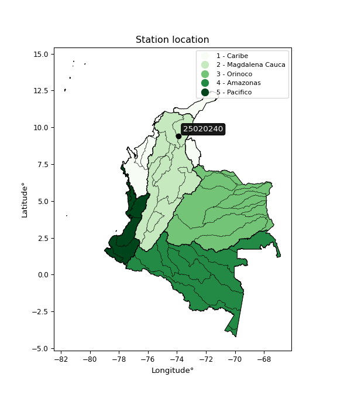</img>

</div>


## A. General information


### 1. General running parameters

• app_version: _v20251225_. • runtime: _2025-12-26 10:39:04.566250_. • Python version: _3.14.0_. • SciPy version: _1.16.3_. • Pandas version: _2.3.3_. • NumPy version: _2.3.5_. • Stations dataset (station_dataset_file): _dataset/pmax24h_in/conventional_cesarcolombia_1959_2015.csv_. • Stations catalog (station_catalog_file): _dataset/CNE_IDEAM.xls_. • Plot only fit distributions with Δo > Δ (plot_only_fit): _True_. • Eval low extreme values, if False, evaluates high extreme values (low_extreme): _False_. • Eval every SciPy distribution as logarithmic (pdist_logarithmic_on): _True_. • Standard deviation normalized (ddof): _1.0_. • Return periods to eval in years (Tr): _[2, 2.33, 5, 10, 15, 20, 25, 50, 75, 100, 200, 250, 500, 750, 1000]_. • Minimum data sample per station, 0 means any (minimum_sample): _5_. • Z-Score threshold to adjust a value, 0 means disable (zscore): _3.5_. • Avoid zeros, e.g. rain = 0 (avoid_zeros): _True_. • Avoid null values (avoid_nans): _True_. [:file_folder:Dataset file.](../../dataset/pmax24h_in/conventional_cesarcolombia_1959_2015.csv)


### 2. Station info and location

|   id |   CODIGO | NOMBRE               | CATEGORIA     | TECNOLOGIA   | ESTADO   | FECHA_INSTALACION   |   FECHA_SUSPENSION |   ALTITUD |   LATITUD |   LONGITUD | DEPARTAMENTO   | MUNICIPIO   | AREA_OPERATIVA                                         | ENTIDAD                                                     | AREA_HIDROGRAFICA   | ZONA_HIDROGRAFICA   | SUBZONA_HIDROGRAFICA   |   CORRIENTE | OBSERVACION                                                                                                                        | SUBRED                          |
|-----:|---------:|:---------------------|:--------------|:-------------|:---------|:--------------------|-------------------:|----------:|----------:|-----------:|:---------------|:------------|:-------------------------------------------------------|:------------------------------------------------------------|:--------------------|:--------------------|:-----------------------|------------:|:-----------------------------------------------------------------------------------------------------------------------------------|:--------------------------------|
|    0 | 25020240 | EL CANAL  [25020240] | Pluviométrica | Convencional | Activa   | 15/03/1963          |                nan |        70 |   9.41047 |   -73.8904 | Cesar          | Chimichagua | Area Operativa 05 - Magdalena-Cesar-Guajira-San Andrés | INSTITUTO DE HIDROLOGIA METEOROLOGIA Y ESTUDIOS AMBIENTALES | Magdalena Cauca     | Cesar               | Bajo Cesar             |         nan | 25/10/2022$Migracion$INCLUSION EN MODULO DE ALERTAS POR SOLICITUD DEL COORDINADOR DEL AO 05                                        | RED ALERTAS - AREA OPERATIVA 05 |
|      |          |                      |               |              |          |                     |                    |           |           |            |                |             |                                                        |                                                             |                     |                     |                        |             | REQ 2022-006231.                                                                                                                   |                                 |
|      |          |                      |               |              |          |                     |                    |           |           |            |                |             |                                                        |                                                             |                     |                     |                        |             | |25/10/2022$Migracion$25/10/2022$Migracion$INCLUSION EN MODULO DE ALERTAS POR SOLICITUD DEL COORDINADOR DEL AO 05 REQ 2022-006231. |                                 |
|      |          |                      |               |              |          |                     |                    |           |           |            |                |             |                                                        |                                                             |                     |                     |                        |             | |01/11/2024$mvelez$Se cambia el sentido del nombre según radicado 20243120200713                                                   |                                 |

<div align="center">

Map location in: [:earth_americas:Google](http://maps.google.com/maps?q=9.410472222,-73.89041667) [:earth_americas:OSM](https://www.openstreetmap.org/#map=18/9.410472222/-73.89041667&layers=P) [:earth_americas:Bing](https://www.bing.com/maps?cp=9.410472222~-73.89041667&lvl=18) [:earth_americas:Apple](https://maps.apple.com/frame?center=9.410472222%2C-73.89041667&span=0.003%2C0.006)

</div>


<div align="center">

```geojson
{
  "type": "Feature",
  "geometry": {
    "type": "Point", 
    "coordinates": [-73.89041667, 9.410472222]
  }, 
  "properties": {
    "Name": "25020240"
  }
}
```

</div>


### 3. Discrete values table and plot

|               |           0 |          1 |          2 |           3 |           4 |          5 |           6 |          7 |          8 |           9 |         10 |        11 |          12 |         13 |          14 |         15 |          16 |         17 |          18 |         19 |          20 |         21 |         22 |          23 |          24 |         25 |         26 |          27 |          28 |        29 |          30 |          31 |          32 |          33 |          34 |         35 |          36 |           37 |          38 |         39 |          40 |        41 |          42 |         43 |          44 |          45 |          46 |         47 |         48 |         49 |         50 |          51 |          52 |
|:--------------|------------:|-----------:|-----------:|------------:|------------:|-----------:|------------:|-----------:|-----------:|------------:|-----------:|----------:|------------:|-----------:|------------:|-----------:|------------:|-----------:|------------:|-----------:|------------:|-----------:|-----------:|------------:|------------:|-----------:|-----------:|------------:|------------:|----------:|------------:|------------:|------------:|------------:|------------:|-----------:|------------:|-------------:|------------:|-----------:|------------:|----------:|------------:|-----------:|------------:|------------:|------------:|-----------:|-----------:|-----------:|-----------:|------------:|------------:|
| Date          | 1963        | 1964       | 1965       | 1966        | 1967        | 1968       | 1969        | 1970       | 1971       | 1972        | 1973       | 1974      | 1975        | 1976       | 1977        | 1978       | 1979        | 1980       | 1981        | 1982       | 1983        | 1984       | 1985       | 1986        | 1987        | 1988       | 1989       | 1990        | 1991        | 1992      | 1993        | 1994        | 1995        | 1996        | 1997        | 1998       | 1999        | 2000         | 2001        | 2002       | 2003        | 2004      | 2005        | 2006       | 2007        | 2008        | 2009        | 2010       | 2011       | 2012       | 2013       | 2014        | 2015        |
| Value         |  110        |  130       |  150       |   90        |   80        |   79.4105  |   80        |  137       |   55       |   90        |   70       |  100      |   98        |  140       |  115        |  138       |  110        |   65       |  110        |   67       |   78        |   61       |   36       |   85        |   88        |  150       |  140       |  109        |   90        |  100      |   91        |  120        |   82        |  101        |  123        |   75       |  128        |  105         |   87        |  113       |  112        |  100      |  112        |  137       |   98        |   90        |   95        |  135       |  135       |  133       |  135       |  125        |   90        |
| Value_initial |  110        |  130       |  150       |   90        |   80        |   79.4105  |   80        |  137       |   55       |   90        |   70       |  100      |   98        |  140       |  115        |  138       |  110        |   65       |  110        |   67       |   78        |   61       |   36       |   85        |   88        |  150       |  140       |  109        |   90        |  100      |   91        |  120        |   82        |  101        |  123        |   75       |  128        |  105         |   87        |  113       |  112        |  100      |  112        |  137       |   98        |   90        |   95        |  135       |  135       |  133       |  135       |  125        |   90        |
| count         |   53        |   53       |   53       |   53        |   53        |   53       |   53        |   53       |   53       |   53        |   53       |   53      |   53        |   53       |   53        |   53       |   53        |   53       |   53        |   53       |   53        |   53       |   53       |   53        |   53        |   53       |   53       |   53        |   53        |   53      |   53        |   53        |   53        |   53        |   53        |   53       |   53        |   53         |   53        |   53       |   53        |   53      |   53        |   53       |   53        |   53        |   53        |   53       |   53       |   53       |   53       |   53        |   53        |
| mean          |  103.272    |  103.272   |  103.272   |  103.272    |  103.272    |  103.272   |  103.272    |  103.272   |  103.272   |  103.272    |  103.272   |  103.272  |  103.272    |  103.272   |  103.272    |  103.272   |  103.272    |  103.272   |  103.272    |  103.272   |  103.272    |  103.272   |  103.272   |  103.272    |  103.272    |  103.272   |  103.272   |  103.272    |  103.272    |  103.272  |  103.272    |  103.272    |  103.272    |  103.272    |  103.272    |  103.272   |  103.272    |  103.272     |  103.272    |  103.272   |  103.272    |  103.272  |  103.272    |  103.272   |  103.272    |  103.272    |  103.272    |  103.272   |  103.272   |  103.272   |  103.272   |  103.272    |  103.272    |
| std           |   26.1543   |   26.1543  |   26.1543  |   26.1543   |   26.1543   |   26.1543  |   26.1543   |   26.1543  |   26.1543  |   26.1543   |   26.1543  |   26.1543 |   26.1543   |   26.1543  |   26.1543   |   26.1543  |   26.1543   |   26.1543  |   26.1543   |   26.1543  |   26.1543   |   26.1543  |   26.1543  |   26.1543   |   26.1543   |   26.1543  |   26.1543  |   26.1543   |   26.1543   |   26.1543 |   26.1543   |   26.1543   |   26.1543   |   26.1543   |   26.1543   |   26.1543  |   26.1543   |   26.1543    |   26.1543   |   26.1543  |   26.1543   |   26.1543 |   26.1543   |   26.1543  |   26.1543   |   26.1543   |   26.1543   |   26.1543  |   26.1543  |   26.1543  |   26.1543  |   26.1543   |   26.1543   |
| zscore        |    0.257246 |    1.02194 |    1.78663 |   -0.507445 |   -0.889791 |   -0.91233 |   -0.889791 |    1.28958 |   -1.84566 |   -0.507445 |   -1.27214 |   -0.1251 |   -0.201569 |    1.40428 |    0.448419 |    1.32781 |    0.257246 |   -1.46331 |    0.257246 |   -1.38684 |   -0.966261 |   -1.61625 |   -2.57211 |   -0.698618 |   -0.583915 |    1.78663 |    1.40428 |    0.219012 |   -0.507445 |   -0.1251 |   -0.469211 |    0.639592 |   -0.813322 |   -0.086865 |    0.754296 |   -1.08096 |    0.945469 |    0.0660733 |   -0.622149 |    0.37195 |    0.333715 |   -0.1251 |    0.333715 |    1.28958 |   -0.201569 |   -0.507445 |   -0.316273 |    1.21311 |    1.21311 |    1.13664 |    1.21311 |    0.830765 |   -0.507445 |

<div align="center">

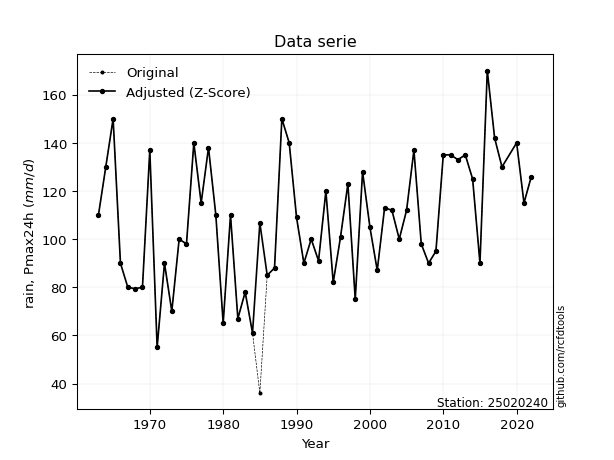</img>

</div>

> If Z-Score is active, values out of range or outliers are replaced with the station mean value.


### 4. Active continuous probability distributions from SciPy (46 of 104 available)

[scipy.stats](https://docs.scipy.org/doc/scipy/reference/stats.html) is a Python´s powerful submodule within the SciPy library for comprehensive statistical analysis, offering over 130 probability distributions (like Normal, Poisson), functions for descriptive stats (mean, variance), hypothesis testing (t-tests, chi-square), random variable generation, and statistical tests, making it essential for data science, modeling, and research. It provides tools to explore, model, and draw conclusions from data efficiently, working seamlessly with NumPy.

<div align="center">

|   id | p_dist             |   n_parameter | fit_method   | label                                                                       | active   | ref                                                                                                        |
|-----:|:-------------------|--------------:|:-------------|:----------------------------------------------------------------------------|:---------|:-----------------------------------------------------------------------------------------------------------|
|    0 | alpha              |             3 | MLE          | Alpha                                                                       | True     | [:mortar_board:](https://docs.scipy.org/doc/scipy/reference/generated/scipy.stats.alpha.html)              |
|    1 | betaprime          |             4 | MLE          | Beta prime                                                                  | True     | [:mortar_board:](https://docs.scipy.org/doc/scipy/reference/generated/scipy.stats.betaprime.html)          |
|    2 | chi2               |             3 | MLE          | Chi²                                                                        | True     | [:mortar_board:](https://docs.scipy.org/doc/scipy/reference/generated/scipy.stats.chi2.html)               |
|    3 | crystalball        |             4 | MLE          | Crystalball                                                                 | True     | [:mortar_board:](https://docs.scipy.org/doc/scipy/reference/generated/scipy.stats.crystalball.html)        |
|    4 | dgamma             |             3 | MLE          | Double gamma                                                                | True     | [:mortar_board:](https://docs.scipy.org/doc/scipy/reference/generated/scipy.stats.dgamma.html)             |
|    5 | erlang             |             3 | MLE          | Erlang                                                                      | True     | [:mortar_board:](https://docs.scipy.org/doc/scipy/reference/generated/scipy.stats.erlang.html)             |
|    6 | expon              |             2 | MLE          | Exponential                                                                 | True     | [:mortar_board:](https://docs.scipy.org/doc/scipy/reference/generated/scipy.stats.expon.html)              |
|    7 | exponnorm          |             3 | MLE          | Exponentially modified Normal                                               | True     | [:mortar_board:](https://docs.scipy.org/doc/scipy/reference/generated/scipy.stats.exponnorm.html)          |
|    8 | f                  |             4 | MLE          | F                                                                           | True     | [:mortar_board:](https://docs.scipy.org/doc/scipy/reference/generated/scipy.stats.f.html)                  |
|    9 | fatiguelife        |             3 | MLE          | Fatigue-life (Birnbaum-Saunders)                                            | True     | [:mortar_board:](https://docs.scipy.org/doc/scipy/reference/generated/scipy.stats.fatiguelife.html)        |
|   10 | fisk               |             3 | MLE          | Fisk                                                                        | True     | [:mortar_board:](https://docs.scipy.org/doc/scipy/reference/generated/scipy.stats.fisk.html)               |
|   11 | gamma              |             3 | MLE          | Gamma                                                                       | True     | [:mortar_board:](https://docs.scipy.org/doc/scipy/reference/generated/scipy.stats.gamma.html)              |
|   12 | genexpon           |             5 | MLE          | Generalized exponential                                                     | True     | [:mortar_board:](https://docs.scipy.org/doc/scipy/reference/generated/scipy.stats.genexpon.html)           |
|   13 | genlogistic        |             3 | MLE          | Generalized logistic                                                        | True     | [:mortar_board:](https://docs.scipy.org/doc/scipy/reference/generated/scipy.stats.genlogistic.html)        |
|   14 | gibrat             |             2 | MM           | Gibrat                                                                      | True     | [:mortar_board:](https://docs.scipy.org/doc/scipy/reference/generated/scipy.stats.gibrat.html)             |
|   15 | gompertz           |             3 | MLE          | Gompertz (or truncated Gumbel)                                              | True     | [:mortar_board:](https://docs.scipy.org/doc/scipy/reference/generated/scipy.stats.gompertz.html)           |
|   16 | gumbel_l           |             2 | MM           | Gumbel Left Skew                                                            | True     | [:mortar_board:](https://docs.scipy.org/doc/scipy/reference/generated/scipy.stats.gumbel_l.html)           |
|   17 | gumbel_r           |             2 | MM           | Gumbel Right Skew                                                           | True     | [:mortar_board:](https://docs.scipy.org/doc/scipy/reference/generated/scipy.stats.gumbel_r.html)           |
|   18 | halflogistic       |             2 | MM           | Half-logistic                                                               | True     | [:mortar_board:](https://docs.scipy.org/doc/scipy/reference/generated/scipy.stats.halflogistic.html)       |
|   19 | halfnorm           |             2 | MM           | Half Normal                                                                 | True     | [:mortar_board:](https://docs.scipy.org/doc/scipy/reference/generated/scipy.stats.halfnorm.html)           |
|   20 | hypsecant          |             2 | MM           | hyperbolic secant                                                           | True     | [:mortar_board:](https://docs.scipy.org/doc/scipy/reference/generated/scipy.stats.hypsecant.html)          |
|   21 | invgamma           |             3 | MLE          | Inverted gamma                                                              | True     | [:mortar_board:](https://docs.scipy.org/doc/scipy/reference/generated/scipy.stats.invgamma.html)           |
|   22 | invgauss           |             3 | MLE          | Inverse Gaussian                                                            | True     | [:mortar_board:](https://docs.scipy.org/doc/scipy/reference/generated/scipy.stats.invgauss.html)           |
|   23 | invweibull         |             3 | MLE          | Inverted Weibull                                                            | True     | [:mortar_board:](https://docs.scipy.org/doc/scipy/reference/generated/scipy.stats.invweibull.html)         |
|   24 | johnsonsu          |             4 | MLE          | Johnson Su                                                                  | True     | [:mortar_board:](https://docs.scipy.org/doc/scipy/reference/generated/scipy.stats.johnsonsu.html)          |
|   25 | kstwobign          |             2 | MLE          | Limiting distribution of scaled Kolmogorov-Smirnov two-sided test statistic | True     | [:mortar_board:](https://docs.scipy.org/doc/scipy/reference/generated/scipy.stats.kstwobign.html)          |
|   26 | laplace            |             2 | MM           | Laplace                                                                     | True     | [:mortar_board:](https://docs.scipy.org/doc/scipy/reference/generated/scipy.stats.laplace.html)            |
|   27 | laplace_asymmetric |             3 | MLE          | Asymmetric Laplace                                                          | True     | [:mortar_board:](https://docs.scipy.org/doc/scipy/reference/generated/scipy.stats.laplace_asymmetric.html) |
|   28 | loggamma           |             3 | MLE          | Log gamma                                                                   | True     | [:mortar_board:](https://docs.scipy.org/doc/scipy/reference/generated/scipy.stats.loggamma.html)           |
|   29 | logistic           |             2 | MM           | Logistic (or Sech-squared)                                                  | True     | [:mortar_board:](https://docs.scipy.org/doc/scipy/reference/generated/scipy.stats.logistic.html)           |
|   30 | lognorm            |             3 | MLE          | Log Normal                                                                  | True     | [:mortar_board:](https://docs.scipy.org/doc/scipy/reference/generated/scipy.stats.lognorm.html)            |
|   31 | maxwell            |             2 | MM           | Maxwell                                                                     | True     | [:mortar_board:](https://docs.scipy.org/doc/scipy/reference/generated/scipy.stats.maxwell.html)            |
|   32 | mielke             |             4 | MLE          | Mielke Beta-Kappa / Dagum                                                   | True     | [:mortar_board:](https://docs.scipy.org/doc/scipy/reference/generated/scipy.stats.mielke.html)             |
|   33 | moyal              |             2 | MM           | Moyal                                                                       | True     | [:mortar_board:](https://docs.scipy.org/doc/scipy/reference/generated/scipy.stats.moyal.html)              |
|   34 | nakagami           |             3 | MLE          | Nakagami                                                                    | True     | [:mortar_board:](https://docs.scipy.org/doc/scipy/reference/generated/scipy.stats.nakagami.html)           |
|   35 | ncf                |             5 | MLE          | Non-central F distribution                                                  | True     | [:mortar_board:](https://docs.scipy.org/doc/scipy/reference/generated/scipy.stats.ncf.html)                |
|   36 | nct                |             4 | MLE          | Non-central Student’s t                                                     | True     | [:mortar_board:](https://docs.scipy.org/doc/scipy/reference/generated/scipy.stats.nct.html)                |
|   37 | norm               |             2 | MM           | Normal                                                                      | True     | [:mortar_board:](https://docs.scipy.org/doc/scipy/reference/generated/scipy.stats.norm.html)               |
|   38 | pareto             |             3 | MLE          | Pareto                                                                      | True     | [:mortar_board:](https://docs.scipy.org/doc/scipy/reference/generated/scipy.stats.pareto.html)             |
|   39 | pearson3           |             3 | MM           | Pearson type III                                                            | True     | [:mortar_board:](https://docs.scipy.org/doc/scipy/reference/generated/scipy.stats.pearson3.html)           |
|   40 | rayleigh           |             2 | MM           | Rayleigh                                                                    | True     | [:mortar_board:](https://docs.scipy.org/doc/scipy/reference/generated/scipy.stats.rayleigh.html)           |
|   41 | rice               |             3 | MLE          | Rice                                                                        | True     | [:mortar_board:](https://docs.scipy.org/doc/scipy/reference/generated/scipy.stats.rice.html)               |
|   42 | t                  |             3 | MLE          | Student’s t                                                                 | True     | [:mortar_board:](https://docs.scipy.org/doc/scipy/reference/generated/scipy.stats.t.html)                  |
|   43 | truncnorm          |             4 | MLE          | Truncated normal                                                            | True     | [:mortar_board:](https://docs.scipy.org/doc/scipy/reference/generated/scipy.stats.truncnorm.html)          |
|   44 | wald               |             2 | MM           | Wald                                                                        | True     | [:mortar_board:](https://docs.scipy.org/doc/scipy/reference/generated/scipy.stats.wald.html)               |
|   45 | weibull_min        |             3 | MLE          | Weibull minimum                                                             | True     | [:mortar_board:](https://docs.scipy.org/doc/scipy/reference/generated/scipy.stats.weibull_min.html)        |

</div>

> **n_parameter:** # arguments & localization & scale.
>
> **Fit methods:** (MLE) maximum likelihood, (MM) L-moments.
>
>**Inactive:** foldnorm, gennorm, norminvgauss, powernorm, powerlognorm, skewnorm, genextreme, anglit, arcsine, argus, beta, bradford, burr, burr12, cauchy, cosine, halfcauchy, foldcauchy, skewcauchy, wrapcauchy, gengamma, exponweib, exponpow, truncexpon, gausshyper, genhalflogistic, genhyperbolic, geninvgauss, halfgennorm, johnsonsb, kappa4, kappa3, ksone, kstwo, loglaplace, levy, levy_l, levy_stable, ncx2, genpareto, truncpareto, lomax, powerlaw, rdist, rel_breitwigner, recipinvgauss, semicircular, studentized_range, trapezoid, triang, truncweibull_min, tukeylambda, uniform, loguniform, vonmises, vonmises_line, weibull_max, dweibull, 


## B. Probability distributions vs. Empirical distributions

A continuous probability distribution (CPD) describes probabilities for variables that can take any value within a range (like rain any time), unlike discrete variables with specific outcomes (like temperature). It uses a Probability Density Function (PDF), a curve where the total area under it equals 1, and the probability of the variable falling within an interval (a to b) is found by calculating the area under the curve between those points. A key feature is that the probability of hitting any single exact value is zero, so probabilities are always expressed for ranges, e.g., $P(a ≤ X ≤ b)$.

<div align="center">

Distributions parameters
|    |   station | p_dist                |   n |              loc |           scale | shape                  | shape1                 | shape2                | shape3   |
|---:|----------:|:----------------------|----:|-----------------:|----------------:|:-----------------------|:-----------------------|:----------------------|:---------|
|  0 |  25020240 | alpha                 |  53 |   -286.033       |  5728.09        | 14.807563920180563     |                        |                       |          |
|  1 |  25020240 | betaprime             |  53 |     -2.25096     |   559.758       | 17.15693465144672      | 92.4582695825082       |                       |          |
|  2 |  25020240 | chi2                  |  53 |   -242.497       |     0.9946      | 347.73375708119886     |                        |                       |          |
|  3 |  25020240 | crystalball           |  53 |    103.272       |    25.9064      | 7150.234211973089      | 9601.239386556696      |                       |          |
|  4 |  25020240 | dgamma                |  53 |    103.64        |    11.5697      | 1.861587438052353      |                        |                       |          |
|  5 |  25020240 | erlang                |  53 |   -443.406       |     1.24454     | 439.26893561603697     |                        |                       |          |
|  6 |  25020240 | expon                 |  53 |     36           |    67.2719      |                        |                        |                       |          |
|  7 |  25020240 | exponnorm             |  53 |    103.247       |    25.9064      | 0.000958197301791044   |                        |                       |          |
|  8 |  25020240 | f                     |  53 |  -3235.13        |  3338.44        | 33611.3672230648       | 3082230.2415032964     |                       |          |
|  9 |  25020240 | fatiguelife           |  53 |  -1407.69        |  1510.98        | 0.017021177994238343   |                        |                       |          |
| 10 |  25020240 | fisk                  |  53 |     -0.82737     |   102.419       | 6.527796267853532      |                        |                       |          |
| 11 |  25020240 | gamma                 |  53 |   -450.152       |     1.22913     | 450.14976823374445     |                        |                       |          |
| 12 |  25020240 | genexpon              |  53 |     35.9999      |     1.70665     | 0.02534380631336916    | 3.0937500955883464e-06 | 1.8460947349580774    |          |
| 13 |  25020240 | genlogistic           |  53 |     98.1587      |    16.2579      | 1.2379023172662524     |                        |                       |          |
| 14 |  25020240 | gibrat                |  53 |     83.5086      |    11.9871      |                        |                        |                       |          |
| 15 |  25020240 | gompertz              |  53 |     27.3527      |     4.08642     | 2.0212066880735683e-12 |                        |                       |          |
| 16 |  25020240 | gumbel_l              |  53 |    114.931       |    20.1991      |                        |                        |                       |          |
| 17 |  25020240 | gumbel_r              |  53 |     91.6126      |    20.1991      |                        |                        |                       |          |
| 18 |  25020240 | halflogistic          |  53 |     72.5668      |    22.149       |                        |                        |                       |          |
| 19 |  25020240 | halfnorm              |  53 |     68.982       |    42.976       |                        |                        |                       |          |
| 20 |  25020240 | hypsecant             |  53 |    103.272       |    16.4925      |                        |                        |                       |          |
| 21 |  25020240 | invgamma              |  53 |   -242.533       | 60780           | 176.93971177278615     |                        |                       |          |
| 22 |  25020240 | invgauss              |  53 |     -1.4699      |  1134.57        | 0.09326418031322914    |                        |                       |          |
| 23 |  25020240 | invweibull            |  53 |     -4.43796e+07 |     4.43797e+07 | 1666496.2872562502     |                        |                       |          |
| 24 |  25020240 | johnsonsu             |  53 |     -4.77845e+08 |     6.70289e+08 | -21065022.650508456    | 31762826.434389725     |                       |          |
| 25 |  25020240 | kstwobign             |  53 |     -8.14912     |   128.346       |                        |                        |                       |          |
| 26 |  25020240 | laplace               |  53 |    103.272       |    18.3186      |                        |                        |                       |          |
| 27 |  25020240 | laplace_asymmetric    |  53 |     98           |    21.0667      | 0.8826720952816421     |                        |                       |          |
| 28 |  25020240 | loggamma              |  53 |   -240.007       |   115.16        | 20.203259130929638     |                        |                       |          |
| 29 |  25020240 | logistic              |  53 |    103.272       |    14.283       |                        |                        |                       |          |
| 30 |  25020240 | lognorm               |  53 |     -8.38857e+06 |     8.38868e+06 | 3.0882613822266525e-06 |                        |                       |          |
| 31 |  25020240 | maxwell               |  53 |     41.8846      |    38.4688      |                        |                        |                       |          |
| 32 |  25020240 | mielke                |  53 |     -0.40608     |   126.751       | 3.695518836257598      | 11.708474799738784     |                       |          |
| 33 |  25020240 | moyal                 |  53 |     88.4569      |    11.662       |                        |                        |                       |          |
| 34 |  25020240 | nakagami              |  53 |     44.2092      |    64.9011      | 1.5523383455606767     |                        |                       |          |
| 35 |  25020240 | ncf                   |  53 |     -0.795557    |     2.19114e-06 | 2.1782692796575475e-06 | 70.21555090811887      | 100.80073948523028    |          |
| 36 |  25020240 | nct                   |  53 |  -1702.36        |    25.8562      | 609472.396216387       | 69.8336598870776       |                       |          |
| 37 |  25020240 | norm                  |  53 |    103.272       |    25.9064      |                        |                        |                       |          |
| 38 |  25020240 | pareto                |  53 |     -1.71799e+10 |     1.71799e+10 | 255379588.40520793     |                        |                       |          |
| 39 |  25020240 | pearson3              |  53 |    103.272       |    25.9064      | -0.15520895518041652   |                        |                       |          |
| 40 |  25020240 | rayleigh              |  53 |     53.7114      |    39.5436      |                        |                        |                       |          |
| 41 |  25020240 | rice                  |  53 |     22.4416      |    26.9613      | 2.812715619201575      |                        |                       |          |
| 42 |  25020240 | t                     |  53 |    103.275       |    25.9059      | 1601318.637595613      |                        |                       |          |
| 43 |  25020240 | truncnorm             |  53 |    103.272       |    25.9064      | -543.7258354092855     | 2611.78118472701       |                       |          |
| 44 |  25020240 | wald                  |  53 |     77.3655      |    25.9064      |                        |                        |                       |          |
| 45 |  25020240 | weibull_min           |  53 |      1.30285     |   111.851       | 4.498237868919859      |                        |                       |          |
| 46 |  25020240 | logalpha              |  53 |     -6.46324     |   414.906       | 37.54161778199618      |                        |                       |          |
| 47 |  25020240 | logbetaprime          |  53 |    -33.3198      |    21.5935      | 49895.60921675837      | 28415.05574475575      |                       |          |
| 48 |  25020240 | logchi2               |  53 |     -0.167169    |     0.00916658  | 520.0128440481508      |                        |                       |          |
| 49 |  25020240 | logcrystalball        |  53 |      4.60152     |     0.279699    | 177.83018506240882     | 92.07574166440013      |                       |          |
| 50 |  25020240 | logdgamma             |  53 |      4.63855     |     0.130968    | 1.6708732404741533     |                        |                       |          |
| 51 |  25020240 | logerlang             |  53 |     -0.206448    |     0.0176889   | 271.7568352649854      |                        |                       |          |
| 52 |  25020240 | logexpon              |  53 |      3.58352     |     1.018       |                        |                        |                       |          |
| 53 |  25020240 | logexponnorm          |  53 |      4.60134     |     0.279698    | 0.0006586013758900959  |                        |                       |          |
| 54 |  25020240 | logf                  |  53 |    -97.5817      |   102.183       | 3993836.8436034564     | 285057.9671559114      |                       |          |
| 55 |  25020240 | logfatiguelife        |  53 |   -154.124       |   158.725       | 0.0017557295479034589  |                        |                       |          |
| 56 |  25020240 | logfisk               |  53 |     -2.70963e+07 |     2.70963e+07 | 175310718.20384407     |                        |                       |          |
| 57 |  25020240 | loggamma              |  53 |      0.215358    |     0.0198013   | 221.2528529259281      |                        |                       |          |
| 58 |  25020240 | loggenexpon           |  53 |      3.56073     | 93304.9         | 287.30187280063063     | 228465.19127564732     | 79565.47838831559     |          |
| 59 |  25020240 | loggenlogistic        |  53 |      4.84102     |     0.0849717   | 0.3111759374281109     |                        |                       |          |
| 60 |  25020240 | loggibrat             |  53 |      4.38817     |     0.129409    |                        |                        |                       |          |
| 61 |  25020240 | loggompertz           |  53 |      3.58351     |     0.224589    | 0.00618855440119267    |                        |                       |          |
| 62 |  25020240 | loggumbel_l           |  53 |      4.7274      |     0.21808     |                        |                        |                       |          |
| 63 |  25020240 | loggumbel_r           |  53 |      4.47564     |     0.21808     |                        |                        |                       |          |
| 64 |  25020240 | loghalflogistic       |  53 |      4.27001     |     0.239135    |                        |                        |                       |          |
| 65 |  25020240 | loghalfnorm           |  53 |      4.2313      |     0.464008    |                        |                        |                       |          |
| 66 |  25020240 | loghypsecant          |  53 |      4.60152     |     0.178062    |                        |                        |                       |          |
| 67 |  25020240 | loginvgamma           |  53 |     -5.80673     | 13073.7         | 1257.198150840209      |                        |                       |          |
| 68 |  25020240 | loginvgauss           |  53 |      0.859958    |   586.702       | 0.006376535688399614   |                        |                       |          |
| 69 |  25020240 | loginvweibull         |  53 | -26391.4         | 26395.8         | 75032.51083802244      |                        |                       |          |
| 70 |  25020240 | logjohnsonsu          |  53 |      5.28638     |     0.0313346   | 9.111396346889268      | 2.4643110801056105     |                       |          |
| 71 |  25020240 | logkstwobign          |  53 |      3.01522     |     1.84312     |                        |                        |                       |          |
| 72 |  25020240 | loglaplace            |  53 |      4.60152     |     0.197777    |                        |                        |                       |          |
| 73 |  25020240 | loglaplace_asymmetric |  53 |      4.61512     |     0.217195    | 1.0318270499198965     |                        |                       |          |
| 74 |  25020240 | logloggamma           |  53 |      4.77688     |     0.194734    | 0.8288269629695371     |                        |                       |          |
| 75 |  25020240 | loglogistic           |  53 |      4.60152     |     0.154206    |                        |                        |                       |          |
| 76 |  25020240 | loglognorm            |  53 | -32764.4         | 32769           | 8.535493542166586e-06  |                        |                       |          |
| 77 |  25020240 | logmaxwell            |  53 |      3.93873     |     0.415346    |                        |                        |                       |          |
| 78 |  25020240 | logmielke             |  53 |     -0.780901    |     5.73859     | 15.007787056529807     | 189.03149830111772     |                       |          |
| 79 |  25020240 | logmoyal              |  53 |      4.44157     |     0.125909    |                        |                        |                       |          |
| 80 |  25020240 | lognakagami           |  53 |    -97.8202      |   102.422       | 33397.421866630146     |                        |                       |          |
| 81 |  25020240 | logncf                |  53 |    -20.5119      |    25.1123      | 25433.373269522126     | 41250.917261233495     | 2.134583818198826e-06 |          |
| 82 |  25020240 | lognct                |  53 |      0.0197708   |     0.274881    | 2917.0617604210483     | 16.654191128400612     |                       |          |
| 83 |  25020240 | lognorm               |  53 |      4.60152     |     0.279699    |                        |                        |                       |          |
| 84 |  25020240 | logpareto             |  53 |     -6.71089e+07 |     6.71089e+07 | 65922006.45457929      |                        |                       |          |
| 85 |  25020240 | logpearson3           |  53 |      4.60152     |     0.279699    | -1.0026967896068522    |                        |                       |          |
| 86 |  25020240 | lograyleigh           |  53 |      4.06642     |     0.426952    |                        |                        |                       |          |
| 87 |  25020240 | logrice               |  53 |    -88.9114      |     0.279687    | 334.34716237529403     |                        |                       |          |
| 88 |  25020240 | logt                  |  53 |      4.60154     |     0.279672    | 19403.62840259743      |                        |                       |          |
| 89 |  25020240 | logtruncnorm          |  53 |     -0.18451     |     1.90728     | 1.9756071529002508     | 2.723856353845501      |                       |          |
| 90 |  25020240 | logwald               |  53 |      4.3218      |     0.279717    |                        |                        |                       |          |
| 91 |  25020240 | logweibull_min        |  53 |     -4.36577e+06 |     4.36577e+06 | 19878864.317565706     |                        |                       |          |

</div>

> **loc** (Location parameter): This shifts the distribution along the x-axis. For many common distributions, like the normal (Gaussian) distribution, loc represents the mean $μ$. For others, like the uniform distribution, it might represent the minimum value, or for the beta distribution, the left end of the support interval.
>
> **scale** (Scale parameter): This determines the width or spread of the distribution. For the normal distribution, scale represents the standard deviation $σ$. For a uniform distribution, it defines the length of the interval (from $loc$ to $loc + scale$).
>
> **shape** (Shape parameters): Refers to parameters that define the specific form of a probability distribution, distinct from its location (loc) and scale (scale). These parameters are required arguments for most distribution functions. For example, a normal (Gaussian) distribution is fully defined by its location (mean) and scale (standard deviation), so it has no specific shape parameters beyond loc and scale. However, other distributions have intrinsic properties that need specification, as Gamma distribution that takes a shape parameter, often named $a$ or $alpha$.


### 0. Cumulative distribution values - CDF (92 evaluated)

> Ordered by x ascending and calculating $log(f(x))$ separately. 

|   id |   Station |   date |        x |   count |    mean |     std |     zscore |   Value_initial |   station |   m |      alpha |   alpha_pdf |   betaprime |   betaprime_pdf |      chi2 |    chi2_pdf |   crystalball |   crystalball_pdf |     dgamma |   dgamma_pdf |     erlang |   erlang_pdf |    expon |   expon_pdf |   exponnorm |   exponnorm_pdf |         f |       f_pdf |   fatiguelife |   fatiguelife_pdf |       fisk |   fisk_pdf |      gamma |   gamma_pdf |    genexpon |   genexpon_pdf |   genlogistic |   genlogistic_pdf |   gibrat |   gibrat_pdf |    gompertz |   gompertz_pdf |   gumbel_l |   gumbel_l_pdf |   gumbel_r |   gumbel_r_pdf |   halflogistic |   halflogistic_pdf |   halfnorm |   halfnorm_pdf |   hypsecant |   hypsecant_pdf |   invgamma |   invgamma_pdf |    invgauss |   invgauss_pdf |   invweibull |   invweibull_pdf |   johnsonsu |   johnsonsu_pdf |   kstwobign |   kstwobign_pdf |   laplace |   laplace_pdf |   laplace_asymmetric |   laplace_asymmetric_pdf |    loggamma |   loggamma_pdf |   logistic |   logistic_pdf |     lognorm |   lognorm_pdf |   maxwell |   maxwell_pdf |     mielke |   mielke_pdf |       moyal |   moyal_pdf |   nakagami |   nakagami_pdf |         ncf |     ncf_pdf |        nct |     nct_pdf |       norm |    norm_pdf |      pareto |   pareto_pdf |   pearson3 |   pearson3_pdf |    rayleigh |   rayleigh_pdf |       rice |    rice_pdf |          t |       t_pdf |   truncnorm |   truncnorm_pdf |        wald |    wald_pdf |   weibull_min |   weibull_min_pdf |    logalpha |   logalpha_pdf |   logbetaprime |   logbetaprime_pdf |     logchi2 |   logchi2_pdf |   logcrystalball |   logcrystalball_pdf |   logdgamma |   logdgamma_pdf |   logerlang |   logerlang_pdf |   logexpon |   logexpon_pdf |   logexponnorm |   logexponnorm_pdf |        logf |   logf_pdf |   logfatiguelife |   logfatiguelife_pdf |   logfisk |   logfisk_pdf |   loggenexpon |   loggenexpon_pdf |   loggenlogistic |   loggenlogistic_pdf |   loggibrat |   loggibrat_pdf |   loggompertz |   loggompertz_pdf |   loggumbel_l |   loggumbel_l_pdf |   loggumbel_r |   loggumbel_r_pdf |   loghalflogistic |   loghalflogistic_pdf |   loghalfnorm |   loghalfnorm_pdf |   loghypsecant |   loghypsecant_pdf |   loginvgamma |   loginvgamma_pdf |   loginvgauss |   loginvgauss_pdf |   loginvweibull |   loginvweibull_pdf |   logjohnsonsu |   logjohnsonsu_pdf |   logkstwobign |   logkstwobign_pdf |   loglaplace |   loglaplace_pdf |   loglaplace_asymmetric |   loglaplace_asymmetric_pdf |   logloggamma |   logloggamma_pdf |   loglogistic |   loglogistic_pdf |   loglognorm |   loglognorm_pdf |   logmaxwell |   logmaxwell_pdf |   logmielke |   logmielke_pdf |     logmoyal |   logmoyal_pdf |   lognakagami |   lognakagami_pdf |      logncf |   logncf_pdf |     lognct |   lognct_pdf |   logpareto |   logpareto_pdf |   logpearson3 |   logpearson3_pdf |   lograyleigh |   lograyleigh_pdf |     logrice |   logrice_pdf |       logt |   logt_pdf |   logtruncnorm |   logtruncnorm_pdf |   logwald |   logwald_pdf |   logweibull_min |   logweibull_min_pdf |
|-----:|----------:|-------:|---------:|--------:|--------:|--------:|-----------:|----------------:|----------:|----:|-----------:|------------:|------------:|----------------:|----------:|------------:|--------------:|------------------:|-----------:|-------------:|-----------:|-------------:|---------:|------------:|------------:|----------------:|----------:|------------:|--------------:|------------------:|-----------:|-----------:|-----------:|------------:|------------:|---------------:|--------------:|------------------:|---------:|-------------:|------------:|---------------:|-----------:|---------------:|-----------:|---------------:|---------------:|-------------------:|-----------:|---------------:|------------:|----------------:|-----------:|---------------:|------------:|---------------:|-------------:|-----------------:|------------:|----------------:|------------:|----------------:|----------:|--------------:|---------------------:|-------------------------:|------------:|---------------:|-----------:|---------------:|------------:|--------------:|----------:|--------------:|-----------:|-------------:|------------:|------------:|-----------:|---------------:|------------:|------------:|-----------:|------------:|-----------:|------------:|------------:|-------------:|-----------:|---------------:|------------:|---------------:|-----------:|------------:|-----------:|------------:|------------:|----------------:|------------:|------------:|--------------:|------------------:|------------:|---------------:|---------------:|-------------------:|------------:|--------------:|-----------------:|---------------------:|------------:|----------------:|------------:|----------------:|-----------:|---------------:|---------------:|-------------------:|------------:|-----------:|-----------------:|---------------------:|----------:|--------------:|--------------:|------------------:|-----------------:|---------------------:|------------:|----------------:|--------------:|------------------:|--------------:|------------------:|--------------:|------------------:|------------------:|----------------------:|--------------:|------------------:|---------------:|-------------------:|--------------:|------------------:|--------------:|------------------:|----------------:|--------------------:|---------------:|-------------------:|---------------:|-------------------:|-------------:|-----------------:|------------------------:|----------------------------:|--------------:|------------------:|--------------:|------------------:|-------------:|-----------------:|-------------:|-----------------:|------------:|----------------:|-------------:|---------------:|--------------:|------------------:|------------:|-------------:|-----------:|-------------:|------------:|----------------:|--------------:|------------------:|--------------:|------------------:|------------:|--------------:|-----------:|-----------:|---------------:|-------------------:|----------:|--------------:|-----------------:|---------------------:|
|    0 |  25020240 |   1985 |  36      |      53 | 103.272 | 26.1543 | -2.57211   |         36      |  25020240 |   1 | 0.00144257 | 0.000260094 | 0.000460171 |     0.000128625 | 0.0031568 | 0.000422413 |    0.00470583 |       0.000528787 | 0.00797813 |  0.000602566 | 0.00370825 |  0.000463409 | 0        |  0.014865   |  0.00470582 |     0.000528785 | 0.004463  | 0.000511615 |    0.00371743 |       0.000451592 | 0.00125814 | 0.00022273 | 0.00378275 | 0.000471232 | 1.41278e-06 |     0.0148501  |    0.00856872 |       0.000638482 | 0        |   0          | 1.47524e-11 |    4.10471e-12 |  0.0198873 |    0.000974705 | 1.5297e-07 |    1.18844e-07 |      0         |         0          |  0         |     0          |   0.0107741 |     0.000653148 | 0.00178098 |     0.00029253 | 0.000284709 |     0.00010588 |  0.000441322 |      0.000128031 |  0.00471969 |     0.000529971 | 0.000215998 |     9.71284e-05 | 0.0127086 |   0.000693755 |            0.0156082 |              0.000839381 | 9.80645e-05 |     0.00157517 | 0.00892493 |    0.000619289 | 0.000136506 |    0.00189524 | 0         |    0          | 0.00995071 |   0.00101008 | 2.57231e-21 | 1.00169e-20 | 0          |     0          | 0.000226031 | 6.98821e-05 | 0.00470273 | 0.000528598 | 0.00470583 | 0.000528787 | 5.67057e-08 |   0.014865   | 0.00683593 |    0.000652258 | 0           |    0           | 0.00287868 | 0.000492899 | 0.00470364 | 0.000528577 |  0.00470583 |     0.000528787 | 0           | 0           |    0.00515489 |        0.00066657 | 8.63615e-05 |     0.00141764 |    0.000130097 |         0.00185209 | 0.000109542 |    0.00171408 |      0.000136511 |            0.0018953 | 0.000769078 |      0.00543567 | 8.87338e-05 |       0.0014237 |   0        |       0.982314 |    0.000136503 |         0.00189521 | 0.000128226 | 0.00180752 |      0.000125758 |           0.00177278 | 0.001216  |    0.00785785 |   0.000608592 |         0.0501694 |        0.0100005 |            0.0366229 |   0         |        0        |   2.24469e-07 |          0.027556 |    0.00525866 |         0.0240499 |   1.08192e-26 |       2.96616e-24 |         0         |              0        |     0         |          0        |     0.00209389 |          0.0117593 |   0.000112126 |        0.00172235 |   3.81851e-05 |       0.000744374 |     8.01778e-06 |         0.000267438 |     0.00728891 |          0.0292202 |    1.88097e-05 |        0.000825911 |   0.00290772 |         0.014702 |              0.00516701 |                   0.0230559 |    0.00662026 |         0.0281436 |    0.00135637 |        0.00878388 |  0.000136487 |       0.00189504 |    0         |        0         |   0.0164396 |       0.0565301 | 3.38722e-200 |   1.22718e-196 |   0.000137706 |        0.00191365 | 0.000126616 |   0.00181227 | 0.00013714 |   0.00192451 |    0        |        0.982314 |    0.00399515 |         0.0216536 |    0          |          0        | 0.000136438 |    0.00189443 | 0.00013665 | 0.00189629 |    1.87633e-06 |           1.42355  | 0         |      0        |       0.00541522 |            0.0245905 |
|    1 |  25020240 |   1971 |  55      |      53 | 103.272 | 26.1543 | -1.84566   |         55      |  25020240 |   2 | 0.0233654  | 0.00271955  | 0.0202826   |     0.00281884  | 0.0279503 | 0.00270558  |    0.0312088  |       0.0027138   | 0.0325186  |  0.00234329  | 0.0292105  |  0.00271416  | 0.246055 |  0.0112074  |  0.0312087  |     0.00271379  | 0.0305775 | 0.0026961   |    0.0281691  |       0.00259399  | 0.0186855  | 0.00214403 | 0.0296089  | 0.00274284  | 0.245866    |     0.0112003  |    0.0343789  |       0.00244568  | 0        |   0          | 1.75144e-09 |    4.29095e-10 |  0.0501552 |    0.0024197   | 0.00218476 |    0.000662621 |      0         |         0          |  0         |     0          |   0.0340668 |     0.00206165  | 0.0236919  |     0.00262124 | 0.0246959   |     0.00356309 |  0.0227051   |      0.00322723  |  0.0312599  |     0.00271643  | 0.0311803   |     0.00453875  | 0.0358548 |   0.00195729  |            0.043362  |              0.00233192  | 0.0189993   |     0.173358   | 0.0329364  |    0.00223004  | 0.0168186   |    0.149357   | 0.01018   |    0.00227478 | 0.0469729  |   0.00313284 | 2.70099e-05 | 2.14551e-05 | 0.00532229 |     0.00150568 | 0.0152442   | 0.00235262  | 0.0312028  | 0.00271378  | 0.0312088  | 0.0027138   | 0.246055    |   0.0112074  | 0.0354617  |    0.00275624  | 0.000530807 |    0.000823635 | 0.0296524  | 0.00279834  | 0.0311985  | 0.00271311  |  0.0312088  |     0.0027138   | 0           | 0           |    0.0361816  |        0.00297545 | 0.0185661   |     0.172011   |    0.0173183   |         0.15462    | 0.0191307   |    0.172372   |      0.0168189   |            0.149358  | 0.0145146   |      0.0979433  | 0.0176686   |       0.1632    |   0.34053  |       0.647807 |    0.0168186   |         0.149357   | 0.0166925   | 0.149274   |      0.0164973   |           0.148003   | 0.0185433 |    0.117749   |   0.169318    |         0.646747  |        0.0472131 |            0.17289   |   0         |        0        |   0.0340636   |          0.175674 |    0.0361454  |         0.162711  |   0.000191088 |       0.00750294  |         0         |              0        |     0         |          0        |     0.0226184  |          0.126919  |   0.0186615   |        0.168155   |   0.0166363   |       0.165426    |     0.029677    |         0.29673     |     0.0411418  |          0.169816  |    0.0659035   |        0.499252    |   0.0247856  |         0.125321 |              0.0342407  |                   0.152787  |    0.0398957  |         0.168026  |    0.0207707  |        0.131897   |  0.0168184   |       0.149357   |    0.0011889 |        0.0517039 |   0.0660596 |       0.207051  | 2.03144e-08  |   2.61447e-06  |   0.0169616   |        0.150451   | 0.0171472   |   0.153336   | 0.0173795  |   0.154321   |    0.34053  |        0.647807 |    0.0358226  |         0.174949  |    0          |          0        | 0.016816    |    0.149343   | 0.0168144  | 0.149311   |    0.484759    |           0.895355 | 0         |      0        |       0.0367103  |            0.164048  |
|    2 |  25020240 |   1984 |  61      |      53 | 103.272 | 26.1543 | -1.61625   |         61      |  25020240 |   3 | 0.0447224  | 0.00448593  | 0.0431071   |     0.00488337  | 0.0484091 | 0.00418189  |    0.0513697  |       0.0040677   | 0.0498752  |  0.00351389  | 0.0495928  |  0.00414533  | 0.310388 |  0.0102511  |  0.0513696  |     0.0040677   | 0.0506588 | 0.00405977  |    0.0476698  |       0.00397163  | 0.0357508  | 0.00363966 | 0.0501886  | 0.00418236  | 0.310161    |     0.0102454  |    0.0523793  |       0.00362004  | 0        |   0          | 7.61107e-09 |    1.86302e-09 |  0.0669105 |    0.00319916  | 0.0105473  |    0.00237685  |      0         |         0          |  0         |     0          |   0.048965  |     0.00295722  | 0.0440896  |     0.00425921 | 0.0529929   |     0.00593006 |  0.0487236   |      0.00552836  |  0.051437   |     0.00407037  | 0.0663554   |     0.00719725  | 0.0497502 |   0.00271583  |            0.0598745 |              0.00321993  | 0.0454051   |     0.350644   | 0.0492845  |    0.00328052  | 0.0396976   |    0.3062     | 0.0303182 |    0.00452653 | 0.0686826  |   0.00413258 | 0.00117339  | 0.000573379 | 0.0202429  |     0.00359237 | 0.0351313   | 0.00439255  | 0.0513642  | 0.00406787  | 0.0513697  | 0.0040677   | 0.310388    |   0.0102511  | 0.0555656  |    0.00399896  | 0.0168431   |    0.00458264  | 0.0504916  | 0.00420918  | 0.0513548  | 0.00406685  |  0.0513697  |     0.0040677   | 0           | 0           |    0.0576199  |        0.00421415 | 0.044915    |     0.351195   |    0.0409837   |         0.316312   | 0.045284    |    0.346442   |      0.039698    |            0.306202  | 0.0289869   |      0.191478   | 0.0427322   |       0.335003  |   0.404306 |       0.585159 |    0.0396975   |         0.306201   | 0.0396045   | 0.307016   |      0.0392605   |           0.305509   | 0.0356044 |    0.222156   |   0.239326    |         0.699793  |        0.0689794 |            0.252563  |   0         |        0        |   0.0568977   |          0.271981 |    0.0574684  |         0.255798  |   0.00486242  |       0.118756    |         0         |              0        |     0         |          0        |     0.0404201  |          0.226391  |   0.0442388   |        0.33959    |   0.0425483   |       0.350146    |     0.072762    |         0.542025    |     0.0630547  |          0.259512  |    0.128464    |        0.701417    |   0.0418372  |         0.211537 |              0.0543491  |                   0.242513  |    0.0616131  |         0.257577  |    0.0398572  |        0.248166   |  0.0396974   |       0.306203   |    0.0179896 |        0.302838  |   0.0910699 |       0.279399  | 0.00020061   |   0.0117234    |   0.0399871   |        0.307929   | 0.0406232   |   0.313829   | 0.0409688  |   0.31507    |    0.404306 |        0.585159 |    0.0588474  |         0.276549  |    0.00540641 |          0.242563 | 0.0396936   |    0.306189   | 0.0396869  | 0.306122   |    0.572106    |           0.793484 | 0         |      0        |       0.0581683  |            0.257003  |
|    3 |  25020240 |   1980 |  65      |      53 | 103.272 | 26.1543 | -1.46331   |         65      |  25020240 |   4 | 0.0654898  | 0.00592847  | 0.0658649   |     0.00652124  | 0.067486  | 0.00538358  |    0.0697958  |       0.00517117  | 0.0659456  |  0.00456119  | 0.0684521  |  0.00531094  | 0.350197 |  0.00965935 |  0.0697957  |     0.00517116  | 0.0690713 | 0.00517265  |    0.0657676  |       0.00510492  | 0.0528724  | 0.00496589 | 0.0692062  | 0.005353    | 0.349949    |     0.00965448 |    0.0688274  |       0.00463738  | 0        |   0          | 2.02594e-08 |    4.95824e-09 |  0.0809554 |    0.00384107  | 0.0238942  |    0.0044172   |      0         |         0          |  0         |     0          |   0.0623281 |     0.00375506  | 0.0637599  |     0.00560676 | 0.0800911   |     0.00761979 |  0.0742604   |      0.00725072  |  0.0698733  |     0.00517359  | 0.0985832   |     0.00888951  | 0.0618908 |   0.00337858  |            0.0742445 |              0.00399272  | 0.0722631   |     0.499856   | 0.0641909  |    0.00420574  | 0.0633645   |    0.444433   | 0.0518375 |    0.00625192 | 0.0867158  |   0.00489742 | 0.00626035  | 0.00222841  | 0.0380161  |     0.00532887 | 0.0560265   | 0.00609095  | 0.0697912  | 0.00517147  | 0.0697958  | 0.00517117  | 0.350197    |   0.00965935 | 0.0735308  |    0.00500728  | 0.0399283   |    0.00693094  | 0.0695545  | 0.00534712  | 0.0697773  | 0.00517022  |  0.0697958  |     0.00517117  | 0           | 0           |    0.0763759  |        0.00518218 | 0.0718678   |     0.502363   |    0.0653926   |         0.457615   | 0.0717903   |    0.492922   |      0.0633651   |            0.444435  | 0.0439452   |      0.285342   | 0.0685158   |       0.481896  |   0.440336 |       0.549766 |    0.0633646   |         0.444434   | 0.0633472   | 0.446015   |      0.0629139   |           0.444783   | 0.0527447 |    0.323254   |   0.284353    |         0.71616   |        0.0870373 |            0.318616  |   0         |        0        |   0.0766524   |          0.353315 |    0.0761408  |         0.335499  |   0.0186766   |       0.340893    |         0         |              0        |     0         |          0        |     0.0576635  |          0.322072  |   0.0702719   |        0.484996   |   0.0695931   |       0.506379    |     0.112176    |         0.697597    |     0.0818407  |          0.335037  |    0.17616     |        0.796042    |   0.0576807  |         0.291645 |              0.0721562  |                   0.321971  |    0.0802805  |         0.333296  |    0.0589723  |        0.359873   |  0.0633646   |       0.444437   |    0.0441467 |        0.526479  |   0.110524  |       0.334736  | 0.00386038   |   0.140875     |   0.0637738   |        0.446449   | 0.0648417   |   0.454061   | 0.0652765  |   0.455674   |    0.440336 |        0.549766 |    0.0789979  |         0.36112   |    0.0314698  |          0.573666 | 0.06336     |    0.444428   | 0.0633485  | 0.444342   |    0.62065     |           0.735744 | 0         |      0        |       0.0769078  |            0.336362  |
|    4 |  25020240 |   1982 |  67      |      53 | 103.272 | 26.1543 | -1.38684   |         67      |  25020240 |   5 | 0.0781236  | 0.00671097  | 0.0797681   |     0.00738512  | 0.0789053 | 0.00604138  |    0.0807398  |       0.00577864  | 0.0756749  |  0.00517924  | 0.0797077  |  0.00595042  | 0.369232 |  0.0093764  |  0.0807396  |     0.00577863  | 0.0800235 | 0.00578547  |    0.0765975  |       0.00573112  | 0.0635556  | 0.00572792 | 0.0805482  | 0.00599464  | 0.368974    |     0.00937193 |    0.0786786  |       0.00522242  | 0        |   0          | 3.30521e-08 |    8.08876e-09 |  0.0889953 |    0.00420375  | 0.0339759  |    0.00568885  |      0         |         0          |  0         |     0          |   0.0703023 |     0.0042281   | 0.0757045  |     0.00634402 | 0.0961653   |     0.00845064 |  0.0896312   |      0.00811832  |  0.0808219  |     0.00578085  | 0.117143    |     0.0096601   | 0.0690306 |   0.00376833  |            0.0826752 |              0.00444611  | 0.0886163   |     0.580217   | 0.0731335  |    0.00474587  | 0.0779818   |    0.521335   | 0.0652319 |    0.00714392 | 0.0969201  |   0.00531035 | 0.0121015   | 0.00368571  | 0.0496008  |     0.00626089 | 0.0691188   | 0.00700666  | 0.0807359  | 0.00577902  | 0.0807398  | 0.00577864  | 0.369232    |   0.0093764  | 0.0840959  |    0.00556332  | 0.0549001   |    0.00803166  | 0.0808652  | 0.005969    | 0.0807193  | 0.00577765  |  0.0807398  |     0.00577864  | 0           | 0           |    0.0872599  |        0.00570602 | 0.0883126   |     0.583759   |    0.0804285   |         0.535742   | 0.0879125   |    0.571907   |      0.0779825   |            0.521337  | 0.0534519   |      0.343706   | 0.0843158   |       0.56175   |   0.456751 |       0.533641 |    0.0779819   |         0.521337   | 0.0780181   | 0.523286   |      0.0775517   |           0.522356   | 0.0634452 |    0.384441   |   0.306121    |         0.72006   |        0.0972482 |            0.355935  |   0         |        0        |   0.0880449   |          0.399368 |    0.0869844  |         0.380991  |   0.0313027   |       0.497222    |         0         |              0        |     0         |          0        |     0.0682867  |          0.380565  |   0.0861504   |        0.563792   |   0.0861961   |       0.590148    |     0.134376    |         0.766677    |     0.0926301  |          0.377789  |    0.200837    |        0.831445    |   0.0672322  |         0.33994  |              0.0826042  |                   0.368592  |    0.0910207  |         0.3763    |    0.0708714  |        0.427018   |  0.0779821   |       0.521341   |    0.0618409 |        0.641688  |   0.121114  |       0.364582  | 0.010415     |   0.305044     |   0.0784534   |        0.523419   | 0.0797609   |   0.53159    | 0.0802488  |   0.533493   |    0.456751 |        0.533641 |    0.0906463  |         0.408402  |    0.0510933  |          0.719798 | 0.0779772   |    0.521335   | 0.0779629  | 0.521242   |    0.642546    |           0.709416 | 0         |      0        |       0.0877737  |            0.381587  |
|    5 |  25020240 |   1973 |  70      |      53 | 103.272 | 26.1543 | -1.27214   |         70      |  25020240 |   6 | 0.100081   | 0.00793524  | 0.103893    |     0.00869809  | 0.0985803 | 0.00708545  |    0.0995166  |       0.00675038  | 0.0927579  |  0.00623612  | 0.0990701  |  0.0069685   | 0.396743 |  0.00896745 |  0.0995164  |     0.00675037  | 0.0988334 | 0.00676569  |    0.0952785  |       0.0067348   | 0.0825909  | 0.0069833  | 0.100047   | 0.00701535  | 0.396473    |     0.00896352 |    0.0957782  |       0.0061964   | 0        |   0          | 6.88723e-08 |    1.68544e-08 |  0.10249   |    0.0048046   | 0.0541871  |    0.00782074  |      0         |         0          |  0.0188981 |     0.0185606  |   0.0841777 |     0.0050447   | 0.0964689  |     0.00750882 | 0.12332     |     0.00963788 |  0.115895    |      0.00937877  |  0.0996047  |     0.00675214  | 0.147707    |     0.0106886   | 0.081314  |   0.00443887  |            0.0971497 |              0.00522452  | 0.116712    |     0.703782   | 0.0887105  |    0.00565996  | 0.103443    |    0.643113   | 0.0886753 |    0.00848227 | 0.113827   |   0.0059685  | 0.0273611   | 0.00661851  | 0.0705315  |     0.00769736 | 0.0922509   | 0.00841858  | 0.0995139  | 0.00675085  | 0.0995166  | 0.00675038  | 0.396743    |   0.00896745 | 0.102109   |    0.00645654  | 0.0813381   |    0.00956947  | 0.100239   | 0.00695709  | 0.0994931  | 0.00674935  |  0.0995166  |     0.00675038  | 0           | 0           |    0.105611   |        0.00653659 | 0.116596    |     0.70878    |    0.106551    |         0.658748   | 0.115602    |    0.693566   |      0.103444    |            0.643115  | 0.0706839   |      0.447126   | 0.111602    |       0.685489  |   0.47963  |       0.511167 |    0.103444    |         0.643116   | 0.103576    | 0.645533   |      0.103082    |           0.645263   | 0.0825167 |    0.489822   |   0.337713    |         0.721609  |        0.114155  |            0.417658  |   0         |        0        |   0.107158    |          0.475201 |    0.105281   |         0.456409  |   0.058795    |       0.763973    |         0         |              0        |     0.0295645 |          1.71837  |     0.0871201  |          0.483184  |   0.113487    |        0.68567    |   0.114825    |       0.718031    |     0.16997     |         0.856223    |     0.110682   |          0.448246  |    0.238176    |        0.871173    |   0.0839001  |         0.424216 |              0.100435   |                   0.448157  |    0.10902    |         0.447403  |    0.0920108  |        0.541774   |  0.103444    |       0.64312    |    0.0936255 |        0.809101  |   0.138105  |       0.412107  | 0.0313395    |   0.672244     |   0.104007    |        0.645182   | 0.105681    |   0.65366    | 0.106264   |   0.656148   |    0.47963  |        0.511167 |    0.110182   |         0.485284  |    0.0869222  |          0.912027 | 0.103439    |    0.643121   | 0.103421   | 0.643023   |    0.672811    |           0.672718 | 0         |      0        |       0.106085   |            0.456464  |
|    6 |  25020240 |   1998 |  75      |      53 | 103.272 | 26.1543 | -1.08096   |         75      |  25020240 |   7 | 0.144965   | 0.0100146   | 0.152737    |     0.0108097   | 0.138566  | 0.00892157  |    0.137569   |       0.00848966  | 0.129065   |  0.00836355  | 0.138381   |  0.00877109  | 0.439954 |  0.00832511 |  0.137568   |     0.00848965  | 0.136997  | 0.00851892  |    0.133399   |       0.0085333   | 0.123211   | 0.00930004 | 0.139599   | 0.00882017  | 0.439667    |     0.00832201 |    0.1313     |       0.00805829  | 0        |   0          | 2.34121e-07 |    5.72929e-08 |  0.129338  |    0.00596996  | 0.102689   |    0.011571    |      0.0548725 |         0.0225064  |  0.111365  |     0.0183847  |   0.113441  |     0.00673366  | 0.139044   |     0.00952726 | 0.175969    |     0.0113581  |  0.167602    |      0.0112414   |  0.137663   |     0.00849035  | 0.204665    |     0.0120089   | 0.106833  |   0.00583193  |            0.127122  |              0.00683635  | 0.172215    |     0.905144   | 0.121381   |    0.00746679  | 0.154933    |    0.851702   | 0.13649   |    0.0106111  | 0.146617   |   0.00716904 | 0.0749757   | 0.0124803   | 0.114996   |     0.01007    | 0.140181    | 0.0107271   | 0.137568   | 0.00849023  | 0.137569   | 0.00848966  | 0.439954    |   0.00832511 | 0.138379   |    0.00807419  | 0.134904    |    0.0117777   | 0.139358   | 0.00870521  | 0.13754    | 0.00848863  |  0.137569   |     0.00848966  | 0           | 0           |    0.141955   |        0.00801813 | 0.172509    |     0.911874   |    0.159135    |         0.867342   | 0.170313    |    0.892597   |      0.154934    |            0.851703  | 0.108618    |      0.664508   | 0.165921    |       0.889629  |   0.513729 |       0.477671 |    0.154933    |         0.851705   | 0.155249    | 0.854518   |      0.154788    |           0.855817   | 0.123223  |    0.699004   |   0.387337    |         0.715221  |        0.146915  |            0.536886  |   0         |        0        |   0.144723    |          0.618903 |    0.141564   |         0.600856  |   0.126795    |       1.20073     |         0.0989434 |              2.0704   |     0.14736   |          1.69014  |     0.127427   |          0.696672  |   0.167702    |        0.886404   |   0.171466    |       0.923063    |     0.233041    |         0.964877    |     0.146061   |          0.582254  |    0.299707    |        0.907331    |   0.118922   |         0.601295 |              0.136643   |                   0.609719  |    0.144402   |         0.583424  |    0.136824   |        0.765882   |  0.154934    |       0.851709   |    0.158105  |        1.05406   |   0.169439  |       0.498765  | 0.101667     |   1.35855      |   0.155629    |        0.853411   | 0.157861    |   0.860722   | 0.15866    |   0.864571   |    0.513729 |        0.477671 |    0.148426   |         0.627757  |    0.158782   |          1.15864  | 0.15493     |    0.851727   | 0.154905   | 0.851635   |    0.717317    |           0.618066 | 0         |      0        |       0.142331   |            0.599601  |
|    7 |  25020240 |   1983 |  78      |      53 | 103.272 | 26.1543 | -0.966261  |         78      |  25020240 |   8 | 0.176827   | 0.0112157   | 0.186912    |     0.0119531   | 0.167005  | 0.0100348   |    0.164654   |       0.00956891  | 0.156353   |  0.00985371  | 0.16635    |  0.00987373  | 0.464381 |  0.007962   |  0.164654   |     0.00956889  | 0.164182  | 0.00960544  |    0.16067    |       0.00964819  | 0.153283   | 0.0107478  | 0.167715   | 0.00992256  | 0.464085    |     0.00795935 |    0.157305   |       0.00928916  | 0        |   0          | 4.87837e-07 |    1.1938e-07  |  0.148434  |    0.00677395  | 0.140589   |    0.0136552   |      0.122039  |         0.0222381  |  0.166206  |     0.0181615  |   0.135449  |     0.00796715  | 0.16943    |     0.0107233  | 0.211328    |     0.0121857  |  0.202732    |      0.012149    |  0.16475    |     0.0095688   | 0.241553    |     0.0125517   | 0.125843  |   0.00686967  |            0.149378  |              0.00803324  | 0.209903    |     1.01559    | 0.14562    |    0.00871073  | 0.190711    |    0.972435   | 0.170084  |    0.0117654  | 0.169285   |   0.0079502  | 0.117418    | 0.0157227   | 0.14723    |     0.0114025  | 0.174289    | 0.0119902   | 0.164656   | 0.00956949  | 0.164654   | 0.00956891  | 0.464381    |   0.007962   | 0.164127   |    0.00909541  | 0.171912    |    0.0128626   | 0.167081   | 0.00977658  | 0.164623   | 0.00956791  |  0.164654   |     0.00956891  | 4.46953e-10 | 1.47072e-08 |    0.167396   |        0.00894583 | 0.210471    |     1.02274    |    0.195504    |         0.98675    | 0.207493    |    1.00235    |      0.190712    |            0.972436  | 0.137677    |      0.82148    | 0.203055    |       1.00304   |   0.532107 |       0.459618 |    0.190712    |         0.97244    | 0.191137    | 0.975189   |      0.190748    |           0.977616   | 0.153358  |    0.84005    |   0.415243    |         0.707345  |        0.169542  |            0.61881   |   0         |        0        |   0.170839    |          0.714492 |    0.166998   |         0.697934  |   0.178128    |       1.40919     |         0.179314  |              2.02364  |     0.213053  |          1.65788  |     0.157676   |          0.849742  |   0.204671    |        0.997863   |   0.209855    |       1.03315     |     0.271749    |         1.00644     |     0.170624   |          0.671977  |    0.335466    |        0.914682    |   0.145006   |         0.733182 |              0.162777   |                   0.726332  |    0.169046   |         0.675031  |    0.169725   |        0.913832   |  0.190713    |       0.972442   |    0.20183   |        1.1725    |   0.19009   |       0.555285  | 0.161289     |   1.66399      |   0.191467    |        0.973743   | 0.193955    |   0.97933    | 0.194923   |   0.984162   |    0.532107 |        0.459618 |    0.174836   |         0.720366  |    0.206374   |          1.26384  | 0.190709    |    0.972472   | 0.190681   | 0.972391   |    0.740977    |           0.588658 | 0.011979  |      1.50315  |       0.167696   |            0.695639  |
|    8 |  25020240 |   1968 |  79.4105 |      53 | 103.272 | 26.1543 | -0.91233   |         79.4105 |  25020240 |   9 | 0.193028   | 0.0117525   | 0.204122    |     0.0124433   | 0.181523  | 0.0105497   |    0.178509   |       0.0100759   | 0.170777   |  0.0106017   | 0.180639   |  0.0103867   | 0.475494 |  0.0077968  |  0.178509   |     0.0100759   | 0.178091  | 0.0101154   |    0.174648   |       0.0101711   | 0.168919   | 0.0114211  | 0.182073   | 0.010435    | 0.475195    |     0.00779435 |    0.170828   |       0.00988659  | 0        |   0          | 6.88939e-07 |    1.68593e-07 |  0.158273  |    0.00717996  | 0.16048    |    0.0145358   |      0.153275  |         0.022044   |  0.19173   |     0.0180272  |   0.147134  |     0.00860693  | 0.184941   |     0.011267   | 0.228752    |     0.0125147  |  0.220129    |      0.012511    |  0.178604   |     0.0100754   | 0.259397    |     0.0127432   | 0.135915  |   0.00741952  |            0.161149  |              0.00866631  | 0.228535    |     1.06341    | 0.158342   |    0.00933067  | 0.208625    |    1.02642    | 0.187035  |    0.0122643  | 0.180767   |   0.00833246 | 0.140529    | 0.0170179   | 0.163731   |     0.0119896  | 0.191589    | 0.0125334   | 0.178512   | 0.0100765   | 0.178509   | 0.0100759   | 0.475495    |   0.0077968  | 0.177299   |    0.00958114  | 0.190372    |    0.0133061   | 0.181224   | 0.0102762   | 0.178476   | 0.010075    |  0.178509   |     0.0100759   | 0.00097659  | 0.00322053  |    0.180325   |        0.00938665 | 0.229232    |     1.07058    |    0.213666    |         1.03978    | 0.225887    |    1.05005    |      0.208626    |            1.02642   | 0.153108    |      0.901332   | 0.221477    |       1.05252   |   0.540272 |       0.451597 |    0.208625    |         1.02643    | 0.209099    | 1.02907    |      0.208759    |           1.03204    | 0.169026  |    0.908738   |   0.42788     |         0.702835  |        0.180999  |            0.660109  |   0         |        0        |   0.184062    |          0.761503 |    0.179933   |         0.745948  |   0.204101    |       1.48728     |         0.215323  |              1.99393  |     0.242603  |          1.63944  |     0.173593   |          0.927293  |   0.222993    |        1.0465     |   0.228796    |       1.08014     |     0.289916    |         1.02039     |     0.183062   |          0.716333  |    0.351866    |        0.915171    |   0.15876    |         0.802724 |              0.176328   |                   0.786803  |    0.181548   |         0.720464  |    0.186736   |        0.984825   |  0.208626    |       1.02643    |    0.223275  |        1.21988   |   0.200289  |       0.583043  | 0.192055     |   1.7651       |   0.209402    |        1.0275     | 0.211981    |   1.03204    | 0.21304    |   1.03736    |    0.540272 |        0.451597 |    0.188147   |         0.765334  |    0.229384   |          1.30296  | 0.208623    |    1.02646    | 0.208593   | 1.02639    |    0.75141     |           0.575608 | 0.0539872 |      3.04428  |       0.180585   |            0.743098  |
|    9 |  25020240 |   1969 |  80      |      53 | 103.272 | 26.1543 | -0.889791  |         80      |  25020240 |  10 | 0.200021   | 0.01197     | 0.211514    |     0.012638    | 0.187805  | 0.010762    |    0.184511   |       0.0102867   | 0.17712    |  0.0109216   | 0.186825   |  0.0105989   | 0.480071 |  0.00772878 |  0.184511   |     0.0102867   | 0.184116  | 0.0103272   |    0.180708   |       0.0103883   | 0.175733   | 0.0116985  | 0.188287   | 0.0106468   | 0.479769    |     0.00772641 |    0.17673    |       0.0101384   | 0        |   0          | 7.95848e-07 |    1.94755e-07 |  0.162557  |    0.00735496  | 0.169151   |    0.0148806   |      0.166242  |         0.0219505  |  0.202339  |     0.0179656  |   0.152289  |     0.00888558  | 0.191648   |     0.0114893  | 0.236167    |     0.0126403  |  0.227545    |      0.0126494   |  0.184606   |     0.010286    | 0.266929    |     0.0128116   | 0.14036   |   0.00766216  |            0.16634   |              0.00894544  | 0.236471    |     1.0825     | 0.16392    |    0.00959536  | 0.216297    |    1.04831    | 0.194323  |    0.0124635  | 0.185727   |   0.00849493 | 0.150706    | 0.0175057   | 0.170868   |     0.0122261  | 0.199041    | 0.0127492   | 0.184514   | 0.0102872   | 0.184511   | 0.0102867   | 0.480071    |   0.00772878 | 0.183007   |    0.00978431  | 0.198267    |    0.0134786   | 0.187343   | 0.0104832   | 0.184477   | 0.0102857   |  0.184511   |     0.0102867   | 0.00445956  | 0.00898425  |    0.185913   |        0.00957112 | 0.237221    |     1.08964    |    0.221435    |         1.06121    | 0.233724    |    1.06913    |      0.216298    |            1.04831   | 0.159901    |      0.935682   | 0.229335    |       1.07234   |   0.5436   |       0.448328 |    0.216298    |         1.04832    | 0.216791    | 1.05089    |      0.216473    |           1.0541     | 0.175854  |    0.937678   |   0.433071    |         0.700819  |        0.185946  |            0.677899  |   0         |        0        |   0.189768    |          0.781494 |    0.185526   |         0.766417  |   0.215208    |       1.51592     |         0.23002   |              1.98025  |     0.254698  |          1.63118  |     0.180574   |          0.960585  |   0.230805    |        1.06599    |   0.236854    |       1.09876     |     0.297481    |         1.02523     |     0.188429   |          0.735248  |    0.358634    |        0.914881    |   0.164809   |         0.83331  |              0.182245   |                   0.813202  |    0.186948   |         0.739865  |    0.19413    |        1.01451    |  0.216299    |       1.04832    |    0.232365  |        1.23807   |   0.204645  |       0.594869  | 0.205239     |   1.79927      |   0.217082    |        1.04929    | 0.219692    |   1.05335    | 0.220792   |   1.05887    |    0.5436   |        0.448328 |    0.193877   |         0.784347  |    0.239075   |          1.31745  | 0.216296    |    1.04835    | 0.216266   | 1.04828    |    0.755647    |           0.570293 | 0.0779709 |      3.41655  |       0.186155   |            0.763324  |
|   10 |  25020240 |   1967 |  80      |      53 | 103.272 | 26.1543 | -0.889791  |         80      |  25020240 |  11 | 0.200021   | 0.01197     | 0.211514    |     0.012638    | 0.187805  | 0.010762    |    0.184511   |       0.0102867   | 0.17712    |  0.0109216   | 0.186825   |  0.0105989   | 0.480071 |  0.00772878 |  0.184511   |     0.0102867   | 0.184116  | 0.0103272   |    0.180708   |       0.0103883   | 0.175733   | 0.0116985  | 0.188287   | 0.0106468   | 0.479769    |     0.00772641 |    0.17673    |       0.0101384   | 0        |   0          | 7.95848e-07 |    1.94755e-07 |  0.162557  |    0.00735496  | 0.169151   |    0.0148806   |      0.166242  |         0.0219505  |  0.202339  |     0.0179656  |   0.152289  |     0.00888558  | 0.191648   |     0.0114893  | 0.236167    |     0.0126403  |  0.227545    |      0.0126494   |  0.184606   |     0.010286    | 0.266929    |     0.0128116   | 0.14036   |   0.00766216  |            0.16634   |              0.00894544  | 0.236471    |     1.0825     | 0.16392    |    0.00959536  | 0.216297    |    1.04831    | 0.194323  |    0.0124635  | 0.185727   |   0.00849493 | 0.150706    | 0.0175057   | 0.170868   |     0.0122261  | 0.199041    | 0.0127492   | 0.184514   | 0.0102872   | 0.184511   | 0.0102867   | 0.480071    |   0.00772878 | 0.183007   |    0.00978431  | 0.198267    |    0.0134786   | 0.187343   | 0.0104832   | 0.184477   | 0.0102857   |  0.184511   |     0.0102867   | 0.00445956  | 0.00898425  |    0.185913   |        0.00957112 | 0.237221    |     1.08964    |    0.221435    |         1.06121    | 0.233724    |    1.06913    |      0.216298    |            1.04831   | 0.159901    |      0.935682   | 0.229335    |       1.07234   |   0.5436   |       0.448328 |    0.216298    |         1.04832    | 0.216791    | 1.05089    |      0.216473    |           1.0541     | 0.175854  |    0.937678   |   0.433071    |         0.700819  |        0.185946  |            0.677899  |   0         |        0        |   0.189768    |          0.781494 |    0.185526   |         0.766417  |   0.215208    |       1.51592     |         0.23002   |              1.98025  |     0.254698  |          1.63118  |     0.180574   |          0.960585  |   0.230805    |        1.06599    |   0.236854    |       1.09876     |     0.297481    |         1.02523     |     0.188429   |          0.735248  |    0.358634    |        0.914881    |   0.164809   |         0.83331  |              0.182245   |                   0.813202  |    0.186948   |         0.739865  |    0.19413    |        1.01451    |  0.216299    |       1.04832    |    0.232365  |        1.23807   |   0.204645  |       0.594869  | 0.205239     |   1.79927      |   0.217082    |        1.04929    | 0.219692    |   1.05335    | 0.220792   |   1.05887    |    0.5436   |        0.448328 |    0.193877   |         0.784347  |    0.239075   |          1.31745  | 0.216296    |    1.04835    | 0.216266   | 1.04828    |    0.755647    |           0.570293 | 0.0779709 |      3.41655  |       0.186155   |            0.763324  |
|   11 |  25020240 |   1995 |  82      |      53 | 103.272 | 26.1543 | -0.813322  |         82      |  25020240 |  12 | 0.224673   | 0.0126728   | 0.237415    |     0.0132491   | 0.210037  | 0.0114654   |    0.205793   |       0.0109926   | 0.200067   |  0.0120305   | 0.208732   |  0.0113048   | 0.495301 |  0.00750238 |  0.205793   |     0.0109926   | 0.205482  | 0.0110362   |    0.202214   |       0.0111145   | 0.200052   | 0.0126124  | 0.210289   | 0.0113512   | 0.494995    |     0.00750028 |    0.197864   |       0.0109958   | 0        |   0          | 1.29833e-06 |    3.17719e-07 |  0.177878  |    0.00797191  | 0.199997   |    0.0159356   |      0.209787  |         0.0215808  |  0.238044  |     0.0177333  |   0.171042  |     0.00987894  | 0.215361   |     0.0122163  | 0.261835    |     0.013014   |  0.253271    |      0.0130608   |  0.205886   |     0.0109913   | 0.292747    |     0.0129937   | 0.156552  |   0.00854608  |            0.185228  |              0.00996123  | 0.263959    |     1.14301    | 0.184024   |    0.0105132   | 0.243065    |    1.11914    | 0.219893  |    0.0130949  | 0.203276   |   0.0090574  | 0.187185    | 0.0189064   | 0.196091   |     0.0129848  | 0.225232    | 0.0134272   | 0.205797   | 0.0109931   | 0.205793   | 0.0109926   | 0.495301    |   0.00750238 | 0.203263   |    0.010471    | 0.225767    |    0.0140066   | 0.209003   | 0.0111732   | 0.205758   | 0.0109917   |  0.205793   |     0.0109926   | 0.0457487   | 0.0309193   |    0.20568    |        0.0101957  | 0.264882    |     1.14991    |    0.248501    |         1.13026    | 0.260883    |    1.12978    |      0.243066    |            1.11914   | 0.184471    |      1.05565    | 0.256604    |       1.13549   |   0.554537 |       0.437585 |    0.243066    |         1.11915    | 0.24362     | 1.12145    |      0.243391    |           1.12543    | 0.200217  |    1.03603    |   0.450287    |         0.693459  |        0.203449  |            0.740586  |   0.0260486 |        3.26039  |   0.209911    |          0.850631 |    0.205319   |         0.837441  |   0.253675    |       1.59559     |         0.278301  |              1.92893  |     0.294611  |          1.60095  |     0.205711   |          1.07652   |   0.257904    |        1.1281     |   0.264719    |       1.15722     |     0.322961    |         1.0376      |     0.207388   |          0.800938  |    0.381194    |        0.911942    |   0.186726   |         0.944124 |              0.203473   |                   0.907924  |    0.206042   |         0.807358  |    0.220412   |        1.11429    |  0.243067    |       1.11915    |    0.263631  |        1.29272   |   0.219836  |       0.635986  | 0.250784     |   1.88176      |   0.243869    |        1.11975    | 0.246559    |   1.12204    | 0.247803   |   1.12824    |    0.554537 |        0.437585 |    0.214046   |         0.849629  |    0.272139   |          1.3588   | 0.243065    |    1.11919    | 0.243033   | 1.11914    |    0.769513    |           0.552841 | 0.169565  |      3.83588  |       0.205862   |            0.833475  |
|   12 |  25020240 |   1986 |  85      |      53 | 103.272 | 26.1543 | -0.698618  |         85      |  25020240 |  13 | 0.264131   | 0.0136059   | 0.278352    |     0.0140104   | 0.245939  | 0.0124537   |    0.240311   |       0.0120083   | 0.238686   |  0.0137106   | 0.244168   |  0.0123055   | 0.517313 |  0.00717516 |  0.24031    |     0.0120083   | 0.240135  | 0.0120547   |    0.237137   |       0.0121557   | 0.239811   | 0.0138654  | 0.24586    | 0.0123485   | 0.517002    |     0.00717344 |    0.232764   |       0.012264    | 0.018576 |   0.0304889  | 2.70531e-06 |    6.62025e-07 |  0.203261  |    0.00896281  | 0.249744   |    0.0171529   |      0.273526  |         0.0208854  |  0.290643  |     0.01732    |   0.203068  |     0.0114943   | 0.253531   |     0.0132083  | 0.301534    |     0.0134215  |  0.293175    |      0.0135079   |  0.240398   |     0.012006    | 0.331973    |     0.0131306   | 0.184409  |   0.0100668   |            0.217658  |              0.0117052   | 0.306461    |     1.2204     | 0.217673   |    0.0119227   | 0.285014    |    1.21384    | 0.260434  |    0.0139029  | 0.23175    |   0.00993021 | 0.246146    | 0.0202504   | 0.236585   |     0.0139807  | 0.266834    | 0.0142712   | 0.240316   | 0.0120088   | 0.240311   | 0.0120083   | 0.517313    |   0.00717516 | 0.236198   |    0.0114791   | 0.268775    |    0.0146314   | 0.244016   | 0.0121569   | 0.240273   | 0.0120075   |  0.240311   |     0.0120083   | 0.160038    | 0.0413896   |    0.237657   |        0.011118   | 0.307621    |     1.22654    |    0.290793    |         1.22169    | 0.302921    |    1.20787    |      0.285015    |            1.21384   | 0.2257      |      1.24053    | 0.298911    |       1.21712   |   0.569986 |       0.422409 |    0.285015    |         1.21384    | 0.285642    | 1.21556    |      0.285576    |           1.22064    | 0.24004   |    1.18025    |   0.474989    |         0.681154  |        0.231834  |            0.841259  |   0.193507  |        5.03661  |   0.242371    |          0.957204 |    0.237367   |         0.947619  |   0.312444    |       1.66671     |         0.346067  |              1.84047  |     0.351246  |          1.55011  |     0.247566   |          1.25435   |   0.299923    |        1.20848    |   0.30766     |       1.23035     |     0.360421    |         1.04552     |     0.237981   |          0.903178  |    0.413812    |        0.90267     |   0.223927   |         1.13222  |              0.238857   |                   1.06581   |    0.23692    |         0.912711  |    0.263034   |        1.25707    |  0.285016    |       1.21384    |    0.311256  |        1.35456   |   0.243831  |       0.700551  | 0.319382     |   1.92176      |   0.285829    |        1.21384    | 0.288549    |   1.21313    | 0.290033   |   1.22029    |    0.569986 |        0.422409 |    0.246345   |         0.948943  |    0.321768   |          1.39984  | 0.285016    |    1.21389    | 0.284982   | 1.21386    |    0.788933    |           0.528235 | 0.302222  |      3.45761  |       0.237742   |            0.942224  |
|   13 |  25020240 |   2001 |  87      |      53 | 103.272 | 26.1543 | -0.622149  |         87      |  25020240 |  14 | 0.291884   | 0.0141332   | 0.306784    |     0.0144062   | 0.271455  | 0.0130536   |    0.264968   |       0.0126426   | 0.267189   |  0.0147796   | 0.269401   |  0.0129194   | 0.531452 |  0.00696498 |  0.264968   |     0.0126426   | 0.264886  | 0.0126893   |    0.262102   |       0.0128026   | 0.268284   | 0.0145906  | 0.271176   | 0.0129594   | 0.531138    |     0.00696349 |    0.258107   |       0.0130722   | 0.108692 |   0.0533954  | 4.41339e-06 |    1.08001e-06 |  0.221883  |    0.00966439  | 0.284639   |    0.0177066   |      0.31476   |         0.0203378  |  0.324972  |     0.0170037  |   0.227191  |     0.0126352   | 0.28054    |     0.0137888  | 0.328561    |     0.0135928  |  0.320391    |      0.0136938   |  0.26505    |     0.0126397   | 0.358253    |     0.0131385   | 0.205683  |   0.0112281   |            0.242374  |              0.0130344   | 0.335347    |     1.26249    | 0.242458   |    0.0128595   | 0.313888    |    1.26815    | 0.288692  |    0.0143416  | 0.252206   |   0.0105276  | 0.287121    | 0.0206644   | 0.265119   |     0.0145387  | 0.295831    | 0.0147087   | 0.264974   | 0.0126429   | 0.264968   | 0.0126426   | 0.531452    |   0.00696498 | 0.259805   |    0.0121237   | 0.298358    |    0.0149369   | 0.268946   | 0.0127648   | 0.264929   | 0.0126419   |  0.264968   |     0.0126426   | 0.241931    | 0.0399499   |    0.260492   |        0.0117137  | 0.336641    |     1.26789    |    0.319821    |         1.27354    | 0.331523    |    1.2507     |      0.313888    |            1.26815   | 0.255959    |      1.36115    | 0.327754    |       1.26211   |   0.579699 |       0.412868 |    0.313889    |         1.26816    | 0.31455     | 1.2694     |      0.31461     |           1.27513    | 0.26855   |    1.27089    |   0.490728    |         0.672276  |        0.252219  |            0.912612  |   0.305173  |        4.50678  |   0.265467    |          1.02928  |    0.260272   |         1.0226    |   0.351462    |       1.6852      |         0.388129  |              1.7759   |     0.386874  |          1.51322  |     0.278093   |          1.37055   |   0.328557    |        1.25286    |   0.336738    |       1.26901     |     0.384735    |         1.04465     |     0.259795   |          0.973139  |    0.434707    |        0.89384     |   0.25187    |         1.2735   |              0.264976   |                   1.18236   |    0.258982   |         0.984966  |    0.293294   |        1.34413    |  0.31389     |       1.26815    |    0.343107  |        1.38294   |   0.260642  |       0.74553   | 0.363939     |   1.90503      |   0.314698    |        1.26773    | 0.317377    |   1.2649     | 0.319034   |   1.27262    |    0.579699 |        0.412868 |    0.269184   |         1.01532   |    0.354513   |          1.41461  | 0.313891    |    1.26821    | 0.313857   | 1.26819    |    0.801038    |           0.512799 | 0.378163  |      3.07029  |       0.26051    |            1.01619   |
|   14 |  25020240 |   1987 |  88      |      53 | 103.272 | 26.1543 | -0.583915  |         88      |  25020240 |  15 | 0.306135   | 0.0143654   | 0.321274    |     0.0145693   | 0.284649  | 0.0133323   |    0.277762   |       0.0129432   | 0.28222    |  0.0152759   | 0.282466   |  0.0132068   | 0.538366 |  0.00686221 |  0.277762   |     0.0129432   | 0.277727  | 0.0129896   |    0.275059   |       0.0131081   | 0.283038   | 0.0149129  | 0.284279   | 0.0132451   | 0.53805     |     0.00686083 |    0.271374   |       0.0134582   | 0.163135 |   0.054862   | 5.63702e-06 |    1.37945e-06 |  0.231727  |    0.0100264   | 0.302449   |    0.0179058   |      0.334951  |         0.0200417  |  0.341891  |     0.0168341  |   0.240116  |     0.0132171   | 0.294462   |     0.0140513  | 0.342184    |     0.0136492  |  0.334117    |      0.0137542   |  0.277841   |     0.01294     | 0.371383    |     0.0131195   | 0.217223  |   0.0118581   |            0.255765  |              0.0137545   | 0.34988     |     1.2806     | 0.255548   |    0.0133196   | 0.328521    |    1.29245    | 0.303129  |    0.0145296  | 0.262884   |   0.0108295  | 0.307831    | 0.0207406   | 0.279782   |     0.0147837  | 0.310632    | 0.0148883   | 0.277769   | 0.0129435   | 0.277762   | 0.0129432   | 0.538366    |   0.00686221 | 0.272085   |    0.0124343   | 0.313356    |    0.0150567   | 0.281855   | 0.013051    | 0.277722   | 0.0129425   |  0.277762   |     0.0129432   | 0.281107    | 0.0383448   |    0.272351   |        0.0120033  | 0.351234    |     1.28556    |    0.334509    |         1.29654    | 0.345925    |    1.26926    |      0.328522    |            1.29244   | 0.271845    |      1.41857    | 0.342292    |       1.28166   |   0.584391 |       0.408259 |    0.328523    |         1.29245    | 0.329196    | 1.29343    |      0.329323    |           1.29946    | 0.283321  |    1.31372    |   0.498386    |         0.667673  |        0.262859  |            0.949475  |   0.354789  |        4.17416  |   0.277436    |          1.06536  |    0.272174   |         1.06028   |   0.370736    |       1.68685     |         0.408235  |              1.74242  |     0.404059  |          1.49404  |     0.294077   |          1.42643   |   0.342988    |        1.27218    |   0.351336    |       1.28527     |     0.396664    |         1.04261     |     0.271118   |          1.00846   |    0.444894    |        0.888764    |   0.266853   |         1.34926  |              0.27884    |                   1.24422   |    0.270446   |         1.02148   |    0.308887   |        1.38436    |  0.328523    |       1.29245    |    0.358974  |        1.39348   |   0.269293  |       0.768602  | 0.385612     |   1.88678      |   0.329326    |        1.29181    | 0.331966    |   1.2879     | 0.333713   |   1.29587    |    0.584391 |        0.408259 |    0.280976   |         1.04834   |    0.370705   |          1.41858  | 0.328526    |    1.29251    | 0.328491   | 1.29249    |    0.806856    |           0.505352 | 0.412166  |      2.88111  |       0.272336   |            1.05335   |
|   15 |  25020240 |   1991 |  90      |      53 | 103.272 | 26.1543 | -0.507445  |         90      |  25020240 |  16 | 0.335278   | 0.014763    | 0.350684    |     0.0148247   | 0.311835  | 0.0138421   |    0.30422    |       0.0135055   | 0.313669   |  0.0161393   | 0.30942    |  0.013737    | 0.551888 |  0.0066612  |  0.30422    |     0.0135055   | 0.304276  | 0.0135504   |    0.301854   |       0.0136771   | 0.313438   | 0.0154661  | 0.311306   | 0.0137714   | 0.551569    |     0.00666004 |    0.299026   |       0.0141822   | 0.269824 |   0.0509191  | 9.1961e-06  |    2.25039e-06 |  0.25252   |    0.0107704   | 0.338541   |    0.0181531   |      0.37441   |         0.0194098  |  0.375203  |     0.0164731  |   0.26772   |     0.0143855   | 0.323043   |     0.0145158  | 0.369551    |     0.0137059  |  0.361697    |      0.0138122   |  0.304292   |     0.0135017   | 0.397551    |     0.0130394   | 0.242282  |   0.013226    |            0.284808  |              0.0153164   | 0.379013    |     1.31091    | 0.283085   |    0.0142091   | 0.358059    |    1.33507    | 0.332514  |    0.0148414  | 0.28515    |   0.0114372  | 0.349282    | 0.0206619   | 0.309784   |     0.0152029  | 0.340706    | 0.0151683   | 0.304227   | 0.0135057   | 0.30422    | 0.0135055   | 0.551888    |   0.0066612  | 0.297553   |    0.0130265   | 0.343659    |    0.0152317   | 0.308497   | 0.0135823   | 0.304179   | 0.013505    |  0.30422    |     0.0135055   | 0.354066    | 0.0345476   |    0.296921   |        0.0125612  | 0.380467    |     1.31491    |    0.364109    |         1.33649    | 0.374814    |    1.30061    |      0.358059    |            1.33507   | 0.304923    |      1.52276    | 0.37148     |       1.31482   |   0.593465 |       0.399345 |    0.35806     |         1.33507    | 0.358749    | 1.3355     |      0.359018    |           1.34206    | 0.313749  |    1.39304    |   0.513285    |         0.658195  |        0.28504   |            1.02536   |   0.441304  |        3.5346   |   0.302183    |          1.13715  |    0.296845   |         1.13553   |   0.408564    |       1.67695     |         0.446628  |              1.67379  |     0.437194  |          1.45445  |     0.327324   |          1.53099   |   0.371959    |        1.305      |   0.380531    |       1.31173     |     0.420023    |         1.03569     |     0.294575   |          1.07942   |    0.464743    |        0.877486    |   0.298965   |         1.51163  |              0.308251   |                   1.37546   |    0.294223   |         1.09487   |    0.340831   |        1.45692    |  0.358061    |       1.33507    |    0.390465  |        1.40766   |   0.287093  |       0.815918  | 0.427469     |   1.8352       |   0.358844    |        1.33402    | 0.361372    |   1.32795    | 0.363303   |   1.33635    |    0.593465 |        0.399345 |    0.305269   |         1.11369   |    0.402618   |          1.42029  | 0.358064    |    1.33513    | 0.358029   | 1.33513    |    0.81805     |           0.490972 | 0.472925  |      2.53221  |       0.296839   |            1.12755   |
|   16 |  25020240 |   2008 |  90      |      53 | 103.272 | 26.1543 | -0.507445  |         90      |  25020240 |  17 | 0.335278   | 0.014763    | 0.350684    |     0.0148247   | 0.311835  | 0.0138421   |    0.30422    |       0.0135055   | 0.313669   |  0.0161393   | 0.30942    |  0.013737    | 0.551888 |  0.0066612  |  0.30422    |     0.0135055   | 0.304276  | 0.0135504   |    0.301854   |       0.0136771   | 0.313438   | 0.0154661  | 0.311306   | 0.0137714   | 0.551569    |     0.00666004 |    0.299026   |       0.0141822   | 0.269824 |   0.0509191  | 9.1961e-06  |    2.25039e-06 |  0.25252   |    0.0107704   | 0.338541   |    0.0181531   |      0.37441   |         0.0194098  |  0.375203  |     0.0164731  |   0.26772   |     0.0143855   | 0.323043   |     0.0145158  | 0.369551    |     0.0137059  |  0.361697    |      0.0138122   |  0.304292   |     0.0135017   | 0.397551    |     0.0130394   | 0.242282  |   0.013226    |            0.284808  |              0.0153164   | 0.379013    |     1.31091    | 0.283085   |    0.0142091   | 0.358059    |    1.33507    | 0.332514  |    0.0148414  | 0.28515    |   0.0114372  | 0.349282    | 0.0206619   | 0.309784   |     0.0152029  | 0.340706    | 0.0151683   | 0.304227   | 0.0135057   | 0.30422    | 0.0135055   | 0.551888    |   0.0066612  | 0.297553   |    0.0130265   | 0.343659    |    0.0152317   | 0.308497   | 0.0135823   | 0.304179   | 0.013505    |  0.30422    |     0.0135055   | 0.354066    | 0.0345476   |    0.296921   |        0.0125612  | 0.380467    |     1.31491    |    0.364109    |         1.33649    | 0.374814    |    1.30061    |      0.358059    |            1.33507   | 0.304923    |      1.52276    | 0.37148     |       1.31482   |   0.593465 |       0.399345 |    0.35806     |         1.33507    | 0.358749    | 1.3355     |      0.359018    |           1.34206    | 0.313749  |    1.39304    |   0.513285    |         0.658195  |        0.28504   |            1.02536   |   0.441304  |        3.5346   |   0.302183    |          1.13715  |    0.296845   |         1.13553   |   0.408564    |       1.67695     |         0.446628  |              1.67379  |     0.437194  |          1.45445  |     0.327324   |          1.53099   |   0.371959    |        1.305      |   0.380531    |       1.31173     |     0.420023    |         1.03569     |     0.294575   |          1.07942   |    0.464743    |        0.877486    |   0.298965   |         1.51163  |              0.308251   |                   1.37546   |    0.294223   |         1.09487   |    0.340831   |        1.45692    |  0.358061    |       1.33507    |    0.390465  |        1.40766   |   0.287093  |       0.815918  | 0.427469     |   1.8352       |   0.358844    |        1.33402    | 0.361372    |   1.32795    | 0.363303   |   1.33635    |    0.593465 |        0.399345 |    0.305269   |         1.11369   |    0.402618   |          1.42029  | 0.358064    |    1.33513    | 0.358029   | 1.33513    |    0.81805     |           0.490972 | 0.472925  |      2.53221  |       0.296839   |            1.12755   |
|   17 |  25020240 |   1972 |  90      |      53 | 103.272 | 26.1543 | -0.507445  |         90      |  25020240 |  18 | 0.335278   | 0.014763    | 0.350684    |     0.0148247   | 0.311835  | 0.0138421   |    0.30422    |       0.0135055   | 0.313669   |  0.0161393   | 0.30942    |  0.013737    | 0.551888 |  0.0066612  |  0.30422    |     0.0135055   | 0.304276  | 0.0135504   |    0.301854   |       0.0136771   | 0.313438   | 0.0154661  | 0.311306   | 0.0137714   | 0.551569    |     0.00666004 |    0.299026   |       0.0141822   | 0.269824 |   0.0509191  | 9.1961e-06  |    2.25039e-06 |  0.25252   |    0.0107704   | 0.338541   |    0.0181531   |      0.37441   |         0.0194098  |  0.375203  |     0.0164731  |   0.26772   |     0.0143855   | 0.323043   |     0.0145158  | 0.369551    |     0.0137059  |  0.361697    |      0.0138122   |  0.304292   |     0.0135017   | 0.397551    |     0.0130394   | 0.242282  |   0.013226    |            0.284808  |              0.0153164   | 0.379013    |     1.31091    | 0.283085   |    0.0142091   | 0.358059    |    1.33507    | 0.332514  |    0.0148414  | 0.28515    |   0.0114372  | 0.349282    | 0.0206619   | 0.309784   |     0.0152029  | 0.340706    | 0.0151683   | 0.304227   | 0.0135057   | 0.30422    | 0.0135055   | 0.551888    |   0.0066612  | 0.297553   |    0.0130265   | 0.343659    |    0.0152317   | 0.308497   | 0.0135823   | 0.304179   | 0.013505    |  0.30422    |     0.0135055   | 0.354066    | 0.0345476   |    0.296921   |        0.0125612  | 0.380467    |     1.31491    |    0.364109    |         1.33649    | 0.374814    |    1.30061    |      0.358059    |            1.33507   | 0.304923    |      1.52276    | 0.37148     |       1.31482   |   0.593465 |       0.399345 |    0.35806     |         1.33507    | 0.358749    | 1.3355     |      0.359018    |           1.34206    | 0.313749  |    1.39304    |   0.513285    |         0.658195  |        0.28504   |            1.02536   |   0.441304  |        3.5346   |   0.302183    |          1.13715  |    0.296845   |         1.13553   |   0.408564    |       1.67695     |         0.446628  |              1.67379  |     0.437194  |          1.45445  |     0.327324   |          1.53099   |   0.371959    |        1.305      |   0.380531    |       1.31173     |     0.420023    |         1.03569     |     0.294575   |          1.07942   |    0.464743    |        0.877486    |   0.298965   |         1.51163  |              0.308251   |                   1.37546   |    0.294223   |         1.09487   |    0.340831   |        1.45692    |  0.358061    |       1.33507    |    0.390465  |        1.40766   |   0.287093  |       0.815918  | 0.427469     |   1.8352       |   0.358844    |        1.33402    | 0.361372    |   1.32795    | 0.363303   |   1.33635    |    0.593465 |        0.399345 |    0.305269   |         1.11369   |    0.402618   |          1.42029  | 0.358064    |    1.33513    | 0.358029   | 1.33513    |    0.81805     |           0.490972 | 0.472925  |      2.53221  |       0.296839   |            1.12755   |
|   18 |  25020240 |   1966 |  90      |      53 | 103.272 | 26.1543 | -0.507445  |         90      |  25020240 |  19 | 0.335278   | 0.014763    | 0.350684    |     0.0148247   | 0.311835  | 0.0138421   |    0.30422    |       0.0135055   | 0.313669   |  0.0161393   | 0.30942    |  0.013737    | 0.551888 |  0.0066612  |  0.30422    |     0.0135055   | 0.304276  | 0.0135504   |    0.301854   |       0.0136771   | 0.313438   | 0.0154661  | 0.311306   | 0.0137714   | 0.551569    |     0.00666004 |    0.299026   |       0.0141822   | 0.269824 |   0.0509191  | 9.1961e-06  |    2.25039e-06 |  0.25252   |    0.0107704   | 0.338541   |    0.0181531   |      0.37441   |         0.0194098  |  0.375203  |     0.0164731  |   0.26772   |     0.0143855   | 0.323043   |     0.0145158  | 0.369551    |     0.0137059  |  0.361697    |      0.0138122   |  0.304292   |     0.0135017   | 0.397551    |     0.0130394   | 0.242282  |   0.013226    |            0.284808  |              0.0153164   | 0.379013    |     1.31091    | 0.283085   |    0.0142091   | 0.358059    |    1.33507    | 0.332514  |    0.0148414  | 0.28515    |   0.0114372  | 0.349282    | 0.0206619   | 0.309784   |     0.0152029  | 0.340706    | 0.0151683   | 0.304227   | 0.0135057   | 0.30422    | 0.0135055   | 0.551888    |   0.0066612  | 0.297553   |    0.0130265   | 0.343659    |    0.0152317   | 0.308497   | 0.0135823   | 0.304179   | 0.013505    |  0.30422    |     0.0135055   | 0.354066    | 0.0345476   |    0.296921   |        0.0125612  | 0.380467    |     1.31491    |    0.364109    |         1.33649    | 0.374814    |    1.30061    |      0.358059    |            1.33507   | 0.304923    |      1.52276    | 0.37148     |       1.31482   |   0.593465 |       0.399345 |    0.35806     |         1.33507    | 0.358749    | 1.3355     |      0.359018    |           1.34206    | 0.313749  |    1.39304    |   0.513285    |         0.658195  |        0.28504   |            1.02536   |   0.441304  |        3.5346   |   0.302183    |          1.13715  |    0.296845   |         1.13553   |   0.408564    |       1.67695     |         0.446628  |              1.67379  |     0.437194  |          1.45445  |     0.327324   |          1.53099   |   0.371959    |        1.305      |   0.380531    |       1.31173     |     0.420023    |         1.03569     |     0.294575   |          1.07942   |    0.464743    |        0.877486    |   0.298965   |         1.51163  |              0.308251   |                   1.37546   |    0.294223   |         1.09487   |    0.340831   |        1.45692    |  0.358061    |       1.33507    |    0.390465  |        1.40766   |   0.287093  |       0.815918  | 0.427469     |   1.8352       |   0.358844    |        1.33402    | 0.361372    |   1.32795    | 0.363303   |   1.33635    |    0.593465 |        0.399345 |    0.305269   |         1.11369   |    0.402618   |          1.42029  | 0.358064    |    1.33513    | 0.358029   | 1.33513    |    0.81805     |           0.490972 | 0.472925  |      2.53221  |       0.296839   |            1.12755   |
|   19 |  25020240 |   2015 |  90      |      53 | 103.272 | 26.1543 | -0.507445  |         90      |  25020240 |  20 | 0.335278   | 0.014763    | 0.350684    |     0.0148247   | 0.311835  | 0.0138421   |    0.30422    |       0.0135055   | 0.313669   |  0.0161393   | 0.30942    |  0.013737    | 0.551888 |  0.0066612  |  0.30422    |     0.0135055   | 0.304276  | 0.0135504   |    0.301854   |       0.0136771   | 0.313438   | 0.0154661  | 0.311306   | 0.0137714   | 0.551569    |     0.00666004 |    0.299026   |       0.0141822   | 0.269824 |   0.0509191  | 9.1961e-06  |    2.25039e-06 |  0.25252   |    0.0107704   | 0.338541   |    0.0181531   |      0.37441   |         0.0194098  |  0.375203  |     0.0164731  |   0.26772   |     0.0143855   | 0.323043   |     0.0145158  | 0.369551    |     0.0137059  |  0.361697    |      0.0138122   |  0.304292   |     0.0135017   | 0.397551    |     0.0130394   | 0.242282  |   0.013226    |            0.284808  |              0.0153164   | 0.379013    |     1.31091    | 0.283085   |    0.0142091   | 0.358059    |    1.33507    | 0.332514  |    0.0148414  | 0.28515    |   0.0114372  | 0.349282    | 0.0206619   | 0.309784   |     0.0152029  | 0.340706    | 0.0151683   | 0.304227   | 0.0135057   | 0.30422    | 0.0135055   | 0.551888    |   0.0066612  | 0.297553   |    0.0130265   | 0.343659    |    0.0152317   | 0.308497   | 0.0135823   | 0.304179   | 0.013505    |  0.30422    |     0.0135055   | 0.354066    | 0.0345476   |    0.296921   |        0.0125612  | 0.380467    |     1.31491    |    0.364109    |         1.33649    | 0.374814    |    1.30061    |      0.358059    |            1.33507   | 0.304923    |      1.52276    | 0.37148     |       1.31482   |   0.593465 |       0.399345 |    0.35806     |         1.33507    | 0.358749    | 1.3355     |      0.359018    |           1.34206    | 0.313749  |    1.39304    |   0.513285    |         0.658195  |        0.28504   |            1.02536   |   0.441304  |        3.5346   |   0.302183    |          1.13715  |    0.296845   |         1.13553   |   0.408564    |       1.67695     |         0.446628  |              1.67379  |     0.437194  |          1.45445  |     0.327324   |          1.53099   |   0.371959    |        1.305      |   0.380531    |       1.31173     |     0.420023    |         1.03569     |     0.294575   |          1.07942   |    0.464743    |        0.877486    |   0.298965   |         1.51163  |              0.308251   |                   1.37546   |    0.294223   |         1.09487   |    0.340831   |        1.45692    |  0.358061    |       1.33507    |    0.390465  |        1.40766   |   0.287093  |       0.815918  | 0.427469     |   1.8352       |   0.358844    |        1.33402    | 0.361372    |   1.32795    | 0.363303   |   1.33635    |    0.593465 |        0.399345 |    0.305269   |         1.11369   |    0.402618   |          1.42029  | 0.358064    |    1.33513    | 0.358029   | 1.33513    |    0.81805     |           0.490972 | 0.472925  |      2.53221  |       0.296839   |            1.12755   |
|   20 |  25020240 |   1993 |  91      |      53 | 103.272 | 26.1543 | -0.469211  |         91      |  25020240 |  21 | 0.350125   | 0.0149272   | 0.365557    |     0.014917    | 0.325793  | 0.0140711   |    0.317857   |       0.013765    | 0.329985   |  0.0164791   | 0.323279   |  0.0139776   | 0.5585   |  0.00656292 |  0.317856   |     0.013765    | 0.317957  | 0.0138087   |    0.315663   |       0.0139383   | 0.329021   | 0.0156938  | 0.325198   | 0.0140099   | 0.55818     |     0.00656186 |    0.313376   |       0.0145155   | 0.319153 |   0.047683   | 1.17457e-05 |    2.87432e-06 |  0.26348   |    0.0111511   | 0.356724   |    0.0182042   |      0.393654  |         0.0190761  |  0.391581  |     0.0162823  |   0.282395  |     0.0149632   | 0.337661   |     0.0147162  | 0.383259    |     0.0137072  |  0.37551     |      0.0138113   |  0.317925   |     0.0137609   | 0.410561    |     0.0129797   | 0.255876  |   0.0139681   |            0.300544  |              0.0161626   | 0.393568    |     1.32313    | 0.297507   |    0.0146326   | 0.372913    |    1.35333    | 0.347419  |    0.0149649  | 0.29674    |   0.0117416  | 0.369878    | 0.0205203   | 0.325076   |     0.0153764  | 0.355927    | 0.0152687   | 0.317864   | 0.0137651   | 0.317857   | 0.013765    | 0.5585      |   0.00656292 | 0.31072    |    0.0133058   | 0.35892     |    0.0152875   | 0.322202   | 0.0138253   | 0.317815   | 0.0137645   |  0.317857   |     0.013765    | 0.387632    | 0.0325889   |    0.309616   |        0.0128278  | 0.395063    |     1.3266     |    0.378972    |         1.3534     | 0.389258    |    1.31341    |      0.372914    |            1.35333   | 0.321999    |      1.56708    | 0.386086    |       1.32841   |   0.597854 |       0.395034 |    0.372915    |         1.35334    | 0.373608    | 1.35347    |      0.37395     |           1.36026    | 0.329343  |    1.42905    |   0.520531    |         0.653339  |        0.296584  |            1.06427   |   0.478751  |        3.24692  |   0.314944    |          1.17266  |    0.309599   |         1.17288   |   0.427038    |       1.66617     |         0.464931  |              1.63891  |     0.453154  |          1.43414  |     0.344507   |          1.57856   |   0.386455    |        1.3185     |   0.395084    |       1.32197     |     0.431442    |         1.03095     |     0.306698   |          1.11489   |    0.474406    |        0.871354    |   0.316143   |         1.59849  |              0.323831   |                   1.44498   |    0.306524   |         1.13155   |    0.357108   |        1.4888     |  0.372915    |       1.35333    |    0.406043  |        1.41148   |   0.296242  |       0.840161  | 0.447576     |   1.80349      |   0.373686    |        1.35208    | 0.376141    |   1.34495    | 0.378167   |   1.35353    |    0.597854 |        0.395034 |    0.317753   |         1.14587   |    0.418303   |          1.41826  | 0.37292     |    1.3534     | 0.372885   | 1.3534     |    0.823437    |           0.484027 | 0.500027  |      2.37483  |       0.309502   |            1.16438   |
|   21 |  25020240 |   2009 |  95      |      53 | 103.272 | 26.1543 | -0.316273  |         95      |  25020240 |  22 | 0.410798   | 0.0153445   | 0.425622    |     0.0150549   | 0.383632  | 0.0147953   |    0.37475    |       0.014634    | 0.39719    |  0.0167773   | 0.380848   |  0.0147557   | 0.583987 |  0.00618406 |  0.374749   |     0.014634    | 0.375011  | 0.0146698   |    0.373247   |       0.0148034   | 0.393104   | 0.0162517  | 0.382878   | 0.0147784   | 0.583663    |     0.00618338 |    0.373762   |       0.0156074   | 0.483159 |   0.0346856  | 3.12598e-05 |    7.64955e-06 |  0.311192  |    0.0127125   | 0.429296   |    0.0179719   |      0.467147  |         0.017648   |  0.455092  |     0.015457   |   0.346651  |     0.0171035   | 0.397797   |     0.01529    | 0.437851    |     0.0135463  |  0.430475    |      0.0136247   |  0.374799   |     0.014629    | 0.461831    |     0.0126265   | 0.318318  |   0.0173768   |            0.372674  |              0.0200417   | 0.451229    |     1.35296    | 0.359129   |    0.016114    | 0.432368    |    1.40578    | 0.40795   |    0.0152432  | 0.346121   |   0.0129419  | 0.450019    | 0.0194267   | 0.387611   |     0.0158256  | 0.417426    | 0.015413    | 0.374757   | 0.0146338   | 0.37475    | 0.014634    | 0.583987    |   0.00618406 | 0.365981   |    0.0142848   | 0.420218    |    0.0153089   | 0.3792     | 0.0146253   | 0.374707   | 0.0146338   |  0.37475    |     0.014634    | 0.503216    | 0.0254416   |    0.362911   |        0.0137894  | 0.452827    |     1.35417    |    0.438314    |         1.40048    | 0.446557    |    1.34587    |      0.432369    |            1.40578   | 0.39188     |      1.65215    | 0.444087    |       1.36336   |   0.614493 |       0.378689 |    0.43237     |         1.40579    | 0.433043    | 1.40474    |      0.433693    |           1.41215    | 0.393448  |    1.54402    |   0.548212    |         0.633342  |        0.345767  |            1.22452   |   0.597649  |        2.33497  |   0.368347    |          1.3095   |    0.363179   |         1.31776   |   0.497302    |       1.59297     |         0.532428  |              1.49815  |     0.51307   |          1.35041  |     0.415825   |          1.7255    |   0.444028    |        1.35348    |   0.452528    |       1.34399     |     0.475273    |         1.00496     |     0.357659   |          1.25463   |    0.511324    |        0.844255    |   0.392957   |         1.98687  |              0.392356   |                   1.75075   |    0.358302   |         1.27586   |    0.423365   |        1.58312    |  0.43237     |       1.40578    |    0.466776  |        1.4072    |   0.334515  |       0.941057  | 0.522042     |   1.65262      |   0.433071    |        1.40379    | 0.435133    |   1.39271    | 0.437537   |   1.40168    |    0.614493 |        0.378689 |    0.369717   |         1.26937   |    0.478874   |          1.39355  | 0.432378    |    1.40585    | 0.432344   | 1.40588    |    0.843689    |           0.457768 | 0.590484  |      1.85455  |       0.362674   |            1.30726   |
|   22 |  25020240 |   1975 |  98      |      53 | 103.272 | 26.1543 | -0.201569  |         98      |  25020240 |  23 | 0.456975   | 0.0154045   | 0.470643    |     0.0149275   | 0.428553  | 0.0151195   |    0.419373   |       0.0150838   | 0.44552    |  0.0150572   | 0.425718   |  0.0151253   | 0.602131 |  0.00591434 |  0.419372   |     0.0150838   | 0.419729  | 0.015111    |    0.41836    |       0.0152392   | 0.441998   | 0.0162909  | 0.427804   | 0.0151398   | 0.601806    |     0.00591393 |    0.421428   |       0.0161224   | 0.57524  |   0.0270385  | 6.51345e-05 |    1.59387e-05 |  0.351104  |    0.0138935   | 0.48244    |    0.0174091   |      0.518391  |         0.0165079  |  0.50046   |     0.0147813  |   0.399941  |     0.0183545   | 0.443994   |     0.015472   | 0.478106    |     0.0132704  |  0.47092     |      0.0133168   |  0.419407   |     0.0150782   | 0.499181    |     0.0122609   | 0.37496   |   0.0204688   |            0.437921  |              0.0235506   | 0.493388    |     1.35649    | 0.408758   |    0.0169205   | 0.4764      |    1.42383    | 0.453707  |    0.0152305  | 0.386239   |   0.0137926  | 0.506554    | 0.018224    | 0.435264   |     0.0159074  | 0.463497    | 0.0152669   | 0.419379   | 0.0150833   | 0.419373   | 0.0150838   | 0.602131    |   0.00591434 | 0.409717   |    0.014845    | 0.465912    |    0.015127    | 0.423718   | 0.0150229   | 0.419329   | 0.0150838   |  0.419373   |     0.0150838   | 0.572817    | 0.0211073   |    0.40519    |        0.0143749  | 0.494996    |     1.35594    |    0.482122    |         1.41477    | 0.488528    |    1.35158    |      0.476401    |            1.42383   | 0.442082    |      1.54111    | 0.486621    |       1.37017   |   0.626089 |       0.367298 |    0.476402    |         1.42384    | 0.477029    | 1.42194    |      0.477912    |           1.4295     | 0.442336  |    1.59596    |   0.567665    |         0.617946  |        0.385726  |            1.34643   |   0.662472  |        1.8566   |   0.410538    |          1.40348  |    0.405726   |         1.41814   |   0.545669    |       1.51566     |         0.577387  |              1.39383  |     0.554062  |          1.28606  |     0.470447   |          1.77994   |   0.486261    |        1.36069    |   0.494322    |       1.34213     |     0.506138    |         0.979702    |     0.398225   |          1.35442   |    0.537231    |        0.821943    |   0.45985    |         2.3251   |              0.450745   |                   2.01129   |    0.399571   |         1.37832   |    0.473186   |        1.61655    |  0.476402    |       1.42383    |    0.510237  |        1.38617   |   0.364998  |       1.02086   | 0.5715       |   1.52765      |   0.477033    |        1.42137    | 0.478711    |   1.40779    | 0.481394   |   1.4167     |    0.626089 |        0.367298 |    0.410515   |         1.35424   |    0.521718   |          1.36056  | 0.476412    |    1.4239     | 0.476379   | 1.42395    |    0.857637    |           0.439541 | 0.643406  |      1.55999  |       0.404873   |            1.40634   |
|   23 |  25020240 |   2007 |  98      |      53 | 103.272 | 26.1543 | -0.201569  |         98      |  25020240 |  24 | 0.456975   | 0.0154045   | 0.470643    |     0.0149275   | 0.428553  | 0.0151195   |    0.419373   |       0.0150838   | 0.44552    |  0.0150572   | 0.425718   |  0.0151253   | 0.602131 |  0.00591434 |  0.419372   |     0.0150838   | 0.419729  | 0.015111    |    0.41836    |       0.0152392   | 0.441998   | 0.0162909  | 0.427804   | 0.0151398   | 0.601806    |     0.00591393 |    0.421428   |       0.0161224   | 0.57524  |   0.0270385  | 6.51345e-05 |    1.59387e-05 |  0.351104  |    0.0138935   | 0.48244    |    0.0174091   |      0.518391  |         0.0165079  |  0.50046   |     0.0147813  |   0.399941  |     0.0183545   | 0.443994   |     0.015472   | 0.478106    |     0.0132704  |  0.47092     |      0.0133168   |  0.419407   |     0.0150782   | 0.499181    |     0.0122609   | 0.37496   |   0.0204688   |            0.437921  |              0.0235506   | 0.493388    |     1.35649    | 0.408758   |    0.0169205   | 0.4764      |    1.42383    | 0.453707  |    0.0152305  | 0.386239   |   0.0137926  | 0.506554    | 0.018224    | 0.435264   |     0.0159074  | 0.463497    | 0.0152669   | 0.419379   | 0.0150833   | 0.419373   | 0.0150838   | 0.602131    |   0.00591434 | 0.409717   |    0.014845    | 0.465912    |    0.015127    | 0.423718   | 0.0150229   | 0.419329   | 0.0150838   |  0.419373   |     0.0150838   | 0.572817    | 0.0211073   |    0.40519    |        0.0143749  | 0.494996    |     1.35594    |    0.482122    |         1.41477    | 0.488528    |    1.35158    |      0.476401    |            1.42383   | 0.442082    |      1.54111    | 0.486621    |       1.37017   |   0.626089 |       0.367298 |    0.476402    |         1.42384    | 0.477029    | 1.42194    |      0.477912    |           1.4295     | 0.442336  |    1.59596    |   0.567665    |         0.617946  |        0.385726  |            1.34643   |   0.662472  |        1.8566   |   0.410538    |          1.40348  |    0.405726   |         1.41814   |   0.545669    |       1.51566     |         0.577387  |              1.39383  |     0.554062  |          1.28606  |     0.470447   |          1.77994   |   0.486261    |        1.36069    |   0.494322    |       1.34213     |     0.506138    |         0.979702    |     0.398225   |          1.35442   |    0.537231    |        0.821943    |   0.45985    |         2.3251   |              0.450745   |                   2.01129   |    0.399571   |         1.37832   |    0.473186   |        1.61655    |  0.476402    |       1.42383    |    0.510237  |        1.38617   |   0.364998  |       1.02086   | 0.5715       |   1.52765      |   0.477033    |        1.42137    | 0.478711    |   1.40779    | 0.481394   |   1.4167     |    0.626089 |        0.367298 |    0.410515   |         1.35424   |    0.521718   |          1.36056  | 0.476412    |    1.4239     | 0.476379   | 1.42395    |    0.857637    |           0.439541 | 0.643406  |      1.55999  |       0.404873   |            1.40634   |
|   24 |  25020240 |   2004 | 100      |      53 | 103.272 | 26.1543 | -0.1251    |        100      |  25020240 |  25 | 0.487722   | 0.0153273   | 0.500325    |     0.014742    | 0.458913  | 0.0152254   |    0.449749   |       0.015277    | 0.473131   |  0.0122736   | 0.45612    |  0.0152621   | 0.613786 |  0.00574109 |  0.449748   |     0.015277    | 0.450152  | 0.0152975   |    0.449033   |       0.0154186   | 0.474455   | 0.0161433  | 0.45823    | 0.015271    | 0.61346     |     0.00574085 |    0.453875   |       0.016302    | 0.625142 |   0.0229907  | 0.000106257 |    2.6001e-05  |  0.379666  |    0.0146644   | 0.516755   |    0.0168895   |      0.550631  |         0.0157299  |  0.529553  |     0.0143086  |   0.437262  |     0.0189266   | 0.474956   |     0.0154741  | 0.504408    |     0.0130235  |  0.49729     |      0.0130451   |  0.449771   |     0.0152712   | 0.523425    |     0.011979    | 0.418216  |   0.0228301   |            0.483103  |              0.0216575   | 0.520745    |     1.35069    | 0.44298    |    0.0172757   | 0.505202    |    1.42621    | 0.484073  |    0.015122   | 0.414354   |   0.0143152  | 0.542106    | 0.0173182   | 0.467032   |     0.0158449  | 0.493838    | 0.0150603   | 0.449753   | 0.0152764   | 0.449749   | 0.015277    | 0.613786    |   0.00574109 | 0.439697   |    0.0151219   | 0.49597     |    0.0149203   | 0.453939   | 0.0151829   | 0.449705   | 0.0152771   |  0.449749   |     0.015277    | 0.612551    | 0.0186849   |    0.434263   |        0.0146873  | 0.52233     |     1.34899    |    0.510718    |         1.41486    | 0.515801    |    1.34727    |      0.505203    |            1.4262    | 0.471169    |      1.30901    | 0.514273    |       1.36623   |   0.633436 |       0.360081 |    0.505204    |         1.42621    | 0.505788    | 1.42379    |      0.506823    |           1.4313     | 0.474777  |    1.61336    |   0.580045    |         0.607584  |        0.413735  |            1.42627   |   0.697401  |        1.60848  |   0.439472    |          1.4602   |    0.434999   |         1.47916   |   0.575712    |       1.45762     |         0.60486   |              1.32592  |     0.57961   |          1.2429   |     0.50652    |          1.78726   |   0.513726    |        1.35718    |   0.521356    |       1.3331      |     0.525743    |         0.960855    |     0.426224   |          1.41696   |    0.553681    |        0.806439    |   0.509136   |         2.48191  |              0.493266   |                   2.20102   |    0.428066   |         1.44203   |    0.505913   |        1.62098    |  0.505204    |       1.4262     |    0.538038  |        1.36513   |   0.386175  |       1.07603   | 0.601517     |   1.44374      |   0.505783    |        1.42349    | 0.507172    |   1.40853    | 0.510033   |   1.41723    |    0.633436 |        0.360081 |    0.438402   |         1.4059    |    0.548935   |          1.33313  | 0.505215    |    1.42627    | 0.505183   | 1.42633    |    0.8664      |           0.428027 | 0.673256  |      1.39865  |       0.433901   |            1.46664   |
|   25 |  25020240 |   1992 | 100      |      53 | 103.272 | 26.1543 | -0.1251    |        100      |  25020240 |  26 | 0.487722   | 0.0153273   | 0.500325    |     0.014742    | 0.458913  | 0.0152254   |    0.449749   |       0.015277    | 0.473131   |  0.0122736   | 0.45612    |  0.0152621   | 0.613786 |  0.00574109 |  0.449748   |     0.015277    | 0.450152  | 0.0152975   |    0.449033   |       0.0154186   | 0.474455   | 0.0161433  | 0.45823    | 0.015271    | 0.61346     |     0.00574085 |    0.453875   |       0.016302    | 0.625142 |   0.0229907  | 0.000106257 |    2.6001e-05  |  0.379666  |    0.0146644   | 0.516755   |    0.0168895   |      0.550631  |         0.0157299  |  0.529553  |     0.0143086  |   0.437262  |     0.0189266   | 0.474956   |     0.0154741  | 0.504408    |     0.0130235  |  0.49729     |      0.0130451   |  0.449771   |     0.0152712   | 0.523425    |     0.011979    | 0.418216  |   0.0228301   |            0.483103  |              0.0216575   | 0.520745    |     1.35069    | 0.44298    |    0.0172757   | 0.505202    |    1.42621    | 0.484073  |    0.015122   | 0.414354   |   0.0143152  | 0.542106    | 0.0173182   | 0.467032   |     0.0158449  | 0.493838    | 0.0150603   | 0.449753   | 0.0152764   | 0.449749   | 0.015277    | 0.613786    |   0.00574109 | 0.439697   |    0.0151219   | 0.49597     |    0.0149203   | 0.453939   | 0.0151829   | 0.449705   | 0.0152771   |  0.449749   |     0.015277    | 0.612551    | 0.0186849   |    0.434263   |        0.0146873  | 0.52233     |     1.34899    |    0.510718    |         1.41486    | 0.515801    |    1.34727    |      0.505203    |            1.4262    | 0.471169    |      1.30901    | 0.514273    |       1.36623   |   0.633436 |       0.360081 |    0.505204    |         1.42621    | 0.505788    | 1.42379    |      0.506823    |           1.4313     | 0.474777  |    1.61336    |   0.580045    |         0.607584  |        0.413735  |            1.42627   |   0.697401  |        1.60848  |   0.439472    |          1.4602   |    0.434999   |         1.47916   |   0.575712    |       1.45762     |         0.60486   |              1.32592  |     0.57961   |          1.2429   |     0.50652    |          1.78726   |   0.513726    |        1.35718    |   0.521356    |       1.3331      |     0.525743    |         0.960855    |     0.426224   |          1.41696   |    0.553681    |        0.806439    |   0.509136   |         2.48191  |              0.493266   |                   2.20102   |    0.428066   |         1.44203   |    0.505913   |        1.62098    |  0.505204    |       1.4262     |    0.538038  |        1.36513   |   0.386175  |       1.07603   | 0.601517     |   1.44374      |   0.505783    |        1.42349    | 0.507172    |   1.40853    | 0.510033   |   1.41723    |    0.633436 |        0.360081 |    0.438402   |         1.4059    |    0.548935   |          1.33313  | 0.505215    |    1.42627    | 0.505183   | 1.42633    |    0.8664      |           0.428027 | 0.673256  |      1.39865  |       0.433901   |            1.46664   |
|   26 |  25020240 |   1974 | 100      |      53 | 103.272 | 26.1543 | -0.1251    |        100      |  25020240 |  27 | 0.487722   | 0.0153273   | 0.500325    |     0.014742    | 0.458913  | 0.0152254   |    0.449749   |       0.015277    | 0.473131   |  0.0122736   | 0.45612    |  0.0152621   | 0.613786 |  0.00574109 |  0.449748   |     0.015277    | 0.450152  | 0.0152975   |    0.449033   |       0.0154186   | 0.474455   | 0.0161433  | 0.45823    | 0.015271    | 0.61346     |     0.00574085 |    0.453875   |       0.016302    | 0.625142 |   0.0229907  | 0.000106257 |    2.6001e-05  |  0.379666  |    0.0146644   | 0.516755   |    0.0168895   |      0.550631  |         0.0157299  |  0.529553  |     0.0143086  |   0.437262  |     0.0189266   | 0.474956   |     0.0154741  | 0.504408    |     0.0130235  |  0.49729     |      0.0130451   |  0.449771   |     0.0152712   | 0.523425    |     0.011979    | 0.418216  |   0.0228301   |            0.483103  |              0.0216575   | 0.520745    |     1.35069    | 0.44298    |    0.0172757   | 0.505202    |    1.42621    | 0.484073  |    0.015122   | 0.414354   |   0.0143152  | 0.542106    | 0.0173182   | 0.467032   |     0.0158449  | 0.493838    | 0.0150603   | 0.449753   | 0.0152764   | 0.449749   | 0.015277    | 0.613786    |   0.00574109 | 0.439697   |    0.0151219   | 0.49597     |    0.0149203   | 0.453939   | 0.0151829   | 0.449705   | 0.0152771   |  0.449749   |     0.015277    | 0.612551    | 0.0186849   |    0.434263   |        0.0146873  | 0.52233     |     1.34899    |    0.510718    |         1.41486    | 0.515801    |    1.34727    |      0.505203    |            1.4262    | 0.471169    |      1.30901    | 0.514273    |       1.36623   |   0.633436 |       0.360081 |    0.505204    |         1.42621    | 0.505788    | 1.42379    |      0.506823    |           1.4313     | 0.474777  |    1.61336    |   0.580045    |         0.607584  |        0.413735  |            1.42627   |   0.697401  |        1.60848  |   0.439472    |          1.4602   |    0.434999   |         1.47916   |   0.575712    |       1.45762     |         0.60486   |              1.32592  |     0.57961   |          1.2429   |     0.50652    |          1.78726   |   0.513726    |        1.35718    |   0.521356    |       1.3331      |     0.525743    |         0.960855    |     0.426224   |          1.41696   |    0.553681    |        0.806439    |   0.509136   |         2.48191  |              0.493266   |                   2.20102   |    0.428066   |         1.44203   |    0.505913   |        1.62098    |  0.505204    |       1.4262     |    0.538038  |        1.36513   |   0.386175  |       1.07603   | 0.601517     |   1.44374      |   0.505783    |        1.42349    | 0.507172    |   1.40853    | 0.510033   |   1.41723    |    0.633436 |        0.360081 |    0.438402   |         1.4059    |    0.548935   |          1.33313  | 0.505215    |    1.42627    | 0.505183   | 1.42633    |    0.8664      |           0.428027 | 0.673256  |      1.39865  |       0.433901   |            1.46664   |
|   27 |  25020240 |   1996 | 101      |      53 | 103.272 | 26.1543 | -0.086865  |        101      |  25020240 |  28 | 0.503015   | 0.015255    | 0.515009    |     0.0146214   | 0.47415   | 0.0152448   |    0.465059   |       0.0153403   | 0.484391   |  0.0101468   | 0.471402   |  0.0152968   | 0.619484 |  0.00565638 |  0.465058   |     0.0153403   | 0.465481  | 0.0153572   |    0.464481   |       0.0154737   | 0.49054    | 0.0160209  | 0.473518   | 0.0153028   | 0.619159    |     0.00565621 |    0.470199   |       0.0163407   | 0.647241 |   0.0212362  | 0.000135715 |    3.32089e-05 |  0.394519  |    0.0150397   | 0.533499   |    0.0165946   |      0.566165  |         0.0153383  |  0.54374   |     0.0140665  |   0.45629   |     0.0191186   | 0.490415   |     0.0154401  | 0.517362    |     0.0128834  |  0.510259    |      0.012892    |  0.465076   |     0.0153344   | 0.53533     |     0.0118283   | 0.441681  |   0.024111    |            0.504313  |              0.0207688   | 0.53416     |     1.34552    | 0.460318   |    0.0173931   | 0.519387    |    1.42464    | 0.499155  |    0.0150393  | 0.428792   |   0.014558   | 0.559189    | 0.0168467   | 0.482846   |     0.0157801  | 0.508833    | 0.0149272   | 0.465063   | 0.0153396   | 0.465059   | 0.0153403   | 0.619484    |   0.00565638 | 0.454875   |    0.0152292   | 0.510828    |    0.0147933   | 0.469147   | 0.0152303   | 0.465016   | 0.0153404   |  0.465059   |     0.0153403   | 0.630686    | 0.017598    |    0.449017   |        0.0148177  | 0.535726    |     1.34327    |    0.524784    |         1.41223    | 0.529186    |    1.34285    |      0.519388    |            1.42464   | 0.483281    |      1.11383    | 0.527847    |       1.3619    |   0.637002 |       0.356578 |    0.519389    |         1.42465    | 0.519947    | 1.42198    |      0.521057    |           1.42943    | 0.490851  |    1.61694    |   0.586065    |         0.602389  |        0.428121  |            1.46519   |   0.712865  |        1.50121  |   0.454133    |          1.48643  |    0.44986    |         1.50749   |   0.590066    |       1.42733     |         0.617887  |              1.29261  |     0.59187   |          1.22133  |     0.524284   |          1.78244   |   0.527211    |        1.3531     |   0.534589    |       1.32647     |     0.535255    |         0.950957    |     0.440472   |          1.44669   |    0.561666    |        0.798551    |   0.533221   |         2.36013  |              0.51566    |                   2.30095   |    0.442565   |         1.47211   |    0.52203    |        1.61806    |  0.519389    |       1.42464    |    0.551561  |        1.35278   |   0.397022  |       1.10421   | 0.615676     |   1.40226      |   0.51994     |        1.42181    | 0.521178    |   1.40626    | 0.524125   |   1.41481    |    0.637002 |        0.356578 |    0.452512   |         1.43      |    0.562126   |          1.31804  | 0.5194      |    1.42471    | 0.519369   | 1.42477    |    0.870631    |           0.42245  | 0.686812  |      1.3267   |       0.448635   |            1.49468   |
|   28 |  25020240 |   2000 | 105      |      53 | 103.272 | 26.1543 |  0.0660733 |        105      |  25020240 |  29 | 0.563146   | 0.0147573   | 0.572284    |     0.0139749   | 0.534959  | 0.0151012   |    0.526592   |       0.0153651   | 0.504872   |  0.00639898  | 0.532536   |  0.0152108   | 0.64145  |  0.00532986 |  0.526591   |     0.0153651   | 0.527052  | 0.015367    |    0.526474   |       0.0154601   | 0.553216   | 0.0152462  | 0.534654   | 0.0152052   | 0.641125    |     0.00532998 |    0.535371   |       0.0161559   | 0.720331 |   0.0156541  | 0.000361151 |    8.83622e-05 |  0.457523  |    0.0164256   | 0.597248   |    0.01524     |      0.624384  |         0.0137736  |  0.598023  |     0.0130674  |   0.533292  |     0.0191948   | 0.551572   |     0.0150808  | 0.567633    |     0.0122292  |  0.56046     |      0.0121855   |  0.526585   |     0.0153592   | 0.581359    |     0.011174    | 0.545012  |   0.0248375   |            0.5808    |              0.0175641   | 0.585828    |     1.3114     | 0.530211   |    0.0174395   | 0.574357    |    1.40148    | 0.558389  |    0.0145329  | 0.488731   |   0.0153616  | 0.622718    | 0.0149122   | 0.545138   |     0.0153125  | 0.567216    | 0.014221    | 0.526593   | 0.0153642   | 0.526592   | 0.0153651   | 0.64145     |   0.00532986 | 0.516327   |    0.0154372   | 0.568775    |    0.014144    | 0.530125   | 0.0151997   | 0.52655    | 0.0153656   |  0.526592   |     0.0153651   | 0.693435    | 0.0139486   |    0.509059   |        0.0151509  | 0.587265    |     1.3071     |    0.579199    |         1.38544    | 0.580807    |    1.31165    |      0.574358    |            1.40148   | 0.508618    |      0.893907   | 0.580205    |       1.33041   |   0.65059  |       0.34323  |    0.574359    |         1.40148    | 0.574797    | 1.39798    |      0.576187    |           1.4049     | 0.553467  |    1.59898    |   0.609061    |         0.581614  |        0.487873  |            1.60866   |   0.764159  |        1.15844  |   0.513656    |          1.57437  |    0.510356   |         1.60328   |   0.643096    |       1.30182     |         0.665593  |              1.16459  |     0.637649  |          1.13564  |     0.592413   |          1.71283   |   0.57925     |        1.32283    |   0.585418    |       1.28755     |     0.571391    |         0.909045    |     0.498778   |          1.55263   |    0.592064    |        0.766417    |   0.616449   |         1.93931  |              0.597268   |                   1.91326   |    0.501859   |         1.57747   |    0.584202   |        1.57523    |  0.574359    |       1.40147    |    0.603003  |        1.29327   |   0.44214   |       1.22088   | 0.667023     |   1.24271      |   0.574793    |        1.39832    | 0.57539     |   1.38105    | 0.578653   |   1.38869    |    0.65059  |        0.34323  |    0.509729   |         1.51308   |    0.612048   |          1.25043  | 0.574373    |    1.40153    | 0.574344   | 1.4016     |    0.886624    |           0.401264 | 0.733474  |      1.08599  |       0.508617   |            1.58977   |
|   29 |  25020240 |   1990 | 109      |      53 | 103.272 | 26.1543 |  0.219012  |        109      |  25020240 |  30 | 0.620685   | 0.0139685   | 0.626519    |     0.0131116   | 0.594509  | 0.0146202   |    0.587496   |       0.0150275   | 0.550298   |  0.0147635   | 0.592623   |  0.0147767   | 0.662148 |  0.00502218 |  0.587495   |     0.0150275   | 0.587934  | 0.0150147   |    0.58767    |       0.0150787   | 0.612031   | 0.0141132  | 0.594696   | 0.0147601   | 0.661823    |     0.00502256 |    0.598768   |       0.0154649   | 0.77473  |   0.0117732  | 0.000960877 |    0.000235026 |  0.525526  |    0.0175128   | 0.655193   |    0.013715    |      0.676404  |         0.0122461  |  0.648235  |     0.0120346  |   0.608396  |     0.0181919   | 0.610629   |     0.0143982  | 0.615041    |     0.0114589  |  0.607595    |      0.0113679   |  0.587465   |     0.015022    | 0.624643    |     0.0104603   | 0.634263  |   0.0199653   |            0.645484  |              0.0148539   | 0.633937    |     1.25915    | 0.598939   |    0.016818    | 0.625951    |    1.35464    | 0.615091  |    0.0137813  | 0.551195   |   0.0157978  | 0.678535    | 0.0130114   | 0.604954   |     0.0145511  | 0.622303    | 0.0132914   | 0.587492   | 0.0150263   | 0.587496   | 0.0150275   | 0.662148    |   0.00502218 | 0.577881   |    0.0152779   | 0.623727    |    0.0133042   | 0.590282   | 0.0148227   | 0.587456   | 0.0150282   |  0.587496   |     0.0150275   | 0.743454    | 0.0111861   |    0.569787   |        0.0151563  | 0.635181    |     1.25319    |    0.630143    |         1.33606    | 0.628976    |    1.2621     |      0.625952    |            1.35464   | 0.556704    |      1.53507    | 0.629057    |       1.27971   |   0.66319  |       0.330853 |    0.625953    |         1.35464    | 0.626248    | 1.35056    |      0.627882    |           1.35658    | 0.612204  |    1.53602    |   0.630422    |         0.561013  |        0.550207  |            1.71952   |   0.802714  |        0.915834 |   0.573663    |          1.6301   |    0.571566   |         1.66521   |   0.689417    |       1.17572     |         0.706901  |              1.04605  |     0.678543  |          1.05186  |     0.654168   |          1.58204   |   0.627844    |        1.27357    |   0.632574    |       1.23233     |     0.604562    |         0.864841    |     0.5584     |          1.63223   |    0.620114    |        0.733904    |   0.682514   |         1.60528  |              0.662808   |                   1.6019    |    0.562339   |         1.65262   |    0.641643   |        1.49111    |  0.625952    |       1.35463    |    0.650051  |        1.22142   |   0.49005   |       1.34381   | 0.71073      |   1.09702      |   0.626266    |        1.35134    | 0.626202    |   1.33345    | 0.629727   |   1.33975    |    0.66319  |        0.330853 |    0.567465   |         1.57127   |    0.657408   |          1.1745   | 0.625968    |    1.35468    | 0.625943   | 1.35476    |    0.901259    |           0.381724 | 0.770531  |      0.903273 |       0.569323   |            1.65196   |
|   30 |  25020240 |   1979 | 110      |      53 | 103.272 | 26.1543 |  0.257246  |        110      |  25020240 |  31 | 0.634537   | 0.0137334   | 0.63951     |     0.0128692   | 0.609046  | 0.0144514   |    0.602455   |       0.0148887   | 0.565553   |  0.0156914   | 0.607322   |  0.0146173   | 0.667133 |  0.00494808 |  0.602455   |     0.0148887   | 0.602879  | 0.0148724   |    0.602676   |       0.0149289   | 0.625984   | 0.0137903  | 0.609376   | 0.0145981   | 0.666809    |     0.00494852 |    0.614114   |       0.0152231   | 0.786109 |   0.0109965  | 0.00122712  |    0.000300108 |  0.543144  |    0.0177183   | 0.668712   |    0.0133219   |      0.688464  |         0.0118745  |  0.660139  |     0.0117734  |   0.626395  |     0.0177986   | 0.624922   |     0.0141837  | 0.626397    |     0.0112532  |  0.618855    |      0.0111518   |  0.60242    |     0.0148833   | 0.635011    |     0.0102758   | 0.653693  |   0.0189047   |            0.660031  |              0.0142444   | 0.645366    |     1.24378    | 0.615634   |    0.0165672   | 0.638256    |    1.3398     | 0.628763  |    0.013561   | 0.567013   |   0.0158343  | 0.691316    | 0.0125536   | 0.619391   |     0.0143217  | 0.635466    | 0.0130325   | 0.602451   | 0.0148875   | 0.602455   | 0.0148887   | 0.667133    |   0.00494808 | 0.593112   |    0.0151803   | 0.636914    |    0.0130701   | 0.605033   | 0.0146771   | 0.602416   | 0.0148894   |  0.602456   |     0.0148887   | 0.754345    | 0.010604    |    0.584919   |        0.0151038  | 0.646555    |     1.23748    |    0.642275    |         1.32076    | 0.640435    |    1.24736    |      0.638256    |            1.33979   | 0.571008    |      1.59342    | 0.640675    |       1.26457   |   0.666198 |       0.327899 |    0.638258    |         1.3398     | 0.638515    | 1.33561    |      0.640202    |           1.34137    | 0.626135  |    1.51454    |   0.635522    |         0.555911  |        0.566006  |            1.73995   |   0.81085   |        0.866491 |   0.588589    |          1.63831  |    0.586818   |         1.6746    |   0.700013    |       1.14483     |         0.716325  |              1.018    |     0.688056  |          1.03133  |     0.66844    |          1.54314   |   0.639408    |        1.25881    |   0.643757    |       1.21651     |     0.612409    |         0.853616    |     0.573376   |          1.64716   |    0.62678     |        0.725786    |   0.696841   |         1.53284  |              0.677124   |                   1.53389   |    0.577494   |         1.66577   |    0.655143   |        1.46512    |  0.638257    |       1.33978    |    0.661118  |        1.20208   |   0.502466  |       1.37549   | 0.720593     |   1.06305      |   0.63854     |        1.33649    | 0.638313    |   1.31861    | 0.641894   |   1.32451    |    0.666198 |        0.327898 |    0.581862   |         1.58142   |    0.668043   |          1.15467  | 0.638273    |    1.33983    | 0.638248   | 1.33991    |    0.904724    |           0.377075 | 0.778602  |      0.86455  |       0.584456   |            1.66159   |
|   31 |  25020240 |   1981 | 110      |      53 | 103.272 | 26.1543 |  0.257246  |        110      |  25020240 |  32 | 0.634537   | 0.0137334   | 0.63951     |     0.0128692   | 0.609046  | 0.0144514   |    0.602455   |       0.0148887   | 0.565553   |  0.0156914   | 0.607322   |  0.0146173   | 0.667133 |  0.00494808 |  0.602455   |     0.0148887   | 0.602879  | 0.0148724   |    0.602676   |       0.0149289   | 0.625984   | 0.0137903  | 0.609376   | 0.0145981   | 0.666809    |     0.00494852 |    0.614114   |       0.0152231   | 0.786109 |   0.0109965  | 0.00122712  |    0.000300108 |  0.543144  |    0.0177183   | 0.668712   |    0.0133219   |      0.688464  |         0.0118745  |  0.660139  |     0.0117734  |   0.626395  |     0.0177986   | 0.624922   |     0.0141837  | 0.626397    |     0.0112532  |  0.618855    |      0.0111518   |  0.60242    |     0.0148833   | 0.635011    |     0.0102758   | 0.653693  |   0.0189047   |            0.660031  |              0.0142444   | 0.645366    |     1.24378    | 0.615634   |    0.0165672   | 0.638256    |    1.3398     | 0.628763  |    0.013561   | 0.567013   |   0.0158343  | 0.691316    | 0.0125536   | 0.619391   |     0.0143217  | 0.635466    | 0.0130325   | 0.602451   | 0.0148875   | 0.602455   | 0.0148887   | 0.667133    |   0.00494808 | 0.593112   |    0.0151803   | 0.636914    |    0.0130701   | 0.605033   | 0.0146771   | 0.602416   | 0.0148894   |  0.602456   |     0.0148887   | 0.754345    | 0.010604    |    0.584919   |        0.0151038  | 0.646555    |     1.23748    |    0.642275    |         1.32076    | 0.640435    |    1.24736    |      0.638256    |            1.33979   | 0.571008    |      1.59342    | 0.640675    |       1.26457   |   0.666198 |       0.327899 |    0.638258    |         1.3398     | 0.638515    | 1.33561    |      0.640202    |           1.34137    | 0.626135  |    1.51454    |   0.635522    |         0.555911  |        0.566006  |            1.73995   |   0.81085   |        0.866491 |   0.588589    |          1.63831  |    0.586818   |         1.6746    |   0.700013    |       1.14483     |         0.716325  |              1.018    |     0.688056  |          1.03133  |     0.66844    |          1.54314   |   0.639408    |        1.25881    |   0.643757    |       1.21651     |     0.612409    |         0.853616    |     0.573376   |          1.64716   |    0.62678     |        0.725786    |   0.696841   |         1.53284  |              0.677124   |                   1.53389   |    0.577494   |         1.66577   |    0.655143   |        1.46512    |  0.638257    |       1.33978    |    0.661118  |        1.20208   |   0.502466  |       1.37549   | 0.720593     |   1.06305      |   0.63854     |        1.33649    | 0.638313    |   1.31861    | 0.641894   |   1.32451    |    0.666198 |        0.327898 |    0.581862   |         1.58142   |    0.668043   |          1.15467  | 0.638273    |    1.33983    | 0.638248   | 1.33991    |    0.904724    |           0.377075 | 0.778602  |      0.86455  |       0.584456   |            1.66159   |
|   32 |  25020240 |   1963 | 110      |      53 | 103.272 | 26.1543 |  0.257246  |        110      |  25020240 |  33 | 0.634537   | 0.0137334   | 0.63951     |     0.0128692   | 0.609046  | 0.0144514   |    0.602455   |       0.0148887   | 0.565553   |  0.0156914   | 0.607322   |  0.0146173   | 0.667133 |  0.00494808 |  0.602455   |     0.0148887   | 0.602879  | 0.0148724   |    0.602676   |       0.0149289   | 0.625984   | 0.0137903  | 0.609376   | 0.0145981   | 0.666809    |     0.00494852 |    0.614114   |       0.0152231   | 0.786109 |   0.0109965  | 0.00122712  |    0.000300108 |  0.543144  |    0.0177183   | 0.668712   |    0.0133219   |      0.688464  |         0.0118745  |  0.660139  |     0.0117734  |   0.626395  |     0.0177986   | 0.624922   |     0.0141837  | 0.626397    |     0.0112532  |  0.618855    |      0.0111518   |  0.60242    |     0.0148833   | 0.635011    |     0.0102758   | 0.653693  |   0.0189047   |            0.660031  |              0.0142444   | 0.645366    |     1.24378    | 0.615634   |    0.0165672   | 0.638256    |    1.3398     | 0.628763  |    0.013561   | 0.567013   |   0.0158343  | 0.691316    | 0.0125536   | 0.619391   |     0.0143217  | 0.635466    | 0.0130325   | 0.602451   | 0.0148875   | 0.602455   | 0.0148887   | 0.667133    |   0.00494808 | 0.593112   |    0.0151803   | 0.636914    |    0.0130701   | 0.605033   | 0.0146771   | 0.602416   | 0.0148894   |  0.602456   |     0.0148887   | 0.754345    | 0.010604    |    0.584919   |        0.0151038  | 0.646555    |     1.23748    |    0.642275    |         1.32076    | 0.640435    |    1.24736    |      0.638256    |            1.33979   | 0.571008    |      1.59342    | 0.640675    |       1.26457   |   0.666198 |       0.327899 |    0.638258    |         1.3398     | 0.638515    | 1.33561    |      0.640202    |           1.34137    | 0.626135  |    1.51454    |   0.635522    |         0.555911  |        0.566006  |            1.73995   |   0.81085   |        0.866491 |   0.588589    |          1.63831  |    0.586818   |         1.6746    |   0.700013    |       1.14483     |         0.716325  |              1.018    |     0.688056  |          1.03133  |     0.66844    |          1.54314   |   0.639408    |        1.25881    |   0.643757    |       1.21651     |     0.612409    |         0.853616    |     0.573376   |          1.64716   |    0.62678     |        0.725786    |   0.696841   |         1.53284  |              0.677124   |                   1.53389   |    0.577494   |         1.66577   |    0.655143   |        1.46512    |  0.638257    |       1.33978    |    0.661118  |        1.20208   |   0.502466  |       1.37549   | 0.720593     |   1.06305      |   0.63854     |        1.33649    | 0.638313    |   1.31861    | 0.641894   |   1.32451    |    0.666198 |        0.327898 |    0.581862   |         1.58142   |    0.668043   |          1.15467  | 0.638273    |    1.33983    | 0.638248   | 1.33991    |    0.904724    |           0.377075 | 0.778602  |      0.86455  |       0.584456   |            1.66159   |
|   33 |  25020240 |   2005 | 112      |      53 | 103.272 | 26.1543 |  0.333715  |        112      |  25020240 |  34 | 0.661503   | 0.0132251   | 0.664744    |     0.0123595   | 0.63757   | 0.014061    |    0.631907   |       0.0145497   | 0.598115   |  0.0167072   | 0.636193   |  0.0142425   | 0.676884 |  0.00480314 |  0.631907   |     0.0145497   | 0.632292  | 0.0145271   |    0.632186   |       0.0145684   | 0.652892   | 0.0131117  | 0.638205   | 0.0142184   | 0.67656     |     0.00480369 |    0.644021   |       0.0146693   | 0.806693 |   0.00962563 | 0.00200112  |    0.00048921  |  0.578917  |    0.0180307   | 0.694566   |    0.0125325   |      0.711482  |         0.0111471  |  0.683162  |     0.0112497  |   0.661101  |     0.0168807   | 0.652824   |     0.013709   | 0.648483    |     0.0108303  |  0.640719    |      0.0107105   |  0.631861   |     0.0145447   | 0.65519     |     0.00990207  | 0.689511  |   0.0169494   |            0.687359  |              0.0130994   | 0.667485    |     1.21077    | 0.648188   |    0.0159659   | 0.662107    |    1.30689    | 0.655418  |    0.0130876  | 0.598679   |   0.0158084  | 0.715529    | 0.011666    | 0.647545   |     0.0138231  | 0.660994    | 0.0124909   | 0.6319     | 0.0145484   | 0.631907   | 0.0145497   | 0.676884    |   0.00480314 | 0.623225   |    0.0149178   | 0.662568    |    0.0125782   | 0.634051   | 0.0143281   | 0.631869   | 0.0145505   |  0.631907   |     0.0145497   | 0.774475    | 0.00954802  |    0.61497    |        0.014933   | 0.668554    |     1.20386    |    0.665777    |         1.28714    | 0.662629    |    1.21553    |      0.662108    |            1.30689   | 0.600316    |      1.64811    | 0.663172    |       1.23185   |   0.672054 |       0.322146 |    0.662109    |         1.30689    | 0.66229     | 1.30256    |      0.664076    |           1.30773    | 0.652999  |    1.46603    |   0.645448    |         0.54578   |        0.59765   |            1.77009   |   0.825653  |        0.778501 |   0.618205    |          1.64738  |    0.617106   |         1.68551   |   0.720094    |       1.08428     |         0.734178  |              0.963856 |     0.706274  |          0.990871 |     0.695513   |          1.4609    |   0.661808    |        1.22686    |   0.665379    |       1.18294     |     0.627587    |         0.831096    |     0.603277   |          1.67034   |    0.639712    |        0.709614    |   0.723239   |         1.39936  |              0.703613   |                   1.40805   |    0.607692   |         1.68454   |    0.681043   |        1.40866    |  0.662108    |       1.30688    |    0.682422  |        1.16219   |   0.527828  |       1.43997   | 0.739158     |   0.99812      |   0.662332    |        1.3036     | 0.661785    |   1.28592    | 0.665464   |   1.29099    |    0.672054 |        0.322146 |    0.6105     |         1.59603   |    0.688488   |          1.11434  | 0.662125    |    1.30692    | 0.662102   | 1.307      |    0.911436    |           0.368045 | 0.793533  |      0.793973 |       0.614515   |            1.67319   |
|   34 |  25020240 |   2003 | 112      |      53 | 103.272 | 26.1543 |  0.333715  |        112      |  25020240 |  35 | 0.661503   | 0.0132251   | 0.664744    |     0.0123595   | 0.63757   | 0.014061    |    0.631907   |       0.0145497   | 0.598115   |  0.0167072   | 0.636193   |  0.0142425   | 0.676884 |  0.00480314 |  0.631907   |     0.0145497   | 0.632292  | 0.0145271   |    0.632186   |       0.0145684   | 0.652892   | 0.0131117  | 0.638205   | 0.0142184   | 0.67656     |     0.00480369 |    0.644021   |       0.0146693   | 0.806693 |   0.00962563 | 0.00200112  |    0.00048921  |  0.578917  |    0.0180307   | 0.694566   |    0.0125325   |      0.711482  |         0.0111471  |  0.683162  |     0.0112497  |   0.661101  |     0.0168807   | 0.652824   |     0.013709   | 0.648483    |     0.0108303  |  0.640719    |      0.0107105   |  0.631861   |     0.0145447   | 0.65519     |     0.00990207  | 0.689511  |   0.0169494   |            0.687359  |              0.0130994   | 0.667485    |     1.21077    | 0.648188   |    0.0159659   | 0.662107    |    1.30689    | 0.655418  |    0.0130876  | 0.598679   |   0.0158084  | 0.715529    | 0.011666    | 0.647545   |     0.0138231  | 0.660994    | 0.0124909   | 0.6319     | 0.0145484   | 0.631907   | 0.0145497   | 0.676884    |   0.00480314 | 0.623225   |    0.0149178   | 0.662568    |    0.0125782   | 0.634051   | 0.0143281   | 0.631869   | 0.0145505   |  0.631907   |     0.0145497   | 0.774475    | 0.00954802  |    0.61497    |        0.014933   | 0.668554    |     1.20386    |    0.665777    |         1.28714    | 0.662629    |    1.21553    |      0.662108    |            1.30689   | 0.600316    |      1.64811    | 0.663172    |       1.23185   |   0.672054 |       0.322146 |    0.662109    |         1.30689    | 0.66229     | 1.30256    |      0.664076    |           1.30773    | 0.652999  |    1.46603    |   0.645448    |         0.54578   |        0.59765   |            1.77009   |   0.825653  |        0.778501 |   0.618205    |          1.64738  |    0.617106   |         1.68551   |   0.720094    |       1.08428     |         0.734178  |              0.963856 |     0.706274  |          0.990871 |     0.695513   |          1.4609    |   0.661808    |        1.22686    |   0.665379    |       1.18294     |     0.627587    |         0.831096    |     0.603277   |          1.67034   |    0.639712    |        0.709614    |   0.723239   |         1.39936  |              0.703613   |                   1.40805   |    0.607692   |         1.68454   |    0.681043   |        1.40866    |  0.662108    |       1.30688    |    0.682422  |        1.16219   |   0.527828  |       1.43997   | 0.739158     |   0.99812      |   0.662332    |        1.3036     | 0.661785    |   1.28592    | 0.665464   |   1.29099    |    0.672054 |        0.322146 |    0.6105     |         1.59603   |    0.688488   |          1.11434  | 0.662125    |    1.30692    | 0.662102   | 1.307      |    0.911436    |           0.368045 | 0.793533  |      0.793973 |       0.614515   |            1.67319   |
|   35 |  25020240 |   2002 | 113      |      53 | 103.272 | 26.1543 |  0.37195   |        113      |  25020240 |  36 | 0.674594   | 0.0129543   | 0.676971    |     0.0120941   | 0.651522  | 0.0138411   |    0.646359   |       0.014351    | 0.614929   |  0.0168906   | 0.650331   |  0.0140288   | 0.681652 |  0.00473227 |  0.646359   |     0.014351    | 0.64672   | 0.0143256   |    0.646652   |       0.0143593   | 0.665828   | 0.01276    | 0.652317   | 0.0140023   | 0.681329    |     0.00473287 |    0.658538   |       0.0143614   | 0.816012 |   0.00902025 | 0.00255523  |    0.000624499 |  0.597001  |    0.0181322   | 0.706902   |    0.012139    |      0.722451  |         0.010792   |  0.694281  |     0.0109878  |   0.677728  |     0.0163691   | 0.666405   |     0.013451   | 0.659206    |     0.0106143  |  0.651318    |      0.0104864   |  0.646308   |     0.0143462   | 0.664997    |     0.00971355  | 0.706007  |   0.0160489   |            0.700188  |              0.0125618   | 0.67817     |     1.19326    | 0.663984   |    0.0156207   | 0.673646    |    1.28898    | 0.668381  |    0.0128362  | 0.614458   |   0.0157434  | 0.72698     | 0.0112376   | 0.661235   |     0.013556   | 0.673345    | 0.0122101   | 0.646351   | 0.0143497   | 0.646359   | 0.014351    | 0.681652    |   0.00473226 | 0.638063   |    0.0147537   | 0.675018    |    0.0123219   | 0.64828    | 0.0141263   | 0.646322   | 0.0143519   |  0.646359   |     0.014351    | 0.78378     | 0.00906874  |    0.629846   |        0.0148149  | 0.679177    |     1.18609    |    0.677139    |         1.26898    | 0.673359    |    1.19857    |      0.673646    |            1.28898   | 0.614996    |      1.65283    | 0.674045    |       1.21439   |   0.674905 |       0.319345 |    0.673648    |         1.28898    | 0.673789    | 1.28461    |      0.67562     |           1.28947    | 0.665913  |    1.43938    |   0.650277    |         0.540756  |        0.613429  |            1.7793    |   0.832396  |        0.739209 |   0.632854    |          1.64813  |    0.632096   |         1.6869    |   0.729601    |       1.05471     |         0.742629  |              0.93776  |     0.714993  |          0.970962 |     0.708311   |          1.41831   |   0.672638    |        1.20979    |   0.675816    |       1.1653      |     0.634925    |         0.819834    |     0.618162   |          1.67839   |    0.645984    |        0.701572    |   0.735403   |         1.33786  |              0.715868   |                   1.34982   |    0.622692   |         1.68998   |    0.693432   |        1.37857    |  0.673646    |       1.28897    |    0.692662  |        1.14176   |   0.540773  |       1.47274   | 0.747892     |   0.967149     |   0.673841    |        1.28572    | 0.673137    |   1.26822    | 0.67686    |   1.27285    |    0.674905 |        0.319345 |    0.624708   |         1.60039   |    0.698303   |          1.09395  | 0.673664    |    1.28901    | 0.673641   | 1.28909    |    0.914688    |           0.363657 | 0.800446  |      0.761771 |       0.629398   |            1.67504   |
|   36 |  25020240 |   1977 | 115      |      53 | 103.272 | 26.1543 |  0.448419  |        115      |  25020240 |  37 | 0.699938   | 0.0123847   | 0.700615    |     0.0115466   | 0.678729  | 0.0133568   |    0.674621   |       0.0138995   | 0.6487     |  0.0167893   | 0.677923   |  0.0135533   | 0.690977 |  0.00459365 |  0.674621   |     0.0138995   | 0.674926  | 0.013869    |    0.674911   |       0.0138883   | 0.690632   | 0.0120414  | 0.679852   | 0.0135225   | 0.690655    |     0.00459435 |    0.686605   |       0.0136943   | 0.83295  |   0.00794571 | 0.00416519  |    0.00101715  |  0.633374  |    0.0182125   | 0.730399   |    0.0113601   |      0.743339  |         0.0101008  |  0.715733  |     0.010465   |   0.709384  |     0.0152731   | 0.692763   |     0.0128994  | 0.679997    |     0.0101756  |  0.671839    |      0.0100342   |  0.674561   |     0.0138952   | 0.684046    |     0.00933468  | 0.736414  |   0.014389    |            0.724288  |              0.0115521   | 0.698787    |     1.15653    | 0.694475   |    0.0148554   | 0.695929    |    1.25065    | 0.693531  |    0.0123084  | 0.64573    |   0.0155052  | 0.748624    | 0.0104137   | 0.687788   |     0.0129911  | 0.697192    | 0.0116338   | 0.67461    | 0.0138982   | 0.674621   | 0.0138995   | 0.690977    |   0.00459365 | 0.667193   |    0.0143629   | 0.699136    |    0.0117923   | 0.676089   | 0.0136724   | 0.674586   | 0.0139004   |  0.674621   |     0.0138995   | 0.801027    | 0.00819595  |    0.659189   |        0.0145141  | 0.699664    |     1.14894    |    0.699068    |         1.23033    | 0.694078    |    1.16287    |      0.695929    |            1.25064   | 0.643858    |      1.6314     | 0.695032    |       1.17762   |   0.68046  |       0.313889 |    0.695931    |         1.25064    | 0.695996    | 1.24623    |      0.697905    |           1.25043    | 0.690673  |    1.38226    |   0.659677    |         0.530797  |        0.64472   |            1.78494   |   0.844733  |        0.668669 |   0.66173     |          1.64188  |    0.661659   |         1.68131   |   0.747599    |       0.997194    |         0.758638  |              0.887508 |     0.731685  |          0.931827 |     0.732439   |          1.33183   |   0.693551    |        1.17379    |   0.695942    |       1.12864     |     0.649112    |         0.797378    |     0.647699   |          1.68701   |    0.658153    |        0.685602    |   0.757864   |         1.22429  |              0.73859    |                   1.24188   |    0.652381   |         1.69261   |    0.717072   |        1.31564    |  0.695929    |       1.25063    |    0.712331  |        1.10018   |   0.567191  |       1.53923   | 0.764339     |   0.908142     |   0.696068    |        1.24746    | 0.695062    |   1.2305     | 0.698858   |   1.23421    |    0.68046  |        0.313889 |    0.65282    |         1.60301   |    0.717136   |          1.05288  | 0.695948    |    1.25067    | 0.695926   | 1.25074    |    0.920993    |           0.355129 | 0.813285  |      0.702793 |       0.658762   |            1.67058   |
|   37 |  25020240 |   1994 | 120      |      53 | 103.272 | 26.1543 |  0.639592  |        120      |  25020240 |  38 | 0.758071   | 0.0108483   | 0.754804    |     0.01012     | 0.742067  | 0.0119345   |    0.740767   |       0.0125016   | 0.728647   |  0.014922    | 0.742259   |  0.0121328   | 0.713112 |  0.0042646  |  0.740767   |     0.0125016   | 0.740896  | 0.0124632   |    0.740898   |       0.012452    | 0.746296   | 0.0102292  | 0.744011   | 0.0120934   | 0.712795    |     0.00426554 |    0.750492   |       0.0118257   | 0.867199 |   0.00588306 | 0.014088    |    0.00342312  |  0.723415  |    0.0175986   | 0.782489   |    0.00950165  |      0.789752  |         0.00849453 |  0.764823  |     0.00917687 |   0.778513  |     0.0123718   | 0.7535     |     0.0113654  | 0.728094    |     0.0090621  |  0.719174    |      0.00890244  |  0.740689   |     0.0124987   | 0.72835     |     0.00838896  | 0.799376  |   0.0109519   |            0.776399  |              0.00936867  | 0.745945    |     1.0575     | 0.763361   |    0.0126473   | 0.74694     |    1.14347    | 0.751557  |    0.0108818  | 0.720567   |   0.0142855  | 0.795927    | 0.00855616  | 0.748948   |     0.0114478  | 0.75166     | 0.0101482   | 0.74075    | 0.0125004   | 0.740767   | 0.0125016   | 0.713112    |   0.0042646  | 0.735929   |    0.0130596   | 0.754649    |    0.010401    | 0.741124   | 0.0122891   | 0.740737   | 0.0125026   |  0.740767   |     0.0125016   | 0.837363    | 0.00642624  |    0.729193   |        0.0134067  | 0.746484    |     1.04933    |    0.749214    |         1.12339    | 0.741554    |    1.06595    |      0.74694     |            1.14346   | 0.710377    |      1.47734    | 0.743073    |       1.07771   |   0.693544 |       0.301037 |    0.746942    |         1.14347    | 0.74682     | 1.13921    |      0.748873    |           1.14168    | 0.746234  |    1.2252     |   0.681751    |         0.506487  |        0.719715  |            1.71975   |   0.870087  |        0.529512 |   0.730545    |          1.58075  |    0.732127   |         1.618     |   0.787166    |       0.863818    |         0.793935  |              0.772929 |     0.769345  |          0.838328 |     0.784589   |          1.11951   |   0.741469    |        1.07572    |   0.741943    |       1.03135     |     0.681875    |         0.742179    |     0.719208   |          1.6618    |    0.686501    |        0.646539    |   0.804744   |         0.987254 |              0.786443   |                   1.01454   |    0.723753   |         1.64889   |    0.769586   |        1.14991    |  0.74694     |       1.14346    |    0.75692   |        0.994234  |   0.636279  |       1.70911   | 0.800136     |   0.776875     |   0.746949    |        1.14061    | 0.745262    |   1.12577    | 0.749166   |   1.12708    |    0.693544 |        0.301037 |    0.72059    |         1.57253   |    0.759774   |          0.950261 | 0.746959    |    1.14347    | 0.746941   | 1.14354    |    0.935679    |           0.335144 | 0.840513  |      0.581397 |       0.728852   |            1.6113    |
|   38 |  25020240 |   1997 | 123      |      53 | 103.272 | 26.1543 |  0.754296  |        123      |  25020240 |  39 | 0.789181   | 0.00988968  | 0.783864    |     0.00925441  | 0.776452  | 0.0109796   |    0.776825   |       0.0115233   | 0.771037   |  0.0133112   | 0.777223   |  0.011166    | 0.725625 |  0.0040786  |  0.776824   |     0.0115233   | 0.776836  | 0.0114837   |    0.776784   |       0.0114594   | 0.775399   | 0.00918093 | 0.778851   | 0.0111231   | 0.72531     |     0.00407966 |    0.784202   |       0.010646    | 0.88342  |   0.00496293 | 0.0291311   |    0.00702389  |  0.774858  |    0.0166191   | 0.809432   |    0.00847225  |      0.813907  |         0.00762009 |  0.791222  |     0.00842649 |   0.813084  |     0.0106932   | 0.786128   |     0.0103825  | 0.754283    |     0.00839866 |  0.744881    |      0.0082383   |  0.77674    |     0.0115214   | 0.752678    |     0.00783127  | 0.829682  |   0.00929752  |            0.80281   |              0.00826206  | 0.771295    |     0.99521    | 0.799189   |    0.0112362   | 0.774327    |    1.07409    | 0.782861  |    0.0099848  | 0.761822   |   0.0131781  | 0.820107    | 0.00758077  | 0.781831   |     0.0104708  | 0.780765    | 0.00925728  | 0.776804   | 0.0115223   | 0.776825   | 0.0115233   | 0.725625    |   0.0040786  | 0.77369    |    0.0120955   | 0.78457     |    0.00954589  | 0.776574   | 0.0113316   | 0.776798   | 0.0115244   |  0.776825   |     0.0115233   | 0.855347    | 0.00558711  |    0.768129   |        0.0125265  | 0.771631    |     0.987009   |    0.776114    |         1.05475    | 0.767123    |    1.0046     |      0.774327    |            1.07408   | 0.745384    |      1.3561     | 0.76891     |       1.01446   |   0.700888 |       0.293822 |    0.774329    |         1.07408    | 0.774106    | 1.07008    |      0.776206    |           1.07149    | 0.775283  |    1.12718    |   0.694082    |         0.492344  |        0.761126  |            1.62792   |   0.882347  |        0.465238 |   0.768801    |          1.51395  |    0.771258   |         1.54728   |   0.807593    |       0.791361    |         0.812253  |              0.711409 |     0.789389  |          0.78541  |     0.81076    |          1.00127   |   0.767269    |        1.01349    |   0.766669    |       0.970999    |     0.699805    |         0.710064    |     0.759696   |          1.61316   |    0.702186    |        0.623819    |   0.827662   |         0.871379 |              0.810081   |                   0.902246  |    0.763771   |         1.58794   |    0.79675    |        1.05015    |  0.774327    |       1.07407    |    0.780689  |        0.930825  |   0.679728  |       1.8098    | 0.818461     |   0.708343     |   0.774269    |        1.07149    | 0.772236    |   1.05835    | 0.776154   |   1.05821    |    0.700888 |        0.293822 |    0.758916   |         1.5283    |    0.782493   |          0.889855 | 0.774346    |    1.07408    | 0.77433    | 1.07414    |    0.943816    |           0.323994 | 0.854128  |      0.522654 |       0.767855   |            1.54369   |
|   39 |  25020240 |   2014 | 125      |      53 | 103.272 | 26.1543 |  0.830765  |        125      |  25020240 |  40 | 0.80832    | 0.00925032  | 0.801801    |     0.00868399  | 0.797752  | 0.0103187   |    0.799185   |       0.0108331   | 0.796537   |  0.0121879   | 0.798885   |  0.0104927   | 0.733662 |  0.00395913 |  0.799185   |     0.0108331   | 0.799118  | 0.010794    |    0.79901    |       0.0107635   | 0.793089   | 0.00851329 | 0.800426   | 0.0104481   | 0.73335     |     0.00396026 |    0.804709   |       0.00986343  | 0.892819 |   0.00444807 | 0.0470852   |    0.0112467   |  0.807222  |    0.0157113   | 0.825726   |    0.00782805  |      0.828597  |         0.00707539 |  0.807586  |     0.00793913 |   0.833412  |     0.009646    | 0.80623    |     0.00971839 | 0.770644    |     0.00796379 |  0.760925    |      0.00780685  |  0.799097   |     0.0108318   | 0.767975    |     0.00746647  | 0.847298  |   0.00833588  |            0.818661  |              0.00759793  | 0.787009    |     0.953236   | 0.820724   |    0.0103015   | 0.791271    |    1.02672    | 0.802228  |    0.00938207 | 0.787337   |   0.0123242  | 0.834667    | 0.00698623  | 0.802115   |     0.00981318 | 0.798695    | 0.00867426  | 0.799163   | 0.0108322   | 0.799185   | 0.0108331   | 0.733662    |   0.00395913 | 0.797189   |    0.0113971   | 0.803092    |    0.008977    | 0.798568   | 0.0106591   | 0.79916    | 0.0108341   |  0.799185   |     0.0108331   | 0.866027    | 0.00510101  |    0.79253    |        0.0118659  | 0.787214    |     0.945128   |    0.792752    |         1.00809    | 0.782994    |    0.963125   |      0.791271    |            1.02672   | 0.766586    |      1.27259    | 0.784929    |       0.97172   |   0.705589 |       0.289204 |    0.791273    |         1.02672    | 0.790987    | 1.02294    |      0.793104    |           1.02366    | 0.79294   |    1.06227    |   0.701949    |         0.483112  |        0.786759  |            1.54814   |   0.889549  |        0.428466 |   0.792781    |          1.45796  |    0.795748   |         1.48768   |   0.819991    |       0.746226    |         0.823418  |              0.673227 |     0.801783  |          0.75151  |     0.826313   |          0.927745  |   0.783277    |        0.971369   |   0.782005    |       0.930605    |     0.711089    |         0.689179    |     0.785357   |          1.56677   |    0.712128    |        0.60901     |   0.841158   |         0.803135 |              0.82409    |                   0.835693  |    0.78896    |         1.53353   |    0.813164   |        0.98523    |  0.791271    |       1.02671    |    0.795367  |        0.889133  |   0.709434  |       1.87299   | 0.829546     |   0.666503     |   0.791173    |        1.02432    | 0.788938    |   1.01244    | 0.792846   |   1.01134    |    0.705589 |        0.289204 |    0.783255   |         1.48811   |    0.796528   |          0.850441 | 0.79129     |    1.02671    | 0.791275   | 1.02677    |    0.948984    |           0.316884 | 0.862276  |      0.488152 |       0.792305   |            1.48635   |
|   40 |  25020240 |   1999 | 128      |      53 | 103.272 | 26.1543 |  0.945469  |        128      |  25020240 |  41 | 0.834648   | 0.00830612  | 0.826593    |     0.0078487   | 0.8272    | 0.00931155  |    0.830089   |       0.00976471  | 0.830598   |  0.0105316   | 0.828819   |  0.00946138  | 0.745278 |  0.00378645 |  0.830088   |     0.00976473  | 0.829907  | 0.00972829  |    0.829699   |       0.00969227  | 0.817195   | 0.0075696  | 0.830224   | 0.00941543  | 0.74497     |     0.00378768 |    0.832575   |       0.00872201  | 0.90515  |   0.00379447 | 0.0956109   |    0.0222412   |  0.85189   |    0.0140036   | 0.847841   |    0.00692835  |      0.848667  |         0.00631551 |  0.830334  |     0.00723099 |   0.860152  |     0.00820927  | 0.833894   |     0.00872688 | 0.793576    |     0.00732784 |  0.7834      |      0.00718113  |  0.829998   |     0.0097643   | 0.789569    |     0.00693252  | 0.870366  |   0.00707665  |            0.84008   |              0.00670048  | 0.808873    |     0.890351   | 0.849579   |    0.00894735  | 0.814776    |    0.955066   | 0.829024  |    0.008484   | 0.822249   |   0.0109351  | 0.854383    | 0.00617345  | 0.830081   |     0.00883304 | 0.823436    | 0.0078261   | 0.830064   | 0.00976402  | 0.830089   | 0.00976471  | 0.745279    |   0.00378645 | 0.829736   |    0.0102924   | 0.828756    |    0.00813552  | 0.828994   | 0.00962127  | 0.830067   | 0.00976573  |  0.830089   |     0.00976471  | 0.880349    | 0.00446396  |    0.826535   |        0.0107886  | 0.808889    |     0.882529   |    0.815829    |         0.937708   | 0.805099    |    0.900805   |      0.814776    |            0.955064  | 0.7953      |      1.14909    | 0.807216    |       0.907533  |   0.712369 |       0.282544 |    0.814778    |         0.955062   | 0.814406    | 0.951679   |      0.816529    |           0.951402   | 0.817005  |    0.967303   |   0.713246    |         0.46957   |        0.821857  |            1.40754   |   0.899131  |        0.380736 |   0.826222    |          1.35885  |    0.829817   |         1.38194   |   0.836933    |       0.683159    |         0.838746  |              0.619956 |     0.819026  |          0.702759 |     0.847094   |          0.826078  |   0.805567    |        0.908037   |   0.803364    |       0.87042     |     0.727073    |         0.65873     |     0.821503   |          1.47709   |    0.726314    |        0.587333    |   0.859108   |         0.712377 |              0.842834   |                   0.746646  |    0.824186   |         1.43311   |    0.835415   |        0.891645   |  0.814775    |       0.955057   |    0.815727  |        0.82794   |   0.754847  |       1.95292   | 0.844662     |   0.609014     |   0.814625    |        0.95298    | 0.812131    |   0.943079   | 0.815997   |   0.940627   |    0.712369 |        0.282544 |    0.817689   |         1.41236   |    0.816014   |          0.792933 | 0.814794    |    0.955047   | 0.81478    | 0.955101   |    0.956378    |           0.306671 | 0.873298  |      0.44228  |       0.826385   |            1.38415   |
|   41 |  25020240 |   1964 | 130      |      53 | 103.272 | 26.1543 |  1.02194   |        130      |  25020240 |  42 | 0.850646   | 0.00769407  | 0.841749    |     0.00731034  | 0.845151  | 0.00864065  |    0.848898   |       0.00904404  | 0.850603   |  0.00948298  | 0.847052   |  0.00877167  | 0.75274  |  0.00367553 |  0.848897   |     0.00904405  | 0.848646  | 0.0090105   |    0.848364   |       0.00897317  | 0.831741   | 0.00698287 | 0.848364   | 0.00872543  | 0.752434    |     0.00367683 |    0.849286   |       0.00799454  | 0.912361 |   0.00342445 | 0.151213    |    0.0340532   |  0.878589  |    0.012674    | 0.861137   |    0.00637362  |      0.860824  |         0.00584636 |  0.844338  |     0.00677598 |   0.875696  |     0.00734689  | 0.850697   |     0.00807827 | 0.807819    |     0.00691721 |  0.797359    |      0.00678027  |  0.848806   |     0.00904419  | 0.803087    |     0.00658668  | 0.883774  |   0.00634471  |            0.852935  |              0.00616187  | 0.822356    |     0.84885    | 0.866612   |    0.00809326  | 0.829214    |    0.907413   | 0.845402  |    0.00789606 | 0.843163   |   0.00997672 | 0.866231    | 0.00568121  | 0.847103   |     0.00819194 | 0.838542    | 0.00728286  | 0.848871   | 0.0090435   | 0.848898   | 0.00904404  | 0.75274     |   0.00367553 | 0.849564   |    0.00953363  | 0.844477    |    0.00758756  | 0.847538   | 0.00892266  | 0.848878   | 0.00904502  |  0.848898   |     0.00904404  | 0.888898    | 0.00409206  |    0.847356   |        0.0100283  | 0.822252    |     0.841304   |    0.830006    |         0.891033   | 0.818746    |    0.859567   |      0.829214    |            0.907411  | 0.8125      |      1.06996    | 0.820958    |       0.865091  |   0.716716 |       0.278274 |    0.829216    |         0.907409   | 0.828795    | 0.90432    |      0.830908    |           0.903417   | 0.831528  |    0.906365   |   0.720458    |         0.46075   |        0.84289   |            1.30455   |   0.904816  |        0.353088 |   0.846721    |          1.28423  |    0.850636   |         1.30226   |   0.84722     |       0.644097    |         0.8481    |              0.586963 |     0.82968   |          0.671663 |     0.859417   |          0.764103  |   0.81932     |        0.866108   |   0.816552    |       0.830881    |     0.737133    |         0.63905     |     0.843858   |          1.40488   |    0.735311    |        0.573252    |   0.869731   |         0.658665 |              0.853994   |                   0.693628  |    0.845813   |         1.35519   |    0.848777   |        0.832358   |  0.829213    |       0.907404   |    0.828256  |        0.788261  |   0.785418  |       1.98725   | 0.85383      |   0.573923     |   0.829033    |        0.905543   | 0.826396    |   0.897012   | 0.830217   |   0.893705   |    0.716716 |        0.278274 |    0.83913    |         1.35212   |    0.828019   |          0.75582  | 0.829233    |    0.90739    | 0.829219   | 0.907439   |    0.961082    |           0.300148 | 0.879942  |      0.415088 |       0.847256   |            1.30683   |
|   42 |  25020240 |   2012 | 133      |      53 | 103.272 | 26.1543 |  1.13664   |        133      |  25020240 |  43 | 0.872394   | 0.00681267  | 0.862509    |     0.0065373   | 0.869583  | 0.00765214  |    0.874416   |       0.00797193  | 0.876833   |  0.00802906  | 0.871831   |  0.00775241  | 0.763524 |  0.00351522 |  0.874416   |     0.00797194  | 0.874072  | 0.00794397  |    0.873679   |       0.00790786  | 0.85145    | 0.00616956 | 0.873005   | 0.00770663  | 0.763222    |     0.0035166  |    0.871709   |       0.00696811  | 0.9219   |   0.00294968 | 0.289377    |    0.059406    |  0.913378  |    0.0104903   | 0.87909    |    0.00560849  |      0.877373  |         0.005197   |  0.863676  |     0.00612167 |   0.895968  |     0.00619612  | 0.873509   |     0.00713737 | 0.827674    |     0.00632455 |  0.81683     |      0.00620584  |  0.874326   |     0.00797283  | 0.822089    |     0.00608491  | 0.901331  |   0.00538628  |            0.870306  |              0.00543404  | 0.841025    |     0.787764   | 0.889079   |    0.00690455  | 0.849112    |    0.83689    | 0.867797  |    0.00704031 | 0.870946   |   0.00855353 | 0.882251    | 0.00501162  | 0.870272   |     0.00726066 | 0.859215    | 0.00650726  | 0.874389   | 0.00797165  | 0.874416   | 0.00797193  | 0.763524    |   0.00351522 | 0.876446   |    0.00838794  | 0.866039    |    0.00679265  | 0.872744   | 0.0078845   | 0.874399   | 0.00797285  |  0.874416   |     0.00797193  | 0.900419    | 0.00360121  |    0.875685   |        0.00885284 | 0.840755    |     0.780734   |    0.849548    |         0.82211    | 0.837662    |    0.798721   |      0.849112    |            0.836889  | 0.835622    |      0.958049   | 0.839981    |       0.802526  |   0.722995 |       0.272106 |    0.849114    |         0.836886   | 0.848627    | 0.83427    |      0.85071     |           0.832496   | 0.851208  |    0.819435   |   0.730822    |         0.447834  |        0.870837  |            1.14431   |   0.912448  |        0.316795 |   0.874655    |          1.16247  |    0.87889    |         1.17237   |   0.861288    |       0.589752    |         0.860961  |              0.541004 |     0.844492  |          0.627114 |     0.87587    |          0.679583  |   0.838374    |        0.804222   |   0.834846    |       0.772892    |     0.751386    |         0.610502    |     0.874528   |          1.28032   |    0.748155    |        0.552699    |   0.883924   |         0.586903 |              0.868992   |                   0.62238   |    0.87528    |         1.22514   |    0.866804   |        0.748706   |  0.849111    |       0.836884   |    0.845581  |        0.730712  |   0.830889  |       1.98558   | 0.866366     |   0.525688     |   0.848892    |        0.835349   | 0.846084    |   0.828885   | 0.849816   |   0.824392   |    0.722995 |        0.272106 |    0.86883    |         1.24852   |    0.844649   |          0.702181 | 0.84913     |    0.836861   | 0.849118   | 0.836906   |    0.967822    |           0.290766 | 0.888989  |      0.37863  |       0.875654   |            1.18033   |
|   43 |  25020240 |   2010 | 135      |      53 | 103.272 | 26.1543 |  1.21311   |        135      |  25020240 |  44 | 0.885456   | 0.00625432  | 0.875091    |     0.0060479   | 0.884245  | 0.00701358  |    0.88966    |       0.00727437  | 0.891999   |  0.00714906  | 0.886673   |  0.0070926   | 0.770451 |  0.00341225 |  0.889659   |     0.00727438  | 0.889264  | 0.00725072  |    0.888801   |       0.00721722  | 0.863285   | 0.00567216 | 0.887756   | 0.00704766  | 0.770152    |     0.00341368 |    0.885003   |       0.00633246  | 0.927523 |   0.00267814 | 0.427247    |    0.0781112   |  0.932848  |    0.00897876  | 0.889835   |    0.00514186  |      0.887364  |         0.00479897 |  0.875501  |     0.00570549 |   0.907673  |     0.00551997  | 0.88718    |     0.00653781 | 0.839943    |     0.00594642 |  0.828875    |      0.00584173  |  0.889572   |     0.0072757   | 0.833935    |     0.00576253  | 0.911536  |   0.00482917  |            0.880731  |              0.00499724  | 0.852486    |     0.748071   | 0.902155   |    0.00618022  | 0.86126     |    0.790894   | 0.881326  |    0.00649209 | 0.887137   |   0.0076447  | 0.891865    | 0.00460775  | 0.884194   |     0.00666578 | 0.871737    | 0.00601886  | 0.889632   | 0.00727425  | 0.88966    | 0.00727437  | 0.770451    |   0.00341225 | 0.892465   |    0.00763342  | 0.879112    |    0.00628434  | 0.887834   | 0.00720922  | 0.889644   | 0.00727524  |  0.88966    |     0.00727437  | 0.907329    | 0.00331273  |    0.8926     |        0.00806237 | 0.852114    |     0.74144    |    0.861483    |         0.777238   | 0.849288    |    0.759095   |      0.86126     |            0.790894  | 0.849399    |      0.888529   | 0.851655    |       0.761823  |   0.727026 |       0.268146 |    0.861262    |         0.79089    | 0.860738    | 0.788601   |      0.86279     |           0.786298   | 0.863028  |    0.764812   |   0.737444    |         0.439434  |        0.887122  |            1.03792   |   0.917016  |        0.295546 |   0.891371    |          1.07667  |    0.895712   |         1.08104   |   0.869838    |       0.556206    |         0.868822  |              0.512573 |     0.85364   |          0.598798 |     0.885629   |          0.628582  |   0.850077    |        0.763912   |   0.846101    |       0.735321    |     0.760361    |         0.592131    |     0.89296    |          1.18826   |    0.756305    |        0.539381    |   0.892362   |         0.544241 |              0.87796    |                   0.579777  |    0.892877   |         1.13193   |    0.877588   |        0.69665    |  0.861259    |       0.790888   |    0.856211  |        0.693787  |   0.860176  |       1.92976   | 0.87399      |   0.49622      |   0.861018    |        0.789569   | 0.858123    |   0.784465   | 0.861783   |   0.779254   |    0.727026 |        0.268146 |    0.8869     |         1.17165   |    0.854872   |          0.667854 | 0.861277    |    0.790862   | 0.861265   | 0.790903   |    0.972117    |           0.284766 | 0.894476  |      0.356845 |       0.89261    |            1.09106   |
|   44 |  25020240 |   2013 | 135      |      53 | 103.272 | 26.1543 |  1.21311   |        135      |  25020240 |  45 | 0.885456   | 0.00625432  | 0.875091    |     0.0060479   | 0.884245  | 0.00701358  |    0.88966    |       0.00727437  | 0.891999   |  0.00714906  | 0.886673   |  0.0070926   | 0.770451 |  0.00341225 |  0.889659   |     0.00727438  | 0.889264  | 0.00725072  |    0.888801   |       0.00721722  | 0.863285   | 0.00567216 | 0.887756   | 0.00704766  | 0.770152    |     0.00341368 |    0.885003   |       0.00633246  | 0.927523 |   0.00267814 | 0.427247    |    0.0781112   |  0.932848  |    0.00897876  | 0.889835   |    0.00514186  |      0.887364  |         0.00479897 |  0.875501  |     0.00570549 |   0.907673  |     0.00551997  | 0.88718    |     0.00653781 | 0.839943    |     0.00594642 |  0.828875    |      0.00584173  |  0.889572   |     0.0072757   | 0.833935    |     0.00576253  | 0.911536  |   0.00482917  |            0.880731  |              0.00499724  | 0.852486    |     0.748071   | 0.902155   |    0.00618022  | 0.86126     |    0.790894   | 0.881326  |    0.00649209 | 0.887137   |   0.0076447  | 0.891865    | 0.00460775  | 0.884194   |     0.00666578 | 0.871737    | 0.00601886  | 0.889632   | 0.00727425  | 0.88966    | 0.00727437  | 0.770451    |   0.00341225 | 0.892465   |    0.00763342  | 0.879112    |    0.00628434  | 0.887834   | 0.00720922  | 0.889644   | 0.00727524  |  0.88966    |     0.00727437  | 0.907329    | 0.00331273  |    0.8926     |        0.00806237 | 0.852114    |     0.74144    |    0.861483    |         0.777238   | 0.849288    |    0.759095   |      0.86126     |            0.790894  | 0.849399    |      0.888529   | 0.851655    |       0.761823  |   0.727026 |       0.268146 |    0.861262    |         0.79089    | 0.860738    | 0.788601   |      0.86279     |           0.786298   | 0.863028  |    0.764812   |   0.737444    |         0.439434  |        0.887122  |            1.03792   |   0.917016  |        0.295546 |   0.891371    |          1.07667  |    0.895712   |         1.08104   |   0.869838    |       0.556206    |         0.868822  |              0.512573 |     0.85364   |          0.598798 |     0.885629   |          0.628582  |   0.850077    |        0.763912   |   0.846101    |       0.735321    |     0.760361    |         0.592131    |     0.89296    |          1.18826   |    0.756305    |        0.539381    |   0.892362   |         0.544241 |              0.87796    |                   0.579777  |    0.892877   |         1.13193   |    0.877588   |        0.69665    |  0.861259    |       0.790888   |    0.856211  |        0.693787  |   0.860176  |       1.92976   | 0.87399      |   0.49622      |   0.861018    |        0.789569   | 0.858123    |   0.784465   | 0.861783   |   0.779254   |    0.727026 |        0.268146 |    0.8869     |         1.17165   |    0.854872   |          0.667854 | 0.861277    |    0.790862   | 0.861265   | 0.790903   |    0.972117    |           0.284766 | 0.894476  |      0.356845 |       0.89261    |            1.09106   |
|   45 |  25020240 |   2011 | 135      |      53 | 103.272 | 26.1543 |  1.21311   |        135      |  25020240 |  46 | 0.885456   | 0.00625432  | 0.875091    |     0.0060479   | 0.884245  | 0.00701358  |    0.88966    |       0.00727437  | 0.891999   |  0.00714906  | 0.886673   |  0.0070926   | 0.770451 |  0.00341225 |  0.889659   |     0.00727438  | 0.889264  | 0.00725072  |    0.888801   |       0.00721722  | 0.863285   | 0.00567216 | 0.887756   | 0.00704766  | 0.770152    |     0.00341368 |    0.885003   |       0.00633246  | 0.927523 |   0.00267814 | 0.427247    |    0.0781112   |  0.932848  |    0.00897876  | 0.889835   |    0.00514186  |      0.887364  |         0.00479897 |  0.875501  |     0.00570549 |   0.907673  |     0.00551997  | 0.88718    |     0.00653781 | 0.839943    |     0.00594642 |  0.828875    |      0.00584173  |  0.889572   |     0.0072757   | 0.833935    |     0.00576253  | 0.911536  |   0.00482917  |            0.880731  |              0.00499724  | 0.852486    |     0.748071   | 0.902155   |    0.00618022  | 0.86126     |    0.790894   | 0.881326  |    0.00649209 | 0.887137   |   0.0076447  | 0.891865    | 0.00460775  | 0.884194   |     0.00666578 | 0.871737    | 0.00601886  | 0.889632   | 0.00727425  | 0.88966    | 0.00727437  | 0.770451    |   0.00341225 | 0.892465   |    0.00763342  | 0.879112    |    0.00628434  | 0.887834   | 0.00720922  | 0.889644   | 0.00727524  |  0.88966    |     0.00727437  | 0.907329    | 0.00331273  |    0.8926     |        0.00806237 | 0.852114    |     0.74144    |    0.861483    |         0.777238   | 0.849288    |    0.759095   |      0.86126     |            0.790894  | 0.849399    |      0.888529   | 0.851655    |       0.761823  |   0.727026 |       0.268146 |    0.861262    |         0.79089    | 0.860738    | 0.788601   |      0.86279     |           0.786298   | 0.863028  |    0.764812   |   0.737444    |         0.439434  |        0.887122  |            1.03792   |   0.917016  |        0.295546 |   0.891371    |          1.07667  |    0.895712   |         1.08104   |   0.869838    |       0.556206    |         0.868822  |              0.512573 |     0.85364   |          0.598798 |     0.885629   |          0.628582  |   0.850077    |        0.763912   |   0.846101    |       0.735321    |     0.760361    |         0.592131    |     0.89296    |          1.18826   |    0.756305    |        0.539381    |   0.892362   |         0.544241 |              0.87796    |                   0.579777  |    0.892877   |         1.13193   |    0.877588   |        0.69665    |  0.861259    |       0.790888   |    0.856211  |        0.693787  |   0.860176  |       1.92976   | 0.87399      |   0.49622      |   0.861018    |        0.789569   | 0.858123    |   0.784465   | 0.861783   |   0.779254   |    0.727026 |        0.268146 |    0.8869     |         1.17165   |    0.854872   |          0.667854 | 0.861277    |    0.790862   | 0.861265   | 0.790903   |    0.972117    |           0.284766 | 0.894476  |      0.356845 |       0.89261    |            1.09106   |
|   46 |  25020240 |   2006 | 137      |      53 | 103.272 | 26.1543 |  1.28958   |        137      |  25020240 |  47 | 0.897429   | 0.00572227  | 0.886716    |     0.005581    | 0.897652  | 0.0063972   |    0.903528   |       0.0065984   | 0.905478   |  0.00634319  | 0.900216   |  0.00645503  | 0.777175 |  0.0033123  |  0.903528   |     0.00659841  | 0.90309   | 0.00657935  |    0.902563   |       0.00654959  | 0.874162   | 0.00520998 | 0.901211   | 0.00641131  | 0.776879    |     0.00331377 |    0.897067   |       0.00573821  | 0.932633 |   0.00243695 | 0.597141    |    0.0896301   |  0.949304  |    0.00748403  | 0.89968    |    0.00470866  |      0.896586  |         0.00442757 |  0.886509  |     0.0053061  |   0.918093  |     0.00491167  | 0.899678   |     0.00596444 | 0.85147     |     0.00558272 |  0.840207    |      0.00549316  |  0.903444   |     0.0066001   | 0.845146    |     0.00545036  | 0.920686  |   0.00432969  |            0.890319  |              0.00459554  | 0.863202    |     0.709368   | 0.913838   |    0.00551274  | 0.87256     |    0.745968   | 0.89378   |    0.00596489 | 0.901559   |   0.00678621 | 0.900703    | 0.00423527  | 0.896951   |     0.00609539 | 0.883306    | 0.00555473  | 0.9035     | 0.00659845  | 0.903528   | 0.0065984   | 0.777175    |   0.0033123  | 0.906991   |    0.00689671  | 0.891189    |    0.00579571  | 0.901594   | 0.00655462  | 0.903515   | 0.00659922  |  0.903528   |     0.0065984   | 0.913688    | 0.00305122  |    0.907939   |        0.00727931 | 0.862735    |     0.703171   |    0.872591    |         0.73346    | 0.860166    |    0.720392   |      0.87256     |            0.745967  | 0.861982    |      0.823271   | 0.862566    |       0.722105  |   0.730941 |       0.2643   |    0.872562    |         0.745963   | 0.872007    | 0.744005   |      0.874022    |           0.741218   | 0.873892  |    0.713014   |   0.743846    |         0.431203  |        0.901624  |            0.934698  |   0.921219  |        0.276315 |   0.906561    |          0.988784 |    0.910927   |         0.987734  |   0.877784    |       0.524685    |         0.876162  |              0.485794 |     0.862245  |          0.57157  |     0.894523   |          0.581581  |   0.861021    |        0.724543   |   0.856645    |       0.698752    |     0.768937    |         0.574294    |     0.909725   |          1.09071   |    0.764141    |        0.52637     |   0.900075   |         0.505241 |              0.886195   |                   0.540653  |    0.908819   |         1.03546   |    0.887469   |        0.647625   |  0.872559    |       0.745962   |    0.866151  |        0.658091  |   0.887792  |       1.81518   | 0.881084     |   0.46872      |   0.8723      |        0.744853   | 0.86934     |   0.741077   | 0.872918   |   0.735208   |    0.730941 |        0.2643   |    0.903534   |         1.08953   |    0.864449   |          0.634718 | 0.872577    |    0.745932   | 0.872566   | 0.745969   |    0.976262    |           0.278958 | 0.899574  |      0.336827 |       0.907986   |            0.999587  |
|   47 |  25020240 |   1970 | 137      |      53 | 103.272 | 26.1543 |  1.28958   |        137      |  25020240 |  48 | 0.897429   | 0.00572227  | 0.886716    |     0.005581    | 0.897652  | 0.0063972   |    0.903528   |       0.0065984   | 0.905478   |  0.00634319  | 0.900216   |  0.00645503  | 0.777175 |  0.0033123  |  0.903528   |     0.00659841  | 0.90309   | 0.00657935  |    0.902563   |       0.00654959  | 0.874162   | 0.00520998 | 0.901211   | 0.00641131  | 0.776879    |     0.00331377 |    0.897067   |       0.00573821  | 0.932633 |   0.00243695 | 0.597141    |    0.0896301   |  0.949304  |    0.00748403  | 0.89968    |    0.00470866  |      0.896586  |         0.00442757 |  0.886509  |     0.0053061  |   0.918093  |     0.00491167  | 0.899678   |     0.00596444 | 0.85147     |     0.00558272 |  0.840207    |      0.00549316  |  0.903444   |     0.0066001   | 0.845146    |     0.00545036  | 0.920686  |   0.00432969  |            0.890319  |              0.00459554  | 0.863202    |     0.709368   | 0.913838   |    0.00551274  | 0.87256     |    0.745968   | 0.89378   |    0.00596489 | 0.901559   |   0.00678621 | 0.900703    | 0.00423527  | 0.896951   |     0.00609539 | 0.883306    | 0.00555473  | 0.9035     | 0.00659845  | 0.903528   | 0.0065984   | 0.777175    |   0.0033123  | 0.906991   |    0.00689671  | 0.891189    |    0.00579571  | 0.901594   | 0.00655462  | 0.903515   | 0.00659922  |  0.903528   |     0.0065984   | 0.913688    | 0.00305122  |    0.907939   |        0.00727931 | 0.862735    |     0.703171   |    0.872591    |         0.73346    | 0.860166    |    0.720392   |      0.87256     |            0.745967  | 0.861982    |      0.823271   | 0.862566    |       0.722105  |   0.730941 |       0.2643   |    0.872562    |         0.745963   | 0.872007    | 0.744005   |      0.874022    |           0.741218   | 0.873892  |    0.713014   |   0.743846    |         0.431203  |        0.901624  |            0.934698  |   0.921219  |        0.276315 |   0.906561    |          0.988784 |    0.910927   |         0.987734  |   0.877784    |       0.524685    |         0.876162  |              0.485794 |     0.862245  |          0.57157  |     0.894523   |          0.581581  |   0.861021    |        0.724543   |   0.856645    |       0.698752    |     0.768937    |         0.574294    |     0.909725   |          1.09071   |    0.764141    |        0.52637     |   0.900075   |         0.505241 |              0.886195   |                   0.540653  |    0.908819   |         1.03546   |    0.887469   |        0.647625   |  0.872559    |       0.745962   |    0.866151  |        0.658091  |   0.887792  |       1.81518   | 0.881084     |   0.46872      |   0.8723      |        0.744853   | 0.86934     |   0.741077   | 0.872918   |   0.735208   |    0.730941 |        0.2643   |    0.903534   |         1.08953   |    0.864449   |          0.634718 | 0.872577    |    0.745932   | 0.872566   | 0.745969   |    0.976262    |           0.278958 | 0.899574  |      0.336827 |       0.907986   |            0.999587  |
|   48 |  25020240 |   1978 | 138      |      53 | 103.272 | 26.1543 |  1.32781   |        138      |  25020240 |  49 | 0.903022   | 0.00546669  | 0.892184    |     0.00535633  | 0.903899  | 0.00609862  |    0.909962   |       0.00627032  | 0.911632   |  0.00596791  | 0.906516   |  0.00614606  | 0.780463 |  0.00326343 |  0.909962   |     0.00627033  | 0.909506  | 0.00625363  |    0.908951   |       0.00622607  | 0.879262   | 0.00499176 | 0.907468   | 0.00610306  | 0.780168    |     0.00326492 |    0.902663   |       0.00545691  | 0.935014 |   0.00232646 | 0.686902    |    0.0889731   |  0.956424  |    0.00675942  | 0.904285   |    0.00450417  |      0.900925  |         0.00425151 |  0.891719  |     0.00511286 |   0.922864  |     0.00463141  | 0.905504   |     0.00568843 | 0.856964    |     0.00540645 |  0.845616    |      0.00532477  |  0.909879   |     0.00627218  | 0.85052     |     0.0052982   | 0.9249    |   0.00409967  |            0.894819  |              0.00440697  | 0.868292    |     0.690425   | 0.919193   |    0.00520039  | 0.877905    |    0.723962   | 0.899617  |    0.00570987 | 0.90814    |   0.00637929 | 0.90485     | 0.00406012  | 0.902909   |     0.00582018 | 0.888749    | 0.00533199  | 0.909934   | 0.00627044  | 0.909962   | 0.00627032  | 0.780463    |   0.00326343 | 0.913708   |    0.0065375   | 0.896866    |    0.00555928  | 0.907989   | 0.00623674  | 0.909949   | 0.00627111  |  0.909962   |     0.00627032  | 0.916678    | 0.00292963  |    0.915025   |        0.00689382 | 0.867781    |     0.684455   |    0.877847    |         0.712033   | 0.865336    |    0.701426   |      0.877905    |            0.723961  | 0.867856    |      0.792245   | 0.867746    |       0.702656  |   0.732857 |       0.262419 |    0.877907    |         0.723957   | 0.877339    | 0.722164   |      0.879332    |           0.719152   | 0.878987  |    0.688196   |   0.746967    |         0.427151  |        0.90824   |            0.884869  |   0.923196  |        0.26738  |   0.913592    |          0.944482 |    0.91794    |         0.940823  |   0.881545    |       0.50965     |         0.879648  |              0.472995 |     0.866354  |          0.558358 |     0.898672   |          0.559499  |   0.86622     |        0.705252   |   0.861662    |       0.680872    |     0.773082    |         0.565575    |     0.917475   |          1.0404    |    0.767946    |        0.51998     |   0.903683   |         0.486999 |              0.89006    |                   0.522292  |    0.916172   |         0.986548  |    0.892094   |        0.624245   |  0.877904    |       0.723957   |    0.870873  |        0.640719  |   0.900708  |       1.73373   | 0.884445     |   0.455662     |   0.877637    |        0.72295    | 0.874653    |   0.719822   | 0.878187   |   0.713648   |    0.732857 |        0.262419 |    0.911303   |         1.0468    |    0.869007   |          0.618604 | 0.877922    |    0.723924   | 0.877911   | 0.723961   |    0.978281    |           0.276123 | 0.90199   |      0.327422 |       0.915088   |            0.953489  |
|   49 |  25020240 |   1989 | 140      |      53 | 103.272 | 26.1543 |  1.40428   |        140      |  25020240 |  50 | 0.913461   | 0.00497725  | 0.902461    |     0.00492496  | 0.915516  | 0.00552283  |    0.921864   |       0.00563703  | 0.92286    |  0.0052713   | 0.918207   |  0.00555016  | 0.786894 |  0.00316783 |  0.921864   |     0.00563705  | 0.921379  | 0.00562505  |    0.920774   |       0.00560243  | 0.888828   | 0.00458027 | 0.919074   | 0.00550885  | 0.786602    |     0.00316936 |    0.913039   |       0.004926    | 0.939461 |   0.00212352 | 0.849594    |    0.0697263   |  0.96855   |    0.00538619  | 0.912903   |    0.00411844  |      0.909091  |         0.00391787 |  0.901568  |     0.00473953 |   0.931601  |     0.00411544  | 0.916346   |     0.00515905 | 0.867433    |     0.00506527 |  0.855938    |      0.00499982  |  0.921785   |     0.00563917  | 0.860818    |     0.00500191  | 0.932667  |   0.00367565  |            0.903274  |              0.00405273  | 0.877959    |     0.653415   | 0.929002   |    0.00461788  | 0.888012    |    0.680961   | 0.91054   |    0.00521811 | 0.920123   |   0.0056146  | 0.912636    | 0.00373067  | 0.914015   |     0.00529098 | 0.898982    | 0.00490541  | 0.921836   | 0.0056373   | 0.921864   | 0.00563703  | 0.786894    |   0.00316783 | 0.926081   |    0.00584174  | 0.907525    |    0.00510303  | 0.919844   | 0.00562261  | 0.921853   | 0.00563777  |  0.921864   |     0.00563703  | 0.922307    | 0.00270316  |    0.928056   |        0.00614094 | 0.877366    |     0.647913   |    0.887791    |         0.670187   | 0.875161    |    0.664328   |      0.888011    |            0.680961  | 0.878828    |      0.733359   | 0.877582    |       0.664643  |   0.736606 |       0.258736 |    0.888013    |         0.680957   | 0.887422    | 0.679491   |      0.889369    |           0.676063   | 0.888545  |    0.640732   |   0.753056    |         0.419172  |        0.920281  |            0.789658  |   0.926922  |        0.250735 |   0.926546    |          0.856009 |    0.930806   |         0.847424  |   0.88867     |       0.480965    |         0.886277  |              0.448521 |     0.874203  |          0.532727 |     0.906421   |          0.518008  |   0.876095    |        0.667521   |   0.871207    |       0.645966    |     0.781097    |         0.548538    |     0.931711   |          0.93781   |    0.775337    |        0.507429    |   0.910441   |         0.452827 |              0.897324   |                   0.487783  |    0.929663   |         0.888437  |    0.900753   |        0.579725   |  0.88801     |       0.680957   |    0.879849  |        0.606948  |   0.924226  |       1.52546   | 0.890821     |   0.430847     |   0.887731    |        0.68015    | 0.88471     |   0.678277   | 0.888152   |   0.671542   |    0.736606 |        0.258736 |    0.925736   |         0.958658  |    0.877681   |          0.587293 | 0.888028    |    0.680921   | 0.888017   | 0.680955   |    0.982214    |           0.270589 | 0.906572  |      0.309718 |       0.928147   |            0.861487  |
|   50 |  25020240 |   1976 | 140      |      53 | 103.272 | 26.1543 |  1.40428   |        140      |  25020240 |  51 | 0.913461   | 0.00497725  | 0.902461    |     0.00492496  | 0.915516  | 0.00552283  |    0.921864   |       0.00563703  | 0.92286    |  0.0052713   | 0.918207   |  0.00555016  | 0.786894 |  0.00316783 |  0.921864   |     0.00563705  | 0.921379  | 0.00562505  |    0.920774   |       0.00560243  | 0.888828   | 0.00458027 | 0.919074   | 0.00550885  | 0.786602    |     0.00316936 |    0.913039   |       0.004926    | 0.939461 |   0.00212352 | 0.849594    |    0.0697263   |  0.96855   |    0.00538619  | 0.912903   |    0.00411844  |      0.909091  |         0.00391787 |  0.901568  |     0.00473953 |   0.931601  |     0.00411544  | 0.916346   |     0.00515905 | 0.867433    |     0.00506527 |  0.855938    |      0.00499982  |  0.921785   |     0.00563917  | 0.860818    |     0.00500191  | 0.932667  |   0.00367565  |            0.903274  |              0.00405273  | 0.877959    |     0.653415   | 0.929002   |    0.00461788  | 0.888012    |    0.680961   | 0.91054   |    0.00521811 | 0.920123   |   0.0056146  | 0.912636    | 0.00373067  | 0.914015   |     0.00529098 | 0.898982    | 0.00490541  | 0.921836   | 0.0056373   | 0.921864   | 0.00563703  | 0.786894    |   0.00316783 | 0.926081   |    0.00584174  | 0.907525    |    0.00510303  | 0.919844   | 0.00562261  | 0.921853   | 0.00563777  |  0.921864   |     0.00563703  | 0.922307    | 0.00270316  |    0.928056   |        0.00614094 | 0.877366    |     0.647913   |    0.887791    |         0.670187   | 0.875161    |    0.664328   |      0.888011    |            0.680961  | 0.878828    |      0.733359   | 0.877582    |       0.664643  |   0.736606 |       0.258736 |    0.888013    |         0.680957   | 0.887422    | 0.679491   |      0.889369    |           0.676063   | 0.888545  |    0.640732   |   0.753056    |         0.419172  |        0.920281  |            0.789658  |   0.926922  |        0.250735 |   0.926546    |          0.856009 |    0.930806   |         0.847424  |   0.88867     |       0.480965    |         0.886277  |              0.448521 |     0.874203  |          0.532727 |     0.906421   |          0.518008  |   0.876095    |        0.667521   |   0.871207    |       0.645966    |     0.781097    |         0.548538    |     0.931711   |          0.93781   |    0.775337    |        0.507429    |   0.910441   |         0.452827 |              0.897324   |                   0.487783  |    0.929663   |         0.888437  |    0.900753   |        0.579725   |  0.88801     |       0.680957   |    0.879849  |        0.606948  |   0.924226  |       1.52546   | 0.890821     |   0.430847     |   0.887731    |        0.68015    | 0.88471     |   0.678277   | 0.888152   |   0.671542   |    0.736606 |        0.258736 |    0.925736   |         0.958658  |    0.877681   |          0.587293 | 0.888028    |    0.680921   | 0.888017   | 0.680955   |    0.982214    |           0.270589 | 0.906572  |      0.309718 |       0.928147   |            0.861487  |
|   51 |  25020240 |   1965 | 150      |      53 | 103.272 | 26.1543 |  1.78663   |        150      |  25020240 |  52 | 0.952613   | 0.00297677  | 0.942244    |     0.0031316   | 0.958099  | 0.00313649  |    0.964363   |       0.00302712  | 0.961698   |  0.00273816  | 0.960642   |  0.00308743  | 0.81633  |  0.00273026 |  0.964363   |     0.00302713  | 0.963865  | 0.00303489  |    0.963169   |       0.003039    | 0.925989   | 0.00296613 | 0.961149   | 0.00305717  | 0.816054    |     0.00273194 |    0.95122    |       0.00286767  | 0.956666 |   0.00138284 | 1           |    1.66764e-09 |  0.996571  |    0.000963478 | 0.945971   |    0.00260123  |      0.941148  |         0.00257891 |  0.940596  |     0.0031404  |   0.962598  |     0.00226262  | 0.956435   |     0.00299415 | 0.910389    |     0.00358961 |  0.898652    |      0.00360597  |  0.964309   |     0.00302971  | 0.904022    |     0.0036846   | 0.960993  |   0.00212939  |            0.936382  |              0.00266552  | 0.9172      |     0.487791   | 0.963442   |    0.00246601  | 0.928224    |    0.489374   | 0.951849  |    0.00315645 | 0.960857   |   0.00280552 | 0.943032    | 0.00243832  | 0.955334   |     0.00310212 | 0.938727    | 0.0031449   | 0.964341   | 0.00302786  | 0.964363   | 0.00302712  | 0.81633     |   0.00273026 | 0.969211   |    0.00296876  | 0.94842     |    0.0031762   | 0.962567   | 0.00307705  | 0.964357   | 0.00302756  |  0.964363   |     0.00302712  | 0.94468     | 0.00183621  |    0.972668   |        0.00297627 | 0.91631     |     0.484731   |    0.927448    |         0.483978   | 0.915124    |    0.497643   |      0.928224    |            0.489375  | 0.920839    |      0.496921   | 0.917436    |       0.494421  |   0.753865 |       0.241782 |    0.928225    |         0.48937    | 0.927585    | 0.489381   |      0.929242    |           0.48456    | 0.925694  |    0.445033   |   0.780676    |         0.38174   |        0.961133  |            0.421014  |   0.941876  |        0.186662 |   0.971341    |          0.454083 |    0.974389   |         0.430378  |   0.917577    |       0.361926    |         0.913546  |              0.3459   |     0.90696   |          0.419611 |     0.936233   |          0.355726  |   0.916181    |        0.498143   |   0.910271    |       0.489885    |     0.816229    |         0.471131    |     0.979131   |          0.445728  |    0.808317    |        0.449177    |   0.936816   |         0.319471 |              0.926018   |                   0.351464  |    0.975095   |         0.442417  |    0.934197   |        0.39864    |  0.928222    |       0.489374   |    0.916451  |        0.45788   |   0.987196  |       0.383283  | 0.916876     |   0.328898     |   0.927917    |        0.489405   | 0.924957    |   0.492755   | 0.927862   |   0.484177   |    0.753865 |        0.241782 |    0.976293   |         0.504104  |    0.913312   |          0.449028 | 0.928237    |    0.489328   | 0.928228   | 0.489351   |    1           |           0.245359 | 0.925378  |      0.23904  |       0.972813   |            0.446277  |
|   52 |  25020240 |   1988 | 150      |      53 | 103.272 | 26.1543 |  1.78663   |        150      |  25020240 |  53 | 0.952613   | 0.00297677  | 0.942244    |     0.0031316   | 0.958099  | 0.00313649  |    0.964363   |       0.00302712  | 0.961698   |  0.00273816  | 0.960642   |  0.00308743  | 0.81633  |  0.00273026 |  0.964363   |     0.00302713  | 0.963865  | 0.00303489  |    0.963169   |       0.003039    | 0.925989   | 0.00296613 | 0.961149   | 0.00305717  | 0.816054    |     0.00273194 |    0.95122    |       0.00286767  | 0.956666 |   0.00138284 | 1           |    1.66764e-09 |  0.996571  |    0.000963478 | 0.945971   |    0.00260123  |      0.941148  |         0.00257891 |  0.940596  |     0.0031404  |   0.962598  |     0.00226262  | 0.956435   |     0.00299415 | 0.910389    |     0.00358961 |  0.898652    |      0.00360597  |  0.964309   |     0.00302971  | 0.904022    |     0.0036846   | 0.960993  |   0.00212939  |            0.936382  |              0.00266552  | 0.9172      |     0.487791   | 0.963442   |    0.00246601  | 0.928224    |    0.489374   | 0.951849  |    0.00315645 | 0.960857   |   0.00280552 | 0.943032    | 0.00243832  | 0.955334   |     0.00310212 | 0.938727    | 0.0031449   | 0.964341   | 0.00302786  | 0.964363   | 0.00302712  | 0.81633     |   0.00273026 | 0.969211   |    0.00296876  | 0.94842     |    0.0031762   | 0.962567   | 0.00307705  | 0.964357   | 0.00302756  |  0.964363   |     0.00302712  | 0.94468     | 0.00183621  |    0.972668   |        0.00297627 | 0.91631     |     0.484731   |    0.927448    |         0.483978   | 0.915124    |    0.497643   |      0.928224    |            0.489375  | 0.920839    |      0.496921   | 0.917436    |       0.494421  |   0.753865 |       0.241782 |    0.928225    |         0.48937    | 0.927585    | 0.489381   |      0.929242    |           0.48456    | 0.925694  |    0.445033   |   0.780676    |         0.38174   |        0.961133  |            0.421014  |   0.941876  |        0.186662 |   0.971341    |          0.454083 |    0.974389   |         0.430378  |   0.917577    |       0.361926    |         0.913546  |              0.3459   |     0.90696   |          0.419611 |     0.936233   |          0.355726  |   0.916181    |        0.498143   |   0.910271    |       0.489885    |     0.816229    |         0.471131    |     0.979131   |          0.445728  |    0.808317    |        0.449177    |   0.936816   |         0.319471 |              0.926018   |                   0.351464  |    0.975095   |         0.442417  |    0.934197   |        0.39864    |  0.928222    |       0.489374   |    0.916451  |        0.45788   |   0.987196  |       0.383283  | 0.916876     |   0.328898     |   0.927917    |        0.489405   | 0.924957    |   0.492755   | 0.927862   |   0.484177   |    0.753865 |        0.241782 |    0.976293   |         0.504104  |    0.913312   |          0.449028 | 0.928237    |    0.489328   | 0.928228   | 0.489351   |    1           |           0.245359 | 0.925378  |      0.23904  |       0.972813   |            0.446277  |

An Empirical Distribution Function (EDF) is a step-function estimate of a true cumulative distribution function (CDF) based on observed sample data, representing the proportion of data points less than or equal to a given value. It is calculated by ordering your data and jumping up by $1/n$ (where $n$ is sample size) at each unique data point, allowing analysis without assuming an underlying population distribution, and it gets closer to the true CDF as the sample size grows.


### 1. Empirical - EDF California (1923)

California´s estimates the true probability distribution of water-related data (like rainfall, streamflow) using observed samples, crucial for risk assessment.

<div align="center">


$P=m/n$


</div>


**1.1. Empirical values**

<div align="center">

|                | 0                    | 1                   | 2                   | 3                   | 4                   | 5                   | 6                  | 7                  | 8                   | 9                   | 10                  | 11                  | 12                  | 13                 | 14                 | 15                 | 16                  | 17                  | 18                 | 19                  | 20                  | 21                  | 22                 | 23                 | 24                 | 25                  | 26                 | 27                 | 28                 | 29                 | 30                 | 31                 | 32                 | 33                 | 34                | 35                 | 36                 | 37                 | 38                 | 39                 | 40                 | 41                 | 42                 | 43                 | 44                 | 45                 | 46                 | 47                 | 48                 | 49                 | 50                 | 51                 | 52             |
|:---------------|:---------------------|:--------------------|:--------------------|:--------------------|:--------------------|:--------------------|:-------------------|:-------------------|:--------------------|:--------------------|:--------------------|:--------------------|:--------------------|:-------------------|:-------------------|:-------------------|:--------------------|:--------------------|:-------------------|:--------------------|:--------------------|:--------------------|:-------------------|:-------------------|:-------------------|:--------------------|:-------------------|:-------------------|:-------------------|:-------------------|:-------------------|:-------------------|:-------------------|:-------------------|:------------------|:-------------------|:-------------------|:-------------------|:-------------------|:-------------------|:-------------------|:-------------------|:-------------------|:-------------------|:-------------------|:-------------------|:-------------------|:-------------------|:-------------------|:-------------------|:-------------------|:-------------------|:---------------|
| date           | 1985                 | 1971                | 1984                | 1980                | 1982                | 1973                | 1998               | 1983               | 1968                | 1969                | 1967                | 1995                | 1986                | 2001               | 1987               | 1991               | 2008                | 1972                | 1966               | 2015                | 1993                | 2009                | 1975               | 2007               | 2004               | 1992                | 1974               | 1996               | 2000               | 1990               | 1979               | 1981               | 1963               | 2005               | 2003              | 2002               | 1977               | 1994               | 1997               | 2014               | 1999               | 1964               | 2012               | 2010               | 2013               | 2011               | 2006               | 1970               | 1978               | 1989               | 1976               | 1965               | 1988           |
| x              | 36.0                 | 55.0                | 61.0                | 65.0                | 67.0                | 70.0                | 75.0               | 78.0               | 79.4105116071686    | 80.0                | 80.0                | 82.0                | 85.0                | 87.0               | 88.0               | 90.0               | 90.0                | 90.0                | 90.0               | 90.0                | 91.0                | 95.0                | 98.0               | 98.0               | 100.0              | 100.0               | 100.0              | 101.0              | 105.0              | 109.0              | 110.0              | 110.0              | 110.0              | 112.0              | 112.0             | 113.0              | 115.0              | 120.0              | 123.0              | 125.0              | 128.0              | 130.0              | 133.0              | 135.0              | 135.0              | 135.0              | 137.0              | 137.0              | 138.0              | 140.0              | 140.0              | 150.0              | 150.0          |
| m              | 1                    | 2                   | 3                   | 4                   | 5                   | 6                   | 7                  | 8                  | 9                   | 10                  | 11                  | 12                  | 13                  | 14                 | 15                 | 16                 | 17                  | 18                  | 19                 | 20                  | 21                  | 22                  | 23                 | 24                 | 25                 | 26                  | 27                 | 28                 | 29                 | 30                 | 31                 | 32                 | 33                 | 34                 | 35                | 36                 | 37                 | 38                 | 39                 | 40                 | 41                 | 42                 | 43                 | 44                 | 45                 | 46                 | 47                 | 48                 | 49                 | 50                 | 51                 | 52                 | 53             |
| empirical_dist | edf_california       | edf_california      | edf_california      | edf_california      | edf_california      | edf_california      | edf_california     | edf_california     | edf_california      | edf_california      | edf_california      | edf_california      | edf_california      | edf_california     | edf_california     | edf_california     | edf_california      | edf_california      | edf_california     | edf_california      | edf_california      | edf_california      | edf_california     | edf_california     | edf_california     | edf_california      | edf_california     | edf_california     | edf_california     | edf_california     | edf_california     | edf_california     | edf_california     | edf_california     | edf_california    | edf_california     | edf_california     | edf_california     | edf_california     | edf_california     | edf_california     | edf_california     | edf_california     | edf_california     | edf_california     | edf_california     | edf_california     | edf_california     | edf_california     | edf_california     | edf_california     | edf_california     | edf_california |
| empirical      | 0.018867924528301886 | 0.03773584905660377 | 0.05660377358490566 | 0.07547169811320754 | 0.09433962264150944 | 0.11320754716981132 | 0.1320754716981132 | 0.1509433962264151 | 0.16981132075471697 | 0.18867924528301888 | 0.20754716981132076 | 0.22641509433962265 | 0.24528301886792453 | 0.2641509433962264 | 0.2830188679245283 | 0.3018867924528302 | 0.32075471698113206 | 0.33962264150943394 | 0.3584905660377358 | 0.37735849056603776 | 0.39622641509433965 | 0.41509433962264153 | 0.4339622641509434 | 0.4528301886792453 | 0.4716981132075472 | 0.49056603773584906 | 0.5094339622641509 | 0.5283018867924528 | 0.5471698113207547 | 0.5660377358490566 | 0.5849056603773585 | 0.6037735849056604 | 0.6226415094339622 | 0.6415094339622641 | 0.660377358490566 | 0.6792452830188679 | 0.6981132075471698 | 0.7169811320754716 | 0.7358490566037735 | 0.7547169811320755 | 0.7735849056603774 | 0.7924528301886793 | 0.8113207547169812 | 0.8301886792452831 | 0.8490566037735849 | 0.8679245283018868 | 0.8867924528301887 | 0.9056603773584906 | 0.9245283018867925 | 0.9433962264150944 | 0.9622641509433962 | 0.9811320754716981 | 1.0            |
| empirical_tr   | 1.0192307692307692   | 1.0392156862745099  | 1.06                | 1.0816326530612246  | 1.1041666666666667  | 1.127659574468085   | 1.1521739130434783 | 1.1777777777777778 | 1.2045454545454546  | 1.2325581395348837  | 1.2619047619047619  | 1.292682926829268   | 1.325               | 1.3589743589743588 | 1.394736842105263  | 1.4324324324324322 | 1.472222222222222   | 1.514285714285714   | 1.5588235294117645 | 1.6060606060606062  | 1.65625             | 1.7096774193548387  | 1.7666666666666666 | 1.8275862068965518 | 1.8928571428571428 | 1.962962962962963   | 2.0384615384615383 | 2.12               | 2.2083333333333335 | 2.3043478260869565 | 2.409090909090909  | 2.5238095238095237 | 2.65               | 2.789473684210526  | 2.944444444444444 | 3.117647058823529  | 3.3124999999999996 | 3.5333333333333328 | 3.785714285714285  | 4.0769230769230775 | 4.416666666666668  | 4.818181818181819  | 5.300000000000002  | 5.88888888888889   | 6.625000000000002  | 7.571428571428573  | 8.833333333333336  | 10.600000000000003 | 13.250000000000004 | 17.66666666666667  | 26.500000000000007 | 53.000000000000014 | inf            |

</div>


**1.2. Kolmogorov-Smirnov fit test (sorted by Δ)**


<div align="center">

|                | 0                   | 1                   | 2                   | 3                   | 4                   | 5                   | 6                   | 7                   | 8                   | 9                   | 10                  | 11                  | 12                  | 13                  | 14                  | 15                  | 16                  | 17                  | 18                  | 19                  | 20                  | 21                  | 22                  | 23                  | 24                  | 25                  | 26                  | 27                  | 28                  | 29                  | 30                  | 31                  | 32                  | 33                  | 34                  | 35                  | 36                  | 37                  | 38                  | 39                  | 40                  | 41                  | 42                  | 43                  | 44                  | 45                  | 46                  | 47                  | 48                  | 49                  | 50                  | 51                  | 52                  | 53                  | 54                  | 55                  | 56                  | 57                  | 58                  | 59                  | 60                    | 61                  | 62                  | 63                  | 64                  | 65                  | 66                  | 67                  | 68                  | 69                  | 70                  | 71                  | 72                  | 73                  | 74                  | 75                  | 76                  | 77                  | 78                  | 79                  | 80                  | 81                  | 82                  | 83                  | 84                  | 85                  | 86                  | 87                  | 88                  | 89                  | 90                  | 91                  |
|:---------------|:--------------------|:--------------------|:--------------------|:--------------------|:--------------------|:--------------------|:--------------------|:--------------------|:--------------------|:--------------------|:--------------------|:--------------------|:--------------------|:--------------------|:--------------------|:--------------------|:--------------------|:--------------------|:--------------------|:--------------------|:--------------------|:--------------------|:--------------------|:--------------------|:--------------------|:--------------------|:--------------------|:--------------------|:--------------------|:--------------------|:--------------------|:--------------------|:--------------------|:--------------------|:--------------------|:--------------------|:--------------------|:--------------------|:--------------------|:--------------------|:--------------------|:--------------------|:--------------------|:--------------------|:--------------------|:--------------------|:--------------------|:--------------------|:--------------------|:--------------------|:--------------------|:--------------------|:--------------------|:--------------------|:--------------------|:--------------------|:--------------------|:--------------------|:--------------------|:--------------------|:----------------------|:--------------------|:--------------------|:--------------------|:--------------------|:--------------------|:--------------------|:--------------------|:--------------------|:--------------------|:--------------------|:--------------------|:--------------------|:--------------------|:--------------------|:--------------------|:--------------------|:--------------------|:--------------------|:--------------------|:--------------------|:--------------------|:--------------------|:--------------------|:--------------------|:--------------------|:--------------------|:--------------------|:--------------------|:--------------------|:--------------------|:--------------------|
| station        | 25020240            | 25020240            | 25020240            | 25020240            | 25020240            | 25020240            | 25020240            | 25020240            | 25020240            | 25020240            | 25020240            | 25020240            | 25020240            | 25020240            | 25020240            | 25020240            | 25020240            | 25020240            | 25020240            | 25020240            | 25020240            | 25020240            | 25020240            | 25020240            | 25020240            | 25020240            | 25020240            | 25020240            | 25020240            | 25020240            | 25020240            | 25020240            | 25020240            | 25020240            | 25020240            | 25020240            | 25020240            | 25020240            | 25020240            | 25020240            | 25020240            | 25020240            | 25020240            | 25020240            | 25020240            | 25020240            | 25020240            | 25020240            | 25020240            | 25020240            | 25020240            | 25020240            | 25020240            | 25020240            | 25020240            | 25020240            | 25020240            | 25020240            | 25020240            | 25020240            | 25020240              | 25020240            | 25020240            | 25020240            | 25020240            | 25020240            | 25020240            | 25020240            | 25020240            | 25020240            | 25020240            | 25020240            | 25020240            | 25020240            | 25020240            | 25020240            | 25020240            | 25020240            | 25020240            | 25020240            | 25020240            | 25020240            | 25020240            | 25020240            | 25020240            | 25020240            | 25020240            | 25020240            | 25020240            | 25020240            | 25020240            | 25020240            |
| empirical_dist | edf_california      | edf_california      | edf_california      | edf_california      | edf_california      | edf_california      | edf_california      | edf_california      | edf_california      | edf_california      | edf_california      | edf_california      | edf_california      | edf_california      | edf_california      | edf_california      | edf_california      | edf_california      | edf_california      | edf_california      | edf_california      | edf_california      | edf_california      | edf_california      | edf_california      | edf_california      | edf_california      | edf_california      | edf_california      | edf_california      | edf_california      | edf_california      | edf_california      | edf_california      | edf_california      | edf_california      | edf_california      | edf_california      | edf_california      | edf_california      | edf_california      | edf_california      | edf_california      | edf_california      | edf_california      | edf_california      | edf_california      | edf_california      | edf_california      | edf_california      | edf_california      | edf_california      | edf_california      | edf_california      | edf_california      | edf_california      | edf_california      | edf_california      | edf_california      | edf_california      | edf_california        | edf_california      | edf_california      | edf_california      | edf_california      | edf_california      | edf_california      | edf_california      | edf_california      | edf_california      | edf_california      | edf_california      | edf_california      | edf_california      | edf_california      | edf_california      | edf_california      | edf_california      | edf_california      | edf_california      | edf_california      | edf_california      | edf_california      | edf_california      | edf_california      | edf_california      | edf_california      | edf_california      | edf_california      | edf_california      | edf_california      | edf_california      |
| p_dist         | maxwell             | rayleigh            | betaprime           | alpha               | invgamma            | ncf                 | dgamma              | chi2                | gamma               | nakagami            | logfatiguelife      | erlang              | fisk                | rice                | lognct              | logrice             | logt                | logexponnorm        | lognorm             | lognorm             | logcrystalball      | loglognorm          | logfisk             | logbetaprime        | lognakagami         | logf                | loglogistic         | logncf              | f                   | johnsonsu           | nct                 | truncnorm           | crystalball         | norm                | exponnorm           | t                   | logpearson3         | fatiguelife         | loggompertz         | genlogistic         | logdgamma           | loggamma            | loggamma            | logerlang           | logalpha            | pearson3            | loginvgamma         | weibull_min         | loggumbel_l         | logweibull_min      | logchi2             | loghypsecant        | logmaxwell          | gumbel_r            | logjohnsonsu        | logloggamma         | loginvgauss         | halfnorm            | invgauss            | laplace_asymmetric  | loglaplace_asymmetric | logistic            | mielke              | loggenlogistic      | lograyleigh         | kstwobign           | invweibull          | moyal               | halflogistic        | hypsecant           | loglaplace          | loggumbel_r         | gumbel_l            | loghalfnorm         | logmielke           | laplace             | logmoyal            | loghalflogistic     | loginvweibull       | logkstwobign        | wald                | logwald             | gibrat              | loggibrat           | loggenexpon         | genexpon            | expon               | pareto              | logexpon            | logpareto           | logtruncnorm        | gompertz            |
| delta          | 0.05647649786845643 | 0.05768884645777861 | 0.06048104057659254 | 0.06107294865892676 | 0.0621882690738742  | 0.06328174910197704 | 0.06624180660997658 | 0.07043367257080302 | 0.07102796938388356 | 0.07115039080284613 | 0.07289533079956534 | 0.07294765825578886 | 0.07401130630239139 | 0.0740239189101955  | 0.07411262413148167 | 0.07423640174802537 | 0.07424694187601022 | 0.07425099175254346 | 0.07425247096744148 | 0.07425247096744148 | 0.0742527412958428  | 0.0742538511619606  | 0.074306474899687   | 0.0744735921693267  | 0.07453340261038888 | 0.07484254511172328 | 0.07560477729902515 | 0.07755396841384221 | 0.07826934335122943 | 0.07830189998596782 | 0.07836274277243116 | 0.07836984298412675 | 0.07836985588338913 | 0.07836986471183072 | 0.07837035654967561 | 0.07841174248505972 | 0.07847367326247395 | 0.08056347566160194 | 0.08128227463498494 | 0.08285000179415669 | 0.08343648574831553 | 0.08430475791916969 | 0.08430475791916969 | 0.08468167300741347 | 0.0848981118270995  | 0.08550662195191538 | 0.08616876067157342 | 0.08661049808782811 | 0.08662782694930804 | 0.08672463237807998 | 0.08710281915652052 | 0.08813000075061816 | 0.08857861469161138 | 0.08915559908948167 | 0.08952880099950966 | 0.08970280667737635 | 0.0910569782114794  | 0.09433962264150944 | 0.09483106364939309 | 0.09568288101273476 | 0.09676996681291905   | 0.09871962203268947 | 0.09951017726030237 | 0.10018132949025371 | 0.10073155980961207 | 0.10144601135314346 | 0.10632661168059565 | 0.11249688808556435 | 0.11320754716981132 | 0.11383143122269601 | 0.11647601474717006 | 0.12337910513000938 | 0.13378335642147166 | 0.13530709996682955 | 0.1384726005534962  | 0.14035023866732133 | 0.14469243810449128 | 0.14474078580149385 | 0.1837705128090854  | 0.19168261067679337 | 0.20308761003647857 | 0.20944385518494169 | 0.22670698640757123 | 0.23667639462710366 | 0.2642996469500942  | 0.3131411639789481  | 0.3134375198687813  | 0.3134375506398346  | 0.38165319767726835 | 0.38165320140128445 | 0.590033984077747   | 0.7076318105626097  |
| deltao         | 0.18681036697021708 | 0.18681036697021708 | 0.18681036697021708 | 0.18681036697021708 | 0.18681036697021708 | 0.18681036697021708 | 0.18681036697021708 | 0.18681036697021708 | 0.18681036697021708 | 0.18681036697021708 | 0.18681036697021708 | 0.18681036697021708 | 0.18681036697021708 | 0.18681036697021708 | 0.18681036697021708 | 0.18681036697021708 | 0.18681036697021708 | 0.18681036697021708 | 0.18681036697021708 | 0.18681036697021708 | 0.18681036697021708 | 0.18681036697021708 | 0.18681036697021708 | 0.18681036697021708 | 0.18681036697021708 | 0.18681036697021708 | 0.18681036697021708 | 0.18681036697021708 | 0.18681036697021708 | 0.18681036697021708 | 0.18681036697021708 | 0.18681036697021708 | 0.18681036697021708 | 0.18681036697021708 | 0.18681036697021708 | 0.18681036697021708 | 0.18681036697021708 | 0.18681036697021708 | 0.18681036697021708 | 0.18681036697021708 | 0.18681036697021708 | 0.18681036697021708 | 0.18681036697021708 | 0.18681036697021708 | 0.18681036697021708 | 0.18681036697021708 | 0.18681036697021708 | 0.18681036697021708 | 0.18681036697021708 | 0.18681036697021708 | 0.18681036697021708 | 0.18681036697021708 | 0.18681036697021708 | 0.18681036697021708 | 0.18681036697021708 | 0.18681036697021708 | 0.18681036697021708 | 0.18681036697021708 | 0.18681036697021708 | 0.18681036697021708 | 0.18681036697021708   | 0.18681036697021708 | 0.18681036697021708 | 0.18681036697021708 | 0.18681036697021708 | 0.18681036697021708 | 0.18681036697021708 | 0.18681036697021708 | 0.18681036697021708 | 0.18681036697021708 | 0.18681036697021708 | 0.18681036697021708 | 0.18681036697021708 | 0.18681036697021708 | 0.18681036697021708 | 0.18681036697021708 | 0.18681036697021708 | 0.18681036697021708 | 0.18681036697021708 | 0.18681036697021708 | 0.18681036697021708 | 0.18681036697021708 | 0.18681036697021708 | 0.18681036697021708 | 0.18681036697021708 | 0.18681036697021708 | 0.18681036697021708 | 0.18681036697021708 | 0.18681036697021708 | 0.18681036697021708 | 0.18681036697021708 | 0.18681036697021708 |
| eval           | Δo > Δ              | Δo > Δ              | Δo > Δ              | Δo > Δ              | Δo > Δ              | Δo > Δ              | Δo > Δ              | Δo > Δ              | Δo > Δ              | Δo > Δ              | Δo > Δ              | Δo > Δ              | Δo > Δ              | Δo > Δ              | Δo > Δ              | Δo > Δ              | Δo > Δ              | Δo > Δ              | Δo > Δ              | Δo > Δ              | Δo > Δ              | Δo > Δ              | Δo > Δ              | Δo > Δ              | Δo > Δ              | Δo > Δ              | Δo > Δ              | Δo > Δ              | Δo > Δ              | Δo > Δ              | Δo > Δ              | Δo > Δ              | Δo > Δ              | Δo > Δ              | Δo > Δ              | Δo > Δ              | Δo > Δ              | Δo > Δ              | Δo > Δ              | Δo > Δ              | Δo > Δ              | Δo > Δ              | Δo > Δ              | Δo > Δ              | Δo > Δ              | Δo > Δ              | Δo > Δ              | Δo > Δ              | Δo > Δ              | Δo > Δ              | Δo > Δ              | Δo > Δ              | Δo > Δ              | Δo > Δ              | Δo > Δ              | Δo > Δ              | Δo > Δ              | Δo > Δ              | Δo > Δ              | Δo > Δ              | Δo > Δ                | Δo > Δ              | Δo > Δ              | Δo > Δ              | Δo > Δ              | Δo > Δ              | Δo > Δ              | Δo > Δ              | Δo > Δ              | Δo > Δ              | Δo > Δ              | Δo > Δ              | Δo > Δ              | Δo > Δ              | Δo > Δ              | Δo > Δ              | Δo > Δ              | Δo > Δ              | Δo > Δ              | Δo <= Δ             | Δo <= Δ             | Δo <= Δ             | Δo <= Δ             | Δo <= Δ             | Δo <= Δ             | Δo <= Δ             | Δo <= Δ             | Δo <= Δ             | Δo <= Δ             | Δo <= Δ             | Δo <= Δ             | Δo <= Δ             |
| fit            | 1                   | 1                   | 1                   | 1                   | 1                   | 1                   | 1                   | 1                   | 1                   | 1                   | 1                   | 1                   | 1                   | 1                   | 1                   | 1                   | 1                   | 1                   | 1                   | 1                   | 1                   | 1                   | 1                   | 1                   | 1                   | 1                   | 1                   | 1                   | 1                   | 1                   | 1                   | 1                   | 1                   | 1                   | 1                   | 1                   | 1                   | 1                   | 1                   | 1                   | 1                   | 1                   | 1                   | 1                   | 1                   | 1                   | 1                   | 1                   | 1                   | 1                   | 1                   | 1                   | 1                   | 1                   | 1                   | 1                   | 1                   | 1                   | 1                   | 1                   | 1                     | 1                   | 1                   | 1                   | 1                   | 1                   | 1                   | 1                   | 1                   | 1                   | 1                   | 1                   | 1                   | 1                   | 1                   | 1                   | 1                   | 1                   | 1                   | 0                   | 0                   | 0                   | 0                   | 0                   | 0                   | 0                   | 0                   | 0                   | 0                   | 0                   | 0                   | 0                   |
| n              | 53                  | 53                  | 53                  | 53                  | 53                  | 53                  | 53                  | 53                  | 53                  | 53                  | 53                  | 53                  | 53                  | 53                  | 53                  | 53                  | 53                  | 53                  | 53                  | 53                  | 53                  | 53                  | 53                  | 53                  | 53                  | 53                  | 53                  | 53                  | 53                  | 53                  | 53                  | 53                  | 53                  | 53                  | 53                  | 53                  | 53                  | 53                  | 53                  | 53                  | 53                  | 53                  | 53                  | 53                  | 53                  | 53                  | 53                  | 53                  | 53                  | 53                  | 53                  | 53                  | 53                  | 53                  | 53                  | 53                  | 53                  | 53                  | 53                  | 53                  | 53                    | 53                  | 53                  | 53                  | 53                  | 53                  | 53                  | 53                  | 53                  | 53                  | 53                  | 53                  | 53                  | 53                  | 53                  | 53                  | 53                  | 53                  | 53                  | 53                  | 53                  | 53                  | 53                  | 53                  | 53                  | 53                  | 53                  | 53                  | 53                  | 53                  | 53                  | 53                  |
| best_fit       | 1                   | 0                   | 0                   | 0                   | 0                   | 0                   | 0                   | 0                   | 0                   | 0                   | 0                   | 0                   | 0                   | 0                   | 0                   | 0                   | 0                   | 0                   | 0                   | 0                   | 0                   | 0                   | 0                   | 0                   | 0                   | 0                   | 0                   | 0                   | 0                   | 0                   | 0                   | 0                   | 0                   | 0                   | 0                   | 0                   | 0                   | 0                   | 0                   | 0                   | 0                   | 0                   | 0                   | 0                   | 0                   | 0                   | 0                   | 0                   | 0                   | 0                   | 0                   | 0                   | 0                   | 0                   | 0                   | 0                   | 0                   | 0                   | 0                   | 0                   | 0                     | 0                   | 0                   | 0                   | 0                   | 0                   | 0                   | 0                   | 0                   | 0                   | 0                   | 0                   | 0                   | 0                   | 0                   | 0                   | 0                   | 0                   | 0                   | 0                   | 0                   | 0                   | 0                   | 0                   | 0                   | 0                   | 0                   | 0                   | 0                   | 0                   | 0                   | 0                   |
| best_fit_sort  | 1                   | 2                   | 3                   | 4                   | 5                   | 6                   | 7                   | 8                   | 9                   | 10                  | 11                  | 12                  | 13                  | 14                  | 15                  | 16                  | 17                  | 18                  | 19                  | 20                  | 21                  | 22                  | 23                  | 24                  | 25                  | 26                  | 27                  | 28                  | 29                  | 30                  | 31                  | 32                  | 33                  | 34                  | 35                  | 36                  | 37                  | 38                  | 39                  | 40                  | 41                  | 42                  | 43                  | 44                  | 45                  | 46                  | 47                  | 48                  | 49                  | 50                  | 51                  | 52                  | 53                  | 54                  | 55                  | 56                  | 57                  | 58                  | 59                  | 60                  | 61                    | 62                  | 63                  | 64                  | 65                  | 66                  | 67                  | 68                  | 69                  | 70                  | 71                  | 72                  | 73                  | 74                  | 75                  | 76                  | 77                  | 78                  | 79                  | 80                  | 81                  | 82                  | 83                  | 84                  | 85                  | 86                  | 87                  | 88                  | 89                  | 90                  | 91                  | 92                  |

</div>


<div align="center">

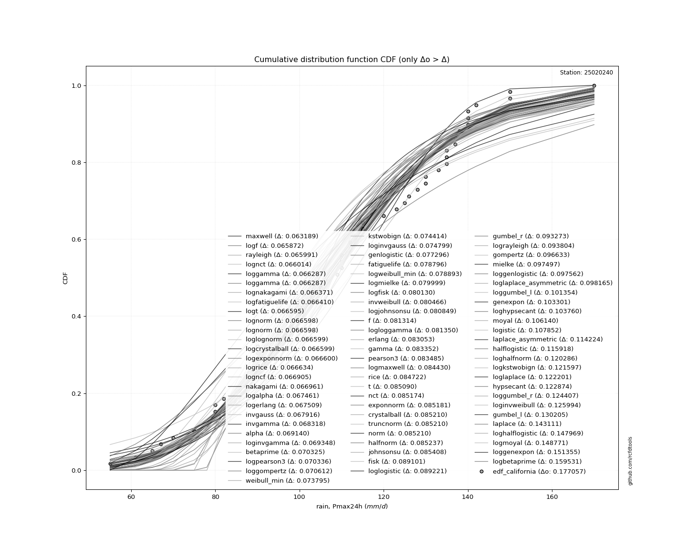</img>

</div>


**1.3. Best fit**

<div align="center">

|   id |   station | empirical_dist   | p_dist   |     delta |   deltao | eval   |   fit |   n |   best_fit |   best_fit_sort |
|-----:|----------:|:-----------------|:---------|----------:|---------:|:-------|------:|----:|-----------:|----------------:|
|    0 |  25020240 | edf_california   | maxwell  | 0.0564765 |  0.18681 | Δo > Δ |     1 |  53 |          1 |               1 |

</div>


<div align="center">

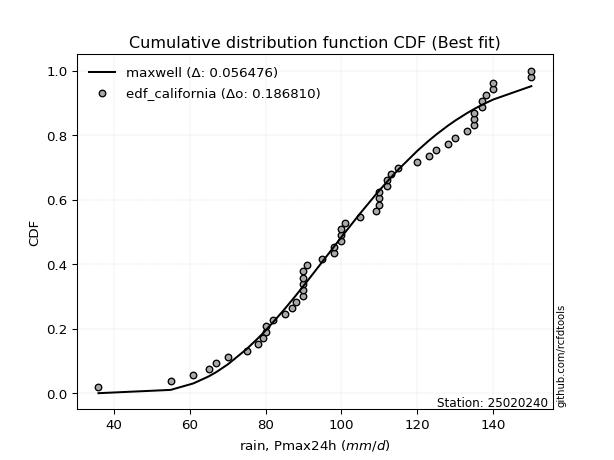</img></img>

</div>


### 2. Empirical - EDF Hazen (1930)

Hazen method for plotting positions is a formula used to estimate the empirical cumulative probability distribution of flood events or other hydrological data. This formula often results in biased estimations, particularly when extrapolating to extreme events (high return periods).

<div align="center">


$P=(m-0.5)/n$


</div>


**2.1. Empirical values**

<div align="center">

|                | 0                    | 1                   | 2                   | 3                  | 4                   | 5                   | 6                   | 7                   | 8                   | 9                  | 10                  | 11                 | 12                 | 13                  | 14                  | 15                  | 16                 | 17                 | 18                 | 19                  | 20                 | 21                 | 22                  | 23                  | 24                  | 25                 | 26        | 27                 | 28                 | 29                 | 30                 | 31                 | 32                 | 33                 | 34                 | 35                 | 36                 | 37                 | 38                 | 39                 | 40                 | 41                 | 42                 | 43                 | 44                | 45                 | 46                 | 47                 | 48                 | 49                 | 50                 | 51                 | 52                 |
|:---------------|:---------------------|:--------------------|:--------------------|:-------------------|:--------------------|:--------------------|:--------------------|:--------------------|:--------------------|:-------------------|:--------------------|:-------------------|:-------------------|:--------------------|:--------------------|:--------------------|:-------------------|:-------------------|:-------------------|:--------------------|:-------------------|:-------------------|:--------------------|:--------------------|:--------------------|:-------------------|:----------|:-------------------|:-------------------|:-------------------|:-------------------|:-------------------|:-------------------|:-------------------|:-------------------|:-------------------|:-------------------|:-------------------|:-------------------|:-------------------|:-------------------|:-------------------|:-------------------|:-------------------|:------------------|:-------------------|:-------------------|:-------------------|:-------------------|:-------------------|:-------------------|:-------------------|:-------------------|
| date           | 1985                 | 1971                | 1984                | 1980               | 1982                | 1973                | 1998                | 1983                | 1968                | 1969               | 1967                | 1995               | 1986               | 2001                | 1987                | 1991                | 2008               | 1972               | 1966               | 2015                | 1993               | 2009               | 1975                | 2007                | 2004                | 1992               | 1974      | 1996               | 2000               | 1990               | 1979               | 1981               | 1963               | 2005               | 2003               | 2002               | 1977               | 1994               | 1997               | 2014               | 1999               | 1964               | 2012               | 2010               | 2013              | 2011               | 2006               | 1970               | 1978               | 1989               | 1976               | 1965               | 1988               |
| x              | 36.0                 | 55.0                | 61.0                | 65.0               | 67.0                | 70.0                | 75.0                | 78.0                | 79.4105116071686    | 80.0               | 80.0                | 82.0               | 85.0               | 87.0                | 88.0                | 90.0                | 90.0               | 90.0               | 90.0               | 90.0                | 91.0               | 95.0               | 98.0                | 98.0                | 100.0               | 100.0              | 100.0     | 101.0              | 105.0              | 109.0              | 110.0              | 110.0              | 110.0              | 112.0              | 112.0              | 113.0              | 115.0              | 120.0              | 123.0              | 125.0              | 128.0              | 130.0              | 133.0              | 135.0              | 135.0             | 135.0              | 137.0              | 137.0              | 138.0              | 140.0              | 140.0              | 150.0              | 150.0              |
| m              | 1                    | 2                   | 3                   | 4                  | 5                   | 6                   | 7                   | 8                   | 9                   | 10                 | 11                  | 12                 | 13                 | 14                  | 15                  | 16                  | 17                 | 18                 | 19                 | 20                  | 21                 | 22                 | 23                  | 24                  | 25                  | 26                 | 27        | 28                 | 29                 | 30                 | 31                 | 32                 | 33                 | 34                 | 35                 | 36                 | 37                 | 38                 | 39                 | 40                 | 41                 | 42                 | 43                 | 44                 | 45                | 46                 | 47                 | 48                 | 49                 | 50                 | 51                 | 52                 | 53                 |
| empirical_dist | edf_hazen            | edf_hazen           | edf_hazen           | edf_hazen          | edf_hazen           | edf_hazen           | edf_hazen           | edf_hazen           | edf_hazen           | edf_hazen          | edf_hazen           | edf_hazen          | edf_hazen          | edf_hazen           | edf_hazen           | edf_hazen           | edf_hazen          | edf_hazen          | edf_hazen          | edf_hazen           | edf_hazen          | edf_hazen          | edf_hazen           | edf_hazen           | edf_hazen           | edf_hazen          | edf_hazen | edf_hazen          | edf_hazen          | edf_hazen          | edf_hazen          | edf_hazen          | edf_hazen          | edf_hazen          | edf_hazen          | edf_hazen          | edf_hazen          | edf_hazen          | edf_hazen          | edf_hazen          | edf_hazen          | edf_hazen          | edf_hazen          | edf_hazen          | edf_hazen         | edf_hazen          | edf_hazen          | edf_hazen          | edf_hazen          | edf_hazen          | edf_hazen          | edf_hazen          | edf_hazen          |
| empirical      | 0.009433962264150943 | 0.02830188679245283 | 0.04716981132075472 | 0.0660377358490566 | 0.08490566037735849 | 0.10377358490566038 | 0.12264150943396226 | 0.14150943396226415 | 0.16037735849056603 | 0.1792452830188679 | 0.19811320754716982 | 0.2169811320754717 | 0.2358490566037736 | 0.25471698113207547 | 0.27358490566037735 | 0.29245283018867924 | 0.3113207547169811 | 0.330188679245283  | 0.3490566037735849 | 0.36792452830188677 | 0.3867924528301887 | 0.4056603773584906 | 0.42452830188679247 | 0.44339622641509435 | 0.46226415094339623 | 0.4811320754716981 | 0.5       | 0.5188679245283019 | 0.5377358490566038 | 0.5566037735849056 | 0.5754716981132075 | 0.5943396226415094 | 0.6132075471698113 | 0.6320754716981132 | 0.6509433962264151 | 0.6698113207547169 | 0.6886792452830188 | 0.7075471698113207 | 0.7264150943396226 | 0.7452830188679245 | 0.7641509433962265 | 0.7830188679245284 | 0.8018867924528302 | 0.8207547169811321 | 0.839622641509434 | 0.8584905660377359 | 0.8773584905660378 | 0.8962264150943396 | 0.9150943396226415 | 0.9339622641509434 | 0.9528301886792453 | 0.9716981132075472 | 0.9905660377358491 |
| empirical_tr   | 1.0095238095238095   | 1.029126213592233   | 1.0495049504950495  | 1.0707070707070707 | 1.092783505154639   | 1.1157894736842104  | 1.139784946236559   | 1.1648351648351647  | 1.1910112359550562  | 1.218390804597701  | 1.2470588235294118  | 1.2771084337349399 | 1.308641975308642  | 1.3417721518987342  | 1.3766233766233766  | 1.4133333333333333  | 1.452054794520548  | 1.4929577464788732 | 1.5362318840579712 | 1.582089552238806   | 1.6307692307692307 | 1.6825396825396826 | 1.737704918032787   | 1.7966101694915255  | 1.8596491228070176  | 1.9272727272727272 | 2.0       | 2.0784313725490198 | 2.163265306122449  | 2.25531914893617   | 2.3555555555555556 | 2.4651162790697674 | 2.585365853658536  | 2.7179487179487176 | 2.8648648648648645 | 3.028571428571428  | 3.2121212121212115 | 3.419354838709677  | 3.6551724137931028 | 3.925925925925925  | 4.240000000000001  | 4.608695652173914  | 5.047619047619048  | 5.578947368421054  | 6.235294117647061 | 7.066666666666668  | 8.153846153846155  | 9.636363636363638  | 11.77777777777778  | 15.142857142857146 | 21.200000000000006 | 35.33333333333334  | 106.00000000000003 |

</div>


**2.2. Kolmogorov-Smirnov fit test (sorted by Δ)**


<div align="center">

|                | 0                   | 1                   | 2                   | 3                   | 4                   | 5                   | 6                   | 7                   | 8                   | 9                   | 10                  | 11                  | 12                  | 13                  | 14                  | 15                  | 16                  | 17                  | 18                  | 19                  | 20                  | 21                  | 22                  | 23                  | 24                  | 25                  | 26                  | 27                  | 28                  | 29                  | 30                  | 31                  | 32                  | 33                  | 34                  | 35                  | 36                  | 37                  | 38                  | 39                  | 40                  | 41                  | 42                  | 43                  | 44                  | 45                  | 46                  | 47                  | 48                  | 49                  | 50                  | 51                  | 52                  | 53                  | 54                  | 55                  | 56                  | 57                  | 58                  | 59                  | 60                  | 61                  | 62                  | 63                  | 64                  | 65                  | 66                    | 67                  | 68                  | 69                  | 70                  | 71                  | 72                  | 73                  | 74                  | 75                  | 76                  | 77                  | 78                  | 79                  | 80                  | 81                  | 82                  | 83                  | 84                  | 85                  | 86                  | 87                  | 88                  | 89                  | 90                  | 91                  |
|:---------------|:--------------------|:--------------------|:--------------------|:--------------------|:--------------------|:--------------------|:--------------------|:--------------------|:--------------------|:--------------------|:--------------------|:--------------------|:--------------------|:--------------------|:--------------------|:--------------------|:--------------------|:--------------------|:--------------------|:--------------------|:--------------------|:--------------------|:--------------------|:--------------------|:--------------------|:--------------------|:--------------------|:--------------------|:--------------------|:--------------------|:--------------------|:--------------------|:--------------------|:--------------------|:--------------------|:--------------------|:--------------------|:--------------------|:--------------------|:--------------------|:--------------------|:--------------------|:--------------------|:--------------------|:--------------------|:--------------------|:--------------------|:--------------------|:--------------------|:--------------------|:--------------------|:--------------------|:--------------------|:--------------------|:--------------------|:--------------------|:--------------------|:--------------------|:--------------------|:--------------------|:--------------------|:--------------------|:--------------------|:--------------------|:--------------------|:--------------------|:----------------------|:--------------------|:--------------------|:--------------------|:--------------------|:--------------------|:--------------------|:--------------------|:--------------------|:--------------------|:--------------------|:--------------------|:--------------------|:--------------------|:--------------------|:--------------------|:--------------------|:--------------------|:--------------------|:--------------------|:--------------------|:--------------------|:--------------------|:--------------------|:--------------------|:--------------------|
| station        | 25020240            | 25020240            | 25020240            | 25020240            | 25020240            | 25020240            | 25020240            | 25020240            | 25020240            | 25020240            | 25020240            | 25020240            | 25020240            | 25020240            | 25020240            | 25020240            | 25020240            | 25020240            | 25020240            | 25020240            | 25020240            | 25020240            | 25020240            | 25020240            | 25020240            | 25020240            | 25020240            | 25020240            | 25020240            | 25020240            | 25020240            | 25020240            | 25020240            | 25020240            | 25020240            | 25020240            | 25020240            | 25020240            | 25020240            | 25020240            | 25020240            | 25020240            | 25020240            | 25020240            | 25020240            | 25020240            | 25020240            | 25020240            | 25020240            | 25020240            | 25020240            | 25020240            | 25020240            | 25020240            | 25020240            | 25020240            | 25020240            | 25020240            | 25020240            | 25020240            | 25020240            | 25020240            | 25020240            | 25020240            | 25020240            | 25020240            | 25020240              | 25020240            | 25020240            | 25020240            | 25020240            | 25020240            | 25020240            | 25020240            | 25020240            | 25020240            | 25020240            | 25020240            | 25020240            | 25020240            | 25020240            | 25020240            | 25020240            | 25020240            | 25020240            | 25020240            | 25020240            | 25020240            | 25020240            | 25020240            | 25020240            | 25020240            |
| empirical_dist | edf_hazen           | edf_hazen           | edf_hazen           | edf_hazen           | edf_hazen           | edf_hazen           | edf_hazen           | edf_hazen           | edf_hazen           | edf_hazen           | edf_hazen           | edf_hazen           | edf_hazen           | edf_hazen           | edf_hazen           | edf_hazen           | edf_hazen           | edf_hazen           | edf_hazen           | edf_hazen           | edf_hazen           | edf_hazen           | edf_hazen           | edf_hazen           | edf_hazen           | edf_hazen           | edf_hazen           | edf_hazen           | edf_hazen           | edf_hazen           | edf_hazen           | edf_hazen           | edf_hazen           | edf_hazen           | edf_hazen           | edf_hazen           | edf_hazen           | edf_hazen           | edf_hazen           | edf_hazen           | edf_hazen           | edf_hazen           | edf_hazen           | edf_hazen           | edf_hazen           | edf_hazen           | edf_hazen           | edf_hazen           | edf_hazen           | edf_hazen           | edf_hazen           | edf_hazen           | edf_hazen           | edf_hazen           | edf_hazen           | edf_hazen           | edf_hazen           | edf_hazen           | edf_hazen           | edf_hazen           | edf_hazen           | edf_hazen           | edf_hazen           | edf_hazen           | edf_hazen           | edf_hazen           | edf_hazen             | edf_hazen           | edf_hazen           | edf_hazen           | edf_hazen           | edf_hazen           | edf_hazen           | edf_hazen           | edf_hazen           | edf_hazen           | edf_hazen           | edf_hazen           | edf_hazen           | edf_hazen           | edf_hazen           | edf_hazen           | edf_hazen           | edf_hazen           | edf_hazen           | edf_hazen           | edf_hazen           | edf_hazen           | edf_hazen           | edf_hazen           | edf_hazen           | edf_hazen           |
| p_dist         | fisk                | logfisk             | ncf                 | maxwell             | rayleigh            | chi2                | nakagami            | logpearson3         | logt                | lognorm             | lognorm             | logcrystalball      | loglognorm          | logexponnorm        | logrice             | logncf              | logf                | lognakagami         | betaprime           | erlang              | alpha               | rice                | gamma               | logfatiguelife      | invgamma            | fatiguelife         | f                   | johnsonsu           | nct                 | t                   | exponnorm           | crystalball         | truncnorm           | norm                | loggompertz         | lognct              | genlogistic         | logbetaprime        | logdgamma           | dgamma              | pearson3            | weibull_min         | loggumbel_l         | logweibull_min      | logerlang           | loginvgamma         | logjohnsonsu        | logloggamma         | logchi2             | loglogistic         | invgauss            | loggamma            | loggamma            | logalpha            | loginvgauss         | laplace_asymmetric  | logistic            | mielke              | loggenlogistic      | halfnorm            | invweibull          | loghypsecant        | logmaxwell          | gumbel_r            | hypsecant           | kstwobign           | loglaplace_asymmetric | lograyleigh         | halflogistic        | moyal               | gumbel_l            | loglaplace          | logmielke           | laplace             | loggumbel_r         | loghalfnorm         | logmoyal            | loghalflogistic     | loginvweibull       | wald                | logkstwobign        | gibrat              | logwald             | loggibrat           | loggenexpon         | genexpon            | expon               | pareto              | logexpon            | logpareto           | logtruncnorm        | gompertz            |
| delta          | 0.06457734403824045 | 0.06487251263553606 | 0.0656995378007601  | 0.06591046013260737 | 0.06712280872192955 | 0.0676962134171527  | 0.06838507051100928 | 0.06903971099832301 | 0.06933908949863221 | 0.06934757243487899 | 0.06934757243487899 | 0.06934779700987492 | 0.06934850198712694 | 0.06934960335761864 | 0.06936464793543928 | 0.06959856596005942 | 0.0696445658471957  | 0.06966197203538282 | 0.06991500284074348 | 0.06994436170828566 | 0.0705069109230777  | 0.0708569014013245  | 0.07111857649349718 | 0.07127785652949226 | 0.07162223133802514 | 0.07179244743568713 | 0.07218551761869396 | 0.07243967561789366 | 0.07250198188089407 | 0.07251244172552063 | 0.07252923889865526 | 0.07252960540779374 | 0.07252960824690324 | 0.0725296096984146  | 0.07276848297539895 | 0.07312362849901632 | 0.07341603953000575 | 0.07353913291651692 | 0.07400252348416458 | 0.07494593441545916 | 0.07607265968776444 | 0.07717653582367717 | 0.0771938646851571  | 0.07729067011392904 | 0.07902739692396682 | 0.07950620597631108 | 0.08009483873535872 | 0.0802688444132254  | 0.08236141570320521 | 0.08503873956317609 | 0.08539710138524215 | 0.08656036396803801 | 0.08656036396803801 | 0.08801446461208806 | 0.08807803783325596 | 0.08888048285537442 | 0.08928565976853853 | 0.09007621499615143 | 0.09074736722610277 | 0.09163084532885146 | 0.09689264941644471 | 0.0975639630147691  | 0.09801257695576232 | 0.09858956135363262 | 0.10439746895854507 | 0.10509796882038669 | 0.10620392907706999   | 0.11016552207376301 | 0.11980017203239102 | 0.12193085034971529 | 0.12434939415732071 | 0.125909977011321   | 0.12903863828934525 | 0.13091627640317038 | 0.13281306739416032 | 0.1447410622309805  | 0.15412640036864222 | 0.1541747480656448  | 0.17433655054493447 | 0.19365364777232763 | 0.19395688407346148 | 0.21812605058260415 | 0.21887781744909263 | 0.2461103568912546  | 0.27373360921424517 | 0.32257512624309903 | 0.32287148213293226 | 0.3228715129039855  | 0.3910871599414193  | 0.3910871636654354  | 0.5994679463418979  | 0.6981978482984587  |
| deltao         | 0.18681036697021708 | 0.18681036697021708 | 0.18681036697021708 | 0.18681036697021708 | 0.18681036697021708 | 0.18681036697021708 | 0.18681036697021708 | 0.18681036697021708 | 0.18681036697021708 | 0.18681036697021708 | 0.18681036697021708 | 0.18681036697021708 | 0.18681036697021708 | 0.18681036697021708 | 0.18681036697021708 | 0.18681036697021708 | 0.18681036697021708 | 0.18681036697021708 | 0.18681036697021708 | 0.18681036697021708 | 0.18681036697021708 | 0.18681036697021708 | 0.18681036697021708 | 0.18681036697021708 | 0.18681036697021708 | 0.18681036697021708 | 0.18681036697021708 | 0.18681036697021708 | 0.18681036697021708 | 0.18681036697021708 | 0.18681036697021708 | 0.18681036697021708 | 0.18681036697021708 | 0.18681036697021708 | 0.18681036697021708 | 0.18681036697021708 | 0.18681036697021708 | 0.18681036697021708 | 0.18681036697021708 | 0.18681036697021708 | 0.18681036697021708 | 0.18681036697021708 | 0.18681036697021708 | 0.18681036697021708 | 0.18681036697021708 | 0.18681036697021708 | 0.18681036697021708 | 0.18681036697021708 | 0.18681036697021708 | 0.18681036697021708 | 0.18681036697021708 | 0.18681036697021708 | 0.18681036697021708 | 0.18681036697021708 | 0.18681036697021708 | 0.18681036697021708 | 0.18681036697021708 | 0.18681036697021708 | 0.18681036697021708 | 0.18681036697021708 | 0.18681036697021708 | 0.18681036697021708 | 0.18681036697021708 | 0.18681036697021708 | 0.18681036697021708 | 0.18681036697021708 | 0.18681036697021708   | 0.18681036697021708 | 0.18681036697021708 | 0.18681036697021708 | 0.18681036697021708 | 0.18681036697021708 | 0.18681036697021708 | 0.18681036697021708 | 0.18681036697021708 | 0.18681036697021708 | 0.18681036697021708 | 0.18681036697021708 | 0.18681036697021708 | 0.18681036697021708 | 0.18681036697021708 | 0.18681036697021708 | 0.18681036697021708 | 0.18681036697021708 | 0.18681036697021708 | 0.18681036697021708 | 0.18681036697021708 | 0.18681036697021708 | 0.18681036697021708 | 0.18681036697021708 | 0.18681036697021708 | 0.18681036697021708 |
| eval           | Δo > Δ              | Δo > Δ              | Δo > Δ              | Δo > Δ              | Δo > Δ              | Δo > Δ              | Δo > Δ              | Δo > Δ              | Δo > Δ              | Δo > Δ              | Δo > Δ              | Δo > Δ              | Δo > Δ              | Δo > Δ              | Δo > Δ              | Δo > Δ              | Δo > Δ              | Δo > Δ              | Δo > Δ              | Δo > Δ              | Δo > Δ              | Δo > Δ              | Δo > Δ              | Δo > Δ              | Δo > Δ              | Δo > Δ              | Δo > Δ              | Δo > Δ              | Δo > Δ              | Δo > Δ              | Δo > Δ              | Δo > Δ              | Δo > Δ              | Δo > Δ              | Δo > Δ              | Δo > Δ              | Δo > Δ              | Δo > Δ              | Δo > Δ              | Δo > Δ              | Δo > Δ              | Δo > Δ              | Δo > Δ              | Δo > Δ              | Δo > Δ              | Δo > Δ              | Δo > Δ              | Δo > Δ              | Δo > Δ              | Δo > Δ              | Δo > Δ              | Δo > Δ              | Δo > Δ              | Δo > Δ              | Δo > Δ              | Δo > Δ              | Δo > Δ              | Δo > Δ              | Δo > Δ              | Δo > Δ              | Δo > Δ              | Δo > Δ              | Δo > Δ              | Δo > Δ              | Δo > Δ              | Δo > Δ              | Δo > Δ                | Δo > Δ              | Δo > Δ              | Δo > Δ              | Δo > Δ              | Δo > Δ              | Δo > Δ              | Δo > Δ              | Δo > Δ              | Δo > Δ              | Δo > Δ              | Δo > Δ              | Δo > Δ              | Δo <= Δ             | Δo <= Δ             | Δo <= Δ             | Δo <= Δ             | Δo <= Δ             | Δo <= Δ             | Δo <= Δ             | Δo <= Δ             | Δo <= Δ             | Δo <= Δ             | Δo <= Δ             | Δo <= Δ             | Δo <= Δ             |
| fit            | 1                   | 1                   | 1                   | 1                   | 1                   | 1                   | 1                   | 1                   | 1                   | 1                   | 1                   | 1                   | 1                   | 1                   | 1                   | 1                   | 1                   | 1                   | 1                   | 1                   | 1                   | 1                   | 1                   | 1                   | 1                   | 1                   | 1                   | 1                   | 1                   | 1                   | 1                   | 1                   | 1                   | 1                   | 1                   | 1                   | 1                   | 1                   | 1                   | 1                   | 1                   | 1                   | 1                   | 1                   | 1                   | 1                   | 1                   | 1                   | 1                   | 1                   | 1                   | 1                   | 1                   | 1                   | 1                   | 1                   | 1                   | 1                   | 1                   | 1                   | 1                   | 1                   | 1                   | 1                   | 1                   | 1                   | 1                     | 1                   | 1                   | 1                   | 1                   | 1                   | 1                   | 1                   | 1                   | 1                   | 1                   | 1                   | 1                   | 0                   | 0                   | 0                   | 0                   | 0                   | 0                   | 0                   | 0                   | 0                   | 0                   | 0                   | 0                   | 0                   |
| n              | 53                  | 53                  | 53                  | 53                  | 53                  | 53                  | 53                  | 53                  | 53                  | 53                  | 53                  | 53                  | 53                  | 53                  | 53                  | 53                  | 53                  | 53                  | 53                  | 53                  | 53                  | 53                  | 53                  | 53                  | 53                  | 53                  | 53                  | 53                  | 53                  | 53                  | 53                  | 53                  | 53                  | 53                  | 53                  | 53                  | 53                  | 53                  | 53                  | 53                  | 53                  | 53                  | 53                  | 53                  | 53                  | 53                  | 53                  | 53                  | 53                  | 53                  | 53                  | 53                  | 53                  | 53                  | 53                  | 53                  | 53                  | 53                  | 53                  | 53                  | 53                  | 53                  | 53                  | 53                  | 53                  | 53                  | 53                    | 53                  | 53                  | 53                  | 53                  | 53                  | 53                  | 53                  | 53                  | 53                  | 53                  | 53                  | 53                  | 53                  | 53                  | 53                  | 53                  | 53                  | 53                  | 53                  | 53                  | 53                  | 53                  | 53                  | 53                  | 53                  |
| best_fit       | 1                   | 0                   | 0                   | 0                   | 0                   | 0                   | 0                   | 0                   | 0                   | 0                   | 0                   | 0                   | 0                   | 0                   | 0                   | 0                   | 0                   | 0                   | 0                   | 0                   | 0                   | 0                   | 0                   | 0                   | 0                   | 0                   | 0                   | 0                   | 0                   | 0                   | 0                   | 0                   | 0                   | 0                   | 0                   | 0                   | 0                   | 0                   | 0                   | 0                   | 0                   | 0                   | 0                   | 0                   | 0                   | 0                   | 0                   | 0                   | 0                   | 0                   | 0                   | 0                   | 0                   | 0                   | 0                   | 0                   | 0                   | 0                   | 0                   | 0                   | 0                   | 0                   | 0                   | 0                   | 0                   | 0                   | 0                     | 0                   | 0                   | 0                   | 0                   | 0                   | 0                   | 0                   | 0                   | 0                   | 0                   | 0                   | 0                   | 0                   | 0                   | 0                   | 0                   | 0                   | 0                   | 0                   | 0                   | 0                   | 0                   | 0                   | 0                   | 0                   |
| best_fit_sort  | 1                   | 2                   | 3                   | 4                   | 5                   | 6                   | 7                   | 8                   | 9                   | 10                  | 11                  | 12                  | 13                  | 14                  | 15                  | 16                  | 17                  | 18                  | 19                  | 20                  | 21                  | 22                  | 23                  | 24                  | 25                  | 26                  | 27                  | 28                  | 29                  | 30                  | 31                  | 32                  | 33                  | 34                  | 35                  | 36                  | 37                  | 38                  | 39                  | 40                  | 41                  | 42                  | 43                  | 44                  | 45                  | 46                  | 47                  | 48                  | 49                  | 50                  | 51                  | 52                  | 53                  | 54                  | 55                  | 56                  | 57                  | 58                  | 59                  | 60                  | 61                  | 62                  | 63                  | 64                  | 65                  | 66                  | 67                    | 68                  | 69                  | 70                  | 71                  | 72                  | 73                  | 74                  | 75                  | 76                  | 77                  | 78                  | 79                  | 80                  | 81                  | 82                  | 83                  | 84                  | 85                  | 86                  | 87                  | 88                  | 89                  | 90                  | 91                  | 92                  |

</div>


<div align="center">

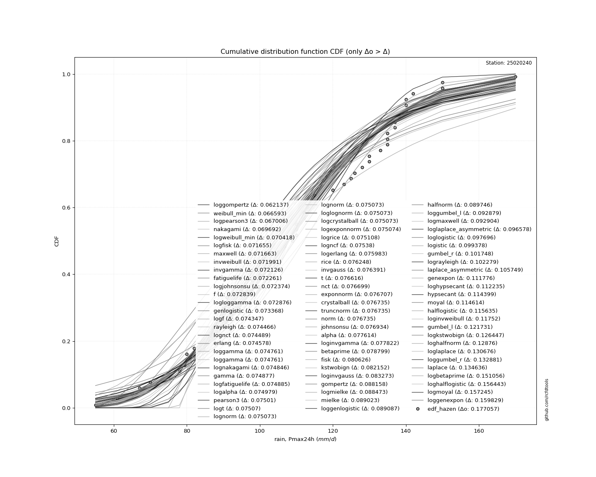</img>

</div>


**2.3. Best fit**

<div align="center">

|   id |   station | empirical_dist   | p_dist   |     delta |   deltao | eval   |   fit |   n |   best_fit |   best_fit_sort |
|-----:|----------:|:-----------------|:---------|----------:|---------:|:-------|------:|----:|-----------:|----------------:|
|    0 |  25020240 | edf_hazen        | fisk     | 0.0645773 |  0.18681 | Δo > Δ |     1 |  53 |          1 |               1 |

</div>


<div align="center">

</img>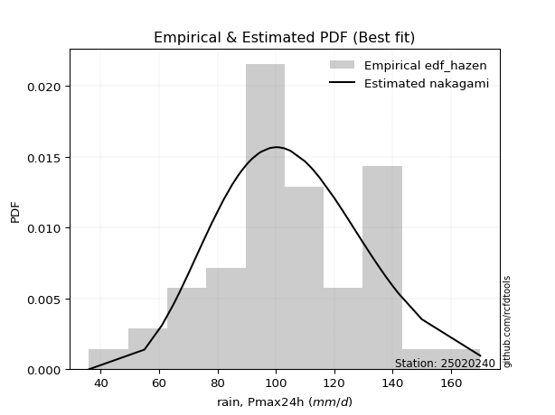</img>

</div>


### 3. Empirical - EDF Weibull (1939)

Weibull plotting position formula is an empirical method used to estimate the non-exceedance probability or plotting position for a set of observed data, is often recommended or widely used in practice, particularly in flood frequency analysis.

<div align="center">


$P=m/(n+1)$


</div>


**3.1. Empirical values**

<div align="center">

|                | 0                    | 1                    | 2                   | 3                   | 4                   | 5                  | 6                   | 7                   | 8                   | 9                   | 10                 | 11                 | 12                  | 13                  | 14                 | 15                 | 16                 | 17                 | 18                  | 19                  | 20                 | 21                 | 22                  | 23                 | 24                  | 25                  | 26          | 27                 | 28                 | 29                 | 30                 | 31                 | 32                 | 33                 | 34                 | 35                 | 36                 | 37                 | 38                 | 39                 | 40                 | 41                 | 42                 | 43                 | 44                 | 45                 | 46                 | 47                 | 48                 | 49                 | 50                 | 51                 | 52                 |
|:---------------|:---------------------|:---------------------|:--------------------|:--------------------|:--------------------|:-------------------|:--------------------|:--------------------|:--------------------|:--------------------|:-------------------|:-------------------|:--------------------|:--------------------|:-------------------|:-------------------|:-------------------|:-------------------|:--------------------|:--------------------|:-------------------|:-------------------|:--------------------|:-------------------|:--------------------|:--------------------|:------------|:-------------------|:-------------------|:-------------------|:-------------------|:-------------------|:-------------------|:-------------------|:-------------------|:-------------------|:-------------------|:-------------------|:-------------------|:-------------------|:-------------------|:-------------------|:-------------------|:-------------------|:-------------------|:-------------------|:-------------------|:-------------------|:-------------------|:-------------------|:-------------------|:-------------------|:-------------------|
| date           | 1985                 | 1971                 | 1984                | 1980                | 1982                | 1973               | 1998                | 1983                | 1968                | 1969                | 1967               | 1995               | 1986                | 2001                | 1987               | 1991               | 2008               | 1972               | 1966                | 2015                | 1993               | 2009               | 1975                | 2007               | 2004                | 1992                | 1974        | 1996               | 2000               | 1990               | 1979               | 1981               | 1963               | 2005               | 2003               | 2002               | 1977               | 1994               | 1997               | 2014               | 1999               | 1964               | 2012               | 2010               | 2013               | 2011               | 2006               | 1970               | 1978               | 1989               | 1976               | 1965               | 1988               |
| x              | 36.0                 | 55.0                 | 61.0                | 65.0                | 67.0                | 70.0               | 75.0                | 78.0                | 79.4105116071686    | 80.0                | 80.0               | 82.0               | 85.0                | 87.0                | 88.0               | 90.0               | 90.0               | 90.0               | 90.0                | 90.0                | 91.0               | 95.0               | 98.0                | 98.0               | 100.0               | 100.0               | 100.0       | 101.0              | 105.0              | 109.0              | 110.0              | 110.0              | 110.0              | 112.0              | 112.0              | 113.0              | 115.0              | 120.0              | 123.0              | 125.0              | 128.0              | 130.0              | 133.0              | 135.0              | 135.0              | 135.0              | 137.0              | 137.0              | 138.0              | 140.0              | 140.0              | 150.0              | 150.0              |
| m              | 1                    | 2                    | 3                   | 4                   | 5                   | 6                  | 7                   | 8                   | 9                   | 10                  | 11                 | 12                 | 13                  | 14                  | 15                 | 16                 | 17                 | 18                 | 19                  | 20                  | 21                 | 22                 | 23                  | 24                 | 25                  | 26                  | 27          | 28                 | 29                 | 30                 | 31                 | 32                 | 33                 | 34                 | 35                 | 36                 | 37                 | 38                 | 39                 | 40                 | 41                 | 42                 | 43                 | 44                 | 45                 | 46                 | 47                 | 48                 | 49                 | 50                 | 51                 | 52                 | 53                 |
| empirical_dist | edf_weibull          | edf_weibull          | edf_weibull         | edf_weibull         | edf_weibull         | edf_weibull        | edf_weibull         | edf_weibull         | edf_weibull         | edf_weibull         | edf_weibull        | edf_weibull        | edf_weibull         | edf_weibull         | edf_weibull        | edf_weibull        | edf_weibull        | edf_weibull        | edf_weibull         | edf_weibull         | edf_weibull        | edf_weibull        | edf_weibull         | edf_weibull        | edf_weibull         | edf_weibull         | edf_weibull | edf_weibull        | edf_weibull        | edf_weibull        | edf_weibull        | edf_weibull        | edf_weibull        | edf_weibull        | edf_weibull        | edf_weibull        | edf_weibull        | edf_weibull        | edf_weibull        | edf_weibull        | edf_weibull        | edf_weibull        | edf_weibull        | edf_weibull        | edf_weibull        | edf_weibull        | edf_weibull        | edf_weibull        | edf_weibull        | edf_weibull        | edf_weibull        | edf_weibull        | edf_weibull        |
| empirical      | 0.018518518518518517 | 0.037037037037037035 | 0.05555555555555555 | 0.07407407407407407 | 0.09259259259259259 | 0.1111111111111111 | 0.12962962962962962 | 0.14814814814814814 | 0.16666666666666666 | 0.18518518518518517 | 0.2037037037037037 | 0.2222222222222222 | 0.24074074074074073 | 0.25925925925925924 | 0.2777777777777778 | 0.2962962962962963 | 0.3148148148148148 | 0.3333333333333333 | 0.35185185185185186 | 0.37037037037037035 | 0.3888888888888889 | 0.4074074074074074 | 0.42592592592592593 | 0.4444444444444444 | 0.46296296296296297 | 0.48148148148148145 | 0.5         | 0.5185185185185185 | 0.5370370370370371 | 0.5555555555555556 | 0.5740740740740741 | 0.5925925925925926 | 0.6111111111111112 | 0.6296296296296297 | 0.6481481481481481 | 0.6666666666666666 | 0.6851851851851852 | 0.7037037037037037 | 0.7222222222222222 | 0.7407407407407407 | 0.7592592592592593 | 0.7777777777777778 | 0.7962962962962963 | 0.8148148148148148 | 0.8333333333333334 | 0.8518518518518519 | 0.8703703703703703 | 0.8888888888888888 | 0.9074074074074074 | 0.9259259259259259 | 0.9444444444444444 | 0.9629629629629629 | 0.9814814814814815 |
| empirical_tr   | 1.0188679245283019   | 1.0384615384615383   | 1.0588235294117647  | 1.08                | 1.1020408163265305  | 1.125              | 1.148936170212766   | 1.1739130434782608  | 1.2                 | 1.227272727272727   | 1.255813953488372  | 1.2857142857142856 | 1.3170731707317072  | 1.35                | 1.3846153846153846 | 1.4210526315789473 | 1.4594594594594597 | 1.4999999999999998 | 1.542857142857143   | 1.588235294117647   | 1.6363636363636362 | 1.6875             | 1.7419354838709677  | 1.7999999999999998 | 1.8620689655172415  | 1.9285714285714282  | 2.0         | 2.0769230769230766 | 2.16               | 2.25               | 2.3478260869565215 | 2.454545454545454  | 2.5714285714285716 | 2.7                | 2.8421052631578947 | 2.9999999999999996 | 3.1764705882352944 | 3.375              | 3.5999999999999996 | 3.8571428571428563 | 4.153846153846154  | 4.5                | 4.909090909090908  | 5.399999999999999  | 6.000000000000002  | 6.75               | 7.714285714285713  | 8.999999999999996  | 10.800000000000004 | 13.5               | 17.999999999999993 | 26.99999999999996  | 54.000000000000085 |

</div>


**3.2. Kolmogorov-Smirnov fit test (sorted by Δ)**


<div align="center">

|                | 0                    | 1                   | 2                   | 3                   | 4                   | 5                   | 6                   | 7                   | 8                   | 9                   | 10                  | 11                  | 12                  | 13                  | 14                  | 15                  | 16                  | 17                  | 18                  | 19                  | 20                  | 21                  | 22                  | 23                  | 24                  | 25                  | 26                  | 27                  | 28                  | 29                  | 30                  | 31                  | 32                  | 33                  | 34                  | 35                  | 36                  | 37                  | 38                  | 39                  | 40                  | 41                  | 42                  | 43                  | 44                  | 45                  | 46                  | 47                  | 48                  | 49                  | 50                  | 51                  | 52                  | 53                  | 54                  | 55                  | 56                  | 57                  | 58                  | 59                  | 60                  | 61                  | 62                  | 63                  | 64                  | 65                  | 66                  | 67                    | 68                  | 69                  | 70                  | 71                  | 72                  | 73                  | 74                  | 75                  | 76                  | 77                  | 78                  | 79                  | 80                  | 81                  | 82                  | 83                  | 84                  | 85                  | 86                  | 87                  | 88                  | 89                  | 90                  | 91                  |
|:---------------|:---------------------|:--------------------|:--------------------|:--------------------|:--------------------|:--------------------|:--------------------|:--------------------|:--------------------|:--------------------|:--------------------|:--------------------|:--------------------|:--------------------|:--------------------|:--------------------|:--------------------|:--------------------|:--------------------|:--------------------|:--------------------|:--------------------|:--------------------|:--------------------|:--------------------|:--------------------|:--------------------|:--------------------|:--------------------|:--------------------|:--------------------|:--------------------|:--------------------|:--------------------|:--------------------|:--------------------|:--------------------|:--------------------|:--------------------|:--------------------|:--------------------|:--------------------|:--------------------|:--------------------|:--------------------|:--------------------|:--------------------|:--------------------|:--------------------|:--------------------|:--------------------|:--------------------|:--------------------|:--------------------|:--------------------|:--------------------|:--------------------|:--------------------|:--------------------|:--------------------|:--------------------|:--------------------|:--------------------|:--------------------|:--------------------|:--------------------|:--------------------|:----------------------|:--------------------|:--------------------|:--------------------|:--------------------|:--------------------|:--------------------|:--------------------|:--------------------|:--------------------|:--------------------|:--------------------|:--------------------|:--------------------|:--------------------|:--------------------|:--------------------|:--------------------|:--------------------|:--------------------|:--------------------|:--------------------|:--------------------|:--------------------|:--------------------|
| station        | 25020240             | 25020240            | 25020240            | 25020240            | 25020240            | 25020240            | 25020240            | 25020240            | 25020240            | 25020240            | 25020240            | 25020240            | 25020240            | 25020240            | 25020240            | 25020240            | 25020240            | 25020240            | 25020240            | 25020240            | 25020240            | 25020240            | 25020240            | 25020240            | 25020240            | 25020240            | 25020240            | 25020240            | 25020240            | 25020240            | 25020240            | 25020240            | 25020240            | 25020240            | 25020240            | 25020240            | 25020240            | 25020240            | 25020240            | 25020240            | 25020240            | 25020240            | 25020240            | 25020240            | 25020240            | 25020240            | 25020240            | 25020240            | 25020240            | 25020240            | 25020240            | 25020240            | 25020240            | 25020240            | 25020240            | 25020240            | 25020240            | 25020240            | 25020240            | 25020240            | 25020240            | 25020240            | 25020240            | 25020240            | 25020240            | 25020240            | 25020240            | 25020240              | 25020240            | 25020240            | 25020240            | 25020240            | 25020240            | 25020240            | 25020240            | 25020240            | 25020240            | 25020240            | 25020240            | 25020240            | 25020240            | 25020240            | 25020240            | 25020240            | 25020240            | 25020240            | 25020240            | 25020240            | 25020240            | 25020240            | 25020240            | 25020240            |
| empirical_dist | edf_weibull          | edf_weibull         | edf_weibull         | edf_weibull         | edf_weibull         | edf_weibull         | edf_weibull         | edf_weibull         | edf_weibull         | edf_weibull         | edf_weibull         | edf_weibull         | edf_weibull         | edf_weibull         | edf_weibull         | edf_weibull         | edf_weibull         | edf_weibull         | edf_weibull         | edf_weibull         | edf_weibull         | edf_weibull         | edf_weibull         | edf_weibull         | edf_weibull         | edf_weibull         | edf_weibull         | edf_weibull         | edf_weibull         | edf_weibull         | edf_weibull         | edf_weibull         | edf_weibull         | edf_weibull         | edf_weibull         | edf_weibull         | edf_weibull         | edf_weibull         | edf_weibull         | edf_weibull         | edf_weibull         | edf_weibull         | edf_weibull         | edf_weibull         | edf_weibull         | edf_weibull         | edf_weibull         | edf_weibull         | edf_weibull         | edf_weibull         | edf_weibull         | edf_weibull         | edf_weibull         | edf_weibull         | edf_weibull         | edf_weibull         | edf_weibull         | edf_weibull         | edf_weibull         | edf_weibull         | edf_weibull         | edf_weibull         | edf_weibull         | edf_weibull         | edf_weibull         | edf_weibull         | edf_weibull         | edf_weibull           | edf_weibull         | edf_weibull         | edf_weibull         | edf_weibull         | edf_weibull         | edf_weibull         | edf_weibull         | edf_weibull         | edf_weibull         | edf_weibull         | edf_weibull         | edf_weibull         | edf_weibull         | edf_weibull         | edf_weibull         | edf_weibull         | edf_weibull         | edf_weibull         | edf_weibull         | edf_weibull         | edf_weibull         | edf_weibull         | edf_weibull         | edf_weibull         |
| p_dist         | logfisk              | fisk                | ncf                 | logdgamma           | rayleigh            | logt                | lognorm             | lognorm             | logcrystalball      | loglognorm          | logexponnorm        | logrice             | logncf              | logf                | lognakagami         | betaprime           | maxwell             | logfatiguelife      | logpearson3         | chi2                | nakagami            | lognct              | logbetaprime        | logerlang           | genlogistic         | erlang              | loginvgamma         | alpha               | rice                | gamma               | invgauss            | invgamma            | fatiguelife         | f                   | johnsonsu           | nct                 | t                   | exponnorm           | crystalball         | truncnorm           | norm                | loggompertz         | logchi2             | logweibull_min      | weibull_min         | pearson3            | dgamma              | logjohnsonsu        | logloggamma         | loggumbel_l         | loggamma            | loggamma            | logalpha            | loginvgauss         | loglogistic         | invweibull          | laplace_asymmetric  | mielke              | loggenlogistic      | halfnorm            | logistic            | logmaxwell          | loghypsecant        | gumbel_r            | kstwobign           | lograyleigh         | hypsecant           | loglaplace_asymmetric | halflogistic        | moyal               | gumbel_l            | logmielke           | loglaplace          | laplace             | loggumbel_r         | loghalfnorm         | loghalflogistic     | logmoyal            | loginvweibull       | logkstwobign        | wald                | logwald             | gibrat              | loggibrat           | loggenexpon         | genexpon            | expon               | pareto              | logexpon            | logpareto           | logtruncnorm        | gompertz            |
| delta          | 0.059546238556331565 | 0.05986762340572627 | 0.06674775583011017 | 0.06688974402502423 | 0.06974233646023897 | 0.07038730752798228 | 0.07039579046422906 | 0.07039579046422906 | 0.07039601503922499 | 0.07039672001647701 | 0.0703978213869687  | 0.07041286596478935 | 0.07064678398940949 | 0.07069278387654576 | 0.07071019006473289 | 0.07096322087009355 | 0.07150095628914133 | 0.07232607455884232 | 0.07253353992126943 | 0.07328670957368666 | 0.07397556666754324 | 0.07417184652836639 | 0.07458735094586699 | 0.07518393081634978 | 0.07551247558870594 | 0.07553485786481962 | 0.07566273986869404 | 0.07609740707961166 | 0.07644739755785845 | 0.07670907265003113 | 0.07701135715044127 | 0.0772127274945591  | 0.07738294359222109 | 0.07777601377522791 | 0.07803017177442761 | 0.07809247803742803 | 0.07810293788205458 | 0.07811973505518921 | 0.07812010156432769 | 0.0781201044034372  | 0.07812010585494855 | 0.0783589791319329  | 0.07851794959558817 | 0.07938710617262923 | 0.07938852376974537 | 0.08014924316828786 | 0.08053643057199311 | 0.08219127479405891 | 0.0823652804719256  | 0.08259383866583159 | 0.08271689786042097 | 0.08271689786042097 | 0.08417099850447102 | 0.08423457172563892 | 0.08608695759252616 | 0.08850690518164384 | 0.08992870088472449 | 0.09214910135041943 | 0.09230451943354029 | 0.09267906335820153 | 0.09278283456906944 | 0.09449561383585747 | 0.09861218104411917 | 0.09963777938298268 | 0.10125450271276965 | 0.10632205596614597 | 0.10649390501724526 | 0.10725214710642006   | 0.12084839006174108 | 0.12297906837906536 | 0.1254085850869257  | 0.12589398420129494 | 0.12695819504067107 | 0.13301271246187057 | 0.1338612854235104  | 0.14089759612336344 | 0.15146087688560916 | 0.1551746183979923  | 0.16525199429056692 | 0.1873181698875775  | 0.1992441439288615  | 0.21748019340995917 | 0.2222222222222222  | 0.24715857492060467 | 0.26709489502836115 | 0.315936412057215   | 0.31623276794704824 | 0.3162327987181015  | 0.3840990397457519  | 0.384099043469768   | 0.5928292321560139  | 0.6936555701712749  |
| deltao         | 0.18681036697021708  | 0.18681036697021708 | 0.18681036697021708 | 0.18681036697021708 | 0.18681036697021708 | 0.18681036697021708 | 0.18681036697021708 | 0.18681036697021708 | 0.18681036697021708 | 0.18681036697021708 | 0.18681036697021708 | 0.18681036697021708 | 0.18681036697021708 | 0.18681036697021708 | 0.18681036697021708 | 0.18681036697021708 | 0.18681036697021708 | 0.18681036697021708 | 0.18681036697021708 | 0.18681036697021708 | 0.18681036697021708 | 0.18681036697021708 | 0.18681036697021708 | 0.18681036697021708 | 0.18681036697021708 | 0.18681036697021708 | 0.18681036697021708 | 0.18681036697021708 | 0.18681036697021708 | 0.18681036697021708 | 0.18681036697021708 | 0.18681036697021708 | 0.18681036697021708 | 0.18681036697021708 | 0.18681036697021708 | 0.18681036697021708 | 0.18681036697021708 | 0.18681036697021708 | 0.18681036697021708 | 0.18681036697021708 | 0.18681036697021708 | 0.18681036697021708 | 0.18681036697021708 | 0.18681036697021708 | 0.18681036697021708 | 0.18681036697021708 | 0.18681036697021708 | 0.18681036697021708 | 0.18681036697021708 | 0.18681036697021708 | 0.18681036697021708 | 0.18681036697021708 | 0.18681036697021708 | 0.18681036697021708 | 0.18681036697021708 | 0.18681036697021708 | 0.18681036697021708 | 0.18681036697021708 | 0.18681036697021708 | 0.18681036697021708 | 0.18681036697021708 | 0.18681036697021708 | 0.18681036697021708 | 0.18681036697021708 | 0.18681036697021708 | 0.18681036697021708 | 0.18681036697021708 | 0.18681036697021708   | 0.18681036697021708 | 0.18681036697021708 | 0.18681036697021708 | 0.18681036697021708 | 0.18681036697021708 | 0.18681036697021708 | 0.18681036697021708 | 0.18681036697021708 | 0.18681036697021708 | 0.18681036697021708 | 0.18681036697021708 | 0.18681036697021708 | 0.18681036697021708 | 0.18681036697021708 | 0.18681036697021708 | 0.18681036697021708 | 0.18681036697021708 | 0.18681036697021708 | 0.18681036697021708 | 0.18681036697021708 | 0.18681036697021708 | 0.18681036697021708 | 0.18681036697021708 | 0.18681036697021708 |
| eval           | Δo > Δ               | Δo > Δ              | Δo > Δ              | Δo > Δ              | Δo > Δ              | Δo > Δ              | Δo > Δ              | Δo > Δ              | Δo > Δ              | Δo > Δ              | Δo > Δ              | Δo > Δ              | Δo > Δ              | Δo > Δ              | Δo > Δ              | Δo > Δ              | Δo > Δ              | Δo > Δ              | Δo > Δ              | Δo > Δ              | Δo > Δ              | Δo > Δ              | Δo > Δ              | Δo > Δ              | Δo > Δ              | Δo > Δ              | Δo > Δ              | Δo > Δ              | Δo > Δ              | Δo > Δ              | Δo > Δ              | Δo > Δ              | Δo > Δ              | Δo > Δ              | Δo > Δ              | Δo > Δ              | Δo > Δ              | Δo > Δ              | Δo > Δ              | Δo > Δ              | Δo > Δ              | Δo > Δ              | Δo > Δ              | Δo > Δ              | Δo > Δ              | Δo > Δ              | Δo > Δ              | Δo > Δ              | Δo > Δ              | Δo > Δ              | Δo > Δ              | Δo > Δ              | Δo > Δ              | Δo > Δ              | Δo > Δ              | Δo > Δ              | Δo > Δ              | Δo > Δ              | Δo > Δ              | Δo > Δ              | Δo > Δ              | Δo > Δ              | Δo > Δ              | Δo > Δ              | Δo > Δ              | Δo > Δ              | Δo > Δ              | Δo > Δ                | Δo > Δ              | Δo > Δ              | Δo > Δ              | Δo > Δ              | Δo > Δ              | Δo > Δ              | Δo > Δ              | Δo > Δ              | Δo > Δ              | Δo > Δ              | Δo > Δ              | Δo <= Δ             | Δo <= Δ             | Δo <= Δ             | Δo <= Δ             | Δo <= Δ             | Δo <= Δ             | Δo <= Δ             | Δo <= Δ             | Δo <= Δ             | Δo <= Δ             | Δo <= Δ             | Δo <= Δ             | Δo <= Δ             |
| fit            | 1                    | 1                   | 1                   | 1                   | 1                   | 1                   | 1                   | 1                   | 1                   | 1                   | 1                   | 1                   | 1                   | 1                   | 1                   | 1                   | 1                   | 1                   | 1                   | 1                   | 1                   | 1                   | 1                   | 1                   | 1                   | 1                   | 1                   | 1                   | 1                   | 1                   | 1                   | 1                   | 1                   | 1                   | 1                   | 1                   | 1                   | 1                   | 1                   | 1                   | 1                   | 1                   | 1                   | 1                   | 1                   | 1                   | 1                   | 1                   | 1                   | 1                   | 1                   | 1                   | 1                   | 1                   | 1                   | 1                   | 1                   | 1                   | 1                   | 1                   | 1                   | 1                   | 1                   | 1                   | 1                   | 1                   | 1                   | 1                     | 1                   | 1                   | 1                   | 1                   | 1                   | 1                   | 1                   | 1                   | 1                   | 1                   | 1                   | 0                   | 0                   | 0                   | 0                   | 0                   | 0                   | 0                   | 0                   | 0                   | 0                   | 0                   | 0                   | 0                   |
| n              | 53                   | 53                  | 53                  | 53                  | 53                  | 53                  | 53                  | 53                  | 53                  | 53                  | 53                  | 53                  | 53                  | 53                  | 53                  | 53                  | 53                  | 53                  | 53                  | 53                  | 53                  | 53                  | 53                  | 53                  | 53                  | 53                  | 53                  | 53                  | 53                  | 53                  | 53                  | 53                  | 53                  | 53                  | 53                  | 53                  | 53                  | 53                  | 53                  | 53                  | 53                  | 53                  | 53                  | 53                  | 53                  | 53                  | 53                  | 53                  | 53                  | 53                  | 53                  | 53                  | 53                  | 53                  | 53                  | 53                  | 53                  | 53                  | 53                  | 53                  | 53                  | 53                  | 53                  | 53                  | 53                  | 53                  | 53                  | 53                    | 53                  | 53                  | 53                  | 53                  | 53                  | 53                  | 53                  | 53                  | 53                  | 53                  | 53                  | 53                  | 53                  | 53                  | 53                  | 53                  | 53                  | 53                  | 53                  | 53                  | 53                  | 53                  | 53                  | 53                  |
| best_fit       | 1                    | 0                   | 0                   | 0                   | 0                   | 0                   | 0                   | 0                   | 0                   | 0                   | 0                   | 0                   | 0                   | 0                   | 0                   | 0                   | 0                   | 0                   | 0                   | 0                   | 0                   | 0                   | 0                   | 0                   | 0                   | 0                   | 0                   | 0                   | 0                   | 0                   | 0                   | 0                   | 0                   | 0                   | 0                   | 0                   | 0                   | 0                   | 0                   | 0                   | 0                   | 0                   | 0                   | 0                   | 0                   | 0                   | 0                   | 0                   | 0                   | 0                   | 0                   | 0                   | 0                   | 0                   | 0                   | 0                   | 0                   | 0                   | 0                   | 0                   | 0                   | 0                   | 0                   | 0                   | 0                   | 0                   | 0                   | 0                     | 0                   | 0                   | 0                   | 0                   | 0                   | 0                   | 0                   | 0                   | 0                   | 0                   | 0                   | 0                   | 0                   | 0                   | 0                   | 0                   | 0                   | 0                   | 0                   | 0                   | 0                   | 0                   | 0                   | 0                   |
| best_fit_sort  | 1                    | 2                   | 3                   | 4                   | 5                   | 6                   | 7                   | 8                   | 9                   | 10                  | 11                  | 12                  | 13                  | 14                  | 15                  | 16                  | 17                  | 18                  | 19                  | 20                  | 21                  | 22                  | 23                  | 24                  | 25                  | 26                  | 27                  | 28                  | 29                  | 30                  | 31                  | 32                  | 33                  | 34                  | 35                  | 36                  | 37                  | 38                  | 39                  | 40                  | 41                  | 42                  | 43                  | 44                  | 45                  | 46                  | 47                  | 48                  | 49                  | 50                  | 51                  | 52                  | 53                  | 54                  | 55                  | 56                  | 57                  | 58                  | 59                  | 60                  | 61                  | 62                  | 63                  | 64                  | 65                  | 66                  | 67                  | 68                    | 69                  | 70                  | 71                  | 72                  | 73                  | 74                  | 75                  | 76                  | 77                  | 78                  | 79                  | 80                  | 81                  | 82                  | 83                  | 84                  | 85                  | 86                  | 87                  | 88                  | 89                  | 90                  | 91                  | 92                  |

</div>


<div align="center">

</img>

</div>


**3.3. Best fit**

<div align="center">

|   id |   station | empirical_dist   | p_dist   |     delta |   deltao | eval   |   fit |   n |   best_fit |   best_fit_sort |
|-----:|----------:|:-----------------|:---------|----------:|---------:|:-------|------:|----:|-----------:|----------------:|
|    0 |  25020240 | edf_weibull      | logfisk  | 0.0595462 |  0.18681 | Δo > Δ |     1 |  53 |          1 |               1 |

</div>


<div align="center">

</img>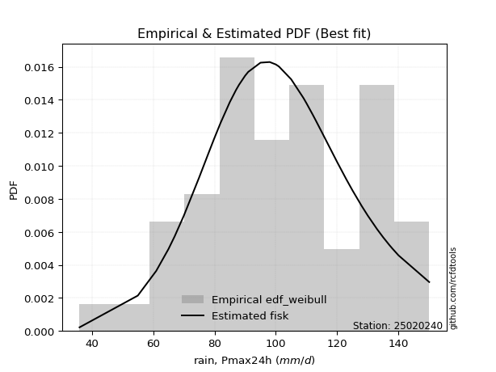</img>

</div>


### 4. Empirical - EDF Beard (1943)

The Beard formula (or Beard´s plotting position formula) in hydrology is used to estimate the empirical non-exceedance probability _(P)_ of a flood event (or other extreme hydrological data point) within a given dataset.

<div align="center">


$P=(m-0.31)/(n+0.38)$


</div>


**4.1. Empirical values**

<div align="center">

|                | 0                    | 1                   | 2                   | 3                   | 4                   | 5                   | 6                   | 7                   | 8                   | 9                   | 10                  | 11                  | 12                  | 13                 | 14                 | 15                 | 16                  | 17                 | 18                  | 19                  | 20                  | 21                 | 22                 | 23                 | 24                  | 25                 | 26        | 27                 | 28                 | 29                 | 30                 | 31                 | 32                 | 33                 | 34                 | 35                 | 36                 | 37                 | 38                 | 39                | 40                 | 41                 | 42                 | 43                 | 44                 | 45                 | 46                 | 47                 | 48                 | 49                 | 50                 | 51                 | 52                |
|:---------------|:---------------------|:--------------------|:--------------------|:--------------------|:--------------------|:--------------------|:--------------------|:--------------------|:--------------------|:--------------------|:--------------------|:--------------------|:--------------------|:-------------------|:-------------------|:-------------------|:--------------------|:-------------------|:--------------------|:--------------------|:--------------------|:-------------------|:-------------------|:-------------------|:--------------------|:-------------------|:----------|:-------------------|:-------------------|:-------------------|:-------------------|:-------------------|:-------------------|:-------------------|:-------------------|:-------------------|:-------------------|:-------------------|:-------------------|:------------------|:-------------------|:-------------------|:-------------------|:-------------------|:-------------------|:-------------------|:-------------------|:-------------------|:-------------------|:-------------------|:-------------------|:-------------------|:------------------|
| date           | 1985                 | 1971                | 1984                | 1980                | 1982                | 1973                | 1998                | 1983                | 1968                | 1969                | 1967                | 1995                | 1986                | 2001               | 1987               | 1991               | 2008                | 1972               | 1966                | 2015                | 1993                | 2009               | 1975               | 2007               | 2004                | 1992               | 1974      | 1996               | 2000               | 1990               | 1979               | 1981               | 1963               | 2005               | 2003               | 2002               | 1977               | 1994               | 1997               | 2014              | 1999               | 1964               | 2012               | 2010               | 2013               | 2011               | 2006               | 1970               | 1978               | 1989               | 1976               | 1965               | 1988              |
| x              | 36.0                 | 55.0                | 61.0                | 65.0                | 67.0                | 70.0                | 75.0                | 78.0                | 79.4105116071686    | 80.0                | 80.0                | 82.0                | 85.0                | 87.0               | 88.0               | 90.0               | 90.0                | 90.0               | 90.0                | 90.0                | 91.0                | 95.0               | 98.0               | 98.0               | 100.0               | 100.0              | 100.0     | 101.0              | 105.0              | 109.0              | 110.0              | 110.0              | 110.0              | 112.0              | 112.0              | 113.0              | 115.0              | 120.0              | 123.0              | 125.0             | 128.0              | 130.0              | 133.0              | 135.0              | 135.0              | 135.0              | 137.0              | 137.0              | 138.0              | 140.0              | 140.0              | 150.0              | 150.0             |
| m              | 1                    | 2                   | 3                   | 4                   | 5                   | 6                   | 7                   | 8                   | 9                   | 10                  | 11                  | 12                  | 13                  | 14                 | 15                 | 16                 | 17                  | 18                 | 19                  | 20                  | 21                  | 22                 | 23                 | 24                 | 25                  | 26                 | 27        | 28                 | 29                 | 30                 | 31                 | 32                 | 33                 | 34                 | 35                 | 36                 | 37                 | 38                 | 39                 | 40                | 41                 | 42                 | 43                 | 44                 | 45                 | 46                 | 47                 | 48                 | 49                 | 50                 | 51                 | 52                 | 53                |
| empirical_dist | edf_beard            | edf_beard           | edf_beard           | edf_beard           | edf_beard           | edf_beard           | edf_beard           | edf_beard           | edf_beard           | edf_beard           | edf_beard           | edf_beard           | edf_beard           | edf_beard          | edf_beard          | edf_beard          | edf_beard           | edf_beard          | edf_beard           | edf_beard           | edf_beard           | edf_beard          | edf_beard          | edf_beard          | edf_beard           | edf_beard          | edf_beard | edf_beard          | edf_beard          | edf_beard          | edf_beard          | edf_beard          | edf_beard          | edf_beard          | edf_beard          | edf_beard          | edf_beard          | edf_beard          | edf_beard          | edf_beard         | edf_beard          | edf_beard          | edf_beard          | edf_beard          | edf_beard          | edf_beard          | edf_beard          | edf_beard          | edf_beard          | edf_beard          | edf_beard          | edf_beard          | edf_beard         |
| empirical      | 0.012926189584113899 | 0.03165979767703259 | 0.05039340576995129 | 0.06912701386286998 | 0.08786062195578868 | 0.10659423004870738 | 0.12532783814162607 | 0.14406144623454478 | 0.16279505432746344 | 0.18152866242038215 | 0.20026227051330084 | 0.21899587860621955 | 0.23772948669913824 | 0.2564630947920569 | 0.2751967028849756 | 0.2939303109778943 | 0.31266391907081303 | 0.3313975271637317 | 0.35013113525665046 | 0.36886474334956915 | 0.38759835144248783 | 0.4063319595354065 | 0.4250655676283252 | 0.4437991757212439 | 0.46253278381416263 | 0.4812663919070813 | 0.5       | 0.5187336080929187 | 0.5374672161858374 | 0.5562008242787561 | 0.5749344323716747 | 0.5936680404645934 | 0.6124016485575121 | 0.6311352566504308 | 0.6498688647433495 | 0.6686024728362682 | 0.6873360809291869 | 0.7060696890221055 | 0.7248032971150242 | 0.743536905207943 | 0.7622705133008617 | 0.7810041213937804 | 0.7997377294866991 | 0.8184713375796178 | 0.8372049456725364 | 0.8559385537654551 | 0.8746721618583738 | 0.8934057699512925 | 0.9121393780442112 | 0.9308729861371299 | 0.9496065942300487 | 0.9683402023229674 | 0.987073810415886 |
| empirical_tr   | 1.0130954640349212   | 1.032694911975237   | 1.0530676662063523  | 1.074260414570336   | 1.0963236804271925  | 1.1193122247850702  | 1.1432855001070894  | 1.1683081637119719  | 1.1944506601029312  | 1.2217898832684824  | 1.2504099320684001  | 1.2804029743343728  | 1.3118702383878103  | 1.344923154446964  | 1.3796846730421295 | 1.4162907933138764 | 1.4548923412373944  | 1.4956570467918184 | 1.5387719803978093  | 1.5844464232710003  | 1.6329152646069136  | 1.6844430419690752 | 1.7393287715868362 | 1.7979117547995955 | 1.8605785988149182  | 1.9277717587576744 | 2.0       | 2.077851304009342  | 2.162008910490077  | 2.2532714225411565 | 2.3525782282944028 | 2.461041954817888  | 2.5799903334944414 | 2.711020822752666  | 2.856072766185125  | 3.0175240248728086 | 3.198322348711802  | 3.40216698534098   | 3.633764465622871  | 3.899196493791088 | 4.206461780929866  | 4.566295979469631  | 4.993451824134704  | 5.508771929824559  | 6.142692750287684  | 6.941482444733416  | 7.979073243647228  | 9.381370826010535  | 11.38166311300638  | 14.466124661246583 | 19.843866171003704 | 31.585798816568    | 77.36231884057938 |

</div>


**4.2. Kolmogorov-Smirnov fit test (sorted by Δ)**


<div align="center">

|                | 0                   | 1                   | 2                   | 3                   | 4                   | 5                   | 6                   | 7                   | 8                   | 9                   | 10                  | 11                  | 12                  | 13                  | 14                  | 15                  | 16                  | 17                  | 18                  | 19                  | 20                  | 21                  | 22                  | 23                  | 24                  | 25                  | 26                  | 27                  | 28                  | 29                  | 30                  | 31                  | 32                  | 33                  | 34                  | 35                  | 36                  | 37                  | 38                  | 39                  | 40                  | 41                  | 42                  | 43                  | 44                  | 45                  | 46                  | 47                  | 48                  | 49                  | 50                  | 51                  | 52                  | 53                  | 54                  | 55                  | 56                  | 57                  | 58                  | 59                  | 60                  | 61                  | 62                  | 63                  | 64                  | 65                  | 66                    | 67                  | 68                  | 69                  | 70                  | 71                  | 72                  | 73                  | 74                  | 75                  | 76                  | 77                  | 78                  | 79                  | 80                  | 81                  | 82                  | 83                  | 84                  | 85                  | 86                  | 87                  | 88                  | 89                  | 90                  | 91                  |
|:---------------|:--------------------|:--------------------|:--------------------|:--------------------|:--------------------|:--------------------|:--------------------|:--------------------|:--------------------|:--------------------|:--------------------|:--------------------|:--------------------|:--------------------|:--------------------|:--------------------|:--------------------|:--------------------|:--------------------|:--------------------|:--------------------|:--------------------|:--------------------|:--------------------|:--------------------|:--------------------|:--------------------|:--------------------|:--------------------|:--------------------|:--------------------|:--------------------|:--------------------|:--------------------|:--------------------|:--------------------|:--------------------|:--------------------|:--------------------|:--------------------|:--------------------|:--------------------|:--------------------|:--------------------|:--------------------|:--------------------|:--------------------|:--------------------|:--------------------|:--------------------|:--------------------|:--------------------|:--------------------|:--------------------|:--------------------|:--------------------|:--------------------|:--------------------|:--------------------|:--------------------|:--------------------|:--------------------|:--------------------|:--------------------|:--------------------|:--------------------|:----------------------|:--------------------|:--------------------|:--------------------|:--------------------|:--------------------|:--------------------|:--------------------|:--------------------|:--------------------|:--------------------|:--------------------|:--------------------|:--------------------|:--------------------|:--------------------|:--------------------|:--------------------|:--------------------|:--------------------|:--------------------|:--------------------|:--------------------|:--------------------|:--------------------|:--------------------|
| station        | 25020240            | 25020240            | 25020240            | 25020240            | 25020240            | 25020240            | 25020240            | 25020240            | 25020240            | 25020240            | 25020240            | 25020240            | 25020240            | 25020240            | 25020240            | 25020240            | 25020240            | 25020240            | 25020240            | 25020240            | 25020240            | 25020240            | 25020240            | 25020240            | 25020240            | 25020240            | 25020240            | 25020240            | 25020240            | 25020240            | 25020240            | 25020240            | 25020240            | 25020240            | 25020240            | 25020240            | 25020240            | 25020240            | 25020240            | 25020240            | 25020240            | 25020240            | 25020240            | 25020240            | 25020240            | 25020240            | 25020240            | 25020240            | 25020240            | 25020240            | 25020240            | 25020240            | 25020240            | 25020240            | 25020240            | 25020240            | 25020240            | 25020240            | 25020240            | 25020240            | 25020240            | 25020240            | 25020240            | 25020240            | 25020240            | 25020240            | 25020240              | 25020240            | 25020240            | 25020240            | 25020240            | 25020240            | 25020240            | 25020240            | 25020240            | 25020240            | 25020240            | 25020240            | 25020240            | 25020240            | 25020240            | 25020240            | 25020240            | 25020240            | 25020240            | 25020240            | 25020240            | 25020240            | 25020240            | 25020240            | 25020240            | 25020240            |
| empirical_dist | edf_beard           | edf_beard           | edf_beard           | edf_beard           | edf_beard           | edf_beard           | edf_beard           | edf_beard           | edf_beard           | edf_beard           | edf_beard           | edf_beard           | edf_beard           | edf_beard           | edf_beard           | edf_beard           | edf_beard           | edf_beard           | edf_beard           | edf_beard           | edf_beard           | edf_beard           | edf_beard           | edf_beard           | edf_beard           | edf_beard           | edf_beard           | edf_beard           | edf_beard           | edf_beard           | edf_beard           | edf_beard           | edf_beard           | edf_beard           | edf_beard           | edf_beard           | edf_beard           | edf_beard           | edf_beard           | edf_beard           | edf_beard           | edf_beard           | edf_beard           | edf_beard           | edf_beard           | edf_beard           | edf_beard           | edf_beard           | edf_beard           | edf_beard           | edf_beard           | edf_beard           | edf_beard           | edf_beard           | edf_beard           | edf_beard           | edf_beard           | edf_beard           | edf_beard           | edf_beard           | edf_beard           | edf_beard           | edf_beard           | edf_beard           | edf_beard           | edf_beard           | edf_beard             | edf_beard           | edf_beard           | edf_beard           | edf_beard           | edf_beard           | edf_beard           | edf_beard           | edf_beard           | edf_beard           | edf_beard           | edf_beard           | edf_beard           | edf_beard           | edf_beard           | edf_beard           | edf_beard           | edf_beard           | edf_beard           | edf_beard           | edf_beard           | edf_beard           | edf_beard           | edf_beard           | edf_beard           | edf_beard           |
| p_dist         | fisk                | logfisk             | ncf                 | rayleigh            | maxwell             | logt                | lognorm             | lognorm             | logcrystalball      | loglognorm          | logexponnorm        | logrice             | chi2                | logpearson3         | logncf              | logf                | lognakagami         | betaprime           | nakagami            | logdgamma           | logfatiguelife      | erlang              | alpha               | rice                | gamma               | lognct              | invgamma            | fatiguelife         | logbetaprime        | genlogistic         | f                   | johnsonsu           | nct                 | t                   | exponnorm           | crystalball         | truncnorm           | norm                | loggompertz         | pearson3            | dgamma              | logerlang           | weibull_min         | loginvgamma         | logweibull_min      | loggumbel_l         | logchi2             | logjohnsonsu        | logloggamma         | invgauss            | loggamma            | loggamma            | loglogistic         | logalpha            | loginvgauss         | laplace_asymmetric  | logistic            | mielke              | loggenlogistic      | halfnorm            | invweibull          | logmaxwell          | loghypsecant        | gumbel_r            | kstwobign           | hypsecant           | loglaplace_asymmetric | lograyleigh         | halflogistic        | moyal               | gumbel_l            | loglaplace          | logmielke           | laplace             | loggumbel_r         | loghalfnorm         | loghalflogistic     | logmoyal            | loginvweibull       | logkstwobign        | wald                | logwald             | gibrat              | loggibrat           | loggenexpon         | genexpon            | expon               | pareto              | logexpon            | logpareto           | logtruncnorm        | gompertz            |
| delta          | 0.06108511671827743 | 0.06138028531557305 | 0.06610248710690969 | 0.06752575802807914 | 0.06805952309873853 | 0.0697420388047818  | 0.06975052174102858 | 0.06975052174102858 | 0.06975074631602451 | 0.06975145129327653 | 0.06975255266376823 | 0.06976759724158887 | 0.06984527638328386 | 0.06984560961062214 | 0.07000151526620901 | 0.07004751515334529 | 0.07006492134153242 | 0.07031795214689307 | 0.07053413347714044 | 0.07077892903496796 | 0.07168080583564185 | 0.07209342467441682 | 0.07265597388920886 | 0.07300596436745566 | 0.07326763945962833 | 0.07352657780516592 | 0.0737712943041563  | 0.07394151040181829 | 0.07394208222266652 | 0.07422193814230488 | 0.07433458058482512 | 0.07458873858402482 | 0.07465104484702523 | 0.07466150469165178 | 0.07467830186478641 | 0.0746786683739249  | 0.0746786712130344  | 0.07467867266454575 | 0.0749175459415301  | 0.07687855830006357 | 0.07709499738159031 | 0.07754991613475176 | 0.0779824344359763  | 0.07802872518709603 | 0.07809656872622817 | 0.07915240547542879 | 0.08088393491399015 | 0.08090073734765785 | 0.08107474302552453 | 0.08217350693604553 | 0.08508288317882295 | 0.08508288317882295 | 0.08544168886932568 | 0.086536983822873   | 0.0866005570440409  | 0.08928343216152401 | 0.09009155838083766 | 0.09085856390401836 | 0.09101398198713923 | 0.09203379463500105 | 0.09366905496724809 | 0.09653509616654726 | 0.0979669123209187  | 0.0989925106597822  | 0.10362048803117163 | 0.1052033675708442  | 0.10660687838321958   | 0.10868804128454795 | 0.12020312133854061 | 0.12233379965586488 | 0.12421507772193752 | 0.1263129263174706  | 0.12782979037089648 | 0.1317221750154695  | 0.1332160167003099  | 0.14326358144176543 | 0.15269726727642974 | 0.15452934967479182 | 0.17084432322497145 | 0.19140487180118085 | 0.19580271073845865 | 0.2183405517075599  | 0.21915345423878493 | 0.2465133061974042  | 0.27118159694196453 | 0.3200231139708184  | 0.32031946986065163 | 0.3203195006317049  | 0.38840083123375546 | 0.38840083495777156 | 0.5969159340696173  | 0.6964517346384772  |
| deltao         | 0.18681036697021708 | 0.18681036697021708 | 0.18681036697021708 | 0.18681036697021708 | 0.18681036697021708 | 0.18681036697021708 | 0.18681036697021708 | 0.18681036697021708 | 0.18681036697021708 | 0.18681036697021708 | 0.18681036697021708 | 0.18681036697021708 | 0.18681036697021708 | 0.18681036697021708 | 0.18681036697021708 | 0.18681036697021708 | 0.18681036697021708 | 0.18681036697021708 | 0.18681036697021708 | 0.18681036697021708 | 0.18681036697021708 | 0.18681036697021708 | 0.18681036697021708 | 0.18681036697021708 | 0.18681036697021708 | 0.18681036697021708 | 0.18681036697021708 | 0.18681036697021708 | 0.18681036697021708 | 0.18681036697021708 | 0.18681036697021708 | 0.18681036697021708 | 0.18681036697021708 | 0.18681036697021708 | 0.18681036697021708 | 0.18681036697021708 | 0.18681036697021708 | 0.18681036697021708 | 0.18681036697021708 | 0.18681036697021708 | 0.18681036697021708 | 0.18681036697021708 | 0.18681036697021708 | 0.18681036697021708 | 0.18681036697021708 | 0.18681036697021708 | 0.18681036697021708 | 0.18681036697021708 | 0.18681036697021708 | 0.18681036697021708 | 0.18681036697021708 | 0.18681036697021708 | 0.18681036697021708 | 0.18681036697021708 | 0.18681036697021708 | 0.18681036697021708 | 0.18681036697021708 | 0.18681036697021708 | 0.18681036697021708 | 0.18681036697021708 | 0.18681036697021708 | 0.18681036697021708 | 0.18681036697021708 | 0.18681036697021708 | 0.18681036697021708 | 0.18681036697021708 | 0.18681036697021708   | 0.18681036697021708 | 0.18681036697021708 | 0.18681036697021708 | 0.18681036697021708 | 0.18681036697021708 | 0.18681036697021708 | 0.18681036697021708 | 0.18681036697021708 | 0.18681036697021708 | 0.18681036697021708 | 0.18681036697021708 | 0.18681036697021708 | 0.18681036697021708 | 0.18681036697021708 | 0.18681036697021708 | 0.18681036697021708 | 0.18681036697021708 | 0.18681036697021708 | 0.18681036697021708 | 0.18681036697021708 | 0.18681036697021708 | 0.18681036697021708 | 0.18681036697021708 | 0.18681036697021708 | 0.18681036697021708 |
| eval           | Δo > Δ              | Δo > Δ              | Δo > Δ              | Δo > Δ              | Δo > Δ              | Δo > Δ              | Δo > Δ              | Δo > Δ              | Δo > Δ              | Δo > Δ              | Δo > Δ              | Δo > Δ              | Δo > Δ              | Δo > Δ              | Δo > Δ              | Δo > Δ              | Δo > Δ              | Δo > Δ              | Δo > Δ              | Δo > Δ              | Δo > Δ              | Δo > Δ              | Δo > Δ              | Δo > Δ              | Δo > Δ              | Δo > Δ              | Δo > Δ              | Δo > Δ              | Δo > Δ              | Δo > Δ              | Δo > Δ              | Δo > Δ              | Δo > Δ              | Δo > Δ              | Δo > Δ              | Δo > Δ              | Δo > Δ              | Δo > Δ              | Δo > Δ              | Δo > Δ              | Δo > Δ              | Δo > Δ              | Δo > Δ              | Δo > Δ              | Δo > Δ              | Δo > Δ              | Δo > Δ              | Δo > Δ              | Δo > Δ              | Δo > Δ              | Δo > Δ              | Δo > Δ              | Δo > Δ              | Δo > Δ              | Δo > Δ              | Δo > Δ              | Δo > Δ              | Δo > Δ              | Δo > Δ              | Δo > Δ              | Δo > Δ              | Δo > Δ              | Δo > Δ              | Δo > Δ              | Δo > Δ              | Δo > Δ              | Δo > Δ                | Δo > Δ              | Δo > Δ              | Δo > Δ              | Δo > Δ              | Δo > Δ              | Δo > Δ              | Δo > Δ              | Δo > Δ              | Δo > Δ              | Δo > Δ              | Δo > Δ              | Δo > Δ              | Δo <= Δ             | Δo <= Δ             | Δo <= Δ             | Δo <= Δ             | Δo <= Δ             | Δo <= Δ             | Δo <= Δ             | Δo <= Δ             | Δo <= Δ             | Δo <= Δ             | Δo <= Δ             | Δo <= Δ             | Δo <= Δ             |
| fit            | 1                   | 1                   | 1                   | 1                   | 1                   | 1                   | 1                   | 1                   | 1                   | 1                   | 1                   | 1                   | 1                   | 1                   | 1                   | 1                   | 1                   | 1                   | 1                   | 1                   | 1                   | 1                   | 1                   | 1                   | 1                   | 1                   | 1                   | 1                   | 1                   | 1                   | 1                   | 1                   | 1                   | 1                   | 1                   | 1                   | 1                   | 1                   | 1                   | 1                   | 1                   | 1                   | 1                   | 1                   | 1                   | 1                   | 1                   | 1                   | 1                   | 1                   | 1                   | 1                   | 1                   | 1                   | 1                   | 1                   | 1                   | 1                   | 1                   | 1                   | 1                   | 1                   | 1                   | 1                   | 1                   | 1                   | 1                     | 1                   | 1                   | 1                   | 1                   | 1                   | 1                   | 1                   | 1                   | 1                   | 1                   | 1                   | 1                   | 0                   | 0                   | 0                   | 0                   | 0                   | 0                   | 0                   | 0                   | 0                   | 0                   | 0                   | 0                   | 0                   |
| n              | 53                  | 53                  | 53                  | 53                  | 53                  | 53                  | 53                  | 53                  | 53                  | 53                  | 53                  | 53                  | 53                  | 53                  | 53                  | 53                  | 53                  | 53                  | 53                  | 53                  | 53                  | 53                  | 53                  | 53                  | 53                  | 53                  | 53                  | 53                  | 53                  | 53                  | 53                  | 53                  | 53                  | 53                  | 53                  | 53                  | 53                  | 53                  | 53                  | 53                  | 53                  | 53                  | 53                  | 53                  | 53                  | 53                  | 53                  | 53                  | 53                  | 53                  | 53                  | 53                  | 53                  | 53                  | 53                  | 53                  | 53                  | 53                  | 53                  | 53                  | 53                  | 53                  | 53                  | 53                  | 53                  | 53                  | 53                    | 53                  | 53                  | 53                  | 53                  | 53                  | 53                  | 53                  | 53                  | 53                  | 53                  | 53                  | 53                  | 53                  | 53                  | 53                  | 53                  | 53                  | 53                  | 53                  | 53                  | 53                  | 53                  | 53                  | 53                  | 53                  |
| best_fit       | 1                   | 0                   | 0                   | 0                   | 0                   | 0                   | 0                   | 0                   | 0                   | 0                   | 0                   | 0                   | 0                   | 0                   | 0                   | 0                   | 0                   | 0                   | 0                   | 0                   | 0                   | 0                   | 0                   | 0                   | 0                   | 0                   | 0                   | 0                   | 0                   | 0                   | 0                   | 0                   | 0                   | 0                   | 0                   | 0                   | 0                   | 0                   | 0                   | 0                   | 0                   | 0                   | 0                   | 0                   | 0                   | 0                   | 0                   | 0                   | 0                   | 0                   | 0                   | 0                   | 0                   | 0                   | 0                   | 0                   | 0                   | 0                   | 0                   | 0                   | 0                   | 0                   | 0                   | 0                   | 0                   | 0                   | 0                     | 0                   | 0                   | 0                   | 0                   | 0                   | 0                   | 0                   | 0                   | 0                   | 0                   | 0                   | 0                   | 0                   | 0                   | 0                   | 0                   | 0                   | 0                   | 0                   | 0                   | 0                   | 0                   | 0                   | 0                   | 0                   |
| best_fit_sort  | 1                   | 2                   | 3                   | 4                   | 5                   | 6                   | 7                   | 8                   | 9                   | 10                  | 11                  | 12                  | 13                  | 14                  | 15                  | 16                  | 17                  | 18                  | 19                  | 20                  | 21                  | 22                  | 23                  | 24                  | 25                  | 26                  | 27                  | 28                  | 29                  | 30                  | 31                  | 32                  | 33                  | 34                  | 35                  | 36                  | 37                  | 38                  | 39                  | 40                  | 41                  | 42                  | 43                  | 44                  | 45                  | 46                  | 47                  | 48                  | 49                  | 50                  | 51                  | 52                  | 53                  | 54                  | 55                  | 56                  | 57                  | 58                  | 59                  | 60                  | 61                  | 62                  | 63                  | 64                  | 65                  | 66                  | 67                    | 68                  | 69                  | 70                  | 71                  | 72                  | 73                  | 74                  | 75                  | 76                  | 77                  | 78                  | 79                  | 80                  | 81                  | 82                  | 83                  | 84                  | 85                  | 86                  | 87                  | 88                  | 89                  | 90                  | 91                  | 92                  |

</div>


<div align="center">

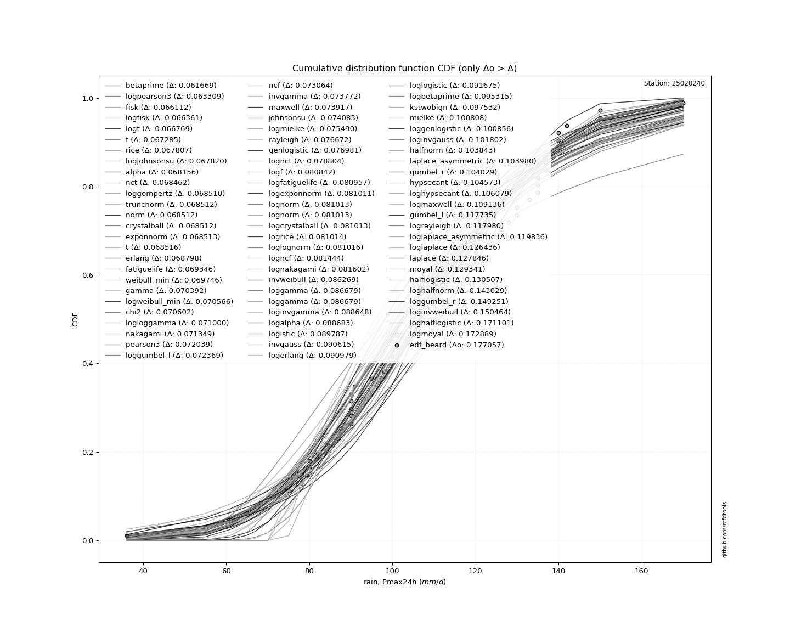</img>

</div>


**4.3. Best fit**

<div align="center">

|   id |   station | empirical_dist   | p_dist   |     delta |   deltao | eval   |   fit |   n |   best_fit |   best_fit_sort |
|-----:|----------:|:-----------------|:---------|----------:|---------:|:-------|------:|----:|-----------:|----------------:|
|    0 |  25020240 | edf_beard        | fisk     | 0.0610851 |  0.18681 | Δo > Δ |     1 |  53 |          1 |               1 |

</div>


<div align="center">

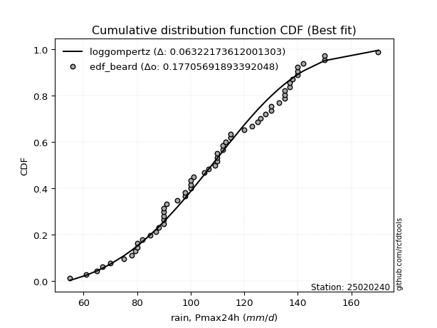</img>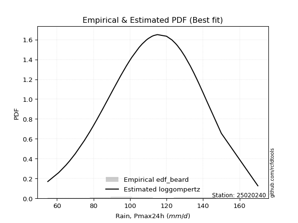</img>

</div>


### 5. Empirical - EDF Chegodayev (1955)

The Chegodayev formula is an empirical plotting position formula used in hydrological frequency analysis to estimate the exceedance probability or return period of a specific event from a set of observed data. It is primarily used for plotting observed data points on probability paper to fit a theoretical distribution, particularly for analyzing extreme events like maximum flood flows or rainfall intensities. The constant _b_ value in the generalized plotting position formula is 0.3.

<div align="center">


$P=(m-b)/(n+1-2b)$


</div>


**5.1. Empirical values**

<div align="center">

|                | 0                    | 1                    | 2                    | 3                   | 4                   | 5                   | 6                  | 7                   | 8                   | 9                   | 10                  | 11                 | 12                  | 13                 | 14                 | 15                 | 16                  | 17                  | 18                 | 19                  | 20                  | 21                  | 22                 | 23                 | 24                  | 25                 | 26             | 27                 | 28                 | 29                 | 30                 | 31                 | 32                 | 33                 | 34                 | 35                 | 36                 | 37                 | 38                 | 39                 | 40                 | 41                 | 42                 | 43                 | 44                 | 45                | 46                 | 47                 | 48                 | 49                 | 50                 | 51                 | 52                 |
|:---------------|:---------------------|:---------------------|:---------------------|:--------------------|:--------------------|:--------------------|:-------------------|:--------------------|:--------------------|:--------------------|:--------------------|:-------------------|:--------------------|:-------------------|:-------------------|:-------------------|:--------------------|:--------------------|:-------------------|:--------------------|:--------------------|:--------------------|:-------------------|:-------------------|:--------------------|:-------------------|:---------------|:-------------------|:-------------------|:-------------------|:-------------------|:-------------------|:-------------------|:-------------------|:-------------------|:-------------------|:-------------------|:-------------------|:-------------------|:-------------------|:-------------------|:-------------------|:-------------------|:-------------------|:-------------------|:------------------|:-------------------|:-------------------|:-------------------|:-------------------|:-------------------|:-------------------|:-------------------|
| date           | 1985                 | 1971                 | 1984                 | 1980                | 1982                | 1973                | 1998               | 1983                | 1968                | 1969                | 1967                | 1995               | 1986                | 2001               | 1987               | 1991               | 2008                | 1972                | 1966               | 2015                | 1993                | 2009                | 1975               | 2007               | 2004                | 1992               | 1974           | 1996               | 2000               | 1990               | 1979               | 1981               | 1963               | 2005               | 2003               | 2002               | 1977               | 1994               | 1997               | 2014               | 1999               | 1964               | 2012               | 2010               | 2013               | 2011              | 2006               | 1970               | 1978               | 1989               | 1976               | 1965               | 1988               |
| x              | 36.0                 | 55.0                 | 61.0                 | 65.0                | 67.0                | 70.0                | 75.0               | 78.0                | 79.4105116071686    | 80.0                | 80.0                | 82.0               | 85.0                | 87.0               | 88.0               | 90.0               | 90.0                | 90.0                | 90.0               | 90.0                | 91.0                | 95.0                | 98.0               | 98.0               | 100.0               | 100.0              | 100.0          | 101.0              | 105.0              | 109.0              | 110.0              | 110.0              | 110.0              | 112.0              | 112.0              | 113.0              | 115.0              | 120.0              | 123.0              | 125.0              | 128.0              | 130.0              | 133.0              | 135.0              | 135.0              | 135.0             | 137.0              | 137.0              | 138.0              | 140.0              | 140.0              | 150.0              | 150.0              |
| m              | 1                    | 2                    | 3                    | 4                   | 5                   | 6                   | 7                  | 8                   | 9                   | 10                  | 11                  | 12                 | 13                  | 14                 | 15                 | 16                 | 17                  | 18                  | 19                 | 20                  | 21                  | 22                  | 23                 | 24                 | 25                  | 26                 | 27             | 28                 | 29                 | 30                 | 31                 | 32                 | 33                 | 34                 | 35                 | 36                 | 37                 | 38                 | 39                 | 40                 | 41                 | 42                 | 43                 | 44                 | 45                 | 46                | 47                 | 48                 | 49                 | 50                 | 51                 | 52                 | 53                 |
| empirical_dist | edf_chegodayev       | edf_chegodayev       | edf_chegodayev       | edf_chegodayev      | edf_chegodayev      | edf_chegodayev      | edf_chegodayev     | edf_chegodayev      | edf_chegodayev      | edf_chegodayev      | edf_chegodayev      | edf_chegodayev     | edf_chegodayev      | edf_chegodayev     | edf_chegodayev     | edf_chegodayev     | edf_chegodayev      | edf_chegodayev      | edf_chegodayev     | edf_chegodayev      | edf_chegodayev      | edf_chegodayev      | edf_chegodayev     | edf_chegodayev     | edf_chegodayev      | edf_chegodayev     | edf_chegodayev | edf_chegodayev     | edf_chegodayev     | edf_chegodayev     | edf_chegodayev     | edf_chegodayev     | edf_chegodayev     | edf_chegodayev     | edf_chegodayev     | edf_chegodayev     | edf_chegodayev     | edf_chegodayev     | edf_chegodayev     | edf_chegodayev     | edf_chegodayev     | edf_chegodayev     | edf_chegodayev     | edf_chegodayev     | edf_chegodayev     | edf_chegodayev    | edf_chegodayev     | edf_chegodayev     | edf_chegodayev     | edf_chegodayev     | edf_chegodayev     | edf_chegodayev     | edf_chegodayev     |
| empirical      | 0.013108614232209737 | 0.031835205992509365 | 0.050561797752808994 | 0.06928838951310862 | 0.08801498127340825 | 0.10674157303370788 | 0.1254681647940075 | 0.14419475655430714 | 0.16292134831460672 | 0.18164794007490637 | 0.20037453183520598 | 0.2191011235955056 | 0.23782771535580524 | 0.2565543071161049 | 0.2752808988764045 | 0.2940074906367041 | 0.31273408239700373 | 0.33146067415730335 | 0.350187265917603  | 0.36891385767790263 | 0.38764044943820225 | 0.40636704119850187 | 0.4250936329588015 | 0.4438202247191011 | 0.46254681647940077 | 0.4812734082397004 | 0.5            | 0.5187265917602997 | 0.5374531835205992 | 0.5561797752808989 | 0.5749063670411985 | 0.5936329588014981 | 0.6123595505617978 | 0.6310861423220975 | 0.649812734082397  | 0.6685393258426967 | 0.6872659176029964 | 0.7059925093632959 | 0.7247191011235956 | 0.7434456928838952 | 0.7621722846441948 | 0.7808988764044944 | 0.7996254681647941 | 0.8183520599250937 | 0.8370786516853933 | 0.855805243445693 | 0.8745318352059925 | 0.8932584269662922 | 0.9119850187265919 | 0.9307116104868914 | 0.9494382022471911 | 0.9681647940074907 | 0.9868913857677903 |
| empirical_tr   | 1.013282732447818    | 1.0328820116054158   | 1.0532544378698225   | 1.074446680080483   | 1.0965092402464065  | 1.119496855345912   | 1.1434689507494646 | 1.1684901531728666  | 1.1946308724832213  | 1.2219679633867278  | 1.2505854800936766  | 1.2805755395683454 | 1.3120393120393121  | 1.3450881612090682 | 1.37984496124031   | 1.416445623342175  | 1.4550408719346049  | 1.495798319327731   | 1.5389048991354468 | 1.5845697329376855  | 1.6330275229357796  | 1.6845425867507886  | 1.739413680781759  | 1.7979797979797978 | 1.8606271777003485  | 1.927797833935018  | 2.0            | 2.077821011673152  | 2.1619433198380564 | 2.2531645569620253 | 2.3524229074889864 | 2.460829493087558  | 2.5797101449275366 | 2.710659898477158  | 2.8556149732620324 | 3.0169491525423737 | 3.197604790419163  | 3.401273885350319  | 3.632653061224491  | 3.897810218978103  | 4.20472440944882   | 4.564102564102565  | 4.990654205607478  | 5.505154639175261  | 6.137931034482761  | 6.93506493506494  | 7.970149253731345  | 9.368421052631586  | 11.361702127659589 | 14.432432432432444 | 19.777777777777818 | 31.411764705882387 | 76.28571428571475  |

</div>


**5.2. Kolmogorov-Smirnov fit test (sorted by Δ)**


<div align="center">

|                | 0                   | 1                    | 2                   | 3                   | 4                   | 5                   | 6                   | 7                   | 8                   | 9                   | 10                  | 11                  | 12                  | 13                  | 14                  | 15                  | 16                  | 17                  | 18                  | 19                  | 20                  | 21                  | 22                  | 23                  | 24                  | 25                  | 26                  | 27                  | 28                  | 29                  | 30                  | 31                  | 32                  | 33                  | 34                  | 35                  | 36                  | 37                  | 38                  | 39                  | 40                  | 41                  | 42                  | 43                  | 44                  | 45                  | 46                  | 47                  | 48                  | 49                  | 50                  | 51                  | 52                  | 53                  | 54                  | 55                  | 56                  | 57                  | 58                  | 59                  | 60                  | 61                  | 62                  | 63                  | 64                  | 65                  | 66                    | 67                  | 68                  | 69                  | 70                  | 71                  | 72                  | 73                  | 74                  | 75                  | 76                  | 77                  | 78                  | 79                  | 80                  | 81                  | 82                  | 83                  | 84                  | 85                  | 86                  | 87                  | 88                  | 89                  | 90                  | 91                  |
|:---------------|:--------------------|:---------------------|:--------------------|:--------------------|:--------------------|:--------------------|:--------------------|:--------------------|:--------------------|:--------------------|:--------------------|:--------------------|:--------------------|:--------------------|:--------------------|:--------------------|:--------------------|:--------------------|:--------------------|:--------------------|:--------------------|:--------------------|:--------------------|:--------------------|:--------------------|:--------------------|:--------------------|:--------------------|:--------------------|:--------------------|:--------------------|:--------------------|:--------------------|:--------------------|:--------------------|:--------------------|:--------------------|:--------------------|:--------------------|:--------------------|:--------------------|:--------------------|:--------------------|:--------------------|:--------------------|:--------------------|:--------------------|:--------------------|:--------------------|:--------------------|:--------------------|:--------------------|:--------------------|:--------------------|:--------------------|:--------------------|:--------------------|:--------------------|:--------------------|:--------------------|:--------------------|:--------------------|:--------------------|:--------------------|:--------------------|:--------------------|:----------------------|:--------------------|:--------------------|:--------------------|:--------------------|:--------------------|:--------------------|:--------------------|:--------------------|:--------------------|:--------------------|:--------------------|:--------------------|:--------------------|:--------------------|:--------------------|:--------------------|:--------------------|:--------------------|:--------------------|:--------------------|:--------------------|:--------------------|:--------------------|:--------------------|:--------------------|
| station        | 25020240            | 25020240             | 25020240            | 25020240            | 25020240            | 25020240            | 25020240            | 25020240            | 25020240            | 25020240            | 25020240            | 25020240            | 25020240            | 25020240            | 25020240            | 25020240            | 25020240            | 25020240            | 25020240            | 25020240            | 25020240            | 25020240            | 25020240            | 25020240            | 25020240            | 25020240            | 25020240            | 25020240            | 25020240            | 25020240            | 25020240            | 25020240            | 25020240            | 25020240            | 25020240            | 25020240            | 25020240            | 25020240            | 25020240            | 25020240            | 25020240            | 25020240            | 25020240            | 25020240            | 25020240            | 25020240            | 25020240            | 25020240            | 25020240            | 25020240            | 25020240            | 25020240            | 25020240            | 25020240            | 25020240            | 25020240            | 25020240            | 25020240            | 25020240            | 25020240            | 25020240            | 25020240            | 25020240            | 25020240            | 25020240            | 25020240            | 25020240              | 25020240            | 25020240            | 25020240            | 25020240            | 25020240            | 25020240            | 25020240            | 25020240            | 25020240            | 25020240            | 25020240            | 25020240            | 25020240            | 25020240            | 25020240            | 25020240            | 25020240            | 25020240            | 25020240            | 25020240            | 25020240            | 25020240            | 25020240            | 25020240            | 25020240            |
| empirical_dist | edf_chegodayev      | edf_chegodayev       | edf_chegodayev      | edf_chegodayev      | edf_chegodayev      | edf_chegodayev      | edf_chegodayev      | edf_chegodayev      | edf_chegodayev      | edf_chegodayev      | edf_chegodayev      | edf_chegodayev      | edf_chegodayev      | edf_chegodayev      | edf_chegodayev      | edf_chegodayev      | edf_chegodayev      | edf_chegodayev      | edf_chegodayev      | edf_chegodayev      | edf_chegodayev      | edf_chegodayev      | edf_chegodayev      | edf_chegodayev      | edf_chegodayev      | edf_chegodayev      | edf_chegodayev      | edf_chegodayev      | edf_chegodayev      | edf_chegodayev      | edf_chegodayev      | edf_chegodayev      | edf_chegodayev      | edf_chegodayev      | edf_chegodayev      | edf_chegodayev      | edf_chegodayev      | edf_chegodayev      | edf_chegodayev      | edf_chegodayev      | edf_chegodayev      | edf_chegodayev      | edf_chegodayev      | edf_chegodayev      | edf_chegodayev      | edf_chegodayev      | edf_chegodayev      | edf_chegodayev      | edf_chegodayev      | edf_chegodayev      | edf_chegodayev      | edf_chegodayev      | edf_chegodayev      | edf_chegodayev      | edf_chegodayev      | edf_chegodayev      | edf_chegodayev      | edf_chegodayev      | edf_chegodayev      | edf_chegodayev      | edf_chegodayev      | edf_chegodayev      | edf_chegodayev      | edf_chegodayev      | edf_chegodayev      | edf_chegodayev      | edf_chegodayev        | edf_chegodayev      | edf_chegodayev      | edf_chegodayev      | edf_chegodayev      | edf_chegodayev      | edf_chegodayev      | edf_chegodayev      | edf_chegodayev      | edf_chegodayev      | edf_chegodayev      | edf_chegodayev      | edf_chegodayev      | edf_chegodayev      | edf_chegodayev      | edf_chegodayev      | edf_chegodayev      | edf_chegodayev      | edf_chegodayev      | edf_chegodayev      | edf_chegodayev      | edf_chegodayev      | edf_chegodayev      | edf_chegodayev      | edf_chegodayev      | edf_chegodayev      |
| p_dist         | fisk                | logfisk              | ncf                 | rayleigh            | maxwell             | logt                | lognorm             | lognorm             | logcrystalball      | loglognorm          | logexponnorm        | logrice             | logpearson3         | chi2                | logncf              | logf                | lognakagami         | betaprime           | logdgamma           | nakagami            | logfatiguelife      | erlang              | alpha               | rice                | gamma               | lognct              | invgamma            | logbetaprime        | fatiguelife         | genlogistic         | f                   | johnsonsu           | nct                 | t                   | exponnorm           | crystalball         | truncnorm           | norm                | loggompertz         | pearson3            | dgamma              | logerlang           | loginvgamma         | weibull_min         | logweibull_min      | loggumbel_l         | logchi2             | logjohnsonsu        | logloggamma         | invgauss            | loggamma            | loggamma            | loglogistic         | logalpha            | loginvgauss         | laplace_asymmetric  | logistic            | mielke              | loggenlogistic      | halfnorm            | invweibull          | logmaxwell          | loghypsecant        | gumbel_r            | kstwobign           | hypsecant           | loglaplace_asymmetric | lograyleigh         | halflogistic        | moyal               | gumbel_l            | loglaplace          | logmielke           | laplace             | loggumbel_r         | loghalfnorm         | loghalflogistic     | logmoyal            | loginvweibull       | logkstwobign        | wald                | logwald             | gibrat              | loggibrat           | loggenexpon         | genexpon            | expon               | pareto              | logexpon            | logpareto           | logtruncnorm        | gompertz            |
| delta          | 0.06090269207018173 | 0.061197860667477344 | 0.06612353610476684 | 0.0675468070259363  | 0.06817178442064353 | 0.06976308780263896 | 0.06977157073888574 | 0.06977157073888574 | 0.06977179531388167 | 0.06977250029113369 | 0.06977360166162538 | 0.06978864623944603 | 0.06988770760633656 | 0.06995753770518887 | 0.07002256426406617 | 0.07006856415120244 | 0.07008597033938957 | 0.07033900114475022 | 0.0706105370521104  | 0.07064639479904544 | 0.071701854833499   | 0.07220568599632182 | 0.07276823521111386 | 0.07311822568936066 | 0.07337990078153334 | 0.07354762680302307 | 0.0738835556260613  | 0.07396313122052367 | 0.0740537717237233  | 0.0742640361380193  | 0.07444684190673012 | 0.07470099990592982 | 0.07476330616893023 | 0.07477376601355679 | 0.07479056318669142 | 0.0747909296958299  | 0.0747909325349394  | 0.07479093398645076 | 0.07502980726343511 | 0.07692065629577799 | 0.07720725870349532 | 0.07747273647594194 | 0.0779515455282862  | 0.07802453243169072 | 0.07813866672194258 | 0.0792646667973338  | 0.08080675525518033 | 0.08094283534337227 | 0.08111684102123895 | 0.08200511495318796 | 0.08500570352001313 | 0.08500570352001313 | 0.08546273786718284 | 0.08645980416406318 | 0.08652337738523108 | 0.08930448115938117 | 0.09013365637655207 | 0.09090066189973278 | 0.09105607998285364 | 0.09205484363285821 | 0.09350066298439053 | 0.09645791650773744 | 0.09798796131877585 | 0.09901355965763936 | 0.10354330837236181 | 0.10524546556655862 | 0.10662792738107674   | 0.10861086162573813 | 0.12022417033639776 | 0.12235484865372204 | 0.1242080613893185  | 0.12633397531532775 | 0.12776664337732502 | 0.13176427301118393 | 0.13323706569816707 | 0.1431864017829556  | 0.15262008761761992 | 0.15455039867264897 | 0.17066189857687575 | 0.1912715614814185  | 0.1959149720603638  | 0.21831248637708361 | 0.21925168289545194 | 0.24653435519526135 | 0.27104828662220215 | 0.319889803651056   | 0.32018615954088925 | 0.3201861903119425  | 0.38826050458137407 | 0.38826050830539016 | 0.5967826237498549  | 0.6963605223144294  |
| deltao         | 0.18681036697021708 | 0.18681036697021708  | 0.18681036697021708 | 0.18681036697021708 | 0.18681036697021708 | 0.18681036697021708 | 0.18681036697021708 | 0.18681036697021708 | 0.18681036697021708 | 0.18681036697021708 | 0.18681036697021708 | 0.18681036697021708 | 0.18681036697021708 | 0.18681036697021708 | 0.18681036697021708 | 0.18681036697021708 | 0.18681036697021708 | 0.18681036697021708 | 0.18681036697021708 | 0.18681036697021708 | 0.18681036697021708 | 0.18681036697021708 | 0.18681036697021708 | 0.18681036697021708 | 0.18681036697021708 | 0.18681036697021708 | 0.18681036697021708 | 0.18681036697021708 | 0.18681036697021708 | 0.18681036697021708 | 0.18681036697021708 | 0.18681036697021708 | 0.18681036697021708 | 0.18681036697021708 | 0.18681036697021708 | 0.18681036697021708 | 0.18681036697021708 | 0.18681036697021708 | 0.18681036697021708 | 0.18681036697021708 | 0.18681036697021708 | 0.18681036697021708 | 0.18681036697021708 | 0.18681036697021708 | 0.18681036697021708 | 0.18681036697021708 | 0.18681036697021708 | 0.18681036697021708 | 0.18681036697021708 | 0.18681036697021708 | 0.18681036697021708 | 0.18681036697021708 | 0.18681036697021708 | 0.18681036697021708 | 0.18681036697021708 | 0.18681036697021708 | 0.18681036697021708 | 0.18681036697021708 | 0.18681036697021708 | 0.18681036697021708 | 0.18681036697021708 | 0.18681036697021708 | 0.18681036697021708 | 0.18681036697021708 | 0.18681036697021708 | 0.18681036697021708 | 0.18681036697021708   | 0.18681036697021708 | 0.18681036697021708 | 0.18681036697021708 | 0.18681036697021708 | 0.18681036697021708 | 0.18681036697021708 | 0.18681036697021708 | 0.18681036697021708 | 0.18681036697021708 | 0.18681036697021708 | 0.18681036697021708 | 0.18681036697021708 | 0.18681036697021708 | 0.18681036697021708 | 0.18681036697021708 | 0.18681036697021708 | 0.18681036697021708 | 0.18681036697021708 | 0.18681036697021708 | 0.18681036697021708 | 0.18681036697021708 | 0.18681036697021708 | 0.18681036697021708 | 0.18681036697021708 | 0.18681036697021708 |
| eval           | Δo > Δ              | Δo > Δ               | Δo > Δ              | Δo > Δ              | Δo > Δ              | Δo > Δ              | Δo > Δ              | Δo > Δ              | Δo > Δ              | Δo > Δ              | Δo > Δ              | Δo > Δ              | Δo > Δ              | Δo > Δ              | Δo > Δ              | Δo > Δ              | Δo > Δ              | Δo > Δ              | Δo > Δ              | Δo > Δ              | Δo > Δ              | Δo > Δ              | Δo > Δ              | Δo > Δ              | Δo > Δ              | Δo > Δ              | Δo > Δ              | Δo > Δ              | Δo > Δ              | Δo > Δ              | Δo > Δ              | Δo > Δ              | Δo > Δ              | Δo > Δ              | Δo > Δ              | Δo > Δ              | Δo > Δ              | Δo > Δ              | Δo > Δ              | Δo > Δ              | Δo > Δ              | Δo > Δ              | Δo > Δ              | Δo > Δ              | Δo > Δ              | Δo > Δ              | Δo > Δ              | Δo > Δ              | Δo > Δ              | Δo > Δ              | Δo > Δ              | Δo > Δ              | Δo > Δ              | Δo > Δ              | Δo > Δ              | Δo > Δ              | Δo > Δ              | Δo > Δ              | Δo > Δ              | Δo > Δ              | Δo > Δ              | Δo > Δ              | Δo > Δ              | Δo > Δ              | Δo > Δ              | Δo > Δ              | Δo > Δ                | Δo > Δ              | Δo > Δ              | Δo > Δ              | Δo > Δ              | Δo > Δ              | Δo > Δ              | Δo > Δ              | Δo > Δ              | Δo > Δ              | Δo > Δ              | Δo > Δ              | Δo > Δ              | Δo <= Δ             | Δo <= Δ             | Δo <= Δ             | Δo <= Δ             | Δo <= Δ             | Δo <= Δ             | Δo <= Δ             | Δo <= Δ             | Δo <= Δ             | Δo <= Δ             | Δo <= Δ             | Δo <= Δ             | Δo <= Δ             |
| fit            | 1                   | 1                    | 1                   | 1                   | 1                   | 1                   | 1                   | 1                   | 1                   | 1                   | 1                   | 1                   | 1                   | 1                   | 1                   | 1                   | 1                   | 1                   | 1                   | 1                   | 1                   | 1                   | 1                   | 1                   | 1                   | 1                   | 1                   | 1                   | 1                   | 1                   | 1                   | 1                   | 1                   | 1                   | 1                   | 1                   | 1                   | 1                   | 1                   | 1                   | 1                   | 1                   | 1                   | 1                   | 1                   | 1                   | 1                   | 1                   | 1                   | 1                   | 1                   | 1                   | 1                   | 1                   | 1                   | 1                   | 1                   | 1                   | 1                   | 1                   | 1                   | 1                   | 1                   | 1                   | 1                   | 1                   | 1                     | 1                   | 1                   | 1                   | 1                   | 1                   | 1                   | 1                   | 1                   | 1                   | 1                   | 1                   | 1                   | 0                   | 0                   | 0                   | 0                   | 0                   | 0                   | 0                   | 0                   | 0                   | 0                   | 0                   | 0                   | 0                   |
| n              | 53                  | 53                   | 53                  | 53                  | 53                  | 53                  | 53                  | 53                  | 53                  | 53                  | 53                  | 53                  | 53                  | 53                  | 53                  | 53                  | 53                  | 53                  | 53                  | 53                  | 53                  | 53                  | 53                  | 53                  | 53                  | 53                  | 53                  | 53                  | 53                  | 53                  | 53                  | 53                  | 53                  | 53                  | 53                  | 53                  | 53                  | 53                  | 53                  | 53                  | 53                  | 53                  | 53                  | 53                  | 53                  | 53                  | 53                  | 53                  | 53                  | 53                  | 53                  | 53                  | 53                  | 53                  | 53                  | 53                  | 53                  | 53                  | 53                  | 53                  | 53                  | 53                  | 53                  | 53                  | 53                  | 53                  | 53                    | 53                  | 53                  | 53                  | 53                  | 53                  | 53                  | 53                  | 53                  | 53                  | 53                  | 53                  | 53                  | 53                  | 53                  | 53                  | 53                  | 53                  | 53                  | 53                  | 53                  | 53                  | 53                  | 53                  | 53                  | 53                  |
| best_fit       | 1                   | 0                    | 0                   | 0                   | 0                   | 0                   | 0                   | 0                   | 0                   | 0                   | 0                   | 0                   | 0                   | 0                   | 0                   | 0                   | 0                   | 0                   | 0                   | 0                   | 0                   | 0                   | 0                   | 0                   | 0                   | 0                   | 0                   | 0                   | 0                   | 0                   | 0                   | 0                   | 0                   | 0                   | 0                   | 0                   | 0                   | 0                   | 0                   | 0                   | 0                   | 0                   | 0                   | 0                   | 0                   | 0                   | 0                   | 0                   | 0                   | 0                   | 0                   | 0                   | 0                   | 0                   | 0                   | 0                   | 0                   | 0                   | 0                   | 0                   | 0                   | 0                   | 0                   | 0                   | 0                   | 0                   | 0                     | 0                   | 0                   | 0                   | 0                   | 0                   | 0                   | 0                   | 0                   | 0                   | 0                   | 0                   | 0                   | 0                   | 0                   | 0                   | 0                   | 0                   | 0                   | 0                   | 0                   | 0                   | 0                   | 0                   | 0                   | 0                   |
| best_fit_sort  | 1                   | 2                    | 3                   | 4                   | 5                   | 6                   | 7                   | 8                   | 9                   | 10                  | 11                  | 12                  | 13                  | 14                  | 15                  | 16                  | 17                  | 18                  | 19                  | 20                  | 21                  | 22                  | 23                  | 24                  | 25                  | 26                  | 27                  | 28                  | 29                  | 30                  | 31                  | 32                  | 33                  | 34                  | 35                  | 36                  | 37                  | 38                  | 39                  | 40                  | 41                  | 42                  | 43                  | 44                  | 45                  | 46                  | 47                  | 48                  | 49                  | 50                  | 51                  | 52                  | 53                  | 54                  | 55                  | 56                  | 57                  | 58                  | 59                  | 60                  | 61                  | 62                  | 63                  | 64                  | 65                  | 66                  | 67                    | 68                  | 69                  | 70                  | 71                  | 72                  | 73                  | 74                  | 75                  | 76                  | 77                  | 78                  | 79                  | 80                  | 81                  | 82                  | 83                  | 84                  | 85                  | 86                  | 87                  | 88                  | 89                  | 90                  | 91                  | 92                  |

</div>


<div align="center">

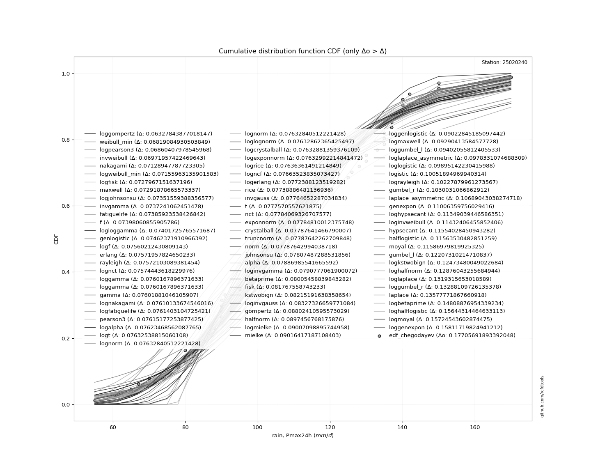</img>

</div>


**5.3. Best fit**

<div align="center">

|   id |   station | empirical_dist   | p_dist   |     delta |   deltao | eval   |   fit |   n |   best_fit |   best_fit_sort |
|-----:|----------:|:-----------------|:---------|----------:|---------:|:-------|------:|----:|-----------:|----------------:|
|    0 |  25020240 | edf_chegodayev   | fisk     | 0.0609027 |  0.18681 | Δo > Δ |     1 |  53 |          1 |               1 |

</div>


<div align="center">

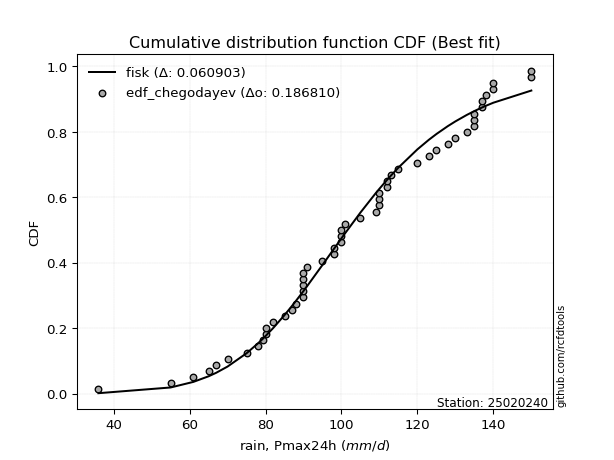</img>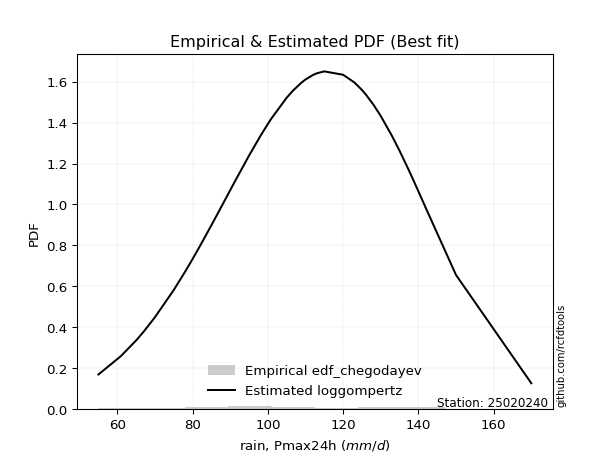</img>

</div>


### 6. Empirical - EDF Blom (1958)

The Blom formula is a specific "plotting position" formula used in hydrology and statistical analysis to estimate the empirical cumulative probability (or non-exceedance probability) of a data series. It is particularly recommended for data that are approximately normally distributed. The constant _a_ is set to 0.375 (or 3/8).

<div align="center">


$P=(m-a)/(n+1-2a)$


</div>


**6.1. Empirical values**

<div align="center">

|                | 0                    | 1                   | 2                   | 3                   | 4                   | 5                  | 6                   | 7                  | 8                  | 9                  | 10                  | 11                  | 12                  | 13                  | 14                 | 15                 | 16                  | 17                  | 18                  | 19                 | 20                 | 21                 | 22                  | 23                  | 24                 | 25                 | 26       | 27                 | 28                 | 29                 | 30                 | 31                 | 32                 | 33                 | 34                 | 35                 | 36                | 37                 | 38                 | 39                 | 40                 | 41                 | 42                 | 43                 | 44                 | 45                 | 46                 | 47                 | 48                 | 49                 | 50                 | 51                 | 52                 |
|:---------------|:---------------------|:--------------------|:--------------------|:--------------------|:--------------------|:-------------------|:--------------------|:-------------------|:-------------------|:-------------------|:--------------------|:--------------------|:--------------------|:--------------------|:-------------------|:-------------------|:--------------------|:--------------------|:--------------------|:-------------------|:-------------------|:-------------------|:--------------------|:--------------------|:-------------------|:-------------------|:---------|:-------------------|:-------------------|:-------------------|:-------------------|:-------------------|:-------------------|:-------------------|:-------------------|:-------------------|:------------------|:-------------------|:-------------------|:-------------------|:-------------------|:-------------------|:-------------------|:-------------------|:-------------------|:-------------------|:-------------------|:-------------------|:-------------------|:-------------------|:-------------------|:-------------------|:-------------------|
| date           | 1985                 | 1971                | 1984                | 1980                | 1982                | 1973               | 1998                | 1983               | 1968               | 1969               | 1967                | 1995                | 1986                | 2001                | 1987               | 1991               | 2008                | 1972                | 1966                | 2015               | 1993               | 2009               | 1975                | 2007                | 2004               | 1992               | 1974     | 1996               | 2000               | 1990               | 1979               | 1981               | 1963               | 2005               | 2003               | 2002               | 1977              | 1994               | 1997               | 2014               | 1999               | 1964               | 2012               | 2010               | 2013               | 2011               | 2006               | 1970               | 1978               | 1989               | 1976               | 1965               | 1988               |
| x              | 36.0                 | 55.0                | 61.0                | 65.0                | 67.0                | 70.0               | 75.0                | 78.0               | 79.4105116071686   | 80.0               | 80.0                | 82.0                | 85.0                | 87.0                | 88.0               | 90.0               | 90.0                | 90.0                | 90.0                | 90.0               | 91.0               | 95.0               | 98.0                | 98.0                | 100.0              | 100.0              | 100.0    | 101.0              | 105.0              | 109.0              | 110.0              | 110.0              | 110.0              | 112.0              | 112.0              | 113.0              | 115.0             | 120.0              | 123.0              | 125.0              | 128.0              | 130.0              | 133.0              | 135.0              | 135.0              | 135.0              | 137.0              | 137.0              | 138.0              | 140.0              | 140.0              | 150.0              | 150.0              |
| m              | 1                    | 2                   | 3                   | 4                   | 5                   | 6                  | 7                   | 8                  | 9                  | 10                 | 11                  | 12                  | 13                  | 14                  | 15                 | 16                 | 17                  | 18                  | 19                  | 20                 | 21                 | 22                 | 23                  | 24                  | 25                 | 26                 | 27       | 28                 | 29                 | 30                 | 31                 | 32                 | 33                 | 34                 | 35                 | 36                 | 37                | 38                 | 39                 | 40                 | 41                 | 42                 | 43                 | 44                 | 45                 | 46                 | 47                 | 48                 | 49                 | 50                 | 51                 | 52                 | 53                 |
| empirical_dist | edf_blom             | edf_blom            | edf_blom            | edf_blom            | edf_blom            | edf_blom           | edf_blom            | edf_blom           | edf_blom           | edf_blom           | edf_blom            | edf_blom            | edf_blom            | edf_blom            | edf_blom           | edf_blom           | edf_blom            | edf_blom            | edf_blom            | edf_blom           | edf_blom           | edf_blom           | edf_blom            | edf_blom            | edf_blom           | edf_blom           | edf_blom | edf_blom           | edf_blom           | edf_blom           | edf_blom           | edf_blom           | edf_blom           | edf_blom           | edf_blom           | edf_blom           | edf_blom          | edf_blom           | edf_blom           | edf_blom           | edf_blom           | edf_blom           | edf_blom           | edf_blom           | edf_blom           | edf_blom           | edf_blom           | edf_blom           | edf_blom           | edf_blom           | edf_blom           | edf_blom           | edf_blom           |
| empirical      | 0.011737089201877934 | 0.03051643192488263 | 0.04929577464788732 | 0.06807511737089202 | 0.08685446009389672 | 0.1056338028169014 | 0.12441314553990611 | 0.1431924882629108 | 0.1619718309859155 | 0.1807511737089202 | 0.19953051643192488 | 0.21830985915492956 | 0.23708920187793428 | 0.25586854460093894 | 0.2746478873239437 | 0.2934272300469484 | 0.31220657276995306 | 0.33098591549295775 | 0.34976525821596244 | 0.3685446009389671 | 0.3873239436619718 | 0.4061032863849765 | 0.42488262910798125 | 0.44366197183098594 | 0.4624413145539906 | 0.4812206572769953 | 0.5      | 0.5187793427230047 | 0.5375586854460094 | 0.5563380281690141 | 0.5751173708920188 | 0.5938967136150235 | 0.6126760563380281 | 0.6314553990610329 | 0.6502347417840375 | 0.6690140845070423 | 0.687793427230047 | 0.7065727699530516 | 0.7253521126760564 | 0.744131455399061  | 0.7629107981220657 | 0.7816901408450704 | 0.8004694835680751 | 0.8192488262910798 | 0.8380281690140845 | 0.8568075117370892 | 0.8755868544600939 | 0.8943661971830986 | 0.9131455399061033 | 0.931924882629108  | 0.9507042253521126 | 0.9694835680751174 | 0.9882629107981221 |
| empirical_tr   | 1.01187648456057     | 1.0314769975786926  | 1.0518518518518518  | 1.0730478589420656  | 1.095115681233933   | 1.1181102362204725 | 1.1420911528150135  | 1.1671232876712327 | 1.1932773109243697 | 1.2206303724928367 | 1.249266862170088   | 1.279279279279279   | 1.3107692307692307  | 1.3438485804416405  | 1.3786407766990292 | 1.415282392026578  | 1.4539249146757678  | 1.4947368421052631  | 1.5379061371841156  | 1.58364312267658   | 1.6321839080459768 | 1.6837944664031619 | 1.7387755102040816  | 1.79746835443038    | 1.8602620087336246 | 1.927601809954751  | 2.0      | 2.078048780487805  | 2.1624365482233503 | 2.253968253968254  | 2.3535911602209945 | 2.46242774566474   | 2.5818181818181816 | 2.7133757961783442 | 2.8590604026845634 | 3.021276595744681  | 3.203007518796993 | 3.408              | 3.6410256410256414 | 3.9082568807339446 | 4.217821782178218  | 4.580645161290322  | 5.011764705882353  | 5.532467532467531  | 6.173913043478261  | 6.983606557377051  | 8.037735849056602  | 9.466666666666669  | 11.513513513513509 | 14.689655172413797 | 20.285714285714267 | 32.769230769230774 | 85.20000000000039  |

</div>


**6.2. Kolmogorov-Smirnov fit test (sorted by Δ)**


<div align="center">

|                | 0                   | 1                   | 2                   | 3                   | 4                   | 5                   | 6                   | 7                   | 8                   | 9                   | 10                  | 11                  | 12                  | 13                  | 14                  | 15                  | 16                  | 17                  | 18                  | 19                  | 20                  | 21                  | 22                  | 23                  | 24                  | 25                  | 26                  | 27                  | 28                  | 29                  | 30                  | 31                  | 32                  | 33                  | 34                  | 35                  | 36                  | 37                  | 38                  | 39                  | 40                  | 41                  | 42                  | 43                  | 44                  | 45                  | 46                  | 47                  | 48                  | 49                  | 50                  | 51                  | 52                  | 53                  | 54                  | 55                  | 56                  | 57                  | 58                  | 59                  | 60                  | 61                  | 62                  | 63                  | 64                  | 65                  | 66                    | 67                  | 68                  | 69                  | 70                  | 71                  | 72                  | 73                  | 74                  | 75                  | 76                  | 77                  | 78                  | 79                  | 80                  | 81                  | 82                  | 83                  | 84                  | 85                  | 86                  | 87                  | 88                  | 89                  | 90                  | 91                  |
|:---------------|:--------------------|:--------------------|:--------------------|:--------------------|:--------------------|:--------------------|:--------------------|:--------------------|:--------------------|:--------------------|:--------------------|:--------------------|:--------------------|:--------------------|:--------------------|:--------------------|:--------------------|:--------------------|:--------------------|:--------------------|:--------------------|:--------------------|:--------------------|:--------------------|:--------------------|:--------------------|:--------------------|:--------------------|:--------------------|:--------------------|:--------------------|:--------------------|:--------------------|:--------------------|:--------------------|:--------------------|:--------------------|:--------------------|:--------------------|:--------------------|:--------------------|:--------------------|:--------------------|:--------------------|:--------------------|:--------------------|:--------------------|:--------------------|:--------------------|:--------------------|:--------------------|:--------------------|:--------------------|:--------------------|:--------------------|:--------------------|:--------------------|:--------------------|:--------------------|:--------------------|:--------------------|:--------------------|:--------------------|:--------------------|:--------------------|:--------------------|:----------------------|:--------------------|:--------------------|:--------------------|:--------------------|:--------------------|:--------------------|:--------------------|:--------------------|:--------------------|:--------------------|:--------------------|:--------------------|:--------------------|:--------------------|:--------------------|:--------------------|:--------------------|:--------------------|:--------------------|:--------------------|:--------------------|:--------------------|:--------------------|:--------------------|:--------------------|
| station        | 25020240            | 25020240            | 25020240            | 25020240            | 25020240            | 25020240            | 25020240            | 25020240            | 25020240            | 25020240            | 25020240            | 25020240            | 25020240            | 25020240            | 25020240            | 25020240            | 25020240            | 25020240            | 25020240            | 25020240            | 25020240            | 25020240            | 25020240            | 25020240            | 25020240            | 25020240            | 25020240            | 25020240            | 25020240            | 25020240            | 25020240            | 25020240            | 25020240            | 25020240            | 25020240            | 25020240            | 25020240            | 25020240            | 25020240            | 25020240            | 25020240            | 25020240            | 25020240            | 25020240            | 25020240            | 25020240            | 25020240            | 25020240            | 25020240            | 25020240            | 25020240            | 25020240            | 25020240            | 25020240            | 25020240            | 25020240            | 25020240            | 25020240            | 25020240            | 25020240            | 25020240            | 25020240            | 25020240            | 25020240            | 25020240            | 25020240            | 25020240              | 25020240            | 25020240            | 25020240            | 25020240            | 25020240            | 25020240            | 25020240            | 25020240            | 25020240            | 25020240            | 25020240            | 25020240            | 25020240            | 25020240            | 25020240            | 25020240            | 25020240            | 25020240            | 25020240            | 25020240            | 25020240            | 25020240            | 25020240            | 25020240            | 25020240            |
| empirical_dist | edf_blom            | edf_blom            | edf_blom            | edf_blom            | edf_blom            | edf_blom            | edf_blom            | edf_blom            | edf_blom            | edf_blom            | edf_blom            | edf_blom            | edf_blom            | edf_blom            | edf_blom            | edf_blom            | edf_blom            | edf_blom            | edf_blom            | edf_blom            | edf_blom            | edf_blom            | edf_blom            | edf_blom            | edf_blom            | edf_blom            | edf_blom            | edf_blom            | edf_blom            | edf_blom            | edf_blom            | edf_blom            | edf_blom            | edf_blom            | edf_blom            | edf_blom            | edf_blom            | edf_blom            | edf_blom            | edf_blom            | edf_blom            | edf_blom            | edf_blom            | edf_blom            | edf_blom            | edf_blom            | edf_blom            | edf_blom            | edf_blom            | edf_blom            | edf_blom            | edf_blom            | edf_blom            | edf_blom            | edf_blom            | edf_blom            | edf_blom            | edf_blom            | edf_blom            | edf_blom            | edf_blom            | edf_blom            | edf_blom            | edf_blom            | edf_blom            | edf_blom            | edf_blom              | edf_blom            | edf_blom            | edf_blom            | edf_blom            | edf_blom            | edf_blom            | edf_blom            | edf_blom            | edf_blom            | edf_blom            | edf_blom            | edf_blom            | edf_blom            | edf_blom            | edf_blom            | edf_blom            | edf_blom            | edf_blom            | edf_blom            | edf_blom            | edf_blom            | edf_blom            | edf_blom            | edf_blom            | edf_blom            |
| p_dist         | fisk                | logfisk             | ncf                 | maxwell             | rayleigh            | chi2                | logpearson3         | logt                | lognorm             | lognorm             | logcrystalball      | loglognorm          | logexponnorm        | logrice             | nakagami            | logncf              | logf                | lognakagami         | betaprime           | erlang              | logfatiguelife      | logdgamma           | alpha               | rice                | gamma               | invgamma            | fatiguelife         | lognct              | f                   | logbetaprime        | johnsonsu           | nct                 | t                   | exponnorm           | crystalball         | truncnorm           | norm                | genlogistic         | loggompertz         | dgamma              | pearson3            | weibull_min         | logweibull_min      | logerlang           | loggumbel_l         | loginvgamma         | logjohnsonsu        | logloggamma         | logchi2             | invgauss            | loglogistic         | loggamma            | loggamma            | logalpha            | loginvgauss         | laplace_asymmetric  | logistic            | mielke              | loggenlogistic      | halfnorm            | invweibull          | logmaxwell          | loghypsecant        | gumbel_r            | kstwobign           | hypsecant           | loglaplace_asymmetric | lograyleigh         | halflogistic        | moyal               | gumbel_l            | loglaplace          | logmielke           | laplace             | loggumbel_r         | loghalfnorm         | loghalflogistic     | logmoyal            | loginvweibull       | logkstwobign        | wald                | gibrat              | logwald             | loggibrat           | loggenexpon         | genexpon            | expon               | pareto              | logexpon            | logpareto           | logtruncnorm        | gompertz            |
| delta          | 0.06227421710051351 | 0.06256938569780912 | 0.06596528321665163 | 0.06732776901736248 | 0.06738855413782108 | 0.06911352230190781 | 0.06957120183010612 | 0.06960483491452374 | 0.06961331785077052 | 0.06961331785077052 | 0.06961354242576645 | 0.06961424740301847 | 0.06961534877351017 | 0.06963039335133081 | 0.06980237939576439 | 0.06986431137595095 | 0.06991031126308722 | 0.06992771745127435 | 0.070180748256635   | 0.07136167059304077 | 0.07154360194538378 | 0.07187656015703192 | 0.07192421980783281 | 0.07227421028607961 | 0.07253588537825228 | 0.07303954022278025 | 0.07320975632044224 | 0.07338937391490785 | 0.07360282650344907 | 0.07380487833240845 | 0.07385698450264877 | 0.07391929076564918 | 0.07392975061027574 | 0.07394654778341037 | 0.07394691429254885 | 0.07394691713165835 | 0.07394691858316971 | 0.07394753036178886 | 0.07418579186015406 | 0.07636324330021427 | 0.07660415051954755 | 0.07770802665546028 | 0.07782216094571215 | 0.07805299706569768 | 0.07842065139405274 | 0.07853180611804195 | 0.08062632956714183 | 0.08080033524500851 | 0.08138701584493607 | 0.08327113805810948 | 0.08530448497906762 | 0.08558596410976888 | 0.08558596410976888 | 0.08704006475381892 | 0.08710363797498683 | 0.08914622827126595 | 0.08981715060032164 | 0.09058415612350235 | 0.09073957420662321 | 0.09189659074474299 | 0.09476668608931205 | 0.09703817709749318 | 0.09782970843066063 | 0.09885530676952414 | 0.10412356896211755 | 0.10492895979032818 | 0.10646967449296152   | 0.10919112221549387 | 0.12006591744828254 | 0.12219659576560682 | 0.12426081235202358 | 0.12617572242721253 | 0.12824140204167056 | 0.1314477672349535  | 0.13307881281005185 | 0.14376666237271135 | 0.15320034820737566 | 0.15439214578453375 | 0.17203342360720753 | 0.19227382977281482 | 0.19507095665708268 | 0.21851316941758098 | 0.21852349022790385 | 0.24637610230714613 | 0.2720505549135985  | 0.32089207194245234 | 0.3211884278322856  | 0.32118845860333883 | 0.3893155238354754  | 0.3893155275594915  | 0.5977848920412512  | 0.6970462848295952  |
| deltao         | 0.18681036697021708 | 0.18681036697021708 | 0.18681036697021708 | 0.18681036697021708 | 0.18681036697021708 | 0.18681036697021708 | 0.18681036697021708 | 0.18681036697021708 | 0.18681036697021708 | 0.18681036697021708 | 0.18681036697021708 | 0.18681036697021708 | 0.18681036697021708 | 0.18681036697021708 | 0.18681036697021708 | 0.18681036697021708 | 0.18681036697021708 | 0.18681036697021708 | 0.18681036697021708 | 0.18681036697021708 | 0.18681036697021708 | 0.18681036697021708 | 0.18681036697021708 | 0.18681036697021708 | 0.18681036697021708 | 0.18681036697021708 | 0.18681036697021708 | 0.18681036697021708 | 0.18681036697021708 | 0.18681036697021708 | 0.18681036697021708 | 0.18681036697021708 | 0.18681036697021708 | 0.18681036697021708 | 0.18681036697021708 | 0.18681036697021708 | 0.18681036697021708 | 0.18681036697021708 | 0.18681036697021708 | 0.18681036697021708 | 0.18681036697021708 | 0.18681036697021708 | 0.18681036697021708 | 0.18681036697021708 | 0.18681036697021708 | 0.18681036697021708 | 0.18681036697021708 | 0.18681036697021708 | 0.18681036697021708 | 0.18681036697021708 | 0.18681036697021708 | 0.18681036697021708 | 0.18681036697021708 | 0.18681036697021708 | 0.18681036697021708 | 0.18681036697021708 | 0.18681036697021708 | 0.18681036697021708 | 0.18681036697021708 | 0.18681036697021708 | 0.18681036697021708 | 0.18681036697021708 | 0.18681036697021708 | 0.18681036697021708 | 0.18681036697021708 | 0.18681036697021708 | 0.18681036697021708   | 0.18681036697021708 | 0.18681036697021708 | 0.18681036697021708 | 0.18681036697021708 | 0.18681036697021708 | 0.18681036697021708 | 0.18681036697021708 | 0.18681036697021708 | 0.18681036697021708 | 0.18681036697021708 | 0.18681036697021708 | 0.18681036697021708 | 0.18681036697021708 | 0.18681036697021708 | 0.18681036697021708 | 0.18681036697021708 | 0.18681036697021708 | 0.18681036697021708 | 0.18681036697021708 | 0.18681036697021708 | 0.18681036697021708 | 0.18681036697021708 | 0.18681036697021708 | 0.18681036697021708 | 0.18681036697021708 |
| eval           | Δo > Δ              | Δo > Δ              | Δo > Δ              | Δo > Δ              | Δo > Δ              | Δo > Δ              | Δo > Δ              | Δo > Δ              | Δo > Δ              | Δo > Δ              | Δo > Δ              | Δo > Δ              | Δo > Δ              | Δo > Δ              | Δo > Δ              | Δo > Δ              | Δo > Δ              | Δo > Δ              | Δo > Δ              | Δo > Δ              | Δo > Δ              | Δo > Δ              | Δo > Δ              | Δo > Δ              | Δo > Δ              | Δo > Δ              | Δo > Δ              | Δo > Δ              | Δo > Δ              | Δo > Δ              | Δo > Δ              | Δo > Δ              | Δo > Δ              | Δo > Δ              | Δo > Δ              | Δo > Δ              | Δo > Δ              | Δo > Δ              | Δo > Δ              | Δo > Δ              | Δo > Δ              | Δo > Δ              | Δo > Δ              | Δo > Δ              | Δo > Δ              | Δo > Δ              | Δo > Δ              | Δo > Δ              | Δo > Δ              | Δo > Δ              | Δo > Δ              | Δo > Δ              | Δo > Δ              | Δo > Δ              | Δo > Δ              | Δo > Δ              | Δo > Δ              | Δo > Δ              | Δo > Δ              | Δo > Δ              | Δo > Δ              | Δo > Δ              | Δo > Δ              | Δo > Δ              | Δo > Δ              | Δo > Δ              | Δo > Δ                | Δo > Δ              | Δo > Δ              | Δo > Δ              | Δo > Δ              | Δo > Δ              | Δo > Δ              | Δo > Δ              | Δo > Δ              | Δo > Δ              | Δo > Δ              | Δo > Δ              | Δo > Δ              | Δo <= Δ             | Δo <= Δ             | Δo <= Δ             | Δo <= Δ             | Δo <= Δ             | Δo <= Δ             | Δo <= Δ             | Δo <= Δ             | Δo <= Δ             | Δo <= Δ             | Δo <= Δ             | Δo <= Δ             | Δo <= Δ             |
| fit            | 1                   | 1                   | 1                   | 1                   | 1                   | 1                   | 1                   | 1                   | 1                   | 1                   | 1                   | 1                   | 1                   | 1                   | 1                   | 1                   | 1                   | 1                   | 1                   | 1                   | 1                   | 1                   | 1                   | 1                   | 1                   | 1                   | 1                   | 1                   | 1                   | 1                   | 1                   | 1                   | 1                   | 1                   | 1                   | 1                   | 1                   | 1                   | 1                   | 1                   | 1                   | 1                   | 1                   | 1                   | 1                   | 1                   | 1                   | 1                   | 1                   | 1                   | 1                   | 1                   | 1                   | 1                   | 1                   | 1                   | 1                   | 1                   | 1                   | 1                   | 1                   | 1                   | 1                   | 1                   | 1                   | 1                   | 1                     | 1                   | 1                   | 1                   | 1                   | 1                   | 1                   | 1                   | 1                   | 1                   | 1                   | 1                   | 1                   | 0                   | 0                   | 0                   | 0                   | 0                   | 0                   | 0                   | 0                   | 0                   | 0                   | 0                   | 0                   | 0                   |
| n              | 53                  | 53                  | 53                  | 53                  | 53                  | 53                  | 53                  | 53                  | 53                  | 53                  | 53                  | 53                  | 53                  | 53                  | 53                  | 53                  | 53                  | 53                  | 53                  | 53                  | 53                  | 53                  | 53                  | 53                  | 53                  | 53                  | 53                  | 53                  | 53                  | 53                  | 53                  | 53                  | 53                  | 53                  | 53                  | 53                  | 53                  | 53                  | 53                  | 53                  | 53                  | 53                  | 53                  | 53                  | 53                  | 53                  | 53                  | 53                  | 53                  | 53                  | 53                  | 53                  | 53                  | 53                  | 53                  | 53                  | 53                  | 53                  | 53                  | 53                  | 53                  | 53                  | 53                  | 53                  | 53                  | 53                  | 53                    | 53                  | 53                  | 53                  | 53                  | 53                  | 53                  | 53                  | 53                  | 53                  | 53                  | 53                  | 53                  | 53                  | 53                  | 53                  | 53                  | 53                  | 53                  | 53                  | 53                  | 53                  | 53                  | 53                  | 53                  | 53                  |
| best_fit       | 1                   | 0                   | 0                   | 0                   | 0                   | 0                   | 0                   | 0                   | 0                   | 0                   | 0                   | 0                   | 0                   | 0                   | 0                   | 0                   | 0                   | 0                   | 0                   | 0                   | 0                   | 0                   | 0                   | 0                   | 0                   | 0                   | 0                   | 0                   | 0                   | 0                   | 0                   | 0                   | 0                   | 0                   | 0                   | 0                   | 0                   | 0                   | 0                   | 0                   | 0                   | 0                   | 0                   | 0                   | 0                   | 0                   | 0                   | 0                   | 0                   | 0                   | 0                   | 0                   | 0                   | 0                   | 0                   | 0                   | 0                   | 0                   | 0                   | 0                   | 0                   | 0                   | 0                   | 0                   | 0                   | 0                   | 0                     | 0                   | 0                   | 0                   | 0                   | 0                   | 0                   | 0                   | 0                   | 0                   | 0                   | 0                   | 0                   | 0                   | 0                   | 0                   | 0                   | 0                   | 0                   | 0                   | 0                   | 0                   | 0                   | 0                   | 0                   | 0                   |
| best_fit_sort  | 1                   | 2                   | 3                   | 4                   | 5                   | 6                   | 7                   | 8                   | 9                   | 10                  | 11                  | 12                  | 13                  | 14                  | 15                  | 16                  | 17                  | 18                  | 19                  | 20                  | 21                  | 22                  | 23                  | 24                  | 25                  | 26                  | 27                  | 28                  | 29                  | 30                  | 31                  | 32                  | 33                  | 34                  | 35                  | 36                  | 37                  | 38                  | 39                  | 40                  | 41                  | 42                  | 43                  | 44                  | 45                  | 46                  | 47                  | 48                  | 49                  | 50                  | 51                  | 52                  | 53                  | 54                  | 55                  | 56                  | 57                  | 58                  | 59                  | 60                  | 61                  | 62                  | 63                  | 64                  | 65                  | 66                  | 67                    | 68                  | 69                  | 70                  | 71                  | 72                  | 73                  | 74                  | 75                  | 76                  | 77                  | 78                  | 79                  | 80                  | 81                  | 82                  | 83                  | 84                  | 85                  | 86                  | 87                  | 88                  | 89                  | 90                  | 91                  | 92                  |

</div>


<div align="center">

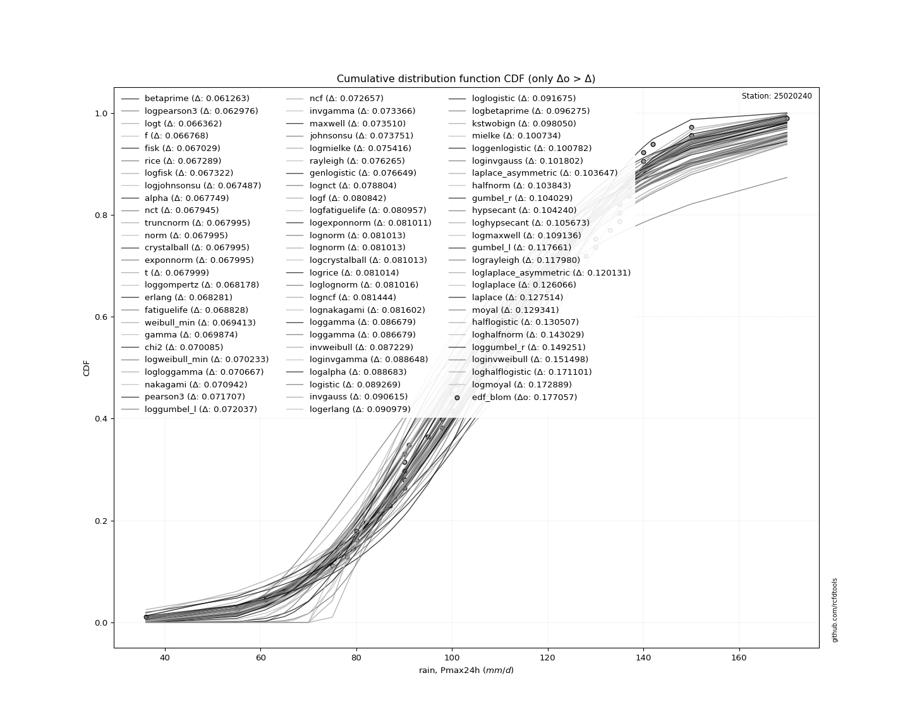</img>

</div>


**6.3. Best fit**

<div align="center">

|   id |   station | empirical_dist   | p_dist   |     delta |   deltao | eval   |   fit |   n |   best_fit |   best_fit_sort |
|-----:|----------:|:-----------------|:---------|----------:|---------:|:-------|------:|----:|-----------:|----------------:|
|    0 |  25020240 | edf_blom         | fisk     | 0.0622742 |  0.18681 | Δo > Δ |     1 |  53 |          1 |               1 |

</div>


<div align="center">

</img>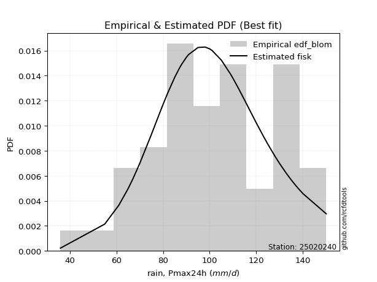</img>

</div>


### 7. Empirical - EDF Tukey (1962)

In hydrology, the Tukey formula is used as a plotting position formula to estimate the empirical probability or frequency of a flood event (or other hydrological data). The formula parameter is given as _c=0.333_ (or 1/3).

<div align="center">


$P=(m-c)/(n+1-2c)$


</div>


**7.1. Empirical values**

<div align="center">

|                | 0                  | 1                 | 2                  | 3                  | 4                 | 5                  | 6                  | 7                  | 8                  | 9                  | 10        | 11        | 12                 | 13                 | 14                 | 15                | 16                 | 17                 | 18                 | 19                 | 20                 | 21                 | 22                 | 23                | 24                 | 25                 | 26        | 27                | 28                | 29                 | 30                | 31                 | 32                | 33                | 34                | 35                 | 36        | 37                 | 38                 | 39                 | 40                | 41                | 42                | 43                | 44                | 45                | 46        | 47                | 48                 | 49                | 50                 | 51        | 52                |
|:---------------|:-------------------|:------------------|:-------------------|:-------------------|:------------------|:-------------------|:-------------------|:-------------------|:-------------------|:-------------------|:----------|:----------|:-------------------|:-------------------|:-------------------|:------------------|:-------------------|:-------------------|:-------------------|:-------------------|:-------------------|:-------------------|:-------------------|:------------------|:-------------------|:-------------------|:----------|:------------------|:------------------|:-------------------|:------------------|:-------------------|:------------------|:------------------|:------------------|:-------------------|:----------|:-------------------|:-------------------|:-------------------|:------------------|:------------------|:------------------|:------------------|:------------------|:------------------|:----------|:------------------|:-------------------|:------------------|:-------------------|:----------|:------------------|
| date           | 1985               | 1971              | 1984               | 1980               | 1982              | 1973               | 1998               | 1983               | 1968               | 1969               | 1967      | 1995      | 1986               | 2001               | 1987               | 1991              | 2008               | 1972               | 1966               | 2015               | 1993               | 2009               | 1975               | 2007              | 2004               | 1992               | 1974      | 1996              | 2000              | 1990               | 1979              | 1981               | 1963              | 2005              | 2003              | 2002               | 1977      | 1994               | 1997               | 2014               | 1999              | 1964              | 2012              | 2010              | 2013              | 2011              | 2006      | 1970              | 1978               | 1989              | 1976               | 1965      | 1988              |
| x              | 36.0               | 55.0              | 61.0               | 65.0               | 67.0              | 70.0               | 75.0               | 78.0               | 79.4105116071686   | 80.0               | 80.0      | 82.0      | 85.0               | 87.0               | 88.0               | 90.0              | 90.0               | 90.0               | 90.0               | 90.0               | 91.0               | 95.0               | 98.0               | 98.0              | 100.0              | 100.0              | 100.0     | 101.0             | 105.0             | 109.0              | 110.0             | 110.0              | 110.0             | 112.0             | 112.0             | 113.0              | 115.0     | 120.0              | 123.0              | 125.0              | 128.0             | 130.0             | 133.0             | 135.0             | 135.0             | 135.0             | 137.0     | 137.0             | 138.0              | 140.0             | 140.0              | 150.0     | 150.0             |
| m              | 1                  | 2                 | 3                  | 4                  | 5                 | 6                  | 7                  | 8                  | 9                  | 10                 | 11        | 12        | 13                 | 14                 | 15                 | 16                | 17                 | 18                 | 19                 | 20                 | 21                 | 22                 | 23                 | 24                | 25                 | 26                 | 27        | 28                | 29                | 30                 | 31                | 32                 | 33                | 34                | 35                | 36                 | 37        | 38                 | 39                 | 40                 | 41                | 42                | 43                | 44                | 45                | 46                | 47        | 48                | 49                 | 50                | 51                 | 52        | 53                |
| empirical_dist | edf_tukey          | edf_tukey         | edf_tukey          | edf_tukey          | edf_tukey         | edf_tukey          | edf_tukey          | edf_tukey          | edf_tukey          | edf_tukey          | edf_tukey | edf_tukey | edf_tukey          | edf_tukey          | edf_tukey          | edf_tukey         | edf_tukey          | edf_tukey          | edf_tukey          | edf_tukey          | edf_tukey          | edf_tukey          | edf_tukey          | edf_tukey         | edf_tukey          | edf_tukey          | edf_tukey | edf_tukey         | edf_tukey         | edf_tukey          | edf_tukey         | edf_tukey          | edf_tukey         | edf_tukey         | edf_tukey         | edf_tukey          | edf_tukey | edf_tukey          | edf_tukey          | edf_tukey          | edf_tukey         | edf_tukey         | edf_tukey         | edf_tukey         | edf_tukey         | edf_tukey         | edf_tukey | edf_tukey         | edf_tukey          | edf_tukey         | edf_tukey          | edf_tukey | edf_tukey         |
| empirical      | 0.0125             | 0.03125           | 0.05               | 0.06875            | 0.0875            | 0.10625            | 0.125              | 0.14375            | 0.1625             | 0.18125            | 0.2       | 0.21875   | 0.2375             | 0.25625            | 0.275              | 0.29375           | 0.3125             | 0.33125            | 0.35               | 0.36875            | 0.3875             | 0.40625            | 0.425              | 0.44375           | 0.4625             | 0.48125            | 0.5       | 0.51875           | 0.5375            | 0.55625            | 0.575             | 0.59375            | 0.6125            | 0.63125           | 0.65              | 0.66875            | 0.6875    | 0.70625            | 0.725              | 0.74375            | 0.7625            | 0.78125           | 0.8               | 0.81875           | 0.8375            | 0.85625           | 0.875     | 0.89375           | 0.9125             | 0.93125           | 0.95               | 0.96875   | 0.9875            |
| empirical_tr   | 1.0126582278481011 | 1.032258064516129 | 1.0526315789473684 | 1.0738255033557047 | 1.095890410958904 | 1.1188811188811187 | 1.1428571428571428 | 1.1678832116788322 | 1.1940298507462686 | 1.2213740458015268 | 1.25      | 1.28      | 1.3114754098360657 | 1.3445378151260503 | 1.3793103448275863 | 1.415929203539823 | 1.4545454545454546 | 1.4953271028037385 | 1.5384615384615383 | 1.5841584158415842 | 1.6326530612244896 | 1.6842105263157894 | 1.7391304347826089 | 1.797752808988764 | 1.8604651162790697 | 1.9277108433734937 | 2.0       | 2.077922077922078 | 2.162162162162162 | 2.2535211267605635 | 2.352941176470588 | 2.4615384615384617 | 2.580645161290323 | 2.711864406779661 | 2.857142857142857 | 3.0188679245283017 | 3.2       | 3.4042553191489366 | 3.6363636363636362 | 3.9024390243902443 | 4.210526315789473 | 4.571428571428571 | 5.000000000000001 | 5.517241379310344 | 6.153846153846155 | 6.956521739130433 | 8.0       | 9.411764705882357 | 11.428571428571425 | 14.54545454545455 | 19.999999999999982 | 32.0      | 80.00000000000028 |

</div>


**7.2. Kolmogorov-Smirnov fit test (sorted by Δ)**


<div align="center">

|                | 0                   | 1                   | 2                   | 3                   | 4                   | 5                   | 6                   | 7                   | 8                   | 9                   | 10                  | 11                  | 12                  | 13                  | 14                  | 15                  | 16                  | 17                  | 18                  | 19                  | 20                  | 21                  | 22                  | 23                  | 24                  | 25                  | 26                  | 27                  | 28                  | 29                  | 30                  | 31                  | 32                  | 33                  | 34                  | 35                  | 36                  | 37                  | 38                  | 39                  | 40                  | 41                  | 42                  | 43                  | 44                  | 45                  | 46                  | 47                  | 48                  | 49                  | 50                  | 51                  | 52                  | 53                  | 54                  | 55                  | 56                  | 57                  | 58                  | 59                  | 60                  | 61                  | 62                  | 63                  | 64                  | 65                  | 66                    | 67                  | 68                  | 69                  | 70                  | 71                  | 72                  | 73                  | 74                  | 75                  | 76                  | 77                  | 78                  | 79                  | 80                  | 81                  | 82                  | 83                  | 84                  | 85                  | 86                  | 87                  | 88                  | 89                  | 90                  | 91                  |
|:---------------|:--------------------|:--------------------|:--------------------|:--------------------|:--------------------|:--------------------|:--------------------|:--------------------|:--------------------|:--------------------|:--------------------|:--------------------|:--------------------|:--------------------|:--------------------|:--------------------|:--------------------|:--------------------|:--------------------|:--------------------|:--------------------|:--------------------|:--------------------|:--------------------|:--------------------|:--------------------|:--------------------|:--------------------|:--------------------|:--------------------|:--------------------|:--------------------|:--------------------|:--------------------|:--------------------|:--------------------|:--------------------|:--------------------|:--------------------|:--------------------|:--------------------|:--------------------|:--------------------|:--------------------|:--------------------|:--------------------|:--------------------|:--------------------|:--------------------|:--------------------|:--------------------|:--------------------|:--------------------|:--------------------|:--------------------|:--------------------|:--------------------|:--------------------|:--------------------|:--------------------|:--------------------|:--------------------|:--------------------|:--------------------|:--------------------|:--------------------|:----------------------|:--------------------|:--------------------|:--------------------|:--------------------|:--------------------|:--------------------|:--------------------|:--------------------|:--------------------|:--------------------|:--------------------|:--------------------|:--------------------|:--------------------|:--------------------|:--------------------|:--------------------|:--------------------|:--------------------|:--------------------|:--------------------|:--------------------|:--------------------|:--------------------|:--------------------|
| station        | 25020240            | 25020240            | 25020240            | 25020240            | 25020240            | 25020240            | 25020240            | 25020240            | 25020240            | 25020240            | 25020240            | 25020240            | 25020240            | 25020240            | 25020240            | 25020240            | 25020240            | 25020240            | 25020240            | 25020240            | 25020240            | 25020240            | 25020240            | 25020240            | 25020240            | 25020240            | 25020240            | 25020240            | 25020240            | 25020240            | 25020240            | 25020240            | 25020240            | 25020240            | 25020240            | 25020240            | 25020240            | 25020240            | 25020240            | 25020240            | 25020240            | 25020240            | 25020240            | 25020240            | 25020240            | 25020240            | 25020240            | 25020240            | 25020240            | 25020240            | 25020240            | 25020240            | 25020240            | 25020240            | 25020240            | 25020240            | 25020240            | 25020240            | 25020240            | 25020240            | 25020240            | 25020240            | 25020240            | 25020240            | 25020240            | 25020240            | 25020240              | 25020240            | 25020240            | 25020240            | 25020240            | 25020240            | 25020240            | 25020240            | 25020240            | 25020240            | 25020240            | 25020240            | 25020240            | 25020240            | 25020240            | 25020240            | 25020240            | 25020240            | 25020240            | 25020240            | 25020240            | 25020240            | 25020240            | 25020240            | 25020240            | 25020240            |
| empirical_dist | edf_tukey           | edf_tukey           | edf_tukey           | edf_tukey           | edf_tukey           | edf_tukey           | edf_tukey           | edf_tukey           | edf_tukey           | edf_tukey           | edf_tukey           | edf_tukey           | edf_tukey           | edf_tukey           | edf_tukey           | edf_tukey           | edf_tukey           | edf_tukey           | edf_tukey           | edf_tukey           | edf_tukey           | edf_tukey           | edf_tukey           | edf_tukey           | edf_tukey           | edf_tukey           | edf_tukey           | edf_tukey           | edf_tukey           | edf_tukey           | edf_tukey           | edf_tukey           | edf_tukey           | edf_tukey           | edf_tukey           | edf_tukey           | edf_tukey           | edf_tukey           | edf_tukey           | edf_tukey           | edf_tukey           | edf_tukey           | edf_tukey           | edf_tukey           | edf_tukey           | edf_tukey           | edf_tukey           | edf_tukey           | edf_tukey           | edf_tukey           | edf_tukey           | edf_tukey           | edf_tukey           | edf_tukey           | edf_tukey           | edf_tukey           | edf_tukey           | edf_tukey           | edf_tukey           | edf_tukey           | edf_tukey           | edf_tukey           | edf_tukey           | edf_tukey           | edf_tukey           | edf_tukey           | edf_tukey             | edf_tukey           | edf_tukey           | edf_tukey           | edf_tukey           | edf_tukey           | edf_tukey           | edf_tukey           | edf_tukey           | edf_tukey           | edf_tukey           | edf_tukey           | edf_tukey           | edf_tukey           | edf_tukey           | edf_tukey           | edf_tukey           | edf_tukey           | edf_tukey           | edf_tukey           | edf_tukey           | edf_tukey           | edf_tukey           | edf_tukey           | edf_tukey           | edf_tukey           |
| p_dist         | fisk                | logfisk             | ncf                 | rayleigh            | maxwell             | chi2                | logt                | lognorm             | lognorm             | logcrystalball      | loglognorm          | logexponnorm        | logrice             | logpearson3         | logncf              | logf                | lognakagami         | betaprime           | nakagami            | logdgamma           | logfatiguelife      | erlang              | alpha               | rice                | gamma               | lognct              | invgamma            | fatiguelife         | logbetaprime        | f                   | genlogistic         | johnsonsu           | nct                 | t                   | exponnorm           | crystalball         | truncnorm           | norm                | loggompertz         | pearson3            | dgamma              | logerlang           | weibull_min         | logweibull_min      | loginvgamma         | loggumbel_l         | logjohnsonsu        | logloggamma         | logchi2             | invgauss            | loggamma            | loggamma            | loglogistic         | logalpha            | loginvgauss         | laplace_asymmetric  | logistic            | mielke              | loggenlogistic      | halfnorm            | invweibull          | logmaxwell          | loghypsecant        | gumbel_r            | kstwobign           | hypsecant           | loglaplace_asymmetric | lograyleigh         | halflogistic        | moyal               | gumbel_l            | loglaplace          | logmielke           | laplace             | loggumbel_r         | loghalfnorm         | loghalflogistic     | logmoyal            | loginvweibull       | logkstwobign        | wald                | logwald             | gibrat              | loggibrat           | loggenexpon         | genexpon            | expon               | pareto              | logexpon            | logpareto           | logtruncnorm        | gompertz            |
| delta          | 0.06151130630239143 | 0.06180647489968705 | 0.06605331138566573 | 0.06747658230683518 | 0.06779725258543756 | 0.0695830058699829  | 0.06969286308353784 | 0.06970134601978462 | 0.06970134601978462 | 0.06970157059478055 | 0.06970227557203257 | 0.06970337694252426 | 0.06971842152034491 | 0.06974725816813432 | 0.06995233954496505 | 0.06999833943210132 | 0.07001574562028845 | 0.0702687764256491  | 0.07027186296383947 | 0.07117233480491925 | 0.07163163011439788 | 0.07183115416111585 | 0.07239370337590789 | 0.07274369385415469 | 0.07300536894632736 | 0.07347740208392195 | 0.07350902379085533 | 0.07367923988851732 | 0.07389290650142255 | 0.07407231007152415 | 0.07412358669981706 | 0.07432646807072385 | 0.07438877433372426 | 0.07439923417835081 | 0.07441603135148545 | 0.07441639786062393 | 0.07441640069973343 | 0.07441640215124479 | 0.07465527542822914 | 0.07678020685757575 | 0.07683272686828935 | 0.07773022711264604 | 0.07788408299348848 | 0.07799821728374035 | 0.07820903616499031 | 0.07889013496212782 | 0.08080238590517003 | 0.08097639158303671 | 0.08106424589188443 | 0.08256691270599681 | 0.08526319415671724 | 0.08526319415671724 | 0.08539251314808172 | 0.08671729480076729 | 0.08678086802193519 | 0.08923425644028005 | 0.08999320693834983 | 0.09076021246153054 | 0.0909156305446514  | 0.09198461891375709 | 0.09406246073719937 | 0.09671540714444155 | 0.09791773659967473 | 0.09894333493853824 | 0.10380079900906591 | 0.10510501612835638 | 0.10655770266197562   | 0.10886835226244224 | 0.12015394561729664 | 0.12228462393462092 | 0.12423146962901888 | 0.12626375059622663 | 0.12797731753462827 | 0.1316238235729817  | 0.13316684097906595 | 0.1434438924196597  | 0.15287757825432402 | 0.15448017395354785 | 0.17127051280908545 | 0.19171631803572564 | 0.19554044022515782 | 0.2184061193358851  | 0.21892396753964669 | 0.24646413047616023 | 0.2714930431765093  | 0.32033456020536316 | 0.3206309160951964  | 0.32063094686624966 | 0.38872866937538153 | 0.3887286730993976  | 0.5972273803041621  | 0.6966648294305342  |
| deltao         | 0.18681036697021708 | 0.18681036697021708 | 0.18681036697021708 | 0.18681036697021708 | 0.18681036697021708 | 0.18681036697021708 | 0.18681036697021708 | 0.18681036697021708 | 0.18681036697021708 | 0.18681036697021708 | 0.18681036697021708 | 0.18681036697021708 | 0.18681036697021708 | 0.18681036697021708 | 0.18681036697021708 | 0.18681036697021708 | 0.18681036697021708 | 0.18681036697021708 | 0.18681036697021708 | 0.18681036697021708 | 0.18681036697021708 | 0.18681036697021708 | 0.18681036697021708 | 0.18681036697021708 | 0.18681036697021708 | 0.18681036697021708 | 0.18681036697021708 | 0.18681036697021708 | 0.18681036697021708 | 0.18681036697021708 | 0.18681036697021708 | 0.18681036697021708 | 0.18681036697021708 | 0.18681036697021708 | 0.18681036697021708 | 0.18681036697021708 | 0.18681036697021708 | 0.18681036697021708 | 0.18681036697021708 | 0.18681036697021708 | 0.18681036697021708 | 0.18681036697021708 | 0.18681036697021708 | 0.18681036697021708 | 0.18681036697021708 | 0.18681036697021708 | 0.18681036697021708 | 0.18681036697021708 | 0.18681036697021708 | 0.18681036697021708 | 0.18681036697021708 | 0.18681036697021708 | 0.18681036697021708 | 0.18681036697021708 | 0.18681036697021708 | 0.18681036697021708 | 0.18681036697021708 | 0.18681036697021708 | 0.18681036697021708 | 0.18681036697021708 | 0.18681036697021708 | 0.18681036697021708 | 0.18681036697021708 | 0.18681036697021708 | 0.18681036697021708 | 0.18681036697021708 | 0.18681036697021708   | 0.18681036697021708 | 0.18681036697021708 | 0.18681036697021708 | 0.18681036697021708 | 0.18681036697021708 | 0.18681036697021708 | 0.18681036697021708 | 0.18681036697021708 | 0.18681036697021708 | 0.18681036697021708 | 0.18681036697021708 | 0.18681036697021708 | 0.18681036697021708 | 0.18681036697021708 | 0.18681036697021708 | 0.18681036697021708 | 0.18681036697021708 | 0.18681036697021708 | 0.18681036697021708 | 0.18681036697021708 | 0.18681036697021708 | 0.18681036697021708 | 0.18681036697021708 | 0.18681036697021708 | 0.18681036697021708 |
| eval           | Δo > Δ              | Δo > Δ              | Δo > Δ              | Δo > Δ              | Δo > Δ              | Δo > Δ              | Δo > Δ              | Δo > Δ              | Δo > Δ              | Δo > Δ              | Δo > Δ              | Δo > Δ              | Δo > Δ              | Δo > Δ              | Δo > Δ              | Δo > Δ              | Δo > Δ              | Δo > Δ              | Δo > Δ              | Δo > Δ              | Δo > Δ              | Δo > Δ              | Δo > Δ              | Δo > Δ              | Δo > Δ              | Δo > Δ              | Δo > Δ              | Δo > Δ              | Δo > Δ              | Δo > Δ              | Δo > Δ              | Δo > Δ              | Δo > Δ              | Δo > Δ              | Δo > Δ              | Δo > Δ              | Δo > Δ              | Δo > Δ              | Δo > Δ              | Δo > Δ              | Δo > Δ              | Δo > Δ              | Δo > Δ              | Δo > Δ              | Δo > Δ              | Δo > Δ              | Δo > Δ              | Δo > Δ              | Δo > Δ              | Δo > Δ              | Δo > Δ              | Δo > Δ              | Δo > Δ              | Δo > Δ              | Δo > Δ              | Δo > Δ              | Δo > Δ              | Δo > Δ              | Δo > Δ              | Δo > Δ              | Δo > Δ              | Δo > Δ              | Δo > Δ              | Δo > Δ              | Δo > Δ              | Δo > Δ              | Δo > Δ                | Δo > Δ              | Δo > Δ              | Δo > Δ              | Δo > Δ              | Δo > Δ              | Δo > Δ              | Δo > Δ              | Δo > Δ              | Δo > Δ              | Δo > Δ              | Δo > Δ              | Δo > Δ              | Δo <= Δ             | Δo <= Δ             | Δo <= Δ             | Δo <= Δ             | Δo <= Δ             | Δo <= Δ             | Δo <= Δ             | Δo <= Δ             | Δo <= Δ             | Δo <= Δ             | Δo <= Δ             | Δo <= Δ             | Δo <= Δ             |
| fit            | 1                   | 1                   | 1                   | 1                   | 1                   | 1                   | 1                   | 1                   | 1                   | 1                   | 1                   | 1                   | 1                   | 1                   | 1                   | 1                   | 1                   | 1                   | 1                   | 1                   | 1                   | 1                   | 1                   | 1                   | 1                   | 1                   | 1                   | 1                   | 1                   | 1                   | 1                   | 1                   | 1                   | 1                   | 1                   | 1                   | 1                   | 1                   | 1                   | 1                   | 1                   | 1                   | 1                   | 1                   | 1                   | 1                   | 1                   | 1                   | 1                   | 1                   | 1                   | 1                   | 1                   | 1                   | 1                   | 1                   | 1                   | 1                   | 1                   | 1                   | 1                   | 1                   | 1                   | 1                   | 1                   | 1                   | 1                     | 1                   | 1                   | 1                   | 1                   | 1                   | 1                   | 1                   | 1                   | 1                   | 1                   | 1                   | 1                   | 0                   | 0                   | 0                   | 0                   | 0                   | 0                   | 0                   | 0                   | 0                   | 0                   | 0                   | 0                   | 0                   |
| n              | 53                  | 53                  | 53                  | 53                  | 53                  | 53                  | 53                  | 53                  | 53                  | 53                  | 53                  | 53                  | 53                  | 53                  | 53                  | 53                  | 53                  | 53                  | 53                  | 53                  | 53                  | 53                  | 53                  | 53                  | 53                  | 53                  | 53                  | 53                  | 53                  | 53                  | 53                  | 53                  | 53                  | 53                  | 53                  | 53                  | 53                  | 53                  | 53                  | 53                  | 53                  | 53                  | 53                  | 53                  | 53                  | 53                  | 53                  | 53                  | 53                  | 53                  | 53                  | 53                  | 53                  | 53                  | 53                  | 53                  | 53                  | 53                  | 53                  | 53                  | 53                  | 53                  | 53                  | 53                  | 53                  | 53                  | 53                    | 53                  | 53                  | 53                  | 53                  | 53                  | 53                  | 53                  | 53                  | 53                  | 53                  | 53                  | 53                  | 53                  | 53                  | 53                  | 53                  | 53                  | 53                  | 53                  | 53                  | 53                  | 53                  | 53                  | 53                  | 53                  |
| best_fit       | 1                   | 0                   | 0                   | 0                   | 0                   | 0                   | 0                   | 0                   | 0                   | 0                   | 0                   | 0                   | 0                   | 0                   | 0                   | 0                   | 0                   | 0                   | 0                   | 0                   | 0                   | 0                   | 0                   | 0                   | 0                   | 0                   | 0                   | 0                   | 0                   | 0                   | 0                   | 0                   | 0                   | 0                   | 0                   | 0                   | 0                   | 0                   | 0                   | 0                   | 0                   | 0                   | 0                   | 0                   | 0                   | 0                   | 0                   | 0                   | 0                   | 0                   | 0                   | 0                   | 0                   | 0                   | 0                   | 0                   | 0                   | 0                   | 0                   | 0                   | 0                   | 0                   | 0                   | 0                   | 0                   | 0                   | 0                     | 0                   | 0                   | 0                   | 0                   | 0                   | 0                   | 0                   | 0                   | 0                   | 0                   | 0                   | 0                   | 0                   | 0                   | 0                   | 0                   | 0                   | 0                   | 0                   | 0                   | 0                   | 0                   | 0                   | 0                   | 0                   |
| best_fit_sort  | 1                   | 2                   | 3                   | 4                   | 5                   | 6                   | 7                   | 8                   | 9                   | 10                  | 11                  | 12                  | 13                  | 14                  | 15                  | 16                  | 17                  | 18                  | 19                  | 20                  | 21                  | 22                  | 23                  | 24                  | 25                  | 26                  | 27                  | 28                  | 29                  | 30                  | 31                  | 32                  | 33                  | 34                  | 35                  | 36                  | 37                  | 38                  | 39                  | 40                  | 41                  | 42                  | 43                  | 44                  | 45                  | 46                  | 47                  | 48                  | 49                  | 50                  | 51                  | 52                  | 53                  | 54                  | 55                  | 56                  | 57                  | 58                  | 59                  | 60                  | 61                  | 62                  | 63                  | 64                  | 65                  | 66                  | 67                    | 68                  | 69                  | 70                  | 71                  | 72                  | 73                  | 74                  | 75                  | 76                  | 77                  | 78                  | 79                  | 80                  | 81                  | 82                  | 83                  | 84                  | 85                  | 86                  | 87                  | 88                  | 89                  | 90                  | 91                  | 92                  |

</div>


<div align="center">

</img>

</div>


**7.3. Best fit**

<div align="center">

|   id |   station | empirical_dist   | p_dist   |     delta |   deltao | eval   |   fit |   n |   best_fit |   best_fit_sort |
|-----:|----------:|:-----------------|:---------|----------:|---------:|:-------|------:|----:|-----------:|----------------:|
|    0 |  25020240 | edf_tukey        | fisk     | 0.0615113 |  0.18681 | Δo > Δ |     1 |  53 |          1 |               1 |

</div>


<div align="center">

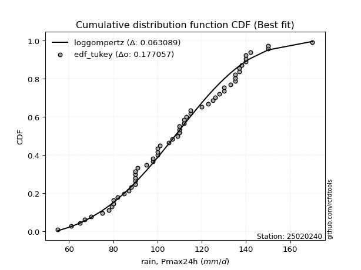</img>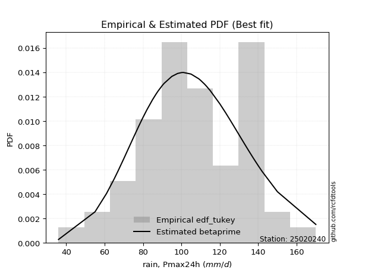</img>

</div>


### 8. Empirical - EDF Gringorten (1963)

Gringorten plotting position formula is essential for estimating the probability and return periods of extreme events like floods and heavy rainfall. The constant _a=0.44_.

<div align="center">


$P=(m-a)/(n+1-2a)$


</div>


**8.1. Empirical values**

<div align="center">

|                | 0                    | 1                    | 2                   | 3                   | 4                  | 5                   | 6                   | 7                   | 8                   | 9                  | 10                 | 11                  | 12                  | 13                 | 14                 | 15                 | 16                 | 17                 | 18                 | 19                  | 20                 | 21                 | 22                 | 23                 | 24                 | 25                 | 26             | 27                 | 28                 | 29                 | 30                 | 31                 | 32                 | 33                | 34                 | 35                 | 36                 | 37                 | 38                 | 39                 | 40                 | 41                 | 42                 | 43                 | 44                 | 45                 | 46                 | 47                 | 48                 | 49                 | 50                 | 51                | 52                 |
|:---------------|:---------------------|:---------------------|:--------------------|:--------------------|:-------------------|:--------------------|:--------------------|:--------------------|:--------------------|:-------------------|:-------------------|:--------------------|:--------------------|:-------------------|:-------------------|:-------------------|:-------------------|:-------------------|:-------------------|:--------------------|:-------------------|:-------------------|:-------------------|:-------------------|:-------------------|:-------------------|:---------------|:-------------------|:-------------------|:-------------------|:-------------------|:-------------------|:-------------------|:------------------|:-------------------|:-------------------|:-------------------|:-------------------|:-------------------|:-------------------|:-------------------|:-------------------|:-------------------|:-------------------|:-------------------|:-------------------|:-------------------|:-------------------|:-------------------|:-------------------|:-------------------|:------------------|:-------------------|
| date           | 1985                 | 1971                 | 1984                | 1980                | 1982               | 1973                | 1998                | 1983                | 1968                | 1969               | 1967               | 1995                | 1986                | 2001               | 1987               | 1991               | 2008               | 1972               | 1966               | 2015                | 1993               | 2009               | 1975               | 2007               | 2004               | 1992               | 1974           | 1996               | 2000               | 1990               | 1979               | 1981               | 1963               | 2005              | 2003               | 2002               | 1977               | 1994               | 1997               | 2014               | 1999               | 1964               | 2012               | 2010               | 2013               | 2011               | 2006               | 1970               | 1978               | 1989               | 1976               | 1965              | 1988               |
| x              | 36.0                 | 55.0                 | 61.0                | 65.0                | 67.0               | 70.0                | 75.0                | 78.0                | 79.4105116071686    | 80.0               | 80.0               | 82.0                | 85.0                | 87.0               | 88.0               | 90.0               | 90.0               | 90.0               | 90.0               | 90.0                | 91.0               | 95.0               | 98.0               | 98.0               | 100.0              | 100.0              | 100.0          | 101.0              | 105.0              | 109.0              | 110.0              | 110.0              | 110.0              | 112.0             | 112.0              | 113.0              | 115.0              | 120.0              | 123.0              | 125.0              | 128.0              | 130.0              | 133.0              | 135.0              | 135.0              | 135.0              | 137.0              | 137.0              | 138.0              | 140.0              | 140.0              | 150.0             | 150.0              |
| m              | 1                    | 2                    | 3                   | 4                   | 5                  | 6                   | 7                   | 8                   | 9                   | 10                 | 11                 | 12                  | 13                  | 14                 | 15                 | 16                 | 17                 | 18                 | 19                 | 20                  | 21                 | 22                 | 23                 | 24                 | 25                 | 26                 | 27             | 28                 | 29                 | 30                 | 31                 | 32                 | 33                 | 34                | 35                 | 36                 | 37                 | 38                 | 39                 | 40                 | 41                 | 42                 | 43                 | 44                 | 45                 | 46                 | 47                 | 48                 | 49                 | 50                 | 51                 | 52                | 53                 |
| empirical_dist | edf_gringorten       | edf_gringorten       | edf_gringorten      | edf_gringorten      | edf_gringorten     | edf_gringorten      | edf_gringorten      | edf_gringorten      | edf_gringorten      | edf_gringorten     | edf_gringorten     | edf_gringorten      | edf_gringorten      | edf_gringorten     | edf_gringorten     | edf_gringorten     | edf_gringorten     | edf_gringorten     | edf_gringorten     | edf_gringorten      | edf_gringorten     | edf_gringorten     | edf_gringorten     | edf_gringorten     | edf_gringorten     | edf_gringorten     | edf_gringorten | edf_gringorten     | edf_gringorten     | edf_gringorten     | edf_gringorten     | edf_gringorten     | edf_gringorten     | edf_gringorten    | edf_gringorten     | edf_gringorten     | edf_gringorten     | edf_gringorten     | edf_gringorten     | edf_gringorten     | edf_gringorten     | edf_gringorten     | edf_gringorten     | edf_gringorten     | edf_gringorten     | edf_gringorten     | edf_gringorten     | edf_gringorten     | edf_gringorten     | edf_gringorten     | edf_gringorten     | edf_gringorten    | edf_gringorten     |
| empirical      | 0.010542168674698796 | 0.029367469879518073 | 0.04819277108433735 | 0.06701807228915663 | 0.0858433734939759 | 0.10466867469879518 | 0.12349397590361445 | 0.14231927710843373 | 0.16114457831325302 | 0.1799698795180723 | 0.1987951807228916 | 0.21762048192771086 | 0.23644578313253015 | 0.2552710843373494 | 0.2740963855421687 | 0.292921686746988  | 0.3117469879518072 | 0.3305722891566265 | 0.3493975903614458 | 0.36822289156626503 | 0.3870481927710843 | 0.4058734939759036 | 0.4246987951807229 | 0.4435240963855422 | 0.4623493975903614 | 0.4811746987951807 | 0.5            | 0.5188253012048193 | 0.5376506024096386 | 0.5564759036144579 | 0.5753012048192772 | 0.5941265060240963 | 0.6129518072289157 | 0.631777108433735 | 0.6506024096385543 | 0.6694277108433736 | 0.6882530120481929 | 0.7070783132530121 | 0.7259036144578314 | 0.7447289156626506 | 0.7635542168674699 | 0.7823795180722892 | 0.8012048192771085 | 0.8200301204819278 | 0.8388554216867471 | 0.8576807228915664 | 0.8765060240963857 | 0.8953313253012049 | 0.9141566265060241 | 0.9329819277108434 | 0.9518072289156627 | 0.970632530120482 | 0.9894578313253013 |
| empirical_tr   | 1.0106544901065448   | 1.0302560124127231   | 1.0506329113924051  | 1.0718321226795804  | 1.0939044481054365 | 1.1169049621530698  | 1.140893470790378   | 1.1659350307287093  | 1.192100538599641   | 1.219467401285583  | 1.2481203007518797 | 1.2781520692974013  | 1.309664694280079   | 1.3427704752275025 | 1.3775933609958508 | 1.4142705005324814 | 1.4529540481400438 | 1.4938132733408325 | 1.537037037037037  | 1.5828367103694876  | 1.6314496314496312 | 1.6831432192648925 | 1.738219895287958  | 1.79702300405954   | 1.8599439775910362 | 1.9274310595065312 | 2.0            | 2.078247261345853  | 2.1628664495114007 | 2.2546689303904928 | 2.3546099290780145 | 2.463821892393321  | 2.5836575875486387 | 2.715746421267894 | 2.862068965517242  | 3.0250569476082014 | 3.207729468599035  | 3.41388174807198   | 3.6483516483516487 | 3.917404129793511  | 4.229299363057326  | 4.595155709342562  | 5.030303030303032  | 5.5564853556485385 | 6.205607476635518  | 7.026455026455032  | 8.097560975609765  | 9.553956834532377  | 11.64912280701755  | 14.921348314606753 | 20.75000000000003  | 34.05128205128214 | 94.85714285714367  |

</div>


**8.2. Kolmogorov-Smirnov fit test (sorted by Δ)**


<div align="center">

|                | 0                   | 1                   | 2                   | 3                   | 4                   | 5                   | 6                   | 7                   | 8                   | 9                   | 10                  | 11                  | 12                  | 13                  | 14                  | 15                  | 16                  | 17                  | 18                  | 19                  | 20                  | 21                  | 22                  | 23                  | 24                  | 25                  | 26                  | 27                  | 28                  | 29                  | 30                  | 31                  | 32                  | 33                  | 34                  | 35                  | 36                  | 37                  | 38                  | 39                  | 40                  | 41                  | 42                  | 43                  | 44                  | 45                  | 46                  | 47                  | 48                  | 49                  | 50                  | 51                  | 52                  | 53                  | 54                  | 55                  | 56                  | 57                  | 58                  | 59                  | 60                  | 61                  | 62                  | 63                  | 64                  | 65                  | 66                    | 67                  | 68                  | 69                  | 70                  | 71                  | 72                  | 73                  | 74                  | 75                  | 76                  | 77                  | 78                  | 79                  | 80                  | 81                  | 82                  | 83                  | 84                  | 85                  | 86                  | 87                  | 88                  | 89                  | 90                  | 91                  |
|:---------------|:--------------------|:--------------------|:--------------------|:--------------------|:--------------------|:--------------------|:--------------------|:--------------------|:--------------------|:--------------------|:--------------------|:--------------------|:--------------------|:--------------------|:--------------------|:--------------------|:--------------------|:--------------------|:--------------------|:--------------------|:--------------------|:--------------------|:--------------------|:--------------------|:--------------------|:--------------------|:--------------------|:--------------------|:--------------------|:--------------------|:--------------------|:--------------------|:--------------------|:--------------------|:--------------------|:--------------------|:--------------------|:--------------------|:--------------------|:--------------------|:--------------------|:--------------------|:--------------------|:--------------------|:--------------------|:--------------------|:--------------------|:--------------------|:--------------------|:--------------------|:--------------------|:--------------------|:--------------------|:--------------------|:--------------------|:--------------------|:--------------------|:--------------------|:--------------------|:--------------------|:--------------------|:--------------------|:--------------------|:--------------------|:--------------------|:--------------------|:----------------------|:--------------------|:--------------------|:--------------------|:--------------------|:--------------------|:--------------------|:--------------------|:--------------------|:--------------------|:--------------------|:--------------------|:--------------------|:--------------------|:--------------------|:--------------------|:--------------------|:--------------------|:--------------------|:--------------------|:--------------------|:--------------------|:--------------------|:--------------------|:--------------------|:--------------------|
| station        | 25020240            | 25020240            | 25020240            | 25020240            | 25020240            | 25020240            | 25020240            | 25020240            | 25020240            | 25020240            | 25020240            | 25020240            | 25020240            | 25020240            | 25020240            | 25020240            | 25020240            | 25020240            | 25020240            | 25020240            | 25020240            | 25020240            | 25020240            | 25020240            | 25020240            | 25020240            | 25020240            | 25020240            | 25020240            | 25020240            | 25020240            | 25020240            | 25020240            | 25020240            | 25020240            | 25020240            | 25020240            | 25020240            | 25020240            | 25020240            | 25020240            | 25020240            | 25020240            | 25020240            | 25020240            | 25020240            | 25020240            | 25020240            | 25020240            | 25020240            | 25020240            | 25020240            | 25020240            | 25020240            | 25020240            | 25020240            | 25020240            | 25020240            | 25020240            | 25020240            | 25020240            | 25020240            | 25020240            | 25020240            | 25020240            | 25020240            | 25020240              | 25020240            | 25020240            | 25020240            | 25020240            | 25020240            | 25020240            | 25020240            | 25020240            | 25020240            | 25020240            | 25020240            | 25020240            | 25020240            | 25020240            | 25020240            | 25020240            | 25020240            | 25020240            | 25020240            | 25020240            | 25020240            | 25020240            | 25020240            | 25020240            | 25020240            |
| empirical_dist | edf_gringorten      | edf_gringorten      | edf_gringorten      | edf_gringorten      | edf_gringorten      | edf_gringorten      | edf_gringorten      | edf_gringorten      | edf_gringorten      | edf_gringorten      | edf_gringorten      | edf_gringorten      | edf_gringorten      | edf_gringorten      | edf_gringorten      | edf_gringorten      | edf_gringorten      | edf_gringorten      | edf_gringorten      | edf_gringorten      | edf_gringorten      | edf_gringorten      | edf_gringorten      | edf_gringorten      | edf_gringorten      | edf_gringorten      | edf_gringorten      | edf_gringorten      | edf_gringorten      | edf_gringorten      | edf_gringorten      | edf_gringorten      | edf_gringorten      | edf_gringorten      | edf_gringorten      | edf_gringorten      | edf_gringorten      | edf_gringorten      | edf_gringorten      | edf_gringorten      | edf_gringorten      | edf_gringorten      | edf_gringorten      | edf_gringorten      | edf_gringorten      | edf_gringorten      | edf_gringorten      | edf_gringorten      | edf_gringorten      | edf_gringorten      | edf_gringorten      | edf_gringorten      | edf_gringorten      | edf_gringorten      | edf_gringorten      | edf_gringorten      | edf_gringorten      | edf_gringorten      | edf_gringorten      | edf_gringorten      | edf_gringorten      | edf_gringorten      | edf_gringorten      | edf_gringorten      | edf_gringorten      | edf_gringorten      | edf_gringorten        | edf_gringorten      | edf_gringorten      | edf_gringorten      | edf_gringorten      | edf_gringorten      | edf_gringorten      | edf_gringorten      | edf_gringorten      | edf_gringorten      | edf_gringorten      | edf_gringorten      | edf_gringorten      | edf_gringorten      | edf_gringorten      | edf_gringorten      | edf_gringorten      | edf_gringorten      | edf_gringorten      | edf_gringorten      | edf_gringorten      | edf_gringorten      | edf_gringorten      | edf_gringorten      | edf_gringorten      | edf_gringorten      |
| p_dist         | fisk                | logfisk             | ncf                 | maxwell             | rayleigh            | chi2                | nakagami            | logpearson3         | logt                | lognorm             | lognorm             | logcrystalball      | loglognorm          | logexponnorm        | logrice             | logncf              | logf                | lognakagami         | betaprime           | erlang              | alpha               | logfatiguelife      | rice                | gamma               | invgamma            | fatiguelife         | f                   | logdgamma           | johnsonsu           | nct                 | t                   | exponnorm           | crystalball         | truncnorm           | norm                | lognct              | loggompertz         | logbetaprime        | genlogistic         | dgamma              | pearson3            | weibull_min         | logweibull_min      | loggumbel_l         | logerlang           | loginvgamma         | logjohnsonsu        | logloggamma         | logchi2             | invgauss            | loglogistic         | loggamma            | loggamma            | logalpha            | loginvgauss         | laplace_asymmetric  | logistic            | mielke              | loggenlogistic      | halfnorm            | invweibull          | logmaxwell          | loghypsecant        | gumbel_r            | kstwobign           | hypsecant           | loglaplace_asymmetric | lograyleigh         | halflogistic        | moyal               | gumbel_l            | loglaplace          | logmielke           | laplace             | loggumbel_r         | loghalfnorm         | loghalflogistic     | logmoyal            | loginvweibull       | logkstwobign        | wald                | gibrat              | logwald             | loggibrat           | loggenexpon         | genexpon            | expon               | pareto              | logexpon            | logpareto           | logtruncnorm        | gompertz            |
| delta          | 0.06346913762769268 | 0.0637643062249883  | 0.06582740777120788 | 0.06659243330832909 | 0.06725067869237733 | 0.06837818659287442 | 0.069067043686731   | 0.06929545093921863 | 0.06946695946907999 | 0.06947544240532677 | 0.06947544240532677 | 0.0694756669803227  | 0.06947637195757472 | 0.06947747332806642 | 0.06949251790588706 | 0.0697264359305072  | 0.06977243581764347 | 0.0697898420058306  | 0.07004287281119126 | 0.07062633488400738 | 0.07118888409879942 | 0.07140572649994004 | 0.07153887457704622 | 0.0718005496692189  | 0.07230420451374686 | 0.07247442061140885 | 0.07286749079441568 | 0.07297956372058201 | 0.07312164879361538 | 0.07318395505661579 | 0.07319441490124234 | 0.07321121207437697 | 0.07321157858351546 | 0.07321158142262496 | 0.07321158287413632 | 0.0732514984694641  | 0.07345045615112067 | 0.0736670028869647  | 0.07367177947090137 | 0.07562790759118088 | 0.07632839962866006 | 0.07743227576457279 | 0.07754641005482465 | 0.07768531568501935 | 0.07855854036565807 | 0.07903734941800233 | 0.08035057867625434 | 0.08052458435412102 | 0.08189255914489646 | 0.08437414162165957 | 0.08516660953362387 | 0.08609150740972926 | 0.08609150740972926 | 0.08754560805377931 | 0.08760918127494721 | 0.0890083528258222  | 0.08954139970943414 | 0.09030840523261485 | 0.09070474390262018 | 0.09175871529929924 | 0.09586968965286213 | 0.09754372039745357 | 0.09769183298521689 | 0.0987174313240804  | 0.10462911226207794 | 0.10465320889944069 | 0.10633179904751777   | 0.10969666551545426 | 0.1199280420028388  | 0.12205872032016307 | 0.12430677083383812 | 0.1260378469817688  | 0.1286550283780019  | 0.131172016344066   | 0.1329409373646081  | 0.14427220567267174 | 0.15370589150733605 | 0.15425427033909    | 0.1732283441343867  | 0.1931470409272919  | 0.1943356209480494  | 0.21825392055305193 | 0.2187073241551622  | 0.24623822686170238 | 0.27292376606807556 | 0.3217652830969294  | 0.32206163898676266 | 0.3220616697578159  | 0.3902346934717671  | 0.3902346971957832  | 0.5986581031957283  | 0.6976437450931848  |
| deltao         | 0.18681036697021708 | 0.18681036697021708 | 0.18681036697021708 | 0.18681036697021708 | 0.18681036697021708 | 0.18681036697021708 | 0.18681036697021708 | 0.18681036697021708 | 0.18681036697021708 | 0.18681036697021708 | 0.18681036697021708 | 0.18681036697021708 | 0.18681036697021708 | 0.18681036697021708 | 0.18681036697021708 | 0.18681036697021708 | 0.18681036697021708 | 0.18681036697021708 | 0.18681036697021708 | 0.18681036697021708 | 0.18681036697021708 | 0.18681036697021708 | 0.18681036697021708 | 0.18681036697021708 | 0.18681036697021708 | 0.18681036697021708 | 0.18681036697021708 | 0.18681036697021708 | 0.18681036697021708 | 0.18681036697021708 | 0.18681036697021708 | 0.18681036697021708 | 0.18681036697021708 | 0.18681036697021708 | 0.18681036697021708 | 0.18681036697021708 | 0.18681036697021708 | 0.18681036697021708 | 0.18681036697021708 | 0.18681036697021708 | 0.18681036697021708 | 0.18681036697021708 | 0.18681036697021708 | 0.18681036697021708 | 0.18681036697021708 | 0.18681036697021708 | 0.18681036697021708 | 0.18681036697021708 | 0.18681036697021708 | 0.18681036697021708 | 0.18681036697021708 | 0.18681036697021708 | 0.18681036697021708 | 0.18681036697021708 | 0.18681036697021708 | 0.18681036697021708 | 0.18681036697021708 | 0.18681036697021708 | 0.18681036697021708 | 0.18681036697021708 | 0.18681036697021708 | 0.18681036697021708 | 0.18681036697021708 | 0.18681036697021708 | 0.18681036697021708 | 0.18681036697021708 | 0.18681036697021708   | 0.18681036697021708 | 0.18681036697021708 | 0.18681036697021708 | 0.18681036697021708 | 0.18681036697021708 | 0.18681036697021708 | 0.18681036697021708 | 0.18681036697021708 | 0.18681036697021708 | 0.18681036697021708 | 0.18681036697021708 | 0.18681036697021708 | 0.18681036697021708 | 0.18681036697021708 | 0.18681036697021708 | 0.18681036697021708 | 0.18681036697021708 | 0.18681036697021708 | 0.18681036697021708 | 0.18681036697021708 | 0.18681036697021708 | 0.18681036697021708 | 0.18681036697021708 | 0.18681036697021708 | 0.18681036697021708 |
| eval           | Δo > Δ              | Δo > Δ              | Δo > Δ              | Δo > Δ              | Δo > Δ              | Δo > Δ              | Δo > Δ              | Δo > Δ              | Δo > Δ              | Δo > Δ              | Δo > Δ              | Δo > Δ              | Δo > Δ              | Δo > Δ              | Δo > Δ              | Δo > Δ              | Δo > Δ              | Δo > Δ              | Δo > Δ              | Δo > Δ              | Δo > Δ              | Δo > Δ              | Δo > Δ              | Δo > Δ              | Δo > Δ              | Δo > Δ              | Δo > Δ              | Δo > Δ              | Δo > Δ              | Δo > Δ              | Δo > Δ              | Δo > Δ              | Δo > Δ              | Δo > Δ              | Δo > Δ              | Δo > Δ              | Δo > Δ              | Δo > Δ              | Δo > Δ              | Δo > Δ              | Δo > Δ              | Δo > Δ              | Δo > Δ              | Δo > Δ              | Δo > Δ              | Δo > Δ              | Δo > Δ              | Δo > Δ              | Δo > Δ              | Δo > Δ              | Δo > Δ              | Δo > Δ              | Δo > Δ              | Δo > Δ              | Δo > Δ              | Δo > Δ              | Δo > Δ              | Δo > Δ              | Δo > Δ              | Δo > Δ              | Δo > Δ              | Δo > Δ              | Δo > Δ              | Δo > Δ              | Δo > Δ              | Δo > Δ              | Δo > Δ                | Δo > Δ              | Δo > Δ              | Δo > Δ              | Δo > Δ              | Δo > Δ              | Δo > Δ              | Δo > Δ              | Δo > Δ              | Δo > Δ              | Δo > Δ              | Δo > Δ              | Δo > Δ              | Δo <= Δ             | Δo <= Δ             | Δo <= Δ             | Δo <= Δ             | Δo <= Δ             | Δo <= Δ             | Δo <= Δ             | Δo <= Δ             | Δo <= Δ             | Δo <= Δ             | Δo <= Δ             | Δo <= Δ             | Δo <= Δ             |
| fit            | 1                   | 1                   | 1                   | 1                   | 1                   | 1                   | 1                   | 1                   | 1                   | 1                   | 1                   | 1                   | 1                   | 1                   | 1                   | 1                   | 1                   | 1                   | 1                   | 1                   | 1                   | 1                   | 1                   | 1                   | 1                   | 1                   | 1                   | 1                   | 1                   | 1                   | 1                   | 1                   | 1                   | 1                   | 1                   | 1                   | 1                   | 1                   | 1                   | 1                   | 1                   | 1                   | 1                   | 1                   | 1                   | 1                   | 1                   | 1                   | 1                   | 1                   | 1                   | 1                   | 1                   | 1                   | 1                   | 1                   | 1                   | 1                   | 1                   | 1                   | 1                   | 1                   | 1                   | 1                   | 1                   | 1                   | 1                     | 1                   | 1                   | 1                   | 1                   | 1                   | 1                   | 1                   | 1                   | 1                   | 1                   | 1                   | 1                   | 0                   | 0                   | 0                   | 0                   | 0                   | 0                   | 0                   | 0                   | 0                   | 0                   | 0                   | 0                   | 0                   |
| n              | 53                  | 53                  | 53                  | 53                  | 53                  | 53                  | 53                  | 53                  | 53                  | 53                  | 53                  | 53                  | 53                  | 53                  | 53                  | 53                  | 53                  | 53                  | 53                  | 53                  | 53                  | 53                  | 53                  | 53                  | 53                  | 53                  | 53                  | 53                  | 53                  | 53                  | 53                  | 53                  | 53                  | 53                  | 53                  | 53                  | 53                  | 53                  | 53                  | 53                  | 53                  | 53                  | 53                  | 53                  | 53                  | 53                  | 53                  | 53                  | 53                  | 53                  | 53                  | 53                  | 53                  | 53                  | 53                  | 53                  | 53                  | 53                  | 53                  | 53                  | 53                  | 53                  | 53                  | 53                  | 53                  | 53                  | 53                    | 53                  | 53                  | 53                  | 53                  | 53                  | 53                  | 53                  | 53                  | 53                  | 53                  | 53                  | 53                  | 53                  | 53                  | 53                  | 53                  | 53                  | 53                  | 53                  | 53                  | 53                  | 53                  | 53                  | 53                  | 53                  |
| best_fit       | 1                   | 0                   | 0                   | 0                   | 0                   | 0                   | 0                   | 0                   | 0                   | 0                   | 0                   | 0                   | 0                   | 0                   | 0                   | 0                   | 0                   | 0                   | 0                   | 0                   | 0                   | 0                   | 0                   | 0                   | 0                   | 0                   | 0                   | 0                   | 0                   | 0                   | 0                   | 0                   | 0                   | 0                   | 0                   | 0                   | 0                   | 0                   | 0                   | 0                   | 0                   | 0                   | 0                   | 0                   | 0                   | 0                   | 0                   | 0                   | 0                   | 0                   | 0                   | 0                   | 0                   | 0                   | 0                   | 0                   | 0                   | 0                   | 0                   | 0                   | 0                   | 0                   | 0                   | 0                   | 0                   | 0                   | 0                     | 0                   | 0                   | 0                   | 0                   | 0                   | 0                   | 0                   | 0                   | 0                   | 0                   | 0                   | 0                   | 0                   | 0                   | 0                   | 0                   | 0                   | 0                   | 0                   | 0                   | 0                   | 0                   | 0                   | 0                   | 0                   |
| best_fit_sort  | 1                   | 2                   | 3                   | 4                   | 5                   | 6                   | 7                   | 8                   | 9                   | 10                  | 11                  | 12                  | 13                  | 14                  | 15                  | 16                  | 17                  | 18                  | 19                  | 20                  | 21                  | 22                  | 23                  | 24                  | 25                  | 26                  | 27                  | 28                  | 29                  | 30                  | 31                  | 32                  | 33                  | 34                  | 35                  | 36                  | 37                  | 38                  | 39                  | 40                  | 41                  | 42                  | 43                  | 44                  | 45                  | 46                  | 47                  | 48                  | 49                  | 50                  | 51                  | 52                  | 53                  | 54                  | 55                  | 56                  | 57                  | 58                  | 59                  | 60                  | 61                  | 62                  | 63                  | 64                  | 65                  | 66                  | 67                    | 68                  | 69                  | 70                  | 71                  | 72                  | 73                  | 74                  | 75                  | 76                  | 77                  | 78                  | 79                  | 80                  | 81                  | 82                  | 83                  | 84                  | 85                  | 86                  | 87                  | 88                  | 89                  | 90                  | 91                  | 92                  |

</div>


<div align="center">

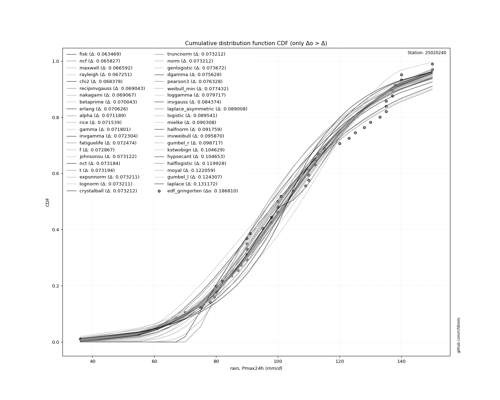</img>

</div>


**8.3. Best fit**

<div align="center">

|   id |   station | empirical_dist   | p_dist   |     delta |   deltao | eval   |   fit |   n |   best_fit |   best_fit_sort |
|-----:|----------:|:-----------------|:---------|----------:|---------:|:-------|------:|----:|-----------:|----------------:|
|    0 |  25020240 | edf_gringorten   | fisk     | 0.0634691 |  0.18681 | Δo > Δ |     1 |  53 |          1 |               1 |

</div>


<div align="center">

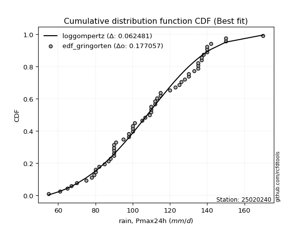</img>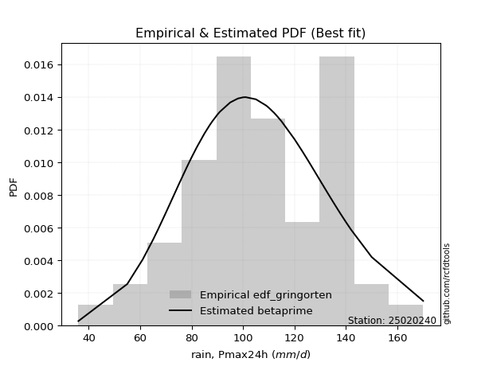</img>

</div>


### 9. Empirical - EDF Jenkinson (1977)

The Jenkinson formula in hydrology is an empirical plotting position formula used to estimate the non-exceedance probability _(P)_ or return period _(T)_ of a given ordered observation within a sample. It is a widely used method in the frequency analysis of extreme events such as floods and rainfall, as it provides a distribution-free way to plot data. _a≈0.31_ and _b≈0.38_ are constants derived to approximate the median of the probability distribution for the given rank.

<div align="center">


$P=(m-a)/(n+b)$


</div>


**9.1. Empirical values**

<div align="center">

|                | 0                    | 1                   | 2                   | 3                   | 4                   | 5                   | 6                   | 7                   | 8                   | 9                   | 10                  | 11                  | 12                  | 13                 | 14                 | 15                 | 16                  | 17                 | 18                  | 19                  | 20                  | 21                 | 22                 | 23                 | 24                  | 25                 | 26            | 27                 | 28                 | 29                 | 30                 | 31                 | 32                 | 33                 | 34                 | 35                 | 36                 | 37                 | 38                 | 39                | 40                 | 41                 | 42                 | 43                 | 44                 | 45                 | 46                 | 47                 | 48                 | 49                 | 50                 | 51                 | 52                |
|:---------------|:---------------------|:--------------------|:--------------------|:--------------------|:--------------------|:--------------------|:--------------------|:--------------------|:--------------------|:--------------------|:--------------------|:--------------------|:--------------------|:-------------------|:-------------------|:-------------------|:--------------------|:-------------------|:--------------------|:--------------------|:--------------------|:-------------------|:-------------------|:-------------------|:--------------------|:-------------------|:--------------|:-------------------|:-------------------|:-------------------|:-------------------|:-------------------|:-------------------|:-------------------|:-------------------|:-------------------|:-------------------|:-------------------|:-------------------|:------------------|:-------------------|:-------------------|:-------------------|:-------------------|:-------------------|:-------------------|:-------------------|:-------------------|:-------------------|:-------------------|:-------------------|:-------------------|:------------------|
| date           | 1985                 | 1971                | 1984                | 1980                | 1982                | 1973                | 1998                | 1983                | 1968                | 1969                | 1967                | 1995                | 1986                | 2001               | 1987               | 1991               | 2008                | 1972               | 1966                | 2015                | 1993                | 2009               | 1975               | 2007               | 2004                | 1992               | 1974          | 1996               | 2000               | 1990               | 1979               | 1981               | 1963               | 2005               | 2003               | 2002               | 1977               | 1994               | 1997               | 2014              | 1999               | 1964               | 2012               | 2010               | 2013               | 2011               | 2006               | 1970               | 1978               | 1989               | 1976               | 1965               | 1988              |
| x              | 36.0                 | 55.0                | 61.0                | 65.0                | 67.0                | 70.0                | 75.0                | 78.0                | 79.4105116071686    | 80.0                | 80.0                | 82.0                | 85.0                | 87.0               | 88.0               | 90.0               | 90.0                | 90.0               | 90.0                | 90.0                | 91.0                | 95.0               | 98.0               | 98.0               | 100.0               | 100.0              | 100.0         | 101.0              | 105.0              | 109.0              | 110.0              | 110.0              | 110.0              | 112.0              | 112.0              | 113.0              | 115.0              | 120.0              | 123.0              | 125.0             | 128.0              | 130.0              | 133.0              | 135.0              | 135.0              | 135.0              | 137.0              | 137.0              | 138.0              | 140.0              | 140.0              | 150.0              | 150.0             |
| m              | 1                    | 2                   | 3                   | 4                   | 5                   | 6                   | 7                   | 8                   | 9                   | 10                  | 11                  | 12                  | 13                  | 14                 | 15                 | 16                 | 17                  | 18                 | 19                  | 20                  | 21                  | 22                 | 23                 | 24                 | 25                  | 26                 | 27            | 28                 | 29                 | 30                 | 31                 | 32                 | 33                 | 34                 | 35                 | 36                 | 37                 | 38                 | 39                 | 40                | 41                 | 42                 | 43                 | 44                 | 45                 | 46                 | 47                 | 48                 | 49                 | 50                 | 51                 | 52                 | 53                |
| empirical_dist | edf_jenkinson        | edf_jenkinson       | edf_jenkinson       | edf_jenkinson       | edf_jenkinson       | edf_jenkinson       | edf_jenkinson       | edf_jenkinson       | edf_jenkinson       | edf_jenkinson       | edf_jenkinson       | edf_jenkinson       | edf_jenkinson       | edf_jenkinson      | edf_jenkinson      | edf_jenkinson      | edf_jenkinson       | edf_jenkinson      | edf_jenkinson       | edf_jenkinson       | edf_jenkinson       | edf_jenkinson      | edf_jenkinson      | edf_jenkinson      | edf_jenkinson       | edf_jenkinson      | edf_jenkinson | edf_jenkinson      | edf_jenkinson      | edf_jenkinson      | edf_jenkinson      | edf_jenkinson      | edf_jenkinson      | edf_jenkinson      | edf_jenkinson      | edf_jenkinson      | edf_jenkinson      | edf_jenkinson      | edf_jenkinson      | edf_jenkinson     | edf_jenkinson      | edf_jenkinson      | edf_jenkinson      | edf_jenkinson      | edf_jenkinson      | edf_jenkinson      | edf_jenkinson      | edf_jenkinson      | edf_jenkinson      | edf_jenkinson      | edf_jenkinson      | edf_jenkinson      | edf_jenkinson     |
| empirical      | 0.012926189584113899 | 0.03165979767703259 | 0.05039340576995129 | 0.06912701386286998 | 0.08786062195578868 | 0.10659423004870738 | 0.12532783814162607 | 0.14406144623454478 | 0.16279505432746344 | 0.18152866242038215 | 0.20026227051330084 | 0.21899587860621955 | 0.23772948669913824 | 0.2564630947920569 | 0.2751967028849756 | 0.2939303109778943 | 0.31266391907081303 | 0.3313975271637317 | 0.35013113525665046 | 0.36886474334956915 | 0.38759835144248783 | 0.4063319595354065 | 0.4250655676283252 | 0.4437991757212439 | 0.46253278381416263 | 0.4812663919070813 | 0.5           | 0.5187336080929187 | 0.5374672161858374 | 0.5562008242787561 | 0.5749344323716747 | 0.5936680404645934 | 0.6124016485575121 | 0.6311352566504308 | 0.6498688647433495 | 0.6686024728362682 | 0.6873360809291869 | 0.7060696890221055 | 0.7248032971150242 | 0.743536905207943 | 0.7622705133008617 | 0.7810041213937804 | 0.7997377294866991 | 0.8184713375796178 | 0.8372049456725364 | 0.8559385537654551 | 0.8746721618583738 | 0.8934057699512925 | 0.9121393780442112 | 0.9308729861371299 | 0.9496065942300487 | 0.9683402023229674 | 0.987073810415886 |
| empirical_tr   | 1.0130954640349212   | 1.032694911975237   | 1.0530676662063523  | 1.074260414570336   | 1.0963236804271925  | 1.1193122247850702  | 1.1432855001070894  | 1.1683081637119719  | 1.1944506601029312  | 1.2217898832684824  | 1.2504099320684001  | 1.2804029743343728  | 1.3118702383878103  | 1.344923154446964  | 1.3796846730421295 | 1.4162907933138764 | 1.4548923412373944  | 1.4956570467918184 | 1.5387719803978093  | 1.5844464232710003  | 1.6329152646069136  | 1.6844430419690752 | 1.7393287715868362 | 1.7979117547995955 | 1.8605785988149182  | 1.9277717587576744 | 2.0           | 2.077851304009342  | 2.162008910490077  | 2.2532714225411565 | 2.3525782282944028 | 2.461041954817888  | 2.5799903334944414 | 2.711020822752666  | 2.856072766185125  | 3.0175240248728086 | 3.198322348711802  | 3.40216698534098   | 3.633764465622871  | 3.899196493791088 | 4.206461780929866  | 4.566295979469631  | 4.993451824134704  | 5.508771929824559  | 6.142692750287684  | 6.941482444733416  | 7.979073243647228  | 9.381370826010535  | 11.38166311300638  | 14.466124661246583 | 19.843866171003704 | 31.585798816568    | 77.36231884057938 |

</div>


**9.2. Kolmogorov-Smirnov fit test (sorted by Δ)**


<div align="center">

|                | 0                   | 1                   | 2                   | 3                   | 4                   | 5                   | 6                   | 7                   | 8                   | 9                   | 10                  | 11                  | 12                  | 13                  | 14                  | 15                  | 16                  | 17                  | 18                  | 19                  | 20                  | 21                  | 22                  | 23                  | 24                  | 25                  | 26                  | 27                  | 28                  | 29                  | 30                  | 31                  | 32                  | 33                  | 34                  | 35                  | 36                  | 37                  | 38                  | 39                  | 40                  | 41                  | 42                  | 43                  | 44                  | 45                  | 46                  | 47                  | 48                  | 49                  | 50                  | 51                  | 52                  | 53                  | 54                  | 55                  | 56                  | 57                  | 58                  | 59                  | 60                  | 61                  | 62                  | 63                  | 64                  | 65                  | 66                    | 67                  | 68                  | 69                  | 70                  | 71                  | 72                  | 73                  | 74                  | 75                  | 76                  | 77                  | 78                  | 79                  | 80                  | 81                  | 82                  | 83                  | 84                  | 85                  | 86                  | 87                  | 88                  | 89                  | 90                  | 91                  |
|:---------------|:--------------------|:--------------------|:--------------------|:--------------------|:--------------------|:--------------------|:--------------------|:--------------------|:--------------------|:--------------------|:--------------------|:--------------------|:--------------------|:--------------------|:--------------------|:--------------------|:--------------------|:--------------------|:--------------------|:--------------------|:--------------------|:--------------------|:--------------------|:--------------------|:--------------------|:--------------------|:--------------------|:--------------------|:--------------------|:--------------------|:--------------------|:--------------------|:--------------------|:--------------------|:--------------------|:--------------------|:--------------------|:--------------------|:--------------------|:--------------------|:--------------------|:--------------------|:--------------------|:--------------------|:--------------------|:--------------------|:--------------------|:--------------------|:--------------------|:--------------------|:--------------------|:--------------------|:--------------------|:--------------------|:--------------------|:--------------------|:--------------------|:--------------------|:--------------------|:--------------------|:--------------------|:--------------------|:--------------------|:--------------------|:--------------------|:--------------------|:----------------------|:--------------------|:--------------------|:--------------------|:--------------------|:--------------------|:--------------------|:--------------------|:--------------------|:--------------------|:--------------------|:--------------------|:--------------------|:--------------------|:--------------------|:--------------------|:--------------------|:--------------------|:--------------------|:--------------------|:--------------------|:--------------------|:--------------------|:--------------------|:--------------------|:--------------------|
| station        | 25020240            | 25020240            | 25020240            | 25020240            | 25020240            | 25020240            | 25020240            | 25020240            | 25020240            | 25020240            | 25020240            | 25020240            | 25020240            | 25020240            | 25020240            | 25020240            | 25020240            | 25020240            | 25020240            | 25020240            | 25020240            | 25020240            | 25020240            | 25020240            | 25020240            | 25020240            | 25020240            | 25020240            | 25020240            | 25020240            | 25020240            | 25020240            | 25020240            | 25020240            | 25020240            | 25020240            | 25020240            | 25020240            | 25020240            | 25020240            | 25020240            | 25020240            | 25020240            | 25020240            | 25020240            | 25020240            | 25020240            | 25020240            | 25020240            | 25020240            | 25020240            | 25020240            | 25020240            | 25020240            | 25020240            | 25020240            | 25020240            | 25020240            | 25020240            | 25020240            | 25020240            | 25020240            | 25020240            | 25020240            | 25020240            | 25020240            | 25020240              | 25020240            | 25020240            | 25020240            | 25020240            | 25020240            | 25020240            | 25020240            | 25020240            | 25020240            | 25020240            | 25020240            | 25020240            | 25020240            | 25020240            | 25020240            | 25020240            | 25020240            | 25020240            | 25020240            | 25020240            | 25020240            | 25020240            | 25020240            | 25020240            | 25020240            |
| empirical_dist | edf_jenkinson       | edf_jenkinson       | edf_jenkinson       | edf_jenkinson       | edf_jenkinson       | edf_jenkinson       | edf_jenkinson       | edf_jenkinson       | edf_jenkinson       | edf_jenkinson       | edf_jenkinson       | edf_jenkinson       | edf_jenkinson       | edf_jenkinson       | edf_jenkinson       | edf_jenkinson       | edf_jenkinson       | edf_jenkinson       | edf_jenkinson       | edf_jenkinson       | edf_jenkinson       | edf_jenkinson       | edf_jenkinson       | edf_jenkinson       | edf_jenkinson       | edf_jenkinson       | edf_jenkinson       | edf_jenkinson       | edf_jenkinson       | edf_jenkinson       | edf_jenkinson       | edf_jenkinson       | edf_jenkinson       | edf_jenkinson       | edf_jenkinson       | edf_jenkinson       | edf_jenkinson       | edf_jenkinson       | edf_jenkinson       | edf_jenkinson       | edf_jenkinson       | edf_jenkinson       | edf_jenkinson       | edf_jenkinson       | edf_jenkinson       | edf_jenkinson       | edf_jenkinson       | edf_jenkinson       | edf_jenkinson       | edf_jenkinson       | edf_jenkinson       | edf_jenkinson       | edf_jenkinson       | edf_jenkinson       | edf_jenkinson       | edf_jenkinson       | edf_jenkinson       | edf_jenkinson       | edf_jenkinson       | edf_jenkinson       | edf_jenkinson       | edf_jenkinson       | edf_jenkinson       | edf_jenkinson       | edf_jenkinson       | edf_jenkinson       | edf_jenkinson         | edf_jenkinson       | edf_jenkinson       | edf_jenkinson       | edf_jenkinson       | edf_jenkinson       | edf_jenkinson       | edf_jenkinson       | edf_jenkinson       | edf_jenkinson       | edf_jenkinson       | edf_jenkinson       | edf_jenkinson       | edf_jenkinson       | edf_jenkinson       | edf_jenkinson       | edf_jenkinson       | edf_jenkinson       | edf_jenkinson       | edf_jenkinson       | edf_jenkinson       | edf_jenkinson       | edf_jenkinson       | edf_jenkinson       | edf_jenkinson       | edf_jenkinson       |
| p_dist         | fisk                | logfisk             | ncf                 | rayleigh            | maxwell             | logt                | lognorm             | lognorm             | logcrystalball      | loglognorm          | logexponnorm        | logrice             | chi2                | logpearson3         | logncf              | logf                | lognakagami         | betaprime           | nakagami            | logdgamma           | logfatiguelife      | erlang              | alpha               | rice                | gamma               | lognct              | invgamma            | fatiguelife         | logbetaprime        | genlogistic         | f                   | johnsonsu           | nct                 | t                   | exponnorm           | crystalball         | truncnorm           | norm                | loggompertz         | pearson3            | dgamma              | logerlang           | weibull_min         | loginvgamma         | logweibull_min      | loggumbel_l         | logchi2             | logjohnsonsu        | logloggamma         | invgauss            | loggamma            | loggamma            | loglogistic         | logalpha            | loginvgauss         | laplace_asymmetric  | logistic            | mielke              | loggenlogistic      | halfnorm            | invweibull          | logmaxwell          | loghypsecant        | gumbel_r            | kstwobign           | hypsecant           | loglaplace_asymmetric | lograyleigh         | halflogistic        | moyal               | gumbel_l            | loglaplace          | logmielke           | laplace             | loggumbel_r         | loghalfnorm         | loghalflogistic     | logmoyal            | loginvweibull       | logkstwobign        | wald                | logwald             | gibrat              | loggibrat           | loggenexpon         | genexpon            | expon               | pareto              | logexpon            | logpareto           | logtruncnorm        | gompertz            |
| delta          | 0.06108511671827743 | 0.06138028531557305 | 0.06610248710690969 | 0.06752575802807914 | 0.06805952309873853 | 0.0697420388047818  | 0.06975052174102858 | 0.06975052174102858 | 0.06975074631602451 | 0.06975145129327653 | 0.06975255266376823 | 0.06976759724158887 | 0.06984527638328386 | 0.06984560961062214 | 0.07000151526620901 | 0.07004751515334529 | 0.07006492134153242 | 0.07031795214689307 | 0.07053413347714044 | 0.07077892903496796 | 0.07168080583564185 | 0.07209342467441682 | 0.07265597388920886 | 0.07300596436745566 | 0.07326763945962833 | 0.07352657780516592 | 0.0737712943041563  | 0.07394151040181829 | 0.07394208222266652 | 0.07422193814230488 | 0.07433458058482512 | 0.07458873858402482 | 0.07465104484702523 | 0.07466150469165178 | 0.07467830186478641 | 0.0746786683739249  | 0.0746786712130344  | 0.07467867266454575 | 0.0749175459415301  | 0.07687855830006357 | 0.07709499738159031 | 0.07754991613475176 | 0.0779824344359763  | 0.07802872518709603 | 0.07809656872622817 | 0.07915240547542879 | 0.08088393491399015 | 0.08090073734765785 | 0.08107474302552453 | 0.08217350693604553 | 0.08508288317882295 | 0.08508288317882295 | 0.08544168886932568 | 0.086536983822873   | 0.0866005570440409  | 0.08928343216152401 | 0.09009155838083766 | 0.09085856390401836 | 0.09101398198713923 | 0.09203379463500105 | 0.09366905496724809 | 0.09653509616654726 | 0.0979669123209187  | 0.0989925106597822  | 0.10362048803117163 | 0.1052033675708442  | 0.10660687838321958   | 0.10868804128454795 | 0.12020312133854061 | 0.12233379965586488 | 0.12421507772193752 | 0.1263129263174706  | 0.12782979037089648 | 0.1317221750154695  | 0.1332160167003099  | 0.14326358144176543 | 0.15269726727642974 | 0.15452934967479182 | 0.17084432322497145 | 0.19140487180118085 | 0.19580271073845865 | 0.2183405517075599  | 0.21915345423878493 | 0.2465133061974042  | 0.27118159694196453 | 0.3200231139708184  | 0.32031946986065163 | 0.3203195006317049  | 0.38840083123375546 | 0.38840083495777156 | 0.5969159340696173  | 0.6964517346384772  |
| deltao         | 0.18681036697021708 | 0.18681036697021708 | 0.18681036697021708 | 0.18681036697021708 | 0.18681036697021708 | 0.18681036697021708 | 0.18681036697021708 | 0.18681036697021708 | 0.18681036697021708 | 0.18681036697021708 | 0.18681036697021708 | 0.18681036697021708 | 0.18681036697021708 | 0.18681036697021708 | 0.18681036697021708 | 0.18681036697021708 | 0.18681036697021708 | 0.18681036697021708 | 0.18681036697021708 | 0.18681036697021708 | 0.18681036697021708 | 0.18681036697021708 | 0.18681036697021708 | 0.18681036697021708 | 0.18681036697021708 | 0.18681036697021708 | 0.18681036697021708 | 0.18681036697021708 | 0.18681036697021708 | 0.18681036697021708 | 0.18681036697021708 | 0.18681036697021708 | 0.18681036697021708 | 0.18681036697021708 | 0.18681036697021708 | 0.18681036697021708 | 0.18681036697021708 | 0.18681036697021708 | 0.18681036697021708 | 0.18681036697021708 | 0.18681036697021708 | 0.18681036697021708 | 0.18681036697021708 | 0.18681036697021708 | 0.18681036697021708 | 0.18681036697021708 | 0.18681036697021708 | 0.18681036697021708 | 0.18681036697021708 | 0.18681036697021708 | 0.18681036697021708 | 0.18681036697021708 | 0.18681036697021708 | 0.18681036697021708 | 0.18681036697021708 | 0.18681036697021708 | 0.18681036697021708 | 0.18681036697021708 | 0.18681036697021708 | 0.18681036697021708 | 0.18681036697021708 | 0.18681036697021708 | 0.18681036697021708 | 0.18681036697021708 | 0.18681036697021708 | 0.18681036697021708 | 0.18681036697021708   | 0.18681036697021708 | 0.18681036697021708 | 0.18681036697021708 | 0.18681036697021708 | 0.18681036697021708 | 0.18681036697021708 | 0.18681036697021708 | 0.18681036697021708 | 0.18681036697021708 | 0.18681036697021708 | 0.18681036697021708 | 0.18681036697021708 | 0.18681036697021708 | 0.18681036697021708 | 0.18681036697021708 | 0.18681036697021708 | 0.18681036697021708 | 0.18681036697021708 | 0.18681036697021708 | 0.18681036697021708 | 0.18681036697021708 | 0.18681036697021708 | 0.18681036697021708 | 0.18681036697021708 | 0.18681036697021708 |
| eval           | Δo > Δ              | Δo > Δ              | Δo > Δ              | Δo > Δ              | Δo > Δ              | Δo > Δ              | Δo > Δ              | Δo > Δ              | Δo > Δ              | Δo > Δ              | Δo > Δ              | Δo > Δ              | Δo > Δ              | Δo > Δ              | Δo > Δ              | Δo > Δ              | Δo > Δ              | Δo > Δ              | Δo > Δ              | Δo > Δ              | Δo > Δ              | Δo > Δ              | Δo > Δ              | Δo > Δ              | Δo > Δ              | Δo > Δ              | Δo > Δ              | Δo > Δ              | Δo > Δ              | Δo > Δ              | Δo > Δ              | Δo > Δ              | Δo > Δ              | Δo > Δ              | Δo > Δ              | Δo > Δ              | Δo > Δ              | Δo > Δ              | Δo > Δ              | Δo > Δ              | Δo > Δ              | Δo > Δ              | Δo > Δ              | Δo > Δ              | Δo > Δ              | Δo > Δ              | Δo > Δ              | Δo > Δ              | Δo > Δ              | Δo > Δ              | Δo > Δ              | Δo > Δ              | Δo > Δ              | Δo > Δ              | Δo > Δ              | Δo > Δ              | Δo > Δ              | Δo > Δ              | Δo > Δ              | Δo > Δ              | Δo > Δ              | Δo > Δ              | Δo > Δ              | Δo > Δ              | Δo > Δ              | Δo > Δ              | Δo > Δ                | Δo > Δ              | Δo > Δ              | Δo > Δ              | Δo > Δ              | Δo > Δ              | Δo > Δ              | Δo > Δ              | Δo > Δ              | Δo > Δ              | Δo > Δ              | Δo > Δ              | Δo > Δ              | Δo <= Δ             | Δo <= Δ             | Δo <= Δ             | Δo <= Δ             | Δo <= Δ             | Δo <= Δ             | Δo <= Δ             | Δo <= Δ             | Δo <= Δ             | Δo <= Δ             | Δo <= Δ             | Δo <= Δ             | Δo <= Δ             |
| fit            | 1                   | 1                   | 1                   | 1                   | 1                   | 1                   | 1                   | 1                   | 1                   | 1                   | 1                   | 1                   | 1                   | 1                   | 1                   | 1                   | 1                   | 1                   | 1                   | 1                   | 1                   | 1                   | 1                   | 1                   | 1                   | 1                   | 1                   | 1                   | 1                   | 1                   | 1                   | 1                   | 1                   | 1                   | 1                   | 1                   | 1                   | 1                   | 1                   | 1                   | 1                   | 1                   | 1                   | 1                   | 1                   | 1                   | 1                   | 1                   | 1                   | 1                   | 1                   | 1                   | 1                   | 1                   | 1                   | 1                   | 1                   | 1                   | 1                   | 1                   | 1                   | 1                   | 1                   | 1                   | 1                   | 1                   | 1                     | 1                   | 1                   | 1                   | 1                   | 1                   | 1                   | 1                   | 1                   | 1                   | 1                   | 1                   | 1                   | 0                   | 0                   | 0                   | 0                   | 0                   | 0                   | 0                   | 0                   | 0                   | 0                   | 0                   | 0                   | 0                   |
| n              | 53                  | 53                  | 53                  | 53                  | 53                  | 53                  | 53                  | 53                  | 53                  | 53                  | 53                  | 53                  | 53                  | 53                  | 53                  | 53                  | 53                  | 53                  | 53                  | 53                  | 53                  | 53                  | 53                  | 53                  | 53                  | 53                  | 53                  | 53                  | 53                  | 53                  | 53                  | 53                  | 53                  | 53                  | 53                  | 53                  | 53                  | 53                  | 53                  | 53                  | 53                  | 53                  | 53                  | 53                  | 53                  | 53                  | 53                  | 53                  | 53                  | 53                  | 53                  | 53                  | 53                  | 53                  | 53                  | 53                  | 53                  | 53                  | 53                  | 53                  | 53                  | 53                  | 53                  | 53                  | 53                  | 53                  | 53                    | 53                  | 53                  | 53                  | 53                  | 53                  | 53                  | 53                  | 53                  | 53                  | 53                  | 53                  | 53                  | 53                  | 53                  | 53                  | 53                  | 53                  | 53                  | 53                  | 53                  | 53                  | 53                  | 53                  | 53                  | 53                  |
| best_fit       | 1                   | 0                   | 0                   | 0                   | 0                   | 0                   | 0                   | 0                   | 0                   | 0                   | 0                   | 0                   | 0                   | 0                   | 0                   | 0                   | 0                   | 0                   | 0                   | 0                   | 0                   | 0                   | 0                   | 0                   | 0                   | 0                   | 0                   | 0                   | 0                   | 0                   | 0                   | 0                   | 0                   | 0                   | 0                   | 0                   | 0                   | 0                   | 0                   | 0                   | 0                   | 0                   | 0                   | 0                   | 0                   | 0                   | 0                   | 0                   | 0                   | 0                   | 0                   | 0                   | 0                   | 0                   | 0                   | 0                   | 0                   | 0                   | 0                   | 0                   | 0                   | 0                   | 0                   | 0                   | 0                   | 0                   | 0                     | 0                   | 0                   | 0                   | 0                   | 0                   | 0                   | 0                   | 0                   | 0                   | 0                   | 0                   | 0                   | 0                   | 0                   | 0                   | 0                   | 0                   | 0                   | 0                   | 0                   | 0                   | 0                   | 0                   | 0                   | 0                   |
| best_fit_sort  | 1                   | 2                   | 3                   | 4                   | 5                   | 6                   | 7                   | 8                   | 9                   | 10                  | 11                  | 12                  | 13                  | 14                  | 15                  | 16                  | 17                  | 18                  | 19                  | 20                  | 21                  | 22                  | 23                  | 24                  | 25                  | 26                  | 27                  | 28                  | 29                  | 30                  | 31                  | 32                  | 33                  | 34                  | 35                  | 36                  | 37                  | 38                  | 39                  | 40                  | 41                  | 42                  | 43                  | 44                  | 45                  | 46                  | 47                  | 48                  | 49                  | 50                  | 51                  | 52                  | 53                  | 54                  | 55                  | 56                  | 57                  | 58                  | 59                  | 60                  | 61                  | 62                  | 63                  | 64                  | 65                  | 66                  | 67                    | 68                  | 69                  | 70                  | 71                  | 72                  | 73                  | 74                  | 75                  | 76                  | 77                  | 78                  | 79                  | 80                  | 81                  | 82                  | 83                  | 84                  | 85                  | 86                  | 87                  | 88                  | 89                  | 90                  | 91                  | 92                  |

</div>


<div align="center">

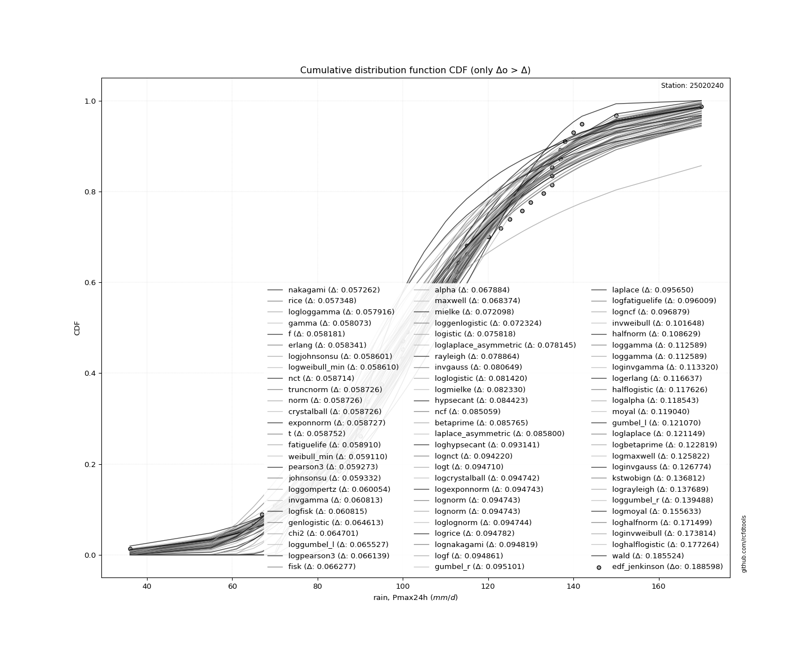</img>

</div>


**9.3. Best fit**

<div align="center">

|   id |   station | empirical_dist   | p_dist   |     delta |   deltao | eval   |   fit |   n |   best_fit |   best_fit_sort |
|-----:|----------:|:-----------------|:---------|----------:|---------:|:-------|------:|----:|-----------:|----------------:|
|    0 |  25020240 | edf_jenkinson    | fisk     | 0.0610851 |  0.18681 | Δo > Δ |     1 |  53 |          1 |               1 |

</div>


<div align="center">

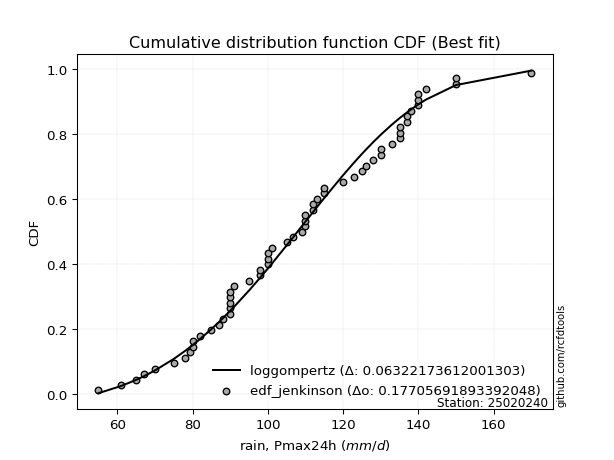</img></img>

</div>


### 10. Empirical - EDF Cunnane (1978)

Cunnane´s work in statistical hydrology has focused on the performance and evaluation of different probability distributions (such as GEV, Gumbel, Lognormal) for flood frequency estimation. _b_ is a constant, typically set to 0.4.

<div align="center">


$P=(m-b)/(n+1-2b)$


</div>


**10.1. Empirical values**

<div align="center">

|                | 0                    | 1                   | 2                   | 3                   | 4                   | 5                   | 6                   | 7                   | 8                   | 9                   | 10                  | 11                  | 12                  | 13                 | 14                  | 15                 | 16                  | 17                 | 18                  | 19                 | 20                  | 21                  | 22                | 23                  | 24                | 25                  | 26          | 27                | 28                 | 29                | 30                | 31                 | 32                 | 33                | 34                | 35                 | 36                 | 37                 | 38                 | 39                 | 40                 | 41                 | 42                 | 43                 | 44                 | 45                 | 46                 | 47                 | 48                 | 49                 | 50                 | 51                 | 52                 |
|:---------------|:---------------------|:--------------------|:--------------------|:--------------------|:--------------------|:--------------------|:--------------------|:--------------------|:--------------------|:--------------------|:--------------------|:--------------------|:--------------------|:-------------------|:--------------------|:-------------------|:--------------------|:-------------------|:--------------------|:-------------------|:--------------------|:--------------------|:------------------|:--------------------|:------------------|:--------------------|:------------|:------------------|:-------------------|:------------------|:------------------|:-------------------|:-------------------|:------------------|:------------------|:-------------------|:-------------------|:-------------------|:-------------------|:-------------------|:-------------------|:-------------------|:-------------------|:-------------------|:-------------------|:-------------------|:-------------------|:-------------------|:-------------------|:-------------------|:-------------------|:-------------------|:-------------------|
| date           | 1985                 | 1971                | 1984                | 1980                | 1982                | 1973                | 1998                | 1983                | 1968                | 1969                | 1967                | 1995                | 1986                | 2001               | 1987                | 1991               | 2008                | 1972               | 1966                | 2015               | 1993                | 2009                | 1975              | 2007                | 2004              | 1992                | 1974        | 1996              | 2000               | 1990              | 1979              | 1981               | 1963               | 2005              | 2003              | 2002               | 1977               | 1994               | 1997               | 2014               | 1999               | 1964               | 2012               | 2010               | 2013               | 2011               | 2006               | 1970               | 1978               | 1989               | 1976               | 1965               | 1988               |
| x              | 36.0                 | 55.0                | 61.0                | 65.0                | 67.0                | 70.0                | 75.0                | 78.0                | 79.4105116071686    | 80.0                | 80.0                | 82.0                | 85.0                | 87.0               | 88.0                | 90.0               | 90.0                | 90.0               | 90.0                | 90.0               | 91.0                | 95.0                | 98.0              | 98.0                | 100.0             | 100.0               | 100.0       | 101.0             | 105.0              | 109.0             | 110.0             | 110.0              | 110.0              | 112.0             | 112.0             | 113.0              | 115.0              | 120.0              | 123.0              | 125.0              | 128.0              | 130.0              | 133.0              | 135.0              | 135.0              | 135.0              | 137.0              | 137.0              | 138.0              | 140.0              | 140.0              | 150.0              | 150.0              |
| m              | 1                    | 2                   | 3                   | 4                   | 5                   | 6                   | 7                   | 8                   | 9                   | 10                  | 11                  | 12                  | 13                  | 14                 | 15                  | 16                 | 17                  | 18                 | 19                  | 20                 | 21                  | 22                  | 23                | 24                  | 25                | 26                  | 27          | 28                | 29                 | 30                | 31                | 32                 | 33                 | 34                | 35                | 36                 | 37                 | 38                 | 39                 | 40                 | 41                 | 42                 | 43                 | 44                 | 45                 | 46                 | 47                 | 48                 | 49                 | 50                 | 51                 | 52                 | 53                 |
| empirical_dist | edf_cunnane          | edf_cunnane         | edf_cunnane         | edf_cunnane         | edf_cunnane         | edf_cunnane         | edf_cunnane         | edf_cunnane         | edf_cunnane         | edf_cunnane         | edf_cunnane         | edf_cunnane         | edf_cunnane         | edf_cunnane        | edf_cunnane         | edf_cunnane        | edf_cunnane         | edf_cunnane        | edf_cunnane         | edf_cunnane        | edf_cunnane         | edf_cunnane         | edf_cunnane       | edf_cunnane         | edf_cunnane       | edf_cunnane         | edf_cunnane | edf_cunnane       | edf_cunnane        | edf_cunnane       | edf_cunnane       | edf_cunnane        | edf_cunnane        | edf_cunnane       | edf_cunnane       | edf_cunnane        | edf_cunnane        | edf_cunnane        | edf_cunnane        | edf_cunnane        | edf_cunnane        | edf_cunnane        | edf_cunnane        | edf_cunnane        | edf_cunnane        | edf_cunnane        | edf_cunnane        | edf_cunnane        | edf_cunnane        | edf_cunnane        | edf_cunnane        | edf_cunnane        | edf_cunnane        |
| empirical      | 0.011278195488721804 | 0.03007518796992481 | 0.04887218045112782 | 0.06766917293233082 | 0.08646616541353383 | 0.10526315789473684 | 0.12406015037593984 | 0.14285714285714285 | 0.16165413533834586 | 0.18045112781954886 | 0.19924812030075187 | 0.21804511278195488 | 0.23684210526315788 | 0.2556390977443609 | 0.27443609022556387 | 0.2932330827067669 | 0.31203007518796994 | 0.3308270676691729 | 0.34962406015037595 | 0.3684210526315789 | 0.38721804511278196 | 0.40601503759398494 | 0.424812030075188 | 0.44360902255639095 | 0.462406015037594 | 0.48120300751879697 | 0.5         | 0.518796992481203 | 0.5375939849624061 | 0.556390977443609 | 0.575187969924812 | 0.5939849624060151 | 0.6127819548872181 | 0.631578947368421 | 0.650375939849624 | 0.6691729323308271 | 0.6879699248120301 | 0.706766917293233  | 0.7255639097744361 | 0.7443609022556391 | 0.7631578947368421 | 0.7819548872180451 | 0.8007518796992481 | 0.8195488721804511 | 0.8383458646616542 | 0.8571428571428571 | 0.8759398496240601 | 0.8947368421052632 | 0.9135338345864662 | 0.9323308270676691 | 0.9511278195488722 | 0.9699248120300752 | 0.9887218045112782 |
| empirical_tr   | 1.0114068441064639   | 1.0310077519379846  | 1.051383399209486   | 1.0725806451612905  | 1.0946502057613168  | 1.1176470588235294  | 1.1416309012875536  | 1.1666666666666665  | 1.1928251121076232  | 1.2201834862385321  | 1.2488262910798122  | 1.278846153846154   | 1.3103448275862069  | 1.3434343434343434 | 1.3782383419689117  | 1.4148936170212765 | 1.4535519125683058  | 1.49438202247191   | 1.5375722543352601  | 1.5833333333333335 | 1.6319018404907977  | 1.6835443037974682  | 1.738562091503268 | 1.7972972972972971  | 1.86013986013986  | 1.9275362318840579  | 2.0         | 2.078125          | 2.1626016260162606 | 2.254237288135593 | 2.353982300884956 | 2.4629629629629632 | 2.5825242718446604 | 2.714285714285714 | 2.860215053763441 | 3.022727272727273  | 3.204819277108434  | 3.4102564102564097 | 3.643835616438356  | 3.9117647058823533 | 4.222222222222223  | 4.586206896551723  | 5.018867924528301  | 5.541666666666667  | 6.186046511627908  | 6.999999999999997  | 8.060606060606059  | 9.5                | 11.565217391304353 | 14.777777777777766 | 20.461538461538453 | 33.25              | 88.66666666666688  |

</div>


**10.2. Kolmogorov-Smirnov fit test (sorted by Δ)**


<div align="center">

|                | 0                   | 1                   | 2                   | 3                   | 4                   | 5                   | 6                   | 7                   | 8                   | 9                   | 10                  | 11                  | 12                  | 13                  | 14                  | 15                  | 16                  | 17                  | 18                  | 19                  | 20                  | 21                  | 22                  | 23                  | 24                  | 25                  | 26                  | 27                  | 28                  | 29                  | 30                  | 31                  | 32                  | 33                  | 34                  | 35                  | 36                  | 37                  | 38                  | 39                  | 40                  | 41                  | 42                  | 43                  | 44                  | 45                  | 46                  | 47                  | 48                  | 49                  | 50                  | 51                  | 52                  | 53                  | 54                  | 55                  | 56                  | 57                  | 58                  | 59                  | 60                  | 61                  | 62                  | 63                  | 64                  | 65                  | 66                    | 67                  | 68                  | 69                  | 70                  | 71                  | 72                  | 73                  | 74                  | 75                  | 76                  | 77                  | 78                  | 79                  | 80                  | 81                  | 82                  | 83                  | 84                  | 85                  | 86                  | 87                  | 88                  | 89                  | 90                  | 91                  |
|:---------------|:--------------------|:--------------------|:--------------------|:--------------------|:--------------------|:--------------------|:--------------------|:--------------------|:--------------------|:--------------------|:--------------------|:--------------------|:--------------------|:--------------------|:--------------------|:--------------------|:--------------------|:--------------------|:--------------------|:--------------------|:--------------------|:--------------------|:--------------------|:--------------------|:--------------------|:--------------------|:--------------------|:--------------------|:--------------------|:--------------------|:--------------------|:--------------------|:--------------------|:--------------------|:--------------------|:--------------------|:--------------------|:--------------------|:--------------------|:--------------------|:--------------------|:--------------------|:--------------------|:--------------------|:--------------------|:--------------------|:--------------------|:--------------------|:--------------------|:--------------------|:--------------------|:--------------------|:--------------------|:--------------------|:--------------------|:--------------------|:--------------------|:--------------------|:--------------------|:--------------------|:--------------------|:--------------------|:--------------------|:--------------------|:--------------------|:--------------------|:----------------------|:--------------------|:--------------------|:--------------------|:--------------------|:--------------------|:--------------------|:--------------------|:--------------------|:--------------------|:--------------------|:--------------------|:--------------------|:--------------------|:--------------------|:--------------------|:--------------------|:--------------------|:--------------------|:--------------------|:--------------------|:--------------------|:--------------------|:--------------------|:--------------------|:--------------------|
| station        | 25020240            | 25020240            | 25020240            | 25020240            | 25020240            | 25020240            | 25020240            | 25020240            | 25020240            | 25020240            | 25020240            | 25020240            | 25020240            | 25020240            | 25020240            | 25020240            | 25020240            | 25020240            | 25020240            | 25020240            | 25020240            | 25020240            | 25020240            | 25020240            | 25020240            | 25020240            | 25020240            | 25020240            | 25020240            | 25020240            | 25020240            | 25020240            | 25020240            | 25020240            | 25020240            | 25020240            | 25020240            | 25020240            | 25020240            | 25020240            | 25020240            | 25020240            | 25020240            | 25020240            | 25020240            | 25020240            | 25020240            | 25020240            | 25020240            | 25020240            | 25020240            | 25020240            | 25020240            | 25020240            | 25020240            | 25020240            | 25020240            | 25020240            | 25020240            | 25020240            | 25020240            | 25020240            | 25020240            | 25020240            | 25020240            | 25020240            | 25020240              | 25020240            | 25020240            | 25020240            | 25020240            | 25020240            | 25020240            | 25020240            | 25020240            | 25020240            | 25020240            | 25020240            | 25020240            | 25020240            | 25020240            | 25020240            | 25020240            | 25020240            | 25020240            | 25020240            | 25020240            | 25020240            | 25020240            | 25020240            | 25020240            | 25020240            |
| empirical_dist | edf_cunnane         | edf_cunnane         | edf_cunnane         | edf_cunnane         | edf_cunnane         | edf_cunnane         | edf_cunnane         | edf_cunnane         | edf_cunnane         | edf_cunnane         | edf_cunnane         | edf_cunnane         | edf_cunnane         | edf_cunnane         | edf_cunnane         | edf_cunnane         | edf_cunnane         | edf_cunnane         | edf_cunnane         | edf_cunnane         | edf_cunnane         | edf_cunnane         | edf_cunnane         | edf_cunnane         | edf_cunnane         | edf_cunnane         | edf_cunnane         | edf_cunnane         | edf_cunnane         | edf_cunnane         | edf_cunnane         | edf_cunnane         | edf_cunnane         | edf_cunnane         | edf_cunnane         | edf_cunnane         | edf_cunnane         | edf_cunnane         | edf_cunnane         | edf_cunnane         | edf_cunnane         | edf_cunnane         | edf_cunnane         | edf_cunnane         | edf_cunnane         | edf_cunnane         | edf_cunnane         | edf_cunnane         | edf_cunnane         | edf_cunnane         | edf_cunnane         | edf_cunnane         | edf_cunnane         | edf_cunnane         | edf_cunnane         | edf_cunnane         | edf_cunnane         | edf_cunnane         | edf_cunnane         | edf_cunnane         | edf_cunnane         | edf_cunnane         | edf_cunnane         | edf_cunnane         | edf_cunnane         | edf_cunnane         | edf_cunnane           | edf_cunnane         | edf_cunnane         | edf_cunnane         | edf_cunnane         | edf_cunnane         | edf_cunnane         | edf_cunnane         | edf_cunnane         | edf_cunnane         | edf_cunnane         | edf_cunnane         | edf_cunnane         | edf_cunnane         | edf_cunnane         | edf_cunnane         | edf_cunnane         | edf_cunnane         | edf_cunnane         | edf_cunnane         | edf_cunnane         | edf_cunnane         | edf_cunnane         | edf_cunnane         | edf_cunnane         | edf_cunnane         |
| p_dist         | fisk                | logfisk             | ncf                 | maxwell             | rayleigh            | chi2                | logpearson3         | nakagami            | logt                | lognorm             | lognorm             | logcrystalball      | loglognorm          | logexponnorm        | logrice             | logncf              | logf                | lognakagami         | betaprime           | erlang              | logfatiguelife      | alpha               | rice                | gamma               | logdgamma           | invgamma            | fatiguelife         | f                   | lognct              | johnsonsu           | nct                 | t                   | exponnorm           | crystalball         | truncnorm           | norm                | logbetaprime        | genlogistic         | loggompertz         | dgamma              | pearson3            | weibull_min         | logweibull_min      | loggumbel_l         | logerlang           | loginvgamma         | logjohnsonsu        | logloggamma         | logchi2             | invgauss            | loglogistic         | loggamma            | loggamma            | logalpha            | loginvgauss         | laplace_asymmetric  | logistic            | mielke              | loggenlogistic      | halfnorm            | invweibull          | logmaxwell          | loghypsecant        | gumbel_r            | kstwobign           | hypsecant           | loglaplace_asymmetric | lograyleigh         | halflogistic        | moyal               | gumbel_l            | loglaplace          | logmielke           | laplace             | loggumbel_r         | loghalfnorm         | loghalflogistic     | logmoyal            | loginvweibull       | logkstwobign        | wald                | gibrat              | logwald             | loggibrat           | loggenexpon         | genexpon            | expon               | pareto              | logexpon            | logpareto           | logtruncnorm        | gompertz            |
| delta          | 0.06273311081366961 | 0.06302827941096523 | 0.06591233394205676 | 0.0670453728861895  | 0.0673356048632262  | 0.06883112617073484 | 0.06946530328091627 | 0.06951998326459141 | 0.06955188563992887 | 0.06956036857617565 | 0.06956036857617565 | 0.06956059315117158 | 0.0695612981284236  | 0.0695623994989153  | 0.06957744407673594 | 0.06981136210135608 | 0.06985736198849235 | 0.06987476817667948 | 0.07012779898204013 | 0.07107927446186779 | 0.07149065267078891 | 0.07164182367665983 | 0.07199181415490663 | 0.0722534892470793  | 0.07230015435379145 | 0.07275714409160727 | 0.07292736018926926 | 0.07332043037227609 | 0.07333642464031298 | 0.07357458837147579 | 0.0736368946344762  | 0.07364735447910276 | 0.07366415165223739 | 0.07366451816137587 | 0.07366452100048537 | 0.07366452245199673 | 0.07375192905781358 | 0.073841631812599   | 0.07390339572898108 | 0.07608084716904129 | 0.0764982519703577  | 0.07760212810627043 | 0.0777162623965223  | 0.07813825526287976 | 0.07824714440587915 | 0.07872595345822342 | 0.08052043101795198 | 0.08069443669581866 | 0.08158116318511754 | 0.08369473225486901 | 0.08525153570447275 | 0.08578011144995035 | 0.08578011144995035 | 0.0872342120940004  | 0.0872977853151683  | 0.08909327899667108 | 0.08971125205113178 | 0.09047825757431249 | 0.09067643517900392 | 0.09184364147014812 | 0.09519028028607157 | 0.09723232443767466 | 0.09777675915606576 | 0.09880235749492927 | 0.10431771630229902 | 0.10482306124113833 | 0.10641672521836665   | 0.10938526955567535 | 0.12001296817368767 | 0.12214364649101195 | 0.12427846211022187 | 0.12612277315261766 | 0.1284002498654554  | 0.13134186868576364 | 0.13302586353545698 | 0.14396080971289282 | 0.15339449554755713 | 0.15433919650993888 | 0.17249231732036363 | 0.19260917517858278 | 0.19478856052590968 | 0.2183388467239008  | 0.21859408926069712 | 0.24632315303255126 | 0.27238590031936644 | 0.3212274173482203  | 0.32152377323805353 | 0.3215238040091068  | 0.38966851899944166 | 0.38966852272345776 | 0.5981202374470191  | 0.6972757316861733  |
| deltao         | 0.18681036697021708 | 0.18681036697021708 | 0.18681036697021708 | 0.18681036697021708 | 0.18681036697021708 | 0.18681036697021708 | 0.18681036697021708 | 0.18681036697021708 | 0.18681036697021708 | 0.18681036697021708 | 0.18681036697021708 | 0.18681036697021708 | 0.18681036697021708 | 0.18681036697021708 | 0.18681036697021708 | 0.18681036697021708 | 0.18681036697021708 | 0.18681036697021708 | 0.18681036697021708 | 0.18681036697021708 | 0.18681036697021708 | 0.18681036697021708 | 0.18681036697021708 | 0.18681036697021708 | 0.18681036697021708 | 0.18681036697021708 | 0.18681036697021708 | 0.18681036697021708 | 0.18681036697021708 | 0.18681036697021708 | 0.18681036697021708 | 0.18681036697021708 | 0.18681036697021708 | 0.18681036697021708 | 0.18681036697021708 | 0.18681036697021708 | 0.18681036697021708 | 0.18681036697021708 | 0.18681036697021708 | 0.18681036697021708 | 0.18681036697021708 | 0.18681036697021708 | 0.18681036697021708 | 0.18681036697021708 | 0.18681036697021708 | 0.18681036697021708 | 0.18681036697021708 | 0.18681036697021708 | 0.18681036697021708 | 0.18681036697021708 | 0.18681036697021708 | 0.18681036697021708 | 0.18681036697021708 | 0.18681036697021708 | 0.18681036697021708 | 0.18681036697021708 | 0.18681036697021708 | 0.18681036697021708 | 0.18681036697021708 | 0.18681036697021708 | 0.18681036697021708 | 0.18681036697021708 | 0.18681036697021708 | 0.18681036697021708 | 0.18681036697021708 | 0.18681036697021708 | 0.18681036697021708   | 0.18681036697021708 | 0.18681036697021708 | 0.18681036697021708 | 0.18681036697021708 | 0.18681036697021708 | 0.18681036697021708 | 0.18681036697021708 | 0.18681036697021708 | 0.18681036697021708 | 0.18681036697021708 | 0.18681036697021708 | 0.18681036697021708 | 0.18681036697021708 | 0.18681036697021708 | 0.18681036697021708 | 0.18681036697021708 | 0.18681036697021708 | 0.18681036697021708 | 0.18681036697021708 | 0.18681036697021708 | 0.18681036697021708 | 0.18681036697021708 | 0.18681036697021708 | 0.18681036697021708 | 0.18681036697021708 |
| eval           | Δo > Δ              | Δo > Δ              | Δo > Δ              | Δo > Δ              | Δo > Δ              | Δo > Δ              | Δo > Δ              | Δo > Δ              | Δo > Δ              | Δo > Δ              | Δo > Δ              | Δo > Δ              | Δo > Δ              | Δo > Δ              | Δo > Δ              | Δo > Δ              | Δo > Δ              | Δo > Δ              | Δo > Δ              | Δo > Δ              | Δo > Δ              | Δo > Δ              | Δo > Δ              | Δo > Δ              | Δo > Δ              | Δo > Δ              | Δo > Δ              | Δo > Δ              | Δo > Δ              | Δo > Δ              | Δo > Δ              | Δo > Δ              | Δo > Δ              | Δo > Δ              | Δo > Δ              | Δo > Δ              | Δo > Δ              | Δo > Δ              | Δo > Δ              | Δo > Δ              | Δo > Δ              | Δo > Δ              | Δo > Δ              | Δo > Δ              | Δo > Δ              | Δo > Δ              | Δo > Δ              | Δo > Δ              | Δo > Δ              | Δo > Δ              | Δo > Δ              | Δo > Δ              | Δo > Δ              | Δo > Δ              | Δo > Δ              | Δo > Δ              | Δo > Δ              | Δo > Δ              | Δo > Δ              | Δo > Δ              | Δo > Δ              | Δo > Δ              | Δo > Δ              | Δo > Δ              | Δo > Δ              | Δo > Δ              | Δo > Δ                | Δo > Δ              | Δo > Δ              | Δo > Δ              | Δo > Δ              | Δo > Δ              | Δo > Δ              | Δo > Δ              | Δo > Δ              | Δo > Δ              | Δo > Δ              | Δo > Δ              | Δo > Δ              | Δo <= Δ             | Δo <= Δ             | Δo <= Δ             | Δo <= Δ             | Δo <= Δ             | Δo <= Δ             | Δo <= Δ             | Δo <= Δ             | Δo <= Δ             | Δo <= Δ             | Δo <= Δ             | Δo <= Δ             | Δo <= Δ             |
| fit            | 1                   | 1                   | 1                   | 1                   | 1                   | 1                   | 1                   | 1                   | 1                   | 1                   | 1                   | 1                   | 1                   | 1                   | 1                   | 1                   | 1                   | 1                   | 1                   | 1                   | 1                   | 1                   | 1                   | 1                   | 1                   | 1                   | 1                   | 1                   | 1                   | 1                   | 1                   | 1                   | 1                   | 1                   | 1                   | 1                   | 1                   | 1                   | 1                   | 1                   | 1                   | 1                   | 1                   | 1                   | 1                   | 1                   | 1                   | 1                   | 1                   | 1                   | 1                   | 1                   | 1                   | 1                   | 1                   | 1                   | 1                   | 1                   | 1                   | 1                   | 1                   | 1                   | 1                   | 1                   | 1                   | 1                   | 1                     | 1                   | 1                   | 1                   | 1                   | 1                   | 1                   | 1                   | 1                   | 1                   | 1                   | 1                   | 1                   | 0                   | 0                   | 0                   | 0                   | 0                   | 0                   | 0                   | 0                   | 0                   | 0                   | 0                   | 0                   | 0                   |
| n              | 53                  | 53                  | 53                  | 53                  | 53                  | 53                  | 53                  | 53                  | 53                  | 53                  | 53                  | 53                  | 53                  | 53                  | 53                  | 53                  | 53                  | 53                  | 53                  | 53                  | 53                  | 53                  | 53                  | 53                  | 53                  | 53                  | 53                  | 53                  | 53                  | 53                  | 53                  | 53                  | 53                  | 53                  | 53                  | 53                  | 53                  | 53                  | 53                  | 53                  | 53                  | 53                  | 53                  | 53                  | 53                  | 53                  | 53                  | 53                  | 53                  | 53                  | 53                  | 53                  | 53                  | 53                  | 53                  | 53                  | 53                  | 53                  | 53                  | 53                  | 53                  | 53                  | 53                  | 53                  | 53                  | 53                  | 53                    | 53                  | 53                  | 53                  | 53                  | 53                  | 53                  | 53                  | 53                  | 53                  | 53                  | 53                  | 53                  | 53                  | 53                  | 53                  | 53                  | 53                  | 53                  | 53                  | 53                  | 53                  | 53                  | 53                  | 53                  | 53                  |
| best_fit       | 1                   | 0                   | 0                   | 0                   | 0                   | 0                   | 0                   | 0                   | 0                   | 0                   | 0                   | 0                   | 0                   | 0                   | 0                   | 0                   | 0                   | 0                   | 0                   | 0                   | 0                   | 0                   | 0                   | 0                   | 0                   | 0                   | 0                   | 0                   | 0                   | 0                   | 0                   | 0                   | 0                   | 0                   | 0                   | 0                   | 0                   | 0                   | 0                   | 0                   | 0                   | 0                   | 0                   | 0                   | 0                   | 0                   | 0                   | 0                   | 0                   | 0                   | 0                   | 0                   | 0                   | 0                   | 0                   | 0                   | 0                   | 0                   | 0                   | 0                   | 0                   | 0                   | 0                   | 0                   | 0                   | 0                   | 0                     | 0                   | 0                   | 0                   | 0                   | 0                   | 0                   | 0                   | 0                   | 0                   | 0                   | 0                   | 0                   | 0                   | 0                   | 0                   | 0                   | 0                   | 0                   | 0                   | 0                   | 0                   | 0                   | 0                   | 0                   | 0                   |
| best_fit_sort  | 1                   | 2                   | 3                   | 4                   | 5                   | 6                   | 7                   | 8                   | 9                   | 10                  | 11                  | 12                  | 13                  | 14                  | 15                  | 16                  | 17                  | 18                  | 19                  | 20                  | 21                  | 22                  | 23                  | 24                  | 25                  | 26                  | 27                  | 28                  | 29                  | 30                  | 31                  | 32                  | 33                  | 34                  | 35                  | 36                  | 37                  | 38                  | 39                  | 40                  | 41                  | 42                  | 43                  | 44                  | 45                  | 46                  | 47                  | 48                  | 49                  | 50                  | 51                  | 52                  | 53                  | 54                  | 55                  | 56                  | 57                  | 58                  | 59                  | 60                  | 61                  | 62                  | 63                  | 64                  | 65                  | 66                  | 67                    | 68                  | 69                  | 70                  | 71                  | 72                  | 73                  | 74                  | 75                  | 76                  | 77                  | 78                  | 79                  | 80                  | 81                  | 82                  | 83                  | 84                  | 85                  | 86                  | 87                  | 88                  | 89                  | 90                  | 91                  | 92                  |

</div>


<div align="center">

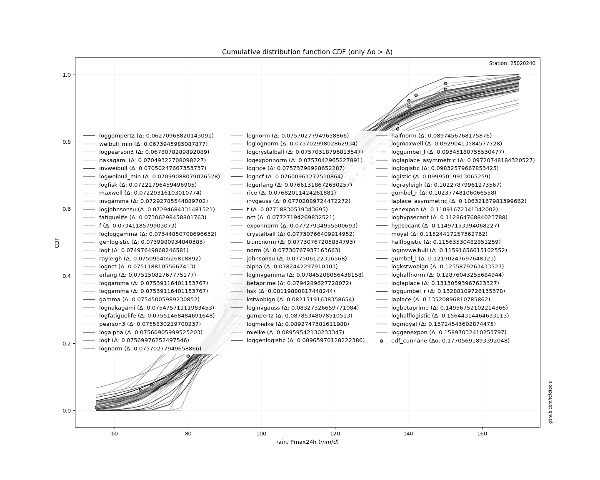</img>

</div>


**10.3. Best fit**

<div align="center">

|   id |   station | empirical_dist   | p_dist   |     delta |   deltao | eval   |   fit |   n |   best_fit |   best_fit_sort |
|-----:|----------:|:-----------------|:---------|----------:|---------:|:-------|------:|----:|-----------:|----------------:|
|    0 |  25020240 | edf_cunnane      | fisk     | 0.0627331 |  0.18681 | Δo > Δ |     1 |  53 |          1 |               1 |

</div>


<div align="center">

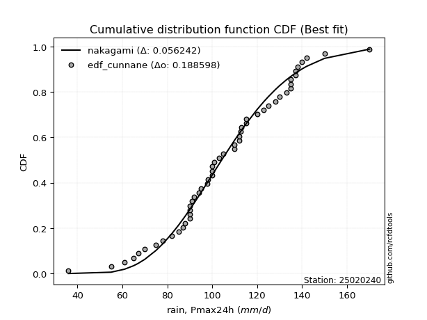</img>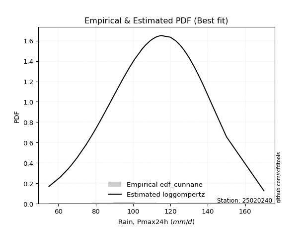</img>

</div>


### 11. Empirical - EDF Adamowski (1981)

The Adamowski formula in hydrology refers to a specific plotting position formula used for estimating the non-parametric empirical distribution of hydrological events (like flood peaks) to calculate their return periods. This formula provides an alternative to traditional parametric methods (like the Gumbel or Log Pearson Type III distributions). 

<div align="center">


$P=(m-0.25)/(n+0.5)$


</div>


**11.1. Empirical values**

<div align="center">

|                | 0                    | 1                   | 2                  | 3                   | 4                   | 5                   | 6                  | 7                   | 8                   | 9                  | 10                  | 11                  | 12                 | 13                 | 14                 | 15                  | 16                 | 17                 | 18                  | 19                 | 20                 | 21                  | 22                 | 23                 | 24                  | 25                  | 26            | 27                 | 28                 | 29                 | 30                 | 31                 | 32                 | 33                 | 34                 | 35                 | 36                 | 37                | 38                 | 39                 | 40                 | 41                | 42                 | 43                 | 44                 | 45                 | 46                 | 47                 | 48                 | 49                 | 50                 | 51                 | 52                |
|:---------------|:---------------------|:--------------------|:-------------------|:--------------------|:--------------------|:--------------------|:-------------------|:--------------------|:--------------------|:-------------------|:--------------------|:--------------------|:-------------------|:-------------------|:-------------------|:--------------------|:-------------------|:-------------------|:--------------------|:-------------------|:-------------------|:--------------------|:-------------------|:-------------------|:--------------------|:--------------------|:--------------|:-------------------|:-------------------|:-------------------|:-------------------|:-------------------|:-------------------|:-------------------|:-------------------|:-------------------|:-------------------|:------------------|:-------------------|:-------------------|:-------------------|:------------------|:-------------------|:-------------------|:-------------------|:-------------------|:-------------------|:-------------------|:-------------------|:-------------------|:-------------------|:-------------------|:------------------|
| date           | 1985                 | 1971                | 1984               | 1980                | 1982                | 1973                | 1998               | 1983                | 1968                | 1969               | 1967                | 1995                | 1986               | 2001               | 1987               | 1991                | 2008               | 1972               | 1966                | 2015               | 1993               | 2009                | 1975               | 2007               | 2004                | 1992                | 1974          | 1996               | 2000               | 1990               | 1979               | 1981               | 1963               | 2005               | 2003               | 2002               | 1977               | 1994              | 1997               | 2014               | 1999               | 1964              | 2012               | 2010               | 2013               | 2011               | 2006               | 1970               | 1978               | 1989               | 1976               | 1965               | 1988              |
| x              | 36.0                 | 55.0                | 61.0               | 65.0                | 67.0                | 70.0                | 75.0               | 78.0                | 79.4105116071686    | 80.0               | 80.0                | 82.0                | 85.0               | 87.0               | 88.0               | 90.0                | 90.0               | 90.0               | 90.0                | 90.0               | 91.0               | 95.0                | 98.0               | 98.0               | 100.0               | 100.0               | 100.0         | 101.0              | 105.0              | 109.0              | 110.0              | 110.0              | 110.0              | 112.0              | 112.0              | 113.0              | 115.0              | 120.0             | 123.0              | 125.0              | 128.0              | 130.0             | 133.0              | 135.0              | 135.0              | 135.0              | 137.0              | 137.0              | 138.0              | 140.0              | 140.0              | 150.0              | 150.0             |
| m              | 1                    | 2                   | 3                  | 4                   | 5                   | 6                   | 7                  | 8                   | 9                   | 10                 | 11                  | 12                  | 13                 | 14                 | 15                 | 16                  | 17                 | 18                 | 19                  | 20                 | 21                 | 22                  | 23                 | 24                 | 25                  | 26                  | 27            | 28                 | 29                 | 30                 | 31                 | 32                 | 33                 | 34                 | 35                 | 36                 | 37                 | 38                | 39                 | 40                 | 41                 | 42                | 43                 | 44                 | 45                 | 46                 | 47                 | 48                 | 49                 | 50                 | 51                 | 52                 | 53                |
| empirical_dist | edf_adamowski        | edf_adamowski       | edf_adamowski      | edf_adamowski       | edf_adamowski       | edf_adamowski       | edf_adamowski      | edf_adamowski       | edf_adamowski       | edf_adamowski      | edf_adamowski       | edf_adamowski       | edf_adamowski      | edf_adamowski      | edf_adamowski      | edf_adamowski       | edf_adamowski      | edf_adamowski      | edf_adamowski       | edf_adamowski      | edf_adamowski      | edf_adamowski       | edf_adamowski      | edf_adamowski      | edf_adamowski       | edf_adamowski       | edf_adamowski | edf_adamowski      | edf_adamowski      | edf_adamowski      | edf_adamowski      | edf_adamowski      | edf_adamowski      | edf_adamowski      | edf_adamowski      | edf_adamowski      | edf_adamowski      | edf_adamowski     | edf_adamowski      | edf_adamowski      | edf_adamowski      | edf_adamowski     | edf_adamowski      | edf_adamowski      | edf_adamowski      | edf_adamowski      | edf_adamowski      | edf_adamowski      | edf_adamowski      | edf_adamowski      | edf_adamowski      | edf_adamowski      | edf_adamowski     |
| empirical      | 0.014018691588785047 | 0.03271028037383177 | 0.0514018691588785 | 0.07009345794392523 | 0.08878504672897196 | 0.10747663551401869 | 0.1261682242990654 | 0.14485981308411214 | 0.16355140186915887 | 0.1822429906542056 | 0.20093457943925233 | 0.21962616822429906 | 0.2383177570093458 | 0.2570093457943925 | 0.2757009345794392 | 0.29439252336448596 | 0.3130841121495327 | 0.3317757009345794 | 0.35046728971962615 | 0.3691588785046729 | 0.3878504672897196 | 0.40654205607476634 | 0.4252336448598131 | 0.4439252336448598 | 0.46261682242990654 | 0.48130841121495327 | 0.5           | 0.5186915887850467 | 0.5373831775700935 | 0.5560747663551402 | 0.5747663551401869 | 0.5934579439252337 | 0.6121495327102804 | 0.6308411214953271 | 0.6495327102803738 | 0.6682242990654206 | 0.6869158878504673 | 0.705607476635514 | 0.7242990654205608 | 0.7429906542056075 | 0.7616822429906542 | 0.780373831775701 | 0.7990654205607477 | 0.8177570093457944 | 0.8364485981308412 | 0.8551401869158879 | 0.8738317757009346 | 0.8925233644859814 | 0.9112149532710281 | 0.9299065420560748 | 0.9485981308411215 | 0.9672897196261683 | 0.985981308411215 |
| empirical_tr   | 1.014218009478673    | 1.0338164251207729  | 1.0541871921182266 | 1.0753768844221105  | 1.0974358974358973  | 1.1204188481675392  | 1.1443850267379678 | 1.169398907103825   | 1.1955307262569832  | 1.2228571428571429 | 1.2514619883040936  | 1.2814371257485029  | 1.312883435582822  | 1.3459119496855345 | 1.3806451612903226 | 1.4172185430463575  | 1.4557823129251701 | 1.4965034965034965 | 1.539568345323741   | 1.5851851851851853 | 1.633587786259542  | 1.68503937007874    | 1.7398373983739837 | 1.7983193277310925 | 1.8608695652173912  | 1.927927927927928   | 2.0           | 2.0776699029126213 | 2.1616161616161618 | 2.2526315789473683 | 2.3516483516483517 | 2.4597701149425286 | 2.5783132530120483 | 2.708860759493671  | 2.8533333333333335 | 3.0140845070422535 | 3.194029850746269  | 3.396825396825397 | 3.627118644067797  | 3.8909090909090915 | 4.196078431372549  | 4.553191489361703 | 4.9767441860465125 | 5.487179487179488  | 6.114285714285716  | 6.903225806451615  | 7.925925925925928  | 9.30434782608696   | 11.263157894736848 | 14.266666666666676 | 19.454545454545475 | 30.57142857142862  | 71.33333333333361 |

</div>


**11.2. Kolmogorov-Smirnov fit test (sorted by Δ)**


<div align="center">

|                | 0                    | 1                   | 2                   | 3                   | 4                   | 5                   | 6                   | 7                   | 8                   | 9                   | 10                  | 11                  | 12                  | 13                  | 14                  | 15                  | 16                  | 17                  | 18                  | 19                  | 20                  | 21                  | 22                  | 23                  | 24                  | 25                  | 26                  | 27                  | 28                  | 29                  | 30                  | 31                  | 32                  | 33                  | 34                  | 35                  | 36                  | 37                  | 38                  | 39                  | 40                  | 41                  | 42                  | 43                  | 44                  | 45                  | 46                  | 47                  | 48                  | 49                  | 50                  | 51                  | 52                  | 53                  | 54                  | 55                  | 56                  | 57                  | 58                  | 59                  | 60                  | 61                  | 62                  | 63                  | 64                  | 65                  | 66                    | 67                  | 68                  | 69                  | 70                  | 71                  | 72                  | 73                  | 74                  | 75                  | 76                  | 77                  | 78                  | 79                  | 80                  | 81                  | 82                  | 83                  | 84                  | 85                  | 86                  | 87                  | 88                  | 89                  | 90                  | 91                  |
|:---------------|:---------------------|:--------------------|:--------------------|:--------------------|:--------------------|:--------------------|:--------------------|:--------------------|:--------------------|:--------------------|:--------------------|:--------------------|:--------------------|:--------------------|:--------------------|:--------------------|:--------------------|:--------------------|:--------------------|:--------------------|:--------------------|:--------------------|:--------------------|:--------------------|:--------------------|:--------------------|:--------------------|:--------------------|:--------------------|:--------------------|:--------------------|:--------------------|:--------------------|:--------------------|:--------------------|:--------------------|:--------------------|:--------------------|:--------------------|:--------------------|:--------------------|:--------------------|:--------------------|:--------------------|:--------------------|:--------------------|:--------------------|:--------------------|:--------------------|:--------------------|:--------------------|:--------------------|:--------------------|:--------------------|:--------------------|:--------------------|:--------------------|:--------------------|:--------------------|:--------------------|:--------------------|:--------------------|:--------------------|:--------------------|:--------------------|:--------------------|:----------------------|:--------------------|:--------------------|:--------------------|:--------------------|:--------------------|:--------------------|:--------------------|:--------------------|:--------------------|:--------------------|:--------------------|:--------------------|:--------------------|:--------------------|:--------------------|:--------------------|:--------------------|:--------------------|:--------------------|:--------------------|:--------------------|:--------------------|:--------------------|:--------------------|:--------------------|
| station        | 25020240             | 25020240            | 25020240            | 25020240            | 25020240            | 25020240            | 25020240            | 25020240            | 25020240            | 25020240            | 25020240            | 25020240            | 25020240            | 25020240            | 25020240            | 25020240            | 25020240            | 25020240            | 25020240            | 25020240            | 25020240            | 25020240            | 25020240            | 25020240            | 25020240            | 25020240            | 25020240            | 25020240            | 25020240            | 25020240            | 25020240            | 25020240            | 25020240            | 25020240            | 25020240            | 25020240            | 25020240            | 25020240            | 25020240            | 25020240            | 25020240            | 25020240            | 25020240            | 25020240            | 25020240            | 25020240            | 25020240            | 25020240            | 25020240            | 25020240            | 25020240            | 25020240            | 25020240            | 25020240            | 25020240            | 25020240            | 25020240            | 25020240            | 25020240            | 25020240            | 25020240            | 25020240            | 25020240            | 25020240            | 25020240            | 25020240            | 25020240              | 25020240            | 25020240            | 25020240            | 25020240            | 25020240            | 25020240            | 25020240            | 25020240            | 25020240            | 25020240            | 25020240            | 25020240            | 25020240            | 25020240            | 25020240            | 25020240            | 25020240            | 25020240            | 25020240            | 25020240            | 25020240            | 25020240            | 25020240            | 25020240            | 25020240            |
| empirical_dist | edf_adamowski        | edf_adamowski       | edf_adamowski       | edf_adamowski       | edf_adamowski       | edf_adamowski       | edf_adamowski       | edf_adamowski       | edf_adamowski       | edf_adamowski       | edf_adamowski       | edf_adamowski       | edf_adamowski       | edf_adamowski       | edf_adamowski       | edf_adamowski       | edf_adamowski       | edf_adamowski       | edf_adamowski       | edf_adamowski       | edf_adamowski       | edf_adamowski       | edf_adamowski       | edf_adamowski       | edf_adamowski       | edf_adamowski       | edf_adamowski       | edf_adamowski       | edf_adamowski       | edf_adamowski       | edf_adamowski       | edf_adamowski       | edf_adamowski       | edf_adamowski       | edf_adamowski       | edf_adamowski       | edf_adamowski       | edf_adamowski       | edf_adamowski       | edf_adamowski       | edf_adamowski       | edf_adamowski       | edf_adamowski       | edf_adamowski       | edf_adamowski       | edf_adamowski       | edf_adamowski       | edf_adamowski       | edf_adamowski       | edf_adamowski       | edf_adamowski       | edf_adamowski       | edf_adamowski       | edf_adamowski       | edf_adamowski       | edf_adamowski       | edf_adamowski       | edf_adamowski       | edf_adamowski       | edf_adamowski       | edf_adamowski       | edf_adamowski       | edf_adamowski       | edf_adamowski       | edf_adamowski       | edf_adamowski       | edf_adamowski         | edf_adamowski       | edf_adamowski       | edf_adamowski       | edf_adamowski       | edf_adamowski       | edf_adamowski       | edf_adamowski       | edf_adamowski       | edf_adamowski       | edf_adamowski       | edf_adamowski       | edf_adamowski       | edf_adamowski       | edf_adamowski       | edf_adamowski       | edf_adamowski       | edf_adamowski       | edf_adamowski       | edf_adamowski       | edf_adamowski       | edf_adamowski       | edf_adamowski       | edf_adamowski       | edf_adamowski       | edf_adamowski       |
| p_dist         | fisk                 | logfisk             | ncf                 | rayleigh            | maxwell             | logdgamma           | logt                | lognorm             | lognorm             | logcrystalball      | loglognorm          | logexponnorm        | logrice             | logpearson3         | logncf              | logf                | lognakagami         | betaprime           | chi2                | nakagami            | logfatiguelife      | erlang              | alpha               | lognct              | rice                | gamma               | logbetaprime        | invgamma            | genlogistic         | fatiguelife         | f                   | johnsonsu           | nct                 | t                   | exponnorm           | crystalball         | truncnorm           | norm                | loggompertz         | logerlang           | pearson3            | loginvgamma         | dgamma              | weibull_min         | logweibull_min      | loggumbel_l         | logchi2             | logjohnsonsu        | invgauss            | logloggamma         | loggamma            | loggamma            | loglogistic         | logalpha            | loginvgauss         | laplace_asymmetric  | logistic            | mielke              | loggenlogistic      | halfnorm            | invweibull          | logmaxwell          | loghypsecant        | gumbel_r            | kstwobign           | hypsecant           | loglaplace_asymmetric | lograyleigh         | halflogistic        | moyal               | gumbel_l            | loglaplace          | logmielke           | laplace             | loggumbel_r         | loghalfnorm         | loghalflogistic     | logmoyal            | loginvweibull       | logkstwobign        | wald                | logwald             | gibrat              | loggibrat           | loggenexpon         | genexpon            | expon               | pareto              | logexpon            | logpareto           | logtruncnorm        | gompertz            |
| delta          | 0.059992614713606396 | 0.06028778331090201 | 0.06622854503052555 | 0.067651815951695   | 0.06873183202468991 | 0.06977046564604084 | 0.06986809672839767 | 0.06987657966464444 | 0.06987657966464444 | 0.06987680423964038 | 0.0698775092168924  | 0.0698786105873841  | 0.06989365516520474 | 0.07009772545785392 | 0.07012757318982488 | 0.07017357307696115 | 0.07019097926514828 | 0.07044401007050893 | 0.07051758530923524 | 0.07120644240309182 | 0.07180686375925771 | 0.0727657336003682  | 0.07332828281516024 | 0.07365263572878178 | 0.07367827329340704 | 0.07393994838557971 | 0.07406814014628238 | 0.07444360323010768 | 0.07447405398953666 | 0.07461381932776967 | 0.0750068895107765  | 0.0752610475099762  | 0.07532335377297661 | 0.07533381361760316 | 0.0753506107907378  | 0.07535097729987628 | 0.07535098013898578 | 0.07535098159049713 | 0.07558985486748149 | 0.0770877037481601  | 0.07738011890383645 | 0.07756651280050436 | 0.0777673063075417  | 0.07823455028320808 | 0.07834868457345995 | 0.07982471440138017 | 0.08042172252739849 | 0.08115285319488963 | 0.0811650435471184  | 0.08132685887275631 | 0.08462067079223129 | 0.08462067079223129 | 0.08556774679294155 | 0.08607477143628134 | 0.08613834465744924 | 0.08940949008513988 | 0.09034367422806944 | 0.09111067975125015 | 0.09126609783437101 | 0.09215985255861692 | 0.09266059157832096 | 0.0960728837799556  | 0.09809297024453456 | 0.09911856858339807 | 0.10315827564457997 | 0.10545548341807598 | 0.10673293630683545   | 0.10822582889795629 | 0.12032917926215647 | 0.12245985757948075 | 0.12437016348775642 | 0.12643898424108646 | 0.1274516166000489  | 0.1319742908627013  | 0.13334207462392578 | 0.14280136905517377 | 0.15223505488983807 | 0.15465540759840768 | 0.16975182122030041 | 0.1906065049516135  | 0.19647501966441014 | 0.21817247447607202 | 0.2197417245489925  | 0.24663936412102005 | 0.2703832300923972  | 0.31922474712125104 | 0.3195211030110843  | 0.31952113378213753 | 0.38756044507631615 | 0.38756044880033225 | 0.5961175672200499  | 0.6959054836361417  |
| deltao         | 0.18681036697021708  | 0.18681036697021708 | 0.18681036697021708 | 0.18681036697021708 | 0.18681036697021708 | 0.18681036697021708 | 0.18681036697021708 | 0.18681036697021708 | 0.18681036697021708 | 0.18681036697021708 | 0.18681036697021708 | 0.18681036697021708 | 0.18681036697021708 | 0.18681036697021708 | 0.18681036697021708 | 0.18681036697021708 | 0.18681036697021708 | 0.18681036697021708 | 0.18681036697021708 | 0.18681036697021708 | 0.18681036697021708 | 0.18681036697021708 | 0.18681036697021708 | 0.18681036697021708 | 0.18681036697021708 | 0.18681036697021708 | 0.18681036697021708 | 0.18681036697021708 | 0.18681036697021708 | 0.18681036697021708 | 0.18681036697021708 | 0.18681036697021708 | 0.18681036697021708 | 0.18681036697021708 | 0.18681036697021708 | 0.18681036697021708 | 0.18681036697021708 | 0.18681036697021708 | 0.18681036697021708 | 0.18681036697021708 | 0.18681036697021708 | 0.18681036697021708 | 0.18681036697021708 | 0.18681036697021708 | 0.18681036697021708 | 0.18681036697021708 | 0.18681036697021708 | 0.18681036697021708 | 0.18681036697021708 | 0.18681036697021708 | 0.18681036697021708 | 0.18681036697021708 | 0.18681036697021708 | 0.18681036697021708 | 0.18681036697021708 | 0.18681036697021708 | 0.18681036697021708 | 0.18681036697021708 | 0.18681036697021708 | 0.18681036697021708 | 0.18681036697021708 | 0.18681036697021708 | 0.18681036697021708 | 0.18681036697021708 | 0.18681036697021708 | 0.18681036697021708 | 0.18681036697021708   | 0.18681036697021708 | 0.18681036697021708 | 0.18681036697021708 | 0.18681036697021708 | 0.18681036697021708 | 0.18681036697021708 | 0.18681036697021708 | 0.18681036697021708 | 0.18681036697021708 | 0.18681036697021708 | 0.18681036697021708 | 0.18681036697021708 | 0.18681036697021708 | 0.18681036697021708 | 0.18681036697021708 | 0.18681036697021708 | 0.18681036697021708 | 0.18681036697021708 | 0.18681036697021708 | 0.18681036697021708 | 0.18681036697021708 | 0.18681036697021708 | 0.18681036697021708 | 0.18681036697021708 | 0.18681036697021708 |
| eval           | Δo > Δ               | Δo > Δ              | Δo > Δ              | Δo > Δ              | Δo > Δ              | Δo > Δ              | Δo > Δ              | Δo > Δ              | Δo > Δ              | Δo > Δ              | Δo > Δ              | Δo > Δ              | Δo > Δ              | Δo > Δ              | Δo > Δ              | Δo > Δ              | Δo > Δ              | Δo > Δ              | Δo > Δ              | Δo > Δ              | Δo > Δ              | Δo > Δ              | Δo > Δ              | Δo > Δ              | Δo > Δ              | Δo > Δ              | Δo > Δ              | Δo > Δ              | Δo > Δ              | Δo > Δ              | Δo > Δ              | Δo > Δ              | Δo > Δ              | Δo > Δ              | Δo > Δ              | Δo > Δ              | Δo > Δ              | Δo > Δ              | Δo > Δ              | Δo > Δ              | Δo > Δ              | Δo > Δ              | Δo > Δ              | Δo > Δ              | Δo > Δ              | Δo > Δ              | Δo > Δ              | Δo > Δ              | Δo > Δ              | Δo > Δ              | Δo > Δ              | Δo > Δ              | Δo > Δ              | Δo > Δ              | Δo > Δ              | Δo > Δ              | Δo > Δ              | Δo > Δ              | Δo > Δ              | Δo > Δ              | Δo > Δ              | Δo > Δ              | Δo > Δ              | Δo > Δ              | Δo > Δ              | Δo > Δ              | Δo > Δ                | Δo > Δ              | Δo > Δ              | Δo > Δ              | Δo > Δ              | Δo > Δ              | Δo > Δ              | Δo > Δ              | Δo > Δ              | Δo > Δ              | Δo > Δ              | Δo > Δ              | Δo > Δ              | Δo <= Δ             | Δo <= Δ             | Δo <= Δ             | Δo <= Δ             | Δo <= Δ             | Δo <= Δ             | Δo <= Δ             | Δo <= Δ             | Δo <= Δ             | Δo <= Δ             | Δo <= Δ             | Δo <= Δ             | Δo <= Δ             |
| fit            | 1                    | 1                   | 1                   | 1                   | 1                   | 1                   | 1                   | 1                   | 1                   | 1                   | 1                   | 1                   | 1                   | 1                   | 1                   | 1                   | 1                   | 1                   | 1                   | 1                   | 1                   | 1                   | 1                   | 1                   | 1                   | 1                   | 1                   | 1                   | 1                   | 1                   | 1                   | 1                   | 1                   | 1                   | 1                   | 1                   | 1                   | 1                   | 1                   | 1                   | 1                   | 1                   | 1                   | 1                   | 1                   | 1                   | 1                   | 1                   | 1                   | 1                   | 1                   | 1                   | 1                   | 1                   | 1                   | 1                   | 1                   | 1                   | 1                   | 1                   | 1                   | 1                   | 1                   | 1                   | 1                   | 1                   | 1                     | 1                   | 1                   | 1                   | 1                   | 1                   | 1                   | 1                   | 1                   | 1                   | 1                   | 1                   | 1                   | 0                   | 0                   | 0                   | 0                   | 0                   | 0                   | 0                   | 0                   | 0                   | 0                   | 0                   | 0                   | 0                   |
| n              | 53                   | 53                  | 53                  | 53                  | 53                  | 53                  | 53                  | 53                  | 53                  | 53                  | 53                  | 53                  | 53                  | 53                  | 53                  | 53                  | 53                  | 53                  | 53                  | 53                  | 53                  | 53                  | 53                  | 53                  | 53                  | 53                  | 53                  | 53                  | 53                  | 53                  | 53                  | 53                  | 53                  | 53                  | 53                  | 53                  | 53                  | 53                  | 53                  | 53                  | 53                  | 53                  | 53                  | 53                  | 53                  | 53                  | 53                  | 53                  | 53                  | 53                  | 53                  | 53                  | 53                  | 53                  | 53                  | 53                  | 53                  | 53                  | 53                  | 53                  | 53                  | 53                  | 53                  | 53                  | 53                  | 53                  | 53                    | 53                  | 53                  | 53                  | 53                  | 53                  | 53                  | 53                  | 53                  | 53                  | 53                  | 53                  | 53                  | 53                  | 53                  | 53                  | 53                  | 53                  | 53                  | 53                  | 53                  | 53                  | 53                  | 53                  | 53                  | 53                  |
| best_fit       | 1                    | 0                   | 0                   | 0                   | 0                   | 0                   | 0                   | 0                   | 0                   | 0                   | 0                   | 0                   | 0                   | 0                   | 0                   | 0                   | 0                   | 0                   | 0                   | 0                   | 0                   | 0                   | 0                   | 0                   | 0                   | 0                   | 0                   | 0                   | 0                   | 0                   | 0                   | 0                   | 0                   | 0                   | 0                   | 0                   | 0                   | 0                   | 0                   | 0                   | 0                   | 0                   | 0                   | 0                   | 0                   | 0                   | 0                   | 0                   | 0                   | 0                   | 0                   | 0                   | 0                   | 0                   | 0                   | 0                   | 0                   | 0                   | 0                   | 0                   | 0                   | 0                   | 0                   | 0                   | 0                   | 0                   | 0                     | 0                   | 0                   | 0                   | 0                   | 0                   | 0                   | 0                   | 0                   | 0                   | 0                   | 0                   | 0                   | 0                   | 0                   | 0                   | 0                   | 0                   | 0                   | 0                   | 0                   | 0                   | 0                   | 0                   | 0                   | 0                   |
| best_fit_sort  | 1                    | 2                   | 3                   | 4                   | 5                   | 6                   | 7                   | 8                   | 9                   | 10                  | 11                  | 12                  | 13                  | 14                  | 15                  | 16                  | 17                  | 18                  | 19                  | 20                  | 21                  | 22                  | 23                  | 24                  | 25                  | 26                  | 27                  | 28                  | 29                  | 30                  | 31                  | 32                  | 33                  | 34                  | 35                  | 36                  | 37                  | 38                  | 39                  | 40                  | 41                  | 42                  | 43                  | 44                  | 45                  | 46                  | 47                  | 48                  | 49                  | 50                  | 51                  | 52                  | 53                  | 54                  | 55                  | 56                  | 57                  | 58                  | 59                  | 60                  | 61                  | 62                  | 63                  | 64                  | 65                  | 66                  | 67                    | 68                  | 69                  | 70                  | 71                  | 72                  | 73                  | 74                  | 75                  | 76                  | 77                  | 78                  | 79                  | 80                  | 81                  | 82                  | 83                  | 84                  | 85                  | 86                  | 87                  | 88                  | 89                  | 90                  | 91                  | 92                  |

</div>


<div align="center">

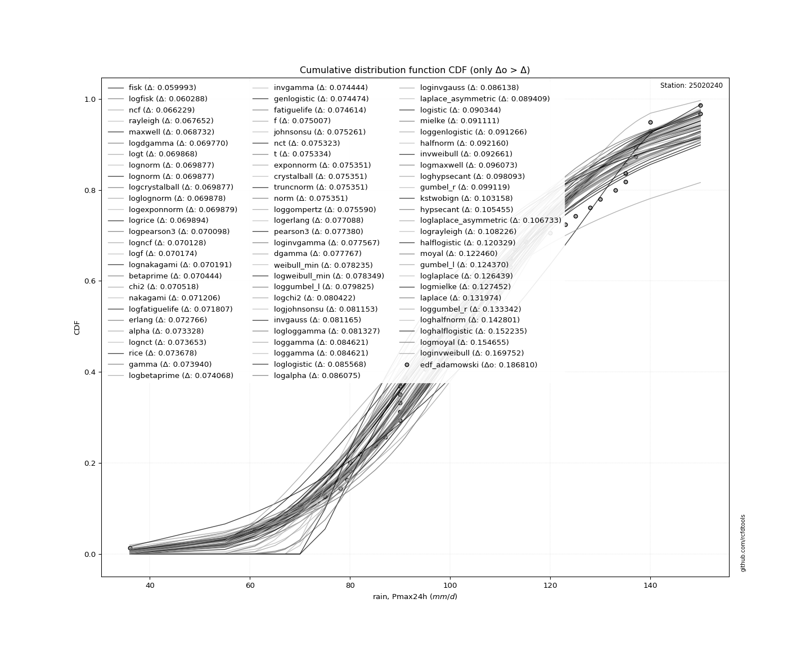</img>

</div>


**11.3. Best fit**

<div align="center">

|   id |   station | empirical_dist   | p_dist   |     delta |   deltao | eval   |   fit |   n |   best_fit |   best_fit_sort |
|-----:|----------:|:-----------------|:---------|----------:|---------:|:-------|------:|----:|-----------:|----------------:|
|    0 |  25020240 | edf_adamowski    | fisk     | 0.0599926 |  0.18681 | Δo > Δ |     1 |  53 |          1 |               1 |

</div>


<div align="center">

</img>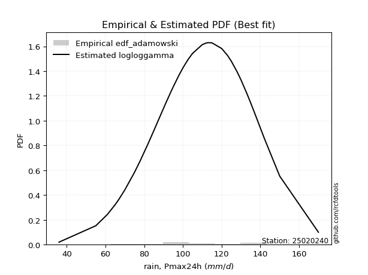</img>

</div>


## C. Best fit & Estimate extreme values for specific return periods - Tr


### 1. Best fit (ordered by delta Δ)

<div align="center">

|   id |   station | empirical_dist   | p_dist   |     delta |   deltao | eval   |   fit |   n |   best_fit |   best_fit_sort |
|-----:|----------:|:-----------------|:---------|----------:|---------:|:-------|------:|----:|-----------:|----------------:|
|    0 |  25020240 | edf_california   | maxwell  | 0.0564765 |  0.18681 | Δo > Δ |     1 |  53 |          1 |               1 |
|    1 |  25020240 | edf_weibull      | logfisk  | 0.0595462 |  0.18681 | Δo > Δ |     1 |  53 |          1 |               2 |
|    2 |  25020240 | edf_adamowski    | fisk     | 0.0599926 |  0.18681 | Δo > Δ |     1 |  53 |          1 |               3 |
|    3 |  25020240 | edf_chegodayev   | fisk     | 0.0609027 |  0.18681 | Δo > Δ |     1 |  53 |          1 |               4 |
|    4 |  25020240 | edf_beard        | fisk     | 0.0610851 |  0.18681 | Δo > Δ |     1 |  53 |          1 |               5 |
|    5 |  25020240 | edf_jenkinson    | fisk     | 0.0610851 |  0.18681 | Δo > Δ |     1 |  53 |          1 |               6 |
|    6 |  25020240 | edf_tukey        | fisk     | 0.0615113 |  0.18681 | Δo > Δ |     1 |  53 |          1 |               7 |
|    7 |  25020240 | edf_blom         | fisk     | 0.0622742 |  0.18681 | Δo > Δ |     1 |  53 |          1 |               8 |
|    8 |  25020240 | edf_cunnane      | fisk     | 0.0627331 |  0.18681 | Δo > Δ |     1 |  53 |          1 |               9 |
|    9 |  25020240 | edf_gringorten   | fisk     | 0.0634691 |  0.18681 | Δo > Δ |     1 |  53 |          1 |              10 |
|   10 |  25020240 | edf_hazen        | fisk     | 0.0645773 |  0.18681 | Δo > Δ |     1 |  53 |          1 |              11 |

</div>

:file_folder:Tables: [bestfit_25020240.csv](table/bestfit_25020240.csv) | [extreme_25020240.csv](table/extreme_25020240.csv)


### 2. Extreme values

In hydrology, a return period (or recurrence interval $Tr$) is the statistical average time between extreme events like floods or droughts of a specific magnitude, indicating how rare an event is, with a 100-year flood, for example, having a 1% chance of occurring in any given year, not that it happens exactly every century. It is a key tool for infrastructure design (like bridges or dams) and risk assessment, calculated from historical data to determine the probability of future events, although it is important to remember it is statistical average, and events can cluster or be missed.

> risk_rate: assuming the return period as the project useful life.

|   id |      tr |   prob_l |     prob_g |   alpha |   betaprime |    chi2 |   crystalball |   dgamma |   erlang |    expon |   exponnorm |       f |   fatiguelife |    fisk |   gamma |   genexpon |   genlogistic |   gibrat |   gompertz |   gumbel_l |   gumbel_r |   halflogistic |   halfnorm |   hypsecant |   invgamma |   invgauss |   invweibull |   johnsonsu |   kstwobign |   laplace |   laplace_asymmetric |   loggamma |   logistic |   lognorm |   maxwell |   mielke |    moyal |   nakagami |     ncf |     nct |    norm |   pareto |   pearson3 |   rayleigh |    rice |       t |   truncnorm |     wald |   weibull_min |   logalpha |   logbetaprime |   logchi2 |   logcrystalball |   logdgamma |   logerlang |   logexpon |   logexponnorm |     logf |   logfatiguelife |   logfisk |   loggenexpon |   loggenlogistic |   loggibrat |   loggompertz |   loggumbel_l |   loggumbel_r |   loghalflogistic |   loghalfnorm |   loghypsecant |   loginvgamma |   loginvgauss |   loginvweibull |   logjohnsonsu |   logkstwobign |   loglaplace |   loglaplace_asymmetric |   logloggamma |   loglogistic |   loglognorm |   logmaxwell |   logmielke |   logmoyal |   lognakagami |   logncf |   lognct |   logpareto |   logpearson3 |   lograyleigh |   logrice |     logt |   logtruncnorm |   logwald |   logweibull_min |   station |   n |   risk_rate |
|-----:|--------:|---------:|-----------:|--------:|------------:|--------:|--------------:|---------:|---------:|---------:|------------:|--------:|--------------:|--------:|--------:|-----------:|--------------:|---------:|-----------:|-----------:|-----------:|---------------:|-----------:|------------:|-----------:|-----------:|-------------:|------------:|------------:|----------:|---------------------:|-----------:|-----------:|----------:|----------:|---------:|---------:|-----------:|--------:|--------:|--------:|---------:|-----------:|-----------:|--------:|--------:|------------:|---------:|--------------:|-----------:|---------------:|----------:|-----------------:|------------:|------------:|-----------:|---------------:|---------:|-----------------:|----------:|--------------:|-----------------:|------------:|--------------:|--------------:|--------------:|------------------:|--------------:|---------------:|--------------:|--------------:|----------------:|---------------:|---------------:|-------------:|------------------------:|--------------:|--------------:|-------------:|-------------:|------------:|-----------:|--------------:|---------:|---------:|------------:|--------------:|--------------:|----------:|---------:|---------------:|----------:|-----------------:|----------:|----:|------------:|
|    0 |    2    | 0.5      | 0.5        | 100.802 |     99.9779 | 102.696 |       103.272 |  103.64  |  102.868 |  82.6293 |     103.272 | 103.243 |       103.291 | 101.592 | 102.73  |    82.6707 |       102.824 |  95.4956 |    135.891 |    107.528 |    99.0159 |         96.9   |    97.9689 |     103.272 |    101.621 |    99.6621 |      100.208 |     103.272 |     98.0668 |   103.272 |              100.793 |     98.479 |    103.272 |   99.6359 |   101.056 |  105.731 |  97.6419 |    102.09  | 100.41  | 103.272 | 103.272 |  82.6293 |    103.942 |    100.27  | 103.023 | 103.275 |     103.272 |  94.8741 |       104.402 |    98.3624 |        99.2456 |   98.8356 |          99.6359 |     103.395 |     98.9619 |    72.9041 |        99.6358 |  99.5944 |          99.5245 |   101.573 |       88.2132 |          105.788 |     91.6132 |       104.088 |       104.321 |       95.1613 |           93.0119 |       94.0914 |        99.6359 |       98.9948 |       98.4157 |         97.3897 |        105.083 |         93.741 |      99.6359 |                 100.304 |       104.876 |       99.6359 |      99.6358 |      97.2806 |     109.802 |    93.76   |       99.5946 |  99.4922 |  99.2948 |     72.9041 |       104.324 |       96.4587 |   99.6351 |  99.6373 |        55.9537 |   90.999  |          104.43  |  25020240 |  53 |    0.75     |
|    1 |    2.33 | 0.570815 | 0.429185   | 105.521 |    104.895  | 107.393 |       107.895 |  110.333 |  107.534 |  92.9032 |     107.895 | 107.865 |       107.888 | 106.166 | 107.394 |    92.9536 |       107.214 |  97.8375 |    136.705 |    111.55  |   103.3    |        101.304 |   102.958  |     106.972 |    106.284 |   105.261  |      105.856 |     107.896 |    104.063  |   106.07  |              104.438 |    103.811 |    107.345 |  104.735  |   105.859 |  110.24  | 101.697  |    106.692 | 105.254 | 107.895 | 107.895 |  92.9032 |    108.538 |    105.144 | 107.694 | 107.898 |     107.895 |  97.9055 |       109.068 |   103.694  |       104.368  |  104.206  |         104.735  |     109.987 |    104.264  |    85.1672 |       104.735  | 104.702  |         104.6    |   106.15  |       98.5019 |          110.304 |     93.9588 |       108.81  |       108.951 |       99.6658 |           97.5416 |       99.2992 |       103.696  |      104.334  |      103.822  |        104.934  |        109.829 |        102.171 |     102.691  |                 103.603 |       109.559 |      104.115  |     104.735  |     102.458  |     115.27  |    97.9561 |      104.702  | 104.653  | 104.41   |     85.1672 |       109.232 |      101.671  |  104.734  | 104.736  |        60.901  |   94.0267 |          109.098 |  25020240 |  53 |    0.729209 |
|    2 |    5    | 0.8      | 0.2        | 124.114 |    124.793  | 125.219 |       125.075 |  125.286 |  125.106 | 144.27   |     125.075 | 125.082 |       125.092 | 125.825 | 124.959 |   144.366  |       124.527 | 111.32   |    139.334 |    124.544 |   121.91   |        121.233 |   124.058  |     121.812 |    124.366 |   128.888  |      130.392 |     125.084 |    129.534  |   120.057 |              122.662 |    126.749 |    123.072 |  126.081  |   124.763 |  126.048 | 120.481  |    124.785 | 125.151 | 125.077 | 125.075 | 144.27   |    125.248 |    124.657 | 125.135 | 125.078 |     125.075 | 114.875  |       125.635 |   126.736  |       125.912  |  127.283  |         126.081  |     128.53  |    126.998  |   185.292  |       126.081  | 126.121  |         125.853  |   125.844 |      158.088  |          126.091 |    108.68   |       125.625 |       125.359 |      121.845  |          120.958  |      124.705  |       121.717  |      127.225  |      127.509  |        145.105  |        126.186 |        147.293 |     119.432  |                 121.668 |       125.911 |      123.384  |     126.081  |     125.658  |     130.955 |   119.979  |      126.096  | 126.396  | 125.897  |    185.292  |       126.431 |      125.514  |  126.078  | 126.08   |        86.8243 |  112.934  |          125.653 |  25020240 |  53 |    0.67232  |
|    3 |   10    | 0.9      | 0.1        | 137.454 |    139.505  | 137.37  |       136.472 |  136.158 |  136.967 | 190.899  |     136.472 | 136.536 |       136.612 | 142.577 | 136.812 |   191.037  |       137.518 | 126.689  |    140.797 |    131.778 |   137.068  |        137.783 |   139.671  |     133.663 |    137.054 |   147.245  |      150.376 |     136.485 |    148.927  |   132.755 |              139.206 |    145.168 |    134.655 |  142.59   |   138.067 |  136.772 | 136.835  |    137.506 | 140.208 | 136.476 | 136.472 | 190.899  |    136.012 |    138.571 | 136.758 | 136.474 |     136.472 | 132.884  |       135.939 |   145.368  |       142.683  |  145.784  |         142.59   |     144.471 |    145.172  |   375.238  |       142.589  | 142.73   |         142.301  |   142.649 |      229.081  |          136.764 |    128.294  |       136.111 |       135.543 |      143.51   |          144.623  |      147.603  |       138.33   |      145.52   |      147.017  |        188.945  |        135.816 |        194.594 |     136.98   |                 140.78  |       135.868 |      139.819  |     142.59   |     145.068  |     137.944 |   143.149  |      142.657  | 143.36   | 142.595  |    375.238  |       136.56  |      145.859  |  142.586  | 142.588  |       108.642  |  137.174  |          135.936 |  25020240 |  53 |    0.651322 |
|    4 |   15    | 0.933333 | 0.0666667  | 144.441 |    147.331  | 143.532 |       142.16  |  142.123 |  142.946 | 218.176  |     142.16  | 142.261 |       142.393 | 152.62  | 142.787 |   218.337  |       144.643 | 137.289  |    141.46  |    135.054 |   145.62   |        147.149 |   147.796  |     140.426 |    143.604 |   157.277  |      161.651 |     142.174 |    159.222  |   140.182 |              148.883 |    155.488 |    140.965 |  151.62   |   144.893 |  142.557 | 146.326  |    144.031 | 148.35  | 142.165 | 142.16  | 218.176  |    141.289 |    145.739 | 142.571 | 142.162 |     142.16  | 144.448  |       140.883 |   155.862  |       151.896  |  156.139  |         151.62   |     154.137 |    155.326  |   566.98   |       151.619  | 151.83   |         151.301  |   152.73  |      280.662  |          142.512 |    143.849  |       141.148 |       140.423 |      157.391  |          160.012  |      161.136  |       148.809  |      155.742  |      158.133  |        219.292  |        140.244 |        225.599 |     148.417  |                 153.324 |       140.589 |      149.677  |     151.62   |     156.164  |     140.868 |   158.595  |      151.72   | 152.691  | 151.757  |    566.98   |       141.145 |      157.597  |  151.615  | 151.618  |       119.167  |  155.417  |          140.865 |  25020240 |  53 |    0.644736 |
|    5 |   20    | 0.95     | 0.05       | 149.143 |    152.638  | 147.603 |       145.884 |  146.245 |  146.884 | 237.529  |     145.884 | 146.014 |       146.191 | 159.969 | 146.721 |   237.707  |       149.58  | 145.605  |    141.873 |    137.093 |   151.608  |        153.711 |   153.213  |     145.197 |    147.975 |   164.175  |      169.545 |     145.9   |    166.158  |   145.452 |              155.749 |    162.699 |    145.327 |  157.841  |   149.423 |  146.586 | 153.048  |    148.36  | 153.925 | 145.89  | 145.884 | 237.529  |    144.711 |    150.504 | 146.381 | 145.886 |     145.884 | 153.066  |       144.051 |   163.216  |       158.259  |  163.369  |         157.841  |     161.221 |    162.409  |   759.9    |       157.84   | 158.105  |         157.504  |   160.112 |      322.754  |          146.513 |    157.36   |       144.378 |       143.549 |      167.903  |          171.759  |      170.842  |       156.675  |      162.873  |      165.976  |        243.397  |        143.009 |        249.225 |     157.106  |                 162.895 |       143.597 |      156.894  |     157.841  |     163.992  |     142.683 |   170.533  |      157.966  | 159.142  | 158.082  |    759.9    |       143.965 |      165.917  |  157.836  | 157.839  |       125.402  |  170.572  |          144.024 |  25020240 |  53 |    0.641514 |
|    6 |   25    | 0.96     | 0.04       | 152.67  |    156.639  | 150.618 |       148.626 |  149.392 |  149.793 | 252.54   |     148.626 | 148.779 |       148.992 | 165.828 | 149.629 |   252.732  |       153.361 | 152.537  |    142.166 |    138.545 |   156.22   |        158.767 |   157.244  |     148.89  |    151.235 |   169.423  |      175.626 |     148.643 |    171.352  |   149.54  |              161.075 |    168.25  |    148.664 |  162.583  |   152.787 |  149.698 | 158.258  |    151.575 | 158.159 | 148.633 | 148.626 | 252.54   |    147.213 |    154.044 | 149.188 | 148.628 |     148.626 | 159.969  |       146.349 |   168.891  |       163.117  |  168.932  |         162.583  |     166.863 |    167.855  |   953.698  |       162.582  | 162.892  |         162.233  |   165.999 |      358.974  |          149.602 |    169.588  |       146.722 |       145.816 |      176.475  |          181.395  |      178.44   |       163.047  |      168.357  |      172.056  |        263.756  |        144.976 |        268.528 |     164.195  |                 170.729 |       145.77  |      162.649  |     162.584  |     170.056  |     143.992 |   180.4    |      162.729  | 164.07   | 162.909  |    953.698  |       145.945 |      172.382  |  162.578  | 162.582  |       129.533  |  183.771  |          146.314 |  25020240 |  53 |    0.639603 |
|    7 |   50    | 0.98     | 0.02       | 163.095 |    168.553  | 159.336 |       156.477 |  158.957 |  158.179 | 299.169  |     156.477 | 156.704 |       157.042 | 185.084 | 158.006 |   299.402  |       164.933 | 176.973  |    142.963 |    142.484 |   170.428  |        174.344 |   168.959  |     160.338 |    160.771 |   185.276  |      194.358 |     156.498 |    186.607  |   162.237 |              177.618 |    185.372 |    158.859 |  176.965  |   162.541 |  159.445 | 174.432  |    160.895 | 170.924 | 156.486 | 156.477 | 299.169  |    154.297 |    164.321 | 157.234 | 156.479 |     156.477 | 182.506  |       152.776 |   186.467  |       177.897  |  186.079  |         176.965  |     185.315 |    184.621  |  1931.35   |       176.965  | 177.428  |         176.579  |   185.361 |      495.085  |          159.271 |    220.782  |       153.28  |       152.151 |      205.733  |          214.619  |      202.501  |       184.498  |      185.24   |      191.04   |        337.812  |        150.297 |        334.292 |     188.32   |                 197.548 |       151.808 |      181.574  |     176.966  |     188.943  |     147.735 |   214.821  |      177.178  | 179.077  | 177.584  |   1931.35   |       151.165 |      192.61   |  176.959  | 176.965  |       138.866  |  234.4    |          152.717 |  25020240 |  53 |    0.63583  |
|    8 |   75    | 0.986667 | 0.0133333  | 168.895 |    175.234  | 164.066 |       160.69  |  164.435 |  162.71  | 326.446  |     160.69  | 160.962 |       161.378 | 197.203 | 162.533 |   326.703  |       171.624 | 193.477  |    143.366 |    144.476 |   178.687  |        183.399 |   175.336  |     167.028 |    166.014 |   194.3    |      205.246 |     160.712 |    195      |   169.665 |              187.295 |    195.367 |    164.747 |  185.2    |   167.844 |  165.278 | 183.89   |    165.963 | 178.188 | 160.7   | 160.69  | 326.446  |    158.049 |    169.911 | 161.555 | 160.692 |     160.69  | 196.374  |       156.133 |   196.777  |       186.388  |  196.079  |         185.2    |     196.829 |    194.387  |  2918.25   |       185.199  | 185.762  |         184.797  |   197.556 |      594.594  |          165.056 |    263.842  |       156.707 |       155.459 |      224.919  |          236.661  |      216.935  |       198.317  |      195.075  |      202.28   |        390.07   |        152.966 |        377.112 |     204.044  |                 215.149 |       154.942 |      193.492  |     185.201  |     200.076  |     149.797 |   237.917  |      185.455  | 187.708  | 186.008  |   2918.25   |       153.687 |      204.594  |  185.193  | 185.2    |       142.35   |  272.263  |          156.061 |  25020240 |  53 |    0.634587 |
|    9 |  100    | 0.99     | 0.01       | 172.904 |    179.871  | 167.286 |       163.539 |  168.281 |  165.788 | 345.799  |     163.539 | 163.843 |       164.318 | 206.232 | 165.607 |   346.073  |       176.351 | 206.262  |    143.63  |    145.779 |   184.532  |        189.808 |   179.681  |     171.774 |    169.611 |   200.613  |      212.952 |     163.562 |    200.75   |   174.935 |              194.161 |    202.473 |    168.904 |  190.986  |   171.456 |  169.502 | 190.601  |    169.414 | 183.274 | 163.551 | 163.539 | 345.799  |    160.568 |    173.72  | 164.479 | 163.541 |     163.539 | 206.486  |       158.37  |   204.13   |       192.366  |  203.184  |         190.986  |     205.353 |    201.32   |  3911.2    |       190.985  | 191.623  |         190.572  |   206.646 |      675.942  |          169.243 |    302.891  |       158.991 |       157.661 |      239.57   |          253.616  |      227.353  |       208.743  |      202.059  |      210.339  |        431.871  |        154.699 |        409.575 |     215.99   |                 228.58  |       157.021 |      202.374  |     190.987  |     208.034  |     151.232 |   255.793  |      191.272  | 193.79   | 191.937  |   3911.2    |       155.284 |      213.184  |  190.979  | 190.987  |       144.174  |  303.67   |          158.287 |  25020240 |  53 |    0.633968 |
|   10 |  200    | 0.995    | 0.005      | 182.264 |    190.75   | 174.651 |       170.002 |  177.434 |  172.807 | 392.428  |     170.002 | 170.386 |       171.006 | 229.606 | 172.619 |   392.744  |       187.694 | 241.045  |    144.203 |    148.611 |   198.584  |        205.217 |   189.617  |     183.207 |    177.928 |   215.576  |      231.478 |     170.028 |    213.995  |   187.632 |              210.704 |    219.698 |    178.876 |  204.789  |   179.72  |  180.027 | 206.768  |    177.31  | 195.359 | 170.016 | 170.002 | 392.428  |    166.225 |    182.435 | 171.117 | 170.004 |     170.002 | 231.672  |       163.343 |   222.032  |       206.669  |  220.394  |         204.789  |     227.199 |    218.095  |  7920.64   |       204.788  | 205.62   |         204.354  |   230.193 |      916.318  |          179.673 |    440.93   |       164.071 |       162.557 |      278.817  |          299.519  |      253.1    |       236.166  |      218.963  |      230.109  |        551.627  |        158.422 |        495.378 |     247.725  |                 264.486 |       161.623 |      225.379  |     204.791  |     227.449  |     154.655 |   304.576  |      205.155  | 208.353  | 206.113  |   7920.64   |       158.583 |      234.218  |  204.78   | 204.792  |       147.017  |  398.57   |          163.237 |  25020240 |  53 |    0.633042 |
|   11 |  250    | 0.996    | 0.004      | 185.202 |    194.177  | 176.919 |       171.978 |  180.352 |  174.963 | 407.439  |     171.978 | 172.387 |       173.056 | 237.656 | 174.772 |   407.768  |       191.337 | 253.525  |    144.371 |    149.444 |   203.101  |        210.17  |   192.674  |     186.887 |    180.514 |   220.33   |      237.434 |     172.004 |    218.094  |   191.72  |              216.03  |    225.287 |    182.077 |  209.203  |   182.264 |  183.531 | 211.973  |    179.741 | 199.211 | 171.992 | 171.978 | 407.439  |    167.937 |    185.118 | 173.146 | 171.979 |     171.978 | 240.004  |       164.836 |   227.864  |       211.255  |  225.975  |         209.203  |     234.652 |    223.529  |  9940.65   |       209.202  | 210.101  |         208.763  |   238.308 |     1009.43   |          183.145 |    504.526  |       165.596 |       164.026 |      292.752  |          315.974  |      261.593  |       245.739  |      224.44   |      236.594  |        596.783  |        159.503 |        525.412 |     258.902  |                 277.206 |       162.999 |      233.305  |     209.205  |     233.783  |     155.755 |   322.181  |      209.595  | 213.026  | 210.656  |   9940.66   |       159.504 |      241.101  |  209.194  | 209.207  |       147.602  |  436.09   |          164.723 |  25020240 |  53 |    0.632858 |
|   12 |  500    | 0.998    | 0.002      | 194.133 |    204.634  | 183.693 |       177.835 |  189.339 |  181.384 | 454.068  |     177.835 | 178.326 |       179.149 | 264.454 | 181.186 |   454.439  |       202.635 | 296.657  |    144.855 |    151.833 |   217.122  |        225.545 |   201.788  |     198.319 |    188.307 |   234.937  |      255.919 |     177.863 |    230.377  |   204.417 |              232.573 |    242.827 |    192.006 |  222.859  |   189.855 |  194.819 | 228.14   |    186.994 | 211.095 | 177.851 | 177.835 | 454.068  |    172.973 |    193.123 | 179.167 | 177.836 |     177.835 | 266.498  |       169.192 |   246.242  |       225.479  |  243.473  |         222.86   |     259.221 |    240.555  | 20131      |       222.859  | 223.979  |         222.408  |   265.339 |     1359.5    |          194.326 |    803.726  |       170.048 |       168.311 |      340.6    |          373.028  |      288.643  |       278.021  |      241.604  |      257.163  |        761.865  |        162.562 |        626.771 |     296.943  |                 320.751 |       166.999 |      259.704  |     222.862  |     253.75   |     159.194 |   383.623  |      223.34   | 227.532  | 224.739  |  20131      |       162.004 |      262.865  |  222.849  | 222.867  |       148.789  |  580.513  |          169.057 |  25020240 |  53 |    0.632489 |
|   13 |  750    | 0.998667 | 0.00133333 | 199.242 |    210.635  | 187.486 |       181.089 |  194.552 |  184.971 | 481.345  |     181.089 | 181.628 |       182.544 | 281.483 | 184.767 |   481.74   |       209.237 | 325.182  |    145.113 |    153.11  |   225.319  |        234.533 |   206.879  |     205.006 |    192.718 |   243.385  |      266.726 |     181.118 |    237.278  |   211.845 |              242.251 |    253.231 |    197.807 |  230.827  |   194.1   |  201.722 | 237.597  |    191.051 | 218.009 | 181.106 | 181.089 | 481.345  |    175.743 |    197.599 | 182.514 | 181.09  |     181.089 | 282.384  |       171.568 |   257.197  |       233.802  |  253.845  |         230.828  |     274.655 |    250.634  | 30417.7    |       230.827  | 232.086  |         230.372  |   282.529 |     1615.43   |          201.162 |   1093.57   |       172.477 |       170.647 |      372.115  |          411.042  |      304.955  |       298.836  |      251.77   |      269.517  |        878.783  |        164.169 |        692.063 |     321.736  |                 349.329 |       169.171 |      276.489  |     230.83   |     265.653  |     161.229 |   424.861  |      231.362  | 236.03   | 232.976  |  30417.7    |       163.248 |      275.88   |  230.817  | 230.837  |       149.19   |  689.129  |          171.42  |  25020240 |  53 |    0.632366 |
|   14 | 1000    | 0.999    | 0.001      | 202.823 |    214.85   | 190.111 |       183.329 |  198.232 |  187.448 | 500.698  |     183.329 | 183.902 |       184.886 | 294.218 | 187.241 |   501.11   |       213.919 | 347.01   |    145.287 |    153.969 |   231.133  |        240.908 |   210.396  |     209.751 |    195.789 |   249.343  |      274.392 |     183.359 |    242.059  |   217.115 |              249.117 |    260.685 |    201.921 |  236.478  |   197.035 |  206.762 | 244.307  |    193.855 | 222.905 | 183.348 | 183.329 | 500.698  |    177.638 |    200.692 | 184.819 | 183.33  |     183.329 | 293.81   |       173.185 |   265.071  |       239.716  |  261.272  |         236.479  |     286.113 |    257.848  | 40767.5    |       236.477  | 237.839  |         236.021  |   295.39  |     1824.6    |          206.152 |   1384.17   |       174.131 |       172.237 |      396.223  |          440.332  |      316.755  |       314.543  |      259.047  |      278.438  |        972.442  |        165.237 |        741.244 |     340.572  |                 371.136 |       170.647 |      289.046  |     236.482  |     274.205  |     162.687 |   456.782  |      237.053  | 242.07   | 238.826  |  40767.5    |       164.047 |      285.249  |  236.467  | 236.49   |       149.392  |  779.619  |          173.029 |  25020240 |  53 |    0.632305 |

<div align="center">

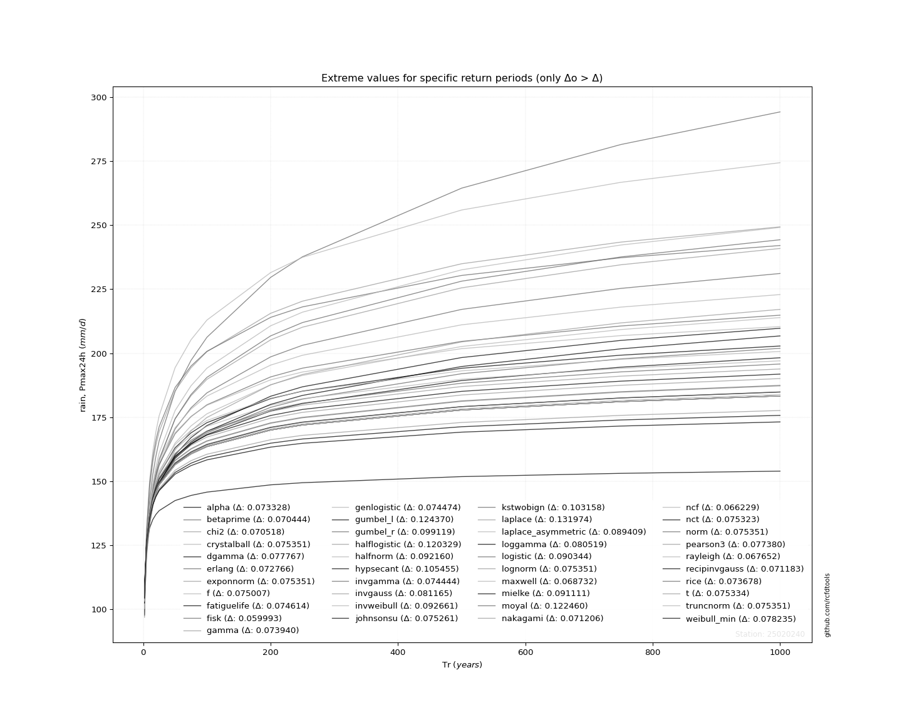</img>

</div>


<div align="center">

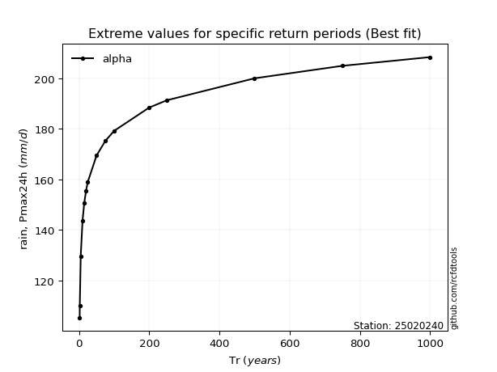</img>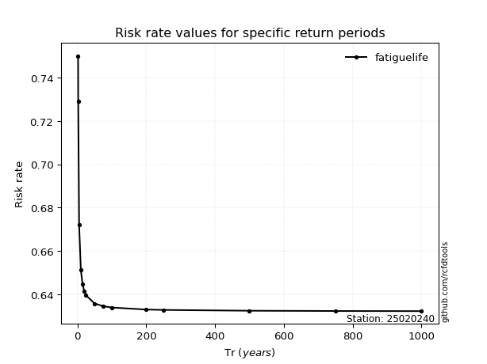</img>

</div>


<sub>**APP DISCLAIMER**: NO WARRANTY - This software is provided by [github.com/rcfdtools](https://github.com/rcfdtools) "as is", without any express or implied warranty, including warranties of merchantability, fitness for a particular purpose, or non-infringement. There is no guarantee that the software will be error-free or operate without interruption. LIMITATION OF LIABILITY - Neither the authors nor copyright holders will be liable for claims or damages arising from the software or its use. You are responsible for determining if the software is appropriate for your use and assume all associated risks, including errors, legal compliance, and data loss. NO PROFESSIONAL ADVICE - The software provides general information and does not offer professional advice. It should not replace consultation with professional advisors.</sub>