<div align="center">


</div>

# PMP Station (rain, Pmax24h): 25020250

Probable Maximum Precipitation (PMP) is the greatest amount of rainfall for a specific duration that is meteorologically possible for a given location, acting as a "worst-case" scenario for extreme storms, crucial for designing safety-critical infrastructure like bridges, river deviations, dams, spillways, and nuclear plants to prevent catastrophic failure. PMP is calculated by hydrologists using meteorological data to determine the upper limit of extreme rainfall, often leading to the Probable Maximum Flood (PMF) for flood control design, and is increasingly being studied for climate change impacts.

<div align="center">

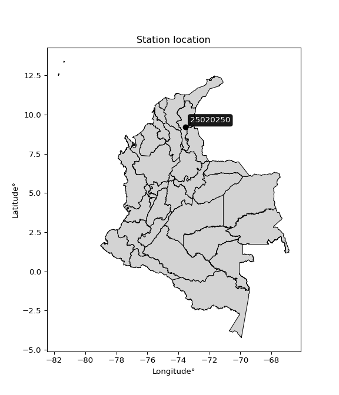</img>

</div>


## A. General information


### 1. General running parameters

• app_version: _v20251228_. • runtime: _2025-12-28 10:36:19.550669_. • Python version: _3.14.0_. • SciPy version: _1.16.3_. • Pandas version: _2.3.3_. • NumPy version: _2.3.5_. • Stations dataset (station_dataset_file): _dataset/pmax24h_in/conventional_cesarcolombia_1959_2022.csv_. • Stations catalog (station_catalog_file): _dataset/CNE_IDEAM.xls_. • Minimum year to eval til year_max (date_min): _1900_. • Maximum year to eval since year_min (date_max): _2024_. • Creates, save and include plots into reports (create_plot): _True_. • Plot only fit distributions with Δo > Δ (plot_only_fit): _True_. • Eval low extreme values, if False, evaluates high extreme values (low_extreme): _False_. • Eval every SciPy distribution as logarithmic (pdist_logarithmic_on): _True_. • Standard deviation normalized (ddof): _1.0_. • Return periods to eval in years (Tr): _[2, 2.33, 5, 10, 15, 20, 25, 50, 75, 100, 200, 250, 500, 750, 1000]_. • Minimum data sample per station, 0 means any (minimum_sample): _5_. • Z-Score maximum threshold to adjust a value, 0 means disable (zscore_max): _3.5_. • Z-Score minimum threshold to adjust a value, 0 means disable (zscore_min): _-2.5_. • Avoid zeros, e.g. rain = 0 (avoid_zeros): _True_. • Avoid null values (avoid_nans): _True_. [:file_folder:Dataset file.](../../dataset/pmax24h_in/conventional_cesarcolombia_1959_2022.csv)

> Delta Degrees of Freedom (DDOF): is a parameter used in the formulas for calculating variance and standard deviation. When ddof=0, the divisor is $N$ (the total number of observations) and this is used when your data set is the entire population. When ddof=1, the divisor is $N-1$ and this is used when your data set is a sample drawn from a larger population. Using $N-1$ provides an unbiased estimate of the population variance (known as Bessel´s correction).


### 2. Station info and location

|   id |   CODIGO | NOMBRE              | CATEGORIA     | TECNOLOGIA   | ESTADO   | FECHA_INSTALACION   |   FECHA_SUSPENSION |   ALTITUD |   LATITUD |   LONGITUD | DEPARTAMENTO   | MUNICIPIO   | AREA_OPERATIVA                                         | ENTIDAD                                                     | AREA_HIDROGRAFICA   | ZONA_HIDROGRAFICA   | SUBZONA_HIDROGRAFICA   |   CORRIENTE | Catalogo   |
|-----:|---------:|:--------------------|:--------------|:-------------|:---------|:--------------------|-------------------:|----------:|----------:|-----------:|:---------------|:------------|:-------------------------------------------------------|:------------------------------------------------------------|:--------------------|:--------------------|:-----------------------|------------:|:-----------|
|    0 | 25020250 | CURUMANI [25020250] | Pluviométrica | Convencional | Activa   | 15/03/1963          |                nan |       100 |   9.19719 |   -73.5419 | Cesar          | Curumaní    | Area Operativa 05 - Magdalena-Cesar-Guajira-San Andrés | INSTITUTO DE HIDROLOGIA METEOROLOGIA Y ESTUDIOS AMBIENTALES | Magdalena Cauca     | Cesar               | Bajo Cesar             |         nan | CNE_IDEAM  |

<div align="center">

Map location in: [:earth_americas:Google](http://maps.google.com/maps?q=9.197194444,-73.54194444) [:earth_americas:OSM](https://www.openstreetmap.org/#map=18/9.197194444/-73.54194444&layers=P) [:earth_americas:Bing](https://www.bing.com/maps?cp=9.197194444~-73.54194444&lvl=18) [:earth_americas:Apple](https://maps.apple.com/frame?center=9.197194444%2C-73.54194444&span=0.003%2C0.006)

</div>


<div align="center">

```geojson
{
  "type": "Feature",
  "geometry": {
    "type": "Point", 
    "coordinates": [-73.54194444, 9.197194444]
  }, 
  "properties": {
    "Name": "25020250"
  }
}
```

</div>


### 3. Discrete values table and plot

|               |         0 |          1 |           2 |           3 |           4 |           5 |          6 |           7 |           8 |           9 |         10 |         11 |         12 |           13 |         14 |          15 |          16 |          17 |         18 |          19 |          20 |         21 |          22 |          23 |          24 |        25 |          26 |          27 |          28 |         29 |          30 |          31 |          32 |          33 |          34 |         35 |         36 |          37 |         38 |          39 |         40 |          41 |          42 |        43 |         44 |          45 |          46 |          47 |           48 |          49 |          50 |         51 |          52 |           53 |         54 |         55 |
|:--------------|----------:|-----------:|------------:|------------:|------------:|------------:|-----------:|------------:|------------:|------------:|-----------:|-----------:|-----------:|-------------:|-----------:|------------:|------------:|------------:|-----------:|------------:|------------:|-----------:|------------:|------------:|------------:|----------:|------------:|------------:|------------:|-----------:|------------:|------------:|------------:|------------:|------------:|-----------:|-----------:|------------:|-----------:|------------:|-----------:|------------:|------------:|----------:|-----------:|------------:|------------:|------------:|-------------:|------------:|------------:|-----------:|------------:|-------------:|-----------:|-----------:|
| Date          | 1963      | 1964       | 1965        | 1966        | 1968        | 1969        | 1970       | 1971        | 1972        | 1973        | 1974       | 1975       | 1976       | 1977         | 1978       | 1979        | 1980        | 1981        | 1982       | 1983        | 1984        | 1985       | 1986        | 1987        | 1988        | 1989      | 1990        | 1991        | 1992        | 1993       | 1994        | 1995        | 1996        | 1997        | 1998        | 1999       | 2000       | 2001        | 2002       | 2003        | 2004       | 2005        | 2006        | 2007      | 2008       | 2009        | 2010        | 2011        | 2012         | 2013        | 2014        | 2015       | 2016        | 2017         | 2021       | 2022       |
| Value         |  136      |  109.402   |  118        |  124        |  135        |  104        |  140       |  128        |   89        |  133        |   77       |   70       |   75       |  109         |  167       |  125        |  129        |  122        |   74       |  134        |  106        |   77       |   91        |  134        |  128        |   65      |  120        |  100        |  122        |  140       |   98        |  125        |  100        |  102.9      |  104.4      |  119.5     |  165       |   88.6      |  139       |  102.5      |   77.3     |  105.3      |  130.8      |  136      |   80       |   84        |  132.2      |  130.5      |  112         |  119        |   92.7      |   80.7     |  104        |  107.1       |   67       |  116       |
| Value_initial |  136      |   35       |  118        |  124        |  135        |  104        |  140       |  128        |   89        |  133        |   77       |   70       |   75       |  109         |  167       |  125        |  129        |  122        |   74       |  134        |  106        |   77       |   91        |  134        |  128        |   65      |  120        |  100        |  122        |  140       |   98        |  125        |  100        |  102.9      |  104.4      |  119.5     |  165       |   88.6      |  139       |  102.5      |   77.3     |  105.3      |  130.8      |  136      |   80       |   84        |  132.2      |  130.5      |  112         |  119        |   92.7      |   80.7     |  104        |  107.1       |   67       |  116       |
| count         |   56      |   56       |   56        |   56        |   56        |   56        |   56       |   56        |   56        |   56        |   56       |   56       |   56       |   56         |   56       |   56        |   56        |   56        |   56       |   56        |   56        |   56       |   56        |   56        |   56        |   56      |   56        |   56        |   56        |   56       |   56        |   56        |   56        |   56        |   56        |   56       |   56       |   56        |   56       |   56        |   56       |   56        |   56        |   56      |   56       |   56        |   56        |   56        |   56         |   56        |   56        |   56       |   56        |   56         |   56       |   56       |
| mean          |  109.402  |  109.402   |  109.402    |  109.402    |  109.402    |  109.402    |  109.402   |  109.402    |  109.402    |  109.402    |  109.402   |  109.402   |  109.402   |  109.402     |  109.402   |  109.402    |  109.402    |  109.402    |  109.402   |  109.402    |  109.402    |  109.402   |  109.402    |  109.402    |  109.402    |  109.402  |  109.402    |  109.402    |  109.402    |  109.402   |  109.402    |  109.402    |  109.402    |  109.402    |  109.402    |  109.402   |  109.402   |  109.402    |  109.402   |  109.402    |  109.402   |  109.402    |  109.402    |  109.402  |  109.402   |  109.402    |  109.402    |  109.402    |  109.402     |  109.402    |  109.402    |  109.402   |  109.402    |  109.402     |  109.402   |  109.402   |
| std           |   26.1741 |   26.1741  |   26.1741   |   26.1741   |   26.1741   |   26.1741   |   26.1741  |   26.1741   |   26.1741   |   26.1741   |   26.1741  |   26.1741  |   26.1741  |   26.1741    |   26.1741  |   26.1741   |   26.1741   |   26.1741   |   26.1741  |   26.1741   |   26.1741   |   26.1741  |   26.1741   |   26.1741   |   26.1741   |   26.1741 |   26.1741   |   26.1741   |   26.1741   |   26.1741  |   26.1741   |   26.1741   |   26.1741   |   26.1741   |   26.1741   |   26.1741  |   26.1741  |   26.1741   |   26.1741  |   26.1741   |   26.1741  |   26.1741   |   26.1741   |   26.1741 |   26.1741  |   26.1741   |   26.1741   |   26.1741   |   26.1741    |   26.1741   |   26.1741   |   26.1741  |   26.1741   |   26.1741    |   26.1741  |   26.1741  |
| zscore        |    1.0162 |   -2.84258 |    0.328501 |    0.557736 |    0.977999 |   -0.206379 |    1.16903 |    0.710559 |   -0.779466 |    0.901588 |   -1.23793 |   -1.50538 |   -1.31435 |   -0.0153505 |    2.20058 |    0.595942 |    0.748765 |    0.481324 |   -1.35255 |    0.939793 |   -0.129968 |   -1.23793 |   -0.703054 |    0.939793 |    0.710559 |   -1.6964 |    0.404913 |   -0.359202 |    0.481324 |    1.16903 |   -0.435614 |    0.595942 |   -0.359202 |   -0.248406 |   -0.191097 |    0.38581 |    2.12417 |   -0.794748 |    1.13082 |   -0.263688 |   -1.22647 |   -0.156712 |    0.817535 |    1.0162 |   -1.12332 |   -0.970495 |    0.871023 |    0.806073 |    0.0992668 |    0.366707 |   -0.638104 |   -1.09657 |   -0.206379 |   -0.0879415 |   -1.61999 |    0.25209 |

<div align="center">

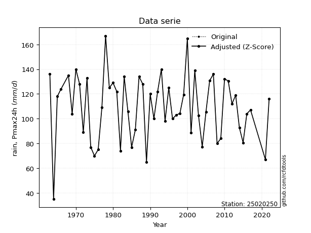</img>

</div>


> The initial value (value_initial) correspond to the initial obtained or null completed value, and value (value) is adjusted only when the initial value is outside the valid range definite through the Z-Score value. If Z-Score is active, values out of range or outliers are replaced with the station mean value


### 4. Active continuous probability distributions from SciPy (44 of 104 available)

[scipy.stats](https://docs.scipy.org/doc/scipy/reference/stats.html) is a Python´s powerful submodule within the SciPy library for comprehensive statistical analysis, offering over 130 probability distributions (like Normal, Poisson), functions for descriptive stats (mean, variance), hypothesis testing (t-tests, chi-square), random variable generation, and statistical tests, making it essential for data science, modeling, and research. It provides tools to explore, model, and draw conclusions from data efficiently, working seamlessly with NumPy.

<div align="center">

|   id | p_dist             |   n_parameter | fit_method   | label                                                                       | active   | ref                                                                                                        |
|-----:|:-------------------|--------------:|:-------------|:----------------------------------------------------------------------------|:---------|:-----------------------------------------------------------------------------------------------------------|
|    0 | alpha              |             3 | MLE          | Alpha                                                                       | True     | [:mortar_board:](https://docs.scipy.org/doc/scipy/reference/generated/scipy.stats.alpha.html)              |
|    1 | betaprime          |             4 | MLE          | Beta prime                                                                  | True     | [:mortar_board:](https://docs.scipy.org/doc/scipy/reference/generated/scipy.stats.betaprime.html)          |
|    2 | chi2               |             3 | MLE          | Chi²                                                                        | True     | [:mortar_board:](https://docs.scipy.org/doc/scipy/reference/generated/scipy.stats.chi2.html)               |
|    3 | crystalball        |             4 | MLE          | Crystalball                                                                 | True     | [:mortar_board:](https://docs.scipy.org/doc/scipy/reference/generated/scipy.stats.crystalball.html)        |
|    4 | erlang             |             3 | MLE          | Erlang                                                                      | True     | [:mortar_board:](https://docs.scipy.org/doc/scipy/reference/generated/scipy.stats.erlang.html)             |
|    5 | expon              |             2 | MLE          | Exponential                                                                 | True     | [:mortar_board:](https://docs.scipy.org/doc/scipy/reference/generated/scipy.stats.expon.html)              |
|    6 | exponnorm          |             3 | MLE          | Exponentially modified Normal                                               | True     | [:mortar_board:](https://docs.scipy.org/doc/scipy/reference/generated/scipy.stats.exponnorm.html)          |
|    7 | f                  |             4 | MLE          | F                                                                           | True     | [:mortar_board:](https://docs.scipy.org/doc/scipy/reference/generated/scipy.stats.f.html)                  |
|    8 | fatiguelife        |             3 | MLE          | Fatigue-life (Birnbaum-Saunders)                                            | True     | [:mortar_board:](https://docs.scipy.org/doc/scipy/reference/generated/scipy.stats.fatiguelife.html)        |
|    9 | fisk               |             3 | MLE          | Fisk                                                                        | True     | [:mortar_board:](https://docs.scipy.org/doc/scipy/reference/generated/scipy.stats.fisk.html)               |
|   10 | gamma              |             3 | MLE          | Gamma                                                                       | True     | [:mortar_board:](https://docs.scipy.org/doc/scipy/reference/generated/scipy.stats.gamma.html)              |
|   11 | genexpon           |             5 | MLE          | Generalized exponential                                                     | True     | [:mortar_board:](https://docs.scipy.org/doc/scipy/reference/generated/scipy.stats.genexpon.html)           |
|   12 | genlogistic        |             3 | MLE          | Generalized logistic                                                        | True     | [:mortar_board:](https://docs.scipy.org/doc/scipy/reference/generated/scipy.stats.genlogistic.html)        |
|   13 | gibrat             |             2 | MM           | Gibrat                                                                      | True     | [:mortar_board:](https://docs.scipy.org/doc/scipy/reference/generated/scipy.stats.gibrat.html)             |
|   14 | gompertz           |             3 | MLE          | Gompertz (or truncated Gumbel)                                              | True     | [:mortar_board:](https://docs.scipy.org/doc/scipy/reference/generated/scipy.stats.gompertz.html)           |
|   15 | gumbel_l           |             2 | MM           | Gumbel Left Skew                                                            | True     | [:mortar_board:](https://docs.scipy.org/doc/scipy/reference/generated/scipy.stats.gumbel_l.html)           |
|   16 | gumbel_r           |             2 | MM           | Gumbel Right Skew                                                           | True     | [:mortar_board:](https://docs.scipy.org/doc/scipy/reference/generated/scipy.stats.gumbel_r.html)           |
|   17 | halflogistic       |             2 | MM           | Half-logistic                                                               | True     | [:mortar_board:](https://docs.scipy.org/doc/scipy/reference/generated/scipy.stats.halflogistic.html)       |
|   18 | halfnorm           |             2 | MM           | Half Normal                                                                 | True     | [:mortar_board:](https://docs.scipy.org/doc/scipy/reference/generated/scipy.stats.halfnorm.html)           |
|   19 | hypsecant          |             2 | MM           | hyperbolic secant                                                           | True     | [:mortar_board:](https://docs.scipy.org/doc/scipy/reference/generated/scipy.stats.hypsecant.html)          |
|   20 | invgamma           |             3 | MLE          | Inverted gamma                                                              | True     | [:mortar_board:](https://docs.scipy.org/doc/scipy/reference/generated/scipy.stats.invgamma.html)           |
|   21 | invgauss           |             3 | MLE          | Inverse Gaussian                                                            | True     | [:mortar_board:](https://docs.scipy.org/doc/scipy/reference/generated/scipy.stats.invgauss.html)           |
|   22 | invweibull         |             3 | MLE          | Inverted Weibull                                                            | True     | [:mortar_board:](https://docs.scipy.org/doc/scipy/reference/generated/scipy.stats.invweibull.html)         |
|   23 | johnsonsu          |             4 | MLE          | Johnson Su                                                                  | True     | [:mortar_board:](https://docs.scipy.org/doc/scipy/reference/generated/scipy.stats.johnsonsu.html)          |
|   24 | kstwobign          |             2 | MLE          | Limiting distribution of scaled Kolmogorov-Smirnov two-sided test statistic | True     | [:mortar_board:](https://docs.scipy.org/doc/scipy/reference/generated/scipy.stats.kstwobign.html)          |
|   25 | laplace            |             2 | MM           | Laplace                                                                     | True     | [:mortar_board:](https://docs.scipy.org/doc/scipy/reference/generated/scipy.stats.laplace.html)            |
|   26 | laplace_asymmetric |             3 | MLE          | Asymmetric Laplace                                                          | True     | [:mortar_board:](https://docs.scipy.org/doc/scipy/reference/generated/scipy.stats.laplace_asymmetric.html) |
|   27 | loggamma           |             3 | MLE          | Log gamma                                                                   | True     | [:mortar_board:](https://docs.scipy.org/doc/scipy/reference/generated/scipy.stats.loggamma.html)           |
|   28 | logistic           |             2 | MM           | Logistic (or Sech-squared)                                                  | True     | [:mortar_board:](https://docs.scipy.org/doc/scipy/reference/generated/scipy.stats.logistic.html)           |
|   29 | lognorm            |             3 | MLE          | Log Normal                                                                  | True     | [:mortar_board:](https://docs.scipy.org/doc/scipy/reference/generated/scipy.stats.lognorm.html)            |
|   30 | maxwell            |             2 | MM           | Maxwell                                                                     | True     | [:mortar_board:](https://docs.scipy.org/doc/scipy/reference/generated/scipy.stats.maxwell.html)            |
|   31 | mielke             |             4 | MLE          | Mielke Beta-Kappa / Dagum                                                   | True     | [:mortar_board:](https://docs.scipy.org/doc/scipy/reference/generated/scipy.stats.mielke.html)             |
|   32 | moyal              |             2 | MM           | Moyal                                                                       | True     | [:mortar_board:](https://docs.scipy.org/doc/scipy/reference/generated/scipy.stats.moyal.html)              |
|   33 | nakagami           |             3 | MLE          | Nakagami                                                                    | True     | [:mortar_board:](https://docs.scipy.org/doc/scipy/reference/generated/scipy.stats.nakagami.html)           |
|   34 | ncf                |             5 | MLE          | Non-central F distribution                                                  | True     | [:mortar_board:](https://docs.scipy.org/doc/scipy/reference/generated/scipy.stats.ncf.html)                |
|   35 | nct                |             4 | MLE          | Non-central Student’s t                                                     | True     | [:mortar_board:](https://docs.scipy.org/doc/scipy/reference/generated/scipy.stats.nct.html)                |
|   36 | norm               |             2 | MM           | Normal                                                                      | True     | [:mortar_board:](https://docs.scipy.org/doc/scipy/reference/generated/scipy.stats.norm.html)               |
|   37 | pearson3           |             3 | MM           | Pearson type III                                                            | True     | [:mortar_board:](https://docs.scipy.org/doc/scipy/reference/generated/scipy.stats.pearson3.html)           |
|   38 | rayleigh           |             2 | MM           | Rayleigh                                                                    | True     | [:mortar_board:](https://docs.scipy.org/doc/scipy/reference/generated/scipy.stats.rayleigh.html)           |
|   39 | rice               |             3 | MLE          | Rice                                                                        | True     | [:mortar_board:](https://docs.scipy.org/doc/scipy/reference/generated/scipy.stats.rice.html)               |
|   40 | t                  |             3 | MLE          | Student’s t                                                                 | True     | [:mortar_board:](https://docs.scipy.org/doc/scipy/reference/generated/scipy.stats.t.html)                  |
|   41 | truncnorm          |             4 | MLE          | Truncated normal                                                            | True     | [:mortar_board:](https://docs.scipy.org/doc/scipy/reference/generated/scipy.stats.truncnorm.html)          |
|   42 | wald               |             2 | MM           | Wald                                                                        | True     | [:mortar_board:](https://docs.scipy.org/doc/scipy/reference/generated/scipy.stats.wald.html)               |
|   43 | weibull_min        |             3 | MLE          | Weibull minimum                                                             | True     | [:mortar_board:](https://docs.scipy.org/doc/scipy/reference/generated/scipy.stats.weibull_min.html)        |

</div>

> **n_parameter:** # arguments & localization & scale.
>
> **Fit methods:** (MLE) maximum likelihood, (MM) L-moments.
>
>**Inactive:** foldnorm, gennorm, norminvgauss, powernorm, powerlognorm, skewnorm, genextreme, anglit, arcsine, argus, beta, bradford, burr, burr12, cauchy, cosine, halfcauchy, foldcauchy, skewcauchy, wrapcauchy, dgamma, gengamma, exponweib, exponpow, truncexpon, gausshyper, genhalflogistic, genhyperbolic, geninvgauss, halfgennorm, johnsonsb, kappa4, kappa3, ksone, kstwo, loglaplace, levy, levy_l, levy_stable, ncx2, pareto, genpareto, truncpareto, lomax, powerlaw, rdist, rel_breitwigner, recipinvgauss, semicircular, studentized_range, trapezoid, triang, truncweibull_min, tukeylambda, uniform, loguniform, vonmises, vonmises_line, weibull_max, dweibull, 


## B. Probability distributions vs. Empirical distributions

A continuous probability distribution (CPD) describes probabilities for variables that can take any value within a range (like rain any time), unlike discrete variables with specific outcomes (like temperature). It uses a Probability Density Function (PDF), a curve where the total area under it equals 1, and the probability of the variable falling within an interval (a to b) is found by calculating the area under the curve between those points. A key feature is that the probability of hitting any single exact value is zero, so probabilities are always expressed for ranges, e.g., $P(a ≤ X ≤ b)$.

<div align="center">

Distributions parameters from station values
|    |   station | p_dist                |   n |              loc |           scale | shape                  | shape1               | shape2                | shape3   |
|---:|----------:|:----------------------|----:|-----------------:|----------------:|:-----------------------|:---------------------|:----------------------|:---------|
|  0 |  25020250 | alpha                 |  56 |   -292.672       |  6697.99        | 16.668137004249417     |                      |                       |          |
|  1 |  25020250 | betaprime             |  56 |     -0.996249    |   105.811       | 41.3024559125311       | 40.342027479181255   |                       |          |
|  2 |  25020250 | chi2                  |  56 |    -90.6026      |     1.48164     | 135.78443731516865     |                      |                       |          |
|  3 |  25020250 | crystalball           |  56 |    110.73        |    23.9214      | 7857.043540742303      | 7130.355622227873    |                       |          |
|  4 |  25020250 | erlang                |  56 |  -1571.21        |     0.340502    | 4939.593276267461      |                      |                       |          |
|  5 |  25020250 | expon                 |  56 |     65           |    45.7304      |                        |                      |                       |          |
|  6 |  25020250 | exponnorm             |  56 |    110.698       |    23.9213      | 0.0013597849956332514  |                      |                       |          |
|  7 |  25020250 | f                     |  56 |   -869.584       |   980.247       | 3354.0513908836956     | 570928.1428214437    |                       |          |
|  8 |  25020250 | fatiguelife           |  56 |  -1080.73        |  1191.28        | 0.020019523204762017   |                      |                       |          |
|  9 |  25020250 | fisk                  |  56 |     -1.57323e+09 |     1.57323e+09 | 112046452.33908841     |                      |                       |          |
| 10 |  25020250 | gamma                 |  56 |  -1573.73        |     0.34009     | 4952.949970904765      |                      |                       |          |
| 11 |  25020250 | genexpon              |  56 |     65           |     1.85547     | 0.02868497521986011    | 0.012276867261582482 | 1.2861163186225535    |          |
| 12 |  25020250 | genlogistic           |  56 |    117.595       |    12.4371      | 0.7411180434469329     |                      |                       |          |
| 13 |  25020250 | gibrat                |  56 |     92.4814      |    11.0686      |                        |                      |                       |          |
| 14 |  25020250 | gompertz              |  56 |     88.6         |     5.89246     | 4.17065862705068e-05   |                      |                       |          |
| 15 |  25020250 | gumbel_l              |  56 |    121.496       |    18.6514      |                        |                      |                       |          |
| 16 |  25020250 | gumbel_r              |  56 |     99.9645      |    18.6514      |                        |                      |                       |          |
| 17 |  25020250 | halflogistic          |  56 |     82.378       |    20.4519      |                        |                      |                       |          |
| 18 |  25020250 | halfnorm              |  56 |     79.0679      |    39.6831      |                        |                      |                       |          |
| 19 |  25020250 | hypsecant             |  56 |    110.73        |    15.2288      |                        |                      |                       |          |
| 20 |  25020250 | invgamma              |  56 |   -176.697       | 39776.9         | 139.55268504178144     |                      |                       |          |
| 21 |  25020250 | invgauss              |  56 |     -0.190299    |  1910.25        | 0.057891420665355464   |                      |                       |          |
| 22 |  25020250 | invweibull            |  56 |     -2.43798e+06 |     2.43807e+06 | 108973.84435363777     |                      |                       |          |
| 23 |  25020250 | johnsonsu             |  56 |    789.586       |   985.114       | 32.20030328254755      | 50.03111659101815    |                       |          |
| 24 |  25020250 | kstwobign             |  56 |     18.9097      |   105.031       |                        |                      |                       |          |
| 25 |  25020250 | laplace               |  56 |    110.73        |    16.915       |                        |                      |                       |          |
| 26 |  25020250 | laplace_asymmetric    |  56 |    109           |    19.9421      | 0.9575552269913625     |                      |                       |          |
| 27 |  25020250 | loggamma              |  56 |  -3500.37        |   569.563       | 567.3735374585384      |                      |                       |          |
| 28 |  25020250 | logistic              |  56 |    110.73        |    13.1885      |                        |                      |                       |          |
| 29 |  25020250 | lognorm               |  56 |     -4.19087e+06 |     4.19098e+06 | 5.70782404617508e-06   |                      |                       |          |
| 30 |  25020250 | maxwell               |  56 |     54.0468      |    35.5212      |                        |                      |                       |          |
| 31 |  25020250 | mielke                |  56 |     -0.271931    |   133.615       | 4.299002262491436      | 16.34696165617238    |                       |          |
| 32 |  25020250 | moyal                 |  56 |     97.0506      |    10.7684      |                        |                      |                       |          |
| 33 |  25020250 | nakagami              |  56 |  -1080.02        |  1190.99        | 619.1505970169051      |                      |                       |          |
| 34 |  25020250 | ncf                   |  56 |    -10.5985      |   118.211       | 50.1038016198019       | 2750.4766364264888   | 1.1649923608816897    |          |
| 35 |  25020250 | nct                   |  56 |  -1090.33        |    23.8574      | 237207.92516449362     | 50.3431932116075     |                       |          |
| 36 |  25020250 | norm                  |  56 |    110.73        |    23.9214      |                        |                      |                       |          |
| 37 |  25020250 | pearson3              |  56 |    110.73        |    23.9214      | -0.030594143796448963  |                      |                       |          |
| 38 |  25020250 | rayleigh              |  56 |     64.9674      |    36.5136      |                        |                      |                       |          |
| 39 |  25020250 | rice                  |  56 |     57.6597      |    27.2078      | 1.605535471822405      |                      |                       |          |
| 40 |  25020250 | t                     |  56 |    110.73        |    23.9207      | 26791596.42913977      |                      |                       |          |
| 41 |  25020250 | truncnorm             |  56 |    110.73        |    23.9214      | -1663.298321480237     | 673.708463250638     |                       |          |
| 42 |  25020250 | wald                  |  56 |     86.809       |    23.9214      |                        |                      |                       |          |
| 43 |  25020250 | weibull_min           |  56 |     46.5403      |    71.9981      | 2.9795117190104436     |                      |                       |          |
| 44 |  25020250 | logalpha              |  56 |     -4.05292     |   330.289       | 37.84629444590833      |                      |                       |          |
| 45 |  25020250 | logbetaprime          |  56 |      2.15292     |  4702.55        | 115.80978554523729     | 215284.307719886     |                       |          |
| 46 |  25020250 | logchi2               |  56 |      4.17439     |     0.953266    | 1.1025874395781048     |                      |                       |          |
| 47 |  25020250 | logcrystalball        |  56 |      4.68226     |     0.227143    | 7.817156375775667      | 87.54948245693313    |                       |          |
| 48 |  25020250 | logerlang             |  56 |      0.642123    |     0.013198    | 305.8960801761915      |                      |                       |          |
| 49 |  25020250 | logexpon              |  56 |      4.17439     |     0.507872    |                        |                      |                       |          |
| 50 |  25020250 | logexponnorm          |  56 |      4.68206     |     0.227143    | 0.0008900774352889363  |                      |                       |          |
| 51 |  25020250 | logf                  |  56 |   -121.215       |   125.897       | 3368239.5386775807     | 750224.1158839129    |                       |          |
| 52 |  25020250 | logfatiguelife        |  56 |    -78.4118      |    83.0934      | 0.002739658701522785   |                      |                       |          |
| 53 |  25020250 | logfisk               |  56 |     -2.55262e+07 |     2.55262e+07 | 192886147.79221404     |                      |                       |          |
| 54 |  25020250 | loggamma              |  56 |      1.04326     |     0.0149816   | 242.79236461186656     |                      |                       |          |
| 55 |  25020250 | loggenexpon           |  56 |      4.15892     |     0.00613201  | 0.0005968245451028335  | 3.247767422112142    | 6.749708559567066e-05 |          |
| 56 |  25020250 | loggenlogistic        |  56 |      4.89305     |     0.0612669   | 0.26260795555742555    |                      |                       |          |
| 57 |  25020250 | loggibrat             |  56 |      4.50901     |     0.105082    |                        |                      |                       |          |
| 58 |  25020250 | loggompertz           |  56 |      4.17439     |     0.22232     | 0.07088360661283294    |                      |                       |          |
| 59 |  25020250 | loggumbel_l           |  56 |      4.78449     |     0.177103    |                        |                      |                       |          |
| 60 |  25020250 | loggumbel_r           |  56 |      4.58003     |     0.177103    |                        |                      |                       |          |
| 61 |  25020250 | loghalflogistic       |  56 |      4.41303     |     0.19421     |                        |                      |                       |          |
| 62 |  25020250 | loghalfnorm           |  56 |      4.38163     |     0.376788    |                        |                      |                       |          |
| 63 |  25020250 | loghypsecant          |  56 |      4.68226     |     0.144604    |                        |                      |                       |          |
| 64 |  25020250 | loginvgamma           |  56 |     -3.50921     | 10455.3         | 1277.3103703940828     |                      |                       |          |
| 65 |  25020250 | loginvgauss           |  56 |      2.53177     |   171.486       | 0.01251553816493604    |                      |                       |          |
| 66 |  25020250 | loginvweibull         |  56 |     -2.63974e+07 |     2.63974e+07 | 112825260.85582563     |                      |                       |          |
| 67 |  25020250 | logjohnsonsu          |  56 |      5.59287     |     0.181714    | 9.373652066891285      | 4.100881234217752    |                       |          |
| 68 |  25020250 | logkstwobign          |  56 |      3.72703     |     1.09298     |                        |                      |                       |          |
| 69 |  25020250 | loglaplace            |  56 |      4.68226     |     0.160615    |                        |                      |                       |          |
| 70 |  25020250 | loglaplace_asymmetric |  56 |      4.89035     |     0.130627    | 2.0749569261926744     |                      |                       |          |
| 71 |  25020250 | logloggamma           |  56 |      4.56771     |     0.284791    | 1.9684164198159975     |                      |                       |          |
| 72 |  25020250 | loglogistic           |  56 |      4.68226     |     0.125231    |                        |                      |                       |          |
| 73 |  25020250 | loglognorm            |  56 | -15789.4         | 15794           | 1.4381639867959507e-05 |                      |                       |          |
| 74 |  25020250 | logmaxwell            |  56 |      4.14403     |     0.337288    |                        |                      |                       |          |
| 75 |  25020250 | logmielke             |  56 |      3.99262     |     0.92248     | 2.675610146047248      | 20.219151142538173   |                       |          |
| 76 |  25020250 | logmoyal              |  56 |      4.55236     |     0.10225     |                        |                      |                       |          |
| 77 |  25020250 | lognakagami           |  56 |    -69.76        |    74.4425      | 26756.13407017743      |                      |                       |          |
| 78 |  25020250 | logncf                |  56 |    -28.3078      |    26.6938      | 63695.39624640797      | 115005.29049174165   | 15024.682956619648    |          |
| 79 |  25020250 | lognct                |  56 |      0.0288699   |     0.10192     | 255.48741538713278     | 45.510354199923384   |                       |          |
| 80 |  25020250 | lognorm               |  56 |      4.68226     |     0.227143    |                        |                      |                       |          |
| 81 |  25020250 | logpearson3           |  56 |      4.68226     |     0.227143    | -0.46379979237357005   |                      |                       |          |
| 82 |  25020250 | lograyleigh           |  56 |      4.24776     |     0.346684    |                        |                      |                       |          |
| 83 |  25020250 | logrice               |  56 |      4.08221     |     0.244086    | 2.2157274095093697     |                      |                       |          |
| 84 |  25020250 | logt                  |  56 |      4.68226     |     0.227136    | 23045.98122804997      |                      |                       |          |
| 85 |  25020250 | logtruncnorm          |  56 |     -0.214975    |     1.52547     | 2.877388243267082      | 3.4959573705880502   |                       |          |
| 86 |  25020250 | logwald               |  56 |      4.45514     |     0.227116    |                        |                      |                       |          |
| 87 |  25020250 | logweibull_min        |  56 |      3.07826     |     1.6998      | 8.55164250692497       |                      |                       |          |

</div>

> **loc** (Location parameter): This shifts the distribution along the x-axis. For many common distributions, like the normal (Gaussian) distribution, loc represents the mean $μ$. For others, like the uniform distribution, it might represent the minimum value, or for the beta distribution, the left end of the support interval.
>
> **scale** (Scale parameter): This determines the width or spread of the distribution. For the normal distribution, scale represents the standard deviation $σ$. For a uniform distribution, it defines the length of the interval (from $loc$ to $loc + scale$).
>
> **shape** (Shape parameters): Refers to parameters that define the specific form of a probability distribution, distinct from its location (loc) and scale (scale). These parameters are required arguments for most distribution functions. For example, a normal (Gaussian) distribution is fully defined by its location (mean) and scale (standard deviation), so it has no specific shape parameters beyond loc and scale. However, other distributions have intrinsic properties that need specification, as Gamma distribution that takes a shape parameter, often named $a$ or $alpha$.


### 0. Cumulative distribution values - CDF (88 evaluated)

Cumulative Distribution Function (CDF), denoted as $F$<sub>$X$</sub>$(x)$, is a function that gives the probability that a random variable $X$ will take a value less than or equal to a specific value, $x$ (i.e., $(P(X≥x)$. It essentially "accumulates" probabilities from a given point up to the far right (positive infinity), providing a complete picture of the distribution´s probabilities for both discrete (like rain) and continuous (like temperature) variables, helping to find probabilities over ranges or above certain values.

<div align="center">

CDF ordered by x ascending and calculating $log(f(x))$ separately
|   id |   Station |   date |       x |   count |    mean |     std |     zscore |   Value_initial |   station |   m |     alpha |   alpha_pdf |   betaprime |   betaprime_pdf |      chi2 |   chi2_pdf |   crystalball |   crystalball_pdf |    erlang |   erlang_pdf |    expon |   expon_pdf |   exponnorm |   exponnorm_pdf |         f |      f_pdf |   fatiguelife |   fatiguelife_pdf |      fisk |   fisk_pdf |     gamma |   gamma_pdf |    genexpon |   genexpon_pdf |   genlogistic |   genlogistic_pdf |      gibrat |   gibrat_pdf |    gompertz |   gompertz_pdf |   gumbel_l |   gumbel_l_pdf |   gumbel_r |   gumbel_r_pdf |   halflogistic |   halflogistic_pdf |   halfnorm |   halfnorm_pdf |   hypsecant |   hypsecant_pdf |   invgamma |   invgamma_pdf |   invgauss |   invgauss_pdf |   invweibull |   invweibull_pdf |   johnsonsu |   johnsonsu_pdf |   kstwobign |   kstwobign_pdf |   laplace |   laplace_pdf |   laplace_asymmetric |   laplace_asymmetric_pdf |   loggamma |   loggamma_pdf |   logistic |   logistic_pdf |   lognorm |   lognorm_pdf |    maxwell |   maxwell_pdf |    mielke |   mielke_pdf |       moyal |   moyal_pdf |   nakagami |   nakagami_pdf |       ncf |    ncf_pdf |       nct |    nct_pdf |      norm |   norm_pdf |   pearson3 |   pearson3_pdf |   rayleigh |   rayleigh_pdf |      rice |   rice_pdf |         t |      t_pdf |   truncnorm |   truncnorm_pdf |        wald |   wald_pdf |   weibull_min |   weibull_min_pdf |   logalpha |   logalpha_pdf |   logbetaprime |   logbetaprime_pdf |     logchi2 |   logchi2_pdf |   logcrystalball |   logcrystalball_pdf |   logerlang |   logerlang_pdf |   logexpon |   logexpon_pdf |   logexponnorm |   logexponnorm_pdf |      logf |   logf_pdf |   logfatiguelife |   logfatiguelife_pdf |   logfisk |   logfisk_pdf |   loggenexpon |   loggenexpon_pdf |   loggenlogistic |   loggenlogistic_pdf |   loggibrat |   loggibrat_pdf |   loggompertz |   loggompertz_pdf |   loggumbel_l |   loggumbel_l_pdf |   loggumbel_r |   loggumbel_r_pdf |   loghalflogistic |   loghalflogistic_pdf |   loghalfnorm |   loghalfnorm_pdf |   loghypsecant |   loghypsecant_pdf |   loginvgamma |   loginvgamma_pdf |   loginvgauss |   loginvgauss_pdf |   loginvweibull |   loginvweibull_pdf |   logjohnsonsu |   logjohnsonsu_pdf |   logkstwobign |   logkstwobign_pdf |   loglaplace |   loglaplace_pdf |   loglaplace_asymmetric |   loglaplace_asymmetric_pdf |   logloggamma |   logloggamma_pdf |   loglogistic |   loglogistic_pdf |   loglognorm |   loglognorm_pdf |   logmaxwell |   logmaxwell_pdf |   logmielke |   logmielke_pdf |    logmoyal |   logmoyal_pdf |   lognakagami |   lognakagami_pdf |    logncf |   logncf_pdf |     lognct |   lognct_pdf |   logpearson3 |   logpearson3_pdf |   lograyleigh |   lograyleigh_pdf |    logrice |   logrice_pdf |      logt |   logt_pdf |   logtruncnorm |   logtruncnorm_pdf |   logwald |   logwald_pdf |   logweibull_min |   logweibull_min_pdf |
|-----:|----------:|-------:|--------:|--------:|--------:|--------:|-----------:|----------------:|----------:|----:|----------:|------------:|------------:|----------------:|----------:|-----------:|--------------:|------------------:|----------:|-------------:|---------:|------------:|------------:|----------------:|----------:|-----------:|--------------:|------------------:|----------:|-----------:|----------:|------------:|------------:|---------------:|--------------:|------------------:|------------:|-------------:|------------:|---------------:|-----------:|---------------:|-----------:|---------------:|---------------:|-------------------:|-----------:|---------------:|------------:|----------------:|-----------:|---------------:|-----------:|---------------:|-------------:|-----------------:|------------:|----------------:|------------:|----------------:|----------:|--------------:|---------------------:|-------------------------:|-----------:|---------------:|-----------:|---------------:|----------:|--------------:|-----------:|--------------:|----------:|-------------:|------------:|------------:|-----------:|---------------:|----------:|-----------:|----------:|-----------:|----------:|-----------:|-----------:|---------------:|-----------:|---------------:|----------:|-----------:|----------:|-----------:|------------:|----------------:|------------:|-----------:|--------------:|------------------:|-----------:|---------------:|---------------:|-------------------:|------------:|--------------:|-----------------:|---------------------:|------------:|----------------:|-----------:|---------------:|---------------:|-------------------:|----------:|-----------:|-----------------:|---------------------:|----------:|--------------:|--------------:|------------------:|-----------------:|---------------------:|------------:|----------------:|--------------:|------------------:|--------------:|------------------:|--------------:|------------------:|------------------:|----------------------:|--------------:|------------------:|---------------:|-------------------:|--------------:|------------------:|--------------:|------------------:|----------------:|--------------------:|---------------:|-------------------:|---------------:|-------------------:|-------------:|-----------------:|------------------------:|----------------------------:|--------------:|------------------:|--------------:|------------------:|-------------:|-----------------:|-------------:|-----------------:|------------:|----------------:|------------:|---------------:|--------------:|------------------:|----------:|-------------:|-----------:|-------------:|--------------:|------------------:|--------------:|------------------:|-----------:|--------------:|----------:|-----------:|---------------:|-------------------:|----------:|--------------:|-----------------:|---------------------:|
|    0 |  25020250 |   1989 |  65     |      56 | 109.402 | 26.1741 | -1.6964    |            65   |  25020250 |   1 | 0.0197707 |  0.00251035 |   0.0130819 |      0.00226682 | 0.0233674 | 0.00268806 |     0.0279576 |        0.00268251 | 0.0271984 |   0.00266921 | 0        |  0.0218673  |   0.0279574 |      0.0026825  | 0.0271461 | 0.002693   |     0.0257491 |        0.00261237 | 0.0357106 | 0.00245251 | 0.0272419 |  0.00267231 | 1.86181e-07 |     0.0154597  |     0.0430746 |        0.00252992 | 0           |  0           | 0           |    0           |  0.0472103 |    0.00247048  | 0.00147603 |    0.000515851 |       0        |         0          |  0         |     0          |   0.0315782 |      0.00207018 |  0.0211261 |     0.00262043 |  0.0170113 |     0.00280489 |    0.0115282 |       0.00229967 |   0.0288695 |      0.00269636 |  0.00942875 |      0.00241663 | 0.0334838 |    0.00197954 |            0.047756  |               0.00250089 |  0.0120101 |       0.148042 |  0.0302532 |     0.0022245  | 0.0126788 |      0.14422  | 0.00757929 |    0.00203664 | 0.0459685 |  0.0030276   | 9.46625e-06 | 9.02526e-06 |  0.0274435 |     0.00267537 | 0.0178533 | 0.00248973 | 0.0279437 | 0.0026825  | 0.0279576 | 0.00268251 |  0.0288177 |     0.0026987  | 3.9871e-07 |    2.44562e-05 | 0.0100802 | 0.00276    | 0.0279556 | 0.00268243 |   0.0279576 |      0.00268251 | 0           | 0          |     0.0171816 |        0.00274925 |  0.010749  |       0.138502 |      0.0108809 |           0.141856 | 3.97029e-09 |   2.46436e+06 |        0.0126788 |             0.14422  |   0.0117019 |        0.144781 |  0         |       1.969    |      0.0126785 |           0.144218 | 0.0125238 |   0.143294 |        0.0127136 |             0.145129 | 0.0186688 |      0.138435 |    0.00220022 |          0.187079 |        0.0459399 |             0.19691  |  0          |       0         |   2.48595e-08 |          0.318835 |     0.0314048 |         0.174511  |   5.12191e-05 |        0.00285717 |         0         |              0        |   0           |          0        |      0.0189863 |           0.13122  |     0.0108794 |          0.136275 |    0.00949656 |          0.140107 |      0.00505487 |            0.114234 |      0.0279056 |           0.183727 |     0.00388012 |           0.11907  |    0.0211693 |         0.131802 |               0.057825  |                   0.21334   |     0.0287926 |          0.182526 |     0.0170318 |          0.133687 |    0.0126781 |         0.144218 |  0.000193532 |        0.0190915 |   0.0129578 |       0.190736  | 2.16774e-10 |    4.37414e-08 |     0.0127531 |          0.145022 | 0.0123202 |     0.142304 | 0.00944701 |     0.129061 |     0.0221897 |          0.176757 |   0           |        0          | 0.00643681 |      0.146355 | 0.0126807 |   0.144218 |    1.00902e-06 |           2.35508  | 0         |      0        |        0.0232013 |             0.178892 |
|    1 |  25020250 |   2021 |  67     |      56 | 109.402 | 26.1741 | -1.61999   |            67   |  25020250 |   2 | 0.0253284 |  0.00305935 |   0.0182657 |      0.00293487 | 0.0292612 | 0.00321619 |     0.0337682 |        0.00313645 | 0.0329889 |   0.00312999 | 0.042792 |  0.0209316  |   0.0337679 |      0.00313643 | 0.0329915 | 0.00316119 |     0.0314308 |        0.00307831 | 0.0409535 | 0.00279729 | 0.0330389 |  0.00313337 | 0.0363176   |     0.0196804  |     0.0484367 |        0.00283775 | 0           |  0           | 0           |    0           |  0.0524116 |    0.0027351   | 0.00286382 |    0.000899093 |       0        |         0          |  0         |     0          |   0.0360012 |      0.00235898 |  0.0269111 |     0.00317629 |  0.0233469 |     0.00354646 |    0.0168854 |       0.00308029 |   0.0346997 |      0.00314203 |  0.0152272  |      0.00341005 | 0.0376865 |    0.002228   |            0.0530291 |               0.00277703 |  0.0172689 |       0.201067 |  0.0350336 |     0.0025633  | 0.0177551 |      0.192627 | 0.0123946  |    0.00279485 | 0.052337  |  0.00334454  | 5.43143e-05 | 4.33647e-05 |  0.0332447 |     0.00313439 | 0.0234051 | 0.0030751  | 0.0337544 | 0.00313662 | 0.0337682 | 0.00313645 |  0.0346538 |     0.00314559 | 0.00154821 |    0.0015222   | 0.0163701 | 0.00353193 | 0.0337659 | 0.00313637 |   0.0337682 |      0.00313645 | 0           | 0          |     0.0232716 |        0.00334926 |  0.015707  |       0.190836 |      0.0159605 |           0.195528 | 0.114036    |   2.05329     |        0.0177551 |             0.192627 |   0.0168512 |        0.197106 |  0.0579258 |       1.85494  |      0.0177548 |           0.192624 | 0.0175715 |   0.191674 |        0.0178234 |             0.193945 | 0.0233608 |      0.1724   |    0.0105055  |          0.360286 |        0.0523123 |             0.224223 |  0          |       0         |   0.0102986   |          0.361635 |     0.0371557 |         0.20585   |   0.000242237 |        0.0113875  |         0         |              0        |   0           |          0        |      0.0234094 |           0.16174  |     0.01574   |          0.186532 |    0.0146059  |          0.199633 |      0.00960919 |            0.190774 |      0.0340249 |           0.221144 |     0.00898096 |           0.224092 |    0.0255653 |         0.159172 |               0.0646656 |                   0.238578  |     0.0348586 |          0.218796 |     0.0215942 |          0.168712 |    0.0177544 |         0.192625 |  0.00153274  |        0.0753046 |   0.0195754 |       0.24697   | 4.38769e-08 |    6.63243e-06 |     0.0178568 |          0.193636 | 0.0173392 |     0.190786 | 0.0141126  |     0.181085 |     0.0281637 |          0.218743 |   0           |        0          | 0.0117771  |      0.207636 | 0.0177568 |   0.192619 |    0.0693663   |           2.22379  | 0         |      0        |        0.0292056 |             0.218453 |
|    2 |  25020250 |   1975 |  70     |      56 | 109.402 | 26.1741 | -1.50538   |            70   |  25020250 |   3 | 0.0359041 |  0.00401801 |   0.0288128 |      0.00413507 | 0.0402387 | 0.00412533 |     0.0443142 |        0.00391372 | 0.0435341 |   0.00392005 | 0.103571 |  0.0196025  |   0.0443139 |      0.00391371 | 0.0436485 | 0.00396358 |     0.0418372 |        0.00388001 | 0.0502189 | 0.00339701 | 0.0435947 |  0.0039238  | 0.0961881   |     0.0197659  |     0.0577216 |        0.00336628 | 0           |  0           | 0           |    0           |  0.061272  |    0.00318235  | 0.00683571 |    0.00182721  |       0        |         0          |  0         |     0          |   0.0438175 |      0.00286819 |  0.0378481 |     0.00414091 |  0.0358572 |     0.00482447 |    0.02818   |       0.00449558 |   0.0452404 |      0.00390402 |  0.028033   |      0.00517307 | 0.0449998 |    0.00266036 |            0.0620503 |               0.00324945 |  0.0281587 |       0.300961 |  0.0435918 |     0.0031612  | 0.0280891 |      0.283612 | 0.0226869  |    0.00409614 | 0.0631341 |  0.00386223  | 0.000445737 | 0.000273411 |  0.0437981 |     0.00392104 | 0.0341225 | 0.00409838 | 0.0443015 | 0.00391425 | 0.0443142 | 0.00391372 |  0.0452082 |     0.00390963 | 0.00945336 |    0.00373903  | 0.0287303 | 0.00471293 | 0.0443118 | 0.00391367 |   0.0443142 |      0.00391372 | 0           | 0          |     0.034779  |        0.00433941 |  0.026145  |       0.290818 |      0.0266483 |           0.297511 | 0.185188    |   1.34344     |        0.0280891 |             0.283612 |   0.0275472 |        0.296122 |  0.135772  |       1.70166  |      0.0280886 |           0.283609 | 0.0278644 |   0.282706 |        0.0282306 |             0.28566  | 0.0322309 |      0.235699 |    0.0315895  |          0.599725 |        0.0631163 |             0.270528 |  0          |       0         |   0.0276534   |          0.432668 |     0.0473313 |         0.260826  |   0.00150145  |        0.0551172  |         0         |              0        |   0           |          0        |      0.0316797 |           0.218717 |     0.0259043 |          0.282411 |    0.0257323  |          0.314225 |      0.0212381  |            0.349656 |      0.0451004 |           0.287047 |     0.0232649  |           0.438983 |    0.0335808 |         0.209077 |               0.0760078 |                   0.280424  |     0.0457891 |          0.28271  |     0.0303623 |          0.235089 |    0.0280883 |         0.283612 |  0.00767936  |        0.216315  |   0.032351  |       0.338281  | 9.91724e-06 |    0.000991442 |     0.028242  |          0.284942 | 0.0275993 |     0.28213  | 0.0241364  |     0.281952 |     0.0393207 |          0.293655 |   2.26714e-06 |        0.00614215 | 0.0231314  |      0.314762 | 0.0280902 |   0.283594 |    0.16282     |           2.04543  | 0         |      0        |        0.0402421 |             0.288076 |
|    3 |  25020250 |   1982 |  74     |      56 | 109.402 | 26.1741 | -1.35255   |            74   |  25020250 |   4 | 0.0549258 |  0.00553598 |   0.0490965 |      0.00606193 | 0.0595045 | 0.00554509 |     0.0623351 |        0.00513059 | 0.061621  |   0.00515798 | 0.17865  |  0.0179607  |   0.0623347 |      0.00513058 | 0.0619446 | 0.00521911 |     0.0598067 |        0.00514062 | 0.0656841 | 0.0043708  | 0.0616975 |  0.00516213 | 0.172345    |     0.0182608  |     0.0728222 |        0.00421287 | 0           |  0           | 0           |    0           |  0.0753626 |    0.00388435  | 0.0178946  |    0.00386     |       0        |         0          |  0         |     0          |   0.0569175 |      0.0037176  |  0.0573614 |     0.00565687 |  0.0589656 |     0.00676544 |    0.050549  |       0.00674387 |   0.063174  |      0.00509588 |  0.0539291  |      0.00780065 | 0.0570048 |    0.00337008 |            0.0765096 |               0.00400666 |  0.0493701 |       0.470523 |  0.058139  |     0.004152   | 0.047956  |      0.439164 | 0.0429198  |    0.00605321 | 0.0800977 |  0.00463589  | 0.00354298  | 0.00153774  |  0.0618779 |     0.00515315 | 0.0536557 | 0.00571197 | 0.0623256 | 0.00513169 | 0.0623351 | 0.00513059 |  0.0631701 |     0.0051045  | 0.0301342  |    0.00657076  | 0.0508017 | 0.00633031 | 0.0623325 | 0.00513058 |   0.0623351 |      0.00513059 | 0           | 0          |     0.0550137 |        0.00580197 |  0.046852  |       0.463038 |      0.0477846 |           0.471563 | 0.24954     |   1.01514     |        0.047956  |             0.439164 |   0.0484726 |        0.46524  |  0.225343  |       1.5253   |      0.0479553 |           0.43916  | 0.0476862 |   0.438476 |        0.0482406 |             0.442282 | 0.0482383 |      0.346925 |    0.0727237  |          0.874272 |        0.0800905 |             0.343268 |  0          |       0         |   0.0545883   |          0.540142 |     0.0642058 |         0.350638  |   0.008648    |        0.231965   |         0         |              0        |   0           |          0        |      0.0464795 |           0.320285 |     0.0459637 |          0.447936 |    0.0483746  |          0.509779 |      0.0479493  |            0.622528 |      0.0638978 |           0.394226 |     0.056786   |           0.772743 |    0.0474624 |         0.295505 |               0.0933034 |                   0.344235  |     0.0642651 |          0.38694  |     0.0465313 |          0.354275 |    0.0479553 |         0.439167 |  0.0265678   |        0.475887  |   0.0547341 |       0.470214  | 0.000758512 |    0.0452983   |     0.0481934 |          0.440861 | 0.0474064 |     0.438569 | 0.0444438  |     0.458055 |     0.0588965 |          0.416361 |   0.0131034   |        0.462354   | 0.0452158  |      0.487068 | 0.0479557 |   0.43913  |    0.270613    |           1.83741  | 0         |      0        |        0.0592482 |             0.400841 |
|    4 |  25020250 |   1976 |  75     |      56 | 109.402 | 26.1741 | -1.31435   |            75   |  25020250 |   5 | 0.0606695 |  0.00595376 |   0.0554212 |      0.00659005 | 0.0652428 | 0.00593344 |     0.0676323 |        0.00546593 | 0.0669486 |   0.00549912 | 0.196416 |  0.0175722  |   0.0676319 |      0.00546592 | 0.0673355 | 0.00556464 |     0.0651203 |        0.00548859 | 0.0701925 | 0.00464826 | 0.0670293 |  0.00550334 | 0.190409    |     0.0178675  |     0.0771539 |        0.00445259 | 0           |  0           | 0           |    0           |  0.0793444 |    0.00408065  | 0.0220767  |    0.00451353  |       0        |         0          |  0         |     0          |   0.0607578 |      0.00396548 |  0.0632249 |     0.00607219 |  0.0659868 |     0.00727804 |    0.057594  |       0.00734788 |   0.0684331 |      0.00542435 |  0.0620631  |      0.00846646 | 0.0604765 |    0.00357532 |            0.0806231 |               0.00422207 |  0.0560058 |       0.518616 |  0.0624328 |     0.00443831 | 0.054147  |      0.483726 | 0.0492297  |    0.00656782 | 0.0848375 |  0.00484491  | 0.00537077  | 0.00214037  |  0.0671998 |     0.00549266 | 0.0595873 | 0.00615351 | 0.067624  | 0.00546719 | 0.0676324 | 0.00546594 |  0.0684383 |     0.00543374 | 0.037044   |    0.00724621  | 0.0573372 | 0.006741   | 0.0676298 | 0.00546594 |   0.0676323 |      0.00546593 | 0           | 0          |     0.0610082 |        0.00618817 |  0.0533945 |       0.512256 |      0.0544429 |           0.520961 | 0.262818    |   0.964436    |        0.054147  |             0.483726 |   0.0550377 |        0.513409 |  0.245549  |       1.48551  |      0.0541462 |           0.483722 | 0.0538684 |   0.483117 |        0.0544752 |             0.487104 | 0.0531143 |      0.380036 |    0.0848651  |          0.93432  |        0.0848332 |             0.36359  |  0          |       0         |   0.0620325   |          0.569241 |     0.0690826 |         0.376275  |   0.0122322   |        0.304154   |         0         |              0        |   0           |          0        |      0.0509822 |           0.351059 |     0.0522918 |          0.495415 |    0.0555836  |          0.564798 |      0.0567986  |            0.696303 |      0.0693909 |           0.424546 |     0.0677109  |           0.854833 |    0.0515994 |         0.321262 |               0.0980404 |                   0.361712  |     0.0696554 |          0.416516 |     0.0515246 |          0.390238 |    0.0541463 |         0.483731 |  0.0334377   |        0.54817   |   0.0612759 |       0.504663  | 0.00161287  |    0.0852156   |     0.0544077 |          0.485493 | 0.0535912 |     0.483405 | 0.0509287  |     0.508677 |     0.0647158 |          0.451041 |   0.0200249   |        0.568557   | 0.0520723  |      0.534921 | 0.0541462 |   0.48369  |    0.294958    |           1.79006  | 0         |      0        |        0.0648399 |             0.432615 |
|    5 |  25020250 |   1974 |  77     |      56 | 109.402 | 26.1741 | -1.23793   |            77   |  25020250 |   6 | 0.0734431 |  0.0068278  |   0.0696887 |      0.00768485 | 0.0779134 | 0.00674433 |     0.0792622 |        0.00617137 | 0.0786567 |   0.00621652 | 0.230803 |  0.0168203  |   0.0792617 |      0.00617135 | 0.0791831 | 0.0062905  |     0.0768219 |        0.00622081 | 0.0800774 | 0.00524648 | 0.0787459 |  0.00622085 | 0.225372    |     0.0170996  |     0.0865667 |        0.00496848 | 0           |  0           | 0           |    0           |  0.0879191 |    0.00450023  | 0.0325331  |    0.00597499  |       0        |         0          |  0         |     0          |   0.0692218 |      0.00450971 |  0.0762285 |     0.00693891 |  0.0815807 |     0.00831793 |    0.0735163 |       0.00857718 |   0.0799656 |      0.00611562 |  0.080307   |      0.00976867 | 0.0680671 |    0.00402407 |            0.0895253 |               0.00468826 |  0.0709718 |       0.620301 |  0.0719208 |     0.00506107 | 0.068106  |      0.57875  | 0.0634072  |    0.00761193 | 0.0949605 |  0.00528242  | 0.0111799   | 0.00376197  |  0.0788915 |     0.00620664 | 0.0728063 | 0.00707282 | 0.0792567 | 0.00617294 | 0.0792622 | 0.00617137 |  0.0799911 |     0.00612652 | 0.0528498  |    0.0085481   | 0.0716446 | 0.00756728 | 0.0792596 | 0.0061714  |   0.0792622 |      0.00617137 | 0           | 0          |     0.074172  |        0.00697939 |  0.0682278 |       0.616686 |      0.0695054 |           0.625302 | 0.28707     |   0.881821    |        0.068106  |             0.57875  |   0.0698714 |        0.615511 |  0.283648  |       1.4105   |      0.0681051 |           0.578746 | 0.0678136 |   0.578314 |        0.0685295 |             0.582607 | 0.0640518 |      0.453    |    0.11092    |          1.04387  |        0.0949623 |             0.406984 |  0          |       0         |   0.0778021   |          0.630003 |     0.0796978 |         0.431579  |   0.0224693   |        0.481554   |         0         |              0        |   0           |          0        |      0.0611015 |           0.419953 |     0.0666373 |          0.596482 |    0.0719433  |          0.679948 |      0.0770655  |            0.844248 |      0.0814012 |           0.489387 |     0.092267   |           1.00952  |    0.0607863 |         0.37846  |               0.108037  |                   0.398594  |     0.0814352 |          0.479917 |     0.0628174 |          0.470103 |    0.0681055 |         0.578757 |  0.0497993   |        0.696399  |   0.075475  |       0.575024  | 0.00555826  |    0.23157     |     0.0684146 |          0.580615 | 0.0675492 |     0.579004 | 0.0657086  |     0.616303 |     0.0775412 |          0.524945 |   0.037651    |        0.769052   | 0.0674523  |      0.635281 | 0.0681041 |   0.578708 |    0.340878    |           1.70037  | 0         |      0        |        0.0771006 |             0.500368 |
|    6 |  25020250 |   1985 |  77     |      56 | 109.402 | 26.1741 | -1.23793   |            77   |  25020250 |   7 | 0.0734431 |  0.0068278  |   0.0696887 |      0.00768485 | 0.0779134 | 0.00674433 |     0.0792622 |        0.00617137 | 0.0786567 |   0.00621652 | 0.230803 |  0.0168203  |   0.0792617 |      0.00617135 | 0.0791831 | 0.0062905  |     0.0768219 |        0.00622081 | 0.0800774 | 0.00524648 | 0.0787459 |  0.00622085 | 0.225372    |     0.0170996  |     0.0865667 |        0.00496848 | 0           |  0           | 0           |    0           |  0.0879191 |    0.00450023  | 0.0325331  |    0.00597499  |       0        |         0          |  0         |     0          |   0.0692218 |      0.00450971 |  0.0762285 |     0.00693891 |  0.0815807 |     0.00831793 |    0.0735163 |       0.00857718 |   0.0799656 |      0.00611562 |  0.080307   |      0.00976867 | 0.0680671 |    0.00402407 |            0.0895253 |               0.00468826 |  0.0709718 |       0.620301 |  0.0719208 |     0.00506107 | 0.068106  |      0.57875  | 0.0634072  |    0.00761193 | 0.0949605 |  0.00528242  | 0.0111799   | 0.00376197  |  0.0788915 |     0.00620664 | 0.0728063 | 0.00707282 | 0.0792567 | 0.00617294 | 0.0792622 | 0.00617137 |  0.0799911 |     0.00612652 | 0.0528498  |    0.0085481   | 0.0716446 | 0.00756728 | 0.0792596 | 0.0061714  |   0.0792622 |      0.00617137 | 0           | 0          |     0.074172  |        0.00697939 |  0.0682278 |       0.616686 |      0.0695054 |           0.625302 | 0.28707     |   0.881821    |        0.068106  |             0.57875  |   0.0698714 |        0.615511 |  0.283648  |       1.4105   |      0.0681051 |           0.578746 | 0.0678136 |   0.578314 |        0.0685295 |             0.582607 | 0.0640518 |      0.453    |    0.11092    |          1.04387  |        0.0949623 |             0.406984 |  0          |       0         |   0.0778021   |          0.630003 |     0.0796978 |         0.431579  |   0.0224693   |        0.481554   |         0         |              0        |   0           |          0        |      0.0611015 |           0.419953 |     0.0666373 |          0.596482 |    0.0719433  |          0.679948 |      0.0770655  |            0.844248 |      0.0814012 |           0.489387 |     0.092267   |           1.00952  |    0.0607863 |         0.37846  |               0.108037  |                   0.398594  |     0.0814352 |          0.479917 |     0.0628174 |          0.470103 |    0.0681055 |         0.578757 |  0.0497993   |        0.696399  |   0.075475  |       0.575024  | 0.00555826  |    0.23157     |     0.0684146 |          0.580615 | 0.0675492 |     0.579004 | 0.0657086  |     0.616303 |     0.0775412 |          0.524945 |   0.037651    |        0.769052   | 0.0674523  |      0.635281 | 0.0681041 |   0.578708 |    0.340878    |           1.70037  | 0         |      0        |        0.0771006 |             0.500368 |
|    7 |  25020250 |   2004 |  77.3   |      56 | 109.402 | 26.1741 | -1.22647   |            77.3 |  25020250 |   8 | 0.0755117 |  0.00696282 |   0.0720193 |      0.00785243 | 0.0799555 | 0.00686949 |     0.08113   |        0.00628098 | 0.0805383 |   0.00632795 | 0.235832 |  0.0167103  |   0.0811295 |      0.00628096 | 0.0810872 | 0.00640314 |     0.0787052 |        0.00633457 | 0.0816656 | 0.00534129 | 0.0806289 |  0.00633229 | 0.230485    |     0.016987   |     0.0880695 |        0.00505019 | 0           |  0           | 0           |    0           |  0.0892791 |    0.00456638  | 0.0343608  |    0.00620997  |       0        |         0          |  0         |     0          |   0.0705878 |      0.00459725 |  0.0783302 |     0.00707257 |  0.0840996 |     0.00847456 |    0.0761172 |       0.00876234 |   0.0818164 |      0.00622308 |  0.0832662  |      0.00995869 | 0.0692851 |    0.00409608 |            0.0909428 |               0.00476249 |  0.0734145 |       0.636096 |  0.073454  |     0.00516042 | 0.0703853 |      0.593616 | 0.0657144  |    0.00776941 | 0.0965554 |  0.00535032  | 0.0123518   | 0.0040529   |  0.0807701 |     0.00631755 | 0.0749493 | 0.00721426 | 0.081125  | 0.0062826  | 0.08113   | 0.00628098 |  0.0818452 |     0.0062342  | 0.0554426  |    0.00873724  | 0.0739334 | 0.00769158 | 0.0811274 | 0.00628102 |   0.08113   |      0.00628098 | 0           | 0          |     0.0762839 |        0.00709988 |  0.0706573 |       0.632944 |      0.0719683 |           0.641491 | 0.290478    |   0.871109    |        0.0703853 |             0.593616 |   0.0722956 |        0.631401 |  0.289112  |       1.39974  |      0.0703844 |           0.593612 | 0.0700913 |   0.593207 |        0.070824  |             0.597539 | 0.0658361 |      0.464731 |    0.115009   |          1.05909  |        0.0965581 |             0.41382  |  0          |       0         |   0.0802701   |          0.639403 |     0.081393  |         0.440347  |   0.0244      |        0.511574   |         0         |              0        |   0           |          0        |      0.0627562 |           0.431181 |     0.0689873 |          0.61226  |    0.0746217  |          0.697669 |      0.080391   |            0.866163 |      0.0833239 |           0.49959  |     0.0962351  |           1.03133  |    0.0622759 |         0.387735 |               0.109598  |                   0.404353  |     0.0833208 |          0.489912 |     0.0646704 |          0.483014 |    0.0703848 |         0.593624 |  0.0525507   |        0.718799  |   0.0777318 |       0.585733  | 0.00651759  |    0.262254    |     0.0707012 |          0.59549  | 0.0698297 |     0.593957 | 0.0681377  |     0.633076 |     0.0796049 |          0.536532 |   0.0406971   |        0.797654   | 0.0699527  |      0.650794 | 0.0703833 |   0.593573 |    0.347465    |           1.68746  | 0         |      0        |        0.0790669 |             0.511004 |
|    8 |  25020250 |   2008 |  80     |      56 | 109.402 | 26.1741 | -1.12332   |            80   |  25020250 |   9 | 0.0959868 |  0.00821352 |   0.0952779 |      0.00937976 | 0.100056  | 0.00802897 |     0.0994588 |        0.00730744 | 0.0990161 |   0.00737071 | 0.279644 |  0.0157522  |   0.0994584 |      0.00730742 | 0.0997819 | 0.00745593 |     0.0972302 |        0.00739936 | 0.0972963 | 0.0062553  | 0.0991184 |  0.00737509 | 0.275011    |     0.0160049  |     0.102748  |        0.00583852 | 0           |  0           | 0           |    0           |  0.102449  |    0.00520133  | 0.0541202  |    0.00846285  |       0        |         0          |  0.0187403 |     0.0201009  |   0.0841345 |      0.00546059 |  0.0990823 |     0.00830801 |  0.108876  |     0.00987325 |    0.102009  |       0.010408   |   0.0999628 |      0.00723023 |  0.11238    |      0.0115772  | 0.081276  |    0.00480498 |            0.104755  |               0.00548581 |  0.0977375 |       0.782833 |  0.0886621 |     0.00612661 | 0.0931211 |      0.733218 | 0.0886027  |    0.00918204 | 0.111852  |  0.00598885  | 0.0273045   | 0.00715757  |  0.0992134 |     0.00735555 | 0.0961757 | 0.00851646 | 0.0994588 | 0.00730949 | 0.0994588 | 0.00730744 |  0.100024  |     0.00724321 | 0.0812562  |    0.010359    | 0.0962116 | 0.0088103  | 0.0994565 | 0.00730753 |   0.0994588 |      0.00730744 | 0           | 0          |     0.0969324 |        0.00819906 |  0.0949491 |       0.784317 |      0.0965346 |           0.791545 | 0.318917    |   0.788916    |        0.0931211 |             0.733218 |   0.0964766 |        0.779374 |  0.335581  |       1.30824  |      0.0931201 |           0.733214 | 0.0928173 |   0.733059 |        0.0937034 |             0.737631 | 0.083704  |      0.579558 |    0.15354    |          1.18202  |        0.111863  |             0.479365 |  0          |       0         |   0.103705    |          0.727165 |     0.0979255 |         0.524927  |   0.046943    |        0.810772   |         0         |              0        |   0.000848849 |          2.11759  |      0.0794178 |           0.543529 |     0.0925006 |          0.759792 |    0.101333   |          0.859823 |      0.113404   |            1.05509  |      0.102108  |           0.596804 |     0.134762   |           1.2078   |    0.0771177 |         0.480141 |               0.124398  |                   0.458957  |     0.101743  |          0.585436 |     0.0833682 |          0.610217 |    0.093121  |         0.733228 |  0.080651    |        0.918277  |   0.0995058 |       0.683699  | 0.0214436   |    0.637086    |     0.0935019 |          0.735104 | 0.0925904 |     0.734316 | 0.0925161  |     0.789312 |     0.0998704 |          0.646187 |   0.072256    |        1.03643    | 0.0947279  |      0.794266 | 0.0931175 |   0.73317  |    0.403488    |           1.5772   | 0         |      0        |        0.0983087 |             0.612034 |
|    9 |  25020250 |   2015 |  80.7   |      56 | 109.402 | 26.1741 | -1.09657   |            80.7 |  25020250 |  10 | 0.101852  |  0.00854567 |   0.101983  |      0.00977671 | 0.105784  | 0.00833727 |     0.104671  |        0.00758412 | 0.104274  |   0.00765152 | 0.290586 |  0.015513   |   0.10467   |      0.00758411 | 0.1051    | 0.00773899 |     0.10251   |        0.00768608 | 0.101764  | 0.00651014 | 0.104379  |  0.00765589 | 0.286128    |     0.0157595  |     0.106911  |        0.00605884 | 0           |  0           | 0           |    0           |  0.106152  |    0.00537798  | 0.0602582  |    0.00907557  |       0        |         0          |  0.0328073 |     0.0200894  |   0.0880429 |      0.0057079  |  0.105012  |     0.00863541 |  0.115912  |     0.0102287  |    0.10944   |       0.0108222  |   0.105119  |      0.00750202 |  0.120621   |      0.0119646  | 0.0847101 |    0.00500799 |            0.108666  |               0.00569064 |  0.104727  |       0.821805 |  0.0930454 |     0.00639858 | 0.0996719 |      0.77078  | 0.0951569  |    0.00954374 | 0.116105  |  0.00616258  | 0.0326344   | 0.00807655  |  0.10446   |     0.00763514 | 0.102257  | 0.00885974 | 0.104672  | 0.00758628 | 0.104671  | 0.00758412 |  0.105189  |     0.00751544 | 0.0886465  |    0.0107542   | 0.10248   | 0.00909923 | 0.104668  | 0.00758422 |   0.104671  |      0.00758412 | 0           | 0          |     0.102772  |        0.00848685 |  0.101957  |       0.824596 |      0.103603  |           0.831273 | 0.325711    |   0.770969    |        0.0996719 |             0.77078  |   0.103438  |        0.818778 |  0.346881  |       1.28599  |      0.0996709 |           0.770776 | 0.099367  |   0.770684 |        0.100293  |             0.775285 | 0.0888934 |      0.612003 |    0.16396    |          1.20983  |        0.116118  |             0.497581 |  0          |       0         |   0.110142    |          0.750795 |     0.102601  |         0.548537  |   0.0543671   |        0.893926   |         0         |              0        |   0.0192953   |          2.11697  |      0.0842938 |           0.576139 |     0.0992912 |          0.799253 |    0.109008   |          0.902069 |      0.122795   |            1.10071  |      0.107423  |           0.623531 |     0.145458   |           1.24728  |    0.0814162 |         0.506904 |               0.128462  |                   0.473949  |     0.106957  |          0.611789 |     0.0888408 |          0.646392 |    0.0996719 |         0.770791 |  0.0888704   |        0.968589  |   0.105574  |       0.709522  | 0.0275136   |    0.757744    |     0.100069  |          0.772648 | 0.0991515 |     0.772057 | 0.0995731  |     0.830877 |     0.10563   |          0.676065 |   0.0815316   |        1.09264    | 0.101813   |      0.832232 | 0.0996679 |   0.770731 |    0.417111    |           1.55027  | 0         |      0        |        0.103761  |             0.639711 |
|   10 |  25020250 |   2009 |  84     |      56 | 109.402 | 26.1741 | -0.970495  |            84   |  25020250 |  11 | 0.132661  |  0.0101274  |   0.137291  |      0.0116064  | 0.135723  | 0.00981069 |     0.131906  |        0.00893274 | 0.131762  |   0.00901813 | 0.339976 |  0.0144329  |   0.131905  |      0.00893273 | 0.132891  | 0.00911366 |     0.130158  |        0.00908065 | 0.125346  | 0.00780824 | 0.131881  |  0.00902235 | 0.336285    |     0.0146523  |     0.128728  |        0.00718827 | 0           |  0           | 0           |    0           |  0.125357  |    0.00628096  | 0.0950278  |    0.0119914   |       0.039633 |         0.0244092  |  0.098913  |     0.0199517  |   0.108972  |      0.00701667 |  0.136075  |     0.010191   |  0.152343  |     0.0118261  |    0.148232  |       0.012648   |   0.132047  |      0.00882925 |  0.162861   |      0.0135727  | 0.102959  |    0.00608684 |            0.129166  |               0.00676415 |  0.14134   |       1.0063   |  0.116419  |     0.00779961 | 0.134152  |      0.951738 | 0.129403   |    0.0111933  | 0.137849  |  0.00702838  | 0.0667988   | 0.0126566   |  0.131885  |     0.00899632 | 0.13417   | 0.0104785  | 0.131915  | 0.00893539 | 0.131906  | 0.00893274 |  0.132165  |     0.00884435 | 0.127026   |    0.0124621   | 0.134735  | 0.0104427  | 0.131904  | 0.00893292 |   0.131906  |      0.00893274 | 0           | 0          |     0.13302   |        0.00984312 |  0.138809  |       1.01549  |      0.140655  |           1.01846  | 0.355123    |   0.699502    |        0.134152  |             0.951738 |   0.139978  |        1.00587  |  0.39644   |       1.18841  |      0.13415   |           0.951735 | 0.133848  |   0.951903 |        0.134959  |             0.956435 | 0.116667  |      0.778733 |    0.214744   |          1.31931  |        0.137873  |             0.59065  |  0          |       0         |   0.142512    |          0.866403 |     0.126936  |         0.669186  |   0.098052    |        1.2857     |         0.0457661 |              2.56914  |   0.103871    |          2.09962  |      0.110739  |           0.750455 |     0.135069  |          0.987606 |    0.149071   |          1.09674  |      0.170833   |            1.29024  |      0.135033  |           0.75714  |     0.198631   |           1.39728  |    0.104491  |         0.650572 |               0.148933  |                   0.549476  |     0.134068  |          0.744137 |     0.118383  |          0.833407 |    0.134152  |         0.951752 |  0.132215    |        1.19145   |   0.136463  |       0.833232  | 0.0700054   |    1.36931     |     0.13462   |          0.953384 | 0.133697  |     0.953685 | 0.136794   |     1.02754  |     0.135625  |          0.823365 |   0.130127    |        1.32489    | 0.138743   |      1.01163  | 0.134146  |   0.95169  |    0.476836    |           1.43155  | 0         |      0        |        0.132103  |             0.777458 |
|   11 |  25020250 |   2001 |  88.6   |      56 | 109.402 | 26.1741 | -0.794748  |            88.6 |  25020250 |  12 | 0.184229  |  0.0122672  |   0.196085  |      0.013885   | 0.185539  | 0.01183    |     0.177449  |        0.0108711  | 0.177743  |   0.0109745  | 0.403137 |  0.0130518  |   0.177449  |      0.0108711  | 0.179321  | 0.0110719  |     0.176511  |        0.0110722  | 0.165877  | 0.00985423 | 0.177881  |  0.0109781  | 0.400377    |     0.0132374  |     0.165875  |        0.009009   | 0           |  0           | 9.62822e-13 |    7.07796e-06 |  0.157518  |    0.00774223  | 0.158951   |    0.0156737   |       0.15095  |         0.0238905  |  0.18983   |     0.0195346  |   0.146229  |      0.00926794 |  0.18784   |     0.0122884  |  0.211281  |     0.013722   |    0.211358  |       0.0146826  |   0.17706   |      0.0107461  |  0.229219   |      0.0151444  | 0.135135  |    0.0079891  |            0.164349  |               0.0086066  |  0.201555  |       1.2503   |  0.15736   |     0.010054   | 0.191534  |      1.2006   | 0.185743   |    0.0132428  | 0.173199  |  0.00836751  | 0.13874     | 0.0183319   |  0.177752  |     0.0109469  | 0.187383  | 0.0126207  | 0.177472  | 0.0108743  | 0.177449  | 0.0108711  |  0.17725   |     0.0107621  | 0.188971   |    0.014376    | 0.186902  | 0.0122117  | 0.177448  | 0.0108714  |   0.177449  |      0.0108711  | 0.000677264 | 0.00268176 |     0.182551  |        0.0116723  |  0.19974   |       1.26776  |      0.201554  |           1.26314  | 0.390345    |   0.624934    |        0.191534  |             1.2006   |   0.200293  |        1.25466  |  0.456588  |       1.06998  |      0.191532  |           1.20059  | 0.191245  |   1.20094  |        0.192582  |             1.20481  | 0.164997  |      1.04107  |    0.287931   |          1.41695  |        0.173237  |             0.741609 |  0          |       0         |   0.193157    |          1.03617  |     0.167589  |         0.862142  |   0.17932     |        1.7401     |         0.181042  |              2.49015  |   0.214418    |          2.04066  |      0.158395  |           1.05072  |     0.19451   |          1.24063  |    0.214131   |          1.33826  |      0.244881   |            1.47261  |      0.180692  |           0.960071 |     0.276643   |           1.51356  |    0.145627  |         0.906685 |               0.181308  |                   0.668921  |     0.179025  |          0.947117 |     0.170498  |          1.12934  |    0.191535  |         1.20061  |  0.202808    |        1.44669   |   0.185538  |       1.00999   | 0.162696    |    2.05557     |     0.192074  |          1.20158  | 0.191193  |     1.20278  | 0.19854    |     1.2858   |     0.185202  |          1.03947  |   0.2074      |        1.55879    | 0.199065   |      1.24923  | 0.191525  |   1.20056  |    0.549223    |           1.28622  | 0.0132077 |      1.95409  |        0.178971  |             0.98483  |
|   12 |  25020250 |   1972 |  89     |      56 | 109.402 | 26.1741 | -0.779466  |            89   |  25020250 |  13 | 0.189172  |  0.0124438  |   0.201675  |      0.0140607  | 0.190305  | 0.0119987  |     0.181831  |        0.0110391  | 0.182167  |   0.0111434  | 0.408335 |  0.0129381  |   0.181831  |      0.0110391  | 0.183784  | 0.0112404  |     0.180974  |        0.0112438  | 0.169856  | 0.0100425  | 0.182306  |  0.011147   | 0.405648    |     0.013121   |     0.169513  |        0.00918    | 0           |  0           | 2.92949e-06 |    7.5751e-06  |  0.160642  |    0.00788072  | 0.165276   |    0.0159516   |       0.160492 |         0.0238179  |  0.197634  |     0.0194864  |   0.14998   |      0.00948806 |  0.19279   |     0.0124611  |  0.216799  |     0.0138635  |    0.21726   |       0.0148252  |   0.181392  |      0.0109128  |  0.235297   |      0.0152431  | 0.138369  |    0.00818027 |            0.167827  |               0.00878878 |  0.207232  |       1.27003  |  0.161424  |     0.0102639  | 0.196988  |      1.2213   | 0.191073   |    0.0134027  | 0.176571  |  0.00849136  | 0.146153    | 0.0187282   |  0.182164  |     0.0111155  | 0.192466  | 0.0127947  | 0.181855  | 0.0110422  | 0.181831  | 0.0110391  |  0.181588  |     0.0109288  | 0.19475    |    0.0145152   | 0.191816  | 0.0123568  | 0.181831  | 0.0110394  |   0.181831  |      0.0110391  | 0.00248793  | 0.00665196 |     0.18725   |        0.0118247  |  0.205496  |       1.28811  |      0.207288  |           1.28274  | 0.393147    |   0.619434    |        0.196988  |             1.2213   |   0.20599   |        1.27484  |  0.461386  |       1.06053  |      0.196987  |           1.2213   | 0.196701  |   1.22166  |        0.198056  |             1.22543  | 0.169741  |      1.06491  |    0.294326   |          1.42269  |        0.17661   |             0.755975 |  0          |       0         |   0.197858    |          1.05121  |     0.171513  |         0.880182  |   0.187229    |        1.77122    |         0.192235  |              2.4794   |   0.223595    |          2.03389  |      0.163193  |           1.07976  |     0.200145  |          1.26129  |    0.220202   |          1.35684  |      0.25154    |            1.48381  |      0.185058  |           0.978355 |     0.283474   |           1.51919  |    0.149769  |         0.932474 |               0.184346  |                   0.68013   |     0.183332  |          0.965522 |     0.175646  |          1.15622  |    0.19699   |         1.22132  |  0.209367    |        1.46526   |   0.190123  |       1.02555   | 0.17205     |    2.09704     |     0.197533  |          1.22221  | 0.196658  |     1.22346  | 0.204379   |     1.30651  |     0.189927  |          1.05844  |   0.214457    |        1.57435    | 0.204735   |      1.26852  | 0.19698   |   1.22127  |    0.554991    |           1.27457  | 0.0235781 |      2.63856  |        0.183449  |             1.00341  |
|   13 |  25020250 |   1986 |  91     |      56 | 109.402 | 26.1741 | -0.703054  |            91   |  25020250 |  14 | 0.214918  |  0.0132921  |   0.230627  |      0.0148727  | 0.215127  | 0.0128153  |     0.204742  |        0.0118686  | 0.20529   |   0.0119764  | 0.433654 |  0.0123845  |   0.204742  |      0.0118686  | 0.207098  | 0.0120696  |     0.204311  |        0.0120885  | 0.190895  | 0.0110003  | 0.205436  |  0.0119796  | 0.43132     |     0.0125543  |     0.188747  |        0.0100616  | 0           |  0           | 2.0968e-05  |    1.06362e-05 |  0.177116  |    0.00860057  | 0.198474   |    0.0172079   |       0.20772  |         0.0233927  |  0.236346  |     0.0192177  |   0.170098  |      0.0106454  |  0.218552  |     0.0132908  |  0.245188  |     0.0145075  |    0.247559  |       0.015448   |   0.204045  |      0.011738   |  0.266212   |      0.015648   | 0.155736  |    0.009207   |            0.186359  |               0.00975922 |  0.236509  |       1.36378  |  0.183019  |     0.0113374  | 0.225247  |      1.32119  | 0.218641   |    0.0141506  | 0.194186  |  0.00912838  | 0.185378    | 0.0204127   |  0.20523   |     0.0119471  | 0.218896  | 0.0136235  | 0.204773  | 0.0118719  | 0.204742  | 0.0118686  |  0.204274  |     0.0117537  | 0.224427   |    0.0151437   | 0.217236  | 0.0130553  | 0.204742  | 0.0118689  |   0.204742  |      0.0118686  | 0.0428259   | 0.0326323  |     0.211645  |        0.0125639  |  0.235208  |       1.38465  |      0.236838  |           1.37544  | 0.406623    |   0.593768    |        0.225247  |             1.32119  |   0.2354    |        1.37089  |  0.484446  |       1.01512  |      0.225246  |           1.32119  | 0.224968  |   1.32152  |        0.226401  |             1.3248   | 0.194734  |      1.18494  |    0.326212   |          1.44537  |        0.19423   |             0.830904 |  2.6666e-05 |       0.0615249 |   0.222054    |          1.12668  |     0.192093  |         0.973069  |   0.228129    |        1.90363    |         0.246677  |              2.41788  |   0.268392    |          1.99663  |      0.188843  |           1.23066  |     0.229282  |          1.35997  |    0.251328   |          1.44278  |      0.285049   |            1.52912  |      0.207819  |           1.07061  |     0.317472   |           1.5381   |    0.171993  |         1.07085  |               0.200098  |                   0.738245  |     0.205818  |          1.05869  |     0.202834  |          1.29116  |    0.225249  |         1.3212   |  0.242884    |        1.54888   |   0.213777  |       1.10369   | 0.220568    |    2.25694     |     0.225808  |          1.32169  | 0.224962  |     1.32311  | 0.234515   |     1.40437  |     0.214496  |          1.15278  |   0.250219    |        1.64132    | 0.233958   |      1.36043  | 0.225238  |   1.32116  |    0.582688    |           1.21845  | 0.107853  |      4.52817  |        0.206781  |             1.09688  |
|   14 |  25020250 |   2014 |  92.7   |      56 | 109.402 | 26.1741 | -0.638104  |            92.7 |  25020250 |  15 | 0.238089  |  0.0139595  |   0.25643   |      0.0154686  | 0.237473  | 0.0134668  |     0.225504  |        0.0125533  | 0.226236  |   0.0126618  | 0.454321 |  0.0119325  |   0.225504  |      0.0125533  | 0.228198  | 0.0127497  |     0.225454  |        0.0127818  | 0.210298  | 0.0118278  | 0.226388  |  0.0126646  | 0.452266    |     0.0120919  |     0.206511  |        0.0108411  | 4.34109e-05 |  0.000825012 | 4.19277e-05 |    1.4193e-05  |  0.192282  |    0.00924767  | 0.228499   |    0.0180852   |       0.247124 |         0.0229546  |  0.268797  |     0.0189544  |   0.189082  |      0.0116987  |  0.241709  |     0.0139429  |  0.270253  |     0.0149674  |    0.274184  |       0.0158576  |   0.224584  |      0.0124218  |  0.293025   |      0.01588    | 0.172202  |    0.0101804  |            0.20371   |               0.0106679  |  0.262431  |       1.43618  |  0.203085  |     0.0122714  | 0.25044   |      1.40032  | 0.243185   |    0.0147136  | 0.210181  |  0.00969291  | 0.221006    | 0.0214408   |  0.226126  |     0.012632   | 0.242611  | 0.0142662  | 0.22554   | 0.0125566  | 0.225504  | 0.0125533  |  0.224839  |     0.0124369  | 0.250562   |    0.015589    | 0.239906  | 0.0136084  | 0.225505  | 0.0125537  |   0.225504  |      0.0125533  | 0.108833    | 0.0430602  |     0.233513  |        0.0131573  |  0.261533  |       1.45893  |      0.262962  |           1.44642  | 0.417429    |   0.574071    |        0.25044   |             1.40032  |   0.261471  |        1.44523  |  0.502897  |       0.978796 |      0.250439  |           1.40032  | 0.250167  |   1.4006   |        0.251656  |             1.40337  | 0.217605  |      1.2865   |    0.353084   |          1.45726  |        0.210229  |             0.898729 |  0.0503671  |       5.09593   |   0.243499    |          1.19074  |     0.210857  |         1.05518   |   0.264162    |        1.98557    |         0.290876  |              2.35671  |   0.305023    |          1.9609   |      0.212852  |           1.36469  |     0.255174  |          1.43679  |    0.278631   |          1.50608  |      0.313602   |            1.55433  |      0.228363  |           1.14954  |     0.346003   |           1.54331  |    0.193001  |         1.20164  |               0.214239  |                   0.790418  |     0.226151  |          1.13879  |     0.227782  |          1.40459  |    0.250442  |         1.40033  |  0.272112    |        1.60768   |   0.234822  |       1.17052   | 0.263133    |    2.33437     |     0.251007  |          1.40044  | 0.250188  |     1.4019   | 0.261211   |     1.47917  |     0.236562  |          1.23157  |   0.281016    |        1.68462    | 0.259807   |      1.43183  | 0.250431  |   1.4003   |    0.604821    |           1.17342  | 0.194447  |      4.70005  |        0.227818  |             1.17649  |
|   15 |  25020250 |   1994 |  98     |      56 | 109.402 | 26.1741 | -0.435614  |            98   |  25020250 |  16 | 0.316798  |  0.0156276  |   0.342121  |      0.0167065  | 0.313577  | 0.0151553  |     0.297302  |        0.0144752  | 0.298586  |   0.0145713  | 0.514036 |  0.0106267  |   0.297301  |      0.0144752  | 0.300945  | 0.0146304  |     0.298475  |        0.0147004  | 0.279759  | 0.0143505  | 0.298749  |  0.0145727  | 0.512746    |     0.0107567  |     0.270623  |        0.0133617  | 0.243218    |  0.056741    | 0.000163877 |    3.48859e-05 |  0.247025  |    0.0114541   | 0.329205   |    0.0196109   |       0.364374 |         0.0212017  |  0.366697  |     0.0179436  |   0.26039   |      0.0152543  |  0.320218  |     0.0155713  |  0.352308  |     0.0158586  |    0.360224  |       0.0164394  |   0.29571   |      0.0143578  |  0.377911   |      0.0160138  | 0.235567  |    0.0139266  |            0.268875  |               0.0140805  |  0.347468  |       1.61071  |  0.275826  |     0.0151454  | 0.334206  |      1.6024   | 0.324891   |    0.0159949  | 0.266475  |  0.0115809   | 0.33863     | 0.0224281   |  0.298322  |     0.0145439  | 0.322664  | 0.0158202  | 0.297355  | 0.0144782  | 0.297302  | 0.0144752  |  0.296036  |     0.014369   | 0.335826   |    0.0164557   | 0.316026  | 0.0150335  | 0.297305  | 0.0144757  |   0.297302  |      0.0144752  | 0.336018    | 0.0385072  |     0.307636  |        0.014738   |  0.347931  |       1.63609  |      0.348395  |           1.61416  | 0.447862    |   0.522331    |        0.334206  |             1.6024   |   0.347166  |        1.62516  |  0.554444  |       0.8773   |      0.334204  |           1.6024   | 0.333938  |   1.60228  |        0.335532  |             1.6032   | 0.297433  |      1.57904  |    0.434336   |          1.45678  |        0.266531  |             1.135    |  0.372749   |       4.98276   |   0.315099    |          1.38435  |     0.276853  |         1.32354   |   0.378128    |        2.07641    |         0.415851  |              2.12932  |   0.410576    |          1.83063  |      0.300375  |           1.78238  |     0.340627  |          1.62504  |    0.366542   |          1.6417   |      0.400774   |            1.56625  |      0.29897   |           1.39006  |     0.431194   |           1.51006  |    0.272833  |         1.69868  |               0.263018  |                   0.970382  |     0.296307  |          1.38517  |     0.314988  |          1.72298  |    0.334208  |         1.60241  |  0.365081    |        1.7202    |   0.305677  |       1.38055   | 0.393863    |    2.31283     |     0.334744  |          1.60124  | 0.333997  |     1.60223  | 0.348706   |     1.65447  |     0.311467  |          1.45933  |   0.3769      |        1.7482     | 0.344588   |      1.60673  | 0.334195  |   1.6024   |    0.666487    |           1.04697  | 0.424566  |      3.46173  |        0.299935  |             1.41683  |
|   16 |  25020250 |   1996 | 100     |      56 | 109.402 | 26.1741 | -0.359202  |           100   |  25020250 |  17 | 0.34851   |  0.0160649  |   0.375771  |      0.0169199  | 0.344377  | 0.0156275  |     0.326871  |        0.015081   | 0.328338  |   0.0151667  | 0.534831 |  0.010172   |   0.326871  |      0.015081   | 0.3308    | 0.0152107  |     0.328482  |        0.0152926  | 0.309338  | 0.0152162  | 0.328503  |  0.0151675  | 0.533792    |     0.0102921  |     0.29829   |        0.0143001  | 0.349477    |  0.0492377   | 0.000246948 |    4.89802e-05 |  0.270822  |    0.0123477   | 0.36858    |    0.0197239   |       0.406002 |         0.0204177  |  0.402141  |     0.0174951  |   0.292258  |      0.0166061  |  0.351806  |     0.0159979  |  0.384167  |     0.0159817  |    0.39309   |       0.0164052  |   0.325056  |      0.0149758  |  0.409807   |      0.0158656  | 0.265134  |    0.0156745  |            0.298564  |               0.0156352  |  0.38047   |       1.65449  |  0.307121  |     0.016135   | 0.367159  |      1.65805  | 0.357186   |    0.0162812  | 0.29039   |  0.012337    | 0.383199    | 0.0220883   |  0.328021  |     0.0151419  | 0.354709  | 0.016205   | 0.32693   | 0.0150838  | 0.326871  | 0.015081   |  0.325403  |     0.0149848  | 0.368882   |    0.0165834   | 0.346505  | 0.0154323  | 0.326875  | 0.0150815  |   0.326871  |      0.015081   | 0.408441    | 0.0339352  |     0.337593  |        0.0152058  |  0.381445  |       1.67956  |      0.381436  |           1.6548   | 0.458245    |   0.505805    |        0.367159  |             1.65805  |   0.380477  |        1.67051  |  0.57182   |       0.843086 |      0.367158  |           1.65806  | 0.366887  |   1.65773  |        0.368492  |             1.65788  | 0.330286  |      1.67145  |    0.46365    |          1.44416  |        0.290446  |             1.2337   |  0.464646   |       4.13248   |   0.34376     |          1.4526   |     0.30463   |         1.42649   |   0.419926    |        2.05733    |         0.457921  |              2.03468  |   0.447012    |          1.77586  |      0.337817  |           1.92165  |     0.373967  |          1.67352  |    0.4        |          1.66845  |      0.432265   |            1.54957  |      0.327916  |           1.47504  |     0.46144    |           1.4831   |    0.309402  |         1.92636  |               0.283371  |                   1.04547   |     0.325184  |          1.47308  |     0.350787  |          1.81853  |    0.367162  |         1.65806  |  0.400022    |        1.73662   |   0.334369  |       1.46014   | 0.439861    |    2.23637     |     0.367669  |          1.65641  | 0.366939  |     1.65703  | 0.382573   |     1.69608  |     0.341719  |          1.53458  |   0.412234    |        1.74786    | 0.377524   |      1.65192  | 0.367149  |   1.65806  |    0.687203    |           1.00415  | 0.489726  |      2.99856  |        0.329413  |             1.50078  |
|   17 |  25020250 |   1991 | 100     |      56 | 109.402 | 26.1741 | -0.359202  |           100   |  25020250 |  18 | 0.34851   |  0.0160649  |   0.375771  |      0.0169199  | 0.344377  | 0.0156275  |     0.326871  |        0.015081   | 0.328338  |   0.0151667  | 0.534831 |  0.010172   |   0.326871  |      0.015081   | 0.3308    | 0.0152107  |     0.328482  |        0.0152926  | 0.309338  | 0.0152162  | 0.328503  |  0.0151675  | 0.533792    |     0.0102921  |     0.29829   |        0.0143001  | 0.349477    |  0.0492377   | 0.000246948 |    4.89802e-05 |  0.270822  |    0.0123477   | 0.36858    |    0.0197239   |       0.406002 |         0.0204177  |  0.402141  |     0.0174951  |   0.292258  |      0.0166061  |  0.351806  |     0.0159979  |  0.384167  |     0.0159817  |    0.39309   |       0.0164052  |   0.325056  |      0.0149758  |  0.409807   |      0.0158656  | 0.265134  |    0.0156745  |            0.298564  |               0.0156352  |  0.38047   |       1.65449  |  0.307121  |     0.016135   | 0.367159  |      1.65805  | 0.357186   |    0.0162812  | 0.29039   |  0.012337    | 0.383199    | 0.0220883   |  0.328021  |     0.0151419  | 0.354709  | 0.016205   | 0.32693   | 0.0150838  | 0.326871  | 0.015081   |  0.325403  |     0.0149848  | 0.368882   |    0.0165834   | 0.346505  | 0.0154323  | 0.326875  | 0.0150815  |   0.326871  |      0.015081   | 0.408441    | 0.0339352  |     0.337593  |        0.0152058  |  0.381445  |       1.67956  |      0.381436  |           1.6548   | 0.458245    |   0.505805    |        0.367159  |             1.65805  |   0.380477  |        1.67051  |  0.57182   |       0.843086 |      0.367158  |           1.65806  | 0.366887  |   1.65773  |        0.368492  |             1.65788  | 0.330286  |      1.67145  |    0.46365    |          1.44416  |        0.290446  |             1.2337   |  0.464646   |       4.13248   |   0.34376     |          1.4526   |     0.30463   |         1.42649   |   0.419926    |        2.05733    |         0.457921  |              2.03468  |   0.447012    |          1.77586  |      0.337817  |           1.92165  |     0.373967  |          1.67352  |    0.4        |          1.66845  |      0.432265   |            1.54957  |      0.327916  |           1.47504  |     0.46144    |           1.4831   |    0.309402  |         1.92636  |               0.283371  |                   1.04547   |     0.325184  |          1.47308  |     0.350787  |          1.81853  |    0.367162  |         1.65806  |  0.400022    |        1.73662   |   0.334369  |       1.46014   | 0.439861    |    2.23637     |     0.367669  |          1.65641  | 0.366939  |     1.65703  | 0.382573   |     1.69608  |     0.341719  |          1.53458  |   0.412234    |        1.74786    | 0.377524   |      1.65192  | 0.367149  |   1.65806  |    0.687203    |           1.00415  | 0.489726  |      2.99856  |        0.329413  |             1.50078  |
|   18 |  25020250 |   2003 | 102.5   |      56 | 109.402 | 26.1741 | -0.263688  |           102.5 |  25020250 |  19 | 0.389188  |  0.0164469  |   0.418208  |      0.016995   | 0.384035  | 0.0160715  |     0.365401  |        0.0157188  | 0.367061  |   0.0157875  | 0.559579 |  0.00963082 |   0.3654    |      0.0157188  | 0.369607  | 0.0158102  |     0.36751   |        0.0159043  | 0.348607  | 0.0161728  | 0.367227  |  0.0157875  | 0.558825    |     0.00973949 |     0.335448  |        0.0154107  | 0.460304    |  0.039623    | 0.000399462 |    7.48537e-05 |  0.303119  |    0.0134934   | 0.417741   |    0.0195504   |       0.45575  |         0.0193696  |  0.445132  |     0.0168897  |   0.335781  |      0.0181813  |  0.392305  |     0.0163704  |  0.424154  |     0.0159795  |    0.433875  |       0.0161929  |   0.363347  |      0.0156336  |  0.449111   |      0.0155569  | 0.307364  |    0.0181711  |            0.340326  |               0.0178222  |  0.421821  |       1.69166  |  0.34886   |     0.0172238  | 0.408783  |      1.71023  | 0.398179   |    0.0164848  | 0.322438  |  0.0133055   | 0.437485    | 0.0212794   |  0.366687  |     0.015767   | 0.395653  | 0.0165188  | 0.365466  | 0.0157211  | 0.365401  | 0.0157188  |  0.363711  |     0.0156394  | 0.410392   |    0.0165983   | 0.385586  | 0.0158092  | 0.365406  | 0.0157193  |   0.365401  |      0.0157188  | 0.486564    | 0.0286839  |     0.376221  |        0.0156749  |  0.423401  |       1.71546  |      0.422745  |           1.68794  | 0.4705      |   0.486964    |        0.408783  |             1.71023  |   0.422243  |        1.7092   |  0.59214   |       0.803076 |      0.408781  |           1.71024  | 0.408499  |   1.70962  |        0.410096  |             1.70883  | 0.372781  |      1.7668   |    0.499037   |          1.42063  |        0.322494  |             1.36372  |  0.555601   |       3.26898   |   0.38062     |          1.53207  |     0.341418  |         1.55315   |   0.470125    |        2.00352    |         0.506677  |              1.9136   |   0.489991    |          1.70447  |      0.387105  |           2.06425  |     0.415853  |          1.71589  |    0.441429   |          1.68405  |      0.470147   |            1.51656  |      0.365571  |           1.57371  |     0.49757    |           1.44183  |    0.360821  |         2.2465   |               0.310399  |                   1.14519   |     0.362839  |          1.57573  |     0.396899  |          1.91143  |    0.408786  |         1.71024  |  0.442975    |        1.73931   |   0.371647  |       1.55956   | 0.493615    |    2.113       |     0.409245  |          1.70803  | 0.408523  |     1.7081   | 0.424902   |     1.72901  |     0.38066   |          1.61761  |   0.455231    |        1.73192    | 0.418841   |      1.69165  | 0.408773  |   1.71025  |    0.711374    |           0.953958 | 0.557608  |      2.5148   |        0.36768   |             1.59739  |
|   19 |  25020250 |   1997 | 102.9   |      56 | 109.402 | 26.1741 | -0.248406  |           102.9 |  25020250 |  20 | 0.395776  |  0.0164906  |   0.425005  |      0.016988   | 0.390475  | 0.0161268  |     0.371706  |        0.0158073  | 0.373393  |   0.0158729  | 0.563414 |  0.00954695 |   0.371706  |      0.0158073  | 0.375948  | 0.015892   |     0.373889  |        0.0159877  | 0.355104  | 0.0163099  | 0.373559  |  0.0158728  | 0.562704    |     0.00965386 |     0.341646  |        0.0155788  | 0.475871    |  0.0382214   | 0.000430443 |    8.0109e-05  |  0.308553  |    0.0136784   | 0.42555    |    0.0194933   |       0.463463 |         0.0191963  |  0.451868  |     0.0167886  |   0.3431    |      0.0184136  |  0.398861  |     0.016413   |  0.430543  |     0.0159638  |    0.440342  |       0.0161431  |   0.369619  |      0.0157257  |  0.455322   |      0.0154963  | 0.314719  |    0.018606   |            0.34753   |               0.0181994  |  0.428418  |       1.69582  |  0.35578   |     0.0173788  | 0.415457  |      1.71676  | 0.404776   |    0.0165016  | 0.327792  |  0.013462    | 0.445965    | 0.0211187   |  0.373011  |     0.0158532  | 0.402267  | 0.0165516  | 0.371772  | 0.0158095  | 0.371706  | 0.0158073  |  0.369986  |     0.015731   | 0.417029   |    0.0165863   | 0.391919  | 0.0158564  | 0.371712  | 0.0158078  |   0.371706  |      0.0158073  | 0.497883    | 0.027915   |     0.382504  |        0.0157374  |  0.43009   |       1.71933  |      0.429326  |           1.69146  | 0.472391    |   0.484117    |        0.415457  |             1.71676  |   0.428909  |        1.71354  |  0.595256  |       0.796941 |      0.415455  |           1.71676  | 0.415171  |   1.7161   |        0.416764  |             1.71516  | 0.379688  |      1.77972  |    0.504562   |          1.41615  |        0.327847  |             1.38514  |  0.568102   |       3.15132   |   0.386611    |          1.54406  |     0.347506  |         1.57301   |   0.477907    |        1.99239    |         0.514092  |              1.89411  |   0.496607    |          1.69281  |      0.395182  |           2.08298  |     0.422546  |          1.7208   |    0.44799    |          1.6848   |      0.476041   |            1.51022  |      0.37173   |           1.58856  |     0.503171   |           1.43459  |    0.369677  |         2.30164  |               0.314892  |                   1.16177   |     0.369007  |          1.59124  |     0.404367  |          1.92328  |    0.41546   |         1.71676  |  0.449747    |        1.73804   |   0.377752  |       1.57543   | 0.501803    |    2.09138     |     0.41591   |          1.71448  | 0.415189  |     1.71445  | 0.431643   |     1.73236  |     0.386984  |          1.62963  |   0.461969    |        1.72794    | 0.425439   |      1.69628  | 0.415447  |   1.71678  |    0.715074    |           0.946251 | 0.567269  |      2.44665  |        0.37393   |             1.61183  |
|   20 |  25020250 |   1969 | 104     |      56 | 109.402 | 26.1741 | -0.206379  |           104   |  25020250 |  21 | 0.413971  |  0.0165857  |   0.44367   |      0.0169425  | 0.408289  | 0.0162559  |     0.389219  |        0.01603    | 0.390974  |   0.0160867  | 0.573791 |  0.00932005 |   0.389219  |      0.0160301  | 0.393544  | 0.0160957  |     0.391592  |        0.0161955  | 0.373242  | 0.0166608  | 0.391139  |  0.0160863  | 0.573195    |     0.00942225 |     0.359029  |        0.0160236  | 0.515895    |  0.0346072   | 0.00052732  |    9.65413e-05 |  0.323879  |    0.0141878   | 0.44689    |    0.0192985   |       0.484314 |         0.0187131  |  0.47018   |     0.0165051  |   0.363691  |      0.0190144  |  0.41697   |     0.0165056  |  0.44807   |     0.0158999  |    0.458015  |       0.0159854  |   0.387048  |      0.0159591  |  0.47227    |      0.0153152  | 0.335866  |    0.0198561  |            0.368137  |               0.0192786  |  0.446501  |       1.70475  |  0.375118  |     0.0177733  | 0.433796  |      1.73211  | 0.422944   |    0.0165257  | 0.342837  |  0.0138935   | 0.468937    | 0.0206411   |  0.390572  |     0.0160694  | 0.420513  | 0.0166169  | 0.389288  | 0.016032   | 0.389219  | 0.01603    |  0.38742   |     0.0159628  | 0.435248   |    0.0165339   | 0.409425  | 0.015967   | 0.389225  | 0.0160306  |   0.389219  |      0.01603    | 0.527471    | 0.0259079  |     0.399902  |        0.0158905  |  0.448418  |       1.72736  |      0.447353  |           1.69865  | 0.477498    |   0.476507    |        0.433796  |             1.73211  |   0.447182  |        1.72292  |  0.603642  |       0.780429 |      0.433795  |           1.73211  | 0.433503  |   1.73132  |        0.435084  |             1.72998  | 0.398787  |      1.81169  |    0.519551   |          1.40293  |        0.342891  |             1.44478  |  0.599999   |       2.85377   |   0.4032      |          1.5759   |     0.364519  |         1.62679   |   0.498918    |        1.95877    |         0.533949  |              1.84053  |   0.514436    |          1.66049  |      0.417578  |           2.12787  |     0.440905  |          1.73166  |    0.465906   |          1.68449  |      0.492002   |            1.4915   |      0.388832  |           1.62787  |     0.518317   |           1.41396  |    0.39498   |         2.45918  |               0.327491  |                   1.20825   |     0.386147  |          1.63237  |     0.424973  |          1.95137  |    0.433799  |         1.73211  |  0.468201    |        1.7323    |   0.394735  |       1.61899   | 0.523718    |    2.03014     |     0.434224  |          1.72961  | 0.433501  |     1.72931  | 0.450101   |     1.73889  |     0.40448   |          1.66075  |   0.480277    |        1.71512    | 0.443533   |      1.7066   | 0.433787  |   1.73213  |    0.725025    |           0.925494 | 0.592339  |      2.27116  |        0.391274  |             1.64992  |
|   21 |  25020250 |   2016 | 104     |      56 | 109.402 | 26.1741 | -0.206379  |           104   |  25020250 |  22 | 0.413971  |  0.0165857  |   0.44367   |      0.0169425  | 0.408289  | 0.0162559  |     0.389219  |        0.01603    | 0.390974  |   0.0160867  | 0.573791 |  0.00932005 |   0.389219  |      0.0160301  | 0.393544  | 0.0160957  |     0.391592  |        0.0161955  | 0.373242  | 0.0166608  | 0.391139  |  0.0160863  | 0.573195    |     0.00942225 |     0.359029  |        0.0160236  | 0.515895    |  0.0346072   | 0.00052732  |    9.65413e-05 |  0.323879  |    0.0141878   | 0.44689    |    0.0192985   |       0.484314 |         0.0187131  |  0.47018   |     0.0165051  |   0.363691  |      0.0190144  |  0.41697   |     0.0165056  |  0.44807   |     0.0158999  |    0.458015  |       0.0159854  |   0.387048  |      0.0159591  |  0.47227    |      0.0153152  | 0.335866  |    0.0198561  |            0.368137  |               0.0192786  |  0.446501  |       1.70475  |  0.375118  |     0.0177733  | 0.433796  |      1.73211  | 0.422944   |    0.0165257  | 0.342837  |  0.0138935   | 0.468937    | 0.0206411   |  0.390572  |     0.0160694  | 0.420513  | 0.0166169  | 0.389288  | 0.016032   | 0.389219  | 0.01603    |  0.38742   |     0.0159628  | 0.435248   |    0.0165339   | 0.409425  | 0.015967   | 0.389225  | 0.0160306  |   0.389219  |      0.01603    | 0.527471    | 0.0259079  |     0.399902  |        0.0158905  |  0.448418  |       1.72736  |      0.447353  |           1.69865  | 0.477498    |   0.476507    |        0.433796  |             1.73211  |   0.447182  |        1.72292  |  0.603642  |       0.780429 |      0.433795  |           1.73211  | 0.433503  |   1.73132  |        0.435084  |             1.72998  | 0.398787  |      1.81169  |    0.519551   |          1.40293  |        0.342891  |             1.44478  |  0.599999   |       2.85377   |   0.4032      |          1.5759   |     0.364519  |         1.62679   |   0.498918    |        1.95877    |         0.533949  |              1.84053  |   0.514436    |          1.66049  |      0.417578  |           2.12787  |     0.440905  |          1.73166  |    0.465906   |          1.68449  |      0.492002   |            1.4915   |      0.388832  |           1.62787  |     0.518317   |           1.41396  |    0.39498   |         2.45918  |               0.327491  |                   1.20825   |     0.386147  |          1.63237  |     0.424973  |          1.95137  |    0.433799  |         1.73211  |  0.468201    |        1.7323    |   0.394735  |       1.61899   | 0.523718    |    2.03014     |     0.434224  |          1.72961  | 0.433501  |     1.72931  | 0.450101   |     1.73889  |     0.40448   |          1.66075  |   0.480277    |        1.71512    | 0.443533   |      1.7066   | 0.433787  |   1.73213  |    0.725025    |           0.925494 | 0.592339  |      2.27116  |        0.391274  |             1.64992  |
|   22 |  25020250 |   1998 | 104.4   |      56 | 109.402 | 26.1741 | -0.191097  |           104.4 |  25020250 |  23 | 0.420611  |  0.0166112  |   0.450442  |      0.0169167  | 0.414799  | 0.0162944  |     0.395646  |        0.0161034  | 0.397422  |   0.0161567  | 0.577502 |  0.00923888 |   0.395646  |      0.0161034  | 0.399996  | 0.0161619  |     0.398084  |        0.0162631  | 0.37993   | 0.0167784  | 0.397588  |  0.0161561  | 0.576947    |     0.00933941 |     0.36547   |        0.0161783  | 0.529491    |  0.0333808   | 0.000567276 |    0.000103318 |  0.329591  |    0.0143729   | 0.454593   |    0.0192146   |       0.491764 |         0.0185354  |  0.476761  |     0.0164001  |   0.371337  |      0.0192174  |  0.423577  |     0.0165304  |  0.454424  |     0.0158692  |    0.464397  |       0.0159209  |   0.393447  |      0.0160365  |  0.478382   |      0.0152444  | 0.343903  |    0.0203313  |            0.37593   |               0.0196867  |  0.453049  |       1.7071   |  0.382254  |     0.0179046  | 0.440454  |      1.73674  | 0.429555   |    0.0165266  | 0.348426  |  0.0140505   | 0.477157    | 0.020456    |  0.397014  |     0.0161403  | 0.427163  | 0.0166317  | 0.395715  | 0.0161053  | 0.395646  | 0.0161034  |  0.393821  |     0.0160397  | 0.441856   |    0.0165079   | 0.415818  | 0.0160003  | 0.395653  | 0.0161039  |   0.395646  |      0.0161034  | 0.537695    | 0.0252166  |     0.406268  |        0.0159393  |  0.455053  |       1.72935  |      0.453878  |           1.70038  | 0.479322    |   0.473816    |        0.440454  |             1.73674  |   0.453801  |        1.7254   |  0.606626  |       0.774552 |      0.440453  |           1.73675  | 0.440158  |   1.73591  |        0.441734  |             1.73443  | 0.405761  |      1.82199  |    0.524927   |          1.39781  |        0.34848   |             1.46672  |  0.610762   |       2.75442   |   0.409271    |          1.58704  |     0.370801  |         1.64601   |   0.506412    |        1.94556    |         0.540977  |              1.82108  |   0.520787    |          1.64864  |      0.425773  |           2.14167  |     0.447558  |          1.73467  |    0.472371   |          1.68354  |      0.497714   |            1.48427  |      0.395107  |           1.64159  |     0.52373    |           1.40622  |    0.404534  |         2.51866  |               0.332162  |                   1.22548   |     0.392441  |          1.64675  |     0.43248   |          1.95991  |    0.440457  |         1.73674  |  0.474845    |        1.72942   |   0.40098   |       1.6348    | 0.531467    |    2.00736     |     0.440873  |          1.73417  | 0.440148  |     1.73377  | 0.45678    |     1.74031  |     0.410875  |          1.67135  |   0.486851    |        1.70982    | 0.45009    |      1.70948  | 0.440445  |   1.73677  |    0.728564    |           0.918102 | 0.600942  |      2.21145  |        0.397633  |             1.66315  |
|   23 |  25020250 |   2005 | 105.3   |      56 | 109.402 | 26.1741 | -0.156712  |           105.3 |  25020250 |  24 | 0.435581  |  0.0166509  |   0.465635  |      0.0168412  | 0.429497  | 0.0163647  |     0.410208  |        0.016253   | 0.412029  |   0.0162984  | 0.585736 |  0.00905883 |   0.410208  |      0.016253   | 0.414603  | 0.0162951  |     0.412784  |        0.0163989  | 0.395142  | 0.0170221  | 0.412194  |  0.0162975  | 0.58527     |     0.00915568 |     0.380182  |        0.0165109  | 0.55835     |  0.0307887   | 0.000667734 |    0.000120356 |  0.342714  |    0.0147882   | 0.471793   |    0.0190022   |       0.508265 |         0.018132   |  0.491414  |     0.0161602  |   0.388827  |      0.0196399  |  0.438474  |     0.0165688  |  0.468671  |     0.0157864  |    0.478656  |       0.0157627  |   0.407953  |      0.0161956  |  0.492027   |      0.0150763  | 0.362697  |    0.0214424  |            0.394072  |               0.0206368  |  0.46772   |       1.71067  |  0.398492  |     0.0181746  | 0.455401  |      1.74536  | 0.444424   |    0.0165133  | 0.36123   |  0.0144034   | 0.495373    | 0.0200203   |  0.411606  |     0.0162841  | 0.44214   | 0.0166476  | 0.410279  | 0.0162547  | 0.410208  | 0.016253   |  0.408329  |     0.0161974  | 0.456683   |    0.0164362   | 0.430248  | 0.0160612  | 0.410215  | 0.0162535  |   0.410208  |      0.016253   | 0.559716    | 0.0237348  |     0.420658  |        0.0160355  |  0.46991   |       1.73203  |      0.468484  |           1.70258  | 0.483363    |   0.467903    |        0.455401  |             1.74536  |   0.46863   |        1.72922  |  0.613219  |       0.761571 |      0.4554    |           1.74536  | 0.455097  |   1.74442  |        0.456658  |             1.74262  | 0.421491  |      1.84253  |    0.536874   |          1.38571  |        0.361282  |             1.51648  |  0.633499   |       2.54659   |   0.422998    |          1.61118  |     0.385113  |         1.68845   |   0.522979    |        1.91415    |         0.556421  |              1.77745  |   0.534824    |          1.62186  |      0.444273  |           2.1676   |     0.462471  |          1.73962  |    0.486808   |          1.67982  |      0.510382   |            1.46722  |      0.409327  |           1.67124  |     0.535725   |           1.38837  |    0.426741  |         2.65693  |               0.34285   |                   1.26491   |     0.406711  |          1.67789  |     0.449375  |          1.97585  |    0.455404  |         1.74536  |  0.489658    |        1.72147   |   0.415165  |       1.67025   | 0.548476    |    1.95544     |     0.455796  |          1.74262  | 0.455068  |     1.742    | 0.471726   |     1.7417   |     0.425319  |          1.69374  |   0.501472    |        1.6967     | 0.464786   |      1.71428  | 0.455392  |   1.74539  |    0.736374    |           0.901765 | 0.619373  |      2.08452  |        0.412032  |             1.69163  |
|   24 |  25020250 |   1984 | 106     |      56 | 109.402 | 26.1741 | -0.129968  |           106   |  25020250 |  25 | 0.447242  |  0.0166649  |   0.477398  |      0.0167662  | 0.440967  | 0.0164035  |     0.421621  |        0.0163543  | 0.423472  |   0.0163933  | 0.592029 |  0.00892122 |   0.421621  |      0.0163544  | 0.426041  | 0.0163834  |     0.424295  |        0.0164888  | 0.407118  | 0.0171908  | 0.423636  |  0.0163923  | 0.591629    |     0.00901529 |     0.391825  |        0.0167536  | 0.579243    |  0.0289266   | 0.000757188 |    0.000135525 |  0.353178  |    0.0151093   | 0.485031   |    0.0188158   |       0.520846 |         0.0178154  |  0.50266   |     0.0159704  |   0.402679  |      0.0199325  |  0.450077  |     0.0165823  |  0.479695  |     0.0157092  |    0.489643  |       0.0156279  |   0.419329  |      0.0163045  |  0.502532   |      0.0149375  | 0.378022  |    0.0223483  |            0.408786  |               0.0214073  |  0.479059  |       1.71183  |  0.411281  |     0.018359   | 0.466982  |      1.75033  | 0.455976   |    0.0164886  | 0.371409  |  0.0146769   | 0.509264    | 0.0196656   |  0.42304   |     0.0163808  | 0.453793  | 0.0166436  | 0.421693  | 0.0163558  | 0.421621  | 0.0163543  |  0.419706  |     0.0163053  | 0.468165   |    0.0163681   | 0.441503  | 0.0160952  | 0.421629  | 0.0163549  |   0.421621  |      0.0163543  | 0.575947    | 0.0226502  |     0.431905  |        0.0160972  |  0.481388  |       1.73245  |      0.479766  |           1.70271  | 0.486449    |   0.463434    |        0.466982  |             1.75033  |   0.480092  |        1.73052  |  0.618232  |       0.751701 |      0.466981  |           1.75033  | 0.466672  |   1.74932  |        0.468221  |             1.74727  | 0.433745  |      1.85593  |    0.546022   |          1.37578  |        0.371459  |             1.55552  |  0.649877   |       2.39883   |   0.433733    |          1.62904  |     0.396407  |         1.72062   |   0.535577    |        1.88828    |         0.568086  |              1.74368  |   0.545501    |          1.60092  |      0.458688  |           2.18274  |     0.474005  |          1.74176  |    0.497924   |          1.67548  |      0.520057   |            1.45329  |      0.420473  |           1.69309  |     0.544876   |           1.37412  |    0.444713  |         2.76882  |               0.351334  |                   1.29622   |     0.417905  |          1.70088  |     0.462499  |          1.98509  |    0.466985  |         1.75032  |  0.501039    |        1.71394   |   0.426323  |       1.6977    | 0.561297    |    1.9146      |     0.467359  |          1.74747  | 0.466626  |     1.74668  | 0.483264   |     1.74108  |     0.436595  |          1.70972  |   0.512677    |        1.68543    | 0.476153   |      1.71643  | 0.466974  |   1.75036  |    0.742308    |           0.889334 | 0.632877  |      1.99247  |        0.42331   |             1.7125   |
|   25 |  25020250 |   2017 | 107.1   |      56 | 109.402 | 26.1741 | -0.0879415 |           107.1 |  25020250 |  26 | 0.465573  |  0.0166575  |   0.495764  |      0.0166208  | 0.459032  | 0.0164365  |     0.439687  |        0.0164863  | 0.441574  |   0.0165149  | 0.601725 |  0.00870919 |   0.439687  |      0.0164863  | 0.444127  | 0.0164945  |     0.442498  |        0.0166019  | 0.426156  | 0.0174168  | 0.441737  |  0.0165135  | 0.601427    |     0.008799   |     0.41045   |        0.0171032  | 0.609565    |  0.0262543   | 0.000921075 |    0.000163314 |  0.370074  |    0.0156086   | 0.505552   |    0.0184886   |       0.540168 |         0.0173142  |  0.520061  |     0.0156667  |   0.424827  |      0.0203216  |  0.468317  |     0.0165745  |  0.496899  |     0.0155661  |    0.506708  |       0.0153966  |   0.437346  |      0.0164489  |  0.518838   |      0.0147064  | 0.403422  |    0.02385    |            0.433026  |               0.0226767  |  0.496729  |       1.71089  |  0.431614  |     0.0186012  | 0.48508   |      1.75512  | 0.474081   |    0.0164249  | 0.387788  |  0.0151031   | 0.530579    | 0.0190858   |  0.44113   |     0.0165052  | 0.472085  | 0.0166088  | 0.43976   | 0.0164875  | 0.439687  | 0.0164863  |  0.437723  |     0.0164481  | 0.486101   |    0.01624     | 0.459227  | 0.016125   | 0.439695  | 0.0164868  |   0.439687  |      0.0164863  | 0.599975    | 0.0210596  |     0.449655  |        0.0161705  |  0.499265  |       1.73023  |      0.497335  |           1.7002   | 0.491198    |   0.456631    |        0.48508   |             1.75512  |   0.497957  |        1.7297   |  0.625914  |       0.736574 |      0.485079  |           1.75512  | 0.484758  |   1.75399  |        0.486285  |             1.75159  | 0.452995  |      1.8724   |    0.560142   |          1.35931  |        0.387836  |             1.61726  |  0.673537   |       2.1886    |   0.450688    |          1.65538  |     0.414424  |         1.76946   |   0.554853    |        1.84547    |         0.585816  |              1.69101  |   0.561858    |          1.56785  |      0.481307  |           2.19746  |     0.491992  |          1.74218  |    0.515176   |          1.66621  |      0.534944   |            1.43036  |      0.43812   |           1.72516  |     0.558945   |           1.35119  |    0.474237  |         2.95264  |               0.364974  |                   1.34654   |     0.435641  |          1.73471  |     0.483044  |          1.99402  |    0.485083  |         1.75511  |  0.518664    |        1.69988   |   0.444071  |       1.74058   | 0.580731    |    1.85008     |     0.485427  |          1.75209  | 0.484684  |     1.75103  | 0.501222   |     1.73723  |     0.454365  |          1.73225  |   0.529979    |        1.66596    | 0.493879   |      1.71707  | 0.485072  |   1.75515  |    0.75139     |           0.870273 | 0.652746  |      1.85861  |        0.441149  |             1.74291  |
|   26 |  25020250 |   1977 | 109     |      56 | 109.402 | 26.1741 | -0.0153505 |           109   |  25020250 |  27 | 0.497147  |  0.0165616  |   0.527049  |      0.0162957  | 0.490256  | 0.0164137  |     0.471167  |        0.0166337  | 0.473091  |   0.0166437  | 0.617934 |  0.00835476 |   0.471167  |      0.0166337  | 0.475588  | 0.0166052  |     0.474166  |        0.0167146  | 0.459531  | 0.0176885  | 0.473251  |  0.0166418  | 0.617799    |     0.00843756 |     0.443444  |        0.0176042  | 0.655561    |  0.0222909   | 0.00128717  |    0.000225372 |  0.400532  |    0.0164468   | 0.540078   |    0.0178383   |       0.572237 |         0.0164421  |  0.549319  |     0.0151283  |   0.463909  |      0.0207676  |  0.499735  |     0.0164797  |  0.526195  |     0.0152606  |    0.535545  |       0.0149479  |   0.468777  |      0.0166187  |  0.546376   |      0.0142746  | 0.45138   |    0.0266852  |            0.478328  |               0.025049   |  0.526748  |       1.70161  |  0.467246  |     0.0188745  | 0.515958  |      1.75494  | 0.505132   |    0.0162461  | 0.417171  |  0.0158217   | 0.565855    | 0.0180389   |  0.472634  |     0.016639   | 0.503524  | 0.0164688  | 0.471243  | 0.0166344  | 0.471167  | 0.0166337  |  0.469149  |     0.016615   | 0.516704   |    0.0159617   | 0.489862  | 0.0161084  | 0.471176  | 0.0166342  |   0.471167  |      0.0166337  | 0.637607    | 0.0186128  |     0.480448  |        0.0162284  |  0.529603  |       1.71854  |      0.527143  |           1.68845  | 0.499129    |   0.445467    |        0.515958  |             1.75494  |   0.528306  |        1.72037  |  0.638645  |       0.711507 |      0.515957  |           1.75495  | 0.515615  |   1.75363  |        0.517093  |             1.75064  | 0.486079  |      1.88764  |    0.583781   |          1.32869  |        0.417213  |             1.72421  |  0.709223   |       1.87967   |   0.48016     |          1.6955   |     0.44624   |         1.84799   |   0.586622    |        1.76671    |         0.614764  |              1.60153  |   0.588926    |          1.51049  |      0.519992  |           2.19691  |     0.522578  |          1.73477  |    0.54429    |          1.64364  |      0.559732   |            1.38827  |      0.468894  |           1.77355  |     0.58235    |           1.31034  |    0.527506  |         2.94178  |               0.389438  |                   1.4368    |     0.466609  |          1.78596  |     0.518135  |          1.99369  |    0.515961  |         1.75493  |  0.548301    |        1.66967   |   0.475321  |       1.81352   | 0.612289    |    1.73905     |     0.516249  |          1.75167  | 0.515483  |     1.75015  | 0.531658   |     1.72269  |     0.485114  |          1.76345  |   0.558948    |        1.62781    | 0.52403    |      1.71059  | 0.51595   |   1.75498  |    0.766415    |           0.838654 | 0.683596  |      1.6549   |        0.472208  |             1.78809  |
|   27 |  25020250 |   1964 | 109.402 |      56 | 109.402 | 26.1741 | -2.84258   |            35   |  25020250 |  28 | 0.503795  |  0.0165281  |   0.53358   |      0.0162158  | 0.496847  | 0.016396   |     0.477854  |        0.0166515  | 0.479782  |   0.0166576  | 0.621276 |  0.00828167 |   0.477854  |      0.0166516  | 0.482262  | 0.0166154  |     0.480884  |        0.0167248  | 0.466646  | 0.017726   | 0.479941  |  0.0166556  | 0.621174    |     0.00836305 |     0.450535  |        0.0176918  | 0.664366    |  0.021547    | 0.00138088  |    0.000241253 |  0.407175  |    0.0166187   | 0.547215   |    0.0176889   |       0.578807 |         0.0162572  |  0.555374  |     0.0150125  |   0.472265  |      0.0208225  |  0.506349  |     0.0164468  |  0.532312  |     0.0151873  |    0.54153   |       0.014846   |   0.475459  |      0.0166414  |  0.552092   |      0.0141787  | 0.46223   |    0.0273267  |            0.488296  |               0.0245704  |  0.533003  |       1.69846  |  0.474836  |     0.0189078  | 0.522412  |      1.75357  | 0.511649   |    0.0161975  | 0.423558  |  0.0159695   | 0.573057    | 0.0178127   |  0.479322  |     0.016654   | 0.510133  | 0.0164267  | 0.47793   | 0.0166521  | 0.477854  | 0.0166515  |  0.475829  |     0.0166371  | 0.523104   |    0.015894    | 0.496331  | 0.0160938  | 0.477863  | 0.016652   |   0.477854  |      0.0166515  | 0.64499     | 0.0181401  |     0.486968  |        0.0162294  |  0.535919  |       1.71485  |      0.533349  |           1.68483  | 0.500764    |   0.443196    |        0.522412  |             1.75357  |   0.53463   |        1.71717  |  0.641254  |       0.706371 |      0.522412  |           1.75358  | 0.522064  |   1.75223  |        0.523532  |             1.74912  | 0.493027  |      1.88873  |    0.588657   |          1.32189  |        0.423599  |             1.74672  |  0.716032   |       1.82196   |   0.486412    |          1.70306  |     0.453068  |         1.86352   |   0.593091    |        1.74946    |         0.620623  |              1.5829   |   0.594461    |          1.49834  |      0.528068  |           2.1927   |     0.528956  |          1.73194  |    0.550327   |          1.63788  |      0.564823   |            1.37904  |      0.475436  |           1.78257  |     0.587155   |           1.30155  |    0.538207  |         2.87516  |               0.39476   |                   1.45643   |     0.473198  |          1.79555  |     0.525466  |          1.99114  |    0.522415  |         1.75357  |  0.554431    |        1.6624    |   0.482021  |       1.82871   | 0.618645    |    1.71582     |     0.522691  |          1.75026  | 0.52192   |     1.74865  | 0.537988   |     1.7184   |     0.491612  |          1.76876  |   0.564921    |        1.61909    | 0.53032    |      1.70804  | 0.522405  |   1.75361  |    0.769488    |           0.83217  | 0.689613  |      1.6158   |        0.478802  |             1.7964   |
|   28 |  25020250 |   2012 | 112     |      56 | 109.402 | 26.1741 |  0.0992668 |           112   |  25020250 |  29 | 0.54636   |  0.016207   |   0.574962  |      0.015615   | 0.539202  | 0.0161775  |     0.521164  |        0.0166538  | 0.523073  |   0.016634   | 0.642194 |  0.00782426 |   0.521164  |      0.0166538  | 0.525414  | 0.0165686  |     0.524319  |        0.0166765  | 0.512855  | 0.0177934  | 0.523226  |  0.0166313  | 0.642292    |     0.00789685 |     0.497081  |        0.0180867  | 0.714731    |  0.0174016   | 0.00216835  |    0.000374651 |  0.451742  |    0.0176666   | 0.591844   |    0.0166437   |       0.619496 |         0.0150652  |  0.593392  |     0.014249   |   0.526506  |      0.0208294  |  0.548709  |     0.0161305  |  0.571094  |     0.0146469  |    0.5792    |       0.0141377  |   0.518783  |      0.016675   |  0.588095   |      0.0135262  | 0.536155  |    0.0274221  |            0.548313  |               0.0216886  |  0.572553  |       1.66889  |  0.524048  |     0.018912   | 0.56338   |      1.73413  | 0.553247   |    0.0157988  | 0.466245  |  0.0168721   | 0.617422    | 0.0163351   |  0.522614  |     0.0166375  | 0.552367  | 0.0160552  | 0.52124   | 0.0166536  | 0.521164  | 0.0166538  |  0.519138  |     0.016667   | 0.563768   |    0.0153889   | 0.53794   | 0.0159084  | 0.521174  | 0.0166542  |   0.521164  |      0.0166538  | 0.688459    | 0.0154118  |     0.529057  |        0.0161415  |  0.575812  |       1.68161  |      0.572546  |           1.65255  | 0.511       |   0.429196    |        0.56338   |             1.73413  |   0.574612  |        1.68693  |  0.657456  |       0.674469 |      0.563379  |           1.73414  | 0.562997  |   1.73259  |        0.564384  |             1.72882  | 0.537297  |      1.87859  |    0.619151   |          1.2757   |        0.466277  |             1.88922  |  0.75488    |       1.50103   |   0.526888    |          1.74354  |     0.497895  |         1.95323   |   0.632823    |        1.63497    |         0.656391  |              1.4653   |   0.628713    |          1.41993  |      0.57895   |           2.13389  |     0.56931   |          1.70374  |    0.588273   |          1.59321  |      0.596476   |            1.31732  |      0.517869  |           1.8301   |     0.617032   |           1.24384  |    0.600993  |         2.48425  |               0.430469  |                   1.58818   |     0.515976  |          1.84635  |     0.571844  |          1.9551   |    0.563382  |         1.73412  |  0.592847    |        1.60897   |   0.526069  |       1.92398   | 0.65719     |    1.56913     |     0.563578  |          1.73061  | 0.562762  |     1.72847  | 0.57792    |     1.68142  |     0.533439  |          1.79213  |   0.602224    |        1.55795    | 0.570139   |      1.68221  | 0.563373  |   1.73417  |    0.788544    |           0.791868 | 0.724824  |      1.39141  |        0.521502  |             1.83887  |
|   29 |  25020250 |   2022 | 116     |      56 | 109.402 | 26.1741 |  0.25209   |           116   |  25020250 |  30 | 0.609676  |  0.015391   |   0.635187  |      0.0144571  | 0.602705  | 0.0155111  |     0.587177  |        0.0162774  | 0.588931  |   0.0162205  | 0.672161 |  0.00716896 |   0.587177  |      0.0162775  | 0.590947  | 0.016125   |     0.590268  |        0.0162237  | 0.583295  | 0.0173111  | 0.589071  |  0.0162169  | 0.672525    |     0.00722942 |     0.569639  |        0.0180591  | 0.77448     |  0.0127688   | 0.00431092  |    0.000737068 |  0.525155  |    0.018961    | 0.654902   |    0.0148621   |       0.676144 |         0.0132709  |  0.647979  |     0.0130392  |   0.60801   |      0.01971    |  0.611741  |     0.0153265  |  0.627714  |     0.0136312  |    0.63337   |       0.0129289  |   0.584974  |      0.0163443  |  0.64006    |      0.0124447  | 0.633839  |    0.0216471  |            0.627245  |               0.0178985  |  0.629934  |       1.59608  |  0.598582  |     0.018219   | 0.623252  |      1.67184  | 0.614798   |    0.0149298  | 0.536079  |  0.0179694   | 0.678259    | 0.0141017   |  0.588507  |     0.0162343  | 0.614956  | 0.0151842  | 0.587251  | 0.0162763  | 0.587177  | 0.0162774  |  0.585286  |     0.0163313  | 0.623444   |    0.0144134   | 0.600527  | 0.0153277  | 0.587189  | 0.0162778  |   0.587177  |      0.0162774  | 0.743216    | 0.0121281  |     0.592851  |        0.0156935  |  0.633537  |       1.60292  |      0.629301  |           1.57703  | 0.525715    |   0.409716    |        0.623252  |             1.67184  |   0.632594  |        1.61208  |  0.680325  |       0.62944  |      0.623251  |           1.67185  | 0.622812  |   1.67014  |        0.624052  |             1.66559  | 0.602198  |      1.81018  |    0.662592   |          1.19878  |        0.536093  |             2.08392  |  0.800889   |       1.14161   |   0.588732    |          1.77477  |     0.568253  |         2.04757   |   0.68707     |        1.45605    |         0.704807  |              1.29563  |   0.676454    |          1.30083  |      0.651011  |           1.95815  |     0.627921  |          1.63092  |    0.642684   |          1.50376  |      0.640985   |            1.21845  |      0.582825  |           1.86397  |     0.659112   |           1.15399  |    0.679303  |         1.99669  |               0.489969  |                   1.8077    |     0.581565  |          1.88343  |     0.638669  |          1.84277  |    0.623254  |         1.67183  |  0.647619    |        1.50917   |   0.595923  |       2.05337   | 0.708539    |    1.36007     |     0.623324  |          1.66821  | 0.622423  |     1.66551  | 0.635546   |     1.5976   |     0.596432  |          1.79055  |   0.655076    |        1.45166    | 0.628079   |      1.61443  | 0.623246  |   1.67188  |    0.815321    |           0.7349   | 0.768737  |      1.12315  |        0.586615  |             1.86401  |
|   30 |  25020250 |   1965 | 118     |      56 | 109.402 | 26.1741 |  0.328501  |           118   |  25020250 |  31 | 0.639938  |  0.014859   |   0.663451  |      0.0138007  | 0.633275  | 0.0150452  |     0.619396  |        0.0159246  | 0.621021  |   0.0158516  | 0.68619  |  0.00686218 |   0.619397  |      0.0159247  | 0.622834  | 0.0157445  |     0.622344  |        0.015836   | 0.617454  | 0.0168227  | 0.621153  |  0.0158477  | 0.686669    |     0.00691717 |     0.605477  |        0.0177463  | 0.798225    |  0.0110292   | 0.00606456  |    0.00103312  |  0.563544  |    0.0194007   | 0.683704   |    0.0139381   |       0.701817 |         0.012406   |  0.673445  |     0.0124259  |   0.646486  |      0.0187273  |  0.641882  |     0.0148017  |  0.654412  |     0.0130615  |    0.658595  |       0.0122942  |   0.617348  |      0.0160114  |  0.66439    |      0.0118842  | 0.674672  |    0.0192331  |            0.661377  |               0.0162596  |  0.65683   |       1.54954  |  0.634415  |     0.0175859  | 0.65147   |      1.62818  | 0.644136   |    0.0143984  | 0.572388  |  0.018312    | 0.705392    | 0.0130399   |  0.620628  |     0.01587    | 0.644787  | 0.0146353  | 0.619467  | 0.015923   | 0.619396  | 0.0159246  |  0.617632  |     0.0159964  | 0.651718   |    0.0138537   | 0.630782  | 0.0149143  | 0.619409  | 0.015925   |   0.619396  |      0.0159246  | 0.766125    | 0.0108113  |     0.623893  |        0.0153349  |  0.660525  |       1.5535   |      0.655865  |           1.52982  | 0.532642    |   0.400794    |        0.65147   |             1.62818  |   0.659752  |        1.56416  |  0.690906  |       0.608606 |      0.651469  |           1.62818  | 0.651001  |   1.62646  |        0.65216   |             1.62165  | 0.632696  |      1.75604  |    0.682743   |          1.15859  |        0.572393  |             2.1603   |  0.81921    |       1.00554   |   0.619089    |          1.77515  |     0.60348   |         2.07107   |   0.711211    |        1.36853    |         0.726276  |              1.21653  |   0.698193    |          1.24257  |      0.683539  |           1.84535  |     0.655406  |          1.58354  |    0.667954   |          1.45198  |      0.661389   |            1.16865  |      0.614691  |           1.8621   |     0.678458   |           1.1094   |    0.711681  |         1.7951   |               0.521865  |                   1.92538   |     0.613769  |          1.88218  |     0.669538  |          1.76679  |    0.651471  |         1.62816  |  0.672948    |        1.45353   |   0.631475  |       2.1042    | 0.730966    |    1.26453     |     0.65148   |          1.6246   | 0.650531  |     1.62174  | 0.662424   |     1.54605  |     0.626907  |          1.77305  |   0.679409    |        1.39484    | 0.655306   |      1.56991  | 0.651465  |   1.62821  |    0.827657    |           0.708516 | 0.786999  |      1.01569  |        0.618443  |             1.85758  |
|   31 |  25020250 |   2013 | 119     |      56 | 109.402 | 26.1741 |  0.366707  |           119   |  25020250 |  32 | 0.654652  |  0.014567   |   0.677082  |      0.0134586  | 0.648191  | 0.0147833  |     0.635216  |        0.0157099  | 0.636763  |   0.0156296  | 0.692977 |  0.00671375 |   0.635216  |      0.0157099  | 0.638467  | 0.0155178  |     0.638067  |        0.0156052  | 0.63413   | 0.0165239  | 0.636892  |  0.0156256  | 0.69351     |     0.00676614 |     0.623113  |        0.017518   | 0.808869    |  0.0102704   | 0.00718988  |    0.00122281  |  0.583026  |    0.0195556   | 0.69741    |    0.0134753   |       0.714011 |         0.0119839  |  0.685717  |     0.0121186  |   0.664932  |      0.0181582  |  0.656541  |     0.0145134  |  0.667326  |     0.0127653  |    0.670729  |       0.0119734  |   0.633258  |      0.0158056  |  0.676133   |      0.0116016  | 0.693348  |    0.0181291  |            0.677252  |               0.0154973  |  0.6698    |       1.52421  |  0.651816  |     0.0172083  | 0.665108  |      1.60369  | 0.658393   |    0.0141125  | 0.590756  |  0.0184155   | 0.718175    | 0.0125274   |  0.63639   |     0.0156501  | 0.659274  | 0.0143376  | 0.635285  | 0.015708   | 0.635216  | 0.0157099  |  0.633527  |     0.0157898  | 0.665426   |    0.0135594   | 0.64558   | 0.0146798  | 0.635229  | 0.0157102  |   0.635216  |      0.0157099  | 0.776636    | 0.0102192  |     0.639125  |        0.0151243  |  0.673523  |       1.52677  |      0.668668  |           1.50432  | 0.536006    |   0.396516    |        0.665108  |             1.60369  |   0.672843  |        1.53807  |  0.695999  |       0.598577 |      0.665107  |           1.6037   | 0.664624  |   1.60199  |        0.665743  |             1.59707  | 0.647386  |      1.72495  |    0.692434   |          1.13823  |        0.590757  |             2.19094  |  0.827441   |       0.94584   |   0.634055    |          1.77138  |     0.620983  |         2.07626   |   0.722579    |        1.32571    |         0.736381  |              1.17848  |   0.708558    |          1.21386  |      0.69886   |           1.78547  |     0.668661  |          1.5576   |    0.680093   |          1.42476  |      0.671146   |            1.14388  |      0.630383  |           1.85641  |     0.687727   |           1.08732  |    0.726439  |         1.70322  |               0.538369  |                   1.98627   |     0.629631  |          1.87652  |     0.684274  |          1.72516  |    0.665109  |         1.60367  |  0.685093    |        1.42469   |   0.64932   |       2.1244    | 0.741444    |    1.21911     |     0.665088  |          1.60016  | 0.664115  |     1.59726  | 0.675356   |     1.51837  |     0.641818  |          1.76029  |   0.691058    |        1.36585    | 0.668452   |      1.54543  | 0.665103  |   1.60372  |    0.833582    |           0.69581  | 0.795364  |      0.967321 |        0.634088  |             1.8496   |
|   32 |  25020250 |   1999 | 119.5   |      56 | 109.402 | 26.1741 |  0.38581   |           119.5 |  25020250 |  33 | 0.661898  |  0.0144152  |   0.683768  |      0.0132848  | 0.655548  | 0.0146457  |     0.643042  |        0.0155934  | 0.644548  |   0.0155098  | 0.696316 |  0.00664075 |   0.643042  |      0.0155934  | 0.646195  | 0.0153959  |     0.645839  |        0.0154811  | 0.642352  | 0.016362   | 0.644675  |  0.0155057  | 0.696875    |     0.00669186 |     0.631839  |        0.0173866  | 0.813915    |  0.0099154   | 0.00782777  |    0.00133025  |  0.592819  |    0.0196152   | 0.70409    |    0.0132445   |       0.719951 |         0.0117757  |  0.691738  |     0.011965   |   0.673937  |      0.0178581  |  0.66376   |     0.0143635  |  0.673671  |     0.0126149  |    0.676675  |       0.0118126  |   0.641133  |      0.0156932  |  0.681899   |      0.01146    | 0.702279  |    0.017601   |            0.684909  |               0.0151297  |  0.676164  |       1.51108  |  0.66037   |     0.0170058  | 0.671805  |      1.59085  | 0.665412   |    0.0139651  | 0.599973  |  0.0184483   | 0.724376    | 0.0122761   |  0.644186  |     0.0155312  | 0.666405  | 0.0141835  | 0.64311   | 0.0155913  | 0.643042  | 0.0155934  |  0.641394  |     0.0156771  | 0.672168   |    0.0134091   | 0.652889  | 0.0145561  | 0.643055  | 0.0155936  |   0.643042  |      0.0155934  | 0.781675    | 0.00993815 |     0.646659  |        0.0150115  |  0.679896  |       1.51297  |      0.674948  |           1.49115  | 0.537664    |   0.39442     |        0.671805  |             1.59085  |   0.679263  |        1.52454  |  0.698499  |       0.593656 |      0.671805  |           1.59085  | 0.671315  |   1.58915  |        0.672412  |             1.5842   | 0.654585  |      1.70853  |    0.697185   |          1.128    |        0.599971  |             2.20408  |  0.831347   |       0.917827  |   0.641476    |          1.7685   |     0.62969   |         2.07716   |   0.728093    |        1.30457    |         0.741283  |              1.15983  |   0.713617    |          1.19962  |      0.706283  |           1.75497  |     0.675163  |          1.54412  |    0.686037   |          1.41088  |      0.675917   |            1.13155  |      0.638158  |           1.85237  |     0.692263   |           1.07635  |    0.733488  |         1.65933  |               0.546762  |                   2.01723   |     0.637491  |          1.87243  |     0.691462  |          1.70359  |    0.671807  |         1.59083  |  0.691036    |        1.41005   |   0.658246  |       2.13292   | 0.74651     |    1.19698     |     0.671771  |          1.58734  | 0.670785  |     1.58443  | 0.681692   |     1.50412  |     0.649183  |          1.75294  |   0.696755    |        1.35125    | 0.674905   |      1.53269  | 0.6718    |   1.59088  |    0.836487    |           0.689575 | 0.799371  |      0.944343 |        0.641832  |             1.84443  |
|   33 |  25020250 |   1990 | 120     |      56 | 109.402 | 26.1741 |  0.404913  |           120   |  25020250 |  34 | 0.669067  |  0.0142598  |   0.690366  |      0.0131093  | 0.662836  | 0.0145039  |     0.650808  |        0.015471   | 0.652272  |   0.0153842  | 0.699618 |  0.00656854 |   0.650808  |      0.015471   | 0.653862  | 0.0152684  |     0.653547  |        0.0153514  | 0.650491  | 0.0161922  | 0.652396  |  0.0153801  | 0.700202    |     0.0066184  |     0.640498  |        0.0172441  | 0.818787    |  0.00957562  | 0.00852169  |    0.00144704  |  0.602639  |    0.0196622   | 0.710655   |    0.0130144   |       0.725787 |         0.0115694  |  0.697682  |     0.0118114  |   0.682789  |      0.0175492  |  0.670904  |     0.0142099  |  0.67994   |     0.0124631  |    0.682541  |       0.0116516  |   0.648951  |      0.0155748  |  0.687593   |      0.0113183  | 0.710951  |    0.0170883  |            0.692383  |               0.0147708  |  0.682445  |       1.49766  |  0.66882   |     0.0167949  | 0.67842   |      1.57762  | 0.672357   |    0.0138149  | 0.609202  |  0.0184677   | 0.730452    | 0.0120283   |  0.651921  |     0.0154066  | 0.673457  | 0.0140262  | 0.650875  | 0.0154688  | 0.650808  | 0.015471   |  0.649203  |     0.0155583  | 0.678834   |    0.0132568   | 0.660135  | 0.0144281  | 0.650822  | 0.0154712  |   0.650808  |      0.015471   | 0.786576    | 0.00966657 |     0.654135  |        0.0148939  |  0.686184  |       1.49888  |      0.681146  |           1.47772  | 0.539307    |   0.392352    |        0.67842   |             1.57762  |   0.6856    |        1.51072  |  0.700967  |       0.588795 |      0.678419  |           1.57763  | 0.677923  |   1.57594  |        0.678999  |             1.57095  | 0.661683  |      1.69156  |    0.701874   |          1.11774  |        0.609199  |             2.21564  |  0.835123   |       0.890953  |   0.648853    |          1.76495  |     0.638363  |         2.07691   |   0.733497    |        1.28363    |         0.746087  |              1.14143  |   0.718597    |          1.18546  |      0.713546  |           1.72419  |     0.681582  |          1.53034  |    0.691899   |          1.39683  |      0.680616   |            1.11927  |      0.645883  |           1.84755  |     0.696735   |           1.06542  |    0.740327  |         1.61675  |               0.55525   |                   2.04855   |     0.645299  |          1.86752  |     0.69853   |          1.68158  |    0.678421  |         1.5776   |  0.696893    |        1.3953    |   0.667167  |       2.14027   | 0.751462    |    1.17525     |     0.678371  |          1.57415  | 0.677373  |     1.57123  | 0.687942   |     1.48962  |     0.656486  |          1.74496  |   0.702366    |        1.33658    | 0.681278   |      1.51964  | 0.678415  |   1.57765  |    0.839353    |           0.683416 | 0.803268  |      0.922125 |        0.649521  |             1.83848  |
|   34 |  25020250 |   1981 | 122     |      56 | 109.402 | 26.1741 |  0.481324  |           122   |  25020250 |  35 | 0.696941  |  0.0136055  |   0.715873  |      0.0123947  | 0.691247  | 0.0138979  |     0.681219  |        0.0149255  | 0.682498  |   0.0148278  | 0.712472 |  0.00628745 |   0.681219  |      0.0149255  | 0.68385   | 0.0147062  |     0.683692  |        0.0147798  | 0.682143  | 0.0154424  | 0.682614  |  0.0148235  | 0.713151    |     0.00633254 |     0.674339  |        0.0165704  | 0.836682    |  0.00835369  | 0.0119616   |    0.00202478  |  0.642055  |    0.0197167   | 0.73577    |    0.0121043   |       0.748116 |         0.0107648  |  0.720692  |     0.0111989  |   0.716599  |      0.0162465  |  0.698685  |     0.0135629  |  0.704251  |     0.0118448  |    0.705201  |       0.011009   |   0.679583  |      0.0150431  |  0.709664   |      0.010752   | 0.743185  |    0.0151827  |            0.720551  |               0.0134183  |  0.706743  |       1.44147  |  0.70151   |     0.0158769  | 0.70404   |      1.52129  | 0.699367   |    0.0131888  | 0.646111  |  0.0184013   | 0.753543    | 0.0110724   |  0.682195  |     0.0148534  | 0.700859  | 0.0133683  | 0.681281  | 0.014923   | 0.681219  | 0.0149255  |  0.679802  |     0.0150255  | 0.704726   |    0.012631    | 0.688451  | 0.0138773  | 0.681233  | 0.0149257  |   0.681219  |      0.0149255  | 0.804888    | 0.00866752 |     0.683418  |        0.0143774  |  0.71048   |       1.44013  |      0.705115  |           1.42172  | 0.545725    |   0.38435     |        0.70404   |             1.52129  |   0.710099  |        1.45282  |  0.710543  |       0.569941 |      0.704039  |           1.52129  | 0.703515  |   1.51969  |        0.704508  |             1.51458  | 0.689055  |      1.61902  |    0.72001    |          1.07654  |        0.6461    |             2.24455  |  0.849027   |       0.793753  |   0.677869    |          1.74407  |     0.672614  |         2.06413   |   0.754036    |        1.20199    |         0.764363  |              1.07036  |   0.73773     |          1.12966  |      0.741022  |           1.5998   |     0.706406  |          1.47243  |    0.714516   |          1.33921  |      0.698714   |            1.07065  |      0.676216  |           1.82049  |     0.713988   |           1.02225  |    0.765721  |         1.45864  |               0.590165  |                   2.17736   |     0.675956  |          1.83965  |     0.725577  |          1.58999  |    0.704041  |         1.52127  |  0.719463    |        1.33528   |   0.702707  |       2.1561    | 0.770195    |    1.09214     |     0.703935  |          1.51798  | 0.702889  |     1.5151   | 0.712073   |     1.42938  |     0.685028  |          1.7069   |   0.723973    |        1.27751    | 0.705949   |      1.46462  | 0.704036  |   1.52131  |    0.850451    |           0.659519 | 0.81782   |      0.840227 |        0.679667  |             1.80702  |
|   35 |  25020250 |   1992 | 122     |      56 | 109.402 | 26.1741 |  0.481324  |           122   |  25020250 |  36 | 0.696941  |  0.0136055  |   0.715873  |      0.0123947  | 0.691247  | 0.0138979  |     0.681219  |        0.0149255  | 0.682498  |   0.0148278  | 0.712472 |  0.00628745 |   0.681219  |      0.0149255  | 0.68385   | 0.0147062  |     0.683692  |        0.0147798  | 0.682143  | 0.0154424  | 0.682614  |  0.0148235  | 0.713151    |     0.00633254 |     0.674339  |        0.0165704  | 0.836682    |  0.00835369  | 0.0119616   |    0.00202478  |  0.642055  |    0.0197167   | 0.73577    |    0.0121043   |       0.748116 |         0.0107648  |  0.720692  |     0.0111989  |   0.716599  |      0.0162465  |  0.698685  |     0.0135629  |  0.704251  |     0.0118448  |    0.705201  |       0.011009   |   0.679583  |      0.0150431  |  0.709664   |      0.010752   | 0.743185  |    0.0151827  |            0.720551  |               0.0134183  |  0.706743  |       1.44147  |  0.70151   |     0.0158769  | 0.70404   |      1.52129  | 0.699367   |    0.0131888  | 0.646111  |  0.0184013   | 0.753543    | 0.0110724   |  0.682195  |     0.0148534  | 0.700859  | 0.0133683  | 0.681281  | 0.014923   | 0.681219  | 0.0149255  |  0.679802  |     0.0150255  | 0.704726   |    0.012631    | 0.688451  | 0.0138773  | 0.681233  | 0.0149257  |   0.681219  |      0.0149255  | 0.804888    | 0.00866752 |     0.683418  |        0.0143774  |  0.71048   |       1.44013  |      0.705115  |           1.42172  | 0.545725    |   0.38435     |        0.70404   |             1.52129  |   0.710099  |        1.45282  |  0.710543  |       0.569941 |      0.704039  |           1.52129  | 0.703515  |   1.51969  |        0.704508  |             1.51458  | 0.689055  |      1.61902  |    0.72001    |          1.07654  |        0.6461    |             2.24455  |  0.849027   |       0.793753  |   0.677869    |          1.74407  |     0.672614  |         2.06413   |   0.754036    |        1.20199    |         0.764363  |              1.07036  |   0.73773     |          1.12966  |      0.741022  |           1.5998   |     0.706406  |          1.47243  |    0.714516   |          1.33921  |      0.698714   |            1.07065  |      0.676216  |           1.82049  |     0.713988   |           1.02225  |    0.765721  |         1.45864  |               0.590165  |                   2.17736   |     0.675956  |          1.83965  |     0.725577  |          1.58999  |    0.704041  |         1.52127  |  0.719463    |        1.33528   |   0.702707  |       2.1561    | 0.770195    |    1.09214     |     0.703935  |          1.51798  | 0.702889  |     1.5151   | 0.712073   |     1.42938  |     0.685028  |          1.7069   |   0.723973    |        1.27751    | 0.705949   |      1.46462  | 0.704036  |   1.52131  |    0.850451    |           0.659519 | 0.81782   |      0.840227 |        0.679667  |             1.80702  |
|   36 |  25020250 |   1966 | 124     |      56 | 109.402 | 26.1741 |  0.557736  |           124   |  25020250 |  37 | 0.72346   |  0.0129083  |   0.739936  |      0.0116673  | 0.718392  | 0.0132386  |     0.710456  |        0.014299   | 0.711531  |   0.0141935  | 0.724776 |  0.0060184  |   0.710456  |      0.014299   | 0.712637  | 0.0140691  |     0.712616  |        0.0141326  | 0.712197  | 0.0145983  | 0.711639  |  0.0141891  | 0.725541    |     0.00605903 |     0.706682  |        0.0157505  | 0.852328    |  0.00732059  | 0.0167715   |    0.00282922  |  0.681351  |    0.0195389   | 0.759088   |    0.0112181   |       0.76887  |         0.00999514 |  0.742481  |     0.0105911  |   0.747736  |      0.0148846  |  0.725126  |     0.0128725  |  0.727312  |     0.0112146  |    0.726581  |       0.0103728  |   0.709066  |      0.0144266  |  0.730604   |      0.0101894  | 0.771824  |    0.0134896  |            0.746139  |               0.0121896  |  0.729703  |       1.38194  |  0.732265  |     0.0148654  | 0.728288  |      1.46027  | 0.72509    |    0.0125295  | 0.682641  |  0.0180852   | 0.77478     | 0.0101751   |  0.711282  |     0.0142213  | 0.726906  | 0.0126733  | 0.710513  | 0.0142962  | 0.710456  | 0.014299   |  0.709249  |     0.0144085  | 0.729344   |    0.011984    | 0.715607  | 0.0132707  | 0.71047   | 0.0142991  |   0.710456  |      0.014299   | 0.821329    | 0.00779234 |     0.7116    |        0.0137936  |  0.733399  |       1.37825  |      0.727758  |           1.36276  | 0.551913    |   0.376751    |        0.728288  |             1.46027  |   0.73323   |        1.39149  |  0.719664  |       0.551982 |      0.728287  |           1.46027  | 0.727738  |   1.45878  |        0.728648  |             1.45365  | 0.714752  |      1.54061  |    0.73718    |          1.03525  |        0.682624  |             2.24228  |  0.861244   |       0.710732  |   0.705988    |          1.71262  |     0.705945  |         2.03226   |   0.772944    |        1.12404    |         0.781218  |              1.00329  |   0.755656    |          1.0753   |      0.76603   |           1.47619  |     0.729853  |          1.41084  |    0.735813   |          1.27996  |      0.715737   |            1.0231   |      0.705517  |           1.78136  |     0.730267   |           0.980052 |    0.788278  |         1.3182   |               0.626653  |                   2.31199   |     0.705557  |          1.79903  |     0.750661  |          1.49459  |    0.728288  |         1.46025  |  0.740681    |        1.2742    |   0.73772   |       2.14544   | 0.78732     |    1.01501     |     0.72813   |          1.45717  | 0.727038  |     1.45441  | 0.734807   |     1.36636  |     0.712412  |          1.65966  |   0.744265    |        1.2182     | 0.729292   |      1.40581  | 0.728284  |   1.46029  |    0.860989    |           0.636754 | 0.830886  |      0.768191 |        0.708715  |             1.76375  |
|   37 |  25020250 |   1995 | 125     |      56 | 109.402 | 26.1741 |  0.595942  |           125   |  25020250 |  38 | 0.736189  |  0.0125473  |   0.751421  |      0.0113018  | 0.731458  | 0.0128926  |     0.724586  |        0.013959   | 0.725555  |   0.0138508  | 0.730729 |  0.00588822 |   0.724587  |      0.013959   | 0.726535  | 0.0137261  |     0.726576  |        0.0137845  | 0.726572  | 0.0141491  | 0.725658  |  0.0138463  | 0.731533    |     0.00592673 |     0.722207  |        0.0152949  | 0.859417    |  0.00686395  | 0.0198501   |    0.00334201  |  0.700804  |    0.0193565   | 0.77009    |    0.0107866   |       0.778678 |         0.00962403 |  0.752921  |     0.0102899  |   0.762277  |      0.0141989  |  0.73782   |     0.0125148  |  0.738368  |     0.0108973  |    0.736797  |       0.0100588  |   0.723326  |      0.0140902  |  0.740654   |      0.0099107  | 0.784922  |    0.0127152  |            0.75804   |               0.0116181  |  0.74068   |       1.35121  |  0.746867  |     0.0143349  | 0.739889  |      1.42833  | 0.73745    |    0.0121902  | 0.700603  |  0.0178285   | 0.784741    | 0.00974882  |  0.725333  |     0.0138794  | 0.739401  | 0.0123154  | 0.724641  | 0.0139561  | 0.724586  | 0.013959   |  0.723491  |     0.014072   | 0.741164   |    0.0116548   | 0.728718  | 0.0129495  | 0.724601  | 0.0139591  |   0.724586  |      0.013959   | 0.82892     | 0.00739542 |     0.725237  |        0.0134793  |  0.744342  |       1.34644  |      0.738583  |           1.33244  | 0.554924    |   0.373092    |        0.739889  |             1.42833  |   0.74428   |        1.35983  |  0.724062  |       0.543321 |      0.739889  |           1.42834  | 0.739328  |   1.42692  |        0.740197  |             1.42179  | 0.726964  |      1.49985  |    0.745413   |          1.01466  |        0.700584  |             2.22834  |  0.866802   |       0.673729  |   0.719667    |          1.69302  |     0.722179  |         2.00915   |   0.781821    |        1.08654    |         0.789148  |              0.971233 |   0.764186    |          1.04871  |      0.777644  |           1.41565  |     0.741058  |          1.37899  |    0.745974   |          1.24995  |      0.723861   |            0.999798 |      0.719731  |           1.75746  |     0.738056   |           0.959355 |    0.798606  |         1.2539   |               0.645502  |                   2.38152   |     0.71991   |          1.77416  |     0.762472  |          1.4462   |    0.73989   |         1.42831  |  0.750793    |        1.24347   |   0.754889  |       2.1282    | 0.795326    |    0.9786      |     0.739708  |          1.42535  | 0.738594  |     1.42268  | 0.745653   |     1.3341   |     0.725637  |          1.63287  |   0.753931    |        1.1886     | 0.740461   |      1.37527  | 0.739886  |   1.42835  |    0.866059    |           0.625774 | 0.836924  |      0.735397 |        0.72278   |             1.73792  |
|   38 |  25020250 |   1979 | 125     |      56 | 109.402 | 26.1741 |  0.595942  |           125   |  25020250 |  39 | 0.736189  |  0.0125473  |   0.751421  |      0.0113018  | 0.731458  | 0.0128926  |     0.724586  |        0.013959   | 0.725555  |   0.0138508  | 0.730729 |  0.00588822 |   0.724587  |      0.013959   | 0.726535  | 0.0137261  |     0.726576  |        0.0137845  | 0.726572  | 0.0141491  | 0.725658  |  0.0138463  | 0.731533    |     0.00592673 |     0.722207  |        0.0152949  | 0.859417    |  0.00686395  | 0.0198501   |    0.00334201  |  0.700804  |    0.0193565   | 0.77009    |    0.0107866   |       0.778678 |         0.00962403 |  0.752921  |     0.0102899  |   0.762277  |      0.0141989  |  0.73782   |     0.0125148  |  0.738368  |     0.0108973  |    0.736797  |       0.0100588  |   0.723326  |      0.0140902  |  0.740654   |      0.0099107  | 0.784922  |    0.0127152  |            0.75804   |               0.0116181  |  0.74068   |       1.35121  |  0.746867  |     0.0143349  | 0.739889  |      1.42833  | 0.73745    |    0.0121902  | 0.700603  |  0.0178285   | 0.784741    | 0.00974882  |  0.725333  |     0.0138794  | 0.739401  | 0.0123154  | 0.724641  | 0.0139561  | 0.724586  | 0.013959   |  0.723491  |     0.014072   | 0.741164   |    0.0116548   | 0.728718  | 0.0129495  | 0.724601  | 0.0139591  |   0.724586  |      0.013959   | 0.82892     | 0.00739542 |     0.725237  |        0.0134793  |  0.744342  |       1.34644  |      0.738583  |           1.33244  | 0.554924    |   0.373092    |        0.739889  |             1.42833  |   0.74428   |        1.35983  |  0.724062  |       0.543321 |      0.739889  |           1.42834  | 0.739328  |   1.42692  |        0.740197  |             1.42179  | 0.726964  |      1.49985  |    0.745413   |          1.01466  |        0.700584  |             2.22834  |  0.866802   |       0.673729  |   0.719667    |          1.69302  |     0.722179  |         2.00915   |   0.781821    |        1.08654    |         0.789148  |              0.971233 |   0.764186    |          1.04871  |      0.777644  |           1.41565  |     0.741058  |          1.37899  |    0.745974   |          1.24995  |      0.723861   |            0.999798 |      0.719731  |           1.75746  |     0.738056   |           0.959355 |    0.798606  |         1.2539   |               0.645502  |                   2.38152   |     0.71991   |          1.77416  |     0.762472  |          1.4462   |    0.73989   |         1.42831  |  0.750793    |        1.24347   |   0.754889  |       2.1282    | 0.795326    |    0.9786      |     0.739708  |          1.42535  | 0.738594  |     1.42268  | 0.745653   |     1.3341   |     0.725637  |          1.63287  |   0.753931    |        1.1886     | 0.740461   |      1.37527  | 0.739886  |   1.42835  |    0.866059    |           0.625774 | 0.836924  |      0.735397 |        0.72278   |             1.73792  |
|   39 |  25020250 |   1971 | 128     |      56 | 109.402 | 26.1741 |  0.710559  |           128   |  25020250 |  40 | 0.772167  |  0.011432   |   0.783686  |      0.0102112  | 0.768522  | 0.0118061  |     0.764832  |        0.0128514  | 0.765469  |   0.0127397  | 0.747827 |  0.00551434 |   0.764832  |      0.0128514  | 0.766079  | 0.0126186  |     0.766271  |        0.0126616  | 0.766913  | 0.0127312  | 0.765558  |  0.0127354  | 0.748738    |     0.00554693 |     0.765883  |        0.0137943  | 0.878182    |  0.0056919   | 0.032836    |    0.00548688  |  0.757613  |    0.0184177   | 0.800569   |    0.00954741  |       0.805945 |         0.00856774 |  0.782451  |     0.00940089 |   0.801832  |      0.0121882  |  0.773714  |     0.0114079  |  0.769632  |     0.00994675 |    0.765586  |       0.00914029 |   0.763975  |      0.0129875  |  0.769148   |      0.00908917 | 0.819877  |    0.0106488  |            0.790501  |               0.0100595  |  0.771612  |       1.2564   |  0.787419  |     0.0126921  | 0.772594  |      1.32833  | 0.772464   |    0.0111472  | 0.752489  |  0.0166663   | 0.812169    | 0.00855846  |  0.765335  |     0.0127696  | 0.774704  | 0.0112155  | 0.764877  | 0.0128482  | 0.764832  | 0.0128514  |  0.764085  |     0.0129695  | 0.774631   |    0.0106549   | 0.766055  | 0.0119286  | 0.764846  | 0.0128513  |   0.764832  |      0.0128514  | 0.849481    | 0.00634417 |     0.764174  |        0.0124612  |  0.775126  |       1.24878  |      0.769089  |           1.23933  | 0.563648    |   0.362636    |        0.772594  |             1.32833  |   0.775384  |        1.26222  |  0.736652  |       0.518532 |      0.772594  |           1.32833  | 0.772002  |   1.32718  |        0.77275   |             1.32216  | 0.761057  |      1.37413  |    0.768752   |          0.953379 |        0.752467  |             2.13325  |  0.881605   |       0.57766   |   0.758992    |          1.61937  |     0.768762  |         1.9119    |   0.806315    |        0.98013    |         0.811097  |              0.880804 |   0.788137    |          0.971374 |      0.809142  |           1.24219  |     0.772607  |          1.28052  |    0.774549   |          1.15935  |      0.746765   |            0.932005 |      0.760421  |           1.66969  |     0.76009    |           0.899011 |    0.826253  |         1.08177  |               0.704528  |                   2.5993    |     0.760954  |          1.68272  |     0.795054  |          1.30114  |    0.772594  |         1.32831  |  0.779194    |        1.15134   |   0.804269  |       2.02114   | 0.817317    |    0.877534    |     0.772346  |          1.32575  | 0.771173  |     1.32347  | 0.776133   |     1.23558  |     0.763313  |          1.54131  |   0.781078    |        1.10066    | 0.771966   |      1.28041  | 0.772591  |   1.32834  |    0.880525    |           0.594351 | 0.853302  |      0.648043 |        0.762945  |             1.64513  |
|   40 |  25020250 |   1988 | 128     |      56 | 109.402 | 26.1741 |  0.710559  |           128   |  25020250 |  41 | 0.772167  |  0.011432   |   0.783686  |      0.0102112  | 0.768522  | 0.0118061  |     0.764832  |        0.0128514  | 0.765469  |   0.0127397  | 0.747827 |  0.00551434 |   0.764832  |      0.0128514  | 0.766079  | 0.0126186  |     0.766271  |        0.0126616  | 0.766913  | 0.0127312  | 0.765558  |  0.0127354  | 0.748738    |     0.00554693 |     0.765883  |        0.0137943  | 0.878182    |  0.0056919   | 0.032836    |    0.00548688  |  0.757613  |    0.0184177   | 0.800569   |    0.00954741  |       0.805945 |         0.00856774 |  0.782451  |     0.00940089 |   0.801832  |      0.0121882  |  0.773714  |     0.0114079  |  0.769632  |     0.00994675 |    0.765586  |       0.00914029 |   0.763975  |      0.0129875  |  0.769148   |      0.00908917 | 0.819877  |    0.0106488  |            0.790501  |               0.0100595  |  0.771612  |       1.2564   |  0.787419  |     0.0126921  | 0.772594  |      1.32833  | 0.772464   |    0.0111472  | 0.752489  |  0.0166663   | 0.812169    | 0.00855846  |  0.765335  |     0.0127696  | 0.774704  | 0.0112155  | 0.764877  | 0.0128482  | 0.764832  | 0.0128514  |  0.764085  |     0.0129695  | 0.774631   |    0.0106549   | 0.766055  | 0.0119286  | 0.764846  | 0.0128513  |   0.764832  |      0.0128514  | 0.849481    | 0.00634417 |     0.764174  |        0.0124612  |  0.775126  |       1.24878  |      0.769089  |           1.23933  | 0.563648    |   0.362636    |        0.772594  |             1.32833  |   0.775384  |        1.26222  |  0.736652  |       0.518532 |      0.772594  |           1.32833  | 0.772002  |   1.32718  |        0.77275   |             1.32216  | 0.761057  |      1.37413  |    0.768752   |          0.953379 |        0.752467  |             2.13325  |  0.881605   |       0.57766   |   0.758992    |          1.61937  |     0.768762  |         1.9119    |   0.806315    |        0.98013    |         0.811097  |              0.880804 |   0.788137    |          0.971374 |      0.809142  |           1.24219  |     0.772607  |          1.28052  |    0.774549   |          1.15935  |      0.746765   |            0.932005 |      0.760421  |           1.66969  |     0.76009    |           0.899011 |    0.826253  |         1.08177  |               0.704528  |                   2.5993    |     0.760954  |          1.68272  |     0.795054  |          1.30114  |    0.772594  |         1.32831  |  0.779194    |        1.15134   |   0.804269  |       2.02114   | 0.817317    |    0.877534    |     0.772346  |          1.32575  | 0.771173  |     1.32347  | 0.776133   |     1.23558  |     0.763313  |          1.54131  |   0.781078    |        1.10066    | 0.771966   |      1.28041  | 0.772591  |   1.32834  |    0.880525    |           0.594351 | 0.853302  |      0.648043 |        0.762945  |             1.64513  |
|   41 |  25020250 |   1980 | 129     |      56 | 109.402 | 26.1741 |  0.748765  |           129   |  25020250 |  42 | 0.78341   |  0.0110539  |   0.793718  |      0.00985266 | 0.780141  | 0.0114324  |     0.777488  |        0.0124584  | 0.778013  |   0.0123472  | 0.753281 |  0.00539507 |   0.777488  |      0.0124585  | 0.778503  | 0.0122286  |     0.778736  |        0.0122666  | 0.779402  | 0.0122453  | 0.778098  |  0.0123429  | 0.754224    |     0.00542581 |     0.779412  |        0.0132631  | 0.883705    |  0.00535762  | 0.0387975   |    0.00646166  |  0.775814  |    0.0179729   | 0.809919   |    0.0091547   |       0.814345 |         0.00823498 |  0.791707  |     0.00911038 |   0.813698  |      0.0115469  |  0.784935  |     0.0110322  |  0.779421  |     0.00963269 |    0.774578  |       0.0088434  |   0.776767  |      0.0125942  |  0.778103   |      0.0088213  | 0.830217  |    0.0100375  |            0.800323  |               0.00958788 |  0.781265  |       1.22426  |  0.799835  |     0.0121392  | 0.782798  |      1.29398  | 0.783435   |    0.0107946  | 0.768905  |  0.0161565   | 0.820543    | 0.00819064  |  0.777909  |     0.012377   | 0.785734  | 0.0108443  | 0.77753   | 0.0124553  | 0.777488  | 0.0124584  |  0.776859  |     0.0125766  | 0.785119   |    0.0103203   | 0.777806  | 0.0115734  | 0.777502  | 0.0124584  |   0.777488  |      0.0124584  | 0.855669    | 0.00603476 |     0.776456  |        0.012101   |  0.784717  |       1.21582  |      0.778611  |           1.20787  | 0.566457    |   0.359313    |        0.782798  |             1.29398  |   0.785078  |        1.22914  |  0.740656  |       0.510647 |      0.782798  |           1.29399  | 0.782197  |   1.29294  |        0.782907  |             1.28798  | 0.771586  |      1.33175  |    0.776092   |          0.933196 |        0.768884  |             2.08421  |  0.885991   |       0.549913  |   0.771482    |          1.59015  |     0.783483  |         1.8706    |   0.813812    |        0.946715   |         0.817841  |              0.852521 |   0.795599    |          0.946445 |      0.818596  |           1.18768  |     0.782442  |          1.24709  |    0.783454   |          1.1292   |      0.753933   |            0.910168 |      0.773283  |           1.63551  |     0.767011   |           0.879508 |    0.83447   |         1.0306   |               0.725049  |                   2.67501   |     0.773912  |          1.64711  |     0.804994  |          1.25352  |    0.782798  |         1.29396  |  0.788035    |        1.12085   |   0.81979   |       1.96588   | 0.824025    |    0.84642     |     0.782531  |          1.29156  | 0.781341  |     1.28943  | 0.78562    |     1.20247  |     0.775177  |          1.50749  |   0.789531    |        1.07179    | 0.781804   |      1.24804  | 0.782795  |   1.29399  |    0.885111    |           0.584357 | 0.858244  |      0.622162 |        0.775611  |             1.60958  |
|   42 |  25020250 |   2011 | 130.5   |      56 | 109.402 | 26.1741 |  0.806073  |           130.5 |  25020250 |  43 | 0.799565  |  0.0104852  |   0.808098  |      0.00932236 | 0.796866  | 0.0108657  |     0.795723  |        0.0118525  | 0.796083  |   0.0117433  | 0.761243 |  0.00522098 |   0.795723  |      0.0118525  | 0.796399  | 0.0116296  |     0.796683  |        0.0116604  | 0.797221  | 0.0115135  | 0.796162  |  0.0117391  | 0.762229    |     0.00524908 |     0.7987    |        0.0124511  | 0.891392    |  0.00490083  | 0.0497722   |    0.00823971  |  0.802201  |    0.0171855   | 0.823221   |    0.00858602  |       0.826334 |         0.00775409 |  0.805049  |     0.00868101 |   0.830319  |      0.0106219  |  0.801059  |     0.0104665  |  0.79352   |     0.00916647 |    0.787515  |       0.00840806 |   0.795204  |      0.0119861  |  0.791037   |      0.00842606 | 0.844625  |    0.00918567 |            0.814199  |               0.00892159 |  0.795139  |       1.17583  |  0.817425  |     0.011316   | 0.797457  |      1.2419   | 0.799229   |    0.0102644  | 0.792506  |  0.0152929   | 0.832431    | 0.00766519  |  0.796024  |     0.0117727  | 0.801583  | 0.0102873  | 0.79576   | 0.0118493  | 0.795723  | 0.0118525  |  0.79527   |     0.0119692  | 0.800224   |    0.00981958  | 0.794761  | 0.0110307  | 0.795737  | 0.0118524  |   0.795723  |      0.0118525  | 0.864393    | 0.00560418 |     0.794193  |        0.0115456  |  0.798487  |       1.1663   |      0.792303  |           1.16058  | 0.570583    |   0.354471    |        0.797457  |             1.2419   |   0.799     |        1.17933  |  0.746493  |       0.499155 |      0.797457  |           1.24191  | 0.796846  |   1.24102  |        0.797498  |             1.23618  | 0.786616  |      1.26835  |    0.786708   |          0.903219 |        0.792485  |             1.99583  |  0.892124   |       0.511692  |   0.789594    |          1.54227  |     0.804716  |         1.80097   |   0.824477    |        0.898512   |         0.82746   |              0.811777 |   0.806329    |          0.909871 |      0.831871  |           1.10938  |     0.796569  |          1.19669  |    0.796248   |          1.08423  |      0.76427    |            0.878165 |      0.791876  |           1.58012  |     0.777012   |           0.850848 |    0.845966  |         0.959027 |               0.756643  |                   2.79157   |     0.792626  |          1.58944  |     0.819079  |          1.18332  |    0.797457  |         1.24189  |  0.800731    |        1.07552   |   0.841955  |       1.86491   | 0.833551    |    0.802015    |     0.797164  |          1.2397   | 0.79595   |     1.23785  | 0.799235   |     1.15286  |     0.7923    |          1.45416  |   0.801675    |        1.02903    | 0.795951   |      1.19911  | 0.797454  |   1.24191  |    0.891782    |           0.569792 | 0.865225  |      0.585983 |        0.793893  |             1.55244  |
|   43 |  25020250 |   2006 | 130.8   |      56 | 109.402 | 26.1741 |  0.817535  |           130.8 |  25020250 |  44 | 0.802693  |  0.0103716  |   0.810879  |      0.00921755 | 0.800108  | 0.0107518  |     0.79926   |        0.0117294  | 0.799587  |   0.0116208  | 0.762804 |  0.00518684 |   0.799261  |      0.0117294  | 0.799869  | 0.0115082  |     0.800163  |        0.0115375  | 0.800653  | 0.0113674  | 0.799665  |  0.0116166  | 0.763799    |     0.00521444 |     0.802411  |        0.0122874  | 0.89285     |  0.00481538  | 0.0523048   |    0.00864697  |  0.80733   |    0.0170113   | 0.82578    |    0.00847529  |       0.828646 |         0.00766054 |  0.807641  |     0.00859612 |   0.833478  |      0.0104426  |  0.804182  |     0.0103534  |  0.796256  |     0.00907407 |    0.790024  |       0.00832251 |   0.798782  |      0.0118623  |  0.793553   |      0.00834802 | 0.847356  |    0.00902419 |            0.816856  |               0.008794   |  0.797828  |       1.16614  |  0.820795  |     0.0111529  | 0.800297  |      1.23143  | 0.802293   |    0.0101584  | 0.797066  |  0.0151075   | 0.834715    | 0.00756381  |  0.799537  |     0.01165    | 0.804652  | 0.0101761  | 0.799297  | 0.0117262  | 0.79926   | 0.0117294  |  0.798843  |     0.0118456  | 0.803154   |    0.00971981  | 0.798053  | 0.010921   | 0.799274  | 0.0117293  |   0.79926   |      0.0117294  | 0.866062    | 0.00552258 |     0.79764   |        0.0114327  |  0.801154  |       1.1564   |      0.794957  |           1.15112  | 0.571396    |   0.353522    |        0.800297  |             1.23143  |   0.801697  |        1.16937  |  0.747637  |       0.496903 |      0.800297  |           1.23144  | 0.799683  |   1.23058  |        0.800325  |             1.22577  | 0.789514  |      1.25574  |    0.788775   |          0.89727  |        0.797046  |             1.97619  |  0.893291   |       0.5045    |   0.793124    |          1.53214  |     0.808834  |         1.786     |   0.826529    |        0.889146   |         0.829315  |              0.803865 |   0.80841     |          0.902675 |      0.834401  |           1.09423  |     0.799305  |          1.1866   |    0.798728   |          1.07529  |      0.766279   |            0.871875 |      0.795491  |           1.56849  |     0.77896    |           0.845203 |    0.848153  |         0.945413 |               0.763081  |                   2.81532   |     0.796262  |          1.57734  |     0.82178   |          1.1695   |    0.800297  |         1.23141  |  0.803191    |        1.06652   |   0.846211  |       1.84225   | 0.835383    |    0.793449    |     0.799998  |          1.22928  | 0.798781  |     1.22748  | 0.801871   |     1.14297  |     0.795626  |          1.44315  |   0.804028    |        1.02056    | 0.798693   |      1.18929  | 0.800294  |   1.23144  |    0.893087    |           0.566939 | 0.866563  |      0.579103 |        0.797444  |             1.54051  |
|   44 |  25020250 |   2010 | 132.2   |      56 | 109.402 | 26.1741 |  0.871023  |           132.2 |  25020250 |  45 | 0.816843  |  0.0098428  |   0.823445  |      0.00873484 | 0.814788  | 0.0102192  |     0.815276  |        0.0111483  | 0.815453  |   0.0110432  | 0.769955 |  0.00503045 |   0.815276  |      0.0111483  | 0.815582  | 0.0109365  |     0.815911  |        0.0109595  | 0.816092  | 0.0106892  | 0.815525  |  0.0110391  | 0.770987    |     0.00505574 |     0.819078  |        0.0115226  | 0.899324    |  0.00444032  | 0.0658716   |    0.010809    |  0.830541  |    0.0161282   | 0.837291   |    0.007972    |       0.839071 |         0.00723549 |  0.8194    |     0.00820462 |   0.847527  |      0.00963365 |  0.818308  |     0.00982694 |  0.80866   |     0.00864724 |    0.8014    |       0.00793025 |   0.81498   |      0.0112771  |  0.804988   |      0.00798849 | 0.859481  |    0.00830736 |            0.828763  |               0.00822226 |  0.810003  |       1.12096  |  0.835881  |     0.0104017  | 0.813147  |      1.18244  | 0.816169   |    0.00966498 | 0.817587  |  0.0141961   | 0.844981    | 0.0071066   |  0.815443  |     0.0110715  | 0.818537  | 0.00965954 | 0.815308  | 0.0111451  | 0.815276  | 0.0111483  |  0.815019  |     0.0112612  | 0.816437   |    0.00925668  | 0.812983  | 0.0104058  | 0.81529   | 0.0111481  |   0.815276  |      0.0111483  | 0.873536    | 0.0051602  |     0.813273  |        0.0108992  |  0.81322   |       1.11036  |      0.806978  |           1.10709  | 0.575136    |   0.349178    |        0.813147  |             1.18244  |   0.8139    |        1.12292  |  0.752872  |       0.486595 |      0.813147  |           1.18245  | 0.812526  |   1.18175  |        0.813117  |             1.17707  | 0.802572  |      1.19731  |    0.798181   |          0.869741 |        0.817568  |             1.87691  |  0.898491   |       0.472751  |   0.809176    |          1.48258  |     0.827461  |         1.71185   |   0.835768    |        0.846629   |         0.837681  |              0.76796  |   0.817843    |          0.869627 |      0.845683  |           1.02585  |     0.811688  |          1.13955  |    0.809955   |          1.03387  |      0.775407   |            0.843014 |      0.811893  |           1.512    |     0.78782    |           0.819247 |    0.857892  |         0.884778 |               0.79365   |                   2.92811   |     0.812746  |          1.51861  |     0.833893  |          1.10608  |    0.813147  |         1.18243  |  0.814324    |        1.0249    |   0.865224  |       1.72676   | 0.843623    |    0.754808    |     0.812827  |          1.18051  | 0.811592  |     1.17899  | 0.813795   |     1.09699  |     0.810713  |          1.39045  |   0.814685    |        0.981481   | 0.811111   |      1.14343  | 0.813144  |   1.18245  |    0.899054    |           0.553879 | 0.872563  |      0.548448 |        0.813542  |             1.48283  |
|   45 |  25020250 |   1973 | 133     |      56 | 109.402 | 26.1741 |  0.901588  |           133   |  25020250 |  46 | 0.824597  |  0.00954267 |   0.830324  |      0.00846413 | 0.822842  | 0.00991506 |     0.82406   |        0.0108126  | 0.824155  |   0.0107101  | 0.773945 |  0.00494322 |   0.824061  |      0.0108126  | 0.824199  | 0.0106071  |     0.824546  |        0.0106267  | 0.82449   | 0.0103061  | 0.824223  |  0.0107061  | 0.774996    |     0.00496723 |     0.828121  |        0.0110871  | 0.902797    |  0.0042423   | 0.0750876   |    0.0122587   |  0.843225  |    0.015575    | 0.843557   |    0.00769445  |       0.844766 |         0.00700108 |  0.825876  |     0.0079845  |   0.855056  |      0.00919223 |  0.826049  |     0.00952788 |  0.815482  |     0.00840693 |    0.807656  |       0.00771144 |   0.823867  |      0.0109384  |  0.811298   |      0.00778665 | 0.865972  |    0.00792361 |            0.835216  |               0.00791241 |  0.816689  |       1.09523  |  0.844034  |     0.00998142 | 0.820197  |      1.15442  | 0.823789   |    0.00938462 | 0.828725  |  0.0136468   | 0.850566    | 0.00685684  |  0.824167  |     0.0107377  | 0.826147  | 0.00936669 | 0.82409   | 0.0108094  | 0.82406   | 0.0108126  |  0.823893  |     0.0109231  | 0.823738   |    0.0089943   | 0.821189  | 0.0101098  | 0.824074  | 0.0108124  |   0.82406   |      0.0108126  | 0.877586    | 0.00496598 |     0.821869  |        0.0105906  |  0.81984   |       1.08419  |      0.813582  |           1.08206  | 0.577236    |   0.346755    |        0.820197  |             1.15442  |   0.820595  |        1.0965   |  0.75579   |       0.480849 |      0.820197  |           1.15443  | 0.819571  |   1.15383  |        0.820134  |             1.14923  | 0.809696  |      1.16435  |    0.803381   |          0.854191 |        0.828708  |             1.81525  |  0.901292   |       0.455864  |   0.818031    |          1.45267  |     0.837653  |         1.66654   |   0.840805    |        0.823205   |         0.842254  |              0.74818  |   0.823034    |          0.851138 |      0.851759  |           0.988491 |     0.818483  |          1.11276  |    0.816122   |          1.01045  |      0.780445   |            0.826891 |      0.820914  |           1.4782   |     0.792718   |           0.804702 |    0.863131  |         0.852159 |               0.811514  |                   2.99401   |     0.821803  |          1.48352  |     0.840459  |          1.07072  |    0.820196  |         1.15441  |  0.820436    |        1.00141   |   0.875426  |       1.65445   | 0.848113    |    0.733682    |     0.819865  |          1.15262  | 0.818621  |     1.15127  | 0.820335   |     1.07092  |     0.819008  |          1.35946  |   0.82054     |        0.959479   | 0.817931   |      1.11724  | 0.820194  |   1.15443  |    0.902373    |           0.5466   | 0.875822  |      0.531944 |        0.822385  |             1.44853  |
|   46 |  25020250 |   1983 | 134     |      56 | 109.402 | 26.1741 |  0.939793  |           134   |  25020250 |  47 | 0.833953  |  0.0091705  |   0.838621  |      0.00813149 | 0.832567  | 0.00953607 |     0.834662  |        0.0103908  | 0.834656  |   0.010292   | 0.778834 |  0.00483629 |   0.834663  |      0.0103908  | 0.8346    | 0.0101941  |     0.834964  |        0.0102096  | 0.834559  | 0.00983348 | 0.83472   |  0.0102881  | 0.779909    |     0.00485878 |     0.838938  |        0.0105473  | 0.906921    |  0.00401     | 0.0883518   |    0.0143177   |  0.858435  |    0.0148385   | 0.851082   |    0.00735783  |       0.851624 |         0.00671666 |  0.833724  |     0.00771322 |   0.863981  |      0.00866233 |  0.835391  |     0.00915683 |  0.82374   |     0.00811064 |    0.815233  |       0.00744353 |   0.834592  |      0.0105122  |  0.81896    |      0.0075382  | 0.873666  |    0.00746875 |            0.842941  |               0.00754146 |  0.824773  |       1.06322  |  0.853757  |     0.00946698 | 0.828713  |      1.11946  | 0.832999   |    0.00903652 | 0.84202   |  0.0129392   | 0.857271    | 0.00655605  |  0.834695  |     0.0103187  | 0.835332  | 0.00900388 | 0.834688  | 0.0103877  | 0.834662  | 0.0103908  |  0.834603  |     0.0104976  | 0.832569   |    0.00866923  | 0.831113  | 0.00973905 | 0.834675  | 0.0103906  |   0.834662  |      0.0103908  | 0.882436    | 0.00473541 |     0.832266  |        0.0102021  |  0.82784   |       1.0517   |      0.821571  |           1.05094  | 0.579822    |   0.343786    |        0.828713  |             1.11946  |   0.828685  |        1.06363  |  0.759366  |       0.473809 |      0.828713  |           1.11946  | 0.828084  |   1.11899  |        0.828613  |             1.1145   | 0.818265  |      1.12369  |    0.809708   |          0.83495  |        0.842004  |             1.7341   |  0.904631   |       0.435928  |   0.828768    |          1.4138   |     0.849916  |         1.60722   |   0.846864    |        0.7948     |         0.847768  |              0.724188 |   0.829325    |          0.828432 |      0.858995  |           0.943535 |     0.826693  |          1.07943  |    0.823582   |          0.98147  |      0.786564   |            0.807116 |      0.831824  |           1.43457  |     0.798679   |           0.786817 |    0.869367  |         0.813329 |               0.832659  |                   2.65815   |     0.832748  |          1.43828  |     0.848317  |          1.0275   |    0.828713  |         1.11944  |  0.827829    |        0.972383  |   0.887465  |       1.55896   | 0.853513    |    0.708212    |     0.828369  |          1.11781  | 0.827116  |     1.11668  | 0.828236   |     1.03859  |     0.829044  |          1.31996  |   0.827625    |        0.93234    | 0.826177   |      1.0846   | 0.82871   |   1.11946  |    0.906434    |           0.537684 | 0.879732  |      0.512277 |        0.833071  |             1.40445  |
|   47 |  25020250 |   1987 | 134     |      56 | 109.402 | 26.1741 |  0.939793  |           134   |  25020250 |  48 | 0.833953  |  0.0091705  |   0.838621  |      0.00813149 | 0.832567  | 0.00953607 |     0.834662  |        0.0103908  | 0.834656  |   0.010292   | 0.778834 |  0.00483629 |   0.834663  |      0.0103908  | 0.8346    | 0.0101941  |     0.834964  |        0.0102096  | 0.834559  | 0.00983348 | 0.83472   |  0.0102881  | 0.779909    |     0.00485878 |     0.838938  |        0.0105473  | 0.906921    |  0.00401     | 0.0883518   |    0.0143177   |  0.858435  |    0.0148385   | 0.851082   |    0.00735783  |       0.851624 |         0.00671666 |  0.833724  |     0.00771322 |   0.863981  |      0.00866233 |  0.835391  |     0.00915683 |  0.82374   |     0.00811064 |    0.815233  |       0.00744353 |   0.834592  |      0.0105122  |  0.81896    |      0.0075382  | 0.873666  |    0.00746875 |            0.842941  |               0.00754146 |  0.824773  |       1.06322  |  0.853757  |     0.00946698 | 0.828713  |      1.11946  | 0.832999   |    0.00903652 | 0.84202   |  0.0129392   | 0.857271    | 0.00655605  |  0.834695  |     0.0103187  | 0.835332  | 0.00900388 | 0.834688  | 0.0103877  | 0.834662  | 0.0103908  |  0.834603  |     0.0104976  | 0.832569   |    0.00866923  | 0.831113  | 0.00973905 | 0.834675  | 0.0103906  |   0.834662  |      0.0103908  | 0.882436    | 0.00473541 |     0.832266  |        0.0102021  |  0.82784   |       1.0517   |      0.821571  |           1.05094  | 0.579822    |   0.343786    |        0.828713  |             1.11946  |   0.828685  |        1.06363  |  0.759366  |       0.473809 |      0.828713  |           1.11946  | 0.828084  |   1.11899  |        0.828613  |             1.1145   | 0.818265  |      1.12369  |    0.809708   |          0.83495  |        0.842004  |             1.7341   |  0.904631   |       0.435928  |   0.828768    |          1.4138   |     0.849916  |         1.60722   |   0.846864    |        0.7948     |         0.847768  |              0.724188 |   0.829325    |          0.828432 |      0.858995  |           0.943535 |     0.826693  |          1.07943  |    0.823582   |          0.98147  |      0.786564   |            0.807116 |      0.831824  |           1.43457  |     0.798679   |           0.786817 |    0.869367  |         0.813329 |               0.832659  |                   2.65815   |     0.832748  |          1.43828  |     0.848317  |          1.0275   |    0.828713  |         1.11944  |  0.827829    |        0.972383  |   0.887465  |       1.55896   | 0.853513    |    0.708212    |     0.828369  |          1.11781  | 0.827116  |     1.11668  | 0.828236   |     1.03859  |     0.829044  |          1.31996  |   0.827625    |        0.93234    | 0.826177   |      1.0846   | 0.82871   |   1.11946  |    0.906434    |           0.537684 | 0.879732  |      0.512277 |        0.833071  |             1.40445  |
|   48 |  25020250 |   1968 | 135     |      56 | 109.402 | 26.1741 |  0.977999  |           135   |  25020250 |  49 | 0.842939  |  0.00880249 |   0.846589  |      0.00780564 | 0.841915  | 0.0091594  |     0.844842  |        0.00996801 | 0.844739  |   0.0098735  | 0.783618 |  0.00473169 |   0.844842  |      0.00996801 | 0.844587  | 0.00978101 |     0.844965  |        0.00979257 | 0.844159  | 0.00936939 | 0.844799  |  0.00986969 | 0.784715    |     0.00475269 |     0.849218  |        0.0100149  | 0.910822    |  0.00379332  | 0.103823    |    0.016678    |  0.872887  |    0.0140576   | 0.858277   |    0.00703268  |       0.858202 |         0.00644168 |  0.841304  |     0.00744644 |   0.872389  |      0.00815692 |  0.844364  |     0.00878971 |  0.831704  |     0.00781925 |    0.822545  |       0.00718201 |   0.844891  |      0.0100843  |  0.826376   |      0.00729416 | 0.880919  |    0.00704    |            0.850305  |               0.0071879  |  0.83256   |       1.03145  |  0.862973  |     0.00896617 | 0.836907  |      1.08464  | 0.841863   |    0.00869171 | 0.854599  |  0.0122162   | 0.863682    | 0.00626758  |  0.844804  |     0.00989901 | 0.844157  | 0.00864543 | 0.844865  | 0.00996501 | 0.844842  | 0.00996801 |  0.844887  |     0.0100705  | 0.841077   |    0.00834789  | 0.840667  | 0.0093686  | 0.844855  | 0.00996775 |   0.844842  |      0.00996801 | 0.887061    | 0.00451756 |     0.842273  |        0.00981176 |  0.83554   |       1.01951  |      0.82927   |           1.02009  | 0.582367    |   0.340881    |        0.836907  |             1.08464  |   0.836472  |        1.03103  |  0.762863  |       0.466923 |      0.836907  |           1.08464  | 0.836274  |   1.08428  |        0.83677   |             1.07992  | 0.826471  |      1.08371  |    0.815845   |          0.815939 |        0.854585  |             1.64945  |  0.907802   |       0.417204  |   0.83913     |          1.37341  |     0.861637  |         1.54523   |   0.852671    |        0.76735    |         0.853066  |              0.70099  |   0.835401    |          0.806179 |      0.865849  |           0.900495 |     0.834596  |          1.04634  |    0.830773   |          0.952859 |      0.792493   |            0.787764 |      0.842324  |           1.38959  |     0.804464   |           0.769262 |    0.875277  |         0.776537 |               0.851299  |                   2.36205   |     0.843269  |          1.39171  |     0.8558    |          0.985433 |    0.836906  |         1.08462  |  0.834952    |        0.94376   |   0.898688  |       1.45934   | 0.858687    |    0.683743    |     0.836551  |          1.08315  | 0.83529   |     1.08224  | 0.835838   |     1.0066   |     0.838709  |          1.27974  |   0.834458    |        0.905625   | 0.834121   |      1.05212  | 0.836904  |   1.08464  |    0.910399    |           0.528966 | 0.883471  |      0.493612 |        0.843346  |             1.35922  |
|   49 |  25020250 |   2007 | 136     |      56 | 109.402 | 26.1741 |  1.0162    |           136   |  25020250 |  50 | 0.85156   |  0.00843947 |   0.854235  |      0.00748698 | 0.850887  | 0.00878606 |     0.854598  |        0.00954574 | 0.854403  |   0.00945594 | 0.788299 |  0.00462934 |   0.854599  |      0.00954574 | 0.854162  | 0.00936916 |     0.85455   |        0.00937711 | 0.853301  | 0.0089153  | 0.85446   |  0.00945225 | 0.789415    |     0.00464892 |     0.858971  |        0.00949246 | 0.914513    |  0.00359103  | 0.121817    |    0.0193659   |  0.886538  |    0.013239    | 0.865151   |    0.00671894  |       0.86451  |         0.00617601 |  0.848619  |     0.00718431 |   0.880303  |      0.00767596 |  0.852972  |     0.00842736 |  0.83938   |     0.00753313 |    0.829599  |       0.00692696 |   0.854761  |      0.00965637 |  0.83355    |      0.00705467 | 0.887755  |    0.00663587 |            0.857323  |               0.00685091 |  0.840056  |       0.999965 |  0.871695  |     0.00848031 | 0.844784  |      1.05003  | 0.850384   |    0.0083509  | 0.86645   |  0.0114861   | 0.86981     | 0.00599104  |  0.854494  |     0.00948018 | 0.852625  | 0.00829207 | 0.854618  | 0.00954283 | 0.854598  | 0.00954574 |  0.854744  |     0.00964348 | 0.849266   |    0.0080308   | 0.849851  | 0.00899947 | 0.854611  | 0.00954546 |   0.854598  |      0.00954574 | 0.891475    | 0.0043116  |     0.851889  |        0.00942088 |  0.842946  |       0.987659 |      0.836685  |           0.98953  | 0.584872    |   0.338036    |        0.844784  |             1.05003  |   0.843962  |        0.998736 |  0.766284  |       0.460187 |      0.844784  |           1.05003  | 0.844149  |   1.0498   |        0.844614  |             1.04556  | 0.834324  |      1.0445   |    0.821797   |          0.79717  |        0.866438  |             1.56238  |  0.910816   |       0.399598  |   0.849113    |          1.33166  |     0.872806  |         1.48094   |   0.858236    |        0.740834   |         0.858156  |              0.678564 |   0.84127     |          0.784379 |      0.872342  |           0.859338 |     0.842197  |          1.01355  |    0.837701   |          0.924649 |      0.798237   |            0.768836 |      0.85241   |           1.34343  |     0.810077   |           0.752035 |    0.880878  |         0.741664 |               0.867749  |                   2.10076   |     0.853365  |          1.344    |     0.862921  |          0.944563 |    0.844783  |         1.05001  |  0.841813    |        0.915568  |   0.909083  |       1.3573    | 0.863646    |    0.660236    |     0.844417  |          1.0487   | 0.843151  |     1.04802  | 0.843151   |     0.975006 |     0.848004  |          1.23895  |   0.841044    |        0.879353   | 0.841766   |      1.01988  | 0.844781  |   1.05003  |    0.914272    |           0.520439 | 0.887048  |      0.475886 |        0.853208  |             1.31303  |
|   50 |  25020250 |   1963 | 136     |      56 | 109.402 | 26.1741 |  1.0162    |           136   |  25020250 |  51 | 0.85156   |  0.00843947 |   0.854235  |      0.00748698 | 0.850887  | 0.00878606 |     0.854598  |        0.00954574 | 0.854403  |   0.00945594 | 0.788299 |  0.00462934 |   0.854599  |      0.00954574 | 0.854162  | 0.00936916 |     0.85455   |        0.00937711 | 0.853301  | 0.0089153  | 0.85446   |  0.00945225 | 0.789415    |     0.00464892 |     0.858971  |        0.00949246 | 0.914513    |  0.00359103  | 0.121817    |    0.0193659   |  0.886538  |    0.013239    | 0.865151   |    0.00671894  |       0.86451  |         0.00617601 |  0.848619  |     0.00718431 |   0.880303  |      0.00767596 |  0.852972  |     0.00842736 |  0.83938   |     0.00753313 |    0.829599  |       0.00692696 |   0.854761  |      0.00965637 |  0.83355    |      0.00705467 | 0.887755  |    0.00663587 |            0.857323  |               0.00685091 |  0.840056  |       0.999965 |  0.871695  |     0.00848031 | 0.844784  |      1.05003  | 0.850384   |    0.0083509  | 0.86645   |  0.0114861   | 0.86981     | 0.00599104  |  0.854494  |     0.00948018 | 0.852625  | 0.00829207 | 0.854618  | 0.00954283 | 0.854598  | 0.00954574 |  0.854744  |     0.00964348 | 0.849266   |    0.0080308   | 0.849851  | 0.00899947 | 0.854611  | 0.00954546 |   0.854598  |      0.00954574 | 0.891475    | 0.0043116  |     0.851889  |        0.00942088 |  0.842946  |       0.987659 |      0.836685  |           0.98953  | 0.584872    |   0.338036    |        0.844784  |             1.05003  |   0.843962  |        0.998736 |  0.766284  |       0.460187 |      0.844784  |           1.05003  | 0.844149  |   1.0498   |        0.844614  |             1.04556  | 0.834324  |      1.0445   |    0.821797   |          0.79717  |        0.866438  |             1.56238  |  0.910816   |       0.399598  |   0.849113    |          1.33166  |     0.872806  |         1.48094   |   0.858236    |        0.740834   |         0.858156  |              0.678564 |   0.84127     |          0.784379 |      0.872342  |           0.859338 |     0.842197  |          1.01355  |    0.837701   |          0.924649 |      0.798237   |            0.768836 |      0.85241   |           1.34343  |     0.810077   |           0.752035 |    0.880878  |         0.741664 |               0.867749  |                   2.10076   |     0.853365  |          1.344    |     0.862921  |          0.944563 |    0.844783  |         1.05001  |  0.841813    |        0.915568  |   0.909083  |       1.3573    | 0.863646    |    0.660236    |     0.844417  |          1.0487   | 0.843151  |     1.04802  | 0.843151   |     0.975006 |     0.848004  |          1.23895  |   0.841044    |        0.879353   | 0.841766   |      1.01988  | 0.844781  |   1.05003  |    0.914272    |           0.520439 | 0.887048  |      0.475886 |        0.853208  |             1.31303  |
|   51 |  25020250 |   2002 | 139     |      56 | 109.402 | 26.1741 |  1.13082   |           139   |  25020250 |  52 | 0.875285  |  0.00738759 |   0.875313  |      0.00657731 | 0.875596  | 0.00769486 |     0.881352  |        0.00829582 | 0.880911  |   0.00822229 | 0.801741 |  0.00433539 |   0.881352  |      0.00829582 | 0.880437  | 0.0081539  |     0.880834  |        0.00815256 | 0.878082  | 0.00762447 | 0.880957  |  0.00821899 | 0.80291     |     0.004351   |     0.885183  |        0.00800369 | 0.924462    |  0.0030596   | 0.194394    |    0.0295588   |  0.92239   |    0.010636    | 0.883972   |    0.00584512  |       0.881904 |         0.00543336 |  0.869025  |     0.00642748 |   0.901328  |      0.006376   |  0.876663  |     0.00737623 |  0.86073   |     0.00670922 |    0.849277  |       0.0062014  |   0.881818  |      0.00838672 |  0.853667   |      0.00636446 | 0.905997  |    0.00555741 |            0.876464  |               0.00593182 |  0.860865  |       0.907719 |  0.89506   |     0.00712193 | 0.866581  |      0.948161 | 0.873935   |    0.00735847 | 0.897649  |  0.00933037  | 0.886616    | 0.00522908  |  0.881068  |     0.00824211 | 0.875952  | 0.0072691  | 0.881364  | 0.00829325 | 0.881352  | 0.00829582 |  0.881766  |     0.00837661 | 0.871965   |    0.00710957  | 0.875206  | 0.00790954 | 0.881364  | 0.00829548 |   0.881352  |      0.00829582 | 0.903556    | 0.0037576  |     0.8784    |        0.00825648 |  0.863477  |       0.894662 |      0.857297  |           0.90013  | 0.592158    |   0.329851    |        0.866581  |             0.948161 |   0.864719  |        0.904241 |  0.776112  |       0.440835 |      0.866581  |           0.948163 | 0.865945  |   0.948302 |        0.866321  |             0.944455 | 0.855877  |      0.932094 |    0.838591   |          0.742404 |        0.897642  |             1.29718  |  0.919009   |       0.352686  |   0.876752    |          1.1999   |     0.902937  |         1.27829   |   0.87358     |        0.666671   |         0.872267  |              0.615701 |   0.857696    |          0.721695 |      0.889838  |           0.746699 |     0.863261  |          0.91754  |    0.856978   |          0.842712 |      0.814416   |            0.714573 |      0.880173  |           1.19985  |     0.82594    |           0.702325 |    0.896009  |         0.647455 |               0.906485  |                   1.48544   |     0.881093  |          1.19616  |     0.882259  |          0.829494 |    0.86658   |         0.948149 |  0.860893    |        0.83382   |   0.935367  |       1.05342   | 0.87733     |    0.595104    |     0.866191  |          0.947299 | 0.864917  |     0.947313 | 0.863416   |     0.88299  |     0.873688  |          1.11447  |   0.859397    |        0.80335    | 0.862982   |      0.925049 | 0.866578  |   0.948156 |    0.925358    |           0.495959 | 0.896895  |      0.427759 |        0.880316  |             1.17054  |
|   52 |  25020250 |   1970 | 140     |      56 | 109.402 | 26.1741 |  1.16903   |           140   |  25020250 |  53 | 0.882504  |  0.0070514  |   0.881746  |      0.00629032 | 0.883115  | 0.00734335 |     0.889444  |        0.00788905 | 0.888932  |   0.00782145 | 0.806029 |  0.00424162 |   0.889444  |      0.00788905 | 0.888393  | 0.00775943 |     0.888787  |        0.00775552 | 0.885503  | 0.00722086 | 0.888975  |  0.0078183  | 0.807214    |     0.004256   |     0.892953  |        0.00753854 | 0.927444    |  0.00290448  | 0.225974    |    0.033653    |  0.932582  |    0.00974811  | 0.889682   |    0.00557577  |       0.887222 |         0.00520337 |  0.875331  |     0.00618549 |   0.907509  |      0.00598833 |  0.883871  |     0.00703994 |  0.867308  |     0.00644686 |    0.855363  |       0.00597282 |   0.889997  |      0.0079727  |  0.859921   |      0.00614408 | 0.911393  |    0.00523838 |            0.882255  |               0.00565372 |  0.867264  |       0.877848 |  0.901971  |     0.00670424 | 0.873259  |      0.915055 | 0.881134   |    0.00703946 | 0.906635  |  0.00864517  | 0.891728    | 0.00499633  |  0.889108  |     0.00783965 | 0.883057  | 0.0069423  | 0.889453  | 0.00788661 | 0.889444  | 0.00788905 |  0.889936  |     0.00796356 | 0.878926   |    0.00681384  | 0.882938  | 0.00755499 | 0.889455  | 0.0078887  |   0.889444  |      0.00788905 | 0.90723     | 0.00359203 |     0.886465  |        0.00787477 |  0.869783  |       0.864645 |      0.863646  |           0.87121  | 0.594513    |   0.327232    |        0.873259  |             0.915055 |   0.871092  |        0.873682 |  0.77925   |       0.434656 |      0.873259  |           0.915056 | 0.872625  |   0.915316 |        0.872974  |             0.911608 | 0.862431  |      0.896521 |    0.843849   |          0.724689 |        0.90663   |             1.21057  |  0.921487   |       0.338785  |   0.885191    |          1.15437  |     0.911852  |         1.20884   |   0.878276    |        0.643667   |         0.87661   |              0.596146 |   0.862797    |          0.701701 |      0.895068  |           0.71258  |     0.869727  |          0.886472 |    0.862924   |          0.816376 |      0.819476   |            0.697318 |      0.888599  |           1.15092  |     0.830918   |           0.686406 |    0.900549  |         0.619193 |               0.91655   |                   1.32557   |     0.889488  |          1.14598  |     0.888076  |          0.79371  |    0.873258  |         0.915043 |  0.866776    |        0.807578  |   0.942574  |       0.957746  | 0.881523    |    0.575069    |     0.872863  |          0.914342 | 0.87159   |     0.91459  | 0.869639   |     0.853362 |     0.881527  |          1.0727   |   0.865068    |        0.778994   | 0.869503   |      0.89424  | 0.873256  |   0.915049 |    0.928885    |           0.488148 | 0.899909  |      0.413229 |        0.888535  |             1.12236  |
|   53 |  25020250 |   1993 | 140     |      56 | 109.402 | 26.1741 |  1.16903   |           140   |  25020250 |  54 | 0.882504  |  0.0070514  |   0.881746  |      0.00629032 | 0.883115  | 0.00734335 |     0.889444  |        0.00788905 | 0.888932  |   0.00782145 | 0.806029 |  0.00424162 |   0.889444  |      0.00788905 | 0.888393  | 0.00775943 |     0.888787  |        0.00775552 | 0.885503  | 0.00722086 | 0.888975  |  0.0078183  | 0.807214    |     0.004256   |     0.892953  |        0.00753854 | 0.927444    |  0.00290448  | 0.225974    |    0.033653    |  0.932582  |    0.00974811  | 0.889682   |    0.00557577  |       0.887222 |         0.00520337 |  0.875331  |     0.00618549 |   0.907509  |      0.00598833 |  0.883871  |     0.00703994 |  0.867308  |     0.00644686 |    0.855363  |       0.00597282 |   0.889997  |      0.0079727  |  0.859921   |      0.00614408 | 0.911393  |    0.00523838 |            0.882255  |               0.00565372 |  0.867264  |       0.877848 |  0.901971  |     0.00670424 | 0.873259  |      0.915055 | 0.881134   |    0.00703946 | 0.906635  |  0.00864517  | 0.891728    | 0.00499633  |  0.889108  |     0.00783965 | 0.883057  | 0.0069423  | 0.889453  | 0.00788661 | 0.889444  | 0.00788905 |  0.889936  |     0.00796356 | 0.878926   |    0.00681384  | 0.882938  | 0.00755499 | 0.889455  | 0.0078887  |   0.889444  |      0.00788905 | 0.90723     | 0.00359203 |     0.886465  |        0.00787477 |  0.869783  |       0.864645 |      0.863646  |           0.87121  | 0.594513    |   0.327232    |        0.873259  |             0.915055 |   0.871092  |        0.873682 |  0.77925   |       0.434656 |      0.873259  |           0.915056 | 0.872625  |   0.915316 |        0.872974  |             0.911608 | 0.862431  |      0.896521 |    0.843849   |          0.724689 |        0.90663   |             1.21057  |  0.921487   |       0.338785  |   0.885191    |          1.15437  |     0.911852  |         1.20884   |   0.878276    |        0.643667   |         0.87661   |              0.596146 |   0.862797    |          0.701701 |      0.895068  |           0.71258  |     0.869727  |          0.886472 |    0.862924   |          0.816376 |      0.819476   |            0.697318 |      0.888599  |           1.15092  |     0.830918   |           0.686406 |    0.900549  |         0.619193 |               0.91655   |                   1.32557   |     0.889488  |          1.14598  |     0.888076  |          0.79371  |    0.873258  |         0.915043 |  0.866776    |        0.807578  |   0.942574  |       0.957746  | 0.881523    |    0.575069    |     0.872863  |          0.914342 | 0.87159   |     0.91459  | 0.869639   |     0.853362 |     0.881527  |          1.0727   |   0.865068    |        0.778994   | 0.869503   |      0.89424  | 0.873256  |   0.915049 |    0.928885    |           0.488148 | 0.899909  |      0.413229 |        0.888535  |             1.12236  |
|   54 |  25020250 |   2000 | 165     |      56 | 109.402 | 26.1741 |  2.12417   |           165   |  25020250 |  55 | 0.978984  |  0.00161462 |   0.972091  |      0.00171628 | 0.981879  | 0.00155625 |     0.988356  |        0.00127204 | 0.987731  |   0.00130261 | 0.887717 |  0.00245533 |   0.988356  |      0.00127203 | 0.987148  | 0.00133164 |     0.987222  |        0.00132274 | 0.978671  | 0.00148666 | 0.987735  |  0.00130216 | 0.888984    |     0.00245082 |     0.983921  |        0.00126849 | 0.969928    |  0.00094014  | 1           |    5.46274e-08 |  0.999966  |    1.85187e-05 | 0.969868   |    0.00159097  |       0.965407 |         0.00166215 |  0.969647  |     0.0019279  |   0.981965  |      0.00118361 |  0.979847  |     0.00158712 |  0.964766  |     0.00200579 |    0.950177  |       0.00217046 |   0.989066  |      0.00123567 |  0.958256   |      0.00221119 | 0.979789  |    0.00119486 |            0.964551  |               0.00170215 |  0.962172  |       0.327748 |  0.983935  |     0.00119855 | 0.968929  |      0.308388 | 0.979249   |    0.00166766 | 0.99202   |  0.000774283 | 0.965991    | 0.00157815  |  0.987923  |     0.00129336 | 0.978777  | 0.00162446 | 0.988346  | 0.00127238 | 0.988356  | 0.00127204 |  0.988999  |     0.0012396  | 0.976546   |    0.00175976  | 0.983933  | 0.00152112 | 0.988358  | 0.00127181 |   0.988356  |      0.00127204 | 0.962555    | 0.00128425 |     0.98783   |        0.00134954 |  0.962797  |       0.319837 |      0.959009  |           0.337328 | 0.643809    |   0.275179    |        0.968929  |             0.308388 |   0.964514  |        0.316687 |  0.840265  |       0.314519 |      0.968929  |           0.308387 | 0.968512  |   0.310323 |        0.968511  |             0.309543 | 0.955941  |      0.318259 |    0.932621   |          0.376631 |        0.992023  |             0.127722 |  0.958812   |       0.14783   |   0.990046    |          0.209566 |     0.997849  |         0.0746045 |   0.949968    |        0.275317   |         0.945117  |              0.274839 |   0.945438    |          0.333725 |      0.966038  |           0.234419 |     0.964372  |          0.319777 |    0.954067   |          0.336489 |      0.906066   |            0.382008 |      0.990693  |           0.1975   |     0.917111   |           0.382629 |    0.964244  |         0.222617 |               0.993863  |                   0.0974864 |     0.990338  |          0.195999 |     0.967177  |          0.2535   |    0.968927  |         0.308392 |  0.956667    |        0.329652  |   0.997083  |       0.0523262 | 0.946791    |    0.259806    |     0.968626  |          0.309726 | 0.967755  |     0.313545 | 0.961722   |     0.31957  |     0.984311  |          0.254751 |   0.953293    |        0.333504   | 0.965189   |      0.322241 | 0.968925  |   0.30839  |    0.995993    |           0.337219 | 0.947532  |      0.197307 |        0.989104  |             0.207677 |
|   55 |  25020250 |   1978 | 167     |      56 | 109.402 | 26.1741 |  2.20058   |           167   |  25020250 |  56 | 0.981998  |  0.00140338 |   0.975332  |      0.0015285  | 0.984765  | 0.00133472 |     0.99067   |        0.00104859 | 0.990107  |   0.00107933 | 0.892521 |  0.00235026 |   0.990671  |      0.00104859 | 0.989583  | 0.00110824 |     0.98964   |        0.00110069 | 0.98145   | 0.00129662 | 0.99011   |  0.00107897 | 0.893779    |     0.00234497 |     0.986271  |        0.00108613 | 0.971736    |  0.000868974 | 1           |    5.69456e-11 |  0.99999   |    6.42231e-06 | 0.972889   |    0.00143365  |       0.968579 |         0.00151218 |  0.973299  |     0.00172637 |   0.984184  |      0.00103813 |  0.982805  |     0.00137581 |  0.968575  |     0.0018057  |    0.954338  |       0.00199355 |   0.991308  |      0.00101215 |  0.96248    |      0.0020147  | 0.982043  |    0.00106162 |            0.967797  |               0.00154629 |  0.965952  |       0.300076 |  0.986164  |     0.00103457 | 0.972465  |      0.278944 | 0.98236    |    0.00144729 | 0.993422  |  0.00063274  | 0.969005    | 0.00143842  |  0.99028   |     0.00107004 | 0.981811  | 0.00141432 | 0.990661  | 0.00104899 | 0.99067   | 0.00104859 |  0.991249  |     0.00101599 | 0.979844   |    0.00154252  | 0.986738  | 0.0012886  | 0.990673  | 0.00104839 |   0.99067   |      0.00104859 | 0.965028    | 0.00119041 |     0.990287  |        0.00111338 |  0.966486  |       0.292813 |      0.962907  |           0.310133 | 0.647105    |   0.271873    |        0.972465  |             0.278944 |   0.968161  |        0.289126 |  0.844009  |       0.307145 |      0.972465  |           0.278943 | 0.972071  |   0.280887 |        0.972062  |             0.280246 | 0.95962   |      0.292805 |    0.937036   |          0.35633  |        0.993425  |             0.105635 |  0.960545   |       0.139934  |   0.99233     |          0.170471 |     0.998604  |         0.051825  |   0.95318     |        0.25808    |         0.948333  |              0.259162 |   0.949338    |          0.313669 |      0.968748  |           0.215773 |     0.968054  |          0.29178  |    0.957971   |          0.311833 |      0.910563   |            0.364635 |      0.992843  |           0.160271 |     0.921614   |           0.365015 |    0.966828  |         0.206529 |               0.994932  |                   0.0805059 |     0.992478  |          0.16003  |     0.970097  |          0.23164  |    0.972463  |         0.278949 |  0.960489    |        0.305033  |   0.997647  |       0.0418439 | 0.949831    |    0.245002    |     0.972179  |          0.280309 | 0.971353  |     0.28417  | 0.965412   |     0.293148 |     0.987153  |          0.217764 |   0.957169    |        0.310121   | 0.968897   |      0.293564 | 0.972461  |   0.278948 |    1           |           0.328045 | 0.94985   |      0.187521 |        0.991385  |             0.171719 |


</div>

An Empirical Distribution Function (EDF) is a step-function estimate of a true cumulative distribution function (CDF) based on observed sample data, representing the proportion of data points less than or equal to a given value. It is calculated by ordering your data and jumping up by $1/n$ (where $n$ is sample size) at each unique data point, allowing analysis without assuming an underlying population distribution, and it gets closer to the true CDF as the sample size grows.


### 1. Empirical - EDF California (1923)

California´s estimates the true probability distribution of water-related data (like rainfall, streamflow) using observed samples, crucial for risk assessment.

<div align="center">


$P=m/n$


</div>


**1.1. Empirical values**

<div align="center">

|                | 0                    | 1                   | 2                   | 3                   | 4                   | 5                   | 6                  | 7                   | 8                   | 9                   | 10                  | 11                  | 12                  | 13                 | 14                  | 15                 | 16                  | 17                  | 18                 | 19                  | 20             | 21                  | 22                 | 23                  | 24                  | 25                 | 26                  | 27                 | 28                 | 29                 | 30                 | 31                 | 32                 | 33                 | 34                 | 35                 | 36                 | 37                 | 38                 | 39                 | 40                 | 41             | 42                 | 43                 | 44                 | 45                 | 46                 | 47                 | 48             | 49                 | 50                 | 51                 | 52                 | 53                 | 54                 | 55             |
|:---------------|:---------------------|:--------------------|:--------------------|:--------------------|:--------------------|:--------------------|:-------------------|:--------------------|:--------------------|:--------------------|:--------------------|:--------------------|:--------------------|:-------------------|:--------------------|:-------------------|:--------------------|:--------------------|:-------------------|:--------------------|:---------------|:--------------------|:-------------------|:--------------------|:--------------------|:-------------------|:--------------------|:-------------------|:-------------------|:-------------------|:-------------------|:-------------------|:-------------------|:-------------------|:-------------------|:-------------------|:-------------------|:-------------------|:-------------------|:-------------------|:-------------------|:---------------|:-------------------|:-------------------|:-------------------|:-------------------|:-------------------|:-------------------|:---------------|:-------------------|:-------------------|:-------------------|:-------------------|:-------------------|:-------------------|:---------------|
| date           | 1989                 | 2021                | 1975                | 1982                | 1976                | 1974                | 1985               | 2004                | 2008                | 2015                | 2009                | 2001                | 1972                | 1986               | 2014                | 1994               | 1996                | 1991                | 2003               | 1997                | 1969           | 2016                | 1998               | 2005                | 1984                | 2017               | 1977                | 1964               | 2012               | 2022               | 1965               | 2013               | 1999               | 1990               | 1981               | 1992               | 1966               | 1995               | 1979               | 1971               | 1988               | 1980           | 2011               | 2006               | 2010               | 1973               | 1983               | 1987               | 1968           | 2007               | 1963               | 2002               | 1970               | 1993               | 2000               | 1978           |
| x              | 65.0                 | 67.0                | 70.0                | 74.0                | 75.0                | 77.0                | 77.0               | 77.3                | 80.0                | 80.7                | 84.0                | 88.6                | 89.0                | 91.0               | 92.7                | 98.0               | 100.0               | 100.0               | 102.5              | 102.9               | 104.0          | 104.0               | 104.4              | 105.3               | 106.0               | 107.1              | 109.0               | 109.40178571428571 | 112.0              | 116.0              | 118.0              | 119.0              | 119.5              | 120.0              | 122.0              | 122.0              | 124.0              | 125.0              | 125.0              | 128.0              | 128.0              | 129.0          | 130.5              | 130.8              | 132.2              | 133.0              | 134.0              | 134.0              | 135.0          | 136.0              | 136.0              | 139.0              | 140.0              | 140.0              | 165.0              | 167.0          |
| m              | 1                    | 2                   | 3                   | 4                   | 5                   | 6                   | 7                  | 8                   | 9                   | 10                  | 11                  | 12                  | 13                  | 14                 | 15                  | 16                 | 17                  | 18                  | 19                 | 20                  | 21             | 22                  | 23                 | 24                  | 25                  | 26                 | 27                  | 28                 | 29                 | 30                 | 31                 | 32                 | 33                 | 34                 | 35                 | 36                 | 37                 | 38                 | 39                 | 40                 | 41                 | 42             | 43                 | 44                 | 45                 | 46                 | 47                 | 48                 | 49             | 50                 | 51                 | 52                 | 53                 | 54                 | 55                 | 56             |
| empirical_dist | edf_california       | edf_california      | edf_california      | edf_california      | edf_california      | edf_california      | edf_california     | edf_california      | edf_california      | edf_california      | edf_california      | edf_california      | edf_california      | edf_california     | edf_california      | edf_california     | edf_california      | edf_california      | edf_california     | edf_california      | edf_california | edf_california      | edf_california     | edf_california      | edf_california      | edf_california     | edf_california      | edf_california     | edf_california     | edf_california     | edf_california     | edf_california     | edf_california     | edf_california     | edf_california     | edf_california     | edf_california     | edf_california     | edf_california     | edf_california     | edf_california     | edf_california | edf_california     | edf_california     | edf_california     | edf_california     | edf_california     | edf_california     | edf_california | edf_california     | edf_california     | edf_california     | edf_california     | edf_california     | edf_california     | edf_california |
| empirical      | 0.017857142857142856 | 0.03571428571428571 | 0.05357142857142857 | 0.07142857142857142 | 0.08928571428571429 | 0.10714285714285714 | 0.125              | 0.14285714285714285 | 0.16071428571428573 | 0.17857142857142858 | 0.19642857142857142 | 0.21428571428571427 | 0.23214285714285715 | 0.25               | 0.26785714285714285 | 0.2857142857142857 | 0.30357142857142855 | 0.32142857142857145 | 0.3392857142857143 | 0.35714285714285715 | 0.375          | 0.39285714285714285 | 0.4107142857142857 | 0.42857142857142855 | 0.44642857142857145 | 0.4642857142857143 | 0.48214285714285715 | 0.5                | 0.5178571428571429 | 0.5357142857142857 | 0.5535714285714286 | 0.5714285714285714 | 0.5892857142857143 | 0.6071428571428571 | 0.625              | 0.6428571428571429 | 0.6607142857142857 | 0.6785714285714286 | 0.6964285714285714 | 0.7142857142857143 | 0.7321428571428571 | 0.75           | 0.7678571428571429 | 0.7857142857142857 | 0.8035714285714286 | 0.8214285714285714 | 0.8392857142857143 | 0.8571428571428571 | 0.875          | 0.8928571428571429 | 0.9107142857142857 | 0.9285714285714286 | 0.9464285714285714 | 0.9642857142857143 | 0.9821428571428571 | 1.0            |
| empirical_tr   | 1.0181818181818183   | 1.037037037037037   | 1.0566037735849056  | 1.0769230769230769  | 1.0980392156862746  | 1.1199999999999999  | 1.1428571428571428 | 1.1666666666666665  | 1.1914893617021276  | 1.2173913043478262  | 1.2444444444444445  | 1.2727272727272727  | 1.302325581395349   | 1.3333333333333333 | 1.3658536585365852  | 1.4                | 1.435897435897436   | 1.4736842105263157  | 1.5135135135135136 | 1.5555555555555558  | 1.6            | 1.6470588235294117  | 1.696969696969697  | 1.75                | 1.8064516129032258  | 1.8666666666666667 | 1.931034482758621   | 2.0                | 2.0740740740740744 | 2.1538461538461537 | 2.24               | 2.333333333333333  | 2.4347826086956523 | 2.545454545454545  | 2.6666666666666665 | 2.8000000000000003 | 2.9473684210526314 | 3.1111111111111116 | 3.2941176470588234 | 3.5                | 3.7333333333333325 | 4.0            | 4.307692307692308  | 4.666666666666666  | 5.090909090909092  | 5.599999999999999  | 6.222222222222223  | 6.999999999999997  | 8.0            | 9.333333333333337  | 11.199999999999998 | 14.000000000000007 | 18.666666666666657 | 28.000000000000014 | 55.99999999999985  | inf            |

</div>


**1.2. Kolmogorov-Smirnov fit test (sorted by Δ)**


<div align="center">

|                | 0                   | 1                   | 2                   | 3                  | 4                   | 5                   | 6                   | 7                   | 8                   | 9                   | 10                  | 11                  | 12                 | 13                  | 14                  | 15                 | 16                  | 17                  | 18                 | 19                  | 20                  | 21                  | 22                  | 23                  | 24                 | 25                 | 26                  | 27                  | 28                  | 29                  | 30                  | 31                  | 32                  | 33                  | 34                  | 35                  | 36                  | 37                  | 38                  | 39                  | 40                  | 41                 | 42                  | 43                  | 44                  | 45                  | 46                  | 47                 | 48                  | 49                  | 50                  | 51                  | 52                    | 53                  | 54                  | 55                  | 56                 | 57                  | 58                  | 59                  | 60                  | 61                  | 62                  | 63                  | 64                 | 65                 | 66                 | 67                 | 68                  | 69                 | 70                  | 71                  | 72                  | 73                 | 74                  | 75                  | 76                  | 77                  | 78                  | 79                  | 80                  | 81                  | 82                 | 83                 | 84                 | 85                 | 86                 | 87                 |
|:---------------|:--------------------|:--------------------|:--------------------|:-------------------|:--------------------|:--------------------|:--------------------|:--------------------|:--------------------|:--------------------|:--------------------|:--------------------|:-------------------|:--------------------|:--------------------|:-------------------|:--------------------|:--------------------|:-------------------|:--------------------|:--------------------|:--------------------|:--------------------|:--------------------|:-------------------|:-------------------|:--------------------|:--------------------|:--------------------|:--------------------|:--------------------|:--------------------|:--------------------|:--------------------|:--------------------|:--------------------|:--------------------|:--------------------|:--------------------|:--------------------|:--------------------|:-------------------|:--------------------|:--------------------|:--------------------|:--------------------|:--------------------|:-------------------|:--------------------|:--------------------|:--------------------|:--------------------|:----------------------|:--------------------|:--------------------|:--------------------|:-------------------|:--------------------|:--------------------|:--------------------|:--------------------|:--------------------|:--------------------|:--------------------|:-------------------|:-------------------|:-------------------|:-------------------|:--------------------|:-------------------|:--------------------|:--------------------|:--------------------|:-------------------|:--------------------|:--------------------|:--------------------|:--------------------|:--------------------|:--------------------|:--------------------|:--------------------|:-------------------|:-------------------|:-------------------|:-------------------|:-------------------|:-------------------|
| station        | 25020250            | 25020250            | 25020250            | 25020250           | 25020250            | 25020250            | 25020250            | 25020250            | 25020250            | 25020250            | 25020250            | 25020250            | 25020250           | 25020250            | 25020250            | 25020250           | 25020250            | 25020250            | 25020250           | 25020250            | 25020250            | 25020250            | 25020250            | 25020250            | 25020250           | 25020250           | 25020250            | 25020250            | 25020250            | 25020250            | 25020250            | 25020250            | 25020250            | 25020250            | 25020250            | 25020250            | 25020250            | 25020250            | 25020250            | 25020250            | 25020250            | 25020250           | 25020250            | 25020250            | 25020250            | 25020250            | 25020250            | 25020250           | 25020250            | 25020250            | 25020250            | 25020250            | 25020250              | 25020250            | 25020250            | 25020250            | 25020250           | 25020250            | 25020250            | 25020250            | 25020250            | 25020250            | 25020250            | 25020250            | 25020250           | 25020250           | 25020250           | 25020250           | 25020250            | 25020250           | 25020250            | 25020250            | 25020250            | 25020250           | 25020250            | 25020250            | 25020250            | 25020250            | 25020250            | 25020250            | 25020250            | 25020250            | 25020250           | 25020250           | 25020250           | 25020250           | 25020250           | 25020250           |
| empirical_dist | edf_california      | edf_california      | edf_california      | edf_california     | edf_california      | edf_california      | edf_california      | edf_california      | edf_california      | edf_california      | edf_california      | edf_california      | edf_california     | edf_california      | edf_california      | edf_california     | edf_california      | edf_california      | edf_california     | edf_california      | edf_california      | edf_california      | edf_california      | edf_california      | edf_california     | edf_california     | edf_california      | edf_california      | edf_california      | edf_california      | edf_california      | edf_california      | edf_california      | edf_california      | edf_california      | edf_california      | edf_california      | edf_california      | edf_california      | edf_california      | edf_california      | edf_california     | edf_california      | edf_california      | edf_california      | edf_california      | edf_california      | edf_california     | edf_california      | edf_california      | edf_california      | edf_california      | edf_california        | edf_california      | edf_california      | edf_california      | edf_california     | edf_california      | edf_california      | edf_california      | edf_california      | edf_california      | edf_california      | edf_california      | edf_california     | edf_california     | edf_california     | edf_california     | edf_california      | edf_california     | edf_california      | edf_california      | edf_california      | edf_california     | edf_california      | edf_california      | edf_california      | edf_california      | edf_california      | edf_california      | edf_california      | edf_california      | edf_california     | edf_california     | edf_california     | edf_california     | edf_california     | edf_california     |
| p_dist         | genlogistic         | johnsonsu           | pearson3            | logloggamma        | t                   | nct                 | exponnorm           | crystalball         | truncnorm           | norm                | nakagami            | gamma               | erlang             | logjohnsonsu        | logweibull_min      | f                  | loggumbel_l         | fatiguelife         | loggenlogistic     | mielke              | weibull_min         | fisk                | loggompertz         | chi2                | rice               | logpearson3        | logistic            | alpha               | invgamma            | logmielke           | maxwell             | ncf                 | hypsecant           | gumbel_l            | logncf              | logf                | logt                | logexponnorm        | lognorm             | lognorm             | logcrystalball      | loglognorm         | lognakagami         | rayleigh            | logfatiguelife      | invgauss            | logrice             | loginvgamma        | logfisk             | logbetaprime        | loggamma            | loggamma            | loglaplace_asymmetric | logerlang           | logalpha            | laplace_asymmetric  | lognct             | invweibull          | betaprime           | kstwobign           | loginvgauss         | loglogistic         | logmaxwell          | laplace             | lograyleigh        | loghypsecant       | gumbel_r           | loginvweibull      | halfnorm            | moyal              | loggumbel_r         | loglaplace          | logkstwobign        | loghalfnorm        | loggenexpon         | logmoyal            | loghalflogistic     | halflogistic        | wald                | genexpon            | expon               | logwald             | loggibrat          | gibrat             | logexpon           | logchi2            | logtruncnorm       | gompertz           |
| delta          | 0.07166014874187604 | 0.07428891329451692 | 0.07434970061021817 | 0.0747977680961367 | 0.07483041215464958 | 0.07483259411468246 | 0.07484155988459462 | 0.07484192922124266 | 0.07484193110805293 | 0.07484193841841669 | 0.07517752670823352 | 0.07531028280983143 | 0.0753533653503684 | 0.07568666279224046 | 0.07575101775856152 | 0.0758926500576691 | 0.07597055572075602 | 0.07606153271178664 | 0.0764497168029743 | 0.07649762486343953 | 0.07782060694068493 | 0.07878228305914758 | 0.07909461888440128 | 0.08117112471950982 | 0.0813475571693153 | 0.0827585124328043 | 0.08552604252404543 | 0.08636673170465681 | 0.08831036342461385 | 0.08998347768238213 | 0.09056461268781102 | 0.09121527554383657 | 0.09350351876235807 | 0.09421180497482451 | 0.09695945201686684 | 0.09742948755810077 | 0.09789329407696412 | 0.09789777731661997 | 0.09789826516116185 | 0.09789826516116185 | 0.09789826690652326 | 0.0979000413628528 | 0.09790868951207043 | 0.09814689010426336 | 0.09858885757530145 | 0.10084037259259926 | 0.10173439912197713 | 0.101834372315462  | 0.10185495180389381 | 0.10229321437566208 | 0.10325846901540048 | 0.10325846901540048 | 0.10523992982409824   | 0.10618040799843786 | 0.10695354143480218 | 0.10780526628866482 | 0.1088529832218812 | 0.10892227841762159 | 0.10987995104877313 | 0.11081900539797351 | 0.11438218660238819 | 0.11596661782712103 | 0.11937640886132928 | 0.12191896923933676 | 0.1258379105176879 | 0.1299673978628848 | 0.1301323088755968 | 0.1448097076256103 | 0.14576414856913236 | 0.1518209467671383 | 0.15763983045586394 | 0.15810973179644594 | 0.15828379619116717 | 0.1598654363351643 | 0.16007858794967483 | 0.17739430453557192 | 0.17857142857142858 | 0.17857142857142858 | 0.22965492326563822 | 0.23022035484959785 | 0.23125998882959092 | 0.23342728406751856 | 0.2656386189240749 | 0.2678137319692541 | 0.2687294899242185 | 0.3697725829184192 | 0.3836316840124728 | 0.7888971991075827 |
| deltao         | 0.1817376445004486  | 0.1817376445004486  | 0.1817376445004486  | 0.1817376445004486 | 0.1817376445004486  | 0.1817376445004486  | 0.1817376445004486  | 0.1817376445004486  | 0.1817376445004486  | 0.1817376445004486  | 0.1817376445004486  | 0.1817376445004486  | 0.1817376445004486 | 0.1817376445004486  | 0.1817376445004486  | 0.1817376445004486 | 0.1817376445004486  | 0.1817376445004486  | 0.1817376445004486 | 0.1817376445004486  | 0.1817376445004486  | 0.1817376445004486  | 0.1817376445004486  | 0.1817376445004486  | 0.1817376445004486 | 0.1817376445004486 | 0.1817376445004486  | 0.1817376445004486  | 0.1817376445004486  | 0.1817376445004486  | 0.1817376445004486  | 0.1817376445004486  | 0.1817376445004486  | 0.1817376445004486  | 0.1817376445004486  | 0.1817376445004486  | 0.1817376445004486  | 0.1817376445004486  | 0.1817376445004486  | 0.1817376445004486  | 0.1817376445004486  | 0.1817376445004486 | 0.1817376445004486  | 0.1817376445004486  | 0.1817376445004486  | 0.1817376445004486  | 0.1817376445004486  | 0.1817376445004486 | 0.1817376445004486  | 0.1817376445004486  | 0.1817376445004486  | 0.1817376445004486  | 0.1817376445004486    | 0.1817376445004486  | 0.1817376445004486  | 0.1817376445004486  | 0.1817376445004486 | 0.1817376445004486  | 0.1817376445004486  | 0.1817376445004486  | 0.1817376445004486  | 0.1817376445004486  | 0.1817376445004486  | 0.1817376445004486  | 0.1817376445004486 | 0.1817376445004486 | 0.1817376445004486 | 0.1817376445004486 | 0.1817376445004486  | 0.1817376445004486 | 0.1817376445004486  | 0.1817376445004486  | 0.1817376445004486  | 0.1817376445004486 | 0.1817376445004486  | 0.1817376445004486  | 0.1817376445004486  | 0.1817376445004486  | 0.1817376445004486  | 0.1817376445004486  | 0.1817376445004486  | 0.1817376445004486  | 0.1817376445004486 | 0.1817376445004486 | 0.1817376445004486 | 0.1817376445004486 | 0.1817376445004486 | 0.1817376445004486 |
| eval           | Δo > Δ              | Δo > Δ              | Δo > Δ              | Δo > Δ             | Δo > Δ              | Δo > Δ              | Δo > Δ              | Δo > Δ              | Δo > Δ              | Δo > Δ              | Δo > Δ              | Δo > Δ              | Δo > Δ             | Δo > Δ              | Δo > Δ              | Δo > Δ             | Δo > Δ              | Δo > Δ              | Δo > Δ             | Δo > Δ              | Δo > Δ              | Δo > Δ              | Δo > Δ              | Δo > Δ              | Δo > Δ             | Δo > Δ             | Δo > Δ              | Δo > Δ              | Δo > Δ              | Δo > Δ              | Δo > Δ              | Δo > Δ              | Δo > Δ              | Δo > Δ              | Δo > Δ              | Δo > Δ              | Δo > Δ              | Δo > Δ              | Δo > Δ              | Δo > Δ              | Δo > Δ              | Δo > Δ             | Δo > Δ              | Δo > Δ              | Δo > Δ              | Δo > Δ              | Δo > Δ              | Δo > Δ             | Δo > Δ              | Δo > Δ              | Δo > Δ              | Δo > Δ              | Δo > Δ                | Δo > Δ              | Δo > Δ              | Δo > Δ              | Δo > Δ             | Δo > Δ              | Δo > Δ              | Δo > Δ              | Δo > Δ              | Δo > Δ              | Δo > Δ              | Δo > Δ              | Δo > Δ             | Δo > Δ             | Δo > Δ             | Δo > Δ             | Δo > Δ              | Δo > Δ             | Δo > Δ              | Δo > Δ              | Δo > Δ              | Δo > Δ             | Δo > Δ              | Δo > Δ              | Δo > Δ              | Δo > Δ              | Δo <= Δ             | Δo <= Δ             | Δo <= Δ             | Δo <= Δ             | Δo <= Δ            | Δo <= Δ            | Δo <= Δ            | Δo <= Δ            | Δo <= Δ            | Δo <= Δ            |
| fit            | 1                   | 1                   | 1                   | 1                  | 1                   | 1                   | 1                   | 1                   | 1                   | 1                   | 1                   | 1                   | 1                  | 1                   | 1                   | 1                  | 1                   | 1                   | 1                  | 1                   | 1                   | 1                   | 1                   | 1                   | 1                  | 1                  | 1                   | 1                   | 1                   | 1                   | 1                   | 1                   | 1                   | 1                   | 1                   | 1                   | 1                   | 1                   | 1                   | 1                   | 1                   | 1                  | 1                   | 1                   | 1                   | 1                   | 1                   | 1                  | 1                   | 1                   | 1                   | 1                   | 1                     | 1                   | 1                   | 1                   | 1                  | 1                   | 1                   | 1                   | 1                   | 1                   | 1                   | 1                   | 1                  | 1                  | 1                  | 1                  | 1                   | 1                  | 1                   | 1                   | 1                   | 1                  | 1                   | 1                   | 1                   | 1                   | 0                   | 0                   | 0                   | 0                   | 0                  | 0                  | 0                  | 0                  | 0                  | 0                  |
| n              | 56                  | 56                  | 56                  | 56                 | 56                  | 56                  | 56                  | 56                  | 56                  | 56                  | 56                  | 56                  | 56                 | 56                  | 56                  | 56                 | 56                  | 56                  | 56                 | 56                  | 56                  | 56                  | 56                  | 56                  | 56                 | 56                 | 56                  | 56                  | 56                  | 56                  | 56                  | 56                  | 56                  | 56                  | 56                  | 56                  | 56                  | 56                  | 56                  | 56                  | 56                  | 56                 | 56                  | 56                  | 56                  | 56                  | 56                  | 56                 | 56                  | 56                  | 56                  | 56                  | 56                    | 56                  | 56                  | 56                  | 56                 | 56                  | 56                  | 56                  | 56                  | 56                  | 56                  | 56                  | 56                 | 56                 | 56                 | 56                 | 56                  | 56                 | 56                  | 56                  | 56                  | 56                 | 56                  | 56                  | 56                  | 56                  | 56                  | 56                  | 56                  | 56                  | 56                 | 56                 | 56                 | 56                 | 56                 | 56                 |
| best_fit       | 1                   | 0                   | 0                   | 0                  | 0                   | 0                   | 0                   | 0                   | 0                   | 0                   | 0                   | 0                   | 0                  | 0                   | 0                   | 0                  | 0                   | 0                   | 0                  | 0                   | 0                   | 0                   | 0                   | 0                   | 0                  | 0                  | 0                   | 0                   | 0                   | 0                   | 0                   | 0                   | 0                   | 0                   | 0                   | 0                   | 0                   | 0                   | 0                   | 0                   | 0                   | 0                  | 0                   | 0                   | 0                   | 0                   | 0                   | 0                  | 0                   | 0                   | 0                   | 0                   | 0                     | 0                   | 0                   | 0                   | 0                  | 0                   | 0                   | 0                   | 0                   | 0                   | 0                   | 0                   | 0                  | 0                  | 0                  | 0                  | 0                   | 0                  | 0                   | 0                   | 0                   | 0                  | 0                   | 0                   | 0                   | 0                   | 0                   | 0                   | 0                   | 0                   | 0                  | 0                  | 0                  | 0                  | 0                  | 0                  |
| best_fit_sort  | 1                   | 2                   | 3                   | 4                  | 5                   | 6                   | 7                   | 8                   | 9                   | 10                  | 11                  | 12                  | 13                 | 14                  | 15                  | 16                 | 17                  | 18                  | 19                 | 20                  | 21                  | 22                  | 23                  | 24                  | 25                 | 26                 | 27                  | 28                  | 29                  | 30                  | 31                  | 32                  | 33                  | 34                  | 35                  | 36                  | 37                  | 38                  | 39                  | 40                  | 41                  | 42                 | 43                  | 44                  | 45                  | 46                  | 47                  | 48                 | 49                  | 50                  | 51                  | 52                  | 53                    | 54                  | 55                  | 56                  | 57                 | 58                  | 59                  | 60                  | 61                  | 62                  | 63                  | 64                  | 65                 | 66                 | 67                 | 68                 | 69                  | 70                 | 71                  | 72                  | 73                  | 74                 | 75                  | 76                  | 77                  | 78                  | 79                  | 80                  | 81                  | 82                  | 83                 | 84                 | 85                 | 86                 | 87                 | 88                 |

</div>


<div align="center">

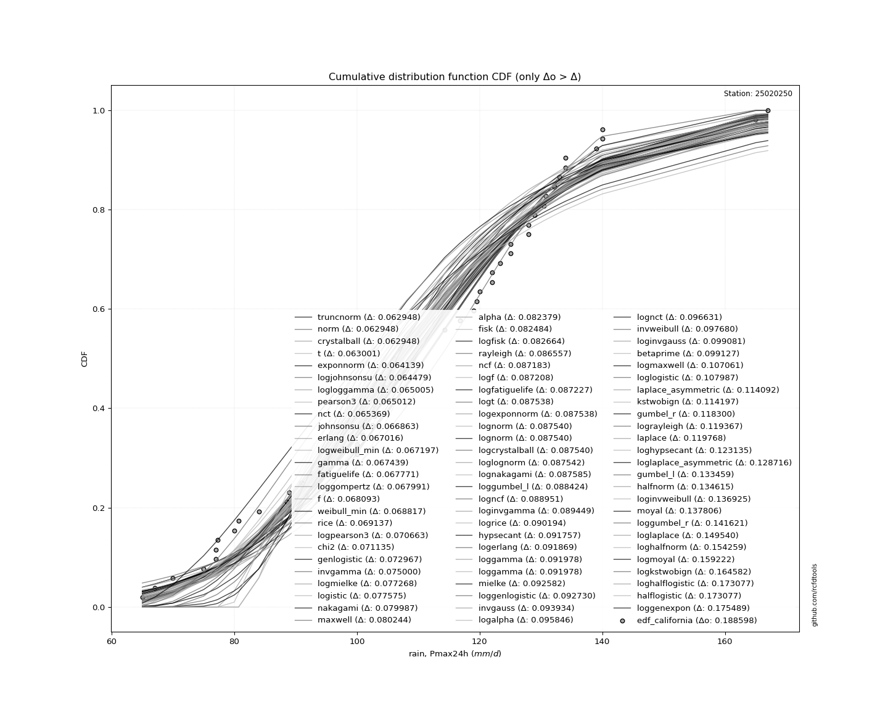</img>

</div>


**1.3. Best fit**

<div align="center">

|   id |   station | empirical_dist   | p_dist      |     delta |   deltao | eval   |   fit |   n |   best_fit |   best_fit_sort |
|-----:|----------:|:-----------------|:------------|----------:|---------:|:-------|------:|----:|-----------:|----------------:|
|    0 |  25020250 | edf_california   | genlogistic | 0.0716601 | 0.181738 | Δo > Δ |     1 |  56 |          1 |               1 |

</div>


<div align="center">

</img>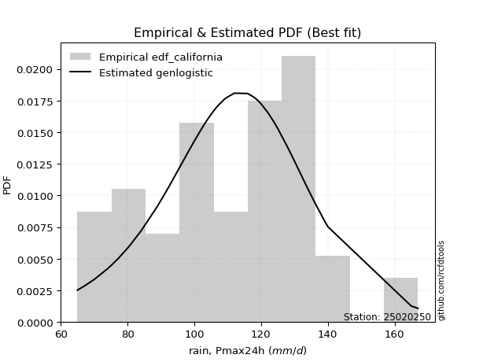</img>

</div>


### 2. Empirical - EDF Hazen (1930)

Hazen method for plotting positions is a formula used to estimate the empirical cumulative probability distribution of flood events or other hydrological data. This formula often results in biased estimations, particularly when extrapolating to extreme events (high return periods).

<div align="center">


$P=(m-0.5)/n$


</div>


**2.1. Empirical values**

<div align="center">

|                | 0                    | 1                    | 2                    | 3                  | 4                   | 5                   | 6                   | 7                   | 8                   | 9                   | 10                 | 11                  | 12                  | 13                  | 14                  | 15                 | 16                  | 17                 | 18                  | 19                 | 20                  | 21                  | 22                 | 23                  | 24                 | 25                  | 26                 | 27                  | 28                 | 29                 | 30                 | 31                 | 32                 | 33                 | 34                 | 35                 | 36                 | 37                 | 38        | 39                 | 40                 | 41                 | 42                 | 43                 | 44                 | 45                | 46                 | 47                 | 48                 | 49                 | 50                 | 51                 | 52        | 53                 | 54                 | 55                 |
|:---------------|:---------------------|:---------------------|:---------------------|:-------------------|:--------------------|:--------------------|:--------------------|:--------------------|:--------------------|:--------------------|:-------------------|:--------------------|:--------------------|:--------------------|:--------------------|:-------------------|:--------------------|:-------------------|:--------------------|:-------------------|:--------------------|:--------------------|:-------------------|:--------------------|:-------------------|:--------------------|:-------------------|:--------------------|:-------------------|:-------------------|:-------------------|:-------------------|:-------------------|:-------------------|:-------------------|:-------------------|:-------------------|:-------------------|:----------|:-------------------|:-------------------|:-------------------|:-------------------|:-------------------|:-------------------|:------------------|:-------------------|:-------------------|:-------------------|:-------------------|:-------------------|:-------------------|:----------|:-------------------|:-------------------|:-------------------|
| date           | 1989                 | 2021                 | 1975                 | 1982               | 1976                | 1974                | 1985                | 2004                | 2008                | 2015                | 2009               | 2001                | 1972                | 1986                | 2014                | 1994               | 1996                | 1991               | 2003                | 1997               | 1969                | 2016                | 1998               | 2005                | 1984               | 2017                | 1977               | 1964                | 2012               | 2022               | 1965               | 2013               | 1999               | 1990               | 1981               | 1992               | 1966               | 1995               | 1979      | 1971               | 1988               | 1980               | 2011               | 2006               | 2010               | 1973              | 1983               | 1987               | 1968               | 2007               | 1963               | 2002               | 1970      | 1993               | 2000               | 1978               |
| x              | 65.0                 | 67.0                 | 70.0                 | 74.0               | 75.0                | 77.0                | 77.0                | 77.3                | 80.0                | 80.7                | 84.0               | 88.6                | 89.0                | 91.0                | 92.7                | 98.0               | 100.0               | 100.0              | 102.5               | 102.9              | 104.0               | 104.0               | 104.4              | 105.3               | 106.0              | 107.1               | 109.0              | 109.40178571428571  | 112.0              | 116.0              | 118.0              | 119.0              | 119.5              | 120.0              | 122.0              | 122.0              | 124.0              | 125.0              | 125.0     | 128.0              | 128.0              | 129.0              | 130.5              | 130.8              | 132.2              | 133.0             | 134.0              | 134.0              | 135.0              | 136.0              | 136.0              | 139.0              | 140.0     | 140.0              | 165.0              | 167.0              |
| m              | 1                    | 2                    | 3                    | 4                  | 5                   | 6                   | 7                   | 8                   | 9                   | 10                  | 11                 | 12                  | 13                  | 14                  | 15                  | 16                 | 17                  | 18                 | 19                  | 20                 | 21                  | 22                  | 23                 | 24                  | 25                 | 26                  | 27                 | 28                  | 29                 | 30                 | 31                 | 32                 | 33                 | 34                 | 35                 | 36                 | 37                 | 38                 | 39        | 40                 | 41                 | 42                 | 43                 | 44                 | 45                 | 46                | 47                 | 48                 | 49                 | 50                 | 51                 | 52                 | 53        | 54                 | 55                 | 56                 |
| empirical_dist | edf_hazen            | edf_hazen            | edf_hazen            | edf_hazen          | edf_hazen           | edf_hazen           | edf_hazen           | edf_hazen           | edf_hazen           | edf_hazen           | edf_hazen          | edf_hazen           | edf_hazen           | edf_hazen           | edf_hazen           | edf_hazen          | edf_hazen           | edf_hazen          | edf_hazen           | edf_hazen          | edf_hazen           | edf_hazen           | edf_hazen          | edf_hazen           | edf_hazen          | edf_hazen           | edf_hazen          | edf_hazen           | edf_hazen          | edf_hazen          | edf_hazen          | edf_hazen          | edf_hazen          | edf_hazen          | edf_hazen          | edf_hazen          | edf_hazen          | edf_hazen          | edf_hazen | edf_hazen          | edf_hazen          | edf_hazen          | edf_hazen          | edf_hazen          | edf_hazen          | edf_hazen         | edf_hazen          | edf_hazen          | edf_hazen          | edf_hazen          | edf_hazen          | edf_hazen          | edf_hazen | edf_hazen          | edf_hazen          | edf_hazen          |
| empirical      | 0.008928571428571428 | 0.026785714285714284 | 0.044642857142857144 | 0.0625             | 0.08035714285714286 | 0.09821428571428571 | 0.11607142857142858 | 0.13392857142857142 | 0.15178571428571427 | 0.16964285714285715 | 0.1875             | 0.20535714285714285 | 0.22321428571428573 | 0.24107142857142858 | 0.25892857142857145 | 0.2767857142857143 | 0.29464285714285715 | 0.3125             | 0.33035714285714285 | 0.3482142857142857 | 0.36607142857142855 | 0.38392857142857145 | 0.4017857142857143 | 0.41964285714285715 | 0.4375             | 0.45535714285714285 | 0.4732142857142857 | 0.49107142857142855 | 0.5089285714285714 | 0.5267857142857143 | 0.5446428571428571 | 0.5625             | 0.5803571428571429 | 0.5982142857142857 | 0.6160714285714286 | 0.6339285714285714 | 0.6517857142857143 | 0.6696428571428571 | 0.6875    | 0.7053571428571429 | 0.7232142857142857 | 0.7410714285714286 | 0.7589285714285714 | 0.7767857142857143 | 0.7946428571428571 | 0.8125            | 0.8303571428571429 | 0.8482142857142857 | 0.8660714285714286 | 0.8839285714285714 | 0.9017857142857143 | 0.9196428571428571 | 0.9375    | 0.9553571428571429 | 0.9732142857142857 | 0.9910714285714286 |
| empirical_tr   | 1.009009009009009    | 1.0275229357798166   | 1.0467289719626167   | 1.0666666666666667 | 1.087378640776699   | 1.1089108910891088  | 1.1313131313131313  | 1.1546391752577319  | 1.1789473684210527  | 1.2043010752688172  | 1.2307692307692308 | 1.2584269662921348  | 1.2873563218390804  | 1.3176470588235294  | 1.3493975903614457  | 1.382716049382716  | 1.417721518987342   | 1.4545454545454546 | 1.4933333333333332  | 1.5342465753424657 | 1.5774647887323945  | 1.6231884057971013  | 1.671641791044776  | 1.7230769230769232  | 1.7777777777777777 | 1.8360655737704916  | 1.8983050847457628 | 1.9649122807017545  | 2.036363636363636  | 2.1132075471698113 | 2.1960784313725488 | 2.2857142857142856 | 2.3829787234042556 | 2.488888888888889  | 2.604651162790698  | 2.7317073170731705 | 2.871794871794872  | 3.0270270270270268 | 3.2       | 3.3939393939393945 | 3.6129032258064515 | 3.862068965517242  | 4.148148148148148  | 4.48               | 4.869565217391303  | 5.333333333333333 | 5.894736842105265  | 6.588235294117647  | 7.466666666666669  | 8.615384615384613  | 10.181818181818183 | 12.444444444444438 | 16.0      | 22.400000000000023 | 37.333333333333314 | 112.0000000000004  |

</div>


**2.2. Kolmogorov-Smirnov fit test (sorted by Δ)**


<div align="center">

|                | 0                   | 1                  | 2                   | 3                   | 4                   | 5                  | 6                   | 7                   | 8                   | 9                   | 10                  | 11                  | 12                  | 13                  | 14                  | 15                  | 16                 | 17                  | 18                  | 19                  | 20                  | 21                  | 22                 | 23                 | 24                  | 25                  | 26                  | 27                 | 28                  | 29                  | 30                    | 31                  | 32                  | 33                  | 34                  | 35                  | 36                  | 37                  | 38                  | 39                  | 40                  | 41                  | 42                  | 43                 | 44                  | 45                  | 46                  | 47                  | 48                  | 49                 | 50                  | 51                  | 52                  | 53                  | 54                  | 55                  | 56                  | 57                 | 58                  | 59                  | 60                 | 61                  | 62                  | 63                  | 64                 | 65                  | 66                 | 67                 | 68                  | 69                  | 70                  | 71                  | 72                  | 73                  | 74                  | 75                  | 76                 | 77                  | 78                  | 79                  | 80                  | 81                  | 82                 | 83                  | 84                 | 85                 | 86                  | 87                 |
|:---------------|:--------------------|:-------------------|:--------------------|:--------------------|:--------------------|:-------------------|:--------------------|:--------------------|:--------------------|:--------------------|:--------------------|:--------------------|:--------------------|:--------------------|:--------------------|:--------------------|:-------------------|:--------------------|:--------------------|:--------------------|:--------------------|:--------------------|:-------------------|:-------------------|:--------------------|:--------------------|:--------------------|:-------------------|:--------------------|:--------------------|:----------------------|:--------------------|:--------------------|:--------------------|:--------------------|:--------------------|:--------------------|:--------------------|:--------------------|:--------------------|:--------------------|:--------------------|:--------------------|:-------------------|:--------------------|:--------------------|:--------------------|:--------------------|:--------------------|:-------------------|:--------------------|:--------------------|:--------------------|:--------------------|:--------------------|:--------------------|:--------------------|:-------------------|:--------------------|:--------------------|:-------------------|:--------------------|:--------------------|:--------------------|:-------------------|:--------------------|:-------------------|:-------------------|:--------------------|:--------------------|:--------------------|:--------------------|:--------------------|:--------------------|:--------------------|:--------------------|:-------------------|:--------------------|:--------------------|:--------------------|:--------------------|:--------------------|:-------------------|:--------------------|:-------------------|:-------------------|:--------------------|:-------------------|
| station        | 25020250            | 25020250           | 25020250            | 25020250            | 25020250            | 25020250           | 25020250            | 25020250            | 25020250            | 25020250            | 25020250            | 25020250            | 25020250            | 25020250            | 25020250            | 25020250            | 25020250           | 25020250            | 25020250            | 25020250            | 25020250            | 25020250            | 25020250           | 25020250           | 25020250            | 25020250            | 25020250            | 25020250           | 25020250            | 25020250            | 25020250              | 25020250            | 25020250            | 25020250            | 25020250            | 25020250            | 25020250            | 25020250            | 25020250            | 25020250            | 25020250            | 25020250            | 25020250            | 25020250           | 25020250            | 25020250            | 25020250            | 25020250            | 25020250            | 25020250           | 25020250            | 25020250            | 25020250            | 25020250            | 25020250            | 25020250            | 25020250            | 25020250           | 25020250            | 25020250            | 25020250           | 25020250            | 25020250            | 25020250            | 25020250           | 25020250            | 25020250           | 25020250           | 25020250            | 25020250            | 25020250            | 25020250            | 25020250            | 25020250            | 25020250            | 25020250            | 25020250           | 25020250            | 25020250            | 25020250            | 25020250            | 25020250            | 25020250           | 25020250            | 25020250           | 25020250           | 25020250            | 25020250           |
| empirical_dist | edf_hazen           | edf_hazen          | edf_hazen           | edf_hazen           | edf_hazen           | edf_hazen          | edf_hazen           | edf_hazen           | edf_hazen           | edf_hazen           | edf_hazen           | edf_hazen           | edf_hazen           | edf_hazen           | edf_hazen           | edf_hazen           | edf_hazen          | edf_hazen           | edf_hazen           | edf_hazen           | edf_hazen           | edf_hazen           | edf_hazen          | edf_hazen          | edf_hazen           | edf_hazen           | edf_hazen           | edf_hazen          | edf_hazen           | edf_hazen           | edf_hazen             | edf_hazen           | edf_hazen           | edf_hazen           | edf_hazen           | edf_hazen           | edf_hazen           | edf_hazen           | edf_hazen           | edf_hazen           | edf_hazen           | edf_hazen           | edf_hazen           | edf_hazen          | edf_hazen           | edf_hazen           | edf_hazen           | edf_hazen           | edf_hazen           | edf_hazen          | edf_hazen           | edf_hazen           | edf_hazen           | edf_hazen           | edf_hazen           | edf_hazen           | edf_hazen           | edf_hazen          | edf_hazen           | edf_hazen           | edf_hazen          | edf_hazen           | edf_hazen           | edf_hazen           | edf_hazen          | edf_hazen           | edf_hazen          | edf_hazen          | edf_hazen           | edf_hazen           | edf_hazen           | edf_hazen           | edf_hazen           | edf_hazen           | edf_hazen           | edf_hazen           | edf_hazen          | edf_hazen           | edf_hazen           | edf_hazen           | edf_hazen           | edf_hazen           | edf_hazen          | edf_hazen           | edf_hazen          | edf_hazen          | edf_hazen           | edf_hazen          |
| p_dist         | genlogistic         | loggumbel_l        | loggenlogistic      | mielke              | logloggamma         | logjohnsonsu       | johnsonsu           | fisk                | pearson3            | logweibull_min      | loggompertz         | norm                | truncnorm           | crystalball         | exponnorm           | t                   | nct                | nakagami            | erlang              | gamma               | fatiguelife         | f                   | weibull_min        | logpearson3        | gumbel_l            | rice                | chi2                | logistic           | logfisk             | alpha               | loglaplace_asymmetric | invgamma            | logmielke           | maxwell             | ncf                 | hypsecant           | logncf              | logf                | logt                | logexponnorm        | lognorm             | lognorm             | logcrystalball      | loglognorm         | lognakagami         | rayleigh            | logfatiguelife      | invgauss            | logrice             | loginvgamma        | logbetaprime        | loggamma            | loggamma            | invweibull          | logerlang           | logalpha            | laplace_asymmetric  | lognct             | betaprime           | kstwobign           | loginvgauss        | loglogistic         | logmaxwell          | laplace             | lograyleigh        | halfnorm            | loghypsecant       | gumbel_r           | loginvweibull       | loghalfnorm         | moyal               | loggumbel_r         | loglaplace          | logkstwobign        | loggenexpon         | halflogistic        | loghalflogistic    | logmoyal            | wald                | genexpon            | expon               | logwald             | gibrat             | loggibrat           | logexpon           | logchi2            | logtruncnorm        | gompertz           |
| delta          | 0.06273157731330462 | 0.0670419842921846 | 0.06752114537440285 | 0.06756905343486808 | 0.06912635340416629 | 0.0700477719012016 | 0.07270483370608227 | 0.07281103393408928 | 0.07298907039541336 | 0.07380020763425821 | 0.07444568120290118 | 0.07475357212568434 | 0.07475357393053272 | 0.07475357994681597 | 0.07475365731624284 | 0.07476640236133203 | 0.0748244543099067 | 0.07598549423074341 | 0.07637775924562029 | 0.07651019217502486 | 0.07770157665955979 | 0.07819073259121156 | 0.0792504414919547 | 0.0822640661066355 | 0.08528323354625306 | 0.08613865518528696 | 0.08863230936293642 | 0.0897725670584062 | 0.09292638037532241 | 0.09529530313322832 | 0.09631135839552679   | 0.09723893485318535 | 0.09891204911095353 | 0.09949318411638253 | 0.10014384697240808 | 0.10243209019092947 | 0.10588802344543835 | 0.10635805898667228 | 0.10682186550553563 | 0.10682634874519148 | 0.10682683658973335 | 0.10682683658973335 | 0.10682683833509476 | 0.1068286127914243 | 0.10683726094064194 | 0.10707546153283487 | 0.10751742900387296 | 0.10976894402117077 | 0.11066297055054863 | 0.1107629437440335 | 0.11122178580423359 | 0.11218704044397199 | 0.11218704044397199 | 0.11395188347027818 | 0.11510897942700937 | 0.11588211286337369 | 0.11673383771723633 | 0.1177815546504527 | 0.11880852247734464 | 0.11974757682654502 | 0.1233107580309597 | 0.12489518925569254 | 0.12830498028990078 | 0.13084754066790816 | 0.1347664819462594 | 0.13683557714056094 | 0.1388959692914563 | 0.1390608803041683 | 0.13978936022358496 | 0.15963367423975144 | 0.16074951819570982 | 0.16656840188443545 | 0.16703830322501745 | 0.16721236761973862 | 0.16900715937824623 | 0.16964285714285715 | 0.1816327817505644 | 0.18632287596414343 | 0.22148166498706146 | 0.23914892627816925 | 0.24018856025816232 | 0.24235585549609007 | 0.2588851605406827 | 0.27456719035264643 | 0.2776580613527899 | 0.3608440114898478 | 0.39256025544104417 | 0.7799686276790113 |
| deltao         | 0.1817376445004486  | 0.1817376445004486 | 0.1817376445004486  | 0.1817376445004486  | 0.1817376445004486  | 0.1817376445004486 | 0.1817376445004486  | 0.1817376445004486  | 0.1817376445004486  | 0.1817376445004486  | 0.1817376445004486  | 0.1817376445004486  | 0.1817376445004486  | 0.1817376445004486  | 0.1817376445004486  | 0.1817376445004486  | 0.1817376445004486 | 0.1817376445004486  | 0.1817376445004486  | 0.1817376445004486  | 0.1817376445004486  | 0.1817376445004486  | 0.1817376445004486 | 0.1817376445004486 | 0.1817376445004486  | 0.1817376445004486  | 0.1817376445004486  | 0.1817376445004486 | 0.1817376445004486  | 0.1817376445004486  | 0.1817376445004486    | 0.1817376445004486  | 0.1817376445004486  | 0.1817376445004486  | 0.1817376445004486  | 0.1817376445004486  | 0.1817376445004486  | 0.1817376445004486  | 0.1817376445004486  | 0.1817376445004486  | 0.1817376445004486  | 0.1817376445004486  | 0.1817376445004486  | 0.1817376445004486 | 0.1817376445004486  | 0.1817376445004486  | 0.1817376445004486  | 0.1817376445004486  | 0.1817376445004486  | 0.1817376445004486 | 0.1817376445004486  | 0.1817376445004486  | 0.1817376445004486  | 0.1817376445004486  | 0.1817376445004486  | 0.1817376445004486  | 0.1817376445004486  | 0.1817376445004486 | 0.1817376445004486  | 0.1817376445004486  | 0.1817376445004486 | 0.1817376445004486  | 0.1817376445004486  | 0.1817376445004486  | 0.1817376445004486 | 0.1817376445004486  | 0.1817376445004486 | 0.1817376445004486 | 0.1817376445004486  | 0.1817376445004486  | 0.1817376445004486  | 0.1817376445004486  | 0.1817376445004486  | 0.1817376445004486  | 0.1817376445004486  | 0.1817376445004486  | 0.1817376445004486 | 0.1817376445004486  | 0.1817376445004486  | 0.1817376445004486  | 0.1817376445004486  | 0.1817376445004486  | 0.1817376445004486 | 0.1817376445004486  | 0.1817376445004486 | 0.1817376445004486 | 0.1817376445004486  | 0.1817376445004486 |
| eval           | Δo > Δ              | Δo > Δ             | Δo > Δ              | Δo > Δ              | Δo > Δ              | Δo > Δ             | Δo > Δ              | Δo > Δ              | Δo > Δ              | Δo > Δ              | Δo > Δ              | Δo > Δ              | Δo > Δ              | Δo > Δ              | Δo > Δ              | Δo > Δ              | Δo > Δ             | Δo > Δ              | Δo > Δ              | Δo > Δ              | Δo > Δ              | Δo > Δ              | Δo > Δ             | Δo > Δ             | Δo > Δ              | Δo > Δ              | Δo > Δ              | Δo > Δ             | Δo > Δ              | Δo > Δ              | Δo > Δ                | Δo > Δ              | Δo > Δ              | Δo > Δ              | Δo > Δ              | Δo > Δ              | Δo > Δ              | Δo > Δ              | Δo > Δ              | Δo > Δ              | Δo > Δ              | Δo > Δ              | Δo > Δ              | Δo > Δ             | Δo > Δ              | Δo > Δ              | Δo > Δ              | Δo > Δ              | Δo > Δ              | Δo > Δ             | Δo > Δ              | Δo > Δ              | Δo > Δ              | Δo > Δ              | Δo > Δ              | Δo > Δ              | Δo > Δ              | Δo > Δ             | Δo > Δ              | Δo > Δ              | Δo > Δ             | Δo > Δ              | Δo > Δ              | Δo > Δ              | Δo > Δ             | Δo > Δ              | Δo > Δ             | Δo > Δ             | Δo > Δ              | Δo > Δ              | Δo > Δ              | Δo > Δ              | Δo > Δ              | Δo > Δ              | Δo > Δ              | Δo > Δ              | Δo > Δ             | Δo <= Δ             | Δo <= Δ             | Δo <= Δ             | Δo <= Δ             | Δo <= Δ             | Δo <= Δ            | Δo <= Δ             | Δo <= Δ            | Δo <= Δ            | Δo <= Δ             | Δo <= Δ            |
| fit            | 1                   | 1                  | 1                   | 1                   | 1                   | 1                  | 1                   | 1                   | 1                   | 1                   | 1                   | 1                   | 1                   | 1                   | 1                   | 1                   | 1                  | 1                   | 1                   | 1                   | 1                   | 1                   | 1                  | 1                  | 1                   | 1                   | 1                   | 1                  | 1                   | 1                   | 1                     | 1                   | 1                   | 1                   | 1                   | 1                   | 1                   | 1                   | 1                   | 1                   | 1                   | 1                   | 1                   | 1                  | 1                   | 1                   | 1                   | 1                   | 1                   | 1                  | 1                   | 1                   | 1                   | 1                   | 1                   | 1                   | 1                   | 1                  | 1                   | 1                   | 1                  | 1                   | 1                   | 1                   | 1                  | 1                   | 1                  | 1                  | 1                   | 1                   | 1                   | 1                   | 1                   | 1                   | 1                   | 1                   | 1                  | 0                   | 0                   | 0                   | 0                   | 0                   | 0                  | 0                   | 0                  | 0                  | 0                   | 0                  |
| n              | 56                  | 56                 | 56                  | 56                  | 56                  | 56                 | 56                  | 56                  | 56                  | 56                  | 56                  | 56                  | 56                  | 56                  | 56                  | 56                  | 56                 | 56                  | 56                  | 56                  | 56                  | 56                  | 56                 | 56                 | 56                  | 56                  | 56                  | 56                 | 56                  | 56                  | 56                    | 56                  | 56                  | 56                  | 56                  | 56                  | 56                  | 56                  | 56                  | 56                  | 56                  | 56                  | 56                  | 56                 | 56                  | 56                  | 56                  | 56                  | 56                  | 56                 | 56                  | 56                  | 56                  | 56                  | 56                  | 56                  | 56                  | 56                 | 56                  | 56                  | 56                 | 56                  | 56                  | 56                  | 56                 | 56                  | 56                 | 56                 | 56                  | 56                  | 56                  | 56                  | 56                  | 56                  | 56                  | 56                  | 56                 | 56                  | 56                  | 56                  | 56                  | 56                  | 56                 | 56                  | 56                 | 56                 | 56                  | 56                 |
| best_fit       | 1                   | 0                  | 0                   | 0                   | 0                   | 0                  | 0                   | 0                   | 0                   | 0                   | 0                   | 0                   | 0                   | 0                   | 0                   | 0                   | 0                  | 0                   | 0                   | 0                   | 0                   | 0                   | 0                  | 0                  | 0                   | 0                   | 0                   | 0                  | 0                   | 0                   | 0                     | 0                   | 0                   | 0                   | 0                   | 0                   | 0                   | 0                   | 0                   | 0                   | 0                   | 0                   | 0                   | 0                  | 0                   | 0                   | 0                   | 0                   | 0                   | 0                  | 0                   | 0                   | 0                   | 0                   | 0                   | 0                   | 0                   | 0                  | 0                   | 0                   | 0                  | 0                   | 0                   | 0                   | 0                  | 0                   | 0                  | 0                  | 0                   | 0                   | 0                   | 0                   | 0                   | 0                   | 0                   | 0                   | 0                  | 0                   | 0                   | 0                   | 0                   | 0                   | 0                  | 0                   | 0                  | 0                  | 0                   | 0                  |
| best_fit_sort  | 1                   | 2                  | 3                   | 4                   | 5                   | 6                  | 7                   | 8                   | 9                   | 10                  | 11                  | 12                  | 13                  | 14                  | 15                  | 16                  | 17                 | 18                  | 19                  | 20                  | 21                  | 22                  | 23                 | 24                 | 25                  | 26                  | 27                  | 28                 | 29                  | 30                  | 31                    | 32                  | 33                  | 34                  | 35                  | 36                  | 37                  | 38                  | 39                  | 40                  | 41                  | 42                  | 43                  | 44                 | 45                  | 46                  | 47                  | 48                  | 49                  | 50                 | 51                  | 52                  | 53                  | 54                  | 55                  | 56                  | 57                  | 58                 | 59                  | 60                  | 61                 | 62                  | 63                  | 64                  | 65                 | 66                  | 67                 | 68                 | 69                  | 70                  | 71                  | 72                  | 73                  | 74                  | 75                  | 76                  | 77                 | 78                  | 79                  | 80                  | 81                  | 82                  | 83                 | 84                  | 85                 | 86                 | 87                  | 88                 |

</div>


<div align="center">

</img>

</div>


**2.3. Best fit**

<div align="center">

|   id |   station | empirical_dist   | p_dist      |     delta |   deltao | eval   |   fit |   n |   best_fit |   best_fit_sort |
|-----:|----------:|:-----------------|:------------|----------:|---------:|:-------|------:|----:|-----------:|----------------:|
|    0 |  25020250 | edf_hazen        | genlogistic | 0.0627316 | 0.181738 | Δo > Δ |     1 |  56 |          1 |               1 |

</div>


<div align="center">

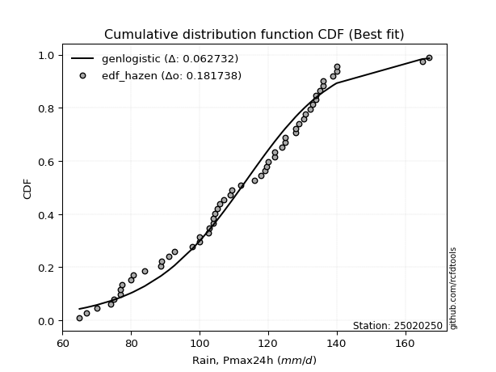</img>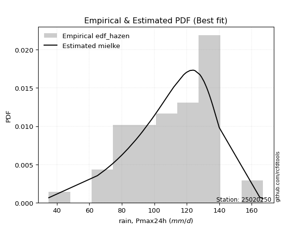</img>

</div>


### 3. Empirical - EDF Weibull (1939)

Weibull plotting position formula is an empirical method used to estimate the non-exceedance probability or plotting position for a set of observed data, is often recommended or widely used in practice, particularly in flood frequency analysis.

<div align="center">


$P=m/(n+1)$


</div>


**3.1. Empirical values**

<div align="center">

|                | 0                    | 1                   | 2                   | 3                   | 4                   | 5                   | 6                   | 7                   | 8                   | 9                   | 10                  | 11                  | 12                  | 13                  | 14                 | 15                 | 16                 | 17                 | 18                 | 19                 | 20                 | 21                  | 22                  | 23                  | 24                  | 25                  | 26                  | 27                  | 28                 | 29                 | 30                 | 31                 | 32                 | 33                 | 34                 | 35                | 36                 | 37                 | 38                 | 39                 | 40                 | 41                 | 42                 | 43                 | 44                 | 45                 | 46                 | 47                 | 48                 | 49                 | 50                 | 51                 | 52                 | 53                 | 54                 | 55                 |
|:---------------|:---------------------|:--------------------|:--------------------|:--------------------|:--------------------|:--------------------|:--------------------|:--------------------|:--------------------|:--------------------|:--------------------|:--------------------|:--------------------|:--------------------|:-------------------|:-------------------|:-------------------|:-------------------|:-------------------|:-------------------|:-------------------|:--------------------|:--------------------|:--------------------|:--------------------|:--------------------|:--------------------|:--------------------|:-------------------|:-------------------|:-------------------|:-------------------|:-------------------|:-------------------|:-------------------|:------------------|:-------------------|:-------------------|:-------------------|:-------------------|:-------------------|:-------------------|:-------------------|:-------------------|:-------------------|:-------------------|:-------------------|:-------------------|:-------------------|:-------------------|:-------------------|:-------------------|:-------------------|:-------------------|:-------------------|:-------------------|
| date           | 1989                 | 2021                | 1975                | 1982                | 1976                | 1974                | 1985                | 2004                | 2008                | 2015                | 2009                | 2001                | 1972                | 1986                | 2014               | 1994               | 1996               | 1991               | 2003               | 1997               | 1969               | 2016                | 1998                | 2005                | 1984                | 2017                | 1977                | 1964                | 2012               | 2022               | 1965               | 2013               | 1999               | 1990               | 1981               | 1992              | 1966               | 1995               | 1979               | 1971               | 1988               | 1980               | 2011               | 2006               | 2010               | 1973               | 1983               | 1987               | 1968               | 2007               | 1963               | 2002               | 1970               | 1993               | 2000               | 1978               |
| x              | 65.0                 | 67.0                | 70.0                | 74.0                | 75.0                | 77.0                | 77.0                | 77.3                | 80.0                | 80.7                | 84.0                | 88.6                | 89.0                | 91.0                | 92.7               | 98.0               | 100.0              | 100.0              | 102.5              | 102.9              | 104.0              | 104.0               | 104.4               | 105.3               | 106.0               | 107.1               | 109.0               | 109.40178571428571  | 112.0              | 116.0              | 118.0              | 119.0              | 119.5              | 120.0              | 122.0              | 122.0             | 124.0              | 125.0              | 125.0              | 128.0              | 128.0              | 129.0              | 130.5              | 130.8              | 132.2              | 133.0              | 134.0              | 134.0              | 135.0              | 136.0              | 136.0              | 139.0              | 140.0              | 140.0              | 165.0              | 167.0              |
| m              | 1                    | 2                   | 3                   | 4                   | 5                   | 6                   | 7                   | 8                   | 9                   | 10                  | 11                  | 12                  | 13                  | 14                  | 15                 | 16                 | 17                 | 18                 | 19                 | 20                 | 21                 | 22                  | 23                  | 24                  | 25                  | 26                  | 27                  | 28                  | 29                 | 30                 | 31                 | 32                 | 33                 | 34                 | 35                 | 36                | 37                 | 38                 | 39                 | 40                 | 41                 | 42                 | 43                 | 44                 | 45                 | 46                 | 47                 | 48                 | 49                 | 50                 | 51                 | 52                 | 53                 | 54                 | 55                 | 56                 |
| empirical_dist | edf_weibull          | edf_weibull         | edf_weibull         | edf_weibull         | edf_weibull         | edf_weibull         | edf_weibull         | edf_weibull         | edf_weibull         | edf_weibull         | edf_weibull         | edf_weibull         | edf_weibull         | edf_weibull         | edf_weibull        | edf_weibull        | edf_weibull        | edf_weibull        | edf_weibull        | edf_weibull        | edf_weibull        | edf_weibull         | edf_weibull         | edf_weibull         | edf_weibull         | edf_weibull         | edf_weibull         | edf_weibull         | edf_weibull        | edf_weibull        | edf_weibull        | edf_weibull        | edf_weibull        | edf_weibull        | edf_weibull        | edf_weibull       | edf_weibull        | edf_weibull        | edf_weibull        | edf_weibull        | edf_weibull        | edf_weibull        | edf_weibull        | edf_weibull        | edf_weibull        | edf_weibull        | edf_weibull        | edf_weibull        | edf_weibull        | edf_weibull        | edf_weibull        | edf_weibull        | edf_weibull        | edf_weibull        | edf_weibull        | edf_weibull        |
| empirical      | 0.017543859649122806 | 0.03508771929824561 | 0.05263157894736842 | 0.07017543859649122 | 0.08771929824561403 | 0.10526315789473684 | 0.12280701754385964 | 0.14035087719298245 | 0.15789473684210525 | 0.17543859649122806 | 0.19298245614035087 | 0.21052631578947367 | 0.22807017543859648 | 0.24561403508771928 | 0.2631578947368421 | 0.2807017543859649 | 0.2982456140350877 | 0.3157894736842105 | 0.3333333333333333 | 0.3508771929824561 | 0.3684210526315789 | 0.38596491228070173 | 0.40350877192982454 | 0.42105263157894735 | 0.43859649122807015 | 0.45614035087719296 | 0.47368421052631576 | 0.49122807017543857 | 0.5087719298245614 | 0.5263157894736842 | 0.543859649122807  | 0.5614035087719298 | 0.5789473684210527 | 0.5964912280701754 | 0.6140350877192983 | 0.631578947368421 | 0.6491228070175439 | 0.6666666666666666 | 0.6842105263157895 | 0.7017543859649122 | 0.7192982456140351 | 0.7368421052631579 | 0.7543859649122807 | 0.7719298245614035 | 0.7894736842105263 | 0.8070175438596491 | 0.8245614035087719 | 0.8421052631578947 | 0.8596491228070176 | 0.8771929824561403 | 0.8947368421052632 | 0.9122807017543859 | 0.9298245614035088 | 0.9473684210526315 | 0.9649122807017544 | 0.9824561403508771 |
| empirical_tr   | 1.017857142857143    | 1.0363636363636364  | 1.0555555555555556  | 1.0754716981132075  | 1.0961538461538463  | 1.1176470588235294  | 1.14                | 1.163265306122449   | 1.1875              | 1.2127659574468086  | 1.2391304347826086  | 1.2666666666666666  | 1.2954545454545456  | 1.3255813953488371  | 1.357142857142857  | 1.3902439024390243 | 1.425              | 1.4615384615384615 | 1.4999999999999998 | 1.5405405405405406 | 1.5833333333333335 | 1.6285714285714286  | 1.676470588235294   | 1.7272727272727273  | 1.78125             | 1.8387096774193548  | 1.8999999999999997  | 1.9655172413793103  | 2.035714285714286  | 2.111111111111111  | 2.1923076923076925 | 2.28               | 2.375              | 2.4782608695652173 | 2.5909090909090913 | 2.714285714285714 | 2.85               | 2.9999999999999996 | 3.166666666666667  | 3.352941176470588  | 3.5625             | 3.7999999999999994 | 4.071428571428572  | 4.384615384615384  | 4.75               | 5.181818181818181  | 5.7                | 6.333333333333331  | 7.125              | 8.142857142857139  | 9.5                | 11.399999999999993 | 14.25              | 18.999999999999982 | 28.5               | 56.99999999999982  |

</div>


**3.2. Kolmogorov-Smirnov fit test (sorted by Δ)**


<div align="center">

|                | 0                   | 1                   | 2                   | 3                   | 4                   | 5                  | 6                   | 7                   | 8                   | 9                   | 10                  | 11                 | 12                  | 13                  | 14                  | 15                  | 16                  | 17                  | 18                  | 19                  | 20                  | 21                  | 22                  | 23                  | 24                  | 25                  | 26                  | 27                  | 28                  | 29                  | 30                    | 31                  | 32                  | 33                  | 34                  | 35                  | 36                 | 37                  | 38                  | 39                  | 40                 | 41                 | 42                  | 43                  | 44                 | 45                  | 46                  | 47                  | 48                  | 49                  | 50                  | 51                  | 52                  | 53                  | 54                  | 55                  | 56                  | 57                  | 58                  | 59                  | 60                  | 61                 | 62                  | 63                  | 64                  | 65                 | 66                  | 67                  | 68                  | 69                  | 70                  | 71                  | 72                 | 73                 | 74                 | 75                  | 76                  | 77                  | 78                  | 79                 | 80                  | 81                  | 82                  | 83                 | 84                 | 85                 | 86                 | 87                 |
|:---------------|:--------------------|:--------------------|:--------------------|:--------------------|:--------------------|:-------------------|:--------------------|:--------------------|:--------------------|:--------------------|:--------------------|:-------------------|:--------------------|:--------------------|:--------------------|:--------------------|:--------------------|:--------------------|:--------------------|:--------------------|:--------------------|:--------------------|:--------------------|:--------------------|:--------------------|:--------------------|:--------------------|:--------------------|:--------------------|:--------------------|:----------------------|:--------------------|:--------------------|:--------------------|:--------------------|:--------------------|:-------------------|:--------------------|:--------------------|:--------------------|:-------------------|:-------------------|:--------------------|:--------------------|:-------------------|:--------------------|:--------------------|:--------------------|:--------------------|:--------------------|:--------------------|:--------------------|:--------------------|:--------------------|:--------------------|:--------------------|:--------------------|:--------------------|:--------------------|:--------------------|:--------------------|:-------------------|:--------------------|:--------------------|:--------------------|:-------------------|:--------------------|:--------------------|:--------------------|:--------------------|:--------------------|:--------------------|:-------------------|:-------------------|:-------------------|:--------------------|:--------------------|:--------------------|:--------------------|:-------------------|:--------------------|:--------------------|:--------------------|:-------------------|:-------------------|:-------------------|:-------------------|:-------------------|
| station        | 25020250            | 25020250            | 25020250            | 25020250            | 25020250            | 25020250           | 25020250            | 25020250            | 25020250            | 25020250            | 25020250            | 25020250           | 25020250            | 25020250            | 25020250            | 25020250            | 25020250            | 25020250            | 25020250            | 25020250            | 25020250            | 25020250            | 25020250            | 25020250            | 25020250            | 25020250            | 25020250            | 25020250            | 25020250            | 25020250            | 25020250              | 25020250            | 25020250            | 25020250            | 25020250            | 25020250            | 25020250           | 25020250            | 25020250            | 25020250            | 25020250           | 25020250           | 25020250            | 25020250            | 25020250           | 25020250            | 25020250            | 25020250            | 25020250            | 25020250            | 25020250            | 25020250            | 25020250            | 25020250            | 25020250            | 25020250            | 25020250            | 25020250            | 25020250            | 25020250            | 25020250            | 25020250           | 25020250            | 25020250            | 25020250            | 25020250           | 25020250            | 25020250            | 25020250            | 25020250            | 25020250            | 25020250            | 25020250           | 25020250           | 25020250           | 25020250            | 25020250            | 25020250            | 25020250            | 25020250           | 25020250            | 25020250            | 25020250            | 25020250           | 25020250           | 25020250           | 25020250           | 25020250           |
| empirical_dist | edf_weibull         | edf_weibull         | edf_weibull         | edf_weibull         | edf_weibull         | edf_weibull        | edf_weibull         | edf_weibull         | edf_weibull         | edf_weibull         | edf_weibull         | edf_weibull        | edf_weibull         | edf_weibull         | edf_weibull         | edf_weibull         | edf_weibull         | edf_weibull         | edf_weibull         | edf_weibull         | edf_weibull         | edf_weibull         | edf_weibull         | edf_weibull         | edf_weibull         | edf_weibull         | edf_weibull         | edf_weibull         | edf_weibull         | edf_weibull         | edf_weibull           | edf_weibull         | edf_weibull         | edf_weibull         | edf_weibull         | edf_weibull         | edf_weibull        | edf_weibull         | edf_weibull         | edf_weibull         | edf_weibull        | edf_weibull        | edf_weibull         | edf_weibull         | edf_weibull        | edf_weibull         | edf_weibull         | edf_weibull         | edf_weibull         | edf_weibull         | edf_weibull         | edf_weibull         | edf_weibull         | edf_weibull         | edf_weibull         | edf_weibull         | edf_weibull         | edf_weibull         | edf_weibull         | edf_weibull         | edf_weibull         | edf_weibull        | edf_weibull         | edf_weibull         | edf_weibull         | edf_weibull        | edf_weibull         | edf_weibull         | edf_weibull         | edf_weibull         | edf_weibull         | edf_weibull         | edf_weibull        | edf_weibull        | edf_weibull        | edf_weibull         | edf_weibull         | edf_weibull         | edf_weibull         | edf_weibull        | edf_weibull         | edf_weibull         | edf_weibull         | edf_weibull        | edf_weibull        | edf_weibull        | edf_weibull        | edf_weibull        |
| p_dist         | loggenlogistic      | mielke              | genlogistic         | logloggamma         | logjohnsonsu        | loggumbel_l        | johnsonsu           | fisk                | pearson3            | logweibull_min      | loggompertz         | norm               | truncnorm           | crystalball         | exponnorm           | t                   | nct                 | nakagami            | erlang              | gamma               | fatiguelife         | f                   | weibull_min         | logpearson3         | gumbel_l            | rice                | logfisk             | chi2                | logistic            | alpha               | loglaplace_asymmetric | invgamma            | maxwell             | ncf                 | logmielke           | hypsecant           | logncf             | logf                | logt                | logexponnorm        | lognorm            | lognorm            | logcrystalball      | loglognorm          | lognakagami        | rayleigh            | logfatiguelife      | invgauss            | logrice             | loginvgamma         | logbetaprime        | loggamma            | loggamma            | invweibull          | logerlang           | logalpha            | laplace_asymmetric  | lognct              | betaprime           | kstwobign           | loginvgauss         | loglogistic        | logmaxwell          | laplace             | lograyleigh         | loginvweibull      | loghypsecant        | gumbel_r            | halfnorm            | loghalfnorm         | moyal               | logkstwobign        | loggenexpon        | loggumbel_r        | loglaplace         | halflogistic        | loghalflogistic     | logmoyal            | wald                | genexpon           | expon               | logwald             | gibrat              | logexpon           | loggibrat          | logchi2            | logtruncnorm       | gompertz           |
| delta          | 0.06830435339445295 | 0.06835226145491818 | 0.06852731666167552 | 0.06990956142421634 | 0.07083097992125165 | 0.0728377236405555 | 0.07348804172613232 | 0.07367478185810969 | 0.07377227841546341 | 0.07458341565430826 | 0.07522888922295123 | 0.0755367801457344 | 0.07553678195058278 | 0.07553678796686603 | 0.07553686533629289 | 0.07554961038138208 | 0.07560766232995675 | 0.07676870225079346 | 0.07716096726567034 | 0.07729340019507491 | 0.07848478467960984 | 0.07897394061126162 | 0.08003364951200476 | 0.08304727412668556 | 0.08606644156630316 | 0.08692186320533701 | 0.08883682933038883 | 0.08941551738298648 | 0.09055577507845625 | 0.09607851115327837 | 0.09646799999953681   | 0.09802214287323541 | 0.10027639213643258 | 0.10092705499245813 | 0.10251480600318419 | 0.10352858141899968 | 0.1066712314654884 | 0.10714126700672233 | 0.10760507352558568 | 0.10760955676524153 | 0.1076100446097834 | 0.1076100446097834 | 0.10761004635514482 | 0.10761182081147436 | 0.107620468960692  | 0.10785866955288492 | 0.10830063702392301 | 0.11055215204122082 | 0.11144617857059869 | 0.11154615176408356 | 0.11200499382428364 | 0.11297024846402204 | 0.11297024846402204 | 0.11473509149032823 | 0.11589218744705942 | 0.11666532088342374 | 0.11751704573728639 | 0.11856476267050275 | 0.11959173049739469 | 0.12053078484659507 | 0.12409396605100975 | 0.1256783972757426 | 0.12908818830995084 | 0.13194403189597836 | 0.13554968996630945 | 0.1368131697473945 | 0.13967917731150636 | 0.13984408832421835 | 0.14263131648893185 | 0.15704588746298384 | 0.16153272621575987 | 0.16423617714354816 | 0.1657037849621728 | 0.1673516099044855 | 0.1678215112450675 | 0.17543859649122806 | 0.18241598977061446 | 0.18710608398419348 | 0.22558224156137754 | 0.2355461693859387 | 0.23658580336593177 | 0.24313906351614012 | 0.26311448384895336 | 0.2737420212525393 | 0.2753503983726965 | 0.3528552896853364 | 0.3889574985488136 | 0.7729197554985602 |
| deltao         | 0.1817376445004486  | 0.1817376445004486  | 0.1817376445004486  | 0.1817376445004486  | 0.1817376445004486  | 0.1817376445004486 | 0.1817376445004486  | 0.1817376445004486  | 0.1817376445004486  | 0.1817376445004486  | 0.1817376445004486  | 0.1817376445004486 | 0.1817376445004486  | 0.1817376445004486  | 0.1817376445004486  | 0.1817376445004486  | 0.1817376445004486  | 0.1817376445004486  | 0.1817376445004486  | 0.1817376445004486  | 0.1817376445004486  | 0.1817376445004486  | 0.1817376445004486  | 0.1817376445004486  | 0.1817376445004486  | 0.1817376445004486  | 0.1817376445004486  | 0.1817376445004486  | 0.1817376445004486  | 0.1817376445004486  | 0.1817376445004486    | 0.1817376445004486  | 0.1817376445004486  | 0.1817376445004486  | 0.1817376445004486  | 0.1817376445004486  | 0.1817376445004486 | 0.1817376445004486  | 0.1817376445004486  | 0.1817376445004486  | 0.1817376445004486 | 0.1817376445004486 | 0.1817376445004486  | 0.1817376445004486  | 0.1817376445004486 | 0.1817376445004486  | 0.1817376445004486  | 0.1817376445004486  | 0.1817376445004486  | 0.1817376445004486  | 0.1817376445004486  | 0.1817376445004486  | 0.1817376445004486  | 0.1817376445004486  | 0.1817376445004486  | 0.1817376445004486  | 0.1817376445004486  | 0.1817376445004486  | 0.1817376445004486  | 0.1817376445004486  | 0.1817376445004486  | 0.1817376445004486 | 0.1817376445004486  | 0.1817376445004486  | 0.1817376445004486  | 0.1817376445004486 | 0.1817376445004486  | 0.1817376445004486  | 0.1817376445004486  | 0.1817376445004486  | 0.1817376445004486  | 0.1817376445004486  | 0.1817376445004486 | 0.1817376445004486 | 0.1817376445004486 | 0.1817376445004486  | 0.1817376445004486  | 0.1817376445004486  | 0.1817376445004486  | 0.1817376445004486 | 0.1817376445004486  | 0.1817376445004486  | 0.1817376445004486  | 0.1817376445004486 | 0.1817376445004486 | 0.1817376445004486 | 0.1817376445004486 | 0.1817376445004486 |
| eval           | Δo > Δ              | Δo > Δ              | Δo > Δ              | Δo > Δ              | Δo > Δ              | Δo > Δ             | Δo > Δ              | Δo > Δ              | Δo > Δ              | Δo > Δ              | Δo > Δ              | Δo > Δ             | Δo > Δ              | Δo > Δ              | Δo > Δ              | Δo > Δ              | Δo > Δ              | Δo > Δ              | Δo > Δ              | Δo > Δ              | Δo > Δ              | Δo > Δ              | Δo > Δ              | Δo > Δ              | Δo > Δ              | Δo > Δ              | Δo > Δ              | Δo > Δ              | Δo > Δ              | Δo > Δ              | Δo > Δ                | Δo > Δ              | Δo > Δ              | Δo > Δ              | Δo > Δ              | Δo > Δ              | Δo > Δ             | Δo > Δ              | Δo > Δ              | Δo > Δ              | Δo > Δ             | Δo > Δ             | Δo > Δ              | Δo > Δ              | Δo > Δ             | Δo > Δ              | Δo > Δ              | Δo > Δ              | Δo > Δ              | Δo > Δ              | Δo > Δ              | Δo > Δ              | Δo > Δ              | Δo > Δ              | Δo > Δ              | Δo > Δ              | Δo > Δ              | Δo > Δ              | Δo > Δ              | Δo > Δ              | Δo > Δ              | Δo > Δ             | Δo > Δ              | Δo > Δ              | Δo > Δ              | Δo > Δ             | Δo > Δ              | Δo > Δ              | Δo > Δ              | Δo > Δ              | Δo > Δ              | Δo > Δ              | Δo > Δ             | Δo > Δ             | Δo > Δ             | Δo > Δ              | Δo <= Δ             | Δo <= Δ             | Δo <= Δ             | Δo <= Δ            | Δo <= Δ             | Δo <= Δ             | Δo <= Δ             | Δo <= Δ            | Δo <= Δ            | Δo <= Δ            | Δo <= Δ            | Δo <= Δ            |
| fit            | 1                   | 1                   | 1                   | 1                   | 1                   | 1                  | 1                   | 1                   | 1                   | 1                   | 1                   | 1                  | 1                   | 1                   | 1                   | 1                   | 1                   | 1                   | 1                   | 1                   | 1                   | 1                   | 1                   | 1                   | 1                   | 1                   | 1                   | 1                   | 1                   | 1                   | 1                     | 1                   | 1                   | 1                   | 1                   | 1                   | 1                  | 1                   | 1                   | 1                   | 1                  | 1                  | 1                   | 1                   | 1                  | 1                   | 1                   | 1                   | 1                   | 1                   | 1                   | 1                   | 1                   | 1                   | 1                   | 1                   | 1                   | 1                   | 1                   | 1                   | 1                   | 1                  | 1                   | 1                   | 1                   | 1                  | 1                   | 1                   | 1                   | 1                   | 1                   | 1                   | 1                  | 1                  | 1                  | 1                   | 0                   | 0                   | 0                   | 0                  | 0                   | 0                   | 0                   | 0                  | 0                  | 0                  | 0                  | 0                  |
| n              | 56                  | 56                  | 56                  | 56                  | 56                  | 56                 | 56                  | 56                  | 56                  | 56                  | 56                  | 56                 | 56                  | 56                  | 56                  | 56                  | 56                  | 56                  | 56                  | 56                  | 56                  | 56                  | 56                  | 56                  | 56                  | 56                  | 56                  | 56                  | 56                  | 56                  | 56                    | 56                  | 56                  | 56                  | 56                  | 56                  | 56                 | 56                  | 56                  | 56                  | 56                 | 56                 | 56                  | 56                  | 56                 | 56                  | 56                  | 56                  | 56                  | 56                  | 56                  | 56                  | 56                  | 56                  | 56                  | 56                  | 56                  | 56                  | 56                  | 56                  | 56                  | 56                 | 56                  | 56                  | 56                  | 56                 | 56                  | 56                  | 56                  | 56                  | 56                  | 56                  | 56                 | 56                 | 56                 | 56                  | 56                  | 56                  | 56                  | 56                 | 56                  | 56                  | 56                  | 56                 | 56                 | 56                 | 56                 | 56                 |
| best_fit       | 1                   | 0                   | 0                   | 0                   | 0                   | 0                  | 0                   | 0                   | 0                   | 0                   | 0                   | 0                  | 0                   | 0                   | 0                   | 0                   | 0                   | 0                   | 0                   | 0                   | 0                   | 0                   | 0                   | 0                   | 0                   | 0                   | 0                   | 0                   | 0                   | 0                   | 0                     | 0                   | 0                   | 0                   | 0                   | 0                   | 0                  | 0                   | 0                   | 0                   | 0                  | 0                  | 0                   | 0                   | 0                  | 0                   | 0                   | 0                   | 0                   | 0                   | 0                   | 0                   | 0                   | 0                   | 0                   | 0                   | 0                   | 0                   | 0                   | 0                   | 0                   | 0                  | 0                   | 0                   | 0                   | 0                  | 0                   | 0                   | 0                   | 0                   | 0                   | 0                   | 0                  | 0                  | 0                  | 0                   | 0                   | 0                   | 0                   | 0                  | 0                   | 0                   | 0                   | 0                  | 0                  | 0                  | 0                  | 0                  |
| best_fit_sort  | 1                   | 2                   | 3                   | 4                   | 5                   | 6                  | 7                   | 8                   | 9                   | 10                  | 11                  | 12                 | 13                  | 14                  | 15                  | 16                  | 17                  | 18                  | 19                  | 20                  | 21                  | 22                  | 23                  | 24                  | 25                  | 26                  | 27                  | 28                  | 29                  | 30                  | 31                    | 32                  | 33                  | 34                  | 35                  | 36                  | 37                 | 38                  | 39                  | 40                  | 41                 | 42                 | 43                  | 44                  | 45                 | 46                  | 47                  | 48                  | 49                  | 50                  | 51                  | 52                  | 53                  | 54                  | 55                  | 56                  | 57                  | 58                  | 59                  | 60                  | 61                  | 62                 | 63                  | 64                  | 65                  | 66                 | 67                  | 68                  | 69                  | 70                  | 71                  | 72                  | 73                 | 74                 | 75                 | 76                  | 77                  | 78                  | 79                  | 80                 | 81                  | 82                  | 83                  | 84                 | 85                 | 86                 | 87                 | 88                 |

</div>


<div align="center">

</img>

</div>


**3.3. Best fit**

<div align="center">

|   id |   station | empirical_dist   | p_dist         |     delta |   deltao | eval   |   fit |   n |   best_fit |   best_fit_sort |
|-----:|----------:|:-----------------|:---------------|----------:|---------:|:-------|------:|----:|-----------:|----------------:|
|    0 |  25020250 | edf_weibull      | loggenlogistic | 0.0683044 | 0.181738 | Δo > Δ |     1 |  56 |          1 |               1 |

</div>


<div align="center">

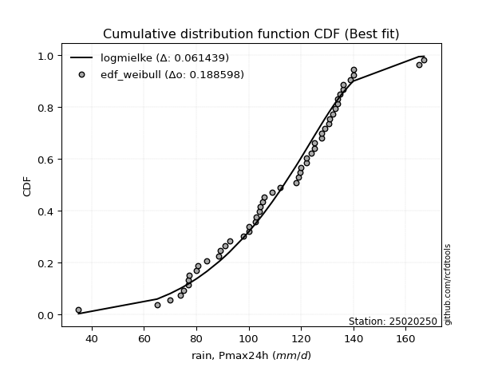</img></img>

</div>


### 4. Empirical - EDF Beard (1943)

The Beard formula (or Beard´s plotting position formula) in hydrology is used to estimate the empirical non-exceedance probability _(P)_ of a flood event (or other extreme hydrological data point) within a given dataset.

<div align="center">


$P=(m-0.31)/(n+0.38)$


</div>


**4.1. Empirical values**

<div align="center">

|                | 0                    | 1                    | 2                   | 3                   | 4                   | 5                  | 6                  | 7                  | 8                  | 9                  | 10                  | 11                 | 12                 | 13                 | 14                 | 15                 | 16                  | 17                  | 18                 | 19                 | 20                  | 21                  | 22                  | 23                  | 24                 | 25                  | 26                  | 27                  | 28                 | 29                 | 30                 | 31                 | 32                 | 33                 | 34                | 35                 | 36                 | 37                 | 38                 | 39                 | 40                 | 41                 | 42                 | 43                 | 44                 | 45                 | 46                 | 47                 | 48                 | 49                 | 50                 | 51                 | 52                 | 53                 | 54                 | 55                 |
|:---------------|:---------------------|:---------------------|:--------------------|:--------------------|:--------------------|:-------------------|:-------------------|:-------------------|:-------------------|:-------------------|:--------------------|:-------------------|:-------------------|:-------------------|:-------------------|:-------------------|:--------------------|:--------------------|:-------------------|:-------------------|:--------------------|:--------------------|:--------------------|:--------------------|:-------------------|:--------------------|:--------------------|:--------------------|:-------------------|:-------------------|:-------------------|:-------------------|:-------------------|:-------------------|:------------------|:-------------------|:-------------------|:-------------------|:-------------------|:-------------------|:-------------------|:-------------------|:-------------------|:-------------------|:-------------------|:-------------------|:-------------------|:-------------------|:-------------------|:-------------------|:-------------------|:-------------------|:-------------------|:-------------------|:-------------------|:-------------------|
| date           | 1989                 | 2021                 | 1975                | 1982                | 1976                | 1974               | 1985               | 2004               | 2008               | 2015               | 2009                | 2001               | 1972               | 1986               | 2014               | 1994               | 1996                | 1991                | 2003               | 1997               | 1969                | 2016                | 1998                | 2005                | 1984               | 2017                | 1977                | 1964                | 2012               | 2022               | 1965               | 2013               | 1999               | 1990               | 1981              | 1992               | 1966               | 1995               | 1979               | 1971               | 1988               | 1980               | 2011               | 2006               | 2010               | 1973               | 1983               | 1987               | 1968               | 2007               | 1963               | 2002               | 1970               | 1993               | 2000               | 1978               |
| x              | 65.0                 | 67.0                 | 70.0                | 74.0                | 75.0                | 77.0               | 77.0               | 77.3               | 80.0               | 80.7               | 84.0                | 88.6               | 89.0               | 91.0               | 92.7               | 98.0               | 100.0               | 100.0               | 102.5              | 102.9              | 104.0               | 104.0               | 104.4               | 105.3               | 106.0              | 107.1               | 109.0               | 109.40178571428571  | 112.0              | 116.0              | 118.0              | 119.0              | 119.5              | 120.0              | 122.0             | 122.0              | 124.0              | 125.0              | 125.0              | 128.0              | 128.0              | 129.0              | 130.5              | 130.8              | 132.2              | 133.0              | 134.0              | 134.0              | 135.0              | 136.0              | 136.0              | 139.0              | 140.0              | 140.0              | 165.0              | 167.0              |
| m              | 1                    | 2                    | 3                   | 4                   | 5                   | 6                  | 7                  | 8                  | 9                  | 10                 | 11                  | 12                 | 13                 | 14                 | 15                 | 16                 | 17                  | 18                  | 19                 | 20                 | 21                  | 22                  | 23                  | 24                  | 25                 | 26                  | 27                  | 28                  | 29                 | 30                 | 31                 | 32                 | 33                 | 34                 | 35                | 36                 | 37                 | 38                 | 39                 | 40                 | 41                 | 42                 | 43                 | 44                 | 45                 | 46                 | 47                 | 48                 | 49                 | 50                 | 51                 | 52                 | 53                 | 54                 | 55                 | 56                 |
| empirical_dist | edf_beard            | edf_beard            | edf_beard           | edf_beard           | edf_beard           | edf_beard          | edf_beard          | edf_beard          | edf_beard          | edf_beard          | edf_beard           | edf_beard          | edf_beard          | edf_beard          | edf_beard          | edf_beard          | edf_beard           | edf_beard           | edf_beard          | edf_beard          | edf_beard           | edf_beard           | edf_beard           | edf_beard           | edf_beard          | edf_beard           | edf_beard           | edf_beard           | edf_beard          | edf_beard          | edf_beard          | edf_beard          | edf_beard          | edf_beard          | edf_beard         | edf_beard          | edf_beard          | edf_beard          | edf_beard          | edf_beard          | edf_beard          | edf_beard          | edf_beard          | edf_beard          | edf_beard          | edf_beard          | edf_beard          | edf_beard          | edf_beard          | edf_beard          | edf_beard          | edf_beard          | edf_beard          | edf_beard          | edf_beard          | edf_beard          |
| empirical      | 0.012238382405108193 | 0.029975168499467894 | 0.04771195459382759 | 0.06544874068818729 | 0.08318552678254701 | 0.1009223128769067 | 0.1186590989712664 | 0.1363958850656261 | 0.1541326711599858 | 0.1718694572543455 | 0.18960624334870518 | 0.2073430294430649 | 0.2250798155374246 | 0.2428166016317843 | 0.260553387726144  | 0.2782901738205037 | 0.29602695991486344 | 0.31376374600922313 | 0.3315005321035828 | 0.3492373181979425 | 0.36697410429230226 | 0.38471089038666195 | 0.40244767648102164 | 0.42018446257538133 | 0.437921248669741  | 0.45565803476410077 | 0.47339482085846046 | 0.49113160695282015 | 0.5088683930471799 | 0.5266051791415396 | 0.5443419652358993 | 0.562078751330259  | 0.5798155374246186 | 0.5975523235189782 | 0.615289109613338 | 0.6330258957076977 | 0.6507626818020574 | 0.6684994678964171 | 0.6862362539907768 | 0.7039730400851365 | 0.7217098261794962 | 0.7394466122738559 | 0.7571833983682156 | 0.7749201844625753 | 0.792656970556935  | 0.8103937566512948 | 0.8281305427456545 | 0.8458673288400141 | 0.8636041149343738 | 0.8813409010287335 | 0.8990776871230932 | 0.9168144732174529 | 0.9345512593118126 | 0.9522880454061723 | 0.970024831500532  | 0.9877616175948917 |
| empirical_tr   | 1.0123900161608907   | 1.0309014445053941   | 1.0501024399329484  | 1.0700322641867528  | 1.0907332172567228  | 1.1122509370684552 | 1.1346347353592272 | 1.1579379749435204 | 1.1822184944432794 | 1.2075390875990577 | 1.2339680455241846  | 1.2615797717610204 | 1.2904554818036165 | 1.3206840009369876 | 1.3523626769009354 | 1.3855984271319735 | 1.4205089443184682  | 1.4572240889118635  | 1.4958875033165298 | 1.536658490051785  | 1.5797142056598488  | 1.62525223407322    | 1.6734936182843574  | 1.7246864484551852  | 1.7791101293783527 | 1.8370804822417728  | 1.8989558773997979  | 1.9651446497037297  | 2.0361141206211633 | 2.1124016485575123 | 2.1946282600233555 | 2.2835155933576345 | 2.3799071338117344 | 2.4847950639048033 | 2.599354541263255 | 2.724987916868052  | 2.8633824276282374 | 3.0165864098448365 | 3.1871113623516103 | 3.378070701018573  | 3.5933715742511145 | 3.8379850238257305 | 4.118334550766981  | 4.442868400315207  | 4.8229255774165924 | 5.274087932647333  | 5.818369453044374  | 6.4879171461449925 | 7.33159947984395   | 8.427503736920773  | 9.908611599297005  | 12.021321961620457 | 15.27913279132789  | 20.9591078066914   | 33.360946745561996 | 81.71014492753534  |

</div>


**4.2. Kolmogorov-Smirnov fit test (sorted by Δ)**


<div align="center">

|                | 0                   | 1                   | 2                  | 3                   | 4                  | 5                  | 6                   | 7                   | 8                   | 9                   | 10                 | 11                  | 12                  | 13                  | 14                  | 15                  | 16                  | 17                  | 18                 | 19                  | 20                 | 21                  | 22                  | 23                  | 24                  | 25                  | 26                  | 27                 | 28                 | 29                  | 30                    | 31                  | 32                  | 33                  | 34                  | 35                 | 36                  | 37                  | 38                  | 39                  | 40                  | 41                  | 42                  | 43                  | 44                  | 45                  | 46                  | 47                  | 48                  | 49                  | 50                 | 51                 | 52                 | 53                 | 54                  | 55                 | 56                  | 57                  | 58                  | 59                  | 60                  | 61                  | 62                 | 63                  | 64                 | 65                  | 66                  | 67                  | 68                 | 69                  | 70                  | 71                  | 72                  | 73                  | 74                  | 75                 | 76                  | 77                  | 78                  | 79                  | 80                  | 81                  | 82                 | 83                  | 84                 | 85                 | 86                 | 87                 |
|:---------------|:--------------------|:--------------------|:-------------------|:--------------------|:-------------------|:-------------------|:--------------------|:--------------------|:--------------------|:--------------------|:-------------------|:--------------------|:--------------------|:--------------------|:--------------------|:--------------------|:--------------------|:--------------------|:-------------------|:--------------------|:-------------------|:--------------------|:--------------------|:--------------------|:--------------------|:--------------------|:--------------------|:-------------------|:-------------------|:--------------------|:----------------------|:--------------------|:--------------------|:--------------------|:--------------------|:-------------------|:--------------------|:--------------------|:--------------------|:--------------------|:--------------------|:--------------------|:--------------------|:--------------------|:--------------------|:--------------------|:--------------------|:--------------------|:--------------------|:--------------------|:-------------------|:-------------------|:-------------------|:-------------------|:--------------------|:-------------------|:--------------------|:--------------------|:--------------------|:--------------------|:--------------------|:--------------------|:-------------------|:--------------------|:-------------------|:--------------------|:--------------------|:--------------------|:-------------------|:--------------------|:--------------------|:--------------------|:--------------------|:--------------------|:--------------------|:-------------------|:--------------------|:--------------------|:--------------------|:--------------------|:--------------------|:--------------------|:-------------------|:--------------------|:-------------------|:-------------------|:-------------------|:-------------------|
| station        | 25020250            | 25020250            | 25020250           | 25020250            | 25020250           | 25020250           | 25020250            | 25020250            | 25020250            | 25020250            | 25020250           | 25020250            | 25020250            | 25020250            | 25020250            | 25020250            | 25020250            | 25020250            | 25020250           | 25020250            | 25020250           | 25020250            | 25020250            | 25020250            | 25020250            | 25020250            | 25020250            | 25020250           | 25020250           | 25020250            | 25020250              | 25020250            | 25020250            | 25020250            | 25020250            | 25020250           | 25020250            | 25020250            | 25020250            | 25020250            | 25020250            | 25020250            | 25020250            | 25020250            | 25020250            | 25020250            | 25020250            | 25020250            | 25020250            | 25020250            | 25020250           | 25020250           | 25020250           | 25020250           | 25020250            | 25020250           | 25020250            | 25020250            | 25020250            | 25020250            | 25020250            | 25020250            | 25020250           | 25020250            | 25020250           | 25020250            | 25020250            | 25020250            | 25020250           | 25020250            | 25020250            | 25020250            | 25020250            | 25020250            | 25020250            | 25020250           | 25020250            | 25020250            | 25020250            | 25020250            | 25020250            | 25020250            | 25020250           | 25020250            | 25020250           | 25020250           | 25020250           | 25020250           |
| empirical_dist | edf_beard           | edf_beard           | edf_beard          | edf_beard           | edf_beard          | edf_beard          | edf_beard           | edf_beard           | edf_beard           | edf_beard           | edf_beard          | edf_beard           | edf_beard           | edf_beard           | edf_beard           | edf_beard           | edf_beard           | edf_beard           | edf_beard          | edf_beard           | edf_beard          | edf_beard           | edf_beard           | edf_beard           | edf_beard           | edf_beard           | edf_beard           | edf_beard          | edf_beard          | edf_beard           | edf_beard             | edf_beard           | edf_beard           | edf_beard           | edf_beard           | edf_beard          | edf_beard           | edf_beard           | edf_beard           | edf_beard           | edf_beard           | edf_beard           | edf_beard           | edf_beard           | edf_beard           | edf_beard           | edf_beard           | edf_beard           | edf_beard           | edf_beard           | edf_beard          | edf_beard          | edf_beard          | edf_beard          | edf_beard           | edf_beard          | edf_beard           | edf_beard           | edf_beard           | edf_beard           | edf_beard           | edf_beard           | edf_beard          | edf_beard           | edf_beard          | edf_beard           | edf_beard           | edf_beard           | edf_beard          | edf_beard           | edf_beard           | edf_beard           | edf_beard           | edf_beard           | edf_beard           | edf_beard          | edf_beard           | edf_beard           | edf_beard           | edf_beard           | edf_beard           | edf_beard           | edf_beard          | edf_beard           | edf_beard          | edf_beard          | edf_beard          | edf_beard          |
| p_dist         | genlogistic         | loggenlogistic      | mielke             | loggumbel_l         | logloggamma        | logjohnsonsu       | johnsonsu           | fisk                | pearson3            | logweibull_min      | loggompertz        | norm                | truncnorm           | crystalball         | exponnorm           | t                   | nct                 | nakagami            | erlang             | gamma               | fatiguelife        | f                   | weibull_min         | logpearson3         | gumbel_l            | rice                | chi2                | logfisk            | logistic           | alpha               | loglaplace_asymmetric | invgamma            | maxwell             | logmielke           | ncf                 | hypsecant          | logncf              | logf                | logt                | logexponnorm        | lognorm             | lognorm             | logcrystalball      | loglognorm          | lognakagami         | rayleigh            | logfatiguelife      | invgauss            | logrice             | loginvgamma         | logbetaprime       | loggamma           | loggamma           | invweibull         | logerlang           | logalpha           | laplace_asymmetric  | lognct              | betaprime           | kstwobign           | loginvgauss         | loglogistic         | logmaxwell         | laplace             | lograyleigh        | loginvweibull       | halfnorm            | loghypsecant        | gumbel_r           | loghalfnorm         | moyal               | logkstwobign        | loggumbel_r         | loglaplace          | loggenexpon         | halflogistic       | loghalflogistic     | logmoyal            | wald                | genexpon            | expon               | logwald             | gibrat             | loggibrat           | logexpon           | logchi2            | logtruncnorm       | gompertz           |
| delta          | 0.06495817742479296 | 0.06782203728136077 | 0.067869945341826  | 0.06926858440367294 | 0.0694272453111241 | 0.0703486638081594 | 0.07300572561304008 | 0.07311192584104709 | 0.07328996230237117 | 0.07410109954121602 | 0.074746573109859  | 0.07505446403264215 | 0.07505446583749054 | 0.07505447185377379 | 0.07505454922320065 | 0.07506729426828984 | 0.07512534621686451 | 0.07628638613770122 | 0.0766786511525781 | 0.07681108408198267 | 0.0780024685665176 | 0.07849162449816938 | 0.07955133339891252 | 0.08256495801359331 | 0.08558412545321098 | 0.08643954709224477 | 0.08893320126989424 | 0.0898572829243518 | 0.090073458965364  | 0.09559619504018613 | 0.0963715367769184    | 0.09753982676014317 | 0.09979407602334034 | 0.10029615188295993 | 0.10044473887936589 | 0.1028533388606705 | 0.10618891535239616 | 0.10665895089363009 | 0.10712275741249344 | 0.10712724065214929 | 0.10712772849669117 | 0.10712772849669117 | 0.10712773024205258 | 0.10712950469838212 | 0.10713815284759975 | 0.10737635343979268 | 0.10781832091083077 | 0.11006983592812858 | 0.11096386245750645 | 0.11106383565099132 | 0.1115226777111914 | 0.1124879323509298 | 0.1124879323509298 | 0.114252775377236  | 0.11540987133396718 | 0.1161830047703315 | 0.11703472962419414 | 0.11808244655741051 | 0.11910941438430245 | 0.12004846873350283 | 0.12361164993791751 | 0.12519608116265035 | 0.1286058721968586 | 0.13126878933764918 | 0.1350673738532172 | 0.13864597097714498 | 0.13906217725204928 | 0.13919686119841412 | 0.1393617722111261 | 0.15849028499331147 | 0.16105041010266763 | 0.16606897837329865 | 0.16686929379139326 | 0.16733919513197526 | 0.16762305660623994 | 0.1718694572543455 | 0.18193367365752222 | 0.18662376787110124 | 0.22259188166020566 | 0.23776482350616296 | 0.23880445748615603 | 0.24265674740304788 | 0.2605099768382553 | 0.27486808225960424 | 0.2761536018180005 | 0.3577749140388772 | 0.3911761526690379 | 0.7772606005163902 |
| deltao         | 0.1817376445004486  | 0.1817376445004486  | 0.1817376445004486 | 0.1817376445004486  | 0.1817376445004486 | 0.1817376445004486 | 0.1817376445004486  | 0.1817376445004486  | 0.1817376445004486  | 0.1817376445004486  | 0.1817376445004486 | 0.1817376445004486  | 0.1817376445004486  | 0.1817376445004486  | 0.1817376445004486  | 0.1817376445004486  | 0.1817376445004486  | 0.1817376445004486  | 0.1817376445004486 | 0.1817376445004486  | 0.1817376445004486 | 0.1817376445004486  | 0.1817376445004486  | 0.1817376445004486  | 0.1817376445004486  | 0.1817376445004486  | 0.1817376445004486  | 0.1817376445004486 | 0.1817376445004486 | 0.1817376445004486  | 0.1817376445004486    | 0.1817376445004486  | 0.1817376445004486  | 0.1817376445004486  | 0.1817376445004486  | 0.1817376445004486 | 0.1817376445004486  | 0.1817376445004486  | 0.1817376445004486  | 0.1817376445004486  | 0.1817376445004486  | 0.1817376445004486  | 0.1817376445004486  | 0.1817376445004486  | 0.1817376445004486  | 0.1817376445004486  | 0.1817376445004486  | 0.1817376445004486  | 0.1817376445004486  | 0.1817376445004486  | 0.1817376445004486 | 0.1817376445004486 | 0.1817376445004486 | 0.1817376445004486 | 0.1817376445004486  | 0.1817376445004486 | 0.1817376445004486  | 0.1817376445004486  | 0.1817376445004486  | 0.1817376445004486  | 0.1817376445004486  | 0.1817376445004486  | 0.1817376445004486 | 0.1817376445004486  | 0.1817376445004486 | 0.1817376445004486  | 0.1817376445004486  | 0.1817376445004486  | 0.1817376445004486 | 0.1817376445004486  | 0.1817376445004486  | 0.1817376445004486  | 0.1817376445004486  | 0.1817376445004486  | 0.1817376445004486  | 0.1817376445004486 | 0.1817376445004486  | 0.1817376445004486  | 0.1817376445004486  | 0.1817376445004486  | 0.1817376445004486  | 0.1817376445004486  | 0.1817376445004486 | 0.1817376445004486  | 0.1817376445004486 | 0.1817376445004486 | 0.1817376445004486 | 0.1817376445004486 |
| eval           | Δo > Δ              | Δo > Δ              | Δo > Δ             | Δo > Δ              | Δo > Δ             | Δo > Δ             | Δo > Δ              | Δo > Δ              | Δo > Δ              | Δo > Δ              | Δo > Δ             | Δo > Δ              | Δo > Δ              | Δo > Δ              | Δo > Δ              | Δo > Δ              | Δo > Δ              | Δo > Δ              | Δo > Δ             | Δo > Δ              | Δo > Δ             | Δo > Δ              | Δo > Δ              | Δo > Δ              | Δo > Δ              | Δo > Δ              | Δo > Δ              | Δo > Δ             | Δo > Δ             | Δo > Δ              | Δo > Δ                | Δo > Δ              | Δo > Δ              | Δo > Δ              | Δo > Δ              | Δo > Δ             | Δo > Δ              | Δo > Δ              | Δo > Δ              | Δo > Δ              | Δo > Δ              | Δo > Δ              | Δo > Δ              | Δo > Δ              | Δo > Δ              | Δo > Δ              | Δo > Δ              | Δo > Δ              | Δo > Δ              | Δo > Δ              | Δo > Δ             | Δo > Δ             | Δo > Δ             | Δo > Δ             | Δo > Δ              | Δo > Δ             | Δo > Δ              | Δo > Δ              | Δo > Δ              | Δo > Δ              | Δo > Δ              | Δo > Δ              | Δo > Δ             | Δo > Δ              | Δo > Δ             | Δo > Δ              | Δo > Δ              | Δo > Δ              | Δo > Δ             | Δo > Δ              | Δo > Δ              | Δo > Δ              | Δo > Δ              | Δo > Δ              | Δo > Δ              | Δo > Δ             | Δo <= Δ             | Δo <= Δ             | Δo <= Δ             | Δo <= Δ             | Δo <= Δ             | Δo <= Δ             | Δo <= Δ            | Δo <= Δ             | Δo <= Δ            | Δo <= Δ            | Δo <= Δ            | Δo <= Δ            |
| fit            | 1                   | 1                   | 1                  | 1                   | 1                  | 1                  | 1                   | 1                   | 1                   | 1                   | 1                  | 1                   | 1                   | 1                   | 1                   | 1                   | 1                   | 1                   | 1                  | 1                   | 1                  | 1                   | 1                   | 1                   | 1                   | 1                   | 1                   | 1                  | 1                  | 1                   | 1                     | 1                   | 1                   | 1                   | 1                   | 1                  | 1                   | 1                   | 1                   | 1                   | 1                   | 1                   | 1                   | 1                   | 1                   | 1                   | 1                   | 1                   | 1                   | 1                   | 1                  | 1                  | 1                  | 1                  | 1                   | 1                  | 1                   | 1                   | 1                   | 1                   | 1                   | 1                   | 1                  | 1                   | 1                  | 1                   | 1                   | 1                   | 1                  | 1                   | 1                   | 1                   | 1                   | 1                   | 1                   | 1                  | 0                   | 0                   | 0                   | 0                   | 0                   | 0                   | 0                  | 0                   | 0                  | 0                  | 0                  | 0                  |
| n              | 56                  | 56                  | 56                 | 56                  | 56                 | 56                 | 56                  | 56                  | 56                  | 56                  | 56                 | 56                  | 56                  | 56                  | 56                  | 56                  | 56                  | 56                  | 56                 | 56                  | 56                 | 56                  | 56                  | 56                  | 56                  | 56                  | 56                  | 56                 | 56                 | 56                  | 56                    | 56                  | 56                  | 56                  | 56                  | 56                 | 56                  | 56                  | 56                  | 56                  | 56                  | 56                  | 56                  | 56                  | 56                  | 56                  | 56                  | 56                  | 56                  | 56                  | 56                 | 56                 | 56                 | 56                 | 56                  | 56                 | 56                  | 56                  | 56                  | 56                  | 56                  | 56                  | 56                 | 56                  | 56                 | 56                  | 56                  | 56                  | 56                 | 56                  | 56                  | 56                  | 56                  | 56                  | 56                  | 56                 | 56                  | 56                  | 56                  | 56                  | 56                  | 56                  | 56                 | 56                  | 56                 | 56                 | 56                 | 56                 |
| best_fit       | 1                   | 0                   | 0                  | 0                   | 0                  | 0                  | 0                   | 0                   | 0                   | 0                   | 0                  | 0                   | 0                   | 0                   | 0                   | 0                   | 0                   | 0                   | 0                  | 0                   | 0                  | 0                   | 0                   | 0                   | 0                   | 0                   | 0                   | 0                  | 0                  | 0                   | 0                     | 0                   | 0                   | 0                   | 0                   | 0                  | 0                   | 0                   | 0                   | 0                   | 0                   | 0                   | 0                   | 0                   | 0                   | 0                   | 0                   | 0                   | 0                   | 0                   | 0                  | 0                  | 0                  | 0                  | 0                   | 0                  | 0                   | 0                   | 0                   | 0                   | 0                   | 0                   | 0                  | 0                   | 0                  | 0                   | 0                   | 0                   | 0                  | 0                   | 0                   | 0                   | 0                   | 0                   | 0                   | 0                  | 0                   | 0                   | 0                   | 0                   | 0                   | 0                   | 0                  | 0                   | 0                  | 0                  | 0                  | 0                  |
| best_fit_sort  | 1                   | 2                   | 3                  | 4                   | 5                  | 6                  | 7                   | 8                   | 9                   | 10                  | 11                 | 12                  | 13                  | 14                  | 15                  | 16                  | 17                  | 18                  | 19                 | 20                  | 21                 | 22                  | 23                  | 24                  | 25                  | 26                  | 27                  | 28                 | 29                 | 30                  | 31                    | 32                  | 33                  | 34                  | 35                  | 36                 | 37                  | 38                  | 39                  | 40                  | 41                  | 42                  | 43                  | 44                  | 45                  | 46                  | 47                  | 48                  | 49                  | 50                  | 51                 | 52                 | 53                 | 54                 | 55                  | 56                 | 57                  | 58                  | 59                  | 60                  | 61                  | 62                  | 63                 | 64                  | 65                 | 66                  | 67                  | 68                  | 69                 | 70                  | 71                  | 72                  | 73                  | 74                  | 75                  | 76                 | 77                  | 78                  | 79                  | 80                  | 81                  | 82                  | 83                 | 84                  | 85                 | 86                 | 87                 | 88                 |

</div>


<div align="center">

</img>

</div>


**4.3. Best fit**

<div align="center">

|   id |   station | empirical_dist   | p_dist      |     delta |   deltao | eval   |   fit |   n |   best_fit |   best_fit_sort |
|-----:|----------:|:-----------------|:------------|----------:|---------:|:-------|------:|----:|-----------:|----------------:|
|    0 |  25020250 | edf_beard        | genlogistic | 0.0649582 | 0.181738 | Δo > Δ |     1 |  56 |          1 |               1 |

</div>


<div align="center">

</img>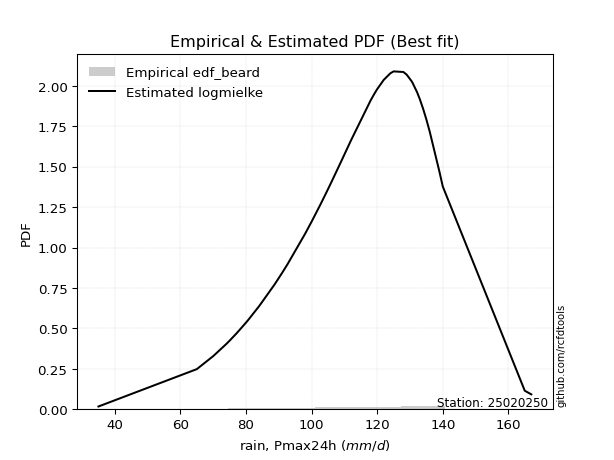</img>

</div>


### 5. Empirical - EDF Chegodayev (1955)

The Chegodayev formula is an empirical plotting position formula used in hydrological frequency analysis to estimate the exceedance probability or return period of a specific event from a set of observed data. It is primarily used for plotting observed data points on probability paper to fit a theoretical distribution, particularly for analyzing extreme events like maximum flood flows or rainfall intensities. The constant _b_ value in the generalized plotting position formula is 0.3.

<div align="center">


$P=(m-b)/(n+1-2b)$


</div>


**5.1. Empirical values**

<div align="center">

|                | 0                    | 1                    | 2                   | 3                   | 4                   | 5                   | 6                   | 7                   | 8                   | 9                   | 10                  | 11                 | 12                 | 13                 | 14                  | 15                 | 16                  | 17                  | 18                  | 19                  | 20                 | 21                  | 22                 | 23                  | 24                 | 25                  | 26                 | 27                  | 28                 | 29                 | 30                 | 31                 | 32                 | 33                | 34                 | 35                 | 36                 | 37                 | 38                 | 39                 | 40                 | 41                 | 42                 | 43                 | 44                 | 45                 | 46                 | 47                 | 48                 | 49                 | 50                 | 51                 | 52                 | 53                 | 54                 | 55                 |
|:---------------|:---------------------|:---------------------|:--------------------|:--------------------|:--------------------|:--------------------|:--------------------|:--------------------|:--------------------|:--------------------|:--------------------|:-------------------|:-------------------|:-------------------|:--------------------|:-------------------|:--------------------|:--------------------|:--------------------|:--------------------|:-------------------|:--------------------|:-------------------|:--------------------|:-------------------|:--------------------|:-------------------|:--------------------|:-------------------|:-------------------|:-------------------|:-------------------|:-------------------|:------------------|:-------------------|:-------------------|:-------------------|:-------------------|:-------------------|:-------------------|:-------------------|:-------------------|:-------------------|:-------------------|:-------------------|:-------------------|:-------------------|:-------------------|:-------------------|:-------------------|:-------------------|:-------------------|:-------------------|:-------------------|:-------------------|:-------------------|
| date           | 1989                 | 2021                 | 1975                | 1982                | 1976                | 1974                | 1985                | 2004                | 2008                | 2015                | 2009                | 2001               | 1972               | 1986               | 2014                | 1994               | 1996                | 1991                | 2003                | 1997                | 1969               | 2016                | 1998               | 2005                | 1984               | 2017                | 1977               | 1964                | 2012               | 2022               | 1965               | 2013               | 1999               | 1990              | 1981               | 1992               | 1966               | 1995               | 1979               | 1971               | 1988               | 1980               | 2011               | 2006               | 2010               | 1973               | 1983               | 1987               | 1968               | 2007               | 1963               | 2002               | 1970               | 1993               | 2000               | 1978               |
| x              | 65.0                 | 67.0                 | 70.0                | 74.0                | 75.0                | 77.0                | 77.0                | 77.3                | 80.0                | 80.7                | 84.0                | 88.6               | 89.0               | 91.0               | 92.7                | 98.0               | 100.0               | 100.0               | 102.5               | 102.9               | 104.0              | 104.0               | 104.4              | 105.3               | 106.0              | 107.1               | 109.0              | 109.40178571428571  | 112.0              | 116.0              | 118.0              | 119.0              | 119.5              | 120.0             | 122.0              | 122.0              | 124.0              | 125.0              | 125.0              | 128.0              | 128.0              | 129.0              | 130.5              | 130.8              | 132.2              | 133.0              | 134.0              | 134.0              | 135.0              | 136.0              | 136.0              | 139.0              | 140.0              | 140.0              | 165.0              | 167.0              |
| m              | 1                    | 2                    | 3                   | 4                   | 5                   | 6                   | 7                   | 8                   | 9                   | 10                  | 11                  | 12                 | 13                 | 14                 | 15                  | 16                 | 17                  | 18                  | 19                  | 20                  | 21                 | 22                  | 23                 | 24                  | 25                 | 26                  | 27                 | 28                  | 29                 | 30                 | 31                 | 32                 | 33                 | 34                | 35                 | 36                 | 37                 | 38                 | 39                 | 40                 | 41                 | 42                 | 43                 | 44                 | 45                 | 46                 | 47                 | 48                 | 49                 | 50                 | 51                 | 52                 | 53                 | 54                 | 55                 | 56                 |
| empirical_dist | edf_chegodayev       | edf_chegodayev       | edf_chegodayev      | edf_chegodayev      | edf_chegodayev      | edf_chegodayev      | edf_chegodayev      | edf_chegodayev      | edf_chegodayev      | edf_chegodayev      | edf_chegodayev      | edf_chegodayev     | edf_chegodayev     | edf_chegodayev     | edf_chegodayev      | edf_chegodayev     | edf_chegodayev      | edf_chegodayev      | edf_chegodayev      | edf_chegodayev      | edf_chegodayev     | edf_chegodayev      | edf_chegodayev     | edf_chegodayev      | edf_chegodayev     | edf_chegodayev      | edf_chegodayev     | edf_chegodayev      | edf_chegodayev     | edf_chegodayev     | edf_chegodayev     | edf_chegodayev     | edf_chegodayev     | edf_chegodayev    | edf_chegodayev     | edf_chegodayev     | edf_chegodayev     | edf_chegodayev     | edf_chegodayev     | edf_chegodayev     | edf_chegodayev     | edf_chegodayev     | edf_chegodayev     | edf_chegodayev     | edf_chegodayev     | edf_chegodayev     | edf_chegodayev     | edf_chegodayev     | edf_chegodayev     | edf_chegodayev     | edf_chegodayev     | edf_chegodayev     | edf_chegodayev     | edf_chegodayev     | edf_chegodayev     | edf_chegodayev     |
| empirical      | 0.012411347517730495 | 0.030141843971631204 | 0.04787234042553192 | 0.06560283687943264 | 0.08333333333333334 | 0.10106382978723405 | 0.11879432624113476 | 0.13652482269503546 | 0.15425531914893617 | 0.17198581560283688 | 0.18971631205673758 | 0.2074468085106383 | 0.225177304964539  | 0.2429078014184397 | 0.26063829787234044 | 0.2783687943262411 | 0.29609929078014185 | 0.31382978723404253 | 0.33156028368794327 | 0.34929078014184395 | 0.3670212765957447 | 0.38475177304964536 | 0.4024822695035461 | 0.42021276595744683 | 0.4379432624113475 | 0.45567375886524825 | 0.4734042553191489 | 0.49113475177304966 | 0.5088652482269503 | 0.526595744680851  | 0.5443262411347518 | 0.5620567375886525 | 0.5797872340425533 | 0.597517730496454 | 0.6152482269503546 | 0.6329787234042554 | 0.6507092198581561 | 0.6684397163120568 | 0.6861702127659575 | 0.7039007092198583 | 0.7216312056737589 | 0.7393617021276596 | 0.7570921985815604 | 0.7748226950354611 | 0.7925531914893618 | 0.8102836879432624 | 0.8280141843971632 | 0.8457446808510639 | 0.8634751773049646 | 0.8812056737588653 | 0.8989361702127661 | 0.9166666666666667 | 0.9343971631205674 | 0.9521276595744682 | 0.9698581560283689 | 0.9875886524822696 |
| empirical_tr   | 1.0125673249551168   | 1.0310786106032908   | 1.0502793296089385  | 1.0702087286527513  | 1.090909090909091   | 1.1124260355029585  | 1.1348088531187122  | 1.158110882956879   | 1.1823899371069182  | 1.2077087794432548  | 1.2341356673960613  | 1.261744966442953  | 1.2906178489702518 | 1.3208430913348945 | 1.3525179856115108  | 1.3857493857493859 | 1.420654911838791   | 1.4573643410852712  | 1.4960212201591512  | 1.536784741144414   | 1.5798319327731092 | 1.6253602305475503  | 1.6735905044510386 | 1.724770642201835   | 1.779179810725552  | 1.8371335504885993  | 1.8989898989898988 | 1.9651567944250872  | 2.036101083032491  | 2.1123595505617976 | 2.1945525291828796 | 2.2834008097165994 | 2.3797468354430387 | 2.484581497797357 | 2.599078341013825  | 2.7246376811594213 | 2.862944162436549  | 3.0160427807486636 | 3.186440677966102  | 3.3772455089820372 | 3.59235668789809   | 3.8367346938775517 | 4.116788321167885  | 4.440944881889766  | 4.820512820512822  | 5.271028037383179  | 5.814432989690726  | 6.482758620689658  | 7.324675324675328  | 8.417910447761196  | 9.894736842105273  | 12.00000000000001  | 15.243243243243253 | 20.888888888888943 | 33.1764705882354   | 80.571428571429    |

</div>


**5.2. Kolmogorov-Smirnov fit test (sorted by Δ)**


<div align="center">

|                | 0                   | 1                   | 2                   | 3                   | 4                   | 5                   | 6                   | 7                   | 8                   | 9                  | 10                  | 11                  | 12                  | 13                  | 14                  | 15                  | 16                  | 17                 | 18                  | 19                  | 20                  | 21                  | 22                  | 23                  | 24                  | 25                  | 26                  | 27                  | 28                  | 29                 | 30                    | 31                  | 32                  | 33                  | 34                  | 35                  | 36                  | 37                  | 38                  | 39                  | 40                  | 41                  | 42                  | 43                  | 44                  | 45                  | 46                  | 47                  | 48                  | 49                  | 50                  | 51                  | 52                  | 53                  | 54                  | 55                  | 56                  | 57                  | 58                  | 59                  | 60                  | 61                  | 62                  | 63                  | 64                  | 65                  | 66                  | 67                 | 68                  | 69                  | 70                 | 71                 | 72                  | 73                  | 74                  | 75                  | 76                 | 77                  | 78                  | 79                  | 80                  | 81                  | 82                 | 83                 | 84                 | 85                 | 86                  | 87                 |
|:---------------|:--------------------|:--------------------|:--------------------|:--------------------|:--------------------|:--------------------|:--------------------|:--------------------|:--------------------|:-------------------|:--------------------|:--------------------|:--------------------|:--------------------|:--------------------|:--------------------|:--------------------|:-------------------|:--------------------|:--------------------|:--------------------|:--------------------|:--------------------|:--------------------|:--------------------|:--------------------|:--------------------|:--------------------|:--------------------|:-------------------|:----------------------|:--------------------|:--------------------|:--------------------|:--------------------|:--------------------|:--------------------|:--------------------|:--------------------|:--------------------|:--------------------|:--------------------|:--------------------|:--------------------|:--------------------|:--------------------|:--------------------|:--------------------|:--------------------|:--------------------|:--------------------|:--------------------|:--------------------|:--------------------|:--------------------|:--------------------|:--------------------|:--------------------|:--------------------|:--------------------|:--------------------|:--------------------|:--------------------|:--------------------|:--------------------|:--------------------|:--------------------|:-------------------|:--------------------|:--------------------|:-------------------|:-------------------|:--------------------|:--------------------|:--------------------|:--------------------|:-------------------|:--------------------|:--------------------|:--------------------|:--------------------|:--------------------|:-------------------|:-------------------|:-------------------|:-------------------|:--------------------|:-------------------|
| station        | 25020250            | 25020250            | 25020250            | 25020250            | 25020250            | 25020250            | 25020250            | 25020250            | 25020250            | 25020250           | 25020250            | 25020250            | 25020250            | 25020250            | 25020250            | 25020250            | 25020250            | 25020250           | 25020250            | 25020250            | 25020250            | 25020250            | 25020250            | 25020250            | 25020250            | 25020250            | 25020250            | 25020250            | 25020250            | 25020250           | 25020250              | 25020250            | 25020250            | 25020250            | 25020250            | 25020250            | 25020250            | 25020250            | 25020250            | 25020250            | 25020250            | 25020250            | 25020250            | 25020250            | 25020250            | 25020250            | 25020250            | 25020250            | 25020250            | 25020250            | 25020250            | 25020250            | 25020250            | 25020250            | 25020250            | 25020250            | 25020250            | 25020250            | 25020250            | 25020250            | 25020250            | 25020250            | 25020250            | 25020250            | 25020250            | 25020250            | 25020250            | 25020250           | 25020250            | 25020250            | 25020250           | 25020250           | 25020250            | 25020250            | 25020250            | 25020250            | 25020250           | 25020250            | 25020250            | 25020250            | 25020250            | 25020250            | 25020250           | 25020250           | 25020250           | 25020250           | 25020250            | 25020250           |
| empirical_dist | edf_chegodayev      | edf_chegodayev      | edf_chegodayev      | edf_chegodayev      | edf_chegodayev      | edf_chegodayev      | edf_chegodayev      | edf_chegodayev      | edf_chegodayev      | edf_chegodayev     | edf_chegodayev      | edf_chegodayev      | edf_chegodayev      | edf_chegodayev      | edf_chegodayev      | edf_chegodayev      | edf_chegodayev      | edf_chegodayev     | edf_chegodayev      | edf_chegodayev      | edf_chegodayev      | edf_chegodayev      | edf_chegodayev      | edf_chegodayev      | edf_chegodayev      | edf_chegodayev      | edf_chegodayev      | edf_chegodayev      | edf_chegodayev      | edf_chegodayev     | edf_chegodayev        | edf_chegodayev      | edf_chegodayev      | edf_chegodayev      | edf_chegodayev      | edf_chegodayev      | edf_chegodayev      | edf_chegodayev      | edf_chegodayev      | edf_chegodayev      | edf_chegodayev      | edf_chegodayev      | edf_chegodayev      | edf_chegodayev      | edf_chegodayev      | edf_chegodayev      | edf_chegodayev      | edf_chegodayev      | edf_chegodayev      | edf_chegodayev      | edf_chegodayev      | edf_chegodayev      | edf_chegodayev      | edf_chegodayev      | edf_chegodayev      | edf_chegodayev      | edf_chegodayev      | edf_chegodayev      | edf_chegodayev      | edf_chegodayev      | edf_chegodayev      | edf_chegodayev      | edf_chegodayev      | edf_chegodayev      | edf_chegodayev      | edf_chegodayev      | edf_chegodayev      | edf_chegodayev     | edf_chegodayev      | edf_chegodayev      | edf_chegodayev     | edf_chegodayev     | edf_chegodayev      | edf_chegodayev      | edf_chegodayev      | edf_chegodayev      | edf_chegodayev     | edf_chegodayev      | edf_chegodayev      | edf_chegodayev      | edf_chegodayev      | edf_chegodayev      | edf_chegodayev     | edf_chegodayev     | edf_chegodayev     | edf_chegodayev     | edf_chegodayev      | edf_chegodayev     |
| p_dist         | genlogistic         | loggenlogistic      | mielke              | loggumbel_l         | logloggamma         | logjohnsonsu        | johnsonsu           | fisk                | pearson3            | logweibull_min     | loggompertz         | norm                | truncnorm           | crystalball         | exponnorm           | t                   | nct                 | nakagami           | erlang              | gamma               | fatiguelife         | f                   | weibull_min         | logpearson3         | gumbel_l            | rice                | chi2                | logfisk             | logistic            | alpha              | loglaplace_asymmetric | invgamma            | maxwell             | logmielke           | ncf                 | hypsecant           | logncf              | logf                | logt                | logexponnorm        | lognorm             | lognorm             | logcrystalball      | loglognorm          | lognakagami         | rayleigh            | logfatiguelife      | invgauss            | logrice             | loginvgamma         | logbetaprime        | loggamma            | loggamma            | invweibull          | logerlang           | logalpha            | laplace_asymmetric  | lognct              | betaprime           | kstwobign           | loginvgauss         | loglogistic         | logmaxwell          | laplace             | lograyleigh         | loginvweibull       | halfnorm            | loghypsecant       | gumbel_r            | loghalfnorm         | moyal              | logkstwobign       | loggumbel_r         | loglaplace          | loggenexpon         | halflogistic        | loghalflogistic    | logmoyal            | wald                | genexpon            | expon               | logwald             | gibrat             | loggibrat          | logexpon           | logchi2            | logtruncnorm        | gompertz           |
| delta          | 0.06507453577328434 | 0.06783776138250824 | 0.06788566944297347 | 0.06938494275216432 | 0.06944296941227157 | 0.07036438790930688 | 0.07302144971418756 | 0.07312764994219456 | 0.07330568640351864 | 0.0741168236423635 | 0.07476229721100647 | 0.07507018813378963 | 0.07507018993863801 | 0.07507019595492126 | 0.07507027332434812 | 0.07508301836943732 | 0.07514107031801198 | 0.0763021102388487 | 0.07669437525372558 | 0.07682680818313015 | 0.07801819266766508 | 0.07850734859931685 | 0.07956705750005999 | 0.08258068211474079 | 0.08559984955435845 | 0.08645527119339225 | 0.08894892537104171 | 0.08969689709264772 | 0.09008918306651148 | 0.0956119191413336 | 0.0963746815971479    | 0.09755555086129064 | 0.09980980012448781 | 0.10036848274823817 | 0.10046046298051337 | 0.10287535260227698 | 0.10620463945354364 | 0.10667467499477756 | 0.10713848151364092 | 0.10714296475329677 | 0.10714345259783864 | 0.10714345259783864 | 0.10714345434320005 | 0.10714522879952959 | 0.10715387694874723 | 0.10739207754094016 | 0.10783404501197824 | 0.11008556002927605 | 0.11097958655865392 | 0.11107955975213879 | 0.11153840181233887 | 0.11250365645207727 | 0.11250365645207727 | 0.11426849947838347 | 0.11542559543511466 | 0.11619872887147897 | 0.11705045372534162 | 0.11809817065855799 | 0.11912513848544992 | 0.12006419283465031 | 0.12362737403906499 | 0.12521180526379783 | 0.12862159629800607 | 0.13129080307925567 | 0.13508309795436468 | 0.13858621939278454 | 0.13917853560054066 | 0.1392125852995616 | 0.13937749631227359 | 0.15843053340895102 | 0.1610661342038151 | 0.1660092267889382 | 0.16688501789254073 | 0.16735491923312273 | 0.16755072574096153 | 0.17198581560283688 | 0.1819493977586697 | 0.18663949197224872 | 0.22268937108732006 | 0.23769249264088455 | 0.23873212662087762 | 0.24267247150419535 | 0.2605948869844517 | 0.2748838063607517 | 0.2760749813122631 | 0.3576145282071731 | 0.39110382180375947 | 0.7771190836060631 |
| deltao         | 0.1817376445004486  | 0.1817376445004486  | 0.1817376445004486  | 0.1817376445004486  | 0.1817376445004486  | 0.1817376445004486  | 0.1817376445004486  | 0.1817376445004486  | 0.1817376445004486  | 0.1817376445004486 | 0.1817376445004486  | 0.1817376445004486  | 0.1817376445004486  | 0.1817376445004486  | 0.1817376445004486  | 0.1817376445004486  | 0.1817376445004486  | 0.1817376445004486 | 0.1817376445004486  | 0.1817376445004486  | 0.1817376445004486  | 0.1817376445004486  | 0.1817376445004486  | 0.1817376445004486  | 0.1817376445004486  | 0.1817376445004486  | 0.1817376445004486  | 0.1817376445004486  | 0.1817376445004486  | 0.1817376445004486 | 0.1817376445004486    | 0.1817376445004486  | 0.1817376445004486  | 0.1817376445004486  | 0.1817376445004486  | 0.1817376445004486  | 0.1817376445004486  | 0.1817376445004486  | 0.1817376445004486  | 0.1817376445004486  | 0.1817376445004486  | 0.1817376445004486  | 0.1817376445004486  | 0.1817376445004486  | 0.1817376445004486  | 0.1817376445004486  | 0.1817376445004486  | 0.1817376445004486  | 0.1817376445004486  | 0.1817376445004486  | 0.1817376445004486  | 0.1817376445004486  | 0.1817376445004486  | 0.1817376445004486  | 0.1817376445004486  | 0.1817376445004486  | 0.1817376445004486  | 0.1817376445004486  | 0.1817376445004486  | 0.1817376445004486  | 0.1817376445004486  | 0.1817376445004486  | 0.1817376445004486  | 0.1817376445004486  | 0.1817376445004486  | 0.1817376445004486  | 0.1817376445004486  | 0.1817376445004486 | 0.1817376445004486  | 0.1817376445004486  | 0.1817376445004486 | 0.1817376445004486 | 0.1817376445004486  | 0.1817376445004486  | 0.1817376445004486  | 0.1817376445004486  | 0.1817376445004486 | 0.1817376445004486  | 0.1817376445004486  | 0.1817376445004486  | 0.1817376445004486  | 0.1817376445004486  | 0.1817376445004486 | 0.1817376445004486 | 0.1817376445004486 | 0.1817376445004486 | 0.1817376445004486  | 0.1817376445004486 |
| eval           | Δo > Δ              | Δo > Δ              | Δo > Δ              | Δo > Δ              | Δo > Δ              | Δo > Δ              | Δo > Δ              | Δo > Δ              | Δo > Δ              | Δo > Δ             | Δo > Δ              | Δo > Δ              | Δo > Δ              | Δo > Δ              | Δo > Δ              | Δo > Δ              | Δo > Δ              | Δo > Δ             | Δo > Δ              | Δo > Δ              | Δo > Δ              | Δo > Δ              | Δo > Δ              | Δo > Δ              | Δo > Δ              | Δo > Δ              | Δo > Δ              | Δo > Δ              | Δo > Δ              | Δo > Δ             | Δo > Δ                | Δo > Δ              | Δo > Δ              | Δo > Δ              | Δo > Δ              | Δo > Δ              | Δo > Δ              | Δo > Δ              | Δo > Δ              | Δo > Δ              | Δo > Δ              | Δo > Δ              | Δo > Δ              | Δo > Δ              | Δo > Δ              | Δo > Δ              | Δo > Δ              | Δo > Δ              | Δo > Δ              | Δo > Δ              | Δo > Δ              | Δo > Δ              | Δo > Δ              | Δo > Δ              | Δo > Δ              | Δo > Δ              | Δo > Δ              | Δo > Δ              | Δo > Δ              | Δo > Δ              | Δo > Δ              | Δo > Δ              | Δo > Δ              | Δo > Δ              | Δo > Δ              | Δo > Δ              | Δo > Δ              | Δo > Δ             | Δo > Δ              | Δo > Δ              | Δo > Δ             | Δo > Δ             | Δo > Δ              | Δo > Δ              | Δo > Δ              | Δo > Δ              | Δo <= Δ            | Δo <= Δ             | Δo <= Δ             | Δo <= Δ             | Δo <= Δ             | Δo <= Δ             | Δo <= Δ            | Δo <= Δ            | Δo <= Δ            | Δo <= Δ            | Δo <= Δ             | Δo <= Δ            |
| fit            | 1                   | 1                   | 1                   | 1                   | 1                   | 1                   | 1                   | 1                   | 1                   | 1                  | 1                   | 1                   | 1                   | 1                   | 1                   | 1                   | 1                   | 1                  | 1                   | 1                   | 1                   | 1                   | 1                   | 1                   | 1                   | 1                   | 1                   | 1                   | 1                   | 1                  | 1                     | 1                   | 1                   | 1                   | 1                   | 1                   | 1                   | 1                   | 1                   | 1                   | 1                   | 1                   | 1                   | 1                   | 1                   | 1                   | 1                   | 1                   | 1                   | 1                   | 1                   | 1                   | 1                   | 1                   | 1                   | 1                   | 1                   | 1                   | 1                   | 1                   | 1                   | 1                   | 1                   | 1                   | 1                   | 1                   | 1                   | 1                  | 1                   | 1                   | 1                  | 1                  | 1                   | 1                   | 1                   | 1                   | 0                  | 0                   | 0                   | 0                   | 0                   | 0                   | 0                  | 0                  | 0                  | 0                  | 0                   | 0                  |
| n              | 56                  | 56                  | 56                  | 56                  | 56                  | 56                  | 56                  | 56                  | 56                  | 56                 | 56                  | 56                  | 56                  | 56                  | 56                  | 56                  | 56                  | 56                 | 56                  | 56                  | 56                  | 56                  | 56                  | 56                  | 56                  | 56                  | 56                  | 56                  | 56                  | 56                 | 56                    | 56                  | 56                  | 56                  | 56                  | 56                  | 56                  | 56                  | 56                  | 56                  | 56                  | 56                  | 56                  | 56                  | 56                  | 56                  | 56                  | 56                  | 56                  | 56                  | 56                  | 56                  | 56                  | 56                  | 56                  | 56                  | 56                  | 56                  | 56                  | 56                  | 56                  | 56                  | 56                  | 56                  | 56                  | 56                  | 56                  | 56                 | 56                  | 56                  | 56                 | 56                 | 56                  | 56                  | 56                  | 56                  | 56                 | 56                  | 56                  | 56                  | 56                  | 56                  | 56                 | 56                 | 56                 | 56                 | 56                  | 56                 |
| best_fit       | 1                   | 0                   | 0                   | 0                   | 0                   | 0                   | 0                   | 0                   | 0                   | 0                  | 0                   | 0                   | 0                   | 0                   | 0                   | 0                   | 0                   | 0                  | 0                   | 0                   | 0                   | 0                   | 0                   | 0                   | 0                   | 0                   | 0                   | 0                   | 0                   | 0                  | 0                     | 0                   | 0                   | 0                   | 0                   | 0                   | 0                   | 0                   | 0                   | 0                   | 0                   | 0                   | 0                   | 0                   | 0                   | 0                   | 0                   | 0                   | 0                   | 0                   | 0                   | 0                   | 0                   | 0                   | 0                   | 0                   | 0                   | 0                   | 0                   | 0                   | 0                   | 0                   | 0                   | 0                   | 0                   | 0                   | 0                   | 0                  | 0                   | 0                   | 0                  | 0                  | 0                   | 0                   | 0                   | 0                   | 0                  | 0                   | 0                   | 0                   | 0                   | 0                   | 0                  | 0                  | 0                  | 0                  | 0                   | 0                  |
| best_fit_sort  | 1                   | 2                   | 3                   | 4                   | 5                   | 6                   | 7                   | 8                   | 9                   | 10                 | 11                  | 12                  | 13                  | 14                  | 15                  | 16                  | 17                  | 18                 | 19                  | 20                  | 21                  | 22                  | 23                  | 24                  | 25                  | 26                  | 27                  | 28                  | 29                  | 30                 | 31                    | 32                  | 33                  | 34                  | 35                  | 36                  | 37                  | 38                  | 39                  | 40                  | 41                  | 42                  | 43                  | 44                  | 45                  | 46                  | 47                  | 48                  | 49                  | 50                  | 51                  | 52                  | 53                  | 54                  | 55                  | 56                  | 57                  | 58                  | 59                  | 60                  | 61                  | 62                  | 63                  | 64                  | 65                  | 66                  | 67                  | 68                 | 69                  | 70                  | 71                 | 72                 | 73                  | 74                  | 75                  | 76                  | 77                 | 78                  | 79                  | 80                  | 81                  | 82                  | 83                 | 84                 | 85                 | 86                 | 87                  | 88                 |

</div>


<div align="center">

</img>

</div>


**5.3. Best fit**

<div align="center">

|   id |   station | empirical_dist   | p_dist      |     delta |   deltao | eval   |   fit |   n |   best_fit |   best_fit_sort |
|-----:|----------:|:-----------------|:------------|----------:|---------:|:-------|------:|----:|-----------:|----------------:|
|    0 |  25020250 | edf_chegodayev   | genlogistic | 0.0650745 | 0.181738 | Δo > Δ |     1 |  56 |          1 |               1 |

</div>


<div align="center">

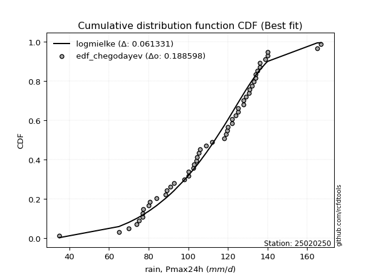</img></img>

</div>


### 6. Empirical - EDF Blom (1958)

The Blom formula is a specific "plotting position" formula used in hydrology and statistical analysis to estimate the empirical cumulative probability (or non-exceedance probability) of a data series. It is particularly recommended for data that are approximately normally distributed. The constant _a_ is set to 0.375 (or 3/8).

<div align="center">


$P=(m-a)/(n+1-2a)$


</div>


**6.1. Empirical values**

<div align="center">

|                | 0                    | 1                    | 2                   | 3                   | 4                   | 5                  | 6                   | 7                   | 8                   | 9                  | 10                  | 11                  | 12                  | 13                  | 14                 | 15                 | 16                  | 17                  | 18                  | 19                 | 20                  | 21                 | 22                 | 23                 | 24                  | 25                  | 26                  | 27                 | 28                 | 29                 | 30                 | 31                 | 32                | 33                 | 34                 | 35                 | 36                 | 37                 | 38                 | 39                 | 40                 | 41                | 42                 | 43                 | 44                 | 45                 | 46                 | 47                 | 48                 | 49                 | 50                 | 51                 | 52                 | 53                 | 54                 | 55                 |
|:---------------|:---------------------|:---------------------|:--------------------|:--------------------|:--------------------|:-------------------|:--------------------|:--------------------|:--------------------|:-------------------|:--------------------|:--------------------|:--------------------|:--------------------|:-------------------|:-------------------|:--------------------|:--------------------|:--------------------|:-------------------|:--------------------|:-------------------|:-------------------|:-------------------|:--------------------|:--------------------|:--------------------|:-------------------|:-------------------|:-------------------|:-------------------|:-------------------|:------------------|:-------------------|:-------------------|:-------------------|:-------------------|:-------------------|:-------------------|:-------------------|:-------------------|:------------------|:-------------------|:-------------------|:-------------------|:-------------------|:-------------------|:-------------------|:-------------------|:-------------------|:-------------------|:-------------------|:-------------------|:-------------------|:-------------------|:-------------------|
| date           | 1989                 | 2021                 | 1975                | 1982                | 1976                | 1974               | 1985                | 2004                | 2008                | 2015               | 2009                | 2001                | 1972                | 1986                | 2014               | 1994               | 1996                | 1991                | 2003                | 1997               | 1969                | 2016               | 1998               | 2005               | 1984                | 2017                | 1977                | 1964               | 2012               | 2022               | 1965               | 2013               | 1999              | 1990               | 1981               | 1992               | 1966               | 1995               | 1979               | 1971               | 1988               | 1980              | 2011               | 2006               | 2010               | 1973               | 1983               | 1987               | 1968               | 2007               | 1963               | 2002               | 1970               | 1993               | 2000               | 1978               |
| x              | 65.0                 | 67.0                 | 70.0                | 74.0                | 75.0                | 77.0               | 77.0                | 77.3                | 80.0                | 80.7               | 84.0                | 88.6                | 89.0                | 91.0                | 92.7               | 98.0               | 100.0               | 100.0               | 102.5               | 102.9              | 104.0               | 104.0              | 104.4              | 105.3              | 106.0               | 107.1               | 109.0               | 109.40178571428571 | 112.0              | 116.0              | 118.0              | 119.0              | 119.5             | 120.0              | 122.0              | 122.0              | 124.0              | 125.0              | 125.0              | 128.0              | 128.0              | 129.0             | 130.5              | 130.8              | 132.2              | 133.0              | 134.0              | 134.0              | 135.0              | 136.0              | 136.0              | 139.0              | 140.0              | 140.0              | 165.0              | 167.0              |
| m              | 1                    | 2                    | 3                   | 4                   | 5                   | 6                  | 7                   | 8                   | 9                   | 10                 | 11                  | 12                  | 13                  | 14                  | 15                 | 16                 | 17                  | 18                  | 19                  | 20                 | 21                  | 22                 | 23                 | 24                 | 25                  | 26                  | 27                  | 28                 | 29                 | 30                 | 31                 | 32                 | 33                | 34                 | 35                 | 36                 | 37                 | 38                 | 39                 | 40                 | 41                 | 42                | 43                 | 44                 | 45                 | 46                 | 47                 | 48                 | 49                 | 50                 | 51                 | 52                 | 53                 | 54                 | 55                 | 56                 |
| empirical_dist | edf_blom             | edf_blom             | edf_blom            | edf_blom            | edf_blom            | edf_blom           | edf_blom            | edf_blom            | edf_blom            | edf_blom           | edf_blom            | edf_blom            | edf_blom            | edf_blom            | edf_blom           | edf_blom           | edf_blom            | edf_blom            | edf_blom            | edf_blom           | edf_blom            | edf_blom           | edf_blom           | edf_blom           | edf_blom            | edf_blom            | edf_blom            | edf_blom           | edf_blom           | edf_blom           | edf_blom           | edf_blom           | edf_blom          | edf_blom           | edf_blom           | edf_blom           | edf_blom           | edf_blom           | edf_blom           | edf_blom           | edf_blom           | edf_blom          | edf_blom           | edf_blom           | edf_blom           | edf_blom           | edf_blom           | edf_blom           | edf_blom           | edf_blom           | edf_blom           | edf_blom           | edf_blom           | edf_blom           | edf_blom           | edf_blom           |
| empirical      | 0.011111111111111112 | 0.028888888888888888 | 0.04666666666666667 | 0.06444444444444444 | 0.08222222222222222 | 0.1                | 0.11777777777777777 | 0.13555555555555557 | 0.15333333333333332 | 0.1711111111111111 | 0.18888888888888888 | 0.20666666666666667 | 0.22444444444444445 | 0.24222222222222223 | 0.26               | 0.2777777777777778 | 0.29555555555555557 | 0.31333333333333335 | 0.33111111111111113 | 0.3488888888888889 | 0.36666666666666664 | 0.3844444444444444 | 0.4022222222222222 | 0.42               | 0.43777777777777777 | 0.45555555555555555 | 0.47333333333333333 | 0.4911111111111111 | 0.5088888888888888 | 0.5266666666666666 | 0.5444444444444444 | 0.5622222222222222 | 0.58              | 0.5977777777777777 | 0.6155555555555555 | 0.6333333333333333 | 0.6511111111111111 | 0.6688888888888889 | 0.6866666666666666 | 0.7044444444444444 | 0.7222222222222222 | 0.74              | 0.7577777777777778 | 0.7755555555555556 | 0.7933333333333333 | 0.8111111111111111 | 0.8288888888888889 | 0.8466666666666667 | 0.8644444444444445 | 0.8822222222222222 | 0.9                | 0.9177777777777778 | 0.9355555555555556 | 0.9533333333333334 | 0.9711111111111111 | 0.9888888888888889 |
| empirical_tr   | 1.0112359550561798   | 1.0297482837528604   | 1.048951048951049   | 1.0688836104513064  | 1.089588377723971   | 1.1111111111111112 | 1.1335012594458438  | 1.1568123393316194  | 1.1811023622047243  | 1.2064343163538873 | 1.2328767123287672  | 1.2605042016806722  | 1.2893982808022924  | 1.3196480938416422  | 1.3513513513513513 | 1.3846153846153846 | 1.4195583596214512  | 1.4563106796116505  | 1.495016611295681   | 1.5358361774744027 | 1.5789473684210527  | 1.6245487364620936 | 1.6728624535315986 | 1.7241379310344827 | 1.7786561264822136  | 1.8367346938775508  | 1.89873417721519    | 1.9650655021834058 | 2.0361990950226243 | 2.112676056338028  | 2.195121951219512  | 2.284263959390863  | 2.380952380952381 | 2.486187845303867  | 2.6011560693641615 | 2.727272727272727  | 2.8662420382165603 | 3.0201342281879193 | 3.1914893617021276 | 3.3834586466165413 | 3.5999999999999996 | 3.846153846153846 | 4.128440366972477  | 4.455445544554456  | 4.838709677419355  | 5.294117647058823  | 5.8441558441558445 | 6.521739130434783  | 7.3770491803278695 | 8.490566037735851  | 10.000000000000002 | 12.162162162162167 | 15.517241379310352 | 21.428571428571445 | 34.615384615384656 | 90.00000000000033  |

</div>


**6.2. Kolmogorov-Smirnov fit test (sorted by Δ)**


<div align="center">

|                | 0                   | 1                   | 2                   | 3                   | 4                   | 5                   | 6                   | 7                   | 8                   | 9                  | 10                  | 11                  | 12                  | 13                  | 14                  | 15                  | 16                 | 17                  | 18                  | 19                  | 20                  | 21                  | 22                 | 23                 | 24                  | 25                  | 26                  | 27                  | 28                  | 29                  | 30                    | 31                  | 32                  | 33                 | 34                  | 35                  | 36                  | 37                  | 38                  | 39                  | 40                  | 41                  | 42                  | 43                 | 44                  | 45                  | 46                  | 47                  | 48                  | 49                 | 50                  | 51                  | 52                  | 53                  | 54                  | 55                  | 56                  | 57                 | 58                  | 59                  | 60                 | 61                  | 62                  | 63                  | 64                 | 65                 | 66                  | 67                 | 68                 | 69                  | 70                  | 71                  | 72                  | 73                  | 74                 | 75                 | 76                 | 77                  | 78                 | 79                  | 80                 | 81                  | 82                 | 83                 | 84                  | 85                  | 86                  | 87                 |
|:---------------|:--------------------|:--------------------|:--------------------|:--------------------|:--------------------|:--------------------|:--------------------|:--------------------|:--------------------|:-------------------|:--------------------|:--------------------|:--------------------|:--------------------|:--------------------|:--------------------|:-------------------|:--------------------|:--------------------|:--------------------|:--------------------|:--------------------|:-------------------|:-------------------|:--------------------|:--------------------|:--------------------|:--------------------|:--------------------|:--------------------|:----------------------|:--------------------|:--------------------|:-------------------|:--------------------|:--------------------|:--------------------|:--------------------|:--------------------|:--------------------|:--------------------|:--------------------|:--------------------|:-------------------|:--------------------|:--------------------|:--------------------|:--------------------|:--------------------|:-------------------|:--------------------|:--------------------|:--------------------|:--------------------|:--------------------|:--------------------|:--------------------|:-------------------|:--------------------|:--------------------|:-------------------|:--------------------|:--------------------|:--------------------|:-------------------|:-------------------|:--------------------|:-------------------|:-------------------|:--------------------|:--------------------|:--------------------|:--------------------|:--------------------|:-------------------|:-------------------|:-------------------|:--------------------|:-------------------|:--------------------|:-------------------|:--------------------|:-------------------|:-------------------|:--------------------|:--------------------|:--------------------|:-------------------|
| station        | 25020250            | 25020250            | 25020250            | 25020250            | 25020250            | 25020250            | 25020250            | 25020250            | 25020250            | 25020250           | 25020250            | 25020250            | 25020250            | 25020250            | 25020250            | 25020250            | 25020250           | 25020250            | 25020250            | 25020250            | 25020250            | 25020250            | 25020250           | 25020250           | 25020250            | 25020250            | 25020250            | 25020250            | 25020250            | 25020250            | 25020250              | 25020250            | 25020250            | 25020250           | 25020250            | 25020250            | 25020250            | 25020250            | 25020250            | 25020250            | 25020250            | 25020250            | 25020250            | 25020250           | 25020250            | 25020250            | 25020250            | 25020250            | 25020250            | 25020250           | 25020250            | 25020250            | 25020250            | 25020250            | 25020250            | 25020250            | 25020250            | 25020250           | 25020250            | 25020250            | 25020250           | 25020250            | 25020250            | 25020250            | 25020250           | 25020250           | 25020250            | 25020250           | 25020250           | 25020250            | 25020250            | 25020250            | 25020250            | 25020250            | 25020250           | 25020250           | 25020250           | 25020250            | 25020250           | 25020250            | 25020250           | 25020250            | 25020250           | 25020250           | 25020250            | 25020250            | 25020250            | 25020250           |
| empirical_dist | edf_blom            | edf_blom            | edf_blom            | edf_blom            | edf_blom            | edf_blom            | edf_blom            | edf_blom            | edf_blom            | edf_blom           | edf_blom            | edf_blom            | edf_blom            | edf_blom            | edf_blom            | edf_blom            | edf_blom           | edf_blom            | edf_blom            | edf_blom            | edf_blom            | edf_blom            | edf_blom           | edf_blom           | edf_blom            | edf_blom            | edf_blom            | edf_blom            | edf_blom            | edf_blom            | edf_blom              | edf_blom            | edf_blom            | edf_blom           | edf_blom            | edf_blom            | edf_blom            | edf_blom            | edf_blom            | edf_blom            | edf_blom            | edf_blom            | edf_blom            | edf_blom           | edf_blom            | edf_blom            | edf_blom            | edf_blom            | edf_blom            | edf_blom           | edf_blom            | edf_blom            | edf_blom            | edf_blom            | edf_blom            | edf_blom            | edf_blom            | edf_blom           | edf_blom            | edf_blom            | edf_blom           | edf_blom            | edf_blom            | edf_blom            | edf_blom           | edf_blom           | edf_blom            | edf_blom           | edf_blom           | edf_blom            | edf_blom            | edf_blom            | edf_blom            | edf_blom            | edf_blom           | edf_blom           | edf_blom           | edf_blom            | edf_blom           | edf_blom            | edf_blom           | edf_blom            | edf_blom           | edf_blom           | edf_blom            | edf_blom            | edf_blom            | edf_blom           |
| p_dist         | genlogistic         | loggenlogistic      | mielke              | loggumbel_l         | logloggamma         | logjohnsonsu        | johnsonsu           | fisk                | pearson3            | logweibull_min     | loggompertz         | norm                | truncnorm           | crystalball         | exponnorm           | t                   | nct                | nakagami            | erlang              | gamma               | fatiguelife         | f                   | weibull_min        | logpearson3        | gumbel_l            | rice                | chi2                | logistic            | logfisk             | alpha               | loglaplace_asymmetric | invgamma            | maxwell             | logmielke          | ncf                 | hypsecant           | logncf              | logf                | logt                | logexponnorm        | lognorm             | lognorm             | logcrystalball      | loglognorm         | lognakagami         | rayleigh            | logfatiguelife      | invgauss            | logrice             | loginvgamma        | logbetaprime        | loggamma            | loggamma            | invweibull          | logerlang           | logalpha            | laplace_asymmetric  | lognct             | betaprime           | kstwobign           | loginvgauss        | loglogistic         | logmaxwell          | laplace             | lograyleigh        | halfnorm           | loginvweibull       | loghypsecant       | gumbel_r           | loghalfnorm         | moyal               | logkstwobign        | loggumbel_r         | loglaplace          | loggenexpon        | halflogistic       | loghalflogistic    | logmoyal            | wald               | genexpon            | expon              | logwald             | gibrat             | loggibrat          | logexpon            | logchi2             | logtruncnorm        | gompertz           |
| delta          | 0.06419983128155857 | 0.06771955807281554 | 0.06776746613328077 | 0.06851023826043855 | 0.06932476610257898 | 0.07024618459961429 | 0.07290324640449497 | 0.07300944663250197 | 0.07318748309382606 | 0.0739986203326709 | 0.07464409390131388 | 0.07495198482409704 | 0.07495198662894542 | 0.07495199264522867 | 0.07495207001465554 | 0.07496481505974473 | 0.0750228670083194 | 0.07618390692915611 | 0.07657617194403299 | 0.07670860487343756 | 0.07789998935797249 | 0.07838914528962426 | 0.0794488541903674 | 0.0824624788050482 | 0.08548164624466575 | 0.08633706788369966 | 0.08883072206134912 | 0.08997097975681889 | 0.09090257085151288 | 0.09549371583164101 | 0.09635104093520935   | 0.09743734755159805 | 0.09969159681479522 | 0.099824747523652  | 0.10034225967082078 | 0.10270986796870729 | 0.10608643614385105 | 0.10655647168508497 | 0.10702027820394833 | 0.10702476144360418 | 0.10702524928814605 | 0.10702524928814605 | 0.10702525103350746 | 0.107027025489837  | 0.10703567363905464 | 0.10727387423124757 | 0.10771584170228565 | 0.10996735671958346 | 0.11086138324896133 | 0.1109613564424462 | 0.11142019850264628 | 0.11238545314238468 | 0.11238545314238468 | 0.11415029616869088 | 0.11530739212542207 | 0.11608052556178639 | 0.11693225041564903 | 0.1179799673488654 | 0.11900693517575733 | 0.11994598952495772 | 0.1235091707293724 | 0.12509360195410524 | 0.12850339298831348 | 0.13112531844568598 | 0.1349648946446721 | 0.1383038311088149 | 0.13903539196961667 | 0.139094381989869  | 0.139259293002581  | 0.15887970598578316 | 0.16094793089412252 | 0.16645839936577034 | 0.16676681458284814 | 0.16723671592343015 | 0.1680944609655478 | 0.1711111111111111 | 0.1818311944489771 | 0.18652128866255613 | 0.2219565105672255 | 0.23823622786547083 | 0.2392758618454639 | 0.24255426819450276 | 0.2599565891121113 | 0.2747656030510591 | 0.27666599786072643 | 0.35882020196603825 | 0.39164755702834575 | 0.778182913393297  |
| deltao         | 0.1817376445004486  | 0.1817376445004486  | 0.1817376445004486  | 0.1817376445004486  | 0.1817376445004486  | 0.1817376445004486  | 0.1817376445004486  | 0.1817376445004486  | 0.1817376445004486  | 0.1817376445004486 | 0.1817376445004486  | 0.1817376445004486  | 0.1817376445004486  | 0.1817376445004486  | 0.1817376445004486  | 0.1817376445004486  | 0.1817376445004486 | 0.1817376445004486  | 0.1817376445004486  | 0.1817376445004486  | 0.1817376445004486  | 0.1817376445004486  | 0.1817376445004486 | 0.1817376445004486 | 0.1817376445004486  | 0.1817376445004486  | 0.1817376445004486  | 0.1817376445004486  | 0.1817376445004486  | 0.1817376445004486  | 0.1817376445004486    | 0.1817376445004486  | 0.1817376445004486  | 0.1817376445004486 | 0.1817376445004486  | 0.1817376445004486  | 0.1817376445004486  | 0.1817376445004486  | 0.1817376445004486  | 0.1817376445004486  | 0.1817376445004486  | 0.1817376445004486  | 0.1817376445004486  | 0.1817376445004486 | 0.1817376445004486  | 0.1817376445004486  | 0.1817376445004486  | 0.1817376445004486  | 0.1817376445004486  | 0.1817376445004486 | 0.1817376445004486  | 0.1817376445004486  | 0.1817376445004486  | 0.1817376445004486  | 0.1817376445004486  | 0.1817376445004486  | 0.1817376445004486  | 0.1817376445004486 | 0.1817376445004486  | 0.1817376445004486  | 0.1817376445004486 | 0.1817376445004486  | 0.1817376445004486  | 0.1817376445004486  | 0.1817376445004486 | 0.1817376445004486 | 0.1817376445004486  | 0.1817376445004486 | 0.1817376445004486 | 0.1817376445004486  | 0.1817376445004486  | 0.1817376445004486  | 0.1817376445004486  | 0.1817376445004486  | 0.1817376445004486 | 0.1817376445004486 | 0.1817376445004486 | 0.1817376445004486  | 0.1817376445004486 | 0.1817376445004486  | 0.1817376445004486 | 0.1817376445004486  | 0.1817376445004486 | 0.1817376445004486 | 0.1817376445004486  | 0.1817376445004486  | 0.1817376445004486  | 0.1817376445004486 |
| eval           | Δo > Δ              | Δo > Δ              | Δo > Δ              | Δo > Δ              | Δo > Δ              | Δo > Δ              | Δo > Δ              | Δo > Δ              | Δo > Δ              | Δo > Δ             | Δo > Δ              | Δo > Δ              | Δo > Δ              | Δo > Δ              | Δo > Δ              | Δo > Δ              | Δo > Δ             | Δo > Δ              | Δo > Δ              | Δo > Δ              | Δo > Δ              | Δo > Δ              | Δo > Δ             | Δo > Δ             | Δo > Δ              | Δo > Δ              | Δo > Δ              | Δo > Δ              | Δo > Δ              | Δo > Δ              | Δo > Δ                | Δo > Δ              | Δo > Δ              | Δo > Δ             | Δo > Δ              | Δo > Δ              | Δo > Δ              | Δo > Δ              | Δo > Δ              | Δo > Δ              | Δo > Δ              | Δo > Δ              | Δo > Δ              | Δo > Δ             | Δo > Δ              | Δo > Δ              | Δo > Δ              | Δo > Δ              | Δo > Δ              | Δo > Δ             | Δo > Δ              | Δo > Δ              | Δo > Δ              | Δo > Δ              | Δo > Δ              | Δo > Δ              | Δo > Δ              | Δo > Δ             | Δo > Δ              | Δo > Δ              | Δo > Δ             | Δo > Δ              | Δo > Δ              | Δo > Δ              | Δo > Δ             | Δo > Δ             | Δo > Δ              | Δo > Δ             | Δo > Δ             | Δo > Δ              | Δo > Δ              | Δo > Δ              | Δo > Δ              | Δo > Δ              | Δo > Δ             | Δo > Δ             | Δo <= Δ            | Δo <= Δ             | Δo <= Δ            | Δo <= Δ             | Δo <= Δ            | Δo <= Δ             | Δo <= Δ            | Δo <= Δ            | Δo <= Δ             | Δo <= Δ             | Δo <= Δ             | Δo <= Δ            |
| fit            | 1                   | 1                   | 1                   | 1                   | 1                   | 1                   | 1                   | 1                   | 1                   | 1                  | 1                   | 1                   | 1                   | 1                   | 1                   | 1                   | 1                  | 1                   | 1                   | 1                   | 1                   | 1                   | 1                  | 1                  | 1                   | 1                   | 1                   | 1                   | 1                   | 1                   | 1                     | 1                   | 1                   | 1                  | 1                   | 1                   | 1                   | 1                   | 1                   | 1                   | 1                   | 1                   | 1                   | 1                  | 1                   | 1                   | 1                   | 1                   | 1                   | 1                  | 1                   | 1                   | 1                   | 1                   | 1                   | 1                   | 1                   | 1                  | 1                   | 1                   | 1                  | 1                   | 1                   | 1                   | 1                  | 1                  | 1                   | 1                  | 1                  | 1                   | 1                   | 1                   | 1                   | 1                   | 1                  | 1                  | 0                  | 0                   | 0                  | 0                   | 0                  | 0                   | 0                  | 0                  | 0                   | 0                   | 0                   | 0                  |
| n              | 56                  | 56                  | 56                  | 56                  | 56                  | 56                  | 56                  | 56                  | 56                  | 56                 | 56                  | 56                  | 56                  | 56                  | 56                  | 56                  | 56                 | 56                  | 56                  | 56                  | 56                  | 56                  | 56                 | 56                 | 56                  | 56                  | 56                  | 56                  | 56                  | 56                  | 56                    | 56                  | 56                  | 56                 | 56                  | 56                  | 56                  | 56                  | 56                  | 56                  | 56                  | 56                  | 56                  | 56                 | 56                  | 56                  | 56                  | 56                  | 56                  | 56                 | 56                  | 56                  | 56                  | 56                  | 56                  | 56                  | 56                  | 56                 | 56                  | 56                  | 56                 | 56                  | 56                  | 56                  | 56                 | 56                 | 56                  | 56                 | 56                 | 56                  | 56                  | 56                  | 56                  | 56                  | 56                 | 56                 | 56                 | 56                  | 56                 | 56                  | 56                 | 56                  | 56                 | 56                 | 56                  | 56                  | 56                  | 56                 |
| best_fit       | 1                   | 0                   | 0                   | 0                   | 0                   | 0                   | 0                   | 0                   | 0                   | 0                  | 0                   | 0                   | 0                   | 0                   | 0                   | 0                   | 0                  | 0                   | 0                   | 0                   | 0                   | 0                   | 0                  | 0                  | 0                   | 0                   | 0                   | 0                   | 0                   | 0                   | 0                     | 0                   | 0                   | 0                  | 0                   | 0                   | 0                   | 0                   | 0                   | 0                   | 0                   | 0                   | 0                   | 0                  | 0                   | 0                   | 0                   | 0                   | 0                   | 0                  | 0                   | 0                   | 0                   | 0                   | 0                   | 0                   | 0                   | 0                  | 0                   | 0                   | 0                  | 0                   | 0                   | 0                   | 0                  | 0                  | 0                   | 0                  | 0                  | 0                   | 0                   | 0                   | 0                   | 0                   | 0                  | 0                  | 0                  | 0                   | 0                  | 0                   | 0                  | 0                   | 0                  | 0                  | 0                   | 0                   | 0                   | 0                  |
| best_fit_sort  | 1                   | 2                   | 3                   | 4                   | 5                   | 6                   | 7                   | 8                   | 9                   | 10                 | 11                  | 12                  | 13                  | 14                  | 15                  | 16                  | 17                 | 18                  | 19                  | 20                  | 21                  | 22                  | 23                 | 24                 | 25                  | 26                  | 27                  | 28                  | 29                  | 30                  | 31                    | 32                  | 33                  | 34                 | 35                  | 36                  | 37                  | 38                  | 39                  | 40                  | 41                  | 42                  | 43                  | 44                 | 45                  | 46                  | 47                  | 48                  | 49                  | 50                 | 51                  | 52                  | 53                  | 54                  | 55                  | 56                  | 57                  | 58                 | 59                  | 60                  | 61                 | 62                  | 63                  | 64                  | 65                 | 66                 | 67                  | 68                 | 69                 | 70                  | 71                  | 72                  | 73                  | 74                  | 75                 | 76                 | 77                 | 78                  | 79                 | 80                  | 81                 | 82                  | 83                 | 84                 | 85                  | 86                  | 87                  | 88                 |

</div>


<div align="center">

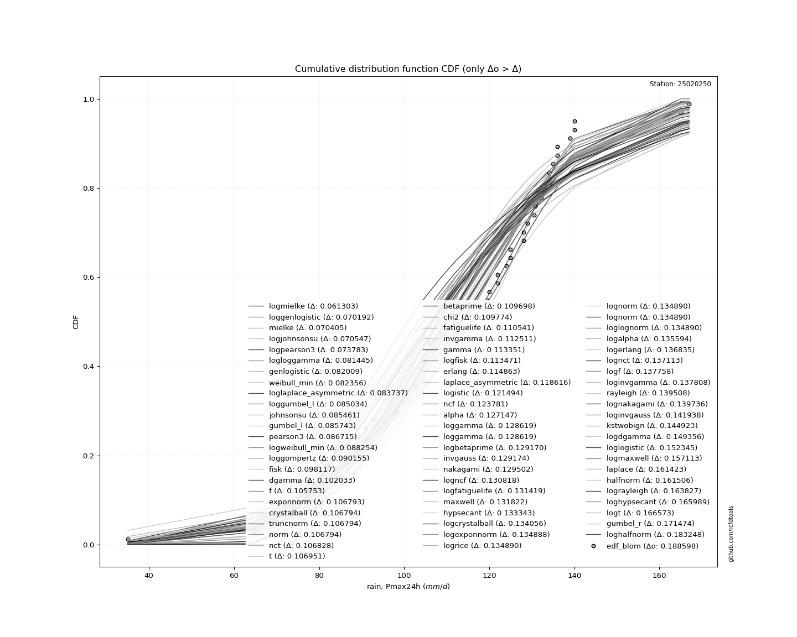</img>

</div>


**6.3. Best fit**

<div align="center">

|   id |   station | empirical_dist   | p_dist      |     delta |   deltao | eval   |   fit |   n |   best_fit |   best_fit_sort |
|-----:|----------:|:-----------------|:------------|----------:|---------:|:-------|------:|----:|-----------:|----------------:|
|    0 |  25020250 | edf_blom         | genlogistic | 0.0641998 | 0.181738 | Δo > Δ |     1 |  56 |          1 |               1 |

</div>


<div align="center">

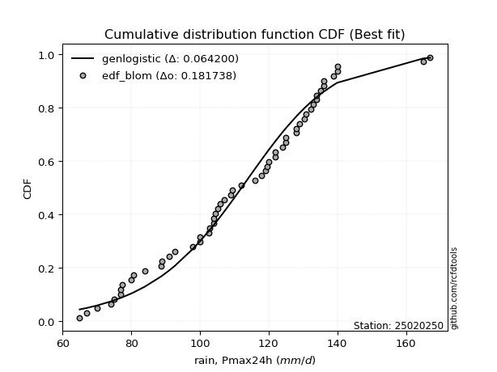</img>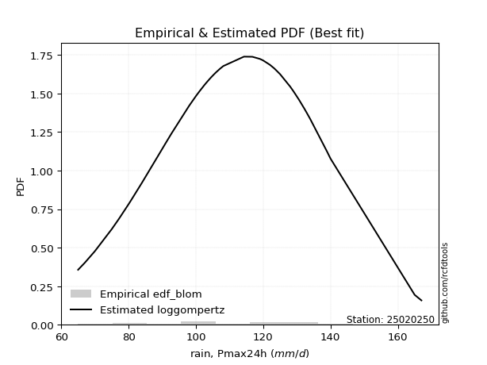</img>

</div>


### 7. Empirical - EDF Tukey (1962)

In hydrology, the Tukey formula is used as a plotting position formula to estimate the empirical probability or frequency of a flood event (or other hydrological data). The formula parameter is given as _c=0.333_ (or 1/3).

<div align="center">


$P=(m-c)/(n+1-2c)$


</div>


**7.1. Empirical values**

<div align="center">

|                | 0                    | 1                    | 2                    | 3                  | 4                   | 5                   | 6                   | 7                   | 8                   | 9                   | 10                 | 11                  | 12                  | 13                  | 14                 | 15                 | 16                 | 17                 | 18                  | 19                  | 20                 | 21                  | 22                  | 23                  | 24                 | 25                 | 26                  | 27                 | 28                 | 29                 | 30                 | 31                 | 32                 | 33                 | 34                 | 35                 | 36                | 37                 | 38                 | 39                 | 40                 | 41                 | 42                | 43                 | 44                 | 45                 | 46                 | 47                 | 48                | 49                 | 50                 | 51                 | 52                 | 53                 | 54                 | 55                 |
|:---------------|:---------------------|:---------------------|:---------------------|:-------------------|:--------------------|:--------------------|:--------------------|:--------------------|:--------------------|:--------------------|:-------------------|:--------------------|:--------------------|:--------------------|:-------------------|:-------------------|:-------------------|:-------------------|:--------------------|:--------------------|:-------------------|:--------------------|:--------------------|:--------------------|:-------------------|:-------------------|:--------------------|:-------------------|:-------------------|:-------------------|:-------------------|:-------------------|:-------------------|:-------------------|:-------------------|:-------------------|:------------------|:-------------------|:-------------------|:-------------------|:-------------------|:-------------------|:------------------|:-------------------|:-------------------|:-------------------|:-------------------|:-------------------|:------------------|:-------------------|:-------------------|:-------------------|:-------------------|:-------------------|:-------------------|:-------------------|
| date           | 1989                 | 2021                 | 1975                 | 1982               | 1976                | 1974                | 1985                | 2004                | 2008                | 2015                | 2009               | 2001                | 1972                | 1986                | 2014               | 1994               | 1996               | 1991               | 2003                | 1997                | 1969               | 2016                | 1998                | 2005                | 1984               | 2017               | 1977                | 1964               | 2012               | 2022               | 1965               | 2013               | 1999               | 1990               | 1981               | 1992               | 1966              | 1995               | 1979               | 1971               | 1988               | 1980               | 2011              | 2006               | 2010               | 1973               | 1983               | 1987               | 1968              | 2007               | 1963               | 2002               | 1970               | 1993               | 2000               | 1978               |
| x              | 65.0                 | 67.0                 | 70.0                 | 74.0               | 75.0                | 77.0                | 77.0                | 77.3                | 80.0                | 80.7                | 84.0               | 88.6                | 89.0                | 91.0                | 92.7               | 98.0               | 100.0              | 100.0              | 102.5               | 102.9               | 104.0              | 104.0               | 104.4               | 105.3               | 106.0              | 107.1              | 109.0               | 109.40178571428571 | 112.0              | 116.0              | 118.0              | 119.0              | 119.5              | 120.0              | 122.0              | 122.0              | 124.0             | 125.0              | 125.0              | 128.0              | 128.0              | 129.0              | 130.5             | 130.8              | 132.2              | 133.0              | 134.0              | 134.0              | 135.0             | 136.0              | 136.0              | 139.0              | 140.0              | 140.0              | 165.0              | 167.0              |
| m              | 1                    | 2                    | 3                    | 4                  | 5                   | 6                   | 7                   | 8                   | 9                   | 10                  | 11                 | 12                  | 13                  | 14                  | 15                 | 16                 | 17                 | 18                 | 19                  | 20                  | 21                 | 22                  | 23                  | 24                  | 25                 | 26                 | 27                  | 28                 | 29                 | 30                 | 31                 | 32                 | 33                 | 34                 | 35                 | 36                 | 37                | 38                 | 39                 | 40                 | 41                 | 42                 | 43                | 44                 | 45                 | 46                 | 47                 | 48                 | 49                | 50                 | 51                 | 52                 | 53                 | 54                 | 55                 | 56                 |
| empirical_dist | edf_tukey            | edf_tukey            | edf_tukey            | edf_tukey          | edf_tukey           | edf_tukey           | edf_tukey           | edf_tukey           | edf_tukey           | edf_tukey           | edf_tukey          | edf_tukey           | edf_tukey           | edf_tukey           | edf_tukey          | edf_tukey          | edf_tukey          | edf_tukey          | edf_tukey           | edf_tukey           | edf_tukey          | edf_tukey           | edf_tukey           | edf_tukey           | edf_tukey          | edf_tukey          | edf_tukey           | edf_tukey          | edf_tukey          | edf_tukey          | edf_tukey          | edf_tukey          | edf_tukey          | edf_tukey          | edf_tukey          | edf_tukey          | edf_tukey         | edf_tukey          | edf_tukey          | edf_tukey          | edf_tukey          | edf_tukey          | edf_tukey         | edf_tukey          | edf_tukey          | edf_tukey          | edf_tukey          | edf_tukey          | edf_tukey         | edf_tukey          | edf_tukey          | edf_tukey          | edf_tukey          | edf_tukey          | edf_tukey          | edf_tukey          |
| empirical      | 0.011834319526627219 | 0.029585798816568046 | 0.047337278106508875 | 0.0650887573964497 | 0.08284023668639054 | 0.10059171597633136 | 0.11834319526627218 | 0.13609467455621302 | 0.15384615384615385 | 0.17159763313609466 | 0.1893491124260355 | 0.20710059171597633 | 0.22485207100591717 | 0.24260355029585798 | 0.2603550295857988 | 0.2781065088757396 | 0.2958579881656805 | 0.3136094674556213 | 0.33136094674556216 | 0.34911242603550297 | 0.3668639053254438 | 0.38461538461538464 | 0.40236686390532544 | 0.42011834319526625 | 0.4378698224852071 | 0.4556213017751479 | 0.47337278106508873 | 0.4911242603550296 | 0.5088757396449705 | 0.5266272189349113 | 0.5443786982248521 | 0.5621301775147929 | 0.5798816568047337 | 0.5976331360946746 | 0.6153846153846154 | 0.6331360946745562 | 0.650887573964497 | 0.6686390532544378 | 0.6863905325443787 | 0.7041420118343196 | 0.7218934911242604 | 0.7396449704142012 | 0.757396449704142 | 0.7751479289940828 | 0.7928994082840237 | 0.8106508875739645 | 0.8284023668639053 | 0.8461538461538461 | 0.863905325443787 | 0.8816568047337278 | 0.8994082840236687 | 0.9171597633136095 | 0.9349112426035503 | 0.9526627218934911 | 0.9704142011834319 | 0.9881656804733728 |
| empirical_tr   | 1.0119760479041915   | 1.0304878048780488   | 1.049689440993789    | 1.0696202531645569 | 1.0903225806451613  | 1.1118421052631577  | 1.1342281879194631  | 1.1575342465753424  | 1.1818181818181819  | 1.207142857142857   | 1.2335766423357664 | 1.2611940298507462  | 1.2900763358778626  | 1.3203125           | 1.352              | 1.3852459016393441 | 1.4201680672268906 | 1.4568965517241381 | 1.4955752212389382  | 1.5363636363636364  | 1.5794392523364487 | 1.625               | 1.6732673267326734  | 1.7244897959183672  | 1.7789473684210526 | 1.8369565217391304 | 1.898876404494382   | 1.9651162790697676 | 2.036144578313253  | 2.1125000000000003 | 2.1948051948051948 | 2.2837837837837838 | 2.380281690140845  | 2.4852941176470593 | 2.6                | 2.7258064516129035 | 2.864406779661017 | 3.017857142857143  | 3.1886792452830184 | 3.3800000000000003 | 3.5957446808510642 | 3.840909090909091  | 4.121951219512195 | 4.447368421052631  | 4.82857142857143   | 5.281250000000001  | 5.8275862068965525 | 6.5                | 7.347826086956521 | 8.449999999999996  | 9.941176470588239  | 12.071428571428575 | 15.363636363636363 | 21.124999999999993 | 33.799999999999955 | 84.50000000000036  |

</div>


**7.2. Kolmogorov-Smirnov fit test (sorted by Δ)**


<div align="center">

|                | 0                   | 1                   | 2                   | 3                  | 4                  | 5                   | 6                   | 7                  | 8                   | 9                   | 10                 | 11                  | 12                  | 13                 | 14                  | 15                  | 16                  | 17                  | 18                  | 19                  | 20                  | 21                  | 22                  | 23                  | 24                  | 25                  | 26                  | 27                  | 28                  | 29                  | 30                    | 31                  | 32                  | 33                  | 34                 | 35                  | 36                  | 37                 | 38                  | 39                 | 40                  | 41                  | 42                  | 43                  | 44                  | 45                  | 46                  | 47                  | 48                  | 49                  | 50                 | 51                 | 52                 | 53                 | 54                  | 55                  | 56                  | 57                  | 58                  | 59                  | 60                  | 61                  | 62                 | 63                  | 64                  | 65                  | 66                  | 67                  | 68                  | 69                  | 70                  | 71                  | 72                  | 73                  | 74                 | 75                  | 76                  | 77                  | 78                  | 79                  | 80                  | 81                 | 82                 | 83                  | 84                 | 85                 | 86                  | 87                 |
|:---------------|:--------------------|:--------------------|:--------------------|:-------------------|:-------------------|:--------------------|:--------------------|:-------------------|:--------------------|:--------------------|:-------------------|:--------------------|:--------------------|:-------------------|:--------------------|:--------------------|:--------------------|:--------------------|:--------------------|:--------------------|:--------------------|:--------------------|:--------------------|:--------------------|:--------------------|:--------------------|:--------------------|:--------------------|:--------------------|:--------------------|:----------------------|:--------------------|:--------------------|:--------------------|:-------------------|:--------------------|:--------------------|:-------------------|:--------------------|:-------------------|:--------------------|:--------------------|:--------------------|:--------------------|:--------------------|:--------------------|:--------------------|:--------------------|:--------------------|:--------------------|:-------------------|:-------------------|:-------------------|:-------------------|:--------------------|:--------------------|:--------------------|:--------------------|:--------------------|:--------------------|:--------------------|:--------------------|:-------------------|:--------------------|:--------------------|:--------------------|:--------------------|:--------------------|:--------------------|:--------------------|:--------------------|:--------------------|:--------------------|:--------------------|:-------------------|:--------------------|:--------------------|:--------------------|:--------------------|:--------------------|:--------------------|:-------------------|:-------------------|:--------------------|:-------------------|:-------------------|:--------------------|:-------------------|
| station        | 25020250            | 25020250            | 25020250            | 25020250           | 25020250           | 25020250            | 25020250            | 25020250           | 25020250            | 25020250            | 25020250           | 25020250            | 25020250            | 25020250           | 25020250            | 25020250            | 25020250            | 25020250            | 25020250            | 25020250            | 25020250            | 25020250            | 25020250            | 25020250            | 25020250            | 25020250            | 25020250            | 25020250            | 25020250            | 25020250            | 25020250              | 25020250            | 25020250            | 25020250            | 25020250           | 25020250            | 25020250            | 25020250           | 25020250            | 25020250           | 25020250            | 25020250            | 25020250            | 25020250            | 25020250            | 25020250            | 25020250            | 25020250            | 25020250            | 25020250            | 25020250           | 25020250           | 25020250           | 25020250           | 25020250            | 25020250            | 25020250            | 25020250            | 25020250            | 25020250            | 25020250            | 25020250            | 25020250           | 25020250            | 25020250            | 25020250            | 25020250            | 25020250            | 25020250            | 25020250            | 25020250            | 25020250            | 25020250            | 25020250            | 25020250           | 25020250            | 25020250            | 25020250            | 25020250            | 25020250            | 25020250            | 25020250           | 25020250           | 25020250            | 25020250           | 25020250           | 25020250            | 25020250           |
| empirical_dist | edf_tukey           | edf_tukey           | edf_tukey           | edf_tukey          | edf_tukey          | edf_tukey           | edf_tukey           | edf_tukey          | edf_tukey           | edf_tukey           | edf_tukey          | edf_tukey           | edf_tukey           | edf_tukey          | edf_tukey           | edf_tukey           | edf_tukey           | edf_tukey           | edf_tukey           | edf_tukey           | edf_tukey           | edf_tukey           | edf_tukey           | edf_tukey           | edf_tukey           | edf_tukey           | edf_tukey           | edf_tukey           | edf_tukey           | edf_tukey           | edf_tukey             | edf_tukey           | edf_tukey           | edf_tukey           | edf_tukey          | edf_tukey           | edf_tukey           | edf_tukey          | edf_tukey           | edf_tukey          | edf_tukey           | edf_tukey           | edf_tukey           | edf_tukey           | edf_tukey           | edf_tukey           | edf_tukey           | edf_tukey           | edf_tukey           | edf_tukey           | edf_tukey          | edf_tukey          | edf_tukey          | edf_tukey          | edf_tukey           | edf_tukey           | edf_tukey           | edf_tukey           | edf_tukey           | edf_tukey           | edf_tukey           | edf_tukey           | edf_tukey          | edf_tukey           | edf_tukey           | edf_tukey           | edf_tukey           | edf_tukey           | edf_tukey           | edf_tukey           | edf_tukey           | edf_tukey           | edf_tukey           | edf_tukey           | edf_tukey          | edf_tukey           | edf_tukey           | edf_tukey           | edf_tukey           | edf_tukey           | edf_tukey           | edf_tukey          | edf_tukey          | edf_tukey           | edf_tukey          | edf_tukey          | edf_tukey           | edf_tukey          |
| p_dist         | genlogistic         | loggenlogistic      | mielke              | loggumbel_l        | logloggamma        | logjohnsonsu        | johnsonsu           | fisk               | pearson3            | logweibull_min      | loggompertz        | norm                | truncnorm           | crystalball        | exponnorm           | t                   | nct                 | nakagami            | erlang              | gamma               | fatiguelife         | f                   | weibull_min         | logpearson3         | gumbel_l            | rice                | chi2                | logistic            | logfisk             | alpha               | loglaplace_asymmetric | invgamma            | maxwell             | logmielke           | ncf                | hypsecant           | logncf              | logf               | logt                | logexponnorm       | lognorm             | lognorm             | logcrystalball      | loglognorm          | lognakagami         | rayleigh            | logfatiguelife      | invgauss            | logrice             | loginvgamma         | logbetaprime       | loggamma           | loggamma           | invweibull         | logerlang           | logalpha            | laplace_asymmetric  | lognct              | betaprime           | kstwobign           | loginvgauss         | loglogistic         | logmaxwell         | laplace             | lograyleigh         | loginvweibull       | halfnorm            | loghypsecant        | gumbel_r            | loghalfnorm         | moyal               | logkstwobign        | loggumbel_r         | loglaplace          | loggenexpon        | halflogistic        | loghalflogistic     | logmoyal            | wald                | genexpon            | expon               | logwald            | gibrat             | loggibrat           | logexpon           | logchi2            | logtruncnorm        | gompertz           |
| delta          | 0.06468635330654213 | 0.06778530429240792 | 0.06783321235287315 | 0.0689967602854221 | 0.0693905123221713 | 0.07031193081920661 | 0.07296899262408729 | 0.0730751928520943 | 0.07325322931341838 | 0.07406436655226323 | 0.0747098401209062 | 0.07501773104368936 | 0.07501773284853774 | 0.075017738864821  | 0.07501781623424786 | 0.07503056127933705 | 0.07508861322791172 | 0.07624965314874843 | 0.07664191816362531 | 0.07677435109302988 | 0.07796573557756481 | 0.07845489150921658 | 0.07951460040995972 | 0.08252822502464052 | 0.08554739246425813 | 0.08640281410329198 | 0.08889646828094144 | 0.09003672597641121 | 0.09023195941167061 | 0.09555946205123333 | 0.09636419017912784   | 0.09750309377119037 | 0.09975734303438755 | 0.10012718013377686 | 0.1004080058904131 | 0.10280191267613659 | 0.10615218236344337 | 0.1066222179046773 | 0.10708602442354065 | 0.1070905076631965 | 0.10709099550773837 | 0.10709099550773837 | 0.10709099725309978 | 0.10709277170942932 | 0.10710141985864696 | 0.10733962045083989 | 0.10778158792187797 | 0.11003310293917579 | 0.11092712946855365 | 0.11102710266203852 | 0.1114859447222386 | 0.112451199361977  | 0.112451199361977  | 0.1142160423882832 | 0.11537313834501439 | 0.11614627178137871 | 0.11699799663524135 | 0.11804571356845772 | 0.11907268139534966 | 0.12001173574455004 | 0.12357491694896472 | 0.12515934817369756 | 0.1285691392079058 | 0.13121736315311527 | 0.13503064086426442 | 0.13878555633516565 | 0.13879035313379845 | 0.13916012820946133 | 0.13932503922217332 | 0.15862987035133214 | 0.16101367711371484 | 0.16620856373131931 | 0.16683256080244047 | 0.16730246214302247 | 0.1677920283554229 | 0.17159763313609466 | 0.18189694066856943 | 0.18658703488214845 | 0.22236413712869824 | 0.23793379525534591 | 0.23897342923533899 | 0.2426200144140951 | 0.2603116186979101 | 0.27483134927065145 | 0.2763372667627646 | 0.358149590526196  | 0.39134512441822084 | 0.7775911974169657 |
| deltao         | 0.1817376445004486  | 0.1817376445004486  | 0.1817376445004486  | 0.1817376445004486 | 0.1817376445004486 | 0.1817376445004486  | 0.1817376445004486  | 0.1817376445004486 | 0.1817376445004486  | 0.1817376445004486  | 0.1817376445004486 | 0.1817376445004486  | 0.1817376445004486  | 0.1817376445004486 | 0.1817376445004486  | 0.1817376445004486  | 0.1817376445004486  | 0.1817376445004486  | 0.1817376445004486  | 0.1817376445004486  | 0.1817376445004486  | 0.1817376445004486  | 0.1817376445004486  | 0.1817376445004486  | 0.1817376445004486  | 0.1817376445004486  | 0.1817376445004486  | 0.1817376445004486  | 0.1817376445004486  | 0.1817376445004486  | 0.1817376445004486    | 0.1817376445004486  | 0.1817376445004486  | 0.1817376445004486  | 0.1817376445004486 | 0.1817376445004486  | 0.1817376445004486  | 0.1817376445004486 | 0.1817376445004486  | 0.1817376445004486 | 0.1817376445004486  | 0.1817376445004486  | 0.1817376445004486  | 0.1817376445004486  | 0.1817376445004486  | 0.1817376445004486  | 0.1817376445004486  | 0.1817376445004486  | 0.1817376445004486  | 0.1817376445004486  | 0.1817376445004486 | 0.1817376445004486 | 0.1817376445004486 | 0.1817376445004486 | 0.1817376445004486  | 0.1817376445004486  | 0.1817376445004486  | 0.1817376445004486  | 0.1817376445004486  | 0.1817376445004486  | 0.1817376445004486  | 0.1817376445004486  | 0.1817376445004486 | 0.1817376445004486  | 0.1817376445004486  | 0.1817376445004486  | 0.1817376445004486  | 0.1817376445004486  | 0.1817376445004486  | 0.1817376445004486  | 0.1817376445004486  | 0.1817376445004486  | 0.1817376445004486  | 0.1817376445004486  | 0.1817376445004486 | 0.1817376445004486  | 0.1817376445004486  | 0.1817376445004486  | 0.1817376445004486  | 0.1817376445004486  | 0.1817376445004486  | 0.1817376445004486 | 0.1817376445004486 | 0.1817376445004486  | 0.1817376445004486 | 0.1817376445004486 | 0.1817376445004486  | 0.1817376445004486 |
| eval           | Δo > Δ              | Δo > Δ              | Δo > Δ              | Δo > Δ             | Δo > Δ             | Δo > Δ              | Δo > Δ              | Δo > Δ             | Δo > Δ              | Δo > Δ              | Δo > Δ             | Δo > Δ              | Δo > Δ              | Δo > Δ             | Δo > Δ              | Δo > Δ              | Δo > Δ              | Δo > Δ              | Δo > Δ              | Δo > Δ              | Δo > Δ              | Δo > Δ              | Δo > Δ              | Δo > Δ              | Δo > Δ              | Δo > Δ              | Δo > Δ              | Δo > Δ              | Δo > Δ              | Δo > Δ              | Δo > Δ                | Δo > Δ              | Δo > Δ              | Δo > Δ              | Δo > Δ             | Δo > Δ              | Δo > Δ              | Δo > Δ             | Δo > Δ              | Δo > Δ             | Δo > Δ              | Δo > Δ              | Δo > Δ              | Δo > Δ              | Δo > Δ              | Δo > Δ              | Δo > Δ              | Δo > Δ              | Δo > Δ              | Δo > Δ              | Δo > Δ             | Δo > Δ             | Δo > Δ             | Δo > Δ             | Δo > Δ              | Δo > Δ              | Δo > Δ              | Δo > Δ              | Δo > Δ              | Δo > Δ              | Δo > Δ              | Δo > Δ              | Δo > Δ             | Δo > Δ              | Δo > Δ              | Δo > Δ              | Δo > Δ              | Δo > Δ              | Δo > Δ              | Δo > Δ              | Δo > Δ              | Δo > Δ              | Δo > Δ              | Δo > Δ              | Δo > Δ             | Δo > Δ              | Δo <= Δ             | Δo <= Δ             | Δo <= Δ             | Δo <= Δ             | Δo <= Δ             | Δo <= Δ            | Δo <= Δ            | Δo <= Δ             | Δo <= Δ            | Δo <= Δ            | Δo <= Δ             | Δo <= Δ            |
| fit            | 1                   | 1                   | 1                   | 1                  | 1                  | 1                   | 1                   | 1                  | 1                   | 1                   | 1                  | 1                   | 1                   | 1                  | 1                   | 1                   | 1                   | 1                   | 1                   | 1                   | 1                   | 1                   | 1                   | 1                   | 1                   | 1                   | 1                   | 1                   | 1                   | 1                   | 1                     | 1                   | 1                   | 1                   | 1                  | 1                   | 1                   | 1                  | 1                   | 1                  | 1                   | 1                   | 1                   | 1                   | 1                   | 1                   | 1                   | 1                   | 1                   | 1                   | 1                  | 1                  | 1                  | 1                  | 1                   | 1                   | 1                   | 1                   | 1                   | 1                   | 1                   | 1                   | 1                  | 1                   | 1                   | 1                   | 1                   | 1                   | 1                   | 1                   | 1                   | 1                   | 1                   | 1                   | 1                  | 1                   | 0                   | 0                   | 0                   | 0                   | 0                   | 0                  | 0                  | 0                   | 0                  | 0                  | 0                   | 0                  |
| n              | 56                  | 56                  | 56                  | 56                 | 56                 | 56                  | 56                  | 56                 | 56                  | 56                  | 56                 | 56                  | 56                  | 56                 | 56                  | 56                  | 56                  | 56                  | 56                  | 56                  | 56                  | 56                  | 56                  | 56                  | 56                  | 56                  | 56                  | 56                  | 56                  | 56                  | 56                    | 56                  | 56                  | 56                  | 56                 | 56                  | 56                  | 56                 | 56                  | 56                 | 56                  | 56                  | 56                  | 56                  | 56                  | 56                  | 56                  | 56                  | 56                  | 56                  | 56                 | 56                 | 56                 | 56                 | 56                  | 56                  | 56                  | 56                  | 56                  | 56                  | 56                  | 56                  | 56                 | 56                  | 56                  | 56                  | 56                  | 56                  | 56                  | 56                  | 56                  | 56                  | 56                  | 56                  | 56                 | 56                  | 56                  | 56                  | 56                  | 56                  | 56                  | 56                 | 56                 | 56                  | 56                 | 56                 | 56                  | 56                 |
| best_fit       | 1                   | 0                   | 0                   | 0                  | 0                  | 0                   | 0                   | 0                  | 0                   | 0                   | 0                  | 0                   | 0                   | 0                  | 0                   | 0                   | 0                   | 0                   | 0                   | 0                   | 0                   | 0                   | 0                   | 0                   | 0                   | 0                   | 0                   | 0                   | 0                   | 0                   | 0                     | 0                   | 0                   | 0                   | 0                  | 0                   | 0                   | 0                  | 0                   | 0                  | 0                   | 0                   | 0                   | 0                   | 0                   | 0                   | 0                   | 0                   | 0                   | 0                   | 0                  | 0                  | 0                  | 0                  | 0                   | 0                   | 0                   | 0                   | 0                   | 0                   | 0                   | 0                   | 0                  | 0                   | 0                   | 0                   | 0                   | 0                   | 0                   | 0                   | 0                   | 0                   | 0                   | 0                   | 0                  | 0                   | 0                   | 0                   | 0                   | 0                   | 0                   | 0                  | 0                  | 0                   | 0                  | 0                  | 0                   | 0                  |
| best_fit_sort  | 1                   | 2                   | 3                   | 4                  | 5                  | 6                   | 7                   | 8                  | 9                   | 10                  | 11                 | 12                  | 13                  | 14                 | 15                  | 16                  | 17                  | 18                  | 19                  | 20                  | 21                  | 22                  | 23                  | 24                  | 25                  | 26                  | 27                  | 28                  | 29                  | 30                  | 31                    | 32                  | 33                  | 34                  | 35                 | 36                  | 37                  | 38                 | 39                  | 40                 | 41                  | 42                  | 43                  | 44                  | 45                  | 46                  | 47                  | 48                  | 49                  | 50                  | 51                 | 52                 | 53                 | 54                 | 55                  | 56                  | 57                  | 58                  | 59                  | 60                  | 61                  | 62                  | 63                 | 64                  | 65                  | 66                  | 67                  | 68                  | 69                  | 70                  | 71                  | 72                  | 73                  | 74                  | 75                 | 76                  | 77                  | 78                  | 79                  | 80                  | 81                  | 82                 | 83                 | 84                  | 85                 | 86                 | 87                  | 88                 |

</div>


<div align="center">

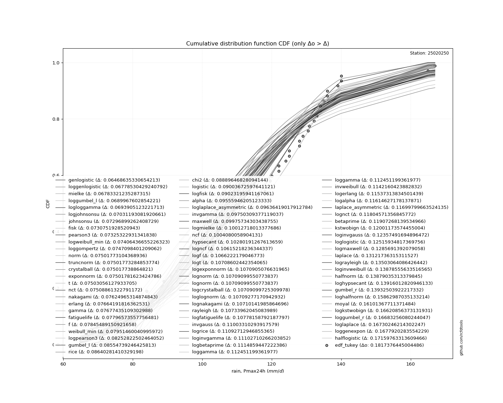</img>

</div>


**7.3. Best fit**

<div align="center">

|   id |   station | empirical_dist   | p_dist      |     delta |   deltao | eval   |   fit |   n |   best_fit |   best_fit_sort |
|-----:|----------:|:-----------------|:------------|----------:|---------:|:-------|------:|----:|-----------:|----------------:|
|    0 |  25020250 | edf_tukey        | genlogistic | 0.0646864 | 0.181738 | Δo > Δ |     1 |  56 |          1 |               1 |

</div>


<div align="center">

</img>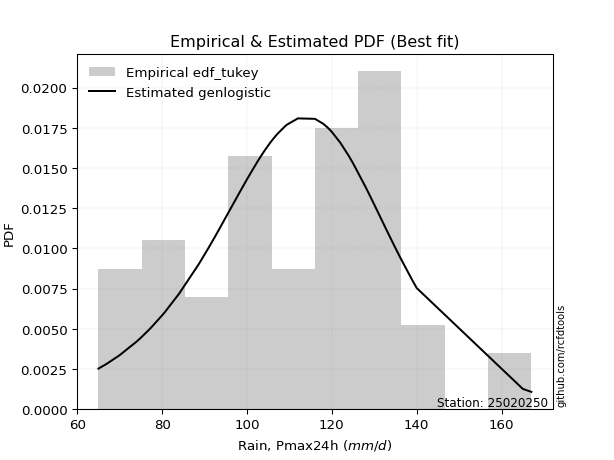</img>

</div>


### 8. Empirical - EDF Gringorten (1963)

Gringorten plotting position formula is essential for estimating the probability and return periods of extreme events like floods and heavy rainfall. The constant _a=0.44_.

<div align="center">


$P=(m-a)/(n+1-2a)$


</div>


**8.1. Empirical values**

<div align="center">

|                | 0                    | 1                    | 2                    | 3                   | 4                   | 5                   | 6                   | 7                  | 8                   | 9                   | 10                  | 11                  | 12                  | 13                  | 14                 | 15                  | 16                  | 17                  | 18                  | 19                  | 20                  | 21                 | 22                  | 23                  | 24                  | 25                  | 26                  | 27                  | 28                 | 29                 | 30                 | 31                 | 32                 | 33                 | 34                 | 35                 | 36                 | 37                 | 38                 | 39                 | 40                 | 41                 | 42                 | 43                 | 44                 | 45                 | 46                 | 47                 | 48                | 49                 | 50                 | 51                 | 52                 | 53                 | 54                 | 55                 |
|:---------------|:---------------------|:---------------------|:---------------------|:--------------------|:--------------------|:--------------------|:--------------------|:-------------------|:--------------------|:--------------------|:--------------------|:--------------------|:--------------------|:--------------------|:-------------------|:--------------------|:--------------------|:--------------------|:--------------------|:--------------------|:--------------------|:-------------------|:--------------------|:--------------------|:--------------------|:--------------------|:--------------------|:--------------------|:-------------------|:-------------------|:-------------------|:-------------------|:-------------------|:-------------------|:-------------------|:-------------------|:-------------------|:-------------------|:-------------------|:-------------------|:-------------------|:-------------------|:-------------------|:-------------------|:-------------------|:-------------------|:-------------------|:-------------------|:------------------|:-------------------|:-------------------|:-------------------|:-------------------|:-------------------|:-------------------|:-------------------|
| date           | 1989                 | 2021                 | 1975                 | 1982                | 1976                | 1974                | 1985                | 2004               | 2008                | 2015                | 2009                | 2001                | 1972                | 1986                | 2014               | 1994                | 1996                | 1991                | 2003                | 1997                | 1969                | 2016               | 1998                | 2005                | 1984                | 2017                | 1977                | 1964                | 2012               | 2022               | 1965               | 2013               | 1999               | 1990               | 1981               | 1992               | 1966               | 1995               | 1979               | 1971               | 1988               | 1980               | 2011               | 2006               | 2010               | 1973               | 1983               | 1987               | 1968              | 2007               | 1963               | 2002               | 1970               | 1993               | 2000               | 1978               |
| x              | 65.0                 | 67.0                 | 70.0                 | 74.0                | 75.0                | 77.0                | 77.0                | 77.3               | 80.0                | 80.7                | 84.0                | 88.6                | 89.0                | 91.0                | 92.7               | 98.0                | 100.0               | 100.0               | 102.5               | 102.9               | 104.0               | 104.0              | 104.4               | 105.3               | 106.0               | 107.1               | 109.0               | 109.40178571428571  | 112.0              | 116.0              | 118.0              | 119.0              | 119.5              | 120.0              | 122.0              | 122.0              | 124.0              | 125.0              | 125.0              | 128.0              | 128.0              | 129.0              | 130.5              | 130.8              | 132.2              | 133.0              | 134.0              | 134.0              | 135.0             | 136.0              | 136.0              | 139.0              | 140.0              | 140.0              | 165.0              | 167.0              |
| m              | 1                    | 2                    | 3                    | 4                   | 5                   | 6                   | 7                   | 8                  | 9                   | 10                  | 11                  | 12                  | 13                  | 14                  | 15                 | 16                  | 17                  | 18                  | 19                  | 20                  | 21                  | 22                 | 23                  | 24                  | 25                  | 26                  | 27                  | 28                  | 29                 | 30                 | 31                 | 32                 | 33                 | 34                 | 35                 | 36                 | 37                 | 38                 | 39                 | 40                 | 41                 | 42                 | 43                 | 44                 | 45                 | 46                 | 47                 | 48                 | 49                | 50                 | 51                 | 52                 | 53                 | 54                 | 55                 | 56                 |
| empirical_dist | edf_gringorten       | edf_gringorten       | edf_gringorten       | edf_gringorten      | edf_gringorten      | edf_gringorten      | edf_gringorten      | edf_gringorten     | edf_gringorten      | edf_gringorten      | edf_gringorten      | edf_gringorten      | edf_gringorten      | edf_gringorten      | edf_gringorten     | edf_gringorten      | edf_gringorten      | edf_gringorten      | edf_gringorten      | edf_gringorten      | edf_gringorten      | edf_gringorten     | edf_gringorten      | edf_gringorten      | edf_gringorten      | edf_gringorten      | edf_gringorten      | edf_gringorten      | edf_gringorten     | edf_gringorten     | edf_gringorten     | edf_gringorten     | edf_gringorten     | edf_gringorten     | edf_gringorten     | edf_gringorten     | edf_gringorten     | edf_gringorten     | edf_gringorten     | edf_gringorten     | edf_gringorten     | edf_gringorten     | edf_gringorten     | edf_gringorten     | edf_gringorten     | edf_gringorten     | edf_gringorten     | edf_gringorten     | edf_gringorten    | edf_gringorten     | edf_gringorten     | edf_gringorten     | edf_gringorten     | edf_gringorten     | edf_gringorten     | edf_gringorten     |
| empirical      | 0.009978617248752675 | 0.027797576621525304 | 0.045616535994297935 | 0.06343549536707056 | 0.08125445473984319 | 0.09907341411261582 | 0.11689237348538845 | 0.1347113328581611 | 0.15253029223093373 | 0.17034925160370637 | 0.18816821097647898 | 0.20598717034925162 | 0.22380612972202427 | 0.24162508909479688 | 0.2594440484675695 | 0.27726300784034213 | 0.29508196721311475 | 0.31290092658588736 | 0.33071988595866003 | 0.34853884533143265 | 0.36635780470420526 | 0.3841767640769779 | 0.40199572344975054 | 0.41981468282252316 | 0.43763364219529577 | 0.45545260156806844 | 0.47327156094084105 | 0.49109052031361367 | 0.5089094796863863 | 0.5267284390591589 | 0.5445473984319316 | 0.5623663578047042 | 0.5801853171774769 | 0.5980042765502496 | 0.6158232359230221 | 0.6336421952957948 | 0.6514611546685675 | 0.66928011404134   | 0.6870990734141127 | 0.7049180327868854 | 0.7227369921596579 | 0.7405559515324306 | 0.7583749109052033 | 0.7761938702779758 | 0.7940128296507485 | 0.8118317890235212 | 0.8296507483962937 | 0.8474697077690664 | 0.865288667141839 | 0.8831076265146116 | 0.9009265858873843 | 0.9187455452601568 | 0.9365645046329295 | 0.9543834640057022 | 0.9722024233784747 | 0.9900213827512474 |
| empirical_tr   | 1.0100791936645068   | 1.028592375366569    | 1.0477968633308439   | 1.0677321156773212  | 1.0884406516679597  | 1.1099683544303798  | 1.1323648103309119  | 1.1556836902800658 | 1.1799831791421362  | 1.2053264604810998  | 1.231782265144864   | 1.2594254937163376  | 1.2883379247015612  | 1.318609022556391   | 1.3503368623676613 | 1.383629191321499   | 1.4186046511627908  | 1.4553941908713692  | 1.4941427050053246  | 1.5350109409190371  | 1.5781777277840272  | 1.6238425925925926 | 1.67222884386174    | 1.7235872235872234  | 1.7782002534854244  | 1.8363874345549738  | 1.89851150202977    | 1.964985994397759   | 2.0362844702467346 | 2.1129518072289155 | 2.195618153364632  | 2.2850162866449515 | 2.382003395585739  | 2.48758865248227   | 2.6029684601113177 | 2.729571984435798  | 2.869120654396729  | 3.0237068965517246 | 3.195899772209568  | 3.38888888888889   | 3.60668380462725   | 3.854395604395606  | 4.13864306784661   | 4.468152866242039  | 4.854671280276818  | 5.314393939393943  | 5.870292887029291  | 6.556074766355144  | 7.42328042328043  | 8.554878048780493  | 10.093525179856126 | 12.307017543859654 | 15.764044943820242 | 21.921875000000053 | 35.97435897435902  | 100.21428571428648 |

</div>


**8.2. Kolmogorov-Smirnov fit test (sorted by Δ)**


<div align="center">

|                | 0                   | 1                   | 2                   | 3                   | 4                   | 5                   | 6                  | 7                   | 8                   | 9                   | 10                  | 11                  | 12                  | 13                 | 14                  | 15                  | 16                  | 17                  | 18                  | 19                 | 20                  | 21                 | 22                  | 23                  | 24                  | 25                 | 26                  | 27                  | 28                  | 29                  | 30                    | 31                  | 32                  | 33                  | 34                  | 35                  | 36                  | 37                  | 38                  | 39                  | 40                  | 41                  | 42                 | 43                  | 44                  | 45                 | 46                  | 47                 | 48                  | 49                  | 50                  | 51                  | 52                  | 53                  | 54                 | 55                  | 56                  | 57                  | 58                  | 59                  | 60                  | 61                  | 62                  | 63                  | 64                  | 65                  | 66                  | 67                  | 68                  | 69                  | 70                  | 71                  | 72                  | 73                  | 74                  | 75                  | 76                  | 77                  | 78                 | 79                  | 80                  | 81                 | 82                 | 83                  | 84                 | 85                  | 86                 | 87                 |
|:---------------|:--------------------|:--------------------|:--------------------|:--------------------|:--------------------|:--------------------|:-------------------|:--------------------|:--------------------|:--------------------|:--------------------|:--------------------|:--------------------|:-------------------|:--------------------|:--------------------|:--------------------|:--------------------|:--------------------|:-------------------|:--------------------|:-------------------|:--------------------|:--------------------|:--------------------|:-------------------|:--------------------|:--------------------|:--------------------|:--------------------|:----------------------|:--------------------|:--------------------|:--------------------|:--------------------|:--------------------|:--------------------|:--------------------|:--------------------|:--------------------|:--------------------|:--------------------|:-------------------|:--------------------|:--------------------|:-------------------|:--------------------|:-------------------|:--------------------|:--------------------|:--------------------|:--------------------|:--------------------|:--------------------|:-------------------|:--------------------|:--------------------|:--------------------|:--------------------|:--------------------|:--------------------|:--------------------|:--------------------|:--------------------|:--------------------|:--------------------|:--------------------|:--------------------|:--------------------|:--------------------|:--------------------|:--------------------|:--------------------|:--------------------|:--------------------|:--------------------|:--------------------|:--------------------|:-------------------|:--------------------|:--------------------|:-------------------|:-------------------|:--------------------|:-------------------|:--------------------|:-------------------|:-------------------|
| station        | 25020250            | 25020250            | 25020250            | 25020250            | 25020250            | 25020250            | 25020250           | 25020250            | 25020250            | 25020250            | 25020250            | 25020250            | 25020250            | 25020250           | 25020250            | 25020250            | 25020250            | 25020250            | 25020250            | 25020250           | 25020250            | 25020250           | 25020250            | 25020250            | 25020250            | 25020250           | 25020250            | 25020250            | 25020250            | 25020250            | 25020250              | 25020250            | 25020250            | 25020250            | 25020250            | 25020250            | 25020250            | 25020250            | 25020250            | 25020250            | 25020250            | 25020250            | 25020250           | 25020250            | 25020250            | 25020250           | 25020250            | 25020250           | 25020250            | 25020250            | 25020250            | 25020250            | 25020250            | 25020250            | 25020250           | 25020250            | 25020250            | 25020250            | 25020250            | 25020250            | 25020250            | 25020250            | 25020250            | 25020250            | 25020250            | 25020250            | 25020250            | 25020250            | 25020250            | 25020250            | 25020250            | 25020250            | 25020250            | 25020250            | 25020250            | 25020250            | 25020250            | 25020250            | 25020250           | 25020250            | 25020250            | 25020250           | 25020250           | 25020250            | 25020250           | 25020250            | 25020250           | 25020250           |
| empirical_dist | edf_gringorten      | edf_gringorten      | edf_gringorten      | edf_gringorten      | edf_gringorten      | edf_gringorten      | edf_gringorten     | edf_gringorten      | edf_gringorten      | edf_gringorten      | edf_gringorten      | edf_gringorten      | edf_gringorten      | edf_gringorten     | edf_gringorten      | edf_gringorten      | edf_gringorten      | edf_gringorten      | edf_gringorten      | edf_gringorten     | edf_gringorten      | edf_gringorten     | edf_gringorten      | edf_gringorten      | edf_gringorten      | edf_gringorten     | edf_gringorten      | edf_gringorten      | edf_gringorten      | edf_gringorten      | edf_gringorten        | edf_gringorten      | edf_gringorten      | edf_gringorten      | edf_gringorten      | edf_gringorten      | edf_gringorten      | edf_gringorten      | edf_gringorten      | edf_gringorten      | edf_gringorten      | edf_gringorten      | edf_gringorten     | edf_gringorten      | edf_gringorten      | edf_gringorten     | edf_gringorten      | edf_gringorten     | edf_gringorten      | edf_gringorten      | edf_gringorten      | edf_gringorten      | edf_gringorten      | edf_gringorten      | edf_gringorten     | edf_gringorten      | edf_gringorten      | edf_gringorten      | edf_gringorten      | edf_gringorten      | edf_gringorten      | edf_gringorten      | edf_gringorten      | edf_gringorten      | edf_gringorten      | edf_gringorten      | edf_gringorten      | edf_gringorten      | edf_gringorten      | edf_gringorten      | edf_gringorten      | edf_gringorten      | edf_gringorten      | edf_gringorten      | edf_gringorten      | edf_gringorten      | edf_gringorten      | edf_gringorten      | edf_gringorten     | edf_gringorten      | edf_gringorten      | edf_gringorten     | edf_gringorten     | edf_gringorten      | edf_gringorten     | edf_gringorten      | edf_gringorten     | edf_gringorten     |
| p_dist         | genlogistic         | loggenlogistic      | mielke              | loggumbel_l         | logloggamma         | logjohnsonsu        | johnsonsu          | fisk                | pearson3            | logweibull_min      | loggompertz         | norm                | truncnorm           | crystalball        | exponnorm           | t                   | nct                 | nakagami            | erlang              | gamma              | fatiguelife         | f                  | weibull_min         | logpearson3         | gumbel_l            | rice               | chi2                | logistic            | logfisk             | alpha               | loglaplace_asymmetric | invgamma            | logmielke           | maxwell             | ncf                 | hypsecant           | logncf              | logf                | logt                | logexponnorm        | lognorm             | lognorm             | logcrystalball     | loglognorm          | lognakagami         | rayleigh           | logfatiguelife      | invgauss           | logrice             | loginvgamma         | logbetaprime        | loggamma            | loggamma            | invweibull          | logerlang          | logalpha            | laplace_asymmetric  | lognct              | betaprime           | kstwobign           | loginvgauss         | loglogistic         | logmaxwell          | laplace             | lograyleigh         | halfnorm            | loghypsecant        | gumbel_r            | loginvweibull       | loghalfnorm         | moyal               | loggumbel_r         | logkstwobign        | loglaplace          | loggenexpon         | halflogistic        | loghalflogistic     | logmoyal            | wald               | genexpon            | expon               | logwald            | gibrat             | loggibrat           | logexpon           | logchi2             | logtruncnorm       | gompertz           |
| delta          | 0.06343797177415383 | 0.06761660408532844 | 0.06766451214579366 | 0.06774837875303381 | 0.06922181211509182 | 0.07014323061212713 | 0.0728002924170078 | 0.07290649264501481 | 0.07308452910633889 | 0.07389566634518374 | 0.07454113991382672 | 0.07484903083660988 | 0.07484903264145826 | 0.0748490386577415 | 0.07484911602716837 | 0.07486186107225756 | 0.07491991302083223 | 0.07608095294166894 | 0.07647321795654582 | 0.0766056508859504 | 0.07779703537048532 | 0.0782861913021371 | 0.07934590020288024 | 0.08235952481756104 | 0.08537869225717865 | 0.0862341138962125 | 0.08872776807386196 | 0.08986802576933173 | 0.09195270152388169 | 0.09539076184415385 | 0.09633045013771191   | 0.09733439356411089 | 0.09935115918121107 | 0.09958864282730806 | 0.10023930568333361 | 0.10256573238622524 | 0.10598348215636388 | 0.10645351769759781 | 0.10691732421646116 | 0.10692180745611701 | 0.10692229530065889 | 0.10692229530065889 | 0.1069222970460203 | 0.10692407150234984 | 0.10693271965156748 | 0.1071709202437604 | 0.10761288771479849 | 0.1098644027320963 | 0.11075842926147417 | 0.11085840245495904 | 0.11131724451515912 | 0.11228249915489752 | 0.11228249915489752 | 0.11404734218120371 | 0.1152044381379349 | 0.11597757157429922 | 0.11682929642816187 | 0.11787701336137824 | 0.11890398118827017 | 0.11984303553747055 | 0.12340621674188523 | 0.12499064796661807 | 0.12840043900082632 | 0.13098118286320393 | 0.13486194065718493 | 0.13754197160141016 | 0.13899142800238184 | 0.13915633901509383 | 0.13942661712206778 | 0.15927093113823426 | 0.16084497690663535 | 0.16666386059536098 | 0.16684962451822144 | 0.16713376193594298 | 0.16856804930798863 | 0.17034925160370637 | 0.18172824046148994 | 0.18641833467506896 | 0.221577123697987  | 0.23870981620791165 | 0.23974945018790472 | 0.2424513142070156 | 0.2594006375796808 | 0.27466264906357196 | 0.2771807677981621 | 0.35987033263840706 | 0.3921211453707866 | 0.7791094992806813 |
| deltao         | 0.1817376445004486  | 0.1817376445004486  | 0.1817376445004486  | 0.1817376445004486  | 0.1817376445004486  | 0.1817376445004486  | 0.1817376445004486 | 0.1817376445004486  | 0.1817376445004486  | 0.1817376445004486  | 0.1817376445004486  | 0.1817376445004486  | 0.1817376445004486  | 0.1817376445004486 | 0.1817376445004486  | 0.1817376445004486  | 0.1817376445004486  | 0.1817376445004486  | 0.1817376445004486  | 0.1817376445004486 | 0.1817376445004486  | 0.1817376445004486 | 0.1817376445004486  | 0.1817376445004486  | 0.1817376445004486  | 0.1817376445004486 | 0.1817376445004486  | 0.1817376445004486  | 0.1817376445004486  | 0.1817376445004486  | 0.1817376445004486    | 0.1817376445004486  | 0.1817376445004486  | 0.1817376445004486  | 0.1817376445004486  | 0.1817376445004486  | 0.1817376445004486  | 0.1817376445004486  | 0.1817376445004486  | 0.1817376445004486  | 0.1817376445004486  | 0.1817376445004486  | 0.1817376445004486 | 0.1817376445004486  | 0.1817376445004486  | 0.1817376445004486 | 0.1817376445004486  | 0.1817376445004486 | 0.1817376445004486  | 0.1817376445004486  | 0.1817376445004486  | 0.1817376445004486  | 0.1817376445004486  | 0.1817376445004486  | 0.1817376445004486 | 0.1817376445004486  | 0.1817376445004486  | 0.1817376445004486  | 0.1817376445004486  | 0.1817376445004486  | 0.1817376445004486  | 0.1817376445004486  | 0.1817376445004486  | 0.1817376445004486  | 0.1817376445004486  | 0.1817376445004486  | 0.1817376445004486  | 0.1817376445004486  | 0.1817376445004486  | 0.1817376445004486  | 0.1817376445004486  | 0.1817376445004486  | 0.1817376445004486  | 0.1817376445004486  | 0.1817376445004486  | 0.1817376445004486  | 0.1817376445004486  | 0.1817376445004486  | 0.1817376445004486 | 0.1817376445004486  | 0.1817376445004486  | 0.1817376445004486 | 0.1817376445004486 | 0.1817376445004486  | 0.1817376445004486 | 0.1817376445004486  | 0.1817376445004486 | 0.1817376445004486 |
| eval           | Δo > Δ              | Δo > Δ              | Δo > Δ              | Δo > Δ              | Δo > Δ              | Δo > Δ              | Δo > Δ             | Δo > Δ              | Δo > Δ              | Δo > Δ              | Δo > Δ              | Δo > Δ              | Δo > Δ              | Δo > Δ             | Δo > Δ              | Δo > Δ              | Δo > Δ              | Δo > Δ              | Δo > Δ              | Δo > Δ             | Δo > Δ              | Δo > Δ             | Δo > Δ              | Δo > Δ              | Δo > Δ              | Δo > Δ             | Δo > Δ              | Δo > Δ              | Δo > Δ              | Δo > Δ              | Δo > Δ                | Δo > Δ              | Δo > Δ              | Δo > Δ              | Δo > Δ              | Δo > Δ              | Δo > Δ              | Δo > Δ              | Δo > Δ              | Δo > Δ              | Δo > Δ              | Δo > Δ              | Δo > Δ             | Δo > Δ              | Δo > Δ              | Δo > Δ             | Δo > Δ              | Δo > Δ             | Δo > Δ              | Δo > Δ              | Δo > Δ              | Δo > Δ              | Δo > Δ              | Δo > Δ              | Δo > Δ             | Δo > Δ              | Δo > Δ              | Δo > Δ              | Δo > Δ              | Δo > Δ              | Δo > Δ              | Δo > Δ              | Δo > Δ              | Δo > Δ              | Δo > Δ              | Δo > Δ              | Δo > Δ              | Δo > Δ              | Δo > Δ              | Δo > Δ              | Δo > Δ              | Δo > Δ              | Δo > Δ              | Δo > Δ              | Δo > Δ              | Δo > Δ              | Δo > Δ              | Δo <= Δ             | Δo <= Δ            | Δo <= Δ             | Δo <= Δ             | Δo <= Δ            | Δo <= Δ            | Δo <= Δ             | Δo <= Δ            | Δo <= Δ             | Δo <= Δ            | Δo <= Δ            |
| fit            | 1                   | 1                   | 1                   | 1                   | 1                   | 1                   | 1                  | 1                   | 1                   | 1                   | 1                   | 1                   | 1                   | 1                  | 1                   | 1                   | 1                   | 1                   | 1                   | 1                  | 1                   | 1                  | 1                   | 1                   | 1                   | 1                  | 1                   | 1                   | 1                   | 1                   | 1                     | 1                   | 1                   | 1                   | 1                   | 1                   | 1                   | 1                   | 1                   | 1                   | 1                   | 1                   | 1                  | 1                   | 1                   | 1                  | 1                   | 1                  | 1                   | 1                   | 1                   | 1                   | 1                   | 1                   | 1                  | 1                   | 1                   | 1                   | 1                   | 1                   | 1                   | 1                   | 1                   | 1                   | 1                   | 1                   | 1                   | 1                   | 1                   | 1                   | 1                   | 1                   | 1                   | 1                   | 1                   | 1                   | 1                   | 0                   | 0                  | 0                   | 0                   | 0                  | 0                  | 0                   | 0                  | 0                   | 0                  | 0                  |
| n              | 56                  | 56                  | 56                  | 56                  | 56                  | 56                  | 56                 | 56                  | 56                  | 56                  | 56                  | 56                  | 56                  | 56                 | 56                  | 56                  | 56                  | 56                  | 56                  | 56                 | 56                  | 56                 | 56                  | 56                  | 56                  | 56                 | 56                  | 56                  | 56                  | 56                  | 56                    | 56                  | 56                  | 56                  | 56                  | 56                  | 56                  | 56                  | 56                  | 56                  | 56                  | 56                  | 56                 | 56                  | 56                  | 56                 | 56                  | 56                 | 56                  | 56                  | 56                  | 56                  | 56                  | 56                  | 56                 | 56                  | 56                  | 56                  | 56                  | 56                  | 56                  | 56                  | 56                  | 56                  | 56                  | 56                  | 56                  | 56                  | 56                  | 56                  | 56                  | 56                  | 56                  | 56                  | 56                  | 56                  | 56                  | 56                  | 56                 | 56                  | 56                  | 56                 | 56                 | 56                  | 56                 | 56                  | 56                 | 56                 |
| best_fit       | 1                   | 0                   | 0                   | 0                   | 0                   | 0                   | 0                  | 0                   | 0                   | 0                   | 0                   | 0                   | 0                   | 0                  | 0                   | 0                   | 0                   | 0                   | 0                   | 0                  | 0                   | 0                  | 0                   | 0                   | 0                   | 0                  | 0                   | 0                   | 0                   | 0                   | 0                     | 0                   | 0                   | 0                   | 0                   | 0                   | 0                   | 0                   | 0                   | 0                   | 0                   | 0                   | 0                  | 0                   | 0                   | 0                  | 0                   | 0                  | 0                   | 0                   | 0                   | 0                   | 0                   | 0                   | 0                  | 0                   | 0                   | 0                   | 0                   | 0                   | 0                   | 0                   | 0                   | 0                   | 0                   | 0                   | 0                   | 0                   | 0                   | 0                   | 0                   | 0                   | 0                   | 0                   | 0                   | 0                   | 0                   | 0                   | 0                  | 0                   | 0                   | 0                  | 0                  | 0                   | 0                  | 0                   | 0                  | 0                  |
| best_fit_sort  | 1                   | 2                   | 3                   | 4                   | 5                   | 6                   | 7                  | 8                   | 9                   | 10                  | 11                  | 12                  | 13                  | 14                 | 15                  | 16                  | 17                  | 18                  | 19                  | 20                 | 21                  | 22                 | 23                  | 24                  | 25                  | 26                 | 27                  | 28                  | 29                  | 30                  | 31                    | 32                  | 33                  | 34                  | 35                  | 36                  | 37                  | 38                  | 39                  | 40                  | 41                  | 42                  | 43                 | 44                  | 45                  | 46                 | 47                  | 48                 | 49                  | 50                  | 51                  | 52                  | 53                  | 54                  | 55                 | 56                  | 57                  | 58                  | 59                  | 60                  | 61                  | 62                  | 63                  | 64                  | 65                  | 66                  | 67                  | 68                  | 69                  | 70                  | 71                  | 72                  | 73                  | 74                  | 75                  | 76                  | 77                  | 78                  | 79                 | 80                  | 81                  | 82                 | 83                 | 84                  | 85                 | 86                  | 87                 | 88                 |

</div>


<div align="center">

</img>

</div>


**8.3. Best fit**

<div align="center">

|   id |   station | empirical_dist   | p_dist      |    delta |   deltao | eval   |   fit |   n |   best_fit |   best_fit_sort |
|-----:|----------:|:-----------------|:------------|---------:|---------:|:-------|------:|----:|-----------:|----------------:|
|    0 |  25020250 | edf_gringorten   | genlogistic | 0.063438 | 0.181738 | Δo > Δ |     1 |  56 |          1 |               1 |

</div>


<div align="center">

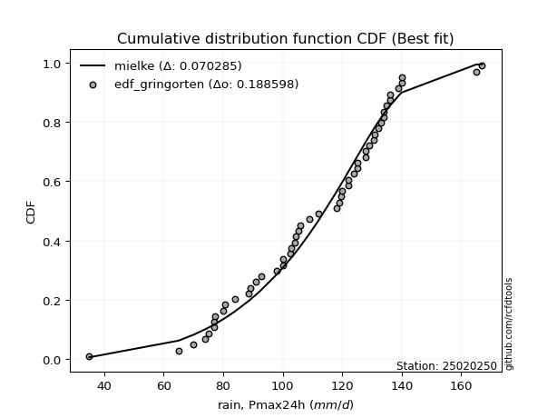</img>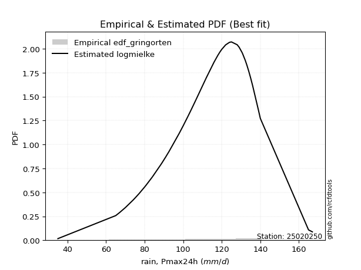</img>

</div>


### 9. Empirical - EDF Filliben (1975)

The specific values of the constants (0.3175) (often denoted as $alpha$) and (0.365) are derived from a method proposed by James J. Filliben in a 1975 paper. This particular formula is the mean value of the $i$-th order statistic of the normal distribution and is considered a robust and effective plotting position formula for the normal probability plot correlation coefficient test for normality.

<div align="center">


$P=(m-0.3175)/(n+0.365)$


</div>


**9.1. Empirical values**

<div align="center">

|                | 0                   | 1                    | 2                   | 3                   | 4                   | 5                   | 6                   | 7                   | 8                   | 9                   | 10                 | 11                  | 12                  | 13                  | 14                 | 15                  | 16                  | 17                  | 18                  | 19                 | 20                 | 21                 | 22                  | 23                 | 24                 | 25                 | 26                  | 27                  | 28                 | 29                 | 30                 | 31                 | 32                 | 33                 | 34                 | 35                 | 36                 | 37                | 38                 | 39                 | 40                 | 41                 | 42                 | 43                 | 44                 | 45                 | 46                 | 47                 | 48                 | 49                 | 50                 | 51                 | 52                 | 53                 | 54                 | 55                 |
|:---------------|:--------------------|:---------------------|:--------------------|:--------------------|:--------------------|:--------------------|:--------------------|:--------------------|:--------------------|:--------------------|:-------------------|:--------------------|:--------------------|:--------------------|:-------------------|:--------------------|:--------------------|:--------------------|:--------------------|:-------------------|:-------------------|:-------------------|:--------------------|:-------------------|:-------------------|:-------------------|:--------------------|:--------------------|:-------------------|:-------------------|:-------------------|:-------------------|:-------------------|:-------------------|:-------------------|:-------------------|:-------------------|:------------------|:-------------------|:-------------------|:-------------------|:-------------------|:-------------------|:-------------------|:-------------------|:-------------------|:-------------------|:-------------------|:-------------------|:-------------------|:-------------------|:-------------------|:-------------------|:-------------------|:-------------------|:-------------------|
| date           | 1989                | 2021                 | 1975                | 1982                | 1976                | 1974                | 1985                | 2004                | 2008                | 2015                | 2009               | 2001                | 1972                | 1986                | 2014               | 1994                | 1996                | 1991                | 2003                | 1997               | 1969               | 2016               | 1998                | 2005               | 1984               | 2017               | 1977                | 1964                | 2012               | 2022               | 1965               | 2013               | 1999               | 1990               | 1981               | 1992               | 1966               | 1995              | 1979               | 1971               | 1988               | 1980               | 2011               | 2006               | 2010               | 1973               | 1983               | 1987               | 1968               | 2007               | 1963               | 2002               | 1970               | 1993               | 2000               | 1978               |
| x              | 65.0                | 67.0                 | 70.0                | 74.0                | 75.0                | 77.0                | 77.0                | 77.3                | 80.0                | 80.7                | 84.0               | 88.6                | 89.0                | 91.0                | 92.7               | 98.0                | 100.0               | 100.0               | 102.5               | 102.9              | 104.0              | 104.0              | 104.4               | 105.3              | 106.0              | 107.1              | 109.0               | 109.40178571428571  | 112.0              | 116.0              | 118.0              | 119.0              | 119.5              | 120.0              | 122.0              | 122.0              | 124.0              | 125.0             | 125.0              | 128.0              | 128.0              | 129.0              | 130.5              | 130.8              | 132.2              | 133.0              | 134.0              | 134.0              | 135.0              | 136.0              | 136.0              | 139.0              | 140.0              | 140.0              | 165.0              | 167.0              |
| m              | 1                   | 2                    | 3                   | 4                   | 5                   | 6                   | 7                   | 8                   | 9                   | 10                  | 11                 | 12                  | 13                  | 14                  | 15                 | 16                  | 17                  | 18                  | 19                  | 20                 | 21                 | 22                 | 23                  | 24                 | 25                 | 26                 | 27                  | 28                  | 29                 | 30                 | 31                 | 32                 | 33                 | 34                 | 35                 | 36                 | 37                 | 38                | 39                 | 40                 | 41                 | 42                 | 43                 | 44                 | 45                 | 46                 | 47                 | 48                 | 49                 | 50                 | 51                 | 52                 | 53                 | 54                 | 55                 | 56                 |
| empirical_dist | edf_filliben        | edf_filliben         | edf_filliben        | edf_filliben        | edf_filliben        | edf_filliben        | edf_filliben        | edf_filliben        | edf_filliben        | edf_filliben        | edf_filliben       | edf_filliben        | edf_filliben        | edf_filliben        | edf_filliben       | edf_filliben        | edf_filliben        | edf_filliben        | edf_filliben        | edf_filliben       | edf_filliben       | edf_filliben       | edf_filliben        | edf_filliben       | edf_filliben       | edf_filliben       | edf_filliben        | edf_filliben        | edf_filliben       | edf_filliben       | edf_filliben       | edf_filliben       | edf_filliben       | edf_filliben       | edf_filliben       | edf_filliben       | edf_filliben       | edf_filliben      | edf_filliben       | edf_filliben       | edf_filliben       | edf_filliben       | edf_filliben       | edf_filliben       | edf_filliben       | edf_filliben       | edf_filliben       | edf_filliben       | edf_filliben       | edf_filliben       | edf_filliben       | edf_filliben       | edf_filliben       | edf_filliben       | edf_filliben       | edf_filliben       |
| empirical      | 0.01210857801827375 | 0.029850084272154707 | 0.04759159052603566 | 0.06533309677991661 | 0.08307460303379757 | 0.10081610928767852 | 0.11855761554155948 | 0.13629912179544043 | 0.15404062804932137 | 0.17178213430320233 | 0.1895236405570833 | 0.20726514681096422 | 0.22500665306484519 | 0.24274815931872615 | 0.2604896655726071 | 0.27823117182648804 | 0.29597267808036903 | 0.31371418433424997 | 0.33145569058813096 | 0.3491971968420119 | 0.3669387030958928 | 0.3846802093497738 | 0.40242171560365475 | 0.4201632218575357 | 0.4379047281114167 | 0.4556462343652976 | 0.47338774061917854 | 0.49112924687305953 | 0.5088707531269405 | 0.5266122593808215 | 0.5443537656347024 | 0.5620952718885833 | 0.5798367781424643 | 0.5975782843963452 | 0.6153197906502261 | 0.6330612969041071 | 0.650802803157988  | 0.668544309411869 | 0.68628581566575   | 0.7040273219196309 | 0.7217688281735118 | 0.7395103344273928 | 0.7572518406812737 | 0.7749933469351548 | 0.7927348531890357 | 0.8104763594429166 | 0.8282178656967976 | 0.8459593719506785 | 0.8637008782045595 | 0.8814423844584405 | 0.8991838907123214 | 0.9169253969662023 | 0.9346669032200833 | 0.9524084094739642 | 0.9701499157278453 | 0.9878914219817262 |
| empirical_tr   | 1.012256992771517   | 1.0307685274082201   | 1.0499697294276533  | 1.0698998718739618  | 1.090601267353553   | 1.1121195678981897  | 1.1345041010416144  | 1.1578082473167977  | 1.1820898652545484  | 1.2074117710062657  | 1.2338422809609806 | 1.2614558272254237  | 1.290333657643221   | 1.3205646342177708  | 1.3522461464643436 | 1.3854851594666011  | 1.4203994203994206  | 1.4571188521941445  | 1.4957871691103297  | 1.5365637565596675 | 1.5796258670216492 | 1.6251711958480504 | 1.6734209159058857  | 1.7246232693337413 | 1.779057839501302  | 1.8370406583557402 | 1.8989303461635643  | 1.9651355356053342  | 2.03612390499413   | 2.11243324276211   | 2.1946850968558356 | 2.2836017421249872 | 2.380027446426686  | 2.4849553620632645 | 2.5995618586417613 | 2.725250815907167  | 2.8637114187730206 | 3.016994513582229 | 3.1876148734624623 | 3.3786902442679447 | 3.5941335883947065 | 3.8389238889834822 | 4.119495706194042  | 4.444313029765424  | 4.824737855767172  | 5.276386613620405  | 5.821327136586622  | 6.491793838180243  | 7.336804425642693  | 8.434717545828654  | 9.91904971403431   | 12.037373198077937 | 15.30617786829597  | 21.012115563839647 | 33.50074294205048  | 82.5860805860802   |

</div>


**9.2. Kolmogorov-Smirnov fit test (sorted by Δ)**


<div align="center">

|                | 0                   | 1                  | 2                   | 3                   | 4                   | 5                  | 6                   | 7                   | 8                   | 9                   | 10                  | 11                  | 12                  | 13                  | 14                  | 15                  | 16                 | 17                  | 18                 | 19                  | 20                 | 21                  | 22                  | 23                 | 24                  | 25                  | 26                  | 27                  | 28                 | 29                  | 30                    | 31                  | 32                  | 33                  | 34                  | 35                  | 36                  | 37                  | 38                  | 39                  | 40                  | 41                  | 42                  | 43                  | 44                  | 45                  | 46                  | 47                  | 48                  | 49                  | 50                  | 51                  | 52                  | 53                  | 54                  | 55                  | 56                  | 57                 | 58                  | 59                  | 60                 | 61                  | 62                 | 63                  | 64                 | 65                  | 66                  | 67                  | 68                 | 69                  | 70                  | 71                 | 72                  | 73                  | 74                  | 75                  | 76                 | 77                  | 78                  | 79                  | 80                  | 81                  | 82                 | 83                  | 84                 | 85                 | 86                 | 87                 |
|:---------------|:--------------------|:-------------------|:--------------------|:--------------------|:--------------------|:-------------------|:--------------------|:--------------------|:--------------------|:--------------------|:--------------------|:--------------------|:--------------------|:--------------------|:--------------------|:--------------------|:-------------------|:--------------------|:-------------------|:--------------------|:-------------------|:--------------------|:--------------------|:-------------------|:--------------------|:--------------------|:--------------------|:--------------------|:-------------------|:--------------------|:----------------------|:--------------------|:--------------------|:--------------------|:--------------------|:--------------------|:--------------------|:--------------------|:--------------------|:--------------------|:--------------------|:--------------------|:--------------------|:--------------------|:--------------------|:--------------------|:--------------------|:--------------------|:--------------------|:--------------------|:--------------------|:--------------------|:--------------------|:--------------------|:--------------------|:--------------------|:--------------------|:-------------------|:--------------------|:--------------------|:-------------------|:--------------------|:-------------------|:--------------------|:-------------------|:--------------------|:--------------------|:--------------------|:-------------------|:--------------------|:--------------------|:-------------------|:--------------------|:--------------------|:--------------------|:--------------------|:-------------------|:--------------------|:--------------------|:--------------------|:--------------------|:--------------------|:-------------------|:--------------------|:-------------------|:-------------------|:-------------------|:-------------------|
| station        | 25020250            | 25020250           | 25020250            | 25020250            | 25020250            | 25020250           | 25020250            | 25020250            | 25020250            | 25020250            | 25020250            | 25020250            | 25020250            | 25020250            | 25020250            | 25020250            | 25020250           | 25020250            | 25020250           | 25020250            | 25020250           | 25020250            | 25020250            | 25020250           | 25020250            | 25020250            | 25020250            | 25020250            | 25020250           | 25020250            | 25020250              | 25020250            | 25020250            | 25020250            | 25020250            | 25020250            | 25020250            | 25020250            | 25020250            | 25020250            | 25020250            | 25020250            | 25020250            | 25020250            | 25020250            | 25020250            | 25020250            | 25020250            | 25020250            | 25020250            | 25020250            | 25020250            | 25020250            | 25020250            | 25020250            | 25020250            | 25020250            | 25020250           | 25020250            | 25020250            | 25020250           | 25020250            | 25020250           | 25020250            | 25020250           | 25020250            | 25020250            | 25020250            | 25020250           | 25020250            | 25020250            | 25020250           | 25020250            | 25020250            | 25020250            | 25020250            | 25020250           | 25020250            | 25020250            | 25020250            | 25020250            | 25020250            | 25020250           | 25020250            | 25020250           | 25020250           | 25020250           | 25020250           |
| empirical_dist | edf_filliben        | edf_filliben       | edf_filliben        | edf_filliben        | edf_filliben        | edf_filliben       | edf_filliben        | edf_filliben        | edf_filliben        | edf_filliben        | edf_filliben        | edf_filliben        | edf_filliben        | edf_filliben        | edf_filliben        | edf_filliben        | edf_filliben       | edf_filliben        | edf_filliben       | edf_filliben        | edf_filliben       | edf_filliben        | edf_filliben        | edf_filliben       | edf_filliben        | edf_filliben        | edf_filliben        | edf_filliben        | edf_filliben       | edf_filliben        | edf_filliben          | edf_filliben        | edf_filliben        | edf_filliben        | edf_filliben        | edf_filliben        | edf_filliben        | edf_filliben        | edf_filliben        | edf_filliben        | edf_filliben        | edf_filliben        | edf_filliben        | edf_filliben        | edf_filliben        | edf_filliben        | edf_filliben        | edf_filliben        | edf_filliben        | edf_filliben        | edf_filliben        | edf_filliben        | edf_filliben        | edf_filliben        | edf_filliben        | edf_filliben        | edf_filliben        | edf_filliben       | edf_filliben        | edf_filliben        | edf_filliben       | edf_filliben        | edf_filliben       | edf_filliben        | edf_filliben       | edf_filliben        | edf_filliben        | edf_filliben        | edf_filliben       | edf_filliben        | edf_filliben        | edf_filliben       | edf_filliben        | edf_filliben        | edf_filliben        | edf_filliben        | edf_filliben       | edf_filliben        | edf_filliben        | edf_filliben        | edf_filliben        | edf_filliben        | edf_filliben       | edf_filliben        | edf_filliben       | edf_filliben       | edf_filliben       | edf_filliben       |
| p_dist         | genlogistic         | loggenlogistic     | mielke              | loggumbel_l         | logloggamma         | logjohnsonsu       | johnsonsu           | fisk                | pearson3            | logweibull_min      | loggompertz         | norm                | truncnorm           | crystalball         | exponnorm           | t                   | nct                | nakagami            | erlang             | gamma               | fatiguelife        | f                   | weibull_min         | logpearson3        | gumbel_l            | rice                | chi2                | logfisk             | logistic           | alpha               | loglaplace_asymmetric | invgamma            | maxwell             | logmielke           | ncf                 | hypsecant           | logncf              | logf                | logt                | logexponnorm        | lognorm             | lognorm             | logcrystalball      | loglognorm          | lognakagami         | rayleigh            | logfatiguelife      | invgauss            | logrice             | loginvgamma         | logbetaprime        | loggamma            | loggamma            | invweibull          | logerlang           | logalpha            | laplace_asymmetric  | lognct             | betaprime           | kstwobign           | loginvgauss        | loglogistic         | logmaxwell         | laplace             | lograyleigh        | loginvweibull       | halfnorm            | loghypsecant        | gumbel_r           | loghalfnorm         | moyal               | logkstwobign       | loggumbel_r         | loglaplace          | loggenexpon         | halflogistic        | loghalflogistic    | logmoyal            | wald                | genexpon            | expon               | logwald             | gibrat             | loggibrat           | logexpon           | logchi2            | logtruncnorm       | gompertz           |
| delta          | 0.06487085447364979 | 0.0678102368825576 | 0.06785814494302284 | 0.06918126145252977 | 0.06941544491232099 | 0.0703368634093563 | 0.07299392521423698 | 0.07310012544224398 | 0.07327816190356806 | 0.07408929914241291 | 0.07473477271105589 | 0.07504266363383905 | 0.07504266543868743 | 0.07504267145497068 | 0.07504274882439754 | 0.07505549386948673 | 0.0751135458180614 | 0.07627458573889812 | 0.076666850753775  | 0.07679928368317956 | 0.0779906681677145 | 0.07847982409936627 | 0.07953953300010941 | 0.0825531576147902 | 0.08557232505440782 | 0.08642774669344166 | 0.08892140087109113 | 0.08997764699214372 | 0.0900616585665609 | 0.09558439464138302 | 0.09636917669715778   | 0.09752802636134006 | 0.09978227562453723 | 0.10024187004846552 | 0.10043293848056278 | 0.10283681830234614 | 0.10617711495359305 | 0.10664715049482698 | 0.10711095701369033 | 0.10711544025334618 | 0.10711592809788806 | 0.10711592809788806 | 0.10711592984324947 | 0.10711770429957901 | 0.10712635244879665 | 0.10736455304098957 | 0.10780652051202766 | 0.11005803552932547 | 0.11095206205870334 | 0.11105203525218821 | 0.11151087731238829 | 0.11247613195212669 | 0.11247613195212669 | 0.11424097497843289 | 0.11539807093516408 | 0.11617120437152839 | 0.11702292922539104 | 0.1180706461586074 | 0.11909761398549934 | 0.12003666833469973 | 0.1235998495391144 | 0.12518428076384724 | 0.1285940717980555 | 0.13125226877932483 | 0.1350555734544141 | 0.13869081249259685 | 0.13897485430090611 | 0.13918506079961102 | 0.139349971812323  | 0.15853512650876334 | 0.16103860970386452 | 0.1661138198887505 | 0.16685749339259015 | 0.16732739473317215 | 0.16767733844073435 | 0.17178213430320233 | 0.1819218732587191 | 0.18661196747229813 | 0.22251871918762625 | 0.23781910534065737 | 0.23885873932065044 | 0.24264494700424477 | 0.2604462546847184 | 0.27485628186080113 | 0.2762126038120162 | 0.3578952781066691 | 0.3912304345035323 | 0.7773668041056184 |
| deltao         | 0.1817376445004486  | 0.1817376445004486 | 0.1817376445004486  | 0.1817376445004486  | 0.1817376445004486  | 0.1817376445004486 | 0.1817376445004486  | 0.1817376445004486  | 0.1817376445004486  | 0.1817376445004486  | 0.1817376445004486  | 0.1817376445004486  | 0.1817376445004486  | 0.1817376445004486  | 0.1817376445004486  | 0.1817376445004486  | 0.1817376445004486 | 0.1817376445004486  | 0.1817376445004486 | 0.1817376445004486  | 0.1817376445004486 | 0.1817376445004486  | 0.1817376445004486  | 0.1817376445004486 | 0.1817376445004486  | 0.1817376445004486  | 0.1817376445004486  | 0.1817376445004486  | 0.1817376445004486 | 0.1817376445004486  | 0.1817376445004486    | 0.1817376445004486  | 0.1817376445004486  | 0.1817376445004486  | 0.1817376445004486  | 0.1817376445004486  | 0.1817376445004486  | 0.1817376445004486  | 0.1817376445004486  | 0.1817376445004486  | 0.1817376445004486  | 0.1817376445004486  | 0.1817376445004486  | 0.1817376445004486  | 0.1817376445004486  | 0.1817376445004486  | 0.1817376445004486  | 0.1817376445004486  | 0.1817376445004486  | 0.1817376445004486  | 0.1817376445004486  | 0.1817376445004486  | 0.1817376445004486  | 0.1817376445004486  | 0.1817376445004486  | 0.1817376445004486  | 0.1817376445004486  | 0.1817376445004486 | 0.1817376445004486  | 0.1817376445004486  | 0.1817376445004486 | 0.1817376445004486  | 0.1817376445004486 | 0.1817376445004486  | 0.1817376445004486 | 0.1817376445004486  | 0.1817376445004486  | 0.1817376445004486  | 0.1817376445004486 | 0.1817376445004486  | 0.1817376445004486  | 0.1817376445004486 | 0.1817376445004486  | 0.1817376445004486  | 0.1817376445004486  | 0.1817376445004486  | 0.1817376445004486 | 0.1817376445004486  | 0.1817376445004486  | 0.1817376445004486  | 0.1817376445004486  | 0.1817376445004486  | 0.1817376445004486 | 0.1817376445004486  | 0.1817376445004486 | 0.1817376445004486 | 0.1817376445004486 | 0.1817376445004486 |
| eval           | Δo > Δ              | Δo > Δ             | Δo > Δ              | Δo > Δ              | Δo > Δ              | Δo > Δ             | Δo > Δ              | Δo > Δ              | Δo > Δ              | Δo > Δ              | Δo > Δ              | Δo > Δ              | Δo > Δ              | Δo > Δ              | Δo > Δ              | Δo > Δ              | Δo > Δ             | Δo > Δ              | Δo > Δ             | Δo > Δ              | Δo > Δ             | Δo > Δ              | Δo > Δ              | Δo > Δ             | Δo > Δ              | Δo > Δ              | Δo > Δ              | Δo > Δ              | Δo > Δ             | Δo > Δ              | Δo > Δ                | Δo > Δ              | Δo > Δ              | Δo > Δ              | Δo > Δ              | Δo > Δ              | Δo > Δ              | Δo > Δ              | Δo > Δ              | Δo > Δ              | Δo > Δ              | Δo > Δ              | Δo > Δ              | Δo > Δ              | Δo > Δ              | Δo > Δ              | Δo > Δ              | Δo > Δ              | Δo > Δ              | Δo > Δ              | Δo > Δ              | Δo > Δ              | Δo > Δ              | Δo > Δ              | Δo > Δ              | Δo > Δ              | Δo > Δ              | Δo > Δ             | Δo > Δ              | Δo > Δ              | Δo > Δ             | Δo > Δ              | Δo > Δ             | Δo > Δ              | Δo > Δ             | Δo > Δ              | Δo > Δ              | Δo > Δ              | Δo > Δ             | Δo > Δ              | Δo > Δ              | Δo > Δ             | Δo > Δ              | Δo > Δ              | Δo > Δ              | Δo > Δ              | Δo <= Δ            | Δo <= Δ             | Δo <= Δ             | Δo <= Δ             | Δo <= Δ             | Δo <= Δ             | Δo <= Δ            | Δo <= Δ             | Δo <= Δ            | Δo <= Δ            | Δo <= Δ            | Δo <= Δ            |
| fit            | 1                   | 1                  | 1                   | 1                   | 1                   | 1                  | 1                   | 1                   | 1                   | 1                   | 1                   | 1                   | 1                   | 1                   | 1                   | 1                   | 1                  | 1                   | 1                  | 1                   | 1                  | 1                   | 1                   | 1                  | 1                   | 1                   | 1                   | 1                   | 1                  | 1                   | 1                     | 1                   | 1                   | 1                   | 1                   | 1                   | 1                   | 1                   | 1                   | 1                   | 1                   | 1                   | 1                   | 1                   | 1                   | 1                   | 1                   | 1                   | 1                   | 1                   | 1                   | 1                   | 1                   | 1                   | 1                   | 1                   | 1                   | 1                  | 1                   | 1                   | 1                  | 1                   | 1                  | 1                   | 1                  | 1                   | 1                   | 1                   | 1                  | 1                   | 1                   | 1                  | 1                   | 1                   | 1                   | 1                   | 0                  | 0                   | 0                   | 0                   | 0                   | 0                   | 0                  | 0                   | 0                  | 0                  | 0                  | 0                  |
| n              | 56                  | 56                 | 56                  | 56                  | 56                  | 56                 | 56                  | 56                  | 56                  | 56                  | 56                  | 56                  | 56                  | 56                  | 56                  | 56                  | 56                 | 56                  | 56                 | 56                  | 56                 | 56                  | 56                  | 56                 | 56                  | 56                  | 56                  | 56                  | 56                 | 56                  | 56                    | 56                  | 56                  | 56                  | 56                  | 56                  | 56                  | 56                  | 56                  | 56                  | 56                  | 56                  | 56                  | 56                  | 56                  | 56                  | 56                  | 56                  | 56                  | 56                  | 56                  | 56                  | 56                  | 56                  | 56                  | 56                  | 56                  | 56                 | 56                  | 56                  | 56                 | 56                  | 56                 | 56                  | 56                 | 56                  | 56                  | 56                  | 56                 | 56                  | 56                  | 56                 | 56                  | 56                  | 56                  | 56                  | 56                 | 56                  | 56                  | 56                  | 56                  | 56                  | 56                 | 56                  | 56                 | 56                 | 56                 | 56                 |
| best_fit       | 1                   | 0                  | 0                   | 0                   | 0                   | 0                  | 0                   | 0                   | 0                   | 0                   | 0                   | 0                   | 0                   | 0                   | 0                   | 0                   | 0                  | 0                   | 0                  | 0                   | 0                  | 0                   | 0                   | 0                  | 0                   | 0                   | 0                   | 0                   | 0                  | 0                   | 0                     | 0                   | 0                   | 0                   | 0                   | 0                   | 0                   | 0                   | 0                   | 0                   | 0                   | 0                   | 0                   | 0                   | 0                   | 0                   | 0                   | 0                   | 0                   | 0                   | 0                   | 0                   | 0                   | 0                   | 0                   | 0                   | 0                   | 0                  | 0                   | 0                   | 0                  | 0                   | 0                  | 0                   | 0                  | 0                   | 0                   | 0                   | 0                  | 0                   | 0                   | 0                  | 0                   | 0                   | 0                   | 0                   | 0                  | 0                   | 0                   | 0                   | 0                   | 0                   | 0                  | 0                   | 0                  | 0                  | 0                  | 0                  |
| best_fit_sort  | 1                   | 2                  | 3                   | 4                   | 5                   | 6                  | 7                   | 8                   | 9                   | 10                  | 11                  | 12                  | 13                  | 14                  | 15                  | 16                  | 17                 | 18                  | 19                 | 20                  | 21                 | 22                  | 23                  | 24                 | 25                  | 26                  | 27                  | 28                  | 29                 | 30                  | 31                    | 32                  | 33                  | 34                  | 35                  | 36                  | 37                  | 38                  | 39                  | 40                  | 41                  | 42                  | 43                  | 44                  | 45                  | 46                  | 47                  | 48                  | 49                  | 50                  | 51                  | 52                  | 53                  | 54                  | 55                  | 56                  | 57                  | 58                 | 59                  | 60                  | 61                 | 62                  | 63                 | 64                  | 65                 | 66                  | 67                  | 68                  | 69                 | 70                  | 71                  | 72                 | 73                  | 74                  | 75                  | 76                  | 77                 | 78                  | 79                  | 80                  | 81                  | 82                  | 83                 | 84                  | 85                 | 86                 | 87                 | 88                 |

</div>


<div align="center">

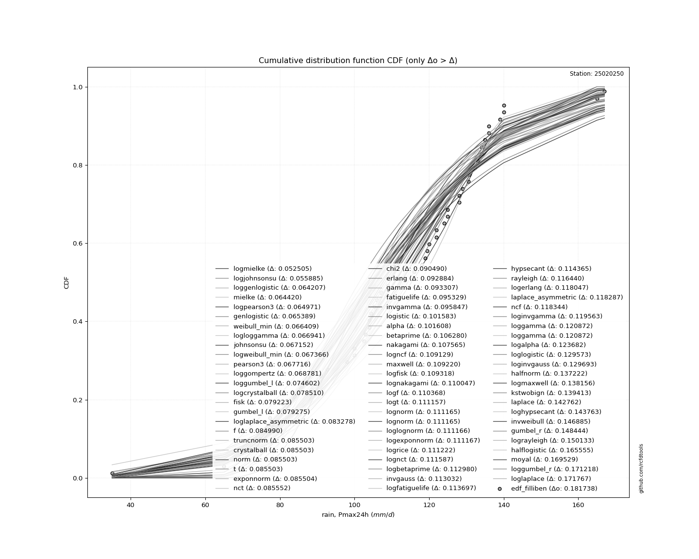</img>

</div>


**9.3. Best fit**

<div align="center">

|   id |   station | empirical_dist   | p_dist      |     delta |   deltao | eval   |   fit |   n |   best_fit |   best_fit_sort |
|-----:|----------:|:-----------------|:------------|----------:|---------:|:-------|------:|----:|-----------:|----------------:|
|    0 |  25020250 | edf_filliben     | genlogistic | 0.0648709 | 0.181738 | Δo > Δ |     1 |  56 |          1 |               1 |

</div>


<div align="center">

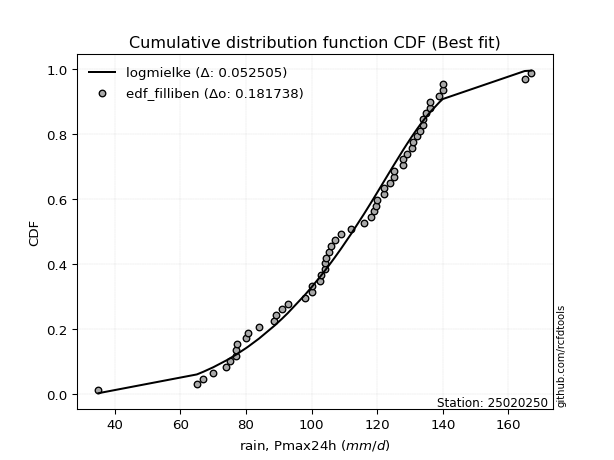</img></img>

</div>


### 10. Empirical - EDF Jenkinson (1977)

The Jenkinson formula in hydrology is an empirical plotting position formula used to estimate the non-exceedance probability _(P)_ or return period _(T)_ of a given ordered observation within a sample. It is a widely used method in the frequency analysis of extreme events such as floods and rainfall, as it provides a distribution-free way to plot data. _a≈0.31_ and _b≈0.38_ are constants derived to approximate the median of the probability distribution for the given rank.

<div align="center">


$P=(m-a)/(n+b)$


</div>


**10.1. Empirical values**

<div align="center">

|                | 0                    | 1                    | 2                   | 3                   | 4                   | 5                  | 6                  | 7                  | 8                  | 9                  | 10                  | 11                 | 12                 | 13                 | 14                 | 15                 | 16                  | 17                  | 18                 | 19                 | 20                  | 21                  | 22                  | 23                  | 24                 | 25                  | 26                  | 27                  | 28                 | 29                 | 30                 | 31                 | 32                 | 33                 | 34                | 35                 | 36                 | 37                 | 38                 | 39                 | 40                 | 41                 | 42                 | 43                 | 44                 | 45                 | 46                 | 47                 | 48                 | 49                 | 50                 | 51                 | 52                 | 53                 | 54                 | 55                 |
|:---------------|:---------------------|:---------------------|:--------------------|:--------------------|:--------------------|:-------------------|:-------------------|:-------------------|:-------------------|:-------------------|:--------------------|:-------------------|:-------------------|:-------------------|:-------------------|:-------------------|:--------------------|:--------------------|:-------------------|:-------------------|:--------------------|:--------------------|:--------------------|:--------------------|:-------------------|:--------------------|:--------------------|:--------------------|:-------------------|:-------------------|:-------------------|:-------------------|:-------------------|:-------------------|:------------------|:-------------------|:-------------------|:-------------------|:-------------------|:-------------------|:-------------------|:-------------------|:-------------------|:-------------------|:-------------------|:-------------------|:-------------------|:-------------------|:-------------------|:-------------------|:-------------------|:-------------------|:-------------------|:-------------------|:-------------------|:-------------------|
| date           | 1989                 | 2021                 | 1975                | 1982                | 1976                | 1974               | 1985               | 2004               | 2008               | 2015               | 2009                | 2001               | 1972               | 1986               | 2014               | 1994               | 1996                | 1991                | 2003               | 1997               | 1969                | 2016                | 1998                | 2005                | 1984               | 2017                | 1977                | 1964                | 2012               | 2022               | 1965               | 2013               | 1999               | 1990               | 1981              | 1992               | 1966               | 1995               | 1979               | 1971               | 1988               | 1980               | 2011               | 2006               | 2010               | 1973               | 1983               | 1987               | 1968               | 2007               | 1963               | 2002               | 1970               | 1993               | 2000               | 1978               |
| x              | 65.0                 | 67.0                 | 70.0                | 74.0                | 75.0                | 77.0               | 77.0               | 77.3               | 80.0               | 80.7               | 84.0                | 88.6               | 89.0               | 91.0               | 92.7               | 98.0               | 100.0               | 100.0               | 102.5              | 102.9              | 104.0               | 104.0               | 104.4               | 105.3               | 106.0              | 107.1               | 109.0               | 109.40178571428571  | 112.0              | 116.0              | 118.0              | 119.0              | 119.5              | 120.0              | 122.0             | 122.0              | 124.0              | 125.0              | 125.0              | 128.0              | 128.0              | 129.0              | 130.5              | 130.8              | 132.2              | 133.0              | 134.0              | 134.0              | 135.0              | 136.0              | 136.0              | 139.0              | 140.0              | 140.0              | 165.0              | 167.0              |
| m              | 1                    | 2                    | 3                   | 4                   | 5                   | 6                  | 7                  | 8                  | 9                  | 10                 | 11                  | 12                 | 13                 | 14                 | 15                 | 16                 | 17                  | 18                  | 19                 | 20                 | 21                  | 22                  | 23                  | 24                  | 25                 | 26                  | 27                  | 28                  | 29                 | 30                 | 31                 | 32                 | 33                 | 34                 | 35                | 36                 | 37                 | 38                 | 39                 | 40                 | 41                 | 42                 | 43                 | 44                 | 45                 | 46                 | 47                 | 48                 | 49                 | 50                 | 51                 | 52                 | 53                 | 54                 | 55                 | 56                 |
| empirical_dist | edf_jenkinson        | edf_jenkinson        | edf_jenkinson       | edf_jenkinson       | edf_jenkinson       | edf_jenkinson      | edf_jenkinson      | edf_jenkinson      | edf_jenkinson      | edf_jenkinson      | edf_jenkinson       | edf_jenkinson      | edf_jenkinson      | edf_jenkinson      | edf_jenkinson      | edf_jenkinson      | edf_jenkinson       | edf_jenkinson       | edf_jenkinson      | edf_jenkinson      | edf_jenkinson       | edf_jenkinson       | edf_jenkinson       | edf_jenkinson       | edf_jenkinson      | edf_jenkinson       | edf_jenkinson       | edf_jenkinson       | edf_jenkinson      | edf_jenkinson      | edf_jenkinson      | edf_jenkinson      | edf_jenkinson      | edf_jenkinson      | edf_jenkinson     | edf_jenkinson      | edf_jenkinson      | edf_jenkinson      | edf_jenkinson      | edf_jenkinson      | edf_jenkinson      | edf_jenkinson      | edf_jenkinson      | edf_jenkinson      | edf_jenkinson      | edf_jenkinson      | edf_jenkinson      | edf_jenkinson      | edf_jenkinson      | edf_jenkinson      | edf_jenkinson      | edf_jenkinson      | edf_jenkinson      | edf_jenkinson      | edf_jenkinson      | edf_jenkinson      |
| empirical      | 0.012238382405108193 | 0.029975168499467894 | 0.04771195459382759 | 0.06544874068818729 | 0.08318552678254701 | 0.1009223128769067 | 0.1186590989712664 | 0.1363958850656261 | 0.1541326711599858 | 0.1718694572543455 | 0.18960624334870518 | 0.2073430294430649 | 0.2250798155374246 | 0.2428166016317843 | 0.260553387726144  | 0.2782901738205037 | 0.29602695991486344 | 0.31376374600922313 | 0.3315005321035828 | 0.3492373181979425 | 0.36697410429230226 | 0.38471089038666195 | 0.40244767648102164 | 0.42018446257538133 | 0.437921248669741  | 0.45565803476410077 | 0.47339482085846046 | 0.49113160695282015 | 0.5088683930471799 | 0.5266051791415396 | 0.5443419652358993 | 0.562078751330259  | 0.5798155374246186 | 0.5975523235189782 | 0.615289109613338 | 0.6330258957076977 | 0.6507626818020574 | 0.6684994678964171 | 0.6862362539907768 | 0.7039730400851365 | 0.7217098261794962 | 0.7394466122738559 | 0.7571833983682156 | 0.7749201844625753 | 0.792656970556935  | 0.8103937566512948 | 0.8281305427456545 | 0.8458673288400141 | 0.8636041149343738 | 0.8813409010287335 | 0.8990776871230932 | 0.9168144732174529 | 0.9345512593118126 | 0.9522880454061723 | 0.970024831500532  | 0.9877616175948917 |
| empirical_tr   | 1.0123900161608907   | 1.0309014445053941   | 1.0501024399329484  | 1.0700322641867528  | 1.0907332172567228  | 1.1122509370684552 | 1.1346347353592272 | 1.1579379749435204 | 1.1822184944432794 | 1.2075390875990577 | 1.2339680455241846  | 1.2615797717610204 | 1.2904554818036165 | 1.3206840009369876 | 1.3523626769009354 | 1.3855984271319735 | 1.4205089443184682  | 1.4572240889118635  | 1.4958875033165298 | 1.536658490051785  | 1.5797142056598488  | 1.62525223407322    | 1.6734936182843574  | 1.7246864484551852  | 1.7791101293783527 | 1.8370804822417728  | 1.8989558773997979  | 1.9651446497037297  | 2.0361141206211633 | 2.1124016485575123 | 2.1946282600233555 | 2.2835155933576345 | 2.3799071338117344 | 2.4847950639048033 | 2.599354541263255 | 2.724987916868052  | 2.8633824276282374 | 3.0165864098448365 | 3.1871113623516103 | 3.378070701018573  | 3.5933715742511145 | 3.8379850238257305 | 4.118334550766981  | 4.442868400315207  | 4.8229255774165924 | 5.274087932647333  | 5.818369453044374  | 6.4879171461449925 | 7.33159947984395   | 8.427503736920773  | 9.908611599297005  | 12.021321961620457 | 15.27913279132789  | 20.9591078066914   | 33.360946745561996 | 81.71014492753534  |

</div>


**10.2. Kolmogorov-Smirnov fit test (sorted by Δ)**


<div align="center">

|                | 0                   | 1                   | 2                  | 3                   | 4                  | 5                  | 6                   | 7                   | 8                   | 9                   | 10                 | 11                  | 12                  | 13                  | 14                  | 15                  | 16                  | 17                  | 18                 | 19                  | 20                 | 21                  | 22                  | 23                  | 24                  | 25                  | 26                  | 27                 | 28                 | 29                  | 30                    | 31                  | 32                  | 33                  | 34                  | 35                 | 36                  | 37                  | 38                  | 39                  | 40                  | 41                  | 42                  | 43                  | 44                  | 45                  | 46                  | 47                  | 48                  | 49                  | 50                 | 51                 | 52                 | 53                 | 54                  | 55                 | 56                  | 57                  | 58                  | 59                  | 60                  | 61                  | 62                 | 63                  | 64                 | 65                  | 66                  | 67                  | 68                 | 69                  | 70                  | 71                  | 72                  | 73                  | 74                  | 75                 | 76                  | 77                  | 78                  | 79                  | 80                  | 81                  | 82                 | 83                  | 84                 | 85                 | 86                 | 87                 |
|:---------------|:--------------------|:--------------------|:-------------------|:--------------------|:-------------------|:-------------------|:--------------------|:--------------------|:--------------------|:--------------------|:-------------------|:--------------------|:--------------------|:--------------------|:--------------------|:--------------------|:--------------------|:--------------------|:-------------------|:--------------------|:-------------------|:--------------------|:--------------------|:--------------------|:--------------------|:--------------------|:--------------------|:-------------------|:-------------------|:--------------------|:----------------------|:--------------------|:--------------------|:--------------------|:--------------------|:-------------------|:--------------------|:--------------------|:--------------------|:--------------------|:--------------------|:--------------------|:--------------------|:--------------------|:--------------------|:--------------------|:--------------------|:--------------------|:--------------------|:--------------------|:-------------------|:-------------------|:-------------------|:-------------------|:--------------------|:-------------------|:--------------------|:--------------------|:--------------------|:--------------------|:--------------------|:--------------------|:-------------------|:--------------------|:-------------------|:--------------------|:--------------------|:--------------------|:-------------------|:--------------------|:--------------------|:--------------------|:--------------------|:--------------------|:--------------------|:-------------------|:--------------------|:--------------------|:--------------------|:--------------------|:--------------------|:--------------------|:-------------------|:--------------------|:-------------------|:-------------------|:-------------------|:-------------------|
| station        | 25020250            | 25020250            | 25020250           | 25020250            | 25020250           | 25020250           | 25020250            | 25020250            | 25020250            | 25020250            | 25020250           | 25020250            | 25020250            | 25020250            | 25020250            | 25020250            | 25020250            | 25020250            | 25020250           | 25020250            | 25020250           | 25020250            | 25020250            | 25020250            | 25020250            | 25020250            | 25020250            | 25020250           | 25020250           | 25020250            | 25020250              | 25020250            | 25020250            | 25020250            | 25020250            | 25020250           | 25020250            | 25020250            | 25020250            | 25020250            | 25020250            | 25020250            | 25020250            | 25020250            | 25020250            | 25020250            | 25020250            | 25020250            | 25020250            | 25020250            | 25020250           | 25020250           | 25020250           | 25020250           | 25020250            | 25020250           | 25020250            | 25020250            | 25020250            | 25020250            | 25020250            | 25020250            | 25020250           | 25020250            | 25020250           | 25020250            | 25020250            | 25020250            | 25020250           | 25020250            | 25020250            | 25020250            | 25020250            | 25020250            | 25020250            | 25020250           | 25020250            | 25020250            | 25020250            | 25020250            | 25020250            | 25020250            | 25020250           | 25020250            | 25020250           | 25020250           | 25020250           | 25020250           |
| empirical_dist | edf_jenkinson       | edf_jenkinson       | edf_jenkinson      | edf_jenkinson       | edf_jenkinson      | edf_jenkinson      | edf_jenkinson       | edf_jenkinson       | edf_jenkinson       | edf_jenkinson       | edf_jenkinson      | edf_jenkinson       | edf_jenkinson       | edf_jenkinson       | edf_jenkinson       | edf_jenkinson       | edf_jenkinson       | edf_jenkinson       | edf_jenkinson      | edf_jenkinson       | edf_jenkinson      | edf_jenkinson       | edf_jenkinson       | edf_jenkinson       | edf_jenkinson       | edf_jenkinson       | edf_jenkinson       | edf_jenkinson      | edf_jenkinson      | edf_jenkinson       | edf_jenkinson         | edf_jenkinson       | edf_jenkinson       | edf_jenkinson       | edf_jenkinson       | edf_jenkinson      | edf_jenkinson       | edf_jenkinson       | edf_jenkinson       | edf_jenkinson       | edf_jenkinson       | edf_jenkinson       | edf_jenkinson       | edf_jenkinson       | edf_jenkinson       | edf_jenkinson       | edf_jenkinson       | edf_jenkinson       | edf_jenkinson       | edf_jenkinson       | edf_jenkinson      | edf_jenkinson      | edf_jenkinson      | edf_jenkinson      | edf_jenkinson       | edf_jenkinson      | edf_jenkinson       | edf_jenkinson       | edf_jenkinson       | edf_jenkinson       | edf_jenkinson       | edf_jenkinson       | edf_jenkinson      | edf_jenkinson       | edf_jenkinson      | edf_jenkinson       | edf_jenkinson       | edf_jenkinson       | edf_jenkinson      | edf_jenkinson       | edf_jenkinson       | edf_jenkinson       | edf_jenkinson       | edf_jenkinson       | edf_jenkinson       | edf_jenkinson      | edf_jenkinson       | edf_jenkinson       | edf_jenkinson       | edf_jenkinson       | edf_jenkinson       | edf_jenkinson       | edf_jenkinson      | edf_jenkinson       | edf_jenkinson      | edf_jenkinson      | edf_jenkinson      | edf_jenkinson      |
| p_dist         | genlogistic         | loggenlogistic      | mielke             | loggumbel_l         | logloggamma        | logjohnsonsu       | johnsonsu           | fisk                | pearson3            | logweibull_min      | loggompertz        | norm                | truncnorm           | crystalball         | exponnorm           | t                   | nct                 | nakagami            | erlang             | gamma               | fatiguelife        | f                   | weibull_min         | logpearson3         | gumbel_l            | rice                | chi2                | logfisk            | logistic           | alpha               | loglaplace_asymmetric | invgamma            | maxwell             | logmielke           | ncf                 | hypsecant          | logncf              | logf                | logt                | logexponnorm        | lognorm             | lognorm             | logcrystalball      | loglognorm          | lognakagami         | rayleigh            | logfatiguelife      | invgauss            | logrice             | loginvgamma         | logbetaprime       | loggamma           | loggamma           | invweibull         | logerlang           | logalpha           | laplace_asymmetric  | lognct              | betaprime           | kstwobign           | loginvgauss         | loglogistic         | logmaxwell         | laplace             | lograyleigh        | loginvweibull       | halfnorm            | loghypsecant        | gumbel_r           | loghalfnorm         | moyal               | logkstwobign        | loggumbel_r         | loglaplace          | loggenexpon         | halflogistic       | loghalflogistic     | logmoyal            | wald                | genexpon            | expon               | logwald             | gibrat             | loggibrat           | logexpon           | logchi2            | logtruncnorm       | gompertz           |
| delta          | 0.06495817742479296 | 0.06782203728136077 | 0.067869945341826  | 0.06926858440367294 | 0.0694272453111241 | 0.0703486638081594 | 0.07300572561304008 | 0.07311192584104709 | 0.07328996230237117 | 0.07410109954121602 | 0.074746573109859  | 0.07505446403264215 | 0.07505446583749054 | 0.07505447185377379 | 0.07505454922320065 | 0.07506729426828984 | 0.07512534621686451 | 0.07628638613770122 | 0.0766786511525781 | 0.07681108408198267 | 0.0780024685665176 | 0.07849162449816938 | 0.07955133339891252 | 0.08256495801359331 | 0.08558412545321098 | 0.08643954709224477 | 0.08893320126989424 | 0.0898572829243518 | 0.090073458965364  | 0.09559619504018613 | 0.0963715367769184    | 0.09753982676014317 | 0.09979407602334034 | 0.10029615188295993 | 0.10044473887936589 | 0.1028533388606705 | 0.10618891535239616 | 0.10665895089363009 | 0.10712275741249344 | 0.10712724065214929 | 0.10712772849669117 | 0.10712772849669117 | 0.10712773024205258 | 0.10712950469838212 | 0.10713815284759975 | 0.10737635343979268 | 0.10781832091083077 | 0.11006983592812858 | 0.11096386245750645 | 0.11106383565099132 | 0.1115226777111914 | 0.1124879323509298 | 0.1124879323509298 | 0.114252775377236  | 0.11540987133396718 | 0.1161830047703315 | 0.11703472962419414 | 0.11808244655741051 | 0.11910941438430245 | 0.12004846873350283 | 0.12361164993791751 | 0.12519608116265035 | 0.1286058721968586 | 0.13126878933764918 | 0.1350673738532172 | 0.13864597097714498 | 0.13906217725204928 | 0.13919686119841412 | 0.1393617722111261 | 0.15849028499331147 | 0.16105041010266763 | 0.16606897837329865 | 0.16686929379139326 | 0.16733919513197526 | 0.16762305660623994 | 0.1718694572543455 | 0.18193367365752222 | 0.18662376787110124 | 0.22259188166020566 | 0.23776482350616296 | 0.23880445748615603 | 0.24265674740304788 | 0.2605099768382553 | 0.27486808225960424 | 0.2761536018180005 | 0.3577749140388772 | 0.3911761526690379 | 0.7772606005163902 |
| deltao         | 0.1817376445004486  | 0.1817376445004486  | 0.1817376445004486 | 0.1817376445004486  | 0.1817376445004486 | 0.1817376445004486 | 0.1817376445004486  | 0.1817376445004486  | 0.1817376445004486  | 0.1817376445004486  | 0.1817376445004486 | 0.1817376445004486  | 0.1817376445004486  | 0.1817376445004486  | 0.1817376445004486  | 0.1817376445004486  | 0.1817376445004486  | 0.1817376445004486  | 0.1817376445004486 | 0.1817376445004486  | 0.1817376445004486 | 0.1817376445004486  | 0.1817376445004486  | 0.1817376445004486  | 0.1817376445004486  | 0.1817376445004486  | 0.1817376445004486  | 0.1817376445004486 | 0.1817376445004486 | 0.1817376445004486  | 0.1817376445004486    | 0.1817376445004486  | 0.1817376445004486  | 0.1817376445004486  | 0.1817376445004486  | 0.1817376445004486 | 0.1817376445004486  | 0.1817376445004486  | 0.1817376445004486  | 0.1817376445004486  | 0.1817376445004486  | 0.1817376445004486  | 0.1817376445004486  | 0.1817376445004486  | 0.1817376445004486  | 0.1817376445004486  | 0.1817376445004486  | 0.1817376445004486  | 0.1817376445004486  | 0.1817376445004486  | 0.1817376445004486 | 0.1817376445004486 | 0.1817376445004486 | 0.1817376445004486 | 0.1817376445004486  | 0.1817376445004486 | 0.1817376445004486  | 0.1817376445004486  | 0.1817376445004486  | 0.1817376445004486  | 0.1817376445004486  | 0.1817376445004486  | 0.1817376445004486 | 0.1817376445004486  | 0.1817376445004486 | 0.1817376445004486  | 0.1817376445004486  | 0.1817376445004486  | 0.1817376445004486 | 0.1817376445004486  | 0.1817376445004486  | 0.1817376445004486  | 0.1817376445004486  | 0.1817376445004486  | 0.1817376445004486  | 0.1817376445004486 | 0.1817376445004486  | 0.1817376445004486  | 0.1817376445004486  | 0.1817376445004486  | 0.1817376445004486  | 0.1817376445004486  | 0.1817376445004486 | 0.1817376445004486  | 0.1817376445004486 | 0.1817376445004486 | 0.1817376445004486 | 0.1817376445004486 |
| eval           | Δo > Δ              | Δo > Δ              | Δo > Δ             | Δo > Δ              | Δo > Δ             | Δo > Δ             | Δo > Δ              | Δo > Δ              | Δo > Δ              | Δo > Δ              | Δo > Δ             | Δo > Δ              | Δo > Δ              | Δo > Δ              | Δo > Δ              | Δo > Δ              | Δo > Δ              | Δo > Δ              | Δo > Δ             | Δo > Δ              | Δo > Δ             | Δo > Δ              | Δo > Δ              | Δo > Δ              | Δo > Δ              | Δo > Δ              | Δo > Δ              | Δo > Δ             | Δo > Δ             | Δo > Δ              | Δo > Δ                | Δo > Δ              | Δo > Δ              | Δo > Δ              | Δo > Δ              | Δo > Δ             | Δo > Δ              | Δo > Δ              | Δo > Δ              | Δo > Δ              | Δo > Δ              | Δo > Δ              | Δo > Δ              | Δo > Δ              | Δo > Δ              | Δo > Δ              | Δo > Δ              | Δo > Δ              | Δo > Δ              | Δo > Δ              | Δo > Δ             | Δo > Δ             | Δo > Δ             | Δo > Δ             | Δo > Δ              | Δo > Δ             | Δo > Δ              | Δo > Δ              | Δo > Δ              | Δo > Δ              | Δo > Δ              | Δo > Δ              | Δo > Δ             | Δo > Δ              | Δo > Δ             | Δo > Δ              | Δo > Δ              | Δo > Δ              | Δo > Δ             | Δo > Δ              | Δo > Δ              | Δo > Δ              | Δo > Δ              | Δo > Δ              | Δo > Δ              | Δo > Δ             | Δo <= Δ             | Δo <= Δ             | Δo <= Δ             | Δo <= Δ             | Δo <= Δ             | Δo <= Δ             | Δo <= Δ            | Δo <= Δ             | Δo <= Δ            | Δo <= Δ            | Δo <= Δ            | Δo <= Δ            |
| fit            | 1                   | 1                   | 1                  | 1                   | 1                  | 1                  | 1                   | 1                   | 1                   | 1                   | 1                  | 1                   | 1                   | 1                   | 1                   | 1                   | 1                   | 1                   | 1                  | 1                   | 1                  | 1                   | 1                   | 1                   | 1                   | 1                   | 1                   | 1                  | 1                  | 1                   | 1                     | 1                   | 1                   | 1                   | 1                   | 1                  | 1                   | 1                   | 1                   | 1                   | 1                   | 1                   | 1                   | 1                   | 1                   | 1                   | 1                   | 1                   | 1                   | 1                   | 1                  | 1                  | 1                  | 1                  | 1                   | 1                  | 1                   | 1                   | 1                   | 1                   | 1                   | 1                   | 1                  | 1                   | 1                  | 1                   | 1                   | 1                   | 1                  | 1                   | 1                   | 1                   | 1                   | 1                   | 1                   | 1                  | 0                   | 0                   | 0                   | 0                   | 0                   | 0                   | 0                  | 0                   | 0                  | 0                  | 0                  | 0                  |
| n              | 56                  | 56                  | 56                 | 56                  | 56                 | 56                 | 56                  | 56                  | 56                  | 56                  | 56                 | 56                  | 56                  | 56                  | 56                  | 56                  | 56                  | 56                  | 56                 | 56                  | 56                 | 56                  | 56                  | 56                  | 56                  | 56                  | 56                  | 56                 | 56                 | 56                  | 56                    | 56                  | 56                  | 56                  | 56                  | 56                 | 56                  | 56                  | 56                  | 56                  | 56                  | 56                  | 56                  | 56                  | 56                  | 56                  | 56                  | 56                  | 56                  | 56                  | 56                 | 56                 | 56                 | 56                 | 56                  | 56                 | 56                  | 56                  | 56                  | 56                  | 56                  | 56                  | 56                 | 56                  | 56                 | 56                  | 56                  | 56                  | 56                 | 56                  | 56                  | 56                  | 56                  | 56                  | 56                  | 56                 | 56                  | 56                  | 56                  | 56                  | 56                  | 56                  | 56                 | 56                  | 56                 | 56                 | 56                 | 56                 |
| best_fit       | 1                   | 0                   | 0                  | 0                   | 0                  | 0                  | 0                   | 0                   | 0                   | 0                   | 0                  | 0                   | 0                   | 0                   | 0                   | 0                   | 0                   | 0                   | 0                  | 0                   | 0                  | 0                   | 0                   | 0                   | 0                   | 0                   | 0                   | 0                  | 0                  | 0                   | 0                     | 0                   | 0                   | 0                   | 0                   | 0                  | 0                   | 0                   | 0                   | 0                   | 0                   | 0                   | 0                   | 0                   | 0                   | 0                   | 0                   | 0                   | 0                   | 0                   | 0                  | 0                  | 0                  | 0                  | 0                   | 0                  | 0                   | 0                   | 0                   | 0                   | 0                   | 0                   | 0                  | 0                   | 0                  | 0                   | 0                   | 0                   | 0                  | 0                   | 0                   | 0                   | 0                   | 0                   | 0                   | 0                  | 0                   | 0                   | 0                   | 0                   | 0                   | 0                   | 0                  | 0                   | 0                  | 0                  | 0                  | 0                  |
| best_fit_sort  | 1                   | 2                   | 3                  | 4                   | 5                  | 6                  | 7                   | 8                   | 9                   | 10                  | 11                 | 12                  | 13                  | 14                  | 15                  | 16                  | 17                  | 18                  | 19                 | 20                  | 21                 | 22                  | 23                  | 24                  | 25                  | 26                  | 27                  | 28                 | 29                 | 30                  | 31                    | 32                  | 33                  | 34                  | 35                  | 36                 | 37                  | 38                  | 39                  | 40                  | 41                  | 42                  | 43                  | 44                  | 45                  | 46                  | 47                  | 48                  | 49                  | 50                  | 51                 | 52                 | 53                 | 54                 | 55                  | 56                 | 57                  | 58                  | 59                  | 60                  | 61                  | 62                  | 63                 | 64                  | 65                 | 66                  | 67                  | 68                  | 69                 | 70                  | 71                  | 72                  | 73                  | 74                  | 75                  | 76                 | 77                  | 78                  | 79                  | 80                  | 81                  | 82                  | 83                 | 84                  | 85                 | 86                 | 87                 | 88                 |

</div>


<div align="center">

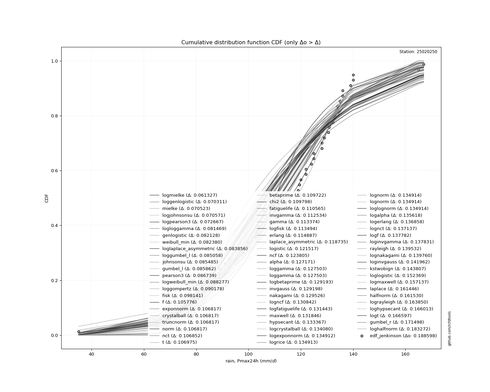</img>

</div>


**10.3. Best fit**

<div align="center">

|   id |   station | empirical_dist   | p_dist      |     delta |   deltao | eval   |   fit |   n |   best_fit |   best_fit_sort |
|-----:|----------:|:-----------------|:------------|----------:|---------:|:-------|------:|----:|-----------:|----------------:|
|    0 |  25020250 | edf_jenkinson    | genlogistic | 0.0649582 | 0.181738 | Δo > Δ |     1 |  56 |          1 |               1 |

</div>


<div align="center">

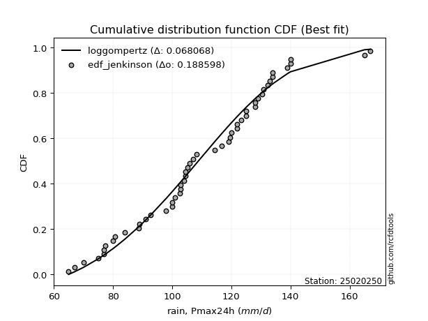</img></img>

</div>


### 11. Empirical - EDF Cunnane (1978)

Cunnane´s work in statistical hydrology has focused on the performance and evaluation of different probability distributions (such as GEV, Gumbel, Lognormal) for flood frequency estimation. _b_ is a constant, typically set to 0.4.

<div align="center">


$P=(m-b)/(n+1-2b)$


</div>


**11.1. Empirical values**

<div align="center">

|                | 0                    | 1                    | 2                    | 3                   | 4                   | 5                   | 6                   | 7                   | 8                   | 9                   | 10                 | 11                 | 12                  | 13                  | 14                 | 15                 | 16                  | 17                  | 18                 | 19                 | 20                 | 21                  | 22                  | 23                 | 24                 | 25                 | 26                  | 27                  | 28                 | 29                 | 30                 | 31                 | 32                 | 33                | 34                 | 35                 | 36                 | 37                 | 38                 | 39                 | 40                 | 41                 | 42                 | 43                 | 44                 | 45                 | 46                 | 47                 | 48                 | 49                 | 50                 | 51                 | 52                 | 53                 | 54                 | 55                |
|:---------------|:---------------------|:---------------------|:---------------------|:--------------------|:--------------------|:--------------------|:--------------------|:--------------------|:--------------------|:--------------------|:-------------------|:-------------------|:--------------------|:--------------------|:-------------------|:-------------------|:--------------------|:--------------------|:-------------------|:-------------------|:-------------------|:--------------------|:--------------------|:-------------------|:-------------------|:-------------------|:--------------------|:--------------------|:-------------------|:-------------------|:-------------------|:-------------------|:-------------------|:------------------|:-------------------|:-------------------|:-------------------|:-------------------|:-------------------|:-------------------|:-------------------|:-------------------|:-------------------|:-------------------|:-------------------|:-------------------|:-------------------|:-------------------|:-------------------|:-------------------|:-------------------|:-------------------|:-------------------|:-------------------|:-------------------|:------------------|
| date           | 1989                 | 2021                 | 1975                 | 1982                | 1976                | 1974                | 1985                | 2004                | 2008                | 2015                | 2009               | 2001               | 1972                | 1986                | 2014               | 1994               | 1996                | 1991                | 2003               | 1997               | 1969               | 2016                | 1998                | 2005               | 1984               | 2017               | 1977                | 1964                | 2012               | 2022               | 1965               | 2013               | 1999               | 1990              | 1981               | 1992               | 1966               | 1995               | 1979               | 1971               | 1988               | 1980               | 2011               | 2006               | 2010               | 1973               | 1983               | 1987               | 1968               | 2007               | 1963               | 2002               | 1970               | 1993               | 2000               | 1978              |
| x              | 65.0                 | 67.0                 | 70.0                 | 74.0                | 75.0                | 77.0                | 77.0                | 77.3                | 80.0                | 80.7                | 84.0               | 88.6               | 89.0                | 91.0                | 92.7               | 98.0               | 100.0               | 100.0               | 102.5              | 102.9              | 104.0              | 104.0               | 104.4               | 105.3              | 106.0              | 107.1              | 109.0               | 109.40178571428571  | 112.0              | 116.0              | 118.0              | 119.0              | 119.5              | 120.0             | 122.0              | 122.0              | 124.0              | 125.0              | 125.0              | 128.0              | 128.0              | 129.0              | 130.5              | 130.8              | 132.2              | 133.0              | 134.0              | 134.0              | 135.0              | 136.0              | 136.0              | 139.0              | 140.0              | 140.0              | 165.0              | 167.0             |
| m              | 1                    | 2                    | 3                    | 4                   | 5                   | 6                   | 7                   | 8                   | 9                   | 10                  | 11                 | 12                 | 13                  | 14                  | 15                 | 16                 | 17                  | 18                  | 19                 | 20                 | 21                 | 22                  | 23                  | 24                 | 25                 | 26                 | 27                  | 28                  | 29                 | 30                 | 31                 | 32                 | 33                 | 34                | 35                 | 36                 | 37                 | 38                 | 39                 | 40                 | 41                 | 42                 | 43                 | 44                 | 45                 | 46                 | 47                 | 48                 | 49                 | 50                 | 51                 | 52                 | 53                 | 54                 | 55                 | 56                |
| empirical_dist | edf_cunnane          | edf_cunnane          | edf_cunnane          | edf_cunnane         | edf_cunnane         | edf_cunnane         | edf_cunnane         | edf_cunnane         | edf_cunnane         | edf_cunnane         | edf_cunnane        | edf_cunnane        | edf_cunnane         | edf_cunnane         | edf_cunnane        | edf_cunnane        | edf_cunnane         | edf_cunnane         | edf_cunnane        | edf_cunnane        | edf_cunnane        | edf_cunnane         | edf_cunnane         | edf_cunnane        | edf_cunnane        | edf_cunnane        | edf_cunnane         | edf_cunnane         | edf_cunnane        | edf_cunnane        | edf_cunnane        | edf_cunnane        | edf_cunnane        | edf_cunnane       | edf_cunnane        | edf_cunnane        | edf_cunnane        | edf_cunnane        | edf_cunnane        | edf_cunnane        | edf_cunnane        | edf_cunnane        | edf_cunnane        | edf_cunnane        | edf_cunnane        | edf_cunnane        | edf_cunnane        | edf_cunnane        | edf_cunnane        | edf_cunnane        | edf_cunnane        | edf_cunnane        | edf_cunnane        | edf_cunnane        | edf_cunnane        | edf_cunnane       |
| empirical      | 0.010676156583629892 | 0.028469750889679714 | 0.046263345195729534 | 0.06405693950177936 | 0.08185053380782917 | 0.09964412811387899 | 0.11743772241992881 | 0.13523131672597863 | 0.15302491103202845 | 0.17081850533807827 | 0.1886120996441281 | 0.2064056939501779 | 0.22419928825622773 | 0.24199288256227755 | 0.2597864768683274 | 0.2775800711743772 | 0.29537366548042704 | 0.31316725978647686 | 0.3309608540925267 | 0.3487544483985765 | 0.3665480427046263 | 0.38434163701067614 | 0.40213523131672596 | 0.4199288256227758 | 0.4377224199288256 | 0.4555160142348754 | 0.47330960854092524 | 0.49110320284697506 | 0.5088967971530249 | 0.5266903914590747 | 0.5444839857651246 | 0.5622775800711743 | 0.5800711743772242 | 0.597864768683274 | 0.6156583629893239 | 0.6334519572953736 | 0.6512455516014235 | 0.6690391459074733 | 0.6868327402135231 | 0.7046263345195729 | 0.7224199288256228 | 0.7402135231316725 | 0.7580071174377224 | 0.7758007117437722 | 0.7935943060498221 | 0.8113879003558718 | 0.8291814946619217 | 0.8469750889679715 | 0.8647686832740213 | 0.8825622775800711 | 0.900355871886121  | 0.9181494661921707 | 0.9359430604982206 | 0.9537366548042704 | 0.9715302491103203 | 0.98932384341637  |
| empirical_tr   | 1.0107913669064748   | 1.0293040293040294   | 1.0485074626865671   | 1.0684410646387832  | 1.0891472868217054  | 1.1106719367588933  | 1.1330645161290323  | 1.1563786008230452  | 1.180672268907563   | 1.206008583690987   | 1.2324561403508771 | 1.2600896860986548 | 1.2889908256880733  | 1.3192488262910798  | 1.3509615384615383 | 1.3842364532019704 | 1.4191919191919193  | 1.455958549222798   | 1.4946808510638296 | 1.53551912568306   | 1.5786516853932586 | 1.6242774566473988  | 1.6726190476190474  | 1.7239263803680982 | 1.778481012658228  | 1.8366013071895424 | 1.8986486486486485  | 1.965034965034965   | 2.036231884057971  | 2.1127819548872178 | 2.1953125          | 2.284552845528455  | 2.38135593220339   | 2.486725663716814 | 2.601851851851852  | 2.728155339805825  | 2.86734693877551   | 3.0215053763440856 | 3.1931818181818183 | 3.3855421686746983 | 3.6025641025641026 | 3.84931506849315   | 4.132352941176471  | 4.46031746031746   | 4.844827586206897  | 5.301886792452828  | 5.854166666666666  | 6.53488372093023   | 7.394736842105263  | 8.51515151515151   | 10.035714285714285 | 12.217391304347816 | 15.611111111111107 | 21.61538461538458  | 35.12499999999998  | 93.66666666666599 |

</div>


**11.2. Kolmogorov-Smirnov fit test (sorted by Δ)**


<div align="center">

|                | 0                   | 1                   | 2                   | 3                   | 4                  | 5                   | 6                   | 7                   | 8                   | 9                   | 10                 | 11                  | 12                  | 13                  | 14                  | 15                  | 16                  | 17                  | 18                  | 19                  | 20                 | 21                  | 22                  | 23                  | 24                  | 25                  | 26                  | 27                  | 28                 | 29                  | 30                    | 31                  | 32                  | 33                  | 34                 | 35                  | 36                  | 37                 | 38                  | 39                 | 40                  | 41                  | 42                  | 43                  | 44                  | 45                  | 46                  | 47                  | 48                  | 49                  | 50                 | 51                 | 52                 | 53                 | 54                  | 55                 | 56                  | 57                  | 58                  | 59                  | 60                  | 61                  | 62                 | 63                  | 64                  | 65                  | 66                  | 67                  | 68                  | 69                 | 70                  | 71                 | 72                  | 73                  | 74                  | 75                  | 76                  | 77                  | 78                 | 79                  | 80                  | 81                  | 82                  | 83                  | 84                 | 85                 | 86                 | 87                 |
|:---------------|:--------------------|:--------------------|:--------------------|:--------------------|:-------------------|:--------------------|:--------------------|:--------------------|:--------------------|:--------------------|:-------------------|:--------------------|:--------------------|:--------------------|:--------------------|:--------------------|:--------------------|:--------------------|:--------------------|:--------------------|:-------------------|:--------------------|:--------------------|:--------------------|:--------------------|:--------------------|:--------------------|:--------------------|:-------------------|:--------------------|:----------------------|:--------------------|:--------------------|:--------------------|:-------------------|:--------------------|:--------------------|:-------------------|:--------------------|:-------------------|:--------------------|:--------------------|:--------------------|:--------------------|:--------------------|:--------------------|:--------------------|:--------------------|:--------------------|:--------------------|:-------------------|:-------------------|:-------------------|:-------------------|:--------------------|:-------------------|:--------------------|:--------------------|:--------------------|:--------------------|:--------------------|:--------------------|:-------------------|:--------------------|:--------------------|:--------------------|:--------------------|:--------------------|:--------------------|:-------------------|:--------------------|:-------------------|:--------------------|:--------------------|:--------------------|:--------------------|:--------------------|:--------------------|:-------------------|:--------------------|:--------------------|:--------------------|:--------------------|:--------------------|:-------------------|:-------------------|:-------------------|:-------------------|
| station        | 25020250            | 25020250            | 25020250            | 25020250            | 25020250           | 25020250            | 25020250            | 25020250            | 25020250            | 25020250            | 25020250           | 25020250            | 25020250            | 25020250            | 25020250            | 25020250            | 25020250            | 25020250            | 25020250            | 25020250            | 25020250           | 25020250            | 25020250            | 25020250            | 25020250            | 25020250            | 25020250            | 25020250            | 25020250           | 25020250            | 25020250              | 25020250            | 25020250            | 25020250            | 25020250           | 25020250            | 25020250            | 25020250           | 25020250            | 25020250           | 25020250            | 25020250            | 25020250            | 25020250            | 25020250            | 25020250            | 25020250            | 25020250            | 25020250            | 25020250            | 25020250           | 25020250           | 25020250           | 25020250           | 25020250            | 25020250           | 25020250            | 25020250            | 25020250            | 25020250            | 25020250            | 25020250            | 25020250           | 25020250            | 25020250            | 25020250            | 25020250            | 25020250            | 25020250            | 25020250           | 25020250            | 25020250           | 25020250            | 25020250            | 25020250            | 25020250            | 25020250            | 25020250            | 25020250           | 25020250            | 25020250            | 25020250            | 25020250            | 25020250            | 25020250           | 25020250           | 25020250           | 25020250           |
| empirical_dist | edf_cunnane         | edf_cunnane         | edf_cunnane         | edf_cunnane         | edf_cunnane        | edf_cunnane         | edf_cunnane         | edf_cunnane         | edf_cunnane         | edf_cunnane         | edf_cunnane        | edf_cunnane         | edf_cunnane         | edf_cunnane         | edf_cunnane         | edf_cunnane         | edf_cunnane         | edf_cunnane         | edf_cunnane         | edf_cunnane         | edf_cunnane        | edf_cunnane         | edf_cunnane         | edf_cunnane         | edf_cunnane         | edf_cunnane         | edf_cunnane         | edf_cunnane         | edf_cunnane        | edf_cunnane         | edf_cunnane           | edf_cunnane         | edf_cunnane         | edf_cunnane         | edf_cunnane        | edf_cunnane         | edf_cunnane         | edf_cunnane        | edf_cunnane         | edf_cunnane        | edf_cunnane         | edf_cunnane         | edf_cunnane         | edf_cunnane         | edf_cunnane         | edf_cunnane         | edf_cunnane         | edf_cunnane         | edf_cunnane         | edf_cunnane         | edf_cunnane        | edf_cunnane        | edf_cunnane        | edf_cunnane        | edf_cunnane         | edf_cunnane        | edf_cunnane         | edf_cunnane         | edf_cunnane         | edf_cunnane         | edf_cunnane         | edf_cunnane         | edf_cunnane        | edf_cunnane         | edf_cunnane         | edf_cunnane         | edf_cunnane         | edf_cunnane         | edf_cunnane         | edf_cunnane        | edf_cunnane         | edf_cunnane        | edf_cunnane         | edf_cunnane         | edf_cunnane         | edf_cunnane         | edf_cunnane         | edf_cunnane         | edf_cunnane        | edf_cunnane         | edf_cunnane         | edf_cunnane         | edf_cunnane         | edf_cunnane         | edf_cunnane        | edf_cunnane        | edf_cunnane        | edf_cunnane        |
| p_dist         | genlogistic         | loggenlogistic      | mielke              | loggumbel_l         | logloggamma        | logjohnsonsu        | johnsonsu           | fisk                | pearson3            | logweibull_min      | loggompertz        | norm                | truncnorm           | crystalball         | exponnorm           | t                   | nct                 | nakagami            | erlang              | gamma               | fatiguelife        | f                   | weibull_min         | logpearson3         | gumbel_l            | rice                | chi2                | logistic            | logfisk            | alpha               | loglaplace_asymmetric | invgamma            | logmielke           | maxwell             | ncf                | hypsecant           | logncf              | logf               | logt                | logexponnorm       | lognorm             | lognorm             | logcrystalball      | loglognorm          | lognakagami         | rayleigh            | logfatiguelife      | invgauss            | logrice             | loginvgamma         | logbetaprime       | loggamma           | loggamma           | invweibull         | logerlang           | logalpha           | laplace_asymmetric  | lognct              | betaprime           | kstwobign           | loginvgauss         | loglogistic         | logmaxwell         | laplace             | lograyleigh         | halfnorm            | loghypsecant        | loginvweibull       | gumbel_r            | loghalfnorm        | moyal               | logkstwobign       | loggumbel_r         | loglaplace          | loggenexpon         | halflogistic        | loghalflogistic     | logmoyal            | wald               | genexpon            | expon               | logwald             | gibrat              | loggibrat           | logexpon           | logchi2            | logtruncnorm       | gompertz           |
| delta          | 0.06390722550852573 | 0.06768001675213542 | 0.06772792481260065 | 0.06821763248740571 | 0.0692852247818988 | 0.07020664327893411 | 0.07286370508381479 | 0.07296990531182179 | 0.07314794177314587 | 0.07395907901199072 | 0.0746045525806337 | 0.07491244350341686 | 0.07491244530826524 | 0.07491245132454849 | 0.07491252869397536 | 0.07492527373906455 | 0.07498332568763921 | 0.07614436560847593 | 0.07653663062335281 | 0.07666906355275738 | 0.0778604480372923 | 0.07834960396894408 | 0.07940931286968722 | 0.08242293748436802 | 0.08544210492398563 | 0.08629752656301948 | 0.08879118074066894 | 0.08993143843613871 | 0.0913058923224499 | 0.09545417451096083 | 0.0963431326710733    | 0.09739780623091787 | 0.09964285744852353 | 0.09965205549411504 | 0.1003027183501406 | 0.10265451011975513 | 0.10604689482317087 | 0.1065169303644048 | 0.10698073688326815 | 0.106985220122924  | 0.10698570796746587 | 0.10698570796746587 | 0.10698570971282728 | 0.10698748416915682 | 0.10699613231837446 | 0.10723433291056739 | 0.10767630038160547 | 0.10992781539890328 | 0.11082184192828115 | 0.11092181512176602 | 0.1113806571819661 | 0.1123459118217045 | 0.1123459118217045 | 0.1141107548480107 | 0.11526785080474189 | 0.1160409842411062 | 0.11689270909496885 | 0.11794042602818522 | 0.11896739385507715 | 0.11990644820427754 | 0.12346962940869222 | 0.12505406063342506 | 0.1284638516676333 | 0.13106996059673381 | 0.13492535332399191 | 0.13801122533578206 | 0.13905484066918883 | 0.13918564898820113 | 0.13921975168190082 | 0.1590299630043676 | 0.16090838957344233 | 0.1666086563843548 | 0.16672727326216796 | 0.16719717460274997 | 0.16827635104067634 | 0.17081850533807827 | 0.18179165312829693 | 0.18648174734187595 | 0.2217113543790088 | 0.23841811794059936 | 0.23945775192059243 | 0.24251472687382258 | 0.25974306598043867 | 0.27472606173037895 | 0.276863704464127  | 0.3592235234369753 | 0.3918294471034743 | 0.778538785279418  |
| deltao         | 0.1817376445004486  | 0.1817376445004486  | 0.1817376445004486  | 0.1817376445004486  | 0.1817376445004486 | 0.1817376445004486  | 0.1817376445004486  | 0.1817376445004486  | 0.1817376445004486  | 0.1817376445004486  | 0.1817376445004486 | 0.1817376445004486  | 0.1817376445004486  | 0.1817376445004486  | 0.1817376445004486  | 0.1817376445004486  | 0.1817376445004486  | 0.1817376445004486  | 0.1817376445004486  | 0.1817376445004486  | 0.1817376445004486 | 0.1817376445004486  | 0.1817376445004486  | 0.1817376445004486  | 0.1817376445004486  | 0.1817376445004486  | 0.1817376445004486  | 0.1817376445004486  | 0.1817376445004486 | 0.1817376445004486  | 0.1817376445004486    | 0.1817376445004486  | 0.1817376445004486  | 0.1817376445004486  | 0.1817376445004486 | 0.1817376445004486  | 0.1817376445004486  | 0.1817376445004486 | 0.1817376445004486  | 0.1817376445004486 | 0.1817376445004486  | 0.1817376445004486  | 0.1817376445004486  | 0.1817376445004486  | 0.1817376445004486  | 0.1817376445004486  | 0.1817376445004486  | 0.1817376445004486  | 0.1817376445004486  | 0.1817376445004486  | 0.1817376445004486 | 0.1817376445004486 | 0.1817376445004486 | 0.1817376445004486 | 0.1817376445004486  | 0.1817376445004486 | 0.1817376445004486  | 0.1817376445004486  | 0.1817376445004486  | 0.1817376445004486  | 0.1817376445004486  | 0.1817376445004486  | 0.1817376445004486 | 0.1817376445004486  | 0.1817376445004486  | 0.1817376445004486  | 0.1817376445004486  | 0.1817376445004486  | 0.1817376445004486  | 0.1817376445004486 | 0.1817376445004486  | 0.1817376445004486 | 0.1817376445004486  | 0.1817376445004486  | 0.1817376445004486  | 0.1817376445004486  | 0.1817376445004486  | 0.1817376445004486  | 0.1817376445004486 | 0.1817376445004486  | 0.1817376445004486  | 0.1817376445004486  | 0.1817376445004486  | 0.1817376445004486  | 0.1817376445004486 | 0.1817376445004486 | 0.1817376445004486 | 0.1817376445004486 |
| eval           | Δo > Δ              | Δo > Δ              | Δo > Δ              | Δo > Δ              | Δo > Δ             | Δo > Δ              | Δo > Δ              | Δo > Δ              | Δo > Δ              | Δo > Δ              | Δo > Δ             | Δo > Δ              | Δo > Δ              | Δo > Δ              | Δo > Δ              | Δo > Δ              | Δo > Δ              | Δo > Δ              | Δo > Δ              | Δo > Δ              | Δo > Δ             | Δo > Δ              | Δo > Δ              | Δo > Δ              | Δo > Δ              | Δo > Δ              | Δo > Δ              | Δo > Δ              | Δo > Δ             | Δo > Δ              | Δo > Δ                | Δo > Δ              | Δo > Δ              | Δo > Δ              | Δo > Δ             | Δo > Δ              | Δo > Δ              | Δo > Δ             | Δo > Δ              | Δo > Δ             | Δo > Δ              | Δo > Δ              | Δo > Δ              | Δo > Δ              | Δo > Δ              | Δo > Δ              | Δo > Δ              | Δo > Δ              | Δo > Δ              | Δo > Δ              | Δo > Δ             | Δo > Δ             | Δo > Δ             | Δo > Δ             | Δo > Δ              | Δo > Δ             | Δo > Δ              | Δo > Δ              | Δo > Δ              | Δo > Δ              | Δo > Δ              | Δo > Δ              | Δo > Δ             | Δo > Δ              | Δo > Δ              | Δo > Δ              | Δo > Δ              | Δo > Δ              | Δo > Δ              | Δo > Δ             | Δo > Δ              | Δo > Δ             | Δo > Δ              | Δo > Δ              | Δo > Δ              | Δo > Δ              | Δo <= Δ             | Δo <= Δ             | Δo <= Δ            | Δo <= Δ             | Δo <= Δ             | Δo <= Δ             | Δo <= Δ             | Δo <= Δ             | Δo <= Δ            | Δo <= Δ            | Δo <= Δ            | Δo <= Δ            |
| fit            | 1                   | 1                   | 1                   | 1                   | 1                  | 1                   | 1                   | 1                   | 1                   | 1                   | 1                  | 1                   | 1                   | 1                   | 1                   | 1                   | 1                   | 1                   | 1                   | 1                   | 1                  | 1                   | 1                   | 1                   | 1                   | 1                   | 1                   | 1                   | 1                  | 1                   | 1                     | 1                   | 1                   | 1                   | 1                  | 1                   | 1                   | 1                  | 1                   | 1                  | 1                   | 1                   | 1                   | 1                   | 1                   | 1                   | 1                   | 1                   | 1                   | 1                   | 1                  | 1                  | 1                  | 1                  | 1                   | 1                  | 1                   | 1                   | 1                   | 1                   | 1                   | 1                   | 1                  | 1                   | 1                   | 1                   | 1                   | 1                   | 1                   | 1                  | 1                   | 1                  | 1                   | 1                   | 1                   | 1                   | 0                   | 0                   | 0                  | 0                   | 0                   | 0                   | 0                   | 0                   | 0                  | 0                  | 0                  | 0                  |
| n              | 56                  | 56                  | 56                  | 56                  | 56                 | 56                  | 56                  | 56                  | 56                  | 56                  | 56                 | 56                  | 56                  | 56                  | 56                  | 56                  | 56                  | 56                  | 56                  | 56                  | 56                 | 56                  | 56                  | 56                  | 56                  | 56                  | 56                  | 56                  | 56                 | 56                  | 56                    | 56                  | 56                  | 56                  | 56                 | 56                  | 56                  | 56                 | 56                  | 56                 | 56                  | 56                  | 56                  | 56                  | 56                  | 56                  | 56                  | 56                  | 56                  | 56                  | 56                 | 56                 | 56                 | 56                 | 56                  | 56                 | 56                  | 56                  | 56                  | 56                  | 56                  | 56                  | 56                 | 56                  | 56                  | 56                  | 56                  | 56                  | 56                  | 56                 | 56                  | 56                 | 56                  | 56                  | 56                  | 56                  | 56                  | 56                  | 56                 | 56                  | 56                  | 56                  | 56                  | 56                  | 56                 | 56                 | 56                 | 56                 |
| best_fit       | 1                   | 0                   | 0                   | 0                   | 0                  | 0                   | 0                   | 0                   | 0                   | 0                   | 0                  | 0                   | 0                   | 0                   | 0                   | 0                   | 0                   | 0                   | 0                   | 0                   | 0                  | 0                   | 0                   | 0                   | 0                   | 0                   | 0                   | 0                   | 0                  | 0                   | 0                     | 0                   | 0                   | 0                   | 0                  | 0                   | 0                   | 0                  | 0                   | 0                  | 0                   | 0                   | 0                   | 0                   | 0                   | 0                   | 0                   | 0                   | 0                   | 0                   | 0                  | 0                  | 0                  | 0                  | 0                   | 0                  | 0                   | 0                   | 0                   | 0                   | 0                   | 0                   | 0                  | 0                   | 0                   | 0                   | 0                   | 0                   | 0                   | 0                  | 0                   | 0                  | 0                   | 0                   | 0                   | 0                   | 0                   | 0                   | 0                  | 0                   | 0                   | 0                   | 0                   | 0                   | 0                  | 0                  | 0                  | 0                  |
| best_fit_sort  | 1                   | 2                   | 3                   | 4                   | 5                  | 6                   | 7                   | 8                   | 9                   | 10                  | 11                 | 12                  | 13                  | 14                  | 15                  | 16                  | 17                  | 18                  | 19                  | 20                  | 21                 | 22                  | 23                  | 24                  | 25                  | 26                  | 27                  | 28                  | 29                 | 30                  | 31                    | 32                  | 33                  | 34                  | 35                 | 36                  | 37                  | 38                 | 39                  | 40                 | 41                  | 42                  | 43                  | 44                  | 45                  | 46                  | 47                  | 48                  | 49                  | 50                  | 51                 | 52                 | 53                 | 54                 | 55                  | 56                 | 57                  | 58                  | 59                  | 60                  | 61                  | 62                  | 63                 | 64                  | 65                  | 66                  | 67                  | 68                  | 69                  | 70                 | 71                  | 72                 | 73                  | 74                  | 75                  | 76                  | 77                  | 78                  | 79                 | 80                  | 81                  | 82                  | 83                  | 84                  | 85                 | 86                 | 87                 | 88                 |

</div>


<div align="center">

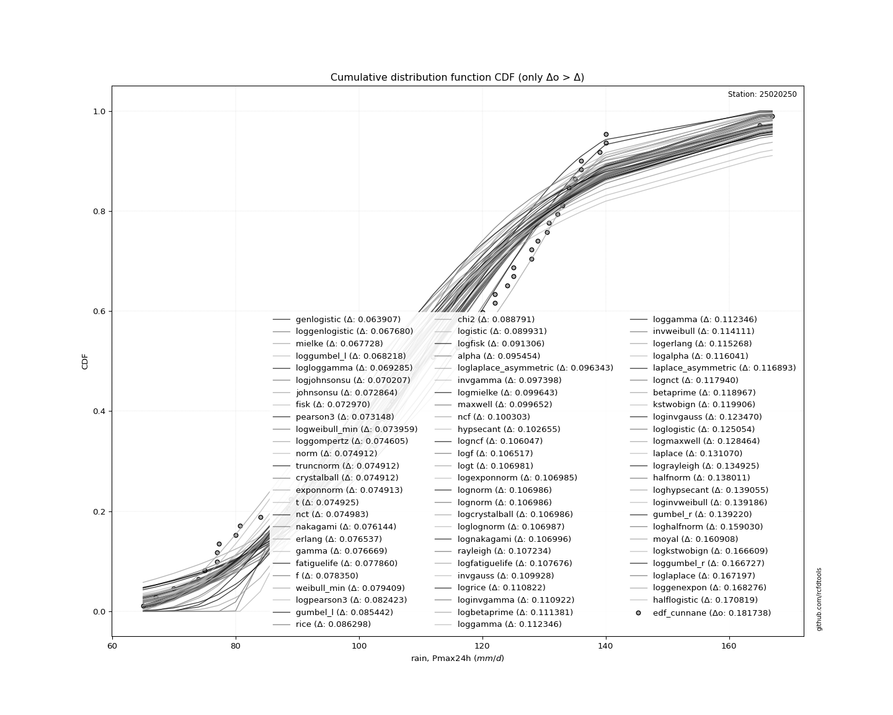</img>

</div>


**11.3. Best fit**

<div align="center">

|   id |   station | empirical_dist   | p_dist      |     delta |   deltao | eval   |   fit |   n |   best_fit |   best_fit_sort |
|-----:|----------:|:-----------------|:------------|----------:|---------:|:-------|------:|----:|-----------:|----------------:|
|    0 |  25020250 | edf_cunnane      | genlogistic | 0.0639072 | 0.181738 | Δo > Δ |     1 |  56 |          1 |               1 |

</div>


<div align="center">

</img></img>

</div>


### 12. Empirical - EDF Adamowski (1981)

The Adamowski formula in hydrology refers to a specific plotting position formula used for estimating the non-parametric empirical distribution of hydrological events (like flood peaks) to calculate their return periods. This formula provides an alternative to traditional parametric methods (like the Gumbel or Log Pearson Type III distributions). 

<div align="center">


$P=(m-0.25)/(n+0.5)$


</div>


**12.1. Empirical values**

<div align="center">

|                | 0                   | 1                    | 2                    | 3                   | 4                  | 5                   | 6                   | 7                   | 8                   | 9                   | 10                 | 11                 | 12                  | 13                  | 14                 | 15                  | 16                  | 17                 | 18                  | 19                 | 20                 | 21                  | 22                 | 23                  | 24                  | 25                 | 26                  | 27                 | 28                 | 29                 | 30                 | 31                 | 32                 | 33                 | 34                 | 35                 | 36                 | 37                 | 38                 | 39                 | 40                 | 41                 | 42                 | 43                 | 44                 | 45                 | 46                | 47                 | 48                 | 49                 | 50                 | 51                | 52                 | 53                 | 54                 | 55                 |
|:---------------|:--------------------|:---------------------|:---------------------|:--------------------|:-------------------|:--------------------|:--------------------|:--------------------|:--------------------|:--------------------|:-------------------|:-------------------|:--------------------|:--------------------|:-------------------|:--------------------|:--------------------|:-------------------|:--------------------|:-------------------|:-------------------|:--------------------|:-------------------|:--------------------|:--------------------|:-------------------|:--------------------|:-------------------|:-------------------|:-------------------|:-------------------|:-------------------|:-------------------|:-------------------|:-------------------|:-------------------|:-------------------|:-------------------|:-------------------|:-------------------|:-------------------|:-------------------|:-------------------|:-------------------|:-------------------|:-------------------|:------------------|:-------------------|:-------------------|:-------------------|:-------------------|:------------------|:-------------------|:-------------------|:-------------------|:-------------------|
| date           | 1989                | 2021                 | 1975                 | 1982                | 1976               | 1974                | 1985                | 2004                | 2008                | 2015                | 2009               | 2001               | 1972                | 1986                | 2014               | 1994                | 1996                | 1991               | 2003                | 1997               | 1969               | 2016                | 1998               | 2005                | 1984                | 2017               | 1977                | 1964               | 2012               | 2022               | 1965               | 2013               | 1999               | 1990               | 1981               | 1992               | 1966               | 1995               | 1979               | 1971               | 1988               | 1980               | 2011               | 2006               | 2010               | 1973               | 1983              | 1987               | 1968               | 2007               | 1963               | 2002              | 1970               | 1993               | 2000               | 1978               |
| x              | 65.0                | 67.0                 | 70.0                 | 74.0                | 75.0               | 77.0                | 77.0                | 77.3                | 80.0                | 80.7                | 84.0               | 88.6               | 89.0                | 91.0                | 92.7               | 98.0                | 100.0               | 100.0              | 102.5               | 102.9              | 104.0              | 104.0               | 104.4              | 105.3               | 106.0               | 107.1              | 109.0               | 109.40178571428571 | 112.0              | 116.0              | 118.0              | 119.0              | 119.5              | 120.0              | 122.0              | 122.0              | 124.0              | 125.0              | 125.0              | 128.0              | 128.0              | 129.0              | 130.5              | 130.8              | 132.2              | 133.0              | 134.0             | 134.0              | 135.0              | 136.0              | 136.0              | 139.0             | 140.0              | 140.0              | 165.0              | 167.0              |
| m              | 1                   | 2                    | 3                    | 4                   | 5                  | 6                   | 7                   | 8                   | 9                   | 10                  | 11                 | 12                 | 13                  | 14                  | 15                 | 16                  | 17                  | 18                 | 19                  | 20                 | 21                 | 22                  | 23                 | 24                  | 25                  | 26                 | 27                  | 28                 | 29                 | 30                 | 31                 | 32                 | 33                 | 34                 | 35                 | 36                 | 37                 | 38                 | 39                 | 40                 | 41                 | 42                 | 43                 | 44                 | 45                 | 46                 | 47                | 48                 | 49                 | 50                 | 51                 | 52                | 53                 | 54                 | 55                 | 56                 |
| empirical_dist | edf_adamowski       | edf_adamowski        | edf_adamowski        | edf_adamowski       | edf_adamowski      | edf_adamowski       | edf_adamowski       | edf_adamowski       | edf_adamowski       | edf_adamowski       | edf_adamowski      | edf_adamowski      | edf_adamowski       | edf_adamowski       | edf_adamowski      | edf_adamowski       | edf_adamowski       | edf_adamowski      | edf_adamowski       | edf_adamowski      | edf_adamowski      | edf_adamowski       | edf_adamowski      | edf_adamowski       | edf_adamowski       | edf_adamowski      | edf_adamowski       | edf_adamowski      | edf_adamowski      | edf_adamowski      | edf_adamowski      | edf_adamowski      | edf_adamowski      | edf_adamowski      | edf_adamowski      | edf_adamowski      | edf_adamowski      | edf_adamowski      | edf_adamowski      | edf_adamowski      | edf_adamowski      | edf_adamowski      | edf_adamowski      | edf_adamowski      | edf_adamowski      | edf_adamowski      | edf_adamowski     | edf_adamowski      | edf_adamowski      | edf_adamowski      | edf_adamowski      | edf_adamowski     | edf_adamowski      | edf_adamowski      | edf_adamowski      | edf_adamowski      |
| empirical      | 0.01327433628318584 | 0.030973451327433628 | 0.048672566371681415 | 0.06637168141592921 | 0.084070796460177  | 0.10176991150442478 | 0.11946902654867257 | 0.13716814159292035 | 0.15486725663716813 | 0.17256637168141592 | 0.1902654867256637 | 0.2079646017699115 | 0.22566371681415928 | 0.24336283185840707 | 0.2610619469026549 | 0.27876106194690264 | 0.29646017699115046 | 0.3141592920353982 | 0.33185840707964603 | 0.3495575221238938 | 0.3672566371681416 | 0.38495575221238937 | 0.4026548672566372 | 0.42035398230088494 | 0.43805309734513276 | 0.4557522123893805 | 0.47345132743362833 | 0.4911504424778761 | 0.5088495575221239 | 0.5265486725663717 | 0.5442477876106194 | 0.5619469026548672 | 0.5796460176991151 | 0.5973451327433629 | 0.6150442477876106 | 0.6327433628318584 | 0.6504424778761062 | 0.668141592920354  | 0.6858407079646017 | 0.7035398230088495 | 0.7212389380530974 | 0.7389380530973452 | 0.7566371681415929 | 0.7743362831858407 | 0.7920353982300885 | 0.8097345132743363 | 0.827433628318584 | 0.8451327433628318 | 0.8628318584070797 | 0.8805309734513275 | 0.8982300884955752 | 0.915929203539823 | 0.9336283185840708 | 0.9513274336283186 | 0.9690265486725663 | 0.9867256637168141 |
| empirical_tr   | 1.0134529147982063  | 1.0319634703196348   | 1.0511627906976744   | 1.0710900473933649  | 1.0917874396135265 | 1.1133004926108374  | 1.135678391959799   | 1.1589743589743589  | 1.1832460732984293  | 1.2085561497326203  | 1.2349726775956285 | 1.2625698324022345 | 1.2914285714285714  | 1.3216374269005848  | 1.353293413173653  | 1.3865030674846626  | 1.4213836477987423  | 1.4580645161290322 | 1.4966887417218542  | 1.5374149659863945 | 1.5804195804195804 | 1.6258992805755397  | 1.6740740740740743 | 1.7251908396946565  | 1.779527559055118   | 1.8373983739837396 | 1.8991596638655461  | 1.9652173913043478 | 2.036036036036036  | 2.1121495327102804 | 2.1941747572815533 | 2.282828282828283  | 2.378947368421053  | 2.4835164835164836 | 2.597701149425287  | 2.72289156626506   | 2.8607594936708862 | 3.0133333333333336 | 3.1830985915492955 | 3.373134328358209  | 3.5873015873015874 | 3.8305084745762716 | 4.1090909090909085 | 4.431372549019607  | 4.808510638297872  | 5.255813953488373  | 5.794871794871793 | 6.457142857142856  | 7.290322580645162  | 8.370370370370374  | 9.826086956521735  | 11.89473684210526 | 15.066666666666668 | 20.54545454545456  | 32.285714285714235 | 75.33333333333321  |

</div>


**12.2. Kolmogorov-Smirnov fit test (sorted by Δ)**


<div align="center">

|                | 0                   | 1                   | 2                   | 3                   | 4                   | 5                   | 6                   | 7                   | 8                   | 9                   | 10                  | 11                  | 12                  | 13                  | 14                  | 15                 | 16                  | 17                  | 18                  | 19                  | 20                  | 21                  | 22                  | 23                  | 24                  | 25                  | 26                  | 27                  | 28                  | 29                  | 30                    | 31                  | 32                 | 33                  | 34                  | 35                  | 36                  | 37                  | 38                 | 39                  | 40                  | 41                  | 42                  | 43                  | 44                  | 45                  | 46                  | 47                  | 48                 | 49                  | 50                  | 51                  | 52                  | 53                  | 54                  | 55                  | 56                 | 57                  | 58                 | 59                  | 60                  | 61                 | 62                  | 63                  | 64                  | 65                  | 66                  | 67                  | 68                 | 69                  | 70                  | 71                  | 72                  | 73                  | 74                  | 75                  | 76                  | 77                 | 78                  | 79                  | 80                 | 81                  | 82                  | 83                 | 84                 | 85                 | 86                  | 87                 |
|:---------------|:--------------------|:--------------------|:--------------------|:--------------------|:--------------------|:--------------------|:--------------------|:--------------------|:--------------------|:--------------------|:--------------------|:--------------------|:--------------------|:--------------------|:--------------------|:-------------------|:--------------------|:--------------------|:--------------------|:--------------------|:--------------------|:--------------------|:--------------------|:--------------------|:--------------------|:--------------------|:--------------------|:--------------------|:--------------------|:--------------------|:----------------------|:--------------------|:-------------------|:--------------------|:--------------------|:--------------------|:--------------------|:--------------------|:-------------------|:--------------------|:--------------------|:--------------------|:--------------------|:--------------------|:--------------------|:--------------------|:--------------------|:--------------------|:-------------------|:--------------------|:--------------------|:--------------------|:--------------------|:--------------------|:--------------------|:--------------------|:-------------------|:--------------------|:-------------------|:--------------------|:--------------------|:-------------------|:--------------------|:--------------------|:--------------------|:--------------------|:--------------------|:--------------------|:-------------------|:--------------------|:--------------------|:--------------------|:--------------------|:--------------------|:--------------------|:--------------------|:--------------------|:-------------------|:--------------------|:--------------------|:-------------------|:--------------------|:--------------------|:-------------------|:-------------------|:-------------------|:--------------------|:-------------------|
| station        | 25020250            | 25020250            | 25020250            | 25020250            | 25020250            | 25020250            | 25020250            | 25020250            | 25020250            | 25020250            | 25020250            | 25020250            | 25020250            | 25020250            | 25020250            | 25020250           | 25020250            | 25020250            | 25020250            | 25020250            | 25020250            | 25020250            | 25020250            | 25020250            | 25020250            | 25020250            | 25020250            | 25020250            | 25020250            | 25020250            | 25020250              | 25020250            | 25020250           | 25020250            | 25020250            | 25020250            | 25020250            | 25020250            | 25020250           | 25020250            | 25020250            | 25020250            | 25020250            | 25020250            | 25020250            | 25020250            | 25020250            | 25020250            | 25020250           | 25020250            | 25020250            | 25020250            | 25020250            | 25020250            | 25020250            | 25020250            | 25020250           | 25020250            | 25020250           | 25020250            | 25020250            | 25020250           | 25020250            | 25020250            | 25020250            | 25020250            | 25020250            | 25020250            | 25020250           | 25020250            | 25020250            | 25020250            | 25020250            | 25020250            | 25020250            | 25020250            | 25020250            | 25020250           | 25020250            | 25020250            | 25020250           | 25020250            | 25020250            | 25020250           | 25020250           | 25020250           | 25020250            | 25020250           |
| empirical_dist | edf_adamowski       | edf_adamowski       | edf_adamowski       | edf_adamowski       | edf_adamowski       | edf_adamowski       | edf_adamowski       | edf_adamowski       | edf_adamowski       | edf_adamowski       | edf_adamowski       | edf_adamowski       | edf_adamowski       | edf_adamowski       | edf_adamowski       | edf_adamowski      | edf_adamowski       | edf_adamowski       | edf_adamowski       | edf_adamowski       | edf_adamowski       | edf_adamowski       | edf_adamowski       | edf_adamowski       | edf_adamowski       | edf_adamowski       | edf_adamowski       | edf_adamowski       | edf_adamowski       | edf_adamowski       | edf_adamowski         | edf_adamowski       | edf_adamowski      | edf_adamowski       | edf_adamowski       | edf_adamowski       | edf_adamowski       | edf_adamowski       | edf_adamowski      | edf_adamowski       | edf_adamowski       | edf_adamowski       | edf_adamowski       | edf_adamowski       | edf_adamowski       | edf_adamowski       | edf_adamowski       | edf_adamowski       | edf_adamowski      | edf_adamowski       | edf_adamowski       | edf_adamowski       | edf_adamowski       | edf_adamowski       | edf_adamowski       | edf_adamowski       | edf_adamowski      | edf_adamowski       | edf_adamowski      | edf_adamowski       | edf_adamowski       | edf_adamowski      | edf_adamowski       | edf_adamowski       | edf_adamowski       | edf_adamowski       | edf_adamowski       | edf_adamowski       | edf_adamowski      | edf_adamowski       | edf_adamowski       | edf_adamowski       | edf_adamowski       | edf_adamowski       | edf_adamowski       | edf_adamowski       | edf_adamowski       | edf_adamowski      | edf_adamowski       | edf_adamowski       | edf_adamowski      | edf_adamowski       | edf_adamowski       | edf_adamowski      | edf_adamowski      | edf_adamowski      | edf_adamowski       | edf_adamowski      |
| p_dist         | genlogistic         | loggenlogistic      | mielke              | logloggamma         | loggumbel_l         | logjohnsonsu        | johnsonsu           | fisk                | pearson3            | logweibull_min      | loggompertz         | norm                | truncnorm           | crystalball         | exponnorm           | t                  | nct                 | nakagami            | erlang              | gamma               | fatiguelife         | f                   | weibull_min         | logpearson3         | gumbel_l            | rice                | logfisk             | chi2                | logistic            | alpha               | loglaplace_asymmetric | invgamma            | maxwell            | ncf                 | logmielke           | hypsecant           | logncf              | logf                | logt               | logexponnorm        | lognorm             | lognorm             | logcrystalball      | loglognorm          | lognakagami         | rayleigh            | logfatiguelife      | invgauss            | logrice            | loginvgamma         | logbetaprime        | loggamma            | loggamma            | invweibull          | logerlang           | logalpha            | laplace_asymmetric | lognct              | betaprime          | kstwobign           | loginvgauss         | loglogistic        | logmaxwell          | laplace             | lograyleigh         | loginvweibull       | loghypsecant        | gumbel_r            | halfnorm           | loghalfnorm         | moyal               | logkstwobign        | loggumbel_r         | loggenexpon         | loglaplace          | halflogistic        | loghalflogistic     | logmoyal           | wald                | genexpon            | expon              | logwald             | gibrat              | loggibrat          | logexpon           | logchi2            | logtruncnorm        | gompertz           |
| delta          | 0.06565509185186338 | 0.06791621490664052 | 0.06796412296710574 | 0.06952142293640395 | 0.06996549883074336 | 0.07044284143343926 | 0.07309990323831994 | 0.07320610346632694 | 0.07338413992765103 | 0.07419527716649588 | 0.07484075073513885 | 0.07514864165792201 | 0.07514864346277039 | 0.07514864947905364 | 0.07514872684848051 | 0.0751614718935697 | 0.07521952384214436 | 0.07638056376298108 | 0.07677282877785796 | 0.07690526170726253 | 0.07809664619179746 | 0.07858580212344923 | 0.07964551102419237 | 0.08265913563887317 | 0.08567830307849073 | 0.08653372471752463 | 0.08889667114649813 | 0.08902737889517409 | 0.09016763659064386 | 0.09569037266546598 | 0.09639037230197434   | 0.09763400438542302 | 0.0998882536486202 | 0.10053891650464575 | 0.10072936895924689 | 0.10298518753606223 | 0.10628309297767602 | 0.10675312851890995 | 0.1072169350377733 | 0.10722141827742915 | 0.10722190612197102 | 0.10722190612197102 | 0.10722190786733243 | 0.10722368232366197 | 0.10723233047287961 | 0.10747053106507254 | 0.10791249853611062 | 0.11016401355340844 | 0.1110580400827863 | 0.11115801327627117 | 0.11161685533647125 | 0.11258210997620965 | 0.11258210997620965 | 0.11434695300251585 | 0.11550404895924704 | 0.11627718239561136 | 0.117128907249474  | 0.11817662418269037 | 0.1192035920095823 | 0.12014264635878269 | 0.12370582756319737 | 0.1252902587879302 | 0.12870004982213845 | 0.13140063801304092 | 0.13516155147849707 | 0.13828809600108177 | 0.13929103882369398 | 0.13945594983640597 | 0.1397590916791197 | 0.15813241001724826 | 0.16114458772794749 | 0.16571110339723544 | 0.16696347141667311 | 0.16718983952995292 | 0.16743337275725512 | 0.17256637168141592 | 0.18202785128280208 | 0.1867179454963811 | 0.22317578293694035 | 0.23733160642987594 | 0.238371240409869  | 0.24275092502832774 | 0.26101853601476616 | 0.2749622598848841 | 0.2756827136916016 | 0.3568143022610235 | 0.39074293559275086 | 0.7764130018888722 |
| deltao         | 0.1817376445004486  | 0.1817376445004486  | 0.1817376445004486  | 0.1817376445004486  | 0.1817376445004486  | 0.1817376445004486  | 0.1817376445004486  | 0.1817376445004486  | 0.1817376445004486  | 0.1817376445004486  | 0.1817376445004486  | 0.1817376445004486  | 0.1817376445004486  | 0.1817376445004486  | 0.1817376445004486  | 0.1817376445004486 | 0.1817376445004486  | 0.1817376445004486  | 0.1817376445004486  | 0.1817376445004486  | 0.1817376445004486  | 0.1817376445004486  | 0.1817376445004486  | 0.1817376445004486  | 0.1817376445004486  | 0.1817376445004486  | 0.1817376445004486  | 0.1817376445004486  | 0.1817376445004486  | 0.1817376445004486  | 0.1817376445004486    | 0.1817376445004486  | 0.1817376445004486 | 0.1817376445004486  | 0.1817376445004486  | 0.1817376445004486  | 0.1817376445004486  | 0.1817376445004486  | 0.1817376445004486 | 0.1817376445004486  | 0.1817376445004486  | 0.1817376445004486  | 0.1817376445004486  | 0.1817376445004486  | 0.1817376445004486  | 0.1817376445004486  | 0.1817376445004486  | 0.1817376445004486  | 0.1817376445004486 | 0.1817376445004486  | 0.1817376445004486  | 0.1817376445004486  | 0.1817376445004486  | 0.1817376445004486  | 0.1817376445004486  | 0.1817376445004486  | 0.1817376445004486 | 0.1817376445004486  | 0.1817376445004486 | 0.1817376445004486  | 0.1817376445004486  | 0.1817376445004486 | 0.1817376445004486  | 0.1817376445004486  | 0.1817376445004486  | 0.1817376445004486  | 0.1817376445004486  | 0.1817376445004486  | 0.1817376445004486 | 0.1817376445004486  | 0.1817376445004486  | 0.1817376445004486  | 0.1817376445004486  | 0.1817376445004486  | 0.1817376445004486  | 0.1817376445004486  | 0.1817376445004486  | 0.1817376445004486 | 0.1817376445004486  | 0.1817376445004486  | 0.1817376445004486 | 0.1817376445004486  | 0.1817376445004486  | 0.1817376445004486 | 0.1817376445004486 | 0.1817376445004486 | 0.1817376445004486  | 0.1817376445004486 |
| eval           | Δo > Δ              | Δo > Δ              | Δo > Δ              | Δo > Δ              | Δo > Δ              | Δo > Δ              | Δo > Δ              | Δo > Δ              | Δo > Δ              | Δo > Δ              | Δo > Δ              | Δo > Δ              | Δo > Δ              | Δo > Δ              | Δo > Δ              | Δo > Δ             | Δo > Δ              | Δo > Δ              | Δo > Δ              | Δo > Δ              | Δo > Δ              | Δo > Δ              | Δo > Δ              | Δo > Δ              | Δo > Δ              | Δo > Δ              | Δo > Δ              | Δo > Δ              | Δo > Δ              | Δo > Δ              | Δo > Δ                | Δo > Δ              | Δo > Δ             | Δo > Δ              | Δo > Δ              | Δo > Δ              | Δo > Δ              | Δo > Δ              | Δo > Δ             | Δo > Δ              | Δo > Δ              | Δo > Δ              | Δo > Δ              | Δo > Δ              | Δo > Δ              | Δo > Δ              | Δo > Δ              | Δo > Δ              | Δo > Δ             | Δo > Δ              | Δo > Δ              | Δo > Δ              | Δo > Δ              | Δo > Δ              | Δo > Δ              | Δo > Δ              | Δo > Δ             | Δo > Δ              | Δo > Δ             | Δo > Δ              | Δo > Δ              | Δo > Δ             | Δo > Δ              | Δo > Δ              | Δo > Δ              | Δo > Δ              | Δo > Δ              | Δo > Δ              | Δo > Δ             | Δo > Δ              | Δo > Δ              | Δo > Δ              | Δo > Δ              | Δo > Δ              | Δo > Δ              | Δo > Δ              | Δo <= Δ             | Δo <= Δ            | Δo <= Δ             | Δo <= Δ             | Δo <= Δ            | Δo <= Δ             | Δo <= Δ             | Δo <= Δ            | Δo <= Δ            | Δo <= Δ            | Δo <= Δ             | Δo <= Δ            |
| fit            | 1                   | 1                   | 1                   | 1                   | 1                   | 1                   | 1                   | 1                   | 1                   | 1                   | 1                   | 1                   | 1                   | 1                   | 1                   | 1                  | 1                   | 1                   | 1                   | 1                   | 1                   | 1                   | 1                   | 1                   | 1                   | 1                   | 1                   | 1                   | 1                   | 1                   | 1                     | 1                   | 1                  | 1                   | 1                   | 1                   | 1                   | 1                   | 1                  | 1                   | 1                   | 1                   | 1                   | 1                   | 1                   | 1                   | 1                   | 1                   | 1                  | 1                   | 1                   | 1                   | 1                   | 1                   | 1                   | 1                   | 1                  | 1                   | 1                  | 1                   | 1                   | 1                  | 1                   | 1                   | 1                   | 1                   | 1                   | 1                   | 1                  | 1                   | 1                   | 1                   | 1                   | 1                   | 1                   | 1                   | 0                   | 0                  | 0                   | 0                   | 0                  | 0                   | 0                   | 0                  | 0                  | 0                  | 0                   | 0                  |
| n              | 56                  | 56                  | 56                  | 56                  | 56                  | 56                  | 56                  | 56                  | 56                  | 56                  | 56                  | 56                  | 56                  | 56                  | 56                  | 56                 | 56                  | 56                  | 56                  | 56                  | 56                  | 56                  | 56                  | 56                  | 56                  | 56                  | 56                  | 56                  | 56                  | 56                  | 56                    | 56                  | 56                 | 56                  | 56                  | 56                  | 56                  | 56                  | 56                 | 56                  | 56                  | 56                  | 56                  | 56                  | 56                  | 56                  | 56                  | 56                  | 56                 | 56                  | 56                  | 56                  | 56                  | 56                  | 56                  | 56                  | 56                 | 56                  | 56                 | 56                  | 56                  | 56                 | 56                  | 56                  | 56                  | 56                  | 56                  | 56                  | 56                 | 56                  | 56                  | 56                  | 56                  | 56                  | 56                  | 56                  | 56                  | 56                 | 56                  | 56                  | 56                 | 56                  | 56                  | 56                 | 56                 | 56                 | 56                  | 56                 |
| best_fit       | 1                   | 0                   | 0                   | 0                   | 0                   | 0                   | 0                   | 0                   | 0                   | 0                   | 0                   | 0                   | 0                   | 0                   | 0                   | 0                  | 0                   | 0                   | 0                   | 0                   | 0                   | 0                   | 0                   | 0                   | 0                   | 0                   | 0                   | 0                   | 0                   | 0                   | 0                     | 0                   | 0                  | 0                   | 0                   | 0                   | 0                   | 0                   | 0                  | 0                   | 0                   | 0                   | 0                   | 0                   | 0                   | 0                   | 0                   | 0                   | 0                  | 0                   | 0                   | 0                   | 0                   | 0                   | 0                   | 0                   | 0                  | 0                   | 0                  | 0                   | 0                   | 0                  | 0                   | 0                   | 0                   | 0                   | 0                   | 0                   | 0                  | 0                   | 0                   | 0                   | 0                   | 0                   | 0                   | 0                   | 0                   | 0                  | 0                   | 0                   | 0                  | 0                   | 0                   | 0                  | 0                  | 0                  | 0                   | 0                  |
| best_fit_sort  | 1                   | 2                   | 3                   | 4                   | 5                   | 6                   | 7                   | 8                   | 9                   | 10                  | 11                  | 12                  | 13                  | 14                  | 15                  | 16                 | 17                  | 18                  | 19                  | 20                  | 21                  | 22                  | 23                  | 24                  | 25                  | 26                  | 27                  | 28                  | 29                  | 30                  | 31                    | 32                  | 33                 | 34                  | 35                  | 36                  | 37                  | 38                  | 39                 | 40                  | 41                  | 42                  | 43                  | 44                  | 45                  | 46                  | 47                  | 48                  | 49                 | 50                  | 51                  | 52                  | 53                  | 54                  | 55                  | 56                  | 57                 | 58                  | 59                 | 60                  | 61                  | 62                 | 63                  | 64                  | 65                  | 66                  | 67                  | 68                  | 69                 | 70                  | 71                  | 72                  | 73                  | 74                  | 75                  | 76                  | 77                  | 78                 | 79                  | 80                  | 81                 | 82                  | 83                  | 84                 | 85                 | 86                 | 87                  | 88                 |

</div>


<div align="center">

</img>

</div>


**12.3. Best fit**

<div align="center">

|   id |   station | empirical_dist   | p_dist      |     delta |   deltao | eval   |   fit |   n |   best_fit |   best_fit_sort |
|-----:|----------:|:-----------------|:------------|----------:|---------:|:-------|------:|----:|-----------:|----------------:|
|    0 |  25020250 | edf_adamowski    | genlogistic | 0.0656551 | 0.181738 | Δo > Δ |     1 |  56 |          1 |               1 |

</div>


<div align="center">

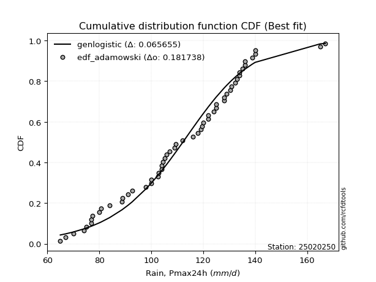</img>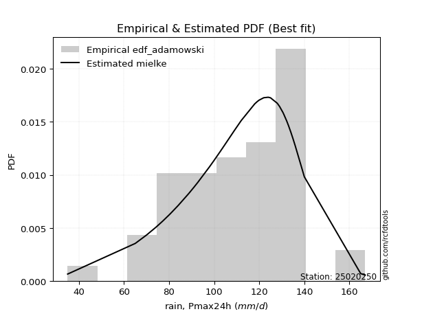</img>

</div>


## C. Best fit & Estimate extreme values for specific return periods - Tr


### 1. Best fit (ordered by delta Δ)

<div align="center">

|   id |   station | empirical_dist   | p_dist         |     delta |   deltao | eval   |   fit |   n |   best_fit |   best_fit_sort |
|-----:|----------:|:-----------------|:---------------|----------:|---------:|:-------|------:|----:|-----------:|----------------:|
|    0 |  25020250 | edf_hazen        | genlogistic    | 0.0627316 | 0.181738 | Δo > Δ |     1 |  56 |          1 |               1 |
|    1 |  25020250 | edf_gringorten   | genlogistic    | 0.063438  | 0.181738 | Δo > Δ |     1 |  56 |          1 |               2 |
|    2 |  25020250 | edf_cunnane      | genlogistic    | 0.0639072 | 0.181738 | Δo > Δ |     1 |  56 |          1 |               3 |
|    3 |  25020250 | edf_blom         | genlogistic    | 0.0641998 | 0.181738 | Δo > Δ |     1 |  56 |          1 |               4 |
|    4 |  25020250 | edf_tukey        | genlogistic    | 0.0646864 | 0.181738 | Δo > Δ |     1 |  56 |          1 |               5 |
|    5 |  25020250 | edf_filliben     | genlogistic    | 0.0648709 | 0.181738 | Δo > Δ |     1 |  56 |          1 |               6 |
|    6 |  25020250 | edf_beard        | genlogistic    | 0.0649582 | 0.181738 | Δo > Δ |     1 |  56 |          1 |               7 |
|    7 |  25020250 | edf_jenkinson    | genlogistic    | 0.0649582 | 0.181738 | Δo > Δ |     1 |  56 |          1 |               8 |
|    8 |  25020250 | edf_chegodayev   | genlogistic    | 0.0650745 | 0.181738 | Δo > Δ |     1 |  56 |          1 |               9 |
|    9 |  25020250 | edf_adamowski    | genlogistic    | 0.0656551 | 0.181738 | Δo > Δ |     1 |  56 |          1 |              10 |
|   10 |  25020250 | edf_weibull      | loggenlogistic | 0.0683044 | 0.181738 | Δo > Δ |     1 |  56 |          1 |              11 |
|   11 |  25020250 | edf_california   | genlogistic    | 0.0716601 | 0.181738 | Δo > Δ |     1 |  56 |          1 |              12 |

</div>

:file_folder:Tables: [bestfit_25020250.csv](table/bestfit_25020250.csv) | [extreme_25020250.csv](table/extreme_25020250.csv)


### 2. Extreme values

In hydrology, a return period (or recurrence interval $Tr$) is the statistical average time between extreme events like floods or droughts of a specific magnitude, indicating how rare an event is, with a 100-year flood, for example, having a 1% chance of occurring in any given year, not that it happens exactly every century. It is a key tool for infrastructure design (like bridges or dams) and risk assessment, calculated from historical data to determine the probability of future events, although it is important to remember it is statistical average, and events can cluster or be missed.

> risk_rate: assuming the return period as the project useful life.

|   id |      tr |   prob_l |     prob_g |   alpha |   betaprime |    chi2 |   crystalball |   erlang |    expon |   exponnorm |       f |   fatiguelife |    fisk |   gamma |   genexpon |   genlogistic |   gibrat |   gompertz |   gumbel_l |   gumbel_r |   halflogistic |   halfnorm |   hypsecant |   invgamma |   invgauss |   invweibull |   johnsonsu |   kstwobign |   laplace |   laplace_asymmetric |   loggamma |   logistic |   lognorm |   maxwell |   mielke |   moyal |   nakagami |     ncf |     nct |    norm |   pearson3 |   rayleigh |    rice |       t |   truncnorm |    wald |   weibull_min |   logalpha |   logbetaprime |          logchi2 |   logcrystalball |   logerlang |   logexpon |   logexponnorm |    logf |   logfatiguelife |   logfisk |   loggenexpon |   loggenlogistic |   loggibrat |   loggompertz |   loggumbel_l |   loggumbel_r |   loghalflogistic |   loghalfnorm |   loghypsecant |   loginvgamma |   loginvgauss |   loginvweibull |   logjohnsonsu |   logkstwobign |   loglaplace |   loglaplace_asymmetric |   logloggamma |   loglogistic |   loglognorm |   logmaxwell |   logmielke |   logmoyal |   lognakagami |   logncf |   lognct |   logpearson3 |   lograyleigh |   logrice |    logt |   logtruncnorm |   logwald |   logweibull_min |   station |   n |   risk_rate |
|-----:|--------:|---------:|-----------:|--------:|------------:|--------:|--------------:|---------:|---------:|------------:|--------:|--------------:|--------:|--------:|-----------:|--------------:|---------:|-----------:|-----------:|-----------:|---------------:|-----------:|------------:|-----------:|-----------:|-------------:|------------:|------------:|----------:|---------------------:|-----------:|-----------:|----------:|----------:|---------:|--------:|-----------:|--------:|--------:|--------:|-----------:|-----------:|--------:|--------:|------------:|--------:|--------------:|-----------:|---------------:|-----------------:|-----------------:|------------:|-----------:|---------------:|--------:|-----------------:|----------:|--------------:|-----------------:|------------:|--------------:|--------------:|--------------:|------------------:|--------------:|---------------:|--------------:|--------------:|----------------:|---------------:|---------------:|-------------:|------------------------:|--------------:|--------------:|-------------:|-------------:|------------:|-----------:|--------------:|---------:|---------:|--------------:|--------------:|----------:|--------:|---------------:|----------:|-----------------:|----------:|----:|------------:|
|    0 |    2    | 0.5      | 0.5        | 109.172 |     107.355 | 109.594 |       110.73  |  110.615 |  96.6979 |     110.73  | 110.469 |       110.544 | 111.278 | 110.605 |    96.8303 |       112.161 |  103.55  |    145.865 |    114.66  |    106.8   |        104.847 |    105.834 |     110.73  |    109.016 |    107.299 |      106.666 |     110.874 |     105.831 |   110.73  |              109.884 |    107.305 |    110.73  |   108.014 |   108.684 |  113.965 | 105.532 |    110.643 | 108.786 | 110.726 | 110.73  |    110.852 |    107.959 | 109.63  | 110.73  |     110.73  | 102.976 |       110.205 |    107.145 |        107.268 |    109.214       |          108.014 |     107.227 |    92.4269 |        108.014 | 108.034 |          107.942 |   109.806 |       102.57  |          113.964 |     100.896 |       110.274 |       112.121 |       104.057 |           102.145 |       103.107 |        108.014 |       107.594 |       106.131 |         104.561 |        110.907 |        102.673 |      108.014 |                 116.639 |       111.031 |       108.014 |      108.014 |      105.936 |     110.471 |    102.811 |       107.994 |  108.041 |  107.025 |       109.921 |       105.209 |   107.483 | 108.014 |        85.3931 |   100.347 |          110.692 |  25020250 |  56 |    0.75     |
|    1 |    2.33 | 0.570815 | 0.429185   | 113.521 |     111.735 | 113.97  |       114.999 |  114.889 | 103.682  |     114.999 | 114.759 |       114.808 | 115.282 | 114.88  |   103.748  |       116.065 |  105.712 |    147.038 |    118.374 |    110.756 |        108.914 |    110.441 |     114.147 |    113.38  |    111.981 |      111.41  |     115.137 |     110.738 |   113.314 |              113.064 |    111.884 |    114.491 |   112.482 |   113.119 |  117.914 | 109.276 |    114.916 | 113.157 | 114.995 | 114.999 |    115.117 |    112.459 | 114.082 | 114.998 |     114.999 | 105.775 |       114.605 |    111.668 |        111.883 |    130.586       |          112.482 |     111.748 |    99.8811 |        112.482 | 112.507 |          112.418 |   114.03  |       107.948 |          117.914 |     102.989 |       114.833 |       116.145 |       108.04  |           106.166 |       107.717 |        111.575 |       112.099 |       110.788 |         109.88  |        115.255 |        108.052 |      110.696 |                 120.903 |       115.339 |       111.941 |      112.482 |      110.492 |     114.576 |    106.533 |       112.47  |  112.524 |  111.529 |       114.356 |       109.802 |   112.045 | 112.482 |        90.1262 |   103.05  |          115.021 |  25020250 |  56 |    0.729209 |
|    2 |    5    | 0.8      | 0.2        | 130.542 |     129.645 | 130.79  |       130.863 |  130.836 | 138.6    |     130.863 | 130.811 |       130.786 | 130.743 | 130.829 |   138.336  |       130.605 |  118.162 |    150.829 |    130.372 |    127.941 |        127.315 |    129.924 |     127.85  |    130.399 |    131.216 |      132.024 |     130.903 |     131.582 |   126.229 |              128.966 |    131.045 |    129.014 |   130.768 |   130.575 |  130.995 | 126.621 |    130.84  | 130.347 | 130.86  | 130.863 |    130.898 |    130.477 | 130.979 | 130.862 |     130.863 | 121.444 |       131.007 |    130.67  |        131.379 |    367.142       |          130.768 |     130.611 |   147.198  |        130.768 | 130.834 |          130.765 |   131.918 |       132.478 |          130.996 |     115.91  |       131.392 |       130.16  |       127.189 |           126.438 |       129.606 |        127.08  |       130.877 |       130.955 |         136.313 |        131.178 |        134.226 |      125.14  |                 132.486 |       131.112 |       128.492 |      130.768 |      130.411 |     127.731 |    125.605 |       130.8   |  130.93  |  130.587 |       131.199 |       130.288 |   130.944 | 130.769 |       113.658  |   119.58  |          131.018 |  25020250 |  56 |    0.67232  |
|    3 |   10    | 0.9      | 0.1        | 142.642 |     143.113 | 142.438 |       141.387 |  141.469 | 170.298  |     141.387 | 141.556 |       141.502 | 142.129 | 141.464 |   169.734  |       140.963 |  132.353 |    152.939 |    137.052 |    141.937 |        142.597 |    144.341 |     138.793 |    142.427 |    145.69  |      148.814 |     141.298 |     147.452 |   137.954 |              143.402 |    145.891 |    139.709 |   144.511 |   142.86  |  139.254 | 141.721 |    141.442 | 142.594 | 141.386 | 141.387 |    141.307 |    143.324 | 142.389 | 141.385 |     141.387 | 138.073 |       141.796 |    145.483 |        146.679 |   1053.3         |          144.511 |     145.162 |   209.308  |        144.511 | 144.627 |          144.582 |   146.862 |       153.32  |          139.255 |     132.627 |       141.878 |       138.684 |       145.268 |           146.184 |       148.619 |        140.995 |       145.35  |       147.331 |         162.476 |        141.438 |        158.328 |      139.876 |                 138.414 |       141.329 |       142.226 |      144.511 |      146.546 |     135.122 |    144.971 |       144.588 |  144.823 |  145.594 |       142.56  |       147.191 |   145.334 | 144.512 |       132.427  |   140.031 |          141.485 |  25020250 |  56 |    0.651322 |
|    4 |   15    | 0.933333 | 0.0666667  | 148.943 |     150.365 | 148.398 |       146.638 |  146.792 | 188.84   |     146.638 | 146.947 |       146.885 | 148.332 | 146.788 |   188.1    |       146.539 |  142.141 |    153.895 |    140.077 |    149.834 |        151.246 |    151.843 |     145.038 |    148.664 |    153.461 |      158.286 |     146.466 |     155.877 |   144.812 |              151.846 |    154.03  |    145.536 |   151.9   |   149.163 |  143.556 | 150.485 |    146.744 | 148.963 | 146.639 | 146.638 |    146.484 |    149.944 | 148.124 | 146.637 |     146.638 | 148.752 |       147.125 |    153.642 |        155.136 |   2009.42        |          151.9   |     153.117 |   257.168  |        151.9   | 152.05  |          152.02  |   155.706 |       165.314 |          143.556 |     145.542 |       146.941 |       142.725 |       156.579 |           158.696 |       159.592 |        149.609 |       153.26  |       156.587 |         179.395 |        146.442 |        172.836 |      149.289 |                 141.993 |       146.348 |       150.318 |      151.9   |      155.585 |     138.735 |    157.551 |       152.005 |  152.313 |  153.914 |       148.244 |       156.738 |   153.125 | 151.901 |       141.295  |   154.972 |          146.654 |  25020250 |  56 |    0.644736 |
|    5 |   20    | 0.95     | 0.05       | 153.169 |     155.319 | 152.355 |       150.078 |  150.284 | 201.996  |     150.077 | 150.488 |       150.423 | 152.62  | 150.28  |   201.132  |       150.377 |  149.819 |    154.49  |    141.96  |    155.363 |        157.305 |    156.845 |     149.443 |    152.836 |    158.756 |      164.919 |     149.844 |     161.552 |   149.679 |              157.837 |    159.648 |    149.563 |   156.942 |   153.346 |  146.501 | 156.692 |    150.22  | 153.228 | 150.079 | 150.078 |    149.868 |    154.343 | 151.892 | 150.076 |     150.078 | 156.709 |       150.592 |    159.288 |        161     |   3207.97        |          156.942 |     158.599 |   297.626  |        156.942 | 157.118 |          157.1   |   162.127 |       173.802 |          146.5   |     156.548 |       150.195 |       145.3   |       165.019 |           168.095 |       167.355 |        156     |       158.71  |       163.088 |         192.279 |        149.672 |        183.351 |      156.349 |                 144.588 |       149.604 |       156.178 |      156.943 |      161.889 |     141.154 |    167.116 |       157.068 |  157.433 |  159.695 |       151.962 |       163.425 |   158.461 | 156.943 |       146.514  |   167.134 |          150.018 |  25020250 |  56 |    0.641514 |
|    6 |   25    | 0.96     | 0.04       | 156.332 |     159.075 | 155.296 |       152.609 |  152.858 | 212.2    |     152.609 | 153.099 |       153.034 | 155.9   | 152.854 |   211.24   |       153.305 |  156.22  |    154.913 |    143.3   |    159.622 |        161.973 |    160.567 |     152.853 |    155.953 |    162.759 |      170.028 |     152.327 |     165.803 |   153.453 |              162.485 |    163.935 |    152.644 |   160.761 |   156.451 |  148.752 | 161.503 |    152.781 | 156.416 | 152.612 | 152.609 |    152.356 |    157.612 | 154.671 | 152.607 |     152.609 | 163.083 |       153.131 |    163.606 |        165.491 |   4632.04        |          160.761 |     162.779 |   333.341  |        160.761 | 160.958 |          160.949 |   167.218 |       180.391 |          148.751 |     166.356 |       152.559 |       147.161 |       171.83  |           175.714 |       173.375 |        161.133 |       162.866 |       168.113 |         202.831 |        152.026 |        191.645 |      162.054 |                 146.634 |       151.987 |       160.814 |      160.761 |      166.734 |     142.983 |    174.927 |       160.903 |  161.315 |  164.13  |       154.695 |       168.576 |   162.511 | 160.762 |       149.962  |   177.56  |          152.484 |  25020250 |  56 |    0.639603 |
|    7 |   50    | 0.98     | 0.02       | 165.643 |     170.365 | 163.844 |       159.859 |  160.242 | 243.898  |     159.859 | 160.603 |       160.541 | 165.922 | 160.238 |   242.638  |       162.228 |  178.784 |    156.062 |    146.938 |    172.741 |        176.357 |    171.385 |     163.424 |    165.097 |    174.733 |      185.765 |     159.423 |     178.287 |   165.178 |              176.92  |    176.975 |    162.058 |   172.217 |   165.458 |  155.686 | 176.438 |    160.124 | 165.773 | 159.864 | 159.859 |    159.465 |    167.101 | 162.651 | 159.857 |     159.859 | 183.893 |       160.341 |    176.786 |        179.224 |  14797.3         |          172.217 |     175.466 |   473.995  |        172.217 | 172.487 |          172.507 |   183.783 |       200.974 |          155.683 |     206.096 |       159.183 |       152.332 |       194.626 |           201.431 |       192.129 |        178.146 |       175.478 |       183.726 |         239.115 |        158.644 |        218.23  |      181.138 |                 153.174 |       158.738 |       175.851 |      172.218 |      181.62  |     148.576 |    201.579 |       172.414 |  172.983 |  177.729 |       162.485 |       184.469 |   174.713 | 172.22  |       157.735  |   216.348 |          159.495 |  25020250 |  56 |    0.63583  |
|    8 |   75    | 0.986667 | 0.0133333  | 170.8   |     176.767 | 168.51  |       163.749 |  164.212 | 262.44   |     163.749 | 164.644 |       164.588 | 171.711 | 164.209 |   261.004  |       167.37  |  194.023 |    156.643 |    148.777 |    180.367 |        184.718 |    177.273 |     169.601 |    170.14  |    181.477 |      194.913 |     163.22  |     185.155 |   172.036 |              185.364 |    184.465 |    167.495 |   178.697 |   170.354 |  159.763 | 185.172 |    164.07  | 170.934 | 163.756 | 163.749 |    163.271 |    172.264 | 166.945 | 163.747 |     163.749 | 196.699 |       164.171 |    184.391 |        187.165 |  29528.6         |          178.697 |     182.739 |   582.378  |        178.697 | 179.012 |          179.052 |   194.088 |       213.145 |          159.76  |     238.179 |       162.651 |       155.016 |       209.241 |           218.076 |       203.177 |        188.909 |       182.707 |       192.92  |         263.118 |        162.119 |        234.398 |      193.327 |                 157.134 |       162.316 |       185.167 |      178.698 |      190.264 |     151.87  |    219.009 |       178.928 |  179.598 |  185.621 |       166.633 |       193.737 |   181.644 | 178.701 |       160.634  |   244.318 |          163.226 |  25020250 |  56 |    0.634587 |
|    9 |  100    | 0.99     | 0.01       | 174.355 |     181.242 | 171.698 |       166.38  |  166.901 | 275.596  |     166.38  | 167.383 |       167.332 | 175.797 | 166.899 |   274.035  |       170.997 |  205.829 |    157.023 |    149.98  |    185.764 |        190.636 |    181.285 |     173.983 |    173.608 |    186.168 |      201.387 |     165.785 |     189.861 |   176.902 |              191.356 |    189.74  |    171.333 |   183.218 |   173.69  |  162.685 | 191.368 |    166.741 | 174.481 | 166.388 | 166.38  |    165.841 |    175.781 | 169.854 | 166.378 |     166.38  | 206.036 |       166.746 |    189.76  |        192.779 |  48412.2         |          183.218 |     187.854 |   673.997  |        183.217 | 183.567 |          183.62  |   201.71  |       221.859 |          162.682 |     266.426 |       164.964 |       156.797 |       220.243 |           230.682 |       211.065 |        196.935 |       187.792 |       199.492 |         281.548 |        164.438 |        246.162 |      202.469 |                 160.006 |       164.72  |       192.041 |      183.219 |      196.387 |     154.246 |    232.281 |       183.473 |  184.219 |  191.212 |       169.422 |       200.315 |   186.491 | 183.222 |       162.151  |   266.964 |          165.738 |  25020250 |  56 |    0.633968 |
|   10 |  200    | 0.995    | 0.005      | 182.622 |     191.842 | 179.022 |       172.348 |  173.011 | 307.294  |     172.348 | 173.615 |       173.579 | 185.6   | 173.009 |   305.433  |       179.692 |  237.947 |    157.85  |    152.595 |    198.739 |        204.864 |    190.46  |     184.54  |    181.644 |    197.202 |      216.952 |     171.592 |     200.699 |   188.627 |              205.791 |    202.365 |    180.541 |   193.9   |   181.321 |  169.87  | 206.296 |    172.807 | 182.695 | 172.359 | 172.348 |    171.66  |    183.828 | 176.463 | 172.345 |     172.348 | 229.292 |       172.537 |    202.661 |        206.286 | 161228           |          193.9   |     200.074 |   958.392  |        193.9   | 194.337 |          194.425 |   221.235 |       243.165 |          169.866 |     361.412 |       170.112 |       160.74  |       249.121 |           264.051 |       230.277 |        217.699 |       199.942 |       215.551 |         331.314 |        169.603 |        275.553 |      226.313 |                 167.142 |       170.12  |       209.588 |      193.902 |      211.144 |     160.163 |    267.655 |       194.217 |  195.158 |  204.712 |       175.692 |       216.221 |   197.984 | 193.907 |       164.517  |   332.924 |          171.4   |  25020250 |  56 |    0.633042 |
|   11 |  250    | 0.996    | 0.004      | 185.208 |     195.212 | 181.287 |       174.172 |  174.88  | 317.499  |     174.171 | 175.524 |       175.494 | 188.748 | 174.879 |   315.541  |       182.482 |  249.471 |    158.093 |    153.365 |    202.91  |        209.438 |    193.282 |     187.938 |    184.148 |    200.685 |      221.956 |     173.363 |     204.054 |   192.401 |              210.438 |    206.414 |    183.498 |   197.287 |   183.669 |  172.234 | 211.102 |    174.663 | 185.253 | 174.184 | 174.172 |    173.436 |    186.305 | 178.486 | 174.169 |     174.172 | 236.986 |       174.294 |    206.814 |        210.64  | 238220           |          197.287 |     203.988 |  1073.4    |        197.287 | 197.754 |          197.853 |   227.896 |       250.128 |          172.229 |     403.196 |       171.659 |       161.918 |       259.186 |           275.773 |       236.532 |        224.838 |       203.834 |       220.8   |         349.112 |        171.154 |        285.341 |      234.571 |                 169.507 |       171.756 |       215.555 |      197.289 |      215.907 |     162.138 |    280.152 |       197.625 |  198.633 |  209.078 |       177.59  |       221.366 |   201.638 | 197.295 |       165.004  |   358.154 |          173.121 |  25020250 |  56 |    0.632858 |
|   12 |  500    | 0.998    | 0.002      | 193.043 |     205.584 | 188.075 |       179.58  |  180.433 | 349.196  |     179.58  | 181.2   |       181.191 | 198.508 | 180.433 |   346.939  |       191.132 |  289.298 |    158.79  |    155.571 |    215.857 |        223.634 |    201.698 |     198.494 |    191.712 |    211.325 |      237.487 |     178.608 |     214.106 |   204.126 |              224.874 |    218.984 |    192.666 |   207.683 |   190.679 |  179.759 | 226.031 |    180.171 | 192.968 | 179.596 | 179.58  |    178.692 |    193.696 | 184.491 | 179.577 |     179.58  | 261.45  |       179.467 |    219.752 |        224.218 | 807350           |          207.683 |     216.118 |  1526.32   |        207.683 | 208.247 |          208.385 |   249.856 |       272.117 |          179.754 |     588.471 |       176.176 |       165.345 |       293.09  |           315.572 |       256.208 |        248.543 |       215.898 |       237.395 |         410.675 |        175.68  |        316.807 |      262.195 |                 177.067 |       176.57  |       235.161 |      207.686 |      230.766 |     168.536 |    322.816 |       208.088 |  209.315 |  222.737 |       183.162 |       237.459 |   212.886 | 207.694 |       165.992  |   451.796 |          178.198 |  25020250 |  56 |    0.632489 |
|   13 |  750    | 0.998667 | 0.00133333 | 197.507 |     211.599 | 191.893 |       182.584 |  183.523 | 367.739  |     182.584 | 184.362 |       184.367 | 204.211 | 183.523 |   365.306  |       196.184 |  315.637 |    159.162 |    156.749 |    223.426 |        231.934 |    206.399 |     204.669 |    196.004 |    217.44  |      246.566 |     181.516 |     219.753 |   210.984 |              233.318 |    226.347 |    198.022 |   213.694 |   194.599 |  184.298 | 234.763 |    183.234 | 197.339 | 182.602 | 182.584 |    181.607 |    197.829 | 187.832 | 182.582 |     182.584 | 276.118 |       182.317 |    227.363 |        232.214 |      1.65672e+06 |          213.694 |     223.21  |  1875.33   |        213.693 | 214.317 |          214.478 |   263.652 |       285.249 |          184.294 |     755.653 |       178.642 |       167.207 |       314.93  |           341.449 |       267.904 |        263.551 |       222.953 |       247.326 |         451.577 |        178.146 |        335.982 |      279.838 |                 181.645 |       179.22  |       247.43  |      213.697 |      239.518 |     172.483 |    350.724 |       214.14  |  215.502 |  230.814 |       186.216 |       246.962 |   219.408 | 213.706 |       166.326  |   519.306 |          181.002 |  25020250 |  56 |    0.632366 |
|   14 | 1000    | 0.999    | 0.001      | 200.629 |     215.851 | 194.541 |       184.653 |  185.653 | 380.894  |     184.653 | 186.543 |       186.558 | 208.255 | 185.652 |   378.337  |       199.767 |  335.792 |    159.413 |    157.543 |    228.795 |        237.821 |    209.646 |     209.05  |    198.998 |    221.736 |      253.007 |     183.516 |     223.665 |   215.85  |              239.309 |    231.582 |    201.82  |   217.933 |   197.309 |  187.584 | 240.959 |    185.345 | 200.384 | 184.672 | 184.653 |    183.611 |    200.686 | 190.134 | 184.65  |     184.653 | 286.669 |       184.269 |    232.789 |        237.919 |      2.76421e+06 |          217.933 |     228.247 |  2170.35   |        217.932 | 218.6   |          218.778 |   273.895 |       294.693 |          187.58  |     915.011 |       180.322 |       168.471 |       331.401 |           361.08  |       276.292 |        274.746 |       227.964 |       254.482 |         483.037 |        179.823 |        349.942 |      293.072 |                 184.965 |       181.034 |       256.518 |      217.936 |      245.76  |     175.382 |    371.977 |       218.408 |  219.87  |  236.591 |       188.301 |       253.751 |   224.017 | 217.946 |       166.493  |   574.023 |          182.926 |  25020250 |  56 |    0.632305 |

<div align="center">

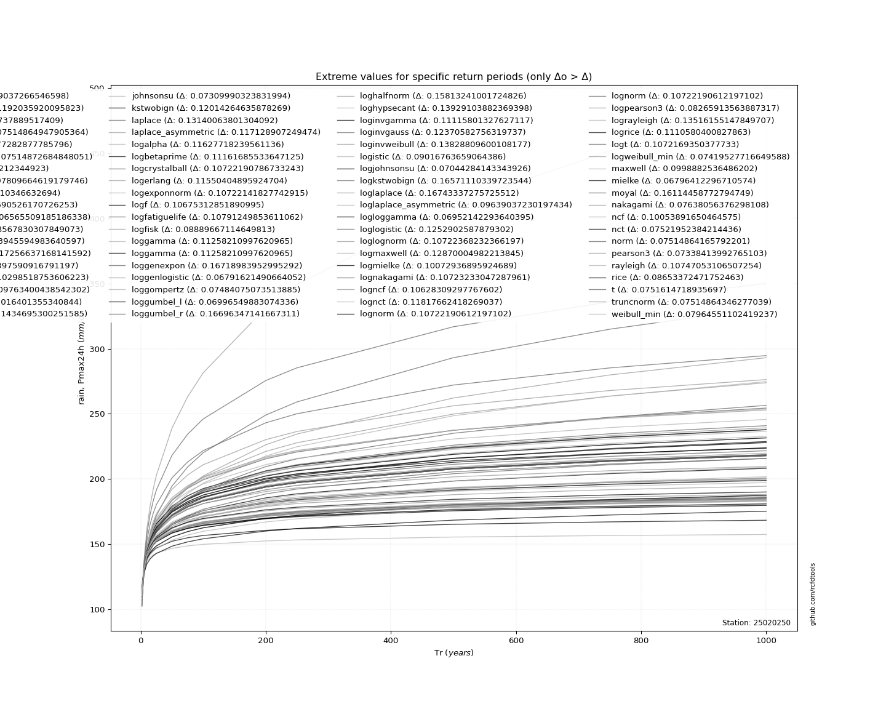</img>

</div>


<div align="center">

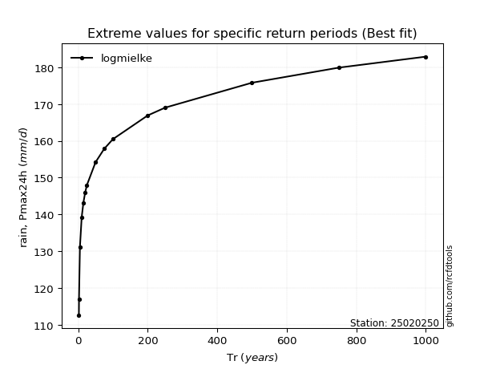</img>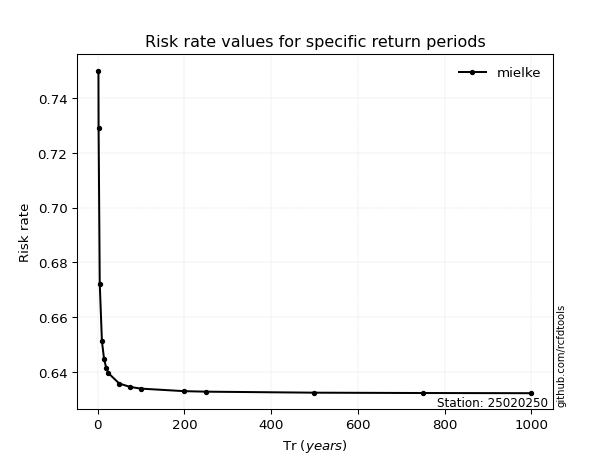</img>

</div>


<sub>**APP DISCLAIMER**: NO WARRANTY - This software is provided by [github.com/rcfdtools](https://github.com/rcfdtools) "as is", without any express or implied warranty, including warranties of merchantability, fitness for a particular purpose, or non-infringement. There is no guarantee that the software will be error-free or operate without interruption. LIMITATION OF LIABILITY - Neither the authors nor copyright holders will be liable for claims or damages arising from the software or its use. You are responsible for determining if the software is appropriate for your use and assume all associated risks, including errors, legal compliance, and data loss. NO PROFESSIONAL ADVICE - The software provides general information and does not offer professional advice. It should not replace consultation with professional advisors.</sub>