<div align="center">


</div>

# PMP Station (rain, Pmax24h): 25020260

Probable Maximum Precipitation (PMP) is the greatest amount of rainfall for a specific duration that is meteorologically possible for a given location, acting as a "worst-case" scenario for extreme storms, crucial for designing safety-critical infrastructure like bridges, river deviations, dams, spillways, and nuclear plants to prevent catastrophic failure. PMP is calculated by hydrologists using meteorological data to determine the upper limit of extreme rainfall, often leading to the Probable Maximum Flood (PMF) for flood control design, and is increasingly being studied for climate change impacts.

<div align="center">

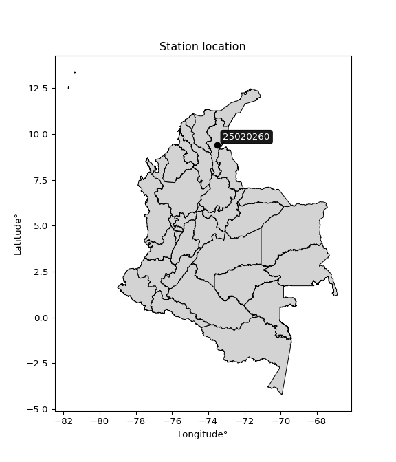</img>

</div>


## A. General information


### 1. General running parameters

• app_version: _v20251228_. • runtime: _2025-12-28 10:36:19.550669_. • Python version: _3.14.0_. • SciPy version: _1.16.3_. • Pandas version: _2.3.3_. • NumPy version: _2.3.5_. • Stations dataset (station_dataset_file): _dataset/pmax24h_in/conventional_cesarcolombia_1959_2022.csv_. • Stations catalog (station_catalog_file): _dataset/CNE_IDEAM.xls_. • Minimum year to eval til year_max (date_min): _1900_. • Maximum year to eval since year_min (date_max): _2024_. • Creates, save and include plots into reports (create_plot): _True_. • Plot only fit distributions with Δo > Δ (plot_only_fit): _True_. • Eval low extreme values, if False, evaluates high extreme values (low_extreme): _False_. • Eval every SciPy distribution as logarithmic (pdist_logarithmic_on): _True_. • Standard deviation normalized (ddof): _1.0_. • Return periods to eval in years (Tr): _[2, 2.33, 5, 10, 15, 20, 25, 50, 75, 100, 200, 250, 500, 750, 1000]_. • Minimum data sample per station, 0 means any (minimum_sample): _5_. • Z-Score maximum threshold to adjust a value, 0 means disable (zscore_max): _3.5_. • Z-Score minimum threshold to adjust a value, 0 means disable (zscore_min): _-2.5_. • Avoid zeros, e.g. rain = 0 (avoid_zeros): _True_. • Avoid null values (avoid_nans): _True_. [:file_folder:Dataset file.](../../dataset/pmax24h_in/conventional_cesarcolombia_1959_2022.csv)

> Delta Degrees of Freedom (DDOF): is a parameter used in the formulas for calculating variance and standard deviation. When ddof=0, the divisor is $N$ (the total number of observations) and this is used when your data set is the entire population. When ddof=1, the divisor is $N-1$ and this is used when your data set is a sample drawn from a larger population. Using $N-1$ provides an unbiased estimate of the population variance (known as Bessel´s correction).


### 2. Station info and location

|   id |   CODIGO | NOMBRE                 | CATEGORIA     | TECNOLOGIA   | ESTADO   | FECHA_INSTALACION   |   FECHA_SUSPENSION |   ALTITUD |   LATITUD |   LONGITUD | DEPARTAMENTO   | MUNICIPIO   | AREA_OPERATIVA                                         | ENTIDAD                                                     | AREA_HIDROGRAFICA   | ZONA_HIDROGRAFICA   | SUBZONA_HIDROGRAFICA   |   CORRIENTE | Catalogo   |
|-----:|---------:|:-----------------------|:--------------|:-------------|:---------|:--------------------|-------------------:|----------:|----------:|-----------:|:---------------|:------------|:-------------------------------------------------------|:------------------------------------------------------------|:--------------------|:--------------------|:-----------------------|------------:|:-----------|
|    0 | 25020260 | RINCONHONDO [25020260] | Pluviométrica | Convencional | Activa   | 15/03/1963          |                nan |       100 |   9.39703 |    -73.488 | Cesar          | Chiriguaná  | Area Operativa 05 - Magdalena-Cesar-Guajira-San Andrés | INSTITUTO DE HIDROLOGIA METEOROLOGIA Y ESTUDIOS AMBIENTALES | Magdalena Cauca     | Cesar               | Bajo Cesar             |         nan | CNE_IDEAM  |

<div align="center">

Map location in: [:earth_americas:Google](http://maps.google.com/maps?q=9.397027778,-73.48802778) [:earth_americas:OSM](https://www.openstreetmap.org/#map=18/9.397027778/-73.48802778&layers=P) [:earth_americas:Bing](https://www.bing.com/maps?cp=9.397027778~-73.48802778&lvl=18) [:earth_americas:Apple](https://maps.apple.com/frame?center=9.397027778%2C-73.48802778&span=0.003%2C0.006)

</div>


<div align="center">

```geojson
{
  "type": "Feature",
  "geometry": {
    "type": "Point", 
    "coordinates": [-73.48802778, 9.397027778]
  }, 
  "properties": {
    "Name": "25020260"
  }
}
```

</div>


### 3. Discrete values table and plot

|               |         0 |           1 |            2 |           3 |           4 |           5 |           6 |           7 |           8 |          9 |          10 |         11 |         12 |          13 |          14 |         15 |          16 |          17 |          18 |          19 |         20 |         21 |           22 |         23 |         24 |          25 |          26 |         27 |          28 |         29 |          30 |          31 |          32 |          33 |         34 |          35 |         36 |          37 |          38 |          39 |          40 |          41 |         42 |          43 |         44 |          45 |           46 |            47 |         48 |         49 |          50 |         51 |        52 |        53 |          54 |         55 |            56 |         57 |
|:--------------|----------:|------------:|-------------:|------------:|------------:|------------:|------------:|------------:|------------:|-----------:|------------:|-----------:|-----------:|------------:|------------:|-----------:|------------:|------------:|------------:|------------:|-----------:|-----------:|-------------:|-----------:|-----------:|------------:|------------:|-----------:|------------:|-----------:|------------:|------------:|------------:|------------:|-----------:|------------:|-----------:|------------:|------------:|------------:|------------:|------------:|-----------:|------------:|-----------:|------------:|-------------:|--------------:|-----------:|-----------:|------------:|-----------:|----------:|----------:|------------:|-----------:|--------------:|-----------:|
| Date          | 1963      | 1964        | 1965         | 1966        | 1967        | 1968        | 1969        | 1970        | 1971        | 1972       | 1973        | 1974       | 1975       | 1976        | 1977        | 1978       | 1979        | 1980        | 1981        | 1982        | 1983       | 1984       | 1985         | 1986       | 1987       | 1988        | 1989        | 1990       | 1991        | 1992       | 1993        | 1994        | 1995        | 1996        | 1997       | 1998        | 1999       | 2000        | 2001        | 2002        | 2003        | 2004        | 2005       | 2006        | 2007       | 2008        | 2009         | 2010          | 2011       | 2012       | 2013        | 2014       | 2015      | 2017      | 2018        | 2019       | 2020          | 2021       |
| Value         |   68      |  117        |  110         |  112        |   90        |   90        |  112        |  100        |   85        |   72       |  128        |  155       |  172       |  123        |  115        |  170       |  136        |  105        |  100        |   80        |  149       |  145       |  110         |   52       |  170       |  105        |  115        |   63       |  130        |  147       |   78        |   84        |   98        |  106        |   74       |   98        |  152       |   97        |   97        |   93        |   93        |  112        |   75       |  137        |  149       |  138        |  107         |  109          |  147       |  158       |   83        |  143       |   51      |   68      |  115        |   48       |  109          |   69       |
| Value_initial |   68      |  117        |  110         |  112        |   90        |   90        |  112        |  100        |   85        |   72       |  128        |  155       |  172       |  123        |  115        |  170       |  136        |  105        |  100        |   80        |  149       |  145       |  110         |   52       |  170       |  105        |  115        |   63       |  130        |  147       |   78        |   84        |   98        |  106        |   74       |   98        |  152       |   97        |   97        |   93        |   93        |  112        |   75       |  137        |  149       |  138        |  107         |  109          |  147       |  158       |   83        |  143       |   51      |   68      |  115        |   48       |  109          |   69       |
| count         |   58      |   58        |   58         |   58        |   58        |   58        |   58        |   58        |   58        |   58       |   58        |   58       |   58       |   58        |   58        |   58       |   58        |   58        |   58        |   58        |   58       |   58       |   58         |   58       |   58       |   58        |   58        |   58       |   58        |   58       |   58        |   58        |   58        |   58        |   58       |   58        |   58       |   58        |   58        |   58        |   58        |   58        |   58       |   58        |   58       |   58        |   58         |   58          |   58       |   58       |   58        |   58       |   58      |   58      |   58        |   58       |   58          |   58       |
| mean          |  108.862  |  108.862    |  108.862     |  108.862    |  108.862    |  108.862    |  108.862    |  108.862    |  108.862    |  108.862   |  108.862    |  108.862   |  108.862   |  108.862    |  108.862    |  108.862   |  108.862    |  108.862    |  108.862    |  108.862    |  108.862   |  108.862   |  108.862     |  108.862   |  108.862   |  108.862    |  108.862    |  108.862   |  108.862    |  108.862   |  108.862    |  108.862    |  108.862    |  108.862    |  108.862   |  108.862    |  108.862   |  108.862    |  108.862    |  108.862    |  108.862    |  108.862    |  108.862   |  108.862    |  108.862   |  108.862    |  108.862     |  108.862      |  108.862   |  108.862   |  108.862    |  108.862   |  108.862  |  108.862  |  108.862    |  108.862   |  108.862      |  108.862   |
| std           |   31.5341 |   31.5341   |   31.5341    |   31.5341   |   31.5341   |   31.5341   |   31.5341   |   31.5341   |   31.5341   |   31.5341  |   31.5341   |   31.5341  |   31.5341  |   31.5341   |   31.5341   |   31.5341  |   31.5341   |   31.5341   |   31.5341   |   31.5341   |   31.5341  |   31.5341  |   31.5341    |   31.5341  |   31.5341  |   31.5341   |   31.5341   |   31.5341  |   31.5341   |   31.5341  |   31.5341   |   31.5341   |   31.5341   |   31.5341   |   31.5341  |   31.5341   |   31.5341  |   31.5341   |   31.5341   |   31.5341   |   31.5341   |   31.5341   |   31.5341  |   31.5341   |   31.5341  |   31.5341   |   31.5341    |   31.5341     |   31.5341  |   31.5341  |   31.5341   |   31.5341  |   31.5341 |   31.5341 |   31.5341   |   31.5341  |   31.5341     |   31.5341  |
| zscore        |   -1.2958 |    0.258067 |    0.0360857 |    0.099509 |   -0.598148 |   -0.598148 |    0.099509 |   -0.281031 |   -0.756706 |   -1.16896 |    0.606896 |    1.46311 |    2.00221 |    0.448337 |    0.194644 |    1.93879 |    0.860589 |   -0.122473 |   -0.281031 |   -0.915264 |    1.27284 |    1.14599 |    0.0360857 |   -1.80319 |    1.93879 |   -0.122473 |    0.194644 |   -1.45436 |    0.670319 |    1.20942 |   -0.978688 |   -0.788418 |   -0.344454 |   -0.090761 |   -1.10553 |   -0.344454 |    1.36798 |   -0.376166 |   -0.376166 |   -0.503013 |   -0.503013 |    0.099509 |   -1.07382 |    0.892301 |    1.27284 |    0.924012 |   -0.0590493 |    0.00437402 |    1.20942 |    1.55825 |   -0.820129 |    1.08257 |   -1.8349 |   -1.2958 |    0.194644 |   -1.93004 |    0.00437402 |   -1.26409 |

<div align="center">

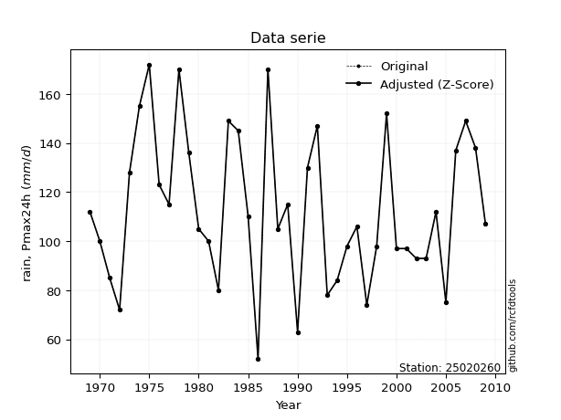</img>

</div>


> The initial value (value_initial) correspond to the initial obtained or null completed value, and value (value) is adjusted only when the initial value is outside the valid range definite through the Z-Score value. If Z-Score is active, values out of range or outliers are replaced with the station mean value


### 4. Active continuous probability distributions from SciPy (44 of 104 available)

[scipy.stats](https://docs.scipy.org/doc/scipy/reference/stats.html) is a Python´s powerful submodule within the SciPy library for comprehensive statistical analysis, offering over 130 probability distributions (like Normal, Poisson), functions for descriptive stats (mean, variance), hypothesis testing (t-tests, chi-square), random variable generation, and statistical tests, making it essential for data science, modeling, and research. It provides tools to explore, model, and draw conclusions from data efficiently, working seamlessly with NumPy.

<div align="center">

|   id | p_dist             |   n_parameter | fit_method   | label                                                                       | active   | ref                                                                                                        |
|-----:|:-------------------|--------------:|:-------------|:----------------------------------------------------------------------------|:---------|:-----------------------------------------------------------------------------------------------------------|
|    0 | alpha              |             3 | MLE          | Alpha                                                                       | True     | [:mortar_board:](https://docs.scipy.org/doc/scipy/reference/generated/scipy.stats.alpha.html)              |
|    1 | betaprime          |             4 | MLE          | Beta prime                                                                  | True     | [:mortar_board:](https://docs.scipy.org/doc/scipy/reference/generated/scipy.stats.betaprime.html)          |
|    2 | chi2               |             3 | MLE          | Chi²                                                                        | True     | [:mortar_board:](https://docs.scipy.org/doc/scipy/reference/generated/scipy.stats.chi2.html)               |
|    3 | crystalball        |             4 | MLE          | Crystalball                                                                 | True     | [:mortar_board:](https://docs.scipy.org/doc/scipy/reference/generated/scipy.stats.crystalball.html)        |
|    4 | erlang             |             3 | MLE          | Erlang                                                                      | True     | [:mortar_board:](https://docs.scipy.org/doc/scipy/reference/generated/scipy.stats.erlang.html)             |
|    5 | expon              |             2 | MLE          | Exponential                                                                 | True     | [:mortar_board:](https://docs.scipy.org/doc/scipy/reference/generated/scipy.stats.expon.html)              |
|    6 | exponnorm          |             3 | MLE          | Exponentially modified Normal                                               | True     | [:mortar_board:](https://docs.scipy.org/doc/scipy/reference/generated/scipy.stats.exponnorm.html)          |
|    7 | f                  |             4 | MLE          | F                                                                           | True     | [:mortar_board:](https://docs.scipy.org/doc/scipy/reference/generated/scipy.stats.f.html)                  |
|    8 | fatiguelife        |             3 | MLE          | Fatigue-life (Birnbaum-Saunders)                                            | True     | [:mortar_board:](https://docs.scipy.org/doc/scipy/reference/generated/scipy.stats.fatiguelife.html)        |
|    9 | fisk               |             3 | MLE          | Fisk                                                                        | True     | [:mortar_board:](https://docs.scipy.org/doc/scipy/reference/generated/scipy.stats.fisk.html)               |
|   10 | gamma              |             3 | MLE          | Gamma                                                                       | True     | [:mortar_board:](https://docs.scipy.org/doc/scipy/reference/generated/scipy.stats.gamma.html)              |
|   11 | genexpon           |             5 | MLE          | Generalized exponential                                                     | True     | [:mortar_board:](https://docs.scipy.org/doc/scipy/reference/generated/scipy.stats.genexpon.html)           |
|   12 | genlogistic        |             3 | MLE          | Generalized logistic                                                        | True     | [:mortar_board:](https://docs.scipy.org/doc/scipy/reference/generated/scipy.stats.genlogistic.html)        |
|   13 | gibrat             |             2 | MM           | Gibrat                                                                      | True     | [:mortar_board:](https://docs.scipy.org/doc/scipy/reference/generated/scipy.stats.gibrat.html)             |
|   14 | gompertz           |             3 | MLE          | Gompertz (or truncated Gumbel)                                              | True     | [:mortar_board:](https://docs.scipy.org/doc/scipy/reference/generated/scipy.stats.gompertz.html)           |
|   15 | gumbel_l           |             2 | MM           | Gumbel Left Skew                                                            | True     | [:mortar_board:](https://docs.scipy.org/doc/scipy/reference/generated/scipy.stats.gumbel_l.html)           |
|   16 | gumbel_r           |             2 | MM           | Gumbel Right Skew                                                           | True     | [:mortar_board:](https://docs.scipy.org/doc/scipy/reference/generated/scipy.stats.gumbel_r.html)           |
|   17 | halflogistic       |             2 | MM           | Half-logistic                                                               | True     | [:mortar_board:](https://docs.scipy.org/doc/scipy/reference/generated/scipy.stats.halflogistic.html)       |
|   18 | halfnorm           |             2 | MM           | Half Normal                                                                 | True     | [:mortar_board:](https://docs.scipy.org/doc/scipy/reference/generated/scipy.stats.halfnorm.html)           |
|   19 | hypsecant          |             2 | MM           | hyperbolic secant                                                           | True     | [:mortar_board:](https://docs.scipy.org/doc/scipy/reference/generated/scipy.stats.hypsecant.html)          |
|   20 | invgamma           |             3 | MLE          | Inverted gamma                                                              | True     | [:mortar_board:](https://docs.scipy.org/doc/scipy/reference/generated/scipy.stats.invgamma.html)           |
|   21 | invgauss           |             3 | MLE          | Inverse Gaussian                                                            | True     | [:mortar_board:](https://docs.scipy.org/doc/scipy/reference/generated/scipy.stats.invgauss.html)           |
|   22 | invweibull         |             3 | MLE          | Inverted Weibull                                                            | True     | [:mortar_board:](https://docs.scipy.org/doc/scipy/reference/generated/scipy.stats.invweibull.html)         |
|   23 | johnsonsu          |             4 | MLE          | Johnson Su                                                                  | True     | [:mortar_board:](https://docs.scipy.org/doc/scipy/reference/generated/scipy.stats.johnsonsu.html)          |
|   24 | kstwobign          |             2 | MLE          | Limiting distribution of scaled Kolmogorov-Smirnov two-sided test statistic | True     | [:mortar_board:](https://docs.scipy.org/doc/scipy/reference/generated/scipy.stats.kstwobign.html)          |
|   25 | laplace            |             2 | MM           | Laplace                                                                     | True     | [:mortar_board:](https://docs.scipy.org/doc/scipy/reference/generated/scipy.stats.laplace.html)            |
|   26 | laplace_asymmetric |             3 | MLE          | Asymmetric Laplace                                                          | True     | [:mortar_board:](https://docs.scipy.org/doc/scipy/reference/generated/scipy.stats.laplace_asymmetric.html) |
|   27 | loggamma           |             3 | MLE          | Log gamma                                                                   | True     | [:mortar_board:](https://docs.scipy.org/doc/scipy/reference/generated/scipy.stats.loggamma.html)           |
|   28 | logistic           |             2 | MM           | Logistic (or Sech-squared)                                                  | True     | [:mortar_board:](https://docs.scipy.org/doc/scipy/reference/generated/scipy.stats.logistic.html)           |
|   29 | lognorm            |             3 | MLE          | Log Normal                                                                  | True     | [:mortar_board:](https://docs.scipy.org/doc/scipy/reference/generated/scipy.stats.lognorm.html)            |
|   30 | maxwell            |             2 | MM           | Maxwell                                                                     | True     | [:mortar_board:](https://docs.scipy.org/doc/scipy/reference/generated/scipy.stats.maxwell.html)            |
|   31 | mielke             |             4 | MLE          | Mielke Beta-Kappa / Dagum                                                   | True     | [:mortar_board:](https://docs.scipy.org/doc/scipy/reference/generated/scipy.stats.mielke.html)             |
|   32 | moyal              |             2 | MM           | Moyal                                                                       | True     | [:mortar_board:](https://docs.scipy.org/doc/scipy/reference/generated/scipy.stats.moyal.html)              |
|   33 | nakagami           |             3 | MLE          | Nakagami                                                                    | True     | [:mortar_board:](https://docs.scipy.org/doc/scipy/reference/generated/scipy.stats.nakagami.html)           |
|   34 | ncf                |             5 | MLE          | Non-central F distribution                                                  | True     | [:mortar_board:](https://docs.scipy.org/doc/scipy/reference/generated/scipy.stats.ncf.html)                |
|   35 | nct                |             4 | MLE          | Non-central Student’s t                                                     | True     | [:mortar_board:](https://docs.scipy.org/doc/scipy/reference/generated/scipy.stats.nct.html)                |
|   36 | norm               |             2 | MM           | Normal                                                                      | True     | [:mortar_board:](https://docs.scipy.org/doc/scipy/reference/generated/scipy.stats.norm.html)               |
|   37 | pearson3           |             3 | MM           | Pearson type III                                                            | True     | [:mortar_board:](https://docs.scipy.org/doc/scipy/reference/generated/scipy.stats.pearson3.html)           |
|   38 | rayleigh           |             2 | MM           | Rayleigh                                                                    | True     | [:mortar_board:](https://docs.scipy.org/doc/scipy/reference/generated/scipy.stats.rayleigh.html)           |
|   39 | rice               |             3 | MLE          | Rice                                                                        | True     | [:mortar_board:](https://docs.scipy.org/doc/scipy/reference/generated/scipy.stats.rice.html)               |
|   40 | t                  |             3 | MLE          | Student’s t                                                                 | True     | [:mortar_board:](https://docs.scipy.org/doc/scipy/reference/generated/scipy.stats.t.html)                  |
|   41 | truncnorm          |             4 | MLE          | Truncated normal                                                            | True     | [:mortar_board:](https://docs.scipy.org/doc/scipy/reference/generated/scipy.stats.truncnorm.html)          |
|   42 | wald               |             2 | MM           | Wald                                                                        | True     | [:mortar_board:](https://docs.scipy.org/doc/scipy/reference/generated/scipy.stats.wald.html)               |
|   43 | weibull_min        |             3 | MLE          | Weibull minimum                                                             | True     | [:mortar_board:](https://docs.scipy.org/doc/scipy/reference/generated/scipy.stats.weibull_min.html)        |

</div>

> **n_parameter:** # arguments & localization & scale.
>
> **Fit methods:** (MLE) maximum likelihood, (MM) L-moments.
>
>**Inactive:** foldnorm, gennorm, norminvgauss, powernorm, powerlognorm, skewnorm, genextreme, anglit, arcsine, argus, beta, bradford, burr, burr12, cauchy, cosine, halfcauchy, foldcauchy, skewcauchy, wrapcauchy, dgamma, gengamma, exponweib, exponpow, truncexpon, gausshyper, genhalflogistic, genhyperbolic, geninvgauss, halfgennorm, johnsonsb, kappa4, kappa3, ksone, kstwo, loglaplace, levy, levy_l, levy_stable, ncx2, pareto, genpareto, truncpareto, lomax, powerlaw, rdist, rel_breitwigner, recipinvgauss, semicircular, studentized_range, trapezoid, triang, truncweibull_min, tukeylambda, uniform, loguniform, vonmises, vonmises_line, weibull_max, dweibull, 


## B. Probability distributions vs. Empirical distributions

A continuous probability distribution (CPD) describes probabilities for variables that can take any value within a range (like rain any time), unlike discrete variables with specific outcomes (like temperature). It uses a Probability Density Function (PDF), a curve where the total area under it equals 1, and the probability of the variable falling within an interval (a to b) is found by calculating the area under the curve between those points. A key feature is that the probability of hitting any single exact value is zero, so probabilities are always expressed for ranges, e.g., $P(a ≤ X ≤ b)$.

<div align="center">

Distributions parameters from station values
|    |   station | p_dist                |   n |              loc |           scale | shape                  | shape1                | shape2                | shape3   |
|---:|----------:|:----------------------|----:|-----------------:|----------------:|:-----------------------|:----------------------|:----------------------|:---------|
|  0 |  25020260 | alpha                 |  58 |   -355.676       |  6855.18        | 14.830725050639892     |                       |                       |          |
|  1 |  25020260 | betaprime             |  58 |     -0.456038    |    12.2146      | 98.15706747630065      | 11.88179408926581     |                       |          |
|  2 |  25020260 | chi2                  |  58 |   -101.247       |     2.34437     | 89.61871664581943      |                       |                       |          |
|  3 |  25020260 | crystalball           |  58 |    108.862       |    31.2611      | 7667.043807669597      | 7679.54394988327      |                       |          |
|  4 |  25020260 | erlang                |  58 |   -142.714       |     3.89945     | 64.50373297001482      |                       |                       |          |
|  5 |  25020260 | expon                 |  58 |     48           |    60.8621      |                        |                       |                       |          |
|  6 |  25020260 | exponnorm             |  58 |    102.498       |    30.6081      | 0.20790561527215223    |                       |                       |          |
|  7 |  25020260 | f                     |  58 |   -106.055       |   214.908       | 94.07929753973838      | 44072.17114329591     |                       |          |
|  8 |  25020260 | fatiguelife           |  58 |   -239.09        |   346.516       | 0.09000593620051395    |                       |                       |          |
|  9 |  25020260 | fisk                  |  58 |     -0.578212    |   106.378       | 5.728599216306407      |                       |                       |          |
| 10 |  25020260 | gamma                 |  58 |   -146.877       |     3.83864     | 66.61221014904078      |                       |                       |          |
| 11 |  25020260 | genexpon              |  58 |     47.9532      |     7.3194      | 1.3039555529925835     | 3.782321258797586e-07 | 4.683045118503205e-07 |          |
| 12 |  25020260 | genlogistic           |  58 |     83.0893      |    22.4755      | 2.275872135571534      |                       |                       |          |
| 13 |  25020260 | gibrat                |  58 |     85.0138      |    14.4647      |                        |                       |                       |          |
| 14 |  25020260 | gompertz              |  58 |     39.6844      |     4.10175     | 2.4712177789954676e-13 |                       |                       |          |
| 15 |  25020260 | gumbel_l              |  58 |    122.931       |    24.3742      |                        |                       |                       |          |
| 16 |  25020260 | gumbel_r              |  58 |     94.7929      |    24.3742      |                        |                       |                       |          |
| 17 |  25020260 | halflogistic          |  58 |     71.8104      |    26.7271      |                        |                       |                       |          |
| 18 |  25020260 | halfnorm              |  58 |     67.4846      |    51.8589      |                        |                       |                       |          |
| 19 |  25020260 | hypsecant             |  58 |    108.862       |    19.9014      |                        |                       |                       |          |
| 20 |  25020260 | invgamma              |  58 |   -206.846       | 31843.4         | 101.80552378626788     |                       |                       |          |
| 21 |  25020260 | invgauss              |  58 |    -15.272       |  1598.29        | 0.07741985924673747    |                       |                       |          |
| 22 |  25020260 | invweibull            |  58 |     -5.56736e+09 |     5.56736e+09 | 187468055.23819956     |                       |                       |          |
| 23 |  25020260 | johnsonsu             |  58 |   -203.737       |   161.423       | -15.903792591660682    | 11.268185142277659    |                       |          |
| 24 |  25020260 | kstwobign             |  58 |     -9.02766     |   135.192       |                        |                       |                       |          |
| 25 |  25020260 | laplace               |  58 |    108.862       |    22.1049      |                        |                       |                       |          |
| 26 |  25020260 | laplace_asymmetric    |  58 |    106           |    25.0152      | 0.9444275536845836     |                       |                       |          |
| 27 |  25020260 | loggamma              |  58 |  -8105.49        |  1143.02        | 1321.9608871092073     |                       |                       |          |
| 28 |  25020260 | logistic              |  58 |    108.862       |    17.2352      |                        |                       |                       |          |
| 29 |  25020260 | lognorm               |  58 |   -261.681       |   369.226       | 0.08440049988794178    |                       |                       |          |
| 30 |  25020260 | maxwell               |  58 |     34.7864      |    46.4201      |                        |                       |                       |          |
| 31 |  25020260 | mielke                |  58 |     -0.582459    |   123.572       | 4.036407585977243      | 7.579401019877179     |                       |          |
| 32 |  25020260 | moyal                 |  58 |     90.985       |    14.0724      |                        |                       |                       |          |
| 33 |  25020260 | nakagami              |  58 |     26.1457      |    88.4265      | 1.803883491763229      |                       |                       |          |
| 34 |  25020260 | ncf                   |  58 |     -0.576705    |     0.000290316 | 0.0002570113389562448  | 43.43894122476551     | 92.76763150950372     |          |
| 35 |  25020260 | nct                   |  58 |     -0.54778     |    29.866       | 91.67584377177701      | 3.632859260986514     |                       |          |
| 36 |  25020260 | norm                  |  58 |    108.862       |    31.2611      |                        |                       |                       |          |
| 37 |  25020260 | pearson3              |  58 |    108.862       |    31.2611      | 0.14767860371607305    |                       |                       |          |
| 38 |  25020260 | rayleigh              |  58 |     49.0578      |    47.7169      |                        |                       |                       |          |
| 39 |  25020260 | rice                  |  58 |     39.4979      |    35.7973      | 1.586590840124802      |                       |                       |          |
| 40 |  25020260 | t                     |  58 |    108.861       |    31.2611      | 47344335.78966845      |                       |                       |          |
| 41 |  25020260 | truncnorm             |  58 |    108.862       |    31.2611      | -1455.1448898075719    | 1800.1122855735953    |                       |          |
| 42 |  25020260 | wald                  |  58 |     77.6009      |    31.2611      |                        |                       |                       |          |
| 43 |  25020260 | weibull_min           |  58 |     32.4422      |    86.0379      | 2.6557781140165115     |                       |                       |          |
| 44 |  25020260 | logalpha              |  58 |     -5.63742     |   338.11        | 32.918421488528736     |                       |                       |          |
| 45 |  25020260 | logbetaprime          |  58 |     -1.06804     |    30.4561      | 389.5571698247448      | 2079.037415293357     |                       |          |
| 46 |  25020260 | logchi2               |  58 |      1.65791     |     0.0171479   | 174.03060688807722     |                       |                       |          |
| 47 |  25020260 | logcrystalball        |  58 |      4.64558     |     0.306419    | 5.1713348074490195     | 558.7935411952634     |                       |          |
| 48 |  25020260 | logerlang             |  58 |     -0.417739    |     0.0194859   | 259.75117722058235     |                       |                       |          |
| 49 |  25020260 | logexpon              |  58 |      3.8712      |     0.774378    |                        |                       |                       |          |
| 50 |  25020260 | logexponnorm          |  58 |      4.64538     |     0.306419    | 0.0006424395681765664  |                       |                       |          |
| 51 |  25020260 | logf                  |  58 |   -197.168       |   201.813       | 3111160.1689581033     | 1203821.5886632847    |                       |          |
| 52 |  25020260 | logfatiguelife        |  58 |    -83.7633      |    88.4092      | 0.0034516172445591756  |                       |                       |          |
| 53 |  25020260 | logfisk               |  58 |     -2.8644e+07  |     2.8644e+07  | 162000238.8643418      |                       |                       |          |
| 54 |  25020260 | loggamma              |  58 |     -0.274829    |     0.0196245   | 250.59328131446608     |                       |                       |          |
| 55 |  25020260 | loggenexpon           |  58 |      3.86694     |     0.00584066  | 0.0004921560297693384  | 1.2761237545508535    | 7.110985755034191e-05 |          |
| 56 |  25020260 | loggenlogistic        |  58 |      4.81352     |     0.132215    | 0.5288158116675327     |                       |                       |          |
| 57 |  25020260 | loggibrat             |  58 |      4.41185     |     0.141763    |                        |                       |                       |          |
| 58 |  25020260 | loggompertz           |  58 |      3.8712      |     0.286707    | 0.043828475086995645   |                       |                       |          |
| 59 |  25020260 | loggumbel_l           |  58 |      4.78348     |     0.238914    |                        |                       |                       |          |
| 60 |  25020260 | loggumbel_r           |  58 |      4.50767     |     0.238914    |                        |                       |                       |          |
| 61 |  25020260 | loghalflogistic       |  58 |      4.28244     |     0.261951    |                        |                       |                       |          |
| 62 |  25020260 | loghalfnorm           |  58 |      4.23999     |     0.508336    |                        |                       |                       |          |
| 63 |  25020260 | loghypsecant          |  58 |      4.64558     |     0.195072    |                        |                       |                       |          |
| 64 |  25020260 | loginvgamma           |  58 |     -2.76947     |  4172.06        | 563.6149203548703      |                       |                       |          |
| 65 |  25020260 | loginvgauss           |  58 |      1.39629     |   322.198       | 0.01008915277754387    |                       |                       |          |
| 66 |  25020260 | loginvweibull         |  58 |     -1.7591e+08  |     1.7591e+08  | 535878827.0774583      |                       |                       |          |
| 67 |  25020260 | logjohnsonsu          |  58 |      5.83284     |     0.0628425   | 13.946600940002178     | 3.874603970566768     |                       |          |
| 68 |  25020260 | logkstwobign          |  58 |      3.27026     |     1.58027     |                        |                       |                       |          |
| 69 |  25020260 | loglaplace            |  58 |      4.64558     |     0.216671    |                        |                       |                       |          |
| 70 |  25020260 | loglaplace_asymmetric |  58 |      4.7185      |     0.23553     | 1.1666523772724418     |                       |                       |          |
| 71 |  25020260 | logloggamma           |  58 |      4.45536     |     0.397745    | 2.088370361141176      |                       |                       |          |
| 72 |  25020260 | loglogistic           |  58 |      4.64558     |     0.168938    |                        |                       |                       |          |
| 73 |  25020260 | loglognorm            |  58 | -94987.6         | 94992.3         | 3.22572922171122e-06   |                       |                       |          |
| 74 |  25020260 | logmaxwell            |  58 |      3.91945     |     0.455036    |                        |                       |                       |          |
| 75 |  25020260 | logmielke             |  58 |      3.79368     |     1.30472     | 1.8714344070657856     | 32.09976263599695     |                       |          |
| 76 |  25020260 | logmoyal              |  58 |      4.47035     |     0.137937    |                        |                       |                       |          |
| 77 |  25020260 | lognakagami           |  58 |   -101.848       |   106.495       | 30132.113233642624     |                       |                       |          |
| 78 |  25020260 | logncf                |  58 |    -24.4378      |    25.4916      | 32488.88225842305      | 38773.00403418786     | 4578.129663738708     |          |
| 79 |  25020260 | lognct                |  58 |    -11.4936      |     0.275444    | 6752.517207315674      | 58.58288798797156     |                       |          |
| 80 |  25020260 | lognorm               |  58 |      4.64558     |     0.306419    |                        |                       |                       |          |
| 81 |  25020260 | logpearson3           |  58 |      4.64558     |     0.306419    | -0.5005348615495097    |                       |                       |          |
| 82 |  25020260 | lograyleigh           |  58 |      4.0594      |     0.467703    |                        |                       |                       |          |
| 83 |  25020260 | logrice               |  58 |    -65.3426      |     0.306382    | 228.43211101806787     |                       |                       |          |
| 84 |  25020260 | logt                  |  58 |      4.64558     |     0.306419    | 436731838.05329144     |                       |                       |          |
| 85 |  25020260 | logtruncnorm          |  58 |     -0.118498    |     1.99915     | 1.9948441547737314     | 2.634117215922388     |                       |          |
| 86 |  25020260 | logwald               |  58 |      4.33912     |     0.306454    |                        |                       |                       |          |
| 87 |  25020260 | logweibull_min        |  58 |      2.31578     |     2.46011     | 9.170203247937753      |                       |                       |          |

</div>

> **loc** (Location parameter): This shifts the distribution along the x-axis. For many common distributions, like the normal (Gaussian) distribution, loc represents the mean $μ$. For others, like the uniform distribution, it might represent the minimum value, or for the beta distribution, the left end of the support interval.
>
> **scale** (Scale parameter): This determines the width or spread of the distribution. For the normal distribution, scale represents the standard deviation $σ$. For a uniform distribution, it defines the length of the interval (from $loc$ to $loc + scale$).
>
> **shape** (Shape parameters): Refers to parameters that define the specific form of a probability distribution, distinct from its location (loc) and scale (scale). These parameters are required arguments for most distribution functions. For example, a normal (Gaussian) distribution is fully defined by its location (mean) and scale (standard deviation), so it has no specific shape parameters beyond loc and scale. However, other distributions have intrinsic properties that need specification, as Gamma distribution that takes a shape parameter, often named $a$ or $alpha$.


### 0. Cumulative distribution values - CDF (88 evaluated)

Cumulative Distribution Function (CDF), denoted as $F$<sub>$X$</sub>$(x)$, is a function that gives the probability that a random variable $X$ will take a value less than or equal to a specific value, $x$ (i.e., $(P(X≥x)$. It essentially "accumulates" probabilities from a given point up to the far right (positive infinity), providing a complete picture of the distribution´s probabilities for both discrete (like rain) and continuous (like temperature) variables, helping to find probabilities over ranges or above certain values.

<div align="center">

CDF ordered by x ascending and calculating $log(f(x))$ separately
|   id |   Station |   date |   x |   count |    mean |     std |      zscore |   Value_initial |   station |   m |     alpha |   alpha_pdf |   betaprime |   betaprime_pdf |      chi2 |   chi2_pdf |   crystalball |   crystalball_pdf |    erlang |   erlang_pdf |     expon |   expon_pdf |   exponnorm |   exponnorm_pdf |         f |      f_pdf |   fatiguelife |   fatiguelife_pdf |      fisk |   fisk_pdf |     gamma |   gamma_pdf |   genexpon |   genexpon_pdf |   genlogistic |   genlogistic_pdf |   gibrat |   gibrat_pdf |    gompertz |   gompertz_pdf |   gumbel_l |   gumbel_l_pdf |   gumbel_r |   gumbel_r_pdf |   halflogistic |   halflogistic_pdf |   halfnorm |   halfnorm_pdf |   hypsecant |   hypsecant_pdf |   invgamma |   invgamma_pdf |   invgauss |   invgauss_pdf |   invweibull |   invweibull_pdf |   johnsonsu |   johnsonsu_pdf |   kstwobign |   kstwobign_pdf |   laplace |   laplace_pdf |   laplace_asymmetric |   laplace_asymmetric_pdf |   loggamma |   loggamma_pdf |   logistic |   logistic_pdf |    lognorm |   lognorm_pdf |    maxwell |   maxwell_pdf |    mielke |   mielke_pdf |       moyal |   moyal_pdf |   nakagami |   nakagami_pdf |        ncf |    ncf_pdf |       nct |    nct_pdf |      norm |   norm_pdf |   pearson3 |   pearson3_pdf |    rayleigh |   rayleigh_pdf |       rice |   rice_pdf |         t |      t_pdf |   truncnorm |   truncnorm_pdf |        wald |    wald_pdf |   weibull_min |   weibull_min_pdf |   logalpha |   logalpha_pdf |   logbetaprime |   logbetaprime_pdf |    logchi2 |   logchi2_pdf |   logcrystalball |   logcrystalball_pdf |   logerlang |   logerlang_pdf |   logexpon |   logexpon_pdf |   logexponnorm |   logexponnorm_pdf |       logf |   logf_pdf |   logfatiguelife |   logfatiguelife_pdf |   logfisk |   logfisk_pdf |   loggenexpon |   loggenexpon_pdf |   loggenlogistic |   loggenlogistic_pdf |   loggibrat |   loggibrat_pdf |   loggompertz |   loggompertz_pdf |   loggumbel_l |   loggumbel_l_pdf |   loggumbel_r |   loggumbel_r_pdf |   loghalflogistic |   loghalflogistic_pdf |   loghalfnorm |   loghalfnorm_pdf |   loghypsecant |   loghypsecant_pdf |   loginvgamma |   loginvgamma_pdf |   loginvgauss |   loginvgauss_pdf |   loginvweibull |   loginvweibull_pdf |   logjohnsonsu |   logjohnsonsu_pdf |   logkstwobign |   logkstwobign_pdf |   loglaplace |   loglaplace_pdf |   loglaplace_asymmetric |   loglaplace_asymmetric_pdf |   logloggamma |   logloggamma_pdf |   loglogistic |   loglogistic_pdf |   loglognorm |   loglognorm_pdf |   logmaxwell |   logmaxwell_pdf |   logmielke |   logmielke_pdf |    logmoyal |   logmoyal_pdf |   lognakagami |   lognakagami_pdf |     logncf |   logncf_pdf |     lognct |   lognct_pdf |   logpearson3 |   logpearson3_pdf |   lograyleigh |   lograyleigh_pdf |    logrice |   logrice_pdf |       logt |   logt_pdf |   logtruncnorm |   logtruncnorm_pdf |     logwald |   logwald_pdf |   logweibull_min |   logweibull_min_pdf |
|-----:|----------:|-------:|----:|--------:|--------:|--------:|------------:|----------------:|----------:|----:|----------:|------------:|------------:|----------------:|----------:|-----------:|--------------:|------------------:|----------:|-------------:|----------:|------------:|------------:|----------------:|----------:|-----------:|--------------:|------------------:|----------:|-----------:|----------:|------------:|-----------:|---------------:|--------------:|------------------:|---------:|-------------:|------------:|---------------:|-----------:|---------------:|-----------:|---------------:|---------------:|-------------------:|-----------:|---------------:|------------:|----------------:|-----------:|---------------:|-----------:|---------------:|-------------:|-----------------:|------------:|----------------:|------------:|----------------:|----------:|--------------:|---------------------:|-------------------------:|-----------:|---------------:|-----------:|---------------:|-----------:|--------------:|-----------:|--------------:|----------:|-------------:|------------:|------------:|-----------:|---------------:|-----------:|-----------:|----------:|-----------:|----------:|-----------:|-----------:|---------------:|------------:|---------------:|-----------:|-----------:|----------:|-----------:|------------:|----------------:|------------:|------------:|--------------:|------------------:|-----------:|---------------:|---------------:|-------------------:|-----------:|--------------:|-----------------:|---------------------:|------------:|----------------:|-----------:|---------------:|---------------:|-------------------:|-----------:|-----------:|-----------------:|---------------------:|----------:|--------------:|--------------:|------------------:|-----------------:|---------------------:|------------:|----------------:|--------------:|------------------:|--------------:|------------------:|--------------:|------------------:|------------------:|----------------------:|--------------:|------------------:|---------------:|-------------------:|--------------:|------------------:|--------------:|------------------:|----------------:|--------------------:|---------------:|-------------------:|---------------:|-------------------:|-------------:|-----------------:|------------------------:|----------------------------:|--------------:|------------------:|--------------:|------------------:|-------------:|-----------------:|-------------:|-----------------:|------------:|----------------:|------------:|---------------:|--------------:|------------------:|-----------:|-------------:|-----------:|-------------:|--------------:|------------------:|--------------:|------------------:|-----------:|--------------:|-----------:|-----------:|---------------:|-------------------:|------------:|--------------:|-----------------:|---------------------:|
|    0 |  25020260 |   2019 |  48 |      58 | 108.862 | 31.5341 | -1.93004    |              48 |  25020260 |   1 | 0.0157324 |  0.0016597  |  0.00350759 |     0.000846747 | 0.0172295 | 0.00171121 |     0.0257737 |        0.00191792 | 0.0186451 |   0.00175471 | 0         |  0.0164306  |   0.0253582 |      0.00190722 | 0.0173589 | 0.00171323 |     0.0181607 |        0.00173385 | 0.0110941 | 0.00129376 | 0.0187955 |  0.00175995 | 0.00830264 |    0.176672    |     0.0185601 |        0.00155337 | 0        |  0           | 1.62948e-12 |    4.57514e-13 |  0.0451742 |    0.00181086  | 0.00109236 |    0.000305622 |     0          |         0          | 0          |     0          |   0.0298822 |      0.00149931 |  0.0149073 |     0.00159821 | 0.00955443 |     0.00155258 |   0.00905874 |       0.00143488 |   0.0190328 |      0.0017492  |  0.00579252 |      0.00130691 | 0.0318579 |    0.00144121 |            0.0404788 |               0.00171338 | 0.00457773 |      0.0482434 |  0.0284353 |     0.00160293 | 0.00574902 |     0.0534252 | 0.00598736 |    0.00133743 | 0.0230827 |   0.00191617 | 4.11266e-06 | 3.23433e-06 |  0.0103667 |     0.00164482 | 0.00653831 | 0.0011479  | 0.0228908 | 0.00183104 | 0.0257737 | 0.00191792 |  0.0214868 |     0.00182615 | 0           |    0           | 0.00803981 | 0.00189776 | 0.0257757 | 0.00191804 |   0.0257737 |      0.00191792 | 0           | 0           |     0.0105957 |        0.00179912 | 0.00414696 |      0.0457572 |     0.00523248 |          0.053398  | 0.00440789 |     0.0494051 |       0.00574906 |            0.0534255 |  0.00498852 |       0.0513465 |  0         |       1.29136  |     0.005749   |          0.0534251 | 0.00566303 |  0.0529609 |       0.00538657 |            0.0510795 | 0.0113337 |     0.063373  |   0.000383116 |         0.0955613 |        0.0230661 |            0.0921827 |  0          |        0        |   2.78046e-09 |          0.152868 |     0.0217222 |          0.089926 |   5.83645e-07 |       3.50654e-05 |         0         |              0        |     0         |          0        |      0.0120174 |          0.0615904 |    0.00415499 |         0.0454471 |    0.00372068 |         0.045139  |      0.00150632 |           0.0298181 |      0.0191231 |          0.0920146 |     0.00130003 |           0.034748 |    0.014022  |        0.0647156 |               0.0264006 |                   0.0960784 |     0.0183598 |         0.0893457 |     0.0101126 |         0.0592546 |   0.00574891 |        0.0534247 |  0           |       0          |  0.00507465 |        0.122512 | 1.72106e-18 |    4.86374e-16 |    0.00572632 |         0.0533106 | 0.00542571 |    0.0518136 | 0.0057595  |    0.05414   |     0.0134813 |         0.0817069 |     0         |          0        | 0.00574416 |     0.0533918 | 0.00574904 |  0.0534254 |     0.00247607 |           1.44801  | 0           |     0         |        0.0148228 |            0.0867388 |
|    1 |  25020260 |   2015 |  51 |      58 | 108.862 | 31.5341 | -1.8349     |              51 |  25020260 |   2 | 0.021389  |  0.00212435 |  0.0068754  |     0.00143201  | 0.0230159 | 0.00215813 |     0.0320899 |        0.0023013  | 0.0245463 |   0.0021905  | 0.0480967 |  0.0156403  |   0.0316452 |      0.00229265 | 0.0231486 | 0.00215821 |     0.0240022 |        0.00217175 | 0.0155671 | 0.00170207 | 0.0247113 |  0.00219486 | 0.418875   |    0.103528    |     0.0237861 |        0.00194265 | 0        |  0           | 3.65243e-12 |    9.50705e-13 |  0.0509378 |    0.00203567  | 0.00240629 |    0.000595266 |     0          |         0          | 0          |     0          |   0.034735  |      0.00174189 |  0.0203654 |     0.00205349 | 0.0151417  |     0.00219373 |   0.0142351  |       0.00203814 |   0.0249056 |      0.00217684 |  0.0108156  |      0.00207477 | 0.0364886 |    0.0016507  |            0.0459596 |               0.00194537 | 0.00845997 |      0.0822894 |  0.0336598 |     0.00188724 | 0.00992059 |     0.0863761 | 0.0109271  |    0.00197284 | 0.0293908 |   0.00229682 | 3.47386e-05 | 2.22748e-05 |  0.0161534 |     0.00222721 | 0.0107686  | 0.0016955  | 0.0289651 | 0.00222791 | 0.0320899 | 0.0023013  |  0.0275695 |     0.00223877 | 0.000828033 |    0.000852308 | 0.0147557  | 0.00258114 | 0.0320923 | 0.00230143 |   0.0320899 |      0.0023013  | 0           | 0           |     0.0168704 |        0.00239383 | 0.00787647 |      0.0798347 |     0.00948609 |          0.0894222 | 0.00843649 |     0.0862045 |       0.00992065 |            0.0863765 |  0.00909011 |       0.0864235 |  0.0753021 |       1.19412  |     0.00992056 |          0.086376  | 0.00980472 |  0.0858632 |       0.0093964  |            0.0833896 | 0.0158954 |     0.0884696 |   0.0110047   |         0.253972  |        0.0293882 |            0.117394  |  0          |        0        |   0.0102672   |          0.186925 |     0.0279084 |          0.115168 |   1.45629e-05 |       0.000678853 |         0         |              0        |     0         |          0        |      0.016396  |          0.0840136 |    0.0078506  |         0.0789706 |    0.0074848  |         0.0819053 |      0.00450621 |           0.0741595 |      0.0255502 |          0.121248  |     0.00524982 |           0.103784 |    0.0185492 |        0.08561   |               0.0329179 |                   0.119796  |     0.0246151 |         0.118264  |     0.0144152 |         0.0840986 |   0.00992045 |        0.0863757 |  5.35477e-06 |       0.00129742 |  0.0149622  |        0.202695 | 1.87878e-12 |    3.44396e-10 |    0.00989051 |         0.0862485 | 0.00949688 |    0.0847141 | 0.00999551 |    0.0878419 |     0.0193555 |         0.113605  |     0         |          0        | 0.00991339 |     0.0863323 | 0.00992062 |  0.0863765 |     0.0876444  |           1.36234  | 0           |     0         |        0.0209821 |            0.117804  |
|    2 |  25020260 |   1986 |  52 |      58 | 108.862 | 31.5341 | -1.80319    |              52 |  25020260 |   3 | 0.0235988 |  0.00229668 |  0.00842573 |     0.00167247  | 0.0252557 | 0.00232281 |     0.0344603 |        0.00244042 | 0.0268162 |   0.00235058 | 0.0636092 |  0.0153855  |   0.0340074 |      0.00243263 | 0.0253881 | 0.00232214 |     0.0262539 |        0.00233287 | 0.0173459 | 0.00185712 | 0.0269854 |  0.00235456 | 0.513705   |    0.0866338   |     0.0258012 |        0.00208883 | 0        |  0           | 4.72904e-12 |    1.21318e-12 |  0.0530135 |    0.00211629  | 0.00306626 |    0.00072804  |     0          |         0          | 0          |     0          |   0.0365211 |      0.00183108 |  0.0225028 |     0.00222268 | 0.0174552  |     0.00243561 |   0.0163872  |       0.0022686  |   0.0271604 |      0.00233397 |  0.0130379  |      0.00237319 | 0.0381772 |    0.00172709 |            0.0479467 |               0.00202949 | 0.0101936  |      0.0965677 |  0.0355989 |     0.00199196 | 0.0117267  |     0.0999146 | 0.0130159  |    0.00220652 | 0.0317558 |   0.00243393 | 6.45754e-05 | 3.86967e-05 |  0.0184862 |     0.00243981 | 0.0125696  | 0.00190923 | 0.0312649 | 0.00237289 | 0.0344603 | 0.00244042 |  0.0298831 |     0.00238952 | 0.00189918  |    0.00128975  | 0.0174518  | 0.00281123 | 0.0344628 | 0.00244056 |   0.0344603 |      0.00244042 | 0           | 0           |     0.0193691 |        0.00260453 | 0.00956375 |      0.0942655 |     0.0113646  |          0.104365  | 0.0102576  |     0.101691  |       0.0117268  |            0.099915  |  0.0109071  |       0.101021  |  0.0982012 |       1.16455  |     0.0117267  |          0.0999145 | 0.0116008  |  0.0993989 |       0.0111426  |            0.0967336 | 0.0177078 |     0.0983756 |   0.0164171   |         0.303342  |        0.0317583 |            0.126836  |  0          |        0        |   0.0140156   |          0.199266 |     0.0302354 |          0.124621 |   3.47385e-05 |       0.00149293  |         0         |              0        |     0         |          0        |      0.0181112 |          0.0927934 |    0.0095187  |         0.0931471 |    0.00922431 |         0.097609  |      0.00614571 |           0.0953317 |      0.0280102 |          0.132271  |     0.007576   |           0.136694 |    0.0202884 |        0.0936367 |               0.0353282 |                   0.128568  |     0.0270164 |         0.129212  |     0.0161428 |         0.094012  |   0.0117266  |        0.0999142 |  9.06247e-05 |       0.00854169 |  0.0191378  |        0.22731  | 5.22116e-11 |    8.33699e-09 |    0.0116941  |         0.0997844 | 0.0112711  |    0.0982918 | 0.0118331  |    0.101693  |     0.0216789 |         0.125869  |     0         |          0        | 0.0117186  |     0.0998674 | 0.0117268  |  0.099915  |     0.11384    |           1.33573  | 0           |     0         |        0.0233823 |            0.129562  |
|    3 |  25020260 |   1990 |  63 |      58 | 108.862 | 31.5341 | -1.45436    |              63 |  25020260 |   4 | 0.061448  |  0.00474632 |  0.0466358  |     0.00561283  | 0.0627167 | 0.00463485 |     0.0711792 |        0.00435055 | 0.064209  |   0.00458876 | 0.218437  |  0.0128416  |   0.0707143 |      0.00435781 | 0.0627856 | 0.00462343 |     0.0635573 |        0.00459342 | 0.0498005 | 0.00426372 | 0.0643885 |  0.00458594 | 0.931478   |    0.0122073   |     0.0599208 |        0.00430604 | 0        |  0           | 7.24604e-11 |    1.7726e-11  |  0.0819814 |    0.00322165  | 0.0250882  |    0.00379331  |     0          |         0          | 0          |     0          |   0.063333  |      0.00316138 |  0.0593574 |     0.0046411  | 0.0618024  |     0.00580302 |   0.0585046  |       0.00559216 |   0.0641786 |      0.0045375  |  0.060954   |      0.00650979 | 0.0627944 |    0.00284074 |            0.0763782 |               0.00323293 | 0.0499212  |      0.356205  |  0.0653166 |     0.0035422  | 0.0505307  |     0.339428  | 0.053513   |    0.00527867 | 0.068182  |   0.00430046 | 0.00687416  | 0.00198603  |  0.060091  |     0.00524475 | 0.0501926  | 0.00518437 | 0.067775  | 0.00439396 | 0.0711792 | 0.00435055 |  0.0669606 |     0.00448111 | 0.0417882   |    0.00586744  | 0.0625966  | 0.00541816 | 0.0711835 | 0.00435075 |   0.0711792 |      0.00435055 | 0           | 0           |     0.0619766 |        0.00521592 | 0.0493469  |      0.360732  |     0.053111   |          0.368283  | 0.0525983  |     0.379422  |       0.0505309  |            0.339429  |  0.0516559  |       0.361338  |  0.296132  |       0.908947 |     0.0505307  |          0.339429  | 0.0503393  |  0.339454  |       0.0492319  |            0.335739  | 0.0506607 |     0.272003  |   0.117168    |         0.721923  |        0.0682462 |            0.271259  |  0          |        0        |   0.0669777   |          0.368235 |     0.0662495 |          0.267899 |   0.0100628   |       0.193701    |         0         |              0        |     0         |          0        |      0.0483548 |          0.246929  |    0.0486881  |         0.3548    |    0.0514732  |         0.384412  |      0.0585413  |           0.506121  |      0.0675409 |          0.299304  |     0.0795715  |           0.646071 |    0.0491895 |        0.227024  |               0.0710243 |                   0.258475  |     0.0659872 |         0.297202  |     0.0486079 |         0.273741  |   0.0505306  |        0.339429  |  0.0294002   |       0.375507   |  0.0849758  |        0.455074 | 0.00105929  |    0.044496    |    0.0504725  |         0.339288  | 0.049929   |    0.340099  | 0.0513901  |    0.34584   |     0.0619726 |         0.317516  |     0.0158989 |          0.376709 | 0.0505114  |     0.339368  | 0.0505309  |  0.339429  |     0.346327   |           1.0936   | 0           |     0         |        0.063346  |            0.3076    |
|    4 |  25020260 |   1963 |  68 |      58 | 108.862 | 31.5341 | -1.2958     |              68 |  25020260 |   5 | 0.0885881 |  0.00612918 |  0.0801511  |     0.00779201  | 0.0890952 | 0.00593555 |     0.0955857 |        0.00543119 | 0.0902573 |   0.00584985 | 0.280078  |  0.0118288  |   0.0951805 |      0.00544799 | 0.089094  | 0.00591906 |     0.0896662 |        0.0058697  | 0.0748155 | 0.00578206 | 0.0904127 |  0.00584294 | 0.971882   |    0.00500922  |     0.0848074 |        0.00568336 | 0        |  0           | 2.45779e-10 |    5.99808e-11 |  0.0996878 |    0.0038789   | 0.0496944  |    0.00612024  |     0          |         0          | 0.00792935 |     0.0153849  |   0.0812476 |      0.00403831 |  0.0859469 |     0.006015   | 0.0951189  |     0.00752007 |   0.0908276  |       0.00733649 |   0.0899384 |      0.00578648 |  0.0983895  |      0.0084311  | 0.0787327 |    0.00356177 |            0.0943808 |               0.00399494 | 0.0833274  |      0.524071  |  0.0854222 |     0.0045329  | 0.0821907  |     0.495166  | 0.0837401  |    0.00681222 | 0.0923029 |   0.00537054 | 0.0236393   | 0.00495705  |  0.0898771 |     0.0066739  | 0.0806772  | 0.00702204 | 0.0925789 | 0.00554836 | 0.0955857 | 0.00543119 |  0.0922718 |     0.00566281 | 0.0757687   |    0.00768895  | 0.0927145  | 0.00662868 | 0.0955911 | 0.00543141 |   0.0955857 |      0.00543119 | 0           | 0           |     0.0912472 |        0.00649433 | 0.083276   |      0.533248  |     0.0874026  |          0.53476   | 0.0880189  |     0.552955  |       0.0821909  |            0.495167  |  0.0853845  |       0.527103  |  0.362237  |       0.823581 |     0.0821907  |          0.495167  | 0.0820203  |  0.495711  |       0.0806447  |            0.492524  | 0.0759509 |     0.396926  |   0.177003    |         0.839555  |        0.0923897 |            0.36544   |  0          |        0        |   0.0986525   |          0.464315 |     0.0900496 |          0.359408 |   0.0354156   |       0.495196    |         0         |              0        |     0         |          0        |      0.0713646 |          0.362779  |    0.0820666  |         0.524791  |    0.0874657  |         0.562724  |      0.105513   |           0.722864  |      0.094208  |          0.403114  |     0.136629   |           0.840317 |    0.0699768 |        0.322964  |               0.093781  |                   0.341292  |     0.0925605 |         0.402966  |     0.0743259 |         0.40726   |   0.0821906  |        0.495168  |  0.0670454   |       0.613481   |  0.123012   |        0.540617 | 0.013047    |    0.329531    |    0.0821203  |         0.494977  | 0.0816987  |    0.497357  | 0.0836114  |    0.50334   |     0.090608  |         0.436789  |     0.0569106 |          0.690279 | 0.0821673  |     0.495122  | 0.082191   |  0.495168  |     0.426519   |           1.00733  | 0           |     0         |        0.0908645 |            0.417174  |
|    5 |  25020260 |   2017 |  68 |      58 | 108.862 | 31.5341 | -1.2958     |              68 |  25020260 |   6 | 0.0885881 |  0.00612918 |  0.0801511  |     0.00779201  | 0.0890952 | 0.00593555 |     0.0955857 |        0.00543119 | 0.0902573 |   0.00584985 | 0.280078  |  0.0118288  |   0.0951805 |      0.00544799 | 0.089094  | 0.00591906 |     0.0896662 |        0.0058697  | 0.0748155 | 0.00578206 | 0.0904127 |  0.00584294 | 0.971882   |    0.00500922  |     0.0848074 |        0.00568336 | 0        |  0           | 2.45779e-10 |    5.99808e-11 |  0.0996878 |    0.0038789   | 0.0496944  |    0.00612024  |     0          |         0          | 0.00792935 |     0.0153849  |   0.0812476 |      0.00403831 |  0.0859469 |     0.006015   | 0.0951189  |     0.00752007 |   0.0908276  |       0.00733649 |   0.0899384 |      0.00578648 |  0.0983895  |      0.0084311  | 0.0787327 |    0.00356177 |            0.0943808 |               0.00399494 | 0.0833274  |      0.524071  |  0.0854222 |     0.0045329  | 0.0821907  |     0.495166  | 0.0837401  |    0.00681222 | 0.0923029 |   0.00537054 | 0.0236393   | 0.00495705  |  0.0898771 |     0.0066739  | 0.0806772  | 0.00702204 | 0.0925789 | 0.00554836 | 0.0955857 | 0.00543119 |  0.0922718 |     0.00566281 | 0.0757687   |    0.00768895  | 0.0927145  | 0.00662868 | 0.0955911 | 0.00543141 |   0.0955857 |      0.00543119 | 0           | 0           |     0.0912472 |        0.00649433 | 0.083276   |      0.533248  |     0.0874026  |          0.53476   | 0.0880189  |     0.552955  |       0.0821909  |            0.495167  |  0.0853845  |       0.527103  |  0.362237  |       0.823581 |     0.0821907  |          0.495167  | 0.0820203  |  0.495711  |       0.0806447  |            0.492524  | 0.0759509 |     0.396926  |   0.177003    |         0.839555  |        0.0923897 |            0.36544   |  0          |        0        |   0.0986525   |          0.464315 |     0.0900496 |          0.359408 |   0.0354156   |       0.495196    |         0         |              0        |     0         |          0        |      0.0713646 |          0.362779  |    0.0820666  |         0.524791  |    0.0874657  |         0.562724  |      0.105513   |           0.722864  |      0.094208  |          0.403114  |     0.136629   |           0.840317 |    0.0699768 |        0.322964  |               0.093781  |                   0.341292  |     0.0925605 |         0.402966  |     0.0743259 |         0.40726   |   0.0821906  |        0.495168  |  0.0670454   |       0.613481   |  0.123012   |        0.540617 | 0.013047    |    0.329531    |    0.0821203  |         0.494977  | 0.0816987  |    0.497357  | 0.0836114  |    0.50334   |     0.090608  |         0.436789  |     0.0569106 |          0.690279 | 0.0821673  |     0.495122  | 0.082191   |  0.495168  |     0.426519   |           1.00733  | 0           |     0         |        0.0908645 |            0.417174  |
|    6 |  25020260 |   2021 |  69 |      58 | 108.862 | 31.5341 | -1.26409    |              69 |  25020260 |   7 | 0.0948612 |  0.00641755 |  0.0881571  |     0.00821884  | 0.0951665 | 0.00620757 |     0.101131  |        0.0056602  | 0.0962392 |   0.00611431 | 0.29181   |  0.011636   |   0.100744  |      0.00567902 | 0.0951483 | 0.00619016 |     0.0956695 |        0.00613733 | 0.0807621 | 0.00611239 | 0.0963872 |  0.00610656 | 0.976471   |    0.00419179  |     0.0906396 |        0.00598215 | 0        |  0           | 3.13704e-10 |    7.65408e-11 |  0.103639  |    0.00402362  | 0.0560676  |    0.00662758  |     0          |         0          | 0.0233118  |     0.0153791  |   0.0853855 |      0.00423915 |  0.0921053 |     0.00630221 | 0.102808   |     0.00785661 |   0.0983362  |       0.00767998 |   0.0958559 |      0.00604917 |  0.106999   |      0.00878591 | 0.0823763 |    0.0037266  |            0.0984614 |               0.00416767 | 0.0912361  |      0.559561  |  0.0900655 |     0.00475503 | 0.0896615  |     0.52848   | 0.0907045  |    0.00711639 | 0.097788  |   0.00560051 | 0.0289659   | 0.00570256  |  0.0966943 |     0.00696039 | 0.0878851  | 0.00739342 | 0.0982492 | 0.00579307 | 0.101131  | 0.0056602  |  0.0980588 |     0.00591187 | 0.083627    |    0.00802603  | 0.0994638  | 0.0068697  | 0.101137  | 0.00566042 |   0.101131  |      0.0056602  | 0           | 0           |     0.0978695 |        0.00674997 | 0.091325   |      0.569589  |     0.0954635  |          0.569692  | 0.0963536  |     0.588997  |       0.0896617  |            0.528481  |  0.0933333  |       0.562003  |  0.374148  |       0.8082   |     0.0896615  |          0.528481  | 0.0894999  |  0.529136  |       0.088079   |            0.526133  | 0.0819522 |     0.425508  |   0.189398    |         0.858253  |        0.0978782 |            0.386649  |  0          |        0        |   0.10558     |          0.484815 |     0.0954441 |          0.37979  |   0.0431709   |       0.567855    |         0         |              0        |     0         |          0        |      0.0768584 |          0.390182  |    0.0899889  |         0.560692  |    0.0959483  |         0.599465  |      0.116356   |           0.762478  |      0.100257  |          0.425798  |     0.149127   |           0.871483 |    0.0748542 |        0.345474  |               0.0988982 |                   0.359915  |     0.0986115 |         0.426171  |     0.0804945 |         0.438121  |   0.0896614  |        0.528482  |  0.0763424   |       0.660166   |  0.131022   |        0.556733 | 0.0185461   |    0.425901    |    0.0895882  |         0.528274  | 0.0892034  |    0.530936  | 0.0912033  |    0.536893  |     0.0971718 |         0.462594  |     0.0673886 |          0.744851 | 0.0896375  |     0.528442  | 0.0896618  |  0.528482  |     0.441109   |           0.991468 | 0           |     0         |        0.0971274 |            0.440982  |
|    7 |  25020260 |   1972 |  72 |      58 | 108.862 | 31.5341 | -1.16896    |              72 |  25020260 |   8 | 0.115426  |  0.0072939  |  0.114674   |     0.00944263  | 0.11503   | 0.00703711 |     0.119166  |        0.00636761 | 0.11579   |   0.00692287 | 0.325871  |  0.0110763  |   0.118844  |      0.0063925  | 0.114955  | 0.00701731 |     0.115304  |        0.00695536 | 0.100633  | 0.00714362 | 0.115911  |  0.0069127  | 0.986212   |    0.00245635  |     0.109972  |        0.00691429 | 0        |  0           | 6.52136e-10 |    1.5905e-10  |  0.116392  |    0.00448587  | 0.0782746  |    0.00818108  |     0.00354644 |         0.0187074  | 0.0693845  |     0.0153275  |   0.0990696 |      0.00489803 |  0.11232   |     0.00717661 | 0.127854   |     0.00883116 |   0.122884   |       0.00867504 |   0.115206  |      0.00685406 |  0.134863   |      0.00976784 | 0.0943503 |    0.00426829 |            0.111793  |               0.00473196 | 0.117325   |      0.667345  |  0.105385  |     0.00547016 | 0.114305   |     0.630726  | 0.113403   |    0.00801072 | 0.115658  |   0.0063199  | 0.0496302   | 0.00810262  |  0.118854  |     0.0078091  | 0.111718   | 0.0084887  | 0.116754  | 0.00654814 | 0.119166  | 0.00636761 |  0.116936  |     0.00667705 | 0.109154    |    0.00897622  | 0.12115    | 0.00758582 | 0.119172  | 0.00636784 |   0.119166  |      0.00636761 | 0           | 0           |     0.119262  |        0.0075092  | 0.117889   |      0.67956   |     0.12194    |          0.675301  | 0.123708   |     0.697047  |       0.114305   |            0.630727  |  0.119484   |       0.66776   |  0.407616  |       0.76498  |     0.114305   |          0.630728  | 0.114178   |  0.631703  |       0.112643   |            0.62939   | 0.10198   |     0.517945  |   0.22697     |         0.905576  |        0.115755  |            0.455135  |  0          |        0        |   0.127549    |          0.548584 |     0.112965  |          0.445054 |   0.0720926   |       0.793547    |         0         |              0        |     0.0575229 |          1.56552  |      0.0953446 |          0.481489  |    0.11615    |         0.669557  |    0.123781   |         0.708865  |      0.151143   |           0.869998  |      0.119872  |          0.497286  |     0.187944   |           0.949335 |    0.0911008 |        0.420457  |               0.115466  |                   0.420209  |     0.118279  |         0.499471  |     0.101222  |         0.538518  |   0.114305   |        0.630728  |  0.107306    |       0.794057   |  0.15571    |        0.603334 | 0.0435991   |    0.761914    |    0.114221   |         0.630451  | 0.113966   |    0.633819  | 0.116215   |    0.639556  |     0.118546  |         0.54311   |     0.102281  |          0.891645 | 0.114279   |     0.630706  | 0.114305   |  0.630728  |     0.482339   |           0.946347 | 0           |     0         |        0.117457  |            0.515693  |
|    8 |  25020260 |   1997 |  74 |      58 | 108.862 | 31.5341 | -1.10553    |              74 |  25020260 |   9 | 0.1306    |  0.00787993 |  0.13432    |     0.0101931   | 0.129662  | 0.007595   |     0.132385  |        0.00685253 | 0.130181  |   0.00746869 | 0.347664  |  0.0107183  |   0.132116  |      0.00688139 | 0.129547  | 0.00757394 |     0.129766  |        0.00750722 | 0.115629  | 0.00785485 | 0.130281  |  0.00745701 | 0.990345   |    0.00172009  |     0.124442  |        0.0075574  | 0        |  0           | 1.06209e-09 |    2.58997e-10 |  0.125693  |    0.00481822  | 0.0956708  |    0.00921156  |     0.0409388  |         0.0186762  | 0.0999804  |     0.0152647  |   0.109348  |      0.00538704 |  0.12726   |     0.00776271 | 0.146133   |     0.009441   |   0.140863   |       0.00929657 |   0.129458  |      0.00739895 |  0.154986   |      0.0103447  | 0.103285  |    0.00467248 |            0.121669  |               0.00515    | 0.136587   |      0.738883  |  0.116837  |     0.00598695 | 0.132525   |     0.699613  | 0.130003   |    0.00858495 | 0.128797  |   0.00682195 | 0.0674781   | 0.00974173  |  0.135025  |     0.00835938 | 0.129401   | 0.00918901 | 0.130365  | 0.00706443 | 0.132385  | 0.00685253 |  0.13081   |     0.00719728 | 0.127693    |    0.00955564  | 0.136792   | 0.00805434 | 0.132391  | 0.00685276 |   0.132385  |      0.00685253 | 0           | 0           |     0.134778  |        0.00800464 | 0.137501   |      0.752157  |     0.141396   |          0.745031  | 0.143773   |     0.767561  |       0.132526   |            0.699614  |  0.138738   |       0.737785  |  0.42821   |       0.738387 |     0.132526   |          0.699615  | 0.132428   |  0.700787  |       0.130837   |            0.699028  | 0.117072  |     0.584602  |   0.252131    |         0.930328  |        0.128896  |            0.504832  |  0          |        0        |   0.14318     |          0.592782 |     0.125792  |          0.491918 |   0.0958602   |       0.940837    |         0.0412533 |              1.90551  |     0.100313  |          1.55718  |      0.109459  |          0.550124  |    0.13548    |         0.741635  |    0.144174   |         0.779586  |      0.175833   |           0.93107   |      0.134178  |          0.547511  |     0.214514   |           0.988806 |    0.103381  |        0.477134  |               0.127573  |                   0.464269  |     0.132663  |         0.551093  |     0.11696   |         0.611352  |   0.132526   |        0.699615  |  0.1302      |       0.876447   |  0.172648   |        0.633054 | 0.0676785   |    0.995559    |    0.132434   |         0.699278  | 0.132275   |    0.702965  | 0.134678   |    0.708447  |     0.134183  |         0.598841  |     0.127879  |          0.975457 | 0.1325     |     0.699608  | 0.132526   |  0.699615  |     0.50788    |           0.918171 | 0           |     0         |        0.132295  |            0.567889  |
|    9 |  25020260 |   2005 |  75 |      58 | 108.862 | 31.5341 | -1.07382    |              75 |  25020260 |  10 | 0.138626  |  0.00817111 |  0.14469    |     0.0105441   | 0.137396  | 0.00787339 |     0.13936   |        0.00709776 | 0.137787  |   0.00774177 | 0.358295  |  0.0105436  |   0.139121  |      0.00712856 | 0.13726   | 0.00785182 |     0.137411  |        0.00778318 | 0.123663  | 0.00821417 | 0.137874  |  0.00772937 | 0.99192    |    0.0014394   |     0.132162  |        0.00788269 | 0        |  0           | 1.35539e-09 |    3.30503e-10 |  0.130598  |    0.00499185  | 0.105135   |    0.00971594  |     0.0595985  |         0.0186411  | 0.115226   |     0.015225   |   0.114864  |      0.0056472  |  0.135168  |     0.00805438 | 0.15572    |     0.00973108 |   0.150308   |       0.00959145 |   0.136993  |      0.00767205 |  0.165464   |      0.0106078  | 0.108065  |    0.00488871 |            0.12693   |               0.00537267 | 0.146742   |      0.774145  |  0.122958  |     0.00625695 | 0.142146   |     0.733913  | 0.138727   |    0.00886352 | 0.135747  |   0.00707892 | 0.0776225   | 0.010544    |  0.143519  |     0.00862794 | 0.138759   | 0.00952624 | 0.13756   | 0.00732494 | 0.13936   | 0.00709776 |  0.138138  |     0.00745885 | 0.137386    |    0.00982831  | 0.144962   | 0.00828495 | 0.139366  | 0.00709799 |   0.13936   |      0.00709776 | 0           | 0           |     0.142904  |        0.00824788 | 0.147837   |      0.787809  |     0.151627   |          0.779303  | 0.154307   |     0.801954  |       0.142147   |            0.733914  |  0.148873   |       0.772261  |  0.438036  |       0.725698 |     0.142146   |          0.733915  | 0.142065   |  0.735177  |       0.140453   |            0.733718  | 0.12515   |     0.619222  |   0.26469     |         0.940819  |        0.135845  |            0.530874  |  0          |        0        |   0.151287    |          0.615317 |     0.132558  |          0.516319 |   0.108962    |       1.011       |         0.0667984 |              1.90024  |     0.121178  |          1.55147  |      0.117087  |          0.586777  |    0.145673   |         0.7771    |    0.154869   |         0.813863  |      0.188515   |           0.958229  |      0.141699  |          0.57329   |     0.227899   |           1.00508  |    0.109988  |        0.507627  |               0.133959  |                   0.487512  |     0.140238  |         0.577621  |     0.125419  |         0.649288  |   0.142146   |        0.733916  |  0.142226    |       0.915175   |  0.181243   |        0.647538 | 0.0817945   |    1.10702     |    0.14205    |         0.733544  | 0.141941   |    0.737337  | 0.144417   |    0.742663  |     0.142411  |         0.627153  |     0.141229  |          1.01322  | 0.142121   |     0.733916  | 0.142147   |  0.733916  |     0.520114   |           0.904613 | 0           |     0         |        0.140096  |            0.594587  |
|   10 |  25020260 |   1993 |  78 |      58 | 108.862 | 31.5341 | -0.978688   |              78 |  25020260 |  11 | 0.164432  |  0.00902768 |  0.177779   |     0.0114859   | 0.162258  | 0.00869792 |     0.161764  |        0.00783911 | 0.162234  |   0.00855376 | 0.389159  |  0.0100365  |   0.161626  |      0.00787536 | 0.162056  | 0.00867539 |     0.161995  |        0.00860298 | 0.149925  | 0.0092913  | 0.162281  |  0.00853948 | 0.995265   |    0.000843473 |     0.157278  |        0.00886073 | 0        |  0           | 2.81674e-09 |    6.86778e-10 |  0.146389  |    0.00554312  | 0.13647    |    0.0111512   |     0.115277   |         0.018459   | 0.160684   |     0.0150726  |   0.133049  |      0.00649242 |  0.160628  |     0.00891423 | 0.186142   |     0.0105323  |   0.180326   |       0.0104014  |   0.161234  |      0.00848609 |  0.198353   |      0.0112916  | 0.123773  |    0.00559932 |            0.144116  |               0.00610012 | 0.179117   |      0.876385  |  0.142993  |     0.00711025 | 0.17291    |     0.834848  | 0.166526   |    0.00965783 | 0.158163  |   0.00786947 | 0.112687    | 0.0127802   |  0.170575  |     0.00940008 | 0.168784   | 0.010472   | 0.160711  | 0.00810939 | 0.161764  | 0.00783911 |  0.161691  |     0.0082425  | 0.168019    |    0.0105755   | 0.170834   | 0.00895791 | 0.161771  | 0.00783934 |   0.161764  |      0.00783911 | 2.34907e-18 | 2.33392e-16 |     0.168717  |        0.00895458 | 0.180761   |      0.8906    |     0.184142   |          0.878316  | 0.187702   |     0.900231  |       0.17291    |            0.834848  |  0.181127   |       0.872091  |  0.465789  |       0.689858 |     0.17291    |          0.83485   | 0.172883   |  0.836339  |       0.171232   |            0.83584   | 0.151521  |     0.727103  |   0.302101    |         0.96535   |        0.158256  |            0.613593  |  0          |        0        |   0.176759    |          0.684345 |     0.154288  |          0.593191 |   0.152415    |       1.20008     |         0.140819  |              1.8709   |     0.181611  |          1.52876  |      0.142375  |          0.705765  |    0.178172   |         0.879648  |    0.188711   |         0.910938  |      0.227486   |           1.0261    |      0.165724  |          0.652827  |     0.268084   |           1.04133  |    0.131813  |        0.608358  |               0.154512  |                   0.562307  |     0.164479  |         0.659559  |     0.153174  |         0.767808  |   0.17291    |        0.83485   |  0.180225    |       1.02041    |  0.207466   |        0.689592 | 0.131114    |    1.39698     |    0.172797   |         0.834359  | 0.17284    |    0.838237  | 0.175514   |    0.842993  |     0.16868   |         0.713143  |     0.182941  |          1.11051  | 0.172885   |     0.834876  | 0.17291    |  0.83485   |     0.55483    |           0.865911 | 7.90398e-05 |     0.0411028 |        0.165005  |            0.676551  |
|   11 |  25020260 |   1982 |  80 |      58 | 108.862 | 31.5341 | -0.915264   |              80 |  25020260 |  12 | 0.183039  |  0.0095765  |  0.201292   |     0.0120128   | 0.180191  | 0.00923164 |     0.177936  |        0.00833313 | 0.179872  |   0.0090823  | 0.408905  |  0.00971204 |   0.177875  |      0.00837259 | 0.179943  | 0.00920896 |     0.179736  |        0.00913583 | 0.169214  | 0.00999437 | 0.17989   |  0.009067   | 0.996685   |    0.000590652 |     0.175644  |        0.00950309 | 0        |  0           | 4.58693e-09 |    1.11835e-09 |  0.157865  |    0.00593624  | 0.159653   |    0.0120178   |     0.15202    |         0.0182753  | 0.190705   |     0.0149441  |   0.146645  |      0.00711065 |  0.179013  |     0.00946682 | 0.207686   |     0.0110022  |   0.201609   |       0.0108716  |   0.17874   |      0.00901766 |  0.221315   |      0.0116582  | 0.135494  |    0.00612956 |            0.156847  |               0.00663902 | 0.202121   |      0.940447  |  0.157811  |     0.00771138 | 0.194866   |     0.899401  | 0.186337   |    0.0101474  | 0.17444   |   0.00840862 | 0.139562    | 0.0140624   |  0.189861  |     0.0098812  | 0.190303   | 0.0110375  | 0.177451  | 0.00862888 | 0.177936  | 0.00833313 |  0.178693  |     0.00875806 | 0.189615    |    0.0110128   | 0.189182   | 0.00938716 | 0.177944  | 0.00833336 |   0.177936  |      0.00833313 | 0.000805208 | 0.00232506  |     0.187078  |        0.00940245 | 0.204124   |      0.954497  |     0.207166   |          0.940091  | 0.211265   |     0.960633  |       0.194866   |            0.899401  |  0.204001   |       0.934563  |  0.482973  |       0.667668 |     0.194866   |          0.899403  | 0.194878   |  0.901001  |       0.193223   |            0.901171  | 0.170862  |     0.801223  |   0.326689    |         0.976408  |        0.174526  |            0.672329  |  0          |        0        |   0.194675    |          0.731257 |     0.169984  |          0.647264 |   0.184151    |       1.30417     |         0.187829  |              1.84141  |     0.220079  |          1.50951  |      0.16132   |          0.792028  |    0.201258   |         0.943651  |    0.212527   |         0.969867  |      0.253914   |           1.06029   |      0.182936  |          0.707247  |     0.294649   |           1.05617  |    0.148152  |        0.683763  |               0.169425  |                   0.616579  |     0.181882  |         0.715668  |     0.173638  |         0.849356  |   0.194866   |        0.899403  |  0.206838    |       1.08086    |  0.225266   |        0.716538 | 0.168407    |    1.54286     |    0.194739   |         0.898823  | 0.194879   |    0.902553  | 0.197668   |    0.90686   |     0.187461  |         0.770715  |     0.211734  |          1.16261  | 0.194842   |     0.899446  | 0.194866   |  0.899403  |     0.576445   |           0.84164  | 0.0193115   |     1.77079   |        0.182835  |            0.732271  |
|   12 |  25020260 |   2013 |  83 |      58 | 108.862 | 31.5341 | -0.820129   |              83 |  25020260 |  13 | 0.212947  |  0.0103507  |  0.238322   |     0.0126415   | 0.209042  | 0.00999416 |     0.204036  |        0.00906332 | 0.208271  |   0.00984227 | 0.437335  |  0.00924492 |   0.204099  |      0.00910676 | 0.208727  | 0.00997201 |     0.208303  |        0.00990062 | 0.200719  | 0.0109962  | 0.208241  |  0.00982588 | 0.998057   |    0.000346116 |     0.205556  |        0.010428   | 0        |  0           | 9.53182e-09 |    2.3239e-09  |  0.176604  |    0.00656435  | 0.19745    |    0.0131416   |     0.206325   |         0.0179112  | 0.235201   |     0.0147123  |   0.169465  |      0.00811862 |  0.208603  |     0.0102491  | 0.241623   |     0.0116009  |   0.235145   |       0.0114617  |   0.206954  |      0.00978459 |  0.256954   |      0.0120755  | 0.155188  |    0.00702053 |            0.178084  |               0.00753793 | 0.238384   |      1.02844   |  0.182345  |     0.00865064 | 0.229662   |     0.99014   | 0.217798   |    0.0108121  | 0.20089   |   0.00922509 | 0.184163    | 0.0155873   |  0.220515  |     0.0105421  | 0.224553   | 0.0117719  | 0.204487  | 0.00939046 | 0.204036  | 0.00906332 |  0.206102  |     0.00950869 | 0.223525    |    0.011575    | 0.218266   | 0.00999444 | 0.204045  | 0.00906354 |   0.204036  |      0.00906332 | 0.0408988   | 0.0245144   |     0.216242  |        0.0100314  | 0.240889   |      1.04146   |     0.243353   |          1.0246    | 0.248152   |     1.0419    |       0.229662   |            0.990141  |  0.240007   |       1.0203    |  0.506977  |       0.63667  |     0.229662   |          0.990143  | 0.229735   |  0.991833  |       0.228104   |            0.993004  | 0.202406  |     0.913033  |   0.362834    |         0.985985  |        0.200958  |            0.765105  |  0.00130624 |        0.615459 |   0.222894    |          0.802312 |     0.19535   |          0.732018 |   0.234482    |       1.42347     |         0.254628  |              1.785    |     0.275044  |          1.47539  |      0.192971  |          0.929739  |    0.237632   |         1.03117   |    0.249702   |         1.04807   |      0.293658   |           1.09616   |      0.210484  |          0.79001   |     0.333763   |           1.06665  |    0.175589  |        0.810393  |               0.193714  |                   0.704974  |     0.209788  |         0.801     |     0.207158  |         0.972214  |   0.229662   |        0.990143  |  0.248069    |       1.1565     |  0.252362   |        0.755455 | 0.228096    |    1.68604     |    0.229511   |         0.989417  | 0.22978    |    0.992626  | 0.232714   |    0.996186  |     0.217403  |         0.85614   |     0.255702  |          1.22302  | 0.22964    |     0.990212  | 0.229662   |  0.990143  |     0.606794   |           0.807326 | 0.123254    |     3.4261    |        0.211332  |            0.816429  |
|   13 |  25020260 |   1994 |  84 |      58 | 108.862 | 31.5341 | -0.788418   |              84 |  25020260 |  14 | 0.223419  |  0.0105928  |  0.251048   |     0.0128074   | 0.219158  | 0.0102354  |     0.213218  |        0.00930162 | 0.218235  |   0.0100842  | 0.446504  |  0.00909426 |   0.213325  |      0.00934611 | 0.21882   | 0.0102137  |     0.218326  |        0.0101436  | 0.211873  | 0.01131    | 0.218188  |  0.0100675  | 0.998374   |    0.000289636 |     0.216131  |        0.0107211  | 0        |  0           | 1.21635e-08 |    2.96551e-09 |  0.183278  |    0.00678383  | 0.210754   |    0.0134633   |     0.224165   |         0.0177675  | 0.24987    |     0.0146249  |   0.177761  |      0.00847498 |  0.218975  |     0.0104945  | 0.25331    |     0.0117708  |   0.24669    |       0.0116263  |   0.216862  |      0.0100294  |  0.269084   |      0.0121802  | 0.16237   |    0.00734543 |            0.185784  |               0.00786384 | 0.250863   |      1.05529   |  0.191155  |     0.00897091 | 0.24169    |     1.01842   | 0.228712   |    0.0110135  | 0.210251  |   0.00949682 | 0.199952    | 0.0159812   |  0.231159  |     0.0107444  | 0.236432   | 0.0119839  | 0.214001  | 0.00963705 | 0.213218  | 0.00930162 |  0.215732  |     0.00975032 | 0.235183    |    0.0117372   | 0.228357   | 0.0101856  | 0.213227  | 0.00930183 |   0.213218  |      0.00930162 | 0.0680272   | 0.0293942   |     0.226373  |        0.0102281  | 0.25352    |      1.06778   |     0.255779   |          1.05031   | 0.260777   |     1.06625   |       0.24169    |            1.01842   |  0.252384   |       1.04646   |  0.514543  |       0.626899 |     0.24169    |          1.01842   | 0.241783   |  1.02012   |       0.240169   |            1.02162   | 0.213561  |     0.94988   |   0.374652    |         0.987485  |        0.210312  |            0.797082  |  0.0221302  |        2.78146  |   0.232645    |          0.82604  |     0.204291  |          0.761096 |   0.251714    |       1.45337     |         0.275878  |              1.76348  |     0.292639  |          1.46281  |      0.204389  |          0.977232  |    0.250142   |         1.05776   |    0.262394   |         1.07121   |      0.306837   |           1.10432   |      0.220111  |          0.817694  |     0.346543   |           1.06743  |    0.185567  |        0.856447  |               0.202344  |                   0.736379  |     0.219551  |         0.829526  |     0.219043  |         1.01258   |   0.24169    |        1.01842   |  0.262048    |       1.1777     |  0.261485   |        0.768052 | 0.24847     |    1.71493     |    0.24153    |         1.01764   | 0.241836   |    1.0206    | 0.244811   |    1.0239    |     0.227823  |         0.884106  |     0.270445  |          1.23874  | 0.241669   |     1.0185    | 0.24169    |  1.01842   |     0.616397   |           0.796409 | 0.164873    |     3.5008    |        0.221277  |            0.844415  |
|   14 |  25020260 |   1971 |  85 |      58 | 108.862 | 31.5341 | -0.756706   |              85 |  25020260 |  15 | 0.234129  |  0.0108256  |  0.26393    |     0.0129515   | 0.229511  | 0.0104691  |     0.222638  |        0.00953641 | 0.228437  |   0.0103192  | 0.455524  |  0.00894606 |   0.22279   |      0.00958181 | 0.229152  | 0.0104479  |     0.228588  |        0.0103795  | 0.223335  | 0.0116112  | 0.228373  |  0.0103024  | 0.99864    |    0.000242372 |     0.226995  |        0.0110045  | 0        |  0           | 1.55218e-08 |    3.78424e-09 |  0.190173  |    0.00700827  | 0.224367   |    0.0137568   |     0.241857   |         0.0176133  | 0.264449   |     0.0145327  |   0.186418  |      0.00884071 |  0.229589  |     0.0107309  | 0.26516    |     0.0119254  |   0.258392   |       0.0117745  |   0.227011  |      0.0102677  |  0.281309   |      0.0122683  | 0.169884  |    0.00768536 |            0.193816  |               0.00820385 | 0.263504   |      1.0808    |  0.200287  |     0.00929335 | 0.253904   |     1.04558   | 0.239822   |    0.0112041  | 0.219883  |   0.00976716 | 0.216106    | 0.0163173   |  0.242001  |     0.010937   | 0.248515   | 0.0121788  | 0.223759  | 0.00987892 | 0.222638  | 0.00953641 |  0.225601  |     0.00998661 | 0.246996    |    0.0118866   | 0.238635   | 0.0103705  | 0.222647  | 0.00953662 |   0.222638  |      0.00953641 | 0.0990492   | 0.0323666   |     0.236696  |        0.0104178  | 0.266305   |      1.09265   |     0.268354   |          1.07469   | 0.273533   |     1.08915   |       0.253904   |            1.04558   |  0.264916   |       1.0713    |  0.521906  |       0.617391 |     0.253904   |          1.04558   | 0.254018   |  1.04728   |       0.252422   |            1.0491    | 0.225018  |     0.986257  |   0.386344    |         0.988208  |        0.219936  |            0.829486  |  0.0634187  |        4.03885  |   0.24256     |          0.849726 |     0.213471  |          0.790519 |   0.269066    |       1.47848     |         0.296615  |              1.74082  |     0.309874  |          1.44969  |      0.216237  |          1.02518   |    0.26281    |         1.08297   |    0.2752     |         1.09283   |      0.319945   |           1.11073   |      0.229951  |          0.845335  |     0.359174   |           1.06701  |    0.195985  |        0.904527  |               0.211249  |                   0.768787  |     0.229536  |         0.857995  |     0.231262  |         1.05234   |   0.253904   |        1.04558   |  0.276101    |       1.19692    |  0.270648   |        0.780469 | 0.268894    |    1.73539     |    0.253735   |         1.04476   | 0.254074   |    1.04743   | 0.257086   |    1.05046   |     0.23845   |         0.911709  |     0.285188  |          1.25238  | 0.253884   |     1.04567   | 0.253904   |  1.04558   |     0.625759   |           0.785738 | 0.206172    |     3.46469   |        0.231435  |            0.872273  |
|   15 |  25020260 |   1968 |  90 |      58 | 108.862 | 31.5341 | -0.598148   |              90 |  25020260 |  16 | 0.290888  |  0.0118308  |  0.329915   |     0.013357    | 0.284542  | 0.0115034  |     0.273131  |        0.0106378  | 0.282755  |   0.011371   | 0.498467  |  0.00824049 |   0.273516  |      0.0106852  | 0.284086  | 0.0114861  |     0.283211  |        0.0114312  | 0.284744  | 0.0128807  | 0.282608  |  0.0113544  | 0.999442   |    9.94565e-05 |     0.285243  |        0.0122389  | 0.14343  |  0.0453763   | 5.25228e-08 |    1.2805e-08  |  0.228148  |    0.00820052  | 0.296027   |    0.0147843   |     0.32773    |         0.0166983  | 0.335832   |     0.0140018  |   0.235405  |      0.0107794  |  0.285927  |     0.0117585  | 0.326305   |     0.0124691  |   0.318675   |       0.0122714  |   0.281118  |      0.0113389  |  0.343326   |      0.0124763  | 0.213004  |    0.00963604 |            0.2395    |               0.0101375  | 0.328452   |      1.18658   |  0.250792  |     0.0109019  | 0.317137   |     1.16266   | 0.29792    |    0.0119869  | 0.27202   |   0.0110697  | 0.300381    | 0.0171731   |  0.298813  |     0.0117428  | 0.311369   | 0.0128891  | 0.276017  | 0.0109951  | 0.273131  | 0.0106378  |  0.278312  |     0.0110667  | 0.307953    |    0.0124441   | 0.292611   | 0.0111887  | 0.273141  | 0.010638   |   0.273131  |      0.0106378  | 0.267218    | 0.032286    |     0.290948  |        0.0112488  | 0.331818   |      1.19415   |     0.332802   |          1.1753    | 0.33857    |     1.18105   |       0.317138   |            1.16266   |  0.32924    |       1.17436   |  0.555924  |       0.573462 |     0.317138   |          1.16266   | 0.317346   |  1.16422   |       0.315896   |            1.16746   | 0.286306  |     1.15564   |   0.442716    |         0.981541  |        0.272022  |            0.995219  |  0.316571   |        4.04734  |   0.294446    |          0.966145 |     0.262898  |          0.941081 |   0.355772    |       1.53896     |         0.39263   |              1.61451  |     0.390737  |          1.3774   |      0.281614  |          1.26254   |    0.327828   |         1.1867    |    0.340249   |         1.17754   |      0.383856   |           1.11964   |      0.282137  |          0.980943  |     0.419791   |           1.05013  |    0.255147  |        1.17758   |               0.260096  |                   0.946554  |     0.282554  |         0.997272  |     0.296742  |         1.23529   |   0.317138   |        1.16266   |  0.346651    |       1.26465    |  0.316964   |        0.840043 | 0.368805    |    1.73566     |    0.316914   |         1.16159   | 0.317357   |    1.16242   | 0.320504   |    1.16407   |     0.294322  |         1.04212   |     0.358115  |          1.29233  | 0.317123   |     1.16278   | 0.317138   |  1.16266   |     0.669231   |           0.735818 | 0.385973    |     2.7633    |        0.285162  |            1.00758   |
|   16 |  25020260 |   1967 |  90 |      58 | 108.862 | 31.5341 | -0.598148   |              90 |  25020260 |  17 | 0.290888  |  0.0118308  |  0.329915   |     0.013357    | 0.284542  | 0.0115034  |     0.273131  |        0.0106378  | 0.282755  |   0.011371   | 0.498467  |  0.00824049 |   0.273516  |      0.0106852  | 0.284086  | 0.0114861  |     0.283211  |        0.0114312  | 0.284744  | 0.0128807  | 0.282608  |  0.0113544  | 0.999442   |    9.94565e-05 |     0.285243  |        0.0122389  | 0.14343  |  0.0453763   | 5.25228e-08 |    1.2805e-08  |  0.228148  |    0.00820052  | 0.296027   |    0.0147843   |     0.32773    |         0.0166983  | 0.335832   |     0.0140018  |   0.235405  |      0.0107794  |  0.285927  |     0.0117585  | 0.326305   |     0.0124691  |   0.318675   |       0.0122714  |   0.281118  |      0.0113389  |  0.343326   |      0.0124763  | 0.213004  |    0.00963604 |            0.2395    |               0.0101375  | 0.328452   |      1.18658   |  0.250792  |     0.0109019  | 0.317137   |     1.16266   | 0.29792    |    0.0119869  | 0.27202   |   0.0110697  | 0.300381    | 0.0171731   |  0.298813  |     0.0117428  | 0.311369   | 0.0128891  | 0.276017  | 0.0109951  | 0.273131  | 0.0106378  |  0.278312  |     0.0110667  | 0.307953    |    0.0124441   | 0.292611   | 0.0111887  | 0.273141  | 0.010638   |   0.273131  |      0.0106378  | 0.267218    | 0.032286    |     0.290948  |        0.0112488  | 0.331818   |      1.19415   |     0.332802   |          1.1753    | 0.33857    |     1.18105   |       0.317138   |            1.16266   |  0.32924    |       1.17436   |  0.555924  |       0.573462 |     0.317138   |          1.16266   | 0.317346   |  1.16422   |       0.315896   |            1.16746   | 0.286306  |     1.15564   |   0.442716    |         0.981541  |        0.272022  |            0.995219  |  0.316571   |        4.04734  |   0.294446    |          0.966145 |     0.262898  |          0.941081 |   0.355772    |       1.53896     |         0.39263   |              1.61451  |     0.390737  |          1.3774   |      0.281614  |          1.26254   |    0.327828   |         1.1867    |    0.340249   |         1.17754   |      0.383856   |           1.11964   |      0.282137  |          0.980943  |     0.419791   |           1.05013  |    0.255147  |        1.17758   |               0.260096  |                   0.946554  |     0.282554  |         0.997272  |     0.296742  |         1.23529   |   0.317138   |        1.16266   |  0.346651    |       1.26465    |  0.316964   |        0.840043 | 0.368805    |    1.73566     |    0.316914   |         1.16159   | 0.317357   |    1.16242   | 0.320504   |    1.16407   |     0.294322  |         1.04212   |     0.358115  |          1.29233  | 0.317123   |     1.16278   | 0.317138   |  1.16266   |     0.669231   |           0.735818 | 0.385973    |     2.7633    |        0.285162  |            1.00758   |
|   17 |  25020260 |   2003 |  93 |      58 | 108.862 | 31.5341 | -0.503013   |              93 |  25020260 |  18 | 0.327096  |  0.0122883  |  0.370041   |     0.0133669   | 0.31982   | 0.0119974  |     0.305935  |        0.0112202  | 0.317662  |   0.0118834  | 0.522589  |  0.00784415 |   0.306462  |      0.0112664  | 0.319316  | 0.0119834  |     0.318293  |        0.01194    | 0.324232  | 0.013413   | 0.317465  |  0.0118677  | 0.999673   |    5.82806e-05 |     0.322837  |        0.0127988  | 0.276258 |  0.0418748   | 1.09142e-07 |    2.66086e-08 |  0.253889  |    0.00896529  | 0.340844   |    0.0150512   |     0.37687    |         0.0160505  | 0.377291   |     0.0136317  |   0.269549  |      0.0119825  |  0.321942  |     0.0122324  | 0.363964   |     0.0126147  |   0.355687   |       0.0123806  |   0.315948  |      0.011865   |  0.38072    |      0.0124341  | 0.243966  |    0.0110367  |            0.271927  |               0.0115101  | 0.368135   |      1.23175   |  0.28489   |     0.0118205  | 0.356172   |     1.21639   | 0.334398   |    0.0123132  | 0.306312  |   0.0117793  | 0.351901    | 0.0171108   |  0.334591  |     0.0120915  | 0.350397   | 0.0131035  | 0.309882  | 0.0115682  | 0.305935  | 0.0112202  |  0.312353  |     0.0116131  | 0.345591    |    0.0126295   | 0.326788   | 0.0115827  | 0.305946  | 0.0112203  |   0.305935  |      0.0112202  | 0.358432    | 0.0284234   |     0.325306  |        0.0116431  | 0.371697   |      1.2361    |     0.372072   |          1.2179    | 0.377934   |     1.21784   |       0.356173   |            1.21639   |  0.368503   |       1.21846   |  0.574335  |       0.549686 |     0.356173   |          1.2164    | 0.356429   |  1.21778   |       0.355097   |            1.22169   | 0.325646  |     1.24198   |   0.474734    |         0.970602  |        0.306276  |            1.09428   |  0.436259   |        3.2617   |   0.327223    |          1.03289  |     0.295242  |          1.03215  |   0.406192    |       1.53172     |         0.444234  |              1.53207  |     0.435135  |          1.32996  |      0.325164  |          1.39174   |    0.36749    |         1.23035   |    0.379423   |         1.20982   |      0.420434   |           1.10975   |      0.315572  |          1.05816   |     0.453926   |           1.03087  |    0.296834  |        1.36998   |               0.293061  |                   1.06652   |     0.316552  |         1.07609   |     0.338773  |         1.32597   |   0.356173   |        1.21639   |  0.388479    |       1.2843     |  0.345065   |        0.873937 | 0.424871    |    1.67862     |    0.355912   |         1.2152    | 0.35636    |    1.21468   | 0.359548   |    1.21551   |     0.329654  |         1.11218   |     0.400597  |          1.29665  | 0.356163   |     1.21653   | 0.356173   |  1.2164    |     0.692906   |           0.708364 | 0.469338    |     2.33028   |        0.319452  |            1.08344   |
|   18 |  25020260 |   2002 |  93 |      58 | 108.862 | 31.5341 | -0.503013   |              93 |  25020260 |  19 | 0.327096  |  0.0122883  |  0.370041   |     0.0133669   | 0.31982   | 0.0119974  |     0.305935  |        0.0112202  | 0.317662  |   0.0118834  | 0.522589  |  0.00784415 |   0.306462  |      0.0112664  | 0.319316  | 0.0119834  |     0.318293  |        0.01194    | 0.324232  | 0.013413   | 0.317465  |  0.0118677  | 0.999673   |    5.82806e-05 |     0.322837  |        0.0127988  | 0.276258 |  0.0418748   | 1.09142e-07 |    2.66086e-08 |  0.253889  |    0.00896529  | 0.340844   |    0.0150512   |     0.37687    |         0.0160505  | 0.377291   |     0.0136317  |   0.269549  |      0.0119825  |  0.321942  |     0.0122324  | 0.363964   |     0.0126147  |   0.355687   |       0.0123806  |   0.315948  |      0.011865   |  0.38072    |      0.0124341  | 0.243966  |    0.0110367  |            0.271927  |               0.0115101  | 0.368135   |      1.23175   |  0.28489   |     0.0118205  | 0.356172   |     1.21639   | 0.334398   |    0.0123132  | 0.306312  |   0.0117793  | 0.351901    | 0.0171108   |  0.334591  |     0.0120915  | 0.350397   | 0.0131035  | 0.309882  | 0.0115682  | 0.305935  | 0.0112202  |  0.312353  |     0.0116131  | 0.345591    |    0.0126295   | 0.326788   | 0.0115827  | 0.305946  | 0.0112203  |   0.305935  |      0.0112202  | 0.358432    | 0.0284234   |     0.325306  |        0.0116431  | 0.371697   |      1.2361    |     0.372072   |          1.2179    | 0.377934   |     1.21784   |       0.356173   |            1.21639   |  0.368503   |       1.21846   |  0.574335  |       0.549686 |     0.356173   |          1.2164    | 0.356429   |  1.21778   |       0.355097   |            1.22169   | 0.325646  |     1.24198   |   0.474734    |         0.970602  |        0.306276  |            1.09428   |  0.436259   |        3.2617   |   0.327223    |          1.03289  |     0.295242  |          1.03215  |   0.406192    |       1.53172     |         0.444234  |              1.53207  |     0.435135  |          1.32996  |      0.325164  |          1.39174   |    0.36749    |         1.23035   |    0.379423   |         1.20982   |      0.420434   |           1.10975   |      0.315572  |          1.05816   |     0.453926   |           1.03087  |    0.296834  |        1.36998   |               0.293061  |                   1.06652   |     0.316552  |         1.07609   |     0.338773  |         1.32597   |   0.356173   |        1.21639   |  0.388479    |       1.2843     |  0.345065   |        0.873937 | 0.424871    |    1.67862     |    0.355912   |         1.2152    | 0.35636    |    1.21468   | 0.359548   |    1.21551   |     0.329654  |         1.11218   |     0.400597  |          1.29665  | 0.356163   |     1.21653   | 0.356173   |  1.2164    |     0.692906   |           0.708364 | 0.469338    |     2.33028   |        0.319452  |            1.08344   |
|   19 |  25020260 |   2000 |  97 |      58 | 108.862 | 31.5341 | -0.376166   |              97 |  25020260 |  20 | 0.377163  |  0.0127083  |  0.423151   |     0.0131472   | 0.368853  | 0.0124854  |     0.352176  |        0.0118752  | 0.366301  |   0.0124033  | 0.552956  |  0.00734519 |   0.352881  |      0.0119172  | 0.368304  | 0.0124767  |     0.367142  |        0.0124513  | 0.378808  | 0.0138147  | 0.366045  |  0.0123897  | 0.99984    |    2.85788e-05 |     0.375126  |        0.0132958  | 0.425456 |  0.0327007   | 2.89409e-07 |    7.05576e-08 |  0.29186   |    0.0100265   | 0.401147   |    0.0150331   |     0.439198   |         0.015099   | 0.430744   |     0.0130851  |   0.320603  |      0.0135207  |  0.371835  |     0.0126769  | 0.414489   |     0.0126119  |   0.405172   |       0.0123259  |   0.364551  |      0.0124038  |  0.430076   |      0.0122153  | 0.292359  |    0.013226   |            0.322095  |               0.0136336  | 0.420901   |      1.2705    |  0.334423  |     0.0129145  | 0.408549   |     1.26759   | 0.384242   |    0.0125762  | 0.355105  |   0.0125865  | 0.419334    | 0.0165236   |  0.38362   |     0.012391   | 0.402999   | 0.0131546  | 0.357456  | 0.0121888  | 0.352176  | 0.0118752  |  0.360029  |     0.0121952  | 0.396333    |    0.0127107   | 0.373963   | 0.0119794  | 0.352188  | 0.0118753  |   0.352176  |      0.0118752  | 0.461568    | 0.0232465   |     0.372714  |        0.0120344  | 0.42455    |      1.27021   |     0.424196   |          1.254     | 0.429892   |     1.24619   |       0.40855    |            1.26759   |  0.42069    |       1.25645   |  0.596865  |       0.520592 |     0.40855    |          1.26759   | 0.408858   |  1.26864   |       0.407706   |            1.27323   | 0.379946  |     1.33239   |   0.515193    |         0.949697  |        0.355017  |            1.2196    |  0.555166   |        2.42617  |   0.372482    |          1.11583  |     0.341207  |          1.15081  |   0.469852    |       1.48546     |         0.506398  |              1.41928  |     0.489765  |          1.26368  |      0.386824  |          1.52969   |    0.420153   |         1.26696   |    0.430922   |         1.23246   |      0.466663   |           1.08348   |      0.362155  |          1.15307   |     0.496674   |           0.998016 |    0.360514  |        1.66388   |               0.341598  |                   1.24316   |     0.363918  |         1.17213   |     0.396638  |         1.4166    |   0.40855    |        1.26759   |  0.442746    |       1.28927    |  0.382779   |        0.917184 | 0.493326    |    1.56689     |    0.408237   |         1.26628   | 0.408623   |    1.26384   | 0.411823   |    1.26364   |     0.378237  |         1.19318   |     0.455001  |          1.28388  | 0.408546   |     1.26775   | 0.40855    |  1.26759   |     0.722015   |           0.674336 | 0.5573      |     1.86536   |        0.367037  |            1.17516   |
|   20 |  25020260 |   2001 |  97 |      58 | 108.862 | 31.5341 | -0.376166   |              97 |  25020260 |  21 | 0.377163  |  0.0127083  |  0.423151   |     0.0131472   | 0.368853  | 0.0124854  |     0.352176  |        0.0118752  | 0.366301  |   0.0124033  | 0.552956  |  0.00734519 |   0.352881  |      0.0119172  | 0.368304  | 0.0124767  |     0.367142  |        0.0124513  | 0.378808  | 0.0138147  | 0.366045  |  0.0123897  | 0.99984    |    2.85788e-05 |     0.375126  |        0.0132958  | 0.425456 |  0.0327007   | 2.89409e-07 |    7.05576e-08 |  0.29186   |    0.0100265   | 0.401147   |    0.0150331   |     0.439198   |         0.015099   | 0.430744   |     0.0130851  |   0.320603  |      0.0135207  |  0.371835  |     0.0126769  | 0.414489   |     0.0126119  |   0.405172   |       0.0123259  |   0.364551  |      0.0124038  |  0.430076   |      0.0122153  | 0.292359  |    0.013226   |            0.322095  |               0.0136336  | 0.420901   |      1.2705    |  0.334423  |     0.0129145  | 0.408549   |     1.26759   | 0.384242   |    0.0125762  | 0.355105  |   0.0125865  | 0.419334    | 0.0165236   |  0.38362   |     0.012391   | 0.402999   | 0.0131546  | 0.357456  | 0.0121888  | 0.352176  | 0.0118752  |  0.360029  |     0.0121952  | 0.396333    |    0.0127107   | 0.373963   | 0.0119794  | 0.352188  | 0.0118753  |   0.352176  |      0.0118752  | 0.461568    | 0.0232465   |     0.372714  |        0.0120344  | 0.42455    |      1.27021   |     0.424196   |          1.254     | 0.429892   |     1.24619   |       0.40855    |            1.26759   |  0.42069    |       1.25645   |  0.596865  |       0.520592 |     0.40855    |          1.26759   | 0.408858   |  1.26864   |       0.407706   |            1.27323   | 0.379946  |     1.33239   |   0.515193    |         0.949697  |        0.355017  |            1.2196    |  0.555166   |        2.42617  |   0.372482    |          1.11583  |     0.341207  |          1.15081  |   0.469852    |       1.48546     |         0.506398  |              1.41928  |     0.489765  |          1.26368  |      0.386824  |          1.52969   |    0.420153   |         1.26696   |    0.430922   |         1.23246   |      0.466663   |           1.08348   |      0.362155  |          1.15307   |     0.496674   |           0.998016 |    0.360514  |        1.66388   |               0.341598  |                   1.24316   |     0.363918  |         1.17213   |     0.396638  |         1.4166    |   0.40855    |        1.26759   |  0.442746    |       1.28927    |  0.382779   |        0.917184 | 0.493326    |    1.56689     |    0.408237   |         1.26628   | 0.408623   |    1.26384   | 0.411823   |    1.26364   |     0.378237  |         1.19318   |     0.455001  |          1.28388  | 0.408546   |     1.26775   | 0.40855    |  1.26759   |     0.722015   |           0.674336 | 0.5573      |     1.86536   |        0.367037  |            1.17516   |
|   21 |  25020260 |   1995 |  98 |      58 | 108.862 | 31.5341 | -0.344454   |              98 |  25020260 |  22 | 0.389908  |  0.0127781  |  0.436254   |     0.013056    | 0.381384  | 0.012575   |     0.364122  |        0.0120141  | 0.378754  |   0.0125019  | 0.560242  |  0.00722549 |   0.364867  |      0.0120546  | 0.380827  | 0.0125678  |     0.379642  |        0.0125472  | 0.392647  | 0.0138583  | 0.378486  |  0.0124889  | 0.999866   |    2.39152e-05 |     0.388462  |        0.013373   | 0.457068 |  0.0305424   | 3.69311e-07 |    9.00377e-08 |  0.302022  |    0.0102966   | 0.416149   |    0.0149684   |     0.454172   |         0.0148487  | 0.443757   |     0.0129398  |   0.334303  |      0.0138758  |  0.384551  |     0.0127531  | 0.427085   |     0.0125785  |   0.417476   |       0.0122797  |   0.377007  |      0.0125072  |  0.442252   |      0.0121354  | 0.305889  |    0.013838   |            0.336021  |               0.0142231  | 0.433963   |      1.27646   |  0.347459  |     0.0131552  | 0.421598   |     1.27673   | 0.396837   |    0.0126113  | 0.367778  |   0.0127567  | 0.435752    | 0.0163076   |  0.396034  |     0.012436   | 0.416142   | 0.0131281  | 0.369709  | 0.0123153  | 0.364122  | 0.0120141  |  0.372284  |     0.0123118  | 0.409041    |    0.0127027   | 0.385981   | 0.012054   | 0.364133  | 0.0120142  |   0.364122  |      0.0120141  | 0.484222    | 0.022071    |     0.384786  |        0.012107   | 0.437604   |      1.27499   |     0.437086   |          1.25944   | 0.442693   |     1.24977   |       0.421599   |            1.27673   |  0.433608   |       1.26234   |  0.602169  |       0.513742 |     0.421599   |          1.27673   | 0.421917   |  1.27768   |       0.420813   |            1.28239   | 0.393703  |     1.35001   |   0.524903    |         0.943527  |        0.367677  |            1.24888   |  0.579181   |        2.25896  |   0.384026    |          1.13519  |     0.353157  |          1.1795   |   0.485004    |       1.46893     |         0.52081   |              1.39102  |     0.50264   |          1.24675  |      0.402651  |          1.55603   |    0.433176   |         1.27239   |    0.443576   |         1.23472   |      0.477733   |           1.07506   |      0.374094  |          1.175     |     0.506864   |           0.988849 |    0.37799   |        1.74453   |               0.35459   |                   1.29044   |     0.376053  |         1.19412   |     0.411255  |         1.43322   |   0.421599   |        1.27673   |  0.45596     |       1.28714    |  0.39224    |        0.927671 | 0.509236    |    1.5353      |    0.421272   |         1.27539   | 0.421631   |    1.27248   | 0.424828   |    1.27203   |     0.390567  |         1.21093   |     0.468139  |          1.27787  | 0.421597   |     1.27689   | 0.421599   |  1.27673   |     0.72889    |           0.666254 | 0.575928    |     1.76814   |        0.379198  |            1.19604   |
|   22 |  25020260 |   1998 |  98 |      58 | 108.862 | 31.5341 | -0.344454   |              98 |  25020260 |  23 | 0.389908  |  0.0127781  |  0.436254   |     0.013056    | 0.381384  | 0.012575   |     0.364122  |        0.0120141  | 0.378754  |   0.0125019  | 0.560242  |  0.00722549 |   0.364867  |      0.0120546  | 0.380827  | 0.0125678  |     0.379642  |        0.0125472  | 0.392647  | 0.0138583  | 0.378486  |  0.0124889  | 0.999866   |    2.39152e-05 |     0.388462  |        0.013373   | 0.457068 |  0.0305424   | 3.69311e-07 |    9.00377e-08 |  0.302022  |    0.0102966   | 0.416149   |    0.0149684   |     0.454172   |         0.0148487  | 0.443757   |     0.0129398  |   0.334303  |      0.0138758  |  0.384551  |     0.0127531  | 0.427085   |     0.0125785  |   0.417476   |       0.0122797  |   0.377007  |      0.0125072  |  0.442252   |      0.0121354  | 0.305889  |    0.013838   |            0.336021  |               0.0142231  | 0.433963   |      1.27646   |  0.347459  |     0.0131552  | 0.421598   |     1.27673   | 0.396837   |    0.0126113  | 0.367778  |   0.0127567  | 0.435752    | 0.0163076   |  0.396034  |     0.012436   | 0.416142   | 0.0131281  | 0.369709  | 0.0123153  | 0.364122  | 0.0120141  |  0.372284  |     0.0123118  | 0.409041    |    0.0127027   | 0.385981   | 0.012054   | 0.364133  | 0.0120142  |   0.364122  |      0.0120141  | 0.484222    | 0.022071    |     0.384786  |        0.012107   | 0.437604   |      1.27499   |     0.437086   |          1.25944   | 0.442693   |     1.24977   |       0.421599   |            1.27673   |  0.433608   |       1.26234   |  0.602169  |       0.513742 |     0.421599   |          1.27673   | 0.421917   |  1.27768   |       0.420813   |            1.28239   | 0.393703  |     1.35001   |   0.524903    |         0.943527  |        0.367677  |            1.24888   |  0.579181   |        2.25896  |   0.384026    |          1.13519  |     0.353157  |          1.1795   |   0.485004    |       1.46893     |         0.52081   |              1.39102  |     0.50264   |          1.24675  |      0.402651  |          1.55603   |    0.433176   |         1.27239   |    0.443576   |         1.23472   |      0.477733   |           1.07506   |      0.374094  |          1.175     |     0.506864   |           0.988849 |    0.37799   |        1.74453   |               0.35459   |                   1.29044   |     0.376053  |         1.19412   |     0.411255  |         1.43322   |   0.421599   |        1.27673   |  0.45596     |       1.28714    |  0.39224    |        0.927671 | 0.509236    |    1.5353      |    0.421272   |         1.27539   | 0.421631   |    1.27248   | 0.424828   |    1.27203   |     0.390567  |         1.21093   |     0.468139  |          1.27787  | 0.421597   |     1.27689   | 0.421599   |  1.27673   |     0.72889    |           0.666254 | 0.575928    |     1.76814   |        0.379198  |            1.19604   |
|   23 |  25020260 |   1981 | 100 |      58 | 108.862 | 31.5341 | -0.281031   |             100 |  25020260 |  24 | 0.41557   |  0.0128748  |  0.462154   |     0.0128361   | 0.406682  | 0.0127141  |     0.388402  |        0.012259   | 0.403925  |   0.0126599  | 0.574458  |  0.00699191 |   0.389225  |      0.0122959  | 0.406114  | 0.0127098  |     0.404898  |        0.012699   | 0.420398  | 0.0138783  | 0.403632  |  0.0126484  | 0.999906   |    1.67469e-05 |     0.415317  |        0.0134701  | 0.514127 |  0.0266039   | 6.01386e-07 |    1.46617e-07 |  0.323157  |    0.0108386   | 0.445907   |    0.0147752   |     0.48336    |         0.0143368  | 0.469339   |     0.0126401  |   0.362722  |      0.0145298  |  0.410176  |     0.0128629  | 0.452147   |     0.0124754  |   0.441915   |       0.0121519  |   0.402198  |      0.0126744  |  0.466343   |      0.0119496  | 0.334856  |    0.0151484  |            0.365706  |               0.0154796  | 0.459838   |      1.28411   |  0.374213  |     0.0135872  | 0.447542   |     1.29068   | 0.422102   |    0.0126454  | 0.393598  |   0.0130528  | 0.467885    | 0.0158126   |  0.420968  |     0.0124904  | 0.442311   | 0.0130318  | 0.394563  | 0.0125311  | 0.388402  | 0.012259   |  0.397112  |     0.0125083  | 0.434405    |    0.0126543   | 0.410215   | 0.0121729  | 0.388414  | 0.0122591  |   0.388402  |      0.012259   | 0.526148    | 0.0198936   |     0.409121  |        0.0122214  | 0.463425   |      1.28032   |     0.462608   |          1.26624   | 0.467983   |     1.25298   |       0.447542   |            1.29068   |  0.459197   |       1.26999   |  0.612414  |       0.500513 |     0.447543   |          1.29068   | 0.447878   |  1.29143   |       0.446871   |            1.29633   | 0.421282  |     1.37886   |   0.543833    |         0.930232  |        0.393471  |            1.30404   |  0.621787   |        1.96674  |   0.407335    |          1.17198  |     0.377551  |          1.23517  |   0.514312    |       1.43139     |         0.548346  |              1.33482  |     0.527484  |          1.21261  |      0.434529  |          1.59736   |    0.458958   |         1.27902   |    0.468536   |         1.23547   |      0.499269   |           1.05646   |      0.398254  |          1.21632   |     0.52665    |           0.969656 |    0.41493   |        1.91502   |               0.381642  |                   1.38889   |     0.400599  |         1.23529   |     0.440485  |         1.45887   |   0.447542   |        1.29068   |  0.481892    |       1.2793     |  0.41119    |        0.948277 | 0.539599    |    1.46987     |    0.447188   |         1.2893    | 0.447478   |    1.28547   | 0.450662   |    1.28455   |     0.415363  |         1.24317   |     0.493812  |          1.26294  | 0.447544   |     1.29084   | 0.447543   |  1.29068   |     0.742191   |           0.650567 | 0.609848    |     1.59334   |        0.40376   |            1.23499   |
|   24 |  25020260 |   1970 | 100 |      58 | 108.862 | 31.5341 | -0.281031   |             100 |  25020260 |  25 | 0.41557   |  0.0128748  |  0.462154   |     0.0128361   | 0.406682  | 0.0127141  |     0.388402  |        0.012259   | 0.403925  |   0.0126599  | 0.574458  |  0.00699191 |   0.389225  |      0.0122959  | 0.406114  | 0.0127098  |     0.404898  |        0.012699   | 0.420398  | 0.0138783  | 0.403632  |  0.0126484  | 0.999906   |    1.67469e-05 |     0.415317  |        0.0134701  | 0.514127 |  0.0266039   | 6.01386e-07 |    1.46617e-07 |  0.323157  |    0.0108386   | 0.445907   |    0.0147752   |     0.48336    |         0.0143368  | 0.469339   |     0.0126401  |   0.362722  |      0.0145298  |  0.410176  |     0.0128629  | 0.452147   |     0.0124754  |   0.441915   |       0.0121519  |   0.402198  |      0.0126744  |  0.466343   |      0.0119496  | 0.334856  |    0.0151484  |            0.365706  |               0.0154796  | 0.459838   |      1.28411   |  0.374213  |     0.0135872  | 0.447542   |     1.29068   | 0.422102   |    0.0126454  | 0.393598  |   0.0130528  | 0.467885    | 0.0158126   |  0.420968  |     0.0124904  | 0.442311   | 0.0130318  | 0.394563  | 0.0125311  | 0.388402  | 0.012259   |  0.397112  |     0.0125083  | 0.434405    |    0.0126543   | 0.410215   | 0.0121729  | 0.388414  | 0.0122591  |   0.388402  |      0.012259   | 0.526148    | 0.0198936   |     0.409121  |        0.0122214  | 0.463425   |      1.28032   |     0.462608   |          1.26624   | 0.467983   |     1.25298   |       0.447542   |            1.29068   |  0.459197   |       1.26999   |  0.612414  |       0.500513 |     0.447543   |          1.29068   | 0.447878   |  1.29143   |       0.446871   |            1.29633   | 0.421282  |     1.37886   |   0.543833    |         0.930232  |        0.393471  |            1.30404   |  0.621787   |        1.96674  |   0.407335    |          1.17198  |     0.377551  |          1.23517  |   0.514312    |       1.43139     |         0.548346  |              1.33482  |     0.527484  |          1.21261  |      0.434529  |          1.59736   |    0.458958   |         1.27902   |    0.468536   |         1.23547   |      0.499269   |           1.05646   |      0.398254  |          1.21632   |     0.52665    |           0.969656 |    0.41493   |        1.91502   |               0.381642  |                   1.38889   |     0.400599  |         1.23529   |     0.440485  |         1.45887   |   0.447542   |        1.29068   |  0.481892    |       1.2793     |  0.41119    |        0.948277 | 0.539599    |    1.46987     |    0.447188   |         1.2893    | 0.447478   |    1.28547   | 0.450662   |    1.28455   |     0.415363  |         1.24317   |     0.493812  |          1.26294  | 0.447544   |     1.29084   | 0.447543   |  1.29068   |     0.742191   |           0.650567 | 0.609848    |     1.59334   |        0.40376   |            1.23499   |
|   25 |  25020260 |   1980 | 105 |      58 | 108.862 | 31.5341 | -0.122473   |             105 |  25020260 |  26 | 0.480078  |  0.0128705  |  0.524601   |     0.0121048   | 0.470672  | 0.0128259  |     0.450839  |        0.0126646  | 0.467767  |   0.0128214  | 0.60802   |  0.00644047 |   0.451818  |      0.0126895  | 0.470102  | 0.0128292  |     0.468892  |        0.0128424  | 0.4892    | 0.0135585  | 0.467427  |  0.0128141  | 0.999961   |    6.87204e-06 |     0.482649  |        0.0133869  | 0.626778 |  0.0189443   | 2.03496e-06 |    4.96119e-07 |  0.380713  |    0.0121749   | 0.51796    |    0.0139797   |     0.551752   |         0.0130124  | 0.530573   |     0.0118434  |   0.438613  |      0.0156978  |  0.474706  |     0.0128914  | 0.513512   |     0.0120289  |   0.501528   |       0.0116542  |   0.466167  |      0.0128568  |  0.524679   |      0.0113577  | 0.419848  |    0.0189934  |            0.451904  |               0.0191282  | 0.52252    |      1.28008   |  0.444213  |     0.0143247  | 0.510911   |     1.30146   | 0.485151   |    0.0125274  | 0.460157  |   0.0134961  | 0.543341    | 0.0143241   |  0.483372  |     0.0124241  | 0.506428   | 0.012565   | 0.458136  | 0.0128421  | 0.450839  | 0.0126646  |  0.460456  |     0.0127748  | 0.497035    |    0.0123576   | 0.471475   | 0.0122875  | 0.450851  | 0.0126646  |   0.450839  |      0.0126646  | 0.613882    | 0.015418    |     0.470594  |        0.0123241  | 0.525789   |      1.2709    |     0.524386   |          1.26109   | 0.528918   |     1.24008   |       0.510911   |            1.30146   |  0.521204   |       1.26668   |  0.636081  |       0.46995  |     0.510912   |          1.30146   | 0.51127    |  1.30168   |       0.510509   |            1.30677   | 0.489608  |     1.4133    |   0.588328    |         0.892432  |        0.459976  |            1.41612   |  0.703753   |        1.42789  |   0.466503    |          1.25068  |     0.440944  |          1.36072  |   0.581523    |       1.3195      |         0.610138  |              1.19819  |     0.584568  |          1.12662  |      0.513672  |          1.63025   |    0.521335   |         1.27275   |    0.52849    |         1.21762   |      0.549539   |           1.00223   |      0.459793  |          1.30268   |     0.57273    |           0.91818  |    0.518972  |        2.22009   |               0.455795  |                   1.65875   |     0.463023  |         1.31953   |     0.5124    |         1.47893   |   0.510911   |        1.30146   |  0.543494    |       1.24166    |  0.458666   |        0.997773 | 0.607263    |    1.30261     |    0.510489   |         1.30007   | 0.51054    |    1.29416   | 0.513652   |    1.29217   |     0.4776    |         1.30361   |     0.55426   |          1.21154  | 0.51092    |     1.30163   | 0.510912   |  1.30146   |     0.773031   |           0.613929 | 0.678793    |     1.24971   |        0.466039  |            1.31394   |
|   26 |  25020260 |   1988 | 105 |      58 | 108.862 | 31.5341 | -0.122473   |             105 |  25020260 |  27 | 0.480078  |  0.0128705  |  0.524601   |     0.0121048   | 0.470672  | 0.0128259  |     0.450839  |        0.0126646  | 0.467767  |   0.0128214  | 0.60802   |  0.00644047 |   0.451818  |      0.0126895  | 0.470102  | 0.0128292  |     0.468892  |        0.0128424  | 0.4892    | 0.0135585  | 0.467427  |  0.0128141  | 0.999961   |    6.87204e-06 |     0.482649  |        0.0133869  | 0.626778 |  0.0189443   | 2.03496e-06 |    4.96119e-07 |  0.380713  |    0.0121749   | 0.51796    |    0.0139797   |     0.551752   |         0.0130124  | 0.530573   |     0.0118434  |   0.438613  |      0.0156978  |  0.474706  |     0.0128914  | 0.513512   |     0.0120289  |   0.501528   |       0.0116542  |   0.466167  |      0.0128568  |  0.524679   |      0.0113577  | 0.419848  |    0.0189934  |            0.451904  |               0.0191282  | 0.52252    |      1.28008   |  0.444213  |     0.0143247  | 0.510911   |     1.30146   | 0.485151   |    0.0125274  | 0.460157  |   0.0134961  | 0.543341    | 0.0143241   |  0.483372  |     0.0124241  | 0.506428   | 0.012565   | 0.458136  | 0.0128421  | 0.450839  | 0.0126646  |  0.460456  |     0.0127748  | 0.497035    |    0.0123576   | 0.471475   | 0.0122875  | 0.450851  | 0.0126646  |   0.450839  |      0.0126646  | 0.613882    | 0.015418    |     0.470594  |        0.0123241  | 0.525789   |      1.2709    |     0.524386   |          1.26109   | 0.528918   |     1.24008   |       0.510911   |            1.30146   |  0.521204   |       1.26668   |  0.636081  |       0.46995  |     0.510912   |          1.30146   | 0.51127    |  1.30168   |       0.510509   |            1.30677   | 0.489608  |     1.4133    |   0.588328    |         0.892432  |        0.459976  |            1.41612   |  0.703753   |        1.42789  |   0.466503    |          1.25068  |     0.440944  |          1.36072  |   0.581523    |       1.3195      |         0.610138  |              1.19819  |     0.584568  |          1.12662  |      0.513672  |          1.63025   |    0.521335   |         1.27275   |    0.52849    |         1.21762   |      0.549539   |           1.00223   |      0.459793  |          1.30268   |     0.57273    |           0.91818  |    0.518972  |        2.22009   |               0.455795  |                   1.65875   |     0.463023  |         1.31953   |     0.5124    |         1.47893   |   0.510911   |        1.30146   |  0.543494    |       1.24166    |  0.458666   |        0.997773 | 0.607263    |    1.30261     |    0.510489   |         1.30007   | 0.51054    |    1.29416   | 0.513652   |    1.29217   |     0.4776    |         1.30361   |     0.55426   |          1.21154  | 0.51092    |     1.30163   | 0.510912   |  1.30146   |     0.773031   |           0.613929 | 0.678793    |     1.24971   |        0.466039  |            1.31394   |
|   27 |  25020260 |   1996 | 106 |      58 | 108.862 | 31.5341 | -0.090761   |             106 |  25020260 |  28 | 0.492929  |  0.0128288  |  0.536621   |     0.0119338   | 0.483491  | 0.0128082  |     0.463526  |        0.0127082  | 0.480586  |   0.0128137  | 0.614408  |  0.00633551 |   0.464529  |      0.0127303  | 0.482924  | 0.0128129  |     0.48173   |        0.0128307  | 0.502699  | 0.0134372  | 0.480239  |  0.0128073  | 0.999968   |    5.75064e-06 |     0.496003  |        0.0133173  | 0.645111 |  0.0177379   | 2.59678e-06 |    6.33091e-07 |  0.393017  |    0.0124328   | 0.531839   |    0.0137773   |     0.56463    |         0.0127435  | 0.542334   |     0.0116772  |   0.45438   |      0.0158303  |  0.487581  |     0.0128561  | 0.525483   |     0.0119113  |   0.51312    |       0.0115288  |   0.479023  |      0.0128527  |  0.535969   |      0.0112215  | 0.439278  |    0.0198724  |            0.471443  |               0.0199552  | 0.534634   |      1.27566   |  0.45858   |     0.0144057  | 0.52324    |     1.29974   | 0.497651   |    0.0124707  | 0.473672  |   0.0135288  | 0.557503    | 0.0140004   |  0.495774  |     0.0123776  | 0.51893    | 0.0124379  | 0.47099   | 0.0128639  | 0.463526  | 0.0127082  |  0.473239  |     0.0127887  | 0.509349    |    0.0122705   | 0.483759   | 0.0122788  | 0.463538  | 0.0127083  |   0.463526  |      0.0127082  | 0.628922    | 0.0146708   |     0.482914  |        0.0123132  | 0.537811   |      1.26551   |     0.536319   |          1.2566    | 0.540646   |     1.23429   |       0.52324    |            1.29974   |  0.533192   |       1.26251   |  0.640508  |       0.464233 |     0.523241   |          1.29974   | 0.523601   |  1.29985   |       0.522888   |            1.30493   | 0.503009  |     1.41386   |   0.596748    |         0.884248  |        0.473481  |            1.43318   |  0.716891   |        1.34515  |   0.478421    |          1.26384  |     0.453947  |          1.38286  |   0.593916    |       1.2952      |         0.62137   |              1.17178  |     0.595166  |          1.10945  |      0.529103  |          1.62494   |    0.533378   |         1.26795   |    0.540001   |         1.21107   |      0.558983   |           0.990437  |      0.472208  |          1.31671   |     0.581382   |           0.907502 |    0.539562  |        2.12506   |               0.471792  |                   1.71697   |     0.475594  |         1.33284   |     0.526405  |         1.47571   |   0.52324    |        1.29974   |  0.555216    |       1.23152    |  0.468169   |        1.00735  | 0.619454    |    1.2697      |    0.522805   |         1.29835   | 0.522798   |    1.29209   | 0.525891   |    1.28991   |     0.489998  |         1.31209   |     0.565686  |          1.1993   | 0.523251   |     1.2999    | 0.523241   |  1.29974   |     0.778818   |           0.607013 | 0.690372    |     1.19384   |        0.478553  |            1.32627   |
|   28 |  25020260 |   2009 | 107 |      58 | 108.862 | 31.5341 | -0.0590493  |             107 |  25020260 |  29 | 0.505731  |  0.0127741  |  0.548467   |     0.0117563   | 0.496285  | 0.0127775  |     0.476251  |        0.012739   | 0.49339   |   0.0127928  | 0.620691  |  0.00623227 |   0.477274  |      0.0127581  | 0.495723  | 0.0127837  |     0.494549  |        0.0128059  | 0.516068  | 0.0132989  | 0.493037  |  0.0127874  | 0.999973   |    4.81223e-06 |     0.509278  |        0.0132314  | 0.662284 |  0.0166223   | 3.31372e-06 |    8.07879e-07 |  0.405577  |    0.0126855   | 0.545511   |    0.0135634   |     0.577239   |         0.0124741  | 0.553927   |     0.011509   |   0.470261  |      0.0159246  |  0.500414  |     0.0128077  | 0.537332   |     0.0117855  |   0.524583   |       0.011396   |   0.491868  |      0.0128352  |  0.54712    |      0.0110804  | 0.459606  |    0.020792   |            0.491026  |               0.0192159  | 0.546587   |      1.27013   |  0.473016  |     0.014463   | 0.535431   |     1.29681   | 0.510089   |    0.0124037  | 0.487209  |   0.0135419  | 0.57134     | 0.0136721   |  0.508124  |     0.0123205  | 0.531301   | 0.0123012  | 0.483859  | 0.012872   | 0.476251  | 0.012739   |  0.486029  |     0.0127894  | 0.521573    |    0.0121749   | 0.496029   | 0.0122596  | 0.476263  | 0.012739   |   0.476251  |      0.012739   | 0.643238    | 0.0139667   |     0.495217  |        0.012292   | 0.549664   |      1.25906   |     0.548093   |          1.25108   | 0.552205   |     1.22754   |       0.535432   |            1.29681   |  0.545023   |       1.25727   |  0.644841  |       0.458638 |     0.535432   |          1.29681   | 0.535793   |  1.29682   |       0.535127   |            1.30188   | 0.516279  |     1.41241   |   0.605012    |         0.875897  |        0.48701   |            1.4482    |  0.72916    |        1.26893  |   0.490346    |          1.27606  |     0.467031  |          1.40382  |   0.605962    |       1.27054     |         0.63225   |              1.14575  |     0.605503  |          1.09232  |      0.544321  |          1.61596   |    0.545257   |         1.26208   |    0.551339   |         1.20364   |      0.568227   |           0.978424  |      0.484633  |          1.32958   |     0.589853   |           0.89675  |    0.559089  |        2.03493   |               0.488193  |                   1.77665   |     0.488167  |         1.34488   |     0.540238  |         1.47025   |   0.535432   |        1.29681   |  0.566729    |       1.22065    |  0.477672   |        1.01681  | 0.631223    |    1.23721     |    0.534983   |         1.29544   | 0.534916   |    1.28884   | 0.537987   |    1.28647   |     0.502353  |         1.31935   |     0.576888  |          1.18653  | 0.535444   |     1.29697   | 0.535432   |  1.29681   |     0.784485   |           0.600224 | 0.701334    |     1.14149   |        0.491059  |            1.33737   |
|   29 |  25020260 |   2010 | 109 |      58 | 108.862 | 31.5341 |  0.00437402 |             109 |  25020260 |  30 | 0.53114   |  0.0126271  |  0.571611   |     0.0113844   | 0.521748  | 0.012678   |     0.50176   |        0.0127615  | 0.518904  |   0.0127124  | 0.632953  |  0.0060308  |   0.502815  |      0.0127745  | 0.521202  | 0.0126869  |     0.520081  |        0.0127174  | 0.542353  | 0.0129759  | 0.518542  |  0.0127088  | 0.999981   |    3.36982e-06 |     0.535533  |        0.0130131  | 0.69349  |  0.0146353   | 5.39605e-06 |    1.31555e-06 |  0.431438  |    0.0131711   | 0.572186   |    0.0131059   |     0.601649   |         0.0119358  | 0.576604   |     0.0111674  |   0.502206  |      0.0159939  |  0.525903  |     0.0126729  | 0.560634   |     0.0115114  |   0.547094   |       0.011111   |   0.517473  |      0.0127608  |  0.568989   |      0.0107855  | 0.50311   |    0.0224787  |            0.528043  |               0.0178183  | 0.569984   |      1.25601   |  0.502001  |     0.014505   | 0.559368   |     1.28751   | 0.534739   |    0.0122396  | 0.514272  |   0.0135087  | 0.598021    | 0.0130074   |  0.532627  |     0.0121758  | 0.555609   | 0.0120012  | 0.509587  | 0.0128473  | 0.50176   | 0.0127615  |  0.511579  |     0.0127516  | 0.545713    |    0.0119597   | 0.520486   | 0.0121901  | 0.501772  | 0.0127615  |   0.50176   |      0.0127615  | 0.669856    | 0.0126775   |     0.519735  |        0.012219   | 0.572841   |      1.24323   |     0.571138   |          1.23707   | 0.574794   |     1.21138   |       0.559368   |            1.28751   |  0.568188   |       1.2438    |  0.653234  |       0.4478   |     0.559369   |          1.28751   | 0.559728   |  1.2873    |       0.559155   |            1.29228   | 0.542367  |     1.40376   |   0.621075    |         0.858759  |        0.514062  |            1.47188   |  0.751377   |        1.13363  |   0.514182    |          1.29754  |     0.493389  |          1.44195  |   0.629031    |       1.22054     |         0.652996  |              1.09485  |     0.625417  |          1.05825  |      0.574007  |          1.58785   |    0.568499   |         1.24735   |    0.573474   |         1.18637   |      0.586121   |           0.953876  |      0.509468  |          1.35171   |     0.606261   |           0.875096 |    0.595209  |        1.86823   |               0.522229  |                   1.90052   |     0.513267  |         1.36506   |     0.567319  |         1.45301   |   0.559368   |        1.28751   |  0.589119    |       1.19691    |  0.496675   |        1.03545  | 0.653546    |    1.17375     |    0.558895   |         1.28617   | 0.5587     |    1.27897   | 0.561724   |    1.27626   |     0.526894  |         1.33016   |     0.598615  |          1.15958  | 0.559384   |     1.28766   | 0.559369   |  1.28751   |     0.795478   |           0.58702  | 0.721576    |     1.04629   |        0.516004  |            1.3558    |
|   30 |  25020260 |   2020 | 109 |      58 | 108.862 | 31.5341 |  0.00437402 |             109 |  25020260 |  31 | 0.53114   |  0.0126271  |  0.571611   |     0.0113844   | 0.521748  | 0.012678   |     0.50176   |        0.0127615  | 0.518904  |   0.0127124  | 0.632953  |  0.0060308  |   0.502815  |      0.0127745  | 0.521202  | 0.0126869  |     0.520081  |        0.0127174  | 0.542353  | 0.0129759  | 0.518542  |  0.0127088  | 0.999981   |    3.36982e-06 |     0.535533  |        0.0130131  | 0.69349  |  0.0146353   | 5.39605e-06 |    1.31555e-06 |  0.431438  |    0.0131711   | 0.572186   |    0.0131059   |     0.601649   |         0.0119358  | 0.576604   |     0.0111674  |   0.502206  |      0.0159939  |  0.525903  |     0.0126729  | 0.560634   |     0.0115114  |   0.547094   |       0.011111   |   0.517473  |      0.0127608  |  0.568989   |      0.0107855  | 0.50311   |    0.0224787  |            0.528043  |               0.0178183  | 0.569984   |      1.25601   |  0.502001  |     0.014505   | 0.559368   |     1.28751   | 0.534739   |    0.0122396  | 0.514272  |   0.0135087  | 0.598021    | 0.0130074   |  0.532627  |     0.0121758  | 0.555609   | 0.0120012  | 0.509587  | 0.0128473  | 0.50176   | 0.0127615  |  0.511579  |     0.0127516  | 0.545713    |    0.0119597   | 0.520486   | 0.0121901  | 0.501772  | 0.0127615  |   0.50176   |      0.0127615  | 0.669856    | 0.0126775   |     0.519735  |        0.012219   | 0.572841   |      1.24323   |     0.571138   |          1.23707   | 0.574794   |     1.21138   |       0.559368   |            1.28751   |  0.568188   |       1.2438    |  0.653234  |       0.4478   |     0.559369   |          1.28751   | 0.559728   |  1.2873    |       0.559155   |            1.29228   | 0.542367  |     1.40376   |   0.621075    |         0.858759  |        0.514062  |            1.47188   |  0.751377   |        1.13363  |   0.514182    |          1.29754  |     0.493389  |          1.44195  |   0.629031    |       1.22054     |         0.652996  |              1.09485  |     0.625417  |          1.05825  |      0.574007  |          1.58785   |    0.568499   |         1.24735   |    0.573474   |         1.18637   |      0.586121   |           0.953876  |      0.509468  |          1.35171   |     0.606261   |           0.875096 |    0.595209  |        1.86823   |               0.522229  |                   1.90052   |     0.513267  |         1.36506   |     0.567319  |         1.45301   |   0.559368   |        1.28751   |  0.589119    |       1.19691    |  0.496675   |        1.03545  | 0.653546    |    1.17375     |    0.558895   |         1.28617   | 0.5587     |    1.27897   | 0.561724   |    1.27626   |     0.526894  |         1.33016   |     0.598615  |          1.15958  | 0.559384   |     1.28766   | 0.559369   |  1.28751   |     0.795478   |           0.58702  | 0.721576    |     1.04629   |        0.516004  |            1.3558    |
|   31 |  25020260 |   1965 | 110 |      58 | 108.862 | 31.5341 |  0.0360857  |             110 |  25020260 |  32 | 0.543723  |  0.0125355  |  0.582899   |     0.0111914   | 0.534393  | 0.0126097  |     0.514519  |        0.0127532  | 0.531588  |   0.0126533  | 0.638935  |  0.00593252 |   0.515585  |      0.012763   | 0.533856  | 0.0126199  |     0.532768  |        0.0126542  | 0.555239  | 0.0127934  | 0.531223  |  0.0126507  | 0.999984   |    2.81992e-06 |     0.548482  |        0.0128823  | 0.707677 |  0.0137508   | 6.88583e-06 |    1.67875e-06 |  0.444726  |    0.0134021   | 0.585172   |    0.0128646   |     0.61345    |         0.0116675  | 0.587685   |     0.0109943  |   0.518191  |      0.0159682  |  0.538534  |     0.0125873  | 0.572072   |     0.011364   |   0.55813    |       0.0109598  |   0.530206  |      0.0127043  |  0.579698   |      0.0106325  | 0.525088  |    0.0214844  |            0.545529  |               0.0171582  | 0.581417   |      1.2475    |  0.5165    |     0.0144894  | 0.571098   |     1.28122   | 0.546932   |    0.0121433  | 0.52776   |   0.0134623  | 0.610861    | 0.0126736   |  0.54476   |     0.0120888  | 0.567529   | 0.0118392  | 0.522419  | 0.0128148  | 0.514519  | 0.0127532  |  0.524312  |     0.0127132  | 0.557613    |    0.0118406   | 0.532652   | 0.01214    | 0.51453   | 0.0127531  |   0.514519  |      0.0127532  | 0.682236    | 0.0120875   |     0.531929  |        0.0121674  | 0.584153   |      1.23394   |     0.582398   |          1.2287    | 0.585815   |     1.20207   |       0.571099   |            1.28122   |  0.57951    |       1.23565   |  0.657299  |       0.44255  |     0.571099   |          1.28122   | 0.571456   |  1.28092   |       0.570928   |            1.28583   | 0.555156  |     1.3967    |   0.628878    |         0.85      |        0.527544  |            1.4804    |  0.761452   |        1.07351  |   0.526074    |          1.30675  |     0.506636  |          1.45896  |   0.640062    |       1.19536     |         0.662882  |              1.07003  |     0.635004  |          1.04134  |      0.588426  |          1.56919   |    0.579851   |         1.23859   |    0.584265   |         1.17663   |      0.594775   |           0.941402  |      0.521855  |          1.36092   |     0.614203   |           0.864227 |    0.611916  |        1.79112   |               0.539877  |                   1.96475   |     0.525771  |         1.37315   |     0.580537  |         1.44144   |   0.571099   |        1.28122   |  0.599992    |       1.18414    |  0.506173   |        1.04462  | 0.664124    |    1.14288     |    0.570613   |         1.27991   | 0.570351   |    1.27245   | 0.57335    |    1.26958   |     0.539059  |         1.33372   |     0.609141  |          1.14549  | 0.571115   |     1.28137   | 0.571099   |  1.28122   |     0.80081    |           0.580598 | 0.730931    |     1.00295   |        0.52842   |            1.36309   |
|   32 |  25020260 |   1985 | 110 |      58 | 108.862 | 31.5341 |  0.0360857  |             110 |  25020260 |  33 | 0.543723  |  0.0125355  |  0.582899   |     0.0111914   | 0.534393  | 0.0126097  |     0.514519  |        0.0127532  | 0.531588  |   0.0126533  | 0.638935  |  0.00593252 |   0.515585  |      0.012763   | 0.533856  | 0.0126199  |     0.532768  |        0.0126542  | 0.555239  | 0.0127934  | 0.531223  |  0.0126507  | 0.999984   |    2.81992e-06 |     0.548482  |        0.0128823  | 0.707677 |  0.0137508   | 6.88583e-06 |    1.67875e-06 |  0.444726  |    0.0134021   | 0.585172   |    0.0128646   |     0.61345    |         0.0116675  | 0.587685   |     0.0109943  |   0.518191  |      0.0159682  |  0.538534  |     0.0125873  | 0.572072   |     0.011364   |   0.55813    |       0.0109598  |   0.530206  |      0.0127043  |  0.579698   |      0.0106325  | 0.525088  |    0.0214844  |            0.545529  |               0.0171582  | 0.581417   |      1.2475    |  0.5165    |     0.0144894  | 0.571098   |     1.28122   | 0.546932   |    0.0121433  | 0.52776   |   0.0134623  | 0.610861    | 0.0126736   |  0.54476   |     0.0120888  | 0.567529   | 0.0118392  | 0.522419  | 0.0128148  | 0.514519  | 0.0127532  |  0.524312  |     0.0127132  | 0.557613    |    0.0118406   | 0.532652   | 0.01214    | 0.51453   | 0.0127531  |   0.514519  |      0.0127532  | 0.682236    | 0.0120875   |     0.531929  |        0.0121674  | 0.584153   |      1.23394   |     0.582398   |          1.2287    | 0.585815   |     1.20207   |       0.571099   |            1.28122   |  0.57951    |       1.23565   |  0.657299  |       0.44255  |     0.571099   |          1.28122   | 0.571456   |  1.28092   |       0.570928   |            1.28583   | 0.555156  |     1.3967    |   0.628878    |         0.85      |        0.527544  |            1.4804    |  0.761452   |        1.07351  |   0.526074    |          1.30675  |     0.506636  |          1.45896  |   0.640062    |       1.19536     |         0.662882  |              1.07003  |     0.635004  |          1.04134  |      0.588426  |          1.56919   |    0.579851   |         1.23859   |    0.584265   |         1.17663   |      0.594775   |           0.941402  |      0.521855  |          1.36092   |     0.614203   |           0.864227 |    0.611916  |        1.79112   |               0.539877  |                   1.96475   |     0.525771  |         1.37315   |     0.580537  |         1.44144   |   0.571099   |        1.28122   |  0.599992    |       1.18414    |  0.506173   |        1.04462  | 0.664124    |    1.14288     |    0.570613   |         1.27991   | 0.570351   |    1.27245   | 0.57335    |    1.26958   |     0.539059  |         1.33372   |     0.609141  |          1.14549  | 0.571115   |     1.28137   | 0.571099   |  1.28122   |     0.80081    |           0.580598 | 0.730931    |     1.00295   |        0.52842   |            1.36309   |
|   33 |  25020260 |   2004 | 112 |      58 | 108.862 | 31.5341 |  0.099509   |             112 |  25020260 |  34 | 0.568584  |  0.0123185  |  0.604887   |     0.0107944   | 0.559448  | 0.0124377  |     0.539978  |        0.0126975  | 0.556748  |   0.0124986  | 0.650607  |  0.00574073 |   0.541058  |      0.0127009  | 0.558934  | 0.0124502  |     0.557921  |        0.0124916  | 0.580432  | 0.0123922  | 0.556379  |  0.0124979  | 0.999989   |    1.97468e-06 |     0.573954  |        0.0125813  | 0.733559 |  0.0121708   | 1.12129e-05 |    2.73366e-06 |  0.471969  |    0.0138343   | 0.610403   |    0.0123621   |     0.636251   |         0.0111345  | 0.609325   |     0.0106442  |   0.549982  |      0.0157975  |  0.563511  |     0.0123815  | 0.594491   |     0.0110514  |   0.579735   |       0.0106427  |   0.555473  |      0.0125542  |  0.600649   |      0.0103171  | 0.56617   |    0.0196259  |            0.578582  |               0.0159103  | 0.603723   |      1.22785   |  0.545391  |     0.0143857  | 0.594049   |     1.2656    | 0.571004   |    0.0119237  | 0.554546  |   0.013311   | 0.635542    | 0.0120085   |  0.568742  |     0.011887   | 0.590868   | 0.0114945  | 0.547953  | 0.01271    | 0.539978  | 0.0126975  |  0.549632  |     0.0125987  | 0.58104     |    0.0115816   | 0.556808   | 0.0120099  | 0.53999   | 0.0126974  |   0.539978  |      0.0126975  | 0.705308    | 0.0110054   |     0.556138  |        0.0120349  | 0.606202   |      1.21291   |     0.60437    |          1.20944   | 0.607291   |     1.18122   |       0.59405    |            1.2656    |  0.601611   |       1.21681   |  0.665181  |       0.432371 |     0.594051   |          1.2656    | 0.5944     |  1.26511   |       0.59396    |            1.26987   | 0.580161  |     1.37757   |   0.644034    |         0.832175  |        0.554324  |            1.49061   |  0.779806   |        0.966075 |   0.549763    |          1.32195  |     0.533199  |          1.48854  |   0.661149    |       1.14505     |         0.681725  |              1.02166  |     0.653465  |          1.0078   |      0.616309  |          1.52403   |    0.601994   |         1.21854   |    0.605277   |         1.15515   |      0.611512   |           0.916197  |      0.546516  |          1.37551   |     0.62958    |           0.842479 |    0.642884  |        1.6482    |               0.576465  |                   2.0979    |     0.55063   |         1.38526   |     0.606265  |         1.41299   |   0.59405    |        1.2656    |  0.621088    |       1.15706    |  0.525158   |        1.06268  | 0.684176    |    1.08305     |    0.593541   |         1.26435   | 0.593141   |    1.25646   | 0.596085   |    1.25327   |     0.563129  |         1.33717   |     0.629521  |          1.11628  | 0.594069   |     1.26575   | 0.594051   |  1.2656    |     0.811158   |           0.568096 | 0.748277    |     0.92376   |        0.553085  |            1.37374   |
|   34 |  25020260 |   1969 | 112 |      58 | 108.862 | 31.5341 |  0.099509   |             112 |  25020260 |  35 | 0.568584  |  0.0123185  |  0.604887   |     0.0107944   | 0.559448  | 0.0124377  |     0.539978  |        0.0126975  | 0.556748  |   0.0124986  | 0.650607  |  0.00574073 |   0.541058  |      0.0127009  | 0.558934  | 0.0124502  |     0.557921  |        0.0124916  | 0.580432  | 0.0123922  | 0.556379  |  0.0124979  | 0.999989   |    1.97468e-06 |     0.573954  |        0.0125813  | 0.733559 |  0.0121708   | 1.12129e-05 |    2.73366e-06 |  0.471969  |    0.0138343   | 0.610403   |    0.0123621   |     0.636251   |         0.0111345  | 0.609325   |     0.0106442  |   0.549982  |      0.0157975  |  0.563511  |     0.0123815  | 0.594491   |     0.0110514  |   0.579735   |       0.0106427  |   0.555473  |      0.0125542  |  0.600649   |      0.0103171  | 0.56617   |    0.0196259  |            0.578582  |               0.0159103  | 0.603723   |      1.22785   |  0.545391  |     0.0143857  | 0.594049   |     1.2656    | 0.571004   |    0.0119237  | 0.554546  |   0.013311   | 0.635542    | 0.0120085   |  0.568742  |     0.011887   | 0.590868   | 0.0114945  | 0.547953  | 0.01271    | 0.539978  | 0.0126975  |  0.549632  |     0.0125987  | 0.58104     |    0.0115816   | 0.556808   | 0.0120099  | 0.53999   | 0.0126974  |   0.539978  |      0.0126975  | 0.705308    | 0.0110054   |     0.556138  |        0.0120349  | 0.606202   |      1.21291   |     0.60437    |          1.20944   | 0.607291   |     1.18122   |       0.59405    |            1.2656    |  0.601611   |       1.21681   |  0.665181  |       0.432371 |     0.594051   |          1.2656    | 0.5944     |  1.26511   |       0.59396    |            1.26987   | 0.580161  |     1.37757   |   0.644034    |         0.832175  |        0.554324  |            1.49061   |  0.779806   |        0.966075 |   0.549763    |          1.32195  |     0.533199  |          1.48854  |   0.661149    |       1.14505     |         0.681725  |              1.02166  |     0.653465  |          1.0078   |      0.616309  |          1.52403   |    0.601994   |         1.21854   |    0.605277   |         1.15515   |      0.611512   |           0.916197  |      0.546516  |          1.37551   |     0.62958    |           0.842479 |    0.642884  |        1.6482    |               0.576465  |                   2.0979    |     0.55063   |         1.38526   |     0.606265  |         1.41299   |   0.59405    |        1.2656    |  0.621088    |       1.15706    |  0.525158   |        1.06268  | 0.684176    |    1.08305     |    0.593541   |         1.26435   | 0.593141   |    1.25646   | 0.596085   |    1.25327   |     0.563129  |         1.33717   |     0.629521  |          1.11628  | 0.594069   |     1.26575   | 0.594051   |  1.2656    |     0.811158   |           0.568096 | 0.748277    |     0.92376   |        0.553085  |            1.37374   |
|   35 |  25020260 |   1966 | 112 |      58 | 108.862 | 31.5341 |  0.099509   |             112 |  25020260 |  36 | 0.568584  |  0.0123185  |  0.604887   |     0.0107944   | 0.559448  | 0.0124377  |     0.539978  |        0.0126975  | 0.556748  |   0.0124986  | 0.650607  |  0.00574073 |   0.541058  |      0.0127009  | 0.558934  | 0.0124502  |     0.557921  |        0.0124916  | 0.580432  | 0.0123922  | 0.556379  |  0.0124979  | 0.999989   |    1.97468e-06 |     0.573954  |        0.0125813  | 0.733559 |  0.0121708   | 1.12129e-05 |    2.73366e-06 |  0.471969  |    0.0138343   | 0.610403   |    0.0123621   |     0.636251   |         0.0111345  | 0.609325   |     0.0106442  |   0.549982  |      0.0157975  |  0.563511  |     0.0123815  | 0.594491   |     0.0110514  |   0.579735   |       0.0106427  |   0.555473  |      0.0125542  |  0.600649   |      0.0103171  | 0.56617   |    0.0196259  |            0.578582  |               0.0159103  | 0.603723   |      1.22785   |  0.545391  |     0.0143857  | 0.594049   |     1.2656    | 0.571004   |    0.0119237  | 0.554546  |   0.013311   | 0.635542    | 0.0120085   |  0.568742  |     0.011887   | 0.590868   | 0.0114945  | 0.547953  | 0.01271    | 0.539978  | 0.0126975  |  0.549632  |     0.0125987  | 0.58104     |    0.0115816   | 0.556808   | 0.0120099  | 0.53999   | 0.0126974  |   0.539978  |      0.0126975  | 0.705308    | 0.0110054   |     0.556138  |        0.0120349  | 0.606202   |      1.21291   |     0.60437    |          1.20944   | 0.607291   |     1.18122   |       0.59405    |            1.2656    |  0.601611   |       1.21681   |  0.665181  |       0.432371 |     0.594051   |          1.2656    | 0.5944     |  1.26511   |       0.59396    |            1.26987   | 0.580161  |     1.37757   |   0.644034    |         0.832175  |        0.554324  |            1.49061   |  0.779806   |        0.966075 |   0.549763    |          1.32195  |     0.533199  |          1.48854  |   0.661149    |       1.14505     |         0.681725  |              1.02166  |     0.653465  |          1.0078   |      0.616309  |          1.52403   |    0.601994   |         1.21854   |    0.605277   |         1.15515   |      0.611512   |           0.916197  |      0.546516  |          1.37551   |     0.62958    |           0.842479 |    0.642884  |        1.6482    |               0.576465  |                   2.0979    |     0.55063   |         1.38526   |     0.606265  |         1.41299   |   0.59405    |        1.2656    |  0.621088    |       1.15706    |  0.525158   |        1.06268  | 0.684176    |    1.08305     |    0.593541   |         1.26435   | 0.593141   |    1.25646   | 0.596085   |    1.25327   |     0.563129  |         1.33717   |     0.629521  |          1.11628  | 0.594069   |     1.26575   | 0.594051   |  1.2656    |     0.811158   |           0.568096 | 0.748277    |     0.92376   |        0.553085  |            1.37374   |
|   36 |  25020260 |   1989 | 115 |      58 | 108.862 | 31.5341 |  0.194644   |             115 |  25020260 |  37 | 0.604956  |  0.0119151  |  0.636352   |     0.0101795   | 0.596274  | 0.0120966  |     0.57783   |        0.012518   | 0.593792  |   0.0121807  | 0.667412  |  0.00546462 |   0.578905  |      0.0125117  | 0.595802  | 0.0121122  |     0.594927  |        0.0121624  | 0.616615  | 0.0117171  | 0.593425  |  0.0121826  | 0.999994   |    1.15714e-06 |     0.610915  |        0.0120439  | 0.767007 |  0.0101995   | 2.32999e-05 |    5.68043e-06 |  0.514338  |    0.0143909   | 0.646314   |    0.0115736   |     0.668471   |         0.0103481  | 0.64046    |     0.0101116  |   0.596652  |      0.0152626  |  0.600095  |     0.0119934  | 0.626895   |     0.0105448  |   0.610913   |       0.0101374  |   0.592691  |      0.0122409  |  0.630868   |      0.00982601 | 0.621228  |    0.0171352  |            0.623709  |               0.0142065  | 0.635729   |      1.19257   |  0.588103  |     0.0140549  | 0.627122   |     1.23528   | 0.606206   |    0.0115325  | 0.593968  |   0.0129436  | 0.670092    | 0.0110296   |  0.603871  |     0.0115201  | 0.624523   | 0.0109348  | 0.585732  | 0.0124572  | 0.57783   | 0.012518   |  0.58706   |     0.0123358  | 0.615145    |    0.0111459   | 0.592458   | 0.0117425  | 0.577841  | 0.0125179  |   0.57783   |      0.012518   | 0.736152    | 0.00959674  |     0.591859  |        0.0117658  | 0.63779    |      1.17594   |     0.6359     |          1.17501   | 0.638051   |     1.14511   |       0.627122   |            1.23528   |  0.633342   |       1.18285   |  0.676417  |       0.417861 |     0.627123   |          1.23528   | 0.627456   |  1.23452   |       0.627137   |            1.23899   | 0.616077  |     1.33771   |   0.665673    |         0.80485   |        0.593746  |            1.48866   |  0.80351    |        0.831591 |   0.58492     |          1.33643  |     0.573005  |          1.52091  |   0.690432    |       1.07052     |         0.707811  |              0.952475 |     0.679452  |          0.95836  |      0.655533  |          1.4408    |    0.633748   |         1.18289   |    0.635342   |         1.11866   |      0.635229   |           0.878098  |      0.58306   |          1.38762   |     0.651421   |           0.810013 |    0.683898  |        1.4589    |               0.628442  |                   1.84044   |     0.587377  |         1.39307   |     0.64293   |         1.35891   |   0.627122   |        1.23528   |  0.651104    |       1.11324    |  0.553598   |        1.08907  | 0.711677    |    0.998396    |    0.626582   |         1.23414   | 0.625966   |    1.2258    | 0.628821   |    1.22221   |     0.598448  |         1.33333   |     0.658429  |          1.07045  | 0.627145   |     1.23541   | 0.627123   |  1.23528   |     0.825937   |           0.550162 | 0.771305    |     0.821063  |        0.589503  |            1.37979   |
|   37 |  25020260 |   1977 | 115 |      58 | 108.862 | 31.5341 |  0.194644   |             115 |  25020260 |  38 | 0.604956  |  0.0119151  |  0.636352   |     0.0101795   | 0.596274  | 0.0120966  |     0.57783   |        0.012518   | 0.593792  |   0.0121807  | 0.667412  |  0.00546462 |   0.578905  |      0.0125117  | 0.595802  | 0.0121122  |     0.594927  |        0.0121624  | 0.616615  | 0.0117171  | 0.593425  |  0.0121826  | 0.999994   |    1.15714e-06 |     0.610915  |        0.0120439  | 0.767007 |  0.0101995   | 2.32999e-05 |    5.68043e-06 |  0.514338  |    0.0143909   | 0.646314   |    0.0115736   |     0.668471   |         0.0103481  | 0.64046    |     0.0101116  |   0.596652  |      0.0152626  |  0.600095  |     0.0119934  | 0.626895   |     0.0105448  |   0.610913   |       0.0101374  |   0.592691  |      0.0122409  |  0.630868   |      0.00982601 | 0.621228  |    0.0171352  |            0.623709  |               0.0142065  | 0.635729   |      1.19257   |  0.588103  |     0.0140549  | 0.627122   |     1.23528   | 0.606206   |    0.0115325  | 0.593968  |   0.0129436  | 0.670092    | 0.0110296   |  0.603871  |     0.0115201  | 0.624523   | 0.0109348  | 0.585732  | 0.0124572  | 0.57783   | 0.012518   |  0.58706   |     0.0123358  | 0.615145    |    0.0111459   | 0.592458   | 0.0117425  | 0.577841  | 0.0125179  |   0.57783   |      0.012518   | 0.736152    | 0.00959674  |     0.591859  |        0.0117658  | 0.63779    |      1.17594   |     0.6359     |          1.17501   | 0.638051   |     1.14511   |       0.627122   |            1.23528   |  0.633342   |       1.18285   |  0.676417  |       0.417861 |     0.627123   |          1.23528   | 0.627456   |  1.23452   |       0.627137   |            1.23899   | 0.616077  |     1.33771   |   0.665673    |         0.80485   |        0.593746  |            1.48866   |  0.80351    |        0.831591 |   0.58492     |          1.33643  |     0.573005  |          1.52091  |   0.690432    |       1.07052     |         0.707811  |              0.952475 |     0.679452  |          0.95836  |      0.655533  |          1.4408    |    0.633748   |         1.18289   |    0.635342   |         1.11866   |      0.635229   |           0.878098  |      0.58306   |          1.38762   |     0.651421   |           0.810013 |    0.683898  |        1.4589    |               0.628442  |                   1.84044   |     0.587377  |         1.39307   |     0.64293   |         1.35891   |   0.627122   |        1.23528   |  0.651104    |       1.11324    |  0.553598   |        1.08907  | 0.711677    |    0.998396    |    0.626582   |         1.23414   | 0.625966   |    1.2258    | 0.628821   |    1.22221   |     0.598448  |         1.33333   |     0.658429  |          1.07045  | 0.627145   |     1.23541   | 0.627123   |  1.23528   |     0.825937   |           0.550162 | 0.771305    |     0.821063  |        0.589503  |            1.37979   |
|   38 |  25020260 |   2018 | 115 |      58 | 108.862 | 31.5341 |  0.194644   |             115 |  25020260 |  39 | 0.604956  |  0.0119151  |  0.636352   |     0.0101795   | 0.596274  | 0.0120966  |     0.57783   |        0.012518   | 0.593792  |   0.0121807  | 0.667412  |  0.00546462 |   0.578905  |      0.0125117  | 0.595802  | 0.0121122  |     0.594927  |        0.0121624  | 0.616615  | 0.0117171  | 0.593425  |  0.0121826  | 0.999994   |    1.15714e-06 |     0.610915  |        0.0120439  | 0.767007 |  0.0101995   | 2.32999e-05 |    5.68043e-06 |  0.514338  |    0.0143909   | 0.646314   |    0.0115736   |     0.668471   |         0.0103481  | 0.64046    |     0.0101116  |   0.596652  |      0.0152626  |  0.600095  |     0.0119934  | 0.626895   |     0.0105448  |   0.610913   |       0.0101374  |   0.592691  |      0.0122409  |  0.630868   |      0.00982601 | 0.621228  |    0.0171352  |            0.623709  |               0.0142065  | 0.635729   |      1.19257   |  0.588103  |     0.0140549  | 0.627122   |     1.23528   | 0.606206   |    0.0115325  | 0.593968  |   0.0129436  | 0.670092    | 0.0110296   |  0.603871  |     0.0115201  | 0.624523   | 0.0109348  | 0.585732  | 0.0124572  | 0.57783   | 0.012518   |  0.58706   |     0.0123358  | 0.615145    |    0.0111459   | 0.592458   | 0.0117425  | 0.577841  | 0.0125179  |   0.57783   |      0.012518   | 0.736152    | 0.00959674  |     0.591859  |        0.0117658  | 0.63779    |      1.17594   |     0.6359     |          1.17501   | 0.638051   |     1.14511   |       0.627122   |            1.23528   |  0.633342   |       1.18285   |  0.676417  |       0.417861 |     0.627123   |          1.23528   | 0.627456   |  1.23452   |       0.627137   |            1.23899   | 0.616077  |     1.33771   |   0.665673    |         0.80485   |        0.593746  |            1.48866   |  0.80351    |        0.831591 |   0.58492     |          1.33643  |     0.573005  |          1.52091  |   0.690432    |       1.07052     |         0.707811  |              0.952475 |     0.679452  |          0.95836  |      0.655533  |          1.4408    |    0.633748   |         1.18289   |    0.635342   |         1.11866   |      0.635229   |           0.878098  |      0.58306   |          1.38762   |     0.651421   |           0.810013 |    0.683898  |        1.4589    |               0.628442  |                   1.84044   |     0.587377  |         1.39307   |     0.64293   |         1.35891   |   0.627122   |        1.23528   |  0.651104    |       1.11324    |  0.553598   |        1.08907  | 0.711677    |    0.998396    |    0.626582   |         1.23414   | 0.625966   |    1.2258    | 0.628821   |    1.22221   |     0.598448  |         1.33333   |     0.658429  |          1.07045  | 0.627145   |     1.23541   | 0.627123   |  1.23528   |     0.825937   |           0.550162 | 0.771305    |     0.821063  |        0.589503  |            1.37979   |
|   39 |  25020260 |   1964 | 117 |      58 | 108.862 | 31.5341 |  0.258067   |             117 |  25020260 |  40 | 0.628477  |  0.0116002  |  0.656295   |     0.00976246  | 0.620195  | 0.0118187  |     0.602692  |        0.0123365  | 0.617895  |   0.011916   | 0.678163  |  0.00528797 |   0.603748  |      0.0123238  | 0.619757  | 0.0118361  |     0.618987  |        0.0118907  | 0.639567  | 0.0112314  | 0.617534  |  0.0119195  | 0.999995   |    8.10303e-07 |     0.634603  |        0.0116387  | 0.786284 |  0.00910311  | 3.79413e-05 |    9.24987e-06 |  0.543426  |    0.0146859   | 0.668924   |    0.0110348   |     0.688652   |         0.00983566 | 0.660326   |     0.00975331 |   0.626678  |      0.0147444  |  0.623782  |     0.0116874  | 0.64763    |     0.0101873  |   0.630838   |       0.00978632 |   0.616917  |      0.0119779  |  0.650186   |      0.00949035 | 0.653993  |    0.0156529  |            0.651076  |               0.0131733  | 0.656064   |      1.16574   |  0.615897  |     0.0137259  | 0.648216   |     1.21103   | 0.628978   |    0.0112352  | 0.619535  |   0.0126126  | 0.691516    | 0.0103973   |  0.626633  |     0.0112371  | 0.646      | 0.0105399  | 0.610425  | 0.0122285  | 0.602692  | 0.0123365  |  0.611507  |     0.0121035  | 0.637122    |    0.0108282   | 0.615725   | 0.0115189  | 0.602703  | 0.0123363  |   0.602692  |      0.0123365  | 0.754514    | 0.00878026  |     0.615173  |        0.0115422  | 0.657831   |      1.14827   |     0.655938   |          1.14891   | 0.657568   |     1.11834   |       0.648216   |            1.21103   |  0.653517   |       1.15697   |  0.683542  |       0.40866  |     0.648217   |          1.21103   | 0.648535   |  1.21012   |       0.648292   |            1.21435   | 0.638865  |     1.30485   |   0.679392    |         0.786371  |        0.619317  |            1.47605   |  0.817186   |        0.756336 |   0.608003    |          1.34034  |     0.59935   |          1.53386  |   0.708471    |       1.02201     |         0.723854  |              0.908635 |     0.695697  |          0.926076 |      0.679843  |          1.37816   |    0.653915   |         1.15598   |    0.654403   |         1.092     |      0.650151   |           0.852738  |      0.607006  |          1.38908   |     0.665203   |           0.788591 |    0.708077  |        1.34731   |               0.658858  |                   1.68978   |     0.61139   |         1.39137   |     0.666004  |         1.31672   |   0.648216   |        1.21103   |  0.670035    |       1.08238    |  0.572523   |        1.10622  | 0.728432    |    0.945465    |    0.647657   |         1.20998   | 0.646897   |    1.20148   | 0.649687   |    1.19765   |     0.621371  |         1.32495   |     0.676616  |          1.03895  | 0.648241   |     1.21115   | 0.648217   |  1.21103   |     0.835324   |           0.538719 | 0.784941    |     0.761616  |        0.613278  |            1.3772    |
|   40 |  25020260 |   1976 | 123 |      58 | 108.862 | 31.5341 |  0.448337   |             123 |  25020260 |  41 | 0.694838  |  0.0104822  |  0.711111   |     0.0085137   | 0.688142  | 0.010785   |     0.674457  |        0.011521   | 0.686515  |   0.0109091  | 0.708377  |  0.00479153 |   0.675384  |      0.0114913  | 0.687818  | 0.0108056  |     0.687401  |        0.010867   | 0.702368  | 0.0096906  | 0.686188  |  0.0109167  | 0.999998   |    2.78246e-07 |     0.700424  |        0.010272   | 0.832856 |  0.00658956  | 0.00016382  |    3.99359e-05 |  0.633158  |    0.0150929   | 0.730264   |    0.00941806  |     0.74322    |         0.00837398 | 0.715609   |     0.00867498 |   0.709203  |      0.0126625  |  0.690731  |     0.0105895  | 0.705396   |     0.00905767 |   0.686309   |       0.00869917 |   0.68591   |      0.0109701  |  0.704063   |      0.00846696 | 0.736244  |    0.011932   |            0.721803  |               0.0105031  | 0.712138   |      1.07346   |  0.694299  |     0.0123148  | 0.706682   |     1.12305   | 0.693385   |    0.0102027  | 0.691454  |   0.0112883  | 0.748501    | 0.00863387  |  0.69116   |     0.0102387  | 0.705539   | 0.00929645 | 0.681155  | 0.0112896  | 0.674457  | 0.011521   |  0.681488  |     0.0111685  | 0.698996    |    0.00977506  | 0.682386   | 0.0106568  | 0.674467  | 0.0115209  |   0.674457  |      0.011521   | 0.80093     | 0.00679609  |     0.681985  |        0.0106848  | 0.712992   |      1.05475   |     0.711234   |          1.05935   | 0.711322   |     1.02872   |       0.706682   |            1.12305   |  0.709226   |       1.06768   |  0.703334  |       0.383103 |     0.706683   |          1.12305   | 0.706947   |  1.12179   |       0.706896   |            1.12521   | 0.701255  |     1.18483   |   0.717333    |         0.730494  |        0.69127   |            1.38941   |  0.850397   |        0.581386 |   0.674801    |          1.32384  |     0.676204  |          1.52827  |   0.756121    |       0.884739    |         0.766238  |              0.788085 |     0.739678  |          0.833018 |      0.743795  |          1.17609   |    0.709508   |         1.06415   |    0.706877   |         1.0042    |      0.690935   |           0.77817   |      0.675997  |          1.362     |     0.703077   |           0.726046 |    0.768246  |        1.06961   |               0.733711  |                   1.31901   |     0.680244  |         1.35404   |     0.728335  |         1.17122   |   0.706682   |        1.12305   |  0.721772    |       0.984994   |  0.629081   |        1.15549  | 0.772088    |    0.8033      |    0.706078   |         1.12233   | 0.704893   |    1.11398   | 0.707477   |    1.10958   |     0.686523  |         1.27399   |     0.726184  |          0.942297 | 0.706713   |     1.12314   | 0.706683   |  1.12305   |     0.861456   |           0.506643 | 0.819253    |     0.616796  |        0.681385  |            1.33866   |
|   41 |  25020260 |   1973 | 128 |      58 | 108.862 | 31.5341 |  0.606896   |             128 |  25020260 |  42 | 0.74462   |  0.00941675 |  0.751154   |     0.0075123   | 0.739541  | 0.00975568 |     0.729796  |        0.0105809  | 0.73856   |   0.00988711 | 0.731377  |  0.00441363 |   0.730547  |      0.0105407  | 0.739323  | 0.00977675 |     0.739211  |        0.00983667 | 0.747593  | 0.00840713 | 0.738276  |  0.00989692 | 0.999999   |    1.14177e-07 |     0.748744  |        0.00905198 | 0.86196  |  0.0051284   | 0.000554223 |    0.000135081 |  0.708046  |    0.0147468   | 0.774104   |    0.0081319   |     0.782261   |         0.0072598  | 0.756758   |     0.00778799 |   0.767553  |      0.0106691  |  0.741075  |     0.00953274 | 0.748273   |     0.00809351 |   0.727531   |       0.00779275 |   0.738245  |      0.00994148 |  0.744274   |      0.00762058 | 0.789638  |    0.00951653 |            0.769659  |               0.00869631 | 0.753236   |      0.98796   |  0.752204  |     0.0108147  | 0.749766   |     1.03758   | 0.741997   |    0.00922975 | 0.744582  |   0.00993952 | 0.788367    | 0.00734052  |  0.74      |     0.00928338 | 0.749386   | 0.00824464 | 0.735145  | 0.0102781  | 0.729796  | 0.0105809  |  0.73491   |     0.0101741  | 0.745511    |    0.00882336  | 0.733487   | 0.0097615  | 0.729806  | 0.0105807  |   0.729796  |      0.0105809  | 0.831667    | 0.00555008  |     0.733244  |        0.00979674 | 0.753346   |      0.969515  |     0.751822   |          0.976475  | 0.75072    |     0.947672  |       0.749767   |            1.03758   |  0.750144   |       0.984663  |  0.718213  |       0.363889 |     0.749767   |          1.03758   | 0.749977   |  1.03615   |       0.750048   |            1.03884   | 0.746236  |     1.07099   |   0.745524    |         0.6843    |        0.744442  |            1.27346   |  0.871398   |        0.477004 |   0.726742    |          1.27825  |     0.736131  |          1.47146  |   0.789299    |       0.781689    |         0.795857  |              0.699772 |     0.771417  |          0.760328 |      0.78735   |          1.01081   |    0.750255   |         0.979722  |    0.74535    |         0.925995  |      0.72076    |           0.718972  |      0.729242  |          1.30534   |     0.731018   |           0.676477 |    0.807176  |        0.889937  |               0.781406  |                   1.08276   |     0.733005  |         1.28902   |     0.772425  |         1.04053   |   0.749766   |        1.03758   |  0.759373    |       0.901749   |  0.675889   |        1.19371  | 0.802053    |    0.702621    |    0.74914    |         1.03717   | 0.747635   |    1.02956   | 0.750036   |    1.02483   |     0.736005  |         1.20574   |     0.762135  |          0.861906 | 0.7498     |     1.03764   | 0.749767   |  1.03758   |     0.881155   |           0.482244 | 0.84194     |     0.524993  |        0.733538  |            1.27416   |
|   42 |  25020260 |   1991 | 130 |      58 | 108.862 | 31.5341 |  0.670319   |             130 |  25020260 |  43 | 0.76301   |  0.00897237 |  0.765793   |     0.00712853  | 0.758616  | 0.00931699 |     0.750535  |        0.0101537  | 0.757897  |   0.00944771 | 0.740061  |  0.00427095 |   0.751202  |      0.0101106  | 0.758439  | 0.00933775 |     0.758446  |        0.00939553 | 0.76391   | 0.00791221 | 0.757634  |  0.00945809 | 1          |    7.99539e-08 |     0.766359  |        0.00856315 | 0.871738 |  0.00465877  | 0.000902339 |    0.00021989  |  0.737221  |    0.0144082   | 0.789877   |    0.00764392  |     0.796362   |         0.00684339 | 0.771985   |     0.00743973 |   0.788098  |      0.00987838 |  0.759699  |     0.00908981 | 0.764077   |     0.00771121 |   0.742761   |       0.00743772 |   0.757687  |      0.00949836 |  0.759182   |      0.00728875 | 0.807835  |    0.00869331 |            0.786411  |               0.00806385 | 0.768281   |      0.952662  |  0.773195  |     0.0101748  | 0.765575   |     1.00152   | 0.760052   |    0.00882374 | 0.763895  |   0.00937262 | 0.802573    | 0.00686971  |  0.758167  |     0.00888196 | 0.76546    | 0.00783066 | 0.755258  | 0.0098322  | 0.750535  | 0.0101537  |  0.754825  |     0.00973762 | 0.762768    |    0.00843341  | 0.752622   | 0.0093702  | 0.750544  | 0.0101535  |   0.750535  |      0.0101537  | 0.842341    | 0.00513093  |     0.752451  |        0.00940853 | 0.768108   |      0.934602  |     0.766697   |          0.942262  | 0.765158   |     0.914559  |       0.765576   |            1.00152   |  0.765145   |       0.950313  |  0.723798  |       0.356675 |     0.765576   |          1.00152   | 0.765763   |  1.00005   |       0.765874   |            1.00245   | 0.76248   |     1.02426   |   0.755992    |         0.666092  |        0.763774  |            1.21969   |  0.878524   |        0.442786 |   0.746366    |          1.25238  |     0.758679  |          1.43595  |   0.801121    |       0.743545    |         0.806454  |              0.667363 |     0.782989  |          0.732573 |      0.802537  |          0.948569  |    0.765176   |         0.944985  |    0.759462   |         0.894266  |      0.73173    |           0.696242  |      0.74925   |          1.27484   |     0.741358   |           0.657394 |    0.820492  |        0.828481  |               0.797565  |                   1.00272   |     0.752736  |         1.25549   |     0.788153  |         0.988339  |   0.765575   |        1.00152   |  0.773098    |       0.868616   |  0.694508   |        1.20801  | 0.812664    |    0.666445    |    0.764944   |         1.00124   | 0.763324   |    0.994053  | 0.765651   |    0.989232  |     0.754449  |         1.173     |     0.775254  |          0.830301 | 0.76561    |     1.00157   | 0.765576   |  1.00152   |     0.88856    |           0.47302  | 0.849835    |     0.493826  |        0.753043  |            1.24118   |
|   43 |  25020260 |   1979 | 136 |      58 | 108.862 | 31.5341 |  0.860589   |             136 |  25020260 |  44 | 0.8128    |  0.00762498 |  0.805268   |     0.00604891  | 0.810463  | 0.00795951 |     0.807332  |        0.00875512 | 0.810497  |   0.00807764 | 0.764464  |  0.00386999 |   0.807725  |      0.00870801 | 0.810405  | 0.00797796 |     0.810729  |        0.0080253  | 0.807149  | 0.00652893 | 0.810299  |  0.00808866 | 1          |    2.7455e-08  |     0.813433  |        0.00714433 | 0.896137 |  0.00353834  | 0.00389047  |    0.000946644 |  0.819035  |    0.0126917   | 0.831596   |    0.00629162  |     0.833908   |         0.00569827 | 0.813561   |     0.00642803 |   0.840611  |      0.00767842 |  0.810192  |     0.00774053 | 0.806977   |     0.00659956 |   0.784287   |       0.00641687 |   0.810552  |      0.00811493 |  0.800005   |      0.00632877 | 0.853515  |    0.00662679 |            0.829706  |               0.00642931 | 0.808876   |      0.846     |  0.828434  |     0.00824659 | 0.808288   |     0.89049   | 0.809284   |    0.00758517 | 0.815025  |   0.00768154 | 0.839904    | 0.00561134  |  0.807773  |     0.00764978 | 0.808824   | 0.00663835 | 0.810037  | 0.00841268 | 0.807332  | 0.00875512 |  0.809134  |     0.00835133 | 0.809845    |    0.00726094  | 0.805149   | 0.00812517 | 0.807339  | 0.00875489 |   0.807332  |      0.00875512 | 0.869845    | 0.00408512  |     0.805234  |        0.00817136 | 0.807927   |      0.829835  |     0.806895   |          0.838826  | 0.804196   |     0.815323  |       0.808288   |            0.89049   |  0.805694   |       0.846268  |  0.739432  |       0.336487 |     0.808289   |          0.890489  | 0.808409   |  0.889009  |       0.808608   |            0.890577  | 0.805575  |     0.885808  |   0.784846    |         0.612832  |        0.81496   |            1.04588   |  0.896536   |        0.359232 |   0.80074     |          1.15159  |     0.820421  |          1.29068  |   0.832283    |       0.63953     |         0.834545  |              0.579374 |     0.814257  |          0.65396  |      0.841448  |          0.779589  |    0.805468   |         0.840331  |    0.797687   |         0.799717  |      0.761678   |           0.631664  |      0.804332  |          1.16063   |     0.769783   |           0.60285  |    0.854238  |        0.672734  |               0.838109  |                   0.801894  |     0.806771  |         1.13409   |     0.829334  |         0.837819  |   0.808287   |        0.890487  |  0.8101      |       0.771526   |  0.749886   |        1.24515  | 0.840516    |    0.570343    |    0.807652   |         0.890595  | 0.805742   |    0.884989  | 0.807847   |    0.879983  |     0.804926  |         1.06042   |     0.810644  |          0.738612 | 0.808323   |     0.890501  | 0.808289   |  0.890488  |     0.909311   |           0.447015 | 0.870278    |     0.41508   |        0.806486  |            1.12233   |
|   44 |  25020260 |   2006 | 137 |      58 | 108.862 | 31.5341 |  0.892301   |             137 |  25020260 |  45 | 0.820314  |  0.00740258 |  0.811233   |     0.00588032  | 0.818308  | 0.00773194 |     0.815965  |        0.00851098 | 0.818459  |   0.00784669 | 0.768303  |  0.00380693 |   0.816311  |      0.00846388 | 0.818268  | 0.00774983 |     0.818639  |        0.00779499 | 0.813571  | 0.00631549 | 0.818272  |  0.00785768 | 1          |    2.29748e-08 |     0.820465  |        0.0069186  | 0.899598 |  0.00338575  | 0.00496191  |    0.0012067   |  0.831538  |    0.0123097   | 0.837784   |    0.00608365  |     0.839518   |         0.00552265 | 0.819908   |     0.00626517 |   0.848122  |      0.00734524 |  0.817821  |     0.007517   | 0.813488   |     0.0064213  |   0.790623   |       0.00625451 |   0.818551  |      0.00788159 |  0.806257   |      0.00617491 | 0.859994  |    0.00633368 |            0.836015  |               0.0061911  | 0.815009   |      0.828361  |  0.836524  |     0.00793445 | 0.814743   |     0.871876  | 0.816766   |    0.00737913 | 0.82257   |   0.00740942 | 0.84542     | 0.00542305  |  0.815319  |     0.00744387 | 0.815367   | 0.00644887 | 0.818329  | 0.00817001 | 0.815965  | 0.00851098 |  0.817367  |     0.00811452 | 0.81701     |    0.00706774  | 0.813167   | 0.00791152 | 0.815972  | 0.00851075 |   0.815965  |      0.00851098 | 0.873855    | 0.00393691  |     0.813299  |        0.00795863 | 0.813943   |      0.812598  |     0.812978   |          0.821708  | 0.810109   |     0.799002  |       0.814743   |            0.871876  |  0.811831   |       0.829025  |  0.741885  |       0.333319 |     0.814744   |          0.871875  | 0.814854   |  0.870405  |       0.815064   |            0.871845  | 0.811982  |     0.863429  |   0.789304    |         0.604188  |        0.822513  |            1.01625   |  0.899124   |        0.347586 |   0.809104    |          1.1318   |     0.829771  |          1.26158  |   0.83691     |       0.623666    |         0.83874   |              0.565975 |     0.819002  |          0.64154  |      0.847066  |          0.754169  |    0.811561   |         0.82306   |    0.803489   |         0.784228  |      0.766268   |           0.621446  |      0.812755  |          1.13878   |     0.774168   |           0.594161 |    0.859084  |        0.650368  |               0.843878  |                   0.773317  |     0.814997  |         1.11138   |     0.835384  |         0.814012  |   0.814743   |        0.871874  |  0.815695    |       0.755816   |  0.759027   |        1.25004  | 0.844642    |    0.555978    |    0.814109   |         0.872043  | 0.812158   |    0.866734  | 0.814227   |    0.861711  |     0.812621  |         1.04      |     0.816002  |          0.723878 | 0.814779   |     0.871882  | 0.814744   |  0.871874  |     0.912571   |           0.442908 | 0.873278    |     0.403772  |        0.814627  |            1.10014   |
|   45 |  25020260 |   2008 | 138 |      58 | 108.862 | 31.5341 |  0.924012   |             138 |  25020260 |  46 | 0.827606  |  0.00718175 |  0.81703    |     0.00571511  | 0.825927  | 0.00750507 |     0.824353  |        0.00826519 | 0.826191  |   0.00761615 | 0.772078  |  0.00374489 |   0.824652  |      0.00821829 | 0.825904  | 0.00752237 |     0.826319  |        0.00756528 | 0.819782  | 0.00610731 | 0.826014  |  0.00762708 | 1          |    1.92256e-08 |     0.827272  |        0.0066967  | 0.902911 |  0.00324128  | 0.00632749  |    0.00153774  |  0.843646  |    0.0119034   | 0.843765   |    0.00588079  |     0.844955   |         0.00535132 | 0.826092   |     0.00610417 |   0.855305  |      0.00702277 |  0.825227  |     0.00729484 | 0.819821   |     0.00624543 |   0.796797   |       0.00609464 |   0.826316  |      0.00764866 |  0.812356   |      0.006023   | 0.866187  |    0.00605354 |            0.842091  |               0.00596172 | 0.82097    |      0.810816  |  0.844304  |     0.00762711 | 0.821017   |     0.8533    | 0.824043   |    0.00717398 | 0.829845  |   0.00714176 | 0.850752    | 0.00524058  |  0.822661  |     0.00723863 | 0.821723   | 0.00626242 | 0.826377  | 0.00792701 | 0.824353  | 0.00826519 |  0.825363  |     0.00787738 | 0.823981    |    0.00687578  | 0.820972   | 0.00769716 | 0.82436   | 0.00826496 |   0.824353  |      0.00826519 | 0.877721    | 0.00379512  |     0.821151  |        0.00774503 | 0.819791   |      0.795475  |     0.818892   |          0.804677  | 0.815861   |     0.782787  |       0.821017   |            0.853299  |  0.817797   |       0.811864  |  0.744298  |       0.330203 |     0.821018   |          0.853298  | 0.821116   |  0.851841  |       0.821337   |            0.853156  | 0.818181  |     0.841336  |   0.793667    |         0.595618  |        0.829797  |            0.986691  |  0.901612   |        0.336487 |   0.817261    |          1.11127  |     0.838836  |          1.23131  |   0.841389    |       0.608205    |         0.842809  |              0.552916 |     0.823623  |          0.629315 |      0.852461  |          0.729537  |    0.817485   |         0.805888  |    0.809137   |         0.768851  |      0.770751   |           0.611385  |      0.820956  |          1.11626   |     0.778458   |           0.585588 |    0.863736  |        0.6289    |               0.849403  |                   0.745954  |     0.822996  |         1.08811   |     0.841219  |         0.790643  |   0.821017   |        0.853297  |  0.821135    |       0.740268   |  0.768134   |        1.25438  | 0.848634    |    0.542047    |    0.820384   |         0.853528  | 0.818396   |    0.848523  | 0.820428   |    0.843487  |     0.820109  |         1.01923   |     0.821213  |          0.709319 | 0.821052   |     0.8533    | 0.821018   |  0.853298  |     0.915777   |           0.438863 | 0.876174    |     0.39291   |        0.822546  |            1.07742   |
|   46 |  25020260 |   2014 | 143 |      58 | 108.862 | 31.5341 |  1.08257    |             143 |  25020260 |  47 | 0.860812  |  0.00611143 |  0.843634   |     0.00494058  | 0.860654  | 0.00639376 |     0.862589  |        0.00702997 | 0.861421  |   0.00648309 | 0.790054  |  0.00344953 |   0.862661  |      0.00698658 | 0.86071   | 0.0064077  |     0.861309  |        0.0064385  | 0.847861  | 0.00514665 | 0.861298  |  0.00649323 | 1          |    7.88918e-09 |     0.858095  |        0.00565084 | 0.917507 |  0.00262388  | 0.0212498   |    0.00512524  |  0.897526  |    0.00957779  | 0.870773   |    0.00494345  |     0.869685   |         0.00455807 | 0.854654   |     0.00532931 |   0.886684  |      0.00557437 |  0.858977  |     0.00621526 | 0.84892    |     0.00540567 |   0.825343   |       0.00533476 |   0.861679  |      0.00650384 |  0.840628   |      0.00529461 | 0.893276  |    0.00482808 |            0.869255  |               0.00493616 | 0.8483     |      0.725069  |  0.878757  |     0.00618172 | 0.849758   |     0.761732  | 0.857385   |    0.00617049 | 0.862352  |   0.00588523 | 0.874824    | 0.00441087  |  0.85632   |     0.00623176 | 0.850792   | 0.00537917 | 0.86299   | 0.00672347 | 0.862589  | 0.00702997 |  0.861799  |     0.00670203 | 0.856004    |    0.0059411   | 0.856777   | 0.00662732 | 0.862595  | 0.00702974 |   0.862589  |      0.00702997 | 0.895082    | 0.00317157  |     0.857201  |        0.00667639 | 0.846615   |      0.712062  |     0.846047   |          0.72136   | 0.842312   |     0.703748  |       0.849759   |            0.761731  |  0.845196   |       0.727842  |  0.755784  |       0.31537  |     0.849759   |          0.76173   | 0.849808   |  0.760376  |       0.850065   |            0.76112   | 0.846234  |     0.735923  |   0.814122    |         0.553939  |        0.86234   |            0.842505  |  0.912699   |        0.288115 |   0.854872    |          0.999198 |     0.879795  |          1.06591  |   0.861743    |       0.536703    |         0.861395  |              0.492457 |     0.844977  |          0.571075 |      0.876394  |          0.617835  |    0.844673   |         0.722064  |    0.835167   |         0.694052  |      0.791651   |           0.56344   |      0.858584  |          0.995465  |     0.798563   |           0.544439 |    0.884377  |        0.533634  |               0.873743  |                   0.625388  |     0.859577  |         0.965328  |     0.867382  |         0.680906  |   0.849758   |        0.761729  |  0.846141    |       0.665231   |  0.81302    |        1.26401  | 0.866772    |    0.478418    |    0.849139   |         0.762248  | 0.847      |    0.758825  | 0.848853   |    0.75377   |     0.854492  |         0.91136   |     0.845206  |          0.639315 | 0.849794   |     0.761708  | 0.849759   |  0.761729  |     0.93105    |           0.419513 | 0.889275    |     0.344552  |        0.858798  |            0.957568  |
|   47 |  25020260 |   1984 | 145 |      58 | 108.862 | 31.5341 |  1.14599    |             145 |  25020260 |  48 | 0.872625  |  0.00570375 |  0.853227   |     0.00465486  | 0.873012  | 0.00596576 |     0.87616   |        0.00654218 | 0.873947  |   0.00604531 | 0.796841  |  0.00333802 |   0.876147  |      0.00650124 | 0.873094  | 0.00597823 |     0.87375   |        0.00600405 | 0.857804  | 0.00479985 | 0.873844  |  0.00605495 | 1          |    5.52449e-09 |     0.869007  |        0.00526461 | 0.922545 |  0.00241835  | 0.0343715   |    0.00823404  |  0.915665  |    0.00855646  | 0.880317   |    0.00460393  |     0.87851    |         0.00426945 | 0.865016   |     0.00503453 |   0.897321  |      0.00507034 |  0.870993  |     0.00580288 | 0.859413   |     0.00508978 |   0.835726   |       0.00505006 |   0.874242  |      0.00606165 |  0.850939   |      0.00501858 | 0.902508  |    0.00441043 |            0.878764  |               0.00457716 | 0.85814    |      0.69195   |  0.890588  |     0.00565364 | 0.86009    |     0.726062  | 0.869338   |    0.00578366 | 0.873659  |   0.00542628 | 0.883347    | 0.00411507  |  0.868393  |     0.0058425  | 0.861219   | 0.00505008 | 0.875967  | 0.00625534 | 0.87616   | 0.00654218 |  0.874744  |     0.00624418 | 0.867525    |    0.0055821   | 0.86961    | 0.00620656 | 0.876166  | 0.00654196 |   0.87616   |      0.00654218 | 0.901207    | 0.00295691  |     0.870131  |        0.0062548  | 0.856282   |      0.679949  |     0.855842   |          0.689138  | 0.851874   |     0.673283  |       0.86009    |            0.726061  |  0.855079   |       0.695319  |  0.760126  |       0.309764 |     0.860091   |          0.72606   | 0.860121   |  0.724762  |       0.860387   |            0.725306  | 0.85618   |     0.696413  |   0.821704    |         0.537844  |        0.873659  |            0.787632  |  0.916585   |        0.271608 |   0.868418    |          0.950907 |     0.894111  |          0.995167 |   0.869015    |       0.510665    |         0.86808   |              0.470387 |     0.852755  |          0.549108 |      0.884698  |          0.578232  |    0.854477   |         0.689719  |    0.844606   |         0.665269  |      0.799351   |           0.54535   |      0.872057  |          0.944346  |     0.806016   |           0.528774 |    0.891556  |        0.5005    |               0.882137  |                   0.58381   |     0.872632  |         0.914248  |     0.876557  |         0.640503  |   0.86009    |        0.72606   |  0.855181    |       0.63659    |  0.830552   |        1.25944  | 0.873257    |    0.455541    |    0.859478   |         0.726684  | 0.857297   |    0.723906  | 0.859079   |    0.718865  |     0.866844  |         0.867079  |     0.8539    |          0.612684 | 0.860125   |     0.72603   | 0.860091   |  0.726059  |     0.936826   |           0.41216  | 0.893942    |     0.327635  |        0.871753  |            0.907705  |
|   48 |  25020260 |   2011 | 147 |      58 | 108.862 | 31.5341 |  1.20942    |             147 |  25020260 |  49 | 0.883637  |  0.00531017 |  0.862262   |     0.00438276  | 0.884525  | 0.00555035 |     0.888764  |        0.00606337 | 0.88561   |   0.00561983 | 0.803409  |  0.00323011 |   0.888672  |      0.00602536 | 0.884631  | 0.00556132 |     0.885334  |        0.00558222 | 0.867074  | 0.00447395 | 0.885526  |  0.0056289  | 1          |    3.86859e-09 |     0.879166  |        0.00489763 | 0.927193 |  0.00223245  | 0.0553635   |    0.0131168   |  0.93174   |    0.00751775  | 0.889202   |    0.00428405  |     0.886773   |         0.00399656 | 0.874798   |     0.00474898 |   0.906992  |      0.0046072  |  0.882198  |     0.00540419 | 0.869287   |     0.00478604 |   0.84555    |       0.00477667 |   0.885934  |      0.00563202 |  0.860708   |      0.00475167 | 0.910941  |    0.0040289  |            0.887581  |               0.00424428 | 0.867397   |      0.659637  |  0.901393  |     0.00515711 | 0.869797   |     0.691125  | 0.880527   |    0.00540747 | 0.884075  |   0.00499431 | 0.891297    | 0.00383827  |  0.879697  |     0.00546342 | 0.871002   | 0.00473535 | 0.888019  | 0.00579925 | 0.888764  | 0.00606337 |  0.886783  |     0.00579753 | 0.878339    |    0.00523331  | 0.881609   | 0.00579354 | 0.888769  | 0.00606316 |   0.888764  |      0.00606337 | 0.906921    | 0.0027593   |     0.882225  |        0.0058402  | 0.865381   |      0.648666  |     0.865067   |          0.657675  | 0.860894   |     0.643576  |       0.869797   |            0.691124  |  0.864386   |       0.663549  |  0.764332  |       0.304332 |     0.869798   |          0.691123  | 0.86981    |  0.689888  |       0.870082   |            0.690246  | 0.865459  |     0.658541  |   0.828964    |         0.522092  |        0.884086  |            0.734889  |  0.9202     |        0.256463 |   0.881106    |          0.901262 |     0.907252  |          0.923103 |   0.875841    |       0.485995    |         0.87438   |              0.449436 |     0.860132  |          0.527883 |      0.892364  |          0.54132   |    0.863709   |         0.658174  |    0.853527   |         0.637217  |      0.806701   |           0.52787   |      0.884638  |          0.892277  |     0.813155   |           0.513553 |    0.8982    |        0.469836  |               0.889869  |                   0.54551   |     0.884804  |         0.862686  |     0.885066  |         0.602139  |   0.869797   |        0.691123  |  0.86371     |       0.608787   |  0.847733   |        1.24769  | 0.879348    |    0.433995    |    0.869194   |         0.691846  | 0.866979   |    0.68971   | 0.868692   |    0.684693  |     0.878418  |         0.822593  |     0.862116  |          0.586866 | 0.869831   |     0.691086  | 0.869798   |  0.691123  |     0.942423   |           0.405015 | 0.898322    |     0.311911  |        0.883844  |            0.857354  |
|   49 |  25020260 |   1992 | 147 |      58 | 108.862 | 31.5341 |  1.20942    |             147 |  25020260 |  50 | 0.883637  |  0.00531017 |  0.862262   |     0.00438276  | 0.884525  | 0.00555035 |     0.888764  |        0.00606337 | 0.88561   |   0.00561983 | 0.803409  |  0.00323011 |   0.888672  |      0.00602536 | 0.884631  | 0.00556132 |     0.885334  |        0.00558222 | 0.867074  | 0.00447395 | 0.885526  |  0.0056289  | 1          |    3.86859e-09 |     0.879166  |        0.00489763 | 0.927193 |  0.00223245  | 0.0553635   |    0.0131168   |  0.93174   |    0.00751775  | 0.889202   |    0.00428405  |     0.886773   |         0.00399656 | 0.874798   |     0.00474898 |   0.906992  |      0.0046072  |  0.882198  |     0.00540419 | 0.869287   |     0.00478604 |   0.84555    |       0.00477667 |   0.885934  |      0.00563202 |  0.860708   |      0.00475167 | 0.910941  |    0.0040289  |            0.887581  |               0.00424428 | 0.867397   |      0.659637  |  0.901393  |     0.00515711 | 0.869797   |     0.691125  | 0.880527   |    0.00540747 | 0.884075  |   0.00499431 | 0.891297    | 0.00383827  |  0.879697  |     0.00546342 | 0.871002   | 0.00473535 | 0.888019  | 0.00579925 | 0.888764  | 0.00606337 |  0.886783  |     0.00579753 | 0.878339    |    0.00523331  | 0.881609   | 0.00579354 | 0.888769  | 0.00606316 |   0.888764  |      0.00606337 | 0.906921    | 0.0027593   |     0.882225  |        0.0058402  | 0.865381   |      0.648666  |     0.865067   |          0.657675  | 0.860894   |     0.643576  |       0.869797   |            0.691124  |  0.864386   |       0.663549  |  0.764332  |       0.304332 |     0.869798   |          0.691123  | 0.86981    |  0.689888  |       0.870082   |            0.690246  | 0.865459  |     0.658541  |   0.828964    |         0.522092  |        0.884086  |            0.734889  |  0.9202     |        0.256463 |   0.881106    |          0.901262 |     0.907252  |          0.923103 |   0.875841    |       0.485995    |         0.87438   |              0.449436 |     0.860132  |          0.527883 |      0.892364  |          0.54132   |    0.863709   |         0.658174  |    0.853527   |         0.637217  |      0.806701   |           0.52787   |      0.884638  |          0.892277  |     0.813155   |           0.513553 |    0.8982    |        0.469836  |               0.889869  |                   0.54551   |     0.884804  |         0.862686  |     0.885066  |         0.602139  |   0.869797   |        0.691123  |  0.86371     |       0.608787   |  0.847733   |        1.24769  | 0.879348    |    0.433995    |    0.869194   |         0.691846  | 0.866979   |    0.68971   | 0.868692   |    0.684693  |     0.878418  |         0.822593  |     0.862116  |          0.586866 | 0.869831   |     0.691086  | 0.869798   |  0.691123  |     0.942423   |           0.405015 | 0.898322    |     0.311911  |        0.883844  |            0.857354  |
|   50 |  25020260 |   1983 | 149 |      58 | 108.862 | 31.5341 |  1.27284    |             149 |  25020260 |  51 | 0.893876  |  0.00493192 |  0.870767   |     0.00412406  | 0.895222  | 0.0051492  |     0.900422  |        0.00559665 | 0.896436  |   0.0052085  | 0.809764  |  0.00312569 |   0.900257  |      0.00556195 | 0.895349  | 0.00515867 |     0.896088  |        0.0051748  | 0.875713  | 0.00416837 | 0.896369  |  0.00521694 | 1          |    2.70902e-09 |     0.88861   |        0.00455008 | 0.931487 |  0.00206397  | 0.0885747   |    0.0206085   |  0.945741  |    0.00648676  | 0.897466   |    0.00398324  |     0.894506   |         0.00373887 | 0.884019   |     0.00447297 |   0.915776  |      0.00418284 |  0.89262   |     0.0050205  | 0.878566   |     0.00449471 |   0.85484    |       0.00451463 |   0.89678   |      0.00521686 |  0.869952   |      0.00449404 | 0.918645  |    0.00368038 |            0.895757  |               0.0039356  | 0.876098   |      0.628199  |  0.911238  |     0.00469294 | 0.878906   |     0.65702   | 0.890976   |    0.00504317 | 0.893654  |   0.00458977 | 0.898712    | 0.00357941  |  0.890254  |     0.00509587 | 0.88017    | 0.00443512 | 0.899174  | 0.00535764 | 0.900422  | 0.00559665 |  0.897943  |     0.00536443 | 0.888466    |    0.00489566  | 0.892791   | 0.00539038 | 0.900426  | 0.00559644 |   0.900422  |      0.00559665 | 0.912255    | 0.00257714  |     0.893498  |        0.00543473 | 0.873941   |      0.61827   |     0.873747   |          0.627037  | 0.869395   |     0.61468   |       0.878906   |            0.657019  |  0.873143   |       0.632602  |  0.768409  |       0.299068 |     0.878906   |          0.657018  | 0.878903   |  0.655851  |       0.879178   |            0.65604   | 0.874112  |     0.622346  |   0.835915    |         0.506692  |        0.893674  |            0.684505  |  0.923571   |        0.242538 |   0.892945    |          0.850682 |     0.919238  |          0.850588 |   0.882249    |       0.462629    |         0.880318  |              0.429547 |     0.867126  |          0.507387 |      0.899445  |          0.506946  |    0.872395   |         0.627489  |    0.861953   |         0.609939  |      0.81372    |           0.510988  |      0.896342  |          0.839679  |     0.819995   |           0.498771 |    0.904355  |        0.441427  |               0.897     |                   0.51019   |     0.896114  |         0.811043  |     0.892956  |         0.565803  |   0.878905   |        0.657018  |  0.871755    |       0.581847   |  0.864465   |        1.2268   | 0.885075    |    0.413692    |    0.878313   |         0.657834  | 0.876074   |    0.656329  | 0.877719   |    0.651347  |     0.889235  |         0.778171  |     0.869877  |          0.561871 | 0.878939   |     0.656973  | 0.878906   |  0.657017  |     0.947849   |           0.398069 | 0.902437    |     0.297272  |        0.89509   |            0.806898  |
|   51 |  25020260 |   2007 | 149 |      58 | 108.862 | 31.5341 |  1.27284    |             149 |  25020260 |  52 | 0.893876  |  0.00493192 |  0.870767   |     0.00412406  | 0.895222  | 0.0051492  |     0.900422  |        0.00559665 | 0.896436  |   0.0052085  | 0.809764  |  0.00312569 |   0.900257  |      0.00556195 | 0.895349  | 0.00515867 |     0.896088  |        0.0051748  | 0.875713  | 0.00416837 | 0.896369  |  0.00521694 | 1          |    2.70902e-09 |     0.88861   |        0.00455008 | 0.931487 |  0.00206397  | 0.0885747   |    0.0206085   |  0.945741  |    0.00648676  | 0.897466   |    0.00398324  |     0.894506   |         0.00373887 | 0.884019   |     0.00447297 |   0.915776  |      0.00418284 |  0.89262   |     0.0050205  | 0.878566   |     0.00449471 |   0.85484    |       0.00451463 |   0.89678   |      0.00521686 |  0.869952   |      0.00449404 | 0.918645  |    0.00368038 |            0.895757  |               0.0039356  | 0.876098   |      0.628199  |  0.911238  |     0.00469294 | 0.878906   |     0.65702   | 0.890976   |    0.00504317 | 0.893654  |   0.00458977 | 0.898712    | 0.00357941  |  0.890254  |     0.00509587 | 0.88017    | 0.00443512 | 0.899174  | 0.00535764 | 0.900422  | 0.00559665 |  0.897943  |     0.00536443 | 0.888466    |    0.00489566  | 0.892791   | 0.00539038 | 0.900426  | 0.00559644 |   0.900422  |      0.00559665 | 0.912255    | 0.00257714  |     0.893498  |        0.00543473 | 0.873941   |      0.61827   |     0.873747   |          0.627037  | 0.869395   |     0.61468   |       0.878906   |            0.657019  |  0.873143   |       0.632602  |  0.768409  |       0.299068 |     0.878906   |          0.657018  | 0.878903   |  0.655851  |       0.879178   |            0.65604   | 0.874112  |     0.622346  |   0.835915    |         0.506692  |        0.893674  |            0.684505  |  0.923571   |        0.242538 |   0.892945    |          0.850682 |     0.919238  |          0.850588 |   0.882249    |       0.462629    |         0.880318  |              0.429547 |     0.867126  |          0.507387 |      0.899445  |          0.506946  |    0.872395   |         0.627489  |    0.861953   |         0.609939  |      0.81372    |           0.510988  |      0.896342  |          0.839679  |     0.819995   |           0.498771 |    0.904355  |        0.441427  |               0.897     |                   0.51019   |     0.896114  |         0.811043  |     0.892956  |         0.565803  |   0.878905   |        0.657018  |  0.871755    |       0.581847   |  0.864465   |        1.2268   | 0.885075    |    0.413692    |    0.878313   |         0.657834  | 0.876074   |    0.656329  | 0.877719   |    0.651347  |     0.889235  |         0.778171  |     0.869877  |          0.561871 | 0.878939   |     0.656973  | 0.878906   |  0.657017  |     0.947849   |           0.398069 | 0.902437    |     0.297272  |        0.89509   |            0.806898  |
|   52 |  25020260 |   1999 | 152 |      58 | 108.862 | 31.5341 |  1.36798    |             152 |  25020260 |  53 | 0.907857  |  0.00439526 |  0.882586   |     0.00376046  | 0.909803  | 0.00457716 |     0.916195  |        0.00492512 | 0.911172  |   0.00462138 | 0.818914  |  0.00297535 |   0.915934  |      0.00489592 | 0.909954  | 0.00458443 |     0.910732  |        0.00459379 | 0.887575  | 0.00374648 | 0.911128  |  0.00462881 | 1          |    1.58746e-09 |     0.901522  |        0.00406507 | 0.937334 |  0.00183975  | 0.17529     |    0.0387496   |  0.962956  |    0.00500872  | 0.90878    |    0.00356635  |     0.905176   |         0.00337964 | 0.896839   |     0.00407736 |   0.927452  |      0.0036139  |  0.906854  |     0.00447528 | 0.891423   |     0.00408134 |   0.86782    |       0.00414282 |   0.911533  |      0.00462465 |  0.882876   |      0.0041252  | 0.92897   |    0.00321331 |            0.90692   |               0.00351416 | 0.888166   |      0.582797  |  0.924345  |     0.00405747 | 0.891508   |     0.607598  | 0.905315   |    0.00452126 | 0.906575  |   0.00403406 | 0.908906    | 0.00322251  |  0.904743  |     0.00456864 | 0.892832   | 0.00401193 | 0.91429   | 0.00472679 | 0.916195  | 0.00492512 |  0.913097  |     0.00474441 | 0.90242     |    0.00441173  | 0.908081   | 0.00480815 | 0.916199  | 0.00492492 |   0.916195  |      0.00492512 | 0.919608    | 0.00232981  |     0.908915  |        0.00484777 | 0.885827   |      0.574432  |     0.885803   |          0.582741  | 0.88123    |     0.572938  |       0.891508   |            0.607598  |  0.885306   |       0.58784   |  0.774294  |       0.291467 |     0.891509   |          0.607596  | 0.891483   |  0.60654   |       0.89176    |            0.606503  | 0.886004  |     0.571224  |   0.845791    |         0.484258  |        0.906606  |            0.61367   |  0.928215   |        0.223668 |   0.909142    |          0.773966 |     0.935119  |          0.742787 |   0.891142    |       0.429885    |         0.888599  |              0.401586 |     0.876946  |          0.477981 |      0.909073  |          0.459804  |    0.88446    |         0.583181  |    0.873717   |         0.570534  |      0.823664   |           0.486758  |      0.912295  |          0.760679  |     0.829723   |           0.4774   |    0.912762  |        0.402627  |               0.906684  |                   0.462221  |     0.911516  |         0.734248  |     0.903723  |         0.515028  |   0.891508   |        0.607597  |  0.882965    |       0.543086   |  0.888442   |        1.17384  | 0.893036    |    0.385395    |    0.890933   |         0.608538  | 0.888673   |    0.607952  | 0.89022    |    0.603039  |     0.90409   |         0.712206  |     0.880717  |          0.525932 | 0.891541   |     0.607542  | 0.891509   |  0.607596  |     0.955684   |           0.388008 | 0.908159    |     0.277139  |        0.910427  |            0.731803  |
|   53 |  25020260 |   1974 | 155 |      58 | 108.862 | 31.5341 |  1.46311    |             155 |  25020260 |  54 | 0.920286  |  0.00389728 |  0.893358   |     0.00342516  | 0.922724  | 0.00404374 |     0.930013  |        0.00429442 | 0.924204  |   0.00407355 | 0.827623  |  0.00283225 |   0.929674  |      0.0042711  | 0.922894  | 0.00404892 |     0.92369   |        0.00405214 | 0.898234  | 0.00336584 | 0.924181  |  0.00407991 | 1          |    9.30237e-10 |     0.913044  |        0.00362274 | 0.942555 |  0.00164494  | 0.329998    |    0.0654158   |  0.975942  |    0.00367889  | 0.918903   |    0.00318846  |     0.914815   |         0.00305145 | 0.908505   |     0.00370431 |   0.937533  |      0.0031187  |  0.91951   |     0.0039685  | 0.903082   |     0.0036964  |   0.879722   |       0.00379612 |   0.924568  |      0.00407256 |  0.894725   |      0.00377758 | 0.937984  |    0.00280551 |            0.916887  |               0.00313785 | 0.899133   |      0.539616  |  0.935654  |     0.0034932  | 0.90292    |     0.560446  | 0.918135   |    0.00403118 | 0.917918  |   0.00353782 | 0.918082    | 0.00290034  |  0.917698  |     0.00407294 | 0.904273   | 0.00362093 | 0.927577  | 0.00413848 | 0.930013  | 0.00429442 |  0.926449  |     0.00416452 | 0.914965    |    0.00395659  | 0.921671   | 0.00425752 | 0.930017  | 0.00429424 |   0.930013  |      0.00429442 | 0.926261    | 0.00210992  |     0.922615  |        0.00429114 | 0.896645   |      0.53279   |     0.896778   |          0.540548  | 0.892038   |     0.533202  |       0.90292    |            0.560445  |  0.896376   |       0.545188  |  0.77992   |       0.284203 |     0.902921   |          0.560444  | 0.902876   |  0.559503  |       0.90315    |            0.559276  | 0.896701  |     0.523871  |   0.855044    |         0.462632  |        0.917958  |            0.54873   |  0.93242    |        0.206904 |   0.923522    |          0.697431 |     0.948613  |          0.638456 |   0.899246    |       0.39972     |         0.896193  |              0.375716 |     0.886014  |          0.450133 |      0.917641  |          0.417504  |    0.895444   |         0.541035  |    0.8845     |         0.533006  |      0.832951   |           0.463794  |      0.9264    |          0.682695  |     0.838853   |           0.456968 |    0.920287  |        0.367899  |               0.915295  |                   0.419571  |     0.925133  |         0.659271  |     0.91333   |         0.468566  |   0.90292    |        0.560445  |  0.893218    |       0.506325   |  0.91062    |        1.08995  | 0.900312    |    0.359465    |    0.902365   |         0.561495  | 0.900102   |    0.561781  | 0.901553   |    0.556955  |     0.917378  |         0.647718  |     0.890662  |          0.491856 | 0.902952   |     0.560382  | 0.902921   |  0.560443  |     0.963173   |           0.378354 | 0.913396    |     0.258948  |        0.924011  |            0.65839   |
|   54 |  25020260 |   2012 | 158 |      58 | 108.862 | 31.5341 |  1.55825    |             158 |  25020260 |  55 | 0.931281  |  0.00343902 |  0.903164   |     0.00311676  | 0.934106  | 0.00355109 |     0.942008  |        0.00371017 | 0.935655  |   0.00356758 | 0.835914  |  0.00269603 |   0.941608  |      0.00369279 | 0.934288  | 0.00355436 |     0.935086  |        0.0035522  | 0.907808  | 0.00302337 | 0.93565   |  0.00357288 | 1          |    5.4511e-10  |     0.9233    |        0.00322145 | 0.947229 |  0.00147503  | 0.5649      |    0.0882749   |  0.985235  |    0.0025536   | 0.927947   |    0.00284696  |     0.923514   |         0.0027523  | 0.919087   |     0.00335415 |   0.946229  |      0.00268901 |  0.930705  |     0.00350144 | 0.913629   |     0.00333957 |   0.890621   |       0.00347389 |   0.936011  |      0.00356319 |  0.905562   |      0.00345109 | 0.945855  |    0.00244946 |            0.925787  |               0.00280184 | 0.909083   |      0.498736  |  0.945372  |     0.00299643 | 0.913233   |     0.515712  | 0.929536   |    0.00357478 | 0.927858  |   0.00309767 | 0.926339    | 0.00260974  |  0.929215  |     0.00361087 | 0.914589   | 0.00326124 | 0.939167  | 0.00359632 | 0.942008  | 0.00371017 |  0.938127  |     0.00362838 | 0.92619     |    0.00353157  | 0.933662   | 0.00374249 | 0.942011  | 0.00371    |   0.942008  |      0.00371017 | 0.932291    | 0.00191394  |     0.934696  |        0.00376915 | 0.906478   |      0.493401  |     0.906754   |          0.500542  | 0.901896   |     0.495523  |       0.913233   |            0.515711  |  0.906437   |       0.504734  |  0.785301  |       0.277254 |     0.913233   |          0.51571   | 0.913171   |  0.514888  |       0.91344    |            0.514501  | 0.906321  |     0.480184  |   0.863712    |         0.441816  |        0.927903  |            0.489689  |  0.93624    |        0.19195  |   0.936171    |          0.622331 |     0.959899  |          0.539854 |   0.906639    |       0.371934    |         0.903164  |              0.351775 |     0.894389  |          0.423785 |      0.925275  |          0.379554  |    0.905431   |         0.501122  |    0.894374   |         0.497389  |      0.841633   |           0.442044  |      0.938759  |          0.60689   |     0.847425   |           0.437441 |    0.927037  |        0.336747  |               0.922968  |                   0.381564  |     0.937076  |         0.587103  |     0.921901  |         0.42619   |   0.913232   |        0.515711  |  0.902589    |       0.471563   |  0.930453   |        0.973726 | 0.906973    |    0.335677    |    0.912698   |         0.516853  | 0.910448   |    0.517953  | 0.911809   |    0.513231  |     0.929195  |         0.585364  |     0.89978   |          0.459622 | 0.913263   |     0.515642  | 0.913233   |  0.515709  |     0.970336   |           0.369085 | 0.9182      |     0.242459  |        0.935951  |            0.587616  |
|   55 |  25020260 |   1978 | 170 |      58 | 108.862 | 31.5341 |  1.93879    |             170 |  25020260 |  56 | 0.963276  |  0.00199388 |  0.934239   |     0.00212174  | 0.966726  | 0.00199418 |     0.974751  |        0.00188518 | 0.968219  |   0.00197269 | 0.865277  |  0.00221358 |   0.974271  |      0.00188792 | 0.966911  | 0.001992   |     0.967591  |        0.00197664 | 0.937323  | 0.00197297 | 0.968254  |  0.00197435 | 1          |    6.42756e-11 |     0.953967  |        0.00197971 | 0.961701 |  0.000978732 | 1           |    6.90668e-07 |  0.998989  |    0.000286016 | 0.955323   |    0.00179141  |     0.950496   |         0.00180636 | 0.951937   |     0.00218048 |   0.970529  |      0.00147876 |  0.963253  |     0.00202487 | 0.946321   |     0.0021767  |   0.925583   |       0.00241019 |   0.968475  |      0.00196225 |  0.940045   |      0.00234894 | 0.968537  |    0.00142334 |            0.952824  |               0.00178109 | 0.940295   |      0.35846   |  0.972004  |     0.0015789  | 0.945182   |     0.362087  | 0.96301    |    0.00209635 | 0.956617  |   0.00180882 | 0.951869    | 0.00170803  |  0.962996  |     0.00211241 | 0.946375   | 0.00210862 | 0.971432  | 0.00190803 | 0.974751  | 0.00188518 |  0.970829  |     0.00194431 | 0.959726    |    0.00213925  | 0.967937   | 0.00207749 | 0.974752  | 0.00188508 |   0.974751  |      0.00188518 | 0.951405    | 0.00131496  |     0.969108  |        0.00207393 | 0.937496   |      0.358291  |     0.938197   |          0.362687  | 0.933266   |     0.365379  |       0.945182   |            0.362087  |  0.938127   |       0.365285  |  0.804667  |       0.252245 |     0.945183   |          0.362085  | 0.945077   |  0.361714  |       0.945302   |            0.360962  | 0.936048  |     0.338561  |   0.893256    |         0.366519  |        0.956669  |            0.307466  |  0.948509   |        0.145837 |   0.971693    |          0.356266 |     0.987343  |          0.231493 |   0.930396    |       0.280951    |         0.925898  |              0.272404 |     0.921972  |          0.332228 |      0.948531  |          0.262697  |    0.936937   |         0.363894  |    0.926136   |         0.373854  |      0.871143   |           0.366087  |      0.973193  |          0.343013  |     0.876849   |           0.367737 |    0.947955  |        0.240201  |               0.946396  |                   0.265517  |     0.970671  |         0.340162  |     0.947934  |         0.292149  |   0.945182   |        0.362087  |  0.932596    |       0.351814   |  0.980423   |        0.393179 | 0.928587    |    0.258168    |    0.944741   |         0.363443  | 0.94267    |    0.367087  | 0.943703   |    0.362895  |     0.963804  |         0.366622  |     0.929232  |          0.348232 | 0.945207   |     0.362004  | 0.945183   |  0.362085  |     0.996107   |           0.335444 | 0.933931    |     0.189858  |        0.969733  |            0.344255  |
|   56 |  25020260 |   1987 | 170 |      58 | 108.862 | 31.5341 |  1.93879    |             170 |  25020260 |  57 | 0.963276  |  0.00199388 |  0.934239   |     0.00212174  | 0.966726  | 0.00199418 |     0.974751  |        0.00188518 | 0.968219  |   0.00197269 | 0.865277  |  0.00221358 |   0.974271  |      0.00188792 | 0.966911  | 0.001992   |     0.967591  |        0.00197664 | 0.937323  | 0.00197297 | 0.968254  |  0.00197435 | 1          |    6.42756e-11 |     0.953967  |        0.00197971 | 0.961701 |  0.000978732 | 1           |    6.90668e-07 |  0.998989  |    0.000286016 | 0.955323   |    0.00179141  |     0.950496   |         0.00180636 | 0.951937   |     0.00218048 |   0.970529  |      0.00147876 |  0.963253  |     0.00202487 | 0.946321   |     0.0021767  |   0.925583   |       0.00241019 |   0.968475  |      0.00196225 |  0.940045   |      0.00234894 | 0.968537  |    0.00142334 |            0.952824  |               0.00178109 | 0.940295   |      0.35846   |  0.972004  |     0.0015789  | 0.945182   |     0.362087  | 0.96301    |    0.00209635 | 0.956617  |   0.00180882 | 0.951869    | 0.00170803  |  0.962996  |     0.00211241 | 0.946375   | 0.00210862 | 0.971432  | 0.00190803 | 0.974751  | 0.00188518 |  0.970829  |     0.00194431 | 0.959726    |    0.00213925  | 0.967937   | 0.00207749 | 0.974752  | 0.00188508 |   0.974751  |      0.00188518 | 0.951405    | 0.00131496  |     0.969108  |        0.00207393 | 0.937496   |      0.358291  |     0.938197   |          0.362687  | 0.933266   |     0.365379  |       0.945182   |            0.362087  |  0.938127   |       0.365285  |  0.804667  |       0.252245 |     0.945183   |          0.362085  | 0.945077   |  0.361714  |       0.945302   |            0.360962  | 0.936048  |     0.338561  |   0.893256    |         0.366519  |        0.956669  |            0.307466  |  0.948509   |        0.145837 |   0.971693    |          0.356266 |     0.987343  |          0.231493 |   0.930396    |       0.280951    |         0.925898  |              0.272404 |     0.921972  |          0.332228 |      0.948531  |          0.262697  |    0.936937   |         0.363894  |    0.926136   |         0.373854  |      0.871143   |           0.366087  |      0.973193  |          0.343013  |     0.876849   |           0.367737 |    0.947955  |        0.240201  |               0.946396  |                   0.265517  |     0.970671  |         0.340162  |     0.947934  |         0.292149  |   0.945182   |        0.362087  |  0.932596    |       0.351814   |  0.980423   |        0.393179 | 0.928587    |    0.258168    |    0.944741   |         0.363443  | 0.94267    |    0.367087  | 0.943703   |    0.362895  |     0.963804  |         0.366622  |     0.929232  |          0.348232 | 0.945207   |     0.362004  | 0.945183   |  0.362085  |     0.996107   |           0.335444 | 0.933931    |     0.189858  |        0.969733  |            0.344255  |
|   57 |  25020260 |   1975 | 172 |      58 | 108.862 | 31.5341 |  2.00221    |             172 |  25020260 |  58 | 0.967077  |  0.00180902 |  0.938347   |     0.00198841  | 0.970513  | 0.00179592 |     0.978293  |        0.00166006 | 0.971959  |   0.00177067 | 0.869632  |  0.00214202 |   0.977821  |      0.00166515 | 0.970694  | 0.00179319 |     0.971342  |        0.00177685 | 0.941134  | 0.00183899 | 0.971997  |  0.00177188 | 1          |    4.50097e-11 |     0.957766  |        0.00182154 | 0.963596 |  0.000917394 | 1           |    6.55446e-11 |  0.99944   |    0.000172139 | 0.958769   |    0.00165624  |     0.953983   |         0.00168212 | 0.956135   |     0.00201892 |   0.973343  |      0.00133789 |  0.967111  |     0.00183571 | 0.950517   |     0.00202058 |   0.930256   |       0.0022646  |   0.972194  |      0.00176014 |  0.944588   |      0.00219525 | 0.971259  |    0.00130021 |            0.956255  |               0.00165156 | 0.944371   |      0.338589  |  0.974994  |     0.00141458 | 0.94929    |     0.34039   | 0.967006   |    0.00190244 | 0.960077  |   0.00165377 | 0.955167    | 0.00159125  |  0.967022  |     0.00191586 | 0.950439   | 0.00195625 | 0.975035  | 0.00169829 | 0.978293  | 0.00166006 |  0.974504  |     0.00173308 | 0.963817    |    0.00195374  | 0.971873   | 0.0018622  | 0.978294  | 0.00165997 |   0.978293  |      0.00166006 | 0.953957    | 0.00123773  |     0.973033  |        0.0018542  | 0.941574   |      0.33913   |     0.942323   |          0.343071  | 0.93743    |     0.346777  |       0.94929    |            0.340389  |  0.942282   |       0.345439  |  0.807595  |       0.248464 |     0.94929    |          0.340387  | 0.94918    |  0.340083  |       0.949396   |            0.339304  | 0.939895  |     0.3195    |   0.897476    |         0.355169  |        0.960129  |            0.284387  |  0.950179   |        0.139799 |   0.975642    |          0.319329 |     0.989834  |          0.195249 |   0.933609    |       0.268452    |         0.929019  |              0.261354 |     0.92578   |          0.318943 |      0.951514  |          0.247592  |    0.941078   |         0.344397  |    0.930405   |         0.356093  |      0.87536    |           0.354983  |      0.976992  |          0.306863  |     0.881089   |           0.357327 |    0.95069   |        0.227579  |               0.949413  |                   0.250572  |     0.974452  |         0.306651  |     0.951247  |         0.274516  |   0.949289   |        0.34039   |  0.93661     |       0.334689   |  0.984575   |        0.318547 | 0.931544    |    0.247532    |    0.948864   |         0.341759  | 0.946838   |    0.345709  | 0.947822   |    0.341619  |     0.96791   |         0.335795  |     0.933211  |          0.332224 | 0.949313   |     0.340306  | 0.94929    |  0.340387  |     1          |           0.33032  | 0.93611     |     0.182749  |        0.973563  |            0.311031  |


</div>

An Empirical Distribution Function (EDF) is a step-function estimate of a true cumulative distribution function (CDF) based on observed sample data, representing the proportion of data points less than or equal to a given value. It is calculated by ordering your data and jumping up by $1/n$ (where $n$ is sample size) at each unique data point, allowing analysis without assuming an underlying population distribution, and it gets closer to the true CDF as the sample size grows.


### 1. Empirical - EDF California (1923)

California´s estimates the true probability distribution of water-related data (like rainfall, streamflow) using observed samples, crucial for risk assessment.

<div align="center">


$P=m/n$


</div>


**1.1. Empirical values**

<div align="center">

|                | 0                    | 1                    | 2                   | 3                   | 4                   | 5                   | 6                  | 7                   | 8                   | 9                  | 10                 | 11                  | 12                  | 13                 | 14                  | 15                  | 16                  | 17                 | 18                 | 19                 | 20                 | 21                 | 22                  | 23                  | 24                  | 25                 | 26                  | 27                 | 28             | 29                 | 30                 | 31                 | 32                 | 33                 | 34                 | 35                 | 36                 | 37                 | 38                 | 39                 | 40                 | 41                 | 42                 | 43                 | 44                 | 45                 | 46                 | 47                 | 48                 | 49                 | 50                 | 51                | 52                 | 53                 | 54                 | 55                 | 56                 | 57             |
|:---------------|:---------------------|:---------------------|:--------------------|:--------------------|:--------------------|:--------------------|:-------------------|:--------------------|:--------------------|:-------------------|:-------------------|:--------------------|:--------------------|:-------------------|:--------------------|:--------------------|:--------------------|:-------------------|:-------------------|:-------------------|:-------------------|:-------------------|:--------------------|:--------------------|:--------------------|:-------------------|:--------------------|:-------------------|:---------------|:-------------------|:-------------------|:-------------------|:-------------------|:-------------------|:-------------------|:-------------------|:-------------------|:-------------------|:-------------------|:-------------------|:-------------------|:-------------------|:-------------------|:-------------------|:-------------------|:-------------------|:-------------------|:-------------------|:-------------------|:-------------------|:-------------------|:------------------|:-------------------|:-------------------|:-------------------|:-------------------|:-------------------|:---------------|
| date           | 2019                 | 2015                 | 1986                | 1990                | 1963                | 2017                | 2021               | 1972                | 1997                | 2005               | 1993               | 1982                | 2013                | 1994               | 1971                | 1968                | 1967                | 2003               | 2002               | 2000               | 2001               | 1995               | 1998                | 1981                | 1970                | 1980               | 1988                | 1996               | 2009           | 2010               | 2020               | 1965               | 1985               | 2004               | 1969               | 1966               | 1989               | 1977               | 2018               | 1964               | 1976               | 1973               | 1991               | 1979               | 2006               | 2008               | 2014               | 1984               | 2011               | 1992               | 1983               | 2007              | 1999               | 1974               | 2012               | 1978               | 1987               | 1975           |
| x              | 48.0                 | 51.0                 | 52.0                | 63.0                | 68.0                | 68.0                | 69.0               | 72.0                | 74.0                | 75.0               | 78.0               | 80.0                | 83.0                | 84.0               | 85.0                | 90.0                | 90.0                | 93.0               | 93.0               | 97.0               | 97.0               | 98.0               | 98.0                | 100.0               | 100.0               | 105.0              | 105.0               | 106.0              | 107.0          | 109.0              | 109.0              | 110.0              | 110.0              | 112.0              | 112.0              | 112.0              | 115.0              | 115.0              | 115.0              | 117.0              | 123.0              | 128.0              | 130.0              | 136.0              | 137.0              | 138.0              | 143.0              | 145.0              | 147.0              | 147.0              | 149.0              | 149.0             | 152.0              | 155.0              | 158.0              | 170.0              | 170.0              | 172.0          |
| m              | 1                    | 2                    | 3                   | 4                   | 5                   | 6                   | 7                  | 8                   | 9                   | 10                 | 11                 | 12                  | 13                  | 14                 | 15                  | 16                  | 17                  | 18                 | 19                 | 20                 | 21                 | 22                 | 23                  | 24                  | 25                  | 26                 | 27                  | 28                 | 29             | 30                 | 31                 | 32                 | 33                 | 34                 | 35                 | 36                 | 37                 | 38                 | 39                 | 40                 | 41                 | 42                 | 43                 | 44                 | 45                 | 46                 | 47                 | 48                 | 49                 | 50                 | 51                 | 52                | 53                 | 54                 | 55                 | 56                 | 57                 | 58             |
| empirical_dist | edf_california       | edf_california       | edf_california      | edf_california      | edf_california      | edf_california      | edf_california     | edf_california      | edf_california      | edf_california     | edf_california     | edf_california      | edf_california      | edf_california     | edf_california      | edf_california      | edf_california      | edf_california     | edf_california     | edf_california     | edf_california     | edf_california     | edf_california      | edf_california      | edf_california      | edf_california     | edf_california      | edf_california     | edf_california | edf_california     | edf_california     | edf_california     | edf_california     | edf_california     | edf_california     | edf_california     | edf_california     | edf_california     | edf_california     | edf_california     | edf_california     | edf_california     | edf_california     | edf_california     | edf_california     | edf_california     | edf_california     | edf_california     | edf_california     | edf_california     | edf_california     | edf_california    | edf_california     | edf_california     | edf_california     | edf_california     | edf_california     | edf_california |
| empirical      | 0.017241379310344827 | 0.034482758620689655 | 0.05172413793103448 | 0.06896551724137931 | 0.08620689655172414 | 0.10344827586206896 | 0.1206896551724138 | 0.13793103448275862 | 0.15517241379310345 | 0.1724137931034483 | 0.1896551724137931 | 0.20689655172413793 | 0.22413793103448276 | 0.2413793103448276 | 0.25862068965517243 | 0.27586206896551724 | 0.29310344827586204 | 0.3103448275862069 | 0.3275862068965517 | 0.3448275862068966 | 0.3620689655172414 | 0.3793103448275862 | 0.39655172413793105 | 0.41379310344827586 | 0.43103448275862066 | 0.4482758620689655 | 0.46551724137931033 | 0.4827586206896552 | 0.5            | 0.5172413793103449 | 0.5344827586206896 | 0.5517241379310345 | 0.5689655172413793 | 0.5862068965517241 | 0.603448275862069  | 0.6206896551724138 | 0.6379310344827587 | 0.6551724137931034 | 0.6724137931034483 | 0.6896551724137931 | 0.7068965517241379 | 0.7241379310344828 | 0.7413793103448276 | 0.7586206896551724 | 0.7758620689655172 | 0.7931034482758621 | 0.8103448275862069 | 0.8275862068965517 | 0.8448275862068966 | 0.8620689655172413 | 0.8793103448275862 | 0.896551724137931 | 0.9137931034482759 | 0.9310344827586207 | 0.9482758620689655 | 0.9655172413793104 | 0.9827586206896551 | 1.0            |
| empirical_tr   | 1.0175438596491229   | 1.0357142857142856   | 1.0545454545454545  | 1.0740740740740742  | 1.0943396226415094  | 1.1153846153846154  | 1.1372549019607843 | 1.1600000000000001  | 1.183673469387755   | 1.2083333333333333 | 1.2340425531914894 | 1.2608695652173914  | 1.288888888888889   | 1.3181818181818183 | 1.3488372093023255  | 1.380952380952381   | 1.4146341463414636  | 1.45               | 1.4871794871794872 | 1.5263157894736843 | 1.5675675675675675 | 1.6111111111111112 | 1.6571428571428573  | 1.7058823529411762  | 1.7575757575757576  | 1.8125             | 1.8709677419354835  | 1.9333333333333336 | 2.0            | 2.0714285714285716 | 2.148148148148148  | 2.230769230769231  | 2.3200000000000003 | 2.4166666666666665 | 2.5217391304347827 | 2.6363636363636367 | 2.7619047619047623 | 2.9                | 3.0526315789473686 | 3.2222222222222228 | 3.4117647058823524 | 3.625              | 3.866666666666667  | 4.142857142857142  | 4.461538461538462  | 4.833333333333334  | 5.272727272727272  | 5.8                | 6.4444444444444455 | 7.249999999999997  | 8.285714285714285  | 9.666666666666668 | 11.600000000000007 | 14.499999999999995 | 19.333333333333336 | 29.000000000000036 | 57.999999999999886 | inf            |

</div>


**1.2. Kolmogorov-Smirnov fit test (sorted by Δ)**


<div align="center">

|                | 0                    | 1                   | 2                    | 3                   | 4                   | 5                   | 6                   | 7                   | 8                   | 9                   | 10                  | 11                  | 12                  | 13                  | 14                  | 15                  | 16                  | 17                  | 18                  | 19                 | 20                  | 21                  | 22                  | 23                 | 24                  | 25                  | 26                  | 27                  | 28                  | 29                  | 30                  | 31                  | 32                 | 33                  | 34                  | 35                  | 36                  | 37                  | 38                  | 39                  | 40                    | 41                  | 42                  | 43                 | 44                  | 45                 | 46                  | 47                  | 48                  | 49                  | 50                  | 51                  | 52                  | 53                 | 54                 | 55                  | 56                  | 57                  | 58                  | 59                 | 60                  | 61                  | 62                  | 63                  | 64                  | 65                  | 66                  | 67                  | 68                  | 69                 | 70                 | 71                  | 72                  | 73                  | 74                  | 75                  | 76                  | 77                  | 78                  | 79                  | 80                  | 81                  | 82                 | 83                  | 84                 | 85                 | 86                 | 87                 |
|:---------------|:---------------------|:--------------------|:---------------------|:--------------------|:--------------------|:--------------------|:--------------------|:--------------------|:--------------------|:--------------------|:--------------------|:--------------------|:--------------------|:--------------------|:--------------------|:--------------------|:--------------------|:--------------------|:--------------------|:-------------------|:--------------------|:--------------------|:--------------------|:-------------------|:--------------------|:--------------------|:--------------------|:--------------------|:--------------------|:--------------------|:--------------------|:--------------------|:-------------------|:--------------------|:--------------------|:--------------------|:--------------------|:--------------------|:--------------------|:--------------------|:----------------------|:--------------------|:--------------------|:-------------------|:--------------------|:-------------------|:--------------------|:--------------------|:--------------------|:--------------------|:--------------------|:--------------------|:--------------------|:-------------------|:-------------------|:--------------------|:--------------------|:--------------------|:--------------------|:-------------------|:--------------------|:--------------------|:--------------------|:--------------------|:--------------------|:--------------------|:--------------------|:--------------------|:--------------------|:-------------------|:-------------------|:--------------------|:--------------------|:--------------------|:--------------------|:--------------------|:--------------------|:--------------------|:--------------------|:--------------------|:--------------------|:--------------------|:-------------------|:--------------------|:-------------------|:-------------------|:-------------------|:-------------------|
| station        | 25020260             | 25020260            | 25020260             | 25020260            | 25020260            | 25020260            | 25020260            | 25020260            | 25020260            | 25020260            | 25020260            | 25020260            | 25020260            | 25020260            | 25020260            | 25020260            | 25020260            | 25020260            | 25020260            | 25020260           | 25020260            | 25020260            | 25020260            | 25020260           | 25020260            | 25020260            | 25020260            | 25020260            | 25020260            | 25020260            | 25020260            | 25020260            | 25020260           | 25020260            | 25020260            | 25020260            | 25020260            | 25020260            | 25020260            | 25020260            | 25020260              | 25020260            | 25020260            | 25020260           | 25020260            | 25020260           | 25020260            | 25020260            | 25020260            | 25020260            | 25020260            | 25020260            | 25020260            | 25020260           | 25020260           | 25020260            | 25020260            | 25020260            | 25020260            | 25020260           | 25020260            | 25020260            | 25020260            | 25020260            | 25020260            | 25020260            | 25020260            | 25020260            | 25020260            | 25020260           | 25020260           | 25020260            | 25020260            | 25020260            | 25020260            | 25020260            | 25020260            | 25020260            | 25020260            | 25020260            | 25020260            | 25020260            | 25020260           | 25020260            | 25020260           | 25020260           | 25020260           | 25020260           |
| empirical_dist | edf_california       | edf_california      | edf_california       | edf_california      | edf_california      | edf_california      | edf_california      | edf_california      | edf_california      | edf_california      | edf_california      | edf_california      | edf_california      | edf_california      | edf_california      | edf_california      | edf_california      | edf_california      | edf_california      | edf_california     | edf_california      | edf_california      | edf_california      | edf_california     | edf_california      | edf_california      | edf_california      | edf_california      | edf_california      | edf_california      | edf_california      | edf_california      | edf_california     | edf_california      | edf_california      | edf_california      | edf_california      | edf_california      | edf_california      | edf_california      | edf_california        | edf_california      | edf_california      | edf_california     | edf_california      | edf_california     | edf_california      | edf_california      | edf_california      | edf_california      | edf_california      | edf_california      | edf_california      | edf_california     | edf_california     | edf_california      | edf_california      | edf_california      | edf_california      | edf_california     | edf_california      | edf_california      | edf_california      | edf_california      | edf_california      | edf_california      | edf_california      | edf_california      | edf_california      | edf_california     | edf_california     | edf_california      | edf_california      | edf_california      | edf_california      | edf_california      | edf_california      | edf_california      | edf_california      | edf_california      | edf_california      | edf_california      | edf_california     | edf_california      | edf_california     | edf_california     | edf_california     | edf_california     |
| p_dist         | rayleigh             | ncf                 | fisk                 | logfisk             | genlogistic         | logfatiguelife      | lognakagami         | logrice             | lognorm             | lognorm             | logcrystalball      | loglognorm          | logexponnorm        | logt                | logncf              | logf                | maxwell             | lognct              | alpha               | nakagami           | invgauss            | invweibull          | loglogistic         | laplace_asymmetric | invgamma            | gumbel_r            | logpearson3         | loginvgamma         | logerlang           | loggamma            | loggamma            | chi2                | f                  | fatiguelife         | betaprime           | mielke              | erlang              | loggenlogistic      | gamma               | logbetaprime        | loglaplace_asymmetric | logalpha            | johnsonsu           | rice               | weibull_min         | hypsecant          | loghypsecant        | logweibull_min      | logistic            | logloggamma         | logchi2             | kstwobign           | pearson3            | loginvgauss        | nct                | loggompertz         | logjohnsonsu        | exponnorm           | t                   | crystalball        | norm                | truncnorm           | moyal               | loglaplace          | laplace             | halfnorm            | logmaxwell          | loggumbel_l         | lograyleigh         | logmielke          | loginvweibull      | loggumbel_r         | halflogistic        | loghalfnorm         | logkstwobign        | gumbel_l            | logmoyal            | loghalflogistic     | loggenexpon         | wald                | expon               | logwald             | loggibrat          | gibrat              | logexpon           | logtruncnorm       | gompertz           | genexpon           |
| delta          | 0.057269160295593036 | 0.05817173015577387 | 0.058866268365008634 | 0.06010502914699056 | 0.06149887709971891 | 0.06287827056997974 | 0.06340897689244562 | 0.06371857373804529 | 0.06372172269221443 | 0.06372172269221443 | 0.06372216256052293 | 0.06372238815046505 | 0.06372251919750421 | 0.06372282966482751 | 0.06379495274898506 | 0.06403028389600013 | 0.06620771519022806 | 0.06699574596376018 | 0.06745749050896999 | 0.0685430249264688 | 0.06966145696534604 | 0.06974405763878844 | 0.07071315042249626 | 0.0710851228443774 | 0.07231841959578189 | 0.07297564671974932 | 0.07396625553684177 | 0.07532492894598902 | 0.07586259366300535 | 0.07607296330940988 | 0.07607296330940988 | 0.07614002609459691 | 0.0766118328339137 | 0.07748685482216289 | 0.07832343067799274 | 0.07844549140261758 | 0.07862212676535096 | 0.07866812659899347 | 0.07898888396047965 | 0.07936812596906984 | 0.07948839802573415   | 0.07972249566013934 | 0.07972276963692393 | 0.0799560589104844 | 0.08055464624208009 | 0.0819899214201909 | 0.08282754747150911 | 0.08291098963612253 | 0.08431083014606588 | 0.08503639266452134 | 0.08506431595624298 | 0.08524820631330676 | 0.08535329401873559 | 0.0860948876503212 | 0.0866821090539226 | 0.08749406565921447 | 0.08935348977119162 | 0.09350874091231376 | 0.09457270846769006 | 0.0945842505329717 | 0.09458425338111465 | 0.09458426250379115 | 0.09506484246859481 | 0.09561733720124665 | 0.09617896899918876 | 0.09737782623277942 | 0.09791840794885509 | 0.09940862178985566 | 0.11017352966290717 | 0.1188162640375896 | 0.1246402695530785 | 0.13324728839458477 | 0.13438459340421208 | 0.14493758030650172 | 0.15184660406953066 | 0.15807586010277797 | 0.15898701808025306 | 0.16186213927915538 | 0.17036583570639574 | 0.20609134416113314 | 0.22260448701853253 | 0.23051760808037802 | 0.2554775548019822 | 0.25862068965517243 | 0.2828389872539091 | 0.3933688047869315 | 0.8079770498363954 | 0.8856752368539054 |
| deltao         | 0.1785767486892227   | 0.1785767486892227  | 0.1785767486892227   | 0.1785767486892227  | 0.1785767486892227  | 0.1785767486892227  | 0.1785767486892227  | 0.1785767486892227  | 0.1785767486892227  | 0.1785767486892227  | 0.1785767486892227  | 0.1785767486892227  | 0.1785767486892227  | 0.1785767486892227  | 0.1785767486892227  | 0.1785767486892227  | 0.1785767486892227  | 0.1785767486892227  | 0.1785767486892227  | 0.1785767486892227 | 0.1785767486892227  | 0.1785767486892227  | 0.1785767486892227  | 0.1785767486892227 | 0.1785767486892227  | 0.1785767486892227  | 0.1785767486892227  | 0.1785767486892227  | 0.1785767486892227  | 0.1785767486892227  | 0.1785767486892227  | 0.1785767486892227  | 0.1785767486892227 | 0.1785767486892227  | 0.1785767486892227  | 0.1785767486892227  | 0.1785767486892227  | 0.1785767486892227  | 0.1785767486892227  | 0.1785767486892227  | 0.1785767486892227    | 0.1785767486892227  | 0.1785767486892227  | 0.1785767486892227 | 0.1785767486892227  | 0.1785767486892227 | 0.1785767486892227  | 0.1785767486892227  | 0.1785767486892227  | 0.1785767486892227  | 0.1785767486892227  | 0.1785767486892227  | 0.1785767486892227  | 0.1785767486892227 | 0.1785767486892227 | 0.1785767486892227  | 0.1785767486892227  | 0.1785767486892227  | 0.1785767486892227  | 0.1785767486892227 | 0.1785767486892227  | 0.1785767486892227  | 0.1785767486892227  | 0.1785767486892227  | 0.1785767486892227  | 0.1785767486892227  | 0.1785767486892227  | 0.1785767486892227  | 0.1785767486892227  | 0.1785767486892227 | 0.1785767486892227 | 0.1785767486892227  | 0.1785767486892227  | 0.1785767486892227  | 0.1785767486892227  | 0.1785767486892227  | 0.1785767486892227  | 0.1785767486892227  | 0.1785767486892227  | 0.1785767486892227  | 0.1785767486892227  | 0.1785767486892227  | 0.1785767486892227 | 0.1785767486892227  | 0.1785767486892227 | 0.1785767486892227 | 0.1785767486892227 | 0.1785767486892227 |
| eval           | Δo > Δ               | Δo > Δ              | Δo > Δ               | Δo > Δ              | Δo > Δ              | Δo > Δ              | Δo > Δ              | Δo > Δ              | Δo > Δ              | Δo > Δ              | Δo > Δ              | Δo > Δ              | Δo > Δ              | Δo > Δ              | Δo > Δ              | Δo > Δ              | Δo > Δ              | Δo > Δ              | Δo > Δ              | Δo > Δ             | Δo > Δ              | Δo > Δ              | Δo > Δ              | Δo > Δ             | Δo > Δ              | Δo > Δ              | Δo > Δ              | Δo > Δ              | Δo > Δ              | Δo > Δ              | Δo > Δ              | Δo > Δ              | Δo > Δ             | Δo > Δ              | Δo > Δ              | Δo > Δ              | Δo > Δ              | Δo > Δ              | Δo > Δ              | Δo > Δ              | Δo > Δ                | Δo > Δ              | Δo > Δ              | Δo > Δ             | Δo > Δ              | Δo > Δ             | Δo > Δ              | Δo > Δ              | Δo > Δ              | Δo > Δ              | Δo > Δ              | Δo > Δ              | Δo > Δ              | Δo > Δ             | Δo > Δ             | Δo > Δ              | Δo > Δ              | Δo > Δ              | Δo > Δ              | Δo > Δ             | Δo > Δ              | Δo > Δ              | Δo > Δ              | Δo > Δ              | Δo > Δ              | Δo > Δ              | Δo > Δ              | Δo > Δ              | Δo > Δ              | Δo > Δ             | Δo > Δ             | Δo > Δ              | Δo > Δ              | Δo > Δ              | Δo > Δ              | Δo > Δ              | Δo > Δ              | Δo > Δ              | Δo > Δ              | Δo <= Δ             | Δo <= Δ             | Δo <= Δ             | Δo <= Δ            | Δo <= Δ             | Δo <= Δ            | Δo <= Δ            | Δo <= Δ            | Δo <= Δ            |
| fit            | 1                    | 1                   | 1                    | 1                   | 1                   | 1                   | 1                   | 1                   | 1                   | 1                   | 1                   | 1                   | 1                   | 1                   | 1                   | 1                   | 1                   | 1                   | 1                   | 1                  | 1                   | 1                   | 1                   | 1                  | 1                   | 1                   | 1                   | 1                   | 1                   | 1                   | 1                   | 1                   | 1                  | 1                   | 1                   | 1                   | 1                   | 1                   | 1                   | 1                   | 1                     | 1                   | 1                   | 1                  | 1                   | 1                  | 1                   | 1                   | 1                   | 1                   | 1                   | 1                   | 1                   | 1                  | 1                  | 1                   | 1                   | 1                   | 1                   | 1                  | 1                   | 1                   | 1                   | 1                   | 1                   | 1                   | 1                   | 1                   | 1                   | 1                  | 1                  | 1                   | 1                   | 1                   | 1                   | 1                   | 1                   | 1                   | 1                   | 0                   | 0                   | 0                   | 0                  | 0                   | 0                  | 0                  | 0                  | 0                  |
| n              | 58                   | 58                  | 58                   | 58                  | 58                  | 58                  | 58                  | 58                  | 58                  | 58                  | 58                  | 58                  | 58                  | 58                  | 58                  | 58                  | 58                  | 58                  | 58                  | 58                 | 58                  | 58                  | 58                  | 58                 | 58                  | 58                  | 58                  | 58                  | 58                  | 58                  | 58                  | 58                  | 58                 | 58                  | 58                  | 58                  | 58                  | 58                  | 58                  | 58                  | 58                    | 58                  | 58                  | 58                 | 58                  | 58                 | 58                  | 58                  | 58                  | 58                  | 58                  | 58                  | 58                  | 58                 | 58                 | 58                  | 58                  | 58                  | 58                  | 58                 | 58                  | 58                  | 58                  | 58                  | 58                  | 58                  | 58                  | 58                  | 58                  | 58                 | 58                 | 58                  | 58                  | 58                  | 58                  | 58                  | 58                  | 58                  | 58                  | 58                  | 58                  | 58                  | 58                 | 58                  | 58                 | 58                 | 58                 | 58                 |
| best_fit       | 1                    | 0                   | 0                    | 0                   | 0                   | 0                   | 0                   | 0                   | 0                   | 0                   | 0                   | 0                   | 0                   | 0                   | 0                   | 0                   | 0                   | 0                   | 0                   | 0                  | 0                   | 0                   | 0                   | 0                  | 0                   | 0                   | 0                   | 0                   | 0                   | 0                   | 0                   | 0                   | 0                  | 0                   | 0                   | 0                   | 0                   | 0                   | 0                   | 0                   | 0                     | 0                   | 0                   | 0                  | 0                   | 0                  | 0                   | 0                   | 0                   | 0                   | 0                   | 0                   | 0                   | 0                  | 0                  | 0                   | 0                   | 0                   | 0                   | 0                  | 0                   | 0                   | 0                   | 0                   | 0                   | 0                   | 0                   | 0                   | 0                   | 0                  | 0                  | 0                   | 0                   | 0                   | 0                   | 0                   | 0                   | 0                   | 0                   | 0                   | 0                   | 0                   | 0                  | 0                   | 0                  | 0                  | 0                  | 0                  |
| best_fit_sort  | 1                    | 2                   | 3                    | 4                   | 5                   | 6                   | 7                   | 8                   | 9                   | 10                  | 11                  | 12                  | 13                  | 14                  | 15                  | 16                  | 17                  | 18                  | 19                  | 20                 | 21                  | 22                  | 23                  | 24                 | 25                  | 26                  | 27                  | 28                  | 29                  | 30                  | 31                  | 32                  | 33                 | 34                  | 35                  | 36                  | 37                  | 38                  | 39                  | 40                  | 41                    | 42                  | 43                  | 44                 | 45                  | 46                 | 47                  | 48                  | 49                  | 50                  | 51                  | 52                  | 53                  | 54                 | 55                 | 56                  | 57                  | 58                  | 59                  | 60                 | 61                  | 62                  | 63                  | 64                  | 65                  | 66                  | 67                  | 68                  | 69                  | 70                 | 71                 | 72                  | 73                  | 74                  | 75                  | 76                  | 77                  | 78                  | 79                  | 80                  | 81                  | 82                  | 83                 | 84                  | 85                 | 86                 | 87                 | 88                 |

</div>


<div align="center">

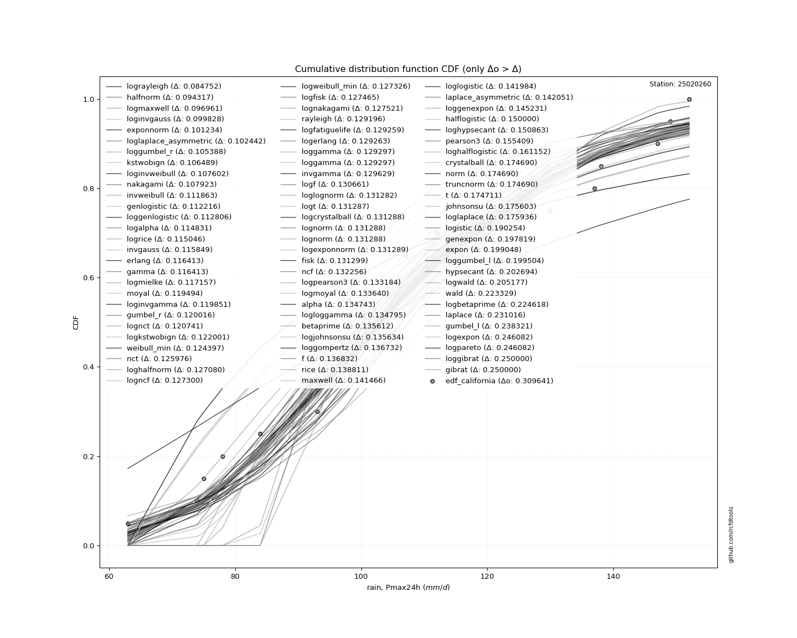</img>

</div>


**1.3. Best fit**

<div align="center">

|   id |   station | empirical_dist   | p_dist   |     delta |   deltao | eval   |   fit |   n |   best_fit |   best_fit_sort |
|-----:|----------:|:-----------------|:---------|----------:|---------:|:-------|------:|----:|-----------:|----------------:|
|    0 |  25020260 | edf_california   | rayleigh | 0.0572692 | 0.178577 | Δo > Δ |     1 |  58 |          1 |               1 |

</div>


<div align="center">

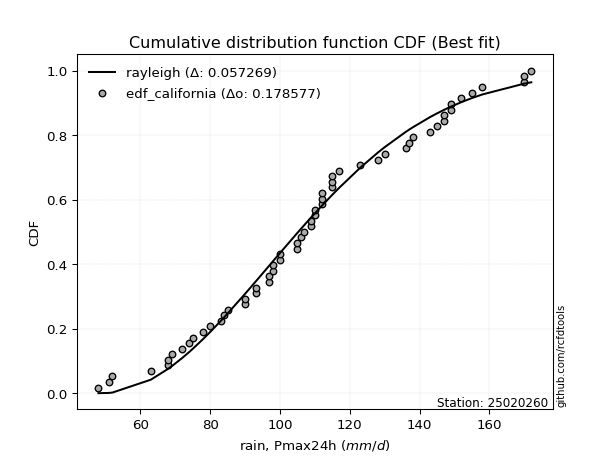</img>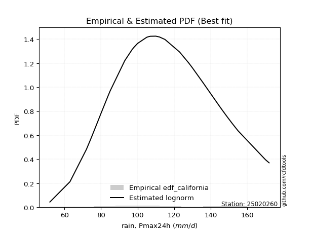</img>

</div>


### 2. Empirical - EDF Hazen (1930)

Hazen method for plotting positions is a formula used to estimate the empirical cumulative probability distribution of flood events or other hydrological data. This formula often results in biased estimations, particularly when extrapolating to extreme events (high return periods).

<div align="center">


$P=(m-0.5)/n$


</div>


**2.1. Empirical values**

<div align="center">

|                | 0                    | 1                   | 2                   | 3                  | 4                   | 5                   | 6                   | 7                   | 8                   | 9                   | 10                 | 11                  | 12                  | 13                  | 14                 | 15                 | 16                  | 17                 | 18                  | 19                  | 20                  | 21                 | 22                 | 23                 | 24                 | 25                 | 26                  | 27                  | 28                  | 29                 | 30                 | 31                 | 32                 | 33                 | 34                 | 35                 | 36                 | 37                | 38                 | 39                 | 40                 | 41                 | 42                 | 43        | 44                 | 45                 | 46                 | 47                 | 48                 | 49                | 50                 | 51                 | 52                 | 53                 | 54                 | 55                 | 56                 | 57                 |
|:---------------|:---------------------|:--------------------|:--------------------|:-------------------|:--------------------|:--------------------|:--------------------|:--------------------|:--------------------|:--------------------|:-------------------|:--------------------|:--------------------|:--------------------|:-------------------|:-------------------|:--------------------|:-------------------|:--------------------|:--------------------|:--------------------|:-------------------|:-------------------|:-------------------|:-------------------|:-------------------|:--------------------|:--------------------|:--------------------|:-------------------|:-------------------|:-------------------|:-------------------|:-------------------|:-------------------|:-------------------|:-------------------|:------------------|:-------------------|:-------------------|:-------------------|:-------------------|:-------------------|:----------|:-------------------|:-------------------|:-------------------|:-------------------|:-------------------|:------------------|:-------------------|:-------------------|:-------------------|:-------------------|:-------------------|:-------------------|:-------------------|:-------------------|
| date           | 2019                 | 2015                | 1986                | 1990               | 1963                | 2017                | 2021                | 1972                | 1997                | 2005                | 1993               | 1982                | 2013                | 1994                | 1971               | 1968               | 1967                | 2003               | 2002                | 2000                | 2001                | 1995               | 1998               | 1981               | 1970               | 1980               | 1988                | 1996                | 2009                | 2010               | 2020               | 1965               | 1985               | 2004               | 1969               | 1966               | 1989               | 1977              | 2018               | 1964               | 1976               | 1973               | 1991               | 1979      | 2006               | 2008               | 2014               | 1984               | 2011               | 1992              | 1983               | 2007               | 1999               | 1974               | 2012               | 1978               | 1987               | 1975               |
| x              | 48.0                 | 51.0                | 52.0                | 63.0               | 68.0                | 68.0                | 69.0                | 72.0                | 74.0                | 75.0                | 78.0               | 80.0                | 83.0                | 84.0                | 85.0               | 90.0               | 90.0                | 93.0               | 93.0                | 97.0                | 97.0                | 98.0               | 98.0               | 100.0              | 100.0              | 105.0              | 105.0               | 106.0               | 107.0               | 109.0              | 109.0              | 110.0              | 110.0              | 112.0              | 112.0              | 112.0              | 115.0              | 115.0             | 115.0              | 117.0              | 123.0              | 128.0              | 130.0              | 136.0     | 137.0              | 138.0              | 143.0              | 145.0              | 147.0              | 147.0             | 149.0              | 149.0              | 152.0              | 155.0              | 158.0              | 170.0              | 170.0              | 172.0              |
| m              | 1                    | 2                   | 3                   | 4                  | 5                   | 6                   | 7                   | 8                   | 9                   | 10                  | 11                 | 12                  | 13                  | 14                  | 15                 | 16                 | 17                  | 18                 | 19                  | 20                  | 21                  | 22                 | 23                 | 24                 | 25                 | 26                 | 27                  | 28                  | 29                  | 30                 | 31                 | 32                 | 33                 | 34                 | 35                 | 36                 | 37                 | 38                | 39                 | 40                 | 41                 | 42                 | 43                 | 44        | 45                 | 46                 | 47                 | 48                 | 49                 | 50                | 51                 | 52                 | 53                 | 54                 | 55                 | 56                 | 57                 | 58                 |
| empirical_dist | edf_hazen            | edf_hazen           | edf_hazen           | edf_hazen          | edf_hazen           | edf_hazen           | edf_hazen           | edf_hazen           | edf_hazen           | edf_hazen           | edf_hazen          | edf_hazen           | edf_hazen           | edf_hazen           | edf_hazen          | edf_hazen          | edf_hazen           | edf_hazen          | edf_hazen           | edf_hazen           | edf_hazen           | edf_hazen          | edf_hazen          | edf_hazen          | edf_hazen          | edf_hazen          | edf_hazen           | edf_hazen           | edf_hazen           | edf_hazen          | edf_hazen          | edf_hazen          | edf_hazen          | edf_hazen          | edf_hazen          | edf_hazen          | edf_hazen          | edf_hazen         | edf_hazen          | edf_hazen          | edf_hazen          | edf_hazen          | edf_hazen          | edf_hazen | edf_hazen          | edf_hazen          | edf_hazen          | edf_hazen          | edf_hazen          | edf_hazen         | edf_hazen          | edf_hazen          | edf_hazen          | edf_hazen          | edf_hazen          | edf_hazen          | edf_hazen          | edf_hazen          |
| empirical      | 0.008620689655172414 | 0.02586206896551724 | 0.04310344827586207 | 0.0603448275862069 | 0.07758620689655173 | 0.09482758620689655 | 0.11206896551724138 | 0.12931034482758622 | 0.14655172413793102 | 0.16379310344827586 | 0.1810344827586207 | 0.19827586206896552 | 0.21551724137931033 | 0.23275862068965517 | 0.25               | 0.2672413793103448 | 0.28448275862068967 | 0.3017241379310345 | 0.31896551724137934 | 0.33620689655172414 | 0.35344827586206895 | 0.3706896551724138 | 0.3879310344827586 | 0.4051724137931034 | 0.4224137931034483 | 0.4396551724137931 | 0.45689655172413796 | 0.47413793103448276 | 0.49137931034482757 | 0.5086206896551724 | 0.5258620689655172 | 0.5431034482758621 | 0.5603448275862069 | 0.5775862068965517 | 0.5948275862068966 | 0.6120689655172413 | 0.6293103448275862 | 0.646551724137931 | 0.6637931034482759 | 0.6810344827586207 | 0.6982758620689655 | 0.7155172413793104 | 0.7327586206896551 | 0.75      | 0.7672413793103449 | 0.7844827586206896 | 0.8017241379310345 | 0.8189655172413793 | 0.8362068965517241 | 0.853448275862069 | 0.8706896551724138 | 0.8879310344827587 | 0.9051724137931034 | 0.9224137931034483 | 0.9396551724137931 | 0.9568965517241379 | 0.9741379310344828 | 0.9913793103448276 |
| empirical_tr   | 1.008695652173913    | 1.0265486725663717  | 1.045045045045045   | 1.0642201834862384 | 1.0841121495327102  | 1.1047619047619048  | 1.1262135922330097  | 1.1485148514851484  | 1.1717171717171717  | 1.1958762886597938  | 1.2210526315789474 | 1.2473118279569892  | 1.2747252747252746  | 1.3033707865168538  | 1.3333333333333333 | 1.364705882352941  | 1.3975903614457832  | 1.4320987654320987 | 1.4683544303797469  | 1.5064935064935066  | 1.5466666666666666  | 1.589041095890411  | 1.6338028169014085 | 1.681159420289855  | 1.7313432835820897 | 1.7846153846153847 | 1.8412698412698412  | 1.9016393442622952  | 1.9661016949152543  | 2.0350877192982453 | 2.109090909090909  | 2.188679245283019  | 2.2745098039215685 | 2.36734693877551   | 2.4680851063829787 | 2.5777777777777775 | 2.697674418604651  | 2.829268292682927 | 2.974358974358975  | 3.135135135135135  | 3.3142857142857145 | 3.5151515151515156 | 3.741935483870967  | 4.0       | 4.296296296296297  | 4.639999999999999  | 5.043478260869565  | 5.523809523809525  | 6.105263157894735  | 6.823529411764705 | 7.733333333333334  | 8.923076923076927  | 10.545454545454543 | 12.888888888888891 | 16.571428571428584 | 23.199999999999985 | 38.66666666666667  | 116.00000000000051 |

</div>


**2.2. Kolmogorov-Smirnov fit test (sorted by Δ)**


<div align="center">

|                | 0                   | 1                   | 2                   | 3                   | 4                   | 5                   | 6                   | 7                   | 8                  | 9                  | 10                  | 11                  | 12                  | 13                  | 14                  | 15                  | 16                 | 17                  | 18                  | 19                  | 20                  | 21                  | 22                  | 23                  | 24                  | 25                  | 26                  | 27                  | 28                  | 29                  | 30                  | 31                  | 32                  | 33                  | 34                  | 35                  | 36                  | 37                  | 38                 | 39                 | 40                  | 41                  | 42                  | 43                 | 44                  | 45                  | 46                  | 47                  | 48                  | 49                  | 50                  | 51                  | 52                  | 53                  | 54                  | 55                    | 56                  | 57                  | 58                  | 59                  | 60                 | 61                 | 62                  | 63                  | 64                  | 65                  | 66                  | 67                  | 68                  | 69                 | 70                  | 71                  | 72                 | 73                 | 74                  | 75                 | 76                 | 77                 | 78                  | 79                  | 80                  | 81                  | 82                 | 83                  | 84                  | 85                 | 86                 | 87                 |
|:---------------|:--------------------|:--------------------|:--------------------|:--------------------|:--------------------|:--------------------|:--------------------|:--------------------|:-------------------|:-------------------|:--------------------|:--------------------|:--------------------|:--------------------|:--------------------|:--------------------|:-------------------|:--------------------|:--------------------|:--------------------|:--------------------|:--------------------|:--------------------|:--------------------|:--------------------|:--------------------|:--------------------|:--------------------|:--------------------|:--------------------|:--------------------|:--------------------|:--------------------|:--------------------|:--------------------|:--------------------|:--------------------|:--------------------|:-------------------|:-------------------|:--------------------|:--------------------|:--------------------|:-------------------|:--------------------|:--------------------|:--------------------|:--------------------|:--------------------|:--------------------|:--------------------|:--------------------|:--------------------|:--------------------|:--------------------|:----------------------|:--------------------|:--------------------|:--------------------|:--------------------|:-------------------|:-------------------|:--------------------|:--------------------|:--------------------|:--------------------|:--------------------|:--------------------|:--------------------|:-------------------|:--------------------|:--------------------|:-------------------|:-------------------|:--------------------|:-------------------|:-------------------|:-------------------|:--------------------|:--------------------|:--------------------|:--------------------|:-------------------|:--------------------|:--------------------|:-------------------|:-------------------|:-------------------|
| station        | 25020260            | 25020260            | 25020260            | 25020260            | 25020260            | 25020260            | 25020260            | 25020260            | 25020260           | 25020260           | 25020260            | 25020260            | 25020260            | 25020260            | 25020260            | 25020260            | 25020260           | 25020260            | 25020260            | 25020260            | 25020260            | 25020260            | 25020260            | 25020260            | 25020260            | 25020260            | 25020260            | 25020260            | 25020260            | 25020260            | 25020260            | 25020260            | 25020260            | 25020260            | 25020260            | 25020260            | 25020260            | 25020260            | 25020260           | 25020260           | 25020260            | 25020260            | 25020260            | 25020260           | 25020260            | 25020260            | 25020260            | 25020260            | 25020260            | 25020260            | 25020260            | 25020260            | 25020260            | 25020260            | 25020260            | 25020260              | 25020260            | 25020260            | 25020260            | 25020260            | 25020260           | 25020260           | 25020260            | 25020260            | 25020260            | 25020260            | 25020260            | 25020260            | 25020260            | 25020260           | 25020260            | 25020260            | 25020260           | 25020260           | 25020260            | 25020260           | 25020260           | 25020260           | 25020260            | 25020260            | 25020260            | 25020260            | 25020260           | 25020260            | 25020260            | 25020260           | 25020260           | 25020260           |
| empirical_dist | edf_hazen           | edf_hazen           | edf_hazen           | edf_hazen           | edf_hazen           | edf_hazen           | edf_hazen           | edf_hazen           | edf_hazen          | edf_hazen          | edf_hazen           | edf_hazen           | edf_hazen           | edf_hazen           | edf_hazen           | edf_hazen           | edf_hazen          | edf_hazen           | edf_hazen           | edf_hazen           | edf_hazen           | edf_hazen           | edf_hazen           | edf_hazen           | edf_hazen           | edf_hazen           | edf_hazen           | edf_hazen           | edf_hazen           | edf_hazen           | edf_hazen           | edf_hazen           | edf_hazen           | edf_hazen           | edf_hazen           | edf_hazen           | edf_hazen           | edf_hazen           | edf_hazen          | edf_hazen          | edf_hazen           | edf_hazen           | edf_hazen           | edf_hazen          | edf_hazen           | edf_hazen           | edf_hazen           | edf_hazen           | edf_hazen           | edf_hazen           | edf_hazen           | edf_hazen           | edf_hazen           | edf_hazen           | edf_hazen           | edf_hazen             | edf_hazen           | edf_hazen           | edf_hazen           | edf_hazen           | edf_hazen          | edf_hazen          | edf_hazen           | edf_hazen           | edf_hazen           | edf_hazen           | edf_hazen           | edf_hazen           | edf_hazen           | edf_hazen          | edf_hazen           | edf_hazen           | edf_hazen          | edf_hazen          | edf_hazen           | edf_hazen          | edf_hazen          | edf_hazen          | edf_hazen           | edf_hazen           | edf_hazen           | edf_hazen           | edf_hazen          | edf_hazen           | edf_hazen           | edf_hazen          | edf_hazen          | edf_hazen          |
| p_dist         | logfisk             | fisk                | maxwell             | nakagami            | rayleigh            | alpha               | genlogistic         | invgamma            | logpearson3        | ncf                | chi2                | f                   | fatiguelife         | invweibull          | mielke              | erlang              | loggenlogistic     | gamma               | johnsonsu           | rice                | logfatiguelife      | weibull_min         | lognakagami         | logrice             | lognorm             | lognorm             | logcrystalball      | loglognorm          | logexponnorm        | logt                | logncf              | logf                | logweibull_min      | lognct              | logloggamma         | pearson3            | nct                 | invgauss            | logistic           | loggompertz        | loglogistic         | laplace_asymmetric  | logjohnsonsu        | gumbel_r           | loginvgamma         | logerlang           | loggamma            | loggamma            | exponnorm           | t                   | crystalball         | norm                | truncnorm           | betaprime           | logbetaprime        | loglaplace_asymmetric | logalpha            | hypsecant           | loggumbel_l         | loghypsecant        | logchi2            | kstwobign          | halfnorm            | loginvgauss         | laplace             | moyal               | loglaplace          | logmaxwell          | logmielke           | lograyleigh        | halflogistic        | loginvweibull       | loggumbel_r        | gumbel_l           | loghalfnorm         | logkstwobign       | logmoyal           | loghalflogistic    | loggenexpon         | wald                | expon               | logwald             | gibrat             | loggibrat           | logexpon            | logtruncnorm       | gompertz           | genexpon           |
| delta          | 0.05557471418382387 | 0.05714947108631929 | 0.05928404521441577 | 0.05992233527129642 | 0.06012623643912368 | 0.06280038168532454 | 0.06343342057657608 | 0.06369772994060952 | 0.0653455658816694 | 0.0667924198109463 | 0.06751933643942454 | 0.06799114317874133 | 0.06886616516699051 | 0.06896540837178722 | 0.06982480174744521 | 0.07000143711017859 | 0.0700474369438211 | 0.07036819430530727 | 0.07110207998175155 | 0.07133536925531203 | 0.07149896022515217 | 0.07193395658690771 | 0.07202966654761805 | 0.07233926339321772 | 0.07234241234738686 | 0.07234241234738686 | 0.07234285221569536 | 0.07234307780563748 | 0.07234320885267664 | 0.07234351931999994 | 0.07241564240415749 | 0.07265097355117256 | 0.07429029998095016 | 0.07561643561893261 | 0.07641570300934897 | 0.07673260436356322 | 0.07806141939875022 | 0.07828214662051847 | 0.0784339411205126 | 0.0788733760040421 | 0.07933384007766864 | 0.07970581249954978 | 0.08073280011601924 | 0.0815963363749217 | 0.08394561860116145 | 0.08448328331817778 | 0.08469365296458231 | 0.08469365296458231 | 0.08488805125714138 | 0.08595201881251768 | 0.08596356087779933 | 0.08596356372594227 | 0.08596357284861877 | 0.08694412033316518 | 0.08798881562424227 | 0.08810908768090653   | 0.08834318531531177 | 0.09061061107536328 | 0.09078793213468328 | 0.09144823712668149 | 0.0936850056114154 | 0.0938688959684792 | 0.09453693841437333 | 0.09471557730549363 | 0.10351516612122069 | 0.10368553212376724 | 0.10423802685641903 | 0.10653909760402752 | 0.11019557438241723 | 0.1187942193180796 | 0.12576390374903967 | 0.13045627750095717 | 0.1418679780497572 | 0.1494551704476056 | 0.15355826996167415 | 0.1604672937247031 | 0.1676077077354255 | 0.1704828289343278 | 0.17898652536156817 | 0.19747065450596074 | 0.23122517667370496 | 0.23913829773555045 | 0.25               | 0.26409824445715463 | 0.29145967690908153 | 0.4019894944421039 | 0.799356360181223  | 0.8942959265090777 |
| deltao         | 0.1785767486892227  | 0.1785767486892227  | 0.1785767486892227  | 0.1785767486892227  | 0.1785767486892227  | 0.1785767486892227  | 0.1785767486892227  | 0.1785767486892227  | 0.1785767486892227 | 0.1785767486892227 | 0.1785767486892227  | 0.1785767486892227  | 0.1785767486892227  | 0.1785767486892227  | 0.1785767486892227  | 0.1785767486892227  | 0.1785767486892227 | 0.1785767486892227  | 0.1785767486892227  | 0.1785767486892227  | 0.1785767486892227  | 0.1785767486892227  | 0.1785767486892227  | 0.1785767486892227  | 0.1785767486892227  | 0.1785767486892227  | 0.1785767486892227  | 0.1785767486892227  | 0.1785767486892227  | 0.1785767486892227  | 0.1785767486892227  | 0.1785767486892227  | 0.1785767486892227  | 0.1785767486892227  | 0.1785767486892227  | 0.1785767486892227  | 0.1785767486892227  | 0.1785767486892227  | 0.1785767486892227 | 0.1785767486892227 | 0.1785767486892227  | 0.1785767486892227  | 0.1785767486892227  | 0.1785767486892227 | 0.1785767486892227  | 0.1785767486892227  | 0.1785767486892227  | 0.1785767486892227  | 0.1785767486892227  | 0.1785767486892227  | 0.1785767486892227  | 0.1785767486892227  | 0.1785767486892227  | 0.1785767486892227  | 0.1785767486892227  | 0.1785767486892227    | 0.1785767486892227  | 0.1785767486892227  | 0.1785767486892227  | 0.1785767486892227  | 0.1785767486892227 | 0.1785767486892227 | 0.1785767486892227  | 0.1785767486892227  | 0.1785767486892227  | 0.1785767486892227  | 0.1785767486892227  | 0.1785767486892227  | 0.1785767486892227  | 0.1785767486892227 | 0.1785767486892227  | 0.1785767486892227  | 0.1785767486892227 | 0.1785767486892227 | 0.1785767486892227  | 0.1785767486892227 | 0.1785767486892227 | 0.1785767486892227 | 0.1785767486892227  | 0.1785767486892227  | 0.1785767486892227  | 0.1785767486892227  | 0.1785767486892227 | 0.1785767486892227  | 0.1785767486892227  | 0.1785767486892227 | 0.1785767486892227 | 0.1785767486892227 |
| eval           | Δo > Δ              | Δo > Δ              | Δo > Δ              | Δo > Δ              | Δo > Δ              | Δo > Δ              | Δo > Δ              | Δo > Δ              | Δo > Δ             | Δo > Δ             | Δo > Δ              | Δo > Δ              | Δo > Δ              | Δo > Δ              | Δo > Δ              | Δo > Δ              | Δo > Δ             | Δo > Δ              | Δo > Δ              | Δo > Δ              | Δo > Δ              | Δo > Δ              | Δo > Δ              | Δo > Δ              | Δo > Δ              | Δo > Δ              | Δo > Δ              | Δo > Δ              | Δo > Δ              | Δo > Δ              | Δo > Δ              | Δo > Δ              | Δo > Δ              | Δo > Δ              | Δo > Δ              | Δo > Δ              | Δo > Δ              | Δo > Δ              | Δo > Δ             | Δo > Δ             | Δo > Δ              | Δo > Δ              | Δo > Δ              | Δo > Δ             | Δo > Δ              | Δo > Δ              | Δo > Δ              | Δo > Δ              | Δo > Δ              | Δo > Δ              | Δo > Δ              | Δo > Δ              | Δo > Δ              | Δo > Δ              | Δo > Δ              | Δo > Δ                | Δo > Δ              | Δo > Δ              | Δo > Δ              | Δo > Δ              | Δo > Δ             | Δo > Δ             | Δo > Δ              | Δo > Δ              | Δo > Δ              | Δo > Δ              | Δo > Δ              | Δo > Δ              | Δo > Δ              | Δo > Δ             | Δo > Δ              | Δo > Δ              | Δo > Δ             | Δo > Δ             | Δo > Δ              | Δo > Δ             | Δo > Δ             | Δo > Δ             | Δo <= Δ             | Δo <= Δ             | Δo <= Δ             | Δo <= Δ             | Δo <= Δ            | Δo <= Δ             | Δo <= Δ             | Δo <= Δ            | Δo <= Δ            | Δo <= Δ            |
| fit            | 1                   | 1                   | 1                   | 1                   | 1                   | 1                   | 1                   | 1                   | 1                  | 1                  | 1                   | 1                   | 1                   | 1                   | 1                   | 1                   | 1                  | 1                   | 1                   | 1                   | 1                   | 1                   | 1                   | 1                   | 1                   | 1                   | 1                   | 1                   | 1                   | 1                   | 1                   | 1                   | 1                   | 1                   | 1                   | 1                   | 1                   | 1                   | 1                  | 1                  | 1                   | 1                   | 1                   | 1                  | 1                   | 1                   | 1                   | 1                   | 1                   | 1                   | 1                   | 1                   | 1                   | 1                   | 1                   | 1                     | 1                   | 1                   | 1                   | 1                   | 1                  | 1                  | 1                   | 1                   | 1                   | 1                   | 1                   | 1                   | 1                   | 1                  | 1                   | 1                   | 1                  | 1                  | 1                   | 1                  | 1                  | 1                  | 0                   | 0                   | 0                   | 0                   | 0                  | 0                   | 0                   | 0                  | 0                  | 0                  |
| n              | 58                  | 58                  | 58                  | 58                  | 58                  | 58                  | 58                  | 58                  | 58                 | 58                 | 58                  | 58                  | 58                  | 58                  | 58                  | 58                  | 58                 | 58                  | 58                  | 58                  | 58                  | 58                  | 58                  | 58                  | 58                  | 58                  | 58                  | 58                  | 58                  | 58                  | 58                  | 58                  | 58                  | 58                  | 58                  | 58                  | 58                  | 58                  | 58                 | 58                 | 58                  | 58                  | 58                  | 58                 | 58                  | 58                  | 58                  | 58                  | 58                  | 58                  | 58                  | 58                  | 58                  | 58                  | 58                  | 58                    | 58                  | 58                  | 58                  | 58                  | 58                 | 58                 | 58                  | 58                  | 58                  | 58                  | 58                  | 58                  | 58                  | 58                 | 58                  | 58                  | 58                 | 58                 | 58                  | 58                 | 58                 | 58                 | 58                  | 58                  | 58                  | 58                  | 58                 | 58                  | 58                  | 58                 | 58                 | 58                 |
| best_fit       | 1                   | 0                   | 0                   | 0                   | 0                   | 0                   | 0                   | 0                   | 0                  | 0                  | 0                   | 0                   | 0                   | 0                   | 0                   | 0                   | 0                  | 0                   | 0                   | 0                   | 0                   | 0                   | 0                   | 0                   | 0                   | 0                   | 0                   | 0                   | 0                   | 0                   | 0                   | 0                   | 0                   | 0                   | 0                   | 0                   | 0                   | 0                   | 0                  | 0                  | 0                   | 0                   | 0                   | 0                  | 0                   | 0                   | 0                   | 0                   | 0                   | 0                   | 0                   | 0                   | 0                   | 0                   | 0                   | 0                     | 0                   | 0                   | 0                   | 0                   | 0                  | 0                  | 0                   | 0                   | 0                   | 0                   | 0                   | 0                   | 0                   | 0                  | 0                   | 0                   | 0                  | 0                  | 0                   | 0                  | 0                  | 0                  | 0                   | 0                   | 0                   | 0                   | 0                  | 0                   | 0                   | 0                  | 0                  | 0                  |
| best_fit_sort  | 1                   | 2                   | 3                   | 4                   | 5                   | 6                   | 7                   | 8                   | 9                  | 10                 | 11                  | 12                  | 13                  | 14                  | 15                  | 16                  | 17                 | 18                  | 19                  | 20                  | 21                  | 22                  | 23                  | 24                  | 25                  | 26                  | 27                  | 28                  | 29                  | 30                  | 31                  | 32                  | 33                  | 34                  | 35                  | 36                  | 37                  | 38                  | 39                 | 40                 | 41                  | 42                  | 43                  | 44                 | 45                  | 46                  | 47                  | 48                  | 49                  | 50                  | 51                  | 52                  | 53                  | 54                  | 55                  | 56                    | 57                  | 58                  | 59                  | 60                  | 61                 | 62                 | 63                  | 64                  | 65                  | 66                  | 67                  | 68                  | 69                  | 70                 | 71                  | 72                  | 73                 | 74                 | 75                  | 76                 | 77                 | 78                 | 79                  | 80                  | 81                  | 82                  | 83                 | 84                  | 85                  | 86                 | 87                 | 88                 |

</div>


<div align="center">

</img>

</div>


**2.3. Best fit**

<div align="center">

|   id |   station | empirical_dist   | p_dist   |     delta |   deltao | eval   |   fit |   n |   best_fit |   best_fit_sort |
|-----:|----------:|:-----------------|:---------|----------:|---------:|:-------|------:|----:|-----------:|----------------:|
|    0 |  25020260 | edf_hazen        | logfisk  | 0.0555747 | 0.178577 | Δo > Δ |     1 |  58 |          1 |               1 |

</div>


<div align="center">

</img>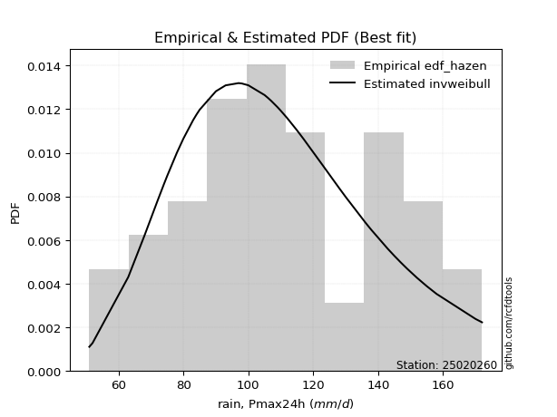</img>

</div>


### 3. Empirical - EDF Weibull (1939)

Weibull plotting position formula is an empirical method used to estimate the non-exceedance probability or plotting position for a set of observed data, is often recommended or widely used in practice, particularly in flood frequency analysis.

<div align="center">


$P=m/(n+1)$


</div>


**3.1. Empirical values**

<div align="center">

|                | 0                   | 1                   | 2                   | 3                   | 4                  | 5                  | 6                   | 7                   | 8                   | 9                  | 10                 | 11                 | 12                  | 13                  | 14                 | 15                 | 16                 | 17                 | 18                 | 19                 | 20                 | 21                 | 22                 | 23                 | 24                 | 25                 | 26                 | 27                 | 28                 | 29                 | 30                 | 31                 | 32                | 33                 | 34                 | 35                 | 36                 | 37                 | 38                 | 39                 | 40                 | 41                 | 42                 | 43                 | 44                 | 45                 | 46                 | 47                 | 48                 | 49                | 50                | 51                 | 52                 | 53                 | 54                 | 55                 | 56                 | 57                 |
|:---------------|:--------------------|:--------------------|:--------------------|:--------------------|:-------------------|:-------------------|:--------------------|:--------------------|:--------------------|:-------------------|:-------------------|:-------------------|:--------------------|:--------------------|:-------------------|:-------------------|:-------------------|:-------------------|:-------------------|:-------------------|:-------------------|:-------------------|:-------------------|:-------------------|:-------------------|:-------------------|:-------------------|:-------------------|:-------------------|:-------------------|:-------------------|:-------------------|:------------------|:-------------------|:-------------------|:-------------------|:-------------------|:-------------------|:-------------------|:-------------------|:-------------------|:-------------------|:-------------------|:-------------------|:-------------------|:-------------------|:-------------------|:-------------------|:-------------------|:------------------|:------------------|:-------------------|:-------------------|:-------------------|:-------------------|:-------------------|:-------------------|:-------------------|
| date           | 2019                | 2015                | 1986                | 1990                | 1963               | 2017               | 2021                | 1972                | 1997                | 2005               | 1993               | 1982               | 2013                | 1994                | 1971               | 1968               | 1967               | 2003               | 2002               | 2000               | 2001               | 1995               | 1998               | 1981               | 1970               | 1980               | 1988               | 1996               | 2009               | 2010               | 2020               | 1965               | 1985              | 2004               | 1969               | 1966               | 1989               | 1977               | 2018               | 1964               | 1976               | 1973               | 1991               | 1979               | 2006               | 2008               | 2014               | 1984               | 2011               | 1992              | 1983              | 2007               | 1999               | 1974               | 2012               | 1978               | 1987               | 1975               |
| x              | 48.0                | 51.0                | 52.0                | 63.0                | 68.0               | 68.0               | 69.0                | 72.0                | 74.0                | 75.0               | 78.0               | 80.0               | 83.0                | 84.0                | 85.0               | 90.0               | 90.0               | 93.0               | 93.0               | 97.0               | 97.0               | 98.0               | 98.0               | 100.0              | 100.0              | 105.0              | 105.0              | 106.0              | 107.0              | 109.0              | 109.0              | 110.0              | 110.0             | 112.0              | 112.0              | 112.0              | 115.0              | 115.0              | 115.0              | 117.0              | 123.0              | 128.0              | 130.0              | 136.0              | 137.0              | 138.0              | 143.0              | 145.0              | 147.0              | 147.0             | 149.0             | 149.0              | 152.0              | 155.0              | 158.0              | 170.0              | 170.0              | 172.0              |
| m              | 1                   | 2                   | 3                   | 4                   | 5                  | 6                  | 7                   | 8                   | 9                   | 10                 | 11                 | 12                 | 13                  | 14                  | 15                 | 16                 | 17                 | 18                 | 19                 | 20                 | 21                 | 22                 | 23                 | 24                 | 25                 | 26                 | 27                 | 28                 | 29                 | 30                 | 31                 | 32                 | 33                | 34                 | 35                 | 36                 | 37                 | 38                 | 39                 | 40                 | 41                 | 42                 | 43                 | 44                 | 45                 | 46                 | 47                 | 48                 | 49                 | 50                | 51                | 52                 | 53                 | 54                 | 55                 | 56                 | 57                 | 58                 |
| empirical_dist | edf_weibull         | edf_weibull         | edf_weibull         | edf_weibull         | edf_weibull        | edf_weibull        | edf_weibull         | edf_weibull         | edf_weibull         | edf_weibull        | edf_weibull        | edf_weibull        | edf_weibull         | edf_weibull         | edf_weibull        | edf_weibull        | edf_weibull        | edf_weibull        | edf_weibull        | edf_weibull        | edf_weibull        | edf_weibull        | edf_weibull        | edf_weibull        | edf_weibull        | edf_weibull        | edf_weibull        | edf_weibull        | edf_weibull        | edf_weibull        | edf_weibull        | edf_weibull        | edf_weibull       | edf_weibull        | edf_weibull        | edf_weibull        | edf_weibull        | edf_weibull        | edf_weibull        | edf_weibull        | edf_weibull        | edf_weibull        | edf_weibull        | edf_weibull        | edf_weibull        | edf_weibull        | edf_weibull        | edf_weibull        | edf_weibull        | edf_weibull       | edf_weibull       | edf_weibull        | edf_weibull        | edf_weibull        | edf_weibull        | edf_weibull        | edf_weibull        | edf_weibull        |
| empirical      | 0.01694915254237288 | 0.03389830508474576 | 0.05084745762711865 | 0.06779661016949153 | 0.0847457627118644 | 0.1016949152542373 | 0.11864406779661017 | 0.13559322033898305 | 0.15254237288135594 | 0.1694915254237288 | 0.1864406779661017 | 0.2033898305084746 | 0.22033898305084745 | 0.23728813559322035 | 0.2542372881355932 | 0.2711864406779661 | 0.288135593220339  | 0.3050847457627119 | 0.3220338983050847 | 0.3389830508474576 | 0.3559322033898305 | 0.3728813559322034 | 0.3898305084745763 | 0.4067796610169492 | 0.423728813559322  | 0.4406779661016949 | 0.4576271186440678 | 0.4745762711864407 | 0.4915254237288136 | 0.5084745762711864 | 0.5254237288135594 | 0.5423728813559322 | 0.559322033898305 | 0.576271186440678  | 0.5932203389830508 | 0.6101694915254238 | 0.6271186440677966 | 0.6440677966101694 | 0.6610169491525424 | 0.6779661016949152 | 0.6949152542372882 | 0.711864406779661  | 0.7288135593220338 | 0.7457627118644068 | 0.7627118644067796 | 0.7796610169491526 | 0.7966101694915254 | 0.8135593220338984 | 0.8305084745762712 | 0.847457627118644 | 0.864406779661017 | 0.8813559322033898 | 0.8983050847457628 | 0.9152542372881356 | 0.9322033898305084 | 0.9491525423728814 | 0.9661016949152542 | 0.9830508474576272 |
| empirical_tr   | 1.0172413793103448  | 1.0350877192982457  | 1.0535714285714286  | 1.0727272727272728  | 1.0925925925925926 | 1.1132075471698113 | 1.1346153846153846  | 1.156862745098039   | 1.1800000000000002  | 1.2040816326530612 | 1.2291666666666665 | 1.2553191489361701 | 1.2826086956521738  | 1.3111111111111111  | 1.3409090909090908 | 1.372093023255814  | 1.4047619047619049 | 1.4390243902439026 | 1.475              | 1.5128205128205128 | 1.5526315789473684 | 1.5945945945945945 | 1.638888888888889  | 1.6857142857142857 | 1.7352941176470589 | 1.7878787878787876 | 1.84375            | 1.9032258064516132 | 1.9666666666666668 | 2.0344827586206895 | 2.107142857142857  | 2.185185185185185  | 2.269230769230769 | 2.3600000000000003 | 2.458333333333333  | 2.565217391304348  | 2.6818181818181817 | 2.8095238095238093 | 2.95               | 3.1052631578947367 | 3.277777777777778  | 3.4705882352941178 | 3.687499999999999  | 3.9333333333333336 | 4.2142857142857135 | 4.538461538461539  | 4.916666666666666  | 5.363636363636365  | 5.9                | 6.555555555555554 | 7.375000000000002 | 8.428571428571427  | 9.833333333333337  | 11.8               | 14.749999999999991 | 19.666666666666675 | 29.499999999999982 | 59.000000000000156 |

</div>


**3.2. Kolmogorov-Smirnov fit test (sorted by Δ)**


<div align="center">

|                | 0                   | 1                  | 2                   | 3                   | 4                   | 5                   | 6                   | 7                   | 8                   | 9                   | 10                  | 11                  | 12                  | 13                  | 14                  | 15                  | 16                  | 17                  | 18                  | 19                 | 20                 | 21                  | 22                  | 23                  | 24                 | 25                 | 26                  | 27                  | 28                  | 29                  | 30                  | 31                 | 32                  | 33                  | 34                  | 35                 | 36                 | 37                 | 38                  | 39                  | 40                  | 41                  | 42                  | 43                  | 44                  | 45                  | 46                  | 47                 | 48                  | 49                  | 50                  | 51                  | 52                  | 53                 | 54                 | 55                 | 56                  | 57                  | 58                  | 59                  | 60                    | 61                  | 62                 | 63                 | 64                  | 65                  | 66                 | 67                 | 68                  | 69                  | 70                 | 71                 | 72                 | 73                  | 74                  | 75                  | 76                  | 77                 | 78                 | 79                 | 80                  | 81                  | 82                 | 83                 | 84                  | 85                 | 86                 | 87                 |
|:---------------|:--------------------|:-------------------|:--------------------|:--------------------|:--------------------|:--------------------|:--------------------|:--------------------|:--------------------|:--------------------|:--------------------|:--------------------|:--------------------|:--------------------|:--------------------|:--------------------|:--------------------|:--------------------|:--------------------|:-------------------|:-------------------|:--------------------|:--------------------|:--------------------|:-------------------|:-------------------|:--------------------|:--------------------|:--------------------|:--------------------|:--------------------|:-------------------|:--------------------|:--------------------|:--------------------|:-------------------|:-------------------|:-------------------|:--------------------|:--------------------|:--------------------|:--------------------|:--------------------|:--------------------|:--------------------|:--------------------|:--------------------|:-------------------|:--------------------|:--------------------|:--------------------|:--------------------|:--------------------|:-------------------|:-------------------|:-------------------|:--------------------|:--------------------|:--------------------|:--------------------|:----------------------|:--------------------|:-------------------|:-------------------|:--------------------|:--------------------|:-------------------|:-------------------|:--------------------|:--------------------|:-------------------|:-------------------|:-------------------|:--------------------|:--------------------|:--------------------|:--------------------|:-------------------|:-------------------|:-------------------|:--------------------|:--------------------|:-------------------|:-------------------|:--------------------|:-------------------|:-------------------|:-------------------|
| station        | 25020260            | 25020260           | 25020260            | 25020260            | 25020260            | 25020260            | 25020260            | 25020260            | 25020260            | 25020260            | 25020260            | 25020260            | 25020260            | 25020260            | 25020260            | 25020260            | 25020260            | 25020260            | 25020260            | 25020260           | 25020260           | 25020260            | 25020260            | 25020260            | 25020260           | 25020260           | 25020260            | 25020260            | 25020260            | 25020260            | 25020260            | 25020260           | 25020260            | 25020260            | 25020260            | 25020260           | 25020260           | 25020260           | 25020260            | 25020260            | 25020260            | 25020260            | 25020260            | 25020260            | 25020260            | 25020260            | 25020260            | 25020260           | 25020260            | 25020260            | 25020260            | 25020260            | 25020260            | 25020260           | 25020260           | 25020260           | 25020260            | 25020260            | 25020260            | 25020260            | 25020260              | 25020260            | 25020260           | 25020260           | 25020260            | 25020260            | 25020260           | 25020260           | 25020260            | 25020260            | 25020260           | 25020260           | 25020260           | 25020260            | 25020260            | 25020260            | 25020260            | 25020260           | 25020260           | 25020260           | 25020260            | 25020260            | 25020260           | 25020260           | 25020260            | 25020260           | 25020260           | 25020260           |
| empirical_dist | edf_weibull         | edf_weibull        | edf_weibull         | edf_weibull         | edf_weibull         | edf_weibull         | edf_weibull         | edf_weibull         | edf_weibull         | edf_weibull         | edf_weibull         | edf_weibull         | edf_weibull         | edf_weibull         | edf_weibull         | edf_weibull         | edf_weibull         | edf_weibull         | edf_weibull         | edf_weibull        | edf_weibull        | edf_weibull         | edf_weibull         | edf_weibull         | edf_weibull        | edf_weibull        | edf_weibull         | edf_weibull         | edf_weibull         | edf_weibull         | edf_weibull         | edf_weibull        | edf_weibull         | edf_weibull         | edf_weibull         | edf_weibull        | edf_weibull        | edf_weibull        | edf_weibull         | edf_weibull         | edf_weibull         | edf_weibull         | edf_weibull         | edf_weibull         | edf_weibull         | edf_weibull         | edf_weibull         | edf_weibull        | edf_weibull         | edf_weibull         | edf_weibull         | edf_weibull         | edf_weibull         | edf_weibull        | edf_weibull        | edf_weibull        | edf_weibull         | edf_weibull         | edf_weibull         | edf_weibull         | edf_weibull           | edf_weibull         | edf_weibull        | edf_weibull        | edf_weibull         | edf_weibull         | edf_weibull        | edf_weibull        | edf_weibull         | edf_weibull         | edf_weibull        | edf_weibull        | edf_weibull        | edf_weibull         | edf_weibull         | edf_weibull         | edf_weibull         | edf_weibull        | edf_weibull        | edf_weibull        | edf_weibull         | edf_weibull         | edf_weibull        | edf_weibull        | edf_weibull         | edf_weibull        | edf_weibull        | edf_weibull        |
| p_dist         | logfisk             | fisk               | nakagami            | logpearson3         | maxwell             | rayleigh            | invgamma            | chi2                | f                   | ncf                 | fatiguelife         | invweibull          | alpha               | erlang              | gamma               | genlogistic         | johnsonsu           | rice                | weibull_min         | loggenlogistic     | mielke             | lognakagami         | logfatiguelife      | logncf              | lognorm            | lognorm            | logcrystalball      | loglognorm          | logexponnorm        | logt                | logrice             | logf               | logweibull_min      | lognct              | logloggamma         | pearson3           | nct                | invgauss           | loggompertz         | logjohnsonsu        | loginvgamma         | logerlang           | loggamma            | loggamma            | exponnorm           | logistic            | t                   | crystalball        | norm                | truncnorm           | loglogistic         | laplace_asymmetric  | betaprime           | logbetaprime       | logalpha           | gumbel_r           | loggumbel_l         | logchi2             | kstwobign           | loginvgauss         | loglaplace_asymmetric | hypsecant           | halfnorm           | loghypsecant       | moyal               | logmaxwell          | logmielke          | laplace            | loglaplace          | lograyleigh         | loginvweibull      | halflogistic       | loggumbel_r        | gumbel_l            | loghalfnorm         | logkstwobign        | logmoyal            | loghalflogistic    | loggenexpon        | wald               | expon               | logwald             | gibrat             | loggibrat          | logexpon            | logtruncnorm       | gompertz           | genexpon           |
| delta          | 0.05981200231941708 | 0.0613867592219125 | 0.06200990074216406 | 0.06256941158593587 | 0.06352133335000898 | 0.06408267218777353 | 0.06442967313030745 | 0.06474318214369101 | 0.06521498888300781 | 0.06575001020549304 | 0.06609001087125699 | 0.06618925407605375 | 0.06703766982091774 | 0.06722528281444506 | 0.06759204000957375 | 0.06767070871216929 | 0.06832592568601803 | 0.06855921495957851 | 0.06915780229117419 | 0.0691968595969441 | 0.069262140737678  | 0.06981092529463756 | 0.06983079347836757 | 0.06986221970410839 | 0.0702327077890827 | 0.0702327077890827 | 0.07023311635800317 | 0.07023334169095036 | 0.07023368542560576 | 0.07023392671379974 | 0.07024245675225899 | 0.0705925268747492 | 0.07151414568521663 | 0.07297440358117718 | 0.07363954871361544 | 0.0739564500678297 | 0.0752852651030167 | 0.075505992324785  | 0.07609722170830857 | 0.07795664582028572 | 0.08116946430542799 | 0.08170712902244431 | 0.08191749866884884 | 0.08191749866884884 | 0.08211189696140786 | 0.08267122925610582 | 0.08317586451678416 | 0.0831874065820658 | 0.08318740943020875 | 0.08318741855288525 | 0.08357112821326185 | 0.08394310063514299 | 0.08416796603743171 | 0.0852126613285088 | 0.0855670310195783 | 0.0858336245105149 | 0.08801177783894976 | 0.09090885131568194 | 0.09109274167274573 | 0.09193942300976016 | 0.09234637581649974   | 0.09484789921095649 | 0.0953322388569758 | 0.0956855252622747 | 0.10266273843586543 | 0.10376294330829405 | 0.1074194200866837 | 0.1077524542568139 | 0.10847531499201224 | 0.11601806502234613 | 0.1276801232052237 | 0.1320467792604365 | 0.1408451843618554 | 0.14667901615187207 | 0.15078211566594069 | 0.15769113942896962 | 0.16658491404752368 | 0.169460035246426  | 0.1762103710658347 | 0.2025846229454698 | 0.22728011530608366 | 0.23811550404764864 | 0.2542372881355932 | 0.2630754507692528 | 0.28663793523754444 | 0.3980444330744826 | 0.7927812579018542 | 0.887136370693765  |
| deltao         | 0.1785767486892227  | 0.1785767486892227 | 0.1785767486892227  | 0.1785767486892227  | 0.1785767486892227  | 0.1785767486892227  | 0.1785767486892227  | 0.1785767486892227  | 0.1785767486892227  | 0.1785767486892227  | 0.1785767486892227  | 0.1785767486892227  | 0.1785767486892227  | 0.1785767486892227  | 0.1785767486892227  | 0.1785767486892227  | 0.1785767486892227  | 0.1785767486892227  | 0.1785767486892227  | 0.1785767486892227 | 0.1785767486892227 | 0.1785767486892227  | 0.1785767486892227  | 0.1785767486892227  | 0.1785767486892227 | 0.1785767486892227 | 0.1785767486892227  | 0.1785767486892227  | 0.1785767486892227  | 0.1785767486892227  | 0.1785767486892227  | 0.1785767486892227 | 0.1785767486892227  | 0.1785767486892227  | 0.1785767486892227  | 0.1785767486892227 | 0.1785767486892227 | 0.1785767486892227 | 0.1785767486892227  | 0.1785767486892227  | 0.1785767486892227  | 0.1785767486892227  | 0.1785767486892227  | 0.1785767486892227  | 0.1785767486892227  | 0.1785767486892227  | 0.1785767486892227  | 0.1785767486892227 | 0.1785767486892227  | 0.1785767486892227  | 0.1785767486892227  | 0.1785767486892227  | 0.1785767486892227  | 0.1785767486892227 | 0.1785767486892227 | 0.1785767486892227 | 0.1785767486892227  | 0.1785767486892227  | 0.1785767486892227  | 0.1785767486892227  | 0.1785767486892227    | 0.1785767486892227  | 0.1785767486892227 | 0.1785767486892227 | 0.1785767486892227  | 0.1785767486892227  | 0.1785767486892227 | 0.1785767486892227 | 0.1785767486892227  | 0.1785767486892227  | 0.1785767486892227 | 0.1785767486892227 | 0.1785767486892227 | 0.1785767486892227  | 0.1785767486892227  | 0.1785767486892227  | 0.1785767486892227  | 0.1785767486892227 | 0.1785767486892227 | 0.1785767486892227 | 0.1785767486892227  | 0.1785767486892227  | 0.1785767486892227 | 0.1785767486892227 | 0.1785767486892227  | 0.1785767486892227 | 0.1785767486892227 | 0.1785767486892227 |
| eval           | Δo > Δ              | Δo > Δ             | Δo > Δ              | Δo > Δ              | Δo > Δ              | Δo > Δ              | Δo > Δ              | Δo > Δ              | Δo > Δ              | Δo > Δ              | Δo > Δ              | Δo > Δ              | Δo > Δ              | Δo > Δ              | Δo > Δ              | Δo > Δ              | Δo > Δ              | Δo > Δ              | Δo > Δ              | Δo > Δ             | Δo > Δ             | Δo > Δ              | Δo > Δ              | Δo > Δ              | Δo > Δ             | Δo > Δ             | Δo > Δ              | Δo > Δ              | Δo > Δ              | Δo > Δ              | Δo > Δ              | Δo > Δ             | Δo > Δ              | Δo > Δ              | Δo > Δ              | Δo > Δ             | Δo > Δ             | Δo > Δ             | Δo > Δ              | Δo > Δ              | Δo > Δ              | Δo > Δ              | Δo > Δ              | Δo > Δ              | Δo > Δ              | Δo > Δ              | Δo > Δ              | Δo > Δ             | Δo > Δ              | Δo > Δ              | Δo > Δ              | Δo > Δ              | Δo > Δ              | Δo > Δ             | Δo > Δ             | Δo > Δ             | Δo > Δ              | Δo > Δ              | Δo > Δ              | Δo > Δ              | Δo > Δ                | Δo > Δ              | Δo > Δ             | Δo > Δ             | Δo > Δ              | Δo > Δ              | Δo > Δ             | Δo > Δ             | Δo > Δ              | Δo > Δ              | Δo > Δ             | Δo > Δ             | Δo > Δ             | Δo > Δ              | Δo > Δ              | Δo > Δ              | Δo > Δ              | Δo > Δ             | Δo > Δ             | Δo <= Δ            | Δo <= Δ             | Δo <= Δ             | Δo <= Δ            | Δo <= Δ            | Δo <= Δ             | Δo <= Δ            | Δo <= Δ            | Δo <= Δ            |
| fit            | 1                   | 1                  | 1                   | 1                   | 1                   | 1                   | 1                   | 1                   | 1                   | 1                   | 1                   | 1                   | 1                   | 1                   | 1                   | 1                   | 1                   | 1                   | 1                   | 1                  | 1                  | 1                   | 1                   | 1                   | 1                  | 1                  | 1                   | 1                   | 1                   | 1                   | 1                   | 1                  | 1                   | 1                   | 1                   | 1                  | 1                  | 1                  | 1                   | 1                   | 1                   | 1                   | 1                   | 1                   | 1                   | 1                   | 1                   | 1                  | 1                   | 1                   | 1                   | 1                   | 1                   | 1                  | 1                  | 1                  | 1                   | 1                   | 1                   | 1                   | 1                     | 1                   | 1                  | 1                  | 1                   | 1                   | 1                  | 1                  | 1                   | 1                   | 1                  | 1                  | 1                  | 1                   | 1                   | 1                   | 1                   | 1                  | 1                  | 0                  | 0                   | 0                   | 0                  | 0                  | 0                   | 0                  | 0                  | 0                  |
| n              | 58                  | 58                 | 58                  | 58                  | 58                  | 58                  | 58                  | 58                  | 58                  | 58                  | 58                  | 58                  | 58                  | 58                  | 58                  | 58                  | 58                  | 58                  | 58                  | 58                 | 58                 | 58                  | 58                  | 58                  | 58                 | 58                 | 58                  | 58                  | 58                  | 58                  | 58                  | 58                 | 58                  | 58                  | 58                  | 58                 | 58                 | 58                 | 58                  | 58                  | 58                  | 58                  | 58                  | 58                  | 58                  | 58                  | 58                  | 58                 | 58                  | 58                  | 58                  | 58                  | 58                  | 58                 | 58                 | 58                 | 58                  | 58                  | 58                  | 58                  | 58                    | 58                  | 58                 | 58                 | 58                  | 58                  | 58                 | 58                 | 58                  | 58                  | 58                 | 58                 | 58                 | 58                  | 58                  | 58                  | 58                  | 58                 | 58                 | 58                 | 58                  | 58                  | 58                 | 58                 | 58                  | 58                 | 58                 | 58                 |
| best_fit       | 1                   | 0                  | 0                   | 0                   | 0                   | 0                   | 0                   | 0                   | 0                   | 0                   | 0                   | 0                   | 0                   | 0                   | 0                   | 0                   | 0                   | 0                   | 0                   | 0                  | 0                  | 0                   | 0                   | 0                   | 0                  | 0                  | 0                   | 0                   | 0                   | 0                   | 0                   | 0                  | 0                   | 0                   | 0                   | 0                  | 0                  | 0                  | 0                   | 0                   | 0                   | 0                   | 0                   | 0                   | 0                   | 0                   | 0                   | 0                  | 0                   | 0                   | 0                   | 0                   | 0                   | 0                  | 0                  | 0                  | 0                   | 0                   | 0                   | 0                   | 0                     | 0                   | 0                  | 0                  | 0                   | 0                   | 0                  | 0                  | 0                   | 0                   | 0                  | 0                  | 0                  | 0                   | 0                   | 0                   | 0                   | 0                  | 0                  | 0                  | 0                   | 0                   | 0                  | 0                  | 0                   | 0                  | 0                  | 0                  |
| best_fit_sort  | 1                   | 2                  | 3                   | 4                   | 5                   | 6                   | 7                   | 8                   | 9                   | 10                  | 11                  | 12                  | 13                  | 14                  | 15                  | 16                  | 17                  | 18                  | 19                  | 20                 | 21                 | 22                  | 23                  | 24                  | 25                 | 26                 | 27                  | 28                  | 29                  | 30                  | 31                  | 32                 | 33                  | 34                  | 35                  | 36                 | 37                 | 38                 | 39                  | 40                  | 41                  | 42                  | 43                  | 44                  | 45                  | 46                  | 47                  | 48                 | 49                  | 50                  | 51                  | 52                  | 53                  | 54                 | 55                 | 56                 | 57                  | 58                  | 59                  | 60                  | 61                    | 62                  | 63                 | 64                 | 65                  | 66                  | 67                 | 68                 | 69                  | 70                  | 71                 | 72                 | 73                 | 74                  | 75                  | 76                  | 77                  | 78                 | 79                 | 80                 | 81                  | 82                  | 83                 | 84                 | 85                  | 86                 | 87                 | 88                 |

</div>


<div align="center">

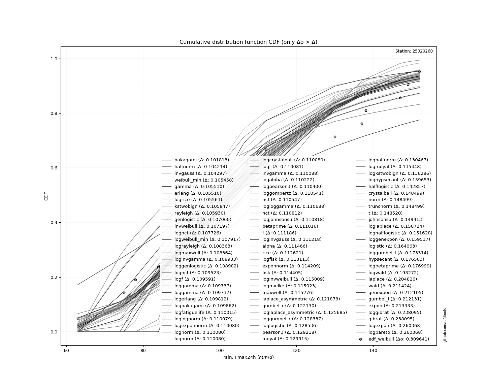</img>

</div>


**3.3. Best fit**

<div align="center">

|   id |   station | empirical_dist   | p_dist   |    delta |   deltao | eval   |   fit |   n |   best_fit |   best_fit_sort |
|-----:|----------:|:-----------------|:---------|---------:|---------:|:-------|------:|----:|-----------:|----------------:|
|    0 |  25020260 | edf_weibull      | logfisk  | 0.059812 | 0.178577 | Δo > Δ |     1 |  58 |          1 |               1 |

</div>


<div align="center">

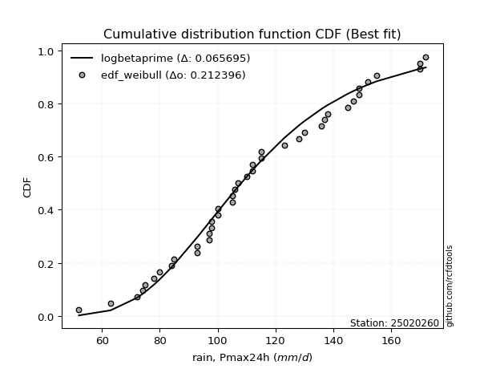</img></img>

</div>


### 4. Empirical - EDF Beard (1943)

The Beard formula (or Beard´s plotting position formula) in hydrology is used to estimate the empirical non-exceedance probability _(P)_ of a flood event (or other extreme hydrological data point) within a given dataset.

<div align="center">


$P=(m-0.31)/(n+0.38)$


</div>


**4.1. Empirical values**

<div align="center">

|                | 0                    | 1                  | 2                  | 3                  | 4                  | 5                   | 6                   | 7                 | 8                  | 9                   | 10                 | 11                 | 12                 | 13                 | 14                 | 15                 | 16                  | 17                  | 18                  | 19                  | 20                 | 21                  | 22                  | 23                  | 24                  | 25                  | 26                 | 27                  | 28                  | 29                 | 30                 | 31                 | 32                 | 33                 | 34                 | 35                 | 36                 | 37                | 38                 | 39                 | 40                 | 41                 | 42                 | 43                 | 44                 | 45                 | 46                 | 47                | 48                 | 49                 | 50                | 51                 | 52                 | 53                 | 54                 | 55                 | 56                 | 57                |
|:---------------|:---------------------|:-------------------|:-------------------|:-------------------|:-------------------|:--------------------|:--------------------|:------------------|:-------------------|:--------------------|:-------------------|:-------------------|:-------------------|:-------------------|:-------------------|:-------------------|:--------------------|:--------------------|:--------------------|:--------------------|:-------------------|:--------------------|:--------------------|:--------------------|:--------------------|:--------------------|:-------------------|:--------------------|:--------------------|:-------------------|:-------------------|:-------------------|:-------------------|:-------------------|:-------------------|:-------------------|:-------------------|:------------------|:-------------------|:-------------------|:-------------------|:-------------------|:-------------------|:-------------------|:-------------------|:-------------------|:-------------------|:------------------|:-------------------|:-------------------|:------------------|:-------------------|:-------------------|:-------------------|:-------------------|:-------------------|:-------------------|:------------------|
| date           | 2019                 | 2015               | 1986               | 1990               | 1963               | 2017                | 2021                | 1972              | 1997               | 2005                | 1993               | 1982               | 2013               | 1994               | 1971               | 1968               | 1967                | 2003                | 2002                | 2000                | 2001               | 1995                | 1998                | 1981                | 1970                | 1980                | 1988               | 1996                | 2009                | 2010               | 2020               | 1965               | 1985               | 2004               | 1969               | 1966               | 1989               | 1977              | 2018               | 1964               | 1976               | 1973               | 1991               | 1979               | 2006               | 2008               | 2014               | 1984              | 2011               | 1992               | 1983              | 2007               | 1999               | 1974               | 2012               | 1978               | 1987               | 1975              |
| x              | 48.0                 | 51.0               | 52.0               | 63.0               | 68.0               | 68.0                | 69.0                | 72.0              | 74.0               | 75.0                | 78.0               | 80.0               | 83.0               | 84.0               | 85.0               | 90.0               | 90.0                | 93.0                | 93.0                | 97.0                | 97.0               | 98.0                | 98.0                | 100.0               | 100.0               | 105.0               | 105.0              | 106.0               | 107.0               | 109.0              | 109.0              | 110.0              | 110.0              | 112.0              | 112.0              | 112.0              | 115.0              | 115.0             | 115.0              | 117.0              | 123.0              | 128.0              | 130.0              | 136.0              | 137.0              | 138.0              | 143.0              | 145.0             | 147.0              | 147.0              | 149.0             | 149.0              | 152.0              | 155.0              | 158.0              | 170.0              | 170.0              | 172.0             |
| m              | 1                    | 2                  | 3                  | 4                  | 5                  | 6                   | 7                   | 8                 | 9                  | 10                  | 11                 | 12                 | 13                 | 14                 | 15                 | 16                 | 17                  | 18                  | 19                  | 20                  | 21                 | 22                  | 23                  | 24                  | 25                  | 26                  | 27                 | 28                  | 29                  | 30                 | 31                 | 32                 | 33                 | 34                 | 35                 | 36                 | 37                 | 38                | 39                 | 40                 | 41                 | 42                 | 43                 | 44                 | 45                 | 46                 | 47                 | 48                | 49                 | 50                 | 51                | 52                 | 53                 | 54                 | 55                 | 56                 | 57                 | 58                |
| empirical_dist | edf_beard            | edf_beard          | edf_beard          | edf_beard          | edf_beard          | edf_beard           | edf_beard           | edf_beard         | edf_beard          | edf_beard           | edf_beard          | edf_beard          | edf_beard          | edf_beard          | edf_beard          | edf_beard          | edf_beard           | edf_beard           | edf_beard           | edf_beard           | edf_beard          | edf_beard           | edf_beard           | edf_beard           | edf_beard           | edf_beard           | edf_beard          | edf_beard           | edf_beard           | edf_beard          | edf_beard          | edf_beard          | edf_beard          | edf_beard          | edf_beard          | edf_beard          | edf_beard          | edf_beard         | edf_beard          | edf_beard          | edf_beard          | edf_beard          | edf_beard          | edf_beard          | edf_beard          | edf_beard          | edf_beard          | edf_beard         | edf_beard          | edf_beard          | edf_beard         | edf_beard          | edf_beard          | edf_beard          | edf_beard          | edf_beard          | edf_beard          | edf_beard         |
| empirical      | 0.011819116135662897 | 0.0289482699554642 | 0.0460774237752655 | 0.0632065775950668 | 0.0803357314148681 | 0.09746488523466941 | 0.11459403905447071 | 0.131723192874272 | 0.1488523466940733 | 0.16598150051387459 | 0.1831106543336759 | 0.2002398081534772 | 0.2173689619732785 | 0.2344981157930798 | 0.2516272696128811 | 0.2687564234326824 | 0.28588557725248376 | 0.30301473107228505 | 0.32014388489208634 | 0.33727303871188763 | 0.3544021925316889 | 0.37153134635149027 | 0.38866050017129156 | 0.40578965399109285 | 0.42291880781089414 | 0.44004796163069543 | 0.4571771154504968 | 0.47430626927029806 | 0.49143542309009935 | 0.5085645769099006 | 0.5256937307297019 | 0.5428228845495032 | 0.5599520383693045 | 0.5770811921891058 | 0.5942103460089071 | 0.6113394998287084 | 0.6284686536485097 | 0.645597807468311 | 0.6627269612881123 | 0.6798561151079136 | 0.696985268927715  | 0.7141144227475162 | 0.7312435765673175 | 0.7483727303871188 | 0.7655018842069201 | 0.7826310380267214 | 0.7997601918465227 | 0.816889345666324 | 0.8340184994861253 | 0.8511476533059266 | 0.868276807125728 | 0.8854059609455293 | 0.9025351147653305 | 0.9196642685851318 | 0.9367934224049331 | 0.9539225762247344 | 0.9710517300445357 | 0.988180883864337 |
| empirical_tr   | 1.0119604784191367   | 1.0298112541894513 | 1.0483031064823127 | 1.0674712013165113 | 1.0873533246414602 | 1.1079901309546405  | 1.1294254207777132  | 1.151706450976524 | 1.1748842825518213 | 1.1990141712877387  | 1.2241560075487523 | 1.250374812593703  | 1.27774130006566   | 1.306332512866413  | 1.3362325474937058 | 1.3675333801827128 | 1.4003358119453106  | 1.4347505529614155  | 1.470899470899471   | 1.5089170328250194  | 1.5489519766516318 | 1.5911692559280457  | 1.6357523115718688  | 1.6829057365234936  | 1.7328584149599287  | 1.7858672376873659  | 1.8422215209845378 | 1.9022482893450636  | 1.9663186257999326  | 2.0348553502962705 | 2.1083423618634884 | 2.1873360809291866 | 2.272479564032697  | 2.3645200486026727 | 2.4643309413254535 | 2.572939620978404  | 2.691562932226832  | 2.821652972450458 | 2.964956830878618  | 3.1235955056179763 | 3.3001695873374786 | 3.497902935889754  | 3.720841300191204  | 3.974132062627637  | 4.264426588750912  | 4.600472813238769  | 4.994011976047902  | 5.46117867165575  | 6.024767801857581  | 6.7180667433831935 | 7.591677503250974 | 8.726457399103136  | 10.260105448154652 | 12.447761194029843 | 15.821138211382097 | 21.702602230483233 | 34.54437869822475  | 84.6086956521732  |

</div>


**4.2. Kolmogorov-Smirnov fit test (sorted by Δ)**


<div align="center">

|                | 0                   | 1                   | 2                   | 3                   | 4                    | 5                   | 6                   | 7                   | 8                   | 9                   | 10                  | 11                  | 12                  | 13                  | 14                  | 15                  | 16                  | 17                  | 18                 | 19                  | 20                  | 21                  | 22                  | 23                  | 24                  | 25                  | 26                  | 27                 | 28                  | 29                  | 30                 | 31                  | 32                 | 33                  | 34                  | 35                  | 36                  | 37                  | 38                  | 39                  | 40                  | 41                  | 42                  | 43                  | 44                  | 45                 | 46                  | 47                  | 48                  | 49                  | 50                  | 51                  | 52                  | 53                  | 54                  | 55                  | 56                  | 57                    | 58                  | 59                  | 60                  | 61                  | 62                  | 63                  | 64                  | 65                  | 66                  | 67                  | 68                  | 69                  | 70                  | 71                 | 72                  | 73                  | 74                  | 75                 | 76                  | 77                  | 78                  | 79                 | 80                  | 81                  | 82                 | 83                 | 84                 | 85                 | 86                 | 87                 |
|:---------------|:--------------------|:--------------------|:--------------------|:--------------------|:---------------------|:--------------------|:--------------------|:--------------------|:--------------------|:--------------------|:--------------------|:--------------------|:--------------------|:--------------------|:--------------------|:--------------------|:--------------------|:--------------------|:-------------------|:--------------------|:--------------------|:--------------------|:--------------------|:--------------------|:--------------------|:--------------------|:--------------------|:-------------------|:--------------------|:--------------------|:-------------------|:--------------------|:-------------------|:--------------------|:--------------------|:--------------------|:--------------------|:--------------------|:--------------------|:--------------------|:--------------------|:--------------------|:--------------------|:--------------------|:--------------------|:-------------------|:--------------------|:--------------------|:--------------------|:--------------------|:--------------------|:--------------------|:--------------------|:--------------------|:--------------------|:--------------------|:--------------------|:----------------------|:--------------------|:--------------------|:--------------------|:--------------------|:--------------------|:--------------------|:--------------------|:--------------------|:--------------------|:--------------------|:--------------------|:--------------------|:--------------------|:-------------------|:--------------------|:--------------------|:--------------------|:-------------------|:--------------------|:--------------------|:--------------------|:-------------------|:--------------------|:--------------------|:-------------------|:-------------------|:-------------------|:-------------------|:-------------------|:-------------------|
| station        | 25020260            | 25020260            | 25020260            | 25020260            | 25020260             | 25020260            | 25020260            | 25020260            | 25020260            | 25020260            | 25020260            | 25020260            | 25020260            | 25020260            | 25020260            | 25020260            | 25020260            | 25020260            | 25020260           | 25020260            | 25020260            | 25020260            | 25020260            | 25020260            | 25020260            | 25020260            | 25020260            | 25020260           | 25020260            | 25020260            | 25020260           | 25020260            | 25020260           | 25020260            | 25020260            | 25020260            | 25020260            | 25020260            | 25020260            | 25020260            | 25020260            | 25020260            | 25020260            | 25020260            | 25020260            | 25020260           | 25020260            | 25020260            | 25020260            | 25020260            | 25020260            | 25020260            | 25020260            | 25020260            | 25020260            | 25020260            | 25020260            | 25020260              | 25020260            | 25020260            | 25020260            | 25020260            | 25020260            | 25020260            | 25020260            | 25020260            | 25020260            | 25020260            | 25020260            | 25020260            | 25020260            | 25020260           | 25020260            | 25020260            | 25020260            | 25020260           | 25020260            | 25020260            | 25020260            | 25020260           | 25020260            | 25020260            | 25020260           | 25020260           | 25020260           | 25020260           | 25020260           | 25020260           |
| empirical_dist | edf_beard           | edf_beard           | edf_beard           | edf_beard           | edf_beard            | edf_beard           | edf_beard           | edf_beard           | edf_beard           | edf_beard           | edf_beard           | edf_beard           | edf_beard           | edf_beard           | edf_beard           | edf_beard           | edf_beard           | edf_beard           | edf_beard          | edf_beard           | edf_beard           | edf_beard           | edf_beard           | edf_beard           | edf_beard           | edf_beard           | edf_beard           | edf_beard          | edf_beard           | edf_beard           | edf_beard          | edf_beard           | edf_beard          | edf_beard           | edf_beard           | edf_beard           | edf_beard           | edf_beard           | edf_beard           | edf_beard           | edf_beard           | edf_beard           | edf_beard           | edf_beard           | edf_beard           | edf_beard          | edf_beard           | edf_beard           | edf_beard           | edf_beard           | edf_beard           | edf_beard           | edf_beard           | edf_beard           | edf_beard           | edf_beard           | edf_beard           | edf_beard             | edf_beard           | edf_beard           | edf_beard           | edf_beard           | edf_beard           | edf_beard           | edf_beard           | edf_beard           | edf_beard           | edf_beard           | edf_beard           | edf_beard           | edf_beard           | edf_beard          | edf_beard           | edf_beard           | edf_beard           | edf_beard          | edf_beard           | edf_beard           | edf_beard           | edf_beard          | edf_beard           | edf_beard           | edf_beard          | edf_beard          | edf_beard          | edf_beard          | edf_beard          | edf_beard          |
| p_dist         | logfisk             | fisk                | nakagami            | maxwell             | rayleigh             | invgamma            | logpearson3         | alpha               | genlogistic         | ncf                 | chi2                | f                   | fatiguelife         | invweibull          | mielke              | erlang              | loggenlogistic      | gamma               | johnsonsu          | rice                | logfatiguelife      | weibull_min         | lognakagami         | logrice             | lognorm             | lognorm             | logcrystalball      | loglognorm         | logexponnorm        | logt                | logncf             | logf                | logweibull_min     | lognct              | logloggamma         | pearson3            | nct                 | invgauss            | loggompertz         | logjohnsonsu        | logistic            | loglogistic         | laplace_asymmetric  | loginvgamma         | gumbel_r            | logerlang          | loggamma            | loggamma            | exponnorm           | t                   | crystalball         | norm                | truncnorm           | betaprime           | logbetaprime        | logalpha            | loggumbel_l         | loglaplace_asymmetric | hypsecant           | logchi2             | kstwobign           | loghypsecant        | halfnorm            | loginvgauss         | moyal               | laplace             | logmaxwell          | loglaplace          | logmielke           | lograyleigh         | halflogistic        | loginvweibull      | loggumbel_r         | gumbel_l            | loghalfnorm         | logkstwobign       | logmoyal            | loghalflogistic     | loggenexpon         | wald               | expon               | logwald             | gibrat             | loggibrat          | logexpon           | logtruncnorm       | gompertz           | genexpon           |
| delta          | 0.05720198379670505 | 0.05877674069920047 | 0.05939988221945203 | 0.06091131482729695 | 0.061472653665061494 | 0.06263158778044586 | 0.06427942372150575 | 0.06442765129820571 | 0.06506069018945726 | 0.06638001467649252 | 0.06645319427926089 | 0.06692500101857768 | 0.06780002300682686 | 0.06789926621162373 | 0.06875865958728156 | 0.06893529495001494 | 0.06898129478365744 | 0.06930205214514362 | 0.0700359378215879 | 0.07026922709514838 | 0.07046079794936705 | 0.07086781442674406 | 0.07096352438745457 | 0.07127312123305424 | 0.07127627018722338 | 0.07127627018722338 | 0.07127671005553188 | 0.071276935645474  | 0.07127706669251316 | 0.07127737715983645 | 0.071349500243994  | 0.07158483139100907 | 0.0732241578207865 | 0.07455029345876912 | 0.07534956084918532 | 0.07566646220339956 | 0.07699527723858657 | 0.07721600446035498 | 0.07780723384387844 | 0.07966665795585559 | 0.08006121073339378 | 0.08096110969054982 | 0.08133308211243095 | 0.08287947644099797 | 0.08322360598780287 | 0.0834171411580143 | 0.08362751080441883 | 0.08362751080441883 | 0.08382190909697773 | 0.08488587665235403 | 0.08489741871763568 | 0.08489742156577862 | 0.08489743068845512 | 0.08587797817300169 | 0.08692267346407878 | 0.08727704315514828 | 0.08972178997451963 | 0.0897363572937877    | 0.09223788068824446 | 0.09261886345125192 | 0.09280275380831571 | 0.09307550673956266 | 0.09347079625420984 | 0.09364943514533014 | 0.10329274290686491 | 0.10514243573410187 | 0.10547295544386404 | 0.10586529646930021 | 0.10912943222225358 | 0.11772807715791611 | 0.12817675179572546 | 0.1293901353407937 | 0.14147518883285487 | 0.14838902828744194 | 0.15249212780151067 | 0.1594011515645396 | 0.16721491851852316 | 0.17009003971742548 | 0.17792038320140469 | 0.1994346005904724 | 0.22971013255136735 | 0.23874550851864812 | 0.2516272696128811 | 0.2637054552402523 | 0.2896079563151134 | 0.4004744503197663 | 0.7968312866439936 | 0.8915464019907613 |
| deltao         | 0.1785767486892227  | 0.1785767486892227  | 0.1785767486892227  | 0.1785767486892227  | 0.1785767486892227   | 0.1785767486892227  | 0.1785767486892227  | 0.1785767486892227  | 0.1785767486892227  | 0.1785767486892227  | 0.1785767486892227  | 0.1785767486892227  | 0.1785767486892227  | 0.1785767486892227  | 0.1785767486892227  | 0.1785767486892227  | 0.1785767486892227  | 0.1785767486892227  | 0.1785767486892227 | 0.1785767486892227  | 0.1785767486892227  | 0.1785767486892227  | 0.1785767486892227  | 0.1785767486892227  | 0.1785767486892227  | 0.1785767486892227  | 0.1785767486892227  | 0.1785767486892227 | 0.1785767486892227  | 0.1785767486892227  | 0.1785767486892227 | 0.1785767486892227  | 0.1785767486892227 | 0.1785767486892227  | 0.1785767486892227  | 0.1785767486892227  | 0.1785767486892227  | 0.1785767486892227  | 0.1785767486892227  | 0.1785767486892227  | 0.1785767486892227  | 0.1785767486892227  | 0.1785767486892227  | 0.1785767486892227  | 0.1785767486892227  | 0.1785767486892227 | 0.1785767486892227  | 0.1785767486892227  | 0.1785767486892227  | 0.1785767486892227  | 0.1785767486892227  | 0.1785767486892227  | 0.1785767486892227  | 0.1785767486892227  | 0.1785767486892227  | 0.1785767486892227  | 0.1785767486892227  | 0.1785767486892227    | 0.1785767486892227  | 0.1785767486892227  | 0.1785767486892227  | 0.1785767486892227  | 0.1785767486892227  | 0.1785767486892227  | 0.1785767486892227  | 0.1785767486892227  | 0.1785767486892227  | 0.1785767486892227  | 0.1785767486892227  | 0.1785767486892227  | 0.1785767486892227  | 0.1785767486892227 | 0.1785767486892227  | 0.1785767486892227  | 0.1785767486892227  | 0.1785767486892227 | 0.1785767486892227  | 0.1785767486892227  | 0.1785767486892227  | 0.1785767486892227 | 0.1785767486892227  | 0.1785767486892227  | 0.1785767486892227 | 0.1785767486892227 | 0.1785767486892227 | 0.1785767486892227 | 0.1785767486892227 | 0.1785767486892227 |
| eval           | Δo > Δ              | Δo > Δ              | Δo > Δ              | Δo > Δ              | Δo > Δ               | Δo > Δ              | Δo > Δ              | Δo > Δ              | Δo > Δ              | Δo > Δ              | Δo > Δ              | Δo > Δ              | Δo > Δ              | Δo > Δ              | Δo > Δ              | Δo > Δ              | Δo > Δ              | Δo > Δ              | Δo > Δ             | Δo > Δ              | Δo > Δ              | Δo > Δ              | Δo > Δ              | Δo > Δ              | Δo > Δ              | Δo > Δ              | Δo > Δ              | Δo > Δ             | Δo > Δ              | Δo > Δ              | Δo > Δ             | Δo > Δ              | Δo > Δ             | Δo > Δ              | Δo > Δ              | Δo > Δ              | Δo > Δ              | Δo > Δ              | Δo > Δ              | Δo > Δ              | Δo > Δ              | Δo > Δ              | Δo > Δ              | Δo > Δ              | Δo > Δ              | Δo > Δ             | Δo > Δ              | Δo > Δ              | Δo > Δ              | Δo > Δ              | Δo > Δ              | Δo > Δ              | Δo > Δ              | Δo > Δ              | Δo > Δ              | Δo > Δ              | Δo > Δ              | Δo > Δ                | Δo > Δ              | Δo > Δ              | Δo > Δ              | Δo > Δ              | Δo > Δ              | Δo > Δ              | Δo > Δ              | Δo > Δ              | Δo > Δ              | Δo > Δ              | Δo > Δ              | Δo > Δ              | Δo > Δ              | Δo > Δ             | Δo > Δ              | Δo > Δ              | Δo > Δ              | Δo > Δ             | Δo > Δ              | Δo > Δ              | Δo > Δ              | Δo <= Δ            | Δo <= Δ             | Δo <= Δ             | Δo <= Δ            | Δo <= Δ            | Δo <= Δ            | Δo <= Δ            | Δo <= Δ            | Δo <= Δ            |
| fit            | 1                   | 1                   | 1                   | 1                   | 1                    | 1                   | 1                   | 1                   | 1                   | 1                   | 1                   | 1                   | 1                   | 1                   | 1                   | 1                   | 1                   | 1                   | 1                  | 1                   | 1                   | 1                   | 1                   | 1                   | 1                   | 1                   | 1                   | 1                  | 1                   | 1                   | 1                  | 1                   | 1                  | 1                   | 1                   | 1                   | 1                   | 1                   | 1                   | 1                   | 1                   | 1                   | 1                   | 1                   | 1                   | 1                  | 1                   | 1                   | 1                   | 1                   | 1                   | 1                   | 1                   | 1                   | 1                   | 1                   | 1                   | 1                     | 1                   | 1                   | 1                   | 1                   | 1                   | 1                   | 1                   | 1                   | 1                   | 1                   | 1                   | 1                   | 1                   | 1                  | 1                   | 1                   | 1                   | 1                  | 1                   | 1                   | 1                   | 0                  | 0                   | 0                   | 0                  | 0                  | 0                  | 0                  | 0                  | 0                  |
| n              | 58                  | 58                  | 58                  | 58                  | 58                   | 58                  | 58                  | 58                  | 58                  | 58                  | 58                  | 58                  | 58                  | 58                  | 58                  | 58                  | 58                  | 58                  | 58                 | 58                  | 58                  | 58                  | 58                  | 58                  | 58                  | 58                  | 58                  | 58                 | 58                  | 58                  | 58                 | 58                  | 58                 | 58                  | 58                  | 58                  | 58                  | 58                  | 58                  | 58                  | 58                  | 58                  | 58                  | 58                  | 58                  | 58                 | 58                  | 58                  | 58                  | 58                  | 58                  | 58                  | 58                  | 58                  | 58                  | 58                  | 58                  | 58                    | 58                  | 58                  | 58                  | 58                  | 58                  | 58                  | 58                  | 58                  | 58                  | 58                  | 58                  | 58                  | 58                  | 58                 | 58                  | 58                  | 58                  | 58                 | 58                  | 58                  | 58                  | 58                 | 58                  | 58                  | 58                 | 58                 | 58                 | 58                 | 58                 | 58                 |
| best_fit       | 1                   | 0                   | 0                   | 0                   | 0                    | 0                   | 0                   | 0                   | 0                   | 0                   | 0                   | 0                   | 0                   | 0                   | 0                   | 0                   | 0                   | 0                   | 0                  | 0                   | 0                   | 0                   | 0                   | 0                   | 0                   | 0                   | 0                   | 0                  | 0                   | 0                   | 0                  | 0                   | 0                  | 0                   | 0                   | 0                   | 0                   | 0                   | 0                   | 0                   | 0                   | 0                   | 0                   | 0                   | 0                   | 0                  | 0                   | 0                   | 0                   | 0                   | 0                   | 0                   | 0                   | 0                   | 0                   | 0                   | 0                   | 0                     | 0                   | 0                   | 0                   | 0                   | 0                   | 0                   | 0                   | 0                   | 0                   | 0                   | 0                   | 0                   | 0                   | 0                  | 0                   | 0                   | 0                   | 0                  | 0                   | 0                   | 0                   | 0                  | 0                   | 0                   | 0                  | 0                  | 0                  | 0                  | 0                  | 0                  |
| best_fit_sort  | 1                   | 2                   | 3                   | 4                   | 5                    | 6                   | 7                   | 8                   | 9                   | 10                  | 11                  | 12                  | 13                  | 14                  | 15                  | 16                  | 17                  | 18                  | 19                 | 20                  | 21                  | 22                  | 23                  | 24                  | 25                  | 26                  | 27                  | 28                 | 29                  | 30                  | 31                 | 32                  | 33                 | 34                  | 35                  | 36                  | 37                  | 38                  | 39                  | 40                  | 41                  | 42                  | 43                  | 44                  | 45                  | 46                 | 47                  | 48                  | 49                  | 50                  | 51                  | 52                  | 53                  | 54                  | 55                  | 56                  | 57                  | 58                    | 59                  | 60                  | 61                  | 62                  | 63                  | 64                  | 65                  | 66                  | 67                  | 68                  | 69                  | 70                  | 71                  | 72                 | 73                  | 74                  | 75                  | 76                 | 77                  | 78                  | 79                  | 80                 | 81                  | 82                  | 83                 | 84                 | 85                 | 86                 | 87                 | 88                 |

</div>


<div align="center">

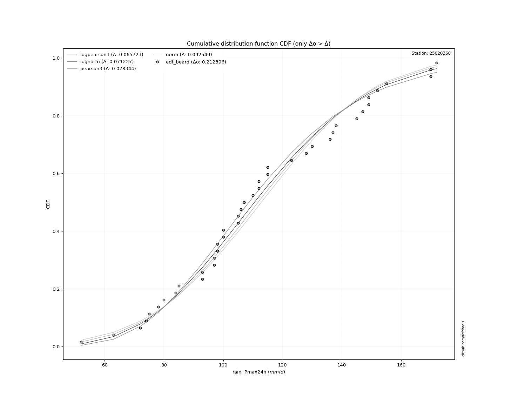</img>

</div>


**4.3. Best fit**

<div align="center">

|   id |   station | empirical_dist   | p_dist   |    delta |   deltao | eval   |   fit |   n |   best_fit |   best_fit_sort |
|-----:|----------:|:-----------------|:---------|---------:|---------:|:-------|------:|----:|-----------:|----------------:|
|    0 |  25020260 | edf_beard        | logfisk  | 0.057202 | 0.178577 | Δo > Δ |     1 |  58 |          1 |               1 |

</div>


<div align="center">

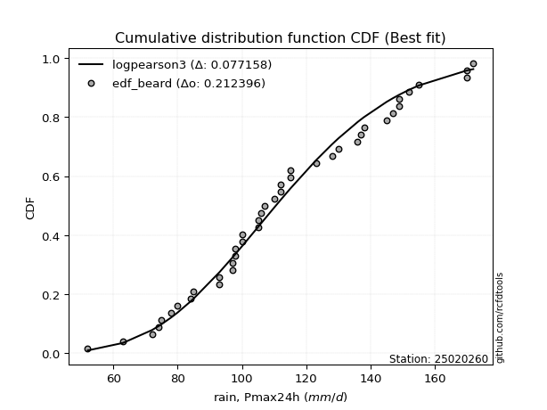</img>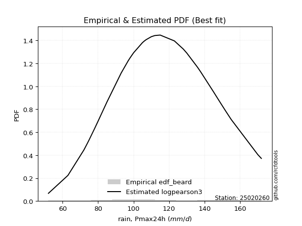</img>

</div>


### 5. Empirical - EDF Chegodayev (1955)

The Chegodayev formula is an empirical plotting position formula used in hydrological frequency analysis to estimate the exceedance probability or return period of a specific event from a set of observed data. It is primarily used for plotting observed data points on probability paper to fit a theoretical distribution, particularly for analyzing extreme events like maximum flood flows or rainfall intensities. The constant _b_ value in the generalized plotting position formula is 0.3.

<div align="center">


$P=(m-b)/(n+1-2b)$


</div>


**5.1. Empirical values**

<div align="center">

|                | 0                    | 1                   | 2                   | 3                   | 4                   | 5                  | 6                   | 7                   | 8                  | 9                  | 10                  | 11                  | 12                  | 13                 | 14                 | 15                 | 16                 | 17                 | 18                 | 19                 | 20                 | 21                 | 22                 | 23                 | 24                 | 25                 | 26                 | 27                 | 28                 | 29                 | 30                 | 31                 | 32                 | 33                 | 34                 | 35                 | 36                 | 37                 | 38                 | 39                 | 40                 | 41                 | 42                 | 43                 | 44                 | 45                 | 46                 | 47                 | 48                 | 49                | 50                 | 51                 | 52                 | 53                 | 54                 | 55                 | 56                 | 57                 |
|:---------------|:---------------------|:--------------------|:--------------------|:--------------------|:--------------------|:-------------------|:--------------------|:--------------------|:-------------------|:-------------------|:--------------------|:--------------------|:--------------------|:-------------------|:-------------------|:-------------------|:-------------------|:-------------------|:-------------------|:-------------------|:-------------------|:-------------------|:-------------------|:-------------------|:-------------------|:-------------------|:-------------------|:-------------------|:-------------------|:-------------------|:-------------------|:-------------------|:-------------------|:-------------------|:-------------------|:-------------------|:-------------------|:-------------------|:-------------------|:-------------------|:-------------------|:-------------------|:-------------------|:-------------------|:-------------------|:-------------------|:-------------------|:-------------------|:-------------------|:------------------|:-------------------|:-------------------|:-------------------|:-------------------|:-------------------|:-------------------|:-------------------|:-------------------|
| date           | 2019                 | 2015                | 1986                | 1990                | 1963                | 2017               | 2021                | 1972                | 1997               | 2005               | 1993                | 1982                | 2013                | 1994               | 1971               | 1968               | 1967               | 2003               | 2002               | 2000               | 2001               | 1995               | 1998               | 1981               | 1970               | 1980               | 1988               | 1996               | 2009               | 2010               | 2020               | 1965               | 1985               | 2004               | 1969               | 1966               | 1989               | 1977               | 2018               | 1964               | 1976               | 1973               | 1991               | 1979               | 2006               | 2008               | 2014               | 1984               | 2011               | 1992              | 1983               | 2007               | 1999               | 1974               | 2012               | 1978               | 1987               | 1975               |
| x              | 48.0                 | 51.0                | 52.0                | 63.0                | 68.0                | 68.0               | 69.0                | 72.0                | 74.0               | 75.0               | 78.0                | 80.0                | 83.0                | 84.0               | 85.0               | 90.0               | 90.0               | 93.0               | 93.0               | 97.0               | 97.0               | 98.0               | 98.0               | 100.0              | 100.0              | 105.0              | 105.0              | 106.0              | 107.0              | 109.0              | 109.0              | 110.0              | 110.0              | 112.0              | 112.0              | 112.0              | 115.0              | 115.0              | 115.0              | 117.0              | 123.0              | 128.0              | 130.0              | 136.0              | 137.0              | 138.0              | 143.0              | 145.0              | 147.0              | 147.0             | 149.0              | 149.0              | 152.0              | 155.0              | 158.0              | 170.0              | 170.0              | 172.0              |
| m              | 1                    | 2                   | 3                   | 4                   | 5                   | 6                  | 7                   | 8                   | 9                  | 10                 | 11                  | 12                  | 13                  | 14                 | 15                 | 16                 | 17                 | 18                 | 19                 | 20                 | 21                 | 22                 | 23                 | 24                 | 25                 | 26                 | 27                 | 28                 | 29                 | 30                 | 31                 | 32                 | 33                 | 34                 | 35                 | 36                 | 37                 | 38                 | 39                 | 40                 | 41                 | 42                 | 43                 | 44                 | 45                 | 46                 | 47                 | 48                 | 49                 | 50                | 51                 | 52                 | 53                 | 54                 | 55                 | 56                 | 57                 | 58                 |
| empirical_dist | edf_chegodayev       | edf_chegodayev      | edf_chegodayev      | edf_chegodayev      | edf_chegodayev      | edf_chegodayev     | edf_chegodayev      | edf_chegodayev      | edf_chegodayev     | edf_chegodayev     | edf_chegodayev      | edf_chegodayev      | edf_chegodayev      | edf_chegodayev     | edf_chegodayev     | edf_chegodayev     | edf_chegodayev     | edf_chegodayev     | edf_chegodayev     | edf_chegodayev     | edf_chegodayev     | edf_chegodayev     | edf_chegodayev     | edf_chegodayev     | edf_chegodayev     | edf_chegodayev     | edf_chegodayev     | edf_chegodayev     | edf_chegodayev     | edf_chegodayev     | edf_chegodayev     | edf_chegodayev     | edf_chegodayev     | edf_chegodayev     | edf_chegodayev     | edf_chegodayev     | edf_chegodayev     | edf_chegodayev     | edf_chegodayev     | edf_chegodayev     | edf_chegodayev     | edf_chegodayev     | edf_chegodayev     | edf_chegodayev     | edf_chegodayev     | edf_chegodayev     | edf_chegodayev     | edf_chegodayev     | edf_chegodayev     | edf_chegodayev    | edf_chegodayev     | edf_chegodayev     | edf_chegodayev     | edf_chegodayev     | edf_chegodayev     | edf_chegodayev     | edf_chegodayev     | edf_chegodayev     |
| empirical      | 0.011986301369863013 | 0.02910958904109589 | 0.04623287671232877 | 0.06335616438356165 | 0.08047945205479452 | 0.0976027397260274 | 0.11472602739726027 | 0.13184931506849315 | 0.148972602739726  | 0.1660958904109589 | 0.18321917808219176 | 0.20034246575342465 | 0.21746575342465752 | 0.2345890410958904 | 0.2517123287671233 | 0.2688356164383562 | 0.285958904109589  | 0.3030821917808219 | 0.3202054794520548 | 0.3373287671232877 | 0.3544520547945205 | 0.3715753424657534 | 0.3886986301369863 | 0.4058219178082192 | 0.4229452054794521 | 0.4400684931506849 | 0.4571917808219178 | 0.4743150684931507 | 0.4914383561643836 | 0.5085616438356164 | 0.5256849315068494 | 0.5428082191780822 | 0.5599315068493151 | 0.577054794520548  | 0.5941780821917809 | 0.6113013698630138 | 0.6284246575342466 | 0.6455479452054795 | 0.6626712328767124 | 0.6797945205479453 | 0.6969178082191781 | 0.714041095890411  | 0.7311643835616439 | 0.7482876712328768 | 0.7654109589041097 | 0.7825342465753425 | 0.7996575342465754 | 0.8167808219178083 | 0.8339041095890412 | 0.851027397260274 | 0.8681506849315069 | 0.8852739726027398 | 0.9023972602739727 | 0.9195205479452055 | 0.9366438356164384 | 0.9537671232876713 | 0.9708904109589042 | 0.9880136986301371 |
| empirical_tr   | 1.0121317157712304   | 1.0299823633156966  | 1.0484739676840216  | 1.0676416819012797  | 1.0875232774674115  | 1.1081593927893738 | 1.1295938104448742  | 1.1518737672583828  | 1.1750503018108651 | 1.1991786447638604 | 1.2243186582809225  | 1.2505353319057815  | 1.2778993435448578  | 1.3064876957494407 | 1.3363844393592677 | 1.3676814988290398 | 1.4004796163069544 | 1.434889434889435  | 1.4710327455919396 | 1.5090439276485788 | 1.5490716180371351 | 1.5912806539509536 | 1.6358543417366949 | 1.6829971181556196 | 1.7329376854599405 | 1.785932721712538  | 1.8422712933753944 | 1.9022801302931598 | 1.9663299663299665 | 2.0348432055749126 | 2.108303249097473  | 2.1872659176029963 | 2.2723735408560315 | 2.3643724696356276 | 2.464135021097047  | 2.572687224669604  | 2.6912442396313363 | 2.8212560386473435 | 2.9644670050761426 | 3.122994652406418  | 3.2994350282485883 | 3.4970059880239526 | 3.7197452229299377 | 3.9727891156462594 | 4.262773722627739  | 4.598425196850395  | 4.991452991452992  | 5.457943925233648  | 6.020618556701033  | 6.71264367816092  | 7.58441558441559   | 8.716417910447765  | 10.245614035087732 | 12.425531914893627 | 15.78378378378379  | 21.629629629629672 | 34.35294117647065  | 83.42857142857225  |

</div>


**5.2. Kolmogorov-Smirnov fit test (sorted by Δ)**


<div align="center">

|                | 0                   | 1                   | 2                   | 3                   | 4                    | 5                   | 6                   | 7                   | 8                   | 9                   | 10                 | 11                  | 12                  | 13                  | 14                  | 15                  | 16                  | 17                  | 18                  | 19                  | 20                  | 21                  | 22                  | 23                  | 24                  | 25                  | 26                  | 27                  | 28                 | 29                 | 30                  | 31                  | 32                  | 33                  | 34                  | 35                  | 36                  | 37                  | 38                  | 39                 | 40                  | 41                  | 42                  | 43                  | 44                  | 45                  | 46                  | 47                  | 48                  | 49                  | 50                  | 51                  | 52                  | 53                  | 54                  | 55                  | 56                  | 57                    | 58                  | 59                  | 60                  | 61                  | 62                  | 63                  | 64                  | 65                  | 66                  | 67                  | 68                  | 69                  | 70                 | 71                  | 72                  | 73                  | 74                 | 75                  | 76                  | 77                 | 78                  | 79                  | 80                  | 81                  | 82                 | 83                 | 84                  | 85                  | 86                 | 87                 |
|:---------------|:--------------------|:--------------------|:--------------------|:--------------------|:---------------------|:--------------------|:--------------------|:--------------------|:--------------------|:--------------------|:-------------------|:--------------------|:--------------------|:--------------------|:--------------------|:--------------------|:--------------------|:--------------------|:--------------------|:--------------------|:--------------------|:--------------------|:--------------------|:--------------------|:--------------------|:--------------------|:--------------------|:--------------------|:-------------------|:-------------------|:--------------------|:--------------------|:--------------------|:--------------------|:--------------------|:--------------------|:--------------------|:--------------------|:--------------------|:-------------------|:--------------------|:--------------------|:--------------------|:--------------------|:--------------------|:--------------------|:--------------------|:--------------------|:--------------------|:--------------------|:--------------------|:--------------------|:--------------------|:--------------------|:--------------------|:--------------------|:--------------------|:----------------------|:--------------------|:--------------------|:--------------------|:--------------------|:--------------------|:--------------------|:--------------------|:--------------------|:--------------------|:--------------------|:--------------------|:--------------------|:-------------------|:--------------------|:--------------------|:--------------------|:-------------------|:--------------------|:--------------------|:-------------------|:--------------------|:--------------------|:--------------------|:--------------------|:-------------------|:-------------------|:--------------------|:--------------------|:-------------------|:-------------------|
| station        | 25020260            | 25020260            | 25020260            | 25020260            | 25020260             | 25020260            | 25020260            | 25020260            | 25020260            | 25020260            | 25020260           | 25020260            | 25020260            | 25020260            | 25020260            | 25020260            | 25020260            | 25020260            | 25020260            | 25020260            | 25020260            | 25020260            | 25020260            | 25020260            | 25020260            | 25020260            | 25020260            | 25020260            | 25020260           | 25020260           | 25020260            | 25020260            | 25020260            | 25020260            | 25020260            | 25020260            | 25020260            | 25020260            | 25020260            | 25020260           | 25020260            | 25020260            | 25020260            | 25020260            | 25020260            | 25020260            | 25020260            | 25020260            | 25020260            | 25020260            | 25020260            | 25020260            | 25020260            | 25020260            | 25020260            | 25020260            | 25020260            | 25020260              | 25020260            | 25020260            | 25020260            | 25020260            | 25020260            | 25020260            | 25020260            | 25020260            | 25020260            | 25020260            | 25020260            | 25020260            | 25020260           | 25020260            | 25020260            | 25020260            | 25020260           | 25020260            | 25020260            | 25020260           | 25020260            | 25020260            | 25020260            | 25020260            | 25020260           | 25020260           | 25020260            | 25020260            | 25020260           | 25020260           |
| empirical_dist | edf_chegodayev      | edf_chegodayev      | edf_chegodayev      | edf_chegodayev      | edf_chegodayev       | edf_chegodayev      | edf_chegodayev      | edf_chegodayev      | edf_chegodayev      | edf_chegodayev      | edf_chegodayev     | edf_chegodayev      | edf_chegodayev      | edf_chegodayev      | edf_chegodayev      | edf_chegodayev      | edf_chegodayev      | edf_chegodayev      | edf_chegodayev      | edf_chegodayev      | edf_chegodayev      | edf_chegodayev      | edf_chegodayev      | edf_chegodayev      | edf_chegodayev      | edf_chegodayev      | edf_chegodayev      | edf_chegodayev      | edf_chegodayev     | edf_chegodayev     | edf_chegodayev      | edf_chegodayev      | edf_chegodayev      | edf_chegodayev      | edf_chegodayev      | edf_chegodayev      | edf_chegodayev      | edf_chegodayev      | edf_chegodayev      | edf_chegodayev     | edf_chegodayev      | edf_chegodayev      | edf_chegodayev      | edf_chegodayev      | edf_chegodayev      | edf_chegodayev      | edf_chegodayev      | edf_chegodayev      | edf_chegodayev      | edf_chegodayev      | edf_chegodayev      | edf_chegodayev      | edf_chegodayev      | edf_chegodayev      | edf_chegodayev      | edf_chegodayev      | edf_chegodayev      | edf_chegodayev        | edf_chegodayev      | edf_chegodayev      | edf_chegodayev      | edf_chegodayev      | edf_chegodayev      | edf_chegodayev      | edf_chegodayev      | edf_chegodayev      | edf_chegodayev      | edf_chegodayev      | edf_chegodayev      | edf_chegodayev      | edf_chegodayev     | edf_chegodayev      | edf_chegodayev      | edf_chegodayev      | edf_chegodayev     | edf_chegodayev      | edf_chegodayev      | edf_chegodayev     | edf_chegodayev      | edf_chegodayev      | edf_chegodayev      | edf_chegodayev      | edf_chegodayev     | edf_chegodayev     | edf_chegodayev      | edf_chegodayev      | edf_chegodayev     | edf_chegodayev     |
| p_dist         | logfisk             | fisk                | nakagami            | maxwell             | rayleigh             | invgamma            | logpearson3         | alpha               | genlogistic         | ncf                 | chi2               | f                   | fatiguelife         | invweibull          | mielke              | erlang              | loggenlogistic      | gamma               | johnsonsu           | rice                | logfatiguelife      | weibull_min         | lognakagami         | logrice             | lognorm             | lognorm             | logcrystalball      | loglognorm          | logexponnorm       | logt               | logncf              | logf                | logweibull_min      | lognct              | logloggamma         | pearson3            | nct                 | invgauss            | loggompertz         | logjohnsonsu       | logistic            | loglogistic         | laplace_asymmetric  | loginvgamma         | gumbel_r            | logerlang           | loggamma            | loggamma            | exponnorm           | t                   | crystalball         | norm                | truncnorm           | betaprime           | logbetaprime        | logalpha            | loggumbel_l         | loglaplace_asymmetric | hypsecant           | logchi2             | kstwobign           | loghypsecant        | halfnorm            | loginvgauss         | moyal               | laplace             | logmaxwell          | loglaplace          | logmielke           | lograyleigh         | halflogistic       | loginvweibull       | loggumbel_r         | gumbel_l            | loghalfnorm        | logkstwobign        | logmoyal            | loghalflogistic    | loggenexpon         | wald                | expon               | logwald             | gibrat             | loggibrat          | logexpon            | logtruncnorm        | gompertz           | genexpon           |
| delta          | 0.05728704295094711 | 0.05886179985344253 | 0.05948494137369409 | 0.06099637398153901 | 0.061557712819303556 | 0.06257585936904597 | 0.06422369531010585 | 0.06451271045244777 | 0.06514574934369932 | 0.06635948315650303 | 0.066397465867861  | 0.06686927260717779 | 0.06774429459542697 | 0.06784353780022367 | 0.06870293117588167 | 0.06887956653861504 | 0.06892556637225755 | 0.06924632373374373 | 0.06998020941018801 | 0.07021349868374849 | 0.07044026642937756 | 0.07081208601534417 | 0.07090779597605451 | 0.07121739282165418 | 0.07122054177582332 | 0.07122054177582332 | 0.07122098164413182 | 0.07122120723407394 | 0.0712213382811131 | 0.0712216487484364 | 0.07129377183259394 | 0.07152910297960902 | 0.07316842940938661 | 0.07449456504736907 | 0.07529383243778542 | 0.07561073379199967 | 0.07693954882718668 | 0.07716027604895492 | 0.07775150543247855 | 0.0796109295444557 | 0.08014626988763585 | 0.08104616884479188 | 0.08141814126667302 | 0.08282374802959791 | 0.08330866514204494 | 0.08336141274661424 | 0.08357178239301877 | 0.08357178239301877 | 0.08376618068557784 | 0.08483014824095414 | 0.08484169030623578 | 0.08484169315437873 | 0.08484170227705523 | 0.08582224976160163 | 0.08686694505267872 | 0.08722131474374822 | 0.08966606156311974 | 0.08982141644802977   | 0.09232293984248652 | 0.09256313503985186 | 0.09274702539691565 | 0.09316056589380473 | 0.09341506784280978 | 0.09359370673393008 | 0.10327221138687542 | 0.10522749488834393 | 0.10541722703246398 | 0.10595035562354227 | 0.10907370381085368 | 0.11767234874651605 | 0.1283028739899466 | 0.12933440692939363 | 0.14145465731286538 | 0.14833329987604205 | 0.1524363993901106 | 0.15934542315313954 | 0.16719438699853367 | 0.170069508197436  | 0.17786465479000463 | 0.19953725819041987 | 0.22963093954569358 | 0.23872497699865863 | 0.2517123287671233 | 0.2636849237202628 | 0.28951116486373435 | 0.40039525731409253 | 0.7966992983012041 | 0.8914026813508349 |
| deltao         | 0.1785767486892227  | 0.1785767486892227  | 0.1785767486892227  | 0.1785767486892227  | 0.1785767486892227   | 0.1785767486892227  | 0.1785767486892227  | 0.1785767486892227  | 0.1785767486892227  | 0.1785767486892227  | 0.1785767486892227 | 0.1785767486892227  | 0.1785767486892227  | 0.1785767486892227  | 0.1785767486892227  | 0.1785767486892227  | 0.1785767486892227  | 0.1785767486892227  | 0.1785767486892227  | 0.1785767486892227  | 0.1785767486892227  | 0.1785767486892227  | 0.1785767486892227  | 0.1785767486892227  | 0.1785767486892227  | 0.1785767486892227  | 0.1785767486892227  | 0.1785767486892227  | 0.1785767486892227 | 0.1785767486892227 | 0.1785767486892227  | 0.1785767486892227  | 0.1785767486892227  | 0.1785767486892227  | 0.1785767486892227  | 0.1785767486892227  | 0.1785767486892227  | 0.1785767486892227  | 0.1785767486892227  | 0.1785767486892227 | 0.1785767486892227  | 0.1785767486892227  | 0.1785767486892227  | 0.1785767486892227  | 0.1785767486892227  | 0.1785767486892227  | 0.1785767486892227  | 0.1785767486892227  | 0.1785767486892227  | 0.1785767486892227  | 0.1785767486892227  | 0.1785767486892227  | 0.1785767486892227  | 0.1785767486892227  | 0.1785767486892227  | 0.1785767486892227  | 0.1785767486892227  | 0.1785767486892227    | 0.1785767486892227  | 0.1785767486892227  | 0.1785767486892227  | 0.1785767486892227  | 0.1785767486892227  | 0.1785767486892227  | 0.1785767486892227  | 0.1785767486892227  | 0.1785767486892227  | 0.1785767486892227  | 0.1785767486892227  | 0.1785767486892227  | 0.1785767486892227 | 0.1785767486892227  | 0.1785767486892227  | 0.1785767486892227  | 0.1785767486892227 | 0.1785767486892227  | 0.1785767486892227  | 0.1785767486892227 | 0.1785767486892227  | 0.1785767486892227  | 0.1785767486892227  | 0.1785767486892227  | 0.1785767486892227 | 0.1785767486892227 | 0.1785767486892227  | 0.1785767486892227  | 0.1785767486892227 | 0.1785767486892227 |
| eval           | Δo > Δ              | Δo > Δ              | Δo > Δ              | Δo > Δ              | Δo > Δ               | Δo > Δ              | Δo > Δ              | Δo > Δ              | Δo > Δ              | Δo > Δ              | Δo > Δ             | Δo > Δ              | Δo > Δ              | Δo > Δ              | Δo > Δ              | Δo > Δ              | Δo > Δ              | Δo > Δ              | Δo > Δ              | Δo > Δ              | Δo > Δ              | Δo > Δ              | Δo > Δ              | Δo > Δ              | Δo > Δ              | Δo > Δ              | Δo > Δ              | Δo > Δ              | Δo > Δ             | Δo > Δ             | Δo > Δ              | Δo > Δ              | Δo > Δ              | Δo > Δ              | Δo > Δ              | Δo > Δ              | Δo > Δ              | Δo > Δ              | Δo > Δ              | Δo > Δ             | Δo > Δ              | Δo > Δ              | Δo > Δ              | Δo > Δ              | Δo > Δ              | Δo > Δ              | Δo > Δ              | Δo > Δ              | Δo > Δ              | Δo > Δ              | Δo > Δ              | Δo > Δ              | Δo > Δ              | Δo > Δ              | Δo > Δ              | Δo > Δ              | Δo > Δ              | Δo > Δ                | Δo > Δ              | Δo > Δ              | Δo > Δ              | Δo > Δ              | Δo > Δ              | Δo > Δ              | Δo > Δ              | Δo > Δ              | Δo > Δ              | Δo > Δ              | Δo > Δ              | Δo > Δ              | Δo > Δ             | Δo > Δ              | Δo > Δ              | Δo > Δ              | Δo > Δ             | Δo > Δ              | Δo > Δ              | Δo > Δ             | Δo > Δ              | Δo <= Δ             | Δo <= Δ             | Δo <= Δ             | Δo <= Δ            | Δo <= Δ            | Δo <= Δ             | Δo <= Δ             | Δo <= Δ            | Δo <= Δ            |
| fit            | 1                   | 1                   | 1                   | 1                   | 1                    | 1                   | 1                   | 1                   | 1                   | 1                   | 1                  | 1                   | 1                   | 1                   | 1                   | 1                   | 1                   | 1                   | 1                   | 1                   | 1                   | 1                   | 1                   | 1                   | 1                   | 1                   | 1                   | 1                   | 1                  | 1                  | 1                   | 1                   | 1                   | 1                   | 1                   | 1                   | 1                   | 1                   | 1                   | 1                  | 1                   | 1                   | 1                   | 1                   | 1                   | 1                   | 1                   | 1                   | 1                   | 1                   | 1                   | 1                   | 1                   | 1                   | 1                   | 1                   | 1                   | 1                     | 1                   | 1                   | 1                   | 1                   | 1                   | 1                   | 1                   | 1                   | 1                   | 1                   | 1                   | 1                   | 1                  | 1                   | 1                   | 1                   | 1                  | 1                   | 1                   | 1                  | 1                   | 0                   | 0                   | 0                   | 0                  | 0                  | 0                   | 0                   | 0                  | 0                  |
| n              | 58                  | 58                  | 58                  | 58                  | 58                   | 58                  | 58                  | 58                  | 58                  | 58                  | 58                 | 58                  | 58                  | 58                  | 58                  | 58                  | 58                  | 58                  | 58                  | 58                  | 58                  | 58                  | 58                  | 58                  | 58                  | 58                  | 58                  | 58                  | 58                 | 58                 | 58                  | 58                  | 58                  | 58                  | 58                  | 58                  | 58                  | 58                  | 58                  | 58                 | 58                  | 58                  | 58                  | 58                  | 58                  | 58                  | 58                  | 58                  | 58                  | 58                  | 58                  | 58                  | 58                  | 58                  | 58                  | 58                  | 58                  | 58                    | 58                  | 58                  | 58                  | 58                  | 58                  | 58                  | 58                  | 58                  | 58                  | 58                  | 58                  | 58                  | 58                 | 58                  | 58                  | 58                  | 58                 | 58                  | 58                  | 58                 | 58                  | 58                  | 58                  | 58                  | 58                 | 58                 | 58                  | 58                  | 58                 | 58                 |
| best_fit       | 1                   | 0                   | 0                   | 0                   | 0                    | 0                   | 0                   | 0                   | 0                   | 0                   | 0                  | 0                   | 0                   | 0                   | 0                   | 0                   | 0                   | 0                   | 0                   | 0                   | 0                   | 0                   | 0                   | 0                   | 0                   | 0                   | 0                   | 0                   | 0                  | 0                  | 0                   | 0                   | 0                   | 0                   | 0                   | 0                   | 0                   | 0                   | 0                   | 0                  | 0                   | 0                   | 0                   | 0                   | 0                   | 0                   | 0                   | 0                   | 0                   | 0                   | 0                   | 0                   | 0                   | 0                   | 0                   | 0                   | 0                   | 0                     | 0                   | 0                   | 0                   | 0                   | 0                   | 0                   | 0                   | 0                   | 0                   | 0                   | 0                   | 0                   | 0                  | 0                   | 0                   | 0                   | 0                  | 0                   | 0                   | 0                  | 0                   | 0                   | 0                   | 0                   | 0                  | 0                  | 0                   | 0                   | 0                  | 0                  |
| best_fit_sort  | 1                   | 2                   | 3                   | 4                   | 5                    | 6                   | 7                   | 8                   | 9                   | 10                  | 11                 | 12                  | 13                  | 14                  | 15                  | 16                  | 17                  | 18                  | 19                  | 20                  | 21                  | 22                  | 23                  | 24                  | 25                  | 26                  | 27                  | 28                  | 29                 | 30                 | 31                  | 32                  | 33                  | 34                  | 35                  | 36                  | 37                  | 38                  | 39                  | 40                 | 41                  | 42                  | 43                  | 44                  | 45                  | 46                  | 47                  | 48                  | 49                  | 50                  | 51                  | 52                  | 53                  | 54                  | 55                  | 56                  | 57                  | 58                    | 59                  | 60                  | 61                  | 62                  | 63                  | 64                  | 65                  | 66                  | 67                  | 68                  | 69                  | 70                  | 71                 | 72                  | 73                  | 74                  | 75                 | 76                  | 77                  | 78                 | 79                  | 80                  | 81                  | 82                  | 83                 | 84                 | 85                  | 86                  | 87                 | 88                 |

</div>


<div align="center">

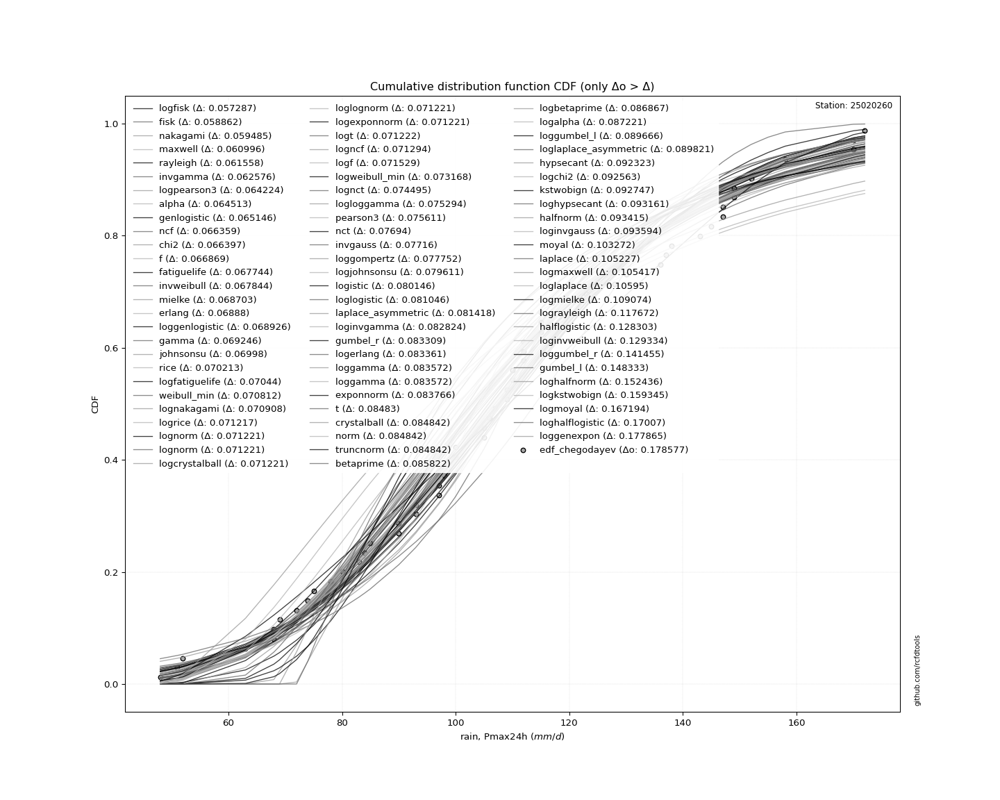</img>

</div>


**5.3. Best fit**

<div align="center">

|   id |   station | empirical_dist   | p_dist   |    delta |   deltao | eval   |   fit |   n |   best_fit |   best_fit_sort |
|-----:|----------:|:-----------------|:---------|---------:|---------:|:-------|------:|----:|-----------:|----------------:|
|    0 |  25020260 | edf_chegodayev   | logfisk  | 0.057287 | 0.178577 | Δo > Δ |     1 |  58 |          1 |               1 |

</div>


<div align="center">

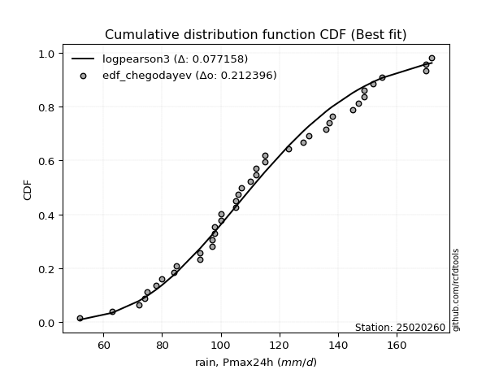</img>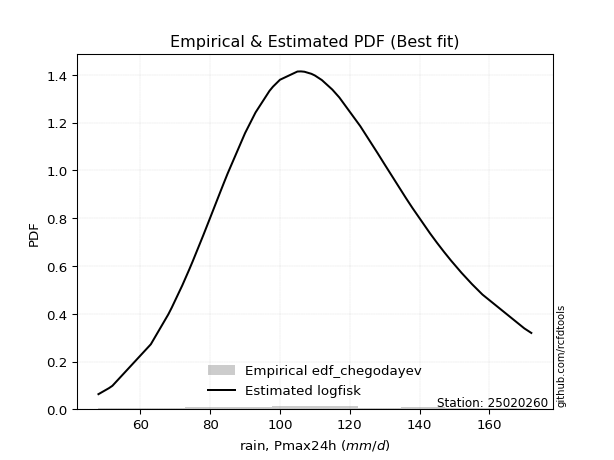</img>

</div>


### 6. Empirical - EDF Blom (1958)

The Blom formula is a specific "plotting position" formula used in hydrology and statistical analysis to estimate the empirical cumulative probability (or non-exceedance probability) of a data series. It is particularly recommended for data that are approximately normally distributed. The constant _a_ is set to 0.375 (or 3/8).

<div align="center">


$P=(m-a)/(n+1-2a)$


</div>


**6.1. Empirical values**

<div align="center">

|                | 0                   | 1                    | 2                    | 3                   | 4                   | 5                   | 6                   | 7                   | 8                  | 9                   | 10                  | 11                  | 12                 | 13                  | 14                 | 15                  | 16                 | 17                  | 18                 | 19                 | 20                 | 21                  | 22                 | 23                 | 24                 | 25                  | 26                 | 27                 | 28                  | 29                 | 30                 | 31                 | 32                 | 33                 | 34                 | 35                 | 36                 | 37                 | 38                 | 39                 | 40                 | 41                 | 42                 | 43                 | 44                 | 45                 | 46                 | 47                 | 48                 | 49                | 50                | 51                 | 52                 | 53                 | 54                 | 55                 | 56                 | 57                 |
|:---------------|:--------------------|:---------------------|:---------------------|:--------------------|:--------------------|:--------------------|:--------------------|:--------------------|:-------------------|:--------------------|:--------------------|:--------------------|:-------------------|:--------------------|:-------------------|:--------------------|:-------------------|:--------------------|:-------------------|:-------------------|:-------------------|:--------------------|:-------------------|:-------------------|:-------------------|:--------------------|:-------------------|:-------------------|:--------------------|:-------------------|:-------------------|:-------------------|:-------------------|:-------------------|:-------------------|:-------------------|:-------------------|:-------------------|:-------------------|:-------------------|:-------------------|:-------------------|:-------------------|:-------------------|:-------------------|:-------------------|:-------------------|:-------------------|:-------------------|:------------------|:------------------|:-------------------|:-------------------|:-------------------|:-------------------|:-------------------|:-------------------|:-------------------|
| date           | 2019                | 2015                 | 1986                 | 1990                | 1963                | 2017                | 2021                | 1972                | 1997               | 2005                | 1993                | 1982                | 2013               | 1994                | 1971               | 1968                | 1967               | 2003                | 2002               | 2000               | 2001               | 1995                | 1998               | 1981               | 1970               | 1980                | 1988               | 1996               | 2009                | 2010               | 2020               | 1965               | 1985               | 2004               | 1969               | 1966               | 1989               | 1977               | 2018               | 1964               | 1976               | 1973               | 1991               | 1979               | 2006               | 2008               | 2014               | 1984               | 2011               | 1992              | 1983              | 2007               | 1999               | 1974               | 2012               | 1978               | 1987               | 1975               |
| x              | 48.0                | 51.0                 | 52.0                 | 63.0                | 68.0                | 68.0                | 69.0                | 72.0                | 74.0               | 75.0                | 78.0                | 80.0                | 83.0               | 84.0                | 85.0               | 90.0                | 90.0               | 93.0                | 93.0               | 97.0               | 97.0               | 98.0                | 98.0               | 100.0              | 100.0              | 105.0               | 105.0              | 106.0              | 107.0               | 109.0              | 109.0              | 110.0              | 110.0              | 112.0              | 112.0              | 112.0              | 115.0              | 115.0              | 115.0              | 117.0              | 123.0              | 128.0              | 130.0              | 136.0              | 137.0              | 138.0              | 143.0              | 145.0              | 147.0              | 147.0             | 149.0             | 149.0              | 152.0              | 155.0              | 158.0              | 170.0              | 170.0              | 172.0              |
| m              | 1                   | 2                    | 3                    | 4                   | 5                   | 6                   | 7                   | 8                   | 9                  | 10                  | 11                  | 12                  | 13                 | 14                  | 15                 | 16                  | 17                 | 18                  | 19                 | 20                 | 21                 | 22                  | 23                 | 24                 | 25                 | 26                  | 27                 | 28                 | 29                  | 30                 | 31                 | 32                 | 33                 | 34                 | 35                 | 36                 | 37                 | 38                 | 39                 | 40                 | 41                 | 42                 | 43                 | 44                 | 45                 | 46                 | 47                 | 48                 | 49                 | 50                | 51                | 52                 | 53                 | 54                 | 55                 | 56                 | 57                 | 58                 |
| empirical_dist | edf_blom            | edf_blom             | edf_blom             | edf_blom            | edf_blom            | edf_blom            | edf_blom            | edf_blom            | edf_blom           | edf_blom            | edf_blom            | edf_blom            | edf_blom           | edf_blom            | edf_blom           | edf_blom            | edf_blom           | edf_blom            | edf_blom           | edf_blom           | edf_blom           | edf_blom            | edf_blom           | edf_blom           | edf_blom           | edf_blom            | edf_blom           | edf_blom           | edf_blom            | edf_blom           | edf_blom           | edf_blom           | edf_blom           | edf_blom           | edf_blom           | edf_blom           | edf_blom           | edf_blom           | edf_blom           | edf_blom           | edf_blom           | edf_blom           | edf_blom           | edf_blom           | edf_blom           | edf_blom           | edf_blom           | edf_blom           | edf_blom           | edf_blom          | edf_blom          | edf_blom           | edf_blom           | edf_blom           | edf_blom           | edf_blom           | edf_blom           | edf_blom           |
| empirical      | 0.01072961373390558 | 0.027896995708154508 | 0.045064377682403435 | 0.06223175965665236 | 0.07939914163090128 | 0.09656652360515021 | 0.11373390557939914 | 0.13090128755364808 | 0.148068669527897  | 0.16523605150214593 | 0.18240343347639484 | 0.19957081545064378 | 0.2167381974248927 | 0.23390557939914164 | 0.2510729613733906 | 0.26824034334763946 | 0.2854077253218884 | 0.30257510729613735 | 0.3197424892703863 | 0.3369098712446352 | 0.3540772532188841 | 0.37124463519313305 | 0.388412017167382  | 0.4055793991416309 | 0.4227467811158798 | 0.43991416309012876 | 0.4570815450643777 | 0.4742489270386266 | 0.49141630901287553 | 0.5085836909871244 | 0.5257510729613734 | 0.5429184549356223 | 0.5600858369098712 | 0.5772532188841202 | 0.5944206008583691 | 0.6115879828326181 | 0.628755364806867  | 0.6459227467811158 | 0.6630901287553648 | 0.6802575107296137 | 0.6974248927038627 | 0.7145922746781116 | 0.7317596566523605 | 0.7489270386266095 | 0.7660944206008584 | 0.7832618025751072 | 0.8004291845493562 | 0.8175965665236051 | 0.8347639484978541 | 0.851931330472103 | 0.869098712446352 | 0.8862660944206009 | 0.9034334763948498 | 0.9206008583690987 | 0.9377682403433476 | 0.9549356223175965 | 0.9721030042918455 | 0.9892703862660944 |
| empirical_tr   | 1.0108459869848156  | 1.0286975717439293   | 1.047191011235955    | 1.0663615560640733  | 1.086247086247086   | 1.1068883610451306  | 1.1283292978208233  | 1.1506172839506172  | 1.1738035264483626 | 1.1979434447300772  | 1.2230971128608925  | 1.249329758713137   | 1.2767123287671234 | 1.3053221288515406  | 1.3352435530085962 | 1.3665689149560116  | 1.3993993993993994 | 1.4338461538461538  | 1.4700315457413249 | 1.5080906148867315 | 1.548172757475083  | 1.590443686006826   | 1.6350877192982456 | 1.6823104693140793 | 1.7323420074349443 | 1.78544061302682    | 1.841897233201581  | 1.9020408163265303 | 1.9662447257383968  | 2.0349344978165935 | 2.1085972850678734 | 2.187793427230047  | 2.273170731707317  | 2.3654822335025383 | 2.4656084656084656 | 2.5745856353591163 | 2.6936416184971104 | 2.8242424242424238 | 2.968152866242038  | 3.1275167785234896 | 3.3049645390070923 | 3.5037593984962405 | 3.728              | 3.9829059829059834 | 4.275229357798166  | 4.613861386138613  | 5.010752688172042  | 5.48235294117647   | 6.0519480519480515 | 6.753623188405798 | 7.639344262295083 | 8.792452830188681  | 10.355555555555561 | 12.594594594594586 | 16.06896551724137  | 22.19047619047618  | 35.84615384615383  | 93.20000000000005  |

</div>


**6.2. Kolmogorov-Smirnov fit test (sorted by Δ)**


<div align="center">

|                | 0                    | 1                    | 2                   | 3                    | 4                   | 5                   | 6                   | 7                  | 8                   | 9                   | 10                 | 11                  | 12                  | 13                  | 14                  | 15                  | 16                  | 17                  | 18                  | 19                  | 20                  | 21                  | 22                  | 23                 | 24                  | 25                  | 26                  | 27                  | 28                  | 29                  | 30                  | 31                  | 32                  | 33                  | 34                  | 35                  | 36                  | 37                  | 38                  | 39                  | 40                 | 41                  | 42                 | 43                  | 44                  | 45                  | 46                  | 47                  | 48                  | 49                  | 50                  | 51                  | 52                  | 53                  | 54                  | 55                  | 56                    | 57                  | 58                 | 59                  | 60                  | 61                  | 62                 | 63                 | 64                  | 65                  | 66                  | 67                  | 68                  | 69                  | 70                  | 71                  | 72                  | 73                  | 74                  | 75                  | 76                  | 77                  | 78                  | 79                 | 80                 | 81                  | 82                 | 83                  | 84                  | 85                  | 86                 | 87                 |
|:---------------|:---------------------|:---------------------|:--------------------|:---------------------|:--------------------|:--------------------|:--------------------|:-------------------|:--------------------|:--------------------|:-------------------|:--------------------|:--------------------|:--------------------|:--------------------|:--------------------|:--------------------|:--------------------|:--------------------|:--------------------|:--------------------|:--------------------|:--------------------|:-------------------|:--------------------|:--------------------|:--------------------|:--------------------|:--------------------|:--------------------|:--------------------|:--------------------|:--------------------|:--------------------|:--------------------|:--------------------|:--------------------|:--------------------|:--------------------|:--------------------|:-------------------|:--------------------|:-------------------|:--------------------|:--------------------|:--------------------|:--------------------|:--------------------|:--------------------|:--------------------|:--------------------|:--------------------|:--------------------|:--------------------|:--------------------|:--------------------|:----------------------|:--------------------|:-------------------|:--------------------|:--------------------|:--------------------|:-------------------|:-------------------|:--------------------|:--------------------|:--------------------|:--------------------|:--------------------|:--------------------|:--------------------|:--------------------|:--------------------|:--------------------|:--------------------|:--------------------|:--------------------|:--------------------|:--------------------|:-------------------|:-------------------|:--------------------|:-------------------|:--------------------|:--------------------|:--------------------|:-------------------|:-------------------|
| station        | 25020260             | 25020260             | 25020260            | 25020260             | 25020260            | 25020260            | 25020260            | 25020260           | 25020260            | 25020260            | 25020260           | 25020260            | 25020260            | 25020260            | 25020260            | 25020260            | 25020260            | 25020260            | 25020260            | 25020260            | 25020260            | 25020260            | 25020260            | 25020260           | 25020260            | 25020260            | 25020260            | 25020260            | 25020260            | 25020260            | 25020260            | 25020260            | 25020260            | 25020260            | 25020260            | 25020260            | 25020260            | 25020260            | 25020260            | 25020260            | 25020260           | 25020260            | 25020260           | 25020260            | 25020260            | 25020260            | 25020260            | 25020260            | 25020260            | 25020260            | 25020260            | 25020260            | 25020260            | 25020260            | 25020260            | 25020260            | 25020260              | 25020260            | 25020260           | 25020260            | 25020260            | 25020260            | 25020260           | 25020260           | 25020260            | 25020260            | 25020260            | 25020260            | 25020260            | 25020260            | 25020260            | 25020260            | 25020260            | 25020260            | 25020260            | 25020260            | 25020260            | 25020260            | 25020260            | 25020260           | 25020260           | 25020260            | 25020260           | 25020260            | 25020260            | 25020260            | 25020260           | 25020260           |
| empirical_dist | edf_blom             | edf_blom             | edf_blom            | edf_blom             | edf_blom            | edf_blom            | edf_blom            | edf_blom           | edf_blom            | edf_blom            | edf_blom           | edf_blom            | edf_blom            | edf_blom            | edf_blom            | edf_blom            | edf_blom            | edf_blom            | edf_blom            | edf_blom            | edf_blom            | edf_blom            | edf_blom            | edf_blom           | edf_blom            | edf_blom            | edf_blom            | edf_blom            | edf_blom            | edf_blom            | edf_blom            | edf_blom            | edf_blom            | edf_blom            | edf_blom            | edf_blom            | edf_blom            | edf_blom            | edf_blom            | edf_blom            | edf_blom           | edf_blom            | edf_blom           | edf_blom            | edf_blom            | edf_blom            | edf_blom            | edf_blom            | edf_blom            | edf_blom            | edf_blom            | edf_blom            | edf_blom            | edf_blom            | edf_blom            | edf_blom            | edf_blom              | edf_blom            | edf_blom           | edf_blom            | edf_blom            | edf_blom            | edf_blom           | edf_blom           | edf_blom            | edf_blom            | edf_blom            | edf_blom            | edf_blom            | edf_blom            | edf_blom            | edf_blom            | edf_blom            | edf_blom            | edf_blom            | edf_blom            | edf_blom            | edf_blom            | edf_blom            | edf_blom           | edf_blom           | edf_blom            | edf_blom           | edf_blom            | edf_blom            | edf_blom            | edf_blom           | edf_blom           |
| p_dist         | logfisk              | fisk                 | nakagami            | maxwell              | rayleigh            | invgamma            | alpha               | genlogistic        | logpearson3         | ncf                 | chi2               | f                   | fatiguelife         | invweibull          | mielke              | erlang              | loggenlogistic      | gamma               | johnsonsu           | rice                | logfatiguelife      | weibull_min         | lognakagami         | logrice            | lognorm             | lognorm             | logcrystalball      | loglognorm          | logexponnorm        | logt                | logncf              | logf                | logweibull_min      | lognct              | logloggamma         | pearson3            | nct                 | invgauss            | loggompertz         | logistic            | logjohnsonsu       | loglogistic         | laplace_asymmetric | gumbel_r            | loginvgamma         | logerlang           | loggamma            | loggamma            | exponnorm           | t                   | crystalball         | norm                | truncnorm           | betaprime           | logbetaprime        | logalpha            | loglaplace_asymmetric | loggumbel_l         | hypsecant          | loghypsecant        | logchi2             | kstwobign           | halfnorm           | loginvgauss        | moyal               | laplace             | loglaplace          | logmaxwell          | logmielke           | lograyleigh         | halflogistic        | loginvweibull       | loggumbel_r         | gumbel_l            | loghalfnorm         | logkstwobign        | logmoyal            | loghalflogistic     | loggenexpon         | wald               | expon              | logwald             | gibrat             | loggibrat           | logexpon            | logtruncnorm        | gompertz           | genexpon           |
| delta          | 0.056647675557214394 | 0.058222432459709816 | 0.05921936057838528 | 0.060357006587806294 | 0.06091834542557084 | 0.06299475524769838 | 0.06387334305871506 | 0.0645063819499666 | 0.06464259118875826 | 0.06651381321705918 | 0.0668163617465134 | 0.06728816848583019 | 0.06816319047407937 | 0.06826243367887619 | 0.06912182705453407 | 0.06929846241726745 | 0.06934446225090996 | 0.06966521961239613 | 0.07039910528884041 | 0.07063239456240089 | 0.07079598553224115 | 0.07123098189399657 | 0.07132669185470702 | 0.0716362887003067 | 0.07163943765447583 | 0.07163943765447583 | 0.07163987752278433 | 0.07164010311272645 | 0.07164023415976561 | 0.07164054462708891 | 0.07171266771124646 | 0.07194799885826153 | 0.07358732528803902 | 0.07491346092602158 | 0.07571272831643783 | 0.07602962967065208 | 0.07735844470583908 | 0.07757917192760744 | 0.07817040131113095 | 0.07950690249390313 | 0.0800298254231081 | 0.08040680145105916 | 0.0807787738729403 | 0.08266929774831222 | 0.08324264390825042 | 0.08378030862526675 | 0.08399067827167128 | 0.08399067827167128 | 0.08418507656423024 | 0.08524904411960654 | 0.08526058618488819 | 0.08526058903303113 | 0.08526059815570763 | 0.08624114564025415 | 0.08728584093133124 | 0.08764021062240074 | 0.08918204905429705   | 0.09008495744177214 | 0.0916835724487538 | 0.09252119850007201 | 0.09298203091850438 | 0.09316592127556816 | 0.0938339637214623 | 0.0940126026125826 | 0.10342654144743157 | 0.10458812749461122 | 0.10531098822980955 | 0.10583612291111649 | 0.10949259968950609 | 0.11809124462516857 | 0.12735484647510154 | 0.12975330280804614 | 0.14160898737342154 | 0.14875219575469445 | 0.15285529526876313 | 0.15976431903179206 | 0.16734871705908982 | 0.17022383825799214 | 0.17828355066865714 | 0.198765607887639  | 0.2302262126364103 | 0.23887930705921478 | 0.2510729613733906 | 0.26383925378081896 | 0.29023872086349917 | 0.40099053040480925 | 0.7976914201190652 | 0.8924829917747281 |
| deltao         | 0.1785767486892227   | 0.1785767486892227   | 0.1785767486892227  | 0.1785767486892227   | 0.1785767486892227  | 0.1785767486892227  | 0.1785767486892227  | 0.1785767486892227 | 0.1785767486892227  | 0.1785767486892227  | 0.1785767486892227 | 0.1785767486892227  | 0.1785767486892227  | 0.1785767486892227  | 0.1785767486892227  | 0.1785767486892227  | 0.1785767486892227  | 0.1785767486892227  | 0.1785767486892227  | 0.1785767486892227  | 0.1785767486892227  | 0.1785767486892227  | 0.1785767486892227  | 0.1785767486892227 | 0.1785767486892227  | 0.1785767486892227  | 0.1785767486892227  | 0.1785767486892227  | 0.1785767486892227  | 0.1785767486892227  | 0.1785767486892227  | 0.1785767486892227  | 0.1785767486892227  | 0.1785767486892227  | 0.1785767486892227  | 0.1785767486892227  | 0.1785767486892227  | 0.1785767486892227  | 0.1785767486892227  | 0.1785767486892227  | 0.1785767486892227 | 0.1785767486892227  | 0.1785767486892227 | 0.1785767486892227  | 0.1785767486892227  | 0.1785767486892227  | 0.1785767486892227  | 0.1785767486892227  | 0.1785767486892227  | 0.1785767486892227  | 0.1785767486892227  | 0.1785767486892227  | 0.1785767486892227  | 0.1785767486892227  | 0.1785767486892227  | 0.1785767486892227  | 0.1785767486892227    | 0.1785767486892227  | 0.1785767486892227 | 0.1785767486892227  | 0.1785767486892227  | 0.1785767486892227  | 0.1785767486892227 | 0.1785767486892227 | 0.1785767486892227  | 0.1785767486892227  | 0.1785767486892227  | 0.1785767486892227  | 0.1785767486892227  | 0.1785767486892227  | 0.1785767486892227  | 0.1785767486892227  | 0.1785767486892227  | 0.1785767486892227  | 0.1785767486892227  | 0.1785767486892227  | 0.1785767486892227  | 0.1785767486892227  | 0.1785767486892227  | 0.1785767486892227 | 0.1785767486892227 | 0.1785767486892227  | 0.1785767486892227 | 0.1785767486892227  | 0.1785767486892227  | 0.1785767486892227  | 0.1785767486892227 | 0.1785767486892227 |
| eval           | Δo > Δ               | Δo > Δ               | Δo > Δ              | Δo > Δ               | Δo > Δ              | Δo > Δ              | Δo > Δ              | Δo > Δ             | Δo > Δ              | Δo > Δ              | Δo > Δ             | Δo > Δ              | Δo > Δ              | Δo > Δ              | Δo > Δ              | Δo > Δ              | Δo > Δ              | Δo > Δ              | Δo > Δ              | Δo > Δ              | Δo > Δ              | Δo > Δ              | Δo > Δ              | Δo > Δ             | Δo > Δ              | Δo > Δ              | Δo > Δ              | Δo > Δ              | Δo > Δ              | Δo > Δ              | Δo > Δ              | Δo > Δ              | Δo > Δ              | Δo > Δ              | Δo > Δ              | Δo > Δ              | Δo > Δ              | Δo > Δ              | Δo > Δ              | Δo > Δ              | Δo > Δ             | Δo > Δ              | Δo > Δ             | Δo > Δ              | Δo > Δ              | Δo > Δ              | Δo > Δ              | Δo > Δ              | Δo > Δ              | Δo > Δ              | Δo > Δ              | Δo > Δ              | Δo > Δ              | Δo > Δ              | Δo > Δ              | Δo > Δ              | Δo > Δ                | Δo > Δ              | Δo > Δ             | Δo > Δ              | Δo > Δ              | Δo > Δ              | Δo > Δ             | Δo > Δ             | Δo > Δ              | Δo > Δ              | Δo > Δ              | Δo > Δ              | Δo > Δ              | Δo > Δ              | Δo > Δ              | Δo > Δ              | Δo > Δ              | Δo > Δ              | Δo > Δ              | Δo > Δ              | Δo > Δ              | Δo > Δ              | Δo > Δ              | Δo <= Δ            | Δo <= Δ            | Δo <= Δ             | Δo <= Δ            | Δo <= Δ             | Δo <= Δ             | Δo <= Δ             | Δo <= Δ            | Δo <= Δ            |
| fit            | 1                    | 1                    | 1                   | 1                    | 1                   | 1                   | 1                   | 1                  | 1                   | 1                   | 1                  | 1                   | 1                   | 1                   | 1                   | 1                   | 1                   | 1                   | 1                   | 1                   | 1                   | 1                   | 1                   | 1                  | 1                   | 1                   | 1                   | 1                   | 1                   | 1                   | 1                   | 1                   | 1                   | 1                   | 1                   | 1                   | 1                   | 1                   | 1                   | 1                   | 1                  | 1                   | 1                  | 1                   | 1                   | 1                   | 1                   | 1                   | 1                   | 1                   | 1                   | 1                   | 1                   | 1                   | 1                   | 1                   | 1                     | 1                   | 1                  | 1                   | 1                   | 1                   | 1                  | 1                  | 1                   | 1                   | 1                   | 1                   | 1                   | 1                   | 1                   | 1                   | 1                   | 1                   | 1                   | 1                   | 1                   | 1                   | 1                   | 0                  | 0                  | 0                   | 0                  | 0                   | 0                   | 0                   | 0                  | 0                  |
| n              | 58                   | 58                   | 58                  | 58                   | 58                  | 58                  | 58                  | 58                 | 58                  | 58                  | 58                 | 58                  | 58                  | 58                  | 58                  | 58                  | 58                  | 58                  | 58                  | 58                  | 58                  | 58                  | 58                  | 58                 | 58                  | 58                  | 58                  | 58                  | 58                  | 58                  | 58                  | 58                  | 58                  | 58                  | 58                  | 58                  | 58                  | 58                  | 58                  | 58                  | 58                 | 58                  | 58                 | 58                  | 58                  | 58                  | 58                  | 58                  | 58                  | 58                  | 58                  | 58                  | 58                  | 58                  | 58                  | 58                  | 58                    | 58                  | 58                 | 58                  | 58                  | 58                  | 58                 | 58                 | 58                  | 58                  | 58                  | 58                  | 58                  | 58                  | 58                  | 58                  | 58                  | 58                  | 58                  | 58                  | 58                  | 58                  | 58                  | 58                 | 58                 | 58                  | 58                 | 58                  | 58                  | 58                  | 58                 | 58                 |
| best_fit       | 1                    | 0                    | 0                   | 0                    | 0                   | 0                   | 0                   | 0                  | 0                   | 0                   | 0                  | 0                   | 0                   | 0                   | 0                   | 0                   | 0                   | 0                   | 0                   | 0                   | 0                   | 0                   | 0                   | 0                  | 0                   | 0                   | 0                   | 0                   | 0                   | 0                   | 0                   | 0                   | 0                   | 0                   | 0                   | 0                   | 0                   | 0                   | 0                   | 0                   | 0                  | 0                   | 0                  | 0                   | 0                   | 0                   | 0                   | 0                   | 0                   | 0                   | 0                   | 0                   | 0                   | 0                   | 0                   | 0                   | 0                     | 0                   | 0                  | 0                   | 0                   | 0                   | 0                  | 0                  | 0                   | 0                   | 0                   | 0                   | 0                   | 0                   | 0                   | 0                   | 0                   | 0                   | 0                   | 0                   | 0                   | 0                   | 0                   | 0                  | 0                  | 0                   | 0                  | 0                   | 0                   | 0                   | 0                  | 0                  |
| best_fit_sort  | 1                    | 2                    | 3                   | 4                    | 5                   | 6                   | 7                   | 8                  | 9                   | 10                  | 11                 | 12                  | 13                  | 14                  | 15                  | 16                  | 17                  | 18                  | 19                  | 20                  | 21                  | 22                  | 23                  | 24                 | 25                  | 26                  | 27                  | 28                  | 29                  | 30                  | 31                  | 32                  | 33                  | 34                  | 35                  | 36                  | 37                  | 38                  | 39                  | 40                  | 41                 | 42                  | 43                 | 44                  | 45                  | 46                  | 47                  | 48                  | 49                  | 50                  | 51                  | 52                  | 53                  | 54                  | 55                  | 56                  | 57                    | 58                  | 59                 | 60                  | 61                  | 62                  | 63                 | 64                 | 65                  | 66                  | 67                  | 68                  | 69                  | 70                  | 71                  | 72                  | 73                  | 74                  | 75                  | 76                  | 77                  | 78                  | 79                  | 80                 | 81                 | 82                  | 83                 | 84                  | 85                  | 86                  | 87                 | 88                 |

</div>


<div align="center">

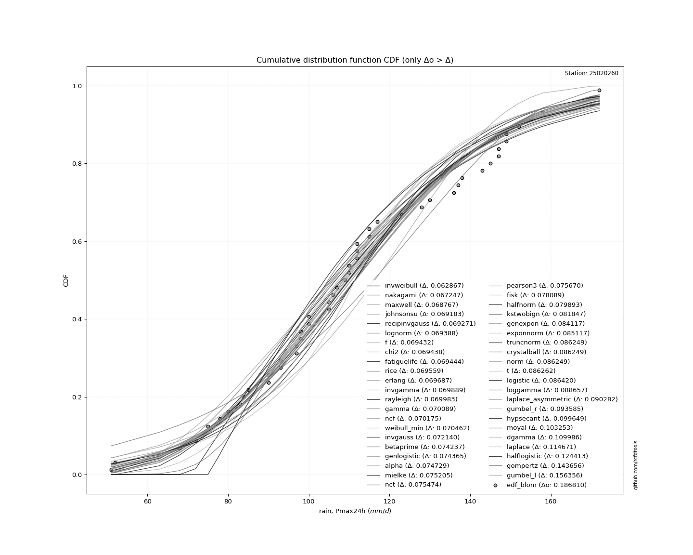</img>

</div>


**6.3. Best fit**

<div align="center">

|   id |   station | empirical_dist   | p_dist   |     delta |   deltao | eval   |   fit |   n |   best_fit |   best_fit_sort |
|-----:|----------:|:-----------------|:---------|----------:|---------:|:-------|------:|----:|-----------:|----------------:|
|    0 |  25020260 | edf_blom         | logfisk  | 0.0566477 | 0.178577 | Δo > Δ |     1 |  58 |          1 |               1 |

</div>


<div align="center">

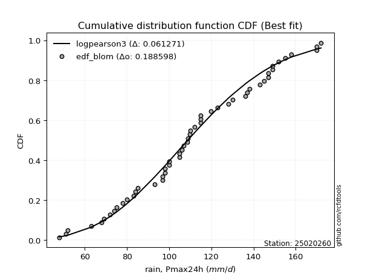</img>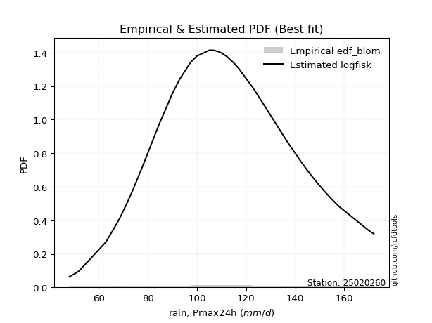</img>

</div>


### 7. Empirical - EDF Tukey (1962)

In hydrology, the Tukey formula is used as a plotting position formula to estimate the empirical probability or frequency of a flood event (or other hydrological data). The formula parameter is given as _c=0.333_ (or 1/3).

<div align="center">


$P=(m-c)/(n+1-2c)$


</div>


**7.1. Empirical values**

<div align="center">

|                | 0                    | 1                   | 2                    | 3                   | 4                  | 5                   | 6                   | 7                   | 8                   | 9                  | 10                  | 11        | 12                  | 13                 | 14                  | 15                  | 16                 | 17                 | 18                 | 19                  | 20                  | 21                  | 22                  | 23                 | 24                 | 25                 | 26                  | 27                 | 28                  | 29                 | 30                 | 31                 | 32                | 33                 | 34                 | 35                 | 36                 | 37                 | 38                 | 39                 | 40                 | 41                 | 42                 | 43                 | 44                 | 45                 | 46                | 47                 | 48                 | 49                 | 50                 | 51                 | 52                 | 53                 | 54                 | 55                 | 56                 | 57                 |
|:---------------|:---------------------|:--------------------|:---------------------|:--------------------|:-------------------|:--------------------|:--------------------|:--------------------|:--------------------|:-------------------|:--------------------|:----------|:--------------------|:-------------------|:--------------------|:--------------------|:-------------------|:-------------------|:-------------------|:--------------------|:--------------------|:--------------------|:--------------------|:-------------------|:-------------------|:-------------------|:--------------------|:-------------------|:--------------------|:-------------------|:-------------------|:-------------------|:------------------|:-------------------|:-------------------|:-------------------|:-------------------|:-------------------|:-------------------|:-------------------|:-------------------|:-------------------|:-------------------|:-------------------|:-------------------|:-------------------|:------------------|:-------------------|:-------------------|:-------------------|:-------------------|:-------------------|:-------------------|:-------------------|:-------------------|:-------------------|:-------------------|:-------------------|
| date           | 2019                 | 2015                | 1986                 | 1990                | 1963               | 2017                | 2021                | 1972                | 1997                | 2005               | 1993                | 1982      | 2013                | 1994               | 1971                | 1968                | 1967               | 2003               | 2002               | 2000                | 2001                | 1995                | 1998                | 1981               | 1970               | 1980               | 1988                | 1996               | 2009                | 2010               | 2020               | 1965               | 1985              | 2004               | 1969               | 1966               | 1989               | 1977               | 2018               | 1964               | 1976               | 1973               | 1991               | 1979               | 2006               | 2008               | 2014              | 1984               | 2011               | 1992               | 1983               | 2007               | 1999               | 1974               | 2012               | 1978               | 1987               | 1975               |
| x              | 48.0                 | 51.0                | 52.0                 | 63.0                | 68.0               | 68.0                | 69.0                | 72.0                | 74.0                | 75.0               | 78.0                | 80.0      | 83.0                | 84.0               | 85.0                | 90.0                | 90.0               | 93.0               | 93.0               | 97.0                | 97.0                | 98.0                | 98.0                | 100.0              | 100.0              | 105.0              | 105.0               | 106.0              | 107.0               | 109.0              | 109.0              | 110.0              | 110.0             | 112.0              | 112.0              | 112.0              | 115.0              | 115.0              | 115.0              | 117.0              | 123.0              | 128.0              | 130.0              | 136.0              | 137.0              | 138.0              | 143.0             | 145.0              | 147.0              | 147.0              | 149.0              | 149.0              | 152.0              | 155.0              | 158.0              | 170.0              | 170.0              | 172.0              |
| m              | 1                    | 2                   | 3                    | 4                   | 5                  | 6                   | 7                   | 8                   | 9                   | 10                 | 11                  | 12        | 13                  | 14                 | 15                  | 16                  | 17                 | 18                 | 19                 | 20                  | 21                  | 22                  | 23                  | 24                 | 25                 | 26                 | 27                  | 28                 | 29                  | 30                 | 31                 | 32                 | 33                | 34                 | 35                 | 36                 | 37                 | 38                 | 39                 | 40                 | 41                 | 42                 | 43                 | 44                 | 45                 | 46                 | 47                | 48                 | 49                 | 50                 | 51                 | 52                 | 53                 | 54                 | 55                 | 56                 | 57                 | 58                 |
| empirical_dist | edf_tukey            | edf_tukey           | edf_tukey            | edf_tukey           | edf_tukey          | edf_tukey           | edf_tukey           | edf_tukey           | edf_tukey           | edf_tukey          | edf_tukey           | edf_tukey | edf_tukey           | edf_tukey          | edf_tukey           | edf_tukey           | edf_tukey          | edf_tukey          | edf_tukey          | edf_tukey           | edf_tukey           | edf_tukey           | edf_tukey           | edf_tukey          | edf_tukey          | edf_tukey          | edf_tukey           | edf_tukey          | edf_tukey           | edf_tukey          | edf_tukey          | edf_tukey          | edf_tukey         | edf_tukey          | edf_tukey          | edf_tukey          | edf_tukey          | edf_tukey          | edf_tukey          | edf_tukey          | edf_tukey          | edf_tukey          | edf_tukey          | edf_tukey          | edf_tukey          | edf_tukey          | edf_tukey         | edf_tukey          | edf_tukey          | edf_tukey          | edf_tukey          | edf_tukey          | edf_tukey          | edf_tukey          | edf_tukey          | edf_tukey          | edf_tukey          | edf_tukey          |
| empirical      | 0.011428571428571429 | 0.02857142857142857 | 0.045714285714285714 | 0.06285714285714286 | 0.08               | 0.09714285714285714 | 0.11428571428571428 | 0.13142857142857142 | 0.14857142857142858 | 0.1657142857142857 | 0.18285714285714286 | 0.2       | 0.21714285714285714 | 0.2342857142857143 | 0.25142857142857145 | 0.26857142857142857 | 0.2857142857142857 | 0.3028571428571429 | 0.32               | 0.33714285714285713 | 0.35428571428571426 | 0.37142857142857144 | 0.38857142857142857 | 0.4057142857142857 | 0.4228571428571429 | 0.44               | 0.45714285714285713 | 0.4742857142857143 | 0.49142857142857144 | 0.5085714285714286 | 0.5257142857142857 | 0.5428571428571428 | 0.56              | 0.5771428571428572 | 0.5942857142857143 | 0.6114285714285714 | 0.6285714285714286 | 0.6457142857142857 | 0.6628571428571428 | 0.68               | 0.6971428571428572 | 0.7142857142857143 | 0.7314285714285714 | 0.7485714285714286 | 0.7657142857142857 | 0.7828571428571428 | 0.8               | 0.8171428571428572 | 0.8342857142857143 | 0.8514285714285714 | 0.8685714285714285 | 0.8857142857142857 | 0.9028571428571428 | 0.92               | 0.9371428571428572 | 0.9542857142857143 | 0.9714285714285714 | 0.9885714285714285 |
| empirical_tr   | 1.0115606936416186   | 1.0294117647058825  | 1.0479041916167664   | 1.0670731707317074  | 1.0869565217391304 | 1.1075949367088609  | 1.1290322580645162  | 1.1513157894736843  | 1.174496644295302   | 1.1986301369863013 | 1.2237762237762237  | 1.25      | 1.2773722627737225  | 1.3059701492537314 | 1.33587786259542    | 1.3671875           | 1.4                | 1.4344262295081969 | 1.4705882352941178 | 1.5086206896551726  | 1.5486725663716814  | 1.590909090909091   | 1.6355140186915889  | 1.6826923076923077 | 1.7326732673267327 | 1.7857142857142856 | 1.8421052631578945  | 1.9021739130434783 | 1.9662921348314608  | 2.0348837209302326 | 2.108433734939759  | 2.1875             | 2.272727272727273 | 2.364864864864865  | 2.4647887323943665 | 2.573529411764706  | 2.692307692307692  | 2.82258064516129   | 2.966101694915254  | 3.1250000000000004 | 3.3018867924528306 | 3.5                | 3.723404255319149  | 3.977272727272727  | 4.268292682926829  | 4.605263157894735  | 5.000000000000001 | 5.468750000000001  | 6.03448275862069   | 6.730769230769231  | 7.608695652173912  | 8.749999999999996  | 10.294117647058817 | 12.500000000000007 | 15.909090909090915 | 21.875000000000004 | 34.999999999999986 | 87.4999999999998   |

</div>


**7.2. Kolmogorov-Smirnov fit test (sorted by Δ)**


<div align="center">

|                | 0                    | 1                   | 2                    | 3                    | 4                   | 5                   | 6                   | 7                  | 8                   | 9                   | 10                  | 11                  | 12                  | 13                  | 14                  | 15                  | 16                 | 17                  | 18                  | 19                  | 20                  | 21                  | 22                  | 23                  | 24                  | 25                  | 26                  | 27                  | 28                  | 29                  | 30                 | 31                  | 32                  | 33                  | 34                  | 35                  | 36                  | 37                  | 38                 | 39                  | 40                  | 41                  | 42                  | 43                  | 44                  | 45                  | 46                  | 47                  | 48                  | 49                  | 50                  | 51                  | 52                  | 53                  | 54                  | 55                  | 56                    | 57                  | 58                  | 59                  | 60                  | 61                 | 62                  | 63                  | 64                  | 65                  | 66                  | 67                  | 68                  | 69                  | 70                  | 71                  | 72                 | 73                 | 74                  | 75                 | 76                  | 77                 | 78                  | 79                  | 80                 | 81                  | 82                  | 83                 | 84                 | 85                  | 86                 | 87                 |
|:---------------|:---------------------|:--------------------|:---------------------|:---------------------|:--------------------|:--------------------|:--------------------|:-------------------|:--------------------|:--------------------|:--------------------|:--------------------|:--------------------|:--------------------|:--------------------|:--------------------|:-------------------|:--------------------|:--------------------|:--------------------|:--------------------|:--------------------|:--------------------|:--------------------|:--------------------|:--------------------|:--------------------|:--------------------|:--------------------|:--------------------|:-------------------|:--------------------|:--------------------|:--------------------|:--------------------|:--------------------|:--------------------|:--------------------|:-------------------|:--------------------|:--------------------|:--------------------|:--------------------|:--------------------|:--------------------|:--------------------|:--------------------|:--------------------|:--------------------|:--------------------|:--------------------|:--------------------|:--------------------|:--------------------|:--------------------|:--------------------|:----------------------|:--------------------|:--------------------|:--------------------|:--------------------|:-------------------|:--------------------|:--------------------|:--------------------|:--------------------|:--------------------|:--------------------|:--------------------|:--------------------|:--------------------|:--------------------|:-------------------|:-------------------|:--------------------|:-------------------|:--------------------|:-------------------|:--------------------|:--------------------|:-------------------|:--------------------|:--------------------|:-------------------|:-------------------|:--------------------|:-------------------|:-------------------|
| station        | 25020260             | 25020260            | 25020260             | 25020260             | 25020260            | 25020260            | 25020260            | 25020260           | 25020260            | 25020260            | 25020260            | 25020260            | 25020260            | 25020260            | 25020260            | 25020260            | 25020260           | 25020260            | 25020260            | 25020260            | 25020260            | 25020260            | 25020260            | 25020260            | 25020260            | 25020260            | 25020260            | 25020260            | 25020260            | 25020260            | 25020260           | 25020260            | 25020260            | 25020260            | 25020260            | 25020260            | 25020260            | 25020260            | 25020260           | 25020260            | 25020260            | 25020260            | 25020260            | 25020260            | 25020260            | 25020260            | 25020260            | 25020260            | 25020260            | 25020260            | 25020260            | 25020260            | 25020260            | 25020260            | 25020260            | 25020260            | 25020260              | 25020260            | 25020260            | 25020260            | 25020260            | 25020260           | 25020260            | 25020260            | 25020260            | 25020260            | 25020260            | 25020260            | 25020260            | 25020260            | 25020260            | 25020260            | 25020260           | 25020260           | 25020260            | 25020260           | 25020260            | 25020260           | 25020260            | 25020260            | 25020260           | 25020260            | 25020260            | 25020260           | 25020260           | 25020260            | 25020260           | 25020260           |
| empirical_dist | edf_tukey            | edf_tukey           | edf_tukey            | edf_tukey            | edf_tukey           | edf_tukey           | edf_tukey           | edf_tukey          | edf_tukey           | edf_tukey           | edf_tukey           | edf_tukey           | edf_tukey           | edf_tukey           | edf_tukey           | edf_tukey           | edf_tukey          | edf_tukey           | edf_tukey           | edf_tukey           | edf_tukey           | edf_tukey           | edf_tukey           | edf_tukey           | edf_tukey           | edf_tukey           | edf_tukey           | edf_tukey           | edf_tukey           | edf_tukey           | edf_tukey          | edf_tukey           | edf_tukey           | edf_tukey           | edf_tukey           | edf_tukey           | edf_tukey           | edf_tukey           | edf_tukey          | edf_tukey           | edf_tukey           | edf_tukey           | edf_tukey           | edf_tukey           | edf_tukey           | edf_tukey           | edf_tukey           | edf_tukey           | edf_tukey           | edf_tukey           | edf_tukey           | edf_tukey           | edf_tukey           | edf_tukey           | edf_tukey           | edf_tukey           | edf_tukey             | edf_tukey           | edf_tukey           | edf_tukey           | edf_tukey           | edf_tukey          | edf_tukey           | edf_tukey           | edf_tukey           | edf_tukey           | edf_tukey           | edf_tukey           | edf_tukey           | edf_tukey           | edf_tukey           | edf_tukey           | edf_tukey          | edf_tukey          | edf_tukey           | edf_tukey          | edf_tukey           | edf_tukey          | edf_tukey           | edf_tukey           | edf_tukey          | edf_tukey           | edf_tukey           | edf_tukey          | edf_tukey          | edf_tukey           | edf_tukey          | edf_tukey          |
| p_dist         | logfisk              | fisk                | nakagami             | maxwell              | rayleigh            | invgamma            | alpha               | logpearson3        | genlogistic         | ncf                 | chi2                | f                   | fatiguelife         | invweibull          | mielke              | erlang              | loggenlogistic     | gamma               | johnsonsu           | rice                | logfatiguelife      | weibull_min         | lognakagami         | logrice             | lognorm             | lognorm             | logcrystalball      | loglognorm          | logexponnorm        | logt                | logncf             | logf                | logweibull_min      | lognct              | logloggamma         | pearson3            | nct                 | invgauss            | loggompertz        | logjohnsonsu        | logistic            | loglogistic         | laplace_asymmetric  | loginvgamma         | gumbel_r            | logerlang           | loggamma            | loggamma            | exponnorm           | t                   | crystalball         | norm                | truncnorm           | betaprime           | logbetaprime        | logalpha            | loglaplace_asymmetric | loggumbel_l         | hypsecant           | logchi2             | loghypsecant        | kstwobign          | halfnorm            | loginvgauss         | moyal               | laplace             | logmaxwell          | loglaplace          | logmielke           | lograyleigh         | halflogistic        | loginvweibull       | loggumbel_r        | gumbel_l           | loghalfnorm         | logkstwobign       | logmoyal            | loghalflogistic    | loggenexpon         | wald                | expon              | logwald             | gibrat              | loggibrat          | logexpon           | logtruncnorm        | gompertz           | genexpon           |
| delta          | 0.057003285612395316 | 0.05857804251489074 | 0.059201184035142296 | 0.060712616642987216 | 0.06127395548075176 | 0.06276176934947642 | 0.06422895311389598 | 0.0644096052905363 | 0.06486199200514753 | 0.06642797630718794 | 0.06658337584829144 | 0.06705518258760823 | 0.06793020457585741 | 0.06802944778065423 | 0.06888884115631211 | 0.06906547651904549 | 0.069111476352688  | 0.06943223371417417 | 0.07016611939061845 | 0.07039940866417893 | 0.07056299963401919 | 0.07099799599577461 | 0.07109370595648506 | 0.07140330280208473 | 0.07140645175625387 | 0.07140645175625387 | 0.07140689162456237 | 0.07140711721450449 | 0.07140724826154365 | 0.07140755872886695 | 0.0714796818130245 | 0.07171501296003957 | 0.07335433938981706 | 0.07468047502779962 | 0.07547974241821587 | 0.07579664377243012 | 0.07712545880761712 | 0.07734618602938548 | 0.077937415412909  | 0.07979683952488614 | 0.07986251254908405 | 0.08076241150624008 | 0.08113438392812122 | 0.08300965801002846 | 0.08302490780349314 | 0.08354732272704479 | 0.08375769237344932 | 0.08375769237344932 | 0.08395209066600828 | 0.08501605822138458 | 0.08502760028666623 | 0.08502760313480917 | 0.08502761225748567 | 0.08600815974203219 | 0.08705285503310928 | 0.08740722472417878 | 0.08953765910947797   | 0.08985197154355018 | 0.09203918250393472 | 0.09274904502028242 | 0.09287680855525293 | 0.0929329353773462 | 0.09360097782324034 | 0.09377961671436064 | 0.10334070453756034 | 0.10494373754979214 | 0.10560313701289453 | 0.10566659828499048 | 0.10925961379128413 | 0.11785825872694661 | 0.12788213035002488 | 0.12952031690982418 | 0.1415231504635503 | 0.1485192098564725 | 0.15262230937054116 | 0.1595313331335701 | 0.16726288014921858 | 0.1701380013481209 | 0.17805056477043518 | 0.19919479243699523 | 0.2298951274126212 | 0.23879347014934355 | 0.25142857142857145 | 0.2637534168709477 | 0.2898340611455347 | 0.40065944518102015 | 0.79713961141275   | 0.8918821334056295 |
| deltao         | 0.1785767486892227   | 0.1785767486892227  | 0.1785767486892227   | 0.1785767486892227   | 0.1785767486892227  | 0.1785767486892227  | 0.1785767486892227  | 0.1785767486892227 | 0.1785767486892227  | 0.1785767486892227  | 0.1785767486892227  | 0.1785767486892227  | 0.1785767486892227  | 0.1785767486892227  | 0.1785767486892227  | 0.1785767486892227  | 0.1785767486892227 | 0.1785767486892227  | 0.1785767486892227  | 0.1785767486892227  | 0.1785767486892227  | 0.1785767486892227  | 0.1785767486892227  | 0.1785767486892227  | 0.1785767486892227  | 0.1785767486892227  | 0.1785767486892227  | 0.1785767486892227  | 0.1785767486892227  | 0.1785767486892227  | 0.1785767486892227 | 0.1785767486892227  | 0.1785767486892227  | 0.1785767486892227  | 0.1785767486892227  | 0.1785767486892227  | 0.1785767486892227  | 0.1785767486892227  | 0.1785767486892227 | 0.1785767486892227  | 0.1785767486892227  | 0.1785767486892227  | 0.1785767486892227  | 0.1785767486892227  | 0.1785767486892227  | 0.1785767486892227  | 0.1785767486892227  | 0.1785767486892227  | 0.1785767486892227  | 0.1785767486892227  | 0.1785767486892227  | 0.1785767486892227  | 0.1785767486892227  | 0.1785767486892227  | 0.1785767486892227  | 0.1785767486892227  | 0.1785767486892227    | 0.1785767486892227  | 0.1785767486892227  | 0.1785767486892227  | 0.1785767486892227  | 0.1785767486892227 | 0.1785767486892227  | 0.1785767486892227  | 0.1785767486892227  | 0.1785767486892227  | 0.1785767486892227  | 0.1785767486892227  | 0.1785767486892227  | 0.1785767486892227  | 0.1785767486892227  | 0.1785767486892227  | 0.1785767486892227 | 0.1785767486892227 | 0.1785767486892227  | 0.1785767486892227 | 0.1785767486892227  | 0.1785767486892227 | 0.1785767486892227  | 0.1785767486892227  | 0.1785767486892227 | 0.1785767486892227  | 0.1785767486892227  | 0.1785767486892227 | 0.1785767486892227 | 0.1785767486892227  | 0.1785767486892227 | 0.1785767486892227 |
| eval           | Δo > Δ               | Δo > Δ              | Δo > Δ               | Δo > Δ               | Δo > Δ              | Δo > Δ              | Δo > Δ              | Δo > Δ             | Δo > Δ              | Δo > Δ              | Δo > Δ              | Δo > Δ              | Δo > Δ              | Δo > Δ              | Δo > Δ              | Δo > Δ              | Δo > Δ             | Δo > Δ              | Δo > Δ              | Δo > Δ              | Δo > Δ              | Δo > Δ              | Δo > Δ              | Δo > Δ              | Δo > Δ              | Δo > Δ              | Δo > Δ              | Δo > Δ              | Δo > Δ              | Δo > Δ              | Δo > Δ             | Δo > Δ              | Δo > Δ              | Δo > Δ              | Δo > Δ              | Δo > Δ              | Δo > Δ              | Δo > Δ              | Δo > Δ             | Δo > Δ              | Δo > Δ              | Δo > Δ              | Δo > Δ              | Δo > Δ              | Δo > Δ              | Δo > Δ              | Δo > Δ              | Δo > Δ              | Δo > Δ              | Δo > Δ              | Δo > Δ              | Δo > Δ              | Δo > Δ              | Δo > Δ              | Δo > Δ              | Δo > Δ              | Δo > Δ                | Δo > Δ              | Δo > Δ              | Δo > Δ              | Δo > Δ              | Δo > Δ             | Δo > Δ              | Δo > Δ              | Δo > Δ              | Δo > Δ              | Δo > Δ              | Δo > Δ              | Δo > Δ              | Δo > Δ              | Δo > Δ              | Δo > Δ              | Δo > Δ             | Δo > Δ             | Δo > Δ              | Δo > Δ             | Δo > Δ              | Δo > Δ             | Δo > Δ              | Δo <= Δ             | Δo <= Δ            | Δo <= Δ             | Δo <= Δ             | Δo <= Δ            | Δo <= Δ            | Δo <= Δ             | Δo <= Δ            | Δo <= Δ            |
| fit            | 1                    | 1                   | 1                    | 1                    | 1                   | 1                   | 1                   | 1                  | 1                   | 1                   | 1                   | 1                   | 1                   | 1                   | 1                   | 1                   | 1                  | 1                   | 1                   | 1                   | 1                   | 1                   | 1                   | 1                   | 1                   | 1                   | 1                   | 1                   | 1                   | 1                   | 1                  | 1                   | 1                   | 1                   | 1                   | 1                   | 1                   | 1                   | 1                  | 1                   | 1                   | 1                   | 1                   | 1                   | 1                   | 1                   | 1                   | 1                   | 1                   | 1                   | 1                   | 1                   | 1                   | 1                   | 1                   | 1                   | 1                     | 1                   | 1                   | 1                   | 1                   | 1                  | 1                   | 1                   | 1                   | 1                   | 1                   | 1                   | 1                   | 1                   | 1                   | 1                   | 1                  | 1                  | 1                   | 1                  | 1                   | 1                  | 1                   | 0                   | 0                  | 0                   | 0                   | 0                  | 0                  | 0                   | 0                  | 0                  |
| n              | 58                   | 58                  | 58                   | 58                   | 58                  | 58                  | 58                  | 58                 | 58                  | 58                  | 58                  | 58                  | 58                  | 58                  | 58                  | 58                  | 58                 | 58                  | 58                  | 58                  | 58                  | 58                  | 58                  | 58                  | 58                  | 58                  | 58                  | 58                  | 58                  | 58                  | 58                 | 58                  | 58                  | 58                  | 58                  | 58                  | 58                  | 58                  | 58                 | 58                  | 58                  | 58                  | 58                  | 58                  | 58                  | 58                  | 58                  | 58                  | 58                  | 58                  | 58                  | 58                  | 58                  | 58                  | 58                  | 58                  | 58                    | 58                  | 58                  | 58                  | 58                  | 58                 | 58                  | 58                  | 58                  | 58                  | 58                  | 58                  | 58                  | 58                  | 58                  | 58                  | 58                 | 58                 | 58                  | 58                 | 58                  | 58                 | 58                  | 58                  | 58                 | 58                  | 58                  | 58                 | 58                 | 58                  | 58                 | 58                 |
| best_fit       | 1                    | 0                   | 0                    | 0                    | 0                   | 0                   | 0                   | 0                  | 0                   | 0                   | 0                   | 0                   | 0                   | 0                   | 0                   | 0                   | 0                  | 0                   | 0                   | 0                   | 0                   | 0                   | 0                   | 0                   | 0                   | 0                   | 0                   | 0                   | 0                   | 0                   | 0                  | 0                   | 0                   | 0                   | 0                   | 0                   | 0                   | 0                   | 0                  | 0                   | 0                   | 0                   | 0                   | 0                   | 0                   | 0                   | 0                   | 0                   | 0                   | 0                   | 0                   | 0                   | 0                   | 0                   | 0                   | 0                   | 0                     | 0                   | 0                   | 0                   | 0                   | 0                  | 0                   | 0                   | 0                   | 0                   | 0                   | 0                   | 0                   | 0                   | 0                   | 0                   | 0                  | 0                  | 0                   | 0                  | 0                   | 0                  | 0                   | 0                   | 0                  | 0                   | 0                   | 0                  | 0                  | 0                   | 0                  | 0                  |
| best_fit_sort  | 1                    | 2                   | 3                    | 4                    | 5                   | 6                   | 7                   | 8                  | 9                   | 10                  | 11                  | 12                  | 13                  | 14                  | 15                  | 16                  | 17                 | 18                  | 19                  | 20                  | 21                  | 22                  | 23                  | 24                  | 25                  | 26                  | 27                  | 28                  | 29                  | 30                  | 31                 | 32                  | 33                  | 34                  | 35                  | 36                  | 37                  | 38                  | 39                 | 40                  | 41                  | 42                  | 43                  | 44                  | 45                  | 46                  | 47                  | 48                  | 49                  | 50                  | 51                  | 52                  | 53                  | 54                  | 55                  | 56                  | 57                    | 58                  | 59                  | 60                  | 61                  | 62                 | 63                  | 64                  | 65                  | 66                  | 67                  | 68                  | 69                  | 70                  | 71                  | 72                  | 73                 | 74                 | 75                  | 76                 | 77                  | 78                 | 79                  | 80                  | 81                 | 82                  | 83                  | 84                 | 85                 | 86                  | 87                 | 88                 |

</div>


<div align="center">

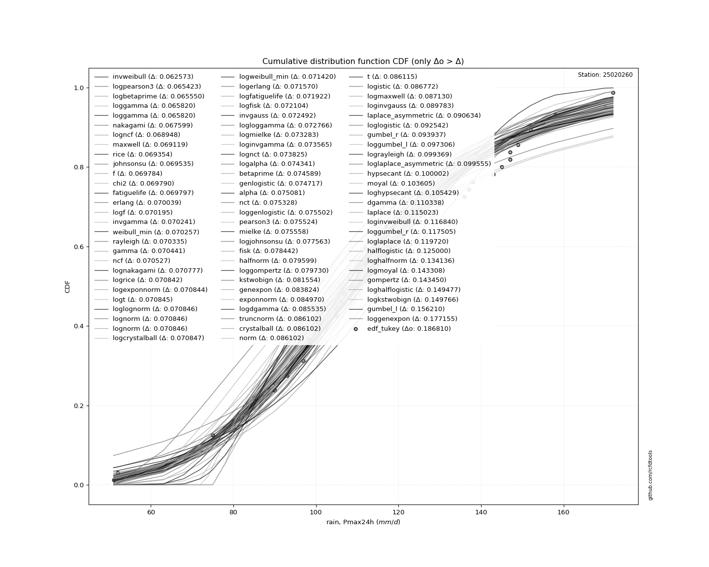</img>

</div>


**7.3. Best fit**

<div align="center">

|   id |   station | empirical_dist   | p_dist   |     delta |   deltao | eval   |   fit |   n |   best_fit |   best_fit_sort |
|-----:|----------:|:-----------------|:---------|----------:|---------:|:-------|------:|----:|-----------:|----------------:|
|    0 |  25020260 | edf_tukey        | logfisk  | 0.0570033 | 0.178577 | Δo > Δ |     1 |  58 |          1 |               1 |

</div>


<div align="center">

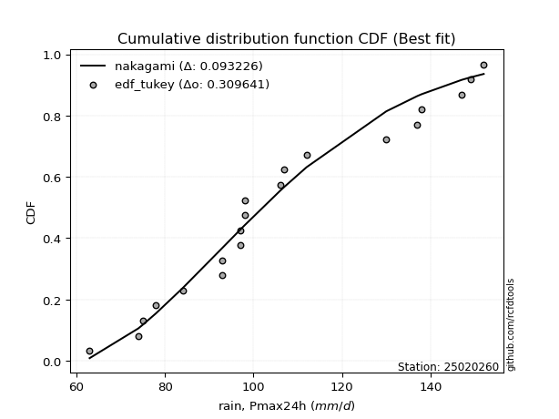</img>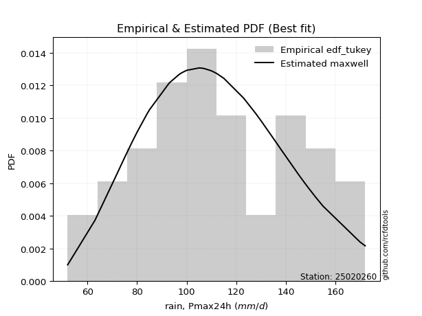</img>

</div>


### 8. Empirical - EDF Gringorten (1963)

Gringorten plotting position formula is essential for estimating the probability and return periods of extreme events like floods and heavy rainfall. The constant _a=0.44_.

<div align="center">


$P=(m-a)/(n+1-2a)$


</div>


**8.1. Empirical values**

<div align="center">

|                | 0                    | 1                    | 2                   | 3                   | 4                   | 5                  | 6                   | 7                   | 8                   | 9                  | 10                  | 11                  | 12                 | 13                  | 14                  | 15                 | 16                  | 17                 | 18                  | 19                  | 20                 | 21                  | 22                  | 23                 | 24                  | 25                  | 26                 | 27                  | 28                 | 29                | 30                 | 31                 | 32                 | 33                 | 34                 | 35                 | 36                 | 37                 | 38                 | 39                 | 40                 | 41                 | 42                 | 43                 | 44                 | 45                 | 46                 | 47                 | 48                 | 49                 | 50                 | 51                 | 52                | 53                 | 54                 | 55                 | 56                 | 57                 |
|:---------------|:---------------------|:---------------------|:--------------------|:--------------------|:--------------------|:-------------------|:--------------------|:--------------------|:--------------------|:-------------------|:--------------------|:--------------------|:-------------------|:--------------------|:--------------------|:-------------------|:--------------------|:-------------------|:--------------------|:--------------------|:-------------------|:--------------------|:--------------------|:-------------------|:--------------------|:--------------------|:-------------------|:--------------------|:-------------------|:------------------|:-------------------|:-------------------|:-------------------|:-------------------|:-------------------|:-------------------|:-------------------|:-------------------|:-------------------|:-------------------|:-------------------|:-------------------|:-------------------|:-------------------|:-------------------|:-------------------|:-------------------|:-------------------|:-------------------|:-------------------|:-------------------|:-------------------|:------------------|:-------------------|:-------------------|:-------------------|:-------------------|:-------------------|
| date           | 2019                 | 2015                 | 1986                | 1990                | 1963                | 2017               | 2021                | 1972                | 1997                | 2005               | 1993                | 1982                | 2013               | 1994                | 1971                | 1968               | 1967                | 2003               | 2002                | 2000                | 2001               | 1995                | 1998                | 1981               | 1970                | 1980                | 1988               | 1996                | 2009               | 2010              | 2020               | 1965               | 1985               | 2004               | 1969               | 1966               | 1989               | 1977               | 2018               | 1964               | 1976               | 1973               | 1991               | 1979               | 2006               | 2008               | 2014               | 1984               | 2011               | 1992               | 1983               | 2007               | 1999              | 1974               | 2012               | 1978               | 1987               | 1975               |
| x              | 48.0                 | 51.0                 | 52.0                | 63.0                | 68.0                | 68.0               | 69.0                | 72.0                | 74.0                | 75.0               | 78.0                | 80.0                | 83.0               | 84.0                | 85.0                | 90.0               | 90.0                | 93.0               | 93.0                | 97.0                | 97.0               | 98.0                | 98.0                | 100.0              | 100.0               | 105.0               | 105.0              | 106.0               | 107.0              | 109.0             | 109.0              | 110.0              | 110.0              | 112.0              | 112.0              | 112.0              | 115.0              | 115.0              | 115.0              | 117.0              | 123.0              | 128.0              | 130.0              | 136.0              | 137.0              | 138.0              | 143.0              | 145.0              | 147.0              | 147.0              | 149.0              | 149.0              | 152.0             | 155.0              | 158.0              | 170.0              | 170.0              | 172.0              |
| m              | 1                    | 2                    | 3                   | 4                   | 5                   | 6                  | 7                   | 8                   | 9                   | 10                 | 11                  | 12                  | 13                 | 14                  | 15                  | 16                 | 17                  | 18                 | 19                  | 20                  | 21                 | 22                  | 23                  | 24                 | 25                  | 26                  | 27                 | 28                  | 29                 | 30                | 31                 | 32                 | 33                 | 34                 | 35                 | 36                 | 37                 | 38                 | 39                 | 40                 | 41                 | 42                 | 43                 | 44                 | 45                 | 46                 | 47                 | 48                 | 49                 | 50                 | 51                 | 52                 | 53                | 54                 | 55                 | 56                 | 57                 | 58                 |
| empirical_dist | edf_gringorten       | edf_gringorten       | edf_gringorten      | edf_gringorten      | edf_gringorten      | edf_gringorten     | edf_gringorten      | edf_gringorten      | edf_gringorten      | edf_gringorten     | edf_gringorten      | edf_gringorten      | edf_gringorten     | edf_gringorten      | edf_gringorten      | edf_gringorten     | edf_gringorten      | edf_gringorten     | edf_gringorten      | edf_gringorten      | edf_gringorten     | edf_gringorten      | edf_gringorten      | edf_gringorten     | edf_gringorten      | edf_gringorten      | edf_gringorten     | edf_gringorten      | edf_gringorten     | edf_gringorten    | edf_gringorten     | edf_gringorten     | edf_gringorten     | edf_gringorten     | edf_gringorten     | edf_gringorten     | edf_gringorten     | edf_gringorten     | edf_gringorten     | edf_gringorten     | edf_gringorten     | edf_gringorten     | edf_gringorten     | edf_gringorten     | edf_gringorten     | edf_gringorten     | edf_gringorten     | edf_gringorten     | edf_gringorten     | edf_gringorten     | edf_gringorten     | edf_gringorten     | edf_gringorten    | edf_gringorten     | edf_gringorten     | edf_gringorten     | edf_gringorten     | edf_gringorten     |
| empirical      | 0.009635237439779768 | 0.026841018582243636 | 0.04404679972470751 | 0.06125258086717137 | 0.07845836200963524 | 0.0956641431520991 | 0.11286992429456297 | 0.13007570543702685 | 0.14728148657949072 | 0.1644872677219546 | 0.18169304886441845 | 0.19889883000688233 | 0.2161046111493462 | 0.23331039229181005 | 0.25051617343427396 | 0.2677219545767378 | 0.28492773571920166 | 0.3021335168616655 | 0.31933929800412936 | 0.33654507914659326 | 0.3537508602890571 | 0.37095664143152096 | 0.38816242257398487 | 0.4053682037164487 | 0.42257398485891257 | 0.43977976600137647 | 0.4569855471438403 | 0.47419132828630417 | 0.4913971094287681 | 0.508602890571232 | 0.5258086717136958 | 0.5430144528561597 | 0.5602202339986236 | 0.5774260151410875 | 0.5946317962835513 | 0.6118375774260152 | 0.629043358568479  | 0.646249139710943  | 0.6634549208534068 | 0.6806607019958707 | 0.6978664831383345 | 0.7150722642807984 | 0.7322780454232622 | 0.7494838265657262 | 0.7666896077081901 | 0.7838953888506539 | 0.8011011699931178 | 0.8183069511355816 | 0.8355127322780455 | 0.8527185134205094 | 0.8699242945629733 | 0.8871300757054371 | 0.904335856847901 | 0.9215416379903648 | 0.9387474191328287 | 0.9559532002752926 | 0.9731589814177565 | 0.9903647625602203 |
| empirical_tr   | 1.009728978457262    | 1.0275813295615275   | 1.0460763138948883  | 1.06524926686217    | 1.0851381628080659  | 1.1057838660578387 | 1.1272304111714508  | 1.1495253164556962  | 1.1727199354317999  | 1.1968698517298189 | 1.2220353238015138  | 1.2482817869415808  | 1.2756804214223003 | 1.3043087971274685  | 1.33425160697888    | 1.3656015037593985 | 1.3984600577478346  | 1.432938856015779  | 1.4691607684529828  | 1.5072614107883817  | 1.5473908413205537 | 1.5897155361050328  | 1.6344206974128233  | 1.681712962962963  | 1.7318235995232416  | 1.7850122850122851  | 1.8415716096324461 | 1.9018324607329842  | 1.9661705006765902 | 2.035014005602241 | 2.1088534107402035 | 2.1882530120481927 | 2.2738654147104858 | 2.366449511400652  | 2.4668930390492365 | 2.5762411347517733 | 2.6957328385899815 | 2.8268482490272384 | 2.971370143149285  | 3.1314655172413803 | 3.309794988610479  | 3.5096618357487928 | 3.7352185089974297 | 3.9917582417582436 | 4.286135693215341  | 4.627388535031849  | 5.027681660899655  | 5.503787878787881  | 6.079497907949792  | 6.78971962616823   | 7.687830687830695  | 8.859756097560982  | 10.45323741007195 | 12.745614035087728 | 16.325842696629223 | 22.703125000000064 | 37.256410256410405 | 103.78571428571526 |

</div>


**8.2. Kolmogorov-Smirnov fit test (sorted by Δ)**


<div align="center">

|                | 0                   | 1                    | 2                   | 3                   | 4                   | 5                   | 6                   | 7                   | 8                   | 9                   | 10                  | 11                  | 12                  | 13                 | 14                  | 15                  | 16                  | 17                  | 18                  | 19                  | 20                  | 21                  | 22                  | 23                 | 24                  | 25                  | 26                  | 27                  | 28                  | 29                  | 30                  | 31                  | 32                 | 33                  | 34                 | 35                  | 36                  | 37                  | 38                  | 39                 | 40                  | 41                  | 42                  | 43                  | 44                  | 45                  | 46                  | 47                  | 48                  | 49                  | 50                  | 51                  | 52                  | 53                  | 54                  | 55                  | 56                    | 57                  | 58                  | 59                  | 60                  | 61                  | 62                  | 63                  | 64                  | 65                  | 66                  | 67                 | 68                  | 69                  | 70                 | 71                  | 72                  | 73                  | 74                  | 75                  | 76                  | 77                  | 78                  | 79                  | 80                  | 81                  | 82                  | 83                  | 84                  | 85                 | 86                 | 87                 |
|:---------------|:--------------------|:---------------------|:--------------------|:--------------------|:--------------------|:--------------------|:--------------------|:--------------------|:--------------------|:--------------------|:--------------------|:--------------------|:--------------------|:-------------------|:--------------------|:--------------------|:--------------------|:--------------------|:--------------------|:--------------------|:--------------------|:--------------------|:--------------------|:-------------------|:--------------------|:--------------------|:--------------------|:--------------------|:--------------------|:--------------------|:--------------------|:--------------------|:-------------------|:--------------------|:-------------------|:--------------------|:--------------------|:--------------------|:--------------------|:-------------------|:--------------------|:--------------------|:--------------------|:--------------------|:--------------------|:--------------------|:--------------------|:--------------------|:--------------------|:--------------------|:--------------------|:--------------------|:--------------------|:--------------------|:--------------------|:--------------------|:----------------------|:--------------------|:--------------------|:--------------------|:--------------------|:--------------------|:--------------------|:--------------------|:--------------------|:--------------------|:--------------------|:-------------------|:--------------------|:--------------------|:-------------------|:--------------------|:--------------------|:--------------------|:--------------------|:--------------------|:--------------------|:--------------------|:--------------------|:--------------------|:--------------------|:--------------------|:--------------------|:--------------------|:--------------------|:-------------------|:-------------------|:-------------------|
| station        | 25020260            | 25020260             | 25020260            | 25020260            | 25020260            | 25020260            | 25020260            | 25020260            | 25020260            | 25020260            | 25020260            | 25020260            | 25020260            | 25020260           | 25020260            | 25020260            | 25020260            | 25020260            | 25020260            | 25020260            | 25020260            | 25020260            | 25020260            | 25020260           | 25020260            | 25020260            | 25020260            | 25020260            | 25020260            | 25020260            | 25020260            | 25020260            | 25020260           | 25020260            | 25020260           | 25020260            | 25020260            | 25020260            | 25020260            | 25020260           | 25020260            | 25020260            | 25020260            | 25020260            | 25020260            | 25020260            | 25020260            | 25020260            | 25020260            | 25020260            | 25020260            | 25020260            | 25020260            | 25020260            | 25020260            | 25020260            | 25020260              | 25020260            | 25020260            | 25020260            | 25020260            | 25020260            | 25020260            | 25020260            | 25020260            | 25020260            | 25020260            | 25020260           | 25020260            | 25020260            | 25020260           | 25020260            | 25020260            | 25020260            | 25020260            | 25020260            | 25020260            | 25020260            | 25020260            | 25020260            | 25020260            | 25020260            | 25020260            | 25020260            | 25020260            | 25020260           | 25020260           | 25020260           |
| empirical_dist | edf_gringorten      | edf_gringorten       | edf_gringorten      | edf_gringorten      | edf_gringorten      | edf_gringorten      | edf_gringorten      | edf_gringorten      | edf_gringorten      | edf_gringorten      | edf_gringorten      | edf_gringorten      | edf_gringorten      | edf_gringorten     | edf_gringorten      | edf_gringorten      | edf_gringorten      | edf_gringorten      | edf_gringorten      | edf_gringorten      | edf_gringorten      | edf_gringorten      | edf_gringorten      | edf_gringorten     | edf_gringorten      | edf_gringorten      | edf_gringorten      | edf_gringorten      | edf_gringorten      | edf_gringorten      | edf_gringorten      | edf_gringorten      | edf_gringorten     | edf_gringorten      | edf_gringorten     | edf_gringorten      | edf_gringorten      | edf_gringorten      | edf_gringorten      | edf_gringorten     | edf_gringorten      | edf_gringorten      | edf_gringorten      | edf_gringorten      | edf_gringorten      | edf_gringorten      | edf_gringorten      | edf_gringorten      | edf_gringorten      | edf_gringorten      | edf_gringorten      | edf_gringorten      | edf_gringorten      | edf_gringorten      | edf_gringorten      | edf_gringorten      | edf_gringorten        | edf_gringorten      | edf_gringorten      | edf_gringorten      | edf_gringorten      | edf_gringorten      | edf_gringorten      | edf_gringorten      | edf_gringorten      | edf_gringorten      | edf_gringorten      | edf_gringorten     | edf_gringorten      | edf_gringorten      | edf_gringorten     | edf_gringorten      | edf_gringorten      | edf_gringorten      | edf_gringorten      | edf_gringorten      | edf_gringorten      | edf_gringorten      | edf_gringorten      | edf_gringorten      | edf_gringorten      | edf_gringorten      | edf_gringorten      | edf_gringorten      | edf_gringorten      | edf_gringorten     | edf_gringorten     | edf_gringorten     |
| p_dist         | logfisk             | fisk                 | nakagami            | maxwell             | rayleigh            | alpha               | invgamma            | genlogistic         | logpearson3         | ncf                 | chi2                | f                   | fatiguelife         | invweibull         | mielke              | erlang              | loggenlogistic      | gamma               | johnsonsu           | rice                | logfatiguelife      | weibull_min         | lognakagami         | logrice            | lognorm             | lognorm             | logcrystalball      | loglognorm          | logexponnorm        | logt                | logncf              | logf                | logweibull_min     | lognct              | logloggamma        | pearson3            | nct                 | invgauss            | loggompertz         | logistic           | loglogistic         | laplace_asymmetric  | logjohnsonsu        | gumbel_r            | loginvgamma         | logerlang           | loggamma            | loggamma            | exponnorm           | t                   | crystalball         | norm                | truncnorm           | betaprime           | logbetaprime        | logalpha            | loglaplace_asymmetric | loggumbel_l         | hypsecant           | loghypsecant        | logchi2             | kstwobign           | halfnorm            | loginvgauss         | moyal               | laplace             | loglaplace          | logmaxwell         | logmielke           | lograyleigh         | halflogistic       | loginvweibull       | loggumbel_r         | gumbel_l            | loghalfnorm         | logkstwobign        | logmoyal            | loghalflogistic     | loggenexpon         | wald                | expon               | logwald             | gibrat              | loggibrat           | logexpon            | logtruncnorm       | gompertz           | genexpon           |
| delta          | 0.05609088761809766 | 0.057665644520593085 | 0.05958415267642736 | 0.05980021864868956 | 0.06036155748645411 | 0.06331655511959833 | 0.06335954734574045 | 0.06394959401084988 | 0.06500738328680034 | 0.06664821030581147 | 0.06718115384455547 | 0.06765296058387227 | 0.06852798257212145 | 0.0686272257769181 | 0.06948661915257615 | 0.06966325451530953 | 0.06970925434895203 | 0.07003001171043821 | 0.07076389738688249 | 0.07099718666044297 | 0.07116077763028306 | 0.07159577399203865 | 0.07169148395274894 | 0.0720010807983486 | 0.07200422975251775 | 0.07200422975251775 | 0.07200466962082624 | 0.07200489521076836 | 0.07200502625780753 | 0.07200533672513082 | 0.07207745980928837 | 0.07231279095630344 | 0.0739521173860811 | 0.07527825302406349 | 0.0760775204144799 | 0.07639442176869415 | 0.07772323680388116 | 0.07794396402564935 | 0.07853519340917303 | 0.0789501145547864 | 0.07985001351194243 | 0.08022198593382357 | 0.08039461752115018 | 0.08211250980919549 | 0.08360743600629233 | 0.08414510072330866 | 0.08435547036971319 | 0.08435547036971319 | 0.08454986866227232 | 0.08561383621764862 | 0.08562537828293026 | 0.08562538113107321 | 0.08562539025374971 | 0.08660593773829606 | 0.08765063302937315 | 0.08800500272044265 | 0.08862526111518032   | 0.09044974953981422 | 0.09112678450963707 | 0.09196441056095528 | 0.09334682301654629 | 0.09353071337361007 | 0.09419875581950421 | 0.09437739471062451 | 0.10356093853618387 | 0.10403133955549448 | 0.10475420029069282 | 0.1062009150091584 | 0.10985739178754816 | 0.11845603672321048 | 0.1265292643584803 | 0.13011809490608806 | 0.14174338446217383 | 0.14911698785273653 | 0.15322008736680504 | 0.16012911112983397 | 0.16748311414784212 | 0.17035823534674444 | 0.17864834276669905 | 0.19809362244387754 | 0.23074460140731196 | 0.23901370414796708 | 0.25051617343427396 | 0.26397365086957125 | 0.29087230713904566 | 0.4015089191757109 | 0.7985554014039015 | 0.8934237713959943 |
| deltao         | 0.1785767486892227  | 0.1785767486892227   | 0.1785767486892227  | 0.1785767486892227  | 0.1785767486892227  | 0.1785767486892227  | 0.1785767486892227  | 0.1785767486892227  | 0.1785767486892227  | 0.1785767486892227  | 0.1785767486892227  | 0.1785767486892227  | 0.1785767486892227  | 0.1785767486892227 | 0.1785767486892227  | 0.1785767486892227  | 0.1785767486892227  | 0.1785767486892227  | 0.1785767486892227  | 0.1785767486892227  | 0.1785767486892227  | 0.1785767486892227  | 0.1785767486892227  | 0.1785767486892227 | 0.1785767486892227  | 0.1785767486892227  | 0.1785767486892227  | 0.1785767486892227  | 0.1785767486892227  | 0.1785767486892227  | 0.1785767486892227  | 0.1785767486892227  | 0.1785767486892227 | 0.1785767486892227  | 0.1785767486892227 | 0.1785767486892227  | 0.1785767486892227  | 0.1785767486892227  | 0.1785767486892227  | 0.1785767486892227 | 0.1785767486892227  | 0.1785767486892227  | 0.1785767486892227  | 0.1785767486892227  | 0.1785767486892227  | 0.1785767486892227  | 0.1785767486892227  | 0.1785767486892227  | 0.1785767486892227  | 0.1785767486892227  | 0.1785767486892227  | 0.1785767486892227  | 0.1785767486892227  | 0.1785767486892227  | 0.1785767486892227  | 0.1785767486892227  | 0.1785767486892227    | 0.1785767486892227  | 0.1785767486892227  | 0.1785767486892227  | 0.1785767486892227  | 0.1785767486892227  | 0.1785767486892227  | 0.1785767486892227  | 0.1785767486892227  | 0.1785767486892227  | 0.1785767486892227  | 0.1785767486892227 | 0.1785767486892227  | 0.1785767486892227  | 0.1785767486892227 | 0.1785767486892227  | 0.1785767486892227  | 0.1785767486892227  | 0.1785767486892227  | 0.1785767486892227  | 0.1785767486892227  | 0.1785767486892227  | 0.1785767486892227  | 0.1785767486892227  | 0.1785767486892227  | 0.1785767486892227  | 0.1785767486892227  | 0.1785767486892227  | 0.1785767486892227  | 0.1785767486892227 | 0.1785767486892227 | 0.1785767486892227 |
| eval           | Δo > Δ              | Δo > Δ               | Δo > Δ              | Δo > Δ              | Δo > Δ              | Δo > Δ              | Δo > Δ              | Δo > Δ              | Δo > Δ              | Δo > Δ              | Δo > Δ              | Δo > Δ              | Δo > Δ              | Δo > Δ             | Δo > Δ              | Δo > Δ              | Δo > Δ              | Δo > Δ              | Δo > Δ              | Δo > Δ              | Δo > Δ              | Δo > Δ              | Δo > Δ              | Δo > Δ             | Δo > Δ              | Δo > Δ              | Δo > Δ              | Δo > Δ              | Δo > Δ              | Δo > Δ              | Δo > Δ              | Δo > Δ              | Δo > Δ             | Δo > Δ              | Δo > Δ             | Δo > Δ              | Δo > Δ              | Δo > Δ              | Δo > Δ              | Δo > Δ             | Δo > Δ              | Δo > Δ              | Δo > Δ              | Δo > Δ              | Δo > Δ              | Δo > Δ              | Δo > Δ              | Δo > Δ              | Δo > Δ              | Δo > Δ              | Δo > Δ              | Δo > Δ              | Δo > Δ              | Δo > Δ              | Δo > Δ              | Δo > Δ              | Δo > Δ                | Δo > Δ              | Δo > Δ              | Δo > Δ              | Δo > Δ              | Δo > Δ              | Δo > Δ              | Δo > Δ              | Δo > Δ              | Δo > Δ              | Δo > Δ              | Δo > Δ             | Δo > Δ              | Δo > Δ              | Δo > Δ             | Δo > Δ              | Δo > Δ              | Δo > Δ              | Δo > Δ              | Δo > Δ              | Δo > Δ              | Δo > Δ              | Δo <= Δ             | Δo <= Δ             | Δo <= Δ             | Δo <= Δ             | Δo <= Δ             | Δo <= Δ             | Δo <= Δ             | Δo <= Δ            | Δo <= Δ            | Δo <= Δ            |
| fit            | 1                   | 1                    | 1                   | 1                   | 1                   | 1                   | 1                   | 1                   | 1                   | 1                   | 1                   | 1                   | 1                   | 1                  | 1                   | 1                   | 1                   | 1                   | 1                   | 1                   | 1                   | 1                   | 1                   | 1                  | 1                   | 1                   | 1                   | 1                   | 1                   | 1                   | 1                   | 1                   | 1                  | 1                   | 1                  | 1                   | 1                   | 1                   | 1                   | 1                  | 1                   | 1                   | 1                   | 1                   | 1                   | 1                   | 1                   | 1                   | 1                   | 1                   | 1                   | 1                   | 1                   | 1                   | 1                   | 1                   | 1                     | 1                   | 1                   | 1                   | 1                   | 1                   | 1                   | 1                   | 1                   | 1                   | 1                   | 1                  | 1                   | 1                   | 1                  | 1                   | 1                   | 1                   | 1                   | 1                   | 1                   | 1                   | 0                   | 0                   | 0                   | 0                   | 0                   | 0                   | 0                   | 0                  | 0                  | 0                  |
| n              | 58                  | 58                   | 58                  | 58                  | 58                  | 58                  | 58                  | 58                  | 58                  | 58                  | 58                  | 58                  | 58                  | 58                 | 58                  | 58                  | 58                  | 58                  | 58                  | 58                  | 58                  | 58                  | 58                  | 58                 | 58                  | 58                  | 58                  | 58                  | 58                  | 58                  | 58                  | 58                  | 58                 | 58                  | 58                 | 58                  | 58                  | 58                  | 58                  | 58                 | 58                  | 58                  | 58                  | 58                  | 58                  | 58                  | 58                  | 58                  | 58                  | 58                  | 58                  | 58                  | 58                  | 58                  | 58                  | 58                  | 58                    | 58                  | 58                  | 58                  | 58                  | 58                  | 58                  | 58                  | 58                  | 58                  | 58                  | 58                 | 58                  | 58                  | 58                 | 58                  | 58                  | 58                  | 58                  | 58                  | 58                  | 58                  | 58                  | 58                  | 58                  | 58                  | 58                  | 58                  | 58                  | 58                 | 58                 | 58                 |
| best_fit       | 1                   | 0                    | 0                   | 0                   | 0                   | 0                   | 0                   | 0                   | 0                   | 0                   | 0                   | 0                   | 0                   | 0                  | 0                   | 0                   | 0                   | 0                   | 0                   | 0                   | 0                   | 0                   | 0                   | 0                  | 0                   | 0                   | 0                   | 0                   | 0                   | 0                   | 0                   | 0                   | 0                  | 0                   | 0                  | 0                   | 0                   | 0                   | 0                   | 0                  | 0                   | 0                   | 0                   | 0                   | 0                   | 0                   | 0                   | 0                   | 0                   | 0                   | 0                   | 0                   | 0                   | 0                   | 0                   | 0                   | 0                     | 0                   | 0                   | 0                   | 0                   | 0                   | 0                   | 0                   | 0                   | 0                   | 0                   | 0                  | 0                   | 0                   | 0                  | 0                   | 0                   | 0                   | 0                   | 0                   | 0                   | 0                   | 0                   | 0                   | 0                   | 0                   | 0                   | 0                   | 0                   | 0                  | 0                  | 0                  |
| best_fit_sort  | 1                   | 2                    | 3                   | 4                   | 5                   | 6                   | 7                   | 8                   | 9                   | 10                  | 11                  | 12                  | 13                  | 14                 | 15                  | 16                  | 17                  | 18                  | 19                  | 20                  | 21                  | 22                  | 23                  | 24                 | 25                  | 26                  | 27                  | 28                  | 29                  | 30                  | 31                  | 32                  | 33                 | 34                  | 35                 | 36                  | 37                  | 38                  | 39                  | 40                 | 41                  | 42                  | 43                  | 44                  | 45                  | 46                  | 47                  | 48                  | 49                  | 50                  | 51                  | 52                  | 53                  | 54                  | 55                  | 56                  | 57                    | 58                  | 59                  | 60                  | 61                  | 62                  | 63                  | 64                  | 65                  | 66                  | 67                  | 68                 | 69                  | 70                  | 71                 | 72                  | 73                  | 74                  | 75                  | 76                  | 77                  | 78                  | 79                  | 80                  | 81                  | 82                  | 83                  | 84                  | 85                  | 86                 | 87                 | 88                 |

</div>


<div align="center">

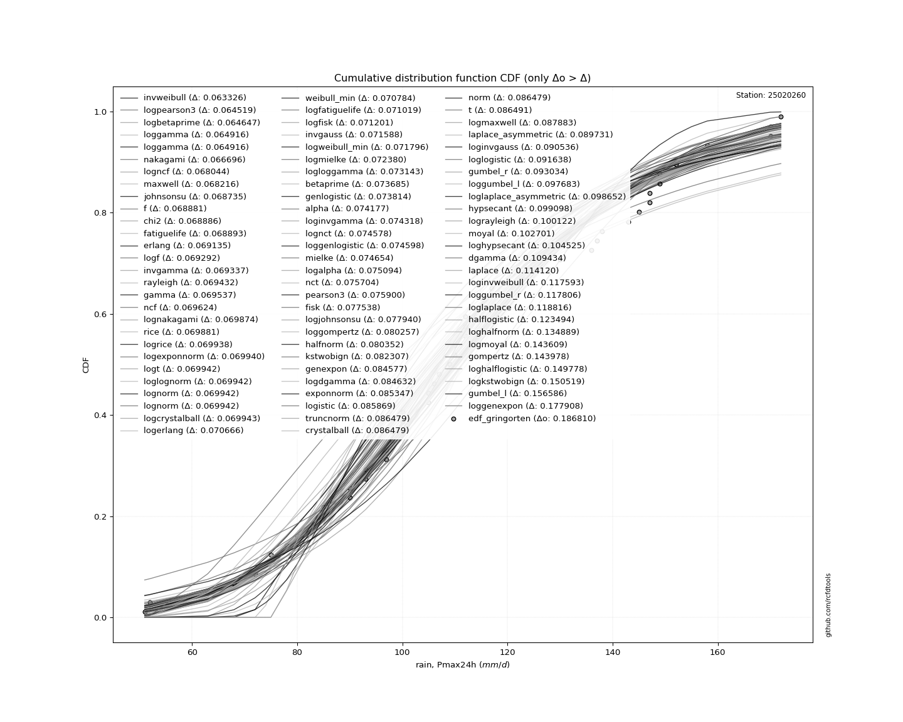</img>

</div>


**8.3. Best fit**

<div align="center">

|   id |   station | empirical_dist   | p_dist   |     delta |   deltao | eval   |   fit |   n |   best_fit |   best_fit_sort |
|-----:|----------:|:-----------------|:---------|----------:|---------:|:-------|------:|----:|-----------:|----------------:|
|    0 |  25020260 | edf_gringorten   | logfisk  | 0.0560909 | 0.178577 | Δo > Δ |     1 |  58 |          1 |               1 |

</div>


<div align="center">

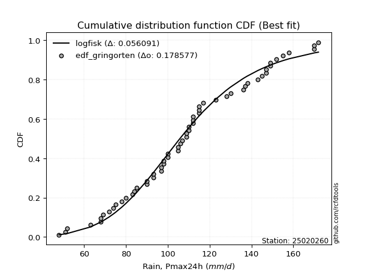</img>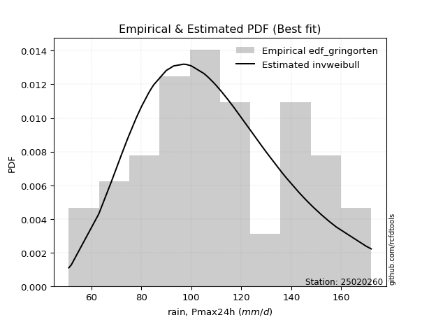</img>

</div>


### 9. Empirical - EDF Filliben (1975)

The specific values of the constants (0.3175) (often denoted as $alpha$) and (0.365) are derived from a method proposed by James J. Filliben in a 1975 paper. This particular formula is the mean value of the $i$-th order statistic of the normal distribution and is considered a robust and effective plotting position formula for the normal probability plot correlation coefficient test for normality.

<div align="center">


$P=(m-0.3175)/(n+0.365)$


</div>


**9.1. Empirical values**

<div align="center">

|                | 0                    | 1                    | 2                    | 3                   | 4                   | 5                   | 6                   | 7                  | 8                  | 9                   | 10                  | 11                  | 12                  | 13                 | 14                  | 15                 | 16                 | 17                  | 18                 | 19                  | 20                  | 21                 | 22                  | 23                 | 24                 | 25                  | 26                 | 27                  | 28                 | 29                 | 30                 | 31                 | 32                 | 33                 | 34                 | 35                 | 36                 | 37                 | 38                 | 39                 | 40                 | 41                 | 42                 | 43                 | 44                 | 45                 | 46                 | 47                 | 48                 | 49                 | 50                 | 51                 | 52                 | 53                 | 54                 | 55                 | 56                 | 57                 |
|:---------------|:---------------------|:---------------------|:---------------------|:--------------------|:--------------------|:--------------------|:--------------------|:-------------------|:-------------------|:--------------------|:--------------------|:--------------------|:--------------------|:-------------------|:--------------------|:-------------------|:-------------------|:--------------------|:-------------------|:--------------------|:--------------------|:-------------------|:--------------------|:-------------------|:-------------------|:--------------------|:-------------------|:--------------------|:-------------------|:-------------------|:-------------------|:-------------------|:-------------------|:-------------------|:-------------------|:-------------------|:-------------------|:-------------------|:-------------------|:-------------------|:-------------------|:-------------------|:-------------------|:-------------------|:-------------------|:-------------------|:-------------------|:-------------------|:-------------------|:-------------------|:-------------------|:-------------------|:-------------------|:-------------------|:-------------------|:-------------------|:-------------------|:-------------------|
| date           | 2019                 | 2015                 | 1986                 | 1990                | 1963                | 2017                | 2021                | 1972               | 1997               | 2005                | 1993                | 1982                | 2013                | 1994               | 1971                | 1968               | 1967               | 2003                | 2002               | 2000                | 2001                | 1995               | 1998                | 1981               | 1970               | 1980                | 1988               | 1996                | 2009               | 2010               | 2020               | 1965               | 1985               | 2004               | 1969               | 1966               | 1989               | 1977               | 2018               | 1964               | 1976               | 1973               | 1991               | 1979               | 2006               | 2008               | 2014               | 1984               | 2011               | 1992               | 1983               | 2007               | 1999               | 1974               | 2012               | 1978               | 1987               | 1975               |
| x              | 48.0                 | 51.0                 | 52.0                 | 63.0                | 68.0                | 68.0                | 69.0                | 72.0               | 74.0               | 75.0                | 78.0                | 80.0                | 83.0                | 84.0               | 85.0                | 90.0               | 90.0               | 93.0                | 93.0               | 97.0                | 97.0                | 98.0               | 98.0                | 100.0              | 100.0              | 105.0               | 105.0              | 106.0               | 107.0              | 109.0              | 109.0              | 110.0              | 110.0              | 112.0              | 112.0              | 112.0              | 115.0              | 115.0              | 115.0              | 117.0              | 123.0              | 128.0              | 130.0              | 136.0              | 137.0              | 138.0              | 143.0              | 145.0              | 147.0              | 147.0              | 149.0              | 149.0              | 152.0              | 155.0              | 158.0              | 170.0              | 170.0              | 172.0              |
| m              | 1                    | 2                    | 3                    | 4                   | 5                   | 6                   | 7                   | 8                  | 9                  | 10                  | 11                  | 12                  | 13                  | 14                 | 15                  | 16                 | 17                 | 18                  | 19                 | 20                  | 21                  | 22                 | 23                  | 24                 | 25                 | 26                  | 27                 | 28                  | 29                 | 30                 | 31                 | 32                 | 33                 | 34                 | 35                 | 36                 | 37                 | 38                 | 39                 | 40                 | 41                 | 42                 | 43                 | 44                 | 45                 | 46                 | 47                 | 48                 | 49                 | 50                 | 51                 | 52                 | 53                 | 54                 | 55                 | 56                 | 57                 | 58                 |
| empirical_dist | edf_filliben         | edf_filliben         | edf_filliben         | edf_filliben        | edf_filliben        | edf_filliben        | edf_filliben        | edf_filliben       | edf_filliben       | edf_filliben        | edf_filliben        | edf_filliben        | edf_filliben        | edf_filliben       | edf_filliben        | edf_filliben       | edf_filliben       | edf_filliben        | edf_filliben       | edf_filliben        | edf_filliben        | edf_filliben       | edf_filliben        | edf_filliben       | edf_filliben       | edf_filliben        | edf_filliben       | edf_filliben        | edf_filliben       | edf_filliben       | edf_filliben       | edf_filliben       | edf_filliben       | edf_filliben       | edf_filliben       | edf_filliben       | edf_filliben       | edf_filliben       | edf_filliben       | edf_filliben       | edf_filliben       | edf_filliben       | edf_filliben       | edf_filliben       | edf_filliben       | edf_filliben       | edf_filliben       | edf_filliben       | edf_filliben       | edf_filliben       | edf_filliben       | edf_filliben       | edf_filliben       | edf_filliben       | edf_filliben       | edf_filliben       | edf_filliben       | edf_filliben       |
| empirical      | 0.011693652017476226 | 0.028827208087038467 | 0.045960764156600706 | 0.06309432022616294 | 0.08022787629572517 | 0.09736143236528741 | 0.11449498843484965 | 0.1316285445044119 | 0.1487621005739741 | 0.16589565664353634 | 0.18302921271309858 | 0.20016276878266082 | 0.21729632485222306 | 0.2344298809217853 | 0.25156343699134753 | 0.2686969930609098 | 0.285830549130472  | 0.30296410520003425 | 0.3200976612695965 | 0.33723121733915873 | 0.35436477340872097 | 0.3714983294782832 | 0.38863188554784545 | 0.4057654416174077 | 0.4228989976869699 | 0.44003255375653216 | 0.4571661098260944 | 0.47429966589565664 | 0.4914332219652189 | 0.5085667780347811 | 0.5257003341043434 | 0.5428338901739056 | 0.5599674462434677 | 0.57710100231303   | 0.5942345583825922 | 0.6113681144521544 | 0.6285016705217167 | 0.6456352265912789 | 0.6627687826608412 | 0.6799023387304034 | 0.6970358947999656 | 0.7141694508695279 | 0.7313030069390901 | 0.7484365630086524 | 0.7655701190782146 | 0.7827036751477768 | 0.7998372312173391 | 0.8169707872869013 | 0.8341043433564636 | 0.8512378994260258 | 0.868371455495588  | 0.8855050115651503 | 0.9026385676347125 | 0.9197721237042747 | 0.936905679773837  | 0.9540392358433992 | 0.9711727919129615 | 0.9883063479825237 |
| empirical_tr   | 1.011832011441945    | 1.0296828827239448   | 1.0481749203070982   | 1.0673432999588532  | 1.0872258184697061  | 1.1078631424097185  | 1.12929908576404    | 1.1515809204360479 | 1.174759724248981  | 1.1988907718379294  | 1.224033974728674   | 1.2502543779789     | 1.2776227220489247  | 1.3062160801208527 | 1.3361185829565616  | 1.3674222456510279 | 1.4002279133929108 | 1.434646346709273   | 1.4707994707994707 | 1.5088218186518452  | 1.5488622039408213  | 1.5910856675526477 | 1.6356757514187628  | 1.682837165717581  | 1.7327989311957248 | 1.7858180983706877  | 1.8421841710723585 | 1.902224395013444   | 1.9663101153878548 | 2.0348644643946656 | 2.1083717149823897 | 2.18738873793685   | 2.2725591355981694 | 2.3646308113035546 | 2.4644779900770604 | 2.5731290642565847 | 2.6918021445866476 | 2.8219509246947894 | 2.9653245268639647 | 3.1240465676435156 | 3.300721051887458  | 3.498576352465157  | 3.7216642754662828 | 3.975140473352629  | 4.2656678238625965 | 4.602010644588999  | 4.99593408945003   | 5.463608705827285  | 6.027885360185899  | 6.722142240138205  | 7.5971363488447725 | 8.734006734006728  | 10.271007479102499 | 12.464495461825935 | 15.849287169042752 | 21.75768872320593  | 34.68945022288253  | 85.516483516483    |

</div>


**9.2. Kolmogorov-Smirnov fit test (sorted by Δ)**


<div align="center">

|                | 0                    | 1                   | 2                    | 3                    | 4                   | 5                   | 6                   | 7                   | 8                   | 9                   | 10                  | 11                  | 12                  | 13                  | 14                  | 15                  | 16                  | 17                  | 18                 | 19                  | 20                  | 21                  | 22                  | 23                  | 24                  | 25                  | 26                  | 27                 | 28                  | 29                  | 30                 | 31                  | 32                  | 33                  | 34                  | 35                  | 36                  | 37                  | 38                  | 39                  | 40                  | 41                  | 42                  | 43                  | 44                  | 45                 | 46                  | 47                  | 48                  | 49                  | 50                  | 51                  | 52                  | 53                  | 54                  | 55                  | 56                    | 57                  | 58                  | 59                  | 60                  | 61                  | 62                  | 63                  | 64                  | 65                  | 66                  | 67                  | 68                  | 69                  | 70                  | 71                 | 72                  | 73                  | 74                  | 75                 | 76                  | 77                  | 78                 | 79                  | 80                 | 81                  | 82                  | 83                  | 84                 | 85                  | 86                 | 87                 |
|:---------------|:---------------------|:--------------------|:---------------------|:---------------------|:--------------------|:--------------------|:--------------------|:--------------------|:--------------------|:--------------------|:--------------------|:--------------------|:--------------------|:--------------------|:--------------------|:--------------------|:--------------------|:--------------------|:-------------------|:--------------------|:--------------------|:--------------------|:--------------------|:--------------------|:--------------------|:--------------------|:--------------------|:-------------------|:--------------------|:--------------------|:-------------------|:--------------------|:--------------------|:--------------------|:--------------------|:--------------------|:--------------------|:--------------------|:--------------------|:--------------------|:--------------------|:--------------------|:--------------------|:--------------------|:--------------------|:-------------------|:--------------------|:--------------------|:--------------------|:--------------------|:--------------------|:--------------------|:--------------------|:--------------------|:--------------------|:--------------------|:----------------------|:--------------------|:--------------------|:--------------------|:--------------------|:--------------------|:--------------------|:--------------------|:--------------------|:--------------------|:--------------------|:--------------------|:--------------------|:--------------------|:--------------------|:-------------------|:--------------------|:--------------------|:--------------------|:-------------------|:--------------------|:--------------------|:-------------------|:--------------------|:-------------------|:--------------------|:--------------------|:--------------------|:-------------------|:--------------------|:-------------------|:-------------------|
| station        | 25020260             | 25020260            | 25020260             | 25020260             | 25020260            | 25020260            | 25020260            | 25020260            | 25020260            | 25020260            | 25020260            | 25020260            | 25020260            | 25020260            | 25020260            | 25020260            | 25020260            | 25020260            | 25020260           | 25020260            | 25020260            | 25020260            | 25020260            | 25020260            | 25020260            | 25020260            | 25020260            | 25020260           | 25020260            | 25020260            | 25020260           | 25020260            | 25020260            | 25020260            | 25020260            | 25020260            | 25020260            | 25020260            | 25020260            | 25020260            | 25020260            | 25020260            | 25020260            | 25020260            | 25020260            | 25020260           | 25020260            | 25020260            | 25020260            | 25020260            | 25020260            | 25020260            | 25020260            | 25020260            | 25020260            | 25020260            | 25020260              | 25020260            | 25020260            | 25020260            | 25020260            | 25020260            | 25020260            | 25020260            | 25020260            | 25020260            | 25020260            | 25020260            | 25020260            | 25020260            | 25020260            | 25020260           | 25020260            | 25020260            | 25020260            | 25020260           | 25020260            | 25020260            | 25020260           | 25020260            | 25020260           | 25020260            | 25020260            | 25020260            | 25020260           | 25020260            | 25020260           | 25020260           |
| empirical_dist | edf_filliben         | edf_filliben        | edf_filliben         | edf_filliben         | edf_filliben        | edf_filliben        | edf_filliben        | edf_filliben        | edf_filliben        | edf_filliben        | edf_filliben        | edf_filliben        | edf_filliben        | edf_filliben        | edf_filliben        | edf_filliben        | edf_filliben        | edf_filliben        | edf_filliben       | edf_filliben        | edf_filliben        | edf_filliben        | edf_filliben        | edf_filliben        | edf_filliben        | edf_filliben        | edf_filliben        | edf_filliben       | edf_filliben        | edf_filliben        | edf_filliben       | edf_filliben        | edf_filliben        | edf_filliben        | edf_filliben        | edf_filliben        | edf_filliben        | edf_filliben        | edf_filliben        | edf_filliben        | edf_filliben        | edf_filliben        | edf_filliben        | edf_filliben        | edf_filliben        | edf_filliben       | edf_filliben        | edf_filliben        | edf_filliben        | edf_filliben        | edf_filliben        | edf_filliben        | edf_filliben        | edf_filliben        | edf_filliben        | edf_filliben        | edf_filliben          | edf_filliben        | edf_filliben        | edf_filliben        | edf_filliben        | edf_filliben        | edf_filliben        | edf_filliben        | edf_filliben        | edf_filliben        | edf_filliben        | edf_filliben        | edf_filliben        | edf_filliben        | edf_filliben        | edf_filliben       | edf_filliben        | edf_filliben        | edf_filliben        | edf_filliben       | edf_filliben        | edf_filliben        | edf_filliben       | edf_filliben        | edf_filliben       | edf_filliben        | edf_filliben        | edf_filliben        | edf_filliben       | edf_filliben        | edf_filliben       | edf_filliben       |
| p_dist         | logfisk              | fisk                | nakagami             | maxwell              | rayleigh            | invgamma            | logpearson3         | alpha               | genlogistic         | ncf                 | chi2                | f                   | fatiguelife         | invweibull          | mielke              | erlang              | loggenlogistic      | gamma               | johnsonsu          | rice                | logfatiguelife      | weibull_min         | lognakagami         | logrice             | lognorm             | lognorm             | logcrystalball      | loglognorm         | logexponnorm        | logt                | logncf             | logf                | logweibull_min      | lognct              | logloggamma         | pearson3            | nct                 | invgauss            | loggompertz         | logjohnsonsu        | logistic            | loglogistic         | laplace_asymmetric  | loginvgamma         | gumbel_r            | logerlang          | loggamma            | loggamma            | exponnorm           | t                   | crystalball         | norm                | truncnorm           | betaprime           | logbetaprime        | logalpha            | loglaplace_asymmetric | loggumbel_l         | hypsecant           | logchi2             | kstwobign           | loghypsecant        | halfnorm            | loginvgauss         | moyal               | laplace             | logmaxwell          | loglaplace          | logmielke           | lograyleigh         | halflogistic        | loginvweibull      | loggumbel_r         | gumbel_l            | loghalfnorm         | logkstwobign       | logmoyal            | loghalflogistic     | loggenexpon        | wald                | expon              | logwald             | gibrat              | loggibrat           | logexpon           | logtruncnorm        | gompertz           | genexpon           |
| delta          | 0.057138151175171514 | 0.05871290807766694 | 0.059336049597918494 | 0.060847482205763415 | 0.06140882104352796 | 0.06267340915317476 | 0.06432124509423465 | 0.06436381867667218 | 0.06499685756792373 | 0.06639542255065578 | 0.06649501565198979 | 0.06696682239130658 | 0.06784184437955576 | 0.06794108758435263 | 0.06880048096001046 | 0.06897711632274384 | 0.06902311615638634 | 0.06934387351787252 | 0.0700777591943168 | 0.07031104846787728 | 0.07047620582353031 | 0.07090963579947296 | 0.07100534576018347 | 0.07131494260578314 | 0.07131809155995228 | 0.07131809155995228 | 0.07131853142826078 | 0.0713187570182029 | 0.07131888806524206 | 0.07131919853256535 | 0.0713913216167229 | 0.07162665276373797 | 0.07326597919351541 | 0.07459211483149802 | 0.07539138222191422 | 0.07570828357612847 | 0.07703709861131547 | 0.07725782583308388 | 0.07784905521660734 | 0.07970847932858449 | 0.07999737811186025 | 0.08089727706901628 | 0.08126924949089742 | 0.08292129781372687 | 0.08315977336626934 | 0.0834589625307432 | 0.08366933217714773 | 0.08366933217714773 | 0.08386373046970663 | 0.08492769802508293 | 0.08493924009036458 | 0.08493924293850752 | 0.08493925206118402 | 0.08591979954573059 | 0.08696449483680768 | 0.08731886452787718 | 0.08967252467225417   | 0.08976361134724853 | 0.09217404806671092 | 0.09266068482398082 | 0.09284457518104461 | 0.09301167411802913 | 0.09351261762693874 | 0.09369125651805904 | 0.10330815078102817 | 0.10507860311256834 | 0.10551477681659294 | 0.10580146384776667 | 0.10917125359498248 | 0.11776989853064501 | 0.12808210342586535 | 0.1294319567135226 | 0.14149059670701813 | 0.14843084966017084 | 0.15253394917423957 | 0.1594429729372685 | 0.16723032639268642 | 0.17010544759158874 | 0.1779622045741336 | 0.19935756121965603 | 0.22976956292314   | 0.23876091639281138 | 0.25156343699134753 | 0.26372086311441556 | 0.2896805934361688 | 0.40053388069153895 | 0.7969303372636146 | 0.8916542571099043 |
| deltao         | 0.1785767486892227   | 0.1785767486892227  | 0.1785767486892227   | 0.1785767486892227   | 0.1785767486892227  | 0.1785767486892227  | 0.1785767486892227  | 0.1785767486892227  | 0.1785767486892227  | 0.1785767486892227  | 0.1785767486892227  | 0.1785767486892227  | 0.1785767486892227  | 0.1785767486892227  | 0.1785767486892227  | 0.1785767486892227  | 0.1785767486892227  | 0.1785767486892227  | 0.1785767486892227 | 0.1785767486892227  | 0.1785767486892227  | 0.1785767486892227  | 0.1785767486892227  | 0.1785767486892227  | 0.1785767486892227  | 0.1785767486892227  | 0.1785767486892227  | 0.1785767486892227 | 0.1785767486892227  | 0.1785767486892227  | 0.1785767486892227 | 0.1785767486892227  | 0.1785767486892227  | 0.1785767486892227  | 0.1785767486892227  | 0.1785767486892227  | 0.1785767486892227  | 0.1785767486892227  | 0.1785767486892227  | 0.1785767486892227  | 0.1785767486892227  | 0.1785767486892227  | 0.1785767486892227  | 0.1785767486892227  | 0.1785767486892227  | 0.1785767486892227 | 0.1785767486892227  | 0.1785767486892227  | 0.1785767486892227  | 0.1785767486892227  | 0.1785767486892227  | 0.1785767486892227  | 0.1785767486892227  | 0.1785767486892227  | 0.1785767486892227  | 0.1785767486892227  | 0.1785767486892227    | 0.1785767486892227  | 0.1785767486892227  | 0.1785767486892227  | 0.1785767486892227  | 0.1785767486892227  | 0.1785767486892227  | 0.1785767486892227  | 0.1785767486892227  | 0.1785767486892227  | 0.1785767486892227  | 0.1785767486892227  | 0.1785767486892227  | 0.1785767486892227  | 0.1785767486892227  | 0.1785767486892227 | 0.1785767486892227  | 0.1785767486892227  | 0.1785767486892227  | 0.1785767486892227 | 0.1785767486892227  | 0.1785767486892227  | 0.1785767486892227 | 0.1785767486892227  | 0.1785767486892227 | 0.1785767486892227  | 0.1785767486892227  | 0.1785767486892227  | 0.1785767486892227 | 0.1785767486892227  | 0.1785767486892227 | 0.1785767486892227 |
| eval           | Δo > Δ               | Δo > Δ              | Δo > Δ               | Δo > Δ               | Δo > Δ              | Δo > Δ              | Δo > Δ              | Δo > Δ              | Δo > Δ              | Δo > Δ              | Δo > Δ              | Δo > Δ              | Δo > Δ              | Δo > Δ              | Δo > Δ              | Δo > Δ              | Δo > Δ              | Δo > Δ              | Δo > Δ             | Δo > Δ              | Δo > Δ              | Δo > Δ              | Δo > Δ              | Δo > Δ              | Δo > Δ              | Δo > Δ              | Δo > Δ              | Δo > Δ             | Δo > Δ              | Δo > Δ              | Δo > Δ             | Δo > Δ              | Δo > Δ              | Δo > Δ              | Δo > Δ              | Δo > Δ              | Δo > Δ              | Δo > Δ              | Δo > Δ              | Δo > Δ              | Δo > Δ              | Δo > Δ              | Δo > Δ              | Δo > Δ              | Δo > Δ              | Δo > Δ             | Δo > Δ              | Δo > Δ              | Δo > Δ              | Δo > Δ              | Δo > Δ              | Δo > Δ              | Δo > Δ              | Δo > Δ              | Δo > Δ              | Δo > Δ              | Δo > Δ                | Δo > Δ              | Δo > Δ              | Δo > Δ              | Δo > Δ              | Δo > Δ              | Δo > Δ              | Δo > Δ              | Δo > Δ              | Δo > Δ              | Δo > Δ              | Δo > Δ              | Δo > Δ              | Δo > Δ              | Δo > Δ              | Δo > Δ             | Δo > Δ              | Δo > Δ              | Δo > Δ              | Δo > Δ             | Δo > Δ              | Δo > Δ              | Δo > Δ             | Δo <= Δ             | Δo <= Δ            | Δo <= Δ             | Δo <= Δ             | Δo <= Δ             | Δo <= Δ            | Δo <= Δ             | Δo <= Δ            | Δo <= Δ            |
| fit            | 1                    | 1                   | 1                    | 1                    | 1                   | 1                   | 1                   | 1                   | 1                   | 1                   | 1                   | 1                   | 1                   | 1                   | 1                   | 1                   | 1                   | 1                   | 1                  | 1                   | 1                   | 1                   | 1                   | 1                   | 1                   | 1                   | 1                   | 1                  | 1                   | 1                   | 1                  | 1                   | 1                   | 1                   | 1                   | 1                   | 1                   | 1                   | 1                   | 1                   | 1                   | 1                   | 1                   | 1                   | 1                   | 1                  | 1                   | 1                   | 1                   | 1                   | 1                   | 1                   | 1                   | 1                   | 1                   | 1                   | 1                     | 1                   | 1                   | 1                   | 1                   | 1                   | 1                   | 1                   | 1                   | 1                   | 1                   | 1                   | 1                   | 1                   | 1                   | 1                  | 1                   | 1                   | 1                   | 1                  | 1                   | 1                   | 1                  | 0                   | 0                  | 0                   | 0                   | 0                   | 0                  | 0                   | 0                  | 0                  |
| n              | 58                   | 58                  | 58                   | 58                   | 58                  | 58                  | 58                  | 58                  | 58                  | 58                  | 58                  | 58                  | 58                  | 58                  | 58                  | 58                  | 58                  | 58                  | 58                 | 58                  | 58                  | 58                  | 58                  | 58                  | 58                  | 58                  | 58                  | 58                 | 58                  | 58                  | 58                 | 58                  | 58                  | 58                  | 58                  | 58                  | 58                  | 58                  | 58                  | 58                  | 58                  | 58                  | 58                  | 58                  | 58                  | 58                 | 58                  | 58                  | 58                  | 58                  | 58                  | 58                  | 58                  | 58                  | 58                  | 58                  | 58                    | 58                  | 58                  | 58                  | 58                  | 58                  | 58                  | 58                  | 58                  | 58                  | 58                  | 58                  | 58                  | 58                  | 58                  | 58                 | 58                  | 58                  | 58                  | 58                 | 58                  | 58                  | 58                 | 58                  | 58                 | 58                  | 58                  | 58                  | 58                 | 58                  | 58                 | 58                 |
| best_fit       | 1                    | 0                   | 0                    | 0                    | 0                   | 0                   | 0                   | 0                   | 0                   | 0                   | 0                   | 0                   | 0                   | 0                   | 0                   | 0                   | 0                   | 0                   | 0                  | 0                   | 0                   | 0                   | 0                   | 0                   | 0                   | 0                   | 0                   | 0                  | 0                   | 0                   | 0                  | 0                   | 0                   | 0                   | 0                   | 0                   | 0                   | 0                   | 0                   | 0                   | 0                   | 0                   | 0                   | 0                   | 0                   | 0                  | 0                   | 0                   | 0                   | 0                   | 0                   | 0                   | 0                   | 0                   | 0                   | 0                   | 0                     | 0                   | 0                   | 0                   | 0                   | 0                   | 0                   | 0                   | 0                   | 0                   | 0                   | 0                   | 0                   | 0                   | 0                   | 0                  | 0                   | 0                   | 0                   | 0                  | 0                   | 0                   | 0                  | 0                   | 0                  | 0                   | 0                   | 0                   | 0                  | 0                   | 0                  | 0                  |
| best_fit_sort  | 1                    | 2                   | 3                    | 4                    | 5                   | 6                   | 7                   | 8                   | 9                   | 10                  | 11                  | 12                  | 13                  | 14                  | 15                  | 16                  | 17                  | 18                  | 19                 | 20                  | 21                  | 22                  | 23                  | 24                  | 25                  | 26                  | 27                  | 28                 | 29                  | 30                  | 31                 | 32                  | 33                  | 34                  | 35                  | 36                  | 37                  | 38                  | 39                  | 40                  | 41                  | 42                  | 43                  | 44                  | 45                  | 46                 | 47                  | 48                  | 49                  | 50                  | 51                  | 52                  | 53                  | 54                  | 55                  | 56                  | 57                    | 58                  | 59                  | 60                  | 61                  | 62                  | 63                  | 64                  | 65                  | 66                  | 67                  | 68                  | 69                  | 70                  | 71                  | 72                 | 73                  | 74                  | 75                  | 76                 | 77                  | 78                  | 79                 | 80                  | 81                 | 82                  | 83                  | 84                  | 85                 | 86                  | 87                 | 88                 |

</div>


<div align="center">

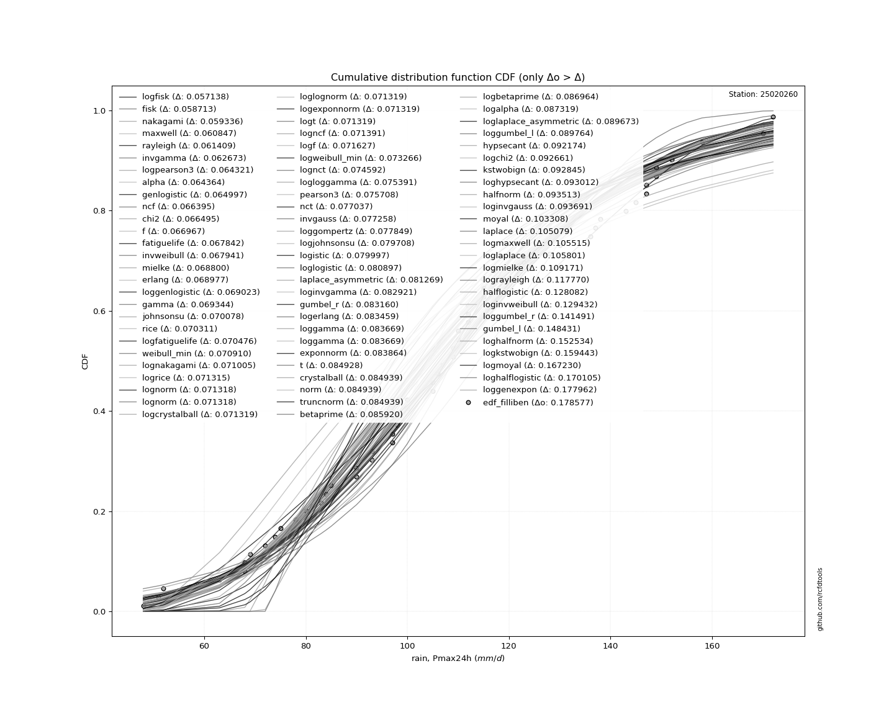</img>

</div>


**9.3. Best fit**

<div align="center">

|   id |   station | empirical_dist   | p_dist   |     delta |   deltao | eval   |   fit |   n |   best_fit |   best_fit_sort |
|-----:|----------:|:-----------------|:---------|----------:|---------:|:-------|------:|----:|-----------:|----------------:|
|    0 |  25020260 | edf_filliben     | logfisk  | 0.0571382 | 0.178577 | Δo > Δ |     1 |  58 |          1 |               1 |

</div>


<div align="center">

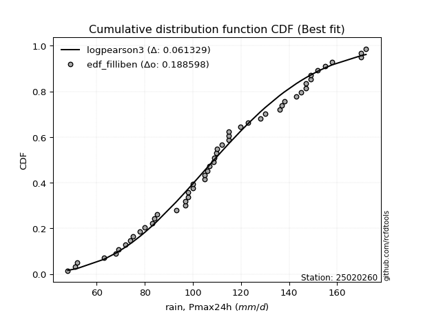</img>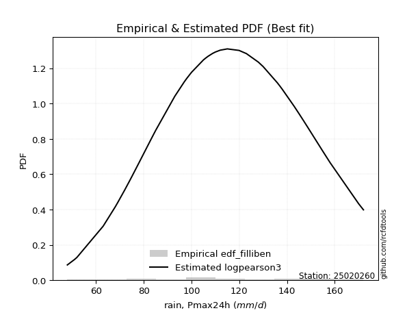</img>

</div>


### 10. Empirical - EDF Jenkinson (1977)

The Jenkinson formula in hydrology is an empirical plotting position formula used to estimate the non-exceedance probability _(P)_ or return period _(T)_ of a given ordered observation within a sample. It is a widely used method in the frequency analysis of extreme events such as floods and rainfall, as it provides a distribution-free way to plot data. _a≈0.31_ and _b≈0.38_ are constants derived to approximate the median of the probability distribution for the given rank.

<div align="center">


$P=(m-a)/(n+b)$


</div>


**10.1. Empirical values**

<div align="center">

|                | 0                    | 1                  | 2                  | 3                  | 4                  | 5                   | 6                   | 7                 | 8                  | 9                   | 10                 | 11                 | 12                 | 13                 | 14                 | 15                 | 16                  | 17                  | 18                  | 19                  | 20                 | 21                  | 22                  | 23                  | 24                  | 25                  | 26                 | 27                  | 28                  | 29                 | 30                 | 31                 | 32                 | 33                 | 34                 | 35                 | 36                 | 37                | 38                 | 39                 | 40                 | 41                 | 42                 | 43                 | 44                 | 45                 | 46                 | 47                | 48                 | 49                 | 50                | 51                 | 52                 | 53                 | 54                 | 55                 | 56                 | 57                |
|:---------------|:---------------------|:-------------------|:-------------------|:-------------------|:-------------------|:--------------------|:--------------------|:------------------|:-------------------|:--------------------|:-------------------|:-------------------|:-------------------|:-------------------|:-------------------|:-------------------|:--------------------|:--------------------|:--------------------|:--------------------|:-------------------|:--------------------|:--------------------|:--------------------|:--------------------|:--------------------|:-------------------|:--------------------|:--------------------|:-------------------|:-------------------|:-------------------|:-------------------|:-------------------|:-------------------|:-------------------|:-------------------|:------------------|:-------------------|:-------------------|:-------------------|:-------------------|:-------------------|:-------------------|:-------------------|:-------------------|:-------------------|:------------------|:-------------------|:-------------------|:------------------|:-------------------|:-------------------|:-------------------|:-------------------|:-------------------|:-------------------|:------------------|
| date           | 2019                 | 2015               | 1986               | 1990               | 1963               | 2017                | 2021                | 1972              | 1997               | 2005                | 1993               | 1982               | 2013               | 1994               | 1971               | 1968               | 1967                | 2003                | 2002                | 2000                | 2001               | 1995                | 1998                | 1981                | 1970                | 1980                | 1988               | 1996                | 2009                | 2010               | 2020               | 1965               | 1985               | 2004               | 1969               | 1966               | 1989               | 1977              | 2018               | 1964               | 1976               | 1973               | 1991               | 1979               | 2006               | 2008               | 2014               | 1984              | 2011               | 1992               | 1983              | 2007               | 1999               | 1974               | 2012               | 1978               | 1987               | 1975              |
| x              | 48.0                 | 51.0               | 52.0               | 63.0               | 68.0               | 68.0                | 69.0                | 72.0              | 74.0               | 75.0                | 78.0               | 80.0               | 83.0               | 84.0               | 85.0               | 90.0               | 90.0                | 93.0                | 93.0                | 97.0                | 97.0               | 98.0                | 98.0                | 100.0               | 100.0               | 105.0               | 105.0              | 106.0               | 107.0               | 109.0              | 109.0              | 110.0              | 110.0              | 112.0              | 112.0              | 112.0              | 115.0              | 115.0             | 115.0              | 117.0              | 123.0              | 128.0              | 130.0              | 136.0              | 137.0              | 138.0              | 143.0              | 145.0             | 147.0              | 147.0              | 149.0             | 149.0              | 152.0              | 155.0              | 158.0              | 170.0              | 170.0              | 172.0             |
| m              | 1                    | 2                  | 3                  | 4                  | 5                  | 6                   | 7                   | 8                 | 9                  | 10                  | 11                 | 12                 | 13                 | 14                 | 15                 | 16                 | 17                  | 18                  | 19                  | 20                  | 21                 | 22                  | 23                  | 24                  | 25                  | 26                  | 27                 | 28                  | 29                  | 30                 | 31                 | 32                 | 33                 | 34                 | 35                 | 36                 | 37                 | 38                | 39                 | 40                 | 41                 | 42                 | 43                 | 44                 | 45                 | 46                 | 47                 | 48                | 49                 | 50                 | 51                | 52                 | 53                 | 54                 | 55                 | 56                 | 57                 | 58                |
| empirical_dist | edf_jenkinson        | edf_jenkinson      | edf_jenkinson      | edf_jenkinson      | edf_jenkinson      | edf_jenkinson       | edf_jenkinson       | edf_jenkinson     | edf_jenkinson      | edf_jenkinson       | edf_jenkinson      | edf_jenkinson      | edf_jenkinson      | edf_jenkinson      | edf_jenkinson      | edf_jenkinson      | edf_jenkinson       | edf_jenkinson       | edf_jenkinson       | edf_jenkinson       | edf_jenkinson      | edf_jenkinson       | edf_jenkinson       | edf_jenkinson       | edf_jenkinson       | edf_jenkinson       | edf_jenkinson      | edf_jenkinson       | edf_jenkinson       | edf_jenkinson      | edf_jenkinson      | edf_jenkinson      | edf_jenkinson      | edf_jenkinson      | edf_jenkinson      | edf_jenkinson      | edf_jenkinson      | edf_jenkinson     | edf_jenkinson      | edf_jenkinson      | edf_jenkinson      | edf_jenkinson      | edf_jenkinson      | edf_jenkinson      | edf_jenkinson      | edf_jenkinson      | edf_jenkinson      | edf_jenkinson     | edf_jenkinson      | edf_jenkinson      | edf_jenkinson     | edf_jenkinson      | edf_jenkinson      | edf_jenkinson      | edf_jenkinson      | edf_jenkinson      | edf_jenkinson      | edf_jenkinson     |
| empirical      | 0.011819116135662897 | 0.0289482699554642 | 0.0460774237752655 | 0.0632065775950668 | 0.0803357314148681 | 0.09746488523466941 | 0.11459403905447071 | 0.131723192874272 | 0.1488523466940733 | 0.16598150051387459 | 0.1831106543336759 | 0.2002398081534772 | 0.2173689619732785 | 0.2344981157930798 | 0.2516272696128811 | 0.2687564234326824 | 0.28588557725248376 | 0.30301473107228505 | 0.32014388489208634 | 0.33727303871188763 | 0.3544021925316889 | 0.37153134635149027 | 0.38866050017129156 | 0.40578965399109285 | 0.42291880781089414 | 0.44004796163069543 | 0.4571771154504968 | 0.47430626927029806 | 0.49143542309009935 | 0.5085645769099006 | 0.5256937307297019 | 0.5428228845495032 | 0.5599520383693045 | 0.5770811921891058 | 0.5942103460089071 | 0.6113394998287084 | 0.6284686536485097 | 0.645597807468311 | 0.6627269612881123 | 0.6798561151079136 | 0.696985268927715  | 0.7141144227475162 | 0.7312435765673175 | 0.7483727303871188 | 0.7655018842069201 | 0.7826310380267214 | 0.7997601918465227 | 0.816889345666324 | 0.8340184994861253 | 0.8511476533059266 | 0.868276807125728 | 0.8854059609455293 | 0.9025351147653305 | 0.9196642685851318 | 0.9367934224049331 | 0.9539225762247344 | 0.9710517300445357 | 0.988180883864337 |
| empirical_tr   | 1.0119604784191367   | 1.0298112541894513 | 1.0483031064823127 | 1.0674712013165113 | 1.0873533246414602 | 1.1079901309546405  | 1.1294254207777132  | 1.151706450976524 | 1.1748842825518213 | 1.1990141712877387  | 1.2241560075487523 | 1.250374812593703  | 1.27774130006566   | 1.306332512866413  | 1.3362325474937058 | 1.3675333801827128 | 1.4003358119453106  | 1.4347505529614155  | 1.470899470899471   | 1.5089170328250194  | 1.5489519766516318 | 1.5911692559280457  | 1.6357523115718688  | 1.6829057365234936  | 1.7328584149599287  | 1.7858672376873659  | 1.8422215209845378 | 1.9022482893450636  | 1.9663186257999326  | 2.0348553502962705 | 2.1083423618634884 | 2.1873360809291866 | 2.272479564032697  | 2.3645200486026727 | 2.4643309413254535 | 2.572939620978404  | 2.691562932226832  | 2.821652972450458 | 2.964956830878618  | 3.1235955056179763 | 3.3001695873374786 | 3.497902935889754  | 3.720841300191204  | 3.974132062627637  | 4.264426588750912  | 4.600472813238769  | 4.994011976047902  | 5.46117867165575  | 6.024767801857581  | 6.7180667433831935 | 7.591677503250974 | 8.726457399103136  | 10.260105448154652 | 12.447761194029843 | 15.821138211382097 | 21.702602230483233 | 34.54437869822475  | 84.6086956521732  |

</div>


**10.2. Kolmogorov-Smirnov fit test (sorted by Δ)**


<div align="center">

|                | 0                   | 1                   | 2                   | 3                   | 4                    | 5                   | 6                   | 7                   | 8                   | 9                   | 10                  | 11                  | 12                  | 13                  | 14                  | 15                  | 16                  | 17                  | 18                 | 19                  | 20                  | 21                  | 22                  | 23                  | 24                  | 25                  | 26                  | 27                 | 28                  | 29                  | 30                 | 31                  | 32                 | 33                  | 34                  | 35                  | 36                  | 37                  | 38                  | 39                  | 40                  | 41                  | 42                  | 43                  | 44                  | 45                 | 46                  | 47                  | 48                  | 49                  | 50                  | 51                  | 52                  | 53                  | 54                  | 55                  | 56                  | 57                    | 58                  | 59                  | 60                  | 61                  | 62                  | 63                  | 64                  | 65                  | 66                  | 67                  | 68                  | 69                  | 70                  | 71                 | 72                  | 73                  | 74                  | 75                 | 76                  | 77                  | 78                  | 79                 | 80                  | 81                  | 82                 | 83                 | 84                 | 85                 | 86                 | 87                 |
|:---------------|:--------------------|:--------------------|:--------------------|:--------------------|:---------------------|:--------------------|:--------------------|:--------------------|:--------------------|:--------------------|:--------------------|:--------------------|:--------------------|:--------------------|:--------------------|:--------------------|:--------------------|:--------------------|:-------------------|:--------------------|:--------------------|:--------------------|:--------------------|:--------------------|:--------------------|:--------------------|:--------------------|:-------------------|:--------------------|:--------------------|:-------------------|:--------------------|:-------------------|:--------------------|:--------------------|:--------------------|:--------------------|:--------------------|:--------------------|:--------------------|:--------------------|:--------------------|:--------------------|:--------------------|:--------------------|:-------------------|:--------------------|:--------------------|:--------------------|:--------------------|:--------------------|:--------------------|:--------------------|:--------------------|:--------------------|:--------------------|:--------------------|:----------------------|:--------------------|:--------------------|:--------------------|:--------------------|:--------------------|:--------------------|:--------------------|:--------------------|:--------------------|:--------------------|:--------------------|:--------------------|:--------------------|:-------------------|:--------------------|:--------------------|:--------------------|:-------------------|:--------------------|:--------------------|:--------------------|:-------------------|:--------------------|:--------------------|:-------------------|:-------------------|:-------------------|:-------------------|:-------------------|:-------------------|
| station        | 25020260            | 25020260            | 25020260            | 25020260            | 25020260             | 25020260            | 25020260            | 25020260            | 25020260            | 25020260            | 25020260            | 25020260            | 25020260            | 25020260            | 25020260            | 25020260            | 25020260            | 25020260            | 25020260           | 25020260            | 25020260            | 25020260            | 25020260            | 25020260            | 25020260            | 25020260            | 25020260            | 25020260           | 25020260            | 25020260            | 25020260           | 25020260            | 25020260           | 25020260            | 25020260            | 25020260            | 25020260            | 25020260            | 25020260            | 25020260            | 25020260            | 25020260            | 25020260            | 25020260            | 25020260            | 25020260           | 25020260            | 25020260            | 25020260            | 25020260            | 25020260            | 25020260            | 25020260            | 25020260            | 25020260            | 25020260            | 25020260            | 25020260              | 25020260            | 25020260            | 25020260            | 25020260            | 25020260            | 25020260            | 25020260            | 25020260            | 25020260            | 25020260            | 25020260            | 25020260            | 25020260            | 25020260           | 25020260            | 25020260            | 25020260            | 25020260           | 25020260            | 25020260            | 25020260            | 25020260           | 25020260            | 25020260            | 25020260           | 25020260           | 25020260           | 25020260           | 25020260           | 25020260           |
| empirical_dist | edf_jenkinson       | edf_jenkinson       | edf_jenkinson       | edf_jenkinson       | edf_jenkinson        | edf_jenkinson       | edf_jenkinson       | edf_jenkinson       | edf_jenkinson       | edf_jenkinson       | edf_jenkinson       | edf_jenkinson       | edf_jenkinson       | edf_jenkinson       | edf_jenkinson       | edf_jenkinson       | edf_jenkinson       | edf_jenkinson       | edf_jenkinson      | edf_jenkinson       | edf_jenkinson       | edf_jenkinson       | edf_jenkinson       | edf_jenkinson       | edf_jenkinson       | edf_jenkinson       | edf_jenkinson       | edf_jenkinson      | edf_jenkinson       | edf_jenkinson       | edf_jenkinson      | edf_jenkinson       | edf_jenkinson      | edf_jenkinson       | edf_jenkinson       | edf_jenkinson       | edf_jenkinson       | edf_jenkinson       | edf_jenkinson       | edf_jenkinson       | edf_jenkinson       | edf_jenkinson       | edf_jenkinson       | edf_jenkinson       | edf_jenkinson       | edf_jenkinson      | edf_jenkinson       | edf_jenkinson       | edf_jenkinson       | edf_jenkinson       | edf_jenkinson       | edf_jenkinson       | edf_jenkinson       | edf_jenkinson       | edf_jenkinson       | edf_jenkinson       | edf_jenkinson       | edf_jenkinson         | edf_jenkinson       | edf_jenkinson       | edf_jenkinson       | edf_jenkinson       | edf_jenkinson       | edf_jenkinson       | edf_jenkinson       | edf_jenkinson       | edf_jenkinson       | edf_jenkinson       | edf_jenkinson       | edf_jenkinson       | edf_jenkinson       | edf_jenkinson      | edf_jenkinson       | edf_jenkinson       | edf_jenkinson       | edf_jenkinson      | edf_jenkinson       | edf_jenkinson       | edf_jenkinson       | edf_jenkinson      | edf_jenkinson       | edf_jenkinson       | edf_jenkinson      | edf_jenkinson      | edf_jenkinson      | edf_jenkinson      | edf_jenkinson      | edf_jenkinson      |
| p_dist         | logfisk             | fisk                | nakagami            | maxwell             | rayleigh             | invgamma            | logpearson3         | alpha               | genlogistic         | ncf                 | chi2                | f                   | fatiguelife         | invweibull          | mielke              | erlang              | loggenlogistic      | gamma               | johnsonsu          | rice                | logfatiguelife      | weibull_min         | lognakagami         | logrice             | lognorm             | lognorm             | logcrystalball      | loglognorm         | logexponnorm        | logt                | logncf             | logf                | logweibull_min     | lognct              | logloggamma         | pearson3            | nct                 | invgauss            | loggompertz         | logjohnsonsu        | logistic            | loglogistic         | laplace_asymmetric  | loginvgamma         | gumbel_r            | logerlang          | loggamma            | loggamma            | exponnorm           | t                   | crystalball         | norm                | truncnorm           | betaprime           | logbetaprime        | logalpha            | loggumbel_l         | loglaplace_asymmetric | hypsecant           | logchi2             | kstwobign           | loghypsecant        | halfnorm            | loginvgauss         | moyal               | laplace             | logmaxwell          | loglaplace          | logmielke           | lograyleigh         | halflogistic        | loginvweibull      | loggumbel_r         | gumbel_l            | loghalfnorm         | logkstwobign       | logmoyal            | loghalflogistic     | loggenexpon         | wald               | expon               | logwald             | gibrat             | loggibrat          | logexpon           | logtruncnorm       | gompertz           | genexpon           |
| delta          | 0.05720198379670505 | 0.05877674069920047 | 0.05939988221945203 | 0.06091131482729695 | 0.061472653665061494 | 0.06263158778044586 | 0.06427942372150575 | 0.06442765129820571 | 0.06506069018945726 | 0.06638001467649252 | 0.06645319427926089 | 0.06692500101857768 | 0.06780002300682686 | 0.06789926621162373 | 0.06875865958728156 | 0.06893529495001494 | 0.06898129478365744 | 0.06930205214514362 | 0.0700359378215879 | 0.07026922709514838 | 0.07046079794936705 | 0.07086781442674406 | 0.07096352438745457 | 0.07127312123305424 | 0.07127627018722338 | 0.07127627018722338 | 0.07127671005553188 | 0.071276935645474  | 0.07127706669251316 | 0.07127737715983645 | 0.071349500243994  | 0.07158483139100907 | 0.0732241578207865 | 0.07455029345876912 | 0.07534956084918532 | 0.07566646220339956 | 0.07699527723858657 | 0.07721600446035498 | 0.07780723384387844 | 0.07966665795585559 | 0.08006121073339378 | 0.08096110969054982 | 0.08133308211243095 | 0.08287947644099797 | 0.08322360598780287 | 0.0834171411580143 | 0.08362751080441883 | 0.08362751080441883 | 0.08382190909697773 | 0.08488587665235403 | 0.08489741871763568 | 0.08489742156577862 | 0.08489743068845512 | 0.08587797817300169 | 0.08692267346407878 | 0.08727704315514828 | 0.08972178997451963 | 0.0897363572937877    | 0.09223788068824446 | 0.09261886345125192 | 0.09280275380831571 | 0.09307550673956266 | 0.09347079625420984 | 0.09364943514533014 | 0.10329274290686491 | 0.10514243573410187 | 0.10547295544386404 | 0.10586529646930021 | 0.10912943222225358 | 0.11772807715791611 | 0.12817675179572546 | 0.1293901353407937 | 0.14147518883285487 | 0.14838902828744194 | 0.15249212780151067 | 0.1594011515645396 | 0.16721491851852316 | 0.17009003971742548 | 0.17792038320140469 | 0.1994346005904724 | 0.22971013255136735 | 0.23874550851864812 | 0.2516272696128811 | 0.2637054552402523 | 0.2896079563151134 | 0.4004744503197663 | 0.7968312866439936 | 0.8915464019907613 |
| deltao         | 0.1785767486892227  | 0.1785767486892227  | 0.1785767486892227  | 0.1785767486892227  | 0.1785767486892227   | 0.1785767486892227  | 0.1785767486892227  | 0.1785767486892227  | 0.1785767486892227  | 0.1785767486892227  | 0.1785767486892227  | 0.1785767486892227  | 0.1785767486892227  | 0.1785767486892227  | 0.1785767486892227  | 0.1785767486892227  | 0.1785767486892227  | 0.1785767486892227  | 0.1785767486892227 | 0.1785767486892227  | 0.1785767486892227  | 0.1785767486892227  | 0.1785767486892227  | 0.1785767486892227  | 0.1785767486892227  | 0.1785767486892227  | 0.1785767486892227  | 0.1785767486892227 | 0.1785767486892227  | 0.1785767486892227  | 0.1785767486892227 | 0.1785767486892227  | 0.1785767486892227 | 0.1785767486892227  | 0.1785767486892227  | 0.1785767486892227  | 0.1785767486892227  | 0.1785767486892227  | 0.1785767486892227  | 0.1785767486892227  | 0.1785767486892227  | 0.1785767486892227  | 0.1785767486892227  | 0.1785767486892227  | 0.1785767486892227  | 0.1785767486892227 | 0.1785767486892227  | 0.1785767486892227  | 0.1785767486892227  | 0.1785767486892227  | 0.1785767486892227  | 0.1785767486892227  | 0.1785767486892227  | 0.1785767486892227  | 0.1785767486892227  | 0.1785767486892227  | 0.1785767486892227  | 0.1785767486892227    | 0.1785767486892227  | 0.1785767486892227  | 0.1785767486892227  | 0.1785767486892227  | 0.1785767486892227  | 0.1785767486892227  | 0.1785767486892227  | 0.1785767486892227  | 0.1785767486892227  | 0.1785767486892227  | 0.1785767486892227  | 0.1785767486892227  | 0.1785767486892227  | 0.1785767486892227 | 0.1785767486892227  | 0.1785767486892227  | 0.1785767486892227  | 0.1785767486892227 | 0.1785767486892227  | 0.1785767486892227  | 0.1785767486892227  | 0.1785767486892227 | 0.1785767486892227  | 0.1785767486892227  | 0.1785767486892227 | 0.1785767486892227 | 0.1785767486892227 | 0.1785767486892227 | 0.1785767486892227 | 0.1785767486892227 |
| eval           | Δo > Δ              | Δo > Δ              | Δo > Δ              | Δo > Δ              | Δo > Δ               | Δo > Δ              | Δo > Δ              | Δo > Δ              | Δo > Δ              | Δo > Δ              | Δo > Δ              | Δo > Δ              | Δo > Δ              | Δo > Δ              | Δo > Δ              | Δo > Δ              | Δo > Δ              | Δo > Δ              | Δo > Δ             | Δo > Δ              | Δo > Δ              | Δo > Δ              | Δo > Δ              | Δo > Δ              | Δo > Δ              | Δo > Δ              | Δo > Δ              | Δo > Δ             | Δo > Δ              | Δo > Δ              | Δo > Δ             | Δo > Δ              | Δo > Δ             | Δo > Δ              | Δo > Δ              | Δo > Δ              | Δo > Δ              | Δo > Δ              | Δo > Δ              | Δo > Δ              | Δo > Δ              | Δo > Δ              | Δo > Δ              | Δo > Δ              | Δo > Δ              | Δo > Δ             | Δo > Δ              | Δo > Δ              | Δo > Δ              | Δo > Δ              | Δo > Δ              | Δo > Δ              | Δo > Δ              | Δo > Δ              | Δo > Δ              | Δo > Δ              | Δo > Δ              | Δo > Δ                | Δo > Δ              | Δo > Δ              | Δo > Δ              | Δo > Δ              | Δo > Δ              | Δo > Δ              | Δo > Δ              | Δo > Δ              | Δo > Δ              | Δo > Δ              | Δo > Δ              | Δo > Δ              | Δo > Δ              | Δo > Δ             | Δo > Δ              | Δo > Δ              | Δo > Δ              | Δo > Δ             | Δo > Δ              | Δo > Δ              | Δo > Δ              | Δo <= Δ            | Δo <= Δ             | Δo <= Δ             | Δo <= Δ            | Δo <= Δ            | Δo <= Δ            | Δo <= Δ            | Δo <= Δ            | Δo <= Δ            |
| fit            | 1                   | 1                   | 1                   | 1                   | 1                    | 1                   | 1                   | 1                   | 1                   | 1                   | 1                   | 1                   | 1                   | 1                   | 1                   | 1                   | 1                   | 1                   | 1                  | 1                   | 1                   | 1                   | 1                   | 1                   | 1                   | 1                   | 1                   | 1                  | 1                   | 1                   | 1                  | 1                   | 1                  | 1                   | 1                   | 1                   | 1                   | 1                   | 1                   | 1                   | 1                   | 1                   | 1                   | 1                   | 1                   | 1                  | 1                   | 1                   | 1                   | 1                   | 1                   | 1                   | 1                   | 1                   | 1                   | 1                   | 1                   | 1                     | 1                   | 1                   | 1                   | 1                   | 1                   | 1                   | 1                   | 1                   | 1                   | 1                   | 1                   | 1                   | 1                   | 1                  | 1                   | 1                   | 1                   | 1                  | 1                   | 1                   | 1                   | 0                  | 0                   | 0                   | 0                  | 0                  | 0                  | 0                  | 0                  | 0                  |
| n              | 58                  | 58                  | 58                  | 58                  | 58                   | 58                  | 58                  | 58                  | 58                  | 58                  | 58                  | 58                  | 58                  | 58                  | 58                  | 58                  | 58                  | 58                  | 58                 | 58                  | 58                  | 58                  | 58                  | 58                  | 58                  | 58                  | 58                  | 58                 | 58                  | 58                  | 58                 | 58                  | 58                 | 58                  | 58                  | 58                  | 58                  | 58                  | 58                  | 58                  | 58                  | 58                  | 58                  | 58                  | 58                  | 58                 | 58                  | 58                  | 58                  | 58                  | 58                  | 58                  | 58                  | 58                  | 58                  | 58                  | 58                  | 58                    | 58                  | 58                  | 58                  | 58                  | 58                  | 58                  | 58                  | 58                  | 58                  | 58                  | 58                  | 58                  | 58                  | 58                 | 58                  | 58                  | 58                  | 58                 | 58                  | 58                  | 58                  | 58                 | 58                  | 58                  | 58                 | 58                 | 58                 | 58                 | 58                 | 58                 |
| best_fit       | 1                   | 0                   | 0                   | 0                   | 0                    | 0                   | 0                   | 0                   | 0                   | 0                   | 0                   | 0                   | 0                   | 0                   | 0                   | 0                   | 0                   | 0                   | 0                  | 0                   | 0                   | 0                   | 0                   | 0                   | 0                   | 0                   | 0                   | 0                  | 0                   | 0                   | 0                  | 0                   | 0                  | 0                   | 0                   | 0                   | 0                   | 0                   | 0                   | 0                   | 0                   | 0                   | 0                   | 0                   | 0                   | 0                  | 0                   | 0                   | 0                   | 0                   | 0                   | 0                   | 0                   | 0                   | 0                   | 0                   | 0                   | 0                     | 0                   | 0                   | 0                   | 0                   | 0                   | 0                   | 0                   | 0                   | 0                   | 0                   | 0                   | 0                   | 0                   | 0                  | 0                   | 0                   | 0                   | 0                  | 0                   | 0                   | 0                   | 0                  | 0                   | 0                   | 0                  | 0                  | 0                  | 0                  | 0                  | 0                  |
| best_fit_sort  | 1                   | 2                   | 3                   | 4                   | 5                    | 6                   | 7                   | 8                   | 9                   | 10                  | 11                  | 12                  | 13                  | 14                  | 15                  | 16                  | 17                  | 18                  | 19                 | 20                  | 21                  | 22                  | 23                  | 24                  | 25                  | 26                  | 27                  | 28                 | 29                  | 30                  | 31                 | 32                  | 33                 | 34                  | 35                  | 36                  | 37                  | 38                  | 39                  | 40                  | 41                  | 42                  | 43                  | 44                  | 45                  | 46                 | 47                  | 48                  | 49                  | 50                  | 51                  | 52                  | 53                  | 54                  | 55                  | 56                  | 57                  | 58                    | 59                  | 60                  | 61                  | 62                  | 63                  | 64                  | 65                  | 66                  | 67                  | 68                  | 69                  | 70                  | 71                  | 72                 | 73                  | 74                  | 75                  | 76                 | 77                  | 78                  | 79                  | 80                 | 81                  | 82                  | 83                 | 84                 | 85                 | 86                 | 87                 | 88                 |

</div>


<div align="center">

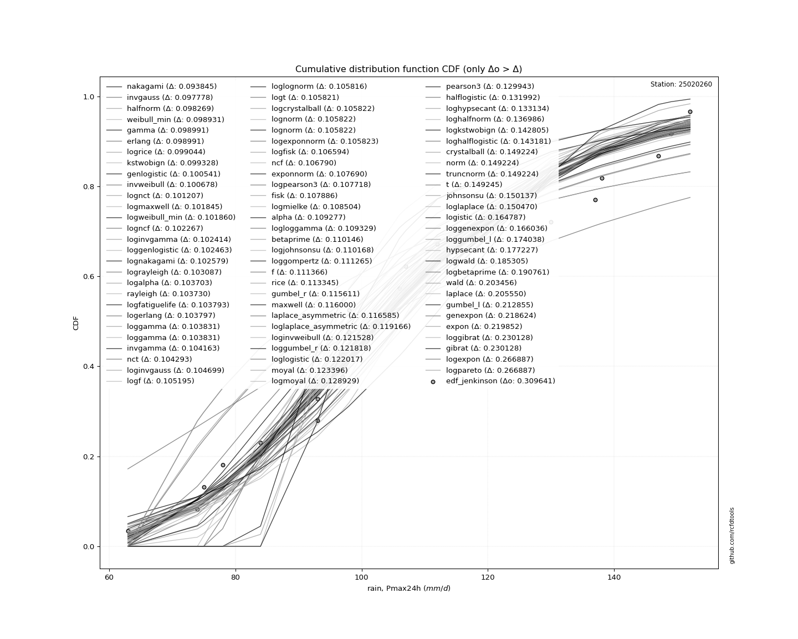</img>

</div>


**10.3. Best fit**

<div align="center">

|   id |   station | empirical_dist   | p_dist   |    delta |   deltao | eval   |   fit |   n |   best_fit |   best_fit_sort |
|-----:|----------:|:-----------------|:---------|---------:|---------:|:-------|------:|----:|-----------:|----------------:|
|    0 |  25020260 | edf_jenkinson    | logfisk  | 0.057202 | 0.178577 | Δo > Δ |     1 |  58 |          1 |               1 |

</div>


<div align="center">

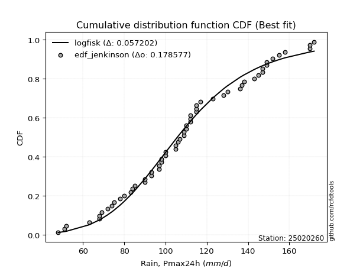</img>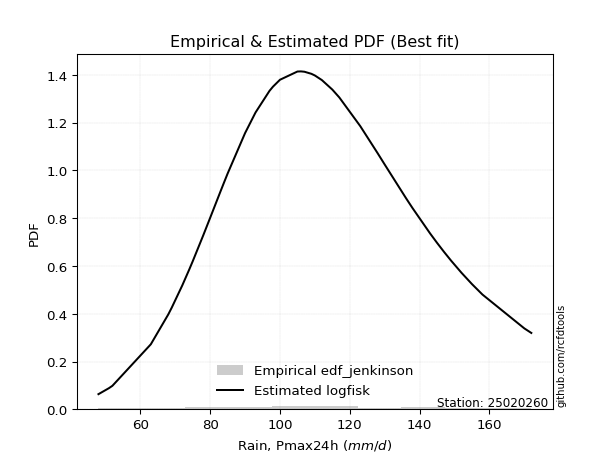</img>

</div>


### 11. Empirical - EDF Cunnane (1978)

Cunnane´s work in statistical hydrology has focused on the performance and evaluation of different probability distributions (such as GEV, Gumbel, Lognormal) for flood frequency estimation. _b_ is a constant, typically set to 0.4.

<div align="center">


$P=(m-b)/(n+1-2b)$


</div>


**11.1. Empirical values**

<div align="center">

|                | 0                    | 1                    | 2                    | 3                   | 4                   | 5                   | 6                   | 7                   | 8                   | 9                   | 10                  | 11                 | 12                  | 13                  | 14                 | 15                  | 16                 | 17                | 18                 | 19                  | 20                 | 21                 | 22                  | 23                 | 24                 | 25                  | 26                 | 27                 | 28                  | 29                 | 30                 | 31                 | 32                 | 33                 | 34                 | 35                 | 36                 | 37                 | 38                 | 39                 | 40                | 41                 | 42                 | 43                 | 44                 | 45                 | 46                 | 47                 | 48                 | 49                | 50                 | 51                 | 52                 | 53                 | 54                 | 55                 | 56                 | 57                 |
|:---------------|:---------------------|:---------------------|:---------------------|:--------------------|:--------------------|:--------------------|:--------------------|:--------------------|:--------------------|:--------------------|:--------------------|:-------------------|:--------------------|:--------------------|:-------------------|:--------------------|:-------------------|:------------------|:-------------------|:--------------------|:-------------------|:-------------------|:--------------------|:-------------------|:-------------------|:--------------------|:-------------------|:-------------------|:--------------------|:-------------------|:-------------------|:-------------------|:-------------------|:-------------------|:-------------------|:-------------------|:-------------------|:-------------------|:-------------------|:-------------------|:------------------|:-------------------|:-------------------|:-------------------|:-------------------|:-------------------|:-------------------|:-------------------|:-------------------|:------------------|:-------------------|:-------------------|:-------------------|:-------------------|:-------------------|:-------------------|:-------------------|:-------------------|
| date           | 2019                 | 2015                 | 1986                 | 1990                | 1963                | 2017                | 2021                | 1972                | 1997                | 2005                | 1993                | 1982               | 2013                | 1994                | 1971               | 1968                | 1967               | 2003              | 2002               | 2000                | 2001               | 1995               | 1998                | 1981               | 1970               | 1980                | 1988               | 1996               | 2009                | 2010               | 2020               | 1965               | 1985               | 2004               | 1969               | 1966               | 1989               | 1977               | 2018               | 1964               | 1976              | 1973               | 1991               | 1979               | 2006               | 2008               | 2014               | 1984               | 2011               | 1992              | 1983               | 2007               | 1999               | 1974               | 2012               | 1978               | 1987               | 1975               |
| x              | 48.0                 | 51.0                 | 52.0                 | 63.0                | 68.0                | 68.0                | 69.0                | 72.0                | 74.0                | 75.0                | 78.0                | 80.0               | 83.0                | 84.0                | 85.0               | 90.0                | 90.0               | 93.0              | 93.0               | 97.0                | 97.0               | 98.0               | 98.0                | 100.0              | 100.0              | 105.0               | 105.0              | 106.0              | 107.0               | 109.0              | 109.0              | 110.0              | 110.0              | 112.0              | 112.0              | 112.0              | 115.0              | 115.0              | 115.0              | 117.0              | 123.0             | 128.0              | 130.0              | 136.0              | 137.0              | 138.0              | 143.0              | 145.0              | 147.0              | 147.0             | 149.0              | 149.0              | 152.0              | 155.0              | 158.0              | 170.0              | 170.0              | 172.0              |
| m              | 1                    | 2                    | 3                    | 4                   | 5                   | 6                   | 7                   | 8                   | 9                   | 10                  | 11                  | 12                 | 13                  | 14                  | 15                 | 16                  | 17                 | 18                | 19                 | 20                  | 21                 | 22                 | 23                  | 24                 | 25                 | 26                  | 27                 | 28                 | 29                  | 30                 | 31                 | 32                 | 33                 | 34                 | 35                 | 36                 | 37                 | 38                 | 39                 | 40                 | 41                | 42                 | 43                 | 44                 | 45                 | 46                 | 47                 | 48                 | 49                 | 50                | 51                 | 52                 | 53                 | 54                 | 55                 | 56                 | 57                 | 58                 |
| empirical_dist | edf_cunnane          | edf_cunnane          | edf_cunnane          | edf_cunnane         | edf_cunnane         | edf_cunnane         | edf_cunnane         | edf_cunnane         | edf_cunnane         | edf_cunnane         | edf_cunnane         | edf_cunnane        | edf_cunnane         | edf_cunnane         | edf_cunnane        | edf_cunnane         | edf_cunnane        | edf_cunnane       | edf_cunnane        | edf_cunnane         | edf_cunnane        | edf_cunnane        | edf_cunnane         | edf_cunnane        | edf_cunnane        | edf_cunnane         | edf_cunnane        | edf_cunnane        | edf_cunnane         | edf_cunnane        | edf_cunnane        | edf_cunnane        | edf_cunnane        | edf_cunnane        | edf_cunnane        | edf_cunnane        | edf_cunnane        | edf_cunnane        | edf_cunnane        | edf_cunnane        | edf_cunnane       | edf_cunnane        | edf_cunnane        | edf_cunnane        | edf_cunnane        | edf_cunnane        | edf_cunnane        | edf_cunnane        | edf_cunnane        | edf_cunnane       | edf_cunnane        | edf_cunnane        | edf_cunnane        | edf_cunnane        | edf_cunnane        | edf_cunnane        | edf_cunnane        | edf_cunnane        |
| empirical      | 0.010309278350515464 | 0.027491408934707903 | 0.044673539518900345 | 0.06185567010309278 | 0.07903780068728522 | 0.09621993127147765 | 0.11340206185567009 | 0.13058419243986252 | 0.14776632302405496 | 0.16494845360824742 | 0.18213058419243985 | 0.1993127147766323 | 0.21649484536082472 | 0.23367697594501716 | 0.2508591065292096 | 0.26804123711340205 | 0.2852233676975945 | 0.302405498281787 | 0.3195876288659794 | 0.33676975945017185 | 0.3539518900343643 | 0.3711340206185567 | 0.38831615120274915 | 0.4054982817869416 | 0.422680412371134  | 0.43986254295532645 | 0.4570446735395189 | 0.4742268041237113 | 0.49140893470790376 | 0.5085910652920962 | 0.5257731958762887 | 0.5429553264604811 | 0.5601374570446735 | 0.5773195876288659 | 0.5945017182130584 | 0.6116838487972509 | 0.6288659793814433 | 0.6460481099656358 | 0.6632302405498282 | 0.6804123711340206 | 0.697594501718213 | 0.7147766323024055 | 0.7319587628865979 | 0.7491408934707904 | 0.7663230240549828 | 0.7835051546391752 | 0.8006872852233676 | 0.8178694158075601 | 0.8350515463917526 | 0.852233676975945 | 0.8694158075601375 | 0.8865979381443299 | 0.9037800687285223 | 0.9209621993127147 | 0.9381443298969072 | 0.9553264604810996 | 0.9725085910652921 | 0.9896907216494845 |
| empirical_tr   | 1.0104166666666665   | 1.028268551236749    | 1.0467625899280575   | 1.065934065934066   | 1.085820895522388   | 1.1064638783269962  | 1.127906976744186   | 1.150197628458498   | 1.1733870967741935  | 1.1975308641975309  | 1.2226890756302522  | 1.2489270386266094 | 1.2763157894736843  | 1.304932735426009   | 1.334862385321101  | 1.3661971830985915  | 1.3990384615384615 | 1.433497536945813 | 1.4696969696969697 | 1.5077720207253886  | 1.5478723404255321 | 1.5901639344262295 | 1.6348314606741572  | 1.6820809248554913 | 1.7321428571428572 | 1.7852760736196318  | 1.841772151898734  | 1.9019607843137254 | 1.9662162162162162  | 2.034965034965035  | 2.108695652173913  | 2.18796992481203   | 2.2734375          | 2.3658536585365852 | 2.4661016949152543 | 2.5752212389380533 | 2.694444444444444  | 2.825242718446602  | 2.9693877551020407 | 3.1290322580645165 | 3.306818181818181 | 3.5060240963855422 | 3.73076923076923   | 3.9863013698630136 | 4.279411764705881  | 4.619047619047619  | 5.017241379310343  | 5.4905660377358485 | 6.062500000000001  | 6.767441860465115 | 7.657894736842106  | 8.818181818181815  | 10.392857142857144 | 12.65217391304347  | 16.166666666666664 | 22.38461538461535  | 36.374999999999986 | 96.9999999999993   |

</div>


**11.2. Kolmogorov-Smirnov fit test (sorted by Δ)**


<div align="center">

|                | 0                   | 1                   | 2                    | 3                   | 4                    | 5                   | 6                   | 7                  | 8                   | 9                   | 10                  | 11                  | 12                  | 13                  | 14                  | 15                  | 16                  | 17                  | 18                 | 19                  | 20                  | 21                  | 22                  | 23                  | 24                  | 25                  | 26                  | 27                  | 28                  | 29                  | 30                  | 31                  | 32                 | 33                 | 34                  | 35                  | 36                  | 37                  | 38                  | 39                  | 40                  | 41                  | 42                 | 43                  | 44                  | 45                  | 46                  | 47                  | 48                  | 49                  | 50                  | 51                  | 52                  | 53                  | 54                  | 55                  | 56                    | 57                  | 58                 | 59                 | 60                 | 61                  | 62                  | 63                  | 64                  | 65                  | 66                  | 67                  | 68                  | 69                 | 70                  | 71                  | 72                  | 73                  | 74                  | 75                  | 76                  | 77                  | 78                  | 79                 | 80                 | 81                 | 82                 | 83                  | 84                 | 85                  | 86                 | 87                 |
|:---------------|:--------------------|:--------------------|:---------------------|:--------------------|:---------------------|:--------------------|:--------------------|:-------------------|:--------------------|:--------------------|:--------------------|:--------------------|:--------------------|:--------------------|:--------------------|:--------------------|:--------------------|:--------------------|:-------------------|:--------------------|:--------------------|:--------------------|:--------------------|:--------------------|:--------------------|:--------------------|:--------------------|:--------------------|:--------------------|:--------------------|:--------------------|:--------------------|:-------------------|:-------------------|:--------------------|:--------------------|:--------------------|:--------------------|:--------------------|:--------------------|:--------------------|:--------------------|:-------------------|:--------------------|:--------------------|:--------------------|:--------------------|:--------------------|:--------------------|:--------------------|:--------------------|:--------------------|:--------------------|:--------------------|:--------------------|:--------------------|:----------------------|:--------------------|:-------------------|:-------------------|:-------------------|:--------------------|:--------------------|:--------------------|:--------------------|:--------------------|:--------------------|:--------------------|:--------------------|:-------------------|:--------------------|:--------------------|:--------------------|:--------------------|:--------------------|:--------------------|:--------------------|:--------------------|:--------------------|:-------------------|:-------------------|:-------------------|:-------------------|:--------------------|:-------------------|:--------------------|:-------------------|:-------------------|
| station        | 25020260            | 25020260            | 25020260             | 25020260            | 25020260             | 25020260            | 25020260            | 25020260           | 25020260            | 25020260            | 25020260            | 25020260            | 25020260            | 25020260            | 25020260            | 25020260            | 25020260            | 25020260            | 25020260           | 25020260            | 25020260            | 25020260            | 25020260            | 25020260            | 25020260            | 25020260            | 25020260            | 25020260            | 25020260            | 25020260            | 25020260            | 25020260            | 25020260           | 25020260           | 25020260            | 25020260            | 25020260            | 25020260            | 25020260            | 25020260            | 25020260            | 25020260            | 25020260           | 25020260            | 25020260            | 25020260            | 25020260            | 25020260            | 25020260            | 25020260            | 25020260            | 25020260            | 25020260            | 25020260            | 25020260            | 25020260            | 25020260              | 25020260            | 25020260           | 25020260           | 25020260           | 25020260            | 25020260            | 25020260            | 25020260            | 25020260            | 25020260            | 25020260            | 25020260            | 25020260           | 25020260            | 25020260            | 25020260            | 25020260            | 25020260            | 25020260            | 25020260            | 25020260            | 25020260            | 25020260           | 25020260           | 25020260           | 25020260           | 25020260            | 25020260           | 25020260            | 25020260           | 25020260           |
| empirical_dist | edf_cunnane         | edf_cunnane         | edf_cunnane          | edf_cunnane         | edf_cunnane          | edf_cunnane         | edf_cunnane         | edf_cunnane        | edf_cunnane         | edf_cunnane         | edf_cunnane         | edf_cunnane         | edf_cunnane         | edf_cunnane         | edf_cunnane         | edf_cunnane         | edf_cunnane         | edf_cunnane         | edf_cunnane        | edf_cunnane         | edf_cunnane         | edf_cunnane         | edf_cunnane         | edf_cunnane         | edf_cunnane         | edf_cunnane         | edf_cunnane         | edf_cunnane         | edf_cunnane         | edf_cunnane         | edf_cunnane         | edf_cunnane         | edf_cunnane        | edf_cunnane        | edf_cunnane         | edf_cunnane         | edf_cunnane         | edf_cunnane         | edf_cunnane         | edf_cunnane         | edf_cunnane         | edf_cunnane         | edf_cunnane        | edf_cunnane         | edf_cunnane         | edf_cunnane         | edf_cunnane         | edf_cunnane         | edf_cunnane         | edf_cunnane         | edf_cunnane         | edf_cunnane         | edf_cunnane         | edf_cunnane         | edf_cunnane         | edf_cunnane         | edf_cunnane           | edf_cunnane         | edf_cunnane        | edf_cunnane        | edf_cunnane        | edf_cunnane         | edf_cunnane         | edf_cunnane         | edf_cunnane         | edf_cunnane         | edf_cunnane         | edf_cunnane         | edf_cunnane         | edf_cunnane        | edf_cunnane         | edf_cunnane         | edf_cunnane         | edf_cunnane         | edf_cunnane         | edf_cunnane         | edf_cunnane         | edf_cunnane         | edf_cunnane         | edf_cunnane        | edf_cunnane        | edf_cunnane        | edf_cunnane        | edf_cunnane         | edf_cunnane        | edf_cunnane         | edf_cunnane        | edf_cunnane        |
| p_dist         | logfisk             | fisk                | nakagami             | maxwell             | rayleigh             | invgamma            | alpha               | genlogistic        | logpearson3         | ncf                 | chi2                | f                   | fatiguelife         | invweibull          | mielke              | erlang              | loggenlogistic      | gamma               | johnsonsu          | rice                | logfatiguelife      | weibull_min         | lognakagami         | logrice             | lognorm             | lognorm             | logcrystalball      | loglognorm          | logexponnorm        | logt                | logncf              | logf                | logweibull_min     | lognct             | logloggamma         | pearson3            | nct                 | invgauss            | loggompertz         | logistic            | logjohnsonsu        | loglogistic         | laplace_asymmetric | gumbel_r            | loginvgamma         | logerlang           | loggamma            | loggamma            | exponnorm           | t                   | crystalball         | norm                | truncnorm           | betaprime           | logbetaprime        | logalpha            | loglaplace_asymmetric | loggumbel_l         | hypsecant          | loghypsecant       | logchi2            | kstwobign           | halfnorm            | loginvgauss         | moyal               | laplace             | loglaplace          | logmaxwell          | logmielke           | lograyleigh        | halflogistic        | loginvweibull       | loggumbel_r         | gumbel_l            | loghalfnorm         | logkstwobign        | logmoyal            | loghalflogistic     | loggenexpon         | wald               | expon              | logwald            | gibrat             | loggibrat           | logexpon           | logtruncnorm        | gompertz           | genexpon           |
| delta          | 0.05643382071303349 | 0.05800857761552891 | 0.059359472372848665 | 0.06014315174362539 | 0.060704490581389936 | 0.06313486704216176 | 0.06365948821453415 | 0.0642925271057857 | 0.06478270298322164 | 0.06656543335186149 | 0.06695647354097678 | 0.06742828028029357 | 0.06830330226854275 | 0.06840254547333952 | 0.06926193884899745 | 0.06943857421173083 | 0.06948457404537334 | 0.06980533140685952 | 0.0705392170833038 | 0.07077250635686427 | 0.07093609732670447 | 0.07137109368845995 | 0.07146680364917035 | 0.07177640049477002 | 0.07177954944893916 | 0.07177954944893916 | 0.07177998931724766 | 0.07178021490718978 | 0.07178034595422894 | 0.07178065642155224 | 0.07185277950570979 | 0.07208811065272486 | 0.0737274370825024 | 0.0750535727204849 | 0.07585284011090121 | 0.07616974146511546 | 0.07749855650030246 | 0.07771928372207076 | 0.07831051310559434 | 0.07929304764972223 | 0.08016993721757149 | 0.08019294660687826 | 0.0805649190287594 | 0.08245544290413132 | 0.08338275570271375 | 0.08392042041973008 | 0.08413079006613461 | 0.08413079006613461 | 0.08432518835869363 | 0.08538915591406993 | 0.08540069797935157 | 0.08540070082749451 | 0.08540070995017102 | 0.08638125743471747 | 0.08742595272579456 | 0.08778032241686407 | 0.08896819421011615   | 0.09022506923623552 | 0.0914697176045729 | 0.0923073436558911 | 0.0931221427129677 | 0.09330603307003149 | 0.09397407551592563 | 0.09415271440704592 | 0.10347816158223389 | 0.10437427265043031 | 0.10509713338562865 | 0.10597623470557982 | 0.10963271148396947 | 0.1182313564196319 | 0.12703775136131598 | 0.12989341460250947 | 0.14166060750822385 | 0.14889230754915783 | 0.15299540706322645 | 0.15990443082625538 | 0.16740033719389213 | 0.17027545839279445 | 0.17842366246312047 | 0.1985075072136275 | 0.2304253188706477 | 0.2389309271940171 | 0.2508591065292096 | 0.26389087391562127 | 0.2904820729275671 | 0.40118963663904667 | 0.7980232638427942 | 0.8928443327183442 |
| deltao         | 0.1785767486892227  | 0.1785767486892227  | 0.1785767486892227   | 0.1785767486892227  | 0.1785767486892227   | 0.1785767486892227  | 0.1785767486892227  | 0.1785767486892227 | 0.1785767486892227  | 0.1785767486892227  | 0.1785767486892227  | 0.1785767486892227  | 0.1785767486892227  | 0.1785767486892227  | 0.1785767486892227  | 0.1785767486892227  | 0.1785767486892227  | 0.1785767486892227  | 0.1785767486892227 | 0.1785767486892227  | 0.1785767486892227  | 0.1785767486892227  | 0.1785767486892227  | 0.1785767486892227  | 0.1785767486892227  | 0.1785767486892227  | 0.1785767486892227  | 0.1785767486892227  | 0.1785767486892227  | 0.1785767486892227  | 0.1785767486892227  | 0.1785767486892227  | 0.1785767486892227 | 0.1785767486892227 | 0.1785767486892227  | 0.1785767486892227  | 0.1785767486892227  | 0.1785767486892227  | 0.1785767486892227  | 0.1785767486892227  | 0.1785767486892227  | 0.1785767486892227  | 0.1785767486892227 | 0.1785767486892227  | 0.1785767486892227  | 0.1785767486892227  | 0.1785767486892227  | 0.1785767486892227  | 0.1785767486892227  | 0.1785767486892227  | 0.1785767486892227  | 0.1785767486892227  | 0.1785767486892227  | 0.1785767486892227  | 0.1785767486892227  | 0.1785767486892227  | 0.1785767486892227    | 0.1785767486892227  | 0.1785767486892227 | 0.1785767486892227 | 0.1785767486892227 | 0.1785767486892227  | 0.1785767486892227  | 0.1785767486892227  | 0.1785767486892227  | 0.1785767486892227  | 0.1785767486892227  | 0.1785767486892227  | 0.1785767486892227  | 0.1785767486892227 | 0.1785767486892227  | 0.1785767486892227  | 0.1785767486892227  | 0.1785767486892227  | 0.1785767486892227  | 0.1785767486892227  | 0.1785767486892227  | 0.1785767486892227  | 0.1785767486892227  | 0.1785767486892227 | 0.1785767486892227 | 0.1785767486892227 | 0.1785767486892227 | 0.1785767486892227  | 0.1785767486892227 | 0.1785767486892227  | 0.1785767486892227 | 0.1785767486892227 |
| eval           | Δo > Δ              | Δo > Δ              | Δo > Δ               | Δo > Δ              | Δo > Δ               | Δo > Δ              | Δo > Δ              | Δo > Δ             | Δo > Δ              | Δo > Δ              | Δo > Δ              | Δo > Δ              | Δo > Δ              | Δo > Δ              | Δo > Δ              | Δo > Δ              | Δo > Δ              | Δo > Δ              | Δo > Δ             | Δo > Δ              | Δo > Δ              | Δo > Δ              | Δo > Δ              | Δo > Δ              | Δo > Δ              | Δo > Δ              | Δo > Δ              | Δo > Δ              | Δo > Δ              | Δo > Δ              | Δo > Δ              | Δo > Δ              | Δo > Δ             | Δo > Δ             | Δo > Δ              | Δo > Δ              | Δo > Δ              | Δo > Δ              | Δo > Δ              | Δo > Δ              | Δo > Δ              | Δo > Δ              | Δo > Δ             | Δo > Δ              | Δo > Δ              | Δo > Δ              | Δo > Δ              | Δo > Δ              | Δo > Δ              | Δo > Δ              | Δo > Δ              | Δo > Δ              | Δo > Δ              | Δo > Δ              | Δo > Δ              | Δo > Δ              | Δo > Δ                | Δo > Δ              | Δo > Δ             | Δo > Δ             | Δo > Δ             | Δo > Δ              | Δo > Δ              | Δo > Δ              | Δo > Δ              | Δo > Δ              | Δo > Δ              | Δo > Δ              | Δo > Δ              | Δo > Δ             | Δo > Δ              | Δo > Δ              | Δo > Δ              | Δo > Δ              | Δo > Δ              | Δo > Δ              | Δo > Δ              | Δo > Δ              | Δo > Δ              | Δo <= Δ            | Δo <= Δ            | Δo <= Δ            | Δo <= Δ            | Δo <= Δ             | Δo <= Δ            | Δo <= Δ             | Δo <= Δ            | Δo <= Δ            |
| fit            | 1                   | 1                   | 1                    | 1                   | 1                    | 1                   | 1                   | 1                  | 1                   | 1                   | 1                   | 1                   | 1                   | 1                   | 1                   | 1                   | 1                   | 1                   | 1                  | 1                   | 1                   | 1                   | 1                   | 1                   | 1                   | 1                   | 1                   | 1                   | 1                   | 1                   | 1                   | 1                   | 1                  | 1                  | 1                   | 1                   | 1                   | 1                   | 1                   | 1                   | 1                   | 1                   | 1                  | 1                   | 1                   | 1                   | 1                   | 1                   | 1                   | 1                   | 1                   | 1                   | 1                   | 1                   | 1                   | 1                   | 1                     | 1                   | 1                  | 1                  | 1                  | 1                   | 1                   | 1                   | 1                   | 1                   | 1                   | 1                   | 1                   | 1                  | 1                   | 1                   | 1                   | 1                   | 1                   | 1                   | 1                   | 1                   | 1                   | 0                  | 0                  | 0                  | 0                  | 0                   | 0                  | 0                   | 0                  | 0                  |
| n              | 58                  | 58                  | 58                   | 58                  | 58                   | 58                  | 58                  | 58                 | 58                  | 58                  | 58                  | 58                  | 58                  | 58                  | 58                  | 58                  | 58                  | 58                  | 58                 | 58                  | 58                  | 58                  | 58                  | 58                  | 58                  | 58                  | 58                  | 58                  | 58                  | 58                  | 58                  | 58                  | 58                 | 58                 | 58                  | 58                  | 58                  | 58                  | 58                  | 58                  | 58                  | 58                  | 58                 | 58                  | 58                  | 58                  | 58                  | 58                  | 58                  | 58                  | 58                  | 58                  | 58                  | 58                  | 58                  | 58                  | 58                    | 58                  | 58                 | 58                 | 58                 | 58                  | 58                  | 58                  | 58                  | 58                  | 58                  | 58                  | 58                  | 58                 | 58                  | 58                  | 58                  | 58                  | 58                  | 58                  | 58                  | 58                  | 58                  | 58                 | 58                 | 58                 | 58                 | 58                  | 58                 | 58                  | 58                 | 58                 |
| best_fit       | 1                   | 0                   | 0                    | 0                   | 0                    | 0                   | 0                   | 0                  | 0                   | 0                   | 0                   | 0                   | 0                   | 0                   | 0                   | 0                   | 0                   | 0                   | 0                  | 0                   | 0                   | 0                   | 0                   | 0                   | 0                   | 0                   | 0                   | 0                   | 0                   | 0                   | 0                   | 0                   | 0                  | 0                  | 0                   | 0                   | 0                   | 0                   | 0                   | 0                   | 0                   | 0                   | 0                  | 0                   | 0                   | 0                   | 0                   | 0                   | 0                   | 0                   | 0                   | 0                   | 0                   | 0                   | 0                   | 0                   | 0                     | 0                   | 0                  | 0                  | 0                  | 0                   | 0                   | 0                   | 0                   | 0                   | 0                   | 0                   | 0                   | 0                  | 0                   | 0                   | 0                   | 0                   | 0                   | 0                   | 0                   | 0                   | 0                   | 0                  | 0                  | 0                  | 0                  | 0                   | 0                  | 0                   | 0                  | 0                  |
| best_fit_sort  | 1                   | 2                   | 3                    | 4                   | 5                    | 6                   | 7                   | 8                  | 9                   | 10                  | 11                  | 12                  | 13                  | 14                  | 15                  | 16                  | 17                  | 18                  | 19                 | 20                  | 21                  | 22                  | 23                  | 24                  | 25                  | 26                  | 27                  | 28                  | 29                  | 30                  | 31                  | 32                  | 33                 | 34                 | 35                  | 36                  | 37                  | 38                  | 39                  | 40                  | 41                  | 42                  | 43                 | 44                  | 45                  | 46                  | 47                  | 48                  | 49                  | 50                  | 51                  | 52                  | 53                  | 54                  | 55                  | 56                  | 57                    | 58                  | 59                 | 60                 | 61                 | 62                  | 63                  | 64                  | 65                  | 66                  | 67                  | 68                  | 69                  | 70                 | 71                  | 72                  | 73                  | 74                  | 75                  | 76                  | 77                  | 78                  | 79                  | 80                 | 81                 | 82                 | 83                 | 84                  | 85                 | 86                  | 87                 | 88                 |

</div>


<div align="center">

</img>

</div>


**11.3. Best fit**

<div align="center">

|   id |   station | empirical_dist   | p_dist   |     delta |   deltao | eval   |   fit |   n |   best_fit |   best_fit_sort |
|-----:|----------:|:-----------------|:---------|----------:|---------:|:-------|------:|----:|-----------:|----------------:|
|    0 |  25020260 | edf_cunnane      | logfisk  | 0.0564338 | 0.178577 | Δo > Δ |     1 |  58 |          1 |               1 |

</div>


<div align="center">

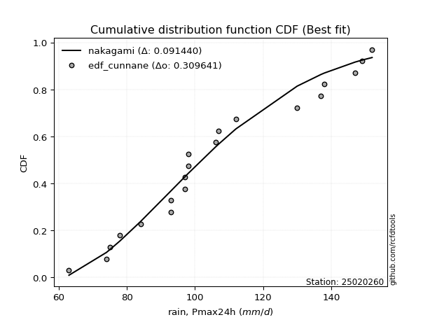</img>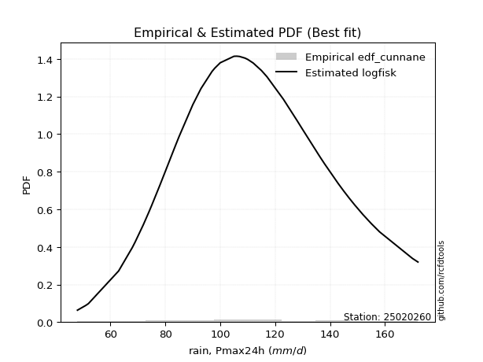</img>

</div>


### 12. Empirical - EDF Adamowski (1981)

The Adamowski formula in hydrology refers to a specific plotting position formula used for estimating the non-parametric empirical distribution of hydrological events (like flood peaks) to calculate their return periods. This formula provides an alternative to traditional parametric methods (like the Gumbel or Log Pearson Type III distributions). 

<div align="center">


$P=(m-0.25)/(n+0.5)$


</div>


**12.1. Empirical values**

<div align="center">

|                | 0                   | 1                    | 2                   | 3                  | 4                  | 5                   | 6                   | 7                   | 8                   | 9                   | 10                  | 11                  | 12                  | 13                  | 14                  | 15                 | 16                 | 17                 | 18                  | 19                  | 20                 | 21                 | 22                 | 23                | 24                 | 25                  | 26                  | 27                  | 28                  | 29                 | 30                 | 31                 | 32                 | 33                 | 34                | 35                 | 36                 | 37                 | 38                 | 39                 | 40                 | 41                 | 42                 | 43                 | 44                 | 45                | 46                 | 47                 | 48                 | 49                 | 50                 | 51                 | 52                 | 53                 | 54                 | 55                 | 56                 | 57                 |
|:---------------|:--------------------|:---------------------|:--------------------|:-------------------|:-------------------|:--------------------|:--------------------|:--------------------|:--------------------|:--------------------|:--------------------|:--------------------|:--------------------|:--------------------|:--------------------|:-------------------|:-------------------|:-------------------|:--------------------|:--------------------|:-------------------|:-------------------|:-------------------|:------------------|:-------------------|:--------------------|:--------------------|:--------------------|:--------------------|:-------------------|:-------------------|:-------------------|:-------------------|:-------------------|:------------------|:-------------------|:-------------------|:-------------------|:-------------------|:-------------------|:-------------------|:-------------------|:-------------------|:-------------------|:-------------------|:------------------|:-------------------|:-------------------|:-------------------|:-------------------|:-------------------|:-------------------|:-------------------|:-------------------|:-------------------|:-------------------|:-------------------|:-------------------|
| date           | 2019                | 2015                 | 1986                | 1990               | 1963               | 2017                | 2021                | 1972                | 1997                | 2005                | 1993                | 1982                | 2013                | 1994                | 1971                | 1968               | 1967               | 2003               | 2002                | 2000                | 2001               | 1995               | 1998               | 1981              | 1970               | 1980                | 1988                | 1996                | 2009                | 2010               | 2020               | 1965               | 1985               | 2004               | 1969              | 1966               | 1989               | 1977               | 2018               | 1964               | 1976               | 1973               | 1991               | 1979               | 2006               | 2008              | 2014               | 1984               | 2011               | 1992               | 1983               | 2007               | 1999               | 1974               | 2012               | 1978               | 1987               | 1975               |
| x              | 48.0                | 51.0                 | 52.0                | 63.0               | 68.0               | 68.0                | 69.0                | 72.0                | 74.0                | 75.0                | 78.0                | 80.0                | 83.0                | 84.0                | 85.0                | 90.0               | 90.0               | 93.0               | 93.0                | 97.0                | 97.0               | 98.0               | 98.0               | 100.0             | 100.0              | 105.0               | 105.0               | 106.0               | 107.0               | 109.0              | 109.0              | 110.0              | 110.0              | 112.0              | 112.0             | 112.0              | 115.0              | 115.0              | 115.0              | 117.0              | 123.0              | 128.0              | 130.0              | 136.0              | 137.0              | 138.0             | 143.0              | 145.0              | 147.0              | 147.0              | 149.0              | 149.0              | 152.0              | 155.0              | 158.0              | 170.0              | 170.0              | 172.0              |
| m              | 1                   | 2                    | 3                   | 4                  | 5                  | 6                   | 7                   | 8                   | 9                   | 10                  | 11                  | 12                  | 13                  | 14                  | 15                  | 16                 | 17                 | 18                 | 19                  | 20                  | 21                 | 22                 | 23                 | 24                | 25                 | 26                  | 27                  | 28                  | 29                  | 30                 | 31                 | 32                 | 33                 | 34                 | 35                | 36                 | 37                 | 38                 | 39                 | 40                 | 41                 | 42                 | 43                 | 44                 | 45                 | 46                | 47                 | 48                 | 49                 | 50                 | 51                 | 52                 | 53                 | 54                 | 55                 | 56                 | 57                 | 58                 |
| empirical_dist | edf_adamowski       | edf_adamowski        | edf_adamowski       | edf_adamowski      | edf_adamowski      | edf_adamowski       | edf_adamowski       | edf_adamowski       | edf_adamowski       | edf_adamowski       | edf_adamowski       | edf_adamowski       | edf_adamowski       | edf_adamowski       | edf_adamowski       | edf_adamowski      | edf_adamowski      | edf_adamowski      | edf_adamowski       | edf_adamowski       | edf_adamowski      | edf_adamowski      | edf_adamowski      | edf_adamowski     | edf_adamowski      | edf_adamowski       | edf_adamowski       | edf_adamowski       | edf_adamowski       | edf_adamowski      | edf_adamowski      | edf_adamowski      | edf_adamowski      | edf_adamowski      | edf_adamowski     | edf_adamowski      | edf_adamowski      | edf_adamowski      | edf_adamowski      | edf_adamowski      | edf_adamowski      | edf_adamowski      | edf_adamowski      | edf_adamowski      | edf_adamowski      | edf_adamowski     | edf_adamowski      | edf_adamowski      | edf_adamowski      | edf_adamowski      | edf_adamowski      | edf_adamowski      | edf_adamowski      | edf_adamowski      | edf_adamowski      | edf_adamowski      | edf_adamowski      | edf_adamowski      |
| empirical      | 0.01282051282051282 | 0.029914529914529916 | 0.04700854700854701 | 0.0641025641025641 | 0.0811965811965812 | 0.09829059829059829 | 0.11538461538461539 | 0.13247863247863248 | 0.14957264957264957 | 0.16666666666666666 | 0.18376068376068377 | 0.20085470085470086 | 0.21794871794871795 | 0.23504273504273504 | 0.25213675213675213 | 0.2692307692307692 | 0.2863247863247863 | 0.3034188034188034 | 0.32051282051282054 | 0.33760683760683763 | 0.3547008547008547 | 0.3717948717948718 | 0.3888888888888889 | 0.405982905982906 | 0.4230769230769231 | 0.44017094017094016 | 0.45726495726495725 | 0.47435897435897434 | 0.49145299145299143 | 0.5085470085470085 | 0.5256410256410257 | 0.5427350427350427 | 0.5598290598290598 | 0.5769230769230769 | 0.594017094017094 | 0.6111111111111112 | 0.6282051282051282 | 0.6452991452991453 | 0.6623931623931624 | 0.6794871794871795 | 0.6965811965811965 | 0.7136752136752137 | 0.7307692307692307 | 0.7478632478632479 | 0.7649572649572649 | 0.782051282051282 | 0.7991452991452992 | 0.8162393162393162 | 0.8333333333333334 | 0.8504273504273504 | 0.8675213675213675 | 0.8846153846153846 | 0.9017094017094017 | 0.9188034188034188 | 0.9358974358974359 | 0.9529914529914529 | 0.9700854700854701 | 0.9871794871794872 |
| empirical_tr   | 1.0129870129870129  | 1.0308370044052864   | 1.0493273542600898  | 1.0684931506849316 | 1.0883720930232559 | 1.1090047393364928  | 1.1304347826086958  | 1.1527093596059113  | 1.1758793969849246  | 1.2                 | 1.225130890052356   | 1.2513368983957218  | 1.278688524590164   | 1.3072625698324023  | 1.3371428571428572  | 1.3684210526315788 | 1.401197604790419  | 1.4355828220858897 | 1.471698113207547   | 1.5096774193548388  | 1.5496688741721856 | 1.5918367346938775 | 1.6363636363636362 | 1.683453237410072 | 1.7333333333333334 | 1.7862595419847327  | 1.84251968503937    | 1.9024390243902438  | 1.9663865546218489  | 2.034782608695652  | 2.1081081081081083 | 2.1869158878504673 | 2.2718446601941746 | 2.3636363636363633 | 2.463157894736842 | 2.5714285714285716 | 2.689655172413793  | 2.8192771084337354 | 2.962025316455696  | 3.12               | 3.2957746478873235 | 3.492537313432836  | 3.7142857142857135 | 3.9661016949152543 | 4.254545454545454  | 4.588235294117647 | 4.97872340425532   | 5.441860465116279  | 6.000000000000002  | 6.685714285714285  | 7.548387096774195  | 8.666666666666664  | 10.173913043478263 | 12.315789473684204 | 15.600000000000001 | 21.27272727272725  | 33.42857142857142  | 78.00000000000028  |

</div>


**12.2. Kolmogorov-Smirnov fit test (sorted by Δ)**


<div align="center">

|                | 0                  | 1                   | 2                   | 3                  | 4                    | 5                   | 6                   | 7                   | 8                   | 9                  | 10                  | 11                  | 12                  | 13                  | 14                  | 15                  | 16                  | 17                  | 18                  | 19                  | 20                  | 21                  | 22                  | 23                  | 24                  | 25                  | 26                  | 27                 | 28                  | 29                  | 30                 | 31                  | 32                  | 33                  | 34                  | 35                  | 36                  | 37                  | 38                  | 39                 | 40                  | 41                  | 42                 | 43                  | 44                 | 45                  | 46                  | 47                  | 48                  | 49                  | 50                  | 51                  | 52                  | 53                  | 54                  | 55                  | 56                  | 57                    | 58                  | 59                  | 60                  | 61                  | 62                  | 63                  | 64                  | 65                  | 66                  | 67                  | 68                  | 69                  | 70                  | 71                 | 72                  | 73                  | 74                  | 75                 | 76                  | 77                  | 78                 | 79                  | 80                  | 81                  | 82                  | 83                  | 84                 | 85                 | 86                 | 87                 |
|:---------------|:-------------------|:--------------------|:--------------------|:-------------------|:---------------------|:--------------------|:--------------------|:--------------------|:--------------------|:-------------------|:--------------------|:--------------------|:--------------------|:--------------------|:--------------------|:--------------------|:--------------------|:--------------------|:--------------------|:--------------------|:--------------------|:--------------------|:--------------------|:--------------------|:--------------------|:--------------------|:--------------------|:-------------------|:--------------------|:--------------------|:-------------------|:--------------------|:--------------------|:--------------------|:--------------------|:--------------------|:--------------------|:--------------------|:--------------------|:-------------------|:--------------------|:--------------------|:-------------------|:--------------------|:-------------------|:--------------------|:--------------------|:--------------------|:--------------------|:--------------------|:--------------------|:--------------------|:--------------------|:--------------------|:--------------------|:--------------------|:--------------------|:----------------------|:--------------------|:--------------------|:--------------------|:--------------------|:--------------------|:--------------------|:--------------------|:--------------------|:--------------------|:--------------------|:--------------------|:--------------------|:--------------------|:-------------------|:--------------------|:--------------------|:--------------------|:-------------------|:--------------------|:--------------------|:-------------------|:--------------------|:--------------------|:--------------------|:--------------------|:--------------------|:-------------------|:-------------------|:-------------------|:-------------------|
| station        | 25020260           | 25020260            | 25020260            | 25020260           | 25020260             | 25020260            | 25020260            | 25020260            | 25020260            | 25020260           | 25020260            | 25020260            | 25020260            | 25020260            | 25020260            | 25020260            | 25020260            | 25020260            | 25020260            | 25020260            | 25020260            | 25020260            | 25020260            | 25020260            | 25020260            | 25020260            | 25020260            | 25020260           | 25020260            | 25020260            | 25020260           | 25020260            | 25020260            | 25020260            | 25020260            | 25020260            | 25020260            | 25020260            | 25020260            | 25020260           | 25020260            | 25020260            | 25020260           | 25020260            | 25020260           | 25020260            | 25020260            | 25020260            | 25020260            | 25020260            | 25020260            | 25020260            | 25020260            | 25020260            | 25020260            | 25020260            | 25020260            | 25020260              | 25020260            | 25020260            | 25020260            | 25020260            | 25020260            | 25020260            | 25020260            | 25020260            | 25020260            | 25020260            | 25020260            | 25020260            | 25020260            | 25020260           | 25020260            | 25020260            | 25020260            | 25020260           | 25020260            | 25020260            | 25020260           | 25020260            | 25020260            | 25020260            | 25020260            | 25020260            | 25020260           | 25020260           | 25020260           | 25020260           |
| empirical_dist | edf_adamowski      | edf_adamowski       | edf_adamowski       | edf_adamowski      | edf_adamowski        | edf_adamowski       | edf_adamowski       | edf_adamowski       | edf_adamowski       | edf_adamowski      | edf_adamowski       | edf_adamowski       | edf_adamowski       | edf_adamowski       | edf_adamowski       | edf_adamowski       | edf_adamowski       | edf_adamowski       | edf_adamowski       | edf_adamowski       | edf_adamowski       | edf_adamowski       | edf_adamowski       | edf_adamowski       | edf_adamowski       | edf_adamowski       | edf_adamowski       | edf_adamowski      | edf_adamowski       | edf_adamowski       | edf_adamowski      | edf_adamowski       | edf_adamowski       | edf_adamowski       | edf_adamowski       | edf_adamowski       | edf_adamowski       | edf_adamowski       | edf_adamowski       | edf_adamowski      | edf_adamowski       | edf_adamowski       | edf_adamowski      | edf_adamowski       | edf_adamowski      | edf_adamowski       | edf_adamowski       | edf_adamowski       | edf_adamowski       | edf_adamowski       | edf_adamowski       | edf_adamowski       | edf_adamowski       | edf_adamowski       | edf_adamowski       | edf_adamowski       | edf_adamowski       | edf_adamowski         | edf_adamowski       | edf_adamowski       | edf_adamowski       | edf_adamowski       | edf_adamowski       | edf_adamowski       | edf_adamowski       | edf_adamowski       | edf_adamowski       | edf_adamowski       | edf_adamowski       | edf_adamowski       | edf_adamowski       | edf_adamowski      | edf_adamowski       | edf_adamowski       | edf_adamowski       | edf_adamowski      | edf_adamowski       | edf_adamowski       | edf_adamowski      | edf_adamowski       | edf_adamowski       | edf_adamowski       | edf_adamowski       | edf_adamowski       | edf_adamowski      | edf_adamowski      | edf_adamowski      | edf_adamowski      |
| p_dist         | logfisk            | fisk                | nakagami            | maxwell            | rayleigh             | invgamma            | logpearson3         | alpha               | genlogistic         | chi2               | ncf                 | f                   | fatiguelife         | invweibull          | mielke              | erlang              | loggenlogistic      | gamma               | johnsonsu           | rice                | logfatiguelife      | weibull_min         | lognakagami         | logrice             | lognorm             | lognorm             | logcrystalball      | loglognorm         | logexponnorm        | logt                | logncf             | logf                | logweibull_min      | lognct              | logloggamma         | pearson3            | nct                 | invgauss            | loggompertz         | logjohnsonsu       | logistic            | loglogistic         | laplace_asymmetric | loginvgamma         | logerlang          | loggamma            | loggamma            | exponnorm           | gumbel_r            | t                   | crystalball         | norm                | truncnorm           | betaprime           | logbetaprime        | logalpha            | loggumbel_l         | loglaplace_asymmetric | logchi2             | kstwobign           | hypsecant           | halfnorm            | loginvgauss         | loghypsecant        | moyal               | logmaxwell          | laplace             | loglaplace          | logmielke           | lograyleigh         | halflogistic        | loginvweibull      | loggumbel_r         | gumbel_l            | loghalfnorm         | logkstwobign       | logmoyal            | loghalflogistic     | loggenexpon        | wald                | expon               | logwald             | gibrat              | loggibrat           | logexpon           | logtruncnorm       | gompertz           | genexpon           |
| delta          | 0.057711466320576  | 0.05928622322307142 | 0.05990936474332298 | 0.0614207973511679 | 0.061982136188932446 | 0.06232913713146637 | 0.06394562482655586 | 0.06493713382207666 | 0.06557017271332821 | 0.066119395384311  | 0.06625703613624778 | 0.06659120212362779 | 0.06746622411187697 | 0.06756546731667373 | 0.06842486069233167 | 0.06860149605506505 | 0.06864749588870755 | 0.06896825325019373 | 0.06970213892663801 | 0.06993542820019849 | 0.07033781940912232 | 0.07053401553179417 | 0.07062972549250457 | 0.07093932233810424 | 0.07094247129227338 | 0.07094247129227338 | 0.07094291116058188 | 0.070943136750524  | 0.07094326779756316 | 0.07094357826488645 | 0.071015701349044  | 0.07125103249605907 | 0.07289035892583662 | 0.07421649456381912 | 0.07501576195423543 | 0.07533266330844968 | 0.07666147834363668 | 0.07688220556540498 | 0.07747343494892855 | 0.0793328590609057 | 0.08057069325726474 | 0.08147059221442077 | 0.0818425646363019 | 0.08254567754604797 | 0.0830833422630643 | 0.08329371190946883 | 0.08329371190946883 | 0.08348811020202784 | 0.08373308851167383 | 0.08455207775740414 | 0.08456361982268579 | 0.08456362267082873 | 0.08456363179350523 | 0.08554417927805169 | 0.08658887456912878 | 0.08694324426019828 | 0.08938799107956974 | 0.09024583981765866   | 0.09228506455630192 | 0.09246895491336571 | 0.09274736321211541 | 0.09313699735925984 | 0.09331563625038014 | 0.09358498926343362 | 0.10316976436662018 | 0.10513915654891404 | 0.10565191825797282 | 0.10637477899317116 | 0.10879563332730369 | 0.11739427826296611 | 0.12893219140008594 | 0.1290563364458437 | 0.14135221029261014 | 0.14805522939249205 | 0.15215832890656067 | 0.1590673526695896 | 0.16709193997827843 | 0.16996706117718074 | 0.1775865843064547 | 0.20004949329169608 | 0.22923578675328055 | 0.23862252997840339 | 0.25213675213675213 | 0.26358247670000756 | 0.2890282003396739 | 0.4000001045216795 | 0.7960407103138489 | 0.8906855522090482 |
| deltao         | 0.1785767486892227 | 0.1785767486892227  | 0.1785767486892227  | 0.1785767486892227 | 0.1785767486892227   | 0.1785767486892227  | 0.1785767486892227  | 0.1785767486892227  | 0.1785767486892227  | 0.1785767486892227 | 0.1785767486892227  | 0.1785767486892227  | 0.1785767486892227  | 0.1785767486892227  | 0.1785767486892227  | 0.1785767486892227  | 0.1785767486892227  | 0.1785767486892227  | 0.1785767486892227  | 0.1785767486892227  | 0.1785767486892227  | 0.1785767486892227  | 0.1785767486892227  | 0.1785767486892227  | 0.1785767486892227  | 0.1785767486892227  | 0.1785767486892227  | 0.1785767486892227 | 0.1785767486892227  | 0.1785767486892227  | 0.1785767486892227 | 0.1785767486892227  | 0.1785767486892227  | 0.1785767486892227  | 0.1785767486892227  | 0.1785767486892227  | 0.1785767486892227  | 0.1785767486892227  | 0.1785767486892227  | 0.1785767486892227 | 0.1785767486892227  | 0.1785767486892227  | 0.1785767486892227 | 0.1785767486892227  | 0.1785767486892227 | 0.1785767486892227  | 0.1785767486892227  | 0.1785767486892227  | 0.1785767486892227  | 0.1785767486892227  | 0.1785767486892227  | 0.1785767486892227  | 0.1785767486892227  | 0.1785767486892227  | 0.1785767486892227  | 0.1785767486892227  | 0.1785767486892227  | 0.1785767486892227    | 0.1785767486892227  | 0.1785767486892227  | 0.1785767486892227  | 0.1785767486892227  | 0.1785767486892227  | 0.1785767486892227  | 0.1785767486892227  | 0.1785767486892227  | 0.1785767486892227  | 0.1785767486892227  | 0.1785767486892227  | 0.1785767486892227  | 0.1785767486892227  | 0.1785767486892227 | 0.1785767486892227  | 0.1785767486892227  | 0.1785767486892227  | 0.1785767486892227 | 0.1785767486892227  | 0.1785767486892227  | 0.1785767486892227 | 0.1785767486892227  | 0.1785767486892227  | 0.1785767486892227  | 0.1785767486892227  | 0.1785767486892227  | 0.1785767486892227 | 0.1785767486892227 | 0.1785767486892227 | 0.1785767486892227 |
| eval           | Δo > Δ             | Δo > Δ              | Δo > Δ              | Δo > Δ             | Δo > Δ               | Δo > Δ              | Δo > Δ              | Δo > Δ              | Δo > Δ              | Δo > Δ             | Δo > Δ              | Δo > Δ              | Δo > Δ              | Δo > Δ              | Δo > Δ              | Δo > Δ              | Δo > Δ              | Δo > Δ              | Δo > Δ              | Δo > Δ              | Δo > Δ              | Δo > Δ              | Δo > Δ              | Δo > Δ              | Δo > Δ              | Δo > Δ              | Δo > Δ              | Δo > Δ             | Δo > Δ              | Δo > Δ              | Δo > Δ             | Δo > Δ              | Δo > Δ              | Δo > Δ              | Δo > Δ              | Δo > Δ              | Δo > Δ              | Δo > Δ              | Δo > Δ              | Δo > Δ             | Δo > Δ              | Δo > Δ              | Δo > Δ             | Δo > Δ              | Δo > Δ             | Δo > Δ              | Δo > Δ              | Δo > Δ              | Δo > Δ              | Δo > Δ              | Δo > Δ              | Δo > Δ              | Δo > Δ              | Δo > Δ              | Δo > Δ              | Δo > Δ              | Δo > Δ              | Δo > Δ                | Δo > Δ              | Δo > Δ              | Δo > Δ              | Δo > Δ              | Δo > Δ              | Δo > Δ              | Δo > Δ              | Δo > Δ              | Δo > Δ              | Δo > Δ              | Δo > Δ              | Δo > Δ              | Δo > Δ              | Δo > Δ             | Δo > Δ              | Δo > Δ              | Δo > Δ              | Δo > Δ             | Δo > Δ              | Δo > Δ              | Δo > Δ             | Δo <= Δ             | Δo <= Δ             | Δo <= Δ             | Δo <= Δ             | Δo <= Δ             | Δo <= Δ            | Δo <= Δ            | Δo <= Δ            | Δo <= Δ            |
| fit            | 1                  | 1                   | 1                   | 1                  | 1                    | 1                   | 1                   | 1                   | 1                   | 1                  | 1                   | 1                   | 1                   | 1                   | 1                   | 1                   | 1                   | 1                   | 1                   | 1                   | 1                   | 1                   | 1                   | 1                   | 1                   | 1                   | 1                   | 1                  | 1                   | 1                   | 1                  | 1                   | 1                   | 1                   | 1                   | 1                   | 1                   | 1                   | 1                   | 1                  | 1                   | 1                   | 1                  | 1                   | 1                  | 1                   | 1                   | 1                   | 1                   | 1                   | 1                   | 1                   | 1                   | 1                   | 1                   | 1                   | 1                   | 1                     | 1                   | 1                   | 1                   | 1                   | 1                   | 1                   | 1                   | 1                   | 1                   | 1                   | 1                   | 1                   | 1                   | 1                  | 1                   | 1                   | 1                   | 1                  | 1                   | 1                   | 1                  | 0                   | 0                   | 0                   | 0                   | 0                   | 0                  | 0                  | 0                  | 0                  |
| n              | 58                 | 58                  | 58                  | 58                 | 58                   | 58                  | 58                  | 58                  | 58                  | 58                 | 58                  | 58                  | 58                  | 58                  | 58                  | 58                  | 58                  | 58                  | 58                  | 58                  | 58                  | 58                  | 58                  | 58                  | 58                  | 58                  | 58                  | 58                 | 58                  | 58                  | 58                 | 58                  | 58                  | 58                  | 58                  | 58                  | 58                  | 58                  | 58                  | 58                 | 58                  | 58                  | 58                 | 58                  | 58                 | 58                  | 58                  | 58                  | 58                  | 58                  | 58                  | 58                  | 58                  | 58                  | 58                  | 58                  | 58                  | 58                    | 58                  | 58                  | 58                  | 58                  | 58                  | 58                  | 58                  | 58                  | 58                  | 58                  | 58                  | 58                  | 58                  | 58                 | 58                  | 58                  | 58                  | 58                 | 58                  | 58                  | 58                 | 58                  | 58                  | 58                  | 58                  | 58                  | 58                 | 58                 | 58                 | 58                 |
| best_fit       | 1                  | 0                   | 0                   | 0                  | 0                    | 0                   | 0                   | 0                   | 0                   | 0                  | 0                   | 0                   | 0                   | 0                   | 0                   | 0                   | 0                   | 0                   | 0                   | 0                   | 0                   | 0                   | 0                   | 0                   | 0                   | 0                   | 0                   | 0                  | 0                   | 0                   | 0                  | 0                   | 0                   | 0                   | 0                   | 0                   | 0                   | 0                   | 0                   | 0                  | 0                   | 0                   | 0                  | 0                   | 0                  | 0                   | 0                   | 0                   | 0                   | 0                   | 0                   | 0                   | 0                   | 0                   | 0                   | 0                   | 0                   | 0                     | 0                   | 0                   | 0                   | 0                   | 0                   | 0                   | 0                   | 0                   | 0                   | 0                   | 0                   | 0                   | 0                   | 0                  | 0                   | 0                   | 0                   | 0                  | 0                   | 0                   | 0                  | 0                   | 0                   | 0                   | 0                   | 0                   | 0                  | 0                  | 0                  | 0                  |
| best_fit_sort  | 1                  | 2                   | 3                   | 4                  | 5                    | 6                   | 7                   | 8                   | 9                   | 10                 | 11                  | 12                  | 13                  | 14                  | 15                  | 16                  | 17                  | 18                  | 19                  | 20                  | 21                  | 22                  | 23                  | 24                  | 25                  | 26                  | 27                  | 28                 | 29                  | 30                  | 31                 | 32                  | 33                  | 34                  | 35                  | 36                  | 37                  | 38                  | 39                  | 40                 | 41                  | 42                  | 43                 | 44                  | 45                 | 46                  | 47                  | 48                  | 49                  | 50                  | 51                  | 52                  | 53                  | 54                  | 55                  | 56                  | 57                  | 58                    | 59                  | 60                  | 61                  | 62                  | 63                  | 64                  | 65                  | 66                  | 67                  | 68                  | 69                  | 70                  | 71                  | 72                 | 73                  | 74                  | 75                  | 76                 | 77                  | 78                  | 79                 | 80                  | 81                  | 82                  | 83                  | 84                  | 85                 | 86                 | 87                 | 88                 |

</div>


<div align="center">

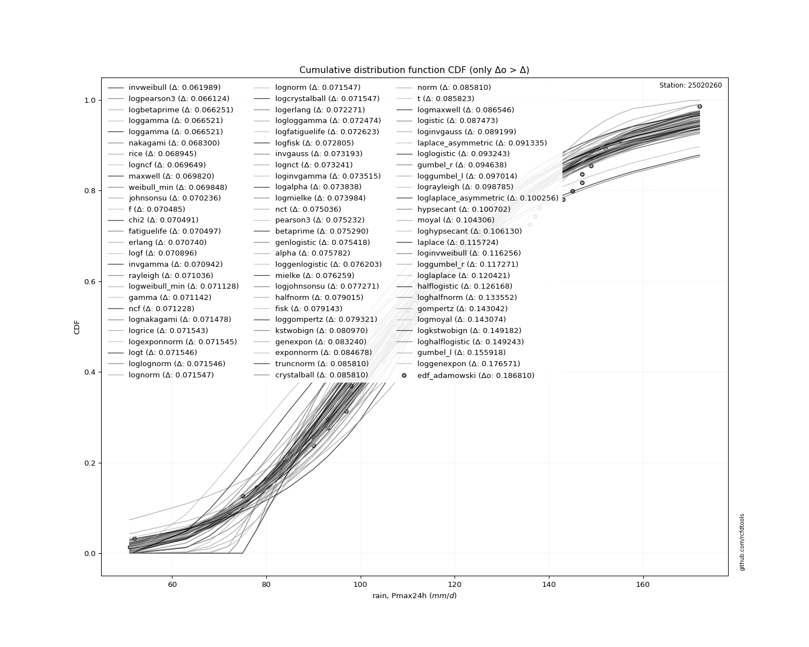</img>

</div>


**12.3. Best fit**

<div align="center">

|   id |   station | empirical_dist   | p_dist   |     delta |   deltao | eval   |   fit |   n |   best_fit |   best_fit_sort |
|-----:|----------:|:-----------------|:---------|----------:|---------:|:-------|------:|----:|-----------:|----------------:|
|    0 |  25020260 | edf_adamowski    | logfisk  | 0.0577115 | 0.178577 | Δo > Δ |     1 |  58 |          1 |               1 |

</div>


<div align="center">

</img></img>

</div>


## C. Best fit & Estimate extreme values for specific return periods - Tr


### 1. Best fit (ordered by delta Δ)

<div align="center">

|   id |   station | empirical_dist   | p_dist   |     delta |   deltao | eval   |   fit |   n |   best_fit |   best_fit_sort |
|-----:|----------:|:-----------------|:---------|----------:|---------:|:-------|------:|----:|-----------:|----------------:|
|    0 |  25020260 | edf_hazen        | logfisk  | 0.0555747 | 0.178577 | Δo > Δ |     1 |  58 |          1 |               1 |
|    1 |  25020260 | edf_gringorten   | logfisk  | 0.0560909 | 0.178577 | Δo > Δ |     1 |  58 |          1 |               2 |
|    2 |  25020260 | edf_cunnane      | logfisk  | 0.0564338 | 0.178577 | Δo > Δ |     1 |  58 |          1 |               3 |
|    3 |  25020260 | edf_blom         | logfisk  | 0.0566477 | 0.178577 | Δo > Δ |     1 |  58 |          1 |               4 |
|    4 |  25020260 | edf_tukey        | logfisk  | 0.0570033 | 0.178577 | Δo > Δ |     1 |  58 |          1 |               5 |
|    5 |  25020260 | edf_filliben     | logfisk  | 0.0571382 | 0.178577 | Δo > Δ |     1 |  58 |          1 |               6 |
|    6 |  25020260 | edf_beard        | logfisk  | 0.057202  | 0.178577 | Δo > Δ |     1 |  58 |          1 |               7 |
|    7 |  25020260 | edf_jenkinson    | logfisk  | 0.057202  | 0.178577 | Δo > Δ |     1 |  58 |          1 |               8 |
|    8 |  25020260 | edf_california   | rayleigh | 0.0572692 | 0.178577 | Δo > Δ |     1 |  58 |          1 |               9 |
|    9 |  25020260 | edf_chegodayev   | logfisk  | 0.057287  | 0.178577 | Δo > Δ |     1 |  58 |          1 |              10 |
|   10 |  25020260 | edf_adamowski    | logfisk  | 0.0577115 | 0.178577 | Δo > Δ |     1 |  58 |          1 |              11 |
|   11 |  25020260 | edf_weibull      | logfisk  | 0.059812  | 0.178577 | Δo > Δ |     1 |  58 |          1 |              12 |

</div>

:file_folder:Tables: [bestfit_25020260.csv](table/bestfit_25020260.csv) | [extreme_25020260.csv](table/extreme_25020260.csv)


### 2. Extreme values

In hydrology, a return period (or recurrence interval $Tr$) is the statistical average time between extreme events like floods or droughts of a specific magnitude, indicating how rare an event is, with a 100-year flood, for example, having a 1% chance of occurring in any given year, not that it happens exactly every century. It is a key tool for infrastructure design (like bridges or dams) and risk assessment, calculated from historical data to determine the probability of future events, although it is important to remember it is statistical average, and events can cluster or be missed.

> risk_rate: assuming the return period as the project useful life.

|   id |      tr |   prob_l |     prob_g |   alpha |   betaprime |    chi2 |   crystalball |   erlang |    expon |   exponnorm |       f |   fatiguelife |    fisk |   gamma |   genexpon |   genlogistic |   gibrat |   gompertz |   gumbel_l |   gumbel_r |   halflogistic |   halfnorm |   hypsecant |   invgamma |   invgauss |   invweibull |   johnsonsu |   kstwobign |   laplace |   laplace_asymmetric |   loggamma |   logistic |   lognorm |   maxwell |   mielke |   moyal |   nakagami |     ncf |     nct |    norm |   pearson3 |   rayleigh |    rice |       t |   truncnorm |     wald |   weibull_min |   logalpha |   logbetaprime |   logchi2 |   logcrystalball |   logerlang |   logexpon |   logexponnorm |    logf |   logfatiguelife |   logfisk |   loggenexpon |   loggenlogistic |   loggibrat |   loggompertz |   loggumbel_l |   loggumbel_r |   loghalflogistic |   loghalfnorm |   loghypsecant |   loginvgamma |   loginvgauss |   loginvweibull |   logjohnsonsu |   logkstwobign |   loglaplace |   loglaplace_asymmetric |   logloggamma |   loglogistic |   loglognorm |   logmaxwell |   logmielke |   logmoyal |   lognakagami |   logncf |   lognct |   logpearson3 |   lograyleigh |   logrice |    logt |   logtruncnorm |   logwald |   logweibull_min |   station |   n |   risk_rate |
|-----:|--------:|---------:|-----------:|--------:|------------:|--------:|--------------:|---------:|---------:|------------:|--------:|--------------:|--------:|--------:|-----------:|--------------:|---------:|-----------:|-----------:|-----------:|---------------:|-----------:|------------:|-----------:|-----------:|-------------:|------------:|------------:|----------:|---------------------:|-----------:|-----------:|----------:|----------:|---------:|--------:|-----------:|--------:|--------:|--------:|-----------:|-----------:|--------:|--------:|------------:|---------:|--------------:|-----------:|---------------:|----------:|-----------------:|------------:|-----------:|---------------:|--------:|-----------------:|----------:|--------------:|-----------------:|------------:|--------------:|--------------:|--------------:|------------------:|--------------:|---------------:|--------------:|--------------:|----------------:|---------------:|---------------:|-------------:|------------------------:|--------------:|--------------:|-------------:|-------------:|------------:|-----------:|--------------:|---------:|---------:|--------------:|--------------:|----------:|--------:|---------------:|----------:|-----------------:|----------:|----:|------------:|
|    0 |    2    | 0.5      | 0.5        | 106.552 |     102.995 | 107.291 |       108.862 |  107.517 |  90.1864 |     108.78  | 107.335 |       107.426 | 105.799 | 107.545 |    51.844  |       106.3   |  99.4785 |    157.25  |    113.998 |    103.726 |        101.173 |    102.463 |     108.862 |    106.968 |    103.882 |      104.869 |     107.634 |     102.853 |   108.862 |              107.471 |    103.173 |    108.862 |   104.124 |   106.188 |  107.945 | 102.068 |    106.342 | 104.49  | 108.254 | 108.862 |    108.093 |    105.24  | 107.324 | 108.861 |     108.862 |  98.7285 |       107.389 |    102.898 |        102.994 |   102.59  |          104.124 |     103.26  |    82.1017 |        104.124 | 104.095 |          104.159 |   105.775 |       95.4677 |          107.96  |     94.9752 |       107.81  |       109.499 |       99.0118 |           96.5656 |        97.793 |        104.124 |       103.259 |       102.584 |         100.069 |        108.237 |        97.3243 |      104.124 |                 107.705 |       107.942 |       104.124 |      104.124 |      101.43  |     109.35  |    97.4157 |       104.156 |  104.149 |  103.897 |       106.809 |       100.492 |   104.123 | 104.124 |        73.3706 |   94.2771 |          107.716 |  25020260 |  58 |    0.75     |
|    1 |    2.33 | 0.570815 | 0.429185   | 112.181 |     108.93  | 112.917 |       114.441 |  113.13  |  99.4813 |     114.355 | 112.958 |       113.036 | 111.229 | 113.16  |    52.7013 |       111.751 | 102.304  |    158.067 |    118.851 |    108.896 |        106.488 |    108.484 |     113.327 |    112.592 |    109.89  |      111.167 |     113.228 |     109.17  |   112.238 |              111.516 |    109.072 |    113.777 |   109.976 |   111.984 |  113.228 | 106.962 |    112.175 | 110.278 | 113.808 | 114.441 |    113.69  |    111.122 | 113.171 | 114.44  |     114.441 | 102.386  |       113.225 |    108.823 |        108.972 |   108.643 |          109.976 |     109.231 |    92.4089 |        109.976 | 109.945 |          109.99  |   111.245 |      102.978  |          113.245 |     97.6423 |       113.791 |       114.834 |      104.158  |          101.729  |       103.738 |        108.781 |       109.203 |       108.756 |         107.284 |        113.989 |       104.782  |      107.627 |                 111.697 |       113.64  |       109.263 |      109.976 |      107.359 |     116.819 |   102.202  |       110.017 |  110.04  |  109.781 |       112.646 |       106.455 |   109.974 | 109.976 |        79.4687 |   97.7191 |          113.452 |  25020260 |  58 |    0.729209 |
|    2 |    5    | 0.8      | 0.2        | 134.361 |     135.14  | 134.709 |       135.172 |  134.724 | 145.954  |     135.124 | 134.719 |       134.688 | 134.924 | 134.749 |    56.9873 |       134.173 | 118.574  |    160.705 |    134.531 |    131.353 |        130.536 |    133.945 |     131.235 |    134.707 |    134.958 |      138.529 |     134.723 |     135.999 |   129.117 |              131.741 |    134.601 |    132.755 |   134.756 |   134.796 |  134.108 | 129.628 |    134.997 | 134.695 | 134.827 | 135.172 |    134.923 |    134.668 | 135.371 | 135.171 |     135.172 | 122.864  |       135.365 |    134.724 |        134.899 |   135.307 |          134.756 |     135.096 |   166.92   |        134.756 | 134.736 |          134.709 |   135.156 |      139.491  |          134.118 |    114.521  |       135.913 |       133.912 |      129.805  |          128.767  |       133.146 |        129.655 |       135.126 |       136.395 |         145.173 |        135.496 |       143.379  |      126.991 |                 130.318 |       135.197 |       131.601 |      134.756 |      134.262 |     141.535 |   127.628  |       134.85  |  135.128 |  134.807 |       135.373 |       134.091 |   134.751 | 134.756 |       109.847  |  119.443  |          135.222 |  25020260 |  58 |    0.67232  |
|    3 |   10    | 0.9      | 0.1        | 150.272 |     157.001 | 149.945 |       148.925 |  149.694 | 188.14   |     148.954 | 149.918 |       149.767 | 155.53  | 149.706 |    60.8781 |       151.628 | 137.119  |    162.175 |    143.26  |    149.644 |        150.507 |    152.785 |     145.535 |    150.512 |    154.178 |      160.815 |     149.625 |     156.426 |   144.439 |              150.101 |    155.25  |    146.732 |   154.203 |   150.849 |  150.425 | 149.362 |    150.981 | 153.843 | 149.155 | 148.925 |    149.386 |    151.457 | 150.372 | 148.924 |     148.925 | 144.595  |       150.224 |    155.992 |        155.938 |   157.401 |          154.203 |     156.048 |   285.509  |        154.203 | 154.214 |          154.14  |   155.993 |      173.239  |          150.419 |    137.348  |       150.265 |       145.874 |      155.294  |          156.607  |       160.152 |        149.164 |       156.333 |       159.836 |         185.724 |        149.657 |       182.048  |      147.569 |                 149.892 |       149.724 |       150.923 |      154.203 |      157.144 |     153.528 |   154.866  |       154.354 |  154.972 |  154.571 |       151.141 |       158.076 |   154.195 | 154.203 |       133.232  |  147.801  |          149.923 |  25020260 |  58 |    0.651322 |
|    4 |   15    | 0.933333 | 0.0666667  | 158.605 |     169.576 | 157.783 |       155.788 |  157.359 | 212.818  |     155.875 | 157.733 |       157.512 | 168.047 | 157.361 |    63.1541 |       161.325 | 149.911  |    162.84  |    147.213 |    159.963 |        161.809 |    162.59  |     153.696 |    158.763 |    164.603 |      173.389 |     157.261 |     167.271 |   153.401 |              160.84  |    166.872 |    154.347 |   164.933 |   159.086 |  159.841 | 160.815 |    159.168 | 164.431 | 156.437 | 155.788 |    156.718 |    160.107 | 157.912 | 155.787 |     155.788 | 158.549  |       157.641 |    168.087 |        167.803 |   170.031 |          164.933 |     167.849 |   390.823  |        164.933 | 164.969 |          164.873 |   168.669 |      193.716  |          159.824 |    155.692  |       157.291 |       151.638 |      171.824  |          174.951  |       176.308 |        161.586 |       168.362 |       173.446 |         213.417 |        156.632 |       206.651  |      161.12  |                 162.678 |       157.015 |       162.62  |      164.933 |      170.358 |     158.473 |   173.264  |       165.122 |  165.977 |  165.52  |       159.144 |       172.063 |   164.923 | 164.933 |       143.783  |  169.468  |          157.307 |  25020260 |  58 |    0.644736 |
|    5 |   20    | 0.95     | 0.05       | 164.212 |     178.503 | 163.003 |       160.282 |  162.449 | 230.326  |     160.415 | 162.935 |       162.664 | 177.28  | 162.444 |    64.7689 |       168.075 | 159.945  |    163.254 |    149.674 |    167.189 |        169.727 |    169.126 |     159.453 |    164.303 |    171.746 |      182.192 |     162.336 |     174.576 |   159.761 |              168.46  |    175.011 |    159.61  |   172.361 |   164.553 |  166.613 | 168.926 |    164.598 | 171.777 | 161.259 | 160.282 |    161.56  |    165.857 | 162.867 | 160.281 |     160.282 | 168.948  |       162.492 |    176.612 |        176.124 |   178.957 |          172.361 |     176.118 |   488.349  |        172.361 | 172.418 |          172.308 |   178.026 |      208.654  |          166.588 |    171.781  |       161.84  |       155.34  |      184.435  |          189.069  |       187.974 |        170.967 |       176.826 |       183.154 |         235.229 |        161.155 |       225.072  |      171.483 |                 172.406 |       161.801 |       171.23  |      172.362 |      179.736 |     161.499 |   187.602  |       172.578 |  173.619 |  173.119 |       164.416 |       182.039 |   172.349 | 172.361 |       149.81   |  187.655  |          162.156 |  25020260 |  58 |    0.641514 |
|    6 |   25    | 0.96     | 0.04       | 168.418 |     185.454 | 166.888 |       163.59  |  166.233 | 243.907  |     163.761 | 166.807 |       166.498 | 184.683 | 166.221 |    66.0215 |       173.259 | 168.31   |    163.549 |    151.425 |    172.755 |        175.828 |    173.99  |     163.909 |    168.453 |    177.166 |      188.973 |     166.11  |     180.048 |   164.693 |              174.371 |    181.287 |    163.636 |   178.043 |   168.611 |  171.953 | 175.213 |    168.628 | 177.405 | 164.835 | 163.59  |    165.146 |    170.129 | 166.521 | 163.59  |     163.59  | 177.278  |       166.058 |    183.216 |        182.545 |   185.885 |          178.043 |     182.496 |   580.464  |        178.042 | 178.116 |          177.997 |   185.534 |      220.498  |          171.922 |    186.457  |       165.161 |       158.03  |      194.776  |          200.719  |       197.153 |        178.599 |       183.376 |       190.738 |         253.538 |        164.459 |       239.938  |      179.977 |                 180.35  |       165.328 |       178.123 |      178.043 |      187.031 |     163.667 |   199.527  |       178.282 |  179.477 |  178.94  |       168.308 |       189.823 |   178.029 | 178.042 |       153.713  |  203.621  |          165.731 |  25020260 |  58 |    0.639603 |
|    7 |   50    | 0.98     | 0.02       | 180.85  |     207.33  | 178.221 |       173.065 |  177.236 | 286.094  |     173.367 | 178.097 |       177.672 | 209.265 | 177.205 |    69.9123 |       189.17  | 197.796  |    164.349 |    156.179 |    189.899 |        194.625 |    188.127 |     177.723 |    180.68  |    193.472 |      209.863 |     177.098 |     196.116 |   180.015 |              192.73  |    200.7   |    175.938 |   195.368 |   180.381 |  189.221 | 194.731 |    180.31  | 194.636 | 175.213 | 173.065 |    175.512 |    182.529 | 177.015 | 173.064 |     173.065 | 204.473  |       176.24  |    203.809 |        202.437 |   207.549 |          195.368 |     202.235 |   992.856  |        195.368 | 195.505 |          195.363 |   210.491 |      258.845  |          189.17  |    248.934  |       174.539 |       165.567 |      230.42   |          241.323  |       226.456 |        204.497 |       203.754 |       214.73  |         319.391 |        173.783 |       289.513  |      209.143 |                 207.439 |       175.442 |       200.95  |      195.369 |      209.904 |     169.819 |   241.593  |       195.684 |  197.405 |  196.745 |       179.476 |       214.355 |   195.352 | 195.368 |       162.265  |  265.83   |          175.992 |  25020260 |  58 |    0.63583  |
|    8 |   75    | 0.986667 | 0.0133333  | 187.766 |     220.408 | 184.429 |       178.148 |  183.244 | 310.771  |     178.536 | 184.278 |       183.789 | 224.923 | 183.2   |    72.1882 |       198.393 | 217.712  |    164.753 |    158.583 |    199.865 |        205.551 |    195.822 |     185.796 |    187.459 |    202.713 |      222.005 |     183.107 |     204.956 |   188.978 |              203.47  |    212.067 |    183.043 |   205.35  |   186.78  |  199.91  | 206.144 |    186.658 | 204.615 | 180.869 | 178.148 |    181.135 |    189.276 | 182.662 | 178.147 |     178.148 | 221.208  |       181.68  |    215.984 |        214.106 |   220.397 |          205.35  |     213.801 |  1359.09   |        205.349 | 205.529 |          205.377 |   226.407 |      282.451  |          199.847 |    302.588  |       179.491 |       169.514 |      254.063  |          268.601  |       244.199 |        221.336 |       215.77  |       229.15  |         365.266 |        178.694 |       321.031  |      228.347 |                 225.134 |       180.874 |       215.443 |      205.35  |      223.492 |     173.21  |   270.191  |       205.713 |  207.777 |  207.037 |       185.464 |       229.009 |   205.331 | 205.349 |       165.366  |  313.221  |          181.509 |  25020260 |  58 |    0.634587 |
|    9 |  100    | 0.99     | 0.01       | 192.546 |     229.842 | 188.677 |       181.586 |  187.35  | 328.28   |     182.039 | 188.508 |       187.974 | 236.676 | 187.296 |    73.8031 |       204.913 | 233.139  |    165.018 |    160.155 |    206.918 |        213.285 |    201.064 |     191.523 |    192.133 |    209.163 |      230.598 |     187.217 |     211.014 |   195.337 |              211.09  |    220.164 |    188.06  |   212.388 |   191.139 |  207.799 | 214.241 |    190.982 | 211.677 | 184.731 | 181.586 |    184.962 |    193.872 | 186.488 | 181.585 |     181.586 | 233.409  |       185.349 |    224.707 |        222.425 |   229.617 |          212.388 |     222.041 |  1698.23   |        212.388 | 212.601 |          212.443 |   238.363 |      299.761  |          207.729 |    351.979  |       182.809 |       172.147 |      272.248  |          289.752  |       257.076 |        234.115 |       224.366 |       239.584 |         401.663 |        181.976 |       344.585  |      243.034 |                 238.596 |       184.55  |       226.301 |      212.389 |      233.248 |     175.582 |   292.51   |       212.787 |  215.11  |  214.31  |       189.506 |       239.562 |   212.368 | 212.388 |       166.969  |  353.018  |          185.244 |  25020260 |  58 |    0.633968 |
|   10 |  200    | 0.995    | 0.005      | 203.707 |     253.192 | 198.467 |       189.385 |  196.786 | 370.467  |     190.007 | 198.252 |       197.613 | 267.428 | 196.71  |    77.6939 |       220.574 | 275.112  |    165.593 |    163.572 |    223.874 |        231.878 |    213.054 |     205.319 |    203.008 |    224.405 |      251.258 |     196.679 |     224.965 |   210.659 |              229.449 |    239.838 |    200.093 |   229.261 |   201.111 |  227.973 | 233.75  |    200.873 | 228.699 | 193.607 | 189.385 |    193.714 |    204.388 | 195.18  | 189.385 |     189.385 | 263.801  |       193.638 |    246.083 |        242.672 |   252.261 |          229.261 |     242.074 |  2904.75   |        229.261 | 229.561 |          229.396 |   269.683 |      343.481  |          227.885 |    531.089  |       190.24  |       178.011 |      321.474  |          347.67   |       289.137 |        268.014 |       245.381 |       265.505 |         504.705 |        189.293 |       405.62   |      282.417 |                 274.434 |       192.886 |       254.632 |      229.262 |      257.2   |     181.299 |   354.152  |       229.752 |  232.752 |  231.794 |       198.628 |       265.573 |   229.237 | 229.261 |       169.441  |  475.542  |          193.726 |  25020260 |  58 |    0.633042 |
|   11 |  250    | 0.996    | 0.004      | 207.208 |     260.914 | 201.5   |       191.769 |  199.704 | 384.048  |     192.449 | 201.271 |       200.599 | 278.122 | 199.62  |    78.9464 |       225.605 | 290.172  |    165.762 |    164.578 |    229.325 |        237.855 |    216.743 |     209.76  |    206.409 |    229.234 |      257.899 |     199.609 |     229.282 |   215.592 |              235.36  |    246.236 |    203.956 |   234.68  |   204.181 |  234.847 | 240.031 |    203.917 | 234.195 | 196.352 | 191.769 |    196.409 |    207.625 | 197.841 | 191.768 |     191.769 | 273.856  |       196.162 |    253.089 |        249.265 |   259.695 |          234.68  |     248.591 |  3452.66   |        234.68  | 235.011 |          234.845 |   280.586 |      358.188  |          234.753 |    615.556  |       192.485 |       179.774 |      339.118  |          368.646  |       299.783 |        279.938 |       252.253 |       274.104 |         543.152 |        191.493 |       426.616  |      296.407 |                 287.079 |       195.433 |       264.459 |      234.681 |      265.057 |     183.161 |   376.638  |       235.202 |  238.437 |  237.423 |       201.399 |       274.135 |   234.655 | 234.68  |       169.946  |  524.801  |          196.32  |  25020260 |  58 |    0.632858 |
|   12 |  500    | 0.998    | 0.002      | 217.856 |     285.611 | 210.613 |       198.837 |  208.454 | 426.234  |     199.71  | 210.337 |       209.568 | 314.079 | 208.346 |    82.8372 |       241.216 | 342.219  |    166.247 |    167.46  |    246.245 |        256.408 |    227.741 |     223.555 |    216.717 |    244.04  |      278.514 |     208.408 |     242.221 |   230.914 |              253.719 |    266.354 |    215.937 |   251.515 |   213.341 |  257.491 | 259.539 |    213.002 | 251.369 | 204.588 | 198.837 |    204.455 |    217.284 | 205.74  | 198.836 |     198.837 | 305.826  |       203.617 |    275.288 |        270.024 |   283.29  |          251.515 |     269.091 |  5905.6    |        251.514 | 251.95  |          251.786 |   317.282 |      405.935  |          257.383 |   1025.17   |       199.073 |       184.926 |      400.291  |          442.159  |       333.907 |        320.469 |       273.983 |       301.682 |         682.152 |        197.91  |       496.273  |      344.44  |                 330.199 |       202.984 |       297.413 |      251.516 |      289.958 |     189.07  |   456.007  |       252.14  |  256.151 |  254.957 |       209.553 |       301.356 |   251.485 | 251.515 |       170.966  |  717.969  |          204.02  |  25020260 |  58 |    0.632489 |
|   13 |  750    | 0.998667 | 0.00133333 | 223.946 |     300.594 | 215.751 |       202.763 |  213.377 | 450.911  |     203.758 | 215.448 |       214.625 | 337.197 | 213.255 |    85.1132 |       250.34  | 376.64   |    166.506 |    169.001 |    256.136 |        267.254 |    233.885 |     231.624 |    222.59  |    252.581 |      290.565 |     213.367 |     249.49  |   239.876 |              264.459 |    278.315 |    222.937 |   261.383 |   218.464 |  271.707 | 270.951 |    218.083 | 261.507 | 209.228 | 202.763 |    208.96  |    222.685 | 210.134 | 202.762 |     202.763 | 324.995  |       207.74  |    288.609 |        282.385 |   297.472 |          261.383 |     281.285 |  8083.99   |        261.383 | 261.884 |          261.726 |   340.905 |      435.37   |          271.592 |   1436.49   |       202.688 |       187.74  |      441.043  |          491.75   |       354.634 |        346.846 |       286.989 |       318.461 |         779.352 |        201.404 |       540.282  |      376.069 |                 358.365 |       207.175 |       318.535 |      261.385 |      304.892 |     192.637 |   509.977  |       262.072 |  266.574 |  265.265 |       214.036 |       317.74  |   261.351 | 261.383 |       171.309  |  866.391  |          208.301 |  25020260 |  58 |    0.632366 |
|   14 | 1000    | 0.999    | 0.001      | 228.216 |     311.483 | 219.319 |       205.466 |  216.792 | 468.42   |     206.552 | 218.997 |       218.137 | 354.613 | 216.66  |    86.728  |       256.811 | 402.98   |    166.681 |    170.038 |    263.152 |        274.947 |    238.128 |     237.349 |    226.696 |    258.596 |      299.114 |     216.812 |     254.525 |   246.236 |              272.079 |    286.897 |    227.901 |   268.402 |   222.005 |  282.259 | 279.048 |    221.595 | 268.752 | 212.449 | 205.466 |    212.077 |    226.418 | 213.162 | 205.465 |     205.466 | 338.783  |       210.57  |    298.222 |        291.263 |   307.716 |          268.402 |     290.036 | 10101.3    |        268.401 | 268.953 |          268.799 |   358.715 |      456.954  |          282.139 |   1859.58   |       205.159 |       189.657 |      472.441  |          530.262  |       369.695 |        366.867 |       296.359 |       330.673 |         856.584 |        203.78  |       573.038  |      400.256 |                 379.795 |       210.06  |       334.417 |      268.403 |      315.661 |     195.226 |   552.1    |       269.137 |  274.003 |  272.61  |       217.1   |       329.579 |   268.368 | 268.401 |       171.481  |  991.784  |          211.25  |  25020260 |  58 |    0.632305 |

<div align="center">

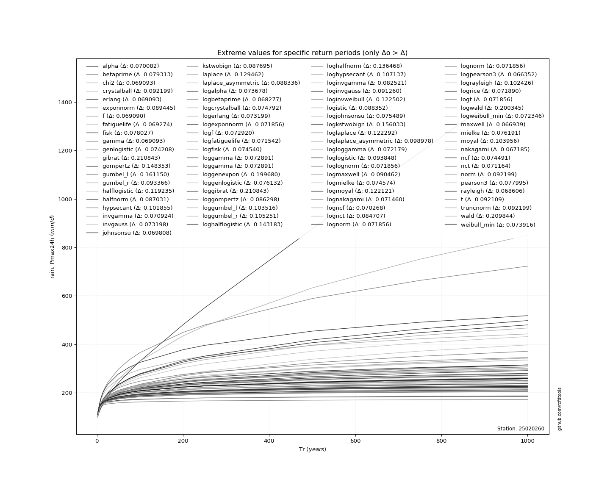</img>

</div>


<div align="center">

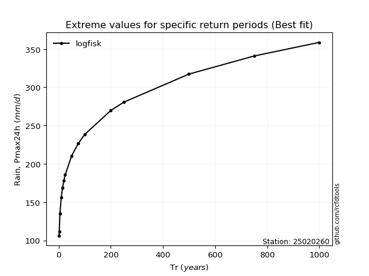</img>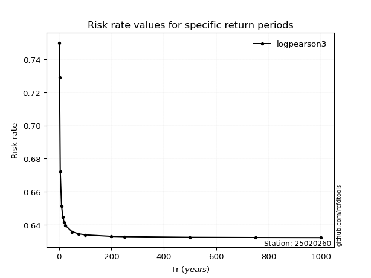</img>

</div>


<sub>**APP DISCLAIMER**: NO WARRANTY - This software is provided by [github.com/rcfdtools](https://github.com/rcfdtools) "as is", without any express or implied warranty, including warranties of merchantability, fitness for a particular purpose, or non-infringement. There is no guarantee that the software will be error-free or operate without interruption. LIMITATION OF LIABILITY - Neither the authors nor copyright holders will be liable for claims or damages arising from the software or its use. You are responsible for determining if the software is appropriate for your use and assume all associated risks, including errors, legal compliance, and data loss. NO PROFESSIONAL ADVICE - The software provides general information and does not offer professional advice. It should not replace consultation with professional advisors.</sub>