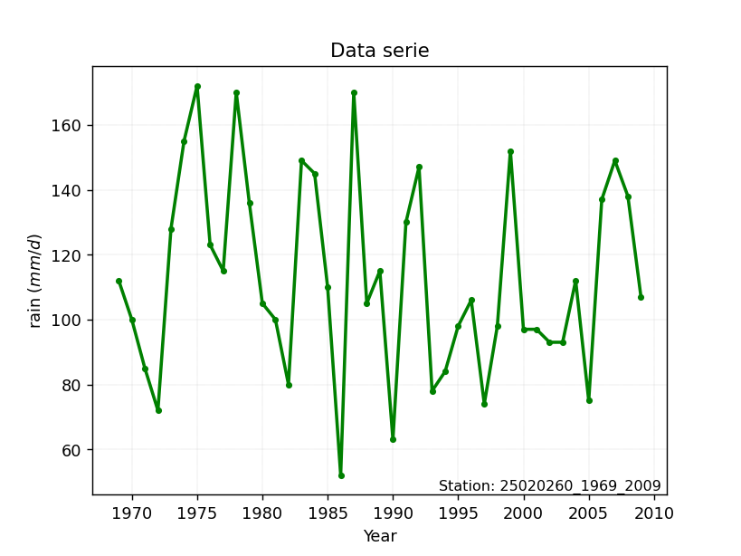

# Station: 25020260_1969_2009

</img>

## A. Active distributions from SciPy (52 of 104 available)

|   id | p_dist             |   n_parameter | fit_method   | label                                                                       | active   | ref                                                                                                        |
|-----:|:-------------------|--------------:|:-------------|:----------------------------------------------------------------------------|:---------|:-----------------------------------------------------------------------------------------------------------|
|    0 | alpha              |             3 | MLE          | Alpha                                                                       | True     | [:mortar_board:](https://docs.scipy.org/doc/scipy/reference/generated/scipy.stats.alpha.html)              |
|    1 | betaprime          |             4 | MLE          | Beta prime                                                                  | True     | [:mortar_board:](https://docs.scipy.org/doc/scipy/reference/generated/scipy.stats.betaprime.html)          |
|    2 | chi2               |             3 | MLE          | Chi²                                                                        | True     | [:mortar_board:](https://docs.scipy.org/doc/scipy/reference/generated/scipy.stats.chi2.html)               |
|    3 | crystalball        |             4 | MLE          | Crystalball                                                                 | True     | [:mortar_board:](https://docs.scipy.org/doc/scipy/reference/generated/scipy.stats.crystalball.html)        |
|    4 | dgamma             |             3 | MLE          | Double gamma                                                                | True     | [:mortar_board:](https://docs.scipy.org/doc/scipy/reference/generated/scipy.stats.dgamma.html)             |
|    5 | erlang             |             3 | MLE          | Erlang                                                                      | True     | [:mortar_board:](https://docs.scipy.org/doc/scipy/reference/generated/scipy.stats.erlang.html)             |
|    6 | expon              |             2 | MLE          | Exponential                                                                 | True     | [:mortar_board:](https://docs.scipy.org/doc/scipy/reference/generated/scipy.stats.expon.html)              |
|    7 | exponnorm          |             3 | MLE          | Exponentially modified Normal                                               | True     | [:mortar_board:](https://docs.scipy.org/doc/scipy/reference/generated/scipy.stats.exponnorm.html)          |
|    8 | f                  |             4 | MLE          | F                                                                           | True     | [:mortar_board:](https://docs.scipy.org/doc/scipy/reference/generated/scipy.stats.f.html)                  |
|    9 | fatiguelife        |             3 | MLE          | Fatigue-life (Birnbaum-Saunders)                                            | True     | [:mortar_board:](https://docs.scipy.org/doc/scipy/reference/generated/scipy.stats.fatiguelife.html)        |
|   10 | fisk               |             3 | MLE          | Fisk                                                                        | True     | [:mortar_board:](https://docs.scipy.org/doc/scipy/reference/generated/scipy.stats.fisk.html)               |
|   11 | gamma              |             3 | MLE          | Gamma                                                                       | True     | [:mortar_board:](https://docs.scipy.org/doc/scipy/reference/generated/scipy.stats.gamma.html)              |
|   12 | genexpon           |             5 | MLE          | Generalized exponential                                                     | True     | [:mortar_board:](https://docs.scipy.org/doc/scipy/reference/generated/scipy.stats.genexpon.html)           |
|   13 | geninvgauss        |             4 | MLE          | Generalized Inverse Gaussian                                                | True     | [:mortar_board:](https://docs.scipy.org/doc/scipy/reference/generated/scipy.stats.geninvgauss.html)        |
|   14 | genlogistic        |             3 | MLE          | Generalized logistic                                                        | True     | [:mortar_board:](https://docs.scipy.org/doc/scipy/reference/generated/scipy.stats.genlogistic.html)        |
|   15 | gibrat             |             2 | MM           | Gibrat                                                                      | True     | [:mortar_board:](https://docs.scipy.org/doc/scipy/reference/generated/scipy.stats.gibrat.html)             |
|   16 | gompertz           |             3 | MLE          | Gompertz (or truncated Gumbel)                                              | True     | [:mortar_board:](https://docs.scipy.org/doc/scipy/reference/generated/scipy.stats.gompertz.html)           |
|   17 | gumbel_l           |             2 | MM           | Gumbel Left Skew                                                            | True     | [:mortar_board:](https://docs.scipy.org/doc/scipy/reference/generated/scipy.stats.gumbel_l.html)           |
|   18 | gumbel_r           |             2 | MM           | Gumbel Right Skew                                                           | True     | [:mortar_board:](https://docs.scipy.org/doc/scipy/reference/generated/scipy.stats.gumbel_r.html)           |
|   19 | halflogistic       |             2 | MM           | Half-logistic                                                               | True     | [:mortar_board:](https://docs.scipy.org/doc/scipy/reference/generated/scipy.stats.halflogistic.html)       |
|   20 | halfnorm           |             2 | MM           | Half Normal                                                                 | True     | [:mortar_board:](https://docs.scipy.org/doc/scipy/reference/generated/scipy.stats.halfnorm.html)           |
|   21 | hypsecant          |             2 | MM           | hyperbolic secant                                                           | True     | [:mortar_board:](https://docs.scipy.org/doc/scipy/reference/generated/scipy.stats.hypsecant.html)          |
|   22 | invgamma           |             3 | MLE          | Inverted gamma                                                              | True     | [:mortar_board:](https://docs.scipy.org/doc/scipy/reference/generated/scipy.stats.invgamma.html)           |
|   23 | invgauss           |             3 | MLE          | Inverse Gaussian                                                            | True     | [:mortar_board:](https://docs.scipy.org/doc/scipy/reference/generated/scipy.stats.invgauss.html)           |
|   24 | invweibull         |             3 | MLE          | Inverted Weibull                                                            | True     | [:mortar_board:](https://docs.scipy.org/doc/scipy/reference/generated/scipy.stats.invweibull.html)         |
|   25 | johnsonsu          |             4 | MLE          | Johnson Su                                                                  | True     | [:mortar_board:](https://docs.scipy.org/doc/scipy/reference/generated/scipy.stats.johnsonsu.html)          |
|   26 | kappa3             |             3 | MLE          | Kappa 3                                                                     | True     | [:mortar_board:](https://docs.scipy.org/doc/scipy/reference/generated/scipy.stats.kappa3.html)             |
|   27 | kstwobign          |             2 | MLE          | Limiting distribution of scaled Kolmogorov-Smirnov two-sided test statistic | True     | [:mortar_board:](https://docs.scipy.org/doc/scipy/reference/generated/scipy.stats.kstwobign.html)          |
|   28 | laplace            |             2 | MM           | Laplace                                                                     | True     | [:mortar_board:](https://docs.scipy.org/doc/scipy/reference/generated/scipy.stats.laplace.html)            |
|   29 | laplace_asymmetric |             3 | MLE          | Asymmetric Laplace                                                          | True     | [:mortar_board:](https://docs.scipy.org/doc/scipy/reference/generated/scipy.stats.laplace_asymmetric.html) |
|   30 | levy_stable        |             4 | MLE          | Levy-stable                                                                 | True     | [:mortar_board:](https://docs.scipy.org/doc/scipy/reference/generated/scipy.stats.levy_stable.html)        |
|   31 | loggamma           |             3 | MLE          | Log gamma                                                                   | True     | [:mortar_board:](https://docs.scipy.org/doc/scipy/reference/generated/scipy.stats.loggamma.html)           |
|   32 | logistic           |             2 | MM           | Logistic (or Sech-squared)                                                  | True     | [:mortar_board:](https://docs.scipy.org/doc/scipy/reference/generated/scipy.stats.logistic.html)           |
|   33 | lognorm            |             3 | MLE          | Log Normal                                                                  | True     | [:mortar_board:](https://docs.scipy.org/doc/scipy/reference/generated/scipy.stats.lognorm.html)            |
|   34 | maxwell            |             2 | MM           | Maxwell                                                                     | True     | [:mortar_board:](https://docs.scipy.org/doc/scipy/reference/generated/scipy.stats.maxwell.html)            |
|   35 | mielke             |             4 | MLE          | Mielke Beta-Kappa / Dagum                                                   | True     | [:mortar_board:](https://docs.scipy.org/doc/scipy/reference/generated/scipy.stats.mielke.html)             |
|   36 | moyal              |             2 | MM           | Moyal                                                                       | True     | [:mortar_board:](https://docs.scipy.org/doc/scipy/reference/generated/scipy.stats.moyal.html)              |
|   37 | nakagami           |             3 | MLE          | Nakagami                                                                    | True     | [:mortar_board:](https://docs.scipy.org/doc/scipy/reference/generated/scipy.stats.nakagami.html)           |
|   38 | ncf                |             5 | MLE          | Non-central F distribution                                                  | True     | [:mortar_board:](https://docs.scipy.org/doc/scipy/reference/generated/scipy.stats.ncf.html)                |
|   39 | nct                |             4 | MLE          | Non-central Student’s t                                                     | True     | [:mortar_board:](https://docs.scipy.org/doc/scipy/reference/generated/scipy.stats.nct.html)                |
|   40 | norm               |             2 | MM           | Normal                                                                      | True     | [:mortar_board:](https://docs.scipy.org/doc/scipy/reference/generated/scipy.stats.norm.html)               |
|   41 | pareto             |             3 | MLE          | Pareto                                                                      | True     | [:mortar_board:](https://docs.scipy.org/doc/scipy/reference/generated/scipy.stats.pareto.html)             |
|   42 | pearson3           |             3 | MM           | Pearson type III                                                            | True     | [:mortar_board:](https://docs.scipy.org/doc/scipy/reference/generated/scipy.stats.pearson3.html)           |
|   43 | powerlognorm       |             4 | MLE          | Power log-normal                                                            | True     | [:mortar_board:](https://docs.scipy.org/doc/scipy/reference/generated/scipy.stats.powerlognorm.html)       |
|   44 | powernorm          |             3 | MLE          | Power normal                                                                | True     | [:mortar_board:](https://docs.scipy.org/doc/scipy/reference/generated/scipy.stats.powernorm.html)          |
|   45 | rayleigh           |             2 | MM           | Rayleigh                                                                    | True     | [:mortar_board:](https://docs.scipy.org/doc/scipy/reference/generated/scipy.stats.rayleigh.html)           |
|   46 | recipinvgauss      |             3 | MLE          | Reciprocal inverse Gaussian                                                 | True     | [:mortar_board:](https://docs.scipy.org/doc/scipy/reference/generated/scipy.stats.recipinvgauss.html)      |
|   47 | rice               |             3 | MLE          | Rice                                                                        | True     | [:mortar_board:](https://docs.scipy.org/doc/scipy/reference/generated/scipy.stats.rice.html)               |
|   48 | t                  |             3 | MLE          | Student’s t                                                                 | True     | [:mortar_board:](https://docs.scipy.org/doc/scipy/reference/generated/scipy.stats.t.html)                  |
|   49 | truncnorm          |             4 | MLE          | Truncated normal                                                            | True     | [:mortar_board:](https://docs.scipy.org/doc/scipy/reference/generated/scipy.stats.truncnorm.html)          |
|   50 | wald               |             2 | MM           | Wald                                                                        | True     | [:mortar_board:](https://docs.scipy.org/doc/scipy/reference/generated/scipy.stats.wald.html)               |
|   51 | weibull_min        |             3 | MLE          | Weibull minimum                                                             | True     | [:mortar_board:](https://docs.scipy.org/doc/scipy/reference/generated/scipy.stats.weibull_min.html)        |

> Gumbel and Lob-Gumbel probability distributions are not shown in the above table.  
> n_parameter = # arguments & localization & scale.  
> Fit methods: (MLE) maximum likelihood, (MM) L-moments.

## B. Probability distributions

### Cumulative distribution values - CDF (54 evalated, ordered by x ascending) 

|   id |   date |   x |            station |   m |     alpha |   alpha_pdf |   betaprime |   betaprime_pdf |      chi2 |   chi2_pdf |   crystalball |   crystalball_pdf |    dgamma |   dgamma_pdf |    erlang |   erlang_pdf |    expon |   expon_pdf |   exponnorm |   exponnorm_pdf |         f |      f_pdf |   fatiguelife |   fatiguelife_pdf |      fisk |   fisk_pdf |     gamma |   gamma_pdf |    genexpon |   genexpon_pdf |   geninvgauss |   geninvgauss_pdf |   genlogistic |   genlogistic_pdf |    gibrat |   gibrat_pdf |   gompertz |   gompertz_pdf |   gumbel_l |   gumbel_l_pdf |    gumbel_r |   gumbel_r_pdf |   halflogistic |   halflogistic_pdf |   halfnorm |   halfnorm_pdf |   hypsecant |   hypsecant_pdf |   invgamma |   invgamma_pdf |   invgauss |   invgauss_pdf |   invweibull |   invweibull_pdf |   johnsonsu |   johnsonsu_pdf |     kappa3 |   kappa3_pdf |   kstwobign |   kstwobign_pdf |   laplace |   laplace_pdf |   laplace_asymmetric |   laplace_asymmetric_pdf |   levy_stable |   levy_stable_pdf |   loggamma |   loggamma_pdf |   logistic |   logistic_pdf |   lognorm |   lognorm_pdf |    maxwell |   maxwell_pdf |    mielke |   mielke_pdf |       moyal |   moyal_pdf |   nakagami |   nakagami_pdf |        ncf |     ncf_pdf |       nct |    nct_pdf |      norm |   norm_pdf |      pareto |   pareto_pdf |   pearson3 |   pearson3_pdf |   powerlognorm |   powerlognorm_pdf |   powernorm |   powernorm_pdf |   rayleigh |   rayleigh_pdf |   recipinvgauss |   recipinvgauss_pdf |        rice |    rice_pdf |         t |      t_pdf |   truncnorm |   truncnorm_pdf |        wald |    wald_pdf |   weibull_min |   weibull_min_pdf |    zzgumbel |   gumbel_pdf |   zzloggumbel |   loggumbel_pdf |
|-----:|-------:|----:|-------------------:|----:|----------:|------------:|------------:|----------------:|----------:|-----------:|--------------:|------------------:|----------:|-------------:|----------:|-------------:|---------:|------------:|------------:|----------------:|----------:|-----------:|--------------:|------------------:|----------:|-----------:|----------:|------------:|------------:|---------------:|--------------:|------------------:|--------------:|------------------:|----------:|-------------:|-----------:|---------------:|-----------:|---------------:|------------:|---------------:|---------------:|-------------------:|-----------:|---------------:|------------:|----------------:|-----------:|---------------:|-----------:|---------------:|-------------:|-----------------:|------------:|----------------:|-----------:|-------------:|------------:|----------------:|----------:|--------------:|---------------------:|-------------------------:|--------------:|------------------:|-----------:|---------------:|-----------:|---------------:|----------:|--------------:|-----------:|--------------:|----------:|-------------:|------------:|------------:|-----------:|---------------:|-----------:|------------:|----------:|-----------:|----------:|-----------:|------------:|-------------:|-----------:|---------------:|---------------:|-------------------:|------------:|----------------:|-----------:|---------------:|----------------:|--------------------:|------------:|------------:|----------:|-----------:|------------:|----------------:|------------:|------------:|--------------:|------------------:|------------:|-------------:|--------------:|----------------:|
|    0 |   1986 |  52 | 25020260_1969_2009 |   1 | 0.0114387 |  0.00135624 |   0.0046153 |     0.000876778 | 0.0104907 | 0.00132968 |     0.0221256 |        0.00174343 | 0.0399619 |   0.00203515 | 0.0104907 |   0.00132968 | 0        |  0.0164329  |   0.0211535 |      0.00171156 | 0.0105174 | 0.00133087 |     0.0113698 |        0.0013602  | 0.016558  | 0.00143621 | 0.0104907 |  0.00132968 | 2.44852e-08 |     0.00365438 |    0.00235555 |        0.00127256 |     0.0109084 |        0.00119145 | 0         |   0          |  0.0732088 |     0.00238077 |  0.0416473 |    0.00172849  | 0.000604887 |    0.000190052 |      0         |         0          |  0         |     0          |   0.0269935 |      0.00140003 |  0.0115233 |     0.00136522 | 0.00805217 |     0.00124358 |    0.0180218 |      1.16663     |   0.012004  |      0.00138593 | 1.0603e-05 |   0.00833079 |  0.00292403 |     0.000807306 | 0.0290678 |    0.00135895 |            0.0209073 |               0.00127303 |     0.0321211 |        0.00220768 |  0.0246628 |     0.00184772 |  0.0253617 |     0.00148214 | 0.0119564 |    0.00138309 | 0.00365899 |    0.00100223 | 0.0148094 |   0.00146386 | 7.44569e-07 | 6.9517e-07  | 0          |     0          | 0.00412862 | 0.000808923 | 0.0149117 | 0.0014626  | 0.0221256 | 0.00174343 | 6.26864e-08 |   0.0164329  |  0.0160872 |     0.00156689 |       0.198722 |         0.0151122  |  0.00816843 |      0.00124069 |  0         |     0          |       0.011358  |          0.00135972 | 0           | 0           | 0.0221258 | 0.00174361 |   0.0221256 |      0.00174343 | 0           | 0           |    0.00659657 |        0.00143547 | 2.83045e-06 |            0 |   3.88635e-08 |               0 |
|    1 |   1990 |  63 | 25020260_1969_2009 |   2 | 0.0365183 |  0.00340593 |   0.0258844 |     0.00331769  | 0.0355548 | 0.0034325  |     0.0496697 |        0.00339149 | 0.0696163 |   0.0034765  | 0.0355548 |   0.0034325  | 0.165366 |  0.0137154  |   0.0484528 |      0.00338367 | 0.0355872 | 0.00343208 |     0.0364911 |        0.0034055  | 0.0406332 | 0.00311113 | 0.0355548 |  0.0034325  | 0.112835    |     0.0134342  |    0.0447976  |        0.00648809 |     0.0334047 |        0.00313383 | 0         |   0          |  0.104391  |     0.00333632 |  0.0655687 |    0.00268682  | 0.00957753  |    0.00188757  |      0         |         0          |  0         |     0          |   0.0477282 |      0.00246913 |  0.0367107 |     0.00341469 | 0.0338365  |     0.00370236 |    0.615199  |      0.00913965  |   0.0372602 |      0.00339945 | 0.0916493  |   0.00833079 |  0.0278644  |     0.00418121  | 0.0486131 |    0.00227272 |            0.0408489 |               0.00248727 |     0.0651138 |        0.00389313 |  0.0533301 |     0.00348393 |  0.0479135 |     0.00273527 | 0.0371692 |    0.00339399 | 0.028438   |    0.00372681 | 0.0395995 |   0.00320548 | 0.000950643 | 0.000411554 | 0.00471365 |     0.00248601 | 0.0244231  | 0.00322195  | 0.0402085 | 0.00331105 | 0.0496697 | 0.00339149 | 0.165366    |   0.0137154  |  0.0426495 |     0.00342138 |       0.347142 |         0.0117966  |  0.0336286  |      0.00362124 |  0.0149566 |     0.00370366 |       0.0364772 |          0.00340571 | 0           | 0           | 0.0496739 | 0.00339206 |   0.0496697 |      0.00339149 | 0           | 0           |    0.035629   |        0.00397218 | 0.000316129 |            0 |   0.000844758 |               0 |
|    2 |   1972 |  72 | 25020260_1969_2009 |   3 | 0.0779917 |  0.00591212 |   0.0697687 |     0.00656251  | 0.0774315 | 0.0059692  |     0.0884211 |        0.00529808 | 0.108592  |   0.00529908 | 0.0774315 |   0.0059692  | 0.28011  |  0.0118299  |   0.0873041 |      0.00533079 | 0.0774512 | 0.00596684 |     0.0778564 |        0.00588477 | 0.0779893 | 0.00532444 | 0.0774315 |  0.00596919 | 0.234637    |     0.0131858  |    0.11935    |        0.00982816 |     0.0729649 |        0.00581184 | 0         |   0          |  0.138805  |     0.00434828 |  0.094552  |    0.00381308  | 0.0418453   |    0.00563086  |      0         |         0          |  0         |     0          |   0.0759433 |      0.00390624 |  0.0782247 |     0.00591096 | 0.0799935  |     0.00664271 |    0.672152  |      0.00449506  |   0.0784038 |      0.00584211 | 0.166626   |   0.00833079 |  0.0829749  |     0.00806637  | 0.0740435 |    0.00346162 |            0.0706603 |               0.00430247 |     0.107999  |        0.00569009 |  0.0927294 |     0.00534389 |  0.0794669 |     0.00438624 | 0.078246  |    0.00583246 | 0.0747752  |    0.0066104  | 0.0778126 |   0.0054062  | 0.0175607   | 0.00414809  | 0.0489165  |     0.0071079  | 0.0676119  | 0.00651243  | 0.0797687 | 0.00558301 | 0.0884211 | 0.00529808 | 0.28011     |   0.0118298  |  0.0828901 |     0.00560842 |       0.441991 |         0.00937655 |  0.078224   |      0.00635578 |  0.0656509 |     0.00745735 |       0.0778483 |          0.00588583 | 0           | 0           | 0.0884325 | 0.00529915 |   0.0884211 |      0.00529808 | 0           | 0           |    0.0823106  |        0.00642591 | 0.00397167  |            0 |   0.0215903   |               0 |
|    3 |   1997 |  74 | 25020260_1969_2009 |   4 | 0.0904383 |  0.00653697 |   0.0836845 |     0.00735428  | 0.0899935 | 0.006595   |     0.0994965 |        0.00578028 | 0.119688  |   0.00580301 | 0.0899935 |   0.006595   | 0.303385 |  0.0114474  |   0.0984557 |      0.00582376 | 0.0900082 | 0.00659228 |     0.0902397 |        0.00650094 | 0.0892304 | 0.00592259 | 0.0899935 |  0.006595   | 0.260709    |     0.0128791  |    0.139549   |        0.0103579  |     0.0852893 |        0.00651745 | 0         |   0          |  0.147755  |     0.00460393 |  0.102476  |    0.0041142   | 0.0541638   |    0.00669591  |      0         |         0          |  0.0188438 |     0.0158956  |   0.0841626 |      0.00431961 |  0.0906658 |     0.00653265 | 0.0939779  |     0.00734198 |    0.680638  |      0.00400771  |   0.0906948 |      0.00645149 | 0.183288   |   0.00833079 |  0.0999239  |     0.00887454  | 0.0813008 |    0.0038009  |            0.0798112 |               0.00485966 |     0.119814  |        0.00612709 |  0.103882  |     0.0058113  |  0.0886936 |     0.00484644 | 0.0905166 |    0.00644073 | 0.08865    |    0.00726322 | 0.0892031 |   0.00598943 | 0.0273414   | 0.0056654   | 0.0639967  |     0.00796242 | 0.0814427  | 0.00731935  | 0.0915102 | 0.00616189 | 0.0994965 | 0.00578028 | 0.303386    |   0.0114474  |  0.0946522 |     0.00615641 |       0.46028  |         0.00891701 |  0.0915761  |      0.00699624 |  0.0813094 |     0.0081942  |       0.0902338 |          0.00650217 | 0           | 0           | 0.0995102 | 0.00578147 |   0.0994965 |      0.00578028 | 0           | 0           |    0.0957166  |        0.00697953 | 0.00619275  |            0 |   0.0339606   |               0 |
|    4 |   2005 |  75 | 25020260_1969_2009 |   5 | 0.0971337 |  0.00685428 |   0.0912371 |     0.00775064  | 0.0967468 | 0.00691183 |     0.1054    |        0.0060277  | 0.125623  |   0.0060698  | 0.0967468 |   0.00691183 | 0.314739 |  0.0112608  |   0.104406  |      0.00607669 | 0.0967587 | 0.00690894 |     0.0968968 |        0.00681369 | 0.0953083 | 0.00623456 | 0.0967468 |  0.00691183 | 0.273505    |     0.0127122  |    0.150026   |        0.0105934  |     0.0919877 |        0.00688012 | 0         |   0          |  0.152425  |     0.00473605 |  0.106669  |    0.00427233  | 0.061133    |    0.00724374  |      0         |         0          |  0.0347346 |     0.015885   |   0.0885922 |      0.0045412  |  0.097356  |     0.00684832 | 0.101494   |     0.00769096 |    0.684539  |      0.00379831  |   0.0973009 |      0.00676124 | 0.191619   |   0.00833079 |  0.108992   |     0.00925885  | 0.0851919 |    0.00398282 |            0.0848218 |               0.00516475 |     0.126052  |        0.00634906 |  0.109813  |     0.00605082 |  0.0936611 |     0.00508998 | 0.0971117 |    0.00674991 | 0.0960749  |    0.00758615 | 0.0953434 |   0.00629235 | 0.0334154   | 0.00648854  | 0.0721629  |     0.00836746 | 0.0889641  | 0.00772335  | 0.09782   | 0.00645835 | 0.1054    | 0.0060277  | 0.314739    |   0.0112608  |  0.100948  |     0.00643606 |       0.469087 |         0.00869749 |  0.098732   |      0.0073154  |  0.0896807 |     0.00854651 |       0.0968922 |          0.00681499 | 0           | 0           | 0.105415  | 0.00602896 |   0.1054    |      0.0060277  | 0           | 0           |    0.102834   |        0.00725453 | 0.00762862  |            0 |   0.0415616   |               0 |
|    5 |   1993 |  78 | 25020260_1969_2009 |   6 | 0.119136  |  0.00781513 |   0.116256  |     0.00892228  | 0.118915  | 0.00786741 |     0.124621  |        0.00679068 | 0.145102  |   0.00693128 | 0.118915  |   0.00786741 | 0.347702 |  0.0107191  |   0.123798  |      0.00685633 | 0.118918  | 0.00786411 |     0.118756  |        0.0077604  | 0.115468  | 0.00721538 | 0.118915  |  0.00786741 | 0.310851    |     0.0121783  |    0.182737   |        0.0111853  |     0.11429   |        0.00799268 | 0         |   0          |  0.167247  |     0.00514964 |  0.120233  |    0.00477816  | 0.0853574   |    0.00890611  |      0.019319  |         0.0193258  |  0.0822992 |     0.0158154  |   0.103284  |      0.00526966 |  0.119333  |     0.00780421 | 0.126121   |     0.00872088 |    0.695113  |      0.0032743   |   0.118992  |      0.00770087 | 0.216611   |   0.00833079 |  0.138392   |     0.010316    | 0.0980189 |    0.00458249 |            0.101821  |               0.00619985 |     0.14611   |        0.00702465 |  0.129065  |     0.00678835 |  0.110087  |     0.00587424 | 0.118766  |    0.00768785 | 0.120261   |    0.00853137 | 0.115629  |   0.00724049 | 0.0567548   | 0.00909008  | 0.0989872  |     0.00949281 | 0.113935   | 0.0089169   | 0.118553  | 0.00736751 | 0.124621  | 0.00679068 | 0.347703    |   0.0107191  |  0.121533  |     0.00729051 |       0.494236 |         0.00807802 |  0.122099   |      0.00825786 |  0.116829  |     0.00953439 |       0.118756  |          0.0077619  | 0           | 0           | 0.12464   | 0.00679213 |   0.124621  |      0.00679068 | 0           | 0           |    0.125821   |        0.0080664  | 0.013566    |            0 |   0.0701638   |               0 |
|    6 |   1982 |  80 | 25020260_1969_2009 |   7 | 0.135406  |  0.00845378 |   0.134857  |     0.0096732   | 0.135284  | 0.00849952 |     0.138722  |        0.0073122  | 0.159584  |   0.00755727 | 0.135284  |   0.00849952 | 0.368792 |  0.0103726  |   0.138042  |      0.00738876 | 0.13528   | 0.00849603 |     0.134908  |        0.00838968 | 0.130579  | 0.00789934 | 0.135284  |  0.00849952 | 0.334838    |     0.0118074  |    0.205422   |        0.0114883  |     0.131024  |        0.00874089 | 0         |   0          |  0.177834  |     0.00543961 |  0.130149  |    0.00514238  | 0.104264    |    0.00999431  |      0.0579225 |         0.0192681  |  0.113857  |     0.0157379  |   0.114357  |      0.00581136 |  0.135578  |     0.00843969 | 0.144228   |     0.00938162 |    0.701373  |      0.00299235  |   0.135021  |      0.00832725 | 0.233273   |   0.00833079 |  0.159651   |     0.0109306   | 0.107626  |    0.00503164 |            0.115008  |               0.00700276 |     0.160614  |        0.00747929 |  0.143144  |     0.00729176 |  0.122397  |     0.00644072 | 0.134768  |    0.00831316 | 0.137931   |    0.00913422 | 0.130766  |   0.00789907 | 0.0766776   | 0.0108228   | 0.118657   |     0.0101672  | 0.132538   | 0.00968058  | 0.133902  | 0.00798247 | 0.138722  | 0.0073122  | 0.368792    |   0.0103726  |  0.13669   |     0.00786652 |       0.510006 |         0.00769588 |  0.139226   |      0.00886508 |  0.136503  |     0.010132   |       0.13491   |          0.00839126 | 0           | 0           | 0.138744  | 0.00731377 |   0.138722  |      0.0073122  | 0           | 0           |    0.142482   |        0.00859178 | 0.0191646   |            0 |   0.0938904   |               0 |
|    7 |   1994 |  84 | 25020260_1969_2009 |   8 | 0.171722  |  0.00969169 |   0.17637   |     0.011051    | 0.171746  | 0.00971828 |     0.170081  |        0.00836801 | 0.192507  |   0.00893086 | 0.171746  |   0.00971828 | 0.408948 |  0.00971267 |   0.169748  |      0.00846476 | 0.171728  | 0.00971465 |     0.170931  |        0.00961062 | 0.164979  | 0.00930485 | 0.171746  |  0.00971828 | 0.38057     |     0.0110598  |    0.252268   |        0.0118917  |     0.168931  |        0.0101982  | 0         |   0          |  0.200805  |     0.00605282 |  0.15228   |    0.00593781  | 0.148353    |    0.0120023   |      0.134499  |         0.0189833  |  0.176384  |     0.0155099  |   0.13999   |      0.00703726 |  0.171826  |     0.00967225 | 0.184247   |     0.0106019  |    0.712399  |      0.00254275  |   0.170791  |      0.0095473  | 0.266596   |   0.00833079 |  0.205465   |     0.0119222   | 0.129757  |    0.00606631 |            0.146725  |               0.00893398 |     0.192345  |        0.00838361 |  0.174346  |     0.00830992 |  0.150577  |     0.00766917 | 0.170478  |    0.00953136 | 0.176743   |    0.0102492  | 0.165056  |   0.00925014 | 0.126393    | 0.0139242   | 0.161735   |     0.0113303  | 0.17412    | 0.0110767   | 0.168284  | 0.00920339 | 0.170081  | 0.00836801 | 0.408948    |   0.00971267 |  0.17045   |     0.00900845 |       0.539367 |         0.00699907 |  0.176997   |      0.0100007  |  0.179181  |     0.0111713  |       0.170941  |          0.00961229 | 3.80617e-05 | 0.00202466  | 0.17011   | 0.00836982 |   0.170081  |      0.00836801 | 8.6333e-06  | 6.97209e-05 |    0.178868   |        0.00958718 | 0.0352694   |            0 |   0.150878    |               0 |
|    8 |   1971 |  85 | 25020260_1969_2009 |   9 | 0.181562  |  0.00998732 |   0.187577  |     0.0113623   | 0.18161   | 0.0100081  |     0.178581  |        0.00863136 | 0.201621  |   0.00929796 | 0.18161   |   0.0100081  | 0.418582 |  0.00955437 |   0.178347  |      0.00873262 | 0.181588  | 0.0100045  |     0.180689  |        0.00990266 | 0.17446   | 0.00965719 | 0.18161   |  0.0100081  | 0.391538    |     0.0108748  |    0.264192   |        0.0119535  |     0.179303  |        0.0105453  | 0         |   0          |  0.206937  |     0.00621279 |  0.158324  |    0.00615081  | 0.160583    |    0.0124523   |      0.153431  |         0.0188779  |  0.191859  |     0.0154381  |   0.147195  |      0.00737394 |  0.181646  |     0.00996686 | 0.194989   |     0.0108802  |    0.714894  |      0.00244887  |   0.180485  |      0.00984016 | 0.274927   |   0.00833079 |  0.217488   |     0.0121193   | 0.135968  |    0.00635665 |            0.155936  |               0.00949486 |     0.20084   |        0.00860603 |  0.182783  |     0.0085638  |  0.158408  |     0.00799364 | 0.180156  |    0.00982384 | 0.187121   |    0.0105054  | 0.174475  |   0.00958908 | 0.14065     | 0.0145796   | 0.173193   |     0.011582   | 0.185355   | 0.0113908   | 0.177637  | 0.00950155 | 0.178581  | 0.00863136 | 0.418582    |   0.00955437 |  0.179598  |     0.00928748 |       0.546285 |         0.0068379  |  0.18713    |      0.010264   |  0.190466  |     0.0113974  |       0.1807    |          0.00990432 | 0.0285733   | 0.0542814   | 0.178611  | 0.00863322 |   0.178581  |      0.00863136 | 0.000999512 | 0.00280395  |    0.188573   |        0.0098218  | 0.0404552   |            0 |   0.166733    |               0 |
|    9 |   2002 |  93 | 25020260_1969_2009 |  10 | 0.270027  |  0.0120143  |   0.286745  |     0.0132351   | 0.27004   | 0.0119845  |     0.255808  |        0.0106328  | 0.28843   |   0.0124386  | 0.27004   |   0.0119845  | 0.490205 |  0.00837739 |   0.256495  |      0.0107573  | 0.269991  | 0.0119818  |     0.268402  |        0.0119163  | 0.262516  | 0.0122685  | 0.27004   |  0.0119845  | 0.472797    |     0.00946323 |    0.360426   |        0.0119751  |     0.273527  |        0.0128471  | 0.0709877 |   0.0421087  |  0.262001  |     0.00757579 |  0.214912  |    0.00805403  | 0.271757    |    0.0150116   |      0.299815  |         0.0175952  |  0.312497  |     0.0146644  |   0.218108  |      0.0104601  |  0.269932  |     0.0119922  | 0.289571   |     0.0126069  |    0.732013  |      0.00187618  |   0.267765  |      0.011874   | 0.341573   |   0.00833079 |  0.31874    |     0.0129922   | 0.197636  |    0.00923971 |            0.253804  |               0.015454   |     0.276482  |        0.0102584  |  0.25918   |     0.0104954  |  0.233181  |     0.0107214  | 0.267298  |    0.0118566  | 0.278261   |    0.0121533  | 0.261631  |   0.0121229  | 0.272051    | 0.0176036   | 0.272314   |     0.0130319  | 0.28476    | 0.0132579   | 0.26257   | 0.0116442  | 0.255808  | 0.0106328  | 0.490205    |   0.00837738 |  0.262288  |     0.0113095  |       0.596297 |         0.00571036 |  0.276623   |      0.0119873  |  0.287474  |     0.0127053  |       0.268425  |          0.0119176  | 0.889121    | 0.0539651   | 0.255855  | 0.010635   |   0.255808  |      0.0106328  | 0.212379    | 0.0349778   |    0.273919   |        0.0114276  | 0.100819    |            0 |   0.305505    |               0 |
|   10 |   2003 |  93 | 25020260_1969_2009 |  11 | 0.270027  |  0.0120143  |   0.286745  |     0.0132351   | 0.27004   | 0.0119845  |     0.255808  |        0.0106328  | 0.28843   |   0.0124386  | 0.27004   |   0.0119845  | 0.490205 |  0.00837739 |   0.256495  |      0.0107573  | 0.269991  | 0.0119818  |     0.268402  |        0.0119163  | 0.262516  | 0.0122685  | 0.27004   |  0.0119845  | 0.472797    |     0.00946323 |    0.360426   |        0.0119751  |     0.273527  |        0.0128471  | 0.0709877 |   0.0421087  |  0.262001  |     0.00757579 |  0.214912  |    0.00805403  | 0.271757    |    0.0150116   |      0.299815  |         0.0175952  |  0.312497  |     0.0146644  |   0.218108  |      0.0104601  |  0.269932  |     0.0119922  | 0.289571   |     0.0126069  |    0.732013  |      0.00187618  |   0.267765  |      0.011874   | 0.341573   |   0.00833079 |  0.31874    |     0.0129922   | 0.197636  |    0.00923971 |            0.253804  |               0.015454   |     0.276482  |        0.0102584  |  0.25918   |     0.0104954  |  0.233181  |     0.0107214  | 0.267298  |    0.0118566  | 0.278261   |    0.0121533  | 0.261631  |   0.0121229  | 0.272051    | 0.0176036   | 0.272314   |     0.0130319  | 0.28476    | 0.0132579   | 0.26257   | 0.0116442  | 0.255808  | 0.0106328  | 0.490205    |   0.00837738 |  0.262288  |     0.0113095  |       0.596297 |         0.00571036 |  0.276623   |      0.0119873  |  0.287474  |     0.0127053  |       0.268425  |          0.0119176  | 0.889121    | 0.0539651   | 0.255855  | 0.010635   |   0.255808  |      0.0106328  | 0.212379    | 0.0349778   |    0.273919   |        0.0114276  | 0.100819    |            0 |   0.305505    |               0 |
|   11 |   2000 |  97 | 25020260_1969_2009 |  12 | 0.319586  |  0.0127266  |   0.340744  |     0.0137117   | 0.319435  | 0.0126754  |     0.300108  |        0.0114959  | 0.341214  |   0.0139083  | 0.319435  |   0.0126754  | 0.522637 |  0.00784444 |   0.301296  |      0.0116207  | 0.319377  | 0.0126734  |     0.317579  |        0.012635   | 0.313702  | 0.0132784  | 0.319435  |  0.0126754  | 0.509339    |     0.00881481 |    0.407883   |        0.0117299  |     0.326465  |        0.0135666  | 0.254133  |   0.0443766  |  0.293744  |     0.00829908 |  0.249248  |    0.00912526  | 0.333       |    0.0155251   |      0.368467  |         0.0167082  |  0.370164  |     0.0141566  |   0.263353  |      0.0121677  |  0.31941   |     0.0127088  | 0.341056   |     0.0130915  |    0.739097  |      0.00167274  |   0.316805  |      0.0126097  | 0.374896   |   0.00833079 |  0.370827   |     0.0130108   | 0.238276  |    0.0111397  |            0.323798  |               0.0197159  |     0.318937  |        0.01095    |  0.302874  |     0.0113319  |  0.278765  |     0.0120554  | 0.31627   |    0.0125931  | 0.327988   |    0.0126744  | 0.312214  |   0.0131271  | 0.342966    | 0.0177212   | 0.325236   |     0.0133899  | 0.338816   | 0.013716    | 0.310862  | 0.0124675  | 0.300108  | 0.0114959  | 0.522637    |   0.00784443 |  0.309179  |     0.012107   |       0.618178 |         0.00523939 |  0.325774   |      0.0125527  |  0.33901   |     0.0130265  |       0.317607  |          0.0126359  | 0.989714    | 0.00722204  | 0.300163  | 0.0114981  |   0.300108  |      0.0114959  | 0.343422    | 0.0301006   |    0.320853   |        0.0120124  | 0.143625    |            0 |   0.376247    |               0 |
|   12 |   2001 |  97 | 25020260_1969_2009 |  13 | 0.319586  |  0.0127266  |   0.340744  |     0.0137117   | 0.319435  | 0.0126754  |     0.300108  |        0.0114959  | 0.341214  |   0.0139083  | 0.319435  |   0.0126754  | 0.522637 |  0.00784444 |   0.301296  |      0.0116207  | 0.319377  | 0.0126734  |     0.317579  |        0.012635   | 0.313702  | 0.0132784  | 0.319435  |  0.0126754  | 0.509339    |     0.00881481 |    0.407883   |        0.0117299  |     0.326465  |        0.0135666  | 0.254133  |   0.0443766  |  0.293744  |     0.00829908 |  0.249248  |    0.00912526  | 0.333       |    0.0155251   |      0.368467  |         0.0167082  |  0.370164  |     0.0141566  |   0.263353  |      0.0121677  |  0.31941   |     0.0127088  | 0.341056   |     0.0130915  |    0.739097  |      0.00167274  |   0.316805  |      0.0126097  | 0.374896   |   0.00833079 |  0.370827   |     0.0130108   | 0.238276  |    0.0111397  |            0.323798  |               0.0197159  |     0.318937  |        0.01095    |  0.302874  |     0.0113319  |  0.278765  |     0.0120554  | 0.31627   |    0.0125931  | 0.327988   |    0.0126744  | 0.312214  |   0.0131271  | 0.342966    | 0.0177212   | 0.325236   |     0.0133899  | 0.338816   | 0.013716    | 0.310862  | 0.0124675  | 0.300108  | 0.0114959  | 0.522637    |   0.00784443 |  0.309179  |     0.012107   |       0.618178 |         0.00523939 |  0.325774   |      0.0125527  |  0.33901   |     0.0130265  |       0.317607  |          0.0126359  | 0.989714    | 0.00722204  | 0.300163  | 0.0114981  |   0.300108  |      0.0114959  | 0.343422    | 0.0301006   |    0.320853   |        0.0120124  | 0.143625    |            0 |   0.376247    |               0 |
|   13 |   1995 |  98 | 25020260_1969_2009 |  14 | 0.332384  |  0.0128675  |   0.354493  |     0.0137817   | 0.33218   | 0.0128118  |     0.311702  |        0.0116904  | 0.355279  |   0.0142159  | 0.33218   |   0.0128118  | 0.530418 |  0.00771658 |   0.313014  |      0.0118139  | 0.33212   | 0.01281    |     0.330287  |        0.0127788  | 0.327085  | 0.0134848  | 0.33218   |  0.0128118  | 0.518076    |     0.00865912 |    0.419573   |        0.0116478  |     0.340097  |        0.0136938  | 0.297406  |   0.0421157  |  0.302135  |     0.0084823  |  0.258512  |    0.009403    | 0.348553    |    0.0155757   |      0.385055  |         0.0164665  |  0.384251  |     0.0140185  |   0.275734  |      0.0125935  |  0.332191  |     0.0128512  | 0.354189   |     0.0131711  |    0.740747  |      0.00162795  |   0.329491  |      0.0127581  | 0.383227   |   0.00833079 |  0.383823   |     0.0129787   | 0.249681  |    0.0116729  |            0.344127  |               0.0209537  |     0.329965  |        0.011104   |  0.314301  |     0.0115211  |  0.290979  |     0.0123705  | 0.328939  |    0.012742   | 0.340712   |    0.012771   | 0.325447  |   0.0133361  | 0.360648    | 0.017635    | 0.338654   |     0.0134429  | 0.352566   | 0.0137803   | 0.323417  | 0.0126398  | 0.311702  | 0.0116904  | 0.530418    |   0.00771658 |  0.321373  |     0.0122775  |       0.623363 |         0.00512992 |  0.338382   |      0.0126606  |  0.352061  |     0.0130732  |       0.330316  |          0.0127797  | 0.995038    | 0.0037509   | 0.31176   | 0.0116926  |   0.311702  |      0.0116904  | 0.372803    | 0.0286605   |    0.332927   |        0.0121327  | 0.155523    |            0 |   0.393533    |               0 |
|   14 |   1998 |  98 | 25020260_1969_2009 |  15 | 0.332384  |  0.0128675  |   0.354493  |     0.0137817   | 0.33218   | 0.0128118  |     0.311702  |        0.0116904  | 0.355279  |   0.0142159  | 0.33218   |   0.0128118  | 0.530418 |  0.00771658 |   0.313014  |      0.0118139  | 0.33212   | 0.01281    |     0.330287  |        0.0127788  | 0.327085  | 0.0134848  | 0.33218   |  0.0128118  | 0.518076    |     0.00865912 |    0.419573   |        0.0116478  |     0.340097  |        0.0136938  | 0.297406  |   0.0421157  |  0.302135  |     0.0084823  |  0.258512  |    0.009403    | 0.348553    |    0.0155757   |      0.385055  |         0.0164665  |  0.384251  |     0.0140185  |   0.275734  |      0.0125935  |  0.332191  |     0.0128512  | 0.354189   |     0.0131711  |    0.740747  |      0.00162795  |   0.329491  |      0.0127581  | 0.383227   |   0.00833079 |  0.383823   |     0.0129787   | 0.249681  |    0.0116729  |            0.344127  |               0.0209537  |     0.329965  |        0.011104   |  0.314301  |     0.0115211  |  0.290979  |     0.0123705  | 0.328939  |    0.012742   | 0.340712   |    0.012771   | 0.325447  |   0.0133361  | 0.360648    | 0.017635    | 0.338654   |     0.0134429  | 0.352566   | 0.0137803   | 0.323417  | 0.0126398  | 0.311702  | 0.0116904  | 0.530418    |   0.00771658 |  0.321373  |     0.0122775  |       0.623363 |         0.00512992 |  0.338382   |      0.0126606  |  0.352061  |     0.0130732  |       0.330316  |          0.0127797  | 0.995038    | 0.0037509   | 0.31176   | 0.0116926  |   0.311702  |      0.0116904  | 0.372803    | 0.0286605   |    0.332927   |        0.0121327  | 0.155523    |            0 |   0.393533    |               0 |
|   15 |   1970 | 100 | 25020260_1969_2009 |  16 | 0.358364  |  0.013102   |   0.382151  |     0.0138641   | 0.358041  | 0.0130391  |     0.335449  |        0.0120498  | 0.384225  |   0.0146928  | 0.358041  |   0.0130391  | 0.5456   |  0.00746709 |   0.337004  |      0.012169   | 0.357978  | 0.0130378  |     0.356097  |        0.0130212  | 0.354418  | 0.0138345  | 0.358041  |  0.0130391  | 0.535089    |     0.00835539 |    0.442687   |        0.0114621  |     0.367688  |        0.0138832  | 0.376694  |   0.0371443  |  0.319467  |     0.00884992 |  0.277881  |    0.00996777  | 0.379737    |    0.0155896   |      0.417489  |         0.0159633  |  0.412003  |     0.0137299  |   0.301759  |      0.0134258  |  0.358143  |     0.0130895  | 0.380652   |     0.0132809  |    0.743918  |      0.00154452  |   0.355269  |      0.01301    | 0.399889   |   0.00833079 |  0.409686   |     0.0128754   | 0.274153  |    0.0128169  |            0.384723  |               0.0196567  |     0.352461  |        0.0113863  |  0.337701  |     0.0118715  |  0.316325  |     0.0129673  | 0.354686  |    0.0129948  | 0.366415   |    0.0129234  | 0.352492  |   0.0136956  | 0.395655    | 0.0173487   | 0.365613   |     0.0135067  | 0.38021    | 0.0138505   | 0.349007  | 0.0129403  | 0.335449  | 0.0120498  | 0.5456      |   0.00746709 |  0.346239  |     0.0125802  |       0.633411 |         0.00492013 |  0.363887   |      0.0128354  |  0.37827   |     0.0131276  |       0.356128  |          0.0130218  | 0.999018    | 0.000848355 | 0.335511  | 0.012052   |   0.335449  |      0.0120498  | 0.427286    | 0.0258473   |    0.357407   |        0.0123406  | 0.180605    |            0 |   0.427391    |               0 |
|   16 |   1981 | 100 | 25020260_1969_2009 |  17 | 0.358364  |  0.013102   |   0.382151  |     0.0138641   | 0.358041  | 0.0130391  |     0.335449  |        0.0120498  | 0.384225  |   0.0146928  | 0.358041  |   0.0130391  | 0.5456   |  0.00746709 |   0.337004  |      0.012169   | 0.357978  | 0.0130378  |     0.356097  |        0.0130212  | 0.354418  | 0.0138345  | 0.358041  |  0.0130391  | 0.535089    |     0.00835539 |    0.442687   |        0.0114621  |     0.367688  |        0.0138832  | 0.376694  |   0.0371443  |  0.319467  |     0.00884992 |  0.277881  |    0.00996777  | 0.379737    |    0.0155896   |      0.417489  |         0.0159633  |  0.412003  |     0.0137299  |   0.301759  |      0.0134258  |  0.358143  |     0.0130895  | 0.380652   |     0.0132809  |    0.743918  |      0.00154452  |   0.355269  |      0.01301    | 0.399889   |   0.00833079 |  0.409686   |     0.0128754   | 0.274153  |    0.0128169  |            0.384723  |               0.0196567  |     0.352461  |        0.0113863  |  0.337701  |     0.0118715  |  0.316325  |     0.0129673  | 0.354686  |    0.0129948  | 0.366415   |    0.0129234  | 0.352492  |   0.0136956  | 0.395655    | 0.0173487   | 0.365613   |     0.0135067  | 0.38021    | 0.0138505   | 0.349007  | 0.0129403  | 0.335449  | 0.0120498  | 0.5456      |   0.00746709 |  0.346239  |     0.0125802  |       0.633411 |         0.00492013 |  0.363887   |      0.0128354  |  0.37827   |     0.0131276  |       0.356128  |          0.0130218  | 0.999018    | 0.000848355 | 0.335511  | 0.012052   |   0.335449  |      0.0120498  | 0.427286    | 0.0258473   |    0.357407   |        0.0123406  | 0.180605    |            0 |   0.427391    |               0 |
|   17 |   1980 | 105 | 25020260_1969_2009 |  18 | 0.424806  |  0.0134077  |   0.451377  |     0.0137543   | 0.424142  | 0.0133366  |     0.397576  |        0.0127512  | 0.457713  |   0.014053   | 0.424142  |   0.0133366  | 0.581443 |  0.00687809 |   0.399682  |      0.01285    | 0.424075  | 0.0133364  |     0.422201  |        0.0133552  | 0.42502   | 0.0143073  | 0.424142  |  0.0133366  | 0.575051    |     0.0076399  |    0.498631   |        0.0108936  |     0.437573  |        0.0139836  | 0.533467  |   0.0261141  |  0.366006  |     0.00976215 |  0.331316  |    0.0114098   | 0.456893    |    0.0151739   |      0.493981  |         0.0146154  |  0.478723  |     0.0129441  |   0.373642  |      0.0152437  |  0.424551  |     0.0134073  | 0.44721    |     0.0132782  |    0.751178  |      0.00136615  |   0.421376  |      0.0133674  | 0.441543   |   0.00833079 |  0.473033   |     0.012421    | 0.346347  |    0.0161921  |            0.475559  |               0.0167547  |     0.410845  |        0.0119259  |  0.398901  |     0.0125617  |  0.384401  |     0.0141889  | 0.420725  |    0.0133557  | 0.431534   |    0.0130687  | 0.422502  |   0.0142139  | 0.479603    | 0.0161318   | 0.433097   |     0.0134339  | 0.449286   | 0.0137082   | 0.41507   | 0.0134183  | 0.397576  | 0.0127512  | 0.581443    |   0.00687809 |  0.41058   |     0.0130973  |       0.656794 |         0.00444428 |  0.428702   |      0.0130347  |  0.443833  |     0.0130477  |       0.422233  |          0.0133552  | 0.999993    | 7.56189e-06 | 0.397649  | 0.0127532  |   0.397576  |      0.0127512  | 0.540703    | 0.0197807   |    0.420037   |        0.0126637  | 0.249546    |            0 |   0.506816    |               0 |
|   18 |   1988 | 105 | 25020260_1969_2009 |  19 | 0.424806  |  0.0134077  |   0.451377  |     0.0137543   | 0.424142  | 0.0133366  |     0.397576  |        0.0127512  | 0.457713  |   0.014053   | 0.424142  |   0.0133366  | 0.581443 |  0.00687809 |   0.399682  |      0.01285    | 0.424075  | 0.0133364  |     0.422201  |        0.0133552  | 0.42502   | 0.0143073  | 0.424142  |  0.0133366  | 0.575051    |     0.0076399  |    0.498631   |        0.0108936  |     0.437573  |        0.0139836  | 0.533467  |   0.0261141  |  0.366006  |     0.00976215 |  0.331316  |    0.0114098   | 0.456893    |    0.0151739   |      0.493981  |         0.0146154  |  0.478723  |     0.0129441  |   0.373642  |      0.0152437  |  0.424551  |     0.0134073  | 0.44721    |     0.0132782  |    0.751178  |      0.00136615  |   0.421376  |      0.0133674  | 0.441543   |   0.00833079 |  0.473033   |     0.012421    | 0.346347  |    0.0161921  |            0.475559  |               0.0167547  |     0.410845  |        0.0119259  |  0.398901  |     0.0125617  |  0.384401  |     0.0141889  | 0.420725  |    0.0133557  | 0.431534   |    0.0130687  | 0.422502  |   0.0142139  | 0.479603    | 0.0161318   | 0.433097   |     0.0134339  | 0.449286   | 0.0137082   | 0.41507   | 0.0134183  | 0.397576  | 0.0127512  | 0.581443    |   0.00687809 |  0.41058   |     0.0130973  |       0.656794 |         0.00444428 |  0.428702   |      0.0130347  |  0.443833  |     0.0130477  |       0.422233  |          0.0133552  | 0.999993    | 7.56189e-06 | 0.397649  | 0.0127532  |   0.397576  |      0.0127512  | 0.540703    | 0.0197807   |    0.420037   |        0.0126637  | 0.249546    |            0 |   0.506816    |               0 |
|   19 |   1996 | 106 | 25020260_1969_2009 |  20 | 0.438222  |  0.0134207  |   0.465097  |     0.0136825   | 0.437486  | 0.0133497  |     0.41038   |        0.0128541  | 0.47138   |   0.0132078  | 0.437486  |   0.0133497  | 0.588265 |  0.00676599 |   0.412581  |      0.0129472  | 0.43742   | 0.0133498  |     0.435568  |        0.0133751  | 0.43934   | 0.0143302  | 0.437486  |  0.0133497  | 0.582623    |     0.00750411 |    0.509461   |        0.0107655  |     0.451538  |        0.0139427  | 0.558675  |   0.0243245  |  0.375858  |     0.00994073 |  0.34287   |    0.0116983   | 0.471994    |    0.0150247   |      0.508456  |         0.0143349  |  0.491584  |     0.0127771  |   0.389034  |      0.0155348  |  0.437967  |     0.013423   | 0.460467   |     0.0132328  |    0.752529  |      0.00133484  |   0.434757  |      0.0133918  | 0.449873   |   0.00833079 |  0.485395   |     0.0123019   | 0.362923  |    0.0169671  |            0.492048  |               0.0162279  |     0.422811  |        0.012003   |  0.411515  |     0.0126643  |  0.398684  |     0.0143747  | 0.434095  |    0.0133809  | 0.444599   |    0.0130584  | 0.436736  |   0.0142482  | 0.495584    | 0.0158278   | 0.446506   |     0.0133822  | 0.462957   | 0.01363     | 0.428513  | 0.0134653  | 0.41038   | 0.0128541  | 0.588265    |   0.00676599 |  0.423709  |     0.0131576  |       0.661194 |         0.00435672 |  0.441738   |      0.0130346  |  0.456856  |     0.0129969  |       0.4356    |          0.013375   | 0.999998    | 2.48355e-06 | 0.410455  | 0.012856   |   0.41038   |      0.0128541  | 0.559966    | 0.0187561   |    0.432717   |        0.0126939  | 0.264165    |            0 |   0.521684    |               0 |
|   20 |   2009 | 107 | 25020260_1969_2009 |  21 | 0.451642  |  0.0134179  |   0.478737  |     0.0135955   | 0.450836  | 0.0133477  |     0.42328   |        0.0129436  | 0.483937  |   0.0117783  | 0.450836  |   0.0133477  | 0.594975 |  0.00665571 |   0.425571  |      0.0130307  | 0.45077   | 0.0133481  |     0.448946  |        0.0133796  | 0.453672  | 0.014329   | 0.450836  |  0.0133477  | 0.59006     |     0.00737068 |    0.520161   |        0.0106334  |     0.465452  |        0.0138828  | 0.582161  |   0.0226702  |  0.385887  |     0.0101171  |  0.354712  |    0.011985    | 0.486936    |    0.0148569   |      0.52265   |         0.0140519  |  0.504277  |     0.0126074  |   0.404701  |      0.0157938  |  0.451392  |     0.0134232  | 0.473671   |     0.0131734  |    0.753849  |      0.00130478  |   0.448154  |      0.0134005  | 0.458204   |   0.00833079 |  0.497634   |     0.0121749   | 0.380293  |    0.0177791  |            0.50802   |               0.0157176  |     0.434848  |        0.0120692  |  0.424226  |     0.0127543  |  0.413143  |     0.0145378  | 0.447482  |    0.0133906  | 0.457646   |    0.0130354  | 0.450991  |   0.0142589  | 0.511254    | 0.01551     | 0.459858   |     0.0133189  | 0.476542   | 0.013537    | 0.441995  | 0.0134959  | 0.42328   | 0.0129436  | 0.594975    |   0.00665571 |  0.43689   |     0.0132031  |       0.665508 |         0.0042715  |  0.454767   |      0.0130216  |  0.469823  |     0.0129353  |       0.448978  |          0.0133795  | 0.999999    | 7.71317e-07 | 0.423357  | 0.0129455  |   0.42328   |      0.0129436  | 0.578235    | 0.0177913   |    0.445421   |        0.0127126  | 0.278989    |            0 |   0.536192    |               0 |
|   21 |   1985 | 110 | 25020260_1969_2009 |  22 | 0.49178   |  0.0133179  |   0.519037  |     0.013251    | 0.490771  | 0.0132534  |     0.462421  |        0.0131297  | 0.509075  |   0.0103397  | 0.490771  |   0.0132534  | 0.614458 |  0.00633555 |   0.464944  |      0.0131959  | 0.490706  | 0.0132544  |     0.489004  |        0.0133029  | 0.496496  | 0.0141858  | 0.490771  |  0.0132534  | 0.611588    |     0.00698423 |    0.551444   |        0.0102172  |     0.506709  |        0.0135965  | 0.643563  |   0.0184355  |  0.417013  |     0.0106289  |  0.391937  |    0.0128255   | 0.53064     |    0.0142566   |      0.563521  |         0.0131937  |  0.541317  |     0.0120826  |   0.453003  |      0.0163492  |  0.491558  |     0.0133319  | 0.512835   |     0.0129167  |    0.757635  |      0.00122148  |   0.488292  |      0.0133354  | 0.483197   |   0.00833079 |  0.533539   |     0.0117522   | 0.437552  |    0.0204561  |            0.552984  |               0.0142812  |     0.471278  |        0.0122009  |  0.462806  |     0.0129456  |  0.457327  |     0.014881   | 0.487594  |    0.0133284  | 0.496566   |    0.0128932  | 0.493659  |   0.0141518  | 0.556284    | 0.0144977   | 0.499455   |     0.0130635  | 0.51664    | 0.0131757   | 0.482511  | 0.0134904  | 0.462421  | 0.0131297  | 0.614458    |   0.00633555 |  0.476605  |     0.0132514  |       0.677954 |         0.00402911 |  0.493688   |      0.0129074  |  0.508282  |     0.0126889  |       0.489034  |          0.0133025  | 1           | 1.65473e-08 | 0.462503  | 0.0131314  |   0.462421  |      0.0131297  | 0.627643    | 0.0152266   |    0.483565   |        0.0126998  | 0.324372    |            0 |   0.577514    |               0 |
|   22 |   2004 | 112 | 25020260_1969_2009 |  23 | 0.518286  |  0.0131782  |   0.545255  |     0.012959    | 0.517153  | 0.0131201  |     0.488743  |        0.013183   | 0.533589  |   0.0135733  | 0.517153  |   0.0131201  | 0.626924 |  0.00613072 |   0.491383  |      0.0132336  | 0.517091  | 0.0131214  |     0.515495  |        0.0131796  | 0.524676  | 0.0139801  | 0.517153  |  0.0131201  | 0.625308    |     0.00673779 |    0.571589   |        0.00992635 |     0.533641  |        0.0133255  | 0.678069  |   0.0161322  |  0.438596  |     0.010951   |  0.418126  |    0.0133592   | 0.558694    |    0.01379     |      0.589333  |         0.0126184  |  0.565123  |     0.0117217  |   0.485894  |      0.0165128  |  0.518098  |     0.0131981  | 0.538444   |     0.0126855  |    0.760027  |      0.00117105  |   0.514856  |      0.0132187  | 0.499858   |   0.00833079 |  0.556736   |     0.0114413   | 0.480438  |    0.022461   |            0.580653  |               0.0133972  |     0.495719  |        0.012232   |  0.488766  |     0.0130056  |  0.487206  |     0.0149804  | 0.514146  |    0.0132137  | 0.522207   |    0.0127403  | 0.521794  |   0.0139689  | 0.584578    | 0.0137935   | 0.525368   |     0.0128428  | 0.542697   | 0.0128743   | 0.509419  | 0.0134074  | 0.488743  | 0.013183   | 0.626924    |   0.00613071 |  0.503076  |     0.0132104  |       0.68586  |         0.00387787 |  0.519375   |      0.0127715  |  0.533453  |     0.012477   |       0.515525  |          0.0131789  | 1           | 9.68603e-10 | 0.488829  | 0.0131845  |   0.488743  |      0.013183   | 0.656601    | 0.0137612   |    0.508907   |        0.0126347  | 0.355082    |            0 |   0.60322     |               0 |
|   23 |   1969 | 112 | 25020260_1969_2009 |  24 | 0.518286  |  0.0131782  |   0.545255  |     0.012959    | 0.517153  | 0.0131201  |     0.488743  |        0.013183   | 0.533589  |   0.0135733  | 0.517153  |   0.0131201  | 0.626924 |  0.00613072 |   0.491383  |      0.0132336  | 0.517091  | 0.0131214  |     0.515495  |        0.0131796  | 0.524676  | 0.0139801  | 0.517153  |  0.0131201  | 0.625308    |     0.00673779 |    0.571589   |        0.00992635 |     0.533641  |        0.0133255  | 0.678069  |   0.0161322  |  0.438596  |     0.010951   |  0.418126  |    0.0133592   | 0.558694    |    0.01379     |      0.589333  |         0.0126184  |  0.565123  |     0.0117217  |   0.485894  |      0.0165128  |  0.518098  |     0.0131981  | 0.538444   |     0.0126855  |    0.760027  |      0.00117105  |   0.514856  |      0.0132187  | 0.499858   |   0.00833079 |  0.556736   |     0.0114413   | 0.480438  |    0.022461   |            0.580653  |               0.0133972  |     0.495719  |        0.012232   |  0.488766  |     0.0130056  |  0.487206  |     0.0149804  | 0.514146  |    0.0132137  | 0.522207   |    0.0127403  | 0.521794  |   0.0139689  | 0.584578    | 0.0137935   | 0.525368   |     0.0128428  | 0.542697   | 0.0128743   | 0.509419  | 0.0134074  | 0.488743  | 0.013183   | 0.626924    |   0.00613071 |  0.503076  |     0.0132104  |       0.68586  |         0.00387787 |  0.519375   |      0.0127715  |  0.533453  |     0.012477   |       0.515525  |          0.0131789  | 1           | 9.68603e-10 | 0.488829  | 0.0131845  |   0.488743  |      0.013183   | 0.656601    | 0.0137612   |    0.508907   |        0.0126347  | 0.355082    |            0 |   0.60322     |               0 |
|   24 |   1977 | 115 | 25020260_1969_2009 |  25 | 0.557383  |  0.0128677  |   0.583379  |     0.0124427   | 0.556095  | 0.0128225  |     0.528283  |        0.0131551  | 0.576792  |   0.0148426  | 0.556095  |   0.0128225  | 0.64487  |  0.00583581 |   0.531037  |      0.0131804  | 0.556038  | 0.0128244  |     0.554635  |        0.012894   | 0.565973  | 0.0135238  | 0.556095  |  0.0128225  | 0.644986    |     0.00638419 |    0.600696   |        0.00947593 |     0.572883  |        0.0128174  | 0.722047  |   0.0132983  |  0.472129  |     0.0113954  |  0.459332  |    0.0140968   | 0.598923    |    0.0130173   |      0.625897  |         0.0117593  |  0.599459  |     0.0111671  |   0.535404  |      0.0164269  |  0.557268  |     0.0128961  | 0.575885   |     0.0122603  |    0.763435  |      0.00110204  |   0.554125  |      0.0129409  | 0.524851   |   0.00833079 |  0.590319   |     0.0109415   | 0.547737  |    0.0211438  |            0.618978  |               0.0121728  |     0.532381  |        0.0121923  |  0.527793  |     0.012992   |  0.53213   |     0.0149283  | 0.553405  |    0.0129391  | 0.559987   |    0.0124311  | 0.563104  |   0.0135423  | 0.624356    | 0.0127253   | 0.563318   |     0.0124443  | 0.580549   | 0.0123469   | 0.549318  | 0.0131699  | 0.528283  | 0.0131551  | 0.64487     |   0.00583581 |  0.542487  |     0.0130427  |       0.697171 |         0.00366523 |  0.557283   |      0.0124849  |  0.57033   |     0.0120954  |       0.554662  |          0.0128931  | 1           | 9.07403e-12 | 0.528373  | 0.0131563  |   0.528283  |      0.0131551  | 0.694965    | 0.0118716   |    0.546566   |        0.0124551  | 0.401253    |            0 |   0.63906     |               0 |
|   25 |   1989 | 115 | 25020260_1969_2009 |  26 | 0.557383  |  0.0128677  |   0.583379  |     0.0124427   | 0.556095  | 0.0128225  |     0.528283  |        0.0131551  | 0.576792  |   0.0148426  | 0.556095  |   0.0128225  | 0.64487  |  0.00583581 |   0.531037  |      0.0131804  | 0.556038  | 0.0128244  |     0.554635  |        0.012894   | 0.565973  | 0.0135238  | 0.556095  |  0.0128225  | 0.644986    |     0.00638419 |    0.600696   |        0.00947593 |     0.572883  |        0.0128174  | 0.722047  |   0.0132983  |  0.472129  |     0.0113954  |  0.459332  |    0.0140968   | 0.598923    |    0.0130173   |      0.625897  |         0.0117593  |  0.599459  |     0.0111671  |   0.535404  |      0.0164269  |  0.557268  |     0.0128961  | 0.575885   |     0.0122603  |    0.763435  |      0.00110204  |   0.554125  |      0.0129409  | 0.524851   |   0.00833079 |  0.590319   |     0.0109415   | 0.547737  |    0.0211438  |            0.618978  |               0.0121728  |     0.532381  |        0.0121923  |  0.527793  |     0.012992   |  0.53213   |     0.0149283  | 0.553405  |    0.0129391  | 0.559987   |    0.0124311  | 0.563104  |   0.0135423  | 0.624356    | 0.0127253   | 0.563318   |     0.0124443  | 0.580549   | 0.0123469   | 0.549318  | 0.0131699  | 0.528283  | 0.0131551  | 0.64487     |   0.00583581 |  0.542487  |     0.0130427  |       0.697171 |         0.00366523 |  0.557283   |      0.0124849  |  0.57033   |     0.0120954  |       0.554662  |          0.0128931  | 1           | 9.07403e-12 | 0.528373  | 0.0131563  |   0.528283  |      0.0131551  | 0.694965    | 0.0118716   |    0.546566   |        0.0124551  | 0.401253    |            0 |   0.63906     |               0 |
|   26 |   1976 | 123 | 25020260_1969_2009 |  27 | 0.655479  |  0.0115533  |   0.676379  |     0.010748    | 0.654007  | 0.0115542  |     0.631345  |        0.0124669  | 0.69079   |   0.0130685  | 0.654007  |   0.0115542  | 0.688618 |  0.00511691 |   0.63402   |      0.0124224  | 0.653968  | 0.0115569  |     0.653189  |        0.0116391  | 0.66723   | 0.011667   | 0.654007  |  0.0115542  | 0.692558    |     0.00552901 |    0.671567   |        0.00823826 |     0.668657  |        0.0110494  | 0.806321  |   0.00826443 |  0.567077  |     0.0122463  |  0.57822   |    0.0154378   | 0.694082    |    0.0107461   |      0.711051  |         0.00955836 |  0.682727  |     0.0096431  |   0.660448  |      0.0144733  |  0.655667  |     0.0115992  | 0.668327   |     0.0107817  |    0.771614  |      0.000949365 |   0.653099  |      0.011694   | 0.591497   |   0.00833079 |  0.672133   |     0.00949341  | 0.688856  |    0.0145463  |            0.704912  |               0.0094274  |     0.627999  |        0.0115975  |  0.629766  |     0.012361   |  0.647571  |     0.0136844  | 0.652399  |    0.0117005  | 0.654913   |    0.0112166  | 0.664712  |   0.0117265  | 0.715079    | 0.0100053   | 0.657633   |     0.0110698  | 0.672726   | 0.0106431   | 0.650361  | 0.0119667  | 0.631345  | 0.0124669  | 0.688618    |   0.00511691 |  0.643303  |     0.0120359  |       0.72445  |         0.00317093 |  0.652822   |      0.0113115  |  0.662082  |     0.0107805  |       0.653208  |          0.0116378  | 1           | 3.17445e-18 | 0.631441  | 0.0124672  |   0.631345  |      0.0124669  | 0.774106    | 0.00819346  |    0.642938   |        0.0115388  | 0.520376    |            0 |   0.719708    |               0 |
|   27 |   1973 | 128 | 25020260_1969_2009 |  28 | 0.71062   |  0.01048    |   0.727191  |     0.0095705   | 0.709228  | 0.0105106  |     0.691712  |        0.0116345  | 0.751236  |   0.0110923  | 0.709228  |   0.0105106  | 0.713179 |  0.00471329 |   0.694067  |      0.0115526  | 0.709203  | 0.0105134  |     0.708828  |        0.0105917  | 0.722068  | 0.0102534  | 0.709228  |  0.0105106  | 0.718996    |     0.0050536  |    0.710832   |        0.007471   |     0.720785  |        0.0097941  | 0.842458  |   0.00630127 |  0.6289    |     0.0124295  |  0.656004  |    0.015564    | 0.744228    |    0.00932136  |      0.755639  |         0.00829404 |  0.728544  |     0.0086853  |   0.727933  |      0.0124693  |  0.711053  |     0.0105311  | 0.719572   |     0.00970457 |    0.776162  |      0.000871928 |   0.709006  |      0.0106431  | 0.633151   |   0.00833079 |  0.717269   |     0.00856164  | 0.753713  |    0.0115142  |            0.748477  |               0.0080356  |     0.684341  |        0.0109023  |  0.689709  |     0.0115714  |  0.712629  |     0.0122793  | 0.708349  |    0.0106537  | 0.708624   |    0.0102477  | 0.719851  |   0.0103116  | 0.761267    | 0.00849945  | 0.71048    |     0.0100551  | 0.723031   | 0.00947409  | 0.707604  | 0.0109001  | 0.691712  | 0.0116345  | 0.713179    |   0.00471329 |  0.701168  |     0.0110757  |       0.739633 |         0.00290747 |  0.707041   |      0.010354   |  0.713589  |     0.00980901 |       0.70884   |          0.0105903  | 1           | 4.97237e-23 | 0.691808  | 0.0116341  |   0.691712  |      0.0116345  | 0.81091     | 0.00659881  |    0.698602   |        0.0106978  | 0.588723    |            0 |   0.760354    |               0 |
|   28 |   1991 | 130 | 25020260_1969_2009 |  29 | 0.73112   |  0.0100184  |   0.745856  |     0.00909402  | 0.729801  | 0.0100599  |     0.714583  |        0.011231   | 0.772626  |   0.0103012  | 0.729801  |   0.0100599  | 0.722453 |  0.0045609  |   0.716762  |      0.011137   | 0.729781  | 0.0100626  |     0.72956   |        0.0101374  | 0.741995  | 0.0096738  | 0.729801  |  0.0100599  | 0.728924    |     0.00487508 |    0.725473   |        0.00717056 |     0.739865  |        0.00928592 | 0.854428  |   0.00568149 |  0.653747  |     0.0124081  |  0.687003  |    0.0154147   | 0.762319    |    0.00877168  |      0.771749  |         0.00781834 |  0.745535  |     0.00830625 |   0.752018  |      0.0116135  |  0.731656  |     0.0100702  | 0.738537   |     0.0092593  |    0.777878  |      0.000844035 |   0.729838  |      0.0101859  | 0.649812   |   0.00833079 |  0.734022   |     0.0081922   | 0.775697  |    0.0104864  |            0.764045  |               0.00753822 |     0.705814  |        0.0105662  |  0.712472  |     0.011185   |  0.736549  |     0.0116351  | 0.729203  |    0.0101978  | 0.728705   |    0.00983098 | 0.739891  |   0.0097277  | 0.777709    | 0.00794759  | 0.730167   |     0.00963014 | 0.741509   | 0.00900352  | 0.728937  | 0.0104296  | 0.714583  | 0.011231   | 0.722453    |   0.0045609  |  0.722888  |     0.0106403  |       0.74535  |         0.00281048 |  0.727336   |      0.00993904 |  0.732801  |     0.0094017  |       0.729569  |          0.010136   | 1           | 4.0659e-25  | 0.714679  | 0.0112305  |   0.714583  |      0.011231   | 0.823568    | 0.00606916  |    0.71962    |        0.0103169  | 0.614324    |            0 |   0.774789    |               0 |
|   29 |   1979 | 136 | 25020260_1969_2009 |  30 | 0.786949  |  0.00858414 |   0.79618   |     0.00769118  | 0.785961  | 0.0086512  |     0.777916  |        0.00984124 | 0.827668  |   0.00809757 | 0.785961  |   0.0086512  | 0.748512 |  0.00413267 |   0.779446  |      0.00972243 | 0.785957  | 0.00865359 |     0.786141  |        0.00871311 | 0.794894  | 0.0079766  | 0.785961  |  0.0086512  | 0.756652    |     0.00437644 |    0.765863   |        0.00630196 |     0.791076  |        0.00779797 | 0.883889  |   0.00422804 |  0.72718   |     0.0119738  |  0.776432  |    0.0141999   | 0.810233    |    0.00722895  |      0.814628  |         0.00650326 |  0.79202   |     0.00719658 |   0.814095  |      0.00911406 |  0.787791  |     0.00863325 | 0.790065   |     0.00791977 |    0.782711  |      0.000769184 |   0.786676  |      0.0087495  | 0.699797   |   0.00833079 |  0.779914   |     0.00711396  | 0.830561  |    0.00792144 |            0.805204  |               0.0062233  |     0.765827  |        0.00940434 |  0.775673  |     0.00984225 |  0.800252  |     0.00958464 | 0.786123  |    0.00876439 | 0.783806   |    0.0085267  | 0.793059  |   0.00801133 | 0.820824    | 0.00646731  | 0.784052   |     0.00832842 | 0.791358   | 0.00762453  | 0.787079  | 0.00893725 | 0.777916  | 0.00984124 | 0.748512    |   0.00413267 |  0.782539  |     0.00922118 |       0.761398 |         0.0025448  |  0.783081   |      0.00863116 |  0.785474  |     0.0081521  |       0.786143  |          0.00871192 | 1           | 6.03891e-32 | 0.778006  | 0.00984003 |   0.777916  |      0.00984124 | 0.855876    | 0.0047641   |    0.777837   |        0.00906594 | 0.684563    |            0 |   0.812643    |               0 |
|   30 |   2006 | 137 | 25020260_1969_2009 |  31 | 0.795413  |  0.00834329 |   0.803758  |     0.00746487  | 0.794493  | 0.00841345 |     0.787632  |        0.00959019 | 0.835598  |   0.00776271 | 0.794493  |   0.00841345 | 0.752611 |  0.00406531 |   0.789043  |      0.00946914 | 0.794492  | 0.00841577 |     0.794734  |        0.00847229 | 0.802736  | 0.00770648 | 0.794493  |  0.00841345 | 0.760989    |     0.00429844 |    0.772096   |        0.00616277 |     0.798754  |        0.00755966 | 0.888018  |   0.0040331  |  0.739091  |     0.0118446  |  0.790476  |    0.0138842   | 0.817342    |    0.00698965  |      0.82103   |         0.00630083 |  0.799126  |     0.00701686 |   0.823013  |      0.0087242  |  0.796304  |     0.00839133 | 0.797875   |     0.00769984 |    0.783475  |      0.00075785  |   0.795304  |      0.00850634 | 0.708128   |   0.00833079 |  0.786941   |     0.0069401   | 0.838301  |    0.00755963 |            0.811329  |               0.00602762 |     0.775126  |        0.00919321 |  0.785394  |     0.00959809 |  0.809664  |     0.00924042 | 0.794766  |    0.00852154 | 0.792222   |    0.00830566 | 0.800933  |   0.00773772 | 0.82718     | 0.00624548  | 0.792272   |     0.00811106 | 0.798871   | 0.00740283  | 0.79589   | 0.00868328 | 0.787632  | 0.00959019 | 0.752611    |   0.00406531 |  0.791637  |     0.00897446 |       0.763922 |         0.00250391 |  0.791601   |      0.00840843 |  0.793521  |     0.00794314 |       0.794734  |          0.00847114 | 1           | 3.63468e-33 | 0.78772   | 0.00958889 |   0.787632  |      0.00959019 | 0.860548    | 0.00458117  |    0.786793   |        0.00884622 | 0.695286    |            0 |   0.818233    |               0 |
|   31 |   2008 | 138 | 25020260_1969_2009 |  32 | 0.803636  |  0.00810317 |   0.811111  |     0.00724145  | 0.802788  | 0.00817608 |     0.797095  |        0.00933533 | 0.843197  |   0.00743805 | 0.802788  |   0.00817608 | 0.756643 |  0.00399905 |   0.798384  |      0.0092126  | 0.802789  | 0.00817831 |     0.803086  |        0.00823177 | 0.810309  | 0.00744128 | 0.802788  |  0.00817608 | 0.765249    |     0.00422183 |    0.778189   |        0.00602534 |     0.806196  |        0.00732499 | 0.891959  |   0.00384925 |  0.750864  |     0.0116988  |  0.80419   |    0.0135374   | 0.824214    |    0.00675583  |      0.827231  |         0.00610321 |  0.806054  |     0.00683891 |   0.831547  |      0.00834473 |  0.804574  |     0.00815    | 0.805465   |     0.0074817  |    0.784227  |      0.000746811 |   0.803689  |      0.00826342 | 0.716459   |   0.00833079 |  0.793795   |     0.00676822  | 0.845686  |    0.00721434 |            0.817261  |               0.0058381  |     0.784212  |        0.00897838 |  0.794868  |     0.00934979 |  0.818734  |     0.00889869 | 0.803166  |    0.00827888 | 0.800417   |    0.00808458 | 0.808536  |   0.00746909 | 0.833317    | 0.00603048  | 0.800274   |     0.00789441 | 0.806165   | 0.00718414  | 0.804446  | 0.00842933 | 0.797095  | 0.00933533 | 0.756643    |   0.00399905 |  0.800488  |     0.00872635 |       0.766406 |         0.00246391 |  0.799898   |      0.00818539 |  0.80136   |     0.00773475 |       0.803085  |          0.00823065 | 1           | 2.07219e-34 | 0.797182  | 0.00933394 |   0.797095  |      0.00933533 | 0.865041    | 0.00440667  |    0.795529   |        0.00862443 | 0.705727    |            0 |   0.823636    |               0 |
|   32 |   1984 | 145 | 25020260_1969_2009 |  33 | 0.854591  |  0.00647493 |   0.856563  |     0.0057752   | 0.854295  | 0.00655692 |     0.85604   |        0.00749822 | 0.888026  |   0.00545339 | 0.854295  |   0.00655692 | 0.783086 |  0.00356451 |   0.856465  |      0.00737843 | 0.854309  | 0.00655848 |     0.854903  |        0.0065898  | 0.856292  | 0.00574636 | 0.854295  |  0.00655692 | 0.793017    |     0.00372244 |    0.817129   |        0.00511595 |     0.85201   |        0.00580131 | 0.915055  |   0.00281646 |  0.828056  |     0.0102285  |  0.888534  |    0.010369    | 0.866166    |    0.00527649  |      0.865443  |         0.00485275 |  0.849704  |     0.00565023 |   0.881461  |      0.00601415 |  0.855818  |     0.00650967 | 0.852659   |     0.00602542 |    0.789203  |      0.000676908 |   0.855668  |      0.00660442 | 0.774774   |   0.00833079 |  0.837112   |     0.00562723  | 0.888756  |    0.0052008  |            0.85388   |               0.00466819 |     0.84162   |        0.00741104 |  0.854049  |     0.00754797 |  0.872974  |     0.00664905 | 0.855256  |    0.00662043 | 0.851645   |    0.00656331 | 0.854637  |   0.00575358 | 0.870715    | 0.00470535  | 0.850319   |     0.00641918 | 0.851335   | 0.00575247  | 0.857312  | 0.00669262 | 0.85604   | 0.00749822 | 0.783086    |   0.00356451 |  0.855482  |     0.00699331 |       0.782731 |         0.00220698 |  0.851768   |      0.00664444 |  0.85048   |     0.00631303 |       0.854895  |          0.00658901 | 1           | 8.90084e-44 | 0.856116  | 0.00749636 |   0.85604   |      0.00749822 | 0.892126    | 0.00338569  |    0.850391   |        0.00704845 | 0.771075    |            0 |   0.856731    |               0 |
|   33 |   1992 | 147 | 25020260_1969_2009 |  34 | 0.8671    |  0.0060361  |   0.867727  |     0.00539198  | 0.866967  | 0.00611761 |     0.870511  |        0.00697421 | 0.898449  |   0.00497582 | 0.866967  |   0.00611762 | 0.7901   |  0.00344926 |   0.870702  |      0.00685951 | 0.866984  | 0.00611896 |     0.867635  |        0.0061442  | 0.867353  | 0.00531877 | 0.866967  |  0.00611762 | 0.80033     |     0.00359093 |    0.827117   |        0.00487391 |     0.863216  |        0.00540829 | 0.920454  |   0.00258685 |  0.847969  |     0.00967617 |  0.908205  |    0.00929478  | 0.876343    |    0.00490446  |      0.87483   |         0.00453694 |  0.860684  |     0.00533117 |   0.892923  |      0.00545596 |  0.868392  |     0.00606657 | 0.86432    |     0.00563785 |    0.790539  |      0.00065904  |   0.868424  |      0.00615422 | 0.791436   |   0.00833079 |  0.848061   |     0.00532307  | 0.898686  |    0.00473656 |            0.862925  |               0.00437924 |     0.855987  |        0.00695663 |  0.868627  |     0.00703039 |  0.885688  |     0.00607068 | 0.868044  |    0.00617002 | 0.864352   |    0.00614566 | 0.865708  |   0.00532173 | 0.879797    | 0.0043801   | 0.862755   |     0.0060177  | 0.862464   | 0.00537903  | 0.870224  | 0.00622171 | 0.870511  | 0.00697421 | 0.7901      |   0.00344926 |  0.868987  |     0.00651292 |       0.787078 |         0.00214035 |  0.864631   |      0.00621983 |  0.862716  |     0.00592517 |       0.867626  |          0.00614351 | 1           | 1.15223e-46 | 0.870583  | 0.00697227 |   0.870511  |      0.00697421 | 0.898656    | 0.00314779  |    0.864041   |        0.0066021  | 0.78735     |            0 |   0.864837    |               0 |
|   34 |   2007 | 149 | 25020260_1969_2009 |  35 | 0.878746  |  0.00561262 |   0.878142  |     0.00502597  | 0.878775  | 0.00569245 |     0.883942  |        0.00645852 | 0.907954  |   0.00453523 | 0.878775  |   0.00569245 | 0.796886 |  0.00333774 |   0.88391   |      0.00635045 | 0.878795  | 0.0056936  |     0.87949   |        0.00571302 | 0.877584  | 0.00491715 | 0.878775  |  0.00569245 | 0.807384    |     0.00346406 |    0.83663    |        0.00464003 |     0.873656  |        0.00503509 | 0.925417  |   0.00238005 |  0.866728  |     0.00907525 |  0.925693  |    0.00818992  | 0.885798    |    0.00455434  |      0.883602  |         0.0042387  |  0.871036  |     0.00502214 |   0.903315  |      0.00494374 |  0.880094  |     0.00563862 | 0.87522    |     0.00526502 |    0.79184   |      0.000641994 |   0.880294  |      0.00571869 | 0.808097   |   0.00833079 |  0.858411   |     0.00502924  | 0.907729  |    0.00431376 |            0.871409  |               0.00410818 |     0.869449  |        0.00650557 |  0.882175  |     0.00651954 |  0.89728   |     0.0055265  | 0.879946  |    0.00573414 | 0.876235   |    0.00573909 | 0.875942  |   0.00491665 | 0.88825     | 0.00407633  | 0.874398   |     0.00562782 | 0.872863   | 0.00502253  | 0.882209  | 0.00576677 | 0.883942  | 0.00645852 | 0.796886    |   0.00333774 |  0.881542  |     0.00604474 |       0.791295 |         0.00207643 |  0.876654   |      0.00580597 |  0.874188  |     0.00554809 |       0.879479  |          0.00571244 | 1           | 1.20132e-49 | 0.88401   | 0.00645652 |   0.883942  |      0.00645852 | 0.90473     | 0.00292953  |    0.876804   |        0.00616259 | 0.80262     |            0 |   0.872418    |               0 |
|   35 |   1983 | 149 | 25020260_1969_2009 |  36 | 0.878746  |  0.00561262 |   0.878142  |     0.00502597  | 0.878775  | 0.00569245 |     0.883942  |        0.00645852 | 0.907954  |   0.00453523 | 0.878775  |   0.00569245 | 0.796886 |  0.00333774 |   0.88391   |      0.00635045 | 0.878795  | 0.0056936  |     0.87949   |        0.00571302 | 0.877584  | 0.00491715 | 0.878775  |  0.00569245 | 0.807384    |     0.00346406 |    0.83663    |        0.00464003 |     0.873656  |        0.00503509 | 0.925417  |   0.00238005 |  0.866728  |     0.00907525 |  0.925693  |    0.00818992  | 0.885798    |    0.00455434  |      0.883602  |         0.0042387  |  0.871036  |     0.00502214 |   0.903315  |      0.00494374 |  0.880094  |     0.00563862 | 0.87522    |     0.00526502 |    0.79184   |      0.000641994 |   0.880294  |      0.00571869 | 0.808097   |   0.00833079 |  0.858411   |     0.00502924  | 0.907729  |    0.00431376 |            0.871409  |               0.00410818 |     0.869449  |        0.00650557 |  0.882175  |     0.00651954 |  0.89728   |     0.0055265  | 0.879946  |    0.00573414 | 0.876235   |    0.00573909 | 0.875942  |   0.00491665 | 0.88825     | 0.00407633  | 0.874398   |     0.00562782 | 0.872863   | 0.00502253  | 0.882209  | 0.00576677 | 0.883942  | 0.00645852 | 0.796886    |   0.00333774 |  0.881542  |     0.00604474 |       0.791295 |         0.00207643 |  0.876654   |      0.00580597 |  0.874188  |     0.00554809 |       0.879479  |          0.00571244 | 1           | 1.20132e-49 | 0.88401   | 0.00645652 |   0.883942  |      0.00645852 | 0.90473     | 0.00292953  |    0.876804   |        0.00616259 | 0.80262     |            0 |   0.872418    |               0 |
|   36 |   1999 | 152 | 25020260_1969_2009 |  37 | 0.894669  |  0.00500918 |   0.892436  |     0.00450993  | 0.894931  | 0.00508449 |     0.902185  |        0.00570862 | 0.920647  |   0.00393937 | 0.894931  |   0.00508449 | 0.806656 |  0.00317719 |   0.901846  |      0.00561287 | 0.894954  | 0.00508534 |     0.895695  |        0.00509672 | 0.89149   | 0.00436275 | 0.894931  |  0.00508449 | 0.817501    |     0.00328212 |    0.850042   |        0.00430463 |     0.887966  |        0.0045126  | 0.932137  |   0.00210688 |  0.892511  |     0.00810042 |  0.947773  |    0.00653713  | 0.898722    |    0.00406888  |      0.895686  |         0.00382305 |  0.88543   |     0.0045782  |   0.917092  |      0.00425667 |  0.896085  |     0.00502827 | 0.890211   |     0.00473498 |    0.793729  |      0.00061785  |   0.896507  |      0.00509645 | 0.83309    |   0.00833079 |  0.872862   |     0.0046083   | 0.919804  |    0.00374925 |            0.883162  |               0.00373272 |     0.887965  |        0.00584188 |  0.900608  |     0.00577404 |  0.912715  |     0.00477686 | 0.896204  |    0.00511118 | 0.892566   |    0.00515328 | 0.88984   |   0.0043585  | 0.899841    | 0.00365829  | 0.890433   |     0.00506725 | 0.887167   | 0.00452001  | 0.898526  | 0.00511831 | 0.902185  | 0.00570862 | 0.806656    |   0.00317719 |  0.898656  |     0.00537063 |       0.797386 |         0.00198536 |  0.893169   |      0.00520888 |  0.89001   |     0.00500511 |       0.895683  |          0.00509629 | 1           | 2.69563e-54 | 0.902247  | 0.00570657 |   0.902185  |      0.00570862 | 0.913068    | 0.00263482  |    0.894324   |        0.00552137 | 0.823728    |            0 |   0.882885    |               0 |
|   37 |   1974 | 155 | 25020260_1969_2009 |  38 | 0.908842  |  0.00444678 |   0.905241  |     0.0040337   | 0.909321  | 0.00451561 |     0.918232  |        0.0049964  | 0.931662  |   0.00341537 | 0.909321  |   0.00451561 | 0.815957 |  0.00302436 |   0.917627  |      0.00491506 | 0.909346  | 0.00451618 |     0.91011   |        0.00452047 | 0.903817  | 0.00386398 | 0.909321  |  0.00451561 | 0.827086    |     0.00310973 |    0.862476   |        0.0039877  |     0.900776  |        0.00403429 | 0.938096  |   0.00187154 |  0.915271  |     0.00706636 |  0.965006  |    0.00497421  | 0.910257    |    0.00362889  |      0.906577  |         0.00344357 |  0.898529  |     0.00415862 |   0.928945  |      0.00365914 |  0.910305  |     0.00445897 | 0.903666   |     0.00424132 |    0.795548  |      0.000595275 |   0.910914  |      0.00451506 | 0.858082   |   0.00833079 |  0.886085   |     0.00421144  | 0.930299  |    0.00325861 |            0.89384   |               0.00339157 |     0.904523  |        0.00520169 |  0.916854  |     0.00506312 |  0.926021  |     0.00410765 | 0.910654  |    0.00452886 | 0.907187   |    0.00459992 | 0.90215   |   0.00385755 | 0.910241    | 0.00328185  | 0.904833   |     0.00453847 | 0.900021   | 0.00405619  | 0.912964  | 0.0045146  | 0.918232  | 0.0049964  | 0.815957    |   0.00302436 |  0.913805  |     0.00473611 |       0.803212 |         0.00189966 |  0.90794    |      0.00464422 |  0.904248  |     0.00449195 |       0.910097  |          0.00452018 | 1           | 3.71813e-59 | 0.918288  | 0.00499436 |   0.918232  |      0.0049964  | 0.920574    | 0.00237447  |    0.90996    |        0.00490803 | 0.842805    |            0 |   0.892365    |               0 |
|   38 |   1978 | 170 | 25020260_1969_2009 |  39 | 0.957967  |  0.00228079 |   0.950992  |     0.00221486  | 0.959149  | 0.00230426 |     0.970564  |        0.0022142  | 0.968035  |   0.00163782 | 0.959149  |   0.00230427 | 0.856164 |  0.00236365 |   0.969322  |      0.00220806 | 0.959174  | 0.00230391 |     0.959822  |        0.00228823 | 0.947055  | 0.00207854 | 0.959149  |  0.00230427 | 0.86797     |     0.00237447 |    0.911864   |        0.00266901 |     0.946673  |        0.0022396  | 0.959593  |   0.00108304 |  0.983384  |     0.00230036 |  0.998223  |    0.000477227 | 0.951439    |    0.00200811  |      0.946594  |         0.00200985 |  0.947216  |     0.00243745 |   0.967285  |      0.00169581 |  0.959384  |     0.00226497 | 0.951756   |     0.00231828 |    0.803738  |      0.00050146  |   0.960423  |      0.00227005 | 0.983044   |   0.00833079 |  0.936319   |     0.00258342  | 0.965431  |    0.00161613 |            0.934258  |               0.00210029 |     0.961445  |        0.00256438 |  0.97006   |     0.00225842 |  0.968524  |     0.00182794 | 0.960327  |    0.00227794 | 0.958424   |    0.00239084 | 0.945301  |   0.00207612 | 0.948181    | 0.00190004  | 0.955912   |     0.00242066 | 0.946463   | 0.00227855  | 0.961953  | 0.00221605 | 0.970564  | 0.0022142  | 0.856164    |   0.00236365 |  0.964823  |     0.0022682  |       0.828873 |         0.001539   |  0.959463   |      0.00238855 |  0.955061  |     0.00242438 |       0.959809  |          0.00228842 | 1           | 1.26108e-86 | 0.970592  | 0.00221266 |   0.970564  |      0.0022142  | 0.94858     | 0.0014481   |    0.963587   |        0.00241589 | 0.912789    |            0 |   0.928162    |               0 |
|   39 |   1987 | 170 | 25020260_1969_2009 |  40 | 0.957967  |  0.00228079 |   0.950992  |     0.00221486  | 0.959149  | 0.00230426 |     0.970564  |        0.0022142  | 0.968035  |   0.00163782 | 0.959149  |   0.00230427 | 0.856164 |  0.00236365 |   0.969322  |      0.00220806 | 0.959174  | 0.00230391 |     0.959822  |        0.00228823 | 0.947055  | 0.00207854 | 0.959149  |  0.00230427 | 0.86797     |     0.00237447 |    0.911864   |        0.00266901 |     0.946673  |        0.0022396  | 0.959593  |   0.00108304 |  0.983384  |     0.00230036 |  0.998223  |    0.000477227 | 0.951439    |    0.00200811  |      0.946594  |         0.00200985 |  0.947216  |     0.00243745 |   0.967285  |      0.00169581 |  0.959384  |     0.00226497 | 0.951756   |     0.00231828 |    0.803738  |      0.00050146  |   0.960423  |      0.00227005 | 0.983044   |   0.00833079 |  0.936319   |     0.00258342  | 0.965431  |    0.00161613 |            0.934258  |               0.00210029 |     0.961445  |        0.00256438 |  0.97006   |     0.00225842 |  0.968524  |     0.00182794 | 0.960327  |    0.00227794 | 0.958424   |    0.00239084 | 0.945301  |   0.00207612 | 0.948181    | 0.00190004  | 0.955912   |     0.00242066 | 0.946463   | 0.00227855  | 0.961953  | 0.00221605 | 0.970564  | 0.0022142  | 0.856164    |   0.00236365 |  0.964823  |     0.0022682  |       0.828873 |         0.001539   |  0.959463   |      0.00238855 |  0.955061  |     0.00242438 |       0.959809  |          0.00228842 | 1           | 1.26108e-86 | 0.970592  | 0.00221266 |   0.970564  |      0.0022142  | 0.94858     | 0.0014481   |    0.963587   |        0.00241589 | 0.912789    |            0 |   0.928162    |               0 |
|   40 |   1975 | 172 | 25020260_1969_2009 |  41 | 0.962315  |  0.00206947 |   0.95524   |     0.00203563  | 0.963538  | 0.00208698 |     0.974724  |        0.00194994 | 0.971152  |   0.00148186 | 0.963538  |   0.00208698 | 0.860814 |  0.00228723 |   0.973478  |      0.00195162 | 0.963562  | 0.00208656 |     0.964177  |        0.00206997 | 0.951044  | 0.00191285 | 0.963538  |  0.00208698 | 0.872635    |     0.00229058 |    0.917057   |        0.00252447 |     0.950975  |        0.00206499 | 0.961687  |   0.00101192 |  0.987523  |     0.00184815 |  0.998985  |    0.000296599 | 0.955297    |    0.00185233  |      0.95047   |         0.0018677  |  0.951906  |     0.0022546  |   0.970507  |      0.00152928 |  0.963697  |     0.0020512  | 0.956198   |     0.00212596 |    0.80473   |      0.000490924 |   0.964742  |      0.00205148 | 0.999706   |   0.00832399 |  0.94131    |     0.00240902  | 0.968517  |    0.00147187 |            0.938328  |               0.00197029 |     0.966303  |        0.0022966  |  0.974304  |     0.00198965 |  0.971981  |     0.00163296 | 0.96466   |    0.00205861 | 0.96298    |    0.00216792 | 0.949286  |   0.00191185 | 0.951845    | 0.00176602  | 0.960535   |     0.00220483 | 0.950842   | 0.00210216  | 0.966162  | 0.00199633 | 0.974724  | 0.00194994 | 0.860814    |   0.00228723 |  0.969117  |     0.00202955 |       0.83191  |         0.00149816 |  0.964011   |      0.00216139 |  0.959695  |     0.00221218 |       0.964164  |          0.00207018 | 1           | 1.09502e-90 | 0.974749  | 0.00194851 |   0.974724  |      0.00194994 | 0.951387    | 0.00135951  |    0.968164   |        0.00216453 | 0.919506    |            0 |   0.931783    |               0 |

### Empirical: emp_california

#### 1. Empirical values

|   id |   date |   x |   m | empirical_dist   |   empirical |   empirical_tr |
|-----:|-------:|----:|----:|:-----------------|------------:|---------------:|
|    0 |   1986 |  52 |   1 | emp_california   |   0.0243902 |        1.025   |
|    1 |   1990 |  63 |   2 | emp_california   |   0.0487805 |        1.05128 |
|    2 |   1972 |  72 |   3 | emp_california   |   0.0731707 |        1.07895 |
|    3 |   1997 |  74 |   4 | emp_california   |   0.097561  |        1.10811 |
|    4 |   2005 |  75 |   5 | emp_california   |   0.121951  |        1.13889 |
|    5 |   1993 |  78 |   6 | emp_california   |   0.146341  |        1.17143 |
|    6 |   1982 |  80 |   7 | emp_california   |   0.170732  |        1.20588 |
|    7 |   1994 |  84 |   8 | emp_california   |   0.195122  |        1.24242 |
|    8 |   1971 |  85 |   9 | emp_california   |   0.219512  |        1.28125 |
|    9 |   2002 |  93 |  10 | emp_california   |   0.243902  |        1.32258 |
|   10 |   2003 |  93 |  11 | emp_california   |   0.268293  |        1.36667 |
|   11 |   2000 |  97 |  12 | emp_california   |   0.292683  |        1.41379 |
|   12 |   2001 |  97 |  13 | emp_california   |   0.317073  |        1.46429 |
|   13 |   1995 |  98 |  14 | emp_california   |   0.341463  |        1.51852 |
|   14 |   1998 |  98 |  15 | emp_california   |   0.365854  |        1.57692 |
|   15 |   1970 | 100 |  16 | emp_california   |   0.390244  |        1.64    |
|   16 |   1981 | 100 |  17 | emp_california   |   0.414634  |        1.70833 |
|   17 |   1980 | 105 |  18 | emp_california   |   0.439024  |        1.78261 |
|   18 |   1988 | 105 |  19 | emp_california   |   0.463415  |        1.86364 |
|   19 |   1996 | 106 |  20 | emp_california   |   0.487805  |        1.95238 |
|   20 |   2009 | 107 |  21 | emp_california   |   0.512195  |        2.05    |
|   21 |   1985 | 110 |  22 | emp_california   |   0.536585  |        2.15789 |
|   22 |   2004 | 112 |  23 | emp_california   |   0.560976  |        2.27778 |
|   23 |   1969 | 112 |  24 | emp_california   |   0.585366  |        2.41176 |
|   24 |   1977 | 115 |  25 | emp_california   |   0.609756  |        2.5625  |
|   25 |   1989 | 115 |  26 | emp_california   |   0.634146  |        2.73333 |
|   26 |   1976 | 123 |  27 | emp_california   |   0.658537  |        2.92857 |
|   27 |   1973 | 128 |  28 | emp_california   |   0.682927  |        3.15385 |
|   28 |   1991 | 130 |  29 | emp_california   |   0.707317  |        3.41667 |
|   29 |   1979 | 136 |  30 | emp_california   |   0.731707  |        3.72727 |
|   30 |   2006 | 137 |  31 | emp_california   |   0.756098  |        4.1     |
|   31 |   2008 | 138 |  32 | emp_california   |   0.780488  |        4.55556 |
|   32 |   1984 | 145 |  33 | emp_california   |   0.804878  |        5.125   |
|   33 |   1992 | 147 |  34 | emp_california   |   0.829268  |        5.85714 |
|   34 |   2007 | 149 |  35 | emp_california   |   0.853659  |        6.83333 |
|   35 |   1983 | 149 |  36 | emp_california   |   0.878049  |        8.2     |
|   36 |   1999 | 152 |  37 | emp_california   |   0.902439  |       10.25    |
|   37 |   1974 | 155 |  38 | emp_california   |   0.926829  |       13.6667  |
|   38 |   1978 | 170 |  39 | emp_california   |   0.95122   |       20.5     |
|   39 |   1987 | 170 |  40 | emp_california   |   0.97561   |       41       |
|   40 |   1975 | 172 |  41 | emp_california   |   1         |      inf       |

####  2. Parameters & Kolmogorov-Smirnov fit test (sorted by Δ)

|   id | empirical_dist   | p_dist             |     delta |   deltao | eval    |   fit |   n |             loc |           scale | shape                 | shape1                 | shape2              | shape3   |   best_fit |   best_fit_sort |
|-----:|:-----------------|:-------------------|----------:|---------:|:--------|------:|----:|----------------:|----------------:|:----------------------|:-----------------------|:--------------------|:---------|-----------:|----------------:|
|    0 | emp_california   | invgauss           | 0.0583577 | 0.212396 | Δo > Δ  |     1 |  41 |   -33.2548      |  3099.12        | 0.046979298406326864  |                        |                     |          |          1 |               1 |
|    1 | emp_california   | ncf                | 0.0596507 | 0.212396 | Δo > Δ  |     1 |  41 |    -0.792323    |     4.48854e-05 | 5.230113577426726e-05 | 47.40908604697857      | 127.04026694225536  |          |          0 |               2 |
|    2 | emp_california   | genlogistic        | 0.0612629 | 0.212396 | Δo > Δ  |     1 |  41 |    75.1459      |    22.9803      | 3.426698241353212     |                        |                     |          |          0 |               3 |
|    3 | emp_california   | rayleigh           | 0.0638162 | 0.212396 | Δo > Δ  |     1 |  41 |    54.984       |    46.1733      |                       |                        |                     |          |          0 |               4 |
|    4 | emp_california   | betaprime          | 0.0644731 | 0.212396 | Δo > Δ  |     1 |  41 |    -0.719607    |   153.015       | 23.464938813550702    | 32.71931009990233      |                     |          |          0 |               5 |
|    5 | emp_california   | fisk               | 0.0681734 | 0.212396 | Δo > Δ  |     1 |  41 |   -52.6432      |   162.89        | 9.229366961850921     |                        |                     |          |          0 |               6 |
|    6 | emp_california   | nakagami           | 0.0708286 | 0.212396 | Δo > Δ  |     1 |  41 |    59.4896      |    61.6778      | 0.9271496898201659    |                        |                     |          |          0 |               7 |
|    7 | emp_california   | mielke             | 0.0710427 | 0.212396 | Δo > Δ  |     1 |  41 |    -0.723042    |   117.887       | 5.231435891056284     | 6.916455979425675      |                     |          |          0 |               8 |
|    8 | emp_california   | laplace_asymmetric | 0.0734964 | 0.212396 | Δo > Δ  |     1 |  41 |    98           |    22.673       | 0.7243509460082292    |                        |                     |          |          0 |               9 |
|    9 | emp_california   | maxwell            | 0.0741589 | 0.212396 | Δo > Δ  |     1 |  41 |    41.1743      |    44.9184      |                       |                        |                     |          |          0 |              10 |
|   10 | emp_california   | alpha              | 0.0767631 | 0.212396 | Δo > Δ  |     1 |  41 |  -300.955       |  5639.05        | 13.70122890595497     |                        |                     |          |          0 |              11 |
|   11 | emp_california   | powernorm          | 0.076863  | 0.212396 | Δo > Δ  |     1 |  41 |    68.8999      |    12.4725      | 0.08934491228544572   |                        |                     |          |          0 |              12 |
|   12 | emp_california   | invgamma           | 0.0768784 | 0.212396 | Δo > Δ  |     1 |  41 |  -176.145       | 26180.4         | 91.6242753127334      |                        |                     |          |          0 |              13 |
|   13 | emp_california   | chi2               | 0.0780513 | 0.212396 | Δo > Δ  |     1 |  41 |   -30.2052      |     3.24324     | 44.10990004396078     |                        |                     |          |          0 |              14 |
|   14 | emp_california   | erlang             | 0.0780513 | 0.212396 | Δo > Δ  |     1 |  41 |   -30.2052      |     6.48648     | 22.054946009034502    |                        |                     |          |          0 |              15 |
|   15 | emp_california   | gamma              | 0.0780513 | 0.212396 | Δo > Δ  |     1 |  41 |   -30.2053      |     6.48647     | 22.05496120649381     |                        |                     |          |          0 |              16 |
|   16 | emp_california   | f                  | 0.0781085 | 0.212396 | Δo > Δ  |     1 |  41 |   -30.726       |   143.569       | 44.510260096428496    | 27765.615943854253     |                     |          |          0 |              17 |
|   17 | emp_california   | kstwobign          | 0.0781445 | 0.212396 | Δo > Δ  |     1 |  41 |     0.0814837   |   129.43        |                       |                        |                     |          |          0 |              18 |
|   18 | emp_california   | gumbel_r           | 0.078526  | 0.212396 | Δo > Δ  |     1 |  41 |    99.2396      |    23.5857      |                       |                        |                     |          |          0 |              19 |
|   19 | emp_california   | recipinvgauss      | 0.0794843 | 0.212396 | Δo > Δ  |     1 |  41 |  -111.724       |     4.04996     | 0.018364821470664677  |                        |                     |          |          0 |              20 |
|   20 | emp_california   | fatiguelife        | 0.0795117 | 0.212396 | Δo > Δ  |     1 |  41 |  -112.642       |   223.47        | 0.13464555367263942   |                        |                     |          |          0 |              21 |
|   21 | emp_california   | johnsonsu          | 0.0800218 | 0.212396 | Δo > Δ  |     1 |  41 |  -110.811       |    52.7695      | -16.26517085889698    | 7.592153226254149      |                     |          |          0 |              22 |
|   22 | emp_california   | lognorm            | 0.0807416 | 0.212396 | Δo > Δ  |     1 |  41 |  -124.303       |   235.236       | 0.12768577963584082   |                        |                     |          |          0 |              23 |
|   23 | emp_california   | zzloggumbel        | 0.0835638 | 0.212396 | Δo > Δ  |     1 |  41 |     4.56975     |     0.218021    | 0.5441978529407195    | 1.1435823657845239     |                     |          |          0 |              24 |
|   24 | emp_california   | nct                | 0.0848283 | 0.212396 | Δo > Δ  |     1 |  41 |    -0.217591    |    26.3722      | 36.12696128763194     | 4.197437218617627      |                     |          |          0 |              25 |
|   25 | emp_california   | halfnorm           | 0.0872166 | 0.212396 | Δo > Δ  |     1 |  41 |    72.8147      |    50.1813      |                       |                        |                     |          |          0 |              26 |
|   26 | emp_california   | weibull_min        | 0.0875803 | 0.212396 | Δo > Δ  |     1 |  41 |    40.0827      |    81.9854      | 2.60190181255381      |                        |                     |          |          0 |              27 |
|   27 | emp_california   | pearson3           | 0.091659  | 0.212396 | Δo > Δ  |     1 |  41 |   112.854       |    30.2499      | 0.2156468372746339    |                        |                     |          |          0 |              28 |
|   28 | emp_california   | moyal              | 0.0940541 | 0.212396 | Δo > Δ  |     1 |  41 |    95.5549      |    13.6172      |                       |                        |                     |          |          0 |              29 |
|   29 | emp_california   | dgamma             | 0.0959612 | 0.212396 | Δo > Δ  |     1 |  41 |   108.815       |    17.7646      | 1.3891908530005783    |                        |                     |          |          0 |              30 |
|   30 | emp_california   | levy_stable        | 0.101765  | 0.212396 | Δo > Δ  |     1 |  41 |   112.35        |    23.0608      | 2.0                   | 1.0                    |                     |          |          0 |              31 |
|   31 | emp_california   | logistic           | 0.102017  | 0.212396 | Δo > Δ  |     1 |  41 |   112.854       |    16.6776      |                       |                        |                     |          |          0 |              32 |
|   32 | emp_california   | exponnorm          | 0.10311   | 0.212396 | Δo > Δ  |     1 |  41 |   104.325       |    29.0326      | 0.29377210187439884   |                        |                     |          |          0 |              33 |
|   33 | emp_california   | t                  | 0.105774  | 0.212396 | Δo > Δ  |     1 |  41 |   112.847       |    30.2465      | 311058.2687020597     |                        |                     |          |          0 |              34 |
|   34 | emp_california   | norm               | 0.105864  | 0.212396 | Δo > Δ  |     1 |  41 |   112.854       |    30.2498      |                       |                        |                     |          |          0 |              35 |
|   35 | emp_california   | truncnorm          | 0.105864  | 0.212396 | Δo > Δ  |     1 |  41 |   112.854       |    30.2498      | -1586.430054916536    | 2554.3814671503255     |                     |          |          0 |              36 |
|   36 | emp_california   | crystalball        | 0.105864  | 0.212396 | Δo > Δ  |     1 |  41 |   112.854       |    30.2498      | 7869.720334659005     | 8128.435341899889      |                     |          |          0 |              37 |
|   37 | emp_california   | loggamma           | 0.106353  | 0.212396 | Δo > Δ  |     1 |  41 | -6946.72        |  1009.98        | 1085.8487073099186    |                        |                     |          |          0 |              38 |
|   38 | emp_california   | kappa3             | 0.109296  | 0.212396 | Δo > Δ  |     1 |  41 |    51.9987      |   119.986       | 24151.340171501422    |                        |                     |          |          0 |              39 |
|   39 | emp_california   | hypsecant          | 0.112875  | 0.212396 | Δo > Δ  |     1 |  41 |   112.854       |    19.2576      |                       |                        |                     |          |          0 |              40 |
|   40 | emp_california   | geninvgauss        | 0.116523  | 0.212396 | Δo > Δ  |     1 |  41 |    47.155       |     1.72946e-08 | 2.765533629027092     | 1.4560449640808708e-09 |                     |          |          0 |              41 |
|   41 | emp_california   | halflogistic       | 0.127022  | 0.212396 | Δo > Δ  |     1 |  41 |    77.0006      |    25.8625      |                       |                        |                     |          |          0 |              42 |
|   42 | emp_california   | laplace            | 0.140482  | 0.212396 | Δo > Δ  |     1 |  41 |   112.854       |    21.3899      |                       |                        |                     |          |          0 |              43 |
|   43 | emp_california   | gompertz           | 0.162018  | 0.212396 | Δo > Δ  |     1 |  41 |  -352.803       |    29.596       | 8.726825637099719e-08 |                        |                     |          |          0 |              44 |
|   44 | emp_california   | gumbel_l           | 0.174814  | 0.212396 | Δo > Δ  |     1 |  41 |   126.468       |    23.5857      |                       |                        |                     |          |          0 |              45 |
|   45 | emp_california   | wald               | 0.218513  | 0.212396 | Δo <= Δ |     0 |  41 |    82.6038      |    30.2498      |                       |                        |                     |          |          0 |              46 |
|   46 | emp_california   | gibrat             | 0.219512  | 0.212396 | Δo <= Δ |     0 |  41 |    89.7769      |    13.9968      |                       |                        |                     |          |          0 |              47 |
|   47 | emp_california   | genexpon           | 0.228894  | 0.212396 | Δo <= Δ |     0 |  41 |    52           |     3.14148     | 0.011480101910696065  | 0.04501718867169581    | 0.46208489563587885 |          |          0 |              48 |
|   48 | emp_california   | zzgumbel           | 0.234029  | 0.212396 | Δo <= Δ |     0 |  41 |   112.831       |    23.8787      | 0.5441978529407195    | 1.1435823657845239     |                     |          |          0 |              49 |
|   49 | emp_california   | expon              | 0.246303  | 0.212396 | Δo <= Δ |     0 |  41 |    52           |    60.8537      |                       |                        |                     |          |          0 |              50 |
|   50 | emp_california   | pareto             | 0.246303  | 0.212396 | Δo <= Δ |     0 |  41 |    -1.71799e+10 |     1.71799e+10 | 282314484.2083194     |                        |                     |          |          0 |              51 |
|   51 | emp_california   | powerlognorm       | 0.36882   | 0.212396 | Δo <= Δ |     0 |  41 |    30.6756      |    10.0653      | 0.04632593513663519   | 0.31385050839829043    |                     |          |          0 |              52 |
|   52 | emp_california   | invweibull         | 0.598981  | 0.212396 | Δo <= Δ |     0 |  41 |    51.9791      |     1.29397     | 0.33702736842602565   |                        |                     |          |          0 |              53 |
|   53 | emp_california   | rice               | 0.697031  | 0.212396 | Δo <= Δ |     0 |  41 |    83.9624      |     4.30917     | 8.407118347775332e-10 |                        |                     |          |          0 |              54 |

#### 3. Best fit for

|   id |            station | empirical_dist   | p_dist   |     delta |   deltao | eval   |   fit |   n |      loc |   scale |     shape | shape1   | shape2   | shape3   |   best_fit |   best_fit_sort |
|-----:|-------------------:|:-----------------|:---------|----------:|---------:|:-------|------:|----:|---------:|--------:|----------:|:---------|:---------|:---------|-----------:|----------------:|
|    0 | 25020260_1969_2009 | emp_california   | invgauss | 0.0583577 | 0.212396 | Δo > Δ |     1 |  41 | -33.2548 | 3099.12 | 0.0469793 |          |          |          |          1 |               1 |

### Empirical: emp_hazen

#### 1. Empirical values

|   id |   date |   x |   m | empirical_dist   |   empirical |   empirical_tr |
|-----:|-------:|----:|----:|:-----------------|------------:|---------------:|
|    0 |   1986 |  52 |   1 | emp_hazen        |   0.0121951 |        1.01235 |
|    1 |   1990 |  63 |   2 | emp_hazen        |   0.0365854 |        1.03797 |
|    2 |   1972 |  72 |   3 | emp_hazen        |   0.0609756 |        1.06494 |
|    3 |   1997 |  74 |   4 | emp_hazen        |   0.0853659 |        1.09333 |
|    4 |   2005 |  75 |   5 | emp_hazen        |   0.109756  |        1.12329 |
|    5 |   1993 |  78 |   6 | emp_hazen        |   0.134146  |        1.15493 |
|    6 |   1982 |  80 |   7 | emp_hazen        |   0.158537  |        1.18841 |
|    7 |   1994 |  84 |   8 | emp_hazen        |   0.182927  |        1.22388 |
|    8 |   1971 |  85 |   9 | emp_hazen        |   0.207317  |        1.26154 |
|    9 |   2002 |  93 |  10 | emp_hazen        |   0.231707  |        1.30159 |
|   10 |   2003 |  93 |  11 | emp_hazen        |   0.256098  |        1.34426 |
|   11 |   2000 |  97 |  12 | emp_hazen        |   0.280488  |        1.38983 |
|   12 |   2001 |  97 |  13 | emp_hazen        |   0.304878  |        1.4386  |
|   13 |   1995 |  98 |  14 | emp_hazen        |   0.329268  |        1.49091 |
|   14 |   1998 |  98 |  15 | emp_hazen        |   0.353659  |        1.54717 |
|   15 |   1970 | 100 |  16 | emp_hazen        |   0.378049  |        1.60784 |
|   16 |   1981 | 100 |  17 | emp_hazen        |   0.402439  |        1.67347 |
|   17 |   1980 | 105 |  18 | emp_hazen        |   0.426829  |        1.74468 |
|   18 |   1988 | 105 |  19 | emp_hazen        |   0.45122   |        1.82222 |
|   19 |   1996 | 106 |  20 | emp_hazen        |   0.47561   |        1.90698 |
|   20 |   2009 | 107 |  21 | emp_hazen        |   0.5       |        2       |
|   21 |   1985 | 110 |  22 | emp_hazen        |   0.52439   |        2.10256 |
|   22 |   2004 | 112 |  23 | emp_hazen        |   0.54878   |        2.21622 |
|   23 |   1969 | 112 |  24 | emp_hazen        |   0.573171  |        2.34286 |
|   24 |   1977 | 115 |  25 | emp_hazen        |   0.597561  |        2.48485 |
|   25 |   1989 | 115 |  26 | emp_hazen        |   0.621951  |        2.64516 |
|   26 |   1976 | 123 |  27 | emp_hazen        |   0.646341  |        2.82759 |
|   27 |   1973 | 128 |  28 | emp_hazen        |   0.670732  |        3.03704 |
|   28 |   1991 | 130 |  29 | emp_hazen        |   0.695122  |        3.28    |
|   29 |   1979 | 136 |  30 | emp_hazen        |   0.719512  |        3.56522 |
|   30 |   2006 | 137 |  31 | emp_hazen        |   0.743902  |        3.90476 |
|   31 |   2008 | 138 |  32 | emp_hazen        |   0.768293  |        4.31579 |
|   32 |   1984 | 145 |  33 | emp_hazen        |   0.792683  |        4.82353 |
|   33 |   1992 | 147 |  34 | emp_hazen        |   0.817073  |        5.46667 |
|   34 |   2007 | 149 |  35 | emp_hazen        |   0.841463  |        6.30769 |
|   35 |   1983 | 149 |  36 | emp_hazen        |   0.865854  |        7.45455 |
|   36 |   1999 | 152 |  37 | emp_hazen        |   0.890244  |        9.11111 |
|   37 |   1974 | 155 |  38 | emp_hazen        |   0.914634  |       11.7143  |
|   38 |   1978 | 170 |  39 | emp_hazen        |   0.939024  |       16.4     |
|   39 |   1987 | 170 |  40 | emp_hazen        |   0.963415  |       27.3333  |
|   40 |   1975 | 172 |  41 | emp_hazen        |   0.987805  |       82       |

####  2. Parameters & Kolmogorov-Smirnov fit test (sorted by Δ)

|   id | empirical_dist   | p_dist             |     delta |   deltao | eval    |   fit |   n |             loc |           scale | shape                 | shape1                 | shape2              | shape3   |   best_fit |   best_fit_sort |
|-----:|:-----------------|:-------------------|----------:|---------:|:--------|------:|----:|----------------:|----------------:|:----------------------|:-----------------------|:--------------------|:---------|-----------:|----------------:|
|    0 | emp_hazen        | maxwell            | 0.0642938 | 0.212396 | Δo > Δ  |     1 |  41 |    41.1743      |    44.9184      |                       |                        |                     |          |          1 |               1 |
|    1 | emp_hazen        | nakagami           | 0.0645399 | 0.212396 | Δo > Δ  |     1 |  41 |    59.4896      |    61.6778      | 0.9271496898201659    |                        |                     |          |          0 |               2 |
|    2 | emp_hazen        | powernorm          | 0.0646678 | 0.212396 | Δo > Δ  |     1 |  41 |    68.8999      |    12.4725      | 0.08934491228544572   |                        |                     |          |          0 |               3 |
|    3 | emp_hazen        | rayleigh           | 0.0659614 | 0.212396 | Δo > Δ  |     1 |  41 |    54.984       |    46.1733      |                       |                        |                     |          |          0 |               4 |
|    4 | emp_hazen        | f                  | 0.0664448 | 0.212396 | Δo > Δ  |     1 |  41 |   -30.726       |   143.569       | 44.510260096428496    | 27765.615943854253     |                     |          |          0 |               5 |
|    5 | emp_hazen        | erlang             | 0.0664486 | 0.212396 | Δo > Δ  |     1 |  41 |   -30.2052      |     6.48648     | 22.054946009034502    |                        |                     |          |          0 |               6 |
|    6 | emp_hazen        | gamma              | 0.0664486 | 0.212396 | Δo > Δ  |     1 |  41 |   -30.2053      |     6.48647     | 22.05496120649381     |                        |                     |          |          0 |               7 |
|    7 | emp_hazen        | chi2               | 0.0664486 | 0.212396 | Δo > Δ  |     1 |  41 |   -30.2052      |     3.24324     | 44.10990004396078     |                        |                     |          |          0 |               8 |
|    8 | emp_hazen        | recipinvgauss      | 0.0672891 | 0.212396 | Δo > Δ  |     1 |  41 |  -111.724       |     4.04996     | 0.018364821470664677  |                        |                     |          |          0 |               9 |
|    9 | emp_hazen        | fatiguelife        | 0.0673166 | 0.212396 | Δo > Δ  |     1 |  41 |  -112.642       |   223.47        | 0.13464555367263942   |                        |                     |          |          0 |              10 |
|   10 | emp_hazen        | alpha              | 0.0674372 | 0.212396 | Δo > Δ  |     1 |  41 |  -300.955       |  5639.05        | 13.70122890595497     |                        |                     |          |          0 |              11 |
|   11 | emp_hazen        | johnsonsu          | 0.0678267 | 0.212396 | Δo > Δ  |     1 |  41 |  -110.811       |    52.7695      | -16.26517085889698    | 7.592153226254149      |                     |          |          0 |              12 |
|   12 | emp_hazen        | invgamma           | 0.0682791 | 0.212396 | Δo > Δ  |     1 |  41 |  -176.145       | 26180.4         | 91.6242753127334      |                        |                     |          |          0 |              13 |
|   13 | emp_hazen        | lognorm            | 0.0685465 | 0.212396 | Δo > Δ  |     1 |  41 |  -124.303       |   235.236       | 0.12768577963584082   |                        |                     |          |          0 |              14 |
|   14 | emp_hazen        | invgauss           | 0.0705528 | 0.212396 | Δo > Δ  |     1 |  41 |   -33.2548      |  3099.12        | 0.046979298406326864  |                        |                     |          |          0 |              15 |
|   15 | emp_hazen        | genlogistic        | 0.0715636 | 0.212396 | Δo > Δ  |     1 |  41 |    75.1459      |    22.9803      | 3.426698241353212     |                        |                     |          |          0 |              16 |
|   16 | emp_hazen        | ncf                | 0.0718458 | 0.212396 | Δo > Δ  |     1 |  41 |    -0.792323    |     4.48854e-05 | 5.230113577426726e-05 | 47.40908604697857      | 127.04026694225536  |          |          0 |              17 |
|   17 | emp_hazen        | nct                | 0.0726332 | 0.212396 | Δo > Δ  |     1 |  41 |    -0.217591    |    26.3722      | 36.12696128763194     | 4.197437218617627      |                     |          |          0 |              18 |
|   18 | emp_hazen        | mielke             | 0.0735466 | 0.212396 | Δo > Δ  |     1 |  41 |    -0.723042    |   117.887       | 5.231435891056284     | 6.916455979425675      |                     |          |          0 |              19 |
|   19 | emp_hazen        | fisk               | 0.0753823 | 0.212396 | Δo > Δ  |     1 |  41 |   -52.6432      |   162.89        | 9.229366961850921     |                        |                     |          |          0 |              20 |
|   20 | emp_hazen        | weibull_min        | 0.0753852 | 0.212396 | Δo > Δ  |     1 |  41 |    40.0827      |    81.9854      | 2.60190181255381      |                        |                     |          |          0 |              21 |
|   21 | emp_hazen        | betaprime          | 0.0766682 | 0.212396 | Δo > Δ  |     1 |  41 |    -0.719607    |   153.015       | 23.464938813550702    | 32.71931009990233      |                     |          |          0 |              22 |
|   22 | emp_hazen        | pearson3           | 0.0794639 | 0.212396 | Δo > Δ  |     1 |  41 |   112.854       |    30.2499      | 0.2156468372746339    |                        |                     |          |          0 |              23 |
|   23 | emp_hazen        | laplace_asymmetric | 0.0856915 | 0.212396 | Δo > Δ  |     1 |  41 |    98           |    22.673       | 0.7243509460082292    |                        |                     |          |          0 |              24 |
|   24 | emp_hazen        | levy_stable        | 0.0895703 | 0.212396 | Δo > Δ  |     1 |  41 |   112.35        |    23.0608      | 2.0                   | 1.0                    |                     |          |          0 |              25 |
|   25 | emp_hazen        | halfnorm           | 0.0896758 | 0.212396 | Δo > Δ  |     1 |  41 |    72.8147      |    50.1813      |                       |                        |                     |          |          0 |              26 |
|   26 | emp_hazen        | logistic           | 0.0898215 | 0.212396 | Δo > Δ  |     1 |  41 |   112.854       |    16.6776      |                       |                        |                     |          |          0 |              27 |
|   27 | emp_hazen        | kstwobign          | 0.0903397 | 0.212396 | Δo > Δ  |     1 |  41 |     0.0814837   |   129.43        |                       |                        |                     |          |          0 |              28 |
|   28 | emp_hazen        | gumbel_r           | 0.0907211 | 0.212396 | Δo > Δ  |     1 |  41 |    99.2396      |    23.5857      |                       |                        |                     |          |          0 |              29 |
|   29 | emp_hazen        | exponnorm          | 0.0909145 | 0.212396 | Δo > Δ  |     1 |  41 |   104.325       |    29.0326      | 0.29377210187439884   |                        |                     |          |          0 |              30 |
|   30 | emp_hazen        | t                  | 0.0935786 | 0.212396 | Δo > Δ  |     1 |  41 |   112.847       |    30.2465      | 311058.2687020597     |                        |                     |          |          0 |              31 |
|   31 | emp_hazen        | norm               | 0.0936685 | 0.212396 | Δo > Δ  |     1 |  41 |   112.854       |    30.2498      |                       |                        |                     |          |          0 |              32 |
|   32 | emp_hazen        | truncnorm          | 0.0936685 | 0.212396 | Δo > Δ  |     1 |  41 |   112.854       |    30.2498      | -1586.430054916536    | 2554.3814671503255     |                     |          |          0 |              33 |
|   33 | emp_hazen        | crystalball        | 0.0936685 | 0.212396 | Δo > Δ  |     1 |  41 |   112.854       |    30.2498      | 7869.720334659005     | 8128.435341899889      |                     |          |          0 |              34 |
|   34 | emp_hazen        | loggamma           | 0.0941578 | 0.212396 | Δo > Δ  |     1 |  41 | -6946.72        |  1009.98        | 1085.8487073099186    |                        |                     |          |          0 |              35 |
|   35 | emp_hazen        | zzloggumbel        | 0.0957589 | 0.212396 | Δo > Δ  |     1 |  41 |     4.56975     |     0.218021    | 0.5441978529407195    | 1.1435823657845239     |                     |          |          0 |              36 |
|   36 | emp_hazen        | hypsecant          | 0.10068   | 0.212396 | Δo > Δ  |     1 |  41 |   112.854       |    19.2576      |                       |                        |                     |          |          0 |              37 |
|   37 | emp_hazen        | moyal              | 0.101312  | 0.212396 | Δo > Δ  |     1 |  41 |    95.5549      |    13.6172      |                       |                        |                     |          |          0 |              38 |
|   38 | emp_hazen        | dgamma             | 0.108156  | 0.212396 | Δo > Δ  |     1 |  41 |   108.815       |    17.7646      | 1.3891908530005783    |                        |                     |          |          0 |              39 |
|   39 | emp_hazen        | kappa3             | 0.109866  | 0.212396 | Δo > Δ  |     1 |  41 |    51.9987      |   119.986       | 24151.340171501422    |                        |                     |          |          0 |              40 |
|   40 | emp_hazen        | halflogistic       | 0.114827  | 0.212396 | Δo > Δ  |     1 |  41 |    77.0006      |    25.8625      |                       |                        |                     |          |          0 |              41 |
|   41 | emp_hazen        | laplace            | 0.128286  | 0.212396 | Δo > Δ  |     1 |  41 |   112.854       |    21.3899      |                       |                        |                     |          |          0 |              42 |
|   42 | emp_hazen        | geninvgauss        | 0.128718  | 0.212396 | Δo > Δ  |     1 |  41 |    47.155       |     1.72946e-08 | 2.765533629027092     | 1.4560449640808708e-09 |                     |          |          0 |              43 |
|   43 | emp_hazen        | gompertz           | 0.149822  | 0.212396 | Δo > Δ  |     1 |  41 |  -352.803       |    29.596       | 8.726825637099719e-08 |                        |                     |          |          0 |              44 |
|   44 | emp_hazen        | gumbel_l           | 0.162619  | 0.212396 | Δo > Δ  |     1 |  41 |   126.468       |    23.5857      |                       |                        |                     |          |          0 |              45 |
|   45 | emp_hazen        | wald               | 0.206318  | 0.212396 | Δo > Δ  |     1 |  41 |    82.6038      |    30.2498      |                       |                        |                     |          |          0 |              46 |
|   46 | emp_hazen        | gibrat             | 0.207317  | 0.212396 | Δo > Δ  |     1 |  41 |    89.7769      |    13.9968      |                       |                        |                     |          |          0 |              47 |
|   47 | emp_hazen        | zzgumbel           | 0.221834  | 0.212396 | Δo <= Δ |     0 |  41 |   112.831       |    23.8787      | 0.5441978529407195    | 1.1435823657845239     |                     |          |          0 |              48 |
|   48 | emp_hazen        | genexpon           | 0.24109   | 0.212396 | Δo <= Δ |     0 |  41 |    52           |     3.14148     | 0.011480101910696065  | 0.04501718867169581    | 0.46208489563587885 |          |          0 |              49 |
|   49 | emp_hazen        | expon              | 0.258498  | 0.212396 | Δo <= Δ |     0 |  41 |    52           |    60.8537      |                       |                        |                     |          |          0 |              50 |
|   50 | emp_hazen        | pareto             | 0.258498  | 0.212396 | Δo <= Δ |     0 |  41 |    -1.71799e+10 |     1.71799e+10 | 282314484.2083194     |                        |                     |          |          0 |              51 |
|   51 | emp_hazen        | powerlognorm       | 0.381015  | 0.212396 | Δo <= Δ |     0 |  41 |    30.6756      |    10.0653      | 0.04632593513663519   | 0.31385050839829043    |                     |          |          0 |              52 |
|   52 | emp_hazen        | invweibull         | 0.611177  | 0.212396 | Δo <= Δ |     0 |  41 |    51.9791      |     1.29397     | 0.33702736842602565   |                        |                     |          |          0 |              53 |
|   53 | emp_hazen        | rice               | 0.709226  | 0.212396 | Δo <= Δ |     0 |  41 |    83.9624      |     4.30917     | 8.407118347775332e-10 |                        |                     |          |          0 |              54 |

#### 3. Best fit for

|   id |            station | empirical_dist   | p_dist   |     delta |   deltao | eval   |   fit |   n |     loc |   scale | shape   | shape1   | shape2   | shape3   |   best_fit |   best_fit_sort |
|-----:|-------------------:|:-----------------|:---------|----------:|---------:|:-------|------:|----:|--------:|--------:|:--------|:---------|:---------|:---------|-----------:|----------------:|
|    0 | 25020260_1969_2009 | emp_hazen        | maxwell  | 0.0642938 | 0.212396 | Δo > Δ |     1 |  41 | 41.1743 | 44.9184 |         |          |          |          |          1 |               1 |

### Empirical: emp_weibull

#### 1. Empirical values

|   id |   date |   x |   m | empirical_dist   |   empirical |   empirical_tr |
|-----:|-------:|----:|----:|:-----------------|------------:|---------------:|
|    0 |   1986 |  52 |   1 | emp_weibull      |   0.0238095 |        1.02439 |
|    1 |   1990 |  63 |   2 | emp_weibull      |   0.047619  |        1.05    |
|    2 |   1972 |  72 |   3 | emp_weibull      |   0.0714286 |        1.07692 |
|    3 |   1997 |  74 |   4 | emp_weibull      |   0.0952381 |        1.10526 |
|    4 |   2005 |  75 |   5 | emp_weibull      |   0.119048  |        1.13514 |
|    5 |   1993 |  78 |   6 | emp_weibull      |   0.142857  |        1.16667 |
|    6 |   1982 |  80 |   7 | emp_weibull      |   0.166667  |        1.2     |
|    7 |   1994 |  84 |   8 | emp_weibull      |   0.190476  |        1.23529 |
|    8 |   1971 |  85 |   9 | emp_weibull      |   0.214286  |        1.27273 |
|    9 |   2002 |  93 |  10 | emp_weibull      |   0.238095  |        1.3125  |
|   10 |   2003 |  93 |  11 | emp_weibull      |   0.261905  |        1.35484 |
|   11 |   2000 |  97 |  12 | emp_weibull      |   0.285714  |        1.4     |
|   12 |   2001 |  97 |  13 | emp_weibull      |   0.309524  |        1.44828 |
|   13 |   1995 |  98 |  14 | emp_weibull      |   0.333333  |        1.5     |
|   14 |   1998 |  98 |  15 | emp_weibull      |   0.357143  |        1.55556 |
|   15 |   1970 | 100 |  16 | emp_weibull      |   0.380952  |        1.61538 |
|   16 |   1981 | 100 |  17 | emp_weibull      |   0.404762  |        1.68    |
|   17 |   1980 | 105 |  18 | emp_weibull      |   0.428571  |        1.75    |
|   18 |   1988 | 105 |  19 | emp_weibull      |   0.452381  |        1.82609 |
|   19 |   1996 | 106 |  20 | emp_weibull      |   0.47619   |        1.90909 |
|   20 |   2009 | 107 |  21 | emp_weibull      |   0.5       |        2       |
|   21 |   1985 | 110 |  22 | emp_weibull      |   0.52381   |        2.1     |
|   22 |   2004 | 112 |  23 | emp_weibull      |   0.547619  |        2.21053 |
|   23 |   1969 | 112 |  24 | emp_weibull      |   0.571429  |        2.33333 |
|   24 |   1977 | 115 |  25 | emp_weibull      |   0.595238  |        2.47059 |
|   25 |   1989 | 115 |  26 | emp_weibull      |   0.619048  |        2.625   |
|   26 |   1976 | 123 |  27 | emp_weibull      |   0.642857  |        2.8     |
|   27 |   1973 | 128 |  28 | emp_weibull      |   0.666667  |        3       |
|   28 |   1991 | 130 |  29 | emp_weibull      |   0.690476  |        3.23077 |
|   29 |   1979 | 136 |  30 | emp_weibull      |   0.714286  |        3.5     |
|   30 |   2006 | 137 |  31 | emp_weibull      |   0.738095  |        3.81818 |
|   31 |   2008 | 138 |  32 | emp_weibull      |   0.761905  |        4.2     |
|   32 |   1984 | 145 |  33 | emp_weibull      |   0.785714  |        4.66667 |
|   33 |   1992 | 147 |  34 | emp_weibull      |   0.809524  |        5.25    |
|   34 |   2007 | 149 |  35 | emp_weibull      |   0.833333  |        6       |
|   35 |   1983 | 149 |  36 | emp_weibull      |   0.857143  |        7       |
|   36 |   1999 | 152 |  37 | emp_weibull      |   0.880952  |        8.4     |
|   37 |   1974 | 155 |  38 | emp_weibull      |   0.904762  |       10.5     |
|   38 |   1978 | 170 |  39 | emp_weibull      |   0.928571  |       14       |
|   39 |   1987 | 170 |  40 | emp_weibull      |   0.952381  |       21       |
|   40 |   1975 | 172 |  41 | emp_weibull      |   0.97619   |       42       |

####  2. Parameters & Kolmogorov-Smirnov fit test (sorted by Δ)

|   id | empirical_dist   | p_dist             |     delta |   deltao | eval    |   fit |   n |             loc |           scale | shape                 | shape1                 | shape2              | shape3   |   best_fit |   best_fit_sort |
|-----:|:-----------------|:-------------------|----------:|---------:|:--------|------:|----:|----------------:|----------------:|:----------------------|:-----------------------|:--------------------|:---------|-----------:|----------------:|
|    0 | emp_weibull      | powernorm          | 0.0687956 | 0.212396 | Δo > Δ  |     1 |  41 |    68.8999      |    12.4725      | 0.08934491228544572   |                        |                     |          |          1 |               1 |
|    1 | emp_weibull      | maxwell            | 0.0695203 | 0.212396 | Δo > Δ  |     1 |  41 |    41.1743      |    44.9184      |                       |                        |                     |          |          0 |               2 |
|    2 | emp_weibull      | nakagami           | 0.0697663 | 0.212396 | Δo > Δ  |     1 |  41 |    59.4896      |    61.6778      | 0.9271496898201659    |                        |                     |          |          0 |               3 |
|    3 | emp_weibull      | rayleigh           | 0.0711879 | 0.212396 | Δo > Δ  |     1 |  41 |    54.984       |    46.1733      |                       |                        |                     |          |          0 |               4 |
|    4 | emp_weibull      | f                  | 0.0716713 | 0.212396 | Δo > Δ  |     1 |  41 |   -30.726       |   143.569       | 44.510260096428496    | 27765.615943854253     |                     |          |          0 |               5 |
|    5 | emp_weibull      | erlang             | 0.071675  | 0.212396 | Δo > Δ  |     1 |  41 |   -30.2052      |     6.48648     | 22.054946009034502    |                        |                     |          |          0 |               6 |
|    6 | emp_weibull      | gamma              | 0.071675  | 0.212396 | Δo > Δ  |     1 |  41 |   -30.2053      |     6.48647     | 22.05496120649381     |                        |                     |          |          0 |               7 |
|    7 | emp_weibull      | chi2               | 0.0716751 | 0.212396 | Δo > Δ  |     1 |  41 |   -30.2052      |     3.24324     | 44.10990004396078     |                        |                     |          |          0 |               8 |
|    8 | emp_weibull      | lognorm            | 0.0718369 | 0.212396 | Δo > Δ  |     1 |  41 |  -124.303       |   235.236       | 0.12768577963584082   |                        |                     |          |          0 |               9 |
|    9 | emp_weibull      | fatiguelife        | 0.0718556 | 0.212396 | Δo > Δ  |     1 |  41 |  -112.642       |   223.47        | 0.13464555367263942   |                        |                     |          |          0 |              10 |
|   10 | emp_weibull      | recipinvgauss      | 0.0718569 | 0.212396 | Δo > Δ  |     1 |  41 |  -111.724       |     4.04996     | 0.018364821470664677  |                        |                     |          |          0 |              11 |
|   11 | emp_weibull      | johnsonsu          | 0.0723901 | 0.212396 | Δo > Δ  |     1 |  41 |  -110.811       |    52.7695      | -16.26517085889698    | 7.592153226254149      |                     |          |          0 |              12 |
|   12 | emp_weibull      | weibull_min        | 0.0724816 | 0.212396 | Δo > Δ  |     1 |  41 |    40.0827      |    81.9854      | 2.60190181255381      |                        |                     |          |          0 |              13 |
|   13 | emp_weibull      | alpha              | 0.0726637 | 0.212396 | Δo > Δ  |     1 |  41 |  -300.955       |  5639.05        | 13.70122890595497     |                        |                     |          |          0 |              14 |
|   14 | emp_weibull      | nct                | 0.0727935 | 0.212396 | Δo > Δ  |     1 |  41 |    -0.217591    |    26.3722      | 36.12696128763194     | 4.197437218617627      |                     |          |          0 |              15 |
|   15 | emp_weibull      | invgamma           | 0.0735056 | 0.212396 | Δo > Δ  |     1 |  41 |  -176.145       | 26180.4         | 91.6242753127334      |                        |                     |          |          0 |              16 |
|   16 | emp_weibull      | invgauss           | 0.0757793 | 0.212396 | Δo > Δ  |     1 |  41 |   -33.2548      |  3099.12        | 0.046979298406326864  |                        |                     |          |          0 |              17 |
|   17 | emp_weibull      | pearson3           | 0.0765603 | 0.212396 | Δo > Δ  |     1 |  41 |   112.854       |    30.2499      | 0.2156468372746339    |                        |                     |          |          0 |              18 |
|   18 | emp_weibull      | genlogistic        | 0.0767901 | 0.212396 | Δo > Δ  |     1 |  41 |    75.1459      |    22.9803      | 3.426698241353212     |                        |                     |          |          0 |              19 |
|   19 | emp_weibull      | ncf                | 0.0770723 | 0.212396 | Δo > Δ  |     1 |  41 |    -0.792323    |     4.48854e-05 | 5.230113577426726e-05 | 47.40908604697857      | 127.04026694225536  |          |          0 |              20 |
|   20 | emp_weibull      | mielke             | 0.0787731 | 0.212396 | Δo > Δ  |     1 |  41 |    -0.723042    |   117.887       | 5.231435891056284     | 6.916455979425675      |                     |          |          0 |              21 |
|   21 | emp_weibull      | fisk               | 0.0806088 | 0.212396 | Δo > Δ  |     1 |  41 |   -52.6432      |   162.89        | 9.229366961850921     |                        |                     |          |          0 |              22 |
|   22 | emp_weibull      | betaprime          | 0.0818947 | 0.212396 | Δo > Δ  |     1 |  41 |    -0.719607    |   153.015       | 23.464938813550702    | 32.71931009990233      |                     |          |          0 |              23 |
|   23 | emp_weibull      | halfnorm           | 0.0844493 | 0.212396 | Δo > Δ  |     1 |  41 |    72.8147      |    50.1813      |                       |                        |                     |          |          0 |              24 |
|   24 | emp_weibull      | kstwobign          | 0.0851132 | 0.212396 | Δo > Δ  |     1 |  41 |     0.0814837   |   129.43        |                       |                        |                     |          |          0 |              25 |
|   25 | emp_weibull      | levy_stable        | 0.0866667 | 0.212396 | Δo > Δ  |     1 |  41 |   112.35        |    23.0608      | 2.0                   | 1.0                    |                     |          |          0 |              26 |
|   26 | emp_weibull      | exponnorm          | 0.0880109 | 0.212396 | Δo > Δ  |     1 |  41 |   104.325       |    29.0326      | 0.29377210187439884   |                        |                     |          |          0 |              27 |
|   27 | emp_weibull      | logistic           | 0.0884372 | 0.212396 | Δo > Δ  |     1 |  41 |   112.854       |    16.6776      |                       |                        |                     |          |          0 |              28 |
|   28 | emp_weibull      | t                  | 0.090675  | 0.212396 | Δo > Δ  |     1 |  41 |   112.847       |    30.2465      | 311058.2687020597     |                        |                     |          |          0 |              29 |
|   29 | emp_weibull      | norm               | 0.0907649 | 0.212396 | Δo > Δ  |     1 |  41 |   112.854       |    30.2498      |                       |                        |                     |          |          0 |              30 |
|   30 | emp_weibull      | truncnorm          | 0.0907649 | 0.212396 | Δo > Δ  |     1 |  41 |   112.854       |    30.2498      | -1586.430054916536    | 2554.3814671503255     |                     |          |          0 |              31 |
|   31 | emp_weibull      | crystalball        | 0.0907649 | 0.212396 | Δo > Δ  |     1 |  41 |   112.854       |    30.2498      | 7869.720334659005     | 8128.435341899889      |                     |          |          0 |              32 |
|   32 | emp_weibull      | laplace_asymmetric | 0.090918  | 0.212396 | Δo > Δ  |     1 |  41 |    98           |    22.673       | 0.7243509460082292    |                        |                     |          |          0 |              33 |
|   33 | emp_weibull      | loggamma           | 0.0912542 | 0.212396 | Δo > Δ  |     1 |  41 | -6946.72        |  1009.98        | 1085.8487073099186    |                        |                     |          |          0 |              34 |
|   34 | emp_weibull      | gumbel_r           | 0.0959476 | 0.212396 | Δo > Δ  |     1 |  41 |    99.2396      |    23.5857      |                       |                        |                     |          |          0 |              35 |
|   35 | emp_weibull      | zzloggumbel        | 0.0983574 | 0.212396 | Δo > Δ  |     1 |  41 |     4.56975     |     0.218021    | 0.5441978529407195    | 1.1435823657845239     |                     |          |          0 |              36 |
|   36 | emp_weibull      | hypsecant          | 0.103003  | 0.212396 | Δo > Δ  |     1 |  41 |   112.854       |    19.2576      |                       |                        |                     |          |          0 |              37 |
|   37 | emp_weibull      | kappa3             | 0.103478  | 0.212396 | Δo > Δ  |     1 |  41 |    51.9987      |   119.986       | 24151.340171501422    |                        |                     |          |          0 |              38 |
|   38 | emp_weibull      | moyal              | 0.106538  | 0.212396 | Δo > Δ  |     1 |  41 |    95.5549      |    13.6172      |                       |                        |                     |          |          0 |              39 |
|   39 | emp_weibull      | dgamma             | 0.113383  | 0.212396 | Δo > Δ  |     1 |  41 |   108.815       |    17.7646      | 1.3891908530005783    |                        |                     |          |          0 |              40 |
|   40 | emp_weibull      | geninvgauss        | 0.122331  | 0.212396 | Δo > Δ  |     1 |  41 |    47.155       |     1.72946e-08 | 2.765533629027092     | 1.4560449640808708e-09 |                     |          |          0 |              41 |
|   41 | emp_weibull      | halflogistic       | 0.123538  | 0.212396 | Δo > Δ  |     1 |  41 |    77.0006      |    25.8625      |                       |                        |                     |          |          0 |              42 |
|   42 | emp_weibull      | laplace            | 0.130609  | 0.212396 | Δo > Δ  |     1 |  41 |   112.854       |    21.3899      |                       |                        |                     |          |          0 |              43 |
|   43 | emp_weibull      | gompertz           | 0.146919  | 0.212396 | Δo > Δ  |     1 |  41 |  -352.803       |    29.596       | 8.726825637099719e-08 |                        |                     |          |          0 |              44 |
|   44 | emp_weibull      | gumbel_l           | 0.159715  | 0.212396 | Δo > Δ  |     1 |  41 |   126.468       |    23.5857      |                       |                        |                     |          |          0 |              45 |
|   45 | emp_weibull      | wald               | 0.213286  | 0.212396 | Δo <= Δ |     0 |  41 |    82.6038      |    30.2498      |                       |                        |                     |          |          0 |              46 |
|   46 | emp_weibull      | gibrat             | 0.214286  | 0.212396 | Δo <= Δ |     0 |  41 |    89.7769      |    13.9968      |                       |                        |                     |          |          0 |              47 |
|   47 | emp_weibull      | zzgumbel           | 0.224156  | 0.212396 | Δo <= Δ |     0 |  41 |   112.831       |    23.8787      | 0.5441978529407195    | 1.1435823657845239     |                     |          |          0 |              48 |
|   48 | emp_weibull      | genexpon           | 0.234702  | 0.212396 | Δo <= Δ |     0 |  41 |    52           |     3.14148     | 0.011480101910696065  | 0.04501718867169581    | 0.46208489563587885 |          |          0 |              49 |
|   49 | emp_weibull      | expon              | 0.25211   | 0.212396 | Δo <= Δ |     0 |  41 |    52           |    60.8537      |                       |                        |                     |          |          0 |              50 |
|   50 | emp_weibull      | pareto             | 0.25211   | 0.212396 | Δo <= Δ |     0 |  41 |    -1.71799e+10 |     1.71799e+10 | 282314484.2083194     |                        |                     |          |          0 |              51 |
|   51 | emp_weibull      | powerlognorm       | 0.370562  | 0.212396 | Δo <= Δ |     0 |  41 |    30.6756      |    10.0653      | 0.04632593513663519   | 0.31385050839829043    |                     |          |          0 |              52 |
|   52 | emp_weibull      | invweibull         | 0.600724  | 0.212396 | Δo <= Δ |     0 |  41 |    51.9791      |     1.29397     | 0.33702736842602565   |                        |                     |          |          0 |              53 |
|   53 | emp_weibull      | rice               | 0.704     | 0.212396 | Δo <= Δ |     0 |  41 |    83.9624      |     4.30917     | 8.407118347775332e-10 |                        |                     |          |          0 |              54 |

#### 3. Best fit for

|   id |            station | empirical_dist   | p_dist    |     delta |   deltao | eval   |   fit |   n |     loc |   scale |     shape | shape1   | shape2   | shape3   |   best_fit |   best_fit_sort |
|-----:|-------------------:|:-----------------|:----------|----------:|---------:|:-------|------:|----:|--------:|--------:|----------:|:---------|:---------|:---------|-----------:|----------------:|
|    0 | 25020260_1969_2009 | emp_weibull      | powernorm | 0.0687956 | 0.212396 | Δo > Δ |     1 |  41 | 68.8999 | 12.4725 | 0.0893449 |          |          |          |          1 |               1 |

### Empirical: emp_beard

#### 1. Empirical values

|   id |   date |   x |   m | empirical_dist   |   empirical |   empirical_tr |
|-----:|-------:|----:|----:|:-----------------|------------:|---------------:|
|    0 |   1986 |  52 |   1 | emp_beard        |   0.0166747 |        1.01696 |
|    1 |   1990 |  63 |   2 | emp_beard        |   0.040841  |        1.04258 |
|    2 |   1972 |  72 |   3 | emp_beard        |   0.0650072 |        1.06953 |
|    3 |   1997 |  74 |   4 | emp_beard        |   0.0891735 |        1.0979  |
|    4 |   2005 |  75 |   5 | emp_beard        |   0.11334   |        1.12783 |
|    5 |   1993 |  78 |   6 | emp_beard        |   0.137506  |        1.15943 |
|    6 |   1982 |  80 |   7 | emp_beard        |   0.161672  |        1.19285 |
|    7 |   1994 |  84 |   8 | emp_beard        |   0.185839  |        1.22826 |
|    8 |   1971 |  85 |   9 | emp_beard        |   0.210005  |        1.26583 |
|    9 |   2002 |  93 |  10 | emp_beard        |   0.234171  |        1.30577 |
|   10 |   2003 |  93 |  11 | emp_beard        |   0.258337  |        1.34832 |
|   11 |   2000 |  97 |  12 | emp_beard        |   0.282504  |        1.39374 |
|   12 |   2001 |  97 |  13 | emp_beard        |   0.30667   |        1.44231 |
|   13 |   1995 |  98 |  14 | emp_beard        |   0.330836  |        1.4944  |
|   14 |   1998 |  98 |  15 | emp_beard        |   0.355002  |        1.55039 |
|   15 |   1970 | 100 |  16 | emp_beard        |   0.379169  |        1.61074 |
|   16 |   1981 | 100 |  17 | emp_beard        |   0.403335  |        1.67598 |
|   17 |   1980 | 105 |  18 | emp_beard        |   0.427501  |        1.74673 |
|   18 |   1988 | 105 |  19 | emp_beard        |   0.451667  |        1.82371 |
|   19 |   1996 | 106 |  20 | emp_beard        |   0.475834  |        1.90779 |
|   20 |   2009 | 107 |  21 | emp_beard        |   0.5       |        2       |
|   21 |   1985 | 110 |  22 | emp_beard        |   0.524166  |        2.10157 |
|   22 |   2004 | 112 |  23 | emp_beard        |   0.548333  |        2.21402 |
|   23 |   1969 | 112 |  24 | emp_beard        |   0.572499  |        2.33917 |
|   24 |   1977 | 115 |  25 | emp_beard        |   0.596665  |        2.47933 |
|   25 |   1989 | 115 |  26 | emp_beard        |   0.620831  |        2.63735 |
|   26 |   1976 | 123 |  27 | emp_beard        |   0.644998  |        2.81688 |
|   27 |   1973 | 128 |  28 | emp_beard        |   0.669164  |        3.02264 |
|   28 |   1991 | 130 |  29 | emp_beard        |   0.69333   |        3.26084 |
|   29 |   1979 | 136 |  30 | emp_beard        |   0.717496  |        3.53978 |
|   30 |   2006 | 137 |  31 | emp_beard        |   0.741663  |        3.87091 |
|   31 |   2008 | 138 |  32 | emp_beard        |   0.765829  |        4.27038 |
|   32 |   1984 | 145 |  33 | emp_beard        |   0.789995  |        4.7618  |
|   33 |   1992 | 147 |  34 | emp_beard        |   0.814161  |        5.38101 |
|   34 |   2007 | 149 |  35 | emp_beard        |   0.838328  |        6.18535 |
|   35 |   1983 | 149 |  36 | emp_beard        |   0.862494  |        7.27241 |
|   36 |   1999 | 152 |  37 | emp_beard        |   0.88666   |        8.82303 |
|   37 |   1974 | 155 |  38 | emp_beard        |   0.910826  |       11.2141  |
|   38 |   1978 | 170 |  39 | emp_beard        |   0.934993  |       15.3829  |
|   39 |   1987 | 170 |  40 | emp_beard        |   0.959159  |       24.4852  |
|   40 |   1975 | 172 |  41 | emp_beard        |   0.983325  |       59.971   |

####  2. Parameters & Kolmogorov-Smirnov fit test (sorted by Δ)

|   id | empirical_dist   | p_dist             |     delta |   deltao | eval    |   fit |   n |             loc |           scale | shape                 | shape1                 | shape2              | shape3   |   best_fit |   best_fit_sort |
|-----:|:-----------------|:-------------------|----------:|---------:|:--------|------:|----:|----------------:|----------------:|:----------------------|:-----------------------|:--------------------|:---------|-----------:|----------------:|
|    0 | emp_beard        | powernorm          | 0.065585  | 0.212396 | Δo > Δ  |     1 |  41 |    68.8999      |    12.4725      | 0.08934491228544572   |                        |                     |          |          1 |               1 |
|    1 | emp_beard        | maxwell            | 0.0663096 | 0.212396 | Δo > Δ  |     1 |  41 |    41.1743      |    44.9184      |                       |                        |                     |          |          0 |               2 |
|    2 | emp_beard        | nakagami           | 0.0665557 | 0.212396 | Δo > Δ  |     1 |  41 |    59.4896      |    61.6778      | 0.9271496898201659    |                        |                     |          |          0 |               3 |
|    3 | emp_beard        | rayleigh           | 0.0679772 | 0.212396 | Δo > Δ  |     1 |  41 |    54.984       |    46.1733      |                       |                        |                     |          |          0 |               4 |
|    4 | emp_beard        | f                  | 0.0684607 | 0.212396 | Δo > Δ  |     1 |  41 |   -30.726       |   143.569       | 44.510260096428496    | 27765.615943854253     |                     |          |          0 |               5 |
|    5 | emp_beard        | erlang             | 0.0684644 | 0.212396 | Δo > Δ  |     1 |  41 |   -30.2052      |     6.48648     | 22.054946009034502    |                        |                     |          |          0 |               6 |
|    6 | emp_beard        | gamma              | 0.0684644 | 0.212396 | Δo > Δ  |     1 |  41 |   -30.2053      |     6.48647     | 22.05496120649381     |                        |                     |          |          0 |               7 |
|    7 | emp_beard        | chi2               | 0.0684644 | 0.212396 | Δo > Δ  |     1 |  41 |   -30.2052      |     3.24324     | 44.10990004396078     |                        |                     |          |          0 |               8 |
|    8 | emp_beard        | lognorm            | 0.0686262 | 0.212396 | Δo > Δ  |     1 |  41 |  -124.303       |   235.236       | 0.12768577963584082   |                        |                     |          |          0 |               9 |
|    9 | emp_beard        | fatiguelife        | 0.068645  | 0.212396 | Δo > Δ  |     1 |  41 |  -112.642       |   223.47        | 0.13464555367263942   |                        |                     |          |          0 |              10 |
|   10 | emp_beard        | recipinvgauss      | 0.0686462 | 0.212396 | Δo > Δ  |     1 |  41 |  -111.724       |     4.04996     | 0.018364821470664677  |                        |                     |          |          0 |              11 |
|   11 | emp_beard        | johnsonsu          | 0.0691795 | 0.212396 | Δo > Δ  |     1 |  41 |  -110.811       |    52.7695      | -16.26517085889698    | 7.592153226254149      |                     |          |          0 |              12 |
|   12 | emp_beard        | alpha              | 0.069453  | 0.212396 | Δo > Δ  |     1 |  41 |  -300.955       |  5639.05        | 13.70122890595497     |                        |                     |          |          0 |              13 |
|   13 | emp_beard        | invgamma           | 0.070295  | 0.212396 | Δo > Δ  |     1 |  41 |  -176.145       | 26180.4         | 91.6242753127334      |                        |                     |          |          0 |              14 |
|   14 | emp_beard        | nct                | 0.0715133 | 0.212396 | Δo > Δ  |     1 |  41 |    -0.217591    |    26.3722      | 36.12696128763194     | 4.197437218617627      |                     |          |          0 |              15 |
|   15 | emp_beard        | invgauss           | 0.0725687 | 0.212396 | Δo > Δ  |     1 |  41 |   -33.2548      |  3099.12        | 0.046979298406326864  |                        |                     |          |          0 |              16 |
|   16 | emp_beard        | genlogistic        | 0.0735794 | 0.212396 | Δo > Δ  |     1 |  41 |    75.1459      |    22.9803      | 3.426698241353212     |                        |                     |          |          0 |              17 |
|   17 | emp_beard        | ncf                | 0.0738616 | 0.212396 | Δo > Δ  |     1 |  41 |    -0.792323    |     4.48854e-05 | 5.230113577426726e-05 | 47.40908604697857      | 127.04026694225536  |          |          0 |              18 |
|   18 | emp_beard        | weibull_min        | 0.0742653 | 0.212396 | Δo > Δ  |     1 |  41 |    40.0827      |    81.9854      | 2.60190181255381      |                        |                     |          |          0 |              19 |
|   19 | emp_beard        | mielke             | 0.0755624 | 0.212396 | Δo > Δ  |     1 |  41 |    -0.723042    |   117.887       | 5.231435891056284     | 6.916455979425675      |                     |          |          0 |              20 |
|   20 | emp_beard        | fisk               | 0.0773981 | 0.212396 | Δo > Δ  |     1 |  41 |   -52.6432      |   162.89        | 9.229366961850921     |                        |                     |          |          0 |              21 |
|   21 | emp_beard        | pearson3           | 0.078344  | 0.212396 | Δo > Δ  |     1 |  41 |   112.854       |    30.2499      | 0.2156468372746339    |                        |                     |          |          0 |              22 |
|   22 | emp_beard        | betaprime          | 0.0786841 | 0.212396 | Δo > Δ  |     1 |  41 |    -0.719607    |   153.015       | 23.464938813550702    | 32.71931009990233      |                     |          |          0 |              23 |
|   23 | emp_beard        | halfnorm           | 0.08766   | 0.212396 | Δo > Δ  |     1 |  41 |    72.8147      |    50.1813      |                       |                        |                     |          |          0 |              24 |
|   24 | emp_beard        | laplace_asymmetric | 0.0877073 | 0.212396 | Δo > Δ  |     1 |  41 |    98           |    22.673       | 0.7243509460082292    |                        |                     |          |          0 |              25 |
|   25 | emp_beard        | kstwobign          | 0.0883238 | 0.212396 | Δo > Δ  |     1 |  41 |     0.0814837   |   129.43        |                       |                        |                     |          |          0 |              26 |
|   26 | emp_beard        | levy_stable        | 0.0884504 | 0.212396 | Δo > Δ  |     1 |  41 |   112.35        |    23.0608      | 2.0                   | 1.0                    |                     |          |          0 |              27 |
|   27 | emp_beard        | logistic           | 0.0887016 | 0.212396 | Δo > Δ  |     1 |  41 |   112.854       |    16.6776      |                       |                        |                     |          |          0 |              28 |
|   28 | emp_beard        | exponnorm          | 0.0897946 | 0.212396 | Δo > Δ  |     1 |  41 |   104.325       |    29.0326      | 0.29377210187439884   |                        |                     |          |          0 |              29 |
|   29 | emp_beard        | t                  | 0.0924587 | 0.212396 | Δo > Δ  |     1 |  41 |   112.847       |    30.2465      | 311058.2687020597     |                        |                     |          |          0 |              30 |
|   30 | emp_beard        | norm               | 0.0925486 | 0.212396 | Δo > Δ  |     1 |  41 |   112.854       |    30.2498      |                       |                        |                     |          |          0 |              31 |
|   31 | emp_beard        | truncnorm          | 0.0925486 | 0.212396 | Δo > Δ  |     1 |  41 |   112.854       |    30.2498      | -1586.430054916536    | 2554.3814671503255     |                     |          |          0 |              32 |
|   32 | emp_beard        | crystalball        | 0.0925486 | 0.212396 | Δo > Δ  |     1 |  41 |   112.854       |    30.2498      | 7869.720334659005     | 8128.435341899889      |                     |          |          0 |              33 |
|   33 | emp_beard        | gumbel_r           | 0.092737  | 0.212396 | Δo > Δ  |     1 |  41 |    99.2396      |    23.5857      |                       |                        |                     |          |          0 |              34 |
|   34 | emp_beard        | loggamma           | 0.0930379 | 0.212396 | Δo > Δ  |     1 |  41 | -6946.72        |  1009.98        | 1085.8487073099186    |                        |                     |          |          0 |              35 |
|   35 | emp_beard        | zzloggumbel        | 0.0951468 | 0.212396 | Δo > Δ  |     1 |  41 |     4.56975     |     0.218021    | 0.5441978529407195    | 1.1435823657845239     |                     |          |          0 |              36 |
|   36 | emp_beard        | hypsecant          | 0.101576  | 0.212396 | Δo > Δ  |     1 |  41 |   112.854       |    19.2576      |                       |                        |                     |          |          0 |              37 |
|   37 | emp_beard        | moyal              | 0.103328  | 0.212396 | Δo > Δ  |     1 |  41 |    95.5549      |    13.6172      |                       |                        |                     |          |          0 |              38 |
|   38 | emp_beard        | kappa3             | 0.107402  | 0.212396 | Δo > Δ  |     1 |  41 |    51.9987      |   119.986       | 24151.340171501422    |                        |                     |          |          0 |              39 |
|   39 | emp_beard        | dgamma             | 0.110172  | 0.212396 | Δo > Δ  |     1 |  41 |   108.815       |    17.7646      | 1.3891908530005783    |                        |                     |          |          0 |              40 |
|   40 | emp_beard        | halflogistic       | 0.118187  | 0.212396 | Δo > Δ  |     1 |  41 |    77.0006      |    25.8625      |                       |                        |                     |          |          0 |              41 |
|   41 | emp_beard        | geninvgauss        | 0.126255  | 0.212396 | Δo > Δ  |     1 |  41 |    47.155       |     1.72946e-08 | 2.765533629027092     | 1.4560449640808708e-09 |                     |          |          0 |              42 |
|   42 | emp_beard        | laplace            | 0.129182  | 0.212396 | Δo > Δ  |     1 |  41 |   112.854       |    21.3899      |                       |                        |                     |          |          0 |              43 |
|   43 | emp_beard        | gompertz           | 0.148703  | 0.212396 | Δo > Δ  |     1 |  41 |  -352.803       |    29.596       | 8.726825637099719e-08 |                        |                     |          |          0 |              44 |
|   44 | emp_beard        | gumbel_l           | 0.161499  | 0.212396 | Δo > Δ  |     1 |  41 |   126.468       |    23.5857      |                       |                        |                     |          |          0 |              45 |
|   45 | emp_beard        | wald               | 0.209005  | 0.212396 | Δo > Δ  |     1 |  41 |    82.6038      |    30.2498      |                       |                        |                     |          |          0 |              46 |
|   46 | emp_beard        | gibrat             | 0.210005  | 0.212396 | Δo > Δ  |     1 |  41 |    89.7769      |    13.9968      |                       |                        |                     |          |          0 |              47 |
|   47 | emp_beard        | zzgumbel           | 0.22273   | 0.212396 | Δo <= Δ |     0 |  41 |   112.831       |    23.8787      | 0.5441978529407195    | 1.1435823657845239     |                     |          |          0 |              48 |
|   48 | emp_beard        | genexpon           | 0.238626  | 0.212396 | Δo <= Δ |     0 |  41 |    52           |     3.14148     | 0.011480101910696065  | 0.04501718867169581    | 0.46208489563587885 |          |          0 |              49 |
|   49 | emp_beard        | expon              | 0.256034  | 0.212396 | Δo <= Δ |     0 |  41 |    52           |    60.8537      |                       |                        |                     |          |          0 |              50 |
|   50 | emp_beard        | pareto             | 0.256034  | 0.212396 | Δo <= Δ |     0 |  41 |    -1.71799e+10 |     1.71799e+10 | 282314484.2083194     |                        |                     |          |          0 |              51 |
|   51 | emp_beard        | powerlognorm       | 0.376984  | 0.212396 | Δo <= Δ |     0 |  41 |    30.6756      |    10.0653      | 0.04632593513663519   | 0.31385050839829043    |                     |          |          0 |              52 |
|   52 | emp_beard        | invweibull         | 0.607145  | 0.212396 | Δo <= Δ |     0 |  41 |    51.9791      |     1.29397     | 0.33702736842602565   |                        |                     |          |          0 |              53 |
|   53 | emp_beard        | rice               | 0.70721   | 0.212396 | Δo <= Δ |     0 |  41 |    83.9624      |     4.30917     | 8.407118347775332e-10 |                        |                     |          |          0 |              54 |

#### 3. Best fit for

|   id |            station | empirical_dist   | p_dist    |    delta |   deltao | eval   |   fit |   n |     loc |   scale |     shape | shape1   | shape2   | shape3   |   best_fit |   best_fit_sort |
|-----:|-------------------:|:-----------------|:----------|---------:|---------:|:-------|------:|----:|--------:|--------:|----------:|:---------|:---------|:---------|-----------:|----------------:|
|    0 | 25020260_1969_2009 | emp_beard        | powernorm | 0.065585 | 0.212396 | Δo > Δ |     1 |  41 | 68.8999 | 12.4725 | 0.0893449 |          |          |          |          1 |               1 |

### Empirical: emp_chegodayev

#### 1. Empirical values

|   id |   date |   x |   m | empirical_dist   |   empirical |   empirical_tr |
|-----:|-------:|----:|----:|:-----------------|------------:|---------------:|
|    0 |   1986 |  52 |   1 | emp_chegodayev   |   0.0169082 |        1.0172  |
|    1 |   1990 |  63 |   2 | emp_chegodayev   |   0.0410628 |        1.04282 |
|    2 |   1972 |  72 |   3 | emp_chegodayev   |   0.0652174 |        1.06977 |
|    3 |   1997 |  74 |   4 | emp_chegodayev   |   0.089372  |        1.09814 |
|    4 |   2005 |  75 |   5 | emp_chegodayev   |   0.113527  |        1.12807 |
|    5 |   1993 |  78 |   6 | emp_chegodayev   |   0.137681  |        1.15966 |
|    6 |   1982 |  80 |   7 | emp_chegodayev   |   0.161836  |        1.19308 |
|    7 |   1994 |  84 |   8 | emp_chegodayev   |   0.18599   |        1.22849 |
|    8 |   1971 |  85 |   9 | emp_chegodayev   |   0.210145  |        1.26606 |
|    9 |   2002 |  93 |  10 | emp_chegodayev   |   0.2343    |        1.30599 |
|   10 |   2003 |  93 |  11 | emp_chegodayev   |   0.258454  |        1.34853 |
|   11 |   2000 |  97 |  12 | emp_chegodayev   |   0.282609  |        1.39394 |
|   12 |   2001 |  97 |  13 | emp_chegodayev   |   0.306763  |        1.44251 |
|   13 |   1995 |  98 |  14 | emp_chegodayev   |   0.330918  |        1.49458 |
|   14 |   1998 |  98 |  15 | emp_chegodayev   |   0.355072  |        1.55056 |
|   15 |   1970 | 100 |  16 | emp_chegodayev   |   0.379227  |        1.61089 |
|   16 |   1981 | 100 |  17 | emp_chegodayev   |   0.403382  |        1.67611 |
|   17 |   1980 | 105 |  18 | emp_chegodayev   |   0.427536  |        1.74684 |
|   18 |   1988 | 105 |  19 | emp_chegodayev   |   0.451691  |        1.82379 |
|   19 |   1996 | 106 |  20 | emp_chegodayev   |   0.475845  |        1.90783 |
|   20 |   2009 | 107 |  21 | emp_chegodayev   |   0.5       |        2       |
|   21 |   1985 | 110 |  22 | emp_chegodayev   |   0.524155  |        2.10152 |
|   22 |   2004 | 112 |  23 | emp_chegodayev   |   0.548309  |        2.2139  |
|   23 |   1969 | 112 |  24 | emp_chegodayev   |   0.572464  |        2.33898 |
|   24 |   1977 | 115 |  25 | emp_chegodayev   |   0.596618  |        2.47904 |
|   25 |   1989 | 115 |  26 | emp_chegodayev   |   0.620773  |        2.63694 |
|   26 |   1976 | 123 |  27 | emp_chegodayev   |   0.644928  |        2.81633 |
|   27 |   1973 | 128 |  28 | emp_chegodayev   |   0.669082  |        3.0219  |
|   28 |   1991 | 130 |  29 | emp_chegodayev   |   0.693237  |        3.25984 |
|   29 |   1979 | 136 |  30 | emp_chegodayev   |   0.717391  |        3.53846 |
|   30 |   2006 | 137 |  31 | emp_chegodayev   |   0.741546  |        3.86916 |
|   31 |   2008 | 138 |  32 | emp_chegodayev   |   0.7657    |        4.26804 |
|   32 |   1984 | 145 |  33 | emp_chegodayev   |   0.789855  |        4.75862 |
|   33 |   1992 | 147 |  34 | emp_chegodayev   |   0.81401   |        5.37662 |
|   34 |   2007 | 149 |  35 | emp_chegodayev   |   0.838164  |        6.1791  |
|   35 |   1983 | 149 |  36 | emp_chegodayev   |   0.862319  |        7.26316 |
|   36 |   1999 | 152 |  37 | emp_chegodayev   |   0.886473  |        8.80851 |
|   37 |   1974 | 155 |  38 | emp_chegodayev   |   0.910628  |       11.1892  |
|   38 |   1978 | 170 |  39 | emp_chegodayev   |   0.934783  |       15.3333  |
|   39 |   1987 | 170 |  40 | emp_chegodayev   |   0.958937  |       24.3529  |
|   40 |   1975 | 172 |  41 | emp_chegodayev   |   0.983092  |       59.1429  |

####  2. Parameters & Kolmogorov-Smirnov fit test (sorted by Δ)

|   id | empirical_dist   | p_dist             |     delta |   deltao | eval    |   fit |   n |             loc |           scale | shape                 | shape1                 | shape2              | shape3   |   best_fit |   best_fit_sort |
|-----:|:-----------------|:-------------------|----------:|---------:|:--------|------:|----:|----------------:|----------------:|:----------------------|:-----------------------|:--------------------|:---------|-----------:|----------------:|
|    0 | emp_chegodayev   | powernorm          | 0.0656901 | 0.212396 | Δo > Δ  |     1 |  41 |    68.8999      |    12.4725      | 0.08934491228544572   |                        |                     |          |          1 |               1 |
|    1 | emp_chegodayev   | maxwell            | 0.0664147 | 0.212396 | Δo > Δ  |     1 |  41 |    41.1743      |    44.9184      |                       |                        |                     |          |          0 |               2 |
|    2 | emp_chegodayev   | nakagami           | 0.0666608 | 0.212396 | Δo > Δ  |     1 |  41 |    59.4896      |    61.6778      | 0.9271496898201659    |                        |                     |          |          0 |               3 |
|    3 | emp_chegodayev   | rayleigh           | 0.0680823 | 0.212396 | Δo > Δ  |     1 |  41 |    54.984       |    46.1733      |                       |                        |                     |          |          0 |               4 |
|    4 | emp_chegodayev   | f                  | 0.0685657 | 0.212396 | Δo > Δ  |     1 |  41 |   -30.726       |   143.569       | 44.510260096428496    | 27765.615943854253     |                     |          |          0 |               5 |
|    5 | emp_chegodayev   | erlang             | 0.0685694 | 0.212396 | Δo > Δ  |     1 |  41 |   -30.2052      |     6.48648     | 22.054946009034502    |                        |                     |          |          0 |               6 |
|    6 | emp_chegodayev   | gamma              | 0.0685694 | 0.212396 | Δo > Δ  |     1 |  41 |   -30.2053      |     6.48647     | 22.05496120649381     |                        |                     |          |          0 |               7 |
|    7 | emp_chegodayev   | chi2               | 0.0685695 | 0.212396 | Δo > Δ  |     1 |  41 |   -30.2052      |     3.24324     | 44.10990004396078     |                        |                     |          |          0 |               8 |
|    8 | emp_chegodayev   | lognorm            | 0.0687313 | 0.212396 | Δo > Δ  |     1 |  41 |  -124.303       |   235.236       | 0.12768577963584082   |                        |                     |          |          0 |               9 |
|    9 | emp_chegodayev   | fatiguelife        | 0.0687501 | 0.212396 | Δo > Δ  |     1 |  41 |  -112.642       |   223.47        | 0.13464555367263942   |                        |                     |          |          0 |              10 |
|   10 | emp_chegodayev   | recipinvgauss      | 0.0687513 | 0.212396 | Δo > Δ  |     1 |  41 |  -111.724       |     4.04996     | 0.018364821470664677  |                        |                     |          |          0 |              11 |
|   11 | emp_chegodayev   | johnsonsu          | 0.0692845 | 0.212396 | Δo > Δ  |     1 |  41 |  -110.811       |    52.7695      | -16.26517085889698    | 7.592153226254149      |                     |          |          0 |              12 |
|   12 | emp_chegodayev   | alpha              | 0.0695581 | 0.212396 | Δo > Δ  |     1 |  41 |  -300.955       |  5639.05        | 13.70122890595497     |                        |                     |          |          0 |              13 |
|   13 | emp_chegodayev   | invgamma           | 0.0704    | 0.212396 | Δo > Δ  |     1 |  41 |  -176.145       | 26180.4         | 91.6242753127334      |                        |                     |          |          0 |              14 |
|   14 | emp_chegodayev   | nct                | 0.0714549 | 0.212396 | Δo > Δ  |     1 |  41 |    -0.217591    |    26.3722      | 36.12696128763194     | 4.197437218617627      |                     |          |          0 |              15 |
|   15 | emp_chegodayev   | invgauss           | 0.0726737 | 0.212396 | Δo > Δ  |     1 |  41 |   -33.2548      |  3099.12        | 0.046979298406326864  |                        |                     |          |          0 |              16 |
|   16 | emp_chegodayev   | genlogistic        | 0.0736845 | 0.212396 | Δo > Δ  |     1 |  41 |    75.1459      |    22.9803      | 3.426698241353212     |                        |                     |          |          0 |              17 |
|   17 | emp_chegodayev   | ncf                | 0.0739667 | 0.212396 | Δo > Δ  |     1 |  41 |    -0.792323    |     4.48854e-05 | 5.230113577426726e-05 | 47.40908604697857      | 127.04026694225536  |          |          0 |              18 |
|   18 | emp_chegodayev   | weibull_min        | 0.0742069 | 0.212396 | Δo > Δ  |     1 |  41 |    40.0827      |    81.9854      | 2.60190181255381      |                        |                     |          |          0 |              19 |
|   19 | emp_chegodayev   | mielke             | 0.0756675 | 0.212396 | Δo > Δ  |     1 |  41 |    -0.723042    |   117.887       | 5.231435891056284     | 6.916455979425675      |                     |          |          0 |              20 |
|   20 | emp_chegodayev   | fisk               | 0.0775032 | 0.212396 | Δo > Δ  |     1 |  41 |   -52.6432      |   162.89        | 9.229366961850921     |                        |                     |          |          0 |              21 |
|   21 | emp_chegodayev   | pearson3           | 0.0782856 | 0.212396 | Δo > Δ  |     1 |  41 |   112.854       |    30.2499      | 0.2156468372746339    |                        |                     |          |          0 |              22 |
|   22 | emp_chegodayev   | betaprime          | 0.0787891 | 0.212396 | Δo > Δ  |     1 |  41 |    -0.719607    |   153.015       | 23.464938813550702    | 32.71931009990233      |                     |          |          0 |              23 |
|   23 | emp_chegodayev   | halfnorm           | 0.0875549 | 0.212396 | Δo > Δ  |     1 |  41 |    72.8147      |    50.1813      |                       |                        |                     |          |          0 |              24 |
|   24 | emp_chegodayev   | laplace_asymmetric | 0.0878124 | 0.212396 | Δo > Δ  |     1 |  41 |    98           |    22.673       | 0.7243509460082292    |                        |                     |          |          0 |              25 |
|   25 | emp_chegodayev   | kstwobign          | 0.0882188 | 0.212396 | Δo > Δ  |     1 |  41 |     0.0814837   |   129.43        |                       |                        |                     |          |          0 |              26 |
|   26 | emp_chegodayev   | levy_stable        | 0.088392  | 0.212396 | Δo > Δ  |     1 |  41 |   112.35        |    23.0608      | 2.0                   | 1.0                    |                     |          |          0 |              27 |
|   27 | emp_chegodayev   | logistic           | 0.0886433 | 0.212396 | Δo > Δ  |     1 |  41 |   112.854       |    16.6776      |                       |                        |                     |          |          0 |              28 |
|   28 | emp_chegodayev   | exponnorm          | 0.0897362 | 0.212396 | Δo > Δ  |     1 |  41 |   104.325       |    29.0326      | 0.29377210187439884   |                        |                     |          |          0 |              29 |
|   29 | emp_chegodayev   | t                  | 0.0924003 | 0.212396 | Δo > Δ  |     1 |  41 |   112.847       |    30.2465      | 311058.2687020597     |                        |                     |          |          0 |              30 |
|   30 | emp_chegodayev   | norm               | 0.0924902 | 0.212396 | Δo > Δ  |     1 |  41 |   112.854       |    30.2498      |                       |                        |                     |          |          0 |              31 |
|   31 | emp_chegodayev   | truncnorm          | 0.0924902 | 0.212396 | Δo > Δ  |     1 |  41 |   112.854       |    30.2498      | -1586.430054916536    | 2554.3814671503255     |                     |          |          0 |              32 |
|   32 | emp_chegodayev   | crystalball        | 0.0924902 | 0.212396 | Δo > Δ  |     1 |  41 |   112.854       |    30.2498      | 7869.720334659005     | 8128.435341899889      |                     |          |          0 |              33 |
|   33 | emp_chegodayev   | gumbel_r           | 0.092842  | 0.212396 | Δo > Δ  |     1 |  41 |    99.2396      |    23.5857      |                       |                        |                     |          |          0 |              34 |
|   34 | emp_chegodayev   | loggamma           | 0.0929795 | 0.212396 | Δo > Δ  |     1 |  41 | -6946.72        |  1009.98        | 1085.8487073099186    |                        |                     |          |          0 |              35 |
|   35 | emp_chegodayev   | zzloggumbel        | 0.0952518 | 0.212396 | Δo > Δ  |     1 |  41 |     4.56975     |     0.218021    | 0.5441978529407195    | 1.1435823657845239     |                     |          |          0 |              36 |
|   36 | emp_chegodayev   | hypsecant          | 0.101622  | 0.212396 | Δo > Δ  |     1 |  41 |   112.854       |    19.2576      |                       |                        |                     |          |          0 |              37 |
|   37 | emp_chegodayev   | moyal              | 0.103433  | 0.212396 | Δo > Δ  |     1 |  41 |    95.5549      |    13.6172      |                       |                        |                     |          |          0 |              38 |
|   38 | emp_chegodayev   | kappa3             | 0.107274  | 0.212396 | Δo > Δ  |     1 |  41 |    51.9987      |   119.986       | 24151.340171501422    |                        |                     |          |          0 |              39 |
|   39 | emp_chegodayev   | dgamma             | 0.110277  | 0.212396 | Δo > Δ  |     1 |  41 |   108.815       |    17.7646      | 1.3891908530005783    |                        |                     |          |          0 |              40 |
|   40 | emp_chegodayev   | halflogistic       | 0.118362  | 0.212396 | Δo > Δ  |     1 |  41 |    77.0006      |    25.8625      |                       |                        |                     |          |          0 |              41 |
|   41 | emp_chegodayev   | geninvgauss        | 0.126126  | 0.212396 | Δo > Δ  |     1 |  41 |    47.155       |     1.72946e-08 | 2.765533629027092     | 1.4560449640808708e-09 |                     |          |          0 |              42 |
|   42 | emp_chegodayev   | laplace            | 0.129229  | 0.212396 | Δo > Δ  |     1 |  41 |   112.854       |    21.3899      |                       |                        |                     |          |          0 |              43 |
|   43 | emp_chegodayev   | gompertz           | 0.148644  | 0.212396 | Δo > Δ  |     1 |  41 |  -352.803       |    29.596       | 8.726825637099719e-08 |                        |                     |          |          0 |              44 |
|   44 | emp_chegodayev   | gumbel_l           | 0.161441  | 0.212396 | Δo > Δ  |     1 |  41 |   126.468       |    23.5857      |                       |                        |                     |          |          0 |              45 |
|   45 | emp_chegodayev   | wald               | 0.209145  | 0.212396 | Δo > Δ  |     1 |  41 |    82.6038      |    30.2498      |                       |                        |                     |          |          0 |              46 |
|   46 | emp_chegodayev   | gibrat             | 0.210145  | 0.212396 | Δo > Δ  |     1 |  41 |    89.7769      |    13.9968      |                       |                        |                     |          |          0 |              47 |
|   47 | emp_chegodayev   | zzgumbel           | 0.222776  | 0.212396 | Δo <= Δ |     0 |  41 |   112.831       |    23.8787      | 0.5441978529407195    | 1.1435823657845239     |                     |          |          0 |              48 |
|   48 | emp_chegodayev   | genexpon           | 0.238497  | 0.212396 | Δo <= Δ |     0 |  41 |    52           |     3.14148     | 0.011480101910696065  | 0.04501718867169581    | 0.46208489563587885 |          |          0 |              49 |
|   49 | emp_chegodayev   | expon              | 0.255906  | 0.212396 | Δo <= Δ |     0 |  41 |    52           |    60.8537      |                       |                        |                     |          |          0 |              50 |
|   50 | emp_chegodayev   | pareto             | 0.255906  | 0.212396 | Δo <= Δ |     0 |  41 |    -1.71799e+10 |     1.71799e+10 | 282314484.2083194     |                        |                     |          |          0 |              51 |
|   51 | emp_chegodayev   | powerlognorm       | 0.376774  | 0.212396 | Δo <= Δ |     0 |  41 |    30.6756      |    10.0653      | 0.04632593513663519   | 0.31385050839829043    |                     |          |          0 |              52 |
|   52 | emp_chegodayev   | invweibull         | 0.606935  | 0.212396 | Δo <= Δ |     0 |  41 |    51.9791      |     1.29397     | 0.33702736842602565   |                        |                     |          |          0 |              53 |
|   53 | emp_chegodayev   | rice               | 0.707105  | 0.212396 | Δo <= Δ |     0 |  41 |    83.9624      |     4.30917     | 8.407118347775332e-10 |                        |                     |          |          0 |              54 |

#### 3. Best fit for

|   id |            station | empirical_dist   | p_dist    |     delta |   deltao | eval   |   fit |   n |     loc |   scale |     shape | shape1   | shape2   | shape3   |   best_fit |   best_fit_sort |
|-----:|-------------------:|:-----------------|:----------|----------:|---------:|:-------|------:|----:|--------:|--------:|----------:|:---------|:---------|:---------|-----------:|----------------:|
|    0 | 25020260_1969_2009 | emp_chegodayev   | powernorm | 0.0656901 | 0.212396 | Δo > Δ |     1 |  41 | 68.8999 | 12.4725 | 0.0893449 |          |          |          |          1 |               1 |

### Empirical: emp_blom

#### 1. Empirical values

|   id |   date |   x |   m | empirical_dist   |   empirical |   empirical_tr |
|-----:|-------:|----:|----:|:-----------------|------------:|---------------:|
|    0 |   1986 |  52 |   1 | emp_blom         |   0.0151515 |        1.01538 |
|    1 |   1990 |  63 |   2 | emp_blom         |   0.0393939 |        1.04101 |
|    2 |   1972 |  72 |   3 | emp_blom         |   0.0636364 |        1.06796 |
|    3 |   1997 |  74 |   4 | emp_blom         |   0.0878788 |        1.09635 |
|    4 |   2005 |  75 |   5 | emp_blom         |   0.112121  |        1.12628 |
|    5 |   1993 |  78 |   6 | emp_blom         |   0.136364  |        1.15789 |
|    6 |   1982 |  80 |   7 | emp_blom         |   0.160606  |        1.19134 |
|    7 |   1994 |  84 |   8 | emp_blom         |   0.184848  |        1.22677 |
|    8 |   1971 |  85 |   9 | emp_blom         |   0.209091  |        1.26437 |
|    9 |   2002 |  93 |  10 | emp_blom         |   0.233333  |        1.30435 |
|   10 |   2003 |  93 |  11 | emp_blom         |   0.257576  |        1.34694 |
|   11 |   2000 |  97 |  12 | emp_blom         |   0.281818  |        1.39241 |
|   12 |   2001 |  97 |  13 | emp_blom         |   0.306061  |        1.44105 |
|   13 |   1995 |  98 |  14 | emp_blom         |   0.330303  |        1.49321 |
|   14 |   1998 |  98 |  15 | emp_blom         |   0.354545  |        1.5493  |
|   15 |   1970 | 100 |  16 | emp_blom         |   0.378788  |        1.60976 |
|   16 |   1981 | 100 |  17 | emp_blom         |   0.40303   |        1.67513 |
|   17 |   1980 | 105 |  18 | emp_blom         |   0.427273  |        1.74603 |
|   18 |   1988 | 105 |  19 | emp_blom         |   0.451515  |        1.8232  |
|   19 |   1996 | 106 |  20 | emp_blom         |   0.475758  |        1.90751 |
|   20 |   2009 | 107 |  21 | emp_blom         |   0.5       |        2       |
|   21 |   1985 | 110 |  22 | emp_blom         |   0.524242  |        2.10191 |
|   22 |   2004 | 112 |  23 | emp_blom         |   0.548485  |        2.21477 |
|   23 |   1969 | 112 |  24 | emp_blom         |   0.572727  |        2.34043 |
|   24 |   1977 | 115 |  25 | emp_blom         |   0.59697   |        2.4812  |
|   25 |   1989 | 115 |  26 | emp_blom         |   0.621212  |        2.64    |
|   26 |   1976 | 123 |  27 | emp_blom         |   0.645455  |        2.82051 |
|   27 |   1973 | 128 |  28 | emp_blom         |   0.669697  |        3.02752 |
|   28 |   1991 | 130 |  29 | emp_blom         |   0.693939  |        3.26733 |
|   29 |   1979 | 136 |  30 | emp_blom         |   0.718182  |        3.54839 |
|   30 |   2006 | 137 |  31 | emp_blom         |   0.742424  |        3.88235 |
|   31 |   2008 | 138 |  32 | emp_blom         |   0.766667  |        4.28571 |
|   32 |   1984 | 145 |  33 | emp_blom         |   0.790909  |        4.78261 |
|   33 |   1992 | 147 |  34 | emp_blom         |   0.815152  |        5.40984 |
|   34 |   2007 | 149 |  35 | emp_blom         |   0.839394  |        6.22642 |
|   35 |   1983 | 149 |  36 | emp_blom         |   0.863636  |        7.33333 |
|   36 |   1999 | 152 |  37 | emp_blom         |   0.887879  |        8.91892 |
|   37 |   1974 | 155 |  38 | emp_blom         |   0.912121  |       11.3793  |
|   38 |   1978 | 170 |  39 | emp_blom         |   0.936364  |       15.7143  |
|   39 |   1987 | 170 |  40 | emp_blom         |   0.960606  |       25.3846  |
|   40 |   1975 | 172 |  41 | emp_blom         |   0.984848  |       66       |

####  2. Parameters & Kolmogorov-Smirnov fit test (sorted by Δ)

|   id | empirical_dist   | p_dist             |     delta |   deltao | eval    |   fit |   n |             loc |           scale | shape                 | shape1                 | shape2              | shape3   |   best_fit |   best_fit_sort |
|-----:|:-----------------|:-------------------|----------:|---------:|:--------|------:|----:|----------------:|----------------:|:----------------------|:-----------------------|:--------------------|:---------|-----------:|----------------:|
|    0 | emp_blom         | powernorm          | 0.0648995 | 0.212396 | Δo > Δ  |     1 |  41 |    68.8999      |    12.4725      | 0.08934491228544572   |                        |                     |          |          1 |               1 |
|    1 | emp_blom         | maxwell            | 0.0656242 | 0.212396 | Δo > Δ  |     1 |  41 |    41.1743      |    44.9184      |                       |                        |                     |          |          0 |               2 |
|    2 | emp_blom         | nakagami           | 0.0658702 | 0.212396 | Δo > Δ  |     1 |  41 |    59.4896      |    61.6778      | 0.9271496898201659    |                        |                     |          |          0 |               3 |
|    3 | emp_blom         | rayleigh           | 0.0672918 | 0.212396 | Δo > Δ  |     1 |  41 |    54.984       |    46.1733      |                       |                        |                     |          |          0 |               4 |
|    4 | emp_blom         | f                  | 0.0677752 | 0.212396 | Δo > Δ  |     1 |  41 |   -30.726       |   143.569       | 44.510260096428496    | 27765.615943854253     |                     |          |          0 |               5 |
|    5 | emp_blom         | erlang             | 0.0677789 | 0.212396 | Δo > Δ  |     1 |  41 |   -30.2052      |     6.48648     | 22.054946009034502    |                        |                     |          |          0 |               6 |
|    6 | emp_blom         | gamma              | 0.0677789 | 0.212396 | Δo > Δ  |     1 |  41 |   -30.2053      |     6.48647     | 22.05496120649381     |                        |                     |          |          0 |               7 |
|    7 | emp_blom         | chi2               | 0.067779  | 0.212396 | Δo > Δ  |     1 |  41 |   -30.2052      |     3.24324     | 44.10990004396078     |                        |                     |          |          0 |               8 |
|    8 | emp_blom         | lognorm            | 0.0679408 | 0.212396 | Δo > Δ  |     1 |  41 |  -124.303       |   235.236       | 0.12768577963584082   |                        |                     |          |          0 |               9 |
|    9 | emp_blom         | fatiguelife        | 0.0679595 | 0.212396 | Δo > Δ  |     1 |  41 |  -112.642       |   223.47        | 0.13464555367263942   |                        |                     |          |          0 |              10 |
|   10 | emp_blom         | recipinvgauss      | 0.0679607 | 0.212396 | Δo > Δ  |     1 |  41 |  -111.724       |     4.04996     | 0.018364821470664677  |                        |                     |          |          0 |              11 |
|   11 | emp_blom         | johnsonsu          | 0.068494  | 0.212396 | Δo > Δ  |     1 |  41 |  -110.811       |    52.7695      | -16.26517085889698    | 7.592153226254149      |                     |          |          0 |              12 |
|   12 | emp_blom         | alpha              | 0.0687676 | 0.212396 | Δo > Δ  |     1 |  41 |  -300.955       |  5639.05        | 13.70122890595497     |                        |                     |          |          0 |              13 |
|   13 | emp_blom         | invgamma           | 0.0696095 | 0.212396 | Δo > Δ  |     1 |  41 |  -176.145       | 26180.4         | 91.6242753127334      |                        |                     |          |          0 |              14 |
|   14 | emp_blom         | invgauss           | 0.0718832 | 0.212396 | Δo > Δ  |     1 |  41 |   -33.2548      |  3099.12        | 0.046979298406326864  |                        |                     |          |          0 |              15 |
|   15 | emp_blom         | nct                | 0.0718941 | 0.212396 | Δo > Δ  |     1 |  41 |    -0.217591    |    26.3722      | 36.12696128763194     | 4.197437218617627      |                     |          |          0 |              16 |
|   16 | emp_blom         | genlogistic        | 0.072894  | 0.212396 | Δo > Δ  |     1 |  41 |    75.1459      |    22.9803      | 3.426698241353212     |                        |                     |          |          0 |              17 |
|   17 | emp_blom         | ncf                | 0.0731762 | 0.212396 | Δo > Δ  |     1 |  41 |    -0.792323    |     4.48854e-05 | 5.230113577426726e-05 | 47.40908604697857      | 127.04026694225536  |          |          0 |              18 |
|   18 | emp_blom         | weibull_min        | 0.0746461 | 0.212396 | Δo > Δ  |     1 |  41 |    40.0827      |    81.9854      | 2.60190181255381      |                        |                     |          |          0 |              19 |
|   19 | emp_blom         | mielke             | 0.074877  | 0.212396 | Δo > Δ  |     1 |  41 |    -0.723042    |   117.887       | 5.231435891056284     | 6.916455979425675      |                     |          |          0 |              20 |
|   20 | emp_blom         | fisk               | 0.0767127 | 0.212396 | Δo > Δ  |     1 |  41 |   -52.6432      |   162.89        | 9.229366961850921     |                        |                     |          |          0 |              21 |
|   21 | emp_blom         | betaprime          | 0.0779986 | 0.212396 | Δo > Δ  |     1 |  41 |    -0.719607    |   153.015       | 23.464938813550702    | 32.71931009990233      |                     |          |          0 |              22 |
|   22 | emp_blom         | pearson3           | 0.0787248 | 0.212396 | Δo > Δ  |     1 |  41 |   112.854       |    30.2499      | 0.2156468372746339    |                        |                     |          |          0 |              23 |
|   23 | emp_blom         | laplace_asymmetric | 0.0870219 | 0.212396 | Δo > Δ  |     1 |  41 |    98           |    22.673       | 0.7243509460082292    |                        |                     |          |          0 |              24 |
|   24 | emp_blom         | halfnorm           | 0.0883454 | 0.212396 | Δo > Δ  |     1 |  41 |    72.8147      |    50.1813      |                       |                        |                     |          |          0 |              25 |
|   25 | emp_blom         | levy_stable        | 0.0888312 | 0.212396 | Δo > Δ  |     1 |  41 |   112.35        |    23.0608      | 2.0                   | 1.0                    |                     |          |          0 |              26 |
|   26 | emp_blom         | kstwobign          | 0.0890093 | 0.212396 | Δo > Δ  |     1 |  41 |     0.0814837   |   129.43        |                       |                        |                     |          |          0 |              27 |
|   27 | emp_blom         | logistic           | 0.0890824 | 0.212396 | Δo > Δ  |     1 |  41 |   112.854       |    16.6776      |                       |                        |                     |          |          0 |              28 |
|   28 | emp_blom         | exponnorm          | 0.0901754 | 0.212396 | Δo > Δ  |     1 |  41 |   104.325       |    29.0326      | 0.29377210187439884   |                        |                     |          |          0 |              29 |
|   29 | emp_blom         | gumbel_r           | 0.0920515 | 0.212396 | Δo > Δ  |     1 |  41 |    99.2396      |    23.5857      |                       |                        |                     |          |          0 |              30 |
|   30 | emp_blom         | t                  | 0.0928395 | 0.212396 | Δo > Δ  |     1 |  41 |   112.847       |    30.2465      | 311058.2687020597     |                        |                     |          |          0 |              31 |
|   31 | emp_blom         | norm               | 0.0929294 | 0.212396 | Δo > Δ  |     1 |  41 |   112.854       |    30.2498      |                       |                        |                     |          |          0 |              32 |
|   32 | emp_blom         | truncnorm          | 0.0929294 | 0.212396 | Δo > Δ  |     1 |  41 |   112.854       |    30.2498      | -1586.430054916536    | 2554.3814671503255     |                     |          |          0 |              33 |
|   33 | emp_blom         | crystalball        | 0.0929294 | 0.212396 | Δo > Δ  |     1 |  41 |   112.854       |    30.2498      | 7869.720334659005     | 8128.435341899889      |                     |          |          0 |              34 |
|   34 | emp_blom         | loggamma           | 0.0934187 | 0.212396 | Δo > Δ  |     1 |  41 | -6946.72        |  1009.98        | 1085.8487073099186    |                        |                     |          |          0 |              35 |
|   35 | emp_blom         | zzloggumbel        | 0.0944613 | 0.212396 | Δo > Δ  |     1 |  41 |     4.56975     |     0.218021    | 0.5441978529407195    | 1.1435823657845239     |                     |          |          0 |              36 |
|   36 | emp_blom         | hypsecant          | 0.101271  | 0.212396 | Δo > Δ  |     1 |  41 |   112.854       |    19.2576      |                       |                        |                     |          |          0 |              37 |
|   37 | emp_blom         | moyal              | 0.102642  | 0.212396 | Δo > Δ  |     1 |  41 |    95.5549      |    13.6172      |                       |                        |                     |          |          0 |              38 |
|   38 | emp_blom         | kappa3             | 0.10824   | 0.212396 | Δo > Δ  |     1 |  41 |    51.9987      |   119.986       | 24151.340171501422    |                        |                     |          |          0 |              39 |
|   39 | emp_blom         | dgamma             | 0.109487  | 0.212396 | Δo > Δ  |     1 |  41 |   108.815       |    17.7646      | 1.3891908530005783    |                        |                     |          |          0 |              40 |
|   40 | emp_blom         | halflogistic       | 0.117045  | 0.212396 | Δo > Δ  |     1 |  41 |    77.0006      |    25.8625      |                       |                        |                     |          |          0 |              41 |
|   41 | emp_blom         | geninvgauss        | 0.127092  | 0.212396 | Δo > Δ  |     1 |  41 |    47.155       |     1.72946e-08 | 2.765533629027092     | 1.4560449640808708e-09 |                     |          |          0 |              42 |
|   42 | emp_blom         | laplace            | 0.128878  | 0.212396 | Δo > Δ  |     1 |  41 |   112.854       |    21.3899      |                       |                        |                     |          |          0 |              43 |
|   43 | emp_blom         | gompertz           | 0.149083  | 0.212396 | Δo > Δ  |     1 |  41 |  -352.803       |    29.596       | 8.726825637099719e-08 |                        |                     |          |          0 |              44 |
|   44 | emp_blom         | gumbel_l           | 0.16188   | 0.212396 | Δo > Δ  |     1 |  41 |   126.468       |    23.5857      |                       |                        |                     |          |          0 |              45 |
|   45 | emp_blom         | wald               | 0.208091  | 0.212396 | Δo > Δ  |     1 |  41 |    82.6038      |    30.2498      |                       |                        |                     |          |          0 |              46 |
|   46 | emp_blom         | gibrat             | 0.209091  | 0.212396 | Δo > Δ  |     1 |  41 |    89.7769      |    13.9968      |                       |                        |                     |          |          0 |              47 |
|   47 | emp_blom         | zzgumbel           | 0.222425  | 0.212396 | Δo <= Δ |     0 |  41 |   112.831       |    23.8787      | 0.5441978529407195    | 1.1435823657845239     |                     |          |          0 |              48 |
|   48 | emp_blom         | genexpon           | 0.239464  | 0.212396 | Δo <= Δ |     0 |  41 |    52           |     3.14148     | 0.011480101910696065  | 0.04501718867169581    | 0.46208489563587885 |          |          0 |              49 |
|   49 | emp_blom         | expon              | 0.256872  | 0.212396 | Δo <= Δ |     0 |  41 |    52           |    60.8537      |                       |                        |                     |          |          0 |              50 |
|   50 | emp_blom         | pareto             | 0.256872  | 0.212396 | Δo <= Δ |     0 |  41 |    -1.71799e+10 |     1.71799e+10 | 282314484.2083194     |                        |                     |          |          0 |              51 |
|   51 | emp_blom         | powerlognorm       | 0.378355  | 0.212396 | Δo <= Δ |     0 |  41 |    30.6756      |    10.0653      | 0.04632593513663519   | 0.31385050839829043    |                     |          |          0 |              52 |
|   52 | emp_blom         | invweibull         | 0.608516  | 0.212396 | Δo <= Δ |     0 |  41 |    51.9791      |     1.29397     | 0.33702736842602565   |                        |                     |          |          0 |              53 |
|   53 | emp_blom         | rice               | 0.707896  | 0.212396 | Δo <= Δ |     0 |  41 |    83.9624      |     4.30917     | 8.407118347775332e-10 |                        |                     |          |          0 |              54 |

#### 3. Best fit for

|   id |            station | empirical_dist   | p_dist    |     delta |   deltao | eval   |   fit |   n |     loc |   scale |     shape | shape1   | shape2   | shape3   |   best_fit |   best_fit_sort |
|-----:|-------------------:|:-----------------|:----------|----------:|---------:|:-------|------:|----:|--------:|--------:|----------:|:---------|:---------|:---------|-----------:|----------------:|
|    0 | 25020260_1969_2009 | emp_blom         | powernorm | 0.0648995 | 0.212396 | Δo > Δ |     1 |  41 | 68.8999 | 12.4725 | 0.0893449 |          |          |          |          1 |               1 |

### Empirical: emp_tukey

#### 1. Empirical values

|   id |   date |   x |   m | empirical_dist   |   empirical |   empirical_tr |
|-----:|-------:|----:|----:|:-----------------|------------:|---------------:|
|    0 |   1986 |  52 |   1 | emp_tukey        |   0.016129  |        1.01639 |
|    1 |   1990 |  63 |   2 | emp_tukey        |   0.0403226 |        1.04202 |
|    2 |   1972 |  72 |   3 | emp_tukey        |   0.0645161 |        1.06897 |
|    3 |   1997 |  74 |   4 | emp_tukey        |   0.0887097 |        1.09735 |
|    4 |   2005 |  75 |   5 | emp_tukey        |   0.112903  |        1.12727 |
|    5 |   1993 |  78 |   6 | emp_tukey        |   0.137097  |        1.15888 |
|    6 |   1982 |  80 |   7 | emp_tukey        |   0.16129   |        1.19231 |
|    7 |   1994 |  84 |   8 | emp_tukey        |   0.185484  |        1.22772 |
|    8 |   1971 |  85 |   9 | emp_tukey        |   0.209677  |        1.26531 |
|    9 |   2002 |  93 |  10 | emp_tukey        |   0.233871  |        1.30526 |
|   10 |   2003 |  93 |  11 | emp_tukey        |   0.258065  |        1.34783 |
|   11 |   2000 |  97 |  12 | emp_tukey        |   0.282258  |        1.39326 |
|   12 |   2001 |  97 |  13 | emp_tukey        |   0.306452  |        1.44186 |
|   13 |   1995 |  98 |  14 | emp_tukey        |   0.330645  |        1.49398 |
|   14 |   1998 |  98 |  15 | emp_tukey        |   0.354839  |        1.55    |
|   15 |   1970 | 100 |  16 | emp_tukey        |   0.379032  |        1.61039 |
|   16 |   1981 | 100 |  17 | emp_tukey        |   0.403226  |        1.67568 |
|   17 |   1980 | 105 |  18 | emp_tukey        |   0.427419  |        1.74648 |
|   18 |   1988 | 105 |  19 | emp_tukey        |   0.451613  |        1.82353 |
|   19 |   1996 | 106 |  20 | emp_tukey        |   0.475806  |        1.90769 |
|   20 |   2009 | 107 |  21 | emp_tukey        |   0.5       |        2       |
|   21 |   1985 | 110 |  22 | emp_tukey        |   0.524194  |        2.10169 |
|   22 |   2004 | 112 |  23 | emp_tukey        |   0.548387  |        2.21429 |
|   23 |   1969 | 112 |  24 | emp_tukey        |   0.572581  |        2.33962 |
|   24 |   1977 | 115 |  25 | emp_tukey        |   0.596774  |        2.48    |
|   25 |   1989 | 115 |  26 | emp_tukey        |   0.620968  |        2.6383  |
|   26 |   1976 | 123 |  27 | emp_tukey        |   0.645161  |        2.81818 |
|   27 |   1973 | 128 |  28 | emp_tukey        |   0.669355  |        3.02439 |
|   28 |   1991 | 130 |  29 | emp_tukey        |   0.693548  |        3.26316 |
|   29 |   1979 | 136 |  30 | emp_tukey        |   0.717742  |        3.54286 |
|   30 |   2006 | 137 |  31 | emp_tukey        |   0.741935  |        3.875   |
|   31 |   2008 | 138 |  32 | emp_tukey        |   0.766129  |        4.27586 |
|   32 |   1984 | 145 |  33 | emp_tukey        |   0.790323  |        4.76923 |
|   33 |   1992 | 147 |  34 | emp_tukey        |   0.814516  |        5.3913  |
|   34 |   2007 | 149 |  35 | emp_tukey        |   0.83871   |        6.2     |
|   35 |   1983 | 149 |  36 | emp_tukey        |   0.862903  |        7.29412 |
|   36 |   1999 | 152 |  37 | emp_tukey        |   0.887097  |        8.85714 |
|   37 |   1974 | 155 |  38 | emp_tukey        |   0.91129   |       11.2727  |
|   38 |   1978 | 170 |  39 | emp_tukey        |   0.935484  |       15.5     |
|   39 |   1987 | 170 |  40 | emp_tukey        |   0.959677  |       24.8     |
|   40 |   1975 | 172 |  41 | emp_tukey        |   0.983871  |       62       |

####  2. Parameters & Kolmogorov-Smirnov fit test (sorted by Δ)

|   id | empirical_dist   | p_dist             |     delta |   deltao | eval    |   fit |   n |             loc |           scale | shape                 | shape1                 | shape2              | shape3   |   best_fit |   best_fit_sort |
|-----:|:-----------------|:-------------------|----------:|---------:|:--------|------:|----:|----------------:|----------------:|:----------------------|:-----------------------|:--------------------|:---------|-----------:|----------------:|
|    0 | emp_tukey        | powernorm          | 0.0653394 | 0.212396 | Δo > Δ  |     1 |  41 |    68.8999      |    12.4725      | 0.08934491228544572   |                        |                     |          |          1 |               1 |
|    1 | emp_tukey        | maxwell            | 0.066064  | 0.212396 | Δo > Δ  |     1 |  41 |    41.1743      |    44.9184      |                       |                        |                     |          |          0 |               2 |
|    2 | emp_tukey        | nakagami           | 0.0663101 | 0.212396 | Δo > Δ  |     1 |  41 |    59.4896      |    61.6778      | 0.9271496898201659    |                        |                     |          |          0 |               3 |
|    3 | emp_tukey        | rayleigh           | 0.0677317 | 0.212396 | Δo > Δ  |     1 |  41 |    54.984       |    46.1733      |                       |                        |                     |          |          0 |               4 |
|    4 | emp_tukey        | f                  | 0.0682151 | 0.212396 | Δo > Δ  |     1 |  41 |   -30.726       |   143.569       | 44.510260096428496    | 27765.615943854253     |                     |          |          0 |               5 |
|    5 | emp_tukey        | erlang             | 0.0682188 | 0.212396 | Δo > Δ  |     1 |  41 |   -30.2052      |     6.48648     | 22.054946009034502    |                        |                     |          |          0 |               6 |
|    6 | emp_tukey        | gamma              | 0.0682188 | 0.212396 | Δo > Δ  |     1 |  41 |   -30.2053      |     6.48647     | 22.05496120649381     |                        |                     |          |          0 |               7 |
|    7 | emp_tukey        | chi2               | 0.0682188 | 0.212396 | Δo > Δ  |     1 |  41 |   -30.2052      |     3.24324     | 44.10990004396078     |                        |                     |          |          0 |               8 |
|    8 | emp_tukey        | lognorm            | 0.0683806 | 0.212396 | Δo > Δ  |     1 |  41 |  -124.303       |   235.236       | 0.12768577963584082   |                        |                     |          |          0 |               9 |
|    9 | emp_tukey        | fatiguelife        | 0.0683994 | 0.212396 | Δo > Δ  |     1 |  41 |  -112.642       |   223.47        | 0.13464555367263942   |                        |                     |          |          0 |              10 |
|   10 | emp_tukey        | recipinvgauss      | 0.0684006 | 0.212396 | Δo > Δ  |     1 |  41 |  -111.724       |     4.04996     | 0.018364821470664677  |                        |                     |          |          0 |              11 |
|   11 | emp_tukey        | johnsonsu          | 0.0689339 | 0.212396 | Δo > Δ  |     1 |  41 |  -110.811       |    52.7695      | -16.26517085889698    | 7.592153226254149      |                     |          |          0 |              12 |
|   12 | emp_tukey        | alpha              | 0.0692075 | 0.212396 | Δo > Δ  |     1 |  41 |  -300.955       |  5639.05        | 13.70122890595497     |                        |                     |          |          0 |              13 |
|   13 | emp_tukey        | invgamma           | 0.0700494 | 0.212396 | Δo > Δ  |     1 |  41 |  -176.145       | 26180.4         | 91.6242753127334      |                        |                     |          |          0 |              14 |
|   14 | emp_tukey        | nct                | 0.0716497 | 0.212396 | Δo > Δ  |     1 |  41 |    -0.217591    |    26.3722      | 36.12696128763194     | 4.197437218617627      |                     |          |          0 |              15 |
|   15 | emp_tukey        | invgauss           | 0.0723231 | 0.212396 | Δo > Δ  |     1 |  41 |   -33.2548      |  3099.12        | 0.046979298406326864  |                        |                     |          |          0 |              16 |
|   16 | emp_tukey        | genlogistic        | 0.0733339 | 0.212396 | Δo > Δ  |     1 |  41 |    75.1459      |    22.9803      | 3.426698241353212     |                        |                     |          |          0 |              17 |
|   17 | emp_tukey        | ncf                | 0.0736161 | 0.212396 | Δo > Δ  |     1 |  41 |    -0.792323    |     4.48854e-05 | 5.230113577426726e-05 | 47.40908604697857      | 127.04026694225536  |          |          0 |              18 |
|   18 | emp_tukey        | weibull_min        | 0.0744017 | 0.212396 | Δo > Δ  |     1 |  41 |    40.0827      |    81.9854      | 2.60190181255381      |                        |                     |          |          0 |              19 |
|   19 | emp_tukey        | mielke             | 0.0753168 | 0.212396 | Δo > Δ  |     1 |  41 |    -0.723042    |   117.887       | 5.231435891056284     | 6.916455979425675      |                     |          |          0 |              20 |
|   20 | emp_tukey        | fisk               | 0.0771525 | 0.212396 | Δo > Δ  |     1 |  41 |   -52.6432      |   162.89        | 9.229366961850921     |                        |                     |          |          0 |              21 |
|   21 | emp_tukey        | betaprime          | 0.0784385 | 0.212396 | Δo > Δ  |     1 |  41 |    -0.719607    |   153.015       | 23.464938813550702    | 32.71931009990233      |                     |          |          0 |              22 |
|   22 | emp_tukey        | pearson3           | 0.0784804 | 0.212396 | Δo > Δ  |     1 |  41 |   112.854       |    30.2499      | 0.2156468372746339    |                        |                     |          |          0 |              23 |
|   23 | emp_tukey        | laplace_asymmetric | 0.0874617 | 0.212396 | Δo > Δ  |     1 |  41 |    98           |    22.673       | 0.7243509460082292    |                        |                     |          |          0 |              24 |
|   24 | emp_tukey        | halfnorm           | 0.0879055 | 0.212396 | Δo > Δ  |     1 |  41 |    72.8147      |    50.1813      |                       |                        |                     |          |          0 |              25 |
|   25 | emp_tukey        | kstwobign          | 0.0885694 | 0.212396 | Δo > Δ  |     1 |  41 |     0.0814837   |   129.43        |                       |                        |                     |          |          0 |              26 |
|   26 | emp_tukey        | levy_stable        | 0.0885868 | 0.212396 | Δo > Δ  |     1 |  41 |   112.35        |    23.0608      | 2.0                   | 1.0                    |                     |          |          0 |              27 |
|   27 | emp_tukey        | logistic           | 0.0888381 | 0.212396 | Δo > Δ  |     1 |  41 |   112.854       |    16.6776      |                       |                        |                     |          |          0 |              28 |
|   28 | emp_tukey        | exponnorm          | 0.089931  | 0.212396 | Δo > Δ  |     1 |  41 |   104.325       |    29.0326      | 0.29377210187439884   |                        |                     |          |          0 |              29 |
|   29 | emp_tukey        | gumbel_r           | 0.0924914 | 0.212396 | Δo > Δ  |     1 |  41 |    99.2396      |    23.5857      |                       |                        |                     |          |          0 |              30 |
|   30 | emp_tukey        | t                  | 0.0925951 | 0.212396 | Δo > Δ  |     1 |  41 |   112.847       |    30.2465      | 311058.2687020597     |                        |                     |          |          0 |              31 |
|   31 | emp_tukey        | norm               | 0.092685  | 0.212396 | Δo > Δ  |     1 |  41 |   112.854       |    30.2498      |                       |                        |                     |          |          0 |              32 |
|   32 | emp_tukey        | truncnorm          | 0.092685  | 0.212396 | Δo > Δ  |     1 |  41 |   112.854       |    30.2498      | -1586.430054916536    | 2554.3814671503255     |                     |          |          0 |              33 |
|   33 | emp_tukey        | crystalball        | 0.092685  | 0.212396 | Δo > Δ  |     1 |  41 |   112.854       |    30.2498      | 7869.720334659005     | 8128.435341899889      |                     |          |          0 |              34 |
|   34 | emp_tukey        | loggamma           | 0.0931743 | 0.212396 | Δo > Δ  |     1 |  41 | -6946.72        |  1009.98        | 1085.8487073099186    |                        |                     |          |          0 |              35 |
|   35 | emp_tukey        | zzloggumbel        | 0.0949012 | 0.212396 | Δo > Δ  |     1 |  41 |     4.56975     |     0.218021    | 0.5441978529407195    | 1.1435823657845239     |                     |          |          0 |              36 |
|   36 | emp_tukey        | hypsecant          | 0.101467  | 0.212396 | Δo > Δ  |     1 |  41 |   112.854       |    19.2576      |                       |                        |                     |          |          0 |              37 |
|   37 | emp_tukey        | moyal              | 0.103082  | 0.212396 | Δo > Δ  |     1 |  41 |    95.5549      |    13.6172      |                       |                        |                     |          |          0 |              38 |
|   38 | emp_tukey        | kappa3             | 0.107702  | 0.212396 | Δo > Δ  |     1 |  41 |    51.9987      |   119.986       | 24151.340171501422    |                        |                     |          |          0 |              39 |
|   39 | emp_tukey        | dgamma             | 0.109927  | 0.212396 | Δo > Δ  |     1 |  41 |   108.815       |    17.7646      | 1.3891908530005783    |                        |                     |          |          0 |              40 |
|   40 | emp_tukey        | halflogistic       | 0.117778  | 0.212396 | Δo > Δ  |     1 |  41 |    77.0006      |    25.8625      |                       |                        |                     |          |          0 |              41 |
|   41 | emp_tukey        | geninvgauss        | 0.126555  | 0.212396 | Δo > Δ  |     1 |  41 |    47.155       |     1.72946e-08 | 2.765533629027092     | 1.4560449640808708e-09 |                     |          |          0 |              42 |
|   42 | emp_tukey        | laplace            | 0.129073  | 0.212396 | Δo > Δ  |     1 |  41 |   112.854       |    21.3899      |                       |                        |                     |          |          0 |              43 |
|   43 | emp_tukey        | gompertz           | 0.148839  | 0.212396 | Δo > Δ  |     1 |  41 |  -352.803       |    29.596       | 8.726825637099719e-08 |                        |                     |          |          0 |              44 |
|   44 | emp_tukey        | gumbel_l           | 0.161636  | 0.212396 | Δo > Δ  |     1 |  41 |   126.468       |    23.5857      |                       |                        |                     |          |          0 |              45 |
|   45 | emp_tukey        | wald               | 0.208678  | 0.212396 | Δo > Δ  |     1 |  41 |    82.6038      |    30.2498      |                       |                        |                     |          |          0 |              46 |
|   46 | emp_tukey        | gibrat             | 0.209677  | 0.212396 | Δo > Δ  |     1 |  41 |    89.7769      |    13.9968      |                       |                        |                     |          |          0 |              47 |
|   47 | emp_tukey        | zzgumbel           | 0.22262   | 0.212396 | Δo <= Δ |     0 |  41 |   112.831       |    23.8787      | 0.5441978529407195    | 1.1435823657845239     |                     |          |          0 |              48 |
|   48 | emp_tukey        | genexpon           | 0.238926  | 0.212396 | Δo <= Δ |     0 |  41 |    52           |     3.14148     | 0.011480101910696065  | 0.04501718867169581    | 0.46208489563587885 |          |          0 |              49 |
|   49 | emp_tukey        | expon              | 0.256334  | 0.212396 | Δo <= Δ |     0 |  41 |    52           |    60.8537      |                       |                        |                     |          |          0 |              50 |
|   50 | emp_tukey        | pareto             | 0.256335  | 0.212396 | Δo <= Δ |     0 |  41 |    -1.71799e+10 |     1.71799e+10 | 282314484.2083194     |                        |                     |          |          0 |              51 |
|   51 | emp_tukey        | powerlognorm       | 0.377475  | 0.212396 | Δo <= Δ |     0 |  41 |    30.6756      |    10.0653      | 0.04632593513663519   | 0.31385050839829043    |                     |          |          0 |              52 |
|   52 | emp_tukey        | invweibull         | 0.607636  | 0.212396 | Δo <= Δ |     0 |  41 |    51.9791      |     1.29397     | 0.33702736842602565   |                        |                     |          |          0 |              53 |
|   53 | emp_tukey        | rice               | 0.707456  | 0.212396 | Δo <= Δ |     0 |  41 |    83.9624      |     4.30917     | 8.407118347775332e-10 |                        |                     |          |          0 |              54 |

#### 3. Best fit for

|   id |            station | empirical_dist   | p_dist    |     delta |   deltao | eval   |   fit |   n |     loc |   scale |     shape | shape1   | shape2   | shape3   |   best_fit |   best_fit_sort |
|-----:|-------------------:|:-----------------|:----------|----------:|---------:|:-------|------:|----:|--------:|--------:|----------:|:---------|:---------|:---------|-----------:|----------------:|
|    0 | 25020260_1969_2009 | emp_tukey        | powernorm | 0.0653394 | 0.212396 | Δo > Δ |     1 |  41 | 68.8999 | 12.4725 | 0.0893449 |          |          |          |          1 |               1 |

### Empirical: emp_gringorten

#### 1. Empirical values

|   id |   date |   x |   m | empirical_dist   |   empirical |   empirical_tr |
|-----:|-------:|----:|----:|:-----------------|------------:|---------------:|
|    0 |   1986 |  52 |   1 | emp_gringorten   |   0.0136187 |        1.01381 |
|    1 |   1990 |  63 |   2 | emp_gringorten   |   0.0379377 |        1.03943 |
|    2 |   1972 |  72 |   3 | emp_gringorten   |   0.0622568 |        1.06639 |
|    3 |   1997 |  74 |   4 | emp_gringorten   |   0.0865759 |        1.09478 |
|    4 |   2005 |  75 |   5 | emp_gringorten   |   0.110895  |        1.12473 |
|    5 |   1993 |  78 |   6 | emp_gringorten   |   0.135214  |        1.15636 |
|    6 |   1982 |  80 |   7 | emp_gringorten   |   0.159533  |        1.18981 |
|    7 |   1994 |  84 |   8 | emp_gringorten   |   0.183852  |        1.22527 |
|    8 |   1971 |  85 |   9 | emp_gringorten   |   0.208171  |        1.2629  |
|    9 |   2002 |  93 |  10 | emp_gringorten   |   0.23249   |        1.30292 |
|   10 |   2003 |  93 |  11 | emp_gringorten   |   0.256809  |        1.34555 |
|   11 |   2000 |  97 |  12 | emp_gringorten   |   0.281128  |        1.39107 |
|   12 |   2001 |  97 |  13 | emp_gringorten   |   0.305447  |        1.43978 |
|   13 |   1995 |  98 |  14 | emp_gringorten   |   0.329767  |        1.49202 |
|   14 |   1998 |  98 |  15 | emp_gringorten   |   0.354086  |        1.54819 |
|   15 |   1970 | 100 |  16 | emp_gringorten   |   0.378405  |        1.60876 |
|   16 |   1981 | 100 |  17 | emp_gringorten   |   0.402724  |        1.67427 |
|   17 |   1980 | 105 |  18 | emp_gringorten   |   0.427043  |        1.74533 |
|   18 |   1988 | 105 |  19 | emp_gringorten   |   0.451362  |        1.8227  |
|   19 |   1996 | 106 |  20 | emp_gringorten   |   0.475681  |        1.90724 |
|   20 |   2009 | 107 |  21 | emp_gringorten   |   0.5       |        2       |
|   21 |   1985 | 110 |  22 | emp_gringorten   |   0.524319  |        2.10225 |
|   22 |   2004 | 112 |  23 | emp_gringorten   |   0.548638  |        2.21552 |
|   23 |   1969 | 112 |  24 | emp_gringorten   |   0.572957  |        2.34169 |
|   24 |   1977 | 115 |  25 | emp_gringorten   |   0.597276  |        2.48309 |
|   25 |   1989 | 115 |  26 | emp_gringorten   |   0.621595  |        2.64267 |
|   26 |   1976 | 123 |  27 | emp_gringorten   |   0.645914  |        2.82418 |
|   27 |   1973 | 128 |  28 | emp_gringorten   |   0.670233  |        3.03245 |
|   28 |   1991 | 130 |  29 | emp_gringorten   |   0.694553  |        3.27389 |
|   29 |   1979 | 136 |  30 | emp_gringorten   |   0.718872  |        3.55709 |
|   30 |   2006 | 137 |  31 | emp_gringorten   |   0.743191  |        3.89394 |
|   31 |   2008 | 138 |  32 | emp_gringorten   |   0.76751   |        4.30126 |
|   32 |   1984 | 145 |  33 | emp_gringorten   |   0.791829  |        4.80374 |
|   33 |   1992 | 147 |  34 | emp_gringorten   |   0.816148  |        5.43915 |
|   34 |   2007 | 149 |  35 | emp_gringorten   |   0.840467  |        6.26829 |
|   35 |   1983 | 149 |  36 | emp_gringorten   |   0.864786  |        7.39568 |
|   36 |   1999 | 152 |  37 | emp_gringorten   |   0.889105  |        9.01754 |
|   37 |   1974 | 155 |  38 | emp_gringorten   |   0.913424  |       11.5506  |
|   38 |   1978 | 170 |  39 | emp_gringorten   |   0.937743  |       16.0625  |
|   39 |   1987 | 170 |  40 | emp_gringorten   |   0.962062  |       26.359   |
|   40 |   1975 | 172 |  41 | emp_gringorten   |   0.986381  |       73.4286  |

####  2. Parameters & Kolmogorov-Smirnov fit test (sorted by Δ)

|   id | empirical_dist   | p_dist             |     delta |   deltao | eval    |   fit |   n |             loc |           scale | shape                 | shape1                 | shape2              | shape3   |   best_fit |   best_fit_sort |
|-----:|:-----------------|:-------------------|----------:|---------:|:--------|------:|----:|----------------:|----------------:|:----------------------|:-----------------------|:--------------------|:---------|-----------:|----------------:|
|    0 | emp_gringorten   | powernorm          | 0.064312  | 0.212396 | Δo > Δ  |     1 |  41 |    68.8999      |    12.4725      | 0.08934491228544572   |                        |                     |          |          1 |               1 |
|    1 | emp_gringorten   | maxwell            | 0.0649344 | 0.212396 | Δo > Δ  |     1 |  41 |    41.1743      |    44.9184      |                       |                        |                     |          |          0 |               2 |
|    2 | emp_gringorten   | nakagami           | 0.0651805 | 0.212396 | Δo > Δ  |     1 |  41 |    59.4896      |    61.6778      | 0.9271496898201659    |                        |                     |          |          0 |               3 |
|    3 | emp_gringorten   | rayleigh           | 0.066602  | 0.212396 | Δo > Δ  |     1 |  41 |    54.984       |    46.1733      |                       |                        |                     |          |          0 |               4 |
|    4 | emp_gringorten   | f                  | 0.0670854 | 0.212396 | Δo > Δ  |     1 |  41 |   -30.726       |   143.569       | 44.510260096428496    | 27765.615943854253     |                     |          |          0 |               5 |
|    5 | emp_gringorten   | erlang             | 0.0670892 | 0.212396 | Δo > Δ  |     1 |  41 |   -30.2052      |     6.48648     | 22.054946009034502    |                        |                     |          |          0 |               6 |
|    6 | emp_gringorten   | gamma              | 0.0670892 | 0.212396 | Δo > Δ  |     1 |  41 |   -30.2053      |     6.48647     | 22.05496120649381     |                        |                     |          |          0 |               7 |
|    7 | emp_gringorten   | chi2               | 0.0670892 | 0.212396 | Δo > Δ  |     1 |  41 |   -30.2052      |     3.24324     | 44.10990004396078     |                        |                     |          |          0 |               8 |
|    8 | emp_gringorten   | fatiguelife        | 0.0672698 | 0.212396 | Δo > Δ  |     1 |  41 |  -112.642       |   223.47        | 0.13464555367263942   |                        |                     |          |          0 |               9 |
|    9 | emp_gringorten   | recipinvgauss      | 0.067271  | 0.212396 | Δo > Δ  |     1 |  41 |  -111.724       |     4.04996     | 0.018364821470664677  |                        |                     |          |          0 |              10 |
|   10 | emp_gringorten   | johnsonsu          | 0.0678042 | 0.212396 | Δo > Δ  |     1 |  41 |  -110.811       |    52.7695      | -16.26517085889698    | 7.592153226254149      |                     |          |          0 |              11 |
|   11 | emp_gringorten   | alpha              | 0.0680778 | 0.212396 | Δo > Δ  |     1 |  41 |  -300.955       |  5639.05        | 13.70122890595497     |                        |                     |          |          0 |              12 |
|   12 | emp_gringorten   | lognorm            | 0.0681906 | 0.212396 | Δo > Δ  |     1 |  41 |  -124.303       |   235.236       | 0.12768577963584082   |                        |                     |          |          0 |              13 |
|   13 | emp_gringorten   | invgamma           | 0.0689197 | 0.212396 | Δo > Δ  |     1 |  41 |  -176.145       | 26180.4         | 91.6242753127334      |                        |                     |          |          0 |              14 |
|   14 | emp_gringorten   | invgauss           | 0.0711934 | 0.212396 | Δo > Δ  |     1 |  41 |   -33.2548      |  3099.12        | 0.046979298406326864  |                        |                     |          |          0 |              15 |
|   15 | emp_gringorten   | genlogistic        | 0.0722042 | 0.212396 | Δo > Δ  |     1 |  41 |    75.1459      |    22.9803      | 3.426698241353212     |                        |                     |          |          0 |              16 |
|   16 | emp_gringorten   | nct                | 0.0722773 | 0.212396 | Δo > Δ  |     1 |  41 |    -0.217591    |    26.3722      | 36.12696128763194     | 4.197437218617627      |                     |          |          0 |              17 |
|   17 | emp_gringorten   | ncf                | 0.0724864 | 0.212396 | Δo > Δ  |     1 |  41 |    -0.792323    |     4.48854e-05 | 5.230113577426726e-05 | 47.40908604697857      | 127.04026694225536  |          |          0 |              18 |
|   18 | emp_gringorten   | mielke             | 0.0741872 | 0.212396 | Δo > Δ  |     1 |  41 |    -0.723042    |   117.887       | 5.231435891056284     | 6.916455979425675      |                     |          |          0 |              19 |
|   19 | emp_gringorten   | weibull_min        | 0.0750293 | 0.212396 | Δo > Δ  |     1 |  41 |    40.0827      |    81.9854      | 2.60190181255381      |                        |                     |          |          0 |              20 |
|   20 | emp_gringorten   | fisk               | 0.0760229 | 0.212396 | Δo > Δ  |     1 |  41 |   -52.6432      |   162.89        | 9.229366961850921     |                        |                     |          |          0 |              21 |
|   21 | emp_gringorten   | betaprime          | 0.0773088 | 0.212396 | Δo > Δ  |     1 |  41 |    -0.719607    |   153.015       | 23.464938813550702    | 32.71931009990233      |                     |          |          0 |              22 |
|   22 | emp_gringorten   | pearson3           | 0.079108  | 0.212396 | Δo > Δ  |     1 |  41 |   112.854       |    30.2499      | 0.2156468372746339    |                        |                     |          |          0 |              23 |
|   23 | emp_gringorten   | laplace_asymmetric | 0.0863321 | 0.212396 | Δo > Δ  |     1 |  41 |    98           |    22.673       | 0.7243509460082292    |                        |                     |          |          0 |              24 |
|   24 | emp_gringorten   | halfnorm           | 0.0890352 | 0.212396 | Δo > Δ  |     1 |  41 |    72.8147      |    50.1813      |                       |                        |                     |          |          0 |              25 |
|   25 | emp_gringorten   | levy_stable        | 0.0892144 | 0.212396 | Δo > Δ  |     1 |  41 |   112.35        |    23.0608      | 2.0                   | 1.0                    |                     |          |          0 |              26 |
|   26 | emp_gringorten   | logistic           | 0.0894657 | 0.212396 | Δo > Δ  |     1 |  41 |   112.854       |    16.6776      |                       |                        |                     |          |          0 |              27 |
|   27 | emp_gringorten   | kstwobign          | 0.0896991 | 0.212396 | Δo > Δ  |     1 |  41 |     0.0814837   |   129.43        |                       |                        |                     |          |          0 |              28 |
|   28 | emp_gringorten   | exponnorm          | 0.0905586 | 0.212396 | Δo > Δ  |     1 |  41 |   104.325       |    29.0326      | 0.29377210187439884   |                        |                     |          |          0 |              29 |
|   29 | emp_gringorten   | gumbel_r           | 0.0913617 | 0.212396 | Δo > Δ  |     1 |  41 |    99.2396      |    23.5857      |                       |                        |                     |          |          0 |              30 |
|   30 | emp_gringorten   | t                  | 0.0932227 | 0.212396 | Δo > Δ  |     1 |  41 |   112.847       |    30.2465      | 311058.2687020597     |                        |                     |          |          0 |              31 |
|   31 | emp_gringorten   | norm               | 0.0933126 | 0.212396 | Δo > Δ  |     1 |  41 |   112.854       |    30.2498      |                       |                        |                     |          |          0 |              32 |
|   32 | emp_gringorten   | truncnorm          | 0.0933126 | 0.212396 | Δo > Δ  |     1 |  41 |   112.854       |    30.2498      | -1586.430054916536    | 2554.3814671503255     |                     |          |          0 |              33 |
|   33 | emp_gringorten   | crystalball        | 0.0933126 | 0.212396 | Δo > Δ  |     1 |  41 |   112.854       |    30.2498      | 7869.720334659005     | 8128.435341899889      |                     |          |          0 |              34 |
|   34 | emp_gringorten   | loggamma           | 0.0938019 | 0.212396 | Δo > Δ  |     1 |  41 | -6946.72        |  1009.98        | 1085.8487073099186    |                        |                     |          |          0 |              35 |
|   35 | emp_gringorten   | zzloggumbel        | 0.0951183 | 0.212396 | Δo > Δ  |     1 |  41 |     4.56975     |     0.218021    | 0.5441978529407195    | 1.1435823657845239     |                     |          |          0 |              36 |
|   36 | emp_gringorten   | hypsecant          | 0.100965  | 0.212396 | Δo > Δ  |     1 |  41 |   112.854       |    19.2576      |                       |                        |                     |          |          0 |              37 |
|   37 | emp_gringorten   | moyal              | 0.101952  | 0.212396 | Δo > Δ  |     1 |  41 |    95.5549      |    13.6172      |                       |                        |                     |          |          0 |              38 |
|   38 | emp_gringorten   | dgamma             | 0.108797  | 0.212396 | Δo > Δ  |     1 |  41 |   108.815       |    17.7646      | 1.3891908530005783    |                        |                     |          |          0 |              39 |
|   39 | emp_gringorten   | kappa3             | 0.109083  | 0.212396 | Δo > Δ  |     1 |  41 |    51.9987      |   119.986       | 24151.340171501422    |                        |                     |          |          0 |              40 |
|   40 | emp_gringorten   | halflogistic       | 0.115895  | 0.212396 | Δo > Δ  |     1 |  41 |    77.0006      |    25.8625      |                       |                        |                     |          |          0 |              41 |
|   41 | emp_gringorten   | geninvgauss        | 0.127935  | 0.212396 | Δo > Δ  |     1 |  41 |    47.155       |     1.72946e-08 | 2.765533629027092     | 1.4560449640808708e-09 |                     |          |          0 |              42 |
|   42 | emp_gringorten   | laplace            | 0.128571  | 0.212396 | Δo > Δ  |     1 |  41 |   112.854       |    21.3899      |                       |                        |                     |          |          0 |              43 |
|   43 | emp_gringorten   | gompertz           | 0.149467  | 0.212396 | Δo > Δ  |     1 |  41 |  -352.803       |    29.596       | 8.726825637099719e-08 |                        |                     |          |          0 |              44 |
|   44 | emp_gringorten   | gumbel_l           | 0.162263  | 0.212396 | Δo > Δ  |     1 |  41 |   126.468       |    23.5857      |                       |                        |                     |          |          0 |              45 |
|   45 | emp_gringorten   | wald               | 0.207172  | 0.212396 | Δo > Δ  |     1 |  41 |    82.6038      |    30.2498      |                       |                        |                     |          |          0 |              46 |
|   46 | emp_gringorten   | gibrat             | 0.208171  | 0.212396 | Δo > Δ  |     1 |  41 |    89.7769      |    13.9968      |                       |                        |                     |          |          0 |              47 |
|   47 | emp_gringorten   | zzgumbel           | 0.222118  | 0.212396 | Δo <= Δ |     0 |  41 |   112.831       |    23.8787      | 0.5441978529407195    | 1.1435823657845239     |                     |          |          0 |              48 |
|   48 | emp_gringorten   | genexpon           | 0.240307  | 0.212396 | Δo <= Δ |     0 |  41 |    52           |     3.14148     | 0.011480101910696065  | 0.04501718867169581    | 0.46208489563587885 |          |          0 |              49 |
|   49 | emp_gringorten   | expon              | 0.257715  | 0.212396 | Δo <= Δ |     0 |  41 |    52           |    60.8537      |                       |                        |                     |          |          0 |              50 |
|   50 | emp_gringorten   | pareto             | 0.257715  | 0.212396 | Δo <= Δ |     0 |  41 |    -1.71799e+10 |     1.71799e+10 | 282314484.2083194     |                        |                     |          |          0 |              51 |
|   51 | emp_gringorten   | powerlognorm       | 0.379734  | 0.212396 | Δo <= Δ |     0 |  41 |    30.6756      |    10.0653      | 0.04632593513663519   | 0.31385050839829043    |                     |          |          0 |              52 |
|   52 | emp_gringorten   | invweibull         | 0.609895  | 0.212396 | Δo <= Δ |     0 |  41 |    51.9791      |     1.29397     | 0.33702736842602565   |                        |                     |          |          0 |              53 |
|   53 | emp_gringorten   | rice               | 0.708586  | 0.212396 | Δo <= Δ |     0 |  41 |    83.9624      |     4.30917     | 8.407118347775332e-10 |                        |                     |          |          0 |              54 |

#### 3. Best fit for

|   id |            station | empirical_dist   | p_dist    |    delta |   deltao | eval   |   fit |   n |     loc |   scale |     shape | shape1   | shape2   | shape3   |   best_fit |   best_fit_sort |
|-----:|-------------------:|:-----------------|:----------|---------:|---------:|:-------|------:|----:|--------:|--------:|----------:|:---------|:---------|:---------|-----------:|----------------:|
|    0 | 25020260_1969_2009 | emp_gringorten   | powernorm | 0.064312 | 0.212396 | Δo > Δ |     1 |  41 | 68.8999 | 12.4725 | 0.0893449 |          |          |          |          1 |               1 |

### Empirical: emp_jenkinson

#### 1. Empirical values

|   id |   date |   x |   m | empirical_dist   |   empirical |   empirical_tr |
|-----:|-------:|----:|----:|:-----------------|------------:|---------------:|
|    0 |   1986 |  52 |   1 | emp_jenkinson    |   0.0166747 |        1.01696 |
|    1 |   1990 |  63 |   2 | emp_jenkinson    |   0.040841  |        1.04258 |
|    2 |   1972 |  72 |   3 | emp_jenkinson    |   0.0650072 |        1.06953 |
|    3 |   1997 |  74 |   4 | emp_jenkinson    |   0.0891735 |        1.0979  |
|    4 |   2005 |  75 |   5 | emp_jenkinson    |   0.11334   |        1.12783 |
|    5 |   1993 |  78 |   6 | emp_jenkinson    |   0.137506  |        1.15943 |
|    6 |   1982 |  80 |   7 | emp_jenkinson    |   0.161672  |        1.19285 |
|    7 |   1994 |  84 |   8 | emp_jenkinson    |   0.185839  |        1.22826 |
|    8 |   1971 |  85 |   9 | emp_jenkinson    |   0.210005  |        1.26583 |
|    9 |   2002 |  93 |  10 | emp_jenkinson    |   0.234171  |        1.30577 |
|   10 |   2003 |  93 |  11 | emp_jenkinson    |   0.258337  |        1.34832 |
|   11 |   2000 |  97 |  12 | emp_jenkinson    |   0.282504  |        1.39374 |
|   12 |   2001 |  97 |  13 | emp_jenkinson    |   0.30667   |        1.44231 |
|   13 |   1995 |  98 |  14 | emp_jenkinson    |   0.330836  |        1.4944  |
|   14 |   1998 |  98 |  15 | emp_jenkinson    |   0.355002  |        1.55039 |
|   15 |   1970 | 100 |  16 | emp_jenkinson    |   0.379169  |        1.61074 |
|   16 |   1981 | 100 |  17 | emp_jenkinson    |   0.403335  |        1.67598 |
|   17 |   1980 | 105 |  18 | emp_jenkinson    |   0.427501  |        1.74673 |
|   18 |   1988 | 105 |  19 | emp_jenkinson    |   0.451667  |        1.82371 |
|   19 |   1996 | 106 |  20 | emp_jenkinson    |   0.475834  |        1.90779 |
|   20 |   2009 | 107 |  21 | emp_jenkinson    |   0.5       |        2       |
|   21 |   1985 | 110 |  22 | emp_jenkinson    |   0.524166  |        2.10157 |
|   22 |   2004 | 112 |  23 | emp_jenkinson    |   0.548333  |        2.21402 |
|   23 |   1969 | 112 |  24 | emp_jenkinson    |   0.572499  |        2.33917 |
|   24 |   1977 | 115 |  25 | emp_jenkinson    |   0.596665  |        2.47933 |
|   25 |   1989 | 115 |  26 | emp_jenkinson    |   0.620831  |        2.63735 |
|   26 |   1976 | 123 |  27 | emp_jenkinson    |   0.644998  |        2.81688 |
|   27 |   1973 | 128 |  28 | emp_jenkinson    |   0.669164  |        3.02264 |
|   28 |   1991 | 130 |  29 | emp_jenkinson    |   0.69333   |        3.26084 |
|   29 |   1979 | 136 |  30 | emp_jenkinson    |   0.717496  |        3.53978 |
|   30 |   2006 | 137 |  31 | emp_jenkinson    |   0.741663  |        3.87091 |
|   31 |   2008 | 138 |  32 | emp_jenkinson    |   0.765829  |        4.27038 |
|   32 |   1984 | 145 |  33 | emp_jenkinson    |   0.789995  |        4.7618  |
|   33 |   1992 | 147 |  34 | emp_jenkinson    |   0.814161  |        5.38101 |
|   34 |   2007 | 149 |  35 | emp_jenkinson    |   0.838328  |        6.18535 |
|   35 |   1983 | 149 |  36 | emp_jenkinson    |   0.862494  |        7.27241 |
|   36 |   1999 | 152 |  37 | emp_jenkinson    |   0.88666   |        8.82303 |
|   37 |   1974 | 155 |  38 | emp_jenkinson    |   0.910826  |       11.2141  |
|   38 |   1978 | 170 |  39 | emp_jenkinson    |   0.934993  |       15.3829  |
|   39 |   1987 | 170 |  40 | emp_jenkinson    |   0.959159  |       24.4852  |
|   40 |   1975 | 172 |  41 | emp_jenkinson    |   0.983325  |       59.971   |

####  2. Parameters & Kolmogorov-Smirnov fit test (sorted by Δ)

|   id | empirical_dist   | p_dist             |     delta |   deltao | eval    |   fit |   n |             loc |           scale | shape                 | shape1                 | shape2              | shape3   |   best_fit |   best_fit_sort |
|-----:|:-----------------|:-------------------|----------:|---------:|:--------|------:|----:|----------------:|----------------:|:----------------------|:-----------------------|:--------------------|:---------|-----------:|----------------:|
|    0 | emp_jenkinson    | powernorm          | 0.065585  | 0.212396 | Δo > Δ  |     1 |  41 |    68.8999      |    12.4725      | 0.08934491228544572   |                        |                     |          |          1 |               1 |
|    1 | emp_jenkinson    | maxwell            | 0.0663096 | 0.212396 | Δo > Δ  |     1 |  41 |    41.1743      |    44.9184      |                       |                        |                     |          |          0 |               2 |
|    2 | emp_jenkinson    | nakagami           | 0.0665557 | 0.212396 | Δo > Δ  |     1 |  41 |    59.4896      |    61.6778      | 0.9271496898201659    |                        |                     |          |          0 |               3 |
|    3 | emp_jenkinson    | rayleigh           | 0.0679772 | 0.212396 | Δo > Δ  |     1 |  41 |    54.984       |    46.1733      |                       |                        |                     |          |          0 |               4 |
|    4 | emp_jenkinson    | f                  | 0.0684607 | 0.212396 | Δo > Δ  |     1 |  41 |   -30.726       |   143.569       | 44.510260096428496    | 27765.615943854253     |                     |          |          0 |               5 |
|    5 | emp_jenkinson    | erlang             | 0.0684644 | 0.212396 | Δo > Δ  |     1 |  41 |   -30.2052      |     6.48648     | 22.054946009034502    |                        |                     |          |          0 |               6 |
|    6 | emp_jenkinson    | gamma              | 0.0684644 | 0.212396 | Δo > Δ  |     1 |  41 |   -30.2053      |     6.48647     | 22.05496120649381     |                        |                     |          |          0 |               7 |
|    7 | emp_jenkinson    | chi2               | 0.0684644 | 0.212396 | Δo > Δ  |     1 |  41 |   -30.2052      |     3.24324     | 44.10990004396078     |                        |                     |          |          0 |               8 |
|    8 | emp_jenkinson    | lognorm            | 0.0686262 | 0.212396 | Δo > Δ  |     1 |  41 |  -124.303       |   235.236       | 0.12768577963584082   |                        |                     |          |          0 |               9 |
|    9 | emp_jenkinson    | fatiguelife        | 0.068645  | 0.212396 | Δo > Δ  |     1 |  41 |  -112.642       |   223.47        | 0.13464555367263942   |                        |                     |          |          0 |              10 |
|   10 | emp_jenkinson    | recipinvgauss      | 0.0686462 | 0.212396 | Δo > Δ  |     1 |  41 |  -111.724       |     4.04996     | 0.018364821470664677  |                        |                     |          |          0 |              11 |
|   11 | emp_jenkinson    | johnsonsu          | 0.0691795 | 0.212396 | Δo > Δ  |     1 |  41 |  -110.811       |    52.7695      | -16.26517085889698    | 7.592153226254149      |                     |          |          0 |              12 |
|   12 | emp_jenkinson    | alpha              | 0.069453  | 0.212396 | Δo > Δ  |     1 |  41 |  -300.955       |  5639.05        | 13.70122890595497     |                        |                     |          |          0 |              13 |
|   13 | emp_jenkinson    | invgamma           | 0.070295  | 0.212396 | Δo > Δ  |     1 |  41 |  -176.145       | 26180.4         | 91.6242753127334      |                        |                     |          |          0 |              14 |
|   14 | emp_jenkinson    | nct                | 0.0715133 | 0.212396 | Δo > Δ  |     1 |  41 |    -0.217591    |    26.3722      | 36.12696128763194     | 4.197437218617627      |                     |          |          0 |              15 |
|   15 | emp_jenkinson    | invgauss           | 0.0725687 | 0.212396 | Δo > Δ  |     1 |  41 |   -33.2548      |  3099.12        | 0.046979298406326864  |                        |                     |          |          0 |              16 |
|   16 | emp_jenkinson    | genlogistic        | 0.0735794 | 0.212396 | Δo > Δ  |     1 |  41 |    75.1459      |    22.9803      | 3.426698241353212     |                        |                     |          |          0 |              17 |
|   17 | emp_jenkinson    | ncf                | 0.0738616 | 0.212396 | Δo > Δ  |     1 |  41 |    -0.792323    |     4.48854e-05 | 5.230113577426726e-05 | 47.40908604697857      | 127.04026694225536  |          |          0 |              18 |
|   18 | emp_jenkinson    | weibull_min        | 0.0742653 | 0.212396 | Δo > Δ  |     1 |  41 |    40.0827      |    81.9854      | 2.60190181255381      |                        |                     |          |          0 |              19 |
|   19 | emp_jenkinson    | mielke             | 0.0755624 | 0.212396 | Δo > Δ  |     1 |  41 |    -0.723042    |   117.887       | 5.231435891056284     | 6.916455979425675      |                     |          |          0 |              20 |
|   20 | emp_jenkinson    | fisk               | 0.0773981 | 0.212396 | Δo > Δ  |     1 |  41 |   -52.6432      |   162.89        | 9.229366961850921     |                        |                     |          |          0 |              21 |
|   21 | emp_jenkinson    | pearson3           | 0.078344  | 0.212396 | Δo > Δ  |     1 |  41 |   112.854       |    30.2499      | 0.2156468372746339    |                        |                     |          |          0 |              22 |
|   22 | emp_jenkinson    | betaprime          | 0.0786841 | 0.212396 | Δo > Δ  |     1 |  41 |    -0.719607    |   153.015       | 23.464938813550702    | 32.71931009990233      |                     |          |          0 |              23 |
|   23 | emp_jenkinson    | halfnorm           | 0.08766   | 0.212396 | Δo > Δ  |     1 |  41 |    72.8147      |    50.1813      |                       |                        |                     |          |          0 |              24 |
|   24 | emp_jenkinson    | laplace_asymmetric | 0.0877073 | 0.212396 | Δo > Δ  |     1 |  41 |    98           |    22.673       | 0.7243509460082292    |                        |                     |          |          0 |              25 |
|   25 | emp_jenkinson    | kstwobign          | 0.0883238 | 0.212396 | Δo > Δ  |     1 |  41 |     0.0814837   |   129.43        |                       |                        |                     |          |          0 |              26 |
|   26 | emp_jenkinson    | levy_stable        | 0.0884504 | 0.212396 | Δo > Δ  |     1 |  41 |   112.35        |    23.0608      | 2.0                   | 1.0                    |                     |          |          0 |              27 |
|   27 | emp_jenkinson    | logistic           | 0.0887016 | 0.212396 | Δo > Δ  |     1 |  41 |   112.854       |    16.6776      |                       |                        |                     |          |          0 |              28 |
|   28 | emp_jenkinson    | exponnorm          | 0.0897946 | 0.212396 | Δo > Δ  |     1 |  41 |   104.325       |    29.0326      | 0.29377210187439884   |                        |                     |          |          0 |              29 |
|   29 | emp_jenkinson    | t                  | 0.0924587 | 0.212396 | Δo > Δ  |     1 |  41 |   112.847       |    30.2465      | 311058.2687020597     |                        |                     |          |          0 |              30 |
|   30 | emp_jenkinson    | norm               | 0.0925486 | 0.212396 | Δo > Δ  |     1 |  41 |   112.854       |    30.2498      |                       |                        |                     |          |          0 |              31 |
|   31 | emp_jenkinson    | truncnorm          | 0.0925486 | 0.212396 | Δo > Δ  |     1 |  41 |   112.854       |    30.2498      | -1586.430054916536    | 2554.3814671503255     |                     |          |          0 |              32 |
|   32 | emp_jenkinson    | crystalball        | 0.0925486 | 0.212396 | Δo > Δ  |     1 |  41 |   112.854       |    30.2498      | 7869.720334659005     | 8128.435341899889      |                     |          |          0 |              33 |
|   33 | emp_jenkinson    | gumbel_r           | 0.092737  | 0.212396 | Δo > Δ  |     1 |  41 |    99.2396      |    23.5857      |                       |                        |                     |          |          0 |              34 |
|   34 | emp_jenkinson    | loggamma           | 0.0930379 | 0.212396 | Δo > Δ  |     1 |  41 | -6946.72        |  1009.98        | 1085.8487073099186    |                        |                     |          |          0 |              35 |
|   35 | emp_jenkinson    | zzloggumbel        | 0.0951468 | 0.212396 | Δo > Δ  |     1 |  41 |     4.56975     |     0.218021    | 0.5441978529407195    | 1.1435823657845239     |                     |          |          0 |              36 |
|   36 | emp_jenkinson    | hypsecant          | 0.101576  | 0.212396 | Δo > Δ  |     1 |  41 |   112.854       |    19.2576      |                       |                        |                     |          |          0 |              37 |
|   37 | emp_jenkinson    | moyal              | 0.103328  | 0.212396 | Δo > Δ  |     1 |  41 |    95.5549      |    13.6172      |                       |                        |                     |          |          0 |              38 |
|   38 | emp_jenkinson    | kappa3             | 0.107402  | 0.212396 | Δo > Δ  |     1 |  41 |    51.9987      |   119.986       | 24151.340171501422    |                        |                     |          |          0 |              39 |
|   39 | emp_jenkinson    | dgamma             | 0.110172  | 0.212396 | Δo > Δ  |     1 |  41 |   108.815       |    17.7646      | 1.3891908530005783    |                        |                     |          |          0 |              40 |
|   40 | emp_jenkinson    | halflogistic       | 0.118187  | 0.212396 | Δo > Δ  |     1 |  41 |    77.0006      |    25.8625      |                       |                        |                     |          |          0 |              41 |
|   41 | emp_jenkinson    | geninvgauss        | 0.126255  | 0.212396 | Δo > Δ  |     1 |  41 |    47.155       |     1.72946e-08 | 2.765533629027092     | 1.4560449640808708e-09 |                     |          |          0 |              42 |
|   42 | emp_jenkinson    | laplace            | 0.129182  | 0.212396 | Δo > Δ  |     1 |  41 |   112.854       |    21.3899      |                       |                        |                     |          |          0 |              43 |
|   43 | emp_jenkinson    | gompertz           | 0.148703  | 0.212396 | Δo > Δ  |     1 |  41 |  -352.803       |    29.596       | 8.726825637099719e-08 |                        |                     |          |          0 |              44 |
|   44 | emp_jenkinson    | gumbel_l           | 0.161499  | 0.212396 | Δo > Δ  |     1 |  41 |   126.468       |    23.5857      |                       |                        |                     |          |          0 |              45 |
|   45 | emp_jenkinson    | wald               | 0.209005  | 0.212396 | Δo > Δ  |     1 |  41 |    82.6038      |    30.2498      |                       |                        |                     |          |          0 |              46 |
|   46 | emp_jenkinson    | gibrat             | 0.210005  | 0.212396 | Δo > Δ  |     1 |  41 |    89.7769      |    13.9968      |                       |                        |                     |          |          0 |              47 |
|   47 | emp_jenkinson    | zzgumbel           | 0.22273   | 0.212396 | Δo <= Δ |     0 |  41 |   112.831       |    23.8787      | 0.5441978529407195    | 1.1435823657845239     |                     |          |          0 |              48 |
|   48 | emp_jenkinson    | genexpon           | 0.238626  | 0.212396 | Δo <= Δ |     0 |  41 |    52           |     3.14148     | 0.011480101910696065  | 0.04501718867169581    | 0.46208489563587885 |          |          0 |              49 |
|   49 | emp_jenkinson    | expon              | 0.256034  | 0.212396 | Δo <= Δ |     0 |  41 |    52           |    60.8537      |                       |                        |                     |          |          0 |              50 |
|   50 | emp_jenkinson    | pareto             | 0.256034  | 0.212396 | Δo <= Δ |     0 |  41 |    -1.71799e+10 |     1.71799e+10 | 282314484.2083194     |                        |                     |          |          0 |              51 |
|   51 | emp_jenkinson    | powerlognorm       | 0.376984  | 0.212396 | Δo <= Δ |     0 |  41 |    30.6756      |    10.0653      | 0.04632593513663519   | 0.31385050839829043    |                     |          |          0 |              52 |
|   52 | emp_jenkinson    | invweibull         | 0.607145  | 0.212396 | Δo <= Δ |     0 |  41 |    51.9791      |     1.29397     | 0.33702736842602565   |                        |                     |          |          0 |              53 |
|   53 | emp_jenkinson    | rice               | 0.70721   | 0.212396 | Δo <= Δ |     0 |  41 |    83.9624      |     4.30917     | 8.407118347775332e-10 |                        |                     |          |          0 |              54 |

#### 3. Best fit for

|   id |            station | empirical_dist   | p_dist    |    delta |   deltao | eval   |   fit |   n |     loc |   scale |     shape | shape1   | shape2   | shape3   |   best_fit |   best_fit_sort |
|-----:|-------------------:|:-----------------|:----------|---------:|---------:|:-------|------:|----:|--------:|--------:|----------:|:---------|:---------|:---------|-----------:|----------------:|
|    0 | 25020260_1969_2009 | emp_jenkinson    | powernorm | 0.065585 | 0.212396 | Δo > Δ |     1 |  41 | 68.8999 | 12.4725 | 0.0893449 |          |          |          |          1 |               1 |

### Empirical: emp_cunnane

#### 1. Empirical values

|   id |   date |   x |   m | empirical_dist   |   empirical |   empirical_tr |
|-----:|-------:|----:|----:|:-----------------|------------:|---------------:|
|    0 |   1986 |  52 |   1 | emp_cunnane      |   0.0145631 |        1.01478 |
|    1 |   1990 |  63 |   2 | emp_cunnane      |   0.038835  |        1.0404  |
|    2 |   1972 |  72 |   3 | emp_cunnane      |   0.0631068 |        1.06736 |
|    3 |   1997 |  74 |   4 | emp_cunnane      |   0.0873786 |        1.09574 |
|    4 |   2005 |  75 |   5 | emp_cunnane      |   0.11165   |        1.12568 |
|    5 |   1993 |  78 |   6 | emp_cunnane      |   0.135922  |        1.1573  |
|    6 |   1982 |  80 |   7 | emp_cunnane      |   0.160194  |        1.19075 |
|    7 |   1994 |  84 |   8 | emp_cunnane      |   0.184466  |        1.22619 |
|    8 |   1971 |  85 |   9 | emp_cunnane      |   0.208738  |        1.2638  |
|    9 |   2002 |  93 |  10 | emp_cunnane      |   0.23301   |        1.3038  |
|   10 |   2003 |  93 |  11 | emp_cunnane      |   0.257282  |        1.34641 |
|   11 |   2000 |  97 |  12 | emp_cunnane      |   0.281553  |        1.39189 |
|   12 |   2001 |  97 |  13 | emp_cunnane      |   0.305825  |        1.44056 |
|   13 |   1995 |  98 |  14 | emp_cunnane      |   0.330097  |        1.49275 |
|   14 |   1998 |  98 |  15 | emp_cunnane      |   0.354369  |        1.54887 |
|   15 |   1970 | 100 |  16 | emp_cunnane      |   0.378641  |        1.60937 |
|   16 |   1981 | 100 |  17 | emp_cunnane      |   0.402913  |        1.6748  |
|   17 |   1980 | 105 |  18 | emp_cunnane      |   0.427184  |        1.74576 |
|   18 |   1988 | 105 |  19 | emp_cunnane      |   0.451456  |        1.82301 |
|   19 |   1996 | 106 |  20 | emp_cunnane      |   0.475728  |        1.90741 |
|   20 |   2009 | 107 |  21 | emp_cunnane      |   0.5       |        2       |
|   21 |   1985 | 110 |  22 | emp_cunnane      |   0.524272  |        2.10204 |
|   22 |   2004 | 112 |  23 | emp_cunnane      |   0.548544  |        2.21505 |
|   23 |   1969 | 112 |  24 | emp_cunnane      |   0.572816  |        2.34091 |
|   24 |   1977 | 115 |  25 | emp_cunnane      |   0.597087  |        2.48193 |
|   25 |   1989 | 115 |  26 | emp_cunnane      |   0.621359  |        2.64103 |
|   26 |   1976 | 123 |  27 | emp_cunnane      |   0.645631  |        2.82192 |
|   27 |   1973 | 128 |  28 | emp_cunnane      |   0.669903  |        3.02941 |
|   28 |   1991 | 130 |  29 | emp_cunnane      |   0.694175  |        3.26984 |
|   29 |   1979 | 136 |  30 | emp_cunnane      |   0.718447  |        3.55172 |
|   30 |   2006 | 137 |  31 | emp_cunnane      |   0.742718  |        3.88679 |
|   31 |   2008 | 138 |  32 | emp_cunnane      |   0.76699   |        4.29167 |
|   32 |   1984 | 145 |  33 | emp_cunnane      |   0.791262  |        4.7907  |
|   33 |   1992 | 147 |  34 | emp_cunnane      |   0.815534  |        5.42105 |
|   34 |   2007 | 149 |  35 | emp_cunnane      |   0.839806  |        6.24242 |
|   35 |   1983 | 149 |  36 | emp_cunnane      |   0.864078  |        7.35714 |
|   36 |   1999 | 152 |  37 | emp_cunnane      |   0.88835   |        8.95652 |
|   37 |   1974 | 155 |  38 | emp_cunnane      |   0.912621  |       11.4444  |
|   38 |   1978 | 170 |  39 | emp_cunnane      |   0.936893  |       15.8462  |
|   39 |   1987 | 170 |  40 | emp_cunnane      |   0.961165  |       25.75    |
|   40 |   1975 | 172 |  41 | emp_cunnane      |   0.985437  |       68.6667  |

####  2. Parameters & Kolmogorov-Smirnov fit test (sorted by Δ)

|   id | empirical_dist   | p_dist             |     delta |   deltao | eval    |   fit |   n |             loc |           scale | shape                 | shape1                 | shape2              | shape3   |   best_fit |   best_fit_sort |
|-----:|:-----------------|:-------------------|----------:|---------:|:--------|------:|----:|----------------:|----------------:|:----------------------|:-----------------------|:--------------------|:---------|-----------:|----------------:|
|    0 | emp_cunnane      | powernorm          | 0.0646348 | 0.212396 | Δo > Δ  |     1 |  41 |    68.8999      |    12.4725      | 0.08934491228544572   |                        |                     |          |          1 |               1 |
|    1 | emp_cunnane      | maxwell            | 0.0653594 | 0.212396 | Δo > Δ  |     1 |  41 |    41.1743      |    44.9184      |                       |                        |                     |          |          0 |               2 |
|    2 | emp_cunnane      | nakagami           | 0.0656055 | 0.212396 | Δo > Δ  |     1 |  41 |    59.4896      |    61.6778      | 0.9271496898201659    |                        |                     |          |          0 |               3 |
|    3 | emp_cunnane      | rayleigh           | 0.067027  | 0.212396 | Δo > Δ  |     1 |  41 |    54.984       |    46.1733      |                       |                        |                     |          |          0 |               4 |
|    4 | emp_cunnane      | f                  | 0.0675104 | 0.212396 | Δo > Δ  |     1 |  41 |   -30.726       |   143.569       | 44.510260096428496    | 27765.615943854253     |                     |          |          0 |               5 |
|    5 | emp_cunnane      | erlang             | 0.0675141 | 0.212396 | Δo > Δ  |     1 |  41 |   -30.2052      |     6.48648     | 22.054946009034502    |                        |                     |          |          0 |               6 |
|    6 | emp_cunnane      | gamma              | 0.0675141 | 0.212396 | Δo > Δ  |     1 |  41 |   -30.2053      |     6.48647     | 22.05496120649381     |                        |                     |          |          0 |               7 |
|    7 | emp_cunnane      | chi2               | 0.0675142 | 0.212396 | Δo > Δ  |     1 |  41 |   -30.2052      |     3.24324     | 44.10990004396078     |                        |                     |          |          0 |               8 |
|    8 | emp_cunnane      | fatiguelife        | 0.0676948 | 0.212396 | Δo > Δ  |     1 |  41 |  -112.642       |   223.47        | 0.13464555367263942   |                        |                     |          |          0 |               9 |
|    9 | emp_cunnane      | recipinvgauss      | 0.067696  | 0.212396 | Δo > Δ  |     1 |  41 |  -111.724       |     4.04996     | 0.018364821470664677  |                        |                     |          |          0 |              10 |
|   10 | emp_cunnane      | lognorm            | 0.0679545 | 0.212396 | Δo > Δ  |     1 |  41 |  -124.303       |   235.236       | 0.12768577963584082   |                        |                     |          |          0 |              11 |
|   11 | emp_cunnane      | johnsonsu          | 0.0682292 | 0.212396 | Δo > Δ  |     1 |  41 |  -110.811       |    52.7695      | -16.26517085889698    | 7.592153226254149      |                     |          |          0 |              12 |
|   12 | emp_cunnane      | alpha              | 0.0685028 | 0.212396 | Δo > Δ  |     1 |  41 |  -300.955       |  5639.05        | 13.70122890595497     |                        |                     |          |          0 |              13 |
|   13 | emp_cunnane      | invgamma           | 0.0693447 | 0.212396 | Δo > Δ  |     1 |  41 |  -176.145       | 26180.4         | 91.6242753127334      |                        |                     |          |          0 |              14 |
|   14 | emp_cunnane      | invgauss           | 0.0716184 | 0.212396 | Δo > Δ  |     1 |  41 |   -33.2548      |  3099.12        | 0.046979298406326864  |                        |                     |          |          0 |              15 |
|   15 | emp_cunnane      | nct                | 0.0720412 | 0.212396 | Δo > Δ  |     1 |  41 |    -0.217591    |    26.3722      | 36.12696128763194     | 4.197437218617627      |                     |          |          0 |              16 |
|   16 | emp_cunnane      | genlogistic        | 0.0726292 | 0.212396 | Δo > Δ  |     1 |  41 |    75.1459      |    22.9803      | 3.426698241353212     |                        |                     |          |          0 |              17 |
|   17 | emp_cunnane      | ncf                | 0.0729114 | 0.212396 | Δo > Δ  |     1 |  41 |    -0.792323    |     4.48854e-05 | 5.230113577426726e-05 | 47.40908604697857      | 127.04026694225536  |          |          0 |              18 |
|   18 | emp_cunnane      | mielke             | 0.0746122 | 0.212396 | Δo > Δ  |     1 |  41 |    -0.723042    |   117.887       | 5.231435891056284     | 6.916455979425675      |                     |          |          0 |              19 |
|   19 | emp_cunnane      | weibull_min        | 0.0747932 | 0.212396 | Δo > Δ  |     1 |  41 |    40.0827      |    81.9854      | 2.60190181255381      |                        |                     |          |          0 |              20 |
|   20 | emp_cunnane      | fisk               | 0.0764479 | 0.212396 | Δo > Δ  |     1 |  41 |   -52.6432      |   162.89        | 9.229366961850921     |                        |                     |          |          0 |              21 |
|   21 | emp_cunnane      | betaprime          | 0.0777338 | 0.212396 | Δo > Δ  |     1 |  41 |    -0.719607    |   153.015       | 23.464938813550702    | 32.71931009990233      |                     |          |          0 |              22 |
|   22 | emp_cunnane      | pearson3           | 0.0788719 | 0.212396 | Δo > Δ  |     1 |  41 |   112.854       |    30.2499      | 0.2156468372746339    |                        |                     |          |          0 |              23 |
|   23 | emp_cunnane      | laplace_asymmetric | 0.0867571 | 0.212396 | Δo > Δ  |     1 |  41 |    98           |    22.673       | 0.7243509460082292    |                        |                     |          |          0 |              24 |
|   24 | emp_cunnane      | halfnorm           | 0.0886102 | 0.212396 | Δo > Δ  |     1 |  41 |    72.8147      |    50.1813      |                       |                        |                     |          |          0 |              25 |
|   25 | emp_cunnane      | levy_stable        | 0.0889783 | 0.212396 | Δo > Δ  |     1 |  41 |   112.35        |    23.0608      | 2.0                   | 1.0                    |                     |          |          0 |              26 |
|   26 | emp_cunnane      | logistic           | 0.0892295 | 0.212396 | Δo > Δ  |     1 |  41 |   112.854       |    16.6776      |                       |                        |                     |          |          0 |              27 |
|   27 | emp_cunnane      | kstwobign          | 0.0892741 | 0.212396 | Δo > Δ  |     1 |  41 |     0.0814837   |   129.43        |                       |                        |                     |          |          0 |              28 |
|   28 | emp_cunnane      | exponnorm          | 0.0903225 | 0.212396 | Δo > Δ  |     1 |  41 |   104.325       |    29.0326      | 0.29377210187439884   |                        |                     |          |          0 |              29 |
|   29 | emp_cunnane      | gumbel_r           | 0.0917867 | 0.212396 | Δo > Δ  |     1 |  41 |    99.2396      |    23.5857      |                       |                        |                     |          |          0 |              30 |
|   30 | emp_cunnane      | t                  | 0.0929866 | 0.212396 | Δo > Δ  |     1 |  41 |   112.847       |    30.2465      | 311058.2687020597     |                        |                     |          |          0 |              31 |
|   31 | emp_cunnane      | norm               | 0.0930765 | 0.212396 | Δo > Δ  |     1 |  41 |   112.854       |    30.2498      |                       |                        |                     |          |          0 |              32 |
|   32 | emp_cunnane      | truncnorm          | 0.0930765 | 0.212396 | Δo > Δ  |     1 |  41 |   112.854       |    30.2498      | -1586.430054916536    | 2554.3814671503255     |                     |          |          0 |              33 |
|   33 | emp_cunnane      | crystalball        | 0.0930765 | 0.212396 | Δo > Δ  |     1 |  41 |   112.854       |    30.2498      | 7869.720334659005     | 8128.435341899889      |                     |          |          0 |              34 |
|   34 | emp_cunnane      | loggamma           | 0.0935658 | 0.212396 | Δo > Δ  |     1 |  41 | -6946.72        |  1009.98        | 1085.8487073099186    |                        |                     |          |          0 |              35 |
|   35 | emp_cunnane      | zzloggumbel        | 0.0946933 | 0.212396 | Δo > Δ  |     1 |  41 |     4.56975     |     0.218021    | 0.5441978529407195    | 1.1435823657845239     |                     |          |          0 |              36 |
|   36 | emp_cunnane      | hypsecant          | 0.101153  | 0.212396 | Δo > Δ  |     1 |  41 |   112.854       |    19.2576      |                       |                        |                     |          |          0 |              37 |
|   37 | emp_cunnane      | moyal              | 0.102377  | 0.212396 | Δo > Δ  |     1 |  41 |    95.5549      |    13.6172      |                       |                        |                     |          |          0 |              38 |
|   38 | emp_cunnane      | kappa3             | 0.108563  | 0.212396 | Δo > Δ  |     1 |  41 |    51.9987      |   119.986       | 24151.340171501422    |                        |                     |          |          0 |              39 |
|   39 | emp_cunnane      | dgamma             | 0.109222  | 0.212396 | Δo > Δ  |     1 |  41 |   108.815       |    17.7646      | 1.3891908530005783    |                        |                     |          |          0 |              40 |
|   40 | emp_cunnane      | halflogistic       | 0.116603  | 0.212396 | Δo > Δ  |     1 |  41 |    77.0006      |    25.8625      |                       |                        |                     |          |          0 |              41 |
|   41 | emp_cunnane      | geninvgauss        | 0.127416  | 0.212396 | Δo > Δ  |     1 |  41 |    47.155       |     1.72946e-08 | 2.765533629027092     | 1.4560449640808708e-09 |                     |          |          0 |              42 |
|   42 | emp_cunnane      | laplace            | 0.12876   | 0.212396 | Δo > Δ  |     1 |  41 |   112.854       |    21.3899      |                       |                        |                     |          |          0 |              43 |
|   43 | emp_cunnane      | gompertz           | 0.14923   | 0.212396 | Δo > Δ  |     1 |  41 |  -352.803       |    29.596       | 8.726825637099719e-08 |                        |                     |          |          0 |              44 |
|   44 | emp_cunnane      | gumbel_l           | 0.162027  | 0.212396 | Δo > Δ  |     1 |  41 |   126.468       |    23.5857      |                       |                        |                     |          |          0 |              45 |
|   45 | emp_cunnane      | wald               | 0.207738  | 0.212396 | Δo > Δ  |     1 |  41 |    82.6038      |    30.2498      |                       |                        |                     |          |          0 |              46 |
|   46 | emp_cunnane      | gibrat             | 0.208738  | 0.212396 | Δo > Δ  |     1 |  41 |    89.7769      |    13.9968      |                       |                        |                     |          |          0 |              47 |
|   47 | emp_cunnane      | zzgumbel           | 0.222307  | 0.212396 | Δo <= Δ |     0 |  41 |   112.831       |    23.8787      | 0.5441978529407195    | 1.1435823657845239     |                     |          |          0 |              48 |
|   48 | emp_cunnane      | genexpon           | 0.239787  | 0.212396 | Δo <= Δ |     0 |  41 |    52           |     3.14148     | 0.011480101910696065  | 0.04501718867169581    | 0.46208489563587885 |          |          0 |              49 |
|   49 | emp_cunnane      | expon              | 0.257196  | 0.212396 | Δo <= Δ |     0 |  41 |    52           |    60.8537      |                       |                        |                     |          |          0 |              50 |
|   50 | emp_cunnane      | pareto             | 0.257196  | 0.212396 | Δo <= Δ |     0 |  41 |    -1.71799e+10 |     1.71799e+10 | 282314484.2083194     |                        |                     |          |          0 |              51 |
|   51 | emp_cunnane      | powerlognorm       | 0.378884  | 0.212396 | Δo <= Δ |     0 |  41 |    30.6756      |    10.0653      | 0.04632593513663519   | 0.31385050839829043    |                     |          |          0 |              52 |
|   52 | emp_cunnane      | invweibull         | 0.609045  | 0.212396 | Δo <= Δ |     0 |  41 |    51.9791      |     1.29397     | 0.33702736842602565   |                        |                     |          |          0 |              53 |
|   53 | emp_cunnane      | rice               | 0.708161  | 0.212396 | Δo <= Δ |     0 |  41 |    83.9624      |     4.30917     | 8.407118347775332e-10 |                        |                     |          |          0 |              54 |

#### 3. Best fit for

|   id |            station | empirical_dist   | p_dist    |     delta |   deltao | eval   |   fit |   n |     loc |   scale |     shape | shape1   | shape2   | shape3   |   best_fit |   best_fit_sort |
|-----:|-------------------:|:-----------------|:----------|----------:|---------:|:-------|------:|----:|--------:|--------:|----------:|:---------|:---------|:---------|-----------:|----------------:|
|    0 | 25020260_1969_2009 | emp_cunnane      | powernorm | 0.0646348 | 0.212396 | Δo > Δ |     1 |  41 | 68.8999 | 12.4725 | 0.0893449 |          |          |          |          1 |               1 |

### Empirical: emp_adamowski

#### 1. Empirical values

|   id |   date |   x |   m | empirical_dist   |   empirical |   empirical_tr |
|-----:|-------:|----:|----:|:-----------------|------------:|---------------:|
|    0 |   1986 |  52 |   1 | emp_adamowski    |   0.0180723 |        1.0184  |
|    1 |   1990 |  63 |   2 | emp_adamowski    |   0.0421687 |        1.04403 |
|    2 |   1972 |  72 |   3 | emp_adamowski    |   0.0662651 |        1.07097 |
|    3 |   1997 |  74 |   4 | emp_adamowski    |   0.0903614 |        1.09934 |
|    4 |   2005 |  75 |   5 | emp_adamowski    |   0.114458  |        1.12925 |
|    5 |   1993 |  78 |   6 | emp_adamowski    |   0.138554  |        1.16084 |
|    6 |   1982 |  80 |   7 | emp_adamowski    |   0.162651  |        1.19424 |
|    7 |   1994 |  84 |   8 | emp_adamowski    |   0.186747  |        1.22963 |
|    8 |   1971 |  85 |   9 | emp_adamowski    |   0.210843  |        1.26718 |
|    9 |   2002 |  93 |  10 | emp_adamowski    |   0.23494   |        1.30709 |
|   10 |   2003 |  93 |  11 | emp_adamowski    |   0.259036  |        1.34959 |
|   11 |   2000 |  97 |  12 | emp_adamowski    |   0.283133  |        1.39496 |
|   12 |   2001 |  97 |  13 | emp_adamowski    |   0.307229  |        1.44348 |
|   13 |   1995 |  98 |  14 | emp_adamowski    |   0.331325  |        1.4955  |
|   14 |   1998 |  98 |  15 | emp_adamowski    |   0.355422  |        1.5514  |
|   15 |   1970 | 100 |  16 | emp_adamowski    |   0.379518  |        1.61165 |
|   16 |   1981 | 100 |  17 | emp_adamowski    |   0.403614  |        1.67677 |
|   17 |   1980 | 105 |  18 | emp_adamowski    |   0.427711  |        1.74737 |
|   18 |   1988 | 105 |  19 | emp_adamowski    |   0.451807  |        1.82418 |
|   19 |   1996 | 106 |  20 | emp_adamowski    |   0.475904  |        1.90805 |
|   20 |   2009 | 107 |  21 | emp_adamowski    |   0.5       |        2       |
|   21 |   1985 | 110 |  22 | emp_adamowski    |   0.524096  |        2.10127 |
|   22 |   2004 | 112 |  23 | emp_adamowski    |   0.548193  |        2.21333 |
|   23 |   1969 | 112 |  24 | emp_adamowski    |   0.572289  |        2.33803 |
|   24 |   1977 | 115 |  25 | emp_adamowski    |   0.596386  |        2.47761 |
|   25 |   1989 | 115 |  26 | emp_adamowski    |   0.620482  |        2.63492 |
|   26 |   1976 | 123 |  27 | emp_adamowski    |   0.644578  |        2.81356 |
|   27 |   1973 | 128 |  28 | emp_adamowski    |   0.668675  |        3.01818 |
|   28 |   1991 | 130 |  29 | emp_adamowski    |   0.692771  |        3.2549  |
|   29 |   1979 | 136 |  30 | emp_adamowski    |   0.716867  |        3.53191 |
|   30 |   2006 | 137 |  31 | emp_adamowski    |   0.740964  |        3.86047 |
|   31 |   2008 | 138 |  32 | emp_adamowski    |   0.76506   |        4.25641 |
|   32 |   1984 | 145 |  33 | emp_adamowski    |   0.789157  |        4.74286 |
|   33 |   1992 | 147 |  34 | emp_adamowski    |   0.813253  |        5.35484 |
|   34 |   2007 | 149 |  35 | emp_adamowski    |   0.837349  |        6.14815 |
|   35 |   1983 | 149 |  36 | emp_adamowski    |   0.861446  |        7.21739 |
|   36 |   1999 | 152 |  37 | emp_adamowski    |   0.885542  |        8.73684 |
|   37 |   1974 | 155 |  38 | emp_adamowski    |   0.909639  |       11.0667  |
|   38 |   1978 | 170 |  39 | emp_adamowski    |   0.933735  |       15.0909  |
|   39 |   1987 | 170 |  40 | emp_adamowski    |   0.957831  |       23.7143  |
|   40 |   1975 | 172 |  41 | emp_adamowski    |   0.981928  |       55.3333  |

####  2. Parameters & Kolmogorov-Smirnov fit test (sorted by Δ)

|   id | empirical_dist   | p_dist             |     delta |   deltao | eval    |   fit |   n |             loc |           scale | shape                 | shape1                 | shape2              | shape3   |   best_fit |   best_fit_sort |
|-----:|:-----------------|:-------------------|----------:|---------:|:--------|------:|----:|----------------:|----------------:|:----------------------|:-----------------------|:--------------------|:---------|-----------:|----------------:|
|    0 | emp_adamowski    | powernorm          | 0.0662139 | 0.212396 | Δo > Δ  |     1 |  41 |    68.8999      |    12.4725      | 0.08934491228544572   |                        |                     |          |          1 |               1 |
|    1 | emp_adamowski    | maxwell            | 0.0669385 | 0.212396 | Δo > Δ  |     1 |  41 |    41.1743      |    44.9184      |                       |                        |                     |          |          0 |               2 |
|    2 | emp_adamowski    | nakagami           | 0.0671846 | 0.212396 | Δo > Δ  |     1 |  41 |    59.4896      |    61.6778      | 0.9271496898201659    |                        |                     |          |          0 |               3 |
|    3 | emp_adamowski    | rayleigh           | 0.0686061 | 0.212396 | Δo > Δ  |     1 |  41 |    54.984       |    46.1733      |                       |                        |                     |          |          0 |               4 |
|    4 | emp_adamowski    | f                  | 0.0690896 | 0.212396 | Δo > Δ  |     1 |  41 |   -30.726       |   143.569       | 44.510260096428496    | 27765.615943854253     |                     |          |          0 |               5 |
|    5 | emp_adamowski    | erlang             | 0.0690933 | 0.212396 | Δo > Δ  |     1 |  41 |   -30.2052      |     6.48648     | 22.054946009034502    |                        |                     |          |          0 |               6 |
|    6 | emp_adamowski    | gamma              | 0.0690933 | 0.212396 | Δo > Δ  |     1 |  41 |   -30.2053      |     6.48647     | 22.05496120649381     |                        |                     |          |          0 |               7 |
|    7 | emp_adamowski    | chi2               | 0.0690933 | 0.212396 | Δo > Δ  |     1 |  41 |   -30.2052      |     3.24324     | 44.10990004396078     |                        |                     |          |          0 |               8 |
|    8 | emp_adamowski    | lognorm            | 0.0692551 | 0.212396 | Δo > Δ  |     1 |  41 |  -124.303       |   235.236       | 0.12768577963584082   |                        |                     |          |          0 |               9 |
|    9 | emp_adamowski    | fatiguelife        | 0.0692739 | 0.212396 | Δo > Δ  |     1 |  41 |  -112.642       |   223.47        | 0.13464555367263942   |                        |                     |          |          0 |              10 |
|   10 | emp_adamowski    | recipinvgauss      | 0.0692751 | 0.212396 | Δo > Δ  |     1 |  41 |  -111.724       |     4.04996     | 0.018364821470664677  |                        |                     |          |          0 |              11 |
|   11 | emp_adamowski    | johnsonsu          | 0.0698084 | 0.212396 | Δo > Δ  |     1 |  41 |  -110.811       |    52.7695      | -16.26517085889698    | 7.592153226254149      |                     |          |          0 |              12 |
|   12 | emp_adamowski    | alpha              | 0.0700819 | 0.212396 | Δo > Δ  |     1 |  41 |  -300.955       |  5639.05        | 13.70122890595497     |                        |                     |          |          0 |              13 |
|   13 | emp_adamowski    | invgamma           | 0.0709239 | 0.212396 | Δo > Δ  |     1 |  41 |  -176.145       | 26180.4         | 91.6242753127334      |                        |                     |          |          0 |              14 |
|   14 | emp_adamowski    | nct                | 0.0711639 | 0.212396 | Δo > Δ  |     1 |  41 |    -0.217591    |    26.3722      | 36.12696128763194     | 4.197437218617627      |                     |          |          0 |              15 |
|   15 | emp_adamowski    | invgauss           | 0.0731976 | 0.212396 | Δo > Δ  |     1 |  41 |   -33.2548      |  3099.12        | 0.046979298406326864  |                        |                     |          |          0 |              16 |
|   16 | emp_adamowski    | weibull_min        | 0.0739159 | 0.212396 | Δo > Δ  |     1 |  41 |    40.0827      |    81.9854      | 2.60190181255381      |                        |                     |          |          0 |              17 |
|   17 | emp_adamowski    | genlogistic        | 0.0742083 | 0.212396 | Δo > Δ  |     1 |  41 |    75.1459      |    22.9803      | 3.426698241353212     |                        |                     |          |          0 |              18 |
|   18 | emp_adamowski    | ncf                | 0.0744905 | 0.212396 | Δo > Δ  |     1 |  41 |    -0.792323    |     4.48854e-05 | 5.230113577426726e-05 | 47.40908604697857      | 127.04026694225536  |          |          0 |              19 |
|   19 | emp_adamowski    | mielke             | 0.0761913 | 0.212396 | Δo > Δ  |     1 |  41 |    -0.723042    |   117.887       | 5.231435891056284     | 6.916455979425675      |                     |          |          0 |              20 |
|   20 | emp_adamowski    | pearson3           | 0.0779946 | 0.212396 | Δo > Δ  |     1 |  41 |   112.854       |    30.2499      | 0.2156468372746339    |                        |                     |          |          0 |              21 |
|   21 | emp_adamowski    | fisk               | 0.078027  | 0.212396 | Δo > Δ  |     1 |  41 |   -52.6432      |   162.89        | 9.229366961850921     |                        |                     |          |          0 |              22 |
|   22 | emp_adamowski    | betaprime          | 0.079313  | 0.212396 | Δo > Δ  |     1 |  41 |    -0.719607    |   153.015       | 23.464938813550702    | 32.71931009990233      |                     |          |          0 |              23 |
|   23 | emp_adamowski    | halfnorm           | 0.0870311 | 0.212396 | Δo > Δ  |     1 |  41 |    72.8147      |    50.1813      |                       |                        |                     |          |          0 |              24 |
|   24 | emp_adamowski    | kstwobign          | 0.0876949 | 0.212396 | Δo > Δ  |     1 |  41 |     0.0814837   |   129.43        |                       |                        |                     |          |          0 |              25 |
|   25 | emp_adamowski    | levy_stable        | 0.088101  | 0.212396 | Δo > Δ  |     1 |  41 |   112.35        |    23.0608      | 2.0                   | 1.0                    |                     |          |          0 |              26 |
|   26 | emp_adamowski    | laplace_asymmetric | 0.0883362 | 0.212396 | Δo > Δ  |     1 |  41 |    98           |    22.673       | 0.7243509460082292    |                        |                     |          |          0 |              27 |
|   27 | emp_adamowski    | logistic           | 0.0883522 | 0.212396 | Δo > Δ  |     1 |  41 |   112.854       |    16.6776      |                       |                        |                     |          |          0 |              28 |
|   28 | emp_adamowski    | exponnorm          | 0.0894452 | 0.212396 | Δo > Δ  |     1 |  41 |   104.325       |    29.0326      | 0.29377210187439884   |                        |                     |          |          0 |              29 |
|   29 | emp_adamowski    | t                  | 0.0921093 | 0.212396 | Δo > Δ  |     1 |  41 |   112.847       |    30.2465      | 311058.2687020597     |                        |                     |          |          0 |              30 |
|   30 | emp_adamowski    | norm               | 0.0921992 | 0.212396 | Δo > Δ  |     1 |  41 |   112.854       |    30.2498      |                       |                        |                     |          |          0 |              31 |
|   31 | emp_adamowski    | truncnorm          | 0.0921992 | 0.212396 | Δo > Δ  |     1 |  41 |   112.854       |    30.2498      | -1586.430054916536    | 2554.3814671503255     |                     |          |          0 |              32 |
|   32 | emp_adamowski    | crystalball        | 0.0921992 | 0.212396 | Δo > Δ  |     1 |  41 |   112.854       |    30.2498      | 7869.720334659005     | 8128.435341899889      |                     |          |          0 |              33 |
|   33 | emp_adamowski    | loggamma           | 0.0926885 | 0.212396 | Δo > Δ  |     1 |  41 | -6946.72        |  1009.98        | 1085.8487073099186    |                        |                     |          |          0 |              34 |
|   34 | emp_adamowski    | gumbel_r           | 0.0933659 | 0.212396 | Δo > Δ  |     1 |  41 |    99.2396      |    23.5857      |                       |                        |                     |          |          0 |              35 |
|   35 | emp_adamowski    | zzloggumbel        | 0.0957757 | 0.212396 | Δo > Δ  |     1 |  41 |     4.56975     |     0.218021    | 0.5441978529407195    | 1.1435823657845239     |                     |          |          0 |              36 |
|   36 | emp_adamowski    | hypsecant          | 0.101855  | 0.212396 | Δo > Δ  |     1 |  41 |   112.854       |    19.2576      |                       |                        |                     |          |          0 |              37 |
|   37 | emp_adamowski    | moyal              | 0.103956  | 0.212396 | Δo > Δ  |     1 |  41 |    95.5549      |    13.6172      |                       |                        |                     |          |          0 |              38 |
|   38 | emp_adamowski    | kappa3             | 0.106633  | 0.212396 | Δo > Δ  |     1 |  41 |    51.9987      |   119.986       | 24151.340171501422    |                        |                     |          |          0 |              39 |
|   39 | emp_adamowski    | dgamma             | 0.110801  | 0.212396 | Δo > Δ  |     1 |  41 |   108.815       |    17.7646      | 1.3891908530005783    |                        |                     |          |          0 |              40 |
|   40 | emp_adamowski    | halflogistic       | 0.119235  | 0.212396 | Δo > Δ  |     1 |  41 |    77.0006      |    25.8625      |                       |                        |                     |          |          0 |              41 |
|   41 | emp_adamowski    | geninvgauss        | 0.125486  | 0.212396 | Δo > Δ  |     1 |  41 |    47.155       |     1.72946e-08 | 2.765533629027092     | 1.4560449640808708e-09 |                     |          |          0 |              42 |
|   42 | emp_adamowski    | laplace            | 0.129462  | 0.212396 | Δo > Δ  |     1 |  41 |   112.854       |    21.3899      |                       |                        |                     |          |          0 |              43 |
|   43 | emp_adamowski    | gompertz           | 0.148353  | 0.212396 | Δo > Δ  |     1 |  41 |  -352.803       |    29.596       | 8.726825637099719e-08 |                        |                     |          |          0 |              44 |
|   44 | emp_adamowski    | gumbel_l           | 0.16115   | 0.212396 | Δo > Δ  |     1 |  41 |   126.468       |    23.5857      |                       |                        |                     |          |          0 |              45 |
|   45 | emp_adamowski    | wald               | 0.209844  | 0.212396 | Δo > Δ  |     1 |  41 |    82.6038      |    30.2498      |                       |                        |                     |          |          0 |              46 |
|   46 | emp_adamowski    | gibrat             | 0.210843  | 0.212396 | Δo > Δ  |     1 |  41 |    89.7769      |    13.9968      |                       |                        |                     |          |          0 |              47 |
|   47 | emp_adamowski    | zzgumbel           | 0.223009  | 0.212396 | Δo <= Δ |     0 |  41 |   112.831       |    23.8787      | 0.5441978529407195    | 1.1435823657845239     |                     |          |          0 |              48 |
|   48 | emp_adamowski    | genexpon           | 0.237857  | 0.212396 | Δo <= Δ |     0 |  41 |    52           |     3.14148     | 0.011480101910696065  | 0.04501718867169581    | 0.46208489563587885 |          |          0 |              49 |
|   49 | emp_adamowski    | expon              | 0.255266  | 0.212396 | Δo <= Δ |     0 |  41 |    52           |    60.8537      |                       |                        |                     |          |          0 |              50 |
|   50 | emp_adamowski    | pareto             | 0.255266  | 0.212396 | Δo <= Δ |     0 |  41 |    -1.71799e+10 |     1.71799e+10 | 282314484.2083194     |                        |                     |          |          0 |              51 |
|   51 | emp_adamowski    | powerlognorm       | 0.375726  | 0.212396 | Δo <= Δ |     0 |  41 |    30.6756      |    10.0653      | 0.04632593513663519   | 0.31385050839829043    |                     |          |          0 |              52 |
|   52 | emp_adamowski    | invweibull         | 0.605887  | 0.212396 | Δo <= Δ |     0 |  41 |    51.9791      |     1.29397     | 0.33702736842602565   |                        |                     |          |          0 |              53 |
|   53 | emp_adamowski    | rice               | 0.706581  | 0.212396 | Δo <= Δ |     0 |  41 |    83.9624      |     4.30917     | 8.407118347775332e-10 |                        |                     |          |          0 |              54 |

#### 3. Best fit for

|   id |            station | empirical_dist   | p_dist    |     delta |   deltao | eval   |   fit |   n |     loc |   scale |     shape | shape1   | shape2   | shape3   |   best_fit |   best_fit_sort |
|-----:|-------------------:|:-----------------|:----------|----------:|---------:|:-------|------:|----:|--------:|--------:|----------:|:---------|:---------|:---------|-----------:|----------------:|
|    0 | 25020260_1969_2009 | emp_adamowski    | powernorm | 0.0662139 | 0.212396 | Δo > Δ |     1 |  41 | 68.8999 | 12.4725 | 0.0893449 |          |          |          |          1 |               1 |

## C. Estimate extreme values for specific return periods - Tr
|   id |      tr |   prob_l |     prob_g |   alpha |   betaprime |    chi2 |   crystalball |   dgamma |   erlang |   expon |   exponnorm |       f |   fatiguelife |    fisk |   gamma |   genexpon |   geninvgauss |   genlogistic |   gibrat |   gompertz |   gumbel_l |   gumbel_r |   halflogistic |   halfnorm |   hypsecant |   invgamma |   invgauss |       invweibull |   johnsonsu |   kappa3 |   kstwobign |   laplace |   laplace_asymmetric |   levy_stable |   loggamma |   logistic |   lognorm |   maxwell |   mielke |   moyal |   nakagami |     ncf |     nct |    norm |   pareto |   pearson3 |   powerlognorm |   powernorm |   rayleigh |   recipinvgauss |    rice |       t |   truncnorm |    wald |   weibull_min |   zzgumbel |   zzloggumbel | empirical_dist    |            station |   n |   risk_rate |
|-----:|--------:|---------:|-----------:|--------:|------------:|--------:|--------------:|---------:|---------:|--------:|------------:|--------:|--------------:|--------:|--------:|-----------:|--------------:|--------------:|---------:|-----------:|-----------:|-----------:|---------------:|-----------:|------------:|-----------:|-----------:|-----------------:|------------:|---------:|------------:|----------:|---------------------:|--------------:|-----------:|-----------:|----------:|----------:|---------:|--------:|-----------:|--------:|--------:|--------:|---------:|-----------:|---------------:|------------:|-----------:|----------------:|--------:|--------:|------------:|--------:|--------------:|-----------:|--------------:|:------------------|-------------------:|----:|------------:|
|    0 |    2.33 | 0.570815 | 0.429185   | 116.049 |     113.998 | 116.154 |       118.252 |  114.597 |  116.154 | 103.474 |     118.037 | 116.159 |       116.262 | 115.359 | 116.154 |    104.448 |       111.922 |       114.839 |  106.508 |    123.305 |    122.52  |    112.886 |        110.556 |    112.488 |     117.174 |    116.056 |    114.588 |     59.1818      |     116.297 |  51.9987 |     113.241 |   116.12  |              111.274 |       118.17  |    118.329 |    117.61  |   116.354 |   115.875 |  115.572 | 111.015 |    115.605 | 114.216 | 116.643 | 118.252 |  103.474 |    117.188 |        88.7441 |     116.089 |    115.04  |         116.26  | 89.5672 | 118.245 |     118.252 | 106.587 |       116.96  |    126.647 |       109.497 | emp_adamowski     | 25020260_1969_2009 |  41 |    0.729209 |
|    1 |    5    | 0.8      | 0.2        | 137.554 |     136.5   | 137.661 |       138.313 |  132.804 |  137.661 | 149.94  |     138.176 | 137.661 |       137.627 | 136.647 | 137.661 |    146.908 |       141.779 |       137.165 |  122.251 |    142.343 |    137.692 |    134.617 |        133.826 |    137.125 |     134.503 |    137.443 |    137.277 |    162.833       |     137.557 |  51.9987 |     138.928 |   132.453 |              135.175 |       139.798 |    138.553 |    135.974 |   137.62  |   137.948 |  136.88  | 132.948 |    137.965 | 137.153 | 137.477 | 138.313 |  149.94  |    137.944 |       153.33   |     138.012 |    137.825 |         137.627 | 91.6936 | 138.303 |     138.313 | 126.402 |       138.522 |    148.647 |       133.857 | emp_adamowski     | 25020260_1969_2009 |  41 |    0.67232  |
|    2 |   10    | 0.9      | 0.1        | 153.087 |     153.731 | 153.017 |       151.62  |  147.314 |  153.017 | 192.121 |     151.673 | 153.012 |       152.859 | 154.032 | 153.017 |    185.45  |       165.807 |       154.808 |  140.196 |    152.943 |    146.139 |    152.316 |        153.151 |    155.356 |     148.34  |    152.791 |    154.149 |   1079.42        |     152.695 |  51.9987 |     158.484 |   147.279 |              156.871 |       154.145 |    151.895 |    149.498 |   152.754 |   153.483 |  154.449 | 152.044 |    153.956 | 154.995 | 152.29  | 151.62  |  192.121 |    152.252 |       238.36   |     153.345 |    154.07  |         152.862 | 93.2097 | 151.61  |     151.62  | 147.43  |       153.049 |    166.567 |       157.65  | emp_adamowski     | 25020260_1969_2009 |  41 |    0.651322 |
|    3 |   25    | 0.96     | 0.04       | 170.911 |     174.463 | 170.373 |       165.812 |  165.61  |  170.373 | 247.88  |     166.234 | 170.362 |       170.078 | 177.205 | 170.373 |    236.399 |       195.345 |       176.815 |  170.378 |    162.858 |    154.04  |    174.679 |        177.653 |    175.875 |     166.12  |    170.274 |    173.862 |  17174.5         |     169.814 |  51.9987 |     181.099 |   166.879 |              185.552 |       169.445 |    166.058 |    165.856 |   169.857 |   170.67  |  178.367 | 177.058 |    171.759 | 176.796 | 169.138 | 165.812 |  247.88  |    167.988 |       402.376  |     170.226 |    172.138 |         170.084 | 94.8959 | 165.799 |     165.812 | 179.056 |       168.571 |    189.208 |       193.853 | emp_adamowski     | 25020260_1969_2009 |  41 |    0.639603 |
|    4 |   50    | 0.98     | 0.02       | 183.189 |     189.315 | 182.132 |       174.979 |  179.101 |  182.132 | 290.061 |     175.759 | 182.116 |       181.756 | 195.686 | 182.132 |    274.941 |       216.648 |       193.048 |  198.911 |    168.63  |    158.64  |    191.27  |        195.842 |    189.554 |     179.487 |    182.226 |    187.592 | 138083           |     181.439 | 169.635  |     196.482 |   181.705 |              207.248 |       179.329 |    175.171 |    177.76  |   181.463 |   182.059 |  197.933 | 195.944 |    183.587 | 192.642 | 180.687 | 174.979 |  290.061 |    178.419 |       576.985  |     181.368 |    184.138 |         181.764 | 96.0158 | 174.966 |     174.979 | 205.372 |       178.572 |    206.004 |       225.982 | emp_adamowski     | 25020260_1969_2009 |  41 |    0.63583  |
|    5 |  100    | 0.99     | 0.01       | 194.791 |     203.761 | 193.081 |       183.225 |  192.405 |  193.081 | 332.241 |     184.429 | 193.061 |       192.642 | 215.349 | 193.081 |    313.483 |       237.337 |       209.128 |  233.111 |    173.458 |    162.487 |    207.737 |        213.899 |    202.073 |     192.84  |    193.446 |    200.636 |      1.09575e+06 |     192.293 | 170.835  |     210.745 |   196.531 |              228.945 |       188.219 |    183.346 |    189.489 |   192.294 |   192.469 |  219.248 | 214.824 |    194.407 | 208.239 | 191.576 | 183.225 |  332.241 |    187.981 |       807.074  |     191.523 |    195.113 |         192.653 | 97.0401 | 183.211 |     183.225 | 233.372 |       187.533 |    222.676 |       263.138 | emp_adamowski     | 25020260_1969_2009 |  41 |    0.633968 |
|    6 |  250    | 0.996    | 0.004      | 209.406 |     222.505 | 206.631 |       193.078 |  209.792 |  206.631 | 388.001 |     194.946 | 206.606 |       206.136 | 243.515 | 206.631 |    364.432 |       263.988 |       230.274 |  288.298 |    178.828 |    166.767 |    229.42  |        237.674 |    217.245 |     210.487 |    207.468 |    217.114 |      1.67616e+07 |     205.776 | 171.555  |     228.235 |   216.131 |              257.626 |       198.842 |    193.083 |    204.872 |   205.738 |   205.089 |  250.663 | 239.779 |    207.527 | 228.744 | 205.275 | 193.078 |  388.001 |    199.631 |      1218.74   |     203.801 |    208.422 |         206.151 | 98.2822 | 193.063 |     193.078 | 272.51  |       198.183 |    244.628 |       321.535 | emp_adamowski     | 25020260_1969_2009 |  41 |    0.632858 |
|    7 |  500    | 0.998    | 0.002      | 220.067 |     236.55  | 216.339 |       199.918 |  222.834 |  216.339 | 430.182 |     202.371 | 216.31  |       215.821 | 266.683 | 216.339 |    402.974 |       283.741 |       246.232 |  338.661 |    182.328 |    169.556 |    245.792 |        255.627 |    227.887 |     223.836 |    217.616 |    229.14  |      1.31462e+08 |     215.475 | 171.795  |     240.623 |   230.957 |              279.322 |       206.215 |    199.824 |    216.465 |   215.405 |   213.953 |  277.256 | 258.657 |    216.741 | 244.306 | 215.269 | 199.918 |  430.182 |    207.862 |      1631.75   |     212.403 |    217.768 |         215.838 | 99.1544 | 199.902 |     199.918 | 303.446 |       205.535 |    261.204 |       374.071 | emp_adamowski     | 25020260_1969_2009 |  41 |    0.632489 |
|    8 |  750    | 0.998667 | 0.00133333 | 226.184 |     244.746 | 221.84  |       203.717 |  230.427 |  221.84  | 454.856 |     206.548 | 221.809 |       221.315 | 281.048 | 221.84  |    425.52  |       295.163 |       255.56  |  371.968 |    184.199 |    171.047 |    255.363 |        266.122 |    233.832 |     231.644 |    223.406 |    236.033 |      4.3824e+08  |     220.988 | 171.875  |     247.581 |   239.63  |              292.013 |       210.311 |    203.562 |    223.238 |   220.897 |   218.91  |  294.072 | 269.699 |    221.892 | 253.465 | 221.004 | 203.717 |  454.856 |    212.486 |      1922.19   |     217.207 |    222.995 |         221.333 | 99.6422 | 203.701 |     203.717 | 321.995 |       209.603 |    270.894 |       408.674 | emp_adamowski     | 25020260_1969_2009 |  41 |    0.632366 |
|    9 | 1000    | 0.999    | 0.001      | 230.48  |     250.56  | 225.672 |       206.333 |  235.802 |  225.672 | 472.362 |     209.448 | 225.639 |       225.146 | 291.626 | 225.672 |    441.516 |       303.215 |       262.176 |  397.457 |    185.458 |    172.05  |    262.152 |        273.566 |    237.938 |     237.184 |    227.458 |    240.868 |      1.02952e+09 |     224.836 | 171.915  |     252.402 |   245.783 |              301.018 |       213.131 |    206.133 |    228.042 |   224.73  |   222.337 |  306.61  | 277.534 |    225.452 | 259.997 | 225.034 | 206.333 |  472.362 |    215.691 |      2153.03   |     220.524 |    226.607 |         225.165 | 99.9793 | 206.316 |     206.333 | 335.337 |       212.397 |    277.767 |       435.143 | emp_adamowski     | 25020260_1969_2009 |  41 |    0.632305 |
> risk_rate: assuming the return period as the project useful life.