<div align="center">


</div>

# PMP Station (rain, Pmax24h): 25020280

Probable Maximum Precipitation (PMP) is the greatest amount of rainfall for a specific duration that is meteorologically possible for a given location, acting as a "worst-case" scenario for extreme storms, crucial for designing safety-critical infrastructure like bridges, river deviations, dams, spillways, and nuclear plants to prevent catastrophic failure. PMP is calculated by hydrologists using meteorological data to determine the upper limit of extreme rainfall, often leading to the Probable Maximum Flood (PMF) for flood control design, and is increasingly being studied for climate change impacts.

<div align="center">

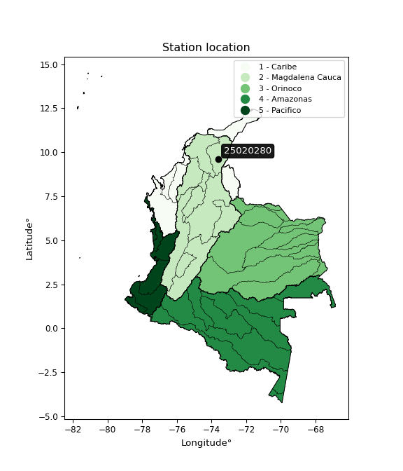</img>

</div>


## A. General information


### 1. General running parameters

• app_version: _v20251226_. • runtime: _2025-12-27 08:40:08.814432_. • Python version: _3.14.0_. • SciPy version: _1.16.3_. • Pandas version: _2.3.3_. • NumPy version: _2.3.5_. • Stations dataset (station_dataset_file): _dataset/pmax24h_in/conventional_cesarcolombia_1959_2022.csv_. • Stations catalog (station_catalog_file): _dataset/CNE_IDEAM.xls_. • Minimum year to eval til year_max (date_min): _1959_. • Maximum year to eval since year_min (date_max): _2022_. • Creates, save and include plots into reports (create_plot): _True_. • Plot only fit distributions with Δo > Δ (plot_only_fit): _True_. • Eval low extreme values, if False, evaluates high extreme values (low_extreme): _False_. • Eval every SciPy distribution as logarithmic (pdist_logarithmic_on): _True_. • Standard deviation normalized (ddof): _1.0_. • Return periods to eval in years (Tr): _[2, 2.33, 5, 10, 15, 20, 25, 50, 75, 100, 200, 250, 500, 750, 1000]_. • Minimum data sample per station, 0 means any (minimum_sample): _5_. • Z-Score threshold to adjust a value, 0 means disable (zscore): _3.5_. • Avoid zeros, e.g. rain = 0 (avoid_zeros): _True_. • Avoid null values (avoid_nans): _True_. [:file_folder:Dataset file.](../../dataset/pmax24h_in/conventional_cesarcolombia_1959_2022.csv)

> Delta Degrees of Freedom (DDOF): is a parameter used in the formulas for calculating variance and standard deviation. When ddof=0, the divisor is $N$ (the total number of observations) and this is used when your data set is the entire population. When ddof=1, the divisor is $N-1$ and this is used when your data set is a sample drawn from a larger population. Using $N-1$ provides an unbiased estimate of the population variance (known as Bessel´s correction).


### 2. Station info and location

|   id |   CODIGO | NOMBRE             | CATEGORIA     | TECNOLOGIA   | ESTADO   | FECHA_INSTALACION   |   FECHA_SUSPENSION |   ALTITUD |   LATITUD |   LONGITUD | DEPARTAMENTO   | MUNICIPIO   | AREA_OPERATIVA                                         | ENTIDAD                                                     | AREA_HIDROGRAFICA   | ZONA_HIDROGRAFICA   | SUBZONA_HIDROGRAFICA   |   CORRIENTE | Catalogo   |
|-----:|---------:|:-------------------|:--------------|:-------------|:---------|:--------------------|-------------------:|----------:|----------:|-----------:|:---------------|:------------|:-------------------------------------------------------|:------------------------------------------------------------|:--------------------|:--------------------|:-----------------------|------------:|:-----------|
|    0 | 25020280 | LA LOMA [25020280] | Pluviométrica | Convencional | Activa   | 15/10/1963          |                nan |        30 |   9.60653 |    -73.612 | Cesar          | El Paso     | Area Operativa 05 - Magdalena-Cesar-Guajira-San Andrés | INSTITUTO DE HIDROLOGIA METEOROLOGIA Y ESTUDIOS AMBIENTALES | Magdalena Cauca     | Cesar               | Bajo Cesar             |         nan | CNE_IDEAM  |

<div align="center">

Map location in: [:earth_americas:Google](http://maps.google.com/maps?q=9.606527778,-73.61197222) [:earth_americas:OSM](https://www.openstreetmap.org/#map=18/9.606527778/-73.61197222&layers=P) [:earth_americas:Bing](https://www.bing.com/maps?cp=9.606527778~-73.61197222&lvl=18) [:earth_americas:Apple](https://maps.apple.com/frame?center=9.606527778%2C-73.61197222&span=0.003%2C0.006)

</div>


<div align="center">

```geojson
{
  "type": "Feature",
  "geometry": {
    "type": "Point", 
    "coordinates": [-73.61197222, 9.606527778]
  }, 
  "properties": {
    "Name": "25020280"
  }
}
```

</div>


### 3. Discrete values table and plot

|               |          0 |           1 |           2 |          3 |           4 |           5 |          6 |           7 |           8 |           9 |          10 |          11 |           12 |          13 |          14 |          15 |          16 |          17 |          18 |         19 |           20 |         21 |          22 |         23 |          24 |          25 |          26 |          27 |          28 |            29 |          30 |          31 |         32 |         33 |         34 |          35 |          36 |          37 |         38 |          39 |         40 |          41 |           42 |          43 |          44 |          45 |          46 |         47 |          48 |          49 |          50 |          51 |          52 |          53 |          54 |
|:--------------|-----------:|------------:|------------:|-----------:|------------:|------------:|-----------:|------------:|------------:|------------:|------------:|------------:|-------------:|------------:|------------:|------------:|------------:|------------:|------------:|-----------:|-------------:|-----------:|------------:|-----------:|------------:|------------:|------------:|------------:|------------:|--------------:|------------:|------------:|-----------:|-----------:|-----------:|------------:|------------:|------------:|-----------:|------------:|-----------:|------------:|-------------:|------------:|------------:|------------:|------------:|-----------:|------------:|------------:|------------:|------------:|------------:|------------:|------------:|
| Date          | 1963       | 1964        | 1965        | 1966       | 1967        | 1968        | 1969       | 1970        | 1971        | 1972        | 1973        | 1974        | 1975         | 1976        | 1977        | 1978        | 1979        | 1980        | 1981        | 1982       | 1983         | 1984       | 1985        | 1986       | 1987        | 1988        | 1989        | 1990        | 1991        | 1992          | 1993        | 1994        | 1995       | 1996       | 1997       | 1998        | 1999        | 2000        | 2001       | 2002        | 2003       | 2004        | 2005         | 2006        | 2007        | 2008        | 2009        | 2010       | 2011        | 2012        | 2013        | 2014        | 2015        | 2016        | 2017        |
| Value         |   70       |   80        |   94        |   71       |   80        |   72.1625   |  132       |  115        |  100        |   97        |  116        |   92        |  104         |   82        |   90        |  130        |  116        |  130        |   78        |  150       |  103         |  150       |   98        |   55       |   90        |   88        |   77        |   92.6      |   90        |  105          |  120        |  100        |   70       |  150       |   70       |  124        |  130        |  120        |   70       |   96        |  104.85    |   90        |  106         |  125        |   90        |  121        |   90        |  157       |   85        |  130        |   89        |  135        |   85        |   95        |  100        |
| Value_initial |   70       |   80        |   94        |   71       |   80        |   72.1625   |  132       |  115        |  100        |   97        |  116        |   92        |  104         |   82        |   90        |  130        |  116        |  130        |   78        |  150       |  103         |  150       |   98        |   55       |   90        |   88        |   77        |   92.6      |   90        |  105          |  120        |  100        |   70       |  150       |   70       |  124        |  130        |  120        |   70       |   96        |  271       |   90        |  106         |  125        |   90        |  121        |   90        |  157       |   85        |  130        |   89        |  135        |   85        |   95        |  100        |
| count         |   55       |   55        |   55        |   55       |   55        |   55        |   55       |   55        |   55        |   55        |   55        |   55        |   55         |   55        |   55        |   55        |   55        |   55        |   55        |   55       |   55         |   55       |   55        |   55       |   55        |   55        |   55        |   55        |   55        |   55          |   55        |   55        |   55       |   55       |   55       |   55        |   55        |   55        |   55       |   55        |   55       |   55        |   55         |   55        |   55        |   55        |   55        |   55       |   55        |   55        |   55        |   55        |   55        |   55        |   55        |
| mean          |  104.85    |  104.85     |  104.85     |  104.85    |  104.85     |  104.85     |  104.85    |  104.85     |  104.85     |  104.85     |  104.85     |  104.85     |  104.85      |  104.85     |  104.85     |  104.85     |  104.85     |  104.85     |  104.85     |  104.85    |  104.85      |  104.85    |  104.85     |  104.85    |  104.85     |  104.85     |  104.85     |  104.85     |  104.85     |  104.85       |  104.85     |  104.85     |  104.85    |  104.85    |  104.85    |  104.85     |  104.85     |  104.85     |  104.85    |  104.85     |  104.85    |  104.85     |  104.85      |  104.85     |  104.85     |  104.85     |  104.85     |  104.85    |  104.85     |  104.85     |  104.85     |  104.85     |  104.85     |  104.85     |  104.85     |
| std           |   32.9736  |   32.9736   |   32.9736   |   32.9736  |   32.9736   |   32.9736   |   32.9736  |   32.9736   |   32.9736   |   32.9736   |   32.9736   |   32.9736   |   32.9736    |   32.9736   |   32.9736   |   32.9736   |   32.9736   |   32.9736   |   32.9736   |   32.9736  |   32.9736    |   32.9736  |   32.9736   |   32.9736  |   32.9736   |   32.9736   |   32.9736   |   32.9736   |   32.9736   |   32.9736     |   32.9736   |   32.9736   |   32.9736  |   32.9736  |   32.9736  |   32.9736   |   32.9736   |   32.9736   |   32.9736  |   32.9736   |   32.9736  |   32.9736   |   32.9736    |   32.9736   |   32.9736   |   32.9736   |   32.9736   |   32.9736  |   32.9736   |   32.9736   |   32.9736   |   32.9736   |   32.9736   |   32.9736   |   32.9736   |
| zscore        |   -1.05691 |   -0.753641 |   -0.329058 |   -1.02659 |   -0.753641 |   -0.991331 |    0.82338 |    0.307815 |   -0.147094 |   -0.238076 |    0.338143 |   -0.389713 |   -0.0257851 |   -0.692986 |   -0.450368 |    0.762725 |    0.338143 |    0.762725 |   -0.814296 |    1.36927 |   -0.0561125 |    1.36927 |   -0.207749 |   -1.51182 |   -0.450368 |   -0.511022 |   -0.844623 |   -0.371517 |   -0.450368 |    0.00454219 |    0.459452 |   -0.147094 |   -1.05691 |    1.36927 |   -1.05691 |    0.580761 |    0.762725 |    0.459452 |   -1.05691 |   -0.268404 |    5.03888 |   -0.450368 |    0.0348695 |    0.611089 |   -0.450368 |    0.489779 |   -0.450368 |    1.58156 |   -0.602004 |    0.762725 |   -0.480695 |    0.914362 |   -0.602004 |   -0.298731 |   -0.147094 |

<div align="center">

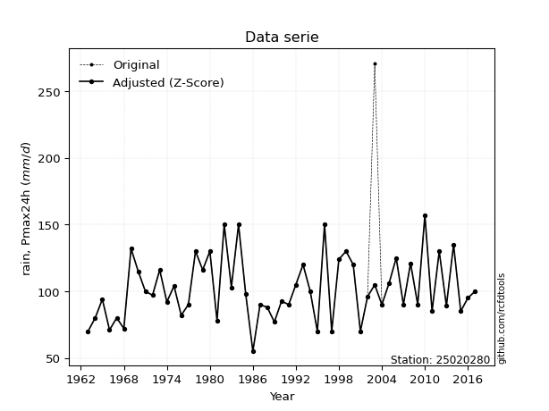</img>

</div>


> The initial value (value_initial) correspond to the initial obtained or null completed value, and value (value) is adjusted only when the initial value is outside the valid range definite through the Z-Score value. If Z-Score is active, values out of range or outliers are replaced with the station mean value


### 4. Active continuous probability distributions from SciPy (45 of 104 available)

[scipy.stats](https://docs.scipy.org/doc/scipy/reference/stats.html) is a Python´s powerful submodule within the SciPy library for comprehensive statistical analysis, offering over 130 probability distributions (like Normal, Poisson), functions for descriptive stats (mean, variance), hypothesis testing (t-tests, chi-square), random variable generation, and statistical tests, making it essential for data science, modeling, and research. It provides tools to explore, model, and draw conclusions from data efficiently, working seamlessly with NumPy.

<div align="center">

|   id | p_dist             |   n_parameter | fit_method   | label                                                                       | active   | ref                                                                                                        |
|-----:|:-------------------|--------------:|:-------------|:----------------------------------------------------------------------------|:---------|:-----------------------------------------------------------------------------------------------------------|
|    0 | alpha              |             3 | MLE          | Alpha                                                                       | True     | [:mortar_board:](https://docs.scipy.org/doc/scipy/reference/generated/scipy.stats.alpha.html)              |
|    1 | betaprime          |             4 | MLE          | Beta prime                                                                  | True     | [:mortar_board:](https://docs.scipy.org/doc/scipy/reference/generated/scipy.stats.betaprime.html)          |
|    2 | chi2               |             3 | MLE          | Chi²                                                                        | True     | [:mortar_board:](https://docs.scipy.org/doc/scipy/reference/generated/scipy.stats.chi2.html)               |
|    3 | crystalball        |             4 | MLE          | Crystalball                                                                 | True     | [:mortar_board:](https://docs.scipy.org/doc/scipy/reference/generated/scipy.stats.crystalball.html)        |
|    4 | erlang             |             3 | MLE          | Erlang                                                                      | True     | [:mortar_board:](https://docs.scipy.org/doc/scipy/reference/generated/scipy.stats.erlang.html)             |
|    5 | expon              |             2 | MLE          | Exponential                                                                 | True     | [:mortar_board:](https://docs.scipy.org/doc/scipy/reference/generated/scipy.stats.expon.html)              |
|    6 | exponnorm          |             3 | MLE          | Exponentially modified Normal                                               | True     | [:mortar_board:](https://docs.scipy.org/doc/scipy/reference/generated/scipy.stats.exponnorm.html)          |
|    7 | f                  |             4 | MLE          | F                                                                           | True     | [:mortar_board:](https://docs.scipy.org/doc/scipy/reference/generated/scipy.stats.f.html)                  |
|    8 | fatiguelife        |             3 | MLE          | Fatigue-life (Birnbaum-Saunders)                                            | True     | [:mortar_board:](https://docs.scipy.org/doc/scipy/reference/generated/scipy.stats.fatiguelife.html)        |
|    9 | fisk               |             3 | MLE          | Fisk                                                                        | True     | [:mortar_board:](https://docs.scipy.org/doc/scipy/reference/generated/scipy.stats.fisk.html)               |
|   10 | gamma              |             3 | MLE          | Gamma                                                                       | True     | [:mortar_board:](https://docs.scipy.org/doc/scipy/reference/generated/scipy.stats.gamma.html)              |
|   11 | genexpon           |             5 | MLE          | Generalized exponential                                                     | True     | [:mortar_board:](https://docs.scipy.org/doc/scipy/reference/generated/scipy.stats.genexpon.html)           |
|   12 | genlogistic        |             3 | MLE          | Generalized logistic                                                        | True     | [:mortar_board:](https://docs.scipy.org/doc/scipy/reference/generated/scipy.stats.genlogistic.html)        |
|   13 | gibrat             |             2 | MM           | Gibrat                                                                      | True     | [:mortar_board:](https://docs.scipy.org/doc/scipy/reference/generated/scipy.stats.gibrat.html)             |
|   14 | gompertz           |             3 | MLE          | Gompertz (or truncated Gumbel)                                              | True     | [:mortar_board:](https://docs.scipy.org/doc/scipy/reference/generated/scipy.stats.gompertz.html)           |
|   15 | gumbel_l           |             2 | MM           | Gumbel Left Skew                                                            | True     | [:mortar_board:](https://docs.scipy.org/doc/scipy/reference/generated/scipy.stats.gumbel_l.html)           |
|   16 | gumbel_r           |             2 | MM           | Gumbel Right Skew                                                           | True     | [:mortar_board:](https://docs.scipy.org/doc/scipy/reference/generated/scipy.stats.gumbel_r.html)           |
|   17 | halflogistic       |             2 | MM           | Half-logistic                                                               | True     | [:mortar_board:](https://docs.scipy.org/doc/scipy/reference/generated/scipy.stats.halflogistic.html)       |
|   18 | halfnorm           |             2 | MM           | Half Normal                                                                 | True     | [:mortar_board:](https://docs.scipy.org/doc/scipy/reference/generated/scipy.stats.halfnorm.html)           |
|   19 | hypsecant          |             2 | MM           | hyperbolic secant                                                           | True     | [:mortar_board:](https://docs.scipy.org/doc/scipy/reference/generated/scipy.stats.hypsecant.html)          |
|   20 | invgamma           |             3 | MLE          | Inverted gamma                                                              | True     | [:mortar_board:](https://docs.scipy.org/doc/scipy/reference/generated/scipy.stats.invgamma.html)           |
|   21 | invgauss           |             3 | MLE          | Inverse Gaussian                                                            | True     | [:mortar_board:](https://docs.scipy.org/doc/scipy/reference/generated/scipy.stats.invgauss.html)           |
|   22 | invweibull         |             3 | MLE          | Inverted Weibull                                                            | True     | [:mortar_board:](https://docs.scipy.org/doc/scipy/reference/generated/scipy.stats.invweibull.html)         |
|   23 | johnsonsu          |             4 | MLE          | Johnson Su                                                                  | True     | [:mortar_board:](https://docs.scipy.org/doc/scipy/reference/generated/scipy.stats.johnsonsu.html)          |
|   24 | kstwobign          |             2 | MLE          | Limiting distribution of scaled Kolmogorov-Smirnov two-sided test statistic | True     | [:mortar_board:](https://docs.scipy.org/doc/scipy/reference/generated/scipy.stats.kstwobign.html)          |
|   25 | laplace            |             2 | MM           | Laplace                                                                     | True     | [:mortar_board:](https://docs.scipy.org/doc/scipy/reference/generated/scipy.stats.laplace.html)            |
|   26 | laplace_asymmetric |             3 | MLE          | Asymmetric Laplace                                                          | True     | [:mortar_board:](https://docs.scipy.org/doc/scipy/reference/generated/scipy.stats.laplace_asymmetric.html) |
|   27 | loggamma           |             3 | MLE          | Log gamma                                                                   | True     | [:mortar_board:](https://docs.scipy.org/doc/scipy/reference/generated/scipy.stats.loggamma.html)           |
|   28 | logistic           |             2 | MM           | Logistic (or Sech-squared)                                                  | True     | [:mortar_board:](https://docs.scipy.org/doc/scipy/reference/generated/scipy.stats.logistic.html)           |
|   29 | lognorm            |             3 | MLE          | Log Normal                                                                  | True     | [:mortar_board:](https://docs.scipy.org/doc/scipy/reference/generated/scipy.stats.lognorm.html)            |
|   30 | maxwell            |             2 | MM           | Maxwell                                                                     | True     | [:mortar_board:](https://docs.scipy.org/doc/scipy/reference/generated/scipy.stats.maxwell.html)            |
|   31 | mielke             |             4 | MLE          | Mielke Beta-Kappa / Dagum                                                   | True     | [:mortar_board:](https://docs.scipy.org/doc/scipy/reference/generated/scipy.stats.mielke.html)             |
|   32 | moyal              |             2 | MM           | Moyal                                                                       | True     | [:mortar_board:](https://docs.scipy.org/doc/scipy/reference/generated/scipy.stats.moyal.html)              |
|   33 | nakagami           |             3 | MLE          | Nakagami                                                                    | True     | [:mortar_board:](https://docs.scipy.org/doc/scipy/reference/generated/scipy.stats.nakagami.html)           |
|   34 | ncf                |             5 | MLE          | Non-central F distribution                                                  | True     | [:mortar_board:](https://docs.scipy.org/doc/scipy/reference/generated/scipy.stats.ncf.html)                |
|   35 | nct                |             4 | MLE          | Non-central Student’s t                                                     | True     | [:mortar_board:](https://docs.scipy.org/doc/scipy/reference/generated/scipy.stats.nct.html)                |
|   36 | norm               |             2 | MM           | Normal                                                                      | True     | [:mortar_board:](https://docs.scipy.org/doc/scipy/reference/generated/scipy.stats.norm.html)               |
|   37 | pareto             |             3 | MLE          | Pareto                                                                      | True     | [:mortar_board:](https://docs.scipy.org/doc/scipy/reference/generated/scipy.stats.pareto.html)             |
|   38 | pearson3           |             3 | MM           | Pearson type III                                                            | True     | [:mortar_board:](https://docs.scipy.org/doc/scipy/reference/generated/scipy.stats.pearson3.html)           |
|   39 | rayleigh           |             2 | MM           | Rayleigh                                                                    | True     | [:mortar_board:](https://docs.scipy.org/doc/scipy/reference/generated/scipy.stats.rayleigh.html)           |
|   40 | rice               |             3 | MLE          | Rice                                                                        | True     | [:mortar_board:](https://docs.scipy.org/doc/scipy/reference/generated/scipy.stats.rice.html)               |
|   41 | t                  |             3 | MLE          | Student’s t                                                                 | True     | [:mortar_board:](https://docs.scipy.org/doc/scipy/reference/generated/scipy.stats.t.html)                  |
|   42 | truncnorm          |             4 | MLE          | Truncated normal                                                            | True     | [:mortar_board:](https://docs.scipy.org/doc/scipy/reference/generated/scipy.stats.truncnorm.html)          |
|   43 | wald               |             2 | MM           | Wald                                                                        | True     | [:mortar_board:](https://docs.scipy.org/doc/scipy/reference/generated/scipy.stats.wald.html)               |
|   44 | weibull_min        |             3 | MLE          | Weibull minimum                                                             | True     | [:mortar_board:](https://docs.scipy.org/doc/scipy/reference/generated/scipy.stats.weibull_min.html)        |

</div>

> **n_parameter:** # arguments & localization & scale.
>
> **Fit methods:** (MLE) maximum likelihood, (MM) L-moments.
>
>**Inactive:** foldnorm, gennorm, norminvgauss, powernorm, powerlognorm, skewnorm, genextreme, anglit, arcsine, argus, beta, bradford, burr, burr12, cauchy, cosine, halfcauchy, foldcauchy, skewcauchy, wrapcauchy, dgamma, gengamma, exponweib, exponpow, truncexpon, gausshyper, genhalflogistic, genhyperbolic, geninvgauss, halfgennorm, johnsonsb, kappa4, kappa3, ksone, kstwo, loglaplace, levy, levy_l, levy_stable, ncx2, genpareto, truncpareto, lomax, powerlaw, rdist, rel_breitwigner, recipinvgauss, semicircular, studentized_range, trapezoid, triang, truncweibull_min, tukeylambda, uniform, loguniform, vonmises, vonmises_line, weibull_max, dweibull, 


## B. Probability distributions vs. Empirical distributions

A continuous probability distribution (CPD) describes probabilities for variables that can take any value within a range (like rain any time), unlike discrete variables with specific outcomes (like temperature). It uses a Probability Density Function (PDF), a curve where the total area under it equals 1, and the probability of the variable falling within an interval (a to b) is found by calculating the area under the curve between those points. A key feature is that the probability of hitting any single exact value is zero, so probabilities are always expressed for ranges, e.g., $P(a ≤ X ≤ b)$.

<div align="center">

Distributions parameters from station values
|    |   station | p_dist                |   n |              loc |           scale | shape                  | shape1                | shape2                 | shape3   |
|---:|----------:|:----------------------|----:|-----------------:|----------------:|:-----------------------|:----------------------|:-----------------------|:---------|
|  0 |  25020280 | alpha                 |  55 |   -105.148       |  1841.45        | 9.009846708489794      |                       |                        |          |
|  1 |  25020280 | betaprime             |  55 |     -0.519436    |    33.0756      | 75.9601462037406       | 25.576335792084272    |                        |          |
|  2 |  25020280 | chi2                  |  55 |     31.884       |     4.0504      | 17.268750018372554     |                       |                        |          |
|  3 |  25020280 | crystalball           |  55 |    101.829       |    23.589       | 7303.745558443154      | 7741.46139875339      |                        |          |
|  4 |  25020280 | erlang                |  55 |     31.884       |     8.10079     | 8.634379246846908      |                       |                        |          |
|  5 |  25020280 | expon                 |  55 |     55           |    46.8293      |                        |                       |                        |          |
|  6 |  25020280 | exponnorm             |  55 |     81.3984      |    14.4491      | 1.4139889191244077     |                       |                        |          |
|  7 |  25020280 | f                     |  55 |     -0.597313    |   100.09        | 68.36080937993844      | 87.39013122919081     |                        |          |
|  8 |  25020280 | fatiguelife           |  55 |      2.1923      |    96.8936      | 0.23794237203284888    |                       |                        |          |
|  9 |  25020280 | fisk                  |  55 |     -0.811146    |    99.7421      | 7.482143559663768      |                       |                        |          |
| 10 |  25020280 | gamma                 |  55 |     31.8841      |     8.1008      | 8.634362802043718      |                       |                        |          |
| 11 |  25020280 | genexpon              |  55 |     54.8452      |     0.16776     | 0.003029591252192026   | 0.0005374582471717783 | 1.9817344147521694     |          |
| 12 |  25020280 | genlogistic           |  55 |     52.0613      |    18.7173      | 8.575480762599476      |                       |                        |          |
| 13 |  25020280 | gibrat                |  55 |     83.8339      |    10.9148      |                        |                       |                        |          |
| 14 |  25020280 | gompertz              |  55 |     82           |     3.74975     | 6.15946047335104e-08   |                       |                        |          |
| 15 |  25020280 | gumbel_l              |  55 |    112.446       |    18.3922      |                        |                       |                        |          |
| 16 |  25020280 | gumbel_r              |  55 |     91.213       |    18.3922      |                        |                       |                        |          |
| 17 |  25020280 | halflogistic          |  55 |     73.8709      |    20.1678      |                        |                       |                        |          |
| 18 |  25020280 | halfnorm              |  55 |     70.6068      |    39.1317      |                        |                       |                        |          |
| 19 |  25020280 | hypsecant             |  55 |    101.829       |    15.0172      |                        |                       |                        |          |
| 20 |  25020280 | invgamma              |  55 |    -32.5246      |  4381.77        | 33.609739347585865     |                       |                        |          |
| 21 |  25020280 | invgauss              |  55 |     13.6808      |  1170.49        | 0.07513671767721128    |                       |                        |          |
| 22 |  25020280 | invweibull            |  55 |     -1.81125e+09 |     1.81125e+09 | 90691362.24131332      |                       |                        |          |
| 23 |  25020280 | johnsonsu             |  55 |      5.70984     |    19.8719      | -9.398584388073445     | 4.173843240237364     |                        |          |
| 24 |  25020280 | kstwobign             |  55 |     17.8498      |    96.5317      |                        |                       |                        |          |
| 25 |  25020280 | laplace               |  55 |    101.829       |    16.6799      |                        |                       |                        |          |
| 26 |  25020280 | laplace_asymmetric    |  55 |     90           |    16.7712      | 0.7076942366099728     |                       |                        |          |
| 27 |  25020280 | loggamma              |  55 |  -6597.34        |   917.748       | 1480.011380255486      |                       |                        |          |
| 28 |  25020280 | logistic              |  55 |    101.829       |    13.0053      |                        |                       |                        |          |
| 29 |  25020280 | lognorm               |  55 |      1.29067     |    97.8296      | 0.2342877551910457     |                       |                        |          |
| 30 |  25020280 | maxwell               |  55 |     45.9334      |    35.0276      |                        |                       |                        |          |
| 31 |  25020280 | mielke                |  55 |     -0.118354    |    91.5637      | 9.613208290137917      | 6.676563138555868     |                        |          |
| 32 |  25020280 | moyal                 |  55 |     88.3396      |    10.6188      |                        |                       |                        |          |
| 33 |  25020280 | nakagami              |  55 |     70           |    40.3659      | 0.4722877440069208     |                       |                        |          |
| 34 |  25020280 | ncf                   |  55 |     -0.343089    |     9.28014e-07 | 5.738328294587661e-07  | 10.062635810217715    | 60.50683848203521      |          |
| 35 |  25020280 | nct                   |  55 |     -0.0975148   |    14.1325      | 16.88911848160702      | 6.888764503875951     |                        |          |
| 36 |  25020280 | norm                  |  55 |    101.829       |    23.589       |                        |                       |                        |          |
| 37 |  25020280 | pareto                |  55 |     -8.58993e+09 |     8.58993e+09 | 183430682.40351972     |                       |                        |          |
| 38 |  25020280 | pearson3              |  55 |    101.829       |    23.5889      | 0.4647187786828078     |                       |                        |          |
| 39 |  25020280 | rayleigh              |  55 |     56.7023      |    36.0062      |                        |                       |                        |          |
| 40 |  25020280 | rice                  |  55 |     51.7615      |    28.7632      | 1.3048220309058478     |                       |                        |          |
| 41 |  25020280 | t                     |  55 |    101.832       |    23.5813      | 121006.4509858867      |                       |                        |          |
| 42 |  25020280 | truncnorm             |  55 |    101.829       |    23.589       | -791.1757523019232     | 4586.434070554215     |                        |          |
| 43 |  25020280 | wald                  |  55 |     78.2404      |    23.589       |                        |                       |                        |          |
| 44 |  25020280 | weibull_min           |  55 |     50.1418      |    58.3593      | 2.328686201950391      |                       |                        |          |
| 45 |  25020280 | logalpha              |  55 |     -3.56509     |   286.5         | 35.13001493371051      |                       |                        |          |
| 46 |  25020280 | logbetaprime          |  55 |     -0.227257    |     1.07791     | 2360.547382944981      | 528.4523757507702     |                        |          |
| 47 |  25020280 | logchi2               |  55 |      4.00733     |     0.878357    | 1.1319265371014375     |                       |                        |          |
| 48 |  25020280 | logcrystalball        |  55 |      4.59669     |     0.231156    | 15.535827920180365     | 394.23109475288686    |                        |          |
| 49 |  25020280 | logerlang             |  55 |    -15.04        |     0.00272383  | 7209.195856191016      |                       |                        |          |
| 50 |  25020280 | logexpon              |  55 |      4.00733     |     0.589358    |                        |                       |                        |          |
| 51 |  25020280 | logexponnorm          |  55 |      4.59635     |     0.231156    | 0.0014708965177173902  |                       |                        |          |
| 52 |  25020280 | logf                  |  55 |    -23.3091      |    27.9044      | 53534.117102799195     | 63511.737650582436    |                        |          |
| 53 |  25020280 | logfatiguelife        |  55 |    -20.6582      |    25.2529      | 0.009155587580672659   |                       |                        |          |
| 54 |  25020280 | logfisk               |  55 |     -3.51848     |     8.11115     | 60.23485500659639      |                       |                        |          |
| 55 |  25020280 | loggamma              |  55 |    -14.9194      |     0.00273932  | 7124.401958507249      |                       |                        |          |
| 56 |  25020280 | loggenexpon           |  55 |      4.00728     |     0.0401718   | 0.00405035775981386    | 1.2042522785850722    | 0.006477619191780928   |          |
| 57 |  25020280 | loggenlogistic        |  55 |      4.51602     |     0.149909    | 1.4379059348476333     |                       |                        |          |
| 58 |  25020280 | loggibrat             |  55 |      4.4204      |     0.106928    |                        |                       |                        |          |
| 59 |  25020280 | loggompertz           |  55 |      4.00733     |     0.247769    | 0.06511422678614803    |                       |                        |          |
| 60 |  25020280 | loggumbel_l           |  55 |      4.70072     |     0.180231    |                        |                       |                        |          |
| 61 |  25020280 | loggumbel_r           |  55 |      4.49266     |     0.180231    |                        |                       |                        |          |
| 62 |  25020280 | loghalflogistic       |  55 |      4.32273     |     0.197623    |                        |                       |                        |          |
| 63 |  25020280 | loghalfnorm           |  55 |      4.29071     |     0.383485    |                        |                       |                        |          |
| 64 |  25020280 | loghypsecant          |  55 |      4.59669     |     0.147158    |                        |                       |                        |          |
| 65 |  25020280 | loginvgamma           |  55 |     -4.21587     | 12745.7         | 1447.3868588991136     |                       |                        |          |
| 66 |  25020280 | loginvgauss           |  55 |      2.68988     |   121.147       | 0.015721727916728226   |                       |                        |          |
| 67 |  25020280 | loginvweibull         |  55 | -21542.5         | 21547           | 95174.09741786672      |                       |                        |          |
| 68 |  25020280 | logjohnsonsu          |  55 |      8.70344     |    13.2823      | 18.303988858522573     | 60.12989642930411     |                        |          |
| 69 |  25020280 | logkstwobign          |  55 |      3.62543     |     1.11905     |                        |                       |                        |          |
| 70 |  25020280 | loglaplace            |  55 |      4.59669     |     0.163452    |                        |                       |                        |          |
| 71 |  25020280 | loglaplace_asymmetric |  55 |      4.49981     |     0.17687     | 0.7630228157062157     |                       |                        |          |
| 72 |  25020280 | logloggamma           |  55 |    -30.1607      |     5.48812     | 563.4332596036897      |                       |                        |          |
| 73 |  25020280 | loglogistic           |  55 |      4.59669     |     0.127443    |                        |                       |                        |          |
| 74 |  25020280 | loglognorm            |  55 |  -8179.73        |  8184.33        | 2.8243709369444252e-05 |                       |                        |          |
| 75 |  25020280 | logmaxwell            |  55 |      4.04892     |     0.343265    |                        |                       |                        |          |
| 76 |  25020280 | logmielke             |  55 |   -625.37        |   629.902       | 5764.111294692618      | 4292.159077899237     |                        |          |
| 77 |  25020280 | logmoyal              |  55 |      4.4645      |     0.104057    |                        |                       |                        |          |
| 78 |  25020280 | lognakagami           |  55 |    -11.8138      |    16.4121      | 1257.341477350844      |                       |                        |          |
| 79 |  25020280 | logncf                |  55 |     -9.48342     |    14.0787      | 11942.683526465396     | 19465.638611039154    | 3.0738567599307176e-08 |          |
| 80 |  25020280 | lognct                |  55 |      0.276431    |     0.0427604   | 178.72928792104744     | 100.60686799484452    |                        |          |
| 81 |  25020280 | lognorm               |  55 |      4.59669     |     0.231156    |                        |                       |                        |          |
| 82 |  25020280 | logpareto             |  55 |     -3.35544e+07 |     3.35544e+07 | 56933858.68574824      |                       |                        |          |
| 83 |  25020280 | logpearson3           |  55 |      4.59669     |     0.231156    | -0.025035471128257263  |                       |                        |          |
| 84 |  25020280 | lograyleigh           |  55 |      4.1545      |     0.352819    |                        |                       |                        |          |
| 85 |  25020280 | logrice               |  55 |      3.90283     |     0.241635    | 2.67595782679574       |                       |                        |          |
| 86 |  25020280 | logt                  |  55 |      4.5967      |     0.231157    | 81396088.67590803      |                       |                        |          |
| 87 |  25020280 | logtruncnorm          |  55 |     -0.0508615   |     1.70076     | 2.3861114410017965     | 7.202010969171013     |                        |          |
| 88 |  25020280 | logwald               |  55 |      4.36555     |     0.231138    |                        |                       |                        |          |
| 89 |  25020280 | logweibull_min        |  55 |      3.80314     |     0.877843    | 3.839997824895508      |                       |                        |          |

</div>

> **loc** (Location parameter): This shifts the distribution along the x-axis. For many common distributions, like the normal (Gaussian) distribution, loc represents the mean $μ$. For others, like the uniform distribution, it might represent the minimum value, or for the beta distribution, the left end of the support interval.
>
> **scale** (Scale parameter): This determines the width or spread of the distribution. For the normal distribution, scale represents the standard deviation $σ$. For a uniform distribution, it defines the length of the interval (from $loc$ to $loc + scale$).
>
> **shape** (Shape parameters): Refers to parameters that define the specific form of a probability distribution, distinct from its location (loc) and scale (scale). These parameters are required arguments for most distribution functions. For example, a normal (Gaussian) distribution is fully defined by its location (mean) and scale (standard deviation), so it has no specific shape parameters beyond loc and scale. However, other distributions have intrinsic properties that need specification, as Gamma distribution that takes a shape parameter, often named $a$ or $alpha$.


### 0. Cumulative distribution values - CDF (90 evaluated)

Cumulative Distribution Function (CDF), denoted as $F$<sub>$X$</sub>$(x)$, is a function that gives the probability that a random variable $X$ will take a value less than or equal to a specific value, $x$ (i.e., $(P(X≥x)$. It essentially "accumulates" probabilities from a given point up to the far right (positive infinity), providing a complete picture of the distribution´s probabilities for both discrete (like rain) and continuous (like temperature) variables, helping to find probabilities over ranges or above certain values.

<div align="center">

CDF ordered by x ascending and calculating $log(f(x))$ separately
|   id |   Station |   date |        x |   count |   mean |     std |      zscore |   Value_initial |   station |   m |      alpha |   alpha_pdf |   betaprime |   betaprime_pdf |       chi2 |   chi2_pdf |   crystalball |   crystalball_pdf |     erlang |   erlang_pdf |    expon |   expon_pdf |   exponnorm |   exponnorm_pdf |         f |      f_pdf |   fatiguelife |   fatiguelife_pdf |      fisk |   fisk_pdf |      gamma |   gamma_pdf |   genexpon |   genexpon_pdf |   genlogistic |   genlogistic_pdf |    gibrat |   gibrat_pdf |    gompertz |   gompertz_pdf |   gumbel_l |   gumbel_l_pdf |   gumbel_r |   gumbel_r_pdf |   halflogistic |   halflogistic_pdf |   halfnorm |   halfnorm_pdf |   hypsecant |   hypsecant_pdf |   invgamma |   invgamma_pdf |   invgauss |   invgauss_pdf |   invweibull |   invweibull_pdf |   johnsonsu |   johnsonsu_pdf |   kstwobign |   kstwobign_pdf |   laplace |   laplace_pdf |   laplace_asymmetric |   laplace_asymmetric_pdf |   loggamma |   loggamma_pdf |   logistic |   logistic_pdf |   lognorm |   lognorm_pdf |    maxwell |   maxwell_pdf |     mielke |   mielke_pdf |       moyal |   moyal_pdf |    nakagami |   nakagami_pdf |      ncf |    ncf_pdf |        nct |    nct_pdf |      norm |   norm_pdf |      pareto |   pareto_pdf |   pearson3 |   pearson3_pdf |   rayleigh |   rayleigh_pdf |       rice |   rice_pdf |         t |      t_pdf |   truncnorm |   truncnorm_pdf |       wald |   wald_pdf |   weibull_min |   weibull_min_pdf |   logalpha |   logalpha_pdf |   logbetaprime |   logbetaprime_pdf |     logchi2 |   logchi2_pdf |   logcrystalball |   logcrystalball_pdf |   logerlang |   logerlang_pdf |   logexpon |   logexpon_pdf |   logexponnorm |   logexponnorm_pdf |       logf |   logf_pdf |   logfatiguelife |   logfatiguelife_pdf |   logfisk |   logfisk_pdf |   loggenexpon |   loggenexpon_pdf |   loggenlogistic |   loggenlogistic_pdf |   loggibrat |   loggibrat_pdf |   loggompertz |   loggompertz_pdf |   loggumbel_l |   loggumbel_l_pdf |   loggumbel_r |   loggumbel_r_pdf |   loghalflogistic |   loghalflogistic_pdf |   loghalfnorm |   loghalfnorm_pdf |   loghypsecant |   loghypsecant_pdf |   loginvgamma |   loginvgamma_pdf |   loginvgauss |   loginvgauss_pdf |   loginvweibull |   loginvweibull_pdf |   logjohnsonsu |   logjohnsonsu_pdf |   logkstwobign |   logkstwobign_pdf |   loglaplace |   loglaplace_pdf |   loglaplace_asymmetric |   loglaplace_asymmetric_pdf |   logloggamma |   logloggamma_pdf |   loglogistic |   loglogistic_pdf |   loglognorm |   loglognorm_pdf |   logmaxwell |   logmaxwell_pdf |   logmielke |   logmielke_pdf |    logmoyal |   logmoyal_pdf |   lognakagami |   lognakagami_pdf |     logncf |   logncf_pdf |    lognct |   lognct_pdf |   logpareto |   logpareto_pdf |   logpearson3 |   logpearson3_pdf |   lograyleigh |   lograyleigh_pdf |    logrice |   logrice_pdf |      logt |   logt_pdf |   logtruncnorm |   logtruncnorm_pdf |     logwald |   logwald_pdf |   logweibull_min |   logweibull_min_pdf |
|-----:|----------:|-------:|---------:|--------:|-------:|--------:|------------:|----------------:|----------:|----:|-----------:|------------:|------------:|----------------:|-----------:|-----------:|--------------:|------------------:|-----------:|-------------:|---------:|------------:|------------:|----------------:|----------:|-----------:|--------------:|------------------:|----------:|-----------:|-----------:|------------:|-----------:|---------------:|--------------:|------------------:|----------:|-------------:|------------:|---------------:|-----------:|---------------:|-----------:|---------------:|---------------:|-------------------:|-----------:|---------------:|------------:|----------------:|-----------:|---------------:|-----------:|---------------:|-------------:|-----------------:|------------:|----------------:|------------:|----------------:|----------:|--------------:|---------------------:|-------------------------:|-----------:|---------------:|-----------:|---------------:|----------:|--------------:|-----------:|--------------:|-----------:|-------------:|------------:|------------:|------------:|---------------:|---------:|-----------:|-----------:|-----------:|----------:|-----------:|------------:|-------------:|-----------:|---------------:|-----------:|---------------:|-----------:|-----------:|----------:|-----------:|------------:|----------------:|-----------:|-----------:|--------------:|------------------:|-----------:|---------------:|---------------:|-------------------:|------------:|--------------:|-----------------:|---------------------:|------------:|----------------:|-----------:|---------------:|---------------:|-------------------:|-----------:|-----------:|-----------------:|---------------------:|----------:|--------------:|--------------:|------------------:|-----------------:|---------------------:|------------:|----------------:|--------------:|------------------:|--------------:|------------------:|--------------:|------------------:|------------------:|----------------------:|--------------:|------------------:|---------------:|-------------------:|--------------:|------------------:|--------------:|------------------:|----------------:|--------------------:|---------------:|-------------------:|---------------:|-------------------:|-------------:|-----------------:|------------------------:|----------------------------:|--------------:|------------------:|--------------:|------------------:|-------------:|-----------------:|-------------:|-----------------:|------------:|----------------:|------------:|---------------:|--------------:|------------------:|-----------:|-------------:|----------:|-------------:|------------:|----------------:|--------------:|------------------:|--------------:|------------------:|-----------:|--------------:|----------:|-----------:|---------------:|-------------------:|------------:|--------------:|-----------------:|---------------------:|
|    0 |  25020280 |   1986 |  55      |      55 | 104.85 | 32.9736 | -1.51182    |         55      |  25020280 |   1 | 0.00641281 |  0.00129489 |  0.00420804 |      0.00105416 | 0.00430254 | 0.00114736 |     0.0235599 |        0.00235723 | 0.00430254 |   0.00114736 | 0        |  0.0213541  |   0.0075084 |      0.00128932 | 0.0060404 | 0.00128538 |    0.00479615 |        0.00116033 | 0.012815  | 0.00169599 | 0.00430254 |  0.00114736 | 0.00305898 |     0.0206847  |    0.00500517 |        0.00105676 | 0         |  0           | 0           |    0           |  0.0430546 |    0.00228978  | 0.00077472 |    0.000301721 |       0        |         0          | 0          |     0          |   0.0281386 |      0.00187132 | 0.00570685 |     0.00123466 | 0.00332436 |    0.000958942 |    0.0026474 |      0.000786624 |  0.00532778 |      0.00120164 |  0.00157133 |      0.00066234 | 0.030177  |    0.00180918 |            0.0174854 |               0.00147321 | 0.00507475 |      0.0646799 |  0.0265764 |     0.0019892  | 0.0053921 |     0.0669009 | 0.00452076 |    0.00147588 | 0.00724822 |   0.00122289 | 1.54053e-06 | 1.74269e-06 | 0           |     0          | 0.111413 | 0.00699915 | 0.00603116 | 0.0012196  | 0.0235599 | 0.00235723 | 4.07298e-08 |   0.0213541  | 0.00983112 |     0.00169715 |  0         |     0          | 0.00270436 | 0.00166935 | 0.0235187 | 0.00235446 |   0.0235599 |      0.00235723 | 0          | 0          |    0.00305631 |        0.00146275 | 0.00341967 |      0.0514281 |     0.00331483 |          0.0504381 | 2.47432e-09 |   1.57668e+06 |       0.00539207 |            0.0669006 |  0.00508303 |       0.0647498 |   0        |       1.69676  |     0.00539209 |          0.0669008 | 0.00515393 |  0.0654988 |       0.00507552 |            0.0648951 | 0.0108608 |     0.0859835 |   5.87073e-06 |          0.101106 |       0.00724964 |            0.0672772 |   0         |        0        |   9.42294e-07 |          0.262806 |     0.0211128 |         0.115898  |   3.83906e-07 |       3.14673e-05 |         0         |              0        |      0        |          0        |      0.0116015 |          0.0788196 |    0.00409653 |          0.057292 |    0.00186637 |         0.0367347 |     0.000323643 |           0.0114879 |     0.00560894 |           0.068358 |    0.000184395 |         0.00974582 |    0.0135842 |        0.0831084 |              0.00957196 |                   0.0709265 |    0.00604548 |         0.0714296 |    0.00971339 |         0.0754772 |   0.00539091 |        0.0668926 |    0         |         0        |  0.00792388 |       0.0705923 | 2.35082e-19 |    9.25089e-17 |    0.00523472 |          0.065895 | 0.00481152 |    0.0627871 | 0.0025431 |    0.0429174 | 1.26419e-08 |        1.69676  |     0.0057497 |         0.0693612 |     0         |          0        | 0.00292104 |      0.061949 | 0.005392  |  0.0668994 |    6.51576e-09 |           1.59886  | 0           |      0        |       0.00368998 |             0.069265 |
|    1 |  25020280 |   1963 |  70      |      55 | 104.85 | 32.9736 | -1.05691    |         70      |  25020280 |   2 | 0.0663129  |  0.00773004 |  0.0640568  |      0.00815121 | 0.0666109  | 0.0081974  |     0.0886153 |        0.00680522 | 0.0666109  |   0.00819739 | 0.274078 |  0.0155015  |   0.0640808 |      0.00739147 | 0.0667998 | 0.00783801 |    0.0657675  |        0.00805717 | 0.0715469 | 0.007019   | 0.0666109  |  0.0081974  | 0.275275   |     0.0154097  |    0.0618042  |        0.00784918 | 0         |  0           | 0           |    0           |  0.0946918 |    0.00489663  | 0.0420519  |    0.00724524  |       0        |         0          | 0          |     0          |   0.0760865 |      0.00501851 | 0.0658421  |     0.0078516  | 0.064237   |    0.00842282  |    0.0608029 |      0.00852487  |  0.065689   |      0.00792918 |  0.0677199  |      0.00967958 | 0.0741704 |    0.00444669 |            0.0618786 |               0.00521351 | 0.0654436  |      0.55794   |  0.0796277 |     0.00563519 | 0.0659917 |     0.555001  | 0.0750175  |    0.00849239 | 0.0614624  |   0.00721222 | 0.0177131   | 0.00535264  | 2.00434e-15 |     0.133226   | 0.231366 | 0.00865137 | 0.0646498  | 0.00771558 | 0.0886153 | 0.00680522 | 0.274078    |   0.0155014  | 0.0744015  |     0.00768379 |  0.0659245 |     0.00958089 | 0.0843518  | 0.0090712  | 0.0885274 | 0.00680232 |   0.0886153 |      0.00680522 | 0          | 0          |    0.0780287  |        0.00878346 | 0.0621682  |      0.574736  |     0.0618226  |          0.574805  | 0.347759    |   0.746999    |       0.0659915  |            0.555001  |  0.065469   |       0.55793   |   0.335815 |       1.12696  |     0.0659915  |          0.555     | 0.0659634  |  0.560663  |       0.0657931  |            0.561296  | 0.0683862 |     0.494084  |   0.150535    |          1.05712  |       0.0614688  |            0.504853  |   0         |        0        |   0.101681    |          0.624856 |     0.078117  |         0.416038  |   0.0207401   |       0.445993    |         0         |              0        |      0        |          0        |      0.0595678 |          0.402429  |    0.0637213  |          0.568632 |    0.0614802  |         0.625684  |     0.0626922   |           0.766927  |     0.0663394  |           0.552883 |    0.0841572   |         0.939968   |    0.0594028 |        0.363427  |              0.0571573  |                   0.423525  |    0.0673507  |         0.551784  |    0.0611013  |         0.450146  |   0.0659894  |        0.55501   |    0.0472761 |         0.663538 |  0.0623837  |       0.498759  | 0.00475236  |    0.201118    |    0.0658267  |          0.557288 | 0.0649864  |    0.560477  | 0.0600929 |    0.586283  | 0.335815    |        1.12696  |     0.0666614 |         0.552438  |     0.0348665 |          0.728779 | 0.065401   |      0.578006 | 0.0659902 |  0.554989  |    0.326127    |           1.12851  | 0           |      0        |       0.0711821  |             0.591376 |
|    2 |  25020280 |   1997 |  70      |      55 | 104.85 | 32.9736 | -1.05691    |         70      |  25020280 |   3 | 0.0663129  |  0.00773004 |  0.0640568  |      0.00815121 | 0.0666109  | 0.0081974  |     0.0886153 |        0.00680522 | 0.0666109  |   0.00819739 | 0.274078 |  0.0155015  |   0.0640808 |      0.00739147 | 0.0667998 | 0.00783801 |    0.0657675  |        0.00805717 | 0.0715469 | 0.007019   | 0.0666109  |  0.0081974  | 0.275275   |     0.0154097  |    0.0618042  |        0.00784918 | 0         |  0           | 0           |    0           |  0.0946918 |    0.00489663  | 0.0420519  |    0.00724524  |       0        |         0          | 0          |     0          |   0.0760865 |      0.00501851 | 0.0658421  |     0.0078516  | 0.064237   |    0.00842282  |    0.0608029 |      0.00852487  |  0.065689   |      0.00792918 |  0.0677199  |      0.00967958 | 0.0741704 |    0.00444669 |            0.0618786 |               0.00521351 | 0.0654436  |      0.55794   |  0.0796277 |     0.00563519 | 0.0659917 |     0.555001  | 0.0750175  |    0.00849239 | 0.0614624  |   0.00721222 | 0.0177131   | 0.00535264  | 2.00434e-15 |     0.133226   | 0.231366 | 0.00865137 | 0.0646498  | 0.00771558 | 0.0886153 | 0.00680522 | 0.274078    |   0.0155014  | 0.0744015  |     0.00768379 |  0.0659245 |     0.00958089 | 0.0843518  | 0.0090712  | 0.0885274 | 0.00680232 |   0.0886153 |      0.00680522 | 0          | 0          |    0.0780287  |        0.00878346 | 0.0621682  |      0.574736  |     0.0618226  |          0.574805  | 0.347759    |   0.746999    |       0.0659915  |            0.555001  |  0.065469   |       0.55793   |   0.335815 |       1.12696  |     0.0659915  |          0.555     | 0.0659634  |  0.560663  |       0.0657931  |            0.561296  | 0.0683862 |     0.494084  |   0.150535    |          1.05712  |       0.0614688  |            0.504853  |   0         |        0        |   0.101681    |          0.624856 |     0.078117  |         0.416038  |   0.0207401   |       0.445993    |         0         |              0        |      0        |          0        |      0.0595678 |          0.402429  |    0.0637213  |          0.568632 |    0.0614802  |         0.625684  |     0.0626922   |           0.766927  |     0.0663394  |           0.552883 |    0.0841572   |         0.939968   |    0.0594028 |        0.363427  |              0.0571573  |                   0.423525  |    0.0673507  |         0.551784  |    0.0611013  |         0.450146  |   0.0659894  |        0.55501   |    0.0472761 |         0.663538 |  0.0623837  |       0.498759  | 0.00475236  |    0.201118    |    0.0658267  |          0.557288 | 0.0649864  |    0.560477  | 0.0600929 |    0.586283  | 0.335815    |        1.12696  |     0.0666614 |         0.552438  |     0.0348665 |          0.728779 | 0.065401   |      0.578006 | 0.0659902 |  0.554989  |    0.326127    |           1.12851  | 0           |      0        |       0.0711821  |             0.591376 |
|    3 |  25020280 |   1995 |  70      |      55 | 104.85 | 32.9736 | -1.05691    |         70      |  25020280 |   4 | 0.0663129  |  0.00773004 |  0.0640568  |      0.00815121 | 0.0666109  | 0.0081974  |     0.0886153 |        0.00680522 | 0.0666109  |   0.00819739 | 0.274078 |  0.0155015  |   0.0640808 |      0.00739147 | 0.0667998 | 0.00783801 |    0.0657675  |        0.00805717 | 0.0715469 | 0.007019   | 0.0666109  |  0.0081974  | 0.275275   |     0.0154097  |    0.0618042  |        0.00784918 | 0         |  0           | 0           |    0           |  0.0946918 |    0.00489663  | 0.0420519  |    0.00724524  |       0        |         0          | 0          |     0          |   0.0760865 |      0.00501851 | 0.0658421  |     0.0078516  | 0.064237   |    0.00842282  |    0.0608029 |      0.00852487  |  0.065689   |      0.00792918 |  0.0677199  |      0.00967958 | 0.0741704 |    0.00444669 |            0.0618786 |               0.00521351 | 0.0654436  |      0.55794   |  0.0796277 |     0.00563519 | 0.0659917 |     0.555001  | 0.0750175  |    0.00849239 | 0.0614624  |   0.00721222 | 0.0177131   | 0.00535264  | 2.00434e-15 |     0.133226   | 0.231366 | 0.00865137 | 0.0646498  | 0.00771558 | 0.0886153 | 0.00680522 | 0.274078    |   0.0155014  | 0.0744015  |     0.00768379 |  0.0659245 |     0.00958089 | 0.0843518  | 0.0090712  | 0.0885274 | 0.00680232 |   0.0886153 |      0.00680522 | 0          | 0          |    0.0780287  |        0.00878346 | 0.0621682  |      0.574736  |     0.0618226  |          0.574805  | 0.347759    |   0.746999    |       0.0659915  |            0.555001  |  0.065469   |       0.55793   |   0.335815 |       1.12696  |     0.0659915  |          0.555     | 0.0659634  |  0.560663  |       0.0657931  |            0.561296  | 0.0683862 |     0.494084  |   0.150535    |          1.05712  |       0.0614688  |            0.504853  |   0         |        0        |   0.101681    |          0.624856 |     0.078117  |         0.416038  |   0.0207401   |       0.445993    |         0         |              0        |      0        |          0        |      0.0595678 |          0.402429  |    0.0637213  |          0.568632 |    0.0614802  |         0.625684  |     0.0626922   |           0.766927  |     0.0663394  |           0.552883 |    0.0841572   |         0.939968   |    0.0594028 |        0.363427  |              0.0571573  |                   0.423525  |    0.0673507  |         0.551784  |    0.0611013  |         0.450146  |   0.0659894  |        0.55501   |    0.0472761 |         0.663538 |  0.0623837  |       0.498759  | 0.00475236  |    0.201118    |    0.0658267  |          0.557288 | 0.0649864  |    0.560477  | 0.0600929 |    0.586283  | 0.335815    |        1.12696  |     0.0666614 |         0.552438  |     0.0348665 |          0.728779 | 0.065401   |      0.578006 | 0.0659902 |  0.554989  |    0.326127    |           1.12851  | 0           |      0        |       0.0711821  |             0.591376 |
|    4 |  25020280 |   2001 |  70      |      55 | 104.85 | 32.9736 | -1.05691    |         70      |  25020280 |   5 | 0.0663129  |  0.00773004 |  0.0640568  |      0.00815121 | 0.0666109  | 0.0081974  |     0.0886153 |        0.00680522 | 0.0666109  |   0.00819739 | 0.274078 |  0.0155015  |   0.0640808 |      0.00739147 | 0.0667998 | 0.00783801 |    0.0657675  |        0.00805717 | 0.0715469 | 0.007019   | 0.0666109  |  0.0081974  | 0.275275   |     0.0154097  |    0.0618042  |        0.00784918 | 0         |  0           | 0           |    0           |  0.0946918 |    0.00489663  | 0.0420519  |    0.00724524  |       0        |         0          | 0          |     0          |   0.0760865 |      0.00501851 | 0.0658421  |     0.0078516  | 0.064237   |    0.00842282  |    0.0608029 |      0.00852487  |  0.065689   |      0.00792918 |  0.0677199  |      0.00967958 | 0.0741704 |    0.00444669 |            0.0618786 |               0.00521351 | 0.0654436  |      0.55794   |  0.0796277 |     0.00563519 | 0.0659917 |     0.555001  | 0.0750175  |    0.00849239 | 0.0614624  |   0.00721222 | 0.0177131   | 0.00535264  | 2.00434e-15 |     0.133226   | 0.231366 | 0.00865137 | 0.0646498  | 0.00771558 | 0.0886153 | 0.00680522 | 0.274078    |   0.0155014  | 0.0744015  |     0.00768379 |  0.0659245 |     0.00958089 | 0.0843518  | 0.0090712  | 0.0885274 | 0.00680232 |   0.0886153 |      0.00680522 | 0          | 0          |    0.0780287  |        0.00878346 | 0.0621682  |      0.574736  |     0.0618226  |          0.574805  | 0.347759    |   0.746999    |       0.0659915  |            0.555001  |  0.065469   |       0.55793   |   0.335815 |       1.12696  |     0.0659915  |          0.555     | 0.0659634  |  0.560663  |       0.0657931  |            0.561296  | 0.0683862 |     0.494084  |   0.150535    |          1.05712  |       0.0614688  |            0.504853  |   0         |        0        |   0.101681    |          0.624856 |     0.078117  |         0.416038  |   0.0207401   |       0.445993    |         0         |              0        |      0        |          0        |      0.0595678 |          0.402429  |    0.0637213  |          0.568632 |    0.0614802  |         0.625684  |     0.0626922   |           0.766927  |     0.0663394  |           0.552883 |    0.0841572   |         0.939968   |    0.0594028 |        0.363427  |              0.0571573  |                   0.423525  |    0.0673507  |         0.551784  |    0.0611013  |         0.450146  |   0.0659894  |        0.55501   |    0.0472761 |         0.663538 |  0.0623837  |       0.498759  | 0.00475236  |    0.201118    |    0.0658267  |          0.557288 | 0.0649864  |    0.560477  | 0.0600929 |    0.586283  | 0.335815    |        1.12696  |     0.0666614 |         0.552438  |     0.0348665 |          0.728779 | 0.065401   |      0.578006 | 0.0659902 |  0.554989  |    0.326127    |           1.12851  | 0           |      0        |       0.0711821  |             0.591376 |
|    5 |  25020280 |   1966 |  71      |      55 | 104.85 | 32.9736 | -1.02659    |         71      |  25020280 |   6 | 0.0743497  |  0.00834536 |  0.0725471  |      0.00883077 | 0.075124   | 0.00882936 |     0.0956168 |        0.00719937 | 0.0751239  |   0.00882936 | 0.289415 |  0.0151739  |   0.0717902 |      0.00803087 | 0.0749442 | 0.00845235 |    0.0741437  |        0.00869643 | 0.0788379 | 0.00756668 | 0.075124   |  0.00882937 | 0.290522   |     0.0150855  |    0.0700031  |        0.00855124 | 0         |  0           | 0           |    0           |  0.09971   |    0.00514157  | 0.0497295  |    0.00811462  |       0        |         0          | 0.00801777 |     0.0203887  |   0.0812707 |      0.00535323 | 0.0740067  |     0.00847919 | 0.0730068  |    0.00911728  |    0.0697132 |      0.00929679  |  0.0739344  |      0.00856313 |  0.0777852  |      0.0104479  | 0.0787531 |    0.00472143 |            0.0673181 |               0.0056718  | 0.0737332  |      0.611307  |  0.0854482 |     0.00600885 | 0.0742342 |     0.607603  | 0.0837791  |    0.00903016 | 0.0690015  |   0.00787058 | 0.0236677   | 0.00657481  | 0.0240894   |     0.0227498  | 0.240038 | 0.00869137 | 0.0726832  | 0.00835323 | 0.0956168 | 0.00719937 | 0.289415    |   0.0151739  | 0.0823517  |     0.00821782 |  0.0758129 |     0.0101923  | 0.0936488  | 0.00952156 | 0.0955261 | 0.00719659 |   0.0956168 |      0.00719937 | 0          | 0          |    0.0870631  |        0.00928409 | 0.0707293  |      0.632821  |     0.0703867  |          0.633165  | 0.358182    |   0.722837    |       0.074234   |            0.607603  |  0.0737583  |       0.611274  |   0.35161  |       1.10016  |     0.074234   |          0.607601  | 0.0742919  |  0.614063  |       0.0741322  |            0.614934  | 0.0757292 |     0.541834  |   0.165788    |          1.09309  |       0.0690078  |            0.558801  |   0         |        0        |   0.110757    |          0.654988 |     0.0842364 |         0.447117  |   0.0278101   |       0.552765    |         0         |              0        |      0        |          0        |      0.0655549 |          0.442329  |    0.0721817  |          0.624704 |    0.0708194  |         0.691531  |     0.0741756   |           0.852298  |     0.0745482  |           0.604966 |    0.0980392   |         1.01674    |    0.0647881 |        0.396374  |              0.0634919  |                   0.470464  |    0.0755384  |         0.603093  |    0.0678071  |         0.495982  |   0.0742321  |        0.607615  |    0.057247  |         0.742505 |  0.0698254  |       0.551153  | 0.00835605  |    0.312199    |    0.0741045  |          0.610293 | 0.0733165  |    0.614489  | 0.0688423 |    0.647824  | 0.35161     |        1.10016  |     0.074862  |         0.604259  |     0.0459202 |          0.829149 | 0.0739812  |      0.632175 | 0.0742325 |  0.607589  |    0.341967    |           1.10492  | 0           |      0        |       0.0799161  |             0.640371 |
|    6 |  25020280 |   1968 |  72.1625 |      55 | 104.85 | 32.9736 | -0.991331   |         72.1625 |  25020280 |   7 | 0.0844727  |  0.00907191 |  0.0832757  |      0.00962721 | 0.0858163  | 0.00956549 |     0.104258  |        0.00766902 | 0.0858163  |   0.00956549 | 0.306838 |  0.0148019  |   0.0815705 |      0.0087992  | 0.0851897 | 0.00917517 |    0.0846881  |        0.00944453 | 0.0880173 | 0.00823028 | 0.0858164  |  0.0095655  | 0.307844   |     0.0147172  |    0.0804266  |        0.00938356 | 0         |  0           | 0           |    0           |  0.105859  |    0.00543964  | 0.0597651  |    0.00915485  |       0        |         0          | 0.0317131  |     0.0203736  |   0.0877325 |      0.00576845 | 0.0842927  |     0.00921793 | 0.0840756  |    0.00992497  |    0.0810443 |      0.0101967   |  0.0843216  |      0.00930785 |  0.0904375  |      0.0113134  | 0.0844377 |    0.00506224 |            0.0742454 |               0.00625545 | 0.0841782  |      0.67547   |  0.0926974 |     0.00646696 | 0.0846118 |     0.670871  | 0.0946377  |    0.0096498  | 0.0786116  |   0.00866776 | 0.0321964   | 0.00811661  | 0.0498969   |     0.0217746  | 0.250165 | 0.00872824 | 0.0828314  | 0.00910768 | 0.104258  | 0.00766902 | 0.306838    |   0.0148019  | 0.0922699  |     0.00884645 |  0.0880615 |     0.010875   | 0.105017   | 0.010034   | 0.104164  | 0.00766641 |   0.104258  |      0.00766902 | 0          | 0          |    0.0981897  |        0.00985622 | 0.0815683  |      0.702467  |     0.0812339  |          0.703143  | 0.369711    |   0.697271    |       0.0846116  |            0.67087   |  0.0842025  |       0.675405  |   0.369233 |       1.07026  |     0.0846116  |          0.670869  | 0.0847818  |  0.678234  |       0.0846386  |            0.679396  | 0.0850018 |     0.600823  |   0.183852    |          1.13083  |       0.0786176  |            0.625469  |   0         |        0        |   0.121683    |          0.690767 |     0.0918038 |         0.485235  |   0.0378675   |       0.687812    |         0         |              0        |      0        |          0        |      0.0731404 |          0.492656  |    0.0828698  |          0.692011 |    0.0826814  |         0.769655  |     0.0888111   |           0.949821  |     0.0848781  |           0.667625 |    0.115232    |         1.09948    |    0.0715563 |        0.437782  |              0.0716114  |                   0.530628  |    0.0858304  |         0.664829  |    0.0763197  |         0.55315   |   0.0846099  |        0.670885  |    0.0700463 |         0.833727 |  0.0792959  |       0.615955  | 0.0147139   |    0.477309    |    0.0845296  |          0.67402  | 0.0838193  |    0.679397  | 0.0799574 |    0.721478  | 0.369233    |        1.07026  |     0.0851779 |         0.666609  |     0.0602879 |          0.939266 | 0.0847708  |      0.69699  | 0.0846098 |  0.670856  |    0.359696    |           1.07844  | 0           |      0        |       0.090785   |             0.698407 |
|    7 |  25020280 |   1989 |  77      |      55 | 104.85 | 32.9736 | -0.844623   |         77      |  25020280 |   8 | 0.135713   |  0.0120942  |  0.137756   |      0.0128504  | 0.139338   | 0.0125144  |     0.146266  |        0.00971891 | 0.139338   |   0.0125144  | 0.374867 |  0.0133492  |   0.13219   |      0.0121492  | 0.136841  | 0.0121535  |    0.137804   |        0.0124741  | 0.134955  | 0.0112257  | 0.139338   |  0.0125144  | 0.3755     |     0.0132787  |    0.134251   |        0.0128408  | 0         |  0           | 0           |    0           |  0.135457  |    0.00684191  | 0.114662   |    0.013502    |       0.077422 |         0.0246434  | 0.129779   |     0.0201194  |   0.120393  |      0.0078272  | 0.13631    |     0.0122609  | 0.139981   |    0.0131228   |    0.139147  |      0.013741    |  0.136801   |      0.0123565  |  0.153042   |      0.0144155  | 0.112847  |    0.00676544 |            0.111603  |               0.009403   | 0.136953   |      0.95659   |  0.129074  |     0.0086437  | 0.136976  |     0.948664  | 0.147336   |    0.0120916  | 0.129009   |   0.0122034  | 0.0880742   | 0.0149622   | 0.150713    |     0.0201417  | 0.292574 | 0.00877945 | 0.134545   | 0.012254   | 0.146266  | 0.00971891 | 0.374867    |   0.0133492  | 0.141422   |     0.0114625  |  0.146914  |     0.0133563  | 0.158449   | 0.0120119  | 0.146162  | 0.00971733 |   0.146266  |      0.00971891 | 0          | 0          |    0.151357   |        0.0120757  | 0.136769   |      1.00337   |     0.136523   |          1.00541   | 0.412067    |   0.61232     |       0.136976   |            0.948665  |  0.136969   |       0.95638   |   0.434991 |       0.958686 |     0.136976   |          0.948662  | 0.137729   |  0.959037  |       0.137701   |            0.961453  | 0.132723  |     0.88187   |   0.261229    |          1.24424  |       0.129013   |            0.939605  |   0         |        0        |   0.171453    |          0.846697 |     0.128922  |         0.667082  |   0.101882    |       1.29108     |         0.0532766 |              2.52289  |      0.110112 |          2.06077  |      0.112972  |          0.751672  |    0.137106   |          0.984563 |    0.143125   |         1.09439   |     0.162367    |           1.30377   |     0.136955   |           0.943125 |    0.195639    |         1.35822    |    0.106426  |        0.651115  |              0.11582    |                   0.858207  |    0.137605   |         0.936666  |    0.12086    |         0.833731  |   0.136976   |        0.948691  |    0.135766  |         1.18606  |  0.128831   |       0.922871  | 0.0741063   |    1.3896      |    0.137152   |          0.953354 | 0.13694    |    0.963191  | 0.13688   |    1.03663   | 0.434991    |        0.958686 |     0.137149  |         0.940911  |     0.134065  |          1.31688  | 0.138947   |      0.977298 | 0.136973  |  0.948645  |    0.426364    |           0.977909 | 0           |      0        |       0.14401    |             0.94535  |
|    8 |  25020280 |   1981 |  78      |      55 | 104.85 | 32.9736 | -0.814296   |         78      |  25020280 |   9 | 0.148108   |  0.0126918  |  0.150917   |      0.0134666  | 0.152136   | 0.0130764  |     0.156202  |        0.0101533  | 0.152136   |   0.0130763  | 0.388075 |  0.0130671  |   0.144686  |      0.0128404  | 0.149287  | 0.0127373  |    0.150571   |        0.0130565  | 0.146503  | 0.011871   | 0.152136   |  0.0130764  | 0.388638   |     0.0129993  |    0.147431   |        0.0135146  | 0         |  0           | 0           |    0           |  0.14246   |    0.00716569  | 0.128586   |    0.0143403   |       0.102013 |         0.0245341  | 0.149854   |     0.0200291  |   0.128466  |      0.00832426 | 0.14887    |     0.0128562  | 0.153405   |    0.0137204   |    0.153216  |      0.0143914   |  0.149455   |      0.012949   |  0.167719   |      0.0149312  | 0.119819  |    0.00718345 |            0.121414  |               0.0102296  | 0.149675   |      1.01528   |  0.137967  |     0.0091449  | 0.149592  |     1.00683   | 0.159661   |    0.0125553  | 0.141582   |   0.0129409  | 0.103696    | 0.0162675   | 0.170736    |     0.0199064  | 0.30135  | 0.00877133 | 0.147111   | 0.0128757  | 0.156202  | 0.0101533  | 0.388075    |   0.0130671  | 0.153147   |     0.0119847  |  0.160491  |     0.0137913  | 0.170648   | 0.0123845  | 0.156097  | 0.010152   |   0.156202  |      0.0101533  | 0          | 0          |    0.163643   |        0.0124932  | 0.150113   |      1.06499   |     0.149896   |          1.06729   | 0.419875    |   0.597991    |       0.149592   |            1.00683   |  0.149687   |       1.01504   |   0.447227 |       0.937925 |     0.149592   |          1.00683   | 0.150481   |  1.01759   |       0.150487   |            1.02026   | 0.144511  |     0.94559   |   0.277386    |          1.25967  |       0.141585   |            1.00933   |   0         |        0        |   0.182593    |          0.879968 |     0.137799  |         0.709288  |   0.119297    |       1.40731     |         0.0857624 |              2.51146  |      0.136636 |          2.05003  |      0.123079  |          0.815685  |    0.1502     |          1.04498  |    0.157658   |         1.1579    |     0.179571    |           1.36203   |     0.149497   |           1.00092  |    0.213403    |         1.39429    |    0.115168  |        0.7046    |              0.127441   |                   0.944312  |    0.150059   |         0.993832  |    0.132038   |         0.899257  |   0.149592   |        1.00686   |    0.151487  |         1.25019  |  0.14118    |       0.991493  | 0.0932326   |    1.57303     |    0.14983    |          1.01172  | 0.14975    |    1.02228   | 0.150667  |    1.1003    | 0.447227    |        0.937925 |     0.149661  |         0.998511  |     0.15146   |          1.37839  | 0.151931   |      1.03511  | 0.149589  |  1.00681   |    0.438859    |           0.958897 | 0           |      0        |       0.156535   |             0.99605  |
|    9 |  25020280 |   1967 |  80      |      55 | 104.85 | 32.9736 | -0.753641   |         80      |  25020280 |  10 | 0.174643   |  0.0138293  |  0.179018   |      0.0146146  | 0.179356   | 0.0141262  |     0.177378  |        0.0110215  | 0.179356   |   0.0141262  | 0.413659 |  0.0125208  |   0.171719  |      0.014181   | 0.175884  | 0.013844   |    0.177793   |        0.0141483  | 0.171535  | 0.0131578  | 0.179356   |  0.0141262  | 0.414092   |     0.0124581  |    0.175744   |        0.0147769  | 0         |  0           | 0           |    0           |  0.157467  |    0.00784904  | 0.158848   |    0.0158898   |       0.150795 |         0.0242283  | 0.189702   |     0.0198107  |   0.146168  |      0.00939492 | 0.175725   |     0.0139823  | 0.181969   |    0.0148207   |    0.183205  |      0.0155684   |  0.176487   |      0.0140659  |  0.198501   |      0.0158175  | 0.135083  |    0.00809854 |            0.143698  |               0.0121071  | 0.176841   |      1.13058   |  0.157295  |     0.0101922  | 0.176533  |     1.12134   | 0.185657   |    0.0134268  | 0.168909   |   0.0143734  | 0.13862     | 0.0185834   | 0.210097    |     0.0194577  | 0.318863 | 0.008738   | 0.174059   | 0.0140563  | 0.177378  | 0.0110215  | 0.413659    |   0.0125208  | 0.178131   |     0.012989   |  0.188877  |     0.0145763  | 0.196129   | 0.0130863  | 0.17727   | 0.0110208  |   0.177378  |      0.0110215  | 0.00065973 | 0.0026683  |    0.189425   |        0.0132765  | 0.178596   |      1.18448   |     0.178442   |          1.18721   | 0.434678    |   0.571805    |       0.176533   |            1.12134   |  0.176846   |       1.13028   |   0.47047  |       0.898486 |     0.176533   |          1.12133   | 0.177702   |  1.13256   |       0.17778    |            1.13567   | 0.170092  |     1.07623   |   0.309595    |          1.28323  |       0.16891    |            1.1498    |   0         |        0        |   0.205716    |          0.947069 |     0.156865  |         0.798212  |   0.15763     |       1.61583     |         0.148914  |              2.47397  |      0.188207 |          2.02246  |      0.145449  |          0.954346  |    0.178153   |          1.1628   |    0.188505   |         1.27759   |     0.215348    |           1.46058   |     0.17628    |           1.11485  |    0.249449    |         1.4499     |    0.134463  |        0.822645  |              0.153738   |                   1.13917   |    0.176649   |         1.10671   |    0.156514   |         1.03589   |   0.176534   |        1.12137   |    0.184644  |         1.36689  |  0.168032   |       1.13047   | 0.137196    |    1.88819     |    0.176898   |          1.12647  | 0.1771     |    1.13813   | 0.180083  |    1.22263   | 0.47047     |        0.898486 |     0.176379  |         1.11212   |     0.187743  |          1.48465  | 0.17957    |      1.14799  | 0.176529  |  1.12132   |    0.462673    |           0.922507 | 0.000473309 |      0.213578 |       0.183012   |             1.09544  |
|   10 |  25020280 |   1964 |  80      |      55 | 104.85 | 32.9736 | -0.753641   |         80      |  25020280 |  11 | 0.174643   |  0.0138293  |  0.179018   |      0.0146146  | 0.179356   | 0.0141262  |     0.177378  |        0.0110215  | 0.179356   |   0.0141262  | 0.413659 |  0.0125208  |   0.171719  |      0.014181   | 0.175884  | 0.013844   |    0.177793   |        0.0141483  | 0.171535  | 0.0131578  | 0.179356   |  0.0141262  | 0.414092   |     0.0124581  |    0.175744   |        0.0147769  | 0         |  0           | 0           |    0           |  0.157467  |    0.00784904  | 0.158848   |    0.0158898   |       0.150795 |         0.0242283  | 0.189702   |     0.0198107  |   0.146168  |      0.00939492 | 0.175725   |     0.0139823  | 0.181969   |    0.0148207   |    0.183205  |      0.0155684   |  0.176487   |      0.0140659  |  0.198501   |      0.0158175  | 0.135083  |    0.00809854 |            0.143698  |               0.0121071  | 0.176841   |      1.13058   |  0.157295  |     0.0101922  | 0.176533  |     1.12134   | 0.185657   |    0.0134268  | 0.168909   |   0.0143734  | 0.13862     | 0.0185834   | 0.210097    |     0.0194577  | 0.318863 | 0.008738   | 0.174059   | 0.0140563  | 0.177378  | 0.0110215  | 0.413659    |   0.0125208  | 0.178131   |     0.012989   |  0.188877  |     0.0145763  | 0.196129   | 0.0130863  | 0.17727   | 0.0110208  |   0.177378  |      0.0110215  | 0.00065973 | 0.0026683  |    0.189425   |        0.0132765  | 0.178596   |      1.18448   |     0.178442   |          1.18721   | 0.434678    |   0.571805    |       0.176533   |            1.12134   |  0.176846   |       1.13028   |   0.47047  |       0.898486 |     0.176533   |          1.12133   | 0.177702   |  1.13256   |       0.17778    |            1.13567   | 0.170092  |     1.07623   |   0.309595    |          1.28323  |       0.16891    |            1.1498    |   0         |        0        |   0.205716    |          0.947069 |     0.156865  |         0.798212  |   0.15763     |       1.61583     |         0.148914  |              2.47397  |      0.188207 |          2.02246  |      0.145449  |          0.954346  |    0.178153   |          1.1628   |    0.188505   |         1.27759   |     0.215348    |           1.46058   |     0.17628    |           1.11485  |    0.249449    |         1.4499     |    0.134463  |        0.822645  |              0.153738   |                   1.13917   |    0.176649   |         1.10671   |    0.156514   |         1.03589   |   0.176534   |        1.12137   |    0.184644  |         1.36689  |  0.168032   |       1.13047   | 0.137196    |    1.88819     |    0.176898   |          1.12647  | 0.1771     |    1.13813   | 0.180083  |    1.22263   | 0.47047     |        0.898486 |     0.176379  |         1.11212   |     0.187743  |          1.48465  | 0.17957    |      1.14799  | 0.176529  |  1.12132   |    0.462673    |           0.922507 | 0.000473309 |      0.213578 |       0.183012   |             1.09544  |
|   11 |  25020280 |   1976 |  82      |      55 | 104.85 | 32.9736 | -0.692986   |         82      |  25020280 |  12 | 0.203358   |  0.0148669  |  0.209285   |      0.0156278  | 0.208563   | 0.0150602  |     0.200281  |        0.0118784  | 0.208563   |   0.0150602  | 0.438173 |  0.0119973  |   0.201349  |      0.0154304  | 0.204595  | 0.0148484  |    0.207086   |        0.0151231  | 0.19911   | 0.014408   | 0.208563   |  0.0150602  | 0.438485   |     0.0119394  |    0.206442   |        0.0158946  | 0         |  0           | 1.04072e-14 |    1.64263e-08 |  0.173888  |    0.00858014  | 0.192004   |    0.0172275   |       0.198853 |         0.0238117  | 0.229064   |     0.0195436  |   0.166113  |      0.0105662  | 0.204728   |     0.0150005  | 0.212591   |    0.0157755   |    0.215364  |      0.0165573   |  0.205644   |      0.0150707  |  0.230858   |      0.0165076  | 0.152291  |    0.00913021 |            0.170072  |               0.0143292  | 0.206127   |      1.2409    |  0.178768  |     0.0112885  | 0.205585  |     1.23124   | 0.213312   |    0.0142134  | 0.199008   |   0.015705   | 0.177706    | 0.0204167   | 0.248573    |     0.0190179  | 0.336288 | 0.00868369 | 0.203263   | 0.0151277  | 0.200281  | 0.0118784  | 0.438173    |   0.0119973  | 0.205056   |     0.0139228  |  0.218718  |     0.0152453  | 0.222951   | 0.0137251  | 0.200172  | 0.0118783  |   0.200281  |      0.0118784  | 0.0312269  | 0.0289595  |    0.216699   |        0.013984   | 0.209239   |      1.29652   |     0.209157   |          1.29957   | 0.448505    |   0.54842     |       0.205585   |            1.23124   |  0.206124   |       1.24054   |   0.492198 |       0.86162  |     0.205585   |          1.23123   | 0.207032   |  1.24247   |       0.207192   |            1.24595   | 0.198291  |     1.20825   |   0.341478    |          1.29781  |       0.199008   |            1.28774   |   0         |        0        |   0.22993     |          1.01442  |     0.177727  |         0.892767  |   0.199696    |       1.78494     |         0.209362  |              2.41917  |      0.237732 |          1.98756  |      0.170855  |          1.10608   |    0.208251   |          1.27426  |    0.221402   |         1.38512   |     0.252377    |           1.53484   |     0.205168   |           1.22441  |    0.285727    |         1.48548    |    0.156391  |        0.9568    |              0.184605   |                   1.36789   |    0.205326   |         1.21557   |    0.183825   |         1.17726   |   0.205587   |        1.23127   |    0.219661  |         1.46692  |  0.197646   |       1.26807   | 0.186828    |    2.11764     |    0.206077   |          1.23638  | 0.206576   |    1.24867   | 0.211685  |    1.33568   | 0.492198    |        0.861619 |     0.205196  |         1.22149   |     0.225487  |          1.5693   | 0.209248   |      1.25513  | 0.205581  |  1.23121   |    0.485026    |           0.888157 | 0.0451109   |      3.44677  |       0.211244   |             1.19079  |
|   12 |  25020280 |   2011 |  85      |      55 | 104.85 | 32.9736 | -0.602004   |         85      |  25020280 |  13 | 0.250014   |  0.016185   |  0.258096   |      0.0168498  | 0.255547   | 0.016209   |     0.237787  |        0.0131121  | 0.255547   |   0.016209   | 0.473037 |  0.0112529  |   0.250153  |      0.0170461  | 0.251121  | 0.0161172  |    0.254341   |        0.0163253  | 0.244973  | 0.0161274  | 0.255547   |  0.016209   | 0.473185   |     0.0112016  |    0.256246   |        0.0172364  | 0.0126608 |  0.0280582   | 7.54939e-08 |    3.65593e-08 |  0.201379  |    0.00976417  | 0.246136   |    0.0187607   |       0.269119 |         0.0229965  | 0.286989   |     0.0190561  |   0.200657  |      0.0124943  | 0.251726   |     0.0162778  | 0.261701   |    0.0169004   |    0.266796  |      0.0176506   |  0.252816   |      0.0163223  |  0.2815     |      0.0171834  | 0.182299  |    0.0109293  |            0.21898   |               0.0184499  | 0.25347    |      1.39174   |  0.21517   |     0.0129849  | 0.252581  |     1.38221   | 0.257508   |    0.0152128  | 0.248778   |   0.0174053  | 0.241884    | 0.0221681   | 0.304627    |     0.0183483  | 0.362175 | 0.00856745 | 0.250752   | 0.0164746  | 0.237787  | 0.0131121  | 0.473037    |   0.0112528  | 0.248725   |     0.015152   |  0.265694  |     0.0160278  | 0.265409   | 0.0145525  | 0.237679  | 0.0131131  |   0.237787  |      0.0131121  | 0.151321   | 0.0453601  |    0.260056   |        0.0148879  | 0.258557   |      1.44507   |     0.258591   |          1.4484    | 0.467646    |   0.517597    |       0.252581   |            1.38222   |  0.253453   |       1.39131   |   0.522232 |       0.810658 |     0.25258    |          1.38221   | 0.254419   |  1.39259   |       0.254711   |            1.39644   | 0.245172  |     1.40021   |   0.388287    |          1.30489  |       0.248775   |            1.47939   |   0.0582395 |        5.22977  |   0.268174    |          1.1145   |     0.212472  |         1.04369   |   0.267195    |       1.95658     |         0.294434  |              2.31074  |      0.308045 |          1.92356  |      0.214942  |          1.35212   |    0.256784   |          1.42404  |    0.273667   |         1.51896   |     0.30889     |           1.60284   |     0.251916   |           1.37538  |    0.339591    |         1.50698    |    0.194842  |        1.19205   |              0.240921   |                   1.78518   |    0.251748   |         1.36623   |    0.229931   |         1.38935   |   0.252583   |        1.38225   |    0.274581  |         1.58402  |  0.246731   |       1.46163   | 0.266696    |    2.29801     |    0.253252   |          1.38692  | 0.254195   |    1.39915   | 0.262387  |    1.48228   | 0.522232    |        0.810658 |     0.251838  |         1.37244   |     0.283596  |          1.65835  | 0.257002   |      1.40015  | 0.252576  |  1.38219   |    0.516069    |           0.840126 | 0.201636    |      4.60408  |       0.256436   |             1.32292  |
|   13 |  25020280 |   2015 |  85      |      55 | 104.85 | 32.9736 | -0.602004   |         85      |  25020280 |  14 | 0.250014   |  0.016185   |  0.258096   |      0.0168498  | 0.255547   | 0.016209   |     0.237787  |        0.0131121  | 0.255547   |   0.016209   | 0.473037 |  0.0112529  |   0.250153  |      0.0170461  | 0.251121  | 0.0161172  |    0.254341   |        0.0163253  | 0.244973  | 0.0161274  | 0.255547   |  0.016209   | 0.473185   |     0.0112016  |    0.256246   |        0.0172364  | 0.0126608 |  0.0280582   | 7.54939e-08 |    3.65593e-08 |  0.201379  |    0.00976417  | 0.246136   |    0.0187607   |       0.269119 |         0.0229965  | 0.286989   |     0.0190561  |   0.200657  |      0.0124943  | 0.251726   |     0.0162778  | 0.261701   |    0.0169004   |    0.266796  |      0.0176506   |  0.252816   |      0.0163223  |  0.2815     |      0.0171834  | 0.182299  |    0.0109293  |            0.21898   |               0.0184499  | 0.25347    |      1.39174   |  0.21517   |     0.0129849  | 0.252581  |     1.38221   | 0.257508   |    0.0152128  | 0.248778   |   0.0174053  | 0.241884    | 0.0221681   | 0.304627    |     0.0183483  | 0.362175 | 0.00856745 | 0.250752   | 0.0164746  | 0.237787  | 0.0131121  | 0.473037    |   0.0112528  | 0.248725   |     0.015152   |  0.265694  |     0.0160278  | 0.265409   | 0.0145525  | 0.237679  | 0.0131131  |   0.237787  |      0.0131121  | 0.151321   | 0.0453601  |    0.260056   |        0.0148879  | 0.258557   |      1.44507   |     0.258591   |          1.4484    | 0.467646    |   0.517597    |       0.252581   |            1.38222   |  0.253453   |       1.39131   |   0.522232 |       0.810658 |     0.25258    |          1.38221   | 0.254419   |  1.39259   |       0.254711   |            1.39644   | 0.245172  |     1.40021   |   0.388287    |          1.30489  |       0.248775   |            1.47939   |   0.0582395 |        5.22977  |   0.268174    |          1.1145   |     0.212472  |         1.04369   |   0.267195    |       1.95658     |         0.294434  |              2.31074  |      0.308045 |          1.92356  |      0.214942  |          1.35212   |    0.256784   |          1.42404  |    0.273667   |         1.51896   |     0.30889     |           1.60284   |     0.251916   |           1.37538  |    0.339591    |         1.50698    |    0.194842  |        1.19205   |              0.240921   |                   1.78518   |    0.251748   |         1.36623   |    0.229931   |         1.38935   |   0.252583   |        1.38225   |    0.274581  |         1.58402  |  0.246731   |       1.46163   | 0.266696    |    2.29801     |    0.253252   |          1.38692  | 0.254195   |    1.39915   | 0.262387  |    1.48228   | 0.522232    |        0.810658 |     0.251838  |         1.37244   |     0.283596  |          1.65835  | 0.257002   |      1.40015  | 0.252576  |  1.38219   |    0.516069    |           0.840126 | 0.201636    |      4.60408  |       0.256436   |             1.32292  |
|   14 |  25020280 |   1988 |  88      |      55 | 104.85 | 32.9736 | -0.511022   |         88      |  25020280 |  15 | 0.30013    |  0.0171656  |  0.309989   |      0.0176778  | 0.305484   | 0.0170251  |     0.27885   |        0.0142419  | 0.305484   |   0.0170251  | 0.505737 |  0.0105546  |   0.303215  |      0.0182522  | 0.300967  | 0.0170554  |    0.304689   |        0.0171799  | 0.295568  | 0.017541   | 0.305484   |  0.0170251  | 0.505741   |     0.0105094  |    0.309405   |        0.018124   | 0.167739  |  0.060221    | 2.43518e-07 |    8.13686e-08 |  0.23257   |    0.0110452   | 0.303953   |    0.0196807   |       0.336633 |         0.0219826  | 0.343304   |     0.0184719  |   0.241228  |      0.0145694  | 0.302048   |     0.0172095  | 0.3136     |    0.0176331   |    0.320784  |      0.0182623   |  0.303228   |      0.0172253  |  0.33356    |      0.0174611  | 0.218221  |    0.0130829  |            0.281954  |               0.0237556  | 0.304013   |      1.51895   |  0.256667  |     0.0146701  | 0.302809  |     1.51047   | 0.304349   |    0.0159733  | 0.302963   |   0.0186302  | 0.309572    | 0.0227812   | 0.358633    |     0.01765    | 0.387657 | 0.00841544 | 0.301743   | 0.0174549  | 0.27885   | 0.0142419  | 0.505737    |   0.0105546  | 0.295717   |     0.0161308  |  0.31462   |     0.0165459  | 0.310094   | 0.0152076  | 0.278747  | 0.0142439  |   0.27885   |      0.0142419  | 0.284318   | 0.0419492  |    0.30582    |        0.0155864  | 0.310831   |      1.5645    |     0.310981   |          1.56785   | 0.485128    |   0.490869    |       0.302809   |            1.51047   |  0.303981   |       1.51847   |   0.549539 |       0.764325 |     0.302809   |          1.51047   | 0.304978   |  1.51901   |       0.305407   |            1.52299   | 0.296783  |     1.57222   |   0.433449    |          1.29686  |       0.302958   |            1.63942   |   0.264281  |        5.74474  |   0.308513    |          1.2113   |     0.251396  |         1.20265   |   0.336643    |       2.03358     |         0.372369  |              2.17925  |      0.373494 |          1.84827  |      0.266219  |          1.60542   |    0.308384   |          1.54704  |    0.328139   |         1.61621   |     0.364986    |           1.62489   |     0.301916   |           1.50424  |    0.391784    |         1.49808    |    0.240903  |        1.47385   |              0.311526   |                   2.30835   |    0.301439   |         1.4957    |    0.281601   |         1.58739   |   0.302813   |        1.5105    |    0.330974  |         1.66166  |  0.300372   |       1.62634   | 0.347121    |    2.3169      |    0.303629   |          1.51425  | 0.304978   |    1.52524   | 0.315863  |    1.59601   | 0.549539    |        0.764325 |     0.301741  |         1.50161   |     0.342056  |          1.70636  | 0.307726   |      1.52089  | 0.302803  |  1.51045   |    0.544436    |           0.79589  | 0.350403    |      3.89545  |       0.304361   |             1.43796  |
|   15 |  25020280 |   2013 |  89      |      55 | 104.85 | 32.9736 | -0.480695   |         89      |  25020280 |  16 | 0.317421   |  0.0174111  |  0.327763   |      0.0178636  | 0.32261    | 0.0172204  |     0.293266  |        0.0145871  | 0.32261    |   0.0172204  | 0.516179 |  0.0103316  |   0.32162   |      0.0185488  | 0.318142  | 0.0172893  |    0.321974   |        0.017384   | 0.313304  | 0.0179237  | 0.32261    |  0.0172204  | 0.516139   |     0.0102883  |    0.327628   |        0.0183149  | 0.22723   |  0.0583785   | 3.36768e-07 |    1.06237e-07 |  0.243838  |    0.0114911   | 0.323724   |    0.0198517   |       0.358429 |         0.021607   | 0.36167    |     0.0182573  |   0.25615   |      0.0152749  | 0.319375   |     0.017438   | 0.331315   |    0.0177897   |    0.339101  |      0.0183622   |  0.320567   |      0.0174443  |  0.351031   |      0.017474   | 0.231704  |    0.0138912  |            0.306739  |               0.0258439  | 0.321384   |      1.55518   |  0.27161   |     0.0152121  | 0.320087  |     1.54723   | 0.320424   |    0.0161709  | 0.321742   |   0.018917   | 0.332353    | 0.0227655   | 0.376163    |     0.0174095  | 0.396044 | 0.00835792 | 0.319321   | 0.0176937  | 0.293266  | 0.0145871  | 0.516179    |   0.0103316  | 0.311982   |     0.0163949  |  0.331226  |     0.0166608  | 0.325392   | 0.0153851  | 0.293165  | 0.0145895  |   0.293266  |      0.0145871  | 0.325156   | 0.0396964  |    0.321501   |        0.0157713  | 0.328697   |      1.59708   |     0.328884   |          1.60037   | 0.490628    |   0.482718    |       0.320087   |            1.54723   |  0.321346   |       1.55469   |   0.558093 |       0.74981  |     0.320086   |          1.54723   | 0.322348   |  1.55497   |       0.322822   |            1.55894   | 0.314837  |     1.62275   |   0.448073    |          1.2913   |       0.321737   |            1.68359   |   0.326655  |        5.28542  |   0.322376    |          1.2424   |     0.26529   |         1.25669   |   0.359669    |       2.04064     |         0.396728  |              2.13186  |      0.394227 |          1.82116  |      0.284824  |          1.68736   |    0.326061   |          1.58124  |    0.34654    |         1.64023   |     0.383343    |           1.62352   |     0.319125   |           1.54133  |    0.408667    |         1.48976    |    0.258146  |        1.57934   |              0.338732   |                   2.50995   |    0.318554   |         1.53318   |    0.29988    |         1.64742   |   0.320091   |        1.54726   |    0.349853  |         1.6791   |  0.319015   |       1.67258   | 0.373196    |    2.29657     |    0.320947   |          1.55061  | 0.322417   |    1.56094   | 0.33407   |    1.62599   | 0.558093    |        0.74981  |     0.318922  |         1.53886   |     0.361385  |          1.7142   | 0.325107   |      1.55494  | 0.320081  |  1.54721   |    0.55335     |           0.781918 | 0.392847    |      3.61769  |       0.320803   |             1.47183  |
|   16 |  25020280 |   2004 |  90      |      55 | 104.85 | 32.9736 | -0.450368   |         90      |  25020280 |  17 | 0.334938   |  0.0176147  |  0.345701   |      0.0180044  | 0.339912   | 0.0173772  |     0.308018  |        0.014914   | 0.339912   |   0.0173771  | 0.526401 |  0.0101133  |   0.340294  |      0.0187895  | 0.335532  | 0.0174827  |    0.339444   |        0.0175476  | 0.331398  | 0.018256   | 0.339912   |  0.0173772  | 0.526319   |     0.0100718  |    0.346017   |        0.0184536  | 0.283982  |  0.0549653   | 4.58519e-07 |    1.38706e-07 |  0.255555  |    0.0119451   | 0.343634   |    0.0199575   |       0.379841 |         0.0212151  | 0.379816   |     0.0180334  |   0.271777  |      0.0159776  | 0.33691    |     0.0176248  | 0.349165   |    0.0179032   |    0.357492  |      0.0184127   |  0.338103   |      0.0176217  |  0.368496   |      0.0174506  | 0.24602   |    0.0147495  |            0.333703  |               0.0281157  | 0.338947   |      1.58808   |  0.287086  |     0.0157373  | 0.337565  |     1.58074   | 0.336682   |    0.0163399  | 0.340776   |   0.0191403  | 0.355071    | 0.0226552   | 0.393451    |     0.0171649  | 0.404372 | 0.00829735 | 0.337116   | 0.0178877  | 0.308018  | 0.014914   | 0.526401    |   0.0101133  | 0.328496   |     0.0166262  |  0.347933  |     0.0167476  | 0.340857   | 0.0155415  | 0.30792   | 0.0149167  |   0.308018  |      0.014914   | 0.363676   | 0.0373365  |    0.337355   |        0.0159317  | 0.346705   |      1.62588   |     0.346929   |          1.6291    | 0.495978    |   0.474904    |       0.337565   |            1.58074   |  0.338904   |       1.58758   |   0.566392 |       0.735729 |     0.337564   |          1.58074   | 0.339907   |  1.58761   |       0.340425   |            1.59153   | 0.333231  |     1.66912   |   0.462464    |          1.28447  |       0.34077    |            1.72261   |   0.383032  |        4.80629  |   0.336428    |          1.27276  |     0.279634  |         1.31096   |   0.382471    |       2.03957     |         0.420278  |              2.08318  |      0.41442  |          1.79322  |      0.30412   |          1.76625   |    0.343903   |          1.61185  |    0.364982   |         1.66008   |     0.401458    |           1.61837   |     0.336539   |           1.57522  |    0.425256    |         1.47921    |    0.27641   |        1.69108   |              0.36797    |                   2.72659   |    0.335879   |         1.56756   |    0.318604   |         1.70347   |   0.337569   |        1.58077   |    0.368692  |         1.69252  |  0.337938   |       1.71385   | 0.398695    |    2.26618     |    0.33846    |          1.58367  | 0.340041   |    1.59325   | 0.352386  |    1.65191   | 0.566392    |        0.735729 |     0.336309  |         1.57295   |     0.380564  |          1.71831  | 0.342655   |      1.58568  | 0.337558  |  1.58072   |    0.562011    |           0.76831  | 0.431771    |      3.35171  |       0.337425   |             1.50327  |
|   17 |  25020280 |   2007 |  90      |      55 | 104.85 | 32.9736 | -0.450368   |         90      |  25020280 |  18 | 0.334938   |  0.0176147  |  0.345701   |      0.0180044  | 0.339912   | 0.0173772  |     0.308018  |        0.014914   | 0.339912   |   0.0173771  | 0.526401 |  0.0101133  |   0.340294  |      0.0187895  | 0.335532  | 0.0174827  |    0.339444   |        0.0175476  | 0.331398  | 0.018256   | 0.339912   |  0.0173772  | 0.526319   |     0.0100718  |    0.346017   |        0.0184536  | 0.283982  |  0.0549653   | 4.58519e-07 |    1.38706e-07 |  0.255555  |    0.0119451   | 0.343634   |    0.0199575   |       0.379841 |         0.0212151  | 0.379816   |     0.0180334  |   0.271777  |      0.0159776  | 0.33691    |     0.0176248  | 0.349165   |    0.0179032   |    0.357492  |      0.0184127   |  0.338103   |      0.0176217  |  0.368496   |      0.0174506  | 0.24602   |    0.0147495  |            0.333703  |               0.0281157  | 0.338947   |      1.58808   |  0.287086  |     0.0157373  | 0.337565  |     1.58074   | 0.336682   |    0.0163399  | 0.340776   |   0.0191403  | 0.355071    | 0.0226552   | 0.393451    |     0.0171649  | 0.404372 | 0.00829735 | 0.337116   | 0.0178877  | 0.308018  | 0.014914   | 0.526401    |   0.0101133  | 0.328496   |     0.0166262  |  0.347933  |     0.0167476  | 0.340857   | 0.0155415  | 0.30792   | 0.0149167  |   0.308018  |      0.014914   | 0.363676   | 0.0373365  |    0.337355   |        0.0159317  | 0.346705   |      1.62588   |     0.346929   |          1.6291    | 0.495978    |   0.474904    |       0.337565   |            1.58074   |  0.338904   |       1.58758   |   0.566392 |       0.735729 |     0.337564   |          1.58074   | 0.339907   |  1.58761   |       0.340425   |            1.59153   | 0.333231  |     1.66912   |   0.462464    |          1.28447  |       0.34077    |            1.72261   |   0.383032  |        4.80629  |   0.336428    |          1.27276  |     0.279634  |         1.31096   |   0.382471    |       2.03957     |         0.420278  |              2.08318  |      0.41442  |          1.79322  |      0.30412   |          1.76625   |    0.343903   |          1.61185  |    0.364982   |         1.66008   |     0.401458    |           1.61837   |     0.336539   |           1.57522  |    0.425256    |         1.47921    |    0.27641   |        1.69108   |              0.36797    |                   2.72659   |    0.335879   |         1.56756   |    0.318604   |         1.70347   |   0.337569   |        1.58077   |    0.368692  |         1.69252  |  0.337938   |       1.71385   | 0.398695    |    2.26618     |    0.33846    |          1.58367  | 0.340041   |    1.59325   | 0.352386  |    1.65191   | 0.566392    |        0.735729 |     0.336309  |         1.57295   |     0.380564  |          1.71831  | 0.342655   |      1.58568  | 0.337558  |  1.58072   |    0.562011    |           0.76831  | 0.431771    |      3.35171  |       0.337425   |             1.50327  |
|   18 |  25020280 |   1987 |  90      |      55 | 104.85 | 32.9736 | -0.450368   |         90      |  25020280 |  19 | 0.334938   |  0.0176147  |  0.345701   |      0.0180044  | 0.339912   | 0.0173772  |     0.308018  |        0.014914   | 0.339912   |   0.0173771  | 0.526401 |  0.0101133  |   0.340294  |      0.0187895  | 0.335532  | 0.0174827  |    0.339444   |        0.0175476  | 0.331398  | 0.018256   | 0.339912   |  0.0173772  | 0.526319   |     0.0100718  |    0.346017   |        0.0184536  | 0.283982  |  0.0549653   | 4.58519e-07 |    1.38706e-07 |  0.255555  |    0.0119451   | 0.343634   |    0.0199575   |       0.379841 |         0.0212151  | 0.379816   |     0.0180334  |   0.271777  |      0.0159776  | 0.33691    |     0.0176248  | 0.349165   |    0.0179032   |    0.357492  |      0.0184127   |  0.338103   |      0.0176217  |  0.368496   |      0.0174506  | 0.24602   |    0.0147495  |            0.333703  |               0.0281157  | 0.338947   |      1.58808   |  0.287086  |     0.0157373  | 0.337565  |     1.58074   | 0.336682   |    0.0163399  | 0.340776   |   0.0191403  | 0.355071    | 0.0226552   | 0.393451    |     0.0171649  | 0.404372 | 0.00829735 | 0.337116   | 0.0178877  | 0.308018  | 0.014914   | 0.526401    |   0.0101133  | 0.328496   |     0.0166262  |  0.347933  |     0.0167476  | 0.340857   | 0.0155415  | 0.30792   | 0.0149167  |   0.308018  |      0.014914   | 0.363676   | 0.0373365  |    0.337355   |        0.0159317  | 0.346705   |      1.62588   |     0.346929   |          1.6291    | 0.495978    |   0.474904    |       0.337565   |            1.58074   |  0.338904   |       1.58758   |   0.566392 |       0.735729 |     0.337564   |          1.58074   | 0.339907   |  1.58761   |       0.340425   |            1.59153   | 0.333231  |     1.66912   |   0.462464    |          1.28447  |       0.34077    |            1.72261   |   0.383032  |        4.80629  |   0.336428    |          1.27276  |     0.279634  |         1.31096   |   0.382471    |       2.03957     |         0.420278  |              2.08318  |      0.41442  |          1.79322  |      0.30412   |          1.76625   |    0.343903   |          1.61185  |    0.364982   |         1.66008   |     0.401458    |           1.61837   |     0.336539   |           1.57522  |    0.425256    |         1.47921    |    0.27641   |        1.69108   |              0.36797    |                   2.72659   |    0.335879   |         1.56756   |    0.318604   |         1.70347   |   0.337569   |        1.58077   |    0.368692  |         1.69252  |  0.337938   |       1.71385   | 0.398695    |    2.26618     |    0.33846    |          1.58367  | 0.340041   |    1.59325   | 0.352386  |    1.65191   | 0.566392    |        0.735729 |     0.336309  |         1.57295   |     0.380564  |          1.71831  | 0.342655   |      1.58568  | 0.337558  |  1.58072   |    0.562011    |           0.76831  | 0.431771    |      3.35171  |       0.337425   |             1.50327  |
|   19 |  25020280 |   1991 |  90      |      55 | 104.85 | 32.9736 | -0.450368   |         90      |  25020280 |  20 | 0.334938   |  0.0176147  |  0.345701   |      0.0180044  | 0.339912   | 0.0173772  |     0.308018  |        0.014914   | 0.339912   |   0.0173771  | 0.526401 |  0.0101133  |   0.340294  |      0.0187895  | 0.335532  | 0.0174827  |    0.339444   |        0.0175476  | 0.331398  | 0.018256   | 0.339912   |  0.0173772  | 0.526319   |     0.0100718  |    0.346017   |        0.0184536  | 0.283982  |  0.0549653   | 4.58519e-07 |    1.38706e-07 |  0.255555  |    0.0119451   | 0.343634   |    0.0199575   |       0.379841 |         0.0212151  | 0.379816   |     0.0180334  |   0.271777  |      0.0159776  | 0.33691    |     0.0176248  | 0.349165   |    0.0179032   |    0.357492  |      0.0184127   |  0.338103   |      0.0176217  |  0.368496   |      0.0174506  | 0.24602   |    0.0147495  |            0.333703  |               0.0281157  | 0.338947   |      1.58808   |  0.287086  |     0.0157373  | 0.337565  |     1.58074   | 0.336682   |    0.0163399  | 0.340776   |   0.0191403  | 0.355071    | 0.0226552   | 0.393451    |     0.0171649  | 0.404372 | 0.00829735 | 0.337116   | 0.0178877  | 0.308018  | 0.014914   | 0.526401    |   0.0101133  | 0.328496   |     0.0166262  |  0.347933  |     0.0167476  | 0.340857   | 0.0155415  | 0.30792   | 0.0149167  |   0.308018  |      0.014914   | 0.363676   | 0.0373365  |    0.337355   |        0.0159317  | 0.346705   |      1.62588   |     0.346929   |          1.6291    | 0.495978    |   0.474904    |       0.337565   |            1.58074   |  0.338904   |       1.58758   |   0.566392 |       0.735729 |     0.337564   |          1.58074   | 0.339907   |  1.58761   |       0.340425   |            1.59153   | 0.333231  |     1.66912   |   0.462464    |          1.28447  |       0.34077    |            1.72261   |   0.383032  |        4.80629  |   0.336428    |          1.27276  |     0.279634  |         1.31096   |   0.382471    |       2.03957     |         0.420278  |              2.08318  |      0.41442  |          1.79322  |      0.30412   |          1.76625   |    0.343903   |          1.61185  |    0.364982   |         1.66008   |     0.401458    |           1.61837   |     0.336539   |           1.57522  |    0.425256    |         1.47921    |    0.27641   |        1.69108   |              0.36797    |                   2.72659   |    0.335879   |         1.56756   |    0.318604   |         1.70347   |   0.337569   |        1.58077   |    0.368692  |         1.69252  |  0.337938   |       1.71385   | 0.398695    |    2.26618     |    0.33846    |          1.58367  | 0.340041   |    1.59325   | 0.352386  |    1.65191   | 0.566392    |        0.735729 |     0.336309  |         1.57295   |     0.380564  |          1.71831  | 0.342655   |      1.58568  | 0.337558  |  1.58072   |    0.562011    |           0.76831  | 0.431771    |      3.35171  |       0.337425   |             1.50327  |
|   20 |  25020280 |   1977 |  90      |      55 | 104.85 | 32.9736 | -0.450368   |         90      |  25020280 |  21 | 0.334938   |  0.0176147  |  0.345701   |      0.0180044  | 0.339912   | 0.0173772  |     0.308018  |        0.014914   | 0.339912   |   0.0173771  | 0.526401 |  0.0101133  |   0.340294  |      0.0187895  | 0.335532  | 0.0174827  |    0.339444   |        0.0175476  | 0.331398  | 0.018256   | 0.339912   |  0.0173772  | 0.526319   |     0.0100718  |    0.346017   |        0.0184536  | 0.283982  |  0.0549653   | 4.58519e-07 |    1.38706e-07 |  0.255555  |    0.0119451   | 0.343634   |    0.0199575   |       0.379841 |         0.0212151  | 0.379816   |     0.0180334  |   0.271777  |      0.0159776  | 0.33691    |     0.0176248  | 0.349165   |    0.0179032   |    0.357492  |      0.0184127   |  0.338103   |      0.0176217  |  0.368496   |      0.0174506  | 0.24602   |    0.0147495  |            0.333703  |               0.0281157  | 0.338947   |      1.58808   |  0.287086  |     0.0157373  | 0.337565  |     1.58074   | 0.336682   |    0.0163399  | 0.340776   |   0.0191403  | 0.355071    | 0.0226552   | 0.393451    |     0.0171649  | 0.404372 | 0.00829735 | 0.337116   | 0.0178877  | 0.308018  | 0.014914   | 0.526401    |   0.0101133  | 0.328496   |     0.0166262  |  0.347933  |     0.0167476  | 0.340857   | 0.0155415  | 0.30792   | 0.0149167  |   0.308018  |      0.014914   | 0.363676   | 0.0373365  |    0.337355   |        0.0159317  | 0.346705   |      1.62588   |     0.346929   |          1.6291    | 0.495978    |   0.474904    |       0.337565   |            1.58074   |  0.338904   |       1.58758   |   0.566392 |       0.735729 |     0.337564   |          1.58074   | 0.339907   |  1.58761   |       0.340425   |            1.59153   | 0.333231  |     1.66912   |   0.462464    |          1.28447  |       0.34077    |            1.72261   |   0.383032  |        4.80629  |   0.336428    |          1.27276  |     0.279634  |         1.31096   |   0.382471    |       2.03957     |         0.420278  |              2.08318  |      0.41442  |          1.79322  |      0.30412   |          1.76625   |    0.343903   |          1.61185  |    0.364982   |         1.66008   |     0.401458    |           1.61837   |     0.336539   |           1.57522  |    0.425256    |         1.47921    |    0.27641   |        1.69108   |              0.36797    |                   2.72659   |    0.335879   |         1.56756   |    0.318604   |         1.70347   |   0.337569   |        1.58077   |    0.368692  |         1.69252  |  0.337938   |       1.71385   | 0.398695    |    2.26618     |    0.33846    |          1.58367  | 0.340041   |    1.59325   | 0.352386  |    1.65191   | 0.566392    |        0.735729 |     0.336309  |         1.57295   |     0.380564  |          1.71831  | 0.342655   |      1.58568  | 0.337558  |  1.58072   |    0.562011    |           0.76831  | 0.431771    |      3.35171  |       0.337425   |             1.50327  |
|   21 |  25020280 |   2009 |  90      |      55 | 104.85 | 32.9736 | -0.450368   |         90      |  25020280 |  22 | 0.334938   |  0.0176147  |  0.345701   |      0.0180044  | 0.339912   | 0.0173772  |     0.308018  |        0.014914   | 0.339912   |   0.0173771  | 0.526401 |  0.0101133  |   0.340294  |      0.0187895  | 0.335532  | 0.0174827  |    0.339444   |        0.0175476  | 0.331398  | 0.018256   | 0.339912   |  0.0173772  | 0.526319   |     0.0100718  |    0.346017   |        0.0184536  | 0.283982  |  0.0549653   | 4.58519e-07 |    1.38706e-07 |  0.255555  |    0.0119451   | 0.343634   |    0.0199575   |       0.379841 |         0.0212151  | 0.379816   |     0.0180334  |   0.271777  |      0.0159776  | 0.33691    |     0.0176248  | 0.349165   |    0.0179032   |    0.357492  |      0.0184127   |  0.338103   |      0.0176217  |  0.368496   |      0.0174506  | 0.24602   |    0.0147495  |            0.333703  |               0.0281157  | 0.338947   |      1.58808   |  0.287086  |     0.0157373  | 0.337565  |     1.58074   | 0.336682   |    0.0163399  | 0.340776   |   0.0191403  | 0.355071    | 0.0226552   | 0.393451    |     0.0171649  | 0.404372 | 0.00829735 | 0.337116   | 0.0178877  | 0.308018  | 0.014914   | 0.526401    |   0.0101133  | 0.328496   |     0.0166262  |  0.347933  |     0.0167476  | 0.340857   | 0.0155415  | 0.30792   | 0.0149167  |   0.308018  |      0.014914   | 0.363676   | 0.0373365  |    0.337355   |        0.0159317  | 0.346705   |      1.62588   |     0.346929   |          1.6291    | 0.495978    |   0.474904    |       0.337565   |            1.58074   |  0.338904   |       1.58758   |   0.566392 |       0.735729 |     0.337564   |          1.58074   | 0.339907   |  1.58761   |       0.340425   |            1.59153   | 0.333231  |     1.66912   |   0.462464    |          1.28447  |       0.34077    |            1.72261   |   0.383032  |        4.80629  |   0.336428    |          1.27276  |     0.279634  |         1.31096   |   0.382471    |       2.03957     |         0.420278  |              2.08318  |      0.41442  |          1.79322  |      0.30412   |          1.76625   |    0.343903   |          1.61185  |    0.364982   |         1.66008   |     0.401458    |           1.61837   |     0.336539   |           1.57522  |    0.425256    |         1.47921    |    0.27641   |        1.69108   |              0.36797    |                   2.72659   |    0.335879   |         1.56756   |    0.318604   |         1.70347   |   0.337569   |        1.58077   |    0.368692  |         1.69252  |  0.337938   |       1.71385   | 0.398695    |    2.26618     |    0.33846    |          1.58367  | 0.340041   |    1.59325   | 0.352386  |    1.65191   | 0.566392    |        0.735729 |     0.336309  |         1.57295   |     0.380564  |          1.71831  | 0.342655   |      1.58568  | 0.337558  |  1.58072   |    0.562011    |           0.76831  | 0.431771    |      3.35171  |       0.337425   |             1.50327  |
|   22 |  25020280 |   1974 |  92      |      55 | 104.85 | 32.9736 | -0.389713   |         92      |  25020280 |  23 | 0.370476   |  0.0178959  |  0.381888   |      0.0181543  | 0.374891   | 0.0175767  |     0.338452  |        0.0155059  | 0.374891   |   0.0175767  | 0.546202 |  0.00969047 |   0.378221  |      0.0190995  | 0.37079   | 0.0177487  |    0.374772   |        0.0177545  | 0.36845   | 0.0187591  | 0.374891   |  0.0175767  | 0.54604    |     0.00965249 |    0.383083   |        0.0185791  | 0.38586   |  0.0468401   | 8.25025e-07 |    2.36447e-07 |  0.28037   |    0.0128734   | 0.383615   |    0.0199838   |       0.421453 |         0.0203884  | 0.415414   |     0.0175594  |   0.305112  |      0.0173461  | 0.372436   |     0.0178733  | 0.385101   |    0.0180054   |    0.394309  |      0.0183737   |  0.373605   |      0.0178527  |  0.403272   |      0.0173041  | 0.27736   |    0.0166284  |            0.387626  |               0.0258403  | 0.374484   |      1.64349   |  0.31956   |     0.0167195  | 0.372955  |     1.63759   | 0.369633   |    0.016592   | 0.379353   |   0.0193951  | 0.399966    | 0.0221897   | 0.427282    |     0.0166638  | 0.420839 | 0.00816787 | 0.373175   | 0.0181414  | 0.338452  | 0.0155059  | 0.546202    |   0.00969047 | 0.362133   |     0.0169881  |  0.381537  |     0.0168386  | 0.372203   | 0.0157895  | 0.33836   | 0.0155093  |   0.338452  |      0.0155059  | 0.433675   | 0.0327127  |    0.369481   |        0.0161782  | 0.382973   |      1.67197   |     0.383265   |          1.67498   | 0.506253    |   0.460195    |       0.372955   |            1.63759   |  0.374429   |       1.64299   |   0.582265 |       0.708797 |     0.372955   |          1.63759   | 0.375428   |  1.6425    |       0.37603    |            1.64625   | 0.370815  |     1.74789   |   0.490516    |          1.26735  |       0.379348   |            1.78435   |   0.478791  |        3.9292   |   0.365044    |          1.33084  |     0.309635  |         1.41931   |   0.42709     |       2.01603     |         0.464973  |              1.98307  |      0.453203 |          1.7352   |      0.344556  |          1.91021   |    0.379906   |          1.662    |    0.401799   |         1.68759   |     0.436828    |           1.59803   |     0.371818   |           1.63297  |    0.457486    |         1.45238    |    0.316193  |        1.93447   |              0.425144   |                   2.47994   |    0.371003   |         1.62651   |    0.357155   |         1.80155   |   0.37296    |        1.63761   |    0.406087  |         1.70788  |  0.376376   |       1.78047   | 0.447632    |    2.18211     |    0.373905   |          1.63954  | 0.375677   |    1.64732   | 0.389157  |    1.69157   | 0.582265    |        0.708797 |     0.371543  |         1.63118   |     0.418332  |          1.71625  | 0.378093   |      1.63694  | 0.372949  |  1.63757   |    0.578608    |           0.742136 | 0.500063    |      2.87371  |       0.371089   |             1.55849  |
|   23 |  25020280 |   1990 |  92.6    |      55 | 104.85 | 32.9736 | -0.371517   |         92.6    |  25020280 |  24 | 0.38123    |  0.0179477  |  0.392785   |      0.018166   | 0.385447   | 0.0176076  |     0.347804  |        0.0156661  | 0.385447   |   0.0176076  | 0.551979 |  0.0095671  |   0.389696  |      0.0191478  | 0.381454  | 0.0177972  |    0.385435   |        0.0177859  | 0.379739  | 0.0188663  | 0.385447   |  0.0176076  | 0.551795   |     0.00953013 |    0.394231   |        0.0185787  | 0.413237  |  0.0444292   | 9.78874e-07 |    2.77476e-07 |  0.288179  |    0.013156    | 0.395596   |    0.0199465   |       0.433609 |         0.0201307  | 0.425906   |     0.0174108  |   0.315638  |      0.0177394  | 0.383173   |     0.0179157  | 0.395905   |    0.0180047   |    0.40532   |      0.0183278   |  0.384328   |      0.0178903  |  0.413634   |      0.0172363  | 0.287519  |    0.0172374  |            0.402936  |               0.0251943  | 0.385214   |      1.65735   |  0.329674  |     0.0169923  | 0.383648  |     1.65193   | 0.379604   |    0.0166453  | 0.391      |   0.0194223  | 0.413223    | 0.0219954   | 0.437235    |     0.0165104  | 0.425728 | 0.00812704 | 0.384073   | 0.018183   | 0.347804  | 0.0156661  | 0.551979    |   0.0095671  | 0.372351   |     0.0170702  |  0.391643  |     0.016845   | 0.381694   | 0.0158469  | 0.347714  | 0.0156696  |   0.347804  |      0.0156661  | 0.452907   | 0.031401   |    0.379205   |        0.0162328  | 0.393878   |      1.68281   |     0.394189   |          1.68573   | 0.50923     |   0.456003    |       0.383648   |            1.65193   |  0.385155   |       1.65685   |   0.586847 |       0.701022 |     0.383647   |          1.65192   | 0.38615    |  1.65621   |       0.386777   |            1.65989   | 0.382242  |     1.7676    |   0.498735    |          1.26139  |       0.390994   |            1.79851   |   0.503572  |        3.69753  |   0.37375     |          1.34749  |     0.318966  |         1.45155   |   0.440157    |       2.00411     |         0.477765  |              1.95256  |      0.464425 |          1.71732  |      0.3571    |          1.94871   |    0.39075    |          1.67414  |    0.412787   |         1.69277   |     0.447189    |           1.58963   |     0.382481   |           1.64761  |    0.466898    |         1.44306    |    0.329021  |        2.01296   |              0.441042   |                   2.41136   |    0.381625   |         1.64157   |    0.368949   |         1.8269    |   0.383653   |        1.65195   |    0.417196  |         1.70966  |  0.388002   |       1.79616   | 0.461721    |    2.15226     |    0.384609   |          1.65356  | 0.38643    |    1.66075   | 0.400183  |    1.70034   | 0.586847    |        0.701022 |     0.382195  |         1.64599   |     0.429479  |          1.71315  | 0.388776   |      1.64961  | 0.383641  |  1.65191   |    0.583408    |           0.734543 | 0.518323    |      2.74545  |       0.381268   |             1.57298  |
|   24 |  25020280 |   1965 |  94      |      55 | 104.85 | 32.9736 | -0.329058   |         94      |  25020280 |  25 | 0.406411   |  0.0180112  |  0.418206   |      0.0181362  | 0.41012    | 0.0176289  |     0.36998   |        0.0160059  | 0.41012    |   0.0176289  | 0.565175 |  0.00928532 |   0.416539  |      0.0191814  | 0.40642   | 0.0178558  |    0.410358   |        0.0178059  | 0.406284  | 0.019036   | 0.41012    |  0.0176289  | 0.56494    |     0.00925062 |    0.420206   |        0.0185129  | 0.471675  |  0.0391435   | 1.44979e-06 |    4.03063e-07 |  0.307061  |    0.0138199   | 0.423419   |    0.0197846   |       0.461364 |         0.0195149  | 0.450032   |     0.0170533  |   0.341091  |      0.0186094  | 0.408294   |     0.0179587  | 0.421081   |    0.0179499   |    0.430873  |      0.0181643   |  0.409407   |      0.0179229  |  0.437634   |      0.0170395  | 0.312693  |    0.0187467  |            0.437186  |               0.023749   | 0.410297   |      1.68467   |  0.353884  |     0.0175813  | 0.408658  |     1.68042   | 0.402973   |    0.0167299  | 0.418189   |   0.0194004  | 0.443655    | 0.0214615   | 0.460096    |     0.0161472  | 0.437037 | 0.00802859 | 0.409565   | 0.0182198  | 0.36998   | 0.0160059  | 0.565175    |   0.00928532 | 0.396357   |     0.0172138  |  0.415217  |     0.0168238  | 0.403957   | 0.0159496  | 0.369896  | 0.0160099  |   0.36998   |      0.0160059  | 0.49482    | 0.0285194  |    0.402001   |        0.0163254  | 0.419288   |      1.70276   |     0.419642   |          1.70548   | 0.516002    |   0.446586    |       0.408658   |            1.68042   |  0.410231   |       1.68418   |   0.597234 |       0.683398 |     0.408657   |          1.68042   | 0.411214   |  1.6832    |       0.411894   |            1.68667   | 0.409068  |     1.80614   |   0.517552    |          1.24618  |       0.418184   |            1.82366   |   0.555345  |        3.2149   |   0.394252    |          1.38475  |     0.341305  |         1.52583   |   0.469979    |       1.96894     |         0.506529  |              1.88093  |      0.489878 |          1.6749   |      0.386955  |          2.02806   |    0.416053   |          1.69725  |    0.438248   |         1.69957   |     0.470875    |           1.56648   |     0.407432   |           1.67687  |    0.488377    |         1.41937    |    0.360657  |        2.2065    |              0.476079   |                   2.26021   |    0.406493   |         1.67187   |    0.39676    |         1.87803   |   0.408663   |        1.68044   |    0.442854  |         1.70905  |  0.415183   |       1.82486   | 0.493461    |    2.07672     |    0.409638   |          1.68129  | 0.411556   |    1.687     | 0.425819  |    1.71532   | 0.597234    |        0.683398 |     0.407125  |         1.67564   |     0.455109  |          1.70187  | 0.413722   |      1.67431  | 0.408651  |  1.68041   |    0.5943      |           0.717272 | 0.557432    |      2.47227  |       0.405103   |             1.60297  |
|   25 |  25020280 |   2016 |  95      |      55 | 104.85 | 32.9736 | -0.298731   |         95      |  25020280 |  26 | 0.424424   |  0.0180086  |  0.436311   |      0.018068   | 0.427739   | 0.0176022  |     0.386094  |        0.0162181  | 0.427739   |   0.0176022  | 0.574362 |  0.00908914 |   0.435704  |      0.0191392  | 0.424277  | 0.0178517  |    0.428152   |        0.017776   | 0.425351  | 0.019088   | 0.427739   |  0.0176022  | 0.574093   |     0.009056   |    0.438672   |        0.0184131  | 0.509081  |  0.0357188   | 1.91172e-06 |    5.2625e-07  |  0.321119  |    0.0142961   | 0.44312    |    0.0196095   |       0.480654 |         0.0190644  | 0.466954   |     0.0167893  |   0.359989  |      0.0191787  | 0.426248   |     0.0179426  | 0.438993   |    0.0178671   |    0.44896   |      0.0180024   |  0.427321   |      0.0179002  |  0.45459    |      0.0168686  | 0.332013  |    0.019905   |            0.460441  |               0.0227677  | 0.428207   |      1.69988   |  0.371656  |     0.0179564  | 0.426529  |     1.69651   | 0.419719   |    0.0167566  | 0.437552   |   0.0193145  | 0.4649      | 0.0210215   | 0.476111    |     0.0158835  | 0.445029 | 0.00795575 | 0.427776   | 0.018196   | 0.386094  | 0.0162181  | 0.574362    |   0.00908914 | 0.413605   |     0.0172756  |  0.43202   |     0.0167785  | 0.419931   | 0.0159963  | 0.386014  | 0.0162224  |   0.386094  |      0.0162181  | 0.52238    | 0.0266226  |    0.418347   |        0.016362   | 0.437362   |      1.71252   |     0.437744   |          1.71507   | 0.520694    |   0.440153    |       0.426529   |            1.69651   |  0.428137   |       1.69939   |   0.604401 |       0.671237 |     0.426528   |          1.69651   | 0.429108   |  1.69817   |       0.429824   |            1.70148   | 0.428296  |     1.8271    |   0.530677    |          1.23428  |       0.437547   |            1.83491   |   0.587756  |        2.91623  |   0.409039    |          1.4099   |     0.357727  |         1.57776   |   0.490657    |       1.93836     |         0.526162  |              1.82963  |      0.50744  |          1.64411  |      0.40867   |          2.07462   |    0.434081   |          1.70931  |    0.456239   |         1.70009   |     0.487352    |           1.54726   |     0.425268   |           1.69353  |    0.503301    |         1.40101    |    0.384779  |        2.35408   |              0.499459   |                   2.15935   |    0.424281   |         1.68934   |    0.416794   |         1.90734   |   0.426534   |        1.69652   |    0.460919  |         1.70475  |  0.434571   |       1.83861   | 0.515134    |    2.01902     |    0.427515   |          1.69682  | 0.429487   |    1.70141   | 0.444006  |    1.72143   | 0.604401    |        0.671237 |     0.424949  |         1.69261   |     0.473061  |          1.6906   | 0.431514   |      1.68777  | 0.426521  |  1.69649   |    0.601827    |           0.705304 | 0.582658    |      2.29798  |       0.422164   |             1.62105  |
|   26 |  25020280 |   2002 |  96      |      55 | 104.85 | 32.9736 | -0.268404   |         96      |  25020280 |  27 | 0.442415   |  0.0179673  |  0.45433    |      0.0179627  | 0.445314   | 0.0175418  |     0.402407  |        0.0164036  | 0.445313   |   0.0175418  | 0.583355 |  0.0088971  |   0.4548    |      0.0190439  | 0.442111  | 0.0178107  |    0.445898   |        0.0177108  | 0.444441  | 0.0190829  | 0.445314   |  0.0175418  | 0.583054   |     0.00886548 |    0.457018   |        0.0182723  | 0.543215  |  0.0325988   | 2.51481e-06 |    6.87086e-07 |  0.335653  |    0.0147717   | 0.462623   |    0.0193891   |       0.49949  |         0.0186067  | 0.483608   |     0.0165186  |   0.379431  |      0.0196939  | 0.444167   |     0.017889   | 0.456804   |    0.0177501   |    0.466867  |      0.0178062   |  0.445195   |      0.0178406  |  0.471363   |      0.0166748  | 0.352527  |    0.0211348  |            0.482735  |               0.021827   | 0.446071   |      1.71151   |  0.389782  |     0.0182889  | 0.444362  |     1.70905   | 0.436477   |    0.0167558  | 0.4568     |   0.0191734  | 0.485685    | 0.0205417   | 0.491862    |     0.0156165  | 0.452948 | 0.00788102 | 0.445943   | 0.018132   | 0.402407  | 0.0164036  | 0.583355    |   0.0088971  | 0.430897   |     0.0173037  |  0.448765  |     0.016709   | 0.435942   | 0.0160209  | 0.402331  | 0.0164081  |   0.402407  |      0.0164036  | 0.54811    | 0.0248599  |    0.434717   |        0.0163743  | 0.455329   |      1.71861   |     0.455737   |          1.72099   | 0.52527     |   0.433948    |       0.444362   |            1.70905   |  0.445995   |       1.71103   |   0.611368 |       0.659416 |     0.444361   |          1.70905   | 0.446952   |  1.70958   |       0.447702   |            1.7127    | 0.447513  |     1.84252   |   0.543536    |          1.2216   |       0.456795   |            1.84068   |   0.616882  |        2.6516   |   0.423928    |          1.4337   |     0.374514  |         1.62843   |   0.510777    |       1.90395     |         0.545053  |              1.77843  |      0.524493 |          1.61299  |      0.430597  |          2.11183   |    0.452027   |          1.71775  |    0.474029   |         1.69718   |     0.503445    |           1.5261    |     0.443074   |           1.70667  |    0.517871    |         1.38164    |    0.410236  |        2.50983   |              0.521567   |                   2.06397   |    0.442046   |         1.70332   |    0.436892   |         1.93041   |   0.444367   |        1.70906   |    0.478735  |         1.69746  |  0.453872   |       1.84681   | 0.535965    |    1.95928     |    0.445348   |          1.7088   | 0.447363   |    1.71224   | 0.462048  |    1.72387   | 0.611368    |        0.659416 |     0.442747  |         1.70606   |     0.490694  |          1.67687  | 0.449243   |      1.69779  | 0.444355  |  1.70903   |    0.609151    |           0.693631 | 0.605879    |      2.13942  |       0.43922    |             1.63632  |
|   27 |  25020280 |   1972 |  97      |      55 | 104.85 | 32.9736 | -0.238076   |         97      |  25020280 |  28 | 0.460346   |  0.0178887  |  0.472225   |      0.0178223  | 0.462812   | 0.0174492  |     0.418892  |        0.0165615  | 0.462812   |   0.0174492  | 0.592157 |  0.00870913 |   0.473775  |      0.0188979  | 0.459887  | 0.0177341  |    0.463562   |        0.0176118  | 0.463498  | 0.019022   | 0.462812   |  0.0174492  | 0.591826   |     0.00867896 |    0.475204   |        0.0180931  | 0.574377  |  0.0297726   | 3.30223e-06 |    8.97079e-07 |  0.350662  |    0.0152448   | 0.481885   |    0.0191276   |       0.517865 |         0.0181432  | 0.499989   |     0.0162416  |   0.399356  |      0.0201456  | 0.462014   |     0.0177993  | 0.474482   |    0.0176007   |    0.484562  |      0.0175785   |  0.462991   |      0.0177458  |  0.487932   |      0.0164602  | 0.374308  |    0.0224406  |            0.504108  |               0.0209251  | 0.463852   |      1.71961   |  0.408218  |     0.0185752  | 0.462122  |     1.71807   | 0.453222   |    0.016728   | 0.475881   |   0.0189805  | 0.505973    | 0.0200297   | 0.507343    |     0.0153463  | 0.460791 | 0.00780455 | 0.464027   | 0.0180296  | 0.418892  | 0.0165615  | 0.592157    |   0.00870913 | 0.448201   |     0.0172987  |  0.46543   |     0.0166162  | 0.451966   | 0.0160232  | 0.418821  | 0.0165662  |   0.418892  |      0.0165615  | 0.572143   | 0.0232265  |    0.451088   |        0.0163624  | 0.473155   |      1.72116   |     0.473586   |          1.72334   | 0.529736    |   0.427958    |       0.462122   |            1.71808   |  0.463771   |       1.71915   |   0.618141 |       0.647923 |     0.462121   |          1.71807   | 0.464712   |  1.71748   |       0.465493   |            1.72039   | 0.466663  |     1.85239   |   0.556126    |          1.20821  |       0.475877   |            1.84116   |   0.643123  |        2.41709  |   0.438902    |          1.45608  |     0.391645  |         1.67757   |   0.530315    |       1.86632     |         0.563219  |              1.72749  |      0.541046 |          1.58161  |      0.452631  |          2.13914   |    0.469856   |          1.72262  |    0.491587   |         1.69102   |     0.519143    |           1.50328   |     0.460812   |           1.71631  |    0.532085    |         1.36141    |    0.437087  |        2.6741    |              0.542485   |                   1.97373   |    0.459755   |         1.71383   |    0.456989   |         1.94715   |   0.462128   |        1.71808   |    0.496275  |         1.68734  |  0.473029   |       1.84958   | 0.555954    |    1.89826     |    0.463103   |          1.71727  | 0.465147   |    1.71953   | 0.479909  |    1.72276   | 0.618141    |        0.647923 |     0.460481  |         1.71601   |     0.50799   |          1.66088  | 0.466874   |      1.70442  | 0.462115  |  1.71806   |    0.61628     |           0.682244 | 0.627292    |      1.99511  |       0.456244   |             1.64877  |
|   28 |  25020280 |   1985 |  98      |      55 | 104.85 | 32.9736 | -0.207749   |         98      |  25020280 |  29 | 0.478181   |  0.0177744  |  0.489963   |      0.0176489  | 0.480202   | 0.0173259  |     0.435521  |        0.0166909  | 0.480202   |   0.0173259  | 0.600774 |  0.00852512 |   0.49258   |      0.0187038  | 0.477568  | 0.0176233  |    0.481111   |        0.0174807  | 0.482467  | 0.0189071  | 0.480202   |  0.0173259  | 0.600413   |     0.00849637 |    0.493192   |        0.0178784  | 0.602851  |  0.0272206   | 4.33031e-06 |    1.17125e-06 |  0.366141  |    0.0157129   | 0.500866   |    0.018829    |       0.535775 |         0.0176754  | 0.51609    |     0.0159588  |   0.419698  |      0.0205254  | 0.479754   |     0.0176752  | 0.491996   |    0.0174211   |    0.502014  |      0.0173222   |  0.480675   |      0.0176173  |  0.504277   |      0.0162268  | 0.397435  |    0.0238272  |            0.524598  |               0.0200605  | 0.481516   |      1.72424   |  0.426916  |     0.0188123  | 0.479775  |     1.72364   | 0.469925   |    0.0166739  | 0.494745   |   0.0187398  | 0.525736    | 0.0194921   | 0.522553    |     0.0150732  | 0.468557 | 0.0077265  | 0.48199    | 0.0178907  | 0.435521  | 0.0166909  | 0.600774    |   0.00852512 | 0.465484   |     0.0172614  |  0.48199   |     0.016501   | 0.467981   | 0.0160036  | 0.435454  | 0.0166958  |   0.435521  |      0.0166909  | 0.594604   | 0.0217152  |    0.467434   |        0.0163268  | 0.490806   |      1.72027   |     0.491259   |          1.72226   | 0.534095    |   0.422171    |       0.479775   |            1.72364   |  0.481431   |       1.7238    |   0.624729 |       0.636745 |     0.479774   |          1.72364   | 0.482353   |  1.72193   |       0.483163   |            1.72462   | 0.485689  |     1.85679   |   0.568447    |          1.19418  |       0.494741   |            1.83655   |   0.666827  |        2.209    |   0.453945    |          1.47694  |     0.409095  |         1.72487   |   0.549253    |       1.82604     |         0.580678  |              1.67697  |      0.557106 |          1.55003  |      0.474668  |          2.1562    |    0.487534   |          1.72402  |    0.508886   |         1.6818    |     0.534438    |           1.47903   |     0.47845    |           1.72249  |    0.545941    |         1.34046    |    0.465393  |        2.84728   |              0.562287   |                   1.88831   |    0.477372   |         1.7209    |    0.477018   |         1.95752   |   0.479781   |        1.72364   |    0.513518  |         1.67461  |  0.491991   |       1.84713   | 0.575108    |    1.83662     |    0.480745   |          1.72228  | 0.482806   |    1.72337   | 0.497558  |    1.71826   | 0.624729    |        0.636745 |     0.478117  |         1.72252   |     0.524934  |          1.64282  | 0.484375   |      1.70772  | 0.479767  |  1.72363   |    0.62322     |           0.671133 | 0.647071    |      1.86364  |       0.473206   |             1.65838  |
|   29 |  25020280 |   2017 | 100      |      55 | 104.85 | 32.9736 | -0.147094   |        100      |  25020280 |  30 | 0.513422   |  0.0174458  |  0.524843   |      0.0172121  | 0.514539   | 0.0169935  |     0.469093  |        0.0168615  | 0.514539   |   0.0169935  | 0.617465 |  0.0081687  |   0.529496  |      0.0181845  | 0.512518  | 0.0173061  |    0.51574    |        0.017129   | 0.519932  | 0.0185254  | 0.51454    |  0.0169934  | 0.617049   |     0.00814263 |    0.528445   |        0.0173541  | 0.652766  |  0.0228455   | 7.42512e-06 |    1.99658e-06 |  0.398485  |    0.016624    | 0.53785    |    0.018136    |       0.570183 |         0.0167319  | 0.54743    |     0.0153779  |   0.461321  |      0.0210401  | 0.514781   |     0.017331   | 0.526413   |    0.0169795   |    0.536087  |      0.0167352   |  0.515579   |      0.0172668  |  0.536225   |      0.0157111  | 0.448064  |    0.0268625  |            0.563073  |               0.018437   | 0.516364   |      1.72345   |  0.464893  |     0.0191282  | 0.51463   |     1.7247    | 0.503105   |    0.0164895  | 0.531642   |   0.0181311  | 0.563601    | 0.0183641   | 0.552147    |     0.0145192  | 0.48385  | 0.00756632 | 0.517414   | 0.0175117  | 0.469093  | 0.0168615  | 0.617465    |   0.0081687  | 0.499859   |     0.0170932  |  0.514712  |     0.0162073  | 0.499898   | 0.0158993  | 0.469037  | 0.0168667  |   0.469093  |      0.0168615  | 0.635276   | 0.019027   |    0.499963   |        0.0161866  | 0.525465   |      1.70874   |     0.525954   |          1.71032   | 0.542512    |   0.411163    |       0.51463    |            1.7247    |  0.516271   |       1.72305   |   0.637375 |       0.615288 |     0.514629   |          1.7247    | 0.517152   |  1.72081   |       0.518011   |            1.72302   | 0.523165  |     1.84971   |   0.592277    |          1.16446  |       0.53164    |            1.81317   |   0.707797  |        1.85915  |   0.484165    |          1.51373  |     0.444843  |         1.81274   |   0.585284    |       1.7395      |         0.613552  |              1.57763  |      0.587783 |          1.48656  |      0.51833   |          2.15946   |    0.522314   |          1.71691  |    0.542611   |         1.65496   |     0.563803    |           1.42709   |     0.513295   |           1.72479  |    0.572587    |         1.29685    |    0.525276  |        2.90437   |              0.598821   |                   1.7307    |    0.512202   |         1.72498   |    0.516627   |         1.95949   |   0.514636   |        1.7247    |    0.547037  |         1.64203  |  0.529142   |       1.82751   | 0.610972    |    1.71357     |    0.515561   |          1.72227  | 0.517621   |    1.72101   | 0.532106  |    1.69979   | 0.637375    |        0.615288 |     0.512969  |         1.72547   |     0.557716  |          1.60124  | 0.518867   |      1.70473  | 0.514622  |  1.72469   |    0.636562    |           0.649705 | 0.682341    |      1.63414  |       0.506837   |             1.66916  |
|   30 |  25020280 |   1994 | 100      |      55 | 104.85 | 32.9736 | -0.147094   |        100      |  25020280 |  31 | 0.513422   |  0.0174458  |  0.524843   |      0.0172121  | 0.514539   | 0.0169935  |     0.469093  |        0.0168615  | 0.514539   |   0.0169935  | 0.617465 |  0.0081687  |   0.529496  |      0.0181845  | 0.512518  | 0.0173061  |    0.51574    |        0.017129   | 0.519932  | 0.0185254  | 0.51454    |  0.0169934  | 0.617049   |     0.00814263 |    0.528445   |        0.0173541  | 0.652766  |  0.0228455   | 7.42512e-06 |    1.99658e-06 |  0.398485  |    0.016624    | 0.53785    |    0.018136    |       0.570183 |         0.0167319  | 0.54743    |     0.0153779  |   0.461321  |      0.0210401  | 0.514781   |     0.017331   | 0.526413   |    0.0169795   |    0.536087  |      0.0167352   |  0.515579   |      0.0172668  |  0.536225   |      0.0157111  | 0.448064  |    0.0268625  |            0.563073  |               0.018437   | 0.516364   |      1.72345   |  0.464893  |     0.0191282  | 0.51463   |     1.7247    | 0.503105   |    0.0164895  | 0.531642   |   0.0181311  | 0.563601    | 0.0183641   | 0.552147    |     0.0145192  | 0.48385  | 0.00756632 | 0.517414   | 0.0175117  | 0.469093  | 0.0168615  | 0.617465    |   0.0081687  | 0.499859   |     0.0170932  |  0.514712  |     0.0162073  | 0.499898   | 0.0158993  | 0.469037  | 0.0168667  |   0.469093  |      0.0168615  | 0.635276   | 0.019027   |    0.499963   |        0.0161866  | 0.525465   |      1.70874   |     0.525954   |          1.71032   | 0.542512    |   0.411163    |       0.51463    |            1.7247    |  0.516271   |       1.72305   |   0.637375 |       0.615288 |     0.514629   |          1.7247    | 0.517152   |  1.72081   |       0.518011   |            1.72302   | 0.523165  |     1.84971   |   0.592277    |          1.16446  |       0.53164    |            1.81317   |   0.707797  |        1.85915  |   0.484165    |          1.51373  |     0.444843  |         1.81274   |   0.585284    |       1.7395      |         0.613552  |              1.57763  |      0.587783 |          1.48656  |      0.51833   |          2.15946   |    0.522314   |          1.71691  |    0.542611   |         1.65496   |     0.563803    |           1.42709   |     0.513295   |           1.72479  |    0.572587    |         1.29685    |    0.525276  |        2.90437   |              0.598821   |                   1.7307    |    0.512202   |         1.72498   |    0.516627   |         1.95949   |   0.514636   |        1.7247    |    0.547037  |         1.64203  |  0.529142   |       1.82751   | 0.610972    |    1.71357     |    0.515561   |          1.72227  | 0.517621   |    1.72101   | 0.532106  |    1.69979   | 0.637375    |        0.615288 |     0.512969  |         1.72547   |     0.557716  |          1.60124  | 0.518867   |      1.70473  | 0.514622  |  1.72469   |    0.636562    |           0.649705 | 0.682341    |      1.63414  |       0.506837   |             1.66916  |
|   31 |  25020280 |   1971 | 100      |      55 | 104.85 | 32.9736 | -0.147094   |        100      |  25020280 |  32 | 0.513422   |  0.0174458  |  0.524843   |      0.0172121  | 0.514539   | 0.0169935  |     0.469093  |        0.0168615  | 0.514539   |   0.0169935  | 0.617465 |  0.0081687  |   0.529496  |      0.0181845  | 0.512518  | 0.0173061  |    0.51574    |        0.017129   | 0.519932  | 0.0185254  | 0.51454    |  0.0169934  | 0.617049   |     0.00814263 |    0.528445   |        0.0173541  | 0.652766  |  0.0228455   | 7.42512e-06 |    1.99658e-06 |  0.398485  |    0.016624    | 0.53785    |    0.018136    |       0.570183 |         0.0167319  | 0.54743    |     0.0153779  |   0.461321  |      0.0210401  | 0.514781   |     0.017331   | 0.526413   |    0.0169795   |    0.536087  |      0.0167352   |  0.515579   |      0.0172668  |  0.536225   |      0.0157111  | 0.448064  |    0.0268625  |            0.563073  |               0.018437   | 0.516364   |      1.72345   |  0.464893  |     0.0191282  | 0.51463   |     1.7247    | 0.503105   |    0.0164895  | 0.531642   |   0.0181311  | 0.563601    | 0.0183641   | 0.552147    |     0.0145192  | 0.48385  | 0.00756632 | 0.517414   | 0.0175117  | 0.469093  | 0.0168615  | 0.617465    |   0.0081687  | 0.499859   |     0.0170932  |  0.514712  |     0.0162073  | 0.499898   | 0.0158993  | 0.469037  | 0.0168667  |   0.469093  |      0.0168615  | 0.635276   | 0.019027   |    0.499963   |        0.0161866  | 0.525465   |      1.70874   |     0.525954   |          1.71032   | 0.542512    |   0.411163    |       0.51463    |            1.7247    |  0.516271   |       1.72305   |   0.637375 |       0.615288 |     0.514629   |          1.7247    | 0.517152   |  1.72081   |       0.518011   |            1.72302   | 0.523165  |     1.84971   |   0.592277    |          1.16446  |       0.53164    |            1.81317   |   0.707797  |        1.85915  |   0.484165    |          1.51373  |     0.444843  |         1.81274   |   0.585284    |       1.7395      |         0.613552  |              1.57763  |      0.587783 |          1.48656  |      0.51833   |          2.15946   |    0.522314   |          1.71691  |    0.542611   |         1.65496   |     0.563803    |           1.42709   |     0.513295   |           1.72479  |    0.572587    |         1.29685    |    0.525276  |        2.90437   |              0.598821   |                   1.7307    |    0.512202   |         1.72498   |    0.516627   |         1.95949   |   0.514636   |        1.7247    |    0.547037  |         1.64203  |  0.529142   |       1.82751   | 0.610972    |    1.71357     |    0.515561   |          1.72227  | 0.517621   |    1.72101   | 0.532106  |    1.69979   | 0.637375    |        0.615288 |     0.512969  |         1.72547   |     0.557716  |          1.60124  | 0.518867   |      1.70473  | 0.514622  |  1.72469   |    0.636562    |           0.649705 | 0.682341    |      1.63414  |       0.506837   |             1.66916  |
|   32 |  25020280 |   1983 | 103      |      55 | 104.85 | 32.9736 | -0.0561125  |        103      |  25020280 |  33 | 0.56475    |  0.0167323  |  0.575261   |      0.0163657  | 0.564541   | 0.0163061  |     0.519791  |        0.0168914  | 0.564541   |   0.0163061  | 0.641203 |  0.0076618  |   0.582542  |      0.0171311  | 0.563464  | 0.0166187  |    0.566096   |        0.0164064  | 0.574242  | 0.0176214  | 0.564541   |  0.0163061  | 0.640714   |     0.00763944 |    0.579088   |        0.0163747  | 0.713291  |  0.017764    | 1.66012e-05 |    4.44367e-06 |  0.450287  |    0.0178839   | 0.59047    |    0.0169137   |       0.618252 |         0.0153156  | 0.592217   |     0.0144747  |   0.524789  |      0.0211321  | 0.565742   |     0.0166044  | 0.576144   |    0.016143    |    0.58479   |      0.0157094   |  0.56634    |      0.0165364  |  0.582079   |      0.0148419  | 0.533889  |    0.0279444  |            0.615026  |               0.0162447  | 0.567011   |      1.6988    |  0.522489  |     0.0191841  | 0.565353  |     1.70265   | 0.551944   |    0.0160364  | 0.584351   |   0.0169653  | 0.616073    | 0.0166129   | 0.594439    |     0.0136727  | 0.506179 | 0.00731787 | 0.568827   | 0.0167238  | 0.519791  | 0.0168914  | 0.641203    |   0.0076618  | 0.550497   |     0.0166241  |  0.562499  |     0.0156237  | 0.547172   | 0.0155858  | 0.519751  | 0.016897   |   0.519791  |      0.0168914  | 0.687186   | 0.0157086  |    0.548009   |        0.0158125  | 0.575456   |      1.66941   |     0.575983   |          1.67038   | 0.554438    |   0.395922    |       0.565353   |            1.70265   |  0.566907   |       1.69847   |   0.655114 |       0.585189 |     0.565352   |          1.70265   | 0.567715   |  1.69579   |       0.568628   |            1.69721   | 0.577251  |     1.80288   |   0.626       |          1.11655  |       0.584351   |            1.74749   |   0.756585  |        1.46161  |   0.529564    |          1.55542  |     0.50012   |         1.92314   |   0.634681    |       1.60098     |         0.65806   |              1.43444  |      0.630322 |          1.39137  |      0.581376  |          2.09274   |    0.572636   |          1.6835   |    0.590721   |         1.59666   |     0.604768    |           1.34341   |     0.564046   |           1.70453  |    0.609924    |         1.22873    |    0.60381   |        2.42389   |              0.646851   |                   1.5235    |    0.562998   |         1.70729   |    0.574068   |         1.91862   |   0.565358   |        1.70264   |    0.594674  |         1.57812  |  0.582341   |       1.7659    | 0.658972    |    1.53501     |    0.56619    |          1.69879  | 0.568163   |    1.69421   | 0.581692  |    1.65114   | 0.655114    |        0.585189 |     0.563754  |         1.70611   |     0.603995  |          1.52773  | 0.568925   |      1.67795  | 0.565345  |  1.70265   |    0.655315    |           0.619423 | 0.726401    |      1.35751  |       0.556171   |             1.66481  |
|   33 |  25020280 |   1975 | 104      |      55 | 104.85 | 32.9736 | -0.0257851  |        104      |  25020280 |  34 | 0.58134    |  0.016444   |  0.591467   |      0.0160418  | 0.580712   | 0.0160338  |     0.536659  |        0.0168408  | 0.580712   |   0.0160338  | 0.648784 |  0.00749992 |   0.59947   |      0.0167221  | 0.579945  | 0.016341   |    0.582362   |        0.0161213  | 0.591679  | 0.0172467  | 0.580712   |  0.0160337  | 0.648273   |     0.00747872 |    0.595281   |        0.0160083  | 0.730355  |  0.0163853   | 2.16938e-05 |    5.80175e-06 |  0.468362  |    0.0182623   | 0.607164   |    0.0164715   |       0.633333 |         0.0148477  | 0.606538   |     0.0141671  |   0.545851  |      0.0209768  | 0.582203   |     0.0163145  | 0.59213    |    0.0158261   |    0.600315  |      0.0153388   |  0.582733   |      0.0162466  |  0.596767   |      0.014533   | 0.561013  |    0.0263183  |            0.630932  |               0.0155735  | 0.58336    |      1.68485   |  0.54163   |     0.0190897  | 0.581742  |     1.6895    | 0.567885   |    0.0158424  | 0.601099   |   0.0165265  | 0.632394    | 0.0160288   | 0.607969    |     0.0133876  | 0.513454 | 0.00723339 | 0.585397   | 0.0164121  | 0.536659  | 0.0168408  | 0.648784    |   0.00749992 | 0.567018   |     0.0164152  |  0.57801   |     0.0153953  | 0.562687   | 0.0154414  | 0.536625  | 0.0168464  |   0.536659  |      0.0168408  | 0.702415   | 0.0147629  |    0.56374    |        0.015647   | 0.591499   |      1.6511    |     0.592034   |          1.65188   | 0.55824     |   0.391147    |       0.581742   |            1.6895    |  0.583252   |       1.68456   |   0.660722 |       0.575674 |     0.581741   |          1.6895    | 0.584034   |  1.68175   |       0.584959   |            1.6829    | 0.594557  |     1.7788    |   0.636708    |          1.09991  |       0.601099   |            1.71882   |   0.770184  |        1.35502  |   0.544642    |          1.56544  |     0.518848  |         1.95303   |   0.649922    |       1.55385     |         0.671698  |              1.38856  |      0.643613 |          1.35985  |      0.601416  |          2.05418   |    0.588824   |          1.66691  |    0.606036   |         1.57321   |     0.617609    |           1.31462   |     0.580457   |           1.69194  |    0.621685    |         1.20564    |    0.626551  |        2.28477   |              0.661268   |                   1.4613    |    0.579439   |         1.6955    |    0.592493   |         1.89454   |   0.581747   |        1.68949   |    0.609804  |         1.55352  |  0.599272   |       1.73814   | 0.673527    |    1.47809     |    0.582541   |          1.68522  | 0.584465   |    1.67963   | 0.597545  |    1.6301    | 0.660722    |        0.575674 |     0.580181  |         1.69379   |     0.618627  |          1.50088  | 0.58507    |      1.6636   | 0.581734  |  1.6895    |    0.661254    |           0.609794 | 0.739137    |      1.27984  |       0.572226   |             1.6581   |
|   34 |  25020280 |   2003 | 104.85   |      55 | 104.85 | 32.9736 |  5.03888    |        271      |  25020280 |  35 | 0.595211   |  0.0161819  |  0.604984   |      0.0157529  | 0.594241   | 0.0157875  |     0.550951  |        0.0167741  | 0.594241   |   0.0157875  | 0.655103 |  0.00736498 |   0.613533  |      0.0163565  | 0.593733  | 0.0160883  |    0.59596    |        0.0158641  | 0.606198  | 0.0169045  | 0.594241   |  0.0157875  | 0.654575   |     0.00734473 |    0.608755   |        0.0156845  | 0.743825  |  0.0153158   | 2.72306e-05 |    7.27829e-06 |  0.484018  |    0.0185631   | 0.621005   |    0.016086    |       0.645789 |         0.0144527  | 0.618471   |     0.0139036  |   0.563605  |      0.0207746  | 0.595963   |     0.0160518  | 0.605467   |    0.0155445   |    0.61322   |      0.0150155   |  0.596436   |      0.0159845  |  0.60901    |      0.0142646  | 0.582828  |    0.0250104  |            0.643939  |               0.0150247  | 0.597022   |      1.67094   |  0.557811  |     0.018966   | 0.595446  |     1.67623   | 0.581279   |    0.0156618  | 0.614986   |   0.016139   | 0.645812    | 0.015536    | 0.619248    |     0.0131444  | 0.519574 | 0.00716106 | 0.599232   | 0.0161308  | 0.550951  | 0.0167741  | 0.655103    |   0.00736498 | 0.580893   |     0.0162189  |  0.591012  |     0.0151892  | 0.575758   | 0.0153037  | 0.550921  | 0.0167797  |   0.550951  |      0.0167741  | 0.714645   | 0.0140134  |    0.576978   |        0.0154912  | 0.604873   |      1.63372   |     0.605414   |          1.63433   | 0.561409    |   0.387198    |       0.595446   |            1.67623   |  0.596913   |       1.67067   |   0.665377 |       0.567776 |     0.595445   |          1.67623   | 0.597671   |  1.66777   |       0.598605   |            1.66869   | 0.608947  |     1.75544   |   0.645606    |          1.08555  |       0.614987   |            1.69224   |   0.780877  |        1.27261  |   0.557417    |          1.57235  |     0.534843  |         1.97536   |   0.662411    |       1.51376     |         0.682847  |              1.35035  |      0.654577 |          1.33318  |      0.617989  |          2.01614   |    0.602332   |          1.65089  |    0.618759   |         1.55193   |     0.628212    |           1.28995   |     0.594182   |           1.67911  |    0.631421    |         1.18594    |    0.644698  |        2.17374   |              0.67296    |                   1.41086   |    0.593195   |         1.68332   |    0.607823   |         1.87044   |   0.595451   |        1.67621   |    0.622364  |         1.53151  |  0.61332    |       1.71217   | 0.685369    |    1.4309      |    0.596208   |          1.67161  | 0.598083   |    1.66521   | 0.610739  |    1.61056   | 0.665377    |        0.567776 |     0.593922  |         1.68119   |     0.630752  |          1.47731  | 0.598559   |      1.64945  | 0.595438  |  1.67623   |    0.666186    |           0.601781 | 0.749306    |      1.21861  |       0.585696   |             1.65042  |
|   35 |  25020280 |   1992 | 105      |      55 | 104.85 | 32.9736 |  0.00454219 |        105      |  25020280 |  36 | 0.597631   |  0.0161342  |  0.607339   |      0.0157008  | 0.596602   | 0.0157429  |     0.553462  |        0.0167602  | 0.596602   |   0.0157429  | 0.656204 |  0.00734147 |   0.615978  |      0.0162907  | 0.596139  | 0.0160423  |    0.598333   |        0.0158174  | 0.608725  | 0.0168422  | 0.596602   |  0.0157428  | 0.655673   |     0.00732138 |    0.611099   |        0.0156264  | 0.746105  |  0.0151365   | 2.83427e-05 |    7.57487e-06 |  0.486802  |    0.0186139   | 0.623409   |    0.0160173   |       0.647949 |         0.0143834  | 0.62055    |     0.013857   |   0.566713  |      0.0207325  | 0.598364   |     0.0160041  | 0.607791   |    0.0154938   |    0.615465  |      0.0149579   |  0.598827   |      0.015937   |  0.611143   |      0.0142168  | 0.586557  |    0.0247868  |            0.646182  |               0.01493    | 0.599406   |      1.6683    |  0.56065   |     0.0189401  | 0.597836  |     1.6737    | 0.583622   |    0.0156286  | 0.617398   |   0.0160695  | 0.648132    | 0.0154496   | 0.621214    |     0.0131015  | 0.520645 | 0.00714828 | 0.601644   | 0.0160799  | 0.553462  | 0.0167602  | 0.656204    |   0.00734147 | 0.583319   |     0.0161826  |  0.593284  |     0.0151518  | 0.578048   | 0.015278   | 0.553433  | 0.0167657  |   0.553462  |      0.0167602  | 0.716734   | 0.0138863  |    0.579296   |        0.0154624  | 0.607203   |      1.6305    |     0.607744   |          1.63108   | 0.561961    |   0.386513    |       0.597837   |            1.6737    |  0.599295   |       1.66803   |   0.666186 |       0.566402 |     0.597835   |          1.6737    | 0.60005    |  1.66512   |       0.600985   |            1.666     | 0.61145   |     1.75107   |   0.647153    |          1.083    |       0.617399   |            1.68736   |   0.782683  |        1.25881  |   0.559662    |          1.57341  |     0.537665  |         1.97899   |   0.664566    |       1.5067      |         0.68477   |              1.3437   |      0.656477 |          1.32849  |      0.620862  |          2.00898   |    0.604686   |          1.64789  |    0.620972   |         1.54806   |     0.630051    |           1.28559   |     0.596577   |           1.67666  |    0.633111    |         1.18247    |    0.647787  |        2.15484   |              0.674967   |                   1.4022    |    0.595597   |         1.68098   |    0.61049    |         1.86587   |   0.597842   |        1.67368   |    0.624547  |         1.52754  |  0.61576    |       1.70738   | 0.687406    |    1.42271     |    0.598592   |          1.66903  | 0.600458   |    1.66248   | 0.613035  |    1.60697   | 0.666186    |        0.566402 |     0.59632   |         1.67877   |     0.632857  |          1.4731   | 0.600911   |      1.64679  | 0.597828  |  1.6737    |    0.667044    |           0.600386 | 0.751038    |      1.20825  |       0.588051   |             1.64888  |
|   36 |  25020280 |   2005 | 106      |      55 | 104.85 | 32.9736 |  0.0348695  |        106      |  25020280 |  37 | 0.613602   |  0.015805   |  0.622863   |      0.0153448  | 0.612192   | 0.0154352  |     0.57017   |        0.01665    | 0.612192   |   0.0154352  | 0.663468 |  0.00718636 |   0.632045  |      0.0158406  | 0.612024  | 0.0157248  |    0.613991   |        0.0154966  | 0.625354  | 0.0164118  | 0.612192   |  0.0154352  | 0.662917   |     0.00716735 |    0.626529   |        0.0152317  | 0.760666  |  0.0140035   | 3.70237e-05 |    9.88988e-06 |  0.50558   |    0.0189349   | 0.639196   |    0.0155538   |       0.662102 |         0.0139237  | 0.634251   |     0.0135448  |   0.587288  |      0.0204044  | 0.614205   |     0.0156756  | 0.623113   |    0.0151478   |    0.630229  |      0.0145687   |  0.614601   |      0.0156097  |  0.625199   |      0.0138947  | 0.610616  |    0.0233445  |            0.660801  |               0.0143131  | 0.615131   |      1.64929   |  0.579493  |     0.0187371  | 0.613616  |     1.65539   | 0.599136   |    0.0153964  | 0.633233   |   0.0155982  | 0.663295    | 0.0148776   | 0.634172    |     0.0128146  | 0.527751 | 0.00706264 | 0.61755    | 0.0157294  | 0.57017   | 0.01665    | 0.663468    |   0.00718636 | 0.599376   |     0.0159278  |  0.608309  |     0.0148942  | 0.593237   | 0.0150964  | 0.570146  | 0.0166555  |   0.57017   |      0.01665    | 0.730209   | 0.013073   |    0.594659   |        0.0152597  | 0.622552   |      1.60778   |     0.623098   |          1.60817   | 0.565603    |   0.382012    |       0.613616   |            1.65539   |  0.615018   |       1.64905   |   0.671512 |       0.557366 |     0.613615   |          1.65539   | 0.615745   |  1.64606   |       0.616687   |            1.64666   | 0.627904  |     1.72005   |   0.657338    |          1.06587  |       0.633234   |            1.65347   |   0.794196  |        1.17177  |   0.574606    |          1.5793   |     0.55653   |         2.00074   |   0.678626    |       1.45975     |         0.697299  |              1.29989  |      0.668921 |          1.29735  |      0.639668  |          1.95814   |    0.620207   |          1.6266   |    0.63552    |         1.5214    |     0.642098    |           1.25646   |     0.612387   |           1.65885  |    0.64421     |         1.15928    |    0.667631  |        2.03343   |              0.68799    |                   1.34602   |    0.611451   |         1.66388   |    0.628023   |         1.83306   |   0.613621   |        1.65537   |    0.638898  |         1.50034  |  0.631788   |       1.67398   | 0.700636    |    1.36898     |    0.614326   |          1.65037  | 0.616125   |    1.64293   | 0.62815   |    1.58194   | 0.671512    |        0.557366 |     0.612152  |         1.6612    |     0.646686  |          1.44452  | 0.616432   |      1.62766  | 0.613608  |  1.65539   |    0.672691    |           0.591191 | 0.762174    |      1.14215  |       0.603627   |             1.63725  |
|   37 |  25020280 |   1970 | 115      |      55 | 104.85 | 32.9736 |  0.307815   |        115      |  25020280 |  38 | 0.740618   |  0.0123092  |  0.745237   |      0.0117869  | 0.736969   | 0.0121897  |     0.711694  |        0.0144713  | 0.736969   |   0.0121897  | 0.72231  |  0.00592984 |   0.755129  |      0.0114948  | 0.738804  | 0.012334   |    0.738825   |        0.0121475  | 0.753549  | 0.0119982  | 0.736969   |  0.0121897  | 0.721627   |     0.00591902 |    0.746716   |        0.0114558  | 0.85296   |  0.00738212  | 0.000408725 |    0.000108995 |  0.683044  |    0.0198007   | 0.760059   |    0.0113379   |       0.769734 |         0.010103   | 0.743398   |     0.0107138  |   0.749023  |      0.015034   | 0.740209   |     0.0122225  | 0.744233   |    0.01171     |    0.745137  |      0.0109761   |  0.740124   |      0.0121848  |  0.736805   |      0.0109002  | 0.77299   |    0.0136098  |            0.767982  |               0.00979043 | 0.740174   |      1.39532   |  0.733552  |     0.0150288  | 0.739337  |     1.40507   | 0.726175   |    0.0126764  | 0.753806   |   0.0112188  | 0.775661    | 0.0102805   | 0.737896    |     0.0102463  | 0.587811 | 0.0062836  | 0.743238   | 0.0121117  | 0.711694  | 0.0144713  | 0.72231     |   0.00592984 | 0.729937   |     0.0129097  |  0.730382  |     0.012124   | 0.719502   | 0.0127811  | 0.711716  | 0.0144754  |   0.711694  |      0.0144713  | 0.822003   | 0.00786625 |    0.721611   |        0.0127814  | 0.743326   |      1.33677   |     0.743846   |          1.33584   | 0.595255    |   0.346626    |       0.739337   |            1.40508   |  0.740053   |       1.39536   |   0.713933 |       0.485387 |     0.739336   |          1.40508   | 0.740522   |  1.3922    |       0.741424   |            1.39069   | 0.754028  |     1.35195   |   0.73786     |          0.907692 |       0.75381    |            1.29017   |   0.86655   |        0.663733 |   0.702688    |          1.53365  |     0.721403  |         1.97548   |   0.781401    |       1.06943     |         0.788785  |              0.955909 |      0.763765 |          1.03169  |      0.777096  |          1.39392   |    0.742834   |          1.36141  |    0.74856    |         1.24025   |     0.734112    |           1.00226   |     0.738525   |           1.41135  |    0.730435    |         0.956789   |    0.798121  |        1.2351    |              0.780474   |                   0.947042  |    0.738187   |         1.42023   |    0.761913   |         1.4234    |   0.73934    |        1.40504   |    0.750302  |         1.22331  |  0.753996   |       1.30792   | 0.794947    |    0.96331     |    0.73956    |          1.39866  | 0.740523   |    1.38654   | 0.746274  |    1.30041   | 0.713933    |        0.485387 |     0.73854   |         1.41486   |     0.753466  |          1.16935  | 0.739821   |      1.3777   | 0.73933   |  1.40509   |    0.71779     |           0.517068 | 0.836635    |      0.724135 |       0.730173   |             1.4412   |
|   38 |  25020280 |   1979 | 116      |      55 | 104.85 | 32.9736 |  0.338143   |        116      |  25020280 |  39 | 0.752721   |  0.0118956  |  0.756821   |      0.0113824  | 0.748966   | 0.0118041  |     0.725991  |        0.0141201  | 0.748966   |   0.0118041  | 0.728177 |  0.00580456 |   0.766389  |      0.0110272  | 0.750936  | 0.0119301  |    0.750775   |        0.0117535  | 0.7653    | 0.011505   | 0.748966   |  0.0118041  | 0.727483   |     0.00579449 |    0.757964   |        0.0110426  | 0.860106  |  0.00691605  | 0.000533628 |    0.000142289 |  0.702753  |    0.0196071   | 0.771174   |    0.010895    |       0.779646 |         0.00972225 | 0.753956   |     0.0104043  |   0.763704  |      0.0143291  | 0.752229   |     0.0118159  | 0.755748   |    0.0113192   |    0.75592   |      0.0105911   |  0.752108   |      0.0117822  |  0.747541   |      0.0105719  | 0.7862    |    0.0128178  |            0.777569  |               0.0093859  | 0.752107   |      1.36091   |  0.748308  |     0.014482   | 0.751354  |     1.37076   | 0.738677   |    0.012327   | 0.764794   |   0.0107587  | 0.785721    | 0.00984348  | 0.748003    |     0.00996738 | 0.594051 | 0.00619755 | 0.75514    | 0.0116927  | 0.725991  | 0.0141201  | 0.728177    |   0.00580456 | 0.742654   |     0.012524   |  0.742336  |     0.0117852  | 0.732127   | 0.0124657  | 0.726017  | 0.014124   |   0.725991  |      0.0141201  | 0.829664   | 0.00746049 |    0.734229   |        0.0124527  | 0.754751   |      1.30222   |     0.755263   |          1.3012    | 0.598241    |   0.343179    |       0.751355   |            1.37077   |  0.751986   |       1.36097   |   0.718105 |       0.478309 |     0.751354   |          1.37077   | 0.752428   |  1.35785   |       0.753316   |            1.35616   | 0.765539  |     1.30699   |   0.745643    |          0.890187 |       0.764798   |            1.24802   |   0.872139  |        0.627644 |   0.715899    |          1.51762  |     0.738384  |         1.94636   |   0.790494    |       1.03113     |         0.796919  |              0.923274 |      0.772578 |          1.00422  |      0.788895  |          1.33167   |    0.754472   |          1.32677  |    0.759154   |         1.20695   |     0.742675    |           0.975905  |     0.750597   |           1.37716  |    0.738627    |         0.935512   |    0.808536  |        1.17138   |              0.788522   |                   0.912321  |    0.750337   |         1.38616   |    0.774017   |         1.3725    |   0.751357   |        1.37073   |    0.760754  |         1.19104  |  0.765135   |       1.26495   | 0.803128    |    0.926551    |    0.751522   |          1.36438  | 0.752379   |    1.35213   | 0.757383  |    1.26576   | 0.718105    |        0.478309 |     0.750643  |         1.38068   |     0.763457  |          1.13841  | 0.751604   |      1.34412  | 0.751347  |  1.37078   |    0.722235    |           0.509692 | 0.842763    |      0.691731 |       0.742524   |             1.41145  |
|   39 |  25020280 |   1973 | 116      |      55 | 104.85 | 32.9736 |  0.338143   |        116      |  25020280 |  40 | 0.752721   |  0.0118956  |  0.756821   |      0.0113824  | 0.748966   | 0.0118041  |     0.725991  |        0.0141201  | 0.748966   |   0.0118041  | 0.728177 |  0.00580456 |   0.766389  |      0.0110272  | 0.750936  | 0.0119301  |    0.750775   |        0.0117535  | 0.7653    | 0.011505   | 0.748966   |  0.0118041  | 0.727483   |     0.00579449 |    0.757964   |        0.0110426  | 0.860106  |  0.00691605  | 0.000533628 |    0.000142289 |  0.702753  |    0.0196071   | 0.771174   |    0.010895    |       0.779646 |         0.00972225 | 0.753956   |     0.0104043  |   0.763704  |      0.0143291  | 0.752229   |     0.0118159  | 0.755748   |    0.0113192   |    0.75592   |      0.0105911   |  0.752108   |      0.0117822  |  0.747541   |      0.0105719  | 0.7862    |    0.0128178  |            0.777569  |               0.0093859  | 0.752107   |      1.36091   |  0.748308  |     0.014482   | 0.751354  |     1.37076   | 0.738677   |    0.012327   | 0.764794   |   0.0107587  | 0.785721    | 0.00984348  | 0.748003    |     0.00996738 | 0.594051 | 0.00619755 | 0.75514    | 0.0116927  | 0.725991  | 0.0141201  | 0.728177    |   0.00580456 | 0.742654   |     0.012524   |  0.742336  |     0.0117852  | 0.732127   | 0.0124657  | 0.726017  | 0.014124   |   0.725991  |      0.0141201  | 0.829664   | 0.00746049 |    0.734229   |        0.0124527  | 0.754751   |      1.30222   |     0.755263   |          1.3012    | 0.598241    |   0.343179    |       0.751355   |            1.37077   |  0.751986   |       1.36097   |   0.718105 |       0.478309 |     0.751354   |          1.37077   | 0.752428   |  1.35785   |       0.753316   |            1.35616   | 0.765539  |     1.30699   |   0.745643    |          0.890187 |       0.764798   |            1.24802   |   0.872139  |        0.627644 |   0.715899    |          1.51762  |     0.738384  |         1.94636   |   0.790494    |       1.03113     |         0.796919  |              0.923274 |      0.772578 |          1.00422  |      0.788895  |          1.33167   |    0.754472   |          1.32677  |    0.759154   |         1.20695   |     0.742675    |           0.975905  |     0.750597   |           1.37716  |    0.738627    |         0.935512   |    0.808536  |        1.17138   |              0.788522   |                   0.912321  |    0.750337   |         1.38616   |    0.774017   |         1.3725    |   0.751357   |        1.37073   |    0.760754  |         1.19104  |  0.765135   |       1.26495   | 0.803128    |    0.926551    |    0.751522   |          1.36438  | 0.752379   |    1.35213   | 0.757383  |    1.26576   | 0.718105    |        0.478309 |     0.750643  |         1.38068   |     0.763457  |          1.13841  | 0.751604   |      1.34412  | 0.751347  |  1.37078   |    0.722235    |           0.509692 | 0.842763    |      0.691731 |       0.742524   |             1.41145  |
|   40 |  25020280 |   2000 | 120      |      55 | 104.85 | 32.9736 |  0.459452   |        120      |  25020280 |  41 | 0.797016   |  0.0102607  |  0.799169   |      0.00980495 | 0.793106   | 0.0102712  |     0.77944   |        0.0125705  | 0.793106   |   0.0102712  | 0.750431 |  0.00532934 |   0.806912  |      0.00926604 | 0.795437  | 0.0103273  |    0.794656   |        0.0101945  | 0.807506  | 0.0096268  | 0.793106   |  0.0102712  | 0.749703   |     0.00532203 |    0.798925   |        0.00945767 | 0.884542  |  0.00538214  | 0.00154999  |    0.000413053 |  0.778632  |    0.0181493   | 0.811353   |    0.00922212  |       0.815635 |         0.00829889 | 0.793135   |     0.00919277 |   0.815505  |      0.0116092  | 0.796264   |     0.0102101  | 0.797945   |    0.0097914   |    0.795303  |      0.00912044  |  0.796039   |      0.0101919  |  0.787253   |      0.0092949  | 0.831787  |    0.0100848  |            0.812115  |               0.00792816 | 0.795851   |      1.21787   |  0.801736  |     0.0122224  | 0.795433  |     1.22761   | 0.785127   |    0.0108904  | 0.804315   |   0.009035   | 0.821825    | 0.00824876  | 0.785676    |     0.00887637 | 0.618158 | 0.00585725 | 0.798604   | 0.010051   | 0.77944   | 0.0125705  | 0.750431    |   0.00532933 | 0.789613   |     0.0109511  |  0.786736  |     0.0104124  | 0.77936    | 0.0111357  | 0.779479  | 0.0125733  |   0.77944   |      0.0125705  | 0.856613   | 0.0060722  |    0.781321   |        0.0110812  | 0.796534   |      1.16158   |     0.797005   |          1.16025   | 0.609653    |   0.330191    |       0.795433   |            1.22761   |  0.795735   |       1.21803   |   0.733863 |       0.451572 |     0.795432   |          1.22761   | 0.796074   |  1.21515   |       0.796894   |            1.21286   | 0.806847  |     1.13019   |   0.774655    |          0.821304 |       0.80432    |            1.08419   |   0.891297  |        0.507882 |   0.766015    |          1.43319  |     0.80178   |         1.7799    |   0.823011    |       0.889471    |         0.82615   |              0.803239 |      0.804829 |          0.899058 |      0.830059  |          1.10073   |    0.797066   |          1.18459  |    0.797833   |         1.07462   |     0.774046    |           0.875674  |     0.794896   |           1.23412  |    0.768947    |         0.853642   |    0.8444    |        0.951963  |              0.817296   |                   0.788191  |    0.794942   |         1.24304   |    0.817148   |         1.17242   |   0.795434   |        1.22757   |    0.798967  |         1.06309  |  0.80517    |       1.09751   | 0.832243    |    0.7941      |    0.79539    |          1.22165  | 0.795832   |    1.20952   | 0.797944  |    1.12637   | 0.733863    |        0.451572 |     0.795059  |         1.23748   |     0.799992  |          1.01705  | 0.794841   |      1.20482  | 0.795427  |  1.22762   |    0.739036    |           0.481689 | 0.864264    |      0.580653 |       0.788238   |             1.28234  |
|   41 |  25020280 |   1993 | 120      |      55 | 104.85 | 32.9736 |  0.459452   |        120      |  25020280 |  42 | 0.797016   |  0.0102607  |  0.799169   |      0.00980495 | 0.793106   | 0.0102712  |     0.77944   |        0.0125705  | 0.793106   |   0.0102712  | 0.750431 |  0.00532934 |   0.806912  |      0.00926604 | 0.795437  | 0.0103273  |    0.794656   |        0.0101945  | 0.807506  | 0.0096268  | 0.793106   |  0.0102712  | 0.749703   |     0.00532203 |    0.798925   |        0.00945767 | 0.884542  |  0.00538214  | 0.00154999  |    0.000413053 |  0.778632  |    0.0181493   | 0.811353   |    0.00922212  |       0.815635 |         0.00829889 | 0.793135   |     0.00919277 |   0.815505  |      0.0116092  | 0.796264   |     0.0102101  | 0.797945   |    0.0097914   |    0.795303  |      0.00912044  |  0.796039   |      0.0101919  |  0.787253   |      0.0092949  | 0.831787  |    0.0100848  |            0.812115  |               0.00792816 | 0.795851   |      1.21787   |  0.801736  |     0.0122224  | 0.795433  |     1.22761   | 0.785127   |    0.0108904  | 0.804315   |   0.009035   | 0.821825    | 0.00824876  | 0.785676    |     0.00887637 | 0.618158 | 0.00585725 | 0.798604   | 0.010051   | 0.77944   | 0.0125705  | 0.750431    |   0.00532933 | 0.789613   |     0.0109511  |  0.786736  |     0.0104124  | 0.77936    | 0.0111357  | 0.779479  | 0.0125733  |   0.77944   |      0.0125705  | 0.856613   | 0.0060722  |    0.781321   |        0.0110812  | 0.796534   |      1.16158   |     0.797005   |          1.16025   | 0.609653    |   0.330191    |       0.795433   |            1.22761   |  0.795735   |       1.21803   |   0.733863 |       0.451572 |     0.795432   |          1.22761   | 0.796074   |  1.21515   |       0.796894   |            1.21286   | 0.806847  |     1.13019   |   0.774655    |          0.821304 |       0.80432    |            1.08419   |   0.891297  |        0.507882 |   0.766015    |          1.43319  |     0.80178   |         1.7799    |   0.823011    |       0.889471    |         0.82615   |              0.803239 |      0.804829 |          0.899058 |      0.830059  |          1.10073   |    0.797066   |          1.18459  |    0.797833   |         1.07462   |     0.774046    |           0.875674  |     0.794896   |           1.23412  |    0.768947    |         0.853642   |    0.8444    |        0.951963  |              0.817296   |                   0.788191  |    0.794942   |         1.24304   |    0.817148   |         1.17242   |   0.795434   |        1.22757   |    0.798967  |         1.06309  |  0.80517    |       1.09751   | 0.832243    |    0.7941      |    0.79539    |          1.22165  | 0.795832   |    1.20952   | 0.797944  |    1.12637   | 0.733863    |        0.451572 |     0.795059  |         1.23748   |     0.799992  |          1.01705  | 0.794841   |      1.20482  | 0.795427  |  1.22762   |    0.739036    |           0.481689 | 0.864264    |      0.580653 |       0.788238   |             1.28234  |
|   42 |  25020280 |   2008 | 121      |      55 | 104.85 | 32.9736 |  0.489779   |        121      |  25020280 |  43 | 0.807077   |  0.00986259 |  0.808784   |      0.00942507 | 0.803189   | 0.00989521 |     0.791804  |        0.0121557  | 0.803189   |   0.00989521 | 0.755704 |  0.00521674 |   0.815972  |      0.00885732 | 0.805568  | 0.00993533 |    0.80466    |        0.00981402 | 0.816912  | 0.00918702 | 0.803189   |  0.00989521 | 0.754969   |     0.00521007 |    0.808194   |        0.00908187 | 0.889765  |  0.00506708  | 0.00202325  |    0.000539038 |  0.79652   |    0.017615    | 0.820378   |    0.00883125  |       0.823767 |         0.00796834 | 0.80218    |     0.00889807 |   0.826794  |      0.010973   | 0.806278   |     0.00981911 | 0.807552   |    0.00942239  |    0.804249  |      0.00877259  |  0.806037   |      0.00980455 |  0.796393   |      0.00898669 | 0.841575  |    0.00949795 |            0.819878  |               0.00760057 | 0.805807   |      1.1814    |  0.813675  |     0.0116574  | 0.805469  |     1.19099   | 0.795836   |    0.0105269  | 0.81315    |   0.00863629 | 0.829892    | 0.00788731  | 0.794419    |     0.00861082 | 0.623974 | 0.00577339 | 0.808456   | 0.00965447 | 0.791804  | 0.0121557  | 0.755704    |   0.00521674 | 0.800367   |     0.0105569  |  0.796977  |     0.010069   | 0.790324   | 0.0107914  | 0.791846  | 0.0121582  |   0.791804  |      0.0121557  | 0.862536   | 0.00577555 |    0.792227   |        0.0107293  | 0.806028   |      1.12635   |     0.806488   |          1.12497   | 0.61238     |   0.327129    |       0.80547    |            1.19099   |  0.805692   |       1.18159   |   0.737584 |       0.445257 |     0.805468   |          1.191     | 0.806008   |  1.17878   |       0.806808   |            1.17638   | 0.816048  |     1.08754   |   0.781401    |          0.804445 |       0.813154   |            1.04498   |   0.895408  |        0.483026 |   0.777802    |          1.40734  |     0.816335  |         1.72693   |   0.830257    |       0.856922    |         0.832701  |              0.775743 |      0.812186 |          0.874    |      0.838974  |          1.04816   |    0.806748   |          1.14872  |    0.806617   |         1.04213   |     0.781215    |           0.851974  |     0.804986   |           1.19746  |    0.77595     |         0.834028   |    0.852103  |        0.904836  |              0.823721   |                   0.760471  |    0.805105   |         1.20623   |    0.826678   |         1.12428   |   0.80547    |        1.19096   |    0.80766   |         1.03171  |  0.814111   |       1.05736   | 0.838709    |    0.764371    |    0.805378   |          1.18521  | 0.805719   |    1.17327   | 0.807148  |    1.09181   | 0.737584    |        0.445257 |     0.805177  |         1.20073   |     0.80831   |          0.987532 | 0.804693   |      1.16934  | 0.805463  |  1.19101   |    0.743005    |           0.475043 | 0.868983    |      0.556834 |       0.798738   |             1.24816  |
|   43 |  25020280 |   1998 | 124      |      55 | 104.85 | 32.9736 |  0.580761   |        124      |  25020280 |  44 | 0.834917   |  0.0087082  |  0.835399   |      0.00833093 | 0.831216   | 0.00879769 |     0.826359  |        0.0108738  | 0.831216   |   0.00879769 | 0.770863 |  0.00489302 |   0.840798  |      0.00771406 | 0.833649  | 0.00879483 |    0.832428   |        0.00870739 | 0.842587  | 0.00795112 | 0.831216   |  0.00879769 | 0.770111   |     0.0048881  |    0.833811   |        0.00801124 | 0.903697  |  0.00425039  | 0.00449755  |    0.00119674  |  0.846534  |    0.0156391   | 0.845192   |    0.00772903  |       0.846253 |         0.00703735 | 0.827574   |     0.00803791 |   0.857006  |      0.00920496 | 0.834018   |     0.00868485 | 0.834203   |    0.00835643  |    0.829061  |      0.00778192  |  0.833749   |      0.00868012 |  0.822001   |      0.00809349 | 0.867653  |    0.00793449 |            0.841296  |               0.00669682 | 0.833406   |      1.07212   |  0.846153  |     0.0100096  | 0.833296  |     1.08103   | 0.825784   |    0.00944125 | 0.837357   |   0.00752218 | 0.852023    | 0.00688728  | 0.819079    |     0.00783459 | 0.64092  | 0.00552537 | 0.835685   | 0.00851099 | 0.826359  | 0.0108738  | 0.770863    |   0.00489302 | 0.83028    |     0.00939012 |  0.82565   |     0.00905038 | 0.821133   | 0.00974578 | 0.826407  | 0.0108753  |   0.826359  |      0.0108738  | 0.878641   | 0.00498492 |    0.822822   |        0.0096676  | 0.832335   |      1.02196   |     0.83276    |          1.02046   | 0.620284    |   0.318345    |       0.833296   |            1.08103   |  0.833296   |       1.07236   |   0.748265 |       0.427134 |     0.833295   |          1.08104   | 0.833546   |  1.06981   |       0.834284   |            1.06714   | 0.841172  |     0.96507   |   0.800495    |          0.754935 |       0.83736    |            0.932728  |   0.906418  |        0.418009 |   0.811231    |          1.31983  |     0.856483  |         1.54585   |   0.850114    |       0.765934    |         0.850746  |              0.698886 |      0.832701 |          0.801854 |      0.862841  |          0.903477  |    0.833575   |          1.04195  |    0.830972   |         0.947102  |     0.801244    |           0.784223  |     0.832968   |           1.08718  |    0.795678    |         0.777309   |    0.872683  |        0.778927  |              0.841396   |                   0.684223  |    0.833294   |         1.09526   |    0.852511   |         0.986605  |   0.833296   |        1.081     |    0.831799  |         0.939853 |  0.838587   |       0.942331  | 0.856409    |    0.682468    |    0.83307    |          1.07589  | 0.833128   |    1.06478   | 0.83264   |    0.990112  | 0.748265    |        0.427134 |     0.833234  |         1.09011   |     0.831438  |          0.901543 | 0.832033   |      1.06303  | 0.83329   |  1.08105   |    0.754404    |           0.455897 | 0.881821    |      0.493099 |       0.82803    |             1.14294  |
|   44 |  25020280 |   2006 | 125      |      55 | 104.85 | 32.9736 |  0.611089   |        125      |  25020280 |  45 | 0.84344    |  0.00833901 |  0.843556   |      0.007983   | 0.839836   | 0.00844417 |     0.837016  |        0.0104397  | 0.839836   |   0.00844417 | 0.775704 |  0.00478964 |   0.848334  |      0.007361   | 0.84226   | 0.00842879 |    0.840957   |        0.00835223 | 0.850345  | 0.0075682  | 0.839836   |  0.00844416 | 0.774947   |     0.00478526 |    0.841653   |        0.00767425 | 0.907828  |  0.00401516  | 0.0058681   |    0.00156035  |  0.861793  |    0.0148711   | 0.852748   |    0.00738546  |       0.853145 |         0.00674701 | 0.835473   |     0.00775994 |   0.865939  |      0.00866557 | 0.84252    |     0.00832183 | 0.842389   |    0.00801638  |    0.836686  |      0.00746994  |  0.842248   |      0.00832    |  0.829951   |      0.00780699 | 0.875355  |    0.00747277 |            0.847853  |               0.00642012 | 0.841872   |      1.03605   |  0.855899  |     0.00948354 | 0.841833  |     1.04467   | 0.835046   |    0.00908396 | 0.844706   |   0.0071783  | 0.858756    | 0.00658078  | 0.826788    |     0.00758322 | 0.646405 | 0.00544399 | 0.844014   | 0.0081472  | 0.837016  | 0.0104397  | 0.775704    |   0.00478964 | 0.83948    |     0.0090097  |  0.834534  |     0.00871688 | 0.830704   | 0.00939625 | 0.837065  | 0.0104409  |   0.837016  |      0.0104397  | 0.883508   | 0.00475076 |    0.832314   |        0.00931469 | 0.840406   |      0.987843  |     0.840819   |          0.98632   | 0.622829    |   0.315544    |       0.841833   |            1.04467   |  0.841765   |       1.03631   |   0.751673 |       0.421352 |     0.841832   |          1.04468   | 0.841995   |  1.03385   |       0.842711   |            1.03111   | 0.848767  |     0.926324  |   0.806494    |          0.73882  |       0.844709   |            0.897262  |   0.909699  |        0.39909  |   0.821705    |          1.28768  |     0.868635  |         1.47944   |   0.856153    |       0.737752    |         0.856263  |              0.675057 |      0.839049 |          0.778823 |      0.86992   |          0.859548  |    0.841804   |          1.00693  |    0.838456   |         0.916389  |     0.807456    |           0.762757  |     0.841553   |           1.05067  |    0.801848    |         0.759118   |    0.878788  |        0.741575  |              0.846797   |                   0.66092   |    0.841943   |         1.05845   |    0.860261   |         0.943261  |   0.841833   |        1.04464   |    0.839229  |         0.910129 |  0.846009   |       0.905975  | 0.861789    |    0.657429    |    0.841567   |          1.03978  | 0.841537   |    1.02903   | 0.84046   |    0.95708   | 0.751673    |        0.421352 |     0.841843  |         1.05346   |     0.838568  |          0.873826 | 0.84043    |      1.02793  | 0.841827  |  1.04469   |    0.758041    |           0.449767 | 0.885705    |      0.47413  |       0.837068   |             1.10733  |
|   45 |  25020280 |   1978 | 130      |      55 | 104.85 | 32.9736 |  0.762725   |        130      |  25020280 |  46 | 0.880767   |  0.00663181 |  0.879372   |      0.00638322 | 0.877839   | 0.00679077 |     0.883806  |        0.00828912 | 0.877839   |   0.00679077 | 0.798418 |  0.0043046  |   0.881099  |      0.00580083 | 0.880056  | 0.00672735 |    0.878497   |        0.00669952 | 0.883799  | 0.00587413 | 0.877839   |  0.00679077 | 0.797646   |     0.00430263 |    0.876092   |        0.00614426 | 0.925367  |  0.00305477  | 0.0220819   |    0.0058234   |  0.92552   |    0.0105175   | 0.885702   |    0.00584494  |       0.883513 |         0.0054395  | 0.87093    |     0.00644436 |   0.903211  |      0.00634634 | 0.879829   |     0.00664037 | 0.87845    |    0.00644459  |    0.870388  |      0.00604978  |  0.879578   |      0.00664983 |  0.865568   |      0.00646585 | 0.907639  |    0.00553729 |            0.876794  |               0.00519892 | 0.879074   |      0.861908  |  0.897163  |     0.00709414 | 0.879339  |     0.868746  | 0.876114   |    0.00736506 | 0.876662   |   0.00565864 | 0.888164    | 0.00523134  | 0.861672    |     0.00638818 | 0.672627 | 0.0050481  | 0.880466   | 0.00647586 | 0.883806  | 0.00828912 | 0.798418    |   0.0043046  | 0.879943   |     0.00720637 |  0.874071  |     0.00711973 | 0.873363   | 0.00767989 | 0.883858  | 0.00828909 |   0.883806  |      0.00828912 | 0.904669   | 0.00375957 |    0.874546   |        0.00759391 | 0.875932   |      0.825058  |     0.876284   |          0.823498  | 0.634944    |   0.30239     |       0.87934    |            0.868745  |  0.878978   |       0.862228  |   0.767661 |       0.394224 |     0.879339   |          0.868748  | 0.879121   |  0.860252  |       0.879726   |            0.85735   | 0.881565  |     0.749938  |   0.833947    |          0.661496 |       0.876665   |            0.735591  |   0.923743  |        0.320619 |   0.868825    |          1.10985  |     0.919799  |         1.1228    |   0.882555    |       0.611776    |         0.880592  |              0.568146 |      0.867459 |          0.671273 |      0.899779  |          0.669844  |    0.87798    |          0.839026 |    0.871526   |         0.771591  |     0.835397    |           0.663626  |     0.879277   |           0.873729 |    0.829924    |         0.67353    |    0.904647  |        0.583371  |              0.870645   |                   0.558042  |    0.879937   |         0.879641  |    0.89333    |         0.747722  |   0.879338   |        0.868722  |    0.87214   |         0.769566 |  0.878225   |       0.740285  | 0.885348    |    0.547103    |    0.878908   |          0.865225 | 0.878498   |    0.856713  | 0.874898  |    0.800573  | 0.767661    |        0.394224 |     0.87966   |         0.875702  |     0.870251  |          0.743209 | 0.877404   |      0.858341 | 0.879334  |  0.868767  |    0.775109    |           0.420862 | 0.902653    |      0.393123 |       0.877028   |             0.929788 |
|   46 |  25020280 |   1999 | 130      |      55 | 104.85 | 32.9736 |  0.762725   |        130      |  25020280 |  47 | 0.880767   |  0.00663181 |  0.879372   |      0.00638322 | 0.877839   | 0.00679077 |     0.883806  |        0.00828912 | 0.877839   |   0.00679077 | 0.798418 |  0.0043046  |   0.881099  |      0.00580083 | 0.880056  | 0.00672735 |    0.878497   |        0.00669952 | 0.883799  | 0.00587413 | 0.877839   |  0.00679077 | 0.797646   |     0.00430263 |    0.876092   |        0.00614426 | 0.925367  |  0.00305477  | 0.0220819   |    0.0058234   |  0.92552   |    0.0105175   | 0.885702   |    0.00584494  |       0.883513 |         0.0054395  | 0.87093    |     0.00644436 |   0.903211  |      0.00634634 | 0.879829   |     0.00664037 | 0.87845    |    0.00644459  |    0.870388  |      0.00604978  |  0.879578   |      0.00664983 |  0.865568   |      0.00646585 | 0.907639  |    0.00553729 |            0.876794  |               0.00519892 | 0.879074   |      0.861908  |  0.897163  |     0.00709414 | 0.879339  |     0.868746  | 0.876114   |    0.00736506 | 0.876662   |   0.00565864 | 0.888164    | 0.00523134  | 0.861672    |     0.00638818 | 0.672627 | 0.0050481  | 0.880466   | 0.00647586 | 0.883806  | 0.00828912 | 0.798418    |   0.0043046  | 0.879943   |     0.00720637 |  0.874071  |     0.00711973 | 0.873363   | 0.00767989 | 0.883858  | 0.00828909 |   0.883806  |      0.00828912 | 0.904669   | 0.00375957 |    0.874546   |        0.00759391 | 0.875932   |      0.825058  |     0.876284   |          0.823498  | 0.634944    |   0.30239     |       0.87934    |            0.868745  |  0.878978   |       0.862228  |   0.767661 |       0.394224 |     0.879339   |          0.868748  | 0.879121   |  0.860252  |       0.879726   |            0.85735   | 0.881565  |     0.749938  |   0.833947    |          0.661496 |       0.876665   |            0.735591  |   0.923743  |        0.320619 |   0.868825    |          1.10985  |     0.919799  |         1.1228    |   0.882555    |       0.611776    |         0.880592  |              0.568146 |      0.867459 |          0.671273 |      0.899779  |          0.669844  |    0.87798    |          0.839026 |    0.871526   |         0.771591  |     0.835397    |           0.663626  |     0.879277   |           0.873729 |    0.829924    |         0.67353    |    0.904647  |        0.583371  |              0.870645   |                   0.558042  |    0.879937   |         0.879641  |    0.89333    |         0.747722  |   0.879338   |        0.868722  |    0.87214   |         0.769566 |  0.878225   |       0.740285  | 0.885348    |    0.547103    |    0.878908   |          0.865225 | 0.878498   |    0.856713  | 0.874898  |    0.800573  | 0.767661    |        0.394224 |     0.87966   |         0.875702  |     0.870251  |          0.743209 | 0.877404   |      0.858341 | 0.879334  |  0.868767  |    0.775109    |           0.420862 | 0.902653    |      0.393123 |       0.877028   |             0.929788 |
|   47 |  25020280 |   1980 | 130      |      55 | 104.85 | 32.9736 |  0.762725   |        130      |  25020280 |  48 | 0.880767   |  0.00663181 |  0.879372   |      0.00638322 | 0.877839   | 0.00679077 |     0.883806  |        0.00828912 | 0.877839   |   0.00679077 | 0.798418 |  0.0043046  |   0.881099  |      0.00580083 | 0.880056  | 0.00672735 |    0.878497   |        0.00669952 | 0.883799  | 0.00587413 | 0.877839   |  0.00679077 | 0.797646   |     0.00430263 |    0.876092   |        0.00614426 | 0.925367  |  0.00305477  | 0.0220819   |    0.0058234   |  0.92552   |    0.0105175   | 0.885702   |    0.00584494  |       0.883513 |         0.0054395  | 0.87093    |     0.00644436 |   0.903211  |      0.00634634 | 0.879829   |     0.00664037 | 0.87845    |    0.00644459  |    0.870388  |      0.00604978  |  0.879578   |      0.00664983 |  0.865568   |      0.00646585 | 0.907639  |    0.00553729 |            0.876794  |               0.00519892 | 0.879074   |      0.861908  |  0.897163  |     0.00709414 | 0.879339  |     0.868746  | 0.876114   |    0.00736506 | 0.876662   |   0.00565864 | 0.888164    | 0.00523134  | 0.861672    |     0.00638818 | 0.672627 | 0.0050481  | 0.880466   | 0.00647586 | 0.883806  | 0.00828912 | 0.798418    |   0.0043046  | 0.879943   |     0.00720637 |  0.874071  |     0.00711973 | 0.873363   | 0.00767989 | 0.883858  | 0.00828909 |   0.883806  |      0.00828912 | 0.904669   | 0.00375957 |    0.874546   |        0.00759391 | 0.875932   |      0.825058  |     0.876284   |          0.823498  | 0.634944    |   0.30239     |       0.87934    |            0.868745  |  0.878978   |       0.862228  |   0.767661 |       0.394224 |     0.879339   |          0.868748  | 0.879121   |  0.860252  |       0.879726   |            0.85735   | 0.881565  |     0.749938  |   0.833947    |          0.661496 |       0.876665   |            0.735591  |   0.923743  |        0.320619 |   0.868825    |          1.10985  |     0.919799  |         1.1228    |   0.882555    |       0.611776    |         0.880592  |              0.568146 |      0.867459 |          0.671273 |      0.899779  |          0.669844  |    0.87798    |          0.839026 |    0.871526   |         0.771591  |     0.835397    |           0.663626  |     0.879277   |           0.873729 |    0.829924    |         0.67353    |    0.904647  |        0.583371  |              0.870645   |                   0.558042  |    0.879937   |         0.879641  |    0.89333    |         0.747722  |   0.879338   |        0.868722  |    0.87214   |         0.769566 |  0.878225   |       0.740285  | 0.885348    |    0.547103    |    0.878908   |          0.865225 | 0.878498   |    0.856713  | 0.874898  |    0.800573  | 0.767661    |        0.394224 |     0.87966   |         0.875702  |     0.870251  |          0.743209 | 0.877404   |      0.858341 | 0.879334  |  0.868767  |    0.775109    |           0.420862 | 0.902653    |      0.393123 |       0.877028   |             0.929788 |
|   48 |  25020280 |   2012 | 130      |      55 | 104.85 | 32.9736 |  0.762725   |        130      |  25020280 |  49 | 0.880767   |  0.00663181 |  0.879372   |      0.00638322 | 0.877839   | 0.00679077 |     0.883806  |        0.00828912 | 0.877839   |   0.00679077 | 0.798418 |  0.0043046  |   0.881099  |      0.00580083 | 0.880056  | 0.00672735 |    0.878497   |        0.00669952 | 0.883799  | 0.00587413 | 0.877839   |  0.00679077 | 0.797646   |     0.00430263 |    0.876092   |        0.00614426 | 0.925367  |  0.00305477  | 0.0220819   |    0.0058234   |  0.92552   |    0.0105175   | 0.885702   |    0.00584494  |       0.883513 |         0.0054395  | 0.87093    |     0.00644436 |   0.903211  |      0.00634634 | 0.879829   |     0.00664037 | 0.87845    |    0.00644459  |    0.870388  |      0.00604978  |  0.879578   |      0.00664983 |  0.865568   |      0.00646585 | 0.907639  |    0.00553729 |            0.876794  |               0.00519892 | 0.879074   |      0.861908  |  0.897163  |     0.00709414 | 0.879339  |     0.868746  | 0.876114   |    0.00736506 | 0.876662   |   0.00565864 | 0.888164    | 0.00523134  | 0.861672    |     0.00638818 | 0.672627 | 0.0050481  | 0.880466   | 0.00647586 | 0.883806  | 0.00828912 | 0.798418    |   0.0043046  | 0.879943   |     0.00720637 |  0.874071  |     0.00711973 | 0.873363   | 0.00767989 | 0.883858  | 0.00828909 |   0.883806  |      0.00828912 | 0.904669   | 0.00375957 |    0.874546   |        0.00759391 | 0.875932   |      0.825058  |     0.876284   |          0.823498  | 0.634944    |   0.30239     |       0.87934    |            0.868745  |  0.878978   |       0.862228  |   0.767661 |       0.394224 |     0.879339   |          0.868748  | 0.879121   |  0.860252  |       0.879726   |            0.85735   | 0.881565  |     0.749938  |   0.833947    |          0.661496 |       0.876665   |            0.735591  |   0.923743  |        0.320619 |   0.868825    |          1.10985  |     0.919799  |         1.1228    |   0.882555    |       0.611776    |         0.880592  |              0.568146 |      0.867459 |          0.671273 |      0.899779  |          0.669844  |    0.87798    |          0.839026 |    0.871526   |         0.771591  |     0.835397    |           0.663626  |     0.879277   |           0.873729 |    0.829924    |         0.67353    |    0.904647  |        0.583371  |              0.870645   |                   0.558042  |    0.879937   |         0.879641  |    0.89333    |         0.747722  |   0.879338   |        0.868722  |    0.87214   |         0.769566 |  0.878225   |       0.740285  | 0.885348    |    0.547103    |    0.878908   |          0.865225 | 0.878498   |    0.856713  | 0.874898  |    0.800573  | 0.767661    |        0.394224 |     0.87966   |         0.875702  |     0.870251  |          0.743209 | 0.877404   |      0.858341 | 0.879334  |  0.868767  |    0.775109    |           0.420862 | 0.902653    |      0.393123 |       0.877028   |             0.929788 |
|   49 |  25020280 |   1969 | 132      |      55 | 104.85 | 32.9736 |  0.82338    |        132      |  25020280 |  50 | 0.89341    |  0.0060189  |  0.89156    |      0.00581137 | 0.890813   | 0.00618873 |     0.899554  |        0.00746403 | 0.890813   |   0.00618873 | 0.806846 |  0.00412463 |   0.892159  |      0.00526703 | 0.89289   | 0.00611275 |    0.891291   |        0.00610112 | 0.89496   | 0.00529601 | 0.890813   |  0.00618873 | 0.806071   |     0.0041235  |    0.887833   |        0.00560428 | 0.931167  |  0.00275174  | 0.0373487   |    0.00977197  |  0.944733  |    0.00870092  | 0.896849   |    0.00530866  |       0.893927 |         0.00498059 | 0.883326   |     0.00595556 |   0.915128  |      0.00558495 | 0.892498   |     0.00603518 | 0.890767   |    0.00587899  |    0.881978  |      0.00554617  |  0.892269   |      0.00604767 |  0.878003   |      0.00597376 | 0.918075  |    0.0049116  |            0.886765  |               0.00477817 | 0.89173    |      0.796272  |  0.91051   |     0.00626526 | 0.892094  |     0.802299  | 0.890195   |    0.00672012 | 0.887452   |   0.00513878 | 0.898158    | 0.00476926  | 0.873998    |     0.00594118 | 0.68257  | 0.00489526 | 0.892814   | 0.00587981 | 0.899554  | 0.00746403 | 0.806846    |   0.00412463 | 0.893685   |     0.00654186 |  0.887708  |     0.00652194 | 0.888061   | 0.00702194 | 0.899606  | 0.00746358 |   0.899554  |      0.00746403 | 0.911856   | 0.0034333  |    0.889074   |        0.00693881 | 0.888063   |      0.76436   |     0.888391   |          0.762817  | 0.639524    |   0.297493    |       0.892094   |            0.802298  |  0.891639   |       0.796607  |   0.773602 |       0.384143 |     0.892093   |          0.802301  | 0.891753   |  0.794826  |       0.892314   |            0.791927  | 0.892535  |     0.687692  |   0.843822    |          0.632178 |       0.887454   |            0.678285  |   0.928441  |        0.295326 |   0.885188    |          1.03315  |     0.935834  |         0.977733  |   0.891556    |       0.56782     |         0.888977  |              0.530606 |      0.877404 |          0.631754 |      0.909516  |          0.606626  |    0.890308   |          0.776162 |    0.882896   |         0.718169  |     0.845252    |           0.627667  |     0.892103   |           0.8068   |    0.839964    |         0.641761   |    0.91315   |        0.531348  |              0.87889    |                   0.522471  |    0.892847   |         0.811857  |    0.904219   |         0.679573  |   0.892092   |        0.802278  |    0.88349   |         0.717466 |  0.889075   |       0.68161   | 0.893408    |    0.509126    |    0.891612   |          0.799356 | 0.891081   |    0.791862  | 0.886675  |    0.742611  | 0.773602    |        0.384143 |     0.892514  |         0.808417  |     0.881227  |          0.694905 | 0.890018   |      0.794313 | 0.892089  |  0.80232   |    0.781452    |           0.410061 | 0.908446    |      0.366116 |       0.890695   |             0.86057  |
|   50 |  25020280 |   2014 | 135      |      55 | 104.85 | 32.9736 |  0.914362   |        135      |  25020280 |  51 | 0.910181   |  0.0051774  |  0.907795   |      0.00502706 | 0.908106   | 0.00535377 |     0.920167  |        0.00629242 | 0.908106   |   0.00535377 | 0.818832 |  0.00386868 |   0.906865  |      0.00455347 | 0.909935  | 0.00526545 |    0.908333   |        0.00527417 | 0.909667  | 0.00452711 | 0.908106   |  0.00535377 | 0.818055   |     0.00386868 |    0.903521   |        0.00486861 | 0.938822  |  0.00236384  | 0.0812283   |    0.0207577   |  0.966912  |    0.00613208  | 0.911665   |    0.00458419  |       0.907913 |         0.00435581 | 0.900144   |     0.00526515 |   0.930361  |      0.00460039 | 0.909332   |     0.00520251 | 0.907214   |    0.0050995   |    0.897563  |      0.00485695  |  0.909145   |      0.00521806 |  0.894876   |      0.00528417 | 0.931561  |    0.0041031  |            0.900229  |               0.00421002 | 0.90857    |      0.703206  |  0.927611  |     0.00516321 | 0.909055  |     0.707985  | 0.908971   |    0.00580965 | 0.901802   |   0.00444436 | 0.911515    | 0.00414934  | 0.890858    |     0.00530609 | 0.69692  | 0.00467231 | 0.909207   | 0.00506441 | 0.920167  | 0.00629242 | 0.818832    |   0.00386868 | 0.9119     |     0.0056157  |  0.905991  |     0.0056776  | 0.9077     | 0.00608118 | 0.920216  | 0.00629144 |   0.920167  |      0.00629242 | 0.921495   | 0.00300439 |    0.908475   |        0.00600568 | 0.904269   |      0.678741  |     0.904563   |          0.677249  | 0.64613     |   0.290498    |       0.909055   |            0.707984  |  0.908487   |       0.703555  |   0.782072 |       0.369771 |     0.909055   |          0.707987  | 0.908564   |  0.702058  |       0.90906    |            0.699219  | 0.907023  |     0.603028  |   0.857552    |          0.590011 |       0.901803   |            0.599954  |   0.934699  |        0.262436 |   0.907091    |          0.915423 |     0.955442  |         0.769108  |   0.903634    |       0.508046    |         0.900316  |              0.479274 |      0.89097  |          0.576113 |      0.922193  |          0.523478  |    0.906743   |          0.687321 |    0.898184   |         0.643143  |     0.858788    |           0.577457  |     0.909157   |           0.711728 |    0.853876    |         0.596666   |    0.924307  |        0.463093  |              0.89008    |                   0.474196  |    0.91       |         0.715468  |    0.918441   |         0.587772  |   0.909053   |        0.707969  |    0.89878   |         0.64402  |  0.903479   |       0.601494  | 0.904263    |    0.45781     |    0.908517   |          0.7059   | 0.907835   |    0.699973  | 0.902439  |    0.661132  | 0.782072    |        0.369771 |     0.909599  |         0.712806  |     0.896071  |          0.626817 | 0.906839   |      0.703378 | 0.909051  |  0.708006  |    0.790492    |           0.394606 | 0.916263    |      0.330248 |       0.908904   |             0.760423 |
|   51 |  25020280 |   1984 | 150      |      55 | 104.85 | 32.9736 |  1.36927    |        150      |  25020280 |  52 | 0.963487   |  0.00226281 |  0.960422   |      0.00229262 | 0.963674   | 0.0023702  |     0.979428  |        0.00210219 | 0.963674   |   0.0023702  | 0.868486 |  0.00280836 |   0.955295  |      0.00218807 | 0.964178  | 0.00229718 |    0.963113   |        0.00234496 | 0.956621  | 0.00205881 | 0.963674   |  0.0023702  | 0.867741   |     0.00281221 |    0.955355   |        0.00232496 | 0.964231  |  0.00118881  | 0.990212    |    0.0120764   |  0.999549  |    0.000188767 | 0.959912   |    0.00213533  |       0.955145 |         0.00217419 | 0.957529   |     0.00260352 |   0.974263  |      0.00171196 | 0.963128   |     0.00229495 | 0.960807   |    0.0023399   |    0.950283  |      0.00242643  |  0.963183   |      0.00230802 |  0.952881   |      0.00267277 | 0.972155  |    0.00166939 |            0.94702   |               0.00223561 | 0.962637   |      0.347656  |  0.975965  |     0.00180365 | 0.963334  |     0.34726   | 0.968315   |    0.00243568 | 0.949226   |   0.00216052 | 0.956267    | 0.00205715  | 0.950221    |     0.00279245 | 0.759289 | 0.00367712 | 0.961694   | 0.00225633 | 0.979428  | 0.00210219 | 0.868486    |   0.00280836 | 0.968671   |     0.00231409 |  0.965162  |     0.00250708 | 0.969549   | 0.00249929 | 0.979455  | 0.00210056 |   0.979428  |      0.00210219 | 0.954814   | 0.00160612 |    0.969596   |        0.00247674 | 0.957449   |      0.352957  |     0.957608   |          0.351924  | 0.675127    |   0.260725    |       0.963334   |            0.347259  |  0.96259    |       0.347962  |   0.817748 |       0.309238 |     0.963334   |          0.347262  | 0.962571   |  0.347542  |       0.962808   |            0.345574  | 0.953758  |     0.31147   |   0.910028    |          0.411968 |       0.949224   |            0.324055  |   0.956216  |        0.157086 |   0.974521    |          0.384088 |     0.996234  |         0.116622  |   0.94509     |       0.296143    |         0.940279  |              0.293171 |      0.939525 |          0.357188 |      0.96183   |          0.258761  |    0.960113   |          0.349056 |    0.949904   |         0.35735   |     0.908839    |           0.383716  |     0.963646   |           0.347676 |    0.906656    |         0.412887   |    0.96027   |        0.243066  |              0.930229   |                   0.300995  |    0.964577   |         0.346043  |    0.962604   |         0.282461  |   0.963331   |        0.347262  |    0.95077   |         0.360311 |  0.950762   |       0.320795  | 0.942207    |    0.277216    |    0.962763   |          0.348391 | 0.961823   |    0.348993  | 0.954721  |    0.352402  | 0.817748    |        0.309238 |     0.96408   |         0.346666  |     0.94735   |          0.362105 | 0.961281   |      0.353371 | 0.963332  |  0.347276  |    0.828508    |           0.328798 | 0.944066    |      0.208391 |       0.966689   |             0.360374 |
|   52 |  25020280 |   1982 | 150      |      55 | 104.85 | 32.9736 |  1.36927    |        150      |  25020280 |  53 | 0.963487   |  0.00226281 |  0.960422   |      0.00229262 | 0.963674   | 0.0023702  |     0.979428  |        0.00210219 | 0.963674   |   0.0023702  | 0.868486 |  0.00280836 |   0.955295  |      0.00218807 | 0.964178  | 0.00229718 |    0.963113   |        0.00234496 | 0.956621  | 0.00205881 | 0.963674   |  0.0023702  | 0.867741   |     0.00281221 |    0.955355   |        0.00232496 | 0.964231  |  0.00118881  | 0.990212    |    0.0120764   |  0.999549  |    0.000188767 | 0.959912   |    0.00213533  |       0.955145 |         0.00217419 | 0.957529   |     0.00260352 |   0.974263  |      0.00171196 | 0.963128   |     0.00229495 | 0.960807   |    0.0023399   |    0.950283  |      0.00242643  |  0.963183   |      0.00230802 |  0.952881   |      0.00267277 | 0.972155  |    0.00166939 |            0.94702   |               0.00223561 | 0.962637   |      0.347656  |  0.975965  |     0.00180365 | 0.963334  |     0.34726   | 0.968315   |    0.00243568 | 0.949226   |   0.00216052 | 0.956267    | 0.00205715  | 0.950221    |     0.00279245 | 0.759289 | 0.00367712 | 0.961694   | 0.00225633 | 0.979428  | 0.00210219 | 0.868486    |   0.00280836 | 0.968671   |     0.00231409 |  0.965162  |     0.00250708 | 0.969549   | 0.00249929 | 0.979455  | 0.00210056 |   0.979428  |      0.00210219 | 0.954814   | 0.00160612 |    0.969596   |        0.00247674 | 0.957449   |      0.352957  |     0.957608   |          0.351924  | 0.675127    |   0.260725    |       0.963334   |            0.347259  |  0.96259    |       0.347962  |   0.817748 |       0.309238 |     0.963334   |          0.347262  | 0.962571   |  0.347542  |       0.962808   |            0.345574  | 0.953758  |     0.31147   |   0.910028    |          0.411968 |       0.949224   |            0.324055  |   0.956216  |        0.157086 |   0.974521    |          0.384088 |     0.996234  |         0.116622  |   0.94509     |       0.296143    |         0.940279  |              0.293171 |      0.939525 |          0.357188 |      0.96183   |          0.258761  |    0.960113   |          0.349056 |    0.949904   |         0.35735   |     0.908839    |           0.383716  |     0.963646   |           0.347676 |    0.906656    |         0.412887   |    0.96027   |        0.243066  |              0.930229   |                   0.300995  |    0.964577   |         0.346043  |    0.962604   |         0.282461  |   0.963331   |        0.347262  |    0.95077   |         0.360311 |  0.950762   |       0.320795  | 0.942207    |    0.277216    |    0.962763   |          0.348391 | 0.961823   |    0.348993  | 0.954721  |    0.352402  | 0.817748    |        0.309238 |     0.96408   |         0.346666  |     0.94735   |          0.362105 | 0.961281   |      0.353371 | 0.963332  |  0.347276  |    0.828508    |           0.328798 | 0.944066    |      0.208391 |       0.966689   |             0.360374 |
|   53 |  25020280 |   1996 | 150      |      55 | 104.85 | 32.9736 |  1.36927    |        150      |  25020280 |  54 | 0.963487   |  0.00226281 |  0.960422   |      0.00229262 | 0.963674   | 0.0023702  |     0.979428  |        0.00210219 | 0.963674   |   0.0023702  | 0.868486 |  0.00280836 |   0.955295  |      0.00218807 | 0.964178  | 0.00229718 |    0.963113   |        0.00234496 | 0.956621  | 0.00205881 | 0.963674   |  0.0023702  | 0.867741   |     0.00281221 |    0.955355   |        0.00232496 | 0.964231  |  0.00118881  | 0.990212    |    0.0120764   |  0.999549  |    0.000188767 | 0.959912   |    0.00213533  |       0.955145 |         0.00217419 | 0.957529   |     0.00260352 |   0.974263  |      0.00171196 | 0.963128   |     0.00229495 | 0.960807   |    0.0023399   |    0.950283  |      0.00242643  |  0.963183   |      0.00230802 |  0.952881   |      0.00267277 | 0.972155  |    0.00166939 |            0.94702   |               0.00223561 | 0.962637   |      0.347656  |  0.975965  |     0.00180365 | 0.963334  |     0.34726   | 0.968315   |    0.00243568 | 0.949226   |   0.00216052 | 0.956267    | 0.00205715  | 0.950221    |     0.00279245 | 0.759289 | 0.00367712 | 0.961694   | 0.00225633 | 0.979428  | 0.00210219 | 0.868486    |   0.00280836 | 0.968671   |     0.00231409 |  0.965162  |     0.00250708 | 0.969549   | 0.00249929 | 0.979455  | 0.00210056 |   0.979428  |      0.00210219 | 0.954814   | 0.00160612 |    0.969596   |        0.00247674 | 0.957449   |      0.352957  |     0.957608   |          0.351924  | 0.675127    |   0.260725    |       0.963334   |            0.347259  |  0.96259    |       0.347962  |   0.817748 |       0.309238 |     0.963334   |          0.347262  | 0.962571   |  0.347542  |       0.962808   |            0.345574  | 0.953758  |     0.31147   |   0.910028    |          0.411968 |       0.949224   |            0.324055  |   0.956216  |        0.157086 |   0.974521    |          0.384088 |     0.996234  |         0.116622  |   0.94509     |       0.296143    |         0.940279  |              0.293171 |      0.939525 |          0.357188 |      0.96183   |          0.258761  |    0.960113   |          0.349056 |    0.949904   |         0.35735   |     0.908839    |           0.383716  |     0.963646   |           0.347676 |    0.906656    |         0.412887   |    0.96027   |        0.243066  |              0.930229   |                   0.300995  |    0.964577   |         0.346043  |    0.962604   |         0.282461  |   0.963331   |        0.347262  |    0.95077   |         0.360311 |  0.950762   |       0.320795  | 0.942207    |    0.277216    |    0.962763   |          0.348391 | 0.961823   |    0.348993  | 0.954721  |    0.352402  | 0.817748    |        0.309238 |     0.96408   |         0.346666  |     0.94735   |          0.362105 | 0.961281   |      0.353371 | 0.963332  |  0.347276  |    0.828508    |           0.328798 | 0.944066    |      0.208391 |       0.966689   |             0.360374 |
|   54 |  25020280 |   2010 | 157      |      55 | 104.85 | 32.9736 |  1.58156    |        157      |  25020280 |  55 | 0.976449   |  0.00148948 |  0.973713   |      0.00154928 | 0.977222   | 0.00155023 |     0.990328  |        0.00109742 | 0.977222   |   0.00155023 | 0.886746 |  0.00241844 |   0.968263  |      0.00155337 | 0.977298  | 0.00150132 |    0.976557   |        0.0015447  | 0.968717  | 0.0014368  | 0.977222   |  0.00155023 | 0.886031   |     0.0024233  |    0.969042   |        0.00162515 | 0.971455  |  0.000892358 | 1           |    8.06656e-13 |  0.999987  |    7.78755e-06 | 0.972425   |    0.00147842  |       0.968089 |         0.00155701 | 0.972739   |     0.00178235 |   0.983847  |      0.00107519 | 0.976291   |     0.00151419 | 0.974357   |    0.00157621  |    0.96472   |      0.00173499  |  0.976419   |      0.00152212 |  0.968654   |      0.0018723  | 0.981698  |    0.00109723 |            0.960569  |               0.00166385 | 0.975952   |      0.240903  |  0.985827  |     0.00107431 | 0.976598  |     0.239191  | 0.981889   |    0.00150189 | 0.962117   |   0.00155791 | 0.96854     | 0.00148059  | 0.966803    |     0.00198066 | 0.783617 | 0.0032808  | 0.97471    | 0.00150905 | 0.990328  | 0.00109742 | 0.886746    |   0.00241844 | 0.981597   |     0.0014372  |  0.979343  |     0.0015981  | 0.983314   | 0.00149871 | 0.990344  | 0.00109617 |   0.990328  |      0.00109742 | 0.964643   | 0.00122193 |    0.983263   |        0.0014918  | 0.971189   |      0.25361   |     0.971306   |          0.252796  | 0.686753    |   0.249187    |       0.976598   |            0.23919   |  0.975917   |       0.241159  |   0.83132  |       0.286209 |     0.976598   |          0.239193  | 0.975886   |  0.241018  |       0.976044   |            0.239524  | 0.966032  |     0.230508  |   0.927297    |          0.346482 |       0.962114   |            0.244576  |   0.962691  |        0.128051 |   0.988023    |          0.217032 |     0.999245  |         0.0301024 |   0.957099    |       0.232852    |         0.952294  |              0.235641 |      0.954094 |          0.283697 |      0.971987  |          0.190114  |    0.973601   |          0.246724 |    0.96409    |         0.268007  |     0.924829    |           0.319221  |     0.976906   |           0.238691 |    0.923964    |         0.347452   |    0.969944  |        0.18388   |              0.942691   |                   0.247232  |    0.977732   |         0.235798  |    0.973557   |         0.202002  |   0.976596   |        0.239198  |    0.965073  |         0.270034 |  0.963486   |       0.240659  | 0.953566    |    0.222865    |    0.976096   |          0.241012 | 0.975226   |    0.24329   | 0.96855   |    0.257743  | 0.83132     |        0.286209 |     0.977284  |         0.237233  |     0.961847  |          0.276384 | 0.974868   |      0.246945 | 0.976597  |  0.239204  |    0.84292     |           0.303467 | 0.952721    |      0.172449 |       0.980206   |             0.237918 |


</div>

An Empirical Distribution Function (EDF) is a step-function estimate of a true cumulative distribution function (CDF) based on observed sample data, representing the proportion of data points less than or equal to a given value. It is calculated by ordering your data and jumping up by $1/n$ (where $n$ is sample size) at each unique data point, allowing analysis without assuming an underlying population distribution, and it gets closer to the true CDF as the sample size grows.


### 1. Empirical - EDF California (1923)

California´s estimates the true probability distribution of water-related data (like rainfall, streamflow) using observed samples, crucial for risk assessment.

<div align="center">


$P=m/n$


</div>


**1.1. Empirical values**

<div align="center">

|                | 0                   | 1                   | 2                   | 3                   | 4                   | 5                   | 6                   | 7                   | 8                   | 9                   | 10             | 11                  | 12                  | 13                 | 14                 | 15                 | 16                 | 17                  | 18                  | 19                  | 20                  | 21                 | 22                  | 23                  | 24                  | 25                 | 26                 | 27                 | 28                 | 29                 | 30                 | 31                 | 32             | 33                 | 34                 | 35                 | 36                 | 37                 | 38                 | 39                 | 40                 | 41                 | 42                 | 43                | 44                 | 45                 | 46                 | 47                 | 48                 | 49                 | 50                 | 51                 | 52                 | 53                 | 54             |
|:---------------|:--------------------|:--------------------|:--------------------|:--------------------|:--------------------|:--------------------|:--------------------|:--------------------|:--------------------|:--------------------|:---------------|:--------------------|:--------------------|:-------------------|:-------------------|:-------------------|:-------------------|:--------------------|:--------------------|:--------------------|:--------------------|:-------------------|:--------------------|:--------------------|:--------------------|:-------------------|:-------------------|:-------------------|:-------------------|:-------------------|:-------------------|:-------------------|:---------------|:-------------------|:-------------------|:-------------------|:-------------------|:-------------------|:-------------------|:-------------------|:-------------------|:-------------------|:-------------------|:------------------|:-------------------|:-------------------|:-------------------|:-------------------|:-------------------|:-------------------|:-------------------|:-------------------|:-------------------|:-------------------|:---------------|
| date           | 1986                | 1963                | 1997                | 1995                | 2001                | 1966                | 1968                | 1989                | 1981                | 1967                | 1964           | 1976                | 2011                | 2015               | 1988               | 2013               | 2004               | 2007                | 1987                | 1991                | 1977                | 2009               | 1974                | 1990                | 1965                | 2016               | 2002               | 1972               | 1985               | 2017               | 1994               | 1971               | 1983           | 1975               | 2003               | 1992               | 2005               | 1970               | 1979               | 1973               | 2000               | 1993               | 2008               | 1998              | 2006               | 1978               | 1999               | 1980               | 2012               | 1969               | 2014               | 1984               | 1982               | 1996               | 2010           |
| x              | 55.0                | 70.0                | 70.0                | 70.0                | 70.0                | 71.0                | 72.1625217          | 77.0                | 78.0                | 80.0                | 80.0           | 82.0                | 85.0                | 85.0               | 88.0               | 89.0               | 90.0               | 90.0                | 90.0                | 90.0                | 90.0                | 90.0               | 92.0                | 92.6                | 94.0                | 95.0               | 96.0               | 97.0               | 98.0               | 100.0              | 100.0              | 100.0              | 103.0          | 104.0              | 104.85022766727273 | 105.0              | 106.0              | 115.0              | 116.0              | 116.0              | 120.0              | 120.0              | 121.0              | 124.0             | 125.0              | 130.0              | 130.0              | 130.0              | 130.0              | 132.0              | 135.0              | 150.0              | 150.0              | 150.0              | 157.0          |
| m              | 1                   | 2                   | 3                   | 4                   | 5                   | 6                   | 7                   | 8                   | 9                   | 10                  | 11             | 12                  | 13                  | 14                 | 15                 | 16                 | 17                 | 18                  | 19                  | 20                  | 21                  | 22                 | 23                  | 24                  | 25                  | 26                 | 27                 | 28                 | 29                 | 30                 | 31                 | 32                 | 33             | 34                 | 35                 | 36                 | 37                 | 38                 | 39                 | 40                 | 41                 | 42                 | 43                 | 44                | 45                 | 46                 | 47                 | 48                 | 49                 | 50                 | 51                 | 52                 | 53                 | 54                 | 55             |
| empirical_dist | edf_california      | edf_california      | edf_california      | edf_california      | edf_california      | edf_california      | edf_california      | edf_california      | edf_california      | edf_california      | edf_california | edf_california      | edf_california      | edf_california     | edf_california     | edf_california     | edf_california     | edf_california      | edf_california      | edf_california      | edf_california      | edf_california     | edf_california      | edf_california      | edf_california      | edf_california     | edf_california     | edf_california     | edf_california     | edf_california     | edf_california     | edf_california     | edf_california | edf_california     | edf_california     | edf_california     | edf_california     | edf_california     | edf_california     | edf_california     | edf_california     | edf_california     | edf_california     | edf_california    | edf_california     | edf_california     | edf_california     | edf_california     | edf_california     | edf_california     | edf_california     | edf_california     | edf_california     | edf_california     | edf_california |
| empirical      | 0.01818181818181818 | 0.03636363636363636 | 0.05454545454545454 | 0.07272727272727272 | 0.09090909090909091 | 0.10909090909090909 | 0.12727272727272726 | 0.14545454545454545 | 0.16363636363636364 | 0.18181818181818182 | 0.2            | 0.21818181818181817 | 0.23636363636363636 | 0.2545454545454545 | 0.2727272727272727 | 0.2909090909090909 | 0.3090909090909091 | 0.32727272727272727 | 0.34545454545454546 | 0.36363636363636365 | 0.38181818181818183 | 0.4                | 0.41818181818181815 | 0.43636363636363634 | 0.45454545454545453 | 0.4727272727272727 | 0.4909090909090909 | 0.509090909090909  | 0.5272727272727272 | 0.5454545454545454 | 0.5636363636363636 | 0.5818181818181818 | 0.6            | 0.6181818181818182 | 0.6363636363636364 | 0.6545454545454545 | 0.6727272727272727 | 0.6909090909090909 | 0.7090909090909091 | 0.7272727272727273 | 0.7454545454545455 | 0.7636363636363637 | 0.7818181818181819 | 0.8               | 0.8181818181818182 | 0.8363636363636363 | 0.8545454545454545 | 0.8727272727272727 | 0.8909090909090909 | 0.9090909090909091 | 0.9272727272727272 | 0.9454545454545454 | 0.9636363636363636 | 0.9818181818181818 | 1.0            |
| empirical_tr   | 1.0185185185185186  | 1.0377358490566038  | 1.0576923076923077  | 1.0784313725490196  | 1.1                 | 1.1224489795918369  | 1.1458333333333333  | 1.1702127659574468  | 1.1956521739130435  | 1.2222222222222223  | 1.25           | 1.2790697674418603  | 1.3095238095238095  | 1.3414634146341462 | 1.375              | 1.4102564102564101 | 1.4473684210526316 | 1.4864864864864864  | 1.5277777777777777  | 1.5714285714285714  | 1.6176470588235294  | 1.6666666666666667 | 1.71875             | 1.7741935483870965  | 1.8333333333333335  | 1.8965517241379308 | 1.9642857142857144 | 2.0370370370370368 | 2.115384615384615  | 2.1999999999999997 | 2.2916666666666665 | 2.391304347826087  | 2.5            | 2.619047619047619  | 2.75               | 2.8947368421052633 | 3.0555555555555554 | 3.235294117647059  | 3.4375             | 3.666666666666667  | 3.928571428571429  | 4.230769230769232  | 4.583333333333334  | 5.000000000000001 | 5.500000000000002  | 6.111111111111109  | 6.874999999999997  | 7.857142857142854  | 9.166666666666664  | 10.999999999999996 | 13.749999999999995 | 18.33333333333333  | 27.49999999999999  | 54.99999999999998  | inf            |

</div>


**1.2. Kolmogorov-Smirnov fit test (sorted by Δ)**


<div align="center">

|                | 0                    | 1                   | 2                    | 3                    | 4                    | 5                    | 6                   | 7                   | 8                   | 9                    | 10                   | 11                  | 12                  | 13                  | 14                  | 15                  | 16                  | 17                  | 18                  | 19                  | 20                  | 21                  | 22                  | 23                  | 24                  | 25                  | 26                  | 27                  | 28                  | 29                  | 30                  | 31                  | 32                  | 33                  | 34                  | 35                  | 36                  | 37                  | 38                  | 39                  | 40                  | 41                  | 42                  | 43                  | 44                  | 45                  | 46                  | 47                  | 48                  | 49                  | 50                  | 51                  | 52                  | 53                    | 54                  | 55                  | 56                  | 57                  | 58                  | 59                  | 60                  | 61                  | 62                  | 63                  | 64                  | 65                  | 66                  | 67                  | 68                  | 69                  | 70                  | 71                  | 72                  | 73                  | 74                  | 75                  | 76                  | 77                  | 78                  | 79                  | 80                  | 81                  | 82                  | 83                  | 84                  | 85                  | 86                  | 87                  | 88                  | 89                  |
|:---------------|:---------------------|:--------------------|:---------------------|:---------------------|:---------------------|:---------------------|:--------------------|:--------------------|:--------------------|:---------------------|:---------------------|:--------------------|:--------------------|:--------------------|:--------------------|:--------------------|:--------------------|:--------------------|:--------------------|:--------------------|:--------------------|:--------------------|:--------------------|:--------------------|:--------------------|:--------------------|:--------------------|:--------------------|:--------------------|:--------------------|:--------------------|:--------------------|:--------------------|:--------------------|:--------------------|:--------------------|:--------------------|:--------------------|:--------------------|:--------------------|:--------------------|:--------------------|:--------------------|:--------------------|:--------------------|:--------------------|:--------------------|:--------------------|:--------------------|:--------------------|:--------------------|:--------------------|:--------------------|:----------------------|:--------------------|:--------------------|:--------------------|:--------------------|:--------------------|:--------------------|:--------------------|:--------------------|:--------------------|:--------------------|:--------------------|:--------------------|:--------------------|:--------------------|:--------------------|:--------------------|:--------------------|:--------------------|:--------------------|:--------------------|:--------------------|:--------------------|:--------------------|:--------------------|:--------------------|:--------------------|:--------------------|:--------------------|:--------------------|:--------------------|:--------------------|:--------------------|:--------------------|:--------------------|:--------------------|:--------------------|
| station        | 25020280             | 25020280            | 25020280             | 25020280             | 25020280             | 25020280             | 25020280            | 25020280            | 25020280            | 25020280             | 25020280             | 25020280            | 25020280            | 25020280            | 25020280            | 25020280            | 25020280            | 25020280            | 25020280            | 25020280            | 25020280            | 25020280            | 25020280            | 25020280            | 25020280            | 25020280            | 25020280            | 25020280            | 25020280            | 25020280            | 25020280            | 25020280            | 25020280            | 25020280            | 25020280            | 25020280            | 25020280            | 25020280            | 25020280            | 25020280            | 25020280            | 25020280            | 25020280            | 25020280            | 25020280            | 25020280            | 25020280            | 25020280            | 25020280            | 25020280            | 25020280            | 25020280            | 25020280            | 25020280              | 25020280            | 25020280            | 25020280            | 25020280            | 25020280            | 25020280            | 25020280            | 25020280            | 25020280            | 25020280            | 25020280            | 25020280            | 25020280            | 25020280            | 25020280            | 25020280            | 25020280            | 25020280            | 25020280            | 25020280            | 25020280            | 25020280            | 25020280            | 25020280            | 25020280            | 25020280            | 25020280            | 25020280            | 25020280            | 25020280            | 25020280            | 25020280            | 25020280            | 25020280            | 25020280            | 25020280            |
| empirical_dist | edf_california       | edf_california      | edf_california       | edf_california       | edf_california       | edf_california       | edf_california      | edf_california      | edf_california      | edf_california       | edf_california       | edf_california      | edf_california      | edf_california      | edf_california      | edf_california      | edf_california      | edf_california      | edf_california      | edf_california      | edf_california      | edf_california      | edf_california      | edf_california      | edf_california      | edf_california      | edf_california      | edf_california      | edf_california      | edf_california      | edf_california      | edf_california      | edf_california      | edf_california      | edf_california      | edf_california      | edf_california      | edf_california      | edf_california      | edf_california      | edf_california      | edf_california      | edf_california      | edf_california      | edf_california      | edf_california      | edf_california      | edf_california      | edf_california      | edf_california      | edf_california      | edf_california      | edf_california      | edf_california        | edf_california      | edf_california      | edf_california      | edf_california      | edf_california      | edf_california      | edf_california      | edf_california      | edf_california      | edf_california      | edf_california      | edf_california      | edf_california      | edf_california      | edf_california      | edf_california      | edf_california      | edf_california      | edf_california      | edf_california      | edf_california      | edf_california      | edf_california      | edf_california      | edf_california      | edf_california      | edf_california      | edf_california      | edf_california      | edf_california      | edf_california      | edf_california      | edf_california      | edf_california      | edf_california      | edf_california      |
| p_dist         | invweibull           | lognct              | invgauss             | genlogistic          | logbetaprime         | logalpha             | betaprime           | loginvgauss         | loginvgamma         | logmaxwell           | kstwobign            | mielke              | loggenlogistic      | logrice             | logmielke           | logfatiguelife      | logncf              | exponnorm           | nct                 | logf                | loggamma            | loggamma            | logerlang           | fatiguelife         | johnsonsu           | lognakagami         | logfisk             | invgamma            | rayleigh            | loglognorm          | logcrystalball      | lognorm             | lognorm             | logexponnorm        | logt                | gamma               | chi2                | erlang              | alpha               | logjohnsonsu        | fisk                | logpearson3         | gumbel_r            | f                   | logloggamma         | lograyleigh         | logweibull_min      | laplace_asymmetric  | maxwell             | loglogistic         | weibull_min         | rice                | pearson3            | loglaplace_asymmetric | loggumbel_r         | nakagami            | loginvweibull       | moyal               | loghypsecant        | loggompertz         | halfnorm            | logmoyal            | norm                | crystalball         | truncnorm           | t                   | logistic            | logkstwobign        | loglaplace          | loghalfnorm         | halflogistic        | loghalflogistic     | hypsecant           | loggumbel_l         | laplace             | loggenexpon         | gumbel_l            | wald                | logwald             | loggibrat           | ncf                 | expon               | pareto              | genexpon            | gibrat              | logtruncnorm        | logexpon            | logpareto           | logchi2             | gompertz            |
| delta          | 0.054227897330663355 | 0.05536444548114483 | 0.055404687001907926 | 0.055806465438513864 | 0.055863972488697455 | 0.056352705797970915 | 0.05697476193412343 | 0.0576505121123686  | 0.05950425368352996 | 0.059601371849518525 | 0.060832731677122553 | 0.06289698161158974 | 0.0629011244621015  | 0.06295165548794679 | 0.06308737157208988 | 0.06380698415429431 | 0.06419701513197529 | 0.06421960996325615 | 0.06440394937073157 | 0.06466630514954863 | 0.06545383898871349 | 0.06545383898871349 | 0.06554756058389777 | 0.06607854715807315 | 0.06623905950056119 | 0.06625679648634863 | 0.066768848473168   | 0.06703727193254827 | 0.06710600082894835 | 0.06718250550194826 | 0.06718803236152127 | 0.06718812277258757 | 0.06718812277258757 | 0.0671890590962213  | 0.0671958979409446  | 0.06727867155459155 | 0.06727873501230008 | 0.06727888045896313 | 0.06839612598263067 | 0.06852364365018715 | 0.06860150454297775 | 0.06884957160232918 | 0.06914956413331974 | 0.06930005442526066 | 0.06961615033020374 | 0.0714732351514526  | 0.0749807980687639  | 0.07707321044311022 | 0.07871352959168221 | 0.08139645177698224 | 0.08185549926718771 | 0.08191997609302809 | 0.0819593260477186  | 0.08956479631023506   | 0.09049221046786249 | 0.09090909090908891 | 0.09243386934318054 | 0.09507634282763885 | 0.09587968560874188 | 0.09812162790062617 | 0.10107313669443177 | 0.11255881485878833 | 0.11272514938481148 | 0.11272514982695148 | 0.11272515241618386 | 0.11278151154763699 | 0.1169253250267493  | 0.11905690901445787 | 0.12359004344416397 | 0.12727272727272726 | 0.12727272727272726 | 0.12727272727272726 | 0.12822319783775732 | 0.13697527633224138 | 0.15398007495573882 | 0.16072192320433076 | 0.18333359771479185 | 0.19934026982268588 | 0.1995266911248838  | 0.21818181818181817 | 0.23035318232470137 | 0.23771394245660588 | 0.23771397263904537 | 0.23891146323571677 | 0.24188469564059975 | 0.2897636025403078  | 0.2994512740983612  | 0.2994512816743008  | 0.3132466431022216  | 0.8717421793222794  |
| deltao         | 0.18338236259000185  | 0.18338236259000185 | 0.18338236259000185  | 0.18338236259000185  | 0.18338236259000185  | 0.18338236259000185  | 0.18338236259000185 | 0.18338236259000185 | 0.18338236259000185 | 0.18338236259000185  | 0.18338236259000185  | 0.18338236259000185 | 0.18338236259000185 | 0.18338236259000185 | 0.18338236259000185 | 0.18338236259000185 | 0.18338236259000185 | 0.18338236259000185 | 0.18338236259000185 | 0.18338236259000185 | 0.18338236259000185 | 0.18338236259000185 | 0.18338236259000185 | 0.18338236259000185 | 0.18338236259000185 | 0.18338236259000185 | 0.18338236259000185 | 0.18338236259000185 | 0.18338236259000185 | 0.18338236259000185 | 0.18338236259000185 | 0.18338236259000185 | 0.18338236259000185 | 0.18338236259000185 | 0.18338236259000185 | 0.18338236259000185 | 0.18338236259000185 | 0.18338236259000185 | 0.18338236259000185 | 0.18338236259000185 | 0.18338236259000185 | 0.18338236259000185 | 0.18338236259000185 | 0.18338236259000185 | 0.18338236259000185 | 0.18338236259000185 | 0.18338236259000185 | 0.18338236259000185 | 0.18338236259000185 | 0.18338236259000185 | 0.18338236259000185 | 0.18338236259000185 | 0.18338236259000185 | 0.18338236259000185   | 0.18338236259000185 | 0.18338236259000185 | 0.18338236259000185 | 0.18338236259000185 | 0.18338236259000185 | 0.18338236259000185 | 0.18338236259000185 | 0.18338236259000185 | 0.18338236259000185 | 0.18338236259000185 | 0.18338236259000185 | 0.18338236259000185 | 0.18338236259000185 | 0.18338236259000185 | 0.18338236259000185 | 0.18338236259000185 | 0.18338236259000185 | 0.18338236259000185 | 0.18338236259000185 | 0.18338236259000185 | 0.18338236259000185 | 0.18338236259000185 | 0.18338236259000185 | 0.18338236259000185 | 0.18338236259000185 | 0.18338236259000185 | 0.18338236259000185 | 0.18338236259000185 | 0.18338236259000185 | 0.18338236259000185 | 0.18338236259000185 | 0.18338236259000185 | 0.18338236259000185 | 0.18338236259000185 | 0.18338236259000185 | 0.18338236259000185 |
| eval           | Δo > Δ               | Δo > Δ              | Δo > Δ               | Δo > Δ               | Δo > Δ               | Δo > Δ               | Δo > Δ              | Δo > Δ              | Δo > Δ              | Δo > Δ               | Δo > Δ               | Δo > Δ              | Δo > Δ              | Δo > Δ              | Δo > Δ              | Δo > Δ              | Δo > Δ              | Δo > Δ              | Δo > Δ              | Δo > Δ              | Δo > Δ              | Δo > Δ              | Δo > Δ              | Δo > Δ              | Δo > Δ              | Δo > Δ              | Δo > Δ              | Δo > Δ              | Δo > Δ              | Δo > Δ              | Δo > Δ              | Δo > Δ              | Δo > Δ              | Δo > Δ              | Δo > Δ              | Δo > Δ              | Δo > Δ              | Δo > Δ              | Δo > Δ              | Δo > Δ              | Δo > Δ              | Δo > Δ              | Δo > Δ              | Δo > Δ              | Δo > Δ              | Δo > Δ              | Δo > Δ              | Δo > Δ              | Δo > Δ              | Δo > Δ              | Δo > Δ              | Δo > Δ              | Δo > Δ              | Δo > Δ                | Δo > Δ              | Δo > Δ              | Δo > Δ              | Δo > Δ              | Δo > Δ              | Δo > Δ              | Δo > Δ              | Δo > Δ              | Δo > Δ              | Δo > Δ              | Δo > Δ              | Δo > Δ              | Δo > Δ              | Δo > Δ              | Δo > Δ              | Δo > Δ              | Δo > Δ              | Δo > Δ              | Δo > Δ              | Δo > Δ              | Δo > Δ              | Δo > Δ              | Δo > Δ              | Δo <= Δ             | Δo <= Δ             | Δo <= Δ             | Δo <= Δ             | Δo <= Δ             | Δo <= Δ             | Δo <= Δ             | Δo <= Δ             | Δo <= Δ             | Δo <= Δ             | Δo <= Δ             | Δo <= Δ             | Δo <= Δ             |
| fit            | 1                    | 1                   | 1                    | 1                    | 1                    | 1                    | 1                   | 1                   | 1                   | 1                    | 1                    | 1                   | 1                   | 1                   | 1                   | 1                   | 1                   | 1                   | 1                   | 1                   | 1                   | 1                   | 1                   | 1                   | 1                   | 1                   | 1                   | 1                   | 1                   | 1                   | 1                   | 1                   | 1                   | 1                   | 1                   | 1                   | 1                   | 1                   | 1                   | 1                   | 1                   | 1                   | 1                   | 1                   | 1                   | 1                   | 1                   | 1                   | 1                   | 1                   | 1                   | 1                   | 1                   | 1                     | 1                   | 1                   | 1                   | 1                   | 1                   | 1                   | 1                   | 1                   | 1                   | 1                   | 1                   | 1                   | 1                   | 1                   | 1                   | 1                   | 1                   | 1                   | 1                   | 1                   | 1                   | 1                   | 1                   | 0                   | 0                   | 0                   | 0                   | 0                   | 0                   | 0                   | 0                   | 0                   | 0                   | 0                   | 0                   | 0                   |
| n              | 55                   | 55                  | 55                   | 55                   | 55                   | 55                   | 55                  | 55                  | 55                  | 55                   | 55                   | 55                  | 55                  | 55                  | 55                  | 55                  | 55                  | 55                  | 55                  | 55                  | 55                  | 55                  | 55                  | 55                  | 55                  | 55                  | 55                  | 55                  | 55                  | 55                  | 55                  | 55                  | 55                  | 55                  | 55                  | 55                  | 55                  | 55                  | 55                  | 55                  | 55                  | 55                  | 55                  | 55                  | 55                  | 55                  | 55                  | 55                  | 55                  | 55                  | 55                  | 55                  | 55                  | 55                    | 55                  | 55                  | 55                  | 55                  | 55                  | 55                  | 55                  | 55                  | 55                  | 55                  | 55                  | 55                  | 55                  | 55                  | 55                  | 55                  | 55                  | 55                  | 55                  | 55                  | 55                  | 55                  | 55                  | 55                  | 55                  | 55                  | 55                  | 55                  | 55                  | 55                  | 55                  | 55                  | 55                  | 55                  | 55                  | 55                  |
| best_fit       | 1                    | 0                   | 0                    | 0                    | 0                    | 0                    | 0                   | 0                   | 0                   | 0                    | 0                    | 0                   | 0                   | 0                   | 0                   | 0                   | 0                   | 0                   | 0                   | 0                   | 0                   | 0                   | 0                   | 0                   | 0                   | 0                   | 0                   | 0                   | 0                   | 0                   | 0                   | 0                   | 0                   | 0                   | 0                   | 0                   | 0                   | 0                   | 0                   | 0                   | 0                   | 0                   | 0                   | 0                   | 0                   | 0                   | 0                   | 0                   | 0                   | 0                   | 0                   | 0                   | 0                   | 0                     | 0                   | 0                   | 0                   | 0                   | 0                   | 0                   | 0                   | 0                   | 0                   | 0                   | 0                   | 0                   | 0                   | 0                   | 0                   | 0                   | 0                   | 0                   | 0                   | 0                   | 0                   | 0                   | 0                   | 0                   | 0                   | 0                   | 0                   | 0                   | 0                   | 0                   | 0                   | 0                   | 0                   | 0                   | 0                   | 0                   |
| best_fit_sort  | 1                    | 2                   | 3                    | 4                    | 5                    | 6                    | 7                   | 8                   | 9                   | 10                   | 11                   | 12                  | 13                  | 14                  | 15                  | 16                  | 17                  | 18                  | 19                  | 20                  | 21                  | 22                  | 23                  | 24                  | 25                  | 26                  | 27                  | 28                  | 29                  | 30                  | 31                  | 32                  | 33                  | 34                  | 35                  | 36                  | 37                  | 38                  | 39                  | 40                  | 41                  | 42                  | 43                  | 44                  | 45                  | 46                  | 47                  | 48                  | 49                  | 50                  | 51                  | 52                  | 53                  | 54                    | 55                  | 56                  | 57                  | 58                  | 59                  | 60                  | 61                  | 62                  | 63                  | 64                  | 65                  | 66                  | 67                  | 68                  | 69                  | 70                  | 71                  | 72                  | 73                  | 74                  | 75                  | 76                  | 77                  | 78                  | 79                  | 80                  | 81                  | 82                  | 83                  | 84                  | 85                  | 86                  | 87                  | 88                  | 89                  | 90                  |

</div>


<div align="center">

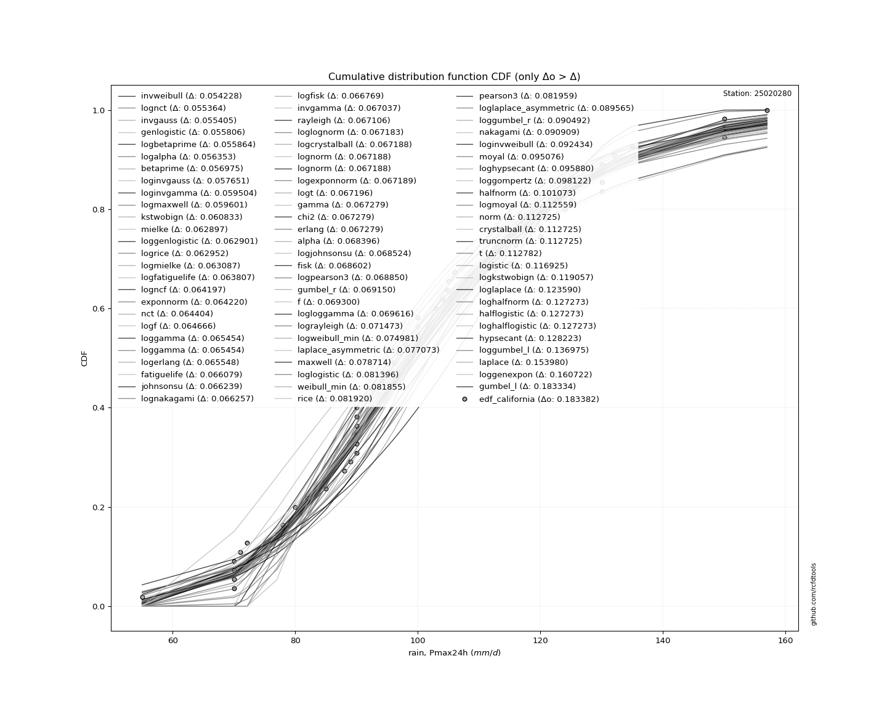</img>

</div>


**1.3. Best fit**

<div align="center">

|   id |   station | empirical_dist   | p_dist     |     delta |   deltao | eval   |   fit |   n |   best_fit |   best_fit_sort |
|-----:|----------:|:-----------------|:-----------|----------:|---------:|:-------|------:|----:|-----------:|----------------:|
|    0 |  25020280 | edf_california   | invweibull | 0.0542279 | 0.183382 | Δo > Δ |     1 |  55 |          1 |               1 |

</div>


<div align="center">

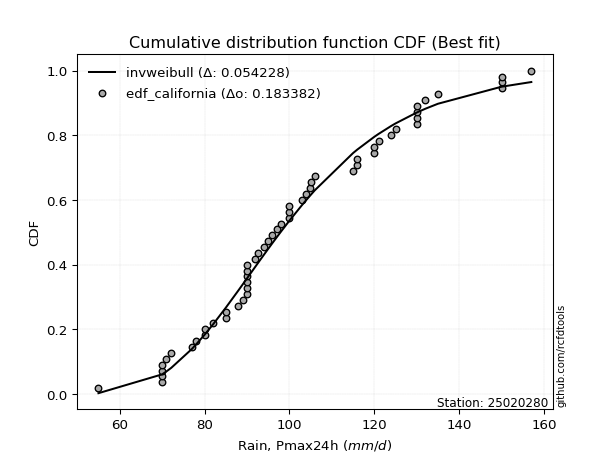</img>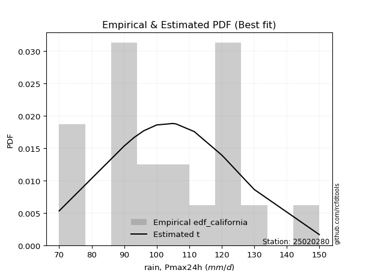</img>

</div>


### 2. Empirical - EDF Hazen (1930)

Hazen method for plotting positions is a formula used to estimate the empirical cumulative probability distribution of flood events or other hydrological data. This formula often results in biased estimations, particularly when extrapolating to extreme events (high return periods).

<div align="center">


$P=(m-0.5)/n$


</div>


**2.1. Empirical values**

<div align="center">

|                | 0                   | 1                   | 2                    | 3                   | 4                   | 5                  | 6                   | 7                   | 8                   | 9                   | 10                  | 11                  | 12                  | 13                  | 14                 | 15                 | 16                 | 17                 | 18                  | 19                  | 20                  | 21                  | 22                 | 23                  | 24                  | 25                 | 26                 | 27        | 28                 | 29                 | 30                 | 31                 | 32                 | 33                 | 34                 | 35                 | 36                 | 37                 | 38                | 39                 | 40                 | 41                 | 42                 | 43                 | 44                 | 45                 | 46                 | 47                 | 48                 | 49                 | 50                 | 51                 | 52                 | 53                 | 54                 |
|:---------------|:--------------------|:--------------------|:---------------------|:--------------------|:--------------------|:-------------------|:--------------------|:--------------------|:--------------------|:--------------------|:--------------------|:--------------------|:--------------------|:--------------------|:-------------------|:-------------------|:-------------------|:-------------------|:--------------------|:--------------------|:--------------------|:--------------------|:-------------------|:--------------------|:--------------------|:-------------------|:-------------------|:----------|:-------------------|:-------------------|:-------------------|:-------------------|:-------------------|:-------------------|:-------------------|:-------------------|:-------------------|:-------------------|:------------------|:-------------------|:-------------------|:-------------------|:-------------------|:-------------------|:-------------------|:-------------------|:-------------------|:-------------------|:-------------------|:-------------------|:-------------------|:-------------------|:-------------------|:-------------------|:-------------------|
| date           | 1986                | 1963                | 1997                 | 1995                | 2001                | 1966               | 1968                | 1989                | 1981                | 1967                | 1964                | 1976                | 2011                | 2015                | 1988               | 2013               | 2004               | 2007               | 1987                | 1991                | 1977                | 2009                | 1974               | 1990                | 1965                | 2016               | 2002               | 1972      | 1985               | 2017               | 1994               | 1971               | 1983               | 1975               | 2003               | 1992               | 2005               | 1970               | 1979              | 1973               | 2000               | 1993               | 2008               | 1998               | 2006               | 1978               | 1999               | 1980               | 2012               | 1969               | 2014               | 1984               | 1982               | 1996               | 2010               |
| x              | 55.0                | 70.0                | 70.0                 | 70.0                | 70.0                | 71.0               | 72.1625217          | 77.0                | 78.0                | 80.0                | 80.0                | 82.0                | 85.0                | 85.0                | 88.0               | 89.0               | 90.0               | 90.0               | 90.0                | 90.0                | 90.0                | 90.0                | 92.0               | 92.6                | 94.0                | 95.0               | 96.0               | 97.0      | 98.0               | 100.0              | 100.0              | 100.0              | 103.0              | 104.0              | 104.85022766727273 | 105.0              | 106.0              | 115.0              | 116.0             | 116.0              | 120.0              | 120.0              | 121.0              | 124.0              | 125.0              | 130.0              | 130.0              | 130.0              | 130.0              | 132.0              | 135.0              | 150.0              | 150.0              | 150.0              | 157.0              |
| m              | 1                   | 2                   | 3                    | 4                   | 5                   | 6                  | 7                   | 8                   | 9                   | 10                  | 11                  | 12                  | 13                  | 14                  | 15                 | 16                 | 17                 | 18                 | 19                  | 20                  | 21                  | 22                  | 23                 | 24                  | 25                  | 26                 | 27                 | 28        | 29                 | 30                 | 31                 | 32                 | 33                 | 34                 | 35                 | 36                 | 37                 | 38                 | 39                | 40                 | 41                 | 42                 | 43                 | 44                 | 45                 | 46                 | 47                 | 48                 | 49                 | 50                 | 51                 | 52                 | 53                 | 54                 | 55                 |
| empirical_dist | edf_hazen           | edf_hazen           | edf_hazen            | edf_hazen           | edf_hazen           | edf_hazen          | edf_hazen           | edf_hazen           | edf_hazen           | edf_hazen           | edf_hazen           | edf_hazen           | edf_hazen           | edf_hazen           | edf_hazen          | edf_hazen          | edf_hazen          | edf_hazen          | edf_hazen           | edf_hazen           | edf_hazen           | edf_hazen           | edf_hazen          | edf_hazen           | edf_hazen           | edf_hazen          | edf_hazen          | edf_hazen | edf_hazen          | edf_hazen          | edf_hazen          | edf_hazen          | edf_hazen          | edf_hazen          | edf_hazen          | edf_hazen          | edf_hazen          | edf_hazen          | edf_hazen         | edf_hazen          | edf_hazen          | edf_hazen          | edf_hazen          | edf_hazen          | edf_hazen          | edf_hazen          | edf_hazen          | edf_hazen          | edf_hazen          | edf_hazen          | edf_hazen          | edf_hazen          | edf_hazen          | edf_hazen          | edf_hazen          |
| empirical      | 0.00909090909090909 | 0.02727272727272727 | 0.045454545454545456 | 0.06363636363636363 | 0.08181818181818182 | 0.1                | 0.11818181818181818 | 0.13636363636363635 | 0.15454545454545454 | 0.17272727272727273 | 0.19090909090909092 | 0.20909090909090908 | 0.22727272727272727 | 0.24545454545454545 | 0.2636363636363636 | 0.2818181818181818 | 0.3                | 0.3181818181818182 | 0.33636363636363636 | 0.35454545454545455 | 0.37272727272727274 | 0.39090909090909093 | 0.4090909090909091 | 0.42727272727272725 | 0.44545454545454544 | 0.4636363636363636 | 0.4818181818181818 | 0.5       | 0.5181818181818182 | 0.5363636363636364 | 0.5545454545454546 | 0.5727272727272728 | 0.5909090909090909 | 0.6090909090909091 | 0.6272727272727273 | 0.6454545454545455 | 0.6636363636363637 | 0.6818181818181818 | 0.7               | 0.7181818181818181 | 0.7363636363636363 | 0.7545454545454545 | 0.7727272727272727 | 0.7909090909090909 | 0.8090909090909091 | 0.8272727272727273 | 0.8454545454545455 | 0.8636363636363636 | 0.8818181818181818 | 0.9                | 0.9181818181818182 | 0.9363636363636364 | 0.9545454545454546 | 0.9727272727272728 | 0.990909090909091  |
| empirical_tr   | 1.0091743119266054  | 1.02803738317757    | 1.0476190476190477   | 1.0679611650485437  | 1.089108910891089   | 1.1111111111111112 | 1.134020618556701   | 1.1578947368421053  | 1.1827956989247312  | 1.2087912087912087  | 1.2359550561797752  | 1.264367816091954   | 1.2941176470588236  | 1.3253012048192772  | 1.3580246913580247 | 1.3924050632911391 | 1.4285714285714286 | 1.4666666666666666 | 1.5068493150684932  | 1.5492957746478873  | 1.5942028985507248  | 1.6417910447761193  | 1.6923076923076925 | 1.746031746031746   | 1.8032786885245902  | 1.8644067796610169 | 1.9298245614035088 | 2.0       | 2.0754716981132075 | 2.156862745098039  | 2.2448979591836737 | 2.3404255319148937 | 2.4444444444444446 | 2.558139534883721  | 2.682926829268293  | 2.8205128205128207 | 2.9729729729729732 | 3.1428571428571423 | 3.333333333333333 | 3.548387096774193  | 3.7931034482758617 | 4.0740740740740735 | 4.3999999999999995 | 4.782608695652174  | 5.238095238095238  | 5.7894736842105265 | 6.470588235294118  | 7.333333333333334  | 8.461538461538463  | 10.000000000000002 | 12.222222222222227 | 15.714285714285722 | 22.00000000000002  | 36.66666666666673  | 110.00000000000064 |

</div>


**2.2. Kolmogorov-Smirnov fit test (sorted by Δ)**


<div align="center">

|                | 0                    | 1                   | 2                    | 3                   | 4                   | 5                   | 6                   | 7                   | 8                   | 9                   | 10                  | 11                  | 12                   | 13                  | 14                  | 15                  | 16                   | 17                   | 18                  | 19                  | 20                   | 21                  | 22                  | 23                  | 24                  | 25                  | 26                  | 27                  | 28                  | 29                  | 30                  | 31                  | 32                  | 33                  | 34                  | 35                  | 36                  | 37                  | 38                  | 39                  | 40                  | 41                  | 42                  | 43                  | 44                  | 45                  | 46                  | 47                  | 48                  | 49                  | 50                  | 51                  | 52                  | 53                  | 54                  | 55                  | 56                  | 57                  | 58                    | 59                  | 60                  | 61                  | 62                  | 63                  | 64                  | 65                  | 66                  | 67                  | 68                  | 69                  | 70                  | 71                  | 72                  | 73                  | 74                  | 75                  | 76                  | 77                  | 78                  | 79                  | 80                  | 81                  | 82                  | 83                  | 84                  | 85                  | 86                  | 87                  | 88                  | 89                  |
|:---------------|:---------------------|:--------------------|:---------------------|:--------------------|:--------------------|:--------------------|:--------------------|:--------------------|:--------------------|:--------------------|:--------------------|:--------------------|:---------------------|:--------------------|:--------------------|:--------------------|:---------------------|:---------------------|:--------------------|:--------------------|:---------------------|:--------------------|:--------------------|:--------------------|:--------------------|:--------------------|:--------------------|:--------------------|:--------------------|:--------------------|:--------------------|:--------------------|:--------------------|:--------------------|:--------------------|:--------------------|:--------------------|:--------------------|:--------------------|:--------------------|:--------------------|:--------------------|:--------------------|:--------------------|:--------------------|:--------------------|:--------------------|:--------------------|:--------------------|:--------------------|:--------------------|:--------------------|:--------------------|:--------------------|:--------------------|:--------------------|:--------------------|:--------------------|:----------------------|:--------------------|:--------------------|:--------------------|:--------------------|:--------------------|:--------------------|:--------------------|:--------------------|:--------------------|:--------------------|:--------------------|:--------------------|:--------------------|:--------------------|:--------------------|:--------------------|:--------------------|:--------------------|:--------------------|:--------------------|:--------------------|:--------------------|:--------------------|:--------------------|:--------------------|:--------------------|:--------------------|:--------------------|:--------------------|:--------------------|:--------------------|
| station        | 25020280             | 25020280            | 25020280             | 25020280            | 25020280            | 25020280            | 25020280            | 25020280            | 25020280            | 25020280            | 25020280            | 25020280            | 25020280             | 25020280            | 25020280            | 25020280            | 25020280             | 25020280             | 25020280            | 25020280            | 25020280             | 25020280            | 25020280            | 25020280            | 25020280            | 25020280            | 25020280            | 25020280            | 25020280            | 25020280            | 25020280            | 25020280            | 25020280            | 25020280            | 25020280            | 25020280            | 25020280            | 25020280            | 25020280            | 25020280            | 25020280            | 25020280            | 25020280            | 25020280            | 25020280            | 25020280            | 25020280            | 25020280            | 25020280            | 25020280            | 25020280            | 25020280            | 25020280            | 25020280            | 25020280            | 25020280            | 25020280            | 25020280            | 25020280              | 25020280            | 25020280            | 25020280            | 25020280            | 25020280            | 25020280            | 25020280            | 25020280            | 25020280            | 25020280            | 25020280            | 25020280            | 25020280            | 25020280            | 25020280            | 25020280            | 25020280            | 25020280            | 25020280            | 25020280            | 25020280            | 25020280            | 25020280            | 25020280            | 25020280            | 25020280            | 25020280            | 25020280            | 25020280            | 25020280            | 25020280            |
| empirical_dist | edf_hazen            | edf_hazen           | edf_hazen            | edf_hazen           | edf_hazen           | edf_hazen           | edf_hazen           | edf_hazen           | edf_hazen           | edf_hazen           | edf_hazen           | edf_hazen           | edf_hazen            | edf_hazen           | edf_hazen           | edf_hazen           | edf_hazen            | edf_hazen            | edf_hazen           | edf_hazen           | edf_hazen            | edf_hazen           | edf_hazen           | edf_hazen           | edf_hazen           | edf_hazen           | edf_hazen           | edf_hazen           | edf_hazen           | edf_hazen           | edf_hazen           | edf_hazen           | edf_hazen           | edf_hazen           | edf_hazen           | edf_hazen           | edf_hazen           | edf_hazen           | edf_hazen           | edf_hazen           | edf_hazen           | edf_hazen           | edf_hazen           | edf_hazen           | edf_hazen           | edf_hazen           | edf_hazen           | edf_hazen           | edf_hazen           | edf_hazen           | edf_hazen           | edf_hazen           | edf_hazen           | edf_hazen           | edf_hazen           | edf_hazen           | edf_hazen           | edf_hazen           | edf_hazen             | edf_hazen           | edf_hazen           | edf_hazen           | edf_hazen           | edf_hazen           | edf_hazen           | edf_hazen           | edf_hazen           | edf_hazen           | edf_hazen           | edf_hazen           | edf_hazen           | edf_hazen           | edf_hazen           | edf_hazen           | edf_hazen           | edf_hazen           | edf_hazen           | edf_hazen           | edf_hazen           | edf_hazen           | edf_hazen           | edf_hazen           | edf_hazen           | edf_hazen           | edf_hazen           | edf_hazen           | edf_hazen           | edf_hazen           | edf_hazen           | edf_hazen           |
| p_dist         | rayleigh             | gamma               | chi2                 | erlang              | fatiguelife         | logrice             | lognakagami         | logt                | logexponnorm        | lognorm             | lognorm             | logcrystalball      | loglognorm           | logerlang           | logjohnsonsu        | logncf              | loggamma             | loggamma             | johnsonsu           | logf                | logpearson3          | invgamma            | f                   | logloggamma         | logfatiguelife      | alpha               | loginvgamma         | logalpha            | logbetaprime        | nct                 | invgauss            | invweibull          | betaprime           | lognct              | genlogistic         | logweibull_min      | loginvgauss         | logmaxwell          | maxwell             | kstwobign           | fisk                | mielke              | loggenlogistic      | logmielke           | logfisk             | weibull_min         | rice                | pearson3            | exponnorm           | gumbel_r            | lograyleigh         | loglogistic         | laplace_asymmetric  | loggompertz         | halfnorm            | moyal               | nakagami            | loghypsecant        | loglaplace_asymmetric | loggumbel_r         | loginvweibull       | norm                | crystalball         | truncnorm           | t                   | logistic            | logmoyal            | loglaplace          | halflogistic        | loghalfnorm         | hypsecant           | loghalflogistic     | loggumbel_l         | logkstwobign        | laplace             | loggenexpon         | gumbel_l            | wald                | logwald             | loggibrat           | ncf                 | gibrat              | expon               | pareto              | genexpon            | logtruncnorm        | logexpon            | logpareto           | logchi2             | gompertz            |
| delta          | 0.058015091738039315 | 0.05818776246368251 | 0.058187825921391045 | 0.05818797136805409 | 0.05829273226811971 | 0.05847757038643764 | 0.05902656878385393 | 0.05906294031221648 | 0.05906875546245394 | 0.05906957539143276 | 0.05906957539143276 | 0.05906985910309859 | 0.059070769599383954 | 0.05937099322118544 | 0.05943273455927811 | 0.05946790378327271 | 0.059487303922987955 | 0.059487303922987955 | 0.05967560094321411 | 0.05971030148917156 | 0.059758662511420146 | 0.05989993276064565 | 0.06020914533435162 | 0.0605252412392947  | 0.06053027174477643 | 0.06065261457289828 | 0.06101607778363283 | 0.06150825400712223 | 0.06202822373842676 | 0.06223987586166935 | 0.06241508453147948 | 0.0633188064215725  | 0.06341838249746157 | 0.06445535457205398 | 0.06489737452942301 | 0.06588988897785486 | 0.06674142120327775 | 0.06869228094042762 | 0.06962262050077317 | 0.06992364076803165 | 0.07173101198222376 | 0.07198789070249889 | 0.07199203355301065 | 0.07217828066299903 | 0.07221001995077903 | 0.07276459017627868 | 0.07282906700211905 | 0.07286841695680957 | 0.0733105190541653  | 0.07824047322422889 | 0.08056414424236169 | 0.08078464314308387 | 0.08616411953401937 | 0.08903071880971714 | 0.09198222760352269 | 0.09384252254506731 | 0.09499685892238485 | 0.09527795213816415 | 0.09865570540114421   | 0.09958311955877164 | 0.10152477843408964 | 0.10363424029390245 | 0.10363424073604244 | 0.10363424332527482 | 0.10369060245672795 | 0.10783441593584026 | 0.11312900334621367 | 0.11630269487019007 | 0.11818181818181818 | 0.11818181818181818 | 0.11913228874684823 | 0.12027755393737827 | 0.12788436724133234 | 0.12814781810536696 | 0.14488916586482972 | 0.16981283229523986 | 0.1742426886238828  | 0.19024936073177678 | 0.1904357820339747  | 0.20909090909090908 | 0.22126227323379233 | 0.23279378654969068 | 0.24680485154751497 | 0.24680488172995446 | 0.24800237232662586 | 0.2988545116312169  | 0.3085421831892703  | 0.3085421907652099  | 0.3204865511460546  | 0.8626512702313703  |
| deltao         | 0.18338236259000185  | 0.18338236259000185 | 0.18338236259000185  | 0.18338236259000185 | 0.18338236259000185 | 0.18338236259000185 | 0.18338236259000185 | 0.18338236259000185 | 0.18338236259000185 | 0.18338236259000185 | 0.18338236259000185 | 0.18338236259000185 | 0.18338236259000185  | 0.18338236259000185 | 0.18338236259000185 | 0.18338236259000185 | 0.18338236259000185  | 0.18338236259000185  | 0.18338236259000185 | 0.18338236259000185 | 0.18338236259000185  | 0.18338236259000185 | 0.18338236259000185 | 0.18338236259000185 | 0.18338236259000185 | 0.18338236259000185 | 0.18338236259000185 | 0.18338236259000185 | 0.18338236259000185 | 0.18338236259000185 | 0.18338236259000185 | 0.18338236259000185 | 0.18338236259000185 | 0.18338236259000185 | 0.18338236259000185 | 0.18338236259000185 | 0.18338236259000185 | 0.18338236259000185 | 0.18338236259000185 | 0.18338236259000185 | 0.18338236259000185 | 0.18338236259000185 | 0.18338236259000185 | 0.18338236259000185 | 0.18338236259000185 | 0.18338236259000185 | 0.18338236259000185 | 0.18338236259000185 | 0.18338236259000185 | 0.18338236259000185 | 0.18338236259000185 | 0.18338236259000185 | 0.18338236259000185 | 0.18338236259000185 | 0.18338236259000185 | 0.18338236259000185 | 0.18338236259000185 | 0.18338236259000185 | 0.18338236259000185   | 0.18338236259000185 | 0.18338236259000185 | 0.18338236259000185 | 0.18338236259000185 | 0.18338236259000185 | 0.18338236259000185 | 0.18338236259000185 | 0.18338236259000185 | 0.18338236259000185 | 0.18338236259000185 | 0.18338236259000185 | 0.18338236259000185 | 0.18338236259000185 | 0.18338236259000185 | 0.18338236259000185 | 0.18338236259000185 | 0.18338236259000185 | 0.18338236259000185 | 0.18338236259000185 | 0.18338236259000185 | 0.18338236259000185 | 0.18338236259000185 | 0.18338236259000185 | 0.18338236259000185 | 0.18338236259000185 | 0.18338236259000185 | 0.18338236259000185 | 0.18338236259000185 | 0.18338236259000185 | 0.18338236259000185 | 0.18338236259000185 |
| eval           | Δo > Δ               | Δo > Δ              | Δo > Δ               | Δo > Δ              | Δo > Δ              | Δo > Δ              | Δo > Δ              | Δo > Δ              | Δo > Δ              | Δo > Δ              | Δo > Δ              | Δo > Δ              | Δo > Δ               | Δo > Δ              | Δo > Δ              | Δo > Δ              | Δo > Δ               | Δo > Δ               | Δo > Δ              | Δo > Δ              | Δo > Δ               | Δo > Δ              | Δo > Δ              | Δo > Δ              | Δo > Δ              | Δo > Δ              | Δo > Δ              | Δo > Δ              | Δo > Δ              | Δo > Δ              | Δo > Δ              | Δo > Δ              | Δo > Δ              | Δo > Δ              | Δo > Δ              | Δo > Δ              | Δo > Δ              | Δo > Δ              | Δo > Δ              | Δo > Δ              | Δo > Δ              | Δo > Δ              | Δo > Δ              | Δo > Δ              | Δo > Δ              | Δo > Δ              | Δo > Δ              | Δo > Δ              | Δo > Δ              | Δo > Δ              | Δo > Δ              | Δo > Δ              | Δo > Δ              | Δo > Δ              | Δo > Δ              | Δo > Δ              | Δo > Δ              | Δo > Δ              | Δo > Δ                | Δo > Δ              | Δo > Δ              | Δo > Δ              | Δo > Δ              | Δo > Δ              | Δo > Δ              | Δo > Δ              | Δo > Δ              | Δo > Δ              | Δo > Δ              | Δo > Δ              | Δo > Δ              | Δo > Δ              | Δo > Δ              | Δo > Δ              | Δo > Δ              | Δo > Δ              | Δo > Δ              | Δo <= Δ             | Δo <= Δ             | Δo <= Δ             | Δo <= Δ             | Δo <= Δ             | Δo <= Δ             | Δo <= Δ             | Δo <= Δ             | Δo <= Δ             | Δo <= Δ             | Δo <= Δ             | Δo <= Δ             | Δo <= Δ             |
| fit            | 1                    | 1                   | 1                    | 1                   | 1                   | 1                   | 1                   | 1                   | 1                   | 1                   | 1                   | 1                   | 1                    | 1                   | 1                   | 1                   | 1                    | 1                    | 1                   | 1                   | 1                    | 1                   | 1                   | 1                   | 1                   | 1                   | 1                   | 1                   | 1                   | 1                   | 1                   | 1                   | 1                   | 1                   | 1                   | 1                   | 1                   | 1                   | 1                   | 1                   | 1                   | 1                   | 1                   | 1                   | 1                   | 1                   | 1                   | 1                   | 1                   | 1                   | 1                   | 1                   | 1                   | 1                   | 1                   | 1                   | 1                   | 1                   | 1                     | 1                   | 1                   | 1                   | 1                   | 1                   | 1                   | 1                   | 1                   | 1                   | 1                   | 1                   | 1                   | 1                   | 1                   | 1                   | 1                   | 1                   | 1                   | 0                   | 0                   | 0                   | 0                   | 0                   | 0                   | 0                   | 0                   | 0                   | 0                   | 0                   | 0                   | 0                   |
| n              | 55                   | 55                  | 55                   | 55                  | 55                  | 55                  | 55                  | 55                  | 55                  | 55                  | 55                  | 55                  | 55                   | 55                  | 55                  | 55                  | 55                   | 55                   | 55                  | 55                  | 55                   | 55                  | 55                  | 55                  | 55                  | 55                  | 55                  | 55                  | 55                  | 55                  | 55                  | 55                  | 55                  | 55                  | 55                  | 55                  | 55                  | 55                  | 55                  | 55                  | 55                  | 55                  | 55                  | 55                  | 55                  | 55                  | 55                  | 55                  | 55                  | 55                  | 55                  | 55                  | 55                  | 55                  | 55                  | 55                  | 55                  | 55                  | 55                    | 55                  | 55                  | 55                  | 55                  | 55                  | 55                  | 55                  | 55                  | 55                  | 55                  | 55                  | 55                  | 55                  | 55                  | 55                  | 55                  | 55                  | 55                  | 55                  | 55                  | 55                  | 55                  | 55                  | 55                  | 55                  | 55                  | 55                  | 55                  | 55                  | 55                  | 55                  |
| best_fit       | 1                    | 0                   | 0                    | 0                   | 0                   | 0                   | 0                   | 0                   | 0                   | 0                   | 0                   | 0                   | 0                    | 0                   | 0                   | 0                   | 0                    | 0                    | 0                   | 0                   | 0                    | 0                   | 0                   | 0                   | 0                   | 0                   | 0                   | 0                   | 0                   | 0                   | 0                   | 0                   | 0                   | 0                   | 0                   | 0                   | 0                   | 0                   | 0                   | 0                   | 0                   | 0                   | 0                   | 0                   | 0                   | 0                   | 0                   | 0                   | 0                   | 0                   | 0                   | 0                   | 0                   | 0                   | 0                   | 0                   | 0                   | 0                   | 0                     | 0                   | 0                   | 0                   | 0                   | 0                   | 0                   | 0                   | 0                   | 0                   | 0                   | 0                   | 0                   | 0                   | 0                   | 0                   | 0                   | 0                   | 0                   | 0                   | 0                   | 0                   | 0                   | 0                   | 0                   | 0                   | 0                   | 0                   | 0                   | 0                   | 0                   | 0                   |
| best_fit_sort  | 1                    | 2                   | 3                    | 4                   | 5                   | 6                   | 7                   | 8                   | 9                   | 10                  | 11                  | 12                  | 13                   | 14                  | 15                  | 16                  | 17                   | 18                   | 19                  | 20                  | 21                   | 22                  | 23                  | 24                  | 25                  | 26                  | 27                  | 28                  | 29                  | 30                  | 31                  | 32                  | 33                  | 34                  | 35                  | 36                  | 37                  | 38                  | 39                  | 40                  | 41                  | 42                  | 43                  | 44                  | 45                  | 46                  | 47                  | 48                  | 49                  | 50                  | 51                  | 52                  | 53                  | 54                  | 55                  | 56                  | 57                  | 58                  | 59                    | 60                  | 61                  | 62                  | 63                  | 64                  | 65                  | 66                  | 67                  | 68                  | 69                  | 70                  | 71                  | 72                  | 73                  | 74                  | 75                  | 76                  | 77                  | 78                  | 79                  | 80                  | 81                  | 82                  | 83                  | 84                  | 85                  | 86                  | 87                  | 88                  | 89                  | 90                  |

</div>


<div align="center">

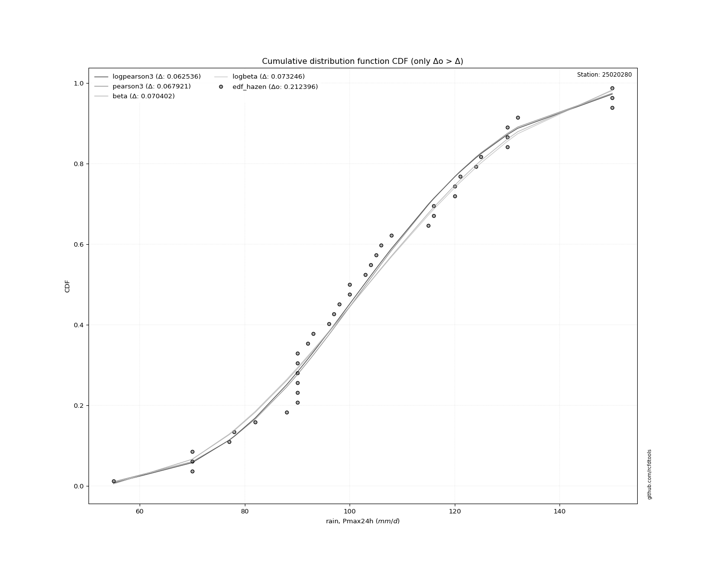</img>

</div>


**2.3. Best fit**

<div align="center">

|   id |   station | empirical_dist   | p_dist   |     delta |   deltao | eval   |   fit |   n |   best_fit |   best_fit_sort |
|-----:|----------:|:-----------------|:---------|----------:|---------:|:-------|------:|----:|-----------:|----------------:|
|    0 |  25020280 | edf_hazen        | rayleigh | 0.0580151 | 0.183382 | Δo > Δ |     1 |  55 |          1 |               1 |

</div>


<div align="center">

</img>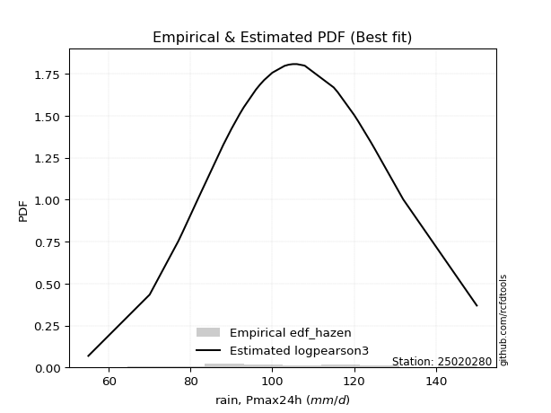</img>

</div>


### 3. Empirical - EDF Weibull (1939)

Weibull plotting position formula is an empirical method used to estimate the non-exceedance probability or plotting position for a set of observed data, is often recommended or widely used in practice, particularly in flood frequency analysis.

<div align="center">


$P=m/(n+1)$


</div>


**3.1. Empirical values**

<div align="center">

|                | 0                    | 1                   | 2                   | 3                   | 4                   | 5                   | 6                  | 7                   | 8                   | 9                   | 10                  | 11                  | 12                  | 13                 | 14                  | 15                 | 16                  | 17                  | 18                 | 19                  | 20          | 21                  | 22                 | 23                  | 24                  | 25                 | 26                  | 27          | 28                 | 29                 | 30                 | 31                 | 32                 | 33                 | 34                 | 35                 | 36                 | 37                 | 38                 | 39                 | 40                 | 41          | 42                 | 43                 | 44                 | 45                 | 46                 | 47                 | 48          | 49                 | 50                 | 51                 | 52                 | 53                 | 54                 |
|:---------------|:---------------------|:--------------------|:--------------------|:--------------------|:--------------------|:--------------------|:-------------------|:--------------------|:--------------------|:--------------------|:--------------------|:--------------------|:--------------------|:-------------------|:--------------------|:-------------------|:--------------------|:--------------------|:-------------------|:--------------------|:------------|:--------------------|:-------------------|:--------------------|:--------------------|:-------------------|:--------------------|:------------|:-------------------|:-------------------|:-------------------|:-------------------|:-------------------|:-------------------|:-------------------|:-------------------|:-------------------|:-------------------|:-------------------|:-------------------|:-------------------|:------------|:-------------------|:-------------------|:-------------------|:-------------------|:-------------------|:-------------------|:------------|:-------------------|:-------------------|:-------------------|:-------------------|:-------------------|:-------------------|
| date           | 1986                 | 1963                | 1997                | 1995                | 2001                | 1966                | 1968               | 1989                | 1981                | 1967                | 1964                | 1976                | 2011                | 2015               | 1988                | 2013               | 2004                | 2007                | 1987               | 1991                | 1977        | 2009                | 1974               | 1990                | 1965                | 2016               | 2002                | 1972        | 1985               | 2017               | 1994               | 1971               | 1983               | 1975               | 2003               | 1992               | 2005               | 1970               | 1979               | 1973               | 2000               | 1993        | 2008               | 1998               | 2006               | 1978               | 1999               | 1980               | 2012        | 1969               | 2014               | 1984               | 1982               | 1996               | 2010               |
| x              | 55.0                 | 70.0                | 70.0                | 70.0                | 70.0                | 71.0                | 72.1625217         | 77.0                | 78.0                | 80.0                | 80.0                | 82.0                | 85.0                | 85.0               | 88.0                | 89.0               | 90.0                | 90.0                | 90.0               | 90.0                | 90.0        | 90.0                | 92.0               | 92.6                | 94.0                | 95.0               | 96.0                | 97.0        | 98.0               | 100.0              | 100.0              | 100.0              | 103.0              | 104.0              | 104.85022766727273 | 105.0              | 106.0              | 115.0              | 116.0              | 116.0              | 120.0              | 120.0       | 121.0              | 124.0              | 125.0              | 130.0              | 130.0              | 130.0              | 130.0       | 132.0              | 135.0              | 150.0              | 150.0              | 150.0              | 157.0              |
| m              | 1                    | 2                   | 3                   | 4                   | 5                   | 6                   | 7                  | 8                   | 9                   | 10                  | 11                  | 12                  | 13                  | 14                 | 15                  | 16                 | 17                  | 18                  | 19                 | 20                  | 21          | 22                  | 23                 | 24                  | 25                  | 26                 | 27                  | 28          | 29                 | 30                 | 31                 | 32                 | 33                 | 34                 | 35                 | 36                 | 37                 | 38                 | 39                 | 40                 | 41                 | 42          | 43                 | 44                 | 45                 | 46                 | 47                 | 48                 | 49          | 50                 | 51                 | 52                 | 53                 | 54                 | 55                 |
| empirical_dist | edf_weibull          | edf_weibull         | edf_weibull         | edf_weibull         | edf_weibull         | edf_weibull         | edf_weibull        | edf_weibull         | edf_weibull         | edf_weibull         | edf_weibull         | edf_weibull         | edf_weibull         | edf_weibull        | edf_weibull         | edf_weibull        | edf_weibull         | edf_weibull         | edf_weibull        | edf_weibull         | edf_weibull | edf_weibull         | edf_weibull        | edf_weibull         | edf_weibull         | edf_weibull        | edf_weibull         | edf_weibull | edf_weibull        | edf_weibull        | edf_weibull        | edf_weibull        | edf_weibull        | edf_weibull        | edf_weibull        | edf_weibull        | edf_weibull        | edf_weibull        | edf_weibull        | edf_weibull        | edf_weibull        | edf_weibull | edf_weibull        | edf_weibull        | edf_weibull        | edf_weibull        | edf_weibull        | edf_weibull        | edf_weibull | edf_weibull        | edf_weibull        | edf_weibull        | edf_weibull        | edf_weibull        | edf_weibull        |
| empirical      | 0.017857142857142856 | 0.03571428571428571 | 0.05357142857142857 | 0.07142857142857142 | 0.08928571428571429 | 0.10714285714285714 | 0.125              | 0.14285714285714285 | 0.16071428571428573 | 0.17857142857142858 | 0.19642857142857142 | 0.21428571428571427 | 0.23214285714285715 | 0.25               | 0.26785714285714285 | 0.2857142857142857 | 0.30357142857142855 | 0.32142857142857145 | 0.3392857142857143 | 0.35714285714285715 | 0.375       | 0.39285714285714285 | 0.4107142857142857 | 0.42857142857142855 | 0.44642857142857145 | 0.4642857142857143 | 0.48214285714285715 | 0.5         | 0.5178571428571429 | 0.5357142857142857 | 0.5535714285714286 | 0.5714285714285714 | 0.5892857142857143 | 0.6071428571428571 | 0.625              | 0.6428571428571429 | 0.6607142857142857 | 0.6785714285714286 | 0.6964285714285714 | 0.7142857142857143 | 0.7321428571428571 | 0.75        | 0.7678571428571429 | 0.7857142857142857 | 0.8035714285714286 | 0.8214285714285714 | 0.8392857142857143 | 0.8571428571428571 | 0.875       | 0.8928571428571429 | 0.9107142857142857 | 0.9285714285714286 | 0.9464285714285714 | 0.9642857142857143 | 0.9821428571428571 |
| empirical_tr   | 1.0181818181818183   | 1.037037037037037   | 1.0566037735849056  | 1.0769230769230769  | 1.0980392156862746  | 1.1199999999999999  | 1.1428571428571428 | 1.1666666666666665  | 1.1914893617021276  | 1.2173913043478262  | 1.2444444444444445  | 1.2727272727272727  | 1.302325581395349   | 1.3333333333333333 | 1.3658536585365852  | 1.4                | 1.435897435897436   | 1.4736842105263157  | 1.5135135135135136 | 1.5555555555555558  | 1.6         | 1.6470588235294117  | 1.696969696969697  | 1.75                | 1.8064516129032258  | 1.8666666666666667 | 1.931034482758621   | 2.0         | 2.0740740740740744 | 2.1538461538461537 | 2.24               | 2.333333333333333  | 2.4347826086956523 | 2.545454545454545  | 2.6666666666666665 | 2.8000000000000003 | 2.9473684210526314 | 3.1111111111111116 | 3.2941176470588234 | 3.5                | 3.7333333333333325 | 4.0         | 4.307692307692308  | 4.666666666666666  | 5.090909090909092  | 5.599999999999999  | 6.222222222222223  | 6.999999999999997  | 8.0         | 9.333333333333337  | 11.199999999999998 | 14.000000000000007 | 18.666666666666657 | 28.000000000000014 | 55.99999999999985  |

</div>


**3.2. Kolmogorov-Smirnov fit test (sorted by Δ)**


<div align="center">

|                | 0                   | 1                   | 2                   | 3                   | 4                   | 5                   | 6                   | 7                   | 8                   | 9                   | 10                  | 11                  | 12                  | 13                  | 14                  | 15                  | 16                  | 17                  | 18                  | 19                  | 20                  | 21                  | 22                  | 23                  | 24                  | 25                  | 26                  | 27                  | 28                  | 29                  | 30                  | 31                  | 32                  | 33                  | 34                  | 35                  | 36                  | 37                  | 38                  | 39                  | 40                  | 41                  | 42                  | 43                  | 44                  | 45                  | 46                  | 47                  | 48                  | 49                  | 50                  | 51                  | 52                  | 53                  | 54                  | 55                  | 56                  | 57                  | 58                  | 59                    | 60                  | 61                  | 62                  | 63                  | 64                  | 65                  | 66                  | 67                  | 68                  | 69                  | 70                  | 71                  | 72                  | 73                  | 74                  | 75                  | 76                  | 77                  | 78                  | 79                  | 80                  | 81                  | 82                  | 83                  | 84                  | 85                  | 86                  | 87                  | 88                  | 89                  |
|:---------------|:--------------------|:--------------------|:--------------------|:--------------------|:--------------------|:--------------------|:--------------------|:--------------------|:--------------------|:--------------------|:--------------------|:--------------------|:--------------------|:--------------------|:--------------------|:--------------------|:--------------------|:--------------------|:--------------------|:--------------------|:--------------------|:--------------------|:--------------------|:--------------------|:--------------------|:--------------------|:--------------------|:--------------------|:--------------------|:--------------------|:--------------------|:--------------------|:--------------------|:--------------------|:--------------------|:--------------------|:--------------------|:--------------------|:--------------------|:--------------------|:--------------------|:--------------------|:--------------------|:--------------------|:--------------------|:--------------------|:--------------------|:--------------------|:--------------------|:--------------------|:--------------------|:--------------------|:--------------------|:--------------------|:--------------------|:--------------------|:--------------------|:--------------------|:--------------------|:----------------------|:--------------------|:--------------------|:--------------------|:--------------------|:--------------------|:--------------------|:--------------------|:--------------------|:--------------------|:--------------------|:--------------------|:--------------------|:--------------------|:--------------------|:--------------------|:--------------------|:--------------------|:--------------------|:--------------------|:--------------------|:--------------------|:--------------------|:--------------------|:--------------------|:--------------------|:--------------------|:--------------------|:--------------------|:--------------------|:--------------------|
| station        | 25020280            | 25020280            | 25020280            | 25020280            | 25020280            | 25020280            | 25020280            | 25020280            | 25020280            | 25020280            | 25020280            | 25020280            | 25020280            | 25020280            | 25020280            | 25020280            | 25020280            | 25020280            | 25020280            | 25020280            | 25020280            | 25020280            | 25020280            | 25020280            | 25020280            | 25020280            | 25020280            | 25020280            | 25020280            | 25020280            | 25020280            | 25020280            | 25020280            | 25020280            | 25020280            | 25020280            | 25020280            | 25020280            | 25020280            | 25020280            | 25020280            | 25020280            | 25020280            | 25020280            | 25020280            | 25020280            | 25020280            | 25020280            | 25020280            | 25020280            | 25020280            | 25020280            | 25020280            | 25020280            | 25020280            | 25020280            | 25020280            | 25020280            | 25020280            | 25020280              | 25020280            | 25020280            | 25020280            | 25020280            | 25020280            | 25020280            | 25020280            | 25020280            | 25020280            | 25020280            | 25020280            | 25020280            | 25020280            | 25020280            | 25020280            | 25020280            | 25020280            | 25020280            | 25020280            | 25020280            | 25020280            | 25020280            | 25020280            | 25020280            | 25020280            | 25020280            | 25020280            | 25020280            | 25020280            | 25020280            |
| empirical_dist | edf_weibull         | edf_weibull         | edf_weibull         | edf_weibull         | edf_weibull         | edf_weibull         | edf_weibull         | edf_weibull         | edf_weibull         | edf_weibull         | edf_weibull         | edf_weibull         | edf_weibull         | edf_weibull         | edf_weibull         | edf_weibull         | edf_weibull         | edf_weibull         | edf_weibull         | edf_weibull         | edf_weibull         | edf_weibull         | edf_weibull         | edf_weibull         | edf_weibull         | edf_weibull         | edf_weibull         | edf_weibull         | edf_weibull         | edf_weibull         | edf_weibull         | edf_weibull         | edf_weibull         | edf_weibull         | edf_weibull         | edf_weibull         | edf_weibull         | edf_weibull         | edf_weibull         | edf_weibull         | edf_weibull         | edf_weibull         | edf_weibull         | edf_weibull         | edf_weibull         | edf_weibull         | edf_weibull         | edf_weibull         | edf_weibull         | edf_weibull         | edf_weibull         | edf_weibull         | edf_weibull         | edf_weibull         | edf_weibull         | edf_weibull         | edf_weibull         | edf_weibull         | edf_weibull         | edf_weibull           | edf_weibull         | edf_weibull         | edf_weibull         | edf_weibull         | edf_weibull         | edf_weibull         | edf_weibull         | edf_weibull         | edf_weibull         | edf_weibull         | edf_weibull         | edf_weibull         | edf_weibull         | edf_weibull         | edf_weibull         | edf_weibull         | edf_weibull         | edf_weibull         | edf_weibull         | edf_weibull         | edf_weibull         | edf_weibull         | edf_weibull         | edf_weibull         | edf_weibull         | edf_weibull         | edf_weibull         | edf_weibull         | edf_weibull         | edf_weibull         |
| p_dist         | rayleigh            | erlang              | gamma               | chi2                | fatiguelife         | logrice             | logjohnsonsu        | logloggamma         | logpearson3         | lognakagami         | logt                | logexponnorm        | lognorm             | lognorm             | logcrystalball      | loglognorm          | f                   | logerlang           | logncf              | loggamma            | loggamma            | johnsonsu           | logf                | invgamma            | logweibull_min      | logfatiguelife      | logalpha            | alpha               | loginvgamma         | logbetaprime        | kstwobign           | invgauss            | nct                 | invweibull          | betaprime           | lognct              | genlogistic         | maxwell             | loginvgauss         | weibull_min         | rice                | pearson3            | logmaxwell          | mielke              | loggenlogistic      | fisk                | logmielke           | logfisk             | exponnorm           | lograyleigh         | gumbel_r            | loglogistic         | loggompertz         | laplace_asymmetric  | nakagami            | moyal               | loginvweibull       | loghypsecant        | halfnorm            | loglaplace_asymmetric | norm                | crystalball         | truncnorm           | t                   | loggumbel_r         | logistic            | logmoyal            | loglaplace          | hypsecant           | logkstwobign        | halflogistic        | loghalfnorm         | loghalflogistic     | loggumbel_l         | laplace             | loggenexpon         | gumbel_l            | wald                | logwald             | ncf                 | loggibrat           | gibrat              | expon               | pareto              | genexpon            | logtruncnorm        | logexpon            | logpareto           | logchi2             | gompertz            |
| delta          | 0.05671639043933796 | 0.06096322584193559 | 0.0609633159453159  | 0.06096332763230172 | 0.06251351148889894 | 0.06269834960721687 | 0.06275346031524398 | 0.0627988970083373  | 0.06291656363795517 | 0.06324734800463316 | 0.06328371953299572 | 0.06328953468323317 | 0.063290354612212   | 0.063290354612212   | 0.06329063832387782 | 0.06329154882016319 | 0.0632944306034301  | 0.06359177244196468 | 0.06368868300405195 | 0.06370808314376719 | 0.06370808314376719 | 0.06389638016399335 | 0.0639310807099508  | 0.06412071198142488 | 0.0645911876791535  | 0.06475105096555567 | 0.0647550072538754  | 0.06487339379367751 | 0.06492322000354245 | 0.06527497698517992 | 0.06570286154725241 | 0.06580238412720107 | 0.06646065508244858 | 0.06656555966832567 | 0.06702623175033218 | 0.06770210781880714 | 0.06814412777617618 | 0.06832391920207181 | 0.06998817445003092 | 0.07146588887757732 | 0.0715303657034177  | 0.07156971565810821 | 0.07173081961807293 | 0.07523464394925206 | 0.07523878679976381 | 0.07536309203583513 | 0.07542503390975219 | 0.07545677319753219 | 0.07655727230091847 | 0.07699271567093313 | 0.08148722647098205 | 0.0850054223638631  | 0.08726384966584178 | 0.08941087278077253 | 0.09077607970160562 | 0.09708927579182047 | 0.09788627130220451 | 0.09852470538491731 | 0.09912508474637982 | 0.10190245864789738   | 0.10233553899520109 | 0.10233553943734108 | 0.10233554202657347 | 0.1023919011580266  | 0.1028298728055248  | 0.1065357146371389  | 0.11637575659296684 | 0.11954944811694324 | 0.12108034069490015 | 0.12392703888458773 | 0.125               | 0.125               | 0.125               | 0.126585665942631   | 0.14683721781288164 | 0.16559205307446062 | 0.17294398732518146 | 0.1957688412512573  | 0.19595526255345522 | 0.21379474076625982 | 0.21428571428571427 | 0.23733924109514523 | 0.24089378128566113 | 0.24089380334802096 | 0.24104232711213752 | 0.2904129531896585  | 0.3001006247477119  | 0.3001006323236515  | 0.3120449927044962  | 0.8555084130885132  |
| deltao         | 0.18338236259000185 | 0.18338236259000185 | 0.18338236259000185 | 0.18338236259000185 | 0.18338236259000185 | 0.18338236259000185 | 0.18338236259000185 | 0.18338236259000185 | 0.18338236259000185 | 0.18338236259000185 | 0.18338236259000185 | 0.18338236259000185 | 0.18338236259000185 | 0.18338236259000185 | 0.18338236259000185 | 0.18338236259000185 | 0.18338236259000185 | 0.18338236259000185 | 0.18338236259000185 | 0.18338236259000185 | 0.18338236259000185 | 0.18338236259000185 | 0.18338236259000185 | 0.18338236259000185 | 0.18338236259000185 | 0.18338236259000185 | 0.18338236259000185 | 0.18338236259000185 | 0.18338236259000185 | 0.18338236259000185 | 0.18338236259000185 | 0.18338236259000185 | 0.18338236259000185 | 0.18338236259000185 | 0.18338236259000185 | 0.18338236259000185 | 0.18338236259000185 | 0.18338236259000185 | 0.18338236259000185 | 0.18338236259000185 | 0.18338236259000185 | 0.18338236259000185 | 0.18338236259000185 | 0.18338236259000185 | 0.18338236259000185 | 0.18338236259000185 | 0.18338236259000185 | 0.18338236259000185 | 0.18338236259000185 | 0.18338236259000185 | 0.18338236259000185 | 0.18338236259000185 | 0.18338236259000185 | 0.18338236259000185 | 0.18338236259000185 | 0.18338236259000185 | 0.18338236259000185 | 0.18338236259000185 | 0.18338236259000185 | 0.18338236259000185   | 0.18338236259000185 | 0.18338236259000185 | 0.18338236259000185 | 0.18338236259000185 | 0.18338236259000185 | 0.18338236259000185 | 0.18338236259000185 | 0.18338236259000185 | 0.18338236259000185 | 0.18338236259000185 | 0.18338236259000185 | 0.18338236259000185 | 0.18338236259000185 | 0.18338236259000185 | 0.18338236259000185 | 0.18338236259000185 | 0.18338236259000185 | 0.18338236259000185 | 0.18338236259000185 | 0.18338236259000185 | 0.18338236259000185 | 0.18338236259000185 | 0.18338236259000185 | 0.18338236259000185 | 0.18338236259000185 | 0.18338236259000185 | 0.18338236259000185 | 0.18338236259000185 | 0.18338236259000185 | 0.18338236259000185 |
| eval           | Δo > Δ              | Δo > Δ              | Δo > Δ              | Δo > Δ              | Δo > Δ              | Δo > Δ              | Δo > Δ              | Δo > Δ              | Δo > Δ              | Δo > Δ              | Δo > Δ              | Δo > Δ              | Δo > Δ              | Δo > Δ              | Δo > Δ              | Δo > Δ              | Δo > Δ              | Δo > Δ              | Δo > Δ              | Δo > Δ              | Δo > Δ              | Δo > Δ              | Δo > Δ              | Δo > Δ              | Δo > Δ              | Δo > Δ              | Δo > Δ              | Δo > Δ              | Δo > Δ              | Δo > Δ              | Δo > Δ              | Δo > Δ              | Δo > Δ              | Δo > Δ              | Δo > Δ              | Δo > Δ              | Δo > Δ              | Δo > Δ              | Δo > Δ              | Δo > Δ              | Δo > Δ              | Δo > Δ              | Δo > Δ              | Δo > Δ              | Δo > Δ              | Δo > Δ              | Δo > Δ              | Δo > Δ              | Δo > Δ              | Δo > Δ              | Δo > Δ              | Δo > Δ              | Δo > Δ              | Δo > Δ              | Δo > Δ              | Δo > Δ              | Δo > Δ              | Δo > Δ              | Δo > Δ              | Δo > Δ                | Δo > Δ              | Δo > Δ              | Δo > Δ              | Δo > Δ              | Δo > Δ              | Δo > Δ              | Δo > Δ              | Δo > Δ              | Δo > Δ              | Δo > Δ              | Δo > Δ              | Δo > Δ              | Δo > Δ              | Δo > Δ              | Δo > Δ              | Δo > Δ              | Δo > Δ              | Δo <= Δ             | Δo <= Δ             | Δo <= Δ             | Δo <= Δ             | Δo <= Δ             | Δo <= Δ             | Δo <= Δ             | Δo <= Δ             | Δo <= Δ             | Δo <= Δ             | Δo <= Δ             | Δo <= Δ             | Δo <= Δ             |
| fit            | 1                   | 1                   | 1                   | 1                   | 1                   | 1                   | 1                   | 1                   | 1                   | 1                   | 1                   | 1                   | 1                   | 1                   | 1                   | 1                   | 1                   | 1                   | 1                   | 1                   | 1                   | 1                   | 1                   | 1                   | 1                   | 1                   | 1                   | 1                   | 1                   | 1                   | 1                   | 1                   | 1                   | 1                   | 1                   | 1                   | 1                   | 1                   | 1                   | 1                   | 1                   | 1                   | 1                   | 1                   | 1                   | 1                   | 1                   | 1                   | 1                   | 1                   | 1                   | 1                   | 1                   | 1                   | 1                   | 1                   | 1                   | 1                   | 1                   | 1                     | 1                   | 1                   | 1                   | 1                   | 1                   | 1                   | 1                   | 1                   | 1                   | 1                   | 1                   | 1                   | 1                   | 1                   | 1                   | 1                   | 1                   | 0                   | 0                   | 0                   | 0                   | 0                   | 0                   | 0                   | 0                   | 0                   | 0                   | 0                   | 0                   | 0                   |
| n              | 55                  | 55                  | 55                  | 55                  | 55                  | 55                  | 55                  | 55                  | 55                  | 55                  | 55                  | 55                  | 55                  | 55                  | 55                  | 55                  | 55                  | 55                  | 55                  | 55                  | 55                  | 55                  | 55                  | 55                  | 55                  | 55                  | 55                  | 55                  | 55                  | 55                  | 55                  | 55                  | 55                  | 55                  | 55                  | 55                  | 55                  | 55                  | 55                  | 55                  | 55                  | 55                  | 55                  | 55                  | 55                  | 55                  | 55                  | 55                  | 55                  | 55                  | 55                  | 55                  | 55                  | 55                  | 55                  | 55                  | 55                  | 55                  | 55                  | 55                    | 55                  | 55                  | 55                  | 55                  | 55                  | 55                  | 55                  | 55                  | 55                  | 55                  | 55                  | 55                  | 55                  | 55                  | 55                  | 55                  | 55                  | 55                  | 55                  | 55                  | 55                  | 55                  | 55                  | 55                  | 55                  | 55                  | 55                  | 55                  | 55                  | 55                  |
| best_fit       | 1                   | 0                   | 0                   | 0                   | 0                   | 0                   | 0                   | 0                   | 0                   | 0                   | 0                   | 0                   | 0                   | 0                   | 0                   | 0                   | 0                   | 0                   | 0                   | 0                   | 0                   | 0                   | 0                   | 0                   | 0                   | 0                   | 0                   | 0                   | 0                   | 0                   | 0                   | 0                   | 0                   | 0                   | 0                   | 0                   | 0                   | 0                   | 0                   | 0                   | 0                   | 0                   | 0                   | 0                   | 0                   | 0                   | 0                   | 0                   | 0                   | 0                   | 0                   | 0                   | 0                   | 0                   | 0                   | 0                   | 0                   | 0                   | 0                   | 0                     | 0                   | 0                   | 0                   | 0                   | 0                   | 0                   | 0                   | 0                   | 0                   | 0                   | 0                   | 0                   | 0                   | 0                   | 0                   | 0                   | 0                   | 0                   | 0                   | 0                   | 0                   | 0                   | 0                   | 0                   | 0                   | 0                   | 0                   | 0                   | 0                   | 0                   |
| best_fit_sort  | 1                   | 2                   | 3                   | 4                   | 5                   | 6                   | 7                   | 8                   | 9                   | 10                  | 11                  | 12                  | 13                  | 14                  | 15                  | 16                  | 17                  | 18                  | 19                  | 20                  | 21                  | 22                  | 23                  | 24                  | 25                  | 26                  | 27                  | 28                  | 29                  | 30                  | 31                  | 32                  | 33                  | 34                  | 35                  | 36                  | 37                  | 38                  | 39                  | 40                  | 41                  | 42                  | 43                  | 44                  | 45                  | 46                  | 47                  | 48                  | 49                  | 50                  | 51                  | 52                  | 53                  | 54                  | 55                  | 56                  | 57                  | 58                  | 59                  | 60                    | 61                  | 62                  | 63                  | 64                  | 65                  | 66                  | 67                  | 68                  | 69                  | 70                  | 71                  | 72                  | 73                  | 74                  | 75                  | 76                  | 77                  | 78                  | 79                  | 80                  | 81                  | 82                  | 83                  | 84                  | 85                  | 86                  | 87                  | 88                  | 89                  | 90                  |

</div>


<div align="center">

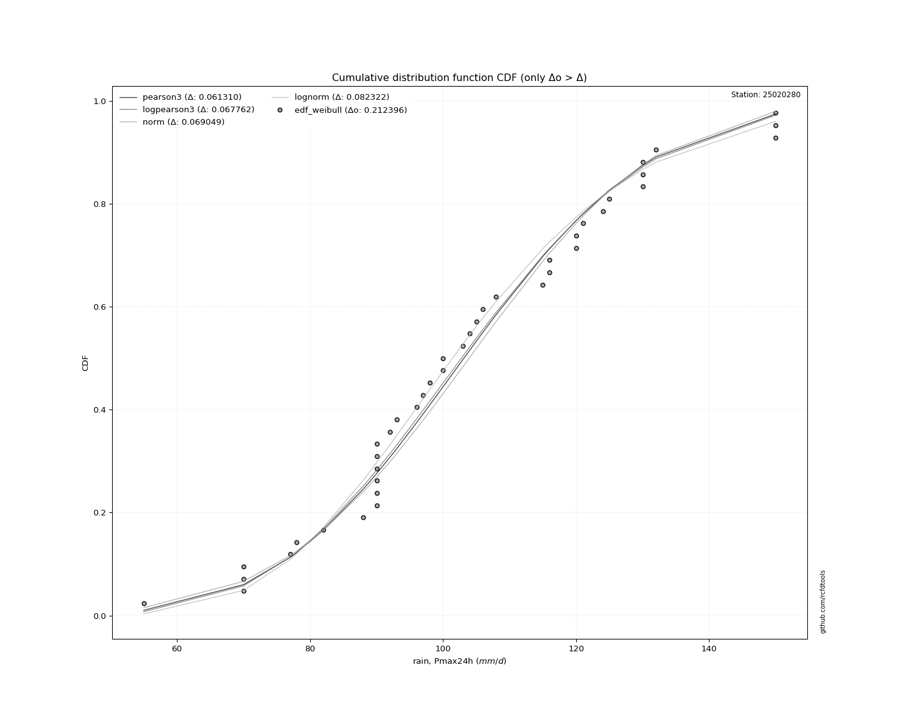</img>

</div>


**3.3. Best fit**

<div align="center">

|   id |   station | empirical_dist   | p_dist   |     delta |   deltao | eval   |   fit |   n |   best_fit |   best_fit_sort |
|-----:|----------:|:-----------------|:---------|----------:|---------:|:-------|------:|----:|-----------:|----------------:|
|    0 |  25020280 | edf_weibull      | rayleigh | 0.0567164 | 0.183382 | Δo > Δ |     1 |  55 |          1 |               1 |

</div>


<div align="center">

</img>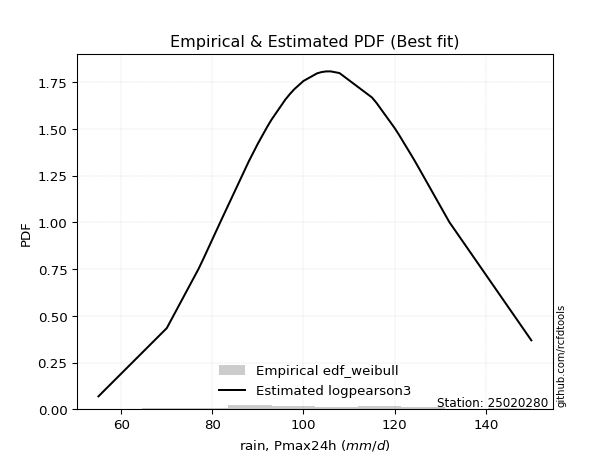</img>

</div>


### 4. Empirical - EDF Beard (1943)

The Beard formula (or Beard´s plotting position formula) in hydrology is used to estimate the empirical non-exceedance probability _(P)_ of a flood event (or other extreme hydrological data point) within a given dataset.

<div align="center">


$P=(m-0.31)/(n+0.38)$


</div>


**4.1. Empirical values**

<div align="center">

|                | 0                   | 1                    | 2                   | 3                  | 4                   | 5                   | 6                   | 7                   | 8                   | 9                  | 10                  | 11                  | 12                  | 13                  | 14                 | 15                 | 16                 | 17                  | 18                  | 19                 | 20                 | 21                 | 22                 | 23                  | 24                  | 25                  | 26                  | 27        | 28                 | 29                 | 30                 | 31                 | 32                 | 33                 | 34                 | 35                 | 36                 | 37                 | 38                 | 39                 | 40                 | 41                | 42                 | 43                | 44                 | 45                 | 46                 | 47                 | 48                 | 49                 | 50                 | 51                 | 52                 | 53                 | 54                 |
|:---------------|:--------------------|:---------------------|:--------------------|:-------------------|:--------------------|:--------------------|:--------------------|:--------------------|:--------------------|:-------------------|:--------------------|:--------------------|:--------------------|:--------------------|:-------------------|:-------------------|:-------------------|:--------------------|:--------------------|:-------------------|:-------------------|:-------------------|:-------------------|:--------------------|:--------------------|:--------------------|:--------------------|:----------|:-------------------|:-------------------|:-------------------|:-------------------|:-------------------|:-------------------|:-------------------|:-------------------|:-------------------|:-------------------|:-------------------|:-------------------|:-------------------|:------------------|:-------------------|:------------------|:-------------------|:-------------------|:-------------------|:-------------------|:-------------------|:-------------------|:-------------------|:-------------------|:-------------------|:-------------------|:-------------------|
| date           | 1986                | 1963                 | 1997                | 1995               | 2001                | 1966                | 1968                | 1989                | 1981                | 1967               | 1964                | 1976                | 2011                | 2015                | 1988               | 2013               | 2004               | 2007                | 1987                | 1991               | 1977               | 2009               | 1974               | 1990                | 1965                | 2016                | 2002                | 1972      | 1985               | 2017               | 1994               | 1971               | 1983               | 1975               | 2003               | 1992               | 2005               | 1970               | 1979               | 1973               | 2000               | 1993              | 2008               | 1998              | 2006               | 1978               | 1999               | 1980               | 2012               | 1969               | 2014               | 1984               | 1982               | 1996               | 2010               |
| x              | 55.0                | 70.0                 | 70.0                | 70.0               | 70.0                | 71.0                | 72.1625217          | 77.0                | 78.0                | 80.0               | 80.0                | 82.0                | 85.0                | 85.0                | 88.0               | 89.0               | 90.0               | 90.0                | 90.0                | 90.0               | 90.0               | 90.0               | 92.0               | 92.6                | 94.0                | 95.0                | 96.0                | 97.0      | 98.0               | 100.0              | 100.0              | 100.0              | 103.0              | 104.0              | 104.85022766727273 | 105.0              | 106.0              | 115.0              | 116.0              | 116.0              | 120.0              | 120.0             | 121.0              | 124.0             | 125.0              | 130.0              | 130.0              | 130.0              | 130.0              | 132.0              | 135.0              | 150.0              | 150.0              | 150.0              | 157.0              |
| m              | 1                   | 2                    | 3                   | 4                  | 5                   | 6                   | 7                   | 8                   | 9                   | 10                 | 11                  | 12                  | 13                  | 14                  | 15                 | 16                 | 17                 | 18                  | 19                  | 20                 | 21                 | 22                 | 23                 | 24                  | 25                  | 26                  | 27                  | 28        | 29                 | 30                 | 31                 | 32                 | 33                 | 34                 | 35                 | 36                 | 37                 | 38                 | 39                 | 40                 | 41                 | 42                | 43                 | 44                | 45                 | 46                 | 47                 | 48                 | 49                 | 50                 | 51                 | 52                 | 53                 | 54                 | 55                 |
| empirical_dist | edf_beard           | edf_beard            | edf_beard           | edf_beard          | edf_beard           | edf_beard           | edf_beard           | edf_beard           | edf_beard           | edf_beard          | edf_beard           | edf_beard           | edf_beard           | edf_beard           | edf_beard          | edf_beard          | edf_beard          | edf_beard           | edf_beard           | edf_beard          | edf_beard          | edf_beard          | edf_beard          | edf_beard           | edf_beard           | edf_beard           | edf_beard           | edf_beard | edf_beard          | edf_beard          | edf_beard          | edf_beard          | edf_beard          | edf_beard          | edf_beard          | edf_beard          | edf_beard          | edf_beard          | edf_beard          | edf_beard          | edf_beard          | edf_beard         | edf_beard          | edf_beard         | edf_beard          | edf_beard          | edf_beard          | edf_beard          | edf_beard          | edf_beard          | edf_beard          | edf_beard          | edf_beard          | edf_beard          | edf_beard          |
| empirical      | 0.01245937161430119 | 0.030516431924882625 | 0.04857349223546406 | 0.0666305525460455 | 0.08468761285662695 | 0.10274467316720838 | 0.12080173347778982 | 0.13885879378837127 | 0.15691585409895267 | 0.1749729144095341 | 0.19302997472011554 | 0.21108703503069698 | 0.22914409534127841 | 0.24720115565185985 | 0.2652582159624413 | 0.2833152762730227 | 0.3013723365836042 | 0.31942939689418565 | 0.33748645720476705 | 0.3555435175153485 | 0.3736005778259299 | 0.3916576381365114 | 0.4097146984470928 | 0.42777175875767426 | 0.44582881906825567 | 0.46388587937883713 | 0.48194293968941854 | 0.5       | 0.5180570603105814 | 0.5361141206211629 | 0.5541711809317443 | 0.5722282412423257 | 0.5902853015529071 | 0.6083423618634886 | 0.62639942217407   | 0.6444564824846515 | 0.6625135427952329 | 0.6805706031058143 | 0.6986276634163957 | 0.7166847237269772 | 0.7347417840375586 | 0.75279884434814  | 0.7708559046587214 | 0.788912964969303 | 0.8069700252798844 | 0.8250270855904658 | 0.8430841459010472 | 0.8611412062116287 | 0.8791982665222101 | 0.8972553268327915 | 0.9153123871433729 | 0.9333694474539544 | 0.9514265077645359 | 0.9694835680751173 | 0.9875406283856987 |
| empirical_tr   | 1.0126165660998354  | 1.0314769975786926   | 1.051053330802809   | 1.0713871154962276 | 1.092523180114421   | 1.1145099617629302  | 1.1373998767714109  | 1.161249737890543   | 1.1861212251017348  | 1.2120814182534472 | 1.239203401208324   | 1.267566948958572   | 1.297259311314125   | 1.3283761093787478  | 1.3610223642172523 | 1.3953136810279665 | 1.4313776169552856 | 1.4693552666489786  | 1.509403107113655   | 1.5516951527038387 | 1.596425482848083  | 1.6438112199465715 | 1.6940960538390943 | 1.7475544335752604  | 1.804496578690127   | 1.8652745031997306  | 1.9302892994074592  | 2.0       | 2.0749344323716747 | 2.1557026080186845 | 2.2430133657351154 | 2.3376952300548752 | 2.440722785368003  | 2.5532503457814655 | 2.676655389076848  | 2.812595226003047  | 2.963081861958266  | 3.1305822498586764 | 3.3181545835829827 | 3.5296367112810705 | 3.769911504424778  | 4.045288531775017 | 4.364066193853426  | 4.73738237810094  | 5.180542563143122  | 5.715170278637768  | 6.372842347525887  | 7.20156046814044   | 8.278026905829591  | 9.73286467486818   | 11.80810234541576  | 15.008130081300802 | 20.587360594795506 | 32.76923076923065  | 80.26086956521651  |

</div>


**4.2. Kolmogorov-Smirnov fit test (sorted by Δ)**


<div align="center">

|                | 0                    | 1                   | 2                   | 3                    | 4                    | 5                   | 6                    | 7                   | 8                   | 9                   | 10                  | 11                   | 12                  | 13                  | 14                  | 15                   | 16                  | 17                  | 18                  | 19                   | 20                   | 21                  | 22                  | 23                   | 24                  | 25                  | 26                  | 27                  | 28                  | 29                  | 30                  | 31                  | 32                  | 33                  | 34                  | 35                  | 36                  | 37                  | 38                  | 39                  | 40                  | 41                  | 42                  | 43                  | 44                  | 45                  | 46                  | 47                  | 48                  | 49                  | 50                  | 51                  | 52                  | 53                  | 54                  | 55                  | 56                  | 57                  | 58                    | 59                  | 60                  | 61                  | 62                  | 63                  | 64                  | 65                  | 66                  | 67                  | 68                  | 69                  | 70                  | 71                  | 72                  | 73                  | 74                  | 75                  | 76                  | 77                  | 78                  | 79                  | 80                  | 81                  | 82                  | 83                  | 84                  | 85                  | 86                  | 87                  | 88                  | 89                  |
|:---------------|:---------------------|:--------------------|:--------------------|:---------------------|:---------------------|:--------------------|:---------------------|:--------------------|:--------------------|:--------------------|:--------------------|:---------------------|:--------------------|:--------------------|:--------------------|:---------------------|:--------------------|:--------------------|:--------------------|:---------------------|:---------------------|:--------------------|:--------------------|:---------------------|:--------------------|:--------------------|:--------------------|:--------------------|:--------------------|:--------------------|:--------------------|:--------------------|:--------------------|:--------------------|:--------------------|:--------------------|:--------------------|:--------------------|:--------------------|:--------------------|:--------------------|:--------------------|:--------------------|:--------------------|:--------------------|:--------------------|:--------------------|:--------------------|:--------------------|:--------------------|:--------------------|:--------------------|:--------------------|:--------------------|:--------------------|:--------------------|:--------------------|:--------------------|:----------------------|:--------------------|:--------------------|:--------------------|:--------------------|:--------------------|:--------------------|:--------------------|:--------------------|:--------------------|:--------------------|:--------------------|:--------------------|:--------------------|:--------------------|:--------------------|:--------------------|:--------------------|:--------------------|:--------------------|:--------------------|:--------------------|:--------------------|:--------------------|:--------------------|:--------------------|:--------------------|:--------------------|:--------------------|:--------------------|:--------------------|:--------------------|
| station        | 25020280             | 25020280            | 25020280            | 25020280             | 25020280             | 25020280            | 25020280             | 25020280            | 25020280            | 25020280            | 25020280            | 25020280             | 25020280            | 25020280            | 25020280            | 25020280             | 25020280            | 25020280            | 25020280            | 25020280             | 25020280             | 25020280            | 25020280            | 25020280             | 25020280            | 25020280            | 25020280            | 25020280            | 25020280            | 25020280            | 25020280            | 25020280            | 25020280            | 25020280            | 25020280            | 25020280            | 25020280            | 25020280            | 25020280            | 25020280            | 25020280            | 25020280            | 25020280            | 25020280            | 25020280            | 25020280            | 25020280            | 25020280            | 25020280            | 25020280            | 25020280            | 25020280            | 25020280            | 25020280            | 25020280            | 25020280            | 25020280            | 25020280            | 25020280              | 25020280            | 25020280            | 25020280            | 25020280            | 25020280            | 25020280            | 25020280            | 25020280            | 25020280            | 25020280            | 25020280            | 25020280            | 25020280            | 25020280            | 25020280            | 25020280            | 25020280            | 25020280            | 25020280            | 25020280            | 25020280            | 25020280            | 25020280            | 25020280            | 25020280            | 25020280            | 25020280            | 25020280            | 25020280            | 25020280            | 25020280            |
| empirical_dist | edf_beard            | edf_beard           | edf_beard           | edf_beard            | edf_beard            | edf_beard           | edf_beard            | edf_beard           | edf_beard           | edf_beard           | edf_beard           | edf_beard            | edf_beard           | edf_beard           | edf_beard           | edf_beard            | edf_beard           | edf_beard           | edf_beard           | edf_beard            | edf_beard            | edf_beard           | edf_beard           | edf_beard            | edf_beard           | edf_beard           | edf_beard           | edf_beard           | edf_beard           | edf_beard           | edf_beard           | edf_beard           | edf_beard           | edf_beard           | edf_beard           | edf_beard           | edf_beard           | edf_beard           | edf_beard           | edf_beard           | edf_beard           | edf_beard           | edf_beard           | edf_beard           | edf_beard           | edf_beard           | edf_beard           | edf_beard           | edf_beard           | edf_beard           | edf_beard           | edf_beard           | edf_beard           | edf_beard           | edf_beard           | edf_beard           | edf_beard           | edf_beard           | edf_beard             | edf_beard           | edf_beard           | edf_beard           | edf_beard           | edf_beard           | edf_beard           | edf_beard           | edf_beard           | edf_beard           | edf_beard           | edf_beard           | edf_beard           | edf_beard           | edf_beard           | edf_beard           | edf_beard           | edf_beard           | edf_beard           | edf_beard           | edf_beard           | edf_beard           | edf_beard           | edf_beard           | edf_beard           | edf_beard           | edf_beard           | edf_beard           | edf_beard           | edf_beard           | edf_beard           | edf_beard           |
| p_dist         | rayleigh             | erlang              | gamma               | chi2                 | fatiguelife          | logrice             | logjohnsonsu         | logloggamma         | logpearson3         | lognakagami         | logt                | logexponnorm         | lognorm             | lognorm             | logcrystalball      | loglognorm           | f                   | logerlang           | logncf              | loggamma             | loggamma             | johnsonsu           | logf                | invgamma             | logfatiguelife      | alpha               | loginvgamma         | logalpha            | logbetaprime        | invgauss            | nct                 | invweibull          | betaprime           | logweibull_min      | lognct              | genlogistic         | loginvgauss         | kstwobign           | maxwell             | logmaxwell          | weibull_min         | rice                | pearson3            | fisk                | mielke              | loggenlogistic      | logmielke           | logfisk             | exponnorm           | lograyleigh         | gumbel_r            | loglogistic         | laplace_asymmetric  | loggompertz         | nakagami            | halfnorm            | moyal               | loghypsecant        | loglaplace_asymmetric | loginvweibull       | loggumbel_r         | norm                | crystalball         | truncnorm           | t                   | logistic            | logmoyal            | loglaplace          | hypsecant           | halflogistic        | loghalflogistic     | loghalfnorm         | logkstwobign        | loggumbel_l         | laplace             | loggenexpon         | gumbel_l            | wald                | logwald             | loggibrat           | ncf                 | gibrat              | expon               | pareto              | genexpon            | logtruncnorm        | logexpon            | logpareto           | logchi2             | gompertz            |
| delta          | 0.057516060253092305 | 0.05836429894723405 | 0.05836438905061436 | 0.058364400737600186 | 0.059914584594197406 | 0.06009942271251534 | 0.060154533420542444 | 0.06019997011363576 | 0.06031763674325363 | 0.06064842110993163 | 0.06068479263829418 | 0.060690607788531636 | 0.06069142771751046 | 0.06069142771751046 | 0.06069171142917629 | 0.060692621925461654 | 0.06069550370872856 | 0.06099284554726314 | 0.06108975610935041 | 0.061109156249065655 | 0.061109156249065655 | 0.06129745326929181 | 0.06133215381524926 | 0.061521785086723346 | 0.06215212407085413 | 0.06227446689897598 | 0.06232429310884091 | 0.0627558327194897  | 0.06327580245079423 | 0.06366266324384695 | 0.06386172818774705 | 0.06456638513393997 | 0.06466596120982904 | 0.06539085749290785 | 0.06570293328442145 | 0.06614495324179048 | 0.06798899991564522 | 0.06830178844195395 | 0.06912358901582616 | 0.06973164508368723 | 0.07226555869133167 | 0.07233003551717204 | 0.07236938547186256 | 0.07297859069459123 | 0.07323546941486636 | 0.07323961226537812 | 0.0734258593753665  | 0.0734575986631465  | 0.07455809776653277 | 0.0791918076587575  | 0.07948805193659636 | 0.08240649546916157 | 0.08741169824638684 | 0.08806351947959612 | 0.09337500659630715 | 0.09472690077073107 | 0.09509010125743478 | 0.09652553085053162 | 0.09990328411351168   | 0.10008536329002887 | 0.10083069827113911 | 0.10313520880895544 | 0.10313520925109543 | 0.10313521184032781 | 0.10319157097178094 | 0.10733538445089325 | 0.11437658205858114 | 0.11755027358255754 | 0.11988083597426868 | 0.12080173347778982 | 0.12080173347778982 | 0.12080173347778982 | 0.12652596577928926 | 0.12738533575638533 | 0.14563771309225018 | 0.16819097996916216 | 0.1737436571389358  | 0.1923702445428014  | 0.19255666584499934 | 0.21108703503069698 | 0.21839284219534705 | 0.23454039674700508 | 0.24389254308723987 | 0.2438925651495997  | 0.24475866767447052 | 0.29561080697906156 | 0.30529847853711495 | 0.30529848611305455 | 0.3172428464938993  | 0.8599065970641618  |
| deltao         | 0.18338236259000185  | 0.18338236259000185 | 0.18338236259000185 | 0.18338236259000185  | 0.18338236259000185  | 0.18338236259000185 | 0.18338236259000185  | 0.18338236259000185 | 0.18338236259000185 | 0.18338236259000185 | 0.18338236259000185 | 0.18338236259000185  | 0.18338236259000185 | 0.18338236259000185 | 0.18338236259000185 | 0.18338236259000185  | 0.18338236259000185 | 0.18338236259000185 | 0.18338236259000185 | 0.18338236259000185  | 0.18338236259000185  | 0.18338236259000185 | 0.18338236259000185 | 0.18338236259000185  | 0.18338236259000185 | 0.18338236259000185 | 0.18338236259000185 | 0.18338236259000185 | 0.18338236259000185 | 0.18338236259000185 | 0.18338236259000185 | 0.18338236259000185 | 0.18338236259000185 | 0.18338236259000185 | 0.18338236259000185 | 0.18338236259000185 | 0.18338236259000185 | 0.18338236259000185 | 0.18338236259000185 | 0.18338236259000185 | 0.18338236259000185 | 0.18338236259000185 | 0.18338236259000185 | 0.18338236259000185 | 0.18338236259000185 | 0.18338236259000185 | 0.18338236259000185 | 0.18338236259000185 | 0.18338236259000185 | 0.18338236259000185 | 0.18338236259000185 | 0.18338236259000185 | 0.18338236259000185 | 0.18338236259000185 | 0.18338236259000185 | 0.18338236259000185 | 0.18338236259000185 | 0.18338236259000185 | 0.18338236259000185   | 0.18338236259000185 | 0.18338236259000185 | 0.18338236259000185 | 0.18338236259000185 | 0.18338236259000185 | 0.18338236259000185 | 0.18338236259000185 | 0.18338236259000185 | 0.18338236259000185 | 0.18338236259000185 | 0.18338236259000185 | 0.18338236259000185 | 0.18338236259000185 | 0.18338236259000185 | 0.18338236259000185 | 0.18338236259000185 | 0.18338236259000185 | 0.18338236259000185 | 0.18338236259000185 | 0.18338236259000185 | 0.18338236259000185 | 0.18338236259000185 | 0.18338236259000185 | 0.18338236259000185 | 0.18338236259000185 | 0.18338236259000185 | 0.18338236259000185 | 0.18338236259000185 | 0.18338236259000185 | 0.18338236259000185 | 0.18338236259000185 |
| eval           | Δo > Δ               | Δo > Δ              | Δo > Δ              | Δo > Δ               | Δo > Δ               | Δo > Δ              | Δo > Δ               | Δo > Δ              | Δo > Δ              | Δo > Δ              | Δo > Δ              | Δo > Δ               | Δo > Δ              | Δo > Δ              | Δo > Δ              | Δo > Δ               | Δo > Δ              | Δo > Δ              | Δo > Δ              | Δo > Δ               | Δo > Δ               | Δo > Δ              | Δo > Δ              | Δo > Δ               | Δo > Δ              | Δo > Δ              | Δo > Δ              | Δo > Δ              | Δo > Δ              | Δo > Δ              | Δo > Δ              | Δo > Δ              | Δo > Δ              | Δo > Δ              | Δo > Δ              | Δo > Δ              | Δo > Δ              | Δo > Δ              | Δo > Δ              | Δo > Δ              | Δo > Δ              | Δo > Δ              | Δo > Δ              | Δo > Δ              | Δo > Δ              | Δo > Δ              | Δo > Δ              | Δo > Δ              | Δo > Δ              | Δo > Δ              | Δo > Δ              | Δo > Δ              | Δo > Δ              | Δo > Δ              | Δo > Δ              | Δo > Δ              | Δo > Δ              | Δo > Δ              | Δo > Δ                | Δo > Δ              | Δo > Δ              | Δo > Δ              | Δo > Δ              | Δo > Δ              | Δo > Δ              | Δo > Δ              | Δo > Δ              | Δo > Δ              | Δo > Δ              | Δo > Δ              | Δo > Δ              | Δo > Δ              | Δo > Δ              | Δo > Δ              | Δo > Δ              | Δo > Δ              | Δo > Δ              | Δo <= Δ             | Δo <= Δ             | Δo <= Δ             | Δo <= Δ             | Δo <= Δ             | Δo <= Δ             | Δo <= Δ             | Δo <= Δ             | Δo <= Δ             | Δo <= Δ             | Δo <= Δ             | Δo <= Δ             | Δo <= Δ             |
| fit            | 1                    | 1                   | 1                   | 1                    | 1                    | 1                   | 1                    | 1                   | 1                   | 1                   | 1                   | 1                    | 1                   | 1                   | 1                   | 1                    | 1                   | 1                   | 1                   | 1                    | 1                    | 1                   | 1                   | 1                    | 1                   | 1                   | 1                   | 1                   | 1                   | 1                   | 1                   | 1                   | 1                   | 1                   | 1                   | 1                   | 1                   | 1                   | 1                   | 1                   | 1                   | 1                   | 1                   | 1                   | 1                   | 1                   | 1                   | 1                   | 1                   | 1                   | 1                   | 1                   | 1                   | 1                   | 1                   | 1                   | 1                   | 1                   | 1                     | 1                   | 1                   | 1                   | 1                   | 1                   | 1                   | 1                   | 1                   | 1                   | 1                   | 1                   | 1                   | 1                   | 1                   | 1                   | 1                   | 1                   | 1                   | 0                   | 0                   | 0                   | 0                   | 0                   | 0                   | 0                   | 0                   | 0                   | 0                   | 0                   | 0                   | 0                   |
| n              | 55                   | 55                  | 55                  | 55                   | 55                   | 55                  | 55                   | 55                  | 55                  | 55                  | 55                  | 55                   | 55                  | 55                  | 55                  | 55                   | 55                  | 55                  | 55                  | 55                   | 55                   | 55                  | 55                  | 55                   | 55                  | 55                  | 55                  | 55                  | 55                  | 55                  | 55                  | 55                  | 55                  | 55                  | 55                  | 55                  | 55                  | 55                  | 55                  | 55                  | 55                  | 55                  | 55                  | 55                  | 55                  | 55                  | 55                  | 55                  | 55                  | 55                  | 55                  | 55                  | 55                  | 55                  | 55                  | 55                  | 55                  | 55                  | 55                    | 55                  | 55                  | 55                  | 55                  | 55                  | 55                  | 55                  | 55                  | 55                  | 55                  | 55                  | 55                  | 55                  | 55                  | 55                  | 55                  | 55                  | 55                  | 55                  | 55                  | 55                  | 55                  | 55                  | 55                  | 55                  | 55                  | 55                  | 55                  | 55                  | 55                  | 55                  |
| best_fit       | 1                    | 0                   | 0                   | 0                    | 0                    | 0                   | 0                    | 0                   | 0                   | 0                   | 0                   | 0                    | 0                   | 0                   | 0                   | 0                    | 0                   | 0                   | 0                   | 0                    | 0                    | 0                   | 0                   | 0                    | 0                   | 0                   | 0                   | 0                   | 0                   | 0                   | 0                   | 0                   | 0                   | 0                   | 0                   | 0                   | 0                   | 0                   | 0                   | 0                   | 0                   | 0                   | 0                   | 0                   | 0                   | 0                   | 0                   | 0                   | 0                   | 0                   | 0                   | 0                   | 0                   | 0                   | 0                   | 0                   | 0                   | 0                   | 0                     | 0                   | 0                   | 0                   | 0                   | 0                   | 0                   | 0                   | 0                   | 0                   | 0                   | 0                   | 0                   | 0                   | 0                   | 0                   | 0                   | 0                   | 0                   | 0                   | 0                   | 0                   | 0                   | 0                   | 0                   | 0                   | 0                   | 0                   | 0                   | 0                   | 0                   | 0                   |
| best_fit_sort  | 1                    | 2                   | 3                   | 4                    | 5                    | 6                   | 7                    | 8                   | 9                   | 10                  | 11                  | 12                   | 13                  | 14                  | 15                  | 16                   | 17                  | 18                  | 19                  | 20                   | 21                   | 22                  | 23                  | 24                   | 25                  | 26                  | 27                  | 28                  | 29                  | 30                  | 31                  | 32                  | 33                  | 34                  | 35                  | 36                  | 37                  | 38                  | 39                  | 40                  | 41                  | 42                  | 43                  | 44                  | 45                  | 46                  | 47                  | 48                  | 49                  | 50                  | 51                  | 52                  | 53                  | 54                  | 55                  | 56                  | 57                  | 58                  | 59                    | 60                  | 61                  | 62                  | 63                  | 64                  | 65                  | 66                  | 67                  | 68                  | 69                  | 70                  | 71                  | 72                  | 73                  | 74                  | 75                  | 76                  | 77                  | 78                  | 79                  | 80                  | 81                  | 82                  | 83                  | 84                  | 85                  | 86                  | 87                  | 88                  | 89                  | 90                  |

</div>


<div align="center">

</img>

</div>


**4.3. Best fit**

<div align="center">

|   id |   station | empirical_dist   | p_dist   |     delta |   deltao | eval   |   fit |   n |   best_fit |   best_fit_sort |
|-----:|----------:|:-----------------|:---------|----------:|---------:|:-------|------:|----:|-----------:|----------------:|
|    0 |  25020280 | edf_beard        | rayleigh | 0.0575161 | 0.183382 | Δo > Δ |     1 |  55 |          1 |               1 |

</div>


<div align="center">

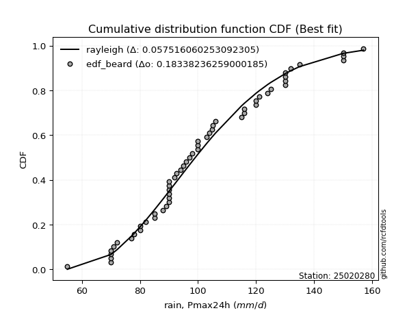</img>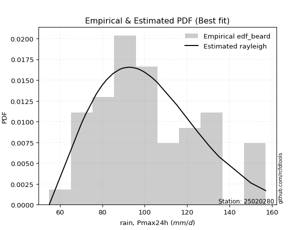</img>

</div>


### 5. Empirical - EDF Chegodayev (1955)

The Chegodayev formula is an empirical plotting position formula used in hydrological frequency analysis to estimate the exceedance probability or return period of a specific event from a set of observed data. It is primarily used for plotting observed data points on probability paper to fit a theoretical distribution, particularly for analyzing extreme events like maximum flood flows or rainfall intensities. The constant _b_ value in the generalized plotting position formula is 0.3.

<div align="center">


$P=(m-b)/(n+1-2b)$


</div>


**5.1. Empirical values**

<div align="center">

|                | 0                   | 1                    | 2                   | 3                   | 4                  | 5                   | 6                   | 7                   | 8                   | 9                   | 10                 | 11                 | 12                  | 13                  | 14                  | 15                 | 16                  | 17                 | 18                  | 19                 | 20                  | 21                 | 22                  | 23                | 24                  | 25                | 26                  | 27             | 28                 | 29                 | 30                 | 31                | 32                 | 33                | 34                 | 35                 | 36                 | 37                | 38                 | 39                 | 40                 | 41                 | 42                 | 43                 | 44                 | 45                 | 46                 | 47                 | 48                 | 49                 | 50                 | 51                 | 52                 | 53                 | 54                 |
|:---------------|:--------------------|:---------------------|:--------------------|:--------------------|:-------------------|:--------------------|:--------------------|:--------------------|:--------------------|:--------------------|:-------------------|:-------------------|:--------------------|:--------------------|:--------------------|:-------------------|:--------------------|:-------------------|:--------------------|:-------------------|:--------------------|:-------------------|:--------------------|:------------------|:--------------------|:------------------|:--------------------|:---------------|:-------------------|:-------------------|:-------------------|:------------------|:-------------------|:------------------|:-------------------|:-------------------|:-------------------|:------------------|:-------------------|:-------------------|:-------------------|:-------------------|:-------------------|:-------------------|:-------------------|:-------------------|:-------------------|:-------------------|:-------------------|:-------------------|:-------------------|:-------------------|:-------------------|:-------------------|:-------------------|
| date           | 1986                | 1963                 | 1997                | 1995                | 2001               | 1966                | 1968                | 1989                | 1981                | 1967                | 1964               | 1976               | 2011                | 2015                | 1988                | 2013               | 2004                | 2007               | 1987                | 1991               | 1977                | 2009               | 1974                | 1990              | 1965                | 2016              | 2002                | 1972           | 1985               | 2017               | 1994               | 1971              | 1983               | 1975              | 2003               | 1992               | 2005               | 1970              | 1979               | 1973               | 2000               | 1993               | 2008               | 1998               | 2006               | 1978               | 1999               | 1980               | 2012               | 1969               | 2014               | 1984               | 1982               | 1996               | 2010               |
| x              | 55.0                | 70.0                 | 70.0                | 70.0                | 70.0               | 71.0                | 72.1625217          | 77.0                | 78.0                | 80.0                | 80.0               | 82.0               | 85.0                | 85.0                | 88.0                | 89.0               | 90.0                | 90.0               | 90.0                | 90.0               | 90.0                | 90.0               | 92.0                | 92.6              | 94.0                | 95.0              | 96.0                | 97.0           | 98.0               | 100.0              | 100.0              | 100.0             | 103.0              | 104.0             | 104.85022766727273 | 105.0              | 106.0              | 115.0             | 116.0              | 116.0              | 120.0              | 120.0              | 121.0              | 124.0              | 125.0              | 130.0              | 130.0              | 130.0              | 130.0              | 132.0              | 135.0              | 150.0              | 150.0              | 150.0              | 157.0              |
| m              | 1                   | 2                    | 3                   | 4                   | 5                  | 6                   | 7                   | 8                   | 9                   | 10                  | 11                 | 12                 | 13                  | 14                  | 15                  | 16                 | 17                  | 18                 | 19                  | 20                 | 21                  | 22                 | 23                  | 24                | 25                  | 26                | 27                  | 28             | 29                 | 30                 | 31                 | 32                | 33                 | 34                | 35                 | 36                 | 37                 | 38                | 39                 | 40                 | 41                 | 42                 | 43                 | 44                 | 45                 | 46                 | 47                 | 48                 | 49                 | 50                 | 51                 | 52                 | 53                 | 54                 | 55                 |
| empirical_dist | edf_chegodayev      | edf_chegodayev       | edf_chegodayev      | edf_chegodayev      | edf_chegodayev     | edf_chegodayev      | edf_chegodayev      | edf_chegodayev      | edf_chegodayev      | edf_chegodayev      | edf_chegodayev     | edf_chegodayev     | edf_chegodayev      | edf_chegodayev      | edf_chegodayev      | edf_chegodayev     | edf_chegodayev      | edf_chegodayev     | edf_chegodayev      | edf_chegodayev     | edf_chegodayev      | edf_chegodayev     | edf_chegodayev      | edf_chegodayev    | edf_chegodayev      | edf_chegodayev    | edf_chegodayev      | edf_chegodayev | edf_chegodayev     | edf_chegodayev     | edf_chegodayev     | edf_chegodayev    | edf_chegodayev     | edf_chegodayev    | edf_chegodayev     | edf_chegodayev     | edf_chegodayev     | edf_chegodayev    | edf_chegodayev     | edf_chegodayev     | edf_chegodayev     | edf_chegodayev     | edf_chegodayev     | edf_chegodayev     | edf_chegodayev     | edf_chegodayev     | edf_chegodayev     | edf_chegodayev     | edf_chegodayev     | edf_chegodayev     | edf_chegodayev     | edf_chegodayev     | edf_chegodayev     | edf_chegodayev     | edf_chegodayev     |
| empirical      | 0.01263537906137184 | 0.030685920577617327 | 0.04873646209386282 | 0.06678700361010831 | 0.0848375451263538 | 0.10288808664259928 | 0.12093862815884478 | 0.13898916967509026 | 0.15703971119133572 | 0.17509025270758122 | 0.1931407942238267 | 0.2111913357400722 | 0.22924187725631767 | 0.24729241877256317 | 0.26534296028880866 | 0.2833935018050541 | 0.30144404332129965 | 0.3194945848375451 | 0.33754512635379064 | 0.3555956678700361 | 0.37364620938628157 | 0.3916967509025271 | 0.40974729241877256 | 0.427797833935018 | 0.44584837545126355 | 0.463898916967509 | 0.48194945848375453 | 0.5            | 0.5180505415162455 | 0.5361010830324909 | 0.5541516245487365 | 0.572202166064982 | 0.5902527075812275 | 0.608303249097473 | 0.6263537906137184 | 0.644404332129964  | 0.6624548736462095 | 0.680505415162455 | 0.6985559566787004 | 0.7166064981949459 | 0.7346570397111915 | 0.7527075812274369 | 0.7707581227436824 | 0.7888086642599279 | 0.8068592057761733 | 0.8249097472924188 | 0.8429602888086644 | 0.8610108303249098 | 0.8790613718411553 | 0.8971119133574008 | 0.9151624548736463 | 0.9332129963898917 | 0.9512635379061373 | 0.9693140794223828 | 0.9873646209386282 |
| empirical_tr   | 1.012797074954296   | 1.031657355679702    | 1.0512333965844403  | 1.0715667311411994  | 1.0927021696252466 | 1.1146881287726358  | 1.1375770020533882  | 1.1614255765199162  | 1.1862955032119915  | 1.2122538293216631  | 1.2393736017897092 | 1.2677345537757436 | 1.297423887587822   | 1.328537170263789   | 1.3611793611793612  | 1.3954659949622168 | 1.4315245478036176  | 1.469496021220159  | 1.5095367847411445  | 1.5518207282913163 | 1.5965417867435159  | 1.6439169139465877 | 1.6941896024464833  | 1.747634069400631 | 1.8045602605863194  | 1.865319865319865 | 1.9303135888501741  | 2.0            | 2.0749063670411987 | 2.1556420233463034 | 2.242914979757085  | 2.337552742616034 | 2.440528634361234  | 2.55299539170507  | 2.6763285024154593 | 2.8121827411167515 | 2.962566844919787  | 3.12994350282486  | 3.3173652694610785 | 3.5286624203821666 | 3.768707482993199  | 4.043795620437957  | 4.36220472440945   | 4.735042735042738  | 5.177570093457945  | 5.711340206185569  | 6.367816091954027  | 7.194805194805196  | 8.268656716417915  | 9.719298245614043  | 11.787234042553209 | 14.972972972972984 | 20.518518518518555 | 32.58823529411777  | 79.14285714285741  |

</div>


**5.2. Kolmogorov-Smirnov fit test (sorted by Δ)**


<div align="center">

|                | 0                   | 1                   | 2                    | 3                   | 4                   | 5                   | 6                    | 7                   | 8                    | 9                   | 10                   | 11                  | 12                  | 13                  | 14                  | 15                   | 16                  | 17                  | 18                   | 19                   | 20                   | 21                   | 22                  | 23                  | 24                  | 25                  | 26                  | 27                  | 28                  | 29                  | 30                  | 31                  | 32                  | 33                  | 34                  | 35                  | 36                  | 37                  | 38                  | 39                  | 40                  | 41                  | 42                  | 43                  | 44                  | 45                  | 46                  | 47                  | 48                  | 49                  | 50                  | 51                  | 52                  | 53                  | 54                  | 55                  | 56                  | 57                  | 58                    | 59                  | 60                  | 61                  | 62                  | 63                  | 64                  | 65                  | 66                  | 67                  | 68                  | 69                  | 70                  | 71                  | 72                  | 73                  | 74                  | 75                  | 76                  | 77                  | 78                  | 79                  | 80                  | 81                  | 82                  | 83                  | 84                  | 85                  | 86                  | 87                  | 88                  | 89                  |
|:---------------|:--------------------|:--------------------|:---------------------|:--------------------|:--------------------|:--------------------|:---------------------|:--------------------|:---------------------|:--------------------|:---------------------|:--------------------|:--------------------|:--------------------|:--------------------|:---------------------|:--------------------|:--------------------|:---------------------|:---------------------|:---------------------|:---------------------|:--------------------|:--------------------|:--------------------|:--------------------|:--------------------|:--------------------|:--------------------|:--------------------|:--------------------|:--------------------|:--------------------|:--------------------|:--------------------|:--------------------|:--------------------|:--------------------|:--------------------|:--------------------|:--------------------|:--------------------|:--------------------|:--------------------|:--------------------|:--------------------|:--------------------|:--------------------|:--------------------|:--------------------|:--------------------|:--------------------|:--------------------|:--------------------|:--------------------|:--------------------|:--------------------|:--------------------|:----------------------|:--------------------|:--------------------|:--------------------|:--------------------|:--------------------|:--------------------|:--------------------|:--------------------|:--------------------|:--------------------|:--------------------|:--------------------|:--------------------|:--------------------|:--------------------|:--------------------|:--------------------|:--------------------|:--------------------|:--------------------|:--------------------|:--------------------|:--------------------|:--------------------|:--------------------|:--------------------|:--------------------|:--------------------|:--------------------|:--------------------|:--------------------|
| station        | 25020280            | 25020280            | 25020280             | 25020280            | 25020280            | 25020280            | 25020280             | 25020280            | 25020280             | 25020280            | 25020280             | 25020280            | 25020280            | 25020280            | 25020280            | 25020280             | 25020280            | 25020280            | 25020280             | 25020280             | 25020280             | 25020280             | 25020280            | 25020280            | 25020280            | 25020280            | 25020280            | 25020280            | 25020280            | 25020280            | 25020280            | 25020280            | 25020280            | 25020280            | 25020280            | 25020280            | 25020280            | 25020280            | 25020280            | 25020280            | 25020280            | 25020280            | 25020280            | 25020280            | 25020280            | 25020280            | 25020280            | 25020280            | 25020280            | 25020280            | 25020280            | 25020280            | 25020280            | 25020280            | 25020280            | 25020280            | 25020280            | 25020280            | 25020280              | 25020280            | 25020280            | 25020280            | 25020280            | 25020280            | 25020280            | 25020280            | 25020280            | 25020280            | 25020280            | 25020280            | 25020280            | 25020280            | 25020280            | 25020280            | 25020280            | 25020280            | 25020280            | 25020280            | 25020280            | 25020280            | 25020280            | 25020280            | 25020280            | 25020280            | 25020280            | 25020280            | 25020280            | 25020280            | 25020280            | 25020280            |
| empirical_dist | edf_chegodayev      | edf_chegodayev      | edf_chegodayev       | edf_chegodayev      | edf_chegodayev      | edf_chegodayev      | edf_chegodayev       | edf_chegodayev      | edf_chegodayev       | edf_chegodayev      | edf_chegodayev       | edf_chegodayev      | edf_chegodayev      | edf_chegodayev      | edf_chegodayev      | edf_chegodayev       | edf_chegodayev      | edf_chegodayev      | edf_chegodayev       | edf_chegodayev       | edf_chegodayev       | edf_chegodayev       | edf_chegodayev      | edf_chegodayev      | edf_chegodayev      | edf_chegodayev      | edf_chegodayev      | edf_chegodayev      | edf_chegodayev      | edf_chegodayev      | edf_chegodayev      | edf_chegodayev      | edf_chegodayev      | edf_chegodayev      | edf_chegodayev      | edf_chegodayev      | edf_chegodayev      | edf_chegodayev      | edf_chegodayev      | edf_chegodayev      | edf_chegodayev      | edf_chegodayev      | edf_chegodayev      | edf_chegodayev      | edf_chegodayev      | edf_chegodayev      | edf_chegodayev      | edf_chegodayev      | edf_chegodayev      | edf_chegodayev      | edf_chegodayev      | edf_chegodayev      | edf_chegodayev      | edf_chegodayev      | edf_chegodayev      | edf_chegodayev      | edf_chegodayev      | edf_chegodayev      | edf_chegodayev        | edf_chegodayev      | edf_chegodayev      | edf_chegodayev      | edf_chegodayev      | edf_chegodayev      | edf_chegodayev      | edf_chegodayev      | edf_chegodayev      | edf_chegodayev      | edf_chegodayev      | edf_chegodayev      | edf_chegodayev      | edf_chegodayev      | edf_chegodayev      | edf_chegodayev      | edf_chegodayev      | edf_chegodayev      | edf_chegodayev      | edf_chegodayev      | edf_chegodayev      | edf_chegodayev      | edf_chegodayev      | edf_chegodayev      | edf_chegodayev      | edf_chegodayev      | edf_chegodayev      | edf_chegodayev      | edf_chegodayev      | edf_chegodayev      | edf_chegodayev      | edf_chegodayev      |
| p_dist         | rayleigh            | erlang              | gamma                | chi2                | fatiguelife         | logrice             | logjohnsonsu         | logloggamma         | logpearson3          | lognakagami         | logt                 | logexponnorm        | lognorm             | lognorm             | logcrystalball      | loglognorm           | f                   | logerlang           | logncf               | loggamma             | loggamma             | johnsonsu            | logf                | invgamma            | logfatiguelife      | alpha               | loginvgamma         | logalpha            | logbetaprime        | invgauss            | nct                 | invweibull          | betaprime           | logweibull_min      | lognct              | genlogistic         | loginvgauss         | kstwobign           | maxwell             | logmaxwell          | weibull_min         | rice                | pearson3            | fisk                | mielke              | loggenlogistic      | logmielke           | logfisk             | exponnorm           | lograyleigh         | gumbel_r            | loglogistic         | laplace_asymmetric  | loggompertz         | nakagami            | halfnorm            | moyal               | loghypsecant        | loglaplace_asymmetric | loginvweibull       | loggumbel_r         | norm                | crystalball         | truncnorm           | t                   | logistic            | logmoyal            | loglaplace          | hypsecant           | halflogistic        | loghalflogistic     | loghalfnorm         | logkstwobign        | loggumbel_l         | laplace             | loggenexpon         | gumbel_l            | wald                | logwald             | loggibrat           | ncf                 | gibrat              | expon               | pareto              | genexpon            | logtruncnorm        | logexpon            | logpareto           | logchi2             | gompertz            |
| delta          | 0.05748998507574854 | 0.05844904327360123 | 0.058449133376981544 | 0.05844914506396737 | 0.05999932892056459 | 0.06018416703888252 | 0.060239277746909625 | 0.06028471444000294 | 0.060402381069620814 | 0.06073316543629881 | 0.060769536964661364 | 0.06077535211489882 | 0.06077617204387764 | 0.06077617204387764 | 0.06077645575554347 | 0.060777366251828835 | 0.06078024803509574 | 0.06107758987363032 | 0.061174500435717594 | 0.061193900575432836 | 0.061193900575432836 | 0.061382197595658994 | 0.06141689814161644 | 0.06160652941309053 | 0.06223686839722131 | 0.06235921122534316 | 0.06240903743520809 | 0.062821020662849   | 0.06334099039415353 | 0.06372785118720625 | 0.06394647251411423 | 0.06463157307729928 | 0.06473114915318834 | 0.06536478231556409 | 0.06576812122778075 | 0.06621014118514978 | 0.06805418785900452 | 0.0682170441155866  | 0.0690975138384824  | 0.06979683302704653 | 0.0722394835139879  | 0.07230396033982828 | 0.07234331029451879 | 0.07304377863795053 | 0.07330065735822566 | 0.07330480020873742 | 0.0734910473187258  | 0.0735227866065058  | 0.07462328570989207 | 0.07912010092106203 | 0.07955323987995566 | 0.08249123979552875 | 0.08747688618974614 | 0.08803744430225235 | 0.0932902622699398  | 0.09487031424612197 | 0.09515528920079408 | 0.09659071879389092 | 0.09996847205687098   | 0.10001365655233341 | 0.10089588621449841 | 0.10310913363161167 | 0.10310913407375166 | 0.10310913666298405 | 0.10316549579443718 | 0.10730930927354948 | 0.11444177000194045 | 0.11761546152591684 | 0.11991994874028439 | 0.12093862815884478 | 0.12093862815884478 | 0.12093862815884478 | 0.12644122145292191 | 0.12735926057904157 | 0.14567682585826588 | 0.1681062356427948  | 0.17371758196159204 | 0.19248106404651258 | 0.1926674853487105  | 0.2111913357400722  | 0.21824290992562045 | 0.2346316598677084  | 0.2437947611722006  | 0.24379478323456044 | 0.24458917902173583 | 0.29544131832632686 | 0.30512898988438025 | 0.30512899746031985 | 0.3170733578411646  | 0.8597631835887711  |
| deltao         | 0.18338236259000185 | 0.18338236259000185 | 0.18338236259000185  | 0.18338236259000185 | 0.18338236259000185 | 0.18338236259000185 | 0.18338236259000185  | 0.18338236259000185 | 0.18338236259000185  | 0.18338236259000185 | 0.18338236259000185  | 0.18338236259000185 | 0.18338236259000185 | 0.18338236259000185 | 0.18338236259000185 | 0.18338236259000185  | 0.18338236259000185 | 0.18338236259000185 | 0.18338236259000185  | 0.18338236259000185  | 0.18338236259000185  | 0.18338236259000185  | 0.18338236259000185 | 0.18338236259000185 | 0.18338236259000185 | 0.18338236259000185 | 0.18338236259000185 | 0.18338236259000185 | 0.18338236259000185 | 0.18338236259000185 | 0.18338236259000185 | 0.18338236259000185 | 0.18338236259000185 | 0.18338236259000185 | 0.18338236259000185 | 0.18338236259000185 | 0.18338236259000185 | 0.18338236259000185 | 0.18338236259000185 | 0.18338236259000185 | 0.18338236259000185 | 0.18338236259000185 | 0.18338236259000185 | 0.18338236259000185 | 0.18338236259000185 | 0.18338236259000185 | 0.18338236259000185 | 0.18338236259000185 | 0.18338236259000185 | 0.18338236259000185 | 0.18338236259000185 | 0.18338236259000185 | 0.18338236259000185 | 0.18338236259000185 | 0.18338236259000185 | 0.18338236259000185 | 0.18338236259000185 | 0.18338236259000185 | 0.18338236259000185   | 0.18338236259000185 | 0.18338236259000185 | 0.18338236259000185 | 0.18338236259000185 | 0.18338236259000185 | 0.18338236259000185 | 0.18338236259000185 | 0.18338236259000185 | 0.18338236259000185 | 0.18338236259000185 | 0.18338236259000185 | 0.18338236259000185 | 0.18338236259000185 | 0.18338236259000185 | 0.18338236259000185 | 0.18338236259000185 | 0.18338236259000185 | 0.18338236259000185 | 0.18338236259000185 | 0.18338236259000185 | 0.18338236259000185 | 0.18338236259000185 | 0.18338236259000185 | 0.18338236259000185 | 0.18338236259000185 | 0.18338236259000185 | 0.18338236259000185 | 0.18338236259000185 | 0.18338236259000185 | 0.18338236259000185 | 0.18338236259000185 |
| eval           | Δo > Δ              | Δo > Δ              | Δo > Δ               | Δo > Δ              | Δo > Δ              | Δo > Δ              | Δo > Δ               | Δo > Δ              | Δo > Δ               | Δo > Δ              | Δo > Δ               | Δo > Δ              | Δo > Δ              | Δo > Δ              | Δo > Δ              | Δo > Δ               | Δo > Δ              | Δo > Δ              | Δo > Δ               | Δo > Δ               | Δo > Δ               | Δo > Δ               | Δo > Δ              | Δo > Δ              | Δo > Δ              | Δo > Δ              | Δo > Δ              | Δo > Δ              | Δo > Δ              | Δo > Δ              | Δo > Δ              | Δo > Δ              | Δo > Δ              | Δo > Δ              | Δo > Δ              | Δo > Δ              | Δo > Δ              | Δo > Δ              | Δo > Δ              | Δo > Δ              | Δo > Δ              | Δo > Δ              | Δo > Δ              | Δo > Δ              | Δo > Δ              | Δo > Δ              | Δo > Δ              | Δo > Δ              | Δo > Δ              | Δo > Δ              | Δo > Δ              | Δo > Δ              | Δo > Δ              | Δo > Δ              | Δo > Δ              | Δo > Δ              | Δo > Δ              | Δo > Δ              | Δo > Δ                | Δo > Δ              | Δo > Δ              | Δo > Δ              | Δo > Δ              | Δo > Δ              | Δo > Δ              | Δo > Δ              | Δo > Δ              | Δo > Δ              | Δo > Δ              | Δo > Δ              | Δo > Δ              | Δo > Δ              | Δo > Δ              | Δo > Δ              | Δo > Δ              | Δo > Δ              | Δo > Δ              | Δo <= Δ             | Δo <= Δ             | Δo <= Δ             | Δo <= Δ             | Δo <= Δ             | Δo <= Δ             | Δo <= Δ             | Δo <= Δ             | Δo <= Δ             | Δo <= Δ             | Δo <= Δ             | Δo <= Δ             | Δo <= Δ             |
| fit            | 1                   | 1                   | 1                    | 1                   | 1                   | 1                   | 1                    | 1                   | 1                    | 1                   | 1                    | 1                   | 1                   | 1                   | 1                   | 1                    | 1                   | 1                   | 1                    | 1                    | 1                    | 1                    | 1                   | 1                   | 1                   | 1                   | 1                   | 1                   | 1                   | 1                   | 1                   | 1                   | 1                   | 1                   | 1                   | 1                   | 1                   | 1                   | 1                   | 1                   | 1                   | 1                   | 1                   | 1                   | 1                   | 1                   | 1                   | 1                   | 1                   | 1                   | 1                   | 1                   | 1                   | 1                   | 1                   | 1                   | 1                   | 1                   | 1                     | 1                   | 1                   | 1                   | 1                   | 1                   | 1                   | 1                   | 1                   | 1                   | 1                   | 1                   | 1                   | 1                   | 1                   | 1                   | 1                   | 1                   | 1                   | 0                   | 0                   | 0                   | 0                   | 0                   | 0                   | 0                   | 0                   | 0                   | 0                   | 0                   | 0                   | 0                   |
| n              | 55                  | 55                  | 55                   | 55                  | 55                  | 55                  | 55                   | 55                  | 55                   | 55                  | 55                   | 55                  | 55                  | 55                  | 55                  | 55                   | 55                  | 55                  | 55                   | 55                   | 55                   | 55                   | 55                  | 55                  | 55                  | 55                  | 55                  | 55                  | 55                  | 55                  | 55                  | 55                  | 55                  | 55                  | 55                  | 55                  | 55                  | 55                  | 55                  | 55                  | 55                  | 55                  | 55                  | 55                  | 55                  | 55                  | 55                  | 55                  | 55                  | 55                  | 55                  | 55                  | 55                  | 55                  | 55                  | 55                  | 55                  | 55                  | 55                    | 55                  | 55                  | 55                  | 55                  | 55                  | 55                  | 55                  | 55                  | 55                  | 55                  | 55                  | 55                  | 55                  | 55                  | 55                  | 55                  | 55                  | 55                  | 55                  | 55                  | 55                  | 55                  | 55                  | 55                  | 55                  | 55                  | 55                  | 55                  | 55                  | 55                  | 55                  |
| best_fit       | 1                   | 0                   | 0                    | 0                   | 0                   | 0                   | 0                    | 0                   | 0                    | 0                   | 0                    | 0                   | 0                   | 0                   | 0                   | 0                    | 0                   | 0                   | 0                    | 0                    | 0                    | 0                    | 0                   | 0                   | 0                   | 0                   | 0                   | 0                   | 0                   | 0                   | 0                   | 0                   | 0                   | 0                   | 0                   | 0                   | 0                   | 0                   | 0                   | 0                   | 0                   | 0                   | 0                   | 0                   | 0                   | 0                   | 0                   | 0                   | 0                   | 0                   | 0                   | 0                   | 0                   | 0                   | 0                   | 0                   | 0                   | 0                   | 0                     | 0                   | 0                   | 0                   | 0                   | 0                   | 0                   | 0                   | 0                   | 0                   | 0                   | 0                   | 0                   | 0                   | 0                   | 0                   | 0                   | 0                   | 0                   | 0                   | 0                   | 0                   | 0                   | 0                   | 0                   | 0                   | 0                   | 0                   | 0                   | 0                   | 0                   | 0                   |
| best_fit_sort  | 1                   | 2                   | 3                    | 4                   | 5                   | 6                   | 7                    | 8                   | 9                    | 10                  | 11                   | 12                  | 13                  | 14                  | 15                  | 16                   | 17                  | 18                  | 19                   | 20                   | 21                   | 22                   | 23                  | 24                  | 25                  | 26                  | 27                  | 28                  | 29                  | 30                  | 31                  | 32                  | 33                  | 34                  | 35                  | 36                  | 37                  | 38                  | 39                  | 40                  | 41                  | 42                  | 43                  | 44                  | 45                  | 46                  | 47                  | 48                  | 49                  | 50                  | 51                  | 52                  | 53                  | 54                  | 55                  | 56                  | 57                  | 58                  | 59                    | 60                  | 61                  | 62                  | 63                  | 64                  | 65                  | 66                  | 67                  | 68                  | 69                  | 70                  | 71                  | 72                  | 73                  | 74                  | 75                  | 76                  | 77                  | 78                  | 79                  | 80                  | 81                  | 82                  | 83                  | 84                  | 85                  | 86                  | 87                  | 88                  | 89                  | 90                  |

</div>


<div align="center">

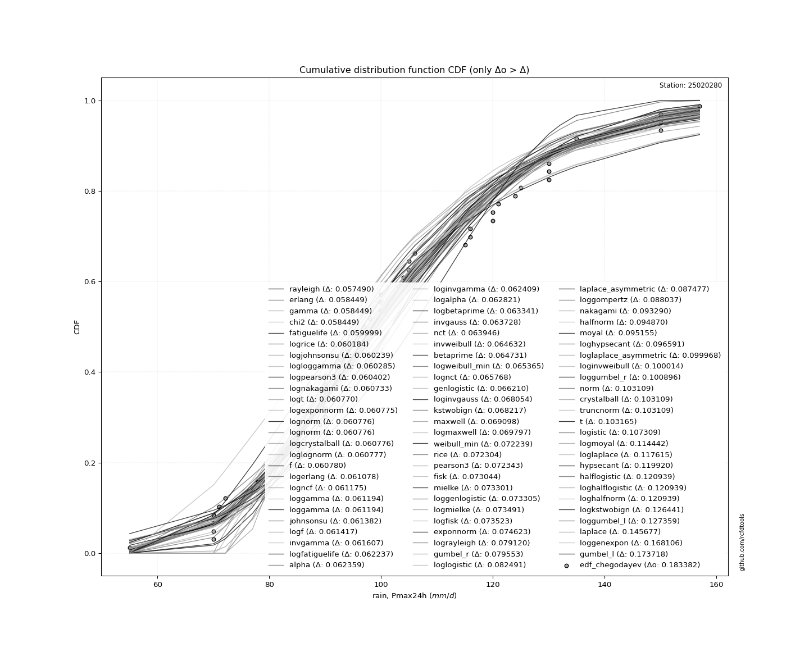</img>

</div>


**5.3. Best fit**

<div align="center">

|   id |   station | empirical_dist   | p_dist   |   delta |   deltao | eval   |   fit |   n |   best_fit |   best_fit_sort |
|-----:|----------:|:-----------------|:---------|--------:|---------:|:-------|------:|----:|-----------:|----------------:|
|    0 |  25020280 | edf_chegodayev   | rayleigh | 0.05749 | 0.183382 | Δo > Δ |     1 |  55 |          1 |               1 |

</div>


<div align="center">

</img>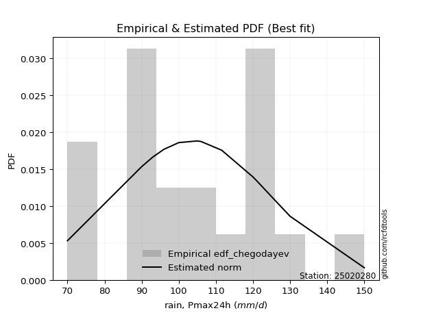</img>

</div>


### 6. Empirical - EDF Blom (1958)

The Blom formula is a specific "plotting position" formula used in hydrology and statistical analysis to estimate the empirical cumulative probability (or non-exceedance probability) of a data series. It is particularly recommended for data that are approximately normally distributed. The constant _a_ is set to 0.375 (or 3/8).

<div align="center">


$P=(m-a)/(n+1-2a)$


</div>


**6.1. Empirical values**

<div align="center">

|                | 0                    | 1                    | 2                   | 3                   | 4                  | 5                   | 6                   | 7                   | 8                   | 9                   | 10                  | 11                  | 12                  | 13                  | 14                 | 15                 | 16                 | 17                 | 18                  | 19                 | 20                 | 21                 | 22                 | 23                 | 24                 | 25                 | 26                 | 27       | 28                 | 29                 | 30                 | 31                 | 32                 | 33                 | 34                 | 35                 | 36                 | 37                 | 38                 | 39                 | 40                 | 41                | 42                 | 43                 | 44                 | 45                 | 46                 | 47                 | 48                 | 49                 | 50                | 51                 | 52                 | 53                 | 54                 |
|:---------------|:---------------------|:---------------------|:--------------------|:--------------------|:-------------------|:--------------------|:--------------------|:--------------------|:--------------------|:--------------------|:--------------------|:--------------------|:--------------------|:--------------------|:-------------------|:-------------------|:-------------------|:-------------------|:--------------------|:-------------------|:-------------------|:-------------------|:-------------------|:-------------------|:-------------------|:-------------------|:-------------------|:---------|:-------------------|:-------------------|:-------------------|:-------------------|:-------------------|:-------------------|:-------------------|:-------------------|:-------------------|:-------------------|:-------------------|:-------------------|:-------------------|:------------------|:-------------------|:-------------------|:-------------------|:-------------------|:-------------------|:-------------------|:-------------------|:-------------------|:------------------|:-------------------|:-------------------|:-------------------|:-------------------|
| date           | 1986                 | 1963                 | 1997                | 1995                | 2001               | 1966                | 1968                | 1989                | 1981                | 1967                | 1964                | 1976                | 2011                | 2015                | 1988               | 2013               | 2004               | 2007               | 1987                | 1991               | 1977               | 2009               | 1974               | 1990               | 1965               | 2016               | 2002               | 1972     | 1985               | 2017               | 1994               | 1971               | 1983               | 1975               | 2003               | 1992               | 2005               | 1970               | 1979               | 1973               | 2000               | 1993              | 2008               | 1998               | 2006               | 1978               | 1999               | 1980               | 2012               | 1969               | 2014              | 1984               | 1982               | 1996               | 2010               |
| x              | 55.0                 | 70.0                 | 70.0                | 70.0                | 70.0               | 71.0                | 72.1625217          | 77.0                | 78.0                | 80.0                | 80.0                | 82.0                | 85.0                | 85.0                | 88.0               | 89.0               | 90.0               | 90.0               | 90.0                | 90.0               | 90.0               | 90.0               | 92.0               | 92.6               | 94.0               | 95.0               | 96.0               | 97.0     | 98.0               | 100.0              | 100.0              | 100.0              | 103.0              | 104.0              | 104.85022766727273 | 105.0              | 106.0              | 115.0              | 116.0              | 116.0              | 120.0              | 120.0             | 121.0              | 124.0              | 125.0              | 130.0              | 130.0              | 130.0              | 130.0              | 132.0              | 135.0             | 150.0              | 150.0              | 150.0              | 157.0              |
| m              | 1                    | 2                    | 3                   | 4                   | 5                  | 6                   | 7                   | 8                   | 9                   | 10                  | 11                  | 12                  | 13                  | 14                  | 15                 | 16                 | 17                 | 18                 | 19                  | 20                 | 21                 | 22                 | 23                 | 24                 | 25                 | 26                 | 27                 | 28       | 29                 | 30                 | 31                 | 32                 | 33                 | 34                 | 35                 | 36                 | 37                 | 38                 | 39                 | 40                 | 41                 | 42                | 43                 | 44                 | 45                 | 46                 | 47                 | 48                 | 49                 | 50                 | 51                | 52                 | 53                 | 54                 | 55                 |
| empirical_dist | edf_blom             | edf_blom             | edf_blom            | edf_blom            | edf_blom           | edf_blom            | edf_blom            | edf_blom            | edf_blom            | edf_blom            | edf_blom            | edf_blom            | edf_blom            | edf_blom            | edf_blom           | edf_blom           | edf_blom           | edf_blom           | edf_blom            | edf_blom           | edf_blom           | edf_blom           | edf_blom           | edf_blom           | edf_blom           | edf_blom           | edf_blom           | edf_blom | edf_blom           | edf_blom           | edf_blom           | edf_blom           | edf_blom           | edf_blom           | edf_blom           | edf_blom           | edf_blom           | edf_blom           | edf_blom           | edf_blom           | edf_blom           | edf_blom          | edf_blom           | edf_blom           | edf_blom           | edf_blom           | edf_blom           | edf_blom           | edf_blom           | edf_blom           | edf_blom          | edf_blom           | edf_blom           | edf_blom           | edf_blom           |
| empirical      | 0.011312217194570135 | 0.029411764705882353 | 0.04751131221719457 | 0.06561085972850679 | 0.083710407239819  | 0.10180995475113122 | 0.11990950226244344 | 0.13800904977375567 | 0.15610859728506787 | 0.17420814479638008 | 0.19230769230769232 | 0.21040723981900453 | 0.22850678733031674 | 0.24660633484162897 | 0.2647058823529412 | 0.2828054298642534 | 0.3009049773755656 | 0.3190045248868778 | 0.33710407239819007 | 0.3552036199095023 | 0.3733031674208145 | 0.3914027149321267 | 0.4095022624434389 | 0.4276018099547511 | 0.4457013574660634 | 0.4638009049773756 | 0.4819004524886878 | 0.5      | 0.5180995475113123 | 0.5361990950226244 | 0.5542986425339367 | 0.5723981900452488 | 0.5904977375565611 | 0.6085972850678733 | 0.6266968325791855 | 0.6447963800904978 | 0.6628959276018099 | 0.6809954751131222 | 0.6990950226244343 | 0.7171945701357466 | 0.7352941176470589 | 0.753393665158371 | 0.7714932126696833 | 0.7895927601809954 | 0.8076923076923077 | 0.8257918552036199 | 0.8438914027149321 | 0.8619909502262444 | 0.8800904977375565 | 0.8981900452488688 | 0.916289592760181 | 0.9343891402714932 | 0.9524886877828054 | 0.9705882352941176 | 0.9886877828054299 |
| empirical_tr   | 1.0114416475972539   | 1.0303030303030303   | 1.0498812351543945  | 1.0702179176755449  | 1.0913580246913581 | 1.1133501259445844  | 1.1362467866323909  | 1.1601049868766404  | 1.1849865951742626  | 1.2109589041095892  | 1.2380952380952381  | 1.2664756446991405  | 1.2961876832844574  | 1.3273273273273274  | 1.3599999999999999 | 1.3943217665615142 | 1.4304207119741101 | 1.46843853820598   | 1.5085324232081911  | 1.5508771929824563 | 1.595667870036101  | 1.6431226765799254 | 1.693486590038314  | 1.7470355731225298 | 1.804081632653061  | 1.8649789029535866 | 1.9301310043668125 | 2.0      | 2.075117370892019  | 2.15609756097561   | 2.2436548223350257 | 2.3386243386243386 | 2.4419889502762433 | 2.5549132947976876 | 2.6787878787878787 | 2.815286624203822  | 2.966442953020134  | 3.1347517730496457 | 3.323308270676691  | 3.536              | 3.7777777777777786 | 4.055045871559633 | 4.376237623762377  | 4.75268817204301   | 5.2                | 5.740259740259739  | 6.405797101449275  | 7.245901639344265  | 8.339622641509433  | 9.822222222222225  | 11.94594594594594 | 15.241379310344831 | 21.047619047619023 | 33.99999999999999  | 88.40000000000032  |

</div>


**6.2. Kolmogorov-Smirnov fit test (sorted by Δ)**


<div align="center">

|                | 0                   | 1                    | 2                   | 3                    | 4                   | 5                    | 6                   | 7                   | 8                   | 9                   | 10                  | 11                   | 12                   | 13                  | 14                  | 15                   | 16                   | 17                  | 18                  | 19                  | 20                  | 21                  | 22                  | 23                  | 24                  | 25                   | 26                  | 27                   | 28                  | 29                  | 30                  | 31                  | 32                  | 33                  | 34                  | 35                  | 36                  | 37                  | 38                  | 39                  | 40                  | 41                  | 42                  | 43                  | 44                  | 45                  | 46                  | 47                  | 48                  | 49                  | 50                  | 51                  | 52                  | 53                  | 54                  | 55                  | 56                  | 57                  | 58                    | 59                  | 60                  | 61                  | 62                  | 63                  | 64                  | 65                  | 66                  | 67                  | 68                  | 69                  | 70                  | 71                  | 72                  | 73                  | 74                  | 75                  | 76                  | 77                  | 78                  | 79                  | 80                  | 81                  | 82                  | 83                  | 84                  | 85                  | 86                  | 87                  | 88                  | 89                  |
|:---------------|:--------------------|:---------------------|:--------------------|:---------------------|:--------------------|:---------------------|:--------------------|:--------------------|:--------------------|:--------------------|:--------------------|:---------------------|:---------------------|:--------------------|:--------------------|:---------------------|:---------------------|:--------------------|:--------------------|:--------------------|:--------------------|:--------------------|:--------------------|:--------------------|:--------------------|:---------------------|:--------------------|:---------------------|:--------------------|:--------------------|:--------------------|:--------------------|:--------------------|:--------------------|:--------------------|:--------------------|:--------------------|:--------------------|:--------------------|:--------------------|:--------------------|:--------------------|:--------------------|:--------------------|:--------------------|:--------------------|:--------------------|:--------------------|:--------------------|:--------------------|:--------------------|:--------------------|:--------------------|:--------------------|:--------------------|:--------------------|:--------------------|:--------------------|:----------------------|:--------------------|:--------------------|:--------------------|:--------------------|:--------------------|:--------------------|:--------------------|:--------------------|:--------------------|:--------------------|:--------------------|:--------------------|:--------------------|:--------------------|:--------------------|:--------------------|:--------------------|:--------------------|:--------------------|:--------------------|:--------------------|:--------------------|:--------------------|:--------------------|:--------------------|:--------------------|:--------------------|:--------------------|:--------------------|:--------------------|:--------------------|
| station        | 25020280            | 25020280             | 25020280            | 25020280             | 25020280            | 25020280             | 25020280            | 25020280            | 25020280            | 25020280            | 25020280            | 25020280             | 25020280             | 25020280            | 25020280            | 25020280             | 25020280             | 25020280            | 25020280            | 25020280            | 25020280            | 25020280            | 25020280            | 25020280            | 25020280            | 25020280             | 25020280            | 25020280             | 25020280            | 25020280            | 25020280            | 25020280            | 25020280            | 25020280            | 25020280            | 25020280            | 25020280            | 25020280            | 25020280            | 25020280            | 25020280            | 25020280            | 25020280            | 25020280            | 25020280            | 25020280            | 25020280            | 25020280            | 25020280            | 25020280            | 25020280            | 25020280            | 25020280            | 25020280            | 25020280            | 25020280            | 25020280            | 25020280            | 25020280              | 25020280            | 25020280            | 25020280            | 25020280            | 25020280            | 25020280            | 25020280            | 25020280            | 25020280            | 25020280            | 25020280            | 25020280            | 25020280            | 25020280            | 25020280            | 25020280            | 25020280            | 25020280            | 25020280            | 25020280            | 25020280            | 25020280            | 25020280            | 25020280            | 25020280            | 25020280            | 25020280            | 25020280            | 25020280            | 25020280            | 25020280            |
| empirical_dist | edf_blom            | edf_blom             | edf_blom            | edf_blom             | edf_blom            | edf_blom             | edf_blom            | edf_blom            | edf_blom            | edf_blom            | edf_blom            | edf_blom             | edf_blom             | edf_blom            | edf_blom            | edf_blom             | edf_blom             | edf_blom            | edf_blom            | edf_blom            | edf_blom            | edf_blom            | edf_blom            | edf_blom            | edf_blom            | edf_blom             | edf_blom            | edf_blom             | edf_blom            | edf_blom            | edf_blom            | edf_blom            | edf_blom            | edf_blom            | edf_blom            | edf_blom            | edf_blom            | edf_blom            | edf_blom            | edf_blom            | edf_blom            | edf_blom            | edf_blom            | edf_blom            | edf_blom            | edf_blom            | edf_blom            | edf_blom            | edf_blom            | edf_blom            | edf_blom            | edf_blom            | edf_blom            | edf_blom            | edf_blom            | edf_blom            | edf_blom            | edf_blom            | edf_blom              | edf_blom            | edf_blom            | edf_blom            | edf_blom            | edf_blom            | edf_blom            | edf_blom            | edf_blom            | edf_blom            | edf_blom            | edf_blom            | edf_blom            | edf_blom            | edf_blom            | edf_blom            | edf_blom            | edf_blom            | edf_blom            | edf_blom            | edf_blom            | edf_blom            | edf_blom            | edf_blom            | edf_blom            | edf_blom            | edf_blom            | edf_blom            | edf_blom            | edf_blom            | edf_blom            | edf_blom            |
| p_dist         | rayleigh            | gamma                | chi2                | erlang               | fatiguelife         | logrice              | logjohnsonsu        | logpearson3         | lognakagami         | logt                | logexponnorm        | lognorm              | lognorm              | logcrystalball      | loglognorm          | f                    | logloggamma          | logerlang           | logncf              | loggamma            | loggamma            | johnsonsu           | logf                | invgamma            | logfatiguelife      | alpha                | loginvgamma         | logalpha             | logbetaprime        | invgauss            | nct                 | invweibull          | betaprime           | lognct              | logweibull_min      | genlogistic         | loginvgauss         | kstwobign           | maxwell             | logmaxwell          | weibull_min         | rice                | pearson3            | fisk                | mielke              | loggenlogistic      | logmielke           | logfisk             | exponnorm           | gumbel_r            | lograyleigh         | loglogistic         | laplace_asymmetric  | loggompertz         | halfnorm            | nakagami            | moyal               | loghypsecant        | loglaplace_asymmetric | loggumbel_r         | loginvweibull       | norm                | crystalball         | truncnorm           | t                   | logistic            | logmoyal            | loglaplace          | hypsecant           | halflogistic        | loghalflogistic     | loghalfnorm         | logkstwobign        | loggumbel_l         | laplace             | loggenexpon         | gumbel_l            | wald                | logwald             | loggibrat           | ncf                 | gibrat              | expon               | pareto              | genexpon            | logtruncnorm        | logexpon            | logpareto           | logchi2             | gompertz            |
| delta          | 0.0576860090560154  | 0.057858679781658595 | 0.05785874323936713 | 0.057858888686030174 | 0.05936225098469716 | 0.059547089103015094 | 0.0596021998110422  | 0.05976530313375339 | 0.06009608750043138 | 0.06013245902879394 | 0.06013827417903139 | 0.060139094108010216 | 0.060139094108010216 | 0.06013937781967604 | 0.06014028831596141 | 0.060143170099228316 | 0.060196158557270785 | 0.0604405119377629  | 0.06053742249985017 | 0.06055682263956541 | 0.06055682263956541 | 0.06074511965979157 | 0.06077982020574901 | 0.0609694514772231  | 0.06159979046135389 | 0.061722133289475734 | 0.0618387844886924  | 0.062330960712181804 | 0.06285093044348633 | 0.06323779123653905 | 0.0633093945782468  | 0.06414151312663208 | 0.06424108920252114 | 0.06527806127711355 | 0.06556080629583094 | 0.06572008123448259 | 0.06756412790833732 | 0.06885412205145408 | 0.06929353781874925 | 0.06930677307637934 | 0.07243550749425476 | 0.07249998432009513 | 0.07253933427478565 | 0.07255371868728333 | 0.07281059740755846 | 0.07281474025807022 | 0.0730009873680586  | 0.0730327266558386  | 0.07413322575922487 | 0.07906317992928846 | 0.07965916686679608 | 0.08185416185966132 | 0.08698682623907894 | 0.08829028277516338 | 0.0937921823546539  | 0.09392734020580729 | 0.09466522925012688 | 0.09610065884322372 | 0.09947841210620378   | 0.10040582626383121 | 0.10055272249806746 | 0.10330515761187853 | 0.10330515805401852 | 0.1033051606432509  | 0.10336151977470404 | 0.10750533325381634 | 0.11395171005127325 | 0.11712540157524964 | 0.11962591276988399 | 0.11990950226244344 | 0.11990950226244344 | 0.11990950226244344 | 0.1270782993887894  | 0.12755528455930842 | 0.1453827898878655  | 0.1687433135786623  | 0.1739136059418589  | 0.19164796213037819 | 0.1918343834325761  | 0.21040723981900453 | 0.21937004781215508 | 0.2339455759367742  | 0.2446658141143599  | 0.24466584429679938 | 0.2458633348934708  | 0.2967154741980618  | 0.3064031457561152  | 0.3064031533320548  | 0.31834751371289954 | 0.8608413154802391  |
| deltao         | 0.18338236259000185 | 0.18338236259000185  | 0.18338236259000185 | 0.18338236259000185  | 0.18338236259000185 | 0.18338236259000185  | 0.18338236259000185 | 0.18338236259000185 | 0.18338236259000185 | 0.18338236259000185 | 0.18338236259000185 | 0.18338236259000185  | 0.18338236259000185  | 0.18338236259000185 | 0.18338236259000185 | 0.18338236259000185  | 0.18338236259000185  | 0.18338236259000185 | 0.18338236259000185 | 0.18338236259000185 | 0.18338236259000185 | 0.18338236259000185 | 0.18338236259000185 | 0.18338236259000185 | 0.18338236259000185 | 0.18338236259000185  | 0.18338236259000185 | 0.18338236259000185  | 0.18338236259000185 | 0.18338236259000185 | 0.18338236259000185 | 0.18338236259000185 | 0.18338236259000185 | 0.18338236259000185 | 0.18338236259000185 | 0.18338236259000185 | 0.18338236259000185 | 0.18338236259000185 | 0.18338236259000185 | 0.18338236259000185 | 0.18338236259000185 | 0.18338236259000185 | 0.18338236259000185 | 0.18338236259000185 | 0.18338236259000185 | 0.18338236259000185 | 0.18338236259000185 | 0.18338236259000185 | 0.18338236259000185 | 0.18338236259000185 | 0.18338236259000185 | 0.18338236259000185 | 0.18338236259000185 | 0.18338236259000185 | 0.18338236259000185 | 0.18338236259000185 | 0.18338236259000185 | 0.18338236259000185 | 0.18338236259000185   | 0.18338236259000185 | 0.18338236259000185 | 0.18338236259000185 | 0.18338236259000185 | 0.18338236259000185 | 0.18338236259000185 | 0.18338236259000185 | 0.18338236259000185 | 0.18338236259000185 | 0.18338236259000185 | 0.18338236259000185 | 0.18338236259000185 | 0.18338236259000185 | 0.18338236259000185 | 0.18338236259000185 | 0.18338236259000185 | 0.18338236259000185 | 0.18338236259000185 | 0.18338236259000185 | 0.18338236259000185 | 0.18338236259000185 | 0.18338236259000185 | 0.18338236259000185 | 0.18338236259000185 | 0.18338236259000185 | 0.18338236259000185 | 0.18338236259000185 | 0.18338236259000185 | 0.18338236259000185 | 0.18338236259000185 | 0.18338236259000185 |
| eval           | Δo > Δ              | Δo > Δ               | Δo > Δ              | Δo > Δ               | Δo > Δ              | Δo > Δ               | Δo > Δ              | Δo > Δ              | Δo > Δ              | Δo > Δ              | Δo > Δ              | Δo > Δ               | Δo > Δ               | Δo > Δ              | Δo > Δ              | Δo > Δ               | Δo > Δ               | Δo > Δ              | Δo > Δ              | Δo > Δ              | Δo > Δ              | Δo > Δ              | Δo > Δ              | Δo > Δ              | Δo > Δ              | Δo > Δ               | Δo > Δ              | Δo > Δ               | Δo > Δ              | Δo > Δ              | Δo > Δ              | Δo > Δ              | Δo > Δ              | Δo > Δ              | Δo > Δ              | Δo > Δ              | Δo > Δ              | Δo > Δ              | Δo > Δ              | Δo > Δ              | Δo > Δ              | Δo > Δ              | Δo > Δ              | Δo > Δ              | Δo > Δ              | Δo > Δ              | Δo > Δ              | Δo > Δ              | Δo > Δ              | Δo > Δ              | Δo > Δ              | Δo > Δ              | Δo > Δ              | Δo > Δ              | Δo > Δ              | Δo > Δ              | Δo > Δ              | Δo > Δ              | Δo > Δ                | Δo > Δ              | Δo > Δ              | Δo > Δ              | Δo > Δ              | Δo > Δ              | Δo > Δ              | Δo > Δ              | Δo > Δ              | Δo > Δ              | Δo > Δ              | Δo > Δ              | Δo > Δ              | Δo > Δ              | Δo > Δ              | Δo > Δ              | Δo > Δ              | Δo > Δ              | Δo > Δ              | Δo <= Δ             | Δo <= Δ             | Δo <= Δ             | Δo <= Δ             | Δo <= Δ             | Δo <= Δ             | Δo <= Δ             | Δo <= Δ             | Δo <= Δ             | Δo <= Δ             | Δo <= Δ             | Δo <= Δ             | Δo <= Δ             |
| fit            | 1                   | 1                    | 1                   | 1                    | 1                   | 1                    | 1                   | 1                   | 1                   | 1                   | 1                   | 1                    | 1                    | 1                   | 1                   | 1                    | 1                    | 1                   | 1                   | 1                   | 1                   | 1                   | 1                   | 1                   | 1                   | 1                    | 1                   | 1                    | 1                   | 1                   | 1                   | 1                   | 1                   | 1                   | 1                   | 1                   | 1                   | 1                   | 1                   | 1                   | 1                   | 1                   | 1                   | 1                   | 1                   | 1                   | 1                   | 1                   | 1                   | 1                   | 1                   | 1                   | 1                   | 1                   | 1                   | 1                   | 1                   | 1                   | 1                     | 1                   | 1                   | 1                   | 1                   | 1                   | 1                   | 1                   | 1                   | 1                   | 1                   | 1                   | 1                   | 1                   | 1                   | 1                   | 1                   | 1                   | 1                   | 0                   | 0                   | 0                   | 0                   | 0                   | 0                   | 0                   | 0                   | 0                   | 0                   | 0                   | 0                   | 0                   |
| n              | 55                  | 55                   | 55                  | 55                   | 55                  | 55                   | 55                  | 55                  | 55                  | 55                  | 55                  | 55                   | 55                   | 55                  | 55                  | 55                   | 55                   | 55                  | 55                  | 55                  | 55                  | 55                  | 55                  | 55                  | 55                  | 55                   | 55                  | 55                   | 55                  | 55                  | 55                  | 55                  | 55                  | 55                  | 55                  | 55                  | 55                  | 55                  | 55                  | 55                  | 55                  | 55                  | 55                  | 55                  | 55                  | 55                  | 55                  | 55                  | 55                  | 55                  | 55                  | 55                  | 55                  | 55                  | 55                  | 55                  | 55                  | 55                  | 55                    | 55                  | 55                  | 55                  | 55                  | 55                  | 55                  | 55                  | 55                  | 55                  | 55                  | 55                  | 55                  | 55                  | 55                  | 55                  | 55                  | 55                  | 55                  | 55                  | 55                  | 55                  | 55                  | 55                  | 55                  | 55                  | 55                  | 55                  | 55                  | 55                  | 55                  | 55                  |
| best_fit       | 1                   | 0                    | 0                   | 0                    | 0                   | 0                    | 0                   | 0                   | 0                   | 0                   | 0                   | 0                    | 0                    | 0                   | 0                   | 0                    | 0                    | 0                   | 0                   | 0                   | 0                   | 0                   | 0                   | 0                   | 0                   | 0                    | 0                   | 0                    | 0                   | 0                   | 0                   | 0                   | 0                   | 0                   | 0                   | 0                   | 0                   | 0                   | 0                   | 0                   | 0                   | 0                   | 0                   | 0                   | 0                   | 0                   | 0                   | 0                   | 0                   | 0                   | 0                   | 0                   | 0                   | 0                   | 0                   | 0                   | 0                   | 0                   | 0                     | 0                   | 0                   | 0                   | 0                   | 0                   | 0                   | 0                   | 0                   | 0                   | 0                   | 0                   | 0                   | 0                   | 0                   | 0                   | 0                   | 0                   | 0                   | 0                   | 0                   | 0                   | 0                   | 0                   | 0                   | 0                   | 0                   | 0                   | 0                   | 0                   | 0                   | 0                   |
| best_fit_sort  | 1                   | 2                    | 3                   | 4                    | 5                   | 6                    | 7                   | 8                   | 9                   | 10                  | 11                  | 12                   | 13                   | 14                  | 15                  | 16                   | 17                   | 18                  | 19                  | 20                  | 21                  | 22                  | 23                  | 24                  | 25                  | 26                   | 27                  | 28                   | 29                  | 30                  | 31                  | 32                  | 33                  | 34                  | 35                  | 36                  | 37                  | 38                  | 39                  | 40                  | 41                  | 42                  | 43                  | 44                  | 45                  | 46                  | 47                  | 48                  | 49                  | 50                  | 51                  | 52                  | 53                  | 54                  | 55                  | 56                  | 57                  | 58                  | 59                    | 60                  | 61                  | 62                  | 63                  | 64                  | 65                  | 66                  | 67                  | 68                  | 69                  | 70                  | 71                  | 72                  | 73                  | 74                  | 75                  | 76                  | 77                  | 78                  | 79                  | 80                  | 81                  | 82                  | 83                  | 84                  | 85                  | 86                  | 87                  | 88                  | 89                  | 90                  |

</div>


<div align="center">

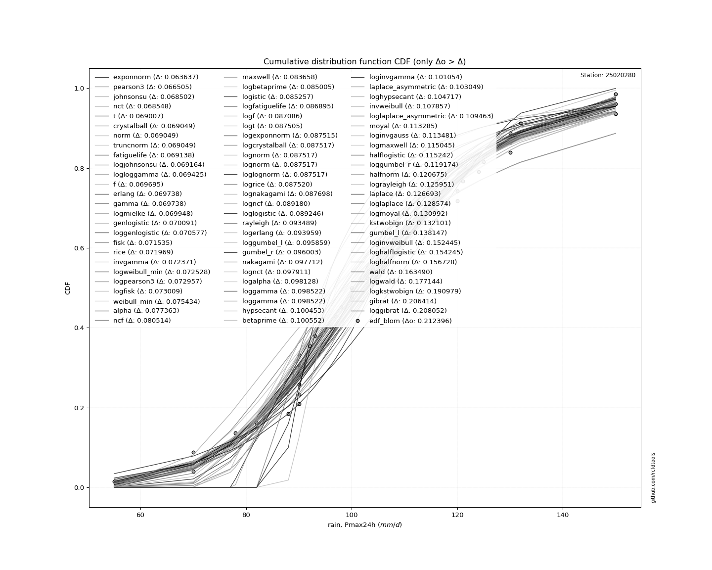</img>

</div>


**6.3. Best fit**

<div align="center">

|   id |   station | empirical_dist   | p_dist   |    delta |   deltao | eval   |   fit |   n |   best_fit |   best_fit_sort |
|-----:|----------:|:-----------------|:---------|---------:|---------:|:-------|------:|----:|-----------:|----------------:|
|    0 |  25020280 | edf_blom         | rayleigh | 0.057686 | 0.183382 | Δo > Δ |     1 |  55 |          1 |               1 |

</div>


<div align="center">

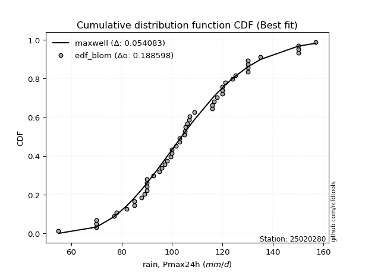</img>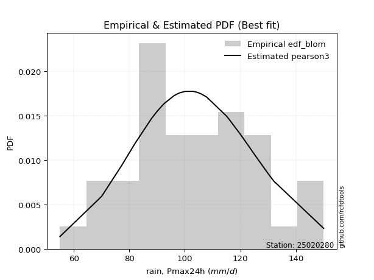</img>

</div>


### 7. Empirical - EDF Tukey (1962)

In hydrology, the Tukey formula is used as a plotting position formula to estimate the empirical probability or frequency of a flood event (or other hydrological data). The formula parameter is given as _c=0.333_ (or 1/3).

<div align="center">


$P=(m-c)/(n+1-2c)$


</div>


**7.1. Empirical values**

<div align="center">

|                | 0                    | 1                    | 2                   | 3                   | 4                   | 5                   | 6                   | 7                   | 8                  | 9                  | 10                 | 11                  | 12                 | 13                 | 14                  | 15                  | 16                  | 17                 | 18                 | 19                  | 20                  | 21                  | 22                  | 23                  | 24                 | 25                 | 26                 | 27        | 28                 | 29                | 30                 | 31                 | 32                 | 33                | 34                 | 35                 | 36                 | 37                 | 38                 | 39                 | 40                 | 41                 | 42                 | 43                 | 44                 | 45                 | 46                 | 47                 | 48                 | 49                 | 50                 | 51                 | 52                 | 53                 | 54                 |
|:---------------|:---------------------|:---------------------|:--------------------|:--------------------|:--------------------|:--------------------|:--------------------|:--------------------|:-------------------|:-------------------|:-------------------|:--------------------|:-------------------|:-------------------|:--------------------|:--------------------|:--------------------|:-------------------|:-------------------|:--------------------|:--------------------|:--------------------|:--------------------|:--------------------|:-------------------|:-------------------|:-------------------|:----------|:-------------------|:------------------|:-------------------|:-------------------|:-------------------|:------------------|:-------------------|:-------------------|:-------------------|:-------------------|:-------------------|:-------------------|:-------------------|:-------------------|:-------------------|:-------------------|:-------------------|:-------------------|:-------------------|:-------------------|:-------------------|:-------------------|:-------------------|:-------------------|:-------------------|:-------------------|:-------------------|
| date           | 1986                 | 1963                 | 1997                | 1995                | 2001                | 1966                | 1968                | 1989                | 1981               | 1967               | 1964               | 1976                | 2011               | 2015               | 1988                | 2013                | 2004                | 2007               | 1987               | 1991                | 1977                | 2009                | 1974                | 1990                | 1965               | 2016               | 2002               | 1972      | 1985               | 2017              | 1994               | 1971               | 1983               | 1975              | 2003               | 1992               | 2005               | 1970               | 1979               | 1973               | 2000               | 1993               | 2008               | 1998               | 2006               | 1978               | 1999               | 1980               | 2012               | 1969               | 2014               | 1984               | 1982               | 1996               | 2010               |
| x              | 55.0                 | 70.0                 | 70.0                | 70.0                | 70.0                | 71.0                | 72.1625217          | 77.0                | 78.0               | 80.0               | 80.0               | 82.0                | 85.0               | 85.0               | 88.0                | 89.0                | 90.0                | 90.0               | 90.0               | 90.0                | 90.0                | 90.0                | 92.0                | 92.6                | 94.0               | 95.0               | 96.0               | 97.0      | 98.0               | 100.0             | 100.0              | 100.0              | 103.0              | 104.0             | 104.85022766727273 | 105.0              | 106.0              | 115.0              | 116.0              | 116.0              | 120.0              | 120.0              | 121.0              | 124.0              | 125.0              | 130.0              | 130.0              | 130.0              | 130.0              | 132.0              | 135.0              | 150.0              | 150.0              | 150.0              | 157.0              |
| m              | 1                    | 2                    | 3                   | 4                   | 5                   | 6                   | 7                   | 8                   | 9                  | 10                 | 11                 | 12                  | 13                 | 14                 | 15                  | 16                  | 17                  | 18                 | 19                 | 20                  | 21                  | 22                  | 23                  | 24                  | 25                 | 26                 | 27                 | 28        | 29                 | 30                | 31                 | 32                 | 33                 | 34                | 35                 | 36                 | 37                 | 38                 | 39                 | 40                 | 41                 | 42                 | 43                 | 44                 | 45                 | 46                 | 47                 | 48                 | 49                 | 50                 | 51                 | 52                 | 53                 | 54                 | 55                 |
| empirical_dist | edf_tukey            | edf_tukey            | edf_tukey           | edf_tukey           | edf_tukey           | edf_tukey           | edf_tukey           | edf_tukey           | edf_tukey          | edf_tukey          | edf_tukey          | edf_tukey           | edf_tukey          | edf_tukey          | edf_tukey           | edf_tukey           | edf_tukey           | edf_tukey          | edf_tukey          | edf_tukey           | edf_tukey           | edf_tukey           | edf_tukey           | edf_tukey           | edf_tukey          | edf_tukey          | edf_tukey          | edf_tukey | edf_tukey          | edf_tukey         | edf_tukey          | edf_tukey          | edf_tukey          | edf_tukey         | edf_tukey          | edf_tukey          | edf_tukey          | edf_tukey          | edf_tukey          | edf_tukey          | edf_tukey          | edf_tukey          | edf_tukey          | edf_tukey          | edf_tukey          | edf_tukey          | edf_tukey          | edf_tukey          | edf_tukey          | edf_tukey          | edf_tukey          | edf_tukey          | edf_tukey          | edf_tukey          | edf_tukey          |
| empirical      | 0.012048192771084338 | 0.030120481927710843 | 0.04819277108433735 | 0.06626506024096386 | 0.08433734939759036 | 0.10240963855421686 | 0.12048192771084337 | 0.13855421686746988 | 0.1566265060240964 | 0.1746987951807229 | 0.1927710843373494 | 0.21084337349397592 | 0.2289156626506024 | 0.2469879518072289 | 0.26506024096385544 | 0.28313253012048195 | 0.30120481927710846 | 0.3192771084337349 | 0.3373493975903614 | 0.35542168674698793 | 0.37349397590361444 | 0.39156626506024095 | 0.40963855421686746 | 0.42771084337349397 | 0.4457831325301205 | 0.463855421686747  | 0.4819277108433735 | 0.5       | 0.5180722891566265 | 0.536144578313253 | 0.5542168674698795 | 0.572289156626506  | 0.5903614457831325 | 0.608433734939759 | 0.6265060240963856 | 0.6445783132530121 | 0.6626506024096386 | 0.6807228915662651 | 0.6987951807228916 | 0.7168674698795181 | 0.7349397590361446 | 0.7530120481927711 | 0.7710843373493976 | 0.7891566265060241 | 0.8072289156626506 | 0.8253012048192772 | 0.8433734939759037 | 0.8614457831325302 | 0.8795180722891566 | 0.8975903614457831 | 0.9156626506024096 | 0.9337349397590361 | 0.9518072289156626 | 0.9698795180722891 | 0.9879518072289156 |
| empirical_tr   | 1.0121951219512195   | 1.031055900621118    | 1.0506329113924051  | 1.070967741935484   | 1.0921052631578947  | 1.1140939597315436  | 1.136986301369863   | 1.1608391608391608  | 1.1857142857142857 | 1.2116788321167882 | 1.2388059701492538 | 1.2671755725190839  | 1.296875           | 1.3279999999999998 | 1.360655737704918   | 1.3949579831932772  | 1.4310344827586206  | 1.4690265486725662 | 1.509090909090909  | 1.5514018691588785  | 1.596153846153846   | 1.6435643564356435  | 1.693877551020408   | 1.7473684210526315  | 1.8043478260869565 | 1.8651685393258426 | 1.930232558139535  | 2.0       | 2.075              | 2.155844155844156 | 2.2432432432432434 | 2.3380281690140845 | 2.4411764705882355 | 2.553846153846154 | 2.67741935483871   | 2.8135593220338984 | 2.9642857142857144 | 3.1320754716981134 | 3.3200000000000003 | 3.5319148936170217 | 3.7727272727272734 | 4.048780487804879  | 4.36842105263158   | 4.742857142857144  | 5.187500000000001  | 5.724137931034484  | 6.384615384615387  | 7.217391304347829  | 8.299999999999995  | 9.764705882352937  | 11.85714285714285  | 15.090909090909081 | 20.749999999999982 | 33.19999999999995  | 82.99999999999973  |

</div>


**7.2. Kolmogorov-Smirnov fit test (sorted by Δ)**


<div align="center">

|                | 0                   | 1                   | 2                   | 3                    | 4                    | 5                   | 6                   | 7                    | 8                   | 9                    | 10                  | 11                   | 12                  | 13                  | 14                   | 15                  | 16                  | 17                  | 18                  | 19                  | 20                  | 21                  | 22                   | 23                   | 24                  | 25                   | 26                  | 27                  | 28                  | 29                  | 30                  | 31                  | 32                  | 33                  | 34                  | 35                  | 36                  | 37                  | 38                  | 39                  | 40                  | 41                  | 42                  | 43                  | 44                  | 45                  | 46                  | 47                  | 48                  | 49                  | 50                  | 51                  | 52                  | 53                  | 54                  | 55                  | 56                  | 57                  | 58                    | 59                  | 60                  | 61                  | 62                  | 63                  | 64                  | 65                  | 66                  | 67                  | 68                  | 69                  | 70                  | 71                  | 72                  | 73                  | 74                  | 75                  | 76                  | 77                  | 78                  | 79                  | 80                  | 81                  | 82                  | 83                  | 84                  | 85                  | 86                  | 87                  | 88                  | 89                  |
|:---------------|:--------------------|:--------------------|:--------------------|:---------------------|:---------------------|:--------------------|:--------------------|:---------------------|:--------------------|:---------------------|:--------------------|:---------------------|:--------------------|:--------------------|:---------------------|:--------------------|:--------------------|:--------------------|:--------------------|:--------------------|:--------------------|:--------------------|:---------------------|:---------------------|:--------------------|:---------------------|:--------------------|:--------------------|:--------------------|:--------------------|:--------------------|:--------------------|:--------------------|:--------------------|:--------------------|:--------------------|:--------------------|:--------------------|:--------------------|:--------------------|:--------------------|:--------------------|:--------------------|:--------------------|:--------------------|:--------------------|:--------------------|:--------------------|:--------------------|:--------------------|:--------------------|:--------------------|:--------------------|:--------------------|:--------------------|:--------------------|:--------------------|:--------------------|:----------------------|:--------------------|:--------------------|:--------------------|:--------------------|:--------------------|:--------------------|:--------------------|:--------------------|:--------------------|:--------------------|:--------------------|:--------------------|:--------------------|:--------------------|:--------------------|:--------------------|:--------------------|:--------------------|:--------------------|:--------------------|:--------------------|:--------------------|:--------------------|:--------------------|:--------------------|:--------------------|:--------------------|:--------------------|:--------------------|:--------------------|:--------------------|
| station        | 25020280            | 25020280            | 25020280            | 25020280             | 25020280             | 25020280            | 25020280            | 25020280             | 25020280            | 25020280             | 25020280            | 25020280             | 25020280            | 25020280            | 25020280             | 25020280            | 25020280            | 25020280            | 25020280            | 25020280            | 25020280            | 25020280            | 25020280             | 25020280             | 25020280            | 25020280             | 25020280            | 25020280            | 25020280            | 25020280            | 25020280            | 25020280            | 25020280            | 25020280            | 25020280            | 25020280            | 25020280            | 25020280            | 25020280            | 25020280            | 25020280            | 25020280            | 25020280            | 25020280            | 25020280            | 25020280            | 25020280            | 25020280            | 25020280            | 25020280            | 25020280            | 25020280            | 25020280            | 25020280            | 25020280            | 25020280            | 25020280            | 25020280            | 25020280              | 25020280            | 25020280            | 25020280            | 25020280            | 25020280            | 25020280            | 25020280            | 25020280            | 25020280            | 25020280            | 25020280            | 25020280            | 25020280            | 25020280            | 25020280            | 25020280            | 25020280            | 25020280            | 25020280            | 25020280            | 25020280            | 25020280            | 25020280            | 25020280            | 25020280            | 25020280            | 25020280            | 25020280            | 25020280            | 25020280            | 25020280            |
| empirical_dist | edf_tukey           | edf_tukey           | edf_tukey           | edf_tukey            | edf_tukey            | edf_tukey           | edf_tukey           | edf_tukey            | edf_tukey           | edf_tukey            | edf_tukey           | edf_tukey            | edf_tukey           | edf_tukey           | edf_tukey            | edf_tukey           | edf_tukey           | edf_tukey           | edf_tukey           | edf_tukey           | edf_tukey           | edf_tukey           | edf_tukey            | edf_tukey            | edf_tukey           | edf_tukey            | edf_tukey           | edf_tukey           | edf_tukey           | edf_tukey           | edf_tukey           | edf_tukey           | edf_tukey           | edf_tukey           | edf_tukey           | edf_tukey           | edf_tukey           | edf_tukey           | edf_tukey           | edf_tukey           | edf_tukey           | edf_tukey           | edf_tukey           | edf_tukey           | edf_tukey           | edf_tukey           | edf_tukey           | edf_tukey           | edf_tukey           | edf_tukey           | edf_tukey           | edf_tukey           | edf_tukey           | edf_tukey           | edf_tukey           | edf_tukey           | edf_tukey           | edf_tukey           | edf_tukey             | edf_tukey           | edf_tukey           | edf_tukey           | edf_tukey           | edf_tukey           | edf_tukey           | edf_tukey           | edf_tukey           | edf_tukey           | edf_tukey           | edf_tukey           | edf_tukey           | edf_tukey           | edf_tukey           | edf_tukey           | edf_tukey           | edf_tukey           | edf_tukey           | edf_tukey           | edf_tukey           | edf_tukey           | edf_tukey           | edf_tukey           | edf_tukey           | edf_tukey           | edf_tukey           | edf_tukey           | edf_tukey           | edf_tukey           | edf_tukey           | edf_tukey           |
| p_dist         | rayleigh            | erlang              | gamma               | chi2                 | fatiguelife          | logrice             | logjohnsonsu        | logloggamma          | logpearson3         | lognakagami          | logt                | logexponnorm         | lognorm             | lognorm             | logcrystalball       | loglognorm          | f                   | logerlang           | logncf              | loggamma            | loggamma            | johnsonsu           | logf                 | invgamma             | logfatiguelife      | alpha                | loginvgamma         | logalpha            | logbetaprime        | invgauss            | nct                 | invweibull          | betaprime           | logweibull_min      | lognct              | genlogistic         | loginvgauss         | kstwobign           | maxwell             | logmaxwell          | weibull_min         | rice                | pearson3            | fisk                | mielke              | loggenlogistic      | logmielke           | logfisk             | exponnorm           | gumbel_r            | lograyleigh         | loglogistic         | laplace_asymmetric  | loggompertz         | nakagami            | halfnorm            | moyal               | loghypsecant        | loglaplace_asymmetric | loginvweibull       | loggumbel_r         | norm                | crystalball         | truncnorm           | t                   | logistic            | logmoyal            | loglaplace          | hypsecant           | halflogistic        | loghalflogistic     | loghalfnorm         | logkstwobign        | loggumbel_l         | laplace             | loggenexpon         | gumbel_l            | wald                | logwald             | loggibrat           | ncf                 | gibrat              | expon               | pareto              | genexpon            | logtruncnorm        | logexpon            | logpareto           | logchi2             | gompertz            |
| delta          | 0.0575769756372726  | 0.05816632394864807 | 0.05816641405202838 | 0.058166425739014205 | 0.059716609595611425 | 0.05990144771392936 | 0.05995655842195646 | 0.060087125138527986 | 0.06011966174466765 | 0.060450446111345646 | 0.0604868176397082  | 0.060492632789945655 | 0.06049345271892448 | 0.06049345271892448 | 0.060493736430590306 | 0.06049464692687567 | 0.06049752871014258 | 0.06079487054867716 | 0.06089178111076443 | 0.06091118125047967 | 0.06091118125047967 | 0.06109947827070583 | 0.061134178816663276 | 0.061323810088137365 | 0.06195414907226815 | 0.062076491900389996 | 0.06212631811025493 | 0.06260354425903891 | 0.06312351399034344 | 0.06351037478339616 | 0.06366375318916107 | 0.06441409667348919 | 0.06451367274937825 | 0.06545177287708814 | 0.06555064482397066 | 0.0659926647813397  | 0.06783671145519443 | 0.06849976344053982 | 0.06918450440000645 | 0.06957935662323644 | 0.07232647407551196 | 0.07239095090135234 | 0.07243030085604285 | 0.07282630223414044 | 0.07308318095441557 | 0.07308732380492733 | 0.07327357091491571 | 0.0733053102026957  | 0.07440580930608198 | 0.07933576347614557 | 0.07935932496525322 | 0.08220852047057559 | 0.08725940978593605 | 0.08812443486377641 | 0.09357298159489302 | 0.09439186615773955 | 0.09493781279698399 | 0.09637324239008083 | 0.09975099565306089   | 0.1002528805965246  | 0.10067840981068832 | 0.10319612419313573 | 0.10319612463527572 | 0.1031961272245081  | 0.10325248635596124 | 0.10739629983507354 | 0.11422429359813036 | 0.11739798512210675 | 0.11978946289799824 | 0.12048192771084337 | 0.12048192771084337 | 0.12048192771084337 | 0.12672394077787513 | 0.12744625114056563 | 0.14554634001597974 | 0.16838895496774803 | 0.1738045725231161  | 0.19211135416003527 | 0.1922977754622332  | 0.21084337349397592 | 0.2187431056543837  | 0.23432719290237414 | 0.2441209757779159  | 0.24412099784027572 | 0.24515461767164232 | 0.29600675697623335 | 0.30569442853428674 | 0.30569443611022634 | 0.3176387964910711  | 0.8602416316771534  |
| deltao         | 0.18338236259000185 | 0.18338236259000185 | 0.18338236259000185 | 0.18338236259000185  | 0.18338236259000185  | 0.18338236259000185 | 0.18338236259000185 | 0.18338236259000185  | 0.18338236259000185 | 0.18338236259000185  | 0.18338236259000185 | 0.18338236259000185  | 0.18338236259000185 | 0.18338236259000185 | 0.18338236259000185  | 0.18338236259000185 | 0.18338236259000185 | 0.18338236259000185 | 0.18338236259000185 | 0.18338236259000185 | 0.18338236259000185 | 0.18338236259000185 | 0.18338236259000185  | 0.18338236259000185  | 0.18338236259000185 | 0.18338236259000185  | 0.18338236259000185 | 0.18338236259000185 | 0.18338236259000185 | 0.18338236259000185 | 0.18338236259000185 | 0.18338236259000185 | 0.18338236259000185 | 0.18338236259000185 | 0.18338236259000185 | 0.18338236259000185 | 0.18338236259000185 | 0.18338236259000185 | 0.18338236259000185 | 0.18338236259000185 | 0.18338236259000185 | 0.18338236259000185 | 0.18338236259000185 | 0.18338236259000185 | 0.18338236259000185 | 0.18338236259000185 | 0.18338236259000185 | 0.18338236259000185 | 0.18338236259000185 | 0.18338236259000185 | 0.18338236259000185 | 0.18338236259000185 | 0.18338236259000185 | 0.18338236259000185 | 0.18338236259000185 | 0.18338236259000185 | 0.18338236259000185 | 0.18338236259000185 | 0.18338236259000185   | 0.18338236259000185 | 0.18338236259000185 | 0.18338236259000185 | 0.18338236259000185 | 0.18338236259000185 | 0.18338236259000185 | 0.18338236259000185 | 0.18338236259000185 | 0.18338236259000185 | 0.18338236259000185 | 0.18338236259000185 | 0.18338236259000185 | 0.18338236259000185 | 0.18338236259000185 | 0.18338236259000185 | 0.18338236259000185 | 0.18338236259000185 | 0.18338236259000185 | 0.18338236259000185 | 0.18338236259000185 | 0.18338236259000185 | 0.18338236259000185 | 0.18338236259000185 | 0.18338236259000185 | 0.18338236259000185 | 0.18338236259000185 | 0.18338236259000185 | 0.18338236259000185 | 0.18338236259000185 | 0.18338236259000185 | 0.18338236259000185 |
| eval           | Δo > Δ              | Δo > Δ              | Δo > Δ              | Δo > Δ               | Δo > Δ               | Δo > Δ              | Δo > Δ              | Δo > Δ               | Δo > Δ              | Δo > Δ               | Δo > Δ              | Δo > Δ               | Δo > Δ              | Δo > Δ              | Δo > Δ               | Δo > Δ              | Δo > Δ              | Δo > Δ              | Δo > Δ              | Δo > Δ              | Δo > Δ              | Δo > Δ              | Δo > Δ               | Δo > Δ               | Δo > Δ              | Δo > Δ               | Δo > Δ              | Δo > Δ              | Δo > Δ              | Δo > Δ              | Δo > Δ              | Δo > Δ              | Δo > Δ              | Δo > Δ              | Δo > Δ              | Δo > Δ              | Δo > Δ              | Δo > Δ              | Δo > Δ              | Δo > Δ              | Δo > Δ              | Δo > Δ              | Δo > Δ              | Δo > Δ              | Δo > Δ              | Δo > Δ              | Δo > Δ              | Δo > Δ              | Δo > Δ              | Δo > Δ              | Δo > Δ              | Δo > Δ              | Δo > Δ              | Δo > Δ              | Δo > Δ              | Δo > Δ              | Δo > Δ              | Δo > Δ              | Δo > Δ                | Δo > Δ              | Δo > Δ              | Δo > Δ              | Δo > Δ              | Δo > Δ              | Δo > Δ              | Δo > Δ              | Δo > Δ              | Δo > Δ              | Δo > Δ              | Δo > Δ              | Δo > Δ              | Δo > Δ              | Δo > Δ              | Δo > Δ              | Δo > Δ              | Δo > Δ              | Δo > Δ              | Δo <= Δ             | Δo <= Δ             | Δo <= Δ             | Δo <= Δ             | Δo <= Δ             | Δo <= Δ             | Δo <= Δ             | Δo <= Δ             | Δo <= Δ             | Δo <= Δ             | Δo <= Δ             | Δo <= Δ             | Δo <= Δ             |
| fit            | 1                   | 1                   | 1                   | 1                    | 1                    | 1                   | 1                   | 1                    | 1                   | 1                    | 1                   | 1                    | 1                   | 1                   | 1                    | 1                   | 1                   | 1                   | 1                   | 1                   | 1                   | 1                   | 1                    | 1                    | 1                   | 1                    | 1                   | 1                   | 1                   | 1                   | 1                   | 1                   | 1                   | 1                   | 1                   | 1                   | 1                   | 1                   | 1                   | 1                   | 1                   | 1                   | 1                   | 1                   | 1                   | 1                   | 1                   | 1                   | 1                   | 1                   | 1                   | 1                   | 1                   | 1                   | 1                   | 1                   | 1                   | 1                   | 1                     | 1                   | 1                   | 1                   | 1                   | 1                   | 1                   | 1                   | 1                   | 1                   | 1                   | 1                   | 1                   | 1                   | 1                   | 1                   | 1                   | 1                   | 1                   | 0                   | 0                   | 0                   | 0                   | 0                   | 0                   | 0                   | 0                   | 0                   | 0                   | 0                   | 0                   | 0                   |
| n              | 55                  | 55                  | 55                  | 55                   | 55                   | 55                  | 55                  | 55                   | 55                  | 55                   | 55                  | 55                   | 55                  | 55                  | 55                   | 55                  | 55                  | 55                  | 55                  | 55                  | 55                  | 55                  | 55                   | 55                   | 55                  | 55                   | 55                  | 55                  | 55                  | 55                  | 55                  | 55                  | 55                  | 55                  | 55                  | 55                  | 55                  | 55                  | 55                  | 55                  | 55                  | 55                  | 55                  | 55                  | 55                  | 55                  | 55                  | 55                  | 55                  | 55                  | 55                  | 55                  | 55                  | 55                  | 55                  | 55                  | 55                  | 55                  | 55                    | 55                  | 55                  | 55                  | 55                  | 55                  | 55                  | 55                  | 55                  | 55                  | 55                  | 55                  | 55                  | 55                  | 55                  | 55                  | 55                  | 55                  | 55                  | 55                  | 55                  | 55                  | 55                  | 55                  | 55                  | 55                  | 55                  | 55                  | 55                  | 55                  | 55                  | 55                  |
| best_fit       | 1                   | 0                   | 0                   | 0                    | 0                    | 0                   | 0                   | 0                    | 0                   | 0                    | 0                   | 0                    | 0                   | 0                   | 0                    | 0                   | 0                   | 0                   | 0                   | 0                   | 0                   | 0                   | 0                    | 0                    | 0                   | 0                    | 0                   | 0                   | 0                   | 0                   | 0                   | 0                   | 0                   | 0                   | 0                   | 0                   | 0                   | 0                   | 0                   | 0                   | 0                   | 0                   | 0                   | 0                   | 0                   | 0                   | 0                   | 0                   | 0                   | 0                   | 0                   | 0                   | 0                   | 0                   | 0                   | 0                   | 0                   | 0                   | 0                     | 0                   | 0                   | 0                   | 0                   | 0                   | 0                   | 0                   | 0                   | 0                   | 0                   | 0                   | 0                   | 0                   | 0                   | 0                   | 0                   | 0                   | 0                   | 0                   | 0                   | 0                   | 0                   | 0                   | 0                   | 0                   | 0                   | 0                   | 0                   | 0                   | 0                   | 0                   |
| best_fit_sort  | 1                   | 2                   | 3                   | 4                    | 5                    | 6                   | 7                   | 8                    | 9                   | 10                   | 11                  | 12                   | 13                  | 14                  | 15                   | 16                  | 17                  | 18                  | 19                  | 20                  | 21                  | 22                  | 23                   | 24                   | 25                  | 26                   | 27                  | 28                  | 29                  | 30                  | 31                  | 32                  | 33                  | 34                  | 35                  | 36                  | 37                  | 38                  | 39                  | 40                  | 41                  | 42                  | 43                  | 44                  | 45                  | 46                  | 47                  | 48                  | 49                  | 50                  | 51                  | 52                  | 53                  | 54                  | 55                  | 56                  | 57                  | 58                  | 59                    | 60                  | 61                  | 62                  | 63                  | 64                  | 65                  | 66                  | 67                  | 68                  | 69                  | 70                  | 71                  | 72                  | 73                  | 74                  | 75                  | 76                  | 77                  | 78                  | 79                  | 80                  | 81                  | 82                  | 83                  | 84                  | 85                  | 86                  | 87                  | 88                  | 89                  | 90                  |

</div>


<div align="center">

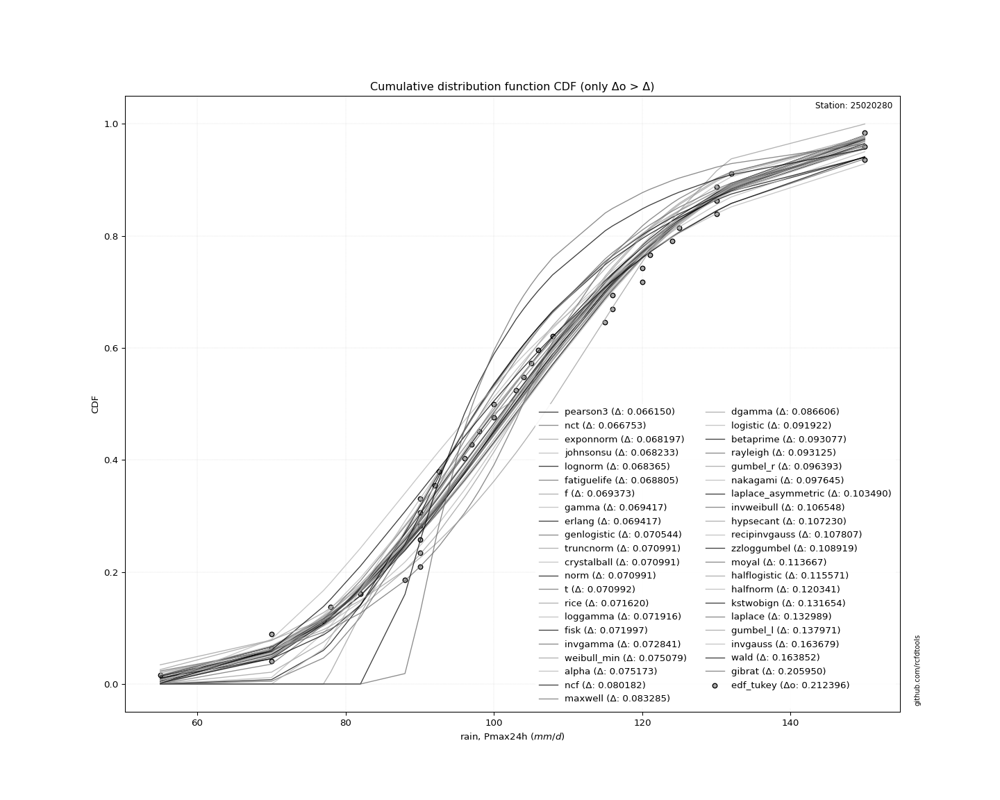</img>

</div>


**7.3. Best fit**

<div align="center">

|   id |   station | empirical_dist   | p_dist   |    delta |   deltao | eval   |   fit |   n |   best_fit |   best_fit_sort |
|-----:|----------:|:-----------------|:---------|---------:|---------:|:-------|------:|----:|-----------:|----------------:|
|    0 |  25020280 | edf_tukey        | rayleigh | 0.057577 | 0.183382 | Δo > Δ |     1 |  55 |          1 |               1 |

</div>


<div align="center">

</img>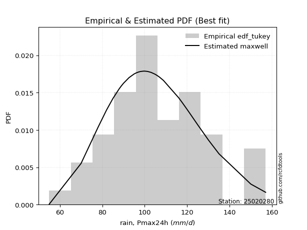</img>

</div>


### 8. Empirical - EDF Gringorten (1963)

Gringorten plotting position formula is essential for estimating the probability and return periods of extreme events like floods and heavy rainfall. The constant _a=0.44_.

<div align="center">


$P=(m-a)/(n+1-2a)$


</div>


**8.1. Empirical values**

<div align="center">

|                | 0                    | 1                   | 2                   | 3                   | 4                   | 5                   | 6                   | 7                  | 8                   | 9                   | 10                  | 11                  | 12                  | 13                  | 14                 | 15                 | 16                 | 17                 | 18                 | 19                 | 20                  | 21                 | 22                | 23                 | 24                 | 25                 | 26                 | 27             | 28                 | 29                 | 30                 | 31                 | 32                 | 33                 | 34                 | 35                 | 36                 | 37                | 38                 | 39                 | 40                 | 41                 | 42                 | 43                 | 44                 | 45                 | 46                 | 47                | 48                 | 49                 | 50                 | 51                 | 52                 | 53                 | 54                 |
|:---------------|:---------------------|:--------------------|:--------------------|:--------------------|:--------------------|:--------------------|:--------------------|:-------------------|:--------------------|:--------------------|:--------------------|:--------------------|:--------------------|:--------------------|:-------------------|:-------------------|:-------------------|:-------------------|:-------------------|:-------------------|:--------------------|:-------------------|:------------------|:-------------------|:-------------------|:-------------------|:-------------------|:---------------|:-------------------|:-------------------|:-------------------|:-------------------|:-------------------|:-------------------|:-------------------|:-------------------|:-------------------|:------------------|:-------------------|:-------------------|:-------------------|:-------------------|:-------------------|:-------------------|:-------------------|:-------------------|:-------------------|:------------------|:-------------------|:-------------------|:-------------------|:-------------------|:-------------------|:-------------------|:-------------------|
| date           | 1986                 | 1963                | 1997                | 1995                | 2001                | 1966                | 1968                | 1989               | 1981                | 1967                | 1964                | 1976                | 2011                | 2015                | 1988               | 2013               | 2004               | 2007               | 1987               | 1991               | 1977                | 2009               | 1974              | 1990               | 1965               | 2016               | 2002               | 1972           | 1985               | 2017               | 1994               | 1971               | 1983               | 1975               | 2003               | 1992               | 2005               | 1970              | 1979               | 1973               | 2000               | 1993               | 2008               | 1998               | 2006               | 1978               | 1999               | 1980              | 2012               | 1969               | 2014               | 1984               | 1982               | 1996               | 2010               |
| x              | 55.0                 | 70.0                | 70.0                | 70.0                | 70.0                | 71.0                | 72.1625217          | 77.0               | 78.0                | 80.0                | 80.0                | 82.0                | 85.0                | 85.0                | 88.0               | 89.0               | 90.0               | 90.0               | 90.0               | 90.0               | 90.0                | 90.0               | 92.0              | 92.6               | 94.0               | 95.0               | 96.0               | 97.0           | 98.0               | 100.0              | 100.0              | 100.0              | 103.0              | 104.0              | 104.85022766727273 | 105.0              | 106.0              | 115.0             | 116.0              | 116.0              | 120.0              | 120.0              | 121.0              | 124.0              | 125.0              | 130.0              | 130.0              | 130.0             | 130.0              | 132.0              | 135.0              | 150.0              | 150.0              | 150.0              | 157.0              |
| m              | 1                    | 2                   | 3                   | 4                   | 5                   | 6                   | 7                   | 8                  | 9                   | 10                  | 11                  | 12                  | 13                  | 14                  | 15                 | 16                 | 17                 | 18                 | 19                 | 20                 | 21                  | 22                 | 23                | 24                 | 25                 | 26                 | 27                 | 28             | 29                 | 30                 | 31                 | 32                 | 33                 | 34                 | 35                 | 36                 | 37                 | 38                | 39                 | 40                 | 41                 | 42                 | 43                 | 44                 | 45                 | 46                 | 47                 | 48                | 49                 | 50                 | 51                 | 52                 | 53                 | 54                 | 55                 |
| empirical_dist | edf_gringorten       | edf_gringorten      | edf_gringorten      | edf_gringorten      | edf_gringorten      | edf_gringorten      | edf_gringorten      | edf_gringorten     | edf_gringorten      | edf_gringorten      | edf_gringorten      | edf_gringorten      | edf_gringorten      | edf_gringorten      | edf_gringorten     | edf_gringorten     | edf_gringorten     | edf_gringorten     | edf_gringorten     | edf_gringorten     | edf_gringorten      | edf_gringorten     | edf_gringorten    | edf_gringorten     | edf_gringorten     | edf_gringorten     | edf_gringorten     | edf_gringorten | edf_gringorten     | edf_gringorten     | edf_gringorten     | edf_gringorten     | edf_gringorten     | edf_gringorten     | edf_gringorten     | edf_gringorten     | edf_gringorten     | edf_gringorten    | edf_gringorten     | edf_gringorten     | edf_gringorten     | edf_gringorten     | edf_gringorten     | edf_gringorten     | edf_gringorten     | edf_gringorten     | edf_gringorten     | edf_gringorten    | edf_gringorten     | edf_gringorten     | edf_gringorten     | edf_gringorten     | edf_gringorten     | edf_gringorten     | edf_gringorten     |
| empirical      | 0.010159651669085633 | 0.02830188679245283 | 0.04644412191582003 | 0.06458635703918723 | 0.08272859216255442 | 0.10087082728592163 | 0.11901306240928883 | 0.137155297532656  | 0.15529753265602325 | 0.17343976777939044 | 0.19158200290275765 | 0.20972423802612483 | 0.22786647314949204 | 0.24600870827285923 | 0.2641509433962264 | 0.2822931785195936 | 0.3004354136429608 | 0.318577648766328  | 0.3367198838896952 | 0.3548621190130624 | 0.37300435413642963 | 0.3911465892597968 | 0.409288824383164 | 0.4274310595065312 | 0.4455732946298984 | 0.4637155297532656 | 0.4818577648766328 | 0.5            | 0.5181422351233672 | 0.5362844702467344 | 0.5544267053701016 | 0.5725689404934688 | 0.5907111756168361 | 0.6088534107402033 | 0.6269956458635705 | 0.6451378809869377 | 0.6632801161103049 | 0.681422351233672 | 0.6995645863570392 | 0.7177068214804064 | 0.7358490566037736 | 0.7539912917271409 | 0.7721335268505081 | 0.7902757619738753 | 0.8084179970972425 | 0.8265602322206097 | 0.8447024673439768 | 0.862844702467344 | 0.8809869375907112 | 0.8991291727140784 | 0.9172714078374457 | 0.9354136429608129 | 0.9535558780841801 | 0.9716981132075473 | 0.9898403483309145 |
| empirical_tr   | 1.0102639296187683   | 1.029126213592233   | 1.0487062404870624  | 1.069045771916214   | 1.0901898734177216  | 1.1121872477804682  | 1.1350906095551896  | 1.1589571068124473 | 1.1838487972508591  | 1.2098331870061456  | 1.236983842010772   | 1.2653810835629018  | 1.2951127819548873  | 1.3262752646775746  | 1.3589743589743588 | 1.3933265925176948 | 1.429460580912863  | 1.4675186368477102 | 1.5076586433260393 | 1.5500562429696287 | 1.5949074074074074  | 1.642431466030989  | 1.692874692874693 | 1.7465145754119136 | 1.8036649214659688 | 1.8646820027063598 | 1.9299719887955182 | 2.0            | 2.075301204819277  | 2.156494522691706  | 2.244299674267101  | 2.33955857385399   | 2.443262411347518  | 2.5565862708719855 | 2.6809338521400785 | 2.817995910020451  | 2.9698275862068977 | 3.138952164009112 | 3.3285024154589378 | 3.54241645244216   | 3.7857142857142865 | 4.064896755162243  | 4.388535031847136  | 4.7681660899654    | 5.219696969696972  | 5.765690376569042  | 6.439252336448599  | 7.291005291005293 | 8.402439024390247  | 9.913669064748207  | 12.087719298245625 | 15.483146067415753 | 21.53125000000005  | 35.33333333333348  | 98.4285714285727   |

</div>


**8.2. Kolmogorov-Smirnov fit test (sorted by Δ)**


<div align="center">

|                | 0                   | 1                   | 2                   | 3                   | 4                    | 5                    | 6                   | 7                    | 8                   | 9                    | 10                  | 11                  | 12                   | 13                  | 14                  | 15                  | 16                  | 17                  | 18                  | 19                  | 20                  | 21                   | 22                  | 23                   | 24                  | 25                   | 26                  | 27                  | 28                  | 29                  | 30                  | 31                  | 32                  | 33                  | 34                  | 35                  | 36                  | 37                  | 38                  | 39                  | 40                  | 41                  | 42                  | 43                  | 44                  | 45                  | 46                  | 47                  | 48                  | 49                  | 50                  | 51                  | 52                  | 53                  | 54                  | 55                  | 56                  | 57                  | 58                    | 59                  | 60                  | 61                  | 62                  | 63                  | 64                  | 65                  | 66                  | 67                  | 68                  | 69                  | 70                  | 71                  | 72                  | 73                  | 74                  | 75                  | 76                  | 77                  | 78                  | 79                  | 80                  | 81                  | 82                  | 83                  | 84                  | 85                  | 86                  | 87                  | 88                  | 89                  |
|:---------------|:--------------------|:--------------------|:--------------------|:--------------------|:---------------------|:---------------------|:--------------------|:---------------------|:--------------------|:---------------------|:--------------------|:--------------------|:---------------------|:--------------------|:--------------------|:--------------------|:--------------------|:--------------------|:--------------------|:--------------------|:--------------------|:---------------------|:--------------------|:---------------------|:--------------------|:---------------------|:--------------------|:--------------------|:--------------------|:--------------------|:--------------------|:--------------------|:--------------------|:--------------------|:--------------------|:--------------------|:--------------------|:--------------------|:--------------------|:--------------------|:--------------------|:--------------------|:--------------------|:--------------------|:--------------------|:--------------------|:--------------------|:--------------------|:--------------------|:--------------------|:--------------------|:--------------------|:--------------------|:--------------------|:--------------------|:--------------------|:--------------------|:--------------------|:----------------------|:--------------------|:--------------------|:--------------------|:--------------------|:--------------------|:--------------------|:--------------------|:--------------------|:--------------------|:--------------------|:--------------------|:--------------------|:--------------------|:--------------------|:--------------------|:--------------------|:--------------------|:--------------------|:--------------------|:--------------------|:--------------------|:--------------------|:--------------------|:--------------------|:--------------------|:--------------------|:--------------------|:--------------------|:--------------------|:--------------------|:--------------------|
| station        | 25020280            | 25020280            | 25020280            | 25020280            | 25020280             | 25020280             | 25020280            | 25020280             | 25020280            | 25020280             | 25020280            | 25020280            | 25020280             | 25020280            | 25020280            | 25020280            | 25020280            | 25020280            | 25020280            | 25020280            | 25020280            | 25020280             | 25020280            | 25020280             | 25020280            | 25020280             | 25020280            | 25020280            | 25020280            | 25020280            | 25020280            | 25020280            | 25020280            | 25020280            | 25020280            | 25020280            | 25020280            | 25020280            | 25020280            | 25020280            | 25020280            | 25020280            | 25020280            | 25020280            | 25020280            | 25020280            | 25020280            | 25020280            | 25020280            | 25020280            | 25020280            | 25020280            | 25020280            | 25020280            | 25020280            | 25020280            | 25020280            | 25020280            | 25020280              | 25020280            | 25020280            | 25020280            | 25020280            | 25020280            | 25020280            | 25020280            | 25020280            | 25020280            | 25020280            | 25020280            | 25020280            | 25020280            | 25020280            | 25020280            | 25020280            | 25020280            | 25020280            | 25020280            | 25020280            | 25020280            | 25020280            | 25020280            | 25020280            | 25020280            | 25020280            | 25020280            | 25020280            | 25020280            | 25020280            | 25020280            |
| empirical_dist | edf_gringorten      | edf_gringorten      | edf_gringorten      | edf_gringorten      | edf_gringorten       | edf_gringorten       | edf_gringorten      | edf_gringorten       | edf_gringorten      | edf_gringorten       | edf_gringorten      | edf_gringorten      | edf_gringorten       | edf_gringorten      | edf_gringorten      | edf_gringorten      | edf_gringorten      | edf_gringorten      | edf_gringorten      | edf_gringorten      | edf_gringorten      | edf_gringorten       | edf_gringorten      | edf_gringorten       | edf_gringorten      | edf_gringorten       | edf_gringorten      | edf_gringorten      | edf_gringorten      | edf_gringorten      | edf_gringorten      | edf_gringorten      | edf_gringorten      | edf_gringorten      | edf_gringorten      | edf_gringorten      | edf_gringorten      | edf_gringorten      | edf_gringorten      | edf_gringorten      | edf_gringorten      | edf_gringorten      | edf_gringorten      | edf_gringorten      | edf_gringorten      | edf_gringorten      | edf_gringorten      | edf_gringorten      | edf_gringorten      | edf_gringorten      | edf_gringorten      | edf_gringorten      | edf_gringorten      | edf_gringorten      | edf_gringorten      | edf_gringorten      | edf_gringorten      | edf_gringorten      | edf_gringorten        | edf_gringorten      | edf_gringorten      | edf_gringorten      | edf_gringorten      | edf_gringorten      | edf_gringorten      | edf_gringorten      | edf_gringorten      | edf_gringorten      | edf_gringorten      | edf_gringorten      | edf_gringorten      | edf_gringorten      | edf_gringorten      | edf_gringorten      | edf_gringorten      | edf_gringorten      | edf_gringorten      | edf_gringorten      | edf_gringorten      | edf_gringorten      | edf_gringorten      | edf_gringorten      | edf_gringorten      | edf_gringorten      | edf_gringorten      | edf_gringorten      | edf_gringorten      | edf_gringorten      | edf_gringorten      | edf_gringorten      |
| p_dist         | rayleigh            | gamma               | chi2                | erlang              | fatiguelife          | logrice              | logjohnsonsu        | lognakagami          | logt                | logexponnorm         | lognorm             | lognorm             | logcrystalball       | loglognorm          | logpearson3         | logerlang           | logncf              | loggamma            | loggamma            | f                   | johnsonsu           | logf                 | logloggamma         | invgamma             | logfatiguelife      | alpha                | loginvgamma         | logalpha            | logbetaprime        | nct                 | invgauss            | invweibull          | betaprime           | lognct              | genlogistic         | logweibull_min      | loginvgauss         | logmaxwell          | kstwobign           | maxwell             | fisk                | mielke              | loggenlogistic      | logmielke           | logfisk             | weibull_min         | rice                | pearson3            | exponnorm           | gumbel_r            | lograyleigh         | loglogistic         | laplace_asymmetric  | loggompertz         | halfnorm            | moyal               | nakagami            | loghypsecant        | loglaplace_asymmetric | loggumbel_r         | loginvweibull       | norm                | crystalball         | truncnorm           | t                   | logistic            | logmoyal            | loglaplace          | halflogistic        | loghalfnorm         | hypsecant           | loghalflogistic     | logkstwobign        | loggumbel_l         | laplace             | loggenexpon         | gumbel_l            | wald                | logwald             | loggibrat           | ncf                 | gibrat              | expon               | pareto              | genexpon            | logtruncnorm        | logexpon            | logpareto           | logchi2             | gompertz            |
| delta          | 0.05785675950423541 | 0.05802943022987861 | 0.05802949368758714 | 0.05802963913425019 | 0.058807312027982395 | 0.058992150146300326 | 0.05927440232547421 | 0.059541148543716615 | 0.05957752007207917 | 0.059583335222316625 | 0.05958415515129545 | 0.05958415515129545 | 0.059584438862961275 | 0.05958534935924664 | 0.05960033027761624 | 0.05988557298104813 | 0.0599824835431354  | 0.06000188368285064 | 0.06000188368285064 | 0.06005081310054772 | 0.0601901807030768  | 0.060224881249034246 | 0.0603669090054908  | 0.060414512520508334 | 0.06104485150463912 | 0.061167194332760966 | 0.06141190836814259 | 0.06190408459163199 | 0.06242405432293652 | 0.06275445562153203 | 0.06281091511598924 | 0.06371463700608226 | 0.06381421308197133 | 0.06485118515656374 | 0.06529320511393277 | 0.06573155674405096 | 0.06713725178778751 | 0.06887989695582952 | 0.06940906100816885 | 0.06946428826696927 | 0.07212684256673352 | 0.07238372128700865 | 0.07238786413752041 | 0.07257411124750879 | 0.07260585053528879 | 0.07260625794247477 | 0.07267073476831515 | 0.07271008472300566 | 0.07370634963867506 | 0.07863630380873865 | 0.0801287305994009  | 0.08129922290294656 | 0.08655995011852913 | 0.08867447128365835 | 0.09285305488944431 | 0.09423835312957707 | 0.09448227916252205 | 0.0956737827226739  | 0.09905153598565397   | 0.0999789501432814  | 0.10104978173267781 | 0.10347590806009854 | 0.10347590850223853 | 0.10347591109147092 | 0.10353227022292405 | 0.10767608370203635 | 0.11352483393072343 | 0.11669852545469983 | 0.11901306240928883 | 0.11901306240928883 | 0.11936978709755408 | 0.11984214029441748 | 0.12763323834550416 | 0.12772603500752844 | 0.14512666421553558 | 0.16929825253537706 | 0.1740843563900789  | 0.19092227272544351 | 0.19110869402764144 | 0.20972423802612483 | 0.22035186288941977 | 0.23334794936800446 | 0.24577569202778943 | 0.24577572221022892 | 0.24697321280690032 | 0.29782535211149136 | 0.30751302366954475 | 0.30751303124548435 | 0.3194573916263291  | 0.8617804429454488  |
| deltao         | 0.18338236259000185 | 0.18338236259000185 | 0.18338236259000185 | 0.18338236259000185 | 0.18338236259000185  | 0.18338236259000185  | 0.18338236259000185 | 0.18338236259000185  | 0.18338236259000185 | 0.18338236259000185  | 0.18338236259000185 | 0.18338236259000185 | 0.18338236259000185  | 0.18338236259000185 | 0.18338236259000185 | 0.18338236259000185 | 0.18338236259000185 | 0.18338236259000185 | 0.18338236259000185 | 0.18338236259000185 | 0.18338236259000185 | 0.18338236259000185  | 0.18338236259000185 | 0.18338236259000185  | 0.18338236259000185 | 0.18338236259000185  | 0.18338236259000185 | 0.18338236259000185 | 0.18338236259000185 | 0.18338236259000185 | 0.18338236259000185 | 0.18338236259000185 | 0.18338236259000185 | 0.18338236259000185 | 0.18338236259000185 | 0.18338236259000185 | 0.18338236259000185 | 0.18338236259000185 | 0.18338236259000185 | 0.18338236259000185 | 0.18338236259000185 | 0.18338236259000185 | 0.18338236259000185 | 0.18338236259000185 | 0.18338236259000185 | 0.18338236259000185 | 0.18338236259000185 | 0.18338236259000185 | 0.18338236259000185 | 0.18338236259000185 | 0.18338236259000185 | 0.18338236259000185 | 0.18338236259000185 | 0.18338236259000185 | 0.18338236259000185 | 0.18338236259000185 | 0.18338236259000185 | 0.18338236259000185 | 0.18338236259000185   | 0.18338236259000185 | 0.18338236259000185 | 0.18338236259000185 | 0.18338236259000185 | 0.18338236259000185 | 0.18338236259000185 | 0.18338236259000185 | 0.18338236259000185 | 0.18338236259000185 | 0.18338236259000185 | 0.18338236259000185 | 0.18338236259000185 | 0.18338236259000185 | 0.18338236259000185 | 0.18338236259000185 | 0.18338236259000185 | 0.18338236259000185 | 0.18338236259000185 | 0.18338236259000185 | 0.18338236259000185 | 0.18338236259000185 | 0.18338236259000185 | 0.18338236259000185 | 0.18338236259000185 | 0.18338236259000185 | 0.18338236259000185 | 0.18338236259000185 | 0.18338236259000185 | 0.18338236259000185 | 0.18338236259000185 | 0.18338236259000185 |
| eval           | Δo > Δ              | Δo > Δ              | Δo > Δ              | Δo > Δ              | Δo > Δ               | Δo > Δ               | Δo > Δ              | Δo > Δ               | Δo > Δ              | Δo > Δ               | Δo > Δ              | Δo > Δ              | Δo > Δ               | Δo > Δ              | Δo > Δ              | Δo > Δ              | Δo > Δ              | Δo > Δ              | Δo > Δ              | Δo > Δ              | Δo > Δ              | Δo > Δ               | Δo > Δ              | Δo > Δ               | Δo > Δ              | Δo > Δ               | Δo > Δ              | Δo > Δ              | Δo > Δ              | Δo > Δ              | Δo > Δ              | Δo > Δ              | Δo > Δ              | Δo > Δ              | Δo > Δ              | Δo > Δ              | Δo > Δ              | Δo > Δ              | Δo > Δ              | Δo > Δ              | Δo > Δ              | Δo > Δ              | Δo > Δ              | Δo > Δ              | Δo > Δ              | Δo > Δ              | Δo > Δ              | Δo > Δ              | Δo > Δ              | Δo > Δ              | Δo > Δ              | Δo > Δ              | Δo > Δ              | Δo > Δ              | Δo > Δ              | Δo > Δ              | Δo > Δ              | Δo > Δ              | Δo > Δ                | Δo > Δ              | Δo > Δ              | Δo > Δ              | Δo > Δ              | Δo > Δ              | Δo > Δ              | Δo > Δ              | Δo > Δ              | Δo > Δ              | Δo > Δ              | Δo > Δ              | Δo > Δ              | Δo > Δ              | Δo > Δ              | Δo > Δ              | Δo > Δ              | Δo > Δ              | Δo > Δ              | Δo <= Δ             | Δo <= Δ             | Δo <= Δ             | Δo <= Δ             | Δo <= Δ             | Δo <= Δ             | Δo <= Δ             | Δo <= Δ             | Δo <= Δ             | Δo <= Δ             | Δo <= Δ             | Δo <= Δ             | Δo <= Δ             |
| fit            | 1                   | 1                   | 1                   | 1                   | 1                    | 1                    | 1                   | 1                    | 1                   | 1                    | 1                   | 1                   | 1                    | 1                   | 1                   | 1                   | 1                   | 1                   | 1                   | 1                   | 1                   | 1                    | 1                   | 1                    | 1                   | 1                    | 1                   | 1                   | 1                   | 1                   | 1                   | 1                   | 1                   | 1                   | 1                   | 1                   | 1                   | 1                   | 1                   | 1                   | 1                   | 1                   | 1                   | 1                   | 1                   | 1                   | 1                   | 1                   | 1                   | 1                   | 1                   | 1                   | 1                   | 1                   | 1                   | 1                   | 1                   | 1                   | 1                     | 1                   | 1                   | 1                   | 1                   | 1                   | 1                   | 1                   | 1                   | 1                   | 1                   | 1                   | 1                   | 1                   | 1                   | 1                   | 1                   | 1                   | 1                   | 0                   | 0                   | 0                   | 0                   | 0                   | 0                   | 0                   | 0                   | 0                   | 0                   | 0                   | 0                   | 0                   |
| n              | 55                  | 55                  | 55                  | 55                  | 55                   | 55                   | 55                  | 55                   | 55                  | 55                   | 55                  | 55                  | 55                   | 55                  | 55                  | 55                  | 55                  | 55                  | 55                  | 55                  | 55                  | 55                   | 55                  | 55                   | 55                  | 55                   | 55                  | 55                  | 55                  | 55                  | 55                  | 55                  | 55                  | 55                  | 55                  | 55                  | 55                  | 55                  | 55                  | 55                  | 55                  | 55                  | 55                  | 55                  | 55                  | 55                  | 55                  | 55                  | 55                  | 55                  | 55                  | 55                  | 55                  | 55                  | 55                  | 55                  | 55                  | 55                  | 55                    | 55                  | 55                  | 55                  | 55                  | 55                  | 55                  | 55                  | 55                  | 55                  | 55                  | 55                  | 55                  | 55                  | 55                  | 55                  | 55                  | 55                  | 55                  | 55                  | 55                  | 55                  | 55                  | 55                  | 55                  | 55                  | 55                  | 55                  | 55                  | 55                  | 55                  | 55                  |
| best_fit       | 1                   | 0                   | 0                   | 0                   | 0                    | 0                    | 0                   | 0                    | 0                   | 0                    | 0                   | 0                   | 0                    | 0                   | 0                   | 0                   | 0                   | 0                   | 0                   | 0                   | 0                   | 0                    | 0                   | 0                    | 0                   | 0                    | 0                   | 0                   | 0                   | 0                   | 0                   | 0                   | 0                   | 0                   | 0                   | 0                   | 0                   | 0                   | 0                   | 0                   | 0                   | 0                   | 0                   | 0                   | 0                   | 0                   | 0                   | 0                   | 0                   | 0                   | 0                   | 0                   | 0                   | 0                   | 0                   | 0                   | 0                   | 0                   | 0                     | 0                   | 0                   | 0                   | 0                   | 0                   | 0                   | 0                   | 0                   | 0                   | 0                   | 0                   | 0                   | 0                   | 0                   | 0                   | 0                   | 0                   | 0                   | 0                   | 0                   | 0                   | 0                   | 0                   | 0                   | 0                   | 0                   | 0                   | 0                   | 0                   | 0                   | 0                   |
| best_fit_sort  | 1                   | 2                   | 3                   | 4                   | 5                    | 6                    | 7                   | 8                    | 9                   | 10                   | 11                  | 12                  | 13                   | 14                  | 15                  | 16                  | 17                  | 18                  | 19                  | 20                  | 21                  | 22                   | 23                  | 24                   | 25                  | 26                   | 27                  | 28                  | 29                  | 30                  | 31                  | 32                  | 33                  | 34                  | 35                  | 36                  | 37                  | 38                  | 39                  | 40                  | 41                  | 42                  | 43                  | 44                  | 45                  | 46                  | 47                  | 48                  | 49                  | 50                  | 51                  | 52                  | 53                  | 54                  | 55                  | 56                  | 57                  | 58                  | 59                    | 60                  | 61                  | 62                  | 63                  | 64                  | 65                  | 66                  | 67                  | 68                  | 69                  | 70                  | 71                  | 72                  | 73                  | 74                  | 75                  | 76                  | 77                  | 78                  | 79                  | 80                  | 81                  | 82                  | 83                  | 84                  | 85                  | 86                  | 87                  | 88                  | 89                  | 90                  |

</div>


<div align="center">

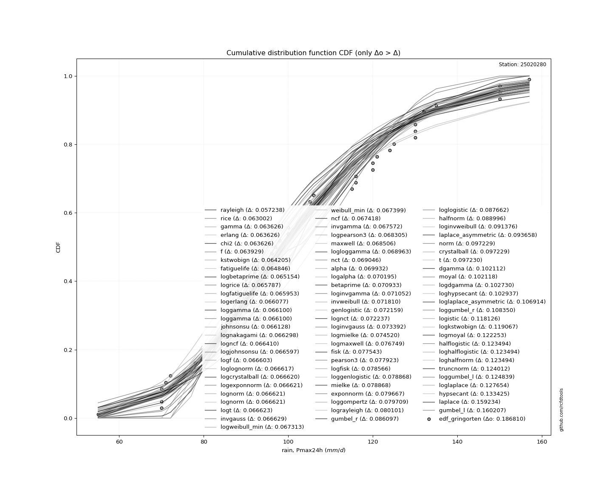</img>

</div>


**8.3. Best fit**

<div align="center">

|   id |   station | empirical_dist   | p_dist   |     delta |   deltao | eval   |   fit |   n |   best_fit |   best_fit_sort |
|-----:|----------:|:-----------------|:---------|----------:|---------:|:-------|------:|----:|-----------:|----------------:|
|    0 |  25020280 | edf_gringorten   | rayleigh | 0.0578568 | 0.183382 | Δo > Δ |     1 |  55 |          1 |               1 |

</div>


<div align="center">

</img></img>

</div>


### 9. Empirical - EDF Filliben (1975)

The specific values of the constants (0.3175) (often denoted as $alpha$) and (0.365) are derived from a method proposed by James J. Filliben in a 1975 paper. This particular formula is the mean value of the $i$-th order statistic of the normal distribution and is considered a robust and effective plotting position formula for the normal probability plot correlation coefficient test for normality.

<div align="center">


$P=(m-0.3175)/(n+0.365)$


</div>


**9.1. Empirical values**

<div align="center">

|                | 0                    | 1                   | 2                   | 3                   | 4                   | 5                   | 6                  | 7                   | 8                   | 9                  | 10                  | 11                  | 12                | 13                 | 14                 | 15                  | 16                  | 17                 | 18                 | 19                  | 20                 | 21                  | 22                 | 23                  | 24                 | 25                 | 26                  | 27           | 28                 | 29                 | 30                 | 31                 | 32                 | 33                 | 34                 | 35                 | 36                 | 37                 | 38                 | 39                 | 40                 | 41                 | 42                 | 43                 | 44                 | 45                 | 46                 | 47                 | 48                 | 49                 | 50                 | 51                 | 52                 | 53                 | 54                 |
|:---------------|:---------------------|:--------------------|:--------------------|:--------------------|:--------------------|:--------------------|:-------------------|:--------------------|:--------------------|:-------------------|:--------------------|:--------------------|:------------------|:-------------------|:-------------------|:--------------------|:--------------------|:-------------------|:-------------------|:--------------------|:-------------------|:--------------------|:-------------------|:--------------------|:-------------------|:-------------------|:--------------------|:-------------|:-------------------|:-------------------|:-------------------|:-------------------|:-------------------|:-------------------|:-------------------|:-------------------|:-------------------|:-------------------|:-------------------|:-------------------|:-------------------|:-------------------|:-------------------|:-------------------|:-------------------|:-------------------|:-------------------|:-------------------|:-------------------|:-------------------|:-------------------|:-------------------|:-------------------|:-------------------|:-------------------|
| date           | 1986                 | 1963                | 1997                | 1995                | 2001                | 1966                | 1968               | 1989                | 1981                | 1967               | 1964                | 1976                | 2011              | 2015               | 1988               | 2013                | 2004                | 2007               | 1987               | 1991                | 1977               | 2009                | 1974               | 1990                | 1965               | 2016               | 2002                | 1972         | 1985               | 2017               | 1994               | 1971               | 1983               | 1975               | 2003               | 1992               | 2005               | 1970               | 1979               | 1973               | 2000               | 1993               | 2008               | 1998               | 2006               | 1978               | 1999               | 1980               | 2012               | 1969               | 2014               | 1984               | 1982               | 1996               | 2010               |
| x              | 55.0                 | 70.0                | 70.0                | 70.0                | 70.0                | 71.0                | 72.1625217         | 77.0                | 78.0                | 80.0               | 80.0                | 82.0                | 85.0              | 85.0               | 88.0               | 89.0                | 90.0                | 90.0               | 90.0               | 90.0                | 90.0               | 90.0                | 92.0               | 92.6                | 94.0               | 95.0               | 96.0                | 97.0         | 98.0               | 100.0              | 100.0              | 100.0              | 103.0              | 104.0              | 104.85022766727273 | 105.0              | 106.0              | 115.0              | 116.0              | 116.0              | 120.0              | 120.0              | 121.0              | 124.0              | 125.0              | 130.0              | 130.0              | 130.0              | 130.0              | 132.0              | 135.0              | 150.0              | 150.0              | 150.0              | 157.0              |
| m              | 1                    | 2                   | 3                   | 4                   | 5                   | 6                   | 7                  | 8                   | 9                   | 10                 | 11                  | 12                  | 13                | 14                 | 15                 | 16                  | 17                  | 18                 | 19                 | 20                  | 21                 | 22                  | 23                 | 24                  | 25                 | 26                 | 27                  | 28           | 29                 | 30                 | 31                 | 32                 | 33                 | 34                 | 35                 | 36                 | 37                 | 38                 | 39                 | 40                 | 41                 | 42                 | 43                 | 44                 | 45                 | 46                 | 47                 | 48                 | 49                 | 50                 | 51                 | 52                 | 53                 | 54                 | 55                 |
| empirical_dist | edf_filliben         | edf_filliben        | edf_filliben        | edf_filliben        | edf_filliben        | edf_filliben        | edf_filliben       | edf_filliben        | edf_filliben        | edf_filliben       | edf_filliben        | edf_filliben        | edf_filliben      | edf_filliben       | edf_filliben       | edf_filliben        | edf_filliben        | edf_filliben       | edf_filliben       | edf_filliben        | edf_filliben       | edf_filliben        | edf_filliben       | edf_filliben        | edf_filliben       | edf_filliben       | edf_filliben        | edf_filliben | edf_filliben       | edf_filliben       | edf_filliben       | edf_filliben       | edf_filliben       | edf_filliben       | edf_filliben       | edf_filliben       | edf_filliben       | edf_filliben       | edf_filliben       | edf_filliben       | edf_filliben       | edf_filliben       | edf_filliben       | edf_filliben       | edf_filliben       | edf_filliben       | edf_filliben       | edf_filliben       | edf_filliben       | edf_filliben       | edf_filliben       | edf_filliben       | edf_filliben       | edf_filliben       | edf_filliben       |
| empirical      | 0.012327282579246816 | 0.03038923507631175 | 0.04845118757337668 | 0.06651314007044161 | 0.08457509256750655 | 0.10263704506457148 | 0.1206989975616364 | 0.13876095005870134 | 0.15682290255576625 | 0.1748848550528312 | 0.19294680754989613 | 0.21100876004696106 | 0.229070712544026 | 0.2471326650410909 | 0.2651946175381559 | 0.28325657003522076 | 0.30131852253228575 | 0.3193804750293507 | 0.3374424275264156 | 0.35550438002348056 | 0.3735663325205455 | 0.39162828501761043 | 0.4096902375146753 | 0.42775219001174025 | 0.4458141425088052 | 0.4638760950058701 | 0.48193804750293506 | 0.5          | 0.5180619524970649 | 0.5361239049941299 | 0.5541858574911948 | 0.5722478099882597 | 0.5903097624853246 | 0.6083717149823895 | 0.6264336674794545 | 0.6444956199765194 | 0.6625575724735844 | 0.6806195249706493 | 0.6986814774677141 | 0.7167434299647791 | 0.734805382461844  | 0.752867334958909  | 0.7709292874559739 | 0.7889912399530389 | 0.8070531924501038 | 0.8251151449471688 | 0.8431770974442336 | 0.8612390499412986 | 0.8793010024383635 | 0.8973629549354284 | 0.9154249074324934 | 0.9334868599295583 | 0.9515488124266233 | 0.9696107649236881 | 0.9876727174207531 |
| empirical_tr   | 1.0124811411329036   | 1.031341684906627   | 1.0509182366060836  | 1.0712523581483093  | 1.0923888916292606  | 1.114376289437931   | 1.1372669850562316 | 1.1611178105174855  | 1.1859904675199486  | 1.2119520604170086 | 1.2390757007777093  | 1.2674411949865505  | 1.297135828501142 | 1.32825526300006   | 1.3609045658452652 | 1.395199395199395   | 1.4312673689652944  | 1.4692496516950841 | 1.5093028010631773 | 1.5516009248230924  | 1.5963382109132849 | 1.6437319082609667  | 1.6940258548152682 | 1.7474946737157737  | 1.804448790026888  | 1.865240461551419  | 1.9302710712106688  | 2.0          | 2.07495549517474   | 2.1557480774846685 | 2.2430872075357033 | 2.337802174601499  | 2.440868510966604  | 2.553441715669318  | 2.6769007615133567 | 2.812904864727549  | 2.9634684865515855 | 3.131061784249964  | 3.3187471901693377 | 3.5303682448589186 | 3.7708155967989088 | 4.0464096473597655 | 4.365464222353635  | 4.739139738925743  | 5.182775567516964  | 5.718048024786985  | 6.376619637201263  | 7.206638464041652  | 8.285072951739613  | 9.743070831500209  | 11.823812066203942 | 15.03462321792258  | 20.639328984156545 | 32.906389301634356 | 81.12087912087878  |

</div>


**9.2. Kolmogorov-Smirnov fit test (sorted by Δ)**


<div align="center">

|                | 0                   | 1                   | 2                   | 3                   | 4                    | 5                    | 6                   | 7                    | 8                   | 9                    | 10                  | 11                   | 12                  | 13                  | 14                   | 15                  | 16                  | 17                  | 18                  | 19                  | 20                  | 21                  | 22                   | 23                   | 24                  | 25                   | 26                  | 27                  | 28                  | 29                  | 30                  | 31                  | 32                  | 33                  | 34                  | 35                  | 36                  | 37                  | 38                  | 39                  | 40                  | 41                  | 42                  | 43                  | 44                  | 45                  | 46                  | 47                  | 48                  | 49                  | 50                  | 51                  | 52                  | 53                  | 54                  | 55                  | 56                  | 57                  | 58                    | 59                  | 60                  | 61                  | 62                  | 63                  | 64                  | 65                  | 66                  | 67                  | 68                  | 69                  | 70                  | 71                  | 72                  | 73                  | 74                  | 75                  | 76                  | 77                  | 78                  | 79                  | 80                  | 81                  | 82                  | 83                  | 84                  | 85                  | 86                  | 87                  | 88                  | 89                  |
|:---------------|:--------------------|:--------------------|:--------------------|:--------------------|:---------------------|:---------------------|:--------------------|:---------------------|:--------------------|:---------------------|:--------------------|:---------------------|:--------------------|:--------------------|:---------------------|:--------------------|:--------------------|:--------------------|:--------------------|:--------------------|:--------------------|:--------------------|:---------------------|:---------------------|:--------------------|:---------------------|:--------------------|:--------------------|:--------------------|:--------------------|:--------------------|:--------------------|:--------------------|:--------------------|:--------------------|:--------------------|:--------------------|:--------------------|:--------------------|:--------------------|:--------------------|:--------------------|:--------------------|:--------------------|:--------------------|:--------------------|:--------------------|:--------------------|:--------------------|:--------------------|:--------------------|:--------------------|:--------------------|:--------------------|:--------------------|:--------------------|:--------------------|:--------------------|:----------------------|:--------------------|:--------------------|:--------------------|:--------------------|:--------------------|:--------------------|:--------------------|:--------------------|:--------------------|:--------------------|:--------------------|:--------------------|:--------------------|:--------------------|:--------------------|:--------------------|:--------------------|:--------------------|:--------------------|:--------------------|:--------------------|:--------------------|:--------------------|:--------------------|:--------------------|:--------------------|:--------------------|:--------------------|:--------------------|:--------------------|:--------------------|
| station        | 25020280            | 25020280            | 25020280            | 25020280            | 25020280             | 25020280             | 25020280            | 25020280             | 25020280            | 25020280             | 25020280            | 25020280             | 25020280            | 25020280            | 25020280             | 25020280            | 25020280            | 25020280            | 25020280            | 25020280            | 25020280            | 25020280            | 25020280             | 25020280             | 25020280            | 25020280             | 25020280            | 25020280            | 25020280            | 25020280            | 25020280            | 25020280            | 25020280            | 25020280            | 25020280            | 25020280            | 25020280            | 25020280            | 25020280            | 25020280            | 25020280            | 25020280            | 25020280            | 25020280            | 25020280            | 25020280            | 25020280            | 25020280            | 25020280            | 25020280            | 25020280            | 25020280            | 25020280            | 25020280            | 25020280            | 25020280            | 25020280            | 25020280            | 25020280              | 25020280            | 25020280            | 25020280            | 25020280            | 25020280            | 25020280            | 25020280            | 25020280            | 25020280            | 25020280            | 25020280            | 25020280            | 25020280            | 25020280            | 25020280            | 25020280            | 25020280            | 25020280            | 25020280            | 25020280            | 25020280            | 25020280            | 25020280            | 25020280            | 25020280            | 25020280            | 25020280            | 25020280            | 25020280            | 25020280            | 25020280            |
| empirical_dist | edf_filliben        | edf_filliben        | edf_filliben        | edf_filliben        | edf_filliben         | edf_filliben         | edf_filliben        | edf_filliben         | edf_filliben        | edf_filliben         | edf_filliben        | edf_filliben         | edf_filliben        | edf_filliben        | edf_filliben         | edf_filliben        | edf_filliben        | edf_filliben        | edf_filliben        | edf_filliben        | edf_filliben        | edf_filliben        | edf_filliben         | edf_filliben         | edf_filliben        | edf_filliben         | edf_filliben        | edf_filliben        | edf_filliben        | edf_filliben        | edf_filliben        | edf_filliben        | edf_filliben        | edf_filliben        | edf_filliben        | edf_filliben        | edf_filliben        | edf_filliben        | edf_filliben        | edf_filliben        | edf_filliben        | edf_filliben        | edf_filliben        | edf_filliben        | edf_filliben        | edf_filliben        | edf_filliben        | edf_filliben        | edf_filliben        | edf_filliben        | edf_filliben        | edf_filliben        | edf_filliben        | edf_filliben        | edf_filliben        | edf_filliben        | edf_filliben        | edf_filliben        | edf_filliben          | edf_filliben        | edf_filliben        | edf_filliben        | edf_filliben        | edf_filliben        | edf_filliben        | edf_filliben        | edf_filliben        | edf_filliben        | edf_filliben        | edf_filliben        | edf_filliben        | edf_filliben        | edf_filliben        | edf_filliben        | edf_filliben        | edf_filliben        | edf_filliben        | edf_filliben        | edf_filliben        | edf_filliben        | edf_filliben        | edf_filliben        | edf_filliben        | edf_filliben        | edf_filliben        | edf_filliben        | edf_filliben        | edf_filliben        | edf_filliben        | edf_filliben        |
| p_dist         | rayleigh            | erlang              | gamma               | chi2                | fatiguelife          | logrice              | logjohnsonsu        | logloggamma          | logpearson3         | lognakagami          | logt                | logexponnorm         | lognorm             | lognorm             | logcrystalball       | loglognorm          | f                   | logerlang           | logncf              | loggamma            | loggamma            | johnsonsu           | logf                 | invgamma             | logfatiguelife      | alpha                | loginvgamma         | logalpha            | logbetaprime        | invgauss            | nct                 | invweibull          | betaprime           | logweibull_min      | lognct              | genlogistic         | loginvgauss         | kstwobign           | maxwell             | logmaxwell          | weibull_min         | rice                | pearson3            | fisk                | mielke              | loggenlogistic      | logmielke           | logfisk             | exponnorm           | lograyleigh         | gumbel_r            | loglogistic         | laplace_asymmetric  | loggompertz         | nakagami            | halfnorm            | moyal               | loghypsecant        | loglaplace_asymmetric | loginvweibull       | loggumbel_r         | norm                | crystalball         | truncnorm           | t                   | logistic            | logmoyal            | loglaplace          | hypsecant           | halflogistic        | loghalflogistic     | loghalfnorm         | logkstwobign        | loggumbel_l         | laplace             | loggenexpon         | gumbel_l            | wald                | logwald             | loggibrat           | ncf                 | gibrat              | expon               | pareto              | genexpon            | logtruncnorm        | logexpon            | logpareto           | logchi2             | gompertz            |
| delta          | 0.05753562899902631 | 0.05830070052294867 | 0.05830079062632898 | 0.0583008023133148  | 0.059850986169912024 | 0.060035824288229955 | 0.06009093499625706 | 0.060136371689350376 | 0.06025403831896825 | 0.060584822685646245 | 0.0606211942140088  | 0.060627009364246254 | 0.06062782929322508 | 0.06062782929322508 | 0.060628113004890904 | 0.06062902350117627 | 0.06063190528444318 | 0.06092924712297776 | 0.06102615768506503 | 0.06104555782478027 | 0.06104555782478027 | 0.06123385484500643 | 0.061268555390963875 | 0.061458186662437964 | 0.06208852564656875 | 0.062210868474690595 | 0.06226069468455553 | 0.06270691085465474 | 0.06322688058595927 | 0.06361374137901199 | 0.06379812976346166 | 0.06451746326910501 | 0.06461703934499408 | 0.06541042623884186 | 0.06565401141958649 | 0.06609603137695552 | 0.06794007805081026 | 0.06836538686623939 | 0.06914315776176017 | 0.06968272321885227 | 0.07228512743726567 | 0.07234960426310605 | 0.07238895421779656 | 0.07292966882975627 | 0.0731865475500314  | 0.07319069040054316 | 0.07337693751053154 | 0.07340867679831153 | 0.07450917590169781 | 0.07924562171007593 | 0.0794391300717614  | 0.08234289704487618 | 0.08736277638155188 | 0.08808308822553013 | 0.09343860502059259 | 0.09461927266809417 | 0.09504117939259982 | 0.09647660898569665 | 0.09985436224867672   | 0.10013917734134731 | 0.10078177640630415 | 0.10315477755488944 | 0.10315477799702943 | 0.10315478058626182 | 0.10321113971771495 | 0.10735495319682725 | 0.11432766019374618 | 0.11750135171772258 | 0.11985148285536773 | 0.1206989975616364  | 0.1206989975616364  | 0.1206989975616364  | 0.1265895642035747  | 0.12740490450231934 | 0.14560835997334923 | 0.1682545783934476  | 0.1737632258848698  | 0.192287077372582   | 0.19247349867477992 | 0.21100876004696106 | 0.2185053624844675  | 0.23447190613623614 | 0.24396592588449229 | 0.2439659479468521  | 0.2448858645230414  | 0.29573800382763243 | 0.3054256753856858  | 0.3054256829616254  | 0.31737004334247015 | 0.8600142251667987  |
| deltao         | 0.18338236259000185 | 0.18338236259000185 | 0.18338236259000185 | 0.18338236259000185 | 0.18338236259000185  | 0.18338236259000185  | 0.18338236259000185 | 0.18338236259000185  | 0.18338236259000185 | 0.18338236259000185  | 0.18338236259000185 | 0.18338236259000185  | 0.18338236259000185 | 0.18338236259000185 | 0.18338236259000185  | 0.18338236259000185 | 0.18338236259000185 | 0.18338236259000185 | 0.18338236259000185 | 0.18338236259000185 | 0.18338236259000185 | 0.18338236259000185 | 0.18338236259000185  | 0.18338236259000185  | 0.18338236259000185 | 0.18338236259000185  | 0.18338236259000185 | 0.18338236259000185 | 0.18338236259000185 | 0.18338236259000185 | 0.18338236259000185 | 0.18338236259000185 | 0.18338236259000185 | 0.18338236259000185 | 0.18338236259000185 | 0.18338236259000185 | 0.18338236259000185 | 0.18338236259000185 | 0.18338236259000185 | 0.18338236259000185 | 0.18338236259000185 | 0.18338236259000185 | 0.18338236259000185 | 0.18338236259000185 | 0.18338236259000185 | 0.18338236259000185 | 0.18338236259000185 | 0.18338236259000185 | 0.18338236259000185 | 0.18338236259000185 | 0.18338236259000185 | 0.18338236259000185 | 0.18338236259000185 | 0.18338236259000185 | 0.18338236259000185 | 0.18338236259000185 | 0.18338236259000185 | 0.18338236259000185 | 0.18338236259000185   | 0.18338236259000185 | 0.18338236259000185 | 0.18338236259000185 | 0.18338236259000185 | 0.18338236259000185 | 0.18338236259000185 | 0.18338236259000185 | 0.18338236259000185 | 0.18338236259000185 | 0.18338236259000185 | 0.18338236259000185 | 0.18338236259000185 | 0.18338236259000185 | 0.18338236259000185 | 0.18338236259000185 | 0.18338236259000185 | 0.18338236259000185 | 0.18338236259000185 | 0.18338236259000185 | 0.18338236259000185 | 0.18338236259000185 | 0.18338236259000185 | 0.18338236259000185 | 0.18338236259000185 | 0.18338236259000185 | 0.18338236259000185 | 0.18338236259000185 | 0.18338236259000185 | 0.18338236259000185 | 0.18338236259000185 | 0.18338236259000185 |
| eval           | Δo > Δ              | Δo > Δ              | Δo > Δ              | Δo > Δ              | Δo > Δ               | Δo > Δ               | Δo > Δ              | Δo > Δ               | Δo > Δ              | Δo > Δ               | Δo > Δ              | Δo > Δ               | Δo > Δ              | Δo > Δ              | Δo > Δ               | Δo > Δ              | Δo > Δ              | Δo > Δ              | Δo > Δ              | Δo > Δ              | Δo > Δ              | Δo > Δ              | Δo > Δ               | Δo > Δ               | Δo > Δ              | Δo > Δ               | Δo > Δ              | Δo > Δ              | Δo > Δ              | Δo > Δ              | Δo > Δ              | Δo > Δ              | Δo > Δ              | Δo > Δ              | Δo > Δ              | Δo > Δ              | Δo > Δ              | Δo > Δ              | Δo > Δ              | Δo > Δ              | Δo > Δ              | Δo > Δ              | Δo > Δ              | Δo > Δ              | Δo > Δ              | Δo > Δ              | Δo > Δ              | Δo > Δ              | Δo > Δ              | Δo > Δ              | Δo > Δ              | Δo > Δ              | Δo > Δ              | Δo > Δ              | Δo > Δ              | Δo > Δ              | Δo > Δ              | Δo > Δ              | Δo > Δ                | Δo > Δ              | Δo > Δ              | Δo > Δ              | Δo > Δ              | Δo > Δ              | Δo > Δ              | Δo > Δ              | Δo > Δ              | Δo > Δ              | Δo > Δ              | Δo > Δ              | Δo > Δ              | Δo > Δ              | Δo > Δ              | Δo > Δ              | Δo > Δ              | Δo > Δ              | Δo > Δ              | Δo <= Δ             | Δo <= Δ             | Δo <= Δ             | Δo <= Δ             | Δo <= Δ             | Δo <= Δ             | Δo <= Δ             | Δo <= Δ             | Δo <= Δ             | Δo <= Δ             | Δo <= Δ             | Δo <= Δ             | Δo <= Δ             |
| fit            | 1                   | 1                   | 1                   | 1                   | 1                    | 1                    | 1                   | 1                    | 1                   | 1                    | 1                   | 1                    | 1                   | 1                   | 1                    | 1                   | 1                   | 1                   | 1                   | 1                   | 1                   | 1                   | 1                    | 1                    | 1                   | 1                    | 1                   | 1                   | 1                   | 1                   | 1                   | 1                   | 1                   | 1                   | 1                   | 1                   | 1                   | 1                   | 1                   | 1                   | 1                   | 1                   | 1                   | 1                   | 1                   | 1                   | 1                   | 1                   | 1                   | 1                   | 1                   | 1                   | 1                   | 1                   | 1                   | 1                   | 1                   | 1                   | 1                     | 1                   | 1                   | 1                   | 1                   | 1                   | 1                   | 1                   | 1                   | 1                   | 1                   | 1                   | 1                   | 1                   | 1                   | 1                   | 1                   | 1                   | 1                   | 0                   | 0                   | 0                   | 0                   | 0                   | 0                   | 0                   | 0                   | 0                   | 0                   | 0                   | 0                   | 0                   |
| n              | 55                  | 55                  | 55                  | 55                  | 55                   | 55                   | 55                  | 55                   | 55                  | 55                   | 55                  | 55                   | 55                  | 55                  | 55                   | 55                  | 55                  | 55                  | 55                  | 55                  | 55                  | 55                  | 55                   | 55                   | 55                  | 55                   | 55                  | 55                  | 55                  | 55                  | 55                  | 55                  | 55                  | 55                  | 55                  | 55                  | 55                  | 55                  | 55                  | 55                  | 55                  | 55                  | 55                  | 55                  | 55                  | 55                  | 55                  | 55                  | 55                  | 55                  | 55                  | 55                  | 55                  | 55                  | 55                  | 55                  | 55                  | 55                  | 55                    | 55                  | 55                  | 55                  | 55                  | 55                  | 55                  | 55                  | 55                  | 55                  | 55                  | 55                  | 55                  | 55                  | 55                  | 55                  | 55                  | 55                  | 55                  | 55                  | 55                  | 55                  | 55                  | 55                  | 55                  | 55                  | 55                  | 55                  | 55                  | 55                  | 55                  | 55                  |
| best_fit       | 1                   | 0                   | 0                   | 0                   | 0                    | 0                    | 0                   | 0                    | 0                   | 0                    | 0                   | 0                    | 0                   | 0                   | 0                    | 0                   | 0                   | 0                   | 0                   | 0                   | 0                   | 0                   | 0                    | 0                    | 0                   | 0                    | 0                   | 0                   | 0                   | 0                   | 0                   | 0                   | 0                   | 0                   | 0                   | 0                   | 0                   | 0                   | 0                   | 0                   | 0                   | 0                   | 0                   | 0                   | 0                   | 0                   | 0                   | 0                   | 0                   | 0                   | 0                   | 0                   | 0                   | 0                   | 0                   | 0                   | 0                   | 0                   | 0                     | 0                   | 0                   | 0                   | 0                   | 0                   | 0                   | 0                   | 0                   | 0                   | 0                   | 0                   | 0                   | 0                   | 0                   | 0                   | 0                   | 0                   | 0                   | 0                   | 0                   | 0                   | 0                   | 0                   | 0                   | 0                   | 0                   | 0                   | 0                   | 0                   | 0                   | 0                   |
| best_fit_sort  | 1                   | 2                   | 3                   | 4                   | 5                    | 6                    | 7                   | 8                    | 9                   | 10                   | 11                  | 12                   | 13                  | 14                  | 15                   | 16                  | 17                  | 18                  | 19                  | 20                  | 21                  | 22                  | 23                   | 24                   | 25                  | 26                   | 27                  | 28                  | 29                  | 30                  | 31                  | 32                  | 33                  | 34                  | 35                  | 36                  | 37                  | 38                  | 39                  | 40                  | 41                  | 42                  | 43                  | 44                  | 45                  | 46                  | 47                  | 48                  | 49                  | 50                  | 51                  | 52                  | 53                  | 54                  | 55                  | 56                  | 57                  | 58                  | 59                    | 60                  | 61                  | 62                  | 63                  | 64                  | 65                  | 66                  | 67                  | 68                  | 69                  | 70                  | 71                  | 72                  | 73                  | 74                  | 75                  | 76                  | 77                  | 78                  | 79                  | 80                  | 81                  | 82                  | 83                  | 84                  | 85                  | 86                  | 87                  | 88                  | 89                  | 90                  |

</div>


<div align="center">

</img>

</div>


**9.3. Best fit**

<div align="center">

|   id |   station | empirical_dist   | p_dist   |     delta |   deltao | eval   |   fit |   n |   best_fit |   best_fit_sort |
|-----:|----------:|:-----------------|:---------|----------:|---------:|:-------|------:|----:|-----------:|----------------:|
|    0 |  25020280 | edf_filliben     | rayleigh | 0.0575356 | 0.183382 | Δo > Δ |     1 |  55 |          1 |               1 |

</div>


<div align="center">

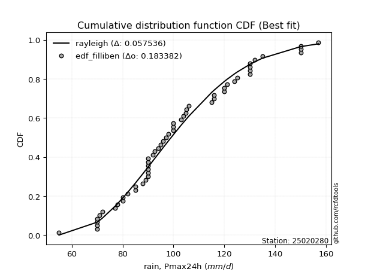</img></img>

</div>


### 10. Empirical - EDF Jenkinson (1977)

The Jenkinson formula in hydrology is an empirical plotting position formula used to estimate the non-exceedance probability _(P)_ or return period _(T)_ of a given ordered observation within a sample. It is a widely used method in the frequency analysis of extreme events such as floods and rainfall, as it provides a distribution-free way to plot data. _a≈0.31_ and _b≈0.38_ are constants derived to approximate the median of the probability distribution for the given rank.

<div align="center">


$P=(m-a)/(n+b)$


</div>


**10.1. Empirical values**

<div align="center">

|                | 0                   | 1                    | 2                   | 3                  | 4                   | 5                   | 6                   | 7                   | 8                   | 9                  | 10                  | 11                  | 12                  | 13                  | 14                 | 15                 | 16                 | 17                  | 18                  | 19                 | 20                 | 21                 | 22                 | 23                  | 24                  | 25                  | 26                  | 27            | 28                 | 29                 | 30                 | 31                 | 32                 | 33                 | 34                 | 35                 | 36                 | 37                 | 38                 | 39                 | 40                 | 41                | 42                 | 43                | 44                 | 45                 | 46                 | 47                 | 48                 | 49                 | 50                 | 51                 | 52                 | 53                 | 54                 |
|:---------------|:--------------------|:---------------------|:--------------------|:-------------------|:--------------------|:--------------------|:--------------------|:--------------------|:--------------------|:-------------------|:--------------------|:--------------------|:--------------------|:--------------------|:-------------------|:-------------------|:-------------------|:--------------------|:--------------------|:-------------------|:-------------------|:-------------------|:-------------------|:--------------------|:--------------------|:--------------------|:--------------------|:--------------|:-------------------|:-------------------|:-------------------|:-------------------|:-------------------|:-------------------|:-------------------|:-------------------|:-------------------|:-------------------|:-------------------|:-------------------|:-------------------|:------------------|:-------------------|:------------------|:-------------------|:-------------------|:-------------------|:-------------------|:-------------------|:-------------------|:-------------------|:-------------------|:-------------------|:-------------------|:-------------------|
| date           | 1986                | 1963                 | 1997                | 1995               | 2001                | 1966                | 1968                | 1989                | 1981                | 1967               | 1964                | 1976                | 2011                | 2015                | 1988               | 2013               | 2004               | 2007                | 1987                | 1991               | 1977               | 2009               | 1974               | 1990                | 1965                | 2016                | 2002                | 1972          | 1985               | 2017               | 1994               | 1971               | 1983               | 1975               | 2003               | 1992               | 2005               | 1970               | 1979               | 1973               | 2000               | 1993              | 2008               | 1998              | 2006               | 1978               | 1999               | 1980               | 2012               | 1969               | 2014               | 1984               | 1982               | 1996               | 2010               |
| x              | 55.0                | 70.0                 | 70.0                | 70.0               | 70.0                | 71.0                | 72.1625217          | 77.0                | 78.0                | 80.0               | 80.0                | 82.0                | 85.0                | 85.0                | 88.0               | 89.0               | 90.0               | 90.0                | 90.0                | 90.0               | 90.0               | 90.0               | 92.0               | 92.6                | 94.0                | 95.0                | 96.0                | 97.0          | 98.0               | 100.0              | 100.0              | 100.0              | 103.0              | 104.0              | 104.85022766727273 | 105.0              | 106.0              | 115.0              | 116.0              | 116.0              | 120.0              | 120.0             | 121.0              | 124.0             | 125.0              | 130.0              | 130.0              | 130.0              | 130.0              | 132.0              | 135.0              | 150.0              | 150.0              | 150.0              | 157.0              |
| m              | 1                   | 2                    | 3                   | 4                  | 5                   | 6                   | 7                   | 8                   | 9                   | 10                 | 11                  | 12                  | 13                  | 14                  | 15                 | 16                 | 17                 | 18                  | 19                  | 20                 | 21                 | 22                 | 23                 | 24                  | 25                  | 26                  | 27                  | 28            | 29                 | 30                 | 31                 | 32                 | 33                 | 34                 | 35                 | 36                 | 37                 | 38                 | 39                 | 40                 | 41                 | 42                | 43                 | 44                | 45                 | 46                 | 47                 | 48                 | 49                 | 50                 | 51                 | 52                 | 53                 | 54                 | 55                 |
| empirical_dist | edf_jenkinson       | edf_jenkinson        | edf_jenkinson       | edf_jenkinson      | edf_jenkinson       | edf_jenkinson       | edf_jenkinson       | edf_jenkinson       | edf_jenkinson       | edf_jenkinson      | edf_jenkinson       | edf_jenkinson       | edf_jenkinson       | edf_jenkinson       | edf_jenkinson      | edf_jenkinson      | edf_jenkinson      | edf_jenkinson       | edf_jenkinson       | edf_jenkinson      | edf_jenkinson      | edf_jenkinson      | edf_jenkinson      | edf_jenkinson       | edf_jenkinson       | edf_jenkinson       | edf_jenkinson       | edf_jenkinson | edf_jenkinson      | edf_jenkinson      | edf_jenkinson      | edf_jenkinson      | edf_jenkinson      | edf_jenkinson      | edf_jenkinson      | edf_jenkinson      | edf_jenkinson      | edf_jenkinson      | edf_jenkinson      | edf_jenkinson      | edf_jenkinson      | edf_jenkinson     | edf_jenkinson      | edf_jenkinson     | edf_jenkinson      | edf_jenkinson      | edf_jenkinson      | edf_jenkinson      | edf_jenkinson      | edf_jenkinson      | edf_jenkinson      | edf_jenkinson      | edf_jenkinson      | edf_jenkinson      | edf_jenkinson      |
| empirical      | 0.01245937161430119 | 0.030516431924882625 | 0.04857349223546406 | 0.0666305525460455 | 0.08468761285662695 | 0.10274467316720838 | 0.12080173347778982 | 0.13885879378837127 | 0.15691585409895267 | 0.1749729144095341 | 0.19302997472011554 | 0.21108703503069698 | 0.22914409534127841 | 0.24720115565185985 | 0.2652582159624413 | 0.2833152762730227 | 0.3013723365836042 | 0.31942939689418565 | 0.33748645720476705 | 0.3555435175153485 | 0.3736005778259299 | 0.3916576381365114 | 0.4097146984470928 | 0.42777175875767426 | 0.44582881906825567 | 0.46388587937883713 | 0.48194293968941854 | 0.5           | 0.5180570603105814 | 0.5361141206211629 | 0.5541711809317443 | 0.5722282412423257 | 0.5902853015529071 | 0.6083423618634886 | 0.62639942217407   | 0.6444564824846515 | 0.6625135427952329 | 0.6805706031058143 | 0.6986276634163957 | 0.7166847237269772 | 0.7347417840375586 | 0.75279884434814  | 0.7708559046587214 | 0.788912964969303 | 0.8069700252798844 | 0.8250270855904658 | 0.8430841459010472 | 0.8611412062116287 | 0.8791982665222101 | 0.8972553268327915 | 0.9153123871433729 | 0.9333694474539544 | 0.9514265077645359 | 0.9694835680751173 | 0.9875406283856987 |
| empirical_tr   | 1.0126165660998354  | 1.0314769975786926   | 1.051053330802809   | 1.0713871154962276 | 1.092523180114421   | 1.1145099617629302  | 1.1373998767714109  | 1.161249737890543   | 1.1861212251017348  | 1.2120814182534472 | 1.239203401208324   | 1.267566948958572   | 1.297259311314125   | 1.3283761093787478  | 1.3610223642172523 | 1.3953136810279665 | 1.4313776169552856 | 1.4693552666489786  | 1.509403107113655   | 1.5516951527038387 | 1.596425482848083  | 1.6438112199465715 | 1.6940960538390943 | 1.7475544335752604  | 1.804496578690127   | 1.8652745031997306  | 1.9302892994074592  | 2.0           | 2.0749344323716747 | 2.1557026080186845 | 2.2430133657351154 | 2.3376952300548752 | 2.440722785368003  | 2.5532503457814655 | 2.676655389076848  | 2.812595226003047  | 2.963081861958266  | 3.1305822498586764 | 3.3181545835829827 | 3.5296367112810705 | 3.769911504424778  | 4.045288531775017 | 4.364066193853426  | 4.73738237810094  | 5.180542563143122  | 5.715170278637768  | 6.372842347525887  | 7.20156046814044   | 8.278026905829591  | 9.73286467486818   | 11.80810234541576  | 15.008130081300802 | 20.587360594795506 | 32.76923076923065  | 80.26086956521651  |

</div>


**10.2. Kolmogorov-Smirnov fit test (sorted by Δ)**


<div align="center">

|                | 0                    | 1                   | 2                   | 3                    | 4                    | 5                   | 6                    | 7                   | 8                   | 9                   | 10                  | 11                   | 12                  | 13                  | 14                  | 15                   | 16                  | 17                  | 18                  | 19                   | 20                   | 21                  | 22                  | 23                   | 24                  | 25                  | 26                  | 27                  | 28                  | 29                  | 30                  | 31                  | 32                  | 33                  | 34                  | 35                  | 36                  | 37                  | 38                  | 39                  | 40                  | 41                  | 42                  | 43                  | 44                  | 45                  | 46                  | 47                  | 48                  | 49                  | 50                  | 51                  | 52                  | 53                  | 54                  | 55                  | 56                  | 57                  | 58                    | 59                  | 60                  | 61                  | 62                  | 63                  | 64                  | 65                  | 66                  | 67                  | 68                  | 69                  | 70                  | 71                  | 72                  | 73                  | 74                  | 75                  | 76                  | 77                  | 78                  | 79                  | 80                  | 81                  | 82                  | 83                  | 84                  | 85                  | 86                  | 87                  | 88                  | 89                  |
|:---------------|:---------------------|:--------------------|:--------------------|:---------------------|:---------------------|:--------------------|:---------------------|:--------------------|:--------------------|:--------------------|:--------------------|:---------------------|:--------------------|:--------------------|:--------------------|:---------------------|:--------------------|:--------------------|:--------------------|:---------------------|:---------------------|:--------------------|:--------------------|:---------------------|:--------------------|:--------------------|:--------------------|:--------------------|:--------------------|:--------------------|:--------------------|:--------------------|:--------------------|:--------------------|:--------------------|:--------------------|:--------------------|:--------------------|:--------------------|:--------------------|:--------------------|:--------------------|:--------------------|:--------------------|:--------------------|:--------------------|:--------------------|:--------------------|:--------------------|:--------------------|:--------------------|:--------------------|:--------------------|:--------------------|:--------------------|:--------------------|:--------------------|:--------------------|:----------------------|:--------------------|:--------------------|:--------------------|:--------------------|:--------------------|:--------------------|:--------------------|:--------------------|:--------------------|:--------------------|:--------------------|:--------------------|:--------------------|:--------------------|:--------------------|:--------------------|:--------------------|:--------------------|:--------------------|:--------------------|:--------------------|:--------------------|:--------------------|:--------------------|:--------------------|:--------------------|:--------------------|:--------------------|:--------------------|:--------------------|:--------------------|
| station        | 25020280             | 25020280            | 25020280            | 25020280             | 25020280             | 25020280            | 25020280             | 25020280            | 25020280            | 25020280            | 25020280            | 25020280             | 25020280            | 25020280            | 25020280            | 25020280             | 25020280            | 25020280            | 25020280            | 25020280             | 25020280             | 25020280            | 25020280            | 25020280             | 25020280            | 25020280            | 25020280            | 25020280            | 25020280            | 25020280            | 25020280            | 25020280            | 25020280            | 25020280            | 25020280            | 25020280            | 25020280            | 25020280            | 25020280            | 25020280            | 25020280            | 25020280            | 25020280            | 25020280            | 25020280            | 25020280            | 25020280            | 25020280            | 25020280            | 25020280            | 25020280            | 25020280            | 25020280            | 25020280            | 25020280            | 25020280            | 25020280            | 25020280            | 25020280              | 25020280            | 25020280            | 25020280            | 25020280            | 25020280            | 25020280            | 25020280            | 25020280            | 25020280            | 25020280            | 25020280            | 25020280            | 25020280            | 25020280            | 25020280            | 25020280            | 25020280            | 25020280            | 25020280            | 25020280            | 25020280            | 25020280            | 25020280            | 25020280            | 25020280            | 25020280            | 25020280            | 25020280            | 25020280            | 25020280            | 25020280            |
| empirical_dist | edf_jenkinson        | edf_jenkinson       | edf_jenkinson       | edf_jenkinson        | edf_jenkinson        | edf_jenkinson       | edf_jenkinson        | edf_jenkinson       | edf_jenkinson       | edf_jenkinson       | edf_jenkinson       | edf_jenkinson        | edf_jenkinson       | edf_jenkinson       | edf_jenkinson       | edf_jenkinson        | edf_jenkinson       | edf_jenkinson       | edf_jenkinson       | edf_jenkinson        | edf_jenkinson        | edf_jenkinson       | edf_jenkinson       | edf_jenkinson        | edf_jenkinson       | edf_jenkinson       | edf_jenkinson       | edf_jenkinson       | edf_jenkinson       | edf_jenkinson       | edf_jenkinson       | edf_jenkinson       | edf_jenkinson       | edf_jenkinson       | edf_jenkinson       | edf_jenkinson       | edf_jenkinson       | edf_jenkinson       | edf_jenkinson       | edf_jenkinson       | edf_jenkinson       | edf_jenkinson       | edf_jenkinson       | edf_jenkinson       | edf_jenkinson       | edf_jenkinson       | edf_jenkinson       | edf_jenkinson       | edf_jenkinson       | edf_jenkinson       | edf_jenkinson       | edf_jenkinson       | edf_jenkinson       | edf_jenkinson       | edf_jenkinson       | edf_jenkinson       | edf_jenkinson       | edf_jenkinson       | edf_jenkinson         | edf_jenkinson       | edf_jenkinson       | edf_jenkinson       | edf_jenkinson       | edf_jenkinson       | edf_jenkinson       | edf_jenkinson       | edf_jenkinson       | edf_jenkinson       | edf_jenkinson       | edf_jenkinson       | edf_jenkinson       | edf_jenkinson       | edf_jenkinson       | edf_jenkinson       | edf_jenkinson       | edf_jenkinson       | edf_jenkinson       | edf_jenkinson       | edf_jenkinson       | edf_jenkinson       | edf_jenkinson       | edf_jenkinson       | edf_jenkinson       | edf_jenkinson       | edf_jenkinson       | edf_jenkinson       | edf_jenkinson       | edf_jenkinson       | edf_jenkinson       | edf_jenkinson       |
| p_dist         | rayleigh             | erlang              | gamma               | chi2                 | fatiguelife          | logrice             | logjohnsonsu         | logloggamma         | logpearson3         | lognakagami         | logt                | logexponnorm         | lognorm             | lognorm             | logcrystalball      | loglognorm           | f                   | logerlang           | logncf              | loggamma             | loggamma             | johnsonsu           | logf                | invgamma             | logfatiguelife      | alpha               | loginvgamma         | logalpha            | logbetaprime        | invgauss            | nct                 | invweibull          | betaprime           | logweibull_min      | lognct              | genlogistic         | loginvgauss         | kstwobign           | maxwell             | logmaxwell          | weibull_min         | rice                | pearson3            | fisk                | mielke              | loggenlogistic      | logmielke           | logfisk             | exponnorm           | lograyleigh         | gumbel_r            | loglogistic         | laplace_asymmetric  | loggompertz         | nakagami            | halfnorm            | moyal               | loghypsecant        | loglaplace_asymmetric | loginvweibull       | loggumbel_r         | norm                | crystalball         | truncnorm           | t                   | logistic            | logmoyal            | loglaplace          | hypsecant           | halflogistic        | loghalflogistic     | loghalfnorm         | logkstwobign        | loggumbel_l         | laplace             | loggenexpon         | gumbel_l            | wald                | logwald             | loggibrat           | ncf                 | gibrat              | expon               | pareto              | genexpon            | logtruncnorm        | logexpon            | logpareto           | logchi2             | gompertz            |
| delta          | 0.057516060253092305 | 0.05836429894723405 | 0.05836438905061436 | 0.058364400737600186 | 0.059914584594197406 | 0.06009942271251534 | 0.060154533420542444 | 0.06019997011363576 | 0.06031763674325363 | 0.06064842110993163 | 0.06068479263829418 | 0.060690607788531636 | 0.06069142771751046 | 0.06069142771751046 | 0.06069171142917629 | 0.060692621925461654 | 0.06069550370872856 | 0.06099284554726314 | 0.06108975610935041 | 0.061109156249065655 | 0.061109156249065655 | 0.06129745326929181 | 0.06133215381524926 | 0.061521785086723346 | 0.06215212407085413 | 0.06227446689897598 | 0.06232429310884091 | 0.0627558327194897  | 0.06327580245079423 | 0.06366266324384695 | 0.06386172818774705 | 0.06456638513393997 | 0.06466596120982904 | 0.06539085749290785 | 0.06570293328442145 | 0.06614495324179048 | 0.06798899991564522 | 0.06830178844195395 | 0.06912358901582616 | 0.06973164508368723 | 0.07226555869133167 | 0.07233003551717204 | 0.07236938547186256 | 0.07297859069459123 | 0.07323546941486636 | 0.07323961226537812 | 0.0734258593753665  | 0.0734575986631465  | 0.07455809776653277 | 0.0791918076587575  | 0.07948805193659636 | 0.08240649546916157 | 0.08741169824638684 | 0.08806351947959612 | 0.09337500659630715 | 0.09472690077073107 | 0.09509010125743478 | 0.09652553085053162 | 0.09990328411351168   | 0.10008536329002887 | 0.10083069827113911 | 0.10313520880895544 | 0.10313520925109543 | 0.10313521184032781 | 0.10319157097178094 | 0.10733538445089325 | 0.11437658205858114 | 0.11755027358255754 | 0.11988083597426868 | 0.12080173347778982 | 0.12080173347778982 | 0.12080173347778982 | 0.12652596577928926 | 0.12738533575638533 | 0.14563771309225018 | 0.16819097996916216 | 0.1737436571389358  | 0.1923702445428014  | 0.19255666584499934 | 0.21108703503069698 | 0.21839284219534705 | 0.23454039674700508 | 0.24389254308723987 | 0.2438925651495997  | 0.24475866767447052 | 0.29561080697906156 | 0.30529847853711495 | 0.30529848611305455 | 0.3172428464938993  | 0.8599065970641618  |
| deltao         | 0.18338236259000185  | 0.18338236259000185 | 0.18338236259000185 | 0.18338236259000185  | 0.18338236259000185  | 0.18338236259000185 | 0.18338236259000185  | 0.18338236259000185 | 0.18338236259000185 | 0.18338236259000185 | 0.18338236259000185 | 0.18338236259000185  | 0.18338236259000185 | 0.18338236259000185 | 0.18338236259000185 | 0.18338236259000185  | 0.18338236259000185 | 0.18338236259000185 | 0.18338236259000185 | 0.18338236259000185  | 0.18338236259000185  | 0.18338236259000185 | 0.18338236259000185 | 0.18338236259000185  | 0.18338236259000185 | 0.18338236259000185 | 0.18338236259000185 | 0.18338236259000185 | 0.18338236259000185 | 0.18338236259000185 | 0.18338236259000185 | 0.18338236259000185 | 0.18338236259000185 | 0.18338236259000185 | 0.18338236259000185 | 0.18338236259000185 | 0.18338236259000185 | 0.18338236259000185 | 0.18338236259000185 | 0.18338236259000185 | 0.18338236259000185 | 0.18338236259000185 | 0.18338236259000185 | 0.18338236259000185 | 0.18338236259000185 | 0.18338236259000185 | 0.18338236259000185 | 0.18338236259000185 | 0.18338236259000185 | 0.18338236259000185 | 0.18338236259000185 | 0.18338236259000185 | 0.18338236259000185 | 0.18338236259000185 | 0.18338236259000185 | 0.18338236259000185 | 0.18338236259000185 | 0.18338236259000185 | 0.18338236259000185   | 0.18338236259000185 | 0.18338236259000185 | 0.18338236259000185 | 0.18338236259000185 | 0.18338236259000185 | 0.18338236259000185 | 0.18338236259000185 | 0.18338236259000185 | 0.18338236259000185 | 0.18338236259000185 | 0.18338236259000185 | 0.18338236259000185 | 0.18338236259000185 | 0.18338236259000185 | 0.18338236259000185 | 0.18338236259000185 | 0.18338236259000185 | 0.18338236259000185 | 0.18338236259000185 | 0.18338236259000185 | 0.18338236259000185 | 0.18338236259000185 | 0.18338236259000185 | 0.18338236259000185 | 0.18338236259000185 | 0.18338236259000185 | 0.18338236259000185 | 0.18338236259000185 | 0.18338236259000185 | 0.18338236259000185 | 0.18338236259000185 |
| eval           | Δo > Δ               | Δo > Δ              | Δo > Δ              | Δo > Δ               | Δo > Δ               | Δo > Δ              | Δo > Δ               | Δo > Δ              | Δo > Δ              | Δo > Δ              | Δo > Δ              | Δo > Δ               | Δo > Δ              | Δo > Δ              | Δo > Δ              | Δo > Δ               | Δo > Δ              | Δo > Δ              | Δo > Δ              | Δo > Δ               | Δo > Δ               | Δo > Δ              | Δo > Δ              | Δo > Δ               | Δo > Δ              | Δo > Δ              | Δo > Δ              | Δo > Δ              | Δo > Δ              | Δo > Δ              | Δo > Δ              | Δo > Δ              | Δo > Δ              | Δo > Δ              | Δo > Δ              | Δo > Δ              | Δo > Δ              | Δo > Δ              | Δo > Δ              | Δo > Δ              | Δo > Δ              | Δo > Δ              | Δo > Δ              | Δo > Δ              | Δo > Δ              | Δo > Δ              | Δo > Δ              | Δo > Δ              | Δo > Δ              | Δo > Δ              | Δo > Δ              | Δo > Δ              | Δo > Δ              | Δo > Δ              | Δo > Δ              | Δo > Δ              | Δo > Δ              | Δo > Δ              | Δo > Δ                | Δo > Δ              | Δo > Δ              | Δo > Δ              | Δo > Δ              | Δo > Δ              | Δo > Δ              | Δo > Δ              | Δo > Δ              | Δo > Δ              | Δo > Δ              | Δo > Δ              | Δo > Δ              | Δo > Δ              | Δo > Δ              | Δo > Δ              | Δo > Δ              | Δo > Δ              | Δo > Δ              | Δo <= Δ             | Δo <= Δ             | Δo <= Δ             | Δo <= Δ             | Δo <= Δ             | Δo <= Δ             | Δo <= Δ             | Δo <= Δ             | Δo <= Δ             | Δo <= Δ             | Δo <= Δ             | Δo <= Δ             | Δo <= Δ             |
| fit            | 1                    | 1                   | 1                   | 1                    | 1                    | 1                   | 1                    | 1                   | 1                   | 1                   | 1                   | 1                    | 1                   | 1                   | 1                   | 1                    | 1                   | 1                   | 1                   | 1                    | 1                    | 1                   | 1                   | 1                    | 1                   | 1                   | 1                   | 1                   | 1                   | 1                   | 1                   | 1                   | 1                   | 1                   | 1                   | 1                   | 1                   | 1                   | 1                   | 1                   | 1                   | 1                   | 1                   | 1                   | 1                   | 1                   | 1                   | 1                   | 1                   | 1                   | 1                   | 1                   | 1                   | 1                   | 1                   | 1                   | 1                   | 1                   | 1                     | 1                   | 1                   | 1                   | 1                   | 1                   | 1                   | 1                   | 1                   | 1                   | 1                   | 1                   | 1                   | 1                   | 1                   | 1                   | 1                   | 1                   | 1                   | 0                   | 0                   | 0                   | 0                   | 0                   | 0                   | 0                   | 0                   | 0                   | 0                   | 0                   | 0                   | 0                   |
| n              | 55                   | 55                  | 55                  | 55                   | 55                   | 55                  | 55                   | 55                  | 55                  | 55                  | 55                  | 55                   | 55                  | 55                  | 55                  | 55                   | 55                  | 55                  | 55                  | 55                   | 55                   | 55                  | 55                  | 55                   | 55                  | 55                  | 55                  | 55                  | 55                  | 55                  | 55                  | 55                  | 55                  | 55                  | 55                  | 55                  | 55                  | 55                  | 55                  | 55                  | 55                  | 55                  | 55                  | 55                  | 55                  | 55                  | 55                  | 55                  | 55                  | 55                  | 55                  | 55                  | 55                  | 55                  | 55                  | 55                  | 55                  | 55                  | 55                    | 55                  | 55                  | 55                  | 55                  | 55                  | 55                  | 55                  | 55                  | 55                  | 55                  | 55                  | 55                  | 55                  | 55                  | 55                  | 55                  | 55                  | 55                  | 55                  | 55                  | 55                  | 55                  | 55                  | 55                  | 55                  | 55                  | 55                  | 55                  | 55                  | 55                  | 55                  |
| best_fit       | 1                    | 0                   | 0                   | 0                    | 0                    | 0                   | 0                    | 0                   | 0                   | 0                   | 0                   | 0                    | 0                   | 0                   | 0                   | 0                    | 0                   | 0                   | 0                   | 0                    | 0                    | 0                   | 0                   | 0                    | 0                   | 0                   | 0                   | 0                   | 0                   | 0                   | 0                   | 0                   | 0                   | 0                   | 0                   | 0                   | 0                   | 0                   | 0                   | 0                   | 0                   | 0                   | 0                   | 0                   | 0                   | 0                   | 0                   | 0                   | 0                   | 0                   | 0                   | 0                   | 0                   | 0                   | 0                   | 0                   | 0                   | 0                   | 0                     | 0                   | 0                   | 0                   | 0                   | 0                   | 0                   | 0                   | 0                   | 0                   | 0                   | 0                   | 0                   | 0                   | 0                   | 0                   | 0                   | 0                   | 0                   | 0                   | 0                   | 0                   | 0                   | 0                   | 0                   | 0                   | 0                   | 0                   | 0                   | 0                   | 0                   | 0                   |
| best_fit_sort  | 1                    | 2                   | 3                   | 4                    | 5                    | 6                   | 7                    | 8                   | 9                   | 10                  | 11                  | 12                   | 13                  | 14                  | 15                  | 16                   | 17                  | 18                  | 19                  | 20                   | 21                   | 22                  | 23                  | 24                   | 25                  | 26                  | 27                  | 28                  | 29                  | 30                  | 31                  | 32                  | 33                  | 34                  | 35                  | 36                  | 37                  | 38                  | 39                  | 40                  | 41                  | 42                  | 43                  | 44                  | 45                  | 46                  | 47                  | 48                  | 49                  | 50                  | 51                  | 52                  | 53                  | 54                  | 55                  | 56                  | 57                  | 58                  | 59                    | 60                  | 61                  | 62                  | 63                  | 64                  | 65                  | 66                  | 67                  | 68                  | 69                  | 70                  | 71                  | 72                  | 73                  | 74                  | 75                  | 76                  | 77                  | 78                  | 79                  | 80                  | 81                  | 82                  | 83                  | 84                  | 85                  | 86                  | 87                  | 88                  | 89                  | 90                  |

</div>


<div align="center">

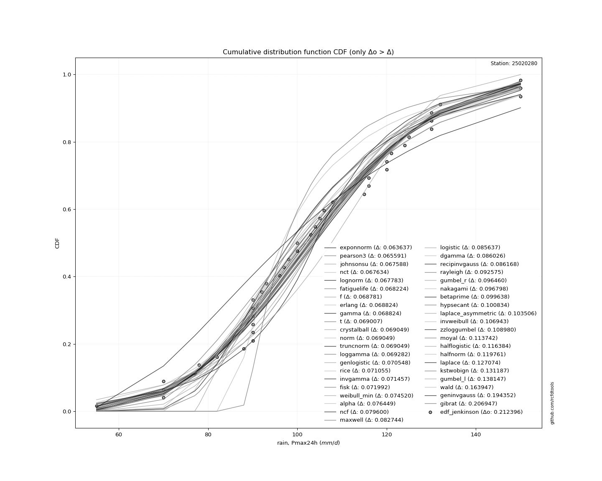</img>

</div>


**10.3. Best fit**

<div align="center">

|   id |   station | empirical_dist   | p_dist   |     delta |   deltao | eval   |   fit |   n |   best_fit |   best_fit_sort |
|-----:|----------:|:-----------------|:---------|----------:|---------:|:-------|------:|----:|-----------:|----------------:|
|    0 |  25020280 | edf_jenkinson    | rayleigh | 0.0575161 | 0.183382 | Δo > Δ |     1 |  55 |          1 |               1 |

</div>


<div align="center">

</img>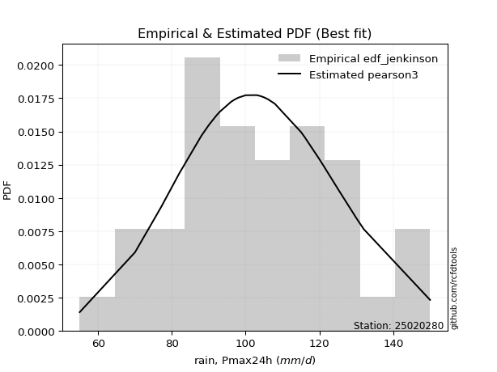</img>

</div>


### 11. Empirical - EDF Cunnane (1978)

Cunnane´s work in statistical hydrology has focused on the performance and evaluation of different probability distributions (such as GEV, Gumbel, Lognormal) for flood frequency estimation. _b_ is a constant, typically set to 0.4.

<div align="center">


$P=(m-b)/(n+1-2b)$


</div>


**11.1. Empirical values**

<div align="center">

|                | 0                    | 1                    | 2                   | 3                   | 4                   | 5                   | 6                   | 7                   | 8                   | 9                   | 10                  | 11                  | 12                  | 13                  | 14                  | 15                 | 16                 | 17                  | 18                  | 19                  | 20                  | 21                 | 22                  | 23                 | 24                  | 25                 | 26                  | 27          | 28                 | 29                 | 30                 | 31                 | 32                 | 33                 | 34                 | 35                | 36                 | 37                 | 38                 | 39                | 40                 | 41                 | 42                 | 43                 | 44                 | 45                 | 46                 | 47                 | 48                 | 49                 | 50                 | 51                 | 52                 | 53                 | 54                 |
|:---------------|:---------------------|:---------------------|:--------------------|:--------------------|:--------------------|:--------------------|:--------------------|:--------------------|:--------------------|:--------------------|:--------------------|:--------------------|:--------------------|:--------------------|:--------------------|:-------------------|:-------------------|:--------------------|:--------------------|:--------------------|:--------------------|:-------------------|:--------------------|:-------------------|:--------------------|:-------------------|:--------------------|:------------|:-------------------|:-------------------|:-------------------|:-------------------|:-------------------|:-------------------|:-------------------|:------------------|:-------------------|:-------------------|:-------------------|:------------------|:-------------------|:-------------------|:-------------------|:-------------------|:-------------------|:-------------------|:-------------------|:-------------------|:-------------------|:-------------------|:-------------------|:-------------------|:-------------------|:-------------------|:-------------------|
| date           | 1986                 | 1963                 | 1997                | 1995                | 2001                | 1966                | 1968                | 1989                | 1981                | 1967                | 1964                | 1976                | 2011                | 2015                | 1988                | 2013               | 2004               | 2007                | 1987                | 1991                | 1977                | 2009               | 1974                | 1990               | 1965                | 2016               | 2002                | 1972        | 1985               | 2017               | 1994               | 1971               | 1983               | 1975               | 2003               | 1992              | 2005               | 1970               | 1979               | 1973              | 2000               | 1993               | 2008               | 1998               | 2006               | 1978               | 1999               | 1980               | 2012               | 1969               | 2014               | 1984               | 1982               | 1996               | 2010               |
| x              | 55.0                 | 70.0                 | 70.0                | 70.0                | 70.0                | 71.0                | 72.1625217          | 77.0                | 78.0                | 80.0                | 80.0                | 82.0                | 85.0                | 85.0                | 88.0                | 89.0               | 90.0               | 90.0                | 90.0                | 90.0                | 90.0                | 90.0               | 92.0                | 92.6               | 94.0                | 95.0               | 96.0                | 97.0        | 98.0               | 100.0              | 100.0              | 100.0              | 103.0              | 104.0              | 104.85022766727273 | 105.0             | 106.0              | 115.0              | 116.0              | 116.0             | 120.0              | 120.0              | 121.0              | 124.0              | 125.0              | 130.0              | 130.0              | 130.0              | 130.0              | 132.0              | 135.0              | 150.0              | 150.0              | 150.0              | 157.0              |
| m              | 1                    | 2                    | 3                   | 4                   | 5                   | 6                   | 7                   | 8                   | 9                   | 10                  | 11                  | 12                  | 13                  | 14                  | 15                  | 16                 | 17                 | 18                  | 19                  | 20                  | 21                  | 22                 | 23                  | 24                 | 25                  | 26                 | 27                  | 28          | 29                 | 30                 | 31                 | 32                 | 33                 | 34                 | 35                 | 36                | 37                 | 38                 | 39                 | 40                | 41                 | 42                 | 43                 | 44                 | 45                 | 46                 | 47                 | 48                 | 49                 | 50                 | 51                 | 52                 | 53                 | 54                 | 55                 |
| empirical_dist | edf_cunnane          | edf_cunnane          | edf_cunnane         | edf_cunnane         | edf_cunnane         | edf_cunnane         | edf_cunnane         | edf_cunnane         | edf_cunnane         | edf_cunnane         | edf_cunnane         | edf_cunnane         | edf_cunnane         | edf_cunnane         | edf_cunnane         | edf_cunnane        | edf_cunnane        | edf_cunnane         | edf_cunnane         | edf_cunnane         | edf_cunnane         | edf_cunnane        | edf_cunnane         | edf_cunnane        | edf_cunnane         | edf_cunnane        | edf_cunnane         | edf_cunnane | edf_cunnane        | edf_cunnane        | edf_cunnane        | edf_cunnane        | edf_cunnane        | edf_cunnane        | edf_cunnane        | edf_cunnane       | edf_cunnane        | edf_cunnane        | edf_cunnane        | edf_cunnane       | edf_cunnane        | edf_cunnane        | edf_cunnane        | edf_cunnane        | edf_cunnane        | edf_cunnane        | edf_cunnane        | edf_cunnane        | edf_cunnane        | edf_cunnane        | edf_cunnane        | edf_cunnane        | edf_cunnane        | edf_cunnane        | edf_cunnane        |
| empirical      | 0.010869565217391304 | 0.028985507246376812 | 0.04710144927536232 | 0.06521739130434782 | 0.08333333333333333 | 0.10144927536231883 | 0.11956521739130434 | 0.13768115942028983 | 0.15579710144927536 | 0.17391304347826086 | 0.19202898550724637 | 0.21014492753623187 | 0.22826086956521738 | 0.24637681159420288 | 0.26449275362318836 | 0.2826086956521739 | 0.3007246376811594 | 0.31884057971014496 | 0.33695652173913043 | 0.35507246376811596 | 0.37318840579710144 | 0.391304347826087  | 0.40942028985507245 | 0.427536231884058  | 0.44565217391304346 | 0.463768115942029  | 0.48188405797101447 | 0.5         | 0.5181159420289855 | 0.5362318840579711 | 0.5543478260869565 | 0.572463768115942  | 0.5905797101449275 | 0.6086956521739131 | 0.6268115942028986 | 0.644927536231884 | 0.6630434782608695 | 0.6811594202898551 | 0.6992753623188406 | 0.717391304347826 | 0.7355072463768115 | 0.7536231884057971 | 0.7717391304347826 | 0.7898550724637681 | 0.8079710144927537 | 0.8260869565217391 | 0.8442028985507246 | 0.8623188405797101 | 0.8804347826086957 | 0.8985507246376812 | 0.9166666666666666 | 0.9347826086956521 | 0.9528985507246377 | 0.9710144927536232 | 0.9891304347826086 |
| empirical_tr   | 1.010989010989011    | 1.0298507462686568   | 1.049429657794677   | 1.069767441860465   | 1.090909090909091   | 1.1129032258064515  | 1.1358024691358024  | 1.1596638655462184  | 1.184549356223176   | 1.2105263157894737  | 1.2376681614349776  | 1.2660550458715598  | 1.295774647887324   | 1.3269230769230769  | 1.3596059113300492  | 1.3939393939393938 | 1.4300518134715026 | 1.468085106382979   | 1.5081967213114753  | 1.550561797752809   | 1.5953757225433525  | 1.6428571428571428 | 1.6932515337423315  | 1.7468354430379747 | 1.803921568627451   | 1.8648648648648651 | 1.9300699300699298  | 2.0         | 2.0751879699248117 | 2.1562500000000004 | 2.2439024390243905 | 2.3389830508474576 | 2.4424778761061945 | 2.555555555555556  | 2.679611650485437  | 2.816326530612245 | 2.9677419354838706 | 3.1363636363636367 | 3.325301204819277  | 3.538461538461538 | 3.7808219178082183 | 4.058823529411765  | 4.3809523809523805 | 4.758620689655172  | 5.207547169811321  | 5.75               | 6.41860465116279   | 7.263157894736839  | 8.363636363636365  | 9.857142857142856  | 11.999999999999995 | 15.333333333333318 | 21.230769230769237 | 34.49999999999998  | 91.99999999999959  |

</div>


**11.2. Kolmogorov-Smirnov fit test (sorted by Δ)**


<div align="center">

|                | 0                   | 1                   | 2                   | 3                   | 4                   | 5                   | 6                    | 7                    | 8                   | 9                    | 10                  | 11                  | 12                  | 13                  | 14                   | 15                  | 16                  | 17                  | 18                   | 19                  | 20                  | 21                   | 22                  | 23                  | 24                  | 25                  | 26                   | 27                  | 28                  | 29                  | 30                  | 31                  | 32                  | 33                  | 34                  | 35                  | 36                  | 37                  | 38                  | 39                  | 40                  | 41                  | 42                  | 43                  | 44                  | 45                  | 46                  | 47                  | 48                  | 49                  | 50                  | 51                  | 52                  | 53                  | 54                  | 55                  | 56                  | 57                  | 58                    | 59                  | 60                  | 61                  | 62                  | 63                  | 64                  | 65                  | 66                  | 67                  | 68                  | 69                  | 70                  | 71                  | 72                  | 73                  | 74                  | 75                  | 76                  | 77                  | 78                  | 79                  | 80                  | 81                  | 82                  | 83                  | 84                  | 85                  | 86                  | 87                  | 88                  | 89                  |
|:---------------|:--------------------|:--------------------|:--------------------|:--------------------|:--------------------|:--------------------|:---------------------|:---------------------|:--------------------|:---------------------|:--------------------|:--------------------|:--------------------|:--------------------|:---------------------|:--------------------|:--------------------|:--------------------|:---------------------|:--------------------|:--------------------|:---------------------|:--------------------|:--------------------|:--------------------|:--------------------|:---------------------|:--------------------|:--------------------|:--------------------|:--------------------|:--------------------|:--------------------|:--------------------|:--------------------|:--------------------|:--------------------|:--------------------|:--------------------|:--------------------|:--------------------|:--------------------|:--------------------|:--------------------|:--------------------|:--------------------|:--------------------|:--------------------|:--------------------|:--------------------|:--------------------|:--------------------|:--------------------|:--------------------|:--------------------|:--------------------|:--------------------|:--------------------|:----------------------|:--------------------|:--------------------|:--------------------|:--------------------|:--------------------|:--------------------|:--------------------|:--------------------|:--------------------|:--------------------|:--------------------|:--------------------|:--------------------|:--------------------|:--------------------|:--------------------|:--------------------|:--------------------|:--------------------|:--------------------|:--------------------|:--------------------|:--------------------|:--------------------|:--------------------|:--------------------|:--------------------|:--------------------|:--------------------|:--------------------|:--------------------|
| station        | 25020280            | 25020280            | 25020280            | 25020280            | 25020280            | 25020280            | 25020280             | 25020280             | 25020280            | 25020280             | 25020280            | 25020280            | 25020280            | 25020280            | 25020280             | 25020280            | 25020280            | 25020280            | 25020280             | 25020280            | 25020280            | 25020280             | 25020280            | 25020280            | 25020280            | 25020280            | 25020280             | 25020280            | 25020280            | 25020280            | 25020280            | 25020280            | 25020280            | 25020280            | 25020280            | 25020280            | 25020280            | 25020280            | 25020280            | 25020280            | 25020280            | 25020280            | 25020280            | 25020280            | 25020280            | 25020280            | 25020280            | 25020280            | 25020280            | 25020280            | 25020280            | 25020280            | 25020280            | 25020280            | 25020280            | 25020280            | 25020280            | 25020280            | 25020280              | 25020280            | 25020280            | 25020280            | 25020280            | 25020280            | 25020280            | 25020280            | 25020280            | 25020280            | 25020280            | 25020280            | 25020280            | 25020280            | 25020280            | 25020280            | 25020280            | 25020280            | 25020280            | 25020280            | 25020280            | 25020280            | 25020280            | 25020280            | 25020280            | 25020280            | 25020280            | 25020280            | 25020280            | 25020280            | 25020280            | 25020280            |
| empirical_dist | edf_cunnane         | edf_cunnane         | edf_cunnane         | edf_cunnane         | edf_cunnane         | edf_cunnane         | edf_cunnane          | edf_cunnane          | edf_cunnane         | edf_cunnane          | edf_cunnane         | edf_cunnane         | edf_cunnane         | edf_cunnane         | edf_cunnane          | edf_cunnane         | edf_cunnane         | edf_cunnane         | edf_cunnane          | edf_cunnane         | edf_cunnane         | edf_cunnane          | edf_cunnane         | edf_cunnane         | edf_cunnane         | edf_cunnane         | edf_cunnane          | edf_cunnane         | edf_cunnane         | edf_cunnane         | edf_cunnane         | edf_cunnane         | edf_cunnane         | edf_cunnane         | edf_cunnane         | edf_cunnane         | edf_cunnane         | edf_cunnane         | edf_cunnane         | edf_cunnane         | edf_cunnane         | edf_cunnane         | edf_cunnane         | edf_cunnane         | edf_cunnane         | edf_cunnane         | edf_cunnane         | edf_cunnane         | edf_cunnane         | edf_cunnane         | edf_cunnane         | edf_cunnane         | edf_cunnane         | edf_cunnane         | edf_cunnane         | edf_cunnane         | edf_cunnane         | edf_cunnane         | edf_cunnane           | edf_cunnane         | edf_cunnane         | edf_cunnane         | edf_cunnane         | edf_cunnane         | edf_cunnane         | edf_cunnane         | edf_cunnane         | edf_cunnane         | edf_cunnane         | edf_cunnane         | edf_cunnane         | edf_cunnane         | edf_cunnane         | edf_cunnane         | edf_cunnane         | edf_cunnane         | edf_cunnane         | edf_cunnane         | edf_cunnane         | edf_cunnane         | edf_cunnane         | edf_cunnane         | edf_cunnane         | edf_cunnane         | edf_cunnane         | edf_cunnane         | edf_cunnane         | edf_cunnane         | edf_cunnane         | edf_cunnane         |
| p_dist         | rayleigh            | gamma               | chi2                | erlang              | fatiguelife         | logrice             | logjohnsonsu         | logpearson3          | lognakagami         | logt                 | logexponnorm        | lognorm             | lognorm             | logcrystalball      | loglognorm           | f                   | logerlang           | logloggamma         | logncf               | loggamma            | loggamma            | johnsonsu            | logf                | invgamma            | logfatiguelife      | alpha               | loginvgamma          | logalpha            | logbetaprime        | invgauss            | nct                 | invweibull          | betaprime           | lognct              | genlogistic         | logweibull_min      | loginvgauss         | kstwobign           | logmaxwell          | maxwell             | fisk                | weibull_min         | rice                | pearson3            | mielke              | loggenlogistic      | logmielke           | logfisk             | exponnorm           | gumbel_r            | lograyleigh         | loglogistic         | laplace_asymmetric  | loggompertz         | halfnorm            | nakagami            | moyal               | loghypsecant        | loglaplace_asymmetric | loggumbel_r         | loginvweibull       | norm                | crystalball         | truncnorm           | t                   | logistic            | logmoyal            | loglaplace          | hypsecant           | halflogistic        | loghalflogistic     | loghalfnorm         | logkstwobign        | loggumbel_l         | laplace             | loggenexpon         | gumbel_l            | wald                | logwald             | loggibrat           | ncf                 | gibrat              | expon               | pareto              | genexpon            | logtruncnorm        | logexpon            | logpareto           | logchi2             | gompertz            |
| delta          | 0.05775158712670858 | 0.05792425785235178 | 0.05792432131006031 | 0.05792446675672336 | 0.05914912225494451 | 0.05933396037326244 | 0.059389071081289546 | 0.059552174404000735 | 0.05988295877067873 | 0.059919330299041285 | 0.05992514544927874 | 0.05992596537825756 | 0.05992596537825756 | 0.05992624908992339 | 0.059927159586208756 | 0.05994564072302089 | 0.06022738320801024 | 0.06026173662796397 | 0.060324293770097515 | 0.06034369390981276 | 0.06034369390981276 | 0.060531990930038915 | 0.06056669147599636 | 0.06075632274747045 | 0.06138666173160123 | 0.06150900455972308 | 0.061674839311959495 | 0.0621670155354489  | 0.06268698526675343 | 0.06307384605980615 | 0.06309626584849415 | 0.06397756794989917 | 0.06407714402578824 | 0.06511411610038065 | 0.06555613605774968 | 0.06562638436652413 | 0.06740018273160442 | 0.0690672507812069  | 0.06914282789964643 | 0.06935911588944244 | 0.07238977351055043 | 0.07250108556494794 | 0.07256556239078832 | 0.07260491234547883 | 0.07264665223082556 | 0.07265079508133732 | 0.0728370421913257  | 0.0728687814791057  | 0.07396928058249197 | 0.07889923475255556 | 0.07983950656120226 | 0.08164103312990867 | 0.08682288106234604 | 0.08843783343422296 | 0.09343150296584152 | 0.0941404689355601  | 0.09450128407339398 | 0.09593671366649081 | 0.09931446692947088   | 0.1002418810870983  | 0.10073426460009755 | 0.10337073568257171 | 0.1033707361247117  | 0.10337073871394409 | 0.10342709784539722 | 0.10757091132450952 | 0.11378776487454034 | 0.11696145639851674 | 0.11952754566384427 | 0.11956521739130434 | 0.11956521739130434 | 0.11956521739130434 | 0.12729142811854222 | 0.1276208626300016  | 0.14528442278182577 | 0.1689564423084151  | 0.17397918401255208 | 0.19136925532993224 | 0.19155567663213016 | 0.21014492753623187 | 0.21974712171864075 | 0.2337160526893481  | 0.24509207157386545 | 0.24509210175630494 | 0.24628959235297634 | 0.29714173165756735 | 0.30682940321562074 | 0.30682941079156034 | 0.3187737711724051  | 0.8612019948690515  |
| deltao         | 0.18338236259000185 | 0.18338236259000185 | 0.18338236259000185 | 0.18338236259000185 | 0.18338236259000185 | 0.18338236259000185 | 0.18338236259000185  | 0.18338236259000185  | 0.18338236259000185 | 0.18338236259000185  | 0.18338236259000185 | 0.18338236259000185 | 0.18338236259000185 | 0.18338236259000185 | 0.18338236259000185  | 0.18338236259000185 | 0.18338236259000185 | 0.18338236259000185 | 0.18338236259000185  | 0.18338236259000185 | 0.18338236259000185 | 0.18338236259000185  | 0.18338236259000185 | 0.18338236259000185 | 0.18338236259000185 | 0.18338236259000185 | 0.18338236259000185  | 0.18338236259000185 | 0.18338236259000185 | 0.18338236259000185 | 0.18338236259000185 | 0.18338236259000185 | 0.18338236259000185 | 0.18338236259000185 | 0.18338236259000185 | 0.18338236259000185 | 0.18338236259000185 | 0.18338236259000185 | 0.18338236259000185 | 0.18338236259000185 | 0.18338236259000185 | 0.18338236259000185 | 0.18338236259000185 | 0.18338236259000185 | 0.18338236259000185 | 0.18338236259000185 | 0.18338236259000185 | 0.18338236259000185 | 0.18338236259000185 | 0.18338236259000185 | 0.18338236259000185 | 0.18338236259000185 | 0.18338236259000185 | 0.18338236259000185 | 0.18338236259000185 | 0.18338236259000185 | 0.18338236259000185 | 0.18338236259000185 | 0.18338236259000185   | 0.18338236259000185 | 0.18338236259000185 | 0.18338236259000185 | 0.18338236259000185 | 0.18338236259000185 | 0.18338236259000185 | 0.18338236259000185 | 0.18338236259000185 | 0.18338236259000185 | 0.18338236259000185 | 0.18338236259000185 | 0.18338236259000185 | 0.18338236259000185 | 0.18338236259000185 | 0.18338236259000185 | 0.18338236259000185 | 0.18338236259000185 | 0.18338236259000185 | 0.18338236259000185 | 0.18338236259000185 | 0.18338236259000185 | 0.18338236259000185 | 0.18338236259000185 | 0.18338236259000185 | 0.18338236259000185 | 0.18338236259000185 | 0.18338236259000185 | 0.18338236259000185 | 0.18338236259000185 | 0.18338236259000185 | 0.18338236259000185 |
| eval           | Δo > Δ              | Δo > Δ              | Δo > Δ              | Δo > Δ              | Δo > Δ              | Δo > Δ              | Δo > Δ               | Δo > Δ               | Δo > Δ              | Δo > Δ               | Δo > Δ              | Δo > Δ              | Δo > Δ              | Δo > Δ              | Δo > Δ               | Δo > Δ              | Δo > Δ              | Δo > Δ              | Δo > Δ               | Δo > Δ              | Δo > Δ              | Δo > Δ               | Δo > Δ              | Δo > Δ              | Δo > Δ              | Δo > Δ              | Δo > Δ               | Δo > Δ              | Δo > Δ              | Δo > Δ              | Δo > Δ              | Δo > Δ              | Δo > Δ              | Δo > Δ              | Δo > Δ              | Δo > Δ              | Δo > Δ              | Δo > Δ              | Δo > Δ              | Δo > Δ              | Δo > Δ              | Δo > Δ              | Δo > Δ              | Δo > Δ              | Δo > Δ              | Δo > Δ              | Δo > Δ              | Δo > Δ              | Δo > Δ              | Δo > Δ              | Δo > Δ              | Δo > Δ              | Δo > Δ              | Δo > Δ              | Δo > Δ              | Δo > Δ              | Δo > Δ              | Δo > Δ              | Δo > Δ                | Δo > Δ              | Δo > Δ              | Δo > Δ              | Δo > Δ              | Δo > Δ              | Δo > Δ              | Δo > Δ              | Δo > Δ              | Δo > Δ              | Δo > Δ              | Δo > Δ              | Δo > Δ              | Δo > Δ              | Δo > Δ              | Δo > Δ              | Δo > Δ              | Δo > Δ              | Δo > Δ              | Δo <= Δ             | Δo <= Δ             | Δo <= Δ             | Δo <= Δ             | Δo <= Δ             | Δo <= Δ             | Δo <= Δ             | Δo <= Δ             | Δo <= Δ             | Δo <= Δ             | Δo <= Δ             | Δo <= Δ             | Δo <= Δ             |
| fit            | 1                   | 1                   | 1                   | 1                   | 1                   | 1                   | 1                    | 1                    | 1                   | 1                    | 1                   | 1                   | 1                   | 1                   | 1                    | 1                   | 1                   | 1                   | 1                    | 1                   | 1                   | 1                    | 1                   | 1                   | 1                   | 1                   | 1                    | 1                   | 1                   | 1                   | 1                   | 1                   | 1                   | 1                   | 1                   | 1                   | 1                   | 1                   | 1                   | 1                   | 1                   | 1                   | 1                   | 1                   | 1                   | 1                   | 1                   | 1                   | 1                   | 1                   | 1                   | 1                   | 1                   | 1                   | 1                   | 1                   | 1                   | 1                   | 1                     | 1                   | 1                   | 1                   | 1                   | 1                   | 1                   | 1                   | 1                   | 1                   | 1                   | 1                   | 1                   | 1                   | 1                   | 1                   | 1                   | 1                   | 1                   | 0                   | 0                   | 0                   | 0                   | 0                   | 0                   | 0                   | 0                   | 0                   | 0                   | 0                   | 0                   | 0                   |
| n              | 55                  | 55                  | 55                  | 55                  | 55                  | 55                  | 55                   | 55                   | 55                  | 55                   | 55                  | 55                  | 55                  | 55                  | 55                   | 55                  | 55                  | 55                  | 55                   | 55                  | 55                  | 55                   | 55                  | 55                  | 55                  | 55                  | 55                   | 55                  | 55                  | 55                  | 55                  | 55                  | 55                  | 55                  | 55                  | 55                  | 55                  | 55                  | 55                  | 55                  | 55                  | 55                  | 55                  | 55                  | 55                  | 55                  | 55                  | 55                  | 55                  | 55                  | 55                  | 55                  | 55                  | 55                  | 55                  | 55                  | 55                  | 55                  | 55                    | 55                  | 55                  | 55                  | 55                  | 55                  | 55                  | 55                  | 55                  | 55                  | 55                  | 55                  | 55                  | 55                  | 55                  | 55                  | 55                  | 55                  | 55                  | 55                  | 55                  | 55                  | 55                  | 55                  | 55                  | 55                  | 55                  | 55                  | 55                  | 55                  | 55                  | 55                  |
| best_fit       | 1                   | 0                   | 0                   | 0                   | 0                   | 0                   | 0                    | 0                    | 0                   | 0                    | 0                   | 0                   | 0                   | 0                   | 0                    | 0                   | 0                   | 0                   | 0                    | 0                   | 0                   | 0                    | 0                   | 0                   | 0                   | 0                   | 0                    | 0                   | 0                   | 0                   | 0                   | 0                   | 0                   | 0                   | 0                   | 0                   | 0                   | 0                   | 0                   | 0                   | 0                   | 0                   | 0                   | 0                   | 0                   | 0                   | 0                   | 0                   | 0                   | 0                   | 0                   | 0                   | 0                   | 0                   | 0                   | 0                   | 0                   | 0                   | 0                     | 0                   | 0                   | 0                   | 0                   | 0                   | 0                   | 0                   | 0                   | 0                   | 0                   | 0                   | 0                   | 0                   | 0                   | 0                   | 0                   | 0                   | 0                   | 0                   | 0                   | 0                   | 0                   | 0                   | 0                   | 0                   | 0                   | 0                   | 0                   | 0                   | 0                   | 0                   |
| best_fit_sort  | 1                   | 2                   | 3                   | 4                   | 5                   | 6                   | 7                    | 8                    | 9                   | 10                   | 11                  | 12                  | 13                  | 14                  | 15                   | 16                  | 17                  | 18                  | 19                   | 20                  | 21                  | 22                   | 23                  | 24                  | 25                  | 26                  | 27                   | 28                  | 29                  | 30                  | 31                  | 32                  | 33                  | 34                  | 35                  | 36                  | 37                  | 38                  | 39                  | 40                  | 41                  | 42                  | 43                  | 44                  | 45                  | 46                  | 47                  | 48                  | 49                  | 50                  | 51                  | 52                  | 53                  | 54                  | 55                  | 56                  | 57                  | 58                  | 59                    | 60                  | 61                  | 62                  | 63                  | 64                  | 65                  | 66                  | 67                  | 68                  | 69                  | 70                  | 71                  | 72                  | 73                  | 74                  | 75                  | 76                  | 77                  | 78                  | 79                  | 80                  | 81                  | 82                  | 83                  | 84                  | 85                  | 86                  | 87                  | 88                  | 89                  | 90                  |

</div>


<div align="center">

</img>

</div>


**11.3. Best fit**

<div align="center">

|   id |   station | empirical_dist   | p_dist   |     delta |   deltao | eval   |   fit |   n |   best_fit |   best_fit_sort |
|-----:|----------:|:-----------------|:---------|----------:|---------:|:-------|------:|----:|-----------:|----------------:|
|    0 |  25020280 | edf_cunnane      | rayleigh | 0.0577516 | 0.183382 | Δo > Δ |     1 |  55 |          1 |               1 |

</div>


<div align="center">

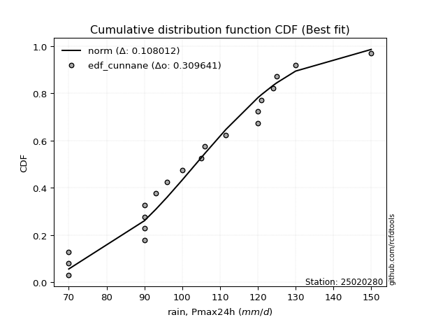</img></img>

</div>


### 12. Empirical - EDF Adamowski (1981)

The Adamowski formula in hydrology refers to a specific plotting position formula used for estimating the non-parametric empirical distribution of hydrological events (like flood peaks) to calculate their return periods. This formula provides an alternative to traditional parametric methods (like the Gumbel or Log Pearson Type III distributions). 

<div align="center">


$P=(m-0.25)/(n+0.5)$


</div>


**12.1. Empirical values**

<div align="center">

|                | 0                    | 1                   | 2                   | 3                   | 4                   | 5                  | 6                   | 7                   | 8                   | 9                   | 10                  | 11                  | 12                  | 13                  | 14                  | 15                  | 16                  | 17                  | 18                  | 19                  | 20                 | 21                 | 22                 | 23                  | 24                  | 25                  | 26                 | 27            | 28                 | 29                 | 30                 | 31                 | 32                 | 33                 | 34                 | 35                 | 36                 | 37                 | 38                 | 39                 | 40                 | 41                 | 42                 | 43                 | 44                 | 45                 | 46                 | 47                 | 48                 | 49                 | 50                 | 51                 | 52                 | 53                 | 54                 |
|:---------------|:---------------------|:--------------------|:--------------------|:--------------------|:--------------------|:-------------------|:--------------------|:--------------------|:--------------------|:--------------------|:--------------------|:--------------------|:--------------------|:--------------------|:--------------------|:--------------------|:--------------------|:--------------------|:--------------------|:--------------------|:-------------------|:-------------------|:-------------------|:--------------------|:--------------------|:--------------------|:-------------------|:--------------|:-------------------|:-------------------|:-------------------|:-------------------|:-------------------|:-------------------|:-------------------|:-------------------|:-------------------|:-------------------|:-------------------|:-------------------|:-------------------|:-------------------|:-------------------|:-------------------|:-------------------|:-------------------|:-------------------|:-------------------|:-------------------|:-------------------|:-------------------|:-------------------|:-------------------|:-------------------|:-------------------|
| date           | 1986                 | 1963                | 1997                | 1995                | 2001                | 1966               | 1968                | 1989                | 1981                | 1967                | 1964                | 1976                | 2011                | 2015                | 1988                | 2013                | 2004                | 2007                | 1987                | 1991                | 1977               | 2009               | 1974               | 1990                | 1965                | 2016                | 2002               | 1972          | 1985               | 2017               | 1994               | 1971               | 1983               | 1975               | 2003               | 1992               | 2005               | 1970               | 1979               | 1973               | 2000               | 1993               | 2008               | 1998               | 2006               | 1978               | 1999               | 1980               | 2012               | 1969               | 2014               | 1984               | 1982               | 1996               | 2010               |
| x              | 55.0                 | 70.0                | 70.0                | 70.0                | 70.0                | 71.0               | 72.1625217          | 77.0                | 78.0                | 80.0                | 80.0                | 82.0                | 85.0                | 85.0                | 88.0                | 89.0                | 90.0                | 90.0                | 90.0                | 90.0                | 90.0               | 90.0               | 92.0               | 92.6                | 94.0                | 95.0                | 96.0               | 97.0          | 98.0               | 100.0              | 100.0              | 100.0              | 103.0              | 104.0              | 104.85022766727273 | 105.0              | 106.0              | 115.0              | 116.0              | 116.0              | 120.0              | 120.0              | 121.0              | 124.0              | 125.0              | 130.0              | 130.0              | 130.0              | 130.0              | 132.0              | 135.0              | 150.0              | 150.0              | 150.0              | 157.0              |
| m              | 1                    | 2                   | 3                   | 4                   | 5                   | 6                  | 7                   | 8                   | 9                   | 10                  | 11                  | 12                  | 13                  | 14                  | 15                  | 16                  | 17                  | 18                  | 19                  | 20                  | 21                 | 22                 | 23                 | 24                  | 25                  | 26                  | 27                 | 28            | 29                 | 30                 | 31                 | 32                 | 33                 | 34                 | 35                 | 36                 | 37                 | 38                 | 39                 | 40                 | 41                 | 42                 | 43                 | 44                 | 45                 | 46                 | 47                 | 48                 | 49                 | 50                 | 51                 | 52                 | 53                 | 54                 | 55                 |
| empirical_dist | edf_adamowski        | edf_adamowski       | edf_adamowski       | edf_adamowski       | edf_adamowski       | edf_adamowski      | edf_adamowski       | edf_adamowski       | edf_adamowski       | edf_adamowski       | edf_adamowski       | edf_adamowski       | edf_adamowski       | edf_adamowski       | edf_adamowski       | edf_adamowski       | edf_adamowski       | edf_adamowski       | edf_adamowski       | edf_adamowski       | edf_adamowski      | edf_adamowski      | edf_adamowski      | edf_adamowski       | edf_adamowski       | edf_adamowski       | edf_adamowski      | edf_adamowski | edf_adamowski      | edf_adamowski      | edf_adamowski      | edf_adamowski      | edf_adamowski      | edf_adamowski      | edf_adamowski      | edf_adamowski      | edf_adamowski      | edf_adamowski      | edf_adamowski      | edf_adamowski      | edf_adamowski      | edf_adamowski      | edf_adamowski      | edf_adamowski      | edf_adamowski      | edf_adamowski      | edf_adamowski      | edf_adamowski      | edf_adamowski      | edf_adamowski      | edf_adamowski      | edf_adamowski      | edf_adamowski      | edf_adamowski      | edf_adamowski      |
| empirical      | 0.013513513513513514 | 0.03153153153153153 | 0.04954954954954955 | 0.06756756756756757 | 0.08558558558558559 | 0.1036036036036036 | 0.12162162162162163 | 0.13963963963963963 | 0.15765765765765766 | 0.17567567567567569 | 0.19369369369369369 | 0.21171171171171171 | 0.22972972972972974 | 0.24774774774774774 | 0.26576576576576577 | 0.28378378378378377 | 0.30180180180180183 | 0.31981981981981983 | 0.33783783783783783 | 0.35585585585585583 | 0.3738738738738739 | 0.3918918918918919 | 0.4099099099099099 | 0.42792792792792794 | 0.44594594594594594 | 0.46396396396396394 | 0.481981981981982  | 0.5           | 0.5180180180180181 | 0.536036036036036  | 0.5540540540540541 | 0.5720720720720721 | 0.5900900900900901 | 0.6081081081081081 | 0.6261261261261262 | 0.6441441441441441 | 0.6621621621621622 | 0.6801801801801802 | 0.6981981981981982 | 0.7162162162162162 | 0.7342342342342343 | 0.7522522522522522 | 0.7702702702702703 | 0.7882882882882883 | 0.8063063063063063 | 0.8243243243243243 | 0.8423423423423423 | 0.8603603603603603 | 0.8783783783783784 | 0.8963963963963963 | 0.9144144144144144 | 0.9324324324324325 | 0.9504504504504504 | 0.9684684684684685 | 0.9864864864864865 |
| empirical_tr   | 1.0136986301369864   | 1.0325581395348837  | 1.052132701421801   | 1.072463768115942   | 1.0935960591133005  | 1.1155778894472363 | 1.1384615384615384  | 1.162303664921466   | 1.1871657754010694  | 1.2131147540983607  | 1.240223463687151   | 1.2685714285714287  | 1.2982456140350878  | 1.3293413173652695  | 1.361963190184049   | 1.3962264150943395  | 1.4322580645161291  | 1.470198675496689   | 1.510204081632653   | 1.5524475524475523  | 1.5971223021582732 | 1.6444444444444444 | 1.6946564885496185 | 1.7480314960629924  | 1.8048780487804879  | 1.8655462184873948  | 1.9304347826086956 | 2.0           | 2.074766355140187  | 2.1553398058252426 | 2.2424242424242427 | 2.336842105263158  | 2.4395604395604393 | 2.5517241379310347 | 2.6746987951807233 | 2.810126582278481  | 2.96               | 3.126760563380282  | 3.3134328358208953 | 3.523809523809524  | 3.7627118644067803 | 4.036363636363636  | 4.352941176470589  | 4.72340425531915   | 5.162790697674418  | 5.6923076923076925 | 6.342857142857141  | 7.161290322580644  | 8.222222222222223  | 9.652173913043473  | 11.684210526315788 | 14.800000000000006 | 20.181818181818162 | 31.714285714285705 | 74.00000000000014  |

</div>


**12.2. Kolmogorov-Smirnov fit test (sorted by Δ)**


<div align="center">

|                | 0                   | 1                   | 2                   | 3                    | 4                    | 5                    | 6                   | 7                    | 8                   | 9                    | 10                  | 11                   | 12                  | 13                  | 14                   | 15                  | 16                  | 17                  | 18                  | 19                  | 20                  | 21                  | 22                   | 23                   | 24                  | 25                  | 26                  | 27                  | 28                  | 29                  | 30                  | 31                  | 32                  | 33                  | 34                  | 35                  | 36                  | 37                  | 38                  | 39                  | 40                  | 41                  | 42                  | 43                  | 44                  | 45                  | 46                  | 47                  | 48                  | 49                  | 50                  | 51                  | 52                  | 53                  | 54                  | 55                  | 56                  | 57                  | 58                  | 59                    | 60                  | 61                  | 62                  | 63                  | 64                  | 65                  | 66                  | 67                  | 68                  | 69                  | 70                  | 71                  | 72                  | 73                  | 74                  | 75                  | 76                  | 77                  | 78                  | 79                  | 80                  | 81                  | 82                  | 83                  | 84                  | 85                  | 86                  | 87                  | 88                  | 89                  |
|:---------------|:--------------------|:--------------------|:--------------------|:---------------------|:---------------------|:---------------------|:--------------------|:---------------------|:--------------------|:---------------------|:--------------------|:---------------------|:--------------------|:--------------------|:---------------------|:--------------------|:--------------------|:--------------------|:--------------------|:--------------------|:--------------------|:--------------------|:---------------------|:---------------------|:--------------------|:--------------------|:--------------------|:--------------------|:--------------------|:--------------------|:--------------------|:--------------------|:--------------------|:--------------------|:--------------------|:--------------------|:--------------------|:--------------------|:--------------------|:--------------------|:--------------------|:--------------------|:--------------------|:--------------------|:--------------------|:--------------------|:--------------------|:--------------------|:--------------------|:--------------------|:--------------------|:--------------------|:--------------------|:--------------------|:--------------------|:--------------------|:--------------------|:--------------------|:--------------------|:----------------------|:--------------------|:--------------------|:--------------------|:--------------------|:--------------------|:--------------------|:--------------------|:--------------------|:--------------------|:--------------------|:--------------------|:--------------------|:--------------------|:--------------------|:--------------------|:--------------------|:--------------------|:--------------------|:--------------------|:--------------------|:--------------------|:--------------------|:--------------------|:--------------------|:--------------------|:--------------------|:--------------------|:--------------------|:--------------------|:--------------------|
| station        | 25020280            | 25020280            | 25020280            | 25020280             | 25020280             | 25020280             | 25020280            | 25020280             | 25020280            | 25020280             | 25020280            | 25020280             | 25020280            | 25020280            | 25020280             | 25020280            | 25020280            | 25020280            | 25020280            | 25020280            | 25020280            | 25020280            | 25020280             | 25020280             | 25020280            | 25020280            | 25020280            | 25020280            | 25020280            | 25020280            | 25020280            | 25020280            | 25020280            | 25020280            | 25020280            | 25020280            | 25020280            | 25020280            | 25020280            | 25020280            | 25020280            | 25020280            | 25020280            | 25020280            | 25020280            | 25020280            | 25020280            | 25020280            | 25020280            | 25020280            | 25020280            | 25020280            | 25020280            | 25020280            | 25020280            | 25020280            | 25020280            | 25020280            | 25020280            | 25020280              | 25020280            | 25020280            | 25020280            | 25020280            | 25020280            | 25020280            | 25020280            | 25020280            | 25020280            | 25020280            | 25020280            | 25020280            | 25020280            | 25020280            | 25020280            | 25020280            | 25020280            | 25020280            | 25020280            | 25020280            | 25020280            | 25020280            | 25020280            | 25020280            | 25020280            | 25020280            | 25020280            | 25020280            | 25020280            | 25020280            |
| empirical_dist | edf_adamowski       | edf_adamowski       | edf_adamowski       | edf_adamowski        | edf_adamowski        | edf_adamowski        | edf_adamowski       | edf_adamowski        | edf_adamowski       | edf_adamowski        | edf_adamowski       | edf_adamowski        | edf_adamowski       | edf_adamowski       | edf_adamowski        | edf_adamowski       | edf_adamowski       | edf_adamowski       | edf_adamowski       | edf_adamowski       | edf_adamowski       | edf_adamowski       | edf_adamowski        | edf_adamowski        | edf_adamowski       | edf_adamowski       | edf_adamowski       | edf_adamowski       | edf_adamowski       | edf_adamowski       | edf_adamowski       | edf_adamowski       | edf_adamowski       | edf_adamowski       | edf_adamowski       | edf_adamowski       | edf_adamowski       | edf_adamowski       | edf_adamowski       | edf_adamowski       | edf_adamowski       | edf_adamowski       | edf_adamowski       | edf_adamowski       | edf_adamowski       | edf_adamowski       | edf_adamowski       | edf_adamowski       | edf_adamowski       | edf_adamowski       | edf_adamowski       | edf_adamowski       | edf_adamowski       | edf_adamowski       | edf_adamowski       | edf_adamowski       | edf_adamowski       | edf_adamowski       | edf_adamowski       | edf_adamowski         | edf_adamowski       | edf_adamowski       | edf_adamowski       | edf_adamowski       | edf_adamowski       | edf_adamowski       | edf_adamowski       | edf_adamowski       | edf_adamowski       | edf_adamowski       | edf_adamowski       | edf_adamowski       | edf_adamowski       | edf_adamowski       | edf_adamowski       | edf_adamowski       | edf_adamowski       | edf_adamowski       | edf_adamowski       | edf_adamowski       | edf_adamowski       | edf_adamowski       | edf_adamowski       | edf_adamowski       | edf_adamowski       | edf_adamowski       | edf_adamowski       | edf_adamowski       | edf_adamowski       | edf_adamowski       |
| p_dist         | rayleigh            | erlang              | gamma               | chi2                 | fatiguelife          | logrice              | logjohnsonsu        | logloggamma          | logpearson3         | lognakagami          | logt                | logexponnorm         | lognorm             | lognorm             | logcrystalball       | loglognorm          | f                   | logerlang           | logncf              | loggamma            | loggamma            | johnsonsu           | logf                 | invgamma             | logfatiguelife      | alpha               | loginvgamma         | logalpha            | logbetaprime        | invgauss            | nct                 | invweibull          | betaprime           | logweibull_min      | lognct              | genlogistic         | kstwobign           | loginvgauss         | maxwell             | logmaxwell          | weibull_min         | rice                | pearson3            | fisk                | mielke              | loggenlogistic      | logmielke           | logfisk             | exponnorm           | lograyleigh         | gumbel_r            | loglogistic         | laplace_asymmetric  | loggompertz         | nakagami            | moyal               | halfnorm            | loghypsecant        | loginvweibull       | loglaplace_asymmetric | loggumbel_r         | norm                | crystalball         | truncnorm           | t                   | logistic            | logmoyal            | loglaplace          | hypsecant           | halflogistic        | loghalflogistic     | loghalfnorm         | logkstwobign        | loggumbel_l         | laplace             | loggenexpon         | gumbel_l            | wald                | logwald             | loggibrat           | ncf                 | gibrat              | expon               | pareto              | genexpon            | logtruncnorm        | logexpon            | logpareto           | logchi2             | gompertz            |
| delta          | 0.05735989108283868 | 0.0588718487505584  | 0.05887193885393871 | 0.058871950540924534 | 0.060422134397521754 | 0.060606972515839685 | 0.06066208322386679 | 0.060707519916960107 | 0.06082518654657798 | 0.061155970913255975 | 0.06119234244161853 | 0.061198157591855984 | 0.06119897752083481 | 0.06119897752083481 | 0.061199261232500635 | 0.061200171728786   | 0.06120305351205291 | 0.06150039535058749 | 0.06159730591267476 | 0.06161670605239    | 0.06161670605239    | 0.06180500307261616 | 0.061839703618573605 | 0.062029334890047694 | 0.06265967387417848 | 0.06278201670230033 | 0.06283184291216526 | 0.06314625564512377 | 0.0636662253764283  | 0.06405308616948102 | 0.0643692779910714  | 0.06495680805957404 | 0.06505638413546311 | 0.06523468832265422 | 0.06609335621005552 | 0.06653537616742455 | 0.06779423863862949 | 0.06837942284127929 | 0.06896741984557253 | 0.0701220680093213  | 0.07210938952107804 | 0.07217386634691841 | 0.07221321630160893 | 0.0733690136202253  | 0.07362589234050043 | 0.07363003519101219 | 0.07381628230100057 | 0.07384802158878057 | 0.07494852069216684 | 0.07876234244055985 | 0.07987847486223043 | 0.08291404527248591 | 0.08780212117202091 | 0.08790735030934249 | 0.0928674567929827  | 0.09548052418306885 | 0.09558583120712628 | 0.09691595377616569 | 0.09965589807183123 | 0.10029370703914575   | 0.10122112119677318 | 0.10297903963870181 | 0.1029790400808418  | 0.10297904267007418 | 0.10303540180152732 | 0.10717921528063962 | 0.11476700498421522 | 0.11794069650819161 | 0.12011508972964918 | 0.12162162162162163 | 0.12162162162162163 | 0.12162162162162163 | 0.1260184159759648  | 0.1272291665861317  | 0.14587196684763068 | 0.1676834301658377  | 0.17358748796868217 | 0.19303396351637955 | 0.19322038481857748 | 0.21171171171171171 | 0.21749486946638852 | 0.23508698884289297 | 0.24330690869878854 | 0.24330693076114837 | 0.2437435680678216  | 0.29459570737241264 | 0.30428337893046603 | 0.30428338650640563 | 0.31622774688725036 | 0.8590476666277667  |
| deltao         | 0.18338236259000185 | 0.18338236259000185 | 0.18338236259000185 | 0.18338236259000185  | 0.18338236259000185  | 0.18338236259000185  | 0.18338236259000185 | 0.18338236259000185  | 0.18338236259000185 | 0.18338236259000185  | 0.18338236259000185 | 0.18338236259000185  | 0.18338236259000185 | 0.18338236259000185 | 0.18338236259000185  | 0.18338236259000185 | 0.18338236259000185 | 0.18338236259000185 | 0.18338236259000185 | 0.18338236259000185 | 0.18338236259000185 | 0.18338236259000185 | 0.18338236259000185  | 0.18338236259000185  | 0.18338236259000185 | 0.18338236259000185 | 0.18338236259000185 | 0.18338236259000185 | 0.18338236259000185 | 0.18338236259000185 | 0.18338236259000185 | 0.18338236259000185 | 0.18338236259000185 | 0.18338236259000185 | 0.18338236259000185 | 0.18338236259000185 | 0.18338236259000185 | 0.18338236259000185 | 0.18338236259000185 | 0.18338236259000185 | 0.18338236259000185 | 0.18338236259000185 | 0.18338236259000185 | 0.18338236259000185 | 0.18338236259000185 | 0.18338236259000185 | 0.18338236259000185 | 0.18338236259000185 | 0.18338236259000185 | 0.18338236259000185 | 0.18338236259000185 | 0.18338236259000185 | 0.18338236259000185 | 0.18338236259000185 | 0.18338236259000185 | 0.18338236259000185 | 0.18338236259000185 | 0.18338236259000185 | 0.18338236259000185 | 0.18338236259000185   | 0.18338236259000185 | 0.18338236259000185 | 0.18338236259000185 | 0.18338236259000185 | 0.18338236259000185 | 0.18338236259000185 | 0.18338236259000185 | 0.18338236259000185 | 0.18338236259000185 | 0.18338236259000185 | 0.18338236259000185 | 0.18338236259000185 | 0.18338236259000185 | 0.18338236259000185 | 0.18338236259000185 | 0.18338236259000185 | 0.18338236259000185 | 0.18338236259000185 | 0.18338236259000185 | 0.18338236259000185 | 0.18338236259000185 | 0.18338236259000185 | 0.18338236259000185 | 0.18338236259000185 | 0.18338236259000185 | 0.18338236259000185 | 0.18338236259000185 | 0.18338236259000185 | 0.18338236259000185 | 0.18338236259000185 |
| eval           | Δo > Δ              | Δo > Δ              | Δo > Δ              | Δo > Δ               | Δo > Δ               | Δo > Δ               | Δo > Δ              | Δo > Δ               | Δo > Δ              | Δo > Δ               | Δo > Δ              | Δo > Δ               | Δo > Δ              | Δo > Δ              | Δo > Δ               | Δo > Δ              | Δo > Δ              | Δo > Δ              | Δo > Δ              | Δo > Δ              | Δo > Δ              | Δo > Δ              | Δo > Δ               | Δo > Δ               | Δo > Δ              | Δo > Δ              | Δo > Δ              | Δo > Δ              | Δo > Δ              | Δo > Δ              | Δo > Δ              | Δo > Δ              | Δo > Δ              | Δo > Δ              | Δo > Δ              | Δo > Δ              | Δo > Δ              | Δo > Δ              | Δo > Δ              | Δo > Δ              | Δo > Δ              | Δo > Δ              | Δo > Δ              | Δo > Δ              | Δo > Δ              | Δo > Δ              | Δo > Δ              | Δo > Δ              | Δo > Δ              | Δo > Δ              | Δo > Δ              | Δo > Δ              | Δo > Δ              | Δo > Δ              | Δo > Δ              | Δo > Δ              | Δo > Δ              | Δo > Δ              | Δo > Δ              | Δo > Δ                | Δo > Δ              | Δo > Δ              | Δo > Δ              | Δo > Δ              | Δo > Δ              | Δo > Δ              | Δo > Δ              | Δo > Δ              | Δo > Δ              | Δo > Δ              | Δo > Δ              | Δo > Δ              | Δo > Δ              | Δo > Δ              | Δo > Δ              | Δo > Δ              | Δo > Δ              | Δo <= Δ             | Δo <= Δ             | Δo <= Δ             | Δo <= Δ             | Δo <= Δ             | Δo <= Δ             | Δo <= Δ             | Δo <= Δ             | Δo <= Δ             | Δo <= Δ             | Δo <= Δ             | Δo <= Δ             | Δo <= Δ             |
| fit            | 1                   | 1                   | 1                   | 1                    | 1                    | 1                    | 1                   | 1                    | 1                   | 1                    | 1                   | 1                    | 1                   | 1                   | 1                    | 1                   | 1                   | 1                   | 1                   | 1                   | 1                   | 1                   | 1                    | 1                    | 1                   | 1                   | 1                   | 1                   | 1                   | 1                   | 1                   | 1                   | 1                   | 1                   | 1                   | 1                   | 1                   | 1                   | 1                   | 1                   | 1                   | 1                   | 1                   | 1                   | 1                   | 1                   | 1                   | 1                   | 1                   | 1                   | 1                   | 1                   | 1                   | 1                   | 1                   | 1                   | 1                   | 1                   | 1                   | 1                     | 1                   | 1                   | 1                   | 1                   | 1                   | 1                   | 1                   | 1                   | 1                   | 1                   | 1                   | 1                   | 1                   | 1                   | 1                   | 1                   | 1                   | 0                   | 0                   | 0                   | 0                   | 0                   | 0                   | 0                   | 0                   | 0                   | 0                   | 0                   | 0                   | 0                   |
| n              | 55                  | 55                  | 55                  | 55                   | 55                   | 55                   | 55                  | 55                   | 55                  | 55                   | 55                  | 55                   | 55                  | 55                  | 55                   | 55                  | 55                  | 55                  | 55                  | 55                  | 55                  | 55                  | 55                   | 55                   | 55                  | 55                  | 55                  | 55                  | 55                  | 55                  | 55                  | 55                  | 55                  | 55                  | 55                  | 55                  | 55                  | 55                  | 55                  | 55                  | 55                  | 55                  | 55                  | 55                  | 55                  | 55                  | 55                  | 55                  | 55                  | 55                  | 55                  | 55                  | 55                  | 55                  | 55                  | 55                  | 55                  | 55                  | 55                  | 55                    | 55                  | 55                  | 55                  | 55                  | 55                  | 55                  | 55                  | 55                  | 55                  | 55                  | 55                  | 55                  | 55                  | 55                  | 55                  | 55                  | 55                  | 55                  | 55                  | 55                  | 55                  | 55                  | 55                  | 55                  | 55                  | 55                  | 55                  | 55                  | 55                  | 55                  |
| best_fit       | 1                   | 0                   | 0                   | 0                    | 0                    | 0                    | 0                   | 0                    | 0                   | 0                    | 0                   | 0                    | 0                   | 0                   | 0                    | 0                   | 0                   | 0                   | 0                   | 0                   | 0                   | 0                   | 0                    | 0                    | 0                   | 0                   | 0                   | 0                   | 0                   | 0                   | 0                   | 0                   | 0                   | 0                   | 0                   | 0                   | 0                   | 0                   | 0                   | 0                   | 0                   | 0                   | 0                   | 0                   | 0                   | 0                   | 0                   | 0                   | 0                   | 0                   | 0                   | 0                   | 0                   | 0                   | 0                   | 0                   | 0                   | 0                   | 0                   | 0                     | 0                   | 0                   | 0                   | 0                   | 0                   | 0                   | 0                   | 0                   | 0                   | 0                   | 0                   | 0                   | 0                   | 0                   | 0                   | 0                   | 0                   | 0                   | 0                   | 0                   | 0                   | 0                   | 0                   | 0                   | 0                   | 0                   | 0                   | 0                   | 0                   | 0                   |
| best_fit_sort  | 1                   | 2                   | 3                   | 4                    | 5                    | 6                    | 7                   | 8                    | 9                   | 10                   | 11                  | 12                   | 13                  | 14                  | 15                   | 16                  | 17                  | 18                  | 19                  | 20                  | 21                  | 22                  | 23                   | 24                   | 25                  | 26                  | 27                  | 28                  | 29                  | 30                  | 31                  | 32                  | 33                  | 34                  | 35                  | 36                  | 37                  | 38                  | 39                  | 40                  | 41                  | 42                  | 43                  | 44                  | 45                  | 46                  | 47                  | 48                  | 49                  | 50                  | 51                  | 52                  | 53                  | 54                  | 55                  | 56                  | 57                  | 58                  | 59                  | 60                    | 61                  | 62                  | 63                  | 64                  | 65                  | 66                  | 67                  | 68                  | 69                  | 70                  | 71                  | 72                  | 73                  | 74                  | 75                  | 76                  | 77                  | 78                  | 79                  | 80                  | 81                  | 82                  | 83                  | 84                  | 85                  | 86                  | 87                  | 88                  | 89                  | 90                  |

</div>


<div align="center">

</img>

</div>


**12.3. Best fit**

<div align="center">

|   id |   station | empirical_dist   | p_dist   |     delta |   deltao | eval   |   fit |   n |   best_fit |   best_fit_sort |
|-----:|----------:|:-----------------|:---------|----------:|---------:|:-------|------:|----:|-----------:|----------------:|
|    0 |  25020280 | edf_adamowski    | rayleigh | 0.0573599 | 0.183382 | Δo > Δ |     1 |  55 |          1 |               1 |

</div>


<div align="center">

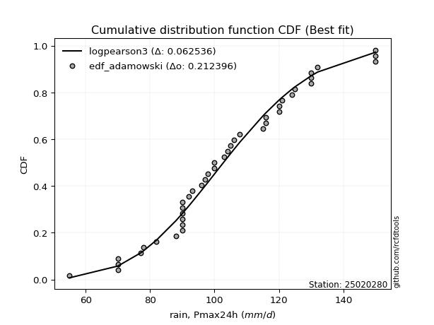</img></img>

</div>


## C. Best fit & Estimate extreme values for specific return periods - Tr


### 1. Best fit (ordered by delta Δ)

<div align="center">

|   id |   station | empirical_dist   | p_dist     |     delta |   deltao | eval   |   fit |   n |   best_fit |   best_fit_sort |
|-----:|----------:|:-----------------|:-----------|----------:|---------:|:-------|------:|----:|-----------:|----------------:|
|    0 |  25020280 | edf_california   | invweibull | 0.0542279 | 0.183382 | Δo > Δ |     1 |  55 |          1 |               1 |
|    1 |  25020280 | edf_weibull      | rayleigh   | 0.0567164 | 0.183382 | Δo > Δ |     1 |  55 |          1 |               2 |
|    2 |  25020280 | edf_adamowski    | rayleigh   | 0.0573599 | 0.183382 | Δo > Δ |     1 |  55 |          1 |               3 |
|    3 |  25020280 | edf_chegodayev   | rayleigh   | 0.05749   | 0.183382 | Δo > Δ |     1 |  55 |          1 |               4 |
|    4 |  25020280 | edf_jenkinson    | rayleigh   | 0.0575161 | 0.183382 | Δo > Δ |     1 |  55 |          1 |               5 |
|    5 |  25020280 | edf_beard        | rayleigh   | 0.0575161 | 0.183382 | Δo > Δ |     1 |  55 |          1 |               6 |
|    6 |  25020280 | edf_filliben     | rayleigh   | 0.0575356 | 0.183382 | Δo > Δ |     1 |  55 |          1 |               7 |
|    7 |  25020280 | edf_tukey        | rayleigh   | 0.057577  | 0.183382 | Δo > Δ |     1 |  55 |          1 |               8 |
|    8 |  25020280 | edf_blom         | rayleigh   | 0.057686  | 0.183382 | Δo > Δ |     1 |  55 |          1 |               9 |
|    9 |  25020280 | edf_cunnane      | rayleigh   | 0.0577516 | 0.183382 | Δo > Δ |     1 |  55 |          1 |              10 |
|   10 |  25020280 | edf_gringorten   | rayleigh   | 0.0578568 | 0.183382 | Δo > Δ |     1 |  55 |          1 |              11 |
|   11 |  25020280 | edf_hazen        | rayleigh   | 0.0580151 | 0.183382 | Δo > Δ |     1 |  55 |          1 |              12 |

</div>

:file_folder:Tables: [bestfit_25020280.csv](table/bestfit_25020280.csv) | [extreme_25020280.csv](table/extreme_25020280.csv)


### 2. Extreme values

In hydrology, a return period (or recurrence interval $Tr$) is the statistical average time between extreme events like floods or droughts of a specific magnitude, indicating how rare an event is, with a 100-year flood, for example, having a 1% chance of occurring in any given year, not that it happens exactly every century. It is a key tool for infrastructure design (like bridges or dams) and risk assessment, calculated from historical data to determine the probability of future events, although it is important to remember it is statistical average, and events can cluster or be missed.

> risk_rate: assuming the return period as the project useful life.

|   id |      tr |   prob_l |     prob_g |    alpha |   betaprime |     chi2 |   crystalball |   erlang |    expon |   exponnorm |        f |   fatiguelife |     fisk |    gamma |   genexpon |   genlogistic |   gibrat |   gompertz |   gumbel_l |   gumbel_r |   halflogistic |   halfnorm |   hypsecant |   invgamma |   invgauss |   invweibull |   johnsonsu |   kstwobign |   laplace |   laplace_asymmetric |   loggamma |   logistic |   lognorm |   maxwell |   mielke |   moyal |   nakagami |     ncf |      nct |    norm |   pareto |   pearson3 |   rayleigh |    rice |       t |   truncnorm |     wald |   weibull_min |   logalpha |   logbetaprime |          logchi2 |   logcrystalball |   logerlang |   logexpon |   logexponnorm |    logf |   logfatiguelife |   logfisk |   loggenexpon |   loggenlogistic |   loggibrat |   loggompertz |   loggumbel_l |   loggumbel_r |   loghalflogistic |   loghalfnorm |   loghypsecant |   loginvgamma |   loginvgauss |   loginvweibull |   logjohnsonsu |   logkstwobign |   loglaplace |   loglaplace_asymmetric |   logloggamma |   loglogistic |   loglognorm |   logmaxwell |   logmielke |   logmoyal |   lognakagami |   logncf |   lognct |   logpareto |   logpearson3 |   lograyleigh |   logrice |     logt |   logtruncnorm |   logwald |   logweibull_min |   station |   n |   risk_rate |
|-----:|--------:|---------:|-----------:|---------:|------------:|---------:|--------------:|---------:|---------:|------------:|---------:|--------------:|---------:|---------:|-----------:|--------------:|---------:|-----------:|-----------:|-----------:|---------------:|-----------:|------------:|-----------:|-----------:|-------------:|------------:|------------:|----------:|---------------------:|-----------:|-----------:|----------:|----------:|---------:|--------:|-----------:|--------:|---------:|--------:|---------:|-----------:|-----------:|--------:|--------:|------------:|---------:|--------------:|-----------:|---------------:|-----------------:|-----------------:|------------:|-----------:|---------------:|--------:|-----------------:|----------:|--------------:|-----------------:|------------:|--------------:|--------------:|--------------:|------------------:|--------------:|---------------:|--------------:|--------------:|----------------:|---------------:|---------------:|-------------:|------------------------:|--------------:|--------------:|-------------:|-------------:|------------:|-----------:|--------------:|---------:|---------:|------------:|--------------:|--------------:|----------:|---------:|---------------:|----------:|-----------------:|----------:|----:|------------:|
|    0 |    2    | 0.5      | 0.5        |  99.2338 |     98.5705 |  99.1484 |       101.829 |  99.1484 |  87.4596 |     98.3977 |  99.2794 |       99.0859 |  98.9309 |  99.1484 |    87.4569 |       98.3817 |  94.7487 |    142.882 |    105.705 |     97.954 |        96.0274 |    97.0007 |     101.829 |    99.1512 |    98.4607 |      97.8838 |     99.1023 |     97.7369 |   101.829 |              96.8045 |    99.0557 |    101.829 |   99.1557 |   99.8118 |   98.281 |  96.703 |    96.5235 | 102.16  |  99.0115 | 101.829 |  87.4596 |    100.008 |    99.0963 | 100.006 | 101.832 |     101.829 |  94.1828 |       100.002 |    98.5254 |        98.4989 |     90.7702      |          99.1557 |     99.0608 |    82.7517 |        99.1558 |  99.009 |           98.961 |   98.7582 |       92.6929 |          98.2812 |     92.511  |       101.046 |       102.994 |       95.4608 |           93.6757 |       94.5728 |        99.1557 |       98.7113 |       97.4844 |         95.7839 |        99.2324 |        94.7767 |      99.1557 |                 95.0238 |       99.2952 |       99.1557 |      99.1554 |      97.2145 |     98.4261 |    94.2977 |       99.1011 |  98.9823 |  98.1394 |     82.7517 |       99.2514 |       96.5356 |   98.9006 |  99.1561 |        83.4129 |   91.998  |          99.5911 |  25020280 |  55 |    0.75     |
|    1 |    2.33 | 0.570815 | 0.429185   | 103.364  |    102.729  | 103.386  |       106.039 | 103.386  |  94.6114 |    102.321  | 103.444  |      103.288  | 102.806  | 103.386  |    94.6394 |      102.498  |  96.881  |    143.628 |    109.367 |    101.855 |       100.038  |   101.544  |     105.198 |   103.306  |   102.671  |     102.119  |    103.271  |    102.247  |   104.377 |             100.424  |   103.231  |    105.538 |  103.331  |  104.185  |  102.21  | 100.395 |   101.302  | 112.344 | 103.119  | 106.039 |  94.6114 |    104.232 |   103.534  | 104.528 | 106.04  |     106.039 |  96.9429 |       104.453 |   102.714  |       102.682  |    107.469       |         103.331  |    103.238  |    90.5455 |       103.331  | 103.189 |          103.133 |  102.634  |       98.1948 |         102.21   |     94.4639 |       105.746 |       106.757 |       99.1802 |           97.4302 |       98.8785 |       102.484  |      102.889  |      101.735  |        100.495  |       103.41   |        99.8637 |     101.662  |                 98.448  |      103.473  |      102.826  |     103.331  |     101.472  |    102.333  |    97.7721 |      103.281  | 103.161  | 102.326  |     90.5455 |      103.428  |      100.826  |  103.116  | 103.332  |        91.0468 |   94.5201 |         103.912  |  25020280 |  55 |    0.729209 |
|    2 |    5    | 0.8      | 0.2        | 120.292  |    120.085  | 120.68   |       121.682 | 120.68   | 130.369  |    119.266  | 120.446  |      120.529  | 119.234  | 120.68   |   130.55   |      120.114  | 109.158  |    146.04  |    121.198 |    118.8   |       118.184  |   120.756  |     118.711 |   120.369  |   120.211  |     120.52   |    120.392  |    121.404  |   117.113 |             118.519  |   120.412  |    119.858 |  120.45   |  121.398  |  119.527 | 117.499 |   121.655  | 162.21  | 120.139  | 121.682 | 130.369  |    120.965 |   121.302  | 121.91  | 121.679 |     121.682 | 112.395  |       121.733 |   120.361  |       120.312  |    283.076       |         120.45   |    120.424  |   142.006  |       120.45   | 120.391 |          120.309 |  119.285  |      123.919  |         119.527  |    106.536  |       122.962 |       119.88  |      117.096  |          116.39   |      119.363  |       116.994  |      120.299  |      120.243  |        123.804  |       120.501  |       124.697  |     115.176  |                117.51   |      120.493  |      118.317  |     120.45   |     120.117  |    119.442  |   115.612  |      120.457  | 120.417  | 120.22   |    142.006  |      120.484  |      120.001  |  120.519  | 120.451  |       138.363  |  109.971  |         121.123  |  25020280 |  55 |    0.67232  |
|    3 |   10    | 0.9      | 0.1        | 133.126  |    133.505  | 133.54   |       132.06  | 133.54   | 162.829  |    133.545  | 133.198  |      133.478  | 132.976  | 133.54   |   163.149  |      134.289  | 123.151  |    147.383 |    127.785 |    132.602 |       133.254  |   134.973  |     129.502 |   133.282  |   133.631  |     135.507  |    133.32   |    135.99   |   128.675 |             134.946  |   133.418  |    130.405 |  133.344  |  133.512  |  134.599 | 132.39  |   136.783  | 210.049 | 133.26   | 132.06  | 162.828  |    132.989 |   133.97   | 133.772 | 132.053 |     132.06  | 128.792  |       133.636 |   134.168  |       134.11   |    755.187       |         133.344  |    133.434  |   213.659  |       133.344  | 133.417 |          133.323 |  133.488  |      146.542  |         134.598  |    122.19   |       133.981 |       127.874 |      134.054  |          134.911  |      137.207  |       130.043  |      133.716  |      135.384  |        146.73   |       133.334  |       147.669  |     128.993  |                137.992  |      133.197  |      131.199  |     133.344  |     135.257  |    134.234  |   133.775  |      133.434  | 133.543  | 134.508  |    213.659  |      133.26   |      135.862  |  133.728  | 133.344  |       197.475  |  129.139  |         133.478  |  25020280 |  55 |    0.651322 |
|    4 |   15    | 0.933333 | 0.0666667  | 140.092  |    140.861  | 140.383  |       137.238 | 140.383  | 181.816  |    141.835  | 140.052  |      140.422  | 141.114  | 140.383  |   182.218  |      142.253  | 132.804  |    147.992 |    130.768 |    140.389 |       141.782  |   142.371  |     135.66  |   140.267  |   140.903  |     143.963  |    140.292  |    143.733  |   135.438 |             144.555  |   140.444  |    136.151 |  140.285  |  139.727  |  143.693 | 141.032 |   144.665  | 240.207 | 140.466  | 137.238 | 181.816  |    139.271 |   140.498  | 139.756 | 137.23  |     137.238 | 139.322  |       139.659 |   141.79   |       141.727  |   1375.94        |         140.285  |    140.461  |   271.332  |       140.285  | 140.454 |          140.355 |  142.017  |      159.859  |         143.693  |    134.308  |       139.332 |       131.667 |      144.684  |          146.67   |      147.524  |       138.132  |      141.049  |      143.983  |        161.491  |       140.23   |       161.538  |     137.831  |                151.591  |      139.997  |      138.798  |     140.286  |     143.752  |    143.132  |   145.598  |      140.434  | 140.655  | 142.502  |    271.332  |      140.115  |      144.835  |  140.869  | 140.286  |       240.945  |  143.175  |         139.91   |  25020280 |  55 |    0.644736 |
|    5 |   20    | 0.95     | 0.05       | 144.879  |    145.94   | 145.022  |       140.63  | 145.022  | 195.288  |    147.713  | 144.729  |      145.148  | 147.027  | 145.022  |   195.748  |      147.821  | 140.375  |    148.37  |    132.625 |    145.842 |       147.757  |   147.303  |     140.004 |   145.053  |   145.882  |     149.884  |    145.059  |    148.949  |   140.236 |             151.372  |   145.251  |    140.123 |  145.025  |  143.852  |  150.361 | 147.152 |   149.921  | 262.804 | 145.451  | 140.63  | 195.288  |    143.488 |   144.836  | 143.693 | 140.62  |     140.63  | 147.169  |       143.625 |   147.072  |       147.006  |   2123.72        |         145.025  |    145.27   |   321.466  |       145.025  | 145.27  |          145.169 |  148.268  |      169.411  |         150.362  |    144.65   |       142.781 |       134.085 |      152.625  |          155.513  |      154.83   |       144.139  |      146.1    |      150.04   |        172.702  |       144.934  |       171.607  |     144.467  |                162.045  |      144.626  |      144.306  |     145.026  |     149.682  |    149.647  |   154.598  |      145.22   | 145.53   | 148.086  |    321.466  |      144.786  |      151.126  |  145.756  | 145.026  |       276.458  |  154.618  |         144.216  |  25020280 |  55 |    0.641514 |
|    6 |   25    | 0.96     | 0.04       | 148.524  |    149.817  | 148.516  |       143.126 | 148.516  | 205.738  |    152.272  | 148.272  |      148.721  | 151.716  | 148.516  |   206.243  |      152.107  | 146.687  |    148.64  |    133.947 |    150.041 |       152.36   |   150.973  |     143.367 |   148.688  |   149.658  |     154.444  |    148.673  |    152.857  |   143.958 |             156.66   |   148.898  |    143.161 |  148.617  |  146.915  |  155.682 | 151.896 |   153.833  | 281.091 | 149.265  | 143.126 | 205.738  |    146.644 |   148.06   | 146.6   | 143.116 |     143.126 | 153.454  |       146.554 |   151.116  |       151.048  |   2985.63        |         148.617  |    148.918  |   366.649  |       148.617  | 148.924 |          148.822 |  153.257  |      176.896  |         155.684  |    153.876  |       145.293 |       135.832 |      159.037  |          162.689  |      160.5    |       148.967  |      149.951  |      154.732  |        181.865  |       148.495  |       179.559  |     149.834  |                170.647  |      148.124  |      148.667  |     148.618  |     154.242  |    154.84   |   161.954  |      148.849  | 149.233  | 152.386  |    366.649  |      148.32   |      155.975  |  149.464  | 148.618  |       306.966  |  164.439  |         147.433  |  25020280 |  55 |    0.639603 |
|    7 |   50    | 0.98     | 0.02       | 159.576  |    161.617  | 158.901  |       150.275 | 158.901  | 238.197  |    166.434  | 158.909  |      159.397  | 166.983  | 158.901  |   238.842  |      165.295  | 168.937  |    149.371 |    137.534 |    162.978 |       166.544  |   161.641  |     153.791 |   159.653  |   161.013  |     168.492  |    159.54   |    164.33   |   155.52  |             173.087  |   159.874  |    152.444 |  159.402  |  155.796  |  173.178 | 166.624 |   165.203  | 342.656 | 160.923  | 150.275 | 238.197  |    155.93  |   157.417  | 154.957 | 150.263 |     150.275 | 173.975  |       154.976 |   163.481  |       163.403  |   8757.02        |         159.402  |    159.898  |   551.651  |       159.402  | 159.923 |          159.82  |  169.702  |      200.662  |         173.183  |    191.354  |       152.353 |       140.691 |      180.533  |          186.948  |      178.187  |       164.988  |      161.638  |      169.357  |        213.261  |       159.175  |       205.102  |     167.808  |                200.391  |      158.587  |      162.825  |     159.403  |     168.268  |    171.888  |   187.098  |      159.763  | 160.404  | 165.66   |    551.651  |      158.907  |      170.953  |  160.626  | 159.403  |       420.649  |  201.063  |         156.865  |  25020280 |  55 |    0.63583  |
|    8 |   75    | 0.986667 | 0.0133333  | 165.913  |    168.405  | 164.707  |       154.111 | 164.707  | 257.185  |    174.718  | 164.931  |      165.405  | 176.487  | 164.707  |   257.911  |      172.955  | 183.965  |    149.741 |    139.347 |    170.498 |       174.789  |   167.447  |     159.882 |   165.897  |   167.444  |     176.657  |    165.701  |    170.642  |   162.283 |             182.696  |   166.105  |    157.805 |  165.507  |  160.625  |  184.187 | 175.236 |   171.392  | 382.408 | 167.669  | 154.111 | 257.185  |    161.065 |   162.508  | 159.459 | 154.097 |     154.111 | 186.603  |       159.511 |   170.629  |       170.545  |  16600.9         |         165.507  |    166.13   |   700.56   |       165.508  | 166.168 |          166.066 |  180.091  |      214.981  |         184.195  |    221.705  |       156.062 |       143.214 |      194.338  |          202.679  |      188.621  |       175.137  |      168.336  |      178.003  |        233.944  |       165.212  |       220.673  |     179.306  |                220.138  |      164.483  |      171.608  |     165.51   |     176.422  |    182.596  |   203.574  |      165.951  | 166.762  | 173.423  |    700.56   |      164.883  |      179.697  |  166.962  | 165.509  |       502.501  |  227.546  |         162.059  |  25020280 |  55 |    0.634587 |
|    9 |  100    | 0.99     | 0.01       | 170.374  |    173.189  | 168.727  |       156.705 | 168.727  | 270.657  |    180.595  | 169.136  |      169.581  | 183.52   | 168.727  |   271.441  |      178.375  | 195.606  |    149.983 |    140.534 |    175.82  |       180.625  |   171.403  |     164.203 |   170.271  |   171.931  |     182.436  |    170.006  |    174.967  |   167.082 |             189.513  |   170.461  |    161.59  |  169.769  |  163.914  |  192.384 | 181.346 |   175.609  | 412.48  | 172.443  | 156.705 | 270.657  |    164.6   |   165.976  | 162.511 | 156.691 |     156.705 | 195.81   |       162.583 |   175.682  |       175.593  |  26231.2         |         169.769  |    170.488  |   830.002  |       169.769  | 170.534 |          170.434 |  187.853  |      225.349  |         192.395  |    248.488  |       158.54  |       144.889 |      204.742  |          214.606  |      196.076  |       182.713  |      173.046  |      184.199  |        249.784  |       169.422  |       232.02   |     187.939  |                235.319  |      168.587  |      178.093  |     169.772  |     182.201  |    190.562  |   216.135  |      170.275  | 171.213  | 178.949  |    830.002  |      169.048  |      185.908  |  171.392  | 169.77   |       568.543  |  249.028  |         165.625  |  25020280 |  55 |    0.633968 |
|   10 |  200    | 0.995    | 0.005      | 181.057  |    184.657  | 178.128  |       162.59  | 178.128  | 303.117  |    194.757  | 179.084  |      179.397  | 201.548  | 178.128  |   304.04   |      191.401  | 227.278  |    150.508 |    143.113 |    188.615 |       194.655  |   180.451  |     174.613 |   180.671  |   182.528  |     196.33   |    180.197  |    184.929  |   178.643 |             205.94   |   180.785  |    170.67  |  179.847  |  171.439  |  213.58  | 196.067 |   185.252  | 492     | 183.961  | 162.59  | 303.117  |    172.8   |   173.911  | 169.45  | 162.574 |     162.59  | 218.743  |       169.561 |   187.843  |       187.739  |  79815.4         |         179.847  |    180.815  |  1248.8    |       179.848  | 180.884 |          180.79  |  208.038  |      251.101  |         213.599  |    338.888  |       164.07  |       148.597 |      232.091  |          246.234  |      214.255  |       202.335  |      184.298  |      199.389  |        292.393  |       179.366  |       260.422  |     210.485  |                276.335  |      178.254  |      194.666  |     179.851  |     196.144  |    211.129  |   249.675  |      180.513  | 181.786  | 192.378  |   1248.8    |      178.873  |      200.941  |  181.887  | 179.849  |       759.141  |  311.774  |         173.871  |  25020280 |  55 |    0.633042 |
|   11 |  250    | 0.996    | 0.004      | 184.489  |    188.342  | 181.08   |       164.389 | 181.08   | 313.566  |    199.316  | 182.242  |      182.493  | 207.702  | 181.08   |   314.534  |      195.588  | 238.642  |    150.663 |    143.871 |    192.728 |       199.165  |   183.234  |     177.965 |   183.987  |   185.885  |     200.796  |    183.434  |    188.012  |   182.365 |             211.228  |   184.068  |    173.585 |  183.045  |  173.755  |  220.872 | 200.806 |   188.218  | 519.918 | 187.684  | 164.389 | 313.566  |    175.357 |   176.354  | 171.574 | 164.372 |     164.389 | 226.33   |       171.695 |   191.764  |       191.654  | 114510           |         183.045  |    184.098  |  1424.32   |       183.045  | 184.175 |          184.083 |  215.022  |      259.637  |         220.893  |    378.797  |       165.735 |       149.706 |      241.637  |          257.361  |      220.18   |       209.09   |      187.902  |      204.368  |        307.58   |       182.518  |       269.897  |     218.304  |                291.005  |      181.311  |      200.307  |     183.049  |     200.648  |    218.195  |   261.543  |      183.765  | 185.153  | 196.746  |   1424.32   |      181.983  |      205.809  |  185.222  | 183.046  |       831.223  |  335.835  |         176.435  |  25020280 |  55 |    0.632858 |
|   12 |  500    | 0.998    | 0.002      | 195.169  |    199.799  | 190.051  |       169.722 | 190.051  | 346.026  |    213.478  | 191.951  |      191.946  | 228.003  | 190.051  |   347.133  |      208.583  | 277.915  |    151.106 |    146.046 |    205.495 |       213.165  |   191.533  |     188.374 |   194.227  |   196.171  |     214.66   |    193.387  |    197.25   |   193.927 |             227.654  |   194.168  |    182.626 |  192.866  |  180.667  |  245.11  | 215.527 |   197.062  | 614.707 | 199.338  | 169.722 | 346.026  |    183.081 |   183.642  | 177.886 | 169.704 |     169.722 | 250.454  |       178.028 |   203.997  |       203.866  | 353851           |         192.866  |    194.202  |  2143      |       192.866  | 194.302 |          194.221 |  238.393  |      286.97   |         245.143  |    556.544  |       170.608 |       152.931 |      273.841  |          295.202  |      238.834  |       231.544  |      199.07   |      220.159  |        359.925  |       192.187  |       300.408  |     244.492  |                341.727  |      190.667  |      218.862  |     192.871  |     214.71   |    241.656  |   302.129  |      193.765  | 195.536  | 210.495  |   2143      |      191.516  |      221.045  |  195.484  | 192.867  |      1094.36   |  425.388  |         184.158  |  25020280 |  55 |    0.632489 |
|   13 |  750    | 0.998667 | 0.00133333 | 201.449  |    206.525  | 195.176  |       172.685 | 195.176  | 365.014  |    221.762  | 197.574  |      197.375  | 240.767  | 195.176  |   366.202  |      216.179  | 303.888  |    151.343 |    147.209 |    212.959 |       221.349  |   196.169  |     194.463 |   200.189  |   202.103  |     222.764  |    199.152  |    202.44   |   200.69  |             237.263  |   200.025  |    187.908 |  198.547  |  184.533  |  260.486 | 224.138 |   202.001  | 676.358 | 206.236  | 172.685 | 365.014  |    187.463 |   187.718  | 181.398 | 172.666 |     172.685 | 264.918  |       181.546 |   211.206  |       211.06   | 687545           |         198.547  |    200.06   |  2721.47   |       198.548  | 200.175 |          200.102 |  253.346  |      303.558  |         260.528  |    717.803  |       173.274 |       154.683 |      294.619  |          319.851  |      249.936  |       245.78   |      205.6    |      229.642  |        394.561  |       197.773  |       319.037  |     261.245  |                375.403  |      196.058  |      230.489  |     198.553  |     223      |    256.518  |   328.73   |      199.558  | 201.57   | 218.682  |   2721.47   |      197.018  |      230.051  |  201.432  | 198.549  |      1279.71   |  490.159  |         188.526  |  25020280 |  55 |    0.632366 |
|   14 | 1000    | 0.999    | 0.001      | 205.928  |    211.314  | 198.764  |       174.725 | 198.764  | 378.486  |    227.639  | 201.545  |      201.187  | 250.247  | 198.764  |   379.732  |      221.567  | 323.764  |    151.503 |    147.991 |    218.253 |       227.154  |   199.371  |     198.783 |   204.413  |   206.279  |     228.513  |    203.222  |    206.036  |   205.488 |             244.081  |   204.163  |    191.654 |  202.556  |  187.205  |  271.972 | 230.248 |   205.413  | 723.152 | 211.173  | 174.725 | 378.486  |    190.519 |   190.534  | 183.819 | 174.705 |     174.725 | 275.323  |       183.969 |   216.351  |       216.194  |      1.10333e+06 |         202.556  |    204.199  |  3224.31   |       202.556  | 204.326 |          204.258 |  264.581  |      315.608  |         272.021  |    872.107  |       175.092 |       155.874 |      310.307  |          338.573  |      257.902  |       256.408  |      210.238  |      236.49   |        421.132  |       201.712  |       332.616  |     273.823  |                401.29   |      199.853  |      239.106  |     202.562  |     228.916  |    267.61   |   349.012  |      203.649  | 205.839  | 224.563  |   3224.31   |      200.894  |      236.489  |  205.633  | 202.558  |      1427.31   |  542.767  |         191.566  |  25020280 |  55 |    0.632305 |

<div align="center">

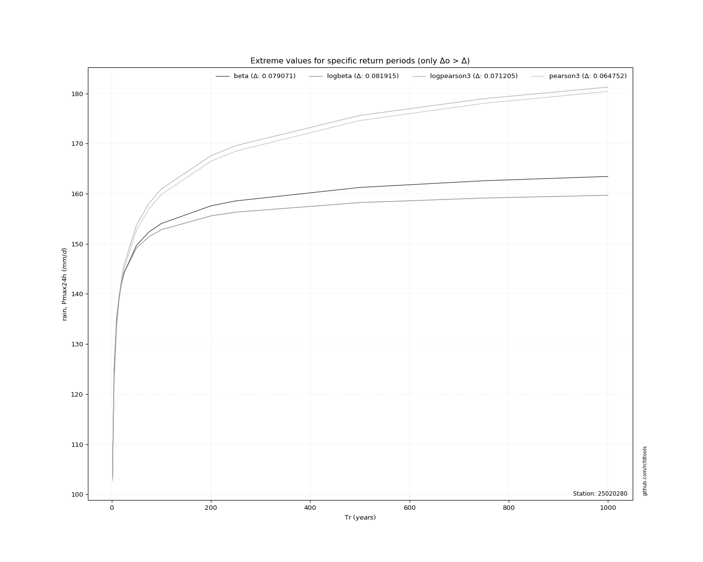</img>

</div>


<div align="center">

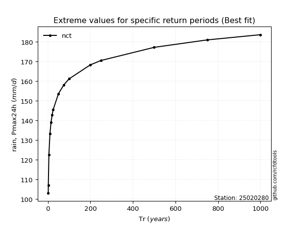</img>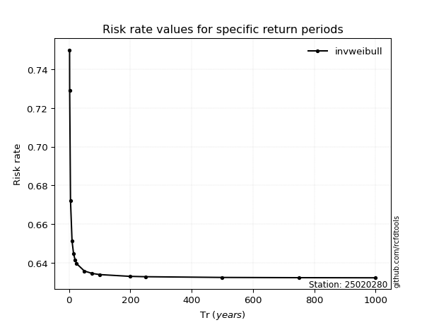</img>

</div>


<sub>**APP DISCLAIMER**: NO WARRANTY - This software is provided by [github.com/rcfdtools](https://github.com/rcfdtools) "as is", without any express or implied warranty, including warranties of merchantability, fitness for a particular purpose, or non-infringement. There is no guarantee that the software will be error-free or operate without interruption. LIMITATION OF LIABILITY - Neither the authors nor copyright holders will be liable for claims or damages arising from the software or its use. You are responsible for determining if the software is appropriate for your use and assume all associated risks, including errors, legal compliance, and data loss. NO PROFESSIONAL ADVICE - The software provides general information and does not offer professional advice. It should not replace consultation with professional advisors.</sub>