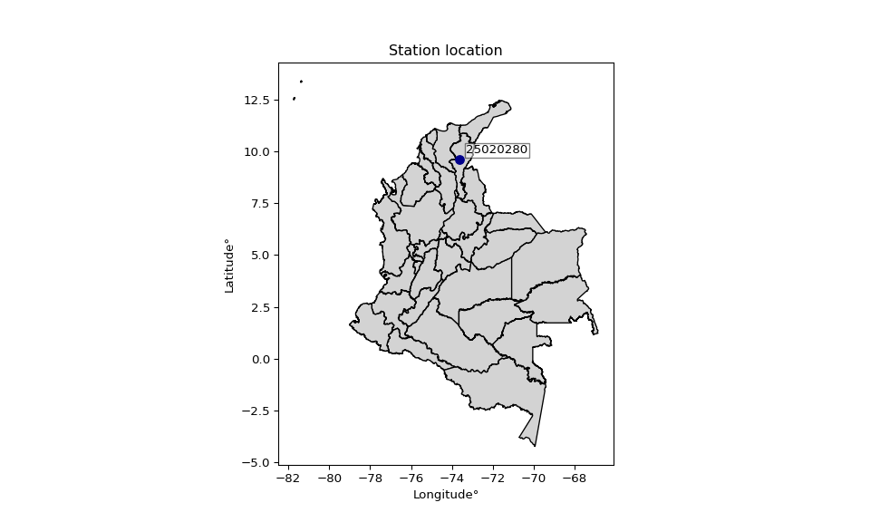
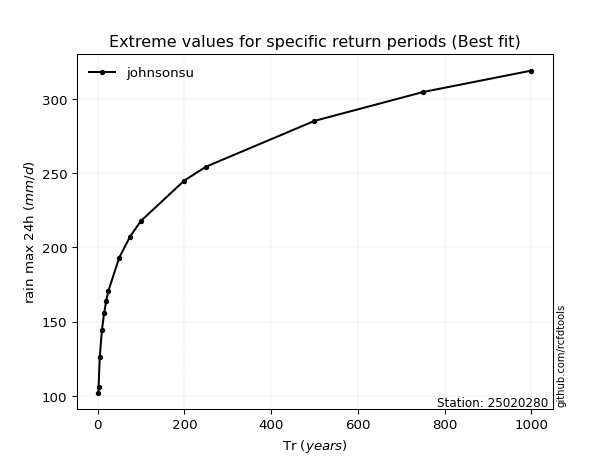

# Station (rain, Pmax24h): 25020280

## A. General information

### 1. General running parameters

●app_version: v20251220. ●runtime: 2025-12-20 08:47:51.178945. ●Stations dataset (station_dataset_file): dataset/pmax24h_in/conventional.csv. ●Stations catalog (station_catalog_file): dataset/CNE_IDEAM.xls. ●Plot only fit distributions with Δo > Δ (plot_only_fit): True. ●Eval low extreme values, if False, evaluates high extreme values (low_extreme): False. ●Eval Gumbel distribution, non include in SciPy (pdist_loggumbel_on): True. ●Eval Log-Gumbel distribution, non include in SciPy (pdist_loggumbel_on): True. ●Standard deviation normalized (ddof): 1.0. ●Return periods to eval in years (Tr): [2, 2.33, 5, 10, 15, 20, 25, 50, 75, 100, 200, 250, 500, 750, 1000]. 

### 2. Station info and location

|   id |   CODIGO | NOMBRE            | CATEGORIA     | TECNOLOGIA   | ESTADO   | FECHA_INSTALACION   |   FECHA_SUSPENSION |   ALTITUD |   LATITUD |   LONGITUD | DEPARTAMENTO   | MUNICIPIO   | AREA_OPERATIVA                                         | ENTIDAD                                                     | AREA_HIDROGRAFICA   | ZONA_HIDROGRAFICA   | SUBZONA_HIDROGRAFICA   |   CORRIENTE | OBSERVACION                                                                                                       |   SUBRED |
|-----:|---------:|:------------------|:--------------|:-------------|:---------|:--------------------|-------------------:|----------:|----------:|-----------:|:---------------|:------------|:-------------------------------------------------------|:------------------------------------------------------------|:--------------------|:--------------------|:-----------------------|------------:|:------------------------------------------------------------------------------------------------------------------|---------:|
|    0 | 25020280 | LA LOMA[25020280] | Pluviométrica | Convencional | Activa   | 15/10/1963          |                nan |        30 |   9.60653 |    -73.612 | Cesar          | El Paso     | Area Operativa 05 - Magdalena-Cesar-Guajira-San Andrés | INSTITUTO DE HIDROLOGIA METEOROLOGIA Y ESTUDIOS AMBIENTALES | Magdalena Cauca     | Cesar               | Bajo Cesar             |         nan | |14/11/2024$mvelez$Se realiza el cambio de sentido del nombre según memorando Orfeo 20243120209943 del 07/11/2024 |      nan |

Map location in: [:earth_americas:Google](http://maps.google.com/maps?q=9.606527778,-73.61197222) [:earth_americas:OSM](https://www.openstreetmap.org/#map=18/9.606527778/-73.61197222&layers=P) [:earth_americas:Bing](https://www.bing.com/maps?cp=9.606527778~-73.61197222&lvl=18) [:earth_americas:Apple](https://maps.apple.com/frame?center=9.606527778%2C-73.61197222&span=0.003%2C0.006) 
</img>

### 3. Discrete values table and plot

|       |    0 |    1 |    2 |    3 |    4 |    5 |    6 |    7 |    8 |    9 |   10 |   11 |   12 |   13 |   14 |   15 |   16 |   17 |   18 |   19 |   20 |   21 |   22 |   23 |   24 |   25 |   26 |   27 |   28 |   29 |   30 |   31 |   32 |   33 |   34 |   35 |   36 |   37 |   38 |   39 |   40 |
|:------|-----:|-----:|-----:|-----:|-----:|-----:|-----:|-----:|-----:|-----:|-----:|-----:|-----:|-----:|-----:|-----:|-----:|-----:|-----:|-----:|-----:|-----:|-----:|-----:|-----:|-----:|-----:|-----:|-----:|-----:|-----:|-----:|-----:|-----:|-----:|-----:|-----:|-----:|-----:|-----:|-----:|
| Date  | 1969 | 1970 | 1971 | 1972 | 1973 | 1974 | 1975 | 1976 | 1977 | 1978 | 1979 | 1980 | 1981 | 1982 | 1983 | 1984 | 1985 | 1986 | 1987 | 1988 | 1989 | 1990 | 1991 | 1992 | 1993 | 1994 | 1995 | 1996 | 1997 | 1998 | 1999 | 2000 | 2001 | 2002 | 2003 | 2004 | 2005 | 2006 | 2007 | 2008 | 2009 |
| Value |  132 |  115 |  100 |   97 |  116 |   92 |  104 |   82 |   90 |  130 |  116 |  130 |   78 |  150 |  103 |  150 |   98 |   55 |   90 |   88 |   77 |   93 |   90 |  105 |  120 |  100 |   70 |  150 |   70 |  124 |  130 |  120 |   70 |   96 |  271 |   90 |  106 |  125 |   90 |  121 |   90 |

</img>

## B. Active continuous probability distributions from SciPy (48 of 104 available)

|   id | p_dist             |   n_parameter | fit_method   | label                                                                       | active   | ref                                                                                                        |
|-----:|:-------------------|--------------:|:-------------|:----------------------------------------------------------------------------|:---------|:-----------------------------------------------------------------------------------------------------------|
|    0 | alpha              |             3 | MLE          | Alpha                                                                       | True     | [:mortar_board:](https://docs.scipy.org/doc/scipy/reference/generated/scipy.stats.alpha.html)              |
|    1 | betaprime          |             4 | MLE          | Beta prime                                                                  | True     | [:mortar_board:](https://docs.scipy.org/doc/scipy/reference/generated/scipy.stats.betaprime.html)          |
|    2 | chi2               |             3 | MLE          | Chi²                                                                        | True     | [:mortar_board:](https://docs.scipy.org/doc/scipy/reference/generated/scipy.stats.chi2.html)               |
|    3 | crystalball        |             4 | MLE          | Crystalball                                                                 | True     | [:mortar_board:](https://docs.scipy.org/doc/scipy/reference/generated/scipy.stats.crystalball.html)        |
|    4 | dgamma             |             3 | MLE          | Double gamma                                                                | True     | [:mortar_board:](https://docs.scipy.org/doc/scipy/reference/generated/scipy.stats.dgamma.html)             |
|    5 | erlang             |             3 | MLE          | Erlang                                                                      | True     | [:mortar_board:](https://docs.scipy.org/doc/scipy/reference/generated/scipy.stats.erlang.html)             |
|    6 | expon              |             2 | MLE          | Exponential                                                                 | True     | [:mortar_board:](https://docs.scipy.org/doc/scipy/reference/generated/scipy.stats.expon.html)              |
|    7 | exponnorm          |             3 | MLE          | Exponentially modified Normal                                               | True     | [:mortar_board:](https://docs.scipy.org/doc/scipy/reference/generated/scipy.stats.exponnorm.html)          |
|    8 | f                  |             4 | MLE          | F                                                                           | True     | [:mortar_board:](https://docs.scipy.org/doc/scipy/reference/generated/scipy.stats.f.html)                  |
|    9 | fatiguelife        |             3 | MLE          | Fatigue-life (Birnbaum-Saunders)                                            | True     | [:mortar_board:](https://docs.scipy.org/doc/scipy/reference/generated/scipy.stats.fatiguelife.html)        |
|   10 | fisk               |             3 | MLE          | Fisk                                                                        | True     | [:mortar_board:](https://docs.scipy.org/doc/scipy/reference/generated/scipy.stats.fisk.html)               |
|   11 | gamma              |             3 | MLE          | Gamma                                                                       | True     | [:mortar_board:](https://docs.scipy.org/doc/scipy/reference/generated/scipy.stats.gamma.html)              |
|   12 | genexpon           |             5 | MLE          | Generalized exponential                                                     | True     | [:mortar_board:](https://docs.scipy.org/doc/scipy/reference/generated/scipy.stats.genexpon.html)           |
|   13 | geninvgauss        |             4 | MLE          | Generalized Inverse Gaussian                                                | True     | [:mortar_board:](https://docs.scipy.org/doc/scipy/reference/generated/scipy.stats.geninvgauss.html)        |
|   14 | genlogistic        |             3 | MLE          | Generalized logistic                                                        | True     | [:mortar_board:](https://docs.scipy.org/doc/scipy/reference/generated/scipy.stats.genlogistic.html)        |
|   15 | gibrat             |             2 | MM           | Gibrat                                                                      | True     | [:mortar_board:](https://docs.scipy.org/doc/scipy/reference/generated/scipy.stats.gibrat.html)             |
|   16 | gompertz           |             3 | MLE          | Gompertz (or truncated Gumbel)                                              | True     | [:mortar_board:](https://docs.scipy.org/doc/scipy/reference/generated/scipy.stats.gompertz.html)           |
|   17 | gumbel_l           |             2 | MM           | Gumbel Left Skew                                                            | True     | [:mortar_board:](https://docs.scipy.org/doc/scipy/reference/generated/scipy.stats.gumbel_l.html)           |
|   18 | gumbel_r           |             2 | MM           | Gumbel Right Skew                                                           | True     | [:mortar_board:](https://docs.scipy.org/doc/scipy/reference/generated/scipy.stats.gumbel_r.html)           |
|   19 | halflogistic       |             2 | MM           | Half-logistic                                                               | True     | [:mortar_board:](https://docs.scipy.org/doc/scipy/reference/generated/scipy.stats.halflogistic.html)       |
|   20 | halfnorm           |             2 | MM           | Half Normal                                                                 | True     | [:mortar_board:](https://docs.scipy.org/doc/scipy/reference/generated/scipy.stats.halfnorm.html)           |
|   21 | hypsecant          |             2 | MM           | hyperbolic secant                                                           | True     | [:mortar_board:](https://docs.scipy.org/doc/scipy/reference/generated/scipy.stats.hypsecant.html)          |
|   22 | invgamma           |             3 | MLE          | Inverted gamma                                                              | True     | [:mortar_board:](https://docs.scipy.org/doc/scipy/reference/generated/scipy.stats.invgamma.html)           |
|   23 | invgauss           |             3 | MLE          | Inverse Gaussian                                                            | True     | [:mortar_board:](https://docs.scipy.org/doc/scipy/reference/generated/scipy.stats.invgauss.html)           |
|   24 | invweibull         |             3 | MLE          | Inverted Weibull                                                            | True     | [:mortar_board:](https://docs.scipy.org/doc/scipy/reference/generated/scipy.stats.invweibull.html)         |
|   25 | johnsonsu          |             4 | MLE          | Johnson Su                                                                  | True     | [:mortar_board:](https://docs.scipy.org/doc/scipy/reference/generated/scipy.stats.johnsonsu.html)          |
|   26 | kstwobign          |             2 | MLE          | Limiting distribution of scaled Kolmogorov-Smirnov two-sided test statistic | True     | [:mortar_board:](https://docs.scipy.org/doc/scipy/reference/generated/scipy.stats.kstwobign.html)          |
|   27 | laplace            |             2 | MM           | Laplace                                                                     | True     | [:mortar_board:](https://docs.scipy.org/doc/scipy/reference/generated/scipy.stats.laplace.html)            |
|   28 | laplace_asymmetric |             3 | MLE          | Asymmetric Laplace                                                          | True     | [:mortar_board:](https://docs.scipy.org/doc/scipy/reference/generated/scipy.stats.laplace_asymmetric.html) |
|   29 | loggamma           |             3 | MLE          | Log gamma                                                                   | True     | [:mortar_board:](https://docs.scipy.org/doc/scipy/reference/generated/scipy.stats.loggamma.html)           |
|   30 | logistic           |             2 | MM           | Logistic (or Sech-squared)                                                  | True     | [:mortar_board:](https://docs.scipy.org/doc/scipy/reference/generated/scipy.stats.logistic.html)           |
|   31 | lognorm            |             3 | MLE          | Log Normal                                                                  | True     | [:mortar_board:](https://docs.scipy.org/doc/scipy/reference/generated/scipy.stats.lognorm.html)            |
|   32 | maxwell            |             2 | MM           | Maxwell                                                                     | True     | [:mortar_board:](https://docs.scipy.org/doc/scipy/reference/generated/scipy.stats.maxwell.html)            |
|   33 | mielke             |             4 | MLE          | Mielke Beta-Kappa / Dagum                                                   | True     | [:mortar_board:](https://docs.scipy.org/doc/scipy/reference/generated/scipy.stats.mielke.html)             |
|   34 | moyal              |             2 | MM           | Moyal                                                                       | True     | [:mortar_board:](https://docs.scipy.org/doc/scipy/reference/generated/scipy.stats.moyal.html)              |
|   35 | nakagami           |             3 | MLE          | Nakagami                                                                    | True     | [:mortar_board:](https://docs.scipy.org/doc/scipy/reference/generated/scipy.stats.nakagami.html)           |
|   36 | ncf                |             5 | MLE          | Non-central F distribution                                                  | True     | [:mortar_board:](https://docs.scipy.org/doc/scipy/reference/generated/scipy.stats.ncf.html)                |
|   37 | nct                |             4 | MLE          | Non-central Student’s t                                                     | True     | [:mortar_board:](https://docs.scipy.org/doc/scipy/reference/generated/scipy.stats.nct.html)                |
|   38 | norm               |             2 | MM           | Normal                                                                      | True     | [:mortar_board:](https://docs.scipy.org/doc/scipy/reference/generated/scipy.stats.norm.html)               |
|   39 | pareto             |             3 | MLE          | Pareto                                                                      | True     | [:mortar_board:](https://docs.scipy.org/doc/scipy/reference/generated/scipy.stats.pareto.html)             |
|   40 | pearson3           |             3 | MM           | Pearson type III                                                            | True     | [:mortar_board:](https://docs.scipy.org/doc/scipy/reference/generated/scipy.stats.pearson3.html)           |
|   41 | rayleigh           |             2 | MM           | Rayleigh                                                                    | True     | [:mortar_board:](https://docs.scipy.org/doc/scipy/reference/generated/scipy.stats.rayleigh.html)           |
|   42 | recipinvgauss      |             3 | MLE          | Reciprocal inverse Gaussian                                                 | True     | [:mortar_board:](https://docs.scipy.org/doc/scipy/reference/generated/scipy.stats.recipinvgauss.html)      |
|   43 | rice               |             3 | MLE          | Rice                                                                        | True     | [:mortar_board:](https://docs.scipy.org/doc/scipy/reference/generated/scipy.stats.rice.html)               |
|   44 | t                  |             3 | MLE          | Student’s t                                                                 | True     | [:mortar_board:](https://docs.scipy.org/doc/scipy/reference/generated/scipy.stats.t.html)                  |
|   45 | truncnorm          |             4 | MLE          | Truncated normal                                                            | True     | [:mortar_board:](https://docs.scipy.org/doc/scipy/reference/generated/scipy.stats.truncnorm.html)          |
|   46 | wald               |             2 | MM           | Wald                                                                        | True     | [:mortar_board:](https://docs.scipy.org/doc/scipy/reference/generated/scipy.stats.wald.html)               |
|   47 | weibull_min        |             3 | MLE          | Weibull minimum                                                             | True     | [:mortar_board:](https://docs.scipy.org/doc/scipy/reference/generated/scipy.stats.weibull_min.html)        |

> Gumbel and Lob-Gumbel probability distributions are not shown in the above table.  
> n_parameter = # arguments & localization & scale.  
> Fit methods: (MLE) maximum likelihood, (MM) L-moments.

## C. Probability distributions

### Cumulative distribution values - CDF (50 evalated, ordered by x ascending) 

|   id |   Station |   date |   x |   station |   m |      alpha |   alpha_pdf |   betaprime |   betaprime_pdf |        chi2 |        chi2_pdf |   crystalball |   crystalball_pdf |    dgamma |   dgamma_pdf |     erlang |   erlang_pdf |    expon |   expon_pdf |   exponnorm |   exponnorm_pdf |          f |       f_pdf |   fatiguelife |   fatiguelife_pdf |      fisk |   fisk_pdf |      gamma |   gamma_pdf |   genexpon |   genexpon_pdf |   geninvgauss |   geninvgauss_pdf |   genlogistic |   genlogistic_pdf |     gibrat |   gibrat_pdf |    gompertz |   gompertz_pdf |   gumbel_l |   gumbel_l_pdf |   gumbel_r |   gumbel_r_pdf |   halflogistic |   halflogistic_pdf |   halfnorm |   halfnorm_pdf |   hypsecant |   hypsecant_pdf |   invgamma |   invgamma_pdf |   invgauss |   invgauss_pdf |   invweibull |   invweibull_pdf |   johnsonsu |   johnsonsu_pdf |   kstwobign |   kstwobign_pdf |   laplace |   laplace_pdf |   laplace_asymmetric |   laplace_asymmetric_pdf |   loggamma |   loggamma_pdf |   logistic |   logistic_pdf |    lognorm |   lognorm_pdf |   maxwell |   maxwell_pdf |     mielke |   mielke_pdf |      moyal |   moyal_pdf |    nakagami |   nakagami_pdf |       ncf |     ncf_pdf |        nct |     nct_pdf |      norm |    norm_pdf |      pareto |   pareto_pdf |   pearson3 |   pearson3_pdf |   rayleigh |   rayleigh_pdf |   recipinvgauss |   recipinvgauss_pdf |       rice |    rice_pdf |         t |       t_pdf |   truncnorm |   truncnorm_pdf |       wald |    wald_pdf |   weibull_min |   weibull_min_pdf |    zzgumbel |   gumbel_pdf |   zzloggumbel |   loggumbel_pdf |
|-----:|----------:|-------:|----:|----------:|----:|-----------:|------------:|------------:|----------------:|------------:|----------------:|--------------:|------------------:|----------:|-------------:|-----------:|-------------:|---------:|------------:|------------:|----------------:|-----------:|------------:|--------------:|------------------:|----------:|-----------:|-----------:|------------:|-----------:|---------------:|--------------:|------------------:|--------------:|------------------:|-----------:|-------------:|------------:|---------------:|-----------:|---------------:|-----------:|---------------:|---------------:|-------------------:|-----------:|---------------:|------------:|----------------:|-----------:|---------------:|-----------:|---------------:|-------------:|-----------------:|------------:|----------------:|------------:|----------------:|----------:|--------------:|---------------------:|-------------------------:|-----------:|---------------:|-----------:|---------------:|-----------:|--------------:|----------:|--------------:|-----------:|-------------:|-----------:|------------:|------------:|---------------:|----------:|------------:|-----------:|------------:|----------:|------------:|------------:|-------------:|-----------:|---------------:|-----------:|---------------:|----------------:|--------------------:|-----------:|------------:|----------:|------------:|------------:|----------------:|-----------:|------------:|--------------:|------------------:|------------:|-------------:|--------------:|----------------:|
|    0 |  25020280 |   1986 |  55 |  25020280 |   1 | 0.00322926 | 0.000859476 |  0.00552517 |     0.00124829  | 1.45069e-09 | 56539.5         |     0.0612648 |       0.00353445  | 0.0560124 |  0.00283767  | 0.00335994 |  0.0012207   | 0        | 0.0189027   |  0.00644118 |     0.00109785  | 0.00309997 | 0.000890644 |     0.0032347 |       0.00101593  | 0.0130835 | 0.00161425 | 0.00335699 | 0.00122015  | 0.00231656 |    0.00183366  |    0.00303557 |       0.00922782  |    0.00552586 |       0.00112738  | 0          |  0           | 8.62674e-23 |    2.2165e-23  |   0.074551 |   0.00268433   |  0.0170976 |    0.00260446  |      0         |        0           |   0        |    0           |    0.056142 |     0.00256091  | 0.00308588 |    0.000889705 | 0.00314539 |    0.000994044 |   0.00289759 |      0.00081521  |   0.0119334 |     0.00112962  |   0.0048142 |     0.00128053  | 0.0563014 |   0.0023242   |            0.0127801 |              0.00112649  |   0.070942 |    0.00374289  |   0.057273 |     0.00285868 | 0.00307487 |   0.000945098 | 0.0416597 |   0.00415198  | 0.00727171 |  0.00114885  | 0.00323163 | 0.000997177 | 0           |    0           | 0.0128283 | 0.00196857  | 0.00393091 | 0.000972142 | 0.0612648 | 0.00353445  | 3.60541e-08 |  0.0189027   |   0        |     0          |  0.0287692 |    0.00448782  |      0.00327176 |         0.0010282   | 0.00570599 | 0.00223321  | 0.0421329 | 0.00200141  |   0.0612648 |     0.00353445  | 0          | 0           |   0           |       0           | 0.000852271 |            0 |   7.57017e-06 |               0 |
|    1 |  25020280 |   1995 |  70 |  25020280 |   2 | 0.0557684  | 0.0072887   |  0.0642849  |     0.00740737  | 0.293779    |     0.0102063   |     0.13428   |       0.00631454  | 0.118879  |  0.00589243  | 0.0712483  |  0.00834052  | 0.246888 | 0.0142359   |  0.0543105  |     0.00624757  | 0.0586235  | 0.00758853  |     0.064673  |       0.00803159  | 0.0652636 | 0.00601451 | 0.071241   | 0.00834063  | 0.0991875  |    0.0102599   |    0.210446   |       0.014022    |    0.0587681  |       0.00690495  | 0          |  0           | 3.86595e-21 |    9.75854e-22 |   0.127025 |   0.00443989   |  0.0982249 |    0.00853329  |      0.0460774 |        0.0170349   |   0.104179 |    0.01392     |    0.11084  |     0.00498017  | 0.0588001  |    0.00761826  | 0.0642901  |    0.00804225  |   0.0562224  |      0.00749294  |   0.0518829 |     0.00511851  |   0.0684253 |     0.00783786  | 0.104579  |   0.00431716  |            0.0479449 |              0.00422607  |   0.145866 |    0.00633267  |   0.118495 |     0.00553035 | 0.0618572  |   0.0078633   | 0.132376  |   0.00790449  | 0.0542646  |  0.00603926  | 0.0701895  | 0.0090927   | 3.46988e-07 |    9.97628e+06 | 0.0780159 | 0.0072172   | 0.0581135  | 0.00730239  | 0.13428   | 0.00631454  | 0.246888    |  0.0142359   |   0        |     0          |  0.130333  |    0.00878927  |      0.0649554  |         0.00803491  | 0.0851553  | 0.00810351  | 0.089841  | 0.00477336  |   0.13428   |     0.00631454  | 0          | 0           |   0           |       0           | 0.017273    |            0 |   0.0234432   |               0 |
|    2 |  25020280 |   1997 |  70 |  25020280 |   3 | 0.0557684  | 0.0072887   |  0.0642849  |     0.00740737  | 0.293779    |     0.0102063   |     0.13428   |       0.00631454  | 0.118879  |  0.00589243  | 0.0712483  |  0.00834052  | 0.246888 | 0.0142359   |  0.0543105  |     0.00624757  | 0.0586235  | 0.00758853  |     0.064673  |       0.00803159  | 0.0652636 | 0.00601451 | 0.071241   | 0.00834063  | 0.0991875  |    0.0102599   |    0.210446   |       0.014022    |    0.0587681  |       0.00690495  | 0          |  0           | 3.86595e-21 |    9.75854e-22 |   0.127025 |   0.00443989   |  0.0982249 |    0.00853329  |      0.0460774 |        0.0170349   |   0.104179 |    0.01392     |    0.11084  |     0.00498017  | 0.0588001  |    0.00761826  | 0.0642901  |    0.00804225  |   0.0562224  |      0.00749294  |   0.0518829 |     0.00511851  |   0.0684253 |     0.00783786  | 0.104579  |   0.00431716  |            0.0479449 |              0.00422607  |   0.145866 |    0.00633267  |   0.118495 |     0.00553035 | 0.0618572  |   0.0078633   | 0.132376  |   0.00790449  | 0.0542646  |  0.00603926  | 0.0701895  | 0.0090927   | 3.46988e-07 |    9.97628e+06 | 0.0780159 | 0.0072172   | 0.0581135  | 0.00730239  | 0.13428   | 0.00631454  | 0.246888    |  0.0142359   |   0        |     0          |  0.130333  |    0.00878927  |      0.0649554  |         0.00803491  | 0.0851553  | 0.00810351  | 0.089841  | 0.00477336  |   0.13428   |     0.00631454  | 0          | 0           |   0           |       0           | 0.017273    |            0 |   0.0234432   |               0 |
|    3 |  25020280 |   2001 |  70 |  25020280 |   4 | 0.0557684  | 0.0072887   |  0.0642849  |     0.00740737  | 0.293779    |     0.0102063   |     0.13428   |       0.00631454  | 0.118879  |  0.00589243  | 0.0712483  |  0.00834052  | 0.246888 | 0.0142359   |  0.0543105  |     0.00624757  | 0.0586235  | 0.00758853  |     0.064673  |       0.00803159  | 0.0652636 | 0.00601451 | 0.071241   | 0.00834063  | 0.0991875  |    0.0102599   |    0.210446   |       0.014022    |    0.0587681  |       0.00690495  | 0          |  0           | 3.86595e-21 |    9.75854e-22 |   0.127025 |   0.00443989   |  0.0982249 |    0.00853329  |      0.0460774 |        0.0170349   |   0.104179 |    0.01392     |    0.11084  |     0.00498017  | 0.0588001  |    0.00761826  | 0.0642901  |    0.00804225  |   0.0562224  |      0.00749294  |   0.0518829 |     0.00511851  |   0.0684253 |     0.00783786  | 0.104579  |   0.00431716  |            0.0479449 |              0.00422607  |   0.145866 |    0.00633267  |   0.118495 |     0.00553035 | 0.0618572  |   0.0078633   | 0.132376  |   0.00790449  | 0.0542646  |  0.00603926  | 0.0701895  | 0.0090927   | 3.46988e-07 |    9.97628e+06 | 0.0780159 | 0.0072172   | 0.0581135  | 0.00730239  | 0.13428   | 0.00631454  | 0.246888    |  0.0142359   |   0        |     0          |  0.130333  |    0.00878927  |      0.0649554  |         0.00803491  | 0.0851553  | 0.00810351  | 0.089841  | 0.00477336  |   0.13428   |     0.00631454  | 0          | 0           |   0           |       0           | 0.017273    |            0 |   0.0234432   |               0 |
|    4 |  25020280 |   1989 |  77 |  25020280 |   5 | 0.121856   | 0.0115325   |  0.129064   |     0.0110352   | 0.357723    |     0.00823378  |     0.183514  |       0.00775277  | 0.167727  |  0.00817372  | 0.141285   |  0.0115202   | 0.340227 | 0.0124715   |  0.111987   |     0.0103139   | 0.126314   | 0.011653    |     0.134106  |       0.0116615   | 0.118821  | 0.00939601 | 0.141279   | 0.0115206   | 0.179167   |    0.0123981   |    0.304962   |       0.0129318   |    0.120654   |       0.0107583   | 0          |  0           | 2.26189e-20 |    5.70759e-21 |   0.161844 |   0.00553999   |  0.167709  |    0.0112108   |      0.16411   |        0.0166114   |   0.200594 |    0.0135937   |    0.151429 |     0.00668439  | 0.126713   |    0.0116827   | 0.133964   |    0.011718    |   0.123987   |      0.0117738   |   0.101626  |     0.00936776  |   0.134883  |     0.0110135   | 0.139618  |   0.00576364  |            0.08886   |              0.00783251  |   0.194762 |    0.00763464  |   0.16299  |     0.00722306 | 0.130829   |   0.011716    | 0.193115  |   0.00940061  | 0.110219   |  0.0100628   | 0.14901    | 0.0131791   | 0.34918     |    0.0203167   | 0.138905  | 0.0101475   | 0.12366    | 0.0113635   | 0.183514  | 0.00775277  | 0.340227    |  0.0124715   |   0        |     0          |  0.19696   |    0.0101717   |      0.134321   |         0.0116397   | 0.149393   | 0.010159    | 0.131039  | 0.00713878  |   0.183514  |     0.00775277  | 0.00364058 | 0.00596608  |   1.18419e-14 |       0.759082    | 0.0435871   |            0 |   0.0918739   |               0 |
|    5 |  25020280 |   1981 |  78 |  25020280 |   6 | 0.133667   | 0.0120838   |  0.140335   |     0.011504    | 0.365849    |     0.00802164  |     0.191369  |       0.00795623  | 0.17609   |  0.00855522  | 0.152993   |  0.0118923   | 0.352582 | 0.012238    |  0.122601   |     0.0109131   | 0.138225   | 0.0121635   |     0.145986  |       0.0120944   | 0.128479  | 0.00992115 | 0.152988   | 0.0118927   | 0.191673   |    0.0126107   |    0.317806   |       0.012757    |    0.131674   |       0.0112788   | 0          |  0           | 2.91111e-20 |    7.34571e-21 |   0.16747  |   0.00571273   |  0.179081  |    0.0115311   |      0.180674  |        0.0165139   |   0.214157 |    0.013531    |    0.158251 |     0.0069609   | 0.138652   |    0.0121913   | 0.145903   |    0.0121559   |   0.136033   |      0.0123131   |   0.111354  |     0.0100912   |   0.146086  |     0.0113892   | 0.145502  |   0.00600655  |            0.0970481 |              0.00855424  |   0.202488 |    0.00781744  |   0.170343 |     0.00748258 | 0.142782   |   0.012186    | 0.20261   |   0.00958831  | 0.120588   |  0.0106737   | 0.162414   | 0.0136206   | 0.368687    |    0.0187521   | 0.149249  | 0.0105397   | 0.135289   | 0.0118906   | 0.191369  | 0.00795623  | 0.352582    |  0.012238    |   0        |     0          |  0.207213  |    0.0103318   |      0.146178   |         0.0120697   | 0.159677   | 0.0104066   | 0.13838   | 0.00754744  |   0.191369  |     0.00795623  | 0.012989   | 0.0128365   |   0.0475286   |       0.0422499   | 0.0488375   |            0 |   0.105875    |               0 |
|    6 |  25020280 |   1976 |  82 |  25020280 |   7 | 0.186016   | 0.0140089   |  0.189788   |     0.013158    | 0.396406    |     0.00728289  |     0.224794  |       0.00875002  | 0.213578  |  0.0102279   | 0.203182   |  0.0131353   | 0.399729 | 0.0113468   |  0.170899   |     0.0131934   | 0.190546   | 0.0139138   |     0.197414  |       0.0135414   | 0.172396  | 0.0120321  | 0.203178   | 0.0131357   | 0.243497   |    0.0132452   |    0.367406   |       0.0120392   |    0.180672   |       0.0131588   | 1.1973e-05 |  0.000229197 | 7.98727e-20 |    2.01539e-20 |   0.191759 |   0.006442     |  0.227476  |    0.0126101   |      0.245824  |        0.0160395   |   0.267723 |    0.0132418   |    0.188421 |     0.00814373  | 0.191062   |    0.0139295   | 0.19761    |    0.0136174   |   0.189143   |      0.0141501   |   0.157669  |     0.013069    |   0.194294  |     0.0126477   | 0.171626  |   0.00708497  |            0.138073  |              0.0121704   |   0.235192 |    0.00852806  |   0.202391 |     0.00854693 | 0.194866   |   0.0137743   | 0.242353  |   0.0102619   | 0.168091   |  0.0130477   | 0.219793   | 0.0149518   | 0.434658    |    0.0146624   | 0.194361  | 0.0119771   | 0.186696   | 0.0137364   | 0.224794  | 0.00875002  | 0.399729    |  0.0113468   |   0.1118   |     0.0630754  |  0.249679  |    0.0108759   |      0.197489   |         0.0135083   | 0.203104   | 0.0112739   | 0.172097  | 0.00935548  |   0.224794  |     0.00875002  | 0.106399   | 0.0299468   |   0.190195    |       0.0311244   | 0.073968    |            0 |   0.170165    |               0 |
|    7 |  25020280 |   1988 |  88 |  25020280 |   8 | 0.276246   | 0.0158403   |  0.274251   |     0.0148199   | 0.437378    |     0.00641334  |     0.280634  |       0.00983693  | 0.283478  |  0.013143    | 0.285763   |  0.0142414   | 0.46409  | 0.0101301   |  0.258579   |     0.0158264   | 0.279479   | 0.0155173   |     0.282999  |       0.0148053   | 0.253466  | 0.0148811  | 0.285762   | 0.0142417   | 0.32439    |    0.0136102   |    0.436367   |       0.0109494   |    0.266122   |       0.0151335   | 0.175264   |  0.0414032   | 3.62988e-19 |    9.15894e-20 |   0.233955 |   0.00764345   |  0.306416  |    0.0135688   |      0.339379  |        0.0151049   |   0.345612 |    0.0127011   |    0.243056 |     0.0100928   | 0.280015   |    0.0155074   | 0.283668   |    0.0148835   |   0.279622   |      0.0157738   |   0.248276  |     0.0168854   |   0.274013  |     0.0137749   | 0.219863  |   0.00907628  |            0.234311  |              0.0206532   |   0.289337 |    0.00949625  |   0.258507 |     0.0101486  | 0.282343   |   0.0151871   | 0.306349  |   0.0110168   | 0.255588   |  0.0159247   | 0.312421   | 0.0156889   | 0.511767    |    0.011376    | 0.271462  | 0.0136036   | 0.2751     | 0.0155188   | 0.280634  | 0.00983693  | 0.46409     |  0.0101301   |   0.340464 |     0.026942   |  0.316691  |    0.011404    |      0.282863   |         0.0147703   | 0.273741   | 0.0121953   | 0.237394  | 0.0124655   |   0.280634  |     0.00983693  | 0.289549   | 0.0286989   |   0.351207    |       0.023245    | 0.124189    |            0 |   0.281792    |               0 |
|    8 |  25020280 |   1987 |  90 |  25020280 |   9 | 0.308257   | 0.016145    |  0.304226   |     0.0151347   | 0.449957    |     0.00616932  |     0.300634  |       0.010159    | 0.310804  |  0.0141853   | 0.314435   |  0.0144149   | 0.483972 | 0.00975432  |  0.290828   |     0.0163934   | 0.310789   | 0.0157698   |     0.312814  |       0.0149916   | 0.284008  | 0.0156405  | 0.314434   | 0.0144153   | 0.351606   |    0.0135955   |    0.457907   |       0.0105913   |    0.296805   |       0.0155271   | 0.25616    |  0.0391003   | 6.0125e-19  |    1.51708e-19 |   0.249666 |   0.00806879   |  0.33371   |    0.0137114   |      0.369231  |        0.0147438   |   0.37081  |    0.0124948   |    0.26391  |     0.0107614   | 0.311296   |    0.0157509   | 0.313636   |    0.0150657   |   0.311426   |      0.0160047   |   0.282941  |     0.0177364   |   0.301759  |     0.0139568   | 0.238786  |   0.00985745  |            0.279482  |              0.0246348   |   0.308619 |    0.00978255  |   0.279317 |     0.0106579  | 0.312951   |   0.0153997   | 0.328568  |   0.0111957   | 0.288126   |  0.0165841   | 0.343777   | 0.0156452   | 0.533749    |    0.0106258   | 0.299058  | 0.0139775   | 0.306469   | 0.0158269   | 0.300634  | 0.010159    | 0.483973    |  0.00975432  |   0.390639 |     0.0234135  |  0.339606  |    0.0115046   |      0.31261    |         0.0149583   | 0.298345   | 0.0124007   | 0.263401  | 0.013539    |   0.300634  |     0.010159    | 0.344798   | 0.0265208   |   0.395741    |       0.0213297   | 0.144101    |            0 |   0.320321    |               0 |
|    9 |  25020280 |   1991 |  90 |  25020280 |  10 | 0.308257   | 0.016145    |  0.304226   |     0.0151347   | 0.449957    |     0.00616932  |     0.300634  |       0.010159    | 0.310804  |  0.0141853   | 0.314435   |  0.0144149   | 0.483972 | 0.00975432  |  0.290828   |     0.0163934   | 0.310789   | 0.0157698   |     0.312814  |       0.0149916   | 0.284008  | 0.0156405  | 0.314434   | 0.0144153   | 0.351606   |    0.0135955   |    0.457907   |       0.0105913   |    0.296805   |       0.0155271   | 0.25616    |  0.0391003   | 6.0125e-19  |    1.51708e-19 |   0.249666 |   0.00806879   |  0.33371   |    0.0137114   |      0.369231  |        0.0147438   |   0.37081  |    0.0124948   |    0.26391  |     0.0107614   | 0.311296   |    0.0157509   | 0.313636   |    0.0150657   |   0.311426   |      0.0160047   |   0.282941  |     0.0177364   |   0.301759  |     0.0139568   | 0.238786  |   0.00985745  |            0.279482  |              0.0246348   |   0.308619 |    0.00978255  |   0.279317 |     0.0106579  | 0.312951   |   0.0153997   | 0.328568  |   0.0111957   | 0.288126   |  0.0165841   | 0.343777   | 0.0156452   | 0.533749    |    0.0106258   | 0.299058  | 0.0139775   | 0.306469   | 0.0158269   | 0.300634  | 0.010159    | 0.483973    |  0.00975432  |   0.390639 |     0.0234135  |  0.339606  |    0.0115046   |      0.31261    |         0.0149583   | 0.298345   | 0.0124007   | 0.263401  | 0.013539    |   0.300634  |     0.010159    | 0.344798   | 0.0265208   |   0.395741    |       0.0213297   | 0.144101    |            0 |   0.320321    |               0 |
|   10 |  25020280 |   2004 |  90 |  25020280 |  11 | 0.308257   | 0.016145    |  0.304226   |     0.0151347   | 0.449957    |     0.00616932  |     0.300634  |       0.010159    | 0.310804  |  0.0141853   | 0.314435   |  0.0144149   | 0.483972 | 0.00975432  |  0.290828   |     0.0163934   | 0.310789   | 0.0157698   |     0.312814  |       0.0149916   | 0.284008  | 0.0156405  | 0.314434   | 0.0144153   | 0.351606   |    0.0135955   |    0.457907   |       0.0105913   |    0.296805   |       0.0155271   | 0.25616    |  0.0391003   | 6.0125e-19  |    1.51708e-19 |   0.249666 |   0.00806879   |  0.33371   |    0.0137114   |      0.369231  |        0.0147438   |   0.37081  |    0.0124948   |    0.26391  |     0.0107614   | 0.311296   |    0.0157509   | 0.313636   |    0.0150657   |   0.311426   |      0.0160047   |   0.282941  |     0.0177364   |   0.301759  |     0.0139568   | 0.238786  |   0.00985745  |            0.279482  |              0.0246348   |   0.308619 |    0.00978255  |   0.279317 |     0.0106579  | 0.312951   |   0.0153997   | 0.328568  |   0.0111957   | 0.288126   |  0.0165841   | 0.343777   | 0.0156452   | 0.533749    |    0.0106258   | 0.299058  | 0.0139775   | 0.306469   | 0.0158269   | 0.300634  | 0.010159    | 0.483973    |  0.00975432  |   0.390639 |     0.0234135  |  0.339606  |    0.0115046   |      0.31261    |         0.0149583   | 0.298345   | 0.0124007   | 0.263401  | 0.013539    |   0.300634  |     0.010159    | 0.344798   | 0.0265208   |   0.395741    |       0.0213297   | 0.144101    |            0 |   0.320321    |               0 |
|   11 |  25020280 |   1977 |  90 |  25020280 |  12 | 0.308257   | 0.016145    |  0.304226   |     0.0151347   | 0.449957    |     0.00616932  |     0.300634  |       0.010159    | 0.310804  |  0.0141853   | 0.314435   |  0.0144149   | 0.483972 | 0.00975432  |  0.290828   |     0.0163934   | 0.310789   | 0.0157698   |     0.312814  |       0.0149916   | 0.284008  | 0.0156405  | 0.314434   | 0.0144153   | 0.351606   |    0.0135955   |    0.457907   |       0.0105913   |    0.296805   |       0.0155271   | 0.25616    |  0.0391003   | 6.0125e-19  |    1.51708e-19 |   0.249666 |   0.00806879   |  0.33371   |    0.0137114   |      0.369231  |        0.0147438   |   0.37081  |    0.0124948   |    0.26391  |     0.0107614   | 0.311296   |    0.0157509   | 0.313636   |    0.0150657   |   0.311426   |      0.0160047   |   0.282941  |     0.0177364   |   0.301759  |     0.0139568   | 0.238786  |   0.00985745  |            0.279482  |              0.0246348   |   0.308619 |    0.00978255  |   0.279317 |     0.0106579  | 0.312951   |   0.0153997   | 0.328568  |   0.0111957   | 0.288126   |  0.0165841   | 0.343777   | 0.0156452   | 0.533749    |    0.0106258   | 0.299058  | 0.0139775   | 0.306469   | 0.0158269   | 0.300634  | 0.010159    | 0.483973    |  0.00975432  |   0.390639 |     0.0234135  |  0.339606  |    0.0115046   |      0.31261    |         0.0149583   | 0.298345   | 0.0124007   | 0.263401  | 0.013539    |   0.300634  |     0.010159    | 0.344798   | 0.0265208   |   0.395741    |       0.0213297   | 0.144101    |            0 |   0.320321    |               0 |
|   12 |  25020280 |   2009 |  90 |  25020280 |  13 | 0.308257   | 0.016145    |  0.304226   |     0.0151347   | 0.449957    |     0.00616932  |     0.300634  |       0.010159    | 0.310804  |  0.0141853   | 0.314435   |  0.0144149   | 0.483972 | 0.00975432  |  0.290828   |     0.0163934   | 0.310789   | 0.0157698   |     0.312814  |       0.0149916   | 0.284008  | 0.0156405  | 0.314434   | 0.0144153   | 0.351606   |    0.0135955   |    0.457907   |       0.0105913   |    0.296805   |       0.0155271   | 0.25616    |  0.0391003   | 6.0125e-19  |    1.51708e-19 |   0.249666 |   0.00806879   |  0.33371   |    0.0137114   |      0.369231  |        0.0147438   |   0.37081  |    0.0124948   |    0.26391  |     0.0107614   | 0.311296   |    0.0157509   | 0.313636   |    0.0150657   |   0.311426   |      0.0160047   |   0.282941  |     0.0177364   |   0.301759  |     0.0139568   | 0.238786  |   0.00985745  |            0.279482  |              0.0246348   |   0.308619 |    0.00978255  |   0.279317 |     0.0106579  | 0.312951   |   0.0153997   | 0.328568  |   0.0111957   | 0.288126   |  0.0165841   | 0.343777   | 0.0156452   | 0.533749    |    0.0106258   | 0.299058  | 0.0139775   | 0.306469   | 0.0158269   | 0.300634  | 0.010159    | 0.483973    |  0.00975432  |   0.390639 |     0.0234135  |  0.339606  |    0.0115046   |      0.31261    |         0.0149583   | 0.298345   | 0.0124007   | 0.263401  | 0.013539    |   0.300634  |     0.010159    | 0.344798   | 0.0265208   |   0.395741    |       0.0213297   | 0.144101    |            0 |   0.320321    |               0 |
|   13 |  25020280 |   2007 |  90 |  25020280 |  14 | 0.308257   | 0.016145    |  0.304226   |     0.0151347   | 0.449957    |     0.00616932  |     0.300634  |       0.010159    | 0.310804  |  0.0141853   | 0.314435   |  0.0144149   | 0.483972 | 0.00975432  |  0.290828   |     0.0163934   | 0.310789   | 0.0157698   |     0.312814  |       0.0149916   | 0.284008  | 0.0156405  | 0.314434   | 0.0144153   | 0.351606   |    0.0135955   |    0.457907   |       0.0105913   |    0.296805   |       0.0155271   | 0.25616    |  0.0391003   | 6.0125e-19  |    1.51708e-19 |   0.249666 |   0.00806879   |  0.33371   |    0.0137114   |      0.369231  |        0.0147438   |   0.37081  |    0.0124948   |    0.26391  |     0.0107614   | 0.311296   |    0.0157509   | 0.313636   |    0.0150657   |   0.311426   |      0.0160047   |   0.282941  |     0.0177364   |   0.301759  |     0.0139568   | 0.238786  |   0.00985745  |            0.279482  |              0.0246348   |   0.308619 |    0.00978255  |   0.279317 |     0.0106579  | 0.312951   |   0.0153997   | 0.328568  |   0.0111957   | 0.288126   |  0.0165841   | 0.343777   | 0.0156452   | 0.533749    |    0.0106258   | 0.299058  | 0.0139775   | 0.306469   | 0.0158269   | 0.300634  | 0.010159    | 0.483973    |  0.00975432  |   0.390639 |     0.0234135  |  0.339606  |    0.0115046   |      0.31261    |         0.0149583   | 0.298345   | 0.0124007   | 0.263401  | 0.013539    |   0.300634  |     0.010159    | 0.344798   | 0.0265208   |   0.395741    |       0.0213297   | 0.144101    |            0 |   0.320321    |               0 |
|   14 |  25020280 |   1974 |  92 |  25020280 |  15 | 0.340727   | 0.0163019   |  0.334711   |     0.0153313   | 0.462067    |     0.00594325  |     0.321253  |       0.0104558   | 0.340215  |  0.0152208   | 0.343363   |  0.0144985   | 0.503117 | 0.00939244  |  0.324033   |     0.0167814   | 0.34247    | 0.0158895   |     0.342893  |       0.0150703   | 0.315938  | 0.0162654  | 0.343363   | 0.0144988   | 0.378732   |    0.0135214   |    0.478736   |       0.0102381   |    0.32814    |       0.0157855   | 0.330788   |  0.0354277   | 9.95905e-19 |    2.51287e-19 |   0.266237 |   0.00850409   |  0.361206  |    0.0137704   |      0.39834   |        0.0143624   |   0.395584 |    0.0122767   |    0.286096 |     0.0114219   | 0.34293    |    0.0158621   | 0.343858   |    0.0151386   |   0.343545   |      0.0160917   |   0.319038  |     0.0183132   |   0.329781  |     0.0140506   | 0.259338  |   0.0107058   |            0.327105  |              0.0230065   |   0.328452 |    0.0100465   |   0.301122 |     0.0111422  | 0.343862   |   0.0154925   | 0.351107  |   0.0113372   | 0.321803   |  0.0170626   | 0.374924   | 0.0154844   | 0.554338    |    0.00997814  | 0.327312  | 0.0142618   | 0.338314   | 0.0159959   | 0.321253  | 0.0104558   | 0.503117    |  0.00939244  |   0.434678 |     0.0207346  |  0.362685  |    0.0115687   |      0.342625   |         0.0150398   | 0.32331    | 0.012556    | 0.291532  | 0.0145853   |   0.321253  |     0.0104558   | 0.395596   | 0.0242837   |   0.436671    |       0.0196331   | 0.165441    |            0 |   0.358566    |               0 |
|   15 |  25020280 |   1990 |  93 |  25020280 |  16 | 0.357045   | 0.0163276   |  0.350072   |     0.0153867   | 0.467956    |     0.00583625  |     0.331778  |       0.010594    | 0.355687  |  0.0157199   | 0.357868   |  0.0145084   | 0.512421 | 0.00921657  |  0.340881   |     0.0169071   | 0.358368   | 0.0159024   |     0.357966  |       0.0150719   | 0.332335  | 0.0165217  | 0.357868   | 0.0145086   | 0.392226   |    0.0134638   |    0.488886   |       0.0100637   |    0.343968   |       0.0158651   | 0.365239   |  0.0334723   | 1.28174e-18 |    3.23408e-19 |   0.274851 |   0.00872486   |  0.374978  |    0.0137702   |      0.412604  |        0.0141649   |   0.407804 |    0.0121634   |    0.29768  |     0.0117449   | 0.358799   |    0.0158708   | 0.358998   |    0.0151368   |   0.359636   |      0.0160849   |   0.337448  |     0.0184957   |   0.343841  |     0.0140667   | 0.270268  |   0.0111571   |            0.349723  |              0.0222332   |   0.338561 |    0.0101694   |   0.31238  |     0.0113726  | 0.359359   |   0.0154968   | 0.362473  |   0.011394    | 0.338954   |  0.0172316   | 0.390351   | 0.0153655   | 0.564168    |    0.00968532  | 0.34163   | 0.0143701   | 0.35433    | 0.0160307   | 0.331778  | 0.010594    | 0.512421    |  0.00921657  |   0.45484  |     0.0196097  |  0.374264  |    0.0115873   |      0.357669   |         0.0150431   | 0.335897   | 0.0126152   | 0.30637   | 0.0150874   |   0.331778  |     0.010594    | 0.419332   | 0.023193    |   0.455911    |       0.0188538   | 0.176608    |            0 |   0.377442    |               0 |
|   16 |  25020280 |   2002 |  96 |  25020280 |  17 | 0.405923   | 0.0162109   |  0.396298   |     0.0153912   | 0.485008    |     0.00553659  |     0.364132  |       0.0109632   | 0.404875  |  0.0169938   | 0.401303   |  0.0144203   | 0.539302 | 0.00870845  |  0.391865   |     0.0170158   | 0.405937   | 0.0157691   |     0.403032  |       0.0149394   | 0.382782  | 0.0170476  | 0.401304   | 0.0144205   | 0.432274   |    0.0132169   |    0.518303   |       0.00955022  |    0.391708   |       0.0159159   | 0.457092   |  0.0278692   | 2.73239e-18 |    6.89437e-19 |   0.30203  |   0.00939605   |  0.416161  |    0.013659    |      0.454184  |        0.0135496   |   0.443767 |    0.0118078   |    0.334314 |     0.0126622   | 0.406257   |    0.0157268   | 0.404241   |    0.0149921   |   0.407653   |      0.0158833   |   0.393291  |     0.0186333   |   0.385985  |     0.014002    | 0.3059    |   0.012628    |            0.413116  |              0.0200658   |   0.369578 |    0.0104986   |   0.34747  |     0.0120046  | 0.405694   |   0.0153561   | 0.396847  |   0.0115081   | 0.391093   |  0.0174581   | 0.435765   | 0.0148809   | 0.592021    |    0.00890563  | 0.385077  | 0.0145614   | 0.402369   | 0.0159507   | 0.364132  | 0.0109632   | 0.539302    |  0.00870845  |   0.509301 |     0.0168253  |  0.409051  |    0.0115915   |      0.402657   |         0.0149165   | 0.373927   | 0.0127207   | 0.353743  | 0.0164535   |   0.364132  |     0.0109632   | 0.48424    | 0.0201394   |   0.509232    |       0.0167478   | 0.211874    |            0 |   0.432563    |               0 |
|   17 |  25020280 |   1972 |  97 |  25020280 |  18 | 0.422087   | 0.0161128   |  0.411667   |     0.0153422   | 0.490498    |     0.00544315  |     0.375149  |       0.0110702   | 0.422015  |  0.0172661   | 0.415692   |  0.0143547   | 0.547928 | 0.00854539  |  0.408859   |     0.0169664   | 0.42166    | 0.0156724   |     0.417931  |       0.0148535   | 0.399879  | 0.0171389  | 0.415693   | 0.0143548   | 0.445439   |    0.0131122   |    0.52777    |       0.00938262  |    0.407605   |       0.0158738   | 0.484103   |  0.0261704   | 3.51661e-18 |    8.87311e-19 |   0.311539 |   0.0096216    |  0.429786  |    0.0135878   |      0.467628  |        0.0133381   |   0.455513 |    0.0116844   |    0.347118 |     0.0129439   | 0.421936   |    0.015627    | 0.41919    |    0.0149017   |   0.423478   |      0.0157619   |   0.411889  |     0.0185523   |   0.39996   |     0.0139461   | 0.318792  |   0.0131602   |            0.432842  |              0.0193913   |   0.380125 |    0.0105943   |   0.359569 |     0.0121922  | 0.421005   |   0.0152626   | 0.408366  |   0.0115277   | 0.408547   |  0.017443    | 0.450548   | 0.0146835   | 0.600809    |    0.00867327  | 0.39965   | 0.0145817   | 0.41828    | 0.0158675   | 0.375149  | 0.0110702   | 0.547928    |  0.00854539  |   0.525732 |     0.0160471  |  0.420636  |    0.0115762   |      0.417534   |         0.0148328   | 0.386655   | 0.0127324   | 0.370396  | 0.0168461   |   0.375149  |     0.0110702   | 0.503909   | 0.0192065   |   0.52566     |       0.0161134   | 0.224152    |            0 |   0.450318    |               0 |
|   18 |  25020280 |   1985 |  98 |  25020280 |  19 | 0.438139   | 0.015988    |  0.426975   |     0.0152699   | 0.495895    |     0.00535264  |     0.386269  |       0.0111688   | 0.439357  |  0.0173874   | 0.430007   |  0.0142724   | 0.556393 | 0.00838537  |  0.425784   |     0.0168771   | 0.437274   | 0.0155522   |     0.432733  |       0.0147487   | 0.417046  | 0.0171879  | 0.430008   | 0.0142725   | 0.458495   |    0.0129973   |    0.537069   |       0.00921689  |    0.423446   |       0.0158044   | 0.509466   |  0.0245707   | 4.5259e-18  |    1.14198e-18 |   0.321273 |   0.00984741   |  0.443332  |    0.013501    |      0.480859  |        0.0131238   |   0.467135 |    0.0115587   |    0.360196 |     0.01321     | 0.437503   |    0.015504    | 0.434038   |    0.0147923   |   0.439169   |      0.0156165   |   0.430376  |     0.0184145   |   0.413872  |     0.0138745   | 0.332228  |   0.0137148   |            0.451906  |              0.0187395   |   0.390764 |    0.0106826   |   0.37185  |     0.0123669  | 0.436212   |   0.015148    | 0.4199    |   0.0115382   | 0.425965   |  0.017385    | 0.465127   | 0.0144714   | 0.609371    |    0.00845253  | 0.414234  | 0.0145809   | 0.434096   | 0.0157587   | 0.386269  | 0.0111688   | 0.556393    |  0.00838537  |   0.541415 |     0.0153274  |  0.432201  |    0.0115527   |      0.432317   |         0.0147303   | 0.399388   | 0.0127328   | 0.387422  | 0.0171994   |   0.386269  |     0.0111688   | 0.522668   | 0.0183179   |   0.541469    |       0.0155088   | 0.236657    |            0 |   0.467718    |               0 |
|   19 |  25020280 |   1994 | 100 |  25020280 |  20 | 0.469808   | 0.0156657   |  0.457319   |     0.01506     | 0.506426    |     0.0051798   |     0.408784  |       0.0113395   | 0.473728  |  0.016673    | 0.458351   |  0.0140615   | 0.572851 | 0.00807428  |  0.459272   |     0.0165875   | 0.468088   | 0.0152478   |     0.46198   |       0.0144876   | 0.451422  | 0.0171608  | 0.458352   | 0.0140616   | 0.484238   |    0.0127396   |    0.555176   |       0.00889128  |    0.454857   |       0.0155896   | 0.55564    |  0.0216683   | 7.49666e-18 |    1.89156e-18 |   0.341419 |   0.010298     |  0.470126  |    0.0132842   |      0.506673  |        0.0126887   |   0.489996 |    0.0113007   |    0.387106 |     0.0136868   | 0.468215   |    0.0151948   | 0.463363   |    0.0145217   |   0.47006    |      0.0152615   |   0.46681   |     0.0179879   |   0.441444  |     0.0136884   | 0.360822  |   0.0148952   |            0.488132  |              0.017501    |   0.412288 |    0.0108363   |   0.3969   |     0.0126736  | 0.466234   |   0.0148615   | 0.442976  |   0.0115323   | 0.460524   |  0.0171485   | 0.493616   | 0.01401     | 0.625859    |    0.00804179  | 0.443346  | 0.0145186   | 0.46534    | 0.0154707   | 0.408784  | 0.0113395   | 0.572851    |  0.00807428  |   0.570748 |     0.0140362  |  0.455241  |    0.0114824   |      0.461532   |         0.0144737   | 0.424829   | 0.0127005   | 0.422425  | 0.0177717   |   0.408784  |     0.0113395   | 0.557628   | 0.0166712   |   0.571342    |       0.0143815   | 0.262264    |            0 |   0.501374    |               0 |
|   20 |  25020280 |   1971 | 100 |  25020280 |  21 | 0.469808   | 0.0156657   |  0.457319   |     0.01506     | 0.506426    |     0.0051798   |     0.408784  |       0.0113395   | 0.473728  |  0.016673    | 0.458351   |  0.0140615   | 0.572851 | 0.00807428  |  0.459272   |     0.0165875   | 0.468088   | 0.0152478   |     0.46198   |       0.0144876   | 0.451422  | 0.0171608  | 0.458352   | 0.0140616   | 0.484238   |    0.0127396   |    0.555176   |       0.00889128  |    0.454857   |       0.0155896   | 0.55564    |  0.0216683   | 7.49666e-18 |    1.89156e-18 |   0.341419 |   0.010298     |  0.470126  |    0.0132842   |      0.506673  |        0.0126887   |   0.489996 |    0.0113007   |    0.387106 |     0.0136868   | 0.468215   |    0.0151948   | 0.463363   |    0.0145217   |   0.47006    |      0.0152615   |   0.46681   |     0.0179879   |   0.441444  |     0.0136884   | 0.360822  |   0.0148952   |            0.488132  |              0.017501    |   0.412288 |    0.0108363   |   0.3969   |     0.0126736  | 0.466234   |   0.0148615   | 0.442976  |   0.0115323   | 0.460524   |  0.0171485   | 0.493616   | 0.01401     | 0.625859    |    0.00804179  | 0.443346  | 0.0145186   | 0.46534    | 0.0154707   | 0.408784  | 0.0113395   | 0.572851    |  0.00807428  |   0.570748 |     0.0140362  |  0.455241  |    0.0114824   |      0.461532   |         0.0144737   | 0.424829   | 0.0127005   | 0.422425  | 0.0177717   |   0.408784  |     0.0113395   | 0.557628   | 0.0166712   |   0.571342    |       0.0143815   | 0.262264    |            0 |   0.501374    |               0 |
|   21 |  25020280 |   1983 | 103 |  25020280 |  22 | 0.515891   | 0.0150283   |  0.50185    |     0.0146014   | 0.521599    |     0.00493901  |     0.443104  |       0.0115266   | 0.516163  |  0.0158446   | 0.499936   |  0.0136433   | 0.5964   | 0.00762914  |  0.508089   |     0.0159142   | 0.512979   | 0.014655    |     0.50472   |       0.0139851   | 0.502484  | 0.016824   | 0.499938   | 0.0136434   | 0.521803   |    0.0122926   |    0.581135   |       0.00841803  |    0.500938   |       0.0151005   | 0.614954   |  0.0180042   | 1.59813e-17 |    4.03239e-18 |   0.373317 |   0.0109641    |  0.509375  |    0.0128641   |      0.543745  |        0.0120239   |   0.5233   |    0.0108993   |    0.429043 |     0.0142341   | 0.512939   |    0.0145972   | 0.506183   |    0.0140047   |   0.514882   |      0.0145961   |   0.519439  |     0.0170466   |   0.481975  |     0.0133153   | 0.408392  |   0.016859    |            0.538032  |              0.0157949   |   0.445072 |    0.0110069   |   0.435471 |     0.0130159  | 0.510023   |   0.0143093   | 0.477481  |   0.0114584   | 0.511113   |  0.0165295   | 0.534521   | 0.0132491   | 0.64914     |    0.00749025  | 0.48659   | 0.0142833   | 0.510919   | 0.0148881   | 0.443104  | 0.0115266   | 0.5964      |  0.00762914  |   0.610316 |     0.0123944  |  0.489463  |    0.0113212   |      0.504239   |         0.013978    | 0.462763   | 0.0125733   | 0.476571  | 0.0182437   |   0.443104  |     0.0115266   | 0.604308   | 0.0145067   |   0.612169    |       0.0128704   | 0.301838    |            0 |   0.5488      |               0 |
|   22 |  25020280 |   1975 | 104 |  25020280 |  23 | 0.530797   | 0.0147821   |  0.51636    |     0.0144154   | 0.5265      |     0.00486319  |     0.454653  |       0.01157     | 0.532668  |  0.0169735   | 0.513499   |  0.0134803   | 0.603957 | 0.00748628  |  0.523867   |     0.0156373   | 0.527521   | 0.0144274   |     0.518609  |       0.0137926   | 0.519219  | 0.0166395  | 0.513501   | 0.0134804   | 0.534014   |    0.0121299   |    0.589476   |       0.00826445  |    0.515939   |       0.0148993   | 0.632423   |  0.0169467   | 2.0568e-17  |    5.18972e-18 |   0.38439  |   0.0111812    |  0.522159  |    0.0127024   |      0.555657  |        0.0118003   |   0.53413  |    0.010762    |    0.443345 |     0.0143646   | 0.527423   |    0.0143686   | 0.52009    |    0.0138075   |   0.529354   |      0.014346    |   0.5363    |     0.0166725   |   0.495219  |     0.0131694   | 0.425604  |   0.0175696   |            0.55356   |              0.0152639   |   0.456099 |    0.0110472   |   0.448529 |     0.0130961  | 0.524228   |   0.014098    | 0.48892   |   0.011417    | 0.527512   |  0.0162636   | 0.547638   | 0.0129827   | 0.656545    |    0.00732096  | 0.500818  | 0.0141701   | 0.525694   | 0.0146604   | 0.454653  | 0.01157     | 0.603957    |  0.00748628  |   0.622466 |     0.0119108  |  0.50075   |    0.0112535   |      0.518123   |         0.0137878   | 0.475306   | 0.0125111   | 0.494842  | 0.0182889   |   0.454653  |     0.01157     | 0.618488   | 0.0138598   |   0.624807    |       0.0124092   | 0.315253    |            0 |   0.563762    |               0 |
|   23 |  25020280 |   1992 | 105 |  25020280 |  24 | 0.54545    | 0.0145218   |  0.530676   |     0.014215    | 0.531326    |     0.00478943  |     0.466241  |       0.0116036   | 0.549868  |  0.0173472   | 0.526894   |  0.013307    | 0.611373 | 0.0073461   |  0.539357   |     0.0153389   | 0.541829   | 0.0141873   |     0.532301  |       0.0135896   | 0.535752  | 0.0164225  | 0.526895   | 0.0133071   | 0.54606    |    0.0119612   |    0.597665   |       0.00811298  |    0.530731   |       0.0146817   | 0.648872   |  0.0159622   | 2.64712e-17 |    6.67921e-18 |   0.395678 |   0.0113949    |  0.534776  |    0.0125313   |      0.567345  |        0.0115763   |   0.544823 |    0.0106231   |    0.457763 |     0.0144669   | 0.541672   |    0.0141277   | 0.533794   |    0.0135999   |   0.54357    |      0.0140844   |   0.552777  |     0.0162763   |   0.508311  |     0.0130142   | 0.443541  |   0.01831     |            0.568566  |              0.0147509   |   0.467163 |    0.0110791   |   0.461658 |     0.0131585  | 0.538215   |   0.0138753   | 0.500313  |   0.0113676   | 0.543632   |  0.0159727   | 0.560485   | 0.012712    | 0.663784    |    0.00715806  | 0.514925  | 0.014041    | 0.540235   | 0.0144187   | 0.466241  | 0.0116036   | 0.611373    |  0.0073461   |   0.634146 |     0.0114542  |  0.511967  |    0.0111791   |      0.531811   |         0.0135869   | 0.487782   | 0.0124394   | 0.51313   | 0.0182763   |   0.466241  |     0.0116036   | 0.632039   | 0.013247    |   0.636994    |       0.0119673   | 0.328745    |            0 |   0.578295    |               0 |
|   24 |  25020280 |   2005 | 106 |  25020280 |  25 | 0.559837   | 0.0142493   |  0.544786   |     0.0140016   | 0.536079    |     0.00471763  |     0.477857  |       0.0116273   | 0.567245  |  0.0173639   | 0.54011    |  0.0131242   | 0.61865  | 0.00720854  |  0.554539   |     0.0150221   | 0.555892   | 0.013936    |     0.545786  |       0.0133771   | 0.552054  | 0.0161753  | 0.540112   | 0.0131242   | 0.557935   |    0.011787    |    0.605703   |       0.00796363  |    0.545298   |       0.0144492   | 0.66437    |  0.0150455   | 3.40686e-17 |    8.59619e-18 |   0.407178 |   0.0116045    |  0.547218  |    0.0123517   |      0.578809  |        0.0113519   |   0.555376 |    0.0104828   |    0.472269 |     0.0145398   | 0.555675   |    0.013876    | 0.547286   |    0.0133828   |   0.557519   |      0.0138131   |   0.568847  |     0.0158621   |   0.521244  |     0.0128504   | 0.462235  |   0.0190817   |            0.583068  |              0.0142551   |   0.478255 |    0.0111025   |   0.47484  |     0.0132029  | 0.551975   |   0.0136423   | 0.511652  |   0.0113103   | 0.55945    |  0.0156597   | 0.573061   | 0.0124381   | 0.670863    |    0.00700107  | 0.528895  | 0.0138968   | 0.554527   | 0.0141646   | 0.477857  | 0.0116273   | 0.61865     |  0.00720854  |   0.645383 |     0.0110223  |  0.523107  |    0.0110984   |      0.545294   |         0.0133765   | 0.500181   | 0.0123585   | 0.531376  | 0.0182061   |   0.477857  |     0.0116273   | 0.644993   | 0.0126666   |   0.648748    |       0.0115437   | 0.342294    |            0 |   0.592398    |               0 |
|   25 |  25020280 |   1970 | 115 |  25020280 |  26 | 0.675917   | 0.0114855   |  0.660784   |     0.0116847   | 0.575876    |     0.00414694  |     0.582066  |       0.011398    | 0.708273  |  0.0134646   | 0.649804   |  0.0111808   | 0.678309 | 0.00608084  |  0.675346   |     0.011757    | 0.670092   | 0.011382    |     0.656612  |       0.0111902   | 0.68443   | 0.0130312  | 0.649805   | 0.0111807   | 0.656402   |    0.0100567   |    0.671631   |       0.0067158   |    0.664418   |       0.0119256   | 0.770429   |  0.00912769  | 3.30054e-16 |    8.32792e-17 |   0.519222 |   0.0131819    |  0.65022   |    0.0104783   |      0.671961  |        0.00936296  |   0.643876 |    0.00917186  |    0.601809 |     0.013855    | 0.669352   |    0.0113285   | 0.658005   |    0.0111631   |   0.670002   |      0.0111439   |   0.693719  |     0.0118779   |   0.629345  |     0.0111074   | 0.626988  |   0.0153985   |            0.693502  |              0.0104793   |   0.577903 |    0.0109258   |   0.592856 |     0.0127799  | 0.664328   |   0.0112655   | 0.610105  |   0.0104795   | 0.685673   |  0.0122814   | 0.67381    | 0.00996588  | 0.728207    |    0.00579773  | 0.646359  | 0.0120705   | 0.670521   | 0.0115425   | 0.582066  | 0.011398    | 0.678309    |  0.00608084  |   0.729893 |     0.00797746 |  0.618912  |    0.0101231   |      0.656187   |         0.0112041   | 0.606981   | 0.0112769   | 0.685043  | 0.015362    |   0.582066  |     0.011398    | 0.739378   | 0.00862522  |   0.73772     |       0.00841466  | 0.463668    |            0 |   0.700743    |               0 |
|   26 |  25020280 |   1973 | 116 |  25020280 |  27 | 0.687243   | 0.0111664   |  0.672328   |     0.0114027   | 0.579994    |     0.00409074  |     0.593428  |       0.0113245   | 0.721478  |  0.0129471   | 0.660867   |  0.0109445   | 0.684333 | 0.00596697  |  0.686917   |     0.0113868   | 0.681326   | 0.011085    |     0.667673  |       0.0109316   | 0.697259  | 0.0126269  | 0.660868   | 0.0109444   | 0.666357   |    0.00985419  |    0.678282   |       0.00658777  |    0.676191   |       0.0116203   | 0.779322   |  0.00866489  | 4.24782e-16 |    1.07181e-16 |   0.532468 |   0.0133077    |  0.660586  |    0.0102542   |      0.681217  |        0.00914915  |   0.652973 |    0.00902273  |    0.61556  |     0.0136439   | 0.680533   |    0.0110331   | 0.669038   |    0.0109019   |   0.680995   |      0.0108417   |   0.705382  |     0.0114501   |   0.640347  |     0.010895    | 0.642073  |   0.0147757   |            0.703804  |              0.010127    |   0.588798 |    0.010864    |   0.60557  |     0.0126463  | 0.675454   |   0.0109872   | 0.620523  |   0.0103568   | 0.697756   |  0.0118849   | 0.683644   | 0.00970176  | 0.733947    |    0.00568254  | 0.658308  | 0.0118255   | 0.68191    | 0.0112355   | 0.593428  | 0.0113245   | 0.684333    |  0.00596697  |   0.737736 |     0.00771103 |  0.628969  |    0.00999163  |      0.667262   |         0.0109466   | 0.618181   | 0.0111239   | 0.700161  | 0.0148707   |   0.593428  |     0.0113245   | 0.74783    | 0.00828159  |   0.745991    |       0.00813045  | 0.476788    |            0 |   0.710849    |               0 |
|   27 |  25020280 |   1979 | 116 |  25020280 |  28 | 0.687243   | 0.0111664   |  0.672328   |     0.0114027   | 0.579994    |     0.00409074  |     0.593428  |       0.0113245   | 0.721478  |  0.0129471   | 0.660867   |  0.0109445   | 0.684333 | 0.00596697  |  0.686917   |     0.0113868   | 0.681326   | 0.011085    |     0.667673  |       0.0109316   | 0.697259  | 0.0126269  | 0.660868   | 0.0109444   | 0.666357   |    0.00985419  |    0.678282   |       0.00658777  |    0.676191   |       0.0116203   | 0.779322   |  0.00866489  | 4.24782e-16 |    1.07181e-16 |   0.532468 |   0.0133077    |  0.660586  |    0.0102542   |      0.681217  |        0.00914915  |   0.652973 |    0.00902273  |    0.61556  |     0.0136439   | 0.680533   |    0.0110331   | 0.669038   |    0.0109019   |   0.680995   |      0.0108417   |   0.705382  |     0.0114501   |   0.640347  |     0.010895    | 0.642073  |   0.0147757   |            0.703804  |              0.010127    |   0.588798 |    0.010864    |   0.60557  |     0.0126463  | 0.675454   |   0.0109872   | 0.620523  |   0.0103568   | 0.697756   |  0.0118849   | 0.683644   | 0.00970176  | 0.733947    |    0.00568254  | 0.658308  | 0.0118255   | 0.68191    | 0.0112355   | 0.593428  | 0.0113245   | 0.684333    |  0.00596697  |   0.737736 |     0.00771103 |  0.628969  |    0.00999163  |      0.667262   |         0.0109466   | 0.618181   | 0.0111239   | 0.700161  | 0.0148707   |   0.593428  |     0.0113245   | 0.74783    | 0.00828159  |   0.745991    |       0.00813045  | 0.476788    |            0 |   0.710849    |               0 |
|   28 |  25020280 |   2000 | 120 |  25020280 |  29 | 0.72938    | 0.00990911  |  0.715666   |     0.0102659   | 0.595926    |     0.00387797  |     0.638005  |       0.0109414   | 0.769255  |  0.0109711   | 0.702732   |  0.00998607  | 0.70732  | 0.00553244  |  0.729576   |     0.00995883  | 0.723304   | 0.00990879  |     0.709327  |       0.0098963   | 0.744512  | 0.011002   | 0.702733   | 0.00998596  | 0.704147   |    0.00904076  |    0.70364    |       0.00609636  |    0.720223   |       0.0103972   | 0.810684   |  0.00708214  | 1.16544e-15 |    2.94064e-16 |   0.586505 |   0.013671     |  0.699799  |    0.00935211  |      0.716135  |        0.0083162   |   0.687867 |    0.00842398  |    0.668151 |     0.0126056   | 0.722317   |    0.00986435  | 0.710554   |    0.0098582   |   0.721977   |      0.00965759  |   0.747895  |     0.00983307  |   0.682205  |     0.0100315   | 0.696554  |   0.0125267   |            0.741665  |              0.00883258  |   0.631642 |    0.0105373   |   0.654869 |     0.0119665  | 0.717182   |   0.0098799   | 0.660897  |   0.00981805  | 0.742169   |  0.0103343   | 0.720394   | 0.00868491  | 0.755798    |    0.00525016  | 0.703579  | 0.0108005   | 0.724409   | 0.0100186   | 0.638005  | 0.0109414   | 0.70732     |  0.00553244  |   0.766607 |     0.00675107 |  0.667832  |    0.009431    |      0.708983   |         0.00991448  | 0.661378   | 0.0104624   | 0.75549   | 0.0127691   |   0.638005  |     0.0109414   | 0.778444   | 0.00706525  |   0.776391    |       0.00709542  | 0.527903    |            0 |   0.747842    |               0 |
|   29 |  25020280 |   1993 | 120 |  25020280 |  30 | 0.72938    | 0.00990911  |  0.715666   |     0.0102659   | 0.595926    |     0.00387797  |     0.638005  |       0.0109414   | 0.769255  |  0.0109711   | 0.702732   |  0.00998607  | 0.70732  | 0.00553244  |  0.729576   |     0.00995883  | 0.723304   | 0.00990879  |     0.709327  |       0.0098963   | 0.744512  | 0.011002   | 0.702733   | 0.00998596  | 0.704147   |    0.00904076  |    0.70364    |       0.00609636  |    0.720223   |       0.0103972   | 0.810684   |  0.00708214  | 1.16544e-15 |    2.94064e-16 |   0.586505 |   0.013671     |  0.699799  |    0.00935211  |      0.716135  |        0.0083162   |   0.687867 |    0.00842398  |    0.668151 |     0.0126056   | 0.722317   |    0.00986435  | 0.710554   |    0.0098582   |   0.721977   |      0.00965759  |   0.747895  |     0.00983307  |   0.682205  |     0.0100315   | 0.696554  |   0.0125267   |            0.741665  |              0.00883258  |   0.631642 |    0.0105373   |   0.654869 |     0.0119665  | 0.717182   |   0.0098799   | 0.660897  |   0.00981805  | 0.742169   |  0.0103343   | 0.720394   | 0.00868491  | 0.755798    |    0.00525016  | 0.703579  | 0.0108005   | 0.724409   | 0.0100186   | 0.638005  | 0.0109414   | 0.70732     |  0.00553244  |   0.766607 |     0.00675107 |  0.667832  |    0.009431    |      0.708983   |         0.00991448  | 0.661378   | 0.0104624   | 0.75549   | 0.0127691   |   0.638005  |     0.0109414   | 0.778444   | 0.00706525  |   0.776391    |       0.00709542  | 0.527903    |            0 |   0.747842    |               0 |
|   30 |  25020280 |   2008 | 121 |  25020280 |  31 | 0.739135   | 0.00960291  |  0.725791   |     0.00998294  | 0.599778    |     0.00382757  |     0.648889  |       0.0108245   | 0.779993  |  0.010508    | 0.712598   |  0.00974556  | 0.712801 | 0.00542884  |  0.739364   |     0.00961913  | 0.733068   | 0.00962062  |     0.719095  |       0.00963972  | 0.755313  | 0.0106021  | 0.712599   | 0.00974545  | 0.713086   |    0.00883802  |    0.709677   |       0.0059786   |    0.730469   |       0.0100946   | 0.817595   |  0.00674425  | 1.49993e-15 |    3.78463e-16 |   0.600203 |   0.0137223    |  0.709039  |    0.0091274   |      0.72435   |        0.00811419  |   0.696216 |    0.0082742   |    0.680609 |     0.0123081   | 0.732039   |    0.00957825  | 0.720283   |    0.00960005  |   0.731491   |      0.00937044  |   0.757538  |     0.00945534  |   0.692128  |     0.00981402  | 0.708826  |   0.0120201   |            0.750348  |              0.0085357   |   0.64213  |    0.0104367   |   0.666736 |     0.0117645  | 0.726926   |   0.00960721  | 0.670643  |   0.00967275  | 0.752316   |  0.00996094  | 0.728957   | 0.00844172  | 0.760997    |    0.00514848  | 0.714248  | 0.0105368   | 0.734278   | 0.00972044  | 0.648889  | 0.0108245   | 0.712801    |  0.00542884  |   0.77325  |     0.00653465 |  0.677189  |    0.00928338  |      0.718769   |         0.00965844  | 0.671753   | 0.0102865   | 0.76799   | 0.012231    |   0.648889  |     0.0108245   | 0.785374   | 0.00679632  |   0.783368    |       0.00685997  | 0.540289    |            0 |   0.756283    |               0 |
|   31 |  25020280 |   1998 | 124 |  25020280 |  32 | 0.766596   | 0.00871201  |  0.754479   |     0.00914626  | 0.611041    |     0.00368248  |     0.680785  |       0.0104281   | 0.809529  |  0.00920435  | 0.740757   |  0.00902856  | 0.728634 | 0.00512955  |  0.766748   |     0.00864996  | 0.760657   | 0.00877778  |     0.746872  |       0.00888201  | 0.785358  | 0.00943804 | 0.740757   | 0.00902845  | 0.738694   |    0.00823545  |    0.727096   |       0.00563723  |    0.75941    |       0.00920474  | 0.836438   |  0.00584457  | 3.19754e-15 |    8.06802e-16 |   0.641481 |   0.0137682    |  0.735418  |    0.00846124  |      0.747802  |        0.00752481  |   0.720366 |    0.00782609  |    0.716126 |     0.0113582   | 0.75951    |    0.00874186  | 0.747936   |    0.00883881  |   0.75834    |      0.0085366   |   0.784281  |     0.00839086  |   0.720593  |     0.00916343  | 0.742743  |   0.01062     |            0.774686  |              0.00770359  |   0.67294  |    0.0100932   |   0.701048 |     0.0110963  | 0.754539   |   0.00880617  | 0.698983  |   0.00921593  | 0.78057    |  0.00888759  | 0.75322    | 0.00774101  | 0.776       |    0.00485704  | 0.744663  | 0.0097388   | 0.762123   | 0.00884893  | 0.680785  | 0.0104281   | 0.728634    |  0.00512955  |   0.791935 |     0.00593429 |  0.704359  |    0.0088264   |      0.746604   |         0.0089018   | 0.701799   | 0.00973931  | 0.802285  | 0.0106423   |   0.680785  |     0.0104281   | 0.804635   | 0.0060618   |   0.802945    |       0.00620349  | 0.57637     |            0 |   0.779828    |               0 |
|   32 |  25020280 |   2006 | 125 |  25020280 |  33 | 0.775165   | 0.00842554  |  0.763488   |     0.00887299  | 0.6147      |     0.00363605  |     0.69114   |       0.0102816   | 0.81853   |  0.00879911  | 0.749667   |  0.00879227  | 0.733716 | 0.0050335   |  0.775245   |     0.00834448  | 0.769298   | 0.00850529  |     0.75563   |       0.00863458  | 0.794609  | 0.00906511 | 0.749667   | 0.00879215  | 0.74683    |    0.00803723  |    0.732678   |       0.00552734  |    0.76847    |       0.0089157   | 0.842149   |  0.00557841  | 4.11525e-15 |    1.03836e-15 |   0.655239 |   0.0137449    |  0.74377   |    0.00824288  |      0.755232  |        0.00733419  |   0.728118 |    0.00767742  |    0.72732  |     0.0110289   | 0.768116   |    0.00847156  | 0.75665    |    0.00859058  |   0.766743   |      0.00826883  |   0.792505  |     0.00805923  |   0.729648  |     0.00894812  | 0.753146  |   0.0101905   |            0.782259  |              0.00744465  |   0.68297  |    0.00996554  |   0.712025 |     0.0108562  | 0.763215   |   0.00854602  | 0.70812   |   0.00905761  | 0.789287   |  0.00854714  | 0.760849   | 0.00751735  | 0.780811    |    0.00476411  | 0.754269  | 0.00947249  | 0.77083    | 0.00856743  | 0.69114   | 0.0102816   | 0.733716    |  0.0050335   |   0.797777 |     0.00574911 |  0.713107  |    0.00867014  |      0.755382   |         0.00865455  | 0.711444   | 0.00955147  | 0.81267   | 0.0101304   |   0.69114   |     0.0102816   | 0.810585   | 0.00583888  |   0.809046    |       0.00600015  | 0.588016    |            0 |   0.787117    |               0 |
|   33 |  25020280 |   1978 | 130 |  25020280 |  34 | 0.813873   | 0.00708377  |  0.80454    |     0.00756529  | 0.632324    |     0.00341702  |     0.740548  |       0.00945804  | 0.857854  |  0.00698987  | 0.790732   |  0.00764441  | 0.75773  | 0.00457955  |  0.813394   |     0.00695252  | 0.808552   | 0.00721814  |     0.795799  |       0.00744798  | 0.835523  | 0.00734171 | 0.790732   | 0.00764431  | 0.784588   |    0.00707437  |    0.758993   |       0.00500619  |    0.809564   |       0.0075439   | 0.867096   |  0.0044534   | 1.45312e-14 |    3.66652e-15 |   0.723107 |   0.0133117    |  0.782323  |    0.00719002  |      0.789603  |        0.00642773  |   0.764662 |    0.00694308  |    0.778296 |     0.00936338  | 0.807229   |    0.00719534  | 0.796593   |    0.00740239  |   0.804891   |      0.0070149   |   0.828966  |     0.0065717   |   0.771735  |     0.00789401  | 0.799184  |   0.00828997  |            0.816474  |              0.00627481  |   0.731043 |    0.00924159  |   0.763139 |     0.00957032 | 0.802804   |   0.0073086   | 0.751366  |   0.00823294  | 0.828024   |  0.00698809  | 0.795777   | 0.00647486  | 0.803521    |    0.00432749  | 0.798335  | 0.00816205  | 0.810292   | 0.00724055  | 0.740548  | 0.00945804  | 0.75773     |  0.00457955  |   0.824386 |     0.00491997 |  0.754467  |    0.0078692   |      0.795651   |         0.00746776  | 0.756802   | 0.00858606  | 0.857296  | 0.00778578  |   0.740548  |     0.00945804  | 0.837251   | 0.00486367  |   0.836694    |       0.00508631  | 0.643158    |            0 |   0.819783    |               0 |
|   34 |  25020280 |   1980 | 130 |  25020280 |  35 | 0.813873   | 0.00708377  |  0.80454    |     0.00756529  | 0.632324    |     0.00341702  |     0.740548  |       0.00945804  | 0.857854  |  0.00698987  | 0.790732   |  0.00764441  | 0.75773  | 0.00457955  |  0.813394   |     0.00695252  | 0.808552   | 0.00721814  |     0.795799  |       0.00744798  | 0.835523  | 0.00734171 | 0.790732   | 0.00764431  | 0.784588   |    0.00707437  |    0.758993   |       0.00500619  |    0.809564   |       0.0075439   | 0.867096   |  0.0044534   | 1.45312e-14 |    3.66652e-15 |   0.723107 |   0.0133117    |  0.782323  |    0.00719002  |      0.789603  |        0.00642773  |   0.764662 |    0.00694308  |    0.778296 |     0.00936338  | 0.807229   |    0.00719534  | 0.796593   |    0.00740239  |   0.804891   |      0.0070149   |   0.828966  |     0.0065717   |   0.771735  |     0.00789401  | 0.799184  |   0.00828997  |            0.816474  |              0.00627481  |   0.731043 |    0.00924159  |   0.763139 |     0.00957032 | 0.802804   |   0.0073086   | 0.751366  |   0.00823294  | 0.828024   |  0.00698809  | 0.795777   | 0.00647486  | 0.803521    |    0.00432749  | 0.798335  | 0.00816205  | 0.810292   | 0.00724055  | 0.740548  | 0.00945804  | 0.75773     |  0.00457955  |   0.824386 |     0.00491997 |  0.754467  |    0.0078692   |      0.795651   |         0.00746776  | 0.756802   | 0.00858606  | 0.857296  | 0.00778578  |   0.740548  |     0.00945804  | 0.837251   | 0.00486367  |   0.836694    |       0.00508631  | 0.643158    |            0 |   0.819783    |               0 |
|   35 |  25020280 |   1999 | 130 |  25020280 |  36 | 0.813873   | 0.00708377  |  0.80454    |     0.00756529  | 0.632324    |     0.00341702  |     0.740548  |       0.00945804  | 0.857854  |  0.00698987  | 0.790732   |  0.00764441  | 0.75773  | 0.00457955  |  0.813394   |     0.00695252  | 0.808552   | 0.00721814  |     0.795799  |       0.00744798  | 0.835523  | 0.00734171 | 0.790732   | 0.00764431  | 0.784588   |    0.00707437  |    0.758993   |       0.00500619  |    0.809564   |       0.0075439   | 0.867096   |  0.0044534   | 1.45312e-14 |    3.66652e-15 |   0.723107 |   0.0133117    |  0.782323  |    0.00719002  |      0.789603  |        0.00642773  |   0.764662 |    0.00694308  |    0.778296 |     0.00936338  | 0.807229   |    0.00719534  | 0.796593   |    0.00740239  |   0.804891   |      0.0070149   |   0.828966  |     0.0065717   |   0.771735  |     0.00789401  | 0.799184  |   0.00828997  |            0.816474  |              0.00627481  |   0.731043 |    0.00924159  |   0.763139 |     0.00957032 | 0.802804   |   0.0073086   | 0.751366  |   0.00823294  | 0.828024   |  0.00698809  | 0.795777   | 0.00647486  | 0.803521    |    0.00432749  | 0.798335  | 0.00816205  | 0.810292   | 0.00724055  | 0.740548  | 0.00945804  | 0.75773     |  0.00457955  |   0.824386 |     0.00491997 |  0.754467  |    0.0078692   |      0.795651   |         0.00746776  | 0.756802   | 0.00858606  | 0.857296  | 0.00778578  |   0.740548  |     0.00945804  | 0.837251   | 0.00486367  |   0.836694    |       0.00508631  | 0.643158    |            0 |   0.819783    |               0 |
|   36 |  25020280 |   1969 | 132 |  25020280 |  37 | 0.827544   | 0.00659216  |  0.819176   |     0.00707454  | 0.639076    |     0.00333505  |     0.759102  |       0.00909298  | 0.871198  |  0.00636278  | 0.80558    |  0.00720535  | 0.766719 | 0.00440965  |  0.826798   |     0.00645768  | 0.822508   | 0.00674163  |     0.810245  |       0.00700056  | 0.849582  | 0.00672445 | 0.805579   | 0.00720525  | 0.798366   |    0.00670523  |    0.768808   |       0.00481049  |    0.824138   |       0.0070341   | 0.875627   |  0.00408369  | 2.40694e-14 |    6.07318e-15 |   0.749417 |   0.0129835    |  0.796301  |    0.00679053  |      0.802117  |        0.00608772  |   0.778259 |    0.00665496  |    0.79637  |     0.00871294  | 0.821143   |    0.00672302  | 0.810948   |    0.00695531  |   0.818457   |      0.00655484  |   0.841584  |     0.00605262  |   0.787114  |     0.00748648  | 0.815098  |   0.00763302  |            0.828604  |              0.00586008  |   0.749206 |    0.00891768  |   0.781744 |     0.00903358 | 0.816956   |   0.00684662  | 0.767492  |   0.00789251  | 0.841438   |  0.00643307  | 0.808342   | 0.0060931   | 0.812012    |    0.00416469  | 0.81415   | 0.00765568  | 0.824279   | 0.00675084  | 0.759102  | 0.00909298  | 0.766719    |  0.00440965  |   0.83393  |     0.00462816 |  0.76988   |    0.00754354  |      0.810136   |         0.00701984  | 0.773582   | 0.00819326  | 0.872036  | 0.00696623  |   0.759102  |     0.00909298  | 0.846639   | 0.00452995  |   0.846541    |       0.00476389  | 0.663717    |            0 |   0.831251    |               0 |
|   37 |  25020280 |   1996 | 150 |  25020280 |  38 | 0.913746   | 0.00331329  |  0.912893   |     0.0036329   | 0.693223    |     0.0027126   |     0.890435  |       0.00547325  | 0.947772  |  0.00264973  | 0.904004   |  0.00395155  | 0.833998 | 0.00313788  |  0.911529   |     0.0033028   | 0.911786   | 0.00347672  |     0.905109  |       0.00378639  | 0.932114  | 0.00293265 | 0.904003   | 0.00395151  | 0.89245    |    0.00391733  |    0.84143    |       0.00334154  |    0.916398   |       0.00353946  | 0.927808   |  0.00201496  | 2.25905e-12 |    5.70003e-13 |   0.933803 |   0.00672884   |  0.890383  |    0.00387024  |      0.887876  |        0.00361356  |   0.876109 |    0.00429814  |    0.908261 |     0.00414846  | 0.910366   |    0.00348574  | 0.905123   |    0.00375765  |   0.905816   |      0.00344542  |   0.918604  |     0.00290326  |   0.892076  |     0.00434758  | 0.912051  |   0.00363067  |            0.907376  |              0.00316685  |   0.880438 |    0.00560991  |   0.902813 |     0.00464553 | 0.908619   |   0.00361199  | 0.882018  |   0.00488772  | 0.922474   |  0.00299369  | 0.892356   | 0.00346883  | 0.875347    |    0.0029369   | 0.915839  | 0.00391311  | 0.913073   | 0.00343048  | 0.890435  | 0.00547325  | 0.833998    |  0.00313788  |   0.898455 |     0.0027284  |  0.879783  |    0.0047322   |      0.905269   |         0.00379613  | 0.890095   | 0.00484909  | 0.949962  | 0.00245108  |   0.890435  |     0.00547325  | 0.907682   | 0.00249409  |   0.911592    |       0.00267615  | 0.810041    |            0 |   0.904163    |               0 |
|   38 |  25020280 |   1982 | 150 |  25020280 |  39 | 0.913746   | 0.00331329  |  0.912893   |     0.0036329   | 0.693223    |     0.0027126   |     0.890435  |       0.00547325  | 0.947772  |  0.00264973  | 0.904004   |  0.00395155  | 0.833998 | 0.00313788  |  0.911529   |     0.0033028   | 0.911786   | 0.00347672  |     0.905109  |       0.00378639  | 0.932114  | 0.00293265 | 0.904003   | 0.00395151  | 0.89245    |    0.00391733  |    0.84143    |       0.00334154  |    0.916398   |       0.00353946  | 0.927808   |  0.00201496  | 2.25905e-12 |    5.70003e-13 |   0.933803 |   0.00672884   |  0.890383  |    0.00387024  |      0.887876  |        0.00361356  |   0.876109 |    0.00429814  |    0.908261 |     0.00414846  | 0.910366   |    0.00348574  | 0.905123   |    0.00375765  |   0.905816   |      0.00344542  |   0.918604  |     0.00290326  |   0.892076  |     0.00434758  | 0.912051  |   0.00363067  |            0.907376  |              0.00316685  |   0.880438 |    0.00560991  |   0.902813 |     0.00464553 | 0.908619   |   0.00361199  | 0.882018  |   0.00488772  | 0.922474   |  0.00299369  | 0.892356   | 0.00346883  | 0.875347    |    0.0029369   | 0.915839  | 0.00391311  | 0.913073   | 0.00343048  | 0.890435  | 0.00547325  | 0.833998    |  0.00313788  |   0.898455 |     0.0027284  |  0.879783  |    0.0047322   |      0.905269   |         0.00379613  | 0.890095   | 0.00484909  | 0.949962  | 0.00245108  |   0.890435  |     0.00547325  | 0.907682   | 0.00249409  |   0.911592    |       0.00267615  | 0.810041    |            0 |   0.904163    |               0 |
|   39 |  25020280 |   1984 | 150 |  25020280 |  40 | 0.913746   | 0.00331329  |  0.912893   |     0.0036329   | 0.693223    |     0.0027126   |     0.890435  |       0.00547325  | 0.947772  |  0.00264973  | 0.904004   |  0.00395155  | 0.833998 | 0.00313788  |  0.911529   |     0.0033028   | 0.911786   | 0.00347672  |     0.905109  |       0.00378639  | 0.932114  | 0.00293265 | 0.904003   | 0.00395151  | 0.89245    |    0.00391733  |    0.84143    |       0.00334154  |    0.916398   |       0.00353946  | 0.927808   |  0.00201496  | 2.25905e-12 |    5.70003e-13 |   0.933803 |   0.00672884   |  0.890383  |    0.00387024  |      0.887876  |        0.00361356  |   0.876109 |    0.00429814  |    0.908261 |     0.00414846  | 0.910366   |    0.00348574  | 0.905123   |    0.00375765  |   0.905816   |      0.00344542  |   0.918604  |     0.00290326  |   0.892076  |     0.00434758  | 0.912051  |   0.00363067  |            0.907376  |              0.00316685  |   0.880438 |    0.00560991  |   0.902813 |     0.00464553 | 0.908619   |   0.00361199  | 0.882018  |   0.00488772  | 0.922474   |  0.00299369  | 0.892356   | 0.00346883  | 0.875347    |    0.0029369   | 0.915839  | 0.00391311  | 0.913073   | 0.00343048  | 0.890435  | 0.00547325  | 0.833998    |  0.00313788  |   0.898455 |     0.0027284  |  0.879783  |    0.0047322   |      0.905269   |         0.00379613  | 0.890095   | 0.00484909  | 0.949962  | 0.00245108  |   0.890435  |     0.00547325  | 0.907682   | 0.00249409  |   0.911592    |       0.00267615  | 0.810041    |            0 |   0.904163    |               0 |
|   40 |  25020280 |   2003 | 271 |  25020280 |  41 | 0.998183   | 4.49308e-05 |  0.999424   |     2.21985e-05 | 0.885387    |     0.000880543 |     0.999999  |       1.39409e-07 | 0.999905  |  5.02144e-06 | 0.999739   |  1.40485e-05 | 0.983143 | 0.000318644 |  0.999034   |     3.60642e-05 | 0.999016   | 3.27136e-05 |     0.999548  |       2.09703e-05 | 0.998816  | 3.0413e-05 | 0.999739   | 1.40517e-05 | 0.999303   |    3.09439e-05 |    0.988298   |       0.000255542 |    0.999591   |       1.81476e-05 | 0.993426   |  9.74257e-05 | 1           |    1.54956e-17 |   1        |   3.93898e-109 |  0.998749  |    4.68012e-05 |      0.998094  |        6.50216e-05 |   0.999755 |    1.68321e-05 |    0.99964  |     1.64977e-05 | 0.998911   |    3.53824e-05 | 0.999495   |    2.26844e-05 |   0.998429   |      4.80358e-05 |   0.997272  |     6.10602e-05 |   0.999893  |     7.94079e-06 | 0.999404  |   2.45845e-05 |            0.998521  |              5.05749e-05 |   0.999998 |    2.65464e-07 |   0.999822 |     9.4063e-06 | 0.99926    |   2.8111e-05  | 0.999961  |   3.55798e-06 | 0.997891   |  4.82381e-05 | 0.997864   | 6.92427e-05 | 0.996778    |    0.000121417 | 0.999857  | 7.72049e-06 | 0.998846   | 3.54179e-05 | 0.999999  | 1.39409e-07 | 0.983143    |  0.000318644 |   0.995339 |     0.00011502 |  0.999929  |    5.90205e-06 |      0.999569   |         2.01981e-05 | 0.999979   | 2.04146e-06 | 0.998763  | 2.38891e-05 |   0.999999  |     1.39409e-07 | 0.994266   | 0.000117776 |   0.997286    |       7.53178e-05 | 0.997602    |            0 |   0.993939    |               0 |

### Empirical: emp_california

#### 1. Empirical values

|                | 0                    | 1                   | 2                   | 3                  | 4                   | 5                   | 6                   | 7                  | 8                   | 9                   | 10                 | 11                 | 12                 | 13                  | 14                  | 15                 | 16                 | 17                  | 18                 | 19                 | 20                 | 21                 | 22                 | 23                 | 24                 | 25                 | 26                 | 27                 | 28                 | 29                 | 30                 | 31                 | 32                 | 33                 | 34                 | 35                 | 36                 | 37                 | 38                 | 39                 | 40             |
|:---------------|:---------------------|:--------------------|:--------------------|:-------------------|:--------------------|:--------------------|:--------------------|:-------------------|:--------------------|:--------------------|:-------------------|:-------------------|:-------------------|:--------------------|:--------------------|:-------------------|:-------------------|:--------------------|:-------------------|:-------------------|:-------------------|:-------------------|:-------------------|:-------------------|:-------------------|:-------------------|:-------------------|:-------------------|:-------------------|:-------------------|:-------------------|:-------------------|:-------------------|:-------------------|:-------------------|:-------------------|:-------------------|:-------------------|:-------------------|:-------------------|:---------------|
| date           | 1986                 | 1995                | 1997                | 2001               | 1989                | 1981                | 1976                | 1988               | 1987                | 1991                | 2004               | 1977               | 2009               | 2007                | 1974                | 1990               | 2002               | 1972                | 1985               | 1994               | 1971               | 1983               | 1975               | 1992               | 2005               | 1970               | 1973               | 1979               | 2000               | 1993               | 2008               | 1998               | 2006               | 1978               | 1980               | 1999               | 1969               | 1996               | 1982               | 1984               | 2003           |
| x              | 55.0                 | 70.0                | 70.0                | 70.0               | 77.0                | 78.0                | 82.0                | 88.0               | 90.0                | 90.0                | 90.0               | 90.0               | 90.0               | 90.0                | 92.0                | 93.0               | 96.0               | 97.0                | 98.0               | 100.0              | 100.0              | 103.0              | 104.0              | 105.0              | 106.0              | 115.0              | 116.0              | 116.0              | 120.0              | 120.0              | 121.0              | 124.0              | 125.0              | 130.0              | 130.0              | 130.0              | 132.0              | 150.0              | 150.0              | 150.0              | 271.0          |
| m              | 1                    | 2                   | 3                   | 4                  | 5                   | 6                   | 7                   | 8                  | 9                   | 10                  | 11                 | 12                 | 13                 | 14                  | 15                  | 16                 | 17                 | 18                  | 19                 | 20                 | 21                 | 22                 | 23                 | 24                 | 25                 | 26                 | 27                 | 28                 | 29                 | 30                 | 31                 | 32                 | 33                 | 34                 | 35                 | 36                 | 37                 | 38                 | 39                 | 40                 | 41             |
| empirical_dist | emp_california       | emp_california      | emp_california      | emp_california     | emp_california      | emp_california      | emp_california      | emp_california     | emp_california      | emp_california      | emp_california     | emp_california     | emp_california     | emp_california      | emp_california      | emp_california     | emp_california     | emp_california      | emp_california     | emp_california     | emp_california     | emp_california     | emp_california     | emp_california     | emp_california     | emp_california     | emp_california     | emp_california     | emp_california     | emp_california     | emp_california     | emp_california     | emp_california     | emp_california     | emp_california     | emp_california     | emp_california     | emp_california     | emp_california     | emp_california     | emp_california |
| empirical      | 0.024390243902439025 | 0.04878048780487805 | 0.07317073170731707 | 0.0975609756097561 | 0.12195121951219512 | 0.14634146341463414 | 0.17073170731707318 | 0.1951219512195122 | 0.21951219512195122 | 0.24390243902439024 | 0.2682926829268293 | 0.2926829268292683 | 0.3170731707317073 | 0.34146341463414637 | 0.36585365853658536 | 0.3902439024390244 | 0.4146341463414634 | 0.43902439024390244 | 0.4634146341463415 | 0.4878048780487805 | 0.5121951219512195 | 0.5365853658536586 | 0.5609756097560976 | 0.5853658536585366 | 0.6097560975609756 | 0.6341463414634146 | 0.6585365853658537 | 0.6829268292682927 | 0.7073170731707317 | 0.7317073170731707 | 0.7560975609756098 | 0.7804878048780488 | 0.8048780487804879 | 0.8292682926829268 | 0.8536585365853658 | 0.8780487804878049 | 0.9024390243902439 | 0.926829268292683  | 0.9512195121951219 | 0.975609756097561  | 1.0            |
| empirical_tr   | 1.0250000000000001   | 1.0512820512820513  | 1.0789473684210527  | 1.1081081081081081 | 1.1388888888888888  | 1.1714285714285715  | 1.2058823529411766  | 1.2424242424242424 | 1.28125             | 1.3225806451612903  | 1.3666666666666667 | 1.413793103448276  | 1.4642857142857144 | 1.5185185185185186  | 1.5769230769230769  | 1.6400000000000001 | 1.708333333333333  | 1.7826086956521738  | 1.8636363636363635 | 1.9523809523809523 | 2.0500000000000003 | 2.1578947368421053 | 2.277777777777778  | 2.411764705882353  | 2.5625             | 2.7333333333333334 | 2.928571428571429  | 3.153846153846154  | 3.416666666666666  | 3.727272727272727  | 4.1000000000000005 | 4.555555555555556  | 5.125000000000001  | 5.857142857142856  | 6.833333333333332  | 8.200000000000001  | 10.250000000000002 | 13.666666666666675 | 20.499999999999982 | 40.999999999999964 | inf            |

####  2. Parameters & Kolmogorov-Smirnov fit test (sorted by Δ)

|   id | empirical_dist   | p_dist             |     delta |   deltao | eval    |   fit |   n |              loc |          scale | shape                  | shape1                | shape2              | shape3   |   best_fit |   best_fit_sort |
|-----:|:-----------------|:-------------------|----------:|---------:|:--------|------:|----:|-----------------:|---------------:|:-----------------------|:----------------------|:--------------------|:---------|-----------:|----------------:|
|    0 | emp_california   | johnsonsu          | 0.0634291 | 0.212396 | Δo > Δ  |     1 |  41 |     83.1687      |   25.3818      | -0.9406552223150924    | 1.3779711912665493    |                     |          |          1 |               1 |
|    1 | emp_california   | fisk               | 0.0644963 | 0.212396 | Δo > Δ  |     1 |  41 |     -0.96626     |  103.819       | 6.996686163882606      |                       |                     |          |          0 |               2 |
|    2 | emp_california   | mielke             | 0.0686137 | 0.212396 | Δo > Δ  |     1 |  41 |     -0.460338    |   94.8975      | 9.072332534479656      | 6.219883973922716     |                     |          |          0 |               3 |
|    3 | emp_california   | laplace_asymmetric | 0.0738346 | 0.212396 | Δo > Δ  |     1 |  41 |     90           |   18.2159      | 0.6228088305360988     |                       |                     |          |          0 |               4 |
|    4 | emp_california   | exponnorm          | 0.075641  | 0.212396 | Δo > Δ  |     1 |  41 |     81.1162      |   14.5006      | 1.84724774612685       |                       |                     |          |          0 |               5 |
|    5 | emp_california   | genlogistic        | 0.0783007 | 0.212396 | Δo > Δ  |     1 |  41 |     26.4901      |   22.5568      | 20.88965226131014      |                       |                     |          |          0 |               6 |
|    6 | emp_california   | betaprime          | 0.0847135 | 0.212396 | Δo > Δ  |     1 |  41 |     -0.596679    |   15.004       | 113.53284962534991     | 16.746922953129634    |                     |          |          0 |               7 |
|    7 | emp_california   | nct                | 0.0869567 | 0.212396 | Δo > Δ  |     1 |  41 |     -0.0997328   |   10.7198      | 9.559160334741929      | 9.230727459404243     |                     |          |          0 |               8 |
|    8 | emp_california   | ncf                | 0.0882888 | 0.212396 | Δo > Δ  |     1 |  41 |     -0.715746    |    4.0965e-05  | 3.776894114586362e-05  | 66.62378752751393     | 96.67311638063238   |          |          0 |               9 |
|    9 | emp_california   | alpha              | 0.0887443 | 0.212396 | Δo > Δ  |     1 |  41 |    -36.0712      |  729.154       | 5.28286651876039       |                       |                     |          |          0 |              10 |
|   10 | emp_california   | t                  | 0.0897699 | 0.212396 | Δo > Δ  |     1 |  41 |    104.282       |   20.2614      | 3.3469149775366436     |                       |                     |          |          0 |              11 |
|   11 | emp_california   | f                  | 0.0912767 | 0.212396 | Δo > Δ  |     1 |  41 |     15.7275      |   84.6702      | 113.47587023893682     | 25.821286543824954    |                     |          |          0 |              12 |
|   12 | emp_california   | dgamma             | 0.0912918 | 0.212396 | Δo > Δ  |     1 |  41 |    101.81        |   18.555       | 1.2011886408414658     |                       |                     |          |          0 |              13 |
|   13 | emp_california   | invgamma           | 0.0917837 | 0.212396 | Δo > Δ  |     1 |  41 |      8.07371     | 1137.52        | 12.427136402666331     |                       |                     |          |          0 |              14 |
|   14 | emp_california   | invweibull         | 0.0919135 | 0.212396 | Δo > Δ  |     1 |  41 |   -321.966       |  415.478       | 18.148211741567216     |                       |                     |          |          0 |              15 |
|   15 | emp_california   | recipinvgauss      | 0.0930979 | 0.212396 | Δo > Δ  |     1 |  41 |     26.8243      |   10.3032      | 0.1455771553452372     |                       |                     |          |          0 |              16 |
|   16 | emp_california   | fatiguelife        | 0.0933018 | 0.212396 | Δo > Δ  |     1 |  41 |     25.8026      |   76.8607      | 0.3694992833553149     |                       |                     |          |          0 |              17 |
|   17 | emp_california   | lognorm            | 0.0934386 | 0.212396 | Δo > Δ  |     1 |  41 |     28.5657      |   73.7373      | 0.3744391237651729     |                       |                     |          |          0 |              18 |
|   18 | emp_california   | invgauss           | 0.0941241 | 0.212396 | Δo > Δ  |     1 |  41 |     25.3524      |  592.529       | 0.13928529668764994    |                       |                     |          |          0 |              19 |
|   19 | emp_california   | erlang             | 0.0968593 | 0.212396 | Δo > Δ  |     1 |  41 |     44.8487      |   14.92        | 4.2260983767252        |                       |                     |          |          0 |              20 |
|   20 | emp_california   | gamma              | 0.0968595 | 0.212396 | Δo > Δ  |     1 |  41 |     44.854       |   14.9213      | 4.225409653316714      |                       |                     |          |          0 |              21 |
|   21 | emp_california   | zzloggumbel        | 0.100809  | 0.212396 | Δo > Δ  |     1 |  41 |      4.52712     |    0.210666    | 0.5441978529407195     | 1.1435823657845239    |                     |          |          0 |              22 |
|   22 | emp_california   | gumbel_r           | 0.114198  | 0.212396 | Δo > Δ  |     1 |  41 |     92.4846      |   26.7107      |                        |                       |                     |          |          0 |              23 |
|   23 | emp_california   | kstwobign          | 0.115325  | 0.212396 | Δo > Δ  |     1 |  41 |      5.1301      |  119.909       |                        |                       |                     |          |          0 |              24 |
|   24 | emp_california   | moyal              | 0.124264  | 0.212396 | Δo > Δ  |     1 |  41 |     88.3116      |   15.4215      |                        |                       |                     |          |          0 |              25 |
|   25 | emp_california   | rice               | 0.128857  | 0.212396 | Δo > Δ  |     1 |  41 |     49.9045      |   47.6307      | 0.0006844607041442553  |                       |                     |          |          0 |              26 |
|   26 | emp_california   | genexpon           | 0.132094  | 0.212396 | Δo > Δ  |     1 |  41 |     52.4998      |    2.93309     | 1.4002713815945232e-05 | 0.13390298271836787   | 0.04807759479340754 |          |          0 |              27 |
|   27 | emp_california   | rayleigh           | 0.13256   | 0.212396 | Δo > Δ  |     1 |  41 |     42.3652      |   52.2912      |                        |                       |                     |          |          0 |              28 |
|   28 | emp_california   | wald               | 0.133352  | 0.212396 | Δo > Δ  |     1 |  41 |     73.6446      |   34.2579      |                        |                       |                     |          |          0 |              29 |
|   29 | emp_california   | logistic           | 0.134916  | 0.212396 | Δo > Δ  |     1 |  41 |    107.902       |   18.8873      |                        |                       |                     |          |          0 |              30 |
|   30 | emp_california   | maxwell            | 0.134947  | 0.212396 | Δo > Δ  |     1 |  41 |     26.7257      |   50.87        |                        |                       |                     |          |          0 |              31 |
|   31 | emp_california   | hypsecant          | 0.137487  | 0.212396 | Δo > Δ  |     1 |  41 |    107.902       |   21.8092      |                        |                       |                     |          |          0 |              32 |
|   32 | emp_california   | crystalball        | 0.143337  | 0.212396 | Δo > Δ  |     1 |  41 |    107.902       |   34.2578      | 7716.244540343895      | 6409.188176254658     |                     |          |          0 |              33 |
|   33 | emp_california   | norm               | 0.143337  | 0.212396 | Δo > Δ  |     1 |  41 |    107.902       |   34.2578      |                        |                       |                     |          |          0 |              34 |
|   34 | emp_california   | truncnorm          | 0.143337  | 0.212396 | Δo > Δ  |     1 |  41 |    107.902       |   34.2578      | -1937.2548938205414    | 29247.823567772437    |                     |          |          0 |              35 |
|   35 | emp_california   | halflogistic       | 0.149719  | 0.212396 | Δo > Δ  |     1 |  41 |     67.2989      |   29.2892      |                        |                       |                     |          |          0 |              36 |
|   36 | emp_california   | halfnorm           | 0.151298  | 0.212396 | Δo > Δ  |     1 |  41 |     62.5585      |   56.8302      |                        |                       |                     |          |          0 |              37 |
|   37 | emp_california   | laplace            | 0.151373  | 0.212396 | Δo > Δ  |     1 |  41 |    107.902       |   24.224       |                        |                       |                     |          |          0 |              38 |
|   38 | emp_california   | loggamma           | 0.153233  | 0.212396 | Δo > Δ  |     1 |  41 | -12811.2         | 1679.38        | 2192.8177737979977     |                       |                     |          |          0 |              39 |
|   39 | emp_california   | gibrat             | 0.17072   | 0.212396 | Δo > Δ  |     1 |  41 |     81.7681      |   15.8513      |                        |                       |                     |          |          0 |              40 |
|   40 | emp_california   | pearson3           | 0.171127  | 0.212396 | Δo > Δ  |     1 |  41 |    107.902       |   34.2578      | 2.538981769719491      |                       |                     |          |          0 |              41 |
|   41 | emp_california   | weibull_min        | 0.176228  | 0.212396 | Δo > Δ  |     1 |  41 |     77           |   27.5957      | 0.9109351479820903     |                       |                     |          |          0 |              42 |
|   42 | emp_california   | gumbel_l           | 0.202578  | 0.212396 | Δo > Δ  |     1 |  41 |    123.32        |   26.7107      |                        |                       |                     |          |          0 |              43 |
|   43 | emp_california   | geninvgauss        | 0.241245  | 0.212396 | Δo <= Δ |     0 |  41 |     54.6045      |    9.51047e-08 | 1.2070356521902783     | 4.307816912098943e-09 |                     |          |          0 |              44 |
|   44 | emp_california   | zzgumbel           | 0.267462  | 0.212396 | Δo <= Δ |     0 |  41 |    107.882       |   27.0426      | 0.5441978529407195     | 1.1435823657845239    |                     |          |          0 |              45 |
|   45 | emp_california   | expon              | 0.268968  | 0.212396 | Δo <= Δ |     0 |  41 |     55           |   52.9024      |                        |                       |                     |          |          0 |              46 |
|   46 | emp_california   | pareto             | 0.268968  | 0.212396 | Δo <= Δ |     0 |  41 |     -8.58993e+09 |    8.58993e+09 | 162373130.38786393     |                       |                     |          |          0 |              47 |
|   47 | emp_california   | chi2               | 0.282387  | 0.212396 | Δo <= Δ |     0 |  41 |     55           |   79.746       | 1.107710993515318      |                       |                     |          |          0 |              48 |
|   48 | emp_california   | nakagami           | 0.316645  | 0.212396 | Δo <= Δ |     0 |  41 |     70           |   51.2841      | 0.20428871082116862    |                       |                     |          |          0 |              49 |
|   49 | emp_california   | gompertz           | 0.97561   | 0.212396 | Δo <= Δ |     0 |  41 |     39.0686      |    3.96322     | 1.5773814372765577e-24 |                       |                     |          |          0 |              50 |

</img>

#### 3. Best fit for

|   id |   station | empirical_dist   | p_dist    |     delta |   deltao | eval   |   fit |   n |     loc |   scale |     shape |   shape1 | shape2   | shape3   |   best_fit |   best_fit_sort |
|-----:|----------:|:-----------------|:----------|----------:|---------:|:-------|------:|----:|--------:|--------:|----------:|---------:|:---------|:---------|-----------:|----------------:|
|    0 |  25020280 | emp_california   | johnsonsu | 0.0634291 | 0.212396 | Δo > Δ |     1 |  41 | 83.1687 | 25.3818 | -0.940655 |  1.37797 |          |          |          1 |               1 |

</img>

</img>

### Empirical: emp_hazen

#### 1. Empirical values

|                | 0                    | 1                    | 2                   | 3                   | 4                   | 5                   | 6                   | 7                   | 8                  | 9                   | 10                  | 11                 | 12                 | 13                  | 14                  | 15                 | 16                 | 17                 | 18                  | 19                  | 20        | 21                 | 22                 | 23                 | 24                 | 25                 | 26                 | 27                 | 28                 | 29                 | 30                 | 31                 | 32                 | 33                 | 34                 | 35                 | 36                 | 37                 | 38                 | 39                 | 40                 |
|:---------------|:---------------------|:---------------------|:--------------------|:--------------------|:--------------------|:--------------------|:--------------------|:--------------------|:-------------------|:--------------------|:--------------------|:-------------------|:-------------------|:--------------------|:--------------------|:-------------------|:-------------------|:-------------------|:--------------------|:--------------------|:----------|:-------------------|:-------------------|:-------------------|:-------------------|:-------------------|:-------------------|:-------------------|:-------------------|:-------------------|:-------------------|:-------------------|:-------------------|:-------------------|:-------------------|:-------------------|:-------------------|:-------------------|:-------------------|:-------------------|:-------------------|
| date           | 1986                 | 1995                 | 1997                | 2001                | 1989                | 1981                | 1976                | 1988                | 1987               | 1991                | 2004                | 1977               | 2009               | 2007                | 1974                | 1990               | 2002               | 1972               | 1985                | 1994                | 1971      | 1983               | 1975               | 1992               | 2005               | 1970               | 1973               | 1979               | 2000               | 1993               | 2008               | 1998               | 2006               | 1978               | 1980               | 1999               | 1969               | 1996               | 1982               | 1984               | 2003               |
| x              | 55.0                 | 70.0                 | 70.0                | 70.0                | 77.0                | 78.0                | 82.0                | 88.0                | 90.0               | 90.0                | 90.0                | 90.0               | 90.0               | 90.0                | 92.0                | 93.0               | 96.0               | 97.0               | 98.0                | 100.0               | 100.0     | 103.0              | 104.0              | 105.0              | 106.0              | 115.0              | 116.0              | 116.0              | 120.0              | 120.0              | 121.0              | 124.0              | 125.0              | 130.0              | 130.0              | 130.0              | 132.0              | 150.0              | 150.0              | 150.0              | 271.0              |
| m              | 1                    | 2                    | 3                   | 4                   | 5                   | 6                   | 7                   | 8                   | 9                  | 10                  | 11                  | 12                 | 13                 | 14                  | 15                  | 16                 | 17                 | 18                 | 19                  | 20                  | 21        | 22                 | 23                 | 24                 | 25                 | 26                 | 27                 | 28                 | 29                 | 30                 | 31                 | 32                 | 33                 | 34                 | 35                 | 36                 | 37                 | 38                 | 39                 | 40                 | 41                 |
| empirical_dist | emp_hazen            | emp_hazen            | emp_hazen           | emp_hazen           | emp_hazen           | emp_hazen           | emp_hazen           | emp_hazen           | emp_hazen          | emp_hazen           | emp_hazen           | emp_hazen          | emp_hazen          | emp_hazen           | emp_hazen           | emp_hazen          | emp_hazen          | emp_hazen          | emp_hazen           | emp_hazen           | emp_hazen | emp_hazen          | emp_hazen          | emp_hazen          | emp_hazen          | emp_hazen          | emp_hazen          | emp_hazen          | emp_hazen          | emp_hazen          | emp_hazen          | emp_hazen          | emp_hazen          | emp_hazen          | emp_hazen          | emp_hazen          | emp_hazen          | emp_hazen          | emp_hazen          | emp_hazen          | emp_hazen          |
| empirical      | 0.012195121951219513 | 0.036585365853658534 | 0.06097560975609756 | 0.08536585365853659 | 0.10975609756097561 | 0.13414634146341464 | 0.15853658536585366 | 0.18292682926829268 | 0.2073170731707317 | 0.23170731707317074 | 0.25609756097560976 | 0.2804878048780488 | 0.3048780487804878 | 0.32926829268292684 | 0.35365853658536583 | 0.3780487804878049 | 0.4024390243902439 | 0.4268292682926829 | 0.45121951219512196 | 0.47560975609756095 | 0.5       | 0.524390243902439  | 0.5487804878048781 | 0.573170731707317  | 0.5975609756097561 | 0.6219512195121951 | 0.6463414634146342 | 0.6707317073170732 | 0.6951219512195121 | 0.7195121951219512 | 0.7439024390243902 | 0.7682926829268293 | 0.7926829268292683 | 0.8170731707317073 | 0.8414634146341463 | 0.8658536585365854 | 0.8902439024390244 | 0.9146341463414634 | 0.9390243902439024 | 0.9634146341463414 | 0.9878048780487805 |
| empirical_tr   | 1.0123456790123457   | 1.0379746835443038   | 1.064935064935065   | 1.0933333333333333  | 1.1232876712328768  | 1.1549295774647887  | 1.1884057971014492  | 1.2238805970149254  | 1.2615384615384615 | 1.3015873015873016  | 1.3442622950819672  | 1.3898305084745763 | 1.4385964912280702 | 1.490909090909091   | 1.5471698113207546  | 1.607843137254902  | 1.6734693877551021 | 1.7446808510638296 | 1.8222222222222222  | 1.9069767441860463  | 2.0       | 2.1025641025641026 | 2.2162162162162162 | 2.3428571428571425 | 2.484848484848485  | 2.6451612903225805 | 2.827586206896552  | 3.037037037037037  | 3.2799999999999994 | 3.5652173913043477 | 3.9047619047619047 | 4.315789473684211  | 4.8235294117647065 | 5.466666666666665  | 6.307692307692307  | 7.454545454545454  | 9.111111111111112  | 11.714285714285719 | 16.399999999999984 | 27.33333333333331  | 81.99999999999993  |

####  2. Parameters & Kolmogorov-Smirnov fit test (sorted by Δ)

|   id | empirical_dist   | p_dist             |     delta |   deltao | eval    |   fit |   n |              loc |          scale | shape                  | shape1                | shape2              | shape3   |   best_fit |   best_fit_sort |
|-----:|:-----------------|:-------------------|----------:|---------:|:--------|------:|----:|-----------------:|---------------:|:-----------------------|:----------------------|:--------------------|:---------|-----------:|----------------:|
|    0 | emp_hazen        | laplace_asymmetric | 0.0721652 | 0.212396 | Δo > Δ  |     1 |  41 |     90           |   18.2159      | 0.6228088305360988     |                       |                     |          |          1 |               1 |
|    1 | emp_hazen        | johnsonsu          | 0.0756242 | 0.212396 | Δo > Δ  |     1 |  41 |     83.1687      |   25.3818      | -0.9406552223150924    | 1.3779711912665493    |                     |          |          0 |               2 |
|    2 | emp_hazen        | fisk               | 0.0766914 | 0.212396 | Δo > Δ  |     1 |  41 |     -0.96626     |  103.819       | 6.996686163882606      |                       |                     |          |          0 |               3 |
|    3 | emp_hazen        | t                  | 0.0775748 | 0.212396 | Δo > Δ  |     1 |  41 |    104.282       |   20.2614      | 3.3469149775366436     |                       |                     |          |          0 |               4 |
|    4 | emp_hazen        | mielke             | 0.0808088 | 0.212396 | Δo > Δ  |     1 |  41 |     -0.460338    |   94.8975      | 9.072332534479656      | 6.219883973922716     |                     |          |          0 |               5 |
|    5 | emp_hazen        | exponnorm          | 0.083511  | 0.212396 | Δo > Δ  |     1 |  41 |     81.1162      |   14.5006      | 1.84724774612685       |                       |                     |          |          0 |               6 |
|    6 | emp_hazen        | genlogistic        | 0.0894879 | 0.212396 | Δo > Δ  |     1 |  41 |     26.4901      |   22.5568      | 20.88965226131014      |                       |                     |          |          0 |               7 |
|    7 | emp_hazen        | ncf                | 0.0917411 | 0.212396 | Δo > Δ  |     1 |  41 |     -0.715746    |    4.0965e-05  | 3.776894114586362e-05  | 66.62378752751393     | 96.67311638063238   |          |          0 |               8 |
|    8 | emp_hazen        | betaprime          | 0.0969086 | 0.212396 | Δo > Δ  |     1 |  41 |     -0.596679    |   15.004       | 113.53284962534991     | 16.746922953129634    |                     |          |          0 |               9 |
|    9 | emp_hazen        | nct                | 0.0991519 | 0.212396 | Δo > Δ  |     1 |  41 |     -0.0997328   |   10.7198      | 9.559160334741929      | 9.230727459404243     |                     |          |          0 |              10 |
|   10 | emp_hazen        | alpha              | 0.100939  | 0.212396 | Δo > Δ  |     1 |  41 |    -36.0712      |  729.154       | 5.28286651876039       |                       |                     |          |          0 |              11 |
|   11 | emp_hazen        | kstwobign          | 0.10313   | 0.212396 | Δo > Δ  |     1 |  41 |      5.1301      |  119.909       |                        |                       |                     |          |          0 |              12 |
|   12 | emp_hazen        | f                  | 0.103472  | 0.212396 | Δo > Δ  |     1 |  41 |     15.7275      |   84.6702      | 113.47587023893682     | 25.821286543824954    |                     |          |          0 |              13 |
|   13 | emp_hazen        | dgamma             | 0.103487  | 0.212396 | Δo > Δ  |     1 |  41 |    101.81        |   18.555       | 1.2011886408414658     |                       |                     |          |          0 |              14 |
|   14 | emp_hazen        | invgamma           | 0.103979  | 0.212396 | Δo > Δ  |     1 |  41 |      8.07371     | 1137.52        | 12.427136402666331     |                       |                     |          |          0 |              15 |
|   15 | emp_hazen        | invweibull         | 0.104109  | 0.212396 | Δo > Δ  |     1 |  41 |   -321.966       |  415.478       | 18.148211741567216     |                       |                     |          |          0 |              16 |
|   16 | emp_hazen        | recipinvgauss      | 0.105293  | 0.212396 | Δo > Δ  |     1 |  41 |     26.8243      |   10.3032      | 0.1455771553452372     |                       |                     |          |          0 |              17 |
|   17 | emp_hazen        | fatiguelife        | 0.105497  | 0.212396 | Δo > Δ  |     1 |  41 |     25.8026      |   76.8607      | 0.3694992833553149     |                       |                     |          |          0 |              18 |
|   18 | emp_hazen        | lognorm            | 0.105634  | 0.212396 | Δo > Δ  |     1 |  41 |     28.5657      |   73.7373      | 0.3744391237651729     |                       |                     |          |          0 |              19 |
|   19 | emp_hazen        | invgauss           | 0.106319  | 0.212396 | Δo > Δ  |     1 |  41 |     25.3524      |  592.529       | 0.13928529668764994    |                       |                     |          |          0 |              20 |
|   20 | emp_hazen        | gamma              | 0.107117  | 0.212396 | Δo > Δ  |     1 |  41 |     44.854       |   14.9213      | 4.225409653316714      |                       |                     |          |          0 |              21 |
|   21 | emp_hazen        | erlang             | 0.107118  | 0.212396 | Δo > Δ  |     1 |  41 |     44.8487      |   14.92        | 4.2260983767252        |                       |                     |          |          0 |              22 |
|   22 | emp_hazen        | zzloggumbel        | 0.113004  | 0.212396 | Δo > Δ  |     1 |  41 |      4.52712     |    0.210666    | 0.5441978529407195     | 1.1435823657845239    |                     |          |          0 |              23 |
|   23 | emp_hazen        | rice               | 0.116662  | 0.212396 | Δo > Δ  |     1 |  41 |     49.9045      |   47.6307      | 0.0006844607041442553  |                       |                     |          |          0 |              24 |
|   24 | emp_hazen        | logistic           | 0.122721  | 0.212396 | Δo > Δ  |     1 |  41 |    107.902       |   18.8873      |                        |                       |                     |          |          0 |              25 |
|   25 | emp_hazen        | maxwell            | 0.123422  | 0.212396 | Δo > Δ  |     1 |  41 |     26.7257      |   50.87        |                        |                       |                     |          |          0 |              26 |
|   26 | emp_hazen        | hypsecant          | 0.125292  | 0.212396 | Δo > Δ  |     1 |  41 |    107.902       |   21.8092      |                        |                       |                     |          |          0 |              27 |
|   27 | emp_hazen        | gumbel_r           | 0.126393  | 0.212396 | Δo > Δ  |     1 |  41 |     92.4846      |   26.7107      |                        |                       |                     |          |          0 |              28 |
|   28 | emp_hazen        | crystalball        | 0.131142  | 0.212396 | Δo > Δ  |     1 |  41 |    107.902       |   34.2578      | 7716.244540343895      | 6409.188176254658     |                     |          |          0 |              29 |
|   29 | emp_hazen        | norm               | 0.131142  | 0.212396 | Δo > Δ  |     1 |  41 |    107.902       |   34.2578      |                        |                       |                     |          |          0 |              30 |
|   30 | emp_hazen        | truncnorm          | 0.131142  | 0.212396 | Δo > Δ  |     1 |  41 |    107.902       |   34.2578      | -1937.2548938205414    | 29247.823567772437    |                     |          |          0 |              31 |
|   31 | emp_hazen        | rayleigh           | 0.133764  | 0.212396 | Δo > Δ  |     1 |  41 |     42.3652      |   52.2912      |                        |                       |                     |          |          0 |              32 |
|   32 | emp_hazen        | moyal              | 0.13646   | 0.212396 | Δo > Δ  |     1 |  41 |     88.3116      |   15.4215      |                        |                       |                     |          |          0 |              33 |
|   33 | emp_hazen        | wald               | 0.13748   | 0.212396 | Δo > Δ  |     1 |  41 |     73.6446      |   34.2579      |                        |                       |                     |          |          0 |              34 |
|   34 | emp_hazen        | laplace            | 0.139178  | 0.212396 | Δo > Δ  |     1 |  41 |    107.902       |   24.224       |                        |                       |                     |          |          0 |              35 |
|   35 | emp_hazen        | loggamma           | 0.141038  | 0.212396 | Δo > Δ  |     1 |  41 | -12811.2         | 1679.38        | 2192.8177737979977     |                       |                     |          |          0 |              36 |
|   36 | emp_hazen        | genexpon           | 0.144289  | 0.212396 | Δo > Δ  |     1 |  41 |     52.4998      |    2.93309     | 1.4002713815945232e-05 | 0.13390298271836787   | 0.04807759479340754 |          |          0 |              37 |
|   37 | emp_hazen        | gibrat             | 0.158525  | 0.212396 | Δo > Δ  |     1 |  41 |     81.7681      |   15.8513      |                        |                       |                     |          |          0 |              38 |
|   38 | emp_hazen        | halflogistic       | 0.161914  | 0.212396 | Δo > Δ  |     1 |  41 |     67.2989      |   29.2892      |                        |                       |                     |          |          0 |              39 |
|   39 | emp_hazen        | halfnorm           | 0.163493  | 0.212396 | Δo > Δ  |     1 |  41 |     62.5585      |   56.8302      |                        |                       |                     |          |          0 |              40 |
|   40 | emp_hazen        | pearson3           | 0.183322  | 0.212396 | Δo > Δ  |     1 |  41 |    107.902       |   34.2578      | 2.538981769719491      |                       |                     |          |          0 |              41 |
|   41 | emp_hazen        | weibull_min        | 0.188424  | 0.212396 | Δo > Δ  |     1 |  41 |     77           |   27.5957      | 0.9109351479820903     |                       |                     |          |          0 |              42 |
|   42 | emp_hazen        | gumbel_l           | 0.190383  | 0.212396 | Δo > Δ  |     1 |  41 |    123.32        |   26.7107      |                        |                       |                     |          |          0 |              43 |
|   43 | emp_hazen        | geninvgauss        | 0.25344   | 0.212396 | Δo <= Δ |     0 |  41 |     54.6045      |    9.51047e-08 | 1.2070356521902783     | 4.307816912098943e-09 |                     |          |          0 |              44 |
|   44 | emp_hazen        | zzgumbel           | 0.255267  | 0.212396 | Δo <= Δ |     0 |  41 |    107.882       |   27.0426      | 0.5441978529407195     | 1.1435823657845239    |                     |          |          0 |              45 |
|   45 | emp_hazen        | chi2               | 0.270192  | 0.212396 | Δo <= Δ |     0 |  41 |     55           |   79.746       | 1.107710993515318      |                       |                     |          |          0 |              46 |
|   46 | emp_hazen        | expon              | 0.281164  | 0.212396 | Δo <= Δ |     0 |  41 |     55           |   52.9024      |                        |                       |                     |          |          0 |              47 |
|   47 | emp_hazen        | pareto             | 0.281164  | 0.212396 | Δo <= Δ |     0 |  41 |     -8.58993e+09 |    8.58993e+09 | 162373130.38786393     |                       |                     |          |          0 |              48 |
|   48 | emp_hazen        | nakagami           | 0.32884   | 0.212396 | Δo <= Δ |     0 |  41 |     70           |   51.2841      | 0.20428871082116862    |                       |                     |          |          0 |              49 |
|   49 | emp_hazen        | gompertz           | 0.963415  | 0.212396 | Δo <= Δ |     0 |  41 |     39.0686      |    3.96322     | 1.5773814372765577e-24 |                       |                     |          |          0 |              50 |

</img>

#### 3. Best fit for

|   id |   station | empirical_dist   | p_dist             |     delta |   deltao | eval   |   fit |   n |   loc |   scale |    shape | shape1   | shape2   | shape3   |   best_fit |   best_fit_sort |
|-----:|----------:|:-----------------|:-------------------|----------:|---------:|:-------|------:|----:|------:|--------:|---------:|:---------|:---------|:---------|-----------:|----------------:|
|    0 |  25020280 | emp_hazen        | laplace_asymmetric | 0.0721652 | 0.212396 | Δo > Δ |     1 |  41 |    90 | 18.2159 | 0.622809 |          |          |          |          1 |               1 |

</img>

</img>

### Empirical: emp_weibull

#### 1. Empirical values

|                | 0                    | 1                    | 2                   | 3                   | 4                   | 5                   | 6                   | 7                   | 8                   | 9                   | 10                 | 11                 | 12                  | 13                 | 14                  | 15                  | 16                  | 17                  | 18                 | 19                  | 20          | 21                 | 22                 | 23                 | 24                 | 25                 | 26                 | 27                 | 28                 | 29                 | 30                 | 31                 | 32                 | 33                 | 34                 | 35                 | 36                 | 37                 | 38                 | 39                 | 40                 |
|:---------------|:---------------------|:---------------------|:--------------------|:--------------------|:--------------------|:--------------------|:--------------------|:--------------------|:--------------------|:--------------------|:-------------------|:-------------------|:--------------------|:-------------------|:--------------------|:--------------------|:--------------------|:--------------------|:-------------------|:--------------------|:------------|:-------------------|:-------------------|:-------------------|:-------------------|:-------------------|:-------------------|:-------------------|:-------------------|:-------------------|:-------------------|:-------------------|:-------------------|:-------------------|:-------------------|:-------------------|:-------------------|:-------------------|:-------------------|:-------------------|:-------------------|
| date           | 1986                 | 1995                 | 1997                | 2001                | 1989                | 1981                | 1976                | 1988                | 1987                | 1991                | 2004               | 1977               | 2009                | 2007               | 1974                | 1990                | 2002                | 1972                | 1985               | 1994                | 1971        | 1983               | 1975               | 1992               | 2005               | 1970               | 1973               | 1979               | 2000               | 1993               | 2008               | 1998               | 2006               | 1978               | 1980               | 1999               | 1969               | 1996               | 1982               | 1984               | 2003               |
| x              | 55.0                 | 70.0                 | 70.0                | 70.0                | 77.0                | 78.0                | 82.0                | 88.0                | 90.0                | 90.0                | 90.0               | 90.0               | 90.0                | 90.0               | 92.0                | 93.0                | 96.0                | 97.0                | 98.0               | 100.0               | 100.0       | 103.0              | 104.0              | 105.0              | 106.0              | 115.0              | 116.0              | 116.0              | 120.0              | 120.0              | 121.0              | 124.0              | 125.0              | 130.0              | 130.0              | 130.0              | 132.0              | 150.0              | 150.0              | 150.0              | 271.0              |
| m              | 1                    | 2                    | 3                   | 4                   | 5                   | 6                   | 7                   | 8                   | 9                   | 10                  | 11                 | 12                 | 13                  | 14                 | 15                  | 16                  | 17                  | 18                  | 19                 | 20                  | 21          | 22                 | 23                 | 24                 | 25                 | 26                 | 27                 | 28                 | 29                 | 30                 | 31                 | 32                 | 33                 | 34                 | 35                 | 36                 | 37                 | 38                 | 39                 | 40                 | 41                 |
| empirical_dist | emp_weibull          | emp_weibull          | emp_weibull         | emp_weibull         | emp_weibull         | emp_weibull         | emp_weibull         | emp_weibull         | emp_weibull         | emp_weibull         | emp_weibull        | emp_weibull        | emp_weibull         | emp_weibull        | emp_weibull         | emp_weibull         | emp_weibull         | emp_weibull         | emp_weibull        | emp_weibull         | emp_weibull | emp_weibull        | emp_weibull        | emp_weibull        | emp_weibull        | emp_weibull        | emp_weibull        | emp_weibull        | emp_weibull        | emp_weibull        | emp_weibull        | emp_weibull        | emp_weibull        | emp_weibull        | emp_weibull        | emp_weibull        | emp_weibull        | emp_weibull        | emp_weibull        | emp_weibull        | emp_weibull        |
| empirical      | 0.023809523809523808 | 0.047619047619047616 | 0.07142857142857142 | 0.09523809523809523 | 0.11904761904761904 | 0.14285714285714285 | 0.16666666666666666 | 0.19047619047619047 | 0.21428571428571427 | 0.23809523809523808 | 0.2619047619047619 | 0.2857142857142857 | 0.30952380952380953 | 0.3333333333333333 | 0.35714285714285715 | 0.38095238095238093 | 0.40476190476190477 | 0.42857142857142855 | 0.4523809523809524 | 0.47619047619047616 | 0.5         | 0.5238095238095238 | 0.5476190476190477 | 0.5714285714285714 | 0.5952380952380952 | 0.6190476190476191 | 0.6428571428571429 | 0.6666666666666666 | 0.6904761904761905 | 0.7142857142857143 | 0.7380952380952381 | 0.7619047619047619 | 0.7857142857142857 | 0.8095238095238095 | 0.8333333333333334 | 0.8571428571428571 | 0.8809523809523809 | 0.9047619047619048 | 0.9285714285714286 | 0.9523809523809523 | 0.9761904761904762 |
| empirical_tr   | 1.024390243902439    | 1.05                 | 1.0769230769230769  | 1.1052631578947367  | 1.135135135135135   | 1.1666666666666665  | 1.2                 | 1.2352941176470589  | 1.2727272727272727  | 1.3125              | 1.3548387096774193 | 1.4                | 1.4482758620689655  | 1.4999999999999998 | 1.5555555555555558  | 1.6153846153846154  | 1.68                | 1.75                | 1.826086956521739  | 1.909090909090909   | 2.0         | 2.1                | 2.210526315789474  | 2.333333333333333  | 2.4705882352941178 | 2.625              | 2.8000000000000003 | 2.9999999999999996 | 3.230769230769231  | 3.5                | 3.818181818181819  | 4.199999999999999  | 4.666666666666666  | 5.25               | 6.000000000000002  | 6.999999999999997  | 8.399999999999999  | 10.5               | 14.000000000000007 | 20.999999999999975 | 41.99999999999995  |

####  2. Parameters & Kolmogorov-Smirnov fit test (sorted by Δ)

|   id | empirical_dist   | p_dist             |     delta |   deltao | eval    |   fit |   n |              loc |          scale | shape                  | shape1                | shape2              | shape3   |   best_fit |   best_fit_sort |
|-----:|:-----------------|:-------------------|----------:|---------:|:--------|------:|----:|-----------------:|---------------:|:-----------------------|:----------------------|:--------------------|:---------|-----------:|----------------:|
|    0 | emp_weibull      | fisk               | 0.0697228 | 0.212396 | Δo > Δ  |     1 |  41 |     -0.96626     |  103.819       | 6.996686163882606      |                       |                     |          |          1 |               1 |
|    1 | emp_weibull      | mielke             | 0.0738402 | 0.212396 | Δo > Δ  |     1 |  41 |     -0.460338    |   94.8975      | 9.072332534479656      | 6.219883973922716     |                     |          |          0 |               2 |
|    2 | emp_weibull      | laplace_asymmetric | 0.0744546 | 0.212396 | Δo > Δ  |     1 |  41 |     90           |   18.2159      | 0.6228088305360988     |                       |                     |          |          0 |               3 |
|    3 | emp_weibull      | johnsonsu          | 0.0746714 | 0.212396 | Δo > Δ  |     1 |  41 |     83.1687      |   25.3818      | -0.9406552223150924    | 1.3779711912665493    |                     |          |          0 |               4 |
|    4 | emp_weibull      | exponnorm          | 0.0765424 | 0.212396 | Δo > Δ  |     1 |  41 |     81.1162      |   14.5006      | 1.84724774612685       |                       |                     |          |          0 |               5 |
|    5 | emp_weibull      | t                  | 0.0775748 | 0.212396 | Δo > Δ  |     1 |  41 |    104.282       |   20.2614      | 3.3469149775366436     |                       |                     |          |          0 |               6 |
|    6 | emp_weibull      | genlogistic        | 0.0825192 | 0.212396 | Δo > Δ  |     1 |  41 |     26.4901      |   22.5568      | 20.88965226131014      |                       |                     |          |          0 |               7 |
|    7 | emp_weibull      | ncf                | 0.0847724 | 0.212396 | Δo > Δ  |     1 |  41 |     -0.715746    |    4.0965e-05  | 3.776894114586362e-05  | 66.62378752751393     | 96.67311638063238   |          |          0 |               8 |
|    8 | emp_weibull      | betaprime          | 0.08994   | 0.212396 | Δo > Δ  |     1 |  41 |     -0.596679    |   15.004       | 113.53284962534991     | 16.746922953129634    |                     |          |          0 |               9 |
|    9 | emp_weibull      | nct                | 0.0921832 | 0.212396 | Δo > Δ  |     1 |  41 |     -0.0997328   |   10.7198      | 9.559160334741929      | 9.230727459404243     |                     |          |          0 |              10 |
|   10 | emp_weibull      | kstwobign          | 0.093838  | 0.212396 | Δo > Δ  |     1 |  41 |      5.1301      |  119.909       |                        |                       |                     |          |          0 |              11 |
|   11 | emp_weibull      | alpha              | 0.0939708 | 0.212396 | Δo > Δ  |     1 |  41 |    -36.0712      |  729.154       | 5.28286651876039       |                       |                     |          |          0 |              12 |
|   12 | emp_weibull      | f                  | 0.0965032 | 0.212396 | Δo > Δ  |     1 |  41 |     15.7275      |   84.6702      | 113.47587023893682     | 25.821286543824954    |                     |          |          0 |              13 |
|   13 | emp_weibull      | dgamma             | 0.0965183 | 0.212396 | Δo > Δ  |     1 |  41 |    101.81        |   18.555       | 1.2011886408414658     |                       |                     |          |          0 |              14 |
|   14 | emp_weibull      | invgamma           | 0.0970102 | 0.212396 | Δo > Δ  |     1 |  41 |      8.07371     | 1137.52        | 12.427136402666331     |                       |                     |          |          0 |              15 |
|   15 | emp_weibull      | invweibull         | 0.09714   | 0.212396 | Δo > Δ  |     1 |  41 |   -321.966       |  415.478       | 18.148211741567216     |                       |                     |          |          0 |              16 |
|   16 | emp_weibull      | recipinvgauss      | 0.0983244 | 0.212396 | Δo > Δ  |     1 |  41 |     26.8243      |   10.3032      | 0.1455771553452372     |                       |                     |          |          0 |              17 |
|   17 | emp_weibull      | fatiguelife        | 0.0985283 | 0.212396 | Δo > Δ  |     1 |  41 |     25.8026      |   76.8607      | 0.3694992833553149     |                       |                     |          |          0 |              18 |
|   18 | emp_weibull      | lognorm            | 0.0986651 | 0.212396 | Δo > Δ  |     1 |  41 |     28.5657      |   73.7373      | 0.3744391237651729     |                       |                     |          |          0 |              19 |
|   19 | emp_weibull      | invgauss           | 0.0993506 | 0.212396 | Δo > Δ  |     1 |  41 |     25.3524      |  592.529       | 0.13928529668764994    |                       |                     |          |          0 |              20 |
|   20 | emp_weibull      | gamma              | 0.100148  | 0.212396 | Δo > Δ  |     1 |  41 |     44.854       |   14.9213      | 4.225409653316714      |                       |                     |          |          0 |              21 |
|   21 | emp_weibull      | erlang             | 0.100149  | 0.212396 | Δo > Δ  |     1 |  41 |     44.8487      |   14.92        | 4.2260983767252        |                       |                     |          |          0 |              22 |
|   22 | emp_weibull      | zzloggumbel        | 0.106036  | 0.212396 | Δo > Δ  |     1 |  41 |      4.52712     |    0.210666    | 0.5441978529407195     | 1.1435823657845239    |                     |          |          0 |              23 |
|   23 | emp_weibull      | rice               | 0.10737   | 0.212396 | Δo > Δ  |     1 |  41 |     49.9045      |   47.6307      | 0.0006844607041442553  |                       |                     |          |          0 |              24 |
|   24 | emp_weibull      | maxwell            | 0.115873  | 0.212396 | Δo > Δ  |     1 |  41 |     26.7257      |   50.87        |                        |                       |                     |          |          0 |              25 |
|   25 | emp_weibull      | gumbel_r           | 0.119425  | 0.212396 | Δo > Δ  |     1 |  41 |     92.4846      |   26.7107      |                        |                       |                     |          |          0 |              26 |
|   26 | emp_weibull      | logistic           | 0.120398  | 0.212396 | Δo > Δ  |     1 |  41 |    107.902       |   18.8873      |                        |                       |                     |          |          0 |              27 |
|   27 | emp_weibull      | crystalball        | 0.12185   | 0.212396 | Δo > Δ  |     1 |  41 |    107.902       |   34.2578      | 7716.244540343895      | 6409.188176254658     |                     |          |          0 |              28 |
|   28 | emp_weibull      | norm               | 0.12185   | 0.212396 | Δo > Δ  |     1 |  41 |    107.902       |   34.2578      |                        |                       |                     |          |          0 |              29 |
|   29 | emp_weibull      | truncnorm          | 0.12185   | 0.212396 | Δo > Δ  |     1 |  41 |    107.902       |   34.2578      | -1937.2548938205414    | 29247.823567772437    |                     |          |          0 |              30 |
|   30 | emp_weibull      | hypsecant          | 0.122969  | 0.212396 | Δo > Δ  |     1 |  41 |    107.902       |   21.8092      |                        |                       |                     |          |          0 |              31 |
|   31 | emp_weibull      | rayleigh           | 0.126215  | 0.212396 | Δo > Δ  |     1 |  41 |     42.3652      |   52.2912      |                        |                       |                     |          |          0 |              32 |
|   32 | emp_weibull      | moyal              | 0.129491  | 0.212396 | Δo > Δ  |     1 |  41 |     88.3116      |   15.4215      |                        |                       |                     |          |          0 |              33 |
|   33 | emp_weibull      | wald               | 0.130512  | 0.212396 | Δo > Δ  |     1 |  41 |     73.6446      |   34.2579      |                        |                       |                     |          |          0 |              34 |
|   34 | emp_weibull      | loggamma           | 0.131747  | 0.212396 | Δo > Δ  |     1 |  41 | -12811.2         | 1679.38        | 2192.8177737979977     |                       |                     |          |          0 |              35 |
|   35 | emp_weibull      | genexpon           | 0.137321  | 0.212396 | Δo > Δ  |     1 |  41 |     52.4998      |    2.93309     | 1.4002713815945232e-05 | 0.13390298271836787   | 0.04807759479340754 |          |          0 |              36 |
|   36 | emp_weibull      | laplace            | 0.139178  | 0.212396 | Δo > Δ  |     1 |  41 |    107.902       |   24.224       |                        |                       |                     |          |          0 |              37 |
|   37 | emp_weibull      | halflogistic       | 0.154945  | 0.212396 | Δo > Δ  |     1 |  41 |     67.2989      |   29.2892      |                        |                       |                     |          |          0 |              38 |
|   38 | emp_weibull      | halfnorm           | 0.156525  | 0.212396 | Δo > Δ  |     1 |  41 |     62.5585      |   56.8302      |                        |                       |                     |          |          0 |              39 |
|   39 | emp_weibull      | gibrat             | 0.166655  | 0.212396 | Δo > Δ  |     1 |  41 |     81.7681      |   15.8513      |                        |                       |                     |          |          0 |              40 |
|   40 | emp_weibull      | pearson3           | 0.176353  | 0.212396 | Δo > Δ  |     1 |  41 |    107.902       |   34.2578      | 2.538981769719491      |                       |                     |          |          0 |              41 |
|   41 | emp_weibull      | weibull_min        | 0.181455  | 0.212396 | Δo > Δ  |     1 |  41 |     77           |   27.5957      | 0.9109351479820903     |                       |                     |          |          0 |              42 |
|   42 | emp_weibull      | gumbel_l           | 0.18806   | 0.212396 | Δo > Δ  |     1 |  41 |    123.32        |   26.7107      |                        |                       |                     |          |          0 |              43 |
|   43 | emp_weibull      | geninvgauss        | 0.245891  | 0.212396 | Δo <= Δ |     0 |  41 |     54.6045      |    9.51047e-08 | 1.2070356521902783     | 4.307816912098943e-09 |                     |          |          0 |              44 |
|   44 | emp_weibull      | zzgumbel           | 0.252944  | 0.212396 | Δo <= Δ |     0 |  41 |    107.882       |   27.0426      | 0.5441978529407195     | 1.1435823657845239    |                     |          |          0 |              45 |
|   45 | emp_weibull      | chi2               | 0.259158  | 0.212396 | Δo <= Δ |     0 |  41 |     55           |   79.746       | 1.107710993515318      |                       |                     |          |          0 |              46 |
|   46 | emp_weibull      | expon              | 0.273614  | 0.212396 | Δo <= Δ |     0 |  41 |     55           |   52.9024      |                        |                       |                     |          |          0 |              47 |
|   47 | emp_weibull      | pareto             | 0.273614  | 0.212396 | Δo <= Δ |     0 |  41 |     -8.58993e+09 |    8.58993e+09 | 162373130.38786393     |                       |                     |          |          0 |              48 |
|   48 | emp_weibull      | nakagami           | 0.32129   | 0.212396 | Δo <= Δ |     0 |  41 |     70           |   51.2841      | 0.20428871082116862    |                       |                     |          |          0 |              49 |
|   49 | emp_weibull      | gompertz           | 0.952381  | 0.212396 | Δo <= Δ |     0 |  41 |     39.0686      |    3.96322     | 1.5773814372765577e-24 |                       |                     |          |          0 |              50 |

</img>

#### 3. Best fit for

|   id |   station | empirical_dist   | p_dist   |     delta |   deltao | eval   |   fit |   n |      loc |   scale |   shape | shape1   | shape2   | shape3   |   best_fit |   best_fit_sort |
|-----:|----------:|:-----------------|:---------|----------:|---------:|:-------|------:|----:|---------:|--------:|--------:|:---------|:---------|:---------|-----------:|----------------:|
|    0 |  25020280 | emp_weibull      | fisk     | 0.0697228 | 0.212396 | Δo > Δ |     1 |  41 | -0.96626 | 103.819 | 6.99669 |          |          |          |          1 |               1 |

</img>

</img>

### Empirical: emp_beard

#### 1. Empirical values

|                | 0                    | 1                   | 2                   | 3                   | 4                   | 5                  | 6                   | 7                   | 8                  | 9                   | 10                 | 11                 | 12                  | 13                 | 14                  | 15                  | 16                  | 17                  | 18                  | 19                 | 20        | 21                 | 22                 | 23                 | 24                 | 25                 | 26                 | 27                 | 28                 | 29                 | 30                 | 31                 | 32                 | 33                 | 34                 | 35                | 36                 | 37                 | 38                 | 39                | 40                 |
|:---------------|:---------------------|:--------------------|:--------------------|:--------------------|:--------------------|:-------------------|:--------------------|:--------------------|:-------------------|:--------------------|:-------------------|:-------------------|:--------------------|:-------------------|:--------------------|:--------------------|:--------------------|:--------------------|:--------------------|:-------------------|:----------|:-------------------|:-------------------|:-------------------|:-------------------|:-------------------|:-------------------|:-------------------|:-------------------|:-------------------|:-------------------|:-------------------|:-------------------|:-------------------|:-------------------|:------------------|:-------------------|:-------------------|:-------------------|:------------------|:-------------------|
| date           | 1986                 | 1995                | 1997                | 2001                | 1989                | 1981               | 1976                | 1988                | 1987               | 1991                | 2004               | 1977               | 2009                | 2007               | 1974                | 1990                | 2002                | 1972                | 1985                | 1994               | 1971      | 1983               | 1975               | 1992               | 2005               | 1970               | 1973               | 1979               | 2000               | 1993               | 2008               | 1998               | 2006               | 1978               | 1980               | 1999              | 1969               | 1996               | 1982               | 1984              | 2003               |
| x              | 55.0                 | 70.0                | 70.0                | 70.0                | 77.0                | 78.0               | 82.0                | 88.0                | 90.0               | 90.0                | 90.0               | 90.0               | 90.0                | 90.0               | 92.0                | 93.0                | 96.0                | 97.0                | 98.0                | 100.0              | 100.0     | 103.0              | 104.0              | 105.0              | 106.0              | 115.0              | 116.0              | 116.0              | 120.0              | 120.0              | 121.0              | 124.0              | 125.0              | 130.0              | 130.0              | 130.0             | 132.0              | 150.0              | 150.0              | 150.0             | 271.0              |
| m              | 1                    | 2                   | 3                   | 4                   | 5                   | 6                  | 7                   | 8                   | 9                  | 10                  | 11                 | 12                 | 13                  | 14                 | 15                  | 16                  | 17                  | 18                  | 19                  | 20                 | 21        | 22                 | 23                 | 24                 | 25                 | 26                 | 27                 | 28                 | 29                 | 30                 | 31                 | 32                 | 33                 | 34                 | 35                 | 36                | 37                 | 38                 | 39                 | 40                | 41                 |
| empirical_dist | emp_beard            | emp_beard           | emp_beard           | emp_beard           | emp_beard           | emp_beard          | emp_beard           | emp_beard           | emp_beard          | emp_beard           | emp_beard          | emp_beard          | emp_beard           | emp_beard          | emp_beard           | emp_beard           | emp_beard           | emp_beard           | emp_beard           | emp_beard          | emp_beard | emp_beard          | emp_beard          | emp_beard          | emp_beard          | emp_beard          | emp_beard          | emp_beard          | emp_beard          | emp_beard          | emp_beard          | emp_beard          | emp_beard          | emp_beard          | emp_beard          | emp_beard         | emp_beard          | emp_beard          | emp_beard          | emp_beard         | emp_beard          |
| empirical      | 0.016674722087965197 | 0.04084098598356694 | 0.06500724987916867 | 0.08917351377477041 | 0.11333977767037216 | 0.1375060415659739 | 0.16167230546157563 | 0.18583856935717738 | 0.2100048332527791 | 0.23417109714838083 | 0.2583373610439826 | 0.2825036249395843 | 0.30666988883518603 | 0.3308361527307878 | 0.35500241662638954 | 0.37916868052199126 | 0.40333494441759304 | 0.42750120831319477 | 0.45166747220879655 | 0.4758337361043983 | 0.5       | 0.5241662638956017 | 0.5483325277912035 | 0.5724987916868052 | 0.5966650555824069 | 0.6208313194780087 | 0.6449975833736105 | 0.6691638472692122 | 0.6933301111648139 | 0.7174963750604156 | 0.7416626389560174 | 0.7658289028516191 | 0.7899951667472208 | 0.8141614306428225 | 0.8383276945384243 | 0.862493958434026 | 0.8866602223296277 | 0.9108264862252294 | 0.9349927501208312 | 0.959159014016433 | 0.9833252779120347 |
| empirical_tr   | 1.0169574834111574   | 1.0425799949609473  | 1.0695270095631946  | 1.0979039533032635  | 1.127827745979831   | 1.1594284113196973 | 1.192850965696166   | 1.228257643217572   | 1.2658305292138268 | 1.3057746923319657  | 1.34832192896709   | 1.3937352643987873 | 1.4423143952596722  | 1.4944023113037197 | 1.5503934057699513  | 1.6107434799532891  | 1.6759821790198464  | 1.7467285774588435  | 1.8237108858527986  | 1.9077916090364224 | 2.0       | 2.101574403250381  | 2.2140181915462813 | 2.339174674957603  | 2.479328939484721  | 2.6373486297004463 | 2.8168822328114365 | 3.022644265887509  | 3.260835303388495  | 3.539777587681779  | 3.87090739008419   | 4.270381836945304  | 4.761795166858456  | 5.381014304291285  | 6.185351270553061  | 7.272407732864669 | 8.823027718550097  | 11.214092140921391 | 15.382899628252751 | 24.48520710059168 | 59.97101449275335  |

####  2. Parameters & Kolmogorov-Smirnov fit test (sorted by Δ)

|   id | empirical_dist   | p_dist             |     delta |   deltao | eval    |   fit |   n |              loc |          scale | shape                  | shape1                | shape2              | shape3   |   best_fit |   best_fit_sort |
|-----:|:-----------------|:-------------------|----------:|---------:|:--------|------:|----:|-----------------:|---------------:|:-----------------------|:----------------------|:--------------------|:---------|-----------:|----------------:|
|    0 | emp_beard        | laplace_asymmetric | 0.0726709 | 0.212396 | Δo > Δ  |     1 |  41 |     90           |   18.2159      | 0.6228088305360988     |                       |                     |          |          1 |               1 |
|    1 | emp_beard        | johnsonsu          | 0.0729365 | 0.212396 | Δo > Δ  |     1 |  41 |     83.1687      |   25.3818      | -0.9406552223150924    | 1.3779711912665493    |                     |          |          0 |               2 |
|    2 | emp_beard        | fisk               | 0.0740036 | 0.212396 | Δo > Δ  |     1 |  41 |     -0.96626     |  103.819       | 6.996686163882606      |                       |                     |          |          0 |               3 |
|    3 | emp_beard        | t                  | 0.0775748 | 0.212396 | Δo > Δ  |     1 |  41 |    104.282       |   20.2614      | 3.3469149775366436     |                       |                     |          |          0 |               4 |
|    4 | emp_beard        | mielke             | 0.0781211 | 0.212396 | Δo > Δ  |     1 |  41 |     -0.460338    |   94.8975      | 9.072332534479656      | 6.219883973922716     |                     |          |          0 |               5 |
|    5 | emp_beard        | exponnorm          | 0.0808233 | 0.212396 | Δo > Δ  |     1 |  41 |     81.1162      |   14.5006      | 1.84724774612685       |                       |                     |          |          0 |               6 |
|    6 | emp_beard        | genlogistic        | 0.0868001 | 0.212396 | Δo > Δ  |     1 |  41 |     26.4901      |   22.5568      | 20.88965226131014      |                       |                     |          |          0 |               7 |
|    7 | emp_beard        | ncf                | 0.0890533 | 0.212396 | Δo > Δ  |     1 |  41 |     -0.715746    |    4.0965e-05  | 3.776894114586362e-05  | 66.62378752751393     | 96.67311638063238   |          |          0 |               8 |
|    8 | emp_beard        | betaprime          | 0.0942209 | 0.212396 | Δo > Δ  |     1 |  41 |     -0.596679    |   15.004       | 113.53284962534991     | 16.746922953129634    |                     |          |          0 |               9 |
|    9 | emp_beard        | nct                | 0.0964641 | 0.212396 | Δo > Δ  |     1 |  41 |     -0.0997328   |   10.7198      | 9.559160334741929      | 9.230727459404243     |                     |          |          0 |              10 |
|   10 | emp_beard        | alpha              | 0.0982517 | 0.212396 | Δo > Δ  |     1 |  41 |    -36.0712      |  729.154       | 5.28286651876039       |                       |                     |          |          0 |              11 |
|   11 | emp_beard        | kstwobign          | 0.0995459 | 0.212396 | Δo > Δ  |     1 |  41 |      5.1301      |  119.909       |                        |                       |                     |          |          0 |              12 |
|   12 | emp_beard        | f                  | 0.100784  | 0.212396 | Δo > Δ  |     1 |  41 |     15.7275      |   84.6702      | 113.47587023893682     | 25.821286543824954    |                     |          |          0 |              13 |
|   13 | emp_beard        | dgamma             | 0.100799  | 0.212396 | Δo > Δ  |     1 |  41 |    101.81        |   18.555       | 1.2011886408414658     |                       |                     |          |          0 |              14 |
|   14 | emp_beard        | invgamma           | 0.101291  | 0.212396 | Δo > Δ  |     1 |  41 |      8.07371     | 1137.52        | 12.427136402666331     |                       |                     |          |          0 |              15 |
|   15 | emp_beard        | invweibull         | 0.101421  | 0.212396 | Δo > Δ  |     1 |  41 |   -321.966       |  415.478       | 18.148211741567216     |                       |                     |          |          0 |              16 |
|   16 | emp_beard        | recipinvgauss      | 0.102605  | 0.212396 | Δo > Δ  |     1 |  41 |     26.8243      |   10.3032      | 0.1455771553452372     |                       |                     |          |          0 |              17 |
|   17 | emp_beard        | fatiguelife        | 0.102809  | 0.212396 | Δo > Δ  |     1 |  41 |     25.8026      |   76.8607      | 0.3694992833553149     |                       |                     |          |          0 |              18 |
|   18 | emp_beard        | lognorm            | 0.102946  | 0.212396 | Δo > Δ  |     1 |  41 |     28.5657      |   73.7373      | 0.3744391237651729     |                       |                     |          |          0 |              19 |
|   19 | emp_beard        | invgauss           | 0.103632  | 0.212396 | Δo > Δ  |     1 |  41 |     25.3524      |  592.529       | 0.13928529668764994    |                       |                     |          |          0 |              20 |
|   20 | emp_beard        | gamma              | 0.104429  | 0.212396 | Δo > Δ  |     1 |  41 |     44.854       |   14.9213      | 4.225409653316714      |                       |                     |          |          0 |              21 |
|   21 | emp_beard        | erlang             | 0.10443   | 0.212396 | Δo > Δ  |     1 |  41 |     44.8487      |   14.92        | 4.2260983767252        |                       |                     |          |          0 |              22 |
|   22 | emp_beard        | zzloggumbel        | 0.110317  | 0.212396 | Δo > Δ  |     1 |  41 |      4.52712     |    0.210666    | 0.5441978529407195     | 1.1435823657845239    |                     |          |          0 |              23 |
|   23 | emp_beard        | rice               | 0.113078  | 0.212396 | Δo > Δ  |     1 |  41 |     49.9045      |   47.6307      | 0.0006844607041442553  |                       |                     |          |          0 |              24 |
|   24 | emp_beard        | maxwell            | 0.12051   | 0.212396 | Δo > Δ  |     1 |  41 |     26.7257      |   50.87        |                        |                       |                     |          |          0 |              25 |
|   25 | emp_beard        | logistic           | 0.121825  | 0.212396 | Δo > Δ  |     1 |  41 |    107.902       |   18.8873      |                        |                       |                     |          |          0 |              26 |
|   26 | emp_beard        | gumbel_r           | 0.123706  | 0.212396 | Δo > Δ  |     1 |  41 |     92.4846      |   26.7107      |                        |                       |                     |          |          0 |              27 |
|   27 | emp_beard        | hypsecant          | 0.124396  | 0.212396 | Δo > Δ  |     1 |  41 |    107.902       |   21.8092      |                        |                       |                     |          |          0 |              28 |
|   28 | emp_beard        | crystalball        | 0.127558  | 0.212396 | Δo > Δ  |     1 |  41 |    107.902       |   34.2578      | 7716.244540343895      | 6409.188176254658     |                     |          |          0 |              29 |
|   29 | emp_beard        | norm               | 0.127558  | 0.212396 | Δo > Δ  |     1 |  41 |    107.902       |   34.2578      |                        |                       |                     |          |          0 |              30 |
|   30 | emp_beard        | truncnorm          | 0.127558  | 0.212396 | Δo > Δ  |     1 |  41 |    107.902       |   34.2578      | -1937.2548938205414    | 29247.823567772437    |                     |          |          0 |              31 |
|   31 | emp_beard        | rayleigh           | 0.130852  | 0.212396 | Δo > Δ  |     1 |  41 |     42.3652      |   52.2912      |                        |                       |                     |          |          0 |              32 |
|   32 | emp_beard        | moyal              | 0.133772  | 0.212396 | Δo > Δ  |     1 |  41 |     88.3116      |   15.4215      |                        |                       |                     |          |          0 |              33 |
|   33 | emp_beard        | wald               | 0.134793  | 0.212396 | Δo > Δ  |     1 |  41 |     73.6446      |   34.2579      |                        |                       |                     |          |          0 |              34 |
|   34 | emp_beard        | loggamma           | 0.137455  | 0.212396 | Δo > Δ  |     1 |  41 | -12811.2         | 1679.38        | 2192.8177737979977     |                       |                     |          |          0 |              35 |
|   35 | emp_beard        | laplace            | 0.139178  | 0.212396 | Δo > Δ  |     1 |  41 |    107.902       |   24.224       |                        |                       |                     |          |          0 |              36 |
|   36 | emp_beard        | genexpon           | 0.141601  | 0.212396 | Δo > Δ  |     1 |  41 |     52.4998      |    2.93309     | 1.4002713815945232e-05 | 0.13390298271836787   | 0.04807759479340754 |          |          0 |              37 |
|   37 | emp_beard        | halflogistic       | 0.159226  | 0.212396 | Δo > Δ  |     1 |  41 |     67.2989      |   29.2892      |                        |                       |                     |          |          0 |              38 |
|   38 | emp_beard        | halfnorm           | 0.160806  | 0.212396 | Δo > Δ  |     1 |  41 |     62.5585      |   56.8302      |                        |                       |                     |          |          0 |              39 |
|   39 | emp_beard        | gibrat             | 0.16166   | 0.212396 | Δo > Δ  |     1 |  41 |     81.7681      |   15.8513      |                        |                       |                     |          |          0 |              40 |
|   40 | emp_beard        | pearson3           | 0.180634  | 0.212396 | Δo > Δ  |     1 |  41 |    107.902       |   34.2578      | 2.538981769719491      |                       |                     |          |          0 |              41 |
|   41 | emp_beard        | weibull_min        | 0.185736  | 0.212396 | Δo > Δ  |     1 |  41 |     77           |   27.5957      | 0.9109351479820903     |                       |                     |          |          0 |              42 |
|   42 | emp_beard        | gumbel_l           | 0.189487  | 0.212396 | Δo > Δ  |     1 |  41 |    123.32        |   26.7107      |                        |                       |                     |          |          0 |              43 |
|   43 | emp_beard        | geninvgauss        | 0.250529  | 0.212396 | Δo <= Δ |     0 |  41 |     54.6045      |    9.51047e-08 | 1.2070356521902783     | 4.307816912098943e-09 |                     |          |          0 |              44 |
|   44 | emp_beard        | zzgumbel           | 0.254371  | 0.212396 | Δo <= Δ |     0 |  41 |    107.882       |   27.0426      | 0.5441978529407195     | 1.1435823657845239    |                     |          |          0 |              45 |
|   45 | emp_beard        | chi2               | 0.265936  | 0.212396 | Δo <= Δ |     0 |  41 |     55           |   79.746       | 1.107710993515318      |                       |                     |          |          0 |              46 |
|   46 | emp_beard        | expon              | 0.278252  | 0.212396 | Δo <= Δ |     0 |  41 |     55           |   52.9024      |                        |                       |                     |          |          0 |              47 |
|   47 | emp_beard        | pareto             | 0.278252  | 0.212396 | Δo <= Δ |     0 |  41 |     -8.58993e+09 |    8.58993e+09 | 162373130.38786393     |                       |                     |          |          0 |              48 |
|   48 | emp_beard        | nakagami           | 0.325928  | 0.212396 | Δo <= Δ |     0 |  41 |     70           |   51.2841      | 0.20428871082116862    |                       |                     |          |          0 |              49 |
|   49 | emp_beard        | gompertz           | 0.959159  | 0.212396 | Δo <= Δ |     0 |  41 |     39.0686      |    3.96322     | 1.5773814372765577e-24 |                       |                     |          |          0 |              50 |

</img>

#### 3. Best fit for

|   id |   station | empirical_dist   | p_dist             |     delta |   deltao | eval   |   fit |   n |   loc |   scale |    shape | shape1   | shape2   | shape3   |   best_fit |   best_fit_sort |
|-----:|----------:|:-----------------|:-------------------|----------:|---------:|:-------|------:|----:|------:|--------:|---------:|:---------|:---------|:---------|-----------:|----------------:|
|    0 |  25020280 | emp_beard        | laplace_asymmetric | 0.0726709 | 0.212396 | Δo > Δ |     1 |  41 |    90 | 18.2159 | 0.622809 |          |          |          |          1 |               1 |

</img>

</img>

### Empirical: emp_chegodayev

#### 1. Empirical values

|                | 0                    | 1                   | 2                   | 3                   | 4                   | 5                   | 6                   | 7                   | 8                   | 9                   | 10                 | 11                 | 12                  | 13                  | 14                  | 15                  | 16                 | 17                 | 18                  | 19                 | 20             | 21                 | 22                 | 23                 | 24                 | 25                 | 26                | 27                 | 28                 | 29                | 30                 | 31                 | 32                 | 33                 | 34                 | 35                 | 36                 | 37                 | 38                 | 39                | 40                 |
|:---------------|:---------------------|:--------------------|:--------------------|:--------------------|:--------------------|:--------------------|:--------------------|:--------------------|:--------------------|:--------------------|:-------------------|:-------------------|:--------------------|:--------------------|:--------------------|:--------------------|:-------------------|:-------------------|:--------------------|:-------------------|:---------------|:-------------------|:-------------------|:-------------------|:-------------------|:-------------------|:------------------|:-------------------|:-------------------|:------------------|:-------------------|:-------------------|:-------------------|:-------------------|:-------------------|:-------------------|:-------------------|:-------------------|:-------------------|:------------------|:-------------------|
| date           | 1986                 | 1995                | 1997                | 2001                | 1989                | 1981                | 1976                | 1988                | 1987                | 1991                | 2004               | 1977               | 2009                | 2007                | 1974                | 1990                | 2002               | 1972               | 1985                | 1994               | 1971           | 1983               | 1975               | 1992               | 2005               | 1970               | 1973              | 1979               | 2000               | 1993              | 2008               | 1998               | 2006               | 1978               | 1980               | 1999               | 1969               | 1996               | 1982               | 1984              | 2003               |
| x              | 55.0                 | 70.0                | 70.0                | 70.0                | 77.0                | 78.0                | 82.0                | 88.0                | 90.0                | 90.0                | 90.0               | 90.0               | 90.0                | 90.0                | 92.0                | 93.0                | 96.0               | 97.0               | 98.0                | 100.0              | 100.0          | 103.0              | 104.0              | 105.0              | 106.0              | 115.0              | 116.0             | 116.0              | 120.0              | 120.0             | 121.0              | 124.0              | 125.0              | 130.0              | 130.0              | 130.0              | 132.0              | 150.0              | 150.0              | 150.0             | 271.0              |
| m              | 1                    | 2                   | 3                   | 4                   | 5                   | 6                   | 7                   | 8                   | 9                   | 10                  | 11                 | 12                 | 13                  | 14                  | 15                  | 16                  | 17                 | 18                 | 19                  | 20                 | 21             | 22                 | 23                 | 24                 | 25                 | 26                 | 27                | 28                 | 29                 | 30                | 31                 | 32                 | 33                 | 34                 | 35                 | 36                 | 37                 | 38                 | 39                 | 40                | 41                 |
| empirical_dist | emp_chegodayev       | emp_chegodayev      | emp_chegodayev      | emp_chegodayev      | emp_chegodayev      | emp_chegodayev      | emp_chegodayev      | emp_chegodayev      | emp_chegodayev      | emp_chegodayev      | emp_chegodayev     | emp_chegodayev     | emp_chegodayev      | emp_chegodayev      | emp_chegodayev      | emp_chegodayev      | emp_chegodayev     | emp_chegodayev     | emp_chegodayev      | emp_chegodayev     | emp_chegodayev | emp_chegodayev     | emp_chegodayev     | emp_chegodayev     | emp_chegodayev     | emp_chegodayev     | emp_chegodayev    | emp_chegodayev     | emp_chegodayev     | emp_chegodayev    | emp_chegodayev     | emp_chegodayev     | emp_chegodayev     | emp_chegodayev     | emp_chegodayev     | emp_chegodayev     | emp_chegodayev     | emp_chegodayev     | emp_chegodayev     | emp_chegodayev    | emp_chegodayev     |
| empirical      | 0.016908212560386472 | 0.04106280193236715 | 0.06521739130434784 | 0.08937198067632851 | 0.11352657004830918 | 0.13768115942028986 | 0.16183574879227053 | 0.18599033816425123 | 0.21014492753623187 | 0.23429951690821255 | 0.2584541062801932 | 0.2826086956521739 | 0.30676328502415456 | 0.33091787439613524 | 0.35507246376811596 | 0.37922705314009664 | 0.4033816425120773 | 0.427536231884058  | 0.45169082125603865 | 0.4758454106280193 | 0.5            | 0.5241545893719807 | 0.5483091787439613 | 0.572463768115942  | 0.5966183574879227 | 0.6207729468599034 | 0.644927536231884 | 0.6690821256038647 | 0.6932367149758454 | 0.717391304347826 | 0.7415458937198067 | 0.7657004830917874 | 0.7898550724637682 | 0.8140096618357489 | 0.8381642512077295 | 0.8623188405797102 | 0.8864734299516909 | 0.9106280193236715 | 0.9347826086956523 | 0.958937198067633 | 0.9830917874396137 |
| empirical_tr   | 1.017199017199017    | 1.0428211586901763  | 1.0697674418604652  | 1.0981432360742704  | 1.1280653950953679  | 1.1596638655462184  | 1.1930835734870318  | 1.228486646884273   | 1.2660550458715598  | 1.305993690851735   | 1.3485342019543975 | 1.3939393939393938 | 1.4425087108013939  | 1.494584837545126   | 1.550561797752809   | 1.6108949416342413  | 1.6761133603238867 | 1.7468354430379747 | 1.8237885462555066  | 1.9078341013824884 | 2.0            | 2.1015228426395938 | 2.213903743315508  | 2.3389830508474576 | 2.4790419161676644 | 2.6369426751592355 | 2.816326530612245 | 3.0218978102189777 | 3.259842519685039  | 3.538461538461538 | 3.869158878504672  | 4.268041237113401  | 4.7586206896551735 | 5.376623376623378  | 6.179104477611943  | 7.263157894736845  | 8.808510638297877  | 11.189189189189195 | 15.33333333333337  | 24.35294117647068 | 59.14285714285766  |

####  2. Parameters & Kolmogorov-Smirnov fit test (sorted by Δ)

|   id | empirical_dist   | p_dist             |     delta |   deltao | eval    |   fit |   n |              loc |          scale | shape                  | shape1                | shape2              | shape3   |   best_fit |   best_fit_sort |
|-----:|:-----------------|:-------------------|----------:|---------:|:--------|------:|----:|-----------------:|---------------:|:-----------------------|:----------------------|:--------------------|:---------|-----------:|----------------:|
|    0 | emp_chegodayev   | laplace_asymmetric | 0.0727293 | 0.212396 | Δo > Δ  |     1 |  41 |     90           |   18.2159      | 0.6228088305360988     |                       |                     |          |          1 |               1 |
|    1 | emp_chegodayev   | johnsonsu          | 0.0729461 | 0.212396 | Δo > Δ  |     1 |  41 |     83.1687      |   25.3818      | -0.9406552223150924    | 1.3779711912665493    |                     |          |          0 |               2 |
|    2 | emp_chegodayev   | fisk               | 0.0738635 | 0.212396 | Δo > Δ  |     1 |  41 |     -0.96626     |  103.819       | 6.996686163882606      |                       |                     |          |          0 |               3 |
|    3 | emp_chegodayev   | t                  | 0.0775748 | 0.212396 | Δo > Δ  |     1 |  41 |    104.282       |   20.2614      | 3.3469149775366436     |                       |                     |          |          0 |               4 |
|    4 | emp_chegodayev   | mielke             | 0.077981  | 0.212396 | Δo > Δ  |     1 |  41 |     -0.460338    |   94.8975      | 9.072332534479656      | 6.219883973922716     |                     |          |          0 |               5 |
|    5 | emp_chegodayev   | exponnorm          | 0.0806832 | 0.212396 | Δo > Δ  |     1 |  41 |     81.1162      |   14.5006      | 1.84724774612685       |                       |                     |          |          0 |               6 |
|    6 | emp_chegodayev   | genlogistic        | 0.08666   | 0.212396 | Δo > Δ  |     1 |  41 |     26.4901      |   22.5568      | 20.88965226131014      |                       |                     |          |          0 |               7 |
|    7 | emp_chegodayev   | ncf                | 0.0889132 | 0.212396 | Δo > Δ  |     1 |  41 |     -0.715746    |    4.0965e-05  | 3.776894114586362e-05  | 66.62378752751393     | 96.67311638063238   |          |          0 |               8 |
|    8 | emp_chegodayev   | betaprime          | 0.0940808 | 0.212396 | Δo > Δ  |     1 |  41 |     -0.596679    |   15.004       | 113.53284962534991     | 16.746922953129634    |                     |          |          0 |               9 |
|    9 | emp_chegodayev   | nct                | 0.096324  | 0.212396 | Δo > Δ  |     1 |  41 |     -0.0997328   |   10.7198      | 9.559160334741929      | 9.230727459404243     |                     |          |          0 |              10 |
|   10 | emp_chegodayev   | alpha              | 0.0981116 | 0.212396 | Δo > Δ  |     1 |  41 |    -36.0712      |  729.154       | 5.28286651876039       |                       |                     |          |          0 |              11 |
|   11 | emp_chegodayev   | kstwobign          | 0.0993591 | 0.212396 | Δo > Δ  |     1 |  41 |      5.1301      |  119.909       |                        |                       |                     |          |          0 |              12 |
|   12 | emp_chegodayev   | f                  | 0.100644  | 0.212396 | Δo > Δ  |     1 |  41 |     15.7275      |   84.6702      | 113.47587023893682     | 25.821286543824954    |                     |          |          0 |              13 |
|   13 | emp_chegodayev   | dgamma             | 0.100659  | 0.212396 | Δo > Δ  |     1 |  41 |    101.81        |   18.555       | 1.2011886408414658     |                       |                     |          |          0 |              14 |
|   14 | emp_chegodayev   | invgamma           | 0.101151  | 0.212396 | Δo > Δ  |     1 |  41 |      8.07371     | 1137.52        | 12.427136402666331     |                       |                     |          |          0 |              15 |
|   15 | emp_chegodayev   | invweibull         | 0.101281  | 0.212396 | Δo > Δ  |     1 |  41 |   -321.966       |  415.478       | 18.148211741567216     |                       |                     |          |          0 |              16 |
|   16 | emp_chegodayev   | recipinvgauss      | 0.102465  | 0.212396 | Δo > Δ  |     1 |  41 |     26.8243      |   10.3032      | 0.1455771553452372     |                       |                     |          |          0 |              17 |
|   17 | emp_chegodayev   | fatiguelife        | 0.102669  | 0.212396 | Δo > Δ  |     1 |  41 |     25.8026      |   76.8607      | 0.3694992833553149     |                       |                     |          |          0 |              18 |
|   18 | emp_chegodayev   | lognorm            | 0.102806  | 0.212396 | Δo > Δ  |     1 |  41 |     28.5657      |   73.7373      | 0.3744391237651729     |                       |                     |          |          0 |              19 |
|   19 | emp_chegodayev   | invgauss           | 0.103491  | 0.212396 | Δo > Δ  |     1 |  41 |     25.3524      |  592.529       | 0.13928529668764994    |                       |                     |          |          0 |              20 |
|   20 | emp_chegodayev   | gamma              | 0.104289  | 0.212396 | Δo > Δ  |     1 |  41 |     44.854       |   14.9213      | 4.225409653316714      |                       |                     |          |          0 |              21 |
|   21 | emp_chegodayev   | erlang             | 0.10429   | 0.212396 | Δo > Δ  |     1 |  41 |     44.8487      |   14.92        | 4.2260983767252        |                       |                     |          |          0 |              22 |
|   22 | emp_chegodayev   | zzloggumbel        | 0.110176  | 0.212396 | Δo > Δ  |     1 |  41 |      4.52712     |    0.210666    | 0.5441978529407195     | 1.1435823657845239    |                     |          |          0 |              23 |
|   23 | emp_chegodayev   | rice               | 0.112891  | 0.212396 | Δo > Δ  |     1 |  41 |     49.9045      |   47.6307      | 0.0006844607041442553  |                       |                     |          |          0 |              24 |
|   24 | emp_chegodayev   | maxwell            | 0.120359  | 0.212396 | Δo > Δ  |     1 |  41 |     26.7257      |   50.87        |                        |                       |                     |          |          0 |              25 |
|   25 | emp_chegodayev   | logistic           | 0.121778  | 0.212396 | Δo > Δ  |     1 |  41 |    107.902       |   18.8873      |                        |                       |                     |          |          0 |              26 |
|   26 | emp_chegodayev   | gumbel_r           | 0.123565  | 0.212396 | Δo > Δ  |     1 |  41 |     92.4846      |   26.7107      |                        |                       |                     |          |          0 |              27 |
|   27 | emp_chegodayev   | hypsecant          | 0.12435   | 0.212396 | Δo > Δ  |     1 |  41 |    107.902       |   21.8092      |                        |                       |                     |          |          0 |              28 |
|   28 | emp_chegodayev   | crystalball        | 0.127371  | 0.212396 | Δo > Δ  |     1 |  41 |    107.902       |   34.2578      | 7716.244540343895      | 6409.188176254658     |                     |          |          0 |              29 |
|   29 | emp_chegodayev   | norm               | 0.127371  | 0.212396 | Δo > Δ  |     1 |  41 |    107.902       |   34.2578      |                        |                       |                     |          |          0 |              30 |
|   30 | emp_chegodayev   | truncnorm          | 0.127371  | 0.212396 | Δo > Δ  |     1 |  41 |    107.902       |   34.2578      | -1937.2548938205414    | 29247.823567772437    |                     |          |          0 |              31 |
|   31 | emp_chegodayev   | rayleigh           | 0.130701  | 0.212396 | Δo > Δ  |     1 |  41 |     42.3652      |   52.2912      |                        |                       |                     |          |          0 |              32 |
|   32 | emp_chegodayev   | moyal              | 0.133632  | 0.212396 | Δo > Δ  |     1 |  41 |     88.3116      |   15.4215      |                        |                       |                     |          |          0 |              33 |
|   33 | emp_chegodayev   | wald               | 0.134653  | 0.212396 | Δo > Δ  |     1 |  41 |     73.6446      |   34.2579      |                        |                       |                     |          |          0 |              34 |
|   34 | emp_chegodayev   | loggamma           | 0.137268  | 0.212396 | Δo > Δ  |     1 |  41 | -12811.2         | 1679.38        | 2192.8177737979977     |                       |                     |          |          0 |              35 |
|   35 | emp_chegodayev   | laplace            | 0.139178  | 0.212396 | Δo > Δ  |     1 |  41 |    107.902       |   24.224       |                        |                       |                     |          |          0 |              36 |
|   36 | emp_chegodayev   | genexpon           | 0.141461  | 0.212396 | Δo > Δ  |     1 |  41 |     52.4998      |    2.93309     | 1.4002713815945232e-05 | 0.13390298271836787   | 0.04807759479340754 |          |          0 |              37 |
|   37 | emp_chegodayev   | halflogistic       | 0.159086  | 0.212396 | Δo > Δ  |     1 |  41 |     67.2989      |   29.2892      |                        |                       |                     |          |          0 |              38 |
|   38 | emp_chegodayev   | halfnorm           | 0.160666  | 0.212396 | Δo > Δ  |     1 |  41 |     62.5585      |   56.8302      |                        |                       |                     |          |          0 |              39 |
|   39 | emp_chegodayev   | gibrat             | 0.161824  | 0.212396 | Δo > Δ  |     1 |  41 |     81.7681      |   15.8513      |                        |                       |                     |          |          0 |              40 |
|   40 | emp_chegodayev   | pearson3           | 0.180494  | 0.212396 | Δo > Δ  |     1 |  41 |    107.902       |   34.2578      | 2.538981769719491      |                       |                     |          |          0 |              41 |
|   41 | emp_chegodayev   | weibull_min        | 0.185596  | 0.212396 | Δo > Δ  |     1 |  41 |     77           |   27.5957      | 0.9109351479820903     |                       |                     |          |          0 |              42 |
|   42 | emp_chegodayev   | gumbel_l           | 0.18944   | 0.212396 | Δo > Δ  |     1 |  41 |    123.32        |   26.7107      |                        |                       |                     |          |          0 |              43 |
|   43 | emp_chegodayev   | geninvgauss        | 0.250377  | 0.212396 | Δo <= Δ |     0 |  41 |     54.6045      |    9.51047e-08 | 1.2070356521902783     | 4.307816912098943e-09 |                     |          |          0 |              44 |
|   44 | emp_chegodayev   | zzgumbel           | 0.254324  | 0.212396 | Δo <= Δ |     0 |  41 |    107.882       |   27.0426      | 0.5441978529407195     | 1.1435823657845239    |                     |          |          0 |              45 |
|   45 | emp_chegodayev   | chi2               | 0.265714  | 0.212396 | Δo <= Δ |     0 |  41 |     55           |   79.746       | 1.107710993515318      |                       |                     |          |          0 |              46 |
|   46 | emp_chegodayev   | expon              | 0.2781    | 0.212396 | Δo <= Δ |     0 |  41 |     55           |   52.9024      |                        |                       |                     |          |          0 |              47 |
|   47 | emp_chegodayev   | pareto             | 0.2781    | 0.212396 | Δo <= Δ |     0 |  41 |     -8.58993e+09 |    8.58993e+09 | 162373130.38786393     |                       |                     |          |          0 |              48 |
|   48 | emp_chegodayev   | nakagami           | 0.325776  | 0.212396 | Δo <= Δ |     0 |  41 |     70           |   51.2841      | 0.20428871082116862    |                       |                     |          |          0 |              49 |
|   49 | emp_chegodayev   | gompertz           | 0.958937  | 0.212396 | Δo <= Δ |     0 |  41 |     39.0686      |    3.96322     | 1.5773814372765577e-24 |                       |                     |          |          0 |              50 |

</img>

#### 3. Best fit for

|   id |   station | empirical_dist   | p_dist             |     delta |   deltao | eval   |   fit |   n |   loc |   scale |    shape | shape1   | shape2   | shape3   |   best_fit |   best_fit_sort |
|-----:|----------:|:-----------------|:-------------------|----------:|---------:|:-------|------:|----:|------:|--------:|---------:|:---------|:---------|:---------|-----------:|----------------:|
|    0 |  25020280 | emp_chegodayev   | laplace_asymmetric | 0.0727293 | 0.212396 | Δo > Δ |     1 |  41 |    90 | 18.2159 | 0.622809 |          |          |          |          1 |               1 |

</img>

</img>

### Empirical: emp_blom

#### 1. Empirical values

|                | 0                    | 1                   | 2                   | 3                   | 4                   | 5                   | 6                  | 7                   | 8                   | 9                   | 10                  | 11                 | 12                  | 13                 | 14                  | 15                 | 16                 | 17                  | 18                  | 19                  | 20       | 21                 | 22                 | 23                 | 24                 | 25                 | 26                 | 27                 | 28                 | 29                 | 30                 | 31                 | 32                 | 33                 | 34                 | 35                 | 36                 | 37                 | 38                 | 39                 | 40                 |
|:---------------|:---------------------|:--------------------|:--------------------|:--------------------|:--------------------|:--------------------|:-------------------|:--------------------|:--------------------|:--------------------|:--------------------|:-------------------|:--------------------|:-------------------|:--------------------|:-------------------|:-------------------|:--------------------|:--------------------|:--------------------|:---------|:-------------------|:-------------------|:-------------------|:-------------------|:-------------------|:-------------------|:-------------------|:-------------------|:-------------------|:-------------------|:-------------------|:-------------------|:-------------------|:-------------------|:-------------------|:-------------------|:-------------------|:-------------------|:-------------------|:-------------------|
| date           | 1986                 | 1995                | 1997                | 2001                | 1989                | 1981                | 1976               | 1988                | 1987                | 1991                | 2004                | 1977               | 2009                | 2007               | 1974                | 1990               | 2002               | 1972                | 1985                | 1994                | 1971     | 1983               | 1975               | 1992               | 2005               | 1970               | 1973               | 1979               | 2000               | 1993               | 2008               | 1998               | 2006               | 1978               | 1980               | 1999               | 1969               | 1996               | 1982               | 1984               | 2003               |
| x              | 55.0                 | 70.0                | 70.0                | 70.0                | 77.0                | 78.0                | 82.0               | 88.0                | 90.0                | 90.0                | 90.0                | 90.0               | 90.0                | 90.0               | 92.0                | 93.0               | 96.0               | 97.0                | 98.0                | 100.0               | 100.0    | 103.0              | 104.0              | 105.0              | 106.0              | 115.0              | 116.0              | 116.0              | 120.0              | 120.0              | 121.0              | 124.0              | 125.0              | 130.0              | 130.0              | 130.0              | 132.0              | 150.0              | 150.0              | 150.0              | 271.0              |
| m              | 1                    | 2                   | 3                   | 4                   | 5                   | 6                   | 7                  | 8                   | 9                   | 10                  | 11                  | 12                 | 13                  | 14                 | 15                  | 16                 | 17                 | 18                  | 19                  | 20                  | 21       | 22                 | 23                 | 24                 | 25                 | 26                 | 27                 | 28                 | 29                 | 30                 | 31                 | 32                 | 33                 | 34                 | 35                 | 36                 | 37                 | 38                 | 39                 | 40                 | 41                 |
| empirical_dist | emp_blom             | emp_blom            | emp_blom            | emp_blom            | emp_blom            | emp_blom            | emp_blom           | emp_blom            | emp_blom            | emp_blom            | emp_blom            | emp_blom           | emp_blom            | emp_blom           | emp_blom            | emp_blom           | emp_blom           | emp_blom            | emp_blom            | emp_blom            | emp_blom | emp_blom           | emp_blom           | emp_blom           | emp_blom           | emp_blom           | emp_blom           | emp_blom           | emp_blom           | emp_blom           | emp_blom           | emp_blom           | emp_blom           | emp_blom           | emp_blom           | emp_blom           | emp_blom           | emp_blom           | emp_blom           | emp_blom           | emp_blom           |
| empirical      | 0.015151515151515152 | 0.03939393939393939 | 0.06363636363636363 | 0.08787878787878788 | 0.11212121212121212 | 0.13636363636363635 | 0.1606060606060606 | 0.18484848484848485 | 0.20909090909090908 | 0.23333333333333334 | 0.25757575757575757 | 0.2818181818181818 | 0.30606060606060603 | 0.3303030303030303 | 0.35454545454545455 | 0.3787878787878788 | 0.403030303030303  | 0.42727272727272725 | 0.45151515151515154 | 0.47575757575757577 | 0.5      | 0.5242424242424243 | 0.5484848484848485 | 0.5727272727272728 | 0.5969696969696969 | 0.6212121212121212 | 0.6454545454545455 | 0.6696969696969697 | 0.693939393939394  | 0.7181818181818181 | 0.7424242424242424 | 0.7666666666666667 | 0.7909090909090909 | 0.8151515151515152 | 0.8393939393939394 | 0.8636363636363636 | 0.8878787878787879 | 0.9121212121212121 | 0.9363636363636364 | 0.9606060606060606 | 0.9848484848484849 |
| empirical_tr   | 1.0153846153846153   | 1.0410094637223974  | 1.0679611650485437  | 1.0963455149501662  | 1.1262798634812285  | 1.1578947368421053  | 1.1913357400722022 | 1.2267657992565055  | 1.264367816091954   | 1.3043478260869565  | 1.346938775510204   | 1.3924050632911391 | 1.4410480349344978  | 1.493212669683258  | 1.5492957746478873  | 1.6097560975609757 | 1.6751269035532996 | 1.746031746031746   | 1.8232044198895028  | 1.9075144508670523  | 2.0      | 2.1019108280254777 | 2.2147651006711406 | 2.3404255319148937 | 2.4812030075187965 | 2.64               | 2.8205128205128207 | 3.0275229357798166 | 3.2673267326732676 | 3.548387096774193  | 3.8823529411764706 | 4.2857142857142865 | 4.782608695652174  | 5.409836065573772  | 6.226415094339622  | 7.333333333333334  | 8.918918918918923  | 11.379310344827585 | 15.714285714285722 | 25.384615384615365 | 66.00000000000006  |

####  2. Parameters & Kolmogorov-Smirnov fit test (sorted by Δ)

|   id | empirical_dist   | p_dist             |     delta |   deltao | eval    |   fit |   n |              loc |          scale | shape                  | shape1                | shape2              | shape3   |   best_fit |   best_fit_sort |
|-----:|:-----------------|:-------------------|----------:|---------:|:--------|------:|----:|-----------------:|---------------:|:-----------------------|:----------------------|:--------------------|:---------|-----------:|----------------:|
|    0 | emp_blom         | laplace_asymmetric | 0.0722901 | 0.212396 | Δo > Δ  |     1 |  41 |     90           |   18.2159      | 0.6228088305360988     |                       |                     |          |          1 |               1 |
|    1 | emp_blom         | johnsonsu          | 0.0738504 | 0.212396 | Δo > Δ  |     1 |  41 |     83.1687      |   25.3818      | -0.9406552223150924    | 1.3779711912665493    |                     |          |          0 |               2 |
|    2 | emp_blom         | fisk               | 0.0749176 | 0.212396 | Δo > Δ  |     1 |  41 |     -0.96626     |  103.819       | 6.996686163882606      |                       |                     |          |          0 |               3 |
|    3 | emp_blom         | t                  | 0.0775748 | 0.212396 | Δo > Δ  |     1 |  41 |    104.282       |   20.2614      | 3.3469149775366436     |                       |                     |          |          0 |               4 |
|    4 | emp_blom         | mielke             | 0.079035  | 0.212396 | Δo > Δ  |     1 |  41 |     -0.460338    |   94.8975      | 9.072332534479656      | 6.219883973922716     |                     |          |          0 |               5 |
|    5 | emp_blom         | exponnorm          | 0.0817372 | 0.212396 | Δo > Δ  |     1 |  41 |     81.1162      |   14.5006      | 1.84724774612685       |                       |                     |          |          0 |               6 |
|    6 | emp_blom         | genlogistic        | 0.087714  | 0.212396 | Δo > Δ  |     1 |  41 |     26.4901      |   22.5568      | 20.88965226131014      |                       |                     |          |          0 |               7 |
|    7 | emp_blom         | ncf                | 0.0899672 | 0.212396 | Δo > Δ  |     1 |  41 |     -0.715746    |    4.0965e-05  | 3.776894114586362e-05  | 66.62378752751393     | 96.67311638063238   |          |          0 |               8 |
|    8 | emp_blom         | betaprime          | 0.0951348 | 0.212396 | Δo > Δ  |     1 |  41 |     -0.596679    |   15.004       | 113.53284962534991     | 16.746922953129634    |                     |          |          0 |               9 |
|    9 | emp_blom         | nct                | 0.097378  | 0.212396 | Δo > Δ  |     1 |  41 |     -0.0997328   |   10.7198      | 9.559160334741929      | 9.230727459404243     |                     |          |          0 |              10 |
|   10 | emp_blom         | alpha              | 0.0991656 | 0.212396 | Δo > Δ  |     1 |  41 |    -36.0712      |  729.154       | 5.28286651876039       |                       |                     |          |          0 |              11 |
|   11 | emp_blom         | kstwobign          | 0.100764  | 0.212396 | Δo > Δ  |     1 |  41 |      5.1301      |  119.909       |                        |                       |                     |          |          0 |              12 |
|   12 | emp_blom         | f                  | 0.101698  | 0.212396 | Δo > Δ  |     1 |  41 |     15.7275      |   84.6702      | 113.47587023893682     | 25.821286543824954    |                     |          |          0 |              13 |
|   13 | emp_blom         | dgamma             | 0.101713  | 0.212396 | Δo > Δ  |     1 |  41 |    101.81        |   18.555       | 1.2011886408414658     |                       |                     |          |          0 |              14 |
|   14 | emp_blom         | invgamma           | 0.102205  | 0.212396 | Δo > Δ  |     1 |  41 |      8.07371     | 1137.52        | 12.427136402666331     |                       |                     |          |          0 |              15 |
|   15 | emp_blom         | invweibull         | 0.102335  | 0.212396 | Δo > Δ  |     1 |  41 |   -321.966       |  415.478       | 18.148211741567216     |                       |                     |          |          0 |              16 |
|   16 | emp_blom         | recipinvgauss      | 0.103519  | 0.212396 | Δo > Δ  |     1 |  41 |     26.8243      |   10.3032      | 0.1455771553452372     |                       |                     |          |          0 |              17 |
|   17 | emp_blom         | fatiguelife        | 0.103723  | 0.212396 | Δo > Δ  |     1 |  41 |     25.8026      |   76.8607      | 0.3694992833553149     |                       |                     |          |          0 |              18 |
|   18 | emp_blom         | lognorm            | 0.10386   | 0.212396 | Δo > Δ  |     1 |  41 |     28.5657      |   73.7373      | 0.3744391237651729     |                       |                     |          |          0 |              19 |
|   19 | emp_blom         | invgauss           | 0.104545  | 0.212396 | Δo > Δ  |     1 |  41 |     25.3524      |  592.529       | 0.13928529668764994    |                       |                     |          |          0 |              20 |
|   20 | emp_blom         | gamma              | 0.105343  | 0.212396 | Δo > Δ  |     1 |  41 |     44.854       |   14.9213      | 4.225409653316714      |                       |                     |          |          0 |              21 |
|   21 | emp_blom         | erlang             | 0.105344  | 0.212396 | Δo > Δ  |     1 |  41 |     44.8487      |   14.92        | 4.2260983767252        |                       |                     |          |          0 |              22 |
|   22 | emp_blom         | zzloggumbel        | 0.11123   | 0.212396 | Δo > Δ  |     1 |  41 |      4.52712     |    0.210666    | 0.5441978529407195     | 1.1435823657845239    |                     |          |          0 |              23 |
|   23 | emp_blom         | rice               | 0.114297  | 0.212396 | Δo > Δ  |     1 |  41 |     49.9045      |   47.6307      | 0.0006844607041442553  |                       |                     |          |          0 |              24 |
|   24 | emp_blom         | maxwell            | 0.1215    | 0.212396 | Δo > Δ  |     1 |  41 |     26.7257      |   50.87        |                        |                       |                     |          |          0 |              25 |
|   25 | emp_blom         | logistic           | 0.12213   | 0.212396 | Δo > Δ  |     1 |  41 |    107.902       |   18.8873      |                        |                       |                     |          |          0 |              26 |
|   26 | emp_blom         | gumbel_r           | 0.12462   | 0.212396 | Δo > Δ  |     1 |  41 |     92.4846      |   26.7107      |                        |                       |                     |          |          0 |              27 |
|   27 | emp_blom         | hypsecant          | 0.124701  | 0.212396 | Δo > Δ  |     1 |  41 |    107.902       |   21.8092      |                        |                       |                     |          |          0 |              28 |
|   28 | emp_blom         | crystalball        | 0.128777  | 0.212396 | Δo > Δ  |     1 |  41 |    107.902       |   34.2578      | 7716.244540343895      | 6409.188176254658     |                     |          |          0 |              29 |
|   29 | emp_blom         | norm               | 0.128777  | 0.212396 | Δo > Δ  |     1 |  41 |    107.902       |   34.2578      |                        |                       |                     |          |          0 |              30 |
|   30 | emp_blom         | truncnorm          | 0.128777  | 0.212396 | Δo > Δ  |     1 |  41 |    107.902       |   34.2578      | -1937.2548938205414    | 29247.823567772437    |                     |          |          0 |              31 |
|   31 | emp_blom         | rayleigh           | 0.131842  | 0.212396 | Δo > Δ  |     1 |  41 |     42.3652      |   52.2912      |                        |                       |                     |          |          0 |              32 |
|   32 | emp_blom         | moyal              | 0.134686  | 0.212396 | Δo > Δ  |     1 |  41 |     88.3116      |   15.4215      |                        |                       |                     |          |          0 |              33 |
|   33 | emp_blom         | wald               | 0.135707  | 0.212396 | Δo > Δ  |     1 |  41 |     73.6446      |   34.2579      |                        |                       |                     |          |          0 |              34 |
|   34 | emp_blom         | loggamma           | 0.138673  | 0.212396 | Δo > Δ  |     1 |  41 | -12811.2         | 1679.38        | 2192.8177737979977     |                       |                     |          |          0 |              35 |
|   35 | emp_blom         | laplace            | 0.139178  | 0.212396 | Δo > Δ  |     1 |  41 |    107.902       |   24.224       |                        |                       |                     |          |          0 |              36 |
|   36 | emp_blom         | genexpon           | 0.142515  | 0.212396 | Δo > Δ  |     1 |  41 |     52.4998      |    2.93309     | 1.4002713815945232e-05 | 0.13390298271836787   | 0.04807759479340754 |          |          0 |              37 |
|   37 | emp_blom         | halflogistic       | 0.16014   | 0.212396 | Δo > Δ  |     1 |  41 |     67.2989      |   29.2892      |                        |                       |                     |          |          0 |              38 |
|   38 | emp_blom         | gibrat             | 0.160594  | 0.212396 | Δo > Δ  |     1 |  41 |     81.7681      |   15.8513      |                        |                       |                     |          |          0 |              39 |
|   39 | emp_blom         | halfnorm           | 0.16172   | 0.212396 | Δo > Δ  |     1 |  41 |     62.5585      |   56.8302      |                        |                       |                     |          |          0 |              40 |
|   40 | emp_blom         | pearson3           | 0.181548  | 0.212396 | Δo > Δ  |     1 |  41 |    107.902       |   34.2578      | 2.538981769719491      |                       |                     |          |          0 |              41 |
|   41 | emp_blom         | weibull_min        | 0.18665   | 0.212396 | Δo > Δ  |     1 |  41 |     77           |   27.5957      | 0.9109351479820903     |                       |                     |          |          0 |              42 |
|   42 | emp_blom         | gumbel_l           | 0.189792  | 0.212396 | Δo > Δ  |     1 |  41 |    123.32        |   26.7107      |                        |                       |                     |          |          0 |              43 |
|   43 | emp_blom         | geninvgauss        | 0.251519  | 0.212396 | Δo <= Δ |     0 |  41 |     54.6045      |    9.51047e-08 | 1.2070356521902783     | 4.307816912098943e-09 |                     |          |          0 |              44 |
|   44 | emp_blom         | zzgumbel           | 0.254676  | 0.212396 | Δo <= Δ |     0 |  41 |    107.882       |   27.0426      | 0.5441978529407195     | 1.1435823657845239    |                     |          |          0 |              45 |
|   45 | emp_blom         | chi2               | 0.267383  | 0.212396 | Δo <= Δ |     0 |  41 |     55           |   79.746       | 1.107710993515318      |                       |                     |          |          0 |              46 |
|   46 | emp_blom         | expon              | 0.279242  | 0.212396 | Δo <= Δ |     0 |  41 |     55           |   52.9024      |                        |                       |                     |          |          0 |              47 |
|   47 | emp_blom         | pareto             | 0.279242  | 0.212396 | Δo <= Δ |     0 |  41 |     -8.58993e+09 |    8.58993e+09 | 162373130.38786393     |                       |                     |          |          0 |              48 |
|   48 | emp_blom         | nakagami           | 0.326918  | 0.212396 | Δo <= Δ |     0 |  41 |     70           |   51.2841      | 0.20428871082116862    |                       |                     |          |          0 |              49 |
|   49 | emp_blom         | gompertz           | 0.960606  | 0.212396 | Δo <= Δ |     0 |  41 |     39.0686      |    3.96322     | 1.5773814372765577e-24 |                       |                     |          |          0 |              50 |

</img>

#### 3. Best fit for

|   id |   station | empirical_dist   | p_dist             |     delta |   deltao | eval   |   fit |   n |   loc |   scale |    shape | shape1   | shape2   | shape3   |   best_fit |   best_fit_sort |
|-----:|----------:|:-----------------|:-------------------|----------:|---------:|:-------|------:|----:|------:|--------:|---------:|:---------|:---------|:---------|-----------:|----------------:|
|    0 |  25020280 | emp_blom         | laplace_asymmetric | 0.0722901 | 0.212396 | Δo > Δ |     1 |  41 |    90 | 18.2159 | 0.622809 |          |          |          |          1 |               1 |

</img>

</img>

### Empirical: emp_tukey

#### 1. Empirical values

|                | 0                    | 1                   | 2                   | 3                   | 4                   | 5                   | 6                   | 7                   | 8                   | 9                   | 10                  | 11                  | 12                 | 13                  | 14                 | 15                 | 16                 | 17                 | 18                  | 19                  | 20        | 21                 | 22                 | 23                 | 24                 | 25                 | 26                 | 27                 | 28                 | 29                | 30                 | 31                 | 32                 | 33                 | 34                 | 35                 | 36                 | 37                 | 38                 | 39                 | 40                 |
|:---------------|:---------------------|:--------------------|:--------------------|:--------------------|:--------------------|:--------------------|:--------------------|:--------------------|:--------------------|:--------------------|:--------------------|:--------------------|:-------------------|:--------------------|:-------------------|:-------------------|:-------------------|:-------------------|:--------------------|:--------------------|:----------|:-------------------|:-------------------|:-------------------|:-------------------|:-------------------|:-------------------|:-------------------|:-------------------|:------------------|:-------------------|:-------------------|:-------------------|:-------------------|:-------------------|:-------------------|:-------------------|:-------------------|:-------------------|:-------------------|:-------------------|
| date           | 1986                 | 1995                | 1997                | 2001                | 1989                | 1981                | 1976                | 1988                | 1987                | 1991                | 2004                | 1977                | 2009               | 2007                | 1974               | 1990               | 2002               | 1972               | 1985                | 1994                | 1971      | 1983               | 1975               | 1992               | 2005               | 1970               | 1973               | 1979               | 2000               | 1993              | 2008               | 1998               | 2006               | 1978               | 1980               | 1999               | 1969               | 1996               | 1982               | 1984               | 2003               |
| x              | 55.0                 | 70.0                | 70.0                | 70.0                | 77.0                | 78.0                | 82.0                | 88.0                | 90.0                | 90.0                | 90.0                | 90.0                | 90.0               | 90.0                | 92.0               | 93.0               | 96.0               | 97.0               | 98.0                | 100.0               | 100.0     | 103.0              | 104.0              | 105.0              | 106.0              | 115.0              | 116.0              | 116.0              | 120.0              | 120.0             | 121.0              | 124.0              | 125.0              | 130.0              | 130.0              | 130.0              | 132.0              | 150.0              | 150.0              | 150.0              | 271.0              |
| m              | 1                    | 2                   | 3                   | 4                   | 5                   | 6                   | 7                   | 8                   | 9                   | 10                  | 11                  | 12                  | 13                 | 14                  | 15                 | 16                 | 17                 | 18                 | 19                  | 20                  | 21        | 22                 | 23                 | 24                 | 25                 | 26                 | 27                 | 28                 | 29                 | 30                | 31                 | 32                 | 33                 | 34                 | 35                 | 36                 | 37                 | 38                 | 39                 | 40                 | 41                 |
| empirical_dist | emp_tukey            | emp_tukey           | emp_tukey           | emp_tukey           | emp_tukey           | emp_tukey           | emp_tukey           | emp_tukey           | emp_tukey           | emp_tukey           | emp_tukey           | emp_tukey           | emp_tukey          | emp_tukey           | emp_tukey          | emp_tukey          | emp_tukey          | emp_tukey          | emp_tukey           | emp_tukey           | emp_tukey | emp_tukey          | emp_tukey          | emp_tukey          | emp_tukey          | emp_tukey          | emp_tukey          | emp_tukey          | emp_tukey          | emp_tukey         | emp_tukey          | emp_tukey          | emp_tukey          | emp_tukey          | emp_tukey          | emp_tukey          | emp_tukey          | emp_tukey          | emp_tukey          | emp_tukey          | emp_tukey          |
| empirical      | 0.016129032258064516 | 0.04032258064516129 | 0.06451612903225806 | 0.08870967741935484 | 0.11290322580645161 | 0.13709677419354838 | 0.16129032258064516 | 0.18548387096774194 | 0.20967741935483872 | 0.23387096774193547 | 0.25806451612903225 | 0.28225806451612906 | 0.3064516129032258 | 0.33064516129032256 | 0.3548387096774194 | 0.3790322580645161 | 0.4032258064516129 | 0.4274193548387097 | 0.45161290322580644 | 0.47580645161290325 | 0.5       | 0.5241935483870968 | 0.5483870967741935 | 0.5725806451612904 | 0.5967741935483871 | 0.6209677419354839 | 0.6451612903225806 | 0.6693548387096774 | 0.6935483870967742 | 0.717741935483871 | 0.7419354838709677 | 0.7661290322580645 | 0.7903225806451613 | 0.8145161290322581 | 0.8387096774193549 | 0.8629032258064516 | 0.8870967741935484 | 0.9112903225806451 | 0.9354838709677419 | 0.9596774193548387 | 0.9838709677419355 |
| empirical_tr   | 1.0163934426229508   | 1.042016806722689   | 1.0689655172413792  | 1.0973451327433628  | 1.1272727272727272  | 1.158878504672897   | 1.1923076923076923  | 1.2277227722772277  | 1.2653061224489797  | 1.305263157894737   | 1.3478260869565217  | 1.393258426966292   | 1.441860465116279  | 1.4939759036144578  | 1.55               | 1.6103896103896105 | 1.6756756756756757 | 1.7464788732394367 | 1.823529411764706   | 1.9076923076923078  | 2.0       | 2.101694915254237  | 2.214285714285714  | 2.3396226415094343 | 2.48               | 2.6382978723404253 | 2.818181818181818  | 3.0243902439024386 | 3.2631578947368425 | 3.542857142857143 | 3.875              | 4.275862068965517  | 4.769230769230768  | 5.391304347826089  | 6.200000000000001  | 7.294117647058824  | 8.857142857142856  | 11.272727272727268 | 15.499999999999988 | 24.800000000000022 | 62.00000000000006  |

####  2. Parameters & Kolmogorov-Smirnov fit test (sorted by Δ)

|   id | empirical_dist   | p_dist             |     delta |   deltao | eval    |   fit |   n |              loc |          scale | shape                  | shape1                | shape2              | shape3   |   best_fit |   best_fit_sort |
|-----:|:-----------------|:-------------------|----------:|---------:|:--------|------:|----:|-----------------:|---------------:|:-----------------------|:----------------------|:--------------------|:---------|-----------:|----------------:|
|    0 | emp_tukey        | laplace_asymmetric | 0.0725345 | 0.212396 | Δo > Δ  |     1 |  41 |     90           |   18.2159      | 0.6228088305360988     |                       |                     |          |          1 |               1 |
|    1 | emp_tukey        | johnsonsu          | 0.0732639 | 0.212396 | Δo > Δ  |     1 |  41 |     83.1687      |   25.3818      | -0.9406552223150924    | 1.3779711912665493    |                     |          |          0 |               2 |
|    2 | emp_tukey        | fisk               | 0.0743311 | 0.212396 | Δo > Δ  |     1 |  41 |     -0.96626     |  103.819       | 6.996686163882606      |                       |                     |          |          0 |               3 |
|    3 | emp_tukey        | t                  | 0.0775748 | 0.212396 | Δo > Δ  |     1 |  41 |    104.282       |   20.2614      | 3.3469149775366436     |                       |                     |          |          0 |               4 |
|    4 | emp_tukey        | mielke             | 0.0784485 | 0.212396 | Δo > Δ  |     1 |  41 |     -0.460338    |   94.8975      | 9.072332534479656      | 6.219883973922716     |                     |          |          0 |               5 |
|    5 | emp_tukey        | exponnorm          | 0.0811507 | 0.212396 | Δo > Δ  |     1 |  41 |     81.1162      |   14.5006      | 1.84724774612685       |                       |                     |          |          0 |               6 |
|    6 | emp_tukey        | genlogistic        | 0.0871275 | 0.212396 | Δo > Δ  |     1 |  41 |     26.4901      |   22.5568      | 20.88965226131014      |                       |                     |          |          0 |               7 |
|    7 | emp_tukey        | ncf                | 0.0893807 | 0.212396 | Δo > Δ  |     1 |  41 |     -0.715746    |    4.0965e-05  | 3.776894114586362e-05  | 66.62378752751393     | 96.67311638063238   |          |          0 |               8 |
|    8 | emp_tukey        | betaprime          | 0.0945483 | 0.212396 | Δo > Δ  |     1 |  41 |     -0.596679    |   15.004       | 113.53284962534991     | 16.746922953129634    |                     |          |          0 |               9 |
|    9 | emp_tukey        | nct                | 0.0967915 | 0.212396 | Δo > Δ  |     1 |  41 |     -0.0997328   |   10.7198      | 9.559160334741929      | 9.230727459404243     |                     |          |          0 |              10 |
|   10 | emp_tukey        | alpha              | 0.0985791 | 0.212396 | Δo > Δ  |     1 |  41 |    -36.0712      |  729.154       | 5.28286651876039       |                       |                     |          |          0 |              11 |
|   11 | emp_tukey        | kstwobign          | 0.0999824 | 0.212396 | Δo > Δ  |     1 |  41 |      5.1301      |  119.909       |                        |                       |                     |          |          0 |              12 |
|   12 | emp_tukey        | f                  | 0.101111  | 0.212396 | Δo > Δ  |     1 |  41 |     15.7275      |   84.6702      | 113.47587023893682     | 25.821286543824954    |                     |          |          0 |              13 |
|   13 | emp_tukey        | dgamma             | 0.101127  | 0.212396 | Δo > Δ  |     1 |  41 |    101.81        |   18.555       | 1.2011886408414658     |                       |                     |          |          0 |              14 |
|   14 | emp_tukey        | invgamma           | 0.101619  | 0.212396 | Δo > Δ  |     1 |  41 |      8.07371     | 1137.52        | 12.427136402666331     |                       |                     |          |          0 |              15 |
|   15 | emp_tukey        | invweibull         | 0.101748  | 0.212396 | Δo > Δ  |     1 |  41 |   -321.966       |  415.478       | 18.148211741567216     |                       |                     |          |          0 |              16 |
|   16 | emp_tukey        | recipinvgauss      | 0.102933  | 0.212396 | Δo > Δ  |     1 |  41 |     26.8243      |   10.3032      | 0.1455771553452372     |                       |                     |          |          0 |              17 |
|   17 | emp_tukey        | fatiguelife        | 0.103137  | 0.212396 | Δo > Δ  |     1 |  41 |     25.8026      |   76.8607      | 0.3694992833553149     |                       |                     |          |          0 |              18 |
|   18 | emp_tukey        | lognorm            | 0.103273  | 0.212396 | Δo > Δ  |     1 |  41 |     28.5657      |   73.7373      | 0.3744391237651729     |                       |                     |          |          0 |              19 |
|   19 | emp_tukey        | invgauss           | 0.103959  | 0.212396 | Δo > Δ  |     1 |  41 |     25.3524      |  592.529       | 0.13928529668764994    |                       |                     |          |          0 |              20 |
|   20 | emp_tukey        | gamma              | 0.104757  | 0.212396 | Δo > Δ  |     1 |  41 |     44.854       |   14.9213      | 4.225409653316714      |                       |                     |          |          0 |              21 |
|   21 | emp_tukey        | erlang             | 0.104757  | 0.212396 | Δo > Δ  |     1 |  41 |     44.8487      |   14.92        | 4.2260983767252        |                       |                     |          |          0 |              22 |
|   22 | emp_tukey        | zzloggumbel        | 0.110644  | 0.212396 | Δo > Δ  |     1 |  41 |      4.52712     |    0.210666    | 0.5441978529407195     | 1.1435823657845239    |                     |          |          0 |              23 |
|   23 | emp_tukey        | rice               | 0.113515  | 0.212396 | Δo > Δ  |     1 |  41 |     49.9045      |   47.6307      | 0.0006844607041442553  |                       |                     |          |          0 |              24 |
|   24 | emp_tukey        | maxwell            | 0.120865  | 0.212396 | Δo > Δ  |     1 |  41 |     26.7257      |   50.87        |                        |                       |                     |          |          0 |              25 |
|   25 | emp_tukey        | logistic           | 0.121934  | 0.212396 | Δo > Δ  |     1 |  41 |    107.902       |   18.8873      |                        |                       |                     |          |          0 |              26 |
|   26 | emp_tukey        | gumbel_r           | 0.124033  | 0.212396 | Δo > Δ  |     1 |  41 |     92.4846      |   26.7107      |                        |                       |                     |          |          0 |              27 |
|   27 | emp_tukey        | hypsecant          | 0.124506  | 0.212396 | Δo > Δ  |     1 |  41 |    107.902       |   21.8092      |                        |                       |                     |          |          0 |              28 |
|   28 | emp_tukey        | crystalball        | 0.127995  | 0.212396 | Δo > Δ  |     1 |  41 |    107.902       |   34.2578      | 7716.244540343895      | 6409.188176254658     |                     |          |          0 |              29 |
|   29 | emp_tukey        | norm               | 0.127995  | 0.212396 | Δo > Δ  |     1 |  41 |    107.902       |   34.2578      |                        |                       |                     |          |          0 |              30 |
|   30 | emp_tukey        | truncnorm          | 0.127995  | 0.212396 | Δo > Δ  |     1 |  41 |    107.902       |   34.2578      | -1937.2548938205414    | 29247.823567772437    |                     |          |          0 |              31 |
|   31 | emp_tukey        | rayleigh           | 0.131207  | 0.212396 | Δo > Δ  |     1 |  41 |     42.3652      |   52.2912      |                        |                       |                     |          |          0 |              32 |
|   32 | emp_tukey        | moyal              | 0.134099  | 0.212396 | Δo > Δ  |     1 |  41 |     88.3116      |   15.4215      |                        |                       |                     |          |          0 |              33 |
|   33 | emp_tukey        | wald               | 0.13512   | 0.212396 | Δo > Δ  |     1 |  41 |     73.6446      |   34.2579      |                        |                       |                     |          |          0 |              34 |
|   34 | emp_tukey        | loggamma           | 0.137891  | 0.212396 | Δo > Δ  |     1 |  41 | -12811.2         | 1679.38        | 2192.8177737979977     |                       |                     |          |          0 |              35 |
|   35 | emp_tukey        | laplace            | 0.139178  | 0.212396 | Δo > Δ  |     1 |  41 |    107.902       |   24.224       |                        |                       |                     |          |          0 |              36 |
|   36 | emp_tukey        | genexpon           | 0.141929  | 0.212396 | Δo > Δ  |     1 |  41 |     52.4998      |    2.93309     | 1.4002713815945232e-05 | 0.13390298271836787   | 0.04807759479340754 |          |          0 |              37 |
|   37 | emp_tukey        | halflogistic       | 0.159554  | 0.212396 | Δo > Δ  |     1 |  41 |     67.2989      |   29.2892      |                        |                       |                     |          |          0 |              38 |
|   38 | emp_tukey        | halfnorm           | 0.161133  | 0.212396 | Δo > Δ  |     1 |  41 |     62.5585      |   56.8302      |                        |                       |                     |          |          0 |              39 |
|   39 | emp_tukey        | gibrat             | 0.161278  | 0.212396 | Δo > Δ  |     1 |  41 |     81.7681      |   15.8513      |                        |                       |                     |          |          0 |              40 |
|   40 | emp_tukey        | pearson3           | 0.180961  | 0.212396 | Δo > Δ  |     1 |  41 |    107.902       |   34.2578      | 2.538981769719491      |                       |                     |          |          0 |              41 |
|   41 | emp_tukey        | weibull_min        | 0.186063  | 0.212396 | Δo > Δ  |     1 |  41 |     77           |   27.5957      | 0.9109351479820903     |                       |                     |          |          0 |              42 |
|   42 | emp_tukey        | gumbel_l           | 0.189596  | 0.212396 | Δo > Δ  |     1 |  41 |    123.32        |   26.7107      |                        |                       |                     |          |          0 |              43 |
|   43 | emp_tukey        | geninvgauss        | 0.250883  | 0.212396 | Δo <= Δ |     0 |  41 |     54.6045      |    9.51047e-08 | 1.2070356521902783     | 4.307816912098943e-09 |                     |          |          0 |              44 |
|   44 | emp_tukey        | zzgumbel           | 0.25448   | 0.212396 | Δo <= Δ |     0 |  41 |    107.882       |   27.0426      | 0.5441978529407195     | 1.1435823657845239    |                     |          |          0 |              45 |
|   45 | emp_tukey        | chi2               | 0.266454  | 0.212396 | Δo <= Δ |     0 |  41 |     55           |   79.746       | 1.107710993515318      |                       |                     |          |          0 |              46 |
|   46 | emp_tukey        | expon              | 0.278607  | 0.212396 | Δo <= Δ |     0 |  41 |     55           |   52.9024      |                        |                       |                     |          |          0 |              47 |
|   47 | emp_tukey        | pareto             | 0.278607  | 0.212396 | Δo <= Δ |     0 |  41 |     -8.58993e+09 |    8.58993e+09 | 162373130.38786393     |                       |                     |          |          0 |              48 |
|   48 | emp_tukey        | nakagami           | 0.326283  | 0.212396 | Δo <= Δ |     0 |  41 |     70           |   51.2841      | 0.20428871082116862    |                       |                     |          |          0 |              49 |
|   49 | emp_tukey        | gompertz           | 0.959677  | 0.212396 | Δo <= Δ |     0 |  41 |     39.0686      |    3.96322     | 1.5773814372765577e-24 |                       |                     |          |          0 |              50 |

</img>

#### 3. Best fit for

|   id |   station | empirical_dist   | p_dist             |     delta |   deltao | eval   |   fit |   n |   loc |   scale |    shape | shape1   | shape2   | shape3   |   best_fit |   best_fit_sort |
|-----:|----------:|:-----------------|:-------------------|----------:|---------:|:-------|------:|----:|------:|--------:|---------:|:---------|:---------|:---------|-----------:|----------------:|
|    0 |  25020280 | emp_tukey        | laplace_asymmetric | 0.0725345 | 0.212396 | Δo > Δ |     1 |  41 |    90 | 18.2159 | 0.622809 |          |          |          |          1 |               1 |

</img>

</img>

### Empirical: emp_gringorten

#### 1. Empirical values

|                | 0                    | 1                   | 2                   | 3                   | 4                   | 5                   | 6                   | 7                   | 8                   | 9                  | 10                 | 11                  | 12                  | 13                 | 14                 | 15                  | 16                 | 17                 | 18                  | 19                  | 20             | 21                 | 22                 | 23                 | 24                 | 25                 | 26                 | 27                 | 28                 | 29                 | 30                 | 31                 | 32                 | 33                 | 34                | 35                | 36                 | 37                 | 38                 | 39                 | 40                 |
|:---------------|:---------------------|:--------------------|:--------------------|:--------------------|:--------------------|:--------------------|:--------------------|:--------------------|:--------------------|:-------------------|:-------------------|:--------------------|:--------------------|:-------------------|:-------------------|:--------------------|:-------------------|:-------------------|:--------------------|:--------------------|:---------------|:-------------------|:-------------------|:-------------------|:-------------------|:-------------------|:-------------------|:-------------------|:-------------------|:-------------------|:-------------------|:-------------------|:-------------------|:-------------------|:------------------|:------------------|:-------------------|:-------------------|:-------------------|:-------------------|:-------------------|
| date           | 1986                 | 1995                | 1997                | 2001                | 1989                | 1981                | 1976                | 1988                | 1987                | 1991               | 2004               | 1977                | 2009                | 2007               | 1974               | 1990                | 2002               | 1972               | 1985                | 1994                | 1971           | 1983               | 1975               | 1992               | 2005               | 1970               | 1973               | 1979               | 2000               | 1993               | 2008               | 1998               | 2006               | 1978               | 1980              | 1999              | 1969               | 1996               | 1982               | 1984               | 2003               |
| x              | 55.0                 | 70.0                | 70.0                | 70.0                | 77.0                | 78.0                | 82.0                | 88.0                | 90.0                | 90.0               | 90.0               | 90.0                | 90.0                | 90.0               | 92.0               | 93.0                | 96.0               | 97.0               | 98.0                | 100.0               | 100.0          | 103.0              | 104.0              | 105.0              | 106.0              | 115.0              | 116.0              | 116.0              | 120.0              | 120.0              | 121.0              | 124.0              | 125.0              | 130.0              | 130.0             | 130.0             | 132.0              | 150.0              | 150.0              | 150.0              | 271.0              |
| m              | 1                    | 2                   | 3                   | 4                   | 5                   | 6                   | 7                   | 8                   | 9                   | 10                 | 11                 | 12                  | 13                  | 14                 | 15                 | 16                  | 17                 | 18                 | 19                  | 20                  | 21             | 22                 | 23                 | 24                 | 25                 | 26                 | 27                 | 28                 | 29                 | 30                 | 31                 | 32                 | 33                 | 34                 | 35                | 36                | 37                 | 38                 | 39                 | 40                 | 41                 |
| empirical_dist | emp_gringorten       | emp_gringorten      | emp_gringorten      | emp_gringorten      | emp_gringorten      | emp_gringorten      | emp_gringorten      | emp_gringorten      | emp_gringorten      | emp_gringorten     | emp_gringorten     | emp_gringorten      | emp_gringorten      | emp_gringorten     | emp_gringorten     | emp_gringorten      | emp_gringorten     | emp_gringorten     | emp_gringorten      | emp_gringorten      | emp_gringorten | emp_gringorten     | emp_gringorten     | emp_gringorten     | emp_gringorten     | emp_gringorten     | emp_gringorten     | emp_gringorten     | emp_gringorten     | emp_gringorten     | emp_gringorten     | emp_gringorten     | emp_gringorten     | emp_gringorten     | emp_gringorten    | emp_gringorten    | emp_gringorten     | emp_gringorten     | emp_gringorten     | emp_gringorten     | emp_gringorten     |
| empirical      | 0.013618677042801558 | 0.03793774319066148 | 0.06225680933852141 | 0.08657587548638133 | 0.11089494163424124 | 0.13521400778210116 | 0.15953307392996108 | 0.18385214007782102 | 0.20817120622568097 | 0.2324902723735409 | 0.2568093385214008 | 0.28112840466926076 | 0.30544747081712065 | 0.3297665369649806 | 0.3540856031128405 | 0.37840466926070043 | 0.4027237354085603 | 0.4270428015564202 | 0.45136186770428016 | 0.47568093385214005 | 0.5            | 0.52431906614786   | 0.5486381322957199 | 0.5729571984435797 | 0.5972762645914397 | 0.6215953307392996 | 0.6459143968871596 | 0.6702334630350195 | 0.6945525291828794 | 0.7188715953307393 | 0.7431906614785992 | 0.7675097276264592 | 0.7918287937743191 | 0.8161478599221791 | 0.840466926070039 | 0.864785992217899 | 0.8891050583657588 | 0.9134241245136188 | 0.9377431906614787 | 0.9620622568093387 | 0.9863813229571986 |
| empirical_tr   | 1.0138067061143983   | 1.0394337714863497  | 1.066390041493776   | 1.0947816826411076  | 1.1247264770240701  | 1.156355455568054   | 1.1898148148148149  | 1.2252681764004767  | 1.262899262899263   | 1.302915082382763  | 1.3455497382198953 | 1.39106901217862    | 1.4397759103641457  | 1.4920174165457185 | 1.5481927710843375 | 1.6087636932707354  | 1.6742671009771988 | 1.7453310696095077 | 1.8226950354609928  | 1.9072356215213357  | 2.0            | 2.1022494887525562 | 2.2155172413793105 | 2.3416856492027334 | 2.4830917874396135 | 2.6426735218508997 | 2.8241758241758244 | 3.0324483775811215 | 3.273885350318471  | 3.557093425605536  | 3.8939393939393945 | 4.301255230125524  | 4.803738317757011  | 5.439153439153442  | 6.268292682926834 | 7.395683453237418 | 9.017543859649129  | 11.55056179775282  | 16.06250000000003  | 26.358974358974454 | 73.42857142857228  |

####  2. Parameters & Kolmogorov-Smirnov fit test (sorted by Δ)

|   id | empirical_dist   | p_dist             |     delta |   deltao | eval    |   fit |   n |              loc |          scale | shape                  | shape1                | shape2              | shape3   |   best_fit |   best_fit_sort |
|-----:|:-----------------|:-------------------|----------:|---------:|:--------|------:|----:|-----------------:|---------------:|:-----------------------|:----------------------|:--------------------|:---------|-----------:|----------------:|
|    0 | emp_gringorten   | laplace_asymmetric | 0.0719069 | 0.212396 | Δo > Δ  |     1 |  41 |     90           |   18.2159      | 0.6228088305360988     |                       |                     |          |          1 |               1 |
|    1 | emp_gringorten   | johnsonsu          | 0.0747701 | 0.212396 | Δo > Δ  |     1 |  41 |     83.1687      |   25.3818      | -0.9406552223150924    | 1.3779711912665493    |                     |          |          0 |               2 |
|    2 | emp_gringorten   | fisk               | 0.0758373 | 0.212396 | Δo > Δ  |     1 |  41 |     -0.96626     |  103.819       | 6.996686163882606      |                       |                     |          |          0 |               3 |
|    3 | emp_gringorten   | t                  | 0.0775748 | 0.212396 | Δo > Δ  |     1 |  41 |    104.282       |   20.2614      | 3.3469149775366436     |                       |                     |          |          0 |               4 |
|    4 | emp_gringorten   | mielke             | 0.0799547 | 0.212396 | Δo > Δ  |     1 |  41 |     -0.460338    |   94.8975      | 9.072332534479656      | 6.219883973922716     |                     |          |          0 |               5 |
|    5 | emp_gringorten   | exponnorm          | 0.0826569 | 0.212396 | Δo > Δ  |     1 |  41 |     81.1162      |   14.5006      | 1.84724774612685       |                       |                     |          |          0 |               6 |
|    6 | emp_gringorten   | genlogistic        | 0.0886337 | 0.212396 | Δo > Δ  |     1 |  41 |     26.4901      |   22.5568      | 20.88965226131014      |                       |                     |          |          0 |               7 |
|    7 | emp_gringorten   | ncf                | 0.0908869 | 0.212396 | Δo > Δ  |     1 |  41 |     -0.715746    |    4.0965e-05  | 3.776894114586362e-05  | 66.62378752751393     | 96.67311638063238   |          |          0 |               8 |
|    8 | emp_gringorten   | betaprime          | 0.0960545 | 0.212396 | Δo > Δ  |     1 |  41 |     -0.596679    |   15.004       | 113.53284962534991     | 16.746922953129634    |                     |          |          0 |               9 |
|    9 | emp_gringorten   | nct                | 0.0982977 | 0.212396 | Δo > Δ  |     1 |  41 |     -0.0997328   |   10.7198      | 9.559160334741929      | 9.230727459404243     |                     |          |          0 |              10 |
|   10 | emp_gringorten   | alpha              | 0.100085  | 0.212396 | Δo > Δ  |     1 |  41 |    -36.0712      |  729.154       | 5.28286651876039       |                       |                     |          |          0 |              11 |
|   11 | emp_gringorten   | kstwobign          | 0.101991  | 0.212396 | Δo > Δ  |     1 |  41 |      5.1301      |  119.909       |                        |                       |                     |          |          0 |              12 |
|   12 | emp_gringorten   | f                  | 0.102618  | 0.212396 | Δo > Δ  |     1 |  41 |     15.7275      |   84.6702      | 113.47587023893682     | 25.821286543824954    |                     |          |          0 |              13 |
|   13 | emp_gringorten   | dgamma             | 0.102633  | 0.212396 | Δo > Δ  |     1 |  41 |    101.81        |   18.555       | 1.2011886408414658     |                       |                     |          |          0 |              14 |
|   14 | emp_gringorten   | invgamma           | 0.103125  | 0.212396 | Δo > Δ  |     1 |  41 |      8.07371     | 1137.52        | 12.427136402666331     |                       |                     |          |          0 |              15 |
|   15 | emp_gringorten   | invweibull         | 0.103255  | 0.212396 | Δo > Δ  |     1 |  41 |   -321.966       |  415.478       | 18.148211741567216     |                       |                     |          |          0 |              16 |
|   16 | emp_gringorten   | recipinvgauss      | 0.104439  | 0.212396 | Δo > Δ  |     1 |  41 |     26.8243      |   10.3032      | 0.1455771553452372     |                       |                     |          |          0 |              17 |
|   17 | emp_gringorten   | fatiguelife        | 0.104643  | 0.212396 | Δo > Δ  |     1 |  41 |     25.8026      |   76.8607      | 0.3694992833553149     |                       |                     |          |          0 |              18 |
|   18 | emp_gringorten   | lognorm            | 0.10478   | 0.212396 | Δo > Δ  |     1 |  41 |     28.5657      |   73.7373      | 0.3744391237651729     |                       |                     |          |          0 |              19 |
|   19 | emp_gringorten   | invgauss           | 0.105465  | 0.212396 | Δo > Δ  |     1 |  41 |     25.3524      |  592.529       | 0.13928529668764994    |                       |                     |          |          0 |              20 |
|   20 | emp_gringorten   | gamma              | 0.106263  | 0.212396 | Δo > Δ  |     1 |  41 |     44.854       |   14.9213      | 4.225409653316714      |                       |                     |          |          0 |              21 |
|   21 | emp_gringorten   | erlang             | 0.106264  | 0.212396 | Δo > Δ  |     1 |  41 |     44.8487      |   14.92        | 4.2260983767252        |                       |                     |          |          0 |              22 |
|   22 | emp_gringorten   | zzloggumbel        | 0.11215   | 0.212396 | Δo > Δ  |     1 |  41 |      4.52712     |    0.210666    | 0.5441978529407195     | 1.1435823657845239    |                     |          |          0 |              23 |
|   23 | emp_gringorten   | rice               | 0.115523  | 0.212396 | Δo > Δ  |     1 |  41 |     49.9045      |   47.6307      | 0.0006844607041442553  |                       |                     |          |          0 |              24 |
|   24 | emp_gringorten   | logistic           | 0.122436  | 0.212396 | Δo > Δ  |     1 |  41 |    107.902       |   18.8873      |                        |                       |                     |          |          0 |              25 |
|   25 | emp_gringorten   | maxwell            | 0.122497  | 0.212396 | Δo > Δ  |     1 |  41 |     26.7257      |   50.87        |                        |                       |                     |          |          0 |              26 |
|   26 | emp_gringorten   | hypsecant          | 0.125008  | 0.212396 | Δo > Δ  |     1 |  41 |    107.902       |   21.8092      |                        |                       |                     |          |          0 |              27 |
|   27 | emp_gringorten   | gumbel_r           | 0.125539  | 0.212396 | Δo > Δ  |     1 |  41 |     92.4846      |   26.7107      |                        |                       |                     |          |          0 |              28 |
|   28 | emp_gringorten   | crystalball        | 0.130003  | 0.212396 | Δo > Δ  |     1 |  41 |    107.902       |   34.2578      | 7716.244540343895      | 6409.188176254658     |                     |          |          0 |              29 |
|   29 | emp_gringorten   | norm               | 0.130003  | 0.212396 | Δo > Δ  |     1 |  41 |    107.902       |   34.2578      |                        |                       |                     |          |          0 |              30 |
|   30 | emp_gringorten   | truncnorm          | 0.130003  | 0.212396 | Δo > Δ  |     1 |  41 |    107.902       |   34.2578      | -1937.2548938205414    | 29247.823567772437    |                     |          |          0 |              31 |
|   31 | emp_gringorten   | rayleigh           | 0.132839  | 0.212396 | Δo > Δ  |     1 |  41 |     42.3652      |   52.2912      |                        |                       |                     |          |          0 |              32 |
|   32 | emp_gringorten   | moyal              | 0.135605  | 0.212396 | Δo > Δ  |     1 |  41 |     88.3116      |   15.4215      |                        |                       |                     |          |          0 |              33 |
|   33 | emp_gringorten   | wald               | 0.136626  | 0.212396 | Δo > Δ  |     1 |  41 |     73.6446      |   34.2579      |                        |                       |                     |          |          0 |              34 |
|   34 | emp_gringorten   | laplace            | 0.139178  | 0.212396 | Δo > Δ  |     1 |  41 |    107.902       |   24.224       |                        |                       |                     |          |          0 |              35 |
|   35 | emp_gringorten   | loggamma           | 0.139899  | 0.212396 | Δo > Δ  |     1 |  41 | -12811.2         | 1679.38        | 2192.8177737979977     |                       |                     |          |          0 |              36 |
|   36 | emp_gringorten   | genexpon           | 0.143435  | 0.212396 | Δo > Δ  |     1 |  41 |     52.4998      |    2.93309     | 1.4002713815945232e-05 | 0.13390298271836787   | 0.04807759479340754 |          |          0 |              37 |
|   37 | emp_gringorten   | gibrat             | 0.159521  | 0.212396 | Δo > Δ  |     1 |  41 |     81.7681      |   15.8513      |                        |                       |                     |          |          0 |              38 |
|   38 | emp_gringorten   | halflogistic       | 0.16106   | 0.212396 | Δo > Δ  |     1 |  41 |     67.2989      |   29.2892      |                        |                       |                     |          |          0 |              39 |
|   39 | emp_gringorten   | halfnorm           | 0.162639  | 0.212396 | Δo > Δ  |     1 |  41 |     62.5585      |   56.8302      |                        |                       |                     |          |          0 |              40 |
|   40 | emp_gringorten   | pearson3           | 0.182468  | 0.212396 | Δo > Δ  |     1 |  41 |    107.902       |   34.2578      | 2.538981769719491      |                       |                     |          |          0 |              41 |
|   41 | emp_gringorten   | weibull_min        | 0.187569  | 0.212396 | Δo > Δ  |     1 |  41 |     77           |   27.5957      | 0.9109351479820903     |                       |                     |          |          0 |              42 |
|   42 | emp_gringorten   | gumbel_l           | 0.190098  | 0.212396 | Δo > Δ  |     1 |  41 |    123.32        |   26.7107      |                        |                       |                     |          |          0 |              43 |
|   43 | emp_gringorten   | geninvgauss        | 0.252515  | 0.212396 | Δo <= Δ |     0 |  41 |     54.6045      |    9.51047e-08 | 1.2070356521902783     | 4.307816912098943e-09 |                     |          |          0 |              44 |
|   44 | emp_gringorten   | zzgumbel           | 0.254982  | 0.212396 | Δo <= Δ |     0 |  41 |    107.882       |   27.0426      | 0.5441978529407195     | 1.1435823657845239    |                     |          |          0 |              45 |
|   45 | emp_gringorten   | chi2               | 0.268839  | 0.212396 | Δo <= Δ |     0 |  41 |     55           |   79.746       | 1.107710993515318      |                       |                     |          |          0 |              46 |
|   46 | emp_gringorten   | expon              | 0.280238  | 0.212396 | Δo <= Δ |     0 |  41 |     55           |   52.9024      |                        |                       |                     |          |          0 |              47 |
|   47 | emp_gringorten   | pareto             | 0.280238  | 0.212396 | Δo <= Δ |     0 |  41 |     -8.58993e+09 |    8.58993e+09 | 162373130.38786393     |                       |                     |          |          0 |              48 |
|   48 | emp_gringorten   | nakagami           | 0.327915  | 0.212396 | Δo <= Δ |     0 |  41 |     70           |   51.2841      | 0.20428871082116862    |                       |                     |          |          0 |              49 |
|   49 | emp_gringorten   | gompertz           | 0.962062  | 0.212396 | Δo <= Δ |     0 |  41 |     39.0686      |    3.96322     | 1.5773814372765577e-24 |                       |                     |          |          0 |              50 |

</img>

#### 3. Best fit for

|   id |   station | empirical_dist   | p_dist             |     delta |   deltao | eval   |   fit |   n |   loc |   scale |    shape | shape1   | shape2   | shape3   |   best_fit |   best_fit_sort |
|-----:|----------:|:-----------------|:-------------------|----------:|---------:|:-------|------:|----:|------:|--------:|---------:|:---------|:---------|:---------|-----------:|----------------:|
|    0 |  25020280 | emp_gringorten   | laplace_asymmetric | 0.0719069 | 0.212396 | Δo > Δ |     1 |  41 |    90 | 18.2159 | 0.622809 |          |          |          |          1 |               1 |

</img>

</img>

### Empirical: emp_jenkinson

#### 1. Empirical values

|                | 0                    | 1                   | 2                   | 3                   | 4                   | 5                  | 6                   | 7                   | 8                  | 9                   | 10                 | 11                 | 12                  | 13                 | 14                  | 15                  | 16                  | 17                  | 18                  | 19                 | 20            | 21                 | 22                 | 23                 | 24                 | 25                 | 26                 | 27                 | 28                 | 29                 | 30                 | 31                 | 32                 | 33                 | 34                 | 35                | 36                 | 37                 | 38                 | 39                | 40                 |
|:---------------|:---------------------|:--------------------|:--------------------|:--------------------|:--------------------|:-------------------|:--------------------|:--------------------|:-------------------|:--------------------|:-------------------|:-------------------|:--------------------|:-------------------|:--------------------|:--------------------|:--------------------|:--------------------|:--------------------|:-------------------|:--------------|:-------------------|:-------------------|:-------------------|:-------------------|:-------------------|:-------------------|:-------------------|:-------------------|:-------------------|:-------------------|:-------------------|:-------------------|:-------------------|:-------------------|:------------------|:-------------------|:-------------------|:-------------------|:------------------|:-------------------|
| date           | 1986                 | 1995                | 1997                | 2001                | 1989                | 1981               | 1976                | 1988                | 1987               | 1991                | 2004               | 1977               | 2009                | 2007               | 1974                | 1990                | 2002                | 1972                | 1985                | 1994               | 1971          | 1983               | 1975               | 1992               | 2005               | 1970               | 1973               | 1979               | 2000               | 1993               | 2008               | 1998               | 2006               | 1978               | 1980               | 1999              | 1969               | 1996               | 1982               | 1984              | 2003               |
| x              | 55.0                 | 70.0                | 70.0                | 70.0                | 77.0                | 78.0               | 82.0                | 88.0                | 90.0               | 90.0                | 90.0               | 90.0               | 90.0                | 90.0               | 92.0                | 93.0                | 96.0                | 97.0                | 98.0                | 100.0              | 100.0         | 103.0              | 104.0              | 105.0              | 106.0              | 115.0              | 116.0              | 116.0              | 120.0              | 120.0              | 121.0              | 124.0              | 125.0              | 130.0              | 130.0              | 130.0             | 132.0              | 150.0              | 150.0              | 150.0             | 271.0              |
| m              | 1                    | 2                   | 3                   | 4                   | 5                   | 6                  | 7                   | 8                   | 9                  | 10                  | 11                 | 12                 | 13                  | 14                 | 15                  | 16                  | 17                  | 18                  | 19                  | 20                 | 21            | 22                 | 23                 | 24                 | 25                 | 26                 | 27                 | 28                 | 29                 | 30                 | 31                 | 32                 | 33                 | 34                 | 35                 | 36                | 37                 | 38                 | 39                 | 40                | 41                 |
| empirical_dist | emp_jenkinson        | emp_jenkinson       | emp_jenkinson       | emp_jenkinson       | emp_jenkinson       | emp_jenkinson      | emp_jenkinson       | emp_jenkinson       | emp_jenkinson      | emp_jenkinson       | emp_jenkinson      | emp_jenkinson      | emp_jenkinson       | emp_jenkinson      | emp_jenkinson       | emp_jenkinson       | emp_jenkinson       | emp_jenkinson       | emp_jenkinson       | emp_jenkinson      | emp_jenkinson | emp_jenkinson      | emp_jenkinson      | emp_jenkinson      | emp_jenkinson      | emp_jenkinson      | emp_jenkinson      | emp_jenkinson      | emp_jenkinson      | emp_jenkinson      | emp_jenkinson      | emp_jenkinson      | emp_jenkinson      | emp_jenkinson      | emp_jenkinson      | emp_jenkinson     | emp_jenkinson      | emp_jenkinson      | emp_jenkinson      | emp_jenkinson     | emp_jenkinson      |
| empirical      | 0.016674722087965197 | 0.04084098598356694 | 0.06500724987916867 | 0.08917351377477041 | 0.11333977767037216 | 0.1375060415659739 | 0.16167230546157563 | 0.18583856935717738 | 0.2100048332527791 | 0.23417109714838083 | 0.2583373610439826 | 0.2825036249395843 | 0.30666988883518603 | 0.3308361527307878 | 0.35500241662638954 | 0.37916868052199126 | 0.40333494441759304 | 0.42750120831319477 | 0.45166747220879655 | 0.4758337361043983 | 0.5           | 0.5241662638956017 | 0.5483325277912035 | 0.5724987916868052 | 0.5966650555824069 | 0.6208313194780087 | 0.6449975833736105 | 0.6691638472692122 | 0.6933301111648139 | 0.7174963750604156 | 0.7416626389560174 | 0.7658289028516191 | 0.7899951667472208 | 0.8141614306428225 | 0.8383276945384243 | 0.862493958434026 | 0.8866602223296277 | 0.9108264862252294 | 0.9349927501208312 | 0.959159014016433 | 0.9833252779120347 |
| empirical_tr   | 1.0169574834111574   | 1.0425799949609473  | 1.0695270095631946  | 1.0979039533032635  | 1.127827745979831   | 1.1594284113196973 | 1.192850965696166   | 1.228257643217572   | 1.2658305292138268 | 1.3057746923319657  | 1.34832192896709   | 1.3937352643987873 | 1.4423143952596722  | 1.4944023113037197 | 1.5503934057699513  | 1.6107434799532891  | 1.6759821790198464  | 1.7467285774588435  | 1.8237108858527986  | 1.9077916090364224 | 2.0           | 2.101574403250381  | 2.2140181915462813 | 2.339174674957603  | 2.479328939484721  | 2.6373486297004463 | 2.8168822328114365 | 3.022644265887509  | 3.260835303388495  | 3.539777587681779  | 3.87090739008419   | 4.270381836945304  | 4.761795166858456  | 5.381014304291285  | 6.185351270553061  | 7.272407732864669 | 8.823027718550097  | 11.214092140921391 | 15.382899628252751 | 24.48520710059168 | 59.97101449275335  |

####  2. Parameters & Kolmogorov-Smirnov fit test (sorted by Δ)

|   id | empirical_dist   | p_dist             |     delta |   deltao | eval    |   fit |   n |              loc |          scale | shape                  | shape1                | shape2              | shape3   |   best_fit |   best_fit_sort |
|-----:|:-----------------|:-------------------|----------:|---------:|:--------|------:|----:|-----------------:|---------------:|:-----------------------|:----------------------|:--------------------|:---------|-----------:|----------------:|
|    0 | emp_jenkinson    | laplace_asymmetric | 0.0726709 | 0.212396 | Δo > Δ  |     1 |  41 |     90           |   18.2159      | 0.6228088305360988     |                       |                     |          |          1 |               1 |
|    1 | emp_jenkinson    | johnsonsu          | 0.0729365 | 0.212396 | Δo > Δ  |     1 |  41 |     83.1687      |   25.3818      | -0.9406552223150924    | 1.3779711912665493    |                     |          |          0 |               2 |
|    2 | emp_jenkinson    | fisk               | 0.0740036 | 0.212396 | Δo > Δ  |     1 |  41 |     -0.96626     |  103.819       | 6.996686163882606      |                       |                     |          |          0 |               3 |
|    3 | emp_jenkinson    | t                  | 0.0775748 | 0.212396 | Δo > Δ  |     1 |  41 |    104.282       |   20.2614      | 3.3469149775366436     |                       |                     |          |          0 |               4 |
|    4 | emp_jenkinson    | mielke             | 0.0781211 | 0.212396 | Δo > Δ  |     1 |  41 |     -0.460338    |   94.8975      | 9.072332534479656      | 6.219883973922716     |                     |          |          0 |               5 |
|    5 | emp_jenkinson    | exponnorm          | 0.0808233 | 0.212396 | Δo > Δ  |     1 |  41 |     81.1162      |   14.5006      | 1.84724774612685       |                       |                     |          |          0 |               6 |
|    6 | emp_jenkinson    | genlogistic        | 0.0868001 | 0.212396 | Δo > Δ  |     1 |  41 |     26.4901      |   22.5568      | 20.88965226131014      |                       |                     |          |          0 |               7 |
|    7 | emp_jenkinson    | ncf                | 0.0890533 | 0.212396 | Δo > Δ  |     1 |  41 |     -0.715746    |    4.0965e-05  | 3.776894114586362e-05  | 66.62378752751393     | 96.67311638063238   |          |          0 |               8 |
|    8 | emp_jenkinson    | betaprime          | 0.0942209 | 0.212396 | Δo > Δ  |     1 |  41 |     -0.596679    |   15.004       | 113.53284962534991     | 16.746922953129634    |                     |          |          0 |               9 |
|    9 | emp_jenkinson    | nct                | 0.0964641 | 0.212396 | Δo > Δ  |     1 |  41 |     -0.0997328   |   10.7198      | 9.559160334741929      | 9.230727459404243     |                     |          |          0 |              10 |
|   10 | emp_jenkinson    | alpha              | 0.0982517 | 0.212396 | Δo > Δ  |     1 |  41 |    -36.0712      |  729.154       | 5.28286651876039       |                       |                     |          |          0 |              11 |
|   11 | emp_jenkinson    | kstwobign          | 0.0995459 | 0.212396 | Δo > Δ  |     1 |  41 |      5.1301      |  119.909       |                        |                       |                     |          |          0 |              12 |
|   12 | emp_jenkinson    | f                  | 0.100784  | 0.212396 | Δo > Δ  |     1 |  41 |     15.7275      |   84.6702      | 113.47587023893682     | 25.821286543824954    |                     |          |          0 |              13 |
|   13 | emp_jenkinson    | dgamma             | 0.100799  | 0.212396 | Δo > Δ  |     1 |  41 |    101.81        |   18.555       | 1.2011886408414658     |                       |                     |          |          0 |              14 |
|   14 | emp_jenkinson    | invgamma           | 0.101291  | 0.212396 | Δo > Δ  |     1 |  41 |      8.07371     | 1137.52        | 12.427136402666331     |                       |                     |          |          0 |              15 |
|   15 | emp_jenkinson    | invweibull         | 0.101421  | 0.212396 | Δo > Δ  |     1 |  41 |   -321.966       |  415.478       | 18.148211741567216     |                       |                     |          |          0 |              16 |
|   16 | emp_jenkinson    | recipinvgauss      | 0.102605  | 0.212396 | Δo > Δ  |     1 |  41 |     26.8243      |   10.3032      | 0.1455771553452372     |                       |                     |          |          0 |              17 |
|   17 | emp_jenkinson    | fatiguelife        | 0.102809  | 0.212396 | Δo > Δ  |     1 |  41 |     25.8026      |   76.8607      | 0.3694992833553149     |                       |                     |          |          0 |              18 |
|   18 | emp_jenkinson    | lognorm            | 0.102946  | 0.212396 | Δo > Δ  |     1 |  41 |     28.5657      |   73.7373      | 0.3744391237651729     |                       |                     |          |          0 |              19 |
|   19 | emp_jenkinson    | invgauss           | 0.103632  | 0.212396 | Δo > Δ  |     1 |  41 |     25.3524      |  592.529       | 0.13928529668764994    |                       |                     |          |          0 |              20 |
|   20 | emp_jenkinson    | gamma              | 0.104429  | 0.212396 | Δo > Δ  |     1 |  41 |     44.854       |   14.9213      | 4.225409653316714      |                       |                     |          |          0 |              21 |
|   21 | emp_jenkinson    | erlang             | 0.10443   | 0.212396 | Δo > Δ  |     1 |  41 |     44.8487      |   14.92        | 4.2260983767252        |                       |                     |          |          0 |              22 |
|   22 | emp_jenkinson    | zzloggumbel        | 0.110317  | 0.212396 | Δo > Δ  |     1 |  41 |      4.52712     |    0.210666    | 0.5441978529407195     | 1.1435823657845239    |                     |          |          0 |              23 |
|   23 | emp_jenkinson    | rice               | 0.113078  | 0.212396 | Δo > Δ  |     1 |  41 |     49.9045      |   47.6307      | 0.0006844607041442553  |                       |                     |          |          0 |              24 |
|   24 | emp_jenkinson    | maxwell            | 0.12051   | 0.212396 | Δo > Δ  |     1 |  41 |     26.7257      |   50.87        |                        |                       |                     |          |          0 |              25 |
|   25 | emp_jenkinson    | logistic           | 0.121825  | 0.212396 | Δo > Δ  |     1 |  41 |    107.902       |   18.8873      |                        |                       |                     |          |          0 |              26 |
|   26 | emp_jenkinson    | gumbel_r           | 0.123706  | 0.212396 | Δo > Δ  |     1 |  41 |     92.4846      |   26.7107      |                        |                       |                     |          |          0 |              27 |
|   27 | emp_jenkinson    | hypsecant          | 0.124396  | 0.212396 | Δo > Δ  |     1 |  41 |    107.902       |   21.8092      |                        |                       |                     |          |          0 |              28 |
|   28 | emp_jenkinson    | crystalball        | 0.127558  | 0.212396 | Δo > Δ  |     1 |  41 |    107.902       |   34.2578      | 7716.244540343895      | 6409.188176254658     |                     |          |          0 |              29 |
|   29 | emp_jenkinson    | norm               | 0.127558  | 0.212396 | Δo > Δ  |     1 |  41 |    107.902       |   34.2578      |                        |                       |                     |          |          0 |              30 |
|   30 | emp_jenkinson    | truncnorm          | 0.127558  | 0.212396 | Δo > Δ  |     1 |  41 |    107.902       |   34.2578      | -1937.2548938205414    | 29247.823567772437    |                     |          |          0 |              31 |
|   31 | emp_jenkinson    | rayleigh           | 0.130852  | 0.212396 | Δo > Δ  |     1 |  41 |     42.3652      |   52.2912      |                        |                       |                     |          |          0 |              32 |
|   32 | emp_jenkinson    | moyal              | 0.133772  | 0.212396 | Δo > Δ  |     1 |  41 |     88.3116      |   15.4215      |                        |                       |                     |          |          0 |              33 |
|   33 | emp_jenkinson    | wald               | 0.134793  | 0.212396 | Δo > Δ  |     1 |  41 |     73.6446      |   34.2579      |                        |                       |                     |          |          0 |              34 |
|   34 | emp_jenkinson    | loggamma           | 0.137455  | 0.212396 | Δo > Δ  |     1 |  41 | -12811.2         | 1679.38        | 2192.8177737979977     |                       |                     |          |          0 |              35 |
|   35 | emp_jenkinson    | laplace            | 0.139178  | 0.212396 | Δo > Δ  |     1 |  41 |    107.902       |   24.224       |                        |                       |                     |          |          0 |              36 |
|   36 | emp_jenkinson    | genexpon           | 0.141601  | 0.212396 | Δo > Δ  |     1 |  41 |     52.4998      |    2.93309     | 1.4002713815945232e-05 | 0.13390298271836787   | 0.04807759479340754 |          |          0 |              37 |
|   37 | emp_jenkinson    | halflogistic       | 0.159226  | 0.212396 | Δo > Δ  |     1 |  41 |     67.2989      |   29.2892      |                        |                       |                     |          |          0 |              38 |
|   38 | emp_jenkinson    | halfnorm           | 0.160806  | 0.212396 | Δo > Δ  |     1 |  41 |     62.5585      |   56.8302      |                        |                       |                     |          |          0 |              39 |
|   39 | emp_jenkinson    | gibrat             | 0.16166   | 0.212396 | Δo > Δ  |     1 |  41 |     81.7681      |   15.8513      |                        |                       |                     |          |          0 |              40 |
|   40 | emp_jenkinson    | pearson3           | 0.180634  | 0.212396 | Δo > Δ  |     1 |  41 |    107.902       |   34.2578      | 2.538981769719491      |                       |                     |          |          0 |              41 |
|   41 | emp_jenkinson    | weibull_min        | 0.185736  | 0.212396 | Δo > Δ  |     1 |  41 |     77           |   27.5957      | 0.9109351479820903     |                       |                     |          |          0 |              42 |
|   42 | emp_jenkinson    | gumbel_l           | 0.189487  | 0.212396 | Δo > Δ  |     1 |  41 |    123.32        |   26.7107      |                        |                       |                     |          |          0 |              43 |
|   43 | emp_jenkinson    | geninvgauss        | 0.250529  | 0.212396 | Δo <= Δ |     0 |  41 |     54.6045      |    9.51047e-08 | 1.2070356521902783     | 4.307816912098943e-09 |                     |          |          0 |              44 |
|   44 | emp_jenkinson    | zzgumbel           | 0.254371  | 0.212396 | Δo <= Δ |     0 |  41 |    107.882       |   27.0426      | 0.5441978529407195     | 1.1435823657845239    |                     |          |          0 |              45 |
|   45 | emp_jenkinson    | chi2               | 0.265936  | 0.212396 | Δo <= Δ |     0 |  41 |     55           |   79.746       | 1.107710993515318      |                       |                     |          |          0 |              46 |
|   46 | emp_jenkinson    | expon              | 0.278252  | 0.212396 | Δo <= Δ |     0 |  41 |     55           |   52.9024      |                        |                       |                     |          |          0 |              47 |
|   47 | emp_jenkinson    | pareto             | 0.278252  | 0.212396 | Δo <= Δ |     0 |  41 |     -8.58993e+09 |    8.58993e+09 | 162373130.38786393     |                       |                     |          |          0 |              48 |
|   48 | emp_jenkinson    | nakagami           | 0.325928  | 0.212396 | Δo <= Δ |     0 |  41 |     70           |   51.2841      | 0.20428871082116862    |                       |                     |          |          0 |              49 |
|   49 | emp_jenkinson    | gompertz           | 0.959159  | 0.212396 | Δo <= Δ |     0 |  41 |     39.0686      |    3.96322     | 1.5773814372765577e-24 |                       |                     |          |          0 |              50 |

</img>

#### 3. Best fit for

|   id |   station | empirical_dist   | p_dist             |     delta |   deltao | eval   |   fit |   n |   loc |   scale |    shape | shape1   | shape2   | shape3   |   best_fit |   best_fit_sort |
|-----:|----------:|:-----------------|:-------------------|----------:|---------:|:-------|------:|----:|------:|--------:|---------:|:---------|:---------|:---------|-----------:|----------------:|
|    0 |  25020280 | emp_jenkinson    | laplace_asymmetric | 0.0726709 | 0.212396 | Δo > Δ |     1 |  41 |    90 | 18.2159 | 0.622809 |          |          |          |          1 |               1 |

</img>

</img>

### Empirical: emp_cunnane

#### 1. Empirical values

|                | 0                    | 1                    | 2                   | 3                   | 4                   | 5                   | 6                   | 7                  | 8                  | 9                   | 10                  | 11                 | 12                 | 13                  | 14                 | 15                  | 16                 | 17                 | 18                  | 19                  | 20          | 21                 | 22                 | 23                 | 24                 | 25                 | 26                 | 27                 | 28                 | 29                 | 30                 | 31                 | 32                 | 33                 | 34                 | 35                 | 36                 | 37                 | 38                 | 39                 | 40                 |
|:---------------|:---------------------|:---------------------|:--------------------|:--------------------|:--------------------|:--------------------|:--------------------|:-------------------|:-------------------|:--------------------|:--------------------|:-------------------|:-------------------|:--------------------|:-------------------|:--------------------|:-------------------|:-------------------|:--------------------|:--------------------|:------------|:-------------------|:-------------------|:-------------------|:-------------------|:-------------------|:-------------------|:-------------------|:-------------------|:-------------------|:-------------------|:-------------------|:-------------------|:-------------------|:-------------------|:-------------------|:-------------------|:-------------------|:-------------------|:-------------------|:-------------------|
| date           | 1986                 | 1995                 | 1997                | 2001                | 1989                | 1981                | 1976                | 1988               | 1987               | 1991                | 2004                | 1977               | 2009               | 2007                | 1974               | 1990                | 2002               | 1972               | 1985                | 1994                | 1971        | 1983               | 1975               | 1992               | 2005               | 1970               | 1973               | 1979               | 2000               | 1993               | 2008               | 1998               | 2006               | 1978               | 1980               | 1999               | 1969               | 1996               | 1982               | 1984               | 2003               |
| x              | 55.0                 | 70.0                 | 70.0                | 70.0                | 77.0                | 78.0                | 82.0                | 88.0               | 90.0               | 90.0                | 90.0                | 90.0               | 90.0               | 90.0                | 92.0               | 93.0                | 96.0               | 97.0               | 98.0                | 100.0               | 100.0       | 103.0              | 104.0              | 105.0              | 106.0              | 115.0              | 116.0              | 116.0              | 120.0              | 120.0              | 121.0              | 124.0              | 125.0              | 130.0              | 130.0              | 130.0              | 132.0              | 150.0              | 150.0              | 150.0              | 271.0              |
| m              | 1                    | 2                    | 3                   | 4                   | 5                   | 6                   | 7                   | 8                  | 9                  | 10                  | 11                  | 12                 | 13                 | 14                  | 15                 | 16                  | 17                 | 18                 | 19                  | 20                  | 21          | 22                 | 23                 | 24                 | 25                 | 26                 | 27                 | 28                 | 29                 | 30                 | 31                 | 32                 | 33                 | 34                 | 35                 | 36                 | 37                 | 38                 | 39                 | 40                 | 41                 |
| empirical_dist | emp_cunnane          | emp_cunnane          | emp_cunnane         | emp_cunnane         | emp_cunnane         | emp_cunnane         | emp_cunnane         | emp_cunnane        | emp_cunnane        | emp_cunnane         | emp_cunnane         | emp_cunnane        | emp_cunnane        | emp_cunnane         | emp_cunnane        | emp_cunnane         | emp_cunnane        | emp_cunnane        | emp_cunnane         | emp_cunnane         | emp_cunnane | emp_cunnane        | emp_cunnane        | emp_cunnane        | emp_cunnane        | emp_cunnane        | emp_cunnane        | emp_cunnane        | emp_cunnane        | emp_cunnane        | emp_cunnane        | emp_cunnane        | emp_cunnane        | emp_cunnane        | emp_cunnane        | emp_cunnane        | emp_cunnane        | emp_cunnane        | emp_cunnane        | emp_cunnane        | emp_cunnane        |
| empirical      | 0.014563106796116504 | 0.038834951456310676 | 0.06310679611650485 | 0.08737864077669903 | 0.11165048543689318 | 0.13592233009708737 | 0.16019417475728154 | 0.1844660194174757 | 0.2087378640776699 | 0.23300970873786406 | 0.25728155339805825 | 0.2815533980582524 | 0.3058252427184466 | 0.33009708737864074 | 0.3543689320388349 | 0.37864077669902907 | 0.4029126213592233 | 0.4271844660194175 | 0.45145631067961167 | 0.47572815533980584 | 0.5         | 0.5242718446601942 | 0.5485436893203883 | 0.5728155339805825 | 0.5970873786407767 | 0.6213592233009708 | 0.645631067961165  | 0.6699029126213593 | 0.6941747572815534 | 0.7184466019417476 | 0.7427184466019418 | 0.7669902912621359 | 0.7912621359223301 | 0.8155339805825242 | 0.8398058252427184 | 0.8640776699029126 | 0.8883495145631067 | 0.9126213592233009 | 0.9368932038834951 | 0.9611650485436893 | 0.9854368932038835 |
| empirical_tr   | 1.0147783251231528   | 1.0404040404040404   | 1.067357512953368   | 1.0957446808510638  | 1.1256830601092895  | 1.1573033707865168  | 1.1907514450867052  | 1.226190476190476  | 1.2638036809815951 | 1.3037974683544304  | 1.34640522875817    | 1.3918918918918919 | 1.4405594405594404 | 1.4927536231884058  | 1.5488721804511276 | 1.6093749999999998  | 1.67479674796748   | 1.7457627118644068 | 1.8230088495575223  | 1.9074074074074074  | 2.0         | 2.1020408163265305 | 2.21505376344086   | 2.340909090909091  | 2.4819277108433733 | 2.6410256410256405 | 2.8219178082191774 | 3.0294117647058827 | 3.26984126984127   | 3.5517241379310347 | 3.8867924528301887 | 4.291666666666667  | 4.790697674418604  | 5.421052631578947  | 6.24242424242424   | 7.357142857142854  | 8.95652173913043   | 11.444444444444436 | 15.846153846153825 | 25.75000000000001  | 68.6666666666667   |

####  2. Parameters & Kolmogorov-Smirnov fit test (sorted by Δ)

|   id | empirical_dist   | p_dist             |     delta |   deltao | eval    |   fit |   n |              loc |          scale | shape                  | shape1                | shape2              | shape3   |   best_fit |   best_fit_sort |
|-----:|:-----------------|:-------------------|----------:|---------:|:--------|------:|----:|-----------------:|---------------:|:-----------------------|:----------------------|:--------------------|:---------|-----------:|----------------:|
|    0 | emp_cunnane      | laplace_asymmetric | 0.072143  | 0.212396 | Δo > Δ  |     1 |  41 |     90           |   18.2159      | 0.6228088305360988     |                       |                     |          |          1 |               1 |
|    1 | emp_cunnane      | johnsonsu          | 0.0742034 | 0.212396 | Δo > Δ  |     1 |  41 |     83.1687      |   25.3818      | -0.9406552223150924    | 1.3779711912665493    |                     |          |          0 |               2 |
|    2 | emp_cunnane      | fisk               | 0.0752706 | 0.212396 | Δo > Δ  |     1 |  41 |     -0.96626     |  103.819       | 6.996686163882606      |                       |                     |          |          0 |               3 |
|    3 | emp_cunnane      | t                  | 0.0775748 | 0.212396 | Δo > Δ  |     1 |  41 |    104.282       |   20.2614      | 3.3469149775366436     |                       |                     |          |          0 |               4 |
|    4 | emp_cunnane      | mielke             | 0.079388  | 0.212396 | Δo > Δ  |     1 |  41 |     -0.460338    |   94.8975      | 9.072332534479656      | 6.219883973922716     |                     |          |          0 |               5 |
|    5 | emp_cunnane      | exponnorm          | 0.0820903 | 0.212396 | Δo > Δ  |     1 |  41 |     81.1162      |   14.5006      | 1.84724774612685       |                       |                     |          |          0 |               6 |
|    6 | emp_cunnane      | genlogistic        | 0.0880671 | 0.212396 | Δo > Δ  |     1 |  41 |     26.4901      |   22.5568      | 20.88965226131014      |                       |                     |          |          0 |               7 |
|    7 | emp_cunnane      | ncf                | 0.0903203 | 0.212396 | Δo > Δ  |     1 |  41 |     -0.715746    |    4.0965e-05  | 3.776894114586362e-05  | 66.62378752751393     | 96.67311638063238   |          |          0 |               8 |
|    8 | emp_cunnane      | betaprime          | 0.0954878 | 0.212396 | Δo > Δ  |     1 |  41 |     -0.596679    |   15.004       | 113.53284962534991     | 16.746922953129634    |                     |          |          0 |               9 |
|    9 | emp_cunnane      | nct                | 0.0977311 | 0.212396 | Δo > Δ  |     1 |  41 |     -0.0997328   |   10.7198      | 9.559160334741929      | 9.230727459404243     |                     |          |          0 |              10 |
|   10 | emp_cunnane      | alpha              | 0.0995187 | 0.212396 | Δo > Δ  |     1 |  41 |    -36.0712      |  729.154       | 5.28286651876039       |                       |                     |          |          0 |              11 |
|   11 | emp_cunnane      | kstwobign          | 0.101235  | 0.212396 | Δo > Δ  |     1 |  41 |      5.1301      |  119.909       |                        |                       |                     |          |          0 |              12 |
|   12 | emp_cunnane      | f                  | 0.102051  | 0.212396 | Δo > Δ  |     1 |  41 |     15.7275      |   84.6702      | 113.47587023893682     | 25.821286543824954    |                     |          |          0 |              13 |
|   13 | emp_cunnane      | dgamma             | 0.102066  | 0.212396 | Δo > Δ  |     1 |  41 |    101.81        |   18.555       | 1.2011886408414658     |                       |                     |          |          0 |              14 |
|   14 | emp_cunnane      | invgamma           | 0.102558  | 0.212396 | Δo > Δ  |     1 |  41 |      8.07371     | 1137.52        | 12.427136402666331     |                       |                     |          |          0 |              15 |
|   15 | emp_cunnane      | invweibull         | 0.102688  | 0.212396 | Δo > Δ  |     1 |  41 |   -321.966       |  415.478       | 18.148211741567216     |                       |                     |          |          0 |              16 |
|   16 | emp_cunnane      | recipinvgauss      | 0.103872  | 0.212396 | Δo > Δ  |     1 |  41 |     26.8243      |   10.3032      | 0.1455771553452372     |                       |                     |          |          0 |              17 |
|   17 | emp_cunnane      | fatiguelife        | 0.104076  | 0.212396 | Δo > Δ  |     1 |  41 |     25.8026      |   76.8607      | 0.3694992833553149     |                       |                     |          |          0 |              18 |
|   18 | emp_cunnane      | lognorm            | 0.104213  | 0.212396 | Δo > Δ  |     1 |  41 |     28.5657      |   73.7373      | 0.3744391237651729     |                       |                     |          |          0 |              19 |
|   19 | emp_cunnane      | invgauss           | 0.104898  | 0.212396 | Δo > Δ  |     1 |  41 |     25.3524      |  592.529       | 0.13928529668764994    |                       |                     |          |          0 |              20 |
|   20 | emp_cunnane      | gamma              | 0.105696  | 0.212396 | Δo > Δ  |     1 |  41 |     44.854       |   14.9213      | 4.225409653316714      |                       |                     |          |          0 |              21 |
|   21 | emp_cunnane      | erlang             | 0.105697  | 0.212396 | Δo > Δ  |     1 |  41 |     44.8487      |   14.92        | 4.2260983767252        |                       |                     |          |          0 |              22 |
|   22 | emp_cunnane      | zzloggumbel        | 0.111584  | 0.212396 | Δo > Δ  |     1 |  41 |      4.52712     |    0.210666    | 0.5441978529407195     | 1.1435823657845239    |                     |          |          0 |              23 |
|   23 | emp_cunnane      | rice               | 0.114768  | 0.212396 | Δo > Δ  |     1 |  41 |     49.9045      |   47.6307      | 0.0006844607041442553  |                       |                     |          |          0 |              24 |
|   24 | emp_cunnane      | maxwell            | 0.121883  | 0.212396 | Δo > Δ  |     1 |  41 |     26.7257      |   50.87        |                        |                       |                     |          |          0 |              25 |
|   25 | emp_cunnane      | logistic           | 0.122248  | 0.212396 | Δo > Δ  |     1 |  41 |    107.902       |   18.8873      |                        |                       |                     |          |          0 |              26 |
|   26 | emp_cunnane      | hypsecant          | 0.124819  | 0.212396 | Δo > Δ  |     1 |  41 |    107.902       |   21.8092      |                        |                       |                     |          |          0 |              27 |
|   27 | emp_cunnane      | gumbel_r           | 0.124973  | 0.212396 | Δo > Δ  |     1 |  41 |     92.4846      |   26.7107      |                        |                       |                     |          |          0 |              28 |
|   28 | emp_cunnane      | crystalball        | 0.129247  | 0.212396 | Δo > Δ  |     1 |  41 |    107.902       |   34.2578      | 7716.244540343895      | 6409.188176254658     |                     |          |          0 |              29 |
|   29 | emp_cunnane      | norm               | 0.129247  | 0.212396 | Δo > Δ  |     1 |  41 |    107.902       |   34.2578      |                        |                       |                     |          |          0 |              30 |
|   30 | emp_cunnane      | truncnorm          | 0.129247  | 0.212396 | Δo > Δ  |     1 |  41 |    107.902       |   34.2578      | -1937.2548938205414    | 29247.823567772437    |                     |          |          0 |              31 |
|   31 | emp_cunnane      | rayleigh           | 0.132225  | 0.212396 | Δo > Δ  |     1 |  41 |     42.3652      |   52.2912      |                        |                       |                     |          |          0 |              32 |
|   32 | emp_cunnane      | moyal              | 0.135039  | 0.212396 | Δo > Δ  |     1 |  41 |     88.3116      |   15.4215      |                        |                       |                     |          |          0 |              33 |
|   33 | emp_cunnane      | wald               | 0.13606   | 0.212396 | Δo > Δ  |     1 |  41 |     73.6446      |   34.2579      |                        |                       |                     |          |          0 |              34 |
|   34 | emp_cunnane      | loggamma           | 0.139144  | 0.212396 | Δo > Δ  |     1 |  41 | -12811.2         | 1679.38        | 2192.8177737979977     |                       |                     |          |          0 |              35 |
|   35 | emp_cunnane      | laplace            | 0.139178  | 0.212396 | Δo > Δ  |     1 |  41 |    107.902       |   24.224       |                        |                       |                     |          |          0 |              36 |
|   36 | emp_cunnane      | genexpon           | 0.142868  | 0.212396 | Δo > Δ  |     1 |  41 |     52.4998      |    2.93309     | 1.4002713815945232e-05 | 0.13390298271836787   | 0.04807759479340754 |          |          0 |              37 |
|   37 | emp_cunnane      | gibrat             | 0.160182  | 0.212396 | Δo > Δ  |     1 |  41 |     81.7681      |   15.8513      |                        |                       |                     |          |          0 |              38 |
|   38 | emp_cunnane      | halflogistic       | 0.160493  | 0.212396 | Δo > Δ  |     1 |  41 |     67.2989      |   29.2892      |                        |                       |                     |          |          0 |              39 |
|   39 | emp_cunnane      | halfnorm           | 0.162073  | 0.212396 | Δo > Δ  |     1 |  41 |     62.5585      |   56.8302      |                        |                       |                     |          |          0 |              40 |
|   40 | emp_cunnane      | pearson3           | 0.181901  | 0.212396 | Δo > Δ  |     1 |  41 |    107.902       |   34.2578      | 2.538981769719491      |                       |                     |          |          0 |              41 |
|   41 | emp_cunnane      | weibull_min        | 0.187003  | 0.212396 | Δo > Δ  |     1 |  41 |     77           |   27.5957      | 0.9109351479820903     |                       |                     |          |          0 |              42 |
|   42 | emp_cunnane      | gumbel_l           | 0.189909  | 0.212396 | Δo > Δ  |     1 |  41 |    123.32        |   26.7107      |                        |                       |                     |          |          0 |              43 |
|   43 | emp_cunnane      | geninvgauss        | 0.251901  | 0.212396 | Δo <= Δ |     0 |  41 |     54.6045      |    9.51047e-08 | 1.2070356521902783     | 4.307816912098943e-09 |                     |          |          0 |              44 |
|   44 | emp_cunnane      | zzgumbel           | 0.254793  | 0.212396 | Δo <= Δ |     0 |  41 |    107.882       |   27.0426      | 0.5441978529407195     | 1.1435823657845239    |                     |          |          0 |              45 |
|   45 | emp_cunnane      | chi2               | 0.267942  | 0.212396 | Δo <= Δ |     0 |  41 |     55           |   79.746       | 1.107710993515318      |                       |                     |          |          0 |              46 |
|   46 | emp_cunnane      | expon              | 0.279624  | 0.212396 | Δo <= Δ |     0 |  41 |     55           |   52.9024      |                        |                       |                     |          |          0 |              47 |
|   47 | emp_cunnane      | pareto             | 0.279624  | 0.212396 | Δo <= Δ |     0 |  41 |     -8.58993e+09 |    8.58993e+09 | 162373130.38786393     |                       |                     |          |          0 |              48 |
|   48 | emp_cunnane      | nakagami           | 0.327301  | 0.212396 | Δo <= Δ |     0 |  41 |     70           |   51.2841      | 0.20428871082116862    |                       |                     |          |          0 |              49 |
|   49 | emp_cunnane      | gompertz           | 0.961165  | 0.212396 | Δo <= Δ |     0 |  41 |     39.0686      |    3.96322     | 1.5773814372765577e-24 |                       |                     |          |          0 |              50 |

</img>

#### 3. Best fit for

|   id |   station | empirical_dist   | p_dist             |    delta |   deltao | eval   |   fit |   n |   loc |   scale |    shape | shape1   | shape2   | shape3   |   best_fit |   best_fit_sort |
|-----:|----------:|:-----------------|:-------------------|---------:|---------:|:-------|------:|----:|------:|--------:|---------:|:---------|:---------|:---------|-----------:|----------------:|
|    0 |  25020280 | emp_cunnane      | laplace_asymmetric | 0.072143 | 0.212396 | Δo > Δ |     1 |  41 |    90 | 18.2159 | 0.622809 |          |          |          |          1 |               1 |

</img>

</img>

### Empirical: emp_adamowski

#### 1. Empirical values

|                | 0                    | 1                   | 2                   | 3                   | 4                  | 5                   | 6                   | 7                   | 8                   | 9                   | 10                  | 11                  | 12                 | 13                 | 14                  | 15                 | 16                 | 17                  | 18                  | 19                 | 20            | 21                 | 22                 | 23                 | 24                 | 25                 | 26                 | 27                 | 28                 | 29                 | 30                 | 31                 | 32                 | 33                 | 34                 | 35                 | 36                 | 37                 | 38                 | 39                 | 40                 |
|:---------------|:---------------------|:--------------------|:--------------------|:--------------------|:-------------------|:--------------------|:--------------------|:--------------------|:--------------------|:--------------------|:--------------------|:--------------------|:-------------------|:-------------------|:--------------------|:-------------------|:-------------------|:--------------------|:--------------------|:-------------------|:--------------|:-------------------|:-------------------|:-------------------|:-------------------|:-------------------|:-------------------|:-------------------|:-------------------|:-------------------|:-------------------|:-------------------|:-------------------|:-------------------|:-------------------|:-------------------|:-------------------|:-------------------|:-------------------|:-------------------|:-------------------|
| date           | 1986                 | 1995                | 1997                | 2001                | 1989               | 1981                | 1976                | 1988                | 1987                | 1991                | 2004                | 1977                | 2009               | 2007               | 1974                | 1990               | 2002               | 1972                | 1985                | 1994               | 1971          | 1983               | 1975               | 1992               | 2005               | 1970               | 1973               | 1979               | 2000               | 1993               | 2008               | 1998               | 2006               | 1978               | 1980               | 1999               | 1969               | 1996               | 1982               | 1984               | 2003               |
| x              | 55.0                 | 70.0                | 70.0                | 70.0                | 77.0               | 78.0                | 82.0                | 88.0                | 90.0                | 90.0                | 90.0                | 90.0                | 90.0               | 90.0               | 92.0                | 93.0               | 96.0               | 97.0                | 98.0                | 100.0              | 100.0         | 103.0              | 104.0              | 105.0              | 106.0              | 115.0              | 116.0              | 116.0              | 120.0              | 120.0              | 121.0              | 124.0              | 125.0              | 130.0              | 130.0              | 130.0              | 132.0              | 150.0              | 150.0              | 150.0              | 271.0              |
| m              | 1                    | 2                   | 3                   | 4                   | 5                  | 6                   | 7                   | 8                   | 9                   | 10                  | 11                  | 12                  | 13                 | 14                 | 15                  | 16                 | 17                 | 18                  | 19                  | 20                 | 21            | 22                 | 23                 | 24                 | 25                 | 26                 | 27                 | 28                 | 29                 | 30                 | 31                 | 32                 | 33                 | 34                 | 35                 | 36                 | 37                 | 38                 | 39                 | 40                 | 41                 |
| empirical_dist | emp_adamowski        | emp_adamowski       | emp_adamowski       | emp_adamowski       | emp_adamowski      | emp_adamowski       | emp_adamowski       | emp_adamowski       | emp_adamowski       | emp_adamowski       | emp_adamowski       | emp_adamowski       | emp_adamowski      | emp_adamowski      | emp_adamowski       | emp_adamowski      | emp_adamowski      | emp_adamowski       | emp_adamowski       | emp_adamowski      | emp_adamowski | emp_adamowski      | emp_adamowski      | emp_adamowski      | emp_adamowski      | emp_adamowski      | emp_adamowski      | emp_adamowski      | emp_adamowski      | emp_adamowski      | emp_adamowski      | emp_adamowski      | emp_adamowski      | emp_adamowski      | emp_adamowski      | emp_adamowski      | emp_adamowski      | emp_adamowski      | emp_adamowski      | emp_adamowski      | emp_adamowski      |
| empirical      | 0.018072289156626505 | 0.04216867469879518 | 0.06626506024096386 | 0.09036144578313253 | 0.1144578313253012 | 0.13855421686746988 | 0.16265060240963855 | 0.18674698795180722 | 0.21084337349397592 | 0.23493975903614459 | 0.25903614457831325 | 0.28313253012048195 | 0.3072289156626506 | 0.3313253012048193 | 0.35542168674698793 | 0.3795180722891566 | 0.4036144578313253 | 0.42771084337349397 | 0.45180722891566266 | 0.4759036144578313 | 0.5           | 0.5240963855421686 | 0.5481927710843374 | 0.572289156626506  | 0.5963855421686747 | 0.6204819277108434 | 0.6445783132530121 | 0.6686746987951807 | 0.6927710843373494 | 0.7168674698795181 | 0.7409638554216867 | 0.7650602409638554 | 0.7891566265060241 | 0.8132530120481928 | 0.8373493975903614 | 0.8614457831325302 | 0.8855421686746988 | 0.9096385542168675 | 0.9337349397590361 | 0.9578313253012049 | 0.9819277108433735 |
| empirical_tr   | 1.01840490797546     | 1.0440251572327044  | 1.070967741935484   | 1.099337748344371   | 1.129251700680272  | 1.1608391608391608  | 1.1942446043165469  | 1.2296296296296296  | 1.2671755725190839  | 1.3070866141732285  | 1.3495934959349594  | 1.3949579831932772  | 1.4434782608695653 | 1.4954954954954955 | 1.5514018691588785  | 1.6116504854368934 | 1.676767676767677  | 1.7473684210526315  | 1.8241758241758244  | 1.908045977011494  | 2.0           | 2.10126582278481   | 2.2133333333333334 | 2.3380281690140845 | 2.4776119402985075 | 2.6349206349206353 | 2.8135593220338984 | 3.018181818181818  | 3.2549019607843133 | 3.5319148936170217 | 3.86046511627907   | 4.2564102564102555 | 4.742857142857144  | 5.35483870967742   | 6.148148148148147  | 7.217391304347829  | 8.73684210526316   | 11.066666666666665 | 15.090909090909081 | 23.714285714285733 | 55.33333333333333  |

####  2. Parameters & Kolmogorov-Smirnov fit test (sorted by Δ)

|   id | empirical_dist   | p_dist             |     delta |   deltao | eval    |   fit |   n |              loc |          scale | shape                  | shape1                | shape2              | shape3   |   best_fit |   best_fit_sort |
|-----:|:-----------------|:-------------------|----------:|---------:|:--------|------:|----:|-----------------:|---------------:|:-----------------------|:----------------------|:--------------------|:---------|-----------:|----------------:|
|    0 | emp_adamowski    | laplace_asymmetric | 0.0730203 | 0.212396 | Δo > Δ  |     1 |  41 |     90           |   18.2159      | 0.6228088305360988     |                       |                     |          |          1 |               1 |
|    1 | emp_adamowski    | fisk               | 0.0731651 | 0.212396 | Δo > Δ  |     1 |  41 |     -0.96626     |  103.819       | 6.996686163882606      |                       |                     |          |          0 |               2 |
|    2 | emp_adamowski    | johnsonsu          | 0.0732371 | 0.212396 | Δo > Δ  |     1 |  41 |     83.1687      |   25.3818      | -0.9406552223150924    | 1.3779711912665493    |                     |          |          0 |               3 |
|    3 | emp_adamowski    | mielke             | 0.0772825 | 0.212396 | Δo > Δ  |     1 |  41 |     -0.460338    |   94.8975      | 9.072332534479656      | 6.219883973922716     |                     |          |          0 |               4 |
|    4 | emp_adamowski    | t                  | 0.0775748 | 0.212396 | Δo > Δ  |     1 |  41 |    104.282       |   20.2614      | 3.3469149775366436     |                       |                     |          |          0 |               5 |
|    5 | emp_adamowski    | exponnorm          | 0.0799847 | 0.212396 | Δo > Δ  |     1 |  41 |     81.1162      |   14.5006      | 1.84724774612685       |                       |                     |          |          0 |               6 |
|    6 | emp_adamowski    | genlogistic        | 0.0859616 | 0.212396 | Δo > Δ  |     1 |  41 |     26.4901      |   22.5568      | 20.88965226131014      |                       |                     |          |          0 |               7 |
|    7 | emp_adamowski    | ncf                | 0.0882148 | 0.212396 | Δo > Δ  |     1 |  41 |     -0.715746    |    4.0965e-05  | 3.776894114586362e-05  | 66.62378752751393     | 96.67311638063238   |          |          0 |               8 |
|    8 | emp_adamowski    | betaprime          | 0.0933823 | 0.212396 | Δo > Δ  |     1 |  41 |     -0.596679    |   15.004       | 113.53284962534991     | 16.746922953129634    |                     |          |          0 |               9 |
|    9 | emp_adamowski    | nct                | 0.0956256 | 0.212396 | Δo > Δ  |     1 |  41 |     -0.0997328   |   10.7198      | 9.559160334741929      | 9.230727459404243     |                     |          |          0 |              10 |
|   10 | emp_adamowski    | alpha              | 0.0974131 | 0.212396 | Δo > Δ  |     1 |  41 |    -36.0712      |  729.154       | 5.28286651876039       |                       |                     |          |          0 |              11 |
|   11 | emp_adamowski    | kstwobign          | 0.0984278 | 0.212396 | Δo > Δ  |     1 |  41 |      5.1301      |  119.909       |                        |                       |                     |          |          0 |              12 |
|   12 | emp_adamowski    | f                  | 0.0999455 | 0.212396 | Δo > Δ  |     1 |  41 |     15.7275      |   84.6702      | 113.47587023893682     | 25.821286543824954    |                     |          |          0 |              13 |
|   13 | emp_adamowski    | dgamma             | 0.0999606 | 0.212396 | Δo > Δ  |     1 |  41 |    101.81        |   18.555       | 1.2011886408414658     |                       |                     |          |          0 |              14 |
|   14 | emp_adamowski    | invgamma           | 0.100453  | 0.212396 | Δo > Δ  |     1 |  41 |      8.07371     | 1137.52        | 12.427136402666331     |                       |                     |          |          0 |              15 |
|   15 | emp_adamowski    | invweibull         | 0.100582  | 0.212396 | Δo > Δ  |     1 |  41 |   -321.966       |  415.478       | 18.148211741567216     |                       |                     |          |          0 |              16 |
|   16 | emp_adamowski    | recipinvgauss      | 0.101767  | 0.212396 | Δo > Δ  |     1 |  41 |     26.8243      |   10.3032      | 0.1455771553452372     |                       |                     |          |          0 |              17 |
|   17 | emp_adamowski    | fatiguelife        | 0.101971  | 0.212396 | Δo > Δ  |     1 |  41 |     25.8026      |   76.8607      | 0.3694992833553149     |                       |                     |          |          0 |              18 |
|   18 | emp_adamowski    | lognorm            | 0.102107  | 0.212396 | Δo > Δ  |     1 |  41 |     28.5657      |   73.7373      | 0.3744391237651729     |                       |                     |          |          0 |              19 |
|   19 | emp_adamowski    | invgauss           | 0.102793  | 0.212396 | Δo > Δ  |     1 |  41 |     25.3524      |  592.529       | 0.13928529668764994    |                       |                     |          |          0 |              20 |
|   20 | emp_adamowski    | gamma              | 0.103591  | 0.212396 | Δo > Δ  |     1 |  41 |     44.854       |   14.9213      | 4.225409653316714      |                       |                     |          |          0 |              21 |
|   21 | emp_adamowski    | erlang             | 0.103591  | 0.212396 | Δo > Δ  |     1 |  41 |     44.8487      |   14.92        | 4.2260983767252        |                       |                     |          |          0 |              22 |
|   22 | emp_adamowski    | zzloggumbel        | 0.109478  | 0.212396 | Δo > Δ  |     1 |  41 |      4.52712     |    0.210666    | 0.5441978529407195     | 1.1435823657845239    |                     |          |          0 |              23 |
|   23 | emp_adamowski    | rice               | 0.11196   | 0.212396 | Δo > Δ  |     1 |  41 |     49.9045      |   47.6307      | 0.0006844607041442553  |                       |                     |          |          0 |              24 |
|   24 | emp_adamowski    | maxwell            | 0.119602  | 0.212396 | Δo > Δ  |     1 |  41 |     26.7257      |   50.87        |                        |                       |                     |          |          0 |              25 |
|   25 | emp_adamowski    | logistic           | 0.121546  | 0.212396 | Δo > Δ  |     1 |  41 |    107.902       |   18.8873      |                        |                       |                     |          |          0 |              26 |
|   26 | emp_adamowski    | gumbel_r           | 0.122867  | 0.212396 | Δo > Δ  |     1 |  41 |     92.4846      |   26.7107      |                        |                       |                     |          |          0 |              27 |
|   27 | emp_adamowski    | hypsecant          | 0.124117  | 0.212396 | Δo > Δ  |     1 |  41 |    107.902       |   21.8092      |                        |                       |                     |          |          0 |              28 |
|   28 | emp_adamowski    | crystalball        | 0.12644   | 0.212396 | Δo > Δ  |     1 |  41 |    107.902       |   34.2578      | 7716.244540343895      | 6409.188176254658     |                     |          |          0 |              29 |
|   29 | emp_adamowski    | norm               | 0.12644   | 0.212396 | Δo > Δ  |     1 |  41 |    107.902       |   34.2578      |                        |                       |                     |          |          0 |              30 |
|   30 | emp_adamowski    | truncnorm          | 0.12644   | 0.212396 | Δo > Δ  |     1 |  41 |    107.902       |   34.2578      | -1937.2548938205414    | 29247.823567772437    |                     |          |          0 |              31 |
|   31 | emp_adamowski    | rayleigh           | 0.129944  | 0.212396 | Δo > Δ  |     1 |  41 |     42.3652      |   52.2912      |                        |                       |                     |          |          0 |              32 |
|   32 | emp_adamowski    | moyal              | 0.132933  | 0.212396 | Δo > Δ  |     1 |  41 |     88.3116      |   15.4215      |                        |                       |                     |          |          0 |              33 |
|   33 | emp_adamowski    | wald               | 0.133954  | 0.212396 | Δo > Δ  |     1 |  41 |     73.6446      |   34.2579      |                        |                       |                     |          |          0 |              34 |
|   34 | emp_adamowski    | loggamma           | 0.136337  | 0.212396 | Δo > Δ  |     1 |  41 | -12811.2         | 1679.38        | 2192.8177737979977     |                       |                     |          |          0 |              35 |
|   35 | emp_adamowski    | laplace            | 0.139178  | 0.212396 | Δo > Δ  |     1 |  41 |    107.902       |   24.224       |                        |                       |                     |          |          0 |              36 |
|   36 | emp_adamowski    | genexpon           | 0.140763  | 0.212396 | Δo > Δ  |     1 |  41 |     52.4998      |    2.93309     | 1.4002713815945232e-05 | 0.13390298271836787   | 0.04807759479340754 |          |          0 |              37 |
|   37 | emp_adamowski    | halflogistic       | 0.158388  | 0.212396 | Δo > Δ  |     1 |  41 |     67.2989      |   29.2892      |                        |                       |                     |          |          0 |              38 |
|   38 | emp_adamowski    | halfnorm           | 0.159967  | 0.212396 | Δo > Δ  |     1 |  41 |     62.5585      |   56.8302      |                        |                       |                     |          |          0 |              39 |
|   39 | emp_adamowski    | gibrat             | 0.162639  | 0.212396 | Δo > Δ  |     1 |  41 |     81.7681      |   15.8513      |                        |                       |                     |          |          0 |              40 |
|   40 | emp_adamowski    | pearson3           | 0.179795  | 0.212396 | Δo > Δ  |     1 |  41 |    107.902       |   34.2578      | 2.538981769719491      |                       |                     |          |          0 |              41 |
|   41 | emp_adamowski    | weibull_min        | 0.184897  | 0.212396 | Δo > Δ  |     1 |  41 |     77           |   27.5957      | 0.9109351479820903     |                       |                     |          |          0 |              42 |
|   42 | emp_adamowski    | gumbel_l           | 0.189208  | 0.212396 | Δo > Δ  |     1 |  41 |    123.32        |   26.7107      |                        |                       |                     |          |          0 |              43 |
|   43 | emp_adamowski    | geninvgauss        | 0.24962   | 0.212396 | Δo <= Δ |     0 |  41 |     54.6045      |    9.51047e-08 | 1.2070356521902783     | 4.307816912098943e-09 |                     |          |          0 |              44 |
|   44 | emp_adamowski    | zzgumbel           | 0.254092  | 0.212396 | Δo <= Δ |     0 |  41 |    107.882       |   27.0426      | 0.5441978529407195     | 1.1435823657845239    |                     |          |          0 |              45 |
|   45 | emp_adamowski    | chi2               | 0.264608  | 0.212396 | Δo <= Δ |     0 |  41 |     55           |   79.746       | 1.107710993515318      |                       |                     |          |          0 |              46 |
|   46 | emp_adamowski    | expon              | 0.277343  | 0.212396 | Δo <= Δ |     0 |  41 |     55           |   52.9024      |                        |                       |                     |          |          0 |              47 |
|   47 | emp_adamowski    | pareto             | 0.277343  | 0.212396 | Δo <= Δ |     0 |  41 |     -8.58993e+09 |    8.58993e+09 | 162373130.38786393     |                       |                     |          |          0 |              48 |
|   48 | emp_adamowski    | nakagami           | 0.32502   | 0.212396 | Δo <= Δ |     0 |  41 |     70           |   51.2841      | 0.20428871082116862    |                       |                     |          |          0 |              49 |
|   49 | emp_adamowski    | gompertz           | 0.957831  | 0.212396 | Δo <= Δ |     0 |  41 |     39.0686      |    3.96322     | 1.5773814372765577e-24 |                       |                     |          |          0 |              50 |

</img>

#### 3. Best fit for

|   id |   station | empirical_dist   | p_dist             |     delta |   deltao | eval   |   fit |   n |   loc |   scale |    shape | shape1   | shape2   | shape3   |   best_fit |   best_fit_sort |
|-----:|----------:|:-----------------|:-------------------|----------:|---------:|:-------|------:|----:|------:|--------:|---------:|:---------|:---------|:---------|-----------:|----------------:|
|    0 |  25020280 | emp_adamowski    | laplace_asymmetric | 0.0730203 | 0.212396 | Δo > Δ |     1 |  41 |    90 | 18.2159 | 0.622809 |          |          |          |          1 |               1 |

</img>

</img>

## D. Best CDF fit & Estimate extreme values for specific return periods - Tr

> risk_rate: assuming the return period as the project useful life.

### Best fit (ordered by delta)

|   id |   station | empirical_dist   | p_dist             |     delta |   deltao | eval   |   fit |   n |      loc |    scale |     shape | shape1             | shape2   | shape3   |   best_fit |   best_fit_sort |
|-----:|----------:|:-----------------|:-------------------|----------:|---------:|:-------|------:|----:|---------:|---------:|----------:|:-------------------|:---------|:---------|-----------:|----------------:|
|    0 |  25020280 | emp_california   | johnsonsu          | 0.0634291 | 0.212396 | Δo > Δ |     1 |  41 | 83.1687  |  25.3818 | -0.940655 | 1.3779711912665493 |          |          |          1 |               1 |
|    1 |  25020280 | emp_weibull      | fisk               | 0.0697228 | 0.212396 | Δo > Δ |     1 |  41 | -0.96626 | 103.819  |  6.99669  |                    |          |          |          1 |               2 |
|    2 |  25020280 | emp_gringorten   | laplace_asymmetric | 0.0719069 | 0.212396 | Δo > Δ |     1 |  41 | 90       |  18.2159 |  0.622809 |                    |          |          |          1 |               3 |
|    3 |  25020280 | emp_cunnane      | laplace_asymmetric | 0.072143  | 0.212396 | Δo > Δ |     1 |  41 | 90       |  18.2159 |  0.622809 |                    |          |          |          1 |               4 |
|    4 |  25020280 | emp_hazen        | laplace_asymmetric | 0.0721652 | 0.212396 | Δo > Δ |     1 |  41 | 90       |  18.2159 |  0.622809 |                    |          |          |          1 |               5 |
|    5 |  25020280 | emp_blom         | laplace_asymmetric | 0.0722901 | 0.212396 | Δo > Δ |     1 |  41 | 90       |  18.2159 |  0.622809 |                    |          |          |          1 |               6 |
|    6 |  25020280 | emp_tukey        | laplace_asymmetric | 0.0725345 | 0.212396 | Δo > Δ |     1 |  41 | 90       |  18.2159 |  0.622809 |                    |          |          |          1 |               7 |
|    7 |  25020280 | emp_beard        | laplace_asymmetric | 0.0726709 | 0.212396 | Δo > Δ |     1 |  41 | 90       |  18.2159 |  0.622809 |                    |          |          |          1 |               8 |
|    8 |  25020280 | emp_jenkinson    | laplace_asymmetric | 0.0726709 | 0.212396 | Δo > Δ |     1 |  41 | 90       |  18.2159 |  0.622809 |                    |          |          |          1 |               9 |
|    9 |  25020280 | emp_chegodayev   | laplace_asymmetric | 0.0727293 | 0.212396 | Δo > Δ |     1 |  41 | 90       |  18.2159 |  0.622809 |                    |          |          |          1 |              10 |
|   10 |  25020280 | emp_adamowski    | laplace_asymmetric | 0.0730203 | 0.212396 | Δo > Δ |     1 |  41 | 90       |  18.2159 |  0.622809 |                    |          |          |          1 |              11 |

### Extreme values

|   id |      tr |   prob_l |     prob_g |   alpha |   betaprime |     chi2 |   crystalball |   dgamma |   erlang |    expon |   exponnorm |       f |   fatiguelife |    fisk |   gamma |   genexpon |   geninvgauss |   genlogistic |   gibrat |   gompertz |   gumbel_l |   gumbel_r |   halflogistic |   halfnorm |   hypsecant |   invgamma |   invgauss |   invweibull |   johnsonsu |   kstwobign |   laplace |   laplace_asymmetric |   loggamma |   logistic |   lognorm |   maxwell |   mielke |   moyal |   nakagami |     ncf |     nct |    norm |   pareto |   pearson3 |   rayleigh |   recipinvgauss |    rice |       t |   truncnorm |     wald |   weibull_min |   zzgumbel |   zzloggumbel |   station |   n |   risk_rate |
|-----:|--------:|---------:|-----------:|--------:|------------:|---------:|--------------:|---------:|---------:|---------:|------------:|--------:|--------------:|--------:|--------:|-----------:|--------------:|--------------:|---------:|-----------:|-----------:|-----------:|---------------:|-----------:|------------:|-----------:|-----------:|-------------:|------------:|------------:|----------:|---------------------:|-----------:|-----------:|----------:|----------:|---------:|--------:|-----------:|--------:|--------:|--------:|---------:|-----------:|-----------:|----------------:|--------:|--------:|------------:|---------:|--------------:|-----------:|--------------:|----------:|----:|------------:|
|    0 |    2    | 0.5      | 0.5        | 101.951 |     102.873 |  98.7718 |       107.902 |  101.81  |  103.005 |  91.6692 |     102.494 | 102.12  |       102.663 | 102.852 | 103.005 |    101.246 |        94.115 |       102.938 |  97.6194 |    254.826 |    113.53  |    102.274 |        99.4765 |    100.89  |     107.902 |    102.119 |    102.56  |      101.989 |     101.873 |     104.364 |   107.902 |              100.686 |    107.956 |    107.902 |   102.303 |   104.972 |  102.331 | 100.457 |    86.9846 | 103.942 | 102.27  | 107.902 |  91.6692 |    95.4545 |    103.933 |         102.697 | 105.985 | 104.282 |     107.902 |  96.7974 |       95.4546 |    117.794 |       99.9165 |  25020280 |  41 |    0.75     |
|    1 |    2.33 | 0.570815 | 0.429185   | 106.776 |     107.888 | 113.79   |       114.016 |  106.206 |  108.381 |  99.7485 |     107.097 | 107.082 |       107.901 | 107.171 | 108.381 |    107.102 |       101.788 |       107.794 | 100.716  |    255.615 |    118.849 |    107.939 |       105.301  |    107.488 |     112.795 |    107.103 |    107.785 |      106.972 |     106.124 |     109.966 |   111.602 |              105.153 |    114.352 |    113.289 |   107.398 |   111.324 |  106.731 | 105.82  |    93.6933 | 109.073 | 107.163 | 114.016 |  99.7485 |   100.005  |    110.379 |         107.939 | 111.856 | 108.185 |     114.016 | 100.806  |       99.9634 |    123.529 |      104.482  |  25020280 |  41 |    0.729209 |
|    2 |    5    | 0.8      | 0.2        | 128.107 |     129.406 | 200.523  |       136.735 |  122.988 |  131.234 | 140.143  |     128.139 | 128.838 |       130.569 | 125.602 | 131.234 |    132.245 |       138.946 |       128.759 | 118.545  |    258.164 |    136.032 |    132.549 |       131.654  |    135.389 |     132.42  |    129.012 |    130.463 |      129.311 |     125.948 |     133.763 |   130.099 |              127.486 |    138.051 |    134.086 |   129.619 |   136.322 |  126.285 | 130.659 |   129.193  | 130.205 | 128.612 | 136.735 | 140.143  |   125.389  |    136.182 |         130.588 | 135.36  | 123.786 |     136.735 | 123.246  |      123.529  |    148.445 |      126.863  |  25020280 |  41 |    0.67232  |
|    3 |   10    | 0.9      | 0.1        | 146.157 |     146.677 | 288.852  |       151.806 |  137.098 |  149.005 | 176.812  |     146.719 | 146.813 |       148.683 | 141.155 | 149.005 |    151.99  |       171.751 |       145.75  | 138.868  |    259.584 |    145.598 |    152.594 |       153.539  |    156.036 |     148.091 |    147.183 |    148.669 |      148.362 |     144.298 |     151.881 |   146.889 |              147.759 |    153.711 |    149.402 |   147.714 |   153.915 |  143.487 | 152.285 |   159.19   | 146.254 | 146.448 | 151.806 | 176.812  |   150.571  |    154.58  |         148.646 | 152.118 | 136.558 |     151.806 | 147.06   |      145.94   |    168.738 |      148.591  |  25020280 |  41 |    0.651322 |
|    4 |   15    | 0.933333 | 0.0666667  | 156.736 |     156.371 | 342.963  |       159.326 |  145.176 |  158.683 | 198.262  |     157.58  | 157.089 |       158.726 | 150.42  | 158.684 |    162.812 |       190.713 |       155.32  | 152.886  |    260.226 |    149.93  |    163.902 |       165.924  |    166.78  |     157.034 |    157.597 |    158.796 |      159.464 |     155.666 |     161.499 |   156.711 |              159.618 |    161.507 |    157.747 |   157.922 |   162.941 |  153.939 | 164.836 |   175.277  | 154.95  | 156.724 | 159.326 | 198.262  |   165.842  |    164.06  |         158.644 | 160.753 | 144.276 |     159.326 | 162.353  |      159.376  |    180.187 |      162.453  |  25020280 |  41 |    0.644736 |
|    5 |   20    | 0.95     | 0.05       | 164.355 |     163.155 | 382.144  |       164.252 |  150.859 |  165.319 | 213.482  |     165.286 | 164.356 |       165.682 | 157.174 | 165.32  |    170.263 |       204.093 |       162.016 | 163.882  |    260.626 |    152.627 |    171.821 |       174.602  |    173.944 |     163.343 |    164.974 |    165.825 |      167.392 |     164.089 |     167.979 |   163.68  |              168.032 |    166.606 |    163.515 |   165.077 |   168.932 |  161.635 | 173.724 |   186.088  | 160.914 | 164.034 | 164.252 | 213.482  |   176.852  |    170.361 |         165.564 | 166.492 | 150.015 |     164.252 | 173.749  |      169.031  |    188.204 |      172.922  |  25020280 |  41 |    0.641514 |
|    6 |   25    | 0.96     | 0.04       | 170.36  |     168.385 | 412.91   |       167.877 |  155.244 |  170.357 | 225.286  |     171.263 | 170.001 |       171     | 162.543 | 170.358 |    175.936 |       214.437 |       167.172 | 173.049  |    260.911 |    154.546 |    177.92  |       181.287  |    179.273 |     168.226 |    170.71  |    171.205 |      173.588 |     170.848 |     172.832 |   169.086 |              174.559 |    170.356 |    167.927 |   170.595 |   173.379 |  167.794 | 180.614 |   194.158  | 165.447 | 169.737 | 167.877 | 225.286  |   185.474  |    175.042 |         170.852 | 170.756 | 154.663 |     167.877 | 182.876  |      176.583  |    194.379 |      181.444  |  25020280 |  41 |    0.639603 |
|    7 |   50    | 0.98     | 0.02       | 189.735 |     184.563 | 510.165  |       178.259 |  168.771 |  185.51  | 261.956  |     189.83  | 187.688 |       187.178 | 180.104 | 185.511 |    193.095 |       246.408 |       183.05  | 205.362  |    261.684 |    159.755 |    196.708 |       201.886  |    194.765 |     183.365 |    188.718 |    187.611 |      193.172 |     193.215 |     187.084 |   185.876 |              194.832 |    181.08  |    181.409 |   187.662 |   186.278 |  188.154 | 202.002 |   217.671  | 179.132 | 187.765 | 178.259 | 261.956  |   212.632  |    188.631 |         186.923 | 183.135 | 170.5   |     178.259 | 212.679  |      200.357  |    213.401 |      210.425  |  25020280 |  41 |    0.63583  |
|    8 |   75    | 0.986667 | 0.0133333  | 201.709 |     194.045 | 568.012  |       183.83  |  176.632 |  194.089 | 283.406  |     200.691 | 198.207 |       196.454 | 191.093 | 194.09  |    202.877 |       265.02  |       192.276 | 227.186  |    262.075 |    162.389 |    207.629 |       213.861  |    203.198 |     192.212 |    199.451 |    197.045 |      204.909 |     207.34  |     194.925 |   195.698 |              206.691 |    186.825 |    189.195 |   197.651 |   193.29  |  201.044 | 214.51  |   230.475  | 186.933 | 198.605 | 183.83  | 283.406  |   228.73   |    196.025 |         196.13  | 189.869 | 180.982 |     183.83  | 231.018  |      214.462  |    224.457 |      229.352  |  25020280 |  41 |    0.634587 |
|    9 |  100    | 0.99     | 0.01       | 210.554 |     200.804 | 609.402  |       187.598 |  182.191 |  200.071 | 298.625  |     208.396 | 205.772 |       202.971 | 199.251 | 200.073 |    209.729 |       278.192 |       198.805 | 244.093  |    262.331 |    164.112 |    215.358 |       222.336  |    208.943 |     198.487 |    207.18  |    203.682 |      213.377 |     217.863 |     200.297 |   202.667 |              215.105 |    190.706 |    194.692 |   204.759 |   198.067 |  210.679 | 223.384 |   239.191  | 192.401 | 206.458 | 187.598 | 298.625  |   240.229  |    201.061 |         202.594 | 194.457 | 189.076 |     187.598 | 244.389  |      224.549  |    232.282 |      243.768  |  25020280 |  41 |    0.633968 |
|   10 |  200    | 0.995    | 0.005      | 233.283 |     217.259 | 710.112  |       196.145 |  195.534 |  214.182 | 335.294  |     226.963 | 224.414 |       218.49  | 220.261 | 214.185 |    225.996 |       309.835 |       214.499 | 290.089  |    262.886 |    167.857 |    233.94  |       242.711  |    222.083 |     213.606 |    226.264 |    219.523 |      234.296 |     245.028 |     212.671 |   219.458 |              235.378 |    199.5   |    207.879 |   222.012 |   208.995 |  235.731 | 244.763 |   259.092  | 205.411 | 226.019 | 196.145 | 335.294  |   268.154  |    212.586 |         217.979 | 204.954 | 211.247 |     196.145 | 277.695  |      249.1    |    251.095 |      282.244  |  25020280 |  41 |    0.633042 |
|   11 |  250    | 0.996    | 0.004      | 241.089 |     222.62  | 742.789  |       198.757 |  199.817 |  218.646 | 347.099  |     232.94  | 230.555 |       223.441 | 227.463 | 218.649 |    231.172 |       319.997 |       219.545 | 306.593  |    263.05  |    168.959 |    239.913 |       249.261  |    226.125 |     218.472 |    232.562 |    224.586 |      241.194 |     254.345 |     216.501 |   224.863 |              241.905 |    202.184 |    212.112 |   227.614 |   212.359 |  244.392 | 251.645 |   265.203  | 209.562 | 232.529 | 198.757 | 347.099  |   277.201  |    216.133 |         222.884 | 208.185 | 219.306 |     198.757 | 288.713  |      257.073  |    257.143 |      295.86   |  25020280 |  41 |    0.632858 |
|   12 |  500    | 0.998    | 0.002      | 267.147 |     239.519 | 844.953  |       206.502 |  213.087 |  232.305 | 383.768  |     251.507 | 250.122 |       238.705 | 251.324 | 232.308 |    247.103 |       351.5   |       235.204 | 363.629  |    263.519 |    172.118 |    258.455 |       269.592  |    238.177 |     233.589 |    252.659 |    240.225 |      263.151 |     285.175 |     227.977 |   241.654 |              262.178 |    210.136 |    225.242 |   245.199 |   222.397 |  273.331 | 273.024 |   283.386  | 222.388 | 253.491 | 206.502 | 383.768  |   305.449  |    226.718 |         237.999 | 217.827 | 247.762 |     206.502 | 323.748  |      282.036  |    275.914 |      342.448  |  25020280 |  41 |    0.632489 |
|   13 |  750    | 0.998667 | 0.00133333 | 283.856 |     249.598 | 905.118  |       210.805 |  220.829 |  240.165 | 405.218  |     262.368 | 261.939 |       247.566 | 266.402 | 240.169 |    256.336 |       369.888 |       244.357 | 401.349  |    263.769 |    173.806 |    269.294 |       281.478  |    244.91  |     242.432 |    264.822 |    249.322 |      276.382 |     304.597 |     234.424 |   251.476 |              274.037 |    214.548 |    232.913 |   255.63  |   228.011 |  291.8   | 285.53  |   293.52   | 229.859 | 266.315 | 210.805 | 405.218  |   322.063  |    232.637 |         246.769 | 223.218 | 267.176 |     210.805 | 344.754  |      296.767  |    286.888 |      373.011  |  25020280 |  41 |    0.632366 |
|   14 | 1000    | 0.999    | 0.001      | 296.473 |     256.845 | 947.963  |       213.767 |  226.315 |  245.692 | 420.437  |     270.074 | 270.503 |       253.827 | 277.638 | 245.696 |    262.856 |       382.919 |       250.851 | 430.214  |    263.938 |    174.943 |    276.982 |       289.909  |    249.56  |     248.707 |    273.647 |    255.759 |      285.948 |     319.029 |     238.89  |   258.445 |              282.451 |    217.583 |    238.353 |   263.102 |   231.892 |  305.649 | 294.403 |   300.507  | 235.154 | 275.686 | 213.767 | 420.437  |   333.886  |    236.727 |         252.963 | 226.944 | 282.383 |     213.767 | 359.864  |      307.273  |    294.672 |      396.33   |  25020280 |  41 |    0.632305 |

</img>

</img>

**APP DISCLAIMER**: NO WARRANTY - This software is provided by [https://github.com/rcfdtools](github.com/rcfdtools) "as is", without any express or implied warranty, including warranties of merchantability, fitness for a particular purpose, or non-infringement. There is no guarantee that the software will be error-free or operate without interruption. LIMITATION OF LIABILITY - Neither the authors nor copyright holders will be liable for claims or damages arising from the software or its use. You are responsible for determining if the software is appropriate for your use and assume all associated risks, including errors, legal compliance, and data loss. NO PROFESSIONAL ADVICE - The software provides general information and does not offer professional advice. It should not replace consultation with professional advisors.