# Station: 25020280

Discrete values table

|       |   80 |   81 |   82 |   83 |   84 |   85 |   86 |   87 |   88 |   89 |   90 |   91 |   92 |   93 |   94 |   95 |   96 |   97 |   98 |   99 |   100 |   101 |   102 |   103 |   104 |   105 |   106 |   107 |   108 |   109 |   110 |   111 |   112 |   113 |   114 |   115 |   116 |   117 |   118 |   119 |   120 |
|:------|-----:|-----:|-----:|-----:|-----:|-----:|-----:|-----:|-----:|-----:|-----:|-----:|-----:|-----:|-----:|-----:|-----:|-----:|-----:|-----:|------:|------:|------:|------:|------:|------:|------:|------:|------:|------:|------:|------:|------:|------:|------:|------:|------:|------:|------:|------:|------:|
| Date  | 1969 | 1970 | 1971 | 1972 | 1973 | 1974 | 1975 | 1976 | 1977 | 1978 | 1979 | 1980 | 1981 | 1982 | 1983 | 1984 | 1985 | 1986 | 1987 | 1988 |  1989 |  1990 |  1991 |  1992 |  1993 |  1994 |  1995 |  1996 |  1997 |  1998 |  1999 |  2000 |  2001 |  2002 |  2003 |  2004 |  2005 |  2006 |  2007 |  2008 |  2009 |
| Value |  132 |  115 |  100 |   97 |  116 |   92 |  104 |   82 |   90 |  130 |  116 |  130 |   78 |  150 |  103 |  150 |   98 |   55 |   90 |   88 |    77 |    93 |    90 |   105 |   120 |   100 |    70 |   150 |    70 |   124 |   130 |   120 |    70 |    96 |   271 |    90 |   106 |   125 |    90 |   121 |    90 |

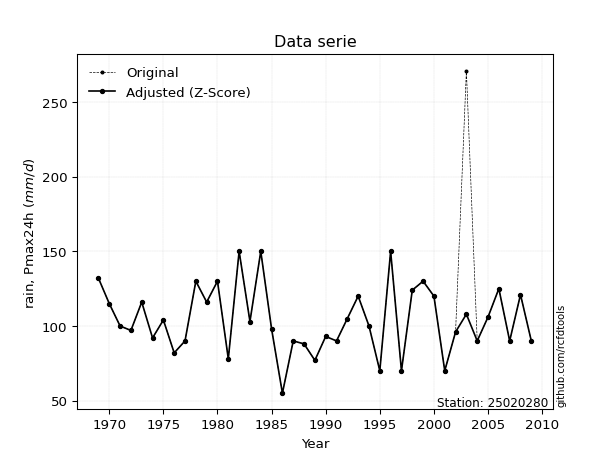</img>

## A. Active distributions from SciPy (1 of 104 available)

|   id | p_dist   |   n_parameter | fit_method   | label      | active   | ref                                                                                             |
|-----:|:---------|--------------:|:-------------|:-----------|:---------|:------------------------------------------------------------------------------------------------|
|    0 | lognorm  |             3 | MLE          | Log Normal | True     | [:mortar_board:](https://docs.scipy.org/doc/scipy/reference/generated/scipy.stats.lognorm.html) |

> Gumbel and Lob-Gumbel probability distributions are not shown in the above table.  
> n_parameter = # arguments & localization & scale.  
> Fit methods: (MLE) maximum likelihood, (MM) L-moments.

## B. Probability distributions

### Cumulative distribution values - CDF (3 evalated, ordered by x ascending) 

|   id |   Station |   date |   x |   station |   m |    lognorm |   lognorm_pdf |    zzgumbel |   gumbel_pdf |   zzloggumbel |   loggumbel_pdf |
|-----:|----------:|-------:|----:|----------:|----:|-----------:|--------------:|------------:|-------------:|--------------:|----------------:|
|    0 |  25020280 |   1986 |  55 |  25020280 |   1 | 0.00307487 |   0.000945098 | 0.000852271 |            0 |   7.57017e-06 |               0 |
|    1 |  25020280 |   1995 |  70 |  25020280 |   2 | 0.0618572  |   0.0078633   | 0.017273    |            0 |   0.0234432   |               0 |
|    2 |  25020280 |   1997 |  70 |  25020280 |   3 | 0.0618572  |   0.0078633   | 0.017273    |            0 |   0.0234432   |               0 |
|    3 |  25020280 |   2001 |  70 |  25020280 |   4 | 0.0618572  |   0.0078633   | 0.017273    |            0 |   0.0234432   |               0 |
|    4 |  25020280 |   1989 |  77 |  25020280 |   5 | 0.130829   |   0.011716    | 0.0435871   |            0 |   0.0918739   |               0 |
|    5 |  25020280 |   1981 |  78 |  25020280 |   6 | 0.142782   |   0.012186    | 0.0488375   |            0 |   0.105875    |               0 |
|    6 |  25020280 |   1976 |  82 |  25020280 |   7 | 0.194866   |   0.0137743   | 0.073968    |            0 |   0.170165    |               0 |
|    7 |  25020280 |   1988 |  88 |  25020280 |   8 | 0.282343   |   0.0151871   | 0.124189    |            0 |   0.281792    |               0 |
|    8 |  25020280 |   1987 |  90 |  25020280 |   9 | 0.312951   |   0.0153997   | 0.144101    |            0 |   0.320321    |               0 |
|    9 |  25020280 |   1991 |  90 |  25020280 |  10 | 0.312951   |   0.0153997   | 0.144101    |            0 |   0.320321    |               0 |
|   10 |  25020280 |   2004 |  90 |  25020280 |  11 | 0.312951   |   0.0153997   | 0.144101    |            0 |   0.320321    |               0 |
|   11 |  25020280 |   1977 |  90 |  25020280 |  12 | 0.312951   |   0.0153997   | 0.144101    |            0 |   0.320321    |               0 |
|   12 |  25020280 |   2009 |  90 |  25020280 |  13 | 0.312951   |   0.0153997   | 0.144101    |            0 |   0.320321    |               0 |
|   13 |  25020280 |   2007 |  90 |  25020280 |  14 | 0.312951   |   0.0153997   | 0.144101    |            0 |   0.320321    |               0 |
|   14 |  25020280 |   1974 |  92 |  25020280 |  15 | 0.343862   |   0.0154925   | 0.165441    |            0 |   0.358566    |               0 |
|   15 |  25020280 |   1990 |  93 |  25020280 |  16 | 0.359359   |   0.0154968   | 0.176608    |            0 |   0.377442    |               0 |
|   16 |  25020280 |   2002 |  96 |  25020280 |  17 | 0.405694   |   0.0153561   | 0.211874    |            0 |   0.432563    |               0 |
|   17 |  25020280 |   1972 |  97 |  25020280 |  18 | 0.421005   |   0.0152626   | 0.224152    |            0 |   0.450318    |               0 |
|   18 |  25020280 |   1985 |  98 |  25020280 |  19 | 0.436212   |   0.015148    | 0.236657    |            0 |   0.467718    |               0 |
|   19 |  25020280 |   1994 | 100 |  25020280 |  20 | 0.466234   |   0.0148615   | 0.262264    |            0 |   0.501374    |               0 |
|   20 |  25020280 |   1971 | 100 |  25020280 |  21 | 0.466234   |   0.0148615   | 0.262264    |            0 |   0.501374    |               0 |
|   21 |  25020280 |   1983 | 103 |  25020280 |  22 | 0.510023   |   0.0143093   | 0.301838    |            0 |   0.5488      |               0 |
|   22 |  25020280 |   1975 | 104 |  25020280 |  23 | 0.524228   |   0.014098    | 0.315253    |            0 |   0.563762    |               0 |
|   23 |  25020280 |   1992 | 105 |  25020280 |  24 | 0.538215   |   0.0138753   | 0.328745    |            0 |   0.578295    |               0 |
|   24 |  25020280 |   2005 | 106 |  25020280 |  25 | 0.551975   |   0.0136423   | 0.342294    |            0 |   0.592398    |               0 |
|   25 |  25020280 |   1970 | 115 |  25020280 |  26 | 0.664328   |   0.0112655   | 0.463668    |            0 |   0.700743    |               0 |
|   26 |  25020280 |   1973 | 116 |  25020280 |  27 | 0.675454   |   0.0109872   | 0.476788    |            0 |   0.710849    |               0 |
|   27 |  25020280 |   1979 | 116 |  25020280 |  28 | 0.675454   |   0.0109872   | 0.476788    |            0 |   0.710849    |               0 |
|   28 |  25020280 |   2000 | 120 |  25020280 |  29 | 0.717182   |   0.0098799   | 0.527903    |            0 |   0.747842    |               0 |
|   29 |  25020280 |   1993 | 120 |  25020280 |  30 | 0.717182   |   0.0098799   | 0.527903    |            0 |   0.747842    |               0 |
|   30 |  25020280 |   2008 | 121 |  25020280 |  31 | 0.726926   |   0.00960721  | 0.540289    |            0 |   0.756283    |               0 |
|   31 |  25020280 |   1998 | 124 |  25020280 |  32 | 0.754539   |   0.00880617  | 0.57637     |            0 |   0.779828    |               0 |
|   32 |  25020280 |   2006 | 125 |  25020280 |  33 | 0.763215   |   0.00854602  | 0.588016    |            0 |   0.787117    |               0 |
|   33 |  25020280 |   1978 | 130 |  25020280 |  34 | 0.802804   |   0.0073086   | 0.643158    |            0 |   0.819783    |               0 |
|   34 |  25020280 |   1980 | 130 |  25020280 |  35 | 0.802804   |   0.0073086   | 0.643158    |            0 |   0.819783    |               0 |
|   35 |  25020280 |   1999 | 130 |  25020280 |  36 | 0.802804   |   0.0073086   | 0.643158    |            0 |   0.819783    |               0 |
|   36 |  25020280 |   1969 | 132 |  25020280 |  37 | 0.816956   |   0.00684662  | 0.663717    |            0 |   0.831251    |               0 |
|   37 |  25020280 |   1996 | 150 |  25020280 |  38 | 0.908619   |   0.00361199  | 0.810041    |            0 |   0.904163    |               0 |
|   38 |  25020280 |   1982 | 150 |  25020280 |  39 | 0.908619   |   0.00361199  | 0.810041    |            0 |   0.904163    |               0 |
|   39 |  25020280 |   1984 | 150 |  25020280 |  40 | 0.908619   |   0.00361199  | 0.810041    |            0 |   0.904163    |               0 |
|   40 |  25020280 |   2003 | 271 |  25020280 |  41 | 0.99926    |   2.8111e-05  | 0.997602    |            0 |   0.993939    |               0 |

### Empirical: emp_california

#### 1. Empirical values

|   id |   date |   x |   m | empirical_dist   |   empirical |   empirical_tr |
|-----:|-------:|----:|----:|:-----------------|------------:|---------------:|
|    0 |   1986 |  55 |   1 | emp_california   |   0.0243902 |        1.025   |
|    1 |   1995 |  70 |   2 | emp_california   |   0.0487805 |        1.05128 |
|    2 |   1997 |  70 |   3 | emp_california   |   0.0731707 |        1.07895 |
|    3 |   2001 |  70 |   4 | emp_california   |   0.097561  |        1.10811 |
|    4 |   1989 |  77 |   5 | emp_california   |   0.121951  |        1.13889 |
|    5 |   1981 |  78 |   6 | emp_california   |   0.146341  |        1.17143 |
|    6 |   1976 |  82 |   7 | emp_california   |   0.170732  |        1.20588 |
|    7 |   1988 |  88 |   8 | emp_california   |   0.195122  |        1.24242 |
|    8 |   1987 |  90 |   9 | emp_california   |   0.219512  |        1.28125 |
|    9 |   1991 |  90 |  10 | emp_california   |   0.243902  |        1.32258 |
|   10 |   2004 |  90 |  11 | emp_california   |   0.268293  |        1.36667 |
|   11 |   1977 |  90 |  12 | emp_california   |   0.292683  |        1.41379 |
|   12 |   2009 |  90 |  13 | emp_california   |   0.317073  |        1.46429 |
|   13 |   2007 |  90 |  14 | emp_california   |   0.341463  |        1.51852 |
|   14 |   1974 |  92 |  15 | emp_california   |   0.365854  |        1.57692 |
|   15 |   1990 |  93 |  16 | emp_california   |   0.390244  |        1.64    |
|   16 |   2002 |  96 |  17 | emp_california   |   0.414634  |        1.70833 |
|   17 |   1972 |  97 |  18 | emp_california   |   0.439024  |        1.78261 |
|   18 |   1985 |  98 |  19 | emp_california   |   0.463415  |        1.86364 |
|   19 |   1994 | 100 |  20 | emp_california   |   0.487805  |        1.95238 |
|   20 |   1971 | 100 |  21 | emp_california   |   0.512195  |        2.05    |
|   21 |   1983 | 103 |  22 | emp_california   |   0.536585  |        2.15789 |
|   22 |   1975 | 104 |  23 | emp_california   |   0.560976  |        2.27778 |
|   23 |   1992 | 105 |  24 | emp_california   |   0.585366  |        2.41176 |
|   24 |   2005 | 106 |  25 | emp_california   |   0.609756  |        2.5625  |
|   25 |   1970 | 115 |  26 | emp_california   |   0.634146  |        2.73333 |
|   26 |   1973 | 116 |  27 | emp_california   |   0.658537  |        2.92857 |
|   27 |   1979 | 116 |  28 | emp_california   |   0.682927  |        3.15385 |
|   28 |   2000 | 120 |  29 | emp_california   |   0.707317  |        3.41667 |
|   29 |   1993 | 120 |  30 | emp_california   |   0.731707  |        3.72727 |
|   30 |   2008 | 121 |  31 | emp_california   |   0.756098  |        4.1     |
|   31 |   1998 | 124 |  32 | emp_california   |   0.780488  |        4.55556 |
|   32 |   2006 | 125 |  33 | emp_california   |   0.804878  |        5.125   |
|   33 |   1978 | 130 |  34 | emp_california   |   0.829268  |        5.85714 |
|   34 |   1980 | 130 |  35 | emp_california   |   0.853659  |        6.83333 |
|   35 |   1999 | 130 |  36 | emp_california   |   0.878049  |        8.2     |
|   36 |   1969 | 132 |  37 | emp_california   |   0.902439  |       10.25    |
|   37 |   1996 | 150 |  38 | emp_california   |   0.926829  |       13.6667  |
|   38 |   1982 | 150 |  39 | emp_california   |   0.95122   |       20.5     |
|   39 |   1984 | 150 |  40 | emp_california   |   0.97561   |       41       |
|   40 |   2003 | 271 |  41 | emp_california   |   1         |      inf       |

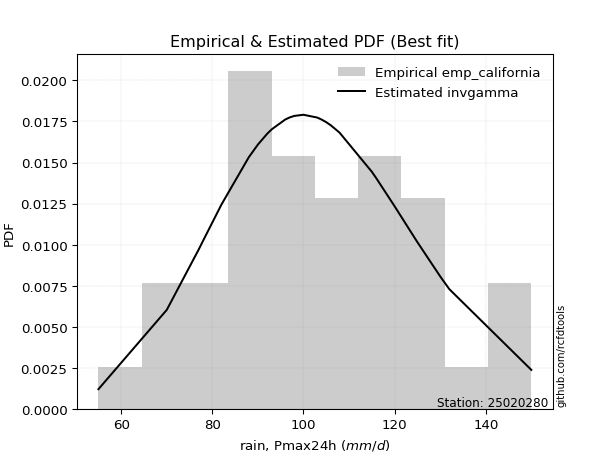</img>

####  2. Parameters & Kolmogorov-Smirnov fit test (sorted by Δ)

|   id | empirical_dist   | p_dist      |     delta |   deltao | eval    |   fit |   n |       loc |     scale |    shape | shape1             | shape2   | shape3   |   best_fit |   best_fit_sort |
|-----:|:-----------------|:------------|----------:|---------:|:--------|------:|----:|----------:|----------:|---------:|:-------------------|:---------|:---------|-----------:|----------------:|
|    0 | emp_california   | lognorm     | 0.0934386 | 0.212396 | Δo > Δ  |     1 |  41 |  28.5657  | 73.7373   | 0.374439 |                    |          |          |          1 |               1 |
|    1 | emp_california   | zzloggumbel | 0.100809  | 0.212396 | Δo > Δ  |     1 |  41 |   4.52712 |  0.210666 | 0.544198 | 1.1435823657845239 |          |          |          0 |               2 |
|    2 | emp_california   | zzgumbel    | 0.267462  | 0.212396 | Δo <= Δ |     0 |  41 | 107.882   | 27.0426   | 0.544198 | 1.1435823657845239 |          |          |          0 |               3 |

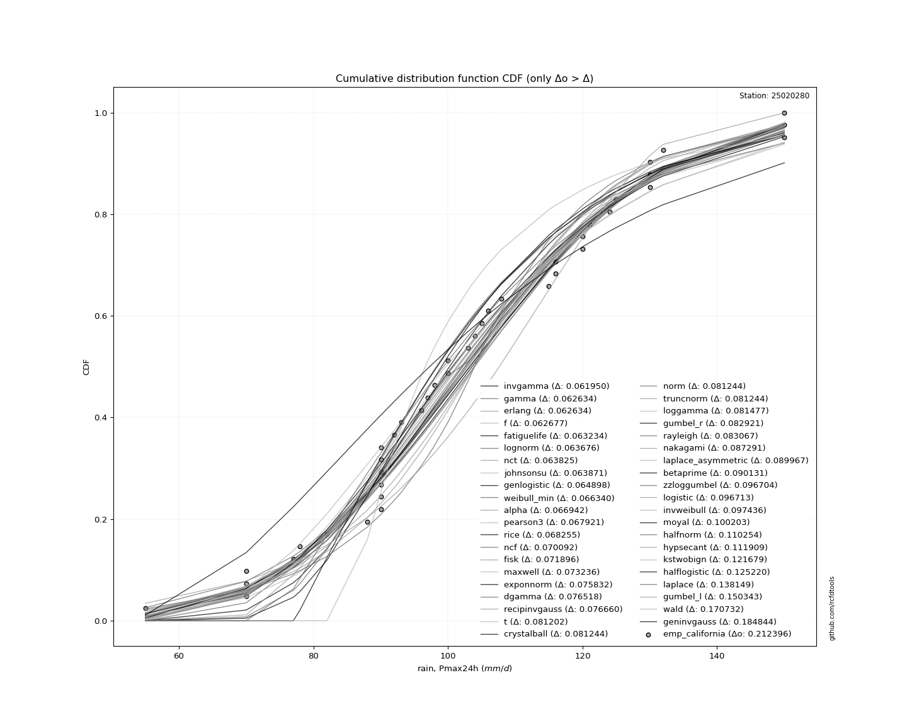</img>

#### 3. Best fit for

|   id |   station | empirical_dist   | p_dist   |     delta |   deltao | eval   |   fit |   n |     loc |   scale |    shape | shape1   | shape2   | shape3   |   best_fit |   best_fit_sort |
|-----:|----------:|:-----------------|:---------|----------:|---------:|:-------|------:|----:|--------:|--------:|---------:|:---------|:---------|:---------|-----------:|----------------:|
|    0 |  25020280 | emp_california   | lognorm  | 0.0934386 | 0.212396 | Δo > Δ |     1 |  41 | 28.5657 | 73.7373 | 0.374439 |          |          |          |          1 |               1 |

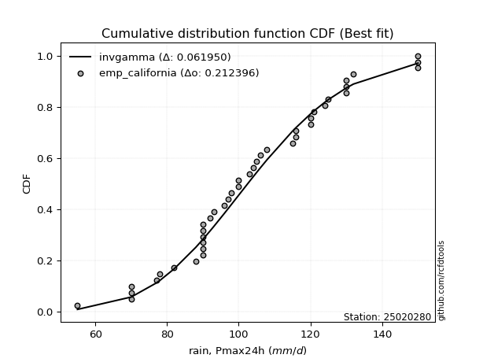</img>

### Empirical: emp_hazen

#### 1. Empirical values

|   id |   date |   x |   m | empirical_dist   |   empirical |   empirical_tr |
|-----:|-------:|----:|----:|:-----------------|------------:|---------------:|
|    0 |   1986 |  55 |   1 | emp_hazen        |   0.0121951 |        1.01235 |
|    1 |   1995 |  70 |   2 | emp_hazen        |   0.0365854 |        1.03797 |
|    2 |   1997 |  70 |   3 | emp_hazen        |   0.0609756 |        1.06494 |
|    3 |   2001 |  70 |   4 | emp_hazen        |   0.0853659 |        1.09333 |
|    4 |   1989 |  77 |   5 | emp_hazen        |   0.109756  |        1.12329 |
|    5 |   1981 |  78 |   6 | emp_hazen        |   0.134146  |        1.15493 |
|    6 |   1976 |  82 |   7 | emp_hazen        |   0.158537  |        1.18841 |
|    7 |   1988 |  88 |   8 | emp_hazen        |   0.182927  |        1.22388 |
|    8 |   1987 |  90 |   9 | emp_hazen        |   0.207317  |        1.26154 |
|    9 |   1991 |  90 |  10 | emp_hazen        |   0.231707  |        1.30159 |
|   10 |   2004 |  90 |  11 | emp_hazen        |   0.256098  |        1.34426 |
|   11 |   1977 |  90 |  12 | emp_hazen        |   0.280488  |        1.38983 |
|   12 |   2009 |  90 |  13 | emp_hazen        |   0.304878  |        1.4386  |
|   13 |   2007 |  90 |  14 | emp_hazen        |   0.329268  |        1.49091 |
|   14 |   1974 |  92 |  15 | emp_hazen        |   0.353659  |        1.54717 |
|   15 |   1990 |  93 |  16 | emp_hazen        |   0.378049  |        1.60784 |
|   16 |   2002 |  96 |  17 | emp_hazen        |   0.402439  |        1.67347 |
|   17 |   1972 |  97 |  18 | emp_hazen        |   0.426829  |        1.74468 |
|   18 |   1985 |  98 |  19 | emp_hazen        |   0.45122   |        1.82222 |
|   19 |   1994 | 100 |  20 | emp_hazen        |   0.47561   |        1.90698 |
|   20 |   1971 | 100 |  21 | emp_hazen        |   0.5       |        2       |
|   21 |   1983 | 103 |  22 | emp_hazen        |   0.52439   |        2.10256 |
|   22 |   1975 | 104 |  23 | emp_hazen        |   0.54878   |        2.21622 |
|   23 |   1992 | 105 |  24 | emp_hazen        |   0.573171  |        2.34286 |
|   24 |   2005 | 106 |  25 | emp_hazen        |   0.597561  |        2.48485 |
|   25 |   1970 | 115 |  26 | emp_hazen        |   0.621951  |        2.64516 |
|   26 |   1973 | 116 |  27 | emp_hazen        |   0.646341  |        2.82759 |
|   27 |   1979 | 116 |  28 | emp_hazen        |   0.670732  |        3.03704 |
|   28 |   2000 | 120 |  29 | emp_hazen        |   0.695122  |        3.28    |
|   29 |   1993 | 120 |  30 | emp_hazen        |   0.719512  |        3.56522 |
|   30 |   2008 | 121 |  31 | emp_hazen        |   0.743902  |        3.90476 |
|   31 |   1998 | 124 |  32 | emp_hazen        |   0.768293  |        4.31579 |
|   32 |   2006 | 125 |  33 | emp_hazen        |   0.792683  |        4.82353 |
|   33 |   1978 | 130 |  34 | emp_hazen        |   0.817073  |        5.46667 |
|   34 |   1980 | 130 |  35 | emp_hazen        |   0.841463  |        6.30769 |
|   35 |   1999 | 130 |  36 | emp_hazen        |   0.865854  |        7.45455 |
|   36 |   1969 | 132 |  37 | emp_hazen        |   0.890244  |        9.11111 |
|   37 |   1996 | 150 |  38 | emp_hazen        |   0.914634  |       11.7143  |
|   38 |   1982 | 150 |  39 | emp_hazen        |   0.939024  |       16.4     |
|   39 |   1984 | 150 |  40 | emp_hazen        |   0.963415  |       27.3333  |
|   40 |   2003 | 271 |  41 | emp_hazen        |   0.987805  |       82       |

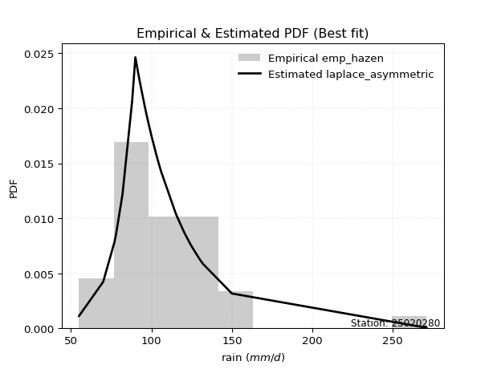</img>

####  2. Parameters & Kolmogorov-Smirnov fit test (sorted by Δ)

|   id | empirical_dist   | p_dist      |    delta |   deltao | eval    |   fit |   n |       loc |     scale |    shape | shape1             | shape2   | shape3   |   best_fit |   best_fit_sort |
|-----:|:-----------------|:------------|---------:|---------:|:--------|------:|----:|----------:|----------:|---------:|:-------------------|:---------|:---------|-----------:|----------------:|
|    0 | emp_hazen        | lognorm     | 0.105634 | 0.212396 | Δo > Δ  |     1 |  41 |  28.5657  | 73.7373   | 0.374439 |                    |          |          |          1 |               1 |
|    1 | emp_hazen        | zzloggumbel | 0.113004 | 0.212396 | Δo > Δ  |     1 |  41 |   4.52712 |  0.210666 | 0.544198 | 1.1435823657845239 |          |          |          0 |               2 |
|    2 | emp_hazen        | zzgumbel    | 0.255267 | 0.212396 | Δo <= Δ |     0 |  41 | 107.882   | 27.0426   | 0.544198 | 1.1435823657845239 |          |          |          0 |               3 |

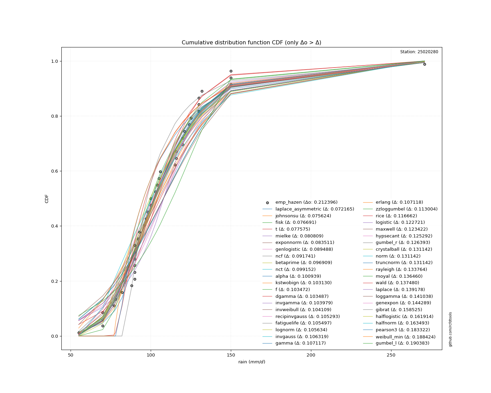</img>

#### 3. Best fit for

|   id |   station | empirical_dist   | p_dist   |    delta |   deltao | eval   |   fit |   n |     loc |   scale |    shape | shape1   | shape2   | shape3   |   best_fit |   best_fit_sort |
|-----:|----------:|:-----------------|:---------|---------:|---------:|:-------|------:|----:|--------:|--------:|---------:|:---------|:---------|:---------|-----------:|----------------:|
|    0 |  25020280 | emp_hazen        | lognorm  | 0.105634 | 0.212396 | Δo > Δ |     1 |  41 | 28.5657 | 73.7373 | 0.374439 |          |          |          |          1 |               1 |

</img>

### Empirical: emp_weibull

#### 1. Empirical values

|   id |   date |   x |   m | empirical_dist   |   empirical |   empirical_tr |
|-----:|-------:|----:|----:|:-----------------|------------:|---------------:|
|    0 |   1986 |  55 |   1 | emp_weibull      |   0.0238095 |        1.02439 |
|    1 |   1995 |  70 |   2 | emp_weibull      |   0.047619  |        1.05    |
|    2 |   1997 |  70 |   3 | emp_weibull      |   0.0714286 |        1.07692 |
|    3 |   2001 |  70 |   4 | emp_weibull      |   0.0952381 |        1.10526 |
|    4 |   1989 |  77 |   5 | emp_weibull      |   0.119048  |        1.13514 |
|    5 |   1981 |  78 |   6 | emp_weibull      |   0.142857  |        1.16667 |
|    6 |   1976 |  82 |   7 | emp_weibull      |   0.166667  |        1.2     |
|    7 |   1988 |  88 |   8 | emp_weibull      |   0.190476  |        1.23529 |
|    8 |   1987 |  90 |   9 | emp_weibull      |   0.214286  |        1.27273 |
|    9 |   1991 |  90 |  10 | emp_weibull      |   0.238095  |        1.3125  |
|   10 |   2004 |  90 |  11 | emp_weibull      |   0.261905  |        1.35484 |
|   11 |   1977 |  90 |  12 | emp_weibull      |   0.285714  |        1.4     |
|   12 |   2009 |  90 |  13 | emp_weibull      |   0.309524  |        1.44828 |
|   13 |   2007 |  90 |  14 | emp_weibull      |   0.333333  |        1.5     |
|   14 |   1974 |  92 |  15 | emp_weibull      |   0.357143  |        1.55556 |
|   15 |   1990 |  93 |  16 | emp_weibull      |   0.380952  |        1.61538 |
|   16 |   2002 |  96 |  17 | emp_weibull      |   0.404762  |        1.68    |
|   17 |   1972 |  97 |  18 | emp_weibull      |   0.428571  |        1.75    |
|   18 |   1985 |  98 |  19 | emp_weibull      |   0.452381  |        1.82609 |
|   19 |   1994 | 100 |  20 | emp_weibull      |   0.47619   |        1.90909 |
|   20 |   1971 | 100 |  21 | emp_weibull      |   0.5       |        2       |
|   21 |   1983 | 103 |  22 | emp_weibull      |   0.52381   |        2.1     |
|   22 |   1975 | 104 |  23 | emp_weibull      |   0.547619  |        2.21053 |
|   23 |   1992 | 105 |  24 | emp_weibull      |   0.571429  |        2.33333 |
|   24 |   2005 | 106 |  25 | emp_weibull      |   0.595238  |        2.47059 |
|   25 |   1970 | 115 |  26 | emp_weibull      |   0.619048  |        2.625   |
|   26 |   1973 | 116 |  27 | emp_weibull      |   0.642857  |        2.8     |
|   27 |   1979 | 116 |  28 | emp_weibull      |   0.666667  |        3       |
|   28 |   2000 | 120 |  29 | emp_weibull      |   0.690476  |        3.23077 |
|   29 |   1993 | 120 |  30 | emp_weibull      |   0.714286  |        3.5     |
|   30 |   2008 | 121 |  31 | emp_weibull      |   0.738095  |        3.81818 |
|   31 |   1998 | 124 |  32 | emp_weibull      |   0.761905  |        4.2     |
|   32 |   2006 | 125 |  33 | emp_weibull      |   0.785714  |        4.66667 |
|   33 |   1978 | 130 |  34 | emp_weibull      |   0.809524  |        5.25    |
|   34 |   1980 | 130 |  35 | emp_weibull      |   0.833333  |        6       |
|   35 |   1999 | 130 |  36 | emp_weibull      |   0.857143  |        7       |
|   36 |   1969 | 132 |  37 | emp_weibull      |   0.880952  |        8.4     |
|   37 |   1996 | 150 |  38 | emp_weibull      |   0.904762  |       10.5     |
|   38 |   1982 | 150 |  39 | emp_weibull      |   0.928571  |       14       |
|   39 |   1984 | 150 |  40 | emp_weibull      |   0.952381  |       21       |
|   40 |   2003 | 271 |  41 | emp_weibull      |   0.97619   |       42       |

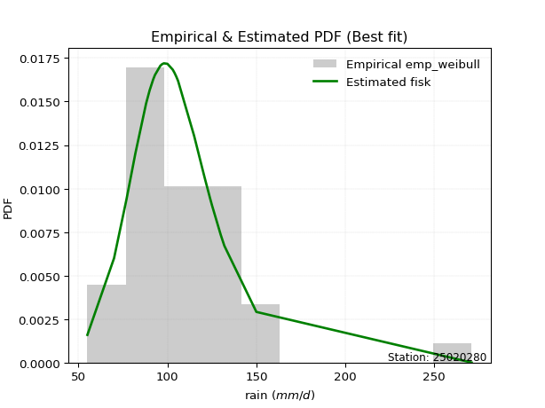</img>

####  2. Parameters & Kolmogorov-Smirnov fit test (sorted by Δ)

|   id | empirical_dist   | p_dist      |     delta |   deltao | eval    |   fit |   n |       loc |     scale |    shape | shape1             | shape2   | shape3   |   best_fit |   best_fit_sort |
|-----:|:-----------------|:------------|----------:|---------:|:--------|------:|----:|----------:|----------:|---------:|:-------------------|:---------|:---------|-----------:|----------------:|
|    0 | emp_weibull      | lognorm     | 0.0986651 | 0.212396 | Δo > Δ  |     1 |  41 |  28.5657  | 73.7373   | 0.374439 |                    |          |          |          1 |               1 |
|    1 | emp_weibull      | zzloggumbel | 0.106036  | 0.212396 | Δo > Δ  |     1 |  41 |   4.52712 |  0.210666 | 0.544198 | 1.1435823657845239 |          |          |          0 |               2 |
|    2 | emp_weibull      | zzgumbel    | 0.252944  | 0.212396 | Δo <= Δ |     0 |  41 | 107.882   | 27.0426   | 0.544198 | 1.1435823657845239 |          |          |          0 |               3 |

</img>

#### 3. Best fit for

|   id |   station | empirical_dist   | p_dist   |     delta |   deltao | eval   |   fit |   n |     loc |   scale |    shape | shape1   | shape2   | shape3   |   best_fit |   best_fit_sort |
|-----:|----------:|:-----------------|:---------|----------:|---------:|:-------|------:|----:|--------:|--------:|---------:|:---------|:---------|:---------|-----------:|----------------:|
|    0 |  25020280 | emp_weibull      | lognorm  | 0.0986651 | 0.212396 | Δo > Δ |     1 |  41 | 28.5657 | 73.7373 | 0.374439 |          |          |          |          1 |               1 |

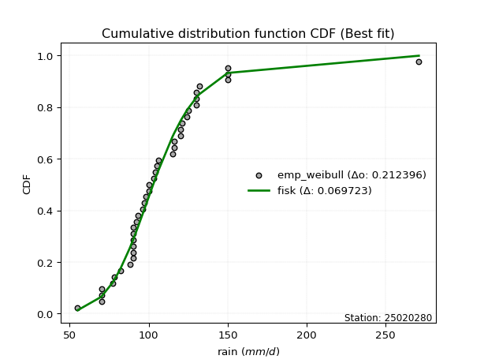</img>

### Empirical: emp_beard

#### 1. Empirical values

|   id |   date |   x |   m | empirical_dist   |   empirical |   empirical_tr |
|-----:|-------:|----:|----:|:-----------------|------------:|---------------:|
|    0 |   1986 |  55 |   1 | emp_beard        |   0.0166747 |        1.01696 |
|    1 |   1995 |  70 |   2 | emp_beard        |   0.040841  |        1.04258 |
|    2 |   1997 |  70 |   3 | emp_beard        |   0.0650072 |        1.06953 |
|    3 |   2001 |  70 |   4 | emp_beard        |   0.0891735 |        1.0979  |
|    4 |   1989 |  77 |   5 | emp_beard        |   0.11334   |        1.12783 |
|    5 |   1981 |  78 |   6 | emp_beard        |   0.137506  |        1.15943 |
|    6 |   1976 |  82 |   7 | emp_beard        |   0.161672  |        1.19285 |
|    7 |   1988 |  88 |   8 | emp_beard        |   0.185839  |        1.22826 |
|    8 |   1987 |  90 |   9 | emp_beard        |   0.210005  |        1.26583 |
|    9 |   1991 |  90 |  10 | emp_beard        |   0.234171  |        1.30577 |
|   10 |   2004 |  90 |  11 | emp_beard        |   0.258337  |        1.34832 |
|   11 |   1977 |  90 |  12 | emp_beard        |   0.282504  |        1.39374 |
|   12 |   2009 |  90 |  13 | emp_beard        |   0.30667   |        1.44231 |
|   13 |   2007 |  90 |  14 | emp_beard        |   0.330836  |        1.4944  |
|   14 |   1974 |  92 |  15 | emp_beard        |   0.355002  |        1.55039 |
|   15 |   1990 |  93 |  16 | emp_beard        |   0.379169  |        1.61074 |
|   16 |   2002 |  96 |  17 | emp_beard        |   0.403335  |        1.67598 |
|   17 |   1972 |  97 |  18 | emp_beard        |   0.427501  |        1.74673 |
|   18 |   1985 |  98 |  19 | emp_beard        |   0.451667  |        1.82371 |
|   19 |   1994 | 100 |  20 | emp_beard        |   0.475834  |        1.90779 |
|   20 |   1971 | 100 |  21 | emp_beard        |   0.5       |        2       |
|   21 |   1983 | 103 |  22 | emp_beard        |   0.524166  |        2.10157 |
|   22 |   1975 | 104 |  23 | emp_beard        |   0.548333  |        2.21402 |
|   23 |   1992 | 105 |  24 | emp_beard        |   0.572499  |        2.33917 |
|   24 |   2005 | 106 |  25 | emp_beard        |   0.596665  |        2.47933 |
|   25 |   1970 | 115 |  26 | emp_beard        |   0.620831  |        2.63735 |
|   26 |   1973 | 116 |  27 | emp_beard        |   0.644998  |        2.81688 |
|   27 |   1979 | 116 |  28 | emp_beard        |   0.669164  |        3.02264 |
|   28 |   2000 | 120 |  29 | emp_beard        |   0.69333   |        3.26084 |
|   29 |   1993 | 120 |  30 | emp_beard        |   0.717496  |        3.53978 |
|   30 |   2008 | 121 |  31 | emp_beard        |   0.741663  |        3.87091 |
|   31 |   1998 | 124 |  32 | emp_beard        |   0.765829  |        4.27038 |
|   32 |   2006 | 125 |  33 | emp_beard        |   0.789995  |        4.7618  |
|   33 |   1978 | 130 |  34 | emp_beard        |   0.814161  |        5.38101 |
|   34 |   1980 | 130 |  35 | emp_beard        |   0.838328  |        6.18535 |
|   35 |   1999 | 130 |  36 | emp_beard        |   0.862494  |        7.27241 |
|   36 |   1969 | 132 |  37 | emp_beard        |   0.88666   |        8.82303 |
|   37 |   1996 | 150 |  38 | emp_beard        |   0.910826  |       11.2141  |
|   38 |   1982 | 150 |  39 | emp_beard        |   0.934993  |       15.3829  |
|   39 |   1984 | 150 |  40 | emp_beard        |   0.959159  |       24.4852  |
|   40 |   2003 | 271 |  41 | emp_beard        |   0.983325  |       59.971   |

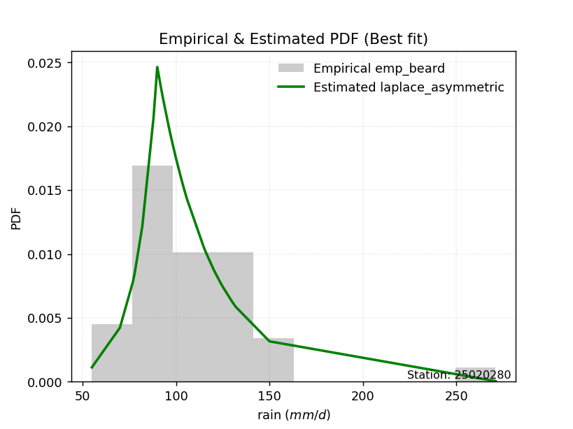</img>

####  2. Parameters & Kolmogorov-Smirnov fit test (sorted by Δ)

|   id | empirical_dist   | p_dist      |    delta |   deltao | eval    |   fit |   n |       loc |     scale |    shape | shape1             | shape2   | shape3   |   best_fit |   best_fit_sort |
|-----:|:-----------------|:------------|---------:|---------:|:--------|------:|----:|----------:|----------:|---------:|:-------------------|:---------|:---------|-----------:|----------------:|
|    0 | emp_beard        | lognorm     | 0.102946 | 0.212396 | Δo > Δ  |     1 |  41 |  28.5657  | 73.7373   | 0.374439 |                    |          |          |          1 |               1 |
|    1 | emp_beard        | zzloggumbel | 0.110317 | 0.212396 | Δo > Δ  |     1 |  41 |   4.52712 |  0.210666 | 0.544198 | 1.1435823657845239 |          |          |          0 |               2 |
|    2 | emp_beard        | zzgumbel    | 0.254371 | 0.212396 | Δo <= Δ |     0 |  41 | 107.882   | 27.0426   | 0.544198 | 1.1435823657845239 |          |          |          0 |               3 |

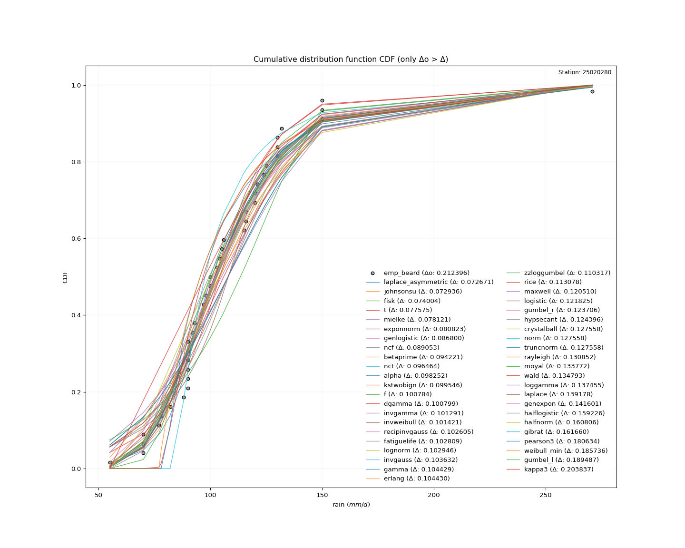</img>

#### 3. Best fit for

|   id |   station | empirical_dist   | p_dist   |    delta |   deltao | eval   |   fit |   n |     loc |   scale |    shape | shape1   | shape2   | shape3   |   best_fit |   best_fit_sort |
|-----:|----------:|:-----------------|:---------|---------:|---------:|:-------|------:|----:|--------:|--------:|---------:|:---------|:---------|:---------|-----------:|----------------:|
|    0 |  25020280 | emp_beard        | lognorm  | 0.102946 | 0.212396 | Δo > Δ |     1 |  41 | 28.5657 | 73.7373 | 0.374439 |          |          |          |          1 |               1 |

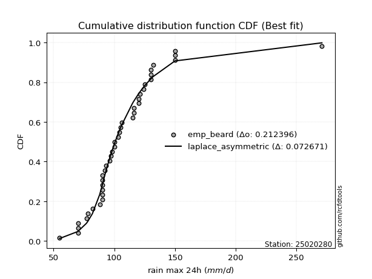</img>

### Empirical: emp_chegodayev

#### 1. Empirical values

|   id |   date |   x |   m | empirical_dist   |   empirical |   empirical_tr |
|-----:|-------:|----:|----:|:-----------------|------------:|---------------:|
|    0 |   1986 |  55 |   1 | emp_chegodayev   |   0.0169082 |        1.0172  |
|    1 |   1995 |  70 |   2 | emp_chegodayev   |   0.0410628 |        1.04282 |
|    2 |   1997 |  70 |   3 | emp_chegodayev   |   0.0652174 |        1.06977 |
|    3 |   2001 |  70 |   4 | emp_chegodayev   |   0.089372  |        1.09814 |
|    4 |   1989 |  77 |   5 | emp_chegodayev   |   0.113527  |        1.12807 |
|    5 |   1981 |  78 |   6 | emp_chegodayev   |   0.137681  |        1.15966 |
|    6 |   1976 |  82 |   7 | emp_chegodayev   |   0.161836  |        1.19308 |
|    7 |   1988 |  88 |   8 | emp_chegodayev   |   0.18599   |        1.22849 |
|    8 |   1987 |  90 |   9 | emp_chegodayev   |   0.210145  |        1.26606 |
|    9 |   1991 |  90 |  10 | emp_chegodayev   |   0.2343    |        1.30599 |
|   10 |   2004 |  90 |  11 | emp_chegodayev   |   0.258454  |        1.34853 |
|   11 |   1977 |  90 |  12 | emp_chegodayev   |   0.282609  |        1.39394 |
|   12 |   2009 |  90 |  13 | emp_chegodayev   |   0.306763  |        1.44251 |
|   13 |   2007 |  90 |  14 | emp_chegodayev   |   0.330918  |        1.49458 |
|   14 |   1974 |  92 |  15 | emp_chegodayev   |   0.355072  |        1.55056 |
|   15 |   1990 |  93 |  16 | emp_chegodayev   |   0.379227  |        1.61089 |
|   16 |   2002 |  96 |  17 | emp_chegodayev   |   0.403382  |        1.67611 |
|   17 |   1972 |  97 |  18 | emp_chegodayev   |   0.427536  |        1.74684 |
|   18 |   1985 |  98 |  19 | emp_chegodayev   |   0.451691  |        1.82379 |
|   19 |   1994 | 100 |  20 | emp_chegodayev   |   0.475845  |        1.90783 |
|   20 |   1971 | 100 |  21 | emp_chegodayev   |   0.5       |        2       |
|   21 |   1983 | 103 |  22 | emp_chegodayev   |   0.524155  |        2.10152 |
|   22 |   1975 | 104 |  23 | emp_chegodayev   |   0.548309  |        2.2139  |
|   23 |   1992 | 105 |  24 | emp_chegodayev   |   0.572464  |        2.33898 |
|   24 |   2005 | 106 |  25 | emp_chegodayev   |   0.596618  |        2.47904 |
|   25 |   1970 | 115 |  26 | emp_chegodayev   |   0.620773  |        2.63694 |
|   26 |   1973 | 116 |  27 | emp_chegodayev   |   0.644928  |        2.81633 |
|   27 |   1979 | 116 |  28 | emp_chegodayev   |   0.669082  |        3.0219  |
|   28 |   2000 | 120 |  29 | emp_chegodayev   |   0.693237  |        3.25984 |
|   29 |   1993 | 120 |  30 | emp_chegodayev   |   0.717391  |        3.53846 |
|   30 |   2008 | 121 |  31 | emp_chegodayev   |   0.741546  |        3.86916 |
|   31 |   1998 | 124 |  32 | emp_chegodayev   |   0.7657    |        4.26804 |
|   32 |   2006 | 125 |  33 | emp_chegodayev   |   0.789855  |        4.75862 |
|   33 |   1978 | 130 |  34 | emp_chegodayev   |   0.81401   |        5.37662 |
|   34 |   1980 | 130 |  35 | emp_chegodayev   |   0.838164  |        6.1791  |
|   35 |   1999 | 130 |  36 | emp_chegodayev   |   0.862319  |        7.26316 |
|   36 |   1969 | 132 |  37 | emp_chegodayev   |   0.886473  |        8.80851 |
|   37 |   1996 | 150 |  38 | emp_chegodayev   |   0.910628  |       11.1892  |
|   38 |   1982 | 150 |  39 | emp_chegodayev   |   0.934783  |       15.3333  |
|   39 |   1984 | 150 |  40 | emp_chegodayev   |   0.958937  |       24.3529  |
|   40 |   2003 | 271 |  41 | emp_chegodayev   |   0.983092  |       59.1429  |

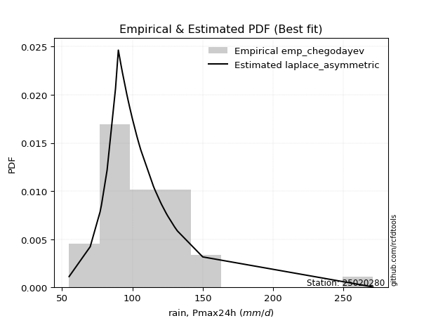</img>

####  2. Parameters & Kolmogorov-Smirnov fit test (sorted by Δ)

|   id | empirical_dist   | p_dist      |    delta |   deltao | eval    |   fit |   n |       loc |     scale |    shape | shape1             | shape2   | shape3   |   best_fit |   best_fit_sort |
|-----:|:-----------------|:------------|---------:|---------:|:--------|------:|----:|----------:|----------:|---------:|:-------------------|:---------|:---------|-----------:|----------------:|
|    0 | emp_chegodayev   | lognorm     | 0.102806 | 0.212396 | Δo > Δ  |     1 |  41 |  28.5657  | 73.7373   | 0.374439 |                    |          |          |          1 |               1 |
|    1 | emp_chegodayev   | zzloggumbel | 0.110176 | 0.212396 | Δo > Δ  |     1 |  41 |   4.52712 |  0.210666 | 0.544198 | 1.1435823657845239 |          |          |          0 |               2 |
|    2 | emp_chegodayev   | zzgumbel    | 0.254324 | 0.212396 | Δo <= Δ |     0 |  41 | 107.882   | 27.0426   | 0.544198 | 1.1435823657845239 |          |          |          0 |               3 |

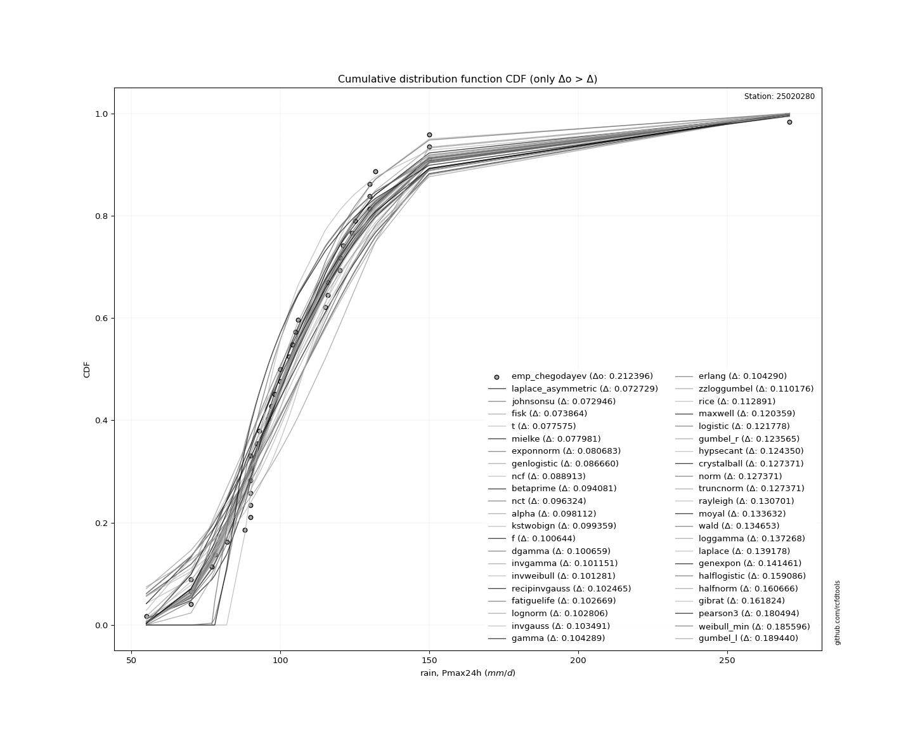</img>

#### 3. Best fit for

|   id |   station | empirical_dist   | p_dist   |    delta |   deltao | eval   |   fit |   n |     loc |   scale |    shape | shape1   | shape2   | shape3   |   best_fit |   best_fit_sort |
|-----:|----------:|:-----------------|:---------|---------:|---------:|:-------|------:|----:|--------:|--------:|---------:|:---------|:---------|:---------|-----------:|----------------:|
|    0 |  25020280 | emp_chegodayev   | lognorm  | 0.102806 | 0.212396 | Δo > Δ |     1 |  41 | 28.5657 | 73.7373 | 0.374439 |          |          |          |          1 |               1 |

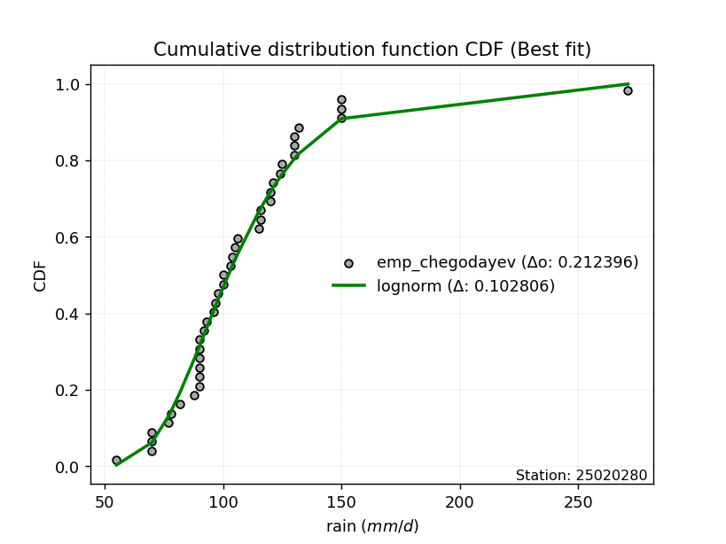</img>

### Empirical: emp_blom

#### 1. Empirical values

|   id |   date |   x |   m | empirical_dist   |   empirical |   empirical_tr |
|-----:|-------:|----:|----:|:-----------------|------------:|---------------:|
|    0 |   1986 |  55 |   1 | emp_blom         |   0.0151515 |        1.01538 |
|    1 |   1995 |  70 |   2 | emp_blom         |   0.0393939 |        1.04101 |
|    2 |   1997 |  70 |   3 | emp_blom         |   0.0636364 |        1.06796 |
|    3 |   2001 |  70 |   4 | emp_blom         |   0.0878788 |        1.09635 |
|    4 |   1989 |  77 |   5 | emp_blom         |   0.112121  |        1.12628 |
|    5 |   1981 |  78 |   6 | emp_blom         |   0.136364  |        1.15789 |
|    6 |   1976 |  82 |   7 | emp_blom         |   0.160606  |        1.19134 |
|    7 |   1988 |  88 |   8 | emp_blom         |   0.184848  |        1.22677 |
|    8 |   1987 |  90 |   9 | emp_blom         |   0.209091  |        1.26437 |
|    9 |   1991 |  90 |  10 | emp_blom         |   0.233333  |        1.30435 |
|   10 |   2004 |  90 |  11 | emp_blom         |   0.257576  |        1.34694 |
|   11 |   1977 |  90 |  12 | emp_blom         |   0.281818  |        1.39241 |
|   12 |   2009 |  90 |  13 | emp_blom         |   0.306061  |        1.44105 |
|   13 |   2007 |  90 |  14 | emp_blom         |   0.330303  |        1.49321 |
|   14 |   1974 |  92 |  15 | emp_blom         |   0.354545  |        1.5493  |
|   15 |   1990 |  93 |  16 | emp_blom         |   0.378788  |        1.60976 |
|   16 |   2002 |  96 |  17 | emp_blom         |   0.40303   |        1.67513 |
|   17 |   1972 |  97 |  18 | emp_blom         |   0.427273  |        1.74603 |
|   18 |   1985 |  98 |  19 | emp_blom         |   0.451515  |        1.8232  |
|   19 |   1994 | 100 |  20 | emp_blom         |   0.475758  |        1.90751 |
|   20 |   1971 | 100 |  21 | emp_blom         |   0.5       |        2       |
|   21 |   1983 | 103 |  22 | emp_blom         |   0.524242  |        2.10191 |
|   22 |   1975 | 104 |  23 | emp_blom         |   0.548485  |        2.21477 |
|   23 |   1992 | 105 |  24 | emp_blom         |   0.572727  |        2.34043 |
|   24 |   2005 | 106 |  25 | emp_blom         |   0.59697   |        2.4812  |
|   25 |   1970 | 115 |  26 | emp_blom         |   0.621212  |        2.64    |
|   26 |   1973 | 116 |  27 | emp_blom         |   0.645455  |        2.82051 |
|   27 |   1979 | 116 |  28 | emp_blom         |   0.669697  |        3.02752 |
|   28 |   2000 | 120 |  29 | emp_blom         |   0.693939  |        3.26733 |
|   29 |   1993 | 120 |  30 | emp_blom         |   0.718182  |        3.54839 |
|   30 |   2008 | 121 |  31 | emp_blom         |   0.742424  |        3.88235 |
|   31 |   1998 | 124 |  32 | emp_blom         |   0.766667  |        4.28571 |
|   32 |   2006 | 125 |  33 | emp_blom         |   0.790909  |        4.78261 |
|   33 |   1978 | 130 |  34 | emp_blom         |   0.815152  |        5.40984 |
|   34 |   1980 | 130 |  35 | emp_blom         |   0.839394  |        6.22642 |
|   35 |   1999 | 130 |  36 | emp_blom         |   0.863636  |        7.33333 |
|   36 |   1969 | 132 |  37 | emp_blom         |   0.887879  |        8.91892 |
|   37 |   1996 | 150 |  38 | emp_blom         |   0.912121  |       11.3793  |
|   38 |   1982 | 150 |  39 | emp_blom         |   0.936364  |       15.7143  |
|   39 |   1984 | 150 |  40 | emp_blom         |   0.960606  |       25.3846  |
|   40 |   2003 | 271 |  41 | emp_blom         |   0.984848  |       66       |

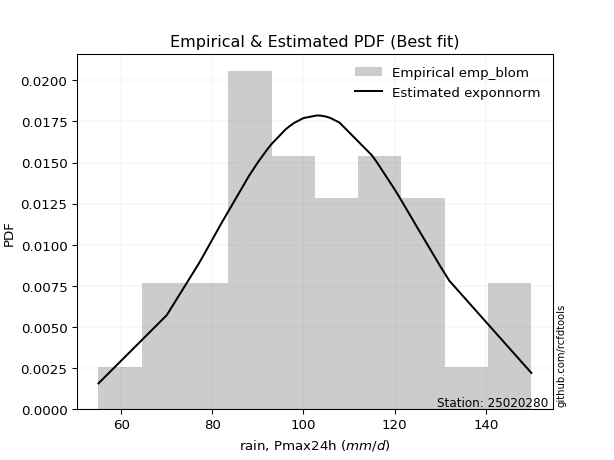</img>

####  2. Parameters & Kolmogorov-Smirnov fit test (sorted by Δ)

|   id | empirical_dist   | p_dist      |    delta |   deltao | eval    |   fit |   n |       loc |     scale |    shape | shape1             | shape2   | shape3   |   best_fit |   best_fit_sort |
|-----:|:-----------------|:------------|---------:|---------:|:--------|------:|----:|----------:|----------:|---------:|:-------------------|:---------|:---------|-----------:|----------------:|
|    0 | emp_blom         | lognorm     | 0.10386  | 0.212396 | Δo > Δ  |     1 |  41 |  28.5657  | 73.7373   | 0.374439 |                    |          |          |          1 |               1 |
|    1 | emp_blom         | zzloggumbel | 0.11123  | 0.212396 | Δo > Δ  |     1 |  41 |   4.52712 |  0.210666 | 0.544198 | 1.1435823657845239 |          |          |          0 |               2 |
|    2 | emp_blom         | zzgumbel    | 0.254676 | 0.212396 | Δo <= Δ |     0 |  41 | 107.882   | 27.0426   | 0.544198 | 1.1435823657845239 |          |          |          0 |               3 |

</img>

#### 3. Best fit for

|   id |   station | empirical_dist   | p_dist   |   delta |   deltao | eval   |   fit |   n |     loc |   scale |    shape | shape1   | shape2   | shape3   |   best_fit |   best_fit_sort |
|-----:|----------:|:-----------------|:---------|--------:|---------:|:-------|------:|----:|--------:|--------:|---------:|:---------|:---------|:---------|-----------:|----------------:|
|    0 |  25020280 | emp_blom         | lognorm  | 0.10386 | 0.212396 | Δo > Δ |     1 |  41 | 28.5657 | 73.7373 | 0.374439 |          |          |          |          1 |               1 |

</img>

### Empirical: emp_tukey

#### 1. Empirical values

|   id |   date |   x |   m | empirical_dist   |   empirical |   empirical_tr |
|-----:|-------:|----:|----:|:-----------------|------------:|---------------:|
|    0 |   1986 |  55 |   1 | emp_tukey        |   0.016129  |        1.01639 |
|    1 |   1995 |  70 |   2 | emp_tukey        |   0.0403226 |        1.04202 |
|    2 |   1997 |  70 |   3 | emp_tukey        |   0.0645161 |        1.06897 |
|    3 |   2001 |  70 |   4 | emp_tukey        |   0.0887097 |        1.09735 |
|    4 |   1989 |  77 |   5 | emp_tukey        |   0.112903  |        1.12727 |
|    5 |   1981 |  78 |   6 | emp_tukey        |   0.137097  |        1.15888 |
|    6 |   1976 |  82 |   7 | emp_tukey        |   0.16129   |        1.19231 |
|    7 |   1988 |  88 |   8 | emp_tukey        |   0.185484  |        1.22772 |
|    8 |   1987 |  90 |   9 | emp_tukey        |   0.209677  |        1.26531 |
|    9 |   1991 |  90 |  10 | emp_tukey        |   0.233871  |        1.30526 |
|   10 |   2004 |  90 |  11 | emp_tukey        |   0.258065  |        1.34783 |
|   11 |   1977 |  90 |  12 | emp_tukey        |   0.282258  |        1.39326 |
|   12 |   2009 |  90 |  13 | emp_tukey        |   0.306452  |        1.44186 |
|   13 |   2007 |  90 |  14 | emp_tukey        |   0.330645  |        1.49398 |
|   14 |   1974 |  92 |  15 | emp_tukey        |   0.354839  |        1.55    |
|   15 |   1990 |  93 |  16 | emp_tukey        |   0.379032  |        1.61039 |
|   16 |   2002 |  96 |  17 | emp_tukey        |   0.403226  |        1.67568 |
|   17 |   1972 |  97 |  18 | emp_tukey        |   0.427419  |        1.74648 |
|   18 |   1985 |  98 |  19 | emp_tukey        |   0.451613  |        1.82353 |
|   19 |   1994 | 100 |  20 | emp_tukey        |   0.475806  |        1.90769 |
|   20 |   1971 | 100 |  21 | emp_tukey        |   0.5       |        2       |
|   21 |   1983 | 103 |  22 | emp_tukey        |   0.524194  |        2.10169 |
|   22 |   1975 | 104 |  23 | emp_tukey        |   0.548387  |        2.21429 |
|   23 |   1992 | 105 |  24 | emp_tukey        |   0.572581  |        2.33962 |
|   24 |   2005 | 106 |  25 | emp_tukey        |   0.596774  |        2.48    |
|   25 |   1970 | 115 |  26 | emp_tukey        |   0.620968  |        2.6383  |
|   26 |   1973 | 116 |  27 | emp_tukey        |   0.645161  |        2.81818 |
|   27 |   1979 | 116 |  28 | emp_tukey        |   0.669355  |        3.02439 |
|   28 |   2000 | 120 |  29 | emp_tukey        |   0.693548  |        3.26316 |
|   29 |   1993 | 120 |  30 | emp_tukey        |   0.717742  |        3.54286 |
|   30 |   2008 | 121 |  31 | emp_tukey        |   0.741935  |        3.875   |
|   31 |   1998 | 124 |  32 | emp_tukey        |   0.766129  |        4.27586 |
|   32 |   2006 | 125 |  33 | emp_tukey        |   0.790323  |        4.76923 |
|   33 |   1978 | 130 |  34 | emp_tukey        |   0.814516  |        5.3913  |
|   34 |   1980 | 130 |  35 | emp_tukey        |   0.83871   |        6.2     |
|   35 |   1999 | 130 |  36 | emp_tukey        |   0.862903  |        7.29412 |
|   36 |   1969 | 132 |  37 | emp_tukey        |   0.887097  |        8.85714 |
|   37 |   1996 | 150 |  38 | emp_tukey        |   0.91129   |       11.2727  |
|   38 |   1982 | 150 |  39 | emp_tukey        |   0.935484  |       15.5     |
|   39 |   1984 | 150 |  40 | emp_tukey        |   0.959677  |       24.8     |
|   40 |   2003 | 271 |  41 | emp_tukey        |   0.983871  |       62       |

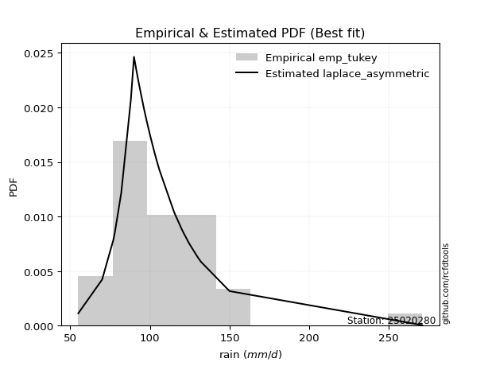</img>

####  2. Parameters & Kolmogorov-Smirnov fit test (sorted by Δ)

|   id | empirical_dist   | p_dist      |    delta |   deltao | eval    |   fit |   n |       loc |     scale |    shape | shape1             | shape2   | shape3   |   best_fit |   best_fit_sort |
|-----:|:-----------------|:------------|---------:|---------:|:--------|------:|----:|----------:|----------:|---------:|:-------------------|:---------|:---------|-----------:|----------------:|
|    0 | emp_tukey        | lognorm     | 0.103273 | 0.212396 | Δo > Δ  |     1 |  41 |  28.5657  | 73.7373   | 0.374439 |                    |          |          |          1 |               1 |
|    1 | emp_tukey        | zzloggumbel | 0.110644 | 0.212396 | Δo > Δ  |     1 |  41 |   4.52712 |  0.210666 | 0.544198 | 1.1435823657845239 |          |          |          0 |               2 |
|    2 | emp_tukey        | zzgumbel    | 0.25448  | 0.212396 | Δo <= Δ |     0 |  41 | 107.882   | 27.0426   | 0.544198 | 1.1435823657845239 |          |          |          0 |               3 |

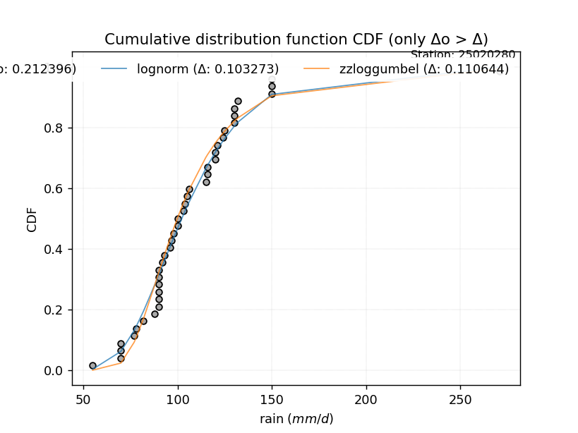</img>

#### 3. Best fit for

|   id |   station | empirical_dist   | p_dist   |    delta |   deltao | eval   |   fit |   n |     loc |   scale |    shape | shape1   | shape2   | shape3   |   best_fit |   best_fit_sort |
|-----:|----------:|:-----------------|:---------|---------:|---------:|:-------|------:|----:|--------:|--------:|---------:|:---------|:---------|:---------|-----------:|----------------:|
|    0 |  25020280 | emp_tukey        | lognorm  | 0.103273 | 0.212396 | Δo > Δ |     1 |  41 | 28.5657 | 73.7373 | 0.374439 |          |          |          |          1 |               1 |

</img>

### Empirical: emp_gringorten

#### 1. Empirical values

|   id |   date |   x |   m | empirical_dist   |   empirical |   empirical_tr |
|-----:|-------:|----:|----:|:-----------------|------------:|---------------:|
|    0 |   1986 |  55 |   1 | emp_gringorten   |   0.0136187 |        1.01381 |
|    1 |   1995 |  70 |   2 | emp_gringorten   |   0.0379377 |        1.03943 |
|    2 |   1997 |  70 |   3 | emp_gringorten   |   0.0622568 |        1.06639 |
|    3 |   2001 |  70 |   4 | emp_gringorten   |   0.0865759 |        1.09478 |
|    4 |   1989 |  77 |   5 | emp_gringorten   |   0.110895  |        1.12473 |
|    5 |   1981 |  78 |   6 | emp_gringorten   |   0.135214  |        1.15636 |
|    6 |   1976 |  82 |   7 | emp_gringorten   |   0.159533  |        1.18981 |
|    7 |   1988 |  88 |   8 | emp_gringorten   |   0.183852  |        1.22527 |
|    8 |   1987 |  90 |   9 | emp_gringorten   |   0.208171  |        1.2629  |
|    9 |   1991 |  90 |  10 | emp_gringorten   |   0.23249   |        1.30292 |
|   10 |   2004 |  90 |  11 | emp_gringorten   |   0.256809  |        1.34555 |
|   11 |   1977 |  90 |  12 | emp_gringorten   |   0.281128  |        1.39107 |
|   12 |   2009 |  90 |  13 | emp_gringorten   |   0.305447  |        1.43978 |
|   13 |   2007 |  90 |  14 | emp_gringorten   |   0.329767  |        1.49202 |
|   14 |   1974 |  92 |  15 | emp_gringorten   |   0.354086  |        1.54819 |
|   15 |   1990 |  93 |  16 | emp_gringorten   |   0.378405  |        1.60876 |
|   16 |   2002 |  96 |  17 | emp_gringorten   |   0.402724  |        1.67427 |
|   17 |   1972 |  97 |  18 | emp_gringorten   |   0.427043  |        1.74533 |
|   18 |   1985 |  98 |  19 | emp_gringorten   |   0.451362  |        1.8227  |
|   19 |   1994 | 100 |  20 | emp_gringorten   |   0.475681  |        1.90724 |
|   20 |   1971 | 100 |  21 | emp_gringorten   |   0.5       |        2       |
|   21 |   1983 | 103 |  22 | emp_gringorten   |   0.524319  |        2.10225 |
|   22 |   1975 | 104 |  23 | emp_gringorten   |   0.548638  |        2.21552 |
|   23 |   1992 | 105 |  24 | emp_gringorten   |   0.572957  |        2.34169 |
|   24 |   2005 | 106 |  25 | emp_gringorten   |   0.597276  |        2.48309 |
|   25 |   1970 | 115 |  26 | emp_gringorten   |   0.621595  |        2.64267 |
|   26 |   1973 | 116 |  27 | emp_gringorten   |   0.645914  |        2.82418 |
|   27 |   1979 | 116 |  28 | emp_gringorten   |   0.670233  |        3.03245 |
|   28 |   2000 | 120 |  29 | emp_gringorten   |   0.694553  |        3.27389 |
|   29 |   1993 | 120 |  30 | emp_gringorten   |   0.718872  |        3.55709 |
|   30 |   2008 | 121 |  31 | emp_gringorten   |   0.743191  |        3.89394 |
|   31 |   1998 | 124 |  32 | emp_gringorten   |   0.76751   |        4.30126 |
|   32 |   2006 | 125 |  33 | emp_gringorten   |   0.791829  |        4.80374 |
|   33 |   1978 | 130 |  34 | emp_gringorten   |   0.816148  |        5.43915 |
|   34 |   1980 | 130 |  35 | emp_gringorten   |   0.840467  |        6.26829 |
|   35 |   1999 | 130 |  36 | emp_gringorten   |   0.864786  |        7.39568 |
|   36 |   1969 | 132 |  37 | emp_gringorten   |   0.889105  |        9.01754 |
|   37 |   1996 | 150 |  38 | emp_gringorten   |   0.913424  |       11.5506  |
|   38 |   1982 | 150 |  39 | emp_gringorten   |   0.937743  |       16.0625  |
|   39 |   1984 | 150 |  40 | emp_gringorten   |   0.962062  |       26.359   |
|   40 |   2003 | 271 |  41 | emp_gringorten   |   0.986381  |       73.4286  |

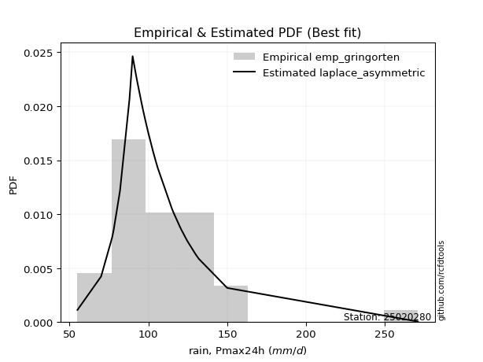</img>

####  2. Parameters & Kolmogorov-Smirnov fit test (sorted by Δ)

|   id | empirical_dist   | p_dist      |    delta |   deltao | eval    |   fit |   n |       loc |     scale |    shape | shape1             | shape2   | shape3   |   best_fit |   best_fit_sort |
|-----:|:-----------------|:------------|---------:|---------:|:--------|------:|----:|----------:|----------:|---------:|:-------------------|:---------|:---------|-----------:|----------------:|
|    0 | emp_gringorten   | lognorm     | 0.10478  | 0.212396 | Δo > Δ  |     1 |  41 |  28.5657  | 73.7373   | 0.374439 |                    |          |          |          1 |               1 |
|    1 | emp_gringorten   | zzloggumbel | 0.11215  | 0.212396 | Δo > Δ  |     1 |  41 |   4.52712 |  0.210666 | 0.544198 | 1.1435823657845239 |          |          |          0 |               2 |
|    2 | emp_gringorten   | zzgumbel    | 0.254982 | 0.212396 | Δo <= Δ |     0 |  41 | 107.882   | 27.0426   | 0.544198 | 1.1435823657845239 |          |          |          0 |               3 |

</img>

#### 3. Best fit for

|   id |   station | empirical_dist   | p_dist   |   delta |   deltao | eval   |   fit |   n |     loc |   scale |    shape | shape1   | shape2   | shape3   |   best_fit |   best_fit_sort |
|-----:|----------:|:-----------------|:---------|--------:|---------:|:-------|------:|----:|--------:|--------:|---------:|:---------|:---------|:---------|-----------:|----------------:|
|    0 |  25020280 | emp_gringorten   | lognorm  | 0.10478 | 0.212396 | Δo > Δ |     1 |  41 | 28.5657 | 73.7373 | 0.374439 |          |          |          |          1 |               1 |

</img>

### Empirical: emp_jenkinson

#### 1. Empirical values

|   id |   date |   x |   m | empirical_dist   |   empirical |   empirical_tr |
|-----:|-------:|----:|----:|:-----------------|------------:|---------------:|
|    0 |   1986 |  55 |   1 | emp_jenkinson    |   0.0166747 |        1.01696 |
|    1 |   1995 |  70 |   2 | emp_jenkinson    |   0.040841  |        1.04258 |
|    2 |   1997 |  70 |   3 | emp_jenkinson    |   0.0650072 |        1.06953 |
|    3 |   2001 |  70 |   4 | emp_jenkinson    |   0.0891735 |        1.0979  |
|    4 |   1989 |  77 |   5 | emp_jenkinson    |   0.11334   |        1.12783 |
|    5 |   1981 |  78 |   6 | emp_jenkinson    |   0.137506  |        1.15943 |
|    6 |   1976 |  82 |   7 | emp_jenkinson    |   0.161672  |        1.19285 |
|    7 |   1988 |  88 |   8 | emp_jenkinson    |   0.185839  |        1.22826 |
|    8 |   1987 |  90 |   9 | emp_jenkinson    |   0.210005  |        1.26583 |
|    9 |   1991 |  90 |  10 | emp_jenkinson    |   0.234171  |        1.30577 |
|   10 |   2004 |  90 |  11 | emp_jenkinson    |   0.258337  |        1.34832 |
|   11 |   1977 |  90 |  12 | emp_jenkinson    |   0.282504  |        1.39374 |
|   12 |   2009 |  90 |  13 | emp_jenkinson    |   0.30667   |        1.44231 |
|   13 |   2007 |  90 |  14 | emp_jenkinson    |   0.330836  |        1.4944  |
|   14 |   1974 |  92 |  15 | emp_jenkinson    |   0.355002  |        1.55039 |
|   15 |   1990 |  93 |  16 | emp_jenkinson    |   0.379169  |        1.61074 |
|   16 |   2002 |  96 |  17 | emp_jenkinson    |   0.403335  |        1.67598 |
|   17 |   1972 |  97 |  18 | emp_jenkinson    |   0.427501  |        1.74673 |
|   18 |   1985 |  98 |  19 | emp_jenkinson    |   0.451667  |        1.82371 |
|   19 |   1994 | 100 |  20 | emp_jenkinson    |   0.475834  |        1.90779 |
|   20 |   1971 | 100 |  21 | emp_jenkinson    |   0.5       |        2       |
|   21 |   1983 | 103 |  22 | emp_jenkinson    |   0.524166  |        2.10157 |
|   22 |   1975 | 104 |  23 | emp_jenkinson    |   0.548333  |        2.21402 |
|   23 |   1992 | 105 |  24 | emp_jenkinson    |   0.572499  |        2.33917 |
|   24 |   2005 | 106 |  25 | emp_jenkinson    |   0.596665  |        2.47933 |
|   25 |   1970 | 115 |  26 | emp_jenkinson    |   0.620831  |        2.63735 |
|   26 |   1973 | 116 |  27 | emp_jenkinson    |   0.644998  |        2.81688 |
|   27 |   1979 | 116 |  28 | emp_jenkinson    |   0.669164  |        3.02264 |
|   28 |   2000 | 120 |  29 | emp_jenkinson    |   0.69333   |        3.26084 |
|   29 |   1993 | 120 |  30 | emp_jenkinson    |   0.717496  |        3.53978 |
|   30 |   2008 | 121 |  31 | emp_jenkinson    |   0.741663  |        3.87091 |
|   31 |   1998 | 124 |  32 | emp_jenkinson    |   0.765829  |        4.27038 |
|   32 |   2006 | 125 |  33 | emp_jenkinson    |   0.789995  |        4.7618  |
|   33 |   1978 | 130 |  34 | emp_jenkinson    |   0.814161  |        5.38101 |
|   34 |   1980 | 130 |  35 | emp_jenkinson    |   0.838328  |        6.18535 |
|   35 |   1999 | 130 |  36 | emp_jenkinson    |   0.862494  |        7.27241 |
|   36 |   1969 | 132 |  37 | emp_jenkinson    |   0.88666   |        8.82303 |
|   37 |   1996 | 150 |  38 | emp_jenkinson    |   0.910826  |       11.2141  |
|   38 |   1982 | 150 |  39 | emp_jenkinson    |   0.934993  |       15.3829  |
|   39 |   1984 | 150 |  40 | emp_jenkinson    |   0.959159  |       24.4852  |
|   40 |   2003 | 271 |  41 | emp_jenkinson    |   0.983325  |       59.971   |

</img>

####  2. Parameters & Kolmogorov-Smirnov fit test (sorted by Δ)

|   id | empirical_dist   | p_dist      |    delta |   deltao | eval    |   fit |   n |       loc |     scale |    shape | shape1             | shape2   | shape3   |   best_fit |   best_fit_sort |
|-----:|:-----------------|:------------|---------:|---------:|:--------|------:|----:|----------:|----------:|---------:|:-------------------|:---------|:---------|-----------:|----------------:|
|    0 | emp_jenkinson    | lognorm     | 0.102946 | 0.212396 | Δo > Δ  |     1 |  41 |  28.5657  | 73.7373   | 0.374439 |                    |          |          |          1 |               1 |
|    1 | emp_jenkinson    | zzloggumbel | 0.110317 | 0.212396 | Δo > Δ  |     1 |  41 |   4.52712 |  0.210666 | 0.544198 | 1.1435823657845239 |          |          |          0 |               2 |
|    2 | emp_jenkinson    | zzgumbel    | 0.254371 | 0.212396 | Δo <= Δ |     0 |  41 | 107.882   | 27.0426   | 0.544198 | 1.1435823657845239 |          |          |          0 |               3 |

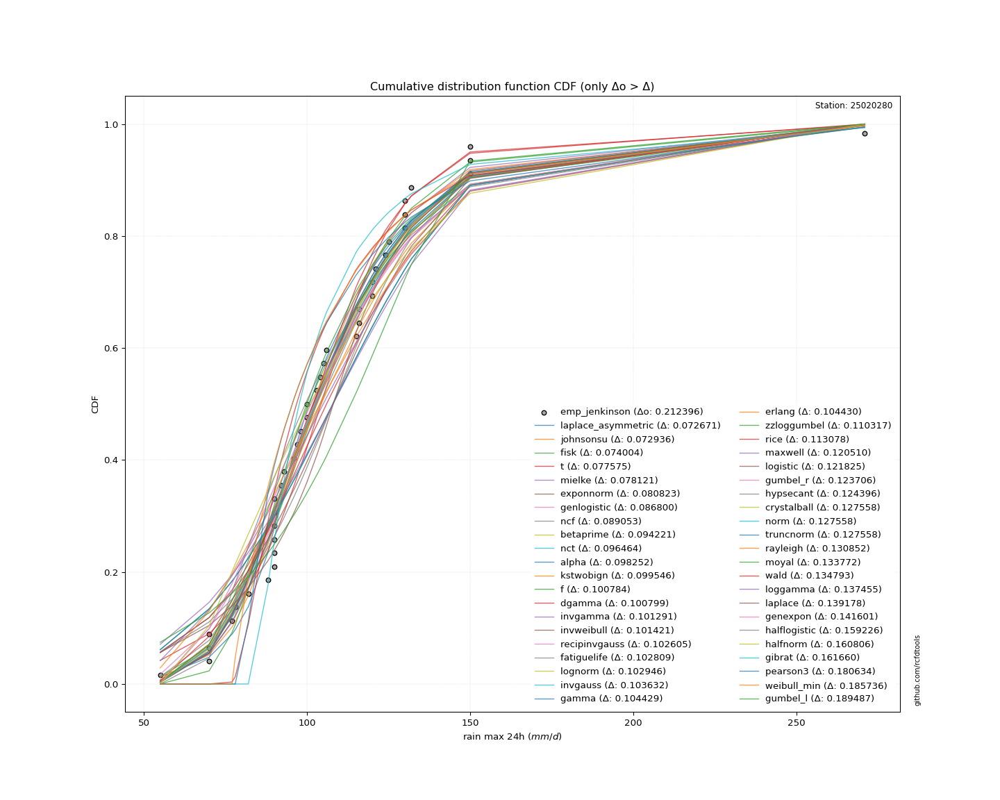</img>

#### 3. Best fit for

|   id |   station | empirical_dist   | p_dist   |    delta |   deltao | eval   |   fit |   n |     loc |   scale |    shape | shape1   | shape2   | shape3   |   best_fit |   best_fit_sort |
|-----:|----------:|:-----------------|:---------|---------:|---------:|:-------|------:|----:|--------:|--------:|---------:|:---------|:---------|:---------|-----------:|----------------:|
|    0 |  25020280 | emp_jenkinson    | lognorm  | 0.102946 | 0.212396 | Δo > Δ |     1 |  41 | 28.5657 | 73.7373 | 0.374439 |          |          |          |          1 |               1 |

</img>

### Empirical: emp_cunnane

#### 1. Empirical values

|   id |   date |   x |   m | empirical_dist   |   empirical |   empirical_tr |
|-----:|-------:|----:|----:|:-----------------|------------:|---------------:|
|    0 |   1986 |  55 |   1 | emp_cunnane      |   0.0145631 |        1.01478 |
|    1 |   1995 |  70 |   2 | emp_cunnane      |   0.038835  |        1.0404  |
|    2 |   1997 |  70 |   3 | emp_cunnane      |   0.0631068 |        1.06736 |
|    3 |   2001 |  70 |   4 | emp_cunnane      |   0.0873786 |        1.09574 |
|    4 |   1989 |  77 |   5 | emp_cunnane      |   0.11165   |        1.12568 |
|    5 |   1981 |  78 |   6 | emp_cunnane      |   0.135922  |        1.1573  |
|    6 |   1976 |  82 |   7 | emp_cunnane      |   0.160194  |        1.19075 |
|    7 |   1988 |  88 |   8 | emp_cunnane      |   0.184466  |        1.22619 |
|    8 |   1987 |  90 |   9 | emp_cunnane      |   0.208738  |        1.2638  |
|    9 |   1991 |  90 |  10 | emp_cunnane      |   0.23301   |        1.3038  |
|   10 |   2004 |  90 |  11 | emp_cunnane      |   0.257282  |        1.34641 |
|   11 |   1977 |  90 |  12 | emp_cunnane      |   0.281553  |        1.39189 |
|   12 |   2009 |  90 |  13 | emp_cunnane      |   0.305825  |        1.44056 |
|   13 |   2007 |  90 |  14 | emp_cunnane      |   0.330097  |        1.49275 |
|   14 |   1974 |  92 |  15 | emp_cunnane      |   0.354369  |        1.54887 |
|   15 |   1990 |  93 |  16 | emp_cunnane      |   0.378641  |        1.60937 |
|   16 |   2002 |  96 |  17 | emp_cunnane      |   0.402913  |        1.6748  |
|   17 |   1972 |  97 |  18 | emp_cunnane      |   0.427184  |        1.74576 |
|   18 |   1985 |  98 |  19 | emp_cunnane      |   0.451456  |        1.82301 |
|   19 |   1994 | 100 |  20 | emp_cunnane      |   0.475728  |        1.90741 |
|   20 |   1971 | 100 |  21 | emp_cunnane      |   0.5       |        2       |
|   21 |   1983 | 103 |  22 | emp_cunnane      |   0.524272  |        2.10204 |
|   22 |   1975 | 104 |  23 | emp_cunnane      |   0.548544  |        2.21505 |
|   23 |   1992 | 105 |  24 | emp_cunnane      |   0.572816  |        2.34091 |
|   24 |   2005 | 106 |  25 | emp_cunnane      |   0.597087  |        2.48193 |
|   25 |   1970 | 115 |  26 | emp_cunnane      |   0.621359  |        2.64103 |
|   26 |   1973 | 116 |  27 | emp_cunnane      |   0.645631  |        2.82192 |
|   27 |   1979 | 116 |  28 | emp_cunnane      |   0.669903  |        3.02941 |
|   28 |   2000 | 120 |  29 | emp_cunnane      |   0.694175  |        3.26984 |
|   29 |   1993 | 120 |  30 | emp_cunnane      |   0.718447  |        3.55172 |
|   30 |   2008 | 121 |  31 | emp_cunnane      |   0.742718  |        3.88679 |
|   31 |   1998 | 124 |  32 | emp_cunnane      |   0.76699   |        4.29167 |
|   32 |   2006 | 125 |  33 | emp_cunnane      |   0.791262  |        4.7907  |
|   33 |   1978 | 130 |  34 | emp_cunnane      |   0.815534  |        5.42105 |
|   34 |   1980 | 130 |  35 | emp_cunnane      |   0.839806  |        6.24242 |
|   35 |   1999 | 130 |  36 | emp_cunnane      |   0.864078  |        7.35714 |
|   36 |   1969 | 132 |  37 | emp_cunnane      |   0.88835   |        8.95652 |
|   37 |   1996 | 150 |  38 | emp_cunnane      |   0.912621  |       11.4444  |
|   38 |   1982 | 150 |  39 | emp_cunnane      |   0.936893  |       15.8462  |
|   39 |   1984 | 150 |  40 | emp_cunnane      |   0.961165  |       25.75    |
|   40 |   2003 | 271 |  41 | emp_cunnane      |   0.985437  |       68.6667  |

</img>

####  2. Parameters & Kolmogorov-Smirnov fit test (sorted by Δ)

|   id | empirical_dist   | p_dist      |    delta |   deltao | eval    |   fit |   n |       loc |     scale |    shape | shape1             | shape2   | shape3   |   best_fit |   best_fit_sort |
|-----:|:-----------------|:------------|---------:|---------:|:--------|------:|----:|----------:|----------:|---------:|:-------------------|:---------|:---------|-----------:|----------------:|
|    0 | emp_cunnane      | lognorm     | 0.104213 | 0.212396 | Δo > Δ  |     1 |  41 |  28.5657  | 73.7373   | 0.374439 |                    |          |          |          1 |               1 |
|    1 | emp_cunnane      | zzloggumbel | 0.111584 | 0.212396 | Δo > Δ  |     1 |  41 |   4.52712 |  0.210666 | 0.544198 | 1.1435823657845239 |          |          |          0 |               2 |
|    2 | emp_cunnane      | zzgumbel    | 0.254793 | 0.212396 | Δo <= Δ |     0 |  41 | 107.882   | 27.0426   | 0.544198 | 1.1435823657845239 |          |          |          0 |               3 |

</img>

#### 3. Best fit for

|   id |   station | empirical_dist   | p_dist   |    delta |   deltao | eval   |   fit |   n |     loc |   scale |    shape | shape1   | shape2   | shape3   |   best_fit |   best_fit_sort |
|-----:|----------:|:-----------------|:---------|---------:|---------:|:-------|------:|----:|--------:|--------:|---------:|:---------|:---------|:---------|-----------:|----------------:|
|    0 |  25020280 | emp_cunnane      | lognorm  | 0.104213 | 0.212396 | Δo > Δ |     1 |  41 | 28.5657 | 73.7373 | 0.374439 |          |          |          |          1 |               1 |

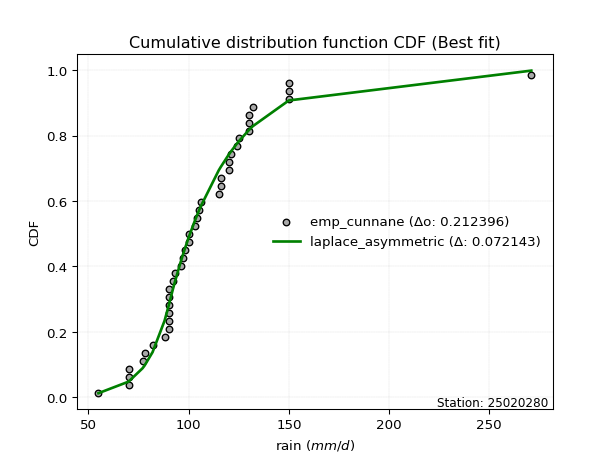</img>

### Empirical: emp_adamowski

#### 1. Empirical values

|   id |   date |   x |   m | empirical_dist   |   empirical |   empirical_tr |
|-----:|-------:|----:|----:|:-----------------|------------:|---------------:|
|    0 |   1986 |  55 |   1 | emp_adamowski    |   0.0180723 |        1.0184  |
|    1 |   1995 |  70 |   2 | emp_adamowski    |   0.0421687 |        1.04403 |
|    2 |   1997 |  70 |   3 | emp_adamowski    |   0.0662651 |        1.07097 |
|    3 |   2001 |  70 |   4 | emp_adamowski    |   0.0903614 |        1.09934 |
|    4 |   1989 |  77 |   5 | emp_adamowski    |   0.114458  |        1.12925 |
|    5 |   1981 |  78 |   6 | emp_adamowski    |   0.138554  |        1.16084 |
|    6 |   1976 |  82 |   7 | emp_adamowski    |   0.162651  |        1.19424 |
|    7 |   1988 |  88 |   8 | emp_adamowski    |   0.186747  |        1.22963 |
|    8 |   1987 |  90 |   9 | emp_adamowski    |   0.210843  |        1.26718 |
|    9 |   1991 |  90 |  10 | emp_adamowski    |   0.23494   |        1.30709 |
|   10 |   2004 |  90 |  11 | emp_adamowski    |   0.259036  |        1.34959 |
|   11 |   1977 |  90 |  12 | emp_adamowski    |   0.283133  |        1.39496 |
|   12 |   2009 |  90 |  13 | emp_adamowski    |   0.307229  |        1.44348 |
|   13 |   2007 |  90 |  14 | emp_adamowski    |   0.331325  |        1.4955  |
|   14 |   1974 |  92 |  15 | emp_adamowski    |   0.355422  |        1.5514  |
|   15 |   1990 |  93 |  16 | emp_adamowski    |   0.379518  |        1.61165 |
|   16 |   2002 |  96 |  17 | emp_adamowski    |   0.403614  |        1.67677 |
|   17 |   1972 |  97 |  18 | emp_adamowski    |   0.427711  |        1.74737 |
|   18 |   1985 |  98 |  19 | emp_adamowski    |   0.451807  |        1.82418 |
|   19 |   1994 | 100 |  20 | emp_adamowski    |   0.475904  |        1.90805 |
|   20 |   1971 | 100 |  21 | emp_adamowski    |   0.5       |        2       |
|   21 |   1983 | 103 |  22 | emp_adamowski    |   0.524096  |        2.10127 |
|   22 |   1975 | 104 |  23 | emp_adamowski    |   0.548193  |        2.21333 |
|   23 |   1992 | 105 |  24 | emp_adamowski    |   0.572289  |        2.33803 |
|   24 |   2005 | 106 |  25 | emp_adamowski    |   0.596386  |        2.47761 |
|   25 |   1970 | 115 |  26 | emp_adamowski    |   0.620482  |        2.63492 |
|   26 |   1973 | 116 |  27 | emp_adamowski    |   0.644578  |        2.81356 |
|   27 |   1979 | 116 |  28 | emp_adamowski    |   0.668675  |        3.01818 |
|   28 |   2000 | 120 |  29 | emp_adamowski    |   0.692771  |        3.2549  |
|   29 |   1993 | 120 |  30 | emp_adamowski    |   0.716867  |        3.53191 |
|   30 |   2008 | 121 |  31 | emp_adamowski    |   0.740964  |        3.86047 |
|   31 |   1998 | 124 |  32 | emp_adamowski    |   0.76506   |        4.25641 |
|   32 |   2006 | 125 |  33 | emp_adamowski    |   0.789157  |        4.74286 |
|   33 |   1978 | 130 |  34 | emp_adamowski    |   0.813253  |        5.35484 |
|   34 |   1980 | 130 |  35 | emp_adamowski    |   0.837349  |        6.14815 |
|   35 |   1999 | 130 |  36 | emp_adamowski    |   0.861446  |        7.21739 |
|   36 |   1969 | 132 |  37 | emp_adamowski    |   0.885542  |        8.73684 |
|   37 |   1996 | 150 |  38 | emp_adamowski    |   0.909639  |       11.0667  |
|   38 |   1982 | 150 |  39 | emp_adamowski    |   0.933735  |       15.0909  |
|   39 |   1984 | 150 |  40 | emp_adamowski    |   0.957831  |       23.7143  |
|   40 |   2003 | 271 |  41 | emp_adamowski    |   0.981928  |       55.3333  |

</img>

####  2. Parameters & Kolmogorov-Smirnov fit test (sorted by Δ)

|   id | empirical_dist   | p_dist      |    delta |   deltao | eval    |   fit |   n |       loc |     scale |    shape | shape1             | shape2   | shape3   |   best_fit |   best_fit_sort |
|-----:|:-----------------|:------------|---------:|---------:|:--------|------:|----:|----------:|----------:|---------:|:-------------------|:---------|:---------|-----------:|----------------:|
|    0 | emp_adamowski    | lognorm     | 0.102107 | 0.212396 | Δo > Δ  |     1 |  41 |  28.5657  | 73.7373   | 0.374439 |                    |          |          |          1 |               1 |
|    1 | emp_adamowski    | zzloggumbel | 0.109478 | 0.212396 | Δo > Δ  |     1 |  41 |   4.52712 |  0.210666 | 0.544198 | 1.1435823657845239 |          |          |          0 |               2 |
|    2 | emp_adamowski    | zzgumbel    | 0.254092 | 0.212396 | Δo <= Δ |     0 |  41 | 107.882   | 27.0426   | 0.544198 | 1.1435823657845239 |          |          |          0 |               3 |

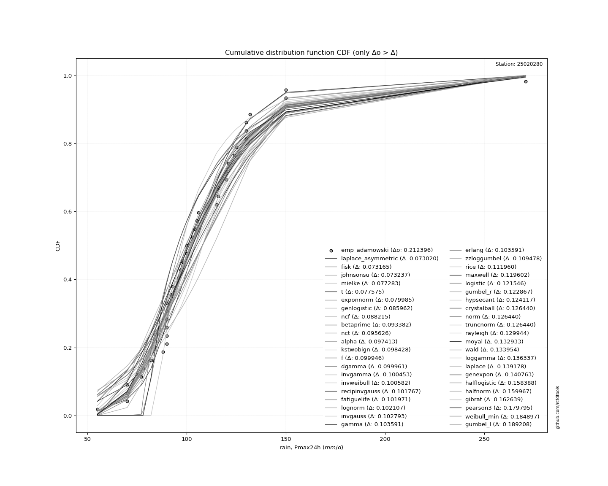</img>

#### 3. Best fit for

|   id |   station | empirical_dist   | p_dist   |    delta |   deltao | eval   |   fit |   n |     loc |   scale |    shape | shape1   | shape2   | shape3   |   best_fit |   best_fit_sort |
|-----:|----------:|:-----------------|:---------|---------:|---------:|:-------|------:|----:|--------:|--------:|---------:|:---------|:---------|:---------|-----------:|----------------:|
|    0 |  25020280 | emp_adamowski    | lognorm  | 0.102107 | 0.212396 | Δo > Δ |     1 |  41 | 28.5657 | 73.7373 | 0.374439 |          |          |          |          1 |               1 |

</img>

## C. Estimate extreme values for specific return periods - Tr
|   id |     tr |   prob_l |   prob_g |   lognorm |   zzgumbel |   zzloggumbel | empirical_dist    |   station |   n |   risk_rate |
|-----:|-------:|---------:|---------:|----------:|-----------:|--------------:|:------------------|----------:|----:|------------:|
|    0 |   2.33 | 0.570815 | 0.429185 |   107.398 |    123.529 |       104.482 | emp_adamowski     |  25020280 |  41 |    0.729209 |
|    1 |   5    | 0.8      | 0.2      |   129.619 |    148.445 |       126.863 | emp_adamowski     |  25020280 |  41 |    0.67232  |
|    2 |  10    | 0.9      | 0.1      |   147.714 |    168.738 |       148.591 | emp_adamowski     |  25020280 |  41 |    0.651322 |
|    3 |  25    | 0.96     | 0.04     |   170.595 |    194.379 |       181.444 | emp_adamowski     |  25020280 |  41 |    0.639603 |
|    4 |  50    | 0.98     | 0.02     |   187.662 |    213.401 |       210.425 | emp_adamowski     |  25020280 |  41 |    0.63583  |
|    5 | 100    | 0.99     | 0.01     |   204.759 |    232.282 |       243.768 | emp_adamowski     |  25020280 |  41 |    0.633968 |

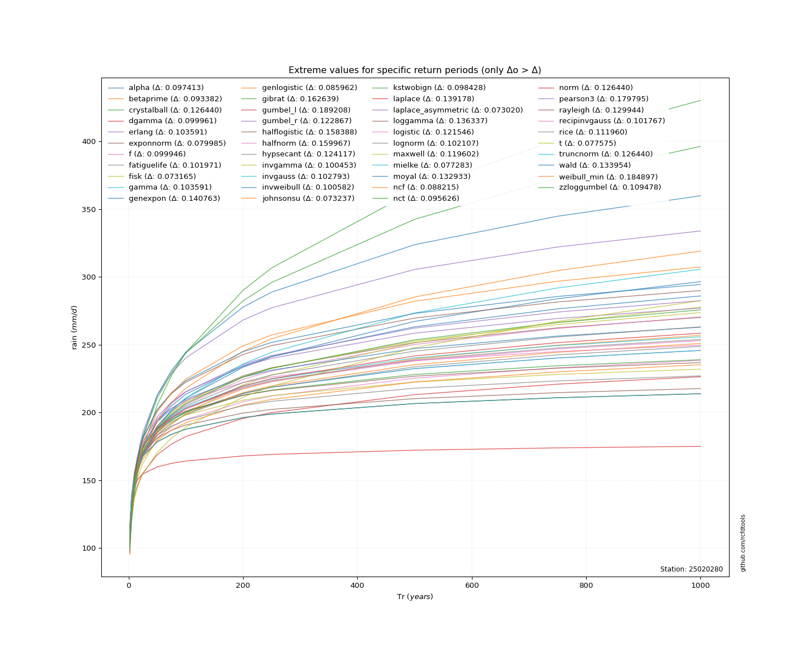</img>

> risk_rate: assuming the return period as the project useful life.