<div align="center">


</div>

# Station (rain, Pmax24h): 25020430

Probable Maximum Precipitation (PMP) is the greatest amount of rainfall for a specific duration that is meteorologically possible for a given location, acting as a "worst-case" scenario for extreme storms, crucial for designing safety-critical infrastructure like bridges, river deviations, dams, spillways, and nuclear plants to prevent catastrophic failure. PMP is calculated by hydrologists using meteorological data to determine the upper limit of extreme rainfall, often leading to the Probable Maximum Flood (PMF) for flood control design, and is increasingly being studied for climate change impacts.

<div align="center">

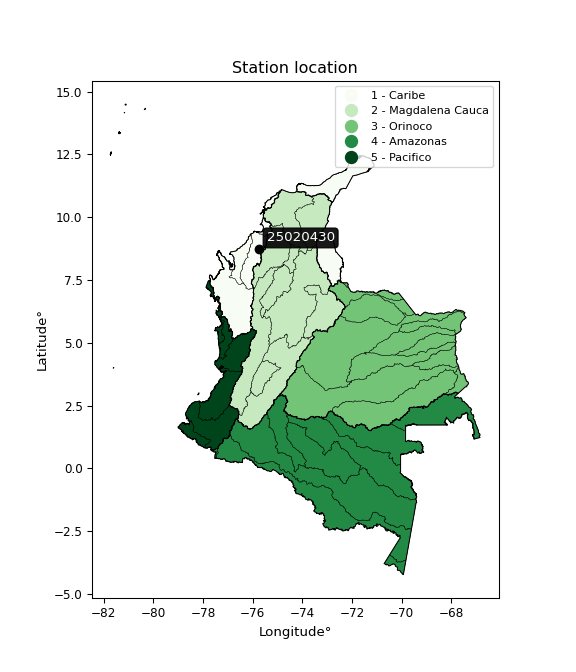</img>

</div>


## A. General information


### 1. General running parameters

• app_version: _v20251225_. • runtime: _2025-12-26 14:29:50.888910_. • Python version: _3.14.0_. • SciPy version: _1.16.3_. • Pandas version: _2.3.3_. • NumPy version: _2.3.5_. • Stations dataset (station_dataset_file): _dataset/pmax24h_in/automatic_colombia.csv_. • Stations catalog (station_catalog_file): _dataset/CNE_IDEAM.xls_. • Plot only fit distributions with Δo > Δ (plot_only_fit): _True_. • Eval low extreme values, if False, evaluates high extreme values (low_extreme): _False_. • Eval every SciPy distribution as logarithmic (pdist_logarithmic_on): _True_. • Standard deviation normalized (ddof): _1.0_. • Return periods to eval in years (Tr): _[2, 2.33, 5, 10, 15, 20, 25, 50, 75, 100, 200, 250, 500, 750, 1000]_. • Minimum data sample per station, 0 means any (minimum_sample): _5_. • Z-Score threshold to adjust a value, 0 means disable (zscore): _3.5_. • Avoid zeros, e.g. rain = 0 (avoid_zeros): _True_. • Avoid null values (avoid_nans): _True_. [:file_folder:Dataset file.](../../dataset/pmax24h_in/automatic_colombia.csv)


### 2. Station info and location

|   id |   CODIGO | NOMBRE                      | CATEGORIA     | TECNOLOGIA                              | ESTADO   | FECHA_INSTALACION   |   FECHA_SUSPENSION |   ALTITUD |   LATITUD |   LONGITUD | DEPARTAMENTO   | MUNICIPIO   | AREA_OPERATIVA                              | ENTIDAD                                                     | AREA_HIDROGRAFICA   | ZONA_HIDROGRAFICA   | SUBZONA_HIDROGRAFICA   |   CORRIENTE | OBSERVACION                                                                                                                                                                                                                                                          |   SUBRED | Catalogo   |
|-----:|---------:|:----------------------------|:--------------|:----------------------------------------|:---------|:--------------------|-------------------:|----------:|----------:|-----------:|:---------------|:------------|:--------------------------------------------|:------------------------------------------------------------|:--------------------|:--------------------|:-----------------------|------------:|:---------------------------------------------------------------------------------------------------------------------------------------------------------------------------------------------------------------------------------------------------------------------|---------:|:-----------|
|    0 | 25020430 | TREMENTINO - AUT [25020430] | Pluviométrica | Automática con Telemetría, Convencional | Activa   | 10/03/2014          |                nan |        19 |   8.71667 |   -75.7667 | Cordoba        | Montería    | Area Operativa 02 - Atlántico-Bolivar-Sucre | INSTITUTO DE HIDROLOGIA METEOROLOGIA Y ESTUDIOS AMBIENTALES | Caribe              | Sinú                | Bajo Sinú              |         nan | Actualizada tecnologia y tipo de transmision por solicitud del coordinador del AO. (300120213) |23/01/2025$mvelez$Se activa la estación porque actualmente está reportando datos en Polaris solicitud coordinadora Mayra Soto mediante correo electrónico 22/01/2025 |      nan | CNE_IDEAM  |

<div align="center">

Map location in: [:earth_americas:Google](http://maps.google.com/maps?q=8.716666667,-75.76666667) [:earth_americas:OSM](https://www.openstreetmap.org/#map=18/8.716666667/-75.76666667&layers=P) [:earth_americas:Bing](https://www.bing.com/maps?cp=8.716666667~-75.76666667&lvl=18) [:earth_americas:Apple](https://maps.apple.com/frame?center=8.716666667%2C-75.76666667&span=0.003%2C0.006)

</div>


<div align="center">

```geojson
{
  "type": "Feature",
  "geometry": {
    "type": "Point", 
    "coordinates": [-75.76666667, 8.716666667]
  }, 
  "properties": {
    "Name": "25020430"
  }
}
```

</div>


### 3. Discrete values table and plot

|               |          0 |          1 |           2 |           3 |            4 |          5 |           6 |            7 |           8 |
|:--------------|-----------:|-----------:|------------:|------------:|-------------:|-----------:|------------:|-------------:|------------:|
| Date          | 2017       | 2018       | 2019        | 2020        | 2021         | 2022       | 2023        | 2024         | 2025        |
| Value         |  187.1     |  205.7     |   43.1      |   73.9      |   96.6       |   16.7     |  125.4      |   95.4       |   37.9      |
| Value_initial |  187.1     |  205.7     |   43.1      |   73.9      |   96.6       |   16.7     |  125.4      |   95.4       |   37.9      |
| count         |    9       |    9       |    9        |    9        |    9         |    9       |    9        |    9         |    9        |
| mean          |   97.9778  |   97.9778  |   97.9778   |   97.9778   |   97.9778    |   97.9778  |   97.9778   |   97.9778    |   97.9778   |
| std           |   65.3013  |   65.3013  |   65.3013   |   65.3013   |   65.3013    |   65.3013  |   65.3013   |   65.3013    |   65.3013   |
| zscore        |    1.36478 |    1.64962 |   -0.840378 |   -0.368718 |   -0.0210988 |   -1.24466 |    0.419934 |   -0.0394751 |   -0.920009 |

<div align="center">

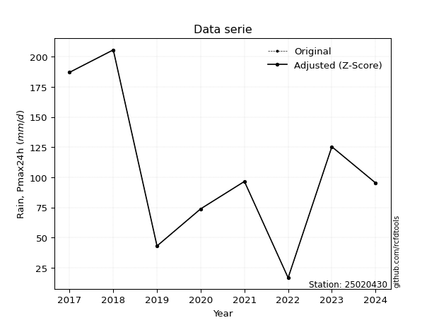</img>

</div>

> If Z-Score is active, values out of range or outliers are replaced with the station mean value.


### 4. Active continuous probability distributions from SciPy (45 of 104 available)

[scipy.stats](https://docs.scipy.org/doc/scipy/reference/stats.html) is a Python´s powerful submodule within the SciPy library for comprehensive statistical analysis, offering over 130 probability distributions (like Normal, Poisson), functions for descriptive stats (mean, variance), hypothesis testing (t-tests, chi-square), random variable generation, and statistical tests, making it essential for data science, modeling, and research. It provides tools to explore, model, and draw conclusions from data efficiently, working seamlessly with NumPy.

<div align="center">

|   id | p_dist             |   n_parameter | fit_method   | label                                                                       | active   | ref                                                                                                        |
|-----:|:-------------------|--------------:|:-------------|:----------------------------------------------------------------------------|:---------|:-----------------------------------------------------------------------------------------------------------|
|    0 | alpha              |             3 | MLE          | Alpha                                                                       | True     | [:mortar_board:](https://docs.scipy.org/doc/scipy/reference/generated/scipy.stats.alpha.html)              |
|    1 | betaprime          |             4 | MLE          | Beta prime                                                                  | True     | [:mortar_board:](https://docs.scipy.org/doc/scipy/reference/generated/scipy.stats.betaprime.html)          |
|    2 | chi2               |             3 | MLE          | Chi²                                                                        | True     | [:mortar_board:](https://docs.scipy.org/doc/scipy/reference/generated/scipy.stats.chi2.html)               |
|    3 | crystalball        |             4 | MLE          | Crystalball                                                                 | True     | [:mortar_board:](https://docs.scipy.org/doc/scipy/reference/generated/scipy.stats.crystalball.html)        |
|    4 | erlang             |             3 | MLE          | Erlang                                                                      | True     | [:mortar_board:](https://docs.scipy.org/doc/scipy/reference/generated/scipy.stats.erlang.html)             |
|    5 | expon              |             2 | MLE          | Exponential                                                                 | True     | [:mortar_board:](https://docs.scipy.org/doc/scipy/reference/generated/scipy.stats.expon.html)              |
|    6 | exponnorm          |             3 | MLE          | Exponentially modified Normal                                               | True     | [:mortar_board:](https://docs.scipy.org/doc/scipy/reference/generated/scipy.stats.exponnorm.html)          |
|    7 | f                  |             4 | MLE          | F                                                                           | True     | [:mortar_board:](https://docs.scipy.org/doc/scipy/reference/generated/scipy.stats.f.html)                  |
|    8 | fatiguelife        |             3 | MLE          | Fatigue-life (Birnbaum-Saunders)                                            | True     | [:mortar_board:](https://docs.scipy.org/doc/scipy/reference/generated/scipy.stats.fatiguelife.html)        |
|    9 | fisk               |             3 | MLE          | Fisk                                                                        | True     | [:mortar_board:](https://docs.scipy.org/doc/scipy/reference/generated/scipy.stats.fisk.html)               |
|   10 | gamma              |             3 | MLE          | Gamma                                                                       | True     | [:mortar_board:](https://docs.scipy.org/doc/scipy/reference/generated/scipy.stats.gamma.html)              |
|   11 | genexpon           |             5 | MLE          | Generalized exponential                                                     | True     | [:mortar_board:](https://docs.scipy.org/doc/scipy/reference/generated/scipy.stats.genexpon.html)           |
|   12 | genlogistic        |             3 | MLE          | Generalized logistic                                                        | True     | [:mortar_board:](https://docs.scipy.org/doc/scipy/reference/generated/scipy.stats.genlogistic.html)        |
|   13 | gibrat             |             2 | MM           | Gibrat                                                                      | True     | [:mortar_board:](https://docs.scipy.org/doc/scipy/reference/generated/scipy.stats.gibrat.html)             |
|   14 | gompertz           |             3 | MLE          | Gompertz (or truncated Gumbel)                                              | True     | [:mortar_board:](https://docs.scipy.org/doc/scipy/reference/generated/scipy.stats.gompertz.html)           |
|   15 | gumbel_l           |             2 | MM           | Gumbel Left Skew                                                            | True     | [:mortar_board:](https://docs.scipy.org/doc/scipy/reference/generated/scipy.stats.gumbel_l.html)           |
|   16 | gumbel_r           |             2 | MM           | Gumbel Right Skew                                                           | True     | [:mortar_board:](https://docs.scipy.org/doc/scipy/reference/generated/scipy.stats.gumbel_r.html)           |
|   17 | halflogistic       |             2 | MM           | Half-logistic                                                               | True     | [:mortar_board:](https://docs.scipy.org/doc/scipy/reference/generated/scipy.stats.halflogistic.html)       |
|   18 | halfnorm           |             2 | MM           | Half Normal                                                                 | True     | [:mortar_board:](https://docs.scipy.org/doc/scipy/reference/generated/scipy.stats.halfnorm.html)           |
|   19 | hypsecant          |             2 | MM           | hyperbolic secant                                                           | True     | [:mortar_board:](https://docs.scipy.org/doc/scipy/reference/generated/scipy.stats.hypsecant.html)          |
|   20 | invgamma           |             3 | MLE          | Inverted gamma                                                              | True     | [:mortar_board:](https://docs.scipy.org/doc/scipy/reference/generated/scipy.stats.invgamma.html)           |
|   21 | invgauss           |             3 | MLE          | Inverse Gaussian                                                            | True     | [:mortar_board:](https://docs.scipy.org/doc/scipy/reference/generated/scipy.stats.invgauss.html)           |
|   22 | invweibull         |             3 | MLE          | Inverted Weibull                                                            | True     | [:mortar_board:](https://docs.scipy.org/doc/scipy/reference/generated/scipy.stats.invweibull.html)         |
|   23 | johnsonsu          |             4 | MLE          | Johnson Su                                                                  | True     | [:mortar_board:](https://docs.scipy.org/doc/scipy/reference/generated/scipy.stats.johnsonsu.html)          |
|   24 | kstwobign          |             2 | MLE          | Limiting distribution of scaled Kolmogorov-Smirnov two-sided test statistic | True     | [:mortar_board:](https://docs.scipy.org/doc/scipy/reference/generated/scipy.stats.kstwobign.html)          |
|   25 | laplace            |             2 | MM           | Laplace                                                                     | True     | [:mortar_board:](https://docs.scipy.org/doc/scipy/reference/generated/scipy.stats.laplace.html)            |
|   26 | laplace_asymmetric |             3 | MLE          | Asymmetric Laplace                                                          | True     | [:mortar_board:](https://docs.scipy.org/doc/scipy/reference/generated/scipy.stats.laplace_asymmetric.html) |
|   27 | loggamma           |             3 | MLE          | Log gamma                                                                   | True     | [:mortar_board:](https://docs.scipy.org/doc/scipy/reference/generated/scipy.stats.loggamma.html)           |
|   28 | logistic           |             2 | MM           | Logistic (or Sech-squared)                                                  | True     | [:mortar_board:](https://docs.scipy.org/doc/scipy/reference/generated/scipy.stats.logistic.html)           |
|   29 | lognorm            |             3 | MLE          | Log Normal                                                                  | True     | [:mortar_board:](https://docs.scipy.org/doc/scipy/reference/generated/scipy.stats.lognorm.html)            |
|   30 | maxwell            |             2 | MM           | Maxwell                                                                     | True     | [:mortar_board:](https://docs.scipy.org/doc/scipy/reference/generated/scipy.stats.maxwell.html)            |
|   31 | mielke             |             4 | MLE          | Mielke Beta-Kappa / Dagum                                                   | True     | [:mortar_board:](https://docs.scipy.org/doc/scipy/reference/generated/scipy.stats.mielke.html)             |
|   32 | moyal              |             2 | MM           | Moyal                                                                       | True     | [:mortar_board:](https://docs.scipy.org/doc/scipy/reference/generated/scipy.stats.moyal.html)              |
|   33 | nakagami           |             3 | MLE          | Nakagami                                                                    | True     | [:mortar_board:](https://docs.scipy.org/doc/scipy/reference/generated/scipy.stats.nakagami.html)           |
|   34 | ncf                |             5 | MLE          | Non-central F distribution                                                  | True     | [:mortar_board:](https://docs.scipy.org/doc/scipy/reference/generated/scipy.stats.ncf.html)                |
|   35 | nct                |             4 | MLE          | Non-central Student’s t                                                     | True     | [:mortar_board:](https://docs.scipy.org/doc/scipy/reference/generated/scipy.stats.nct.html)                |
|   36 | norm               |             2 | MM           | Normal                                                                      | True     | [:mortar_board:](https://docs.scipy.org/doc/scipy/reference/generated/scipy.stats.norm.html)               |
|   37 | pareto             |             3 | MLE          | Pareto                                                                      | True     | [:mortar_board:](https://docs.scipy.org/doc/scipy/reference/generated/scipy.stats.pareto.html)             |
|   38 | pearson3           |             3 | MM           | Pearson type III                                                            | True     | [:mortar_board:](https://docs.scipy.org/doc/scipy/reference/generated/scipy.stats.pearson3.html)           |
|   39 | rayleigh           |             2 | MM           | Rayleigh                                                                    | True     | [:mortar_board:](https://docs.scipy.org/doc/scipy/reference/generated/scipy.stats.rayleigh.html)           |
|   40 | rice               |             3 | MLE          | Rice                                                                        | True     | [:mortar_board:](https://docs.scipy.org/doc/scipy/reference/generated/scipy.stats.rice.html)               |
|   41 | t                  |             3 | MLE          | Student’s t                                                                 | True     | [:mortar_board:](https://docs.scipy.org/doc/scipy/reference/generated/scipy.stats.t.html)                  |
|   42 | truncnorm          |             4 | MLE          | Truncated normal                                                            | True     | [:mortar_board:](https://docs.scipy.org/doc/scipy/reference/generated/scipy.stats.truncnorm.html)          |
|   43 | wald               |             2 | MM           | Wald                                                                        | True     | [:mortar_board:](https://docs.scipy.org/doc/scipy/reference/generated/scipy.stats.wald.html)               |
|   44 | weibull_min        |             3 | MLE          | Weibull minimum                                                             | True     | [:mortar_board:](https://docs.scipy.org/doc/scipy/reference/generated/scipy.stats.weibull_min.html)        |

</div>

> **n_parameter:** # arguments & localization & scale.
>
> **Fit methods:** (MLE) maximum likelihood, (MM) L-moments.
>
>**Inactive:** foldnorm, gennorm, norminvgauss, powernorm, powerlognorm, skewnorm, genextreme, anglit, arcsine, argus, beta, bradford, burr, burr12, cauchy, cosine, halfcauchy, foldcauchy, skewcauchy, wrapcauchy, dgamma, gengamma, exponweib, exponpow, truncexpon, gausshyper, genhalflogistic, genhyperbolic, geninvgauss, halfgennorm, johnsonsb, kappa4, kappa3, ksone, kstwo, loglaplace, levy, levy_l, levy_stable, ncx2, genpareto, truncpareto, lomax, powerlaw, rdist, rel_breitwigner, recipinvgauss, semicircular, studentized_range, trapezoid, triang, truncweibull_min, tukeylambda, uniform, loguniform, vonmises, vonmises_line, weibull_max, dweibull, 


## B. Probability distributions vs. Empirical distributions

A continuous probability distribution (CPD) describes probabilities for variables that can take any value within a range (like rain any time), unlike discrete variables with specific outcomes (like temperature). It uses a Probability Density Function (PDF), a curve where the total area under it equals 1, and the probability of the variable falling within an interval (a to b) is found by calculating the area under the curve between those points. A key feature is that the probability of hitting any single exact value is zero, so probabilities are always expressed for ranges, e.g., $P(a ≤ X ≤ b)$.

<div align="center">

Distributions parameters
|    |   station | p_dist                |   n |              loc |          scale | shape                 | shape1              | shape2                | shape3   |
|---:|----------:|:----------------------|----:|-----------------:|---------------:|:----------------------|:--------------------|:----------------------|:---------|
|  0 |  25020430 | alpha                 |   9 |     -0.104118    |   41.2916      | 1.379771713191138e-10 |                     |                       |          |
|  1 |  25020430 | betaprime             |   9 |     -6.46075     | 1025.81        | 2.793295109845541     | 28.37218037261635   |                       |          |
|  2 |  25020430 | chi2                  |   9 |     16.7         |   37.3177      | 1.6097373838838052    |                     |                       |          |
|  3 |  25020430 | crystalball           |   9 |     97.9778      |   61.5667      | 6814.194490623405     | 7595.3685918112715  |                       |          |
|  4 |  25020430 | erlang                |   9 |     16.7         |   99.3295      | 0.6626609482934287    |                     |                       |          |
|  5 |  25020430 | expon                 |   9 |     16.7         |   81.2778      |                       |                     |                       |          |
|  6 |  25020430 | exponnorm             |   9 |     16.5422      |    0.0566768   | 1424.0341887379109    |                     |                       |          |
|  7 |  25020430 | f                     |   9 |     16.7         |   90.6912      | 1.309293060342545     | 437.85352510740194  |                       |          |
|  8 |  25020430 | fatiguelife           |   9 |     16.7         |    0.00726913  | 98.24118835195486     |                     |                       |          |
|  9 |  25020430 | fisk                  |   9 |    -13.9155      |   96.9503      | 2.752467563952039     |                     |                       |          |
| 10 |  25020430 | gamma                 |   9 |     16.7         |  105.532       | 0.22214455947191483   |                     |                       |          |
| 11 |  25020430 | genexpon              |   9 |     -4.6891      |    2.11878     | 1.693581287494838e-08 | 0.04393116426710032 | 0.0231704248967441    |          |
| 12 |  25020430 | genlogistic           |   9 |   -260.283       |   49.1006      | 815.8995934571574     |                     |                       |          |
| 13 |  25020430 | gibrat                |   9 |     51.0102      |   28.4873      |                       |                     |                       |          |
| 14 |  25020430 | gompertz              |   9 |     16.7         |  151.728       | 1.1586896058919596    |                     |                       |          |
| 15 |  25020430 | gumbel_l              |   9 |    125.686       |   48.0033      |                       |                     |                       |          |
| 16 |  25020430 | gumbel_r              |   9 |     70.2695      |   48.0033      |                       |                     |                       |          |
| 17 |  25020430 | halflogistic          |   9 |     25.0069      |   52.6373      |                       |                     |                       |          |
| 18 |  25020430 | halfnorm              |   9 |     16.4876      |  102.133       |                       |                     |                       |          |
| 19 |  25020430 | hypsecant             |   9 |     97.9778      |   39.1946      |                       |                     |                       |          |
| 20 |  25020430 | invgamma              |   9 |    -82.8791      | 1447.24        | 8.971208075413015     |                     |                       |          |
| 21 |  25020430 | invgauss              |   9 |    -29.8835      |  442.273       | 0.28910005784804754   |                     |                       |          |
| 22 |  25020430 | invweibull            |   9 |  -1472           | 1540.14        | 31.791928466607793    |                     |                       |          |
| 23 |  25020430 | johnsonsu             |   9 |    -28.4871      |    3.89487     | -7.840323377510735    | 1.9374303645059099  |                       |          |
| 24 |  25020430 | kstwobign             |   9 |   -102.798       |  230.118       |                       |                     |                       |          |
| 25 |  25020430 | laplace               |   9 |     97.9778      |   43.5342      |                       |                     |                       |          |
| 26 |  25020430 | laplace_asymmetric    |   9 |     95.4         |   49.1939      | 0.9741444892581521    |                     |                       |          |
| 27 |  25020430 | loggamma              |   9 | -16130.2         | 2260.2         | 1313.0367173066738    |                     |                       |          |
| 28 |  25020430 | logistic              |   9 |     97.9778      |   33.9435      |                       |                     |                       |          |
| 29 |  25020430 | lognorm               |   9 |     16.7         |    1.10735     | 11.819926694913276    |                     |                       |          |
| 30 |  25020430 | maxwell               |   9 |    -47.9094      |   91.4212      |                       |                     |                       |          |
| 31 |  25020430 | mielke                |   9 |     -1.3508      |  159.564       | 1.272328801356326     | 4.70223283216       |                       |          |
| 32 |  25020430 | moyal                 |   9 |     62.77        |   27.7147      |                       |                     |                       |          |
| 33 |  25020430 | nakagami              |   9 |     16.7         |   52.3146      | 0.1289312521941207    |                     |                       |          |
| 34 |  25020430 | ncf                   |   9 |     -0.848155    |   58.0636      | 3.799425936740258     | 360.8926899040614   | 2.6524905990039827    |          |
| 35 |  25020430 | nct                   |   9 |     -0.131973    |   43.0302      | 5.023880912844852     | 1.919435410459236   |                       |          |
| 36 |  25020430 | norm                  |   9 |     97.9778      |   61.5667      |                       |                     |                       |          |
| 37 |  25020430 | pareto                |   9 |     16.691       |    0.00897973  | 0.12518701340620894   |                     |                       |          |
| 38 |  25020430 | pearson3              |   9 |     97.9777      |   61.5667      | 0.4977837860323937    |                     |                       |          |
| 39 |  25020430 | rayleigh              |   9 |    -19.8029      |   93.9754      |                       |                     |                       |          |
| 40 |  25020430 | rice                  |   9 |     -9.63044     |   87.664       | 0.0022364779474954443 |                     |                       |          |
| 41 |  25020430 | t                     |   9 |     97.9924      |   61.5611      | 1053063.276953231     |                     |                       |          |
| 42 |  25020430 | truncnorm             |   9 |     97.9778      |   61.5667      | -2256.57811600284     | 10234.2306996786    |                       |          |
| 43 |  25020430 | wald                  |   9 |     36.4112      |   61.5666      |                       |                     |                       |          |
| 44 |  25020430 | weibull_min           |   9 |     16.7         |   79.0924      | 0.23295801796293308   |                     |                       |          |
| 45 |  25020430 | logalpha              |   9 |    -11.6728      |  320.59        | 20.08609810599725     |                     |                       |          |
| 46 |  25020430 | logbetaprime          |   9 |    -11.368       |   72.8472      | 490.5703133654861     | 2277.87463867401    |                       |          |
| 47 |  25020430 | logchi2               |   9 |      2.81541     |    0.945078    | 1.0937723267363304    |                     |                       |          |
| 48 |  25020430 | logcrystalball        |   9 |      4.3372      |    0.764888    | 305.4159368836456     | 31.4743825075047    |                       |          |
| 49 |  25020430 | logerlang             |   9 |     -9.06504     |    0.0464023   | 288.74460914495535    |                     |                       |          |
| 50 |  25020430 | logexpon              |   9 |      2.81541     |    1.52179     |                       |                     |                       |          |
| 51 |  25020430 | logexponnorm          |   9 |      4.33655     |    0.764887    | 0.0008549311862114768 |                     |                       |          |
| 52 |  25020430 | logf                  |   9 |   -201.337       |  205.674       | 289921.58615178696    | 284303.7288800044   |                       |          |
| 53 |  25020430 | logfatiguelife        |   9 |   -270.395       |  274.731       | 0.002777774106153612  |                     |                       |          |
| 54 |  25020430 | logfisk               |   9 |     -5.70583e+07 |    5.70583e+07 | 127943042.10703377    |                     |                       |          |
| 55 |  25020430 | loggamma              |   9 |     -7.79865     |    0.0508146   | 238.77660947221003    |                     |                       |          |
| 56 |  25020430 | loggenexpon           |   9 |      2.80983     |    0.0204284   | 0.003785145247791114  | 2.075432871593782   | 9.841438395207934e-05 |          |
| 57 |  25020430 | loggenlogistic        |   9 |      5.32649     |    6.70201e-06 | 6.799349304700169e-06 |                     |                       |          |
| 58 |  25020430 | loggibrat             |   9 |      3.75373     |    0.353896    |                       |                     |                       |          |
| 59 |  25020430 | loggompertz           |   9 |      2.81541     |    0.740467    | 0.09154729972539866   |                     |                       |          |
| 60 |  25020430 | loggumbel_l           |   9 |      4.68144     |    0.59638     |                       |                     |                       |          |
| 61 |  25020430 | loggumbel_r           |   9 |      3.99296     |    0.59638     |                       |                     |                       |          |
| 62 |  25020430 | loghalflogistic       |   9 |      3.43066     |    0.653931    |                       |                     |                       |          |
| 63 |  25020430 | loghalfnorm           |   9 |      3.3248      |    1.26886     |                       |                     |                       |          |
| 64 |  25020430 | loghypsecant          |   9 |      4.3372      |    0.486942    |                       |                     |                       |          |
| 65 |  25020430 | loginvgamma           |   9 |    -12.1507      | 7213.37        | 438.82484478224967    |                     |                       |          |
| 66 |  25020430 | loginvgauss           |   9 |     -3.31488     |  677.108       | 0.011288424204929058  |                     |                       |          |
| 67 |  25020430 | loginvweibull         |   9 |     -6.62773e+07 |    6.62773e+07 | 82815609.21459901     |                     |                       |          |
| 68 |  25020430 | logjohnsonsu          |   9 |      6.03917     |    0.0455118   | 8.98055260122958      | 2.1335283353914978  |                       |          |
| 69 |  25020430 | logkstwobign          |   9 |      1.07573     |    3.73095     |                       |                     |                       |          |
| 70 |  25020430 | loglaplace            |   9 |      4.3372      |    0.540857    |                       |                     |                       |          |
| 71 |  25020430 | loglaplace_asymmetric |   9 |      4.57058     |    0.571575    | 1.2251441851722393    |                     |                       |          |
| 72 |  25020430 | logloggamma           |   9 |      5.09899     |    0.377105    | 0.4887542501299248    |                     |                       |          |
| 73 |  25020430 | loglogistic           |   9 |      4.3372      |    0.421704    |                       |                     |                       |          |
| 74 |  25020430 | loglognorm            |   9 |      2.81541     |    0.0299176   | 11.26333081702723     |                     |                       |          |
| 75 |  25020430 | logmaxwell            |   9 |      2.52474     |    1.13579     |                       |                     |                       |          |
| 76 |  25020430 | logmielke             |   9 |      2.54871     |    2.77872     | 1.6296754047017012    | 18746.98929933903   |                       |          |
| 77 |  25020430 | logmoyal              |   9 |      3.89979     |    0.34432     |                       |                     |                       |          |
| 78 |  25020430 | lognakagami           |   9 |      3.63495     |    0.482721    | 0.08531847890472748   |                     |                       |          |
| 79 |  25020430 | logncf                |   9 |     -0.903777    |    0.000551849 | 0.023718865723849777  | 429.99246614552237  | 224.26996929963363    |          |
| 80 |  25020430 | lognct                |   9 |    -69.5295      |    0.764038    | 1677720.3834356507    | 96.67924250194372   |                       |          |
| 81 |  25020430 | lognorm               |   9 |      4.3372      |    0.764887    |                       |                     |                       |          |
| 82 |  25020430 | logpareto             |   9 |      2.81521     |    0.000199816 | 0.12515170251505262   |                     |                       |          |
| 83 |  25020430 | logpearson3           |   9 |      4.3372      |    0.764884    | -0.5539949380669643   |                     |                       |          |
| 84 |  25020430 | lograyleigh           |   9 |      2.87397     |    1.1675      |                       |                     |                       |          |
| 85 |  25020430 | logrice               |   9 |      2.3392      |    0.823555    | 2.179066173263183     |                     |                       |          |
| 86 |  25020430 | logt                  |   9 |      4.3372      |    0.764888    | 7684055706.67465      |                     |                       |          |
| 87 |  25020430 | logtruncnorm          |   9 |     -0.148483    |    2.06939     | 1.8282862451575146    | 10.612316235923068  |                       |          |
| 88 |  25020430 | logwald               |   9 |      3.57231     |    0.76489     |                       |                     |                       |          |
| 89 |  25020430 | logweibull_min        |   9 |   -121.633       |  126.328       | 205.09637039130865    |                     |                       |          |

</div>

> **loc** (Location parameter): This shifts the distribution along the x-axis. For many common distributions, like the normal (Gaussian) distribution, loc represents the mean $μ$. For others, like the uniform distribution, it might represent the minimum value, or for the beta distribution, the left end of the support interval.
>
> **scale** (Scale parameter): This determines the width or spread of the distribution. For the normal distribution, scale represents the standard deviation $σ$. For a uniform distribution, it defines the length of the interval (from $loc$ to $loc + scale$).
>
> **shape** (Shape parameters): Refers to parameters that define the specific form of a probability distribution, distinct from its location (loc) and scale (scale). These parameters are required arguments for most distribution functions. For example, a normal (Gaussian) distribution is fully defined by its location (mean) and scale (standard deviation), so it has no specific shape parameters beyond loc and scale. However, other distributions have intrinsic properties that need specification, as Gamma distribution that takes a shape parameter, often named $a$ or $alpha$.


### 0. Cumulative distribution values - CDF (90 evaluated)

> Ordered by x ascending and calculating $log(f(x))$ separately. 

|   id |   Station |   date |     x |   count |    mean |     std |     zscore |   Value_initial |   station |   m |     alpha |   alpha_pdf |   betaprime |   betaprime_pdf |        chi2 |     chi2_pdf |   crystalball |   crystalball_pdf |     erlang |     erlang_pdf |    expon |   expon_pdf |   exponnorm |   exponnorm_pdf |           f |       f_pdf |   fatiguelife |   fatiguelife_pdf |      fisk |   fisk_pdf |      gamma |   gamma_pdf |   genexpon |   genexpon_pdf |   genlogistic |   genlogistic_pdf |   gibrat |   gibrat_pdf |   gompertz |   gompertz_pdf |   gumbel_l |   gumbel_l_pdf |   gumbel_r |   gumbel_r_pdf |   halflogistic |   halflogistic_pdf |   halfnorm |   halfnorm_pdf |   hypsecant |   hypsecant_pdf |   invgamma |   invgamma_pdf |   invgauss |   invgauss_pdf |   invweibull |   invweibull_pdf |   johnsonsu |   johnsonsu_pdf |   kstwobign |   kstwobign_pdf |   laplace |   laplace_pdf |   laplace_asymmetric |   laplace_asymmetric_pdf |   loggamma |   loggamma_pdf |   logistic |   logistic_pdf |   lognorm |   lognorm_pdf |   maxwell |   maxwell_pdf |    mielke |   mielke_pdf |     moyal |   moyal_pdf |    nakagami |   nakagami_pdf |       ncf |    ncf_pdf |       nct |    nct_pdf |     norm |   norm_pdf |   pareto |   pareto_pdf |   pearson3 |   pearson3_pdf |   rayleigh |   rayleigh_pdf |      rice |   rice_pdf |         t |      t_pdf |   truncnorm |   truncnorm_pdf |        wald |    wald_pdf |   weibull_min |   weibull_min_pdf |   logalpha |   logalpha_pdf |   logbetaprime |   logbetaprime_pdf |     logchi2 |   logchi2_pdf |   logcrystalball |   logcrystalball_pdf |   logerlang |   logerlang_pdf |   logexpon |   logexpon_pdf |   logexponnorm |   logexponnorm_pdf |      logf |   logf_pdf |   logfatiguelife |   logfatiguelife_pdf |   logfisk |   logfisk_pdf |   loggenexpon |   loggenexpon_pdf |   loggenlogistic |   loggenlogistic_pdf |   loggibrat |   loggibrat_pdf |   loggompertz |   loggompertz_pdf |   loggumbel_l |   loggumbel_l_pdf |   loggumbel_r |   loggumbel_r_pdf |   loghalflogistic |   loghalflogistic_pdf |   loghalfnorm |   loghalfnorm_pdf |   loghypsecant |   loghypsecant_pdf |   loginvgamma |   loginvgamma_pdf |   loginvgauss |   loginvgauss_pdf |   loginvweibull |   loginvweibull_pdf |   logjohnsonsu |   logjohnsonsu_pdf |   logkstwobign |   logkstwobign_pdf |   loglaplace |   loglaplace_pdf |   loglaplace_asymmetric |   loglaplace_asymmetric_pdf |   logloggamma |   logloggamma_pdf |   loglogistic |   loglogistic_pdf |   loglognorm |   loglognorm_pdf |   logmaxwell |   logmaxwell_pdf |   logmielke |   logmielke_pdf |    logmoyal |   logmoyal_pdf |   lognakagami |   lognakagami_pdf |    logncf |   logncf_pdf |    lognct |   lognct_pdf |   logpareto |   logpareto_pdf |   logpearson3 |   logpearson3_pdf |   lograyleigh |   lograyleigh_pdf |   logrice |   logrice_pdf |      logt |   logt_pdf |   logtruncnorm |   logtruncnorm_pdf |    logwald |   logwald_pdf |   logweibull_min |   logweibull_min_pdf |
|-----:|----------:|-------:|------:|--------:|--------:|--------:|-----------:|----------------:|----------:|----:|----------:|------------:|------------:|----------------:|------------:|-------------:|--------------:|------------------:|-----------:|---------------:|---------:|------------:|------------:|----------------:|------------:|------------:|--------------:|------------------:|----------:|-----------:|-----------:|------------:|-----------:|---------------:|--------------:|------------------:|---------:|-------------:|-----------:|---------------:|-----------:|---------------:|-----------:|---------------:|---------------:|-------------------:|-----------:|---------------:|------------:|----------------:|-----------:|---------------:|-----------:|---------------:|-------------:|-----------------:|------------:|----------------:|------------:|----------------:|----------:|--------------:|---------------------:|-------------------------:|-----------:|---------------:|-----------:|---------------:|----------:|--------------:|----------:|--------------:|----------:|-------------:|----------:|------------:|------------:|---------------:|----------:|-----------:|----------:|-----------:|---------:|-----------:|---------:|-------------:|-----------:|---------------:|-----------:|---------------:|----------:|-----------:|----------:|-----------:|------------:|----------------:|------------:|------------:|--------------:|------------------:|-----------:|---------------:|---------------:|-------------------:|------------:|--------------:|-----------------:|---------------------:|------------:|----------------:|-----------:|---------------:|---------------:|-------------------:|----------:|-----------:|-----------------:|---------------------:|----------:|--------------:|--------------:|------------------:|-----------------:|---------------------:|------------:|----------------:|--------------:|------------------:|--------------:|------------------:|--------------:|------------------:|------------------:|----------------------:|--------------:|------------------:|---------------:|-------------------:|--------------:|------------------:|--------------:|------------------:|----------------:|--------------------:|---------------:|-------------------:|---------------:|-------------------:|-------------:|-----------------:|------------------------:|----------------------------:|--------------:|------------------:|--------------:|------------------:|-------------:|-----------------:|-------------:|-----------------:|------------:|----------------:|------------:|---------------:|--------------:|------------------:|----------:|-------------:|----------:|-------------:|------------:|----------------:|--------------:|------------------:|--------------:|------------------:|----------:|--------------:|----------:|-----------:|---------------:|-------------------:|-----------:|--------------:|-----------------:|---------------------:|
|    0 |  25020430 |   2022 |  16.7 |       9 | 97.9778 | 65.3013 | -1.24466   |            16.7 |  25020430 |   1 | 0.0140012 | 0.00569952  |   0.0407686 |      0.00405651 | 7.81428e-14 | 17.7033      |      0.093391 |        0.00271092 | 1.4005e-11 | 2612.25        | 0        |  0.0123035  |  0.00195375 |      0.0123327  | 1.55105e-07 | 21.6582     |     0.0764925 |  278462           | 0.0402043 | 0.00346922 | 0.00024009 | 1.50124e+10 |  0.0469128 |     0.00412153 |     0.0555552 |        0.00326455 | 0        |  0           |  2.264e-11 |     0.00763663 |  0.0981187 |    0.00194027  |  0.0472417 |     0.00300405 |       0        |         0          | 0.00165906 |     0.00781221 |   0.0796179 |      0.00201024 |  0.0466812 |     0.00346008 |  0.0383308 |     0.00387563 |    0.0526117 |       0.00330865 |   0.0405033 |      0.00371869 |   0.0497498 |      0.00339301 | 0.0772944 |   0.00177549  |            0.0942372 |               0.00196647 |  0.0227336 |       0.075157 |  0.0835928 |     0.00225684 | 0.0233194 |     0.0720714 | 0.0809891 |    0.00339574 | 0.0624906 |   0.00440456 | 0.0216788 |  0.00236862 | 5.53206e-05 |    4.01527e+09 | 0.0448595 | 0.00450961 | 0.0622717 | 0.00285411 | 0.093391 | 0.00271092 | 0        | 13.9411      |  0.0784847 |     0.00311263 |  0.0726637 |     0.00383298 | 0.0441047 | 0.0032751  | 0.0933318 | 0.00270989 |    0.093391 |      0.00271092 | 0           | 0           |   0.000155478 |       1.01942e+10 |  0.0205988 |      0.0758209 |       0.023102 |           0.075783 | 3.19134e-09 |   3.93006e+06 |        0.0233195 |            0.0720716 |   0.0236689 |       0.0767268 |   0        |       0.657119 |      0.0233192 |          0.0720709 | 0.0233368 |  0.0723874 |        0.0228387 |            0.0713757 | 0.0281959 |     0.0614415 |    0.00104108 |          0.187824 |         0        |            0.0794101 | 0           |       0         |   1.93501e-09 |          0.123635 |     0.0428206 |         0.0702412 |   0.000744325 |         0.0089899 |          0        |              0        |      0        |          0        |      0.0279475 |          0.0573201 |     0.0221134 |         0.0761407 |     0.0211464 |         0.0785229 |        0.017308 |           0.0877313 |      0.0561496 |          0.0748258 |      0.0184554 |           0.109783 |    0.0299922 |        0.0554531 |               0.0489472 |                   0.0698984 |     0.0584656 |         0.0756562 |     0.0263734 |         0.0608905 |   0.00234947 |      1.46681e+12 |   0.00437116 |        0.0445262 |   0.0219423 |        0.134079 | 1.37115e-06 |    4.82825e-05 |    0          |       0           | 0.0172047 |    0.0681832 | 0.0233504 |     0.07214  |    0        |     626.336     |     0.0360448 |         0.0774766 |      0        |          0        |  0.017283 |     0.0795247 | 0.0233195 |  0.0720715 |    0           |           0        | 0          |      0        |        0.0451475 |            0.0726999 |
|    1 |  25020430 |   2025 |  37.9 |       9 | 97.9778 | 65.3013 | -0.920009  |            37.9 |  25020430 |   2 | 0.277256  | 0.0126416   |   0.162094  |      0.00697405 | 0.344222    |  0.0111262   |      0.164578 |        0.00402525 | 0.366618   |    0.0100586   | 0.229591 |  0.00947871 |  0.232506   |      0.00950931 | 0.305873    |  0.00859977 |     0.708676  |       0.00444891  | 0.151299  | 0.0068211  | 0.740612   | 0.00657557  |  0.162312  |     0.00646695 |     0.152886  |        0.00584106 | 0        |  0           |  0.159495  |     0.00738114 |  0.14838   |    0.00284944  |  0.14048   |     0.00574373 |       0.121862 |         0.0093579  | 0.166061   |     0.00764241 |   0.135386  |      0.00335099 |  0.15396   |     0.00647391 |  0.161938  |     0.00731588 |    0.152811  |       0.00604432 |   0.158296  |      0.00703903 |   0.151186  |      0.00601778 | 0.125788  |   0.0028894   |            0.146672  |               0.00306065 |  0.187482  |       0.356606 |  0.14555   |     0.0036639  | 0.17928   |     0.342195  | 0.169989  |    0.00494951 | 0.167835  |   0.00543299 | 0.117292  |  0.00661259 | 0.64539     |    0.00770415  | 0.16975   | 0.0068614  | 0.14904   | 0.00538071 | 0.164578 | 0.00402525 | 0.621808 |  0.00223229  |  0.162696  |     0.0048119  |  0.171809  |     0.00541128 | 0.136692  | 0.00533942 | 0.164497  | 0.00402434 |    0.164578 |      0.00402525 | 3.41643e-10 | 4.8517e-09  |   0.520906    |       0.00387398  |  0.195757  |      0.378094  |       0.188686 |           0.358321 | 0.616298    |   0.308187    |        0.179281  |            0.342195  |   0.188904  |       0.355389  |   0.416399 |       0.383496 |      0.179279  |          0.342193  | 0.179851  |  0.342786  |        0.178762  |            0.34323   | 0.154165  |     0.292394  |    0.273325   |          0.427526 |         0        |            0.182376  | 0           |       0         |   0.169187    |          0.310682 |     0.158822  |         0.243945  |   0.161592    |         0.493864  |          0.154941 |              0.746251 |      0.193104 |          0.610315 |      0.147793  |          0.292724  |     0.192217  |         0.367603  |     0.199324  |         0.379351  |        0.232962 |           0.424088  |      0.167971  |          0.222797  |      0.265508  |           0.440299 |    0.136483  |        0.252347  |               0.157761  |                   0.225288  |     0.168115  |         0.21489   |     0.159056  |         0.317182  |   0.615583   |      0.0413919   |   0.187973   |        0.416273  |   0.216385  |        0.324639 | 0.141832    |    0.578593    |    0.00230119 |       8.84209e+11 | 0.187333  |    0.37768   | 0.179372  |     0.342227 |    0.646962 |       0.053899  |     0.173401  |         0.287872  |      0.191381 |          0.451449 |  0.186354 |     0.358414  | 0.179281  |  0.342194  |    4.57159e-11 |           1.07376  | 0.00124609 |      0.129554 |        0.162668  |            0.243389  |
|    2 |  25020430 |   2019 |  43.1 |       9 | 97.9778 | 65.3013 | -0.840378  |            43.1 |  25020430 |   3 | 0.339207  | 0.011179    |   0.199304  |      0.00731484 | 0.3989      |  0.00994255  |      0.186369 |        0.0043555  | 0.415687   |    0.00886469  | 0.277337 |  0.00889128 |  0.280395   |      0.00891596 | 0.348092    |  0.007678   |     0.730149  |       0.00384145  | 0.188281  | 0.00737806 | 0.771211   | 0.00527751  |  0.196792  |     0.0067786  |     0.184606  |        0.00634565 | 0        |  0           |  0.197649  |     0.00729174 |  0.163886  |    0.00311762  |  0.17184   |     0.00630462 |       0.170193 |         0.00922382 | 0.205573   |     0.00755148 |   0.153897  |      0.0037753  |  0.188976  |     0.00697314 |  0.201058  |     0.00770046 |    0.185621  |       0.0065593  |   0.196106  |      0.00747638 |   0.183694  |      0.00646931 | 0.141747  |   0.00325598  |            0.163483  |               0.00341145 |  0.236533  |       0.405579 |  0.165655  |     0.00407187 | 0.226622  |     0.393696  | 0.196573  |    0.00526958 | 0.196562  |   0.00561247 | 0.153872  |  0.00742606 | 0.68205     |    0.00647081  | 0.206109  | 0.00710516 | 0.178601  | 0.005981   | 0.186369 | 0.0043555  | 0.632049 |  0.00174421  |  0.188709  |     0.00518854 |  0.200699  |     0.00569315 | 0.165485  | 0.00572601 | 0.186284  | 0.00435466 |    0.186369 |      0.0043555  | 0.00626635  | 0.00467255  |   0.539039    |       0.00315012  |  0.247482  |      0.425248  |       0.237978 |           0.407611 | 0.653352    |   0.269523    |        0.226622  |            0.393696  |   0.237759  |       0.40376   |   0.46368  |       0.352426 |      0.226621  |          0.393695  | 0.227249  |  0.393956  |        0.226259  |            0.395065  | 0.195604  |     0.352813  |    0.328974   |          0.436832 |         0        |            0.207786  | 0.000166731 |       0.0653123 |   0.211684    |          0.35069  |     0.193106  |         0.290301  |   0.230109    |         0.566881  |          0.24915  |              0.717143 |      0.270478 |          0.592336 |      0.190125  |          0.367641  |     0.242665  |         0.416121  |     0.251079  |         0.424429  |        0.289193 |           0.44832   |      0.199062  |          0.261684  |      0.322943  |           0.451089 |    0.173109  |        0.320064  |               0.189556  |                   0.270693  |     0.198057  |         0.251739  |     0.204178  |         0.385316  |   0.620517   |      0.03564     |   0.244495   |        0.461021  |   0.259658  |        0.348331 | 0.222914    |    0.671909    |    0.675215   |       0.891142    | 0.239174  |    0.42747   | 0.226716  |     0.393695 |    0.653341 |       0.0457495 |     0.213425  |         0.335014  |      0.25194  |          0.488201 |  0.235542 |     0.405962  | 0.226622  |  0.393696  |    0.130422    |           0.956617 | 0.112679   |      1.3546   |        0.196765  |            0.287855  |
|    3 |  25020430 |   2020 |  73.9 |       9 | 97.9778 | 65.3013 | -0.368718  |            73.9 |  25020430 |   4 | 0.576869  | 0.00514858  |   0.430573  |      0.00721801 | 0.630743    |  0.00565916  |      0.347867 |        0.00600278 | 0.620258   |    0.00500867  | 0.505278 |  0.0060868  |  0.508684   |      0.00608745 | 0.531887    |  0.00470511 |     0.816693  |       0.00209509  | 0.432322  | 0.00769237 | 0.874628   | 0.00216014  |  0.415064  |     0.00699306 |     0.405468  |        0.0074504  | 0.413416 |  0.0170167   |  0.411721  |     0.00654953 |  0.288232  |    0.00504138  |  0.395676  |     0.00764228 |       0.433691 |         0.00771232 | 0.425976   |     0.00667049 |   0.31571   |      0.00679775 |  0.421814  |     0.00752334 |  0.441716  |     0.0073578  |    0.411413  |       0.00751457 |   0.435242  |      0.00744397 |   0.402796  |      0.00726005 | 0.287589  |   0.00660604  |            0.310885  |               0.00648732 |  0.492344  |       0.508814 |  0.329743  |     0.00651119 | 0.482017  |     0.52104   | 0.379672  |    0.00637768 | 0.381331  |   0.00626468 | 0.413312  |  0.00842691 | 0.821516    |    0.00322904  | 0.427886  | 0.00692396 | 0.399351  | 0.00774371 | 0.347867 | 0.00600278 | 0.665987 |  0.000730901 |  0.374192  |     0.0065805  |  0.391711  |     0.00645409 | 0.364891  | 0.00690319 | 0.347767  | 0.00600268 |    0.347867 |      0.00600278 | 0.453033    | 0.0120278   |   0.604374    |       0.0014941   |  0.507389  |      0.501043  |       0.495102 |           0.511245 | 0.767402    |   0.165237    |        0.482018  |            0.52104   |   0.492304  |       0.506588  |   0.623688 |       0.247282 |      0.482016  |          0.52104   | 0.482225  |  0.519214  |        0.482492  |            0.522324  | 0.448937  |     0.554734  |    0.559883   |          0.401977 |         0        |            0.359075  | 0.66969     |       0.659926  |   0.446086    |          0.510396 |     0.411342  |         0.523049  |   0.551625    |         0.550244  |          0.582854 |              0.504855 |      0.559117 |          0.467247 |      0.477473  |          0.652055  |     0.50154   |         0.507728  |     0.508385  |         0.493504  |        0.531268 |           0.419869  |      0.394278  |          0.472691  |      0.557061  |           0.396751 |    0.469111  |        0.867347  |               0.40939   |                   0.584623  |     0.386743  |         0.461805  |     0.479565  |         0.591842  |   0.635634   |      0.0224246   |   0.515694   |        0.505565  |   0.472463  |        0.438973 | 0.577492    |    0.552663    |    0.883805   |       0.194214    | 0.502473  |    0.509714  | 0.48207   |     0.520899 |    0.672332 |       0.0275685 |     0.445394  |         0.511339  |      0.527069 |          0.495726 |  0.491209 |     0.509785  | 0.482017  |  0.52104   |    0.533699    |           0.565042 | 0.64949    |      0.558345 |        0.410363  |            0.507263  |
|    4 |  25020430 |   2024 |  95.4 |       9 | 97.9778 | 65.3013 | -0.0394751 |            95.4 |  25020430 |   5 | 0.665484  | 0.00328978  |   0.574019  |      0.00606057 | 0.733218    |  0.00398662  |      0.483301 |        0.00647416 | 0.711973   |    0.00362218  | 0.620266 |  0.00467205 |  0.623582   |      0.00466385 | 0.62047     |  0.00360795 |     0.855209  |       0.00153233  | 0.581858  | 0.00612606 | 0.911748   | 0.0013747   |  0.556846  |     0.00611315 |     0.558372  |        0.00662444 | 0.671317 |  0.00814527  |  0.545115  |     0.00583537 |  0.412632  |    0.00651082  |  0.55298   |     0.00682461 |       0.584098 |         0.00625819 | 0.560268   |     0.00579619 |   0.47908   |      0.00810374 |  0.572213  |     0.00635875 |  0.585581  |     0.00597865 |    0.564104  |       0.00655065 |   0.581615  |      0.0061049  |   0.551667  |      0.00647477 | 0.471253  |   0.0108249   |            0.486905  |               0.0101604  |  0.61955   |       0.47917  |  0.481023  |     0.00735457 | 0.613621  |     0.500271  | 0.51694   |    0.00627706 | 0.516262  |   0.00619942 | 0.578852  |  0.00684919 | 0.879268    |    0.00222049  | 0.566679  | 0.00592811 | 0.559432  | 0.00693405 | 0.483301 | 0.00647416 | 0.679065 |  0.000510449 |  0.516408  |     0.00650861 |  0.528292  |     0.0061533  | 0.512138  | 0.00666758 | 0.483205  | 0.00647468 |    0.483301 |      0.00647416 | 0.65086     | 0.00690289  |   0.631694    |       0.00108895  |  0.630905  |      0.459108  |       0.622831 |           0.480713 | 0.805482    |   0.134354    |        0.613621  |            0.50027   |   0.619053  |       0.477886  |   0.681821 |       0.209081 |      0.61362   |          0.500271  | 0.61329   |  0.49801   |        0.614325  |            0.500744  | 0.59089   |     0.542056  |    0.656919   |          0.355897 |         0        |            0.465265  | 0.794184    |       0.354073  |   0.581768    |          0.544074 |     0.556536  |         0.604644  |   0.67863     |         0.441146  |          0.697301 |              0.392832 |      0.668929 |          0.392092 |      0.639674  |          0.591762  |     0.627614  |         0.471744  |     0.629985  |         0.452063  |        0.631473 |           0.362725  |      0.528322  |          0.572961  |      0.651662  |           0.34293  |    0.667637  |        0.614511  |               0.589538  |                   0.841882  |     0.519092  |         0.571864  |     0.628029  |         0.553963  |   0.640906   |      0.0190435   |   0.638908   |        0.453436  |   0.589612  |        0.478198 | 0.70064     |    0.413713    |    0.92422    |       0.12795     | 0.628172  |    0.467194  | 0.613635  |     0.500118 |    0.678765 |       0.0230672 |     0.580717  |         0.539026  |      0.646687 |          0.436535 |  0.619023 |     0.48295   | 0.613621  |  0.50027   |    0.660129    |           0.430029 | 0.762173   |      0.345141 |        0.550821  |            0.584281  |
|    5 |  25020430 |   2021 |  96.6 |       9 | 97.9778 | 65.3013 | -0.0210988 |            96.6 |  25020430 |   6 | 0.669387  | 0.00321604  |   0.581248  |      0.00598741 | 0.737956    |  0.00391147  |      0.491073 |        0.00647822 | 0.716283   |    0.00356047  | 0.625831 |  0.00460358 |  0.629137   |      0.00459502 | 0.62477     |  0.00355818 |     0.857033  |       0.00150783  | 0.589151  | 0.00602848 | 0.913378   | 0.00134325  |  0.564145  |     0.00605189 |     0.56628   |        0.00655618 | 0.680903 |  0.00783481  |  0.552091  |     0.0057915  |  0.420491  |    0.00658631  |  0.561127  |     0.00675419 |       0.591558 |         0.00617488 | 0.567191   |     0.00574341 |   0.488813  |      0.00811626 |  0.579795  |     0.00627904 |  0.592706  |     0.0058968  |    0.571921  |       0.00647682 |   0.588892  |      0.00602213 |   0.559401  |      0.00641406 | 0.484424  |   0.0111274   |            0.498954  |               0.00992179 |  0.625523  |       0.476504 |  0.489854  |     0.00736215 | 0.619859  |     0.497849  | 0.524457  |    0.00625209 | 0.523689  |   0.00617953 | 0.58701   |  0.00674639 | 0.881906    |    0.0021761   | 0.573755  | 0.00586432 | 0.567706  | 0.00685697 | 0.491073 | 0.00647822 | 0.679672 |  0.000501832 |  0.524202  |     0.00648095 |  0.535657  |     0.00612033 | 0.520119  | 0.00663344 | 0.490978  | 0.00647877 |    0.491073 |      0.00647822 | 0.659022    | 0.00670189  |   0.632991    |       0.00107259  |  0.636625  |      0.456026  |       0.628823 |           0.477986 | 0.807153    |   0.133037    |        0.61986   |            0.497849  |   0.625011  |       0.475273  |   0.684424 |       0.207371 |      0.619858  |          0.497849  | 0.6195    |  0.495588  |        0.620569  |            0.498279  | 0.597648  |     0.539199  |    0.661351   |          0.353353 |         0        |            0.471202  | 0.798548    |       0.344228  |   0.588571    |          0.544336 |     0.564108  |         0.606908  |   0.684109    |         0.435484  |          0.702179 |              0.387613 |      0.673807 |          0.388336 |      0.64703   |          0.585187  |     0.633493  |         0.468834  |     0.635617  |         0.449067  |        0.635988 |           0.359656  |      0.535509  |          0.576998  |      0.655931  |           0.34015  |    0.675231  |        0.600472  |               0.600156  |                   0.857045  |     0.52627   |         0.576556  |     0.634927  |         0.549662  |   0.641143   |      0.0189036   |   0.644555   |        0.450046  |   0.595601  |        0.480069 | 0.705771    |    0.407343    |    0.925804   |       0.125458    | 0.633992  |    0.464036  | 0.619871  |     0.497697 |    0.679052 |       0.0228824 |     0.587454  |         0.538835  |      0.652122 |          0.433011 |  0.625044 |     0.480409  | 0.619859  |  0.497849  |    0.665467    |           0.424154 | 0.76644    |      0.337558 |        0.558139  |            0.5865    |
|    6 |  25020430 |   2023 | 125.4 |       9 | 97.9778 | 65.3013 |  0.419934  |           125.4 |  25020430 |   7 | 0.742151  | 0.00198144  |   0.728297  |      0.00424802 | 0.828701    |  0.00250421  |      0.671987 |        0.00586793 | 0.800818   |    0.00240154  | 0.73747  |  0.00323004 |  0.740437   |      0.003216   | 0.712468    |  0.00259887 |     0.893372  |       0.00105283  | 0.730643  | 0.00388827 | 0.943465   | 0.000804734 |  0.715886  |     0.00447069 |     0.728793  |        0.00469486 | 0.831437 |  0.00338323  |  0.702767  |     0.00464657 |  0.629928  |    0.00766349  |  0.728243  |     0.00481094 |       0.741422 |         0.00427732 | 0.713748   |     0.00442428 |   0.706484  |      0.00647166 |  0.732433  |     0.00434184 |  0.735286  |     0.00406088 |    0.731     |       0.00455868 |   0.734339  |      0.00412765 |   0.720949  |      0.00477048 | 0.733678  |   0.00611754  |            0.716731  |               0.00560933 |  0.740788  |       0.401531 |  0.691657  |     0.00628302 | 0.74094   |     0.423277  | 0.691197  |    0.00520075 | 0.689457  |   0.00516967 | 0.746647  |  0.00441392 | 0.931612    |    0.00134072  | 0.720045  | 0.00429993 | 0.734864  | 0.00471244 | 0.671987 | 0.00586793 | 0.69178  |  0.00035494  |  0.695774  |     0.00529084 |  0.6969    |     0.00498349 | 0.694647  | 0.00536525 | 0.671916  | 0.00586897 |    0.671987 |      0.00586793 | 0.799469    | 0.00348157  |   0.659346    |       0.000786198 |  0.745849  |      0.377268  |       0.744288 |           0.401528 | 0.83858     |   0.108829    |        0.74094   |            0.423276  |   0.7401    |       0.401381  |   0.734149 |       0.174696 |      0.740939  |          0.423278  | 0.740031  |  0.42146   |        0.741649  |            0.422882  | 0.72726   |     0.444771  |    0.746291   |          0.296833 |         0        |            0.614008  | 0.867285    |       0.199101  |   0.728009    |          0.511878 |     0.723658  |         0.595942  |   0.782621    |         0.32165   |          0.789873 |              0.287569 |      0.764951 |          0.3107   |      0.778684  |          0.418756  |     0.746268  |         0.390785  |     0.743342  |         0.372956  |        0.72133  |           0.294426  |      0.693655  |          0.619591  |      0.737064  |           0.28182  |    0.799528  |        0.370657  |               0.771443  |                   0.4899    |     0.686124  |         0.632425  |     0.763536  |         0.428141  |   0.645731   |      0.0163827   |   0.751708   |        0.368424  |   0.725878  |        0.518199 | 0.796045    |    0.289633    |    0.952687   |       0.0834509   | 0.745043  |    0.383113  | 0.740916  |     0.423163 |    0.684571 |       0.0195787 |     0.724237  |         0.497726  |      0.754795 |          0.352151 |  0.741588 |     0.407067  | 0.74094   |  0.423276  |    0.761416    |           0.315642 | 0.837453   |      0.21751  |        0.712798  |            0.58109   |
|    7 |  25020430 |   2017 | 187.1 |       9 | 97.9778 | 65.3013 |  1.36478   |           187.1 |  25020430 |   8 | 0.825427  | 0.000917501 |   0.901519  |      0.00167621 | 0.929626    |  0.00100357  |      0.926132 |        0.00227269 | 0.903442   |    0.00110881  | 0.877116 |  0.0015119  |  0.879152   |      0.00149731 | 0.832345    |  0.00142641 |     0.940432  |       0.000541698 | 0.881536  | 0.00142995 | 0.975312   | 0.000316134 |  0.901074  |     0.00179931 |     0.91388   |        0.00167607 | 0.941074 |  0.000863016 |  0.909592  |     0.00212251 |  0.972522  |    0.00205749  |  0.916033  |     0.00167361 |       0.912073 |         0.001597   | 0.905179   |     0.00193559 |   0.934711  |      0.0016541  |  0.904021  |     0.00159858 |  0.899711  |     0.00159985 |    0.910356  |       0.00163837 |   0.899557  |      0.001582   |   0.916342  |      0.00183154 | 0.935451  |   0.00148273  |            0.91652   |               0.00165308 |  0.872179  |       0.253915 |  0.932491  |     0.00185459 | 0.878874  |     0.263255  | 0.914504  |    0.00211855 | 0.903123  |   0.00191338 | 0.915474  |  0.00151921 | 0.98171     |    0.000426697 | 0.899554  | 0.00177505 | 0.912786  | 0.00153986 | 0.926132 | 0.00227269 | 0.708646 |  0.000214037 |  0.916806  |     0.00202761 |  0.911405  |     0.00207562 | 0.919386  | 0.00206367 | 0.926117  | 0.00227324 |    0.926132 |      0.00227269 | 0.924366    | 0.00110294  |   0.697534    |       0.000494468 |  0.868914  |      0.238698  |       0.875227 |           0.251823 | 0.876267    |   0.0811299   |        0.878874  |            0.263255  |   0.871651  |       0.254671  |   0.795616 |       0.134305 |      0.878873  |          0.263256  | 0.87756   |  0.263129  |        0.879289  |            0.262366  | 0.867381  |     0.257937  |    0.847179   |          0.208406 |         0        |            0.921455  | 0.923553    |       0.0971857 |   0.899809    |          0.323687 |     0.919197  |         0.340856  |   0.882227    |         0.185365  |          0.880287 |              0.172109 |      0.86711  |          0.203291 |      0.89942   |          0.203134  |     0.873586  |         0.245429  |     0.865647  |         0.239012  |        0.820261 |           0.203074  |      0.913712  |          0.415124  |      0.83287   |           0.19924  |    0.904334  |        0.176878  |               0.903058  |                   0.207791  |     0.911033  |         0.419296  |     0.892929  |         0.226716  |   0.651693   |      0.0135861   |   0.871739   |        0.233128  |   0.944436  |        0.573671 | 0.885055    |    0.165756    |    0.977355   |       0.0436311   | 0.869679  |    0.240824  | 0.878824  |     0.26324  |    0.691637 |       0.0159707 |     0.890915  |         0.317944  |      0.869847 |          0.225126 |  0.874951 |     0.257404  | 0.878874  |  0.263255  |    0.861849    |           0.194532 | 0.902435   |      0.119106 |        0.90789   |            0.355119  |
|    8 |  25020430 |   2018 | 205.7 |       9 | 97.9778 | 65.3013 |  1.64962   |           205.7 |  25020430 |   9 | 0.840984  | 0.000762347 |   0.92838   |      0.00123279 | 0.945987    |  0.000766544 |      0.959914 |        0.00140214 | 0.92193    |    0.000887885 | 0.902252 |  0.00120265 |  0.904026   |      0.00118912 | 0.85674     |  0.00120383 |     0.949629  |       0.000450494 | 0.904706  | 0.00108052 | 0.980494   | 0.000244529 |  0.929785  |     0.00131    |     0.940203  |        0.00118065 | 0.954674 |  0.000616328 |  0.943187  |     0.00150776 |  0.994985  |    0.000553171 |  0.942207  |     0.00116845 |       0.937428 |         0.00115155 | 0.936062   |     0.00140439 |   0.959293  |      0.00103577 |  0.929485  |     0.00116218 |  0.925493  |     0.00119174 |    0.936233  |       0.001169   |   0.924973  |      0.00117125 |   0.94505   |      0.00128041 | 0.957894  |   0.000967185 |            0.942241  |               0.00114376 |  0.894638  |       0.220319 |  0.959828  |     0.00113596 | 0.902043  |     0.226004  | 0.947258  |    0.00143243 | 0.932686  |   0.00130133 | 0.939514  |  0.00108913 | 0.988289    |    0.000288377 | 0.928039  | 0.00130807 | 0.936904  | 0.00108108 | 0.959914 | 0.00140214 | 0.7124   |  0.000190487 |  0.948016  |     0.00136039 |  0.943811  |     0.00143475 | 0.951039  | 0.00137186 | 0.959907  | 0.00140246 |    0.959914 |      0.00140214 | 0.94204     | 0.000814473 |   0.706241    |       0.000443549 |  0.89009   |      0.208486  |       0.897472 |           0.217928 | 0.883702    |   0.0758287   |        0.902043  |            0.226004  |   0.894184  |       0.221123  |   0.807956 |       0.126196 |      0.902043  |          0.226005  | 0.900737  |  0.226271  |        0.902376  |            0.225147  | 0.889978  |     0.219562  |    0.865999   |          0.188883 |         0.999931 |            1.01442   | 0.93209     |       0.0834036 |   0.927728    |          0.265369 |     0.947611  |         0.259061  |   0.898621    |         0.161067  |          0.895595 |              0.151323 |      0.885319 |          0.1812   |      0.916987  |          0.168552  |     0.895299  |         0.213108  |     0.886892  |         0.209605  |        0.838614 |           0.184431  |      0.948433  |          0.315758  |      0.850923  |           0.181865 |    0.919711  |        0.148447  |               0.92088   |                   0.16959   |     0.945933  |         0.315839  |     0.912596  |         0.189147  |   0.652955   |      0.0130558   |   0.892438   |        0.203988  |   0.999408  |        0.585707 | 0.89975     |    0.144808    |    0.981173   |       0.0371084   | 0.891022  |    0.209905  | 0.901993  |     0.226009 |    0.693118 |       0.0152941 |     0.918572  |         0.265675  |      0.88989  |          0.198114 |  0.897692 |     0.222768  | 0.902043  |  0.226004  |    0.879225    |           0.172514 | 0.913003   |      0.104292 |        0.937929  |            0.278705  |

An Empirical Distribution Function (EDF) is a step-function estimate of a true cumulative distribution function (CDF) based on observed sample data, representing the proportion of data points less than or equal to a given value. It is calculated by ordering your data and jumping up by $1/n$ (where $n$ is sample size) at each unique data point, allowing analysis without assuming an underlying population distribution, and it gets closer to the true CDF as the sample size grows.


### 1. Empirical - EDF California (1923)

California´s estimates the true probability distribution of water-related data (like rainfall, streamflow) using observed samples, crucial for risk assessment.

<div align="center">


$P=m/n$


</div>


**1.1. Empirical values**

<div align="center">

|                | 0                  | 1                  | 2                  | 3                  | 4                  | 5                  | 6                  | 7                  | 8              |
|:---------------|:-------------------|:-------------------|:-------------------|:-------------------|:-------------------|:-------------------|:-------------------|:-------------------|:---------------|
| date           | 2022               | 2025               | 2019               | 2020               | 2024               | 2021               | 2023               | 2017               | 2018           |
| x              | 16.7               | 37.9               | 43.1               | 73.9               | 95.4               | 96.6               | 125.4              | 187.1              | 205.7          |
| m              | 1                  | 2                  | 3                  | 4                  | 5                  | 6                  | 7                  | 8                  | 9              |
| empirical_dist | edf_california     | edf_california     | edf_california     | edf_california     | edf_california     | edf_california     | edf_california     | edf_california     | edf_california |
| empirical      | 0.1111111111111111 | 0.2222222222222222 | 0.3333333333333333 | 0.4444444444444444 | 0.5555555555555556 | 0.6666666666666666 | 0.7777777777777778 | 0.8888888888888888 | 1.0            |
| empirical_tr   | 1.125              | 1.2857142857142856 | 1.4999999999999998 | 1.7999999999999998 | 2.25               | 2.9999999999999996 | 4.5                | 8.999999999999996  | inf            |

</div>


**1.2. Kolmogorov-Smirnov fit test (sorted by Δ)**


<div align="center">

|                | 0                   | 1                   | 2                   | 3                   | 4                   | 5                   | 6                   | 7                   | 8                   | 9                   | 10                  | 11                  | 12                  | 13                  | 14                  | 15                  | 16                  | 17                  | 18                  | 19                  | 20                  | 21                  | 22                  | 23                  | 24                  | 25                  | 26                  | 27                  | 28                  | 29                  | 30                  | 31                  | 32                  | 33                  | 34                  | 35                  | 36                  | 37                  | 38                  | 39                  | 40                  | 41                  | 42                  | 43                  | 44                  | 45                  | 46                    | 47                  | 48                  | 49                  | 50                  | 51                  | 52                  | 53                  | 54                  | 55                  | 56                  | 57                  | 58                  | 59                  | 60                  | 61                  | 62                  | 63                  | 64                  | 65                  | 66                  | 67                  | 68                  | 69                  | 70                  | 71                  | 72                  | 73                  | 74                  | 75                  | 76                  | 77                  | 78                  | 79                  | 80                  | 81                  | 82                  | 83                  | 84                  | 85                  | 86                  | 87                  | 88                  | 89                  |
|:---------------|:--------------------|:--------------------|:--------------------|:--------------------|:--------------------|:--------------------|:--------------------|:--------------------|:--------------------|:--------------------|:--------------------|:--------------------|:--------------------|:--------------------|:--------------------|:--------------------|:--------------------|:--------------------|:--------------------|:--------------------|:--------------------|:--------------------|:--------------------|:--------------------|:--------------------|:--------------------|:--------------------|:--------------------|:--------------------|:--------------------|:--------------------|:--------------------|:--------------------|:--------------------|:--------------------|:--------------------|:--------------------|:--------------------|:--------------------|:--------------------|:--------------------|:--------------------|:--------------------|:--------------------|:--------------------|:--------------------|:----------------------|:--------------------|:--------------------|:--------------------|:--------------------|:--------------------|:--------------------|:--------------------|:--------------------|:--------------------|:--------------------|:--------------------|:--------------------|:--------------------|:--------------------|:--------------------|:--------------------|:--------------------|:--------------------|:--------------------|:--------------------|:--------------------|:--------------------|:--------------------|:--------------------|:--------------------|:--------------------|:--------------------|:--------------------|:--------------------|:--------------------|:--------------------|:--------------------|:--------------------|:--------------------|:--------------------|:--------------------|:--------------------|:--------------------|:--------------------|:--------------------|:--------------------|:--------------------|:--------------------|
| station        | 25020430            | 25020430            | 25020430            | 25020430            | 25020430            | 25020430            | 25020430            | 25020430            | 25020430            | 25020430            | 25020430            | 25020430            | 25020430            | 25020430            | 25020430            | 25020430            | 25020430            | 25020430            | 25020430            | 25020430            | 25020430            | 25020430            | 25020430            | 25020430            | 25020430            | 25020430            | 25020430            | 25020430            | 25020430            | 25020430            | 25020430            | 25020430            | 25020430            | 25020430            | 25020430            | 25020430            | 25020430            | 25020430            | 25020430            | 25020430            | 25020430            | 25020430            | 25020430            | 25020430            | 25020430            | 25020430            | 25020430              | 25020430            | 25020430            | 25020430            | 25020430            | 25020430            | 25020430            | 25020430            | 25020430            | 25020430            | 25020430            | 25020430            | 25020430            | 25020430            | 25020430            | 25020430            | 25020430            | 25020430            | 25020430            | 25020430            | 25020430            | 25020430            | 25020430            | 25020430            | 25020430            | 25020430            | 25020430            | 25020430            | 25020430            | 25020430            | 25020430            | 25020430            | 25020430            | 25020430            | 25020430            | 25020430            | 25020430            | 25020430            | 25020430            | 25020430            | 25020430            | 25020430            | 25020430            | 25020430            |
| empirical_dist | edf_california      | edf_california      | edf_california      | edf_california      | edf_california      | edf_california      | edf_california      | edf_california      | edf_california      | edf_california      | edf_california      | edf_california      | edf_california      | edf_california      | edf_california      | edf_california      | edf_california      | edf_california      | edf_california      | edf_california      | edf_california      | edf_california      | edf_california      | edf_california      | edf_california      | edf_california      | edf_california      | edf_california      | edf_california      | edf_california      | edf_california      | edf_california      | edf_california      | edf_california      | edf_california      | edf_california      | edf_california      | edf_california      | edf_california      | edf_california      | edf_california      | edf_california      | edf_california      | edf_california      | edf_california      | edf_california      | edf_california        | edf_california      | edf_california      | edf_california      | edf_california      | edf_california      | edf_california      | edf_california      | edf_california      | edf_california      | edf_california      | edf_california      | edf_california      | edf_california      | edf_california      | edf_california      | edf_california      | edf_california      | edf_california      | edf_california      | edf_california      | edf_california      | edf_california      | edf_california      | edf_california      | edf_california      | edf_california      | edf_california      | edf_california      | edf_california      | edf_california      | edf_california      | edf_california      | edf_california      | edf_california      | edf_california      | edf_california      | edf_california      | edf_california      | edf_california      | edf_california      | edf_california      | edf_california      | edf_california      |
| p_dist         | logmielke           | logrice             | logbetaprime        | loginvgamma         | loggamma            | loggamma            | logerlang           | logf                | lognct              | logcrystalball      | logt                | lognorm             | lognorm             | logexponnorm        | logfatiguelife      | logmaxwell          | logncf              | exponnorm           | logalpha            | expon               | lograyleigh         | loginvgauss         | loghalfnorm         | logpearson3         | loggompertz         | loggumbel_r         | ncf                 | halfnorm            | loglogistic         | invgauss            | rayleigh            | loggenexpon         | betaprime           | logjohnsonsu        | gompertz            | genexpon            | logweibull_min      | johnsonsu           | logfisk             | loggumbel_l         | logloggamma         | loghalflogistic     | maxwell             | mielke              | loghypsecant        | f                   | loglaplace_asymmetric | invgamma            | pearson3            | fisk                | logmoyal            | invweibull          | genlogistic         | logkstwobign        | kstwobign           | nct                 | alpha               | loglaplace          | loginvweibull       | gumbel_r            | halflogistic        | rice                | laplace_asymmetric  | norm                | crystalball         | truncnorm           | t                   | erlang              | logistic            | hypsecant           | moyal               | chi2                | laplace             | logexpon            | logwald             | logtruncnorm        | gumbel_l            | weibull_min         | wald                | loggibrat           | gibrat              | loglognorm          | logchi2             | pareto              | nakagami            | logpareto           | lognakagami         | fatiguelife         | gamma               | loggenlogistic      |
| delta          | 0.08916876216036546 | 0.10230782799966032 | 0.10252799306298777 | 0.10470061844819056 | 0.10536210421942005 | 0.10536210421942005 | 0.10581590646375749 | 0.10608439607148767 | 0.10661747118279322 | 0.10671121725508781 | 0.10671138980820738 | 0.10671154982959058 | 0.10671154982959058 | 0.10671259802892397 | 0.10707401084700352 | 0.10756154725265099 | 0.10897822726917128 | 0.10915735855170688 | 0.10991017979532225 | 0.1111111111111111  | 0.1111111111111111  | 0.11310791031528322 | 0.11468104454753414 | 0.11990869930803855 | 0.1216494244358787  | 0.1230743416738509  | 0.12722420407221222 | 0.12776020592451934 | 0.12915528219737848 | 0.1322757590004494  | 0.13263410383596913 | 0.13400091520351265 | 0.13402956300553337 | 0.13427123945132075 | 0.13568397994805434 | 0.13654167157906613 | 0.13656854143138009 | 0.13722753675520177 | 0.13772978220147183 | 0.14022728805215076 | 0.14039634164476822 | 0.14174581539956754 | 0.14220943336086145 | 0.1429773950632527  | 0.14320838378376327 | 0.1432596604497417  | 0.14377736634936786   | 0.14435712776539192 | 0.14462406237630698 | 0.14505200642874647 | 0.14508423662737502 | 0.1477125357864155  | 0.14872741752862    | 0.1490774010636856  | 0.14963919799216244 | 0.1547324074607085  | 0.15901640266272776 | 0.1602242779730981  | 0.16138586866647353 | 0.1614937406315725  | 0.16314037291046524 | 0.16784836355061256 | 0.16985004115541377 | 0.1755937033075859  | 0.17559371094298576 | 0.17559371287504322 | 0.17568894838438776 | 0.17581348356255366 | 0.17681285995719664 | 0.17943606362263456 | 0.17946171678194034 | 0.1862984404645286  | 0.1915866740364878  | 0.19417636667335392 | 0.22097613062656904 | 0.22222222217650633 | 0.24617588886048247 | 0.2986842569050042  | 0.32706697977370314 | 0.3331666020973701  | 0.3333333333333333  | 0.39336087244253926 | 0.39407612558188576 | 0.3995860031783788  | 0.42316743402546686 | 0.42474023349503187 | 0.439360534889807   | 0.4864537214712902  | 0.5183899359263466  | 0.8888888888888888  |
| deltao         | 0.41761268023100007 | 0.41761268023100007 | 0.41761268023100007 | 0.41761268023100007 | 0.41761268023100007 | 0.41761268023100007 | 0.41761268023100007 | 0.41761268023100007 | 0.41761268023100007 | 0.41761268023100007 | 0.41761268023100007 | 0.41761268023100007 | 0.41761268023100007 | 0.41761268023100007 | 0.41761268023100007 | 0.41761268023100007 | 0.41761268023100007 | 0.41761268023100007 | 0.41761268023100007 | 0.41761268023100007 | 0.41761268023100007 | 0.41761268023100007 | 0.41761268023100007 | 0.41761268023100007 | 0.41761268023100007 | 0.41761268023100007 | 0.41761268023100007 | 0.41761268023100007 | 0.41761268023100007 | 0.41761268023100007 | 0.41761268023100007 | 0.41761268023100007 | 0.41761268023100007 | 0.41761268023100007 | 0.41761268023100007 | 0.41761268023100007 | 0.41761268023100007 | 0.41761268023100007 | 0.41761268023100007 | 0.41761268023100007 | 0.41761268023100007 | 0.41761268023100007 | 0.41761268023100007 | 0.41761268023100007 | 0.41761268023100007 | 0.41761268023100007 | 0.41761268023100007   | 0.41761268023100007 | 0.41761268023100007 | 0.41761268023100007 | 0.41761268023100007 | 0.41761268023100007 | 0.41761268023100007 | 0.41761268023100007 | 0.41761268023100007 | 0.41761268023100007 | 0.41761268023100007 | 0.41761268023100007 | 0.41761268023100007 | 0.41761268023100007 | 0.41761268023100007 | 0.41761268023100007 | 0.41761268023100007 | 0.41761268023100007 | 0.41761268023100007 | 0.41761268023100007 | 0.41761268023100007 | 0.41761268023100007 | 0.41761268023100007 | 0.41761268023100007 | 0.41761268023100007 | 0.41761268023100007 | 0.41761268023100007 | 0.41761268023100007 | 0.41761268023100007 | 0.41761268023100007 | 0.41761268023100007 | 0.41761268023100007 | 0.41761268023100007 | 0.41761268023100007 | 0.41761268023100007 | 0.41761268023100007 | 0.41761268023100007 | 0.41761268023100007 | 0.41761268023100007 | 0.41761268023100007 | 0.41761268023100007 | 0.41761268023100007 | 0.41761268023100007 | 0.41761268023100007 |
| eval           | Δo > Δ              | Δo > Δ              | Δo > Δ              | Δo > Δ              | Δo > Δ              | Δo > Δ              | Δo > Δ              | Δo > Δ              | Δo > Δ              | Δo > Δ              | Δo > Δ              | Δo > Δ              | Δo > Δ              | Δo > Δ              | Δo > Δ              | Δo > Δ              | Δo > Δ              | Δo > Δ              | Δo > Δ              | Δo > Δ              | Δo > Δ              | Δo > Δ              | Δo > Δ              | Δo > Δ              | Δo > Δ              | Δo > Δ              | Δo > Δ              | Δo > Δ              | Δo > Δ              | Δo > Δ              | Δo > Δ              | Δo > Δ              | Δo > Δ              | Δo > Δ              | Δo > Δ              | Δo > Δ              | Δo > Δ              | Δo > Δ              | Δo > Δ              | Δo > Δ              | Δo > Δ              | Δo > Δ              | Δo > Δ              | Δo > Δ              | Δo > Δ              | Δo > Δ              | Δo > Δ                | Δo > Δ              | Δo > Δ              | Δo > Δ              | Δo > Δ              | Δo > Δ              | Δo > Δ              | Δo > Δ              | Δo > Δ              | Δo > Δ              | Δo > Δ              | Δo > Δ              | Δo > Δ              | Δo > Δ              | Δo > Δ              | Δo > Δ              | Δo > Δ              | Δo > Δ              | Δo > Δ              | Δo > Δ              | Δo > Δ              | Δo > Δ              | Δo > Δ              | Δo > Δ              | Δo > Δ              | Δo > Δ              | Δo > Δ              | Δo > Δ              | Δo > Δ              | Δo > Δ              | Δo > Δ              | Δo > Δ              | Δo > Δ              | Δo > Δ              | Δo > Δ              | Δo > Δ              | Δo > Δ              | Δo > Δ              | Δo <= Δ             | Δo <= Δ             | Δo <= Δ             | Δo <= Δ             | Δo <= Δ             | Δo <= Δ             |
| fit            | 1                   | 1                   | 1                   | 1                   | 1                   | 1                   | 1                   | 1                   | 1                   | 1                   | 1                   | 1                   | 1                   | 1                   | 1                   | 1                   | 1                   | 1                   | 1                   | 1                   | 1                   | 1                   | 1                   | 1                   | 1                   | 1                   | 1                   | 1                   | 1                   | 1                   | 1                   | 1                   | 1                   | 1                   | 1                   | 1                   | 1                   | 1                   | 1                   | 1                   | 1                   | 1                   | 1                   | 1                   | 1                   | 1                   | 1                     | 1                   | 1                   | 1                   | 1                   | 1                   | 1                   | 1                   | 1                   | 1                   | 1                   | 1                   | 1                   | 1                   | 1                   | 1                   | 1                   | 1                   | 1                   | 1                   | 1                   | 1                   | 1                   | 1                   | 1                   | 1                   | 1                   | 1                   | 1                   | 1                   | 1                   | 1                   | 1                   | 1                   | 1                   | 1                   | 1                   | 1                   | 0                   | 0                   | 0                   | 0                   | 0                   | 0                   |
| n              | 9                   | 9                   | 9                   | 9                   | 9                   | 9                   | 9                   | 9                   | 9                   | 9                   | 9                   | 9                   | 9                   | 9                   | 9                   | 9                   | 9                   | 9                   | 9                   | 9                   | 9                   | 9                   | 9                   | 9                   | 9                   | 9                   | 9                   | 9                   | 9                   | 9                   | 9                   | 9                   | 9                   | 9                   | 9                   | 9                   | 9                   | 9                   | 9                   | 9                   | 9                   | 9                   | 9                   | 9                   | 9                   | 9                   | 9                     | 9                   | 9                   | 9                   | 9                   | 9                   | 9                   | 9                   | 9                   | 9                   | 9                   | 9                   | 9                   | 9                   | 9                   | 9                   | 9                   | 9                   | 9                   | 9                   | 9                   | 9                   | 9                   | 9                   | 9                   | 9                   | 9                   | 9                   | 9                   | 9                   | 9                   | 9                   | 9                   | 9                   | 9                   | 9                   | 9                   | 9                   | 9                   | 9                   | 9                   | 9                   | 9                   | 9                   |
| best_fit       | 1                   | 0                   | 0                   | 0                   | 0                   | 0                   | 0                   | 0                   | 0                   | 0                   | 0                   | 0                   | 0                   | 0                   | 0                   | 0                   | 0                   | 0                   | 0                   | 0                   | 0                   | 0                   | 0                   | 0                   | 0                   | 0                   | 0                   | 0                   | 0                   | 0                   | 0                   | 0                   | 0                   | 0                   | 0                   | 0                   | 0                   | 0                   | 0                   | 0                   | 0                   | 0                   | 0                   | 0                   | 0                   | 0                   | 0                     | 0                   | 0                   | 0                   | 0                   | 0                   | 0                   | 0                   | 0                   | 0                   | 0                   | 0                   | 0                   | 0                   | 0                   | 0                   | 0                   | 0                   | 0                   | 0                   | 0                   | 0                   | 0                   | 0                   | 0                   | 0                   | 0                   | 0                   | 0                   | 0                   | 0                   | 0                   | 0                   | 0                   | 0                   | 0                   | 0                   | 0                   | 0                   | 0                   | 0                   | 0                   | 0                   | 0                   |
| best_fit_sort  | 1                   | 2                   | 3                   | 4                   | 5                   | 6                   | 7                   | 8                   | 9                   | 10                  | 11                  | 12                  | 13                  | 14                  | 15                  | 16                  | 17                  | 18                  | 19                  | 20                  | 21                  | 22                  | 23                  | 24                  | 25                  | 26                  | 27                  | 28                  | 29                  | 30                  | 31                  | 32                  | 33                  | 34                  | 35                  | 36                  | 37                  | 38                  | 39                  | 40                  | 41                  | 42                  | 43                  | 44                  | 45                  | 46                  | 47                    | 48                  | 49                  | 50                  | 51                  | 52                  | 53                  | 54                  | 55                  | 56                  | 57                  | 58                  | 59                  | 60                  | 61                  | 62                  | 63                  | 64                  | 65                  | 66                  | 67                  | 68                  | 69                  | 70                  | 71                  | 72                  | 73                  | 74                  | 75                  | 76                  | 77                  | 78                  | 79                  | 80                  | 81                  | 82                  | 83                  | 84                  | 85                  | 86                  | 87                  | 88                  | 89                  | 90                  |

</div>


<div align="center">

</img>

</div>


**1.3. Best fit**

<div align="center">

|   id |   station | empirical_dist   | p_dist    |     delta |   deltao | eval   |   fit |   n |   best_fit |   best_fit_sort |
|-----:|----------:|:-----------------|:----------|----------:|---------:|:-------|------:|----:|-----------:|----------------:|
|    0 |  25020430 | edf_california   | logmielke | 0.0891688 | 0.417613 | Δo > Δ |     1 |   9 |          1 |               1 |

</div>


<div align="center">

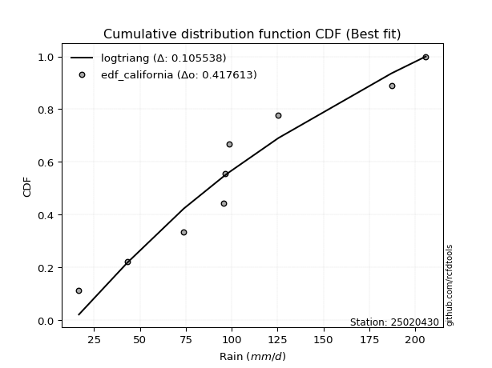</img>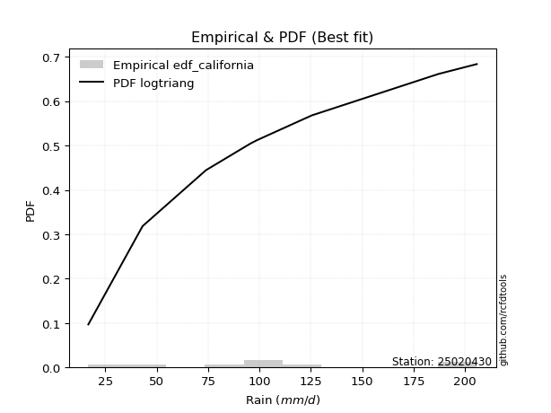</img>

</div>


### 2. Empirical - EDF Hazen (1930)

Hazen method for plotting positions is a formula used to estimate the empirical cumulative probability distribution of flood events or other hydrological data. This formula often results in biased estimations, particularly when extrapolating to extreme events (high return periods).

<div align="center">


$P=(m-0.5)/n$


</div>


**2.1. Empirical values**

<div align="center">

|                | 0                   | 1                   | 2                  | 3                  | 4         | 5                  | 6                  | 7                  | 8                  |
|:---------------|:--------------------|:--------------------|:-------------------|:-------------------|:----------|:-------------------|:-------------------|:-------------------|:-------------------|
| date           | 2022                | 2025                | 2019               | 2020               | 2024      | 2021               | 2023               | 2017               | 2018               |
| x              | 16.7                | 37.9                | 43.1               | 73.9               | 95.4      | 96.6               | 125.4              | 187.1              | 205.7              |
| m              | 1                   | 2                   | 3                  | 4                  | 5         | 6                  | 7                  | 8                  | 9                  |
| empirical_dist | edf_hazen           | edf_hazen           | edf_hazen          | edf_hazen          | edf_hazen | edf_hazen          | edf_hazen          | edf_hazen          | edf_hazen          |
| empirical      | 0.05555555555555555 | 0.16666666666666666 | 0.2777777777777778 | 0.3888888888888889 | 0.5       | 0.6111111111111112 | 0.7222222222222222 | 0.8333333333333334 | 0.9444444444444444 |
| empirical_tr   | 1.0588235294117647  | 1.2                 | 1.3846153846153846 | 1.6363636363636362 | 2.0       | 2.5714285714285716 | 3.5999999999999996 | 6.000000000000002  | 17.999999999999993 |

</div>


**2.2. Kolmogorov-Smirnov fit test (sorted by Δ)**


<div align="center">

|                | 0                   | 1                   | 2                   | 3                   | 4                   | 5                   | 6                   | 7                   | 8                   | 9                   | 10                  | 11                  | 12                  | 13                  | 14                  | 15                  | 16                  | 17                  | 18                  | 19                    | 20                  | 21                  | 22                  | 23                  | 24                  | 25                  | 26                  | 27                  | 28                  | 29                  | 30                  | 31                  | 32                  | 33                  | 34                  | 35                  | 36                  | 37                  | 38                  | 39                  | 40                  | 41                  | 42                  | 43                  | 44                  | 45                  | 46                  | 47                  | 48                  | 49                  | 50                  | 51                  | 52                  | 53                  | 54                  | 55                  | 56                  | 57                  | 58                  | 59                  | 60                  | 61                  | 62                  | 63                  | 64                  | 65                  | 66                  | 67                  | 68                  | 69                  | 70                  | 71                  | 72                  | 73                  | 74                  | 75                  | 76                  | 77                  | 78                  | 79                  | 80                  | 81                  | 82                  | 83                  | 84                  | 85                  | 86                  | 87                  | 88                  | 89                  |
|:---------------|:--------------------|:--------------------|:--------------------|:--------------------|:--------------------|:--------------------|:--------------------|:--------------------|:--------------------|:--------------------|:--------------------|:--------------------|:--------------------|:--------------------|:--------------------|:--------------------|:--------------------|:--------------------|:--------------------|:----------------------|:--------------------|:--------------------|:--------------------|:--------------------|:--------------------|:--------------------|:--------------------|:--------------------|:--------------------|:--------------------|:--------------------|:--------------------|:--------------------|:--------------------|:--------------------|:--------------------|:--------------------|:--------------------|:--------------------|:--------------------|:--------------------|:--------------------|:--------------------|:--------------------|:--------------------|:--------------------|:--------------------|:--------------------|:--------------------|:--------------------|:--------------------|:--------------------|:--------------------|:--------------------|:--------------------|:--------------------|:--------------------|:--------------------|:--------------------|:--------------------|:--------------------|:--------------------|:--------------------|:--------------------|:--------------------|:--------------------|:--------------------|:--------------------|:--------------------|:--------------------|:--------------------|:--------------------|:--------------------|:--------------------|:--------------------|:--------------------|:--------------------|:--------------------|:--------------------|:--------------------|:--------------------|:--------------------|:--------------------|:--------------------|:--------------------|:--------------------|:--------------------|:--------------------|:--------------------|:--------------------|
| station        | 25020430            | 25020430            | 25020430            | 25020430            | 25020430            | 25020430            | 25020430            | 25020430            | 25020430            | 25020430            | 25020430            | 25020430            | 25020430            | 25020430            | 25020430            | 25020430            | 25020430            | 25020430            | 25020430            | 25020430              | 25020430            | 25020430            | 25020430            | 25020430            | 25020430            | 25020430            | 25020430            | 25020430            | 25020430            | 25020430            | 25020430            | 25020430            | 25020430            | 25020430            | 25020430            | 25020430            | 25020430            | 25020430            | 25020430            | 25020430            | 25020430            | 25020430            | 25020430            | 25020430            | 25020430            | 25020430            | 25020430            | 25020430            | 25020430            | 25020430            | 25020430            | 25020430            | 25020430            | 25020430            | 25020430            | 25020430            | 25020430            | 25020430            | 25020430            | 25020430            | 25020430            | 25020430            | 25020430            | 25020430            | 25020430            | 25020430            | 25020430            | 25020430            | 25020430            | 25020430            | 25020430            | 25020430            | 25020430            | 25020430            | 25020430            | 25020430            | 25020430            | 25020430            | 25020430            | 25020430            | 25020430            | 25020430            | 25020430            | 25020430            | 25020430            | 25020430            | 25020430            | 25020430            | 25020430            | 25020430            |
| empirical_dist | edf_hazen           | edf_hazen           | edf_hazen           | edf_hazen           | edf_hazen           | edf_hazen           | edf_hazen           | edf_hazen           | edf_hazen           | edf_hazen           | edf_hazen           | edf_hazen           | edf_hazen           | edf_hazen           | edf_hazen           | edf_hazen           | edf_hazen           | edf_hazen           | edf_hazen           | edf_hazen             | edf_hazen           | edf_hazen           | edf_hazen           | edf_hazen           | edf_hazen           | edf_hazen           | edf_hazen           | edf_hazen           | edf_hazen           | edf_hazen           | edf_hazen           | edf_hazen           | edf_hazen           | edf_hazen           | edf_hazen           | edf_hazen           | edf_hazen           | edf_hazen           | edf_hazen           | edf_hazen           | edf_hazen           | edf_hazen           | edf_hazen           | edf_hazen           | edf_hazen           | edf_hazen           | edf_hazen           | edf_hazen           | edf_hazen           | edf_hazen           | edf_hazen           | edf_hazen           | edf_hazen           | edf_hazen           | edf_hazen           | edf_hazen           | edf_hazen           | edf_hazen           | edf_hazen           | edf_hazen           | edf_hazen           | edf_hazen           | edf_hazen           | edf_hazen           | edf_hazen           | edf_hazen           | edf_hazen           | edf_hazen           | edf_hazen           | edf_hazen           | edf_hazen           | edf_hazen           | edf_hazen           | edf_hazen           | edf_hazen           | edf_hazen           | edf_hazen           | edf_hazen           | edf_hazen           | edf_hazen           | edf_hazen           | edf_hazen           | edf_hazen           | edf_hazen           | edf_hazen           | edf_hazen           | edf_hazen           | edf_hazen           | edf_hazen           | edf_hazen           |
| p_dist         | ncf                 | halfnorm            | rayleigh            | betaprime           | gompertz            | logjohnsonsu        | logpearson3         | genexpon            | logweibull_min      | johnsonsu           | loggompertz         | logloggamma         | invgauss            | loggumbel_l         | maxwell             | mielke              | invgamma            | pearson3            | fisk                | loglaplace_asymmetric | logfisk             | invweibull          | genlogistic         | kstwobign           | nct                 | gumbel_r            | halflogistic        | logmielke           | rice                | logf                | logexponnorm        | logt                | lognorm             | lognorm             | logcrystalball      | lognct              | laplace_asymmetric  | logfatiguelife      | logrice             | logerlang           | loggamma            | loggamma            | norm                | crystalball         | truncnorm           | t                   | expon               | logistic            | logbetaprime        | exponnorm           | hypsecant           | moyal               | loginvgamma         | loglogistic         | logncf              | loginvgauss         | logalpha            | laplace             | logmaxwell          | loghypsecant        | loginvweibull       | f                   | lograyleigh         | logtruncnorm        | loglaplace          | logkstwobign        | loghalfnorm         | loggenexpon         | loggumbel_r         | alpha               | gumbel_l            | loghalflogistic     | logmoyal            | erlang              | chi2                | logexpon            | logwald             | wald                | gibrat              | loggibrat           | weibull_min         | loglognorm          | logchi2             | pareto              | nakagami            | logpareto           | lognakagami         | fatiguelife         | gamma               | loggenlogistic      |
| delta          | 0.07166864851665669 | 0.07220465036896381 | 0.07807157485771232 | 0.07847400744997785 | 0.08012842439249881 | 0.08037850912115163 | 0.08071690836107481 | 0.08098611602351061 | 0.08101298587582456 | 0.08167198119964625 | 0.08176798266713536 | 0.08484078608921275 | 0.0855805338521557  | 0.08586355010502023 | 0.08665387780530598 | 0.08742183950769722 | 0.0888015722098364  | 0.08906850682075146 | 0.08949645087319094 | 0.08953788818414532   | 0.09089022345575237 | 0.09215698023085997 | 0.09317186197306448 | 0.09408364243660691 | 0.09917685190515296 | 0.10593818507601699 | 0.10758481735490971 | 0.11110233594999275 | 0.11229280799505703 | 0.11329015880491933 | 0.11361957533195555 | 0.1136208666928219  | 0.11362102599856982 | 0.11362102599856982 | 0.11362122537249975 | 0.11363476567743369 | 0.11429448559985825 | 0.11432477920724882 | 0.11902259385886504 | 0.11905311094064908 | 0.11954998813030715 | 0.11954998813030715 | 0.12003814775203042 | 0.12003815538743029 | 0.12003815731948775 | 0.12013339282883229 | 0.12026602880495574 | 0.12125730440164117 | 0.1228309069723893  | 0.12358189731177793 | 0.12388050806707904 | 0.12390616122638481 | 0.1276138119212098  | 0.12802878342471724 | 0.12817154607103376 | 0.1299846379296128  | 0.13090526322164053 | 0.13603111848093227 | 0.1389077711207819  | 0.1396738076016184  | 0.14237875033172936 | 0.142997757523825   | 0.14668699079579328 | 0.16666666662095078 | 0.16763735493069565 | 0.1681725154982054  | 0.1702280432673408  | 0.17099381650279494 | 0.17862989722940648 | 0.187980275866861   | 0.190620333304927   | 0.19730137095512312 | 0.2006397921829306  | 0.2313690391181092  | 0.24185399602008412 | 0.24973192222890947 | 0.26217297753308855 | 0.2715114242181476  | 0.2777777777777778  | 0.29418386329932267 | 0.3542398124605598  | 0.44891642799809484 | 0.44963168113744134 | 0.45514155873393436 | 0.47872298958102244 | 0.48029578905058745 | 0.4949160904453625  | 0.5420092770268458  | 0.5739454914819022  | 0.8333333333333334  |
| deltao         | 0.41761268023100007 | 0.41761268023100007 | 0.41761268023100007 | 0.41761268023100007 | 0.41761268023100007 | 0.41761268023100007 | 0.41761268023100007 | 0.41761268023100007 | 0.41761268023100007 | 0.41761268023100007 | 0.41761268023100007 | 0.41761268023100007 | 0.41761268023100007 | 0.41761268023100007 | 0.41761268023100007 | 0.41761268023100007 | 0.41761268023100007 | 0.41761268023100007 | 0.41761268023100007 | 0.41761268023100007   | 0.41761268023100007 | 0.41761268023100007 | 0.41761268023100007 | 0.41761268023100007 | 0.41761268023100007 | 0.41761268023100007 | 0.41761268023100007 | 0.41761268023100007 | 0.41761268023100007 | 0.41761268023100007 | 0.41761268023100007 | 0.41761268023100007 | 0.41761268023100007 | 0.41761268023100007 | 0.41761268023100007 | 0.41761268023100007 | 0.41761268023100007 | 0.41761268023100007 | 0.41761268023100007 | 0.41761268023100007 | 0.41761268023100007 | 0.41761268023100007 | 0.41761268023100007 | 0.41761268023100007 | 0.41761268023100007 | 0.41761268023100007 | 0.41761268023100007 | 0.41761268023100007 | 0.41761268023100007 | 0.41761268023100007 | 0.41761268023100007 | 0.41761268023100007 | 0.41761268023100007 | 0.41761268023100007 | 0.41761268023100007 | 0.41761268023100007 | 0.41761268023100007 | 0.41761268023100007 | 0.41761268023100007 | 0.41761268023100007 | 0.41761268023100007 | 0.41761268023100007 | 0.41761268023100007 | 0.41761268023100007 | 0.41761268023100007 | 0.41761268023100007 | 0.41761268023100007 | 0.41761268023100007 | 0.41761268023100007 | 0.41761268023100007 | 0.41761268023100007 | 0.41761268023100007 | 0.41761268023100007 | 0.41761268023100007 | 0.41761268023100007 | 0.41761268023100007 | 0.41761268023100007 | 0.41761268023100007 | 0.41761268023100007 | 0.41761268023100007 | 0.41761268023100007 | 0.41761268023100007 | 0.41761268023100007 | 0.41761268023100007 | 0.41761268023100007 | 0.41761268023100007 | 0.41761268023100007 | 0.41761268023100007 | 0.41761268023100007 | 0.41761268023100007 |
| eval           | Δo > Δ              | Δo > Δ              | Δo > Δ              | Δo > Δ              | Δo > Δ              | Δo > Δ              | Δo > Δ              | Δo > Δ              | Δo > Δ              | Δo > Δ              | Δo > Δ              | Δo > Δ              | Δo > Δ              | Δo > Δ              | Δo > Δ              | Δo > Δ              | Δo > Δ              | Δo > Δ              | Δo > Δ              | Δo > Δ                | Δo > Δ              | Δo > Δ              | Δo > Δ              | Δo > Δ              | Δo > Δ              | Δo > Δ              | Δo > Δ              | Δo > Δ              | Δo > Δ              | Δo > Δ              | Δo > Δ              | Δo > Δ              | Δo > Δ              | Δo > Δ              | Δo > Δ              | Δo > Δ              | Δo > Δ              | Δo > Δ              | Δo > Δ              | Δo > Δ              | Δo > Δ              | Δo > Δ              | Δo > Δ              | Δo > Δ              | Δo > Δ              | Δo > Δ              | Δo > Δ              | Δo > Δ              | Δo > Δ              | Δo > Δ              | Δo > Δ              | Δo > Δ              | Δo > Δ              | Δo > Δ              | Δo > Δ              | Δo > Δ              | Δo > Δ              | Δo > Δ              | Δo > Δ              | Δo > Δ              | Δo > Δ              | Δo > Δ              | Δo > Δ              | Δo > Δ              | Δo > Δ              | Δo > Δ              | Δo > Δ              | Δo > Δ              | Δo > Δ              | Δo > Δ              | Δo > Δ              | Δo > Δ              | Δo > Δ              | Δo > Δ              | Δo > Δ              | Δo > Δ              | Δo > Δ              | Δo > Δ              | Δo > Δ              | Δo > Δ              | Δo > Δ              | Δo <= Δ             | Δo <= Δ             | Δo <= Δ             | Δo <= Δ             | Δo <= Δ             | Δo <= Δ             | Δo <= Δ             | Δo <= Δ             | Δo <= Δ             |
| fit            | 1                   | 1                   | 1                   | 1                   | 1                   | 1                   | 1                   | 1                   | 1                   | 1                   | 1                   | 1                   | 1                   | 1                   | 1                   | 1                   | 1                   | 1                   | 1                   | 1                     | 1                   | 1                   | 1                   | 1                   | 1                   | 1                   | 1                   | 1                   | 1                   | 1                   | 1                   | 1                   | 1                   | 1                   | 1                   | 1                   | 1                   | 1                   | 1                   | 1                   | 1                   | 1                   | 1                   | 1                   | 1                   | 1                   | 1                   | 1                   | 1                   | 1                   | 1                   | 1                   | 1                   | 1                   | 1                   | 1                   | 1                   | 1                   | 1                   | 1                   | 1                   | 1                   | 1                   | 1                   | 1                   | 1                   | 1                   | 1                   | 1                   | 1                   | 1                   | 1                   | 1                   | 1                   | 1                   | 1                   | 1                   | 1                   | 1                   | 1                   | 1                   | 0                   | 0                   | 0                   | 0                   | 0                   | 0                   | 0                   | 0                   | 0                   |
| n              | 9                   | 9                   | 9                   | 9                   | 9                   | 9                   | 9                   | 9                   | 9                   | 9                   | 9                   | 9                   | 9                   | 9                   | 9                   | 9                   | 9                   | 9                   | 9                   | 9                     | 9                   | 9                   | 9                   | 9                   | 9                   | 9                   | 9                   | 9                   | 9                   | 9                   | 9                   | 9                   | 9                   | 9                   | 9                   | 9                   | 9                   | 9                   | 9                   | 9                   | 9                   | 9                   | 9                   | 9                   | 9                   | 9                   | 9                   | 9                   | 9                   | 9                   | 9                   | 9                   | 9                   | 9                   | 9                   | 9                   | 9                   | 9                   | 9                   | 9                   | 9                   | 9                   | 9                   | 9                   | 9                   | 9                   | 9                   | 9                   | 9                   | 9                   | 9                   | 9                   | 9                   | 9                   | 9                   | 9                   | 9                   | 9                   | 9                   | 9                   | 9                   | 9                   | 9                   | 9                   | 9                   | 9                   | 9                   | 9                   | 9                   | 9                   |
| best_fit       | 1                   | 0                   | 0                   | 0                   | 0                   | 0                   | 0                   | 0                   | 0                   | 0                   | 0                   | 0                   | 0                   | 0                   | 0                   | 0                   | 0                   | 0                   | 0                   | 0                     | 0                   | 0                   | 0                   | 0                   | 0                   | 0                   | 0                   | 0                   | 0                   | 0                   | 0                   | 0                   | 0                   | 0                   | 0                   | 0                   | 0                   | 0                   | 0                   | 0                   | 0                   | 0                   | 0                   | 0                   | 0                   | 0                   | 0                   | 0                   | 0                   | 0                   | 0                   | 0                   | 0                   | 0                   | 0                   | 0                   | 0                   | 0                   | 0                   | 0                   | 0                   | 0                   | 0                   | 0                   | 0                   | 0                   | 0                   | 0                   | 0                   | 0                   | 0                   | 0                   | 0                   | 0                   | 0                   | 0                   | 0                   | 0                   | 0                   | 0                   | 0                   | 0                   | 0                   | 0                   | 0                   | 0                   | 0                   | 0                   | 0                   | 0                   |
| best_fit_sort  | 1                   | 2                   | 3                   | 4                   | 5                   | 6                   | 7                   | 8                   | 9                   | 10                  | 11                  | 12                  | 13                  | 14                  | 15                  | 16                  | 17                  | 18                  | 19                  | 20                    | 21                  | 22                  | 23                  | 24                  | 25                  | 26                  | 27                  | 28                  | 29                  | 30                  | 31                  | 32                  | 33                  | 34                  | 35                  | 36                  | 37                  | 38                  | 39                  | 40                  | 41                  | 42                  | 43                  | 44                  | 45                  | 46                  | 47                  | 48                  | 49                  | 50                  | 51                  | 52                  | 53                  | 54                  | 55                  | 56                  | 57                  | 58                  | 59                  | 60                  | 61                  | 62                  | 63                  | 64                  | 65                  | 66                  | 67                  | 68                  | 69                  | 70                  | 71                  | 72                  | 73                  | 74                  | 75                  | 76                  | 77                  | 78                  | 79                  | 80                  | 81                  | 82                  | 83                  | 84                  | 85                  | 86                  | 87                  | 88                  | 89                  | 90                  |

</div>


<div align="center">

</img>

</div>


**2.3. Best fit**

<div align="center">

|   id |   station | empirical_dist   | p_dist   |     delta |   deltao | eval   |   fit |   n |   best_fit |   best_fit_sort |
|-----:|----------:|:-----------------|:---------|----------:|---------:|:-------|------:|----:|-----------:|----------------:|
|    0 |  25020430 | edf_hazen        | ncf      | 0.0716686 | 0.417613 | Δo > Δ |     1 |   9 |          1 |               1 |

</div>


<div align="center">

</img>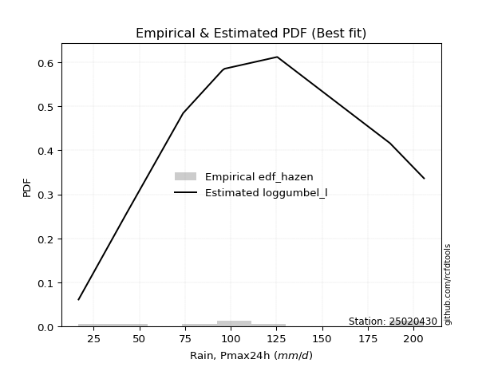</img>

</div>


### 3. Empirical - EDF Weibull (1939)

Weibull plotting position formula is an empirical method used to estimate the non-exceedance probability or plotting position for a set of observed data, is often recommended or widely used in practice, particularly in flood frequency analysis.

<div align="center">


$P=m/(n+1)$


</div>


**3.1. Empirical values**

<div align="center">

|                | 0                  | 1           | 2                  | 3                  | 4           | 5           | 6                 | 7                 | 8                  |
|:---------------|:-------------------|:------------|:-------------------|:-------------------|:------------|:------------|:------------------|:------------------|:-------------------|
| date           | 2022               | 2025        | 2019               | 2020               | 2024        | 2021        | 2023              | 2017              | 2018               |
| x              | 16.7               | 37.9        | 43.1               | 73.9               | 95.4        | 96.6        | 125.4             | 187.1             | 205.7              |
| m              | 1                  | 2           | 3                  | 4                  | 5           | 6           | 7                 | 8                 | 9                  |
| empirical_dist | edf_weibull        | edf_weibull | edf_weibull        | edf_weibull        | edf_weibull | edf_weibull | edf_weibull       | edf_weibull       | edf_weibull        |
| empirical      | 0.1                | 0.2         | 0.3                | 0.4                | 0.5         | 0.6         | 0.7               | 0.8               | 0.9                |
| empirical_tr   | 1.1111111111111112 | 1.25        | 1.4285714285714286 | 1.6666666666666667 | 2.0         | 2.5         | 3.333333333333333 | 5.000000000000001 | 10.000000000000002 |

</div>


**3.2. Kolmogorov-Smirnov fit test (sorted by Δ)**


<div align="center">

|                | 0                   | 1                   | 2                   | 3                   | 4                   | 5                   | 6                   | 7                   | 8                   | 9                   | 10                  | 11                  | 12                    | 13                  | 14                  | 15                  | 16                  | 17                  | 18                  | 19                  | 20                  | 21                  | 22                  | 23                  | 24                  | 25                  | 26                  | 27                  | 28                  | 29                  | 30                  | 31                  | 32                  | 33                  | 34                  | 35                  | 36                  | 37                  | 38                  | 39                  | 40                  | 41                  | 42                  | 43                  | 44                  | 45                  | 46                  | 47                  | 48                  | 49                  | 50                  | 51                  | 52                  | 53                  | 54                  | 55                  | 56                  | 57                  | 58                  | 59                  | 60                  | 61                  | 62                  | 63                  | 64                  | 65                  | 66                  | 67                  | 68                  | 69                  | 70                  | 71                  | 72                  | 73                  | 74                  | 75                  | 76                  | 77                  | 78                  | 79                  | 80                  | 81                  | 82                  | 83                  | 84                  | 85                  | 86                  | 87                  | 88                  | 89                  |
|:---------------|:--------------------|:--------------------|:--------------------|:--------------------|:--------------------|:--------------------|:--------------------|:--------------------|:--------------------|:--------------------|:--------------------|:--------------------|:----------------------|:--------------------|:--------------------|:--------------------|:--------------------|:--------------------|:--------------------|:--------------------|:--------------------|:--------------------|:--------------------|:--------------------|:--------------------|:--------------------|:--------------------|:--------------------|:--------------------|:--------------------|:--------------------|:--------------------|:--------------------|:--------------------|:--------------------|:--------------------|:--------------------|:--------------------|:--------------------|:--------------------|:--------------------|:--------------------|:--------------------|:--------------------|:--------------------|:--------------------|:--------------------|:--------------------|:--------------------|:--------------------|:--------------------|:--------------------|:--------------------|:--------------------|:--------------------|:--------------------|:--------------------|:--------------------|:--------------------|:--------------------|:--------------------|:--------------------|:--------------------|:--------------------|:--------------------|:--------------------|:--------------------|:--------------------|:--------------------|:--------------------|:--------------------|:--------------------|:--------------------|:--------------------|:--------------------|:--------------------|:--------------------|:--------------------|:--------------------|:--------------------|:--------------------|:--------------------|:--------------------|:--------------------|:--------------------|:--------------------|:--------------------|:--------------------|:--------------------|:--------------------|
| station        | 25020430            | 25020430            | 25020430            | 25020430            | 25020430            | 25020430            | 25020430            | 25020430            | 25020430            | 25020430            | 25020430            | 25020430            | 25020430              | 25020430            | 25020430            | 25020430            | 25020430            | 25020430            | 25020430            | 25020430            | 25020430            | 25020430            | 25020430            | 25020430            | 25020430            | 25020430            | 25020430            | 25020430            | 25020430            | 25020430            | 25020430            | 25020430            | 25020430            | 25020430            | 25020430            | 25020430            | 25020430            | 25020430            | 25020430            | 25020430            | 25020430            | 25020430            | 25020430            | 25020430            | 25020430            | 25020430            | 25020430            | 25020430            | 25020430            | 25020430            | 25020430            | 25020430            | 25020430            | 25020430            | 25020430            | 25020430            | 25020430            | 25020430            | 25020430            | 25020430            | 25020430            | 25020430            | 25020430            | 25020430            | 25020430            | 25020430            | 25020430            | 25020430            | 25020430            | 25020430            | 25020430            | 25020430            | 25020430            | 25020430            | 25020430            | 25020430            | 25020430            | 25020430            | 25020430            | 25020430            | 25020430            | 25020430            | 25020430            | 25020430            | 25020430            | 25020430            | 25020430            | 25020430            | 25020430            | 25020430            |
| empirical_dist | edf_weibull         | edf_weibull         | edf_weibull         | edf_weibull         | edf_weibull         | edf_weibull         | edf_weibull         | edf_weibull         | edf_weibull         | edf_weibull         | edf_weibull         | edf_weibull         | edf_weibull           | edf_weibull         | edf_weibull         | edf_weibull         | edf_weibull         | edf_weibull         | edf_weibull         | edf_weibull         | edf_weibull         | edf_weibull         | edf_weibull         | edf_weibull         | edf_weibull         | edf_weibull         | edf_weibull         | edf_weibull         | edf_weibull         | edf_weibull         | edf_weibull         | edf_weibull         | edf_weibull         | edf_weibull         | edf_weibull         | edf_weibull         | edf_weibull         | edf_weibull         | edf_weibull         | edf_weibull         | edf_weibull         | edf_weibull         | edf_weibull         | edf_weibull         | edf_weibull         | edf_weibull         | edf_weibull         | edf_weibull         | edf_weibull         | edf_weibull         | edf_weibull         | edf_weibull         | edf_weibull         | edf_weibull         | edf_weibull         | edf_weibull         | edf_weibull         | edf_weibull         | edf_weibull         | edf_weibull         | edf_weibull         | edf_weibull         | edf_weibull         | edf_weibull         | edf_weibull         | edf_weibull         | edf_weibull         | edf_weibull         | edf_weibull         | edf_weibull         | edf_weibull         | edf_weibull         | edf_weibull         | edf_weibull         | edf_weibull         | edf_weibull         | edf_weibull         | edf_weibull         | edf_weibull         | edf_weibull         | edf_weibull         | edf_weibull         | edf_weibull         | edf_weibull         | edf_weibull         | edf_weibull         | edf_weibull         | edf_weibull         | edf_weibull         | edf_weibull         |
| p_dist         | logpearson3         | ncf                 | invgauss            | loggompertz         | betaprime           | genexpon            | mielke              | johnsonsu           | logfisk             | halfnorm            | logweibull_min      | gompertz            | loglaplace_asymmetric | invgamma            | logloggamma         | rayleigh            | fisk                | logf                | logexponnorm        | logt                | lognorm             | lognorm             | logcrystalball      | lognct              | logjohnsonsu        | logfatiguelife      | invweibull          | maxwell             | genlogistic         | kstwobign           | pearson3            | logrice             | logerlang           | loggumbel_l         | loggamma            | loggamma            | expon               | nct                 | logbetaprime        | exponnorm           | t                   | crystalball         | truncnorm           | norm                | loginvgamma         | loglogistic         | gumbel_r            | logncf              | halflogistic        | loginvgauss         | logalpha            | loginvweibull       | f                   | logistic            | rice                | laplace_asymmetric  | logmaxwell          | loghypsecant        | logmielke           | hypsecant           | moyal               | lograyleigh         | logkstwobign        | laplace             | loggenexpon         | loglaplace          | loghalfnorm         | alpha               | loggumbel_r         | gumbel_l            | loghalflogistic     | logtruncnorm        | logmoyal            | erlang              | logexpon            | chi2                | logwald             | wald                | loggibrat           | gibrat              | weibull_min         | loglognorm          | logchi2             | pareto              | nakagami            | logpareto           | lognakagami         | fatiguelife         | gamma               | loggenlogistic      |
| delta          | 0.09091470575442695 | 0.09955362780925947 | 0.099710572158344   | 0.09999999806499013 | 0.10151933654071887 | 0.1032083382457328  | 0.10343820746084031 | 0.10389420342186845 | 0.10439644886813851 | 0.10517875970073531 | 0.10788954158800079 | 0.10959185363729362 | 0.11044403301603453   | 0.11102379443205859 | 0.11103288929161792 | 0.11140490819104565 | 0.11171867309541314 | 0.11329015880491933 | 0.11361957533195555 | 0.1136208666928219  | 0.11362102599856982 | 0.11362102599856982 | 0.11362122537249975 | 0.11363476567743369 | 0.11371184245448496 | 0.11432477920724882 | 0.11437920245308217 | 0.11450444570408447 | 0.11539408419528668 | 0.1163420040545855  | 0.11680611732354929 | 0.11902259385886504 | 0.11905311094064908 | 0.11919688343835355 | 0.11954998813030715 | 0.11954998813030715 | 0.12026602880495574 | 0.12139907412737516 | 0.1228309069723893  | 0.12358189731177793 | 0.12611669389798996 | 0.1261316769869547  | 0.1261316775376371  | 0.1261316797829649  | 0.1276138119212098  | 0.12802878342471724 | 0.1281604072982392  | 0.12817154607103376 | 0.1298070395771319  | 0.1299846379296128  | 0.13090526322164053 | 0.13147258865020084 | 0.13188664641271386 | 0.13434499500619923 | 0.13451503021727923 | 0.13651670782208045 | 0.1389077711207819  | 0.1396738076016184  | 0.14443566928332607 | 0.14610273028930124 | 0.146128383448607   | 0.14668699079579328 | 0.15706140438709426 | 0.15825334070315447 | 0.1598827053916838  | 0.16763735493069565 | 0.16892938261160417 | 0.17686916475574987 | 0.17862989722940648 | 0.17950922219381582 | 0.19730137095512312 | 0.19999999995428414 | 0.2006397921829306  | 0.22025792800699806 | 0.22368777380085103 | 0.2332176687354749  | 0.26217297753308855 | 0.2937336464403698  | 0.29983326876403676 | 0.3                 | 0.3209064791272264  | 0.41558309466476145 | 0.41629834780410796 | 0.421808225400601   | 0.44538965624768906 | 0.44696245571725407 | 0.4838049793342514  | 0.5086759436935124  | 0.5406121581485688  | 0.8                 |
| deltao         | 0.41761268023100007 | 0.41761268023100007 | 0.41761268023100007 | 0.41761268023100007 | 0.41761268023100007 | 0.41761268023100007 | 0.41761268023100007 | 0.41761268023100007 | 0.41761268023100007 | 0.41761268023100007 | 0.41761268023100007 | 0.41761268023100007 | 0.41761268023100007   | 0.41761268023100007 | 0.41761268023100007 | 0.41761268023100007 | 0.41761268023100007 | 0.41761268023100007 | 0.41761268023100007 | 0.41761268023100007 | 0.41761268023100007 | 0.41761268023100007 | 0.41761268023100007 | 0.41761268023100007 | 0.41761268023100007 | 0.41761268023100007 | 0.41761268023100007 | 0.41761268023100007 | 0.41761268023100007 | 0.41761268023100007 | 0.41761268023100007 | 0.41761268023100007 | 0.41761268023100007 | 0.41761268023100007 | 0.41761268023100007 | 0.41761268023100007 | 0.41761268023100007 | 0.41761268023100007 | 0.41761268023100007 | 0.41761268023100007 | 0.41761268023100007 | 0.41761268023100007 | 0.41761268023100007 | 0.41761268023100007 | 0.41761268023100007 | 0.41761268023100007 | 0.41761268023100007 | 0.41761268023100007 | 0.41761268023100007 | 0.41761268023100007 | 0.41761268023100007 | 0.41761268023100007 | 0.41761268023100007 | 0.41761268023100007 | 0.41761268023100007 | 0.41761268023100007 | 0.41761268023100007 | 0.41761268023100007 | 0.41761268023100007 | 0.41761268023100007 | 0.41761268023100007 | 0.41761268023100007 | 0.41761268023100007 | 0.41761268023100007 | 0.41761268023100007 | 0.41761268023100007 | 0.41761268023100007 | 0.41761268023100007 | 0.41761268023100007 | 0.41761268023100007 | 0.41761268023100007 | 0.41761268023100007 | 0.41761268023100007 | 0.41761268023100007 | 0.41761268023100007 | 0.41761268023100007 | 0.41761268023100007 | 0.41761268023100007 | 0.41761268023100007 | 0.41761268023100007 | 0.41761268023100007 | 0.41761268023100007 | 0.41761268023100007 | 0.41761268023100007 | 0.41761268023100007 | 0.41761268023100007 | 0.41761268023100007 | 0.41761268023100007 | 0.41761268023100007 | 0.41761268023100007 |
| eval           | Δo > Δ              | Δo > Δ              | Δo > Δ              | Δo > Δ              | Δo > Δ              | Δo > Δ              | Δo > Δ              | Δo > Δ              | Δo > Δ              | Δo > Δ              | Δo > Δ              | Δo > Δ              | Δo > Δ                | Δo > Δ              | Δo > Δ              | Δo > Δ              | Δo > Δ              | Δo > Δ              | Δo > Δ              | Δo > Δ              | Δo > Δ              | Δo > Δ              | Δo > Δ              | Δo > Δ              | Δo > Δ              | Δo > Δ              | Δo > Δ              | Δo > Δ              | Δo > Δ              | Δo > Δ              | Δo > Δ              | Δo > Δ              | Δo > Δ              | Δo > Δ              | Δo > Δ              | Δo > Δ              | Δo > Δ              | Δo > Δ              | Δo > Δ              | Δo > Δ              | Δo > Δ              | Δo > Δ              | Δo > Δ              | Δo > Δ              | Δo > Δ              | Δo > Δ              | Δo > Δ              | Δo > Δ              | Δo > Δ              | Δo > Δ              | Δo > Δ              | Δo > Δ              | Δo > Δ              | Δo > Δ              | Δo > Δ              | Δo > Δ              | Δo > Δ              | Δo > Δ              | Δo > Δ              | Δo > Δ              | Δo > Δ              | Δo > Δ              | Δo > Δ              | Δo > Δ              | Δo > Δ              | Δo > Δ              | Δo > Δ              | Δo > Δ              | Δo > Δ              | Δo > Δ              | Δo > Δ              | Δo > Δ              | Δo > Δ              | Δo > Δ              | Δo > Δ              | Δo > Δ              | Δo > Δ              | Δo > Δ              | Δo > Δ              | Δo > Δ              | Δo > Δ              | Δo > Δ              | Δo > Δ              | Δo <= Δ             | Δo <= Δ             | Δo <= Δ             | Δo <= Δ             | Δo <= Δ             | Δo <= Δ             | Δo <= Δ             |
| fit            | 1                   | 1                   | 1                   | 1                   | 1                   | 1                   | 1                   | 1                   | 1                   | 1                   | 1                   | 1                   | 1                     | 1                   | 1                   | 1                   | 1                   | 1                   | 1                   | 1                   | 1                   | 1                   | 1                   | 1                   | 1                   | 1                   | 1                   | 1                   | 1                   | 1                   | 1                   | 1                   | 1                   | 1                   | 1                   | 1                   | 1                   | 1                   | 1                   | 1                   | 1                   | 1                   | 1                   | 1                   | 1                   | 1                   | 1                   | 1                   | 1                   | 1                   | 1                   | 1                   | 1                   | 1                   | 1                   | 1                   | 1                   | 1                   | 1                   | 1                   | 1                   | 1                   | 1                   | 1                   | 1                   | 1                   | 1                   | 1                   | 1                   | 1                   | 1                   | 1                   | 1                   | 1                   | 1                   | 1                   | 1                   | 1                   | 1                   | 1                   | 1                   | 1                   | 1                   | 0                   | 0                   | 0                   | 0                   | 0                   | 0                   | 0                   |
| n              | 9                   | 9                   | 9                   | 9                   | 9                   | 9                   | 9                   | 9                   | 9                   | 9                   | 9                   | 9                   | 9                     | 9                   | 9                   | 9                   | 9                   | 9                   | 9                   | 9                   | 9                   | 9                   | 9                   | 9                   | 9                   | 9                   | 9                   | 9                   | 9                   | 9                   | 9                   | 9                   | 9                   | 9                   | 9                   | 9                   | 9                   | 9                   | 9                   | 9                   | 9                   | 9                   | 9                   | 9                   | 9                   | 9                   | 9                   | 9                   | 9                   | 9                   | 9                   | 9                   | 9                   | 9                   | 9                   | 9                   | 9                   | 9                   | 9                   | 9                   | 9                   | 9                   | 9                   | 9                   | 9                   | 9                   | 9                   | 9                   | 9                   | 9                   | 9                   | 9                   | 9                   | 9                   | 9                   | 9                   | 9                   | 9                   | 9                   | 9                   | 9                   | 9                   | 9                   | 9                   | 9                   | 9                   | 9                   | 9                   | 9                   | 9                   |
| best_fit       | 1                   | 0                   | 0                   | 0                   | 0                   | 0                   | 0                   | 0                   | 0                   | 0                   | 0                   | 0                   | 0                     | 0                   | 0                   | 0                   | 0                   | 0                   | 0                   | 0                   | 0                   | 0                   | 0                   | 0                   | 0                   | 0                   | 0                   | 0                   | 0                   | 0                   | 0                   | 0                   | 0                   | 0                   | 0                   | 0                   | 0                   | 0                   | 0                   | 0                   | 0                   | 0                   | 0                   | 0                   | 0                   | 0                   | 0                   | 0                   | 0                   | 0                   | 0                   | 0                   | 0                   | 0                   | 0                   | 0                   | 0                   | 0                   | 0                   | 0                   | 0                   | 0                   | 0                   | 0                   | 0                   | 0                   | 0                   | 0                   | 0                   | 0                   | 0                   | 0                   | 0                   | 0                   | 0                   | 0                   | 0                   | 0                   | 0                   | 0                   | 0                   | 0                   | 0                   | 0                   | 0                   | 0                   | 0                   | 0                   | 0                   | 0                   |
| best_fit_sort  | 1                   | 2                   | 3                   | 4                   | 5                   | 6                   | 7                   | 8                   | 9                   | 10                  | 11                  | 12                  | 13                    | 14                  | 15                  | 16                  | 17                  | 18                  | 19                  | 20                  | 21                  | 22                  | 23                  | 24                  | 25                  | 26                  | 27                  | 28                  | 29                  | 30                  | 31                  | 32                  | 33                  | 34                  | 35                  | 36                  | 37                  | 38                  | 39                  | 40                  | 41                  | 42                  | 43                  | 44                  | 45                  | 46                  | 47                  | 48                  | 49                  | 50                  | 51                  | 52                  | 53                  | 54                  | 55                  | 56                  | 57                  | 58                  | 59                  | 60                  | 61                  | 62                  | 63                  | 64                  | 65                  | 66                  | 67                  | 68                  | 69                  | 70                  | 71                  | 72                  | 73                  | 74                  | 75                  | 76                  | 77                  | 78                  | 79                  | 80                  | 81                  | 82                  | 83                  | 84                  | 85                  | 86                  | 87                  | 88                  | 89                  | 90                  |

</div>


<div align="center">

</img>

</div>


**3.3. Best fit**

<div align="center">

|   id |   station | empirical_dist   | p_dist      |     delta |   deltao | eval   |   fit |   n |   best_fit |   best_fit_sort |
|-----:|----------:|:-----------------|:------------|----------:|---------:|:-------|------:|----:|-----------:|----------------:|
|    0 |  25020430 | edf_weibull      | logpearson3 | 0.0909147 | 0.417613 | Δo > Δ |     1 |   9 |          1 |               1 |

</div>


<div align="center">

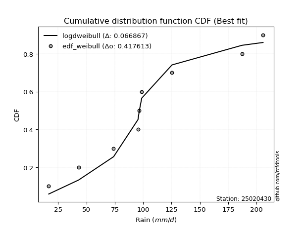</img>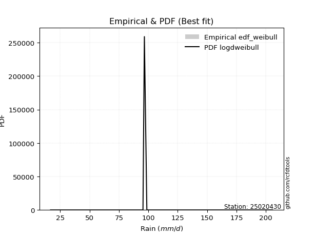</img>

</div>


### 4. Empirical - EDF Beard (1943)

The Beard formula (or Beard´s plotting position formula) in hydrology is used to estimate the empirical non-exceedance probability _(P)_ of a flood event (or other extreme hydrological data point) within a given dataset.

<div align="center">


$P=(m-0.31)/(n+0.38)$


</div>


**4.1. Empirical values**

<div align="center">

|                | 0                   | 1                   | 2                  | 3                   | 4         | 5                  | 6                  | 7                  | 8                  |
|:---------------|:--------------------|:--------------------|:-------------------|:--------------------|:----------|:-------------------|:-------------------|:-------------------|:-------------------|
| date           | 2022                | 2025                | 2019               | 2020                | 2024      | 2021               | 2023               | 2017               | 2018               |
| x              | 16.7                | 37.9                | 43.1               | 73.9                | 95.4      | 96.6               | 125.4              | 187.1              | 205.7              |
| m              | 1                   | 2                   | 3                  | 4                   | 5         | 6                  | 7                  | 8                  | 9                  |
| empirical_dist | edf_beard           | edf_beard           | edf_beard          | edf_beard           | edf_beard | edf_beard          | edf_beard          | edf_beard          | edf_beard          |
| empirical      | 0.07356076759061833 | 0.18017057569296374 | 0.2867803837953091 | 0.39339019189765456 | 0.5       | 0.6066098081023454 | 0.7132196162046908 | 0.8198294243070362 | 0.9264392324093815 |
| empirical_tr   | 1.0794016110471807  | 1.2197659297789336  | 1.4020926756352765 | 1.6485061511423549  | 2.0       | 2.542005420054201  | 3.486988847583642  | 5.550295857988164  | 13.5942028985507   |

</div>


**4.2. Kolmogorov-Smirnov fit test (sorted by Δ)**


<div align="center">

|                | 0                   | 1                   | 2                   | 3                   | 4                   | 5                   | 6                   | 7                   | 8                   | 9                   | 10                  | 11                  | 12                  | 13                  | 14                  | 15                  | 16                    | 17                  | 18                  | 19                  | 20                  | 21                  | 22                  | 23                  | 24                  | 25                  | 26                  | 27                  | 28                  | 29                  | 30                  | 31                  | 32                  | 33                  | 34                  | 35                  | 36                  | 37                  | 38                  | 39                  | 40                  | 41                  | 42                  | 43                  | 44                  | 45                  | 46                  | 47                  | 48                  | 49                  | 50                  | 51                  | 52                  | 53                  | 54                  | 55                  | 56                  | 57                  | 58                  | 59                  | 60                  | 61                  | 62                  | 63                  | 64                  | 65                  | 66                  | 67                  | 68                  | 69                  | 70                  | 71                  | 72                  | 73                  | 74                  | 75                  | 76                  | 77                  | 78                  | 79                  | 80                  | 81                  | 82                  | 83                  | 84                  | 85                  | 86                  | 87                  | 88                  | 89                  |
|:---------------|:--------------------|:--------------------|:--------------------|:--------------------|:--------------------|:--------------------|:--------------------|:--------------------|:--------------------|:--------------------|:--------------------|:--------------------|:--------------------|:--------------------|:--------------------|:--------------------|:----------------------|:--------------------|:--------------------|:--------------------|:--------------------|:--------------------|:--------------------|:--------------------|:--------------------|:--------------------|:--------------------|:--------------------|:--------------------|:--------------------|:--------------------|:--------------------|:--------------------|:--------------------|:--------------------|:--------------------|:--------------------|:--------------------|:--------------------|:--------------------|:--------------------|:--------------------|:--------------------|:--------------------|:--------------------|:--------------------|:--------------------|:--------------------|:--------------------|:--------------------|:--------------------|:--------------------|:--------------------|:--------------------|:--------------------|:--------------------|:--------------------|:--------------------|:--------------------|:--------------------|:--------------------|:--------------------|:--------------------|:--------------------|:--------------------|:--------------------|:--------------------|:--------------------|:--------------------|:--------------------|:--------------------|:--------------------|:--------------------|:--------------------|:--------------------|:--------------------|:--------------------|:--------------------|:--------------------|:--------------------|:--------------------|:--------------------|:--------------------|:--------------------|:--------------------|:--------------------|:--------------------|:--------------------|:--------------------|:--------------------|
| station        | 25020430            | 25020430            | 25020430            | 25020430            | 25020430            | 25020430            | 25020430            | 25020430            | 25020430            | 25020430            | 25020430            | 25020430            | 25020430            | 25020430            | 25020430            | 25020430            | 25020430              | 25020430            | 25020430            | 25020430            | 25020430            | 25020430            | 25020430            | 25020430            | 25020430            | 25020430            | 25020430            | 25020430            | 25020430            | 25020430            | 25020430            | 25020430            | 25020430            | 25020430            | 25020430            | 25020430            | 25020430            | 25020430            | 25020430            | 25020430            | 25020430            | 25020430            | 25020430            | 25020430            | 25020430            | 25020430            | 25020430            | 25020430            | 25020430            | 25020430            | 25020430            | 25020430            | 25020430            | 25020430            | 25020430            | 25020430            | 25020430            | 25020430            | 25020430            | 25020430            | 25020430            | 25020430            | 25020430            | 25020430            | 25020430            | 25020430            | 25020430            | 25020430            | 25020430            | 25020430            | 25020430            | 25020430            | 25020430            | 25020430            | 25020430            | 25020430            | 25020430            | 25020430            | 25020430            | 25020430            | 25020430            | 25020430            | 25020430            | 25020430            | 25020430            | 25020430            | 25020430            | 25020430            | 25020430            | 25020430            |
| empirical_dist | edf_beard           | edf_beard           | edf_beard           | edf_beard           | edf_beard           | edf_beard           | edf_beard           | edf_beard           | edf_beard           | edf_beard           | edf_beard           | edf_beard           | edf_beard           | edf_beard           | edf_beard           | edf_beard           | edf_beard             | edf_beard           | edf_beard           | edf_beard           | edf_beard           | edf_beard           | edf_beard           | edf_beard           | edf_beard           | edf_beard           | edf_beard           | edf_beard           | edf_beard           | edf_beard           | edf_beard           | edf_beard           | edf_beard           | edf_beard           | edf_beard           | edf_beard           | edf_beard           | edf_beard           | edf_beard           | edf_beard           | edf_beard           | edf_beard           | edf_beard           | edf_beard           | edf_beard           | edf_beard           | edf_beard           | edf_beard           | edf_beard           | edf_beard           | edf_beard           | edf_beard           | edf_beard           | edf_beard           | edf_beard           | edf_beard           | edf_beard           | edf_beard           | edf_beard           | edf_beard           | edf_beard           | edf_beard           | edf_beard           | edf_beard           | edf_beard           | edf_beard           | edf_beard           | edf_beard           | edf_beard           | edf_beard           | edf_beard           | edf_beard           | edf_beard           | edf_beard           | edf_beard           | edf_beard           | edf_beard           | edf_beard           | edf_beard           | edf_beard           | edf_beard           | edf_beard           | edf_beard           | edf_beard           | edf_beard           | edf_beard           | edf_beard           | edf_beard           | edf_beard           | edf_beard           |
| p_dist         | ncf                 | logpearson3         | loggompertz         | halfnorm            | invgauss            | betaprime           | gompertz            | genexpon            | logweibull_min      | mielke              | johnsonsu           | logfisk             | logloggamma         | rayleigh            | logjohnsonsu        | maxwell             | loglaplace_asymmetric | invgamma            | pearson3            | fisk                | loggumbel_l         | invweibull          | genlogistic         | kstwobign           | nct                 | logf                | logexponnorm        | logt                | lognorm             | lognorm             | logcrystalball      | lognct              | logfatiguelife      | gumbel_r            | norm                | crystalball         | truncnorm           | t                   | halflogistic        | logrice             | logerlang           | loggamma            | loggamma            | expon               | logistic            | rice                | logbetaprime        | laplace_asymmetric  | exponnorm           | logmielke           | loginvgamma         | loglogistic         | logncf              | loginvgauss         | logalpha            | hypsecant           | moyal               | loginvweibull       | f                   | logmaxwell          | loghypsecant        | laplace             | lograyleigh         | logkstwobign        | loggenexpon         | loglaplace          | loghalfnorm         | loggumbel_r         | logtruncnorm        | alpha               | gumbel_l            | loghalflogistic     | logmoyal            | erlang              | logexpon            | chi2                | logwald             | wald                | gibrat              | loggibrat           | weibull_min         | loglognorm          | logchi2             | pareto              | nakagami            | logpareto           | lognakagami         | fatiguelife         | gamma               | loggenlogistic      |
| delta          | 0.08067125453418802 | 0.08071690836107481 | 0.08176798266713536 | 0.08534933539369916 | 0.08572280946242522 | 0.08747661346750918 | 0.08976242933025746 | 0.08998872204104194 | 0.0900155918933559  | 0.09021859125614945 | 0.09067458721717758 | 0.09117683266344764 | 0.09120346498458176 | 0.09157548388400949 | 0.0938824181474488  | 0.09467502139704831 | 0.09722441681134367   | 0.09780417822736773 | 0.09807111283828279 | 0.09849905689072228 | 0.09936745913131739 | 0.1011595862483913  | 0.10217446799059582 | 0.10308624845413825 | 0.1081794579226843  | 0.11329015880491933 | 0.11361957533195555 | 0.1136208666928219  | 0.11362102599856982 | 0.11362102599856982 | 0.11362122537249975 | 0.11363476567743369 | 0.11432477920724882 | 0.11494079109354832 | 0.1155368447432647  | 0.11553685237866457 | 0.11553685431072203 | 0.11563208982006656 | 0.11658742337244105 | 0.11902259385886504 | 0.11905311094064908 | 0.11954998813030715 | 0.11954998813030715 | 0.12026602880495574 | 0.12112537880150837 | 0.12129541401258837 | 0.1228309069723893  | 0.12329709161738958 | 0.12358189731177793 | 0.12460624497628991 | 0.1276138119212098  | 0.12802878342471724 | 0.12817154607103376 | 0.1299846379296128  | 0.13090526322164053 | 0.13288311408461037 | 0.13290876724391615 | 0.1378774473229637  | 0.13849645451505932 | 0.1389077711207819  | 0.1396738076016184  | 0.1450337244984636  | 0.14668699079579328 | 0.16367121248943972 | 0.16649251349402927 | 0.16763735493069565 | 0.16892938261160417 | 0.17862989722940648 | 0.18017057564724787 | 0.18347897285809533 | 0.18611903029616128 | 0.19730137095512312 | 0.2006397921829306  | 0.22686773610934352 | 0.23622801320261239 | 0.23735269301131845 | 0.26217297753308855 | 0.28051403023567895 | 0.2867803837953091  | 0.29418386329932267 | 0.3407359034342627  | 0.4354125189717977  | 0.43612777211114423 | 0.44163764970763725 | 0.46521908055472533 | 0.46679188002429034 | 0.49041478743659683 | 0.5285053680005487  | 0.560441582455605   | 0.8198294243070362  |
| deltao         | 0.41761268023100007 | 0.41761268023100007 | 0.41761268023100007 | 0.41761268023100007 | 0.41761268023100007 | 0.41761268023100007 | 0.41761268023100007 | 0.41761268023100007 | 0.41761268023100007 | 0.41761268023100007 | 0.41761268023100007 | 0.41761268023100007 | 0.41761268023100007 | 0.41761268023100007 | 0.41761268023100007 | 0.41761268023100007 | 0.41761268023100007   | 0.41761268023100007 | 0.41761268023100007 | 0.41761268023100007 | 0.41761268023100007 | 0.41761268023100007 | 0.41761268023100007 | 0.41761268023100007 | 0.41761268023100007 | 0.41761268023100007 | 0.41761268023100007 | 0.41761268023100007 | 0.41761268023100007 | 0.41761268023100007 | 0.41761268023100007 | 0.41761268023100007 | 0.41761268023100007 | 0.41761268023100007 | 0.41761268023100007 | 0.41761268023100007 | 0.41761268023100007 | 0.41761268023100007 | 0.41761268023100007 | 0.41761268023100007 | 0.41761268023100007 | 0.41761268023100007 | 0.41761268023100007 | 0.41761268023100007 | 0.41761268023100007 | 0.41761268023100007 | 0.41761268023100007 | 0.41761268023100007 | 0.41761268023100007 | 0.41761268023100007 | 0.41761268023100007 | 0.41761268023100007 | 0.41761268023100007 | 0.41761268023100007 | 0.41761268023100007 | 0.41761268023100007 | 0.41761268023100007 | 0.41761268023100007 | 0.41761268023100007 | 0.41761268023100007 | 0.41761268023100007 | 0.41761268023100007 | 0.41761268023100007 | 0.41761268023100007 | 0.41761268023100007 | 0.41761268023100007 | 0.41761268023100007 | 0.41761268023100007 | 0.41761268023100007 | 0.41761268023100007 | 0.41761268023100007 | 0.41761268023100007 | 0.41761268023100007 | 0.41761268023100007 | 0.41761268023100007 | 0.41761268023100007 | 0.41761268023100007 | 0.41761268023100007 | 0.41761268023100007 | 0.41761268023100007 | 0.41761268023100007 | 0.41761268023100007 | 0.41761268023100007 | 0.41761268023100007 | 0.41761268023100007 | 0.41761268023100007 | 0.41761268023100007 | 0.41761268023100007 | 0.41761268023100007 | 0.41761268023100007 |
| eval           | Δo > Δ              | Δo > Δ              | Δo > Δ              | Δo > Δ              | Δo > Δ              | Δo > Δ              | Δo > Δ              | Δo > Δ              | Δo > Δ              | Δo > Δ              | Δo > Δ              | Δo > Δ              | Δo > Δ              | Δo > Δ              | Δo > Δ              | Δo > Δ              | Δo > Δ                | Δo > Δ              | Δo > Δ              | Δo > Δ              | Δo > Δ              | Δo > Δ              | Δo > Δ              | Δo > Δ              | Δo > Δ              | Δo > Δ              | Δo > Δ              | Δo > Δ              | Δo > Δ              | Δo > Δ              | Δo > Δ              | Δo > Δ              | Δo > Δ              | Δo > Δ              | Δo > Δ              | Δo > Δ              | Δo > Δ              | Δo > Δ              | Δo > Δ              | Δo > Δ              | Δo > Δ              | Δo > Δ              | Δo > Δ              | Δo > Δ              | Δo > Δ              | Δo > Δ              | Δo > Δ              | Δo > Δ              | Δo > Δ              | Δo > Δ              | Δo > Δ              | Δo > Δ              | Δo > Δ              | Δo > Δ              | Δo > Δ              | Δo > Δ              | Δo > Δ              | Δo > Δ              | Δo > Δ              | Δo > Δ              | Δo > Δ              | Δo > Δ              | Δo > Δ              | Δo > Δ              | Δo > Δ              | Δo > Δ              | Δo > Δ              | Δo > Δ              | Δo > Δ              | Δo > Δ              | Δo > Δ              | Δo > Δ              | Δo > Δ              | Δo > Δ              | Δo > Δ              | Δo > Δ              | Δo > Δ              | Δo > Δ              | Δo > Δ              | Δo > Δ              | Δo > Δ              | Δo <= Δ             | Δo <= Δ             | Δo <= Δ             | Δo <= Δ             | Δo <= Δ             | Δo <= Δ             | Δo <= Δ             | Δo <= Δ             | Δo <= Δ             |
| fit            | 1                   | 1                   | 1                   | 1                   | 1                   | 1                   | 1                   | 1                   | 1                   | 1                   | 1                   | 1                   | 1                   | 1                   | 1                   | 1                   | 1                     | 1                   | 1                   | 1                   | 1                   | 1                   | 1                   | 1                   | 1                   | 1                   | 1                   | 1                   | 1                   | 1                   | 1                   | 1                   | 1                   | 1                   | 1                   | 1                   | 1                   | 1                   | 1                   | 1                   | 1                   | 1                   | 1                   | 1                   | 1                   | 1                   | 1                   | 1                   | 1                   | 1                   | 1                   | 1                   | 1                   | 1                   | 1                   | 1                   | 1                   | 1                   | 1                   | 1                   | 1                   | 1                   | 1                   | 1                   | 1                   | 1                   | 1                   | 1                   | 1                   | 1                   | 1                   | 1                   | 1                   | 1                   | 1                   | 1                   | 1                   | 1                   | 1                   | 1                   | 1                   | 0                   | 0                   | 0                   | 0                   | 0                   | 0                   | 0                   | 0                   | 0                   |
| n              | 9                   | 9                   | 9                   | 9                   | 9                   | 9                   | 9                   | 9                   | 9                   | 9                   | 9                   | 9                   | 9                   | 9                   | 9                   | 9                   | 9                     | 9                   | 9                   | 9                   | 9                   | 9                   | 9                   | 9                   | 9                   | 9                   | 9                   | 9                   | 9                   | 9                   | 9                   | 9                   | 9                   | 9                   | 9                   | 9                   | 9                   | 9                   | 9                   | 9                   | 9                   | 9                   | 9                   | 9                   | 9                   | 9                   | 9                   | 9                   | 9                   | 9                   | 9                   | 9                   | 9                   | 9                   | 9                   | 9                   | 9                   | 9                   | 9                   | 9                   | 9                   | 9                   | 9                   | 9                   | 9                   | 9                   | 9                   | 9                   | 9                   | 9                   | 9                   | 9                   | 9                   | 9                   | 9                   | 9                   | 9                   | 9                   | 9                   | 9                   | 9                   | 9                   | 9                   | 9                   | 9                   | 9                   | 9                   | 9                   | 9                   | 9                   |
| best_fit       | 1                   | 0                   | 0                   | 0                   | 0                   | 0                   | 0                   | 0                   | 0                   | 0                   | 0                   | 0                   | 0                   | 0                   | 0                   | 0                   | 0                     | 0                   | 0                   | 0                   | 0                   | 0                   | 0                   | 0                   | 0                   | 0                   | 0                   | 0                   | 0                   | 0                   | 0                   | 0                   | 0                   | 0                   | 0                   | 0                   | 0                   | 0                   | 0                   | 0                   | 0                   | 0                   | 0                   | 0                   | 0                   | 0                   | 0                   | 0                   | 0                   | 0                   | 0                   | 0                   | 0                   | 0                   | 0                   | 0                   | 0                   | 0                   | 0                   | 0                   | 0                   | 0                   | 0                   | 0                   | 0                   | 0                   | 0                   | 0                   | 0                   | 0                   | 0                   | 0                   | 0                   | 0                   | 0                   | 0                   | 0                   | 0                   | 0                   | 0                   | 0                   | 0                   | 0                   | 0                   | 0                   | 0                   | 0                   | 0                   | 0                   | 0                   |
| best_fit_sort  | 1                   | 2                   | 3                   | 4                   | 5                   | 6                   | 7                   | 8                   | 9                   | 10                  | 11                  | 12                  | 13                  | 14                  | 15                  | 16                  | 17                    | 18                  | 19                  | 20                  | 21                  | 22                  | 23                  | 24                  | 25                  | 26                  | 27                  | 28                  | 29                  | 30                  | 31                  | 32                  | 33                  | 34                  | 35                  | 36                  | 37                  | 38                  | 39                  | 40                  | 41                  | 42                  | 43                  | 44                  | 45                  | 46                  | 47                  | 48                  | 49                  | 50                  | 51                  | 52                  | 53                  | 54                  | 55                  | 56                  | 57                  | 58                  | 59                  | 60                  | 61                  | 62                  | 63                  | 64                  | 65                  | 66                  | 67                  | 68                  | 69                  | 70                  | 71                  | 72                  | 73                  | 74                  | 75                  | 76                  | 77                  | 78                  | 79                  | 80                  | 81                  | 82                  | 83                  | 84                  | 85                  | 86                  | 87                  | 88                  | 89                  | 90                  |

</div>


<div align="center">

</img>

</div>


**4.3. Best fit**

<div align="center">

|   id |   station | empirical_dist   | p_dist   |     delta |   deltao | eval   |   fit |   n |   best_fit |   best_fit_sort |
|-----:|----------:|:-----------------|:---------|----------:|---------:|:-------|------:|----:|-----------:|----------------:|
|    0 |  25020430 | edf_beard        | ncf      | 0.0806713 | 0.417613 | Δo > Δ |     1 |   9 |          1 |               1 |

</div>


<div align="center">

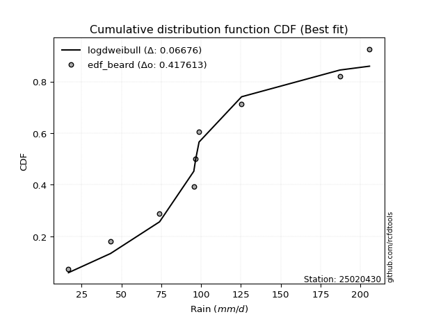</img>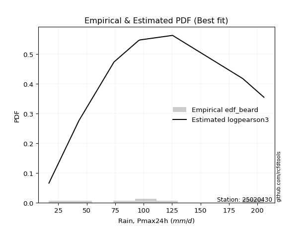</img>

</div>


### 5. Empirical - EDF Chegodayev (1955)

The Chegodayev formula is an empirical plotting position formula used in hydrological frequency analysis to estimate the exceedance probability or return period of a specific event from a set of observed data. It is primarily used for plotting observed data points on probability paper to fit a theoretical distribution, particularly for analyzing extreme events like maximum flood flows or rainfall intensities. The constant _b_ value in the generalized plotting position formula is 0.3.

<div align="center">


$P=(m-b)/(n+1-2b)$


</div>


**5.1. Empirical values**

<div align="center">

|                | 0                   | 1                   | 2                  | 3                   | 4              | 5                  | 6                  | 7                  | 8                  |
|:---------------|:--------------------|:--------------------|:-------------------|:--------------------|:---------------|:-------------------|:-------------------|:-------------------|:-------------------|
| date           | 2022                | 2025                | 2019               | 2020                | 2024           | 2021               | 2023               | 2017               | 2018               |
| x              | 16.7                | 37.9                | 43.1               | 73.9                | 95.4           | 96.6               | 125.4              | 187.1              | 205.7              |
| m              | 1                   | 2                   | 3                  | 4                   | 5              | 6                  | 7                  | 8                  | 9                  |
| empirical_dist | edf_chegodayev      | edf_chegodayev      | edf_chegodayev     | edf_chegodayev      | edf_chegodayev | edf_chegodayev     | edf_chegodayev     | edf_chegodayev     | edf_chegodayev     |
| empirical      | 0.07446808510638298 | 0.18085106382978722 | 0.2872340425531915 | 0.39361702127659576 | 0.5            | 0.6063829787234043 | 0.7127659574468085 | 0.8191489361702128 | 0.9255319148936169 |
| empirical_tr   | 1.0804597701149425  | 1.2207792207792207  | 1.4029850746268657 | 1.6491228070175437  | 2.0            | 2.540540540540541  | 3.481481481481481  | 5.529411764705883  | 13.428571428571399 |

</div>


**5.2. Kolmogorov-Smirnov fit test (sorted by Δ)**


<div align="center">

|                | 0                   | 1                   | 2                   | 3                   | 4                   | 5                   | 6                   | 7                   | 8                   | 9                   | 10                  | 11                  | 12                  | 13                  | 14                  | 15                  | 16                    | 17                  | 18                  | 19                  | 20                  | 21                  | 22                  | 23                  | 24                  | 25                  | 26                  | 27                  | 28                  | 29                  | 30                  | 31                  | 32                  | 33                  | 34                  | 35                  | 36                  | 37                  | 38                  | 39                  | 40                  | 41                  | 42                  | 43                  | 44                  | 45                  | 46                  | 47                  | 48                  | 49                  | 50                  | 51                  | 52                  | 53                  | 54                  | 55                  | 56                  | 57                  | 58                  | 59                  | 60                  | 61                  | 62                  | 63                  | 64                  | 65                  | 66                  | 67                  | 68                  | 69                  | 70                  | 71                  | 72                  | 73                  | 74                  | 75                  | 76                  | 77                  | 78                  | 79                  | 80                  | 81                  | 82                  | 83                  | 84                  | 85                  | 86                  | 87                  | 88                  | 89                  |
|:---------------|:--------------------|:--------------------|:--------------------|:--------------------|:--------------------|:--------------------|:--------------------|:--------------------|:--------------------|:--------------------|:--------------------|:--------------------|:--------------------|:--------------------|:--------------------|:--------------------|:----------------------|:--------------------|:--------------------|:--------------------|:--------------------|:--------------------|:--------------------|:--------------------|:--------------------|:--------------------|:--------------------|:--------------------|:--------------------|:--------------------|:--------------------|:--------------------|:--------------------|:--------------------|:--------------------|:--------------------|:--------------------|:--------------------|:--------------------|:--------------------|:--------------------|:--------------------|:--------------------|:--------------------|:--------------------|:--------------------|:--------------------|:--------------------|:--------------------|:--------------------|:--------------------|:--------------------|:--------------------|:--------------------|:--------------------|:--------------------|:--------------------|:--------------------|:--------------------|:--------------------|:--------------------|:--------------------|:--------------------|:--------------------|:--------------------|:--------------------|:--------------------|:--------------------|:--------------------|:--------------------|:--------------------|:--------------------|:--------------------|:--------------------|:--------------------|:--------------------|:--------------------|:--------------------|:--------------------|:--------------------|:--------------------|:--------------------|:--------------------|:--------------------|:--------------------|:--------------------|:--------------------|:--------------------|:--------------------|:--------------------|
| station        | 25020430            | 25020430            | 25020430            | 25020430            | 25020430            | 25020430            | 25020430            | 25020430            | 25020430            | 25020430            | 25020430            | 25020430            | 25020430            | 25020430            | 25020430            | 25020430            | 25020430              | 25020430            | 25020430            | 25020430            | 25020430            | 25020430            | 25020430            | 25020430            | 25020430            | 25020430            | 25020430            | 25020430            | 25020430            | 25020430            | 25020430            | 25020430            | 25020430            | 25020430            | 25020430            | 25020430            | 25020430            | 25020430            | 25020430            | 25020430            | 25020430            | 25020430            | 25020430            | 25020430            | 25020430            | 25020430            | 25020430            | 25020430            | 25020430            | 25020430            | 25020430            | 25020430            | 25020430            | 25020430            | 25020430            | 25020430            | 25020430            | 25020430            | 25020430            | 25020430            | 25020430            | 25020430            | 25020430            | 25020430            | 25020430            | 25020430            | 25020430            | 25020430            | 25020430            | 25020430            | 25020430            | 25020430            | 25020430            | 25020430            | 25020430            | 25020430            | 25020430            | 25020430            | 25020430            | 25020430            | 25020430            | 25020430            | 25020430            | 25020430            | 25020430            | 25020430            | 25020430            | 25020430            | 25020430            | 25020430            |
| empirical_dist | edf_chegodayev      | edf_chegodayev      | edf_chegodayev      | edf_chegodayev      | edf_chegodayev      | edf_chegodayev      | edf_chegodayev      | edf_chegodayev      | edf_chegodayev      | edf_chegodayev      | edf_chegodayev      | edf_chegodayev      | edf_chegodayev      | edf_chegodayev      | edf_chegodayev      | edf_chegodayev      | edf_chegodayev        | edf_chegodayev      | edf_chegodayev      | edf_chegodayev      | edf_chegodayev      | edf_chegodayev      | edf_chegodayev      | edf_chegodayev      | edf_chegodayev      | edf_chegodayev      | edf_chegodayev      | edf_chegodayev      | edf_chegodayev      | edf_chegodayev      | edf_chegodayev      | edf_chegodayev      | edf_chegodayev      | edf_chegodayev      | edf_chegodayev      | edf_chegodayev      | edf_chegodayev      | edf_chegodayev      | edf_chegodayev      | edf_chegodayev      | edf_chegodayev      | edf_chegodayev      | edf_chegodayev      | edf_chegodayev      | edf_chegodayev      | edf_chegodayev      | edf_chegodayev      | edf_chegodayev      | edf_chegodayev      | edf_chegodayev      | edf_chegodayev      | edf_chegodayev      | edf_chegodayev      | edf_chegodayev      | edf_chegodayev      | edf_chegodayev      | edf_chegodayev      | edf_chegodayev      | edf_chegodayev      | edf_chegodayev      | edf_chegodayev      | edf_chegodayev      | edf_chegodayev      | edf_chegodayev      | edf_chegodayev      | edf_chegodayev      | edf_chegodayev      | edf_chegodayev      | edf_chegodayev      | edf_chegodayev      | edf_chegodayev      | edf_chegodayev      | edf_chegodayev      | edf_chegodayev      | edf_chegodayev      | edf_chegodayev      | edf_chegodayev      | edf_chegodayev      | edf_chegodayev      | edf_chegodayev      | edf_chegodayev      | edf_chegodayev      | edf_chegodayev      | edf_chegodayev      | edf_chegodayev      | edf_chegodayev      | edf_chegodayev      | edf_chegodayev      | edf_chegodayev      | edf_chegodayev      |
| p_dist         | logpearson3         | ncf                 | loggompertz         | halfnorm            | invgauss            | betaprime           | genexpon            | gompertz            | logweibull_min      | mielke              | johnsonsu           | logfisk             | logloggamma         | rayleigh            | logjohnsonsu        | maxwell             | loglaplace_asymmetric | invgamma            | pearson3            | fisk                | loggumbel_l         | invweibull          | genlogistic         | kstwobign           | nct                 | logf                | logexponnorm        | logt                | lognorm             | lognorm             | logcrystalball      | lognct              | logfatiguelife      | norm                | crystalball         | truncnorm           | gumbel_r            | t                   | halflogistic        | logrice             | logerlang           | loggamma            | loggamma            | expon               | logistic            | rice                | logbetaprime        | exponnorm           | laplace_asymmetric  | logmielke           | loginvgamma         | loglogistic         | logncf              | loginvgauss         | logalpha            | hypsecant           | moyal               | loginvweibull       | f                   | logmaxwell          | loghypsecant        | laplace             | lograyleigh         | logkstwobign        | loggenexpon         | loglaplace          | loghalfnorm         | loggumbel_r         | logtruncnorm        | alpha               | gumbel_l            | loghalflogistic     | logmoyal            | erlang              | logexpon            | chi2                | logwald             | wald                | gibrat              | loggibrat           | weibull_min         | loglognorm          | logchi2             | pareto              | nakagami            | logpareto           | lognakagami         | fatiguelife         | gamma               | loggenlogistic      |
| delta          | 0.08071690836107481 | 0.08112491329207042 | 0.08176798266713536 | 0.08602982353052258 | 0.08617646822030761 | 0.08793027222539157 | 0.09044238079892433 | 0.09044291746708089 | 0.09046925065123829 | 0.09067225001403184 | 0.09112824597505997 | 0.09163049142133003 | 0.09188395312140518 | 0.09225597202083291 | 0.09456290628427222 | 0.09535550953387173 | 0.09767807556922606   | 0.09825783698525012 | 0.09852477159616518 | 0.09895271564860467 | 0.10004794726814081 | 0.1016132450062737  | 0.10262812674847821 | 0.10353990721202064 | 0.10863311668056669 | 0.11329015880491933 | 0.11361957533195555 | 0.1136208666928219  | 0.11362102599856982 | 0.11362102599856982 | 0.11362122537249975 | 0.11363476567743369 | 0.11432477920724882 | 0.11531001536432356 | 0.11531002299972343 | 0.11531002493178089 | 0.11539444985143071 | 0.11540526044112542 | 0.11704108213032344 | 0.11902259385886504 | 0.11905311094064908 | 0.11954998813030715 | 0.11954998813030715 | 0.12026602880495574 | 0.12157903755939076 | 0.12174907277047076 | 0.1228309069723893  | 0.12358189731177793 | 0.12375075037527197 | 0.12528673311311334 | 0.1276138119212098  | 0.12802878342471724 | 0.12817154607103376 | 0.1299846379296128  | 0.13090526322164053 | 0.13333677284249276 | 0.13336242600179854 | 0.1376506179440225  | 0.13826962513611812 | 0.1389077711207819  | 0.1396738076016184  | 0.145487383256346   | 0.14668699079579328 | 0.16344438311049853 | 0.16626568411508807 | 0.16763735493069565 | 0.16892938261160417 | 0.17862989722940648 | 0.18085106378407134 | 0.18325214347915414 | 0.18589220091722014 | 0.19730137095512312 | 0.2006397921829306  | 0.22664090673040233 | 0.2355475250657889  | 0.23712586363237725 | 0.26217297753308855 | 0.28096768899356134 | 0.2872340425531915  | 0.29418386329932267 | 0.3400554152974392  | 0.43473203083497425 | 0.43544728397432075 | 0.44095716157081377 | 0.46453859241790185 | 0.46611139188746686 | 0.49018795805765564 | 0.5278248798637252  | 0.5597610943187816  | 0.8191489361702128  |
| deltao         | 0.41761268023100007 | 0.41761268023100007 | 0.41761268023100007 | 0.41761268023100007 | 0.41761268023100007 | 0.41761268023100007 | 0.41761268023100007 | 0.41761268023100007 | 0.41761268023100007 | 0.41761268023100007 | 0.41761268023100007 | 0.41761268023100007 | 0.41761268023100007 | 0.41761268023100007 | 0.41761268023100007 | 0.41761268023100007 | 0.41761268023100007   | 0.41761268023100007 | 0.41761268023100007 | 0.41761268023100007 | 0.41761268023100007 | 0.41761268023100007 | 0.41761268023100007 | 0.41761268023100007 | 0.41761268023100007 | 0.41761268023100007 | 0.41761268023100007 | 0.41761268023100007 | 0.41761268023100007 | 0.41761268023100007 | 0.41761268023100007 | 0.41761268023100007 | 0.41761268023100007 | 0.41761268023100007 | 0.41761268023100007 | 0.41761268023100007 | 0.41761268023100007 | 0.41761268023100007 | 0.41761268023100007 | 0.41761268023100007 | 0.41761268023100007 | 0.41761268023100007 | 0.41761268023100007 | 0.41761268023100007 | 0.41761268023100007 | 0.41761268023100007 | 0.41761268023100007 | 0.41761268023100007 | 0.41761268023100007 | 0.41761268023100007 | 0.41761268023100007 | 0.41761268023100007 | 0.41761268023100007 | 0.41761268023100007 | 0.41761268023100007 | 0.41761268023100007 | 0.41761268023100007 | 0.41761268023100007 | 0.41761268023100007 | 0.41761268023100007 | 0.41761268023100007 | 0.41761268023100007 | 0.41761268023100007 | 0.41761268023100007 | 0.41761268023100007 | 0.41761268023100007 | 0.41761268023100007 | 0.41761268023100007 | 0.41761268023100007 | 0.41761268023100007 | 0.41761268023100007 | 0.41761268023100007 | 0.41761268023100007 | 0.41761268023100007 | 0.41761268023100007 | 0.41761268023100007 | 0.41761268023100007 | 0.41761268023100007 | 0.41761268023100007 | 0.41761268023100007 | 0.41761268023100007 | 0.41761268023100007 | 0.41761268023100007 | 0.41761268023100007 | 0.41761268023100007 | 0.41761268023100007 | 0.41761268023100007 | 0.41761268023100007 | 0.41761268023100007 | 0.41761268023100007 |
| eval           | Δo > Δ              | Δo > Δ              | Δo > Δ              | Δo > Δ              | Δo > Δ              | Δo > Δ              | Δo > Δ              | Δo > Δ              | Δo > Δ              | Δo > Δ              | Δo > Δ              | Δo > Δ              | Δo > Δ              | Δo > Δ              | Δo > Δ              | Δo > Δ              | Δo > Δ                | Δo > Δ              | Δo > Δ              | Δo > Δ              | Δo > Δ              | Δo > Δ              | Δo > Δ              | Δo > Δ              | Δo > Δ              | Δo > Δ              | Δo > Δ              | Δo > Δ              | Δo > Δ              | Δo > Δ              | Δo > Δ              | Δo > Δ              | Δo > Δ              | Δo > Δ              | Δo > Δ              | Δo > Δ              | Δo > Δ              | Δo > Δ              | Δo > Δ              | Δo > Δ              | Δo > Δ              | Δo > Δ              | Δo > Δ              | Δo > Δ              | Δo > Δ              | Δo > Δ              | Δo > Δ              | Δo > Δ              | Δo > Δ              | Δo > Δ              | Δo > Δ              | Δo > Δ              | Δo > Δ              | Δo > Δ              | Δo > Δ              | Δo > Δ              | Δo > Δ              | Δo > Δ              | Δo > Δ              | Δo > Δ              | Δo > Δ              | Δo > Δ              | Δo > Δ              | Δo > Δ              | Δo > Δ              | Δo > Δ              | Δo > Δ              | Δo > Δ              | Δo > Δ              | Δo > Δ              | Δo > Δ              | Δo > Δ              | Δo > Δ              | Δo > Δ              | Δo > Δ              | Δo > Δ              | Δo > Δ              | Δo > Δ              | Δo > Δ              | Δo > Δ              | Δo > Δ              | Δo <= Δ             | Δo <= Δ             | Δo <= Δ             | Δo <= Δ             | Δo <= Δ             | Δo <= Δ             | Δo <= Δ             | Δo <= Δ             | Δo <= Δ             |
| fit            | 1                   | 1                   | 1                   | 1                   | 1                   | 1                   | 1                   | 1                   | 1                   | 1                   | 1                   | 1                   | 1                   | 1                   | 1                   | 1                   | 1                     | 1                   | 1                   | 1                   | 1                   | 1                   | 1                   | 1                   | 1                   | 1                   | 1                   | 1                   | 1                   | 1                   | 1                   | 1                   | 1                   | 1                   | 1                   | 1                   | 1                   | 1                   | 1                   | 1                   | 1                   | 1                   | 1                   | 1                   | 1                   | 1                   | 1                   | 1                   | 1                   | 1                   | 1                   | 1                   | 1                   | 1                   | 1                   | 1                   | 1                   | 1                   | 1                   | 1                   | 1                   | 1                   | 1                   | 1                   | 1                   | 1                   | 1                   | 1                   | 1                   | 1                   | 1                   | 1                   | 1                   | 1                   | 1                   | 1                   | 1                   | 1                   | 1                   | 1                   | 1                   | 0                   | 0                   | 0                   | 0                   | 0                   | 0                   | 0                   | 0                   | 0                   |
| n              | 9                   | 9                   | 9                   | 9                   | 9                   | 9                   | 9                   | 9                   | 9                   | 9                   | 9                   | 9                   | 9                   | 9                   | 9                   | 9                   | 9                     | 9                   | 9                   | 9                   | 9                   | 9                   | 9                   | 9                   | 9                   | 9                   | 9                   | 9                   | 9                   | 9                   | 9                   | 9                   | 9                   | 9                   | 9                   | 9                   | 9                   | 9                   | 9                   | 9                   | 9                   | 9                   | 9                   | 9                   | 9                   | 9                   | 9                   | 9                   | 9                   | 9                   | 9                   | 9                   | 9                   | 9                   | 9                   | 9                   | 9                   | 9                   | 9                   | 9                   | 9                   | 9                   | 9                   | 9                   | 9                   | 9                   | 9                   | 9                   | 9                   | 9                   | 9                   | 9                   | 9                   | 9                   | 9                   | 9                   | 9                   | 9                   | 9                   | 9                   | 9                   | 9                   | 9                   | 9                   | 9                   | 9                   | 9                   | 9                   | 9                   | 9                   |
| best_fit       | 1                   | 0                   | 0                   | 0                   | 0                   | 0                   | 0                   | 0                   | 0                   | 0                   | 0                   | 0                   | 0                   | 0                   | 0                   | 0                   | 0                     | 0                   | 0                   | 0                   | 0                   | 0                   | 0                   | 0                   | 0                   | 0                   | 0                   | 0                   | 0                   | 0                   | 0                   | 0                   | 0                   | 0                   | 0                   | 0                   | 0                   | 0                   | 0                   | 0                   | 0                   | 0                   | 0                   | 0                   | 0                   | 0                   | 0                   | 0                   | 0                   | 0                   | 0                   | 0                   | 0                   | 0                   | 0                   | 0                   | 0                   | 0                   | 0                   | 0                   | 0                   | 0                   | 0                   | 0                   | 0                   | 0                   | 0                   | 0                   | 0                   | 0                   | 0                   | 0                   | 0                   | 0                   | 0                   | 0                   | 0                   | 0                   | 0                   | 0                   | 0                   | 0                   | 0                   | 0                   | 0                   | 0                   | 0                   | 0                   | 0                   | 0                   |
| best_fit_sort  | 1                   | 2                   | 3                   | 4                   | 5                   | 6                   | 7                   | 8                   | 9                   | 10                  | 11                  | 12                  | 13                  | 14                  | 15                  | 16                  | 17                    | 18                  | 19                  | 20                  | 21                  | 22                  | 23                  | 24                  | 25                  | 26                  | 27                  | 28                  | 29                  | 30                  | 31                  | 32                  | 33                  | 34                  | 35                  | 36                  | 37                  | 38                  | 39                  | 40                  | 41                  | 42                  | 43                  | 44                  | 45                  | 46                  | 47                  | 48                  | 49                  | 50                  | 51                  | 52                  | 53                  | 54                  | 55                  | 56                  | 57                  | 58                  | 59                  | 60                  | 61                  | 62                  | 63                  | 64                  | 65                  | 66                  | 67                  | 68                  | 69                  | 70                  | 71                  | 72                  | 73                  | 74                  | 75                  | 76                  | 77                  | 78                  | 79                  | 80                  | 81                  | 82                  | 83                  | 84                  | 85                  | 86                  | 87                  | 88                  | 89                  | 90                  |

</div>


<div align="center">

</img>

</div>


**5.3. Best fit**

<div align="center">

|   id |   station | empirical_dist   | p_dist      |     delta |   deltao | eval   |   fit |   n |   best_fit |   best_fit_sort |
|-----:|----------:|:-----------------|:------------|----------:|---------:|:-------|------:|----:|-----------:|----------------:|
|    0 |  25020430 | edf_chegodayev   | logpearson3 | 0.0807169 | 0.417613 | Δo > Δ |     1 |   9 |          1 |               1 |

</div>


<div align="center">

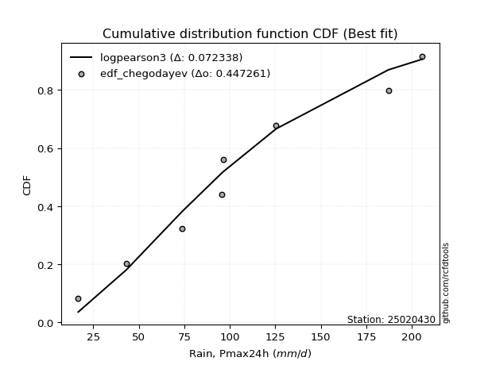</img>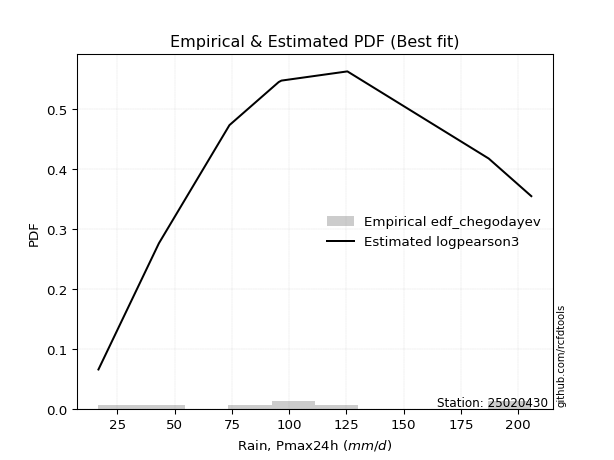</img>

</div>


### 6. Empirical - EDF Blom (1958)

The Blom formula is a specific "plotting position" formula used in hydrology and statistical analysis to estimate the empirical cumulative probability (or non-exceedance probability) of a data series. It is particularly recommended for data that are approximately normally distributed. The constant _a_ is set to 0.375 (or 3/8).

<div align="center">


$P=(m-a)/(n+1-2a)$


</div>


**6.1. Empirical values**

<div align="center">

|                | 0                   | 1                   | 2                   | 3                  | 4        | 5                  | 6                  | 7                  | 8                  |
|:---------------|:--------------------|:--------------------|:--------------------|:-------------------|:---------|:-------------------|:-------------------|:-------------------|:-------------------|
| date           | 2022                | 2025                | 2019                | 2020               | 2024     | 2021               | 2023               | 2017               | 2018               |
| x              | 16.7                | 37.9                | 43.1                | 73.9               | 95.4     | 96.6               | 125.4              | 187.1              | 205.7              |
| m              | 1                   | 2                   | 3                   | 4                  | 5        | 6                  | 7                  | 8                  | 9                  |
| empirical_dist | edf_blom            | edf_blom            | edf_blom            | edf_blom           | edf_blom | edf_blom           | edf_blom           | edf_blom           | edf_blom           |
| empirical      | 0.06756756756756757 | 0.17567567567567569 | 0.28378378378378377 | 0.3918918918918919 | 0.5      | 0.6081081081081081 | 0.7162162162162162 | 0.8243243243243243 | 0.9324324324324325 |
| empirical_tr   | 1.072463768115942   | 1.2131147540983607  | 1.3962264150943395  | 1.6444444444444444 | 2.0      | 2.5517241379310347 | 3.523809523809524  | 5.6923076923076925 | 14.800000000000006 |

</div>


**6.2. Kolmogorov-Smirnov fit test (sorted by Δ)**


<div align="center">

|                | 0                   | 1                   | 2                   | 3                   | 4                   | 5                   | 6                   | 7                   | 8                   | 9                   | 10                  | 11                  | 12                  | 13                  | 14                  | 15                  | 16                    | 17                  | 18                  | 19                  | 20                  | 21                  | 22                  | 23                  | 24                  | 25                  | 26                  | 27                  | 28                  | 29                  | 30                  | 31                  | 32                  | 33                  | 34                  | 35                  | 36                  | 37                  | 38                  | 39                  | 40                  | 41                  | 42                  | 43                  | 44                  | 45                  | 46                  | 47                  | 48                  | 49                  | 50                  | 51                  | 52                  | 53                  | 54                  | 55                  | 56                  | 57                  | 58                  | 59                  | 60                  | 61                  | 62                  | 63                  | 64                  | 65                  | 66                  | 67                  | 68                  | 69                  | 70                  | 71                  | 72                  | 73                  | 74                  | 75                  | 76                  | 77                  | 78                  | 79                  | 80                  | 81                  | 82                  | 83                  | 84                  | 85                  | 86                  | 87                  | 88                  | 89                  |
|:---------------|:--------------------|:--------------------|:--------------------|:--------------------|:--------------------|:--------------------|:--------------------|:--------------------|:--------------------|:--------------------|:--------------------|:--------------------|:--------------------|:--------------------|:--------------------|:--------------------|:----------------------|:--------------------|:--------------------|:--------------------|:--------------------|:--------------------|:--------------------|:--------------------|:--------------------|:--------------------|:--------------------|:--------------------|:--------------------|:--------------------|:--------------------|:--------------------|:--------------------|:--------------------|:--------------------|:--------------------|:--------------------|:--------------------|:--------------------|:--------------------|:--------------------|:--------------------|:--------------------|:--------------------|:--------------------|:--------------------|:--------------------|:--------------------|:--------------------|:--------------------|:--------------------|:--------------------|:--------------------|:--------------------|:--------------------|:--------------------|:--------------------|:--------------------|:--------------------|:--------------------|:--------------------|:--------------------|:--------------------|:--------------------|:--------------------|:--------------------|:--------------------|:--------------------|:--------------------|:--------------------|:--------------------|:--------------------|:--------------------|:--------------------|:--------------------|:--------------------|:--------------------|:--------------------|:--------------------|:--------------------|:--------------------|:--------------------|:--------------------|:--------------------|:--------------------|:--------------------|:--------------------|:--------------------|:--------------------|:--------------------|
| station        | 25020430            | 25020430            | 25020430            | 25020430            | 25020430            | 25020430            | 25020430            | 25020430            | 25020430            | 25020430            | 25020430            | 25020430            | 25020430            | 25020430            | 25020430            | 25020430            | 25020430              | 25020430            | 25020430            | 25020430            | 25020430            | 25020430            | 25020430            | 25020430            | 25020430            | 25020430            | 25020430            | 25020430            | 25020430            | 25020430            | 25020430            | 25020430            | 25020430            | 25020430            | 25020430            | 25020430            | 25020430            | 25020430            | 25020430            | 25020430            | 25020430            | 25020430            | 25020430            | 25020430            | 25020430            | 25020430            | 25020430            | 25020430            | 25020430            | 25020430            | 25020430            | 25020430            | 25020430            | 25020430            | 25020430            | 25020430            | 25020430            | 25020430            | 25020430            | 25020430            | 25020430            | 25020430            | 25020430            | 25020430            | 25020430            | 25020430            | 25020430            | 25020430            | 25020430            | 25020430            | 25020430            | 25020430            | 25020430            | 25020430            | 25020430            | 25020430            | 25020430            | 25020430            | 25020430            | 25020430            | 25020430            | 25020430            | 25020430            | 25020430            | 25020430            | 25020430            | 25020430            | 25020430            | 25020430            | 25020430            |
| empirical_dist | edf_blom            | edf_blom            | edf_blom            | edf_blom            | edf_blom            | edf_blom            | edf_blom            | edf_blom            | edf_blom            | edf_blom            | edf_blom            | edf_blom            | edf_blom            | edf_blom            | edf_blom            | edf_blom            | edf_blom              | edf_blom            | edf_blom            | edf_blom            | edf_blom            | edf_blom            | edf_blom            | edf_blom            | edf_blom            | edf_blom            | edf_blom            | edf_blom            | edf_blom            | edf_blom            | edf_blom            | edf_blom            | edf_blom            | edf_blom            | edf_blom            | edf_blom            | edf_blom            | edf_blom            | edf_blom            | edf_blom            | edf_blom            | edf_blom            | edf_blom            | edf_blom            | edf_blom            | edf_blom            | edf_blom            | edf_blom            | edf_blom            | edf_blom            | edf_blom            | edf_blom            | edf_blom            | edf_blom            | edf_blom            | edf_blom            | edf_blom            | edf_blom            | edf_blom            | edf_blom            | edf_blom            | edf_blom            | edf_blom            | edf_blom            | edf_blom            | edf_blom            | edf_blom            | edf_blom            | edf_blom            | edf_blom            | edf_blom            | edf_blom            | edf_blom            | edf_blom            | edf_blom            | edf_blom            | edf_blom            | edf_blom            | edf_blom            | edf_blom            | edf_blom            | edf_blom            | edf_blom            | edf_blom            | edf_blom            | edf_blom            | edf_blom            | edf_blom            | edf_blom            | edf_blom            |
| p_dist         | ncf                 | logpearson3         | halfnorm            | loggompertz         | betaprime           | invgauss            | gompertz            | logloggamma         | genexpon            | logweibull_min      | rayleigh            | mielke              | johnsonsu           | logjohnsonsu        | maxwell             | logfisk             | loglaplace_asymmetric | invgamma            | loggumbel_l         | pearson3            | fisk                | invweibull          | genlogistic         | kstwobign           | nct                 | gumbel_r            | logf                | halflogistic        | logexponnorm        | logt                | lognorm             | lognorm             | logcrystalball      | lognct              | logfatiguelife      | norm                | crystalball         | truncnorm           | t                   | logistic            | rice                | logrice             | logerlang           | loggamma            | loggamma            | logmielke           | expon               | laplace_asymmetric  | logbetaprime        | exponnorm           | loginvgamma         | loglogistic         | logncf              | hypsecant           | moyal               | loginvgauss         | logalpha            | logmaxwell          | loginvweibull       | loghypsecant        | f                   | laplace             | lograyleigh         | logkstwobign        | loglaplace          | loggenexpon         | loghalfnorm         | logtruncnorm        | loggumbel_r         | alpha               | gumbel_l            | loghalflogistic     | logmoyal            | erlang              | chi2                | logexpon            | logwald             | wald                | gibrat              | loggibrat           | weibull_min         | loglognorm          | logchi2             | pareto              | nakagami            | logpareto           | lognakagami         | fatiguelife         | gamma               | loggenlogistic      |
| delta          | 0.07767465452266267 | 0.08071690836107481 | 0.08085443537641102 | 0.08176798266713536 | 0.08448001345598383 | 0.0855805338521557  | 0.0861344303985048  | 0.08670856496729362 | 0.08699212202951659 | 0.08701899188183054 | 0.08708058386672135 | 0.0872219912446241  | 0.08767798720565223 | 0.08938751813016066 | 0.09018012137976017 | 0.09089022345575237 | 0.09422781679981831   | 0.09480757821584238 | 0.09487255911402925 | 0.09507451282675744 | 0.09550245687919692 | 0.09816298623686595 | 0.09917786797907047 | 0.1000896484426129  | 0.10518285791115894 | 0.11194419108202297 | 0.11329015880491933 | 0.1135908233609157  | 0.11361957533195555 | 0.1136208666928219  | 0.11362102599856982 | 0.11362102599856982 | 0.11362122537249975 | 0.11363476567743369 | 0.11432477920724882 | 0.11703514474902738 | 0.11703515238442724 | 0.1170351543164847  | 0.11713038982582924 | 0.11825430139863813 | 0.11829881400106301 | 0.11902259385886504 | 0.11905311094064908 | 0.11954998813030715 | 0.11954998813030715 | 0.12011134495900178 | 0.12026602880495574 | 0.12030049160586423 | 0.1228309069723893  | 0.12358189731177793 | 0.1276138119212098  | 0.12802878342471724 | 0.12817154607103376 | 0.12988651407308502 | 0.1299121672323908  | 0.1299846379296128  | 0.13090526322164053 | 0.1389077711207819  | 0.13937574732872637 | 0.1396738076016184  | 0.139994754520822   | 0.14203712448693825 | 0.14668699079579328 | 0.1651695124952024  | 0.16763735493069565 | 0.16799081349979195 | 0.16892938261160417 | 0.1756756756299598  | 0.17862989722940648 | 0.184977272863858   | 0.18761733030192396 | 0.19730137095512312 | 0.2006397921829306  | 0.2283660361151062  | 0.23885099301708113 | 0.24072291321990044 | 0.26217297753308855 | 0.2775174302241536  | 0.28378378378378377 | 0.29418386329932267 | 0.34523080345155077 | 0.4399074189890858  | 0.4406226721284323  | 0.44613254972492533 | 0.4697139805720134  | 0.4712867800415784  | 0.4919130874423595  | 0.5330002680178367  | 0.5649364824728932  | 0.8243243243243243  |
| deltao         | 0.41761268023100007 | 0.41761268023100007 | 0.41761268023100007 | 0.41761268023100007 | 0.41761268023100007 | 0.41761268023100007 | 0.41761268023100007 | 0.41761268023100007 | 0.41761268023100007 | 0.41761268023100007 | 0.41761268023100007 | 0.41761268023100007 | 0.41761268023100007 | 0.41761268023100007 | 0.41761268023100007 | 0.41761268023100007 | 0.41761268023100007   | 0.41761268023100007 | 0.41761268023100007 | 0.41761268023100007 | 0.41761268023100007 | 0.41761268023100007 | 0.41761268023100007 | 0.41761268023100007 | 0.41761268023100007 | 0.41761268023100007 | 0.41761268023100007 | 0.41761268023100007 | 0.41761268023100007 | 0.41761268023100007 | 0.41761268023100007 | 0.41761268023100007 | 0.41761268023100007 | 0.41761268023100007 | 0.41761268023100007 | 0.41761268023100007 | 0.41761268023100007 | 0.41761268023100007 | 0.41761268023100007 | 0.41761268023100007 | 0.41761268023100007 | 0.41761268023100007 | 0.41761268023100007 | 0.41761268023100007 | 0.41761268023100007 | 0.41761268023100007 | 0.41761268023100007 | 0.41761268023100007 | 0.41761268023100007 | 0.41761268023100007 | 0.41761268023100007 | 0.41761268023100007 | 0.41761268023100007 | 0.41761268023100007 | 0.41761268023100007 | 0.41761268023100007 | 0.41761268023100007 | 0.41761268023100007 | 0.41761268023100007 | 0.41761268023100007 | 0.41761268023100007 | 0.41761268023100007 | 0.41761268023100007 | 0.41761268023100007 | 0.41761268023100007 | 0.41761268023100007 | 0.41761268023100007 | 0.41761268023100007 | 0.41761268023100007 | 0.41761268023100007 | 0.41761268023100007 | 0.41761268023100007 | 0.41761268023100007 | 0.41761268023100007 | 0.41761268023100007 | 0.41761268023100007 | 0.41761268023100007 | 0.41761268023100007 | 0.41761268023100007 | 0.41761268023100007 | 0.41761268023100007 | 0.41761268023100007 | 0.41761268023100007 | 0.41761268023100007 | 0.41761268023100007 | 0.41761268023100007 | 0.41761268023100007 | 0.41761268023100007 | 0.41761268023100007 | 0.41761268023100007 |
| eval           | Δo > Δ              | Δo > Δ              | Δo > Δ              | Δo > Δ              | Δo > Δ              | Δo > Δ              | Δo > Δ              | Δo > Δ              | Δo > Δ              | Δo > Δ              | Δo > Δ              | Δo > Δ              | Δo > Δ              | Δo > Δ              | Δo > Δ              | Δo > Δ              | Δo > Δ                | Δo > Δ              | Δo > Δ              | Δo > Δ              | Δo > Δ              | Δo > Δ              | Δo > Δ              | Δo > Δ              | Δo > Δ              | Δo > Δ              | Δo > Δ              | Δo > Δ              | Δo > Δ              | Δo > Δ              | Δo > Δ              | Δo > Δ              | Δo > Δ              | Δo > Δ              | Δo > Δ              | Δo > Δ              | Δo > Δ              | Δo > Δ              | Δo > Δ              | Δo > Δ              | Δo > Δ              | Δo > Δ              | Δo > Δ              | Δo > Δ              | Δo > Δ              | Δo > Δ              | Δo > Δ              | Δo > Δ              | Δo > Δ              | Δo > Δ              | Δo > Δ              | Δo > Δ              | Δo > Δ              | Δo > Δ              | Δo > Δ              | Δo > Δ              | Δo > Δ              | Δo > Δ              | Δo > Δ              | Δo > Δ              | Δo > Δ              | Δo > Δ              | Δo > Δ              | Δo > Δ              | Δo > Δ              | Δo > Δ              | Δo > Δ              | Δo > Δ              | Δo > Δ              | Δo > Δ              | Δo > Δ              | Δo > Δ              | Δo > Δ              | Δo > Δ              | Δo > Δ              | Δo > Δ              | Δo > Δ              | Δo > Δ              | Δo > Δ              | Δo > Δ              | Δo > Δ              | Δo <= Δ             | Δo <= Δ             | Δo <= Δ             | Δo <= Δ             | Δo <= Δ             | Δo <= Δ             | Δo <= Δ             | Δo <= Δ             | Δo <= Δ             |
| fit            | 1                   | 1                   | 1                   | 1                   | 1                   | 1                   | 1                   | 1                   | 1                   | 1                   | 1                   | 1                   | 1                   | 1                   | 1                   | 1                   | 1                     | 1                   | 1                   | 1                   | 1                   | 1                   | 1                   | 1                   | 1                   | 1                   | 1                   | 1                   | 1                   | 1                   | 1                   | 1                   | 1                   | 1                   | 1                   | 1                   | 1                   | 1                   | 1                   | 1                   | 1                   | 1                   | 1                   | 1                   | 1                   | 1                   | 1                   | 1                   | 1                   | 1                   | 1                   | 1                   | 1                   | 1                   | 1                   | 1                   | 1                   | 1                   | 1                   | 1                   | 1                   | 1                   | 1                   | 1                   | 1                   | 1                   | 1                   | 1                   | 1                   | 1                   | 1                   | 1                   | 1                   | 1                   | 1                   | 1                   | 1                   | 1                   | 1                   | 1                   | 1                   | 0                   | 0                   | 0                   | 0                   | 0                   | 0                   | 0                   | 0                   | 0                   |
| n              | 9                   | 9                   | 9                   | 9                   | 9                   | 9                   | 9                   | 9                   | 9                   | 9                   | 9                   | 9                   | 9                   | 9                   | 9                   | 9                   | 9                     | 9                   | 9                   | 9                   | 9                   | 9                   | 9                   | 9                   | 9                   | 9                   | 9                   | 9                   | 9                   | 9                   | 9                   | 9                   | 9                   | 9                   | 9                   | 9                   | 9                   | 9                   | 9                   | 9                   | 9                   | 9                   | 9                   | 9                   | 9                   | 9                   | 9                   | 9                   | 9                   | 9                   | 9                   | 9                   | 9                   | 9                   | 9                   | 9                   | 9                   | 9                   | 9                   | 9                   | 9                   | 9                   | 9                   | 9                   | 9                   | 9                   | 9                   | 9                   | 9                   | 9                   | 9                   | 9                   | 9                   | 9                   | 9                   | 9                   | 9                   | 9                   | 9                   | 9                   | 9                   | 9                   | 9                   | 9                   | 9                   | 9                   | 9                   | 9                   | 9                   | 9                   |
| best_fit       | 1                   | 0                   | 0                   | 0                   | 0                   | 0                   | 0                   | 0                   | 0                   | 0                   | 0                   | 0                   | 0                   | 0                   | 0                   | 0                   | 0                     | 0                   | 0                   | 0                   | 0                   | 0                   | 0                   | 0                   | 0                   | 0                   | 0                   | 0                   | 0                   | 0                   | 0                   | 0                   | 0                   | 0                   | 0                   | 0                   | 0                   | 0                   | 0                   | 0                   | 0                   | 0                   | 0                   | 0                   | 0                   | 0                   | 0                   | 0                   | 0                   | 0                   | 0                   | 0                   | 0                   | 0                   | 0                   | 0                   | 0                   | 0                   | 0                   | 0                   | 0                   | 0                   | 0                   | 0                   | 0                   | 0                   | 0                   | 0                   | 0                   | 0                   | 0                   | 0                   | 0                   | 0                   | 0                   | 0                   | 0                   | 0                   | 0                   | 0                   | 0                   | 0                   | 0                   | 0                   | 0                   | 0                   | 0                   | 0                   | 0                   | 0                   |
| best_fit_sort  | 1                   | 2                   | 3                   | 4                   | 5                   | 6                   | 7                   | 8                   | 9                   | 10                  | 11                  | 12                  | 13                  | 14                  | 15                  | 16                  | 17                    | 18                  | 19                  | 20                  | 21                  | 22                  | 23                  | 24                  | 25                  | 26                  | 27                  | 28                  | 29                  | 30                  | 31                  | 32                  | 33                  | 34                  | 35                  | 36                  | 37                  | 38                  | 39                  | 40                  | 41                  | 42                  | 43                  | 44                  | 45                  | 46                  | 47                  | 48                  | 49                  | 50                  | 51                  | 52                  | 53                  | 54                  | 55                  | 56                  | 57                  | 58                  | 59                  | 60                  | 61                  | 62                  | 63                  | 64                  | 65                  | 66                  | 67                  | 68                  | 69                  | 70                  | 71                  | 72                  | 73                  | 74                  | 75                  | 76                  | 77                  | 78                  | 79                  | 80                  | 81                  | 82                  | 83                  | 84                  | 85                  | 86                  | 87                  | 88                  | 89                  | 90                  |

</div>


<div align="center">

</img>

</div>


**6.3. Best fit**

<div align="center">

|   id |   station | empirical_dist   | p_dist   |     delta |   deltao | eval   |   fit |   n |   best_fit |   best_fit_sort |
|-----:|----------:|:-----------------|:---------|----------:|---------:|:-------|------:|----:|-----------:|----------------:|
|    0 |  25020430 | edf_blom         | ncf      | 0.0776747 | 0.417613 | Δo > Δ |     1 |   9 |          1 |               1 |

</div>


<div align="center">

</img></img>

</div>


### 7. Empirical - EDF Tukey (1962)

In hydrology, the Tukey formula is used as a plotting position formula to estimate the empirical probability or frequency of a flood event (or other hydrological data). The formula parameter is given as _c=0.333_ (or 1/3).

<div align="center">


$P=(m-c)/(n+1-2c)$


</div>


**7.1. Empirical values**

<div align="center">

|                | 0                   | 1                   | 2                  | 3                   | 4         | 5                  | 6                  | 7                  | 8                  |
|:---------------|:--------------------|:--------------------|:-------------------|:--------------------|:----------|:-------------------|:-------------------|:-------------------|:-------------------|
| date           | 2022                | 2025                | 2019               | 2020                | 2024      | 2021               | 2023               | 2017               | 2018               |
| x              | 16.7                | 37.9                | 43.1               | 73.9                | 95.4      | 96.6               | 125.4              | 187.1              | 205.7              |
| m              | 1                   | 2                   | 3                  | 4                   | 5         | 6                  | 7                  | 8                  | 9                  |
| empirical_dist | edf_tukey           | edf_tukey           | edf_tukey          | edf_tukey           | edf_tukey | edf_tukey          | edf_tukey          | edf_tukey          | edf_tukey          |
| empirical      | 0.07142857142857142 | 0.17857142857142858 | 0.2857142857142857 | 0.39285714285714285 | 0.5       | 0.6071428571428571 | 0.7142857142857143 | 0.8214285714285714 | 0.9285714285714286 |
| empirical_tr   | 1.0769230769230769  | 1.2173913043478262  | 1.4                | 1.6470588235294117  | 2.0       | 2.545454545454545  | 3.5                | 5.599999999999999  | 14.000000000000007 |

</div>


**7.2. Kolmogorov-Smirnov fit test (sorted by Δ)**


<div align="center">

|                | 0                   | 1                   | 2                   | 3                   | 4                   | 5                   | 6                   | 7                   | 8                   | 9                   | 10                  | 11                  | 12                  | 13                  | 14                  | 15                  | 16                    | 17                  | 18                  | 19                  | 20                  | 21                  | 22                  | 23                  | 24                  | 25                  | 26                  | 27                  | 28                  | 29                  | 30                  | 31                  | 32                  | 33                  | 34                  | 35                  | 36                  | 37                  | 38                  | 39                  | 40                  | 41                  | 42                  | 43                  | 44                  | 45                  | 46                  | 47                  | 48                  | 49                  | 50                  | 51                  | 52                  | 53                  | 54                  | 55                  | 56                  | 57                  | 58                  | 59                  | 60                  | 61                  | 62                  | 63                  | 64                  | 65                  | 66                  | 67                  | 68                  | 69                  | 70                  | 71                  | 72                  | 73                  | 74                  | 75                  | 76                  | 77                  | 78                  | 79                  | 80                  | 81                  | 82                  | 83                  | 84                  | 85                  | 86                  | 87                  | 88                  | 89                  |
|:---------------|:--------------------|:--------------------|:--------------------|:--------------------|:--------------------|:--------------------|:--------------------|:--------------------|:--------------------|:--------------------|:--------------------|:--------------------|:--------------------|:--------------------|:--------------------|:--------------------|:----------------------|:--------------------|:--------------------|:--------------------|:--------------------|:--------------------|:--------------------|:--------------------|:--------------------|:--------------------|:--------------------|:--------------------|:--------------------|:--------------------|:--------------------|:--------------------|:--------------------|:--------------------|:--------------------|:--------------------|:--------------------|:--------------------|:--------------------|:--------------------|:--------------------|:--------------------|:--------------------|:--------------------|:--------------------|:--------------------|:--------------------|:--------------------|:--------------------|:--------------------|:--------------------|:--------------------|:--------------------|:--------------------|:--------------------|:--------------------|:--------------------|:--------------------|:--------------------|:--------------------|:--------------------|:--------------------|:--------------------|:--------------------|:--------------------|:--------------------|:--------------------|:--------------------|:--------------------|:--------------------|:--------------------|:--------------------|:--------------------|:--------------------|:--------------------|:--------------------|:--------------------|:--------------------|:--------------------|:--------------------|:--------------------|:--------------------|:--------------------|:--------------------|:--------------------|:--------------------|:--------------------|:--------------------|:--------------------|:--------------------|
| station        | 25020430            | 25020430            | 25020430            | 25020430            | 25020430            | 25020430            | 25020430            | 25020430            | 25020430            | 25020430            | 25020430            | 25020430            | 25020430            | 25020430            | 25020430            | 25020430            | 25020430              | 25020430            | 25020430            | 25020430            | 25020430            | 25020430            | 25020430            | 25020430            | 25020430            | 25020430            | 25020430            | 25020430            | 25020430            | 25020430            | 25020430            | 25020430            | 25020430            | 25020430            | 25020430            | 25020430            | 25020430            | 25020430            | 25020430            | 25020430            | 25020430            | 25020430            | 25020430            | 25020430            | 25020430            | 25020430            | 25020430            | 25020430            | 25020430            | 25020430            | 25020430            | 25020430            | 25020430            | 25020430            | 25020430            | 25020430            | 25020430            | 25020430            | 25020430            | 25020430            | 25020430            | 25020430            | 25020430            | 25020430            | 25020430            | 25020430            | 25020430            | 25020430            | 25020430            | 25020430            | 25020430            | 25020430            | 25020430            | 25020430            | 25020430            | 25020430            | 25020430            | 25020430            | 25020430            | 25020430            | 25020430            | 25020430            | 25020430            | 25020430            | 25020430            | 25020430            | 25020430            | 25020430            | 25020430            | 25020430            |
| empirical_dist | edf_tukey           | edf_tukey           | edf_tukey           | edf_tukey           | edf_tukey           | edf_tukey           | edf_tukey           | edf_tukey           | edf_tukey           | edf_tukey           | edf_tukey           | edf_tukey           | edf_tukey           | edf_tukey           | edf_tukey           | edf_tukey           | edf_tukey             | edf_tukey           | edf_tukey           | edf_tukey           | edf_tukey           | edf_tukey           | edf_tukey           | edf_tukey           | edf_tukey           | edf_tukey           | edf_tukey           | edf_tukey           | edf_tukey           | edf_tukey           | edf_tukey           | edf_tukey           | edf_tukey           | edf_tukey           | edf_tukey           | edf_tukey           | edf_tukey           | edf_tukey           | edf_tukey           | edf_tukey           | edf_tukey           | edf_tukey           | edf_tukey           | edf_tukey           | edf_tukey           | edf_tukey           | edf_tukey           | edf_tukey           | edf_tukey           | edf_tukey           | edf_tukey           | edf_tukey           | edf_tukey           | edf_tukey           | edf_tukey           | edf_tukey           | edf_tukey           | edf_tukey           | edf_tukey           | edf_tukey           | edf_tukey           | edf_tukey           | edf_tukey           | edf_tukey           | edf_tukey           | edf_tukey           | edf_tukey           | edf_tukey           | edf_tukey           | edf_tukey           | edf_tukey           | edf_tukey           | edf_tukey           | edf_tukey           | edf_tukey           | edf_tukey           | edf_tukey           | edf_tukey           | edf_tukey           | edf_tukey           | edf_tukey           | edf_tukey           | edf_tukey           | edf_tukey           | edf_tukey           | edf_tukey           | edf_tukey           | edf_tukey           | edf_tukey           | edf_tukey           |
| p_dist         | ncf                 | logpearson3         | loggompertz         | halfnorm            | invgauss            | betaprime           | gompertz            | genexpon            | logweibull_min      | mielke              | logloggamma         | johnsonsu           | rayleigh            | logfisk             | logjohnsonsu        | maxwell             | loglaplace_asymmetric | invgamma            | pearson3            | fisk                | loggumbel_l         | invweibull          | genlogistic         | kstwobign           | nct                 | logf                | logexponnorm        | logt                | lognorm             | lognorm             | logcrystalball      | lognct              | gumbel_r            | logfatiguelife      | halflogistic        | norm                | crystalball         | truncnorm           | t                   | logrice             | logerlang           | loggamma            | loggamma            | logistic            | rice                | expon               | laplace_asymmetric  | logbetaprime        | logmielke           | exponnorm           | loginvgamma         | loglogistic         | logncf              | loginvgauss         | logalpha            | hypsecant           | moyal               | loginvweibull       | logmaxwell          | f                   | loghypsecant        | laplace             | lograyleigh         | logkstwobign        | loggenexpon         | loglaplace          | loghalfnorm         | logtruncnorm        | loggumbel_r         | alpha               | gumbel_l            | loghalflogistic     | logmoyal            | erlang              | logexpon            | chi2                | logwald             | wald                | gibrat              | loggibrat           | weibull_min         | loglognorm          | logchi2             | pareto              | nakagami            | logpareto           | lognakagami         | fatiguelife         | gamma               | loggenlogistic      |
| delta          | 0.0796051564531646  | 0.08071690836107481 | 0.08176798266713536 | 0.08375018827216396 | 0.0855805338521557  | 0.08641051538648575 | 0.08816328220872227 | 0.08892262396001852 | 0.08894949381233247 | 0.08915249317512602 | 0.08960431786304657 | 0.08960848913615416 | 0.0899763367624743  | 0.09089022345575237 | 0.0922832710259136  | 0.09307587427551312 | 0.09615831873032024   | 0.0967380801463443  | 0.09700501475725937 | 0.09743295880969885 | 0.0977683120097822  | 0.10009348816736788 | 0.1011083699095724  | 0.10202015037311482 | 0.10711335984166087 | 0.11329015880491933 | 0.11361957533195555 | 0.1136208666928219  | 0.11362102599856982 | 0.11362102599856982 | 0.11362122537249975 | 0.11363476567743369 | 0.1138746930125249  | 0.11432477920724882 | 0.11552132529141762 | 0.11606989378377636 | 0.11606990141917622 | 0.11606990335123368 | 0.11616513886057822 | 0.11902259385886504 | 0.11905311094064908 | 0.11954998813030715 | 0.11954998813030715 | 0.12005928072048494 | 0.12022931593156494 | 0.12026602880495574 | 0.12223099353636616 | 0.1228309069723893  | 0.12300709785475472 | 0.12358189731177793 | 0.1276138119212098  | 0.12802878342471724 | 0.12817154607103376 | 0.1299846379296128  | 0.13090526322164053 | 0.13181701600358695 | 0.13184266916289272 | 0.1384104963634754  | 0.1389077711207819  | 0.13902950355557103 | 0.1396738076016184  | 0.14396762641744018 | 0.14668699079579328 | 0.16420426152995143 | 0.16702556253454098 | 0.16763735493069565 | 0.16892938261160417 | 0.1785714285257127  | 0.17862989722940648 | 0.18401202189860705 | 0.18665207933667294 | 0.19730137095512312 | 0.2006397921829306  | 0.22740078514985523 | 0.23782716032414755 | 0.23788574205183016 | 0.26217297753308855 | 0.2794479321546555  | 0.2857142857142857  | 0.29418386329932267 | 0.3423350505557978  | 0.43701166609333286 | 0.43772691923267937 | 0.4432367968291724  | 0.46681822767626047 | 0.4683910271458255  | 0.49094783647710855 | 0.5301045151220838  | 0.5620407295771402  | 0.8214285714285714  |
| deltao         | 0.41761268023100007 | 0.41761268023100007 | 0.41761268023100007 | 0.41761268023100007 | 0.41761268023100007 | 0.41761268023100007 | 0.41761268023100007 | 0.41761268023100007 | 0.41761268023100007 | 0.41761268023100007 | 0.41761268023100007 | 0.41761268023100007 | 0.41761268023100007 | 0.41761268023100007 | 0.41761268023100007 | 0.41761268023100007 | 0.41761268023100007   | 0.41761268023100007 | 0.41761268023100007 | 0.41761268023100007 | 0.41761268023100007 | 0.41761268023100007 | 0.41761268023100007 | 0.41761268023100007 | 0.41761268023100007 | 0.41761268023100007 | 0.41761268023100007 | 0.41761268023100007 | 0.41761268023100007 | 0.41761268023100007 | 0.41761268023100007 | 0.41761268023100007 | 0.41761268023100007 | 0.41761268023100007 | 0.41761268023100007 | 0.41761268023100007 | 0.41761268023100007 | 0.41761268023100007 | 0.41761268023100007 | 0.41761268023100007 | 0.41761268023100007 | 0.41761268023100007 | 0.41761268023100007 | 0.41761268023100007 | 0.41761268023100007 | 0.41761268023100007 | 0.41761268023100007 | 0.41761268023100007 | 0.41761268023100007 | 0.41761268023100007 | 0.41761268023100007 | 0.41761268023100007 | 0.41761268023100007 | 0.41761268023100007 | 0.41761268023100007 | 0.41761268023100007 | 0.41761268023100007 | 0.41761268023100007 | 0.41761268023100007 | 0.41761268023100007 | 0.41761268023100007 | 0.41761268023100007 | 0.41761268023100007 | 0.41761268023100007 | 0.41761268023100007 | 0.41761268023100007 | 0.41761268023100007 | 0.41761268023100007 | 0.41761268023100007 | 0.41761268023100007 | 0.41761268023100007 | 0.41761268023100007 | 0.41761268023100007 | 0.41761268023100007 | 0.41761268023100007 | 0.41761268023100007 | 0.41761268023100007 | 0.41761268023100007 | 0.41761268023100007 | 0.41761268023100007 | 0.41761268023100007 | 0.41761268023100007 | 0.41761268023100007 | 0.41761268023100007 | 0.41761268023100007 | 0.41761268023100007 | 0.41761268023100007 | 0.41761268023100007 | 0.41761268023100007 | 0.41761268023100007 |
| eval           | Δo > Δ              | Δo > Δ              | Δo > Δ              | Δo > Δ              | Δo > Δ              | Δo > Δ              | Δo > Δ              | Δo > Δ              | Δo > Δ              | Δo > Δ              | Δo > Δ              | Δo > Δ              | Δo > Δ              | Δo > Δ              | Δo > Δ              | Δo > Δ              | Δo > Δ                | Δo > Δ              | Δo > Δ              | Δo > Δ              | Δo > Δ              | Δo > Δ              | Δo > Δ              | Δo > Δ              | Δo > Δ              | Δo > Δ              | Δo > Δ              | Δo > Δ              | Δo > Δ              | Δo > Δ              | Δo > Δ              | Δo > Δ              | Δo > Δ              | Δo > Δ              | Δo > Δ              | Δo > Δ              | Δo > Δ              | Δo > Δ              | Δo > Δ              | Δo > Δ              | Δo > Δ              | Δo > Δ              | Δo > Δ              | Δo > Δ              | Δo > Δ              | Δo > Δ              | Δo > Δ              | Δo > Δ              | Δo > Δ              | Δo > Δ              | Δo > Δ              | Δo > Δ              | Δo > Δ              | Δo > Δ              | Δo > Δ              | Δo > Δ              | Δo > Δ              | Δo > Δ              | Δo > Δ              | Δo > Δ              | Δo > Δ              | Δo > Δ              | Δo > Δ              | Δo > Δ              | Δo > Δ              | Δo > Δ              | Δo > Δ              | Δo > Δ              | Δo > Δ              | Δo > Δ              | Δo > Δ              | Δo > Δ              | Δo > Δ              | Δo > Δ              | Δo > Δ              | Δo > Δ              | Δo > Δ              | Δo > Δ              | Δo > Δ              | Δo > Δ              | Δo > Δ              | Δo <= Δ             | Δo <= Δ             | Δo <= Δ             | Δo <= Δ             | Δo <= Δ             | Δo <= Δ             | Δo <= Δ             | Δo <= Δ             | Δo <= Δ             |
| fit            | 1                   | 1                   | 1                   | 1                   | 1                   | 1                   | 1                   | 1                   | 1                   | 1                   | 1                   | 1                   | 1                   | 1                   | 1                   | 1                   | 1                     | 1                   | 1                   | 1                   | 1                   | 1                   | 1                   | 1                   | 1                   | 1                   | 1                   | 1                   | 1                   | 1                   | 1                   | 1                   | 1                   | 1                   | 1                   | 1                   | 1                   | 1                   | 1                   | 1                   | 1                   | 1                   | 1                   | 1                   | 1                   | 1                   | 1                   | 1                   | 1                   | 1                   | 1                   | 1                   | 1                   | 1                   | 1                   | 1                   | 1                   | 1                   | 1                   | 1                   | 1                   | 1                   | 1                   | 1                   | 1                   | 1                   | 1                   | 1                   | 1                   | 1                   | 1                   | 1                   | 1                   | 1                   | 1                   | 1                   | 1                   | 1                   | 1                   | 1                   | 1                   | 0                   | 0                   | 0                   | 0                   | 0                   | 0                   | 0                   | 0                   | 0                   |
| n              | 9                   | 9                   | 9                   | 9                   | 9                   | 9                   | 9                   | 9                   | 9                   | 9                   | 9                   | 9                   | 9                   | 9                   | 9                   | 9                   | 9                     | 9                   | 9                   | 9                   | 9                   | 9                   | 9                   | 9                   | 9                   | 9                   | 9                   | 9                   | 9                   | 9                   | 9                   | 9                   | 9                   | 9                   | 9                   | 9                   | 9                   | 9                   | 9                   | 9                   | 9                   | 9                   | 9                   | 9                   | 9                   | 9                   | 9                   | 9                   | 9                   | 9                   | 9                   | 9                   | 9                   | 9                   | 9                   | 9                   | 9                   | 9                   | 9                   | 9                   | 9                   | 9                   | 9                   | 9                   | 9                   | 9                   | 9                   | 9                   | 9                   | 9                   | 9                   | 9                   | 9                   | 9                   | 9                   | 9                   | 9                   | 9                   | 9                   | 9                   | 9                   | 9                   | 9                   | 9                   | 9                   | 9                   | 9                   | 9                   | 9                   | 9                   |
| best_fit       | 1                   | 0                   | 0                   | 0                   | 0                   | 0                   | 0                   | 0                   | 0                   | 0                   | 0                   | 0                   | 0                   | 0                   | 0                   | 0                   | 0                     | 0                   | 0                   | 0                   | 0                   | 0                   | 0                   | 0                   | 0                   | 0                   | 0                   | 0                   | 0                   | 0                   | 0                   | 0                   | 0                   | 0                   | 0                   | 0                   | 0                   | 0                   | 0                   | 0                   | 0                   | 0                   | 0                   | 0                   | 0                   | 0                   | 0                   | 0                   | 0                   | 0                   | 0                   | 0                   | 0                   | 0                   | 0                   | 0                   | 0                   | 0                   | 0                   | 0                   | 0                   | 0                   | 0                   | 0                   | 0                   | 0                   | 0                   | 0                   | 0                   | 0                   | 0                   | 0                   | 0                   | 0                   | 0                   | 0                   | 0                   | 0                   | 0                   | 0                   | 0                   | 0                   | 0                   | 0                   | 0                   | 0                   | 0                   | 0                   | 0                   | 0                   |
| best_fit_sort  | 1                   | 2                   | 3                   | 4                   | 5                   | 6                   | 7                   | 8                   | 9                   | 10                  | 11                  | 12                  | 13                  | 14                  | 15                  | 16                  | 17                    | 18                  | 19                  | 20                  | 21                  | 22                  | 23                  | 24                  | 25                  | 26                  | 27                  | 28                  | 29                  | 30                  | 31                  | 32                  | 33                  | 34                  | 35                  | 36                  | 37                  | 38                  | 39                  | 40                  | 41                  | 42                  | 43                  | 44                  | 45                  | 46                  | 47                  | 48                  | 49                  | 50                  | 51                  | 52                  | 53                  | 54                  | 55                  | 56                  | 57                  | 58                  | 59                  | 60                  | 61                  | 62                  | 63                  | 64                  | 65                  | 66                  | 67                  | 68                  | 69                  | 70                  | 71                  | 72                  | 73                  | 74                  | 75                  | 76                  | 77                  | 78                  | 79                  | 80                  | 81                  | 82                  | 83                  | 84                  | 85                  | 86                  | 87                  | 88                  | 89                  | 90                  |

</div>


<div align="center">

</img>

</div>


**7.3. Best fit**

<div align="center">

|   id |   station | empirical_dist   | p_dist   |     delta |   deltao | eval   |   fit |   n |   best_fit |   best_fit_sort |
|-----:|----------:|:-----------------|:---------|----------:|---------:|:-------|------:|----:|-----------:|----------------:|
|    0 |  25020430 | edf_tukey        | ncf      | 0.0796052 | 0.417613 | Δo > Δ |     1 |   9 |          1 |               1 |

</div>


<div align="center">

</img></img>

</div>


### 8. Empirical - EDF Gringorten (1963)

Gringorten plotting position formula is essential for estimating the probability and return periods of extreme events like floods and heavy rainfall. The constant _a=0.44_.

<div align="center">


$P=(m-a)/(n+1-2a)$


</div>


**8.1. Empirical values**

<div align="center">

|                | 0                    | 1                  | 2                   | 3                  | 4              | 5                  | 6                  | 7                  | 8                  |
|:---------------|:---------------------|:-------------------|:--------------------|:-------------------|:---------------|:-------------------|:-------------------|:-------------------|:-------------------|
| date           | 2022                 | 2025               | 2019                | 2020               | 2024           | 2021               | 2023               | 2017               | 2018               |
| x              | 16.7                 | 37.9               | 43.1                | 73.9               | 95.4           | 96.6               | 125.4              | 187.1              | 205.7              |
| m              | 1                    | 2                  | 3                   | 4                  | 5              | 6                  | 7                  | 8                  | 9                  |
| empirical_dist | edf_gringorten       | edf_gringorten     | edf_gringorten      | edf_gringorten     | edf_gringorten | edf_gringorten     | edf_gringorten     | edf_gringorten     | edf_gringorten     |
| empirical      | 0.061403508771929835 | 0.1710526315789474 | 0.28070175438596495 | 0.3903508771929825 | 0.5            | 0.6096491228070176 | 0.7192982456140351 | 0.8289473684210527 | 0.9385964912280703 |
| empirical_tr   | 1.0654205607476634   | 1.2063492063492063 | 1.3902439024390243  | 1.6402877697841727 | 2.0            | 2.561797752808989  | 3.5625             | 5.846153846153847  | 16.285714285714324 |

</div>


**8.2. Kolmogorov-Smirnov fit test (sorted by Δ)**


<div align="center">

|                | 0                   | 1                   | 2                   | 3                   | 4                   | 5                   | 6                   | 7                   | 8                   | 9                   | 10                  | 11                  | 12                  | 13                  | 14                  | 15                  | 16                  | 17                    | 18                  | 19                  | 20                  | 21                  | 22                  | 23                  | 24                  | 25                  | 26                  | 27                  | 28                  | 29                  | 30                  | 31                  | 32                  | 33                  | 34                  | 35                  | 36                  | 37                  | 38                  | 39                  | 40                  | 41                  | 42                  | 43                  | 44                  | 45                  | 46                  | 47                  | 48                  | 49                  | 50                  | 51                  | 52                  | 53                  | 54                  | 55                  | 56                  | 57                  | 58                  | 59                  | 60                  | 61                  | 62                  | 63                  | 64                  | 65                  | 66                  | 67                  | 68                  | 69                  | 70                  | 71                  | 72                  | 73                  | 74                  | 75                  | 76                  | 77                  | 78                  | 79                  | 80                  | 81                  | 82                  | 83                  | 84                  | 85                  | 86                  | 87                  | 88                  | 89                  |
|:---------------|:--------------------|:--------------------|:--------------------|:--------------------|:--------------------|:--------------------|:--------------------|:--------------------|:--------------------|:--------------------|:--------------------|:--------------------|:--------------------|:--------------------|:--------------------|:--------------------|:--------------------|:----------------------|:--------------------|:--------------------|:--------------------|:--------------------|:--------------------|:--------------------|:--------------------|:--------------------|:--------------------|:--------------------|:--------------------|:--------------------|:--------------------|:--------------------|:--------------------|:--------------------|:--------------------|:--------------------|:--------------------|:--------------------|:--------------------|:--------------------|:--------------------|:--------------------|:--------------------|:--------------------|:--------------------|:--------------------|:--------------------|:--------------------|:--------------------|:--------------------|:--------------------|:--------------------|:--------------------|:--------------------|:--------------------|:--------------------|:--------------------|:--------------------|:--------------------|:--------------------|:--------------------|:--------------------|:--------------------|:--------------------|:--------------------|:--------------------|:--------------------|:--------------------|:--------------------|:--------------------|:--------------------|:--------------------|:--------------------|:--------------------|:--------------------|:--------------------|:--------------------|:--------------------|:--------------------|:--------------------|:--------------------|:--------------------|:--------------------|:--------------------|:--------------------|:--------------------|:--------------------|:--------------------|:--------------------|:--------------------|
| station        | 25020430            | 25020430            | 25020430            | 25020430            | 25020430            | 25020430            | 25020430            | 25020430            | 25020430            | 25020430            | 25020430            | 25020430            | 25020430            | 25020430            | 25020430            | 25020430            | 25020430            | 25020430              | 25020430            | 25020430            | 25020430            | 25020430            | 25020430            | 25020430            | 25020430            | 25020430            | 25020430            | 25020430            | 25020430            | 25020430            | 25020430            | 25020430            | 25020430            | 25020430            | 25020430            | 25020430            | 25020430            | 25020430            | 25020430            | 25020430            | 25020430            | 25020430            | 25020430            | 25020430            | 25020430            | 25020430            | 25020430            | 25020430            | 25020430            | 25020430            | 25020430            | 25020430            | 25020430            | 25020430            | 25020430            | 25020430            | 25020430            | 25020430            | 25020430            | 25020430            | 25020430            | 25020430            | 25020430            | 25020430            | 25020430            | 25020430            | 25020430            | 25020430            | 25020430            | 25020430            | 25020430            | 25020430            | 25020430            | 25020430            | 25020430            | 25020430            | 25020430            | 25020430            | 25020430            | 25020430            | 25020430            | 25020430            | 25020430            | 25020430            | 25020430            | 25020430            | 25020430            | 25020430            | 25020430            | 25020430            |
| empirical_dist | edf_gringorten      | edf_gringorten      | edf_gringorten      | edf_gringorten      | edf_gringorten      | edf_gringorten      | edf_gringorten      | edf_gringorten      | edf_gringorten      | edf_gringorten      | edf_gringorten      | edf_gringorten      | edf_gringorten      | edf_gringorten      | edf_gringorten      | edf_gringorten      | edf_gringorten      | edf_gringorten        | edf_gringorten      | edf_gringorten      | edf_gringorten      | edf_gringorten      | edf_gringorten      | edf_gringorten      | edf_gringorten      | edf_gringorten      | edf_gringorten      | edf_gringorten      | edf_gringorten      | edf_gringorten      | edf_gringorten      | edf_gringorten      | edf_gringorten      | edf_gringorten      | edf_gringorten      | edf_gringorten      | edf_gringorten      | edf_gringorten      | edf_gringorten      | edf_gringorten      | edf_gringorten      | edf_gringorten      | edf_gringorten      | edf_gringorten      | edf_gringorten      | edf_gringorten      | edf_gringorten      | edf_gringorten      | edf_gringorten      | edf_gringorten      | edf_gringorten      | edf_gringorten      | edf_gringorten      | edf_gringorten      | edf_gringorten      | edf_gringorten      | edf_gringorten      | edf_gringorten      | edf_gringorten      | edf_gringorten      | edf_gringorten      | edf_gringorten      | edf_gringorten      | edf_gringorten      | edf_gringorten      | edf_gringorten      | edf_gringorten      | edf_gringorten      | edf_gringorten      | edf_gringorten      | edf_gringorten      | edf_gringorten      | edf_gringorten      | edf_gringorten      | edf_gringorten      | edf_gringorten      | edf_gringorten      | edf_gringorten      | edf_gringorten      | edf_gringorten      | edf_gringorten      | edf_gringorten      | edf_gringorten      | edf_gringorten      | edf_gringorten      | edf_gringorten      | edf_gringorten      | edf_gringorten      | edf_gringorten      | edf_gringorten      |
| p_dist         | ncf                 | halfnorm            | logpearson3         | betaprime           | loggompertz         | rayleigh            | gompertz            | logloggamma         | genexpon            | logweibull_min      | johnsonsu           | logjohnsonsu        | maxwell             | invgauss            | mielke              | loggumbel_l         | logfisk             | loglaplace_asymmetric | invgamma            | pearson3            | fisk                | invweibull          | genlogistic         | kstwobign           | nct                 | gumbel_r            | halflogistic        | logf                | logexponnorm        | logt                | lognorm             | lognorm             | logcrystalball      | lognct              | logfatiguelife      | rice                | logmielke           | laplace_asymmetric  | norm                | crystalball         | truncnorm           | t                   | logrice             | logerlang           | loggamma            | loggamma            | logistic            | expon               | logbetaprime        | exponnorm           | hypsecant           | moyal               | loginvgamma         | loglogistic         | logncf              | loginvgauss         | logalpha            | logmaxwell          | laplace             | loghypsecant        | loginvweibull       | f                   | lograyleigh         | logkstwobign        | loglaplace          | loghalfnorm         | loggenexpon         | logtruncnorm        | loggumbel_r         | alpha               | gumbel_l            | loghalflogistic     | logmoyal            | erlang              | chi2                | logexpon            | logwald             | wald                | gibrat              | loggibrat           | weibull_min         | loglognorm          | logchi2             | pareto              | nakagami            | logpareto           | lognakagami         | fatiguelife         | gamma               | loggenlogistic      |
| delta          | 0.07459262512484385 | 0.0762313912796827  | 0.08071690836107481 | 0.08139798405816501 | 0.08176798266713536 | 0.08245753976999304 | 0.08305240100068598 | 0.08337879778511914 | 0.08391009263169777 | 0.08393696248401172 | 0.08459595780783341 | 0.08476447403343235 | 0.08555707728303186 | 0.0855805338521557  | 0.08595985120360361 | 0.09024951501730094 | 0.09089022345575237 | 0.0911457874019995    | 0.09172554881802356 | 0.09199248342893862 | 0.0924204274813781  | 0.09508095683904713 | 0.09609583858125165 | 0.09700761904479407 | 0.10210082851334012 | 0.10886216168420415 | 0.11050879396309687 | 0.11329015880491933 | 0.11361957533195555 | 0.1136208666928219  | 0.11362102599856982 | 0.11362102599856982 | 0.11362122537249975 | 0.11363476567743369 | 0.11432477920724882 | 0.1152167846032442  | 0.11548830086227346 | 0.11721846220804541 | 0.11857615944793681 | 0.11857616708333668 | 0.11857616901539414 | 0.11867140452473868 | 0.11902259385886504 | 0.11905311094064908 | 0.11954998813030715 | 0.11954998813030715 | 0.11979531609754757 | 0.12026602880495574 | 0.1228309069723893  | 0.12358189731177793 | 0.1268044846752662  | 0.12683013783457198 | 0.1276138119212098  | 0.12802878342471724 | 0.12817154607103376 | 0.1299846379296128  | 0.13090526322164053 | 0.1389077711207819  | 0.13895509508911943 | 0.1396738076016184  | 0.14091676202763576 | 0.14153576921973138 | 0.14668699079579328 | 0.16671052719411178 | 0.16763735493069565 | 0.16892938261160417 | 0.16953182819870133 | 0.17105263153323153 | 0.17862989722940648 | 0.1865182875627674  | 0.1891583450008334  | 0.19730137095512312 | 0.2006397921829306  | 0.22990705081401558 | 0.2403920077159905  | 0.24534595731662873 | 0.26217297753308855 | 0.2744354008263348  | 0.28070175438596495 | 0.29418386329932267 | 0.34985384754827903 | 0.44453046308581406 | 0.44524571622516057 | 0.4507555938216536  | 0.47433702466874167 | 0.4759098241383067  | 0.4934541021412689  | 0.537623312114565   | 0.5695595265696214  | 0.8289473684210527  |
| deltao         | 0.41761268023100007 | 0.41761268023100007 | 0.41761268023100007 | 0.41761268023100007 | 0.41761268023100007 | 0.41761268023100007 | 0.41761268023100007 | 0.41761268023100007 | 0.41761268023100007 | 0.41761268023100007 | 0.41761268023100007 | 0.41761268023100007 | 0.41761268023100007 | 0.41761268023100007 | 0.41761268023100007 | 0.41761268023100007 | 0.41761268023100007 | 0.41761268023100007   | 0.41761268023100007 | 0.41761268023100007 | 0.41761268023100007 | 0.41761268023100007 | 0.41761268023100007 | 0.41761268023100007 | 0.41761268023100007 | 0.41761268023100007 | 0.41761268023100007 | 0.41761268023100007 | 0.41761268023100007 | 0.41761268023100007 | 0.41761268023100007 | 0.41761268023100007 | 0.41761268023100007 | 0.41761268023100007 | 0.41761268023100007 | 0.41761268023100007 | 0.41761268023100007 | 0.41761268023100007 | 0.41761268023100007 | 0.41761268023100007 | 0.41761268023100007 | 0.41761268023100007 | 0.41761268023100007 | 0.41761268023100007 | 0.41761268023100007 | 0.41761268023100007 | 0.41761268023100007 | 0.41761268023100007 | 0.41761268023100007 | 0.41761268023100007 | 0.41761268023100007 | 0.41761268023100007 | 0.41761268023100007 | 0.41761268023100007 | 0.41761268023100007 | 0.41761268023100007 | 0.41761268023100007 | 0.41761268023100007 | 0.41761268023100007 | 0.41761268023100007 | 0.41761268023100007 | 0.41761268023100007 | 0.41761268023100007 | 0.41761268023100007 | 0.41761268023100007 | 0.41761268023100007 | 0.41761268023100007 | 0.41761268023100007 | 0.41761268023100007 | 0.41761268023100007 | 0.41761268023100007 | 0.41761268023100007 | 0.41761268023100007 | 0.41761268023100007 | 0.41761268023100007 | 0.41761268023100007 | 0.41761268023100007 | 0.41761268023100007 | 0.41761268023100007 | 0.41761268023100007 | 0.41761268023100007 | 0.41761268023100007 | 0.41761268023100007 | 0.41761268023100007 | 0.41761268023100007 | 0.41761268023100007 | 0.41761268023100007 | 0.41761268023100007 | 0.41761268023100007 | 0.41761268023100007 |
| eval           | Δo > Δ              | Δo > Δ              | Δo > Δ              | Δo > Δ              | Δo > Δ              | Δo > Δ              | Δo > Δ              | Δo > Δ              | Δo > Δ              | Δo > Δ              | Δo > Δ              | Δo > Δ              | Δo > Δ              | Δo > Δ              | Δo > Δ              | Δo > Δ              | Δo > Δ              | Δo > Δ                | Δo > Δ              | Δo > Δ              | Δo > Δ              | Δo > Δ              | Δo > Δ              | Δo > Δ              | Δo > Δ              | Δo > Δ              | Δo > Δ              | Δo > Δ              | Δo > Δ              | Δo > Δ              | Δo > Δ              | Δo > Δ              | Δo > Δ              | Δo > Δ              | Δo > Δ              | Δo > Δ              | Δo > Δ              | Δo > Δ              | Δo > Δ              | Δo > Δ              | Δo > Δ              | Δo > Δ              | Δo > Δ              | Δo > Δ              | Δo > Δ              | Δo > Δ              | Δo > Δ              | Δo > Δ              | Δo > Δ              | Δo > Δ              | Δo > Δ              | Δo > Δ              | Δo > Δ              | Δo > Δ              | Δo > Δ              | Δo > Δ              | Δo > Δ              | Δo > Δ              | Δo > Δ              | Δo > Δ              | Δo > Δ              | Δo > Δ              | Δo > Δ              | Δo > Δ              | Δo > Δ              | Δo > Δ              | Δo > Δ              | Δo > Δ              | Δo > Δ              | Δo > Δ              | Δo > Δ              | Δo > Δ              | Δo > Δ              | Δo > Δ              | Δo > Δ              | Δo > Δ              | Δo > Δ              | Δo > Δ              | Δo > Δ              | Δo > Δ              | Δo > Δ              | Δo <= Δ             | Δo <= Δ             | Δo <= Δ             | Δo <= Δ             | Δo <= Δ             | Δo <= Δ             | Δo <= Δ             | Δo <= Δ             | Δo <= Δ             |
| fit            | 1                   | 1                   | 1                   | 1                   | 1                   | 1                   | 1                   | 1                   | 1                   | 1                   | 1                   | 1                   | 1                   | 1                   | 1                   | 1                   | 1                   | 1                     | 1                   | 1                   | 1                   | 1                   | 1                   | 1                   | 1                   | 1                   | 1                   | 1                   | 1                   | 1                   | 1                   | 1                   | 1                   | 1                   | 1                   | 1                   | 1                   | 1                   | 1                   | 1                   | 1                   | 1                   | 1                   | 1                   | 1                   | 1                   | 1                   | 1                   | 1                   | 1                   | 1                   | 1                   | 1                   | 1                   | 1                   | 1                   | 1                   | 1                   | 1                   | 1                   | 1                   | 1                   | 1                   | 1                   | 1                   | 1                   | 1                   | 1                   | 1                   | 1                   | 1                   | 1                   | 1                   | 1                   | 1                   | 1                   | 1                   | 1                   | 1                   | 1                   | 1                   | 0                   | 0                   | 0                   | 0                   | 0                   | 0                   | 0                   | 0                   | 0                   |
| n              | 9                   | 9                   | 9                   | 9                   | 9                   | 9                   | 9                   | 9                   | 9                   | 9                   | 9                   | 9                   | 9                   | 9                   | 9                   | 9                   | 9                   | 9                     | 9                   | 9                   | 9                   | 9                   | 9                   | 9                   | 9                   | 9                   | 9                   | 9                   | 9                   | 9                   | 9                   | 9                   | 9                   | 9                   | 9                   | 9                   | 9                   | 9                   | 9                   | 9                   | 9                   | 9                   | 9                   | 9                   | 9                   | 9                   | 9                   | 9                   | 9                   | 9                   | 9                   | 9                   | 9                   | 9                   | 9                   | 9                   | 9                   | 9                   | 9                   | 9                   | 9                   | 9                   | 9                   | 9                   | 9                   | 9                   | 9                   | 9                   | 9                   | 9                   | 9                   | 9                   | 9                   | 9                   | 9                   | 9                   | 9                   | 9                   | 9                   | 9                   | 9                   | 9                   | 9                   | 9                   | 9                   | 9                   | 9                   | 9                   | 9                   | 9                   |
| best_fit       | 1                   | 0                   | 0                   | 0                   | 0                   | 0                   | 0                   | 0                   | 0                   | 0                   | 0                   | 0                   | 0                   | 0                   | 0                   | 0                   | 0                   | 0                     | 0                   | 0                   | 0                   | 0                   | 0                   | 0                   | 0                   | 0                   | 0                   | 0                   | 0                   | 0                   | 0                   | 0                   | 0                   | 0                   | 0                   | 0                   | 0                   | 0                   | 0                   | 0                   | 0                   | 0                   | 0                   | 0                   | 0                   | 0                   | 0                   | 0                   | 0                   | 0                   | 0                   | 0                   | 0                   | 0                   | 0                   | 0                   | 0                   | 0                   | 0                   | 0                   | 0                   | 0                   | 0                   | 0                   | 0                   | 0                   | 0                   | 0                   | 0                   | 0                   | 0                   | 0                   | 0                   | 0                   | 0                   | 0                   | 0                   | 0                   | 0                   | 0                   | 0                   | 0                   | 0                   | 0                   | 0                   | 0                   | 0                   | 0                   | 0                   | 0                   |
| best_fit_sort  | 1                   | 2                   | 3                   | 4                   | 5                   | 6                   | 7                   | 8                   | 9                   | 10                  | 11                  | 12                  | 13                  | 14                  | 15                  | 16                  | 17                  | 18                    | 19                  | 20                  | 21                  | 22                  | 23                  | 24                  | 25                  | 26                  | 27                  | 28                  | 29                  | 30                  | 31                  | 32                  | 33                  | 34                  | 35                  | 36                  | 37                  | 38                  | 39                  | 40                  | 41                  | 42                  | 43                  | 44                  | 45                  | 46                  | 47                  | 48                  | 49                  | 50                  | 51                  | 52                  | 53                  | 54                  | 55                  | 56                  | 57                  | 58                  | 59                  | 60                  | 61                  | 62                  | 63                  | 64                  | 65                  | 66                  | 67                  | 68                  | 69                  | 70                  | 71                  | 72                  | 73                  | 74                  | 75                  | 76                  | 77                  | 78                  | 79                  | 80                  | 81                  | 82                  | 83                  | 84                  | 85                  | 86                  | 87                  | 88                  | 89                  | 90                  |

</div>


<div align="center">

</img>

</div>


**8.3. Best fit**

<div align="center">

|   id |   station | empirical_dist   | p_dist   |     delta |   deltao | eval   |   fit |   n |   best_fit |   best_fit_sort |
|-----:|----------:|:-----------------|:---------|----------:|---------:|:-------|------:|----:|-----------:|----------------:|
|    0 |  25020430 | edf_gringorten   | ncf      | 0.0745926 | 0.417613 | Δo > Δ |     1 |   9 |          1 |               1 |

</div>


<div align="center">

</img>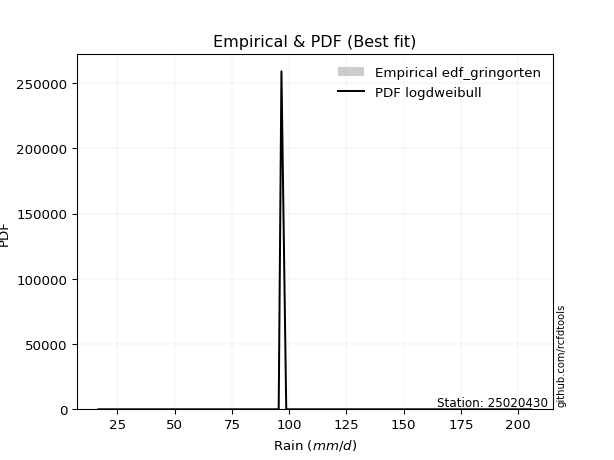</img>

</div>


### 9. Empirical - EDF Filliben (1975)

The specific values of the constants (0.3175) (often denoted as $alpha$) and (0.365) are derived from a method proposed by James J. Filliben in a 1975 paper. This particular formula is the mean value of the $i$-th order statistic of the normal distribution and is considered a robust and effective plotting position formula for the normal probability plot correlation coefficient test for normality.

<div align="center">


$P=(m-0.3175)/(n+0.365)$


</div>


**9.1. Empirical values**

<div align="center">

|                | 0                   | 1                  | 2                   | 3                   | 4            | 5                  | 6                  | 7                  | 8                  |
|:---------------|:--------------------|:-------------------|:--------------------|:--------------------|:-------------|:-------------------|:-------------------|:-------------------|:-------------------|
| date           | 2022                | 2025               | 2019                | 2020                | 2024         | 2021               | 2023               | 2017               | 2018               |
| x              | 16.7                | 37.9               | 43.1                | 73.9                | 95.4         | 96.6               | 125.4              | 187.1              | 205.7              |
| m              | 1                   | 2                  | 3                   | 4                   | 5            | 6                  | 7                  | 8                  | 9                  |
| empirical_dist | edf_filliben        | edf_filliben       | edf_filliben        | edf_filliben        | edf_filliben | edf_filliben       | edf_filliben       | edf_filliben       | edf_filliben       |
| empirical      | 0.07287773625200214 | 0.1796583021890016 | 0.28643886812600106 | 0.39321943406300053 | 0.5          | 0.6067805659369995 | 0.7135611318739989 | 0.8203416978109984 | 0.9271222637479978 |
| empirical_tr   | 1.0786063921681543  | 1.219004230393752  | 1.401421623643846   | 1.6480422349318082  | 2.0          | 2.5431093007467753 | 3.491146318732526  | 5.566121842496286  | 13.721611721611705 |

</div>


**9.2. Kolmogorov-Smirnov fit test (sorted by Δ)**


<div align="center">

|                | 0                   | 1                   | 2                   | 3                   | 4                   | 5                   | 6                   | 7                   | 8                   | 9                   | 10                  | 11                  | 12                  | 13                  | 14                  | 15                  | 16                    | 17                  | 18                  | 19                  | 20                  | 21                  | 22                  | 23                  | 24                  | 25                  | 26                  | 27                  | 28                  | 29                  | 30                  | 31                  | 32                  | 33                  | 34                  | 35                  | 36                  | 37                  | 38                  | 39                  | 40                  | 41                  | 42                  | 43                  | 44                  | 45                  | 46                  | 47                  | 48                  | 49                  | 50                  | 51                  | 52                  | 53                  | 54                  | 55                  | 56                  | 57                  | 58                  | 59                  | 60                  | 61                  | 62                  | 63                  | 64                  | 65                  | 66                  | 67                  | 68                  | 69                  | 70                  | 71                  | 72                  | 73                  | 74                  | 75                  | 76                  | 77                  | 78                  | 79                  | 80                  | 81                  | 82                  | 83                  | 84                  | 85                  | 86                  | 87                  | 88                  | 89                  |
|:---------------|:--------------------|:--------------------|:--------------------|:--------------------|:--------------------|:--------------------|:--------------------|:--------------------|:--------------------|:--------------------|:--------------------|:--------------------|:--------------------|:--------------------|:--------------------|:--------------------|:----------------------|:--------------------|:--------------------|:--------------------|:--------------------|:--------------------|:--------------------|:--------------------|:--------------------|:--------------------|:--------------------|:--------------------|:--------------------|:--------------------|:--------------------|:--------------------|:--------------------|:--------------------|:--------------------|:--------------------|:--------------------|:--------------------|:--------------------|:--------------------|:--------------------|:--------------------|:--------------------|:--------------------|:--------------------|:--------------------|:--------------------|:--------------------|:--------------------|:--------------------|:--------------------|:--------------------|:--------------------|:--------------------|:--------------------|:--------------------|:--------------------|:--------------------|:--------------------|:--------------------|:--------------------|:--------------------|:--------------------|:--------------------|:--------------------|:--------------------|:--------------------|:--------------------|:--------------------|:--------------------|:--------------------|:--------------------|:--------------------|:--------------------|:--------------------|:--------------------|:--------------------|:--------------------|:--------------------|:--------------------|:--------------------|:--------------------|:--------------------|:--------------------|:--------------------|:--------------------|:--------------------|:--------------------|:--------------------|:--------------------|
| station        | 25020430            | 25020430            | 25020430            | 25020430            | 25020430            | 25020430            | 25020430            | 25020430            | 25020430            | 25020430            | 25020430            | 25020430            | 25020430            | 25020430            | 25020430            | 25020430            | 25020430              | 25020430            | 25020430            | 25020430            | 25020430            | 25020430            | 25020430            | 25020430            | 25020430            | 25020430            | 25020430            | 25020430            | 25020430            | 25020430            | 25020430            | 25020430            | 25020430            | 25020430            | 25020430            | 25020430            | 25020430            | 25020430            | 25020430            | 25020430            | 25020430            | 25020430            | 25020430            | 25020430            | 25020430            | 25020430            | 25020430            | 25020430            | 25020430            | 25020430            | 25020430            | 25020430            | 25020430            | 25020430            | 25020430            | 25020430            | 25020430            | 25020430            | 25020430            | 25020430            | 25020430            | 25020430            | 25020430            | 25020430            | 25020430            | 25020430            | 25020430            | 25020430            | 25020430            | 25020430            | 25020430            | 25020430            | 25020430            | 25020430            | 25020430            | 25020430            | 25020430            | 25020430            | 25020430            | 25020430            | 25020430            | 25020430            | 25020430            | 25020430            | 25020430            | 25020430            | 25020430            | 25020430            | 25020430            | 25020430            |
| empirical_dist | edf_filliben        | edf_filliben        | edf_filliben        | edf_filliben        | edf_filliben        | edf_filliben        | edf_filliben        | edf_filliben        | edf_filliben        | edf_filliben        | edf_filliben        | edf_filliben        | edf_filliben        | edf_filliben        | edf_filliben        | edf_filliben        | edf_filliben          | edf_filliben        | edf_filliben        | edf_filliben        | edf_filliben        | edf_filliben        | edf_filliben        | edf_filliben        | edf_filliben        | edf_filliben        | edf_filliben        | edf_filliben        | edf_filliben        | edf_filliben        | edf_filliben        | edf_filliben        | edf_filliben        | edf_filliben        | edf_filliben        | edf_filliben        | edf_filliben        | edf_filliben        | edf_filliben        | edf_filliben        | edf_filliben        | edf_filliben        | edf_filliben        | edf_filliben        | edf_filliben        | edf_filliben        | edf_filliben        | edf_filliben        | edf_filliben        | edf_filliben        | edf_filliben        | edf_filliben        | edf_filliben        | edf_filliben        | edf_filliben        | edf_filliben        | edf_filliben        | edf_filliben        | edf_filliben        | edf_filliben        | edf_filliben        | edf_filliben        | edf_filliben        | edf_filliben        | edf_filliben        | edf_filliben        | edf_filliben        | edf_filliben        | edf_filliben        | edf_filliben        | edf_filliben        | edf_filliben        | edf_filliben        | edf_filliben        | edf_filliben        | edf_filliben        | edf_filliben        | edf_filliben        | edf_filliben        | edf_filliben        | edf_filliben        | edf_filliben        | edf_filliben        | edf_filliben        | edf_filliben        | edf_filliben        | edf_filliben        | edf_filliben        | edf_filliben        | edf_filliben        |
| p_dist         | ncf                 | logpearson3         | loggompertz         | halfnorm            | invgauss            | betaprime           | gompertz            | genexpon            | logweibull_min      | mielke              | johnsonsu           | logloggamma         | logfisk             | rayleigh            | logjohnsonsu        | maxwell             | loglaplace_asymmetric | invgamma            | pearson3            | fisk                | loggumbel_l         | invweibull          | genlogistic         | kstwobign           | nct                 | logf                | logexponnorm        | logt                | lognorm             | lognorm             | logcrystalball      | lognct              | logfatiguelife      | gumbel_r            | norm                | crystalball         | truncnorm           | t                   | halflogistic        | logrice             | logerlang           | loggamma            | loggamma            | expon               | logistic            | rice                | logbetaprime        | laplace_asymmetric  | exponnorm           | logmielke           | loginvgamma         | loglogistic         | logncf              | loginvgauss         | logalpha            | hypsecant           | moyal               | loginvweibull       | f                   | logmaxwell          | loghypsecant        | laplace             | lograyleigh         | logkstwobign        | loggenexpon         | loglaplace          | loghalfnorm         | loggumbel_r         | logtruncnorm        | alpha               | gumbel_l            | loghalflogistic     | logmoyal            | erlang              | logexpon            | chi2                | logwald             | wald                | gibrat              | loggibrat           | weibull_min         | loglognorm          | logchi2             | pareto              | nakagami            | logpareto           | lognakagami         | fatiguelife         | gamma               | loggenlogistic      |
| delta          | 0.08032973886487996 | 0.08071690836107481 | 0.08176798266713536 | 0.08483706188973694 | 0.0855805338521557  | 0.08713509779820111 | 0.08925015582629525 | 0.08964720637173387 | 0.08967407622404783 | 0.08987707558684138 | 0.09033307154786951 | 0.09069119148061955 | 0.09089022345575237 | 0.09106321038004728 | 0.09337014464348659 | 0.0941627478930861  | 0.0968829011420356    | 0.09746266255805966 | 0.09772959716897472 | 0.09815754122141421 | 0.09885518562735518 | 0.10081807057908324 | 0.10183295232128775 | 0.10274473278483018 | 0.10783794225337623 | 0.11329015880491933 | 0.11361957533195555 | 0.1136208666928219  | 0.11362102599856982 | 0.11362102599856982 | 0.11362122537249975 | 0.11363476567743369 | 0.11432477920724882 | 0.11459927542424025 | 0.11570760257791873 | 0.1157076102133186  | 0.11570761214537606 | 0.1158028476547206  | 0.11624590770313298 | 0.11902259385886504 | 0.11905311094064908 | 0.11954998813030715 | 0.11954998813030715 | 0.12026602880495574 | 0.1207838631322003  | 0.1209538983432803  | 0.1228309069723893  | 0.12295557594808151 | 0.12358189731177793 | 0.1240939714723277  | 0.1276138119212098  | 0.12802878342471724 | 0.12817154607103376 | 0.1299846379296128  | 0.13090526322164053 | 0.1325415984153023  | 0.13256725157460808 | 0.13804820515761773 | 0.13866721234971335 | 0.1389077711207819  | 0.1396738076016184  | 0.14469220882915554 | 0.14668699079579328 | 0.16384197032409376 | 0.1666632713286833  | 0.16763735493069565 | 0.16892938261160417 | 0.17862989722940648 | 0.17965830214328574 | 0.18364973069274937 | 0.18628978813081531 | 0.19730137095512312 | 0.2006397921829306  | 0.22703849394399755 | 0.23674028670657452 | 0.23752345084597248 | 0.26217297753308855 | 0.2801725145663709  | 0.28643886812600106 | 0.29418386329932267 | 0.34124817693822485 | 0.4359247924757599  | 0.4366400456151064  | 0.4421499232115994  | 0.4657313540586875  | 0.4673041535282525  | 0.49058554527125087 | 0.5290176415045108  | 0.5609538559595673  | 0.8203416978109984  |
| deltao         | 0.41761268023100007 | 0.41761268023100007 | 0.41761268023100007 | 0.41761268023100007 | 0.41761268023100007 | 0.41761268023100007 | 0.41761268023100007 | 0.41761268023100007 | 0.41761268023100007 | 0.41761268023100007 | 0.41761268023100007 | 0.41761268023100007 | 0.41761268023100007 | 0.41761268023100007 | 0.41761268023100007 | 0.41761268023100007 | 0.41761268023100007   | 0.41761268023100007 | 0.41761268023100007 | 0.41761268023100007 | 0.41761268023100007 | 0.41761268023100007 | 0.41761268023100007 | 0.41761268023100007 | 0.41761268023100007 | 0.41761268023100007 | 0.41761268023100007 | 0.41761268023100007 | 0.41761268023100007 | 0.41761268023100007 | 0.41761268023100007 | 0.41761268023100007 | 0.41761268023100007 | 0.41761268023100007 | 0.41761268023100007 | 0.41761268023100007 | 0.41761268023100007 | 0.41761268023100007 | 0.41761268023100007 | 0.41761268023100007 | 0.41761268023100007 | 0.41761268023100007 | 0.41761268023100007 | 0.41761268023100007 | 0.41761268023100007 | 0.41761268023100007 | 0.41761268023100007 | 0.41761268023100007 | 0.41761268023100007 | 0.41761268023100007 | 0.41761268023100007 | 0.41761268023100007 | 0.41761268023100007 | 0.41761268023100007 | 0.41761268023100007 | 0.41761268023100007 | 0.41761268023100007 | 0.41761268023100007 | 0.41761268023100007 | 0.41761268023100007 | 0.41761268023100007 | 0.41761268023100007 | 0.41761268023100007 | 0.41761268023100007 | 0.41761268023100007 | 0.41761268023100007 | 0.41761268023100007 | 0.41761268023100007 | 0.41761268023100007 | 0.41761268023100007 | 0.41761268023100007 | 0.41761268023100007 | 0.41761268023100007 | 0.41761268023100007 | 0.41761268023100007 | 0.41761268023100007 | 0.41761268023100007 | 0.41761268023100007 | 0.41761268023100007 | 0.41761268023100007 | 0.41761268023100007 | 0.41761268023100007 | 0.41761268023100007 | 0.41761268023100007 | 0.41761268023100007 | 0.41761268023100007 | 0.41761268023100007 | 0.41761268023100007 | 0.41761268023100007 | 0.41761268023100007 |
| eval           | Δo > Δ              | Δo > Δ              | Δo > Δ              | Δo > Δ              | Δo > Δ              | Δo > Δ              | Δo > Δ              | Δo > Δ              | Δo > Δ              | Δo > Δ              | Δo > Δ              | Δo > Δ              | Δo > Δ              | Δo > Δ              | Δo > Δ              | Δo > Δ              | Δo > Δ                | Δo > Δ              | Δo > Δ              | Δo > Δ              | Δo > Δ              | Δo > Δ              | Δo > Δ              | Δo > Δ              | Δo > Δ              | Δo > Δ              | Δo > Δ              | Δo > Δ              | Δo > Δ              | Δo > Δ              | Δo > Δ              | Δo > Δ              | Δo > Δ              | Δo > Δ              | Δo > Δ              | Δo > Δ              | Δo > Δ              | Δo > Δ              | Δo > Δ              | Δo > Δ              | Δo > Δ              | Δo > Δ              | Δo > Δ              | Δo > Δ              | Δo > Δ              | Δo > Δ              | Δo > Δ              | Δo > Δ              | Δo > Δ              | Δo > Δ              | Δo > Δ              | Δo > Δ              | Δo > Δ              | Δo > Δ              | Δo > Δ              | Δo > Δ              | Δo > Δ              | Δo > Δ              | Δo > Δ              | Δo > Δ              | Δo > Δ              | Δo > Δ              | Δo > Δ              | Δo > Δ              | Δo > Δ              | Δo > Δ              | Δo > Δ              | Δo > Δ              | Δo > Δ              | Δo > Δ              | Δo > Δ              | Δo > Δ              | Δo > Δ              | Δo > Δ              | Δo > Δ              | Δo > Δ              | Δo > Δ              | Δo > Δ              | Δo > Δ              | Δo > Δ              | Δo > Δ              | Δo <= Δ             | Δo <= Δ             | Δo <= Δ             | Δo <= Δ             | Δo <= Δ             | Δo <= Δ             | Δo <= Δ             | Δo <= Δ             | Δo <= Δ             |
| fit            | 1                   | 1                   | 1                   | 1                   | 1                   | 1                   | 1                   | 1                   | 1                   | 1                   | 1                   | 1                   | 1                   | 1                   | 1                   | 1                   | 1                     | 1                   | 1                   | 1                   | 1                   | 1                   | 1                   | 1                   | 1                   | 1                   | 1                   | 1                   | 1                   | 1                   | 1                   | 1                   | 1                   | 1                   | 1                   | 1                   | 1                   | 1                   | 1                   | 1                   | 1                   | 1                   | 1                   | 1                   | 1                   | 1                   | 1                   | 1                   | 1                   | 1                   | 1                   | 1                   | 1                   | 1                   | 1                   | 1                   | 1                   | 1                   | 1                   | 1                   | 1                   | 1                   | 1                   | 1                   | 1                   | 1                   | 1                   | 1                   | 1                   | 1                   | 1                   | 1                   | 1                   | 1                   | 1                   | 1                   | 1                   | 1                   | 1                   | 1                   | 1                   | 0                   | 0                   | 0                   | 0                   | 0                   | 0                   | 0                   | 0                   | 0                   |
| n              | 9                   | 9                   | 9                   | 9                   | 9                   | 9                   | 9                   | 9                   | 9                   | 9                   | 9                   | 9                   | 9                   | 9                   | 9                   | 9                   | 9                     | 9                   | 9                   | 9                   | 9                   | 9                   | 9                   | 9                   | 9                   | 9                   | 9                   | 9                   | 9                   | 9                   | 9                   | 9                   | 9                   | 9                   | 9                   | 9                   | 9                   | 9                   | 9                   | 9                   | 9                   | 9                   | 9                   | 9                   | 9                   | 9                   | 9                   | 9                   | 9                   | 9                   | 9                   | 9                   | 9                   | 9                   | 9                   | 9                   | 9                   | 9                   | 9                   | 9                   | 9                   | 9                   | 9                   | 9                   | 9                   | 9                   | 9                   | 9                   | 9                   | 9                   | 9                   | 9                   | 9                   | 9                   | 9                   | 9                   | 9                   | 9                   | 9                   | 9                   | 9                   | 9                   | 9                   | 9                   | 9                   | 9                   | 9                   | 9                   | 9                   | 9                   |
| best_fit       | 1                   | 0                   | 0                   | 0                   | 0                   | 0                   | 0                   | 0                   | 0                   | 0                   | 0                   | 0                   | 0                   | 0                   | 0                   | 0                   | 0                     | 0                   | 0                   | 0                   | 0                   | 0                   | 0                   | 0                   | 0                   | 0                   | 0                   | 0                   | 0                   | 0                   | 0                   | 0                   | 0                   | 0                   | 0                   | 0                   | 0                   | 0                   | 0                   | 0                   | 0                   | 0                   | 0                   | 0                   | 0                   | 0                   | 0                   | 0                   | 0                   | 0                   | 0                   | 0                   | 0                   | 0                   | 0                   | 0                   | 0                   | 0                   | 0                   | 0                   | 0                   | 0                   | 0                   | 0                   | 0                   | 0                   | 0                   | 0                   | 0                   | 0                   | 0                   | 0                   | 0                   | 0                   | 0                   | 0                   | 0                   | 0                   | 0                   | 0                   | 0                   | 0                   | 0                   | 0                   | 0                   | 0                   | 0                   | 0                   | 0                   | 0                   |
| best_fit_sort  | 1                   | 2                   | 3                   | 4                   | 5                   | 6                   | 7                   | 8                   | 9                   | 10                  | 11                  | 12                  | 13                  | 14                  | 15                  | 16                  | 17                    | 18                  | 19                  | 20                  | 21                  | 22                  | 23                  | 24                  | 25                  | 26                  | 27                  | 28                  | 29                  | 30                  | 31                  | 32                  | 33                  | 34                  | 35                  | 36                  | 37                  | 38                  | 39                  | 40                  | 41                  | 42                  | 43                  | 44                  | 45                  | 46                  | 47                  | 48                  | 49                  | 50                  | 51                  | 52                  | 53                  | 54                  | 55                  | 56                  | 57                  | 58                  | 59                  | 60                  | 61                  | 62                  | 63                  | 64                  | 65                  | 66                  | 67                  | 68                  | 69                  | 70                  | 71                  | 72                  | 73                  | 74                  | 75                  | 76                  | 77                  | 78                  | 79                  | 80                  | 81                  | 82                  | 83                  | 84                  | 85                  | 86                  | 87                  | 88                  | 89                  | 90                  |

</div>


<div align="center">

</img>

</div>


**9.3. Best fit**

<div align="center">

|   id |   station | empirical_dist   | p_dist   |     delta |   deltao | eval   |   fit |   n |   best_fit |   best_fit_sort |
|-----:|----------:|:-----------------|:---------|----------:|---------:|:-------|------:|----:|-----------:|----------------:|
|    0 |  25020430 | edf_filliben     | ncf      | 0.0803297 | 0.417613 | Δo > Δ |     1 |   9 |          1 |               1 |

</div>


<div align="center">

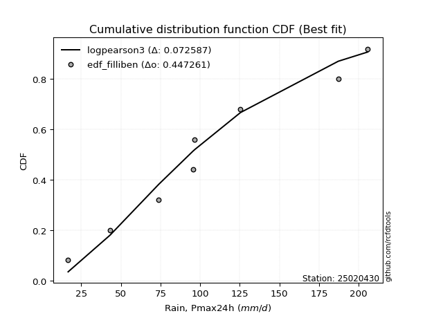</img>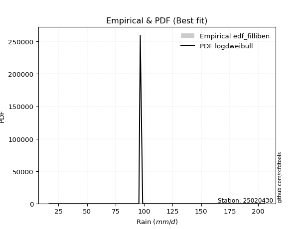</img>

</div>


### 10. Empirical - EDF Jenkinson (1977)

The Jenkinson formula in hydrology is an empirical plotting position formula used to estimate the non-exceedance probability _(P)_ or return period _(T)_ of a given ordered observation within a sample. It is a widely used method in the frequency analysis of extreme events such as floods and rainfall, as it provides a distribution-free way to plot data. _a≈0.31_ and _b≈0.38_ are constants derived to approximate the median of the probability distribution for the given rank.

<div align="center">


$P=(m-a)/(n+b)$


</div>


**10.1. Empirical values**

<div align="center">

|                | 0                   | 1                   | 2                  | 3                   | 4             | 5                  | 6                  | 7                  | 8                  |
|:---------------|:--------------------|:--------------------|:-------------------|:--------------------|:--------------|:-------------------|:-------------------|:-------------------|:-------------------|
| date           | 2022                | 2025                | 2019               | 2020                | 2024          | 2021               | 2023               | 2017               | 2018               |
| x              | 16.7                | 37.9                | 43.1               | 73.9                | 95.4          | 96.6               | 125.4              | 187.1              | 205.7              |
| m              | 1                   | 2                   | 3                  | 4                   | 5             | 6                  | 7                  | 8                  | 9                  |
| empirical_dist | edf_jenkinson       | edf_jenkinson       | edf_jenkinson      | edf_jenkinson       | edf_jenkinson | edf_jenkinson      | edf_jenkinson      | edf_jenkinson      | edf_jenkinson      |
| empirical      | 0.07356076759061833 | 0.18017057569296374 | 0.2867803837953091 | 0.39339019189765456 | 0.5           | 0.6066098081023454 | 0.7132196162046908 | 0.8198294243070362 | 0.9264392324093815 |
| empirical_tr   | 1.0794016110471807  | 1.2197659297789336  | 1.4020926756352765 | 1.6485061511423549  | 2.0           | 2.542005420054201  | 3.486988847583642  | 5.550295857988164  | 13.5942028985507   |

</div>


**10.2. Kolmogorov-Smirnov fit test (sorted by Δ)**


<div align="center">

|                | 0                   | 1                   | 2                   | 3                   | 4                   | 5                   | 6                   | 7                   | 8                   | 9                   | 10                  | 11                  | 12                  | 13                  | 14                  | 15                  | 16                    | 17                  | 18                  | 19                  | 20                  | 21                  | 22                  | 23                  | 24                  | 25                  | 26                  | 27                  | 28                  | 29                  | 30                  | 31                  | 32                  | 33                  | 34                  | 35                  | 36                  | 37                  | 38                  | 39                  | 40                  | 41                  | 42                  | 43                  | 44                  | 45                  | 46                  | 47                  | 48                  | 49                  | 50                  | 51                  | 52                  | 53                  | 54                  | 55                  | 56                  | 57                  | 58                  | 59                  | 60                  | 61                  | 62                  | 63                  | 64                  | 65                  | 66                  | 67                  | 68                  | 69                  | 70                  | 71                  | 72                  | 73                  | 74                  | 75                  | 76                  | 77                  | 78                  | 79                  | 80                  | 81                  | 82                  | 83                  | 84                  | 85                  | 86                  | 87                  | 88                  | 89                  |
|:---------------|:--------------------|:--------------------|:--------------------|:--------------------|:--------------------|:--------------------|:--------------------|:--------------------|:--------------------|:--------------------|:--------------------|:--------------------|:--------------------|:--------------------|:--------------------|:--------------------|:----------------------|:--------------------|:--------------------|:--------------------|:--------------------|:--------------------|:--------------------|:--------------------|:--------------------|:--------------------|:--------------------|:--------------------|:--------------------|:--------------------|:--------------------|:--------------------|:--------------------|:--------------------|:--------------------|:--------------------|:--------------------|:--------------------|:--------------------|:--------------------|:--------------------|:--------------------|:--------------------|:--------------------|:--------------------|:--------------------|:--------------------|:--------------------|:--------------------|:--------------------|:--------------------|:--------------------|:--------------------|:--------------------|:--------------------|:--------------------|:--------------------|:--------------------|:--------------------|:--------------------|:--------------------|:--------------------|:--------------------|:--------------------|:--------------------|:--------------------|:--------------------|:--------------------|:--------------------|:--------------------|:--------------------|:--------------------|:--------------------|:--------------------|:--------------------|:--------------------|:--------------------|:--------------------|:--------------------|:--------------------|:--------------------|:--------------------|:--------------------|:--------------------|:--------------------|:--------------------|:--------------------|:--------------------|:--------------------|:--------------------|
| station        | 25020430            | 25020430            | 25020430            | 25020430            | 25020430            | 25020430            | 25020430            | 25020430            | 25020430            | 25020430            | 25020430            | 25020430            | 25020430            | 25020430            | 25020430            | 25020430            | 25020430              | 25020430            | 25020430            | 25020430            | 25020430            | 25020430            | 25020430            | 25020430            | 25020430            | 25020430            | 25020430            | 25020430            | 25020430            | 25020430            | 25020430            | 25020430            | 25020430            | 25020430            | 25020430            | 25020430            | 25020430            | 25020430            | 25020430            | 25020430            | 25020430            | 25020430            | 25020430            | 25020430            | 25020430            | 25020430            | 25020430            | 25020430            | 25020430            | 25020430            | 25020430            | 25020430            | 25020430            | 25020430            | 25020430            | 25020430            | 25020430            | 25020430            | 25020430            | 25020430            | 25020430            | 25020430            | 25020430            | 25020430            | 25020430            | 25020430            | 25020430            | 25020430            | 25020430            | 25020430            | 25020430            | 25020430            | 25020430            | 25020430            | 25020430            | 25020430            | 25020430            | 25020430            | 25020430            | 25020430            | 25020430            | 25020430            | 25020430            | 25020430            | 25020430            | 25020430            | 25020430            | 25020430            | 25020430            | 25020430            |
| empirical_dist | edf_jenkinson       | edf_jenkinson       | edf_jenkinson       | edf_jenkinson       | edf_jenkinson       | edf_jenkinson       | edf_jenkinson       | edf_jenkinson       | edf_jenkinson       | edf_jenkinson       | edf_jenkinson       | edf_jenkinson       | edf_jenkinson       | edf_jenkinson       | edf_jenkinson       | edf_jenkinson       | edf_jenkinson         | edf_jenkinson       | edf_jenkinson       | edf_jenkinson       | edf_jenkinson       | edf_jenkinson       | edf_jenkinson       | edf_jenkinson       | edf_jenkinson       | edf_jenkinson       | edf_jenkinson       | edf_jenkinson       | edf_jenkinson       | edf_jenkinson       | edf_jenkinson       | edf_jenkinson       | edf_jenkinson       | edf_jenkinson       | edf_jenkinson       | edf_jenkinson       | edf_jenkinson       | edf_jenkinson       | edf_jenkinson       | edf_jenkinson       | edf_jenkinson       | edf_jenkinson       | edf_jenkinson       | edf_jenkinson       | edf_jenkinson       | edf_jenkinson       | edf_jenkinson       | edf_jenkinson       | edf_jenkinson       | edf_jenkinson       | edf_jenkinson       | edf_jenkinson       | edf_jenkinson       | edf_jenkinson       | edf_jenkinson       | edf_jenkinson       | edf_jenkinson       | edf_jenkinson       | edf_jenkinson       | edf_jenkinson       | edf_jenkinson       | edf_jenkinson       | edf_jenkinson       | edf_jenkinson       | edf_jenkinson       | edf_jenkinson       | edf_jenkinson       | edf_jenkinson       | edf_jenkinson       | edf_jenkinson       | edf_jenkinson       | edf_jenkinson       | edf_jenkinson       | edf_jenkinson       | edf_jenkinson       | edf_jenkinson       | edf_jenkinson       | edf_jenkinson       | edf_jenkinson       | edf_jenkinson       | edf_jenkinson       | edf_jenkinson       | edf_jenkinson       | edf_jenkinson       | edf_jenkinson       | edf_jenkinson       | edf_jenkinson       | edf_jenkinson       | edf_jenkinson       | edf_jenkinson       |
| p_dist         | ncf                 | logpearson3         | loggompertz         | halfnorm            | invgauss            | betaprime           | gompertz            | genexpon            | logweibull_min      | mielke              | johnsonsu           | logfisk             | logloggamma         | rayleigh            | logjohnsonsu        | maxwell             | loglaplace_asymmetric | invgamma            | pearson3            | fisk                | loggumbel_l         | invweibull          | genlogistic         | kstwobign           | nct                 | logf                | logexponnorm        | logt                | lognorm             | lognorm             | logcrystalball      | lognct              | logfatiguelife      | gumbel_r            | norm                | crystalball         | truncnorm           | t                   | halflogistic        | logrice             | logerlang           | loggamma            | loggamma            | expon               | logistic            | rice                | logbetaprime        | laplace_asymmetric  | exponnorm           | logmielke           | loginvgamma         | loglogistic         | logncf              | loginvgauss         | logalpha            | hypsecant           | moyal               | loginvweibull       | f                   | logmaxwell          | loghypsecant        | laplace             | lograyleigh         | logkstwobign        | loggenexpon         | loglaplace          | loghalfnorm         | loggumbel_r         | logtruncnorm        | alpha               | gumbel_l            | loghalflogistic     | logmoyal            | erlang              | logexpon            | chi2                | logwald             | wald                | gibrat              | loggibrat           | weibull_min         | loglognorm          | logchi2             | pareto              | nakagami            | logpareto           | lognakagami         | fatiguelife         | gamma               | loggenlogistic      |
| delta          | 0.08067125453418802 | 0.08071690836107481 | 0.08176798266713536 | 0.08534933539369916 | 0.08572280946242522 | 0.08747661346750918 | 0.08976242933025746 | 0.08998872204104194 | 0.0900155918933559  | 0.09021859125614945 | 0.09067458721717758 | 0.09117683266344764 | 0.09120346498458176 | 0.09157548388400949 | 0.0938824181474488  | 0.09467502139704831 | 0.09722441681134367   | 0.09780417822736773 | 0.09807111283828279 | 0.09849905689072228 | 0.09936745913131739 | 0.1011595862483913  | 0.10217446799059582 | 0.10308624845413825 | 0.1081794579226843  | 0.11329015880491933 | 0.11361957533195555 | 0.1136208666928219  | 0.11362102599856982 | 0.11362102599856982 | 0.11362122537249975 | 0.11363476567743369 | 0.11432477920724882 | 0.11494079109354832 | 0.1155368447432647  | 0.11553685237866457 | 0.11553685431072203 | 0.11563208982006656 | 0.11658742337244105 | 0.11902259385886504 | 0.11905311094064908 | 0.11954998813030715 | 0.11954998813030715 | 0.12026602880495574 | 0.12112537880150837 | 0.12129541401258837 | 0.1228309069723893  | 0.12329709161738958 | 0.12358189731177793 | 0.12460624497628991 | 0.1276138119212098  | 0.12802878342471724 | 0.12817154607103376 | 0.1299846379296128  | 0.13090526322164053 | 0.13288311408461037 | 0.13290876724391615 | 0.1378774473229637  | 0.13849645451505932 | 0.1389077711207819  | 0.1396738076016184  | 0.1450337244984636  | 0.14668699079579328 | 0.16367121248943972 | 0.16649251349402927 | 0.16763735493069565 | 0.16892938261160417 | 0.17862989722940648 | 0.18017057564724787 | 0.18347897285809533 | 0.18611903029616128 | 0.19730137095512312 | 0.2006397921829306  | 0.22686773610934352 | 0.23622801320261239 | 0.23735269301131845 | 0.26217297753308855 | 0.28051403023567895 | 0.2867803837953091  | 0.29418386329932267 | 0.3407359034342627  | 0.4354125189717977  | 0.43612777211114423 | 0.44163764970763725 | 0.46521908055472533 | 0.46679188002429034 | 0.49041478743659683 | 0.5285053680005487  | 0.560441582455605   | 0.8198294243070362  |
| deltao         | 0.41761268023100007 | 0.41761268023100007 | 0.41761268023100007 | 0.41761268023100007 | 0.41761268023100007 | 0.41761268023100007 | 0.41761268023100007 | 0.41761268023100007 | 0.41761268023100007 | 0.41761268023100007 | 0.41761268023100007 | 0.41761268023100007 | 0.41761268023100007 | 0.41761268023100007 | 0.41761268023100007 | 0.41761268023100007 | 0.41761268023100007   | 0.41761268023100007 | 0.41761268023100007 | 0.41761268023100007 | 0.41761268023100007 | 0.41761268023100007 | 0.41761268023100007 | 0.41761268023100007 | 0.41761268023100007 | 0.41761268023100007 | 0.41761268023100007 | 0.41761268023100007 | 0.41761268023100007 | 0.41761268023100007 | 0.41761268023100007 | 0.41761268023100007 | 0.41761268023100007 | 0.41761268023100007 | 0.41761268023100007 | 0.41761268023100007 | 0.41761268023100007 | 0.41761268023100007 | 0.41761268023100007 | 0.41761268023100007 | 0.41761268023100007 | 0.41761268023100007 | 0.41761268023100007 | 0.41761268023100007 | 0.41761268023100007 | 0.41761268023100007 | 0.41761268023100007 | 0.41761268023100007 | 0.41761268023100007 | 0.41761268023100007 | 0.41761268023100007 | 0.41761268023100007 | 0.41761268023100007 | 0.41761268023100007 | 0.41761268023100007 | 0.41761268023100007 | 0.41761268023100007 | 0.41761268023100007 | 0.41761268023100007 | 0.41761268023100007 | 0.41761268023100007 | 0.41761268023100007 | 0.41761268023100007 | 0.41761268023100007 | 0.41761268023100007 | 0.41761268023100007 | 0.41761268023100007 | 0.41761268023100007 | 0.41761268023100007 | 0.41761268023100007 | 0.41761268023100007 | 0.41761268023100007 | 0.41761268023100007 | 0.41761268023100007 | 0.41761268023100007 | 0.41761268023100007 | 0.41761268023100007 | 0.41761268023100007 | 0.41761268023100007 | 0.41761268023100007 | 0.41761268023100007 | 0.41761268023100007 | 0.41761268023100007 | 0.41761268023100007 | 0.41761268023100007 | 0.41761268023100007 | 0.41761268023100007 | 0.41761268023100007 | 0.41761268023100007 | 0.41761268023100007 |
| eval           | Δo > Δ              | Δo > Δ              | Δo > Δ              | Δo > Δ              | Δo > Δ              | Δo > Δ              | Δo > Δ              | Δo > Δ              | Δo > Δ              | Δo > Δ              | Δo > Δ              | Δo > Δ              | Δo > Δ              | Δo > Δ              | Δo > Δ              | Δo > Δ              | Δo > Δ                | Δo > Δ              | Δo > Δ              | Δo > Δ              | Δo > Δ              | Δo > Δ              | Δo > Δ              | Δo > Δ              | Δo > Δ              | Δo > Δ              | Δo > Δ              | Δo > Δ              | Δo > Δ              | Δo > Δ              | Δo > Δ              | Δo > Δ              | Δo > Δ              | Δo > Δ              | Δo > Δ              | Δo > Δ              | Δo > Δ              | Δo > Δ              | Δo > Δ              | Δo > Δ              | Δo > Δ              | Δo > Δ              | Δo > Δ              | Δo > Δ              | Δo > Δ              | Δo > Δ              | Δo > Δ              | Δo > Δ              | Δo > Δ              | Δo > Δ              | Δo > Δ              | Δo > Δ              | Δo > Δ              | Δo > Δ              | Δo > Δ              | Δo > Δ              | Δo > Δ              | Δo > Δ              | Δo > Δ              | Δo > Δ              | Δo > Δ              | Δo > Δ              | Δo > Δ              | Δo > Δ              | Δo > Δ              | Δo > Δ              | Δo > Δ              | Δo > Δ              | Δo > Δ              | Δo > Δ              | Δo > Δ              | Δo > Δ              | Δo > Δ              | Δo > Δ              | Δo > Δ              | Δo > Δ              | Δo > Δ              | Δo > Δ              | Δo > Δ              | Δo > Δ              | Δo > Δ              | Δo <= Δ             | Δo <= Δ             | Δo <= Δ             | Δo <= Δ             | Δo <= Δ             | Δo <= Δ             | Δo <= Δ             | Δo <= Δ             | Δo <= Δ             |
| fit            | 1                   | 1                   | 1                   | 1                   | 1                   | 1                   | 1                   | 1                   | 1                   | 1                   | 1                   | 1                   | 1                   | 1                   | 1                   | 1                   | 1                     | 1                   | 1                   | 1                   | 1                   | 1                   | 1                   | 1                   | 1                   | 1                   | 1                   | 1                   | 1                   | 1                   | 1                   | 1                   | 1                   | 1                   | 1                   | 1                   | 1                   | 1                   | 1                   | 1                   | 1                   | 1                   | 1                   | 1                   | 1                   | 1                   | 1                   | 1                   | 1                   | 1                   | 1                   | 1                   | 1                   | 1                   | 1                   | 1                   | 1                   | 1                   | 1                   | 1                   | 1                   | 1                   | 1                   | 1                   | 1                   | 1                   | 1                   | 1                   | 1                   | 1                   | 1                   | 1                   | 1                   | 1                   | 1                   | 1                   | 1                   | 1                   | 1                   | 1                   | 1                   | 0                   | 0                   | 0                   | 0                   | 0                   | 0                   | 0                   | 0                   | 0                   |
| n              | 9                   | 9                   | 9                   | 9                   | 9                   | 9                   | 9                   | 9                   | 9                   | 9                   | 9                   | 9                   | 9                   | 9                   | 9                   | 9                   | 9                     | 9                   | 9                   | 9                   | 9                   | 9                   | 9                   | 9                   | 9                   | 9                   | 9                   | 9                   | 9                   | 9                   | 9                   | 9                   | 9                   | 9                   | 9                   | 9                   | 9                   | 9                   | 9                   | 9                   | 9                   | 9                   | 9                   | 9                   | 9                   | 9                   | 9                   | 9                   | 9                   | 9                   | 9                   | 9                   | 9                   | 9                   | 9                   | 9                   | 9                   | 9                   | 9                   | 9                   | 9                   | 9                   | 9                   | 9                   | 9                   | 9                   | 9                   | 9                   | 9                   | 9                   | 9                   | 9                   | 9                   | 9                   | 9                   | 9                   | 9                   | 9                   | 9                   | 9                   | 9                   | 9                   | 9                   | 9                   | 9                   | 9                   | 9                   | 9                   | 9                   | 9                   |
| best_fit       | 1                   | 0                   | 0                   | 0                   | 0                   | 0                   | 0                   | 0                   | 0                   | 0                   | 0                   | 0                   | 0                   | 0                   | 0                   | 0                   | 0                     | 0                   | 0                   | 0                   | 0                   | 0                   | 0                   | 0                   | 0                   | 0                   | 0                   | 0                   | 0                   | 0                   | 0                   | 0                   | 0                   | 0                   | 0                   | 0                   | 0                   | 0                   | 0                   | 0                   | 0                   | 0                   | 0                   | 0                   | 0                   | 0                   | 0                   | 0                   | 0                   | 0                   | 0                   | 0                   | 0                   | 0                   | 0                   | 0                   | 0                   | 0                   | 0                   | 0                   | 0                   | 0                   | 0                   | 0                   | 0                   | 0                   | 0                   | 0                   | 0                   | 0                   | 0                   | 0                   | 0                   | 0                   | 0                   | 0                   | 0                   | 0                   | 0                   | 0                   | 0                   | 0                   | 0                   | 0                   | 0                   | 0                   | 0                   | 0                   | 0                   | 0                   |
| best_fit_sort  | 1                   | 2                   | 3                   | 4                   | 5                   | 6                   | 7                   | 8                   | 9                   | 10                  | 11                  | 12                  | 13                  | 14                  | 15                  | 16                  | 17                    | 18                  | 19                  | 20                  | 21                  | 22                  | 23                  | 24                  | 25                  | 26                  | 27                  | 28                  | 29                  | 30                  | 31                  | 32                  | 33                  | 34                  | 35                  | 36                  | 37                  | 38                  | 39                  | 40                  | 41                  | 42                  | 43                  | 44                  | 45                  | 46                  | 47                  | 48                  | 49                  | 50                  | 51                  | 52                  | 53                  | 54                  | 55                  | 56                  | 57                  | 58                  | 59                  | 60                  | 61                  | 62                  | 63                  | 64                  | 65                  | 66                  | 67                  | 68                  | 69                  | 70                  | 71                  | 72                  | 73                  | 74                  | 75                  | 76                  | 77                  | 78                  | 79                  | 80                  | 81                  | 82                  | 83                  | 84                  | 85                  | 86                  | 87                  | 88                  | 89                  | 90                  |

</div>


<div align="center">

</img>

</div>


**10.3. Best fit**

<div align="center">

|   id |   station | empirical_dist   | p_dist   |     delta |   deltao | eval   |   fit |   n |   best_fit |   best_fit_sort |
|-----:|----------:|:-----------------|:---------|----------:|---------:|:-------|------:|----:|-----------:|----------------:|
|    0 |  25020430 | edf_jenkinson    | ncf      | 0.0806713 | 0.417613 | Δo > Δ |     1 |   9 |          1 |               1 |

</div>


<div align="center">

</img></img>

</div>


### 11. Empirical - EDF Cunnane (1978)

Cunnane´s work in statistical hydrology has focused on the performance and evaluation of different probability distributions (such as GEV, Gumbel, Lognormal) for flood frequency estimation. _b_ is a constant, typically set to 0.4.

<div align="center">


$P=(m-b)/(n+1-2b)$


</div>


**11.1. Empirical values**

<div align="center">

|                | 0                   | 1                  | 2                   | 3                  | 4           | 5                  | 6                 | 7                  | 8                  |
|:---------------|:--------------------|:-------------------|:--------------------|:-------------------|:------------|:-------------------|:------------------|:-------------------|:-------------------|
| date           | 2022                | 2025               | 2019                | 2020               | 2024        | 2021               | 2023              | 2017               | 2018               |
| x              | 16.7                | 37.9               | 43.1                | 73.9               | 95.4        | 96.6               | 125.4             | 187.1              | 205.7              |
| m              | 1                   | 2                  | 3                   | 4                  | 5           | 6                  | 7                 | 8                  | 9                  |
| empirical_dist | edf_cunnane         | edf_cunnane        | edf_cunnane         | edf_cunnane        | edf_cunnane | edf_cunnane        | edf_cunnane       | edf_cunnane        | edf_cunnane        |
| empirical      | 0.06521739130434782 | 0.1739130434782609 | 0.28260869565217395 | 0.391304347826087  | 0.5         | 0.6086956521739131 | 0.717391304347826 | 0.8260869565217391 | 0.9347826086956522 |
| empirical_tr   | 1.069767441860465   | 1.2105263157894737 | 1.393939393939394   | 1.6428571428571428 | 2.0         | 2.555555555555556  | 3.538461538461538 | 5.75               | 15.333333333333343 |

</div>


**11.2. Kolmogorov-Smirnov fit test (sorted by Δ)**


<div align="center">

|                | 0                   | 1                   | 2                   | 3                   | 4                   | 5                   | 6                   | 7                   | 8                   | 9                   | 10                  | 11                  | 12                  | 13                  | 14                  | 15                  | 16                    | 17                  | 18                  | 19                  | 20                  | 21                  | 22                  | 23                  | 24                  | 25                  | 26                  | 27                  | 28                  | 29                  | 30                  | 31                  | 32                  | 33                  | 34                  | 35                  | 36                  | 37                  | 38                  | 39                  | 40                  | 41                  | 42                  | 43                  | 44                  | 45                  | 46                  | 47                  | 48                  | 49                  | 50                  | 51                  | 52                  | 53                  | 54                  | 55                  | 56                  | 57                  | 58                  | 59                  | 60                  | 61                  | 62                  | 63                  | 64                  | 65                  | 66                  | 67                  | 68                  | 69                  | 70                  | 71                  | 72                  | 73                  | 74                  | 75                  | 76                  | 77                  | 78                  | 79                  | 80                  | 81                  | 82                  | 83                  | 84                  | 85                  | 86                  | 87                  | 88                  | 89                  |
|:---------------|:--------------------|:--------------------|:--------------------|:--------------------|:--------------------|:--------------------|:--------------------|:--------------------|:--------------------|:--------------------|:--------------------|:--------------------|:--------------------|:--------------------|:--------------------|:--------------------|:----------------------|:--------------------|:--------------------|:--------------------|:--------------------|:--------------------|:--------------------|:--------------------|:--------------------|:--------------------|:--------------------|:--------------------|:--------------------|:--------------------|:--------------------|:--------------------|:--------------------|:--------------------|:--------------------|:--------------------|:--------------------|:--------------------|:--------------------|:--------------------|:--------------------|:--------------------|:--------------------|:--------------------|:--------------------|:--------------------|:--------------------|:--------------------|:--------------------|:--------------------|:--------------------|:--------------------|:--------------------|:--------------------|:--------------------|:--------------------|:--------------------|:--------------------|:--------------------|:--------------------|:--------------------|:--------------------|:--------------------|:--------------------|:--------------------|:--------------------|:--------------------|:--------------------|:--------------------|:--------------------|:--------------------|:--------------------|:--------------------|:--------------------|:--------------------|:--------------------|:--------------------|:--------------------|:--------------------|:--------------------|:--------------------|:--------------------|:--------------------|:--------------------|:--------------------|:--------------------|:--------------------|:--------------------|:--------------------|:--------------------|
| station        | 25020430            | 25020430            | 25020430            | 25020430            | 25020430            | 25020430            | 25020430            | 25020430            | 25020430            | 25020430            | 25020430            | 25020430            | 25020430            | 25020430            | 25020430            | 25020430            | 25020430              | 25020430            | 25020430            | 25020430            | 25020430            | 25020430            | 25020430            | 25020430            | 25020430            | 25020430            | 25020430            | 25020430            | 25020430            | 25020430            | 25020430            | 25020430            | 25020430            | 25020430            | 25020430            | 25020430            | 25020430            | 25020430            | 25020430            | 25020430            | 25020430            | 25020430            | 25020430            | 25020430            | 25020430            | 25020430            | 25020430            | 25020430            | 25020430            | 25020430            | 25020430            | 25020430            | 25020430            | 25020430            | 25020430            | 25020430            | 25020430            | 25020430            | 25020430            | 25020430            | 25020430            | 25020430            | 25020430            | 25020430            | 25020430            | 25020430            | 25020430            | 25020430            | 25020430            | 25020430            | 25020430            | 25020430            | 25020430            | 25020430            | 25020430            | 25020430            | 25020430            | 25020430            | 25020430            | 25020430            | 25020430            | 25020430            | 25020430            | 25020430            | 25020430            | 25020430            | 25020430            | 25020430            | 25020430            | 25020430            |
| empirical_dist | edf_cunnane         | edf_cunnane         | edf_cunnane         | edf_cunnane         | edf_cunnane         | edf_cunnane         | edf_cunnane         | edf_cunnane         | edf_cunnane         | edf_cunnane         | edf_cunnane         | edf_cunnane         | edf_cunnane         | edf_cunnane         | edf_cunnane         | edf_cunnane         | edf_cunnane           | edf_cunnane         | edf_cunnane         | edf_cunnane         | edf_cunnane         | edf_cunnane         | edf_cunnane         | edf_cunnane         | edf_cunnane         | edf_cunnane         | edf_cunnane         | edf_cunnane         | edf_cunnane         | edf_cunnane         | edf_cunnane         | edf_cunnane         | edf_cunnane         | edf_cunnane         | edf_cunnane         | edf_cunnane         | edf_cunnane         | edf_cunnane         | edf_cunnane         | edf_cunnane         | edf_cunnane         | edf_cunnane         | edf_cunnane         | edf_cunnane         | edf_cunnane         | edf_cunnane         | edf_cunnane         | edf_cunnane         | edf_cunnane         | edf_cunnane         | edf_cunnane         | edf_cunnane         | edf_cunnane         | edf_cunnane         | edf_cunnane         | edf_cunnane         | edf_cunnane         | edf_cunnane         | edf_cunnane         | edf_cunnane         | edf_cunnane         | edf_cunnane         | edf_cunnane         | edf_cunnane         | edf_cunnane         | edf_cunnane         | edf_cunnane         | edf_cunnane         | edf_cunnane         | edf_cunnane         | edf_cunnane         | edf_cunnane         | edf_cunnane         | edf_cunnane         | edf_cunnane         | edf_cunnane         | edf_cunnane         | edf_cunnane         | edf_cunnane         | edf_cunnane         | edf_cunnane         | edf_cunnane         | edf_cunnane         | edf_cunnane         | edf_cunnane         | edf_cunnane         | edf_cunnane         | edf_cunnane         | edf_cunnane         | edf_cunnane         |
| p_dist         | ncf                 | halfnorm            | logpearson3         | loggompertz         | betaprime           | logloggamma         | gompertz            | rayleigh            | invgauss            | genexpon            | logweibull_min      | mielke              | johnsonsu           | logjohnsonsu        | maxwell             | logfisk             | loglaplace_asymmetric | loggumbel_l         | invgamma            | pearson3            | fisk                | invweibull          | genlogistic         | kstwobign           | nct                 | gumbel_r            | halflogistic        | logf                | logexponnorm        | logt                | lognorm             | lognorm             | logcrystalball      | lognct              | logfatiguelife      | rice                | norm                | crystalball         | truncnorm           | t                   | logmielke           | logistic            | logrice             | logerlang           | laplace_asymmetric  | loggamma            | loggamma            | expon               | logbetaprime        | exponnorm           | loginvgamma         | loglogistic         | logncf              | hypsecant           | moyal               | loginvgauss         | logalpha            | logmaxwell          | loghypsecant        | loginvweibull       | f                   | laplace             | lograyleigh         | logkstwobign        | loglaplace          | loggenexpon         | loghalfnorm         | logtruncnorm        | loggumbel_r         | alpha               | gumbel_l            | loghalflogistic     | logmoyal            | erlang              | chi2                | logexpon            | logwald             | wald                | gibrat              | loggibrat           | weibull_min         | loglognorm          | logchi2             | pareto              | nakagami            | logpareto           | lognakagami         | fatiguelife         | gamma               | loggenlogistic      |
| delta          | 0.07649956639105285 | 0.07909180317899622 | 0.08071690836107481 | 0.08176798266713536 | 0.083304925324374   | 0.08494593276987883 | 0.08495934226689497 | 0.08531795166930656 | 0.0855805338521557  | 0.08581703389790676 | 0.08584390375022072 | 0.08604690311301427 | 0.0865028990740424  | 0.08762488593274587 | 0.08841748918234538 | 0.09089022345575237 | 0.09305272866820849   | 0.09310992691661446 | 0.09363249008423255 | 0.09389942469514762 | 0.0943273687475871  | 0.09698789810525613 | 0.09800277984746064 | 0.09891456031100307 | 0.10400776977954912 | 0.11076910295041315 | 0.11241573522930587 | 0.11329015880491933 | 0.11361957533195555 | 0.1136208666928219  | 0.11362102599856982 | 0.11362102599856982 | 0.11362122537249975 | 0.11363476567743369 | 0.11432477920724882 | 0.11712372586945319 | 0.11762268881483234 | 0.11762269645023221 | 0.11762269838228967 | 0.11771793389163421 | 0.11834871276158698 | 0.1188418454644431  | 0.11902259385886504 | 0.11905311094064908 | 0.1191254034742544  | 0.11954998813030715 | 0.11954998813030715 | 0.12026602880495574 | 0.1228309069723893  | 0.12358189731177793 | 0.1276138119212098  | 0.12802878342471724 | 0.12817154607103376 | 0.1287114259414752  | 0.12873707910078097 | 0.1299846379296128  | 0.13090526322164053 | 0.1389077711207819  | 0.1396738076016184  | 0.1399632913945313  | 0.1405822985866269  | 0.14086203635532843 | 0.14668699079579328 | 0.1657570565610073  | 0.16763735493069565 | 0.16857835756559686 | 0.16892938261160417 | 0.17391304343254502 | 0.17862989722940648 | 0.18556481692966292 | 0.18820487436772892 | 0.19730137095512312 | 0.2006397921829306  | 0.2289535801809111  | 0.23943853708288604 | 0.24248554541731523 | 0.26217297753308855 | 0.27634234209254377 | 0.28260869565217395 | 0.29418386329932267 | 0.34699343564896556 | 0.4416700511865006  | 0.4423853043258471  | 0.4478951819223401  | 0.4714766127694282  | 0.4730494122389932  | 0.4925006315081644  | 0.5347629002152515  | 0.566699114670308   | 0.8260869565217391  |
| deltao         | 0.41761268023100007 | 0.41761268023100007 | 0.41761268023100007 | 0.41761268023100007 | 0.41761268023100007 | 0.41761268023100007 | 0.41761268023100007 | 0.41761268023100007 | 0.41761268023100007 | 0.41761268023100007 | 0.41761268023100007 | 0.41761268023100007 | 0.41761268023100007 | 0.41761268023100007 | 0.41761268023100007 | 0.41761268023100007 | 0.41761268023100007   | 0.41761268023100007 | 0.41761268023100007 | 0.41761268023100007 | 0.41761268023100007 | 0.41761268023100007 | 0.41761268023100007 | 0.41761268023100007 | 0.41761268023100007 | 0.41761268023100007 | 0.41761268023100007 | 0.41761268023100007 | 0.41761268023100007 | 0.41761268023100007 | 0.41761268023100007 | 0.41761268023100007 | 0.41761268023100007 | 0.41761268023100007 | 0.41761268023100007 | 0.41761268023100007 | 0.41761268023100007 | 0.41761268023100007 | 0.41761268023100007 | 0.41761268023100007 | 0.41761268023100007 | 0.41761268023100007 | 0.41761268023100007 | 0.41761268023100007 | 0.41761268023100007 | 0.41761268023100007 | 0.41761268023100007 | 0.41761268023100007 | 0.41761268023100007 | 0.41761268023100007 | 0.41761268023100007 | 0.41761268023100007 | 0.41761268023100007 | 0.41761268023100007 | 0.41761268023100007 | 0.41761268023100007 | 0.41761268023100007 | 0.41761268023100007 | 0.41761268023100007 | 0.41761268023100007 | 0.41761268023100007 | 0.41761268023100007 | 0.41761268023100007 | 0.41761268023100007 | 0.41761268023100007 | 0.41761268023100007 | 0.41761268023100007 | 0.41761268023100007 | 0.41761268023100007 | 0.41761268023100007 | 0.41761268023100007 | 0.41761268023100007 | 0.41761268023100007 | 0.41761268023100007 | 0.41761268023100007 | 0.41761268023100007 | 0.41761268023100007 | 0.41761268023100007 | 0.41761268023100007 | 0.41761268023100007 | 0.41761268023100007 | 0.41761268023100007 | 0.41761268023100007 | 0.41761268023100007 | 0.41761268023100007 | 0.41761268023100007 | 0.41761268023100007 | 0.41761268023100007 | 0.41761268023100007 | 0.41761268023100007 |
| eval           | Δo > Δ              | Δo > Δ              | Δo > Δ              | Δo > Δ              | Δo > Δ              | Δo > Δ              | Δo > Δ              | Δo > Δ              | Δo > Δ              | Δo > Δ              | Δo > Δ              | Δo > Δ              | Δo > Δ              | Δo > Δ              | Δo > Δ              | Δo > Δ              | Δo > Δ                | Δo > Δ              | Δo > Δ              | Δo > Δ              | Δo > Δ              | Δo > Δ              | Δo > Δ              | Δo > Δ              | Δo > Δ              | Δo > Δ              | Δo > Δ              | Δo > Δ              | Δo > Δ              | Δo > Δ              | Δo > Δ              | Δo > Δ              | Δo > Δ              | Δo > Δ              | Δo > Δ              | Δo > Δ              | Δo > Δ              | Δo > Δ              | Δo > Δ              | Δo > Δ              | Δo > Δ              | Δo > Δ              | Δo > Δ              | Δo > Δ              | Δo > Δ              | Δo > Δ              | Δo > Δ              | Δo > Δ              | Δo > Δ              | Δo > Δ              | Δo > Δ              | Δo > Δ              | Δo > Δ              | Δo > Δ              | Δo > Δ              | Δo > Δ              | Δo > Δ              | Δo > Δ              | Δo > Δ              | Δo > Δ              | Δo > Δ              | Δo > Δ              | Δo > Δ              | Δo > Δ              | Δo > Δ              | Δo > Δ              | Δo > Δ              | Δo > Δ              | Δo > Δ              | Δo > Δ              | Δo > Δ              | Δo > Δ              | Δo > Δ              | Δo > Δ              | Δo > Δ              | Δo > Δ              | Δo > Δ              | Δo > Δ              | Δo > Δ              | Δo > Δ              | Δo > Δ              | Δo <= Δ             | Δo <= Δ             | Δo <= Δ             | Δo <= Δ             | Δo <= Δ             | Δo <= Δ             | Δo <= Δ             | Δo <= Δ             | Δo <= Δ             |
| fit            | 1                   | 1                   | 1                   | 1                   | 1                   | 1                   | 1                   | 1                   | 1                   | 1                   | 1                   | 1                   | 1                   | 1                   | 1                   | 1                   | 1                     | 1                   | 1                   | 1                   | 1                   | 1                   | 1                   | 1                   | 1                   | 1                   | 1                   | 1                   | 1                   | 1                   | 1                   | 1                   | 1                   | 1                   | 1                   | 1                   | 1                   | 1                   | 1                   | 1                   | 1                   | 1                   | 1                   | 1                   | 1                   | 1                   | 1                   | 1                   | 1                   | 1                   | 1                   | 1                   | 1                   | 1                   | 1                   | 1                   | 1                   | 1                   | 1                   | 1                   | 1                   | 1                   | 1                   | 1                   | 1                   | 1                   | 1                   | 1                   | 1                   | 1                   | 1                   | 1                   | 1                   | 1                   | 1                   | 1                   | 1                   | 1                   | 1                   | 1                   | 1                   | 0                   | 0                   | 0                   | 0                   | 0                   | 0                   | 0                   | 0                   | 0                   |
| n              | 9                   | 9                   | 9                   | 9                   | 9                   | 9                   | 9                   | 9                   | 9                   | 9                   | 9                   | 9                   | 9                   | 9                   | 9                   | 9                   | 9                     | 9                   | 9                   | 9                   | 9                   | 9                   | 9                   | 9                   | 9                   | 9                   | 9                   | 9                   | 9                   | 9                   | 9                   | 9                   | 9                   | 9                   | 9                   | 9                   | 9                   | 9                   | 9                   | 9                   | 9                   | 9                   | 9                   | 9                   | 9                   | 9                   | 9                   | 9                   | 9                   | 9                   | 9                   | 9                   | 9                   | 9                   | 9                   | 9                   | 9                   | 9                   | 9                   | 9                   | 9                   | 9                   | 9                   | 9                   | 9                   | 9                   | 9                   | 9                   | 9                   | 9                   | 9                   | 9                   | 9                   | 9                   | 9                   | 9                   | 9                   | 9                   | 9                   | 9                   | 9                   | 9                   | 9                   | 9                   | 9                   | 9                   | 9                   | 9                   | 9                   | 9                   |
| best_fit       | 1                   | 0                   | 0                   | 0                   | 0                   | 0                   | 0                   | 0                   | 0                   | 0                   | 0                   | 0                   | 0                   | 0                   | 0                   | 0                   | 0                     | 0                   | 0                   | 0                   | 0                   | 0                   | 0                   | 0                   | 0                   | 0                   | 0                   | 0                   | 0                   | 0                   | 0                   | 0                   | 0                   | 0                   | 0                   | 0                   | 0                   | 0                   | 0                   | 0                   | 0                   | 0                   | 0                   | 0                   | 0                   | 0                   | 0                   | 0                   | 0                   | 0                   | 0                   | 0                   | 0                   | 0                   | 0                   | 0                   | 0                   | 0                   | 0                   | 0                   | 0                   | 0                   | 0                   | 0                   | 0                   | 0                   | 0                   | 0                   | 0                   | 0                   | 0                   | 0                   | 0                   | 0                   | 0                   | 0                   | 0                   | 0                   | 0                   | 0                   | 0                   | 0                   | 0                   | 0                   | 0                   | 0                   | 0                   | 0                   | 0                   | 0                   |
| best_fit_sort  | 1                   | 2                   | 3                   | 4                   | 5                   | 6                   | 7                   | 8                   | 9                   | 10                  | 11                  | 12                  | 13                  | 14                  | 15                  | 16                  | 17                    | 18                  | 19                  | 20                  | 21                  | 22                  | 23                  | 24                  | 25                  | 26                  | 27                  | 28                  | 29                  | 30                  | 31                  | 32                  | 33                  | 34                  | 35                  | 36                  | 37                  | 38                  | 39                  | 40                  | 41                  | 42                  | 43                  | 44                  | 45                  | 46                  | 47                  | 48                  | 49                  | 50                  | 51                  | 52                  | 53                  | 54                  | 55                  | 56                  | 57                  | 58                  | 59                  | 60                  | 61                  | 62                  | 63                  | 64                  | 65                  | 66                  | 67                  | 68                  | 69                  | 70                  | 71                  | 72                  | 73                  | 74                  | 75                  | 76                  | 77                  | 78                  | 79                  | 80                  | 81                  | 82                  | 83                  | 84                  | 85                  | 86                  | 87                  | 88                  | 89                  | 90                  |

</div>


<div align="center">

</img>

</div>


**11.3. Best fit**

<div align="center">

|   id |   station | empirical_dist   | p_dist   |     delta |   deltao | eval   |   fit |   n |   best_fit |   best_fit_sort |
|-----:|----------:|:-----------------|:---------|----------:|---------:|:-------|------:|----:|-----------:|----------------:|
|    0 |  25020430 | edf_cunnane      | ncf      | 0.0764996 | 0.417613 | Δo > Δ |     1 |   9 |          1 |               1 |

</div>


<div align="center">

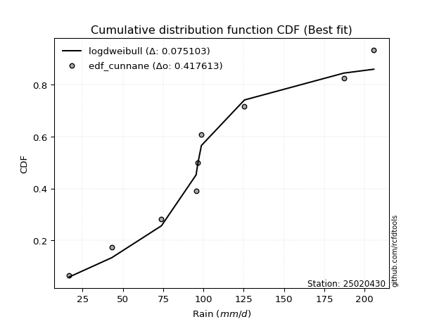</img>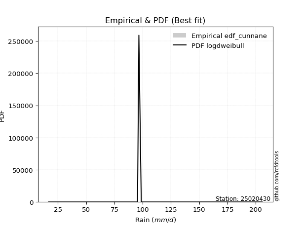</img>

</div>


### 12. Empirical - EDF Adamowski (1981)

The Adamowski formula in hydrology refers to a specific plotting position formula used for estimating the non-parametric empirical distribution of hydrological events (like flood peaks) to calculate their return periods. This formula provides an alternative to traditional parametric methods (like the Gumbel or Log Pearson Type III distributions). 

<div align="center">


$P=(m-0.25)/(n+0.5)$


</div>


**12.1. Empirical values**

<div align="center">

|                | 0                   | 1                   | 2                  | 3                   | 4             | 5                  | 6                  | 7                  | 8                  |
|:---------------|:--------------------|:--------------------|:-------------------|:--------------------|:--------------|:-------------------|:-------------------|:-------------------|:-------------------|
| date           | 2022                | 2025                | 2019               | 2020                | 2024          | 2021               | 2023               | 2017               | 2018               |
| x              | 16.7                | 37.9                | 43.1               | 73.9                | 95.4          | 96.6               | 125.4              | 187.1              | 205.7              |
| m              | 1                   | 2                   | 3                  | 4                   | 5             | 6                  | 7                  | 8                  | 9                  |
| empirical_dist | edf_adamowski       | edf_adamowski       | edf_adamowski      | edf_adamowski       | edf_adamowski | edf_adamowski      | edf_adamowski      | edf_adamowski      | edf_adamowski      |
| empirical      | 0.07894736842105263 | 0.18421052631578946 | 0.2894736842105263 | 0.39473684210526316 | 0.5           | 0.6052631578947368 | 0.7105263157894737 | 0.8157894736842105 | 0.9210526315789473 |
| empirical_tr   | 1.0857142857142856  | 1.2258064516129032  | 1.4074074074074074 | 1.6521739130434783  | 2.0           | 2.533333333333333  | 3.4545454545454546 | 5.428571428571428  | 12.666666666666663 |

</div>


**12.2. Kolmogorov-Smirnov fit test (sorted by Δ)**


<div align="center">

|                | 0                   | 1                   | 2                   | 3                   | 4                   | 5                   | 6                   | 7                   | 8                   | 9                   | 10                  | 11                  | 12                  | 13                  | 14                  | 15                  | 16                    | 17                  | 18                  | 19                  | 20                  | 21                  | 22                  | 23                  | 24                  | 25                  | 26                  | 27                  | 28                  | 29                  | 30                  | 31                  | 32                  | 33                  | 34                  | 35                  | 36                  | 37                  | 38                  | 39                  | 40                  | 41                  | 42                  | 43                  | 44                  | 45                  | 46                  | 47                  | 48                  | 49                  | 50                  | 51                  | 52                  | 53                  | 54                  | 55                  | 56                  | 57                  | 58                  | 59                  | 60                  | 61                  | 62                  | 63                  | 64                  | 65                  | 66                  | 67                  | 68                  | 69                  | 70                  | 71                  | 72                  | 73                  | 74                  | 75                  | 76                  | 77                  | 78                  | 79                  | 80                  | 81                  | 82                  | 83                  | 84                  | 85                  | 86                  | 87                  | 88                  | 89                  |
|:---------------|:--------------------|:--------------------|:--------------------|:--------------------|:--------------------|:--------------------|:--------------------|:--------------------|:--------------------|:--------------------|:--------------------|:--------------------|:--------------------|:--------------------|:--------------------|:--------------------|:----------------------|:--------------------|:--------------------|:--------------------|:--------------------|:--------------------|:--------------------|:--------------------|:--------------------|:--------------------|:--------------------|:--------------------|:--------------------|:--------------------|:--------------------|:--------------------|:--------------------|:--------------------|:--------------------|:--------------------|:--------------------|:--------------------|:--------------------|:--------------------|:--------------------|:--------------------|:--------------------|:--------------------|:--------------------|:--------------------|:--------------------|:--------------------|:--------------------|:--------------------|:--------------------|:--------------------|:--------------------|:--------------------|:--------------------|:--------------------|:--------------------|:--------------------|:--------------------|:--------------------|:--------------------|:--------------------|:--------------------|:--------------------|:--------------------|:--------------------|:--------------------|:--------------------|:--------------------|:--------------------|:--------------------|:--------------------|:--------------------|:--------------------|:--------------------|:--------------------|:--------------------|:--------------------|:--------------------|:--------------------|:--------------------|:--------------------|:--------------------|:--------------------|:--------------------|:--------------------|:--------------------|:--------------------|:--------------------|:--------------------|
| station        | 25020430            | 25020430            | 25020430            | 25020430            | 25020430            | 25020430            | 25020430            | 25020430            | 25020430            | 25020430            | 25020430            | 25020430            | 25020430            | 25020430            | 25020430            | 25020430            | 25020430              | 25020430            | 25020430            | 25020430            | 25020430            | 25020430            | 25020430            | 25020430            | 25020430            | 25020430            | 25020430            | 25020430            | 25020430            | 25020430            | 25020430            | 25020430            | 25020430            | 25020430            | 25020430            | 25020430            | 25020430            | 25020430            | 25020430            | 25020430            | 25020430            | 25020430            | 25020430            | 25020430            | 25020430            | 25020430            | 25020430            | 25020430            | 25020430            | 25020430            | 25020430            | 25020430            | 25020430            | 25020430            | 25020430            | 25020430            | 25020430            | 25020430            | 25020430            | 25020430            | 25020430            | 25020430            | 25020430            | 25020430            | 25020430            | 25020430            | 25020430            | 25020430            | 25020430            | 25020430            | 25020430            | 25020430            | 25020430            | 25020430            | 25020430            | 25020430            | 25020430            | 25020430            | 25020430            | 25020430            | 25020430            | 25020430            | 25020430            | 25020430            | 25020430            | 25020430            | 25020430            | 25020430            | 25020430            | 25020430            |
| empirical_dist | edf_adamowski       | edf_adamowski       | edf_adamowski       | edf_adamowski       | edf_adamowski       | edf_adamowski       | edf_adamowski       | edf_adamowski       | edf_adamowski       | edf_adamowski       | edf_adamowski       | edf_adamowski       | edf_adamowski       | edf_adamowski       | edf_adamowski       | edf_adamowski       | edf_adamowski         | edf_adamowski       | edf_adamowski       | edf_adamowski       | edf_adamowski       | edf_adamowski       | edf_adamowski       | edf_adamowski       | edf_adamowski       | edf_adamowski       | edf_adamowski       | edf_adamowski       | edf_adamowski       | edf_adamowski       | edf_adamowski       | edf_adamowski       | edf_adamowski       | edf_adamowski       | edf_adamowski       | edf_adamowski       | edf_adamowski       | edf_adamowski       | edf_adamowski       | edf_adamowski       | edf_adamowski       | edf_adamowski       | edf_adamowski       | edf_adamowski       | edf_adamowski       | edf_adamowski       | edf_adamowski       | edf_adamowski       | edf_adamowski       | edf_adamowski       | edf_adamowski       | edf_adamowski       | edf_adamowski       | edf_adamowski       | edf_adamowski       | edf_adamowski       | edf_adamowski       | edf_adamowski       | edf_adamowski       | edf_adamowski       | edf_adamowski       | edf_adamowski       | edf_adamowski       | edf_adamowski       | edf_adamowski       | edf_adamowski       | edf_adamowski       | edf_adamowski       | edf_adamowski       | edf_adamowski       | edf_adamowski       | edf_adamowski       | edf_adamowski       | edf_adamowski       | edf_adamowski       | edf_adamowski       | edf_adamowski       | edf_adamowski       | edf_adamowski       | edf_adamowski       | edf_adamowski       | edf_adamowski       | edf_adamowski       | edf_adamowski       | edf_adamowski       | edf_adamowski       | edf_adamowski       | edf_adamowski       | edf_adamowski       | edf_adamowski       |
| p_dist         | logpearson3         | ncf                 | loggompertz         | invgauss            | halfnorm            | betaprime           | genexpon            | logweibull_min      | mielke              | johnsonsu           | gompertz            | logfisk             | logloggamma         | rayleigh            | logjohnsonsu        | maxwell             | loglaplace_asymmetric | invgamma            | pearson3            | fisk                | loggumbel_l         | invweibull          | genlogistic         | kstwobign           | nct                 | logf                | logexponnorm        | logt                | lognorm             | lognorm             | logcrystalball      | lognct              | norm                | crystalball         | truncnorm           | t                   | logfatiguelife      | gumbel_r            | logrice             | logerlang           | halflogistic        | loggamma            | loggamma            | expon               | logbetaprime        | exponnorm           | logistic            | rice                | laplace_asymmetric  | loginvgamma         | loglogistic         | logncf              | logmielke           | loginvgauss         | logalpha            | hypsecant           | moyal               | loginvweibull       | f                   | logmaxwell          | loghypsecant        | lograyleigh         | laplace             | logkstwobign        | loggenexpon         | loglaplace          | loghalfnorm         | loggumbel_r         | alpha               | logtruncnorm        | gumbel_l            | loghalflogistic     | logmoyal            | erlang              | logexpon            | chi2                | logwald             | wald                | gibrat              | loggibrat           | weibull_min         | loglognorm          | logchi2             | pareto              | nakagami            | logpareto           | lognakagami         | fatiguelife         | gamma               | loggenlogistic      |
| delta          | 0.08071690836107481 | 0.083764154125049   | 0.084019391656184   | 0.08841610987764242 | 0.08938928601652485 | 0.09016991388272638 | 0.09268202245625914 | 0.0927088923085731  | 0.09291189167136665 | 0.09336788763239479 | 0.09380237995308316 | 0.09387013307866485 | 0.09524341560740746 | 0.09561543450683518 | 0.09792236877027449 | 0.098714972019874   | 0.09991771722656087   | 0.10049747864258493 | 0.10101664363933882 | 0.10119235730593948 | 0.10340740975414309 | 0.1038528866636085  | 0.10486776840581302 | 0.10577954886935545 | 0.1108727583379015  | 0.11329015880491933 | 0.11361957533195555 | 0.1136208666928219  | 0.11362102599856982 | 0.11362102599856982 | 0.11362122537249975 | 0.11363476567743369 | 0.1141901945356561  | 0.11419020217105597 | 0.11419020410311342 | 0.11428543961245796 | 0.11432477920724882 | 0.11763409150876553 | 0.11902259385886504 | 0.11905311094064908 | 0.11928072378765825 | 0.11954998813030715 | 0.11954998813030715 | 0.12026602880495574 | 0.1228309069723893  | 0.12358189731177793 | 0.12381867921672557 | 0.12398871442780557 | 0.12599039203260678 | 0.1276138119212098  | 0.12802878342471724 | 0.12817154607103376 | 0.1286461955991156  | 0.1299846379296128  | 0.13090526322164053 | 0.13557641449982757 | 0.13560206765913335 | 0.1365307971153551  | 0.13714980430745072 | 0.1389077711207819  | 0.1396738076016184  | 0.14668699079579328 | 0.1477270249136808  | 0.16232456228183112 | 0.16514586328642067 | 0.16763735493069565 | 0.16892938261160417 | 0.17862989722940648 | 0.18213232265048673 | 0.1842105262700736  | 0.18477238008855268 | 0.19730137095512312 | 0.2006397921829306  | 0.22552108590173492 | 0.23218806257978666 | 0.23600604280370985 | 0.26217297753308855 | 0.28320733065089615 | 0.2894736842105263  | 0.29418386329932267 | 0.33669595281143694 | 0.431372568348972   | 0.4320878214883185  | 0.4375976990848115  | 0.4611791299318996  | 0.4627519294014646  | 0.48906813722898823 | 0.5244654173777229  | 0.5564016318327794  | 0.8157894736842105  |
| deltao         | 0.41761268023100007 | 0.41761268023100007 | 0.41761268023100007 | 0.41761268023100007 | 0.41761268023100007 | 0.41761268023100007 | 0.41761268023100007 | 0.41761268023100007 | 0.41761268023100007 | 0.41761268023100007 | 0.41761268023100007 | 0.41761268023100007 | 0.41761268023100007 | 0.41761268023100007 | 0.41761268023100007 | 0.41761268023100007 | 0.41761268023100007   | 0.41761268023100007 | 0.41761268023100007 | 0.41761268023100007 | 0.41761268023100007 | 0.41761268023100007 | 0.41761268023100007 | 0.41761268023100007 | 0.41761268023100007 | 0.41761268023100007 | 0.41761268023100007 | 0.41761268023100007 | 0.41761268023100007 | 0.41761268023100007 | 0.41761268023100007 | 0.41761268023100007 | 0.41761268023100007 | 0.41761268023100007 | 0.41761268023100007 | 0.41761268023100007 | 0.41761268023100007 | 0.41761268023100007 | 0.41761268023100007 | 0.41761268023100007 | 0.41761268023100007 | 0.41761268023100007 | 0.41761268023100007 | 0.41761268023100007 | 0.41761268023100007 | 0.41761268023100007 | 0.41761268023100007 | 0.41761268023100007 | 0.41761268023100007 | 0.41761268023100007 | 0.41761268023100007 | 0.41761268023100007 | 0.41761268023100007 | 0.41761268023100007 | 0.41761268023100007 | 0.41761268023100007 | 0.41761268023100007 | 0.41761268023100007 | 0.41761268023100007 | 0.41761268023100007 | 0.41761268023100007 | 0.41761268023100007 | 0.41761268023100007 | 0.41761268023100007 | 0.41761268023100007 | 0.41761268023100007 | 0.41761268023100007 | 0.41761268023100007 | 0.41761268023100007 | 0.41761268023100007 | 0.41761268023100007 | 0.41761268023100007 | 0.41761268023100007 | 0.41761268023100007 | 0.41761268023100007 | 0.41761268023100007 | 0.41761268023100007 | 0.41761268023100007 | 0.41761268023100007 | 0.41761268023100007 | 0.41761268023100007 | 0.41761268023100007 | 0.41761268023100007 | 0.41761268023100007 | 0.41761268023100007 | 0.41761268023100007 | 0.41761268023100007 | 0.41761268023100007 | 0.41761268023100007 | 0.41761268023100007 |
| eval           | Δo > Δ              | Δo > Δ              | Δo > Δ              | Δo > Δ              | Δo > Δ              | Δo > Δ              | Δo > Δ              | Δo > Δ              | Δo > Δ              | Δo > Δ              | Δo > Δ              | Δo > Δ              | Δo > Δ              | Δo > Δ              | Δo > Δ              | Δo > Δ              | Δo > Δ                | Δo > Δ              | Δo > Δ              | Δo > Δ              | Δo > Δ              | Δo > Δ              | Δo > Δ              | Δo > Δ              | Δo > Δ              | Δo > Δ              | Δo > Δ              | Δo > Δ              | Δo > Δ              | Δo > Δ              | Δo > Δ              | Δo > Δ              | Δo > Δ              | Δo > Δ              | Δo > Δ              | Δo > Δ              | Δo > Δ              | Δo > Δ              | Δo > Δ              | Δo > Δ              | Δo > Δ              | Δo > Δ              | Δo > Δ              | Δo > Δ              | Δo > Δ              | Δo > Δ              | Δo > Δ              | Δo > Δ              | Δo > Δ              | Δo > Δ              | Δo > Δ              | Δo > Δ              | Δo > Δ              | Δo > Δ              | Δo > Δ              | Δo > Δ              | Δo > Δ              | Δo > Δ              | Δo > Δ              | Δo > Δ              | Δo > Δ              | Δo > Δ              | Δo > Δ              | Δo > Δ              | Δo > Δ              | Δo > Δ              | Δo > Δ              | Δo > Δ              | Δo > Δ              | Δo > Δ              | Δo > Δ              | Δo > Δ              | Δo > Δ              | Δo > Δ              | Δo > Δ              | Δo > Δ              | Δo > Δ              | Δo > Δ              | Δo > Δ              | Δo > Δ              | Δo > Δ              | Δo <= Δ             | Δo <= Δ             | Δo <= Δ             | Δo <= Δ             | Δo <= Δ             | Δo <= Δ             | Δo <= Δ             | Δo <= Δ             | Δo <= Δ             |
| fit            | 1                   | 1                   | 1                   | 1                   | 1                   | 1                   | 1                   | 1                   | 1                   | 1                   | 1                   | 1                   | 1                   | 1                   | 1                   | 1                   | 1                     | 1                   | 1                   | 1                   | 1                   | 1                   | 1                   | 1                   | 1                   | 1                   | 1                   | 1                   | 1                   | 1                   | 1                   | 1                   | 1                   | 1                   | 1                   | 1                   | 1                   | 1                   | 1                   | 1                   | 1                   | 1                   | 1                   | 1                   | 1                   | 1                   | 1                   | 1                   | 1                   | 1                   | 1                   | 1                   | 1                   | 1                   | 1                   | 1                   | 1                   | 1                   | 1                   | 1                   | 1                   | 1                   | 1                   | 1                   | 1                   | 1                   | 1                   | 1                   | 1                   | 1                   | 1                   | 1                   | 1                   | 1                   | 1                   | 1                   | 1                   | 1                   | 1                   | 1                   | 1                   | 0                   | 0                   | 0                   | 0                   | 0                   | 0                   | 0                   | 0                   | 0                   |
| n              | 9                   | 9                   | 9                   | 9                   | 9                   | 9                   | 9                   | 9                   | 9                   | 9                   | 9                   | 9                   | 9                   | 9                   | 9                   | 9                   | 9                     | 9                   | 9                   | 9                   | 9                   | 9                   | 9                   | 9                   | 9                   | 9                   | 9                   | 9                   | 9                   | 9                   | 9                   | 9                   | 9                   | 9                   | 9                   | 9                   | 9                   | 9                   | 9                   | 9                   | 9                   | 9                   | 9                   | 9                   | 9                   | 9                   | 9                   | 9                   | 9                   | 9                   | 9                   | 9                   | 9                   | 9                   | 9                   | 9                   | 9                   | 9                   | 9                   | 9                   | 9                   | 9                   | 9                   | 9                   | 9                   | 9                   | 9                   | 9                   | 9                   | 9                   | 9                   | 9                   | 9                   | 9                   | 9                   | 9                   | 9                   | 9                   | 9                   | 9                   | 9                   | 9                   | 9                   | 9                   | 9                   | 9                   | 9                   | 9                   | 9                   | 9                   |
| best_fit       | 1                   | 0                   | 0                   | 0                   | 0                   | 0                   | 0                   | 0                   | 0                   | 0                   | 0                   | 0                   | 0                   | 0                   | 0                   | 0                   | 0                     | 0                   | 0                   | 0                   | 0                   | 0                   | 0                   | 0                   | 0                   | 0                   | 0                   | 0                   | 0                   | 0                   | 0                   | 0                   | 0                   | 0                   | 0                   | 0                   | 0                   | 0                   | 0                   | 0                   | 0                   | 0                   | 0                   | 0                   | 0                   | 0                   | 0                   | 0                   | 0                   | 0                   | 0                   | 0                   | 0                   | 0                   | 0                   | 0                   | 0                   | 0                   | 0                   | 0                   | 0                   | 0                   | 0                   | 0                   | 0                   | 0                   | 0                   | 0                   | 0                   | 0                   | 0                   | 0                   | 0                   | 0                   | 0                   | 0                   | 0                   | 0                   | 0                   | 0                   | 0                   | 0                   | 0                   | 0                   | 0                   | 0                   | 0                   | 0                   | 0                   | 0                   |
| best_fit_sort  | 1                   | 2                   | 3                   | 4                   | 5                   | 6                   | 7                   | 8                   | 9                   | 10                  | 11                  | 12                  | 13                  | 14                  | 15                  | 16                  | 17                    | 18                  | 19                  | 20                  | 21                  | 22                  | 23                  | 24                  | 25                  | 26                  | 27                  | 28                  | 29                  | 30                  | 31                  | 32                  | 33                  | 34                  | 35                  | 36                  | 37                  | 38                  | 39                  | 40                  | 41                  | 42                  | 43                  | 44                  | 45                  | 46                  | 47                  | 48                  | 49                  | 50                  | 51                  | 52                  | 53                  | 54                  | 55                  | 56                  | 57                  | 58                  | 59                  | 60                  | 61                  | 62                  | 63                  | 64                  | 65                  | 66                  | 67                  | 68                  | 69                  | 70                  | 71                  | 72                  | 73                  | 74                  | 75                  | 76                  | 77                  | 78                  | 79                  | 80                  | 81                  | 82                  | 83                  | 84                  | 85                  | 86                  | 87                  | 88                  | 89                  | 90                  |

</div>


<div align="center">

</img>

</div>


**12.3. Best fit**

<div align="center">

|   id |   station | empirical_dist   | p_dist      |     delta |   deltao | eval   |   fit |   n |   best_fit |   best_fit_sort |
|-----:|----------:|:-----------------|:------------|----------:|---------:|:-------|------:|----:|-----------:|----------------:|
|    0 |  25020430 | edf_adamowski    | logpearson3 | 0.0807169 | 0.417613 | Δo > Δ |     1 |   9 |          1 |               1 |

</div>


<div align="center">

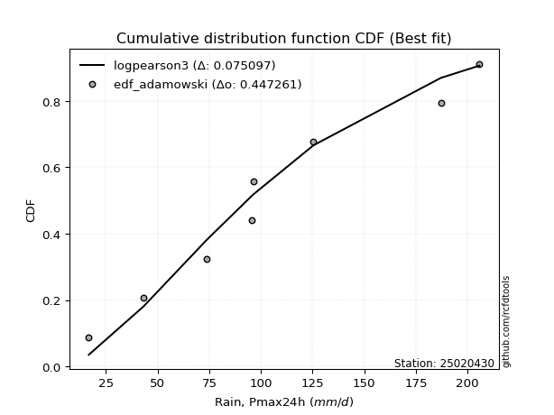</img>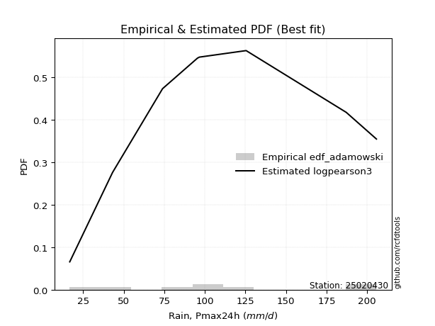</img>

</div>


## C. Best fit & Estimate extreme values for specific return periods - Tr


### 1. Best fit (ordered by delta Δ)

<div align="center">

|   id |   station | empirical_dist   | p_dist      |     delta |   deltao | eval   |   fit |   n |   best_fit |   best_fit_sort |
|-----:|----------:|:-----------------|:------------|----------:|---------:|:-------|------:|----:|-----------:|----------------:|
|    0 |  25020430 | edf_hazen        | ncf         | 0.0716686 | 0.417613 | Δo > Δ |     1 |   9 |          1 |               1 |
|    1 |  25020430 | edf_gringorten   | ncf         | 0.0745926 | 0.417613 | Δo > Δ |     1 |   9 |          1 |               2 |
|    2 |  25020430 | edf_cunnane      | ncf         | 0.0764996 | 0.417613 | Δo > Δ |     1 |   9 |          1 |               3 |
|    3 |  25020430 | edf_blom         | ncf         | 0.0776747 | 0.417613 | Δo > Δ |     1 |   9 |          1 |               4 |
|    4 |  25020430 | edf_tukey        | ncf         | 0.0796052 | 0.417613 | Δo > Δ |     1 |   9 |          1 |               5 |
|    5 |  25020430 | edf_filliben     | ncf         | 0.0803297 | 0.417613 | Δo > Δ |     1 |   9 |          1 |               6 |
|    6 |  25020430 | edf_beard        | ncf         | 0.0806713 | 0.417613 | Δo > Δ |     1 |   9 |          1 |               7 |
|    7 |  25020430 | edf_jenkinson    | ncf         | 0.0806713 | 0.417613 | Δo > Δ |     1 |   9 |          1 |               8 |
|    8 |  25020430 | edf_chegodayev   | logpearson3 | 0.0807169 | 0.417613 | Δo > Δ |     1 |   9 |          1 |               9 |
|    9 |  25020430 | edf_adamowski    | logpearson3 | 0.0807169 | 0.417613 | Δo > Δ |     1 |   9 |          1 |              10 |
|   10 |  25020430 | edf_california   | logmielke   | 0.0891688 | 0.417613 | Δo > Δ |     1 |   9 |          1 |              11 |
|   11 |  25020430 | edf_weibull      | logpearson3 | 0.0909147 | 0.417613 | Δo > Δ |     1 |   9 |          1 |              12 |

</div>

:file_folder:Tables: [bestfit_25020430.csv](table/bestfit_25020430.csv) | [extreme_25020430.csv](table/extreme_25020430.csv)


### 2. Extreme values

In hydrology, a return period (or recurrence interval $Tr$) is the statistical average time between extreme events like floods or droughts of a specific magnitude, indicating how rare an event is, with a 100-year flood, for example, having a 1% chance of occurring in any given year, not that it happens exactly every century. It is a key tool for infrastructure design (like bridges or dams) and risk assessment, calculated from historical data to determine the probability of future events, although it is important to remember it is statistical average, and events can cluster or be missed.

> risk_rate: assuming the return period as the project useful life.

|   id |      tr |   prob_l |     prob_g |      alpha |   betaprime |     chi2 |   crystalball |   erlang |    expon |   exponnorm |        f |   fatiguelife |      fisk |    gamma |   genexpon |   genlogistic |   gibrat |   gompertz |   gumbel_l |   gumbel_r |   halflogistic |   halfnorm |   hypsecant |   invgamma |   invgauss |   invweibull |   johnsonsu |   kstwobign |   laplace |   laplace_asymmetric |   loggamma |   logistic |   lognorm |   maxwell |   mielke |    moyal |   nakagami |      ncf |      nct |     norm |           pareto |   pearson3 |   rayleigh |     rice |        t |   truncnorm |     wald |   weibull_min |   logalpha |   logbetaprime |     logchi2 |   logcrystalball |   logerlang |    logexpon |   logexponnorm |     logf |   logfatiguelife |   logfisk |   loggenexpon |   loggenlogistic |   loggibrat |   loggompertz |   loggumbel_l |   loggumbel_r |   loghalflogistic |   loghalfnorm |   loghypsecant |   loginvgamma |   loginvgauss |   loginvweibull |   logjohnsonsu |   logkstwobign |   loglaplace |   loglaplace_asymmetric |   logloggamma |   loglogistic |     loglognorm |   logmaxwell |   logmielke |   logmoyal |   lognakagami |    logncf |   lognct |     logpareto |   logpearson3 |   lograyleigh |   logrice |     logt |   logtruncnorm |    logwald |   logweibull_min |   station |   n |   risk_rate |
|-----:|--------:|---------:|-----------:|-----------:|------------:|---------:|--------------:|---------:|---------:|------------:|---------:|--------------:|----------:|---------:|-----------:|--------------:|---------:|-----------:|-----------:|-----------:|---------------:|-----------:|------------:|-----------:|-----------:|-------------:|------------:|------------:|----------:|---------------------:|-----------:|-----------:|----------:|----------:|---------:|---------:|-----------:|---------:|---------:|---------:|-----------------:|-----------:|-----------:|---------:|---------:|------------:|---------:|--------------:|-----------:|---------------:|------------:|-----------------:|------------:|------------:|---------------:|---------:|-----------------:|----------:|--------------:|-----------------:|------------:|--------------:|--------------:|--------------:|------------------:|--------------:|---------------:|--------------:|--------------:|----------------:|---------------:|---------------:|-------------:|------------------------:|--------------:|--------------:|---------------:|-------------:|------------:|-----------:|--------------:|----------:|---------:|--------------:|--------------:|--------------:|----------:|---------:|---------------:|-----------:|-----------------:|----------:|----:|------------:|
|    0 |    2    | 0.5      | 0.5        |    61.1149 |     83.8393 |  54.463  |       97.9778 |  53.7364 |  73.0375 |     72.4859 |  67.4155 |       16.7073 |   83.0348 |  19.8626 |    86.4217 |       86.8768 |  79.4975 |    87.8434 |    108.092 |    87.8633 |        82.835  |    85.3751 |     97.9778 |    84.6227 |    82.087  |      86.0017 |     82.8955 |     87.6415 |   97.9778 |              96.7055 |    75.0207 |    97.9778 |   76.4933 |   92.7122 |   92.785 |  84.5981 |    24.5153 |  84.6526 |  87.1171 |  97.9778 |     18.9709      |    92.8891 |    90.8447 |  93.5861 |  97.9924 |     97.9778 |  78.0204 |       33.1006 |    72.8193 |        74.6116 |     27.73   |          76.4932 |     75.0316 |     47.9537 |        76.4935 |  76.4723 |          76.4176 |   80.9734 |       63.9068 |          inf     |     60.8025 |       81.9621 |       86.7354 |       67.4606 |           63.3757 |       65.4072 |        76.4933 |       73.6763 |       72.6565 |         68.6775 |        90.7311 |        64.2879 |      76.4933 |                 85.0062 |       92.2319 |       76.4933 |  17.2072       |      71.6494 |     12.7906 |    64.7787 |       38.7449 |   73.5425 |  76.4863 |  17.5669      |       82.0637 |       70.0065 |   75.1856 |  76.4933 |        69.7447 |    59.6953 |          87.3254 |  25020430 |   9 |    0.75     |
|    1 |    2.33 | 0.570815 | 0.429185   |    72.7397 |     94.8727 |  64.1639 |      108.964  |  64.7472 |  85.4503 |     84.812  |  82.6526 |       18.9486 |   93.6185 |  22.5607 |    97.7074 |       97.2939 |  85.0629 |    99.8672 |    117.651 |    98.0437 |        93.3019 |    97.2325 |    106.77   |    95.1805 |    92.9642 |      96.4294 |     93.6482 |     98.3926 |  104.626  |             104.418  |    86.3415 |   107.658  |   87.6803 |  104.127  |  104.326 |  94.235  |    29.7927 |  96.0999 |  97.0544 | 108.964  |     24.4129      |   103.906  |   102.428  | 104.391  | 108.978  |    108.964  |  85.2245 |       55.2543 |    84.0198 |        85.8061 |     33.0603 |          87.6803 |     86.4023 |     60.5002 |        87.6806 |  87.7046 |          87.5693 |   91.9551 |       75.9485 |          inf     |     65.155  |       93.4976 |       97.6719 |       76.5559 |           72.1766 |       75.7883 |        85.3226 |       84.831  |       84.0169 |         81.3813 |       102.599  |        76.5298 |      83.0799 |                 93.2682 |      104.179  |       86.2684 |  20.8777       |      82.5656 |     12.7906 |    73.0178 |       39.7608 |   84.6694 |  87.6757 |  19.8333      |       93.6637 |       80.8416 |   86.4889 |  87.6803 |        79.1041 |    65.2845 |          98.7043 |  25020430 |   9 |    0.729209 |
|    2 |    5    | 0.8      | 0.2        |   162.88   |    144.612  | 114.837  |      149.794  | 125.06   | 147.512  |    146.439  | 166.528  |       66.4084 |  146.514  |  49.1918 |   146.962  |      142.543  | 117.104  |   148.837  |    148.53  |   142.272  |       140.663  |   147.376  |    142.039  |   143.118  |   143.487  |     142.549  |    143.522  |    144.061  |  137.868  |             142.978  |   146.955  |   145.033  |  145.612  |  149.052  |  150.023 | 138.874  |    67.6199 | 146.632  | 141.075  | 149.794  |   3457.57        |   147.753  |   148.8    | 147.65   | 149.804  |    149.794  | 125.553  |      626.67   |   146.349  |       145.504  |     91.6447 |         145.612  |    147.241  |    193.377  |       145.613  | 146.069  |         145.364  |  150.259  |      152.462  |          inf     |     97.0103 |      145.348  |      143.345  |      132.621  |          129.995  |      141.303  |       132.239  |      145.317  |      147.742  |        170.12   |       149.503  |       160.47   |     125.56   |                133.456  |      150.765  |      137.251  |   1.89136e+171 |     144.278  |     12.7906 |   127.14   |       53.9811 |  146.358  | 145.628  |   3.94147e+34 |      147.333  |      143.825  |  146.254  | 145.612  |       143.087  |   107.747  |         146.738  |  25020430 |   9 |    0.67232  |
|    3 |   10    | 0.9      | 0.1        |   328.49   |    186.2    | 162.555  |      176.879  | 184.052  | 203.849  |    202.383  | 249.001  |      131.938  |  201.479  |  87.5023 |   186.506  |      179.393  | 153.628  |   182.743  |    165.722 |   178.295  |       179.994  |   184.481  |    170.203  |   184.637  |   187.281  |     181.112  |    187.381  |    178.831  |  168.043  |             177.981  |   210.869  |   172.559  |  203.862  |  180.669  |  185.494 | 177.74   |   105.555  | 187.352  | 179.392  | 176.879  | 873616           |   179.428  |   181.865  | 178.494  | 176.886  |    176.879  | 168.351  |     2854.54   |   216.097  |       208.123  |    259.686  |         203.862  |    211.3    |    555.278  |       203.863  | 205.033  |         203.56   |  215.726  |      251.425  |          inf     |    152.711  |      187.211  |      177.477  |      207.48   |          211.902  |      224.053  |       187.636  |      210.369  |      219.64   |        310.154  |       181.234  |       281.985  |     182.669  |                184.409  |      182.386  |      193.211  | inf            |     213.692  |     12.7906 |   206.055  |       80.8536 |  215.001  | 203.907  | inf           |      192.667  |      216.887  |  207.86   | 203.863  |       234.46   |   183.368  |         183.085  |  25020430 |   9 |    0.651322 |
|    4 |   15    | 0.933333 | 0.0666667  |   493.509  |    209.86   | 190.897  |      190.395  | 219.629  | 236.804  |    235.108  | 298.896  |      174.796  |  238.985  | 113.985  |   208.475  |      200.182  | 178.82   |   199.551  |    173.508 |   198.619  |       202.252  |   203.79   |    186.275  |   209.109  |   212.65   |     203.275  |    213.285  |    197.29   |  185.695  |             198.457  |   253.138  |   187.557  |  241.137  |  196.891  |  206.2   | 200.296  |   126.698  | 209.892  | 202.496  | 190.395  |      2.22812e+07 |   196.025  |   198.901  | 194.386  | 190.401  |    190.395  | 195.833  |     5710.01   |   264.307  |       249.393  |    491.906  |         241.137  |    253.612  |   1029.16   |       241.138  | 242.886  |         240.843  |  262.71   |      325.569  |          inf     |    208.828  |      210.205  |      195.503  |      267.077  |          279.4    |      284.796  |       229.107  |      254.031  |      269.526  |        435.243  |       196.761  |       380.365  |     227.461  |                222.81   |      198.146  |      232.783  | inf            |     261.406  |     12.7906 |   272.7    |      102.884  |  262.244  | 241.204  | inf           |      218.237  |      268.01   |  247.879  | 241.137  |       308.024  |   257.994  |         202.412  |  25020430 |   9 |    0.644736 |
|    5 |   20    | 0.95     | 0.05       |   658.383  |    226.486  | 211.144  |      199.246  | 245.216  | 260.186  |    258.327  | 334.847  |      206.527  |  268.659  | 134.117  |   223.714  |      214.738  | 198.582  |   210.439  |    178.355 |   212.849  |       217.847  |   216.664  |    197.614  |   226.73   |   230.623  |     218.969  |    231.91   |    209.725  |  198.219  |             212.985  |   285.57   |   197.922  |  269.167  |  207.657  |  221.306 | 216.27   |   141.049  | 225.469  | 219.45   | 199.246  |      2.21796e+08 |   207.183  |   210.225  | 204.949  | 199.251  |    199.246  | 216.314  |     8798.44   |   302.352  |       280.995  |    781.394  |         269.167  |    286.049  |   1594.47   |       269.167  | 271.407  |         268.9    |  301.039  |      386.661  |          inf     |    266.935  |      225.995  |      207.636  |      318.725  |          339.129  |      334.191  |       263.764  |      287.846  |      308.958  |        551.779  |       206.732  |       465.325  |     265.754  |                254.814  |      208.43   |      264.776  | inf            |     298.816  |    188.922  |   332.564  |      121.522  |  299.419  | 269.253  | inf           |      236.026  |      308.494  |  278.23   | 269.167  |       371.497  |   332.745  |         215.467  |  25020430 |   9 |    0.641514 |
|    6 |   25    | 0.96     | 0.04       |   823.199  |    239.325  | 226.915  |      205.762  | 265.226  | 278.323  |    276.337  | 363      |      231.738  |  293.69   | 150.369  |   235.377  |      225.95   | 215.056  |   218.377  |    181.804 |   223.81   |       229.862  |   226.243  |    206.389  |   240.59   |   244.567  |     231.157  |    246.532  |    219.039  |  207.933  |             224.254  |   312.214  |   205.852  |  291.862  |  215.65   |  233.376 | 228.652  |   151.805  | 237.353  | 232.995  | 205.762  |      1.31849e+09 |   215.543  |   218.638  | 212.797  | 205.767  |    205.762  | 232.718  |    11970.8    |   334.266  |       306.919  |   1123.92   |         291.862  |    312.681  |   2239.2    |       291.863  | 294.532  |         291.63   |  334.095  |      439.403  |          inf     |    327.557  |      237.98   |      216.725  |      365.222  |          393.723  |      376.423  |       294.145  |      315.82   |      342.063  |        662.412  |       213.951  |       541.176  |     299.843  |                282.771  |      215.976  |      292.189  | inf            |     330.011  |    192.229  |   387.867  |      137.801  |  330.535  | 291.964  | inf           |      249.635  |      342.484  |  302.95   | 291.862  |       428.192  |   407.963  |         225.271  |  25020430 |   9 |    0.639603 |
|    7 |   50    | 0.98     | 0.02       |  1647.02   |    279.063  | 276.2    |      224.42   | 328.123  | 334.661  |    332.28   | 451.693  |      312.628  |  384.756  | 203.706  |   270.941  |      260.489  | 273.128  |   240.679  |    191.165 |   257.576  |       266.882  |   254.084  |    233.595  |   284.981  |   287.977  |     269.26   |    293.103  |    246.389  |  238.109  |             259.257  |   403.947  |   230.08   |  368.002  |  238.83   |  273.511 | 267.09   |   183.248  | 273.368  | 277.733  | 224.42   |      3.34749e+11 |   240.182  |   243.06   | 235.579  | 224.424  |    224.42   | 286.277  |    27628.1    |   448.449  |       395.952  |   3547.97   |         368.002  |    404.261  |   6429.82   |       368.003  | 372.307  |         367.966  |  459.317  |      637.151  |          inf     |    673.904  |      273.953  |      243.456  |      555.574  |          623.629  |      531.978  |       412.435  |      413.366  |      460.615  |       1163.07   |       233.958  |       843.182  |     436.223  |                390.73   |      237.444  |      394.808  | inf            |     440.148  |    198.978  |   625.285  |      199.463  |  441.403  | 368.165  | inf           |      290.931  |      463.882  |  386.724  | 368.003  |       654.665  |   793.608  |         254.213  |  25020430 |   9 |    0.63583  |
|    8 |   75    | 0.986667 | 0.0133333  |  2470.73   |    302.308  | 305.198  |      234.432  | 365.334  | 367.616  |    365.005  | 504.305  |      361.343  |  449.169  | 236.505  |   291.396  |      280.563  | 312.35   |   252.351  |    195.899 |   277.202  |       288.401  |   269.24   |    249.495  |   312.053  |   313.474  |     291.797  |    321.262  |    261.437  |  255.761  |             279.733  |   464.437  |   244.073  |  416.743  |  251.433  |  299.287 | 289.568  |   200.39   | 293.921  | 306.107  | 234.432  |      8.53777e+12 |   253.831  |   256.347  | 247.973  | 234.434  |    234.432  | 319.236  |    42180.5    |   527.2    |       454.498  |   7031.38   |         416.743  |    464.563  |  11917.2    |       416.745  | 422.236  |         416.891  |  552.023  |      780.078  |          inf     |   1097.01   |      294.238  |      258.205  |      708.981  |          814.765  |      642.193  |       502.505  |      478.652  |      542.393  |       1613.27   |       244.236  |      1076.16   |     543.187  |                472.096  |      248.866  |      469.771  | inf            |     514.752  |    201.268  |   826.721  |      244.159  |  517.482  | 416.948  | inf           |      314.431  |      547.134  |  440.947  | 416.744  |       830.428  |  1195.18   |         270.246  |  25020430 |   9 |    0.634587 |
|    9 |  100    | 0.99     | 0.01       |  3294.4    |    318.837  | 325.834  |      241.203  | 391.889  | 390.998  |    388.224  | 541.911  |      396.396  |  500.82   | 260.35   |   305.793  |      294.771  | 342.734  |   260.12   |    198.996 |   291.092  |       303.632  |   279.564  |    260.773  |   331.825  |   331.621  |     307.924  |    341.692  |    271.747  |  268.285  |             294.261  |   510.673  |   253.952  |  453.319  |  260.017  |  318.796 | 305.515  |   212.054  | 308.315  | 327.377  | 241.203  |      8.49887e+13 |   263.233  |   265.399  | 256.417  | 241.205  |    241.203  | 343.265  |    55632.2    |   589.152  |       499.173  |  11471.8    |         453.319  |    510.615  |  18463.1    |       453.321  | 459.769  |         453.633  |  628.534  |      895.48   |          inf     |   1600.06   |      308.337  |      268.331  |      842.523  |          984.487  |      730.082  |       578.085  |      529.031  |      606.701  |       2033.68   |       250.991  |      1271.97   |     634.634  |                539.906  |      256.549  |      531.119  | inf            |     572.683  |    202.42   |  1007.87   |      280.178  |  577.132  | 453.558  | inf           |      330.819  |      612.255  |  481.906  | 453.32   |       978.895  |  1610.97   |         281.282  |  25020430 |   9 |    0.633968 |
|   10 |  200    | 0.995    | 0.005      |  6589.04   |    358.879  | 375.731  |      256.563  | 456.304  | 447.335  |    444.168  | 633.344  |      482.198  |  649.44   | 319.409  |   340.185  |      328.929  | 425.396  |   277.35   |    205.726 |   324.486  |       340.25   |   303.178  |    287.943  |   381.591  |   375.555  |     347.301  |    392.568  |    295.494  |  298.46   |             329.265  |   634.335  |   277.651  |  548.629  |  279.656  |  370.582 | 343.937  |   238.657  | 342.459  | 383.033  | 256.563  |      2.15776e+16 |   285.078  |   286.11   | 275.738  | 256.564  |    256.563  | 403.12   |   101544      |   761.947  |       618.381  |  37759.6    |         548.629  |    633.617  |  53016.4    |       548.631  | 557.813  |         549.483  |  858.131  |     1228.16   |          inf     |   4468.05   |      341.423  |      291.733  |     1275.74   |         1551.59   |      978.991  |       810.194  |      665.639  |      785.844  |       3548.71   |       265.695  |      1869.33   |     923.288  |                746.037  |      273.849  |      712.951  | inf            |     730.936  |    204.158  |  1624.46   |      383.365  |  742.658  | 548.962  | inf           |      369.355  |      791.917  |  589.599  | 548.63   |      1435.9    |  3388.76   |         306.861  |  25020430 |   9 |    0.633042 |
|   11 |  250    | 0.996    | 0.004      |  8236.35   |    371.854  | 391.84   |      261.257  | 477.153  | 465.472  |    462.178  | 663.001  |      510.161  |  705.721  | 338.833  |   351.185  |      339.91   | 455.056  |   282.505  |    207.707 |   335.222  |       352.022  |   310.442  |    296.689  |   398.304  |   389.763  |     360.145  |    409.468  |    302.843  |  308.175  |             340.533  |   678.092  |   285.259  |  581.573  |  285.702  |  388.853 | 356.306  |   246.814  | 353.311  | 402.417  | 261.257  |      1.2827e+17  |   291.897  |   292.486  | 281.685  | 261.257  |    261.257  | 422.922  |   121213      |   825.462  |       660.475  |  55581.8    |         581.574  |    677.086  |  74453.8    |       581.575  | 591.778  |         582.649  |  948.346  |     1353.68   |          204.903 |   6458.6    |      351.834  |      299      |     1457.76   |         1795.93   |     1071.46   |       903.192  |      714.584  |      851.584  |       4244.26   |       270.012  |      2105.88   |    1041.72   |                827.889  |      279.099  |      783.63   | inf            |     787.949  |    204.507  |  1894.29   |      422.006  |  803.212  | 581.941  | inf           |      381.477  |      857.192  |  627.117  | 581.575  |      1618.44   |  4333.94   |         314.824  |  25020430 |   9 |    0.632858 |
|   12 |  500    | 0.998    | 0.002      | 16472.8    |    412.487  | 441.997  |      275.177  | 542.209  | 521.81   |    518.121  | 755.736  |      597.88   |  912.481  | 400.217  |   385.195  |      373.993  | 557.559  |   297.484  |    213.383 |   368.543  |       388.56   |   332.102  |    323.857  |   452.57   |   434.102  |     400.588  |    463.68   |    324.867  |  338.35   |             375.537  |   827.412  |   308.855  |  691.368  |  303.742  |  451.282 | 394.727  |   271.053  | 386.66   | 467.803  | 275.177  |      3.25663e+19 |   312.518  |   311.508  | 299.43   | 275.176  |    275.177  | 485.885  |   201369      |  1051.05   |       803.828  | 186191      |         691.368  |    825.237  | 213793      |       691.37   | 705.224  |         693.293  | 1293.02   |     1809.99   |          205.308 |  23076.1    |      383.516  |      320.849  |     2205.34   |         2827.66   |     1402.29   |      1265.8    |      883.798  |     1084.53   |       7397.15   |       282.316  |      3009.61   |    1515.53   |               1143.97   |      294.565  |     1050.57   | inf            |     985.903  |    205.207  |  3053.16   |      561.115  | 1017.17   | 691.858  | inf           |      418.264  |     1085.71   |  753.113  | 691.369  |      2323.06   |  9475.58   |         338.825  |  25020430 |   9 |    0.632489 |
|   13 |  750    | 0.998667 | 0.00133333 | 24709.3    |    436.517  | 471.409  |      282.909  | 580.444  | 554.765  |    550.846  | 810.375  |      649.709  | 1059.77   | 436.758  |   405.001  |      393.918  | 625.348  |   305.606  |    216.417 |   388.023  |       409.92   |   344.202  |    339.749  |   486.079  |   460.179  |     424.643  |    496.643  |    337.24   |  356.002  |             396.013  |   924.86   |   322.641  |  761.081  |  313.832  |  492.208 | 417.202  |   284.536  | 405.947  | 510.063  | 282.909  |      8.30603e+20 |   324.232  |   322.145  | 309.353  | 282.908  |    282.909  | 523.637  |   264127      |  1205.35   |       897.166  | 379485      |         761.081  |    921.775  | 396248      |       761.084  | 777.441  |         763.633  | 1549.76   |     2129.45   |          205.444 |  53567      |      401.626  |      333.174  |     2809.17   |         3687.01   |     1629.76   |      1542.1    |      995.926  |     1243.33   |      10235.4    |       288.827  |      3678.14   |    1887.15   |               1382.19   |      303.09   |     1246.82   | inf            |    1117.57   |    205.44   |  4036.58   |      657.289  | 1162.59   | 761.654  | inf           |      439.179  |     1239.1    |  833.807  | 761.083  |      2850.82   | 15145.9    |         352.401  |  25020430 |   9 |    0.632366 |
|   14 | 1000    | 0.999    | 0.001      | 32945.8    |    453.696  | 492.306  |      288.233  | 607.641  | 578.147  |    574.065  | 849.302  |      686.679  | 1178.21   | 462.927  |   419.023  |      408.052  | 677.223  |   311.116  |    218.459 |   401.841  |       425.072  |   352.558  |    351.025  |   510.699  |   478.742  |     441.894  |    520.613  |    345.811  |  368.526  |             410.54   |   998.87   |   332.417  |  813.123  |  320.805  |  523.435 | 433.148  |   293.823  | 419.546  | 542.034  | 288.233  |      8.26819e+21 |   332.405  |   329.496  | 316.21   | 288.231  |    288.233  | 550.792  |   317038      |  1326.12   |       967.952  | 630124      |         813.123  |    995.023  | 613901      |       813.126  | 831.439  |         816.183  | 1762.17   |     2382.69   |          205.511 | 102042      |      414.304  |      341.734  |     3335.28   |         4450.64   |     1808.05   |      1773.99   |     1081.92   |     1367.3    |      12887      |       293.175  |      4226.51   |    2204.85   |               1580.72   |      308.932  |     1407.84   | inf            |    1218.71   |    205.557  |  4920.97   |      732.866  | 1275.94   | 813.76   | inf           |      453.749  |     1357.58   |  894.366  | 813.125  |      3287.35   | 21223.4    |         361.845  |  25020430 |   9 |    0.632305 |

<div align="center">

</img>

</div>


<div align="center">

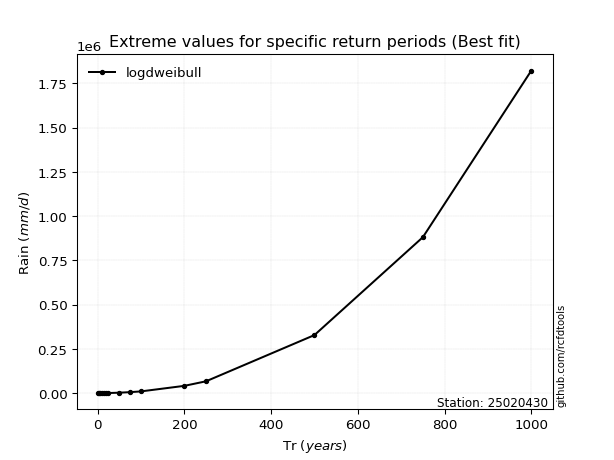</img>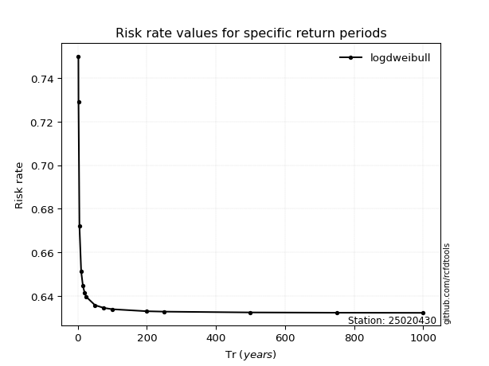</img>

</div>


<sub>**APP DISCLAIMER**: NO WARRANTY - This software is provided by [github.com/rcfdtools](https://github.com/rcfdtools) "as is", without any express or implied warranty, including warranties of merchantability, fitness for a particular purpose, or non-infringement. There is no guarantee that the software will be error-free or operate without interruption. LIMITATION OF LIABILITY - Neither the authors nor copyright holders will be liable for claims or damages arising from the software or its use. You are responsible for determining if the software is appropriate for your use and assume all associated risks, including errors, legal compliance, and data loss. NO PROFESSIONAL ADVICE - The software provides general information and does not offer professional advice. It should not replace consultation with professional advisors.</sub>